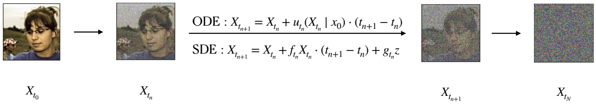
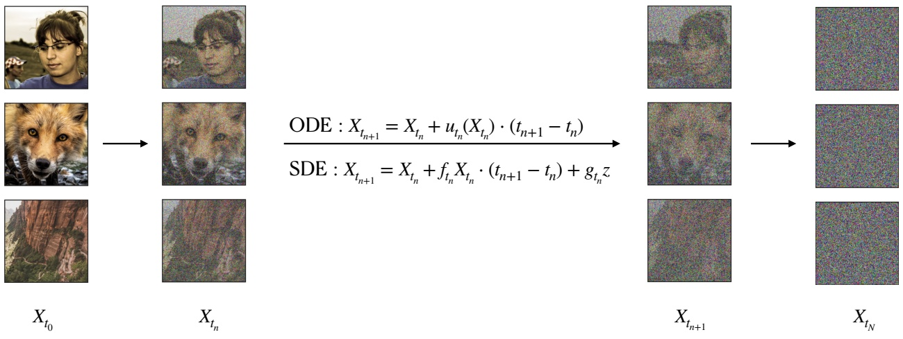
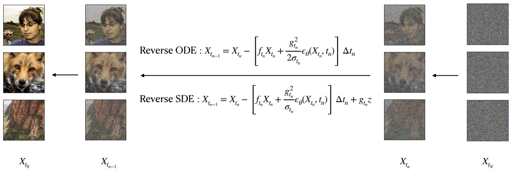
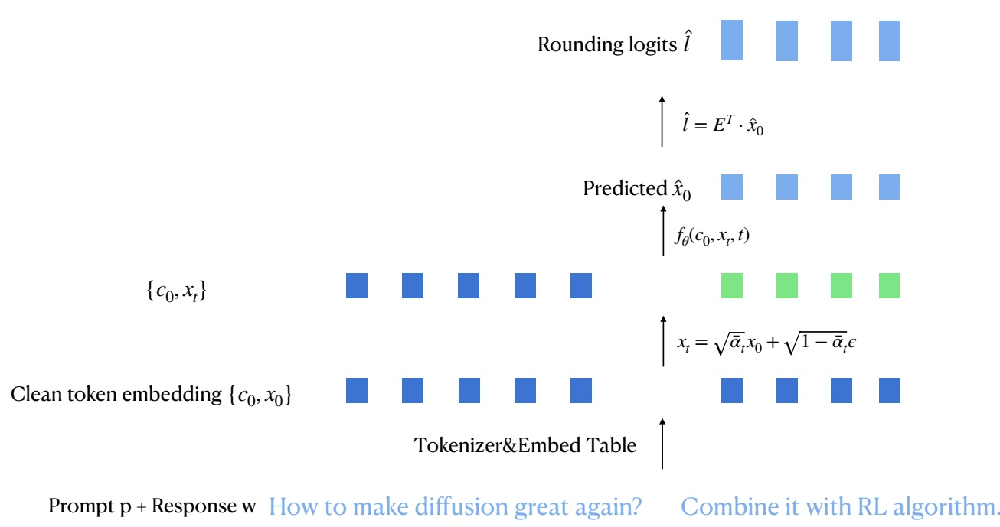
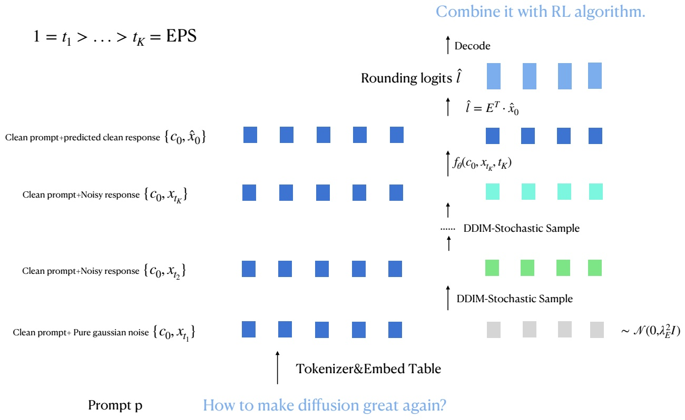

<!-- page: 1 -->

# A Tutorial on Diffusion Theory: From Differential Equations to Diffusion Models

Jiayi Fu, Yuxia Wang INSAIT, Sofia University “St. Kliment Ohridski”, Bulgaria jiayi.fu@insait.ai, yuxia.wang@insait.ai

## Abstract

Diffusion models have emerged as a dominant framework for generative modeling, but their mathematical foundations are often presented separately through diffusion probabilistic models, score-based modeling, stochastic differential equations, and numerical sampling methods. We write this tutorial to provide a unified and self-contained account of these viewpoints from the perspective of differential equations. Starting from a conditional Gaussian noising process, we derive ordinary differential equation (ODE) and stochastic differential equation (SDE) representations, pass to the corresponding marginal forward dynamics, and then obtain the reverse-time SDE and probability-flow ODE that make generation possible. We show that the central unknown quantity in reverse sampling is the marginal score, explain how score matching becomes the standard denoising objective under a noise-prediction parameterization, and discuss practical reverse-time sampling and guidance. We further place DDPM, DDIM, flow matching, and score-based SDEs in a common framework, and conclude with diffusion language models in continuous embedding space together with a brief discussion of discrete masked-token diffusion. The tutorial is intended as a bridge between the analytical foundations of diffusion processes and the modern generative algorithms built upon them.

## Contents

**Introduction**

**Setup**

**1 Conditional Forward Process** 4 1.1 Conditional Gaussian forward path 4 1.2 Conditional ODE that generates the conditional forward process 5 1.3 Conditional SDE that generates the conditional forward process . 7

<!-- page: 2 -->

- 4 Learning the Score for Reverse Sampling 14
- 4.1 The unknown part of the reverse ODE and reverse SDE 14
- 4.2 A neural score model and score matching 14
- 4.3 The score as a conditional expectation of the forward noise 14
- 4.4 Reparameterizing the score model as a noise predictor 15
- 4.5 The learned reverse SDE and reverse ODE 16
- 5 Sampling from the Reverse ODE and SDE 17
- 5.1 Terminal distribution 17
- 5.2 Basic reverse SDE sampler 17
- 5.3 Basic reverse ODE sampler 18
- 5.4 Fast sampling in the style of DPM-Solver 18
- 6 Guided Diffusion 20
- 6.1 Classifier guidance 20
- 6.2 Classifier-free guidance 21
- 7 Unifying DDPM, DDIM in the Reverse ODE/SDE Framework 23
- 7.1 Continuizing the DDPM forward process and constructing its SDE 23
- 7.2 DDPM training and its relation to the reverse SDE loss 27
- 7.3 DDPM inference and its relation to the reverse SDE 29
- 7.4 DDIM inference and its relation to the reverse ODE 35
- 8 Comparison with Flow Matching and Score-Based SDEs 38
- 8.1 Flow models, flow matching, diffusion models, and score matching 38
- 8.2 Comparison with Flow Matching for Generative Modeling 38
- 8.3 Comparison with Score-Based Generative Modeling through Stochastic Differential Equations 42
- 9 Diffusion Language Models in Continuous Embedding Space 46
- 9.1 Prompt-Response Formulation 46
- 9.2 Training Objective 46
- 9.3 Inference by DDIM-Stochastic Rollout 48
- 9.4 Connection to the Reverse ODE/SDE Framework 49
- 9.5 A Brief Note on Discrete Diffusion LLMs 51
- A Differential Operators 52
- B Brownian Motion in Forward and Reverse Time 52
- C Deterministic Itô Integrals and Itô Isometry 56
- D Continuity Equation 60
- E Fokker–Planck Equation 61
- F Conditional-to-Marginal Averaging Lemmas 62
- G Fisher's Identity 63

<!-- page: 3 -->

**References**

**65**

## Introduction

Diffusion models now occupy a central position in modern generative modeling. Their contemporary development combines the diffusion-probabilistic line initiated by nonequilibrium thermodynamics and latent-variable learning [24, 6, 18, 11] with the score-based line built on score matching and denoising score matching [9, 30, 26, 27, 28]. These ideas have supported a broad range of influential generative systems, including methods for large-scale image synthesis, guidance, editing, and latent-space generation [4, 7, 17, 16, 21, 22].

Despite this success, the literature remains technically fragmented. Reverse-time diffusion theory is often discussed through stochastic calculus and Fokker–Planck equations [1, 19, 20]; deterministic probability-flow viewpoints are frequently introduced through DDIM and modern ODE solvers [25, 14, 15, 10, 23]; and recent unifying perspectives connect diffusion to neural ODEs and flow matching [3, 13, 8]. As a result, readers often encounter DDPM, score-based SDEs, reverse ODEs, flow matching, and noise-prediction losses as distinct constructions, even though they are closely related mathematically. This tutorial is written to make those relationships explicit within a single, coherent narrative.

The main body of the tutorial starts from the conditional Gaussian forward process and derives its ODE and SDE representations before passing to the corresponding marginal dynamics. We then show how reverse-time sampling arises from the reverse SDE and the probability-flow ODE, and why the marginal score ∇ log $p _ { t } ( x )$ is the central unknown quantity that must be learned. This viewpoint leads naturally to score matching, to the denoising objective used in practical diffusion models, and to a unified interpretation of DDPM and DDIM as discretizations of reverse-time continuous dynamics. We also discuss guided generation and fast sampling from the reverse equations.

A second goal is to position diffusion models within neighboring generative frameworks. Ac cordingly, we compare the reverse-time presentation used in the main text with the generative-time formulations of flow matching and score-based SDE modeling [13, 28]. We then show how the same continuous-state formalism extends to diffusion language models in embedding space [12, 29, 5], while briefly situating discrete masked-token diffusion models [2] outside the main scope of the tutorial. The appendices collect the analytical tools used throughout, including differential operators, Brownian motion under time reversal, continuity and Fokker–Planck equations, Fisher’s identity, and the orthogonality argument behind the denoising loss.

## Setup

Let $X _ { 0 } \in \mathbb { R } ^ { d }$ be a data-valued random variable with density $p _ { 0 } ( x _ { 0 } )$ , and let $t \in [ 0 , 1 ]$ denote forward time. Throughout the main development, we assume that the noising schedules $\alpha _ { t }$ and $\sigma _ { t }$ are differentiable functions of t satisfying

$$
\alpha_ {0} = 1, \quad \alpha_ {1} = 0, \quad \sigma_ {0} = 0, \quad \sigma_ {1} = 1, \qquad \alpha_ {t} \geq 0, \sigma_ {t} \geq 0 \text {for all} t \in [ 0, 1 ],
$$

and that the induced diffusion coefficient is nonnegative:

$$
\frac {\mathrm{d}}{\mathrm{d} t} \sigma_ {t} ^ {2} - 2 \frac {\dot {\alpha} _ {t}}{\alpha_ {t}} \sigma_ {t} ^ {2} \geq 0.
$$

<!-- page: 4 -->

Typically, $\alpha _ { t }$ decreases while $\sigma _ { t }$ increases, so that the forward process progressively corrupts the data and terminates at Gaussian noise. We then define

$$
f _ {t} := \frac {\dot {\alpha} _ {t}}{\alpha_ {t}}, \qquad g _ {t} ^ {2} := \frac {\mathrm{d}}{\mathrm{d} t} \sigma_ {t} ^ {2} - 2 \frac {\dot {\alpha} _ {t}}{\alpha_ {t}} \sigma_ {t} ^ {2}.\tag{1}
$$

The conditional Gaussian forward kernel is

$$
p _ {t} (x \mid x _ {0}) := \mathcal {N} (x; \alpha_ {t} x _ {0}, \sigma_ {t} ^ {2} I),\tag{2}
$$

and the corresponding marginal forward density is

$$
p _ {t} (x) := \int_ {\mathbb {R} ^ {d}} p _ {t} (x \mid x _ {0}) p _ {0} (x _ {0}) \mathrm{d} x _ {0}.\tag{3}
$$

To describe reverse-time dynamics, we introduce the reverse-time variable

$$
\tau := 1 - t,\tag{4}
$$

and define the reverse process by

$$
Y _ {\tau} := X _ {1 - \tau}.\tag{5}
$$

Its density is

$$
q _ {\tau} (x) := p _ {1 - \tau} (x).\tag{6}
$$

Unless explicitly stated otherwise, all gradients, divergences, and Laplacians are taken with respect to the state variable. We write $W _ { t }$ for a standard Brownian motion when an SDE is expressed in forward time t. When the reverse SDE is written in the reverse-time variable $\tau ,$ its driving Brownian motion is denoted by $W _ { \tau } ^ { \mathrm { r e v } }$ . When the same reverse SDE is written using the original label $t : 1 \rightarrow 0$ , we denote the corresponding reverse-time Brownian motion by $\bar { W } _ { t }$ , where

$$
\bar {W} _ {t} := W _ {1 - t} ^ {\mathrm{rev}}.
$$

Thus $W _ { \tau } ^ { \mathrm { r e v } }$ and $W _ { t }$ represent the same reverse-time noise under two different time parametrizations. Appendix B gives a detailed discussion.

## 1 Conditional Forward Process

## 1.1 Conditional Gaussian forward path

The conditional forward process is the family of random variables

$$
X _ {t} \mid X _ {0} = x _ {0}, \quad 0 \leq t \leq 1,
$$

whose density path is prescribed by the Gaussian kernel (2). Equivalently, if $\varepsilon \sim \mathcal { N } ( 0 , I )$ , then

$$
X _ {t} = \alpha_ {t} X _ {0} + \sigma_ {t} \varepsilon\tag{7}
$$

has conditional law

$$
X _ {t} \mid X _ {0} = x _ {0} \sim p _ {t} (\cdot \mid x _ {0}).
$$

**Proposition 1.1** (Conditional score). The score of the conditional Gaussian path is

$$
\nabla \log p _ {t} (x \mid x _ {0}) = - \frac {x - \alpha_ {t} x _ {0}}{\sigma_ {t} ^ {2}}.\tag{8}
$$

Proof. Since

$$
\log p _ {t} (x \mid x _ {0}) = C _ {t} - \frac {1}{2 \sigma_ {t} ^ {2}} \| x - \alpha_ {t} x _ {0} \| _ {2} ^ {2},
$$

where $C _ { t }$ is independent of $x ,$ differentiating with respect to x gives (8).

<!-- page: 5 -->

Figure 1: Conditional forward process. Given a time grid $0 = t _ { 0 } < \cdots < t _ { n } < t _ { n + 1 } < \cdots < t _ { N } = 1$ and an initial clean sample $X _ { 0 } ,$ , the forward Gaussian path progressively corrupts the sample. The same path may be viewed either as repeated Gaussian perturbation on the grid or as the solution of the conditional forward ODE/SDE, where $z \sim \mathcal { N } ( 0 , ( t _ { n + 1 } - t _ { n } ) I )$ . The terminal state is approximately pure Gaussian noise.

## 1.2 Conditional ODE that generates the conditional forward process

**Theorem 1.2** (Conditional forward ODE). For every fixed $x _ { 0 }$ , the conditional Gaussian path (2) is generated by the ODE

$$
\frac {\mathrm{d} X _ {t}}{\mathrm{d} t} = u _ {t} (X _ {t} \mid x _ {0}),\tag{9}
$$

with velocity field

$$
u _ {t} (x \mid x _ {0}) := \left(\dot {\alpha} _ {t} - \frac {\dot {\sigma} _ {t}}{\sigma_ {t}} \alpha_ {t}\right) x _ {0} + \frac {\dot {\sigma} _ {t}}{\sigma_ {t}} x.\tag{10}
$$

Equivalently, the conditional density satisfies the conditional continuity equation

$$
\partial_ {t} p _ {t} (x \mid x _ {0}) = - \nabla \cdot \big (p _ {t} (x \mid x _ {0}) u _ {t} (x \mid x _ {0}) \big).\tag{11}
$$

Proof. Fix $x _ { 0 }$ and define

$$
r _ {t} (x) := x - \alpha_ {t} x _ {0}.
$$

From (7),

$$
X _ {t} = \alpha_ {t} x _ {0} + \sigma_ {t} \varepsilon .
$$

Differentiating with respect to t gives

$$
\frac {\mathrm{d} X _ {t}}{\mathrm{d} t} = \dot {\alpha} _ {t} x _ {0} + \dot {\sigma} _ {t} \varepsilon = \dot {\alpha} _ {t} x _ {0} + \dot {\sigma} _ {t} \frac {X _ {t} - \alpha_ {t} x _ {0}}{\sigma_ {t}},
$$

which simplifies to (10). Thus the ODE (9) indeed generates the conditional Gaussian path.

We now verify (11) by exact algebra. Since

$$
p _ {t} (x \mid x _ {0}) = \frac {1}{(2 \pi \sigma_ {t} ^ {2}) ^ {d / 2}} \exp \left(- \frac {\| r _ {t} (x) \| _ {2} ^ {2}}{2 \sigma_ {t} ^ {2}}\right),
$$

we have

$$
\log p _ {t} (x \mid x _ {0}) = - \frac {d}{2} \log (2 \pi \sigma_ {t} ^ {2}) - \frac {\| r _ {t} (x) \| _ {2} ^ {2}}{2 \sigma_ {t} ^ {2}}.
$$

Because

$$
\partial_ {t} r _ {t} (x) = - \dot {\alpha} _ {t} x _ {0}, \qquad \partial_ {t} \| r _ {t} (x) \| _ {2} ^ {2} = - 2 \dot {\alpha} _ {t} r _ {t} (x) ^ {\top} x _ {0},
$$

<!-- page: 6 -->

we obtain

$$
\begin{array}{r} \partial_ {t} \log p _ {t} (x \mid x _ {0}) = - d \frac {\dot {\sigma} _ {t}}{\sigma_ {t}} - \partial_ {t} \Bigg (\frac {\| r _ {t} (x) \| _ {2} ^ {2}}{2 \sigma_ {t} ^ {2}} \Bigg) \\ = - d \frac {\dot {\sigma} _ {t}}{\sigma_ {t}} + \frac {\dot {\alpha} _ {t}}{\sigma_ {t} ^ {2}} r _ {t} (x) ^ {\top} x _ {0} + \frac {\dot {\sigma} _ {t}}{\sigma_ {t} ^ {3}} \| r _ {t} (x) \| _ {2} ^ {2}. \end{array}
$$

Therefore

$$
\partial_ {t} p _ {t} (x \mid x _ {0}) = p _ {t} (x \mid x _ {0}) \left[ - d \frac {\dot {\sigma} _ {t}}{\sigma_ {t}} + \frac {\dot {\alpha} _ {t}}{\sigma_ {t} ^ {2}} r _ {t} (x) ^ {\top} x _ {0} + \frac {\dot {\sigma} _ {t}}{\sigma_ {t} ^ {3}} \| r _ {t} (x) \| _ {2} ^ {2} \right].\tag{12}
$$

Next,

$$
\nabla p _ {t} (x \mid x _ {0}) = p _ {t} (x \mid x _ {0}) \nabla \log p _ {t} (x \mid x _ {0}) = - p _ {t} (x \mid x _ {0}) \frac {r _ {t} (x)}{\sigma_ {t} ^ {2}}.
$$

Since

$$
u _ {t} (x \mid x _ {0}) = \dot {\alpha} _ {t} x _ {0} + \frac {\dot {\sigma} _ {t}}{\sigma_ {t}} r _ {t} (x),
$$

we get

$$
u _ {t} (x \mid x _ {0}) ^ {\top} \nabla p _ {t} (x \mid x _ {0}) = - p _ {t} (x \mid x _ {0}) \left[ \frac {\dot {\alpha} _ {t}}{\sigma_ {t} ^ {2}} r _ {t} (x) ^ {\top} x _ {0} + \frac {\dot {\sigma} _ {t}}{\sigma_ {t} ^ {3}} \| r _ {t} (x) \| _ {2} ^ {2} \right].
$$

Also,

$$
\nabla \cdot u _ {t} (x \mid x _ {0}) = \frac {\dot {\sigma} _ {t}}{\sigma_ {t}} \nabla \cdot r _ {t} (x) = d \frac {\dot {\sigma} _ {t}}{\sigma_ {t}},
$$

because $r _ { t } ( x ) = x - \alpha _ { t } x _ { 0 }$ and $\nabla   \cdot   x = d .$ Hence

$$
\begin{array}{r} \nabla \cdot (p _ {t} (x \mid x _ {0}) u _ {t} (x \mid x _ {0})) = u _ {t} (x \mid x _ {0}) ^ {\top} \nabla p _ {t} (x \mid x _ {0}) + p _ {t} (x \mid x _ {0}) \nabla \cdot u _ {t} (x \mid x _ {0}) \\ = p _ {t} (x \mid x _ {0}) \left[ - \frac {\dot {\alpha} _ {t}}{\sigma_ {t} ^ {2}} r _ {t} (x) ^ {\top} x _ {0} - \frac {\dot {\sigma} _ {t}}{\sigma_ {t} ^ {3}} \| r _ {t} (x) \| _ {2} ^ {2} + d \frac {\dot {\sigma} _ {t}}{\sigma_ {t}} \right]. \end{array}
$$

Therefore

$$
- \nabla \cdot \left(p _ {t} (x \mid x _ {0}) u _ {t} (x \mid x _ {0})\right) = p _ {t} (x \mid x _ {0}) \left[ - d \frac {\dot {\sigma} _ {t}}{\sigma_ {t}} + \frac {\dot {\alpha} _ {t}}{\sigma_ {t} ^ {2}} r _ {t} (x) ^ {\top} x _ {0} + \frac {\dot {\sigma} _ {t}}{\sigma_ {t} ^ {3}} \| r _ {t} (x) \| _ {2} ^ {2} \right].\tag{13}
$$

Comparing (12) and (13) proves (11).

**Lemma 1.3** (Score form of the conditional forward velocity). The velocity field (10) can be rewritten as

$$
u _ {t} (x \mid x _ {0}) = f _ {t} x - \frac {1}{2} g _ {t} ^ {2} \nabla \log p _ {t} (x \mid x _ {0}).\tag{14}
$$

Proof. By (8),

$$
- \frac {1}{2} g _ {t} ^ {2} \nabla \log p _ {t} (x \mid x _ {0}) = \frac {g _ {t} ^ {2}}{2 \sigma_ {t} ^ {2}} (x - \alpha_ {t} x _ {0}).
$$

Using (1),

$$
g _ {t} ^ {2} = \frac {\mathrm{d}}{\mathrm{d} t} \sigma_ {t} ^ {2} - 2 f _ {t} \sigma_ {t} ^ {2} = 2 \sigma_ {t} \dot {\sigma} _ {t} - 2 f _ {t} \sigma_ {t} ^ {2},
$$

so

$$
\frac {g _ {t} ^ {2}}{2 \sigma_ {t} ^ {2}} = \frac {\dot {\sigma} _ {t}}{\sigma_ {t}} - f _ {t}.
$$

<!-- page: 7 -->

Therefore

$$
\begin{array}{r l} & f _ {t} x - \frac {1}{2} g _ {t} ^ {2} \nabla \log p _ {t} (x \mid x _ {0}) = f _ {t} x + \left(\frac {\dot {\sigma} _ {t}}{\sigma_ {t}} - f _ {t}\right) (x - \alpha_ {t} x _ {0}) \\ & \qquad = \frac {\dot {\sigma} _ {t}}{\sigma_ {t}} x + \left(\dot {\alpha} _ {t} - \frac {\dot {\sigma} _ {t}}{\sigma_ {t}} \alpha_ {t}\right) x _ {0} \\ & \qquad = u _ {t} (x \mid x _ {0}). \end{array}
$$

## 1.3 Conditional SDE that generates the conditional forward process

**Theorem 1.4** (Conditional forward SDE). For every fixed $x _ { 0 } ,$ , the SDE

$$
\mathrm{d} X _ {t} = f _ {t} X _ {t} \mathrm{d} t + g _ {t} \mathrm{d} W _ {t}, \qquad X _ {0} = x _ {0},\tag{15}
$$

has conditional density path (2). Equivalently, the density (2) satisfies the conditional Fokker–Planck equation

$$
\partial_ {t} p _ {t} (x \mid x _ {0}) = - \nabla \cdot \left(f _ {t} x p _ {t} (x \mid x _ {0})\right) + \frac {1}{2} g _ {t} ^ {2} \Delta p _ {t} (x \mid x _ {0}).\tag{16}
$$

Proof. We keep the notation $r _ { t } ( x ) = x - \alpha _ { t } x _ { 0 }$ . From the previous proof,

$$
\partial_ {t} p _ {t} (x \mid x _ {0}) = p _ {t} (x \mid x _ {0}) \left[ - d \frac {\dot {\sigma} _ {t}}{\sigma_ {t}} + \frac {\dot {\alpha} _ {t}}{\sigma_ {t} ^ {2}} r _ {t} (x) ^ {\top} x _ {0} + \frac {\dot {\sigma} _ {t}}{\sigma_ {t} ^ {3}} \| r _ {t} (x) \| _ {2} ^ {2} \right].\tag{17}
$$

We now compute the right-hand side of (16). First,

$$
\nabla p _ {t} (x \mid x _ {0}) = - p _ {t} (x \mid x _ {0}) \frac {r _ {t} (x)}{\sigma_ {t} ^ {2}}.
$$

Hence

$$
\begin{array}{r l} \Delta p _ {t} (x \mid x _ {0}) & = \nabla \cdot \biggl (- p _ {t} (x \mid x _ {0}) \frac {r _ {t} (x)}{\sigma_ {t} ^ {2}} \biggr) \\ & = - \frac {1}{\sigma_ {t} ^ {2}} \left(r _ {t} (x) ^ {\top} \nabla p _ {t} (x \mid x _ {0}) + p _ {t} (x \mid x _ {0}) \nabla \cdot r _ {t} (x)\right) \\ & = - \frac {1}{\sigma_ {t} ^ {2}} \left(- p _ {t} (x \mid x _ {0}) \frac {\| r _ {t} (x) \| _ {2} ^ {2}}{\sigma_ {t} ^ {2}} + d   p _ {t} (x \mid x _ {0})\right) \\ & = p _ {t} (x \mid x _ {0}) \left(\frac {\| r _ {t} (x) \| _ {2} ^ {2}}{\sigma_ {t} ^ {4}} - \frac {d}{\sigma_ {t} ^ {2}}\right). \end{array}
$$

Next,

$$
\begin{array}{r l} \nabla \cdot (f _ {t} x p _ {t} (x \mid x _ {0})) & = f _ {t} \nabla \cdot (x p _ {t} (x \mid x _ {0})) \\ & = f _ {t} (d p _ {t} (x \mid x _ {0}) + x ^ {\top} \nabla p _ {t} (x \mid x _ {0})) \\ & = f _ {t} d p _ {t} (x \mid x _ {0}) - f _ {t} p _ {t} (x \mid x _ {0}) \frac {x ^ {\top} r _ {t} (x)}{\sigma_ {t} ^ {2}}. \end{array}
$$

Therefore

$$
\begin{array}{l} - \nabla \cdot \left(f _ {t} x   p _ {t} (x \mid x _ {0})\right) + \frac {1}{2} g _ {t} ^ {2} \Delta p _ {t} (x \mid x _ {0}) \\ \qquad = p _ {t} (x \mid x _ {0}) \left[ - f _ {t} d + f _ {t} \frac {x ^ {\top} r _ {t} (x)}{\sigma_ {t} ^ {2}} + \frac {g _ {t} ^ {2}}{2} \left(\frac {\| r _ {t} (x) \| _ {2} ^ {2}}{\sigma_ {t} ^ {4}} - \frac {d}{\sigma_ {t} ^ {2}}\right) \right]. \end{array}
$$

<!-- page: 8 -->

Because $x = r _ { t } ( x ) + \alpha _ { t } x _ { 0 }$ ,

$$
x ^ {\top} r _ {t} (x) = \| r _ {t} (x) \| _ {2} ^ {2} + \alpha_ {t} x _ {0} ^ {\top} r _ {t} (x).
$$

Also $f _ { t } \alpha _ { t } = \dot { \alpha } _ { t } ,$ , and

$$
\frac {g _ {t} ^ {2}}{2 \sigma_ {t} ^ {2}} = \frac {\dot {\sigma} _ {t}}{\sigma_ {t}} - f _ {t}, \quad \frac {g _ {t} ^ {2}}{2 \sigma_ {t} ^ {4}} = \frac {\dot {\sigma} _ {t}}{\sigma_ {t} ^ {3}} - \frac {f _ {t}}{\sigma_ {t} ^ {2}}.
$$

Substituting these identities yields

$$
\begin{array}{r l} & {- \nabla \cdot (f _ {t} x p _ {t} (x | x _ {0})) + \frac {1}{2} g _ {t} ^ {2} \Delta p _ {t} (x | x _ {0})} \\ & {\qquad = p _ {t} (x | x _ {0}) \left[ - d \frac {\dot {\sigma} _ {t}}{\sigma_ {t}} + \frac {\dot {\alpha} _ {t}}{\sigma_ {t} ^ {2}} r _ {t} (x) ^ {\top} x _ {0} + \frac {\dot {\sigma} _ {t}}{\sigma_ {t} ^ {3}} \| r _ {t} (x) \| _ {2} ^ {2} \right].} \end{array}
$$

This matches (17), so (16) holds exactly.

<!-- page: 9 -->

## 2 Marginalized Forward Process

## 2.1 Marginalized forward path

The marginalized forward process is the unconditional family $( X _ { t } ) _ { 0 \leq t \leq 1 }$ with density path

$$
p _ {t} (x) = \int p _ {t} (x \mid x _ {0}) p _ {0} (x _ {0}) \mathrm{d} x _ {0}.\tag{18}
$$

Because the conditional kernels are Gaussian, $p _ { t }$ is a Gaussian mixture induced by the data distribution $p _ { 0 }$ . In general $p _ { t }$ is not itself Gaussian unless $p _ { 0 }$ is Gaussian.

Figure 2: Marginalized forward process: Create a time grid $0 = t _ { 0 } < \cdots < t _ { n } < t _ { n + 1 } < \cdots < t _ { N } = 1$ The initial clean image $X _ { 0 }$ is drawn from the data distribution $p _ { 0 } ,$ and the marginal forward ODE/SDE progressively transform the data distribution to Gaussian noise distribution. Where $z \sim \mathcal { N } ( 0 , ( t _ { n + 1 } - t _ { n } ) I )$

## 2.2 Marginalized ODE that generates the marginalized forward process

**Theorem 2.1** (Marginalized forward ODE). The marginal path 18 is generated by the ODE

$$
\frac {\mathrm{d} X _ {t}}{\mathrm{d} t} = u _ {t} (X _ {t}),\tag{19}
$$

with velocity field

$$
u _ {t} (x) := \mathbb {E} [ u _ {t} (x \mid X _ {0}) \mid X _ {t} = x ] = f _ {t} x - \frac {1}{2} g _ {t} ^ {2} \nabla \log p _ {t} (x).\tag{20}
$$

or equivalently, and the marginal density path satisfies marginal continuity equation

$$
\partial_ {t} p _ {t} (x) = - \nabla \cdot \big (p _ {t} (x) u _ {t} (x) \big).\tag{21}
$$

Proof. Starting from the conditional score form (14),

$$
u _ {t} (x \mid X _ {0}) = f _ {t} x - \frac {1}{2} g _ {t} ^ {2} \nabla \log p _ {t} (x \mid X _ {0}).
$$

Conditioning on $X _ { t } = x$ yields

$$
\begin{array}{r l} & u _ {t} (x) = \mathbb {E} [ u _ {t} (x \mid X _ {0}) \mid X _ {t} = x ] \\ & \qquad = f _ {t} x - \frac {1}{2} g _ {t} ^ {2} \mathbb {E} [ \nabla \log p _ {t} (x \mid X _ {0}) \mid X _ {t} = x ]. \end{array}
$$

<!-- page: 10 -->

By Fisher’s identity, proved in Appendix G,

$$
\mathbb {E} [ \nabla \log p _ {t} (x \mid X _ {0}) \mid X _ {t} = x ] = \nabla \log p _ {t} (x),
$$

which gives (20).

We now verify the continuity equation directly by averaging the conditional continuity equations:

$$
\begin{array}{r l} \partial_ {t} p _ {t} (x) & = \int \partial_ {t} p _ {t} (x \mid x _ {0}) p _ {0} (x _ {0}) \mathrm{d} x _ {0} \\ & = - \int \nabla \cdot \big (p _ {t} (x \mid x _ {0}) u _ {t} (x \mid x _ {0}) \big) p _ {0} (x _ {0}) \mathrm{d} x _ {0} \\ & = - \nabla \cdot \left(\int p _ {t} (x \mid x _ {0}) u _ {t} (x \mid x _ {0}) p _ {0} (x _ {0}) \mathrm{d} x _ {0}\right). \end{array}
$$

By the definition (20),

$$
\int p _ {t} (x \mid x _ {0}) u _ {t} (x \mid x _ {0}) p _ {0} (x _ {0}) \mathrm{d} x _ {0} = p _ {t} (x) u _ {t} (x).
$$

Therefore (21) holds.

## 2.3 Marginalized SDE that generates the marginalized forward process

**Theorem 2.2** (Marginalized forward SDE). The marginal forward process is also generated by the SDE

$$
\mathrm{d} X _ {t} = f _ {t} X _ {t} \mathrm{d} t + g _ {t} \mathrm{d} W _ {t}, \qquad X _ {0} \sim p _ {0}.\tag{22}
$$

Equivalently, the marginal density path satisfies the marginal Fokker–Planck equation

$$
\partial_ {t} p _ {t} (x) = - \nabla \cdot \left(f _ {t} x   p _ {t} (x)\right) + \frac {1}{2} g _ {t} ^ {2} \Delta p _ {t} (x).\tag{23}
$$

Proof. For every fixed $x _ { 0 }$ , Theorem 1.4 gives

$$
\partial_ {t} p _ {t} (x \mid x _ {0}) = - \nabla \cdot \left(f _ {t} x p _ {t} (x \mid x _ {0})\right) + \frac {1}{2} g _ {t} ^ {2} \Delta p _ {t} (x \mid x _ {0}).
$$

Integrating both sides against $p _ { 0 } ( x _ { 0 } )   \mathrm { d } x _ { 0 }$ gives

$$
\begin{array}{r l} & {\partial_ {t} p _ {t} (x) = - \int \nabla \cdot \big (f _ {t} x p _ {t} (x | x _ {0}) \big) p _ {0} (x _ {0}) \mathrm{d} x _ {0} + \frac {1}{2} g _ {t} ^ {2} \int \Delta p _ {t} (x | x _ {0}) p _ {0} (x _ {0}) \mathrm{d} x _ {0}} \\ & {\qquad = - \nabla \cdot \left(f _ {t} x \int p _ {t} (x | x _ {0}) p _ {0} (x _ {0}) \mathrm{d} x _ {0}\right) + \frac {1}{2} g _ {t} ^ {2} \Delta \left(\int p _ {t} (x | x _ {0}) p _ {0} (x _ {0}) \mathrm{d} x _ {0}\right)} \\ & {\qquad = - \nabla \cdot \big (f _ {t} x p _ {t} (x) \big) + \frac {1}{2} g _ {t} ^ {2} \Delta p _ {t} (x).} \end{array}
$$

This is exactly (23), the Fokker–Planck equation of (22).

Remark 2.3 (From here on). After Section 2 we work only with the marginal process $X _ { t }$ , the marginal density path $p _ { t }$ , and their reverse-time counterparts. This is the level at which practical diffusion models are trained and sampled.

<!-- page: 11 -->

## 3 Reverse Process and Reverse Dynamics

## 3.1 Definition of the reverse process

**Definition 3.1** (Reverse process). Given the forward marginal process $( X _ { t } ) _ { 0 \leq t \leq 1 }$ , the reverse process is

$$
Y _ {\tau} := X _ {1 - \tau}, \qquad 0 \leq \tau \leq 1.\tag{24}
$$

Its density is

$$
q _ {\tau} (x) := p _ {1 - \tau} (x).\tag{25}
$$

Reverse ODE

Reverse SDE

Figure 3: (Marginalized) Reverse process: Create a time grid $1 \: = \: t _ { N } \: > \: \cdots \: > \: t _ { n } \: > \: t _ { n - 1 } \: >$ $\cdots > t _ { 0 } = 0$ The initial noise $X _ { 1 }$ is drawn from the Gaussian distribution $p _ { 1 }$ , and the marginal reverse ODE/SDE progressively transform the Gaussian distribution to data distribution. Where $z \sim \mathcal { N } ( 0 , ( t _ { n } - t _ { n - 1 } ) I )$

## 3.2 Reverse density equation

**Proposition 3.2** (PDE for the reverse density path). The reverse density qτ satisfies

$$
\partial_ {\tau} q _ {\tau} (x) = \nabla \cdot \big (f _ {1 - \tau} x   q _ {\tau} (x) \big) - \frac {1}{2} g _ {1 - \tau} ^ {2} \Delta q _ {\tau} (x).\tag{26}
$$

Proof. Since $q _ { \tau } ( x ) = p _ { 1 - \tau } ( x )$

$$
\partial_ {\tau} q _ {\tau} (x) = - \partial_ {t} p _ {t} (x) \big | _ {t = 1 - \tau}.
$$

Using the forward marginal Fokker–Planck equation (23),

$$
\partial_ {t} p _ {t} (x) = - \nabla \cdot \left(f _ {t} x p _ {t} (x)\right) + \frac {1}{2} g _ {t} ^ {2} \Delta p _ {t} (x),
$$

we obtain

$$
\partial_ {\tau} q _ {\tau} (x) = \nabla \cdot \big (f _ {1 - \tau} x   q _ {\tau} (x) \big) - \frac {1}{2} g _ {1 - \tau} ^ {2} \Delta q _ {\tau} (x).
$$

<!-- page: 12 -->

## 3.3 Reverse SDE

The reverse-time diffusion viewpoint used below is classical in stochastic analysis [1] and underlies the modern reverse-SDE formulation of score-based generative modeling [28].

**Theorem 3.3** (Reverse SDE in $\tau )$ . Define

$$
b _ {\tau} ^ {\mathrm{rev}} (x) := - f _ {1 - \tau} x + g _ {1 - \tau} ^ {2} \nabla \log q _ {\tau} (x).\tag{27}
$$

Then the SDE

$$
\mathrm{d} Y _ {\tau} = b _ {\tau} ^ {\mathrm{rev}} (Y _ {\tau}) \mathrm{d} \tau + g _ {1 - \tau} \mathrm{d} W _ {\tau} ^ {\mathrm{rev}}, \quad Y _ {0} \sim q _ {0} = p _ {1},\tag{28}
$$

has density path $q _ { \tau }$ .

Proof. We claim that $q _ { \tau }$ satisfies the Fokker–Planck equation

$$
\partial_ {\tau} q _ {\tau} (x) = - \nabla \cdot \left(b _ {\tau} ^ {\mathrm{rev}} (x) q _ {\tau} (x)\right) + \frac {1}{2} g _ {1 - \tau} ^ {2} \Delta q _ {\tau} (x).
$$

Substitute (27):

$$
\begin{array}{r l} & {- \nabla \cdot (b _ {\tau} ^ {\mathrm{rev}} (x) q _ {\tau} (x)) + \frac {1}{2} g _ {1 - \tau} ^ {2} \Delta q _ {\tau} (x)} \\ & {\qquad = - \nabla \cdot (\left[ - f _ {1 - \tau} x + g _ {1 - \tau} ^ {2} \nabla \log q _ {\tau} (x) \right] q _ {\tau} (x)) + \frac {1}{2} g _ {1 - \tau} ^ {2} \Delta q _ {\tau} (x)} \\ & {\qquad = \nabla \cdot (f _ {1 - \tau} x q _ {\tau} (x)) - g _ {1 - \tau} ^ {2} \nabla \cdot (q _ {\tau} (x) \nabla \log q _ {\tau} (x)) + \frac {1}{2} g _ {1 - \tau} ^ {2} \Delta q _ {\tau} (x).} \end{array}
$$

Since $q _ { \tau } \nabla$ log $q _ { \tau } = \nabla q _ { \tau }$ , we have

$$
\nabla \cdot \big (q _ {\tau} (x) \nabla \log q _ {\tau} (x) \big) = \Delta q _ {\tau} (x).
$$

Hence

$$
- \nabla \cdot \left(b _ {\tau} ^ {\mathrm{rev}} (x) q _ {\tau} (x)\right) + \frac {1}{2} g _ {1 - \tau} ^ {2} \Delta q _ {\tau} (x) = \nabla \cdot \left(f _ {1 - \tau} x q _ {\tau} (x)\right) - \frac {1}{2} g _ {1 - \tau} ^ {2} \Delta q _ {\tau} (x),
$$

which is exactly (26). Therefore $q _ { \tau }$ satisfies the Fokker–Planck equation

**Corollary 3.4** (Reverse SDE written in the original time label). Rewriting (28) in the original time label t gives

$$
\mathrm{d} X _ {t} = \left(f _ {t} X _ {t} - g _ {t} ^ {2} \nabla \log p _ {t} (X _ {t})\right) \mathrm{d} t + g _ {t} \mathrm{d} \bar {W} _ {t}, \qquad t: 1 \to 0, \qquad X _ {1} \sim p _ {1}\tag{29}
$$

Proof. Set $\tau = 1 - t$ and $Y _ { \tau } = X _ { t }$ . Then $q _ { \tau } = p _ { t }$ , and the drift (27) becomes

$$
b _ {\tau} ^ {\mathrm{rev}} (x) = - f _ {t} x + g _ {t} ^ {2} \nabla \log p _ {t} (x).
$$

Writing the same diffusion in backward t notation gives (29).

<!-- page: 13 -->

## 3.4 Reverse probability-flow ODE

**Theorem 3.5** (Reverse ODE in τ ). The ODE

$$
\frac {\mathrm{d} Y _ {\tau}}{\mathrm{d} \tau} = - f _ {1 - \tau} Y _ {\tau} + \frac {1}{2} g _ {1 - \tau} ^ {2} \nabla \log q _ {\tau} (Y _ {\tau}), \qquad Y _ {0} \sim q _ {0} = p _ {1},\tag{30}
$$

has the same density path $q _ { \tau }$ as the reverse SDE.

Proof. From the reverse SDE proof,

$$
\partial_ {\tau} q _ {\tau} (x) = - \nabla \cdot \left(b _ {\tau} ^ {\mathrm{rev}} (x) q _ {\tau} (x)\right) + \frac {1}{2} g _ {1 - \tau} ^ {2} \Delta q _ {\tau} (x),
$$

where $b _ { \tau } ^ { \mathrm { r e v } } ( x ) = - f _ { 1 - \tau } x + g _ { 1 - \tau } ^ { 2 } \nabla$ log qτ (x). Since

$$
\Delta q _ {\tau} (x) = \nabla \cdot \big (q _ {\tau} (x) \nabla \log q _ {\tau} (x) \big),
$$

we can rewrite the right-hand side as

$$
\begin{array}{r} \partial_ {\tau} q _ {\tau} (x) = - \nabla \cdot \left(b _ {\tau} ^ {\mathrm{rev}} (x) q _ {\tau} (x)\right) + \frac {1}{2} g _ {1 - \tau} ^ {2} \nabla \cdot \left(q _ {\tau} (x) \nabla \log q _ {\tau} (x)\right) \\ = - \nabla \cdot \left(q _ {\tau} (x) \left[ b _ {\tau} ^ {\mathrm{rev}} (x) - \frac {1}{2} g _ {1 - \tau} ^ {2} \nabla \log q _ {\tau} (x) \right]\right). \end{array}
$$

Substituting the expression for $b _ { \tau } ^ { \mathrm { r e v } }$ yields

$$
\partial_ {\tau} q _ {\tau} (x) = - \nabla \cdot \left(q _ {\tau} (x) \left[ - f _ {1 - \tau} x + \frac {1}{2} g _ {1 - \tau} ^ {2} \nabla \log q _ {\tau} (x) \right]\right),
$$

which is precisely the continuity equation of (30).

**Corollary 3.6** (Reverse ODE written in the original time label). Rewriting (30) in backward t notation gives

$$
\frac {\mathrm{d} X _ {t}}{\mathrm{d} t} = f _ {t} X _ {t} - \frac {1}{2} g _ {t} ^ {2} \nabla \log p _ {t} (X _ {t}), \qquad t: 1 \to 0, \qquad X _ {1} \sim p _ {1}\tag{31}
$$

Proof. As before, use $\tau = 1 - t ,   Y _ { \tau } = X _ { t }$ , and $q _ { \tau } = p _ { t }$ . Since

$$
\frac {\mathrm{d} Y _ {\tau}}{\mathrm{d} \tau} = - \frac {\mathrm{d} X _ {t}}{\mathrm{d} t},
$$

equation (30) becomes

$$
- \frac {\mathrm{d} X _ {t}}{\mathrm{d} t} = - f _ {t} X _ {t} + \frac {1}{2} g _ {t} ^ {2} \nabla \log p _ {t} (X _ {t}),
$$

which is equivalent to (31).

Remark 3.7 (Important distinction). The reverse ODE shares the same one-time density path as the reverse process, but it is not the same stochastic process law as the reverse SDE unless the diffusion coefficient vanishes. This deterministic ODE is therefore best understood as a probability-flow ODE for the reverse density path.

<!-- page: 14 -->

## 4 Learning the Score for Reverse Sampling

Sections 3 derived the reverse SDE and reverse ODE associated with the forward diffusion. To use these reverse dynamics for generation, we must identify the unknown term in the reverse equations and learn it from data. This section presents that story in a narrative order: we first isolate the unknown quantity in the reverse dynamics; next we introduce a score model and a score-matching objective; then we connect the score to the posterior mean noise in the forward process; after that we reparameterize the score model as a noise predictor and derive the standard denoising loss; finally we write the learned reverse SDE and reverse ODE in both score-model and noise-prediction form.

## 4.1 The unknown part of the reverse ODE and reverse SDE

Recall that the reverse SDE and reverse ODE are

$$
\mathrm{d} X _ {t} = \left(f _ {t} X _ {t} - g _ {t} ^ {2} \nabla \log p _ {t} (X _ {t})\right) \mathrm{d} t + g _ {t} \mathrm{d} \bar {W} _ {t}, \qquad t: 1 \to 0,\tag{32}
$$

$$
\frac {\mathrm{d} X _ {t}}{\mathrm{d} t} = f _ {t} X _ {t} - \frac {1}{2} g _ {t} ^ {2} \nabla \log p _ {t} (X _ {t}), \qquad t: 1 \to 0.\tag{33}
$$

The coefficients $f _ { t }$ and $g _ { t }$ are determined by the chosen forward process, so they are known once the noise schedule has been fixed. The only unknown term in both reverse dynamics is therefore the time-dependent score

$$
s _ {t} ^ {*} (x) := \nabla \log p _ {t} (x).
$$

Thus the central problem in reverse-time sampling is to estimate the score function along the forward density path.

## 4.2 A neural score model and score matching

A natural strategy is to approximate the score by a neural network

$$
s _ {\theta} (x, t) \approx s _ {t} ^ {*} (x) = \nabla \log p _ {t} (x).
$$

This leads to the score-matching objective

$$
\mathcal {L} _ {\mathrm{SM}} (\theta) := \frac {1}{2} \int_ {0} ^ {1} \lambda (t) \mathbb {E} _ {X _ {t} \sim p _ {t}} \left[ \| s _ {\theta} (X _ {t}, t) - \nabla \log p _ {t} (X _ {t}) \| _ {2} ^ {2} \right] \mathrm{d} t,\tag{34}
$$

where $\lambda ( t ) \geq 0$ is a user-chosen weighting function. In principle, minimizing (34) would directly learn the unknown part of the reverse ODE and reverse SDE. In practice, however, the target ∇ log $p _ { t } ( x )$ is not available in closed form, so we need a tractable reformulation of the same objective.

## 4.3 The score as a conditional expectation of the forward noise

The key observation comes from the forward reparameterization

$$
X _ {t} = \alpha_ {t} X _ {0} + \sigma_ {t} \varepsilon , \qquad \varepsilon \sim \mathcal {N} (0, I).
$$

It implies that the score can be expressed in terms of a conditional expectation of the Gaussian noise.

<!-- page: 15 -->

**Proposition 4.1** (Posterior mean noise identity). $I f$

$$
X _ {t} = \alpha_ {t} X _ {0} + \sigma_ {t} \varepsilon , \qquad \varepsilon \sim \mathcal {N} (0, I),
$$

then

$$
\mathbb {E} [ \varepsilon \mid X _ {t} = x ] = - \sigma_ {t} \nabla \log p _ {t} (x).\tag{35}
$$

Proof. From the forward reparameterization,

$$
\varepsilon = \frac {X _ {t} - \alpha_ {t} X _ {0}}{\sigma_ {t}}.
$$

By (8), for every fixed $x _ { 0 } ,$

$$
\nabla_ {x} \log p _ {t} (x \mid x _ {0}) = - \frac {x - \alpha_ {t} x _ {0}}{\sigma_ {t} ^ {2}},
$$

so

$$
- \sigma_ {t} \nabla_ {x} \log p _ {t} (x \mid x _ {0}) = \frac {x - \alpha_ {t} x _ {0}}{\sigma_ {t}}.
$$

Substituting $x = X _ { t }$ and $x _ { 0 } = X _ { 0 }$ yields

$$
- \sigma_ {t} \nabla \log p _ {t} (X _ {t} \mid X _ {0}) = \varepsilon .
$$

Now condition on the event $X _ { t } = x$ . After conditioning, the remaining randomness is through the posterior variable $X _ { 0 } \mid X _ { t } = x$ (equivalently, through $\varepsilon \mid X _ { t } = x )$ . Therefore

$$
\mathbb {E} [ \varepsilon \mid X _ {t} = x ] = - \sigma_ {t} \mathbb {E} [ \nabla_ {x} \log p _ {t} (x \mid X _ {0}) \mid X _ {t} = x ].
$$

Since the quantity inside the conditional expectation depends on the remaining randomness only through $X _ { 0 } ,$ , we may write

$$
\mathbb {E} [ \varepsilon \mid X _ {t} = x ] = - \sigma_ {t} \mathbb {E} _ {X _ {0} | X _ {t} = x} [ \nabla_ {x} \log p _ {t} (x \mid X _ {0}) ].
$$

Fisher’s identity gives

$$
\mathbb {E} _ {X _ {0} | X _ {t} = x} [ \nabla_ {x} \log p _ {t} (x \mid X _ {0}) ] = \nabla \log p _ {t} (x),
$$

which proves (35).

## 4.4 Reparameterizing the score model as a noise predictor

The previous proposition suggests introducing the ideal noise predictor

$$
\epsilon^ {*} (x, t) := - \sigma_ {t} \nabla \log p _ {t} (x) = \mathbb {E} [ \varepsilon \mid X _ {t} = x ].\tag{36}
$$

We now reparameterize the score model by

$$
\epsilon_ {\theta} (x, t) := - \sigma_ {t} s _ {\theta} (x, t).
$$

Then

$$
s _ {\theta} (x, t) - \nabla \log p _ {t} (x) = - \frac {1}{\sigma_ {t}} \big (\epsilon_ {\theta} (x, t) - \epsilon^ {*} (x, t) \big),
$$

so

$$
\| s _ {\theta} (x, t) - \nabla \log p _ {t} (x) \| _ {2} ^ {2} = \frac {1}{\sigma_ {t} ^ {2}} \| \epsilon_ {\theta} (x, t) - \epsilon^ {*} (x, t) \| _ {2} ^ {2}.
$$

Therefore the factor $\sigma _ { t } ^ { - 2 }$ can be absorbed into the time weighting. Renaming the resulting weight by $\omega ( t )$ , the score-matching objective (34) becomes

$$
\mathcal {L} (\theta) := \frac {1}{2} \int_ {0} ^ {1} \omega (t) \mathbb {E} _ {X _ {t} \sim p _ {t}} \left[ \| \epsilon_ {\theta} (X _ {t}, t) + \sigma_ {t} \nabla \log p _ {t} (X _ {t}) \| _ {2} ^ {2} \right] \mathrm{d} t.\tag{37}
$$

This is still score matching; it is simply written in the equivalent noise-prediction parameterization.

<!-- page: 16 -->

**Theorem 4.2** (Score loss and noise-prediction loss). Let $\omega ( t ) \geq 0$ be a weighting function. Then minimizing (37) is equivalent, up to a constant independent of θ, to minimizing

$$
\mathcal {L} (\theta) = \frac {1}{2} \int_ {0} ^ {1} \omega (t) \mathbb {E} _ {X _ {0}, \varepsilon} \left[ \| \epsilon_ {\theta} (\alpha_ {t} X _ {0} + \sigma_ {t} \varepsilon , t) - \varepsilon \| _ {2} ^ {2} \right] \mathrm{d} t + C.\tag{38}
$$

Proof. By (36), the objective (37) can be rewritten as

$$
\mathcal {L} (\theta) = \frac {1}{2} \int_ {0} ^ {1} \omega (t) \mathbb {E} _ {X _ {t}} \left[ \| \epsilon_ {\theta} (X _ {t}, t) - \mathbb {E} [ \varepsilon \mid X _ {t} ] \| _ {2} ^ {2} \right] \mathrm{d} t.
$$

Apply the orthogonality identity from Appendix H with $Z = X _ { t }$ and $a ( Z ) = \epsilon _ { \theta } ( X _ { t } , t )$ :

$$
\mathbb {E} _ {Z, \varepsilon} \| a (Z) - \varepsilon \| _ {2} ^ {2} = \mathbb {E} _ {Z} \| a (Z) - \mathbb {E} [ \varepsilon \mid Z ] \| _ {2} ^ {2} + \mathbb {E} _ {Z, \varepsilon} \| \varepsilon - \mathbb {E} [ \varepsilon \mid Z ] \| _ {2} ^ {2}.
$$

The second term is independent of θ. Hence minimizing (37) is equivalent to minimizing

$$
\frac {1}{2} \int_ {0} ^ {1} \omega (t) \mathbb {E} _ {X _ {0}, \varepsilon} \left[ \| \epsilon_ {\theta} (X _ {t}, t) - \varepsilon \| _ {2} ^ {2} \right] \mathrm{d} t + C.
$$

Finally, substitute $X _ { t } = \alpha _ { t } X _ { 0 } + \sigma _ { t } \varepsilon$ to obtain (38).

## 4.5 The learned reverse SDE and reverse ODE

Once the score model has been learned, replacing the marginal score by the learned score model,

$$
\nabla \log p _ {t} (x) \approx s _ {\theta} (x, t),
$$

The reverse SDE and reverse ODE can be written directly in score-model form as

$$
\mathrm{d} X _ {t} = \left(f _ {t} X _ {t} - g _ {t} ^ {2} s _ {\theta} (X _ {t}, t)\right) \mathrm{d} t + g _ {t} \mathrm{d} \bar {W} _ {t}, \qquad t: 1 \to 0,
$$

and

$$
\frac {\mathrm{d} X _ {t}}{\mathrm{d} t} = f _ {t} X _ {t} - \frac {1}{2} g _ {t} ^ {2} s _ {\theta} (X _ {t}, t), \qquad t: 1 \to 0.
$$

Using the equivalent parameterization

$$
s _ {\theta} (x, t) = - \frac {1}{\sigma_ {t}} \epsilon_ {\theta} (x, t),
$$

turns the reverse SDE (29) into

$$
\mathrm{d} X _ {t} = \left(f _ {t} X _ {t} + \frac {g _ {t} ^ {2}}{\sigma_ {t}} \epsilon_ {\theta} (X _ {t}, t)\right) \mathrm{d} t + g _ {t} \mathrm{d} \bar {W} _ {t}, \qquad t: 1 \to 0,\tag{39}
$$

and turns the reverse ODE (31) into

$$
\frac {\mathrm{d} X _ {t}}{\mathrm{d} t} = f _ {t} X _ {t} + \frac {g _ {t} ^ {2}}{2 \sigma_ {t}} \epsilon_ {\theta} (X _ {t}, t), \qquad t: 1 \to 0.\tag{40}
$$

<!-- page: 17 -->

## 5 Sampling from the Reverse ODE and SDE

## 5.1 Terminal distribution

Diffusion models are designed so that the terminal marginal is approximately Gaussian:

$$
p _ {1} (x) \approx \mathcal {N} (0, \tilde {\sigma} ^ {2} I).\tag{41}
$$

Sampling therefore begins from

$$
X _ {1} \sim \mathcal {N} (0, \tilde {\sigma} ^ {2} I).
$$

## 5.2 Basic reverse SDE sampler

To sample from the learned reverse SDE (39), choose a decreasing time grid

$$
1 = t _ {N} > t _ {N - 1} > \dots > t _ {1} > t _ {0} = 0, \quad \Delta t _ {n} := t _ {n} - t _ {n - 1} > 0.
$$

The quantity $\Delta t _ { n }$ is the positive numerical step size. Although the reverse SDE is written with the convention $t : 1 \rightarrow 0$ , the differential increment along one numerical step satisfies

$$
\mathrm{d} t = t _ {n - 1} - t _ {n} = - \Delta t _ {n} <   0.
$$

Consequently, every explicit backward update acquires a minus sign in front of the drift evaluated at the right endpoint $t _ { n }$

Initialize

$$
X _ {t _ {N}} \sim \mathcal {N} (0, \tilde {\sigma} ^ {2} I).
$$

To connect the discrete update with the continuous reverse SDE, write (39) as

$$
\mathrm{d} X _ {t} = b _ {\theta} (X _ {t}, t) \mathrm{d} t + g _ {t} \mathrm{d} \bar {W} _ {t}, \qquad b _ {\theta} (x, t) := f _ {t} x + \frac {g _ {t} ^ {2}}{\sigma_ {t}} \epsilon_ {\theta} (x, t).
$$

Integrating from $t _ { n }$ down to $t _ { n - 1 }$ gives

$$
X _ {t _ {n - 1}} - X _ {t _ {n}} = \int_ {t _ {n}} ^ {t _ {n - 1}} b _ {\theta} (X _ {s}, s) \mathrm{d} s + \int_ {t _ {n}} ^ {t _ {n - 1}} g _ {s} \mathrm{d} \bar {W} _ {s}.
$$

Approximating the drift by its value at the right endpoint yields

$$
\int_ {t _ {n}} ^ {t _ {n - 1}} b _ {\theta} (X _ {s}, s) \mathrm{d} s = - b _ {\theta} (X _ {t _ {n}}, t _ {n}) \Delta t _ {n} + O (\Delta t _ {n} ^ {2}).
$$

For the stochastic term, define the reverse-time Brownian increment

$$
\Delta \bar {W} _ {n} := \int_ {t _ {n}} ^ {t _ {n - 1}} \mathrm{d} \bar {W} _ {s}.
$$

Since $\bar { W } _ { t } = W _ { 1 - t } ^ { \mathrm { r e v } }$ and $W _ { \tau } ^ { \mathrm { r e v } }$ is a standard Brownian motion in the increasing variable $\tau = 1 - t ,$ we have

$$
\Delta \bar {W} _ {n} = W _ {1 - t _ {n - 1}} ^ {\mathrm{rev}} - W _ {1 - t _ {n}} ^ {\mathrm{rev}} \sim \mathcal {N} (0, \Delta t _ {n} I).
$$

Therefore the stochastic integral is implemented by sampling

$$
\Delta \bar {W} _ {n} = \sqrt {\Delta t _ {n}} Z _ {n}, \qquad Z _ {n} \sim \mathcal {N} (0, I),
$$

which is exactly the meaning of the symbol dW¯t in the numerical scheme.

Thus, for $n = N , N - 1 , \ldots , 1$ , we sample $Z _ { n } \sim \mathcal { N } ( 0 , I )$ independently and update

$$
X _ {t _ {n - 1}} = X _ {t _ {n}} - \left[ f _ {t _ {n}} X _ {t _ {n}} + \frac {g _ {t _ {n}} ^ {2}}{\sigma_ {t _ {n}}} \epsilon_ {\theta} (X _ {t _ {n}}, t _ {n}) \right] \Delta t _ {n} + g _ {t _ {n}} \sqrt {\Delta t _ {n}} Z _ {n}.\tag{42}
$$

Equation (42) is therefore the first-order Euler–Maruyama discretization of the reverse SDE (39).

<!-- page: 18 -->

## 5.3 Basic reverse ODE sampler

The learned reverse ODE (40) can be solved with any numerical ODE solver. The simplest explicit backward-in-time Euler update is

$$
\frac {\mathrm{d} X _ {t}}{\mathrm{d} t} = h _ {\theta} (X _ {t}, t), \qquad h _ {\theta} (x, t) := f _ {t} x + \frac {g _ {t} ^ {2}}{2 \sigma_ {t}} \epsilon_ {\theta} (x, t).
$$

Integrating from $t _ { n }$ down to $t _ { n - 1 }$ gives

$$
X _ {t _ {n - 1}} - X _ {t _ {n}} = \int_ {t _ {n}} ^ {t _ {n - 1}} h _ {\theta} (X _ {s}, s) \mathrm{d} s = - h _ {\theta} (X _ {t _ {n}}, t _ {n}) \Delta t _ {n} + O (\Delta t _ {n} ^ {2}),
$$

which produces the explicit first-order backward update

$$
X _ {t _ {n - 1}} = X _ {t _ {n}} - \left[ f _ {t _ {n}} X _ {t _ {n}} + \frac {g _ {t _ {n}} ^ {2}}{2 \sigma_ {t _ {n}}} \epsilon_ {\theta} (X _ {t _ {n}}, t _ {n}) \right] \Delta t _ {n}.\tag{43}
$$

A higher-order option is Heun’s method:

$$
k _ {1} = f _ {t _ {n}} X _ {t _ {n}} + \frac {g _ {t _ {n}} ^ {2}}{2 \sigma_ {t _ {n}}} \epsilon_ {\theta} (X _ {t _ {n}}, t _ {n}),\tag{44}
$$

$$
\widetilde {X} = X _ {t _ {n}} - \Delta t _ {n} k _ {1},\tag{45}
$$

$$
k _ {2} = f _ {t _ {n - 1}} \tilde {X} + \frac {g _ {t _ {n - 1}} ^ {2}}{2 \sigma_ {t _ {n - 1}}} \epsilon_ {\theta} (\tilde {X}, t _ {n - 1}),\tag{46}
$$

followed by

$$
X _ {t _ {n - 1}} = X _ {t _ {n}} - \frac {\Delta t _ {n}}{2} (k _ {1} + k _ {2}).\tag{47}
$$

Because the ODE is deterministic, adaptive high-order solvers such as RK45 are standard choices.

## 5.4 Fast sampling in the style of DPM-Solver

Fast ODE-based samplers of this type were developed systematically in DPM-Solver and DPM-Solver++ [14, 15]; related acceleration strategies include progressive distillation [23].

Define the log-SNR variable

$$
\lambda_ {t} := \log \frac {\alpha_ {t}}{\sigma_ {t}}.\tag{48}
$$

Assume in this subsection that $\lambda _ { t }$ is monotone in t, so that λ can be used as an alternative time coordinate.

**Proposition 5.1** (Exact integral form of the learned reverse ODE). Let

$$
\frac {\mathrm{d} X _ {t}}{\mathrm{d} t} = f _ {t} X _ {t} + \frac {g _ {t} ^ {2}}{2 \sigma_ {t}} \epsilon_ {\theta} (X _ {t}, t).
$$

Then for any two times s and t,

$$
\frac {X _ {t}}{\alpha_ {t}} = \frac {X _ {s}}{\alpha_ {s}} - \int_ {\lambda_ {s}} ^ {\lambda_ {t}} e ^ {- \zeta} \epsilon_ {\theta} (X _ {\vartheta (\zeta)}, \vartheta (\zeta)) \mathrm{d} \zeta ,\tag{49}
$$

or equivalently

$$
X _ {t} = \frac {\alpha_ {t}}{\alpha_ {s}} X _ {s} - \alpha_ {t} \int_ {\lambda_ {s}} ^ {\lambda_ {t}} e ^ {- \zeta} \epsilon_ {\theta} (X _ {\vartheta (\zeta)}, \vartheta (\zeta)) \mathrm{d} \zeta .\tag{50}
$$

Here $\vartheta ( \cdot )$ denotes the inverse of the monotone map $t \mapsto \lambda _ { t }$

<!-- page: 19 -->

Proof. Define

$$
R _ {t} := \frac {X _ {t}}{\alpha_ {t}}.
$$

Since $\dot { \alpha } _ { t } = f _ { t } \alpha _ { t }$ ,

$$
\frac {\mathrm{d} R _ {t}}{\mathrm{d} t} = \frac {1}{\alpha_ {t}} \left(\frac {\mathrm{d} X _ {t}}{\mathrm{d} t} - f _ {t} X _ {t}\right)
$$

$$
= \frac {1}{\alpha_ {t}} \cdot \frac {g _ {t} ^ {2}}{2 \sigma_ {t}} \epsilon_ {\theta} (X _ {t}, t).
$$

Also,

$$
\dot {\lambda} _ {t} = \frac {\dot {\alpha} _ {t}}{\alpha_ {t}} - \frac {\dot {\sigma} _ {t}}{\sigma_ {t}} = f _ {t} - \frac {\dot {\sigma} _ {t}}{\sigma_ {t}}.
$$

Using (1),

$$
g _ {t} ^ {2} = 2 \sigma_ {t} \dot {\sigma} _ {t} - 2 f _ {t} \sigma_ {t} ^ {2} = - 2 \sigma_ {t} ^ {2} \dot {\lambda} _ {t}.
$$

Therefore

$$
\frac {\mathrm{d} R _ {t}}{\mathrm{d} t} = - \frac {\sigma_ {t}}{\alpha_ {t}} \dot {\lambda} _ {t} \epsilon_ {\theta} (X _ {t}, t) = - e ^ {- \lambda_ {t}} \dot {\lambda} _ {t} \epsilon_ {\theta} (X _ {t}, t).
$$

Since $\mathrm { d } \lambda _ { t } = \dot { \lambda } _ { t }   \mathrm { d } t$ , this is

$$
\mathrm{d} R _ {t} = - e ^ {- \lambda_ {t}} \epsilon_ {\theta} (X _ {t}, t) \mathrm{d} \lambda_ {t}.
$$

Integrating from s to t gives

$$
R _ {t} - R _ {s} = - \int_ {\lambda_ {s}} ^ {\lambda_ {t}} e ^ {- \zeta} \epsilon_ {\theta} (X _ {\vartheta (\zeta)}, \vartheta (\zeta)) \mathrm{d} \zeta ,
$$

which is (49). Multiplying by $\alpha _ { t \mathrm { ~ y ~ } }$ ields (50).

**First-order DPM-Solver update.** Suppose $s > t$ in physical time, so that we move backward from s to t. Let

$$
h := \lambda_ {t} - \lambda_ {s}.
$$

Approximate the integrand

$$
\epsilon_ {\theta} (X _ {\vartheta (\zeta)}, \vartheta (\zeta))
$$

in (50) by $\epsilon _ { \theta } ( X _ { s } , s )$ . Then

$$
\begin{array}{r} X _ {t} \approx \frac {\alpha_ {t}}{\alpha_ {s}} X _ {s} - \alpha_ {t} \epsilon_ {\theta} (X _ {s}, s) \int_ {\lambda_ {s}} ^ {\lambda_ {t}} e ^ {- \zeta} \mathrm{d} \zeta \\ = \frac {\alpha_ {t}}{\alpha_ {s}} X _ {s} - \alpha_ {t} \epsilon_ {\theta} (X _ {s}, s) \big (e ^ {- \lambda_ {s}} - e ^ {- \lambda_ {t}} \big). \end{array}
$$

For standard VP-type schedules, $\lambda _ { t }$ decreases as t increases, so $s > t$ implies $h > 0$ . Also,

$$
\alpha_ {t} e ^ {- \lambda_ {t}} = \alpha_ {t} \frac {\sigma_ {t}}{\alpha_ {t}} = \sigma_ {t},
$$

and

$$
\alpha_ {t} e ^ {- \lambda_ {s}} = \alpha_ {t} e ^ {- \lambda_ {t}} e ^ {\lambda_ {t} - \lambda_ {s}} = \sigma_ {t} e ^ {h}.
$$

Therefore

$$
X _ {t} \approx \frac {\alpha_ {t}}{\alpha_ {s}} X _ {s} - \sigma_ {t} (e ^ {h} - 1) \epsilon_ {\theta} (X _ {s}, s).\tag{51}
$$

Higher-order DPM-Solver methods replace the constant approximation of the integrand by linear or quadratic interpolation in λ [14, 15].

<!-- page: 20 -->

## 6 Guided Diffusion

Guided diffusion modifies the reverse score so that the generated sample is steered toward a prescribed condition c. This framework includes classifier guidance, classifier-free guidance, and a number of influential text-to-image and image-editing systems [4, 7, 17, 16, 21, 22]. In text-to-image generation, c is typically a text prompt or its embedding.

## 6.1 Classifier guidance

Classifier guidance was popularized in diffusion-based image synthesis by Dhariwal and Nichol [4]. Classifier guidance requires two trained components:

1. an unconditional diffusion model, trained with the denoising objective from Section 4,

2. a time-dependent classifier $p _ { \phi } ( c \mid x , t )$ , trained on noised data.

Let $( X _ { 0 } , C ) \sim p _ { 0 } ( x , c )$ , let $\varepsilon \sim \mathcal { N } ( 0 , I )$ , and define

$$
X _ {t} = \alpha_ {t} X _ {0} + \sigma_ {t} \varepsilon .
$$

With t sampled from a chosen distribution on [0, 1] (typically the uniform distribution), the standard classifier-training objective is

$$
\mathcal {L} _ {\mathrm{clf}} (\phi) := \mathbb {E} _ {X _ {0}, C, t, \varepsilon} \bigl [ - \log p _ {\phi} (C \mid X _ {t}, t) \bigr ].\tag{52}
$$

This is simply the cross-entropy loss of the noisy classifier. Indeed, conditioning on $( X _ { t } , t ) = ( x , t )$ yields

$$
\mathbb {E} _ {C | X _ {t} = x, t} \bigl [ - \log p _ {\phi} (C \mid X _ {t}, t) \bigr ] = \sum_ {c} p _ {t} (c \mid x) \bigl (- \log p _ {\phi} (c \mid x, t) \bigr),
$$

which is the cross-entropy between the true noisy conditional label distribution $p _ { t } ( c \mid x )$ and the classifier prediction $p _ { \phi } ( c \mid x , t )$ . Hence, under sufficient model capacity, the pointwise minimizer satisfies

$$
p _ {\phi} (c \mid x, t) = p _ {t} (c \mid x),
$$

so that

$$
\nabla \log p _ {\phi} (c \mid x, t) \approx \nabla \log p _ {t} (c \mid x).
$$

This is precisely the quantity required in the guidance formulas below.

Suppose we want to sample from the conditional distribution $p _ { t } ( x \mid c )$ . By Bayes’ rule,

$$
\log p _ {t} (x \mid c) = \log p _ {t} (x) + \log p _ {t} (c \mid x) - \log p _ {t} (c),
$$

so differentiating with respect to x gives

$$
\nabla \log p _ {t} (x \mid c) = \nabla \log p _ {t} (x) + \nabla \log p _ {t} (c \mid x).\tag{53}
$$

In practice one often uses a time-dependent classifier $p _ { \phi } ( c | x , t )$ and replaces ∇ log $p _ { t } ( c | x )$ by ∇ log $p _ { \phi } ( c \mid x , t )$

With a guidance scale $\gamma \geq 0$ , the guided reverse SDE becomes

$$
\mathrm{d} X _ {t} = \left[ f _ {t} X _ {t} - g _ {t} ^ {2} \left(\nabla \log p _ {t} (X _ {t}) + \gamma \nabla \log p _ {\phi} (c \mid X _ {t}, t)\right) \right] \mathrm{d} t + g _ {t} \mathrm{d} \bar {W} _ {t}, \qquad t: 1 \to 0.\tag{54}
$$

<!-- page: 21 -->

The corresponding guided reverse ODE is

$$
\frac {\mathrm{d} X _ {t}}{\mathrm{d} t} = f _ {t} X _ {t} - \frac {1}{2} g _ {t} ^ {2} \left(\nabla \log p _ {t} (X _ {t}) + \gamma \nabla \log p _ {\phi} (c \mid X _ {t}, t)\right), \qquad t: 1 \to 0.\tag{55}
$$

Using the noise predictor $\epsilon _ { \theta } ( x , t ) \approx - \sigma _ { t } \nabla \operatorname { l o g } p _ { t } ( x )$ , these become

$$
\mathrm{d} X _ {t} = \left[ f _ {t} X _ {t} + \frac {g _ {t} ^ {2}}{\sigma_ {t}} \epsilon_ {\theta} (X _ {t}, t) - \gamma g _ {t} ^ {2} \nabla \log p _ {\phi} (c \mid X _ {t}, t) \right] \mathrm{d} t + g _ {t} \mathrm{d} \bar {W} _ {t},\tag{56}
$$

and

$$
\frac {\mathrm{d} X _ {t}}{\mathrm{d} t} = f _ {t} X _ {t} + \frac {g _ {t} ^ {2}}{2 \sigma_ {t}} \epsilon_ {\theta} (X _ {t}, t) - \frac {\gamma}{2} g _ {t} ^ {2} \nabla \log p _ {\phi} (c \mid X _ {t}, t).\tag{57}
$$

## 6.2 Classifier-free guidance

Classifier-free guidance was introduced by Ho and Salimans [7].

Classifier-free guidance avoids a separate classifier. Instead, one trains a single network $\epsilon _ { \theta } ( x , t , c )$ with random condition dropout, so that the same network can produce

$$
\epsilon_ {\theta} (x, t, c) \qquad \text {and} \qquad \epsilon_ {\theta} (x, t, \varnothing),
$$

where $\varnothing$ denotes the null condition.

Let $P _ { \mathrm { d r o p } } \in [ 0 , 1 ]$ be the dropout probability, and define a random dropped condition

$$
\tilde {C} := \left\{ \begin{array}{l l} C, & \text {with probability $1 - P_{drop}$}, \\ \varnothing , & \text {with probability $P_{drop}$}. \end{array} \right.
$$

Classifier-free guidance trains a single denoiser with the mixed objective

$$
\mathcal {L} _ {\mathrm{cfg}} (\theta) := \frac {1}{2} \int_ {0} ^ {1} \omega (t) \mathbb {E} _ {X _ {0}, C, \varepsilon , \widetilde {C}} \left[ \left\| \epsilon_ {\theta} (X _ {t}, t, \widetilde {C}) - \varepsilon \right\| _ {2} ^ {2} \right] \mathrm{d} t,\tag{58}
$$

where, as before,

$$
X _ {t} = \alpha_ {t} X _ {0} + \sigma_ {t} \varepsilon .
$$

This is the same denoising loss as in Section 4, but applied to the augmented conditioning variable $\widetilde { C } .$ By the orthogonality identity with

$$
Z = (X _ {t}, \widetilde {C}),
$$

the pointwise minimizer is

$$
\epsilon_ {\theta} ^ {*} (x, t, \widetilde {c}) = \mathbb {E} _ {\varepsilon | X _ {t} = x, \widetilde {C} = \widetilde {c}} [ \varepsilon ].\tag{59}
$$

When $\widetilde { c } = c$ is a genuine condition, this conditional expectation equals the scaled conditional score,

$$
\epsilon_ {\theta} ^ {*} (x, t, c) = - \sigma_ {t} \nabla \log p _ {t} (x \mid c),
$$

whereas for the null condition it reduces to the unconditional predictor,

$$
\epsilon_ {\theta} ^ {*} (x, t, \varnothing) = - \sigma_ {t} \nabla \log p _ {t} (x).
$$

Thus a single network learns both the conditional and unconditional denoisers needed for classifierfree guidance.

<!-- page: 22 -->

The classifier-free guided predictor is

$$
\epsilon_ {\theta} ^ {\mathrm{cfg}} (x, t, c; s) := \epsilon_ {\theta} (x, t, \varnothing) + s \Big (\epsilon_ {\theta} (x, t, c) - \epsilon_ {\theta} (x, t, \varnothing) \Big),\tag{60}
$$

where $s \geq 1$ is the guidance scale. When $s = 1$ this reduces to the ordinary conditional predictor; when $s > 1$ it extrapolates toward the conditional direction and typically improves condition fidelity at the cost of some diversity.

The classifier-free guided reverse SDE is obtained by replacing $\epsilon _ { \theta }$ in (39) by $\epsilon _ { \theta } ^ { \mathrm { c f g } }$ :

$$
\mathrm{d} X _ {t} = \left[ f _ {t} X _ {t} + \frac {g _ {t} ^ {2}}{\sigma_ {t}} \epsilon_ {\theta} ^ {\mathrm{cfg}} (X _ {t}, t, c; s) \right] \mathrm{d} t + g _ {t} \mathrm{d} \bar {W} _ {t}.\tag{61}
$$

Similarly, the classifier-free guided reverse ODE is

$$
\frac {\mathrm{d} X _ {t}}{\mathrm{d} t} = f _ {t} X _ {t} + \frac {g _ {t} ^ {2}}{2 \sigma_ {t}} \epsilon_ {\theta} ^ {\mathrm{cfg}} (X _ {t}, t, c; s).\tag{62}
$$

Remark 6.1 (Text-to-image generation). In text-to-image diffusion models, the condition c is a text prompt encoded into a sequence of text features. Classifier-free guidance is especially widely used because it avoids training a separate image-text classifier while still allowing strong conditional control through the scale $s ;$ representative examples include GLIDE, latent diffusion models, and Imagen [17, 21, 22].

Remark 6.2 (Two different conditional scores in this tutorial). Two distinct conditional scores appear in this tutorial, and they play different roles.

First, the score

$$
\nabla \log p _ {t} (x \mid x _ {0})
$$

is the pathwise conditional score. Here the conditioning variable is a specific clean sample $x _ { 0 }$ . This score is used in the conditional forward and reverse ODE/SDE analysis, where one studies the noising and denoising trajectory associated with a single data point. In this setting, $p _ { t } ( x \mid x _ { 0 } )$ is the conditional Gaussian transition density along the forward diffusion path.

Second, the score

$$
\nabla \log p _ {t} (x \mid c)
$$

is the guidance conditional score. Here the conditioning variable is an external condition $c _ { \gamma }$ such as a class label or a text prompt. Unlike $p _ { t } ( x \mid x _ { 0 } )$ , the density $p _ { t } ( x \mid c )$ is not a single-sample transition kernel. Rather, it is the conditional marginal distribution obtained by averaging over all clean data x0 compatible with the condition c:

$$
p _ {t} (x \mid c) = \int p _ {t} (x \mid x _ {0}) p _ {0} (x _ {0} \mid c) \mathrm{d} x _ {0}.
$$

Accordingly, its score

$$
\nabla \log p _ {t} (x \mid c)
$$

describes how to guide generation toward the conditional data distribution associated with $c _ { \gamma }$ rather than how to reverse the noising trajectory of one fixed clean sample.

Thus the two conditionals have different meanings:

$p _ { t } ( x \mid x _ { 0 } )$ is a pathwise conditional distribution for a fixed clean sample $x _ { 0 } ;$

$p _ { t } ( x \mid c )$ is a conditional marginal distribution obtained after averaging over clean data $x _ { 0 }$ under the condition c.

They should therefore be interpreted separately, even though both lead to conditional score functions.

<!-- page: 23 -->

## 7 Unifying DDPM, DDIM in the Reverse ODE/SDE Framework

This section makes the correspondence between the continuous reverse ODE/SDE framework and the discrete DDPM/DDIM formulations explicit [6, 25, 28]. The logic is organized in four steps:

1. start from the discrete DDPM forward process, continuize it, and construct the corresponding forward SDE;

2. connect the DDPM training loss with the reverse-SDE training loss;

3. connect DDPM inference with reverse-SDE inference;

4. connect DDIM inference with reverse-ODE inference.

To avoid conflicts with the continuous-time notation used in the earlier sections, we use a separate notation for the discrete chain:

$$
\tilde {x} _ {0}, \tilde {x} _ {1}, \ldots , \tilde {x} _ {N}
$$

for the discrete states, while

$$
X _ {t}, \qquad 0 \leq t \leq 1
$$

continues to denote the continuous-time process from the previous sections.

Remark 7.1 (Notation map). The original DDPM paper writes the discrete schedule as $( \beta _ { k } , \alpha _ { k } , \bar { \alpha } _ { k } )$ and the discrete states as $( x _ { k } ) _ { k = 0 } ^ { N }$ . In this section we rename them as

$$
b _ {k}, \qquad a _ {k} := 1 - b _ {k}, \qquad \bar {a} _ {k} := \prod_ {i = 1} ^ {k} a _ {i}, \qquad \tilde {x} _ {k},
$$

so that they do not clash with the continuous-time objects $\alpha _ { t } , \sigma _ { t } , \beta ( t ) , X _ { t }$ already used in this tutorial.

## 7.1 Continuizing the DDPM forward process and constructing its SDE

$$
0 = t _ {0} <   t _ {1} <   \dots <   t _ {N} = 1
$$

be a time grid. The discrete forward Gaussian chain is

$$
q (\tilde {x} _ {k} \mid \tilde {x} _ {k - 1}) = \mathcal {N} (\tilde {x} _ {k}; \sqrt {a _ {k}} \tilde {x} _ {k - 1}, (1 - a _ {k}) I), \qquad k = 1, \dots , N,\tag{63}
$$

where

$$
b _ {k} \in (0, 1), \qquad a _ {k} := 1 - b _ {k}, \qquad \bar {a} _ {k} := \prod_ {i = 1} ^ {k} a _ {i}, \qquad \bar {a} _ {0} := 1.
$$

**Proposition 7.2** (Closed form of the DDPM forward marginal). For every $k \in \{ 1 , \ldots , N \}$

$$
q (\tilde {x} _ {k} \mid \tilde {x} _ {0}) = \mathcal {N} \Big (\tilde {x} _ {k}; \sqrt {\bar {a} _ {k}} \tilde {x} _ {0}, (1 - \bar {a} _ {k}) I \Big).\tag{64}
$$

Equivalently,

$$
\tilde {x} _ {k} = \sqrt {\bar {a} _ {k}} \tilde {x} _ {0} + \sqrt {1 - \bar {a} _ {k}} \varepsilon , \qquad \varepsilon \sim \mathcal {N} (0, I).
$$

(65)

<!-- page: 24 -->

Proof. We prove (64) by induction on $k .$

For $k = 1$ , the statement is exactly the one-step kernel (63), because $\bar { a } _ { 1 } = a _ { 1 }$

Now assume that for some $k - 1 \geq 1$ we have

$$
\tilde {X} _ {k - 1} = \sqrt {\bar {a} _ {k - 1}} \tilde {X} _ {0} + \sqrt {1 - \bar {a} _ {k - 1}} \varepsilon_ {k - 1} ^ {\prime}, \quad \varepsilon_ {k - 1} ^ {\prime} \sim \mathcal {N} (0, I),
$$

with $\varepsilon _ { k - 1 } ^ { \prime }$ independent of ${ \tilde { X } } _ { 0 }$ . The one-step DDPM forward process gives

$$
\tilde {X} _ {k} = \sqrt {a _ {k}} \tilde {X} _ {k - 1} + \sqrt {1 - a _ {k}} \varepsilon_ {k}, \qquad \varepsilon_ {k} \sim \mathcal {N} (0, I),
$$

where $\varepsilon _ { k }$ is independent of $( \tilde { X } _ { 0 } , \varepsilon _ { k - 1 } ^ { \prime } )$ . Substituting the inductive form of $\tilde { X } _ { k - 1 }$ yields

$$
\begin{array}{r} \tilde {X} _ {k} = \sqrt {a _ {k} \bar {a} _ {k - 1}} \tilde {X} _ {0} + \sqrt {a _ {k} (1 - \bar {a} _ {k - 1})} \varepsilon_ {k - 1} ^ {\prime} + \sqrt {1 - a _ {k}} \varepsilon_ {k} \\ = \sqrt {\bar {a} _ {k}} \tilde {X} _ {0} + \sqrt {a _ {k} (1 - \bar {a} _ {k - 1})} \varepsilon_ {k - 1} ^ {\prime} + \sqrt {1 - a _ {k}} \varepsilon_ {k}, \end{array}
$$

because $\bar { a } _ { k } = a _ { k } \bar { a } _ { k - 1 }$

The last two terms are independent centered Gaussians. Their sum is therefore Gaussian with covariance

$$
\begin{array}{r l} & a _ {k} (1 - \bar {a} _ {k - 1}) I + (1 - a _ {k}) I \\ & \quad = (a _ {k} - a _ {k} \bar {a} _ {k - 1} + 1 - a _ {k}) I \\ & \quad = (1 - \bar {a} _ {k}) I. \end{array}
$$

Hence there exists $\varepsilon _ { k } ^ { \prime } \sim \mathcal { N } ( 0 , I )$ such that

$$
\sqrt {a _ {k} (1 - \bar {a} _ {k - 1})} \varepsilon_ {k - 1} ^ {\prime} + \sqrt {1 - a _ {k}} \varepsilon_ {k} = \sqrt {1 - \bar {a} _ {k}} \varepsilon_ {k} ^ {\prime}.
$$

Therefore

$$
\tilde {X} _ {k} = \sqrt {\bar {a} _ {k}} \tilde {X} _ {0} + \sqrt {1 - \bar {a} _ {k}} \varepsilon_ {k} ^ {\prime},
$$

which is exactly (64) and (65). The induction is complete.

Compare this with the continuous Gaussian path from Section $2 ;$

$$
X _ {t} = \alpha_ {t} X _ {0} + \sigma_ {t} \varepsilon .
$$

The exact correspondence at the grid point $t _ { k }$ is

$$
X _ {t _ {k}} \equiv \tilde {X} _ {k}, \qquad p _ {t _ {k}} (x) = q _ {k} (x), \qquad \alpha_ {t _ {k}} = \sqrt {\bar {a} _ {k}}, \qquad \sigma_ {t _ {k}} = \sqrt {1 - \bar {a} _ {k}}.\tag{66}
$$

At every grid point we therefore have

$$
\alpha_ {t _ {k}} ^ {2} + \sigma_ {t _ {k}} ^ {2} = \bar {a} _ {k} + (1 - \bar {a} _ {k}) = 1.
$$

This suggests the following continuization of the discrete DDPM forward process.

**Definition 7.3** (Continuized DDPM forward path). Choose differentiable functions $\alpha _ { t } , \sigma _ { t }$ on [0, 1] such that

$$
\alpha_ {t _ {k}} = \sqrt {\bar {a} _ {k}}, \quad \sigma_ {t _ {k}} = \sqrt {1 - \bar {a} _ {k}}, \quad \alpha_ {t} ^ {2} + \sigma_ {t} ^ {2} = 1 \quad f o r a l l t \in [ 0, 1 ].
$$

The associated conditional Gaussian path is

$$
p _ {t} (x \mid x _ {0}) = \mathcal {N} (x; \alpha_ {t} x _ {0}, \sigma_ {t} ^ {2} I).
$$

We call this path the continuized DDPM forward process.

<!-- page: 25 -->

**Theorem 7.4** (The continuized DDPM forward process is generated by a VP-SDE). Let $p _ { t } ( x \mid$ $x _ { 0 } ) = \mathcal { N } ( x ; \alpha _ { t } x _ { 0 } , \sigma _ { t } ^ { 2 } I )$ be the continuized DDPM forward path. Then it is generated by the variancepreserving SDE

$$
\mathrm{d} X _ {t} = - \frac {1}{2} \beta (t) X _ {t} \mathrm{d} t + \sqrt {\beta (t)} \mathrm{d} W _ {t},\tag{67}
$$

where

$$
\beta (t) := - 2 \frac {\dot {\alpha} _ {t}}{\alpha_ {t}} = g _ {t} ^ {2} \geq 0.\tag{68}
$$

Proof. Section 2 proved that any Gaussian path

$$
p _ {t} (x \mid x _ {0}) = \mathcal {N} (x; \alpha_ {t} x _ {0}, \sigma_ {t} ^ {2} I)
$$

is generated by the forward SDE

$$
\mathrm{d} X _ {t} = f _ {t} X _ {t} \mathrm{d} t + g _ {t} \mathrm{d} W _ {t},
$$

provided

$$
f _ {t} = \frac {\dot {\alpha} _ {t}}{\alpha_ {t}}, \qquad g _ {t} ^ {2} = \frac {\mathrm{d}}{\mathrm{d} t} \sigma_ {t} ^ {2} - 2 \frac {\dot {\alpha} _ {t}}{\alpha_ {t}} \sigma_ {t} ^ {2}.
$$

We now simplify these coefficients under the variance-preserving constraint

$$
\alpha_ {t} ^ {2} + \sigma_ {t} ^ {2} = 1.
$$

Differentiate this identity with respect to t:

$$
\frac {\mathrm{d}}{\mathrm{d} t} (\alpha_ {t} ^ {2} + \sigma_ {t} ^ {2}) = 0.
$$

Hence

$$
2 \alpha_ {t} \dot {\alpha} _ {t} + \frac {\mathrm{d}}{\mathrm{d} t} \sigma_ {t} ^ {2} = 0,
$$

so

$$
\frac {\mathrm{d}}{\mathrm{d} t} \sigma_ {t} ^ {2} = - 2 \alpha_ {t} \dot {\alpha} _ {t}.
$$

Substituting this into the general formula for $g _ { t } ^ { 2 }$ gives

$$
\begin{array}{r} g _ {t} ^ {2} = - 2 \alpha_ {t} \dot {\alpha} _ {t} - 2 \frac {\dot {\alpha} _ {t}}{\alpha_ {t}} \sigma_ {t} ^ {2} \\ = - 2 \frac {\dot {\alpha} _ {t}}{\alpha_ {t}} (\alpha_ {t} ^ {2} + \sigma_ {t} ^ {2}) \\ = - 2 \frac {\dot {\alpha} _ {t}}{\alpha_ {t}}, \end{array}
$$

because $\alpha _ { t } ^ { 2 } + \sigma _ { t } ^ { 2 } = 1$ . Therefore

$$
f _ {t} = \frac {\dot {\alpha} _ {t}}{\alpha_ {t}} = - \frac {1}{2} g _ {t} ^ {2}.
$$

Define

$$
\beta (t) := g _ {t} ^ {2}.
$$

Then

$$
f _ {t} = - \frac {1}{2} \beta (t), \qquad g _ {t} = \sqrt {\beta (t)},
$$

<!-- page: 26 -->

and the general Gaussian-path SDE becomes exactly

$$
\mathrm{d} X _ {t} = - \frac {1}{2} \beta (t) X _ {t} \mathrm{d} t + \sqrt {\beta (t)} \mathrm{d} W _ {t}.
$$

Finally, Section 2 already verified that the Gaussian conditional density satisfies the conditional Fokker–Planck equation for the general coefficients $( f _ { t } , g _ { t } )$ . Since in the present variance-preserving case those coefficients reduce to

$$
f _ {t} = - \frac {1}{2} \beta (t), \qquad g _ {t} ^ {2} = \beta (t),
$$

the same verification yields

$$
\partial_ {t} p _ {t} (x \mid x _ {0}) = - \nabla \cdot \left(- \frac {1}{2} \beta (t)   x   p _ {t} (x \mid x _ {0})\right) + \frac {1}{2} \beta (t) \Delta p _ {t} (x \mid x _ {0}),
$$

which is exactly the conditional Fokker–Planck equation of (67). Therefore the VP-SDE (67) generates the continuized DDPM forward process. □

For the discrete step $[ t _ { k - 1 } , t _ { k } ]$ , define the integrated noise level

$$
h _ {k} := \int_ {t _ {k - 1}} ^ {t _ {k}} \beta (s) \mathrm{d} s.\tag{69}
$$

Since

$$
\frac {\dot {\alpha} _ {t}}{\alpha_ {t}} = - \frac {1}{2} \beta (t),
$$

integration over $[ t _ { k - 1 } , t _ { k } ]$ gives

$$
\log \alpha_ {t _ {k}} - \log \alpha_ {t _ {k - 1}} = - \frac {1}{2} \int_ {t _ {k - 1}} ^ {t _ {k}} \beta (s) \mathrm{d} s = - \frac {h _ {k}}{2},
$$

hence

$$
\frac {\alpha_ {t _ {k}}}{\alpha_ {t _ {k - 1}}} = e ^ {- h _ {k} / 2}.
$$

Now compare this continuous one-step signal factor with the DDPM one-step kernel

$$
q (\tilde {x} _ {k} \mid \tilde {x} _ {k - 1}) = \mathcal {N} (\tilde {x} _ {k}; \sqrt {a _ {k}} \tilde {x} _ {k - 1}, (1 - a _ {k}) I).
$$

The one-step mean coefficient must match, so

$$
\sqrt {a _ {k}} := \frac {\alpha_ {t _ {k}}}{\alpha_ {t _ {k - 1}}} = e ^ {- h _ {k} / 2}.
$$

Squaring both sides yields

$$
a _ {k} = e ^ {- h _ {k}}, \qquad b _ {k} = 1 - a _ {k} = 1 - e ^ {- h _ {k}}.\tag{70}
$$

This is the precise bridge between the continuous VP-SDE coefficients and the discrete DDPM schedule.

<!-- page: 27 -->

Remark 7.5 (Why the map goes through $h _ { k }$ rather than pointwise $f _ { t } , g _ { t } )$ . The discrete DDPM coefficients $a _ { k }$ and $b _ { k }$ do not correspond to the instantaneous values of $f _ { t }$ and $g _ { t }$ at a single time. They correspond to the effect of the continuous SDE accumulated over the whole interval $[ t _ { k - 1 } , t _ { k } ]$ That is why the correct bridge is

$$
h _ {k} = \int_ {t _ {k - 1}} ^ {t _ {k}} \beta (s) \mathrm{d} s, \qquad a _ {k} = e ^ {- h _ {k}}, \qquad b _ {k} = 1 - e ^ {- h _ {k}},
$$

rather than a direct pointwise identification such as $a _ { k } = f _ { t _ { k } }$ or $b _ { k } = g _ { t _ { k } } ^ { 2 }$

| Continuous-time notation in this tutorial | Discrete DDPM/DDIM notation |
| --- | --- |
| $X_{t_k}$ | $\tilde{x}_k$ |
| $\alpha_{t_k}$ | $\sqrt{\bar{a}_k}$ |
| $\sigma_{t_k}$ | $\sqrt{1 - \bar{a}_k}$ |
| $f_t = -\beta(t)/2$ | one-step attenuation $\sqrt{a_k} = e^{-h_k/2}$ |
| $g_t^2 = \beta(t)$ | one-step noise increment $b_k = 1 - e^{-h_k}$ |
| $h_k = \int_{t_{k-1}}^{t_k} \beta(s) \, \mathrm{d}s$ | $a_k = e^{-h_k}$ |
| $\epsilon_\theta(X_{t_k}, t_k)$ | $\epsilon_\theta(\tilde{x}_k, k)$ |

Throughout this section, we write

$$
\epsilon_ {\theta} (\tilde {x} _ {k}, k) := \epsilon_ {\theta} (\tilde {x} _ {k}, t _ {k})
$$

for the restriction of the continuous-time noise predictor to the discrete grid. When expectations or conditional laws are involved, we denote by ${ \tilde { X } } _ { k }$ the discrete random variable at step k and by ${ \tilde { x } } _ { k }$ one of its realized values.

## 7.2 DDPM training and its relation to the reverse SDE loss

DDPM training [6] samples

$$
\tilde {X} _ {0} \sim p _ {0}, \qquad K \sim \mathrm{Unif} \{1, \dots , N \}, \qquad \varepsilon \sim \mathcal {N} (0, I),
$$

constructs

$$
\tilde {X} _ {K} = \sqrt {\bar {a} _ {K}} \tilde {X} _ {0} + \sqrt {1 - \bar {a} _ {K}} \varepsilon ,
$$

and minimizes

$$
\mathcal {L} _ {\mathrm{DDPM}} (\theta) := \mathbb {E} _ {\tilde {X} _ {0}, K, \varepsilon} \left[ \left\| \epsilon_ {\theta} (\tilde {X} _ {K}, K) - \varepsilon \right\| _ {2} ^ {2} \right].\tag{71}
$$

**Theorem 7.6** (DDPM training is the reverse-SDE training objective on the time grid). Let

$$
q _ {k} (x) := q (\tilde {X} _ {k} = x)
$$

be the marginal density of the discrete forward chain at step k. Then

$$
\mathcal {L} _ {\mathrm{DDPM}} (\theta) = \mathbb {E} _ {\tilde {X} _ {0}, K, \varepsilon} \left[ \left\| \epsilon_ {\theta} (\tilde {X} _ {K}, K) + \sqrt {1 - \bar {a} _ {K}} \nabla \log q _ {K} (\tilde {X} _ {K}) \right\| _ {2} ^ {2} \right] + C,\tag{72}
$$

where C is independent of θ. Under the identification (66), this is exactly the grid-restricted reverse-SDE training objective

$$
\mathbb {E} _ {K} \mathbb {E} _ {X _ {t _ {K}} \sim p _ {t _ {K}}} \left[ \| \epsilon_ {\theta} (X _ {t _ {K}}, t _ {K}) + \sigma_ {t _ {K}} \nabla \log p _ {t _ {K}} (X _ {t _ {K}}) \| _ {2} ^ {2} \right].
$$

<!-- page: 28 -->

Proof. From (65),

$$
\varepsilon = \frac {\tilde {x} _ {k} - \sqrt {\bar {a} _ {k}} \tilde {x} _ {0}}{\sqrt {1 - \bar {a} _ {k}}}.
$$

The conditional forward density is

$$
q (\tilde {x} _ {k} \mid \tilde {x} _ {0}) = \mathcal {N} \Big (\tilde {x} _ {k}; \sqrt {\bar {a} _ {k}} \tilde {x} _ {0}, (1 - \bar {a} _ {k}) I \Big),
$$

so its score is

$$
\nabla \log q (\tilde {x} _ {k} \mid \tilde {x} _ {0}) = - \frac {\tilde {x} _ {k} - \sqrt {\bar {a} _ {k}} \tilde {x} _ {0}}{1 - \bar {a} _ {k}}.
$$

Hence

$$
\varepsilon = - \sqrt {1 - \bar {a} _ {k}} \nabla \log q (\tilde {x} _ {k} \mid \tilde {x} _ {0}).\tag{73}
$$

Taking conditional expectation given ${ \tilde { x } } _ { k }$ yields

$$
\mathbb {E} _ {\varepsilon | \tilde {X} _ {k} = \tilde {x} _ {k}} [ \varepsilon ] = - \sqrt {1 - \bar {a} _ {k}} \mathbb {E} _ {\tilde {X} _ {0} | \tilde {X} _ {k} = \tilde {x} _ {k}} [ \nabla \log q (\tilde {x} _ {k} \mid \tilde {x} _ {0}) ].
$$

By Fisher’s identity,

$$
\mathbb {E} _ {\tilde {X} _ {0} | \tilde {X} _ {k} = \tilde {x} _ {k}} [ \nabla \log q (\tilde {x} _ {k} \mid \tilde {x} _ {0}) ] = \nabla \log q _ {k} (\tilde {x} _ {k}),
$$

and therefore

$$
\mathbb {E} _ {\varepsilon | \tilde {X} _ {k} = \tilde {x} _ {k}} [ \varepsilon ] = - \sqrt {1 - \bar {a} _ {k}} \nabla \log q _ {k} (\tilde {x} _ {k}).\tag{74}
$$

Now apply the orthogonality identity with

$$
Z = \tilde {x} _ {k}, \qquad a (Z) = \epsilon_ {\theta} (\tilde {x} _ {k}, k).
$$

Then

$$
\mathbb {E} _ {\tilde {X} _ {k}, \varepsilon} \| \epsilon_ {\theta} (\tilde {X} _ {k}, k) - \varepsilon \| _ {2} ^ {2} = \mathbb {E} _ {\tilde {X} _ {k}} \left\| \epsilon_ {\theta} (\tilde {X} _ {k}, k) - \mathbb {E} _ {\varepsilon | \tilde {X} _ {k}} [ \varepsilon ] \right\| _ {2} ^ {2} + \mathbb {E} _ {\tilde {X} _ {k}, \varepsilon} \left\| \varepsilon - \mathbb {E} _ {\varepsilon | \tilde {X} _ {k}} [ \varepsilon ] \right\| _ {2} ^ {2}.
$$

The second term is independent of θ. Substituting (74) gives

$$
\mathbb {E} _ {\tilde {X} _ {k}, \varepsilon} \| \epsilon_ {\theta} (\tilde {X} _ {k}, k) - \varepsilon \| _ {2} ^ {2} = \mathbb {E} _ {\tilde {X} _ {k}} \left\| \epsilon_ {\theta} (\tilde {X} _ {k}, k) + \sqrt {1 - \bar {a} _ {k}} \nabla \log q _ {k} (\tilde {X} _ {k}) \right\| _ {2} ^ {2} + C,
$$

which is exactly (72).

Finally, by (66),

$$
q _ {k} (x) = p _ {t _ {k}} (x), \quad \sqrt {1 - \bar {a} _ {k}} = \sigma_ {t _ {k}},
$$

so the discrete target is precisely

$$
- \sigma_ {t _ {k}} \nabla \log p _ {t _ {k}} (x).
$$

Thus DDPM training learns the same scaled score as the reverse-SDE framework, but only at the discrete times $t _ { k }$ . Since the reverse ODE is obtained from the same scaled score, the same conclusion also applies to the reverse ODE. □

<!-- page: 29 -->

## 7.3 DDPM inference and its relation to the reverse SDE

The exact reverse Gaussian posterior of the discrete forward chain, central to DDPM sampling [6, 18], is

$$
q (\tilde {x} _ {k - 1} \mid \tilde {x} _ {k}, \tilde {x} _ {0}) = \mathcal {N} \big (\tilde {x} _ {k - 1}; \widetilde {\mu} _ {k} (\tilde {x} _ {k}, \tilde {x} _ {0}), \widetilde {b} _ {k} I \big),\tag{75}
$$

where

$$
\widetilde {\mu} _ {k} (\tilde {x} _ {k}, \tilde {x} _ {0}) := \frac {\sqrt {\bar {a} _ {k - 1}} b _ {k}}{1 - \bar {a} _ {k}} \tilde {x} _ {0} + \frac {\sqrt {a _ {k}} (1 - \bar {a} _ {k - 1})}{1 - \bar {a} _ {k}} \tilde {x} _ {k},\tag{76}
$$

and

$$
\widetilde {b} _ {k} := \frac {1 - \bar {a} _ {k - 1}}{1 - \bar {a} _ {k}} b _ {k}.\tag{77}
$$

To see this directly, fix ${ \tilde { x } } _ { k }$ and ${ \tilde { x } } _ { 0 }$ and regard the posterior as a function of $\tilde { x } _ { k - 1 }$ . By Bayes’ rule,

$$
q (\tilde {x} _ {k - 1} \mid \tilde {x} _ {k}, \tilde {x} _ {0}) \propto q (\tilde {x} _ {k} \mid \tilde {x} _ {k - 1}) q (\tilde {x} _ {k - 1} \mid \tilde {x} _ {0}).
$$

Using the forward kernels,

$$
q (\tilde {x} _ {k} \mid \tilde {x} _ {k - 1}) \propto \exp \left(- \frac {\| \tilde {x} _ {k} - \sqrt {a _ {k}} \tilde {x} _ {k - 1} \| _ {2} ^ {2}}{2 b _ {k}}\right),
$$

and

$$
q (\tilde {x} _ {k - 1} \mid \tilde {x} _ {0}) \propto \exp \left(- \frac {\| \tilde {x} _ {k - 1} - \sqrt {\bar {a} _ {k - 1}} \tilde {x} _ {0} \| _ {2} ^ {2}}{2 (1 - \bar {a} _ {k - 1})}\right).
$$

Therefore

$$
\begin{array}{c} \log q (\tilde {x} _ {k - 1} \mid \tilde {x} _ {k}, \tilde {x} _ {0}) = C - \frac {\| \tilde {x} _ {k} - \sqrt {a _ {k}}   \tilde {x} _ {k - 1} \| _ {2} ^ {2}}{2 b _ {k}} - \frac {\| \tilde {x} _ {k - 1} - \sqrt {\bar {a} _ {k - 1}}   \tilde {x} _ {0} \| _ {2} ^ {2}}{2 (1 - \bar {a} _ {k - 1})} \\ = C ^ {\prime} - \frac {1}{2} \left(\frac {a _ {k}}{b _ {k}} + \frac {1}{1 - \bar {a} _ {k - 1}}\right) \| \tilde {x} _ {k - 1} \| _ {2} ^ {2} \\ + \left(\frac {\sqrt {a _ {k}}}{b _ {k}} \tilde {x} _ {k} + \frac {\sqrt {\bar {a} _ {k - 1}}}{1 - \bar {a} _ {k - 1}} \tilde {x} _ {0}\right) ^ {\top} \tilde {x} _ {k - 1}, \end{array}
$$

where $C , C ^ { \prime }$ are constants independent of $\tilde { x } _ { k - 1 }$ . Since

$$
\frac {a _ {k}}{b _ {k}} + \frac {1}{1 - \bar {a} _ {k - 1}} = \frac {a _ {k} (1 - \bar {a} _ {k - 1}) + b _ {k}}{b _ {k} (1 - \bar {a} _ {k - 1})} = \frac {1 - \bar {a} _ {k}}{b _ {k} (1 - \bar {a} _ {k - 1})},
$$

the quadratic coefficient equals $\widetilde { b } _ { k } ^ { - 1 }$ with

$$
\widetilde {b} _ {k} = \frac {1 - \bar {a} _ {k - 1}}{1 - \bar {a} _ {k}} b _ {k}.
$$

Completing the square therefore gives a Gaussian posterior with covariance $\widetilde { b } _ { k } I$ and mean

$$
\widetilde {\mu} _ {k} (\tilde {x} _ {k}, \tilde {x} _ {0}) = \widetilde {b} _ {k} \left(\frac {\sqrt {a _ {k}}}{b _ {k}} \tilde {x} _ {k} + \frac {\sqrt {\bar {a} _ {k - 1}}}{1 - \bar {a} _ {k - 1}} \tilde {x} _ {0}\right).
$$

Now substitute

$$
\widetilde {b} _ {k} = \frac {1 - \bar {a} _ {k - 1}}{1 - \bar {a} _ {k}} b _ {k}.
$$

<!-- page: 30 -->

Then

$$
\begin{array}{r} \widetilde {\mu} _ {k} (\tilde {x} _ {k}, \tilde {x} _ {0}) = \frac {1 - \bar {a} _ {k - 1}}{1 - \bar {a} _ {k}} b _ {k} \left(\frac {\sqrt {a _ {k}}}{b _ {k}} \tilde {x} _ {k} + \frac {\sqrt {\bar {a} _ {k - 1}}}{1 - \bar {a} _ {k - 1}} \tilde {x} _ {0}\right) \\ = \frac {\sqrt {a _ {k}} (1 - \bar {a} _ {k - 1})}{1 - \bar {a} _ {k}} \tilde {x} _ {k} + \frac {b _ {k} \sqrt {\bar {a} _ {k - 1}}}{1 - \bar {a} _ {k}} \tilde {x} _ {0}, \end{array}
$$

which is exactly (76). Using (65),

$$
\tilde {x} _ {0} = \frac {\tilde {x} _ {k} - \sqrt {1 - \bar {a} _ {k}} \varepsilon}{\sqrt {\bar {a} _ {k}}},
$$

so substituting into (76) gives

$$
\begin{array}{r} \tilde {\mu} _ {k} (\tilde {x} _ {k}, \tilde {x} _ {0}) = \frac {\sqrt {a _ {k}} (1 - \bar {a} _ {k - 1})}{1 - \bar {a} _ {k}} \tilde {x} _ {k} + \frac {b _ {k} \sqrt {\bar {a} _ {k - 1}}}{1 - \bar {a} _ {k}} \cdot \frac {\tilde {x} _ {k} - \sqrt {1 - \bar {a} _ {k}} \varepsilon}{\sqrt {\bar {a} _ {k}}} \\ = \frac {\sqrt {a _ {k}} (1 - \bar {a} _ {k - 1})}{1 - \bar {a} _ {k}} \tilde {x} _ {k} + \frac {b _ {k}}{\sqrt {a _ {k}} (1 - \bar {a} _ {k})} \tilde {x} _ {k} - \frac {b _ {k}}{\sqrt {a _ {k}} \sqrt {1 - \bar {a} _ {k}}} \varepsilon . \end{array}
$$

Here we used $\bar { a } _ { k } = a _ { k } \bar { a } _ { k - 1 }$ , hence

$$
\frac {\sqrt {\bar {a} _ {k - 1}}}{\sqrt {\bar {a} _ {k}}} = \frac {1}{\sqrt {a _ {k}}}.
$$

Now combine the two coefficients of ${ \tilde { x } } _ { k }$ :

$$
\begin{array}{r} \frac {\sqrt {a _ {k}} (1 - \bar {a} _ {k - 1})}{1 - \bar {a} _ {k}} + \frac {b _ {k}}{\sqrt {a _ {k}} (1 - \bar {a} _ {k})} = \frac {a _ {k} (1 - \bar {a} _ {k - 1}) + b _ {k}}{\sqrt {a _ {k}} (1 - \bar {a} _ {k})} \\ = \frac {1 - \bar {a} _ {k}}{\sqrt {a _ {k}} (1 - \bar {a} _ {k})} = \frac {1}{\sqrt {a _ {k}}}, \end{array}
$$

because

$$
a _ {k} (1 - \bar {a} _ {k - 1}) + b _ {k} = a _ {k} - a _ {k} \bar {a} _ {k - 1} + b _ {k} = a _ {k} + b _ {k} - \bar {a} _ {k} = 1 - \bar {a} _ {k}.
$$

Therefore

$$
\widetilde {\mu} _ {k} (\widetilde {x} _ {k}, \widetilde {x} _ {0}) = \frac {1}{\sqrt {a _ {k}}} \left(\widetilde {x} _ {k} - \frac {b _ {k}}{\sqrt {1 - \bar {a} _ {k}}} \varepsilon\right).\tag{78}
$$

DDPM replaces the true noise $\varepsilon$ in (78) by the learned predictor $\epsilon _ { \theta } ( \tilde { x } _ { k } , k )$ and defines the learned reverse kernel

$$
p _ {\theta} (\tilde {x} _ {k - 1} \mid \tilde {x} _ {k}) = \mathcal {N} \big (\tilde {x} _ {k - 1}; \widetilde {\mu} _ {\theta} (\tilde {x} _ {k}, k), \widetilde {b} _ {k} I \big),\tag{79}
$$

with

$$
\widetilde {\mu} _ {\theta} (\tilde {x} _ {k}, k) := \frac {1}{\sqrt {a _ {k}}} \left(\tilde {x} _ {k} - \frac {b _ {k}}{\sqrt {1 - \bar {a} _ {k}}} \epsilon_ {\theta} (\tilde {x} _ {k}, k)\right).\tag{80}
$$

**Theorem 7.7** (DDPM ancestral sampling and the reverse SDE). Consider the learned reverse SDE

$$
\mathrm{d} X _ {t} = \left(f _ {t} X _ {t} + \frac {g _ {t} ^ {2}}{\sigma_ {t}} \epsilon_ {\theta} (X _ {t}, t)\right) \mathrm{d} t + g _ {t} \mathrm{d} \bar {W} _ {t}.
$$

DDPM sampling admits two complementary interpretations.

1. It is exactly the learned reverse Gaussian chain associated with the discrete forward diffusion (63).

<!-- page: 31 -->

2. Under the VP correspondence (66) and (70), its conditional mean matches the conditional mean of the first-order backward Euler–Maruyama discretization of the learned reverse SDE up to $O ( h _ { k } ^ { 2 } )$ . Its stochastic term does not coincide exactly with the Euler–Maruyama stochastic term at finite step size; instead DDPM uses the exact Gaussian posterior variance of the discrete forward diffusion. For interior steps with $1 - \bar { a } _ { k - 1 } > 0$ fixed, the two variances agree to first order:

$$
\widetilde {b} _ {k} = h _ {k} + O (h _ {k} ^ {2}).
$$

Proof. For the first claim, the exact reverse posterior of the discrete forward chain was derived above:

$$
q (\tilde {x} _ {k - 1} \mid \tilde {x} _ {k}, \tilde {x} _ {0}) = \mathcal {N} \big (\tilde {x} _ {k - 1}; \widetilde {\mu} _ {k} (\tilde {x} _ {k}, \tilde {x} _ {0}), \widetilde {b} _ {k} I \big),
$$

with

$$
\widetilde {\mu} _ {k} (\tilde {x} _ {k}, \tilde {x} _ {0}) = \frac {1}{\sqrt {a _ {k}}} \left(\tilde {x} _ {k} - \frac {b _ {k}}{\sqrt {1 - \bar {a} _ {k}}} \varepsilon\right).
$$

DDPM keeps the same Gaussian form and the same variance $\widetilde { b } _ { k } I ,$ but replaces the inaccessible target ε by the learned predictor $\epsilon _ { \theta } ( \tilde { x } _ { k } , k )$ . Therefore the learned DDPM kernel (79) is exactly the learned reverse Gaussian chain associated with the discrete forward diffusion.

We now compare with the reverse SDE from Section 5. In the variance-preserving case,

$$
f _ {t} = - \frac {1}{2} \beta (t), \qquad g _ {t} ^ {2} = \beta (t), \qquad \sigma_ {t _ {k}} = \sqrt {1 - \bar {a} _ {k}}.
$$

Let

$$
h _ {k} := \int_ {t _ {k - 1}} ^ {t _ {k}} \beta (s) \mathrm{d} s.
$$

Then by (70),

$$
a _ {k} = e ^ {- h _ {k}}, \qquad b _ {k} = 1 - e ^ {- h _ {k}}.
$$

**Step 1: derive the backward Euler–Maruyama step from the reverse SDE.** In the VP case, the learned reverse SDE is

$$
\mathrm{d} X _ {t} = \left(- \frac {1}{2} \beta (t) X _ {t} + \frac {\beta (t)}{\sigma_ {t}} \epsilon_ {\theta} (X _ {t}, t)\right) \mathrm{d} t + \sqrt {\beta (t)} \mathrm{d} \bar {W} _ {t}, \qquad t: 1 \to 0.
$$

Integrating from $t _ { k }$ down to $t _ { k - 1 }$ gives

$$
\begin{array}{l} X _ {t _ {k - 1}} - X _ {t _ {k}} = \int_ {t _ {k}} ^ {t _ {k - 1}} \left(- \frac {1}{2} \beta (s) X _ {s} + \frac {\beta (s)}{\sigma_ {s}} \epsilon_ {\theta} (X _ {s}, s)\right) \mathrm{d} s + \int_ {t _ {k}} ^ {t _ {k - 1}} \sqrt {\beta (s)} \mathrm{d} \bar {W} _ {s} \\ \qquad = \frac {1}{2} \int_ {t _ {k - 1}} ^ {t _ {k}} \beta (s) X _ {s} \mathrm{d} s - \int_ {t _ {k - 1}} ^ {t _ {k}} \frac {\beta (s)}{\sigma_ {s}} \epsilon_ {\theta} (X _ {s}, s) \mathrm{d} s + \int_ {t _ {k}} ^ {t _ {k - 1}} \sqrt {\beta (s)} \mathrm{d} \bar {W} _ {s}. \end{array}
$$

For a first-order backward Euler–Maruyama step, freeze the drift at the right endpoint:

$$
X _ {s} = \tilde {x} _ {k} + O (| s - t _ {k} |), \qquad \epsilon_ {\theta} (X _ {s}, s) = \epsilon_ {\theta} (\tilde {x} _ {k}, k) + O (| s - t _ {k} |), \qquad \sigma_ {s} = \sigma_ {t _ {k}} + O (| s - t _ {k} |).
$$

Then

$$
\frac {1}{2} \int_ {t _ {k - 1}} ^ {t _ {k}} \beta (s) X _ {s} \mathrm{d} s = \frac {1}{2} \tilde {x} _ {k} \int_ {t _ {k - 1}} ^ {t _ {k}} \beta (s) \mathrm{d} s + O (h _ {k} ^ {2}) = \frac {h _ {k}}{2} \tilde {x} _ {k} + O (h _ {k} ^ {2}),
$$

and

$$
\int_ {t _ {k - 1}} ^ {t _ {k}} \frac {\beta (s)}{\sigma_ {s}} \epsilon_ {\theta} (X _ {s}, s) \mathrm{d} s = \frac {\epsilon_ {\theta} (\tilde {x} _ {k} , k)}{\sigma_ {t _ {k}}} \int_ {t _ {k - 1}} ^ {t _ {k}} \beta (s) \mathrm{d} s + O (h _ {k} ^ {2}) = \frac {h _ {k}}{\sigma_ {t _ {k}}} \epsilon_ {\theta} (\tilde {x} _ {k}, k) + O (h _ {k} ^ {2}).
$$

<!-- page: 32 -->

Since $\sigma _ { t _ { k } } = \sqrt { 1 - \bar { a } _ { k } } ,$ , this term is

$$
\frac {h _ {k}}{\sqrt {1 - \bar {a} _ {k}}} \epsilon_ {\theta} (\tilde {x} _ {k}, k) + O (h _ {k} ^ {2}).
$$

For the stochastic term, define

$$
\eta_ {k} := \int_ {t _ {k}} ^ {t _ {k - 1}} \sqrt {\beta (s)} \mathrm{d} \bar {W} _ {s}.
$$

Recall from Appendix B that $\bar { W } _ { t } = W _ { 1 - t } ^ { \mathrm { r e v } }$ is the backward-t representation of the standard Brownian motion $W _ { \tau } ^ { \mathrm { r e v } }$ in the increasing reverse-time variable $\tau = 1 - t .$ Therefore

$$
\eta_ {k} = \int_ {1 - t _ {k}} ^ {1 - t _ {k - 1}} \sqrt {\beta (1 - \tau)} \mathrm{d} W _ {\tau} ^ {\mathrm{rev}}.
$$

Since the integrand is deterministic, $\eta _ { k }$ is a centered Gaussian random vector. Appendix C proves this deterministic-integrand case in detail from the definition of the Itô integral. More explicitly,

$$
\mathbb {E} _ {W ^ {\mathrm{rev}}} [ \eta_ {k} ] = 0.
$$

Moreover, Itô isometry gives

$$
\mathbb {E} _ {W ^ {\mathrm{rev}}} [ \eta_ {k} \eta_ {k} ^ {\top} ] = \left(\int_ {1 - t _ {k}} ^ {1 - t _ {k - 1}} \beta (1 - \tau) \mathrm{d} \tau\right) I = \left(\int_ {t _ {k - 1}} ^ {t _ {k}} \beta (s) \mathrm{d} s\right) I = h _ {k} I.
$$

Hence

$$
\eta_ {k} \sim \mathcal {N} (0, h _ {k} I).
$$

Therefore there exists $z _ { k } \sim \mathcal { N } ( 0 , I )$ such that

$$
\eta_ {k} = \sqrt {h _ {k}} z _ {k}, \qquad z _ {k} \sim \mathcal {N} (0, I).
$$

Therefore

$$
X _ {t _ {k - 1}} = X _ {t _ {k}} + \frac {h _ {k}}{2} X _ {t _ {k}} - \frac {h _ {k}}{\sigma_ {t _ {k}}} \epsilon_ {\theta} (X _ {t _ {k}}, t _ {k}) + \sqrt {h _ {k}} z _ {k} + O (h _ {k} ^ {2}).
$$

Replacing $X _ { t _ { k } }$ by ${ \tilde { x } } _ { k }$ and $\sigma _ { t _ { k } }$ by $\sqrt { 1 - \overline { { a } } _ { k } }$ yields

$$
\tilde {x} _ {k - 1} ^ {\mathrm{SDE}} = \tilde {x} _ {k} + \frac {h _ {k}}{2} \tilde {x} _ {k} - \frac {h _ {k}}{\sqrt {1 - \bar {a} _ {k}}} \epsilon_ {\theta} (\tilde {x} _ {k}, k) + \sqrt {h _ {k}} z _ {k} + O (h _ {k} ^ {2}),\tag{81}
$$

where $z _ { k } \sim \mathcal { N } ( 0 , I )$

Equation (81) is the first-order backward Euler–Maruyama step associated with the learned reverse SDE.

**Step 2: expand the DDPM ancestral mean.** On the other hand, the DDPM ancestral mean (80) satisfies

$$
\begin{array}{r} \widetilde {\mu} _ {\theta} (\tilde {x} _ {k}, k) = \frac {1}{\sqrt {a _ {k}}} \left(\tilde {x} _ {k} - \frac {b _ {k}}{\sqrt {1 - \bar {a} _ {k}}} \epsilon_ {\theta} (\tilde {x} _ {k}, k)\right) \\ = \frac {1}{\sqrt {a _ {k}}} \tilde {x} _ {k} - \frac {1}{\sqrt {a _ {k}}} \frac {b _ {k}}{\sqrt {1 - \bar {a} _ {k}}} \epsilon_ {\theta} (\tilde {x} _ {k}, k). \end{array}
$$

We now expand the two coefficients separately.

<!-- page: 33 -->

First, since $a _ { k } = e ^ { - h _ { k } }$ , we have

$$
\frac {1}{\sqrt {a _ {k}}} = e ^ {h _ {k} / 2} = 1 + \frac {h _ {k}}{2} + \frac {h _ {k} ^ {2}}{8} + O (h _ {k} ^ {3}) = 1 + \frac {h _ {k}}{2} + O (h _ {k} ^ {2}).
$$

Therefore

$$
\frac {1}{\sqrt {a _ {k}}} \tilde {x} _ {k} = \left(1 + \frac {h _ {k}}{2} + O (h _ {k} ^ {2})\right) \tilde {x} _ {k}.\tag{A}
$$

Second, since $b _ { k } = 1 - e ^ { - h _ { k } }$

$$
b _ {k} = 1 - \left(1 - h _ {k} + \frac {h _ {k} ^ {2}}{2} + O (h _ {k} ^ {3})\right) = h _ {k} - \frac {h _ {k} ^ {2}}{2} + O (h _ {k} ^ {3}) = h _ {k} + O (h _ {k} ^ {2}).
$$

Hence

$$
\frac {1}{\sqrt {a _ {k}}} b _ {k} = \left(1 + \frac {h _ {k}}{2} + O (h _ {k} ^ {2})\right) \left(h _ {k} + O (h _ {k} ^ {2})\right).
$$

Expanding this product term by term gives

$$
\begin{array}{r l} & {\frac {1}{\sqrt {a _ {k}}}   b _ {k} = h _ {k} + 1 \cdot O (h _ {k} ^ {2}) + \frac {h _ {k}}{2} \cdot h _ {k} + \frac {h _ {k}}{2} \cdot O (h _ {k} ^ {2}) + O (h _ {k} ^ {2}) \cdot h _ {k} + O (h _ {k} ^ {2}) \cdot O (h _ {k} ^ {2})} \\ & {\qquad = h _ {k} + O (h _ {k} ^ {2}) + \frac {h _ {k} ^ {2}}{2} + O (h _ {k} ^ {3}) + O (h _ {k} ^ {3}) + O (h _ {k} ^ {4})} \\ & {\qquad = h _ {k} + O (h _ {k} ^ {2}).} \end{array}
$$

Therefore

$$
\frac {1}{\sqrt {a _ {k}}} \frac {b _ {k}}{\sqrt {1 - \bar {a} _ {k}}} \epsilon_ {\theta} (\tilde {x} _ {k}, k) = (h _ {k} + O (h _ {k} ^ {2})) \frac {1}{\sqrt {1 - \bar {a} _ {k}}} \epsilon_ {\theta} (\tilde {x} _ {k}, k).\tag{B}
$$

Substituting (A) and (B) back into $\widetilde { \mu } _ { \theta } ( \widetilde { x } _ { k } , k )$ yields

$$
\tilde {\mu} _ {\theta} (\tilde {x} _ {k}, k) = \left(1 + \frac {h _ {k}}{2} + O (h _ {k} ^ {2})\right) \tilde {x} _ {k} - \left(h _ {k} + O (h _ {k} ^ {2})\right) \frac {1}{\sqrt {1 - \bar {a} _ {k}}} \epsilon_ {\theta} (\tilde {x} _ {k}, k).
$$

Hence the DDPM ancestral mean admits the first-order expansion displayed above.

Therefore the DDPM conditional mean matches the conditional mean of the reverse-SDE step (81) to first order in $h _ { k }$

**Step 3: compare the stochastic terms.** The backward Euler–Maruyama step (81) uses the Gaussian increment

$$
\eta_ {k} ^ {\mathrm{EM}} := \sqrt {h _ {k}} z _ {k}, \qquad \eta_ {k} ^ {\mathrm{EM}} \sim \mathcal {N} (0, h _ {k} I).
$$

By contrast, the DDPM ancestral step uses

$$
\eta_ {k} ^ {\mathrm{DDPM}} := \sqrt {\widetilde {b} _ {k}} z _ {k}, \qquad \eta_ {k} ^ {\mathrm{DDPM}} \sim \mathcal {N} (0, \widetilde {b} _ {k} I),
$$

where

$$
\widetilde {b} _ {k} = \frac {1 - \bar {a} _ {k - 1}}{1 - \bar {a} _ {k}} b _ {k}
$$

is the exact Gaussian posterior variance of the discrete forward diffusion.

<!-- page: 34 -->

In general, $\widetilde { b } _ { k }$ is not equal to $h _ { k } .$ , so the DDPM stochastic term is not exactly the same as the Euler–Maruyama stochastic term. Indeed, using (70) and $\bar { a } _ { k } = a _ { k } \bar { a } _ { k - 1 } = e ^ { - h _ { k } } \bar { a } _ { k - 1 }$ , we obtain

$$
\widetilde {b} _ {k} = \frac {1 - \bar {a} _ {k - 1}}{1 - e ^ {- h _ {k}} \bar {a} _ {k - 1}} (1 - e ^ {- h _ {k}}).\tag{82}
$$

This formula already shows that exact equality with $h _ { k }$ fails in general. For example, at the final denoising step $k = 1$ we have $\bar { a } _ { 0 } = 1$ , hence

$$
\widetilde {b} _ {1} = \frac {1 - \bar {a} _ {0}}{1 - \bar {a} _ {1}} b _ {1} = 0,
$$

whereas

$$
h _ {1} = \int_ {t _ {0}} ^ {t _ {1}} \beta (s) \mathrm{d} s > 0
$$

whenever $\beta$ is not identically zero on $[ t _ { 0 } , t _ { 1 } ]$ . Therefore the DDPM stochastic term does not coincide exactly with the Euler–Maruyama stochastic term at finite step size.

Nevertheless, away from this degenerate endpoint, the two variances agree to first order. Assume that $1 - \bar { a } _ { k - 1 } > 0$ is fixed. Since

$$
e ^ {- h _ {k}} = 1 - h _ {k} + O (h _ {k} ^ {2}),
$$

we have

$$
b _ {k} = 1 - e ^ {- h _ {k}} = h _ {k} + O (h _ {k} ^ {2}).
$$

Also,

$$
\begin{array}{r l} 1 - \bar {a} _ {k} & = 1 - \bar {a} _ {k - 1} e ^ {- h _ {k}} \\ & = 1 - \bar {a} _ {k - 1} \big (1 - h _ {k} + O (h _ {k} ^ {2}) \big) \\ & = (1 - \bar {a} _ {k - 1}) + \bar {a} _ {k - 1} h _ {k} + O (h _ {k} ^ {2}). \end{array}
$$

Hence

$$
\begin{array}{r l} \frac {1 - \bar {a} _ {k - 1}}{1 - \bar {a} _ {k}} & = \frac {1 - \bar {a} _ {k - 1}}{(1 - \bar {a} _ {k - 1}) + \bar {a} _ {k - 1} h _ {k} + O (h _ {k} ^ {2})} \\ & = \frac {1}{1 + \frac {\bar {a} _ {k - 1}}{1 - \bar {a} _ {k - 1}} h _ {k} + O (h _ {k} ^ {2})} \\ & = 1 + O (h _ {k}), \end{array}
$$

where the last step uses the Taylor expansion $( 1 + u ) ^ { - 1 } = 1 - u + O ( u ^ { 2 } )$ as $u \to 0$ . Multiplying by $b _ { k } = h _ { k } + O ( h _ { k } ^ { 2 } )$ gives

$$
\widetilde {b} _ {k} = \left(1 + O (h _ {k})\right) \left(h _ {k} + O (h _ {k} ^ {2})\right) = h _ {k} + O (h _ {k} ^ {2}).
$$

Consequently

$$
\sqrt {\widetilde {b} _ {k}} = \sqrt {h _ {k}} \sqrt {1 + O (h _ {k})} = \sqrt {h _ {k}} \left(1 + O (h _ {k})\right),
$$

so the DDPM stochastic term agrees with the Euler–Maruyama stochastic term to first order on interior steps.

We conclude that DDPM sampling should be interpreted in two layers:

• exactly, it is the learned reverse Gaussian chain of the discrete forward diffusion;

<!-- page: 35 -->

• asymptotically, under the VP correspondence and for small step size, it is a first-order discrete approximation to the continuous reverse SDE.

The ancestral DDPM sampling algorithm is

1. Sample $\tilde { x } _ { N } \sim \mathcal { N } ( 0 , I )$

2. For $k = N , N - 1 , \ldots , 1$ , sample $z _ { k } \sim \mathcal { N } ( 0 , I )$ and set

$$
\tilde {x} _ {k - 1} = \widetilde {\mu} _ {\theta} (\tilde {x} _ {k}, k) + \sqrt {\widetilde {b} _ {k}} z _ {k}.\tag{83}
$$

3. Output $\tilde { x } _ { 0 }$

## 7.4 DDIM inference and its relation to the reverse ODE

DDIM [25] uses the same trained noise predictor as DDPM, but changes the reverse sampler. Define the predicted clean sample

$$
\widehat {\tilde {x}} _ {0} (\tilde {x} _ {k}, k) := \frac {\tilde {x} _ {k} - \sqrt {1 - \bar {a} _ {k}} \epsilon_ {\theta} (\tilde {x} _ {k} , k)}{\sqrt {\bar {a} _ {k}}}.\tag{84}
$$

The deterministic DDIM update is

$$
\tilde {x} _ {k - 1} = \sqrt {\bar {a} _ {k - 1}} \widehat {\tilde {x}} _ {0} (\tilde {x} _ {k}, k) + \sqrt {1 - \bar {a} _ {k - 1}} \epsilon_ {\theta} (\tilde {x} _ {k}, k).\tag{85}
$$

More generally, DDIM introduces a stochasticity parameter $\eta \in [ 0 , 1 ]$ and uses

$$
\tilde {x} _ {k - 1} = \sqrt {\bar {a} _ {k - 1}} \widehat {\tilde {x}} _ {0} (\tilde {x} _ {k}, k) + \sqrt {1 - \bar {a} _ {k - 1} - \widehat {s} _ {k} ^ {2}} \epsilon_ {\theta} (\tilde {x} _ {k}, k) + \widehat {s} _ {k} z _ {k},\tag{86}
$$

where $z _ { k } \sim \mathcal { N } ( 0 , I )$ and

$$
\widehat {s} _ {k} := \eta \sqrt {\frac {1 - \bar {a} _ {k - 1}}{1 - \bar {a} _ {k}} \left(1 - \frac {\bar {a} _ {k}}{\bar {a} _ {k - 1}}\right)}.\tag{87}
$$

**Theorem 7.8** (Deterministic DDIM is a discrete reverse-ODE sampler). When $\eta = 0 ,$ , the DDIM update (85) is exactly the first-order one-step discretization of the learned reverse ODE

$$
\frac {\mathrm{d} X _ {t}}{\mathrm{d} t} = f _ {t} X _ {t} + \frac {g _ {t} ^ {2}}{2 \sigma_ {t}} \epsilon_ {\theta} (X _ {t}, t)
$$

obtained by freezing $\epsilon _ { \theta }$ on the interval $[ t _ { k - 1 } , t _ { k } ]$

Proof. Section 5 showed that the learned reverse ODE has the exact variation-of-constants formula

$$
X _ {t} = \frac {\alpha_ {t}}{\alpha_ {s}} X _ {s} - \alpha_ {t} \int_ {\lambda_ {s}} ^ {\lambda_ {t}} e ^ {- \zeta} \epsilon_ {\theta} (X _ {\vartheta (\zeta)}, \vartheta (\zeta)) \mathrm{d} \zeta .
$$

Apply this with $s = t _ { k }$ and $t = t _ { k - 1 }$ . Then

$$
X _ {t _ {k - 1}} = \frac {\alpha_ {t _ {k - 1}}}{\alpha_ {t _ {k}}} X _ {t _ {k}} - \alpha_ {t _ {k - 1}} \int_ {\lambda_ {t _ {k}}} ^ {\lambda_ {t _ {k - 1}}} e ^ {- \zeta} \epsilon_ {\theta} (X _ {\vartheta (\zeta)}, \vartheta (\zeta)) \mathrm{d} \zeta .
$$

<!-- page: 36 -->

Now freeze the integrand on the interval $[ t _ { k - 1 } , t _ { k } ]$

$$
\epsilon_ {\theta} (X _ {\vartheta (\zeta)}, \vartheta (\zeta)) \approx \epsilon_ {\theta} (\tilde {x} _ {k}, k).
$$

Then

$$
\begin{array}{r l} \tilde {x} _ {k - 1} = \frac {\alpha_ {t _ {k - 1}}}{\alpha_ {t _ {k}}} \tilde {x} _ {k} - \alpha_ {t _ {k - 1}} \epsilon_ {\theta} (\tilde {x} _ {k}, k) \int_ {\lambda_ {t _ {k}}} ^ {\lambda_ {t _ {k - 1}}} e ^ {- \zeta} \mathrm{d} \zeta \\ & = \frac {\alpha_ {t _ {k - 1}}}{\alpha_ {t _ {k}}} \tilde {x} _ {k} - \alpha_ {t _ {k - 1}} \epsilon_ {\theta} (\tilde {x} _ {k}, k) \left[ - e ^ {- \zeta} \right] _ {\lambda_ {t _ {k}}} ^ {\lambda_ {t _ {k - 1}}} \\ & = \frac {\alpha_ {t _ {k - 1}}}{\alpha_ {t _ {k}}} \tilde {x} _ {k} - \alpha_ {t _ {k - 1}} \epsilon_ {\theta} (\tilde {x} _ {k}, k) \left(e ^ {- \lambda_ {t _ {k}}} - e ^ {- \lambda_ {t _ {k - 1}}}\right). \end{array}
$$

Because

$$
\Delta \lambda_ {k} := \lambda_ {t _ {k - 1}} - \lambda_ {t _ {k}},
$$

we have

$$
e ^ {- \lambda_ {t _ {k}}} = e ^ {- \lambda_ {t _ {k - 1}}} e ^ {\Delta \lambda_ {k}},
$$

so

$$
e ^ {- \lambda_ {t _ {k}}} - e ^ {- \lambda_ {t _ {k - 1}}} = e ^ {- \lambda_ {t _ {k - 1}}} (e ^ {\Delta \lambda_ {k}} - 1).
$$

Since

$$
e ^ {- \lambda_ {t _ {k - 1}}} = \frac {\sigma_ {t _ {k - 1}}}{\alpha_ {t _ {k - 1}}},
$$

the coefficient of $\epsilon \theta$ becomes

$$
\alpha_ {t _ {k - 1}} \left(e ^ {- \lambda_ {t _ {k}}} - e ^ {- \lambda_ {t _ {k - 1}}}\right) = \alpha_ {t _ {k - 1}} e ^ {- \lambda_ {t _ {k - 1}}} (e ^ {\Delta \lambda_ {k}} - 1) = \sigma_ {t _ {k - 1}} (e ^ {\Delta \lambda_ {k}} - 1).
$$

Hence

$$
\tilde {x} _ {k - 1} = \frac {\alpha_ {t _ {k - 1}}}{\alpha_ {t _ {k}}} \tilde {x} _ {k} - \sigma_ {t _ {k - 1}} (e ^ {\Delta \lambda_ {k}} - 1) \epsilon_ {\theta} (\tilde {x} _ {k}, k),\tag{88}
$$

Using

$$
e ^ {\Delta \lambda_ {k}} = \frac {\alpha_ {t _ {k - 1}} \sigma_ {t _ {k}}}{\alpha_ {t _ {k}} \sigma_ {t _ {k - 1}}},
$$

the coefficient of $\epsilon _ { \theta }$ becomes

$$
- \sigma_ {t _ {k - 1}} (e ^ {\Delta \lambda_ {k}} - 1) = \sigma_ {t _ {k - 1}} - \frac {\alpha_ {t _ {k - 1}}}{\alpha_ {t _ {k}}} \sigma_ {t _ {k}}.
$$

Therefore (88) is equivalent to

$$
\tilde {x} _ {k - 1} = \frac {\alpha_ {t _ {k - 1}}}{\alpha_ {t _ {k}}} \tilde {x} _ {k} + \left(\sigma_ {t _ {k - 1}} - \frac {\alpha_ {t _ {k - 1}}}{\alpha_ {t _ {k}}} \sigma_ {t _ {k}}\right) \epsilon_ {\theta} (\tilde {x} _ {k}, k).\tag{89}
$$

Now substitute the discrete-continuous identification

$$
\alpha_ {t _ {k}} = \sqrt {\bar {a} _ {k}}, \quad \sigma_ {t _ {k}} = \sqrt {1 - \bar {a} _ {k}},
$$

to get

$$
\tilde {x} _ {k - 1} = \sqrt {\frac {\bar {a} _ {k - 1}}{\bar {a} _ {k}}} \tilde {x} _ {k} + \left(\sqrt {1 - \bar {a} _ {k - 1}} - \sqrt {\frac {\bar {a} _ {k - 1}}{\bar {a} _ {k}}} \sqrt {1 - \bar {a} _ {k}}\right) \epsilon_ {\theta} (\tilde {x} _ {k}, k).
$$

<!-- page: 37 -->

On the other hand, by the definition (84),

$$
\begin{array}{r l} & {\sqrt {\bar {a} _ {k - 1}} \widehat {\tilde {x}} _ {0} (\tilde {x} _ {k}, k) + \sqrt {1 - \bar {a} _ {k - 1}} \epsilon_ {\theta} (\tilde {x} _ {k}, k) = \sqrt {\bar {a} _ {k - 1}} \frac {\tilde {x} _ {k} - \sqrt {1 - \bar {a} _ {k}} \epsilon_ {\theta} (\tilde {x} _ {k} , k)}{\sqrt {\bar {a} _ {k}}} + \sqrt {1 - \bar {a} _ {k - 1}} \epsilon_ {\theta} (\tilde {x} _ {k}, k)} \\ & {\qquad = \sqrt {\frac {\bar {a} _ {k - 1}}{\bar {a} _ {k}}} \tilde {x} _ {k} + \left(\sqrt {1 - \bar {a} _ {k - 1}} - \sqrt {\frac {\bar {a} _ {k - 1}}{\bar {a} _ {k}}} \sqrt {1 - \bar {a} _ {k}}\right) \epsilon_ {\theta} (\tilde {x} _ {k}, k).} \end{array}
$$

The coefficient of ${ \tilde { x } } _ { k }$ and the coefficient of $\epsilon _ { \theta } ( \tilde { x } _ { k } , k )$ agree term by term, so the two updates are identical. Therefore

$$
\tilde {x} _ {k - 1} = \sqrt {\bar {a} _ {k - 1}} \widehat {\tilde {x}} _ {0} (\tilde {x} _ {k}, k) + \sqrt {1 - \bar {a} _ {k - 1}} \epsilon_ {\theta} (\tilde {x} _ {k}, k),
$$

which is precisely the deterministic DDIM update (85). Thus deterministic DDIM is the discrete reverse-ODE sampler corresponding to the learned probability-flow ODE. □

When $\eta > 0$ , the additional term $\widehat { s } _ { k } z _ { k }$ in (86) reintroduces stochasticity. So DDIM interpolates between deterministic reverse-ODE sampling $( \eta = 0 )$ and a stochastic reverse-diffusion-style sampler $( \eta > 0 )$

<!-- page: 38 -->

## 8 Comparison with Flow Matching and Score-Based SDEs

This section places the reverse ODE/SDE framework developed in this tutorial in the context of two closely related viewpoints: flow matching [13] and score-based generative modeling through SDEs [28]. The three frameworks are closely connected, but they differ in what is taken as the primary object, which time direction is emphasized, and what quantity is learned by the neural network.

## 8.1 Flow models, flow matching, diffusion models, and score matching

A flow model is a deterministic generative model defined by an ODE

$$
\frac {\mathrm{d} X _ {t}}{\mathrm{d} t} = v _ {t} (X _ {t}),
$$

where $v _ { t } : \mathbb { R } ^ { d } \rightarrow \mathbb { R } ^ { d }$ is a time-dependent velocity field. If the corresponding density path is $p _ { t }$ , then the velocity field must satisfy the continuity equation

$$
\partial_ {t} p _ {t} (x) = - \nabla \cdot \big (p _ {t} (x) v _ {t} (x) \big).
$$

Given a target density path $p _ { t }$ and a target velocity field $v _ { t } ^ { * }$ that generates it, the standard flow-matching objective is

$$
\mathcal {L} _ {\mathrm{FM}} (\theta) := \int_ {0} ^ {1} \mathbb {E} _ {X _ {t} \sim p _ {t}} \left[ \| v _ {\theta} (X _ {t}, t) - v _ {t} ^ {*} (X _ {t}) \| _ {2} ^ {2} \right] \mathrm{d} t.\tag{90}
$$

Thus flow matching learns a velocity field directly.

A diffusion model is a stochastic generative model defined by an SDE

$$
\mathrm{d} X _ {t} = b _ {t} (X _ {t}) \mathrm{d} t + g _ {t} \mathrm{d} W _ {t},
$$

where the drift transports mass and the Brownian term injects randomness continuously in time. In score-based diffusion modeling, the key quantity is the score

$$
s _ {t} ^ {*} (x) := \nabla \log p _ {t} (x).
$$

A score model $s _ { \theta } ( x , t )$ can be trained by score matching, for example through the objective

$$
\mathcal {L} _ {\mathrm{SM}} (\theta) := \frac {1}{2} \int_ {0} ^ {1} \lambda (t) \mathbb {E} _ {X _ {t} \sim p _ {t}} \left[ \| s _ {\theta} (X _ {t}, t) - \nabla \log p _ {t} (X _ {t}) \| _ {2} ^ {2} \right] \mathrm{d} t,\tag{91}
$$

or equivalently, in the Gaussian diffusion setting of this tutorial, through the reparameterized noise-prediction loss (37)–(38). Thus score matching learns the score directly, while the reverse drift is then obtained from that score.

## 8.2 Comparison with Flow Matching for Generative Modeling

In this subsection and the next, we temporarily switch to the generative-time convention used in [13, 28]. Thus $t : 0 \rightarrow 1$ is the sampling clock, $X _ { 0 } \sim p _ { 0 }$ denotes a noise sample, and $X _ { 1 } \sim p _ { 1 } = p _ { \mathrm { d a t a } }$ denotes a data sample. This is opposite to the convention used in the main body of the tutorial. To avoid notational conflict, we now introduce a new pair of schedules, again denoted by $\alpha _ { t }$ and $\sigma _ { t } ,$ local to Sections 8.2 and 8.3. We assume

$$
\alpha_ {0} = 0, \quad \alpha_ {1} = 1, \quad \sigma_ {0} = 1, \quad \sigma_ {1} = 0, \qquad \alpha_ {t} \geq 0, \sigma_ {t} \geq 0 \text {for all} t \in [ 0, 1 ],
$$

<!-- page: 39 -->

Typically, $\alpha _ { t }$ increases while $\sigma _ { t }$ decreases, so that the path begins with Gaussian noise and ends at clean data. Conceptually, this is the key difference from our earlier ODE framework: in the main body we first constructed a data-to-noise forward process and then derived a reverse ODE for sampling, whereas flow matching specifies the sampling ODE directly in the forward generative time direction.

**Conditional generative Gaussian path.** Fix a target data point $x _ { 1 }$ . The conditional generative path is

$$
p _ {t} (x \mid x _ {1}) := \mathcal {N} (x \mid \alpha_ {t} x _ {1}, \sigma_ {t} ^ {2} I).\tag{92}
$$

At $t = 0$ , this distribution is approximately Gaussian noise; at $t = 1$ , it collapses to the clean data point $x _ { 1 }$

**Conditional generative ODE.**

**Theorem 8.1** (Conditional generative ODE). The conditional path (92) is generated by the ODE

$$
\frac {\mathrm{d} X _ {t}}{\mathrm{d} t} = u _ {t} (X _ {t} \mid x _ {1}),\tag{93}
$$

where

$$
u _ {t} (x \mid x _ {1}) := \left(\dot {\alpha} _ {t} - \frac {\dot {\sigma} _ {t}}{\sigma_ {t}} \alpha_ {t}\right) x _ {1} + \frac {\dot {\sigma} _ {t}}{\sigma_ {t}} x.\tag{94}
$$

Equivalently, the conditional density satisfies

$$
\partial_ {t} p _ {t} (x \mid x _ {1}) = - \nabla \cdot \big (p _ {t} (x \mid x _ {1}) u _ {t} (x \mid x _ {1}) \big).\tag{95}
$$

Proof. Fix $x _ { 1 }$ and write

$$
r _ {t} (x) := x - \alpha_ {t} x _ {1}.
$$

From the reparameterization

$$
X _ {t} = \alpha_ {t} x _ {1} + \sigma_ {t} \varepsilon , \qquad \varepsilon \sim \mathcal {N} (0, I),
$$

we obtain

$$
\frac {\mathrm{d} X _ {t}}{\mathrm{d} t} = \dot {\alpha} _ {t} x _ {1} + \dot {\sigma} _ {t} \varepsilon = \dot {\alpha} _ {t} x _ {1} + \dot {\sigma} _ {t} \frac {X _ {t} - \alpha_ {t} x _ {1}}{\sigma_ {t}},
$$

which simplifies to (94). Thus (93) indeed generates the conditional Gaussian path.

We now verify the continuity equation (95) explicitly. Since

$$
p _ {t} (x \mid x _ {1}) = \frac {1}{(2 \pi \sigma_ {t} ^ {2}) ^ {d / 2}} \exp \left(- \frac {\| r _ {t} (x) \| _ {2} ^ {2}}{2 \sigma_ {t} ^ {2}}\right),
$$

we have

$$
\log p _ {t} (x \mid x _ {1}) = - \frac {d}{2} \log (2 \pi \sigma_ {t} ^ {2}) - \frac {\| r _ {t} (x) \| _ {2} ^ {2}}{2 \sigma_ {t} ^ {2}}.
$$

Because

$$
\partial_ {t} r _ {t} (x) = - \dot {\alpha} _ {t} x _ {1}, \qquad \partial_ {t} \| r _ {t} (x) \| _ {2} ^ {2} = - 2 \dot {\alpha} _ {t} r _ {t} (x) ^ {\top} x _ {1},
$$

<!-- page: 40 -->

it follows that

$$
\begin{array}{r} \partial_ {t} \log p _ {t} (x \mid x _ {1}) = - d \frac {\dot {\sigma} _ {t}}{\sigma_ {t}} - \partial_ {t} \Bigg (\frac {\| r _ {t} (x) \| _ {2} ^ {2}}{2 \sigma_ {t} ^ {2}} \Bigg) \\ = - d \frac {\dot {\sigma} _ {t}}{\sigma_ {t}} + \frac {\dot {\alpha} _ {t}}{\sigma_ {t} ^ {2}} r _ {t} (x) ^ {\top} x _ {1} + \frac {\dot {\sigma} _ {t}}{\sigma_ {t} ^ {3}} \| r _ {t} (x) \| _ {2} ^ {2}. \end{array}
$$

Therefore

$$
\partial_ {t} p _ {t} (x \mid x _ {1}) = p _ {t} (x \mid x _ {1}) \left[ - d \frac {\dot {\sigma} _ {t}}{\sigma_ {t}} + \frac {\dot {\alpha} _ {t}}{\sigma_ {t} ^ {2}} r _ {t} (x) ^ {\top} x _ {1} + \frac {\dot {\sigma} _ {t}}{\sigma_ {t} ^ {3}} \| r _ {t} (x) \| _ {2} ^ {2} \right].\tag{96}
$$

Next, by (106),

$$
\nabla p _ {t} (x \mid x _ {1}) = p _ {t} (x \mid x _ {1}) \nabla \log p _ {t} (x \mid x _ {1}) = - p _ {t} (x \mid x _ {1}) \frac {r _ {t} (x)}{\sigma_ {t} ^ {2}}.
$$

Also,

$$
u _ {t} (x \mid x _ {1}) = \dot {\alpha} _ {t} x _ {1} + \frac {\dot {\sigma} _ {t}}{\sigma_ {t}} r _ {t} (x),
$$

so

$$
u _ {t} (x \mid x _ {1}) ^ {\top} \nabla p _ {t} (x \mid x _ {1}) = - p _ {t} (x \mid x _ {1}) \left[ \frac {\dot {\alpha} _ {t}}{\sigma_ {t} ^ {2}} r _ {t} (x) ^ {\top} x _ {1} + \frac {\dot {\sigma} _ {t}}{\sigma_ {t} ^ {3}} \| r _ {t} (x) \| _ {2} ^ {2} \right].
$$

Moreover,

$$
\nabla \cdot u _ {t} (x \mid x _ {1}) = \frac {\dot {\sigma} _ {t}}{\sigma_ {t}} \nabla \cdot r _ {t} (x) = d \frac {\dot {\sigma} _ {t}}{\sigma_ {t}},
$$

because $r _ { t } ( x ) = x - \alpha _ { t } x _ { 1 }$ and $\nabla   \cdot   x = d .$ Hence

$$
\begin{array}{r l} \nabla \cdot (p _ {t} (x \mid x _ {1}) u _ {t} (x \mid x _ {1})) & = u _ {t} (x \mid x _ {1}) ^ {\top} \nabla p _ {t} (x \mid x _ {1}) + p _ {t} (x \mid x _ {1}) \nabla \cdot u _ {t} (x \mid x _ {1}) \\ & = p _ {t} (x \mid x _ {1}) \left[ - \frac {\dot {\alpha} _ {t}}{\sigma_ {t} ^ {2}} r _ {t} (x) ^ {\top} x _ {1} - \frac {\dot {\sigma} _ {t}}{\sigma_ {t} ^ {3}} \| r _ {t} (x) \| _ {2} ^ {2} + d \frac {\dot {\sigma} _ {t}}{\sigma_ {t}} \right]. \end{array}
$$

Therefore

$$
- \nabla \cdot \left(p _ {t} (x \mid x _ {1}) u _ {t} (x \mid x _ {1})\right) = p _ {t} (x \mid x _ {1}) \left[ - d \frac {\dot {\sigma} _ {t}}{\sigma_ {t}} + \frac {\dot {\alpha} _ {t}}{\sigma_ {t} ^ {2}} r _ {t} (x) ^ {\top} x _ {1} + \frac {\dot {\sigma} _ {t}}{\sigma_ {t} ^ {3}} \| r _ {t} (x) \| _ {2} ^ {2} \right],
$$

which agrees exactly with (96). This proves (95).

**Marginal generative ODE.** Marginalizing (92) over the data distribution $p _ { 1 }$ gives the noise-to-data density path

$$
p _ {t} (x) := \int_ {\mathbb {R} ^ {d}} p _ {t} (x \mid x _ {1}) p _ {1} (x _ {1}) \mathrm{d} x _ {1}.\tag{97}
$$

Define the marginal generative velocity by

$$
u _ {t} ^ {*} (x) := \mathbb {E} [ u _ {t} (x \mid X _ {1}) \mid X _ {t} = x ].\tag{98}
$$

**Proposition 8.2** (Marginal generative ODE). The marginal density path (97) satisfies

$$
\partial_ {t} p _ {t} (x) = - \nabla \cdot \big (p _ {t} (x) u _ {t} ^ {*} (x) \big).\tag{99}
$$

Hence the ODE

$$
\frac {\mathrm{d} X _ {t}}{\mathrm{d} t} = u _ {t} ^ {*} (X _ {t}), \qquad X _ {0} \sim p _ {0},\tag{100}
$$

transports noise to data in forward time $t : 0 \rightarrow 1$

<!-- page: 41 -->

Proof. Differentiate under the integral sign:

$$
\partial_ {t} p _ {t} (x) = \int \partial_ {t} p _ {t} (x \mid x _ {1}) p _ {1} (x _ {1})   \mathrm{d} x _ {1}.
$$

Using (95),

$$
\partial_ {t} p _ {t} (x) = - \int \nabla \cdot \big (p _ {t} (x \mid x _ {1}) u _ {t} (x \mid x _ {1}) \big) p _ {1} (x _ {1}) \mathrm{d} x _ {1}.
$$

Since the divergence acts on $x ,$ it may be moved outside the integral:

$$
\partial_ {t} p _ {t} (x) = - \nabla \cdot \left(\int p _ {t} (x \mid x _ {1}) u _ {t} (x \mid x _ {1}) p _ {1} (x _ {1}) \mathrm{d} x _ {1}\right).
$$

We now identify the vector field inside the divergence. By Bayes’ rule,

$$
\int p _ {t} (x \mid x _ {1}) u _ {t} (x \mid x _ {1}) p _ {1} (x _ {1}) \mathrm{d} x _ {1} = p _ {t} (x) \int u _ {t} (x \mid x _ {1}) p (x _ {1} \mid X _ {t} = x) \mathrm{d} x _ {1} = p _ {t} (x) u _ {t} ^ {*} (x).
$$

Substituting this identity into the previous display yields

$$
\partial_ {t} p _ {t} (x) = - \nabla \cdot \big (p _ {t} (x) u _ {t} ^ {*} (x) \big),
$$

which is exactly (99). This is the continuity equation associated with the ODE (100).

At this point there is no reverse ODE: (100) itself already runs from noise to data, so it is the sampling dynamics.

**Marginal flow matching.** If the marginal target velocity $u _ { t } ^ { * } ( x )$ were directly available, one could train a generative flow model $u _ { \theta } ( x , t )$ with

$$
\mathcal {L} _ {\mathrm{FM}} (\theta) := \frac {1}{2} \int_ {0} ^ {1} \mathbb {E} _ {X _ {t} \sim p _ {t}} \left[ \| u _ {\theta} (X _ {t}, t) - u _ {t} ^ {*} (X _ {t}) \| _ {2} ^ {2} \right] \mathrm{d} t.\tag{101}
$$

**Conditional flow matching.** As emphasized in [13], the marginal velocity is typically intractable. The conditional-flow-matching surrogate is

$$
\mathcal {L} _ {\mathrm{CFM}} (\theta) := \frac {1}{2} \int_ {0} ^ {1} \mathbb {E} _ {X _ {1}, X _ {t} \sim p _ {t} (\cdot | X _ {1})} \left[ \| u _ {\theta} (X _ {t}, t) - u _ {t} (X _ {t} \mid X _ {1}) \| _ {2} ^ {2} \right] \mathrm{d} t.\tag{102}
$$

**Theorem 8.3** (Conditional flow matching is a proxy for marginal flow matching). The objectives (101) and (102) differ only by a constant independent of θ. Equivalently,

$$
\mathcal {L} _ {\mathrm{CFM}} (\theta) = \mathcal {L} _ {\mathrm{FM}} (\theta) + C.
$$

Proof. Fix t and define

$$
Z := X _ {t}, \qquad \eta := u _ {t} (X _ {t} \mid X _ {1}), \qquad a (Z) := u _ {\theta} (X _ {t}, t).
$$

By (98),

$$
\mathbb {E} [ \eta \mid Z ] = u _ {t} ^ {*} (Z).
$$

Applying the orthogonality identity from Appendix H gives

$$
\mathbb {E} \| a (Z) - \eta \| _ {2} ^ {2} = \mathbb {E} \| a (Z) - \mathbb {E} [ \eta \mid Z ] \| _ {2} ^ {2} + \mathbb {E} \| \eta - \mathbb {E} [ \eta \mid Z ] \| _ {2} ^ {2}.
$$

Hence

$$
\mathbb {E} \| u _ {\theta} (X _ {t}, t) - u _ {t} (X _ {t} \mid X _ {1}) \| _ {2} ^ {2} = \mathbb {E} \| u _ {\theta} (X _ {t}, t) - u _ {t} ^ {*} (X _ {t}) \| _ {2} ^ {2} + C _ {t},
$$

where $C _ { t }$ does not depend on θ. Integrating over t yields the result.

<!-- page: 42 -->

**Learned generative ODE.** After training, the generative ODE is simply

$$
\frac {\mathrm{d} X _ {t}}{\mathrm{d} t} = u _ {\theta} (X _ {t}, t), \qquad X _ {0} \sim p _ {0}.\tag{103}
$$

This is the exact forward generative viewpoint of [13]: one directly learns a noise-to-data ODE, and the forward ODE itself performs sampling.

## 8.3 Comparison with Score-Based Generative Modeling through Stochastic Differential Equations

We keep the same generative-time notation and the same local schedules $\alpha _ { t } , \sigma _ { t }$ as in Section 8.2: $X _ { 0 } \sim p _ { 0 }$ is noise, $X _ { 1 } \sim p _ { 1 }$ is data, and the density path runs in forward time $t : 0 \rightarrow 1$ . For the SDE formulation, define the local generative-time coefficients

$$
f _ {t} := \frac {\dot {\alpha} _ {t}}{\alpha_ {t}}, \qquad g _ {t} ^ {2} := - \frac {\mathrm{d}}{\mathrm{d} t} \sigma_ {t} ^ {2} + 2 \frac {\dot {\alpha} _ {t}}{\alpha_ {t}} \sigma_ {t} ^ {2},\tag{104}
$$

and assume $g _ { t } ^ { 2 } \geq 0$ . This is the generative-time analogue of (1). The conceptual difference from the main body is again the same: Sections 2–5 start from a noising SDE and derive reverse-time sampling dynamics, whereas the score-based SDE viewpoint below can be written directly as a forward noise-to-data generative SDE.

**Conditional generative Gaussian path.** Fix a target data point $x _ { 1 }$ . As in (92), consider

$$
p _ {t} (x \mid x _ {1}) := \mathcal {N} (x \mid \alpha_ {t} x _ {1}, \sigma_ {t} ^ {2} I).\tag{105}
$$

Its conditional score is

$$
\nabla \log p _ {t} (x \mid x _ {1}) = - \frac {x - \alpha_ {t} x _ {1}}{\sigma_ {t} ^ {2}}.\tag{106}
$$

**Conditional generative SDE.**

**Theorem 8.4** (Conditional generative SDE). For every fixed $x _ { 1 }$ , the conditional path (105) is generated by the SDE

$$
\mathrm{d} X _ {t} = \left(f _ {t} X _ {t} + g _ {t} ^ {2} \nabla \log p _ {t} (X _ {t} \mid x _ {1})\right) \mathrm{d} t + g _ {t} \mathrm{d} W _ {t},\tag{107}
$$

with initial law $X _ { 0 } \sim p _ { 0 } ( \cdot \mid x _ { 1 } )$

Proof. Write

$$
r _ {t} (x) := x - \alpha_ {t} x _ {1}.
$$

Since

$$
p _ {t} (x \mid x _ {1}) = \frac {1}{(2 \pi \sigma_ {t} ^ {2}) ^ {d / 2}} \exp \left(- \frac {\| r _ {t} (x) \| _ {2} ^ {2}}{2 \sigma_ {t} ^ {2}}\right),
$$

$$
\log p _ {t} (x \mid x _ {1}) = - \frac {d}{2} \log (2 \pi \sigma_ {t} ^ {2}) - \frac {\| r _ {t} (x) \| _ {2} ^ {2}}{2 \sigma_ {t} ^ {2}}.
$$

Because

$$
\partial_ {t} r _ {t} (x) = - \dot {\alpha} _ {t} x _ {1}, \qquad \partial_ {t} \| r _ {t} (x) \| _ {2} ^ {2} = - 2 \dot {\alpha} _ {t} r _ {t} (x) ^ {\top} x _ {1},
$$

<!-- page: 43 -->

we obtain

$$
\begin{array}{r} \partial_ {t} \log p _ {t} (x \mid x _ {1}) = - d \frac {\dot {\sigma} _ {t}}{\sigma_ {t}} - \partial_ {t} \Bigg (\frac {\| r _ {t} (x) \| _ {2} ^ {2}}{2 \sigma_ {t} ^ {2}} \Bigg) \\ = - d \frac {\dot {\sigma} _ {t}}{\sigma_ {t}} + \frac {\dot {\alpha} _ {t}}{\sigma_ {t} ^ {2}} r _ {t} (x) ^ {\top} x _ {1} + \frac {\dot {\sigma} _ {t}}{\sigma_ {t} ^ {3}} \| r _ {t} (x) \| _ {2} ^ {2}. \end{array}
$$

Hence

$$
\partial_ {t} p _ {t} (x \mid x _ {1}) = p _ {t} (x \mid x _ {1}) \left[ - d \frac {\dot {\sigma} _ {t}}{\sigma_ {t}} + \frac {\dot {\alpha} _ {t}}{\sigma_ {t} ^ {2}} r _ {t} (x) ^ {\top} x _ {1} + \frac {\dot {\sigma} _ {t}}{\sigma_ {t} ^ {3}} \| r _ {t} (x) \| _ {2} ^ {2} \right].\tag{108}
$$

Next,

$$
\nabla \log p _ {t} (x \mid x _ {1}) = - \frac {r _ {t} (x)}{\sigma_ {t} ^ {2}}, \qquad \nabla p _ {t} (x \mid x _ {1}) = - p _ {t} (x \mid x _ {1}) \frac {r _ {t} (x)}{\sigma_ {t} ^ {2}}.
$$

Differentiating once more yields

$$
\Delta p _ {t} (x \mid x _ {1}) = p _ {t} (x \mid x _ {1}) \left(\frac {\| r _ {t} (x) \| _ {2} ^ {2}}{\sigma_ {t} ^ {4}} - \frac {d}{\sigma_ {t} ^ {2}}\right),
$$

and

$$
- \nabla \cdot \left(f _ {t} x p _ {t} (x \mid x _ {1})\right) = p _ {t} (x \mid x _ {1}) \left[ - f _ {t} d + f _ {t} \frac {x ^ {\top} r _ {t} (x)}{\sigma_ {t} ^ {2}} \right].
$$

Because $p _ { t } ( x \mid x _ { 1 } ) \nabla$ log $p _ { t } ( x \mid x _ { 1 } ) = \nabla p _ { t } ( x \mid x _ { 1 } )$ , the Fokker–Planck equation of (107) becomes

$$
\partial_ {t} p _ {t} (x \mid x _ {1}) = - \nabla \cdot \left(f _ {t} x   p _ {t} (x \mid x _ {1})\right) - \frac {1}{2} g _ {t} ^ {2} \Delta p _ {t} (x \mid x _ {1}).
$$

Substituting the previous expressions, the right-hand side of Fokker–Planck equation becomes

$$
p _ {t} (x \mid x _ {1}) \left[ - f _ {t} d + f _ {t} \frac {x ^ {\top} r _ {t} (x)}{\sigma_ {t} ^ {2}} - \frac {g _ {t} ^ {2}}{2} \left(\frac {\| r _ {t} (x) \| _ {2} ^ {2}}{\sigma_ {t} ^ {4}} - \frac {d}{\sigma_ {t} ^ {2}}\right) \right].
$$

Now use $x = r _ { t } ( x ) + \alpha _ { t } x _ { 1 }$ together with

$$
\frac {g _ {t} ^ {2}}{2 \sigma_ {t} ^ {2}} = - \frac {\dot {\sigma} _ {t}}{\sigma_ {t}} + f _ {t},
$$

which follows from (104). Then the right-hand side simplifies to

$$
p _ {t} (x \mid x _ {1}) \left[ - d \frac {\dot {\sigma} _ {t}}{\sigma_ {t}} + \frac {\dot {\alpha} _ {t}}{\sigma_ {t} ^ {2}} r _ {t} (x) ^ {\top} x _ {1} + \frac {\dot {\sigma} _ {t}}{\sigma_ {t} ^ {3}} \| r _ {t} (x) \| _ {2} ^ {2} \right],
$$

which agrees with (108). Therefore the density path of (107) is precisely (105).

**Marginal generative SDE.** Marginalizing over $x _ { 1 } \sim p _ { 1 }$ gives

$$
p _ {t} (x) = \int_ {\mathbb {R} ^ {d}} p _ {t} (x \mid x _ {1}) p _ {1} (x _ {1}) \mathrm{d} x _ {1}.
$$

Define the marginal score by

$$
s _ {t} ^ {*} (x) := \nabla \log p _ {t} (x).\tag{109}
$$

<!-- page: 44 -->

**Proposition 8.5** (Marginal generative SDE). The marginal density path $p _ { t }$ is generated by

$$
\mathrm{d} X _ {t} = \left(f _ {t} X _ {t} + g _ {t} ^ {2} \nabla \log p _ {t} (X _ {t})\right) \mathrm{d} t + g _ {t} \mathrm{d} W _ {t}, \qquad X _ {0} \sim p _ {0}.\tag{110}
$$

Proof. For every fixed $x _ { 1 }$ , the conditional Fokker–Planck equation of (107) is

$$
\partial_ {t} p _ {t} (x \mid x _ {1}) = - \nabla \cdot \left(\left[ f _ {t} x + g _ {t} ^ {2} \nabla \log p _ {t} (x \mid x _ {1}) \right] p _ {t} (x \mid x _ {1})\right) + \frac {1}{2} g _ {t} ^ {2} \Delta p _ {t} (x \mid x _ {1}).
$$

Integrating both sides against $p _ { 1 } ( x _ { 1 } )   \mathrm { d } x _ { 1 }$ gives

$$
\begin{array}{l} \partial_ {t} p _ {t} (x) = - \int \nabla \cdot \Big ([ f _ {t} x + g _ {t} ^ {2} \nabla \log p _ {t} (x \mid x _ {1}) ] p _ {t} (x \mid x _ {1}) \Big) p _ {1} (x _ {1})   \mathrm{d} x _ {1} \\ \qquad + \frac {1}{2} g _ {t} ^ {2} \int \Delta p _ {t} (x \mid x _ {1}) p _ {1} (x _ {1})   \mathrm{d} x _ {1}. \end{array}
$$

Since the differential operators act on x, we may move them outside the integral:

$$
\begin{array}{l} \partial_ {t} p _ {t} (x) = - \nabla \cdot \left(\int [ f _ {t} x + g _ {t} ^ {2} \nabla \log p _ {t} (x \mid x _ {1}) ] p _ {t} (x \mid x _ {1}) p _ {1} (x _ {1})   \mathrm{d} x _ {1}\right) \\ \qquad + \frac {1}{2} g _ {t} ^ {2} \Delta \left(\int p _ {t} (x \mid x _ {1}) p _ {1} (x _ {1})   \mathrm{d} x _ {1}\right). \end{array}
$$

Using (97), this becomes

$$
\begin{array}{l} \partial_ {t} p _ {t} (x) = - \nabla \cdot \left(f _ {t} x   p _ {t} (x) + g _ {t} ^ {2} \int p _ {t} (x \mid x _ {1}) \nabla \log p _ {t} (x \mid x _ {1}) p _ {1} (x _ {1})   \mathrm{d} x _ {1}\right) \\ \qquad + \frac {1}{2} g _ {t} ^ {2} \Delta p _ {t} (x). \end{array}
$$

Now

$$
p _ {t} (x \mid x _ {1}) \nabla \log p _ {t} (x \mid x _ {1}) = \nabla p _ {t} (x \mid x _ {1}),
$$

so

$$
\int p _ {t} (x \mid x _ {1}) \nabla \log p _ {t} (x \mid x _ {1}) p _ {1} (x _ {1}) \mathrm{d} x _ {1} = \int \nabla p _ {t} (x \mid x _ {1}) p _ {1} (x _ {1}) \mathrm{d} x _ {1} = \nabla p _ {t} (x).
$$

Equivalently, by Fisher’s identity,

$$
\nabla p _ {t} (x) = p _ {t} (x) \nabla \log p _ {t} (x).
$$

Substituting this back gives

$$
\partial_ {t} p _ {t} (x) = - \nabla \cdot \left(\left[ f _ {t} x + g _ {t} ^ {2} \nabla \log p _ {t} (x) \right] p _ {t} (x)\right) + \frac {1}{2} g _ {t} ^ {2} \Delta p _ {t} (x).
$$

This is exactly the Fokker–Planck equation of (110), so the SDE (110) generates the marginal density path. □

Again, there is no separate reverse SDE: (110) itself already runs from noise to data.

**Marginal score matching.** If the marginal score $s _ { t } ^ { * } ( x ) = \nabla \log p _ { t } ( x )$ were directly available, one could train a score model $s _ { \theta } ( x , t )$ by

$$
\mathcal {L} _ {\mathrm{SM}} (\theta) := \frac {1}{2} \int_ {0} ^ {1} \lambda (t) \mathbb {E} _ {X _ {t} \sim p _ {t}} \left[ \| s _ {\theta} (X _ {t}, t) - \nabla \log p _ {t} (X _ {t}) \| _ {2} ^ {2} \right] \mathrm{d} t.\tag{111}
$$

<!-- page: 45 -->

**Conditional score matching.** Since the marginal score is typically intractable, one may instead use the conditional objective

$$
\mathcal {L} _ {\mathrm{CSM}} (\theta) := \frac {1}{2} \int_ {0} ^ {1} \lambda (t) \mathbb {E} _ {X _ {1}, X _ {t} \sim p _ {t} (\cdot | X _ {1})} \left[ \| s _ {\theta} (X _ {t}, t) - \nabla \log p _ {t} (X _ {t} \mid X _ {1}) \| _ {2} ^ {2} \right] \mathrm{d} t.\tag{112}
$$

This is the conditional score-matching counterpart of conditional flow matching.

**Theorem 8.6** (Conditional score matching is a proxy for marginal score matching). The objectives (111) and (112) differ only by a constant independent of θ. Equivalently,

$$
\mathcal {L} _ {\mathrm{CSM}} (\theta) = \mathcal {L} _ {\mathrm{SM}} (\theta) + C.
$$

Proof. Fix t and define

$$
Z := X _ {t}, \qquad \eta := \nabla \log p _ {t} (X _ {t} \mid X _ {1}), \qquad a (Z) := s _ {\theta} (X _ {t}, t).
$$

By Fisher’s identity,

$$
\mathbb {E} [ \eta \mid Z ] = \nabla \log p _ {t} (Z).
$$

Applying the orthogonality identity from Appendix H gives

$$
\mathbb {E} \| a (Z) - \eta \| _ {2} ^ {2} = \mathbb {E} \| a (Z) - \mathbb {E} [ \eta \mid Z ] \| _ {2} ^ {2} + \mathbb {E} \| \eta - \mathbb {E} [ \eta \mid Z ] \| _ {2} ^ {2}.
$$

Hence

$$
\mathbb {E} \| s _ {\theta} (X _ {t}, t) - \nabla \log p _ {t} (X _ {t} \mid X _ {1}) \| _ {2} ^ {2} = \mathbb {E} \| s _ {\theta} (X _ {t}, t) - \nabla \log p _ {t} (X _ {t}) \| _ {2} ^ {2} + C _ {t},
$$

where $C _ { t }$ does not depend on θ. Integrating over t yields the result.

**Conditional denoising score matching.** Using (106) and the conditional reparameterization

$$
X _ {t} = \alpha_ {t} X _ {1} + \sigma_ {t} \varepsilon , \qquad \varepsilon \sim \mathcal {N} (0, I),
$$

we have

$$
\nabla \log p _ {t} (X _ {t} \mid X _ {1}) = - \frac {\varepsilon}{\sigma_ {t}}.
$$

Therefore the conditional score-matching loss (112) can be reparameterized into the denoising form. Define

$$
\epsilon_ {\theta} (x, t) := - \sigma_ {t} s _ {\theta} (x, t).
$$

Then (112) is equivalent, after absorbing the factor $\sigma _ { t } ^ { - 2 }$ into the time weight, to

$$
\mathcal {L} _ {\mathrm{DSM}} (\theta) := \frac {1}{2} \int_ {0} ^ {1} \omega (t) \mathbb {E} _ {X _ {1, \varepsilon}} \left[ \| \epsilon_ {\theta} (\alpha_ {t} X _ {1} + \sigma_ {t} \varepsilon , t) - \varepsilon \| _ {2} ^ {2} \right] \mathrm{d} t.\tag{113}
$$

This is precisely the denoising-score-matching route that leads to the score-based SDE framework.

**Learned generative SDE.** Once the score has been learned, the forward generative SDE is

$$
\mathrm{d} X _ {t} = \left(f _ {t} X _ {t} + g _ {t} ^ {2} s _ {\theta} (X _ {t}, t)\right) \mathrm{d} t + g _ {t} \mathrm{d} W _ {t}, \qquad X _ {0} \sim p _ {0},\tag{114}
$$

or, equivalently, in noise-prediction form,

$$
\mathrm{d} X _ {t} = \left(f _ {t} X _ {t} - \frac {g _ {t} ^ {2}}{\sigma_ {t}} \epsilon_ {\theta} (X _ {t}, t)\right) \mathrm{d} t + g _ {t} \mathrm{d} W _ {t}, \qquad X _ {0} \sim p _ {0}.\tag{115}
$$

This is the exact forward generative viewpoint of [28]: one directly learns a noise-to-data SDE, and the forward SDE itself performs sampling.

<!-- page: 46 -->

## 9 Diffusion Language Models in Continuous Embedding Space

Diffusion language models face a structural challenge that image diffusion models do not: language is discrete, while the reverse ODE/SDE framework developed in this tutorial is continuous. A common solution is to embed tokens into a continuous space, run diffusion on those embeddings, and only at the end project the denoised embeddings back to vocabulary items. This idea underlies Diffusion-LM [12], self-conditioned embedding diffusion [29], and conditional generation models such as DiffuSeq [5]. In this section we follow the prompt-response formulation summarized in Figures 4 and 5: the prompt embedding remains clean and acts as a condition, while only the response embedding is noised and denoised.

## 9.1 Prompt-Response Formulation

Let the prompt and response tokens be

$$
\{p, w \} = \{p _ {1}, \dots , p _ {n}, w _ {1}, \dots , w _ {L} \}, \qquad p _ {j}, w _ {i} \in \mathcal {V},
$$

where V is the vocabulary. Let

$$
E \in \mathbb {R} ^ {d \times | \mathcal {V} |}
$$

be a frozen embedding table, and let $e ( v ) \in \mathbb { R } ^ { d }$ denote the column of E associated with token v. We split the clean sequence embedding into a prompt part and a response part:

$$
c _ {0} := E \bigl [ \text {onehot} (p _ {1}), \dots , \text {onehot} (p _ {n}) \bigr ] \in \mathbb {R} ^ {d \times n},\tag{116}
$$

$$
x _ {0} := E \bigl [ \text {onehot} (w _ {1}), \dots , \text {onehot} (w _ {L}) \bigr ] \in \mathbb {R} ^ {d \times L}.\tag{117}
$$

The prompt embedding $c _ { 0 }$ is kept fixed during both training and inference. Diffusion is applied only to the response block:

$$
x _ {t} = \sqrt {\bar {\alpha} _ {t}} x _ {0} + \sqrt {1 - \bar {\alpha} _ {t}} \varepsilon , \qquad \varepsilon \sim \mathcal {N} (0, I),\tag{118}
$$

where $\bar { \alpha } _ { t }$ decreases from $\bar { \alpha } _ { 0 } = 1$ to $\bar { \alpha } _ { 1 } = 0$ . A simple schedule often used in practice is

$$
\bar {\alpha} _ {t} = 1 - \sqrt {t}, \qquad t \in [ 0, 1 ].\tag{119}
$$

Thus the model sees the mixed state $\{ c _ { 0 } , x _ { t } \}$ : the prompt side stays clean, while the response side gradually transitions from clean embeddings to Gaussian noise.

## 9.2 Training Objective

The denoiser predicts the clean response embedding from the noisy response and the clean prompt:

$$
\hat {x} _ {0} = f _ {\theta} (c _ {0}, x _ {t}, t) \in \mathbb {R} ^ {d \times L}.\tag{120}
$$

To map this continuous prediction back toward the vocabulary, one forms rounding logits

$$
\hat {l} = E ^ {\top} \hat {x} _ {0} \in \mathbb {R} ^ {| \mathcal {V} | \times L}.\tag{121}
$$

The training loss in this formulation has two terms. The first is the clean-embedding regression loss

$$
\mathcal {L} _ {x _ {0}} (\theta) := \mathbb {E} _ {x _ {0}, t, \varepsilon} \left[ \| \hat {x} _ {0} - x _ {0} \| _ {2} ^ {2} \right],\tag{122}
$$

<!-- page: 47 -->

Figure 4: Training pipeline for a prompt-conditioned diffusion language model in continuous embedding space. Only the response embedding $x _ { 0 }$ is noised; the prompt embedding $c _ { 0 }$ remains fixed.

and the second is the rounding loss

$$
\mathcal {L} _ {\mathrm{round}} (\theta) := \mathbb {E} _ {w, t, \varepsilon} \left[ \frac {1}{L} \sum_ {i = 1} ^ {L} \mathrm{CE} (\hat {l} _ {i}, \mathrm{onehot} (w _ {i})) \right].\tag{123}
$$

The total training objective is

$$
\mathcal {L} _ {\mathrm{total}} (\theta) := \lambda_ {x _ {0}} \mathcal {L} _ {x _ {0}} (\theta) + \lambda_ {\mathrm{round}} \mathcal {L} _ {\mathrm{round}} (\theta),\tag{124}
$$

where $\lambda _ { x _ { 0 } }$ and $\lambda _ { \mathrm { r o u n d } }$ roun balance continuous denoising and discrete token recovery.

This choice is natural for language. The $x _ { 0 }$ loss encourages the denoiser to land on the clean response embedding manifold, while the rounding loss makes the projected logits agree with the target tokens. In contrast to image diffusion, where continuous outputs are already valid samples, language requires this extra discrete-alignment term because the final generation must return vocabulary items rather than arbitrary vectors.

<!-- page: 48 -->

## Algorithm 1: Training a Prompt-Conditioned Diffusion Language Model

1. Sample a prompt-response pair $\{ p , w \}$ from the training corpus.

2. Compute the clean prompt embedding $c _ { 0 }$ by (116) and the clean response embedding $x _ { 0 }$ by (117).

3. Sample a diffusion time t ∼ Uniform(0, 1) and Gaussian noise $\varepsilon \sim \mathcal { N } ( 0 , I )$

4. Construct the noisy response embedding

$$
x _ {t} = \sqrt {\bar {\alpha} _ {t}} x _ {0} + \sqrt {1 - \bar {\alpha} _ {t}} \varepsilon .
$$

5. Predict the clean response embedding

$$
\hat {x} _ {0} = f _ {\theta} (c _ {0}, x _ {t}, t).
$$

6. Form rounding logits

$$
\hat {l} = E ^ {\top} \hat {x} _ {0}.
$$

7. Compute the losses (122) and (123), then update θ using (124).

## 9.3 Inference by DDIM-Stochastic Rollout

At inference time, the prompt remains fixed and only the response is generated. Given a prompt

$$
p = \{p _ {1}, \dots , p _ {n} \},
$$

one first computes the prompt embedding $c _ { 0 }$ . If the total sequence length is fixed to $T ,$ then the response length is set to

$$
L = T - n.
$$

The initial response embedding is sampled from Gaussian noise:

$$
x _ {1} \sim \mathcal {N} (0, \lambda_ {E} ^ {2} I),\tag{125}
$$

where $\lambda _ { E }$ is the root-mean-square scale of the embedding table. One then chooses a reverse grid

$$
1 = t _ {1} > t _ {2} > \dots > t _ {K} = \text {EPS}, \quad s _ {i} := t _ {i + 1}.
$$

At each step, the denoiser predicts a clean response embedding and then uses a DDIM-style stochastic update.

The basic per-step quantities are:

$$
\hat {x} _ {0} ^ {(i)} = f _ {\theta} (c _ {0}, x _ {t _ {i}}, t _ {i}),\tag{126}
$$

$$
\epsilon_ {\mathrm{pred}} ^ {(i)} := \frac {x _ {t _ {i}} - \sqrt {\bar {\alpha} _ {t _ {i}}} \hat {x} _ {0} ^ {(i)}}{\sqrt {1 - \bar {\alpha} _ {t _ {i}}}},\tag{127}
$$

$$
\sigma_ {i} := \eta \sqrt {\frac {1 - \bar {\alpha} _ {s _ {i}}}{1 - \bar {\alpha} _ {t _ {i}}}} \sqrt {1 - \frac {\bar {\alpha} _ {t _ {i}}}{\bar {\alpha} _ {s _ {i}}}},\tag{128}
$$

$$
\mu^ {(i)} := \sqrt {\bar {\alpha} _ {s _ {i}}} \hat {x} _ {0} ^ {(i)} + \sqrt {1 - \bar {\alpha} _ {s _ {i}} - \sigma_ {i} ^ {2}} \epsilon_ {\mathrm{pred}} ^ {(i)},\tag{129}
$$

$$
x _ {s _ {i}} = \mu^ {(i)} + \sigma_ {i} \xi_ {i}, \qquad \xi_ {i} \sim \mathcal {N} (0, I).\tag{130}
$$

Here $\eta \geq 0$ controls the amount of randomness: $\eta = 0$ gives the deterministic DDIM limit, while $\eta > 0$ yields a stochastic rollout.

<!-- page: 49 -->

Figure 5: Inference pipeline for a diffusion language model. The prompt embedding remains fixed, while the response embedding is iteratively denoised from Gaussian noise to discrete tokens.

Algorithm 2: DDIM-Stochastic Inference for Prompt-Conditioned Text Generation
Given a prompt $p = \{p_1, \ldots, p_n\}$, compute its clean embedding $c_0$ by (116).
Fix a total sequence length $T$ and set the response length to $L = T - n$.
Sample the initial noisy response embedding $x_1 \sim \mathcal{N}(0, \lambda_E^2 I)$.
Choose a reverse grid $1 = t_1 &gt; \cdots &gt; t_K = \text{EPS}$ and set $s_i = t_{i+1}$.
For $i = 1, \ldots, K - 1$:
    a. predict $\hat{x}_0^{(i)}$ using (126);
    b. compute $\epsilon_{\text{pred}}^{(i)}$ by (127);
    c. compute $\sigma_i$ and $\mu^{(i)}$ by (128)-(129);
    d. sample $x_{s_i}$ by (130).
Compute the final clean response embedding
$\hat{x}_0 = f_\theta(c_0, x_{\text{EPS}}, \text{EPS})$.
Decode the response by rounding logits (121), and return the generated tokens $\hat{w}$.

## 9.4 Connection to the Reverse ODE/SDE Framework

The connection with the main body of this tutorial is now transparent. The response embedding $x _ { t }$ is simply a continuous state variable conditioned on the fixed prompt embedding $c _ { 0 }$ . Therefore the

<!-- page: 50 -->

reverse-time theory of Sections 3–5 applies verbatim to the conditional density

$$
p _ {t} (x _ {t} \mid c _ {0}).
$$

If we write

$$
\alpha_ {t} := \sqrt {\bar {\alpha} _ {t}}, \quad \sigma_ {t} := \sqrt {1 - \bar {\alpha} _ {t}},
$$

and define $f _ { t }$ and $g _ { t }$ from $\alpha _ { t }$ and $\sigma _ { t }$ exactly as in the Setup section, then the forward perturbation (118) has exactly the same Gaussian form as the forward processes studied earlier:

$$
x _ {t} = \alpha_ {t} x _ {0} + \sigma_ {t} \varepsilon .
$$

Consequently, the reverse SDE is

$$
\mathrm{d} x _ {t} = \left(f _ {t} x _ {t} - g _ {t} ^ {2} \nabla_ {x _ {t}} \log p _ {t} (x _ {t} \mid c _ {0})\right) \mathrm{d} t + g _ {t} \mathrm{d} \bar {W} _ {t}, \qquad t: 1 \to 0,\tag{131}
$$

and the reverse probability-flow ODE is

$$
\frac {\mathrm{d} x _ {t}}{\mathrm{d} t} = f _ {t} x _ {t} - \frac {1}{2} g _ {t} ^ {2} \nabla_ {x _ {t}} \log p _ {t} (x _ {t} \mid c _ {0}).\tag{132}
$$

In many diffusion language models, the network predicts $x _ { 0 }$ rather than ε. However, the two parameterizations are equivalent under the Gaussian forward process:

$$
\epsilon_ {\theta} (c _ {0}, x _ {t}, t) := \frac {x _ {t} - \sqrt {\bar {\alpha} _ {t}} \hat {x} _ {0}}{\sqrt {1 - \bar {\alpha} _ {t}}}, \quad \hat {x} _ {0} = f _ {\theta} (c _ {0}, x _ {t}, t).\tag{133}
$$

This induced noise predictor determines an induced score model

$$
s _ {\theta} (c _ {0}, x _ {t}, t) := - \frac {1}{\sqrt {1 - \bar {\alpha} _ {t}}} \epsilon_ {\theta} (c _ {0}, x _ {t}, t).\tag{134}
$$

Therefore the learned reverse SDE can be written as

$$
\mathrm{d} x _ {t} = \left(f _ {t} x _ {t} - g _ {t} ^ {2} s _ {\theta} (c _ {0}, x _ {t}, t)\right) \mathrm{d} t + g _ {t} \mathrm{d} \bar {W} _ {t},\tag{135}
$$

or equivalently in noise-prediction form,

$$
\mathrm{d} x _ {t} = \left(f _ {t} x _ {t} + \frac {g _ {t} ^ {2}}{\sqrt {1 - \bar {\alpha} _ {t}}} \epsilon_ {\theta} (c _ {0}, x _ {t}, t)\right) \mathrm{d} t + g _ {t} \mathrm{d} \bar {W} _ {t}.\tag{136}
$$

The corresponding reverse ODE is

$$
\frac {\mathrm{d} x _ {t}}{\mathrm{d} t} = f _ {t} x _ {t} + \frac {g _ {t} ^ {2}}{2 \sqrt {1 - \bar {\alpha} _ {t}}} \epsilon_ {\theta} (c _ {0}, x _ {t}, t).\tag{137}
$$

This perspective explains the inference formulas above. The DDIM-stochastic rollout is simply a discrete sampler built from the same reverse-time objects:

• when $\eta = 0$ , the update becomes deterministic and is best viewed as an ODE-like sampler;

• when $\eta > 0$ , extra Gaussian noise is injected and the rollout becomes SDE-like.

<!-- page: 51 -->

## 9.5 A Brief Note on Discrete Diffusion LLMs

Not all diffusion language models work in a continuous embedding space. A different line of work studies discrete diffusion language models, where the state at every time step is still a token sequence rather than a real-valued embedding sequence. A standard construction is to define a categorical forward corruption process that gradually replaces clean tokens by a special absorbing symbol such as ⟨MASK⟩, or more generally applies a discrete transition matrix over the vocabulary [2]. The reverse model then predicts the previous-token distribution $p _ { \theta } ( x _ { t - 1 } \mid x _ { t } , c )$ and generation proceeds by iterative parallel unmasking and refinement.

The high-level intuition is still diffusion-like: one starts from a heavily corrupted sequence and repeatedly denoises it. However, the mathematical objects are different from those in the present tutorial. In discrete diffusion, the forward and reverse dynamics are Markov chains on a finite state space, or in the continuous-time limit Markov jump processes, rather than ODEs or SDEs on $\mathbb { R } ^ { d }$ Accordingly, the central quantities are transition matrices and categorical posterior distributions, not vector fields, Brownian noise, or score functions ∇ log $p _ { t } ( x )$

For this reason, discrete diffusion LLMs are not our main concern in this tutorial. Our focus is the continuous reverse ODE/SDE framework, where the state variable lives in a Euclidean space and the learned object is a score, noise predictor, or induced reverse vector field. Discrete diffusion is an important parallel direction for language modeling, especially for ⟨MASK⟩-prediction style generation, but it requires a different probabilistic formalism from the one developed here.

<!-- page: 52 -->

## A Differential Operators

This appendix records the basic differential operators used throughout the tutorial. Let

$$
x = (x _ {1}, \dots , x _ {d}) \in \mathbb {R} ^ {d}.
$$

**Definition A.1** (Gradient). $\mathit { I f } \; f : \mathbb { R } ^ { d } \rightarrow \mathbb { R }$ is a scalar-valued differentiable function, its gradient is the vector field

$$
\nabla f (x) := \left(\frac {\partial f}{\partial x _ {1}} (x), \dots , \frac {\partial f}{\partial x _ {d}} (x)\right) ^ {\top}.
$$

Thus the gradient maps a scalar function to a vector field.

**Definition A.2** (Divergence). $\mathit { I f } \: v : \mathbb { R } ^ { d } \to \mathbb { R } ^ { d }$ is a differentiable vector field with components

$$
v (x) = \left(v _ {1} (x), \dots , v _ {d} (x)\right) ^ {\top},
$$

its divergence is the scalar function

$$
\nabla \cdot v (x) := \sum_ {i = 1} ^ {d} \frac {\partial v _ {i}}{\partial x _ {i}} (x).
$$

Thus the divergence maps a vector field to a scalar function.

**Definition A.3** (Laplacian). $\mathit { I f } \; f : \mathbb { R } ^ { d } \rightarrow \mathbb { R }$ is twice differentiable, its Laplacian is

$$
\Delta f (x) := \nabla \cdot (\nabla f (x)) = \sum_ {i = 1} ^ {d} \frac {\partial^ {2} f}{\partial x _ {i} ^ {2}} (x).
$$

Thus the Laplacian maps a scalar function to a scalar function.

For completeness, if $v : \mathbb { R } ^ { d } \rightarrow \mathbb { R } ^ { d }$ is a differentiable vector field, then $\nabla v ( x )$ denotes its Jacobian matrix,

$$
\nabla v (x) := \left(\frac {\partial v _ {i}}{\partial x _ {j}} (x)\right) _ {i, j = 1} ^ {d}.
$$

This notation should not be confused with the divergence $\nabla   \cdot   \boldsymbol { v } ( \boldsymbol { x } )$ , which is the trace of this Jacobian matrix.

## B Brownian Motion in Forward and Reverse Time

This appendix clarifies the three noise symbols that appear in the main text:

$$
W _ {t}, \qquad W _ {\tau} ^ {\mathrm{rev}}, \qquad \bar {W} _ {t}.
$$

They are related, but they play different conceptual roles. The main source of confusion is that standard Brownian motion is defined with respect to an increasing time parameter, whereas the reverse SDE is often rewritten in the original label t with the convention t : 1 → 0.

<!-- page: 53 -->

## Forward Brownian motion

The forward diffusion is written in the increasing time variable $t \in [ 0 , 1 ]$ as

$$
\mathrm{d} X _ {t} = b _ {t} (X _ {t}) \mathrm{d} t + g _ {t} \mathrm{d} W _ {t}.
$$

For the Brownian motion itself, the most natural filtration is the Brownian filtration

$$
\mathcal {F} _ {t} ^ {W} := \sigma (W _ {s}: 0 \leq s \leq t),
$$

or an augmentation of it. The forward process $X _ { t }$ has its own natural filtration

$$
\mathcal {F} _ {t} ^ {X} := \sigma (X _ {s}: 0 \leq s \leq t).
$$

In a strong-solution setting one usually works with a filtration $( \mathcal { F } _ { t } ) _ { 0 \leq t \leq 1 }$ large enough that both $X _ { t }$ and $W _ { t }$ are adapted, for example

$$
\mathcal {F} _ {t} ^ {X} \subseteq \mathcal {F} _ {t} \supseteq \mathcal {F} _ {t} ^ {W}.
$$

For the definition of Brownian motion, however, it is conceptually cleaner to refer to $\mathcal { F } _ { t } ^ { W }$ rather than to $\mathcal { F } _ { t } ^ { X }$

By definition, $W _ { t }$ is a standard Brownian motion if:

1. $W _ { 0 } = 0$ almost surely;

2. for every $0 \leq s < t \leq 1$ , the increment $W _ { t } - W _ { s }$ is Gaussian with mean 0 and covariance $( t - s ) I ;$

3. for every $0 \leq s < t \leq 1$ , the increment $W _ { t } - W _ { s }$ is independent of $\mathcal { F } _ { s } ^ { W }$

Thus $W _ { t }$ is a forward-time noise process. It is attached to the forward SDE and to the forward filtration.

## Reverse process and reverse-time filtration

The reverse process is defined by

$$
Y _ {\tau} := X _ {1 - \tau}, \qquad 0 \leq \tau \leq 1.
$$

The reverse process has its own natural filtration

$$
\mathcal {G} _ {\tau} ^ {Y} := \sigma (Y _ {s}: 0 \leq s \leq \tau) = \sigma (X _ {1 - s}: 0 \leq s \leq \tau).
$$

This filtration grows as $\tau$ increases from 0 to 1. Therefore τ is the natural forward time variable for the reverse process.

The reverse Brownian motion $W _ { \tau } ^ { \mathrm { r e v } }$ also has its own Brownian filtration

$$
\mathcal {G} _ {\tau} ^ {W ^ {\mathrm{rev}}} := \sigma (W _ {\rho} ^ {\mathrm{rev}}: 0 \leq \rho \leq \tau).
$$

These two filtrations play different roles:

$\mathcal { G } _ { \tau } ^ { Y }$ records the reverse-time information carried by the reverse process;

$\mathcal { G } _ { \tau } ^ { W ^ { \mathrm { r e v } } }$ is the natural filtration of the reverse Brownian driver itself.

<!-- page: 54 -->

For a rigorous reverse SDE, one works on a filtration large enough to support both objects.

The relationship with the forward filtration is as follows. The forward Brownian filtration

$$
\mathcal {F} _ {t} ^ {W} = \sigma (W _ {s}: 0 \leq s \leq t)
$$

and the reverse Brownian filtration

$$
\mathcal {G} _ {\tau} ^ {W ^ {\mathrm{rev}}} = \sigma (W _ {\rho} ^ {\mathrm{rev}}: 0 \leq \rho \leq \tau)
$$

play analogous roles, but they are attached to different Brownian motions and different time directions. Likewise, the forward process filtration

$$
\mathcal {F} _ {t} ^ {X} = \sigma (X _ {s}: 0 \leq s \leq t)
$$

and the reverse process filtration

$$
\mathcal {G} _ {\tau} ^ {Y} = \sigma (Y _ {s}: 0 \leq s \leq \tau)
$$

describe information revealed along the forward and reverse evolutions, respectively. In general these forward and reverse filtrations should not be identified with one another, and there is typically no simple inclusion relation between them. They are different increasing families of sigma-algebras adapted to different time parameterizations.

When the reverse diffusion theorem is stated in the variable $\tau ,$ the reverse SDE has the form

$$
\mathrm{d} Y _ {\tau} = b _ {\tau} ^ {\mathrm{rev}} (Y _ {\tau}) \mathrm{d} \tau + g _ {1 - \tau} \mathrm{d} W _ {\tau} ^ {\mathrm{rev}},
$$

where $W _ { \tau } ^ { \mathrm { r e v } }$ is a standard Brownian motion with respect to its Brownian filtration $\mathcal { G } _ { \tau } ^ { W ^ { \mathrm { r e v } } }$ , or with respect to an augmented filtration that also makes $Y _ { \tau }$ adapted. Concretely, this means:

1. $W _ { 0 } ^ { \mathrm { r e v } } = 0$ almost surely;

2. for every $0 \leq \rho < \tau \leq 1$

$$
W _ {\tau} ^ {\mathrm{rev}} - W _ {\rho} ^ {\mathrm{rev}} \sim \mathcal {N} (0, (\tau - \rho) I);
$$

3. for every $0 \leq \rho < \tau \leq 1$ , the increment $W _ { \tau } ^ { \mathrm { r e v } } - W _ { \rho } ^ { \mathrm { r e v } }$ is independent of the past Brownian filtration $\mathcal { G } _ { \rho } ^ { W ^ { \mathrm { r e v } } }$

The crucial point is that $W _ { \tau } ^ { \mathrm { r e v } }$ is the Brownian driver of the reverse diffusion. It is not the same symbol as the forward Brownian motion $W _ { t } ,$ because it is attached to a different Brownian filtration and a different stochastic evolution. At the same time, the reverse SDE itself is naturally interpreted relative to the reverse-process filtration $\mathcal { G } _ { \tau } ^ { Y }$ , because that filtration records the information carried by the reversed trajectory.

## Backward-t notation and the definition of $\bar { W } _ { t }$

The same reverse diffusion may be rewritten in the original time label t by setting

$$
t = 1 - \tau .
$$

Because the reverse process is still the same stochastic process viewed under a different clock, it is natural to define

$$
\bar {W} _ {t} := W _ {1 - t} ^ {\mathrm{rev}}, \qquad t: 1 \to 0.
$$

<!-- page: 55 -->

With this notation, the reverse SDE written in the original label becomes

$$
\mathrm{d} X _ {t} = \left(b _ {t} (X _ {t}) - g _ {t} ^ {2} \nabla \log p _ {t} (X _ {t})\right) \mathrm{d} t + g _ {t} \mathrm{d} \bar {W} _ {t}, \qquad t: 1 \to 0.
$$

The notation $W _ { t }$ emphasizes that this is the same reverse-time noise as $W _ { \tau } ^ { \mathrm { r e v } }$ , but expressed in the backward label t. The symbol $\bar { W } _ { t }$ should therefore be interpreted as a reverse-time noise driver. It is not introduced as a new forward-time Brownian motion in the increasing variable t.

The corresponding backward-t filtration is obtained by relabeling the reverse-time filtration:

$$
\bar {\mathcal {G}} _ {t} ^ {X} := \mathcal {G} _ {1 - t} ^ {Y} = \sigma (X _ {s}: t \leq s \leq 1).
$$

Likewise, the Brownian filtration of the reverse noise may be rewritten as

$$
\bar {\mathcal {G}} _ {t} ^ {\bar {W}} := \mathcal {G} _ {1 - t} ^ {W ^ {\mathrm{rev}}} = \sigma (\bar {W} _ {s}: t \leq s \leq 1).
$$

The family $\bar { \mathcal { G } } _ { t } ^ { X }$ is decreasing when t is read in the ordinary increasing direction, but it is increasing when the reverse SDE is read in its natural orientation $t : 1 \rightarrow 0$ . The same is true for $\bar { \mathcal { G } } _ { t } ^ { \bar { W } }$ . Thus $\bar { W } _ { t }$ is the backward-t representation of the reverse Brownian driver, while $\bar { \mathcal { G } } _ { t } ^ { X }$ records the backward-time information of the reverse process itself.

## Which symbols are standard Brownian motions?

The correct classification is:

$W _ { t }$ is a standard Brownian motion in the increasing forward time variable $t \in [ 0 , 1 ]$ , naturally associated with the filtration $\mathcal { F } _ { t } ^ { W }$

$W _ { \tau } ^ { \mathrm { r e v } }$ is a standard Brownian motion in the increasing reverse-time variable $\tau \in [ 0 , 1 ]$ , naturally associated with the filtration $\mathcal { G } _ { \tau } ^ { W ^ { \mathrm { r e v } } }$

$W _ { t }$ is the same reverse-time noise as $W _ { \tau } ^ { \mathrm { r e v } }$ , rewritten in the label $t = 1 - \tau$ . It is naturally associated with the relabeled Brownian filtration $\bar { \mathcal { G } } _ { t } ^ { \bar { W } }$ and is not, by itself, introduced as a standard Brownian motion in increasing t.

Indeed,

$$
\bar {W} _ {1} = W _ {0} ^ {\mathrm{rev}} = 0, \qquad \bar {W} _ {0} = W _ {1} ^ {\mathrm{rev}}.
$$

So $W _ { t }$ starts at zero when the parameter is read from $t = 1$ down to $t = 0 .$ , exactly as the backward formulation of the reverse SDE requires.

## Summary

The three symbols may be summarized as follows:

$$
\begin{array}{r l} \text {forward SDE in} t: & \mathrm{d} X _ {t} = b _ {t} (X _ {t}) \mathrm{d} t + g _ {t} \mathrm{d} W _ {t}, \\ \text {reverse SDE in} \tau : & \mathrm{d} Y _ {\tau} = b _ {\tau} ^ {\mathrm{rev}} (Y _ {\tau}) \mathrm{d} \tau + g _ {1 - \tau} \mathrm{d} W _ {\tau} ^ {\mathrm{rev}}, \\ \text {same reverse SDE in} t: & \mathrm{d} X _ {t} = (b _ {t} (X _ {t}) - g _ {t} ^ {2} \nabla \log p _ {t} (X _ {t})) \mathrm{d} t + g _ {t} \mathrm{d} \bar {W} _ {t}, \quad t: 1 \to 0, \\ & \bar {W} _ {t} = W _ {1 - t} ^ {\mathrm{rev}}. \end{array}
$$

This is the precise sense in which $W _ { \tau } ^ { \mathrm { r e v } }$ and $\bar { W } _ { t }$ represent the same reverse-time noise under two different clocks.

<!-- page: 56 -->

## C Deterministic Itô Integrals and Itô Isometry

This appendix explains the stochastic-integral step used in Section $7$ when comparing DDPM sampling with the reverse SDE. The key object there is an integral of the form

$$
\eta := \int_ {a} ^ {b} \phi (\tau) \mathrm{d} W _ {\tau},
$$

where $W _ { \tau }$ is $\mathbf { a }$ standard Brownian motion and $\phi$ is a deterministic scalar function. The conclusion used in the main text is that $\eta$ is Gaussian with mean zero and variance

$$
\mathbb {E} _ {W} [ \eta^ {2} ] = \int_ {a} ^ {b} \phi (\tau) ^ {2} \mathrm{d} \tau .
$$

In the vector-valued case relevant to diffusion models, the same statement holds componentwise, yielding covariance

$$
\mathbb {E} _ {W} [ \eta \eta^ {\top} ] = \left(\int_ {a} ^ {b} \phi (\tau) ^ {2} \mathrm{d} \tau\right) I.
$$

## What does $\mathbb { E } _ { W } [ \eta ]$ mean?

Some readers may be unfamiliar with notation such as $\mathbb { E } _ { W } [ \eta ]$ . The meaning is simple: it denotes expectation with respect to the randomness of the Brownian motion $W$

Formally, let $( \Omega , \mathcal { F } , \mathbb { P } )$ be the underlying probability space, and let

$$
W _ {\tau} = W _ {\tau} (\omega), \qquad \omega \in \Omega ,
$$

be a Brownian motion on that space. Then the stochastic integral

$$
\eta = \int_ {a} ^ {b} \phi (\tau) \mathrm{d} W _ {\tau}
$$

is itself a random variable on $\Omega ,$ that is,

$$
\eta = \eta (\omega).
$$

Therefore

$$
\mathbb {E} _ {W} [ \eta ]
$$

simply means

$$
\mathbb {E} [ \eta ] = \int_ {\Omega} \eta (\omega) \mathrm{d} \mathbb {P} (\omega),
$$

with the subscript $W$ added only to remind the reader that the randomness comes from the Brownian path $W$ . In the present appendix, there is no additional source of randomness, so

$$
\mathbb {E} _ {W} [ \eta ] = \mathbb {E} [ \eta ].
$$

Likewise,

$$
\mathbb {E} _ {W} [ \eta^ {2} ] = \mathbb {E} [ \eta^ {2} ], \qquad \mathbb {E} _ {W} [ \eta \eta^ {\top} ] = \mathbb {E} [ \eta \eta^ {\top} ].
$$

We keep the subscript $W$ only as a bookkeeping device indicating that the expectation is taken over Brownian trajectories.

<!-- page: 57 -->

## Step 1: the case of a step-function integrand

Suppose first that

$$
\phi (\tau) = \sum_ {j = 0} ^ {m - 1} c _ {j} \mathbf {1} _ {(u _ {j}, u _ {j + 1} ]} (\tau), \qquad a = u _ {0} <   u _ {1} <   \dots <   u _ {m} = b,
$$

where each $c _ { j } \in \mathbb { R }$ is deterministic. By definition of the Itô integral for step functions,

$$
\int_ {a} ^ {b} \phi (\tau) \mathrm{d} W _ {\tau} := \sum_ {j = 0} ^ {m - 1} c _ {j} \big (W _ {u _ {j + 1}} - W _ {u _ {j}} \big).
$$

Each increment

$$
W _ {u _ {j + 1}} - W _ {u _ {j}}
$$

is Gaussian with mean zero and variance $u _ { j + 1 } - u _ { j }$ , and the increments over disjoint intervals are independent. Therefore the random variable

$$
\eta := \sum_ {j = 0} ^ {m - 1} c _ {j} \big (W _ {u _ {j + 1}} - W _ {u _ {j}} \big)
$$

is a linear combination of independent Gaussian random variables, hence itself Gaussian.

Its mean is

$$
\mathbb {E} _ {W} [ \eta ] = \sum_ {j = 0} ^ {m - 1} c _ {j} \mathbb {E} _ {W} [ W _ {u _ {j + 1}} - W _ {u _ {j}} ] = 0.
$$

Its variance is

$$
\begin{array}{l} \mathbb {E} _ {W} [ \eta^ {2} ] = \mathbb {E} _ {W} \left[ \left(\sum_ {j = 0} ^ {m - 1} c _ {j} (W _ {u _ {j + 1}} - W _ {u _ {j}})\right) ^ {2} \right] \\ \qquad = \sum_ {j = 0} ^ {m - 1} c _ {j} ^ {2}   \mathbb {E} _ {W} [ (W _ {u _ {j + 1}} - W _ {u _ {j}}) ^ {2} ] + 2 \sum_ {0 \leq i <   j \leq m - 1} c _ {i} c _ {j}   \mathbb {E} _ {W} [ (W _ {u _ {i + 1}} - W _ {u _ {i}}) (W _ {u _ {j + 1}} - W _ {u _ {j}}) ]. \end{array}
$$

The cross terms vanish because disjoint Brownian increments are independent and centered:

$$
\mathbb {E} _ {W} [ (W _ {u _ {i + 1}} - W _ {u _ {i}}) (W _ {u _ {j + 1}} - W _ {u _ {j}}) ] = \mathbb {E} _ {W} [ W _ {u _ {i + 1}} - W _ {u _ {i}} ] \mathbb {E} _ {W} [ W _ {u _ {j + 1}} - W _ {u _ {j}} ] = 0 \quad (i \neq j).
$$

Hence

$$
\begin{array}{c} \mathbb {E} _ {W} [ \eta^ {2} ] = \sum_ {j = 0} ^ {m - 1} c _ {j} ^ {2} \mathbb {E} _ {W} [ (W _ {u _ {j + 1}} - W _ {u _ {j}}) ^ {2} ] \\ = \sum_ {j = 0} ^ {m - 1} c _ {j} ^ {2} (u _ {j + 1} - u _ {j}). \end{array}
$$

But this sum is exactly

$$
\int_ {a} ^ {b} \phi (\tau) ^ {2} \mathrm{d} \tau .
$$

Therefore, for step-function integrands,

$$
\boxed {\int_ {a} ^ {b} \phi (\tau) \mathrm{d} W _ {\tau} \sim \mathcal {N} \left(0, \int_ {a} ^ {b} \phi (\tau) ^ {2} \mathrm{d} \tau\right).}
$$

This identity is the deterministic step-function case of Itô isometry.

<!-- page: 58 -->

## Step 2: extension to general deterministic integrands

Now let $\phi \in L ^ { 2 } ( [ a , b ] )$ be any deterministic square-integrable function. By the standard construction of the Itô integral, there exists a sequence of step functions $\phi _ { n }$ such that

$$
\int_ {a} ^ {b} | \phi_ {n} (\tau) - \phi (\tau) | ^ {2} \mathrm{d} \tau \to 0.
$$

For each $n ,$ define

$$
\eta_ {n} := \int_ {a} ^ {b} \phi_ {n} (\tau) \mathrm{d} W _ {\tau}.
$$

From Step 1,

$$
\mathbb {E} _ {W} [ \eta_ {n} ] = 0, \qquad \mathbb {E} _ {W} [ \eta_ {n} ^ {2} ] = \int_ {a} ^ {b} \phi_ {n} (\tau) ^ {2} \mathrm{d} \tau .
$$

Moreover,

$$
\eta_ {n} - \eta_ {m} = \int_ {a} ^ {b} \left(\phi_ {n} (\tau) - \phi_ {m} (\tau)\right) \mathrm{d} W _ {\tau},
$$

so Step 1 again gives

$$
\mathbb {E} _ {W} [ (\eta_ {n} - \eta_ {m}) ^ {2} ] = \int_ {a} ^ {b} | \phi_ {n} (\tau) - \phi_ {m} (\tau) | ^ {2} \mathrm{d} \tau .
$$

Since $\left( \phi _ { n } \right)$ is Cauchy in $L ^ { 2 } ( [ a , b ] )$ , the sequence $( \eta _ { n } )$ is Cauchy in $L ^ { 2 } ( \Omega )$ and therefore converges in $L ^ { 2 }$ to a limit, which is by definition

$$
\eta := \int_ {a} ^ {b} \phi (\tau) \mathrm{d} W _ {\tau}.
$$

We now justify the mean and variance formulas carefully.

First, $L ^ { 2 }$ convergence implies $L ^ { 1 }$ convergence by Cauchy–Schwarz:

$$
\mathbb {E} _ {W} [ | \eta_ {n} - \eta | ] \leq \left(\mathbb {E} _ {W} [ (\eta_ {n} - \eta) ^ {2} ]\right) ^ {1 / 2} \to 0.
$$

Therefore

$$
\mathbb {E} _ {W} [ \eta ] = \mathbb {E} _ {W} [ \eta_ {n} ] + \mathbb {E} _ {W} [ \eta - \eta_ {n} ].
$$

Taking absolute values and using $\mathbb { E } _ { W } [ \eta _ { n } ] = 0$ for every $n ,$

$$
| \mathbb {E} _ {W} [ \eta ] | \leq | \mathbb {E} _ {W} [ \eta_ {n} ] | + \mathbb {E} _ {W} [ | \eta - \eta_ {n} | ] = \mathbb {E} _ {W} [ | \eta - \eta_ {n} | ].
$$

Letting $n \to \infty$ gives

$$
\mathbb {E} _ {W} [ \eta ] = 0.
$$

Next, to compute the second moment, write

$$
\eta^ {2} - \eta_ {n} ^ {2} = (\eta - \eta_ {n}) (\eta + \eta_ {n}).
$$

Hence

$$
\left| \mathbb {E} _ {W} [ \eta^ {2} ] - \mathbb {E} _ {W} [ \eta_ {n} ^ {2} ] \right| \leq \mathbb {E} _ {W} [ | \eta - \eta_ {n} | | \eta + \eta_ {n} | ].
$$

By Cauchy–Schwarz,

$$
\mathbb {E} _ {W} [ | \eta - \eta_ {n} | | \eta + \eta_ {n} | ] \leq \left(\mathbb {E} _ {W} [ (\eta - \eta_ {n}) ^ {2} ]\right) ^ {1 / 2} \big (\mathbb {E} _ {W} [ (\eta + \eta_ {n}) ^ {2} ] \big) ^ {1 / 2}.
$$

<!-- page: 59 -->

The first factor tends to zero because $\eta _ { n } \to \eta$ in $L ^ { 2 }$ . The second factor remains bounded because

$$
\mathbb {E} _ {W} [ (\eta + \eta_ {n}) ^ {2} ] \leq 2 \mathbb {E} _ {W} [ \eta^ {2} ] + 2 \mathbb {E} _ {W} [ \eta_ {n} ^ {2} ],
$$

and both terms on the right are finite. Therefore

$$
\mathbb {E} _ {W} [ \eta_ {n} ^ {2} ] \to \mathbb {E} _ {W} [ \eta^ {2} ].
$$

Since

$$
\mathbb {E} _ {W} [ \eta_ {n} ^ {2} ] = \int_ {a} ^ {b} \phi_ {n} (\tau) ^ {2} \mathrm{d} \tau
$$

and $\phi _ { n } \to \phi$ in $L ^ { 2 } ( [ a , b ] )$ , we also have

$$
\int_ {a} ^ {b} \phi_ {n} (\tau) ^ {2} \mathrm{d} \tau \rightarrow \int_ {a} ^ {b} \phi (\tau) ^ {2} \mathrm{d} \tau .
$$

Consequently,

$$
\mathbb {E} _ {W} [ \eta^ {2} ] = \int_ {a} ^ {b} \phi (\tau) ^ {2} \mathrm{d} \tau .
$$

This identity is the deterministic-integrand form of Itô isometry:

$$
\boxed {\mathbb {E} _ {W} \left[ \left(\int_ {a} ^ {b} \phi (\tau) \mathrm{d} W _ {\tau}\right) ^ {2} \right] = \int_ {a} ^ {b} \phi (\tau) ^ {2} \mathrm{d} \tau .}
$$

Because each $\eta _ { n }$ is Gaussian and the sequence converges in $L ^ { 2 }$ , the limit η is also Gaussian with the same limiting mean and variance. Therefore

$$
\boxed {\int_ {a} ^ {b} \phi (\tau) \mathrm{d} W _ {\tau} \sim \mathcal {N} \left(0, \int_ {a} ^ {b} \phi (\tau) ^ {2} \mathrm{d} \tau\right)}
$$

for every deterministic $\phi \in L ^ { 2 } ( [ a , b ] )$

## Step 3: the vector-valued case

In diffusion models, the Brownian motion is d-dimensional:

$$
W _ {\tau} = (W _ {\tau} ^ {(1)}, \dots , W _ {\tau} ^ {(d)}) ^ {\top}.
$$

If $\phi$ is a deterministic scalar function, define

$$
\eta := \int_ {a} ^ {b} \phi (\tau) \mathrm{d} W _ {\tau} = \left(\int_ {a} ^ {b} \phi (\tau) \mathrm{d} W _ {\tau} ^ {(1)}, \dots , \int_ {a} ^ {b} \phi (\tau) \mathrm{d} W _ {\tau} ^ {(d)}\right) ^ {\top}.
$$

Each component is Gaussian with mean zero and variance $\begin{array} { r } { \int _ { a } ^ { b } \phi ( \tau ) ^ { 2 } } \end{array}$ dτ . Since the Brownian components are independent, the components of η are independent as well. Consequently,

$$
\eta \sim \mathcal {N} \bigg (0, \left(\int_ {a} ^ {b} \phi (\tau) ^ {2} \mathrm{d} \tau\right) I \bigg).
$$

Equivalently,

$$
\mathbb {E} _ {W} [ \eta ] = 0,
$$

and

$$
\mathbb {E} _ {W} [ \eta \eta^ {\top} ] = \left(\int_ {a} ^ {b} \phi (\tau) ^ {2} \mathrm{d} \tau\right) I.
$$

<!-- page: 60 -->

## Step 4: application to the DDPM/reverse-SDE comparison

In Section 7, the stochastic term is

$$
\eta_ {k} := \int_ {1 - t _ {k}} ^ {1 - t _ {k - 1}} \sqrt {\beta (1 - \tau)} \mathrm{d} W _ {\tau} ^ {\text {rev}}.
$$

Here the deterministic integrand is

$$
\phi (\tau) := \sqrt {\beta (1 - \tau)}.
$$

Applying the vector-valued result above gives

$$
\mathbb {E} _ {W ^ {\mathrm{rev}}} [ \eta_ {k} ] = 0
$$

and

$$
\mathbb {E} _ {W ^ {\mathrm{rev}}} [ \eta_ {k} \eta_ {k} ^ {\top} ] = \left(\int_ {1 - t _ {k}} ^ {1 - t _ {k - 1}} \beta (1 - \tau) \mathrm{d} \tau\right) I.
$$

Now make the change of variables

$$
s = 1 - \tau , \quad \mathrm{d} s = - \mathrm{d} \tau .
$$

When $\tau = 1 - t _ { k }$ , we have $s = t _ { k }$ , and when $\tau = 1 - t _ { k - 1 }$ , we have $s = t _ { k - 1 }$ . Therefore

$$
\begin{array}{r l} \int_ {1 - t _ {k}} ^ {1 - t _ {k - 1}} \beta (1 - \tau) \mathrm{d} \tau & = \int_ {s = t _ {k}} ^ {s = t _ {k - 1}} \beta (s) (- \mathrm{d} s) \\ & = \int_ {t _ {k - 1}} ^ {t _ {k}} \beta (s) \mathrm{d} s \\ & = h _ {k}. \end{array}
$$

Hence

$$
\mathbb {E} _ {W ^ {\mathrm{rev}}} [ \eta_ {k} \eta_ {k} ^ {\top} ] = h _ {k} I.
$$

Since $\eta _ { k }$ is Gaussian and centered, this proves

$$
\boxed \eta_ {k} \sim \mathcal {N} (0, h _ {k} I).
$$

Therefore one may write

$$
\eta_ {k} = \sqrt {h _ {k}}   z _ {k}, \qquad z _ {k} \sim \mathcal {N} (0, I),
$$

which is exactly the stochastic increment used in the backward Euler–Maruyama step of the reverse SDE.

## D Continuity Equation

**Theorem D.1** (Continuity equation). Let $X _ { t }$ satisfy the deterministic ODE

$$
\frac {\mathrm{d} X _ {t}}{\mathrm{d} t} = u _ {t} (X _ {t}),
$$

and let $p _ { t }$ denote the density of $X _ { t }$ . Then

$$
\partial_ {t} p _ {t} (x) = - \nabla \cdot \big (p _ {t} (x) u _ {t} (x) \big).\tag{138}
$$

<!-- page: 61 -->

Proof. Let $\varphi : \mathbb { R } ^ { d } \rightarrow \mathbb { R }$ be a smooth compactly supported test function. Since $\mathrm { d } X _ { t } /   \mathrm { d } t = u _ { t } ( X _ { t } )$

$$
\frac {\mathrm{d}}{\mathrm{d} t} \varphi (X _ {t}) = \nabla \varphi (X _ {t}) ^ {\top} u _ {t} (X _ {t}).
$$

Taking expectations,

$$
\frac {\mathrm{d}}{\mathrm{d} t} \mathbb {E} _ {X _ {t}} [ \varphi (X _ {t}) ] = \mathbb {E} _ {X _ {t}} [ \nabla \varphi (X _ {t}) ^ {\top} u _ {t} (X _ {t}) ].
$$

Writing the expectation in terms of the density $p _ { t }$ ,

$$
\frac {\mathrm{d}}{\mathrm{d} t} \int \varphi (x) p _ {t} (x) \mathrm{d} x = \int \nabla \varphi (x) ^ {\top} u _ {t} (x) p _ {t} (x) \mathrm{d} x.
$$

Integrating by parts gives

$$
\int \nabla \varphi (x) ^ {\top} u _ {t} (x) p _ {t} (x) \mathrm{d} x = - \int \varphi (x) \nabla \cdot \left(u _ {t} (x) p _ {t} (x)\right) \mathrm{d} x.
$$

Therefore

$$
\int \varphi (x) \partial_ {t} p _ {t} (x) \mathrm{d} x = - \int \varphi (x) \nabla \cdot \left(u _ {t} (x) p _ {t} (x)\right) \mathrm{d} x.
$$

Since this holds for every test function $\varphi ,$ (138) follows.

## E Fokker–Planck Equation

**Theorem E.1** (Fokker–Planck equation). Let $X _ { t }$ satisfy the Itô SDE

$$
\mathrm{d} X _ {t} = b _ {t} (X _ {t}) \mathrm{d} t + g _ {t} \mathrm{d} W _ {t},\tag{139}
$$

where $b _ { t } : \mathbb { R } ^ { d } \rightarrow \mathbb { R } ^ { d }$ and $g _ { t }$ is scalar. Let $p _ { t }$ be the density of $X _ { t }$ . Then

$$
\partial_ {t} p _ {t} (x) = - \nabla \cdot \left(b _ {t} (x) p _ {t} (x)\right) + \frac {1}{2} g _ {t} ^ {2} \Delta p _ {t} (x).\tag{140}
$$

Proof. Let $\varphi : \mathbb { R } ^ { d } \rightarrow \mathbb { R }$ be a smooth compactly supported test function. By Itô’s formula,

$$
\mathrm{d} \varphi (X _ {t}) = \nabla \varphi (X _ {t}) ^ {\top} \mathrm{d} X _ {t} + \frac {1}{2} \mathrm{tr} \big (g _ {t} ^ {2} I \nabla^ {2} \varphi (X _ {t}) \big) \mathrm{d} t.
$$

Substituting (139),

$$
\mathrm{d} \varphi (X _ {t}) = \nabla \varphi (X _ {t}) ^ {\top} b _ {t} (X _ {t}) \mathrm{d} t + g _ {t} \nabla \varphi (X _ {t}) ^ {\top} \mathrm{d} W _ {t} + \frac {1}{2} g _ {t} ^ {2} \Delta \varphi (X _ {t}) \mathrm{d} t.
$$

Taking expectation removes the martingale term:

$$
\frac {\mathrm{d}}{\mathrm{d} t} \mathbb {E} _ {X _ {t}} [ \varphi (X _ {t}) ] = \mathbb {E} _ {X _ {t}} [ \nabla \varphi (X _ {t}) ^ {\top} b _ {t} (X _ {t}) ] + \frac {1}{2} g _ {t} ^ {2} \mathbb {E} _ {X _ {t}} [ \Delta \varphi (X _ {t}) ].
$$

Writing the expectations using the density,

$$
\frac {\mathrm{d}}{\mathrm{d} t} \int \varphi (x) p _ {t} (x) \mathrm{d} x = \int \nabla \varphi (x) ^ {\top} b _ {t} (x) p _ {t} (x) \mathrm{d} x + \frac {1}{2} g _ {t} ^ {2} \int \Delta \varphi (x) p _ {t} (x) \mathrm{d} x.
$$

Integrating by parts,

$$
\int \nabla \varphi (x) ^ {\top} b _ {t} (x) p _ {t} (x) \mathrm{d} x = - \int \varphi (x) \nabla \cdot \left(b _ {t} (x) p _ {t} (x)\right) \mathrm{d} x,
$$

<!-- page: 62 -->

and

$$
\int \Delta \varphi (x) p _ {t} (x) \mathrm{d} x = \int \varphi (x) \Delta p _ {t} (x) \mathrm{d} x.
$$

Therefore

$$
\int \varphi (x) \partial_ {t} p _ {t} (x) \mathrm{d} x = \int \varphi (x) \left[ - \nabla \cdot \left(b _ {t} (x) p _ {t} (x)\right) + \frac {1}{2} g _ {t} ^ {2} \Delta p _ {t} (x) \right] \mathrm{d} x.
$$

Since this holds for every test function $\varphi ,$ (140) follows.

## F Conditional-to-Marginal Averaging Lemmas

**Lemma F.1** (Averaging continuity equations). Suppose that for each fixed $x _ { 0 }$ , a conditional density $p _ { t } ( x \mid x _ { 0 } )$ satisfies

$$
\partial_ {t} p _ {t} (x \mid x _ {0}) = - \nabla \cdot \big (p _ {t} (x \mid x _ {0}) v _ {t} (x \mid x _ {0}) \big).
$$

Let

$$
p _ {t} (x) = \int p _ {t} (x \mid x _ {0}) p _ {0} (x _ {0}) \mathrm{d} x _ {0}.
$$

Then the marginal density satisfies

$$
\partial_ {t} p _ {t} (x) = - \nabla \cdot \big (p _ {t} (x) \bar {v} _ {t} (x) \big),
$$

where

$$
\bar {v} _ {t} (x) := \mathbb {E} _ {X _ {0} | X _ {t} = x} [ v _ {t} (x \mid X _ {0}) ].\tag{141}
$$

Proof. Differentiate under the integral sign:

$$
\partial_ {t} p _ {t} (x) = \int \partial_ {t} p _ {t} (x \mid x _ {0}) p _ {0} (x _ {0})   \mathrm{d} x _ {0}.
$$

Substitute the conditional continuity equation:

$$
\partial_ {t} p _ {t} (x) = - \int \nabla \cdot \big (p _ {t} (x \mid x _ {0}) v _ {t} (x \mid x _ {0}) \big) p _ {0} (x _ {0}) \mathrm{d} x _ {0}.
$$

Since the divergence acts only on $x ,$ it can be moved outside the integral:

$$
\partial_ {t} p _ {t} (x) = - \nabla \cdot \left(\int p _ {t} (x \mid x _ {0}) v _ {t} (x \mid x _ {0}) p _ {0} (x _ {0}) \mathrm{d} x _ {0}\right).
$$

Define

$$
\bar {v} _ {t} (x) := \frac {\int p _ {t} (x \mid x _ {0}) v _ {t} (x \mid x _ {0}) p _ {0} (x _ {0}) \mathrm{d} x _ {0}}{p _ {t} (x)}.
$$

By Bayes’ rule, this is exactly (141). Hence

$$
\partial_ {t} p _ {t} (x) = - \nabla \cdot \big (p _ {t} (x) \bar {v} _ {t} (x) \big).
$$

**Lemma F.2** (Averaging Fokker–Planck equations). Suppose that for each fixed $x _ { 0 }$ , a conditional density $p _ { t } ( x \mid x _ { 0 } )$ satisfies

$$
\partial_ {t} p _ {t} (x \mid x _ {0}) = - \nabla \cdot \left(p _ {t} (x \mid x _ {0}) b _ {t} (x \mid x _ {0})\right) + \frac {1}{2} g _ {t} ^ {2} \Delta p _ {t} (x \mid x _ {0}).
$$

Then the marginal density

$$
p _ {t} (x) = \int p _ {t} (x \mid x _ {0}) p _ {0} (x _ {0}) \mathrm{d} x _ {0}
$$

<!-- page: 63 -->

satisfies

$$
\partial_ {t} p _ {t} (x) = - \nabla \cdot \left(p _ {t} (x) \bar {b} _ {t} (x)\right) + \frac {1}{2} g _ {t} ^ {2} \Delta p _ {t} (x),
$$

where

$$
\bar {b} _ {t} (x) := \mathbb {E} _ {X _ {0} | X _ {t} = x} [ b _ {t} (x \mid X _ {0}) ].\tag{142}
$$

Proof. Differentiate under the integral sign:

$$
\partial_ {t} p _ {t} (x) = \int \partial_ {t} p _ {t} (x \mid x _ {0}) p _ {0} (x _ {0})   \mathrm{d} x _ {0}.
$$

Substitute the conditional Fokker–Planck equation:

$$
\begin{array}{c} \partial_ {t} p _ {t} (x) = - \int \nabla \cdot (p _ {t} (x \mid x _ {0}) b _ {t} (x \mid x _ {0})) p _ {0} (x _ {0}) \mathrm{d} x _ {0} \\ + \frac {1}{2} g _ {t} ^ {2} \int \Delta p _ {t} (x \mid x _ {0}) p _ {0} (x _ {0}) \mathrm{d} x _ {0}. \end{array}
$$

Move derivatives outside the integrals:

$$
\partial_ {t} p _ {t} (x) = - \nabla \cdot \left(\int p _ {t} (x \mid x _ {0}) b _ {t} (x \mid x _ {0}) p _ {0} (x _ {0}) \mathrm{d} x _ {0}\right) + \frac {1}{2} g _ {t} ^ {2} \Delta p _ {t} (x).
$$

Define

$$
\bar {b} _ {t} (x) := \frac {\int p _ {t} (x \mid x _ {0}) b _ {t} (x \mid x _ {0}) p _ {0} (x _ {0}) \mathrm{d} x _ {0}}{p _ {t} (x)}.
$$

By Bayes’ rule this is (142), so

$$
\partial_ {t} p _ {t} (x) = - \nabla \cdot \left(p _ {t} (x) \bar {b} _ {t} (x)\right) + \frac {1}{2} g _ {t} ^ {2} \Delta p _ {t} (x).
$$

## G Fisher’s Identity

**Theorem G.1** (Fisher’s identity). If

$$
p _ {t} (x) = \int p _ {t} (x \mid x _ {0}) p _ {0} (x _ {0})   \mathrm{d} x _ {0},
$$

then

$$
\nabla \log p _ {t} (x) = \mathbb {E} [ \nabla \log p _ {t} (x \mid X _ {0}) \mid X _ {t} = x ].\tag{143}
$$

Proof. Differentiate the marginal density:

$$
\nabla p _ {t} (x) = \int \nabla p _ {t} (x \mid x _ {0}) p _ {0} (x _ {0}) \mathrm{d} x _ {0}.
$$

Divide by $p _ { t } ( x )$

$$
\nabla \log p _ {t} (x) = \int \frac {\nabla p _ {t} (x \mid x _ {0})}{p _ {t} (x)} p _ {0} (x _ {0})   \mathrm{d} x _ {0}.
$$

Multiply and divide by $p _ { t } ( x \mid x _ { 0 } )$ inside the integral:

$$
\nabla \log p _ {t} (x) = \int \frac {\nabla p _ {t} (x \mid x _ {0})}{p _ {t} (x \mid x _ {0})} \frac {p _ {t} (x \mid x _ {0}) p _ {0} (x _ {0})}{p _ {t} (x)} \mathrm{d} x _ {0}.
$$

The first factor is ∇ log $p _ { t } ( x \mid x _ { 0 } )$ . The second factor is $p ( x _ { 0 } \mid X _ { t } = x )$ by Bayes’ rule. Hence

$$
\nabla \log p _ {t} (x) = \int \nabla \log p _ {t} (x \mid x _ {0}) p (x _ {0} \mid X _ {t} = x) \mathrm{d} x _ {0},
$$

which is (143).

<!-- page: 64 -->

## H Orthogonality Identity Used in the Denoising Loss

**Theorem H.1** (Orthogonality identity). Let Z and ε be square-integrable random variables, and let $a ( Z )$ be any square-integrable function of Z. Then

$$
\mathbb {E} _ {Z, \varepsilon} \| a (Z) - \varepsilon \| _ {2} ^ {2} = \mathbb {E} _ {Z} \| a (Z) - \mathbb {E} _ {\varepsilon | Z} [ \varepsilon ] \| _ {2} ^ {2} + \mathbb {E} _ {Z, \varepsilon} \| \varepsilon - \mathbb {E} _ {\varepsilon | Z} [ \varepsilon ] \| _ {2} ^ {2}.\tag{144}
$$

Proof. Write

$$
a (Z) - \varepsilon = \big (a (Z) - \mathbb {E} _ {\varepsilon | Z} [ \varepsilon ] \big) + \big (\mathbb {E} _ {\varepsilon | Z} [ \varepsilon ] - \varepsilon \big).
$$

Let

$$
A := a (Z) - \mathbb {E} _ {\varepsilon | Z} [ \varepsilon ], \qquad B := \mathbb {E} _ {\varepsilon | Z} [ \varepsilon ] - \varepsilon .
$$

Then

$$
\| A + B \| _ {2} ^ {2} = \| A \| _ {2} ^ {2} + 2 A ^ {\top} B + \| B \| _ {2} ^ {2}.
$$

Taking expectation,

$$
\mathbb {E} _ {Z, \varepsilon} \| A + B \| _ {2} ^ {2} = \mathbb {E} _ {Z, \varepsilon} \| A \| _ {2} ^ {2} + 2 \mathbb {E} _ {Z, \varepsilon} [ A ^ {\top} B ] + \mathbb {E} _ {Z, \varepsilon} \| B \| _ {2} ^ {2}.
$$

Now A is measurable with respect to $Z ,$ and

$$
\mathbb {E} _ {\varepsilon | Z} [ B ] = \mathbb {E} _ {\varepsilon | Z} [ \mathbb {E} _ {\varepsilon | Z} [ \varepsilon ] - \varepsilon ] = \mathbb {E} _ {\varepsilon | Z} [ \varepsilon ] - \mathbb {E} _ {\varepsilon | Z} [ \varepsilon ] = 0.
$$

Therefore

$$
\mathbb {E} _ {Z, \varepsilon} [ A ^ {\top} B ] = \mathbb {E} _ {Z} \left[ \mathbb {E} _ {\varepsilon | Z} [ A ^ {\top} B ] \right] = \mathbb {E} _ {Z} \left[ A ^ {\top} \mathbb {E} _ {\varepsilon | Z} [ B ] \right] = 0.
$$

Hence

$$
\mathbb {E} _ {Z, \varepsilon} \| a (Z) - \varepsilon \| _ {2} ^ {2} = \mathbb {E} _ {Z} \| a (Z) - \mathbb {E} _ {\varepsilon | Z} [ \varepsilon ] \| _ {2} ^ {2} + \mathbb {E} _ {Z, \varepsilon} \| \varepsilon - \mathbb {E} _ {\varepsilon | Z} [ \varepsilon ] \| _ {2} ^ {2}.
$$

<!-- page: 65 -->

## References

[1] Brian D. O. Anderson. Reverse-time diffusion equation models. Stochastic Processes and their Applications, 12(3):313–326, 1982.

[2] Jacob Austin, Daniel D. Johnson, Jonathan Ho, Daniel Tarlow, and Rianne van den Berg. Structured denoising diffusion models in discrete state-spaces. In Advances in Neural Information Processing Systems, 2021.

[3] Ricky T. Q. Chen, Yulia Rubanova, Jesse Bettencourt, and David Duvenaud. Neural ordinary differential equations. In Advances in Neural Information Processing Systems, 2018.

[4] Prafulla Dhariwal and Alexander Nichol. Diffusion models beat GANs on image synthesis. In Advances in Neural Information Processing Systems, 2021.

[5] Shansan Gong, Mukai Li, Jiangtao Feng, Zhiyong Wu, and Lingpeng Kong. DiffuSeq: Sequence to sequence text generation with diffusion models. In International Conference on Learning Representations, 2023.

[6] Jonathan Ho, Ajay Jain, and Pieter Abbeel. Denoising diffusion probabilistic models. In Advances in Neural Information Processing Systems, 2020.

[7] Jonathan Ho and Tim Salimans. Classifier-free diffusion guidance. arXiv preprint arXiv:2207.12598, 2022.

[8] Peter Holderrieth and Ezra Erives. An introduction to flow matching and diffusion models. arXiv preprint arXiv:2506.02070, 2025.

[9] Aapo Hyvärinen. Estimation of non-normalized statistical models by score matching. Journal of Machine Learning Research, 6:695–709, 2005.

[10] Tero Karras, Miika Aittala, Timo Aila, and Samuli Laine. Elucidating the design space of diffusion-based generative models. In Advances in Neural Information Processing Systems, 2022.

[11] Diederik P. Kingma, Tim Salimans, Ben Poole, and Jonathan Ho. Variational diffusion models. In Advances in Neural Information Processing Systems, 2021.

[12] Xiang Lisa Li, John Thickstun, Ishaan Gulrajani, Percy Liang, and Tatsunori B. Hashimoto. Diffusion-LM improves controllable text generation. In Advances in Neural Information Processing Systems, 2022.

[13] Yaron Lipman, Ricky T. Q. Chen, Heli Ben-Hamu, Maximilian Nickel, and Matt Le. Flow matching for generative modeling. In International Conference on Learning Representations, 2023.

[14] Cheng Lu, Yuhao Zhou, Fan Bao, Jianfei Chen, Chongxuan Li, and Jun Zhu. DPM-Solver: A fast ODE solver for diffusion probabilistic model sampling in around 10 steps. In Advances in Neural Information Processing Systems, 2022.

[15] Cheng Lu, Yuhao Zhou, Fan Bao, Jianfei Chen, Chongxuan Li, and Jun Zhu. DPM-Solver++: Fast solver for guided sampling of diffusion probabilistic models. arXiv preprint arXiv:2211.01095, 2022.

<!-- page: 66 -->

[16] Chenlin Meng, Yutong He, Yang Song, Jiaming Song, Jiajun Wu, Jun-Yan Zhu, and Stefano Ermon. SDEdit: Guided image synthesis and editing with stochastic differential equations. arXiv preprint arXiv:2108.01073, 2021.

[17] Alex Nichol, Prafulla Dhariwal, Aditya Ramesh, Pranav Shyam, Pamela Mishkin, Bob McGrew, Ilya Sutskever, and Mark Chen. GLIDE: Towards photorealistic image generation and editing with text-guided diffusion models. arXiv preprint arXiv:2112.10741, 2021.

[18] Alexander Quinn Nichol and Prafulla Dhariwal. Improved denoising diffusion probabilistic models. In International Conference on Machine Learning, 2021.

[19] Bernt Øksendal. Stochastic Differential Equations: An Introduction with Applications. Springer, 6th edition, 2003.

[20] Hannes Risken. The Fokker–Planck Equation: Methods of Solution and Applications. Springer, 2nd edition, 1996.

[21] Robin Rombach, Andreas Blattmann, Dominik Lorenz, Patrick Esser, and Björn Ommer. High-resolution image synthesis with latent diffusion models. In Proceedings of the IEEE/CVF Conference on Computer Vision and Pattern Recognition, 2022.

[22] Chitwan Saharia, William Chan, Saurabh Saxena, Lala Li, Jay Whang, Emily Denton, Seyed Kamyar Seyed Ghasemipour, Burcu Karagol Ayan, S. Sara Mahdavi, Rapha Gontijo Lopes, Tim Salimans, Jonathan Ho, David J Fleet, and Mohammad Norouzi. Photorealistic text-to-image diffusion models with deep language understanding. In Advances in Neural Information Processing Systems, 2022.

[23] Tim Salimans and Jonathan Ho. Progressive distillation for fast sampling of diffusion models. In International Conference on Learning Representations, 2022.

[24] Jascha Sohl-Dickstein, Eric Weiss, Niru Maheswaranathan, and Surya Ganguli. Deep unsupervised learning using nonequilibrium thermodynamics. In Proceedings of the 32nd International Conference on Machine Learning, 2015.

[25] Jiaming Song, Chenlin Meng, and Stefano Ermon. Denoising diffusion implicit models. In International Conference on Learning Representations, 2021.

[26] Yang Song and Stefano Ermon. Generative modeling by estimating gradients of the data distribution. In Advances in Neural Information Processing Systems, 2019.

[27] Yang Song and Stefano Ermon. Improved techniques for training score-based generative models. In Advances in Neural Information Processing Systems, 2020.

[28] Yang Song, Jascha Sohl-Dickstein, Diederik P. Kingma, Abhishek Kumar, Stefano Ermon, and Ben Poole. Score-based generative modeling through stochastic differential equations. In International Conference on Learning Representations, 2021.

[29] Robin Strudel, Corentin Tallec, Florent Altché, Yilun Du, Yaroslav Ganin, Arthur Mensch, Will Grathwohl, Nikolay Savinov, Sander Dieleman, Laurent Sifre, and Rémi Leblond. Self-conditioned embedding diffusion for text generation. arXiv preprint arXiv:2211.04236, 2022.

[30] Pascal Vincent. A connection between score matching and denoising autoencoders. Neural Computation, 23(7):1661–1674, 2011.
