<!-- page: 1 -->

# Foundations of Machine Learning second edition

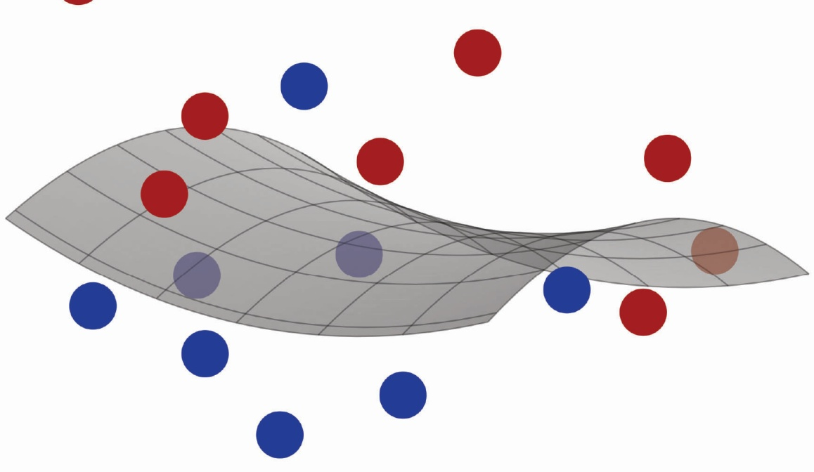

Mehryar Mohri, Afshin Rostamizadeh, and Ameet Talwalkar

<!-- page: 2 -->

# Foundations of Machine Learning

second edition

<!-- page: 3 -->

# Adaptive Computation and Machine Learning

Francis Bach, Editor

A complete list of books published in The Adaptive Computations and Machine Learning series appears at the back of this book.

<!-- page: 4 -->

# Foundations of Machine Learning second edition

Mehryar Mohri

Afshin Rostamizadeh

Ameet Talwalkar

The MIT Press

Cambridge, Massachusetts

London, England

<!-- page: 5 -->

All rights reserved. No part of this book may be reproduced in any form by anThis work is subject to a Creative Commons CC BY-NC-ND license. Subject to electronic or mechanical means (incsuch license, all rights are reserved.All rights reserved. No part of thi

of America.This book was set in LATEX by the authors. Printed and bound in the United States of America.

Library of Congress Cataloging-in-Publication Data

Ameet, author.Names: Mohri, Mehryar, author. | Rostamizadeh, Afshin, author. | Talwalkar, le: FoundationAmeet, author.

and Ameet Talwalkar.Title: Foundations of machine learning / Mehryar Mohri, Afshin Rostamizadeh, scription: Second editand Ameet Talwalkar.

Series: Adaptive computation and machine learning series | IncludesDescription: Second edition. | Cambridge, MA : The MIT Press, [2018] bibliographical references and index.Series: Adaptive computation and machine learning series | Includes ntifiers: LCCN 2018022812 | ISBN 9bibliographical references and index.

Subjects: LCSH: Machine learning. | Computer algorithms.Identifiers: LCCN 2018022812 | ISBN 9780262039406 (hardcover : alk. paper)

Classification: LCC Q325.5 .M64 2018 | DDC 006.3/1--dc23Subjects: LCSH: Machine learning. | Computer algorithms.

at https://lccn.loc.gov/2018022812Classification: LCC Q325.5 .M64 2018 | DDC 006.3/1--dc23 LC record available at https://lccn.loc.gov/2018022812

10 9 8 7 6 5 4 3 2

<!-- page: 6 -->

- Preface xiii
- 1 Introduction 1
- 1.1 What is machine learning? 1
- 1.2 What kind of problems can be tackled using machine learning? 2
- 1.3 Some standard learning tasks 3
- 1.4 Learning stages 4
- 1.5 Learning scenarios 6
- 1.6 Generalization 7
- 2 The PAC Learning Framework 9
- 2.1 The PAC learning model 9
- 2.2 Guarantees for finite hypothesis sets — consistent case 15
- 2.3 Guarantees for finite hypothesis sets — inconsistent case 19
- 2.4 Generalities 21
- 2.4.1 Deterministic versus stochastic scenarios 21
- 2.4.2 Bayes error and noise 22
- 2.5 Chapter notes 23
- 2.6 Exercises 23
- 3 Rademacher Complexity and VC-Dimension 29
- 3.1 Rademacher complexity 30
- 3.2 Growth function 34
- 3.3 VC-dimension 36
- 3.4 Lower bounds 43
- 3.5 Chapter notes 48
- 3.6 Exercises 50
- 4 Model Selection 61
- 4.1 Estimation and approximation errors 61
- 4.2 Empirical risk minimization (ERM) 62
- 4.3 Structural risk minimization (SRM) 64

<!-- page: 7 -->

- 4.4 Cross-validation 68
- 4.5 n-Fold cross-validation 71
- 4.6 Regularization-based algorithms 72
- 4.7 Convex surrogate losses 73
- 4.8 Chapter notes 77
- 4.9 Exercises 78
- 5 Support Vector Machines 79
- 5.1 Linear classification 79
- 5.2 Separable case 80
- 5.2.1 Primal optimization problem 81
- 5.2.2 Support vectors 83
- 5.2.3 Dual optimization problem 83
- 5.2.4 Leave-one-out analysis 85
- 5.3 Non-separable case 87
- 5.3.1 Primal optimization problem 88
- 5.3.2 Support vectors 89
- 5.3.3 Dual optimization problem 90
- 5.4 Margin theory 91
- 5.5 Chapter notes 100
- 5.6 Exercises 100
- 6 Kernel Methods 105
- 6.1 Introduction 105
- 6.2 Positive definite symmetric kernels 108
- 6.2.1 Definitions 108
- 6.2.2 Reproducing kernel Hilbert space 110
- 6.2.3 Properties 112
- 6.3 Kernel-based algorithms 116
- 6.3.1 SVMs with PDS kernels 116
- 6.3.2 Representer theorem 117
- 6.3.3 Learning guarantees 117
- 6.4 Negative definite symmetric kernels 119
- 6.5 Sequence kernels 121
- 6.5.1 Weighted transducers 122
- 6.5.2 Rational kernels 126
- 6.6 Approximate kernel feature maps 130
- 6.7 Chapter notes 135
- 6.8 Exercises 137
- 7 Boosting 145
- 7.1 Introduction 145
- 7.2 AdaBoost 146
- 7.2.1 Bound on the empirical error 149
- 7.2.2 Relationship with coordinate descent 150
- 7.2.3 Practical use 154

<!-- page: 8 -->

- 7.3 Theoretical results 154
- 7.3.1 VC-dimension-based analysis 154
- 7.3.2 $L_{1}$-geometric margin 155
- 7.3.3 Margin-based analysis 157
- 7.3.4 Margin maximization 161
- 7.3.5 Game-theoretic interpretation 162
- 7.4 $L_{1}$-regularization 165
- 7.5 Discussion 167
- 7.6 Chapter notes 168
- 7.7 Exercises 170
- 8 On-Line Learning 177
- 8.1 Introduction 178
- 8.2 Prediction with expert advice 178
- 8.2.1 Mistake bounds and Halving algorithm 179
- 8.2.2 Weighted majority algorithm 181
- 8.2.3 Randomized weighted majority algorithm 183
- 8.2.4 Exponential weighted average algorithm 186
- 8.3 Linear classification 190
- 8.3.1 Perceptron algorithm 190
- 8.3.2 Winnow algorithm 198
- 8.4 On-line to batch conversion 201
- 8.5 Game-theoretic connection 204
- 8.6 Chapter notes 205
- 8.7 Exercises 206
- 9 Multi-Class Classification 213
- 9.1 Multi-class classification problem 213
- 9.2 Generalization bounds 215
- 9.3 Uncombined multi-class algorithms 221
- 9.3.1 Multi-class SVMs 221
- 9.3.2 Multi-class boosting algorithms 222
- 9.3.3 Decision trees 224
- 9.4 Aggregated multi-class algorithms 228
- 9.4.1 One-versus-all 229
- 9.4.2 One-versus-one 229
- 9.4.3 Error-correcting output codes 231
- 9.5 Structured prediction algorithms 233
- 9.6 Chapter notes 235
- 9.7 Exercises 237
- 10 Ranking 239
- 10.1 The problem of ranking 240
- 10.2 Generalization bound 241
- 10.3 Ranking with SVMs 243

<!-- page: 9 -->

- 10.4 RankBoost 244
- 10.4.1 Bound on the empirical error 246
- 10.4.2 Relationship with coordinate descent 248
- 10.4.3 Margin bound for ensemble methods in ranking 250
- 10.5 Bipartite ranking 251
- 10.5.1 Boosting in bipartite ranking 252
- 10.5.2 Area under the ROC curve 255
- 10.6 Preference-based setting 257
- 10.6.1 Second-stage ranking problem 257
- 10.6.2 Deterministic algorithm 259
- 10.6.3 Randomized algorithm 260
- 10.6.4 Extension to other loss functions 262
- 10.7 Other ranking criteria 262
- 10.8 Chapter notes 263
- 10.9 Exercises 264
- 11 Regression 267
- 11.1 The problem of regression 267
- 11.2 Generalization bounds 268
- 11.2.1 Finite hypothesis sets 268
- 11.2.2 Rademacher complexity bounds 269
- 11.2.3 Pseudo-dimension bounds 271
- 11.3 Regression algorithms 275
- 11.3.1 Linear regression 275
- 11.3.2 Kernel ridge regression 276
- 11.3.3 Support vector regression 281
- 11.3.4 Lasso 285
- 11.3.5 Group norm regression algorithms 289
- 11.3.6 On-line regression algorithms 289
- 11.4 Chapter notes 290
- 11.5 Exercises 292
- 12 Maximum Entropy Models 295
- 12.1 Density estimation problem 295
- 12.1.1 Maximum Likelihood (ML) solution 296
- 12.1.2 Maximum a Posteriori (MAP) solution 297
- 12.2 Density estimation problem augmented with features 297
- 12.3 Maxent principle 298
- 12.4 Maxent models 299
- 12.5 Dual problem 299
- 12.6 Generalization bound 303
- 12.7 Coordinate descent algorithm 304
- 12.8 Extensions 306
- 12.9 $L_{2}$-regularization 308

<!-- page: 10 -->

- Contents ix
- 12.10 Chapter notes 312
- 12.11 Exercises 313
- 13 Conditional Maximum Entropy Models 315
- 13.1 Learning problem 315
- 13.2 Conditional Maxent principle 316
- 13.3 Conditional Maxent models 316
- 13.4 Dual problem 317
- 13.5 Properties 319
- 13.5.1 Optimization problem 320
- 13.5.2 Feature vectors 320
- 13.5.3 Prediction 321
- 13.6 Generalization bounds 321
- 13.7 Logistic regression 325
- 13.7.1 Optimization problem 325
- 13.7.2 Logistic model 325
- 13.8 $L_2$-regularization 326
- 13.9 Proof of the duality theorem 328
- 13.10 Chapter notes 330
- 13.11 Exercises 331
- 14 Algorithmic Stability 333
- 14.1 Definitions 333
- 14.2 Stability-based generalization guarantee 334
- 14.3 Stability of kernel-based regularization algorithms 336
- 14.3.1 Application to regression algorithms: SVR and KRR 339
- 14.3.2 Application to classification algorithms: SVMs 341
- 14.3.3 Discussion 342
- 14.4 Chapter notes 342
- 14.5 Exercises 343
- 15 Dimensionality Reduction 347
- 15.1 Principal component analysis 348
- 15.2 Kernel principal component analysis (KPCA) 349
- 15.3 KPCA and manifold learning 351
- 15.3.1 Isomap 351
- 15.3.2 Laplacian eigenmaps 352
- 15.3.3 Locally linear embedding (LLE) 353
- 15.4 Johnson-Lindenstrauss lemma 354
- 15.5 Chapter notes 356
- 15.6 Exercises 356
- 16 Learning Automata and Languages 359
- 16.1 Introduction 359

<!-- page: 11 -->

- 16.2 Finite automata 360
- 16.3 Efficient exact learning 361
- 16.3.1 Passive learning 362
- 16.3.2 Learning with queries 363
- 16.3.3 Learning automata with queries 364
- 16.4 Identification in the limit 369
- 16.4.1 Learning reversible automata 370
- 16.5 Chapter notes 375
- 16.6 Exercises 376
- 17 Reinforcement Learning 379
- 17.1 Learning scenario 379
- 17.2 Markov decision process model 380
- 17.3 Policy 381
- 17.3.1 Definition 381
- 17.3.2 Policy value 382
- 17.3.3 Optimal policies 382
- 17.3.4 Policy evaluation 385
- 17.4 Planning algorithms 387
- 17.4.1 Value iteration 387
- 17.4.2 Policy iteration 390
- 17.4.3 Linear programming 392
- 17.5 Learning algorithms 393
- 17.5.1 Stochastic approximation 394
- 17.5.2 TD(0) algorithm 397
- 17.5.3 Q-learning algorithm 398
- 17.5.4 SARSA 402
- 17.5.5 TD(λ) algorithm 402
- 17.5.6 Large state space 403
- 17.6 Chapter notes 405
- Conclusion 407
- A Linear Algebra Review 409
- A.1 Vectors and norms 409
- A.1.1 Norms 409
- A.1.2 Dual norms 410
- A.1.3 Relationship between norms 411
- A.2 Matrices 411
- A.2.1 Matrix norms 411
- A.2.2 Singular value decomposition 412
- A.2.3 Symmetric positive semidefinite (SPSD) matrices 412

<!-- page: 12 -->

- B Convex Optimization 415
- B.1 Differentiation and unconstrained optimization 415
- B.2 Convexity 415
- B.3 Constrained optimization 419
- B.4 Fenchel duality 422
- B.4.1 Subgradients 422
- B.4.2 Core 423
- B.4.3 Conjugate functions 423
- B.5 Chapter notes 426
- B.6 Exercises 427
- C Probability Review 429
- C.1 Probability 429
- C.2 Random variables 429
- C.3 Conditional probability and independence 431
- C.4 Expectation and Markov's inequality 431
- C.5 Variance and Chebyshev's inequality 432
- C.6 Moment-generating functions 434
- C.7 Exercises 435
- D Concentration Inequalities 437
- D.1 Hoeffding's inequality 437
- D.2 Sanov's theorem 438
- D.3 Multiplicative Chernoff bounds 439
- D.4 Binomial distribution tails: Upper bounds 440
- D.5 Binomial distribution tails: Lower bound 440
- D.6 Azuma's inequality 441
- D.7 McDiarmid's inequality 442
- D.8 Normal distribution tails: Lower bound 443
- D.9 Khintchine-Kahane inequality 443
- D.10 Maximal inequality 444
- D.11 Chapter notes 445
- D.12 Exercises 445
- E Notions of Information Theory 449
- E.1 Entropy 449
- E.2 Relative entropy 450
- E.3 Mutual information 453
- E.4 Bregman divergences 453
- E.5 Chapter notes 456
- E.6 Exercises 457

<!-- page: 13 -->

- xii
- Contents
- F Notation
- 459
- Bibliography
- 461
- Index
- 475

<!-- page: 14 -->

This book is a general introduction to machine learning that can serve as a reference book for researchers and a textbook for students. It covers fundamental modern topics in machine learning while providing the theoretical basis and conceptual tools needed for the discussion and justification of algorithms. It also describes several key aspects of the application of these algorithms.

We have aimed to present the most novel theoretical tools and concepts while giving concise proofs, even for relatively advanced results. In general, whenever possible, we have chosen to favor succinctness. Nevertheless, we discuss some crucial complex topics arising in machine learning and highlight several open research questions. Certain topics often merged with others or treated with insufficient attention are discussed separately here and with more emphasis: for example, a different chapter is reserved for multi-class classification, ranking, and regression.

Although we cover a very wide variety of important topics in machine learning, we have chosen to omit a few important ones, including graphical models and neural networks, both for the sake of brevity and because of the current lack of solid theoretical guarantees for some methods.

The book is intended for students and researchers in machine learning, statistics and other related areas. It can be used as a textbook for both graduate and advanced undergraduate classes in machine learning or as a reference text for a research seminar. The first three or four chapters of the book lay the theoretical foundation for the subsequent material. Other chapters are mostly self-contained, with the exception of chapter 6 which introduces some concepts that are extensively used in later ones and chapter 13, which is closely related to chapter 12. Each chapter concludes with a series of exercises, with full solutions presented separately.

The reader is assumed to be familiar with basic concepts in linear algebra, probability, and analysis of algorithms. However, to further help, we have included an extensive appendix presenting a concise review of linear algebra, an introduction to convex optimization, a brief probability review, a collection of concentration

<!-- page: 15 -->

inequalities useful to the analyses and discussions in this book, and a short introduction to information theory.

Our goal has been to give a unified presentation of multiple topics and areas, as opposed to a more specialized presentation adopted by some books which favor a particular viewpoint, such as for example a Bayesian view, or a particular topic, such as for example kernel methods. The theoretical foundation of this book and its deliberate emphasis on proofs and analysis make it also very distinct from many other presentations.

In this second edition, we have updated the entire book. The changes include a different writing style in most chapters, new figures and illustrations, many simplifications, some additions to existing chapters, in particular chapter 6 and chapter 17, and several new chapters. We have added a full chapter on model selection (chapter 4), which is an important topic that was only briefly discussed in the previous edition. We have also added a new chapter on Maximum Entropy models (chap ter 12) and a new chapter on Conditional Maximum Entropy models (chapter 13) which are both essential topics in machine learning. We have also significantly changed the appendix. In particular, we have added a full section on Fenchel duality to appendix B on convex optimization, made a number of changes and additions to appendix D dealing with concentration inequalities, added appendix E on information theory, and updated most of the material. Additionally, we have included a number of new exercises and their solutions for existing and new chapters.

Most of the material presented here takes its origins in a machine learning graduate course (Foundations of Machine Learning) taught by the first author at the Courant Institute of Mathematical Sciences in New York University over the last fourteen years. This book has considerably benefited from the comments and suggestions from students in these classes, along with those of many friends, colleagues and researchers to whom we are deeply indebted.

We are particularly grateful to Corinna Cortes and Yishay Mansour who made a number of key suggestions for the design and organization of the material presented in the first edition, with detailed comments that we have fully taken into account and that have greatly improved the presentation. We are also grateful to Yishay Mansour for using a preliminary version of the first edition of the book for teaching, and for reporting his feedback to us.

We also thank for discussions, suggested improvement, and contributions of many kinds the following colleagues and friends from academic and corporate research laboratories: Jacob Abernethy, Cyril Allauzen, Kareem Amin, Stephen Boyd, Aldo Corbisiero, Giulia DeSalvo, Claudio Gentile, Spencer Greenberg, Lisa Hellerstein, Sanjiv Kumar, Vitaly Kuznetsov, Ryan McDonald, Andrès Muñoz Medina, Tyler Neylon, Peter Norvig, Fernando Pereira, Maria Pershina, Borja de Balle Pigem,

<!-- page: 16 -->

## Preface

Ashish Rastogi, Michael Riley, Dmitry Storcheus, Ananda Theertha Suresh, Umar Syed, Csaba Szepesvári, Toshiyuki Tanaka, Eugene Weinstein, Jason Weston, Scott Yang, and Ningshan Zhang.

Finally, we thank the MIT Press publication team for their help and support in the development of this text.

<!-- page: 17 -->

<!-- page: 18 -->

## 1 Introduction

This chapter presents a preliminary introduction to machine learning, including an overview of some key learning tasks and applications, basic definitions and terminology, and the discussion of some general scenarios.

## 1.1 What is machine learning?

Machine learning can be broadly defined as computational methods using experience to improve performance or to make accurate predictions. Here, experience refers to the past information available to the learner, which typically takes the form of electronic data collected and made available for analysis. This data could be in the form of digitized human-labeled training sets, or other types of information obtained via interaction with the environment. In all cases, its quality and size are crucial to the success of the predictions made by the learner.

An example of a learning problem is how to use a finite sample of randomly selected documents, each labeled with a topic, to accurately predict the topic of unseen documents. Clearly, the larger is the sample, the easier is the task. But the difficulty of the task also depends on the quality of the labels assigned to the documents in the sample, since the labels may not be all correct, and on the number of possible topics.

Machine learning consists of designing efficient and accurate prediction algorithms. As in other areas of computer science, some critical measures of the quality of these algorithms are their time and space complexity. But, in machine learning, we will need additionally a notion of sample complexity to evaluate the sample size required for the algorithm to learn a family of concepts. More generally, theoretical learning guarantees for an algorithm depend on the complexity of the concept classes considered and the size of the training sample.

Since the success of a learning algorithm depends on the data used, machine learning is inherently related to data analysis and statistics. More generally, learning

<!-- page: 19 -->

techniques are data-driven methods combining fundamental concepts in computer science with ideas from statistics, probability and optimization.

## 1.2 What kind of problems can be tackled using machine learning?

Predicting the label of a document, also known as document classification, is by no means the only learning task. Machine learning admits a very broad set of practical applications, which include the following:

• Text or document classification. This includes problems such as assigning a topic to a text or a document, or determining automatically if the content of a web page is inappropriate or too explicit; it also includes spam detection.

• Natural language processing (NLP). Most tasks in this field, including part-of-speech tagging, named-entity recognition, context-free parsing, or dependency parsing, are cast as learning problems. In these problems, predictions admit some structure. For example, in part-of-speech tagging, the prediction for a sentence is a sequence of part-of-speech tags labeling each word. In context-free parsing the prediction is a tree. These are instances of richer learning problems known as structured prediction problems.

• Speech processing applications. This includes speech recognition, speech synthesis, speaker verification, speaker identification, as well as sub-problems such as language modeling and acoustic modeling.

• Computer vision applications. This includes object recognition, object identification, face detection, Optical character recognition (OCR), content-based image retrieval, or pose estimation.

• Computational biology applications. This includes protein function prediction, identification of key sites, or the analysis of gene and protein networks.

• Many other problems such as fraud detection for credit card, telephone or insurance companies, network intrusion, learning to play games such as chess, backgammon, or Go, unassisted control of vehicles such as robots or cars, medical diagnosis, the design of recommendation systems, search engines, or information extraction systems, are tackled using machine learning techniques.

This list is by no means comprehensive. Most prediction problems found in practice can be cast as learning problems and the practical application area of machine learning keeps expanding. The algorithms and techniques discussed in this book can be used to derive solutions for all of these problems, though we will not discuss in detail these applications.

<!-- page: 20 -->

## 1.3 Some standard learning tasks

The following are some standard machine learning tasks that have been extensively studied:

• Classification: this is the problem of assigning a category to each item. For example, document classification consists of assigning a category such as politics, business, sports, or weather to each document, while image classification consists of assigning to each image a category such as car, train, or plane. The number of categories in such tasks is often less than a few hundreds, but it can be much larger in some difficult tasks and even unbounded as in OCR, text classification, or speech recognition.

• Regression: this is the problem of predicting a real value for each item. Examples of regression include prediction of stock values or that of variations of economic variables. In regression, the penalty for an incorrect prediction depends on the magnitude of the difference between the true and predicted values, in contrast with the classification problem, where there is typically no notion of closeness between various categories.

• Ranking: this is the problem of learning to order items according to some criterion. Web search, e.g., returning web pages relevant to a search query, is the canonical ranking example. Many other similar ranking problems arise in the context of the design of information extraction or natural language processing systems.

• Clustering: this is the problem of partitioning a set of items into homogeneous subsets. Clustering is often used to analyze very large data sets. For example, in the context of social network analysis, clustering algorithms attempt to identify natural communities within large groups of people.

• Dimensionality reduction or manifold learning: this problem consists of transforming an initial representation of items into a lower-dimensional representation while preserving some properties of the initial representation. A common example involves preprocessing digital images in computer vision tasks.

The main practical objectives of machine learning consist of generating accurate predictions for unseen items and of designing efficient and robust algorithms to produce these predictions, even for large-scale problems. To do so, a number of algorithmic and theoretical questions arise. Some fundamental questions include: Which concept families can actually be learned, and under what conditions? How well can these concepts be learned computationally?

<!-- page: 21 -->

## 1.4 Learning stages

Here, we will use the canonical problem of spam detection as a running example to illustrate some basic definitions and describe the use and evaluation of machine learning algorithms in practice, including their different stages.

Spam detection is the problem of learning to automatically classify email messages as either spam or non-spam. The following is a list of definitions and terminology commonly used in machine learning:

• Examples: Items or instances of data used for learning or evaluation. In our spam problem, these examples correspond to the collection of email messages we will use for learning and testing.

• Features: The set of attributes, often represented as a vector, associated to an example. In the case of email messages, some relevant features may include the length of the message, the name of the sender, various characteristics of the header, the presence of certain keywords in the body of the message, and so on.

• Labels: Values or categories assigned to examples. In classification problems, examples are assigned specific categories, for instance, the spam and non-spam categories in our binary classification problem. In regression, items are assigned real-valued labels.

• Hyperparameters: Free parameters that are not determined by the learning algorithm, but rather specified as inputs to the learning algorithm.

• Training sample: Examples used to train a learning algorithm. In our spam problem, the training sample consists of a set of email examples along with their associated labels. The training sample varies for different learning scenarios, as described in section 1.5.

• Validation sample: Examples used to tune the parameters of a learning algorithm when working with labeled data. The validation sample is used to select appropriate values for the learning algorithm’s free parameters (hyperparameters).

• Test sample: Examples used to evaluate the performance of a learning algorithm. The test sample is separate from the training and validation data and is not made available in the learning stage. In the spam problem, the test sample consists of a collection of email examples for which the learning algorithm must predict labels based on features. These predictions are then compared with the labels of the test sample to measure the performance of the algorithm.

• Loss function: A function that measures the difference, or loss, between a pre-dicted label and a true label. Denoting the set of all labels as Y and the set of possible predictions as Y0, a loss function L is a mapping $L \colon \mathcal { Y } \times \mathcal { Y } ^ { \prime } \to \mathbb { R } _ { + }$ . In most cases, $\mathcal { Y } ^ { \prime }   =   \mathcal { Y }$ and the loss function is bounded, but these conditions do not always hold. Common examples of loss functions include the zero-one (or

<!-- page: 22 -->

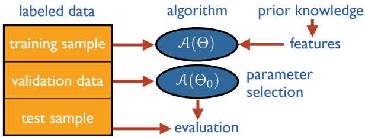

Figure 1.1

Illustration of the typical stages of a learning process.

misclassification) loss defined over $\{ - 1 , + 1 \} \times \{ - 1 , + 1 \}$ by $L ( y , y ^ { \prime } ) = 1 _ { y ^ { \prime } \neq y }$ and the squared loss defined over $\mathcal { I } \times \mathcal { I }$ by $L ( y , y ^ { \prime } ) = ( y ^ { \prime }   -   y ) ^ { 2 }$ , where $\mathcal { I } \subseteq \mathbb { R }$ is typically a bounded interval.

**Foundations of Machine Learning page1**• Hypothesis set: A set of functions mapping features (feature vectors) to the set of labels Y. In our example, these may be a set of functions mapping email features to $\mathcal { Y } = \left\{ \mathrm { S P A M } , \mathrm { n o n - } \mathrm { S P A M } \right\}$ . More generally, hypotheses may be functions mapping features to a different set $\mathcal { Y }$ . They could be linear functions mapping email feature vectors to real numbers interpreted as scores $( \mathcal { Y } ^ { \prime } = \mathbb { R } )$ , with higher score values more indicative of spam than lower ones.

We now define the learning stages of our spam problem (see figure 1.1). We start with a given collection of labeled examples. We first randomly partition the data into a training sample, a validation sample, and a test sample. The size of each of these samples depends on a number of different considerations. For example, the amount of data reserved for validation depends on the number of hyperparameters of the algorithm, which are represented here by the vector Θ. Also, when the labeled sample is relatively small, the amount of training data is often chosen to be larger than that of the test data since the learning performance directly depends on the training sample.

Next, we associate relevant features to the examples. This is a critical step in the design of machine learning solutions. Useful features can effectively guide the learning algorithm, while poor or uninformative ones can be misleading. Although it is critical, to a large extent, the choice of the features is left to the user. This choice reflects the user’s prior knowledge about the learning task which in practice can have a dramatic effect on the performance results.

Now, we use the features selected to train our learning algorithm A by tuning the values of its free parameters Θ (also called hyperparameters). For each value of these parameters, the algorithm selects a different hypothesis out of the hypothesis set. We choose the one resulting in the best performance on the validation sample $( \Theta _ { 0 } )$ Finally, using that hypothesis, we predict the labels of the examples in the test sample. The performance of the algorithm is evaluated by using the loss

<!-- page: 23 -->

function associated to the task, e.g., the zero-one loss in our spam detection task, to compare the predicted and true labels. Thus, the performance of an algorithm is of course evaluated based on its test error and not its error on the training sample.

## 1.5 Learning scenarios

We next briefly describe some common machine learning scenarios. These scenarios differ in the types of training data available to the learner, the order and method by which training data is received and the test data used to evaluate the learning algorithm.

• Supervised learning: The learner receives a set of labeled examples as training data and makes predictions for all unseen points. This is the most common scenario associated with classification, regression, and ranking problems. The spam detection problem discussed in the previous section is an instance of supervised learning.

• Unsupervised learning: The learner exclusively receives unlabeled training data, and makes predictions for all unseen points. Since in general no labeled example is available in that setting, it can be difficult to quantitatively evaluate the performance of a learner. Clustering and dimensionality reduction are example of unsupervised learning problems.

• Semi-supervised learning: The learner receives a training sample consisting of both labeled and unlabeled data, and makes predictions for all unseen points. Semi-supervised learning is common in settings where unlabeled data is easily accessible but labels are expensive to obtain. Various types of problems arising in applications, including classification, regression, or ranking tasks, can be framed as instances of semi-supervised learning. The hope is that the distribution of unlabeled data accessible to the learner can help him achieve a better performance than in the supervised setting. The analysis of the conditions under which this can indeed be realized is the topic of much modern theoretical and applied machine learning research.

• Transductive inference: As in the semi-supervised scenario, the learner receives a labeled training sample along with a set of unlabeled test points. However, the objective of transductive inference is to predict labels only for these particular test points. Transductive inference appears to be an easier task and matches the scenario encountered in a variety of modern applications. However, as in the semi-supervised setting, the assumptions under which a better performance can be achieved in this setting are research questions that have not been fully resolved.

<!-- page: 24 -->

## 1.6 Generalization

• On-line learning: In contrast with the previous scenarios, the online scenario involves multiple rounds where training and testing phases are intermixed. At each round, the learner receives an unlabeled training point, makes a prediction, receives the true label, and incurs a loss. The objective in the on-line setting is to minimize the cumulative loss over all rounds or to minimize the regret, that is the difference of the cumulative loss incurred and that of the best expert in hindsight. Unlike the previous settings just discussed, no distributional assumption is made in on-line learning. In fact, instances and their labels may be chosen adversarially within this scenario.

• Reinforcement learning: The training and testing phases are also intermixed in reinforcement learning. To collect information, the learner actively interacts with the environment and in some cases affects the environment, and receives an immediate reward for each action. The object of the learner is to maximize his reward over a course of actions and iterations with the environment. However, no long-term reward feedback is provided by the environment, and the learner is faced with the exploration versus exploitation dilemma, since he must choose between exploring unknown actions to gain more information versus exploiting the information already collected.

• Active learning: The learner adaptively or interactively collects training examples, typically by querying an oracle to request labels for new points. The goal in active learning is to achieve a performance comparable to the standard supervised learning scenario (or passive learning scenario), but with fewer labeled examples. Active learning is often used in applications where labels are expensive to obtain, for example computational biology applications.

In practice, many other intermediate and somewhat more complex learning scenarios may be encountered.

## 1.6 Generalization

Machine learning is fundamentally about generalization. As an example, the standard supervised learning scenario consists of using a finite sample of labeled examples to make accurate predictions about unseen examples. The problem is typically formulated as that of selecting a function out of a hypothesis set, that is a subset of the family of all functions. The function selected is subsequently used to label all instances, including unseen examples.

How should a hypothesis set be chosen? With a rich or complex hypothesis set, the learner may choose a function or predictor that is consistent with the training sample, that is one that commits no error on the training sample. With a less complex family, incurring some errors on the training sample may be unavoidable. But,

<!-- page: 25 -->

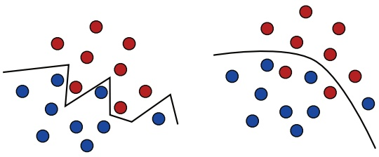

Figure 1.2

The zig-zag line on the left panel is consistent over the blue and red training sample, but it is a complex separation surface that is not likely to generalize well to unseen data. In contrast, the decision surface on the right panel is simpler and might generalize better in spite of its misclassification of a few points of the training sample.

which will lead to a better generalization? How should we define the complexity of a hypothesis set?

Figure 1.2 illustrates these two types of solution: one is a zig-zag line that perfectly separates the two populations of blue and red points and that is chosen from a complex family; the other one is a smoother line chosen from a simpler family that only imperfectly discriminates between the two sets. We will see that, in general, the best predictor on the training sample may not be the best overall. A predictor chosen from a very complex family can essentially memorize the data, but generalization is distinct from the memorization of the training labels.

We will see that the trade-off between the sample size and complexity plays a critical role in generalization. When the sample size is relatively small, choosing from a too complex a family may lead to poor generalization, which is also known as overfitting. On the other hand, with a too simple a family it may not be possible to achieve a sufficient accuracy, which is known as underfitting.

In the next chapters, we will analyze more in detail the problem of generalization and will seek to derive theoretical guarantees for learning. This will depend on different notions of complexity that we will thoroughly discuss.

<!-- page: 26 -->

## 2 The PAC Learning Framework

Several fundamental questions arise when designing and analyzing algorithms that learn from examples: What can be learned efficiently? What is inherently hard to learn? How many examples are needed to learn successfully? Is there a general model of learning? In this chapter, we begin to formalize and address these questions by introducing the Probably Approximately Correct (PAC) learning framework. The PAC framework helps define the class of learnable concepts in terms of the number of sample points needed to achieve an approximate solution, sample complexity, and the time and space complexity of the learning algorithm, which depends on the cost of the computational representation of the concepts.

We first describe the PAC framework and illustrate it, then present some general learning guarantees within this framework when the hypothesis set used is finite, both for the consistent case where the hypothesis set used contains the concept to learn and for the opposite inconsistent case.

## 2.1 The PAC learning model

We first introduce several definitions and the notation needed to present the PAC model, which will also be used throughout much of this book.

We denote by X the set of all possible examples or instances. X is also sometimes referred to as the input space. The set of all possible labels or target values is denoted by Y. For the purpose of this introductory chapter, we will limit ourselves to the case where Y is reduced to two labels, $\mathfrak { Y }   =   \{ 0 , 1 \}$ , which corresponds to the so-called binary classification. Later chapters will extend these results to more general settings.

A concept c : X → Y is a mapping from X to Y. Since $\mathfrak { Y } = \{ 0 , 1 \}$ , we can identify c with the subset of X over which it takes the value 1. Thus, in the following, we equivalently refer to a concept to learn as a mapping from X to {0, 1}, or as a subset of X. As an example, a concept may be the set of points inside a triangle

<!-- page: 27 -->

or the indicator function of these points. In such cases, we will say in short that the concept to learn is a triangle. A concept class is a set of concepts we may wish to learn and is denoted by C. This could, for example, be the set of all triangles in the plane.

We assume that examples are independently and identically distributed (i.i.d.) according to some fixed but unknown distribution D. The learning problem is then formulated as follows. The learner considers a fixed set of possible concepts H, called a hypothesis set, which might not necessarily coincide with C. It receives a sample $S = ( x _ { 1 } , \ldots , x _ { m } )$ drawn i.i.d. according to D as well as the labels $( c ( x _ { 1 } ) , \ldots , c ( x _ { m } ) )$ , which are based on a specific target concept $c \in \mathcal { C }$ to learn. The task is then to use the labeled sample S to select a hypothesis $h _ { S } \in \mathcal { H }$ that has a small generalization error with respect to the concept c. The generalization error of a hypothesis $h \in { \mathcal { H } } .$ , also referred to as the risk or true error (or simply error ) of h is denoted by $R ( h )$ and defined as follows.1

**Definition 2.1 (Generalization error)** Given a hypothesis $h \in \mathcal { H }$ , a target concept $c \in \mathbb { C } _ { \rfloor }$ and an underlying distribution D, the generalization error or risk of h is defined by

$$
R (h) = \underset {x \sim \mathcal {D}} {\mathbb {P}} [ h (x) \neq c (x) ] = \underset {x \sim \mathcal {D}} {\mathbb {E}} \left[ 1 _ {h (x) \neq c (x)} \right],\tag{2.1}
$$

where $1 _ { \omega }$ is the indicator function of the event $\omega . ^ { 2 }$

The generalization error of a hypothesis is not directly accessible to the learner since both the distribution D and the target concept c are unknown. However, the learner can measure the empirical error of a hypothesis on the labeled sample S.

**Definition 2.2 (Empirical error)** Given a hypothesis $h \in \mathcal { H }$ , a target concept $c \in \mathbb { C } _ { \rfloor }$ , and a sample $S = ( x _ { 1 } , \ldots , x _ { m } )$ , the empirical error or empirical risk of h is defined by

$$
\widehat {R} _ {S} (h) = \frac {1}{m} \sum_ {i = 1} ^ {m} 1 _ {h (x _ {i}) \neq c (x _ {i})}.\tag{2.2}
$$

Thus, the empirical error of $h \in \mathcal { H }$ is its average error over the sample S, while the generalization error is its expected error based on the distribution D. We will see in this chapter and the following chapters a number of guarantees relating these two quantities with high probability, under some general assumptions. We can already note that for a fixed $h \in \mathcal { H }$ , the expectation of the empirical error based on an i.i.d.

<small>1 The choice of R instead of E to denote an error avoids possible confusions with the notation for expectations and is further justified by the fact that the term risk is also used in machine learning and statistics to refer to an error.</small>

<small>2 For this and other related definitions, the family of functions H and the target concept c must be measurable. The function classes we consider in this book all have this property.</small>

<!-- page: 28 -->

sample $S$ is equal to the generalization error:

$$
\underset {S \sim \mathcal {D} ^ {m}} {\mathbb {E}} [ \widehat {R} _ {S} (h) ] = R (h).\tag{2.3}
$$

Indeed, by the linearity of the expectation and the fact that the sample is drawn i.i.d., we can write

$$
\underset {S \sim \mathcal {D} ^ {m}} {\mathbb {E}} [ \widehat {R} _ {S} (h) ] = \frac {1}{m} \sum_ {i = 1} ^ {m} \underset {S \sim \mathcal {D} ^ {m}} {\mathbb {E}} [ 1 _ {h (x _ {i}) \neq c (x _ {i})} ] = \frac {1}{m} \sum_ {i = 1} ^ {m} \underset {S \sim \mathcal {D} ^ {m}} {\mathbb {E}} [ 1 _ {h (x) \neq c (x)} ],
$$

for any x in sample S. Thus,

$$
\underset {S \sim \mathcal {D} ^ {m}} {\mathbb {E}} [ \widehat {R} _ {S} (h) ] = \underset {S \sim \mathcal {D} ^ {m}} {\mathbb {E}} [ 1 _ {h (x) \neq c (x)} ] = \underset {x \sim \mathcal {D}} {\mathbb {E}} [ 1 _ {h (x) \neq c (x)} ] = R (h).
$$

The following introduces the Probably Approximately Correct (PAC) learning framework. Let n be a number such that the computational cost of representing any element $x \in \mathcal { X }$ is at most $O ( n )$ and denote by size(c) the maximal cost of the computational representation of $c \in \mathcal { C }$ . For example, x may be a vector in $\mathbb { R } ^ { n }$ , for which the cost of an array-based representation would be in $O ( n )$ . In addition, let $h _ { S }$ denote the hypothesis returned by algorithm A after receiving a labeled sample S. To keep notation simple, the dependency of $h _ { S }$ on $\mathcal { A }$ is not explicitly indicated.

**Definition 2.3 (PAC-learning)** A concept class C is said to be PAC-learnable if there exists an algorithm A and a polynomial function poly $( \cdot , \cdot , \cdot , \cdot )$ such that for any $\epsilon > 0$ and $\delta > 0 ,$ , for all distributions D on X and for any target concept $c \in \mathcal { C }$ , the following holds for any sample size $m \geq p o l y ( 1 / \epsilon , 1 / \delta , n , \mathit { s i z e } ( c ) )$

$$
\mathbb {P} _ {S \sim \mathcal {D} ^ {m}} [ R (h _ {S}) \leq \epsilon ] \geq 1 - \delta .\tag{2.4}
$$

If A further runs in $p o l y ( 1 / \epsilon , 1 / \delta , n , \mathit { s i z e } ( c ) )$ , then C is said to be efficiently PAC-learnable. When such an algorithm A exists, it is called a PAC-learning algorithm $f o r \; \mathcal { C } .$

A concept class C is thus PAC-learnable if the hypothesis returned by the algorithm after observing a number of points polynomial in $1 / \epsilon$ and $1 / \delta$ is approximately correct (error at most ) with high probability (at least $1 - \delta )$ , which justifies the PAC terminology. The parameter $\delta \; > \; 0$ is used to define the confidence $1 - \delta$ and $\epsilon > 0$ the accuracy $1 - \epsilon .$ Note that if the running time of the algorithm is polynomial in $1 / \epsilon$ and $1 / \delta$ , then the sample size m must also be polynomial if the full sample is received by the algorithm.

Several key points of the PAC definition are worth emphasizing. First, the PAC framework is a distribution-free model: no particular assumption is made about the distribution D from which examples are drawn. Second, the training sample and the test examples used to define the error are drawn according to the same distribution D. This is a natural and necessary assumption for generalization to

<!-- page: 29 -->

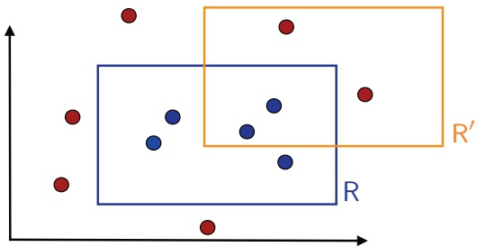

Figure 2.1

Target concept R and possible hypothesis R0. Circles represent training instances. A blue circle is a point labeled with 1, since it falls within the rectangle R. Others are red and labeled with 0.

be possible in general. It can be relaxed to include favorable domain adaptation problems. Finally, the PAC framework deals with the question of learnability for a concept class $\mathcal { C }$ and not a particular concept. Note that the concept class C is known to the algorithm, but of course the target concept $c \in \mathcal { C }$ is unknown.

In many cases, in particular when the computational representation of the concepts is not explicitly discussed or is straightforward, we may omit the polynomial dependency on n and size(c) in the PAC definition and focus only on the sample complexity.

We now illustrate PAC-learning with a specific learning problem.

**Example 2.4 (Learning axis-aligned rectangles)** Consider the case where the set of instances are points in the plane, $\mathcal { X } = \mathbb { R } ^ { 2 }$ , and the concept class C is the set of all axis-aligned rectangles lying in $\mathbb { R } ^ { 2 }$ . Thus, each concept c is the set of points inside a particular axis-aligned rectangle. The learning problem consists of determining with small error a target axis-aligned rectangle using the labeled training sample. We will show that the concept class of axis-aligned rectangles is PAC-learnable.

Figure 2.1 illustrates the problem. R represents a target axis-aligned rectangle and $\mathsf { R } ^ { \prime }$ a hypothesis. As can be seen from the figure, the error regions of $\mathsf { R } ^ { \prime }$ are formed by the area within the rectangle R but outside the rectangle $\mathsf { R } ^ { \prime }$ and the area within $\mathsf { R } ^ { \prime }$ but outside the rectangle R. The first area corresponds to false negatives, that is, points that are labeled as 0 or negatively by $\mathsf { R } ^ { \prime } .$ , which are in fact positive or labeled with 1. The second area corresponds to false positives, that is, points labeled positively by $\mathsf { R } ^ { \prime }$ which are in fact negatively labeled.

To show that the concept class is PAC-learnable, we describe a simple PAC-learning algorithm $\mathcal { A } .$ Given a labeled sample $S ,$ the algorithm consists of returning the tightest axis-aligned rectangle $\mathsf { R } ^ { \prime }   =   \mathsf { R } _ { \mathsf { S } }$ containing the points labeled with 1. Figure 2.2 illustrates the hypothesis returned by the algorithm. By definition, $\mathsf { R } _ { \mathsf { S } }$ does not produce any false positives, since its points must be included in the target concept R. Thus, the error region of $\mathsf { R } _ { \mathsf { S } }$ is included in R.

<!-- page: 30 -->

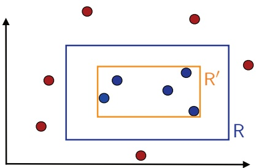

Figure 2.2

Illustration of the hypothesis $\mathsf { R } ^ { \prime } = \mathsf { R } _ { \mathsf { S } }$ returned by the algorithm.

Let $\mathsf { R } \in \mathcal { C }$ be a target concept. Fix $\epsilon > 0$ . Let $\mathbb { P } [ \mathsf { R } ]$ denote the probability mass of the region defined by R, that is the probability that a point randomly drawn according to D falls within R. Since errors made by our algorithm can be due only to points falling inside R, we can assume that $\mathbb { P } [ \mathsf { R } ] > \epsilon ;$ otherwise, the error of $\mathsf { R } _ { \mathsf { S } }$ is less than or equal to  regardless of the training sample $S$ received.

Now, since $\mathbb { P } [ \mathsf { R } ] > \epsilon$ , we can define four rectangular regions $r _ { 1 } , r _ { 2 } , r _ { 3 }$ , and $r _ { 4 }$ along the sides of R, each with probability at least $\epsilon / 4$ . These regions can be constructed by starting with the full rectangle R and then decreasing the size by moving one side as much as possible while keeping a distribution mass of at least $\epsilon / 4$ . Figure 2.3 illustrates the definition of these regions.

Let $l , \; r , \; b ,$ and t be the four real values defining R: $\mathsf { R }   =   [ l , r ] \times [ b , t ]$ . Then, for example, the left rectangle $r _ { 4 }$ is defined by $r _ { 4 } \; = \; [ l , s _ { 4 } ]   \times   [ b , t ]$ , with $s _ { 4 } ~ =$ inf $\{ s \colon \mathbb { P } [ [ l , s ]   \times   [ b , t ] ]   \geq   \epsilon / 4 \}$ . It is not hard to see that the probability of the region $\bar { r } _ { 4 } = [ l , s _ { 4 } [ \times [ b , t ]$ obtained from $r _ { 4 }$ by excluding the rightmost side is at most $\epsilon / 4 . r _ { 1 } ,   r _ { 2 } ,   r _ { 3 }$ and $\overline { { r } } _ { 1 } ,   \overline { { r } } _ { 2 } ,   \overline { { r } } _ { 3 }$ are defined in a similar way.

Observe that if $\mathsf { R } _ { \mathsf { S } }$ meets all of these four regions $r _ { i } ,   i \in [ 4 ]$ , then, because it is a rectangle, it will have one side in each of these regions (geometric argument). Its error area, which is the part of R that it does not cover, is thus included in the union of the regions $\overline { { r } } _ { i } , \; i   \in   [ 4 ]$ , and cannot have probability mass more than . By contraposition, if $R ( \mathsf { R } _ { \mathsf { S } } ) > \epsilon$ , then $\mathsf { R } _ { \mathsf { S } }$ must miss at least one of the regions $r _ { i } .$ $i \in [ 4 ]$ As a result, we can write

$$
\begin{array}{l l} \underset {S \sim \mathcal {D} ^ {m}} {\mathbb {P}} [ R (\mathsf {R} _ {\mathsf {S}}) > \epsilon ] \leq \underset {S \sim \mathcal {D} ^ {m}} {\mathbb {P}} [ \cup_ {i = 1} ^ {4} \{\mathsf {R} _ {\mathsf {S}} \cap r _ {i} = \emptyset \} ] \\ \qquad \leq \sum_ {i = 1} ^ {4} \underset {S \sim \mathcal {D} ^ {m}} {\mathbb {P}} [ \{\mathsf {R} _ {\mathsf {S}} \cap r _ {i} = \emptyset \} ] & \quad \text {(by the union bound)} \\ \qquad \leq 4 (1 - \epsilon / 4) ^ {m} & \quad \text {(since \mathbb {P} [r_{i}] \geq \epsilon / 4)} \\ \qquad \leq 4 \exp (- m \epsilon / 4), \end{array}\tag{2.5}
$$

<!-- page: 31 -->

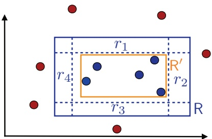

Figure 2.3

Illustration of the regions $r _ { 1 } , \ldots , r _ { 4 }$

where for the last step we used the general inequality $1   -   x   \leq   e ^ { - x }$ valid for all $x \in \mathbb { R }$ . For any $\delta > 0$ , to ensure that $\mathbb { P } _ { S \sim \mathcal { D } ^ { m } } [ R ( \mathsf { R } _ { \mathsf { S } } ) > \epsilon ] \leq \delta$ , we can impose

$$
4 \exp (- \epsilon m / 4) \leq \delta \Leftrightarrow m \geq \frac {4}{\epsilon} \log \frac {4}{\delta}.\tag{2.6}
$$

Thus, for any $\epsilon > 0$ and $\delta > 0$ , if the sample size m is greater than $\textstyle { \frac { 4 } { \epsilon } } \log { \frac { 4 } { \delta } }$ , then $\mathbb { P } _ { S \sim \mathcal { D } ^ { m } } [ R ( \mathsf { R } _ { \mathsf { S } } ) \: > \: \epsilon ] \: \leq \: \delta$ . Furthermore, the computational cost of the representation of points in $\mathbb { R } ^ { 2 }$ and axis-aligned rectangles, which can be defined by their four corners, is constant. This proves that the concept class of axis-aligned rectangles is PAC-learnable and that the sample complexity of PAC-learning axis-aligned rectangles is in $O ( \textstyle { \frac { 1 } { \epsilon } } \log { \frac { 1 } { \delta } } )$

An equivalent way to present sample complexity results like (2.6), which we will often see throughout this book, is to give a generalization bound. A generalization bound states that with probability at least $1 - \delta ,   R ( \mathsf { R } _ { \mathsf { S } } )$ is upper bounded by some quantity that depends on the sample size m and δ. To obtain this, it suffices to set $\delta$ to be equal to the upper bound derived in (2.5), that is $\delta   =   4 \exp ( - m \epsilon / 4 )$ and solve for $\epsilon .$ This yields that with probability at least $1 - \delta$ , the error of the algorithm is bounded as follows:

$$
R (\mathsf {R} _ {\mathsf {S}}) \leq \frac {4}{m} \log \frac {4}{\delta}.\tag{2.7}
$$

Other PAC-learning algorithms could be considered for this example. One alternative is to return the largest axis-aligned rectangle not containing the negative points, for example. The proof of PAC-learning just presented for the tightest axis-aligned rectangle can be easily adapted to the analysis of other such algorithms.

Note that the hypothesis set H we considered in this example coincided with the concept class C and that its cardinality was infinite. Nevertheless, the problem admitted a simple proof of PAC-learning. We may then ask if a similar proof can readily apply to other similar concept classes. This is not as straightforward because the specific geometric argument used in the proof is key. It is non-trivial to extend the proof to other concept classes such as that of non-concentric circles

<!-- page: 32 -->

(see exercise 2.4). Thus, we need a more general proof technique and more general results. The next two sections provide us with such tools in the case of a finite hypothesis set.

## 2.2 Guarantees for finite hypothesis sets — consistent case

In the example of axis-aligned rectangles that we examined, the hypothesis $h _ { S }$ returned by the algorithm was always consistent, that is, it admitted no error on the training sample S. In this section, we present a general sample complexity bound, or equivalently, a generalization bound, for consistent hypotheses, in the case where the cardinality |H| of the hypothesis set is finite. Since we consider consistent hypotheses, we will assume that the target concept c is in H.

**Theorem 2.5 (Learning bound — finite** ${ \mathcal { H } } ,$ consistent case) Let H be a finite set of functions mapping from X to Y. Let A be an algorithm that for any target concept $c \in \mathcal { H }$ and i.i.d. sample S returns a consistent hypothesis $h _ { S } \colon \thinspace \widehat { R } _ { S } ( h _ { S } ) = 0$ . Then, for any $\epsilon , \delta > 0$ , the inequality $\mathbb { P } _ { S \sim \mathcal { D } ^ { m } } [ R ( h _ { S } ) \leq \epsilon ] \geq 1 - \delta$ bholds if

$$
m \geq \frac {1}{\epsilon} \Big (\log | \mathcal {H} | + \log \frac {1}{\delta} \Big).\tag{2.8}
$$

This sample complexity result admits the following equivalent statement as a generalization bound: for any $\epsilon , \delta > 0$ , with probability at least $1 - \delta$

$$
R (h _ {S}) \leq \frac {1}{m} \Big (\log | \mathcal {H} | + \log \frac {1}{\delta} \Big).\tag{2.9}
$$

Proof: Fix $\epsilon > 0$ . We do not know which consistent hypothesis $h _ { S } \in \mathcal { H }$ is selected by the algorithm A. This hypothesis further depends on the training sample S. Therefore, we need to give a uniform convergence bound, that is, a bound that holds for the set of all consistent hypotheses, which a fortiori includes $h _ { S }$ . Thus, we will bound the probability that some $h \in \mathcal { H }$ would be consistent and have error more than . For any $\epsilon > 0$ , define ${ \mathcal { H } } _ { \epsilon }$ by $\mathcal { H } _ { \epsilon } = \{ h \in \mathcal { H } \colon R ( h ) > \epsilon \}$ . The probability that a hypothesis $h$ in ${ \mathcal { H } } _ { \epsilon }$ is consistent on a training sample S drawn i.i.d., that is, that it would have no error on any point in $S ,$ can be bounded as follows:

$$
\mathbb {P} [ \widehat {R} _ {S} (h) = 0 ] \leq (1 - \epsilon) ^ {m}.
$$

Thus, by the union bound, the following holds:

$$
\begin{array}{l} \mathbb {P} \left[ \exists h \in \mathcal {H} _ {\epsilon} \colon \widehat {R} _ {S} (h) = 0 \right] = \mathbb {P} \left[ \widehat {R} _ {S} (h _ {1}) = 0 \lor \dots \lor \widehat {R} _ {S} (h _ {| \mathcal {H} _ {\epsilon} |}) = 0 \right] \\ \qquad \leq \sum_ {h \in \mathcal {H} _ {\epsilon}} \mathbb {P} \left[ \widehat {R} _ {S} (h) = 0 \right] \qquad \text {(union bound)} \\ \qquad \leq \sum_ {h \in \mathcal {H} _ {\epsilon}} (1 - \epsilon) ^ {m} \leq | \mathcal {H} | (1 - \epsilon) ^ {m} \leq | \mathcal {H} | e ^ {- m \epsilon}. \end{array}
$$

<!-- page: 33 -->

Setting the right-hand side to be equal to $\delta$ and solving for  concludes the proof.  The theorem shows that when the hypothesis set H is finite, a consistent algorithm $\mathcal { A }$ is a PAC-learning algorithm, since the sample complexity given by (2.8) is dominated by a polynomial in $1 / \epsilon$ and $1 / \delta$ . As shown by (2.9), the generalization error of consistent hypotheses is upper bounded by a term that decreases as a function of the sample size $m .$ This is a general fact: as expected, learning algorithms benefit from larger labeled training samples. The decrease rate of $O ( 1 / m )$ guaranteed by this theorem, however, is particularly favorable.

The price to pay for coming up with a consistent algorithm is the use of a larger hypothesis set H containing target concepts. Of course, the upper bound (2.9) increases with |H|. However, that dependency is only logarithmic. Note that the term log |H|, or the related term $\log _ { 2 } | { \mathfrak { N } } |$ from which it differs by a constant factor, can be interpreted as the number of bits needed to represent H. Thus, the generalization guarantee of the theorem is controlled by the ratio of this number of bits, $\log _ { 2 } | { \mathfrak { N } } |$ , and the sample size $m$

We now use theorem 2.5 to analyze PAC-learning with various concept classes.

**Example 2.6 (Conjunction of Boolean literals)** Consider learning the concept class $\mathcal { C } _ { n }$ of conjunctions of at most n Boolean literals $x _ { 1 } , \ldots , x _ { n }$ . A Boolean literal is either a variable $x _ { i } ,   i \in [ n ]$ , or its negation $\overline { { x } } _ { i }$ . For $n = 4$ , an example is the conjunction: $x _ { 1 } \wedge \overline { { x } } _ { 2 } \wedge x _ { 4 }$ , where $\overline { { x } } _ { 2 }$ denotes the negation of the Boolean literal $x _ { 2 }$ $( 1 , 0 , 0 , 1 )$ is a positive example for this concept while (1, 0, 0, 0) is a negative example.

Observe that for $n = 4$ , a positive example (1, 0, 1, 0) implies that the target concept cannot contain the literals $\overline{x}_{1}$ and $\overline { { x } } _ { 3 }$ and that it cannot contain the literals $x _ { 2 }$ and $x _ { 4 }$ . In contrast, a negative example is not as informative since it is not known which of its $n$ bits are incorrect. A simple algorithm for finding a consistent hypothesis is thus based on positive examples and consists of the following: for each positive example $( b _ { 1 } , \ldots , b _ { n } )$ and $i \in [ n ]$ , if $b _ { i } = 1$ then $\overline { { x } } _ { i }$ is ruled out as a possible literal in the concept class and if $b _ { i } = 0$ then $x _ { i }$ is ruled out. The conjunction of all the literals not ruled out is thus a hypothesis consistent with the target. Figure 2.4 shows an example training sample as well as a consistent hypothesis for the case $n = 6$

We have $| \mathcal { H } | = | \mathfrak { C } _ { n } | = 3 ^ { n }$ , since each literal can be included positively, with negation, or not included. Plugging this into the sample complexity bound for consistent hypotheses yields the following sample complexity bound for any $\epsilon > 0$ and $\delta > 0 ;$

$$
m \geq \frac {1}{\epsilon} \Big ((\log 3) n + \log \frac {1}{\delta} \Big).\tag{2.10}
$$

Thus, the class of conjunctions of at most n Boolean literals is PAC-learnable. Note that the computational complexity is also polynomial, since the training cost per example is in $O ( n )$ . For $\delta   =   0 . 0 2 , \: \epsilon   =   0 . 1$ , and $n = 1 0$ , the bound becomes

<!-- page: 34 -->

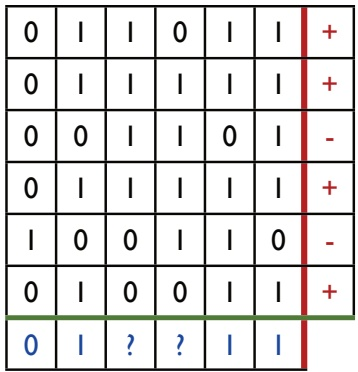

Figure 2.4

Each of the first six rows of the table represents a training example with its label, $$+ \; \mathrm { o r } \; \mathrm { - } _ { \mathrm { j } }$$ indicated in the last column. The last row contains 0 (respectively 1) in column $i   \in   [ 6 ]$ if the ith entry is 0 (respectively 1) for all the positive examples. It contains $\{ \underset { \bullet } { \omega } \underset { \bullet } { \operatorname { p s } }$ if both 0 and 1 appear as an ith entry for some positive example. Thus, for this training sample, the hypothesis returned by the consistent algorithm described in the text is x1 ∧ x2 ∧ x5 ∧ x6.

$m \geq 1 4 9$ . Thus, for a labeled sample of at least 149 examples, the bound guarantees 90% accuracy with a confidence of at least 98%.

**Example 2.7 (Universal concept class)** Consider the set $\mathcal { X } \: = \: \{ 0 , 1 \} ^ { n }$ of all Boolean vectors with n components, and let $\mathcal { U } _ { n }$ be the concept class formed by all subsets of X. Is this concept class PAC-learnable? To guarantee a consistent hypothesis the hypothesis class must include the concept class, thus $| \mathcal { H } | \geq | \mathcal { U } _ { n } | = 2 ^ { ( 2 ^ { n } ) }$ Theorem 2.5 gives the following sample complexity bound:

$$
m \geq \frac {1}{\epsilon} \Bigl ((\log 2) 2 ^ {n} + \log \frac {1}{\delta} \Bigr).\tag{2.11}
$$

Here, the number of training samples required is exponential in n, which is the cost of the representation of a point in X. Thus, PAC-learning is not guaranteed by the theorem. In fact, it is not hard to show that this universal concept class is not PAC-learnable.

**Example 2.8 (**k**-term DNF formulae)** A disjunctive normal form (DNF) formula is a formula written as the disjunction of several terms, each term being a conjunction of Boolean literals. A k-term DNF is a DNF formula defined by the disjunction of k terms, each term being a conjunction of at most n Boolean literals. Thus, for $k = 2$ and $n = 3$ , an example of a k-term DNF is $( x _ { 1 } \wedge \overline { { x } } _ { 2 } \wedge x _ { 3 } ) \vee ( \overline { { x } } _ { 1 } \wedge x _ { 3 } )$

Is the class C of k-term DNF formulae PAC-learnable? The cardinality of the class is $3 ^ { n k }$ , since each term is a conjunction of at most n variables and there are $3 ^ { n }$ such conjunctions, as seen previously. The hypothesis set H must contain C for

<!-- page: 35 -->

consistency to be possible, thus $| { \mathfrak { K } } | \geq 3 ^ { n k }$ . Theorem 2.5 gives the following sample complexity bound:

$$
m \geq \frac {1}{\epsilon} \Bigl ((\log 3) n k + \log \frac {1}{\delta} \Bigr),\tag{2.12}
$$

which is polynomial. However, it can be shown by a reduction from the graph 3-coloring problem that the problem of learning k-term DNF, even for $k = 3$ , is not efficiently PAC-learnable, unless RP, the complexity class of problems that admit a randomized polynomial-time decision solution, coincides with $\mathrm { N P ( R P = N P ) }$ , which is commonly conjectured not to be the case. Thus, while the sample size needed for learning k-term DNF formulae is only polynomial, efficient PAC-learning of this class is not possible if $\mathrm { R P } \neq \mathrm { N P } .$

**Example 2.9 (**k**-CNF formulae)** A conjunctive normal form (CNF) formula is a conjunction of disjunctions. A k-CNF formula is an expression of the form $T _ { 1 } \wedge \ldots \wedge T _ { j }$ with arbitrary length $j \in \mathbb { N }$ and with each term $T _ { i }$ being a disjunction of at most k Boolean attributes.

The problem of learning k-CNF formulae can be reduced to that of learning conjunctions of Boolean literals, which, as seen previously, is a PAC-learnable concept class. This can be done at the cost of introducing $( 2 n ) ^ { k }$ new variables $Y _ { u _ { 1 } , \ldots , u _ { k } }$ using the following bijection:

$$
(u _ {1}, \dots , u _ {k}) \to Y _ {u _ {1}, \dots , u _ {k}},\tag{2.13}
$$

where $u _ { 1 } , \ldots , u _ { k }$ are Boolean literals over the original variables $x _ { 1 } , \ldots , x _ { n }$ . The value of $Y _ { u _ { 1 } , \ldots , u _ { k } }$ is determined by $Y _ { u _ { 1 } , \ldots , u _ { k } } { = } u _ { 1 } \vee \cdots \vee u _ { k }$ . Using this mapping, the original training sample can be transformed into one defined in terms of the new variables and any k-CNF formula over the original variables can be written as a conjunction over the variables $Y _ { u _ { 1 } , \ldots , u _ { k } }$ This reduction to PAC-learning of conjunctions of Boolean literals can affect the original distribution of examples, but this is not an issue since in the PAC framework no assumption is made about the distribution. Thus, using this transformation, the PAC-learnability of conjunctions of Boolean literals implies that of k-CNF formulae.

This is a surprising result, however, since any k-term DNF formula can be written as a k-CNF formula. Indeed, using associativity, a k-term DNF $T _ { 1 } \vee \cdots \vee T _ { k }$ with $T _ { i } = u _ { i , 1 } \wedge \cdots \wedge u _ { i , n _ { i } }$ for $i \in [ k ]$ can be rewritten as a k-CNF formula via

$$
\bigvee_ {i = 1} ^ {k} u _ {i, 1} \wedge \dots \wedge u _ {i, n _ {i}} = \bigwedge_ {j _ {1} \in [ n _ {1} ], \dots , j _ {k} \in [ n _ {k} ]} u _ {1, j _ {1}} \vee \dots \vee u _ {k, j _ {k}},
$$

To illustrate this rewriting in a specific case, observe, for example, that

$$
(u _ {1} \wedge u _ {2} \wedge u _ {3}) \vee (v _ {1} \wedge v _ {2} \wedge v _ {3}) = \bigwedge_ {i, j = 1} ^ {3} (u _ {i} \vee v _ {j}).
$$

<!-- page: 36 -->

But, as we previously saw, k-term DNF formulae are not efficiently PAC-learnable if $\mathrm { R P }   \neq   \mathrm { N P ! }$ What can explain this apparent inconsistency? The issue is that converting into a k-term DNF a $k \mathrm { { - } C N F }$ formula we have learned (which is equivalent to a k-term DNF) is in general intractable if $\mathrm { R P } \neq \mathrm { N P }$

This example reveals some key aspects of PAC-learning, which include the cost of the representation of a concept and the choice of the hypothesis set. For a fixed concept class, learning can be intractable or not depending on the choice of the representation.

## 2.3 Guarantees for finite hypothesis sets — inconsistent case

In the most general case, there may be no hypothesis in H consistent with the labeled training sample. This, in fact, is the typical case in practice, where the learning problems may be somewhat difficult or the concept classes more complex than the hypothesis set used by the learning algorithm. However, inconsistent hypotheses with a small number of errors on the training sample can be useful and, as we shall see, can benefit from favorable guarantees under some assumptions. This section presents learning guarantees precisely for this inconsistent case and finite hypothesis sets.

To derive learning guarantees in this more general setting, we will use Hoeffding’s inequality (theorem D.2) or the following corollary, which relates the generalization error and empirical error of a single hypothesis.

**Corollary 2.10** Fix $\epsilon > 0$ . Then, for any hypothesis $h \colon X   \to   \{ 0 , 1 \}$ , the following inequalities hold:

$$
\underset {S \sim \mathcal {D} ^ {m}} {\mathbb {P}} \left[ \widehat {R} _ {S} (h) - R (h) \geq \epsilon \right] \leq \exp (- 2 m \epsilon^ {2})\tag{2.14}
$$

$$
\underset {S \sim \mathcal {D} ^ {m}} {\mathbb {P}} \left[ \widehat {R} _ {S} (h) - R (h) \leq - \epsilon \right] \leq \exp (- 2 m \epsilon^ {2}).\tag{2.15}
$$

By the union bound, this implies the following two-sided inequality:

$$
\underset {S \sim \mathcal {D} ^ {m}} {\mathbb {P}} \left[ \left| \widehat {R} _ {S} (h) - R (h) \right| \geq \epsilon \right] \leq 2 \exp (- 2 m \epsilon^ {2}).\tag{2.16}
$$

Proof: The result follows immediately from theorem D.2.

Setting the right-hand side of (2.16) to be equal to $\delta$ and solving for  yields immediately the following bound for a single hypothesis.

**Corollary 2.11 (Generalization bound — single hypothesis)** Fix a hypothesis h: $\mathcal { X } \rightarrow \{ 0 , 1 \}$ Then, for any $\delta > 0$ , the following inequality holds with probability at least $1 - \delta .$

$$
R (h) \leq \widehat {R} _ {S} (h) + \sqrt {\frac {\log \frac {2}{\delta}}{2 m}}.\tag{2.17}
$$

The following example illustrates this corollary in a simple case.

<!-- page: 37 -->

**Example 2.12 (Tossing a coin)** Imagine tossing a biased coin that lands heads with probability $p ,$ and let our hypothesis be the one that always guesses tails. Then the true error rate is $R ( h ) = p$ and the empirical error rate $\widehat { R } _ { S } ( h ) = \widehat { p } ,$ where $\widehat { p }$ is b  b bthe empirical probability of heads based on the training sample drawn i.i.d. Thus, corollary 2.11 guarantees with probability at least $1 - \delta$ that

$$
| p - \widehat {p} | \leq \sqrt {\frac {\log \frac {2}{\delta}}{2 m}}.\tag{2.18}
$$

Therefore, if we choose $\delta = 0 . 0 2$ and use a sample of size 500, with probability at least 98%, the following approximation quality is guaranteed for $\widehat { p } ;$

$$
| p - \widehat {p} | \leq \sqrt {\frac {\log (1 0)}{1 0 0 0}} \approx 0. 0 4 8.\tag{2.19}
$$

Can we readily apply corollary 2.11 to bound the generalization error of the hypothesis $h _ { S }$ returned by a learning algorithm when training on a sample $S ? ~ \mathrm { N o } ,$ since $h _ { S }$ is not a fixed hypothesis, but a random variable depending on the training sample $S$ drawn. Note also that unlike the case of a fixed hypothesis for which the expectation of the empirical error is the generalization error (equation (2.3)), the generalization error $R ( h _ { S } )$ is a random variable and in general distinct from the expectation $\mathbb { E } [ \widehat { R } _ { S } ( h _ { S } ) ]$ , which is a constant.

bThus, as in the proof for the consistent case, we need to derive a uniform convergence bound, that is a bound that holds with high probability for all hypotheses $h \in \mathcal { H }$

**Theorem 2.13 (Learning bound — finite** $\mathcal { H } ,$ inconsistent case) Let H be a finite hypothesis set. Then, for any $\delta > 0$ , with probability at least $1 - \delta ]$ , the following inequality holds:

$$
\forall h \in \mathcal {H}, \quad R (h) \leq \widehat {R} _ {S} (h) + \sqrt {\frac {\log | \mathcal {H} | + \log \frac {2}{\delta}}{2 m}}.\tag{2.20}
$$

Proof: Let $h _ { 1 } , \ldots , h _ { | \mathcal { H } | }$ be the elements of ${ \mathcal { H } } .$ Using the union bound and applying corollary 2.11 to each hypothesis yield:

$$
\begin{array}{l} \mathbb {P} \left[ \exists h \in \mathcal {H} \big | \widehat {R} _ {S} (h) - R (h) \big | > \epsilon \right] \\ \qquad = \mathbb {P} \left[ \big (\big | \widehat {R} _ {S} (h _ {1}) - R (h _ {1}) \big | > \epsilon \big) \vee \dots \vee \big (\big | \widehat {R} _ {S} (h _ {| \mathcal {H} |}) - R (h _ {| \mathcal {H} |}) \big | > \epsilon \big) \right] \\ \qquad \leq \sum_ {h \in \mathcal {H}} \mathbb {P} \left[ \big | \widehat {R} _ {S} (h) - R (h) \big | > \epsilon \right] \\ \qquad \leq 2 | \mathcal {H} | \exp (- 2 m \epsilon^ {2}). \end{array}
$$

Setting the right-hand side to be equal to $\delta$ completes the proof.

<!-- page: 38 -->

Thus, for a finite hypothesis set H,

$$
R (h) \leq \widehat {R} _ {S} (h) + O \left(\sqrt {\frac {\log_ {2} | \mathcal {H} |}{m}}\right).
$$

As already pointed out, $\log _ { 2 } | { \mathfrak { N } } |$ can be interpreted as the number of bits needed to represent H. Several other remarks similar to those made on the generalization bound in the consistent case can be made here: a larger sample size m guarantees better generalization, and the bound increases with |H|, but only logarithmically. But, here, the bound is a less favorable function of $\frac { \log _ { 2 } | \mathcal { H } | } { m }$ ; it varies as the square root of this term. This is not a minor price to pay: for a fixed |H|, to attain the same guarantee as in the consistent case, a quadratically larger labeled sample is needed.

Note that the bound suggests seeking a trade-off between reducing the empirical error versus controlling the size of the hypothesis set: a larger hypothesis set is penalized by the second term but could help reduce the empirical error, that is the first term. But, for a similar empirical error, it suggests using a smaller hypothesis set. This can be viewed as an instance of the so-called Occam’s Razor principle named after the theologian William of Occam: Plurality should not be posited without necessity, also rephrased as, the simplest explanation is best. In this context, it could be expressed as follows: All other things being equal, a simpler (smaller) hypothesis set is better.

## 2.4 Generalities

In this section we will discuss some general aspects of the learning scenario, which, for simplicity, we left out of the discussion of the earlier sections.

## 2.4.1 Deterministic versus stochastic scenarios

In the most general scenario of supervised learning, the distribution D is defined over $\mathcal { X } \times \mathcal { Y }$ , and the training data is a labeled sample S drawn i.i.d. according to D:

$$
S = ((x _ {1}, y _ {1}), \dots , (x _ {m}, y _ {m})).
$$

The learning problem is to find a hypothesis $h \in \mathcal { H }$ with small generalization error

$$
R (h) = \underset {(x, y) \sim \mathcal {D}} {\mathbb {P}} [ h (x) \neq y ] = \underset {(x, y) \sim \mathcal {D}} {\mathbb {E}} [ 1 _ {h (x) \neq y} ].
$$

This more general scenario is referred to as the stochastic scenario. Within this setting, the output label is a probabilistic function of the input. The stochastic scenario captures many real-world problems where the label of an input point is not unique. For example, if we seek to predict gender based on input pairs formed by the height and weight of a person, then the label will typically not be unique.

<!-- page: 39 -->

For most pairs, both male and female are possible genders. For each fixed pair, there would be a probability distribution of the label being male.

The natural extension of the PAC-learning framework to this setting is known as the agnostic PAC-learning.

**Definition 2.14 (Agnostic PAC-learning)** Let H be a hypothesis set. A is an agnostic PAC-learning algorithm if there exists a polynomial function $p o l y ( \cdot , \cdot , \cdot , \cdot )$ such that for any $\epsilon > 0$ and $\delta > 0$ , for all distributions D over ${ \mathcal { X } } \times { \mathcal { Y } }$ , the following holds for any sample size $m \geq p o l y ( 1 / \epsilon , 1 / \delta , n , \mathit { s i z e } ( c ) )$

$$
\mathbb {P} _ {S \sim \mathcal {D} ^ {m}} [ R (h _ {S}) - \min _ {h \in \mathcal {H}} R (h) \leq \epsilon ] \geq 1 - \delta .\tag{2.21}
$$

If A further runs in $p o l y ( 1 / \epsilon , 1 / \delta , n )$ , then it is said to be an efficient agnostic PAC-learning algorithm.

When the label of a point can be uniquely determined by some measurable function $f \colon { \mathcal { X } } \to { \mathcal { Y } }$ (with probability one), then the scenario is said to be deterministic. In that case, it suffices to consider a distribution D over the input space. The training sample is obtained by drawing $( x _ { 1 } , \ldots , x _ { m } )$ according to D and the labels are obtained via $f { \mathrm { : ~ } } y _ { i }   =   f ( x _ { i } )$ for all $i   \in   [ m ]$ Many learning problems can be formulated within this deterministic scenario.

In the previous sections, as well as in most of the material presented in this book, we have restricted our presentation to the deterministic scenario in the interest of simplicity. However, for all of this material, the extension to the stochastic scenario should be straightforward for the reader.

## 2.4.2 Bayes error and noise

In the deterministic case, by definition, there exists a target function f with no generalization error: $R ( h ) = 0$ . In the stochastic case, there is a minimal non-zero error for any hypothesis.

**Definition 2.15 (Bayes error)** Given a distribution D over ${ \mathcal { X } } \times { \mathcal { Y } }$ , the Bayes error $R ^ { * }$ is defined as the infimum of the errors achieved by measurable functions $h \colon { \mathcal { X } } \to { \mathcal { Y } } .$

$$
R^{\star} = \inf_{\substack{h\\ h\text{measurable}}}R(h).\tag{2.22}
$$

A hypothesis h with $R ( h ) = R ^ { * }$ is called a Bayes hypothesis or Bayes classifier.

By definition, in the deterministic case, we have $R ^ { * }   =   0$ , but, in the stochastic case, $R ^ { * } \neq 0$ . Clearly, the Bayes classifier $h _ { \mathrm { B a y e s } }$ can be defined in terms of the conditional probabilities as:

$$
\forall x \in \mathcal {X}, \quad h _ {\text {Bayes}} (x) = \underset {y \in \{0, 1 \}} {\operatorname{argmax}} \mathbb {P} [ y | x ].\tag{2.23}
$$

<!-- page: 40 -->

## 2.5 Chapter notes

The average error made by $h _ { \mathrm { B a y e s } }$ on $x \in \mathcal { X }$ is thus min $\{ \mathbb { P } [ 0 | x ] , \mathbb { P } [ 1 | x ] \}$ , and this is the minimum possible error. This leads to the following definition of noise.

**Definition 2.16 (Noise)** Given a distribution D over ${ \mathcal { X } } \times { \mathcal { Y } }$ , the noise at point $x \in \mathcal { X }$ is defined by

$$
\text {noise} (x) = \min \{\mathbb {P} [ 1 | x ], \mathbb {P} [ 0 | x ] \}.\tag{2.24}
$$

The average noise or the noise associated to D is $\mathbb { E } [ n o i s e ( x ) ]$

Thus, the average noise is precisely the Bayes error: noise $= \mathbb { E } [ { \mathrm { n o i s e } } ( x ) ] = R ^ { * }$ . The noise is a characteristic of the learning task indicative of its level of difficulty. A point $x \in \mathcal { X }$ , for which noise(x) is close to $1 / 2 ,$ is sometimes referred to as noisy and is of course a challenge for accurate prediction.

## 2.5 Chapter notes

The PAC learning framework was introduced by Valiant [1984]. The book of Kearns and Vazirani [1994] is an excellent reference dealing with most aspects of PAC-learning and several other foundational questions in machine learning. Our example of learning axis-aligned rectangles, also discussed in that reference, is originally due to Blumer et al. [1989].

The PAC learning framework is a computational framework since it takes into account the cost of the computational representations and the time complexity of the learning algorithm. If we omit the computational aspects, it is similar to the learning framework considered earlier by Vapnik and Chervonenkis [see Vapnik, 2000]. The definition of noise presented in this chapter can be generalized to arbitrary loss functions (see exercise 2.14).

Occam’s razor principle is invoked in a variety of contexts, such as in linguistics to justify the superiority of a set of rules or syntax. The Kolmogorov complexity can be viewed as the corresponding framework in information theory. In the context of the learning guarantees presented in this chapter, the principle suggests selecting the most parsimonious explanation (the hypothesis set with the smallest cardinality). We will see in the next sections other applications of this principle with different notions of simplicity or complexity.

## 2.6 Exercises

2.1 Two-oracle variant of the PAC model. Assume that positive and negative examples are now drawn from two separate distributions $\mathfrak { D } _ { + }$ and $\mathfrak { D } _ { - }$ . For an accuracy $( 1 - \epsilon )$ , the learning algorithm must find a hypothesis h such that:

$$
\underset {x \sim \mathcal {D} _ {+}} {\mathbb {P}} [ h (x) = 0 ] \leq \epsilon \text {and} \underset {x \sim \mathcal {D} _ {-}} {\mathbb {P}} [ h (x) = 1 ] \leq \epsilon .\tag{2.25}
$$

<!-- page: 41 -->

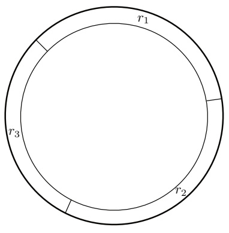

(a)

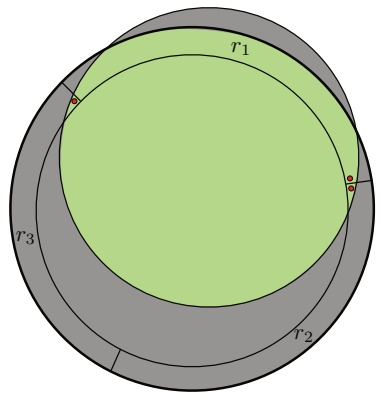

(b)

Figure 2.5

(a) Gertrude’s regions $r _ { 1 } , r _ { 2 } , r _ { 3 }$ . (b) Hint for solution.

Thus, the hypothesis must have a small error on both distributions. Let C be any concept class and H be any hypothesis space. Let $h _ { 0 }$ and $h _ { 1 }$ represent the identically 0 and identically 1 functions, respectively. Prove that C is efficiently PAC-learnable using H in the standard (one-oracle) PAC model if and only if it is efficiently PAC-learnable using $\mathcal { H } \cup \{ h _ { 0 } , h _ { 1 } \}$ in this two-oracle PAC model.

2.2 PAC learning of hyper-rectangles. An axis-aligned hyper-rectangle in $\mathbb { R } ^ { n }$ is a set of the form $[ a _ { 1 } , b _ { 1 } ] \times \ldots \times [ a _ { n } , b _ { n } ]$ . Show that axis-aligned hyper-rectangles are PAC-learnable by extending the proof given in Example 2.4 for the case $n = 2$

2.3 Concentric circles. Let $\mathcal { X } = \mathbb { R } ^ { 2 }$ and consider the set of concepts of the form $c = \{ ( x , y ) \colon x ^ { 2 } + y ^ { 2 } \leq r ^ { 2 } \}$ for some real number $r .$ Show that this class can be (, δ)-PAC-learned from training data of size $m \geq ( 1 / \epsilon ) \operatorname { l o g } ( 1 / \delta )$

2.4 Non-concentric circles. Let $\mathcal { X }   =   \mathbb { R } ^ { 2 }$ and consider the set of concepts of the form $c   =   \{ x   \in   \mathbb { R } ^ { 2 }   :   | | x   -   x _ { 0 } | |   \leq   r \}$ for some point $x _ { 0 }   \in   \mathbb { R } ^ { 2 }$ and real number $r .$ Gertrude, an aspiring machine learning researcher, attempts to show that this class of concepts may be $( \epsilon , \delta )$ -PAC-learned with sample complexity $m \geq$ $( 3 / \epsilon ) \log ( 3 / \delta )$ , but she is having trouble with her proof. Her idea is that the learning algorithm would select the smallest circle consistent with the training data. She has drawn three regions $r _ { 1 } , r _ { 2 } , r _ { 3 }$ around the edge of concept $c _ { \gamma }$ with each region having probability $\epsilon / 3$ (see figure 2.5(a)). She wants to argue that if the generalization error is greater than or equal to $\epsilon _ { \gamma }$ then one of these regions must have been missed by the training data, and hence this event will occur with probability at most δ. Can you tell Gertrude if her approach works? (Hint: You may wish to use figure 2.5(b) in your solution).

<!-- page: 42 -->

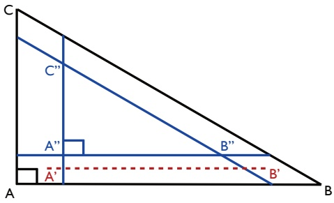

Figure 2.6

Axis-aligned right triangles.

2.5 Triangles. Let $\mathcal { X } = \mathbb { R } ^ { 2 }$ with orthonormal basis $( \mathbf { e } _ { 1 } , \mathbf { e } _ { 2 } )$ , and consider the set of concepts defined by the area inside a right triangle ABC with two sides parallel to the axes, with ${ \overrightarrow { A B } } / \| { \overrightarrow { A B } } \| = \mathbf { e } _ { 1 }$ and ${ \overrightarrow { A C } } / \| { \overrightarrow { A C } } \| = \mathbf { e } _ { 2 }$ , and $\| \overrightarrow { A B } \| / \| \overrightarrow { A C } \| = \alpha$ for some positive real $\alpha \in \mathbb { R } _ { + }$ . Show, using similar methods to those used in the chapter for the axis-aligned rectangles, that this class can be $( \epsilon , \delta )$ -PAC-learned from training data of size $m   \geq   ( 3 / \epsilon ) \log ( 3 / \delta )$ . (Hint: You may consider using figure 2.6 in your solution).

2.6 Learning in the presence of noise — rectangles. In example 2.4, we showed that the concept class of axis-aligned rectangles is PAC-learnable. Consider now the case where the training points received by the learner are subject to the following noise: points negatively labeled are unaffected by noise but the label of a positive training point is randomly flipped to negative with probability $\eta \in ( 0 , \textstyle { \frac { 1 } { 2 } } )$ . The exact value of the noise rate η is not known to the learner but an upper bound $\eta ^ { \prime }$ is supplied to him with $\eta \leq \eta ^ { \prime } < 1 / 2$ . Show that the algorithm returning the tightest rectangle containing positive points can still PAC-learn axis-aligned rectangles in the presence of this noise. To do so, you can proceed using the following steps:

(a) Using the same notation as in example 2.4, assume that $\mathbb { P } [ \mathsf { R } ] > \epsilon$ . Suppose that $R ( \mathsf { R } ^ { \prime } ) > \epsilon$ . Give an upper bound on the probability that $\mathsf { R } ^ { \prime }$ misses a region $r _ { j } ,   j \in [ 4 ]$ in terms of  and $\eta ^ { \prime } { } ^ { ? }$

(b) Use that to give an upper bound on $\mathbb { P } [ R ( \mathsf { R } ^ { \prime } ) > \epsilon ]$ in terms of  and $\eta ^ { \prime }$ and conclude by giving a sample complexity bound.

2.7 Learning in the presence of noise — general case. In this question, we will seek a result that is more general than in the previous question. We consider a finite hypothesis set ${ \mathcal { H } } ,$ assume that the target concept is in H, and adopt the following noise model: the label of a training point received by the learner is

<!-- page: 43 -->

randomly changed with probability $\eta \in ( 0 , \textstyle { \frac { 1 } { 2 } } )$ . The exact value of the noise rate η is not known to the learner but an upper bound $\eta ^ { \prime }$ is supplied to him with $\eta \leq \eta ^ { \prime } < 1 / 2$

(a) For any $h \in { \mathcal { H } } .$ , let $d ( h )$ denote the probability that the label of a training point received by the learner disagrees with the one given by h. Let $h ^ { * }$ be the target hypothesis, show that $d ( h ^ { * } ) = \eta$

(b) More generally, show that for any $h \in \mathcal { H } ,   d ( h ) = \eta + \left( 1 - 2 \eta \right) R ( h )$ , where $R ( h )$ denotes the generalization error of h.

(c) Fix $\epsilon > 0$ for this and all the following questions. Use the previous questions to show that if $R ( h ) > \epsilon ,$ , then $d ( h ) - d ( h ^ { * } ) \geq \epsilon ^ { \prime }$ , where $\epsilon ^ { \prime } = \epsilon ( 1 - 2 \eta ^ { \prime } )$

(d) For any hypothesis $h \in \mathcal { H }$ and sample S of size $m .$ , let $\widehat { d } ( h )$ denote the bfraction of the points in S whose labels disagree with those given by h. We will consider the algorithm L which, after receiving S, returns the hypothesis $h _ { S }$ with the smallest number of disagreements (thus $\widehat { d } ( h _ { S } )$ is minimal). To bshow PAC-learning for L, we will show that for any h, if $R ( h )   >   \epsilon ,$ then with high probability $\widehat { d } ( h )   \geq   \widehat { d } ( h ^ { * } )$ . First, show that for any $\delta > 0$ , with probability at least $1 - \delta / 2$ , for $\begin{array} { r } { m \geq \frac { 2 } { \epsilon ^ { \prime 2 } } } \end{array}$ log 2, the following holds:

$$
\widehat {d} (h ^ {*}) - d (h ^ {*}) \leq \epsilon^ {\prime} / 2
$$

(e) Second, show that for any $\delta \; > \; 0 .$ , with probability at least $1   -   \delta / 2$ , for $\begin{array} { r } { m \geq \frac { 2 } { \epsilon ^ { \prime 2 } } ( \log | \mathcal { H } | + \log \frac { 2 } { \delta } ) } \end{array}$ , the following holds for all $h \in { \mathcal { H } } ;$

$$
d (h) - \widehat {d} (h) \leq \epsilon^ {\prime} / 2
$$

(f) Finally, show that for any $\delta > 0$ , with probability at least $1 - \delta ,$ for $m \geq$ $\begin{array} { r } { \frac { 2 } { \epsilon ^ { 2 } ( 1 - 2 \eta ^ { \prime } ) ^ { 2 } } ( \log | \mathcal { H } | + \log \frac { 2 } { \delta } ) } \end{array}$ , the following holds for all $h \in \mathcal { H }$ with $R ( h ) > \epsilon \mathbf { : }$

$$
\widehat {d} (h) - \widehat {d} (h ^ {*}) \geq 0.
$$

(Hint: use $\hat { d } ( h ) - \hat { d } ( h ^ { * } ) = [ \hat { d } ( h ) - d ( h ) ] + [ d ( h ) - d ( h ^ { * } ) ] + [ d ( h ^ { * } ) - \hat { d } ( h ^ { * } ) ]$ and b  b buse previous questions to lower bound each of these three terms).

2.8 Learning intervals. Give a PAC-learning algorithm for the concept class C formed by closed intervals $[ a , b ]$ with $a , b \in \mathbb { R }$

2.9 Learning union of intervals. Give a PAC-learning algorithm for the concept class $\mathcal { C } _ { 2 }$ formed by unions of two closed intervals, that is $[ a , b ] \cup [ c , d ]$ , with $a , b , c , d \in \mathbb { R }$ Extend your result to derive a PAC-learning algorithm for the concept class $\mathcal { C } _ { p }$ formed by unions of $p \geq 1$ closed intervals, thus $[ a _ { 1 } , b _ { 1 } ] \cup \dots \cup [ a _ { p } , b _ { p } ]$ , with $a _ { k } , b _ { k }   \in   \mathbb { R }$ for $k   \in   [ p ]$ . What are the time and sample complexities of your algorithm as a function of $p ^ { ? }$

<!-- page: 44 -->

2.10 Consistent hypotheses. In this chapter, we showed that for a finite hypothesis set H, a consistent learning algorithm A is a PAC-learning algorithm. Here, we consider a converse question. Let Z be a finite set of m labeled points. Suppose that you are given a PAC-learning algorithm A. Show that you can use A and a finite training sample S to find in polynomial time a hypothesis $h \in \mathcal { H }$ that is consistent with Z, with high probability. (Hint: you can select an appropriate distribution D over Z and give a condition on $R ( h )$ for h to be consistent.)

2.11 Senate laws. For important questions, President Mouth relies on expert advice. He selects an appropriate advisor from a collection of $\mathcal { H } = 2 \mathrm { , } 8 0 0$ experts.

(a) Assume that laws are proposed in a random fashion independently and identically according to some distribution D determined by an unknown group of senators. Assume that President Mouth can find and select an expert senator out of H who has consistently voted with the majority for the last $m = 2 0 0$ laws. Give a bound on the probability that such a senator incorrectly predicts the global vote for a future law. What is the value of the bound with 95% confidence?

(b) Assume now that President Mouth can find and select an expert senator out of H who has consistently voted with the majority for all but $m ^ { \prime } = 2 0$ of the last $m = 2 0 0$ laws. What is the value of the new bound?

2.12 Bayesian bound. Let H be a countable hypothesis set of functions mapping X to {0, 1} and let p be a probability measure over H. This probability measure represents the prior probability over the hypothesis class, i.e. the probability that a particular hypothesis is selected by the learning algorithm. Use Hoeffding’s inequality to show that for any $\delta \; > \; 0$ , with probability at least $1 - \delta .$ , the following inequality holds:

$$
\forall h \in \mathcal {H}, R (h) \leq \widehat {R} _ {S} (h) + \sqrt {\frac {\log \frac {1}{p (h)} + \log \frac {1}{\delta}}{2 m}}.\tag{2.26}
$$

Compare this result with the bound given in the inconsistent case for finite hypothesis sets (Hint: you could use $\delta ^ { \prime }   =   p ( h ) \delta$ as confidence parameter in Hoeffding’s inequality).

2.13 Learning with an unknown parameter. In example 2.9, we showed that the concept class of k-CNF is PAC-learnable. Note, however, that the learning algorithm is given k as input. Is PAC-learning possible even when k is not provided? More generally, consider a family of concept classes $\{ \mathcal { C } _ { s } \}$ s where $\mathcal { C } _ { s }$ is the set of concepts in C with size at most s. Suppose we have a PAC-learning algorithm A that can be used for learning any concept class $\mathcal { C } _ { s }$ when s is given.

<!-- page: 45 -->

Can we convert A into a PAC-learning algorithm B that does not require the knowledge of $s ?$ This is the main objective of this problem.

To do this, we first introduce a method for testing a hypothesis h, with high probability. Fix $\epsilon \: > \: 0 , \delta \: > \: 0$ , and $i \geq 1$ and define the sample size n by $\begin{array} { r } { n = \frac { 3 2 } { \epsilon } [ i \log 2 + \log \frac { 2 } { \delta } ] } \end{array}$ . Suppose we draw an i.i.d. sample $S$ of size n according to some unknown distribution D. We will say that a hypothesis h is accepted if it makes at most $3 / 4 \epsilon$ errors on $S$ and that it is rejected otherwise. Thus, h is accepted iff $\widehat { R } ( h ) \stackrel { \cdot } { \leq } 3 / 4 \epsilon$

(a) Assume that $R ( h )   \geq   \epsilon .$ . Use the (multiplicative) Chernoff bound to show that in that case $\mathbb { P } _ { S \sim \mathcal { D } ^ { n } } [ h ]$ is $\begin{array} { r } { \mathrm { a c c e p t e d ] } \leq \frac { \delta } { 2 ^ { i + 1 } } } \end{array}$

(b) Assume that $R ( h ) \leq \epsilon / 2$ . Use the (multiplicative) Chernoff bounds to show that in that case $\mathbb { P } _ { S \sim \mathcal { D } ^ { n } } [ h ]$ is $\begin{array} { r } { \mathrm { r e j e c t e d } ] \leq \frac { \delta } { 2 ^ { i + 1 } } } \end{array}$

(c) Algorithm B is defined as follows: we start with $i = 1$ and, at each round $i \geq 1$ , we guess the parameter size s to be $\widetilde { s }   =   \lfloor 2 ^ { ( i - 1 ) / \log \frac { 2 } { \delta } } \rfloor$ . We draw a sample $S$ eof size n (which depends on i) to test the hypothesis $h _ { i }$ returned by A when it is trained with a sample of size $S _ { \mathcal { A } } ( \epsilon / 2 , 1 / 2 , \widetilde { s } )$ , that is the sample complexity of $\mathcal { A }$ for a required precision $\epsilon / 2$ e, confidence $1 / 2 ,$ , and size $\widetilde { s }$ (we ignore the size of the representation of each example here). If $h _ { i }$ is eaccepted, the algorithm stops and returns $h _ { i } ,$ otherwise it proceeds to the next iteration. Show that if at iteration i, the estimate $\widetilde { s }$ is larger than or equal to s, then $\mathbb { P } [ h _ { i }$ is accepted] $\geq 3 / 8$

(d) Show that the probability that B does not halt after $\textstyle j = \lceil \log { \frac { 2 } { \delta } } / \log { \frac { 8 } { 5 } } \rceil$ iterations with ${ \widetilde { s } } \geq s$ is at most $\delta / 2$

e(e) Show that for $\begin{array} { r } { i \geq \lceil 1 + ( \log _ { 2 } s ) \log \frac { 2 } { \delta } \rceil } \end{array}$ , the inequality ${ \widetilde { s } } \geq s$ holds.

(f) Show that with probability at least $1 - \delta$ e, algorithm B halts after at most $\begin{array} { r } { j ^ { \prime } = \lceil 1 + ( \log _ { 2 } s ) \log \frac { 2 } { \delta } \rceil + j } \end{array}$ iterations and returns a hypothesis with error at most .

2.14 In this exercise, we generalize the notion of noise to the case of an arbitrary loss function $L \colon \mathcal { Y } \times \mathcal { Y } \to \mathbb { R } _ { + }$

(a) Justify the following definition of the noise at point $x \in \mathcal { X }$

$$
\text {noise} (x) = \min _ {y ^ {\prime} \in \mathcal {Y}} \mathbb {E} _ {y} [ L (y, y ^ {\prime}) | x ].
$$

What is the value of noise(x) in a deterministic scenario? Does the definition match the one given in this chapter for binary classification?

(b) Show that the average noise coincides with the Bayes error (minimum loss achieved by a measurable function).

<!-- page: 46 -->

## 3 Rademacher Complexity and VC-Dimension

The hypothesis sets typically used in machine learning are infinite. But the sample complexity bounds of the previous chapter are uninformative when dealing with infinite hypothesis sets. One could ask whether efficient learning from a finite sample is even possible when the hypothesis set H is infinite. Our analysis of the family of axis-aligned rectangles (Example 2.4) indicates that this is indeed possible at least in some cases, since we proved that that infinite concept class was PAC-learnable. Our goal in this chapter will be to generalize that result and derive general learning guarantees for infinite hypothesis sets.

A general idea for doing so consists of reducing the infinite case to the analysis of finite sets of hypotheses and then proceed as in the previous chapter. There are different techniques for that reduction, each relying on a different notion of complexity for the family of hypotheses. The first complexity notion we will use is that of Rademacher complexity. This will help us derive learning guarantees using relatively simple proofs based on McDiarmid’s inequality, while obtaining highquality bounds, including data-dependent ones, which we will frequently make use of in future chapters. However, the computation of the empirical Rademacher complexity is NP-hard for some hypothesis sets. Thus, we subsequently introduce two other purely combinatorial notions, the growth function and the VC-dimension. We first relate the Rademacher complexity to the growth function and then bound the growth function in terms of the VC-dimension. The VC-dimension is often easier to bound or estimate. We will review a series of examples showing how to compute or bound it, then relate the growth function and the VC-dimensions. This leads to generalization bounds based on the VC-dimension. Finally, we present lower bounds based on the VC-dimension for two different settings: The realizable setting, where there is at least one hypothesis in the hypothesis set under consideration that achieves zero expected error, as well as the non-realizable setting, where no hypothesis in the set achieves zero expected error.

<!-- page: 47 -->

## 3.1 Rademacher complexity

We will continue to use H to denote a hypothesis set as in the previous chapters. Many of the results of this section are general and hold for an arbitrary loss function $L \colon \mathcal { Y } \times \mathcal { Y } \to \mathbb { R }$ . In what follows, G will generally be interpreted as the family of loss functions associated to H mapping from $\mathcal { Z } = \mathcal { X } \times \mathcal { Y }$ to R:

$$
\mathcal {G} = \{g \colon (x, y) \mapsto L (h (x), y) \colon h \in \mathcal {H} \}.
$$

However, the definitions are given in the general case of a family of functions G mapping from an arbitrary input space Z to R.

The Rademacher complexity captures the richness of a family of functions by measuring the degree to which a hypothesis set can fit random noise. The following states the formal definitions of the empirical and average Rademacher complexity.

**Definition 3.1 (Empirical Rademacher complexity)** Let G be a family of functions mapping from Z to $[ a , b ]$ and $S = ( z _ { 1 } , \ldots , z _ { m } )$ a fixed sample of size m with elements in Z. Then, the empirical Rademacher complexity of G with respect to the sample S is defined as:

$$
\widehat {\mathfrak {R}} _ {S} (\mathcal {G}) = \underset {\boldsymbol {\sigma}} {\mathbb {E}} \left[ \sup _ {g \in \mathcal {G}} \frac {1}{m} \sum_ {i = 1} ^ {m} \sigma_ {i} g (z _ {i}) \right],\tag{3.1}
$$

where $\pmb { \sigma } = ( \sigma _ { 1 } , \dots , \sigma _ { m } ) ^ { \top }$ , with $\sigma _ { i } s$ independent uniform random variables taking values in $\{ - 1 , + 1 \} . ^ { 3 }$ The random variables $\sigma _ { i }$ are called Rademacher variables.

Let gS denote the vector of values taken by function g over the sample $S { \mathrm { : ~ } } \mathbf { g } _ { S } =$ $( g ( z _ { 1 } ) , \ldots , g ( z _ { m } ) ) ^ { \top }$ . Then, the empirical Rademacher complexity can be rewritten as

$$
\widehat {\mathfrak {R}} _ {S} (\mathcal {G}) = \underset {\boldsymbol {\sigma}} {\mathbb {E}} \left[ \sup _ {g \in \mathcal {G}} \frac {\boldsymbol {\sigma} \cdot \mathbf {g} _ {S}}{m} \right].
$$

The inner product $\sigma \cdot \mathbf { g } _ { S }$ measures the correlation of gS with the vector of random noise $\sigma .$ The supremum $\textstyle \operatorname* { s u p } _ { g \in { \mathfrak { G } } } { \frac { { \pmb { \sigma } } \cdot { \bf g } _ { S } } { m } }$ is a measure of how well the function class G correlates with $\sigma$ over the sample S. Thus, the empirical Rademacher complexity measures on average how well the function class $\mathcal { G }$ correlates with random noise on $S .$ This describes the richness of the family $\mathcal { G } ;$ richer or more complex families G can generate more vectors gS and thus better correlate with random noise, on average.

<small>3 We assume implicitly that the supremum over the family G in this definition is measurable and in general will adopt the same assumption throughout this book for other suprema over a class of functions. This assumption does not hold for arbitrary function classes but it is valid for the hypotheses sets typically considered in practice in machine learning, and the instances discussed in this book.</small>

<!-- page: 48 -->

**Definition 3.2 (Rademacher complexity)** Let D denote the distribution according to which samples are drawn. For any integer m $\geq 1$ , the Rademacher complexity of G is the expectation of the empirical Rademacher complexity over all samples of size m drawn according to D:

$$
\mathfrak {R} _ {m} (\mathcal {G}) = \underset {S \sim \mathcal {D} ^ {m}} {\mathbb {E}} [ \widehat {\mathfrak {R}} _ {S} (\mathcal {G}) ].\tag{3.2}
$$

We are now ready to present our first generalization bounds based on Rademacher complexity.

**Theorem 3.3** Let G be a family of functions mapping from Z to $[ 0 , 1 ]$ . Then, for any $\delta > 0$ , with probability at least $1 - \delta$ over the draw of an i.i.d. sample S of size $m ,$ each of the following holds for all $g \in { \mathcal { G } }$

$$
\mathbb {E} [ g (z) ] \leq \frac {1}{m} \sum_ {i = 1} ^ {m} g (z _ {i}) + 2 \Re_ {m} (\mathcal {G}) + \sqrt {\frac {\log \frac {1}{\delta}}{2 m}}\tag{3.3}
$$

$$
\text {and} \quad \mathbb {E} [ g (z) ] \leq \frac {1}{m} \sum_ {i = 1} ^ {m} g (z _ {i}) + 2 \widehat {\Re} _ {S} (\mathcal {G}) + 3 \sqrt {\frac {\log \frac {2}{\delta}}{2 m}}.\tag{3.4}
$$

Proof: For any sample $S = ( z _ { 1 } , \ldots , z _ { m } )$ and any $g \in { \mathcal { G } }$ , we denote by $\widehat { \mathbb { E } } _ { S } [ g ]$ the empirical average of $g$ over S: $\begin{array} { r } { \widehat { \mathbb { E } } _ { S } [ g ] = \frac { 1 } { m } \sum _ { i = 1 } ^ { m } g ( z _ { i } ) } \end{array}$ b. The proof consists of applying bMcDiarmid’s inequality to function Φ defined for any sample $S$ by

$$
\Phi (S) = \sup _ {g \in \mathcal {G}} \Big (\mathbb {E} [ g ] - \widehat {\mathbb {E}} _ {S} [ g ] \Big).\tag{3.5}
$$

Let $S$ and $S ^ { \prime }$ be two samples differing by exactly one point, say $z _ { m }$ in $S$ and $z _ { m } ^ { \prime }$ in $S ^ { \prime }$ . Then, since the difference of suprema does not exceed the supremum of the difference, we have

$$
\Phi (S ^ {\prime}) - \Phi (S) \leq \sup _ {g \in \mathcal {G}} \left(\widehat {\mathbb {E}} _ {S} [ g ] - \widehat {\mathbb {E}} _ {S ^ {\prime}} [ g ]\right) = \sup _ {g \in \mathcal {G}} \frac {g (z _ {m}) - g (z _ {m} ^ {\prime})}{m} \leq \frac {1}{m}.\tag{3.6}
$$

Similarly, we can obtain $\Phi ( S ) - \Phi ( S ^ { \prime } ) \leq 1 / m$ , thus $| \Phi ( S ) - \Phi ( S ^ { \prime } ) | \leq 1 / m$ . Then, by McDiarmid’s inequality, for any $\delta > 0$ , with probability at least $1 - \delta / 2$ , the following holds:

$$
\Phi (S) \leq \underset {S} {\mathbb {E}} [ \Phi (S) ] + \sqrt {\frac {\log \frac {2}{\delta}}{2 m}}.\tag{3.7}
$$

<!-- page: 49 -->

We next bound the expectation of the right-hand side as follows:

$$
\begin{array}{r} \underset {S} {\mathbb {E}} [ \Phi (S) ] = \underset {S} {\mathbb {E}} \left[ \sup _ {g \in \mathcal {G}} \left(\mathbb {E} [ g ] - \widehat {\mathbb {E}} _ {S} (g)\right) \right] \\ = \underset {S} {\mathbb {E}} \left[ \sup _ {g \in \mathcal {G}} \underset {S ^ {\prime}} {\mathbb {E}} \left[ \widehat {\mathbb {E}} _ {S ^ {\prime}} (g) - \widehat {\mathbb {E}} _ {S} (g) \right] \right] \end{array}\tag{3.8}
$$

$$
\leq \underset {S, S ^ {\prime}} {\mathbb {E}} \left[ \sup _ {g \in \mathcal {G}} \left(\widehat {\mathbb {E}} _ {S ^ {\prime}} (g) - \widehat {\mathbb {E}} _ {S} (g)\right) \right]\tag{3.9}
$$

$$
= \underset {S, S ^ {\prime}} {\mathbb {E}} \left[ \sup _ {g \in \mathcal {G}} \frac {1}{m} \sum_ {i = 1} ^ {m} (g (z _ {i} ^ {\prime}) - g (z _ {i})) \right]\tag{3.10}
$$

$$
= \underset {\pmb {\sigma}, S, S ^ {\prime}} {\mathbb {E}} \left[ \sup _ {g \in \mathcal {G}} \frac {1}{m} \sum_ {i = 1} ^ {m} \sigma_ {i} (g (z _ {i} ^ {\prime}) - g (z _ {i})) \right]\tag{3.11}
$$

$$
\leq \underset {\boldsymbol {\sigma}, S ^ {\prime}} {\mathbb {E}} \left[ \sup _ {g \in \mathcal {G}} \frac {1}{m} \sum_ {i = 1} ^ {m} \sigma_ {i} g (z _ {i} ^ {\prime}) \right] + \underset {\boldsymbol {\sigma}, S} {\mathbb {E}} \left[ \sup _ {g \in \mathcal {G}} \frac {1}{m} \sum_ {i = 1} ^ {m} - \sigma_ {i} g (z _ {i}) \right]\tag{3.12}
$$

$$
= 2 \underset {\pmb {\sigma}, S} {\mathbb {E}} \left[ \sup _ {g \in \mathcal {G}} \frac {1}{m} \sum_ {i = 1} ^ {m} \sigma_ {i} g (z _ {i}) \right] = 2 \Re_ {m} (\mathcal {G}).\tag{3.13}
$$

Equation (3.8) uses the fact that points in $S ^ { \prime }$ are sampled in an i.i.d. fashion and thus $\mathbb { E } [ g ] = \mathbb { E } _ { S ^ { \prime } } [ \widehat { \mathbb { E } } _ { S ^ { \prime } } ( g ) ]$ , as in (2.3). Inequality 3.9 holds due to the sub-additivity bof the supremum function.

In equation (3.11), we introduce Rademacher variables $\sigma _ { i }$ , which are uniformly distributed independent random variables taking values in $\{ - 1 , + 1 \}$ as in definition 3.2. This does not change the expectation appearing in (3.10): when $\sigma _ { i } = 1$ the associated summand remains unchanged; when $\sigma _ { i } = - 1$ , the associated summand flips signs, which is equivalent to swapping $z _ { i }$ and $z _ { i } ^ { \prime }$ between $S$ and $S ^ { \prime }$ . Since we are taking the expectation over all possible $S$ and $S ^ { \prime }$ , this swap does not affect the overall expectation; we are simply changing the order of the summands within the expectation.

Equation (3.12) holds by the sub-additivity of the supremum function, that is the inequality sup $\mathrm { b } ( U   +   V )   \leq   \mathrm { s u p } ( U )   +   \mathrm { s u p } ( V )$ Finally, (3.13) stems from the definition of Rademacher complexity and the fact that the variables $\sigma _ { i }$ and $- \sigma _ { i }$ are distributed in the same way.

The reduction to $\Re _ { m } ( \mathcal { G } )$ in equation (3.13) yields the bound in equation (3.3), using $\delta$ instead of $\delta / 2$ . To derive a bound in terms of $\hat { \mathfrak { R } } _ { S } ( \mathfrak { G } )$ , we observe that, by definition 3.1, changing one point in $S$ changes $\widehat { \mathfrak { R } } _ { S } ( \mathfrak { G } )$ b by at most $1 / m$ . Then, using again McDiarmid’s inequality, with probability $1 - \delta / 2$ the following holds:

$$
\mathfrak {R} _ {m} (\mathcal {G}) \leq \widehat {\mathfrak {R}} _ {S} (\mathcal {G}) + \sqrt {\frac {\log \frac {2}{\delta}}{2 m}}.\tag{3.14}
$$

<!-- page: 50 -->

Finally, we use the union bound to combine inequalities 3.7 and 3.14, which yields with probability at least $1 - \delta ;$

$$
\Phi (S) \leq 2 \widehat {\mathfrak {R}} _ {S} (\mathcal {G}) + 3 \sqrt {\frac {\log \frac {2}{\delta}}{2 m}},\tag{3.15}
$$

which matches (3.4).

The following result relates the empirical Rademacher complexities of a hypothesis set H and to the family of loss functions G associated to H in the case of binary loss (zero-one loss).

**Lemma 3.4** Let H be a family of functions taking values in $\{ - 1 , + 1 \}$ and let G be the family of loss functions associated to H for the zero-one loss: ${ \mathcal { G } } = \{ ( x , y ) \mapsto$ $1 _ { h ( x ) \neq y } \colon h \; \in \; { \mathcal { H } } \big \}$ . For any sample $S \; = \; ( ( x _ { 1 } , y _ { 1 } ) , \ldots , ( x _ { m } , y _ { m } ) )$ of elements in $\mathcal { X } \times \{ - 1 , + 1 \}$ , let $S _ { X }$ denote its projection over X: $S _ { \mathfrak { X } }   =   ( x _ { 1 } , \ldots , x _ { m } )$ Then, the following relation holds between the empirical Rademacher complexities of G and H:

$$
\widehat {\mathfrak {R}} _ {S} (\mathcal {G}) = \frac {1}{2} \widehat {\mathfrak {R}} _ {S _ {x}} (\mathcal {H}).\tag{3.16}
$$

Proof: For any sample $\mathbf { \mathit { S } } { = } ( ( x _ { 1 } , y _ { 1 } ) , \ldots , ( x _ { m } , y _ { m } ) )$ of elements in $\mathcal { X } \times \{ - 1 , + 1 \}$ by definition, the empirical Rademacher complexity of G can be written as:

$$
\begin{array}{l} \widehat {\mathfrak {R}} _ {S} (\mathcal {G}) = \underset {\boldsymbol {\sigma}} {\mathbb {E}} \left[ \sup _ {h \in \mathcal {H}} \frac {1}{m} \sum_ {i = 1} ^ {m} \sigma_ {i} 1 _ {h (x _ {i}) \neq y _ {i}} \right] \\ \quad = \underset {\boldsymbol {\sigma}} {\mathbb {E}} \left[ \sup _ {h \in \mathcal {H}} \frac {1}{m} \sum_ {i = 1} ^ {m} \sigma_ {i} \frac {1 - y _ {i} h (x _ {i})}{2} \right] \\ \quad = \frac {1}{2} \underset {\boldsymbol {\sigma}} {\mathbb {E}} \left[ \sup _ {h \in \mathcal {H}} \frac {1}{m} \sum_ {i = 1} ^ {m} - \sigma_ {i} y _ {i} h (x _ {i}) \right] \\ \quad = \frac {1}{2} \underset {\boldsymbol {\sigma}} {\mathbb {E}} \left[ \sup _ {h \in \mathcal {H}} \frac {1}{m} \sum_ {i = 1} ^ {m} \sigma_ {i} h (x _ {i}) \right] = \frac {1}{2} \widehat {\mathfrak {R}} _ {S _ {\mathscr {X}}} (\mathcal {H}), \end{array}
$$

where we used the fact that $1 _ { h ( x _ { i } ) \neq y _ { i } } = ( 1 - y _ { i } h ( x _ { i } ) ) / 2$ and the fact that for a fixed $y_{i} \in \{-1, +1\},   \sigma_{i}$ and $- y _ { i } \sigma _ { i }$ are distributed in the same way. 

Note that the lemma implies, by taking expectations, that for any $m \geq 1, \Re_{m}(\mathcal{G}) =$ $\textstyle { \frac { 1 } { 2 } } { \mathfrak { R } } _ { m } ( { \mathcal { H } } )$ . These connections between the empirical and average Rademacher complexities can be used to derive generalization bounds for binary classification in terms of the Rademacher complexity of the hypothesis set H.

**Theorem 3.5 (Rademacher complexity bounds – binary classification )** Let H be a family of functions taking values in $\{ - 1 , + 1 \}$ and let D be the distribution over the input space X. Then, for any $\delta > 0$ , with probability at least $1 - \delta$ over a sample S of

<!-- page: 51 -->

size m drawn according to D, each of the following holds for any $h \in { \mathcal { H } } .$

$$
R (h) \leq \widehat {R} _ {S} (h) + \Re_ {m} (\mathcal {H}) + \sqrt {\frac {\log \frac {1}{\delta}}{2 m}}\tag{3.17}
$$

$$
\text {and} \quad R (h) \leq \widehat {R} _ {S} (h) + \widehat {\mathfrak {R}} _ {S} (\mathcal {H}) + 3 \sqrt {\frac {\log \frac {2}{\delta}}{2 m}}.\tag{3.18}
$$

Proof: The result follows immediately by theorem 3.3 and lemma 3.4.

The theorem provides two generalization bounds for binary classification based on the Rademacher complexity. Note that the second bound, (3.18), is data-dependent: the empirical Rademacher complexity $\hat { \mathfrak { R } } _ { S } ( \mathcal { H } )$ is a function of the specific sample bS drawn. Thus, this bound could be particularly informative if we could compute $\hat { \mathfrak { R } } _ { S } ( \mathfrak { R } )$ . But, how can we compute the empirical Rademacher complexity? Using bagain the fact that $\sigma _ { i }$ and $- \sigma _ { i }$ are distributed in the same way, we can write

$$
\widehat {\mathfrak {R}} _ {S} (\mathcal {H}) = \underset {\boldsymbol {\sigma}} {\mathbb {E}} \left[ \sup _ {h \in \mathcal {H}} \frac {1}{m} \sum_ {i = 1} ^ {m} - \sigma_ {i} h (x _ {i}) \right] = - \underset {\boldsymbol {\sigma}} {\mathbb {E}} \left[ \inf _ {h \in \mathcal {H}} \frac {1}{m} \sum_ {i = 1} ^ {m} \sigma_ {i} h (x _ {i}) \right].
$$

Now, for a fixed value of $\sigma ,$ computing inf $\textstyle \operatorname { f } _ { h \in \mathcal { H } } \frac { 1 } { m } \sum _ { i = 1 } ^ { m } \sigma _ { i } h ( x _ { i } )$ is equivalent to an empirical risk minimization problem, which is known to be computationally hard for some hypothesis sets. Thus, in some cases, computing $\hat { \mathfrak { R } } _ { S } ( \mathcal { H } )$ could be compubtationally hard. In the next sections, we will relate the Rademacher complexity to combinatorial measures that are easier to compute and also of independent interest for their usefulness in the analysis of learning in many contexts.

## 3.2 Growth function

Here we will show how the Rademacher complexity can be bounded in terms of the growth function.

**Definition 3.6 (Growth function)** The growth function $\Pi _ { \mathcal { H } } \colon \mathbb { N }   \to   \mathbb { N }$ for a hypothesis set H is defined by:

$$
\forall m \in \mathbb {N}, \Pi_ {\mathcal {H}} (m) = \max _ {\{x _ {1}, \dots , x _ {m} \} \subseteq X} \left| \left\{\left(h (x _ {1}), \dots , h (x _ {m})\right): h \in \mathcal {H} \right\} \right|.\tag{3.19}
$$

In other words, $\Pi _ { \mathcal { H } } ( m )$ is the maximum number of distinct ways in which m points can be classified using hypotheses in H. Each one of these distinct classifications is called a dichotomy and, thus, the growth function counts the number of dichotomies that are realized by the hypothesis. This provides another measure of the richness of the hypothesis set H. However, unlike the Rademacher complexity, this measure does not depend on the distribution, it is purely combinatorial.

<!-- page: 52 -->

To relate the Rademacher complexity to the growth function, we will use Massart’s lemma.

**Theorem 3.7 (Massart’s lemma)** Let $\mathcal { A } \subseteq \mathbb { R } ^ { m }$ be a finite set, with $r = \operatorname { m a x } _ { \mathbf { x } \in \mathcal { A } } \| \mathbf { x } \| _ { 2 }$ then the following holds:

$$
\underset {\boldsymbol {\sigma}} {\mathbb {E}} \left[ \frac {1}{m} \sup _ {\mathbf {x} \in \mathcal {A}} \sum_ {i = 1} ^ {m} \sigma_ {i} x _ {i} \right] \leq \frac {r \sqrt {2 \log | \mathcal {A} |}}{m},\tag{3.20}
$$

where $\sigma _ { i } s$ are independent uniform random variables taking values in $\{ - 1 , + 1 \}$ and $x _ { 1 } , \ldots , x _ { m }$ are the components of vector x.

Proof: The result follows immediately from the bound on the expectation of a maximum given by Corollary D.11 since the random variables $\sigma _ { i } x _ { i }$ are independent and each $\sigma _ { i } x _ { i }$ takes values in $[ - | x _ { i } | , | x _ { i } | ]$ with ${ \sqrt { \textstyle \sum _ { i = 1 } ^ { m } x _ { i } ^ { 2 } } } \leq r ^ { 2 }$ 

Using this result, we can now bound the Rademacher complexity in terms of the growth function.

**Corollary 3.8** Let G be a family of functions taking values in $\{ - 1 , + 1 \}$ . Then the following holds:

$$
\Re_ {m} (\mathcal {G}) \leq \sqrt {\frac {2 \log \Pi_ {\mathcal {G}} (m)}{m}}.\tag{3.21}
$$

Proof: For a fixed sample $S   =   ( x _ { 1 } , \ldots , x _ { m } )$ , we denote by $\mathcal { G } _ { | S }$ the set of vectors of function values $( g ( x _ { 1 } ) , \ldots , g ( x _ { m } ) ) ^ { \top }$ where g is in G. Since $g \in { \mathfrak { G } }$ takes values in $\{ - 1 , + 1 \}$ , the norm of these vectors is bounded by $\sqrt { m }$ . We can then apply Massart’s lemma as follows:

$$
\mathfrak {R} _ {m} (\mathcal {G}) = \underset {S} {\mathbb {E}} \left[ \underset {\boldsymbol {\sigma}} {\mathbb {E}} \left[ \sup _ {u \in \mathcal {G} _ {| S}} \frac {1}{m} \sum_ {i = 1} ^ {m} \sigma_ {i} u _ {i} \right] \right] \leq \underset {S} {\mathbb {E}} \left[ \frac {\sqrt {m} \sqrt {2 \log | \mathcal {G} _ {| S} |}}{m} \right].
$$

By definition, $| \mathcal { G } _ { | S | }$ is bounded by the growth function, thus,

$$
\mathfrak {R} _ {m} (\mathcal {G}) \leq \underset {S} {\mathbb {E}} \left[ \frac {\sqrt {m} \sqrt {2 \log \Pi_ {\mathcal {G}} (m)}}{m} \right] = \sqrt {\frac {2 \log \Pi_ {\mathcal {G}} (m)}{m}},
$$

which concludes the proof.

Combining the generalization bound (3.17) of theorem 3.5 with corollary 3.8 yields immediately the following generalization bound in terms of the growth function.

**Corollary 3.9 (Growth function generalization bound)** Let H be a family of functions taking values in $\{ - 1 , + 1 \}$ . Then, for any $\delta   >   0$ , with probability at least $1 - \delta _ { l }$ for any $h \in \mathcal { H }$

$$
R (h) \leq \widehat {R} _ {S} (h) + \sqrt {\frac {2 \log \Pi_ {\mathcal {H}} (m)}{m}} + \sqrt {\frac {\log \frac {1}{\delta}}{2 m}}.\tag{3.22}
$$

<!-- page: 53 -->

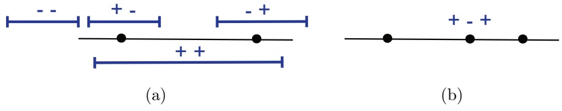

Figure 3.1

VC-dimension of intervals on the real line. (a) Any two points can be shattered. (b) No sample of three points can be shattered as the $( + , - , + )$ labeling cannot be realized.

Growth function bounds can be also derived directly (without using Rademacher complexity bounds first). The resulting bound is then the following:

$$
\mathbb {P} \left[ \left| R (h) - \widehat {R} _ {S} (h) \right| > \epsilon \right] \leq 4 \Pi_ {\mathcal {H}} (2 m) \exp \left(- \frac {m \epsilon^ {2}}{8}\right),\tag{3.23}
$$

which only differs from (3.22) by constants.

The computation of the growth function may not be always convenient since, by definition, it requires computing $\Pi _ { \mathcal { H } } ( m )$ for all $m \geq 1$ . The next section introduces an alternative measure of the complexity of a hypothesis set H that is based instead on a single scalar, which will turn out to be in fact deeply related to the behavior of the growth function.

## 3.3 VC-dimension

Here, we introduce the notion of VC-dimension (Vapnik-Chervonenkis dimension). The VC-dimension is also a purely combinatorial notion but it is often easier to compute than the growth function (or the Rademacher Complexity). As we shall see, the VC-dimension is a key quantity in learning and is directly related to the growth function.

To define the VC-dimension of a hypothesis set H, we first introduce the concept of shattering. Recall from the previous section, that given a hypothesis set H, a dichotomy of a set S is one of the possible ways of labeling the points of S using a hypothesis in H. A set S of $m \geq 1$ points is said to be shattered by a hypothesis set H when H realizes all possible dichotomies of S, that is when $\Pi _ { \mathcal { H } } ( m ) = 2 ^ { m }$

**Definition 3.10 (VC-dimension)** The VC-dimension of a hypothesis set H is the size of the largest set that can be shattered by H:

$$
\mathrm{VCdim} (\mathcal {H}) = \max \{m \colon \Pi_ {\mathcal {H}} (m) = 2 ^ {m} \}.\tag{3.24}
$$

Note that, by definition, if $\operatorname { V C d i m } ( { \mathcal { H } } ) = d ,$ there exists a set of size d that can be shattered. However, this does not imply that all sets of size d or less are shattered and, in fact, this is typically not the case.

<!-- page: 54 -->

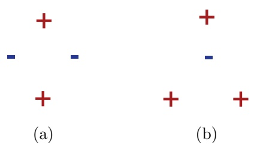

Figure 3.2

Unrealizable dichotomies for four points using hyperplanes in $\mathbb { R } ^ { 2 }$ . (a) All four points lie on the convex hull. (b) Three points lie on the convex hull while the remaining point is interior.

To further illustrate this notion, we will examine a series of examples of hypothesis sets and will determine the VC-dimension in each case. To compute the VC-dimension we will typically show a lower bound for its value and then a matching upper bound. To give a lower bound d for VCdim(H), it suffices to show that a set S of cardinality d can be shattered by H. To give an upper bound, we need to prove that no set $S$ of cardinality $d + 1$ can be shattered by H, which is typically more difficult.

**Example 3.11 (Intervals on the real line)** Our first example involves the hypothesis class of intervals on the real line. It is clear that the VC-dimension is at least two, since all four dichotomies $( + , + ) , ( - , - ) , ( + , - ) , ( - , + )$ can be realized, as illustrated in figure $3 . 1 ( \mathrm { a } )$ . In contrast, by the definition of intervals, no set of three points can be shattered since the $( + , - , + )$ labeling cannot be realized. Hence, VCdim(intervals in $\mathbb { R } ) = 2$

**Example 3.12 (Hyperplanes)** Consider the set of hyperplanes in $\mathbb { R } ^ { 2 }$ . We first observe that any three non-collinear points in $\mathbb { R } ^ { 2 }$ can be shattered. To obtain the first three dichotomies, we choose a hyperplane that has two points on one side and the third point on the opposite side. To obtain the fourth dichotomy we have all three points on the same side of the hyperplane. The remaining four dichotomies are realized by simply switching signs. Next, we show that four points cannot be shattered by considering two cases: (i) the four points lie on the convex hull defined by the four points, and (ii) three of the four points lie on the convex hull and the remaining point is internal. In the first case, a positive labeling for one diagonal pair and a negative labeling for the other diagonal pair cannot be realized, as illustrated in figure 3.2(a). In the second case, a labeling which is positive for the points on the convex hull and negative for the interior point cannot be realized, as illustrated in figure 3.2(b). Hence, VCdim(hyperplanes in $\mathbb { R } ^ { 2 } ) = 3$

More generally in $\mathbb { R } ^ { d }$ , we derive a lower bound by starting with a set of $d { + } 1$ points in $\mathbb { R } ^ { d } .$ , setting $\mathbf { x } _ { 0 }$ to be the origin and defining $\mathbf { x } _ { i } ,$ for $i \in \{ 1 , \ldots , d \}$ , as the point whose ith coordinate is 1 and all others are 0. Let $y _ { 0 } , y _ { 1 } , \ldots , y _ { d } \in \{ - 1 , + 1 \}$ be an

<!-- page: 55 -->

arbitrary set of labels for $\mathbf { x } _ { 0 } , \mathbf { x } _ { 1 } , \ldots , \mathbf { x } _ { d }$ . Let w be the vector whose ith coordinate is $y _ { i }$ . Then the classifier defined by the hyperplane of equation $\begin{array} { r } { { \bf w }   \cdot   { \bf x }   +   \frac { y _ { 0 } } { 2 }   =   0 } \end{array}$ shatters $\mathbf { x } _ { 0 } , \mathbf { x } _ { 1 } , \ldots , \mathbf { x } _ { d }$ since for any $i \in \{ 0 , \ldots , d \}$

$$
\operatorname{sgn} \left(\mathbf {w} \cdot \mathbf {x} _ {i} + \frac {y _ {0}}{2}\right) = \operatorname{sgn} \left(y _ {i} + \frac {y _ {0}}{2}\right) = y _ {i}.\tag{3.25}
$$

To obtain an upper bound, it suffices to show that no set of $d + 2$ points can be shattered by halfspaces. To prove this, we will use the following general theorem.

**Theorem 3.13 (Radon’s theorem)** Any set X of $d + 2$ points in $\mathbb { R } ^ { d }$ can be partitioned into two subsets $\mathcal { X } _ { 1 }$ and $\mathcal { X } _ { 2 }$ such that the convex hulls of $\mathcal { X } _ { 1 }$ and $\mathcal { X } _ { 2 }$ intersect.

Proof: Let $\mathcal { X }   =   \{ \mathbf { x } _ { 1 } , \ldots , \mathbf { x } _ { d + 2 } \}   \subset   \mathbb { R } ^ { d }$ . The following is a system of $d + 1$ linear equations in $\alpha _ { 1 } , \ldots , \alpha _ { d + 2 } { : }$

$$
\sum_ {i = 1} ^ {d + 2} \alpha_ {i} \mathbf {x} _ {i} = 0 \qquad \text {and} \qquad \sum_ {i = 1} ^ {d + 2} \alpha_ {i} = 0,\tag{3.26}
$$

since the first equality leads to d equations, one for each component. The number of unknowns, $d + 2$ , is larger than the number of equations, $d + 1$ , therefore the system admits a non-zero solution $\beta _ { 1 } , \ldots , \beta _ { d + 2 }$ . Since $\textstyle \sum _ { i = 1 } ^ { d + 2 } \beta _ { i }   =   0$ , both $\mathcal { I } _ { 1 } =$ $\{ i   \in   [ d   +   2 ] \colon \beta _ { i }   >   0 \}$ and $\mathfrak { I } _ { 2 }   =   \{ i   \in   [ d   +   2 ] \colon \beta _ { i }   \le   0 \}$ are non-empty sets and $\mathcal { X } _ { 1 }   =   \{ \mathbf { x } _ { i }   :   i   \in   \mathbb { J } _ { 1 } \}$ and $\mathcal { X } _ { 2 } \: = \: \{ \mathbf { x } _ { i } \colon i \: \in \: \mathbb { J } _ { 2 } \}$ form a partition of X. By the last equation of (3.26), $\textstyle \sum _ { i \in \mathbb { J } _ { 1 } } \beta _ { i } = - \sum _ { i \in \mathbb { J } _ { 2 } } \beta _ { i }$ . Let $\begin{array} { r } { \beta = \sum _ { i \in \mathcal { I } _ { 1 } } \beta _ { i } } \end{array}$ . Then, the first part of (3.26) implies

$$
\sum_ {i \in \mathfrak {I} _ {1}} \frac {\beta_ {i}}{\beta} \mathbf {x} _ {i} = \sum_ {i \in \mathfrak {I} _ {2}} \frac {- \beta_ {i}}{\beta} \mathbf {x} _ {i},
$$

with $\begin{array} { r } { \sum _ { i \in \mathcal { I } _ { 1 } } \frac { \beta _ { i } } { \beta } = \sum _ { i \in \mathcal { I } _ { 2 } } \frac { - \beta _ { i } } { \beta } = 1 } \end{array}$ , and $\begin{array} { r } { \frac { \beta _ { i } } { \beta } \geq 0 } \end{array}$ for $i \in \mathbb { J } _ { 1 }$ and $\begin{array} { r } { \frac { - \beta _ { i } } { \beta } \geq 0 } \end{array}$ for $i \in \mathbb { J } _ { 2 }$ . By definition of the convex hulls (B.6), this implies that $\textstyle \sum _ { i \in \mathbb { J } _ { 1 } } \frac { \beta _ { i } } { \beta } \mathbf { x } _ { i }$ belongs both to the convex hull of $\mathcal { X } _ { 1 }$ and to that of $\mathcal { X } _ { 2 }$ 

Now, let X be a set of $d + 2$ points. By Radon’s theorem, it can be partitioned into two sets $\mathcal { X } _ { 1 }$ and $\mathcal { X } _ { 2 }$ such that their convex hulls intersect. Observe that when two sets of points $\mathcal { X } _ { 1 }$ and $\mathcal { X } _ { 2 }$ are separated by a hyperplane, their convex hulls are also separated by that hyperplane. Thus, $\mathcal { X } _ { 1 }$ and $\mathcal { X } _ { 2 }$ cannot be separated by a hyperplane and X is not shattered. Combining our lower and upper bounds, we have proven that VCdim(hyperplanes in $\mathbb { R } ^ { d } ) = d + 1$

**Example 3.14 (Axis-aligned Rectangles)** We first show that the VC-dimension is at least four, by considering four points in a diamond pattern. Then, it is clear that all 16 dichotomies can be realized, some of which are illustrated in figure 3.3(a). In contrast, for any set of five distinct points, if we construct the minimal axisaligned rectangle containing these points, one of the five points is in the interior of

<!-- page: 56 -->

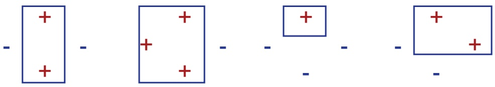

(a)

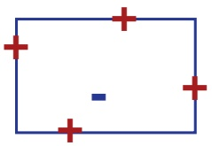

(b)

Figure 3.3

VC-dimension of axis-aligned rectangles. (a) Examples of realizable dichotomies for four points in a diamond pattern. (b) No sample of five points can be realized if the interior point and the remaining points have opposite labels.

this rectangle. Imagine that we assign a negative label to this interior point and a positive label to each of the remaining four points, as illustrated in figure 3.3(b). There is no axis-aligned rectangle that can realize this labeling. Hence, no set of five distinct points can be shattered and VCdim(axis-aligned rectangles) = 4.

**Example 3.15 (Convex Polygons)** We focus on the class of convex d-gons in the plane. To get a lower bound, we show that any set of 2d+1 points can be shattered. To do this, we select 2d+1 points that lie on a circle, and for a particular labeling, if there are more negative than positive labels, then the points with the positive labels are used as the polygon’s vertices, as in figure 3.4(a). Otherwise, the tangents of the negative points serve as the edges of the polygon, as shown in (3.4)(b). To derive an upper bound, it can be shown that choosing points on the circle maximizes the number of possible dichotomies, and thus VCdim(convex $d -gons) = 2d + 1$ . Note also that VCdim(convex $\mathrm { p o l y g o n s ) } = + \infty$

**Example 3.16 (Sine Functions)** The previous examples could suggest that the VC-dimension of H coincides with the number of free parameters defining H. For example, the number of parameters defining hyperplanes matches their VC-dimension. However, this does not hold in general. Several of the exercises in this chapter illustrate this fact. The following provides a striking example from this point of view. Consider the following family of sine functions: $\{ t \mapsto \sin ( \omega t ) \colon \omega \in \mathbb { R } \}$ . One instance of this function class is shown in figure 3.5. These sine functions can be

<!-- page: 57 -->

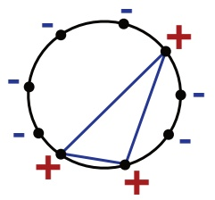

(a)

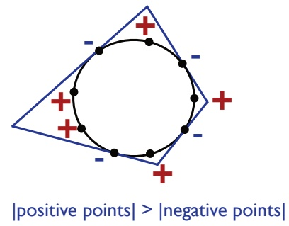

(b)

Figure 3.4

Convex d-gons in the plane can shatter 2d + 1 points. (a) d-gon construction when there are more negative labels. (b) d-gon construction when there are more positive labels.

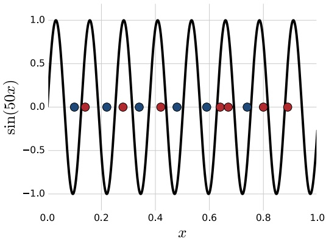

Figure 3.5

An example of a sine function (with ω = 50) used for classification.

used to classify the points on the real line: a point is labeled positively if it is above the curve, negatively otherwise. Although this family of sine functions is defined via a single parameter, ω, it can be shown that VCdim(sine functions) = +∞ (exercise 3.20).

The VC-dimension of many other hypothesis sets can be determined or upperbounded in a similar way (see this chapter’s exercises). In particular, the VC-dimension of any vector space of dimension $r < \infty$ can be shown to be at most r (exercise 3.19). The next result, known as $\mathit { S a u e r   \textquotedblright s }$ lemma, clarifies the connection between the notions of growth function and VC-dimension.

<!-- page: 58 -->

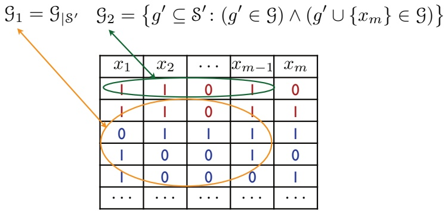

Figure 3.6

Illustration of how $\mathcal { G } _ { 1 }$ and $\mathcal { G } _ { 2 }$ are constructed in the proof of Sauer’s lemma.

**Theorem 3.17 (Sauer’s lemma)** Let H be a hypothesis set with VCdim $( \mathcal { H } ) = d$ . Then, for all $m \in \mathbb { N }$ , the following inequality holds:

$$
\Pi_ {\mathcal {H}} (m) \leq \sum_ {i = 0} ^ {d} \binom{m}{i}.\tag{3.27}
$$

Proof: The proof is by induction on $m + d .$ The statement clearly holds for $m = 1$ and $d = 0$ or $d = 1$ . Now, assume that it holds for $( m - 1 , d - 1 )$ and $( m - 1 , d )$ Fix a set $\mathcal { \mathbb { S } } = \{ x _ { 1 } , \ldots , x _ { m } \}$ with $\Pi _ { \mathcal { H } } ( m )$ dichotomies and let $\mathcal { G } = \mathcal { H } _ { | \mathcal { \mathcal { \mathcal { \mathcal { S } } } } }$ be the set of concepts H induced by restriction to S.

Now consider the following families over $\begin{array} { r } { \mathfrak { S } ^ { \prime } = \{ x _ { 1 } , \ldots , x _ { m - 1 } \} } \end{array}$ . We define $\mathcal { G } _ { 1 } = \mathcal { G } _ { | \mathcal { S } ^ { \prime } }$ as the set of concepts H induced by restriction to $S ^ { \prime } .$ . Next, by identifying each concept as the set of points (in $\mathcal { S } ^ { \prime } \mathrm { ~ o r ~ } \mathcal { S } )$ for which it is non-zero, we can define $^ 2$ as

$$
\mathcal {G} _ {2} = \{g ^ {\prime} \subseteq \mathcal {S} ^ {\prime} \colon (g ^ {\prime} \in \mathcal {G}) \land (g ^ {\prime} \cup \{x _ {m} \} \in \mathcal {G}) \}.
$$

Since $g ^ { \prime } \subseteq \mathcal { S } ^ { \prime } ,   g ^ { \prime } \in \mathcal { G }$ means that without adding $x _ { m }$ it is a concept of G. Further, the constraint $g ^ { \prime } \cup \{ x _ { m } \} \in \mathcal { G }$ means that adding $x _ { m }$ to $g ^ { \prime }$ also makes it a concept of G. The construction of $\mathcal { G } _ { 1 }$ and $\mathcal { G } _ { 2 }$ is illustrated pictorially in figure 3.6. Given our definitions of $\mathcal { G } _ { 1 }$ and $\mathcal { G } _ { 2 }$ , observe that $| \mathcal { G } _ { 1 } | + | \mathcal { G } _ { 2 } | = | \mathcal { G } |$

Since VCdim $\mathfrak { i } ( \mathfrak { G } _ { 1 } ) \leq \operatorname { V C d i m } ( \mathfrak { G } ) \leq d ,$ then by definition of the growth function and using the induction hypothesis,

$$
| \mathcal {G} _ {1} | \leq \Pi_ {\mathcal {G} _ {1}} (m - 1) \leq \sum_ {i = 0} ^ {d} \binom{m - 1}{i}.
$$

Further, by definition of $\mathcal { G } _ { 2 }$ , if a set $\mathsf { Z } \subseteq \mathbb { S } ^ { \prime }$ is shattered by $\mathcal { G } _ { 2 }$ , then the set $\mathbb { Z } \cup \{ x _ { m } \}$ is shattered by G. Hence,

$$
\mathrm{VCdim} (\mathcal {G} _ {2}) \leq \mathrm{VCdim} (\mathcal {G}) - 1 = d - 1,
$$

<!-- page: 59 -->

and by definition of the growth function and using the induction hypothesis,

$$
| \mathcal {G} _ {2} | \leq \Pi_ {\mathcal {G} _ {2}} (m - 1) \leq \sum_ {i = 0} ^ {d - 1} \binom {m - 1} {i}.
$$

Thus,

$$
| \mathcal {G} | = | \mathcal {G} _ {1} | + | \mathcal {G} _ {2} | \leq \sum_ {i = 0} ^ {d} \binom {m - 1} {i} + \sum_ {i = 0} ^ {d - 1} \binom {m - 1} {i} = \sum_ {i = 0} ^ {d} \binom {m - 1} {i} + \binom {m - 1} {i - 1} = \sum_ {i = 0} ^ {d} \binom {m} {i},
$$

which completes the inductive proof.

The significance of Sauer’s lemma can be seen by corollary 3.18, which remarkably shows that growth function only exhibits two types of behavior: either $VCdim (\mathcal{H}) =$ $d   <   + \infty$ , in which case $\Pi _ { \mathcal { H } } ( m )   =   O ( m ^ { d } )$ , or ${ \mathrm { V C d i m } } ( { \mathcal { H } } )   =   + \infty$ , in which case $\Pi _ { \mathcal { H } } ( m ) = 2 ^ { m }$

**Corollary 3.18** Let H be a hypothesis set with VCdim $( { \mathcal { H } } ) = d$ . Then for all $m \geq d ,$

$$
\Pi_ {\mathcal {H}} (m) \leq \left(\frac {e m}{d}\right) ^ {d} = O (m ^ {d}).\tag{3.28}
$$

Proof: The proof begins by using Sauer’s lemma. The first inequality multiplies each summand by a factor that is greater than or equal to one since $m \geq d ,$ while the second inequality adds non-negative summands to the summation.

$$
\begin{array}{l} \Pi_ {\mathcal {H}} (m) \leq \sum_ {i = 0} ^ {d} \binom {m} {i} \\ \quad \leq \sum_ {i = 0} ^ {d} \binom {m} {i} \left(\frac {m}{d}\right) ^ {d - i} \\ \quad \leq \sum_ {i = 0} ^ {m} \binom {m} {i} \left(\frac {m}{d}\right) ^ {d - i} \\ \quad = \left(\frac {m}{d}\right) ^ {d} \sum_ {i = 0} ^ {m} \binom {m} {i} \left(\frac {d}{m}\right) ^ {i} \\ \quad = \left(\frac {m}{d}\right) ^ {d} \left(1 + \frac {d}{m}\right) ^ {m} \leq \left(\frac {m}{d}\right) ^ {d} e ^ {d}. \end{array}
$$

After simplifying the expression using the binomial theorem, the final inequality follows using the general inequality $( 1 - x ) \leq e ^ { - x }$ 

The explicit relationship just formulated between VC-dimension and the growth function combined with corollary 3.9 leads immediately to the following generalization bounds based on the VC-dimension.

**Corollary 3.19 (VC-dimension generalization bounds)** Let H be a family of functions taking values in $\{ - 1 , + 1 \}$ with VC-dimension d. Then, for any $\delta > 0$ , with proba-

<!-- page: 60 -->

bility at least $1 - \delta$ , the following holds for all $h \in \mathcal { H }$

$$
R (h) \leq \widehat {R} _ {S} (h) + \sqrt {\frac {2 d \log \frac {e m}{d}}{m}} + \sqrt {\frac {\log \frac {1}{\delta}}{2 m}}.\tag{3.29}
$$

Thus, the form of this generalization bound is

$$
R (h) \leq \widehat {R} _ {S} (h) + O \left(\sqrt {\frac {\log (m / d)}{(m / d)}}\right),\tag{3.30}
$$

which emphasizes the importance of the ratio $m / d$ for generalization. The theorem provides another instance of Occam’s razor principle where simplicity is measured in terms of smaller VC-dimension.

VC-dimension bounds can be derived directly without using an intermediate Rademacher complexity bound, as for (3.23): combining Sauer’s lemma with (3.23) leads to the following high-probability bound

$$
R (h) \leq \widehat {R} _ {S} (h) + \sqrt {\frac {8 d \log \frac {2 e m}{d} + 8 \log \frac {4}{\delta}}{m}},
$$

which has the general form of (3.30). The log factor plays only a minor role in these bounds. A finer analysis can be used in fact to eliminate that factor.

## 3.4 Lower bounds

In the previous section, we presented several upper bounds on the generalization error. In contrast, this section provides lower bounds on the generalization error of any learning algorithm in terms of the VC-dimension of the hypothesis set used.

These lower bounds are shown by finding for any algorithm a ‘bad’ distribution. Since the learning algorithm is arbitrary, it will be difficult to specify that particular distribution. Instead, it suffices to prove its existence non-constructively. At a high level, the proof technique used to achieve this is the probabilistic method of Paul Erdös. In the context of the following proofs, first a lower bound is given on the expected error over the parameters defining the distributions. From that, the lower bound is shown to hold for at least one set of parameters, that is one distribution.

**Theorem 3.20 (Lower bound, realizable case)** Let H be a hypothesis set with $V C -$ dimension $d \; > \; 1$ . Then, for any $m \; \geq \; 1$ and any learning algorithm $\mathcal { A } ,$ there exist a distribution D over X and a target function $f \in { \mathcal { H } }$ such that

$$
\underset {S \sim \mathcal {D} ^ {m}} {\mathbb {P}} \left[ R _ {\mathcal {D}} (h _ {S}, f) > \frac {d - 1}{3 2 m} \right] \geq 1 / 1 0 0.\tag{3.31}
$$

Proof: Let $\overline { { \mathcal { X } } } = \{ x _ { 0 } , x _ { 1 } , \ldots , x _ { d - 1 } \} \subseteq \mathcal { X }$ be a set that is shattered by H. For any $\epsilon > 0$ , we choose D such that its support is reduced to $\overline { { x } }$ and so that one point $( x _ { 0 } )$

<!-- page: 61 -->

has very high probability $( 1 - 8 \epsilon )$ , with the rest of the probability mass distributed uniformly among the other points:

$$
\mathbb {P} _ {\mathcal {D}} [ x _ {0} ] = 1 - 8 \epsilon \quad \text {and} \quad \forall i \in [ d - 1 ], \mathbb {P} _ {\mathcal {D}} [ x _ {i} ] = \frac {8 \epsilon}{d - 1}.\tag{3.32}
$$

With this definition, most samples would contain $x _ { 0 }$ and, since X is shattered, A can essentially do no better than tossing a coin when determining the label of a point $x _ { i }$ not falling in the training set.

We assume without loss of generality that $\mathcal { A }$ makes no error on $x _ { 0 }$ . For a sample $S .$ , we let $\overline { { S } }$ denote the set of its elements falling in $\{ x _ { 1 } , \ldots , x _ { d - 1 } \}$ , and let S be the set of samples $S$ of size $m$ such that $| \overline { { S } } | \leq ( d - 1 ) / 2$ . Now, fix a sample $S \in { \mathcal { S } }$ , and consider the uniform distribution U over all labelings $f \colon { \overline { { \mathcal { X } } } } \to \{ 0 , 1 \}$ , which are all in H since the set is shattered. Then, the following lower bound holds:

$$
\begin{array}{l} \underset {f \sim \mathcal {U}} {\mathbb {E}} [ R _ {\mathcal {D}} (h _ {S}, f) ] = \sum_ {f} \sum_ {x \in \overline {{\mathcal {X}}}} 1 _ {h _ {S} (x) \neq f (x)}   \mathbb {P} [ x ]   \mathbb {P} [ f ] \\ \qquad \geq \sum_ {f} \sum_ {x \not \in \overline {{S}}} 1 _ {h _ {S} (x) \neq f (x)}   \mathbb {P} [ x ]   \mathbb {P} [ f ] \\ \qquad = \sum_ {x \not \in \overline {{S}}} \Big (\sum_ {f} 1 _ {h _ {S} (x) \neq f (x)}   \mathbb {P} [ f ] \Big)   \mathbb {P} [ x ] \\ \qquad = \frac {1}{2} \sum_ {x \not \in \overline {{S}}} \mathbb {P} [ x ] \geq \frac {1}{2} \frac {d - 1}{2} \frac {8 \epsilon}{d - 1} = 2 \epsilon . \end{array}\tag{3.33}
$$

The first lower bound holds because we remove non-negative terms from the summation when we only consider $x \not \in { \overline { { S } } }$ instead of all $x$ in $\overline { { x } } .$ After rearranging terms, the subsequent equality holds since we are taking an expectation over $f \in { \mathfrak { N } }$ with uniform weight on each $f$ and H shatters $\overline { { x } } .$ The final lower bound holds due to the definitions of D and ${ \overline { { S } } } ,$ the latter which implies that $| \overline { { \mathcal { X } } } - \overline { { S } } | \geq ( d - 1 ) / 2$

Since (3.33) holds for all $S   \in   \mathfrak { S }$ , it also holds in expectation over all $$S \in \mathfrak { S } ;$$ $\mathbb { E } _ { S \in \mathcal { S } } \left[ \: \mathbb { E } _ { f \sim \mathcal { U } } [ R _ { \mathcal { D } } ( h _ { S } , f ) ] \right] \geq 2 \epsilon$ . By Fubini’s theorem, the expectations can be permuted, thus,

$$
\underset {f \sim \mathcal {U}} {\mathbb {E}} \left[ \underset {S \in \mathcal {S}} {\mathbb {E}} \left[ R _ {\mathcal {D}} (h _ {S}, f) \right] \right] \geq 2 \epsilon .\tag{3.34}
$$

This implies that $\mathbb { E } _ { S \in \mathcal { S } } [ R _ { \mathcal { D } } ( h _ { S } , f _ { 0 } ) ] \geq 2 \epsilon$ for at least one labeling $f _ { 0 } \in \mathcal { H }$ . Decomposing this expectation into two parts and using $R _ { \mathcal { D } } ( h _ { S } , f _ { 0 } ) { \leq } \mathbb { P } _ { \mathcal { D } } [ \overline { { \mathcal { X } } } - \{ x _ { 0 } \} ]$ , we obtain:

$$
\begin{array}{l}\underset {S\in \mathcal{S}}{\mathbb{E}}[R_{\mathcal{D}}(h_{S},f_{0})] = \sum_{S:R_{\mathcal{D}}(h_{S},f_{0})\geq \epsilon}R_{\mathcal{D}}(h_{S},f_{0})  \mathbb{P}[R_{\mathcal{D}}(h_{S},f_{0})] + \sum_{S:R_{\mathcal{D}}(h_{S},f_{0}) <   \epsilon}R_{\mathcal{D}}(h_{S},f_{0})  \mathbb{P}[R_{\mathcal{D}}(h_{S},f_{0})]\\ \leq \underset {\mathcal{D}}{\mathbb{P}}[\overline{\mathcal{X}} -\{x_{0}\} ]  \underset {S\in \mathcal{S}}{\mathbb{P}}[R_{\mathcal{D}}(h_{S},f_{0})\geq \epsilon ] + \epsilon   \underset {S\in \mathcal{S}}{\mathbb{P}}[R_{\mathcal{D}}(h_{S},f_{0}) <   \epsilon ]\\ \leq 8\epsilon   \underset {S\in \mathcal{S}}{\mathbb{P}}[R_{\mathcal{D}}(h_{S},f_{0})\geq \epsilon ] + \epsilon \big(1 - \underset {S\in \mathcal{S}}{\mathbb{P}}[R_{\mathcal{D}}(h_{S},f_{0})\geq \epsilon ]\big). \end{array}
$$

<!-- page: 62 -->

Collecting terms in $\mathbb { P } _ { S \in \mathfrak { S } } [ R _ { \mathcal { D } } ( h _ { S } , f _ { 0 } ) \geq \epsilon ]$ yields

$$
\underset {S \in \mathcal {S}} {\mathbb {P}} \left[ R _ {\mathcal {D}} (h _ {S}, f _ {0}) \geq \epsilon \right] \geq \frac {1}{7 \epsilon} (2 \epsilon - \epsilon) = \frac {1}{7}.\tag{3.35}
$$

Thus, the probability over all samples S (not necessarily in S) can be lower bounded as

$$
\mathbb {P} _ {S} [ R _ {\mathcal {D}} (h _ {S}, f _ {0}) \geq \epsilon ] \geq \mathbb {P} _ {S \in \mathcal {S}} [ R _ {\mathcal {D}} (h _ {S}, f _ {0}) \geq \epsilon ] \mathbb {P} [ \mathcal {S} ] \geq \frac {1}{7} \mathbb {P} [ \mathcal {S} ].\tag{3.36}
$$

This leads us to find a lower bound for $\mathbb { P } [ \mathcal { S } ]$ . By the multiplicative Chernoff bound (Theorem D.4), for any $\gamma > 0$ , the probability that more than $( d - 1 ) / 2$ points are drawn in a sample of size m verifies:

$$
1 - \mathbb {P} [ \mathcal {S} ] = \mathbb {P} [ S _ {m} \geq 8 \epsilon m (1 + \gamma) ] \leq e ^ {- 8 \epsilon m \frac {\gamma^ {2}}{3}}.\tag{3.37}
$$

Therefore, for $\epsilon = ( d - 1 ) / ( 3 2 m )$ and $\gamma = 1$

$$
\mathbb {P} [ S _ {m} \geq \frac {d - 1}{2} ] \leq e ^ {- (d - 1) / 1 2} \leq e ^ {- 1 / 1 2} \leq 1 - 7 \delta ,\tag{3.38}
$$

for $\delta \leq . 0 1$ . Thus $\mathbb { P } [ \mathbb { S } ] \geq 7 \delta$ and $\mathbb { P } _ { S } [ R _ { \mathcal { D } } ( h _ { S } , f _ { 0 } ) \geq \epsilon ] \geq \delta .$

The theorem shows that for any algorithm $\mathcal { A } ,$ there exists a ‘bad’ distribution over $\mathcal { X }$ and a target function $f$ for which the error of the hypothesis returned by A is a constant times $\frac { d } { m }$ with some constant probability. This further demonstrates the key role played by the VC-dimension in learning. The result implies in particular that PAC-learning in the realizable case is not possible when the VC-dimension is infinite.

Note that the proof shows a stronger result than the statement of the theorem: the distribution D is selected independently of the algorithm $\mathcal { A } .$ We now present a theorem giving a lower bound in the non-realizable case. The following two lemmas will be needed for the proof.

**Lemma 3.21** Let α be a uniformly distributed random variable taking values in $\{ \alpha _ { - } , \alpha _ { + } \}$ , where $\alpha _ { - }   =   { \textstyle { \frac { 1 } { 2 } } } - { \textstyle { \frac { \epsilon } { 2 } } }$ and $\alpha _ { \pm }   =   { \textstyle { \frac { 1 } { 2 } } } + { \textstyle { \frac { \epsilon } { 2 } } }$ , and let S be a sample of $m \geq 1$ random variables $X _ { 1 } , \ldots , X _ { m }$ taking values in $\{ 0 , 1 \}$ and drawn i.i.d. according to the distribution $\mathcal { D } _ { \alpha }$ defined by $\mathbb { P } _ { \mathcal { D } _ { \alpha } } [ X = 1 ] = \alpha$ . Let h be a function from $\mathfrak { X } ^ { m }$ to $\{ \alpha _ { - } , \alpha _ { + } \}$ , then the following holds:

$$
\underset {\alpha} {\mathbb {E}} \left[ \underset {S \sim \mathcal {D} _ {\alpha} ^ {m}} {\mathbb {P}} [ h (S) \neq \alpha ] \right] \geq \Phi (2 \lceil m / 2 \rceil , \epsilon),\tag{3.39}
$$

where $\begin{array} { r } { \Phi ( m , \epsilon ) = \frac { 1 } { 4 } \Big ( 1 - \sqrt { 1 - \exp \big ( - \frac { m \epsilon ^ { 2 } } { 1 - \epsilon ^ { 2 } } \big ) } \Big ) } \end{array}$ for all m and .

Proof: The lemma can be interpreted in terms of an experiment with two coins with biases $\alpha _ { - }$ and $\alpha _ { + }$ . It implies that for a discriminant rule $h ( S )$ based on a sample $S$ drawn from $\mathcal { D } _ { \alpha _ { - } }$ or $\mathcal { D } _ { \alpha _ { \pm } }$ , to determine which coin was tossed, the sample size m must be at least $\Omega ( 1 / \epsilon ^ { 2 } )$ . The proof is left as an exercise (exercise D.3). 

<!-- page: 63 -->

We will make use of the fact that for any fixed  the function $m   \mapsto   \Phi ( m , x )$ is convex, which is not hard to establish.

**Lemma 3.22** Let Z be a random variable taking values in [0, 1]. Then, for any $\gamma \in [ 0 , 1 )$

$$
\mathbb {P} [ z > \gamma ] \geq \frac {\mathbb {E} [ Z ] - \gamma}{1 - \gamma} > \mathbb {E} [ Z ] - \gamma .\tag{3.40}
$$

Proof: Since the values taken by $Z$ are in [0, 1],

$$
\begin{array}{l} \mathbb {E} [ Z ] = \sum_ {z \leq \gamma} \mathbb {P} [ Z = z ] z + \sum_ {z > \gamma} \mathbb {P} [ Z = z ] z \\ \quad \leq \sum_ {z \leq \gamma} \mathbb {P} [ Z = z ] \gamma + \sum_ {z > \gamma} \mathbb {P} [ Z = z ] \\ \quad = \gamma   \mathbb {P} [ Z \leq \gamma ] + \mathbb {P} [ Z > \gamma ] \\ \quad = \gamma (1 - \mathbb {P} [ Z > \gamma ]) + \mathbb {P} [ Z > \gamma ] \\ \quad = (1 - \gamma)   \mathbb {P} [ Z > \gamma ] + \gamma , \end{array}
$$

which concludes the proof.

**Theorem 3.23 (Lower bound, non-realizable case)** Let H be a hypothesis set with VC-dimension $d > 1$ . Then, for any $m \geq 1$ and any learning algorithm A, there exists a distribution D over $\mathcal { X } \times \{ 0 , 1 \}$ such that:

$$
\underset {S \sim \mathcal {D} ^ {m}} {\mathbb {P}} \left[ R _ {\mathcal {D}} (h _ {S}) - \inf _ {h \in \mathcal {H}} R _ {\mathcal {D}} (h) > \sqrt {\frac {d}{3 2 0 m}} \right] \geq 1 / 6 4.\tag{3.41}
$$

Equivalently, for any learning algorithm, the sample complexity verifies

$$
m \geq \frac {d}{3 2 0 \epsilon^ {2}}.\tag{3.42}
$$

Proof: Let $\overline { { \mathcal { X } } }   =   \{ x _ { 1 } , \ldots , x _ { d } \}   \subseteq   \mathcal { X }$ be a set shattered by H. For any $\alpha   \in   [ 0 , 1 ]$ and any vector $\pmb { \sigma } = ( \sigma _ { 1 } , \dots , \sigma _ { d } ) ^ { \top } \in \{ - 1 , + 1 \} ^ { d }$ , we define a distribution $\mathfrak { D } _ { \sigma }$ with support $\overline { { \mathcal { X } } } \times \{ 0 , 1 \}$ as follows:

$$
\forall i \in [ d ], \quad \underset {\mathcal {D} _ {\sigma}} {\mathbb {P}} \left[ (x _ {i}, 1) \right] = \frac {1}{d} \Bigl (\frac {1}{2} + \frac {\sigma_ {i} \alpha}{2} \Bigr).\tag{3.43}
$$

Thus, the label of each point $x _ { i } ,   i \in [ d ]$ , follows the distribution $\mathbb { P } _ { \mathcal { D } _ { \pmb { \sigma } } } [ \cdot | x _ { i } ]$ , that of a biased coin where the bias is determined by the sign of $\sigma _ { i }$ and the magnitude of α. To determine the most likely label of each point $x _ { i }$ , the learning algorithm will therefore need to estimate $\mathbb { P } _ { \mathcal { D } _ { \pmb { \sigma } } } [ 1 | x _ { i } ]$ with an accuracy better than α. To make this further difficult, α and $\sigma$ will be selected based on the algorithm, requiring, as in lemma 3.21, $\Omega ( 1 / \alpha ^ { 2 } )$ instances of each point $x _ { i }$ in the training sample.

<!-- page: 64 -->

## 3.4 Lower bounds

Clearly, the Bayes classifier $h _ { \mathcal { D } _ { \sigma } } ^ { * }$ is defined by $h _ { \mathcal { D } _ { \pmb { \sigma } } } ^ { * } ( x _ { i } ) = \operatorname { a r g m a x } _ { y \in \{ 0 , 1 \} } \mathbb { P } [ y | x _ { i } ] =$ $1 _ { \sigma _ { i } > 0 }$ for all $i \in [ d ] . h _ { \mathcal { D } _ { \sigma } } ^ { * }$ is in H since $\overline { { \mathcal { X } } }$ is shattered. For all $h \in \mathcal { H }$

$$
R _ {\mathcal {D} _ {\sigma}} (h) - R _ {\mathcal {D} _ {\sigma}} \left(h _ {\mathcal {D} _ {\sigma}} ^ {*}\right) = \frac {1}{d} \sum_ {x \in \overline {{\mathcal {X}}}} \left(\frac {\alpha}{2} + \frac {\alpha}{2}\right) 1 _ {h (x) \neq h _ {\mathcal {D} _ {\sigma}} ^ {*} (x)} = \frac {\alpha}{d} \sum_ {x \in \overline {{\mathcal {X}}}} 1 _ {h (x) \neq h _ {\mathcal {D} _ {\sigma}} ^ {*} (x)}.\tag{3.44}
$$

Let $h _ { S }$ denote the hypothesis returned by the learning algorithm A after receiving a labeled sample S drawn according to $\mathcal { D } _ { \sigma }$ . We will denote by $| S | _ { x }$ the number of occurrences of a point x in S. Let U denote the uniform distribution over $\{ - 1 , + 1 \} ^ { d }$ Then, in view of (3.44), the following holds:

$$
\begin{array}{l} \underset {\boldsymbol {\sigma} \sim \mathcal {U}} {\mathbb {E}} _ {S \sim \mathcal {D} _ {\boldsymbol {\sigma}} ^ {m}} \left[ \frac {1}{\alpha} \big [ R _ {\mathcal {D} _ {\boldsymbol {\sigma}}} (h _ {S}) - R _ {\mathcal {D} _ {\boldsymbol {\sigma}}} (h _ {\mathcal {D} _ {\boldsymbol {\sigma}}} ^ {*}) \big ] \right] \\ = \frac {1}{d} \sum_ {x \in \overline {{\mathcal {X}}}} \underset {\boldsymbol {\sigma} \sim \mathcal {U}} {\mathbb {E}} _ {S \sim \mathcal {D} _ {\boldsymbol {\sigma}} ^ {m}} \left[ 1 _ {h _ {S} (x) \neq h _ {\mathcal {D} _ {\boldsymbol {\sigma}}} ^ {*} (x)} \right] \\ = \frac {1}{d} \sum_ {x \in \overline {{\mathcal {X}}}} \underset {\boldsymbol {\sigma} \sim \mathcal {U}} {\mathbb {E}} \left[ \underset {S \sim \mathcal {D} _ {\boldsymbol {\sigma}} ^ {m}} {\mathbb {P}} \left[ h _ {S} (x) \neq h _ {\mathcal {D} _ {\boldsymbol {\sigma}}} ^ {*} (x) \right] \right] \\ = \frac {1}{d} \sum_ {x \in \overline {{\mathcal {X}}}} \sum_ {n = 0} ^ {m} \underset {\boldsymbol {\sigma} \sim \mathcal {U}} {\mathbb {E}} \left[ \underset {S \sim \mathcal {D} _ {\boldsymbol {\sigma}} ^ {m}} {\mathbb {P}} \left[ h _ {S} (x) \neq h _ {\mathcal {D} _ {\boldsymbol {\sigma}}} ^ {*} (x)   |   | S | _ {x} = n \right]   \mathbb {P} [ | S | _ {x} = n ] \right] \\ \geq \frac {1}{d} \sum_ {x \in \overline {{\mathcal {X}}}} \sum_ {n = 0} ^ {m} \Phi (n + 1, \alpha)   \mathbb {P} [ | S | _ {x} = n ] \\ \geq \frac {1}{d} \sum_ {x \in \overline {{\mathcal {X}}}} \Phi (m / d + 1, \alpha) \\ = \Phi (m / d + 1, \alpha). \end{array} (\text {lemma 3.21})
$$

Since the expectation over $\sigma$ is lower-bounded by $\Phi ( m / d + 1 , \alpha )$ , there must exist some $\pmb { \sigma } \in \{ - 1 , + 1 \} ^ { d }$ for which

$$
\underset {S \sim \mathcal {D} _ {\sigma} ^ {m}} {\mathbb {E}} \left[ \frac {1}{\alpha} \big [ R _ {\mathcal {D} _ {\sigma}} (h _ {S}) - R _ {\mathcal {D} _ {\sigma}} (h _ {\mathcal {D} _ {\sigma}} ^ {*}) \big ] \right] > \Phi (m / d + 1, \alpha).\tag{3.45}
$$

Then, by lemma 3.22, for that $\sigma ,$ for any $\gamma \in [ 0 , 1 ]$

$$
\underset {S \sim \mathcal {D} _ {\sigma} ^ {m}} {\mathbb {P}} \left[ \frac {1}{\alpha} \big [ R _ {\mathcal {D} _ {\sigma}} (h _ {S}) - R _ {\mathcal {D} _ {\sigma}} (h _ {\mathcal {D} _ {\sigma}} ^ {*}) \big ] > \gamma u \right] > (1 - \gamma) u,\tag{3.46}
$$

where $u = \Phi ( m / d + 1 , \alpha )$ . Selecting $\delta$ and  such that $\delta \leq ( 1 - \gamma ) u$ and $\epsilon \leq \gamma \alpha u$ gives

$$
\underset {S \sim \mathcal {D} _ {\sigma} ^ {m}} {\mathbb {P}} \left[ R _ {\mathcal {D} _ {\sigma}} (h _ {S}) - R _ {\mathcal {D} _ {\sigma}} (h _ {\mathcal {D} _ {\sigma}} ^ {*}) > \epsilon \right] > \delta .\tag{3.47}
$$

<!-- page: 65 -->

To satisfy the inequalities defining  and $\delta ,$ let $\gamma = 1 - 8 \delta$ . Then,

$$
\delta \leq (1 - \gamma) u \iff u \geq \frac {1}{8}\tag{3.48}
$$

$$
\Longleftrightarrow \frac {1}{4} \left(1 - \sqrt {1 - \exp \left(- \frac {(m / d + 1) \alpha^ {2}}{1 - \alpha^ {2}}\right)}\right) \geq \frac {1}{8}\tag{3.49}
$$

$$
\Longleftrightarrow \frac {(m / d + 1) \alpha^ {2}}{1 - \alpha^ {2}} \leq \log {\frac {4}{3}}\tag{3.50}
$$

$$
\Longleftrightarrow \frac {m}{d} \leq \left(\frac {1}{\alpha^ {2}} - 1\right) \log \frac {4}{3} - 1.\tag{3.51}
$$

Selecting $\alpha = 8 \epsilon / ( 1 - 8 \delta )$ gives $\epsilon = \gamma \alpha / 8$ and the condition

$$
\frac {m}{d} \leq \left(\frac {(1 - 8 \delta) ^ {2}}{6 4 \epsilon^ {2}} - 1\right) \log \frac {4}{3} - 1.\tag{3.52}
$$

Let $f ( 1 / \epsilon ^ { 2 } )$ denote the right-hand side. We are seeking a sufficient condition of the form $m / d \leq \omega / \epsilon ^ { 2 }$ . Since $\epsilon   \leq   1 / 6 4$ , to ensure that $\omega / \epsilon ^ { 2 }   \leq   f ( 1 / \epsilon ^ { 2 } )$ , it suffices to impose $\begin{array} { r } { \frac { \omega } { ( 1 / 6 4 ) ^ { 2 } } = f \big ( \frac { 1 } { ( 1 / 6 4 ) ^ { 2 } } \big ) } \end{array}$ . This condition gives

$$
\omega = (7 / 6 4) ^ {2} \log (4 / 3) - (1 / 6 4) ^ {2} (\log (4 / 3) + 1) \approx . 0 0 3 1 2 7 \geq 1 / 3 2 0 = . 0 0 3 1 2 5.
$$

Thus, $\begin{array} { r } { \epsilon ^ { 2 } \leq \frac { 1 } { 3 2 0 ( m / d ) } } \end{array}$ is sufficient to ensure the inequalities.

The theorem shows that for any algorithm $\mathcal { A } ,$ in the non-realizable case, there exists a ‘bad’ distribution over $\mathcal { X } \times \{ 0 , 1 \}$ such that the error of the hypothesis returned by $\mathcal { A }$ is a constant times $\sqrt { \frac { d } { m } }$ with some constant probability. The VC dimension appears as a critical quantity in learning in this general setting as well. In particular, with an infinite VC-dimension, agnostic PAC-learning is not possible.

## 3.5 Chapter notes

The use of Rademacher complexity for deriving generalization bounds in learning was first advocated by Koltchinskii [2001], Koltchinskii and Panchenko [2000], and Bartlett, Boucheron, and Lugosi [2002a], see also [Koltchinskii and Panchenko, 2002, Bartlett and Mendelson, 2002]. Bartlett, Bousquet, and Mendelson [2002b] introduced the notion of local Rademacher complexity, that is the Rademacher complexity restricted to a subset of the hypothesis set limited by a bound on the variance. This can be used to derive better guarantees under some regularity assumptions about the noise.

Theorem 3.7 is due to Massart [2000]. The notion of VC-dimension was introduced by Vapnik and Chervonenkis [1971] and has been since extensively studied [Vapnik, 2006, Vapnik and Chervonenkis, 1974, Blumer et al., 1989, Assouad, 1983, Dudley,

<!-- page: 66 -->

1999]. In addition to the key role it plays in machine learning, the VC-dimension is also widely used in a variety of other areas of computer science and mathematics (e.g., see Shelah [1972], Chazelle [2000]). Theorem 3.17 is known as Sauer’s lemma in the learning community, however the result was first given by Vapnik and Chervonenkis [1971] (in a somewhat different version) and later independently by Sauer [1972] and Shelah [1972].

In the realizable case, lower bounds for the expected error in terms of the VC-dimension were given by Vapnik and Chervonenkis [1974] and Haussler et al. [1988]. Later, a lower bound for the probability of error such as that of theorem 3.20 was given by Blumer et al. [1989]. Theorem 3.20 and its proof, which improves upon this previous result, are due to Ehrenfeucht, Haussler, Kearns, and Valiant [1988]. Devroye and Lugosi [1995] gave slightly tighter bounds for the same problem with a more complex expression. Theorem 3.23 giving a lower bound in the non-realizable case and the proof presented are due to Anthony and Bartlett [1999]. For other examples of application of the probabilistic method demonstrating its full power, consult the reference book of Alon and Spencer [1992].

There are several other measures of the complexity of a family of functions used in machine learning, including covering numbers, packing numbers, and some other complexity measures discussed in chapter 11. A covering number $\mathcal { N } _ { p } ( \mathcal { G } , \epsilon )$ is the minimal number of $L _ { p }$ balls of radius $\epsilon > 0$ needed to cover a family of loss functions G. A packing number $\mathcal { M } _ { p } ( \mathfrak { G } , \epsilon )$ is the maximum number of non-overlapping $L _ { p }$ balls of radius  centered in G. The two notions are closely related, in particular it can be shown straightforwardly that $\mathcal { M } _ { p } ( \mathfrak { G } , 2 \epsilon ) { \leq } \mathcal { N } _ { p } ( \mathfrak { G } , \epsilon ) { \leq } \mathcal { M } _ { p } ( \mathfrak { G } , \epsilon )$ for G and $\epsilon > 0$ . Each complexity measure naturally induces a different reduction of infinite hypothesis sets to finite ones, thereby resulting in generalization bounds for infinite hypothesis sets. Exercise 3.31 illustrates the use of covering numbers for deriving generalization bounds using a very simple proof. There are also close relationships between these complexity measures: for example, by Dudley’s theorem, the empirical Rademacher complexity can be bounded in terms of $\mathcal { N } _ { 2 } ( \mathcal { G } , \epsilon )$ [Dudley, 1967, 1987] and the covering and packing numbers can be bounded in terms of the VC-dimension [Haussler, 1995]. See also [Ledoux and Talagrand, 1991, Alon et al., 1997, Anthony and Bartlett, 1999, Cucker and Smale, 2001, Vidyasagar, 1997] for a number of upper bounds on the covering number in terms of other complexity measures.

<!-- page: 67 -->

## 3.6 Exercises

3.1 Growth function of intervals in R. Let H be the set of intervals in R. The VC-dimension of H is 2. Compute its shattering coefficient $\Pi _ { \mathcal { H } } ( m ) , \; m   \geq   0$ Compare your result with the general bound for growth functions.

3.2 Growth function and Rademacher complexity of thresholds in R. Let H be the family of threshold functions over the real line: $\mathcal { H } = \{ x \mapsto 1 _ { x \leq \theta } \colon \theta \in \mathbb { R } \} \cup \{ x \mapsto$ $1 _ { x \geq \theta } \colon \theta \in \mathbb { R } \}$ . Give an upper bound on the growth function $\Pi _ { m } ( \mathcal { H } )$ . Use that to derive an upper bound on $\mathfrak { R } _ { m } ( \mathfrak { N } )$

3.3 Growth function of linear combinations. A linearly separable labeling of a set X of vectors in $\mathbb { R } ^ { d }$ is a classification of X into two sets $\mathfrak { X } ^ { + }$ and $\mathfrak { X } ^ { - }$ with ${ \mathcal { X } } ^ { + } =$ $\{ \mathbf { x } \in \mathcal { X } \colon \mathbf { w } \cdot \mathbf { x } > 0 \}$ and $\mathcal { X } ^ { - } = \{ \mathbf { x } \in \mathcal { X } \colon \mathbf { w } \cdot \mathbf { x } < 0 \}$ for some $\mathbf { w } \in \mathbb { R } ^ { d }$

Let $\mathcal { X } = \{ \mathbf { x } _ { 1 } , \ldots , \mathbf { x } _ { m } \}$ be a subset of $\mathbb { R } ^ { d }$

(a) Let $\{ \mathcal { X } ^ { + } , \mathcal { X } ^ { - } \}$ be a dichotomy of X and let $\mathbf { x } _ { m + 1 }   \in   \mathbb { R } ^ { d }$ . Show that $\{ \mathcal { X } ^ { + } \cup$ $\{ \mathbf { x } _ { m + 1 } \} , \mathcal { X } ^ { - } \}$ and $\{ \mathcal { X } ^ { + } , \mathcal { X } ^ { - } \cup \{ \mathbf { x } _ { m + 1 } \} \}$ are linearly separable by a hyperplane going through the origin if and only if $\{ \mathcal { X } ^ { + } , \mathcal { X } ^ { - } \}$ is linearly separable by a hyperplane going through the origin and $\mathbf { x } _ { m + 1 }$

(b) Let $\mathcal { X }   =   \{ \mathbf { x } _ { 1 } , \ldots , \mathbf { x } _ { m } \}$ be a subset of $\mathbb { R } ^ { d }$ such that any k-element subset of X with $k   \leq   d$ is linearly independent. Then, show that the number of linearly separable labelings of X is $\begin{array} { r } { C ( m , d )   =   2 \sum _ { k = 0 } ^ { d - 1 } \binom { m - 1 } { k } } \end{array}$ . (Hint: prove by induction that $C ( m + 1 , d ) = C ( m , d ) + C ( m , d - 1 )$

(c) Let $f _ { 1 } , \ldots , f _ { p }$ be p functions mapping $\mathbb { R } ^ { d }$ to R. Define $\mathcal { F }$ as the family of classifiers based on linear combinations of these functions:

$$
\mathcal {F} = \left\{x \mapsto \operatorname{sgn} \left(\sum_ {k = 1} ^ {p} a _ {k} f _ {k} (x)\right) \colon a _ {1}, \dots , a _ {p} \in \mathbb {R} \right\}.
$$

Define Ψ by $\Psi ( x ) = ( f _ { 1 } ( x ) , \ldots , f _ { p } ( x ) )$ . Assume that there exists $x _ { 1 } , \ldots , x _ { m } \in$ $\mathbb { R } ^ { d }$ such that every p-subset of $\{ \Psi ( x _ { 1 } ) , \ldots , \Psi ( x _ { m } ) \}$ is linearly independent. Then, show that

$$
\Pi_ {\mathcal {F}} (m) = 2 \sum_ {i = 0} ^ {p - 1} \binom{m - 1}{i}.
$$

3.4 Lower bound on growth function. Prove that Sauer’s lemma (theorem 3.17) is tight, i.e., for any set X of $m > d$ elements, show that there exists a hypothesis class H of VC-dimension d such that $\begin{array} { r } { \Pi _ { \mathcal { H } } ( m ) = \sum _ { i = 0 } ^ { d } \binom { m } { i } } \end{array}$

<!-- page: 68 -->

## 3.6 Exercises

3.5 Finer Rademacher upper bound. Show that a finer upper bound on the Rademacher complexity of the family G can be given in terms of $\mathbb { E } _ { S } [ \Pi ( \mathcal { G } , S ) ]$ where $\Pi ( { \mathfrak { G } } , S )$ is the number of ways to label the points in sample S.

3.6 Singleton hypothesis class. Consider the trivial hypothesis set $\mathcal { H } = \{ h _ { 0 } \}$

(a) Show that $\mathfrak { R } _ { m } ( \mathcal { H } ) = 0$ for any $m > 0 .$

(b) Use a similar construction to show that Massart’s lemma (theorem 3.7) is tight.

3.7 Two function hypothesis class. Let H be a hypothesis set reduced to two functions: $\mathcal { H } = \{ h _ { - 1 } , h _ { + 1 } \}$ and let $S = ( x _ { 1 } , \ldots , x _ { m } ) \subseteq { \mathcal { X } }$ be a sample of size $m$

(a) Assume that $h _ { - 1 }$ is the constant function taking value −1 and $h _ { \pm 1 }$ the constant function taking the value +1. What is the VC-dimension d of H? Upper bound the empirical Rademacher complexity $\hat { \mathfrak { R } } _ { S } ( \mathcal { H } )$ (Hint: express $\hat { \mathfrak { R } } _ { S } ( \mathcal { H } )$ bin terms of the absolute value of a sum of Rademacher variables and bapply Jensen’s inequality) and compare your bound with $\sqrt { d / m }$

(b) Assume that $h _ { - 1 }$ is the constant function taking value −1 and $h _ { + 1 }$ the function taking value −1 everywhere except at $x _ { 1 }$ where it takes the value +1. What is the VC-dimension d of H? Compute the empirical Rademacher complexity $\hat { \mathfrak { R } } _ { S } ( \mathcal { H } )$

3.8 Rademacher identities. Fix $m \geq 1$ . Prove the following identities for any $\alpha \in \mathbb { R }$ and any two hypothesis sets H and $\mathcal { H } ^ { \prime }$ of functions mapping from $\mathcal { X }$ to R:

(a) $\Re _ { m } ( \alpha \mathcal { H } ) = | \alpha | \Re _ { m } ( \mathcal { H } )$

(b) $\begin{array} { r } { \mathfrak { R } _ { m } ( \mathcal { H } + \mathcal { H } ^ { \prime } ) = \mathfrak { R } _ { m } ( \mathcal { H } ) + \mathfrak { R } _ { m } ( \mathcal { H } ^ { \prime } ) . } \end{array}$

$$
\mathfrak {R} _ {m} (\{\max (h, h ^ {\prime}) \colon h \in \mathcal {H}, h ^ {\prime} \in \mathcal {H} ^ {\prime} \}) \leq \mathfrak {R} _ {m} (\mathcal {H}) + \mathfrak {R} _ {m} (\mathcal {H} ^ {\prime}),
$$

where $\operatorname* { m a x } ( h , h ^ { \prime } )$ denotes the function $x \mapsto \operatorname { m a x } _ { x \in \mathfrak { X } } ( h ( x ) , h ^ { \prime } ( x ) )$ (Hint: you could use the identity max $\begin{array} { r } { \mathfrak { t } ( a , b ) = \frac { 1 } { 2 } [ a + b + | a - b | ] } \end{array}$ valid for all $a , b \in \mathbb { R }$ and Talagrand’s contraction lemma (see lemma 5.7)).

3.9 Rademacher complexity of intersection of concepts. Let $\mathcal { H } _ { 1 }$ and $\mathcal { H } _ { 2 }$ be two families of functions mapping X to $\{ 0 , 1 \}$ and let $\mathcal { H } = \{ h _ { 1 } h _ { 2 } \colon h _ { 1 } \in \mathcal { H } _ { 1 } , h _ { 2 } \in$ $\mathcal { H } _ { 2 } \}$ . Show that the empirical Rademacher complexity of H for any sample S of size m can be bounded as follows:

$$
\widehat {\mathfrak {R}} _ {S} (H) \leq \widehat {\mathfrak {R}} _ {S} (\mathcal {H} _ {1}) + \widehat {\mathfrak {R}} _ {S} (\mathcal {H} _ {2}).
$$

<!-- page: 69 -->

Hint: use the Lipschitz function $x \mapsto \operatorname* { m a x } ( 0 , x   -   1 )$ and Talagrand’s contraction lemma.

Use that to bound the Rademacher complexity $\mathfrak { R } _ { m } ( \mathfrak { U } )$ of the family U of intersections of two concepts $c _ { 1 }$ and $c _ { 2 }$ with $c _ { 1 } \in \mathcal { C } _ { 1 }$ and $c _ { 2 } \in \mathbb { C } _ { 2 }$ in terms of the Rademacher complexities of $\mathcal { C } _ { 1 }$ and $\mathcal { C } _ { 2 }$ .

3.10 Rademacher complexity of prediction vector. Let $S = ( x _ { 1 } , \ldots , x _ { m } )$ be a sample of size m and fix $h \colon { \mathcal { X } } \to \mathbb { R }$

(a) Denote by u the vector of predictions of h for S: $\mathbf { u } = \left[ \begin{matrix} { h ( x _ { 1 } ) } \\ { \vdots } \\ { h ( x _ { m } ) } \\ \end{matrix} \right]$ . Give an upper bound on the empirical Rademacher complexity $\hat { \mathfrak { R } } _ { S } ( \mathfrak { R } )$ of ${ \mathcal { H } } =$ $\{ h , - h \}$ in terms of $\| \mathbf { u } \| _ { 2 }$ (Hint: express $\hat { \mathfrak { R } } _ { S } ( \mathcal { H } )$ b in terms of the expectation bof an absolute value and apply Jensen’s inequality). Suppose that $h ( x _ { i } ) \in$ $\{ 0 , - 1 , + 1 \}$ for all $i \in [ m ]$ . Express the bound on the Rademacher complexity in terms of the sparsity measure $n = | \{ i | h ( x _ { i } ) \neq 0 \} |$ . What is that upper bound for the extreme values of the sparsity measure?

(b) Let F be a family of functions mapping X to R. Give an upper bound on the empirical Rademacher complexity of $\mathcal { F } + h = \{ f + h \colon f \in \mathcal { F } \}$ and that of $\mathcal { F } \pm h = ( \mathcal { F } + h ) \cup ( \mathcal { F } - h )$ in terms of $\hat { \mathfrak { R } } _ { S } ( \mathcal { F } )$ and $\| \mathbf { u } \| _ { 2 }$

3.11 Rademacher complexity of regularized neural networks. Let the input space be $\mathcal { X } = \mathbb { R } ^ { n _ { 1 } }$ . In this problem, we consider the family of regularized neural networks defined by the following set of functions mapping $\mathcal { X }$ to R:

$$
\mathcal {H} = \left\{\mathbf {x} \mapsto \sum_ {j = 1} ^ {n _ {2}} w _ {j} \sigma (\mathbf {u} _ {j} \cdot \mathbf {x}) \colon \| \mathbf {w} \| _ {1} \leq \Lambda^ {\prime}, \| \mathbf {u} _ {j} \| _ {2} \leq \Lambda , \forall j \in [ n _ {2} ] \right\},
$$

where $\sigma$ is an L-Lipschitz function. As an example, $\sigma$ could be the sigmoid function which is 1-Lipschitz.

(a) Show that $\begin{array} { r } { \widehat { \mathfrak { R } } _ { S } ( \mathcal { H } ) = \frac { \Lambda ^ { \prime } } { m }   \mathbb { E } _ { \pmb { \sigma } } \left[ \operatorname* { s u p } _ { \| \mathbf { u } \| _ { 2 } \leq \Lambda } | \sum _ { i = 1 } ^ { m } \sigma _ { i } \sigma ( \mathbf { u } \cdot \mathbf { x } _ { i } ) | \right]   . } \end{array}$

(b) Use the following form of Talagrand’s lemma valid for all hypothesis sets H and L-Lipschitz function Φ:

$$
\frac {1}{m} \underset {\boldsymbol {\sigma}} {\mathbb {E}} \left[ \sup _ {h \in \mathcal {H}} \left| \sum_ {i = 1} ^ {m} \sigma_ {i} (\Phi \circ h) (x _ {i}) \right| \right] \leq \frac {L}{m} \underset {\boldsymbol {\sigma}} {\mathbb {E}} \left[ \sup _ {h \in \mathcal {H}} \left| \sum_ {i = 1} ^ {m} \sigma_ {i} h (x _ {i}) \right| \right],
$$

<!-- page: 70 -->

to upper bound $\hat { \mathfrak { R } } _ { S } ( \mathcal { H } )$ in terms of the empirical Rademacher complexity of $\mathcal { H } ^ { \prime }$ , where $\mathcal { H } ^ { \prime }$ bis defined by

$$
\mathcal {H} ^ {\prime} = \left\{\mathbf {x} \mapsto s (\mathbf {u} \cdot \mathbf {x}) \colon \| \mathbf {u} \| _ {2} \leq \Lambda , s \in \{- 1, + 1 \} \right\}.
$$

(c) Use the Cauchy-Schwarz inequality to show that

$$
\widehat {\mathfrak {R}} _ {S} (\mathcal {H} ^ {\prime}) = \frac {\Lambda}{m} \underset {\boldsymbol {\sigma}} {\mathbb {E}} \left[ \left\| \sum_ {i = 1} ^ {m} \sigma_ {i} \mathbf {x} _ {i} \right\| _ {2} \right].
$$

(d) Use the inequality $\mathbb { E } _ { \mathbf { v } } [ \| \mathbf { v } \| _ { 2 } ] \leq \sqrt { \mathbb { E } _ { \mathbf { v } } [ \| \mathbf { v } \| _ { 2 } ^ { 2 } ] }$ , which holds by Jensen’s inequality to upper bound $\hat { \mathfrak { R } } _ { S } ( \mathcal { H } ^ { \prime } )$

(e) Assume that for all $\mathbf { x }   \in   S , \; \| \mathbf { x } \| _ { 2 }   \leq   r$ for some $r   >   0 .$ . Use the previous questions to derive an upper bound on the Rademacher complexity of H in terms of $r .$

3.12 Rademacher complexity. Professor Jesetoo claims to have found a better bound on the Rademacher complexity of any hypothesis set H of functions taking values in $\{ - 1 , + 1 \}$ , in terms of its VC-dimension VCdim(H). His bound is of the form $\begin{array} { r } { \widehat { \mathfrak { R } _ { m } ( \mathcal { H } ) } \leq O \big ( \frac { \mathrm { V C d i m } ( \mathcal { H } ) } { m } \big ) } \end{array}$ . Can you show that Professor Jesetoo’s claim cannot be correct? (Hint: consider a hypothesis set H reduced to just two simple functions.)

3.13 VC-dimension of union of k intervals. What is the VC-dimension of subsets of the real line formed by the union of k intervals?

3.14 VC-dimension of finite hypothesis sets. Show that the VC-dimension of a finite hypothesis set H is at most $\log _ { 2 } | { \mathfrak { N } } |$

3.15 VC-dimension of subsets. What is the VC-dimension of the set of subsets $I _ { \alpha }$ of the real line parameterized by a single parameter α: $I _ { \alpha } = [ \alpha , \alpha { + } 1 ] { \cup } [ \alpha { + } 2 , { + } \infty ) ?$

3.16 VC-dimension of axis-aligned squares and triangles.

(a) What is the VC-dimension of axis-aligned squares in the plane?

(b) Consider right triangles in the plane with the sides adjacent to the right angle both parallel to the axes and with the right angle in the lower left corner. What is the VC-dimension of this family?

<!-- page: 71 -->

3.17 VC-dimension of closed balls in $\mathbb { R } ^ { n }$ . Show that the VC-dimension of the set of all closed balls in $\mathbb { R } ^ { n }$ , i.e., sets of the form $\{ x \in \mathbb { R } ^ { n } \colon \| x - x _ { 0 } \| ^ { 2 } \leq r \}$ for some $x _ { 0 } \in \mathbb { R } ^ { n }$ and $r \geq 0$ , is less than or equal to $n + 2$

3.18 VC-dimension of ellipsoids. What is the VC-dimension of the set of all ellipsoids in $\mathbb { R } ^ { n } ?$

3.19 VC-dimension of a vector space of real functions. Let F be a finite-dimensional vector space of real functions on $\mathbb { R } ^ { n }$ , dim $\left( F \right)   =   r   <   \infty$ . Let H be the set of hypotheses:

$$
\mathcal {H} = \{\{x \colon f (x) \geq 0 \} \colon f \in F \}.
$$

Show that $d ,$ the VC-dimension of H, is finite and that $d \leq r$ . (Hint: select an arbitrary set of $m = r + 1$ points and consider linear mapping u : $F \rightarrow \mathbb { R } ^ { m }$ defined by: $u ( f ) = ( f ( x _ { 1 } ) , \ldots , f ( x _ { m } ) ) . )$

3.20 VC-dimension of sine functions. Consider the hypothesis family of sine functions (Example 3.16): $\{ x \to \sin ( \omega x ) \colon \omega \in \mathbb { R } \}$

(a) Show that for any $x \in \mathbb { R }$ the points x, 2x, 3x and 4x cannot be shattered by this family of sine functions.

(b) Show that the VC-dimension of the family of sine functions is infinite. (Hint: show that $\{ 2 ^ { - i } \colon i \leq m \}$ can be shattered for any $m > 0 . )$ 1

3.21 VC-dimension of union of halfspaces. Provide an upper bound on the $\mathrm { V C } -$ dimension of the class of hypotheses described by the unions of k halfspaces.

3.22 VC-dimension of intersection of halfspaces. Consider the class $\mathcal { C } _ { k }$ of convex intersections of k halfspaces. Give lower and upper bound estimates for $\operatorname { V C d i m } ( { \mathcal { C } } _ { k } )$

3.23 VC-dimension of intersection concepts.

(a) Let $\mathcal { C } _ { 1 }$ and $\mathcal { C } _ { 2 }$ be two concept classes. Show that for any concept class $\mathcal { C } = \{ c _ { 1 } \cap c _ { 2 } \colon c _ { 1 } \in \mathcal { C } _ { 1 } , c _ { 2 } \in \mathcal { C } _ { 2 } \}$ ,

$$
\Pi_ {\mathcal {C}} (m) \leq \Pi_ {\mathcal {C} _ {1}} (m) \Pi_ {\mathcal {C} _ {2}} (m).\tag{3.53}
$$

(b) Let C be a concept class with VC-dimension d and let $\mathcal { C } _ { s }$ be the concept class formed by all intersections of s concepts from $\mathbb { C } ,   s \geq 1$ . Show that the VC-dimension of $\mathcal { C } _ { s }$ is bounded by $2 d s \log _ { 2 } ( 3 s )$ . (Hint: show that $\log _ { 2 } ( 3 x ) <$ $9 x / ( 2 e )$ for any $x \geq 2 . )$

<!-- page: 72 -->

## 3.6 Exercises

3.24 VC-dimension of union of concepts. Let A and B be two sets of functions mapping from X into $\{ 0 , 1 \}$ , and assume that both A and B have finite VC-dimension, with $\operatorname { V C d i m } ( { \mathcal { A } } ) = d _ { \mathcal { A } }$ and $\operatorname { V C d i m } ( { \mathcal { B } } ) = d _ { \mathcal { B } }$ . Let $\mathfrak { C } = \mathcal { A } \cup \mathfrak { B }$ be the union of A and B.

(a) Prove that for all $m , \thinspace \Pi _ { \mathfrak { C } } ( m ) \leq \Pi _ { \mathcal { A } } ( m ) + \Pi _ { \mathcal { B } } ( m )$

(b) Use Sauer’s lemma to show that for $m \geq d _ { \mathcal { A } } + d _ { \mathcal { B } } + 2 , \: \Pi _ { \mathcal { C } } ( m ) < 2 ^ { m }$ , and give a bound on the VC-dimension of C.

3.25 VC-dimension of symmetric difference of concepts. For two sets A and B, let A∆B denote the symmetric difference of A and $\mathcal { B } , \mathrm { i . e . } , \mathcal { A } \Delta \mathcal { B } = ( \mathcal { A } \cup \mathcal { B } ) - ( \mathcal { A } \cap \mathcal { B } )$ Let H be a non-empty family of subsets of X with finite VC-dimension. Let A be an element of H and define $\mathcal { H } \Delta \mathcal { A } = \{ X \Delta \mathcal { A } \colon X \in \mathcal { H } \}$ . Show that

$$
\mathrm{VCdim} (\mathcal {H} \Delta \mathcal {A}) = \mathrm{VCdim} (\mathcal {H}).
$$

3.26 Symmetric functions. A function $h \colon \{ 0 , 1 \} ^ { n } \to \{ 0 , 1 \}$ is symmetric if its value is uniquely determined by the number of 1’s in the input. Let C denote the set of all symmetric functions.

(a) Determine the VC-dimension of C.

(b) Give lower and upper bounds on the sample complexity of any consistent PAC learning algorithm for C.

(c) Note that any hypothesis $h \in \mathbb { C }$ can be represented by a vector $( y _ { 0 } , y _ { 1 } , \ldots , y _ { n } )$ $\in   \{ 0 , 1 \} ^ { n + 1 }$ , where $y _ { i }$ is the value of h on examples having precisely i 1’s. Devise a consistent learning algorithm for C based on this representation.

## 3.27 VC-dimension of neural networks.

Let C be a concept class over $\mathbb { R } ^ { r }$ with VC-dimension d. A C-neural network with one intermediate layer is a concept defined over $\mathbb { R } ^ { n }$ that can be represented by a directed acyclic graph such as that of Figure 3.7, in which the input nodes are those at the bottom and in which each other node is labeled with a concept $c \in \mathbb { C } .$

The output of the neural network for a given input vector $( x _ { 1 } , \ldots , x _ { n } )$ is obtained as follows. First, each of the n input nodes is labeled with the corresponding value $x _ { i } \in \mathbb { R }$ . Next, the value at a node u in the higher layer and labeled with c is obtained by applying c to the values of the input nodes admitting an

<!-- page: 73 -->

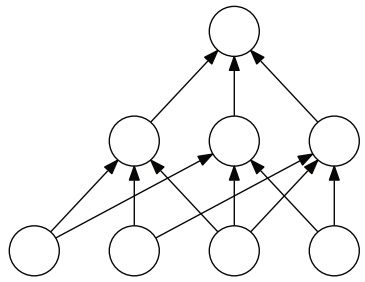

Figure 3.7

A neural network with one intermediate layer.

edge ending in u. Note that since c takes values in $\{ 0 , 1 \}$ , the value at u is in $\{ 0 , 1 \}$ . The value at the top or output node is obtained similarly by applying the corresponding concept to the values of the nodes admitting an edge to the output node.

(a) Let H denote the set of all neural networks defined as above with $k   \geq   2$ internal nodes. Show that the growth function $\Pi _ { \mathcal { H } } ( m )$ can be upper bounded in terms of the product of the growth functions of the hypothesis sets defined at each intermediate layer.

(b) Use that to upper bound the VC-dimension of the C-neural networks (Hint: you can use the implication $m   =   2 x \log _ { 2 } ( x y )   \Rightarrow   m   >   x \log _ { 2 } ( y m )$ valid for $m \geq 1$ , and $x , y > 0$ with $x y > 4 )$

(c) Let C be the family of concept classes defined by threshold functions $\mathcal { C } =$ $\textstyle \{ \operatorname { s g n } ( \sum _ { j = 1 } ^ { r } w _ { j } x _ { j } ) \colon \mathbf { w } \in \mathbb { R } ^ { r } \}$ . Give an upper bound on the VC-dimension of H in terms of k and r.

3.28 VC-dimension of convex combinations. Let H be a family of functions mapping from an input space X to $\{ - 1 , + 1 \}$ and let T be a positive integer. Give an upper bound on the VC-dimension of the family of functions $\mathcal { F } _ { T }$ defined by

$$
\mathcal {F} = \left\{\operatorname{sgn} \left(\sum_ {t = 1} ^ {T} \alpha_ {t} h _ {t}\right): h _ {t} \in \mathcal {H}, \alpha_ {t} \geq 0, \sum_ {t = 1} ^ {T} \alpha_ {t} \leq 1 \right\}.
$$

(Hint: you can use exercise 3.27 and its solution).

3.29 Infinite VC-dimension.

<!-- page: 74 -->

## 3.6 Exercises

(a) Show that if a concept class C has infinite VC-dimension, then it is not PAC-learnable.

(b) In the standard PAC-learning scenario, the learning algorithm receives all examples first and then computes its hypothesis. Within that setting, PAC-learning of concept classes with infinite VC-dimension is not possible as seen in the previous question.

Imagine now a different scenario where the learning algorithm can alternate between drawing more examples and computation. The objective of this problem is to prove that PAC-learning can then be possible for some concept classes with infinite VC-dimension.

Consider for example the special case of the concept class C of all subsets of natural numbers. Professor Vitres has an idea for the first stage of a learning algorithm L PAC-learning C. In the first stage, L draws a sufficient number of points m such that the probability of drawing a point beyond the maximum value M observed be small with high confidence. Can you complete Professor Vitres’ idea by describing the second stage of the algorithm so that it PAC-learns C? The description should be augmented with the proof that L can PAC-learn C.

3.30 VC-dimension generalization bound – realizable case. In this exercise we show that the bound given in corollary 3.19 can be improved to $O ( \textstyle \frac { d \operatorname { l o g } ( m / d ) } { m } )$ in the realizable setting. Assume we are in the realizable scenario, i.e. the target concept is included in our hypothesis class H. We will show that if a hypothesis h is consistent with a sample $S \sim \mathbb { D } ^ { m }$ then for any $\epsilon > 0$ such that $m \epsilon \geq 8$

$$
\mathbb {P} [ R (h) > \epsilon ] \leq 2 \Bigl [ \frac {2 e m}{d} \Bigr ] ^ {d} 2 ^ {- m \epsilon / 2}.\tag{3.54}
$$

(a) Let $\mathcal { H } _ { S } \subseteq \mathcal { H }$ be the subset of hypotheses consistent with the sample S, let $\hat { R } _ { S } ( h )$ denote the empirical error with respect to the sample S and define $S ^ { \prime }$ as another independent sample drawn from $\mathfrak { D } ^ { m }$ . Show that the following inequality holds for any $h _ { 0 } \in \mathcal { H } _ { S }$

$$
\mathbb {P} \left[ \sup _ {h \in \mathcal {H} _ {S}} | \widehat {R} _ {S} (h) - \widehat {R} _ {S ^ {\prime}} (h) | > \frac {\epsilon}{2} \right] \geq \mathbb {P} \left[ B (m, \epsilon) > \frac {m \epsilon}{2} \right] \mathbb {P} [ R (h _ {0}) > \epsilon ],
$$

where $B ( m , \epsilon )$ is a binomial random variable with parameters $( m , \epsilon )$ . (Hint: prove and use the fact that $\mathbb { P } [ \widehat { R } _ { S } ( h ) \geq \textstyle { \frac { \epsilon } { 2 } } ] \geq \mathbb { P } [ \widehat { R } _ { S } ( h ) > \textstyle { \frac { \epsilon } { 2 } } \wedge \widehat { R ( h ) > \epsilon } ] . )$

<!-- page: 75 -->

(b) Prove that $\textstyle \mathbb { P } \left[ B ( m , \epsilon ) > \frac { m \epsilon } { 2 } \right] \geq \frac { 1 } { 2 }$ . Use this inequality along with the result from (a) to show that for any $h _ { 0 } \in \mathcal { H } _ { S }$

$$
\mathbb {P} \left[ R (h _ {0}) > \epsilon \right] \leq 2 \mathbb {P} \left[ \sup _ {h \in \mathcal {H} _ {S}} | \widehat {R} _ {S} (h) - \widehat {R} _ {S ^ {\prime}} (h) | > \frac {\epsilon}{2} \right].
$$

(c) Instead of drawing two samples, we can draw one sample T of size 2m then uniformly at random split it into S and $S ^ { \prime }$ . The right hand side of part (b) can then be rewritten as:

$$
\mathbb{P}\left[ \sup_{h\in \mathcal{H}_{S}}|\widehat{R}_{S}(h) - \widehat{R}_{S^{\prime}}(h)| > \frac{\epsilon}{2}\right] = \mathbb{P}_{\substack{T\sim \mathcal{D}^{2m}:\\ T\to [S,S^{\prime}]}}\Big[\exists h\in \mathcal{H}\colon \widehat{R}_{S}(h) = 0\wedge \widehat{R}_{S^{\prime}}(h) > \frac{\epsilon}{2}\Big].
$$

Let $h _ { 0 }$ be a hypothesis such that $\widehat { R } _ { T } ( h _ { 0 } ) > \textstyle \frac { \epsilon } { 2 }$ and let $l > \frac { m \epsilon } { 2 }$ be the total number of errors $h _ { 0 }$ bmakes on T. Show that the probability of all l errors falling into $S ^ { \prime }$ is upper bounded by $2 ^ { - l }$

(d) Part (b) implies that for any $h \in \mathcal { H }$

$$
\underset { \begin{array}{c} T \sim \mathcal {D} ^ {2 m}: \\ T \to (S, S ^ {\prime}) \end{array} } {\mathbb {P}} \Big [ \widehat {R} _ {S} (h) = 0 \wedge \widehat {R} _ {S ^ {\prime}} (h) > \frac {\epsilon}{2} \Big | \widehat {R} _ {T} (h _ {0}) > \frac {\epsilon}{2} \Big ] \leq 2 ^ {- l}.
$$

Use this bound to show that for any $h \in \mathcal { H }$

$$
\underset { \begin{array}{c} T \sim \mathcal {D} ^ {2 m}: \\ T \to (S, S ^ {\prime}) \end{array} } {\mathbb {P}} \Big [ \widehat {R} _ {S} (h) = 0 \land \widehat {R} _ {S ^ {\prime}} (h) > \frac {\epsilon}{2} \Big ] \leq 2 ^ {- \frac {\epsilon m}{2}}.
$$

(e) Complete the proof of inequality (3.54) by using the union bound to upper bound $\mathbb { P } _ { \stackrel { T \sim \mathcal { D } ^ { 2 m } : } { T \to ( S , S ^ { \prime } ) } } \Big [ \exists h \in \mathcal { H } \colon \widehat { R _ { S } ( h ) } \stackrel { \cdot } { = } 0 \quad \wedge \quad \widehat { R } _ { S ^ { \prime } } ( h ) \quad > \quad \textstyle \frac { \epsilon } { 2 } \Big ]$ . Show that we can achieve a high probability generalization bound that is of the order $O ( \textstyle \frac { d \operatorname { l o g } ( m / d ) } { m } )$

3.31 Generalization bound based on covering numbers. Let H be a family of functions mapping X to a subset of real numbers $\mathfrak { Y } \subseteq \mathbb { R }$ . For any $\epsilon > 0$ , the covering number $\mathcal { N } ( \mathcal { H } , \epsilon )$ of H for the $L _ { \infty }$ norm is the minimal $k \in \mathbb { N }$ such that H can be covered with k balls of radius , that is, there exists $\{ h _ { 1 } , \ldots , h _ { k } \} \subseteq \mathcal { H }$ such that, for all $h \in \mathcal { H }$ , there exists $i \leq k$ with $\| h - h _ { i } \| _ { \infty } = \operatorname { m a x } _ { x \in \mathfrak { X } } | h ( x ) - h _ { i } ( x ) | \leq \epsilon .$ In particular, when H is a compact set, a finite covering can be extracted from a covering of H with balls of radius  and thus $\mathcal { N } ( \mathcal { H } , \epsilon )$ is finite.

Covering numbers provide a measure of the complexity of a class of functions: the larger the covering number, the richer is the family of functions. The objective of this problem is to illustrate this by proving a learning bound in the case of the squared loss. Let D denote a distribution over ${ \mathcal { X } } \times { \mathcal { Y } }$ according to which

<!-- page: 76 -->

labeled examples are drawn. Then, the generalization error of $h \in \mathcal { H }$ for the squared loss is defined by $R ( h ) = \mathbb { E } _ { ( x , y ) \sim \mathcal { D } } [ ( h ( x ) - y ) ^ { 2 } ]$ and its empirical error for a labeled sample $S = ( ( x _ { 1 } , y _ { 1 } ) , \ldots , ( x _ { m } , y _ { m } ) )$ by $\begin{array} { l } { \widehat { R } _ { S } ( h ) = \frac { 1 } { m } \sum _ { i = 1 } ^ { m } ( h ( x _ { i } ) - y _ { i } ) ^ { 2 } } \\ \end{array}$ bWe will assume that H is bounded, that is there exists $M \; > \; 0$ such that $| h ( x )   -   y |   \leq   M$ for all $( x , y )   \in   \mathcal { X } \times \mathcal { Y }$ . The following is the generalization bound proven in this problem:

$$
\underset {S \sim \mathcal {D} ^ {m}} {\mathbb {P}} \left[ \sup _ {h \in \mathcal {H}} | R (h) - \widehat {R} _ {S} (h) | \geq \epsilon \right] \leq \mathcal {N} \Big (\mathcal {H}, \frac {\epsilon}{8 M} \Big) 2 \exp \left(\frac {- m \epsilon^ {2}}{2 M ^ {4}}\right).\tag{3.55}
$$

The proof is based on the following steps.

(a) Let $L _ { S } = R ( h ) - \widehat { R } _ { S } ( h )$ , then show that for all $h _ { 1 } , h _ { 2 } \in \mathcal { H }$ and any labeled bsample S, the following inequality holds:

$$
| L _ {S} (h _ {1}) - L _ {S} (h _ {2}) | \leq 4 M \| h _ {1} - h _ {2} \| _ {\infty}.
$$

(b) Assume that H can be covered by k subsets $\mathfrak { B } _ { 1 } , \dots , \mathfrak { B } _ { k }$ , that is $\mathcal { H } = \mathcal { B } _ { 1 } \cup$ $\cdots \cup \mathfrak { B } _ { k }$ . Then, show that, for any $\epsilon > 0$ , the following upper bound holds:

$$
\underset {S \sim \mathcal {D} ^ {m}} {\mathbb {P}} \left[ \sup _ {h \in \mathcal {H}} | L _ {S} (h) | \geq \epsilon \right] \leq \sum_ {i = 1} ^ {k} \underset {S \sim \mathcal {D} ^ {m}} {\mathbb {P}} \left[ \sup _ {h \in \mathcal {B} _ {i}} | L _ {S} (h) | \geq \epsilon \right].
$$

(c) Finally, let $\begin{array} { r } { k   =   \mathcal { N } ( \mathcal { H } , \frac { \epsilon } { 8 M } ) } \end{array}$ and let $\mathfrak { B } _ { 1 } , \dots , \mathfrak { B } _ { k }$ be balls of radius $\epsilon / ( 8 M )$ centered at $h _ { 1 } , \ldots , h _ { k }$ covering H. Use part (a) to show that for all $i \in [ k ]$

$$
\underset {S \sim \mathcal {D} ^ {m}} {\mathbb {P}} \left[ \sup _ {h \in \mathcal {B} _ {i}} | L _ {S} (h) | \geq \epsilon \right] \leq \underset {S \sim \mathcal {D} ^ {m}} {\mathbb {P}} \left[ | L _ {S} (h _ {i}) | \geq \frac {\epsilon}{2} \right],
$$

and apply Hoeffding’s inequality (theorem D.2) to prove (3.55).

<!-- page: 77 -->

<!-- page: 78 -->

A key problem in the design of learning algorithms is the choice of the hypothesis set H. This is known as the model selection problem. How should the hypothesis set H be chosen? A rich or complex enough hypothesis set could contain the ideal Bayes classifier. On the other hand, learning with such a complex family becomes a very difficult task. More generally, the choice of H is subject to a trade-off that can be analyzed in terms of the estimation and approximation errors.

Our discussion will focus on the particular case of binary classification but much of what is discussed can be straightforwardly extended to different tasks and loss functions.

## 4.1 Estimation and approximation errors

Let H be a family of functions mapping X to $\{ - 1 , + 1 \}$ . The excess error of a hypothesis h chosen from H, that is the difference between its error $R ( h )$ and the Bayes error $R ^ { * }$ , can be decomposed as follows:

$$
R (h) - R ^ {*} = \underbrace {\left(R (h) - \inf _ {h \in \mathcal {H}} R (h)\right)} _ {\text {estimation}} + \underbrace {\left(\inf _ {h \in \mathcal {H}} R (h) - R ^ {*}\right)} _ {\text {approximation}}.\tag{4.1}
$$

The first term is called the estimation error , the second term the approximation error . The estimation error depends on the hypothesis h selected. It measures the error of h with respect to the infimum of the errors achieved by hypotheses in H, or that of the best-in-class hypothesis $h ^ { * }$ when that infimum is reached. Note that the definition of agnostic PAC-learning is precisely based on the estimation error.

The approximation error measures how well the Bayes error can be approximated using H. It is a property of the hypothesis set H, a measure of its richness. For a more complex or richer hypothesis H, the approximation error tends to be smaller at the price of a larger estimation error. This is illustrated by Figure 4.1.

<!-- page: 79 -->

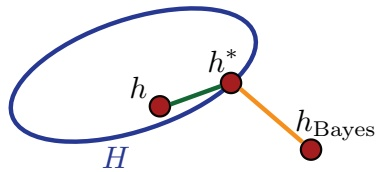

Figure 4.1

Illustration of the estimation error (in green) and approximation error (in orange). Here, it is assumed that there exists a best-in-class hypothesis, that is $h ^ { * }$ such that $R(h^{*}) = \inf_{h \in \mathcal{H}} R(h)$

Model selection consists of choosing H with a favorable trade-off between the approximation and estimation errors. Note, however, that the approximation error is not accessible, since in general the underlying distribution D needed to determine $R ^ { * }$ is not known. Even with various noise assumptions, estimating the approximation error is difficult. In contrast, the estimation error of an algorithm $\mathcal { A } ,$ that is, the estimation error of the hypothesis $h _ { S }$ returned after training on a sample $S ,$ can sometimes be bounded using generalization bounds as shown in the next section.

## 4.2 Empirical risk minimization (ERM)

A standard algorithm for which the estimation error can be bounded is Empirical Risk Minimization (ERM). ERM seeks to minimize the error on the training sample:4

$$
h _ {S} ^ {\mathrm{ERM}} = \underset {h \in \mathcal {H}} {\operatorname{argmin}} \widehat {R} _ {S} (h).\tag{4.2}
$$

**Proposition 4.1** For any sample S, the following inequality holds for the hypothesis returned by ERM:

$$
\mathbb {P} \left[ R (h _ {S} ^ {\mathrm{ERM}}) - \inf _ {h \in \mathcal {H}} R (h) > \epsilon \right] \leq \mathbb {P} \left[ \sup _ {h \in \mathcal {H}} | R (h) - \widehat {R} _ {S} (h) | > \frac {\epsilon}{2} \right].\tag{4.3}
$$

Proof: By definition of $\operatorname* { i n f } _ { h \in \mathcal { H } } R ( h )$ , for any $\epsilon ~ > ~ 0$ , there exists $h _ { \epsilon }$ such that $\textstyle R ( h _ { \epsilon } ) { \leq } \operatorname* { i n f } _ { h \in \mathcal { H } } R ( h ) + \epsilon .$ Thus, using $\widehat { R } _ { S } ( h _ { S } ^ { \operatorname { \widetilde { E R M } } } ) { \leq } \widehat { \widetilde { R } } _ { S } ( h _ { \epsilon } )$ , which holds by the

<small>4 Note that, if there exists multiple hypotheses with minimal error on the training sample, then ERM returns an arbitrary one.</small>

<!-- page: 80 -->

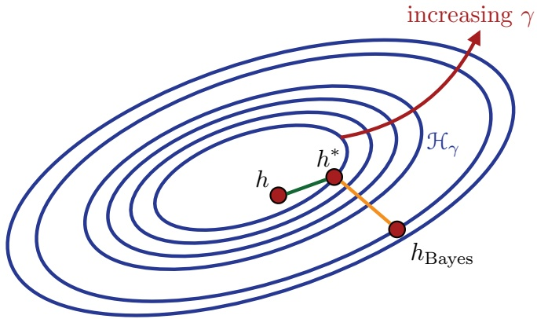

Figure 4.2

Illustration of the decomposition of a rich family $\begin{array} { r } { \mathcal { H } = \bigcup _ { \gamma \in \Gamma } \mathcal { H } _ { \gamma } } \end{array}$

definition of the algorithm, we can write

$$
\begin{array}{l} R (h _ {S} ^ {\mathrm{ERM}}) - \inf _ {h \in \mathcal {H}} R (h) = R (h _ {S} ^ {\mathrm{ERM}}) - R (h _ {\epsilon}) + R (h _ {\epsilon}) - \inf _ {h \in \mathcal {H}} R (h) \\ \qquad \leq R (h _ {S} ^ {\mathrm{ERM}}) - R (h _ {\epsilon}) + \epsilon \\ \qquad = R (h _ {S} ^ {\mathrm{ERM}}) - \widehat {R} _ {S} (h _ {S} ^ {\mathrm{ERM}}) + \widehat {R} _ {S} (h _ {S} ^ {\mathrm{ERM}}) - R (h _ {\epsilon}) + \epsilon \\ \qquad \leq R (h _ {S} ^ {\mathrm{ERM}}) - \widehat {R} _ {S} (h _ {S} ^ {\mathrm{ERM}}) + \widehat {R} _ {S} (h _ {\epsilon}) - R (h _ {\epsilon}) + \epsilon \\ \qquad \leq 2 \sup _ {h \in \mathcal {H}} | R (h) - \widehat {R} _ {S} (h) | + \epsilon . \end{array}
$$

Since the inequality holds for all $\epsilon > 0$ , it implies the following:

$$
R (h _ {S} ^ {\mathrm{ERM}}) - \inf _ {h \in \mathcal {H}} R (h) \leq 2 \sup _ {h \in \mathcal {H}} | R (h) - \widehat {R} _ {S} (h) |,
$$

which concludes the proof.

The right-hand side of (4.3) can be upper-bounded using the generalization bounds presented in the previous chapter in terms of the Rademacher complexity, the growth function, or the VC-dimension of H. In particular, it can be bounded by $\tilde { 2 } e ^ { - 2 m [ \epsilon - \mathfrak { R } _ { m } ( \mathcal { H } ) ] ^ { 2 } }$ Thus, when H admits a favorable Rademacher complexity, for example a finite VC-dimension, for a sufficiently large sample, with high probability, the estimation error is guaranteed to be small. Nevertheless, the performance of ERM is typically very poor. This is because the algorithm disregards the complexity of the hypothesis set H: in practice, either H is not complex enough, in which case the approximation error can be very large, or H is very rich, in which case the bound on the estimation error becomes very loose. Additionally, in many cases, determining the ERM solution is computationally intractable. For example, finding

<!-- page: 81 -->

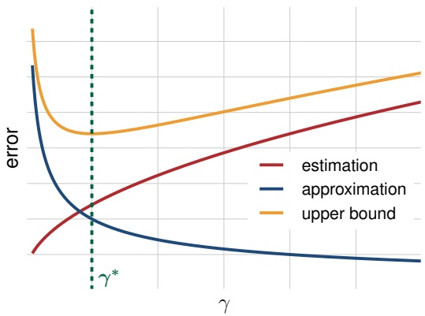

Figure 4.3

Choice of $\gamma ^ { * }$ with the most favorable trade-off between estimation and approximation errors.

a linear hypothesis with the smallest error on the training sample is NP-hard, as a function of the dimension of the space.

## 4.3 Structural risk minimization (SRM)

In the previous section, we showed that the estimation error can be sometimes bounded or estimated. But, since the approximation error cannot be estimated, how should we choose H? One way to proceed is to choose a very complex family H with no approximation error or a very small one. H may be too rich for generalization bounds to hold for H, but suppose we can decompose $\mathcal { H }$ as a union of increasingly complex hypothesis sets $\mathcal { H } _ { \gamma }$ , that is $\begin{array} { r } { \mathcal { H }   =   \bigcup _ { \gamma \in \Gamma } \mathcal { H } _ { \gamma } } \end{array}$ , with the complexity of $\mathcal { H } _ { \gamma }$ increasing with $\gamma ,$ for some set Γ. Figure 4.2 illustrates this decomposition. The problem then consists of selecting the parameter $\gamma ^ { * } \in \Gamma$ and thus the hypothesis set $\mathcal { H } _ { \gamma * }$ with the most favorable trade-off between estimation and approximation errors. Since these quantities are not known, instead, as illustrated by Figure 4.3, a uniform upper bound on their sum, the excess error (also called excess risk), can be used.

This is precisely the idea behind the Structural Risk Minimization (SRM) method. For SRM, H is assumed to be decomposable into a countable set, thus, we will write its decomposition as $\begin{array} { r } { \mathcal { H } = \bigcup _ { k \geq 1 } \mathcal { H } _ { k } } \end{array}$ . Additionally, the hypothesis sets $\mathcal { H } _ { k }$ are assumed to be nested: $\mathcal { H } _ { k }   \subset   \mathcal { H } _ { k + 1 } ^ { - }$ for all $k \geq 1$ However, many of the results presented in this section also hold for non-nested hypothesis sets. Thus, we will not make use of that assumption, unless explicitly specified. SRM consists of choosing the index $k ^ { * } \geq 1$ and the ERM hypothesis $h$ in $\mathcal { H } _ { k } ,$ ∗ that minimize an upper bound on the excess error.

<!-- page: 82 -->

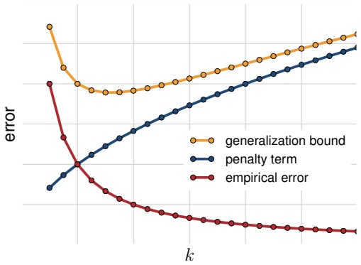

Figure 4.4

Illustration of structural risk minimization. The plots of three errors are shown as a function of the index k. Clearly, as $k ,$ or equivalently the complexity the hypothesis set $\mathcal { H } _ { k }$ , increases, the training error decreases, while the penalty term increases. SRM selects the hypothesis minimizing a bound on the generalization error, which is a sum of the empirical error and the penalty term.

As we shall see, the following learning bound holds for all $h \in { \mathcal { H } } ;$ for any $\delta > 0 .$ with probability at least $1 - \delta$ − δ over the draw of a sample $S$ of size $m$ from $\mathfrak { D } ^ { m }$ , for all $h \in \mathcal { H } _ { k }$ and $k \geq 1$

$$
R (h) \leq \widehat {R} _ {S} (h) + \Re_ {m} (\mathcal {H} _ {k (h)}) + \sqrt {\frac {\log k}{m}} + \sqrt {\frac {\log \frac {2}{\delta}}{2 m}}.
$$

Thus, to minimize the resulting bound on the excess error $( R ( h ) - R ^ { * } )$ , the index k and the hypothesis $h \in \mathcal { H } _ { k }$ should be chosen to minimize the following objective function:

$$
F _ {k} (h) = \widehat {R} _ {S} (h) + \Re_ {m} (\mathcal {H} _ {k}) + \sqrt {\frac {\log k}{m}}.
$$

This is precisely the definition of the SRM solution $h _ { S } ^ { \mathrm { S R M } }$

$$
h _ {S} ^ {\mathrm{SRM}} = \underset {k \geq 1, h \in \mathcal {H} _ {k}} {\operatorname{argmin}} F _ {k} (h) = \underset {k \geq 1, h \in \mathcal {H} _ {k}} {\operatorname{argmin}} \widehat {R} _ {S} (h) + R _ {m} (\mathcal {H} _ {k}) + \sqrt {\frac {\log k}{m}}.\tag{4.4}
$$

Thus, SRM identifies an optimal index $k ^ { * }$ and therefore hypothesis set $\mathcal { H } _ { k ^ { * } }$ , and returns the ERM solution based on that hypothesis set. Figure 4.4 further illustrates the selection of the index $k ^ { * }$ and hypothesis set $\mathcal { H } _ { k ^ { \ast } }$ ∗ by SRM by minimizing an upper bound on the sum of the training error and the penalty term $R _ { m } ( \mathcal { H } _ { k } ) + \sqrt { \log k / m }$ The following theorem shows that the SRM solution benefits from a strong learning guarantee. For any $h \in \mathcal { H }$ , we will denote by $\mathcal { H } _ { k ( h ) }$ the least complex hypothesis set among the $\mathcal { H } _ { k } \mathrm { s }$ that contain $h .$

<!-- page: 83 -->

**Theorem 4.2 (SRM Learning guarantee)** For any $\delta > 0$ , with probability at least $1 - \delta$ over the draw of an i.i.d. sample S of size m from $\mathfrak { D } ^ { m }$ , the generalization error of the hypothesis $h _ { S } ^ { \mathrm { S R M } }$ returned by the SRM method is bounded as follows:

$$
R (h _ {S} ^ {\mathrm{SRM}}) \leq \inf _ {h \in \mathcal {H}} \left(R (h) + 2 \Re_ {m} (\mathcal {H} _ {k (h)}) + \sqrt {\frac {\log k (h)}{m}}\right) + \sqrt {\frac {2 \log \frac {3}{\delta}}{m}}.
$$

Proof: Observe first that, by the union bound, the following general inequality holds:

$$
\begin{array}{l} \mathbb {P} \left[ \sup _ {h \in \mathcal {H}} R (h) - F _ {k (h)} (h) > \epsilon \right] \\ \qquad = \mathbb {P} \left[ \sup _ {k \geq 1} \sup _ {h \in \mathcal {H} _ {k}} R (h) - F _ {k} (h) > \epsilon \right] \\ \qquad \leq \sum_ {k = 1} ^ {\infty} \mathbb {P} \left[ \sup _ {h \in \mathcal {H} _ {k}} R (h) - F _ {k} (h) > \epsilon \right] \\ \qquad = \sum_ {k = 1} ^ {\infty} \mathbb {P} \left[ \sup _ {h \in \mathcal {H} _ {k}} R (h) - \widehat {R} _ {S} (h) - \mathfrak {R} _ {m} (\mathcal {H} _ {k}) > \epsilon + \sqrt {\frac {\log k}{m}} \right] \\ \qquad \leq \sum_ {k = 1} ^ {\infty} \exp \Big (- 2 m \Big [ \epsilon + \sqrt {\frac {\log k}{m}} \Big ] ^ {2} \Big) \\ \qquad \leq \sum_ {k = 1} ^ {\infty} e ^ {- 2 m \epsilon^ {2}} e ^ {- 2 \log k} \\ \qquad = e ^ {- 2 m \epsilon^ {2}} \sum_ {k = 1} ^ {\infty} \frac {1}{k ^ {2}} = \frac {\pi^ {2}}{6} e ^ {- 2 m \epsilon^ {2}} \leq 2 e ^ {- 2 m \epsilon^ {2}}. \end{array}\tag{4.5}
$$

Next, for any two random variables $X _ { 1 }$ and $X _ { 2 }$ , if $X _ { 1 } + X _ { 2 } > \epsilon .$ , then either $X _ { 1 }$ or $X _ { 2 }$ must be larger than $\epsilon / 2$ . In view of that, by the union bound, $\mathbb { P } [ X _ { 1 }   +   X _ { 2 } > \epsilon ] \leq$ $\mathbb { P } [ X _ { 1 } > \textstyle { \frac { \epsilon } { 2 } } ] + \mathbb { P } [ X _ { 2 } > \textstyle { \frac { \epsilon } { 2 } } ]$ . Using this inequality, inequality (4.5), and the inequality $F _ { k ( h _ { S } ^ { \operatorname { S R M } } ) } ( h _ { S } ^ { \operatorname { S R M } } ) { \leq } F _ { k ( h ) } ( h )$ , which holds for all $h \in \mathcal { H }$ , by definition of $h _ { S } ^ { \mathrm { S R M } }$ , we

<!-- page: 84 -->

can write, for any $h \in \mathcal { H }$

$$
\begin{array}{r l} & {\mathbb {P} \left[ R (h _ {S} ^ {\mathrm{SRM}}) - R (h) - 2 \Re_ {m} (\mathcal {H} _ {k (h)}) - \sqrt {\frac {\log k (h)}{m}} > \epsilon \right]} \\ & {\qquad \leq \mathbb {P} \left[ R (h _ {S} ^ {\mathrm{SRM}}) - F _ {k (h _ {S} ^ {\mathrm{SRM}})} (h _ {S} ^ {\mathrm{SRM}}) > \frac {\epsilon}{2} \right]} \\ & {\qquad + \mathbb {P} \left[ F _ {k (h _ {S} ^ {\mathrm{SRM}})} (h _ {S} ^ {\mathrm{SRM}}) - R (h) - 2 \Re_ {m} (\mathcal {H} _ {k (h)}) - \sqrt {\frac {\log k (h)}{m}} > \frac {\epsilon}{2} \right]} \\ & {\qquad \leq 2 e ^ {- \frac {m \epsilon^ {2}}{2}} + \mathbb {P} \left[ F _ {k (h)} (h) - R (h) - 2 \Re_ {m} (\mathcal {H} _ {k (h)}) - \sqrt {\frac {\log k (h)}{m}} > \frac {\epsilon}{2} \right]} \\ & {\qquad = 2 e ^ {- \frac {m \epsilon^ {2}}{2}} + \mathbb {P} \left[ \widehat {R} _ {S} (h) - R (h) - \Re_ {m} (\mathcal {H} _ {k (h)}) > \frac {\epsilon}{2} \right]} \\ & {\qquad = 2 e ^ {- \frac {m \epsilon^ {2}}{2}} + e ^ {- \frac {m \epsilon^ {2}}{2}} = 3 e ^ {- \frac {m \epsilon^ {2}}{2}}.} \end{array}
$$

Setting the right-hand side to be equal to $\delta$ completes the proof.

The learning guarantee just proven for SRM is remarkable. To simplify its discussion, let us assume that there exists $h ^ { * }$ such that $\begin{array} { r } { R ( h ^ { * } )   =   \operatorname* { i n f } _ { h \in \mathcal { H } } R ( h ) } \end{array}$ , that is, that there exists a best-in-class classifier $h ^ { * } \in \mathcal { H }$ Then, the theorem implies in particular that, with probability at least $1 - \delta$ , the following inequality holds for all $h \in { \mathcal { H } } ;$

$$
R (h _ {S} ^ {\mathrm{SRM}}) \leq R (h ^ {*}) + 2 \Re_ {m} (\mathcal {H} _ {k (h ^ {*})}) + \sqrt {\frac {\log k (h ^ {*})}{m}} + \sqrt {\frac {2 \log \frac {3}{\delta}}{m}}.\tag{4.6}
$$

Observe that, remarkably, this bound is similar to the estimation error bound for $\mathcal { H } _ { k ( h ^ { * } ) } ,$ : it differs from it only by the term $\sqrt { \log k ( h ^ { * } ) / m }$ . Thus, modulo that term, the guarantee for SRM is as favorable as the one we would have obtained, had an oracle informed us of the index $k ( h ^ { * } )$ of the best-in-class classifier’s hypothesis set.

Furthermore, observe that when H is rich enough that $R ( h ^ { * } )$ is close to the Bayes error, the learning bound (4.6) is approximately a bound on the excess error of the SRM solution. Note that, if for some $k _ { 0 }$ , the empirical error of the ERM solution for $\mathcal { H } _ { k _ { 0 } }$ is zero, which holds in particular if $\mathcal { H } _ { k _ { 0 } }$ contains the Bayes error, then, we have $\operatorname { m i n } _ { h \in \mathcal { H } _ { k } } F _ { k _ { 0 } } ( h ) { \leq } \operatorname { m i n } _ { h \in \mathcal { H } _ { k } } F _ { k } ( h )$ for all $k > k _ { 0 }$ and only finitely many indices need to be considered in SRM.

Assume more generally that if $\quad \operatorname { m i n } _ { {  } h {  } \in {  } \mathcal { H } _ { {  } k } } {  } F _ { {  } k } {  } ( {  } h {  } ) {  } \leq {  } \operatorname { m i n } _ { {  } h {  } \in {  } \mathcal { H } _ { {  } k {  } + {  } 1 } } {  } F _ { {  } k } {  } ( {  } h {  } )$ for some $k ,$ then indices beyond $k + 1$ need not be inspected. This property may hold for example if the empirical error cannot be further improved after some index k. In that case, the minimizing index $k ^ { * }$ can be determined via a binary search in the interval $[ 1 , k _ { \mathrm { m a x } } ]$ , given some maximum value $k _ { \mathrm { m a x } } . k _ { \mathrm { m a x } }$ itself can be found by inspecting min ${ } _ { { } ^ { 1 } h \in \mathcal { H } _ { 2 ^ { n } } } F _ { k } ( h )$ for exponentially growing indices $2 ^ { n } ,   n \geq 1$ , and setting $k _ { \mathrm { m a x } }   =   2 ^ { n }$ for n such that mi $$\operatorname { n } _ { h \in \mathcal { H } _ { 2 ^ { n } } } F _ { k } ( h ) { \leq } \operatorname { m i n } _ { h \in \mathcal { H } _ { 2 ^ { n + 1 } } } F _ { k } ( h )$$ . The number of ERM computations needed to find $k _ { \mathrm { m a x } }$ is in $O ( n ) = O ( \log k _ { \mathrm { m a x } } )$ and similarly the

<!-- page: 85 -->

number of ERM computations due to the binary search is in $O ( \log k _ { \mathrm { m a x } } )$ . Thus, if n is the smallest integer such that $k ^ { * } < 2 ^ { n }$ , the overall number of ERM computations is in $O ( \log k ^ { * } )$

While it benefits from a very favorable guarantee, SRM admits several drawbacks. First, the decomposability of H into countably many hypothesis sets, each with a converging Rademacher complexity, remains a strong assumption. As an example, the family of all measurable functions cannot be written as a union of countably many hypothesis sets with finite VC-dimension. Thus, the choice of H or that of the hypothesis sets $\mathcal { H } _ { k }$ is a key component of SRM. Second, and this is the main disadvantage of SRM, the method is typically computationally intractable: for most hypothesis sets, finding the solution of ERM is NP-hard and in general SRM requires determining that solution for a large number of indices k.

## 4.4 Cross-validation

An alternative method for model selection, cross-validation, consists of using some fraction of the training sample as a validation set to select a hypothesis set $\mathcal { H } _ { k }$ This is in contrast with the SRM model which relies on a theoretical learning bound assigning a penalty to each hypothesis set. In this section, we analyze the cross-validation method and compare its performance to that of SRM.

As in the previous section, let $( \mathcal { H } _ { k } ) _ { k \geq 1 }$ be a countable sequence of hypothesis sets with increasing complexities. The cross-validation (CV) solution is obtained as follows. Let S be an i.i.d. labeled sample of size m. S is divided into a sample $S _ { 1 }$ of size $( 1 - \alpha )$ m and a sample $S _ { 2 }$ of size αm, with $\alpha \in ( 0 , 1 )$ typically chosen to be relatively small. $S _ { 1 }$ is reserved for training, $S _ { 2 }$ for validation. For any $k \in \mathbb { N }$ let $h _ { S _ { 1 } , k } ^ { \mathrm { E R M } }$ denote the solution of ERM run on $S _ { 1 }$ using the hypothesis set $\mathcal { H } _ { k }$ . The hypothesis $h _ { S } ^ { \mathrm { C V } }$ returned by cross-validation is the ERM solution $h _ { S _ { 1 } , k } ^ { \mathrm { E R M } }$ with the best performance on $S _ { 2 }$

$$
h_{S}^{\mathrm{CV}} = \operatorname *{argmin}_{\substack{h\in \left\{h_{S_{1},k}^{\mathrm{ERM}}:  k\geq 1\right\}}} \widehat{R}_{S_{2}}(h).\tag{4.7}
$$

The following general result will help us derive learning guarantees for cross-validation.

**Proposition 4.3** For any $\alpha   >   0$ and any sample size $m \geq 1$ , the following general inequality holds:

$$
\mathbb {P} \left[ \sup _ {k \geq 1} \left| R (h _ {S _ {1}, k} ^ {\mathrm{ERM}}) - \widehat {R} _ {S _ {2}} (h _ {S _ {1}, k} ^ {\mathrm{ERM}}) \right| > \epsilon + \sqrt {\frac {\log k}{\alpha m}} \right] \leq 4 e ^ {- 2 \alpha m \epsilon^ {2}}.
$$

<!-- page: 86 -->

## 4.4 Cross-validation

Proof: By the union bound, we can write

$$
\begin{array}{l} \mathbb {P} \left[ \sup _ {k \geq 1} \left| R (h _ {S _ {1}, k} ^ {\mathrm{ERM}}) - \widehat {R} _ {S _ {2}} (h _ {S _ {1}, k} ^ {\mathrm{ERM}}) \right| > \epsilon + \sqrt {\frac {\log k}{\alpha m}} \right] \\ \qquad \leq \sum_ {k = 1} ^ {\infty} \mathbb {P} \left[ \left| R (h _ {S _ {1}, k} ^ {\mathrm{ERM}}) - \widehat {R} _ {S _ {2}} (h _ {S _ {1}, k} ^ {\mathrm{ERM}}) \right| > \epsilon + \sqrt {\frac {\log k}{\alpha m}} \right] \\ \qquad = \sum_ {k = 1} ^ {\infty} \mathbb {E} \left[ \mathbb {P} \left[ \left| R (h _ {S _ {1}, k} ^ {\mathrm{ERM}}) - \widehat {R} _ {S _ {2}} (h _ {S _ {1}, k} ^ {\mathrm{ERM}}) \right| > \epsilon + \sqrt {\frac {\log k}{\alpha m}} \mid S _ {1} \right] \right]. \end{array}\tag{4.8}
$$

The hypothesis $h _ { S _ { 1 } , k } ^ { \mathrm { E R M } }$ is fixed conditioned on $S _ { 1 }$ . Furthermore, the sample $S _ { 2 }$ is independent from $S _ { 1 }$ . Therefore, by Hoeffding’s inequality, we can bound the conditional probability as follows:

$$
\begin{array}{r l} \mathbb {P} \left[ \left| R (h _ {S _ {1}, k} ^ {\mathrm{ERM}}) - \widehat {R} _ {S _ {2}} (h _ {S _ {1}, k} ^ {\mathrm{ERM}}) \right| > \epsilon + \sqrt {\frac {\log k}{\alpha m}} \Bigg | S _ {1} \right] & \leq 2 e ^ {- 2 \alpha m \left(\epsilon + \sqrt {\frac {\log k}{\alpha m}}\right) ^ {2}}. \\ & \leq 2 e ^ {- 2 \alpha m \epsilon^ {2} - 2 \log k} \\ & = \frac {2}{k ^ {2}} e ^ {- 2 \alpha m \epsilon^ {2}}. \end{array}
$$

Plugging in the right-hand side of this bound in (4.8) and summing over k yields

$$
\mathbb {P} \left[ \sup _ {k \geq 1} \left| R (h _ {S _ {1}, k} ^ {\mathrm{ERM}}) - \widehat {R} _ {S _ {2}} (h _ {S _ {1}, k} ^ {\mathrm{ERM}}) \right| > \epsilon + \sqrt {\frac {\log k}{\alpha m}} \right] \leq \frac {\pi^ {2}}{3} e ^ {- 2 \alpha m \epsilon^ {2}} <   4 e ^ {- 2 \alpha m \epsilon^ {2}},
$$

which completes the proof.

Let $R ( h _ { S _ { 1 } } ^ { \mathrm { S R M } } )$ be the generalization error of the SRM solution using a sample $S _ { 1 }$ of size $( 1 - \alpha m )$ and $R ( h _ { S } ^ { \mathrm { C V } } , S )$ the generalization error of the cross-validation solution using a sample S of size m. Then, using Proposition 4.3, the following learning guarantee can be derived which compares the error of the CV method to that of SRM.

**Theorem 4.4 (Cross-validation versus SRM)** For any $\delta \; > \; 0$ , with probability at least $1 - \delta$ , the following holds:

$$
R (h _ {S} ^ {\mathrm{CV}}) - R (h _ {S _ {1}} ^ {\mathrm{SRM}}) \leq 2 \sqrt {\frac {\log \max (k (h _ {S} ^ {\mathrm{CV}}) , k (h _ {S _ {1}} ^ {\mathrm{SRM}}))}{\alpha m}} + 2 \sqrt {\frac {\log \frac {4}{\delta}}{2 \alpha m}},
$$

where, for any $h ,   k ( h )$ denotes the smallest index of a hypothesis set containing $h$ Proof: By Proposition 4.3 and Theorem 4.2, using the property of $h _ { S } ^ { \mathrm { C V } }$ as a minimizer, for any $\delta \; > \; 0$ , with probability at least $1 - \delta$ , the following inequalities

<!-- page: 87 -->

hold:

$$
\begin{array}{l} R (h _ {S} ^ {\mathrm{CV}}) \leq \widehat {R} _ {S _ {2}} (h _ {S} ^ {\mathrm{CV}}) + \sqrt {\frac {\log (k (h _ {S} ^ {\mathrm{CV}}))}{\alpha m}} + \sqrt {\frac {\log \frac {4}{\delta}}{2 \alpha m}} \\ \quad \leq \widehat {R} _ {S _ {2}} (h _ {S _ {1}} ^ {\mathrm{SRM}}) + \sqrt {\frac {\log (k (h _ {S} ^ {\mathrm{CV}}))}{\alpha m}} + \sqrt {\frac {\log \frac {4}{\delta}}{2 \alpha m}} \\ \quad \leq R (h _ {S _ {1}} ^ {\mathrm{SRM}}) + \sqrt {\frac {\log (k (h _ {S} ^ {\mathrm{CV}}))}{\alpha m}} + \sqrt {\frac {\log (k (h _ {S _ {1}} ^ {\mathrm{SRM}}))}{\alpha m}} + 2 \sqrt {\frac {\log \frac {4}{\delta}}{2 \alpha m}} \\ \quad \leq R (h _ {S _ {1}} ^ {\mathrm{SRM}}) + 2 \sqrt {\frac {\log (\max (k (h _ {S} ^ {\mathrm{CV}}) , k (h _ {S _ {1}} ^ {\mathrm{SRM}}))}{\alpha m}} + 2 \sqrt {\frac {\log \frac {4}{\delta}}{2 \alpha m}}, \end{array}
$$

which completes the proof.

The learning guarantee just proven shows that, with high probability, the generalization error of the CV solution for a sample of size m is close to that of the SRM solution for a sample of size $( 1 - \alpha ) m$ . For α relatively small, this suggests a guarantee similar to that of SRM, which, as previously discussed, is very favorable. However, in some unfavorable regimes, an algorithm (here SRM) trained on $( 1 - \alpha ) m$ points may have a significantly worse performance than when trained on m points (avoiding this phase transition issue is one of the main motivations behind the use of the n-fold cross-validation method in practice, see section 4.5). Thus, the bound suggests in fact a trade-off: α should be chosen sufficiently small to avoid the unfavorable regimes just mentioned and yet sufficiently large for the right-hand side of the bound to be small and thus informative.

The learning bound for CV can be made more explicit in some cases in practice. Assume for example that the hypothesis sets $\mathcal { H } _ { k }$ are nested and that the empirical errors of the ERM solutions $h _ { S _ { 1 } , k } ^ { \mathrm { E R M } }$ are decreasing before reaching zero: for any k, $\widehat { R } _ { S _ { 1 } } ( h _ { S _ { 1 } , k + 1 } ^ { \operatorname { E R M } } ) < \widehat { R } _ { S _ { 1 } } ( h _ { S _ { 1 } , k } ^ { \operatorname { E R M } } )$ for all k such that $\widehat { R } _ { S _ { 1 } } ( h _ { S _ { 1 } , k } ^ { \mathrm { E R M } } ) > 0$ and $\widehat { R } _ { S _ { 1 } } ( h _ { S _ { 1 } , k + 1 } ^ { \mathrm { E R M } } ) \leq$ $\widehat { R } _ { S _ { 1 } } ( h _ { S _ { 1 } , k } ^ { \mathrm { E R M } } )$ otherwise. Observe that $\widehat { R } _ { S _ { 1 } } ( h _ { S _ { 1 } , k } ^ { \mathrm { E R M } } ) > 0$ implies at least one error for $h _ { S _ { 1 } , k } ^ { \mathrm { E R M } }$ , therefore $\begin{array} { r } { \widehat { R } _ { S _ { 1 } } ( h _ { S _ { 1 } , k } ^ { \mathrm { E R M } } ) > \frac { 1 } { m } } \end{array}$ . In view of that, we must then have $\widehat { R } _ { S _ { 1 } } ( h _ { S _ { 1 } , n } ^ { \mathrm { E R M } } ) =$ 0 for all $n   \geq   m + 1$ . Thus, we have $h _ { S _ { 1 } , n } ^ { \mathrm { E R M } }   =   h _ { S _ { 1 } , m + 1 } ^ { \mathrm { E R M } }$ for all $n   \geq   m + 1$ and we can assume that $k ( f _ { C V } ) \leq m + 1$ . Since the complexity of $\mathcal { H } _ { k }$ increases with k we also have $k ( f _ { { S R M } } ) \leq m + 1$ . In view of that, we obtain the following more explicit learning bound for cross-validation:

$$
R (f _ {C V}, S) - R (f _ {S R M}, S _ {1}) \leq 2 \sqrt {\frac {\log (\frac {4}{\delta})}{2 \alpha m}} + 2 \sqrt {\frac {\log (m + 1)}{\alpha m}}.
$$

<!-- page: 88 -->

## 4.5 n-Fold cross-validation

In practice, the amount of labeled data available is often too small to set aside a validation sample since that would leave an insufficient amount of training data. Instead, a widely adopted method known as $n – f o l d$ cross-validation is used to exploit the labeled data both for model selection and for training.

Let θ denote the vector of free parameters of the algorithm. For a fixed value of $\theta ,$ the method consists of first randomly partitioning a given sample $S$ of m labeled examples into n subsamples, or folds. The ith fold is thus a labeled sample $( ( x _ { i 1 } , y _ { i 1 } ) , \ldots , ( x _ { i m _ { i } } , y _ { i m _ { i } } ) )$ of size $m _ { i }$ . Then, for any $i \in [ n ]$ , the learning algorithm is trained on all but the ith fold to generate a hypothesis $h _ { i }$ , and the performance of $h _ { i }$ is tested on the ith fold, as illustrated in figure 4.5a. The parameter value $\theta$ is evaluated based on the average error of the hypotheses $h _ { i }$ , which is called the cross-validation error . This quantity is denoted by $\hat { R } _ { \mathrm { C V } } ( \boldsymbol { \theta } )$ and defined by

$$
\widehat {R} _ {\mathrm{CV}} (\boldsymbol {\theta}) = \frac {1}{n} \sum_ {i = 1} ^ {n} \underbrace {\frac {1}{m _ {i}} \sum_ {j = 1} ^ {m _ {i}} L (h _ {i} (x _ {i j}) , y _ {i j})} _ {\text {error of $h_i$ on the $i$th fold}}.
$$

The folds are generally chosen to have equal size, that is $m _ { i } = m / n$ for all $i \in [ n ]$ How should $n$ be chosen? The appropriate choice is subject to a trade-off. For a large n, each training sample used in n-fold cross-validation has size $m - m / n =$ $m ( 1 - 1 / n )$ (illustrated by the right vertical red line in figure 4.5b), which is close to m, the size of the full sample, and also implies all training samples are quite similar. At the same time, the ith fold used to measure the error is relatively small and thus the cross-validation error tends to have a small bias but a large variance. In contrast, smaller values of n lead to more diverse training samples but their size (shown by the left vertical red line in figure 4.5b) is significantly less than m. In this regime, the ith fold is relatively large and thus the cross-validation error tends to have a smaller variance but a larger bias.

In applications, n is typically chosen to be 5 or 10. n-fold cross-validation is used as follows in model selection. The full labeled data is first split into a training and a test sample. The training sample of size m is then used to compute the $n -$ fold cross-validation error $\hat { R } _ { \mathrm { C V } } ( \boldsymbol { \theta } )$ for a small number of possible values of $\theta .$ The free parameter $\theta$ bis next set to the value $\theta _ { 0 }$ for which $\hat { R } _ { \mathrm { C V } } ( \boldsymbol { \theta } )$ is smallest and the algorithm is trained with the parameter setting $\theta _ { 0 }$ bover the full training sample of size m. Its performance is evaluated on the test sample as already described in the previous section.

The special case of n-fold cross-validation where $n = m$ is called leave-one-out cross-validation, since at each iteration exactly one instance is left out of the train-

<!-- page: 89 -->

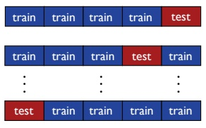

(a)

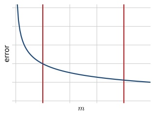

(b)

Figure 4.5

n-fold cross-validation. (a) Illustration of the partitioning of the training data into 5 folds. (b) Typical plot of a classifier’s prediction error as a function of the size of the training sample m: the error decreases as a function of the number of training points. The red line on the left side marks the region for small values of n, while the red line on the right side marks the region for large values of n.

ing sample. As shown in chapter 5, the average leave-one-out error is an approximately unbiased estimate of the average error of an algorithm and can be used to derive simple guarantees for some algorithms. In general, the leave-one-out error is very costly to compute, since it requires training m times on samples of size m − 1, but for some algorithms it admits a very efficient computation (see exercise 11.9).

In addition to model selection, n-fold cross-validation is also commonly used for performance evaluation. In that case, for a fixed parameter setting θ, the full labeled sample is divided into n random folds with no distinction between training and test samples. The performance reported is the n-fold cross-validation error on the full sample as well as the standard deviation of the errors measured on each fold.

## 4.6 Regularization-based algorithms

A broad family of algorithms inspired by the SRM method is that of regularizationbased algorithm. This consists of selecting a very complex family H that is an uncountable union of nested hypothesis sets $\begin{array} { r } { \mathcal { H } _ { \gamma } \colon \mathcal { H } = \bigcup _ { \gamma > 0 } \mathcal { H } _ { \gamma } } \end{array}$ . H is often chosen to be dense in the space of continuous functions over X. For example, H may be chosen to be the set of all linear functions in some high-dimensional space and $\mathcal { H } _ { \gamma }$ the subset of those functions whose norm is bounded by $\gamma \colon \; \mathcal { H } _ { \gamma } \; = \; \{ x \; \mapsto$ $\mathbf { w } \cdot \mathbf { \Phi } ( x ) \colon \| \mathbf { w } \| \leq \gamma \}$ . For some choices of Φ and the high-dimensional space, it can be shown that H is indeed dense in the space of continuous functions over X.

<!-- page: 90 -->

Given a labeled sample $S ,$ the extension of the SRM method to an uncountable union would then suggest selecting h based on the following optimization problem:

$$
\underset {\gamma > 0, h \in H _ {\gamma}} {\mathrm{argmin}} \widehat {R} _ {S} (h) + \mathfrak {R} _ {m} (\mathcal {H} _ {\gamma}) + \sqrt {\frac {\log \gamma}{m}},
$$

where other penalty terms $\operatorname { p e n } ( \gamma , m )$ can be chosen in lieu of the specific choice $\begin{array} { r } { \mathrm { p e n } ( \gamma , m )   =   \Re _ { m } ( \mathcal { H } _ { \gamma } )   +   \sqrt { \frac { \log \gamma } { m } } } \end{array}$ . Often, there exists a function $\mathcal { R } \colon \mathcal { H }   \to   \mathbb { R }$ such that, for any $\gamma > 0$ , the constrained optimization problem argmin $_ { \gamma > 0 , h \in H _ { \gamma } } \widehat { R } _ { S } ( h ) +$ $\operatorname { p e n } ( \gamma , m )$ b can be equivalently written as the unconstrained optimization problem

$$
\underset {h \in \mathcal {H}} {\operatorname{argmin}} \widehat {R} _ {S} (h) + \lambda \mathcal {R} (h),
$$

for some $\lambda   >   0. \quad \mathcal{R}(h)$ is called a regularization term and $\lambda > 0$ is treated as a hyperparameter since its optimal value is often not known. For most algorithms, the regularization term $\mathcal { R } ( h )$ is chosen to be an increasing function of $\| h \|$ for some choice of the norm k · k, when H is the subset of a Hilbert space. The variable λ is often called a regularization parameter . Larger values of λ further penalize more complex hypotheses, while, for λ close or equal to zero, the regularization term has no effect and the algorithm coincides with ERM. In practice, λ is typically selected via cross-validation or using n-fold cross-validation.

When the regularization term is chosen to be $\| h \| _ { p }$ for some choice of the norm and $p \geq 1$ , then it is a convex function of h, since any norm is convex. However, for the zero-one loss, the first term of the objective function is non-convex, thereby making the optimization problem computationally hard. In practice, most regularization-based algorithms instead use a convex upper bound on the zero-one loss and replace the empirical zero-one term with the empirical value of that convex surrogate. The resulting optimization problem is then convex and therefore admits more efficient solutions than SRM. The next section studies the properties of such convex surrogate losses.

## 4.7 Convex surrogate losses

The guarantees for the estimation error that we presented in previous sections hold either for ERM or for SRM, which itself is defined in terms of ERM. However, as already mentioned, for many choices of the hypothesis set H, including that of linear functions, solving the ERM optimization problem is NP-hard mainly because the zero-one loss function is not convex. One common method for addressing this problem consists of using a convex surrogate loss function that upper bounds the zero-one loss. This section analyzes learning guarantees for such surrogate losses in terms of the original loss.

<!-- page: 91 -->

The hypotheses we consider are real-valued functions $h \colon \mathcal { X } \to \mathbb { R }$ . The sign of h defines a binary classifier $f _ { h } \colon \mathcal { X } \to \{ - 1 , + 1 \}$ defined for all $x \in \mathcal { X }$ by

$$
f _ {h} (x) = \left\{ \begin{array}{l l} + 1 & \text {if} h (x) \geq 0 \\ - 1 & \text {if} h (x) <   0. \end{array} \right.
$$

The loss or error of h at point $( x , y ) \; \in \; \mathcal { X } \times \{ - 1 , + 1 \}$ is defined as the binary classification error of $f _ { h }$ :

$$
1 _ {f _ {h} (x) \neq y} = 1 _ {y h (x) <   0} + 1 _ {h (x) = 0 \land y = - 1} \leq 1 _ {y h (x) \leq 0}.
$$

We will denote by $R ( h )$ the expected error of h: $R ( h ) = \mathbb { E } _ { ( x , y ) \sim \mathcal { D } } \left[ 1 _ { f _ { h } ( x ) \neq y } \right]$ . For any $x \in { \mathcal { X } } .$ , let $\eta ( x )$ denote $\eta ( x )   =   \mathbb { P } [ y   =   + 1 | x ]$ and let $\mathcal { D } _ { \mathcal { X } }$ denote the marginal distribution over X. Then, for any h, we can write

$$
\begin{array}{r l} R (h) & = \underset {(x, y) \sim \mathcal {D}} {\mathbb {E}} \left[ 1 _ {f _ {h} (x) \neq y} \right] \\ & = \underset {x \sim \mathcal {D} _ {\mathcal {X}}} {\mathbb {E}} \left[ \eta (x) 1 _ {h (x) <   0} + (1 - \eta (x)) 1 _ {h (x) > 0} + (1 - \eta (x)) 1 _ {h (x) = 0} \right] \\ & = \underset {x \sim \mathcal {D} _ {\mathcal {X}}} {\mathbb {E}} \left[ \eta (x) 1 _ {h (x) <   0} + (1 - \eta (x)) 1 _ {h (x) \geq 0} \right]. \end{array}
$$

In view of that, the Bayes classifier can be defined as assigning label +1 to x when $\eta ( x ) \geq { \textstyle { \frac { 1 } { 2 } } } ,   - 1$ otherwise. It can therefore be induced by the function $h ^ { * }$ defined by

$$
h ^ {*} (x) = \eta (x) - \frac {1}{2}.\tag{4.9}
$$

We will refer to $h ^ { * } \colon \mathcal { X } \to \mathbb { R }$ as the Bayes scoring function and will denote by $R ^ { * }$ the error of the Bayes classifier or Bayes scoring function: $R ^ { * } = R ( h ^ { * } )$

**Lemma 4.5** The excess error of any hypothesis $h \colon { \mathcal { X } } \to \mathbb { R }$ can be expressed as follows in terms $o f   \eta$ and the Bayes scoring function $h ^ { * }$ :

$$
R (h) - R ^ {*} = 2 \underset {x \sim \mathcal {D} _ {\mathcal {X}}} {\mathbb {E}} \left[ | h ^ {*} (x) |   1 _ {h (x) h ^ {*} (x) \leq 0} \right].
$$

Proof: For any $h ,$ we can write

$$
\begin{array}{r l} & R (h) = \underset {x \sim \mathcal {D} _ {\mathcal {X}}} {\mathbb {E}} \left[ \eta (x) 1 _ {h (x) <   0} + (1 - \eta (x)) 1 _ {h (x) \geq 0} \right] \\ & \quad = \underset {x \sim \mathcal {D} _ {\mathcal {X}}} {\mathbb {E}} \left[ \eta (x) 1 _ {h (x) <   0} + (1 - \eta (x)) (1 - 1 _ {h (x) <   0}) \right] \\ & \quad = \underset {x \sim \mathcal {D} _ {\mathcal {X}}} {\mathbb {E}} \left[ [ 2 \eta (x) - 1 ] 1 _ {h (x) <   0} + (1 - \eta (x)) \right] \\ & \quad = \underset {x \sim \mathcal {D} _ {\mathcal {X}}} {\mathbb {E}} \left[ 2 h ^ {*} (x) 1 _ {h (x) <   0} + (1 - \eta (x)) \right], \end{array}
$$

<!-- page: 92 -->

where we used for the last step equation (4.9). In view of that, for any h, the following holds:

$$
\begin{array}{r l} & R (h) - R (h ^ {*}) = \underset {x \sim \mathcal {D} _ {\mathcal {X}}} {\mathbb {E}} \left[ 2 [ h ^ {*} (x) ] (1 _ {h (x) \leq 0} - 1 _ {h ^ {*} (x) \leq 0}) \right] \\ & \quad = \underset {x \sim \mathcal {D} _ {\mathcal {X}}} {\mathbb {E}} \left[ 2 [ h ^ {*} (x) ] \mathrm{sgn} (h ^ {*} (x)) 1 _ {(h (x) h ^ {*} (x) \leq 0) \land ((h (x), h ^ {*} (x)) \neq (0, 0))} \right] \\ & \quad = 2 \underset {x \sim \mathcal {D} _ {\mathcal {X}}} {\mathbb {E}} \left[ | h ^ {*} (x) | 1 _ {h (x) h ^ {*} (x) \leq 0} \right], \end{array}
$$

which completes the proof, since $R ( h ^ { * } ) = R ^ { * }$

Let $\Phi \colon \mathbb { R } \to \mathbb { R }$ be a convex and non-decreasing function so that for any $u \in \mathbb { R }$ $1 _ { u \leq 0 } \leq \Phi ( - u )$ . The Φ-loss of a function $h \colon \mathcal { X } \to \mathbb { R }$ at point $( x , y ) \in \mathcal { X } \times \{ - 1 , + 1 \}$ is defined as $\Phi ( - y h ( x ) )$ and its expected loss given by

$$
\begin{array}{r l} \mathcal {L} _ {\Phi} (h) = & \underset {(x, y) \sim \mathcal {D}} {\mathbb {E}} \left[ \Phi (- y h (x)) \right] \\ = & \underset {x \sim \mathcal {D} _ {x}} {\mathbb {E}} \left[ \eta (x) \Phi (- h (x)) + (1 - \eta (x)) \Phi (h (x)) \right]. \end{array}\tag{4.10}
$$

Notice that since $1 _ { y h ( x ) \leq 0 } \leq \Phi ( - y h ( x ) )$ , we have $R ( h ) \leq \mathcal { L } _ { \Phi } ( h )$ . For any $x \in \mathfrak { X }$ let $u \mapsto L _ { \Phi } ( x , u )$ be the function defined for all $u \in \mathbb { R }$ by

$$
L _ {\Phi} (x, u) = \eta (x) \Phi (- u) + (1 - \eta (x)) \Phi (u).
$$

Then, $\mathcal { L } _ { \Phi } ( h ) = \mathbb { E } _ { x \sim \mathcal { D } _ { \mathcal { X } } } [ L _ { \Phi } ( x , h ( x ) ) ]$ . Since Φ is convex, $u \mapsto L _ { \Phi } ( x , u )$ is convex as a sum of two convex functions. Define $h _ { \Phi } ^ { * } \colon \mathcal { X } \to [ - \infty , + \infty ]$ as the Bayes solution $f o r$ the loss function $L _ { \Phi }$ . That is, for any x, $h _ { \Phi } ^ { * } ( x )$ is a solution of the following convex optimization problem:

$$
\begin{array}{l} h _ {\Phi} ^ {*} (x) = \underset {u \in [ - \infty , + \infty ]} {\operatorname{argmin}} L _ {\Phi} (x, u) \\ \qquad = \underset {u \in [ - \infty , + \infty ]} {\operatorname{argmin}} \eta (x) \Phi (- u) + (1 - \eta (x)) \Phi (u). \end{array}
$$

The solution of this optimization is in general not unique. When $\eta ( x ) = 0 , h _ { \Phi } ^ { * } ( x )$ is a minimizer of $u \mapsto \Phi ( u )$ and since Φ is non-decreasing, we can choose $h _ { \Phi } ^ { * } ( x ) = - \infty$ in that case. Similarly, when $\eta ( x ) = 1$ , we can choose $h _ { \Phi } ^ { * } ( x ) = + \infty$ . When $\begin{array} { r } { \eta ( x ) = \frac { 1 } { 2 } } \end{array}$, $L _ { \Phi } ( x , u ) = { \textstyle { \frac { 1 } { 2 } } } [ \Phi ( - u ) + \Phi ( u ) ]$ , thus, by convexity, $L _ { \Phi } ( x , u )   \geq   \Phi ( - { \textstyle { \frac { u } { 2 } } } + { \textstyle { \frac { u } { 2 } } } )   =   \Phi ( 0 )$ Thus, we can choose $h _ { \Phi } ^ { * } ( x ) = 0$ in that case. For all other values of $\eta ( x )$ , in case of non-uniqueness, an arbitrary minimizer is chosen in this definition. We will denote by $\mathcal { L } _ { \Phi } ^ { * }$ the Φ-loss of h∗Φ: $\mathcal { L } _ { \Phi } ^ { * } = \mathbb { E } _ { ( x , y ) \sim \mathcal { D } } \left[ \Phi ( - y h _ { \Phi } ^ { * } ( x ) ) \right]$

**Proposition 4.6** Let Φ be a convex and non-decreasing function that is differentiable at 0 with $\Phi ^ { \prime } ( 0 )   >   0$ . Then, the minimizer of Φ defines the Bayes classifier: for any $x   \in   \mathcal { X } , \; h _ { \Phi } ^ { * } ( x )   >   0   \mathit { i f f } \; h ^ { * } ( x )   >   0$ and $h ^ { * } ( x )   =   0 \quad \mathit { i f f } \quad h _ { \Phi } ^ { * } ( x )   =   0$ , which implies $\mathcal { L } _ { \Phi } ^ { * } = R ^ { * }$

<!-- page: 93 -->

Proof: Fix $x \in \mathfrak { X }$ . If $\eta ( x )   =   0$ , then $h ^ { * } ( x )   =   - { \textstyle { \frac { 1 } { 2 } } }$ and $h _ { \Phi } ^ { * } ( x )   =   - \infty$ , thus $h ^ { * } ( x )$ and $h _ { \Phi } ^ { * } ( x )$ admit the same sign. Similarly, if $\eta ( x )   =   1$ , then $h ^ { * } ( x )   =   + { \textstyle { \frac { 1 } { 2 } } }$ and $h _ { \Phi } ^ { * } ( x ) = + \infty$ , and $h ^ { * } ( x )$ and $h _ { \Phi } ^ { * } ( x )$ admit the same sign.

Let $u ^ { * }$ denote the minimizer defining $h _ { \Phi } ^ { * } ( x ) . \quad u ^ { * }$ is a minimizer of $u \mapsto L _ { \Phi } ( x , u )$ iff the subdifferential of that function at $u ^ { * }$ contains 0, that is, since $\partial L _ { \Phi } ( x , u ^ { * } ) =$ $- \eta ( x ) \partial \Phi ( - u ^ { * } ) + ( 1 - \eta ( x ) ) \partial \Phi ( u ^ { * } )$ , iff there exist $v _ { 1 } \in \partial \Phi ( - u ^ { * } )$ and $v _ { 2 } \in \partial \Phi ( u ^ { * } )$ such that

$$
\eta (x) v _ {1} = (1 - \eta (x)) v _ {2}.\tag{4.11}
$$

If $u ^ { * } = 0$ , by the differentiability of Φ at 0 we have $v _ { 1 } = v _ { 2 } = \Phi ^ { \prime } ( 0 ) > 0$ and thus $\eta ( x ) = { \textstyle { \frac { 1 } { 2 } } }$ , that is $h ^ { * } ( x ) = 0$ . Conversely, If $h ^ { * } ( x ) = 0$ , that is $\begin{array} { r } { \eta ( x ) = \frac { 1 } { 2 } , } \end{array}$ , then, by definition, we have $h _ { \Phi } ^ { * } ( x ) = 0$ . Thus, $h ^ { * } ( x ) = 0$ iff $\begin{array} { r } { h _ { \Phi } ^ { * } ( x ) = 0 \mathrm { ~ i f f ~ } \eta ( x ) = \frac { 1 } { 2 } } \end{array}$

We can assume now that $\eta ( x )$ is not in $\{ 0 , 1 , { \textstyle { \frac { 1 } { 2 } } } \}$ . We first show that for any $u _ { 1 } , u _ { 2 } \in \mathbb { R }$ with $u _ { 1 }   <   u _ { 2 }$ , and any two choices of the subgradients at $u _ { 1 }$ and $u _ { 2 }$ , $v _ { 1 } \in \partial \Phi ( u _ { 1 } )$ and $v _ { 2 } \in \partial \Phi ( u _ { 2 } )$ , we have $v _ { 1 } \leq v _ { 2 }$ . By definition of the subgradients at $u _ { 1 }$ and $u _ { 2 }$ , the following inequalities hold:

$$
\Phi (u _ {2}) - \Phi (u _ {1}) \geq v _ {1} (u _ {2} - u _ {1}) \quad \Phi (u _ {1}) - \Phi (u _ {2}) \geq v _ {2} (u _ {1} - u _ {2}).
$$

Summing up these inequalities yields $v _ { 2 } ( u _ { 2 } - u _ { 1 } ) \geq v _ { 1 } ( u _ { 2 } - u _ { 1 } )$ and thus $v _ { 2 } \geq v _ { 1 }$ since $u _ { 1 } < u _ { 2 }$

Now, if $u ^ { * }   >   0$ , then we have $- u ^ { * }   <   u ^ { * }$ By the property shown above, this implies $v _ { 1 } \leq v _ { 2 }$ . We cannot have $v _ { 1 } \: = \: v _ { 2 } \: \neq \: 0$ since (4.11) would then imply $\begin{array} { r } { \eta ( x ) = \frac { 1 } { 2 } } \end{array}$ . We also cannot have $v _ { 1 } = v _ { 2 } = 0$ since by the property shown above, we must have $\Phi ^ { \prime } ( 0 ) \leq v _ { 2 }$ and thus $v _ { 2 } > 0$ . Thus, we must have $v _ { 1 } < v _ { 2 }$ with $v _ { 2 } > 0$ which, by (4.11), implies $\eta ( x ) > 1 - \eta ( x )$ , that is $h ^ { * } ( x ) > 0$

Conversely, if $h ^ { * } ( x )   >   0$ then $\eta ( x )   >   1   -   \eta ( x )$ . We cannot have $v _ { 1 }   =   v _ { 2 }   =   0$ or $v _ { 1 }   =   v _ { 2 }   \neq   0$ as already shown. Thus, since $\eta ( x ) \neq 1$ , by (4.11), this implies $v _ { 1 } < v _ { 2 }$ . We cannot have $u ^ { * } < - u ^ { * }$ since, by the property shown above, this would imply $v _ { 2 } \leq v _ { 1 }$ . Thus, we must have $- u ^ { * } \leq u ^ { * }$ , that is $u ^ { * } \geq 0$ , and more specifically $u ^ { * } > 0$ since, as already shown above, $u ^ { * } = 0$ implies $h ^ { * } ( x ) = 0$ 

**Theorem 4.7** Let Φ be a convex and non-decreasing function. Assume that there exists $s \geq 1$ and $c > 0$ such that the following holds for all $x \in \mathcal { X }$

$$
\left| h ^ {*} (x) \right| ^ {s} = \left| \eta (x) - \frac {1}{2} \right| ^ {s} \leq c ^ {s} \big [ L _ {\Phi} (x, 0) - L _ {\Phi} (x, h _ {\Phi} ^ {*} (x)) \big ].
$$

Then, for any hypothesis h, the excess error of h is bounded as follows:

$$
R (h) - R ^ {*} \leq 2 c \left[ \mathcal {L} _ {\Phi} (h) - \mathcal {L} _ {\Phi} ^ {*} \right] ^ {\frac {1}{s}}
$$

<!-- page: 94 -->

## 4.8 Chapter notes

Proof: We will use the following inequality which holds by the convexity of Φ:

$$
\begin{array}{r l} & {\Phi \bigl (- 2 h ^ {*} (x) h (x) \bigr) = \Phi \bigl ((1 - 2 \eta (x)) h (x) \bigr)} \\ & {\qquad = \Phi \bigl (\eta (x) (- h (x)) + (1 - \eta (x)) h (x) \bigr)} \\ & {\qquad \leq \eta (x) \Phi ((- h (x))) + (1 - \eta (x)) \Phi (h (x)) = L _ {\Phi} (x, h (x)).} \end{array}\tag{4.12}
$$

By Lemma 4.5, Jensen’s inequality, and $\begin{array} { r } { h ^ { * } ( x ) = \eta ( x ) - \frac { 1 } { 2 } } \end{array}$ , we can write

$$
\begin{array}{l} R (h) - R (h ^ {*}) \\ = \underset {x \sim \mathcal {D} _ {\mathcal {X}}} {\mathbb {E}} \left[ | 2 \eta (x) - 1 |   1 _ {h (x) h ^ {*} (x) \leq 0} \right] \\ \leq \underset {x \sim \mathcal {D} _ {\mathcal {X}}} {\mathbb {E}} \left[ | 2 \eta (x) - 1 | ^ {s}   1 _ {h (x) h ^ {*} (x) \leq 0} \right] ^ {\frac {1}{s}} & (\text {Jensen's ineq.}) \\ \leq 2 c \underset {x \sim \mathcal {D} _ {\mathcal {X}}} {\mathbb {E}} \left[ \left[ \Phi (0) - L _ {\Phi} (x, h _ {\Phi} ^ {*} (x)) \right]   1 _ {h (x) h ^ {*} (x) \leq 0} \right] ^ {\frac {1}{s}} & (\text {assumption}) \\ \leq 2 c \underset {x \sim \mathcal {D} _ {\mathcal {X}}} {\mathbb {E}} \left[ \left[ \Phi \big (- 2 h ^ {*} (x) h (x) \big) - L _ {\Phi} (x, h _ {\Phi} ^ {*} (x)) \right]   1 _ {h (x) h ^ {*} (x) \leq 0} \right] ^ {\frac {1}{s}} & (\Phi \text {non - decreasing}) \\ \leq 2 c \underset {x \sim \mathcal {D} _ {\mathcal {X}}} {\mathbb {E}} \left[ [ L _ {\Phi} (x, h (x)) - L _ {\Phi} (x, h _ {\Phi} ^ {*} (x)) ]   1 _ {h (x) h ^ {*} (x) \leq 0} \right] ^ {\frac {1}{s}} & (\text {convexity ineq. (4.12)}) \\ \leq 2 c \underset {x \sim \mathcal {D} _ {\mathcal {X}}} {\mathbb {E}} \left[ L _ {\Phi} (x, h (x)) - L _ {\Phi} (x, h _ {\Phi} ^ {*} (x)) \right] ^ {\frac {1}{s}}, \end{array}
$$

which completes the proof, since $\mathbb { E } _ { x \sim \mathcal { D } _ { \mathcal { X } } } [ L _ { \Phi } ( x , h _ { \Phi } ^ { * } ( x ) ) ] = L _ { \Phi } ^ { * }$

The theorem shows that, when the assumption holds, the excess error of h can be upper bounded in terms of the excess Φ-loss. The assumption of the theorem holds in particular for the following convex loss functions:

• Hinge loss, where $\Phi ( u ) = \operatorname* { m a x } ( 0 , 1 + u )$ , with s = 1 and $\begin{array} { r } { c = \frac { 1 } { 2 } . } \end{array}$

• Exponential loss, where $\Phi ( u ) = \exp ( u )$ , with s = 2 and $\begin{array} { r } { c = \frac { 1 } { \sqrt { 2 } } . } \end{array}$

• Logistic loss, where $\Phi ( u ) = \log _ { 2 } ( 1 + e ^ { u } )$ , with $s = 2$ and $\textstyle c = { \frac { 1 } { \sqrt { 2 } } }$

They also hold for the square loss and the squared Hinge loss (see Exercises 4.2 and 4.3).

## 4.8 Chapter notes

The structural risk minimization (SRM) technique is due to Vapnik [1998]. The original penalty term used by Vapnik [1998] is based on the VC-dimension of the hypothesis set. The version of SRM with Rademacher complexity-based penalties that we present here leads to finer data-dependent learning guarantees. Penalties based on alternative complexity measures can be used similarly leading to learning bounds in terms of the corresponding complexity measure [Bartlett et al., 2002a].

<!-- page: 95 -->

An alternative model selection theory of Voted Risk Minimization (VRM) has been recently developed by Cortes, Mohri, and Syed [2014] and other related publications [Kuznetsov et al., 2014, DeSalvo et al., 2015, Cortes et al., 2015].

Theorem 4.7 is due to Zhang [2003a]. The proof given here is somewhat different and simpler.

## 4.9 Exercises

4.1 For any hypothesis set H, show that the following inequalities hold:

$$
\underset {S \sim \mathcal {D} ^ {m}} {\mathbb {E}} \left[ \widehat {R} _ {S} \left(h _ {S} ^ {\mathrm{ERM}}\right) \right] \leq \inf _ {h \in \mathcal {H}} R (h) \leq \underset {S \sim \mathcal {D} ^ {m}} {\mathbb {E}} \left[ R \left(h _ {S} ^ {\mathrm{ERM}}\right) \right].\tag{4.13}
$$

4.2 Show that for the squared loss, $\Phi ( u ) = ( 1 + u ) ^ { 2 }$ , the statement of Theorem 4.7 holds with $s = 2$ and $c = { \frac { 1 } { 2 } }$ and therefore that the excess error can be upper bounded as follows:

$$
R (h) - R ^ {*} \leq \left[ \mathcal {L} _ {\Phi} (h) - \mathcal {L} _ {\Phi} ^ {*} \right] ^ {\frac {1}{2}}.
$$

4.3 Show that for the squared Hinge loss, $\Phi ( u ) = \operatorname* { m a x } ( 0 , 1 + u ) ^ { 2 }$ , the statement of Theorem 4.7 holds with $s = 2$ and $c = { \frac { 1 } { 2 } }$ and therefore that the excess error can be upper bounded as follows:

$$
R (h) - R ^ {*} \leq \left[ \mathcal {L} _ {\Phi} (h) - \mathcal {L} _ {\Phi} ^ {*} \right] ^ {\frac {1}{2}}.
$$

4.4 In this problem, the loss of $h \colon { \mathcal { X } } \to \mathbb { R }$ at point $( x , y ) \in \mathcal { X } \times \{ - 1 , + 1 \}$ is defined to be $1 _ { y h ( x ) \leq 0 }$

(a) Define the Bayes classifier and a Bayes scoring function $h ^ { * }$ for this loss.

(b) Express the excess error of $h$ in terms of $h ^ { * }$ (counterpart of Lemma 4.5, for loss considered here).

(c) Give a counterpart of the result of Theorem 4.7 for this loss.

4.5 Same questions as in Exercise 4.5 with the loss of $h \colon \mathcal { X } \to \mathbb { R }$ at point $( x , y ) \in$ $\mathcal { X } \times \{ - 1 , + 1 \}$ defined instead to be $1 _ { y h ( x ) < 0 }$

<!-- page: 96 -->

This chapter presents one of the most theoretically well motivated and practically most effective classification algorithms in modern machine learning: Support Vector Machines (SVMs). We first introduce the algorithm for separable datasets, then present its general version designed for non-separable datasets, and finally provide a theoretical foundation for SVMs based on the notion of margin. We start with the description of the problem of linear classification.

## 5.1 Linear classification

Consider an input space X that is a subset of $\mathbb { R } ^ { N }$ with $N \geq 1$ , and the output or target space $\mathcal { Y }   =   \{ - 1 , + 1 \}$ , and let $f \colon { \mathcal { X } } \to { \mathcal { Y } }$ be the target function. Given a hypothesis set H of functions mapping X to Y, the binary classification task is formulated as follows. The learner receives a training sample S of size m drawn i.i.d. from X according to some unknown distribution D, $S = ( ( x _ { 1 } , y _ { 1 } ) , \ldots , ( x _ { m } , y _ { m } ) ) \in$ $( \mathcal { X } \times \mathcal { Y } ) ^ { m }$ , with $y _ { i } = f ( x _ { i } )$ for all $i \in [ m ]$ . The problem consists of determining a hypothesis $h \in \mathcal { H }$ , a binary classifier , with small generalization error:

$$
R _ {\mathcal {D}} (h) = \underset {x \sim \mathcal {D}} {\mathbb {P}} [ h (x) \neq f (x) ].\tag{5.1}
$$

Different hypothesis sets H can be selected for this task. In view of the results pre-sented in chapter 3, which formalized Occam’s razor principle, hypothesis sets with smaller complexity ${ \mathrm { ~ \overline { ~ } } } - { \mathrm { e . g . } }$ , smaller VC-dimension or Rademacher complexity provide better learning guarantees, everything else being equal. A natural hypothesis set with relatively small complexity is that of linear classifiers, or hyperplanes, which can be defined as follows:

$$
\mathcal {H} = \{\mathbf {x} \mapsto \mathrm{sign} (\mathbf {w} \cdot \mathbf {x} + b) \colon \mathbf {w} \in \mathbb {R} ^ {N}, b \in \mathbb {R} \}.\tag{5.2}
$$

The learning problem is then referred to as a linear classification problem. The general equation of a hyperplane in $\mathbb { R } ^ { N }$ is $\mathbf { w }   \cdot   \mathbf { x }   +   b   =   0$ , where $\mathbf { w } \; \in \; \mathbb { R } ^ { N }$ is a

<!-- page: 97 -->

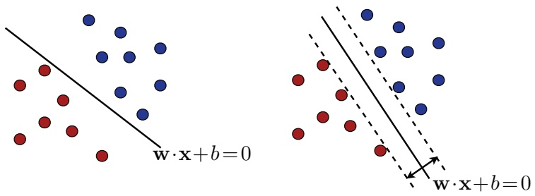

Figure 5.1

Two possible separating hyperplanes. The right-hand side figure shows a hyperplane that maximizes the margin.

non-zero vector normal to the hyperplane and $b \in \mathbb { R } \mathrm { ~ a ~ }$ scalar. A hypothesis of the form $\mathbf { x } \mapsto \mathrm { s i g n } ( \mathbf { w } \cdot \mathbf { x } + b )$ thus labels positively all points falling on one side of the hyperplane $\mathbf { w } \cdot \mathbf { x } + b = 0$ and negatively all others.

## 5.2 Separable case

In this section, we assume that the training sample S can be linearly separated, that is, we assume the existence of a hyperplane that perfectly separates the training sample into two populations of positively and negatively labeled points, as illustrated by the left panel of figure 5.1. This is equivalent to the existence of $( \mathbf { w } , b ) \in ( \mathbb { R } ^ { N } - \{ \mathbf { 0 } \} ) \times \mathbb { R }$ such that

$$
\forall i \in [ m ], \quad y _ {i} (\mathbf {w} \cdot \mathbf {x} _ {i} + b) \geq 0.\tag{5.3}
$$

But, as can be seen from figure 5.1, there are then infinitely many such separating hyperplanes. Which hyperplane should a learning algorithm select? The definition of the SVM solution is based on the notion of geometric margin.

**Definition 5.1 (Geometric margin)** The geometric margin $\rho _ { h } ( \mathbf { x } )$ of a linear classifier $h \colon \mathbf { x } \mapsto \mathbf { w \cdot } \mathbf { x + } b$ at a point x is its Euclidean distance to the hyperplane $\mathbf { w \cdot } \mathbf { x + } b = 0 .$

$$
\rho_ {h} (x) = \frac {| \mathbf {w} \cdot \mathbf {x} + b |}{\| \mathbf {w} \| _ {2}}.\tag{5.4}
$$

The geometric margin $\rho _ { h }$ of a linear classifier h for a sample $S = ( \mathbf { x } _ { 1 } , \ldots , \mathbf { x } _ { m } )$ is the minimum geometric margin over the points in the sample, $\rho _ { h } = \operatorname { m i n } _ { i \in [ m ] } \rho _ { h } ( x _ { i } )$ that is the distance of the hyperplane defining h to the closest sample points.

The SVM solution is the separating hyperplane with the maximum geometric margin and is thus known as the maximum-margin hyperplane. The right panel of figure 5.1 illustrates the maximum-margin hyperplane returned by the SVM

<!-- page: 98 -->

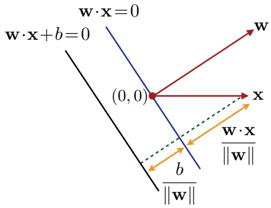

Figure 5.2

An illustration of the geometric margin of a point x in the case $\mathbf { w } \cdot \mathbf { x } > 0$ and $b > 0 .$

algorithm in the separable case. We will present later in this chapter a theory that provides a strong justification for this solution. We can observe already, however, that the SVM solution can also be viewed as the “safest” choice in the following sense: a test point is classified correctly by a separating hyperplane with geometric margin $\rho$ even when it falls within a distance $\rho$ of the training samples sharing the same label; for the SVM solution, $\rho$ is the maximum geometric margin and thus the “safest” value.

## 5.2.1 Primal optimization problem

We now derive the equations and optimization problem that define the SVM solution. By definition of the geometric margin (see also figure 5.2), the maximum margin $\rho$ of a separating hyperplane is given by

$$
\rho = \max _ {\mathbf {w}, b: y _ {i} (\mathbf {w} \cdot \mathbf {x} _ {i} + b) \geq 0} \min _ {i \in [ m ]} \frac {| \mathbf {w} \cdot \mathbf {x} _ {i} + b |}{\| \mathbf {w} \|} = \max _ {\mathbf {w}, b} \min _ {i \in [ m ]} \frac {y _ {i} (\mathbf {w} \cdot \mathbf {x} _ {i} + b)}{\| \mathbf {w} \|}.\tag{5.5}
$$

The second equality follows from the fact that, since the sample is linearly separable, for the maximizing pair $( \mathbf { w } , b ) ,   y _ { i } \big ( \mathbf { w } \cdot \mathbf { x } _ { i } + b \big )$ must be non-negative for all $i \in [ m ]$ Now, observe that the last expression is invariant to multiplication of $( \mathbf { w } , b )$ by a positive scalar. Thus, we can restrict ourselves to pairs $( \mathbf { w } , b )$ scaled such that $\begin{array} { r } { \operatorname* { m i n } _ { i \in [ m ] } y _ { i } ( \mathbf { w } \cdot \mathbf { x } _ { i } + b ) = 1 } \end{array}$

$$
\rho = \max_{\substack{\mathbf{w},b:\\ \min_{i\in [m]}y_{i}(\mathbf{w}\cdot \mathbf{x}_{i} + b) = 1}}\frac{1}{\|\mathbf{w}\|} = \max_{\substack{\mathbf{w},b:\\ \forall i\in [m],y_{i}(\mathbf{w}\cdot \mathbf{x}_{i} + b)\geq 1}}\frac{1}{\|\mathbf{w}\|}.\tag{5.6}
$$

The second equality results from the fact that for the maximizing pair $( \mathbf { w } , b )$ , the minimum of $y _ { i } ( \mathbf { w } \cdot \mathbf { x } _ { i } + b )$ is 1.

Figure 5.3 illustrates the solution $( \mathbf { w } , b )$ of the maximization (5.6). In addition to the maximum-margin hyperplane, it also shows the marginal hyperplanes, which are

<!-- page: 99 -->

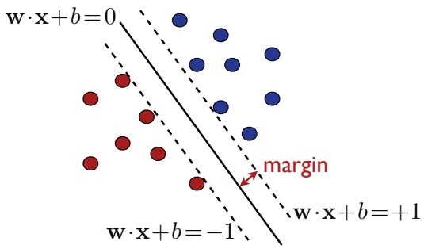

Figure 5.3

Maximum-margin hyperplane solution of (5.6). The marginal hyperplanes are represented by dashed lines on the figure.

the hyperplanes parallel to the separating hyperplane and passing through the closest points on the negative or positive sides. Since they are parallel to the separating hyperplane, they admit the same normal vector w. Furthermore, since $\lvert \mathbf { w }   \cdot   \mathbf { x }   +   b \lvert = 1$ for the closest points, the equations of the marginal hyperplanes are $\mathbf { w }   \cdot   \mathbf { x }   +   b = \pm 1$

Since maximizing $1 / \| \mathbf { w } \|$ is equivalent to minimizing $\frac { 1 } { 2 } \| \mathbf { w } \| ^ { 2 }$ , in view of (5.6), the pair $( \mathbf { w } , b )$ returned by SVM in the separable case is the solution of the following convex optimization problem:

$$
\begin{array}{l} \min _ {\mathbf {w}, b} \frac {1}{2} \| \mathbf {w} \| ^ {2} \\ \text {subject to:} y _ {i} (\mathbf {w} \cdot \mathbf {x} _ {i} + b) \geq 1, \forall i \in [ m ]. \end{array}\tag{5.7}
$$

The objective function $\textstyle F \colon \mathbf { w } \mapsto { \frac { 1 } { 2 } } \| \mathbf { w } \| ^ { 2 }$ is infinitely differentiable. Its gradient is $\nabla F ( \mathbf { w } ) = \mathbf { w }$ and its Hessian is the identity matrix $\nabla ^ { 2 } F ( \mathbf { w } ) = \mathbf { I } ,$ whose eigenvalues are strictly positive. Therefore, $\nabla ^ { 2 } F ( \mathbf { w } )   \succ   \mathbf { 0 }$ and F is strictly convex. The constraints are all defined by affine functions $g _ { i } \colon ( \mathbf { w } , b )   \mapsto   1 - y _ { i } ( \mathbf { w } \cdot \mathbf { x } _ { i } + b )$ and are therefore qualified. Thus, in view of the results known for convex optimization (see appendix B for details), the optimization problem of (5.7) admits a unique solution, an important and favorable property that does not hold for all learning algorithms.

Moreover, since the objective function is quadratic and the constraints are affine, the optimization problem of (5.7) is in fact a specific instance of quadratic programming (QP), a family of problems extensively studied in optimization. A variety of commercial and open-source solvers are available for solving convex QP problems. Additionally, motivated by the empirical success of SVMs along with its rich theoretical underpinnings, specialized methods have been developed to more efficiently solve this particular convex QP problem, notably the block coordinate descent algorithms with blocks of just two coordinates.

<!-- page: 100 -->

## 5.2.2 Support vectors

Returning to the optimization problem (5.7), we note that the constraints are affine and thus qualified. The objective function as well as the affine constraints are convex and differentiable. Thus, the requirements of theorem B.30 hold and the KKT conditions apply at the optimum. We shall use these conditions to both analyze the algorithm and demonstrate several of its crucial properties, and subsequently derive the dual optimization problem associated to SVMs in section 5.2.3.

We introduce Lagrange variables $\alpha _ { i } \geq 0 ,   i \in [ m ]$ , associated to the m constraints and denote by α the vector $( \alpha _ { 1 } , \ldots , \alpha _ { m } ) ^ { \top }$ . The Lagrangian can then be defined for all $\mathbf { w } \in \mathbb { R } ^ { N } ,   b \in \mathbb { R }$ , and $\pmb { \alpha } \in \mathbb { R } _ { + } ^ { m }$ , by

$$
\mathcal {L} (\mathbf {w}, b, \boldsymbol {\alpha}) = \frac {1}{2} \| \mathbf {w} \| ^ {2} - \sum_ {i = 1} ^ {m} \alpha_ {i} [ y _ {i} (\mathbf {w} \cdot \mathbf {x} _ {i} + b) - 1 ].\tag{5.8}
$$

The KKT conditions are obtained by setting the gradient of the Lagrangian with respect to the primal variables w and b to zero and by writing the complementarity conditions:

$$
\nabla_ {\mathbf {w}} \mathcal {L} = \mathbf {w} - \sum_ {i = 1} ^ {m} \alpha_ {i} y _ {i} \mathbf {x} _ {i} = 0 \quad \Longrightarrow \quad \mathbf {w} = \sum_ {i = 1} ^ {m} \alpha_ {i} y _ {i} \mathbf {x} _ {i}\tag{5.9}
$$

$$
\nabla_ {b} \mathcal {L} = - \sum_ {i = 1} ^ {m} \alpha_ {i} y _ {i} = 0 \quad \Longrightarrow \quad \sum_ {i = 1} ^ {m} \alpha_ {i} y _ {i} = 0\tag{5.10}
$$

$$
\forall i, \alpha_ {i} [ y _ {i} (\mathbf {w} \cdot \mathbf {x} _ {i} + b) - 1 ] = 0 \quad \Longrightarrow \quad \alpha_ {i} = 0 \lor y _ {i} (\mathbf {w} \cdot \mathbf {x} _ {i} + b) = 1.\tag{5.11}
$$

By equation (5.9), the weight vector w at the solution of the SVM problem is a linear combination of the training set vectors $\mathbf { x } _ { 1 } , \ldots , \mathbf { x } _ { m }$ . A vector $\mathbf { x } _ { i }$ appears in that expansion iff $\alpha _ { i }   \neq   0$ . Such vectors are called support vectors. By the complementarity conditions (5.11), if $\alpha _ { i } \neq 0$ , then $y _ { i } ( \mathbf { w }   \cdot   \mathbf { x } _ { i }   +   b ) = 1$ . Thus, support vectors lie on the marginal hyperplanes $\mathbf { w } \cdot \mathbf { x } _ { i } + b = \pm 1$

Support vectors fully define the maximum-margin hyperplane or SVM solution, which justifies the name of the algorithm. By definition, vectors not lying on the marginal hyperplanes do not affect the definition of these hyperplanes — in their absence, the solution to the SVM problem remains unchanged. Note that while the solution w of the SVM problem is unique, the support vectors are not. In dimension N, N + 1 points are sufficient to define a hyperplane. Thus, when more than N + 1 points lie on a marginal hyperplane, different choices are possible for the N + 1 support vectors.

## 5.2.3 Dual optimization problem

To derive the dual form of the constrained optimization problem (5.7), we plug into the Lagrangian the definition of w in terms of the dual variables as expressed in

<!-- page: 101 -->

(5.9) and apply the constraint (5.10). This yields

$$
\mathcal {L} = \underbrace {\frac {1}{2} \| \sum_ {i = 1} ^ {m} \alpha_ {i} y _ {i} \mathbf {x} _ {i} \| ^ {2} - \sum_ {i , j = 1} ^ {m} \alpha_ {i} \alpha_ {j} y _ {i} y _ {j} (\mathbf {x} _ {i} \cdot \mathbf {x} _ {j})} _ {- \frac {1}{2} \sum_ {i, j = 1} ^ {m} \alpha_ {i} \alpha_ {j} y _ {i} y _ {j} (\mathbf {x} _ {i} \cdot \mathbf {x} _ {j})} - \underbrace {\sum_ {i = 1} ^ {m} \alpha_ {i} y _ {i} b} _ {0} + \sum_ {i = 1} ^ {m} \alpha_ {i},\tag{5.12}
$$

which simplifies to

$$
\mathcal {L} = \sum_ {i = 1} ^ {m} \alpha_ {i} - \frac {1}{2} \sum_ {i, j = 1} ^ {m} \alpha_ {i} \alpha_ {j} y _ {i} y _ {j} (\mathbf {x} _ {i} \cdot \mathbf {x} _ {j}).\tag{5.13}
$$

This leads to the following dual optimization problem for SVMs in the separable case:

$$
\begin{array}{c} \max _ {\boldsymbol {\alpha}} \sum_ {i = 1} ^ {m} \alpha_ {i} - \frac {1}{2} \sum_ {i, j = 1} ^ {m} \alpha_ {i} \alpha_ {j} y _ {i} y _ {j} (\mathbf {x} _ {i} \cdot \mathbf {x} _ {j}) \\ \text {subject to:} \alpha_ {i} \geq 0 \land \sum_ {i = 1} ^ {m} \alpha_ {i} y _ {i} = 0, \forall i \in [ m ]. \end{array}\tag{5.14}
$$

The objective function $\textstyle G \colon \mathbf { \alpha } { \mapsto } \sum _ { i = 1 } ^ { m } \alpha _ { i } - \frac { 1 } { 2 } \sum _ { i , j = 1 } ^ { m } \alpha _ { i } \alpha _ { j } y _ { i } y _ { j } ( \mathbf { x } _ { i } \cdot \mathbf { x } _ { j } )$ is infinitely differentiable. Its Hessian is given by $\nabla ^ { 2 } G = - \tilde { \mathbf { A } }$ , with $\mathbf { A } = \left( y _ { i } \mathbf { x } _ { i } \cdot y _ { j } \mathbf { x } _ { j } \right) _ { i j }$ . A is the Gram matrix associated to the vectors $y _ { 1 } \mathbf { x } _ { 1 } , \ldots , y _ { m } \mathbf { x } _ { m }$ and is therefore positive semidefinite (see section A.2.3), which shows that $\nabla ^ { 2 } G \preceq \mathbf { 0 }$ and that G is a concave function. Since the constraints are affine and convex, the maximization problem (5.14) is a convex optimization problem. Since G is a quadratic function of $\alpha ,$ this dual optimization problem is also a QP problem, as in the case of the primal optimization and once again both general-purpose and specialized QP solvers can be used to obtain the solution (see exercise 5.4 for details on the SMO algorithm, which is often used to solve the dual form of the SVM problem in the more general non-separable setting).

Moreover, since the constraints are affine, they are qualified and strong duality holds (see appendix B). Thus, the primal and dual problems are equivalent, i.e., the solution α of the dual problem (5.14) can be used directly to determine the hypothesis returned by SVMs, using equation (5.9):

$$
h (\mathbf {x}) = \mathrm{sgn} (\mathbf {w} \cdot \mathbf {x} + b) = \mathrm{sgn} \Big (\sum_ {i = 1} ^ {m} \alpha_ {i} y _ {i} (\mathbf {x} _ {i} \cdot \mathbf {x}) + b \Big).\tag{5.15}
$$

<!-- page: 102 -->

Since support vectors lie on the marginal hyperplanes, for any support vector $\mathbf { x } _ { i } ,$ $\mathbf { w } \cdot \mathbf { x } _ { i } + b = y _ { i }$ , and thus b can be obtained via

$$
b = y _ {i} - \sum_ {j = 1} ^ {m} \alpha_ {j} y _ {j} (\mathbf {x} _ {j} \cdot \mathbf {x} _ {i}).\tag{5.16}
$$

The dual optimization problem (5.14) and the expressions (5.15) and (5.16) reveal an important property of SVMs: the hypothesis solution depends only on inner products between vectors and not directly on the vectors themselves. This observation is key and its importance will become clear in Chapter 6 where we introduce kernel methods.

Equation (5.16) can now be used to derive a simple expression of the geometric margin $\rho$ in terms of $\alpha .$ Since (5.16) holds for all i with $\alpha _ { i } \neq 0$ , multiplying both sides by $\alpha _ { i } y _ { i }$ and taking the sum leads to

$$
\sum_ {i = 1} ^ {m} \alpha_ {i} y _ {i} b = \sum_ {i = 1} ^ {m} \alpha_ {i} y _ {i} ^ {2} - \sum_ {i, j = 1} ^ {m} \alpha_ {i} \alpha_ {j} y _ {i} y _ {j} (\mathbf {x} _ {i} \cdot \mathbf {x} _ {j}).\tag{5.17}
$$

Using the fact that $y _ { i } ^ { 2 } = 1$ along with equation (5.9) then yields

$$
0 = \sum_ {i = 1} ^ {m} \alpha_ {i} - \| \mathbf {w} \| ^ {2}.\tag{5.18}
$$

Noting that $\alpha _ { i } \geq 0$ , we obtain the following expression of the margin $\rho$ in terms of the $L _ { 1 }$ norm of α:

$$
\rho^ {2} = \frac {1}{\| \mathbf {w} \| _ {2} ^ {2}} = \frac {1}{\sum_ {i = 1} ^ {m} \alpha_ {i}} = \frac {1}{\| \boldsymbol {\alpha} \| _ {1}}.\tag{5.19}
$$

## 5.2.4 Leave-one-out analysis

We now use the notion of leave-one-out error to derive a first learning guarantee for SVMs based on the fraction of support vectors in the training set.

**Definition 5.2 (Leave-one-out error)** Let $h _ { S }$ denote the hypothesis returned by a learning algorithm $\mathcal { A } ,$ when trained on a fixed sample $S .$ . Then, the leave-one-out error of A on a sample S of size m is defined by

$$
\widehat {R} _ {\mathrm{LOO}} (\mathcal {A}) = \frac {1}{m} \sum_ {i = 1} ^ {m} 1 _ {h _ {S - \{x _ {i} \}} (x _ {i}) \neq y _ {i}}.
$$

Thus, for each $i \in [ m ]$ , A is trained on all the points in $S$ except for $x _ { i } , \mathrm { i . e . , } S \mathrm { - } \{ x _ { i } \}$ and its error is then computed using $x _ { i }$ . The leave-one-out error is the average of these errors. We will use an important property of the leave-one-out error stated in the following lemma.

<!-- page: 103 -->

**Lemma 5.3** The average leave-one-out error for samples of size $m \geq 2$ is an unbiased estimate of the average generalization error for samples of size $m - 1$

$$
\underset {S \sim \mathcal {D} ^ {m}} {\mathbb {E}} [ \widehat {R} _ {\mathrm{LOO}} (\mathcal {A}) ] = \underset {S ^ {\prime} \sim \mathcal {D} ^ {m - 1}} {\mathbb {E}} [ R (h _ {S ^ {\prime}}) ],\tag{5.20}
$$

where D denotes the distribution according to which points are drawn.

Proof: By the linearity of expectation, we can write

$$
\begin{array}{r l} \underset {S \sim \mathcal {D} ^ {m}} {\mathbb {E}} [ \widehat {R} _ {\mathrm{LOO}} (\mathcal {A}) ] & = \frac {1}{m} \sum_ {i = 1} ^ {m} \underset {S \sim \mathcal {D} ^ {m}} {\mathbb {E}} [ 1 _ {h _ {S - \{x _ {i} \}} (x _ {i}) \neq y _ {i}} ] \\ & = \underset {S \sim \mathcal {D} ^ {m}} {\mathbb {E}} [ 1 _ {h _ {S - \{x _ {1} \}} (x _ {1}) \neq y _ {1}} ] \\ & = \underset {S ^ {\prime} \sim \mathcal {D} ^ {m - 1}, x _ {1} \sim \mathcal {D}} {\mathbb {E}} [ 1 _ {h _ {S ^ {\prime}} (x _ {1}) \neq y _ {1}} ] \\ & = \underset {S ^ {\prime} \sim \mathcal {D} ^ {m - 1}} {\mathbb {E}} [ \underset {x _ {1} \sim \mathcal {D}} {\mathbb {E}} [ 1 _ {h _ {S ^ {\prime}} (x _ {1}) \neq y _ {1}} ] ] \\ & = \underset {S ^ {\prime} \sim \mathcal {D} ^ {m - 1}} {\mathbb {E}} [ R (h _ {S ^ {\prime}}) ]. \end{array}
$$

For the second equality, we used the fact that, since the points of S are drawn in an i.i.d. fashion, the expectation $\mathbb { E } _ { S \sim \mathcal { D } ^ { m } } [ 1 _ { h _ { S - \{ x _ { i } \} } ( x _ { i } ) \neq y _ { i } } ]$ does not depend on the choice of $i \in [ m ]$ and is thus equal to $\mathbb { E } _ { S \sim \mathcal { D } ^ { m } } [ \vec { 1 } _ { h _ { S - \{ x _ { 1 } \} } ( x _ { 1 } ) \neq y _ { 1 } } ]$ 

In general, computing the leave-one-out error may be costly since it requires training m times on samples of size $m   -   1$ . In some situations however, it is possible to derive the expression of $\widehat { R } _ { \mathrm { L O O } } ( \mathcal { A } )$ much more efficiently (see exercise 11.9).

**Theorem 5.4** Let $h _ { S }$ be the hypothesis returned by SVMs for a sample S, and let $N _ { S V } ( S )$ be the number of support vectors that define $h _ { S }$ . Then,

$$
\underset {S \sim \mathcal {D} ^ {m}} {\mathbb {E}} \left[ R (h _ {S}) \right] \leq \underset {S \sim \mathcal {D} ^ {m + 1}} {\mathbb {E}} \left[ \frac {N _ {\mathrm{SV}} (S)}{m + 1} \right].
$$

Proof: Let S be a linearly separable sample of $m + 1$ . If x is not a support vector for $h _ { S }$ , removing it does not change the SVM solution. Thus, $h _ { S - \{ x \} }   =   h _ { S }$ and $h _ { S - \{ x \} }$ correctly classifies x. By contraposition, if $h _ { S - \{ x \} }$ misclassifies x, x must be a support vector, which implies

$$
\widehat {R} _ {\mathrm{LOO}} (\mathrm{SVM}) \leq \frac {N _ {\mathrm{SV}} (S)}{m + 1}.\tag{5.21}
$$

Taking the expectation of both sides and using lemma 5.3 yields the result. 

Theorem 5.4 gives a sparsity argument in favor of SVMs: the average error of the algorithm is upper bounded by the average fraction of support vectors. One may hope that for many distributions seen in practice, a relatively small number of the training points will lie on the marginal hyperplanes. The solution will then be sparse in the sense that a small fraction of the dual variables $\alpha _ { i }$ will be non-

<!-- page: 104 -->

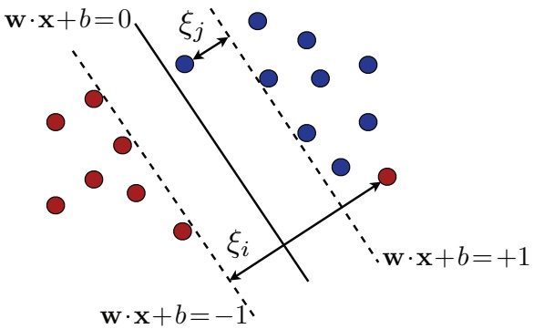

Figure 5.4

A separating hyperplane with point $\mathbf { x } _ { i }$ classified incorrectly and point $\mathbf { x } _ { j }$ correctly classified, but with margin less than 1.

zero. Note, however, that this bound is relatively weak since it applies only to the average generalization error of the algorithm over all samples of size m. It provides no information about the variance of the generalization error. In section 5.4, we present stronger high-probability bounds using a different argument based on the notion of margin.

## 5.3 Non-separable case

In most practical settings, the training data is not linearly separable, which implies that for any hyperplane $\mathbf { w } \cdot \mathbf { x } + b = 0$ , there exists $\mathbf { x } _ { i } \in S$ such that

$$
y _ {i} \left[ \mathbf {w} \cdot \mathbf {x} _ {i} + b \right] \not \geq 1.\tag{5.22}
$$

Thus, the constraints imposed in the linearly separable case discussed in section 5.2 cannot all hold simultaneously. However, a relaxed version of these constraints can indeed hold, that is, for each $i \in [ m ]$ , there exist $\xi _ { i } \geq 0$ such that

$$
y _ {i} \left[ \mathbf {w} \cdot \mathbf {x} _ {i} + b \right] \geq 1 - \xi_ {i}.\tag{5.23}
$$

The variables $\xi _ { i }$ are known as slack variables and are commonly used in optimization to define relaxed versions of constraints. Here, a slack variable $\xi _ { i }$ measures the distance by which vector $\mathbf { x } _ { i }$ violates the desired inequality, $y _ { i } ( \mathbf { w }   \cdot   \mathbf { x } _ { i }   +   b )   \geq   1$ Figure 5.4 illustrates the situation. For a hyperplane $\mathbf { w } \cdot \mathbf { x } + b   =   0$ , a vector $\mathbf { x } _ { i }$ with $\xi _ { i } > 0$ can be viewed as an outlier . Each $\mathbf { x } _ { i }$ must be positioned on the correct side of the appropriate marginal hyperplane to not be considered an outlier. As a consequence, a vector $\mathbf { x } _ { i }$ with $0   <   y _ { i } ( { \bf w }   \cdot   { \bf x } _ { i }   +   b )   <   1$ is correctly classified by the hyperplane $\mathbf { w } \cdot \mathbf { x } + b = 0$ but is nonetheless considered to be an outlier, that

<!-- page: 105 -->

is, $\xi _ { i } \; > \; 0$ . If we omit the outliers, the training data is correctly separated by $\mathbf { w } \cdot \mathbf { x } + b   =   0$ with a margin $\rho   =   1 / \| \mathbf { w } \|$ that we refer to as the soft margin, as opposed to the hard margin in the separable case.

How should we select the hyperplane in the non-separable case? One idea consists of selecting the hyperplane that minimizes the empirical error. But, that solution will not benefit from the large-margin guarantees we will present in section 5.4. Furthermore, the problem of determining a hyperplane with the smallest zero-one loss, that is the smallest number of misclassifications, is NP-hard as a function of the dimension N of the space.

Here, there are two conflicting objectives: on one hand, we wish to limit the total amount of slack due to outliers, which can be measured by $\textstyle \sum _ { i = 1 } ^ { m } \xi _ { i }$ , or, more generally by $\textstyle \sum _ { i = 1 } ^ { m } \xi _ { i } ^ { p }$ for some $p \geq 1 ;$ ; on the other hand, we seek a hyperplane with a large margin, though a larger margin can lead to more outliers and thus larger amounts of slack.

## 5.3.1 Primal optimization problem

This leads to the following general optimization problem defining SVMs in the non-separable case where the parameter $C \geq 0$ determines the trade-off between margin-maximization (or minimization of $\| \mathbf { w } \| ^ { 2 } )$ and the minimization of the slack penalty $\textstyle \sum _ { i = 1 } ^ { m } \xi _ { i } ^ { p } ;$

$$
\begin{array}{l l} \min _ {\mathbf {w}, b, \boldsymbol {\xi}} & \frac {1}{2} \| \mathbf {w} \| ^ {2} + C \sum_ {i = 1} ^ {m} \xi_ {i} ^ {p} \\ \text {subject to} & y _ {i} (\mathbf {w} \cdot \mathbf {x} _ {i} + b) \geq 1 - \xi_ {i} \land \xi_ {i} \geq 0, i \in [ m ], \end{array}\tag{5.24}
$$

where $\pmb { \xi } = ( \xi _ { 1 } , \dots , \xi _ { m } ) ^ { \top }$ . The parameter C is typically determined via n-fold cross-validation (see section 4.5).

As in the separable case, (5.24) is a convex optimization problem since the constraints are affine and thus convex and since the objective function is convex for any $p \geq 1$ . In particular, $\begin{array} { r } { \pmb { \xi } \mapsto \sum _ { i = 1 } ^ { m } \xi _ { i } ^ { p } = \| \pmb { \xi } \| _ { p } ^ { p } } \end{array}$ is convex in view of the convexity of the norm $\| \cdot \| _ { p } .$

There are many possible choices for p leading to more or less aggressive penalizations of the slack terms (see exercise 5.1). The choices $p = 1$ and $p = 2$ lead to the most straightforward solutions and analyses. The loss functions associated with $p = 1$ and $p = 2$ are called the hinge loss and the quadratic hinge loss, respectively. Figure 5.5 shows the plots of these loss functions as well as that of the standard zero-one loss function. Both hinge losses are convex upper bounds on the zero-one loss, thus making them well suited for optimization. In what follows, the analysis is presented in the case of the hinge loss $( p = 1 )$ , which is the most widely used loss function for SVMs.

<!-- page: 106 -->

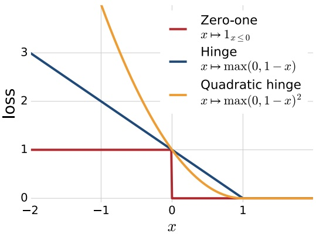

Figure 5.5

Both the hinge loss and the quadratic hinge loss provide convex upper bounds on the binary zero-one loss.

## 5.3.2 Support vectors

As in the separable case, the constraints are affine and thus qualified. The objective function as well as the affine constraints are convex and differentiable. Thus, the hypotheses of theorem B.30 hold and the KKT conditions apply at the optimum. We use these conditions to both analyze the algorithm and demonstrate several of its crucial properties, and subsequently derive the dual optimization problem associated to SVMs in section 5.3.3.

We introduce Lagrange variables $\alpha _ { i } \; \geq \; 0 , i \; \in \; [ m ]$ , associated to the first m constraints and $\beta _ { i } \geq 0 ,   i \in [ m ]$ associated to the non-negativity constraints of the slack variables. We denote by α the vector $( \alpha _ { 1 } , \ldots , \alpha _ { m } ) ^ { \top }$ and by $\beta$ the vector $( \beta _ { 1 } , \ldots , \beta _ { m } ) ^ { \top }$ . The Lagrangian can then be defined for all $\mathbf { w }   \in   \mathbb { R } ^ { N } ,   b   \in   \mathbb { R }$ , and $\pmb { \xi } , \pmb { \alpha } , \pmb { \beta } \in \mathbb { R } _ { + } ^ { m }$ , by

$$
\mathcal {L} (\mathbf {w}, b, \boldsymbol {\xi}, \boldsymbol {\alpha}, \boldsymbol {\beta}) = \frac {1}{2} \| \mathbf {w} \| ^ {2} + C \sum_ {i = 1} ^ {m} \xi_ {i} - \sum_ {i = 1} ^ {m} \alpha_ {i} [ y _ {i} (\mathbf {w} \cdot \mathbf {x} _ {i} + b) - 1 + \xi_ {i} ] - \sum_ {i = 1} ^ {m} \beta_ {i} \xi_ {i}.\tag{5.25}
$$

The KKT conditions are obtained by setting the gradient of the Lagrangian with respect to the primal variables $\mathbf { w } ,   b ,$ and $\xi _ { i } \mathrm { s }$ to zero and by writing the complemen-

<!-- page: 107 -->

tarity conditions:

$$
\nabla_ {\mathbf {w}} \mathcal {L} = \mathbf {w} - \sum_ {i = 1} ^ {m} \alpha_ {i} y _ {i} \mathbf {x} _ {i} = 0 \quad \Longrightarrow \quad \mathbf {w} = \sum_ {i = 1} ^ {m} \alpha_ {i} y _ {i} \mathbf {x} _ {i}\tag{5.26}
$$

$$
\nabla_ {b} \mathcal {L} = - \sum_ {i = 1} ^ {m} \alpha_ {i} y _ {i} = 0 \quad \Longrightarrow \quad \sum_ {i = 1} ^ {m} \alpha_ {i} y _ {i} = 0\tag{5.27}
$$

$$
\nabla_ {\xi_ {i}} \mathcal {L} = C - \alpha_ {i} - \beta_ {i} = 0 \quad \Longrightarrow \quad \alpha_ {i} + \beta_ {i} = C\tag{5.28}
$$

$$
\forall i, \alpha_ {i} [ y _ {i} (\mathbf {w} \cdot \mathbf {x} _ {i} + b) - 1 + \xi_ {i} ] = 0 \quad \Longrightarrow \quad \alpha_ {i} = 0 \lor y _ {i} (\mathbf {w} \cdot \mathbf {x} _ {i} + b) = 1 - \xi_ {i}\tag{5.29}
$$

$$
\forall i, \beta_ {i} \xi_ {i} = 0 \quad \Longrightarrow \quad \beta_ {i} = 0 \lor \xi_ {i} = 0.\tag{5.30}
$$

By equation (5.26), as in the separable case, the weight vector w at the solution of the SVM problem is a linear combination of the training set vectors $\mathbf { x } _ { 1 } , \ldots , \mathbf { x } _ { m }$ A vector $\mathbf { x } _ { i }$ appears in that expansion iff $\alpha _ { i } \neq 0$ . Such vectors are called support vectors. Here, there are two types of support vectors. By the complementarity condition (5.29), if $\alpha _ { i } \neq 0$ , then $y _ { i } ( \mathbf { w } { \cdot } \mathbf { x } _ { i } { + } b ) = 1 { - } \xi _ { i }$ . If $\xi _ { i } = 0$ , then $y _ { i } ( \mathbf { w \cdot } \mathbf { x } _ { i } \mathbf { + } b ) = 1$ and $\mathbf { x } _ { i }$ lies on a marginal hyperplane, as in the separable case. Otherwise, $\xi _ { i } \neq 0$ and $\mathbf { x } _ { i }$ is an outlier. In this case, (5.30) implies $\beta _ { i }   =   0$ and (5.28) then requires $\alpha _ { i }   =   C$ . Thus, support vectors $\mathbf { x } _ { i }$ are either outliers, in which case $\alpha _ { i }   =   C$ , or vectors lying on the marginal hyperplanes. As in the separable case, note that while the weight vector w solution is unique, the support vectors are not.

## 5.3.3 Dual optimization problem

To derive the dual form of the constrained optimization problem (5.24), we plug into the Lagrangian the definition of w in terms of the dual variables (5.26) and apply the constraint (5.27). This yields

$$
\mathcal {L} = \underbrace {\frac {1}{2} \| \sum_ {i = 1} ^ {m} \alpha_ {i} y _ {i} \mathbf {x} _ {i} \| ^ {2} - \sum_ {i , j = 1} ^ {m} \alpha_ {i} \alpha_ {j} y _ {i} y _ {j} (\mathbf {x} _ {i} \cdot \mathbf {x} _ {j})} _ {- \frac {1}{2} \sum_ {i, j = 1} ^ {m} \alpha_ {i} \alpha_ {j} y _ {i} y _ {j} (\mathbf {x} _ {i} \cdot \mathbf {x} _ {j})} - \underbrace {\sum_ {i = 1} ^ {m} \alpha_ {i} y _ {i} b} _ {0} + \sum_ {i = 1} ^ {m} \alpha_ {i}.\tag{5.31}
$$

Remarkably, we find that the objective function is no different than in the separable case:

$$
\mathcal {L} = \sum_ {i = 1} ^ {m} \alpha_ {i} - \frac {1}{2} \sum_ {i, j = 1} ^ {m} \alpha_ {i} \alpha_ {j} y _ {i} y _ {j} (\mathbf {x} _ {i} \cdot \mathbf {x} _ {j}).\tag{5.32}
$$

However, here, in addition to $\alpha _ { i } \geq 0$ , we must impose the constraint on the Lagrange variables $\beta _ { i } \geq 0$ . In view of (5.28), this is equivalent to $\alpha _ { i } \leq C$ . This leads to the following dual optimization problem for SVMs in the non-separable case, which

<!-- page: 108 -->

only differs from that of the separable case (5.14) by the constraints $\alpha _ { i } \leq C ;$

$$
\begin{array}{c} \max _ {\boldsymbol {\alpha}} \sum_ {i = 1} ^ {m} \alpha_ {i} - \frac {1}{2} \sum_ {i, j = 1} ^ {m} \alpha_ {i} \alpha_ {j} y _ {i} y _ {j} (\mathbf {x} _ {i} \cdot \mathbf {x} _ {j}) \\ \text {subject to:} 0 \leq \alpha_ {i} \leq C \land \sum_ {i = 1} ^ {m} \alpha_ {i} y _ {i} = 0, i \in [ m ]. \end{array}\tag{5.33}
$$

Thus, our previous comments about the optimization problem (5.14) apply to (5.33) as well. In particular, the objective function is concave and infinitely differentiable and (5.33) is equivalent to a convex QP. The problem is equivalent to the primal problem (5.24).

The solution α of the dual problem (5.33) can be used directly to determine the hypothesis returned by SVMs, using equation (5.26):

$$
h (\mathbf {x}) = \mathrm{sgn} (\mathbf {w} \cdot \mathbf {x} + b) = \mathrm{sgn} \Big (\sum_ {i = 1} ^ {m} \alpha_ {i} y _ {i} (\mathbf {x} _ {i} \cdot \mathbf {x}) + b \Big).\tag{5.34}
$$

Moreover, b can be obtained from any support vector $\mathbf { x } _ { i }$ lying on a marginal hyperplane, that is any vector $\mathbf { x } _ { i }$ with $0 < \alpha _ { i } < C$ . For such support vectors, $\mathbf { w } { \cdot } \mathbf { x } _ { i } { + } b = y _ { i }$ and thus

$$
b = y _ {i} - \sum_ {j = 1} ^ {m} \alpha_ {j} y _ {j} (\mathbf {x} _ {j} \cdot \mathbf {x} _ {i}).\tag{5.35}
$$

As in the separable case, the dual optimization problem (5.33) and the expressions (5.34) and (5.35) show an important property of SVMs: the hypothesis solution depends only on inner products between vectors and not directly on the vectors themselves. This fact can be used to extend SVMs to define non-linear decision boundaries, as we shall see in chapter 6.

## 5.4 Margin theory

This section presents generalization bounds which provide a strong theoretical justification for the SVM algorithm.

Recall that the VC-dimension of the family of hyperplanes or linear hypotheses in RN is $N + 1$ . Thus, the application of the VC-dimension bound (3.29) of corollary 3.19 to this hypothesis set yields the following: for any $\delta > 0$ , with probability at least $1 - \delta ,$ for any $h \in \mathcal { H }$

$$
R (h) \leq \widehat {R} _ {S} (h) + \sqrt {\frac {2 (N + 1) \log \frac {e m}{N + 1}}{m}} + \sqrt {\frac {\log \frac {1}{\delta}}{2 m}}.\tag{5.36}
$$

<!-- page: 109 -->

When the dimension of the feature space N is large compared to the sample size m, this bound is uninformative. Remarkably, the learning guarantees presented in this section are independent of the dimension N and thus hold regardless of its value.

The guarantees we will present hold for real-valued functions such as the function $\mathbf { x } \mapsto \mathbf { w } \cdot \mathbf { x } + b$ returned by SVMs, as opposed to classification functions returning $+ 1 \mathrm { o r } - 1$ , such as $\mathbf { x } \mapsto \operatorname { s g n } ( \mathbf { w } \cdot \mathbf { x } + b )$ . They are based on the notion of confidence margin. The confidence margin of a real-valued function h at a point x labeled with y is the quantity $y h ( x )$ . Thus, when $y h ( x )   >   0 ,$ h classifies x correctly but we interpret the magnitude of $| h ( x ) |$ as the confidence of the prediction made by h. The notion of confidence margin is distinct from that of geometric margin and does not require a linear separability assumption. But, the two notions are related as follows in the separable case: for $h \colon \mathbf { x } \mapsto \mathbf { w } \cdot \mathbf { x } + b$ with geometric margin ρgeom, the confidence margin at any point x of the training sample with label y is at least $\rho _ { \mathrm { g e o m } } \| \mathbf { w } \|$ , i.e. $| y h ( \mathbf { x } ) | \geq \rho _ { \operatorname { g e o m } } \| \mathbf { w } \|$

In view of the definition of the confidence margin, for any parameter $\rho > 0 ,$ we will define a ρ-margin loss function that, as with the zero-one loss, penalizes h with the cost of 1 when it misclassifies point x $( y h ( x ) \leq 0 )$ , but also penalizes h (linearly) when it correctly classifies x with confidence less than or equal to $\rho ( y h ( x ) \leq \rho )$ The main margin-based generalization bounds of this section are presented in terms of this loss function, which is formally defined as follows.

**Definition 5.5 (Margin loss function)** For any $\rho > 0$ , the ρ-margin loss is the function $L _ { \rho } \colon \mathbb { R } \times \mathbb { R } \to \mathbb { R } _ { + }$ defined for all $y , y ^ { \prime } \in \mathbb { R }$ by $L _ { \rho } ( y , y ^ { \prime } ) = \Phi _ { \rho } ( y y ^ { \prime } )$ with,

$$
\Phi_ {\rho} (x) = \min \left(1, \max \left(0, 1 - \frac {x}{\rho}\right)\right) = \left\{ \begin{array}{l l} 1 & \text {if} x \leq 0 \\ 1 - \frac {x}{\rho} & \text {if} 0 \leq x \leq \rho \\ 0 & \text {if} \rho \leq x. \end{array} \right.
$$

This loss function is illustrated by figure 5.6. The parameter $\rho   >   0$ can be interpreted as the confidence margin demanded from a hypothesis h. The empirical margin loss is similarly defined as the margin loss over the training sample.

**Definition 5.6 (Empirical margin loss)** Given a sample $S = ( x _ { 1 } , \ldots , x _ { m } )$ and a hypothesis h, the empirical margin loss is defined by

$$
\widehat {R} _ {S, \rho} (h) = \frac {1}{m} \sum_ {i = 1} ^ {m} \Phi_ {\rho} (y _ {i} h (x _ {i})).\tag{5.37}
$$

Note that, for any $i \in [ m ] , \: \Phi _ { \rho } ( y _ { i } h ( x _ { i } ) ) \leq 1 _ { y _ { i } h ( x _ { i } ) \leq \rho } .$ . Thus, the empirical margin loss can be upper-bounded as follows:

$$
\widehat {R} _ {S, \rho} (h) \leq \frac {1}{m} \sum_ {i = 1} ^ {m} 1 _ {y _ {i} h (x _ {i}) \leq \rho}.\tag{5.38}
$$

<!-- page: 110 -->

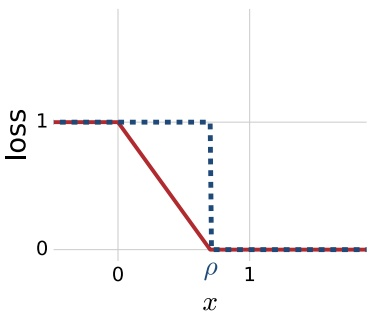

Figure 5.6

The margin loss illustrated in red, defined with respect to margin parameter $\rho = 0 . 7$

In all the results that follow, the empirical margin loss can be replaced by this upper bound, which admits a simple interpretation: it is the fraction of the points in the training sample S that have been misclassified or classified with confidence less than $\rho .$ In other words, the upper bound is then the fraction of the points in the training data with margin less than $\rho .$ This corresponds to the loss function indicated by the blue dotted line in figure 5.6.

A key benefit of using a loss function based on $\Phi _ { \rho }$ as opposed to the zero-one loss or the loss defined by the blue dotted line of figure 5.6 is that $\Phi _ { \rho }$ is $1 / \rho \mathrm { - L i p s c h i t z } ,$ since the absolute value of the slope of the function is at most $1 / \rho .$ The following lemma bounds the empirical Rademacher complexity of a hypothesis set H after composition with such a Lipschitz function in terms of the empirical Rademacher complexity of H. It will be needed for the proof of the margin-based generalization bound.

**Lemma 5.7 (Talagrand’s lemma)** Let $\Phi _ { 1 } , \ldots , \Phi _ { m }$ be l-Lipschitz functions from R to R and $\sigma _ { 1 } , \ldots , \sigma _ { m }$ be Rademacher random variables. Then, for any hypothesis set H of real-valued functions, the following inequality holds:

$$
\frac {1}{m} \underset {\sigma} {\mathbb {E}} \left[ \sup _ {h \in \mathcal {H}} \sum_ {i = 1} ^ {m} \sigma_ {i} (\Phi_ {i} \circ h) (x _ {i})) \right] \leq \frac {l}{m} \underset {\sigma} {\mathbb {E}} \left[ \sup _ {h \in \mathcal {H}} \sum_ {i = 1} ^ {m} \sigma_ {i} h (x _ {i}) \right] = l \widehat {\mathfrak {R}} _ {S} (\mathcal {H}).
$$

In particular, if $\Phi _ { i } = \Phi$ for all $i \in [ m ]$ , then the following holds:

$$
\widehat {\mathfrak {R}} _ {S} (\Phi \circ \mathcal {H}) \leq l \widehat {\mathfrak {R}} _ {S} (\mathcal {H}).
$$

Proof: First we fix a sample $S = ( x _ { 1 } , \ldots , x _ { m } )$ , then, by definition,

$$
\frac {1}{m} \underset {\sigma} {\mathbb {E}} \left[ \sup _ {h \in \mathcal {H}} \sum_ {i = 1} ^ {m} \sigma_ {i} (\Phi_ {m} \circ h) (x _ {i}) \right] = \frac {1}{m} \underset {\sigma_ {1}, \dots , \sigma_ {m - 1}} {\mathbb {E}} \left[ \underset {\sigma_ {m}} {\mathbb {E}} \left[ \sup _ {h \in \mathcal {H}} u _ {m - 1} (h) + \sigma_ {m} (\Phi_ {m} \circ h) (x _ {m}) \right] \right],
$$

<!-- page: 111 -->

where $\begin{array} { r } { u _ { m - 1 } ( h )   =   \sum _ { i = 1 } ^ { m - 1 } \sigma _ { i } ( \Phi _ { i } \circ h ) ( x _ { i } ) } \end{array}$ . By definition of the supremum, for any $\epsilon > 0$ , there exist $h _ { 1 } , h _ { 2 } \in \mathcal { H }$ such that

$$
\begin{array}{l l} & u _ {m - 1} (h _ {1}) + (\Phi_ {m} \circ h _ {1}) (x _ {m}) \geq (1 - \epsilon) \Big [ \sup _ {h \in \mathcal {H}} u _ {m - 1} (h) + (\Phi_ {m} \circ h) (x _ {m}) \Big ] \\ \text {and} & u _ {m - 1} (h _ {2}) - (\Phi_ {m} \circ h _ {2}) (x _ {m}) \geq (1 - \epsilon) \Big [ \sup _ {h \in \mathcal {H}} u _ {m - 1} (h) - (\Phi_ {m} \circ h) (x _ {m}) \Big ]. \end{array}
$$

Thus, for any $\epsilon > 0$ , by definition of $\mathbb { E } _ { \sigma _ { m } }$

$$
\begin{array}{l} (1 - \epsilon) \underset {\sigma_ {m}} {\mathbb {E}} \left[ \sup _ {h \in \mathcal {H}} u _ {m - 1} (h) + \sigma_ {m} (\Phi_ {m} \circ h) (x _ {m}) \right] \\ = (1 - \epsilon) \left[ \frac {1}{2} \sup _ {h \in \mathcal {H}} \left[ u _ {m - 1} (h) + (\Phi_ {m} \circ h) (x _ {m}) \right] + \frac {1}{2} \left[ \sup _ {h \in \mathcal {H}} u _ {m - 1} (h) - (\Phi_ {m} \circ h) (x _ {m}) \right] \right] \\ \leq \frac {1}{2} [ u _ {m - 1} (h _ {1}) + (\Phi_ {m} \circ h _ {1}) (x _ {m}) ] + \frac {1}{2} [ u _ {m - 1} (h _ {2}) - (\Phi_ {m} \circ h _ {2}) (x _ {m}) ]. \end{array}
$$

Let $s = \operatorname { s g n } ( h _ { 1 } ( x _ { m } ) - h _ { 2 } ( x _ { m } ) )$ . Then, the previous inequality implies

$$
\begin{array}{l l} (1 - \epsilon) \underset {\sigma_ {m}} {\mathbb {E}} \left[ \sup _ {h \in \mathcal {H}} u _ {m - 1} (h) + \sigma_ {m} (\Phi_ {m} \circ h) (x _ {m}) \right] \\ \leq \frac {1}{2} [ u _ {m - 1} (h _ {1}) + u _ {m - 1} (h _ {2}) + s l (h _ {1} (x _ {m}) - h _ {2} (x _ {m})) ] & \text {(Lipschitz property)} \\ = \frac {1}{2} [ u _ {m - 1} (h _ {1}) + s l h _ {1} (x _ {m}) ] + \frac {1}{2} [ u _ {m - 1} (h _ {2}) - s l h _ {2} (x _ {m}) ] & \text {(rearranging)} \\ \leq \frac {1}{2} \sup _ {h \in \mathcal {H}} [ u _ {m - 1} (h) + s l h (x _ {m}) ] + \frac {1}{2} \sup _ {h \in \mathcal {H}} [ u _ {m - 1} (h) - s l h (x _ {m}) ] & \text {(definition of sup)} \\ = \underset {\sigma_ {m}} {\mathbb {E}} \left[ \sup _ {h \in \mathcal {H}} u _ {m - 1} (h) + \sigma_ {m} l h (x _ {m}) \right]. & \text {(definition of \mathbb {E} _{\sigma_ {m}})} \end{array}
$$

Since the inequality holds for all $\epsilon > 0$ , we have

$$
\underset {\sigma_ {m}} {\mathbb {E}} \left[ \sup _ {h \in \mathcal {H}} u _ {m - 1} (h) + \sigma_ {m} (\Phi_ {m} \circ h) (x _ {m}) \right] \leq \underset {\sigma_ {m}} {\mathbb {E}} \left[ \sup _ {h \in \mathcal {H}} u _ {m - 1} (h) + \sigma_ {m} l h (x _ {m}) \right].
$$

Proceeding in the same way for all other $\sigma _ { i } ( i \neq m )$ proves the lemma.

The following is a general margin-based generalization bound that will be used in the analysis of several algorithms.

**Theorem 5.8 (Margin bound for binary classification)** Let H be a set of real-valued functions. Fix $\rho > 0$ , then, for any $\delta > 0$ , with probability at least $1 - \delta$ , each of the following holds for all $h \in \mathcal { H }$

$$
R (h) \leq \widehat {R} _ {S, \rho} (h) + \frac {2}{\rho} \Re_ {m} (\mathcal {H}) + \sqrt {\frac {\log \frac {1}{\delta}}{2 m}}\tag{5.39}
$$

$$
R (h) \leq \widehat {R} _ {S, \rho} (h) + \frac {2}{\rho} \widehat {\mathfrak {R}} _ {S} (\mathcal {H}) + 3 \sqrt {\frac {\log \frac {2}{\delta}}{2 m}}.\tag{5.40}
$$

<!-- page: 112 -->

Proof: Let $\tilde { \mathcal { H } }   =   \{ z   =   ( x , y )   \mapsto   y h ( x )   :   h   \in   \mathcal { H } \}$ . Consider the family of functions etaking values in [0, 1]:

$$
\widetilde {\mathcal {H}} = \{\Phi_ {\rho} \circ f \colon f \in \widetilde {\mathcal {H}} \}.
$$

By theorem 3.3, with probability at least $1 - \delta .$ for all $g \in \widetilde { \mathcal { H } }$

$$
\mathbb {E} [ g (z) ] \leq \frac {1}{m} \sum_ {i = 1} ^ {m} g (z _ {i}) + 2 \Re_ {m} (\widetilde {\mathcal {H}}) + \sqrt {\frac {\log \frac {1}{\delta}}{2 m}},
$$

and thus, for all $h \in \mathcal { H }$

$$
\mathbb {E} \left[ \Phi_ {\rho} (y h (x)) \right] \leq \widehat {R} _ {S, \rho} (h) + 2 \Re_ {m} \left(\Phi_ {\rho} \circ \widetilde {\mathcal {H}}\right) + \sqrt {\frac {\log \frac {1}{\delta}}{2 m}}.
$$

Since $1 _ { u \leq 0 } \leq \Phi _ { \rho } ( u )$ for all $u \in \mathbb { R }$ , we have $R ( h ) = \mathbb { E } [ 1 _ { y h ( x ) \leq 0 } ] \leq \mathbb { E } [ \Phi _ { \rho } ( y h ( x ) ) ]$ , thus

$$
R (h) \leq \widehat {R} _ {S, \rho} (h) + 2 \Re_ {m} \big (\Phi_ {\rho} \circ \widetilde {\mathcal {H}} \big) + \sqrt {\frac {\log \frac {1}{\delta}}{2 m}}.
$$

Since $\Phi _ { \rho }$ is $1 / \rho \mathrm { - L i p s c h i t z }$ , by lemma 5.7, we have $\begin{array} { r } { \mathfrak { R } _ { m } \big ( \Phi _ { \rho } \circ \widetilde { \mathcal { H } } \big )   \leq   \frac { 1 } { \rho } \mathfrak { R } _ { m } ( \widetilde { \mathcal { H } } ) } \end{array}$ and $\mathfrak { R } _ { m } ( \widetilde { \mathcal { H } } )$ can be rewritten as follows:

$$
\mathfrak {R} _ {m} (\widetilde {\mathcal {H}}) = \frac {1}{m} \underset {S, \sigma} {\mathbb {E}} \left[ \sup _ {h \in \mathcal {H}} \sum_ {i = 1} ^ {m} \sigma_ {i} y _ {i} h (x _ {i}) \right] = \frac {1}{m} \underset {S, \sigma} {\mathbb {E}} \left[ \sup _ {h \in \mathcal {H}} \sum_ {i = 1} ^ {m} \sigma_ {i} h (x _ {i}) \right] = \mathfrak {R} _ {m} (\mathcal {H}).
$$

This proves (5.39). The second inequality, (5.40), can be derived in the same way by using the second inequality of theorem 3.3, (3.4), instead of (3.3). 

The generalization bounds of theorem 5.8 suggest a trade-off: a larger value of $\rho$ decreases the complexity term (second term), but tends to increase the empirical margin-loss $\hat { R } _ { S , \rho } ( \vec { h } )$ (first term) by requiring from a hypothesis h a higher confidence bmargin. Thus, if for a relatively large value of $\rho$ the empirical margin loss of h remains relatively small, then $h$ benefits from a very favorable guarantee on its generalization error. For theorem 5.8, the margin parameter $\rho$ must be selected beforehand. But, the bounds of the theorem can be generalized to hold uniformly for all $\rho \in ( 0 , 1 ]$ at the cost of a modest additional term ${ \sqrt { \frac { \log \log _ { 2 } { \frac { 2 } { \rho } } } { m } } }$ , as shown in the following theorem (a version of this theorem with better constants can be derived, see exercise 5.2).

<!-- page: 113 -->

**Theorem 5.9** Let H be a set of real-valued functions. Fix $r   >   0$ . Then, for any $\delta > 0$ , with probability at least $1 - \delta$ , each of the following holds for all $h \in \mathcal { H }$ and $\rho \in ( 0 , r ]$

$$
R (h) \leq \widehat {R} _ {S, \rho} (h) + \frac {4}{\rho} \Re_ {m} (\mathcal {H}) + \sqrt {\frac {\log \log_ {2} \frac {2 r}{\rho}}{m}} + \sqrt {\frac {\log \frac {2}{\delta}}{2 m}}\tag{5.41}
$$

$$
R (h) \leq \widehat {R} _ {S, \rho} (h) + \frac {4}{\rho} \widehat {\mathfrak {R}} _ {S} (\mathcal {H}) + \sqrt {\frac {\log \log_ {2} \frac {2 r}{\rho}}{m}} + 3 \sqrt {\frac {\log \frac {4}{\delta}}{2 m}}.\tag{5.42}
$$

Proof: Consider two sequences $( \rho _ { k } ) _ { k \geq 1 }$ and $( \epsilon _ { k } ) _ { k \geq 1 }$ , with $\epsilon _ { k }   \in   ( 0 , 1 ]$ . By theorem 5.8, for any fixed $k \geq 1$

$$
\mathbb {P} \left[ \sup _ {h \in H} R (h) - \widehat {R} _ {S, \rho_ {k}} (h) > \frac {2}{\rho_ {k}} \Re_ {m} (\mathcal {H}) + \epsilon_ {k} \right] \leq \exp (- 2 m \epsilon_ {k} ^ {2}).\tag{5.43}
$$

Choose $\begin{array} { r } { \epsilon _ { k } = \epsilon + \sqrt { \frac { \log k } { m } } } \end{array}$ , then, by the union bound, the following holds:

$$
\begin{array}{rl} & \mathbb{P}\left[ \sup_{\substack{h\in H\\ k\geq 1}}R(h) - \widehat{R}_{S,\rho_{k}}(h) - \frac{2}{\rho_{k}}\Re_{m}(\mathcal{H}) - \epsilon_{k} > 0\right]\\ & \qquad \leq \sum_{k\geq 1}\exp (-2m\epsilon_{k}^{2})\\ & \qquad = \sum_{k\geq 1}\exp \left[- 2m(\epsilon +\sqrt{(\log k) / m})^{2}\right]\\ & \qquad \leq \sum_{k\geq 1}\exp (-2m\epsilon^{2})\exp (-2\log k)\\ & \qquad = \big(\sum_{k\geq 1}1 / k^{2}\big)\exp (-2m\epsilon^{2})\\ & \qquad = \frac{\pi^{2}}{6}\exp (-2m\epsilon^{2})\leq 2\exp (-2m\epsilon^{2}). \end{array}
$$

We can choose $\rho _ { k }   =   r / 2 ^ { k }$ . For any $\rho   \in   ( 0 , r ]$ , there exists $k \geq 1$ such that $\rho \in$ $( \rho _ { k } , \rho _ { k - 1 } ]$ , with $\rho _ { 0 } = r$ . For that k, $\rho \leq \rho _ { k - 1 } = 2 \rho _ { k }$ , thus $1 / \rho _ { k } \leq 2 / \rho$ and $\sqrt{\log k} =$ $\sqrt { \operatorname { l o g } \operatorname { l o g } _ { 2 } ( r / \rho _ { k } ) } \; \leq \; \sqrt { \operatorname { l o g } \operatorname { l o g } _ { 2 } ( 2 r / \rho ) }$ Furthermore, for any $h \; \in \; \mathcal { H } , \widehat { R } _ { S , \rho _ { k } } ( h ) \; \leq$ $\widehat { R } _ { S , \rho } ( h )$ . Thus, the following inequality holds:

$$
\mathbb{P}\left[\sup_{\substack{h\in H\\ \rho \in (0,r]}}R(h) - \widehat{R}_{S,\rho}(h) - \frac{4}{\rho}\mathfrak{R}_{m}(\mathcal{H}) - \sqrt{\frac{\log\log_{2}(2r / \rho)}{m}} -\epsilon >0\right]\leq 2\exp (-2m\epsilon^{2}),
$$

which proves the first statement. The second statement can be proven in a similar way. 

<!-- page: 114 -->

## 5.4 Margin theory

The Rademacher complexity of linear hypotheses with bounded weight vector can be bounded as follows.

**Theorem 5.10** Let $S   \subseteq   \{ \mathbf { x } \colon \| \mathbf { x } \|   \leq   r \}$ be a sample of size m and let ${ \mathcal { H } }   =   \{ \mathbf { x }   \mapsto$ $\mathbf { w }   \cdot   \mathbf { x }   :   \| \mathbf { w } \| \leq \Lambda \}$ . Then, the empirical Rademacher complexity of H can be bounded as follows:

$$
\widehat {\mathfrak {R}} _ {S} (\mathcal {H}) \leq \sqrt {\frac {r ^ {2} \Lambda^ {2}}{m}}.
$$

Proof: The proof follows through a series of inequalities:

$$
\begin{array}{l} \widehat {\mathfrak {R}} _ {S} (\mathcal {H}) = \frac {1}{m} \underset {\sigma} {\mathbb {E}} \left[ \sup _ {\| \mathbf {w} \| \leq \Lambda} \sum_ {i = 1} ^ {m} \sigma_ {i} \mathbf {w} \cdot \mathbf {x} _ {i} \right] = \frac {1}{m} \underset {\sigma} {\mathbb {E}} \left[ \sup _ {\| \mathbf {w} \| \leq \Lambda} \mathbf {w} \cdot \sum_ {i = 1} ^ {m} \sigma_ {i} \mathbf {x} _ {i} \right] \\ \leq \frac {\Lambda}{m} \underset {\sigma} {\mathbb {E}} \left[ \left\| \sum_ {i = 1} ^ {m} \sigma_ {i} \mathbf {x} _ {i} \right\| \right] \leq \frac {\Lambda}{m} \left[ \underset {\sigma} {\mathbb {E}} \left[ \left\| \sum_ {i = 1} ^ {m} \sigma_ {i} \mathbf {x} _ {i} \right\| ^ {2} \right] \right] ^ {\frac {1}{2}} \\ = \frac {\Lambda}{m} \left[ \underset {\sigma} {\mathbb {E}} \left[ \sum_ {i, j = 1} ^ {m} \sigma_ {i} \sigma_ {j} (\mathbf {x} _ {i} \cdot \mathbf {x} _ {j}) \right] \right] ^ {\frac {1}{2}} \leq \frac {\Lambda}{m} \left[ \sum_ {i = 1} ^ {m} \| \mathbf {x} _ {i} \| ^ {2} \right] ^ {\frac {1}{2}} \leq \frac {\Lambda \sqrt {m r ^ {2}}}{m} = \sqrt {\frac {r ^ {2} \Lambda^ {2}}{m}}, \end{array}
$$

The first inequality makes use of the Cauchy-Schwarz inequality and the bound on $\| \mathbf { w } \|$ , the second follows by Jensen’s inequality, the third by $\mathbb { E } [ \sigma _ { i } \sigma _ { j } ] = \mathbb { E } [ \sigma _ { i } ]   \mathbb { E } [ \sigma _ { j } ] =$ 0 for $i \neq j$ , and the last one by $\| \mathbf { x } _ { i } \| \leq r .$ 

Combining theorem 5.10 and theorem 5.8 gives directly the following general margin bound for linear hypotheses with bounded weight vectors, presented in corollary 5.11.

**Corollary 5.11** Let $\mathcal { H } = \{ \mathbf { x } \mapsto \mathbf { w } \cdot \mathbf { x } \colon \| \mathbf { w } \| \leq \Lambda \}$ and assume that $\mathcal { X } \subseteq \{ \mathbf { x } \colon \| \mathbf { x } \| \leq r \}$ Fix $\rho > 0$ , then, for any $\delta > 0$ , with probability at least $1 - \delta$ over the choice of a sample S of size m, the following holds for any $h \in \mathcal { H }$

$$
R (h) \leq \widehat {R} _ {S, \rho} (h) + 2 \sqrt {\frac {r ^ {2} \Lambda^ {2} / \rho^ {2}}{m}} + \sqrt {\frac {\log \frac {1}{\delta}}{2 m}}.\tag{5.44}
$$

As with theorem 5.8, the bound of this corollary can be generalized to hold uniformly for all $\rho \in ( 0 , 1 ]$ at the cost of an additional term $\sqrt { \frac { \log \log _ { 2 } \frac { 2 } { \rho } } { m } }$ by combining theorems 5.10 and 5.9.

This generalization bound for linear hypotheses is remarkable, since it does not depend directly on the dimension of the feature space, but only on the margin. It suggests that a small generalization error can be achieved when $\rho / ( r \Lambda )$ is large (small second term) while the empirical margin loss is relatively small (first term). The latter occurs when few points are either classified incorrectly or correctly, but with margin less than $\rho .$ When the training sample is linearly separable, for a linear hypothesis with geometric margin $\rho _ { \mathrm { g e o m } }$ and the choice of the confidence margin

<!-- page: 115 -->

parameter $\rho   =   \rho _ { \mathrm { g e o m } }$ , the empirical margin loss term is zero. Thus, if $\rho _ { \mathrm { g e o m } }$ is relatively large, this provides a strong guarantee for the generalization error of the corresponding linear hypothesis.

The fact that the guarantee does not explicitly depend on the dimension of the feature space may seem surprising and appears to contradict the VC-dimension lower bounds of theorems 3.20 and 3.23. Those lower bounds show that for any learning algorithm $\mathcal { A }$ there exists a bad distribution for which the error of the hypothesis returned by the algorithm is $\Omega ( \sqrt { d / m } )$ with a non-zero probability. The bound of the corollary does not rule out such bad cases, however: for such bad distributions, the empirical margin loss would be large even for a relatively small margin $\rho ,$ and thus the bound of the corollary would be loose in that case.

Thus, in some sense, the learning guarantee of the corollary hinges upon the hope of a good margin value $\rho ;$ if there exists a relatively large margin value $\rho > 0$ for which the empirical margin loss is small, then a small generalization error is guaranteed by the corollary. This favorable margin situation depends on the distribution: while the learning bound is distribution-independent, the existence of a good margin is in fact distribution-dependent. A favorable margin seems to appear relatively often in applications.

The bound of the corollary gives a strong justification for margin-maximization algorithms such as SVMs. Choosing $\Lambda = 1$ , by the generalization of corollary 5.11 to a uniform bound over $\rho \in ( 0 , r ]$ , for any $\delta > 0$ , with probability at least $1 - \delta$ the following holds for all $h \in \left\{ \mathbf { x } \mapsto \mathbf { w } \cdot \mathbf { x } \colon \| \mathbf { w } \| \leq 1 \right\}$ and $\rho \in ( 0 , r ]$

$$
R (h) \leq \widehat {R} _ {S, \rho} (h) + 4 \sqrt {\frac {r ^ {2} / \rho^ {2}}{m}} + \sqrt {\frac {\log \log_ {2} \frac {2 r}{\rho}}{m}} + \sqrt {\frac {\log \frac {2}{\delta}}{2 m}}.
$$

The inequality also trivially holds for $\rho$ larger than r since in that case, by the Cauchy-Schwarz inequality, for any w with $\| \mathbf { w } \| \leq 1$ , we have $y _ { i } ( \mathbf { w } \cdot \mathbf { x } _ { i } ) \leq r \leq \rho$ and $\widehat { R } _ { S , \rho } ( h )$ is equal to one for all $h .$

bNow, for any $\rho > 0$ , the ρ-margin loss function is upper bounded by the ρ-hinge loss:

$$
\forall u \in \mathbb {R}, \Phi_ {\rho} (u) = \min \left(1, \max \left(0, 1 - \frac {u}{\rho}\right)\right) \leq \max \left(0, 1 - \frac {u}{\rho}\right).\tag{5.45}
$$

Thus, with probability at least $1 - \delta$ , the following holds for all $h   \in   \left\{ \mathbf { x }   \mapsto   \mathbf { w } \right.$ $\mathbf { x } \colon \lVert \mathbf { w } \rVert \leq 1 \big \}$ and all $\rho > 0$

$$
R (h) \leq \frac {1}{m} \sum_ {i = 1} ^ {m} \max \left(0, 1 - \frac {y _ {i} (\mathbf {w} \cdot \mathbf {x} _ {i})}{\rho}\right) + 4 \sqrt {\frac {r ^ {2} / \rho^ {2}}{m}} + \sqrt {\frac {\log \log_ {2} \frac {2 r}{\rho}}{m}} + \sqrt {\frac {\log \frac {2}{\delta}}{2 m}}.
$$

<!-- page: 116 -->

Since for any $\rho > 0 ,   h / \rho$ admits the same generalization error as $h ,$ with probability at least $1 - \delta$ , the following holds for all $h \in \big \{ \mathbf { x } \mapsto \mathbf { w } \cdotp \mathbf { x } \colon \| \mathbf { w } \| \leq 1 / \rho \big \}$ and all $\rho > 0 { : }$

$$
R (h) \leq \frac {1}{m} \sum_ {i = 1} ^ {m} \max \left(0, 1 - y _ {i} (\mathbf {w} \cdot \mathbf {x} _ {i})\right) + 4 \sqrt {\frac {r ^ {2} / \rho^ {2}}{m}} + \sqrt {\frac {\log \log_ {2} \frac {2 r}{\rho}}{m}} + \sqrt {\frac {\log \frac {2}{\delta}}{2 m}}.\tag{5.46}
$$

This inequality can be used to derive an algorithm that selects w and $\rho > 0$ to minimize the right-hand side. The minimization with respect to $\rho$ does not lead to a convex optimization and depends on theoretical constant factors affecting the second and third terms, which may not be optimal. Thus, instead, $\rho$ is left as a free parameter of the algorithm, typically determined via cross-validation.

Now, since only the first term of the right-hand side depends on w, for any $\rho > 0$ , the bound suggests selecting w as the solution of the following optimization problem:

$$
\min _ {\| \mathbf {w} \| ^ {2} \leq \frac {1}{\rho^ {2}}} \frac {1}{m} \sum_ {i = 1} ^ {m} \max \left(0, 1 - y _ {i} (\mathbf {w} \cdot \mathbf {x} _ {i})\right).\tag{5.47}
$$

Introducing a Lagrange variable $\lambda \geq 0$ , the optimization problem can be written equivalently as

$$
\min _ {\mathbf {w}} \lambda \| \mathbf {w} \| ^ {2} + \frac {1}{m} \sum_ {i = 1} ^ {m} \max \left(0, 1 - y _ {i} (\mathbf {w} \cdot \mathbf {x} _ {i})\right).\tag{5.48}
$$

Since for any choice of $\rho$ in the constraint of (5.47) there exists an equivalent dual variable λ in the formulation of (5.48) that achieves the same optimal w, λ can be freely selected via cross-validation.5 The resulting algorithm precisely coincides with SVMs. Note that an alternative objective function and thus algorithm would be based on the empirical margin loss instead of the hinge loss. However, the advantage of the hinge loss is that it is convex, while the margin loss is not.

As already pointed out, the bounds just discussed do not directly depend on the dimension of the feature space but guarantee good generalization when given a favorable margin. Thus, they suggest seeking large-margin separating hyperplanes in a very high-dimensional space. In view of the form of the dual optimization problems for SVMs, determining the solution of the optimization and using it for prediction both require computing many inner products in that space. For very high-dimensional spaces, the computation of these inner products could become very costly. The next chapter provides a solution to this problem which further provides a generalization of SVMs to non-vectorial input spaces.

<small>ρ = /kwk</small>

<small>5 An equivalent analysis consists of choosing  1 in (5.46).</small>

<!-- page: 117 -->

## 5.5 Chapter notes

The maximum-margin or optimal hyperplane solution described in section 5.2 was introduced by Vapnik and Chervonenkis [1964]. The algorithm had limited applications since in most tasks in practice the data is not linearly separable. In contrast, the SVM algorithm of section 5.3 for the general non-separable case, introduced by Cortes and Vapnik [1995] under the name support-vector networks, has been widely adopted and been shown to be effective in practice. The algorithm and its theory have had a profound impact on theoretical and applied machine learning and inspired research on a variety of topics. Several specialized algorithms have been suggested for solving the specific QP that arises when solving the SVM problem, for example the SMO algorithm of Platt [1999] (see exercise 5.4) and a variety of other decomposition methods such as those used in the LibLinear software library [Hsieh et al., 2008], and [Allauzen et al., 2010] for solving the problem when using rational kernels (see chapter 6).

Much of the theory supporting the SVM algorithm ([Cortes and Vapnik, 1995, Vapnik, 1998]), in particular the margin theory presented in section 5.4, has been adopted in the learning theory and statistics communities and applied to a variety of other problems. The margin bound on the VC-dimension of canonical hyperplanes (exercise 5.7) is by Vapnik [1998], the proof is very similar to Novikoff’s margin bound on the number of updates made by the Perceptron algorithm in the separable case. Our presentation of margin guarantees based on the Rademacher complexity follows the elegant analysis of Koltchinskii and Panchenko [2002] (see also Bartlett and Mendelson [2002], Shawe-Taylor et al. [1998]). Our proof of Talagrand’s lemma 5.7 is a simpler and more concise version of a more general result given by Ledoux and Talagrand [1991, pp. 112–114]. See Höffgen et al. [1995] for hardness results related to the problem of finding a hyperplane with the minimal number of errors on a training sample.

## 5.6 Exercises

5.1 Soft margin hyperplanes. The function of the slack variables used in the optimization problem for soft margin hyperplanes has the form: $\textstyle \xi \mapsto \sum _ { i = 1 } ^ { m } \xi _ { i }$ Instead, we could use $\begin{array} { r } { \xi \mapsto \sum _ { i = 1 } ^ { m } \xi _ { i } ^ { p } } \end{array}$ , with $p > 1$

(a) Give the dual formulation of the problem in this general case.

(b) How does this more general formulation $( p   >   1 )$ compare to the standard setting $( p = 1 ) ?$ In the case $p = 2$ is the optimization still convex?

<!-- page: 118 -->

5.2 Tighter Rademacher Bound. Derive the following tighter version of the bound of theorem 5.9: for any $\delta > 0$ , with probability at least $1 - \delta .$ for all $h \in \mathcal { H }$ and $\rho \in ( 0 , 1 ]$ the following holds:

$$
R (h) \leq \widehat {R} _ {S, \rho} (h) + \frac {2 \gamma}{\rho} \Re_ {m} (\mathcal {H}) + \sqrt {\frac {\log \log_ {\gamma} \frac {\gamma}{\rho}}{m}} + \sqrt {\frac {\log \frac {2}{\delta}}{2 m}}\tag{5.49}
$$

for any $\gamma > 1$

5.3 Importance weighted SVM. Suppose you wish to use SVMs to solve a learning problem where some training data points are more important than others. More formally, assume that each training point consists of a triplet $( x _ { i } , y _ { i } , p _ { i } )$ , where $0 \leq p _ { i } \leq 1$ is the importance of the ith point. Rewrite the primal SVM constrained optimization problem so that the penalty for mis-labeling a point $x _ { i }$ is scaled by the priority $p _ { i }$ . Then carry this modification through the derivation of the dual solution.

5.4 Sequential minimal optimization (SMO). The SMO algorithm is an optimization algorithm introduced to speed up the training of SVMs. SMO reduces a (potentially) large quadratic programming (QP) optimization problem into a series of small optimizations involving only two Lagrange multipliers. SMO reduces memory requirements, bypasses the need for numerical QP optimization and is easy to implement. In this question, we will derive the update rule for the SMO algorithm in the context of the dual formulation of the SVM problem.

(a) Assume that we want to optimize equation (5.33) only over $\alpha _ { 1 }$ and $\alpha _ { 2 }$ . Show that the optimization problem reduces to

$$
\max _ {\alpha_ {1}, \alpha_ {2}} \underbrace {\alpha_ {1} + \alpha_ {2} - \frac {1}{2} K _ {1 1} \alpha_ {1} ^ {2} - \frac {1}{2} K _ {2 2} \alpha_ {2} ^ {2} - s K _ {1 2} \alpha_ {1} \alpha_ {2} - y _ {1} \alpha_ {1} v _ {1} - y _ {2} \alpha_ {2} v _ {2}} _ {\Psi_ {1} (\alpha_ {1}, \alpha_ {2})}
$$

subject to: $0 \leq \alpha _ { 1 } , \alpha _ { 2 } \leq C \wedge \alpha _ { 1 } + s \alpha _ { 2 } = \gamma$

where $\gamma \: = \: y _ { 1 } \textstyle \sum _ { i = 3 } ^ { m } y _ { i } \alpha _ { i } , \; s \: = \: y _ { 1 } y _ { 2 } \: \in \: \{ - 1 , + 1 \} , \; K _ { i j } \: = \: ( \mathbf { x } _ { i } \cdot \mathbf { x } _ { j } )$ and $v _ { i } =$ $\textstyle \sum _ { j = 3 } ^ { m } \alpha _ { j } y _ { j } K _ { i j }$ for $i = 1 , 2$

(b) Substitute the linear constraint $\alpha _ { 1 } = \gamma - s \alpha _ { 2 }$ into $\Psi _ { 1 }$ to obtain a new objective function $\Psi _ { 2 }$ that depends only on $\alpha _ { 2 }$ . Show that the $\alpha _ { 2 }$ that maximizes $\Psi _ { 2 }$ (without the constraints $0 \leq \alpha _ { 1 } , \alpha _ { 2 } \leq C )$ can be expressed as

$$
\alpha_ {2} = \frac {s (K _ {1 1} - K _ {1 2}) \gamma + y _ {2} (v _ {1} - v _ {2}) - s + 1}{\eta},
$$

where $\eta = K _ { 1 1 } + K _ { 2 2 } - 2 K _ { 1 2 }$

<!-- page: 119 -->

(c) Show that

$$
v _ {1} - v _ {2} = f (\mathbf {x} _ {1}) - f (\mathbf {x} _ {2}) + \alpha_ {2} ^ {*} y _ {2} \eta - s y _ {2} \gamma (K _ {1 1} - K _ {1 2})
$$

where $\begin{array} { r } { f ( \mathbf { x } )   =   \sum _ { i = 1 } ^ { m } \alpha _ { i } ^ { * } y _ { i } ( \mathbf { x } _ { i }   \cdot   \mathbf { x } )   +   b ^ { * } } \end{array}$ and $\alpha _ { i } ^ { * }$ are values for the Lagrange multipliers prior to optimization over $\alpha _ { 1 }$ and $\alpha _ { 2 }$ (similarly, $b ^ { * }$ is the previous value for the offset).

(d) Show that

$$
\alpha_ {2} = \alpha_ {2} ^ {*} + y _ {2} \frac {(y _ {2} - f (\mathbf {x} _ {2})) - (y _ {1} - f (\mathbf {x} _ {1}))}{\eta}.
$$

(e) For $s   =   + 1$ , define $L   =   \operatorname* { m a x } \{ 0 , \gamma   -   C \}$ and $H   =   \operatorname* { m i n } \{ C , \gamma \}$ as the lower and upper bounds on $\alpha _ { 2 }$ . Similarly, for $s = - 1$ , define $L = \operatorname* { m a x } \{ 0 , - \gamma \}$ and $H = \operatorname* { m i n } \{ C , C - \gamma \}$ . The update rule for SMO involves “clipping” the value of $\alpha _ { 2 }$ , i.e.,

$$
\alpha_ {2} ^ {\text {clip}} = \left\{ \begin{array}{l l} \alpha_ {2} & \text {if} L <   \alpha_ {2} <   H \\ L & \text {if} \alpha_ {2} \leq L \\ H & \text {if} \alpha_ {2} \geq H \end{array} \right..
$$

We subsequently solve for $\alpha _ { 1 }$ such that we satisfy the equality constraint, resulting in $\alpha _ { 1 } = \alpha _ { 1 } ^ { * } + s ( \alpha _ { 2 } ^ { * } - \alpha _ { 2 } ^ { c l i p } )$ . Why is “clipping” is required? How are $L$ and H derived for the case $s = + 1 ?$

5.5 SVMs hands-on.

(a) Download and install the libsvm software library from:

$$
\text {http://www.csie.ntu.edu.tw/~cjlin/libsvm/.}
$$

(b) Download the satimage data set found at:

$$
\text {http://www.csie.ntu.edu.tw/~cjlin/libsvmtools/datasets/.}
$$

Merge the training and validation sets into one. We will refer to the resulting set as the training set from now on. Normalize both the training and test vectors.

(c) Consider the binary classification that consists of distinguishing class 6 from the rest of the data points. Use SVMs combined with polynomial kernels (see chapter 6) to solve this classification problem. To do so, randomly split the training data into ten equal-sized disjoint sets. For each value of the polynomial degree, $d = 1 , 2 , 3 , 4$ , plot the average cross-validation error plus or minus one standard deviation as a function of $C$ (let the other parameters of polynomial kernels in libsvm, $\gamma$ and $c _ { \gamma }$ be equal to their default values 1).

<!-- page: 120 -->

Report the best value of the trade-off constant C measured on the validation set.

(d) Let $( C ^ { * } , d ^ { * } )$ be the best pair found previously. Fix $C$ to be $C ^ { * }$ . Plot the ten-fold cross-validation training and test errors for the hypotheses obtained as a function of d. Plot the average number of support vectors obtained as a function of $d .$

(e) How many of the support vectors lie on the margin hyperplanes?

(f) In the standard two-group classification, errors on positive or negative points are treated in the same manner. Suppose, however, that we wish to penalize an error on a negative point (false positive error) $k > 0$ times more than an error on a positive point. Give the dual optimization problem corresponding to SVMs modified in this way.

(g) Assume that k is an integer. Show how you can use libsvm without writing any additional code to find the solution of the modified SVMs just described.

(h) Apply the modified SVMs to the classification task previously examined and compare with your previous SVMs results for $k = 2 , 4 , 8 , 1 6 .$

5.6 Sparse SVM. One can give two types of arguments in favor of the SVM algorithm: one based on the sparsity of the support vectors, another based on the notion of margin. Suppose that instead of maximizing the margin, we choose instead to maximize sparsity by minimizing the $L _ { p }$ norm of the vector α that defines the weight vector $\mathbf { w } ,$ for some $p \geq 1$ . First, consider the case $p   =   2$ This gives the following optimization problem:

$$
\begin{array}{c} \min _ {\boldsymbol {\alpha}, b} \frac {1}{2} \sum_ {i = 1} ^ {m} \alpha_ {i} ^ {2} + C \sum_ {i = 1} ^ {m} \xi_ {i} \\ \text {subject to} y _ {i} \Bigl (\sum_ {j = 1} ^ {m} \alpha_ {j} y _ {j} \mathbf {x} _ {i} \cdot \mathbf {x} _ {j} + b \Bigr) \geq 1 - \xi_ {i}, i \in [ m ] \\ \xi_ {i}, \alpha_ {i} \geq 0, i \in [ m ]. \end{array}\tag{5.50}
$$

(a) Show that modulo the non-negativity constraint on $\alpha ,$ the problem coincides with an instance of the primal optimization problem of SVM.

(b) Derive the dual optimization of problem of (5.50).

(c) Setting $p = 1$ will induce a more sparse α. Derive the dual optimization in this case.

5.7 VC-dimension of canonical hyperplanes. The objective of this problem is derive a bound on the VC-dimension of canonical hyperplanes that does not depend on

<!-- page: 121 -->

the dimension of feature space. Let $S \subseteq \{ \mathbf { x } \colon \| \mathbf { x } \| \leq r \}$ . We will show that the VC-dimension d of the set of canonical hyperplanes $\begin{array} { r } { \{ x \mapsto \mathrm { s g n } ( \mathbf { w } { \cdot } \mathbf { x } ) \colon \operatorname* { m i n } _ { x \in S } | \mathbf { w } } \end{array}$ $| \mathbf { x } | = 1 \wedge \| \mathbf { w } \| \leq \Lambda \}$ verifies

$$
d \leq r ^ {2} \Lambda^ {2}.\tag{5.51}
$$

(a) Let $\{ \mathbf { x } _ { 1 } , \ldots , \mathbf { x } _ { d } \}$ be a set that can be shattered. Show that for all $\mathbf { y } =$ $\textstyle ( y _ { 1 } , \ldots , y _ { d } ) \in \{ - 1 , + 1 \} ^ { d } , \thinspace d \leq \Lambda \| \sum _ { i = 1 } ^ { d } y _ { i } \mathbf { x } _ { i } \| .$

(b) Use ran<u>domization</u> over the labels $\mathbf { y }$ and Jensen’s inequality to show that $\textstyle d \leq \Lambda \sqrt { \sum _ { i = 1 } ^ { d } \| \mathbf { x } _ { i } \| ^ { 2 } } .$

(c) Conclude that $d \leq r ^ { 2 } \Lambda ^ { 2 }$

<!-- page: 122 -->

Kernel methods are widely used in machine learning. They are flexible techniques that can be used to extend algorithms such as SVMs to define non-linear decision boundaries. Other algorithms that only depend on inner products between sample points can be extended similarly, many of which will be studied in future chapters.

The main idea behind these methods is based on so-called kernels or kernel functions, which, under some technical conditions of symmetry and positive-definiteness, implicitly define an inner product in a high-dimensional space. Replacing the original inner product in the input space with positive definite kernels immediately extends algorithms such as SVMs to a linear separation in that high-dimensional space, or, equivalently, to a non-linear separation in the input space.

In this chapter, we present the main definitions and key properties of positive definite symmetric kernels, including the proof of the fact that they define an inner product in a Hilbert space, as well as their closure properties. We then extend the SVM algorithm using these kernels and present several theoretical results including general margin-based learning guarantees for hypothesis sets based on kernels. We also introduce negative definite symmetric kernels and point out their relevance to the construction of positive definite kernels, in particular from distances or metrics. Finally, we illustrate the design of kernels for non-vectorial discrete structures by introducing a general family of kernels for sequences, rational kernels. We describe an efficient algorithm for the computation of these kernels and illustrate them with several examples.

## 6.1 Introduction

In the previous chapter, we presented an algorithm for linear classification, SVMs, which is both effective in applications and benefits from a strong theoretical justification. In practice, linear separation is often not possible. Figure 6.1a shows an example where any hyperplane crosses both populations. However, one can use

<!-- page: 123 -->

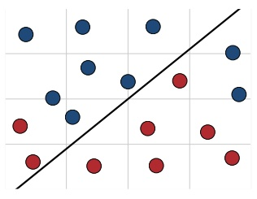

(a)

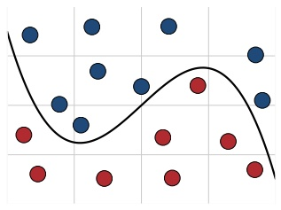

(b)

Figure 6.1

Non-linearly separable case. The classification task consists of discriminating between blue and red points. (a) No hyperplane can separate the two populations. (b) A non-linear mapping can be used instead.

more complex functions to separate the two sets as in figure 6.1b. One way to define such a non-linear decision boundary is to use a non-linear mapping Φ from the input space X to a higher-dimensional space H, where linear separation is possible (see figure 6.2).

The dimension of H can truly be very large in practice. For example, in the case of document classification, one may wish to use as features sequences of three consecutive words, i.e., trigrams. Thus, with a vocabulary of just 100,000 words, the dimension of the feature space H reaches $1 0 ^ { 1 5 }$ . On the positive side, the margin bounds presented in section 5.4 show that, remarkably, the generalization ability of large-margin classification algorithms such as SVMs do not depend on the dimension of the feature space, but only on the margin $\rho$ and the number of training examples m. Thus, with a favorable margin $\rho ,$ such algorithms could succeed even in very high-dimensional space. However, determining the hyperplane solution requires multiple inner product computations in high-dimensional spaces, which can become be very costly.

A solution to this problem is to use kernel methods, which are based on kernels or kernel functions.

**Definition 6.1 (Kernels)** A function $K \colon { \mathcal { X } } \times { \mathcal { X } } \to \mathbb { R }$ is called a kernel over X.

The idea is to define a kernel K such that for any two points $x , x ^ { \prime } \in \mathcal { X } ,   K ( x , x ^ { \prime } )$ b e equal to an inner product of vectors $\Phi ( x )$ and $\Phi ( y ) { : } ^ { 6 }$

$$
\forall x, x ^ {\prime} \in \mathcal {X}, \quad K (x, x ^ {\prime}) = \langle \Phi (x), \Phi (x ^ {\prime}) \rangle ,\tag{6.1}
$$

<small>6 To</small>

<small>6 To differentiate that inner product from the one of the input space, we will typically denote it by h·, ·i.</small>

<!-- page: 124 -->

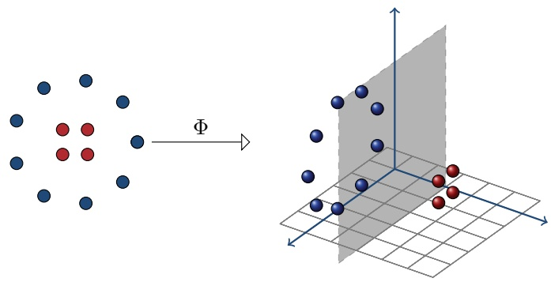

Figure 6.2

An example of a non-linear mapping from 2-dimensions to 3-dimensions, where the task becomes linearly seperable.

for some mapping $\Phi \colon \mathcal { X } \to \mathbb { H }$ to a Hilbert space H called a feature space. Since an inner product is a measure of the similarity of two vectors, K is often interpreted as a similarity measure between elements of the input space X.

An important advantage of such a kernel K is efficiency: K is often significantly more efficient to compute than Φ and an inner product in H. We will see several common examples where the computation of $K ( x , x ^ { \prime } )$ can be achieved in $O ( N )$ while that of $\langle \Phi ( x ) , \Phi ( x ^ { \prime } ) \rangle$ typically requires O(dim(H)) work, with dim $( \mathbb { H } ) \gg N$ Furthermore, in some cases, the dimension of H is infinite.

Perhaps an even more crucial benefit of such a kernel function K is flexibility: there is no need to explicitly define or compute a mapping Φ. The kernel K can be arbitrarily chosen so long as the existence of Φ is guaranteed, i.e. K satisfies Mercer’s condition (see theorem 6.2).

Theorem 6.2 (Mercer’s condition) Let $\mathcal { X } \subset \mathbb { R } ^ { N }$ be a compact set and let $K \colon { \mathcal { X } }   \times   { \mathcal { X } } \to$ R be a continuous and symmetric function. Then, K admits a uniformly convergent expansion of the form

$$
K (x, x ^ {\prime}) = \sum_ {n = 0} ^ {\infty} a _ {n} \phi_ {n} (x) \phi_ {n} (x ^ {\prime}),
$$

with $a _ { n } \: > \: 0$ iff for any square integrable function $c \; \left( c   \in   L _ { 2 } ( \mathcal { X } ) \right)$ , the following condition holds:

$$
\int \int_ {\mathcal {X} \times \mathcal {X}} c (x) c (x ^ {\prime}) K (x, x ^ {\prime}) d x d x ^ {\prime} \geq 0.
$$

This condition is important to guarantee the convexity of the optimization problem for algorithms such as SVMs, thereby ensuring convergence to a global minimum. A condition that is equivalent to Mercer’s condition under the assumptions of the theorem is that the kernel K be positive definite symmetric (PDS). This property

<!-- page: 125 -->

is in fact more general since in particular it does not require any assumption about X. In the next section, we give the definition of this property and present several commonly used examples of PDS kernels, then show that PDS kernels induce an inner product in a Hilbert space, and prove several general closure properties for PDS kernels.

## 6.2 Positive definite symmetric kernels

## 6.2.1 Definitions

**Definition 6.3 (Positive definite symmetric kernels)** A kernel $K \colon { \mathcal { X } } \times { \mathcal { X } } \to \mathbb { R }$ is said to be positive definite symmetric (PDS) if for any $\{ x _ { 1 } , \ldots , x _ { m } \} \; \subseteq \; \mathfrak { X } _ { \underline { { \underline { { \underline { { \underline { { \quad } } } } } } } } }$ , the matrix $\mathbf { K } = [ K ( x _ { i } , x _ { j } ) ] _ { i j } \in \mathbb { R } ^ { m \times m }$ is symmetric positive semidefinite (SPSD).

K is SPSD if it is symmetric and one of the following two equivalent conditions holds:

• the eigenvalues of K are non-negative;

• for any column vector $\mathbf { c } = ( c _ { 1 } , \ldots , c _ { m } ) ^ { \top } \in \mathbb { R } ^ { m \times 1 }$

$$
\mathbf {c} ^ {\top} \mathbf {K} \mathbf {c} = \sum_ {i, j = 1} ^ {m} c _ {i} c _ {j} K (x _ {i}, x _ {j}) \geq 0.\tag{6.2}
$$

For a sample $S   =   ( x _ { 1 } , \ldots , x _ { m } ) , \; \mathbf { K }   =   [ K ( x _ { i } , x _ { j } ) ] _ { i j }   \in   \mathbb { R } ^ { m \times m }$ is called the kernel matrix or the Gram matrix associated to K and the sample S.

Let us insist on the terminology: the kernel matrix associated to a positive definite kernel is positive semidefinite . This is the correct mathematical terminology. Nevertheless, the reader should be aware that in the context of machine learning, some authors have chosen to use instead the term positive definite kernel to imply a positive definite kernel matrix or used new terms such as positive semidefinite kernel.

The following are some standard examples of PDS kernels commonly used in applications.

**Example 6.4 (Polynomial kernels)** For any constant $c > 0$ , a polynomial kernel of degree $d \in \mathbb { N }$ is the kernel K defined over $\mathbb { R } ^ { N }$ by:

$$
\forall \mathbf {x}, \mathbf {x} ^ {\prime} \in \mathbb {R} ^ {N}, \quad K (\mathbf {x}, \mathbf {x} ^ {\prime}) = (\mathbf {x} \cdot \mathbf {x} ^ {\prime} + c) ^ {d}.\tag{6.3}
$$

Polynomial kernels map the input space to a higher-dimensional space of dimension ${ \binom { N + d } { d } }$ (see exercise 6.12). As an example, for an input space of dimension $N = 2$ a second-degree polynomial $( d = 2 )$ corresponds to the following inner product in

<!-- page: 126 -->

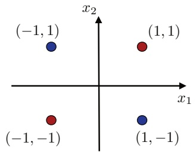

(a)

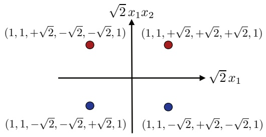

(b)

Figure 6.3

Illustration of the XOR classification problem and the use of polynomial kernels. (a) XOR problem linearly non-separable in the input space. (b) Linearly separable using second-degree polynomial kernel.

dimension 6:

$$
\forall \mathbf {x}, \mathbf {x} ^ {\prime} \in \mathbb {R} ^ {2}, \quad K (\mathbf {x}, \mathbf {x} ^ {\prime}) = (x _ {1} x _ {1} ^ {\prime} + x _ {2} x _ {2} ^ {\prime} + c) ^ {2} = \left[ \begin{array}{c} x _ {1} ^ {2} \\ x _ {2} ^ {2} \\ \sqrt {2}   x _ {1} x _ {2} \\ \sqrt {2 c}   x _ {1} \\ \sqrt {2 c}   x _ {2} \\ c \end{array} \right] \cdot \left[ \begin{array}{c} x _ {1} ^ {\prime 2} \\ x _ {2} ^ {\prime 2} \\ \sqrt {2}   x _ {1} ^ {\prime} x _ {2} ^ {\prime} \\ \sqrt {2 c}   x _ {1} ^ {\prime} \\ \sqrt {2 c}   x _ {2} ^ {\prime} \\ c \end{array} \right]\tag{6.4}
$$

Thus, the features corresponding to a second-degree polynomial are the original features $( x _ { 1 }$ and $x _ { 2 } )$ , as well as products of these features, and the constant feature. More generally, the features associated to a polynomial kernel of degree d are all the monomials of degree at most d based on the original features. The explicit expression of polynomial kernels as inner products, as in (6.4), proves directly that they are PDS kernels.

To illustrate the application of polynomial kernels, consider the example of figure 6.3a which shows a simple data set in dimension two that is not linearly separable. This is known as the XOR problem due to its interpretation in terms of the exclusive OR (XOR) function: the label of a point is blue iff exactly one of its coordinates is 1. However, if we map these points to the six-dimensional space defined by a second-degree polynomial as described in (6.4), then the problem becomes separable by the hyperplane of equation $x _ { 1 } x _ { 2 } = 0$ Figure 6.3b illustrates that by showing the projection of these points on the two-dimensional space defined by their third and fourth coordinates.

<!-- page: 127 -->

**Example 6.5 (Gaussian kernels)** For any constant $\sigma > 0$ , a Gaussian kernel or radial basis function (RBF) is the kernel K defined over $\mathbb { R } ^ { N }$ by:

$$
\forall \mathbf {x}, \mathbf {x} ^ {\prime} \in \mathbb {R} ^ {N}, \quad K (\mathbf {x}, \mathbf {x} ^ {\prime}) = \exp \left(- \frac {\| \mathbf {x} ^ {\prime} - \mathbf {x} \| ^ {2}}{2 \sigma^ {2}}\right).\tag{6.5}
$$

Gaussian kernels are among the most frequently used kernels in applications. We will prove in section 6.2.3 that they are PDS kernels and that they can be derived by normalization from the kernels $\begin{array} { r } { K ^ { \prime } \colon ( \mathbf { x } , \mathbf { x } ^ { \prime } ) \mapsto \exp \left( \frac { \mathbf { x } \cdot \mathbf { x } ^ { \prime } } { \sigma ^ { 2 } } \right) } \end{array}$ . Using the power series expansion of the exponential function, we can rewrite the expression of $K ^ { \prime }$ as follows:

$$
\forall \mathbf {x}, \mathbf {x} ^ {\prime} \in \mathbb {R} ^ {N}, K ^ {\prime} (\mathbf {x}, \mathbf {x} ^ {\prime}) = \sum_ {n = 0} ^ {+ \infty} \frac {(\mathbf {x} \cdot \mathbf {x} ^ {\prime}) ^ {n}}{\sigma^ {2 n} n !},
$$

which shows that the kernels $K ^ { \prime } ,$ , and thus Gaussian kernels, are positive linear combinations of polynomial kernels of all degrees $n \geq 0$

**Example 6.6 (Sigmoid kernels)** For any real constants $a , b \geq 0$ , a sigmoid kernel is the kernel K defined over $\mathbb { R } ^ { N }$ by:

$$
\forall \mathbf {x}, \mathbf {x} ^ {\prime} \in \mathbb {R} ^ {N}, \quad K (\mathbf {x}, \mathbf {x} ^ {\prime}) = \tanh \left(a (\mathbf {x} \cdot \mathbf {x} ^ {\prime}) + b\right).\tag{6.6}
$$

Using sigmoid kernels with SVMs leads to an algorithm that is closely related to learning algorithms based on simple neural networks, which are also often defined via a sigmoid function. When $a   <   0$ or $b \; < \; 0$ , the kernel is not PDS and the corresponding neural network does not benefit from the convergence guarantees of convex optimization (see exercise 6.18).

## 6.2.2 Reproducing kernel Hilbert space

Here, we prove the crucial property of PDS kernels, which is to induce an inner product in a Hilbert space. The proof will make use of the following lemma.

**Lemma 6.7 (Cauchy-Schwarz inequality for PDS kernels)** Let K be a PDS kernel. Then, for any $x , x ^ { \prime } \in \mathcal { X }$ ,

$$
K (x, x ^ {\prime}) ^ {2} \leq K (x, x) K (x ^ {\prime}, x ^ {\prime}).\tag{6.7}
$$

Proof: Consider the matrix $\mathbf { K }   =   \left( { \begin{matrix} { { \scriptstyle K ( x , x ) } { \scriptstyle K ( x , x ^ { \prime } ) } } \\ { { \scriptstyle K ( x ^ { \prime } , x ) } { \scriptstyle K ( x ^ { \prime } , x ^ { \prime } ) } } \\ \end{matrix} } \right)$ . By definition, if K is PDS, then K is SPSD for all $x , x ^ { \prime } \in \mathcal { X }$ . In particular, the product of the eigenvalues of K, det(K), must be non-negative, thus, using $K ( x ^ { \prime } , x ) = K ( x , x ^ { \prime } )$ , we have

$$
\det (\mathbf {K}) = K (x, x) K (x ^ {\prime}, x ^ {\prime}) - K (x, x ^ {\prime}) ^ {2} \geq 0,
$$

which concludes the proof.

The following is the main result of this section.

**Theorem 6.8 (Reproducing kernel Hilbert space (RKHS) )** Let $K \colon { \mathcal { X } } \times { \mathcal { X } } \to \mathbb { R }$ be a PDS kernel. Then, there exists a Hilbert space H (see definition A.2) and a mapping Φ

<!-- page: 128 -->

## 6.2 Positive definite symmetric kernels

from X to H such that:

$$
\forall x, x ^ {\prime} \in \mathcal {X}, \quad K (x, x ^ {\prime}) = \langle \Phi (x), \Phi (x ^ {\prime}) \rangle .\tag{6.8}
$$

Furthermore, H has the following property known as the reproducing property:

$$
\forall h \in \mathbb {H}, \forall x \in \mathcal {X}, \quad h (x) = \langle h, K (x, \cdot) \rangle .\tag{6.9}
$$

H is called a reproducing kernel Hilbert space (RKHS) associated to $K$

Proof: For any $x \in \mathcal { X }$ , define $\Phi ( x ) \colon { \mathcal { X } } \to \mathbb { R } ^ { \mathcal { X } }$ as follows:

$$
\forall x ^ {\prime} \in \mathcal {X}, \Phi (x) (x ^ {\prime}) = K (x, x ^ {\prime}).
$$

We define $\mathbb { H } _ { 0 }$ as the set of finite linear combinations of such functions $\Phi ( x )$

$$
\mathbb {H} _ {0} = \bigg \{\sum_ {i \in I} a _ {i} \Phi (x _ {i}) \colon a _ {i} \in \mathbb {R}, x _ {i} \in \mathcal {X}, | I | <   \infty \bigg \}.
$$

Now, we introduce an operation $\langle \cdot , \cdot \rangle$ on $\mathbb { H } _ { 0 } \times \mathbb { H } _ { 0 }$ defined for all $f , g   \in   \mathbb { H } _ { 0 }$ with $\textstyle f = \sum _ { i \in I } a _ { i } \Phi ( x _ { i } )$ and $\begin{array} { r } { g = \sum _ { j \in J } b _ { j } \Phi ( x _ { j } ^ { \prime } ) } \end{array}$ ) by

$$
\langle f, g \rangle = \sum_ {i \in I, j \in J} a _ {i} b _ {j} K (x _ {i}, x _ {j} ^ {\prime}) = \sum_ {j \in J} b _ {j} f (x _ {j} ^ {\prime}) = \sum_ {i \in I} a _ {i} g (x _ {i}).
$$

By definition, $\langle \cdot , \cdot \rangle$ is symmetric. The last two equations show that $\langle f , g \rangle$ does not depend on the particular representations of $f$ and $g ,$ and also show that $\langle \cdot , \cdot \rangle$ is bilinear. Further, for any $\textstyle f = \sum _ { i \in I } a _ { i } \Phi ( x _ { i } ) \in \mathbb { H } _ { 0 }$ , since K is PDS, we have

$$
\langle f, f \rangle = \sum_ {i, j \in I} a _ {i} a _ {j} K (x _ {i}, x _ {j}) \geq 0.
$$

Thus, $\langle \cdot , \cdot \rangle$ is positive semidefinite bilinear form. This inequality implies more generally using the bilinearity of $\langle \cdot , \cdot \rangle$ that for any $f _ { 1 } , \ldots , f _ { m }$ and $c _ { 1 } , \ldots , c _ { m } \in \mathbb { R }$

$$
\sum_ {i, j = 1} ^ {m} c _ {i} c _ {j} \langle f _ {i}, f _ {j} \rangle = \Big \langle \sum_ {i = 1} ^ {m} c _ {i} f _ {i}, \sum_ {j = 1} ^ {m} c _ {j} f _ {j} \Big \rangle \geq 0.
$$

Hence, $\langle \cdot , \cdot \rangle$ is a PDS kernel on $\mathbb { H } _ { 0 }$ . Thus, for any $f   \in   \mathbb { H } _ { 0 }$ and any $x   \in   { \mathcal { X } }$ , by lemma $6 . 7 ,$ we can write

$$
\langle f, \Phi (x) \rangle^ {2} \leq \langle f, f \rangle \langle \Phi (x), \Phi (x) \rangle .
$$

Further, we observe the reproducing property of $\langle \cdot , \cdot \rangle$ : for any $\textstyle f = \sum _ { i \in I } a _ { i } \Phi ( x _ { i } ) \in$ $\mathbb { H } _ { 0 }$ , by definition of $\langle \cdot , \cdot \rangle$ ,

$$
\forall x \in \mathcal {X}, \quad f (x) = \sum_ {i \in I} a _ {i} K (x _ {i}, x) = \langle f, \Phi (x) \rangle .\tag{6.10}
$$

<!-- page: 129 -->

Thus, $[ f ( x ) ] ^ { 2 }   \leq   \langle f , f \rangle K ( x , x )$ for all $x \in { \mathfrak { X } } .$ , which shows the definiteness of $\langle \cdot , \cdot \rangle$ This implies that $\langle \cdot , \cdot \rangle$ defines an inner product on $\mathbb { H } _ { 0 } ,$ , which thereby becomes a pre-Hilbert space. H0 can be completed to form a Hilbert space H in which it is dense, following a standard construction. By the Cauchy-Schwarz inequality, for any $x   \in   \mathcal { X } , \; f   \mapsto   \langle f , \Phi ( x ) \rangle$ is Lipschitz, therefore continuous. Thus, since H0 is dense in H, the reproducing property (6.10) also holds over H. 

The Hilbert space H defined in the proof of the theorem for a PDS kernel K is called the reproducing kernel Hilbert space (RKHS) associated to K. Any Hilbert space H such that there exists $\Phi \colon \mathcal { X } \to \mathbb { H }$ with $K ( x , x ^ { \prime } ) = \langle \Phi ( x ) , \Phi ( x ^ { \prime } ) \rangle$ for all $x , x ^ { \prime } \in \mathcal { X }$ is called a feature space associated to K and Φ is called a feature mapping. We will denote <u>by</u> $\| \cdot \| _ { \mathbb { H } }$ the norm induced by the inner product in feature space H: $\| \mathbf { w } \| _ { \mathbb { H } }   =   \sqrt { \langle \mathbf { w } , \mathbf { w } \rangle }$ for all $$\mathbf { w } \in \mathbb { H } .$$ . Note that the feature spaces associated to K are in general not unique and may have different dimensions. In practice, when referring to the dimension of the feature space associated to $K$ , we either refer to the dimension of the feature space based on a feature mapping described explicitly, or to that of the RKHS associated to K.

Theorem 6.8 implies that PDS kernels can be used to implicitly define a feature space or feature vectors. As already underlined in previous chapters, the role played by the features in the success of learning algorithms is crucial: with poor features, uncorrelated with the target labels, learning could become very challenging or even impossible; in contrast, good features could provide invaluable clues to the algorithm. Therefore, in the context of learning with PDS kernels and for a fixed input space, the problem of seeking useful features is replaced by that of finding useful PDS kernels. While features represented the user’s prior knowledge about the task in the standard learning problems, here PDS kernels will play this role. Thus, in practice, an appropriate choice of PDS kernel for a task will be crucial.

## 6.2.3 Properties

This section highlights several important properties of PDS kernels. We first show that PDS kernels can be normalized and that the resulting normalized kernels are also PDS. We also introduce the definition of empirical kernel maps and describe their properties and extension. We then prove several important closure properties of PDS kernels, which can be used to construct complex PDS kernels from simpler ones.

To any kernel $K$ , we can associate a normalized kernel $K ^ { \prime }$ defined by

$$
\forall x, x ^ {\prime} \in \mathcal {X}, \quad K ^ {\prime} (x, x ^ {\prime}) = \left\{ \begin{array}{l l} 0 & \text {if} (K (x, x) = 0) \lor (K (x ^ {\prime}, x ^ {\prime}) = 0) \\ \frac {K (x , x ^ {\prime})}{\sqrt {K (x , x) K (x ^ {\prime} , x ^ {\prime})}} & \text {otherwise.} \end{array} \right.\tag{6.11}
$$

<!-- page: 130 -->

By definition, for a normalized kernel $K ^ { \prime } , \; K ^ { \prime } ( x , x )   =   1$ for all $x   \in   { \mathcal { X } }$ such that $K ( x , x ) \neq 0$ . An example of normalized kernel is the Gaussian kernel with parameter $\sigma > 0$ , which is the normalized kernel associated to $\begin{array} { r } { K ^ { \prime } \colon ( \mathbf { x } , \mathbf { x } ^ { \prime } ) \mapsto \exp \left( \frac { \mathbf { x } \cdot \mathbf { x } ^ { \prime } } { \sigma ^ { 2 } } \right) } \end{array}$

$$
\forall \mathbf {x}, \mathbf {x} ^ {\prime} \in \mathbb {R} ^ {N}, \frac {K ^ {\prime} (\mathbf {x} , \mathbf {x} ^ {\prime})}{\sqrt {K ^ {\prime} (\mathbf {x} , \mathbf {x}) K ^ {\prime} (\mathbf {x} ^ {\prime} , \mathbf {x} ^ {\prime})}} = \frac {e ^ {\frac {\mathbf {x} \cdot \mathbf {x} ^ {\prime}}{\sigma^ {2}}}}{e ^ {\frac {\| \mathbf {x} \| ^ {2}}{2 \sigma^ {2}}} e ^ {\frac {\| \mathbf {x} ^ {\prime} \| ^ {2}}{2 \sigma^ {2}}}} = \exp \left(- \frac {\| \mathbf {x} ^ {\prime} - \mathbf {x} \| ^ {2}}{2 \sigma^ {2}}\right).\tag{6.12}
$$

**Lemma 6.9 (Normalized PDS kernels)** Let K be a PDS kernel. Then, the normalized kernel $K ^ { \prime }$ associated to K is PDS.

Proof: Let $\{ x _ { 1 } , \ldots , x _ { m } \} \subseteq \mathcal { X }$ and let c be an arbitrary vector in $\mathbb { R } ^ { m }$ . We will show that the sum $\textstyle \sum _ { i , j = 1 } ^ { m } c _ { i } c _ { j } K ^ { \prime } ( x _ { i } , x _ { j } )$ is non-negative. By lemma 6.7, if $K ( x _ { i } , x _ { i } ) = 0$ then $K ( x _ { i } , x _ { j } ) = 0$ and thus $K ^ { \prime } ( x _ { i } , x _ { j } ) = 0$ for all $j \in [ m ]$ . Thus, we can assume that $K ( x _ { i } , x _ { i } ) > 0$ for all $i \in [ m ]$ . Then, the sum can be rewritten as follows:

$$
\sum_ {i, j = 1} ^ {m} \frac {c _ {i} c _ {j} K (x _ {i} , x _ {j})}{\sqrt {K (x _ {i} , x _ {i}) K (x _ {j} , x _ {j})}} = \sum_ {i, j = 1} ^ {m} \frac {c _ {i} c _ {j} \left\langle \Phi (x _ {i}) , \Phi (x _ {j}) \right\rangle}{\| \Phi (x _ {i}) \| _ {\mathbb {H}} \| \Phi (x _ {j}) \| _ {\mathbb {H}}} = \left\| \sum_ {i = 1} ^ {m} \frac {c _ {i} \Phi (x _ {i})}{\| \Phi (x _ {i}) \| _ {\mathbb {H}}} \right\| _ {\mathbb {H}} ^ {2} \geq 0,
$$

where Φ is a feature mapping associated to K, which exists by theorem 6.8. 

As indicated earlier, PDS kernels can be interpreted as a similarity measure since they induce an inner product in some Hilbert space H. This is more evident for a normalized kernel K since $K ( x , x ^ { \prime } )$ is then exactly the cosine of the angle between the feature vectors $\Phi ( x )$ and $\Phi ( x ^ { \prime } )$ , provided that none of them is zero: $\Phi ( x )$ and $\Phi ( x ^ { \prime } )$ are then unit vectors since $\| \Phi ( x ) \| _ { \mathbb { H } } = \| \Phi ( x ^ { \prime } ) \| _ { \mathbb { H } } = \sqrt { K ( x , x ) } = 1$

While one of the advantages of PDS kernels is an implicit definition of a feature mapping, in some instances, it may be desirable to define an explicit feature mapping based on a PDS kernel. This may be to work in the primal for various optimization and computational reasons, to derive an approximation based on an explicit mapping, or as part of a theoretical analysis where an explicit mapping is more convenient. The empirical kernel map Φ associated to a PDS kernel K is a feature mapping that can be used precisely in such contexts. Given a training sample containing points $x _ { 1 } , \ldots , x _ { m } \in \mathcal { X } ,   \Phi \colon \mathcal { X } \to \mathbb { R } ^ { m }$ is defined for all $x \in \mathcal { X }$ by

$$
\Phi (x) = \left[ \begin{array}{c} K (x, x _ {1}) \\ \vdots \\ K (x, x _ {m}) \end{array} \right].
$$

Thus, $\Phi ( x )$ is the vector of the K-similarity measures of x with each of the training points. Let K be the kernel matrix associated to K and $\mathbf { e } _ { i }$ the ith unit vector. Note that for any $i \in [ m ] ,   \Phi ( x _ { i } )$ is the ith column of K, that is $\Phi ( x _ { i } ) = \mathbf { K } \mathbf { e } _ { i }$ . In

<!-- page: 131 -->

particular, for all $i , j \in [ m ]$

$$
\langle \Phi (x _ {i}), \Phi (x _ {j}) \rangle = (\mathbf {K e} _ {i}) ^ {\top} (\mathbf {K e} _ {j}) = \mathbf {e} _ {i} ^ {\top} \mathbf {K} ^ {2} \mathbf {e} _ {j}.
$$

Thus, the kernel matrix $\mathbf { K } ^ { \prime }$ associated to Φ is $\mathbf { K } ^ { 2 }$ . It may desirable in some cases to define a feature mapping whose kernel matrix coincides with K. Let $\mathbf { K } ^ { \dagger \frac { 1 } { 2 } }$ denote the SPSD matrix whose square is $\mathbf { K } ^ { \dagger }$ , the pseudo-inverse of K. $\mathbf { K } ^ { \dagger \frac { 1 } { 2 } }$ can be derived from $\mathbf { K } ^ { \dagger }$ via singular value decomposition and if the matrix K is invertible, $\mathbf { K } ^ { \dagger \frac { 1 } { 2 } }$ coincides with $\mathbf { K } ^ { - 1 / 2 }$ (see appendix A for properties of the pseudo-inverse). Then, Ψ can be defined as follows using the empirical kernel map Φ:

$$
\forall x \in \mathcal {X}, \quad \Psi (x) = \mathbf {K} ^ {\dagger^ {\frac {1}{2}}} \Phi (x).
$$

Using the identity $\mathbf { K } \mathbf { K } ^ { \dagger } \mathbf { K } = \mathbf { K }$ valid for any symmetric matrix K, for all $i , j \in [ m ]$ the following holds:

$$
\langle \Psi (x _ {i}), \Psi (x _ {j}) \rangle = (\mathbf {K} ^ {\dagger \frac {1}{2}} \mathbf {K e} _ {i}) ^ {\top} (\mathbf {K} ^ {\dagger \frac {1}{2}} \mathbf {K e} _ {j}) = \mathbf {e} _ {i} ^ {\top} \mathbf {K K} ^ {\dagger} \mathbf {K e} _ {j} = \mathbf {e} _ {i} ^ {\top} \mathbf {K e} _ {j}.
$$

Thus, the kernel matrix associated to Ψ is K. Finally, note that for the feature mapping $\Omega \colon \mathcal { X } \to \mathbb { R } ^ { m }$ defined by

$$
\forall x \in \mathcal {X}, \quad \Omega (x) = \mathbf {K} ^ {\dagger} \Phi (x),
$$

for all $i , j \in [ m ]$ , we have $\langle \Omega ( x _ { i } ) , \Omega ( x _ { j } ) \rangle = \mathbf { e } _ { i } ^ { \top } \mathbf { K } \mathbf { K } ^ { \dagger } \mathbf { K } ^ { \dagger } \mathbf { K } \mathbf { e } _ { j } = \mathbf { e } _ { i } ^ { \top } \mathbf { K } \mathbf { K } ^ { \dagger } \mathbf { e } _ { j }$ , using the identity $\mathbf { K } ^ { \dagger } \mathbf { K } ^ { \dagger } \mathbf { K } = \mathbf { K } ^ { \dagger }$ valid for any symmetric matrix K. Thus, the kernel matrix associated to Ω is $\mathbf { K } \mathbf { K } ^ { \dagger }$ , which reduces to the identity matrix $\mathbf { I } \in \mathbb { R } ^ { m \times m }$ when K is invertible, since $\mathbf { K } ^ { \dagger } = \mathbf { K } ^ { - 1 }$ in that case.

As pointed out in the previous section, kernels represent the user’s prior knowledge about a task. In some cases, a user may come up with appropriate similarity measures or PDS kernels for some subtasks — for example, for different subcategories of proteins or text documents to classify. But how can the user combine these PDS kernels to form a PDS kernel for the entire class? Is the resulting combined kernel guaranteed to be PDS? In the following, we will show that PDS kernels are closed under several useful operations which can be used to design complex PDS kernels. These operations are the sum and the product of kernels, as well as the tensor product of two kernels K and $K ^ { \prime }$ , denoted by $K \otimes K ^ { \prime }$ and defined by

$$
\forall x _ {1}, x _ {2}, x _ {1} ^ {\prime}, x _ {2} ^ {\prime} \in \mathcal {X}, \quad (K \otimes K ^ {\prime}) (x _ {1}, x _ {1} ^ {\prime}, x _ {2}, x _ {2} ^ {\prime}) = K (x _ {1}, x _ {2}) K ^ {\prime} (x _ {1} ^ {\prime}, x _ {2} ^ {\prime}).
$$

They also include the pointwise limit: given a sequence of kernels $( K _ { n } ) _ { n \in \mathbb { N } }$ such that for all $x , x ^ { \prime } \in \mathcal { X } \left( K _ { n } ( x , x ^ { \prime } ) \right) _ { n \in \mathbb { N } }$ admits a limit, the pointwise limit of $( K _ { n } ) _ { n \in \mathbb { N } }$ is the kernel K defined for all $x , x ^ { \prime } \in \mathcal { X }$ by $K ( x , x ^ { \prime } ) = \operatorname { l i m } _ { n \to + \infty } ( K _ { n } ) ( x , x ^ { \prime } )$ . Similarly, if $\textstyle \sum _ { n = 0 } ^ { \infty } a _ { n } x ^ { n }$ is a power series with radius of convergence $\rho > 0$ and K a kernel taking values in $( - \rho , + \rho )$ , then $\textstyle \sum _ { n = 0 } ^ { \infty } a _ { n } K ^ { n }$ is the kernel obtained by composition

<!-- page: 132 -->

of K with that power series. The following theorem provides closure guarantees for all of these operations.

**Theorem 6.10 (PDS kernels — closure properties)** PDS kernels are closed under sum, product, tensor product, pointwise limit, and composition with a power series $\textstyle \sum _ { n = 0 } ^ { \infty } a _ { n } x ^ { n }$ with $a _ { n } \geq 0$ for all $n \in \mathbb { N }$

Proof: We start with two kernel matrices, K and $\mathbf { K } ^ { \prime } ,$ , generated from PDS kernels K and $K ^ { \prime }$ for an arbitrary set of m points. By assumption, these kernel matrices are SPSD. Observe that for any $\mathbf { c } \in \mathbb { R } ^ { m \times 1 }$

$$
(\mathbf {c} ^ {\top} \mathbf {K} \mathbf {c} \geq 0) \land (\mathbf {c} ^ {\top} \mathbf {K} ^ {\prime} \mathbf {c} \geq 0) \Rightarrow \mathbf {c} ^ {\top} (\mathbf {K} + \mathbf {K} ^ {\prime}) \mathbf {c} \geq 0.
$$

By (6.2), this shows that $\mathbf { K } + \mathbf { K } ^ { \prime }$ is SPSD and thus that $K + K ^ { \prime }$ is PDS. To show closure under product, we will use the fact that for any SPSD matrix K there exists M such that $\mathbf { K } = \mathbf { M } \mathbf { M } ^ { \top }$ . The existence of M is guaranteed as it can be generated via, for instance, singular value decomposition of K, or by Cholesky decomposition. The kernel matrix associated to $K K ^ { \prime }$ is $( \mathbf { K } _ { i j } \mathbf { K } _ { i j } ^ { \prime } ) _ { i j }$ . For any $\mathbf { c } \in \mathbb { R } ^ { m \times 1 }$ , expressing $\mathbf { K } _ { i j }$ in terms of the entries of M, we can write

$$
\begin{array}{l} \sum_ {i, j = 1} ^ {m} c _ {i} c _ {j} (\mathbf {K} _ {i j} \mathbf {K} _ {i j} ^ {\prime}) = \sum_ {i, j = 1} ^ {m} c _ {i} c _ {j} \bigg (\Big [ \sum_ {k = 1} ^ {m} \mathbf {M} _ {i k} \mathbf {M} _ {j k} \Big ] \mathbf {K} _ {i j} ^ {\prime} \bigg) \\ \qquad = \sum_ {k = 1} ^ {m} \bigg [ \sum_ {i, j = 1} ^ {m} c _ {i} c _ {j} \mathbf {M} _ {i k} \mathbf {M} _ {j k} \mathbf {K} _ {i j} ^ {\prime} \bigg ] \\ \qquad = \sum_ {k = 1} ^ {m} \mathbf {z} _ {k} ^ {\top} \mathbf {K} ^ {\prime} \mathbf {z} _ {k} \geq 0, \end{array}
$$

with $\mathbf { z } _ { k } \; = \; \left[ \begin{matrix} { \mathbf { \mathit { c } } _ { 1 } \mathbf { \dot { M } } _ { 1 k } } \\ { \vdots } \\ { \mathbf { \mathit { c } } _ { m } \mathbf { \dot { M } } _ { m k } } \\ \end{matrix} \right]$ This shows that PDS kernels are closed under product. The tensor product of K and $K ^ { \prime }$ is PDS as the product of the two PDS kernels $\begin{aligned} { ( x _ { 1 } , x _ { 1 } ^ { \prime } , x _ { 2 } , x _ { 2 } ^ { \prime } ) \: \mapsto \: K ( x _ { 1 } , x _ { 2 } ) } \\ \end{aligned}$ and $( x _ { 1 } , x _ { 1 } ^ { \prime } , x _ { 2 } , x _ { 2 } ^ { \prime } )   \mapsto   K ^ { \prime } ( x _ { 1 } ^ { \prime } , x _ { 2 } ^ { \prime } )$ . Next, let $( K _ { n } ) _ { n \in \mathbb { N } }$ be a sequence of PDS kernels with pointwise limit K. Let K be the kernel matrix associated to K and $\mathbf { K } _ { n }$ the one associated to $K _ { n }$ for any $n \in \mathbb { N }$ . Observe that

$$
(\forall n, \mathbf {c} ^ {\top} \mathbf {K} _ {n} \mathbf {c} \geq 0) \Rightarrow \lim _ {n \to \infty} \mathbf {c} ^ {\top} \mathbf {K} _ {n} \mathbf {c} = \mathbf {c} ^ {\top} \mathbf {K} \mathbf {c} \geq 0.
$$

This shows the closure under pointwise limit. Finally, assume that K is a PDS kernel with $| K ( x , x ^ { \prime } ) | < \rho$ for all $x , x ^ { \prime } \in \mathcal { X }$ and let $\textstyle f \colon x \mapsto \sum _ { n = 0 } ^ { \infty } a _ { n } x ^ { n } , a _ { n } \geq 0$ be a power series with radius of convergence $\rho .$ Then, for any $n \in \mathbb { N }$ $K ^ { n }$ and thus $a _ { n } K ^ { n }$ are PDS by closure under product. For any $\textstyle N \in \mathbb { N } , \sum _ { n = 0 } ^ { N } a _ { n } K ^ { n }$ is PDS by closure under sum of $a _ { n } K ^ { n } \mathrm { s }$ and $f \circ K$ is PDS by closure under the limit of $\textstyle \sum _ { n = 0 } ^ { N } a _ { n } K ^ { n }$ as N tends to infinity. 

<!-- page: 133 -->

The theorem implies in particular that for any PDS kernel matrix $K ,   \exp ( K )$ is PDS, since the radius of convergence of exp is infinite. In particular, the kernel $\begin{array} { r } { K ^ { \prime } \colon ( \mathbf { x } , \mathbf { x } ^ { \prime } ) \mapsto \exp \left( \frac { \mathbf { x } \cdot \mathbf { x } ^ { \prime } } { \sigma ^ { 2 } } \right) } \end{array}$ is PDS since $\begin{array} { r } { ( \mathbf { x } , \mathbf { x } ^ { \prime } ) \mapsto \frac { \mathbf { x } \cdot \mathbf { x } ^ { \prime } } { \sigma ^ { 2 } } } \end{array}$ is PDS. Thus, by lemma 6.9, this shows that a Gaussian kernel, which is the normalized kernel associated to $K ^ { \prime }$ is PDS.

## 6.3 Kernel-based algorithms

In this section we discuss how SVMs can be used with kernels and analyze the impact that kernels have on generalization.

## 6.3.1 SVMs with PDS kernels

In chapter 5, we noted that the dual optimization problem for SVMs as well as the form of the solution did not directly depend on the input vectors but only on inner products. Since a PDS kernel implicitly defines an inner product (theorem 6.8), we can extend SVMs and combine it with an arbitrary PDS kernel K by replacing each instance of an inner product $x   \cdot   x ^ { \prime }$ with $K ( x , x ^ { \prime } )$ . This leads to the following general form of the SVM optimization problem and solution with PDS kernels extending (5.33):

$$
\begin{array}{c} \max _ {\boldsymbol {\alpha}} \sum_ {i = 1} ^ {m} \alpha_ {i} - \frac {1}{2} \sum_ {i, j = 1} ^ {m} \alpha_ {i} \alpha_ {j} y _ {i} y _ {j} K (x _ {i}, x _ {j}) \\ \text {subject to:} 0 \leq \alpha_ {i} \leq C \land \sum_ {i = 1} ^ {m} \alpha_ {i} y _ {i} = 0, i \in [ m ]. \end{array}\tag{6.13}
$$

In view of (5.34), the hypothesis h solution can be written as:

$$
h (x) = \mathrm{sgn} \Big (\sum_ {i = 1} ^ {m} \alpha_ {i} y _ {i} K (x _ {i}, x) + b \Big),\tag{6.14}
$$

with $\begin{array} { l } { b { \it ~ = } ~ y _ { i } { \it - } \sum _ { j = 1 } ^ { m } \alpha _ { j } y _ { j } K ( x _ { j } , x _ { i } ) } \\ \end{array}$ for any $x _ { i }$ with $0   <   \alpha _ { i }   <   C$ . We can rewrite the optimization problem (6.13) in a vector form, by using the kernel matrix K associated to K for the training sample $( x _ { 1 } , \ldots , x _ { m } )$ as follows:

$$
\begin{array}{c} \max _ {\boldsymbol {\alpha}} 2 \mathbf {1} ^ {\top} \boldsymbol {\alpha} - (\boldsymbol {\alpha} \circ \mathbf {y}) ^ {\top} \mathbf {K} (\boldsymbol {\alpha} \circ \mathbf {y}) \\ \text {subject to:} \mathbf {0} \leq \boldsymbol {\alpha} \leq \mathbf {C} \wedge \boldsymbol {\alpha} ^ {\top} \mathbf {y} = 0. \end{array}\tag{6.15}
$$

In this formulation, $\alpha \circ \mathbf { y }$ is the Hadamard product or entry-wise product of the vectors α and y. Thus, it is the column vector in $\mathbb { R } ^ { m \times 1 }$ whose ith component equals $\alpha _ { i } y _ { i }$ . The solution in vector form is the same as in (6.14), but with $b =$ $y _ { i } - ( \mathbf { \alpha } \circ \mathbf { y } ) ^ { \top } \mathbf { K } \mathbf { e } _ { i }$ for any $x _ { i }$ with $0 < \alpha _ { i } < C$

<!-- page: 134 -->

This version of SVMs used with PDS kernels is the general form of SVMs we will consider in all that follows. The extension is important, since it enables an implicit non-linear mapping of the input points to a high-dimensional space where large-margin separation is sought.

Many other algorithms in areas including regression, ranking, dimensionality reduction or clustering can be extended using PDS kernels following the same scheme (see in particular chapters 9, 10, 11, 15).

## 6.3.2 Representer theorem

Observe that modulo the offset b, the hypothesis solution of SVMs can be written as a linear combination of the functions $K ( x _ { i } , \cdot )$ , where $x _ { i }$ is a sample point. The following theorem known as the representer theorem shows that this is in fact a general property that holds for a broad class of optimization problems, including that of SVMs with no offset.

**Theorem 6.11 (Representer theorem)** Let $K \colon { \mathcal { X } } \times { \mathcal { X } } \to \mathbb { R }$ be a PDS kernel and H its corresponding RKHS. Then, for any non-decreasing function $G \colon \mathbb { R } \to \mathbb { R }$ and any loss function $L \colon \mathbb { R } ^ { m } \to \mathbb { R } \cup \{ + \infty \}$ , the optimization problem

$$
\underset {h \in \mathbb {H}} {\operatorname{argmin}} F (h) = \underset {h \in \mathbb {H}} {\operatorname{argmin}} G (\| h \| _ {\mathbb {H}}) + L \big (h (x _ {1}), \dots , h (x _ {m}) \big)
$$

admits a solution of the form $\begin{array} { r } { h ^ { * } = \sum _ { i = 1 } ^ { m } \alpha _ { i } K ( x _ { i } , \cdot ) } \end{array}$ . If G is further assumed to be increasing, then any solution has this form.

Proof: Let $\mathbb { H } _ { 1 } = \operatorname { s p a n } ( \{ K ( x _ { i } , \cdot ) \colon i \in [ m ] \} )$ . Any $h \in \mathbb { H }$ admits the decomposition $h   =   h _ { 1 } + h ^ { \perp }$ according to $\mathbb { H } = \mathbb { H } _ { 1 } \oplus \mathbb { H } _ { 1 } ^ { \perp }$ , where ⊕ is the direct sum. Since G is non-decreasing, $G ( \| h _ { 1 } \| _ { \mathbb { H } } ) \leq G ( \sqrt { \| h _ { 1 } \| _ { \mathbb { H } } ^ { 2 } + \| h ^ { \perp } \| _ { \mathbb { H } } ^ { 2 } } ) = G ( \| h \| _ { \mathbb { H } } )$ . By the reproducing property, for all $i \: \in \: [ m ] , \; h ( x _ { i } ) \: = \: \langle h , K ( x _ { i } , \cdot ) \rangle \: = \: \langle h _ { 1 } , K ( x _ { i } , \cdot ) \rangle \: = \: h _ { 1 } ( x _ { i } )$ . Thus, $L \big ( h ( x _ { 1 } ) , \ldots , h ( x _ { m } ) \big ) = L \big ( h _ { 1 } ( x _ { 1 } ) , \ldots , h _ { 1 } ( x _ { m } ) \big )$ and $F ( h _ { 1 } ) \leq F ( h )$ . This proves the first part of the theorem. If G is further increasing, then $F ( h _ { 1 } )   <   F ( h )$ when $\| h ^ { \perp } \| _ { \mathbb { H } } > 0$ and any solution of the optimization problem must be in $\mathbb{H}_{1}$ . 

## 6.3.3 Learning guarantees

Here, we present general learning guarantees for hypothesis sets based on PDS kernels, which hold in particular for SVMs combined with PDS kernels.

The following theorem gives a general bound on the empirical Rademacher complexity of kernel-based hypotheses with bounded norm, that is a hypothesis set of the form $\mathcal { H }   =   \{ h   \in   \mathbb { H } \colon \| h \| _ { \mathbb { H } }   \leq   \Lambda \}$ , for some $\Lambda \geq 0$ , where H is the RKHS associated to a kernel K. By the reproducing property, any $h \in \mathcal { H }$ is of the form $x \mapsto \langle h , K ( x , \cdot ) \rangle = \langle h , \Phi ( x ) \rangle$ with $\| h \| _ { \mathbb { H } } \leq \Lambda$ , where Φ is a feature mapping associated to K, that is of the form $x \mapsto \langle \mathbf { w } , \Phi ( x ) \rangle$ with $\| \mathbf { w } \| _ { \mathbb { H } } \leq \Lambda$

<!-- page: 135 -->

**Theorem 6.12 (Rademacher complexity of kernel-based hypotheses)** Let $K \colon { \mathcal { X } }   \times   { \mathcal { X } } \to$ R be a PDS kernel and let Φ: $\mathcal { X } \rightarrow$ H be a feature mapping associated to K. Let $S \subseteq$ $\{ x \colon K ( x , x ) \leq r ^ { 2 } \}$ be a sample of size $m ,$ and let $\mathcal { H } = \{ x \mapsto \langle \mathbf { w } , \Phi ( x ) \rangle : \| \mathbf { w } \| _ { \mathbb { H } } \leq \Lambda \}$ for some $\Lambda \geq 0$ . Then

$$
\widehat {\mathfrak {R}} _ {S} (\mathcal {H}) \leq \frac {\Lambda \sqrt {\mathrm{Tr} [ \mathbf {K} ]}}{m} \leq \sqrt {\frac {r ^ {2} \Lambda^ {2}}{m}}.\tag{6.16}
$$

Proof: The proof steps are as follows:

$$
\begin{array}{l l} \widehat {\mathfrak {R}} _ {S} (\mathcal {H}) = \frac {1}{m} \underset {\boldsymbol {\sigma}} {\mathbb {E}} \left[ \sup _ {\| \mathbf {w} \| \leq \Lambda} \Big \langle \mathbf {w}, \sum_ {i = 1} ^ {m} \sigma_ {i} \Phi (x _ {i}) \Big \rangle \right] \\ \quad = \frac {\Lambda}{m} \underset {\boldsymbol {\sigma}} {\mathbb {E}} \left[ \left\| \sum_ {i = 1} ^ {m} \sigma_ {i} \Phi (x _ {i}) \right\| _ {\mathbb {H}} \right] & \text {(Cauchy - Schwarz, eq. case)} \\ \leq \frac {\Lambda}{m} \left[ \underset {\boldsymbol {\sigma}} {\mathbb {E}} \left[ \left\| \sum_ {i = 1} ^ {m} \sigma_ {i} \Phi (x _ {i}) \right\| _ {\mathbb {H}} ^ {2} \right] \right] ^ {1 / 2} & \text {(Jensen's ineq.)} \\ = \frac {\Lambda}{m} \left[ \underset {\boldsymbol {\sigma}} {\mathbb {E}} \left[ \sum_ {i = 1} ^ {m} \| \Phi (x _ {i}) \| _ {\mathbb {H}} ^ {2} \right] \right] ^ {1 / 2} & (i \neq j \Rightarrow \underset {\boldsymbol {\sigma}} {\mathbb {E}} [ \sigma_ {i} \sigma_ {j} ] = 0) \\ = \frac {\Lambda}{m} \left[ \underset {\boldsymbol {\sigma}} {\mathbb {E}} \left[ \sum_ {i = 1} ^ {m} K (x _ {i}, x _ {i}) \right] \right] ^ {1 / 2} \\ = \frac {\Lambda \sqrt {\mathrm{Tr} [ \mathbf {K} ]}}{m} \leq \sqrt {\frac {r ^ {2} \Lambda^ {2}}{m}}. \end{array}
$$

The initial equality holds by definition of the empirical Rademacher complexity (definition 3.1). The first inequality is due to the Cauchy-Schwarz inequality and $\| \mathbf { w } \| _ { \mathbb { H } } \leq \Lambda$ . The following inequality results from Jensen’s inequality (theorem B.20) applied to the concave function $\sqrt { \cdot }$ . The subsequent equality is a consequence of $\mathbb { E } _ { \pmb { \sigma } } [ \sigma _ { i } \sigma _ { j } ]   =   \mathbb { E } _ { \pmb { \sigma } } [ \sigma _ { i } ]   \mathbb { E } _ { \pmb { \sigma } } [ \sigma _ { j } ]   =   0$ for $i \neq j$ , since the Rademacher variables $\sigma _ { i }$ and $\sigma _ { j }$ are independent. The statement of the theorem then follows by noting that $\mathrm { T r } [ \mathbf { K } ] \leq m r ^ { 2 }$ 

The theorem indicates that the trace of the kernel matrix is an important quantity for controlling the complexity of hypothesis sets based on kernels. Observe that by the Khintchine-Kahane inequality (D.24), the empirical Rademacher <u>com</u>plexity $\textstyle \widehat { \mathfrak { R } } _ { S } ( \mathcal { H } ) = \frac { \Lambda } { m } \mathop { \mathbb { E } } _ { \pmb { \sigma } } [ \| \sum _ { i = 1 } ^ { m } \sigma _ { i } \Phi ( x _ { i } ) \| _ { \mathbb { H } } ]$ can also be lower bounded by $\frac { 1 } { \sqrt { 2 } } \frac { \Lambda \sqrt { \operatorname { T r } [ \mathbf { K } ] } } { m }$ , which bonly differs from the upper bound found by the constant $\frac { 1 } { \sqrt { 2 } }$ . Also, note that if $K ( x , x ) \leq r ^ { 2 }$ for all $x \in \mathcal { X }$ , then the inequalities 6.16 hold for all samples S.

The bound of theorem 6.12 or the inequalities 6.16 can be plugged into any of the Rademacher complexity generalization bounds presented in the previous chapters. In particular, in combination with theorem 5.8, they lead directly to the following margin bound similar to that of corollary 5.11.

<!-- page: 136 -->

**Corollary 6.13 (Margin bounds for kernel-based hypotheses)** Let $K \colon { \mathcal { X } } \times { \mathcal { X } }   \to   \mathbb { R }$ be a PDS kernel with $r ^ { 2 } = \operatorname { s u p } _ { x \in \mathcal { X } } K ( x , x )$ . Let Φ: X → H be a feature mapping associated to K and let $\mathcal { H } = \{ \mathbf { x } \mapsto \mathbf { w } \cdot \Phi ( x ) \colon \| \mathbf { w } \| _ { \mathbb { H } } \leq \Lambda \}$ for some $\Lambda \geq 0$ . Fix $\rho > 0$ Then, for any $\delta > 0$ , each of the following statements holds with probability at least $1 - \delta$ for any $h \in \mathcal { H }$

$$
R (h) \leq \widehat {R} _ {S, \rho} (h) + 2 \sqrt {\frac {r ^ {2} \Lambda^ {2} / \rho^ {2}}{m}} + \sqrt {\frac {\log \frac {1}{\delta}}{2 m}}\tag{6.17}
$$

$$
R (h) \leq \widehat {R} _ {S, \rho} (h) + 2 \frac {\sqrt {\mathrm{Tr} [ \mathbf {K} ] \Lambda^ {2} / \rho^ {2}}}{m} + 3 \sqrt {\frac {\log \frac {2}{\delta}}{2 m}}.\tag{6.18}
$$

## 6.4 Negative definite symmetric kernels

Often in practice, a natural distance or metric is available for the learning task considered. This metric could be used to define a similarity measure. As an example, Gaussian kernels have the form $\exp ( - d ^ { 2 } )$ , where d is a metric for the input vector space. Several natural questions arise such as: what other PDS kernels can we construct from a metric in a Hilbert space? What technical condition should d satisfy to guarantee that $\exp ( - d ^ { 2 } )$ is PDS? A natural mathematical definition that helps address these questions is that of negative definite symmetric (NDS) kernels.

**Definition 6.14 (Negative definite symmetric (NDS) kernels )** A kernel $K \colon { \mathcal { X } } \times { \mathcal { X } }   \to$ R is said to be negative-definite symmetric (NDS) if it is symmetric and if for all $\{ x _ { 1 } , \ldots , x _ { m } \} \subseteq \mathcal { X }$ and $\mathbf { c } \in \mathbb { R } ^ { m \times 1 }$ with $\mathbf { 1 } ^ { \top } \mathbf { c } = 0$ , the following holds:

$$
\mathbf {c} ^ {\top} \mathbf {K} \mathbf {c} \leq 0.
$$

Clearly, if K is PDS, then −K is NDS, but the converse does not hold in general. The following gives a standard example of an NDS kernel.

**Example 6.15 (Squared distance — NDS kernel)** The squared distance $( x , x ^ { \prime } ) \mapsto \| x ^ { \prime } -$ $\| x \| ^ { 2 }$ in $\mathbb { R } ^ { N }$ defines an NDS kernel. Indeed, let $\mathbf { c } \in \mathbb { R } ^ { m \times 1 }$ with $\textstyle \sum _ { i = 1 } ^ { m } c _ { i } = 0$ . Then,

<!-- page: 137 -->

for any $\{ x _ { 1 } , \ldots , x _ { m } \} \subseteq { \mathcal { X } }$ , we can write

$$
\begin{array}{l} \sum_ {i, j = 1} ^ {m} c _ {i} c _ {j} | | \mathbf {x} _ {i} - \mathbf {x} _ {j} | | ^ {2} = \sum_ {i, j = 1} ^ {m} c _ {i} c _ {j} (\| \mathbf {x} _ {i} \| ^ {2} + \| \mathbf {x} _ {j} \| ^ {2} - 2 \mathbf {x} _ {i} \cdot \mathbf {x} _ {j}) \\ \qquad = \sum_ {i, j = 1} ^ {m} c _ {i} c _ {j} (\| \mathbf {x} _ {i} \| ^ {2} + \| \mathbf {x} _ {j} \| ^ {2}) - 2 \sum_ {i = 1} ^ {m} c _ {i} \mathbf {x} _ {i} \cdot \sum_ {j = 1} ^ {m} c _ {j} \mathbf {x} _ {j} \\ \qquad = \sum_ {i, j = 1} ^ {m} c _ {i} c _ {j} (\| \mathbf {x} _ {i} \| ^ {2} + \| \mathbf {x} _ {j} \| ^ {2}) - 2 \big \| \sum_ {i = 1} ^ {m} c _ {i} \mathbf {x} _ {i} \big \| ^ {2} \\ \qquad \leq \sum_ {i, j = 1} ^ {m} c _ {i} c _ {j} (\| \mathbf {x} _ {i} \| ^ {2} + \| \mathbf {x} _ {j} \| ^ {2}) \\ \qquad = \Big (\sum_ {j = 1} ^ {m} c _ {j} \Big) \Big (\sum_ {i = 1} ^ {m} c _ {i} (\| \mathbf {x} _ {i} \| ^ {2}) + \Big (\sum_ {i = 1} ^ {m} c _ {i} \Big) \Big (\sum_ {j = 1} ^ {m} c _ {j} \| \mathbf {x} _ {j} \| ^ {2} \Big) = 0. \end{array}
$$

The next theorems show connections between NDS and PDS kernels. These results provide another series of tools for designing PDS kernels.

**Theorem 6.16** Let $K ^ { \prime }$ be defined for any $x _ { 0 }$ by

$$
K ^ {\prime} (x, x ^ {\prime}) = K (x, x _ {0}) + K (x ^ {\prime}, x _ {0}) - K (x, x ^ {\prime}) - K (x _ {0}, x _ {0})
$$

for all $x , x ^ { \prime } \in \mathcal { X }$ . Then K is NDS iff $K ^ { \prime }$ is PDS.

Proof: Assume that $K ^ { \prime }$ is PDS and define K such that for any $x _ { 0 }$ we have $K ( x , x ^ { \prime } ) =$ $K ( x , x _ { 0 } ) { + } K ( x _ { 0 } , x ^ { \prime } ) { - } K ( x _ { 0 } , x _ { 0 } ) { - } K ^ { \prime } ( x , x ^ { \prime } )$ . Then for any $\mathbf { c } \in \mathbb { R } ^ { m }$ such that $\mathbf { c } ^ { \top } \mathbf { 1 } = 0$ and any set of points $( x _ { 1 } , \ldots , x _ { m } ) \in \mathcal { X } ^ { m }$ we have

$$
\begin{array}{c} \sum_ {i, j = 1} ^ {m} c _ {i} c _ {j} K (x _ {i}, x _ {j}) = \Big (\sum_ {i = 1} ^ {m} c _ {i} K (x _ {i}, x _ {0}) \Big) \Big (\sum_ {j = 1} ^ {m} c _ {j} \Big) + \Big (\sum_ {i = 1} ^ {m} c _ {i} \Big) \Big (\sum_ {j = 1} ^ {m} c _ {j} K (x _ {0}, x _ {j}) \Big) \\ - \Big (\sum_ {i = 1} ^ {m} c _ {i} \Big) ^ {2} K (x _ {0}, x _ {0}) - \sum_ {i, j = 1} ^ {m} c _ {i} c _ {j} K ^ {\prime} (x _ {i}, x _ {j}) = - \sum_ {i, j = 1} ^ {m} c _ {i} c _ {j} K ^ {\prime} (x _ {i}, x _ {j}) \leq 0. \end{array}
$$

which proves K is NDS.

Now, assume K is NDS and define $K ^ { \prime }$ for any $x _ { 0 }$ as above. Then, for any $\mathbf { c } \in \mathbb { R } ^ { m }$ we can define $c _ { 0 } = - \mathbf { c } ^ { \top } \mathbf { 1 }$ and the following holds by the NDS property for any points $( x _ { 1 } , \ldots , x _ { m } ) \in \mathcal { X } ^ { m }$ as well as $x _ { 0 }$ defined previously: $\textstyle \sum _ { i , j = 0 } ^ { m } c _ { i } c _ { j } K ( x _ { i } , x _ { j } ) \leq 0$ . This implies that

$$
\begin{array}{l} \Big (\sum_ {i = 0} ^ {m} c _ {i} K (x _ {i}, x _ {0}) \Big) \Big (\sum_ {j = 0} ^ {m} c _ {j} \Big) + \Big (\sum_ {i = 0} ^ {m} c _ {i} \Big) \Big (\sum_ {j = 0} ^ {m} c _ {j} K (x _ {0}, x _ {j}) \Big) \\ \qquad - \Big (\sum_ {i = 0} ^ {m} c _ {i} \Big) ^ {2} K (x _ {0}, x _ {0}) - \sum_ {i, j = 0} ^ {m} c _ {i} c _ {j} K ^ {\prime} (x _ {i}, x _ {j}) = - \sum_ {i, j = 0} ^ {m} c _ {i} c _ {j} K ^ {\prime} (x _ {i}, x _ {j}) \leq 0, \end{array}
$$

<!-- page: 138 -->

which implies $\begin{array} { r } { 2 \sum _ { i , j = 1 } ^ { m } c _ { i } c _ { j } K ^ { \prime } ( x _ { i } , x _ { j } ) \geq - 2 c _ { 0 } \sum _ { i = 0 } ^ { m } c _ { i } K ^ { \prime } ( x _ { i } , x _ { 0 } ) + c _ { 0 } ^ { 2 } K ^ { \prime } ( x _ { 0 } , x _ { 0 } ) = 0 . } \end{array}$ The equality holds since $\forall x \in \mathcal { X } , K ^ { \prime } ( x , x _ { 0 } ) = 0 .$ 

This theorem is useful in showing other connections, such the following theorems, which are left as exercises (see exercises 6.17 and 6.18).

**Theorem 6.17** Let $K \colon { \mathcal { X } } \times { \mathcal { X } }   \to   \mathbb { R }$ be a symmetric kernel. Then, K is NDS iff $\exp ( - t K )$ is a PDS kernel for all $t > 0$

The theorem provides another proof that Gaussian kernels are PDS: as seen earlier (Example 6.15), the squared distance $( x , x ^ { \prime } ) \; \mapsto \; \| x   -   x ^ { \prime } \| ^ { 2 }$ in $\mathbb { R } ^ { N }$ is NDS, thus $( x , x ^ { \prime } ) \mapsto \exp ( - t | | x - x ^ { \prime } | | ^ { 2 } )$ is PDS for all $t > 0$

**Theorem 6.18** Let $K \colon { \mathcal { X } } \times { \mathcal { X } } \to \mathbb { R }$ be an NDS kernel such that for all $x , x ^ { \prime } \in$ $\mathcal { X } , K ( x , x ^ { \prime } )   =   0   \mathit { i f f } x   =   x ^ { \prime }$ . Then, there exists a Hilbert space H and a mapping $\Phi \colon \mathcal { X } \to \mathbb { H }$ such that for all $x , x ^ { \prime } \in \mathcal { X }$ ,

$$
K (x, x ^ {\prime}) = \| \Phi (x) - \Phi (x ^ {\prime}) \| ^ {2}.
$$

Thus, under the hypothesis of the theorem, $\sqrt { K }$ defines a metric.

This theorem can be used to show that the kernel $( x , x ^ { \prime } ) \mapsto \exp ( - | x - x ^ { \prime } | ^ { p } )$ in R is not PDS for $p > 2$ . Otherwise, for any $t > 0 , \: \{ x _ { 1 } , \ldots , x _ { m } \} \subseteq \mathcal { X }$ and $\mathbf { c } \in \mathbb { R } ^ { m \times 1 }$ we would have:

$$
\sum_ {i, j = 1} ^ {m} c _ {i} c _ {j} e ^ {- t | x _ {i} - x _ {j} | ^ {p}} = \sum_ {i, j = 1} ^ {m} c _ {i} c _ {j} e ^ {- | t ^ {1 / p} x _ {i} - t ^ {1 / p} x _ {j} | ^ {p}} \geq 0.
$$

This would imply that $( x , x ^ { \prime } ) \mapsto | x - x ^ { \prime } | ^ { p }$ is NDS for $p > 2$ , which can be proven (via theorem 6.18) not to be valid.

## 6.5 Sequence kernels

The examples given in the previous sections, including the commonly used polynomial or Gaussian kernels, were all for PDS kernels over vector spaces. In many learning tasks found in practice, the input space X is not a vector space. The examples to classify in practice could be protein sequences, images, graphs, parse trees, finite automata, or other discrete structures which may not be directly given as vectors. PDS kernels provide a method for extending algorithms such as SVMs originally designed for a vectorial space to the classification of such objects. But, how can we define PDS kernels for these structures?

This section will focus on the specific case of sequence kernels, that is, kernels for sequences or strings. PDS kernels can be defined for other discrete structures in somewhat similar ways. Sequence kernels are particularly relevant to learning algorithms applied to computational biology or natural language processing, which are both important applications.

<!-- page: 139 -->

How can we define PDS kernels for sequences, which are similarity measures for sequences? One idea consists of declaring two sequences, e.g., two documents or two biosequences, as similar when they share common substrings or subsequences. One example could be the kernel between two sequences defined by the sum of the product of the counts of their common substrings. But which substrings should be used in that definition? Most likely, we would need some flexibility in the definition of the matching substrings. For computational biology applications, for example, the match could be imperfect. Thus, we may need to consider some number of mismatches, possibly gaps, or wildcards. More generally, we might need to allow various substitutions and might wish to assign different weights to common substrings to emphasize some matching substrings and deemphasize others.

As can be seen from this discussion, there are many different possibilities and we need a general framework for defining such kernels. In the following, we will introduce a general framework for sequence kernels, rational kernels, which will include all the kernels considered in this discussion. We will also describe a general and efficient algorithm for their computation and will illustrate them with some examples.

The definition of these kernels relies on that of weighted transducers. Thus, we start with the definition of these devices as well as some relevant algorithms.

## 6.5.1 Weighted transducers

Sequence kernels can be effectively represented and computed using weighted transducers. In the following definition, let Σ denote a finite input alphabet, $\Delta$ a finite output alphabet, and  the empty string or null label, whose concatenation with any string leaves it unchanged.

**Definition 6.19** A weighted transducer T is a 7-tuple $T = ( \Sigma , \Delta , Q , I , F , E , \rho )$ where Σ is a finite input alphabet, $\Delta$ a finite output alphabet, Q is a finite set of states, $I \subseteq Q$ the set of initial states, $F \subseteq Q$ the set of final states, E a finite multiset of transitions elements of $Q \times ( \Sigma \cup \{ \epsilon \} ) \times ( \Delta \cup \{ \epsilon \} ) \times \mathbb { R } \times Q$ , and $\rho : F \to \mathbb { R }$ a final weight function mapping F to R. The size of transducer T is the sum of its number of states and transitions and is denoted by $| T | . ^ { ' }$ 7

Thus, weighted transducers are finite automata in which each transition is labeled with both an input and an output label and carries some real-valued weight. Figure 6.4 shows an example of a weighted finite-state transducer. In this figure, the input and output labels of a transition are separated by a colon delimiter, and the weight is indicated after the slash separator. The initial states are represented by

<small>7 A multiset in the definition of the transitions is used to allow for the presence of several transitions from a state p to a state q with the same input and output label, and even the same weight, which may occur as a result of various operations.</small>

<!-- page: 140 -->

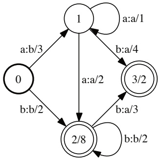

Figure 6.4

Example of weighted transducer.

a bold circle and final states by double circles. The final weight $\rho [ q ]$ at a final state $q$ is displayed after the slash.

The input label of a path π is a string element of $\Sigma ^ { * }$ obtained by concatenating input labels along π. Similarly, the output label of a path π is obtained by concatenating output labels along π. A path from an initial state to a final state is an accepting path. The weight of an accepting path is obtained by multiplying the weights of its constituent transitions and the weight of the final state of the path.

A weighted transducer defines a mapping from $\Sigma ^ { * } \times \Delta ^ { * }$ to R. The weight associated by a weighted transducer $T$ to a pair of strings $( x , y ) \in \Sigma ^ { * } \times \Delta ^ { * }$ is denoted by $T ( x , y )$ and is obtained by summing the weights of all accepting paths with input label x and output label y. For example, the transducer of figure 6.4 associates to the pair (aab, baa) the weight $3 \times 1 \times 4 \times 2 + 3 \times 2 \times 3 \times 2$ , since there is a path with input label aab and output label baa and weight $3 \times 1 \times 4 \times 2$ , and another one with weight $3 \times 2 \times 3 \times 2$

The sum of the weights of all accepting paths of an acyclic transducer, that is a transducer T with no cycle, can be computed in linear time, that is $O ( | T | )$ , using a general shortest-distance or forward-backward algorithm. These are simple algorithms, but a detailed description would require too much of a digression from the main topic of this chapter.

**Composition** An important operation for weighted transducers is composition, which can be used to combine two or more weighted transducers to form more complex weighted transducers. As we shall see, this operation is useful for the creation and computation of sequence kernels. Its definition follows that of composition of relations. Given two weighted transducers $T _ { 1 } { = } ( \Sigma , \Delta , Q _ { 1 } , I _ { 1 } , F _ { 1 } , E _ { 1 } , \rho _ { 1 } )$ and $T _ { 2 } = ( \Delta , \Omega , Q _ { 2 } , I _ { 2 } , F _ { 2 } , E _ { 2 } , \rho _ { 2 } )$ , the result of the composition of $T _ { 1 }$ and $T _ { 2 }$ is a

<!-- page: 141 -->

weighted transducer denoted by $T _ { 1 } \circ T _ { 2 }$ and defined for all $x \in \Sigma ^ { * }$ and $y \in \Omega ^ { * }$ by

$$
(T _ {1} \circ T _ {2}) (x, y) = \sum_ {z \in \Delta^ {*}} T _ {1} (x, z) \cdot T _ {2} (z, y),\tag{6.19}
$$

where the sum runs over all strings z over the alphabet $\Delta$ . Thus, composition is similar to matrix multiplication with infinite matrices.

There exists a general and efficient algorithm to compute the composition of two weighted transducers. In the absence of s on the input side of $T _ { 1 }$ or the output side of $T _ { 2 }$ , the states of $T _ { 1 } \circ T _ { 2 } = ( \Sigma , \Delta , Q , I , F , E , \rho )$ can be identified with pairs made of a state of $T _ { 1 }$ and a state of $T _ { 2 } , \; Q \subseteq Q _ { 1 } \times Q _ { 2 }$ . Initial states are those obtained by pairing initial states of the original transducers, $I   =   I _ { 1 }   \times   I _ { 2 }$ , and similarly final states are defined by $F = Q \cap ( F _ { 1 } \times F _ { 2 } )$ . The final weight at a state $( q _ { 1 } , q _ { 2 } ) \in F _ { 1 } \times F _ { 2 }$ is $\rho ( q ) = \rho _ { 1 } ( q _ { 1 } ) \rho _ { 2 } ( q _ { 2 } )$ , that is the product of the final weights at $q _ { 1 }$ and $q _ { 2 }$ . Transitions are obtained by matching a transition of $T _ { 1 }$ with one of $T _ { 2 }$ from appropriate transitions of $T _ { 1 }$ and $T _ { 2 }$

$$
E = \bigcup_{\substack{(q_{1},a,b,w_{1},q_{2})\in E_{1}\\ (q_{1}^{\prime},b,c,w_{2},q_{2}^{\prime})\in E_{2}}}\Bigg\{\left((q_{1},q_{1}^{\prime}),a,c,w_{1}\otimes w_{2},(q_{2},q_{2}^{\prime})\right)\Bigg\} .
$$

Here, ] denotes the standard join operation of multisets as in $\{ 1 , 2 \} \uplus \{ 1 , 3 \}   =$ {1, 1, 2, 3}, to preserve the multiplicity of the transitions.

In the worst case, all transitions of $T _ { 1 }$ leaving a state $q _ { 1 }$ match all those of $T _ { 2 }$ leaving state $q _ { 1 } ^ { \prime }$ , thus the space and time complexity of composition is quadratic: $O ( | T _ { 1 } | | T _ { 2 } | )$ . In practice, such cases are rare and composition is very efficient. Figure 6.5 illustrates the algorithm in a particular case.

As illustrated by figure 6.6, when $T _ { 1 }$ admits output  labels or $T _ { 2 }$ input  labels, the algorithm just described may create redundant -paths, which would lead to an incorrect result. The weight of the matching paths of the original transducers would be counted $p$ times, where $p$ is the number of redundant paths in the result of composition. To avoid with this problem, all but one -path must be filtered out of the composite transducer. Figure 6.6 indicates in boldface one possible choice for that path, which in this case is the shortest. Remarkably, that filtering mechanism itself can be encoded as a finite-state transducer F (figure 6.6b).

To apply that filter, we need to first augment $T _ { 1 }$ and $T _ { 2 }$ with auxiliary symbols that make the semantics of  explicit: let $\tilde { T } _ { 1 } \quad ( \tilde { T } _ { 2 } )$ be the weighted transducer obtained from $T _ { 1 }$ (respectively $T _ { 2 } )$ by replacing the output (respectively input)  labels with $\epsilon _ { 2 }$ (respectively $\epsilon _ { 1 } )$ as illustrated by figure 6.6. Thus, matching with the symbol $\epsilon _ { 1 }$ corresponds to remaining at the same state of $T _ { 1 }$ and taking a transition of $T _ { 2 }$ with input . $\epsilon _ { 2 }$ can be described in a symmetric way. The filter transducer $F$ disallows a matching $\left( \epsilon _ { \mathrm { 2 } } , \epsilon _ { \mathrm { 2 } } \right)$ immediately after $\left( \epsilon _ { 1 } , \epsilon _ { 1 } \right)$ since this can be done

<!-- page: 142 -->

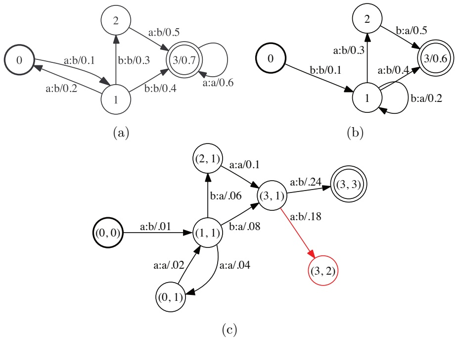

Figure 6.5

(a) Weighted transducer $T _ { 1 }$ . (b) Weighted transducer $T _ { 2 }$ . (c) Result of composition of $T _ { 1 }$ and $T _ { 2 } , \; T _ { 1 } \circ T _ { 2 }$ . Some states might be constructed during the execution of the algorithm that are not co-accessible, that is, they do not admit a path to a final state, $e.g. , \; (3,2)$ . Such states and the related transitions (in red) can be removed by a trimming (or connection) algorithm in linear time.

instead via $\left( \epsilon _ { 2 } , \epsilon _ { 1 } \right)$ . By symmetry, it also disallows a matching $\left( \epsilon _ { 1 } , \epsilon _ { 1 } \right)$ immediately after $\left( \epsilon _ { \mathrm { 2 } } , \epsilon _ { \mathrm { 2 } } \right)$ . In the same way, a matching $\left( \epsilon _ { 1 } , \epsilon _ { 1 } \right)$ immediately followed by $\left( \epsilon _ { \mathrm { 2 } } , \epsilon _ { \mathrm { 1 } } \right)$ is not permitted by the filter F since a path via the matchings $( \epsilon _ { 2 } , \epsilon _ { 1 } ) ( \epsilon _ { 1 } , \epsilon _ { 1 } )$ is possible. Similarly, $( \epsilon _ { 2 } , \epsilon _ { 2 } ) ( \epsilon _ { 2 } , \epsilon _ { 1 } )$ is ruled out. It is not hard to verify that the filter transducer $F$ is precisely a finite automaton over pairs accepting the complement of the language

$$
L = \sigma^ {*} ((\epsilon_ {1}, \epsilon_ {1}) (\epsilon_ {2}, \epsilon_ {2}) + (\epsilon_ {2}, \epsilon_ {2}) (\epsilon_ {1}, \epsilon_ {1}) + (\epsilon_ {1}, \epsilon_ {1}) (\epsilon_ {2}, \epsilon_ {1}) + (\epsilon_ {2}, \epsilon_ {2}) (\epsilon_ {2}, \epsilon_ {1})) \sigma^ {*},
$$

where $\sigma = \{ ( \epsilon _ { 1 } , \epsilon _ { 1 } ) , ( \epsilon _ { 2 } , \epsilon _ { 2 } ) , ( \epsilon _ { 2 } , \epsilon _ { 1 } ) , x \}$ . Thus, the filter $F$ guarantees that exactly one -path is allowed in the composition of each  sequences. To obtain the correct result of composition, it suffices then to use the -free composition algorithm already described and compute

$$
\tilde {T} _ {1} \circ F \circ \tilde {T} _ {2}.\tag{6.20}
$$

<!-- page: 143 -->

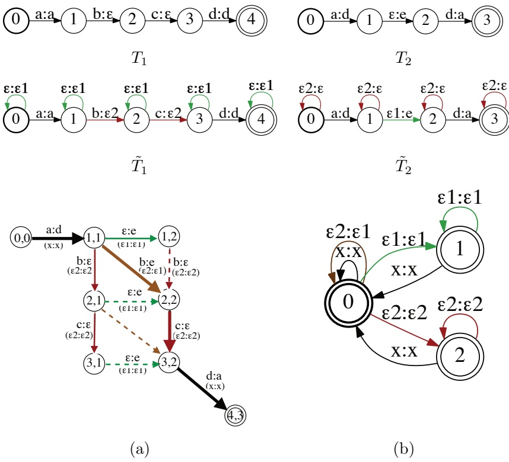

Figure 6.6

!!"!Redundant -paths in composition. All transition and final weights are equal to one. (a) A straightforward generalization of the -free case would generate all the paths from (1, 1) to (3, 2) when composing $T _ { 1 }$ and $T _ { 2 }$ "!and produce an incorrect results in non-idempotent semirings. (b) /"/Filter transducer F. The shorthand x is used to represent an element of Σ.

Indeed, the two compositions in $\tilde { T _ { 1 } } \circ F \circ \tilde { T _ { 2 } }$ no longer involve s. Since the size /"/of the filter transducer F is constant, the complexity of general composition is the same as that of -free composition, that is $O ( | T _ { 1 } | | T _ { 2 } | )$ . In practice, the augmented transducers $\tilde { T } _ { 1 }$ and $\tilde { T } _ { 2 }$ are not explicitly constructed, instead the presence of the auxiliary symbols is simulated. Further filter optimizations help limit the number of non-coaccessible states created, for example, by examining more carefully the case of states with only outgoing non--transitions or only outgoing -transitions.

## 6.5.2 Rational kernels

The following establishes a general framework for the definition of sequence kernels.

**Definition 6.20 (Rational kernels)** A kernel $K \colon \Sigma ^ { * }   \times   \Sigma ^ { * }   \to   \mathbb { R }$ is said to be rational if it coincides with the mapping defined by some weighted transducer $U \colon   \forall x , y   \in$ $\Sigma ^ { * } , K ( x , y ) = U ( x , y )$

<!-- page: 144 -->

## 6.5 Sequence kernels

Note that we could have instead adopted a more general definition: instead of using weighted transducers, we could have used more powerful sequence mappings such as algebraic transductions, which are the functional counterparts of contextfree languages, or even more powerful ones. However, an essential need for kernels is an efficient computation, and more complex definitions would lead to substantially more costly computational complexities for kernel computation. For rational kernels, there exists a general and efficient computation algorithm.

**Computation** We will assume that the transducer U defining a rational kernel K does not admit any -cycle with non-zero weight, otherwise the kernel value is infinite for all pairs. For any sequence x, let $T _ { x }$ denote a weighted transducer with just one accepting path whose input and output labels are both $x$ and its weight equal to one. $T _ { x }$ can be straightforwardly constructed from x in linear time $O ( | x | )$ Then, for any $x , y \in \Sigma ^ { * } ,   U ( x , y )$ can be computed by the following two steps:

1. Compute $V = T _ { x } { \circ } U { \circ } T _ { y }$ using the composition algorithm in time $O ( | U | | T _ { x } | | T _ { y } | )$

2. Compute the sum of the weights of all accepting paths of V using a general shortest-distance algorithm in time $O ( | V | )$ .

By definition of composition, V is a weighted transducer whose accepting paths are precisely those accepting paths of U that have input label x and output label $y .$ The second step computes the sum of the weights of these paths, that is, exactly $U ( x , y )$ . Since $U$ admits no -cycle, V is acyclic, and this step can be performed in linear time. The overall complexity of the algorithm for computing $U ( x , y )$ is then in $O ( | U | | T _ { x } | | T _ { y } | )$ . Since U is fixed for a rational kernel K and $| T _ { x } | = O ( | x | )$ for any $x ,$ this shows that the kernel values can be obtained in quadratic time $O ( | x | | y | )$ For some specific weighted transducers $U ,$ the computation can be more efficient, for example in $O ( | x | + | y | )$ (see exercise 6.20).

**PDS rational kernels** For any transducer T, let $T ^ { - 1 }$ denote the inverse of $T ,$ that is the transducer obtained from $T$ by swapping the input and output labels of every transition. For all $x , y ,$ we have $T ^ { - 1 } ( x , y ) = T ( y , x )$ . The following theorem gives a general method for constructing a PDS rational kernel from an arbitrary weighted transducer.

**Theorem 6.21** For any weighted transducer $T   =   ( \Sigma , \Delta , Q , I , F , E , \rho )$ , the function $K = T \circ T ^ { - 1 }$ is a PDS rational kernel.

Proof: By definition of composition and the inverse operation, for all $x , y \in \Sigma ^ { * }$

$$
K (x, y) = \sum_ {z \in \Delta^ {*}} T (x, z)   T (y, z).
$$

<!-- page: 145 -->

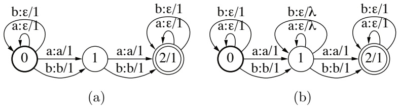

Figure 6.7

(a) Transducer $T _ { \mathrm { b i g r a m } }$ defining the bigram kernel $T _ { \mathrm { b i g r a m } }   \circ   T _ { \mathrm { b i g r a m } } ^ { - 1 } \; \mathrm { f o r } \; \Sigma = \{ a , b \}$ . (b) Transducer Tgappy bigram defining the gappy bigram kernel Tgappy bigram $\circ T _ { \mathrm { g a p p y \_ b i g r a m } } ^ { - 1 }$ with gap penalty $\lambda \in (0,1)$

K is the pointwise limit of the kernel sequence $( K _ { n } ) _ { n \geq 0 }$ defined by:

$$
\forall n \in \mathbb {N}, \forall x, y \in \Sigma^ {*}, \quad K _ {n} (x, y) = \sum_ {| z | \leq n} T (x, z)   T (y, z),
$$

where the sum runs over all sequences in $\Delta ^ { * }$ of length at most n. $K _ { n }$ is PDS since its corresponding kernel matrix $\mathbf { K } _ { n }$ for any sample $( x _ { 1 } , \ldots , x _ { m } )$ is SPSD. This can be see form the fact that $\mathbf { K } _ { n }$ can be written as $\mathbf { K } _ { n } = \mathbf { A } \mathbf { A } ^ { \top }$ with $\mathbf { A } =$ $( K _ { n } ( x _ { i } , z _ { j } ) ) _ { i \in [ m ] , j \in [ N ] }$ , where $z _ { 1 } , \ldots , z _ { N }$ is some arbitrary enumeration of the set of strings in $\Sigma ^ { * }$ with length at most n. Thus, K is PDS as the pointwise limit of the sequence of PDS kernels $( K _ { n } ) _ { n \in \mathbb { N } }$ 

The sequence kernels commonly used in computational biology, natural language processing, computer vision, and other applications are all special instances of rational kernels of the form $T \circ T ^ { - 1 }$ . All of these kernels can be computed efficiently using the same general algorithm for the computational of rational kernels presented in the previous paragraph. Since the transducer $U = T \circ T ^ { - 1 }$ defining such PDS rational kernels has a specific form, there are different options for the computation of the composition $T _ { x } \circ U \circ T _ { y }$

• compute $U = T \circ T ^ { - 1 }$ first, then $V = T _ { x } \circ U \circ T _ { y }$ ;

• compute $V _ { 1 } = T _ { x } \circ T$ and $V _ { 2 } = T _ { y } \circ T$ first, then $V = V _ { 1 } \circ V _ { 2 } ^ { - 1 }$ ;

• compute first $V _ { 1 } = T _ { x } \circ T$ , then $V _ { 2 } = V _ { 1 } \circ T ^ { - 1 }$ , then $V = V _ { 2 } \circ T _ { y }$ , or the similar series of operations with x and y permuted.

All of these methods lead to the same result after computation of the sum of the weights of all accepting paths, and they all have the same worst-case complexity. However, in practice, due to the sparsity of intermediate compositions, there may be substantial differences between their time and space computational costs. An alternative method based on an n-way composition can further lead to significantly more efficient computations.

<!-- page: 146 -->

**Example 6.22 (Bigram and gappy bigram sequence kernels)** Figure 6.7a shows a weighted transducer $T _ { \mathrm { b i g r a m } }$ defining a common sequence kernel, the bigram sequence kernel, for the specific case of an alphabet reduced to $\Sigma = \{ a , b \}$ . The bigram kernel associates to any two sequences x and y the sum of the product of the counts of all bigrams in x and y. For any sequence $x \in \Sigma ^ { * }$ and any bigram $z \in \{ a a , a b , b a , b b \}$ $T _ { \mathrm { b i g r a m } } ( x , z )$ is exactly the number of occurrences of the bigram z in x. Thus, by definition of composition and the inverse operation, $T _ { \mathrm { b i g r a m } } \circ T _ { \mathrm { b i g r a m } } ^ { - 1 }$ computes exactly the bigram kernel.

Figure 6.7b shows a weighted transducer $T _ { \mathrm { g a p p y \_ b i g r a m } }$ defining the so-called gappy bigram kernel. The gappy bigram kernel associates to any two sequences x and y the sum of the product of the counts of all gappy bigrams in x and y penalized by the length of their gaps. Gappy bigrams are sequences of the form aua, aub, bua, or bub, where $u \in \Sigma ^ { * }$ is called the gap. The count of a gappy bigram is multiplied by $\lambda ^ { | u | }$ for some fixed $\lambda \in (0,1)$ so that gappy bigrams with longer gaps contribute less to the definition of the similarity measure. While this definition could appear to be somewhat complex, figure 6.7 shows that Tgappy bigram can be straightforwardly derived from $T _ { \mathrm { b i g r a m } }$ The graphical representation of rational kernels helps understanding or modifying their definition.

**Counting transducers** The definition of most sequence kernels is based on the counts of some common patterns appearing in the sequences. In the examples just examined, these were bigrams or gappy bigrams. There exists a simple and general method for constructing a weighted transducer counting the number of occurrences of patterns and using them to define PDS rational kernels. Let X be a finite automaton representing the set of patterns to count. In the case of bigram kernels with $\Sigma   =   \{ a , b \}$ , X would be an automaton accepting exactly the set of strings $\{ a a , a b , b a , b b \}$ . Then, the weighted transducer of figure 6.8 can be used to compute exactly the number of occurrences of each pattern accepted by X.

**Theorem 6.23** For any $x \in \Sigma ^ { * }$ and any sequence z accepted by X, $T _ { c o u n t } ( x , z )$ is the number of occurrences $of   z   i n   x$

Proof: Let $x   \in   \Sigma ^ { * }$ be an arbitrary sequence and let z be a sequence accepted by X. Since all accepting paths of $T _ { \mathrm { c o u n t } }$ have weight one, $T _ { \mathrm { c o u n t } } ( x , z )$ is equal to the number of accepting paths in $T _ { \mathrm { c o u n t } }$ with input label x and output z.

Now, an accepting path π in $T _ { \mathrm { c o u n t } }$ with input x and output z can be decomposed as $\pi = \pi _ { 0 }   \pi _ { 0 1 }   \pi _ { 1 }$ , where $\pi _ { 0 }$ is a path through the loops of state 0 with input label some prefix $x _ { 0 }$ of x and output label $\epsilon ,   \pi _ { 0 1 }$ an accepting path from 0 to 1 with input and output labels equal to z, and $\pi _ { 1 }$ a path through the self-loops of state 1 with input label a suffix $x _ { 1 }$ of x and output . Thus, the number of such paths is exactly

<!-- page: 147 -->

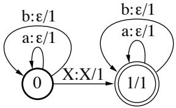

Figure 6.8

Counting transducer $T _ { \mathrm { c o u n t } }$ for $\Sigma   =   \{ a , b \}$ The “transition” $X   :   X / 1$ stands for the weighted transducer created from the automaton X by adding to each transition an output label identical to the existing label, and by making all transition and final weights equal to one.

the number of distinct ways in which we can write sequence x as $x = x _ { 0 } z x _ { 1 }$ , which is exactly the number of occurrences of z in x. 

The theorem provides a very general method for constructing PDS rational kernels $T _ { \mathrm { c o u n t } } \circ T _ { \mathrm { c o u n t } } ^ { - 1 }$ that are based on counts of some patterns that can be defined via a finite automaton, or equivalently a regular expression. Figure 6.8 shows the transducer for the case of an input alphabet reduced to $\Sigma   =   \{ a , b \}$ . The general case can be obtained straightforwardly by augmenting states 0 and 1 with other self-loops using other symbols than a and b. In practice, a lazy evaluation can be used to avoid the explicit creation of these transitions for all alphabet symbols and instead creating them on-demand based on the symbols found in the input sequence x. Finally, one can assign different weights to the patterns counted to emphasize or deemphasize some, as in the case of gappy bigrams. This can be done simply by changing the transitions weight or final weights of the automaton X used in the definition of $T _ { \mathrm { c o u n t } }$

## 6.6 Approximate kernel feature maps

In the previous sections, we have seen the benefits that kernel methods can provide by implicitly and efficiently mapping a learning problem from the input space X to a richer feature space H. One potential drawback when using kernel methods, is that the kernel function needs to be evaluated on all pairs of points in the training set. If this set contains a very large number of instances, then the $O ( m ^ { 2 } )$ cost in memory and $O ( m ^ { 2 } C _ { K } )$ cost in computation, where $C _ { K }$ is the cost of a single kernel function evaluation, may be prohibitive. Another consideration is the cost of making predictions with a trained model. Evaluating the kernelized function $\begin{array} { r } { h ( x ) = \sum _ { i = 1 } ^ { m } \alpha _ { i } K ( x _ { i } , x ) + b } \end{array}$ requires $O ( m )$ storage and $O ( m C _ { K } )$ computation cost (the exact amount of storage and number of operations depends on the number of support vectors).

Note that if we use explicit feature vectors $\mathbf { x } \in \mathbb { R } ^ { N }$ , then the primal formulation of the SVM problem can be used for training. The primal formulation incurs only an $O ( N m )$ storage cost and evaluation requires only $O ( N )$ storage and computation

<!-- page: 148 -->

## Table 6.1

Examples of normalized shift-invariant kernels (defined over $\mathbf { x } , \mathbf { x } ^ { \prime } \in \mathbb { R } ^ { N } )$ and their corresponding densities (defined over $\boldsymbol { \omega } \in \mathbb { R } ^ { N } )$ .

|  | G(x - x0) | p(ω) |
| --- | --- | --- |
| Gaussian | exp- kx-2x0k2 | (2π)-2D exp- kω2k2 |
| Laplacian | exp- kx - x0k1 | QNi=1 π(1+1ωi2) |
| Cauchy | QNi=1 1+(xi2-x0i)2 | exp- kωk1 |

time: $h ( \mathbf { x } ) = \mathbf { w }   \cdot   \mathbf { x }   +   b$ . However, these observations are only useful if $N < m$ , which is likely not the case when considering the explicit feature maps $\Phi ( x )$ induced by a kernel function. For example, given an input feature space of dimension N, the dimension of the kernel feature map for a polynomial kernel of degree d is $O ( N ^ { d } )$ . In the case of Gaussian kernels the explicit feature map dimension is infinite. So clearly using explicit kernel feature maps in general is not possible and again emphasizes that using kernel functions to compute inner products implicitly is crucial.

In this section we show that a compromise is possible by constructing approximate kernel feature maps. These are feature maps with a user-specified dimension D, $\Psi ( x )   \in   \mathbb { R } ^ { D }$ , which guarantee $\Psi ( x )   \cdot   \Psi ( x ^ { \prime } )   \approx   K ( x , x ^ { \prime } )$ when using a sufficiently large dimension D. To begin, we state a classical result from the field of harmonic analysis.

**Theorem 6.24 (Bochner’s theorem)** A continuous kernel of the form $K ( x , x ^ { \prime } ) = G ( x -$ $x ^ { \prime } )$ defined over a locally compact set X is positive definite if and only $i f   G$ is the Fourier transform of a non-negative measure. That is,

$$
G (x) = \int_ {\mathcal {X}} p (\omega) e ^ {i \omega \cdot x} d \omega ,
$$

where p is a non-negative measure.

Kernels of the form $K ( x , x ^ { \prime } ) = G ( x - x ^ { \prime } )$ are called shift-invariant kernels. Note that if the kernel is scaled such that $G ( 0 )   =   1$ , then p is in fact a probability distribution. Several examples of such kernels and their corresponding distributions are displayed in table 6.1. The next proposition provides a simplified expression in the case of real-valued kernels.

**Proposition 6.25** Let K be a continuous real-valued shift-invariant kernel and let p denote its corresponding non-negative measure as in theorem $\delta . \mathcal { D } _ { 4 } ^ { 2 } .$ Furthermore, assume that for all $x \in \mathcal { X }$ we have $K ( x , x ) = 1$ so that p is a probability distribution. Then, the following identity holds:

$$
\underset {\omega \sim p} {\mathbb {E}} \left[ \left[ \cos (\omega \cdot x), \sin (\omega \cdot x) \right] ^ {\top} \left[ \cos (\omega \cdot x ^ {\prime}), \sin (\omega \cdot x ^ {\prime}) \right] \right] = K (x, x ^ {\prime}).
$$

<!-- page: 149 -->

Proof: First, since both K and p are real-valued, it suffices to consider only the real portion of $e ^ { i x }$ when invoking theorem 6.24. Thus, using $\operatorname { R e } [ e ^ { i x } ] = \operatorname { R e } [ \cos ( x ) +$ $i \sin ( x ) ] = \cos ( x )$ , we have

$$
K (x, x ^ {\prime}) = \mathrm{Re} [ K (x, x ^ {\prime}) ] = \int_ {\mathcal {X}} p (\omega) \cos (\omega \cdot (x - x ^ {\prime})) d \omega .
$$

Next, by the standard trigonometric identity cos $\scriptstyle { \mathrm { s } } ( a - b ) = \cos ( a ) \cos ( b ) + \sin ( a ) \sin ( b )$ we have

$$
\begin{array}{r l} & {\int_ {\mathcal {X}} p (\omega) \cos (\omega \cdot (x - x ^ {\prime})) d \omega} \\ & {= \int_ {\mathcal {X}} p (\omega) \big (\cos (\omega \cdot x) \cos (\omega \cdot x ^ {\prime}) + \sin (\omega \cdot x) \sin (\omega \cdot x ^ {\prime}) \big) d \omega} \\ & {= \underset {\omega \sim p} {\mathbb {E}} \left[ \big [ \cos (\omega \cdot x), \sin (\omega \cdot x) \big ] ^ {\top} \big [ \cos (\omega \cdot x ^ {\prime}), \sin (\omega \cdot x ^ {\prime}) \big ] \right],} \end{array}
$$

which completes the proof of the proposition.

This proposition provides the motivation for a very simple method for generating for any $D \geq 1$ , an approximate kernel map $\Psi \in \mathbb { R } ^ { 2 D }$ , defined for all $x \in \mathcal { X }$ by

$$
\Psi (x) = \sqrt {\frac {1}{D}} \left[ \cos (\omega_ {1} \cdot x), \sin (\omega_ {1} \cdot x), \dots , \cos (\omega_ {D} \cdot x), \sin (\omega_ {D} \cdot x) \right] ^ {\top},\tag{6.21}
$$

where $\omega _ { i } \mathrm { s } , i   =   1 , \ldots , D$ , are sampled i.i.d. according to the measure p over X corresponding to kernel K considered. Thus,

$$
\Psi (x) \cdot \Psi (x ^ {\prime}) = \frac {1}{D} \sum_ {i = 1} ^ {D} \Big [ \cos (\omega_ {i} \cdot x), \sin (\omega_ {i} \cdot x) \Big ] ^ {\top} \Big [ \cos (\omega_ {i} \cdot x ^ {\prime}), \sin (\omega_ {i} \cdot x ^ {\prime}) \Big ]
$$

is the empirical analog of the expectation computed in proposition 6.25. The following theorem shows that this empirical estimate converges uniformly over all points in a compact domain X as D grows.

**Lemma 6.26** Let K be a continuously differentiable kernel function that satisfies the conditions of proposition 6.25 and has associated measure p. Furthermore, assume X is compact and let N denote its dimension, R denote the radius of the Euclidean ball containing X, and $\sigma _ { p } ^ { 2 }   =   \mathbb { E } _ { \omega \sim p } [ \| \omega \| ^ { 2 } ]   <   \infty$ . Then, for $\Psi   \in   \mathbb { R } ^ { D }$ as defined in (6.21), the following holds for any $0 < r \leq 2 R$ and $\epsilon > 0$

$$
\mathbb {P} \left[ \sup _ {x, x ^ {\prime} \in \mathcal {X}} \left| \Psi (x) \cdot \Psi (x ^ {\prime}) - K (x, x ^ {\prime}) \right| \geq \epsilon \right] \leq 2 \mathcal {N} (2 R, r) \exp \left(- \frac {D \epsilon^ {2}}{8}\right) + \frac {4 r \sigma_ {p}}{\epsilon}.
$$

Where the probability is with respect to the draws of $\omega \sim p$ and $\mathcal { N } ( R , r )$ denotes the minimal number of balls of radius r needed to cover a ball of radius R.

Proof: Define $\mathcal { Z } = \{ z \colon z = x - x ^ { \prime } , x , x ^ { \prime } \in \mathfrak { X } \}$ and note that Z is contained in a ball of radius at most 2R. Z is a closed set since X is closed and thus Z is a compact set. For convenience, define $B = \mathcal { N } ( 2 R , r )$ the number of balls of radius r needed

<!-- page: 150 -->

to cover $\mathcal { Z }$ and let $z _ { j }$ , for $j \in [ B ]$ , denote the center of the covering balls. Thus, for any $z \in \mathbb { Z }$ there exists a $j$ such that $z = z _ { j } + \delta$ where $| \delta | < r$

Next, define $S ( z ) \; = \; \Psi ( x )   \cdot   \Psi ( x ^ { \prime } )   -   K ( x , x ^ { \prime } )$ , where $z \; = \; x   -   x ^ { \prime }$ . Since S is continuously differentiable over the compact set $\mathcal { Z } ,$ it is L-Lipschitz with $L =$ $\textstyle \operatorname* { s u p } _ { z \in \mathcal { Z } } \| \nabla S ( z ) \|$ . Note that if $\begin{array} { r } { L \; < \; \frac { \epsilon } { 2 r } } \end{array}$ and for all $j   \in   [ B ]$ we have $\begin{array} { r } { | S ( z _ { j } ) |   <   \frac { \epsilon } { 2 } , } \end{array}$ then the following inequality holds for all $z = z _ { j } + \delta \in \mathcal { Z } ;$

$$
| S (z) | = | S (z _ {j} + \delta) | \leq L | z _ {j} - (z _ {j} + \delta) | + | S (z _ {j}) | \leq r L + \frac {\epsilon}{2} <   \epsilon .\tag{6.22}
$$

The remainder of this proof bounds the probability of the events $\begin{array} { r } { L \geq \frac { \epsilon } { 2 r } } \end{array}$ and $\begin{array} { r } { | S ( z _ { j } ) | \geq \frac { \epsilon } { 2 } } \end{array}$ . Note, all following probabilities and expectations are with respect to the random variables $\omega _ { 1 } , \dots , \omega _ { D }$

To bound the probability of the first event, we use proposition 6.25 and the linearity of expectation, which implies the key fact $\mathbb { E } [ \nabla ( \Psi ( x )   \cdot   \Psi ( x ^ { \prime } ) ) ] = \nabla K ( x , x ^ { \prime } )$ We proceed with the following series of inequalities:

$$
\begin{array}{l} \mathbb {E} [ L ^ {2} ] = \mathbb {E} \left[ \sup _ {z \in \mathcal {Z}} \| \nabla S (z) \| ^ {2} \right] \\ \qquad = \mathbb {E} \left[ \sup _ {x, x ^ {\prime} \in \mathcal {X}} \| \nabla (\Psi (x) \cdot \Psi (x ^ {\prime})) - \nabla K (x, x ^ {\prime}) \| ^ {2} \right] \\ \qquad \leq 2   \mathbb {E} \left[ \sup _ {x, x ^ {\prime} \in \mathcal {X}} \| \nabla (\Psi (x) \cdot \Psi (x ^ {\prime})) \| ^ {2} \right] + 2 \sup _ {x, x ^ {\prime} \in \mathcal {X}} \| \nabla K (x, x ^ {\prime}) \| ^ {2} \\ \qquad = 2   \mathbb {E} \left[ \sup _ {x, x ^ {\prime} \in \mathcal {X}} \| \nabla (\Psi (x) \cdot \Psi (x ^ {\prime})) \| ^ {2} \right] + 2 \sup _ {x, x ^ {\prime} \in \mathcal {X}} \| \mathbb {E} [ \nabla (\Psi (x) \cdot \Psi (x ^ {\prime})) ] \| ^ {2} \\ \qquad \leq 4   \mathbb {E} \left[ \sup _ {x, x ^ {\prime} \in \mathcal {X}} \| \nabla (\Psi (x) \cdot \Psi (x ^ {\prime})) \| ^ {2} \right], \end{array}
$$

where the first inequality holds due to the the inequality $\| a + b \| ^ { 2 } \leq 2 \| a \| ^ { 2 } + 2 \| b \| ^ { 2 }$ (which follows from Jensen’s inequality) and the subadditivity of the supremum function. The second inequality also holds by Jensen’s inequality (applied twice) and again the subadditivity of supremum function. Furthermore, using a sumdifference trigonometric identity and computing the gradient with respect to $z =$ $x - x ^ { \prime }$ , yield the following for any $x , x ^ { \prime } \in \mathcal { X }$

$$
\begin{array}{c} \nabla (\Psi (x) \cdot \Psi (x ^ {\prime})) = \nabla \bigg (\frac {1}{D} \sum_ {i = 1} ^ {D} \cos (\omega_ {i} \cdot x) \cos (\omega_ {i} \cdot x ^ {\prime}) + \sin (\omega_ {i} \cdot x) \sin (\omega_ {i} \cdot x ^ {\prime}) \bigg) \\ = \nabla \bigg (\frac {1}{D} \sum_ {i = 1} ^ {D} \cos (\omega_ {i} \cdot (x - x ^ {\prime})) \bigg) = \frac {1}{D} \sum_ {i = 1} ^ {D} \omega_ {i} \sin (\omega_ {i} \cdot (x - x ^ {\prime}))  . \end{array}
$$

<!-- page: 151 -->

Combining the two previous results gives

$$
\begin{array}{l} \mathbb {E} [ L ^ {2} ] \leq 4   \mathbb {E} \left[ \sup _ {x, x ^ {\prime} \in \mathcal {X}} \left\| \frac {1}{D} \sum_ {i = 1} ^ {D} \omega_ {i} \sin (\omega_ {i} \cdot (x - x ^ {\prime})) \right\| ^ {2} \right] \\ \quad \leq 4   \underset {\omega_ {1}, \ldots , \omega_ {N}} {\mathbb {E}} \left[ \left(\frac {1}{D} \sum_ {i = 1} ^ {D} \| \omega_ {i} \|\right) ^ {2} \right] \\ \quad \leq 4   \underset {\omega_ {1}, \ldots , \omega_ {N}} {\mathbb {E}} \left[ \frac {1}{D} \sum_ {i = 1} ^ {D} \| \omega_ {i} \| ^ {2} \right] = 4   \underset {\omega} {\mathbb {E}} \left[ \| \omega \| ^ {2} \right] = 4 \sigma_ {p} ^ {2}  , \end{array}
$$

which follows from the triangle inequality, $| \sin ( \cdot ) | \leq 1$ , Jensen’s inequality and the fact that the $\omega _ { i } \mathrm { s }$ are drawn i.i.d. derive the final expression. Thus, we can bound the probability of the first event via Markov’s inequality:

$$
\mathbb {P} \left[ L \geq \frac {\epsilon}{2 r} \right] \leq \left(\frac {4 r \sigma_ {p}}{\epsilon}\right) ^ {2}.\tag{6.23}
$$

To bound the probability of the second event, note that, by definition, $S ( z )$ is a sum of D i.i.d. variables, each bounded in absolute value by $\frac { 2 } { D }$ (since, for all x and $x ^ { \prime } ,$ we have $| K ( x , x ^ { \prime } ) | \leq 1$ and $| \Psi ( x ) \cdot \Psi ( x ^ { \prime } ) | \leq 1 )$ , and $\mathbb { E } [ S ( z ) ] = 0$ . Thus, by Hoeffding’s inequality and the union bound, we can write

$$
\mathbb {P} \left[ \exists j \in [ B ] \colon | S (z _ {j}) | \geq \frac {\epsilon}{2} \right] \leq \sum_ {i = 1} ^ {B} \mathbb {P} \left[ | S (z _ {j}) | \geq \frac {\epsilon}{2} \right] \leq 2 B \exp \left(- \frac {D \epsilon^ {2}}{8}\right).\tag{6.24}
$$

Finally, combining (6.22), (6.23), (6.24), and the definition of B we have

$$
\mathbb {P} \left[ \sup _ {z \in \mathcal {Z}} | S (z) | \geq \epsilon \right] \leq 2 \mathcal {N} (2 R, r) \exp \left(- \frac {D \epsilon^ {2}}{8}\right) + \left(\frac {4 r \sigma_ {p}}{\epsilon}\right) ^ {2},
$$

which completes the lemma.

A key factor in the bound of the lemma is the covering number $\mathcal { N } ( 2 R , r )$ , which strongly depends on the dimension of the space N. In the following lemma, we make this dependency explicit for one especially simple case, although similar arguments hold for more general scenarios as well.

**Lemma 6.27** Let $\mathcal { X } \subset \mathbb { R } ^ { N }$ be a compact and let R denote the radius of the smallest enclosing ball. Then, the following inequality holds:

$$
\mathcal {N} (R, r) \leq \left(\frac {3 R}{r}\right) ^ {N}.
$$

Proof: First, by using the volume of balls in $\mathbb { R } ^ { N }$ we already see that $R ^ { N } / ( r / 3 ) ^ { N } =$ $( 3 R / r ) ^ { N }$ is a trivial upper bound on the number of balls of radius $r / 3$ that can be packed into a ball of radius R without intersecting. Now, consider a maximal packing of at most $( 3 R / r ) ^ { N }$ balls of radius $r / 3$ into the ball of radius R. Every

<!-- page: 152 -->

point in the ball of radius R is at distance at most r from the center of at least one of the packing balls. If this were not true, we would be able to fit another ball into the packing, thereby contradicting the assumption that it is a maximal packing. Thus, if we grow the radius of the at most $( 3 R / r ) ^ { N }$ balls to $r ,$ they will then provide a (not necessarily minimal) cover of the ball of radius R. 

Finally, by combining the two previous lemmas, we can present an explicit finite sample approximation bound.

**Theorem 6.28** Let K be a continuously differentiable kernel function that satisfies the conditions of proposition 6.25 and has associated measure p. Furthermore, assume $\sigma _ { p } ^ { 2 } = \mathbb { E } _ { \omega \sim p } [ \| \omega \| ^ { 2 } ] < \infty$ and $\mathcal { X } \subset \mathbb { R } ^ { N }$ . Let R denote the radius of the Euclidean ball containing X. Then, for $\Psi \in \mathbb { R } ^ { D }$ as defined in (6.21) and any $0 < \epsilon \leq 3 2 R \sigma _ { p }$ , the following holds

$$
\mathbb {P} \left[ \sup _ {x, x ^ {\prime} \in \mathcal {X}} \left| \Psi (x) \cdot \Psi (x ^ {\prime}) - K (x, x ^ {\prime}) \right| \geq \epsilon \right] \leq \left(\frac {4 8 R \sigma_ {p}}{\epsilon}\right) ^ {2} \exp \left(- \frac {D \epsilon^ {2}}{4 (N + 2)}\right).
$$

Proof: We use lemma 6.27 in conjunction with lemma 6.26 with the following choice of $r ;$

$$
r = \left[ \frac {2 (6 R) ^ {N} \exp (- \frac {D \epsilon^ {2}}{8})}{\left(\frac {4 \sigma_ {p}}{\epsilon}\right) ^ {2}} \right] ^ {\frac {2}{N + 2}},
$$

which results in the following expression

$$
\mathbb {P} \left[ \sup _ {z \in \mathcal {Z}} | S (z) | \geq \epsilon \right] \leq 4 \left(\frac {2 4 R \sigma_ {p}}{\epsilon}\right) ^ {\frac {2 N}{N + 2}} \exp \left(- \frac {D \epsilon^ {2}}{4 (N + 2)}\right).
$$

Since $3 2 R \sigma _ { p } / \epsilon \geq 1$ , the exponent $\frac { 2 N } { N + 2 }$ can be replaced by 2, which completes the proof. 

The previous theorem provides the guarantee that a good estimate of the kernel function can be found, with high probability, by sampling a finite number of co-ordinates D. In particular, for an absolute error of at most  it suffices to sample $\begin{array} { r } { D = O \Big ( \frac { N } { \epsilon ^ { 2 } } \log \Big ( \frac { \tilde { R \sigma } _ { p } } { \epsilon } \Big ) \Big ) } \end{array}$ coordinates.

## 6.7 Chapter notes

The mathematical theory of PDS kernels in a general setting originated with the fundamental work of Mercer [1909] who also proved the equivalence of a condition similar to that of theorem 6.2 for continuous kernels with the PDS property. The connection between PDS and NDS kernels, in particular theorems 6.18 and 6.17, are due to Schoenberg [1938]. A systematic treatment of the theory of reproducing kernel Hilbert spaces was presented in a long and elegant paper by Aronszajn [1950]. For an excellent mathematical presentation of PDS kernels and positive definite

<!-- page: 153 -->

functions we refer the reader to Berg, Christensen, and Ressel [1984], which is also the source of several of the exercises given in this chapter.

The fact that SVMs could be extended by using PDS kernels was pointed out by Boser, Guyon, and Vapnik [1992]. The idea of kernel methods has been since then widely adopted in machine learning and applied in a variety of different tasks and settings. The following two books are in fact specifically devoted to the study of kernel methods: Schölkopf and Smola [2002] and Shawe-Taylor and Cristianini [2004]. The classical representer theorem is due to Kimeldorf and Wahba [1971]. A generalization to non-quadratic cost functions was stated by Wahba [1990]. The general form presented in this chapter was given by Schölkopf, Herbrich, Smola, and Williamson [2000].

Rational kernels were introduced by Cortes, Haffner, and Mohri [2004]. A general class of kernels, convolution kernels, was earlier introduced by Haussler [1999]. The convolution kernels for sequences described by Haussler [1999], as well as the pair-HMM string kernels described by Watkins [1999], are special instances of rational kernels. Rational kernels can be straightforwardly extended to define kernels for finite automata and even weighted automata [Cortes et al., 2004]. Cortes, Mohri, and Rostamizadeh [2008b] study the problem of learning rational kernels such as those based on counting transducers.

The composition of weighted transducers and the filter transducers in the presence of -paths are described in Pereira and Riley [1997], Mohri, Pereira, and Riley [2005], and Mohri [2009]. Composition can be further generalized to the N-way composition of weighted transducers [Allauzen and Mohri, 2009]. N-way composition of three or more transducers can substantially speed up computation, in particular for PDS rational kernels of the form $T   \circ   T ^ { - 1 }$ . A generic shortest-distance algorithm which can be used with a large class of semirings and arbitrary queue disciplines is described by Mohri [2002]. A specific instance of that algorithm can be used to compute the sum of the weights of all paths as needed for the computation of rational kernels after composition. For a study of the class of languages linearly separable with rational kernels, see Cortes, Kontorovich, and Mohri [2007a].

The use of cosine-based approximate kernel feature maps was introduced by Rahimi and Recht [2007], as were the corresponding uniform convergence bounds, though their proofs were not complete. Sriperumbudur and Szabó [2015] gave an improved approximation bound that reduces the dependence on the radius of the data from $O ( R ^ { 2 } )$ to only $O ( \log ( R ) )$ . Bochner’s theorem, which plays a central role in deriving an approximate map, is a classical result of harmonic analysis (for example, see Rudin [1990]). The general form of the theorem is due to Weil [1965], while Solomon Bochner recognized its importance to harmonic analysis.

<!-- page: 154 -->

## 6.8 Exercises

6.1 Let $K \colon { \mathcal { X } } \times { \mathcal { X } } \to \mathbb { I }$ R be a PDS kernel, and let $\alpha \colon \mathcal { X } \to \mathbb { R }$ be a positive function. Show that the kernel $K ^ { \prime }$ defined for all $x , y \in \mathcal { X }$ by $\begin{array} { r } { K ^ { \prime } ( x , y ) = \frac { K ( x , y ) } { \alpha ( x ) \alpha ( y ) } } \end{array}$ is a PDS kernel.

6.2 Show that the following kernels K are PDS:

(a) $K ( x , y ) = \cos ( x - y ) { \mathrm { ~ o v e r ~ } } \mathbb { R } \times \mathbb { R } .$

(b) $K ( x , y ) = \cos ( x ^ { 2 } - y ^ { 2 } )$ over $\mathbb { R } \times \mathbb { R } .$

(c) For all integers $\begin{array} { l } { n > 0 , K ( \mathbf { x } , \mathbf { y } ) = \sum _ { i = 1 } ^ { N } \operatorname { c o s } ^ { n } ( x _ { i } ^ { 2 } - y _ { i } ^ { 2 } ) } \\ \end{array}$ over $\mathbb { R } ^ { N } \times \mathbb { R } ^ { N }$

(d) $K ( x , y ) = ( x + y ) ^ { - 1 } { \mathrm { ~ o v e r ~ } } ( 0 , + \infty ) \times ( 0 , + \infty )$

(e) $K ( \mathbf { x } , \mathbf { x } ^ { \prime } ) = \cos \angle ( \mathbf { x } , \mathbf { x } ^ { \prime } )$ over $\mathbb { R } ^ { n } \times \mathbb { R } ^ { n }$ , where $\angle ( \mathbf { x } , \mathbf { x } ^ { \prime } )$ is the angle between x and $\mathbf { x } ^ { \prime }$

(f) $\forall \lambda > 0 , K ( x , x ^ { \prime } ) = \exp \big ( - \lambda [ \sin ( x ^ { \prime } - x ) ] ^ { 2 } \big )$ over $\mathbb { R } \times \mathbb { R } .$

(Hint: rewrite $[ \sin ( x ^ { \prime } - x ) ] ^ { 2 }$ as the square of the norm of the difference of two vectors.)

(g) $\forall \sigma > 0 , K ( x , y ) = e ^ { - { \frac { \| \mathbf { x } - \mathbf { y } \| } { \sigma } } } { \mathrm { ~ o v e r ~ } } \mathbb { R } ^ { N } \times \mathbb { R } ^ { N }$

(Hint: you could show that K is the normalized kernel of a kernel $K ^ { \prime }$ and show that $K ^ { \prime }$ is PDS using the following equality: $\| \mathbf { x }   -   \mathbf { y } \|   \mathrm { ~ = ~ }$ $\textstyle \frac { 1 } { 2 \Gamma ( \frac { 1 } { 2 } ) } \int _ { 0 } ^ { + \infty } \frac { 1 - e ^ { - t \| \mathbf { x } - \mathbf { y } \| ^ { 2 } } } { t ^ { \frac { 3 } { 2 } } } \mathop { } \mathopen { } d t$ valid for all $\mathbf { x } , \mathbf { y } . )$

(h) $K ( x , y ) = \operatorname* { m i n } ( x , y ) - x y { \mathrm { ~ o v e r ~ } } [ 0 , 1 ] \times [ 0 , 1 ] .$

(Hint: you could consider the two integrals $\textstyle \int _ { 0 } ^ { 1 } 1 _ { t \in [ 0 , x ] } 1 _ { t \in [ 0 , y ] } d t$ and $\textstyle \int _ { 0 } ^ { 1 } 1 _ { t \in [ x , 1 ] } 1 _ { t \in [ y , 1 ] } d t . )$

(i) $\begin{array} { r } { K ( x , x ^ { \prime } ) = \frac { 1 } { \sqrt { 1 - ( \mathbf { x } \cdot \mathbf { x } ^ { \prime } ) } } } \end{array}$ over x, $, \mathbf { x } ^ { \prime } \in \mathcal { X } = \{ \mathbf { x } \in \mathbb { R } ^ { N } \colon \| \mathbf { x } \| _ { 2 } < 1 \}$ (Hint: one approach is to find an explicit expression of a feature mapping Φ by considering the Taylor expansion of the kernel function.)

(j) $\begin{array} { r } { \forall \sigma > 0 , K ( x , y ) = \frac { 1 } { 1 + \frac { \| x - y \| ^ { 2 } } { \sigma ^ { 2 } } } } \end{array}$ over $\mathbb { R } ^ { N } \times \mathbb { R } ^ { N }$

(Hint: the function $\begin{array} { r } { x \mapsto \int _ { 0 } ^ { + \infty } e ^ { - s x } e ^ { - s } d s } \end{array}$ defined for all $x \geq 0$ could be useful for the proof.)

(k) ∀σ > 0, K(x, y) = exp Pi=1 N min(|xi|,|yi|) σ2 over $\mathbb { R } ^ { N } \times \mathbb { R } ^ { N }$

(Hint: the function $\textstyle \dot { ( x _ { 0 } , y _ { 0 } ) } \mapsto \int _ { 0 } ^ { + \infty } \dot { 1 _ { t \in [ 0 , | x _ { 0 } | ] } } 1 _ { t \in [ 0 , | y _ { 0 } | ] } d t$ defined over $\mathbb { R } \times \mathbb { R }$ could be useful for the proof.)

<!-- page: 155 -->

6.3 Graph kernel. Let $G   =   ( \mathcal { V } , \mathcal { E } )$ be an undirected graph with vertex set V and edge set E. V could represent a set of documents or biosequences and E the set of connections between them. Let $w [ e ] \in \mathbb { R }$ denote the weight assigned to edge $e \in \mathcal { E }$ . The weight of a path is the product of the weights of its constituent edges. Show that the kernel K over $\mathcal { V }   \times   \mathcal { V }$ where $K ( p , q )$ is the sum of the weights of all paths of length two between p and q is PDS (Hint: you could introduce the matrix $W = ( W _ { p q } )$ , where $W _ { p q } = 0$ when there is no edge between $p$ and $q ,$ $W _ { p q }$ equal to the weight of the edge between p and q otherwise).

6.4 Symmetric difference kernel. Let X be a finite set. Show that the kernel K defined over $2 ^ { x }$ , the set of subsets of X, by

$$
\forall \mathcal {A}, \mathcal {B} \in 2 ^ {\mathcal {X}}, K (\mathcal {A}, \mathcal {B}) = \exp \Big (- \frac {1}{2} | \mathcal {A} \Delta \mathcal {B} | \Big),
$$

where $\mathcal { A } \Delta \mathfrak { B }$ is the symmetric difference of A and B is PDS (Hint: you could use the fact that K is the result of the normalization of a kernel function $K ^ { \prime } )$

6.5 Set kernel. Let X be a finite set. Let $K _ { 0 }$ be a PDS kernel over ${ \mathcal { X } } ,$ show that $K ^ { \prime }$ defined by

$$
\forall \mathcal {A}, \mathcal {B} \in 2 ^ {\mathcal {X}}, K ^ {\prime} (\mathcal {A}, \mathcal {B}) = \sum_ {x \in \mathcal {A}, x ^ {\prime} \in \mathcal {B}} K _ {0} (x, x ^ {\prime})
$$

is a PDS kernel.

6.6 Show that the following kernels K are NDS:

(a) $K ( x , y ) = [ \sin ( x - y ) ] ^ { 2 } { \mathrm { ~ o v e r ~ } } \mathbb { R } \times \mathbb { R } .$

$$
(b) K (x, y) = \log (x + y) \text {over} (0, + \infty) \times (0, + \infty).
$$

6.7 Define a difference kernel as $K ( x , x ^ { \prime } ) = | x - x ^ { \prime } |$ for $x , x ^ { \prime } \in \mathbb { R }$ . Show that this kernel is not positive definite symmetric (PDS).

6.8 Is the kernel K defined over $\mathbb { R } ^ { n } \times \mathbb { R } ^ { n }$ by $K ( \mathbf { x } , \mathbf { y } ) = \| \mathbf { x } - \mathbf { y } \| ^ { 3 / 2 }$ PDS? Is it NDS?

6.9 Let H be a Hilbert space with the corresponding dot product $\langle \cdot , \cdot \rangle$ . Show that the kernel K defined over $\mathcal { K } \times \mathcal { K }$ by $K ( x , y ) = 1 - \langle x , y \rangle$ is negative definite.

6.10 For any $p > 0$ , let $K _ { p }$ be the kernel defined over $\mathbb { R } _ { + } \times \mathbb { R } _ { + }$ by

$$
K _ {p} (x, y) = e ^ {- (x + y) ^ {p}}.\tag{6.25}
$$

Show that $K _ { p }$ is positive definite symmetric (PDS) iff $p \leq 1$ . (Hint: you can use the fact that if K is NDS, then for any $0 < \alpha \leq 1 ,   K ^ { \alpha }$ is also NDS.)

<!-- page: 156 -->

## 6.8 Exercises

6.11 Explicit mappings.

(a) Denote a data set $x _ { 1 } , \ldots , x _ { m }$ and a kernel $K ( x _ { i } , x _ { j } )$ with a Gram matrix K. Assuming K is positive semidefinite, then give a map $\Phi ( \cdot )$ such that $K ( x _ { i } , x _ { j } ) = \langle \Phi ( x _ { i } ) , \Phi ( x _ { j } ) \rangle$

(b) Show the converse of the previous statement, i.e., if there exists a mapping $\Phi ( x )$ from input space to some Hilbert space, then the corresponding matrix K is positive semidefinite.

6.12 Explicit polynomial kernel mapping. Let K be a polynomial kernel of degree d, i.e., $K \colon \mathbb { R } ^ { N } \times \mathbb { R } ^ { N } \to \mathbb { R } ,   K ( \mathbf { x } , \mathbf { x } ^ { \prime } ) = ( \mathbf { x } \cdot \mathbf { x } ^ { \prime } + c ) ^ { d }$ , with $c > 0$ , Show that the dimension of the feature space associated to $K$ is

$$
\binom{N + d}{d}.\tag{6.26}
$$

Write K in terms of kernels $k _ { i } \colon ( \mathbf { x } , \mathbf { x } ^ { \prime } ) \mapsto ( \mathbf { x } \cdot \mathbf { x } ^ { \prime } ) ^ { i } ,   i \in \{ 0 , \ldots , d \}$ . What is the weight assigned to each $k _ { i }$ in that expression? How does it vary as a function of $c ?$

6.13 High-dimensional mapping. Let $\Phi \colon { \mathcal { X } } \to { \mathcal { H } }$ be a feature mapping such that the dimension N of H is very large and let $K \colon { \mathcal { X } } \times { \mathcal { X } } \to \mathbb { R }$ be a PDS kernel defined by

$$
K (x, x ^ {\prime}) = \underset {i \sim \mathcal {D}} {\mathbb {E}} \left[ [ \Phi (x) ] _ {i} [ \Phi (x ^ {\prime}) ] _ {i} \right],\tag{6.27}
$$

where $[ \Phi ( x ) ] _ { i }$ is the ith component of $\Phi ( x )$ (and similarly for $\Phi ^ { \prime } ( x ) )$ and where D is a distribution over the indices i. We shall assume that $| [ \Phi ( x ) ] _ { i } | \leq R$ for all $x \in \mathcal { X }$ and $i \in [ N ]$ . Suppose that the only method available to compute $K ( x , x ^ { \prime } )$ involved direct computation of the inner product (6.27), which would require $O ( N )$ time. Alternatively, an approximation can be computed based on random selection of a subset I of the N components of $\Phi ( x )$ and $\Phi ( x ^ { \prime } )$ according to D, that is:

$$
K ^ {\prime} (x, x ^ {\prime}) = \frac {1}{n} \sum_ {i \in I} \mathcal {D} (i) [ \Phi (x) ] _ {i} [ \Phi (x ^ {\prime}) ] _ {i},\tag{6.28}
$$

where $| I | = n$

(a) Fix x and $x ^ { \prime }$ in X. Prove that

$$
\underset {I \sim \mathcal {D} ^ {n}} {\mathbb {P}} [ | K (x, x ^ {\prime}) - K ^ {\prime} (x, x ^ {\prime}) | > \epsilon ] \leq 2 e ^ {\frac {- n \epsilon^ {2}}{2 r ^ {2}}}.\tag{6.29}
$$

(Hint: use McDiarmid’s inequality).

<!-- page: 157 -->

(b) Let K and $\mathbf { K } ^ { \prime }$ be the kernel matrices associated to K and $K ^ { \prime }$ . Show that for any $\epsilon , \delta \; > \; 0 ,$ for $\begin{array} { r } { n \; > \; \frac { r ^ { 2 } } { \epsilon ^ { 2 } } \log \frac { m ( m + 1 ) } { \delta } } \end{array}$ , with probability at least $1 - \delta .$ $| \mathbf { K } _ { i j } ^ { \prime } - \mathbf { K } _ { i j } | \leq \epsilon$ for all $i , j \in [ m ]$

6.14 Classifier based kernel. Let S be a training sample of size m. Assume that $S$ has been generated according to some probability distribution $\mathcal { D } ( x , y )$ , where $( x , y ) \in \mathcal { X } \times \{ - 1 , + 1 \}$

(a) Define the Bayes classifier $h ^ { * } \colon { \mathcal { X } }   \to   \{ - 1 , + 1 \}$ . Show that the kernel $K ^ { * }$ defined by $K ^ { * } ( x , x ^ { \prime } )   =   h ^ { * } ( x ) h ^ { * } ( x ^ { \prime } )$ for any $x , x ^ { \prime } \; \in \; \mathcal { X }$ is positive definite symmetric. What is the dimension of the natural feature space associated to $K ^ { * } ?$

(b) Give the expression of the solution obtained using SVMs with this kernel. What is the number of support vectors? What is the value of the margin? What is the generalization error of the solution obtained? Under what condition are the data linearly separable?

(c) Let $h : \mathcal { X } \to \mathbb { R }$ be an arbitrary real-valued function. Under what condition on h is the kernel K defined by $K ( x , x ^ { \prime } )   =   h ( x ) h ( x ^ { \prime } ) , \; x , x ^ { \prime }   \in   \mathcal { X }$ , positive definite symmetric?

6.15 Image classification kernel. For $\alpha \geq 0$ , the kernel

$$
K _ {\alpha} \colon (\mathbf {x}, \mathbf {x} ^ {\prime}) \mapsto \sum_ {k = 1} ^ {N} \min (| x _ {k} | ^ {\alpha}, | x _ {k} ^ {\prime} | ^ {\alpha})\tag{6.30}
$$

over $\mathbb { R } ^ { N } \times \mathbb { R } ^ { N }$ is used in image classification. Show that Kα $K _ { \alpha }$ is PDS for all $\alpha \geq 0$ . To do so, proceed as follows.

(a) Use the fact that $\textstyle ( f , g ) { \mapsto } \int _ { t = 0 } ^ { + \infty } f ( t ) g ( t ) d t$ is an inner product over the set of measurable functions over $\left[ 0 , + \infty \right)$ to show that $( x , x ^ { \prime } ) \mapsto \operatorname* { m i n } ( x , x ^ { \prime } )$ is a PDS kernel. (Hint: associate an indicator function to x and another one to $x ^ { \prime } . )$

(b) Use the result from (a) to first show that $K _ { 1 }$ is PDS and similarly that $K _ { \alpha }$ with other values of α is also PDS.

6.16 Fraud detection. To prevent fraud, a credit-card company decides to contact Professor Villebanque and provides him with a random list of several thousand fraudulent and non-fraudulent events. There are many different types of events, e.g., transactions of various amounts, changes of address or card-holder

<!-- page: 158 -->

information, or requests for a new card. Professor Villebanque decides to use SVMs with an appropriate kernel to help predict fraudulent events accurately. It is difficult for Professor Villebanque to define relevant features for such a diverse set of events. However, the risk department of his company has created a complicated method to estimate a probability $\mathbb { P } [ U ]$ for any event U. Thus, Professor Villebanque decides to make use of that information and comes up with the following kernel defined over all pairs of events $( U , V )$

$$
K (U, V) = \mathbb {P} [ U \land V ] - \mathbb {P} [ U ]   \mathbb {P} [ V ].\tag{6.31}
$$

Help Professor Villebanque show that his kernel is positive definite symmetric.

6.17 Relationship between NDS and PDS kernels. Prove the statement of theorem 6.17. (Hint: Use the fact that if K is PDS then $\exp ( K )$ is also PDS, along with theorem 6.16.)

6.18 Metrics and Kernels. Let X be a non-empty set and $K \colon \mathcal { X } \mathord { \times } \mathcal { X } \to \mathbb { R }$ be a negative definite symmetric kernel such that $K ( x , x ) = 0$ for all $x \in \mathcal { X }$

(a) Show that there exists a Hilbert space H and a mapping $\Phi ( x )$ from $\mathcal { X }$ to H such that:

$$
K (x, y) = | | \Phi (x) - \Phi (x ^ {\prime}) | | ^ {2}.
$$

Assume that $K ( x , x ^ { \prime } )   =   0 \Rightarrow x   =   x ^ { \prime }$ . Use theorem 6.16 to show that $\sqrt { K }$ defines a metric on X.

(b) Use this result to prove that the kernel $K ( x , y ) = \exp ( - | x - x ^ { \prime } | ^ { p } ) ,   x , x ^ { \prime } \in \mathbb { R } ,$ is not positive definite for $p > 2$

(c) The kernel $K ( x , x ^ { \prime } )   =   \operatorname { t a n h } ( a ( x   \cdot   x ^ { \prime } )   +   b )$ was shown to be equivalent to a two-layer neural network when combined with SVMs. Show that K is not positive definite if $a < 0$ or $b < 0$ . What can you conclude about the corresponding neural network when $a < 0$ or $b < 0 ?$

6.19 Sequence kernels. Let $\mathcal { X } = \{ a , c , g , t \}$ . To classify DNA sequences using SVMs, we wish to define a kernel between sequences defined over X. We are given a finite set $\mathfrak { I } \subset \mathfrak { X } ^ { * }$ of non-coding regions (introns). For $x \in \mathcal { X } ^ { * }$ , denote by $| x |$ the length of x and by $F ( x )$ the set of factors of $x ,$ i.e., the set of subsequences of x with contiguous symbols. For any two strings $x , y \in \mathcal { X } ^ { * }$ define $K ( x , y )$ by

$$
K (x, y) = \sum_ {z \in (F (x) \cap F (y)) - \mathcal {I}} \rho^ {| z |},\tag{6.32}
$$

where $\rho \geq 1$ is a real number.

<!-- page: 159 -->

(a) Show that K is a rational kernel and that it is positive definite symmetric.

(b) Give the time and space complexity of the computation of $K ( x , y )$ with respect to the size s of a minimal automaton representing $\mathcal { X } ^ { * } - \mathbb { J }$

(c) Long common factors between x and y of length greater than or equal to n are likely to be important coding regions (exons). Modify the kernel K to assign weight $\rho _ { 2 } ^ { [ z ] }$ to z when $| z | \geq n ,   \rho _ { 1 } ^ { | z | }$ otherwise, where $1 \leq \rho _ { 1 } \ll \rho _ { 2 }$ Show that the resulting kernel is still positive definite symmetric.

6.20 n-gram kernel. Show that for all $n \geq 1$ , and any n-gram kernel $K _ { n } , \: K _ { n } ( x , y )$ can be computed in linear time $O ( | x | + | y | )$ , for all $x , y \in \Sigma ^ { * }$ assuming n and the alphabet size are constants.

6.21 Mercer’s condition. Let $\mathcal { X } \subset \mathbb { R } ^ { N }$ be a compact set and $K \colon { \mathcal { X } } \times { \mathcal { X } }   \to   \mathbb { R }$ a continuous kernel function. Prove that if K verifies Mercer’s condition (theorem 6.2), then it is PDS. (Hint: assume that K is not PDS and consider a set $\{ x _ { 1 } , \ldots , x _ { m } \} \subseteq \mathcal { X }$ and a column-vector $c \in \mathbb { R } ^ { m \times 1 }$ such that $\textstyle \sum _ { i , j = 1 } ^ { m } c _ { i } c _ { j } K ( x _ { i } , x _ { j } )$ $< 0 . )$

6.22 Anomaly detection. For this problem, consider a Hilbert space H with associated feature map $\Phi \colon \mathcal { X } \to \mathbb { H }$ and kernel $K ( x , x ^ { \prime } ) = \Phi ( x ) \cdot \Phi ( x ^ { \prime } )$

(a) First, let us consider finding the smallest enclosing sphere for a given sample $S = ( x _ { 1 } , \ldots , x _ { m } )$ . Let $\mathbf { c } \in \mathbb { H }$ denote the center of the sphere and let $r > 0$ b e its radius, then clearly the following optimization problem searches for the smallest enclosing sphere:

$$
\begin{array}{c} \underset {r > 0, \mathbf {c} \in \mathbb {H}} {\min} r ^ {2} \\ \text {subject to:} \forall i \in [ m ], \| \Phi (x _ {i}) - \mathbf {c} \| ^ {2} \leq r ^ {2}. \end{array}
$$

Show how to derive the equivalent dual optimization

$$
\max _ {\boldsymbol {\alpha}} \sum_ {i = 1} ^ {m} \alpha_ {i} K (x _ {i}, x _ {i}) - \sum_ {i, j = 1} ^ {m} \alpha_ {i} \alpha_ {j} K (x _ {i}, x _ {j})
$$

subject to: $\boldsymbol{\alpha} \geq \mathbf{0} \land \sum_{i = 1}^{m} \alpha_{i} = 1$

<!-- page: 160 -->

and prove that the optimal solution satisfies $\begin{array} { r } { \mathbf { c } = \sum _ { i } \alpha _ { i } \Phi ( x _ { i } ) } \end{array}$ . In other words the location of the sphere only depends on points $x _ { i }$ with non-zero coefficients $\alpha _ { i }$ . These points are analogous to the support vectors of SVM.

(b) Consider the hypothesis class

$$
\mathcal {H} = \{x \mapsto r ^ {2} - \| \Phi (x) - \mathbf {c} \| ^ {2} \colon \| \mathbf {c} \| \leq \Lambda , 0 <   r \leq R \}.
$$

A hypothesis $h \in \mathcal { H }$ can be used to detect anomalies in data, where $h ( x ) \geq 0$ indicates a non-anomalous point and $h ( x ) < 0$ indicates an anomaly.

Show that if su $\operatorname { l p } _ { x } \| \Phi ( x ) \| \leq M$ , then the solution to the optimization problem in part (a) is found in the hypothesis set H with $\Lambda \leq M$ and $R \leq 2 M$

(c) Let D denote the distribution of non-outlier points define the associated expected loss $R ( h )   =   \mathbb { E } _ { x \sim \mathcal { D } } [ 1 _ { h ( x ) < 0 } ]$ and empirical margin loss $\widehat { R } _ { S , \rho } ( h )   =$ $\textstyle \sum _ { i = 1 } ^ { m } \frac { 1 } { m } \Phi _ { \rho } ( h ( x _ { i } ) ) \: \leq \: \sum _ { i = 1 } ^ { m } \frac { 1 } { m } \widehat { 1 _ { h ( x _ { i } ) < \rho } } .$ bThese losses measure errors caused by false-positive predictions, i.e. errors caused by incorrectly labeling a point anomalous.

i. Show that the empirical Rademacher complexity for the hypothesis class H from part (b) can be upper bound as follows:

$$
\widehat {\mathfrak {R}} _ {S} (\mathcal {H}) \leq \frac {R ^ {2} + \Lambda^ {2}}{\sqrt {m}} + \Lambda \sqrt {\mathrm{Tr} [ \mathbf {K} ]},
$$

where K is the kernel matrix constructed with the sample.

ii. Prove that with probability at least 1−δ, the following holds for all $h \in \mathcal { H }$ and $\rho \in ( 0 , 1 ]$ :

$$
R (h) \leq \widehat {R} _ {S, \rho} (h) + \frac {4}{\rho} \Big (\frac {R ^ {2} + \Lambda^ {2}}{\sqrt {m}} + \Lambda \sqrt {\mathrm{Tr} [ \mathbf {K} ]} \Big) + \sqrt {\frac {\log \log_ {2} \frac {2}{\rho}}{m}} + 3 \sqrt {\frac {\log \frac {4}{\delta}}{2 m}}.
$$

(d) Just as in the case of soft-margin SVM, we can also define a soft-margin objective for the smallest enclosing sphere that allows us tune the sensitivity to outliers in the training set by adjusting a regularization parameter C:

$$
\min _ {r > 0, \mathbf {c} \in \mathbb {H}, \xi} r ^ {2} + C \sum_ {i = 1} ^ {m} \xi_ {i}
$$

$$
\text {subject to:} \forall i \in [ m ], \| \Phi (x _ {i}) - \mathbf {c} \| ^ {2} \leq r ^ {2} + \xi_ {i} \land \xi_ {i} \geq 0.
$$

<!-- page: 161 -->

Show that the equivalent dual formulation of this problem is

$$
\begin{array}{l} \max _ {\boldsymbol {\alpha}} \sum_ {i = 1} ^ {m} \alpha_ {i} K (x _ {i}, x _ {i}) - \sum_ {i, j = 1} ^ {m} \alpha_ {i} \alpha_ {j} K (x _ {i}, x _ {j}) \\ \text {subject to:} \mathbf {0} \leq \boldsymbol {\alpha} \leq C \mathbf {1} \land \sum_ {i = 1} ^ {m} \alpha_ {i} = 1, \end{array}
$$

and that at the optimum we have $\begin{array} { r } { \mathbf { c } = \sum _ { i = 1 } ^ { m } \alpha _ { i } \Phi ( x _ { i } ) } \end{array}$

<!-- page: 162 -->

Ensemble methods are general techniques in machine learning for combining several predictors to create a more accurate one. This chapter studies an important family of ensemble methods known as boosting, and more specifically the AdaBoost algorithm. This algorithm has been shown to be very effective in practice in some scenarios and is based on a rich theoretical analysis. We first introduce AdaBoost, show how it can rapidly reduce the empirical error as a function of the number of rounds of boosting, and point out its relationship with some known algorithms. Next, we present a theoretical analysis of the generalization properties of AdaBoost based on the VC-dimension of its hypothesis set and then based on the notion of margin. The margin theory developed in this context can be applied to other similar ensemble algorithms. A game-theoretic interpretation of AdaBoost further helps analyzing its properties and revealing the equivalence between the weak learning assumption and a separability condition. We end with a discussion of AdaBoost’s benefits and drawbacks.

## 7.1 Introduction

It is often difficult, for a non-trivial learning task, to directly devise an accurate algorithm satisfying the strong PAC-learning requirements of chapter 2. But, there can be more hope for finding simple predictors guaranteed only to perform slightly better than random. The following gives a formal definition of such weak learners. As in the PAC-learning chapter, we let n be a number such that the computational cost of representing any element $x \in \mathcal { X }$ is at most $O ( n )$ and denote by size(c) the maximal cost of the computational representation of $c \in \mathcal { C }$

**Definition 7.1 (Weak learning)** A concept class C is said to be weakly PAC-learnable if there exists an algorithm $\mathcal { A } , \; \gamma > 0 ,$ , and a polynomial function $p o l y ( \cdot , \cdot , \cdot )$ such that for any $\delta > 0$ , for all distributions D on X and for any target concept $c \in \mathbb { C } _ { \rfloor }$

<!-- page: 163 -->

$\mathrm{ADABOOST}(S = ((x_1, y_1), \ldots, (x_m, y_m)))$
    for $i \leftarrow 1$ to $m$ do
        $\mathcal{D}_1(i) \leftarrow \frac{1}{m}$
    for $t \leftarrow 1$ to $T$ do
        $h_t \leftarrow$ base classifier in $\mathcal{H}$ with small error $\epsilon_t = \mathbb{P}_{i \sim \mathcal{D}_t} \left[ h_t(x_i) \neq y_i \right]$
        $\alpha_t \leftarrow \frac{1}{2} \log \frac{1 - \epsilon_t}{\epsilon_t}$
        $Z_t \leftarrow 2\left[\epsilon_t(1 - \epsilon_t)\right]^{\frac{1}{2}} \quad \triangleright$ normalization factor
        for $i \leftarrow 1$ to $m$ do
            $\mathcal{D}_{t+1}(i) \leftarrow \frac{\mathcal{D}_t(i) \exp(-\alpha_t y_i h_t(x_i))}{Z_t}$
    $f \leftarrow \sum_{t=1}^T \alpha_t h_t$
    return $f$

## Figure 7.1

AdaBoost algorithm for a base classifier set $\mathcal { H } \subseteq \{ - 1 , + 1 \} ^ { \mathcal { X } }$

the following holds for any sample size $m \geq p o l y ( 1 / \delta , n , \mathit { s i z e } ( c ) )$

$$
\underset {S \sim \mathcal {D} ^ {m}} {\mathbb {P}} \left[ R (h _ {S}) \leq \frac {1}{2} - \gamma \right] \geq 1 - \delta ,\tag{7.1}
$$

where $h _ { S }$ is the hypothesis returned by algorithm A when trained on sample S. When such an algorithm A exists, it is called a weak learning algorithm for C or a weak learner. The hypotheses returned by a weak learning algorithm are called base classifiers.

The key idea behind boosting techniques is to use a weak learning algorithm to build a strong learner , that is, an accurate PAC-learning algorithm. To do so, boosting techniques use an ensemble method: they combine different base classifiers returned by a weak learner to create a more accurate predictor. But which base classifiers should be used and how should they be combined? The next section addresses these questions by describing in detail one of the most prevalent and successful boosting algorithms, AdaBoost.

## 7.2 AdaBoost

We denote by H the hypothesis set out of which the base classifiers are selected, which we will sometimes refer to as the base classifier set. Figure 7.1 gives the

<!-- page: 164 -->

t = 1 **updated weights**

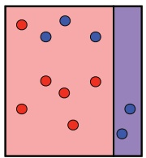

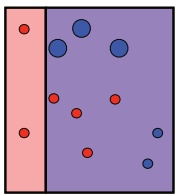

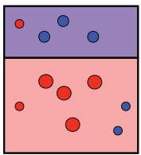

decision boundary

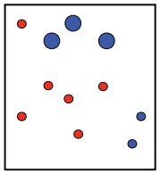

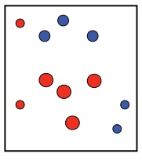

t = 2

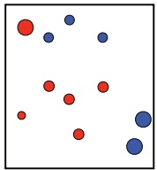

(a)

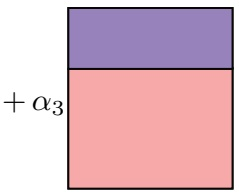

(b)

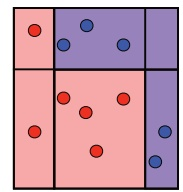

Figure 7.2

Example of AdaBoost with axis-aligned hyperplanes as base classifiers. (a) The top row shows decision boundaries at each boosting round. The bottom row shows how weights are updated at each round, with incorrectly (resp., correctly) points given increased (resp., decreased) weights. (b) Visualization of final classifier, constructed as a non-negative linear combination of base classifiers.

pseudocode of AdaBoost in the case where the base classifiers are functions mapping from X to $\{ - 1 , + 1 \}$ , thus $\mathcal { K } \subseteq \{ - 1 , + 1 \} ^ { \mathcal { X } }$

The algorithm takes as input a labeled sample $S = ( ( x _ { 1 } , y _ { 1 } ) , \ldots , ( x _ { m } , y _ { m } ) )$ , with $( x _ { i } , y _ { i } ) \in \mathcal { X } \times \{ - 1 , + 1 \}$ for all $i \in [ m ]$ , and maintains a distribution over the indices $\{ 1 , \ldots , m \}$ . Initially (lines 1-2), the distribution is uniform $\left( \mathcal { D } _ { 1 } \right)$ . At each round of boosting, that is each iteration $t   \in   [ T ]$ of the loop 3–8, a new base classifier $h _ { t } \in \mathcal { H }$ is selected that minimizes the error on the training sample weighted by the distribution $\mathcal { D } _ { t }$

$$
h _ {t} \in \underset {h \in \mathcal {H}} {\operatorname{argmin}} \underset {i \sim \mathcal {D} _ {t}} {\mathbb {P}} \left[ h (x _ {i}) \neq y _ {i} \right] = \underset {h \in \mathcal {H}} {\operatorname{argmin}} \sum_ {i = 1} ^ {m} \mathcal {D} _ {t} (i) 1 _ {h (x _ {i}) \neq y _ {i}}.
$$

<!-- page: 165 -->

$Z _ { t }$ is simply a normalization factor to ensure that the weights $\mathcal { D } _ { t + 1 } ( i )$ sum to one. The precise reason for the definition of the coefficient $\alpha _ { t }$ will become clear later. For now, observe that if $\epsilon _ { t } ,$ the error of the base classifier, is less than ${ \frac { 1 } { 2 } } .$ , then $\begin{array} { r } { \frac { 1 - \epsilon _ { t } } { \epsilon _ { t } } > 1 } \end{array}$ and $\alpha _ { t }$ is positive $( \alpha _ { t } > 0 )$ . Thus, the new distribution $\mathcal { D } _ { t + 1 }$ is defined from $\mathcal { D } _ { t }$ by substantially increasing the weight on i if point $x _ { i }$ is incorrectly classified $( y _ { i } h _ { t } ( x _ { i } ) < 0 )$ , and, on the contrary, decreasing it if $x _ { i }$ is correctly classified. This has the effect of focusing more on the points incorrectly classified at the next round of boosting, less on those correctly classified by $h _ { t }$

After $T$ rounds of boosting, the classifier returned by AdaBoost is based on the sign of function $f ,$ which is a non-negative linear combination of the base classifiers $h _ { t }$ . The weight $\alpha _ { t }$ assigned to $h _ { t }$ in that sum is a logarithmic function of the ratio of the accuracy $1 - \epsilon _ { t }$ and error $\epsilon _ { t }$ of $h _ { t }$ . Thus, more accurate base classifiers are assigned a larger weight in that sum. Figure 7.2 illustrates the AdaBoost algorithm. The size of the points represents the distribution weight assigned to them at each boosting round.

For any $t \in [ T ]$ , we will denote by $f _ { t }$ the linear combination of the base classifiers after t rounds of boosting: $\begin{array} { r } { f _ { t } = \sum _ { s = 1 } ^ { t } \alpha _ { s } h _ { s } } \end{array}$ . In particular, we have $f _ { T } = f .$ . The distribution $\mathcal { D } _ { t + 1 }$ can be expressed in terms of $f _ { t }$ and the normalization factors $Z _ { s }$ , $s \in [ t ]$ , as follows:

$$
\forall i \in [ m ], \quad \mathcal {D} _ {t + 1} (i) = \frac {e ^ {- y _ {i} f _ {t} (x _ {i})}}{m \prod_ {s = 1} ^ {t} Z _ {s}}.\tag{7.2}
$$

We will make use of this identity several times in the proofs of the following sections. It can be shown straightforwardly by repeatedly expanding the definition of the distribution over the point $x _ { i }$ :

$$
\begin{array}{r l} \mathcal {D} _ {t + 1} (i) = \frac {\mathcal {D} _ {t} (i) e ^ {- \alpha_ {t} y _ {i} h _ {t} (x _ {i})}}{Z _ {t}} & = \frac {\mathcal {D} _ {t - 1} (i) e ^ {- \alpha_ {t - 1} y _ {i} h _ {t - 1} (x _ {i})} e ^ {- \alpha_ {t} y _ {i} h _ {t} (x _ {i})}}{Z _ {t - 1} Z _ {t}} \\ & = \frac {e ^ {- y _ {i} \sum_ {s = 1} ^ {t} \alpha_ {s} h _ {s} (x _ {i})}}{m \prod_ {s = 1} ^ {t} Z _ {s}}. \end{array}
$$

The AdaBoost algorithm can be generalized in several ways:

• Instead of a hypothesis with minimal weighted error, $h _ { t }$ can be more generally the base classifier returned by a weak learning algorithm trained on $\mathfrak { D } _ { t } ;$

• The range of the base classifiers could be $\left[ -1, +1 \right]$ , or more generally a bounded subset of R. The coefficients $\alpha _ { t }$ can then be different and may not even admit a closed form. In general, they are chosen to minimize an upper bound on the empirical error, as discussed in the next section. Of course, in that general case, the hypotheses $h _ { t }$ are not binary classifiers, but their sign could define the label, and their magnitude could be interpreted as a measure of confidence.

<!-- page: 166 -->

In rest of this chapter, the range of the base classifiers in H will be assumed to be included in $\left[ -1, +1 \right]$ . We now further analyze the properties of AdaBoost and discuss its typical use in practice.

## 7.2.1 Bound on the empirical error

We first show that the empirical error of AdaBoost decreases exponentially fast as a function of the number of rounds of boosting.

**Theorem 7.2** The empirical error of the classifier returned by AdaBoost verifies:

$$
\widehat {R} _ {S} (f) \leq \exp \left[ - 2 \sum_ {t = 1} ^ {T} \left(\frac {1}{2} - \epsilon_ {t}\right) ^ {2} \right].\tag{7.3}
$$

Furthermore, if for all $\textstyle t \in [ T ] ,   \gamma \leq \left( { \frac { 1 } { 2 } } - \epsilon _ { t } \right)$ , then

$$
\widehat {R} _ {S} (f) \leq \exp (- 2 \gamma^ {2} T).\tag{7.4}
$$

Proof: Using the general inequality $1 _ { u \leq 0 } \leq \operatorname { e x p } ( - u )$ valid for all $u \in \mathbb { R }$ and identity 7.2, we can write:

$$
\widehat {R} _ {S} (f) = \frac {1}{m} \sum_ {i = 1} ^ {m} 1 _ {y _ {i} f (x _ {i}) \leq 0} \leq \frac {1}{m} \sum_ {i = 1} ^ {m} e ^ {- y _ {i} f (x _ {i})} = \frac {1}{m} \sum_ {i = 1} ^ {m} \left[ m \prod_ {t = 1} ^ {T} Z _ {t} \right] \mathcal {D} _ {T + 1} (i) = \prod_ {t = 1} ^ {T} Z _ {t}.
$$

Since for all $t \in [ T ] ,   Z _ { t }$ is a normalization factor, it can be expressed in terms of $\epsilon _ { t }$ by:

$$
\begin{array}{l} Z _ {t} = \sum_ {i = 1} ^ {m} \mathcal {D} _ {t} (i) e ^ {- \alpha_ {t} y _ {i} h _ {t} (x _ {i})} = \sum_ {i: y _ {i} h _ {t} (x _ {i}) = + 1} \mathcal {D} _ {t} (i) e ^ {- \alpha_ {t}} + \sum_ {i: y _ {i} h _ {t} (x _ {i}) = - 1} \mathcal {D} _ {t} (i) e ^ {\alpha_ {t}} \\ \qquad = (1 - \epsilon_ {t}) e ^ {- \alpha_ {t}} + \epsilon_ {t} e ^ {\alpha_ {t}} \\ \qquad = (1 - \epsilon_ {t}) \sqrt {\frac {\epsilon_ {t}}{1 - \epsilon_ {t}}} + \epsilon_ {t} \sqrt {\frac {1 - \epsilon_ {t}}{\epsilon_ {t}}} = 2 \sqrt {\epsilon_ {t} (1 - \epsilon_ {t})}. \end{array}
$$

Thus, the product of the normalization factors can be expressed and upper bounded as follows:

$$
\begin{array}{c} \prod_ {t = 1} ^ {T} Z _ {t} = \prod_ {t = 1} ^ {T} 2 \sqrt {\epsilon_ {t} (1 - \epsilon_ {t})} = \prod_ {t = 1} ^ {T} \sqrt {1 - 4 \left(\frac {1}{2} - \epsilon_ {t}\right) ^ {2}} \leq \prod_ {t = 1} ^ {T} \exp \left[ - 2 \left(\frac {1}{2} - \epsilon_ {t}\right) ^ {2} \right] \\ = \exp \left[ - 2 \sum_ {t = 1} ^ {T} \left(\frac {1}{2} - \epsilon_ {t}\right) ^ {2} \right], \end{array}
$$

where the inequality follows from the inequality $1 - x \leq e ^ { - x }$ valid for all $x \in \mathbb{R}.  口$ Note that the value of $\gamma ,$ which is known as the edge, and the accuracy of the base classifiers do not need to be known to the algorithm. The algorithm adapts to their

<!-- page: 167 -->

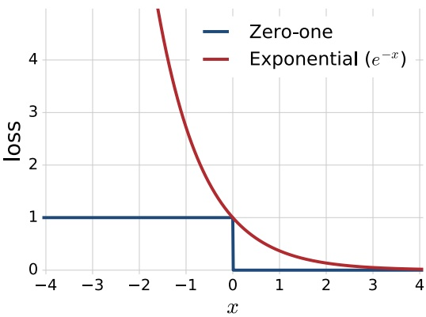

Figure 7.3

Visualization of the zero-one loss (blue) and the convex and differentiable upper bound on the zero-one loss (red) that is optimized by AdaBoost.

accuracy and defines a solution based on these values. This is the source of the extended name of AdaBoost: adaptive boosting.

The proof of theorem 7.2 reveals several other important properties. First, observe that $\alpha _ { t }$ is the minimizer of the function $\varphi \colon \alpha \mapsto ( 1 - \epsilon _ { t } ) e ^ { - \alpha } + \epsilon _ { t } e ^ { \alpha }$ . Indeed, $\varphi$ is convex and differentiable, and setting its derivative to zero yields:

$$
\varphi^ {\prime} (\alpha) = - (1 - \epsilon_ {t}) e ^ {- \alpha} + \epsilon_ {t} e ^ {\alpha} = 0 \Leftrightarrow (1 - \epsilon_ {t}) e ^ {- \alpha} = \epsilon_ {t} e ^ {\alpha} \Leftrightarrow \alpha = \frac {1}{2} \log \frac {1 - \epsilon_ {t}}{\epsilon_ {t}}.\tag{7.5}
$$

Thus, $\alpha _ { t }$ is chosen to minimize $Z _ { t }   =   \varphi ( \alpha _ { t } )$ and, in light of the bound $\widehat { R } _ { S } ( f ) \leq$ $\textstyle \prod _ { t = 1 } ^ { T } Z _ { t }$ bshown in the proof, these coefficients are selected to minimize an upper bound on the empirical error. In fact, for base classifiers whose range is [−1, +1] or R, $\alpha _ { t }$ can be chosen in a similar fashion to minimize $Z _ { t }$ , and this is the way AdaBoost is extended to these more general cases.

Observe also that the equality $( 1 - \epsilon _ { t } ) e ^ { - \alpha _ { t } } = \epsilon _ { t } e ^ { \alpha _ { t } }$ just shown in (7.5) implies that at each iteration, AdaBoost assigns equal distribution mass to correctly and incorrectly classified instances, since $( 1 - \epsilon _ { t } ) e ^ { - \alpha _ { t } }$ is the total distribution assigned to correctly classified points and $\epsilon _ { t } e ^ { \alpha _ { t } }$ that of incorrectly classified ones. This may seem to contradict the fact that AdaBoost increases the weights of incorrectly classified points and decreases that of others, but there is in fact no inconsistency: the reason is that there are always fewer incorrectly classified points, since the base classifier’s accuracy is better than random.

## 7.2.2 Relationship with coordinate descent

AdaBoost was originally designed to address the theoretical question of whether a weak learning algorithm could be used to derive a strong learning one. Here,

<!-- page: 168 -->

we will show that it coincides in fact with a very simple algorithm, which consists of applying a general coordinate descent technique to a convex and differentiable objective function.

For simplicity, in this section, we assume that the base classifier set H is finite, with cardinality N: $\mathcal { H }   =   \{ h _ { 1 } , \ldots , h _ { N } \}$ . An ensemble function $f$ such as the one returned by AdaBoost can then be written as $\begin{array} { r } { f = \sum _ { j = 1 } ^ { N } \bar { \alpha } _ { j } h _ { j } } \end{array}$ , with $\bar { \alpha } _ { j } \geq 0$ . Given a labeled sample $S = ( ( x _ { 1 } , y _ { 1 } ) , \ldots , ( x _ { m } , y _ { m } ) )$ , let $F$ be the objective function defined for all $\begin{array} { r } { \bar { \mathbf { \alpha } } = ( \bar { \alpha } _ { 1 } , \ldots , \bar { \alpha } _ { N } ) \in \mathbb { R } ^ { N } } \end{array}$ by

$$
F (\bar {\boldsymbol {\alpha}}) = \frac {1}{m} \sum_ {i = 1} ^ {m} e ^ {- y _ {i} f (x _ {i})} = \frac {1}{m} \sum_ {i = 1} ^ {m} e ^ {- y _ {i} \sum_ {j = 1} ^ {N} \bar {\alpha} _ {j} h _ {j} (x _ {i})}.\tag{7.6}
$$

Since the exponential loss $u \mapsto e ^ { - u }$ is an upper bound on the zero-one loss $u \mapsto 1 _ { u \leq 0 }$ (see figure 7.3), F is an upper bound on the empirical error:

$$
\widehat {R} _ {S} (f) = \frac {1}{m} \sum_ {i = 1} ^ {m} 1 _ {y _ {i} f (x _ {i}) \leq 0} \leq \frac {1}{m} \sum_ {i = 1} ^ {m} e ^ {- y _ {i} f (x _ {i})}.\tag{7.7}
$$

$F$ is a convex function of $\bar { \alpha }$ since it is a sum of convex functions, each obtained by composition of the (convex) exponential function with an affine function of ᾱ . $F$ is also differentiable since the exponential function is differentiable. We will show that $F$ is the objective function minimized by AdaBoost.

Different convex optimization techniques can be used to minimize F. Here, we will use a variant of the coordinate descent technique. Coordinate descent is applied over $T$ rounds. Let $\bar { \mathbf { \alpha } } _ { 0 } = \mathbf { 0 }$ and let $\bar { \alpha } _ { t }$ denote the parameter vector at the end of iteration t. At each round $t \in [ T ]$ , a direction $\mathbf { e } _ { k }$ corresponding to the kth coordinate of $\bar { \alpha }$ in $\mathbb { R } ^ { N }$ is selected, as well as a step size $\eta$ along that direction. $\bar { \alpha } _ { t }$ is obtained from $\bar { \alpha } _ { t - 1 }$ according to the update $\bar { \mathbf { \alpha } } _ { t } = \bar { \mathbf { \alpha } } _ { t - 1 }   +   \eta \mathbf { e } _ { k }$ , where $\eta$ is the step size chosen along the direction $\mathbf { e } _ { k }$ . Observe that if we denote by $\bar { g } _ { t }$ the ensemble function defined by $\bar { \boldsymbol { \alpha } } _ { t } ,$ that is $\begin{array} { r } { \bar { g } _ { t }   =   \sum _ { j = 1 } ^ { N } \bar { \alpha } _ { t , j } h _ { j } } \end{array}$ , then the coordinate descent update coincides with the update $\bar { g } _ { t } = \bar { g } _ { t - 1 } + \eta h _ { k }$ , which is also the AdaBoost update. Thus, since both algorithms start with $\bar { g } _ { 0 }   =   0$ , to show that AdaBoost coincides with coordinate descent applied to $F ,$ it suffices to show at every iteration $t ,$ coordinate descent selects the same base hypothesis $h _ { k }$ and step $\eta$ as AdaBoost. We will assume by induction that this holds up to iteration $t { - } 1$ , which implies the equality $\bar { g } _ { t - 1 } = f _ { t - 1 }$ and will show then that it also holds at iteration t.

The variant of coordinate descent we consider here consists of selecting, at each iteration, the maximum descent direction, that is the direction $\mathbf { e } _ { k }$ along which the derivative of $F$ is the largest in absolute value, and of selecting the best step along that direction, that is of choosing $\eta$ to minimize $F ( \bar { \mathbf { \alpha } } _ { t - 1 } + \eta \mathbf { e } _ { k } )$ . To give the expressions of the direction and the step at each iteration, we first introduce similar

<!-- page: 169 -->

quantities to those appearing in the analysis of the boosting algorithm. For any $t \in [ T ]$ , we define a distribution ${ \bar { \mathcal { D } } } _ { t }$ over the indices $\{ 1 , \ldots , m \}$ as follows:

$$
\bar {\mathcal {D}} _ {t} (i) = \frac {e ^ {- y _ {i} \sum_ {j = 1} ^ {N} \bar {\alpha} _ {t - 1 , j} h _ {j} (x _ {i})}}{\bar {Z} _ {t}} = \frac {e ^ {- y _ {i} \bar {g} _ {t - 1} (x _ {i})}}{\bar {Z} _ {t}},
$$

where $\bar { Z } _ { t }$ is the normalization factor $\bar { Z } _ { t } = \textstyle \sum _ { i = 1 } ^ { m } e ^ { - y _ { i } \sum _ { j = 1 } ^ { N } \bar { \alpha } _ { t - 1 , j } h _ { j } ( x _ { i } ) }$ . Observe that, since $\bar { g } _ { t - 1 } = f _ { t - 1 } ,   \bar { \mathcal { D } } _ { t }$ coincides with $\mathcal { D } _ { t }$ . We also define for any base hypothesis $h _ { j }$ , $j \in [ N ]$ , its expected error $\bar { \epsilon } _ { t , j }$ with respect to the distribution $\bar { \mathcal { D } } _ { t } ;$

$$
\bar {\epsilon} _ {t, j} = \underset {i \sim \bar {\mathcal {D}} _ {t}} {\mathbb {E}} \left[ 1 _ {y _ {i} h _ {j} (x _ {i}) \leq 0} \right].
$$

The directional derivative of $F$ at $\bar { \alpha } _ { t - 1 }$ along $\mathbf { e } _ { k }$ is denoted by $F ^ { \prime } ( \bar { \mathbf { \alpha } } _ { t - 1 } , \mathbf { e } _ { k } )$ and defined by

$$
F ^ {\prime} (\bar {\boldsymbol {\alpha}} _ {t - 1}, \mathbf {e} _ {k}) = \lim _ {\eta \to 0} \frac {F (\bar {\boldsymbol {\alpha}} _ {t - 1} + \eta \mathbf {e} _ {k}) - F (\bar {\boldsymbol {\alpha}} _ {t - 1})}{\eta}.
$$

Since $\textstyle F ( \bar { \mathbf { \alpha } } _ { t - 1 } + \eta \mathbf { e } _ { k } ) = \sum _ { i = 1 } ^ { m } e ^ { - y _ { i } \sum _ { j = 1 } ^ { N } \bar { \alpha } _ { t - 1 , j } h _ { j } ( x _ { i } ) - \eta y _ { i } h _ { k } ( x _ { i } ) }$ , the directional derivative along $\mathbf { e } _ { k }$ can be expressed as follows:

$$
\begin{array}{l} F ^ {\prime} (\bar {\boldsymbol {\alpha}} _ {t - 1}, \mathbf {e} _ {k}) = - \frac {1}{m} \sum_ {i = 1} ^ {m} y _ {i} h _ {k} (x _ {i}) e ^ {- y _ {i} \sum_ {j = 1} ^ {N} \bar {\alpha} _ {t - 1, j} h _ {j} (x _ {i})} \\ \qquad = - \frac {1}{m} \sum_ {i = 1} ^ {m} y _ {i} h _ {k} (x _ {i}) \bar {\mathcal {D}} _ {t} (i) \bar {Z} _ {t} \\ \qquad = - \left[ \sum_ {i = 1} ^ {m} \bar {\mathcal {D}} _ {t} (i) 1 _ {y _ {i} h _ {k} (x _ {i}) = + 1} - \sum_ {i = 1} ^ {m} \bar {\mathcal {D}} _ {t} (i) 1 _ {y _ {i} h _ {k} (x _ {i}) = - 1} \right] \frac {\bar {Z} _ {t}}{m} \\ \qquad = - \left[ (1 - \bar {\epsilon} _ {t, k}) - \bar {\epsilon} _ {t, k} \right] \frac {\bar {Z} _ {t}}{m} = \left[ 2 \bar {\epsilon} _ {t, k} - 1 \right] \frac {\bar {Z} _ {t}}{m}. \end{array}
$$

Since $\frac { \bar { Z } _ { t } } { m }$ does not depend on $k ,$ the maximum descent direction k is the one minimizing $\bar { \epsilon } _ { t , k }$ . Thus, the hypothesis $h _ { k }$ selected by coordinate descent at iteration t is the one with the smallest expected error on the sample $S ,$ where the expectation is taken with respect to $\bar { \mathcal { D } } _ { t } = \mathcal { D } _ { t }$ . This matches exactly the choice made by AdaBoost at the tth round.

The step size $\eta$ is selected to minimize the function along the direction $\mathbf { e } _ { k }$ chosen: argmin $\mathbf { \nabla } _ { \eta }   F ( \bar { \mathbf { \alpha } } _ { t - 1 }   +   \eta   \mathbf { e } _ { k } )$ . Since $F ( \bar { \alpha } _ { t - 1 }   +   \eta   \mathbf { e } _ { k } )$ is a convex function of $\eta ,$ to find the

<!-- page: 170 -->

Figure 7.4

Examples of several convex upper bounds on the zero-one loss.

minimum, it suffices to set its derivative to zero:

$$
\begin{array}{l} \frac {d F (\bar {\boldsymbol {\alpha}} _ {t - 1} + \eta \mathbf {e} _ {k})}{d \eta} = 0 \Leftrightarrow - \sum_ {i = 1} ^ {m} y _ {i} h _ {k} (x _ {i}) e ^ {- y _ {i} \sum_ {j = 1} ^ {N} \bar {\alpha} _ {t - 1, j} h _ {j} (x _ {i})} e ^ {- \eta y _ {i} h _ {k} (x _ {i})} = 0 \\ \qquad \qquad \qquad \Leftrightarrow - \sum_ {i = 1} ^ {m} y _ {i} h _ {k} (x _ {i}) \bar {\mathcal {D}} _ {t} (i) \bar {Z} _ {t} e ^ {- \eta y _ {i} h _ {k} (x _ {i})} = 0 \\ \qquad \qquad \qquad \Leftrightarrow - \sum_ {i = 1} ^ {m} y _ {i} h _ {k} (x _ {i}) \bar {\mathcal {D}} _ {t} (i) e ^ {- \eta y _ {i} h _ {k} (x _ {i})} = 0 \\ \qquad \qquad \qquad \Leftrightarrow - \left[ (1 - \bar {\epsilon} _ {t, k}) e ^ {- \eta} - \bar {\epsilon} _ {t, k} e ^ {\eta} \right] = 0 \\ \qquad \qquad \qquad \Leftrightarrow \eta = \frac {1}{2} \log \frac {1 - \bar {\epsilon} _ {t , k}}{\bar {\epsilon} _ {t , k}}. \end{array}
$$

This proves that the step size chosen by coordinate descent coincides with the weight $\alpha _ { t }$ assigned by AdaBoost to the classifier chosen in the tth round. Thus, coordinate descent applied to exponential objective F precisely coincides with AdaBoost and $F$ can be viewed as the objective function that AdaBoost seeks to minimize.

In light of this relationship, one may wish to consider similar applications of coordinate descent to other convex and differentiable functions of ᾱ upper-bounding the zero-one loss. In particular, the logistic loss $x \mapsto \log _ { 2 } ( 1 + e ^ { - x } )$ is convex and differentiable and upper bounds the zero-one loss. Figure 7.4 shows other examples of alternative convex loss functions upper-bounding the zero-one loss. Using the logistic loss, instead of the exponential loss used by AdaBoost, leads to an objective that coincides with logistic regression.

<!-- page: 171 -->

## 7.2.3 Practical use

Here, we briefly describe the standard practical use of AdaBoost. An important requirement for the algorithm is the choice of the base classifiers or that of the weak learner. The family of base classifiers typically used with AdaBoost in practice is that of decision trees, which are equivalent to hierarchical partitions of the space (see chapter 9, section 9.3.3). Among decision trees, those of depth one, also known as stumps, are by far the most frequently used base classifiers.

Boosting stumps are threshold functions associated to a single feature. Thus, a stump corresponds to a single axis-aligned partition of the space, as illustrated in figure 7.2. If the data is in $\mathbb { R } ^ { N }$ , we can associate a stump to each of the N components. Thus, to determine the stump with the minimal weighted error at each round of boosting, the best component and the best threshold for each component must be computed.

To do so, we can first presort each component in $O ( m \log m )$ time with a total computational cost of $O ( m N \log m )$ . For a given component, there are only $m + 1$ possible distinct thresholds, since two thresholds between the same consecutive component values are equivalent. To find the best threshold at each round of boosting, all of these possible $m + 1$ values can be compared, which can be done in $O ( m )$ time. Thus, the total computational complexity of the algorithm for T rounds of boosting is $O ( m N$ log $m + m N T )$

Observe, however, that while boosting stumps are widely used in combination with AdaBoost and can perform well in practice, the algorithm that returns the stump with the minimal (weighted) empirical error is not a weak learner (see definition 7.1)! Consider, for example, the simple XOR example with four data points lying in $\mathbb { R } ^ { 2 }$ (see figure 6.3a), where points in the second and fourth quadrants are labeled positively and those in the first and third quadrants negatively. Then, no decision stump can achieve an accuracy better than $\frac { 1 } { 2 }$

## 7.3 Theoretical results

In this section we present a theoretical analysis of the generalization properties of AdaBoost.

## 7.3.1 VC-dimension-based analysis

We start with an analysis of AdaBoost based on the VC-dimension of its hypothesis set. The family of functions $\mathcal { F } _ { T }$ out of which AdaBoost selects its output after T rounds of boosting is

$$
\mathcal {F} _ {T} = \Bigg \{\operatorname{sgn} \left(\sum_ {t = 1} ^ {T} \alpha_ {t} h _ {t}\right): \alpha_ {t} \geq 0, h _ {t} \in \mathcal {H}, t \in [ T ] \Bigg \}.\tag{7.8}
$$

<!-- page: 172 -->

## 7.3 Theoretical results

Figure 7.5

An empirical result using AdaBoost with C4.5 decision trees as base learners. In this example, the training error goes to zero after about 5 rounds of boosting $( T \approx 5 )$ , yet the test error continues to decrease for larger values of T.

The VC-dimension of $\mathcal { F } _ { T }$ can be bounded as follows in terms of the VC-dimension d of the family of base hypothesis H (exercise 7.1):

$$
\mathrm{VCdim} (\mathcal {F} _ {T}) \leq 2 (d + 1) (T + 1) \log_ {2} ((T + 1) e).\tag{7.9}
$$

The upper bound grows as $O ( d T \log T )$ , thus, the bound suggests that AdaBoost could overfit for large values of T, and indeed this can occur. However, in many cases, it has been observed empirically that the generalization error of AdaBoost decreases as a function of the number of rounds of boosting T, as illustrated in figure 7.5! How can these empirical results be explained? The following sections present a margin-based analysis in support of AdaBoost that can serve as a theoretical explanation for these empirical observations.

## 7.3.2 L1-geometric margin

In chapter 5, we introduced the definition of confidence margin and presented a series of general learning bounds based on that notion which, in particular, provided strong learning guarantees for SVMs. Here, we will similarly derive general learning bounds based on that same notion of confidence margin for ensemble methods, which we will use, in particular, to derive learning guarantees for AdaBoost.

Recall that the confidence margin of a real-valued function f at a point x labeled with y is the quantity $y f ( x )$ . For SVMs, we also defined the notion of geometric margin which, in the separable case, is a lower bound on the confidence margin of a linear hypothesis with a normalized weighted vector w, $\| \mathbf { w } \| _ { 2 } = 1$ . Here, we will also define a notion of geometric margin for linear hypotheses with a norm-1 constraint, such as the ensemble hypotheses returned by AdaBoost, and similarly relate that notion to that of confidence margin. This will also serve as an opportunity for us to point out the connection between several concepts and terminology used in the context of SVMs and those used in the context of boosting.

<!-- page: 173 -->

Figure 7.6

Maximum margin hyperplanes for norm-2 and norm-∞.

First note that a function $\begin{array} { r } { f   =   \sum _ { t = 1 } ^ { T } \alpha _ { t } h _ { t } } \end{array}$ that is a linear combination of base hypotheses $h _ { 1 } , \ldots , h _ { T }$ can be equivalently expressed as an inner product $f = \pmb { \alpha } \cdot \mathbf { h }$ where $\mathbf { \alpha } = ( \alpha _ { 1 } , \ldots , \alpha _ { T } ) ^ { \top }$ and $\mathbf { h } = [ h _ { 1 } , \ldots , h _ { T } ] ^ { \top }$ . This makes the similarity between the linear hypotheses considered in this chapter and those of chapter 5 and chapter 6 evident: the vector of base hypothesis values $\mathbf { h } ( x )$ can be viewed as a feature vector associated to $x ,$ which was denoted by $\mathbf { \Phi } ( x )$ in previous chapters, and α is the weight vector that was denoted by w. For ensemble linear combinations such as those returned by AdaBoost, additionally, the weight vector is non-negative: $\alpha \geq 0$ Next, we introduce a notion of geometric margin for such ensemble functions which differs from the one introduced for SVMs only by the norm-1 used instead of norm-2, using the notation just introduced.

**Definition 7.3 (**L1**-geometric margin)** The L1-geometric margin $\rho _ { f } ( x )$ of a linear function $\begin{array} { r } { f = \sum _ { t = 1 } ^ { T } \alpha _ { t } h _ { t } } \end{array}$ with $\alpha \neq 0$ at a point $x \in \mathcal { X }$ is defined by

$$
\rho_ {f} (x) = \frac {| f (x) |}{\| \boldsymbol {\alpha} \| _ {1}} = \frac {| \sum_ {t = 1} ^ {T} \alpha_ {t} h _ {t} (x) |}{\| \boldsymbol {\alpha} \| _ {1}} = \frac {\left| \boldsymbol {\alpha} \cdot \mathbf {h} (x) \right|}{\| \boldsymbol {\alpha} \| _ {1}}.\tag{7.10}
$$

The L1-margin of f over a sample $S = ( x _ { 1 } , \ldots , x _ { m } )$ is its minimum margin at the points in that sample:

$$
\rho_ {f} = \min _ {i \in [ m ]} \rho_ {f} (x _ {i}) = \min _ {i \in [ m ]} \frac {\left| \boldsymbol {\alpha} \cdot \mathbf {h} (x _ {i}) \right|}{\left\| \boldsymbol {\alpha} \right\| _ {1}}.\tag{7.11}
$$

This definition of geometric margin differs from definition 5.1 given in the context of the SVM algorithm only by the norm used for the weight vector: $L _ { \mathrm { 1 } } \mathrm { - n o r m }$ here, $L _ { 2 } .$ -norm in definition 5.1. To distinguish them in the discussion that follows, let $\rho _ { 1 } ( x )$ denote the $L _ { 1 }$ -margin and $\rho _ { 2 } ( x )$ the $L _ { 2 ^ { \circ } }$ -margin at point x (definition 5.1):

$$
\rho_ {1} (x) = \frac {| \boldsymbol {\alpha} \cdot \mathbf {h} (x) |}{\| \boldsymbol {\alpha} \| _ {1}} \quad \text {and} \quad \rho_ {2} (x) = \frac {| \boldsymbol {\alpha} \cdot \mathbf {h} (x) |}{\| \boldsymbol {\alpha} \| _ {2}}.
$$

<!-- page: 174 -->

$\rho _ { 2 } ( x )$ is then the norm-2 distance of the vector $\mathbf { h } ( x )$ to the hyperplane of equation $\mathbf { \alpha }   \cdot   \mathbf { x } = 0 \; \mathrm { i n } \; \mathbb { R } ^ { T }$ . Similarly, $\rho _ { 1 } ( x )$ is the norm-∞ distance of $\mathbf { h } ( x )$ to that hyperplane. This geometric difference is illustrated by figure 7.6.8

We will denote by

$$
\bar {f} = \frac {f}{\sum_ {t = 1} ^ {T} \alpha_ {t}} = \frac {f}{\| \boldsymbol {\alpha} \| _ {1}}
$$

the normalized version of the function f returned by AdaBoost. Note that if a point x with label y is correctly classified by $f   \left( \mathrm { o r }   \bar { f } \right)$ , then the confidence margin of $\bar { f }$ at x coincides with the L1-geometric margin of $\begin{array} { r } { \hat { f } \colon y \bar { f } ( x ) = \frac { y f ( x ) } { \| \mathbf { \alpha } \| _ { 1 } } = \rho _ { f } ( x ) } \end{array}$ . Observe that, since the coefficients $\alpha _ { t }$ are non-negative, $\rho _ { f } ( x )$ is then a convex combination of the base hypothesis values $h _ { t } ( x )$ . In particular, if the base hypotheses $h _ { t }$ take values in $\left[ -1, +1 \right]$ , then $\rho _ { f } ( x )$ is in $\left[ -1, +1 \right]$

## 7.3.3 Margin-based analysis

To analyze the generalization properties of AdaBoost, we start by examining the Rademacher complexity of convex linear ensembles. For any hypothesis set H of real-valued functions, we denote by conv(H) its convex hull defined by

$$
\operatorname{conv} (\mathcal {H}) = \bigg \{\sum_ {k = 1} ^ {p} \mu_ {k} h _ {k} \colon p \geq 1, \forall k \in [ p ], \mu_ {k} \geq 0, h _ {k} \in \mathcal {H}, \sum_ {k = 1} ^ {p} \mu_ {k} \leq 1 \bigg \}.\tag{7.12}
$$

The following lemma shows that, remarkably, the empirical Rademacher complexity of conv(H), which in general is a strictly larger set including H, coincides with that of H.

**Lemma 7.4** Let H be a set of functions mapping from X to R. Then, for any sample $S ,$ we have

$$
\widehat {\mathfrak {R}} _ {S} \big (\operatorname{conv} (\mathcal {H}) \big) = \widehat {\mathfrak {R}} _ {S} (\mathcal {H}).
$$

<small>h(x)</small>

<small>p, q ≥ ,</small>

<small>α · h(x) = 0.</small>

<small>8 More generally, for  1 p and q conjugate, that is $\begin{array} { r } { \frac { 1 } { p } + \frac { 1 } { q } = 1 ,   \frac { | \boldsymbol { \alpha } \cdot \mathbf { h } ( x ) | } { \| \boldsymbol { \alpha } \| _ { p } } } \end{array}$ is the norm-q distance of  to the hyperplane of equation</small>

<!-- page: 175 -->

Proof: The proof follows from a straightforward series of equalities:

$$
\begin{array}{l} \widehat {\mathfrak {R}} _ {S} \big (\operatorname{conv} (\mathcal {H}) \big) = \frac {1}{m} \underset {\sigma} {\mathbb {E}} \left[ \sup _ {h _ {1}, \ldots , h _ {p} \in \mathcal {H}, \boldsymbol {\mu} \geq 0, \| \boldsymbol {\mu} \| _ {1} \leq 1} \sum_ {i = 1} ^ {m} \sigma_ {i} \sum_ {k = 1} ^ {p} \mu_ {k} h _ {k} (x _ {i}) \right] \\ \qquad = \frac {1}{m} \underset {\sigma} {\mathbb {E}} \left[ \sup _ {h _ {1}, \ldots , h _ {p} \in \mathcal {H}} \sup _ {\boldsymbol {\mu} \geq 0, \| \boldsymbol {\mu} \| _ {1} \leq 1} \sum_ {k = 1} ^ {p} \mu_ {k} \sum_ {i = 1} ^ {m} \sigma_ {i} h _ {k} (x _ {i}) \right] \\ \qquad = \frac {1}{m} \underset {\sigma} {\mathbb {E}} \left[ \sup _ {h _ {1}, \ldots , h _ {p} \in \mathcal {H}} \max _ {k \in [ p ]} \sum_ {i = 1} ^ {m} \sigma_ {i} h _ {k} (x _ {i}) \right] \\ \qquad = \frac {1}{m} \underset {\sigma} {\mathbb {E}} \left[ \sup _ {h \in \mathcal {H}} \sum_ {i = 1} ^ {m} \sigma_ {i} h (x _ {i}) \right] = \widehat {\mathfrak {R}} _ {S} (\mathcal {H}), \end{array}
$$

where the third equality follows the definition of the dual norm (see section A.1.2) or the observation that the maximizing vector $\mu$ for a convex combination of $p$ terms is the one placing all the weight on the largest term. 

This theorem can be used directly in combination with theorem 5.8 to derive the following Rademacher complexity generalization bound for convex combination ensembles of hypotheses. Recall that $\widehat { R } _ { S , \rho } ( h )$ denotes the empirical margin loss with margin $\rho .$

**Corollary 7.5 (Ensemble Rademacher margin bound)** Let H denote a set of real-valued functions. Fix $\rho > 0$ . Then, for any $\delta > 0$ , with probability at least $1 - \delta$ , each of the following holds for all $h \in \mathrm { c o n v } ( \mathcal { H } )$

$$
R (h) \leq \widehat {R} _ {S, \rho} (h) + \frac {2}{\rho} \Re_ {m} (\mathcal {H}) + \sqrt {\frac {\log \frac {1}{\delta}}{2 m}}\tag{7.13}
$$

$$
R (h) \leq \widehat {R} _ {S, \rho} (h) + \frac {2}{\rho} \widehat {\mathfrak {R}} _ {S} (\mathcal {H}) + 3 \sqrt {\frac {\log \frac {2}{\delta}}{2 m}}.\tag{7.14}
$$

Using corollary 3.8 and corollary 3.18 to bound the Rademacher complexity in terms of the VC-dimension yields immediately the following VC-dimension-based generalization bounds for convex combination ensembles of hypotheses.

**Corollary 7.6 (Ensemble VC-Dimension margin bound)** Let H be a family of functions taking values in $\{ + 1 , - 1 \}$ with VC-dimension d. Fix $\rho > 0$ . Then, for any $\delta > 0$ with probability at least $1 - \delta$ , the following holds for all $h \in \mathrm { c o n v } ( \mathcal { H } )$

$$
R (h) \leq \widehat {R} _ {S, \rho} (h) + \frac {2}{\rho} \sqrt {\frac {2 d \log \frac {e m}{d}}{m}} + \sqrt {\frac {\log \frac {1}{\delta}}{2 m}}.\tag{7.15}
$$

These bounds can be generalized to <u>hold uni</u>formly for all $\rho \in ( 0 , 1 ]$ , at the price of an additional term of the form $\sqrt { \frac { \operatorname { l o g } \operatorname { l o g } _ { 2 } \frac { 2 } { \delta } } { m } }$ as in theorem 5.9. They cannot be

<!-- page: 176 -->

directly applied to the function f returned by AdaBoost, since it is not a convex combination of base hypotheses, but they can be applied to its normalized version, $\begin{array} { r } { \bar { f } = \frac { \sum _ { t = 1 } ^ { T } \alpha _ { t } h _ { t } } { \| \pmb { \alpha } \| _ { 1 } } \in \mathrm { c o n v } ( \mathcal { H } ) } \end{array}$ . Notice that from the point of view of binary classification, $f$ and $\bar { f }$ are equivalent since $\begin{array} { r } { \mathrm { s g n } ( f ) = \mathrm { s g n } \left( \frac { f } { \| \pmb { \alpha } \| _ { 1 } } \right) } \end{array}$ , thus $\begin{array} { r } { R ( f ) = R \big ( \frac { f } { \| \pmb { \alpha } \| _ { 1 } } \big ) } \end{array}$ , but their empirical margin losses are distinct.

Let $\begin{array} { r } { f   =   \sum _ { t = 1 } ^ { T } \alpha _ { t } h _ { t } } \end{array}$ denote the function defining the classifier returned by $\mathrm { A d - }$ aBoost after $T$ rounds of boosting when trained on sample S. Then, in view of (7.13), for any $\delta > 0$ , the following holds with probability at least $1 - \delta ;$

$$
R (f) \leq \widehat {R} _ {S, \rho} (\bar {f}) + \frac {2}{\rho} \Re_ {m} (\mathcal {H}) + \sqrt {\frac {\log \frac {1}{\delta}}{2 m}}.\tag{7.16}
$$

Similar bounds can be derived from (7.14) and (7.15). Remarkably, the number of rounds of boosting $T$ does not appear in the generalization bound (7.16). The bound depends only on the confidence margin $\rho ,$ the sample size $m ,$ and the Rademacher complexity of the family of base classifiers $\mathcal { H }$ Thus, the bound guarantees an effective generalization if the margin loss $R _ { \rho } ( \bar { f } )$ is small for a relatively large $\rho .$ Recall that the margin loss can be upper bounded by the fraction of the points x labeled with $y$ in the training sample with confidence margin at most $\rho ,$ that is $\begin{array} { r } { \frac { y f ( x ) } { \| \mathbf { \alpha } \| _ { 1 } } \leq \rho } \end{array}$ (see (5.38)). With our definition of $L_{  1-marcsin }$ , this can also be written as follows:

$$
\widehat {R} _ {S, \rho} (\bar {f}) \leq \frac {| \{i \in [ m ] : y _ {i} \rho_ {f} (x _ {i}) \leq \rho \} |}{m}.\tag{7.17}
$$

Additionally, the following theorem provides a bound on the empirical margin loss, which decreases with T under conditions discussed later.

**Theorem 7.7** Let $\begin{array} { r } { f = \sum _ { t = 1 } ^ { T } \alpha _ { t } h _ { t } } \end{array}$ denote the function returned by AdaBoost after T rounds of boosting and assume for all $t \in [ T ]$ that $\epsilon _ { t }   <   \textstyle { \frac { 1 } { 2 } }$ , which implies $\alpha _ { t } > 0$ Then, for any $\rho > 0$ , the following holds:

$$
\widehat {R} _ {S, \rho} (\bar {f}) \leq 2 ^ {T} \prod_ {t = 1} ^ {T} \sqrt {\epsilon_ {t} ^ {1 - \rho} (1 - \epsilon_ {t}) ^ {1 + \rho}}.
$$

Proof: Using the general inequality $1 _ { u \leq 0 } \leq \operatorname { e x p } ( - u )$ valid for all $u \in \mathbb { R }$ , identity 7.2, that is $\begin{array} { r } { \stackrel { \circ } { \mathcal { D } _ { t + 1 } ( i ) } \; = \; \frac { e ^ { - y _ { i } f ( x _ { i } ) } } { m \prod _ { t = 1 } ^ { T } Z _ { t } } } \end{array}$ , the equality $Z _ { t } \: = \: 2 \sqrt { \epsilon _ { t } ( 1 - \epsilon _ { t } ) }$ from the proof of

<!-- page: 177 -->

theorem 7.2, and the definition of $\begin{array} { r } { \alpha _ { t } = \frac { 1 } { 2 } \log ( \frac { 1 - \epsilon _ { t } } { \epsilon _ { t } } ) } \end{array}$ in AdaBoost, we can write:

$$
\begin{array}{l} \frac {1}{m} \sum_ {i = 1} ^ {m} 1 _ {y _ {i} f (x _ {i}) - \rho \| \boldsymbol {\alpha} \| _ {1} \leq 0} \leq \frac {1}{m} \sum_ {i = 1} ^ {m} \exp (- y _ {i} f (x _ {i}) + \rho \| \boldsymbol {\alpha} \| _ {1}) \\ \qquad = \frac {1}{m} \sum_ {i = 1} ^ {m} e ^ {\rho \| \boldsymbol {\alpha} \| _ {1}} \bigg [ m \prod_ {t = 1} ^ {T} Z _ {t} \bigg ] \mathcal {D} _ {T + 1} (i) \\ \qquad = e ^ {\rho \| \boldsymbol {\alpha} \| _ {1}} \prod_ {t = 1} ^ {T} Z _ {t} = e ^ {\rho \sum_ {t ^ {\prime}} \alpha_ {t ^ {\prime}}} \prod_ {t = 1} ^ {T} Z _ {t} \\ \qquad = 2 ^ {T} \prod_ {t = 1} ^ {T} \left[ \sqrt {\frac {1 - \epsilon_ {t}}{\epsilon_ {t}}} \right] ^ {\rho} \sqrt {\epsilon_ {t} (1 - \epsilon_ {t})}, \end{array}
$$

which concludes the proof.

Moreover, if for all $t \in [ T ]$ we have $\gamma \leq ( \textstyle { \frac { 1 } { 2 } } - \epsilon _ { t } )$ and $\rho \leq 2 \gamma$ , then the expression $4 \epsilon _ { t } ^ { 1 - \rho } ( 1   -   \epsilon _ { t } ) ^ { 1 + \rho }$ is maximized at $\epsilon _ { t } \: = \: { \textstyle \frac { 1 } { 2 } } \: - \: \gamma . ^ { 9 }$ Thus, the upper bound on the empirical margin loss can then be bounded by

$$
\widehat {R} _ {S, \rho} (\bar {f}) \leq \left[ (1 - 2 \gamma) ^ {1 - \rho} (1 + 2 \gamma) ^ {1 + \rho} \right] ^ {\frac {T}{2}}.\tag{7.18}
$$

Observe that $( 1   -   2 \gamma ) ^ { 1 - \rho } ( 1   +   2 \gamma ) ^ { 1 + \rho }   =   ( 1   -   4 \gamma ^ { 2 } ) \big ( \textstyle { \frac { 1 + 2 \gamma } { 1 - 2 \gamma } } \big ) ^ { \rho }$ . This is an increasing function of $\rho$ since we have $\begin{array} { r } { \left( \frac { 1 + 2 \gamma } { 1 - 2 \gamma } \right) > 1 } \end{array}$ as a consequence of $\gamma > 0$ . Thus, if $\rho < \gamma$ it can be strictly upper bounded as follows

$$
(1 - 2 \gamma) ^ {1 - \rho} (1 + 2 \gamma) ^ {1 + \rho} <   (1 - 2 \gamma) ^ {1 - \gamma} (1 + 2 \gamma) ^ {1 + \gamma}.
$$

The function $\gamma \mapsto ( 1 - 2 \gamma ) ^ { 1 - \gamma } ( 1 + 2 \gamma ) ^ { 1 + \gamma }$ is strictly upper bounded by 1 over the interval $( 0 , 1 / 2 )$ , thus, if $\rho < \gamma$ , then $( 1 - 2 \gamma ) ^ { 1 - \rho } ( 1 + 2 \gamma ) ^ { 1 + \rho } < 1$ and the right-hand side of (7.18) decreases exponentially with $T .$ Since the condition $\rho \gg O ( 1 / \sqrt { m } )$ is necessary in order for the given margin bounds to converge, this places a condition of $\gamma \gg O ( 1 / \sqrt { m } )$ on the edge value. In practice, the error $\epsilon _ { t }$ of the base classifier at round t may increase as a function of $t .$ Informally, this is because boosting presses the weak learner to concentrate on instances that are harder and harder to classify, for which even the best base classifier could not achieve an error significantly better than random. If $\epsilon _ { t }$ becomes close to $\frac { 1 } { 2 }$ relatively fast as a function of $t ,$ then the bound of theorem 7.7 becomes uninformative.

<small>9 The differential of  l 1−ρ 1+ρ l l over the interval f :  7→ og[ (1 − ) ] = (1 − ρ) og  + (1 + ρ) og(1 − )</small>

<small>(0, 1) is given by 0 ρ ρ f(  ) = 1 − −1+ 2 2 ( 1 .  1− (1−e)</small>

<small>f</small>

<small>0,12</small>

<small>γ ρ2.</small>

<small>(0 2 2 )</small>

<small>2 − ρ2 )− Thus,  is an increasing function over ,1−ρ, which implies that it is increasing over ( − γ) when ≥</small>

<!-- page: 178 -->

## 7.3 Theoretical results

The analysis and discussion that precede show that if AdaBoost admits a positive edge $( \gamma > 0 )$ , then, for $\rho < \gamma$ , the empirical margin loss $\hat { R } _ { S , \rho } ( \bar { f } )$ becomes zero for $T$ bsufficiently large (it decreases exponentially fast). Thus, AdaBoost achieves an L1-geometric margin of $\gamma$ over the training sample. In section 7.3.5, we will see that the edge $\gamma$ is positive if and only if the training sample is separable. In that case, the edge can be chosen to be as large as half the maximum L1-geometric margin $\rho _ { \mathrm { m a x } }$ that can be achieved on the sample: $\begin{array} { r } { \gamma   =   \frac { \rho _ { \mathrm { m a x } } } { 2 } } \end{array}$ . Thus, for a separable data set, AdaBoost can asymptotically achieve a geometric margin that is at least half the maximum geometric margin, $\frac { \rho _ { \mathrm { m a x } } } { 2 }$

This analysis can serve as a theoretical explanation of the empirical observation that, in some tasks, the generalization error decreases as a function of $T$ even after the error on the training sample is zero: the geometric margin continues to increase when the training sample is separable. In (7.16), for the ensemble function $f$ determined by AdaBoost after $T$ rounds, as $T$ increases, $\rho$ can be chosen as a larger quantity for which the first term on the right-hand side vanishes $( \widehat { R } _ { S , \rho } ( \bar { f } )   =   0 )$ while the second term becomes more favorable since it decreases as ${ \frac { 1 } { \rho } } .$

But, does AdaBoost achieve the maximum L1-geometric margin $\dot { \rho } _ { \mathrm { m a x } } ?$ No. It has been shown that AdaBoost may converge, for a linearly separable sample, to a geometric margin that is significantly smaller than the maximum margin $(e.g., $\frac { 1 } { 3 }$$ instead of $\frac { 3 } { 8 } )$ .

## 7.3.4 Margin maximization

In view of these results, several algorithms have been devised with the explicit goal of maximizing the L1-geometric margin. These algorithms correspond to different methods for solving a linear program (LP).

By definition of the $L_{  1-margin }$ , the maximum margin for a linearly separable sample $S = ( ( x _ { 1 } , y _ { 1 } ) , \ldots , ( x _ { m } , y _ { m } ) )$ is given by

$$
\rho = \max _ {\boldsymbol {\alpha}} \min _ {i \in [ m ]} \frac {y _ {i} \big (\boldsymbol {\alpha} \cdot \mathbf {h} (x _ {i}) \big)}{\| \boldsymbol {\alpha} \| _ {1}}.\tag{7.19}
$$

By definition of the maximization, the optimization problem can be written as:

$$
\begin{array}{l} \max _ {\boldsymbol {\alpha}} \rho \\ \text {subject to:} \frac {y _ {i} \big (\boldsymbol {\alpha} \cdot \mathbf {h} (x _ {i}) \big)}{\| \boldsymbol {\alpha} \| _ {1}} \geq \rho , \forall i \in [ m ]. \end{array}
$$

Since $\frac { \mathbf { \alpha } { \cdot } \mathbf { h } ( x _ { i } ) } { \| \mathbf { \alpha } \| _ { 1 } }$ is invariant to the scaling of $\alpha ,$ we can restrict ourselves to $\| \boldsymbol { \alpha } \| _ { 1 } = 1$ Further seeking a non-negative α as in the case of AdaBoost leads to the following

<!-- page: 179 -->

optimization:

$$
\begin{array}{l} \underset {\boldsymbol {\alpha}} {\max} \rho \\ \text {subject to:} y _ {i} \big (\boldsymbol {\alpha} \cdot \mathbf {h} (x _ {i}) \big) \geq \rho ,   \forall i \in [ m ]; \\ \left(\sum_ {t = 1} ^ {T} \alpha_ {t} = 1\right) \wedge \Big (\alpha_ {t} \geq 0, \forall t \in [ T ] \Big). \end{array}
$$

This is a linear program (LP), that is, a convex optimization problem with a linear objective function and linear constraints. There are several different methods for solving relative large LPs in practice, using the simplex method, interior-point methods, or a variety of special-purpose solutions.

Note that the solution of this algorithm differs from the margin-maximization defining SVMs in the separable case only by the definition of the geometric margin used $( L _ { 1 }$ versus $L _ { 2 } )$ and the non-negativity constraint on the weight vector. Figure 7.6 illustrates the margin-maximizing hyperplanes found using these two distinct margin definitions in a simple case. The left figure shows the SVM solution, where the distance to the closest points to the hyperplane is measured with respect to the norm $\| \cdot \| _ { 2 }$ . The right figure shows the solution for the $L_{  1-margin }$ where the distance to the closest points to the hyperplane is measured with respect to the norm $\| \cdot \| _ { \infty }$

By definition, the solution of the LP just described admits an $L_{1} - \mathrm{margin}$ that is larger or equal to that of the AdaBoost solution. However, empirical results do not show a systematic benefit for the solution of the LP. In fact, it appears that in many cases, AdaBoost outperforms that algorithm. The margin theory described does not seem sufficient to explain that performance.

## 7.3.5 Game-theoretic interpretation

In this section, we show that AdaBoost admits a natural game-theoretic interpretation. The application of von Neumann’s theorem then helps us relate the maximum margin and the optimal edge and clarify the connection of AdaBoost’s weak-learning assumption with the notion of $L_{  1-margin }$ . We first introduce the definition of the edge of a base classifier for a particular distribution.

**Definition 7.8** The edge of a base classifier $h _ { t }$ for a distribution D over the training sample $S = ( ( x _ { 1 } , y _ { 1 } ) , \ldots , ( x _ { m } , y _ { m } ) )$ is defined by

$$
\gamma_ {t} (\mathcal {D}) = \frac {1}{2} - \epsilon_ {t} = \frac {1}{2} \sum_ {i = 1} ^ {m} y _ {i} h _ {t} (x _ {i}) \mathcal {D} (i).\tag{7.20}
$$

AdaBoost’s weak learning condition can now be formulated as follows: there exists $\gamma   >   0$ such that for any distribution D over the training sample and any base

<!-- page: 180 -->

## Table 7.1

The loss matrix for the standard rock-paper-scissors game.

|  | rock | paper | scissors |
| --- | --- | --- | --- |
| rock | 0 | +1 | -1 |
| paper | -1 | 0 | +1 |
| scissors | +1 | -1 | 0 |

classifier $h _ { t }$ , the following holds:

$$
\gamma_ {t} (\mathcal {D}) \geq \gamma .\tag{7.21}
$$

This condition is required for the analysis of theorem 7.2 and the non-negativity of the coefficients $\alpha _ { t }$ . We will frame boosting as a two-person zero-sum game.

**Definition 7.9 (Zero-sum game)** A finite two-person zero-sum game consists of a loss matrix $\mathbf { M } \in \mathbb { R } ^ { m \times n }$ , where m is the number of possible actions (or pure strategies) for the row player and n the number of possible actions for the column player. The entry $M _ { i j }$ is the loss for the row player (or equivalently the payoff for the column payer) when the row player takes action i and the column player takes action j.10

An example of a loss matrix for the familiar “rock-paper-scissors” game is shown in table 7.1.

**Definition 7.10 (Mixed strategy)** A mixed strategy for the row player is a distribution p over the m possible row actions; a mixed strategy for the column player is a distribution q over the n possible column actions. The expected loss for the row player (expected payoff for the column player) with respect to the mixed strategies p and q is

$$
\underset { \begin{array}{c} i \sim p \\ j \sim q \end{array} } {\mathbb {E}} \left[ M _ {i j} \right] = \sum_ {i = 1} ^ {m} \sum_ {j = 1} ^ {n} p _ {i} M _ {i j} q _ {j} = \mathbf {p} ^ {\top} \mathbf {M} \mathbf {q}.
$$

The following is a fundamental result in game theory proven in chapter 8.

**Theorem 7.11 (Von Neumann’s minimax theorem)** For any finite two-person zero-sum game defined by the matrix M, the following equality holds:

$$
\min _ {\mathbf {p}} \max _ {\mathbf {q}} \mathbf {p} ^ {\top} \mathbf {M} \mathbf {q} = \max _ {\mathbf {q}} \min _ {\mathbf {p}} \mathbf {p} ^ {\top} \mathbf {M} \mathbf {q}.\tag{7.22}
$$

The common value in (7.22) is called the value of the game. The theorem states that for any two-person zero-sum game, there exists a mixed strategy for each player

<small>10 To be consistent with the results discussed in other chapters, we consider the loss matrix as opposed to the payoff matrix (its opposite).</small>

<!-- page: 181 -->

such that the expected loss for one is the same as the expected payoff for the other, both of which are equal to the value of the game.

Note that, given the row player’s strategy, the column player can choose a pure strategy optimizes their payoff. That is, the column player can choose the single strategy corresponding the largest coordinate of the vector $\mathbf { p } ^ { \top } \mathbf { M }$ . A similar comment applies to the reverse. Thus, an alternative and equivalent form of the minimax theorem is

$$
\min _ {\mathbf {p}} \max _ {j \in [ n ]} \mathbf {p} ^ {\top} \mathbf {M} \mathbf {e} _ {j} = \max _ {\mathbf {q}} \min _ {i \in [ m ]} \mathbf {e} _ {i} ^ {\top} \mathbf {M} \mathbf {q},\tag{7.23}
$$

where $\mathbf { e } _ { i }$ denotes the ith unit vector.

We can now view AdaBoost as a zero-sum game, where an action of the row player is the selection of a training instance $x _ { i } , i \in [ m ]$ , and an action of the column player the selection of a base learner $h _ { t } ,   t \in [ T ]$ . A mixed strategy for the row player is thus a distribution D over the training points’ indices [m]. A mixed strategy for the column player is a distribution over the based classifiers’ indices [T]. This can be defined from a non-negative vector $\alpha \geq 0 ;$ the weight assigned to $t \in [ T ]$ is $\alpha _ { t } / \| \pmb { \alpha } \| _ { 1 }$ . The loss matrix $\mathbf { M } \in \{ - 1 , + 1 \} ^ { m \times T }$ for AdaBoost is defined by $M _ { i t } = y _ { i } h _ { t } ( x _ { i } )$ for all $( i , t ) \in [ m ] \times [ T ]$ . By von Neumann’s theorem (7.23), the following holds:

$$
\min _ {\mathcal {D} \in \mathcal {D}} \max _ {t \in [ T ]} \sum_ {i = 1} ^ {m} \mathcal {D} (i) y _ {i} h _ {t} (x _ {i}) = \max _ {\boldsymbol {\alpha} \geq 0} \min _ {i \in [ m ]} \sum_ {t = 1} ^ {T} \frac {\alpha_ {t}}{\| \boldsymbol {\alpha} \| _ {1}} y _ {i} h _ {t} (x _ {i}),\tag{7.24}
$$

where D denotes the set of all distributions over the training sample. Let $\rho _ { \alpha } ( x )$ denote the margin of point x for the classifier defined by $\begin{array} { r } { f = \sum _ { t = 1 } ^ { T } \alpha _ { t } h _ { t } } \end{array}$ . The result can be rewritten as follows in terms of the margins and edges:

$$
2 \gamma^ {*} = 2 \min _ {\mathcal {D}} \max _ {t \in [ T ]} \gamma_ {t} (\mathcal {D}) = \max _ {\boldsymbol {\alpha}} \min _ {i \in [ m ]} \rho_ {\boldsymbol {\alpha}} (x _ {i}) = \rho^ {*},\tag{7.25}
$$

where $\rho ^ { * }$ is the maximum margin of a classifier and $\gamma ^ { * }$ the best possible edge. This result has several implications. First, it shows that the weak learning condition $( \gamma ^ { * } > 0 )$ implies $\rho ^ { * } > 0$ and thus the existence of a classifier with positive margin, which motivates the search for a non-zero margin. AdaBoost can be viewed as an algorithm seeking to achieve such a non-zero margin, though, as discussed earlier, AdaBoost does not always achieve an optimal margin and is thus suboptimal in that respect. Furthermore, we see that the “weak learning” assumption, which originally appeared to be the weakest condition one could require for an algorithm (that of performing better than random), is in fact a strong condition: it implies that the training sample is linearly separable with margin $2 \gamma ^ { * } > 0$ . Linear separability often does not hold for the data sets found in practice.

<!-- page: 182 -->

## 7.4 $L _ { 1 }$ -regularization

In practice, the training sample may not be linearly separable and AdaBoost may not admit a positive edge, in which case the weak learning condition does not hold. It may also be that AdaBoost does admit a positive edge but with $\gamma$ very small. In such cases, running AdaBoost may result in large total mixture weights for some base classifiers $h _ { j }$ . This can be because the algorithm increasingly concentrates on a few examples that are hard to classify and whose weights keep growing. Only a few base classifiers might achieve the best performance for those examples and the algorithm keeps selecting them, thereby increasing their total mixture weights. These base classifiers with relatively large total mixture weight end up dominating in an ensemble $f$ and therefore solely dictating the classification decision. The performance of the resulting ensemble is typically poor since it almost entirely hinges on that of a few base classifiers.

There are several methods for avoiding such situations. One consists of limiting the number of rounds of boosting $T ,$ which is also known as early-stopping. Another one consists of controlling the magnitude of the mixture weights. This can be done by augmenting the objective function of AdaBoost with a regularization term based on a norm of the vector of mixture weights. Using a norm-1 regularization leads to an algorithm that we will refer to as $L _ { 1 }$ -regularized AdaBoost. Given a labeled sample $S   =   ( ( x _ { 1 } , y _ { 1 } ) , \ldots , ( x _ { m } , y _ { m } ) )$ , the objective function G minimized by $L _ { 1 ^ { - } }$ regularized AdaBoost is defined for all $\begin{array} { r } { \bar { \mathbf { \alpha } } = ( \bar { \alpha } _ { 1 } , \ldots , \bar { \alpha } _ { N } ) \in \mathbb { R } ^ { N } } \end{array}$ by

$$
G (\bar {\boldsymbol {\alpha}}) = \frac {1}{m} \sum_ {i = 1} ^ {m} e ^ {- y _ {i} f (x _ {i})} + \lambda \| \bar {\boldsymbol {\alpha}} \| _ {1} = \frac {1}{m} \sum_ {i = 1} ^ {m} e ^ {- y _ {i} \sum_ {j = 1} ^ {N} \bar {\alpha} _ {j} h _ {j} (x _ {i})} + \lambda \| \bar {\boldsymbol {\alpha}} \| _ {1},\tag{7.26}
$$

where, as for AdaBoost, $f$ is an ensemble function defined by $\begin{array} { r } { f = \sum _ { j = 1 } ^ { N } \bar { \alpha } _ { j } h _ { j } } \end{array}$ , with $\bar { \alpha } _ { j } \geq 0$ . The objective function $G$ is a convex function of $\bar { \alpha }$ as the sum of the convex objective of AdaBoost and the norm-1 of $\bar { \alpha }$ . L1-regularized AdaBoost consists of applying coordinate-descent to the objective function $G .$

We now show that the algorithm can be directed derived from the margin-based guarantee for ensemble methods of Corollary 7.5 or Corollary 7.6. Thus, in that way, $L _ { 1 } \mathrm { - r e g u l a r i z e d }$ AdaBoost benefits from a more favorable and natural theoretical guarantee than AdaBoost.

By the generalization of Corollary 7.5 to a uniform convergence bound over $\rho ,$ for any $\delta > 0$ , with probability at least $1 - \delta$ , the following holds for all ensemble functions $\begin{array} { r } { f = \sum _ { j = 1 } ^ { N } \bar { \alpha } _ { j } h _ { j } } \end{array}$ with $\| \bar { \boldsymbol { \alpha } } \| _ { 1 } \leq 1$ and all $\rho \in ( 0 , 1 ]$

$$
R (f) \leq \frac {1}{m} \sum_ {i = 1} ^ {m} 1 _ {f (x _ {i}) \leq \rho} + \frac {2}{\rho} \Re_ {m} (\mathcal {H}) + \sqrt {\frac {\log \log_ {2} \frac {2}{\rho}}{m}} + \sqrt {\frac {\log \frac {2}{\delta}}{2 m}}.\tag{7.27}
$$

<!-- page: 183 -->

The inequality also trivially holds for $\rho > 1$ since, in that case, the first term on the right-hand side of the bound is equal to one. Indeed, in that case, by Hölder’s inequality, for any $x \in \mathcal { X }$ , we have $\textstyle f ( x ) = \sum _ { j = 1 } ^ { N } \bar { \alpha } _ { i } h _ { j } ( x ) \leq \| \bar { \mathbf { \alpha } } \| _ { 1 } \operatorname* { m a x } _ { j \in [ N ] } | h _ { j } ( x ) | \leq$ $\| \bar { \alpha } \| _ { 1 } \leq 1 < \rho .$

Now, in view of the general upper bound $1 _ { u \leq 0 } \leq e ^ { - u }$ valid for all $u \in \mathbb { R }$ , with probability at least $1 - \delta .$ , the following holds for all $\begin{array} { r } { f = \sum _ { j = 1 } ^ { N } \bar { \alpha } _ { j } h _ { j } } \end{array}$ with $\| \bar { \boldsymbol { \alpha } } \| _ { 1 } \leq 1$ and all $\rho > 0$ :

$$
R (f) \leq \frac {1}{m} \sum_ {i = 1} ^ {m} e ^ {1 - \frac {f (x _ {i})}{\rho}} + \frac {2}{\rho} \Re_ {m} (\mathcal {H}) + \sqrt {\frac {\log \log_ {2} \frac {2}{\rho}}{m}} + \sqrt {\frac {\log \frac {2}{\delta}}{2 m}}.\tag{7.28}
$$

Since for any $\rho > 0 ,   f / \rho$ admits the same generalization error as $f ,$ with probability at least $1 - \rho ,$ the following inequality holds for all $\begin{array} { r } { f = \sum _ { j = 1 } ^ { N } \bar { \alpha } _ { j } h _ { j } } \end{array}$ with $\| \bar { \alpha } \| _ { 1 } \leq 1 / \rho$ and all $\rho > 0$ :

$$
R (f) \leq \frac {1}{m} \sum_ {i = 1} ^ {m} e ^ {1 - f (x _ {i})} + \frac {2}{\rho} \Re_ {m} (\mathcal {H}) + \sqrt {\frac {\log \log_ {2} \frac {2}{\rho}}{m}} + \sqrt {\frac {\log \frac {2}{\delta}}{2 m}}.\tag{7.29}
$$

This inequality can be used to derive an algorithm that selects $\bar { \alpha }$ and $\rho   >   0$ to minimize the right-hand side. The minimization with respect to $\rho$ does not lead to a convex optimization and depends on theoretical constant factors affecting the second and third terms, which may not be optimal. Thus, instead, $\rho$ is left as a free parameter of the algorithm, typically determined via cross-validation.

Now, since only the first term of the right-hand side depends on $\bar { \alpha } ,$ the bound suggests selecting ᾱ as the solution of the following optimization problem:

$$
\min _ {\| \bar {\boldsymbol {\alpha}} \| _ {1} \leq \frac {1}{\rho}} \frac {1}{m} \sum_ {i = 1} ^ {m} e ^ {- f (x _ {i})} = \frac {1}{m} \sum_ {i = 1} ^ {m} e ^ {- \sum_ {j = 1} ^ {N} \bar {\alpha} _ {j} h _ {j} (x _ {i})}.\tag{7.30}
$$

Introducing a Lagrange variable $\lambda \geq 0$ , the optimization problem can be written equivalently as

$$
\min _ {\| \bar {\boldsymbol {\alpha}} \| _ {1} \leq \frac {1}{\rho}} \frac {1}{m} \sum_ {i = 1} ^ {m} e ^ {- \sum_ {j = 1} ^ {N} \bar {\alpha} _ {j} h _ {j} (x _ {i})} + \lambda \| \bar {\boldsymbol {\alpha}} \| _ {1}.\tag{7.31}
$$

Since for any choice of $\rho$ in the constraint of (7.30) there exists an equivalent dual variable $\lambda$ in the formulation (7.31) that achieves the same optimal ᾱ , $\lambda \geq 0$ can be freely selected via cross-validation. The resulting objective function therefore precisely coincides with that of L1-regularized AdaBoost.

<!-- page: 184 -->

## 7.5 Discussion

AdaBoost offers several advantages: it is simple, its implementation is straightforward, and the time complexity of each round of boosting as a function of the sample size is rather favorable. As already discussed, when using decision stumps, the time complexity of each round of boosting is in $O ( m N )$ . Of course, if the dimension of the feature space N is very large, then the algorithm could become in fact quite slow.

AdaBoost additionally benefits from a rich theoretical analysis. Nevertheless, there are still many theoretical questions related to the algorithm. For example, as we saw, the algorithm in fact does not maximize the margin, and yet algorithms that do maximize the margin do not always outperform it. This suggests that perhaps a finer analysis based on a notion different from that of minimal margin could shed more light on the properties of the algorithm.

A minor drawback of the algorithm is the need to select the parameter T and the base classifier set. The choice of the number of rounds of boosting T (stopping criterion) is crucial to the performance of the algorithm. As suggested by the VC-dimension analysis, larger values of T can lead to overfitting. In practice, T is typically determined via cross-validation. The choice of the base classifiers is also crucial. The complexity of the family of base classifiers H appeared in all the bounds presented and it is important to control it in order to guarantee generalization. On the other hand, insufficiently complex hypothesis sets could lead to low margins.

Probably the most serious disadvantage of AdaBoost is its performance in the presence of noise, at least in some tasks. The distribution weight assigned to examples that are harder to classify substantially increases with the number of rounds of boosting, by the nature of the algorithm. These examples may end up dominating the selection of the base classifiers, which, with a large enough number of rounds, will play a detrimental role in the definition of the linear combination defined by AdaBoost. Several solutions have been proposed to address these issues. One consists of using a “less aggressive” objective function than the exponential function of AdaBoost, such as the logistic loss, to penalize less incorrectly classified points. Another solution is based on a regularization, e.g., the L1-regularized AdaBoost described in the previous section.

An empirical study of AdaBoost has shown that uniform noise severely damages its accuracy. This has also been corroborated by recent theoretical results showing that boosting algorithms based on convex potentials do not tolerate even low levels of random noise. Moreover, these issues have been shown to persist even when using L1-regularization or early stopping. However, the uniform noise model used in those experiments or analysis is rather unrealistic and seems unlikely to appear

<!-- page: 185 -->

in practice. The model assumes that a label corruption with some fixed probability affects all instances uniformly. Clearly, the performance of any algorithm should degrade in the presence of such noise. Empirical results suggest, however, that the performance of AdaBoost tends to degrade more than that of other algorithms for this uniform noise model.

Finally, notice that the behavior of AdaBoost in the presence of noise can be used, in fact, as a useful feature for detecting outliers, that is, examples that are incorrectly labeled or that are hard to classify. Examples with large weights after a certain number of rounds of boosting can be identified as outliers.

## 7.6 Chapter notes

The question of whether a weak learning algorithm could be boosted to derive a strong learning algorithm was first posed by Kearns and Valiant [1988, 1994], who also gave a negative proof of this result for a distribution-dependent setting. The first positive proof of this result in a distribution-independent setting was given by Schapire [1990], and later by Freund [1990].

These early boosting algorithms, boosting by filtering [Schapire, 1990] or boosting by majority [Freund, 1990, 1995] were not practical. The AdaBoost algorithm introduced by Freund and Schapire [1997] solved several of these practical issues. Freund and Schapire [1997] further gave a detailed presentation and analysis of the algorithm including the bound on its empirical error, a VC-dimension analysis, and its applications to multi-class classification and regression.

Early experiments with AdaBoost were carried out by Drucker, Schapire, and Simard [1993], who gave the first implementation in OCR with weak learners based on neural networks and Drucker and Cortes [1995], who reported the empirical performance of AdaBoost combined with decision trees, in particular decision stumps.

The fact that AdaBoost coincides with coordinate descent applied to an exponential objective function was later shown by Duffy and Helmbold [1999], Mason et al. [1999], and Friedman [2000]. Friedman, Hastie, and Tibshirani [2000] also gave an interpretation of boosting in terms of additive models. They also pointed out the close connections between AdaBoost and logistic regression, in particular the fact that their objective functions have a similar behavior near zero or the fact that their expectation admit the same minimizer, and derived an alternative boosting algorithm, LogitBoost, based on the logistic loss. Lafferty [1999] showed how an incremental family of algorithms, including LogitBoost, can be derived from Bregman divergences and designed to closely approximate AdaBoost when varying a parameter. Kivinen and Warmuth [1999] gave an equivalent view of AdaBoost as an entropy projection. They showed that the distribution over the sample found

<!-- page: 186 -->

by Adaboost at each round is approximately the solution to the problem of finding the closest distribution to the one at the previous round, subject to the constraint that it be orthogonal to the vector of errors of the current base hypotheses. Here, closeness is measured by a Bregman divergence, which, for AdaBoost is the unnormalized relative entropy. Collins, Schapire, and Singer [2002] later showed that boosting and logistic regression were special instances of a common framework based on Bregman divergences and used that to give the first convergence proof of AdaBoost. Another direct relationship between AdaBoost and logistic regression is given by Lebanon and Lafferty [2001] who showed that the two algorithms minimize the same extended relative entropy objective function subject to the same feature constraints, except from an additional normalization constraint for logistic regression.

A margin-based analysis of AdaBoost was first presented by Schapire, Freund, Bartlett, and Lee [1997], including theorem 7.7 which gives a bound on the empirical margin loss. Our presentation is based on the elegant derivation of margin bounds by Koltchinskii and Panchenko [2002] using the notion of Rademacher complexity. Rudin et al. [2004] gave an example showing that, in general, AdaBoost does not maximize the $L_{  1-marcsin }$ . Rätsch and Warmuth [2002] provided asymptotic lower bounds for the margin achieved by AdaBoost under some conditions. The $L _ { 1 ^ { - } }$ margin maximization based on an LP is due to Grove and Schuurmans [1998]. Rätsch, Onoda, and Müller [2001] suggested a modification of that algorithm using a soft-margin instead and pointed out its connections with SVMs. The gametheoretic interpretation of boosting and the application of von Neumann’s minimax theorem [von Neumann, 1928] in that context were pointed out by Freund and Schapire [1996, 1999b]; see also Grove and Schuurmans [1998] and Breiman [1999].

The L1-regularized AdaBoost algorithm described in Section 7.4 is presented and analyzed by Rätsch, Mika, and Warmuth [2001]. Cortes, Mohri, and Syed [2014] introduced a new boosting algorithm, DeepBoost, which they proved to benefit from finer learning guarantees, including favorable ones even when using as base classifier set relatively rich families, for example a family of very deep decision trees, or other similarly complex families. In DeepBoost, the decisions in each iteration of which classifier to add to the ensemble and which weight to assign to that classifier, depend on the (data-dependent) complexity of the sub-family to which the classifier belongs. Cortes, Mohri, and Syed [2014] further showed that empirically DeepBoost achieves a better performance than AdaBoost, Logistic Regression, and their $L _ { 1 ^ { - } }$ regularized variants. Both AdaBoost and L1-regularized AdaBoost can be viewed as special instances of DeepBoost.

Dietterich [2000] provided extensive empirical evidence for the fact that uniform noise can severely damage the accuracy of AdaBoost. This has been reported by

<!-- page: 187 -->

a number of other authors since then. Long and Servedio [2010] further recently showed the failure of boosting algorithms based on convex potentials to tolerate random noise, even with L1-regularization or early stopping.

There are several excellent surveys and tutorials related to boosting [Schapire, 2003, Meir and Rätsch, 2002, Meir and Rätsch, 2003], including the recent book of Schapire and Freund [2012] fully dedicated to this topic, with an extensive list of references and a detailed presentation.

## 7.7 Exercises

7.1 VC-dimension of the hypothesis set of AdaBoost. Prove the upper bound on the VC-dimension of the hypothesis set $\mathcal { F } _ { T }$ of AdaBoost after T rounds of boosting, as stated in equation (7.9).

7.2 Alternative objective functions. This problem studies boosting-type algorithms defined with objective functions different from that of AdaBoost. We assume that the training data are given as m labeled examples $( x _ { 1 } , y _ { 1 } ) , \ldots , ( x _ { m } , y _ { m } ) \in$ $\mathcal { X } \times \{ - 1 , + 1 \}$ . We further assume that Φ is a strictly increasing convex and differentiable function over R such that: $\forall x \geq 0, \Phi(x) \geq 1$ and $\forall x < 0, \Phi(x) > 0$

(a) Consider the loss function $\begin{array} { r } { L ( \alpha )   =   \sum _ { i = 1 } ^ { m } \Phi ( - y _ { i } f ( x _ { i } ) ) } \end{array}$ where f is a linear combination of base classifiers, i.e., $\begin{array} { r } { f = \sum _ { t = 1 } ^ { T } \alpha _ { t } h _ { t } } \end{array}$ (as in AdaBoost). Derive a new boosting algorithm using the objective function L. In particular, characterize the best base classifier $h _ { u }$ to select at each round of boosting if we use coordinate descent.

(b) Consider the following functions: (1) zero-one loss $\Phi _ { 1 } ( - u ) = 1 _ { u \leq 0 } ;$ (2) least squared loss $\Phi _ { 2 } ( - u )   =   ( 1   -   u ) ^ { 2 }$ ; (3) SVM loss $\Phi _ { 3 } ( - u )   =   \operatorname* { m a x } \{ 0 , 1   -   u \}$ ; and (4) logistic loss $\Phi _ { 4 } ( - u )   =   \log ( 1   +   e ^ { - u } )$ . Which functions satisfy the assumptions on Φ stated earlier in this problem?

(c) For each loss function satisfying these assumptions, derive the corresponding boosting algorithm. How do the algorithm(s) differ from AdaBoost?

7.3 Update guarantee. Assume that the main weak learner assumption of AdaBoost holds. Let $h _ { t }$ be the base learner selected at round t. Show that the base learner $h _ { t + 1 }$ selected at round t + 1 must be different from $h _ { t }$

7.4 Weighted instances. Let the training sample be $S   =   ( ( x _ { 1 } , y _ { 1 } ) , \ldots , ( x _ { m } , y _ { m } ) )$ Suppose we wish to penalize differently errors made on $x _ { i }$ versus $x _ { j }$ . To do that, we associate some non-negative importance weight $w _ { i }$ to each point $x _ { i }$ and define

<!-- page: 188 -->

the objective function $F ( \mathbf { \alpha } ) = \textstyle \sum _ { i = 1 } ^ { m } w _ { i } e ^ { - y _ { i } f ( x _ { i } ) }$ , where $\begin{array} { r } { f = \sum _ { t = 1 } ^ { T } \alpha _ { t } h _ { t } } \end{array}$ . Show that this function is convex and differentiable and use it to derive a boostingtype algorithm.

7.5 Define the unnormalized correlation of two vectors x and $\mathbf { x } ^ { \prime }$ as the inner product between these vectors. Prove that the distribution vector $( \mathcal { D } _ { t + 1 } ( 1 ) , \ldots , \mathcal { D } _ { t + 1 } ( m ) )$ defined by AdaBoost and the vector of components $y _ { i } h _ { t } ( x _ { i } )$ are uncorrelated.

7.6 Fix $\epsilon \in ( 0 , 1 / 2 )$ . Let the training sample be defined by m points in the plane with $\frac { m } { 4 }$ negative points all at coordinate (1, 1), another $\frac { m } { 4 }$ negative points all at coordinate $\begin{array} { r } { ( - 1 , - 1 ) , \frac { m ( 1 - \epsilon ) } { 4 } } \end{array}$ positive points all at coordinate $( 1 , - 1 )$ , and $\frac { m ( 1 + \epsilon ) } { 4 }$ positive points all at coordinate (−1, +1). Describe the behavior of AdaBoost when run on this sample using boosting stumps. What solution does the algorithm return after T rounds?

7.7 Noise-tolerant AdaBoost. AdaBoost may be significantly overfitting in the presence of noise, in part due to the high penalization of misclassified examples. To reduce this effect, one could use instead the following objective function:

$$
F = \sum_ {i = 1} ^ {m} G (- y _ {i} f (x _ {i})),\tag{7.32}
$$

where G is the function defined on R by

$$
G (x) = \left\{ \begin{array}{l l} e ^ {x} & \text {if} x \leq 0 \\ x + 1 & \text {otherwise.} \end{array} \right.\tag{7.33}
$$

(a) Show that the function G is convex and differentiable.

(b) Use F and greedy coordinate descent to derive an algorithm similar to AdaBoost.

(c) Compare the reduction of the empirical error rate of this algorithm with that of AdaBoost.

7.8 Simplified AdaBoost. Suppose we simplify AdaBoost by setting the parameter $\alpha _ { t }$ to a fixed value $\alpha _ { t } = \alpha > 0$ , independent of the boosting round t.

(a) Let $\gamma$ be such that $\begin{array} { r } { ( \frac { 1 } { 2 } - \epsilon _ { t } ) \geq \gamma > 0 } \end{array}$ . Find the best value of α as a function of $\gamma$ by analyzing the empirical error.

(b) For this value of $\alpha ,$ does the algorithm assign the same probability mass to correctly classified and misclassified examples at each round? If not, which set is assigned a higher probability mass?

<!-- page: 189 -->

$\mathrm{ADABOOST}(\mathbf{M}, t_{\max})$
    $\lambda_{1,j} \leftarrow 0$ for $i = 1, \ldots, m$
    $\textbf{for } t \leftarrow 1 \textbf{ to } t_{\max} \textbf{ do}$
        $d_{t,i} \leftarrow \frac{\exp(-(\mathbf{M}\boldsymbol{\lambda}_t)_i)}{\sum_{k=1}^m \exp(-(\mathbf{M}\boldsymbol{\lambda}_t)_k)}$ for $i = 1, \ldots, m$
        $j_t \leftarrow \text{argmax}_j(\mathbf{d}_t^\top \mathbf{M})_j$
        $r_t \leftarrow (\mathbf{d}_t^\top \mathbf{M})_{j_t}$
        $\alpha_t \leftarrow \frac{1}{2} \log\left(\frac{1 + r_t}{1 - r_t}\right)$
        $\boldsymbol{\lambda}_{t+1} \leftarrow \boldsymbol{\lambda}_t + \alpha_t \mathbf{e}_{j_t}$, where $\mathbf{e}_{j_t}$ is 1 in position $j_t$ and 0 elsewhere.
    $\textbf{return } \frac{\boldsymbol{\lambda}_{t_{\max}}}{\|\boldsymbol{\lambda}_{t_{\max}}\|_1}$

## Figure 7.7

AdaBoost defined with respect to a matrix M, which encodes the accuracy of each weak classifier on each training point.

(c) Using the previous value of $\alpha ,$ give a bound on the empirical error of the algorithm that depends only on $\gamma$ and the number of rounds of boosting $T$ T

(d) Using the previous bound, show that for $\begin{array} { r } { T > \frac { \log m } { 2 \gamma ^ { 2 } } } \end{array}$ , the resulting hypothesis is consistent with the sample of size $m$

(e) Let s be the VC-dimension of the base learners used. Give a bound on the generalization error of the consistent hypothesis obtained after $\begin{array} { r } { T = \left\lfloor \frac { \log m } { 2 \gamma ^ { 2 } } \right\rfloor + } \end{array}$ 1 rounds of boosting. (Hint: Use the fact that the VC-dimension of the family of functions $\{ \operatorname { s g n } ( \textstyle \sum _ { t = 1 } ^ { T } \alpha _ { t } h _ { t } ) : \alpha _ { t } \in \mathbb { R } \}$ is bounded by $2 ( s   +   1 ) T \log _ { 2 } ( e T ) )$ Suppose now that $\gamma$ va<u>ries</u> with m. Based on the bound derived, what can be said $\begin{array} { r } { \mathrm { i f ~ } \gamma ( m ) = O \big ( \sqrt { \frac { \log m } { m } } \big ) ? \big ) } \end{array}$

## 7.9 AdaBoost example.

In this exercise we consider a concrete example that consists of eight training points and eight weak classifiers.

(a) Define an $m \times n$ matrix M where $\mathbf { M } _ { i j } = y _ { i } h _ { j } ( \mathbf { x } _ { i } ) , \mathrm { i . e . , } \mathbf { M } _ { i j } = + 1$ if training example i is classified correctly by weak classifier $h _ { j }$ , and −1 otherwise. Let $\mathbf{d}_{t}, \lambda_{t} \in \mathbb{R}^{n}, \| \mathbf{d}_{t} \|_{1} = 1$ and $d _ { t , i }$ (respectively $\lambda _ { t , i } )$ equal the $i ^ { t h }$ component of $\mathbf { d } _ { t }$ (respectively $\lambda _ { t } )$ . Now, consider AdaBoost as described in figure 7.7

<!-- page: 190 -->

and define M as below with eight training points and eight weak classifiers.

$$
\mathbf {M} = \left( \begin{array}{c c c c c c c c} - 1 & 1 & 1 & 1 & 1 & - 1 & - 1 & 1 \\ - 1 & 1 & 1 & - 1 & - 1 & 1 & 1 & 1 \\ 1 & - 1 & 1 & 1 & 1 & - 1 & 1 & 1 \\ 1 & - 1 & 1 & 1 & - 1 & 1 & 1 & 1 \\ 1 & - 1 & 1 & - 1 & 1 & 1 & 1 & - 1 \\ 1 & 1 & - 1 & 1 & 1 & 1 & 1 & - 1 \\ 1 & 1 & - 1 & 1 & 1 & 1 & - 1 & 1 \\ 1 & 1 & 1 & 1 & - 1 & - 1 & 1 & - 1 \end{array} \right)
$$

Assume that we start with the following initial distribution over the datapoints:

$$
\mathbf {d} _ {1} = \left(\frac {3 - \sqrt {5}}{8}, \frac {3 - \sqrt {5}}{8}, \frac {1}{6}, \frac {1}{6}, \frac {1}{6}, \frac {\sqrt {5} - 1}{8}, \frac {\sqrt {5} - 1}{8}, 0\right) ^ {\top}
$$

Compute the first few steps of the AdaBoost algorithm using M, $\mathbf { d } _ { 1 }$ , and $t _ { m a x } = 7$ . What weak classifier is picked at each round of boosting? Do you notice any pattern?

(b) What is the $L _ { 1 }$ norm margin produced by AdaBoost for this example?

(c) Instead of using AdaBoost, imagine we combined our classifiers using the following coefficients: $[ 2 , 3 , 4 , 1 , 2 , 2 , 1 , 1 ] \times { \textstyle { \frac { 1 } { 1 6 } } }$ . What is the margin in this case? Does AdaBoost maximize the margin?

7.10 Boosting in the presence of unknown labels. Consider the following variant of the classification problem where, in addition to the positive and negative labels +1 and −1, points may be labeled with 0. This can correspond to cases where the true label of a point is unknown, a situation that often arises in practice, or more generally to the fact that the learning algorithm incurs no loss for predicting −1 or +1 for such a point. Let X be the input space and let $\mathcal { Y } = \{ - 1 , 0 , + 1 \}$ . As in standard binary classification, the loss of $f \colon { \mathcal { X } } \to \mathbb { R }$ on a pair $( x , y ) \in \mathcal { X } \times \mathcal { Y }$ is defined by $1 _ { y f ( x ) < 0 } .$

Consider a sample $S = ( ( x _ { 1 } , y _ { 1 } ) , \ldots , ( x _ { m } , y _ { m } ) ) \in ( \mathfrak { X } \times \mathfrak { Y } ) ^ { m }$ and a hypothesis set H of base functions taking values in $\{ - 1 , 0 , + 1 \}$ . For a base hypothesis $h _ { t } \in \mathcal { H }$ and a distribution $\mathcal { D } _ { t }$ over indices $i \; \in \; [ m ]$ , define $\epsilon _ { t } ^ { s }$ for $s   \in   \{ - 1 , 0 , + 1 \}$ by $\begin{aligned} { \epsilon _ { t } ^ { s } = \mathbb { E } _ { i \sim \mathcal { D } _ { t } } [ 1 _ { y _ { i } h _ { t } ( x _ { i } ) = s } ] } \\ \end{aligned}$

<!-- page: 191 -->

(a) Derive a boosting-style algorithm for this setting in terms of $\epsilon _ { t } ^ { s } \mathrm { s }$ , using the same objective function as that of AdaBoost. You should carefully justify the definition of the algorithm.

(b) What is the weak-learning assumption in this setting?

(c) Write the full pseudocode of the algorithm.

(d) Give an upper bound on the training error of the algorithm as a function of the number of rounds of boosting and $\epsilon _ { t } ^ { s } \mathrm { s }$ .

7.11 HingeBoost. As discussed in the chapter, AdaBoost can be viewed as coordinate descent applied to an exponential objective function. Here, we consider an alternative ensemble method algorithm, HingeBoost, that consists of applying coordinate descent to an objective function based on the hinge loss. Consider the function F defined for all $\pmb { \alpha } \in \mathbb { R } ^ { N }$ by

$$
F (\boldsymbol {\alpha}) = \sum_ {i = 1} ^ {m} \max \left(0, 1 - y _ {i} \sum_ {j = 1} ^ {N} \alpha_ {j} h _ {j} (x _ {i})\right),\tag{7.34}
$$

where the $h _ { j } \mathrm { s }$ are base classifiers belonging to a hypothesis set H of functions taking values −1 or +1.

(a) Show that $F$ is convex and admits a right- and left-derivative along any direction.

(b) For any $j   \in   [ N ]$ , let $e _ { j }$ denote the direction corresponding to the base hypothesis $h _ { j }$ . Let $\alpha _ { t }$ denote the vector of coefficients $\alpha _ { t , j } ,   j \in [ N ]$ obtained after $t \geq 0$ iterations of coordinate descent and $\begin{array} { r } { f _ { t } = \sum _ { j = 1 } ^ { N } \alpha _ { t , j } h _ { j } } \end{array}$ the predictor obtained after t iterations.

Give the expression of the right-derivative $F _ { + } ^ { \prime } ( \boldsymbol { \alpha } _ { t - 1 } , \boldsymbol { e } _ { j } )$ and the left-derivative $F _ { - } ^ { \prime } ( \boldsymbol { \alpha } _ { t - 1 } , \boldsymbol { e } _ { j } )$ after $t - 1$ iterations in terms of $f _ { t - 1 }$

(c) For any $j \in [ N ]$ , define the maximum directional derivative $\delta F ( \pmb { \alpha } _ { t - 1 } , \pmb { e } _ { j } )$ at $\alpha _ { t - 1 }$ as follows:

$$
\begin{array}{l l} \delta F (\boldsymbol {\alpha} _ {t - 1}, \boldsymbol {e} _ {j}) = \\ \left\{ \begin{array}{l l} 0 & \text {if} F _ {-} ^ {\prime} (\boldsymbol {\alpha} _ {t - 1}, \boldsymbol {e} _ {j}) \leq 0 \leq F _ {+} ^ {\prime} (\boldsymbol {\alpha} _ {t - 1}, \boldsymbol {e} _ {j}) \\ F _ {+} ^ {\prime} (\boldsymbol {\alpha} _ {t - 1}, \boldsymbol {e} _ {j}) & \text {if} F _ {-} ^ {\prime} (\boldsymbol {\alpha} _ {t - 1}, \boldsymbol {e} _ {j}) \leq F _ {+} ^ {\prime} (\boldsymbol {\alpha} _ {t - 1}, \boldsymbol {e} _ {j}) \leq 0 \\ F _ {-} ^ {\prime} (\boldsymbol {\alpha} _ {t - 1}, \boldsymbol {e} _ {j}) & \text {if} 0 \leq F _ {-} ^ {\prime} (\boldsymbol {\alpha} _ {t - 1}, \boldsymbol {e} _ {j}) \leq F _ {+} ^ {\prime} (\boldsymbol {\alpha} _ {t - 1}, \boldsymbol {e} _ {j}). \end{array} \right. \end{array}
$$

The direction $e _ { j }$ considered by the coordinate descent considered here is the one maximizing $| \delta F ( \boldsymbol { \alpha } _ { t - 1 } , \boldsymbol { e } _ { j } ) |$ . Once the best direction $j$ is selected, the

<!-- page: 192 -->

step η can be determined by minimizing $F ( \pmb { \alpha } _ { t - 1 } + \eta \pmb { e } _ { j } )$ using a grid search. Give the pseudocode of HingeBoost.

7.12 Empirical margin loss boosting. As discussed in the chapter, AdaBoost can be viewed as coordinate descent applied to a convex upper bound on the empirical error. Here, we consider an algorithm seeking to minimize the empirical margin loss. For any $0 \leq \rho < 1$ let $\begin{array} { r } { \widehat { R } _ { S , \rho } ( f ) = \frac { 1 } { m } \sum _ { i = 1 } ^ { m } \underline { { 1 } } _ { \underline { { y _ { i } } } f ( x _ { i } ) \leq \rho } } \end{array}$ denote the empirical margin loss of a function f of the form $\begin{array} { r } { f \; = \; \frac { \sum _ { t = 1 } ^ { T } \alpha _ { t } h _ { t } } { \sum _ { t = 1 } ^ { T } \alpha _ { t } } } \end{array}$ for a labeled sample $S = ( ( x _ { 1 } , y _ { 1 } ) , \ldots , ( x _ { m } , y _ { m } ) )$

(a) Show that $\widehat { R } _ { S , \rho } ( f )$ can be upper bounded as follows:

$$
\widehat {R} _ {S, \rho} (f) \leq \frac {1}{m} \sum_ {i = 1} ^ {m} \exp \left(- y _ {i} \sum_ {t = 1} ^ {T} \alpha_ {t} h _ {t} (x _ {i}) + \rho \sum_ {t = 1} ^ {T} \alpha_ {t}\right).
$$

(b) For any $\rho > 0$ , let $G _ { \rho }$ be the objective function defined for all $\alpha \geq 0$ by

$$
G _ {\rho} (\boldsymbol {\alpha}) = \frac {1}{m} \sum_ {i = 1} ^ {m} \exp \left(- y _ {i} \sum_ {j = 1} ^ {N} \alpha_ {j} h _ {j} (x _ {i}) + \rho \sum_ {j = 1} ^ {N} \alpha_ {j}\right),
$$

with $h _ { j } \in H$ for all $j \in [ N ]$ , with the notation used in class in the boosting lecture. Show that $G _ { \rho }$ is convex and differentiable.

(c) Derive a boosting-style algorithm $\mathcal { A } _ { \rho }$ by applying (maximum) coordinate descent to $G _ { \rho } ,$ . You should justify in detail the derivation of the algorithm, in particular the choice of the base classifier selected at each round and that of the step. Compare both to their counterparts in AdaBoost.

(d) What is the equivalent of the weak learning assumption for $\mathcal { A } _ { \rho }$ (Hint: use non-negativity of the step value)?

(e) Give the full pseudocode of the algorithm $\mathcal { A } _ { \rho }$ . What can you say about the $\mathcal { A } _ { 0 }$ algorithm?

(f) Provide a bound on $\widehat { R } _ { S , \rho } ( f )$

i. Prove the upper bound $\textstyle \widehat { R } _ { S , \rho } ( f ) \: \leq \: \operatorname { e x p } \left( \sum _ { t = 1 } ^ { T } \alpha _ { t } \rho \right) \prod _ { t = 1 } ^ { T } Z _ { t }$ , where the normalization factors $Z _ { t }$ bare defined as in the case of AdaBoost (with $\alpha _ { t }$ the step chosen by $\mathcal { A } _ { \rho }$ at round t).

ii. Give the expression of $Z _ { t }$ as a function of $\rho$ and $\epsilon _ { t }$ , where $\epsilon _ { t }$ is the weighted error of the hypothesis found by $\mathcal { A } _ { \rho }$ at round t (defined in the same way

<!-- page: 193 -->

as for AdaBoost in class). Use that to prove the following upper bound

$$
\widehat {R} _ {S, \rho} (f) \leq \left(u ^ {\frac {1 + \rho}{2}} + u ^ {- \frac {1 - \rho}{2}}\right) ^ {T} \prod_ {t = 1} ^ {T} \sqrt {\epsilon_ {t} ^ {1 - \rho} (1 - \epsilon_ {t}) ^ {1 + \rho}},
$$

where $\begin{array} { r } { u = \frac { 1 - \rho } { 1 + \rho } } \end{array}$

iii. Assume that for all $\begin{array} { r } { t   \in   [ T ] , \; \frac { 1 - \rho } { 2 }   -   \epsilon _ { t }   >   \gamma   >   0 } \end{array}$ . Use the result of the previous question to show that

$$
\widehat {R} _ {S, \rho} (f) \leq \exp \left(- \frac {2 \gamma^ {2} T}{1 - \rho^ {2}}\right).
$$

(Hint: you can use without proof the following identity:

$$
\left(u ^ {\frac {1 + \rho}{2}} + u ^ {- \frac {1 - \rho}{2}}\right) \sqrt {\epsilon_ {t} ^ {1 - \rho} (1 - \epsilon_ {t}) ^ {1 + \rho}} \leq 1 - 2 \frac {\left(\frac {1 - \rho}{2} - \epsilon_ {t}\right) ^ {2}}{1 - \rho^ {2}},
$$

valid for $\begin{array} { r } { \frac { 1 - \rho } { 2 } - \epsilon _ { t } > 0 . ) } \end{array}$ Show that for $\begin{array} { l l } { T \geq \frac { ( \operatorname { l o g } m ) ( 1 - \rho ^ { 2 } ) } { 2 \gamma ^ { 2 } } } \\ \end{array}$ , all points of the training data have margin at least $\rho .$

<!-- page: 194 -->

This chapter presents an introduction to on-line learning, an important area with a rich literature and multiple connections with game theory and optimization that is increasingly influencing the theoretical and algorithmic advances in machine learning. In addition to the intriguing novel learning theory questions that they raise, on-line learning algorithms are particularly attractive in modern applications since they provide an efficient solution for large-scale problems.

These algorithms process one sample at a time with an update per iteration that is often computationally cheap and easy to implement. As a result, they are typically significantly more efficient both in time and space and more practical than batch algorithms, when processing modern data sets of several million or billion points. They are also typically easy to implement. Moreover, on-line algorithms do not require any distributional assumption; their analysis assumes an adversarial scenario. This makes them applicable in a variety of scenarios where the sample points are not drawn i.i.d. or according to a fixed distribution.

We first introduce the general scenario of on-line learning, then present and analyze several key algorithms for on-line learning with expert advice, including the deterministic and randomized weighted majority algorithms for the zero-one loss and an extension of these algorithms for convex losses. We also describe and analyze two standard on-line algorithms for linear classification, the Perceptron and Winnow algorithms, as well as some extensions. While on-line learning algorithms are designed for an adversarial scenario, they can be used, under some assumptions, to derive accurate predictors for a distributional scenario. We derive learning guarantees for this on-line to batch conversion. Finally, we briefly point out the connection of on-line learning with game theory by describing its use to derive a simple proof of von Neumann’s minimax theorem.

<!-- page: 195 -->

## 8.1 Introduction

The learning framework for on-line algorithms is in stark contrast to the PAC learning or stochastic models discussed up to this point. First, instead of learning from a training set and then testing on a test set, the on-line learning scenario mixes the training and test phases. Second, PAC learning follows the key assumption that the distribution over data points is fixed over time, both for training and test points, and that points are sampled in an i.i.d. fashion. Under this assumption, the natural goal is to learn a hypothesis with a small expected loss or generalization error. In contrast, with on-line learning, no distributional assumption is made, and thus there is no notion of generalization. Instead, the performance of on-line learning algorithms is measured using a mistake model and the notion of regret. To derive guarantees in this model, theoretical analyses are based on a worst-case or adversarial assumption.

The general on-line setting involves T rounds. At the tth round, the algorithm receives an instance $x _ { t } \in \mathcal { X }$ and makes a prediction $\widehat { y } _ { t } \in \mathcal { Y }$ . It then receives the true label $y _ { t } \in \mathcal { Y }$ and incurs a loss $L ( \widehat { y } _ { t } , y _ { t } )$ b, where $L \colon \mathcal { Y } \times \mathcal { Y } \; \to \; \mathbb { R } _ { + }$ is a bloss function. More generally, the prediction domain for the algorithm may be $\mathcal { Y } ^ { \prime } \neq \mathcal { Y }$ and the loss function defined over $y ^ { \prime } \times y$ . For classification problems, we often have $\mathfrak { Y } \; = \; \{ 0 , 1 \}$ and $L ( y , y ^ { \prime } ) \: = \: | y ^ { \prime }   -   y |$ , while for regression $\vartheta \subseteq \mathbb { R }$ and typically $L ( y , y ^ { \prime } ) = ( y ^ { \prime } - y ) ^ { 2 }$ . The objective in the on-line setting is to minimize the cumulative loss: $\textstyle \sum _ { t = 1 } ^ { T } L ( \widehat { y } _ { t } , y _ { t } )$ over T rounds.

## 8.2 Prediction with expert advice

We first discuss the setting of online learning with expert advice, and the associated notion of regret. In this setting, at the tth round, in addition to receiving $x _ { t } \in \mathcal { X } ,$ the algorithm also receives advice $y _ { t , i } \in \mathcal { Y } ,   i \in [ N ]$ , from N experts. Following the general framework of on-line algorithms, it then makes a prediction, receives the true label, and incurs a loss. After T rounds, the algorithm has incurred a cumulative loss. The objective in this setting is to minimize the regret $R _ { T }$ , also called external regret, which compares the cumulative loss of the algorithm to that of the best expert in hindsight after $T$ rounds:

$$
R _ {T} = \sum_ {t = 1} ^ {T} L (\widehat {y} _ {t}, y _ {t}) - \min _ {i = 1} ^ {N} \sum_ {t = 1} ^ {T} L (\widehat {y} _ {t, i}, y _ {t}).\tag{8.1}
$$

<!-- page: 196 -->

Figure 8.1

Weather forecast: an example of a prediction problem based on expert advice.

This problem arises in a variety of different domains and applications. Figure 8.1 illustrates the problem of predicting the weather using several forecasting sources as experts.

## 8.2.1 Mistake bounds and Halving algorithm

Here, we assume that the loss function is the standard zero-one loss used in classification. To analyze the expert advice setting, we first consider the realizable case, that is the setting where at least one of the experts makes no errors. As such, we discuss the mistake bound model, which asks the simple question “How many mistakes before we learn a particular concept?” Since we are in the realizable case, after some number of rounds $T ,$ we will learn the concept and no longer make errors in subsequent rounds. For any fixed concept $c _ { \gamma }$ we define the maximum number of mistakes a learning algorithm A makes as

$$
M _ {\mathcal {A}} (c) = \max _ {x _ {1}, \dots , x _ {T}} | \text {mistakes} (\mathcal {A}, c) |.\tag{8.2}
$$

Further, for any concept in a concept class $\mathcal { C } ,$ the maximum number of mistakes a learning algorithm makes is

$$
M _ {\mathcal {A}} (\mathcal {C}) = \max _ {c \in \mathcal {C}} M _ {\mathcal {A}} (c).\tag{8.3}
$$

Our goal in this setting is to derive mistake bounds, that is, a bound M on $M _ { \mathcal { A } } ( \mathfrak { C } )$ We will first do this for the Halving algorithm, an elegant and simple algorithm for which we can guarantee surprisingly favorable mistake bounds. At each round, the Halving algorithm makes its prediction by taking the majority vote over all active experts. After any incorrect prediction, it deactivates all experts that gave faulty advice. Initially, all experts are active, and by the time the algorithm has converged to the correct concept, the active set contains only those experts that are consistent with the target concept. The pseudocode for this algorithm is shown in figure 8.2. We also present straightforward mistake bounds in theorems 8.1 and 8.2, where the former deals with finite hypothesis sets and the latter relates mistake bounds to VC-dimension. Note that the hypothesis complexity term in theorem 8.1 is identical to the corresponding complexity term in the PAC model bound of theorem 2.5.

<!-- page: 197 -->

HALVING($\mathcal{H}$)
    $\mathcal{H}_1 \leftarrow \mathcal{H}$
    for $t \leftarrow 1$ to $T$ do
        RECEIVE($x_t$)
        $\widehat{y}_t \leftarrow \text{MAJORITYVOTE}(\mathcal{H}_t, x_t)$
        RECEIVE($y_t$)
        if ($\widehat{y}_t \neq y_t$) then
            $\mathcal{H}_{t+1} \leftarrow \{c \in \mathcal{H}_t : c(x_t) = y_t\}$
        else $\mathcal{H}_{t+1} \leftarrow \mathcal{H}_t$
    return $\mathcal{H}_{T+1}$

## Figure 8.2

Halving algorithm.

**Theorem 8.1** Let H be a finite hypothesis set. Then

$$
M _ {\mathrm{HALVING}} (\mathcal {H}) \leq \log_ {2} | \mathcal {H} |.\tag{8.4}
$$

Proof: Since at each round the algorithm makes predictions using majority vote from the active set, at each mistake, the active set is reduced by at least half. Hence, after $\log _ { 2 } | \mathfrak { N } |$ mistakes, there can only remain one active hypothesis, and since we are in the realizable case, this hypothesis must coincide with the target concept. 

**Theorem 8.2** Let opt(H) be the optimal mistake bound for H. Then,

$$
\mathrm{VCdim} (\mathcal {H}) \leq o p t (\mathcal {H}) \leq M _ {\text {HALVING}} (\mathcal {H}) \leq \log_ {2} | \mathcal {H} |.\tag{8.5}
$$

Proof: The second inequality is true by definition and the third inequality holds based on theorem 8.1. To prove the first inequality, we let $d = \mathrm { V C d i m } ( \mathcal { H } )$ . Then there exists a shattered set of $d$ points, for which we can form a complete binary tree of the mistakes with height $d ,$ and we can choose labels at each round of learning to ensure that $d$ mistakes are made. Note that this adversarial argument is valid since the on-line setting makes no statistical assumptions about the data. 

<!-- page: 198 -->

WEIGHTED-MAJORITY(N)
    for $i \leftarrow 1$ to $N$ do
        $w_{1,i} \leftarrow 1$
    for $t \leftarrow 1$ to $T$ do
        RECEIVE($x_t$)
        if $\sum_{i: y_{t,i=1}} w_{t,i} \geq \sum_{i: y_{t,i=0}} w_{t,i}$ then
            $\widehat{y}_t \leftarrow 1$
        else $\widehat{y}_t \leftarrow 0$
        RECEIVE($y_t$)
        if $(\widehat{y}_t \neq y_t)$ then
            for $i \leftarrow 1$ to $N$ do
                if $(y_{t,i} \neq y_t)$ then
                    $w_{t+1,i} \leftarrow \beta w_{t,i}$
                else $w_{t+1,i} \leftarrow w_{t,i}$
    return $\mathbf{w}_{T+1}$

## Figure 8.3

Weighted majority algorithm, $y _ { t } , y _ { t , i } \in \{ 0 , 1 \}$

## 8.2.2 Weighted majority algorithm

In the previous section, we focused on the realizable setting in which the Halving algorithm simply discarded experts after a single mistake. We now move to the non-realizable setting and use a more general and less extreme algorithm, the Weighted Majority (WM) algorithm, that weights the importance of experts as a function of their mistake rate. The WM algorithm begins with uniform weights over all N experts. At each round, it generates predictions using a weighted majority vote. After receiving the true label, the algorithm then reduces the weight of each incorrect expert by a factor of $\beta \in [ 0 , 1 )$ . Note that this algorithm reduces to the Halving algorithm when $\beta = 0$ . The pseudocode for the WM algorithm is shown in figure 8.3.

Since we are not in the realizable setting, the mistake bounds of theorem 8.1 cannot apply. However, the following theorem presents a bound on the number of mistakes $m _ { T }$ made by the WM algorithm after $T \geq 1$ rounds of on-line learning as a function of the number of mistakes made by the best expert, that is the expert

<!-- page: 199 -->

who achieves the smallest number of mistakes for the sequence $y _ { 1 } , \ldots , y _ { T }$ . Let us emphasize that this is the best expert in hindsight.

**Theorem 8.3** Fix $\beta \in ( 0 , 1 )$ . Let $m _ { T }$ be the number of mistakes made by algorithm WM after $T \geq 1$ rounds, and $m _ { T } ^ { * }$ be the number of mistakes made by the best of the N experts. Then, the following inequality holds:

$$
m _ {T} \leq \frac {\log N + m _ {T} ^ {*} \log \frac {1}{\beta}}{\log \frac {2}{1 + \beta}}.\tag{8.6}
$$

Proof: To prove this theorem, we first introduce a potential function. We then derive upper and lower bounds for this function, and combine them to obtain our result. This potential function method is a general proof technique that we will use throughout this chapter.

For any $t \geq 1$ , we define our potential function as $\begin{array} { r } { W _ { t } = \sum _ { i = 1 } ^ { N } w _ { t , i } } \end{array}$ . Since predictions are generated using weighted majority vote, if the algorithm makes an error at round t, this implies that

$$
W _ {t + 1} \leq \left[ 1 / 2 + (1 / 2) \beta \right] W _ {t} = \left[ \frac {1 + \beta}{2} \right] W _ {t}.\tag{8.7}
$$

Since $W _ { 1 } = N$ and $m _ { T }$ mistakes are made after T rounds, we thus have the following upper bound:

$$
W _ {T} \leq \left[ \frac {1 + \beta}{2} \right] ^ {m _ {T}} N.\tag{8.8}
$$

Next, since the weights are all non-negative, it is clear that for any expert i, $W _ { T } \geq$ $w _ { T , i } = \beta ^ { m _ { T , i } }$ , where $m _ { T , i }$ is the number of mistakes made by the ith expert after $T$ rounds. Applying this lower bound to the best expert and combining it with the upper bound in (8.8) gives us:

$$
\begin{array}{c} \beta^ {m _ {T} ^ {*}} \leq W _ {T} \leq \left[ \frac {1 + \beta}{2} \right] ^ {m _ {T}} N \\ \Rightarrow m _ {T} ^ {*} \log \beta \leq \log N + m _ {T} \log \left[ \frac {1 + \beta}{2} \right] \\ \Rightarrow m _ {T} \log \left[ \frac {2}{1 + \beta} \right] \leq \log N + m _ {T} ^ {*} \log \frac {1}{\beta}, \end{array}
$$

which concludes the proof.

Thus, the theorem guarantees a bound of the following form for algorithm WM:

$$
m _ {T} \leq O (\log N) + \text { constant } \times | \text { mistakes   of   best   expert } |.
$$

Since the first term varies only logarithmically as a function of N, the theorem guarantees that the number of mistakes is roughly a constant times that of the best expert in hindsight. This is a remarkable result, especially because it requires no

<!-- page: 200 -->

assumption about the sequence of points and labels generated. In particular, the sequence could be chosen adversarially. In the realizable case where $m _ { T } ^ { * } = 0$ , the bound reduces to $m _ { T } \leq O ( \operatorname { l o g } N )$ as for the Halving algorithm.

## 8.2.3 Randomized weighted majority algorithm

In spite of the guarantees just discussed, the WM algorithm admits a drawback that affects all deterministic algorithms in the case of the zero-one loss: no deterministic algorithm can achieve a regret $R _ { T } \: = \: o ( T )$ over all sequences. Clearly, for any deterministic algorithm $\mathcal { A }$ and any $t   \in   [ T ]$ , we can adversarially select $y _ { t }$ to be 1 if the algorithm predicts $0 ,$ and choose it to be 0 otherwise. Thus, $\mathcal { A }$ errs at every point of such a sequence and its cumulative mistake is $m _ { T } = T$ . Assume for example that $N = 2$ and that one expert always predicts $0 ,$ the other one always 1. The error of the best expert over that sequence (and in fact any sequence of that length) is then at most $m _ { T } ^ { * } \leq T / 2$ . Thus, for that sequence, we have

$$
R _ {T} = m _ {T} - m _ {T} ^ {*} \geq T / 2,
$$

which shows that $R _ { T } = o ( T )$ cannot be achieved in general. Note that this does not contradict the bound proven in the previous section, since for any $\beta \in ( 0 , 1 )$ $\begin{array} { r } { \frac { \log \frac { 1 } { \beta } } { \log \frac { 2 } { 1 + \beta } } \geq 2 . } \end{array}$ . As we shall see in the next section, this negative result does not hold for any loss that is convex with respect to one of its arguments. But for the zero-one loss, this leads us to consider randomized algorithms instead.

In the randomized scenario of on-line learning, we assume that a set $\mathcal { A } = \{ 1 , \ldots , N \}$ of N actions is available. At each round $t   \in   [ T ]$ , an on-line algorithm A selects a distribution $\mathbf { p } _ { t }$ over the set of actions, receives a loss vector $1 _ { t } ,$ whose ith component $l _ { t , i } \in [ 0 , 1 ]$ is the loss associated with action $i ,$ and incurs the expected loss $\begin{array} { r } { L _ { t }   =   \sum _ { i = 1 } ^ { N } p _ { t , i }   l _ { t , i } } \end{array}$ The total loss incurred by the algorithm over $T$ rounds is $\begin{array} { r } { \mathcal { L } _ { T }   =   \sum _ { t = 1 } ^ { T } L _ { t } } \end{array}$ The total loss associated to action $i$ is $\begin{array} { r } { \mathcal { L } _ { T , i }   =   \sum _ { t = 1 } ^ { T } l _ { t , i } } \end{array}$ . The minimal loss of a single action is denoted by $\begin{array} { r } { \mathcal { L } _ { T } ^ { \mathrm { m i n } } = \operatorname* { m i n } _ { i \in \mathcal { A } } \mathcal { L } _ { T , i } } \end{array}$ . The regret $R _ { T }$ of the algorithm after $T$ rounds is then typically defined by the difference of the loss of the algorithm and that of the best single action:11

$$
R _ {T} = \mathcal {L} _ {T} - \mathcal {L} _ {T} ^ {\mathrm{min}}.
$$

Here, we consider specifically the case of zero-one losses and assume that $l _ { t , i } \in \{ 0 , 1 \}$ for all $t \in [ T ]$ and $i \in \mathcal { A }$

<small>11 Alternative definitions of the regret with comparison classes different from the set of single actions can be considered.</small>

<!-- page: 201 -->

RANDOMIZED-WEIGHTED-MAJORITY (N)
    for $i \leftarrow 1$ to $N$ do
        $w_{1,i} \leftarrow 1$
        $p_{1,i} \leftarrow 1/N$
    for $t \leftarrow 1$ to $T$ do
        RECEIVE($\mathbf{l}_t$)
        for $i \leftarrow 1$ to $N$ do
            if ($l_{t,i} = 1$) then
                $w_{t+1,i} \leftarrow \beta w_{t,i}$
            else $w_{t+1,i} \leftarrow w_{t,i}$
        $W_{t+1} \leftarrow \sum_{i=1}^{N} w_{t+1,i}$
        for $i \leftarrow 1$ to $N$ do
            $p_{t+1,i} \leftarrow w_{t+1,i}/W_{t+1}$
    return $\mathbf{w}_{T+1}$

## Figure 8.4

Randomized weighted majority algorithm.

The WM algorithm admits a straightforward randomized version, the randomized weighted majority (RWM) algorithm. The pseudocode of this algorithm is given in figure 8.4. The algorithm updates the weight $w _ { t , i }$ of expert i as in the case of the WM algorithm by multiplying it by $\beta .$ The following theorem gives a strong guarantee on the regret $R _ { T }$ of the RWM algorithm, showing that it is in $O ( { \sqrt { T \log N } } )$

**Theorem 8.4** Fix $\beta \in [ 1 / 2 , 1 )$ . Then, for any $T \geq 1$ , the loss of algorithm RWM on any sequence can be bounded as follows:

$$
\mathcal {L} _ {T} \leq \frac {\log N}{1 - \beta} + (2 - \beta) \mathcal {L} _ {T} ^ {\min}.\tag{8.9}
$$

In particular, for $\beta = \operatorname* { m a x } \{ 1 / 2 , 1 - \sqrt { ( \operatorname { l o g } N ) / T } \}$ , the loss can be bounded as:

$$
\mathcal {L} _ {T} \leq \mathcal {L} _ {T} ^ {\mathrm{min}} + 2 \sqrt {T \log N}.\tag{8.10}
$$

Proof: As in the proof of theorem 8.3, we derive upper and lower bounds for the potential function $\textstyle W _ { t }   =   \sum _ { i = 1 } ^ { N } w _ { t , i } , \: t   \in   [ T ]$ , and combine these bounds to obtain

<!-- page: 202 -->

the result. By definition of the algorithm, for any $t \in [ T ] ,   W _ { t + 1 }$ can be expressed as follows in terms of $W _ { t } .$ :

$$
\begin{array}{r l} W _ {t + 1} = \sum_ {i:   l _ {t, i} = 0} w _ {t, i} + \beta \sum_ {i:   l _ {t, i} = 1} w _ {t, i} & = W _ {t} + (\beta - 1) \sum_ {i:   l _ {t, i} = 1} w _ {t, i} \\ & = W _ {t} + (\beta - 1) W _ {t} \sum_ {i:   l _ {t, i} = 1} p _ {t, i} \\ & = W _ {t} + (\beta - 1) W _ {t} L _ {t} \\ & = W _ {t} (1 - (1 - \beta) L _ {t}). \end{array}
$$

Thus, since $W _ { 1 } = N$ , it follows that $\begin{array} { r } { W _ { T + 1 } = N \prod _ { t = 1 } ^ { T } ( 1 - ( 1 - \beta ) L _ { t } ) } \end{array}$ . On the other hand, the following lower bound clearly holds: $\begin{array} { l } { W _ { T + 1 } \geq \operatorname* { m a x } _ { i \in [ N ] } w _ { T + 1 , i } = \beta ^ { \mathcal { L } _ { T } ^ { \operatorname* { m i n } } } } \\ \end{array}$ This leads to the following inequality and series of derivations after taking the log and using the inequalities log $( 1 - x ) \leq - x$ valid for all $x < 1$ , and $- \log ( 1 - x ) \leq$ $x + x ^ { 2 }$ valid for all $x \in [ 0 , 1 / 2 ]$

$$
\begin{array}{l l} \beta^ {\mathcal {L} _ {T} ^ {\min}} \leq N \prod_ {t = 1} ^ {T} (1 - (1 - \beta) L _ {t}) & \Longrightarrow \mathcal {L} _ {T} ^ {\min} \log \beta \leq \log N + \sum_ {t = 1} ^ {T} \log (1 - (1 - \beta) L _ {t}) \\ & \Longrightarrow \mathcal {L} _ {T} ^ {\min} \log \beta \leq \log N - (1 - \beta) \sum_ {t = 1} ^ {T} L _ {t} \\ & \Longrightarrow \mathcal {L} _ {T} ^ {\min} \log \beta \leq \log N - (1 - \beta) \mathcal {L} _ {T} \\ & \Longrightarrow \mathcal {L} _ {T} \leq \frac {\log N}{1 - \beta} - \frac {\log \beta}{1 - \beta} \mathcal {L} _ {T} ^ {\min} \\ & \Longrightarrow \mathcal {L} _ {T} \leq \frac {\log N}{1 - \beta} - \frac {\log (1 - (1 - \beta))}{1 - \beta} \mathcal {L} _ {T} ^ {\min} \\ & \Longrightarrow \mathcal {L} _ {T} \leq \frac {\log N}{1 - \beta} + (2 - \beta) \mathcal {L} _ {T} ^ {\min}. \end{array}
$$

This shows the first statement. Since $\mathcal { L } _ { T } ^ { \mathrm { m i n } } \leq T$ , this also implies

$$
\mathcal {L} _ {T} \leq \frac {\log N}{1 - \beta} + (1 - \beta) T + \mathcal {L} _ {T} ^ {\min}.\tag{8.11}
$$

Differentiating the upper bound <u>with respe</u>ct to $\beta$ and setting <u>it to zer</u>o gives $\begin{array} { r } { \frac { \log N } { ( 1 - \beta ) ^ { 2 } } - T = 0 } \end{array}$ , that is $\beta = 1 - \sqrt { ( \operatorname { l o g } N ) / T } < 1$ . Thus, if $1 - \sqrt { ( \operatorname { l o g } N ) / T } \geq 1 / 2$ $\dot { \beta } _ { 0 } \overset { \cdot } { = } 1 - \sqrt { ( \operatorname { l o g } N ) / T }$ is the minimizing value of $\beta ,$ otherwise the boundary value $\beta _ { 0 } = 1 / 2$ is the optimal value. The second statement follows by replacing $\beta$ with $\beta _ { 0 }$ in (8.11). 

The bound (8.10) assumes that the algorithm additionally receives as a parameter the number of rounds T. As we shall see in the next section, however, there exists a general doubling trick that can be used to relax this requirement at the price of a

<!-- page: 203 -->

small constant factor increase. Inequality 8.10 can be written directly in terms of the regret $R _ { T }$ of the RWM algorithm:

$$
R _ {T} \leq 2 \sqrt {T \log N}.\tag{8.12}
$$

Thus, for N constant, the regret verifies $R _ { T }   =   O ( \sqrt { T } )$ and the average regret or regret per round $R _ { T } / T$ decreases as $O ( 1 / { \sqrt { T } } )$ . These results are optimal, as shown by the following theorem.

**Theorem 8.5** Let $N = 2$ . There exists a stochastic sequence of losses for which the regret of any on-line learning algorithm verifies $\mathbb { E } [ R _ { T } ] \geq \sqrt { T / 8 }$

Proof: For any $t \in [ T ]$ , let the vector of losses $1 _ { t }$ take the values $\mathbf { l } _ { 0 1 } = ( 0 , 1 ) ^ { \top }$ and $\mathbf { l } _ { 1 0 }   =   ( 1 , 0 ) ^ { \top }$ with equal probability. Then, the expected loss of any randomized algorithm $\mathcal { A }$ is

$$
\mathbb {E} [ \mathcal {L} _ {T} ] = \mathbb {E} \left[ \sum_ {t = 1} ^ {T} \mathbf {p} _ {t} \cdot \mathbf {l} _ {t} \right] = \sum_ {t = 1} ^ {T} \mathbf {p} _ {t} \cdot \mathbb {E} [ \mathbf {l} _ {t} ] = \sum_ {t = 1} ^ {T} \frac {1}{2} p _ {t, 1} + \frac {1}{2} (1 - p _ {t, 1}) = T / 2,
$$

where we denoted by $\mathbf { p } _ { t }$ the distribution selected by $\mathcal { A }$ at round t. By definition, $\mathcal { L } _ { T } ^ { \operatorname* { m i n } }$ can be written as follows:

$$
\mathcal {L} _ {T} ^ {\min} = \min \{\mathcal {L} _ {T, 1}, \mathcal {L} _ {T, 2} \} = \frac {1}{2} (\mathcal {L} _ {T, 1} + \mathcal {L} _ {T, 2} - | \mathcal {L} _ {T, 1} - \mathcal {L} _ {T, 2} |) = T / 2 - | \mathcal {L} _ {T, 1} - T / 2 |,
$$

using the fact that $\mathcal { L } _ { T , 1 } + \mathcal { L } _ { T , 2 } = T$ . Thus, the expected regret of $\mathcal { A }$ is

$$
\mathbb {E} [ R _ {T} ] = \mathbb {E} [ \mathcal {L} _ {T} ] - \mathbb {E} [ \mathcal {L} _ {T} ^ {\mathrm{min}} ] = \mathbb {E} [ | \mathcal {L} _ {T, 1} - T / 2 | ].
$$

Let $\sigma _ { t } ,   t \in [ T ]$ , denote Rademacher variables taking values in $\{ - 1 , + 1 \}$ , then $\mathcal { L } _ { T , 1 }$ can be rewritten as $\textstyle \mathcal { L } _ { T , 1 } \: = \: \sum _ { t = 1 } ^ { T } \frac { 1 + \sigma _ { t } } { 2 } \: = \: T / 2 \: + \: \frac { 1 } { 2 } \sum _ { t = 1 } ^ { T } \sigma _ { t }$ . Thus, introducing scalars $x _ { t } = 1 / 2 ,   t \in [ T ]$ , by the Khintchine-Kahane inequality, (D.24) we have:

$$
\mathbb {E} [ R _ {T} ] = \mathbb {E} \left[ \big | \sum_ {t = 1} ^ {T} \sigma_ {t} x _ {t} \big | \right] \geq \sqrt {\frac {1}{2} \sum_ {t = 1} ^ {T} x _ {t} ^ {2}} = \sqrt {T / 8},
$$

which concludes the proof.

More generally, for $T \geq N$ , a lower bound of $R _ { T } = \Omega ( \sqrt { T \log N } )$ can be proven for the regret of any algorithm.

## 8.2.4 Exponential weighted average algorithm

The WM algorithm can be extended to other loss functions L taking values in [0, 1]. The Exponential Weighted Average algorithm presented here can be viewed as that extension for the case where L is convex in its first argument. Note that this algorithm is deterministic and yet, as we shall see, admits a very favorable regret

<!-- page: 204 -->

EXPONENTIAL-WEIGHTED-AVERAGE ($N$)
    for $i \leftarrow 1$ to $N$ do
        $w_{1,i} \leftarrow 1$
    for $t \leftarrow 1$ to $T$ do
        $\text{RECEIVE}(x_t)$
        $\widehat{y}_t \leftarrow \frac{\sum_{i=1}^N w_{t,i} y_{t,i}}{\sum_{i=1}^N w_{t,i}}$
        $\text{RECEIVE}(y_t)$
        for $i \leftarrow 1$ to $N$ do
            $w_{t+1,i} \leftarrow w_{t,i} e^{-\eta L(\widehat{y}_{t,i}, y_t)}$
    return $\mathbf{w}_{T+1}$

## Figure 8.5

Exponential weighted average, $L ( \widehat { y } _ { t , i } , y _ { t } ) \in [ 0 , 1 ]$

guarantee. Figure 8.5 gives its pseudocode. At round $t   \in   [ T ]$ , the algorithm’s prediction is

$$
\widehat {y} _ {t} = \frac {\sum_ {i = 1} ^ {N} w _ {t , i} y _ {t , i}}{\sum_ {i = 1} ^ {N} w _ {t , i}},\tag{8.13}
$$

where $y _ { t , i }$ is the prediction by expert i and $w _ { t , i }$ the weight assigned by the algorithm to that expert. Initially, all weights are set to one. The algorithm then updates the weights at the end of round t according to the following rule:

$$
w _ {t + 1, i} \leftarrow w _ {t, i} e ^ {- \eta L (\widehat {y} _ {t, i}, y _ {t})} = e ^ {- \eta L _ {t, i}},\tag{8.14}
$$

where $L _ { t , i }$ is the total loss incurred by expert i after t rounds. Note that this algorithm, as well as the others presented in this chapter, are simple, since they do not require keeping track of the losses incurred by each expert at all previous rounds but only of their cumulative performance. Furthermore, this property is also computationally advantageous. The following theorem presents a regret bound for this algorithm.

**Theorem 8.6** Assume that the loss function L is convex in its first argument and takes values in [0, 1]. Then, for any $\eta > 0$ and any sequence $y _ { 1 } , \ldots , y _ { T } \in \mathcal { Y }$ , the regret of the Exponential Weighted Average algorithm after T rounds satisfies

$$
R _ {T} \leq \frac {\log N}{\eta} + \frac {\eta T}{8}.\tag{8.15}
$$

<!-- page: 205 -->

In particular, for $\eta = \sqrt { 8 \log N / T }$ , the regret is bounded as

$$
R _ {T} \leq \sqrt {(T / 2) \log N}.\tag{8.16}
$$

Proof: We apply the same potential function analysis as in previous proofs but using as potential $\textstyle \Phi _ { t } = \operatorname { l o g } \sum _ { i = 1 } ^ { N } w _ { t , i } , \: t \in [ T ]$ . Let $\mathbf { p } _ { t }$ denote the distribution over $\{ 1 , \ldots , N \}$ with $\begin{array} { r } { p _ { t , i } = \frac { w _ { t , i } } { \sum _ { i = 1 } ^ { N } w _ { t , i } } } \end{array}$ . To derive an upper bound on $\Phi _ { t }$ , we first examine the difference of two consecutive potential values:

$$
\Phi_ {t + 1} - \Phi_ {t} = \log \frac {\sum_ {i = 1} ^ {N} w _ {t , i} e ^ {- \eta L (\widehat {y} _ {t , i} , y _ {t})}}{\sum_ {i = 1} ^ {N} w _ {t , i}} = \log \big (\underset {\mathbf {p} _ {t}} {\mathbb {E}} [ e ^ {\eta X} ] \big),
$$

with $X = - L ( \widehat { y } _ { t , i } , y _ { t } ) \in [ - 1 , 0 ]$ . To upper bound the expression appearing in the bright-hand side, we apply Hoeffding’s lemma (lemma D.1) to the centered random variable $X - \mathbb { E } _ { \mathbf { p } _ { t } } [ X ]$ , then Jensen’s inequality (theorem B.20) using the convexity of L with respect to its first argument:

$$
\begin{array}{l l} \Phi_ {t + 1} - \Phi_ {t} = \log \big (\underset {\mathbf {p} _ {t}} {\mathbb {E}} \big [ e ^ {\eta (X - \mathbb {E} [ X ]) + \eta   \mathbb {E} [ X ]} \big ] \big) \\ \qquad \leq \frac {\eta^ {2}}{8} + \eta   \underset {\mathbf {p} _ {t}} {\mathbb {E}} [ X ] = \frac {\eta^ {2}}{8} - \eta   \underset {\mathbf {p} _ {t}} {\mathbb {E}} [ L (\widehat {y} _ {t, i}, y _ {t}) ] & \text {(Hoeffding's lemma)} \\ \qquad \leq - \eta L \big (\underset {\mathbf {p} _ {t}} {\mathbb {E}} [ \widehat {y} _ {t, i} ], y _ {t} \big) + \frac {\eta^ {2}}{8} & \text {(convexity of first arg. of $L$)} \\ \qquad = - \eta L (\widehat {y} _ {t}, y _ {t}) + \frac {\eta^ {2}}{8}. \end{array}
$$

Summing up these inequalities yields the following upper bound:

$$
\Phi_ {T + 1} - \Phi_ {1} \leq - \eta \sum_ {t = 1} ^ {T} L (\widehat {y} _ {t}, y _ {t}) + \frac {\eta^ {2} T}{8}.\tag{8.17}
$$

We obtain a lower bound for the same quantity as follows:

$$
\Phi_ {T + 1} - \Phi_ {1} = \log \sum_ {i = 1} ^ {N} e ^ {- \eta L _ {T, i}} - \log N \geq \log \max _ {i = 1} ^ {N} e ^ {- \eta L _ {T, i}} - \log N = - \eta \min _ {i = 1} ^ {N} L _ {T, i} - \log N.
$$

Combining the upper and lower bounds yields:

$$
\begin{array}{c} - \eta \underset {i = 1} {\min} ^ {N} L _ {T, i} - \log N \leq - \eta \sum_ {t = 1} ^ {T} L (\widehat {y} _ {t}, y _ {t}) + \frac {\eta^ {2} T}{8} \\ \Longrightarrow \sum_ {t = 1} ^ {T} L (\widehat {y} _ {t}, y _ {t}) - \underset {i = 1} {\min} ^ {N} L _ {T, i} \leq \frac {\log N}{\eta} + \frac {\eta T}{8}, \end{array}
$$

and concludes the proof.

<!-- page: 206 -->

The optimal choice of η in theorem 8.6 requires knowledge of the horizon $T ,$ which is an apparent disadvantage of this analysis. However, we can use a standard doubling trick to eliminate this requirement, at the price of a small constant factor. This consists of dividing time into periods $[ 2 ^ { k } , 2 ^ { k + 1 } { - } 1 ]$ of length $2 ^ { k }$ with $k = 0 , \ldots , n$ and $T \geq 2 ^ { n }   -   1$ , and then choosing $\begin{array} { r } { \eta _ { k } = \sqrt { \frac { 8 \log N } { 2 ^ { k } } } } \end{array}$ in each period. The following theorem presents a regret bound when using the doubling trick to select η. A more general method consists of interpreting η as a function of time, i.e., $\eta _ { t }   =   \sqrt { ( 8 \log N ) / t }$ which can lead to a further constant factor improvement over the regret bound of the following theorem.

**Theorem 8.7** Assume that the loss function L is convex in its first argument and takes values in [0, 1]. Then, for any $T \geq 1$ and any sequence $y _ { 1 } , \ldots , y _ { T } \in \mathcal { Y }$ , the regret of the Exponential Weighted Average algorithm after $T$ rounds is bounded as follows:

$$
R _ {T} \leq \frac {\sqrt {2}}{\sqrt {2} - 1} \sqrt {(T / 2) \log N} + \sqrt {\log N / 2}.\tag{8.18}
$$

Proof: Let $T \geq 1$ and let $\mathbb { J } _ { k } = [ 2 ^ { k } , 2 ^ { k + 1 } - 1 ]$ , for $k \in [ 0 , n ]$ , with $n = \lfloor \log ( T + 1 ) \rfloor$ Let $L _ { \mathcal { I } _ { k } }$ denote the loss incurred in the interval $\Im _ { k }$ . By theorem 8.6 (8.16), for any $k \in \{ 0 , \ldots , n \}$ , we have

$$
L _ {\mathfrak {I} _ {k}} - \min _ {i = 1} ^ {N} L _ {\mathfrak {I} _ {k}, i} \leq \sqrt {2 ^ {k} / 2 \log N}.\tag{8.19}
$$

Thus, we can bound the total loss incurred by the algorithm after T rounds as:

$$
\begin{array}{c} L _ {T} = \sum_ {k = 0} ^ {n} L _ {\mathfrak {I} _ {k}} \leq \sum_ {k = 0} ^ {n} \min _ {i = 1} ^ {N} L _ {\mathfrak {I} _ {k}, i} + \sum_ {k = 0} ^ {n} \sqrt {2 ^ {k} (\log N) / 2} \\ \leq \min _ {i = 1} ^ {N} L _ {T, i} + \sqrt {(\log N) / 2} \cdot \sum_ {k = 0} ^ {n} 2 ^ {\frac {k}{2}}, \end{array}\tag{8.20}
$$

where the second inequality follows from the super-additivity of min, that is mini $\begin{array} { r } { \operatorname* { : } X _ { i } + \operatorname* { m i n } _ { i } Y _ { i } \leq \operatorname* { m i n } _ { i } ( X _ { i } + Y _ { i } ) } \end{array}$ for any sequences $( X _ { i } ) _ { i }$ and $( Y _ { i } ) _ { i }$ , which implies $\textstyle \sum _ { k = 0 } ^ { n } \operatorname* { m i n } _ { i = 1 } ^ { N } L _ { \mathbb { J } _ { k } , i } \leq \operatorname* { m i n } _ { i = 1 } ^ { N } \sum _ { k = 0 } ^ { n } L _ { \mathbb { J } _ { k } , i }$ . The geometric sum appearing in the righthand side of (8.20) can be expressed as follows:

$$
\sum_ {k = 0} ^ {n} 2 ^ {\frac {k}{2}} = \frac {2 ^ {(n + 1) / 2} - 1}{\sqrt {2} - 1} \leq \frac {\sqrt {2} \sqrt {T + 1} - 1}{\sqrt {2} - 1} \leq \frac {\sqrt {2} (\sqrt {T} + 1) - 1}{\sqrt {2} - 1} = \frac {\sqrt {2} \sqrt {T}}{\sqrt {2} - 1} + 1.
$$

Plugging back into (8.20) and rearranging terms yields (8.18).

The $O ( { \sqrt { T } } )$ dependency on $T$ presented in this bound cannot be improved for general loss functions.

<!-- page: 207 -->

PERCEPTRON($\mathbf{w}_0$)
    $\mathbf{w}_1 \leftarrow \mathbf{w}_0$ $\triangleright$ typically $\mathbf{w}_0 = \mathbf{0}$
    for $t \leftarrow 1$ to $T$ do
        RECEIVE($\mathbf{x}_t$)
        $\widehat{y}_t \leftarrow \text{sgn}(\mathbf{w}_t \cdot \mathbf{x}_t)$
        RECEIVE($y_t$)
        if ($\widehat{y}_t \neq y_t$) then
            $\mathbf{w}_{t+1} \leftarrow \mathbf{w}_t + y_t \mathbf{x}_t$ $\triangleright$ more generally $\eta y_t \mathbf{x}_t, \eta &gt; 0$.
        else $\mathbf{w}_{t+1} \leftarrow \mathbf{w}_t$
    return $\mathbf{w}_{T+1}$

## Figure 8.6

Perceptron algorithm.

## 8.3 Linear classification

This section presents two well-known on-line learning algorithms for linear classification: the Perceptron and Winnow algorithms.

## 8.3.1 Perceptron algorithm

The Perceptron algorithm is one of the earliest machine learning algorithms. It is an on-line linear classification algorithm. Thus, it learns a decision function based on a hyperplane by processing training points one at a time. Figure 8.6 gives its pseudocode.

The algorithm maintains a weight vector $\mathbf { w } _ { t } \in \mathbb { R } ^ { N }$ defining the hyperplane learned, starting with an arbitrary vector $\mathbf { W } _ { 0 }$ . At each round $t \in [ T ]$ , it predicts the label of the point $\mathbf { x } _ { t } \in \mathbb { R } ^ { N }$ received, using the current vector $\mathbf { w } _ { t }$ (line 4). When the prediction made does not match the correct label (lines 6-7), it updates $\mathbf { w } _ { t }$ by adding $\mathcal { Y } _ { t } \mathbf { X } _ { t }$ . More generally, when a learning rate $\eta > 0$ is used, the vector added is $\eta y _ { t } \mathbf { x } _ { t }$ . This update can be partially motivated by examining the inner product of the current weight vector with $\mathcal { Y } _ { t } \mathbf { X } _ { t }$ , whose sign determines the classification of $\mathbf { x } _ { t }$ Just before an update, $\mathbf { x } _ { t }$ is misclassified and thus $y _ { t } \mathbf { w } _ { t } \cdot \mathbf { x } _ { t }$ is negative; afterward, $y _ { t } \mathbf { w } _ { t + 1 } \cdot \mathbf { x } _ { t } = y _ { t } \mathbf { w } _ { t } \cdot \mathbf { x } _ { t } + \eta \| \mathbf { x } _ { t } \| ^ { 2 }$ , thus, the update corrects the weight vector in the direction of making the inner product $y _ { t } \mathbf { w } _ { t } \cdot \mathbf { x } _ { t }$ positive by augmenting it with the quantity $\eta \| \mathbf { x } _ { t } \| ^ { 2 } > 0$

<!-- page: 208 -->

Figure 8.7

An example path followed by the iterative stochastic gradient descent technique. Each inner contour indicates a region of lower elevation.

The Perceptron algorithm can be shown in fact to seek a weight vector w minimizing an objective function $F$ precisely based on the quantities $( - y _ { t } \mathbf { w } \cdot \mathbf { x } _ { t } ) ,   t \in [ T ]$ Since $\left( - y _ { t } \mathbf { w } \cdot \mathbf { x } _ { t } \right)$ is positive when $\mathbf { x } _ { t }$ is misclassified by w, F is defined for all $\mathbf { w } \in \mathbb { R } ^ { N }$ by

$$
F (\mathbf {w}) = \frac {1}{T} \sum_ {t = 1} ^ {T} \max \Big (0, - y _ {t} (\mathbf {w} \cdot \mathbf {x} _ {t}) \Big) = \underset {\mathbf {x} \sim \widehat {\mathcal {D}}} {\mathbb {E}} [ \widetilde {F} (\mathbf {w}, \mathbf {x}) ],\tag{8.21}
$$

where $\widetilde { F } ( \mathbf { w } , \mathbf { x } ) = \operatorname* { m a x } \big ( 0 , - f ( \mathbf { x } ) ( \mathbf { w }   \cdot   \mathbf { x } ) \big )$ with $f ( \mathbf { x } )$ denoting the label of $\mathbf { x } ,$ and $\widehat { \mathcal { D } }$ is ethe empirical distribution associated with the sample $( \mathbf { x } _ { 1 } , \ldots , \mathbf { x } _ { T } )$ . For any $t \in [ T ]$ $\mathbf { w } \; \mapsto \; - y _ { t } ( \mathbf { w }   \cdot   \mathbf { x } _ { t } )$ is linear and thus convex. Since the max operator preserves convexity, this shows that $F$ is convex. However, $F$ is not differentiable. Nevertheless, the Perceptron algorithm coincides with the application of the stochastic subgradient descent technique to $F$ .

The stochastic (or on-line) subgradient descent technique examines one point $\mathbf { x } _ { t }$ at a time. Note, the function $\widetilde { F } ( \cdot , \mathbf { x } _ { t } )$ is non-differentiable for any $\mathbf { w } _ { t }$ where $\mathbf { w } _ { t } \cdot \mathbf { x } _ { t }   =   0$ e. In such a case any subgradient of $\widetilde { F } ,$ , i.e. any vector in the convex hull of 0 and $- y _ { t } \mathbf { x } _ { t }$ e, may be used for the update step (see B.4.1). Choosing the subgradient $- y _ { t } \mathbf { x } _ { t }$ , we arrive at the following general update for each point $\mathbf { x } _ { t } \colon$

$$
\mathbf {w} _ {t + 1} \leftarrow \left\{ \begin{array}{l l} \mathbf {w} _ {t} - \eta \nabla_ {\mathbf {w}} \widetilde {F} (\mathbf {w} _ {t}, \mathbf {x} _ {t}) & \text {if} \mathbf {w} _ {t} \cdot \mathbf {x} _ {t} \neq 0 \\ \mathbf {w} _ {t} + \eta y _ {t} \mathbf {x} _ {t} & \text {otherwise,} \end{array} \right.\tag{8.22}
$$

where $\eta > 0$ is a learning rate parameter. Figure 8.7 illustrates an example path the gradient descent follows. In the specific case we are considering, w $\mathbf { \tau } \mapsto \widetilde { F } ( \mathbf { w } , \mathbf { x } _ { t } )$ is differentiable at any w such that $y _ { t } ( \mathbf { w }   \cdot   \mathbf { x } _ { t } )   \neq   0$ with $\nabla _ { \mathbf { w } } \widetilde { F } ( \mathbf { w } , \mathbf { x } _ { t } )   =   - y \mathbf { x } _ { t }$ if $y _ { t } ( \mathbf { w } \cdot \mathbf { x } _ { t } ) < 0$ and $\nabla _ { \mathbf { w } } \widetilde { F } ( \mathbf { w } , \mathbf { x } _ { t } ) = 0 \mathrm { ~ i f ~ } y _ { t } ( \mathbf { w } \cdot \mathbf { x } _ { t } ) > 0$ e. Thus, the stochastic gradient

<!-- page: 209 -->

descent update becomes

$$
\mathbf {w} _ {t + 1} \leftarrow \left\{ \begin{array}{l l} \mathbf {w} _ {t} + \eta y _ {t} \mathbf {x} _ {t} & \text {if} y _ {t} (\mathbf {w} _ {t} \cdot \mathbf {x} _ {t}) \leq 0; \\ \mathbf {w} _ {t} & \text {if} y _ {t} (\mathbf {w} _ {t} \cdot \mathbf {x} _ {t}) > 0, \end{array} \right.\tag{8.23}
$$

which coincides exactly with the update of the Perceptron algorithm.

The following theorem gives a margin-based upper bound on the number of mistakes or updates made by the Perceptron algorithm when processing a sequence of T points that can be linearly separated by a hyperplane with margin $\rho > 0$

**Theorem 8.8** Let $\mathbf { x } _ { 1 } , \ldots , \mathbf { x } _ { T }   \in   \mathbb { R } ^ { N }$ be a sequence of T points with $\| \mathbf { x } _ { t } \|   \leq   r$ for all $t   \in   [ T ]$ , for some $r   >   0$ . Assume that there exist $\rho   >   0$ and $\mathbf { v }   \in   \mathbb { R } ^ { N }$ such that for all $\begin{array} { r } { \widehat { t \in [ T ] } ,   \rho \leq \frac { y _ { t } ( \mathbf { v } \cdot \mathbf { x } _ { t } ) } { \| \mathbf { v } \| } } \end{array}$ . Then, the number of updates made by the Perceptron algorithm when processing $\mathbf { x } _ { 1 } , \ldots , \mathbf { x } _ { T }$ is bounded by $r ^ { 2 } / \rho ^ { 2 }$

Proof: Let I be the subset of the T rounds at which there is an update, and let M be the total number of updates, i.e., $| \mathbb { J } |   =   M$ . Summing up the assumption inequalities yields:

$$
\begin{array}{l} M \rho \leq \frac {\mathbf {v} \cdot \sum_ {t \in \mathcal {I}} y _ {t} \mathbf {x} _ {t}}{\| \mathbf {v} \|} \leq \Big \| \sum_ {t \in \mathcal {I}} y _ {t} \mathbf {x} _ {t} \Big \| \\ \qquad = \Big \| \sum_ {t \in \mathcal {I}} (\mathbf {w} _ {t + 1} - \mathbf {w} _ {t}) \Big \| \\ \qquad = \| \mathbf {w} _ {T + 1} \| \\ \qquad = \sqrt {\sum_ {t \in \mathcal {I}} \| \mathbf {w} _ {t + 1} \| ^ {2} - \| \mathbf {w} _ {t} \| ^ {2}} \\ \qquad = \sqrt {\sum_ {t \in \mathcal {I}} \| \mathbf {w} _ {t} + y _ {t} \mathbf {x} _ {t} \| ^ {2} - \| \mathbf {w} _ {t} \| ^ {2}} \\ \qquad = \sqrt {\underbrace {\sum_ {t \in \mathcal {I}} 2   y _ {t} \mathbf {w} _ {t} \cdot \mathbf {x} _ {t}} _ {\leq 0} + \| \mathbf {x} _ {t} \| ^ {2}} \\ \qquad \leq \sqrt {\sum_ {t \in \mathcal {I}} \| \mathbf {x} _ {t} \| ^ {2}} \leq \sqrt {M r ^ {2}}. \end{array}\tag{definition of updates}
$$

Comparing the left- and right-hand sides gives ${ \sqrt { M } } \leq r / \rho ,$ , that is, $M \leq r ^ { 2 } / \rho ^ { 2 }$ . 

<!-- page: 210 -->

By definition of the algorithm, the weight vector $\mathbf { w } _ { T }$ after processing T points is a linear combination of the vectors $\mathbf { x } _ { t }$ at which an update was made: $\begin{array} { r } { \mathbf { w } _ { T } = \sum _ { t \in \mathbb { J } } y _ { t } \mathbf { x } _ { t } } \end{array}$ Thus, as in the case of SVMs, these vectors can be referred to as support vectors for the Perceptron algorithm.

The bound of theorem 8.8 is remarkable, since it depends only on the normalized margin $\rho / r$ and not on the dimension N of the space. This bound can be shown to be tight, that is the number of updates can be equal to $r ^ { 2 } / \rho ^ { 2 }$ in some instances (see exercise 8.3 to show the upper bound is tight).

The theorem required no assumption about the sequence of points $\mathbf { x } _ { 1 } , \ldots , \mathbf { x } _ { T }$ . A standard setting for the application of the Perceptron algorithm is one where a finite sample S of size $m < T$ is available and where the algorithm makes multiple passes over these m points. The result of the theorem implies that when S is linearly separable, the Perceptron algorithm converges after a finite number of updates and thus passes. For a small margin $\rho ,$ the convergence of the algorithm can be quite slow, however. In fact, for some samples, regardless of the order in which the points in S are processed, the number of updates made by the algorithm is in $\Omega ( 2 ^ { N } )$ (see exercise 8.1). Of course, if S is not linearly separable, the Perceptron algorithm does not converge. In practice, it is stopped after some number of passes over $S .$

There are many variants of the standard Perceptron algorithm which are used in practice and have been theoretically analyzed. One notable example is the voted Perceptron algorithm, which predicts according to the rule sgn $\textstyle \left( \left( \sum _ { t \in \mathbb { J } } c _ { t } \mathbf { w } _ { t } \right) \cdot \mathbf { x } \right)$ where $c _ { t }$ is a weight proportional to the number of iterations that $\mathbf { w } _ { t }$ survives, i.e., the number of iterations between $\mathbf { w } _ { t }$ and $\mathbf { w } _ { t + 1 }$

For the following theorem, we consider the case where the Perceptron algorithm is trained via multiple passes till convergence over a finite sample that is linearly separable. In view of theorem 8.8, convergence occurs after a finite number of updates.

For a linearly separable sample S, we denote by $r _ { S }$ the radius of the smallest origin-centered sphere containing all points in S and by $\rho _ { S }$ the largest margin of a separating hyperplane for S. We also denote by $M ( S )$ the number of updates made by the algorithm after training over S.

**Theorem 8.9** Assume that the data is linearly separable. Let $h _ { S }$ be the hypothesis returned by the Perceptron algorithm after training over a sample S of size m drawn according to some distribution D. Then, the expected error of $h _ { S }$ is bounded as follows:

$$
\underset {S \sim \mathcal {D} ^ {m}} {\mathbb {E}} [ R (h _ {S}) ] \leq \underset {S \sim \mathcal {D} ^ {m + 1}} {\mathbb {E}} \left[ \frac {\min \left(M (S) , r _ {S} ^ {2} / \rho_ {S} ^ {2}\right)}{m + 1} \right].
$$

Proof: Let S be a linearly separable sample of size $m + 1$ drawn i.i.d. according to D and let x be a point in S. If $h _ { S - \{ \mathbf { x } \} }$ misclassifies $\mathbf { x } ,$ then x must be a support vector for $h _ { S }$ . Thus, the leave-one-out error of the Perceptron algorithm on sample

<!-- page: 211 -->

S is at most $\frac { M ( S ) } { m + 1 }$ . The result then follows lemma 5.3, which relates the expected leave-one-out error to the expected error, along with the upper bound on $M ( S )$ given by theorem 8.8. 

This result can be compared with a similar one given for the SVM algorithm (with no offset) in the following theorem, which is an extension of theorem 5.4. We denote by $N _ { \mathrm { S V } } ( S )$ the number of support vectors that define the hypothesis $h _ { S }$ returned by SVMs when trained on a sample S.

**Theorem 8.10** Assume that the data is linearly separable. Let $h _ { S }$ be the hypothesis returned by SVMs used with no offset $( b   =   0 )$ after training over a sample S of size m drawn according to some distribution D. Then, the expected error of $h _ { S }$ is bounded as follows:

$$
\underset {S \sim \mathcal {D} ^ {m}} {\mathbb {E}} \left[ R \left(h _ {S}\right) \right] \leq \underset {S \sim \mathcal {D} ^ {m + 1}} {\mathbb {E}} \left[ \frac {\min \left(N _ {S V} (S) , r _ {S} ^ {2} / \rho_ {S} ^ {2}\right)}{m + 1} \right].
$$

Proof: The fact that the expected error can be upper bounded by the average fraction of support vectors $( N _ { \mathrm { S V } } ( S ) / ( m + 1 ) )$ was already shown by theorem $5 . 4 .$ Thus, it suffices to show that it is also upper bounded by the expected value of $( r _ { S } ^ { 2 } / \rho _ { S } ^ { 2 } ) / ( m \mathrm { ~ + ~ } 1 )$ . To do so, we will bound the leave-one-out error of the SVM algorithm for a sample $S$ of size $m + 1$ by $( r _ { S } ^ { 2 } / \rho _ { S } ^ { 2 } ) / ( m + 1 )$ . The result will then follow by lemma 5.3, which relates the expected leave-one-out error to the expected error.

Let $S = ( \mathbf { x } _ { 1 } , \ldots , \mathbf { x } _ { m + 1 } )$ be a linearly separable sample drawn i.i.d. according to D and let x be a point in $S$ that is misclassified by $h _ { S - \{ \mathbf { x } \} }$ . We will analyze the case where $\mathbf { x } = \mathbf { x } _ { m + 1 }$ , the analysis of other cases is similar. We denote by $S ^ { \prime }$ the sample $( \mathbf { x } _ { 1 } , \ldots , \mathbf { x } _ { m } )$

For any $q   \in   [ m + 1 ]$ , let $G _ { q }$ denote the function defined over $\mathbb { R } ^ { q }$ by $G _ { q } \colon \pmb { \alpha } \mapsto$ $\textstyle \sum _ { i = 1 } ^ { q } \alpha _ { i } - \frac { 1 } { 2 } \sum _ { i , j = 1 } ^ { q } \alpha _ { i } \alpha _ { j } y _ { i } y _ { j } ( \mathbf { x } _ { i } \cdot \mathbf { x } _ { j } )$ . Then, $G _ { m + 1 }$ is the objective function of the dual optimization problem for SVMs associated to the sample $S$ and $G _ { m }$ the one for the sample $S ^ { \prime }$ . Let $\pmb { \alpha }   \in   \mathbb { R } ^ { m + 1 }$ denote a solution of the dual SVM problem $\begin{array} { r } { \operatorname* { m a x } _ { \pmb { \alpha } \geq 0 } G _ { m + 1 } ( \pmb { \alpha } ) } \end{array}$ and $\pmb { \alpha } ^ { \prime } \in \mathbb { R } ^ { m + 1 }$ the vector such that $( \alpha _ { 1 } ^ { \prime } , \ldots , \alpha _ { m } ^ { \prime } ) ^ { \top } \in \mathbb { R } ^ { m }$ is a solution of max $\mathsf { t } _ { \alpha \geq 0 }   G _ { m } ( \alpha )$ and $\alpha _ { m + 1 } ^ { \prime } = 0$ . Let $\mathbf { e } _ { m + 1 }$ denote the $( m + 1 )$ th unit vector in $\mathbb { R } ^ { m + 1 }$ . By definition of α and $\alpha ^ { \prime }$ as maximizers, max $\iota _ { \beta \geq 0 }   G _ { m + 1 } ( \pmb { \alpha } ^ { \prime } +$ $\beta \mathbf { e } _ { m + 1 } )   \leq   G _ { m + 1 } ( \mathbf { \alpha } )$ and $G _ { m + 1 } ( \mathbf { \alpha } - \alpha _ { m + 1 } \mathbf { e } _ { m + 1 } ) \leq G _ { m } ( \mathbf { \alpha } ^ { \prime } )$ . Thus, the quantity $A = G _ { m + 1 } ( { \pmb \alpha } ) - G _ { m } ( { \pmb \alpha } ^ { \prime } )$ admits the following lower and upper bounds:

$$
\max _ {\beta \geq 0} G _ {m + 1} (\boldsymbol {\alpha} ^ {\prime} + \beta \mathbf {e} _ {m + 1}) - G _ {m} (\boldsymbol {\alpha} ^ {\prime}) \leq A \leq G _ {m + 1} (\boldsymbol {\alpha}) - G _ {m + 1} (\boldsymbol {\alpha} - \alpha_ {m + 1} \mathbf {e} _ {m + 1}).
$$

Let $\begin{array} { r } { \mathbf { w } = \sum _ { i = 1 } ^ { m + 1 } y _ { i } \alpha _ { i } \mathbf { x } _ { i } } \end{array}$ denote the weight vector returned by SVMs for the sample $S .$ Since $h _ { S ^ { \prime } }$ misclassifies $\mathbf { x } _ { m + 1 } , \mathbf { x } _ { m + 1 }$ must be a support vector for $h _ { S }$ , thus

<!-- page: 212 -->

$y _ { m + 1 } \mathbf { w } \cdot \mathbf { x } _ { m + 1 } = 1$ . In view of that, the upper bound can be rewritten as follows:

$$
\begin{array}{l} G _ {m + 1} (\boldsymbol {\alpha}) - G _ {m + 1} (\boldsymbol {\alpha} - \alpha_ {m + 1} \mathbf {e} _ {m + 1}) \\ \qquad = \alpha_ {m + 1} - \sum_ {i = 1} ^ {m + 1} (y _ {i} \alpha_ {i} \mathbf {x} _ {i}) \cdot (y _ {m + 1} \alpha_ {m + 1} \mathbf {x} _ {m + 1}) + \frac {1}{2} \alpha_ {m + 1} ^ {2} \| \mathbf {x} _ {m + 1} \| ^ {2} \\ \qquad = \alpha_ {m + 1} (1 - y _ {m + 1} \mathbf {w} \cdot \mathbf {x} _ {m + 1}) + \frac {1}{2} \alpha_ {m + 1} ^ {2} \| \mathbf {x} _ {m + 1} \| ^ {2} \\ \qquad = \frac {1}{2} \alpha_ {m + 1} ^ {2} \| \mathbf {x} _ {m + 1} \| ^ {2}. \end{array}
$$

Similarly, let $\begin{array} { r } { \mathbf { w } ^ { \prime } = \sum _ { i = 1 } ^ { m } y _ { i } \alpha _ { i } ^ { \prime } \mathbf { x } _ { i } } \end{array}$ . Then, for any $\beta \geq 0$ , the quantity maximized in the lower bound can be written as

$$
\begin{array}{r l} & G _ {m + 1} (\pmb {\alpha} ^ {\prime} + \beta \mathbf {e} _ {m + 1}) - G _ {m} (\pmb {\alpha} ^ {\prime}) \\ & \qquad = \beta \big (1 - y _ {m + 1} (\mathbf {w} ^ {\prime} + \beta y _ {m + 1} \mathbf {x} _ {m + 1}) \cdot \mathbf {x} _ {m + 1} \big) + \frac {1}{2} \beta^ {2} \| \mathbf {x} _ {m + 1} \| ^ {2} \\ & \qquad = \beta (1 - y _ {m + 1} \mathbf {w} ^ {\prime} \cdot \mathbf {x} _ {m + 1}) - \frac {1}{2} \beta^ {2} \| \mathbf {x} _ {m + 1} \| ^ {2}. \end{array}
$$

The right-hand side is maximized for the following value of $\beta { \colon \thinspace } \frac { 1 { - } y _ { m + 1 } \mathbf { w } ^ { \prime } { \cdot } \mathbf { x } _ { m + 1 } } { \| \mathbf { x } _ { m + 1 } \| ^ { 2 } }$ Plugging in this value in the right-hand side gives $\textstyle \frac { 1 } { 2 } \frac { ( 1 - y _ { m + 1 } \mathbf { w } ^ { \prime } \cdot \mathbf { x } _ { m + 1 } ) ^ { 2 } } { \| \mathbf { x } _ { m + 1 } \| ^ { 2 } }$ . Thus,

$$
A \geq \frac {1}{2} \frac {(1 - y _ {m + 1} \mathbf {w} ^ {\prime} \cdot \mathbf {x} _ {m + 1}) ^ {2}}{\| \mathbf {x} _ {m + 1} \| ^ {2}} \geq \frac {1}{2 \| \mathbf {x} _ {m + 1} \| ^ {2}},
$$

using the fact that $y _ { m + 1 } \mathbf { w } ^ { \prime } { \cdot } \mathbf { x } _ { m + 1 } < 0$ , since $\mathbf { x } _ { m + 1 }$ is misclassified by $\mathbf { w } ^ { \prime }$ . Comparing this lower bound on A with the upper bound previously derived leads to $\frac { 1 } { 2 \| \mathbf { x } _ { m + 1 } \| ^ { 2 } } \leq$ $\textstyle { \frac { 1 } { 2 } } \alpha _ { m + 1 } ^ { 2 } \| \mathbf { x } _ { m + 1 } \| ^ { 2 }$ , that is

$$
\alpha_ {m + 1} \geq \frac {1}{\left\| \mathbf {x} _ {m + 1} \right\| ^ {2}} \geq \frac {1}{r _ {S} ^ {2}}.
$$

The analysis carried out in the case $\mathbf { x } = \mathbf { x } _ { m + 1 }$ holds similarly for any $\mathbf { x } _ { i }$ in $S$ that is misclassified by $h _ { S - \{ \mathbf { x } _ { i } \} }$ . Let I denote the set of such indices i. Then, we can write:

$$
\sum_ {i \in \mathcal {I}} \alpha_ {i} \geq \frac {| \mathcal {I} |}{r _ {S} ^ {2}}.
$$

By (5.19), the following simple expression holds for the margin: $\textstyle \sum _ { i = 1 } ^ { m + 1 } \alpha _ { i } = 1 / \rho _ { S } ^ { 2 }$ Using this identity leads to

$$
| \mathcal {I} | \leq r _ {S} ^ {2} \sum_ {i \in \mathcal {I}} \alpha_ {i} \leq r _ {S} ^ {2} \sum_ {i = 1} ^ {m + 1} \alpha_ {i} = \frac {r _ {S} ^ {2}}{\rho_ {S} ^ {2}}.
$$

<!-- page: 213 -->

Since by definition |I| is the total number of leave-one-out errors, this concludes the proof. 

Thus, the guarantees given by theorem 8.9 and theorem 8.10 in the separable case have a similar form. These bounds do not seem sufficient to distinguish the effectiveness of the SVM and Perceptron algorithms. Note, however, that while the same margin quantity $\rho _ { S }$ appears in both bounds, the radius $r _ { S }$ can be replaced by a finer quantity that is different for the two algorithms: in both cases, instead of the radius of the sphere containing all sample points, $r _ { S }$ can be replaced by the radius of the sphere containing the support vectors, as can be seen straightforwardly from the proof of the theorems. Thus, the position of the support vectors in the case of SVMs can provide a more favorable guarantee than that of the support vectors (update vectors) for the Perceptron algorithm. Finally, the guarantees given by these theorems are somewhat weak. These are not high probability bounds, they hold only for the expected error of the hypotheses returned by the algorithms and in particular provide no information about the variance of their error.

The following two theorems give bounds on the number of updates or mistakes made by the Perceptron algorithm in the more general scenario of a non-linearly separable sample in terms of the $\rho -Hinge$ losses of an arbitrary weight vector v.

**Theorem 8.11** Let I denote the set of indices $t \in [ T ]$ at which the Perceptron algorithm makes an update when processing a sequence $\mathbf { x } _ { 1 } , \ldots , \mathbf { x } _ { T }$ with $\| \mathbf { x } _ { t } \|   \leq   r$ for some $r > 0$ . Then, the number of updates $M = | \mathbb { J } |$ made by the algorithm can be bounded as follows:

$$
M \leq \inf _ {\rho > 0, \| \mathbf {v} \| _ {2} \leq 1} \left[ \frac {\frac {r}{\rho} + \sqrt {\frac {r ^ {2}}{\rho^ {2}} + 4 \| \mathbf {l} _ {\rho} \| _ {1}}}{2} \right] ^ {2} \leq \inf _ {\rho > 0, \| v \| _ {2} \leq 1} \left(\frac {r}{\rho} + \sqrt {\| \mathbf {l} _ {\rho} \| _ {1}}\right) ^ {2},
$$

where $\mathbf { l } _ { \rho } = ( l _ { t } ) _ { t \in \mathbb { T } }$ with $\begin{array} { r } { l _ { t } = \operatorname* { m a x } \left\{ 0 , 1 - \frac { y _ { t } ( \mathbf { v } \cdot \mathbf { x } _ { t } ) } { \rho } \right\} } \end{array}$

Proof: Fix $\rho   >   0$ and v with $\| \mathbf { v } \| _ { 2 }   =   1$ . By definition of $l _ { t }$ , for any t, we have $\begin{array} { r } { 1 - \frac { y _ { t } ( \mathbf { v } \cdot \mathbf { x } _ { t } ) } { \rho } \stackrel { \cdot } { \leq } l _ { t } } \end{array}$ . Summing up these inequalities over all $t \in \mathcal I$ yields

$$
\begin{array}{c} M \leq \sum_ {t \in \mathcal {I}} l _ {t} + \sum_ {t \in \mathcal {I}} \frac {y _ {t} (\mathbf {v} \cdot \mathbf {x} _ {t})}{\rho} \\ = \| \mathbf {l} _ {\rho} \| _ {1} + \sum_ {t \in \mathcal {I}} \frac {y _ {t} (\mathbf {v} \cdot \mathbf {x} _ {t})}{\rho} \leq \| \mathbf {l} _ {\rho} \| _ {1} + \frac {\sqrt {M r ^ {2}}}{\rho}, \end{array}\tag{8.24}
$$

where the last inequality holds by <u>the b</u>ound shown in the proof of the separable case (theorem 8.8): $\frac { \mathbf { v } { \cdot } { \sum } _ { t \in \mathcal { I } } ^ { \tilde { \mathbf { v } } } y _ { t } \mathbf { x } _ { t } } { \| \mathbf { v } \| } \leq \sqrt { M r ^ { 2 } } .$ . Now, solving the resulting second-degree inequality $\begin{array} { r } { M   \leq   \| \mathbf { l } _ { \rho } \| _ { 1 } + \frac { \sqrt { M r ^ { 2 } } } { \rho } } \end{array}$ gives $\begin{array} { r } { \sqrt { M }   \leq   \frac { 1 } { 2 } \big ( \frac { r } { \rho } + \sqrt { \frac { r ^ { 2 } } { \rho ^ { 2 } } + 4 \| \mathbf { l } _ { \rho } \| _ { 1 } } \big ) } \end{array}$ , which proves the first inequality. The second inequality follows from the sub-additivity of the square-root function. 

<!-- page: 214 -->

**Theorem 8.12** Let I denote the set of indices $t \in [ T ]$ at which the Perceptron algorithm makes an update when processing a sequence $\mathbf { x } _ { 1 } , \ldots , \mathbf { x } _ { T }$ with $\| \mathbf { x } _ { t } \|   \leq   r$ for some $r > 0$ . Then, the number of updates $M = | \mathbb { J } |$ made by the algorithm can be bounded as follows:

$$
M \leq \inf _ {\rho > 0, \| v \| _ {2} \leq 1} \left(\frac {r}{\rho} + \| \mathbf {l} _ {\rho} \| _ {2}\right) ^ {2},
$$

where $\mathbf { l } _ { \rho } = ( l _ { t } ) _ { t \in \mathbb { T } }$ with $\begin{array} { r } { l _ { t } = \operatorname* { m a x } \left\{ 0 , 1 - \frac { y _ { t } ( \mathbf { v } \cdot \mathbf { x } _ { t } ) } { \rho } \right\} } \end{array}$

Proof: Fix $\rho > 0$ and v with $\| \mathbf { v } \| _ { 2 } = 1$ . Starting with line (8.24) of theorem 8.11 and using $\| \mathbf { l } _ { \rho } \| _ { 1 } \leq \sqrt { M } \| \mathbf { l } _ { \rho } \| _ { 2 }$ , which holds by the Cauchy-Schwarz inequality, give

$$
M \leq \| \mathbf {l} _ {\rho} \| _ {1} + \frac {\sqrt {M r ^ {2}}}{\rho} \leq \sqrt {M} \| \mathbf {l} _ {\rho} \| _ {2} + \frac {\sqrt {M r ^ {2}}}{\rho}.
$$

This implies $\begin{array} { r } { \sqrt { M } \leq \| \mathbf { l } _ { \rho } \| _ { 2 } + \frac { \sqrt { r ^ { 2 } } } { \rho } } \end{array}$ and proves the statement.

These bounds strictly generalize the bounds given in the separable case (theorem 8.8) since in that case the vector v can be chosen to be that of a maximummargin hyperplane with no Hinge loss at any point. The main difference between the two bounds is the $L _ { \mathrm { 1 } } \mathrm { - n o r m }$ of the vector of Hinge losses in Theorem 8.11 versus the $L _ { \mathrm { 2 ^ { - } n o r m } }$ in Theorem 8.12. Note that, since the $L _ { \mathrm { 2 } } \mathrm { - n o r m }$ bound follows from upper bounding inequality (8.24), which is equivalent to the first inequality of Theorem 8.11, the first $L _ { \mathrm { 1 } } \mathrm { - n o r m }$ bound of Theorem 8.11 is always tighter than the $L _ { \mathrm { 2 ^ { - } n o r m } }$ bound of Theorem 8.12.

The Perceptron algorithm can be generalized, as in the case of SVMs, to define a linear separation in a high-dimensional space. It admits an equivalent dual form, the dual Perceptron algorithm, which is presented in figure 8.8. The dual Perceptron algorithm maintains a vector $\boldsymbol { \alpha }   \in   \mathbb { R } ^ { T }$ of coefficients assigned to each point $\mathbf { x } _ { t }$ $t \in [ T ]$ The label of a point $\mathbf { x } _ { t }$ is predicted according to the rule $\mathrm { s g n } ( \mathbf { w } \cdot \mathbf { x } _ { t } )$ , where $\begin{array} { r } { \mathbf { w } = \sum _ { s = 1 } ^ { T } \alpha _ { s } y _ { s } \mathbf { x } _ { s } } \end{array}$ . The coefficient $\alpha _ { t }$ is incremented by one when this prediction does not match the correct label. Thus, an update for $\mathbf { x } _ { t }$ is equivalent to augmenting the weight vector w with $\mathcal { Y } _ { t } \mathbf { X } _ { t }$ , which shows that the dual algorithm matches exactly the standard Perceptron algorithm. The dual Perceptron algorithm can be written solely in terms of inner products between training instances. Thus, as in the case of SVMs, instead of the inner product between points in the input space, an arbitrary PDS kernel can be used, which leads to the kernel Perceptron algorithm detailed in figure 8.9. The kernel Perceptron algorithm and its average variant, i.e., voted Perceptron with uniform weights $c _ { t }$ , are commonly used algorithms in a variety of applications.

<!-- page: 215 -->

DUALPERCEPTRON($\boldsymbol{\alpha}_0$)
    $\boldsymbol{\alpha} \leftarrow \boldsymbol{\alpha}_0$ $\triangleright$ typically $\boldsymbol{\alpha}_0 = \mathbf{0}$
    for $t \leftarrow 1$ to $T$ do
        RECEIVE($\mathbf{x}_t$)
        $\widehat{y}_t \leftarrow \text{sgn}(\sum_{s=1}^T \alpha_s y_s(\mathbf{x}_s \cdot \mathbf{x}_t))$
        RECEIVE($y_t$)
        if $(\widehat{y}_t \neq y_t)$ then
            $\alpha_t \leftarrow \alpha_t + 1$
        else $\alpha_t \leftarrow \alpha_t$
    return $\boldsymbol{\alpha}$

## Figure 8.8

Dual Perceptron algorithm.

## 8.3.2 Winnow algorithm

This section presents an alternative on-line linear classification algorithm, the Winnow algorithm. Thus, it learns a weight vector defining a separating hyperplane by sequentially processing the training points. As suggested by the name, the algorithm is particularly well suited to cases where a relatively small number of dimensions or experts can be used to define an accurate weight vector. Many of the other dimensions may then be irrelevant.

The Winnow algorithm is similar to the Perceptron algorithm, but, instead of the additive update of the weight vector in the Perceptron case, Winnow’s update is multiplicative. The pseudocode of the algorithm is given in figure 8.10. The algorithm takes as input a learning parameter $\eta > 0$ . It maintains a non-negative weight vector $\mathbf { w } _ { t }$ with components summing to one $( \| \mathbf { w } _ { t } \| _ { 1 } \; = \; 1 )$ starting with the uniform weight vector (line 1). At each round $t   \in   [ T ]$ , if the prediction does not match the correct label (line 6), each component $w _ { t , i } ,   i \in [ N ]$ , is updated by multiplying it by $\operatorname { e x p } ( \eta y _ { t } x _ { t , i } )$ and dividing by the normalization factor $Z _ { t }$ to ensure that the weights sum to one (lines 7–9). Thus, if the label $y _ { t }$ and $x _ { t , i }$ share the same sign, then $w _ { t , i }$ is increased, while, in the opposite case, it is significantly decreased.

The Winnow algorithm is closely related to the WM algorithm: when $\mathbf { x } _ { t , i } \in$ $\{ - 1 , + 1 \} , \operatorname { s g n } ( \mathbf { w } _ { t } \cdotp \mathbf { x } _ { t } )$ coincides with the majority vote, since multiplying the weight of correct or incorrect experts by $e ^ { \eta }$ or $e ^ { - \eta }$ is equivalent to multiplying the weight

<!-- page: 216 -->

KERNELPERCEPTRON($\boldsymbol{\alpha}_{0}$)
    $\boldsymbol{\alpha} \leftarrow \boldsymbol{\alpha}_{0}$    $\triangleright$ typically $\boldsymbol{\alpha}_{0} = \mathbf{0}$
    for $t \leftarrow 1$ to $T$ do
        RECEIVE($x_{t}$)
        $\widehat{y}_{t} \leftarrow \text{sgn}(\sum_{s=1}^{T} \alpha_{s} y_{s} K(x_{s}, x_{t}))$
        RECEIVE($y_{t}$)
        if $(\widehat{y}_{t} \neq y_{t})$ then
            $\alpha_{t} \leftarrow \alpha_{t} + 1$
        else $\alpha_{t} \leftarrow \alpha_{t}$
    return $\boldsymbol{\alpha}$

## Figure 8.9

Kernel Perceptron algorithm for PDS kernel K.

of incorrect ones by $\beta   =   e ^ { - 2 \eta }$ . The multiplicative update rule of Winnow is of course also similar to that of AdaBoost.

The following theorem gives a mistake bound for the Winnow algorithm in the separable case, which is similar in form to the bound of theorem 8.8 for the Perceptron algorithm.

**Theorem 8.13** Let $\mathbf { x } _ { 1 } , \ldots , \mathbf { x } _ { T } \in \mathbb { R } ^ { N }$ be a sequence of T points with $\| x _ { t } \| _ { \infty } \leq r _ { \infty }$ for all $t \in [ T ]$ , for some $r _ { \infty } > 0 . A$ ssume that there exist $\mathbf { v } \in \mathbb { R } ^ { N } ,   \mathbf { v } \geq 0$ , and $\rho _ { \infty } > 0$ such that for all $\begin{array} { r } { t \in [ T ] ,   \rho _ { \infty } \leq \frac { y _ { t } ( \mathbf { v } \cdot \mathbf { x } _ { t } ) } { \| \mathbf { v } \| _ { 1 } } } \end{array}$ . Then, for $\begin{array} { r } { \eta = \frac { \rho _ { \infty } } { r _ { \infty } ^ { 2 } } } \end{array}$ , the number of updates made by the Winnow algorithm when processing $\mathbf { x } _ { 1 } , \ldots , \mathbf { x } _ { T }$ is upper bounded by $2 \left( r _ { \infty } ^ { 2 } / \rho _ { \infty } ^ { 2 } \right)$ log N.

Proof: Let ${ \mathfrak { I } } \subseteq [ T ]$ be the set of iterations at which there is an update, and let M be the total number of updates, $i.e.,  \left| \mathbb{J} \right| = M$ . The potential function $\Phi _ { t } ,   t \in [ T ]$ , used for this proof is the relative entropy of the distribution defined by the normalized weights $v _ { i } / \| \mathbf { v } \| _ { 1 } \geq 0 ,   i \in [ N ]$ , and the one defined by the components of the weight vector $w _ { t , i } ,   i \in [ N ]$

$$
\Phi_ {t} = \sum_ {i = 1} ^ {N} \frac {v _ {i}}{\| \mathbf {v} \| _ {1}} \log \frac {v _ {i} / \| \mathbf {v} \| _ {1}}{w _ {t , i}}.
$$

To derive an upper bound on $\Phi _ { t } ,$ we analyze the difference of the potential functions at two consecutive rounds. For all $t \in \mathbb { J }$ , this difference can be expressed and

<!-- page: 217 -->

WINNOW($\eta$)
    $w_1 \leftarrow \mathbf{1}/N$
    for $t \leftarrow 1$ to $T$ do
        RECEIVE($\mathbf{x}_t$)
        $\widehat{y}_t \leftarrow \text{sgn}(\mathbf{w}_t \cdot \mathbf{x}_t)$
        RECEIVE($y_t$)
        if $(\widehat{y}_t \neq y_t)$ then
            $Z_t \leftarrow \sum_{i=1}^{N} w_{t,i} \exp(\eta y_t x_{t,i})$
            for $i \leftarrow 1$ to $N$ do
                $w_{t+1,i} \leftarrow \frac{w_{t,i} \exp(\eta y_t x_{t,i})}{Z_t}$
            else $\mathbf{w}_{t+1} \leftarrow \mathbf{w}_t$
    return $\mathbf{w}_{T+1}$

## Figure 8.10

Winnow algorithm, with $y _ { t } \in \{ - 1 , + 1 \}$ for all $t \in [ T ]$

bounded as follows:

$$
\begin{array}{l} \Phi_ {t + 1} - \Phi_ {t} = \sum_ {i = 1} ^ {N} \frac {v _ {i}}{\| \mathbf {v} \| _ {1}} \log \frac {w _ {t , i}}{w _ {t + 1 , i}} \\ \qquad = \sum_ {i = 1} ^ {N} \frac {v _ {i}}{\| \mathbf {v} \| _ {1}} \log \frac {Z _ {t}}{\exp (\eta y _ {t} x _ {t , i})} \\ \qquad = \log Z _ {t} - \eta \sum_ {i = 1} ^ {N} \frac {v _ {i}}{\| \mathbf {v} \| _ {1}} y _ {t} x _ {t, i} \\ \qquad \leq \log \left[ \sum_ {i = 1} ^ {N} w _ {t, i} \exp (\eta y _ {t} x _ {t, i}) \right] - \eta \rho_ {\infty} \\ \qquad = \log \underset {i \sim \mathbf {w} _ {t}} {\mathbb {E}} \left[ \exp (\eta y _ {t} x _ {t, i}) \right] - \eta \rho_ {\infty} \\ \qquad = \log \underset {i \sim \mathbf {w} _ {t}} {\mathbb {E}} \left[ \exp (\eta y _ {t} x _ {t, i} - \eta y _ {t} \mathbf {w} _ {t} \cdot x _ {t} + \eta y _ {t} \mathbf {w} _ {t} \cdot x _ {t}) \right] - \eta \rho_ {\infty} \\ \qquad \leq \log \left[ \exp (\eta^ {2} (2 r _ {\infty}) ^ {2} / 8) \right] + \underbrace {\eta y _ {t} (\mathbf {w} _ {t} \cdot x _ {t})} _ {\leq 0} - \eta \rho_ {\infty} \\ \qquad \leq \eta^ {2} r _ {\infty} ^ {2} / 2 - \eta \rho_ {\infty}. \end{array}
$$

<!-- page: 218 -->

The first inequality follows the definition of $\rho _ { \infty }$ . The subsequent equality rewrites the summation as an expectation over the distribution defined by $\mathbf { w } _ { t }$ . The next inequality uses Hoeffding’s lemma (lemma D.1) and the last one the fact that there has been an update at $t ,$ which implies $y _ { t } ( \mathbf { w } _ { t } \cdot x _ { t } ) \leq 0$ . Summing up these inequalities over all $t \in \mathcal I$ yields:

$$
\Phi_ {T + 1} - \Phi_ {1} \leq M (\eta^ {2} r _ {\infty} ^ {2} / 2 - \eta \rho_ {\infty}).
$$

Next, we derive a lower bound by noting that

$$
\Phi_ {1} = \sum_ {i = 1} ^ {N} \frac {v _ {i}}{\| \mathbf {v} \| _ {1}} \log \frac {v _ {i} / \| \mathbf {v} \| _ {1}}{1 / N} = \log N + \sum_ {i = 1} ^ {N} \frac {v _ {i}}{\| \mathbf {v} \| _ {1}} \log \frac {v _ {i}}{\| \mathbf {v} \| _ {1}} \leq \log N.
$$

Additionally, since the relative entropy is always non-negative, we have $\Phi _ { T + 1 } \geq 0$ This yields the following lower bound:

$$
\Phi_ {T + 1} - \Phi_ {1} \geq 0 - \log N = - \log N.
$$

Combining the upper and lower bounds we see that − log $N \leq M ( \eta ^ { 2 } r _ { \infty } ^ { 2 } / 2 - \eta \rho _ { \infty } )$ Setting $\begin{array} { r } { \eta = \frac { \rho _ { \infty } } { r _ { \infty } ^ { 2 } } } \end{array}$ yields the statement of the theorem. 

The margin-based mistake bounds of theorem 8.8 and theorem 8.13 for the Perceptron and Winnow algorithms have a similar form, but they are based on different norms. For both algorithms, the norm $\| \cdot \| _ { p }$ used for the input vectors $\mathbf { x } _ { t } ,   t \in [ T ]$ is the dual of the norm $\| \cdot \| _ { q }$ used for the margin vector $\mathbf { v } ,$ that is $p$ and q are conjugate: $1 / p + 1 / q = 1 ;$ : in the case of the Perceptron algorithm $p = q = 2$ , while for Winnow $p = \infty$ and $q = 1$

These bounds imply different types of guarantees. The bound for Winnow is favorable when a sparse set of the experts $i \in [ N ]$ can predict well. For example, if $\mathbf { v } = \mathbf { e } _ { 1 }$ where $\mathbf { e } _ { 1 }$ is the unit vector along the first axis in $\mathbb { R } ^ { N }$ and if $\mathbf { x } _ { t } \in \{ - 1 , + 1 \} ^ { N }$ for all t, then the upper bound on the number of mistakes given for Winnow by theorem 8.13 is only 2 log $N ,$ while the upper bound of theorem 8.8 for the Perceptron algorithm is N. The guarantee for the Perceptron algorithm is more favorable in the opposite situation, where sparse solutions are not effective.

## 8.4 On-line to batch conversion

The previous sections presented several algorithms for the scenario of on-line learning, including the Perceptron and Winnow algorithms, and analyzed their behavior within the mistake model, where no assumption is made about the way the training sequence is generated. Can these algorithms be used to derive hypotheses with small generalization error in the standard stochastic setting? How can the interme-

<!-- page: 219 -->

diate hypotheses they generate be combined to form an accurate predictor? These are the questions addressed in this section.

Let H be a hypothesis of functions mapping X to ${ \mathcal { Y } } ^ { \prime } ,$ and let $L \colon \mathcal { Y } ^ { \prime } \times \mathcal { Y } \to \mathbb { R } _ { + }$ be a bounded loss function, that is $L \leq M$ for some $M \geq 0$ . We assume a standard supervised learning setting where a labeled sample $S   =   ( ( x _ { 1 } , y _ { 1 } ) , \ldots , ( x _ { T } , y _ { T } ) )   \in$ $( \mathcal { X } \times \mathcal { Y } ) ^ { T }$ is drawn i.i.d. according to some fixed but unknown distribution D. The sample is sequentially processed by an on-line learning algorithm A. The algorithm starts with an initial hypothesis $h _ { 1 } \in \mathcal { H }$ and generates a new hypothesis $h _ { t + 1 } \in \mathcal { H } ,$ after processing pair $( x _ { t } , y _ { t } ) , \; t   \in   [ m ]$ The regret of the algorithm is defined as before by

$$
R _ {T} = \sum_ {t = 1} ^ {T} L (h _ {t} (x _ {t}), y _ {t}) - \min _ {h \in \mathcal {H}} \sum_ {t = 1} ^ {T} L (h (x _ {t}), y _ {t}).\tag{8.25}
$$

The generalization error of a hypothesis $h \in \mathcal { H }$ is its expected loss $R ( h ) =$ $\mathbb { E } _ { ( x , y ) \sim \mathcal { D } } [ L ( h ( x ) , y ) ]$

The following lemma gives a bound on the average of the generalization errors of the hypotheses generated by A in terms of its average loss $\textstyle \frac { 1 } { T } \sum _ { t = 1 } ^ { T } L ( h _ { t } ( x _ { t } ) , y _ { t } )$

**Lemma 8.14** Let $S { = } ( ( x _ { 1 } , y _ { 1 } ) , \ldots , ( x _ { T } , y _ { T } ) ) { \in } ( \mathfrak { X } \times \mathfrak { Y } ) ^ { T }$ be a labeled sample drawn i.i.d. according to D, L a loss bounded by M and $h _ { 1 } , \ldots , h _ { T }$ the sequence of hypotheses generated by an on-line algorithm A sequentially processing S. Then, for any $\delta > 0$ , with probability at least $1 - \delta$ , the following holds:

$$
\frac {1}{T} \sum_ {t = 1} ^ {T} R (h _ {t}) \leq \frac {1}{T} \sum_ {t = 1} ^ {T} L (h _ {t} (x _ {t}), y _ {t}) + M \sqrt {\frac {2 \log \frac {1}{\delta}}{T}}.\tag{8.26}
$$

Proof: For any $t   \in   [ T ]$ , let $V _ { t }$ be the random variable defined by $V_{t} = R(h_{t}) -$ $L ( h _ { t } ( x _ { t } ) , y _ { t } )$ . Observe that for any $t \in [ T ]$ ,

$$
\mathbb {E} [ V _ {t} | x _ {1}, \dots , x _ {t - 1} ] = R (h _ {t}) - \mathbb {E} [ L (h _ {t} (x _ {t}), y _ {t}) | h _ {t} ] = R (h _ {t}) - R (h _ {t}) = 0.
$$

Since the loss is bounded by M, $V _ { t }$ takes values in the interval $\left[ - M , + M \right]$ for all $t \in [ T ]$ . Thus, by Azuma’s inequality (theorem D.7), $\begin{array} { r } { \mathbb { P } [ \frac { 1 } { T } \sum _ { t = 1 } ^ { T } V _ { t } \; \geq \; \epsilon ] \; \leq } \end{array}$ $\exp ( - 2 T \epsilon ^ { 2 } / ( 2 M ) ^ { 2 } ) )$ . Setting the right-hand side to be equal to $\delta > 0$ yields the statement of the lemma. 

When the loss function is convex with respect to its first argument, the lemma can be used to derive a bound on the generalization error of the average of the hypotheses generated by $\textstyle { \mathcal { A } } ,   { \frac { 1 } { T } } \sum _ { t = 1 } ^ { T } h _ { t }$ , in terms of the average loss of A on S, or in terms of the regret $R _ { T }$ and the infimum error of hypotheses in H.

**Theorem 8.15** Let $S = ( ( x _ { 1 } , y _ { 1 } ) , \ldots , ( x _ { T } , y _ { T } ) ) \in ( \mathfrak { X } \times \mathfrak { Y } ) ^ { T }$ be a labeled sample drawn i.i.d. according to D, L a loss bounded by M and convex with respect to its first argument, and $h _ { 1 } , \ldots , h _ { T }$ the sequence of hypotheses generated by an on-line algorithm A sequentially processing S. Then, for any $\delta > 0$ , with probability at least

<!-- page: 220 -->

$1 - \delta .$ each of the following holds:

$$
R \bigg (\frac {1}{T} \sum_ {t = 1} ^ {T} h _ {t} \bigg) \leq \frac {1}{T} \sum_ {t = 1} ^ {T} L (h _ {t} (x _ {t}), y _ {t}) + M \sqrt {\frac {2 \log \frac {1}{\delta}}{T}}\tag{8.27}
$$

$$
R \bigg (\frac {1}{T} \sum_ {t = 1} ^ {T} h _ {t} \bigg) \leq \inf _ {h \in \mathcal {H}} R (h) + \frac {R _ {T}}{T} + 2 M \sqrt {\frac {2 \log \frac {2}{\delta}}{T}}.\tag{8.28}
$$

Proof: By the convexity of L with respect to its first argument, for any $( x , y ) \in \mathcal { X } \times$ Y, we have $\textstyle L ( \frac { 1 } { T } \sum _ { t = 1 } ^ { T } \hat { h _ { t } } ( x ) , y ) \leq \frac { 1 } { T } \hat { \sum _ { t = 1 } ^ { T } L } ( h _ { t } ( x ) , y )$ . Taking the expectation gives $\textstyle R ( \frac { 1 } { T } \sum _ { t = 1 } ^ { T } h _ { t } ) \stackrel { * } { \leq } \frac { 1 } { T } \sum _ { t = 1 } ^ { T } R ( h _ { t } )$ . The first inequality then follows by lemma 8.14. Thus, by definition of the regret $R _ { T }$ , for any $\delta ~ > ~ 0$ , the following holds with probability at least $1 - \delta / 2 ;$

$$
\begin{array}{l} R \bigg (\frac {1}{T} \sum_ {t = 1} ^ {T} h _ {t} \bigg) \leq \frac {1}{T} \sum_ {t = 1} ^ {T} L (h _ {t} (x _ {t}), y _ {t}) + M \sqrt {\frac {2 \log \frac {2}{\delta}}{T}} \\ \qquad \qquad \qquad \qquad \qquad \qquad \qquad \qquad \qquad \qquad \qquad \qquad \qquad \qquad \qquad \qquad \qquad \qquad \qquad \qquad \qquad \qquad \qquad \qquad \qquad \qquad \qquad \qquad \qquad \qquad \qquad \qquad \qquad \qquad \\ \leq \min _ {h \in \mathcal {H}} \frac {1}{T} \sum_ {t = 1} ^ {T} L (h (x _ {t}), y _ {t}) + \frac {R _ {T}}{T} + M \sqrt {\frac {2 \log \frac {2}{\delta}}{T}}. \end{array}
$$

By definition of in $\operatorname { f } _ { h \in \mathcal { H } } R ( h )$ , for any $\epsilon > 0$ , there exists $h ^ { * }   \in   \mathcal { H }$ with $R ( h ^ { * } ) \leq$ $\begin{array} { r } { \operatorname* { i n f } _ { h \in \mathcal { H } } R ( h ) + \epsilon } \end{array}$ . By Hoeffding’s inequality, for <u>any</u> $\delta > 0$ , with probability at least $\textstyle 1 - \delta / 2 , \: \frac { 1 } { T } \sum _ { t = 1 } ^ { T } L ( h ^ { * } ( x _ { t } ) , y _ { t } ) \leq R ( h ^ { * } ) + M \sqrt { \frac { 2 \operatorname { l o g } \frac { 2 } { \delta } } { T } }$ . Thus, for any $\epsilon > 0$ , by the union bound, the following holds with probability at least $1 - \delta ;$

$$
\begin{array}{l} R \bigg (\frac {1}{T} \sum_ {t = 1} ^ {T} h _ {t} \bigg) \leq \frac {1}{T} \sum_ {t = 1} ^ {T} L (h ^ {*} (x _ {t}), y _ {t}) + \frac {R _ {T}}{T} + M \sqrt {\frac {2 \log \frac {2}{\delta}}{T}} \\ \qquad \qquad \qquad \leq R (h ^ {*}) + M \sqrt {\frac {2 \log \frac {2}{\delta}}{T}} + \frac {R _ {T}}{T} + M \sqrt {\frac {2 \log \frac {2}{\delta}}{T}} \\ \qquad \qquad = R (h ^ {*}) + \frac {R _ {T}}{T} + 2 M \sqrt {\frac {2 \log \frac {2}{\delta}}{T}} \\ \qquad \qquad \qquad \leq \inf _ {h \in \mathcal {H}} R (h) + \epsilon + \frac {R _ {T}}{T} + 2 M \sqrt {\frac {2 \log \frac {2}{\delta}}{T}}. \end{array}
$$

Since this inequality holds for all $\epsilon \; > \; 0$ , it implies the second statement of the theorem. 

The theorem can be applied to a variety of on-line regret minimization algorithms, for example when $R _ { T } / T = O ( 1 / \sqrt { T } )$ . In particular, we can apply the theorem to the exponential weighted average algorithm. Assuming that the loss $L$ is bounded

<!-- page: 221 -->

by $M = 1$ and that the number of rounds T is known to the algorithm, we can use the regret bound of theorem 8.6. The doubling trick (used in theorem 8.7) can be used to derive a similar bound if $T$ is not known in advance. Thus, for any $\delta > 0 .$ with probability at least $1 - \delta .$ , the following holds for the generalization error of the average of the hypotheses generated by exponential weighted average:

$$
R \bigg (\frac {1}{T} \sum_ {t = 1} ^ {T} h _ {t} \bigg) \leq \inf _ {h \in \mathcal {H}} R (h) + \sqrt {\frac {\log N}{2 T}} + 2 \sqrt {\frac {2 \log \frac {2}{\delta}}{T}},
$$

where N is the number of experts, or the dimension of the weight vectors.

## 8.5 Game-theoretic connection

The existence of regret minimization algorithms can be used to give a simple proof of von Neumann’s theorem. For any $m \geq 1$ , we will denote by $\Delta _ { m }$ the set of all distributions over $\{ 1 , \ldots , m \}$ , that is $\Delta _ { m } = \{ \mathbf { p } \in \mathbb { R } ^ { m } \colon \mathbf { p } \geq 0 \wedge \| \mathbf { p } \| _ { 1 } = 1 \}$

**Theorem 8.16 (Von Neumann’s minimax theorem)** Let $m , n   \geq   1$ . Then, for any twoperson zero-sum game defined by matrix $\mathbf { M } \in \mathbb { R } ^ { m \times n }$

$$
\min _ {\mathbf {p} \in \Delta_ {m}} \max _ {\mathbf {q} \in \Delta_ {n}} \mathbf {p} ^ {\top} \mathbf {M} \mathbf {q} = \max _ {\mathbf {q} \in \Delta_ {n}} \min _ {\mathbf {p} \in \Delta_ {m}} \mathbf {p} ^ {\top} \mathbf {M} \mathbf {q}.\tag{8.29}
$$

Proof: The inequality $\begin{array} { r } { \operatorname* { m a x } _ { \mathbf { q } } \operatorname* { m i n } _ { \mathbf { p } } \mathbf { p } ^ { \top } \mathbf { M } \mathbf { q } \leq \operatorname* { m i n } _ { \mathbf { p } } \operatorname* { m a x } _ { \mathbf { q } } \mathbf { p } ^ { \top } \mathbf { M } \mathbf { q } } \end{array}$ is straightforward, since by definition of min, for all $\mathbf { p } \in \Delta _ { m } , \mathbf { q } \in \Delta _ { n }$ , we have mi $\begin{array} { r } { \mathrm { n } _ { \mathbf { p } }   \mathbf { p } ^ { \top } \mathbf { M } \mathbf { q } \leq \mathbf { p } ^ { \top } \mathbf { M } \mathbf { q } . } \end{array}$ Taking the maximum over q of both sides gives: max $\begin{array} { r } { \underset {} { \mathbf { q } } { \operatorname* { m i n } } _ { \mathbf { p } }   \mathbf { p } ^ { \top } \mathbf { M } \mathbf { q } \leq \operatorname* { m a x } _ { \mathbf { q } } \mathbf { p } ^ { \top } } \end{array}$ Mq for all p, subsequently taking the minimum over p proves the inequality.12

To show the reverse inequality, consider an on-line learning setting where at each round $t \in [ T ]$ , algorithm A returns $\mathbf { p } _ { t }$ and incurs loss $\mathbf { M } \mathbf { q } _ { t }$ . We can assume that $\mathbf { q } _ { t }$ is selected in the optimal adversarial way, that is $\mathbf { q } _ { t } \: \in \: \operatorname { a r g m a x } _ { q \in \Delta _ { m } } \mathbf { p } _ { t } ^ { \top } \mathbf { M } \mathbf { q } ,$ and that $\mathcal { A }$ is a regret minimization algorithm, that is $R _ { T } / T \to 0$ , where $R _ { T } =$ $\textstyle \sum _ { t = 1 } ^ { T } \mathbf { p } _ { t } ^ { \top } \mathbf { M } \mathbf { q } _ { t } - \operatorname* { m i n } _ { \mathbf { p } \in \Delta _ { m } } \sum _ { t = 1 } ^ { T } \mathbf { p } ^ { \top } \mathbf { M } \mathbf { q } _ { t }$ . Then, the following holds:

$$
\min _ {\mathbf {p} \in \Delta_ {m}} \max _ {\mathbf {q} \in \Delta_ {n}} \mathbf {p} ^ {\top} \mathbf {M} \mathbf {q} \leq \max _ {\mathbf {q}} \left(\frac {1}{T} \sum_ {t = 1} ^ {T} \mathbf {p} _ {t}\right) ^ {\top} \mathbf {M} \mathbf {q} \leq \frac {1}{T} \sum_ {t = 1} ^ {T} \max _ {\mathbf {q}} \mathbf {p} _ {t} ^ {\top} \mathbf {M} \mathbf {q} = \frac {1}{T} \sum_ {t = 1} ^ {T} \mathbf {p} _ {t} ^ {\top} \mathbf {M} \mathbf {q} _ {t}.
$$

<small>12 More generally, the maxmin is always upper bounded by the minmax for any function or two arguments and any constraint sets, following the same proof.</small>

<!-- page: 222 -->

By definition of regret, the right-hand side can be expressed and bounded as follows:

$$
\begin{array}{c} \frac {1}{T} \sum_ {t = 1} ^ {T} \mathbf {p} _ {t} ^ {\top} \mathbf {M} \mathbf {q} _ {t} = \min _ {\mathbf {p} \in \Delta_ {m}} \frac {1}{T} \sum_ {t = 1} ^ {T} \mathbf {p} ^ {\top} \mathbf {M} \mathbf {q} _ {t} + \frac {R _ {T}}{T} = \min _ {\mathbf {p} \in \Delta_ {m}} \mathbf {p} ^ {\top} \mathbf {M} \Big (\frac {1}{T} \sum_ {t = 1} ^ {T} \mathbf {q} _ {t} \Big) + \frac {R _ {T}}{T} \\ \leq \max _ {\mathbf {q} \in \Delta_ {n}} \min _ {\mathbf {p} \in \Delta_ {m}} \mathbf {p} ^ {\top} \mathbf {M} \mathbf {q} + \frac {R _ {T}}{T}. \end{array}
$$

This implies that the following bound holds for the minmax for all $T \geq 1$

$$
\min _ {\mathbf {p} \in \Delta_ {m}} \max _ {\mathbf {q} \in \Delta_ {n}} \mathbf {p} ^ {\top} \mathbf {M} \mathbf {q} \leq \max _ {\mathbf {q} \in \Delta_ {n}} \min _ {\mathbf {p} \in \Delta_ {m}} \mathbf {p} ^ {\top} \mathbf {M} \mathbf {q} + \frac {R _ {T}}{T}
$$

Since lim $\scriptstyle T \to + \infty   { \frac { R _ { T } } { T } } \; = \; 0$ , this shows that minp max $\begin{array} { r } { \mathbf { \ell _ { q } }   \mathbf { p } ^ { \top } \mathbf { M } \mathbf { q } \leq \operatorname* { m a x } _ { \mathbf { q } } \operatorname* { m i n } _ { \mathbf { p } } \mathbf { p } ^ { \top } \mathbf { M } \mathbf { q } . \square } \end{array}$

## 8.6 Chapter notes

Algorithms for regret minimization were initiated with the pioneering work of Hannan [1957] who gave an algorithm whose regret decreases as $O ( { \sqrt { T } } )$ as a function of T but whose dependency on N is linear. The weighted majority algorithm and the randomized weighted majority algorithm, whose regret is only logarithmic in N, are due to Littlestone and Warmuth [1989]. The exponential weighted average algorithm and its analysis, which can be viewed as an extension of the WM algorithm to convex non-zero-one losses is due to the same authors [Littlestone and Warmuth, 1989, 1994]. The analysis we presented follows Cesa-Bianchi [1999] and Cesa-Bianchi and Lugosi [2006]. The doubling trick technique appears in Vovk [1990] and Cesa-Bianchi et al. [1997]. The algorithm of exercise 8.7 and the analysis leading to a second-order bound on the regret are due to Cesa-Bianchi et al. [2005]. The lower bound presented in theorem 8.5 is from Blum and Mansour [2007].

While the regret bounds presented are logarithmic in the number of the experts N, when N is exponential in the size of the input problem, the computational complexity of an expert algorithm could be exponential. For example, in the online shortest paths problem, N is the number of paths between two vertices of a directed graph. However, several computationally efficient algorithms have been presented for broad classes of such problems by exploiting their structure [Takimoto and Warmuth, 2002, Kalai and Vempala, 2003, Zinkevich, 2003].

The notion of regret (or external regret) presented in this chapter can be generalized to that of internal regret or even swap regret, by comparing the loss of the algorithm not just to that of the best expert in retrospect, but to that of any modification of the actions taken by the algorithm by replacing each occurrence of some specific action with another one (internal regret), or even replacing actions via an arbitrary mapping (swap regret) [Foster and Vohra, 1997, Hart and Mas-Colell, 2000, Lehrer, 2003]. Several algorithms for low internal regret have been given

<!-- page: 223 -->

[Foster and Vohra, 1997, 1998, 1999, Hart and Mas-Colell, 2000, Cesa-Bianchi and Lugosi, 2001, Stoltz and Lugosi, 2003], including a conversion of low external regret to low swap regret by Blum and Mansour [2005].

The Perceptron algorithm was introduced by Rosenblatt [1958]. The algorithm raised a number of reactions, in particular by Minsky and Papert [1969], who objected that the algorithm could not be used to recognize the XOR function. Of course, the kernel Perceptron algorithm already given by Aizerman et al. [1964] could straightforwardly succeed to do so using second-degree polynomial kernels. The margin bound for the Perceptron algorithm was proven by Novikoff [1962] and is one of the first results in learning theory. We presented two extensions of Novikoff’s result which hold in the more general non-separable case: Theorem 8.12 due to Freund and Schapire [1999a] and Theorem 8.11 due to Mohri and Rostamizadeh [2013]. Our proof of Theorem 8.12 is significantly more concise that the original proof given by Freund and Schapire [1999a] and shows that the bound of Theorem 8.11 is always tighter than that of Theorem 8.12. See [Mohri and Rostamizadeh, 2013] for other more general data-dependent upper bounds on the number of updates made by the Perceptron algorithm in the non-separable case. The leave-one-out analysis for SVMs is described by Vapnik [1998]. The Winnow algorithm was introduced by Littlestone [1987].

The analysis of the on-line to batch conversion and exercises 8.10 and 8.11 are from Cesa-Bianchi et al. [2001, 2004] (see also Littlestone [1989]). Von Neumann’s minimax theorem admits a number of different generalizations. See Sion [1958] for a generalization to quasi-concave-convex functions semi-continuous in each argument and the references therein. The simple proof of von Neumann’s theorem presented here is entirely based on learning-related techniques. A proof of a more general version using multiplicative updates was presented by Freund and Schapire [1999b]

On-line learning is a very broad and fast-growing research area in machine learning. The material presented in this chapter should be viewed only as an introduction to the topic, but the proofs and techniques presented should indicate the flavor of most results in this area. For a more comprehensive presentation of on-line learning and related game theory algorithms and techniques, the reader could consult the book of Cesa-Bianchi and Lugosi [2006].

## 8.7 Exercises

8.1 Perceptron lower bound. Let $S$ be a labeled sample of m points in $\mathbb { R } ^ { N }$ with

$$
x _ {i} = (\underbrace {(- 1) ^ {i} , \dots , (- 1) ^ {i} , (- 1) ^ {i + 1}} _ {}, 0, \dots , 0) \quad \text {and} \quad y _ {i} = (- 1) ^ {i + 1}.\tag{8.30}
$$

i first components

<!-- page: 224 -->

ON-LINE-SVM($\mathbf{w}_0$)
    $\mathbf{w}_1 \leftarrow \mathbf{w}_0$ $\triangleright$ typically $\mathbf{w}_0 = \mathbf{0}$
    for $t \leftarrow 1$ to $T$ do
        RECEIVE($\mathbf{x}_t, y_t$)
        if $y_t(\mathbf{w}_t \cdot \mathbf{x}_t) &lt; 1$ then
            $\mathbf{w}_{t+1} \leftarrow \mathbf{w}_t - \eta(\mathbf{w}_t - Cy_t\mathbf{x}_t)$
        elseif $y_t(\mathbf{w}_t \cdot \mathbf{x}_t) &gt; 1$ then
            $\mathbf{w}_{t+1} \leftarrow \mathbf{w}_t - \eta\mathbf{w}_t$
        else $\mathbf{w}_{t+1} \leftarrow \mathbf{w}_t$
    return $\mathbf{w}_{T+1}$

## Figure 8.11

On-line SVM algorithm.

Show that the Perceptron algorithm makes $\Omega ( 2 ^ { N } )$ updates before finding a separating hyperplane, regardless of the order in which it receives the points.

8.2 Generalized mistake bound. Theorem 8.8 presents a margin bound on the maximum number of updates for the Perceptron algorithm for the special case $\eta = 1$ Consider now the general Perceptron update $\mathbf { w } _ { t + 1 } \leftarrow \mathbf { w } _ { t } + \eta y _ { t } \mathbf { x } _ { t }$ , where $\eta > 0$ Prove a bound on the maximum number of mistakes. How does η affect the bound?

8.3 Sparse instances. Suppose each input vector $\mathbf { x } _ { t } ,   t \in [ T ]$ , coincides with the tth unit vector of $\mathbb { R } ^ { T }$ . How many updates are required for the Perceptron algorithm to converge? Show that the number of updates matches the margin bound of theorem 8.8.

8.4 Tightness of lower bound. Is the lower bound of theorem 8.5 tight? Explain why or show a counter-example.

8.5 On-line SVM algorithm. Consider the algorithm described in figure 8.11. Show that this algorithm corresponds to the stochastic gradient descent technique applied to the SVM problem (5.24) with hinge loss and no offset (i.e., fix $p = 1$ and $b = 0 )$

<!-- page: 225 -->

MARGINPERCEPTRON()
    $\mathbf{w}_1 \leftarrow \mathbf{0}$
    for $t \leftarrow 1$ to $T$ do
        $\text{RECEIVE}(\mathbf{x}_t)$
        $\text{RECEIVE}(y_t)$
        if $((\mathbf{w}_t = 0) \text{ or } (\frac{y_t \mathbf{w}_t \cdot \mathbf{x}_t}{\|\mathbf{w}_t\|} &lt; \frac{\rho}{2}))$ then
            $\mathbf{w}_{t+1} \leftarrow \mathbf{w}_t + y_t \mathbf{x}_t$
        else $\mathbf{w}_{t+1} \leftarrow \mathbf{w}_t$
    return $\mathbf{w}_{T+1}$

## Figure 8.12

Margin Perceptron algorithm.

8.6 Margin Perceptron. Given a training sample S that is linearly separable with a maximum margin $\rho > 0$ , theorem 8.8 states that the Perceptron algorithm run cyclically over S is guaranteed to converge after at most $R ^ { 2 } / \rho ^ { 2 }$ updates, where R is the radius of the sphere containing the sample points. However, this theorem does not guarantee that the hyperplane solution of the Perceptron algorithm achieves a margin close to $\rho .$ Suppose we modify the Perceptron algorithm to ensure that the margin of the hyperplane solution is at least $\rho / 2$ . In particular, consider the algorithm described in figure 8.12. In this problem we show that this algorithm converges after at most $1 6 R ^ { 2 } / \rho ^ { 2 }$ updates. Let I denote the set of times $t \in [ T ]$ at which the algorithm makes an update and let $M = | \mathbb { J } |$ be the total number of updates.

(a) Using an analysis similar to the one given for the Perceptron algorithm, show that $M \rho   \leq   \left\| \mathbf { w } _ { T + 1 } \right\|$ . Conclude that if $\begin{array} { r } { \left\| \mathbf { w } _ { T + 1 } \right\|   <   \frac { 4 R ^ { \tilde { 2 } } } { \rho } } \end{array}$ , then $M < 4 R ^ { 2 } / \rho ^ { 2 }$ (For the remainder of this problem, we will assume that $\begin{array} { r } { \| \mathbf { w } _ { T + 1 } \| \geq \frac { 4 R ^ { 2 } } { \rho } . ) } \end{array}$

(b) Show that for any $t \in \mathcal { I }$ (including $t = 0 )$ , the following holds:

$$
\| \mathbf {w} _ {t + 1} \| ^ {2} \leq (\| \mathbf {w} _ {t} \| + \rho / 2) ^ {2} + R ^ {2}.
$$

(c) From (b), infer that for any $t \in \mathcal I$ we have

$$
\| \mathbf {w} _ {t + 1} \| \leq \| \mathbf {w} _ {t} \| + \rho / 2 + \frac {R ^ {2}}{\| \mathbf {w} _ {t} \| + \| \mathbf {w} _ {t + 1} \| + \rho / 2}.
$$

<!-- page: 226 -->

(d) Using the inequality from $( \mathrm { c } )$ , show that for any $t \in \mathbb { J }$ such that either $\begin{array} { r } { \| \mathbf { w } _ { t } \| \geq \frac { 4 R ^ { 2 } } { \rho } \mathrm { ~ o r ~ } \| \mathbf { w } _ { t + 1 } \| \geq \frac { 4 R ^ { 2 } } { \rho } } \end{array}$ , we have

$$
\| \mathbf {w} _ {t + 1} \| \leq \| \mathbf {w} _ {t} \| + \frac {3}{4} \rho .
$$

(e) Show that $\| \mathbf { w } _ { 1 } \| \leq R \leq 4 R ^ { 2 } / \rho .$ Since by assumption we have $\begin{array} { r } { \| \mathbf { w } _ { T + 1 } \| \geq \frac { 4 R ^ { 2 } } { \rho } } \end{array}$ conclude that there must exist a largest time $t _ { 0 } \in \mathbb { J }$ such that $\begin{array} { r } { \| \mathbf { w } _ { t _ { 0 } } \| \leq \frac { \dot { 4 } R ^ { 2 } } { \rho } } \end{array}$ and $\begin{array} { r } { \| \mathbf { w } _ { t _ { 0 } + 1 } \| \geq \frac { 4 R ^ { 2 } } { \rho } } \end{array}$

(f) Show that $\begin{array} { l l } { \| \mathbf { w } _ { T + 1 } \| \leq \| \mathbf { w } _ { t _ { 0 } } \| + \frac { 3 } { 4 } M \rho } \\ \end{array}$ . Conclude that $M \leq 1 6 R ^ { 2 } / \rho ^ { 2 }$

8.7 Second-order regret bound. Consider the randomized algorithm that differs from the RWM algorithm only by the weight update, i.e., $w _ { t + 1 , i } \leftarrow ( 1 { - } ( 1 { - } \beta ) l _ { t , i } ) w _ { t , i } ,$ $t \in [ T ]$ , which is applied to all $i \in [ N ]$ with $1 / 2 \leq \beta < 1$ . This algorithm can be used in a more general setting than RWM since the losses $l _ { t , i }$ are only assumed to be in [0, 1]. The objective of this problem is to show that a similar upper bound can be shown for the regret.

(a) Use the same potential $W _ { t }$ as for the RWM algorithm and derive a simple upper bound for log $W _ { T + 1 }$

$$
\log W _ {T + 1} \leq \log N - (1 - \beta) \mathcal {L} _ {T}.
$$

(Hint: Use the inequality log $(1 - x) \leq -x$ for $x \in [ 0 , 1 / 2 ] . )$

(b) Prove the following lower bound for the potential for all $i \in [ N ]$

$$
\log W _ {T + 1} \geq - (1 - \beta) \mathcal {L} _ {T, i} - (1 - \beta) ^ {2} \sum_ {t = 1} ^ {T} l _ {t, i} ^ {2}.
$$

(Hint: Use the inequality log $\mathrm { i } ( 1 - x ) \geq - x - x ^ { 2 }$ , which is valid for all $x \in$ $[ 0 , 1 / 2 ] . )$

(c) Use upper and lower bounds to derive the following regret bound for the algorithm: $R _ { T } \leq 2 \sqrt { T \operatorname { l o g } N }$

8.8 Polynomial weighted algorithm. The objective of this problem is to show how another regret minimization algorithm can be defined and studied. Let L be a loss function convex in its first argument and taking values in [0, M].

We will assume $N > e ^ { 2 }$ and then for any expert $i \in [ N ]$ , we denote by $\boldsymbol { r } _ { t , i }$ the instantaneous regret of that expert at time $t \in [ T ] , \thinspace r _ { t , i } = L ( \widehat { y } _ { t } , y _ { t } ) - L ( y _ { t , i } , y _ { t } )$ ,

<!-- page: 227 -->

and by $R _ { t , i }$ its cumulative regret up to time t: $\textstyle R _ { t , i }   =   \sum _ { s = 1 } ^ { t } r _ { t , i }$ . For convenience, we also define $R _ { 0 , i }   =   0$ for all $i   \in   [ N ]$ . For any $x \in \mathbb { R } , \: ( x ) _ { + }$ denotes max $\mathbf { \mathit { \Gamma } } ( x , 0 )$ , that is the positive part of $x ,$ and for $\mathbf { x } \: = \: ( x _ { 1 } , \ldots , x _ { N } ) ^ { \top } \: \in \: \mathbb { R } ^ { N }$ $( \mathbf { x } ) _ { + } = ( ( x _ { 1 } ) _ { + } , \ldots , ( x _ { N } ) _ { + } ) ^ { \top }$

Let $\alpha > 2$ and consider the algorithm that predicts at round $t \in [ T ]$ according to $\begin{array} { l } { \widehat { y } _ { t }   =   \frac { \sum _ { i = 1 } ^ { n } w _ { t , i } y _ { t , i } } { \sum _ { i = 1 } ^ { n } w _ { t , i } } } \\ \end{array}$ , with the weight $w _ { t , i }$ defined based on the αth power of bthe regret up to time $( t - 1 ) { : ~ } w _ { t , i } { = } ( R _ { t - 1 , i } ) _ { + } ^ { \alpha - 1 }$ . The potential function we use to analyze the algorithm is based on the function $\Phi$ defined over $\mathbb { R } ^ { N }$ by $\Phi \colon \mathbf { x } \mapsto \| ( \mathbf { x } ) _ { + } \| _ { \alpha } ^ { 2 } = \big [ \textstyle \sum _ { i = 1 } ^ { N } ( x _ { i } ) _ { + } ^ { \alpha } \big ] ^ { \frac { 2 } { \alpha } }$

(a) Show that $\Phi$ is twice differentiable over $\mathbb { R } ^ { N }   -   B$ , where B is defined as follows:

$$
B = \{\mathbf {u} \in \mathbb {R} ^ {N} \colon (\mathbf {u}) _ {+} = 0 \}.
$$

(b) For any $t \in [ T ]$ , let $\mathbf { r } _ { t }$ denote the vector of instantaneous regrets, $\mathbf { r } _ { t } \: =$ $( r _ { t , 1 } , \ldots , r _ { t , N } ) ^ { \top }$ , and similarly $\mathbf { R } _ { t } \thinspace = \thinspace ( R _ { t , 1 } , \dots , R _ { t , N } ) ^ { \top }$ . We define the potential function as $\Phi ( \mathbf { R } _ { t } )   =   \| ( \mathbf { R } _ { t } ) _ { + } \| _ { \alpha } ^ { 2 }$ . Compute $\nabla \Phi ( \mathbf { R } _ { t - 1 } )$ for $\mathbf { R } _ { t - 1 } \not \in B$ and show that $\nabla \Phi ( \mathbf { R } _ { t - 1 } ) \cdot \mathbf { r } _ { t } \leq 0$ (Hint: use the convexity of the loss with respect to the first argument).

(c) Prove the inequality $\begin{array} { r } { \mathbf { r } ^ { \top } [ \nabla ^ { 2 } \Phi ( \mathbf { u } ) ] \mathbf { r } \leq 2 ( \alpha - 1 ) \| \mathbf { r } \| _ { \alpha } ^ { 2 } } \end{array}$ valid for all $\mathbf { r } \in \mathbb { R } ^ { N }$ and $\mathbf { u } \in \mathbb { R } ^ { N } - B$ (Hint: write the Hessian $\nabla ^ { 2 } \Phi ( \mathbf { u } )$ as a sum of a diagonal matrix and a positive semidefinite matrix multiplied by $( 2 - \alpha )$ . Also, use Hölder’s inequality generalizing Cauchy-Schwarz: for any $p \; > \; 1$ and $q \; > \; 1$ with $\textstyle { \frac { 1 } { p } } + { \frac { 1 } { q } } = 1$ and $\mathbf { u } , \mathbf { v } \in \mathbb { R } ^ { N } ,   | \mathbf { u } \cdot \mathbf { v } | \leq \| \mathbf { u } \| _ { p } \| \mathbf { v } \| _ { q } )$

(d) Using the answers to the two previous questions and Taylor’s formula, show that for all $\begin{array} { r } { t \geq 1 ,   \Phi ( \mathbf { R } _ { t } )   -   \Phi ( \mathbf { R } _ { t - 1 } ) \leq ( \alpha   -   1 ) \| \mathbf { r } _ { t } \| _ { \alpha } ^ { 2 } ,   \mathrm { i f }     \gamma \mathbf { R } _ { t - 1 }   +   ( 1   -   \gamma ) \mathbf { R } _ { t } \not \in B } \end{array}$ for all $\gamma \in [ 0 , 1 ]$

(e) Suppose there exists $\gamma \in [ 0 , 1 ]$ such that $(1 - \gamma)\mathbf{R}_{t - 1} + \gamma\mathbf{R}_{t} \in B$ . Show that $\Phi ( \mathbf { R } _ { t } ) \leq ( \alpha - 1 ) \| \mathbf { r } _ { t } \| _ { \alpha } ^ { 2 }$

(f) Using the two previous questions, derive an upper bound on $\Phi ( \mathbf { R } _ { T } )$ expressed in terms of $T ,   N ,$ , and M.

(g) Show that $\Phi ( \mathbf { R } _ { T } )$ admits as a lower bound the square of the regret $R _ { T }$ of the algorithm.

(h) Using the two previous questions give an upper bound on the regret $R _ { T }$ . For what value of α is the bound the most favorable? Give a simple expression of the upper bound on the regret for a suitable approximation of that optimal value.

<!-- page: 228 -->

8.9 General inequality. In this exercise we generalize the result of exercise 8.7 by using a more general inequality: $\begin{array} { r } { \widetilde { \log ( 1 - x ) } \geq - x - \frac { x ^ { 2 } } { \alpha } } \end{array}$ for some $0 < \alpha < 2$

(a) First prove that the inequality is true for $\textstyle x   \in   [ 0 , 1 - { \frac { \alpha } { 2 } } ]$ . What does this imply about the valid range of $\beta ?$

(b) Give a generalized version of the regret bound derived in exercise $8 . 7$ in terms of $\alpha ,$ which shows:

$$
R _ {T} \leq \frac {\log N}{1 - \beta} + \frac {1 - \beta}{\alpha} T.
$$

What is the optimal choice of $\beta$ and the resulting bound in this case?

(c) Explain how α may act as a regularization parameter. What is the optimal choice of $\alpha ?$

## 8.10 On-line to batch — non-convex loss.

The on-line to batch result of theorem 8.15 heavily relies on the fact that the loss is convex in order to provide a generalization guarantee for the uniformly averaged hypothesis $\textstyle { \frac { 1 } { T } } \sum _ { i = 1 } ^ { T } h _ { i }$ . For general losses, instead of using the averaged hypothesis we will use a different strategy and try to estimate the best single base hypothesis and show the expected loss of this hypothesis is bounded.

Let $m _ { i }$ denote the cumulative loss of hypothesis $h _ { i }$ on the points $( x _ { i } , \ldots , x _ { T } )$ , that is $\begin{array} { r } { m _ { i } = \sum _ { t = i } ^ { T } L ( h _ { i } ( x _ { t } ) , y _ { t } ) } \end{array}$ . Then we define the penalized risk estimate of hypothesis $h _ { i }$ as,

$$
\frac {m _ {i}}{T - i + 1} + c _ {\delta} (T - i + 1) \text {where} c _ {\delta} (x) = \sqrt {\frac {1}{2 x} \log \frac {T (T + 1)}{\delta}}.
$$

The term $c _ { \delta }$ penalizes the empirical error when the test sample is small. Define $\hat { h } = h _ { i } ,$ ∗ where i∗ = argmini $m _ { i } / ( T - i + 1 ) + c _ { \delta } ( T - i + 1 )$ . We will then show bunder the same conditions of theorem 8.15 (with $M = 1$ for simplicity), but without requiring the convexity of $L ,$ that the following holds with probability at least $1 - \delta ;$

$$
R (\widehat {h}) \leq \frac {1}{T} \sum_ {i = 1} ^ {T} L (h _ {i} (x _ {i}), y _ {i}) + 6 \sqrt {\frac {1}{T} \log \frac {2 (T + 1)}{\delta}}.\tag{8.31}
$$

(a) Prove the following inequality:

$$
\min _ {i \in [ T ]} (R (h _ {i}) + 2 c _ {\delta} (T - i + 1)) \leq \frac {1}{T} \sum_ {i = 1} ^ {T} R (h _ {i}) + 4 \sqrt {\frac {1}{T} \log \frac {T + 1}{\delta}}.
$$

<!-- page: 229 -->

(b) Use part (a) to show that with probability at least $1 - \delta .$

$$
\begin{array}{l} \underset {i \in [ T ]} {\min} (R (h _ {i}) + 2 c _ {\delta} (T - i + 1)) \\ <   \sum_ {i = 1} ^ {T} L (h _ {i} (x _ {i}), y _ {i}) + \sqrt {\frac {2}{T} \log \frac {1}{\delta}} + 4 \sqrt {\frac {1}{T} \log \frac {T + 1}{\delta}}. \end{array}
$$

(c) By design, the definition of $c _ { \delta }$ ensures that with probability at least $1 - \delta$

$$
R (\widehat {h}) \leq \min _ {i \in [ T ]} (R (h _ {i}) + 2 c _ {\delta} (T - i + 1)).
$$

Use this property to complete the proof of (8.31).

8.11 On-line to batch — kernel Perceptron margin bound. In this problem, we give a margin-based generalization guarantee for the kernel Perceptron algorithm. Let $h _ { 1 } , \ldots , h _ { T }$ be the sequence of hypotheses generated by the kernel Perceptron algorithm and let $\widehat { h }$ be defined as in exercise 8.10. Finally, let L denote the bzero-one loss. We now wish to more precisely bound the generalization error of $\widehat { h }$ in this setting.

(a) First, show that

$$
\sum_ {i = 1} ^ {T} L (h _ {i} (x _ {i}), y _ {i}) \leq \inf _ {h \in \mathbb {H}: \| h \| \leq 1} \sum_ {i = 1} ^ {T} \max \left(0, 1 - \frac {y _ {i} h (x _ {i})}{\rho}\right) + \frac {1}{\rho} \sqrt {\sum_ {i \in I} K (x _ {i} , x _ {i})},
$$

where $I$ is the set of indices where the kernel Perceptron makes an update and where $\delta$ and $\rho$ are defined as in theorem 8.12.

(b) Now, use the result of exercise 8.10 to derive a generalization guarantee for $\widehat { h }$ in the case of kernel Perceptron, which states that for any $0 < \delta \leq 1$ , the bfollowing holds with probability at least $1 - \delta ;$

$$
R (\widehat {h}) \leq \inf _ {h \in \mathbb {H}: \| h \| \leq 1} \widehat {R} _ {S, \rho} (h) + \frac {1}{\rho T} \sqrt {\sum_ {i \in I} K (x _ {i} , x _ {i})} + 6 \sqrt {\frac {1}{T} \log \frac {2 (T + 1)}{\delta}},
$$

where $\begin{array} { r } { \widehat { R } _ { S , \rho } ( h ) = \frac { 1 } { T } \sum _ { i = 1 } ^ { T } } \end{array}$ max $\begin{array} { r } { \left( 0 , 1 - \frac { y _ { i } h ( x _ { i } ) } { \rho } \right) } \end{array}$ . Compare this result with the bmargin bounds for kernel-based hypotheses given by corollary 6.13.

<!-- page: 230 -->

The classification problems we examined in the previous chapters were all binary. However, in most real-world classification problems the number of classes is greater than two. The problem may consist of assigning a topic to a text document, a category to a speech utterance or a function to a biological sequence. In all of these tasks, the number of classes may be on the order of several hundred or more.

In this chapter, we analyze the problem of multi-class classification. We first introduce the multi-class classification learning problem and discuss its multiple settings, and then derive generalization bounds for it using the notion of Rademacher complexity. Next, we describe and analyze a series of algorithms for tackling the multi-class classification problem. We will distinguish between two broad classes of algorithms: uncombined algorithms that are specifically designed for the multi-class setting such as multi-class SVMs, decision trees, or multi-class boosting, and aggregated algorithms that are based on a reduction to binary classification and require training multiple binary classifiers. We will also briefly discuss the problem of structured prediction, which is a related problem arising in a variety of applications.

## 9.1 Multi-class classification problem

Let X denote the input space and Y denote the output space, and let D be an unknown distribution over X according to which input points are drawn. We will distinguish between two cases: the mono-label case, where Y is a finite set of classes that we mark with numbers for convenience, $\mathbb { Y } = \{ 1 , \ldots , k \}$ , and the multi-label case where $\mathbb { Y } = \{ - 1 , + 1 \} ^ { k }$ . In the mono-label case, each example is labeled with a single class, while in the multi-label case it can be labeled with several. The latter can be illustrated by the case of text documents, which can be labeled with several different relevant topics, e.g., sports, business, and society. The positive components of a vector in $\{ - 1 , + 1 \} ^ { k }$ indicate the classes associated with an example.

<!-- page: 231 -->

In either case, the learner receives a labeled sample $S = \big ( ( x _ { 1 } , y _ { 1 } ) , \ldots , ( x _ { m } , y _ { m } ) \big ) \in$ $( { \mathcal { X } } \times { \mathcal { Y } } ) ^ { m }$ with $x _ { 1 } , \ldots , x _ { m }$ drawn i.i.d. according to D, and $y _ { i } = f ( x _ { i } )$ for all $i \in [ m ] ,$ where $f \colon { \mathcal { X } } \to { \mathcal { Y } }$ is the target labeling function. Thus, we consider a deterministic scenario, which, as discussed in section 2.4.1, can be straightforwardly extended to a stochastic one that admits a distribution over ${ \mathcal { X } } \times { \mathcal { Y } }$

Given a hypothesis set H of functions mapping X to Y, the multi-class classification problem consists of using the labeled sample S to find a hypothesis $h \in \mathcal { H }$ with small generalization error $R ( h )$ with respect to the target $f ;$

$$
R (h) = \underset {x \sim \mathcal {D}} {\mathbb {E}} \big [ 1 _ {h (x) \neq f (x)} \big ]
$$

$$
\text{mono-label case}\tag{9.1}
$$

$$
R (h) = \underset {x \sim \mathcal {D}} {\mathbb {E}} \left[ \sum_ {l = 1} ^ {k} 1 _ {[ h (x) ] _ {l} \neq [ f (x) ] _ {l}} \right]
$$

$$
\text{multi - label case.}\tag{9.2}
$$

The notion of Hamming distance $d _ { H }$ , that is, the number of corresponding components in two vectors that differ, can be used to give a common formulation for both errors:

$$
R (h) = \underset {x \sim \mathcal {D}} {\mathbb {E}} \left[ d _ {H} (h (x), f (x)) \right].\tag{9.3}
$$

The empirical error of $h \in \mathcal { H }$ is denoted by $\widehat { R } _ { S } ( h )$ and defined by

$$
\widehat {R} _ {S} (h) = \frac {1}{m} \sum_ {i = 1} ^ {m} d _ {H} (h (x _ {i}), y _ {i}).\tag{9.4}
$$

Several issues, both computational and learning-related, often arise in the multi-class setting. Computationally, dealing with a large number of classes can be problematic. The number of classes k directly enters the time complexity of the algorithms we will present. Even for a relatively small number of classes such as $k = 1 0 0 { \mathrm { ~ o r ~ } } k = 1 { \mathrm { , } } 0 0 0$ , some techniques may become prohibitive to use in practice. This dependency is even more critical in the case where k is very large or even infinite as in the case of some structured prediction problems.

A learning-related issue that commonly appears in the multi-class setting is the existence of unbalanced classes. Some classes may be represented by less than 5 percent of the labeled sample, while others may dominate a very large fraction of the data. When separate binary classifiers are used to define the multi-class solution, we may need to train a classifier distinguishing between two classes with only a small representation in the training sample. This implies training on a small sample, with poor performance guarantees. Alternatively, when a large fraction of the training instances belong to one class, it may be tempting to propose a hypothesis always returning that class, since its generalization error as defined earlier is likely to be relatively low. However, this trivial solution is typically not the

<!-- page: 232 -->

one intended. Instead, the loss function may need to be reformulated by assigning different misclassification weights to each pair of classes.

Another learning-related issue is the relationship between classes, which can be hierarchical. For example, in the case of document classification, the error of misclassifying a document dealing with world politics as one dealing with real estate should naturally be penalized more than the error of labeling a document with sports instead of the more specific label baseball. Thus, a more complex and more useful multi-class classification formulation would take into consideration the hierarchical relationships between classes and define the loss function in accordance with this hierarchy. More generally, there may be a graph relationship between classes as in the case of gene ontology in computational biology. The use of hierarchical relationships between classes leads to a richer and more complex multi-class classification problem.

## 9.2 Generalization bounds

In this section, we present margin-based generalization bounds for multi-class classification in the mono-label case. In the binary setting, classifiers are often defined based on the sign of a scoring function. In the multi-class setting, a hypothesis is defined based on a scoring function $h \colon \mathcal { X } \times \mathcal { Y } \to \mathbb { R }$ . The label associated to point x is the one resulting in the largest score $h ( x , y )$ , which defines the following mapping from X to Y:

$$
x \mapsto \underset {y \in \mathcal {Y}} {\operatorname{argmax}} h (x, y).
$$

This naturally leads to the following definition of the margin $\rho _ { h } ( x , y )$ of the function h at a labeled example $( x , y )$

$$
\rho_ {h} (x, y) = h (x, y) - \max _ {y ^ {\prime} \neq y} h (x, y ^ {\prime}).
$$

Thus, h misclassifies $( x , y )$ iff $\rho _ { h } ( x , y )   \leq   0$ . For any $\rho   >   0$ , we can define the empirical margin loss of a hypothesis h for multi-class classification as

$$
\widehat {R} _ {S, \rho} (h) = \frac {1}{m} \sum_ {i = 1} ^ {m} \Phi_ {\rho} (\rho_ {h} (x _ {i}, y _ {i})),\tag{9.5}
$$

where $\Phi _ { \rho }$ is the margin loss function (definition 5.5). Thus, the empirical margin loss for multi-class classification is upper bounded by the fraction of the training points misclassified by h or correctly classified but with confidence less than or

<!-- page: 233 -->

equal to $\rho ;$

$$
\widehat {R} _ {S, \rho} (h) \leq \frac {1}{m} \sum_ {i = 1} ^ {m} 1 _ {\rho_ {h} (x _ {i}, y _ {i}) \leq \rho}.\tag{9.6}
$$

The following lemma will be used in the proof of the main result of this section.

**Lemma 9.1** Let $\mathcal { F } _ { 1 } , \ldots , \mathcal { F } _ { l }$ be l hypothesis sets in $\mathbb { R } ^ { \mathcal { X } } ,   l \geq 1$ , and let $\mathcal { G } = \{ \operatorname* { m a x } \{ h _ { 1 } , \dots ,$ $h _ { l } \} \colon h _ { i } \in \mathcal { F } _ { i } , i \in [ l ] \}$ . Then, for any sample S of size $m$ , the empirical Rademacher complexity of $\mathcal { G }$ can be upper bounded as follows:

$$
\widehat {\mathfrak {R}} _ {S} (\mathcal {G}) \leq \sum_ {j = 1} ^ {l} \widehat {\mathfrak {R}} _ {S} (\mathcal {F} _ {j}).\tag{9.7}
$$

Proof: Let $S = ( x _ { 1 } , \ldots , x _ { m } )$ be a sample of size m. We first prove the result in the case $l = 2$ . By definition of the max operator, for any $h _ { 1 } \in \mathcal { F } _ { 1 }$ and $h _ { 2 } \in \mathcal { F } _ { 2 }$ ,

$$
\max \{h _ {1}, h _ {2} \} = \frac {1}{2} [ h _ {1} + h _ {2} + | h _ {1} - h _ {2} | ].
$$

Thus, we can write:

$$
\begin{aligned} \widehat{\mathfrak{R}}_{S}(\mathcal{G}) & = \frac{1}{m}\underset {\boldsymbol {\sigma}}{\mathbb{E}}\Big[\sup_{\substack{h_{1}\in \mathcal{F}_{1}\\ h_{2}\in \mathcal{F}_{2}}}\sum_{i = 1}^{m}\sigma_{i}\max \{h_{1}(x_{i}),h_{2}(x_{i})\} \Big]\\ & = \frac{1}{2m}\underset {\boldsymbol {\sigma}}{\mathbb{E}}\Big[\sup_{\substack{h_{1}\in \mathcal{F}_{1}\\ h_{2}\in \mathcal{F}_{2}}}\sum_{i = 1}^{m}\sigma_{i}\big(h_{1}(x_{i}) + h_{2}(x_{i}) + |(h_{1} - h_{2})(x_{i})|\big)\Big]\\ & \leq \frac{1}{2}\widehat{\mathfrak{R}}_{S}(\mathcal{F}_{1}) + \frac{1}{2}\widehat{\mathfrak{R}}_{S}(\mathcal{F}_{2}) + \frac{1}{2m}\underset {\boldsymbol {\sigma}}{\mathbb{E}}\Big[\sup_{\substack{h_{1}\in \mathcal{F}_{1}\\ h_{2}\in \mathcal{F}_{2}}}\sum_{i = 1}^{m}\sigma_{i}|(h_{1} - h_{2})(x_{i})|\Big], \end{aligned}\tag{9.8}
$$

using the sub-additivity of sup. Since $x \mapsto | x |$ is 1-Lipschitz, by Talagrand’s lemma (lemma 5.7), the last term can be bounded as follows

$$
\begin{aligned} \frac{1}{2m}\mathbb{E}_{\boldsymbol {\sigma}}\Big[\sup_{\substack{h_{1}\in \mathcal{F}_{1}\\ h_{2}\in \mathcal{F}_{2}}}\sum_{i = 1}^{m}\sigma_{i}|(h_{1} - h_{2})(x_{i})| \Big] & \leq \frac{1}{2m}\mathbb{E}_{\boldsymbol{\sigma}}\Big[\sup_{\substack{h_{1}\in \mathcal{F}_{1}\\ h_{2}\in \mathcal{F}_{2}}}\sum_{i = 1}^{m}\sigma_{i}(h_{1} - h_{2})(x_{i})\Big]\\ & \leq \frac{1}{2}\widehat{\mathfrak{R}}_{S}(\mathcal{F}_{1}) + \frac{1}{2m}\mathbb{E}_{\boldsymbol{\sigma}}\Big[\sup_{h_{2}\in \mathcal{F}_{2}}\sum_{i = 1}^{m} - \sigma_{i}h_{2}(x_{i})\Big]\\ & = \frac{1}{2}\widehat{\mathfrak{R}}_{S}(\mathcal{F}_{1}) + \frac{1}{2}\widehat{\mathfrak{R}}_{S}(\mathcal{F}_{2}), \end{aligned} \tag{9.}\tag{9.9}
$$

where we again use the sub-additivity of sup for the second inequality and the fact that $\sigma _ { i }$ and $- \sigma _ { i }$ have the same distribution for any $i   \in   [ m ]$ for the last equality. Combining (9.8) and (9.9) yields $\widehat { \mathfrak { R } } _ { S } ( \mathcal { G } ) \leq \widehat { \mathfrak { R } } _ { S } ( \mathcal { F } _ { 1 } ) \mathop { + } \widehat { \mathfrak { R } } _ { S } ( \mathop { \dot { \mathcal { F } } _ { 2 } } )$ . The general case can be derived from the case $l = 2$ b using max $\{ h _ { 1 } , \ldots , h _ { l } \} = \operatorname* { m a x } \{ h _ { 1 }$ , max $\{ h _ { 2 } , \ldots , h _ { l } \} \}$ and an immediate recurrence. 

<!-- page: 234 -->

For any family of hypotheses mapping ${ \mathcal { X } } \times { \mathcal { Y } }$ to $\mathbb { R } ,$ we define $\Pi _ { 1 } ( \mathcal { H } )$ by

$$
\Pi_ {1} (\mathcal {H}) = \{x \mapsto h (x, y) \colon y \in \mathcal {Y}, h \in \mathcal {H} \}.
$$

The following theorem gives a general margin bound for multi-class classification.

**Theorem 9.2 (Margin bound for multi-class classification)** Let $\mathcal { H } \subseteq \mathbb { R } ^ { \mathcal { X } \times \mathcal { Y } }$ be a hypothesis set with $\mathbb { Y } = \{ 1 , \ldots , k \}$ . Fix $\rho > 0$ . Then, for any $\delta > 0$ , with probability at least $1 - \delta$ , the following multi-class classification generalization bound holds for all $h \in { \mathcal { H } } .$

$$
R (h) \leq \widehat {R} _ {S, \rho} (h) + \frac {4 k}{\rho} \Re_ {m} (\Pi_ {1} (\mathcal {H})) + \sqrt {\frac {\log \frac {1}{\delta}}{2 m}}.\tag{9.10}
$$

Proof: We will need the following definition for this proof:

$$
\rho_ {\theta , h} (x, y) = \min _ {y ^ {\prime}} (h (x, y) - h (x, y ^ {\prime}) + \theta 1 _ {y ^ {\prime} = y}),
$$

where $\theta > 0$ is an arbitrary constant. Observe that $\mathbb { E } [ 1 _ { \rho _ { h } ( x , y ) \leq 0 } ] \leq \mathbb { E } [ 1 _ { \rho _ { \theta , h } ( x , y ) \leq 0 } ]$ since the inequality $\rho _ { \theta , h } ( x , y ) \leq \rho _ { h } ( x , y )$ holds for all $( x , y ) \in { \mathcal { X } } \times { \mathcal { Y } } ;$

$$
\begin{array}{r l} \rho_ {\theta , h} (x, y) & = \min _ {y ^ {\prime}} \left(h (x, y) - h (x, y ^ {\prime}) + \theta 1 _ {y ^ {\prime} = y}\right) \\ & \leq \min _ {y ^ {\prime} \neq y} \left(h (x, y) - h (x, y ^ {\prime}) + \theta 1 _ {y ^ {\prime} = y}\right) \\ & = \min _ {y ^ {\prime} \neq y} \left(h (x, y) - h (x, y ^ {\prime})\right) = \rho_ {h} (x, y), \end{array}
$$

where the inequality follows from taking the minimum over a smaller set.

Now, similar to the proof of theorem 5.8, let $\widetilde { \mathcal { H } } = \{ ( x , y ) \mapsto \rho _ { \theta , h } ( x , y ) \colon h \in \mathcal { H } \}$ and $\widetilde { \mathcal { H } } = \{ \Phi _ { \rho } \circ \widetilde { h } \colon \widetilde { h } \in \widetilde { \mathcal { H } } \}$ e. By theorem 3.3, with probability at least $1 - \delta$ , for all $h \in \mathcal { H }$ ,

$$
\mathbb {E} \left[ \Phi_ {\rho} (\rho_ {\theta , h} (x, y)) \right] \leq \frac {1}{m} \sum_ {i = 1} ^ {m} \Phi_ {\rho} (\rho_ {\theta , h} (x _ {i}, y _ {i})) + 2 \Re_ {m} (\widetilde {\mathcal {H}}) + \sqrt {\frac {\log \frac {1}{\delta}}{2 m}}.
$$

Since $1 _ { u \leq 0 } \leq \Phi _ { \rho } ( u )$ for all $u \in \mathbb { R }$ , the generalization error $R ( h )$ is a lower bound on the left-hand side, $R ( h ) = \mathbb { E } [ 1 _ { \rho _ { h } ( x , y ) \leq 0 } ] \leq \mathbb { E } [ 1 _ { \rho _ { \theta , h } ( x , y ) \leq 0 } ] \leq \mathbb { E } \left[ \Phi _ { \rho } ( \rho _ { \theta , h } ( x , y ) ) \right]$ , and we can write:

$$
R (h) \leq \frac {1}{m} \sum_ {i = 1} ^ {m} \Phi_ {\rho} (\rho_ {\theta , h} (x _ {i}, y _ {i})) + 2 \Re_ {m} (\widetilde {\mathcal {H}}) + \sqrt {\frac {\log \frac {1}{\delta}}{2 m}}.
$$

Fixing $\theta   =   2 \rho ,$ we observe that $\Phi _ { \rho } ( \rho _ { \theta , h } ( x _ { i } , y _ { i } ) ) \: = \: \Phi _ { \rho } ( \rho _ { h } ( x _ { i } , y _ { i } ) )$ . Indeed, either $\rho _ { \theta , h } ( x _ { i } , y _ { i } ) = \rho _ { h } ( x _ { i } , y _ { i } )$ or $\rho _ { \theta , h } ( x _ { i } , y _ { i } ) = 2 \rho \leq \rho _ { h } ( x _ { i } , y _ { i } )$ , which implies the desired result. Furthermore, Talagrand’s lemma (lemma 5.7) yields $\widetilde { \mathfrak { R } _ { m } ( \widetilde { \mathcal { H } } ) }   \leq   \textstyle \frac { 1 } { \rho } \mathfrak { R } _ { m } ( \widetilde { \mathcal { H } } )$ since $\Phi _ { \rho }$ is a $\scriptstyle { \frac { 1 } { \rho } } - \mathrm { L i p s c h i t z }$ function. Therefore, for any $\delta > 0$ e e, with probability at

<!-- page: 235 -->

least $1 - \delta .$ , for all $h \in { \mathcal { H } } ;$

$$
R (h) \leq \widehat {R} _ {S, \rho} (h) + \frac {2}{\rho} \Re_ {m} (\widetilde {\mathcal {H}}) + \sqrt {\frac {\log \frac {1}{\delta}}{2 m}}.
$$

and to complete the proof it suffices to show that $\mathfrak { R } _ { m } ( \widetilde { \mathcal { H } } ) \leq 2 k \mathfrak { R } _ { m } ( \Pi _ { 1 } ( \mathcal { H } ) )$

Here $\Re _ { m } ( \widetilde { \mathcal { H } } )$ can be upper-bounded as follows:

$$
\begin{array}{l} \mathfrak {R} _ {m} (\widetilde {\mathcal {H}}) = \frac {1}{m} \underset {S, \sigma} {\mathbb {E}} \left[ \sup _ {h \in \mathcal {H}} \sum_ {i = 1} ^ {m} \sigma_ {i} (h (x _ {i}, y _ {i}) - \max _ {y} (h (x _ {i}, y) - 2 \rho 1 _ {y = y _ {i}})) \right] \\ \leq \frac {1}{m} \underset {S, \sigma} {\mathbb {E}} \left[ \sup _ {h \in \mathcal {H}} \sum_ {i = 1} ^ {m} \sigma_ {i} h (x _ {i}, y _ {i}) \right] + \frac {1}{m} \underset {S, \sigma} {\mathbb {E}} \left[ \sup _ {h \in \mathcal {H}} \sum_ {i = 1} ^ {m} \sigma_ {i} \max _ {y} (h (x _ {i}, y) - 2 \rho 1 _ {y = y _ {i}}) \right]. \end{array}
$$

Now we bound the first term above. Observe that

$$
\begin{array}{l} \frac {1}{m} \underset {\sigma} {\mathbb {E}} \left[ \sup _ {h \in \mathcal {H}} \sum_ {i = 1} ^ {m} \sigma_ {i} h (x _ {i}, y _ {i}) \right] = \frac {1}{m} \underset {\sigma} {\mathbb {E}} \left[ \sup _ {h \in \mathcal {H}} \sum_ {i = 1} ^ {m} \sum_ {y \in \mathcal {Y}} \sigma_ {i} h (x _ {i}, y) 1 _ {y _ {i} = y} \right] \\ \qquad \leq \frac {1}{m} \sum_ {y \in \mathcal {Y}} \underset {\sigma} {\mathbb {E}} \left[ \sup _ {h \in \mathcal {H}} \sum_ {i = 1} ^ {m} \sigma_ {i} h (x _ {i}, y) 1 _ {y _ {i} = y} \right] \\ \qquad = \sum_ {y \in \mathcal {Y}} \frac {1}{m} \underset {\sigma} {\mathbb {E}} \left[ \sup _ {h \in \mathcal {H}} \sum_ {i = 1} ^ {m} \sigma_ {i} h (x _ {i}, y) \left(\frac {\epsilon_ {i}}{2} + \frac {1}{2}\right) \right], \end{array}
$$

where $\epsilon _ { i } = 2 \cdot 1 _ { y _ { i } = y } - 1$ . Since $\epsilon _ { i } \in \{ - 1 , + 1 \}$ , we have that $\sigma _ { i }$ and $\sigma _ { i } \epsilon _ { i }$ admit the same distribution and, for any $y \in \mathfrak { Y }$ , each of the terms of the right-hand side can be bounded as follows:

$$
\begin{array}{l} \frac {1}{m} \underset {\sigma} {\mathbb {E}} \left[ \sup _ {h \in \mathcal {H}} \sum_ {i = 1} ^ {m} \sigma_ {i} h (x _ {i}, y) \Big (\frac {\epsilon_ {i}}{2} + \frac {1}{2} \Big) \right] \\ \qquad \leq \frac {1}{2 m} \underset {\sigma} {\mathbb {E}} \left[ \sup _ {h \in \mathcal {H}} \sum_ {i = 1} ^ {m} \sigma_ {i} \epsilon_ {i} h (x _ {i}, y) \right] + \frac {1}{2 m} \underset {\sigma} {\mathbb {E}} \left[ \sup _ {h \in \mathcal {H}} \sum_ {i = 1} ^ {m} \sigma_ {i} h (x _ {i}, y) \right] \\ \qquad \leq \widehat {\mathfrak {R}} _ {m} (\Pi_ {1} (\mathcal {H})). \end{array}
$$

Thus, we can write $\begin{array} { r } { \frac { 1 } { m }   \mathbb { E } _ { S , \sigma } \left[   \operatorname* { s u p } _ { h \in \mathcal { H } } \sum _ { i = 1 } ^ { m } \sigma _ { i } h ( x _ { i } , y _ { i } ) \right]   \leq   k   \Re _ { m } \big ( \Pi _ { 1 } ( \mathcal { H } ) \big ) } \end{array}$ . To bound the second term, we first apply lemma 9.1 which immediately yields that

$$
\begin{array}{r l r} & & {\frac {1}{m} \underset {S, \sigma} {\mathbb {E}} \left[ \sup _ {h \in \mathcal {H}} \sum_ {i = 1} ^ {m} \sigma_ {i} \max _ {y} (h (x _ {i}, y) - 2 \rho 1 _ {y = y _ {i}}) \right]} \\ & & {\leq \sum_ {y \in \mathcal {Y}} \frac {1}{m} \underset {S, \sigma} {\mathbb {E}} \left[ \sup _ {h \in \mathcal {H}} \sum_ {i = 1} ^ {m} \sigma_ {i} (h (x _ {i}, y) - 2 \rho 1 _ {y = y _ {i}}) \right]} \end{array}
$$

<!-- page: 236 -->

and since Rademacher variables are mean zero, we observe that

$$
\begin{array}{c} \underset {S, \sigma} {\mathbb {E}} \left[ \sup _ {h \in \mathcal {H}} \sum_ {i = 1} ^ {m} \sigma_ {i} (h (x _ {i}, y) - 2 \rho 1 _ {y = y _ {i}}) \right] = \underset {S, \sigma} {\mathbb {E}} \left[ \sup _ {h \in \mathcal {H}} \left(\sum_ {i = 1} ^ {m} \sigma_ {i} h (x _ {i}, y)\right) - 2 \rho \sum_ {i = 1} ^ {m} \sigma_ {i} 1 _ {y = y _ {i}} \right] \\ = \underset {S, \sigma} {\mathbb {E}} \left[ \sup _ {h \in \mathcal {H}} \sum_ {i = 1} ^ {m} \sigma_ {i} h (x _ {i}, y) \right] \leq \Re_ {m} (\Pi_ {1} (\mathcal {H})) \end{array}
$$

which completes the proof.

These bounds can be generalized to hold uniformly for all $\rho   >   0$ at the cost of an additional term $\sqrt { ( \operatorname { l o g } \operatorname { l o g } _ { 2 } ( 2 / \rho ) ) / m }$ , as in theorem 5.9 and exercise 5.2. As for other margin bounds presented in previous sections, they show the conflict between two terms: the larger the desired pairwise ranking margin $\rho ,$ the smaller the middle term, at the price of a larger empirical multi-class classification margin loss $\widehat { R } _ { S , \rho } ,$ bNote, however, that here there is additionally a dependency on the number of classes k. This suggests either weaker guarantees when learning with a large number of classes or the need for even larger margins $\rho$ for which the empirical margin loss would be small.

For some hypothesis sets, a simple upper bound can be derived for the Rademacher complexity of $\Pi _ { 1 } ( \mathcal { H } )$ , thereby making theorem 9.2 more explicit. We will show this for kernel-based hypotheses. Let $K \colon \mathcal { X }   \times   \mathcal { X } \to \mathbb { R }$ be a PDS kernel and let $\Phi \colon \mathcal { X } \to \mathbb { H }$ be a feature mapping associated to K. In multi-class classification, a kernel-based hypothesis is based on k weight vectors $\mathbf { w } _ { 1 } , \ldots , \mathbf { w } _ { k } \in \mathbb { H }$ . Each weight vector $\mathbf { w } _ { l } ,$ $l \in [ k ]$ , defines a scoring function $x \mapsto \mathbf { w } _ { l } \cdot \mathbf { \Phi } ( x )$ and the class associated to point $x \in \mathcal { X }$ is given by

$$
\underset {y \in \mathcal {Y}} {\operatorname{argmax}} \mathbf {w} _ {y} \cdot \boldsymbol {\Phi} (x).
$$

We denote by W the matrix formed by these weight vectors: $\mathbf { W } = ( \mathbf { w } _ { 1 } , \ldots , \mathbf { w } _ { k } ) ^ { \top }$ and for any $p \geq 1$ denote by $\| \mathbf { W } \| _ { \mathbb { H } , p }$ the $L _ { \mathbb { H } , p }$ group norm of W defined by

$$
\| \mathbf {W} \| _ {\mathbb {H}, p} = \big (\sum_ {l = 1} ^ {k} \| \mathbf {w} _ {l} \| _ {\mathbb {H}} ^ {p} \big) ^ {1 / p}.
$$

For any $p \geq 1$ , the family of kernel-based hypotheses we will consider $\mathrm { i s ^ { 1 3 } }$

$$
\mathcal {H} _ {K, p} = \{(x, y) \in \mathcal {X} \times \{1, \dots , k \} \mapsto \mathbf {w} _ {y} \cdot \boldsymbol {\Phi} (x) \colon \mathbf {W} = (\mathbf {w} _ {1}, \dots , \mathbf {w} _ {k}) ^ {\top}, \| \mathbf {W} \| _ {\mathbb {H}, p} \leq \Lambda \}.
$$

**Proposition 9.3 (Rademacher complexity of multi-class kernel-based hypotheses)** Let $K$ : $\mathcal { X } \times \mathcal { X } \rightarrow \mathbb { R }$ be a PDS kernel and let $\mathbf { \Phi } \colon \mathcal { X } \to \mathbb { H }$ be a feature mapping associated to

<small>khkK,p = Pky=1 kh(·, y)kpH1/p,</small>

<small>H = {h ∈ R : h(·, y) ∈ H ∧ khkK,p ≤ }</small>

<small>13 The hypothesis set H can also be defined via X×Y  Λ , where  without referring to a feature mapping for K.</small>

<!-- page: 237 -->

K. Assume that there exists $r > 0$ such that $K ( x , x ) \leq r ^ { 2 }$ for all $x \in \mathcal { X }$ . Then, for any $m \geq 1 ,   \Re _ { m } \big ( \Pi _ { 1 } \big ( \mathcal { H } _ { K , p } \big ) \big )$ can be bounded as follows:

$$
\Re_ {m} (\Pi_ {1} (\mathcal {H} _ {K, p})) \leq \sqrt {\frac {r ^ {2} \Lambda^ {2}}{m}}.
$$

Proof: Let $S   =   ( x _ { 1 } , \ldots , x _ { m } )$ denote a sample of size m. Observe that for all $l \in [ k ]$ , the inequality $\textstyle \| \mathbf { w } _ { l } \| _ { \mathbb { H } } \: \leq \: \big ( \sum _ { l = 1 } ^ { k } \| \mathbf { w } _ { l } \| _ { \mathbb { H } } ^ { p } \big ) ^ { 1 / p } \: = \: \| \mathbf { W } \| _ { \mathbb { H } , p }$ holds. Thus, the condition $\| \mathbf { W } \| _ { \mathbb { H } , p }   \leq   \Lambda$ implies that $\| \mathbf { w } _ { l } \| _ { \mathbb { H } }   \leq   \Lambda$ for all $l   \in   [ k ]$ . In view of that, the Rademacher complexity of the hypothesis set $\Pi _ { 1 } ( \mathcal { H } _ { K , p } )$ can be expressed and bounded as follows:

$$
\begin{array}{l} \Re_ {m} (\Pi_ {1} (\mathcal {H} _ {K, p})) = \frac {1}{m} \underset {S, \sigma} {\mathbb {E}} \left[ \sup_ {\substack {y \in \mathcal {Y} \\ \| \mathbf {W} \| \leq \Lambda}} \left\langle \mathbf {w} _ {y}, \sum_ {i = 1} ^ {m} \sigma_ {i} \Phi (x _ {i}) \right\rangle \right] \\ \leq \frac {1}{m} \underset {S, \sigma} {\mathbb {E}} \left[ \sup_ {\substack {y \in \mathcal {Y} \\ \| \mathbf {W} \| \leq \Lambda}} \| \mathbf {w} _ {y} \| _ {\mathbb {H}} \left\| \sum_ {i = 1} ^ {m} \sigma_ {i} \Phi (x _ {i}) \right\| _ {\mathbb {H}} \right] \quad (\text {Cauchy - Schwarz ineq.}) \\ \leq \frac {\Lambda}{m} \underset {S, \sigma} {\mathbb {E}} \left[ \left\| \sum_ {i = 1} ^ {m} \sigma_ {i} \Phi (x _ {i}) \right\| _ {\mathbb {H}} \right] \\ \leq \frac {\Lambda}{m} \left[ \underset {S, \sigma} {\mathbb {E}} \left[ \left\| \sum_ {i = 1} ^ {m} \sigma_ {i} \Phi (x _ {i}) \right\| _ {\mathbb {H}} ^ {2} \right] \right] ^ {1 / 2} \quad (\text {Jensen's inequality}) \\ = \frac {\Lambda}{m} \left[ \underset {S, \sigma} {\mathbb {E}} \left[ \sum_ {i = 1} ^ {m} \| \Phi (x _ {i}) \| _ {\mathbb {H}} ^ {2} \right] \right] ^ {1 / 2} \quad (i \neq j \Rightarrow \underset {\sigma} {\mathbb {E}} [ \sigma_ {i} \sigma_ {j} ] = 0) \\ = \frac {\Lambda}{m} \left[ \underset {S, \sigma} {\mathbb {E}} \left[ \sum_ {i = 1} ^ {m} K (x _ {i}, x _ {i}) \right] \right] ^ {1 / 2} \\ \leq \frac {\Lambda \sqrt {m r ^ {2}}}{m} = \sqrt {\frac {r ^ {2} \Lambda^ {2}}{m}}, \end{array}
$$

which concludes the proof.

Combining theorem 9.2 and proposition 9.3 yields directly the following result.

## Corollary 9.4 (Margin bound for multi-class classification with kernel-based hypotheses)

Let K : $\mathcal { X } \times \mathcal { X } \to \mathbb { R }$ be a PDS kernel and let $\Phi \colon \mathcal { X } \to \mathbb { H }$ be a feature mapping associated to K. Assume that there exists $r > 0$ such that $K ( x , x ) \leq r ^ { 2 }$ for all $x \in \mathcal { X }$ . Fix $\rho > 0$ . Then, for any $\delta > 0$ , with probability at least $1 - \delta$ , the following multi-class classification generalization bound holds for all $h \in \mathcal { H } _ { K , p }$

$$
R (h) \leq \widehat {R} _ {S, \rho} (h) + 4 k \sqrt {\frac {r ^ {2} \Lambda^ {2} / \rho^ {2}}{m}} + \sqrt {\frac {\log \frac {1}{\delta}}{2 m}}.\tag{9.11}
$$

<!-- page: 238 -->

In the next two sections, we describe multi-class classification algorithms that belong to two distinct families: uncombined algorithms, which are defined by a single optimization problem, and aggregated algorithms, which are obtained by training multiple binary classifications and by combining their outputs.

## 9.3 Uncombined multi-class algorithms

In this section, we describe three algorithms designed specifically for multi-class classification. We start with a multi-class version of SVMs, then describe a boostingtype multi-class algorithm, and conclude with decision trees, which are often used as base learners in boosting.

## 9.3.1 Multi-class SVMs

We describe an algorithm that can be derived directly from the theoretical guarantees presented in the previous section. Proceeding as in section 5.4 for classification, the guarantee of corollary 9.4 can be expressed as follows: for any $\delta > 0$ with probability at least $1 - \delta .$ for all $h   \in   \mathcal { H } _ { K , 2 }   =   \{ ( x , y )   \to   \mathbf { w } _ { y }   \cdot   \mathbf { \Phi } ( x )   :   \mathbf { W }   =   \mathbf { \Phi } ( x , y ) \} .$ $\textstyle ( \mathbf { w } _ { 1 } , \ldots , \mathbf { w } _ { k } ) ^ { \top } , \sum _ { l = 1 } ^ { k } \| \mathbf { w } _ { l } \| ^ { 2 } \leq \Lambda ^ { 2 } \}$ ,

$$
R (h) \leq \frac {1}{m} \sum_ {i = 1} ^ {m} \xi_ {i} + 4 k \sqrt {\frac {r ^ {2} \Lambda^ {2}}{m}} + \sqrt {\frac {\log \frac {1}{\delta}}{2 m}},\tag{9.12}
$$

where $\xi _ { i } = \operatorname* { m a x } \left( 1 - [ \mathbf { w } _ { y _ { i } } \cdot \mathbf { \Phi } ( x _ { i } ) - \operatorname { m a x } _ { y ^ { \prime } \neq y _ { i } } \mathbf { w } _ { y ^ { \prime } } \cdot \mathbf { \Phi } ( x _ { i } ) ] , 0 \right)$ for all $i \in [ m ]$

An algorithm based on this theoretical guarantee consists of minimizing the righthand side of (9.12), that is, minimizing an objective function with a term corresponding to the sum of the slack variables $\xi _ { i }$ , and another one minimizing $\| \mathbf { W } \| _ { \mathbb { H } , 2 }$ or equivalently $\textstyle \sum _ { l = 1 } ^ { k } \| \mathbf { w } _ { l } \| ^ { 2 }$ This is precisely the optimization problem defining the multi-class SVM algorithm:

$$
\begin{array}{c} \min _ {\mathbf {W}, \boldsymbol {\xi}} \frac {1}{2} \sum_ {l = 1} ^ {k} \| \mathbf {w} _ {l} \| ^ {2} + C \sum_ {i = 1} ^ {m} \xi_ {i} \\ \text {subject to:} \forall i \in [ m ], \forall l \in \mathcal {Y} - \{y _ {i} \}, \\ \mathbf {w} _ {y _ {i}} \cdot \boldsymbol {\Phi} (x _ {i}) \geq \mathbf {w} _ {l} \cdot \boldsymbol {\Phi} (x _ {i}) + 1 - \xi_ {i}, \\ \xi_ {i} \geq 0. \end{array}
$$

The decision function learned is of the form $x \mapsto \operatorname { a r g m a x } _ { l \in \mathcal { Y } } \mathbf { w } _ { l } \cdot \mathbf { \Phi } ( x )$ . As with the primal problem of SVMs, this is a convex optimization problem: the objective function is convex, since it is a sum of convex functions, and the constraints are affine and thus qualified. The objective and constraint functions are differentiable, and the KKT conditions hold at the optimum. Defining the Lagrangian and applying

<!-- page: 239 -->

these conditions leads to the equivalent dual optimization problem, which can be expressed in terms of the kernel function K alone:

$$
\begin{array}{l} \max _ {\boldsymbol {\alpha} \in \mathbb {R} ^ {m \times k}} \sum_ {i = 1} ^ {m} \boldsymbol {\alpha} _ {i} \cdot \mathbf {e} _ {y _ {i}} - \frac {1}{2} \sum_ {i = 1} ^ {m} (\boldsymbol {\alpha} _ {i} \cdot \boldsymbol {\alpha} _ {j}) K (x _ {i}, x _ {j}) \\ \text {subject to:} \forall i \in [ m ], (0 \leq \alpha_ {i y _ {i}} \leq C) \land (\forall j \neq y _ {i}, \alpha_ {i j} \leq 0) \land (\boldsymbol {\alpha} _ {i} \cdot \mathbf {1} = 0). \end{array}
$$

Here, $\pmb { \alpha } \in \mathbb { R } ^ { m \times k }$ is a matrix, $\alpha _ { i }$ denotes the ith row of $\alpha ,$ and $\mathbf { e } _ { l }$ the lth unit vector in $\mathbb { R } ^ { k } , \; l   \in   [ k ]$ Both the primal and dual problems are simple QPs generalizing those of the standard SVM algorithm. However, the size of the solution and the number of constraints for both problems is in $\Omega ( m k )$ , which, for a large number of classes $k ,$ can make it difficult to solve. However, there exist specific optimization solutions designed for this problem based on a decomposition of the problem into m disjoint sets of constraints.

## 9.3.2 Multi-class boosting algorithms

We describe a boosting algorithm for multi-class classification called AdaBoost.MH , which in fact coincides with a special instance of AdaBoost. An alternative multi-class classification algorithm based on similar boosting ideas, AdaBoost.MR, is described and analyzed in exercise 9.4. AdaBoost.MH applies to the multi-label setting where $\mathbb { Y } = \{ - 1 , + 1 \} ^ { k }$ . As in the binary case, it returns a convex combination of base classifiers selected from a hypothesis set $\mathcal { H } = \{ h _ { 1 } , \ldots , h _ { N } \}$ . Let F be the following objective function defined for all samples $S { = } ( ( x _ { 1 } , y _ { 1 } ) , \ldots , ( x _ { m } , y _ { m } ) ) { \in }$ $( { \mathcal { X } } \times { \mathcal { Y } } ) ^ { m }$ and $\begin{array} { r } { \bar { \boldsymbol { \alpha } } = ( \bar { \alpha } _ { 1 } , \dots , \bar { \alpha } _ { N } ) \in \mathbb { R } ^ { N } ,   N \geq 1 } \end{array}$ , by

$$
F (\bar {\boldsymbol {\alpha}}) = \sum_ {i = 1} ^ {m} \sum_ {l = 1} ^ {k} e ^ {- y _ {i} [ l ] f _ {N} (x _ {i}, l)} = \sum_ {i = 1} ^ {m} \sum_ {l = 1} ^ {k} e ^ {- y _ {i} [ l ] \sum_ {j = 1} ^ {N} \bar {\alpha} _ {j} h _ {j} (x _ {i}, l)},\tag{9.13}
$$

where $\begin{array} { r } { f _ { N }   =   \sum _ { j = 1 } ^ { N } \bar { \alpha } _ { j } h _ { j } } \end{array}$ and where $y _ { i } [ l ]$ denotes the lth coordinate of $y _ { i }$ for any $i \in [ m ]$ and $l \in [ k ]$ . F is a convex and differentiable upper bound on the multi-class multi-label loss:

$$
\sum_ {i = 1} ^ {m} \sum_ {l = 1} ^ {k} 1 _ {y _ {i} [ l ] \neq f _ {N} (x _ {i}, l)} \leq \sum_ {i = 1} ^ {m} \sum_ {l = 1} ^ {k} e ^ {- y _ {i} [ l ] f _ {N} (x _ {i}, l)},\tag{9.14}
$$

since for any $x \in \mathcal { X }$ with label $y = f(x)$ and any $l \in [ k ]$ , the inequality $1 _ { y [ l ] \neq f _ { N } ( x , l ) } \leq$ $e ^ { - y [ l ] f _ { N } ( x , l ) }$ holds. Using the same arguments as in section 7.2.2, we see that $\mathrm { A d - }$ aBoost.MH coincides exactly with the application of coordinate descent to the objective function F. Figure 9.1 gives the pseudocode of the algorithm in the case where the base classifiers are functions mapping from $x \times y$ to $\{ - 1 , + 1 \}$ . The algorithm takes as input a labeled sample $S = ( ( x _ { 1 } , y _ { 1 } ) , \ldots , ( x _ { m } , y _ { m } ) ) \in ( \mathfrak { X } \times \mathfrak { Y } ) ^ { m }$ and maintains a distribution $\mathcal { D } _ { t }$ over $\{ 1 , \ldots , m \} \times { \mathcal { Y } }$ . The remaining details of the

<!-- page: 240 -->

ADABOOST.MH($S = ((x_1, y_1), \ldots, (x_m, y_m))$)
    for $i \leftarrow 1$ to $m$ do
        for $l \leftarrow 1$ to $k$ do
            $\mathcal{D}_1(i, l) \leftarrow \frac{1}{mk}$
    for $j \leftarrow 1$ to $N$ do
        $h_j \leftarrow$ base classifier in $\mathcal{H}$ with small error $\epsilon_j = \mathbb{P}_{(i, l) \sim \mathcal{D}_j} [h_j(x_i, l) \neq y_i[l]]$
        $\bar{\alpha}_j \leftarrow \frac{1}{2} \log \frac{1 - \epsilon_j}{\epsilon_j}$
        $Z_t \leftarrow 2[\epsilon_j(1 - \epsilon_j)]^{\frac{1}{2}} \quad \triangleright$ normalization factor
        for $i \leftarrow 1$ to $m$ do
            for $l \leftarrow 1$ to $k$ do
                $\mathcal{D}_{j+1}(i, l) \leftarrow \frac{\mathcal{D}_j(i, l) \exp(-\bar{\alpha}_j y_i[l] h_j(x_i, l))}{Z_j}$
    $f_N \leftarrow \sum_{j=1}^{N} \bar{\alpha}_j h_j$
    return $h = \text{sgn}(f_N)$

## Figure 9.1

AdaBoost.MH algorithm, for $\mathcal { H } \subseteq ( \{ - 1 , + 1 \} ^ { k } ) ^ { \mathfrak { X } \times \mathfrak { Y } }$

algorithm are similar to AdaBoost. In fact, AdaBoost.MH exactly coincides with AdaBoost applied to the training sample derived from S by splitting each labeled point $( x _ { i } , y _ { i } )$ into k labeled examples $( ( x _ { i } , l ) , y _ { i } [ l ] )$ , with each example $( x _ { i } , l )$ in ${ \mathcal { X } } \times { \mathcal { Y } }$ and its label in $\{ - 1 , + 1 \}$

$$
(x _ {i}, y _ {i}) \rightarrow ((x _ {i}, 1), y _ {i} [ 1 ]), \dots , ((x _ {i}, k), y _ {i} [ k ]), i \in [ m ].
$$

Let $S ^ { \prime }$ denote the resulting sample, then $\begin{aligned} { S ^ { \prime } = } & { { } ( ( x _ { 1 } , 1 ) , y _ { 1 } [ 1 ] ) , \ldots , ( x _ { m } , k ) , y _ { m } [ k ] ) ) } \\ \end{aligned}$ $S ^ { \prime }$ contains mk examples and the expression of the objective function $F$ in (9.13) coincides exactly with that of the objective function of AdaBoost for the sample $S ^ { \prime }$ In view of this connection, the theoretical analysis along with the other observations we presented for AdaBoost in chapter $7$ also apply here. Hence, we will focus on aspects related to the computational efficiency and to the weak learning condition that are specific to the multi-class scenario.

The complexity of the algorithm is that of AdaBoost applied to a sample of size mk. For $\mathcal { X } \subseteq \mathbb { R } ^ { d }$ , using boosting stumps as base classifiers, the complexity of the algorithm is therefore in $O ( ( m k ) \operatorname { l o g } ( m k ) + m k d N )$ . Thus, for a large number of classes $k ,$ the algorithm may become impractical using a single processor. The

<!-- page: 241 -->

Figure 9.2

Left: example of a decision tree with numerical questions based on two variables $X _ { 1 }$ and $X _ { 2 }$ Mehryar Mohri - Foundations of Machine Learning p g Here, each leaf is marked with the region it defines. The class labeling for a leaf is obtained via majority vote based on the training points falling in the region it defines. Right: Partition of the two-dimensional space induced by that decision tree.

weak learning condition for the application of AdaBoost in this scenario requires that at each round there exists a base classifier $h _ { j } \colon \mathcal { X } \times \mathcal { Y } \to \{ - 1 , + 1 \}$ such that $\mathbb { P } _ { ( i , l ) \sim \mathcal { D } _ { j } } [ h _ { j } ( x _ { i } , l ) \: \neq \: y _ { i } [ l ] ] \: < \: 1 / 2$ . This may be hard to achieve if some classes difficult to distinguish between. It is also more difficult in this context to come up with “rules of thumb” $h _ { j }$ defined over ${ \mathcal { X } } \times { \mathcal { Y } }$

## 9.3.3 Decision trees

We present and discuss the general learning method of decision trees that can be used in multi-class classification, but also in other learning problems such as regression (chapter 11) and clustering. Although the empirical performance of decision trees often is not state-of-the-art, decision trees can be used as weak learners with boosting to define effective learning algorithms. Decision trees are also typically fast to train and evaluate and relatively easy to interpret.

**Definition 9.5 (Binary decision tree)** A binary decision tree is a tree representation of a partition of the feature space. Figure 9.2 shows a simple example in the case of a two-dimensional space based on two features $X _ { 1 }$ and $X _ { 2 }$ , as well as the partition it represents. Each interior node of a decision tree corresponds to a question related to the features. It can be a numerical question of the form $X _ { i } \leq a$ for a feature variable $X _ { i } , \; i \in [ N ]$ , and some threshold $a \in \mathbb { R }$ , as in the example of figure 9.2, or a categorical question such as $X _ { i } \in \{ b l u e$ , white, red}, when feature $X _ { i }$ takes a categorical value such as a color. Each leaf is labeled with a label $l \in \mathfrak { Y }$

Decision trees can be defined using more complex node questions, resulting in partitions based on more complex decision surfaces. For example, binary space

<!-- page: 242 -->

GREEDYDECISIONTREES($S = ((x_1, y_1), \ldots, (x_m, y_m))$)
    tree $\leftarrow \{n_0\} \triangleright$ root node.
    for $t \leftarrow 1$ to $T$ do
        $(n_t, q_t) \leftarrow \text{argmax}_{(n, q)} \widetilde{F}(n, q)$
        SPLIT(tree, $n_t, q_t$)
    return tree

## Figure 9.3

Greedy algorithm for building a decision tree from a labeled sample S. The procedure $\operatorname { S P L I T } ( \mathsf { t r e e } , \mathsf { n } _ { t } , \mathsf { q } _ { t } )$ splits node nt by making it an internal node with question qt and leaf children ${ \mathsf { n } } _ { - } ( { \mathsf { n } } , { \mathsf { q } } )$ and $\mathsf { n } _ { + } ( \mathsf { n } , \mathsf { q } )$ , each labeled with the dominating class of the region it defines, with ties broken arbitrarily.

partition (BSP) trees partition the space with convex polyhedral regions, based on questions of the form $\textstyle \sum _ { i = 1 } ^ { n } \alpha _ { i } X _ { i } \: \leq \: a ,$ and sphere trees partition with pieces of spheres based on questions of the form $\| X - a _ { 0 } \|   \leq   a$ , where X is a feature vector, $a _ { 0 }$ a fixed vector, and a is a fixed positive real number. More complex tree questions lead to richer partitions and thus hypothesis sets, which can cause overfitting in the absence of a sufficiently large training sample. They also increase the computational complexity of prediction and training. Decision trees can also be generalized to branching factors greater than two, but binary trees are most commonly used due their more limited computational cost.

Prediction/partitioning: To predict the label of any point $x   \in   { \mathcal { X } }$ we start at the root node of the decision tree and go down the tree until a leaf is found, by moving to the right child of a node when the response to the node question is positive, and to the left child otherwise. When we reach a leaf, we associate x with the label of this leaf.

Thus, each leaf defines a region of X formed by the set of points corresponding exactly to the same node responses and thus the same traversal of the tree. By definition, no two regions intersect and all points belong to exactly one region. Thus, leaf regions define a partition of X, as shown in the example of figure 9.2. In multi-class classification, the label of a leaf is determined using the training sample: the class with the majority representation among the training points falling in a leaf region defines the label of that leaf, with ties broken arbitrarily.

Learning: We will discuss two different methods for learning a decision tree using a labeled sample. The first method is a greedy technique. This is motivated by the fact that the general problem of finding a decision tree with the smallest

<!-- page: 243 -->

error is NP-hard. The method consists of starting with a tree reduced to a single (root) node, which is a leaf whose label is the class that has majority over the entire sample. Next, at each round, a node $\mathsf { n } _ { t }$ is split based on some question $\mathbf { q } _ { t }$ . The pair $( \mathsf { n } _ { t } , \mathsf { q } _ { t } )$ is chosen so that the node impurity is maximally decreased according to some measure of impurity F. We denote by $F ( { \mathsf { n } } )$ the impurity of n. The decrease in node impurity after a split of node n based on question q is defined as follows. Let $\mathsf { n } _ { + } ( \mathsf { n } , \mathsf { q } )$ denote the right child of n after the split, $\mathsf { n } _ { - } ( \mathsf { n } , \mathsf { q } )$ the left child, and $\eta ( \mathsf { n } , \mathsf { q } )$ the fraction of the points in the region defined by n that are moved to $\mathsf { n } _ { - } ( \mathsf { n } , \mathsf { q } )$ The total impurity of the leaves $\mathsf { n } _ { - } ( \mathsf { n } , \mathsf { q } )$ and $\mathsf { n } _ { + } ( \mathsf { n } , \mathsf { q } )$ is therefore $\eta ( \mathsf { n } , \mathsf { q } ) F ( \mathsf { n } _ { - } ( \mathsf { n } , \mathsf { q } ) ) + ( 1 - \eta ( \mathsf { n } , \mathsf { q } ) ) F ( \mathsf { n } _ { + } ( \mathsf { n } , \mathsf { q } ) )$ . Thus, the decrease in impurity $\widetilde { F } ( \mathsf { n } , \mathsf { q } )$ by that split is given by

$$
\widetilde {F} (\mathsf {n}, \mathsf {q}) = F (\mathsf {n}) - [ \eta (\mathsf {n}, \mathsf {q}) F (\mathsf {n} _ {-} (\mathsf {n}, \mathsf {q})) + (1 - \eta (\mathsf {n}, \mathsf {q})) F (\mathsf {n} _ {+} (\mathsf {n}, \mathsf {q})) ].
$$

Figure 9.3 shows the pseudocode of this greedy construction based on $\widetilde { F } ,$ . In practice, ethe algorithm is stopped once all nodes have reached a sufficient level of purity, when the number of points per leaf has become too small for further splitting or based on some other similar heuristic.

For any node n and class $l \in [ k ]$ , let $p _ { l } ( \mathsf { n } )$ denote the fraction of points at n that belong to class l. Then, the three most commonly used measures of node impurity $F$ are defined as follows:

$$
F (\mathsf {n}) = \left\{ \begin{array}{l l} 1 - \max _ {l \in [ k ]} p _ {l} (\mathsf {n}) & \text {misclassification;} \\ - \sum_ {l = 1} ^ {k} p _ {l} (\mathsf {n}) \log_ {2} p _ {l} (\mathsf {n}) & \text {entropy;} \\ \sum_ {l = 1} ^ {k} p _ {l} (\mathsf {n}) (1 - p _ {l} (\mathsf {n})) & \text {Gini index.} \end{array} \right.
$$

Figure 9.4 illustrates these definitions in the special cases of two classes $( k = 2 )$ . The entropy and Gini index impurity functions are upper bounds on the misclassification impurity function. All three functions are concave, which ensures that

$$
F (\mathsf {n}) - [ \eta (\mathsf {n}, \mathsf {q}) F (\mathsf {n} _ {-} (\mathsf {n}, \mathsf {q})) + (1 - \eta (\mathsf {n}, \mathsf {q})) F (\mathsf {n} _ {+} (\mathsf {n}, \mathsf {q})) ] \geq 0.
$$

However, the misclassification function is piecewise linear, so $\widetilde { F } ( \mathsf { n } , \mathsf { q } )$ is zero if the efraction of positive points remains less than (or more than) half after a split. In some cases, the impurity cannot be decreased by any split using that criterion. In contrast, the entropy and Gini functions are strictly concave, which guarantees a strict decrease in impurity. Furthermore, they are differentiable which is a useful feature for numerical optimization. Thus, the Gini index and the entropy criteria are typically preferred in practice.

The greedy method just described faces some issues. One issue relates to the greedy nature of the algorithm: a seemingly bad split may dominate subsequent useful splits, which could lead to trees with less impurity overall. This can be

<!-- page: 244 -->

Figure 9.4

Three node impurity definitions plotted as a function of the fraction of positive examples in the binary case: misclassification, entropy (scaled by 0.5 to set the maximum to the same value for all three functions), and the Gini index.

addressed to a certain extent by using a look-ahead of some depth d to determine the splitting decisions, but such look-aheads can be computationally very costly. Another issue relates to the size of the resulting tree. To achieve some desired level of impurity, trees of relatively large sizes may be needed. However, larger trees define overly complex hypotheses with high VC-dimensions (see exercise 9.5) and thus could overfit.

An alternative method for learning decision trees using a labeled training sample is based on the so-called grow-then-prune strategy. First a very large tree is grown until it fully fits the training sample or until no more than a very small number of points are left at each leaf. Then, the resulting tree, denoted as tree, is pruned back to minimize an objective function defined (based on generalization bounds) as the sum of an empirical error and a complexity term. The complexity can be expressed in terms of the size of tree , the set of leaves of tree. The resulting objective is

$$
G _ {\lambda} (\text {tree}) = \sum_ {\mathsf {n} \in \widetilde {\text {tree}}} | \mathsf {n} | F (\mathsf {n}) + \lambda | \widetilde {\text {tree}} |,\tag{9.15}
$$

where $\lambda \geq 0$ is a regularization parameter determining the trade-off between misclassification, or more generally impurity, versus tree complexity. For any tree tree0, we denote by ${ \widehat { R } } ( { \mathsf { t r e e } } ^ { \prime } )$ the total empirical error $\textstyle \sum _ { \mathsf { n } \in \widetilde { \mathsf { t r e e } } ^ { \prime } } | \mathsf { n } | F ( \mathsf { n } )$ . We seek a sub-tree btreeλ of tree that minimizes $G _ { \lambda }$ and that has the smallest size. $\mathsf { t r e e } _ { \lambda }$ can be shown to be unique. To determine tree $: \lambda :$ the following pruning method is used, which defines a finite sequence of nested sub-trees $\mathsf { t r e e } ^ { ( 0 ) } , \ldots , \mathsf { t r e e } ^ { ( n ) }$ . We start with the full tree ${ \mathsf { t r e e } } ^ { ( 0 ) } = { \mathsf { t r e e } }$ and for any $i \in \{ 0 , \ldots , n - 1 \}$ , define $\mathsf { t r e e } ^ { ( i + 1 ) }$ from $\mathsf { t r e e } ^ { ( i ) }$ by

<!-- page: 245 -->

collapsing an internal node $\mathfrak { n } ^ { \prime }$ of $\mathsf { t r e e } ^ { ( i ) }$ , that is by replacing the sub-tree rooted at ${ \mathfrak { n } } ^ { \prime }$ with a leaf, or equivalently by combining the regions of all the leaves dominated by $\mathsf { n } ^ { \prime } . \mathsf { n } ^ { \prime }$ is chosen so that collapsing it causes the smallest per node increase in ${ \hat { \hat { R } } } ( { \mathsf { t r e e } } ^ { ( i ) } )$ , that is the smallest $r ( \mathsf { t r e e } ^ { ( i ) } , \mathsf { n } ^ { \prime } )$ defined by

$$
r (\mathsf {t r e e} ^ {(i)}, \mathsf {n} ^ {\prime}) = \frac {| \mathsf {n} ^ {\prime} | F (\mathsf {n} ^ {\prime}) - \widehat {R} (\mathsf {t r e e} ^ {\prime})}{| \widetilde {\mathsf {t r e e}} ^ {\prime} | - 1},
$$

where $\mathfrak { n } ^ { \prime }$ is an internal node of $\mathsf { t r e e } ^ { ( i ) }$ . If several nodes ${ \mathfrak { n } } ^ { \prime }$ in $\mathsf { t r e e } ^ { ( i ) }$ cause the same smallest increase per node $r ( \mathsf { t r e e } ^ { ( i ) } , \mathsf { n } ^ { \prime } )$ , then all of them are pruned to define $\mathsf { t r e e } ^ { ( i + 1 ) }$ from $\mathsf { t r e e } ^ { ( i ) }$ . This procedure continues until the tree tree(n) obtained has a single node. The sub-tree treeλ can be shown to be among the elements of the sequence $\mathsf { t r e e } ^ { ( 0 ) } , \ldots , \mathsf { t r e e } ^ { ( n ) }$ . The parameter λ is determined via n-fold cross-validation.

Decision trees seem relatively easy to interpret, and this is often underlined as one of their most useful features. However, such interpretations should be carried out with care since decision trees are unstable: small changes in the training data may lead to very different splits and thus entirely different trees, as a result of their hierarchical nature. Decision trees can also be used in a natural manner to deal with the problem of missing features, which often appears in learning applications; in practice, some features values may be missing because the proper measurements were not taken or because of some noise source causing their systematic absence. In such cases, only those variables available at a node can be used in prediction. Finally, decision trees can be used and learned from data in a similar way in the regression setting (see chapter 11).14

## 9.4 Aggregated multi-class algorithms

In this section, we discuss a different approach to multi-class classification that reduces the problem to that of multiple binary classification tasks. A binary classification algorithm is then trained for each of these tasks independently, and the multi-class predictor is defined as a combination of the hypotheses returned by each of these algorithms. We first discuss two standard techniques for the reduction of multi-class classification to binary classification, and then show that they are both special instances of a more general framework.

<small>14 The only changes to the description for classification are the following. For prediction, the label of a leaf is defined as the mean squared average of the labels of the points falling in that region. For learning, the impurity function is the mean squared error.</small>

<!-- page: 246 -->

## 9.4.1 One-versus-all

Let $S = ( ( x _ { 1 } , y _ { 1 } ) , \ldots , x _ { m } , y _ { m } ) ) \in ( \mathfrak { X } \times \mathfrak { Y } ) ^ { m }$ be a labeled training sample. A straightforward reduction of the multi-class classification to binary classification is based on the so-called one-versus-all (OVA) or one-versus-the-rest technique. This technique consists of learning k binary classifiers $h _ { l } \colon \mathcal { X } \to \{ - 1 , + 1 \} ,   l \in \mathcal { Y }$ , each seeking to discriminate one class $l \in \mathcal Y$ from all the others. For any $l \in \mathfrak { Y } , \: h _ { l }$ is obtained by training a binary classification algorithm on the full sample S after relabeling points in class l with 1 and all others with −1. For $l \in \mathfrak { Y }$ , assume that $h _ { l }$ is derived from the sign of a scoring function $f _ { l } \colon \mathcal { X } \to \mathbb { R }$ , that is $h _ { l } = \mathrm { s g n } ( f _ { l } )$ , as in the case of many of the binary classification algorithms discussed in the previous chapters. Then, the multi-class hypothesis $h \colon { \mathcal { X } } \to { \mathcal { Y } }$ defined by the OVA technique is given by:

$$
\forall x \in \mathcal {X}, \quad h (x) = \underset {l \in \mathcal {Y}} {\operatorname{argmax}} f _ {l} (x).\tag{9.16}
$$

This formula may seem similar to those defining a multi-class classification hypothesis in the case of uncombined algorithms. Note, however, that for uncombined algorithms the functions $f _ { l }$ are learned together, while here they are learned independently. Formula (9.16) is well-founded when the scores given by functions $f _ { l }$ can be interpreted as confidence scores, that is when $f _ { l } ( x )$ is learned as an estimate of the probability of x conditioned on class l. However, in general, the scores given by functions $f _ { l } ,   l \in \mathcal { Y }$ , are not comparable and the OVA technique based on (9.16) admits no principled justification. This is sometimes referred to as a calibration problem. Clearly, this problem cannot be corrected by simply normalizing the scores of each function to make their magnitudes uniform, or by applying other similar heuristics. When it is justifiable, the OVA technique is simple and its computational cost is k times that of training a binary classification algorithm, which is similar to the computation costs for many uncombined algorithms.

## 9.4.2 One-versus-one

An alternative technique, known as the one-versus-one $( O V O )$ technique, consists of using the training data to learn (independently), for each pair of distinct classes $( l , l ^ { \prime } )   \in   \mathcal { Y } ^ { 2 } ,   l   \neq   l ^ { \prime }$ , a binary classifier $h _ { l l ^ { \prime } } \colon \mathcal { X }   \to   \{ - 1 , 1 \}$ discriminating between classes l and $l ^ { \prime } .$ For any $( l , l ^ { \prime } ) \in \mathcal { Y } ^ { 2 }$ $h _ { l l ^ { \prime } }$ is obtained by training a binary classification algorithm on the sub-sample containing exactly the points labeled with l or $l ^ { \prime } ,$ with the value +1 returned for class $l ^ { \prime }$ and −1 for class l. This requires training $\textstyle { \binom { k } { 2 } } = k ( k   -   1 ) / 2$ classifiers, which are combined to define a multi-class classification hypothesis h via majority vote:

$$
\forall x \in \mathcal {X}, \quad h (x) = \underset {l ^ {\prime} \in \mathcal {Y}} {\operatorname{argmax}} \big | \{l \colon h _ {l l ^ {\prime}} (x) = 1 \} \big |.\tag{9.17}
$$

<!-- page: 247 -->

## Table 9.1

Comparison of the time complexity the OVA and OVO techniques for both training and testing. The table assumes a full training sample of size m with each class represented by $m / k$ points. The time for training a binary classification algorithm on a sample of size n is assumed to be in $O ( n ^ { \alpha } )$ Thus, the training time for the OVO technique is in $\widetilde { O } ( k ^ { 2 } ( m / k ) ^ { \alpha } ) = O ( k ^ { 2 - \alpha } m ^ { \alpha } )$ ct denotes the cost of testing a single classifier.

|  | Training | Testing |
| --- | --- | --- |
| OVA | O(kmα) | O(kct) |
| OVO | O(k2-αmα) | O(k2ct) |

Thus, for a fixed point $x \in \mathcal { X }$ , if we describe the prediction values $h _ { l l ^ { \prime } } ( x )$ as the results of the matches in a tournament between two players l and l0, with $h _ { l l ^ { \prime } } ( x ) = 1$ indicating l0 winning over l, then the class predicted by h can be interpreted as the one with the largest number of wins in that tournament.

Let $x \in \mathcal { X }$ be a point belonging to class l0. By definition of the OVO technique, if $h _ { l l ^ { \prime } } ( x ) = 1$ for all $l \neq l ^ { \prime }$ , then the class associated to x by OVO is the correct class l0since $\left| \left\{ l \colon h _ { l l ^ { \prime } } ( x )   =   1 \right\} \right|   =   k - 1$ and no other class can reach $( k - 1 )$ wins. By contraposition, if the OVO hypothesis misclassifies x, then at least one of the $( k   -   1 )$ binary classifiers $h _ { l l ^ { \prime } } ,   l \neq l ^ { \prime }$ , incorrectly classifies x. Assume that the generalization error of all binary classifiers $h _ { l l ^ { \prime } }$ used by OVO is at most r, then, in view of this discussion, the generalization error of the hypothesis returned by OVO is at most $( k - 1 ) r .$

The OVO technique is not subject to the calibration problem pointed out in the case of the OVA technique. However, when the size of the sub-sample containing members of the classes l and l0is relatively small, $h _ { l l ^ { \prime } }$ may be learned without sufficient data or with increased risk of overfitting. Another concern often raised for the use of this technique is the computational cost of training $k ( k - 1 ) / 2$ binary classifiers versus that of the OVA technique.

Taking a closer look at the computational requirements of these two methods reveals, however, that the disparity may not be so great and that in fact under some assumptions the time complexity of training for OVO could be less than that of OVA. Table 9.1 compares the computational complexity of these methods both for training and testing assuming that the complexity of training a binary classifier on a sample of size m is in $O ( m ^ { \alpha } )$ and that each class is equally represented in the training set, that is by $m / k$ points. Under these assumptions, if $\alpha   \in   [ 2 , 3 )$ as in the case of some algorithms solving a QP problem, such as SVMs, then the time complexity of training for the OVO technique is in fact more favorable than that of OVA. For $\alpha   =   1$ , the two are comparable and it is only for sub-linear algorithms that the OVA technique would benefit from a better complexity. In all cases, at test time, OVO requires $k ( k - 1 ) / 2$ classifier evaluations, which is (k − 1)

<!-- page: 248 -->

times more than OVA. However, for some algorithms the evaluation time for each classifier could be much smaller for OVO. For example, in the case of SVMs, the average number of support vectors may be significantly smaller for OVO, since each classifier is trained on a significantly smaller sample. If the number of support vectors is k times smaller and if sparse feature representations are used, then the time complexities of both techniques for testing are comparable.

## 9.4.3 Error-correcting output codes

A more general method for the reduction of multi-class to binary classification is based on the idea of error-correcting output codes $( E C O C )$ . This technique consists of assigning to each class $l \in \mathfrak { Y }$ a code word of length $c \geq 1$ , which in the simplest case is a binary vector $\mathbf { M } _ { l } \; \in \; \{ - 1 , + 1 \} ^ { c } . \quad \mathbf { M } _ { l }$ serves as a signature for class $l ,$ and together these vectors define a matrix $\mathbf { M }   \in   \{ - 1 , + 1 \} ^ { k \times c }$ whose lth row is $\mathbf { M } _ { l } ,$ as illustrated by figure 9.5. Next, for each column $j   \in   [ c ]$ , a binary classifier $h _ { j } \colon \mathcal { X }   \to   \{ - 1 , + 1 \}$ is learned using the full training sample $S ,$ after all points that belong to a class represented by +1 in column $j$ are labeled with $+ 1$ , while all other points are labeled with −1. For any $x \in { \mathfrak { X } } .$ , let $\mathbf { h } ( x )$ denote the vector $\mathbf { h } ( x ) = ( h _ { 1 } ( x ) , \ldots , h _ { c } ( x ) ) ^ { \top }$ . Then, the multi-class hypothesis $h \colon { \mathcal { X } } \to { \mathcal { Y } }$ is defined by

$$
\forall x \in \mathcal {X}, \quad h (x) = \underset {l \in \mathcal {Y}} {\operatorname{argmin}} d _ {H} \bigl (\mathbf {M} _ {l}, \mathbf {h} (x) \bigr).\tag{9.18}
$$

Thus, the class predicted is the one whose signatures is the closest to $\mathbf { h } ( x )$ in Hamming distance. Figure 9.5 illustrates this definition: no row of matrix M matches the vector of predictions $\mathbf { h } ( x )$ in that case, but the third row shares the largest number of components with $\mathbf { h } ( x )$

The success of the ECOC technique depends on the minimal Hamming distance between the class code words. Let d denote that distance, then up to $\begin{array} { r } { r _ { 0 } = \lfloor \frac { d - 1 } { 2 } \rfloor } \end{array}$ binary classification errors can be corrected by this technique: by definition of $d ,$ even if $r   <   r _ { 0 }$ binary classifiers $h _ { l }$ misclassify $x \in \mathcal { X } , \; \mathbf { h } ( x )$ is closest to the code word of the correct class of x. For a fixed $c _ { \gamma }$ the design of error-correction matrix M is subject to a trade-off, since larger d values may imply substantially more difficult binary classification tasks. In practice, each column may correspond to a class feature determined based on domain knowledge.

The ECOC technique just described can be extended in two ways. First, instead of using only the label predicted by each classifier $h _ { j }$ the magnitude of the scores defining $h _ { j }$ is used. Thus, if $h _ { j }   =   \mathrm { s g n } ( f _ { j } )$ for some function $f _ { j }$ whose values can be interpreted as confidence scores, then the multi-class hypothesis $h \colon { \mathcal { X } } \to { \mathcal { Y } }$ is

<!-- page: 249 -->

Figure 9.5

Illustration of error-correcting output codes for multi-class classification. Left: binary code matrix M, with each row representing the code word of length $c = 6$ of a class $l   \in   [ 8 ]$ . Right: vector of predictions h(x) for a test point x. The ECOC classifier assigns label 3 to x, since the binary code for the third class yields the minimal Hamming distance with h(x) (distance of 1).

defined by

$$
\forall x \in \mathcal {X}, \quad h (x) = \underset {l \in \mathcal {Y}} {\operatorname{argmin}} \sum_ {j = 1} ^ {c} L (m _ {l j} f _ {j} (x)),\tag{9.19}
$$

where $( m _ { l j } )$ are the entries of M and where $L \colon \mathbb { R } \to \mathbb { R } _ { + }$ is a loss function. When L is defined by $\begin{array} { r } { L ( x ) = \frac { 1 - \mathrm { s g n } ( x ) } { 2 } } \end{array}$ for all $x \in \mathcal { X }$ and $h _ { l } = f _ { l }$ , we can write:

$$
\sum_ {j = 1} ^ {c} L (m _ {l j} f _ {j} (x)) = \sum_ {j = 1} ^ {c} \frac {1 - \mathrm{sgn} (m _ {l j} h _ {j} (x))}{2} = d _ {h} (\mathbf {M} _ {l}, \mathbf {h} (x)),
$$

and (9.19) coincides with (9.18). Furthermore, ternary codes can be used with matrix entries in $\{ - 1 , 0 , + 1 \}$ so that examples in classes labeled with 0 are disregarded when training a binary classifier for each column. With these extensions, both OVA and OVO become special instances of the ECOC technique. The matrix M for OVA is a square matrix, that is $c = k .$ with all terms equal to −1 except from the diagonal ones which are all equal to +1. The matrix M for OVO has $c   =   k ( k   -   1 ) / 2$ columns. Each column corresponds to a pair of distinct classes $( l , l ^ { \prime } ) ,   l \neq l ^ { \prime }$ , with all entries equal to 0 except from the one with row $l ,$ which is −1, and the one with row $l ^ { \prime } ,$ which is +1.

Since the values of the scoring functions are assumed to be confidence scores, $m _ { l j } f _ { j } ( x )$ can be interpreted as the margin of classifier $j$ on point x and (9.19) is thus based on some loss $L$ defined with respect to the binary classifier’s margin.

A further extension of ECOC consists of extending discrete codes to continuous ones by letting the matrix entries take arbitrary real values and by using the training sample to learn matrix M. Starting with a discrete version of M, c binary classifiers

<!-- page: 250 -->

with scoring functions $f _ { l } ,   l \in [ c ]$ , are first learned as described previously. We will denote by $\mathbf { F } ( x )$ the vector $( f _ { 1 } ( x ) , \ldots , f _ { c } ( x ) ) ^ { \top }$ for any $x \in \mathcal { X }$ . Next, the entries of M are relaxed to take real values and learned from the training sample with the objective of making the row of M corresponding to the class of any point $x \in \mathfrak { X }$ more similar to $\mathbf { F } ( x )$ than other rows. The similarity can be measured using any PDS kernel K. An example of an algorithm for learning M using a PDS kernel K and the idea just discussed is in fact multi-class SVMs, which, in this context, can be formulated as follows:

$$
\min _ {\mathbf {M}, \boldsymbol {\xi}} \| \mathbf {M} \| _ {F} ^ {2} + C \sum_ {i = 1} ^ {m} \xi_ {i}
$$

subject to: $\forall ( i , l ) \in [ m ] \times \mathcal { Y }$

$$
K (\mathbf {f} (x _ {i}), \mathbf {M} _ {y _ {i}}) \geq K (\mathbf {f} (x _ {i}), \mathbf {M} _ {l}) + 1 - \xi_ {i}.
$$

Similar algorithms can be defined using other matrix norms. The resulting multi-class classification decision function has the following form:

$$
h \colon x \mapsto \operatorname * {a r g m a x} _ {l \in \{1, \dots , k \}} K (\mathbf {f} (x), \mathbf {M} _ {l}).
$$

## 9.5 Structured prediction algorithms

In this section, we briefly discuss an important class of problems related to multi-class classification that frequently arises in computer vision, computational biology, and natural language processing. These include all sequence labeling problems and complex problems such as parsing, machine translation, and speech recognition.

In these applications, the output labels have a rich internal structure. For example, in part-of-speech tagging the problem consists of assigning a part-of-speech tag such as N (noun), V (verb), or A (adjective), to every word of a sentence. Thus, the label of the sentence $\omega _ { 1 } \dots \omega _ { n }$ made of the words $\omega _ { i }$ is a sequence of part-of-speech tags $t _ { 1 } \ldots t _ { n }$ . This can be viewed as a multi-class classification problem where each sequence of tags is a possible label. However, several critical aspects common to such structured output problems make them distinct from the standard multi-class classification.

First, the label set is exponentially large as a function of the size of the output. For example, if Σ denotes the alphabet of part-of-speech tags, for a sentence of length n there are $| \Sigma | ^ { n }$ possible tag sequences. Second, there are dependencies between the substructures of a label that are important to take into account for an accurate prediction. For example, in part-of-speech tagging, some tag sequences may be ungrammatical or unlikely. Finally, the loss function used is typically not a zero-one loss, but one that depends on the substructures. Let $L \colon \mathcal { Y } \times \mathcal { Y } \to \mathbb { R }$ denote

<!-- page: 251 -->

a loss function such that $L ( y ^ { \prime } , y )$ measures the penalty of predicting the label $y ^ { \prime } \in \mathcal { Y }$ instead of the correct label $y \in \mathcal { Y } . ^ { 1 5 }$ In part-of-speech tagging, $L ( y ^ { \prime } , y )$ could be for example the Hamming distance between $y ^ { \prime }$ and $y .$

The relevant features in structured output problems often depend on both the input and the output. Thus, we will denote by $\mathbf { \Phi } ( x , y )   \in   \mathbb { R } ^ { N }$ the feature vector associated to a pair $( x , y ) \in \mathcal { X } \times \mathcal { Y }$

To model the label structures and their dependency, the label set Y is typically assumed to be endowed with a graphical model structure, that is, a graph giving a probabilistic model of the conditional dependence between the substructures. It is also assumed that both the feature vector $\mathbf { \Phi } ( x , y )$ associated to an input $x \in \mathcal { X }$ and output $y \in \mathcal { Y }$ and the loss $L ( y ^ { \prime } , y )$ factorize according to the cliques of that graphical model. $\mathrm { ~ \textmu ~ { ~ } ^ { 1 6 } ~ A ~ }$ detailed treatment of this topic would require a further background in graphical models, and is thus beyond the scope of this section.

The hypothesis set used by most structured prediction algorithms is then defined as the set of functions $h \colon { \mathcal { X } } \to { \mathcal { Y } }$ such that

$$
\forall x \in \mathcal {X}, \quad h (x) = \underset {y \in \mathcal {Y}} {\operatorname{argmax}} \mathbf {w} \cdot \boldsymbol {\Phi} (x, y),\tag{9.20}
$$

for some vector $\mathbf { w } \in \mathbb { R } ^ { N }$ . Let $S { = } ( ( x _ { 1 } , y _ { 1 } ) , \ldots , x _ { m } , y _ { m } ) ) { \in } ( \mathfrak { X } \times \mathfrak { Y } ) ^ { m }$ be an i.i.d. labeled sample. Since the hypothesis set is linear, we can seek to define an algorithm similar to multi-class SVMs. The optimization problem for multi-class SVMs can be rewritten equivalently as follows:

$$
\min _ {\mathbf {w}} \frac {1}{2} \| \mathbf {w} \| ^ {2} + C \sum_ {i = 1} ^ {m} \max _ {y \neq y _ {i}} \max \left(0, 1 - \mathbf {w} \cdot [ \boldsymbol {\Phi} (x _ {i}, y _ {i}) - \boldsymbol {\Phi} (x _ {i}, y) ]\right),\tag{9.21}
$$

However, here we need to take into account the loss function L, that is $L ( y , y _ { i } )$ for each $i \in [ m ]$ and $y \in \mathcal Y$ , and there are multiple ways to proceed. One possible way is to let the margin violation be penalized additively with $L ( y , y _ { i } )$ . Thus, in that case $L ( y , y _ { i } )$ is added to the margin violation. Another natural method consists of penalizing the margin violation by multiplying it with $L ( y , y _ { i } )$ . A margin violation with a larger loss is then penalized more than one with a smaller loss.

<small>l 0</small>

<small>L X  R</small>

<small>L , y0, y</small>

<small>15 More generally, in some applications, the loss function could also depend on the input. Thus, L is then a function mapping : × Y × Y → , with (x ) measuring the penalty of predicting the labe y instead of y given the input x.</small>

<small>16 In an undirected graph, a clique is a set of fully connected vertices.</small>

<!-- page: 252 -->

The additive penalization leads to the following algorithm known as Maximum Margin Markov Networks $( M ^ { 3 } N )$

$$
\min _ {\mathbf {w}} \frac {1}{2} \| \mathbf {w} \| ^ {2} + C \sum_ {i = 1} ^ {m} \max _ {y \neq y _ {i}} \max \left(0, L (y _ {i}, y) - \mathbf {w} \cdot [ \boldsymbol {\Phi} (x _ {i}, y _ {i}) - \boldsymbol {\Phi} (x _ {i}, y) ]\right).\tag{9.22}
$$

An advantage of this algorithm is that, as in the case of SVMs, it admits a natural use of PDS kernels. As already indicated, the label set Y is assumed to be endowed with a graph structure with a Markov property, typically a chain or a tree, and the loss function is assumed to be decomposable in the same way. Under these assumptions, by exploiting the graphical model structure of the labels, a polynomial-time algorithm can be given to determine its solution.

A multiplicative combination of the loss with the margin leads to the following algorithm known as SVMStruct:

$$
\min _ {\mathbf {w}} \frac {1}{2} \| \mathbf {w} \| ^ {2} + C \sum_ {i = 1} ^ {m} \max _ {y \neq y _ {i}} L (y _ {i}, y) \max \Big (0, 1 - \mathbf {w} \cdot [ \boldsymbol {\Phi} (x _ {i}, y _ {i}) - \boldsymbol {\Phi} (x _ {i}, y) ] \Big).\tag{9.23}
$$

This problem can be equivalently written as a QP with an infinite number of constraints. In practice, it is solved iteratively by augmenting at each round the finite set of constraints of the previous round with the most violating constraint. This method can be applied in fact under very general assumptions and for arbitrary loss definitions. As in the case of $\mathrm { M ^ { 3 } N } .$ , SVMStruct naturally admits the use of PDS kernels and thus an extension to non-linear models for the solution.

Another standard algorithm for structured prediction problems is Conditional Random Fields (CRFs). We will not describe this algorithm in detail, but point out its similarity with the algorithms just described, in particular $\mathrm { M ^ { 3 } N }$ . The optimization problem for CRFs can be written as

$$
\min _ {\mathbf {w}} \frac {1}{2} \| \mathbf {w} \| ^ {2} + C \sum_ {i = 1} ^ {m} \log \sum_ {y \in \mathcal {Y}} \exp \left(L (y _ {i}, y) - \mathbf {w} \cdot [ \boldsymbol {\Phi} (x _ {i}, y _ {i}) - \boldsymbol {\Phi} (x _ {i}, y) ]\right).\tag{9.24}
$$

Assume for simplicity that Y is finite and has cardinality k and let f denote the function $\textstyle ( x _ { 1 } , \ldots , x _ { k } ) \mapsto \operatorname { l o g } ( \sum _ { j = 1 } ^ { k } e ^ { x _ { j } } )$ . f is a convex function known as the softmax , since it provides a smooth approximation of $( x _ { 1 } , \ldots , x _ { k } ) \mapsto \operatorname* { m a x } ( x _ { 1 } , \ldots , x _ { k } )$ Then, problem (9.24) is similar to (9.22) modulo the replacement of the max operator with the soft-max function just described.

## 9.6 Chapter notes

The margin-based generalization bound for multi-class classification presented in theorem 9.2 is due to Kuznetsov, Mohri, and Syed [2014]. It admits only a lin-

<!-- page: 253 -->

ear dependency on the number of classes. This improves over a similar result by Koltchinskii and Panchenko [2002], which admits a quadratic dependency on the number of classes. Proposition 9.3 bounding the Rademacher complexity of multi-class kernel-based hypotheses and corollary 9.4 are new.

An algorithm generalizing SVMs to the multi-class classification setting was first introduced by Weston and Watkins [1999]. The optimization problem for that algorithm was based on $k ( k - 1 ) / 2$ slack variables for a problem with k classes and thus could be inefficient for a relatively large number of classes. A simplification of that algorithm by replacing the sum of the slack variables $\textstyle \sum _ { j \neq i } \xi _ { i j }$ related to point $x _ { i }$ by its maximum $\xi _ { i }   =   \operatorname * { m a x } _ { j \neq i } \xi _ { i j }$ considerably reduces the number of variables and leads to the multi-class SVM algorithm presented in this chapter [Crammer and Singer, 2001, 2002].

The AdaBoost.MH algorithm is presented and discussed by Schapire and Singer [1999, 2000]. As we showed in this chapter, the algorithm is a special instance of AdaBoost. Another boosting-type algorithm for multi-class classification, AdaBoost.MR, is presented by Schapire and Singer [1999, 2000]. That algorithm is also a special instance of the RankBoost algorithm presented in chapter 10. See exercise 10.5 for a detailed analysis of this algorithm, including generalization bounds.

The most commonly used tools for learning decision trees are CART (classification and regression tree) [Breiman et al., 1984] and C4.5 [Quinlan, 1986, 1993]. The greedy technique we described for learning decision trees benefits in fact from an interesting analysis: remarkably, it has been shown by Kearns and Mansour [1999], Mansour and McAllester [1999] that, under a weak learner hypothesis assumption, such decision tree algorithms produce a strong hypothesis. The grow-then-prune method is from CART. It has been analyzed by a variety of different studies, in particular by Kearns and Mansour [1998] and Mansour and McAllester [2000], who give generalization bounds for the resulting decision trees with respect to the error and size of the best sub-tree of the original tree pruned. Hardness of ERM for decision trees of a fixed size was shown by Grigni et al. [2000].

The idea of the ECOC framework for multi-class classification is due to Dietterich and Bakiri [1995]. Allwein et al. [2000] further extended and analyzed this method to margin-based losses, for which they presented a bound on the empirical error and a generalization bound in the more specific case of boosting. While the OVA technique is in general subject to a calibration issue and does not have any justification, it is very commonly used in practice. Rifkin [2002] reports the results of extensive experiments with several multi-class classification algorithms that are rather favorable to the OVA technique, with performances often very close or better than for those of several uncombined algorithms, unlike what has been claimed by some authors (see also Rifkin and Klautau [2004]).

<!-- page: 254 -->

The CRFs algorithm was introduced by Lafferty, McCallum, and Pereira [2001]. $\mathrm { M ^ { 3 } N }$ is due to Taskar, Guestrin, and Koller [2003] and StructSVM was presented by Tsochantaridis, Joachims, Hofmann, and Altun [2005]. An alternative technique for tackling structured prediction as a regression problem was presented and analyzed by Cortes, Mohri, and Weston [2007c].

## 9.7 Exercises

9.1 Generalization bounds for multi-label case. Use similar techniques to those used in the proof of theorem 9.2 to derive a margin-based learning bound in the multi-label case.

9.2 Multi-class classification with kernel-based hypotheses constrained by an $L _ { p }$ norm. Use corollary 9.4 to define alternative multi-class classification algorithms with kernel-based hypotheses constrained by an $L _ { p }$ norm with $p   \neq   2$ . For which value of $p \geq 1$ is the bound of proposition 9.3 tightest? Derive the dual optimization of the multi-class classification algorithm defined with $p = \infty$

9.3 Alternative multi-class boosting algorithm. Consider the objective function G defined for any sample $S   =   ( ( x _ { 1 } , y _ { 1 } ) , \ldots , ( x _ { m } , y _ { m } ) )   \in   ( \mathfrak { X }   \times   \mathfrak { Y } ) ^ { m }$ and $\alpha =$ $( \alpha _ { 1 } , \ldots , \alpha _ { n } ) \in \mathbb { R } ^ { n } ,   n \geq 1$ , by

$$
G (\boldsymbol {\alpha}) = \sum_ {i = 1} ^ {m} e ^ {- \frac {1}{k} \sum_ {l = 1} ^ {k} y _ {i} [ l ] f _ {n} (x _ {i}, l)} = \sum_ {i = 1} ^ {m} e ^ {- \frac {1}{k} \sum_ {l = 1} ^ {k} y _ {i} [ l ] \sum_ {t = 1} ^ {n} \alpha_ {t} h _ {t} (x _ {i}, l)}.\tag{9.25}
$$

Use the convexity of the exponential function to compare G with the objective function F defining AdaBoost.MH. Show that G is a convex function upper bounding the multi-label multi-class error. Discuss the properties of G and derive an algorithm defined by the application of coordinate descent to G. Give theoretical guarantees for the performance of the algorithm and analyze its running-time complexity when using boosting stumps.

9.4 Multi-class algorithm based on RankBoost. This problem requires familiarity with the material presented both in this chapter and in chapter 10. An alterna tive boosting-type multi-class classification algorithm is one based on a ranking criterion. We will define and examine that algorithm in the mono-label setting. Let H be a family of base hypotheses mapping X × Y to {−1, +1}. Let F be the

<!-- page: 255 -->

following objective function defined for all samples $S = ( ( x _ { 1 } , y _ { 1 } ) , \ldots , ( x _ { m } , y _ { m } ) ) \in$ $( { \mathcal { X } } \times { \mathcal { Y } } ) ^ { m }$ and $\bar { \boldsymbol { \alpha } } = ( \bar { \alpha } _ { 1 } , \ldots , \bar { \alpha } _ { N } ) \in \mathbb { R } ^ { N } ,   N \geq 1$ , by

$$
F (\bar {\boldsymbol {\alpha}}) = \sum_ {i = 1} ^ {m} \sum_ {l \neq y _ {i}} e ^ {- (f _ {N} (x _ {i}, y _ {i}) - f _ {N} (x _ {i}, l))} = \sum_ {i = 1} ^ {m} \sum_ {l \neq y _ {i}} e ^ {- \sum_ {j = 1} ^ {N} \bar {\alpha} _ {j} (h _ {j} (x _ {i}, y _ {i}) - h _ {j} (x _ {i}, l))}.
$$

where $\begin{array} { r } { f _ { N } = \sum _ { j = 1 } ^ { N } \bar { \alpha } _ { j } h _ { j } } \end{array}$

(9.26)

(a) Show that F is convex and differentiable.

(b) Show that $\textstyle \frac { 1 } { m } \sum _ { i = 1 } ^ { m } 1 _ { \rho _ { f _ { N } } ( x _ { i } , y _ { i } ) } \leq \frac { 1 } { k - 1 } F ( \bar { \mathbf { \alpha } } )$ , where $\begin{array} { r } { f _ { N } = \sum _ { j = 1 } ^ { N } \bar { \alpha } _ { j } h _ { j } } \end{array}$

(c) Give the pseudocode of the algorithm obtained by applying coordinate descent to F. The resulting algorithm is known as AdaBoost.MR. Show that AdaBoost.MR exactly coincides with the RankBoost algorithm applied to the problem of ranking pairs $( x , y ) \in \mathcal { X } \times \mathcal { Y }$ . Describe exactly the ranking target for these pairs.

(d) Use question (9.4b) and the learning bounds of this chapter to derive marginbased generalization bounds for this algorithm.

(e) Use the connection of the algorithm with RankBoost and the learning bounds of chapter 10 to derive alternative generalization bounds for this algorithm. Compare these bounds with those of the previous question.

9.5 Decision trees. Show that VC-dimension of a binary decision tree with n nodes in dimension N is in O(n log N).

9.6 Give an example where the generalization error of each of the $k ( k - 1 ) / 2$ binary classifiers $h _ { l l ^ { \prime } } ,   l \neq l ^ { \prime }$ , used in the definition of the OVO technique is $r$ and that of the OVO hypothesis $( k - 1 ) r$

<!-- page: 256 -->

## 10 Ranking

The learning problem of ranking arises in many modern applications, including the design of search engines, information extraction platforms, and movie recommendation systems. In these applications, the ordering of the documents or movies returned is a critical aspect of the system. The main motivation for ranking over classification in the binary case is the limitation of resources: for very large data sets, it may be impractical or even impossible to display or process all items labeled as relevant by a classifier. A standard user of a search engine is not willing to consult all the documents returned in response to a query, but only the top ten or so. Similarly, a member of the fraud detection department of a credit card company cannot investigate thousands of transactions classified as potentially fraudulent, but only a few dozens of the most suspicious ones.

In this chapter, we study in depth the learning problem of ranking. We distinguish two general settings for this problem: the score-based and the preference-based settings. For the score-based setting, which is the most widely explored one, we present margin-based generalization bounds using the notion of Rademacher complexity. We then describe an SVM-based ranking algorithm that can be derived from these bounds and describe and analyze RankBoost, a boosting algorithm for ranking. We further study specifically the bipartite setting of the ranking problem where, as in binary classification, each point belongs to one of two classes. We discuss an efficient implementation of RankBoost in that setting and point out its connections with AdaBoost. We also introduce the notions of ROC curves and area under the ROC curve (AUC) which are directly relevant to bipartite ranking. For the preference-based setting, we present a series of results, in particular regret-based guarantees for both a deterministic and a randomized algorithm, as well as a lower bound in the deterministic case.

<!-- page: 257 -->

## 10.1 The problem of ranking

We first introduce the most commonly studied scenario of the ranking problem in machine learning. We will refer to this scenario as the score-based setting of the ranking problem. In section 10.6, we present and analyze an alternative setting, the preference-based setting.

The general supervised learning problem of ranking consists of using labeled information to define an accurate ranking prediction function for all points. In the scenario examined here, the labeled information is supplied only for pairs of points and the quality of a predictor is similarly measured in terms of its average pairwise misranking. The predictor is a real-valued function, a scoring function: the scores assigned to input points by this function determine their ranking.

Let X denote the input space. We denote by D an unknown distribution over $\mathcal { X } \times \mathcal { X }$ according to which pairs of points are drawn and by $f \colon { \mathcal { X } } \times { \mathcal { X } } \to \{ - 1 , 0 , + 1 \}$ a target labeling function or preference function. The three values assigned by f are interpreted as follows: $f ( x , x ^ { \prime } )   =   + 1$ if $x ^ { \prime }$ is preferred to x or ranked higher than x, $f ( x , x ^ { \prime } ) = - 1$ if x is preferred to $x ^ { \prime } .$ , and $f ( x , x ^ { \prime } ) = 0$ if both x and $x ^ { \prime }$ have the same preference or ranking, or if there is no information about their respective ranking. This formulation corresponds to a deterministic scenario which we adopt for simplification. As discussed in section 2.4.1, it can be straightforwardly extended to a stochastic scenario where we have a distribution over $\mathcal { X } \times \mathcal { X } \times \{ - 1 , 0 , + 1 \}$

Note that in general no particular assumption is made about the transitivity of the order induced by $f ;$ we may have $f ( x , x ^ { \prime } ) = 1$ and $f ( x ^ { \prime } , x ^ { \prime \prime } ) = 1$ but $f ( x , x ^ { \prime \prime } ) = - 1$ for three points $x , \; x ^ { \prime } ,$ and $x ^ { \prime \prime }$ . While this may contradict an intuitive notion of preference, such preference orders are in fact commonly encountered in practice, in particular when they are based on human judgments. This is sometimes because the preference between two items are decided based on different features: for example, an individual may prefer movie $x ^ { \prime }$ to x because $x ^ { \prime }$ is an action movie and x a musical, and prefer $x ^ { \prime \prime }$ to $x ^ { \prime }$ because $x ^ { \prime \prime }$ is an action movie with more special effects than $x ^ { \prime }$ . Nevertheless, they may prefer x to $x ^ { \prime \prime }$ because the cost of the movie ticket for $x ^ { \prime \prime }$ is signicantly higher. Thus, in this example, two features, the genre and the price, are invoked, each affecting the decision for different pairs. In fact, in general, no assumption is made about the preference function, not even the antisymmetry of the order induced; thus, we may have $f ( x , x ^ { \prime } ) = 1$ and $f ( x ^ { \prime } , x ) = 1$ and yet x $\boldsymbol { \imath } \neq \boldsymbol { x } ^ { \prime }$

The learner receives a labeled sample $\begin{array} { l } { S = \big ( ( x _ { 1 } , x _ { 1 } ^ { \prime } , y _ { 1 } ) , \ldots , ( x _ { m } , x _ { m } ^ { \prime } , y _ { m } ) \big ) \in \mathfrak { X } \times } \\ \end{array}$ $\mathcal { X } \times \{ - 1 , 0 , + 1 \}$ with $\begin{array} { c } { ( x _ { 1 } , x _ { 1 } ^ { \prime } ) , \ldots , ( x _ { m } , x _ { m } ^ { \prime } ) } \\ \end{array}$ drawn i.i.d. according to D and $y _ { i } =$ $f ( x _ { i } , x _ { i } ^ { \prime } )$ for all $i   \in   [ m ]$ . Given a hypothesis set H of functions mapping X to R, the ranking problem consists of selecting a hypothesis $h \in \mathcal { H }$ with small expected

<!-- page: 258 -->

pairwise misranking or generalization error $R ( h )$ with respect to the target $f ;$

$$
R (h) = \underset {(x, x ^ {\prime}) \sim \mathcal {D}} {\mathbb {P}} \left[ \left(f (x, x ^ {\prime}) \neq 0\right) \wedge \left(f (x, x ^ {\prime}) (h (x ^ {\prime}) - h (x)) \leq 0\right) \right].\tag{10.1}
$$

The empirical pairwise misranking or empirical error of h is denoted by $\hat { R } _ { S } ( h )$ and defined by

$$
\widehat {R} _ {S} (h) = \frac {1}{m} \sum_ {i = 1} ^ {m} 1 _ {(y _ {i} \neq 0) \land (y _ {i} (h (x _ {i} ^ {\prime}) - h (x _ {i})) \leq 0)}.\tag{10.2}
$$

Note that while the target preference function f is in general not transitive, the linear ordering induced by a scoring function $h \in \mathcal { H }$ is by definition transitive. This is a drawback of the score-based setting for the ranking problem since, regardless of the complexity of the hypothesis set H, if the preference function is not transitive, no hypothesis $h \in \mathcal { H }$ can faultlessly predict the target pairwise ranking.

## 10.2 Generalization bound

In this section, we present margin-based generalization bounds for ranking. To simplify the presentation, we will assume for the results of this section that the pairwise labels are in $\{ - 1 , + 1 \}$ . Thus, if a pair $( x , x ^ { \prime } )$ is drawn according to D, then either x is preferred to $x ^ { \prime }$ or the opposite. The learning bounds for the general case have a very similar form but require more details. As in the case of classification, for any $\rho > 0$ , we can define the empirical margin loss of a hypothesis h for pairwise ranking as

$$
\widehat {R} _ {S, \rho} (h) = \frac {1}{m} \sum_ {i = 1} ^ {m} \Phi_ {\rho} (y _ {i} (h (x _ {i} ^ {\prime}) - h (x _ {i}))),\tag{10.3}
$$

where $\Phi _ { \rho }$ is the margin loss function (definition 5.5). Thus, the empirical margin loss for ranking is upper bounded by the fraction of the pairs $( x _ { i } , x _ { i } ^ { \prime } )$ that h is misranking or correctly ranking but with confidence less than $\rho ;$

$$
\widehat {R} _ {S, \rho} (h) \leq \frac {1}{m} \sum_ {i = 1} ^ {m} 1 _ {y _ {i} (h (x _ {i} ^ {\prime}) - h (x _ {i})) \leq \rho}.\tag{10.4}
$$

We denote by $\mathcal { D } _ { 1 }$ the marginal distribution of the first element of the pairs in $\mathcal { X } \times \mathcal { X }$ derived from D, and by $\mathcal { D } _ { 2 }$ the marginal distribution with respect to the second element of the pairs. Similarly, $S _ { 1 }$ is the sample derived from S by keeping only the first element of each pair: $S _ { 1 } = \big ( ( x _ { 1 } , y _ { 1 } ) , \ldots , ( x _ { m } , y _ { m } ) \big )$ and $S _ { 2 }$ the one obtained by keeping only the second element: $\begin{aligned} { S _ { 2 } = \left( \begin{matrix} { ( x _ { 1 } ^ { \prime } , y _ { 1 } ) , \ldots , ( x _ { m } ^ { \prime } , y _ { m } ) } \\ \end{matrix} \right) } \\ \end{aligned}$ . We also denote by $\mathfrak { R } _ { m } ^ { \mathcal { D } _ { 1 } } ( \mathcal { H } )$ the Rademacher complexity of H with respect to the marginal distribution $\mathcal { D } _ { 1 }$ , that is $\mathfrak { R } _ { m } ^ { \mathcal { D } _ { 1 } } ( \mathcal { H } )   =   \mathbb { E } [ \widehat { \mathfrak { R } } _ { S _ { 1 } } ( \mathcal { H } ) ]$ , and similarly $\mathfrak { R } _ { m } ^ { \mathcal { D } _ { 2 } } ( \mathcal { H } )   =   \mathbb { E } [ \widehat { \mathfrak { R } } _ { S _ { 2 } } ( \mathcal { H } ) ]$ . Clearly,

<!-- page: 259 -->

if the distribution D is symmetric, the marginal distributions $\mathcal { D } _ { 1 }$ and $\mathcal { D } _ { 2 }$ coincide and $\mathfrak { R } _ { m } ^ { \mathcal { D } _ { 1 } } ( \mathcal { H } ) = \mathfrak { R } _ { m } ^ { \mathcal { D } _ { 2 } } ( \mathcal { H } )$

**Theorem 10.1 (Margin bound for ranking)** Let H be a set of real-valued functions. Fix $\rho > 0$ ; then, for any $\delta > 0$ , with probability at least $1 - \delta$ over the choice of a sample S of size $m$ , each of the following holds for all $h \in \mathcal { H }$

$$
R (h) \leq \widehat {R} _ {S, \rho} (h) + \frac {2}{\rho} \big (\mathfrak {R} _ {m} ^ {\mathcal {D} _ {1}} (\mathcal {H}) + \mathfrak {R} _ {m} ^ {\mathcal {D} _ {2}} (\mathcal {H}) \big) + \sqrt {\frac {\log \frac {1}{\delta}}{2 m}}\tag{10.5}
$$

$$
R (h) \leq \widehat {R} _ {S, \rho} (h) + \frac {2}{\rho} \big (\widehat {\mathfrak {R}} _ {S _ {1}} (\mathcal {H}) + \widehat {\mathfrak {R}} _ {S _ {2}} (\mathcal {H}) \big) + 3 \sqrt {\frac {\log \frac {2}{\delta}}{2 m}}.\tag{10.6}
$$

Proof: The proof is similar to that of theorem 5.8. Let $\widetilde { \mathcal { H } }$ be the family of hypotheses mapping $( { \mathcal { X } } \times { \mathcal { X } } ) \times \{ - 1 , + 1 \}$ to R defined by $\widetilde { \mathcal { H } }   =   \{ z   =   ( ( x , x ^ { \prime } ) , y )   \mapsto$ $y [ h ( x ^ { \prime } ) - h ( x ) ] \colon h \in \mathcal { H } \}$ e. Consider the family of functions $\widetilde { \mathcal { H } } = \{ \Phi _ { \rho } \circ f \colon f \in \widetilde { \mathcal { H } } \}$ derived from H which are taking values in $[ 0 , 1 ]$ e. By theorem 3.3, for any $\delta > 0$ ewith probability at least $1 - \delta$ , for all $h \in \mathcal { H }$

$$
\mathbb {E} \left[ \Phi_ {\rho} (y [ h (x ^ {\prime}) - h (x) ]) \right] \leq \widehat {R} _ {S, \rho} (h) + 2 \Re_ {m} \big (\Phi_ {\rho} \circ \widetilde {\mathcal {H}} \big) + \sqrt {\frac {\log \frac {1}{\delta}}{2 m}}.
$$

Since $1 _ { u \leq 0 } \leq \Phi _ { \rho } ( u )$ for all $u \in \mathbb { R }$ , the generalization error $R ( h )$ is a lower bound on left-hand side, $R ( h ) = \mathbb { E } [ 1 _ { y [ h ( x ^ { \prime } ) - h ( x ) ] \leq 0 } ] \leq \mathbb { E } \left[ \Phi _ { \rho } ( y [ h ( x ^ { \prime } ) - h ( x ) ] ) \right]$ , and we can write:

$$
R (h) \leq \widehat {R} _ {S, \rho} (h) + 2 \Re_ {m} \big (\Phi_ {\rho} \circ \widetilde {\mathcal {H}} \big) + \sqrt {\frac {\log \frac {1}{\delta}}{2 m}}.
$$

Since $\Phi _ { \rho }$ is a $( 1 / \rho )$ -Lipschitz function, by Talagrand’s lemma (lemma 5.7) we have that $\dot { \mathfrak { R } _ { m } } \big ( \Phi _ { \rho } \circ \widetilde { \mathcal { H } } \big ) \leq \textstyle \frac { 1 } { \rho } \mathfrak { R } _ { m } ( \widetilde { \mathcal { H } } )$ . Here, $\mathfrak { R } _ { m } ( \widetilde { \mathcal { H } } )$ can be upper bounded as follows:

$$
\begin{array}{l l} \mathfrak {R} _ {m} (\widetilde {\mathcal {H}}) = \frac {1}{m} \underset {S, \sigma} {\mathbb {E}} \left[ \sup _ {h \in \mathcal {H}} \sum_ {i = 1} ^ {m} \sigma_ {i} y _ {i} (h (x _ {i} ^ {\prime}) - h (x _ {i})) \right] \\ \quad = \frac {1}{m} \underset {S, \sigma} {\mathbb {E}} \left[ \sup _ {h \in \mathcal {H}} \sum_ {i = 1} ^ {m} \sigma_ {i} (h (x _ {i} ^ {\prime}) - h (x _ {i})) \right] & (y _ {i} \sigma_ {i} \text {and} \sigma_ {i}: \text {same distrib.}) \\ \leq \frac {1}{m} \underset {S, \sigma} {\mathbb {E}} \left[ \sup _ {h \in \mathcal {H}} \sum_ {i = 1} ^ {m} \sigma_ {i} h (x _ {i} ^ {\prime}) + \sup _ {h \in \mathcal {H}} \sum_ {i = 1} ^ {m} \sigma_ {i} h (x _ {i}) \right] & (\text {by sub -additivity of sup}) \\ = \underset {S} {\mathbb {E}} \left[ \mathfrak {R} _ {S _ {2}} (\mathcal {H}) + \mathfrak {R} _ {S _ {1}} (\mathcal {H}) \right] & (\text {definition of S_{1} and S_{2}}) \\ = \mathfrak {R} _ {m} ^ {\mathcal {D} _ {2}} (\mathcal {H}) + \mathfrak {R} _ {m} ^ {\mathcal {D} _ {1}} (\mathcal {H}), \end{array}
$$

which proves (10.5). The second inequality, (10.6), can be derived in the same way by using the second inequality of theorem 3.3, (3.4), instead of (3.3). 

<!-- page: 260 -->

These bounds can be generalized to hold uniformly for all $\rho   >   0$ at the cost of an additional term $\sqrt { ( \operatorname { l o g } \operatorname { l o g } _ { 2 } ( 2 / \rho ) ) / m }$ , as in theorem 5.9 and exercise 5.2. As for other margin bounds presented in previous sections, they show the conflict between two terms: the larger the desired pairwise ranking margin $\rho ,$ the smaller the middle term. However, the first term, the empirical pairwise ranking margin loss $\hat { R } _ { S , \rho } ,$ increases as a function of $\rho .$

Known upper bounds for the Rademacher complexity of a hypothesis set H, including bounds in terms of VC-dimension, can be used directly to make theorem 10.1 more explicit. In particular, using theorem 10.1, we obtain immediately the following margin bound for pairwise ranking using kernel-based hypotheses.

**Corollary 10.2 (Margin bounds for ranking with kernel-based hypotheses)** Let $K \colon { \mathcal { X } } \times { \mathcal { X } }$ $\rightarrow \mathbb { R }$ be a PDS kernel with $\begin{array} { r } { r = \operatorname* { s u p } _ { x \in \mathcal { X } } K ( x , x ) } \end{array}$ . Let $\Phi \colon \mathcal { X } \to \mathbb { H }$ be a feature mapping associated to K and let $\mathcal { H } = \{ x \mapsto \mathbf { w } \cdot \mathbf { \Phi } ( x ) \colon \| \mathbf { w } \| _ { \mathbb { H } } \leq \Lambda \}$ for some $\Lambda \geq 0$ . Fix $\rho > 0$ Then, for any $\delta > 0$ , the following pairwise margin bound holds with probability at least $1 - \delta$ for any $h \in \mathcal { H }$

$$
R (h) \leq \widehat {R} _ {S, \rho} (h) + 4 \sqrt {\frac {r ^ {2} \Lambda^ {2} / \rho^ {2}}{m}} + \sqrt {\frac {\log \frac {1}{\delta}}{2 m}}.\tag{10.7}
$$

As with theorem 5.8, the bound of this corollary can be generalized to hold uniformly for all $\rho > 0$ at the cost of an additional term $\sqrt { ( \operatorname { l o g } \operatorname { l o g } _ { 2 } ( 2 / \rho ) ) / m }$ . This generalization bound for kernel-based hypotheses is remarkable, since it does not depend directly on the dimension of the feature space, but only on the pairwise ranking margin. It suggests that a small generalization error can be achieved when $\rho / r$ is large (small second term) while the empirical margin loss is relatively small (first term). The latter occurs when few points are either classified incorrectly or correctly but with margin less than $\rho .$

## 10.3 Ranking with SVMs

In this section, we discuss an algorithm that is derived directly from the theoretical guarantees just presented. The algorithm turns out to be a special instance of the SVM algorithm.

Proceeding as in section 5.4 for classification, the guarantee of corollary 10.2 can be expressed as follows: for any $\delta \; > \; 0$ , with probability at least $1 - \delta .$ , for all $h \in \mathcal { H } = \{ x \mapsto \mathbf { w } \cdot \mathbf { \Phi } ( x ) \colon \| \mathbf { w } \| \leq \Lambda \}$

$$
R (h) \leq \frac {1}{m} \sum_ {i = 1} ^ {m} \xi_ {i} + 4 \sqrt {\frac {r ^ {2} \Lambda^ {2}}{m}} + \sqrt {\frac {\log \frac {1}{\delta}}{2 m}},\tag{10.8}
$$

where $\xi _ { i } = \operatorname* { m a x } \left( 1   -   y _ { i } \bigl [ \mathbf { w }   \cdot   \bigl ( \mathbf { \Phi } ( x _ { i } ^ { \prime } )   -   \mathbf { \Phi } ( x _ { i } ) \bigr ) \bigr ] , 0 \right)$ for all $i \in [ m ]$ , and where $\Phi \colon \mathcal { X } \to \mathbb { H }$ is a feature mapping associated to a PDS kernel K. An algorithm based on this

<!-- page: 261 -->

theoretical guarantee consists of minimizing the right-hand side of (10.8), that is minimizing an objective function with a term corresponding to the sum of the slack variables $\xi _ { i }$ , and another one minimizing $\| \mathbf { w } \|$ or equivalently $\| \mathbf { w } \| ^ { 2 }$ . Its optimization problem can thus be formulated as

$$
\begin{array}{c} \underset {\mathbf {w}, \boldsymbol {\xi}} {\min} \frac {1}{2} \| \mathbf {w} \| ^ {2} + C \sum_ {i = 1} ^ {m} \xi_ {i} \\ \text {subject to:} y _ {i} \Big [ \mathbf {w} \cdot \big (\boldsymbol {\Phi} (x _ {i} ^ {\prime}) - \boldsymbol {\Phi} (x _ {i}) \big) \Big ] \geq 1 - \xi_ {i} \\ \xi_ {i} \geq 0, \quad \forall i \in [ m ]. \end{array}\tag{10.9}
$$

This coincides exactly with the primal optimization problem of SVMs, with a feature mapping $\Psi \colon \mathcal { X } \times \mathcal { X } \to \mathbb { H }$ defined by $\mathbf { \Psi } ( x , x ^ { \prime } ) = \mathbf { \Phi } ( x ^ { \prime } ) - \mathbf { \Phi } ( x )$ for all $( x , x ^ { \prime } ) \in$ $\mathcal { X } \times \mathcal { X }$ , and with a hypothesis set of functions of the form $( x , x ^ { \prime } ) \mapsto \mathbf { w } \cdot \mathbf { \Psi } ( x , x ^ { \prime } )$ Thus, clearly, all the properties already presented for SVMs apply in this instance. In particular, the algorithm can benefit from the use of PDS kernels. Problem (10.9) admits an equivalent dual that can be expressed in terms of the kernel matrix $\mathbf { K } ^ { \prime }$ defined by

$$
\mathbf {K} _ {i j} ^ {\prime} = \boldsymbol {\Psi} (x _ {i}, x _ {i} ^ {\prime}) \cdot \boldsymbol {\Psi} (x _ {j}, x _ {j} ^ {\prime}) = K (x _ {i}, x _ {j}) + K (x _ {i} ^ {\prime}, x _ {j} ^ {\prime}) - K (x _ {i} ^ {\prime}, x _ {j}) - K (x _ {i}, x _ {j} ^ {\prime}),\tag{10.10}
$$

for all $i , j   \in   [ m ]$ . This algorithm can provide an effective solution for pairwise ranking in practice. The algorithm can also be used and extended to the case where the labels are in $\{ - 1 , 0 , + 1 \}$ . The next section presents an alternative algorithm for ranking in the score-based setting.

## 10.4 RankBoost

This section presents a boosting algorithm for pairwise ranking, RankBoost, similar to the AdaBoost algorithm for binary classification. RankBoost is based on ideas analogous to those discussed for classification: it consists of combining different base rankers to create a more accurate predictor. The base rankers are hypotheses returned by a weak learning algorithm for ranking. As for classification, these base hypotheses must satisfy a minimal accuracy condition that will be described precisely later.

Let H denote the hypothesis set from which the base rankers are selected. Algorithm 10.1 gives the pseudocode of the RankBoost algorithm when H is a set of functions mapping from X to $\{ 0 , 1 \}$ . For any $s \in \{ - 1 , 0 , + 1 \}$ , we define $\epsilon _ { t } ^ { s }$ by

$$
\epsilon_ {t} ^ {s} = \sum_ {i = 1} ^ {m} \mathcal {D} _ {t} (i) 1 _ {y _ {i} (h _ {t} (x _ {i} ^ {\prime}) - h _ {t} (x _ {i})) = s} = \underset {i \sim \mathcal {D} _ {t}} {\mathbb {E}} \left[ 1 _ {y _ {i} (h _ {t} (x _ {i} ^ {\prime}) - h _ {t} (x _ {i})) = s} \right],\tag{10.11}
$$

<!-- page: 262 -->

$\mathrm{RANKBOOST}(S = ((x_1, x'_1, y_1) \dots, (x_m, x'_m, y_m)))$
    for $i \leftarrow 1$ to $m$ do
        $\mathcal{D}_1(i) \leftarrow \frac{1}{m}$
    for $t \leftarrow 1$ to $T$ do
        $h_t \leftarrow$ base ranker in $\mathcal{H}$ with smallest $\epsilon_t^-$ - $\epsilon_t^+$ = - $\underset{i \sim \mathcal{D}_t}{\mathbb{E}} \left[ y_i \left( h_t(x'_i) - h_t(x_i) \right) \right]$
        $\alpha_t \leftarrow \frac{1}{2} \log \frac{\epsilon_t^+}{\epsilon_t^-}$
        $Z_t \leftarrow \epsilon_t^0 + 2[\epsilon_t^+ \epsilon_t^-]^{\frac{1}{2}}$ $\triangleright$ normalization factor
        for $i \leftarrow 1$ to $m$ do
            $\mathcal{D}_{t+1}(i) \leftarrow \frac{\mathcal{D}_t(i) \exp \left[-\alpha_t y_i \left( h_t(x'_i) - h_t(x_i) \right)\right]}{Z_t}$
    $f \leftarrow \sum_{t=1}^{T} \alpha_t h_t$
    return $f$

## Figure 10.1

RankBoost algorithm for $\mathcal { H } \subseteq \{ 0 , 1 \} ^ { \mathcal { X } }$

and simplify the notation $\epsilon _ { t } ^ { + 1 }$ into $\epsilon _ { t } ^ { + }$ and similarly write $\epsilon _ { t } ^ { - }$ instead of $\epsilon _ { t } ^ { - 1 }$ . With these definitions, clearly the following equality holds: $\epsilon _ { t } ^ { 0 } + \epsilon _ { t } ^ { + } + \epsilon _ { t } ^ { - } = 1$

The algorithm takes as input a labeled sample $\begin{array} { l } { S = \left( \begin{matrix} { ( x _ { 1 } , x _ { 1 } ^ { \prime } , y _ { 1 } ) , \ldots , ( x _ { m } , x _ { m } ^ { \prime } , y _ { m } ) } \\ \end{matrix} \right) } \\ \end{array}$ with elements in $\mathcal { X } \times \mathcal { X } \times \{ - 1 , 0 , + 1 \}$ , and maintains a distribution over the subset of the indices $i \in \{ 1 , \ldots , m \}$ for which $y _ { i } \neq 0$ . To simplify the presentation, we will assume that $y _ { i } \neq 0$ for all $i \in \{ 1 , \ldots , m \}$ and consider distributions defined over $\{ 1 , \ldots , m \}$ . This can be guaranteed by simply first removing from the sample the pairs labeled with zero.

Initially (lines 1–2), the distribution is uniform $\left( \mathcal { D } _ { 1 } \right)$ . At each round of boosting, that is at each iteration $t   \in   [ T ]$ of the loop 3–8, a new base ranker $h _ { t }   \in   \mathcal { H }$ is selected with the smallest difference $\epsilon _ { t } ^ { - } - \epsilon _ { t } ^ { + }$ , that is one with the smallest pairwise misranking error and largest correct pairwise ranking accuracy for the distribution $\mathfrak { D } _ { t } ;$

$$
h _ {t} \in \underset {h \in \mathcal {H}} {\operatorname{argmin}} \Big \{- \underset {i \sim \mathcal {D} _ {t}} {\mathbb {E}} \left[ y _ {i} \big (h (x _ {i} ^ {\prime}) - h (x _ {i}) \big) \right] \Big \}.
$$

Note that $\epsilon _ { t } ^ { - } - \epsilon _ { t } ^ { + } = \epsilon _ { t } ^ { - } - ( 1 - \epsilon _ { t } ^ { - } - \epsilon _ { t } ^ { 0 } ) = 2 \epsilon _ { t } ^ { - } + \epsilon _ { t } ^ { 0 } - 1$ . Thus, finding the smallest difference $\epsilon _ { t } ^ { - }   -   \epsilon _ { t } ^ { + }$ is equivalent to seeking the smallest $2 \epsilon _ { t } ^ { - }   +   \epsilon _ { t } ^ { 0 }$ , which itself coincides with seeking the smallest $\epsilon _ { t } ^ { - }$ when $\epsilon _ { t } ^ { 0 } = 0 . \quad Z _ { t }$ is simply a normalization factor to ensure that the weights $\mathcal { D } _ { t + 1 } ( i )$ sum to one. RankBoost relies on the assumption

<!-- page: 263 -->

that at each round $t \in [ T ]$ , for the hypothesis $h _ { t }$ found, the inequality $\epsilon _ { t } ^ { + } - \epsilon _ { t } ^ { - } > 0$ holds; thus, the probability mass of the pairs correctly ranked by $h _ { t }$ (ignoring pairs with label zero) is larger than that of misranked pairs. We denote by $\gamma _ { t }$ the edge of the base ranker $\begin{array} { r } { h _ { t } \dot { :   \gamma _ { t } } = \frac { \epsilon _ { t } ^ { + } - \epsilon _ { t } ^ { - } } { 2 } } \end{array}$

The precise reason for the definition of the coefficient $\alpha _ { t }$ (line 5) will become clear later. For now, observe that if $\epsilon _ { t } ^ { + } - \epsilon _ { t } ^ { - } > 0 ,$ , then $\epsilon _ { t } ^ { + } / \epsilon _ { t } ^ { - } > 1$ and $\alpha _ { t } > 0$ . Thus, the new distribution $\mathcal { D } _ { t + 1 }$ is defined from $\mathcal { D } _ { t }$ by increasing the weight on i if the pair $( x _ { i } , x _ { i } ^ { \prime } )$ is misranked $( y _ { i } ( h _ { t } ( x _ { i } ^ { \prime } ) - h _ { t } ( x _ { i } ) < 0 )$ , and, on the contrary, decreasing it if $( x _ { i } , x _ { i } ^ { \prime } )$ is ranked correctly $( y _ { i } ( h _ { t } ( x _ { i } ^ { \prime } ) - h _ { t } ( x _ { i } ) > 0 )$ The relative weight is unchanged for a pair with $h _ { t } ( x _ { i } ^ { \prime } ) - h _ { t } ( x _ { i } ) = 0$ This distribution update has the effect of focusing more on misranked points at the next round of boosting.

After T rounds of boosting, the hypothesis returned by RankBoost is $f ,$ which is a linear combination of the base classifiers $h _ { t }$ . The weight $\alpha _ { t }$ assigned to $h _ { t }$ in that sum is a logarithmic function of the ratio of $\epsilon _ { t } ^ { + }$ and $\epsilon _ { t } ^ { - }$ . Thus, more accurate base rankers are assigned a larger weight in that sum.

For any $t \in [ T ]$ , we will denote by $f _ { t }$ the linear combination of the base rankers after t rounds of boosting: $\begin{array} { r } { f _ { t } = \sum _ { s = 1 } ^ { t } \alpha _ { t } h _ { t } } \end{array}$ . In particular, we have $f _ { T } = f$ . The distribution $\mathcal { D } _ { t + 1 }$ can be expressed in terms of $f _ { t }$ and the normalization factors $Z _ { s }$ , $s \in [ t ]$ , as follows:

$$
\forall i \in [ m ], \quad \mathcal {D} _ {t + 1} (i) = \frac {e ^ {- y _ {i} (f _ {t} (x _ {i} ^ {\prime})) - f _ {t} (x _ {i})}}{m \prod_ {s = 1} ^ {t} Z _ {s}}.\tag{10.12}
$$

We will make use of this identity several times in the proofs of the following sections. It can be shown straightforwardly by repeatedly expanding the definition of the distribution over the point $x _ { i }$

$$
\begin{array}{r l} \mathcal {D} _ {t + 1} (i) & = \frac {\mathcal {D} _ {t} (i) e ^ {- \alpha_ {t} y _ {i} (h _ {t} (x _ {i} ^ {\prime}) - h _ {t} (x _ {i}))}}{Z _ {t}} \\ & = \frac {\mathcal {D} _ {t - 1} (i) e ^ {- \alpha_ {t - 1} y _ {i} (h _ {t - 1} (x _ {i} ^ {\prime}) - h _ {t - 1} (x _ {i}))} e ^ {- \alpha_ {t} y _ {i} (h _ {t} (x _ {i} ^ {\prime}) - h _ {t} (x _ {i}))}}{Z _ {t - 1} Z _ {t}} \\ & = \frac {e ^ {- y _ {i} \sum_ {s = 1} ^ {t} \alpha_ {s} (h _ {s} (x _ {i} ^ {\prime}) - h _ {s} (x _ {i}))}}{m \prod_ {s = 1} ^ {t} Z _ {s}}. \end{array}
$$

## 10.4.1 Bound on the empirical error

We first show that the empirical error of RankBoost decreases exponentially fast as a function of the number of rounds of boosting when the edge $\gamma _ { t }$ of each base ranker $h _ { t }$ is lower bounded by some positive value $\gamma > 0$

<!-- page: 264 -->

**Theorem 10.3** The empirical error of the hypothesis $h \colon \mathcal { X } \to \{ 0 , 1 \}$ returned by Rank-Boost verifies:

$$
\widehat {R} _ {S} (h) \leq \exp \left[ - 2 \sum_ {t = 1} ^ {T} \left(\frac {\epsilon_ {t} ^ {+} - \epsilon_ {t} ^ {-}}{2}\right) ^ {2} \right].\tag{10.13}
$$

Furthermore, if there exists $\gamma$ such that for all $\begin{array} { r } { t \in [ T ] ,   0 < \gamma \leq \frac { \epsilon _ { t } ^ { + } - \epsilon _ { t } ^ { - } } { 2 } } \end{array}$ , then

$$
\widehat {R} _ {S} (h) \leq \exp (- 2 \gamma^ {2} T).\tag{10.14}
$$

Proof: Using the general inequality $1 _ { u \leq 0 } \leq \operatorname { e x p } ( - u )$ valid for all $u \in \mathbb { R }$ and identity 10.12, we can write:

$$
\begin{array}{l} \widehat {R} _ {S} (h) = \frac {1}{m} \sum_ {i = 1} ^ {m} 1 _ {y _ {i} (f (x _ {i} ^ {\prime}) - f (x _ {i})) \leq 0} \leq \frac {1}{m} \sum_ {i = 1} ^ {m} e ^ {- y _ {i} (f (x _ {i} ^ {\prime}) - f (x _ {i}))} \\ \qquad \qquad \qquad \qquad \qquad \qquad \qquad \qquad \qquad \qquad \qquad \qquad \leq \frac {1}{m} \sum_ {i = 1} ^ {m} \left[ m \prod_ {t = 1} ^ {T} Z _ {t} \right] \mathcal {D} _ {T + 1} (i) = \prod_ {t = 1} ^ {T} Z _ {t}. \end{array}
$$

By the definition of normalization factor, for all $t \in [ T ]$ , we have $\begin{array} { r } { Z _ { t } = \sum _ { i = 1 } ^ { m } \mathcal { D } _ { t } ( i ) } \end{array}$ $e ^ { - \alpha _ { t } y _ { i } ( h _ { t } ( x _ { i } ^ { \prime } ) - h _ { t } ( x _ { i } ) ) }$ . By grouping together the indices i for which $y _ { i } ( h _ { t } ( x _ { i } ^ { \prime } )   -   h _ { t } ( x _ { i } ) )$ takes the values in $+1, -1$ , or $0 , \; Z _ { t }$ can be rewritten as

$$
Z _ {t} = \epsilon_ {t} ^ {+} e ^ {- \alpha_ {t}} + \epsilon_ {t} ^ {-} e ^ {\alpha_ {t}} + \epsilon_ {t} ^ {0} = \epsilon_ {t} ^ {+} \sqrt {\frac {\epsilon_ {t} ^ {-}}{\epsilon_ {t} ^ {+}}} + \epsilon_ {t} ^ {-} \sqrt {\frac {\epsilon_ {t} ^ {+}}{\epsilon_ {t} ^ {-}}} + \epsilon_ {t} ^ {0} = 2 \sqrt {\epsilon_ {t} ^ {+} \epsilon_ {t} ^ {-}} + \epsilon_ {t} ^ {0}.
$$

Since $\epsilon _ { t } ^ { + } = 1 - \epsilon _ { t } ^ { - } - \epsilon _ { t } ^ { 0 }$ , we have

$$
4 \epsilon_ {t} ^ {+} \epsilon_ {t} ^ {-} = (\epsilon_ {t} ^ {+} + \epsilon_ {t} ^ {-}) ^ {2} - (\epsilon_ {t} ^ {+} - \epsilon_ {t} ^ {-}) ^ {2} = (1 - \epsilon_ {t} ^ {0}) ^ {2} - (\epsilon_ {t} ^ {+} - \epsilon_ {t} ^ {-}) ^ {2}.
$$

Thus, assuming that $\epsilon _ { t } ^ { 0 } < 1 ,   Z _ { t }$ can be upper bounded as follows:

$$
\begin{array}{r l} & Z _ {t} = \sqrt {(1 - \epsilon_ {t} ^ {0}) ^ {2} - (\epsilon_ {t} ^ {+} - \epsilon_ {t} ^ {-}) ^ {2}} + \epsilon_ {t} ^ {0} \\ & \quad = (1 - \epsilon_ {t} ^ {0}) \sqrt {1 - \frac {(\epsilon_ {t} ^ {+} - \epsilon_ {t} ^ {-}) ^ {2}}{(1 - \epsilon_ {t} ^ {0}) ^ {2}}} + \epsilon_ {t} ^ {0} \\ & \quad \leq \sqrt {1 - \frac {(\epsilon_ {t} ^ {+} - \epsilon_ {t} ^ {-}) ^ {2}}{(1 - \epsilon_ {t} ^ {0})}} \\ & \quad \leq \exp \left(- \frac {(\epsilon_ {t} ^ {+} - \epsilon_ {t} ^ {-}) ^ {2}}{2 (1 - \epsilon_ {t} ^ {0})}\right) \leq \exp \left(- \frac {(\epsilon_ {t} ^ {+} - \epsilon_ {t} ^ {-}) ^ {2}}{2}\right) = \exp \left(- 2 [ (\epsilon_ {t} ^ {+} - \epsilon_ {t} ^ {-}) / 2 ] ^ {2}\right), \end{array}
$$

where we used for the first inequality the concavity of the square-root function and the fact that $0 < 1 - \epsilon _ { t } ^ { 0 } \leq 1$ , and the inequality $1 - x \leq e ^ { - x }$ valid for all $x \in \mathbb { R }$ for the second inequality. This upper bound on $Z _ { t }$ also trivially holds when $\epsilon _ { t } ^ { 0 } = 1$ since in that case $\epsilon _ { t } ^ { + } = \epsilon _ { t } ^ { - } = 0$ . This concludes the proof. 

<!-- page: 265 -->

As can be seen from the proof of the theorem, the weak ranking assumption $\gamma \leq$ $\frac { \epsilon _ { t } ^ { + } { } ^ { - } \epsilon _ { t } ^ { - } } { 2 }$ with $\gamma > 0$ can be replaced with the somewhat weaker requirement $\gamma \leq$ $\frac { \epsilon _ { t } ^ { + }   -   \epsilon _ { t } ^ { - } } { 2 \sqrt { 1   -   \epsilon _ { t } ^ { 0 } } }$ , with $\epsilon _ { t } ^ { 0 } \neq 1$ , which can be rewritten as $\begin{array} { r } { \gamma \leq \frac { 1 } { 2 } \frac { \epsilon _ { t } ^ { + } - \epsilon _ { t } ^ { - } } { \sqrt { \epsilon _ { t } ^ { + } + \epsilon _ { t } ^ { - } } } . } \end{array}$ , with $\epsilon _ { t } ^ { + } + \epsilon _ { t } ^ { - } \neq 0 ,$ where the quantity $\frac { \epsilon _ { t } ^ { + } { - } \epsilon _ { t } ^ { - } } { \sqrt { \epsilon _ { t } ^ { + } { + } \epsilon _ { t } ^ { - } } }$ can be interpreted as a (normalized) relative difference between $\epsilon _ { t } ^ { + }$ and $\epsilon _ { t } ^ { - }$

The proof of the theorem also shows that the coefficient $\alpha _ { t }$ is selected to minimize $Z _ { t }$ . Thus, overall, these coefficients are chosen to minimize the upper bound on the empirical error $\textstyle \prod _ { t = 1 } ^ { T } Z _ { t }$ , as for AdaBoost. The RankBoost algorithm can be generalized in several ways:

• Instead of a hypothesis with minimal difference $\epsilon _ { t } ^ { - } - \epsilon _ { t } ^ { + } ,   h _ { t }$ can be more generally a base ranker returned by a weak ranking algorithm trained on $\mathcal { D } _ { t }$ with $\epsilon _ { t } ^ { + } > \epsilon _ { t } ^ { - }$ ;

• The range of the base rankers could be $[ 0 , + 1 ]$ , or more generally R. The coefficients $\alpha _ { t }$ can then be different and may not even admit a closed form. However, in general, they are chosen to minimize the upper bound $\textstyle \prod _ { t = 1 } ^ { T } Z _ { t }$ on the empirical error.

## 10.4.2 Relationship with coordinate descent

RankBoost coincides with the application of the coordinate descent technique to a convex and differentiable objective function F defined for all samples $S =$

$\begin{array} { l } { \left( ( x _ { 1 } , x _ { 1 } ^ { \prime } , y _ { 1 } ) , \ldots , ( x _ { m } , x _ { m } ^ { \prime } , y _ { m } ) \right) \in \mathfrak { X } \times \mathfrak { X } \times \{ - 1 , 0 , + 1 \} } \\ \end{array}$ and $\begin{array} { r } { \bar { \mathbf { \alpha } } = ( \bar { \alpha } _ { 1 } , \dots , \bar { \alpha } _ { n } ) \in \mathbb { R } ^ { N } } \end{array}$ $N \geq 1$ by

$$
F (\bar {\boldsymbol {\alpha}}) = \sum_ {i = 1} ^ {m} e ^ {- y _ {i} [ f _ {N} (x _ {i} ^ {\prime}) - f _ {N} (x _ {i}) ]} = \sum_ {i = 1} ^ {m} e ^ {- y _ {i} \sum_ {j = 1} ^ {N} \bar {\alpha} _ {j} [ h _ {j} (x _ {i} ^ {\prime}) - h _ {j} (x _ {i}) ]},\tag{10.15}
$$

where $\begin{array} { r } { f _ { N } = \sum _ { j = 1 } ^ { N } \bar { \alpha } _ { j } h _ { j } } \end{array}$ . This loss function is a convex upper bound on the zeroone pairwise loss function $\bar { \alpha } \; \mapsto \; \textstyle \sum _ { i = 1 } ^ { m } 1 _ { y _ { i } [ f _ { N } ( x _ { i } ^ { \prime } ) - f _ { N } ( x _ { i } ) ] \leq 0 }$ , which is not convex. Let $\mathbf { e } _ { k }$ denote the unit vector corresponding to the kth coordinate in $\mathbb { R } ^ { N }$ and let $\bar { \mathbf { \alpha } } _ { t - 1 } = \bar { \mathbf { \alpha } } _ { t }   +   \eta \mathbf { e } _ { k }$ denote the parameter vector after iteration t (with $\bar { \mathbf { \alpha } } _ { 0 } = \mathbf { 0 } )$ . Also, for any $t \in [ T ]$ , we define the function $\begin{array} { r } { \bar { f } _ { t } = \sum _ { j = 1 } ^ { N } \bar { \alpha } _ { t , j } h _ { j } } \end{array}$ and distribution $\bar { \mathcal { D } } _ { t }$ over the indices $\{ 1 , \ldots , m \}$ as follows:

$$
\bar {\mathcal {D}} _ {t + 1} (i) = \frac {e ^ {- y _ {i} (\bar {f} _ {t} (x _ {i} ^ {\prime})) - \bar {f} _ {t} (x _ {i}))}}{m \prod_ {s = 1} ^ {t} \bar {Z} _ {s}},\tag{10.16}
$$

where $\bar { Z } _ { t }$ is the analogue of $Z _ { t }$ computed as a function of $\bar { \mathcal { D } } _ { t }$ instead of $\mathcal { D } _ { t }$ . Similarly, let $\bar { \epsilon } _ { t } ^ { + } , \bar { \epsilon } _ { t } ^ { - }$ , and $\bar { \epsilon } _ { t }$ denote the analogues of $\epsilon _ { t } ^ { + } , \epsilon _ { t } ^ { - }$ , and $\epsilon _ { t }$ defined with respect to $\bar { \mathcal { D } } _ { t }$ instead of $\mathcal { D } _ { t }$ .

Following very similar steps as in section 7.2.2, we will use an inductive argument argument to show that coordinate descent on $F$ and the RankBoost algorithm are

<!-- page: 266 -->

in fact equivalent. Clearly, $\bar { \mathcal { D } } _ { t + 1 } = \mathcal { D } _ { t + 1 }$ if we have $\bar { f } _ { t } = f _ { t }$ for all t. We trivially have $\bar { f } _ { 0 } = f _ { 0 }$ , so we will make the inductive assumption that $\bar { f } _ { t - 1 } = f _ { t - 1 }$ and show that this implies $\bar { f } _ { t } = f _ { t }$

At each iteration $t \geq 1$ , the direction $\mathbf { e } _ { k }$ selected by coordinate descent is the one minimizing the directional derivative, which is defined as:

$$
F ^ {\prime} (\bar {\boldsymbol {\alpha}} _ {t - 1}, \mathbf {e} _ {k}) = \lim _ {\eta \to 0} \frac {F (\bar {\boldsymbol {\alpha}} _ {t - 1} + \eta \mathbf {e} _ {k}) - F (\bar {\boldsymbol {\alpha}} _ {t - 1})}{\eta}.
$$

Since $\textstyle F ( \bar { \alpha } _ { t - 1 } { + } \eta \mathbf { e } _ { k } ) = \sum _ { i = 1 } ^ { m } e ^ { - y _ { i } \sum _ { j = 1 } ^ { t - 1 } \bar { \alpha } _ { t - 1 , j } ( h _ { j } ( x _ { i } ^ { \prime } ) - h _ { j } ( x _ { i } ) ) - \eta y _ { i } ( h _ { k } ( x _ { i } ^ { \prime } ) - h _ { k } ( x _ { i } ) ) }$ , the directional derivative along $\mathbf { e } _ { k }$ can be expressed as follows:

$$
\begin{array}{l} F ^ {\prime} (\bar {\boldsymbol {\alpha}} _ {t - 1}, \mathbf {e} _ {k}) \\ = - \sum_ {i = 1} ^ {m} y _ {i} (h _ {k} (x _ {i} ^ {\prime}) - h _ {k} (x _ {i})) \exp \Big [ - y _ {i} \sum_ {j = 1} ^ {N} \bar {\alpha} _ {t - 1, j} (h _ {j} (x _ {i} ^ {\prime}) - h _ {j} (x _ {i})) \Big ] \\ = - \sum_ {i = 1} ^ {m} y _ {i} (h _ {k} (x _ {i} ^ {\prime}) - h _ {k} (x _ {i})) \bar {\mathcal {D}} _ {t} (i) \Big [ m \prod_ {s = 1} ^ {t - 1} \bar {Z} _ {s} \Big ] \\ = - \bigg [ \sum_ {i = 1} ^ {m} \bar {\mathcal {D}} _ {t} (i) 1 _ {y _ {i} (h _ {t} (x _ {i} ^ {\prime}) - h _ {t} (x _ {i})) = + 1} - \sum_ {i = 1} ^ {m} \bar {\mathcal {D}} _ {t} (i) 1 _ {y _ {i} (h _ {t} (x _ {i} ^ {\prime}) - h _ {t} (x _ {i})) = - 1} \bigg ] \Big [ m \prod_ {s = 1} ^ {t - 1} \bar {Z} _ {s} \Big ] \\ = - [ \bar {\epsilon} _ {t} ^ {+} - \bar {\epsilon} _ {t} ^ {-} ] \Big [ m \prod_ {s = 1} ^ {t - 1} \bar {Z} _ {s} \Big ]. \end{array}
$$

The first equality holds by differentiation and evaluation at $\eta = 0$ and the second one follows from (10.12). In view of the final equality, since m $\textstyle \prod _ { s = 1 } ^ { t - 1 } \bar { Z } _ { s }$ is fixed, the direction $\mathbf { e } _ { k }$ selected by coordinate descent is the one minimizing $\overline { { \epsilon } } _ { t }   .$ . By the inductive hypothesis $\bar { \mathcal { D } } _ { t } = \mathcal { D } _ { t }$ and $\bar { \epsilon } _ { t } = \epsilon _ { t }$ , thus, the chosen base ranker corresponds exactly to the base ranker $h _ { t }$ selected by RankBoost.

The step size $\eta$ is identified by setting the derivative to zero in order to minimize the function in the chosen direction $\mathbf { e } _ { k }$ . Thus, using identity 10.12 and the definition

<!-- page: 267 -->

of $\bar { \epsilon } _ { t } ,$ we can write:

$$
\begin{array}{l} \frac {d F (\bar {\alpha} _ {t - 1} + \eta \mathbf {e} _ {k})}{d \eta} = 0 \\ \Leftrightarrow - \sum_ {i = 1} ^ {m} y _ {i} (h _ {t} (x _ {i} ^ {\prime}) - h _ {t} (x _ {i})) e ^ {- y _ {i} \sum_ {j = 1} ^ {N} \bar {\alpha} _ {t - 1, j} (h _ {j} (x _ {i} ^ {\prime}) - h _ {j} (x _ {i}))} e ^ {- \eta y _ {i} (h _ {k} (x _ {i} ^ {\prime}) - h _ {k} (x _ {i}))} = 0 \\ \Leftrightarrow - \sum_ {i = 1} ^ {m} y _ {i} (h _ {t} (x _ {i} ^ {\prime}) - h _ {t} (x _ {i})) \bar {\mathcal {D}} _ {t} (i) \Big [ m \prod_ {s = 1} ^ {t - 1} \bar {Z} _ {s} \Big ] e ^ {- \eta y _ {i} (h _ {k} (x _ {i} ^ {\prime}) - h _ {k} (x _ {i}))} = 0 \\ \Leftrightarrow - \sum_ {i = 1} ^ {m} y _ {i} (h _ {t} (x _ {i} ^ {\prime}) - h _ {t} (x _ {i})) \bar {\mathscr {D}} _ {t} (i) e ^ {- \eta y _ {i} (h _ {t} (x _ {i} ^ {\prime}) - h _ {t} (x _ {i}))} = 0 \\ \Leftrightarrow - [ \bar {\epsilon_ {t}} ^ {+} e ^ {- \eta} - \bar {\epsilon_ {t}} ^ {-} e ^ {\eta} ] = 0 \\ \Leftrightarrow \eta = \frac {1}{2} \log \frac {\bar {\epsilon_ {t}} ^ {+}}{\bar {\epsilon_ {t}}} . \end{array}
$$

By the inductive hypothesis, we have $\bar { \epsilon } _ { t } ^ { + } = \epsilon _ { t } ^ { + }$ and $\bar { \epsilon } _ { t } ^ { - } = \epsilon _ { t } ^ { - }$ and this proves that the step size chosen by coordinate descent matches the base ranker weight $\alpha _ { t }$ of RankBoost. Thus, by combining the previous results we have $\bar { f } _ { t } = f _ { t }$ and the proof by induction is complete. This shows that coordinate descent applied to F precisely coincides with the RankBoost algorithm.

As in the classification case, other convex loss functions upper bounding the zeroone pairwise misranking loss can be used. In particular, the following objective function based on the logistic loss can be used: $\begin{array} { l } { \bar { \mathbf { \alpha } } \mapsto \sum _ { i = 1 } ^ { m } \operatorname { l o g } ( 1 + e ^ { - y _ { i } [ f _ { N } ( x _ { i } ^ { \prime } ) - f _ { N } ( x _ { i } ) ] } ) } \\ \end{array}$ to derive an alternative boosting-type algorithm.

## 10.4.3 Margin bound for ensemble methods in ranking

To simplify the presentation, we will assume for the results of this section, as in section 10.2, that the pairwise labels are in $\{ - 1 , + 1 \}$ . By lemma 7.4, the empirical Rademacher complexity of the convex hull conv(H) equals that of H. Thus, theorem 10.1 immediately implies the following guarantee for ensembles of hypotheses in ranking.

**Corollary 10.4** Let H be a set of real-valued functions. Fix $\rho   >   0$ ; then, for any $\delta > 0$ , with probability at least $1 - \delta$ over the choice of a sample S of size m, each of the following ranking guarantees holds for all $h \in \mathrm { c o n v } ( \mathcal { H } )$

$$
R (h) \leq \widehat {R} _ {S, \rho} (h) + \frac {2}{\rho} \big (\mathfrak {R} _ {m} ^ {\mathcal {D} _ {1}} (\mathcal {H}) + \mathfrak {R} _ {m} ^ {\mathcal {D} _ {2}} (\mathcal {H}) \big) + \sqrt {\frac {\log \frac {1}{\delta}}{2 m}}\tag{10.17}
$$

$$
R (h) \leq \widehat {R} _ {S, \rho} (h) + \frac {2}{\rho} \big (\widehat {\mathfrak {R}} _ {S _ {1}} (\mathcal {H}) + \widehat {\mathfrak {R}} _ {S _ {2}} (\mathcal {H}) \big) + 3 \sqrt {\frac {\log \frac {2}{\delta}}{2 m}}.\tag{10.18}
$$

<!-- page: 268 -->

For RankBoost, these bounds apply to $f / \| \boldsymbol { \alpha } \| _ { 1 }$ , where $f$ is the hypothesis returned by the algorithm. Since $f$ and $f / \| \boldsymbol{\alpha} \|_1$ induce the same ordering of the points, for any $\delta > 0$ , the following holds with probability at least $1 - \delta \cdot$

$$
R (f) \leq \widehat {R} _ {S, \rho} (f / \| \boldsymbol {\alpha} \| _ {1}) + \frac {2}{\rho} \big (\mathfrak {R} _ {m} ^ {\mathcal {D} _ {1}} (\mathcal {H}) + \mathfrak {R} _ {m} ^ {\mathcal {D} _ {2}} (\mathcal {H}) \big) + \sqrt {\frac {\log \frac {1}{\delta}}{2 m}}\tag{10.19}
$$

Remarkably, the number of rounds of boosting T does not appear in this bound. The bound depends only on the margin $\rho ,$ the sample size $m ,$ and the Rademacher complexity of the family of base classifiers H. Thus, the bound guarantees an effective generalization if the pairwise margin loss $\widehat { R } _ { S , \rho } ( f / \| \mathbf { \alpha } \| _ { 1 } )$ is small for a relatively large $\rho .$ b A bound similar to that of theorem 7.7 for AdaBoost can be derived for the empirical pairwise ranking margin loss of RankBoost (see exercise 10.3) and similar comments on that result apply here.

These results provide a margin-based analysis in support of ensemble methods in ranking and RankBoost in particular. As in the case of AdaBoost, however, RankBoost in general does not achieve a maximum margin. But, in practice, it has been observed to obtain excellent pairwise ranking performances.

## 10.5 Bipartite ranking

This section examines an important ranking scenario within the score-based setting, the bipartite ranking problem. In this scenario, the set of points X is partitioned into two classes: $x _ { + }$ the class of positive points, and $x _ { - }$ that of negative ones. The problem consists of ranking positive points higher than negative ones. For example, for a fixed search engine query, the task consists of ranking relevant (positive) documents higher than irrelevant (negative) ones.

The bipartite problem could be treated in the way already discussed in the pre-vious sections with exactly the same theory and algorithms. However, the setup typically adopted for this problem is different: instead of assuming that the learner receives a sample of random pairs, here pairs of positive and negative elements, it is assumed that it receives a sample of positive points from some distribution and a sample of negative points from another. This leads to the set of all pairs made of a positive point of the first sample and a negative point of the second.

More formally, the learner receives a sample $S _ { + } = ( x _ { 1 } ^ { \prime } , \ldots , x _ { m } ^ { \prime } )$ drawn i.i.d. according to some distribution $\mathfrak { D } _ { + }$ over $\mathcal { X } _ { \pm }$ , and a sample $S _ { - } = ( x _ { 1 } , \ldots , x _ { n } )$ drawn i.i.d. according to some distribution D− over $\mathcal { X } _ { - } . ^ { 1 7 }$ Given a hypothesis set H of

<small>D</small>

<small>X− × X+</small>

<small>17 This two-distribution formulation also avoids a potential dependency issue that can arise for some modeling of the problem: if pairs are drawn according to some distribution D over</small>

<!-- page: 269 -->

functions mapping X to R, the learning problem consists of selecting a hypothesis $h \in \mathcal { H }$ with small expected bipartite misranking or generalization error $R ( h )$

$$
R(h) = \underset { \begin{array}{c}x\sim \mathcal{D}_{-}\\ x^{\prime}\sim \mathcal{D}_{+} \end{array} }{\mathbb{P}}\left[h(x^{\prime}) <   h(x)\right].\tag{10.20}
$$

The empirical pairwise misranking or empirical error of h is denoted by $\widehat { R } _ { S _ { + } , S _ { - } } ( h )$ and defined by

$$
\widehat {R} _ {S _ {+}, S _ {-}} (h) = \frac {1}{m n} \sum_ {i = 1} ^ {m} \sum_ {j = 1} ^ {n} 1 _ {h (x _ {i} ^ {\prime}) <   h (x _ {j})}.\tag{10.21}
$$

Note that while the bipartite ranking problem bears some similarity with binary classification, in particular, the presence of two classes, they are distinct problems, since their objectives and measures of success clearly differ.

By the definition of the formulation of the bipartite ranking just presented, the learning algorithm must typically deal with mn pairs. For example, the application of SVMs to ranking in this scenario leads to an optimization with mn slack variables or constraints. With just a thousand positive and a thousand negative points, one million pairs would need to be considered. This can lead to a prohibitive computational cost for some learning algorithms. The next section shows that RankBoost admits an efficient implementation in the bipartite scenario.

## 10.5.1 Boosting in bipartite ranking

This section shows the efficiency of RankBoost in the bipartite scenario and discusses the connection between AdaBoost and RankBoost in this context.

The key property of RankBoost leading to an efficient algorithm in the bipartite setting is the fact that its objective function is based on the exponential function. As a result, it can be decomposed into the product of two functions, one depending on only the positive and the other on only the negative points. Similarly, the distribution $\mathcal { D } _ { t }$ maintained by the algorithm can be factored as the product of two distributions $\mathcal { D } _ { t } ^ { + }$ and $\mathcal { D } _ { t } ^ { - }$ . This is clear for the uniform distribution $\mathcal { D } _ { 1 }$ at the first round as for any $i   \in   [ m ]$ and $j \in [ n ] , \: \mathcal { D } _ { 1 } ( i , j ) = 1 / ( m n ) = \mathcal { D } _ { 1 } ^ { + } ( i ) \mathcal { D } _ { 1 } ^ { - } ( j )$ with $\mathcal { D } _ { 1 } ^ { + } ( i )   =   1 / m$ and $\mathcal { D } _ { 1 } ^ { - } ( j ) = 1 / n$ This property is recursively preserved since, in view of the following, the decomposition of $\mathcal { D } _ { t }$ implies that of $\mathcal { D } _ { t + 1 }$ for any $t \in [ T ]$

<small>(x1, x02)</small>

<small>(x2, x01)</small>

<small>x1, x01</small>

<small>(x2, x02)</small>

<small>and the learner makes use of this information to augment its training sample, then the resulting sample is in general not i.i.d. This is because if ( ) and are in the sample, then so are the pairs and and thus the pairs are not independent. However, without sample augmentation, the points are i.i.d., and this issue does not arise.</small>

<!-- page: 270 -->

For any $i \in [ m ]$ and $j \in [ n ]$ , by definition of the update, we can write:

$$
\mathcal {D} _ {t + 1} (i, j) = \frac {\mathcal {D} _ {t} (i , j) e ^ {- \alpha_ {t} [ h _ {t} (x _ {i} ^ {\prime}) - h _ {t} (x _ {j}) ]}}{Z _ {t}} = \frac {\mathcal {D} _ {t} ^ {+} (i) e ^ {- \alpha_ {t} h _ {t} (x _ {i} ^ {\prime})}}{Z _ {t , +}} \frac {\mathcal {D} _ {t} ^ {-} (j) e ^ {\alpha_ {t} h _ {t} (x _ {j})}}{Z _ {t , -}},
$$

since the normalization factor $Z _ { t }$ can also be decomposed as $Z _ { t }   =   Z _ { t } ^ { - } Z _ { t } ^ { + }$ , with $\begin{array} { r } { Z _ { t } ^ { + }   =   \sum _ { i = 1 } ^ { m } \mathcal { D } _ { t } ^ { + } ( i ) e ^ { - \alpha _ { t } h _ { t } ( x _ { i } ^ { \prime } ) } } \end{array}$ and $\begin{array} { r } { Z _ { t } ^ { - }   =   \sum _ { j = 1 } ^ { n } \mathcal { D } _ { t } ^ { - } ( j ) e ^ { \alpha _ { t } h _ { t } ( x _ { j } ) } } \end{array}$ . Furthermore, the pairwise misranking of a hypothesis $h \in \mathcal { H }$ based on the distribution $\mathcal { D } _ { t }$ used to determine $h _ { t }$ can also be computed as the difference of two quantities, one depending only on positive points, the other only on negative ones:

$$
\underset {(i, j) \sim \mathcal {D} _ {t}} {\mathbb {E}} \left[ h (x _ {i} ^ {\prime}) - h (x _ {j}) \right] = \underset {i \sim \mathcal {D} _ {t} ^ {+}} {\mathbb {E}} \left[ \underset {j \sim \mathcal {D} _ {t} ^ {-}} {\mathbb {E}} \left[ h (x _ {i} ^ {\prime}) - h (x _ {j}) \right] \right] = \underset {i \sim \mathcal {D} _ {t} ^ {+}} {\mathbb {E}} \left[ h (x _ {i} ^ {\prime}) \right] - \underset {j \sim \mathcal {D} _ {t} ^ {-}} {\mathbb {E}} \left[ h (x _ {j}) \right].
$$

Thus, the time and space complexity of RankBoost depends only on the total number of points $m   +   n$ and not the number of pairs mn. More specifically, ignoring the call to the weak ranker or the cost of determining $h _ { t }$ , the time and space complexity of each round is linear, that is, in $O ( m + n )$ . Furthermore, the cost of determining $h _ { t }$ is a function of $O ( m + n )$ and not $O ( m n )$ . Figure 10.2 gives the pseudocode of the algorithm adapted to the bipartite scenario.

In the bipartite scenario, a connection can be made between the classification algorithm AdaBoost and the ranking algorithm RankBoost. In particular, the objective function of RankBoost can be expressed as follows for any $\boldsymbol { \alpha } = ( \alpha _ { 1 } , \ldots , \alpha _ { T } ) \in \mathbb { R } ^ { T }$ $T \geq 1$

$$
\begin{array}{l} F _ {\text {RankBoost}} (\boldsymbol {\alpha}) = \sum_ {j = 1} ^ {m} \sum_ {i = 1} ^ {n} \exp (- [ f (x _ {i} ^ {\prime}) - f (x _ {j}) ]) \\ \qquad = \Big (\sum_ {i = 1} ^ {m} e ^ {- \sum_ {t = 1} ^ {T} \alpha_ {t} h _ {t} (x _ {i} ^ {\prime})} \Big) \Big (\sum_ {j = 1} ^ {n} e ^ {+ \sum_ {t = 1} ^ {T} \alpha_ {t} h _ {t} (x _ {j})} \Big) \\ \qquad = F _ {+} (\boldsymbol {\alpha}) F _ {-} (\boldsymbol {\alpha}), \end{array}
$$

where $F _ { + }$ denotes the function defined by the sum over the positive points and $F _ { - }$ the function defined over the negative points. The objective function of AdaBoost can be defined in terms of these same two functions as follows:

$$
\begin{array}{l} F _ {\mathrm{AdaBoost}} (\boldsymbol {\alpha}) = \sum_ {i = 1} ^ {m} \exp (- y _ {i} ^ {\prime} f (x _ {i} ^ {\prime})) + \sum_ {j = 1} ^ {n} \exp (- y _ {j} f (x _ {j})) \\ \qquad = \sum_ {i = 1} ^ {m} e ^ {- \sum_ {t = 1} ^ {T} \alpha_ {t} h _ {t} (x _ {i} ^ {\prime})} + \sum_ {j = 1} ^ {n} e ^ {+ \sum_ {t = 1} ^ {T} \alpha_ {t} h _ {t} (x _ {j})} \\ \qquad = F _ {+} (\boldsymbol {\alpha}) + F _ {-} (\boldsymbol {\alpha}). \end{array}
$$

<!-- page: 271 -->

BIPARTITERANKBOOST($S = (x_1', \ldots, x_m', x_1, \ldots, x_n)$)
    for $j \leftarrow 1$ to $m$ do
        $\mathcal{D}_1^+(j) \leftarrow \frac{1}{m}$
    for $i \leftarrow 1$ to $n$ do
        $\mathcal{D}_1^-(i) \leftarrow \frac{1}{n}$
    for $t \leftarrow 1$ to $T$ do
        $h_t \leftarrow$ base ranker in $\mathcal{H}$ with smallest $\epsilon_t^- - \epsilon_t^+ = \underset{j \sim \mathcal{D}_t^-}{\mathbb{E}} [h(x_j)] - \underset{i \sim \mathcal{D}_t^+}{\mathbb{E}} [h(x_i')]\$
        $\alpha_t \leftarrow \frac{1}{2} \log \frac{\epsilon_t^+}{\epsilon_t^-}$
        $Z_t^+ \leftarrow 1 - \epsilon_t^+ + \sqrt{\epsilon_t^+ \epsilon_t^-}$
        for $i \leftarrow 1$ to $m$ do
            $\mathcal{D}_{t+1}^+(i) \leftarrow \frac{\mathcal{D}_t^+(i) \exp\left[-\alpha_t h_t(x_i')\right]}{Z_t^+}$
            $Z_t^- \leftarrow 1 - \epsilon_t^- + \sqrt{\epsilon_t^+ \epsilon_t^-}$
        for $j \leftarrow 1$ to $n$ do
            $\mathcal{D}_{t+1}^-(j) \leftarrow \frac{\mathcal{D}_t^- (j) \exp\left[+\alpha_t h_t(x_j)\right]}{Z_t}$
    $f \leftarrow \sum_{t=1}^{T} \alpha_t h_t$
    return $f$

## Figure 10.2

Pseudocode of RankBoost in a bipartite setting, with $\mathcal { H } \; \subseteq \; \{ 0 , 1 \} ^ { \mathfrak { X } } , \epsilon _ { t } ^ { + } \; = \; \mathbb { E } _ { i \sim \mathcal { D } _ { t } ^ { + } } [ h ( x _ { i } ^ { \prime } ) ]$ and $\epsilon _ { t } ^ { - } = \mathbb { E } _ { j \sim \mathcal { D } _ { t } ^ { - } } [ h ( x _ { j } ) ]$

Note that the gradient of the objective function of RankBoost can be expressed in terms of AdaBoost as follows:

$$
\begin{array}{r l r} \nabla_ {\boldsymbol {\alpha}} F _ {\mathrm{RankBoost}} (\boldsymbol {\alpha}) & = F _ {-} (\boldsymbol {\alpha}) \nabla_ {\boldsymbol {\alpha}} F _ {+} (\boldsymbol {\alpha}) + F _ {+} (\boldsymbol {\alpha}) \nabla_ {\boldsymbol {\alpha}} F _ {-} (\boldsymbol {\alpha}) & (1 0. 2 2) \\ & = F _ {-} (\boldsymbol {\alpha}) (\nabla_ {\boldsymbol {\alpha}} F _ {+} (\boldsymbol {\alpha}) + \nabla_ {\boldsymbol {\alpha}} F _ {-} (\boldsymbol {\alpha})) + (F _ {+} (\boldsymbol {\alpha}) - F _ {-} (\boldsymbol {\alpha})) \nabla_ {\boldsymbol {\alpha}} F _ {-} (\boldsymbol {\alpha}) \\ & = F _ {-} (\boldsymbol {\alpha}) \nabla_ {\boldsymbol {\alpha}} F _ {\mathrm{AdaBoost}} (\boldsymbol {\alpha}) + (F _ {+} (\boldsymbol {\alpha}) - F _ {-} (\boldsymbol {\alpha})) \nabla_ {\boldsymbol {\alpha}} F _ {-} (\boldsymbol {\alpha}). \end{array}
$$

If α is a minimizer of $F _ { \mathrm { A d a B o o s t } }$ , then $\nabla _ { \pmb { \alpha } } F _ { \mathrm { A d a B o o s t } } ( \pmb { \alpha } )   =   0$ and it can be shown that the equality $F _ { + } ( \alpha ) - F _ { - } ( \alpha ) = 0$ also holds for α, provided that the family of base hypotheses H used for AdaBoost includes the constant hypothesis $h _ { 0 } \colon x \mapsto 1$ , which often is the case in practice. Then, by (10.22), this implies that $\nabla _ { \mathbf { \alpha } } F _ { \mathrm { R a n k B o o s t } } ( \mathbf { \alpha } ) = 0$ and therefore that α is also a minimizer of the convex

<!-- page: 272 -->

Figure 10.3

The AUC (area under the ROC curve) is a measure of the performance of a bipartite ranking.

function $F _ { \mathrm { R a n k B o o s t } } .$ In general, $F _ { \mathrm { A d a B o o s t } }$ does not admit a minimizer. Nevertheless, it can be shown that if $\begin{array} { r } { \operatorname* { l i m } _ { k \to \infty } F _ { \mathrm { A d a B o o s t } } ( \alpha _ { k } ) \; = \; \operatorname* { i n f } _ { \pmb { \alpha } } F _ { \mathrm { A d a B o o s t } } ( \pmb { \alpha } ) } \end{array}$ for some sequence $( \boldsymbol { \alpha } _ { k } ) _ { k \in \mathbb { N } }$ , then, under the same assumption on the use of a constant base hypothesis and for a non-linearly separable dataset, the following holds: $\begin{array} { r } { \operatorname* { l i m } _ { k \to \infty } F _ { \mathrm { R a n k B o o s t } } ( \mathbf { \alpha } _ { k } ) = \operatorname* { i n f } _ { \mathbf { \alpha } } F _ { \mathrm { R a n k B o o s t } } ( \mathbf { \alpha } ) } \end{array}$

The connections between AdaBoost and RankBoost just mentioned suggest that AdaBoost could achieve a good ranking performance as well. This is often observed empirically, a fact that brings strong support to the use of AdaBoost both as a classifier and a ranking algorithm. Nevertheless, RankBoost may converge faster and achieve a good ranking faster than AdaBoost.

## 10.5.2 Area under the ROC curve

The performance of a bipartite ranking algorithm is typically reported in terms of the area under the receiver operating characteristic $( R O C )$ curve, or the area under the curve $( A U C )$ for short.

Let U be a test sample used to evaluate the performance of h (or a training sample) with $m$ positive points $z _ { 1 } ^ { \prime } , \ldots , z _ { m } ^ { \prime }$ and n negative points $z _ { 1 } , \ldots , z _ { n }$ . For any $h \in { \mathcal { H } } .$ , let $\widehat { R } ( h , U )$ denote the average pairwise misranking of h over U. Then, bthe AUC of h for the sample $U$ is precisely $1 - \widehat { R } ( h , U )$ , that is, its average pairwise ranking accuracy on $U$ :

$$
\operatorname{AUC}(h,U) = \frac{1}{mn}\sum_{i = 1}^{m}\sum_{j = 1}^{n}1_{h(z_{i}^{\prime})\geq h(z_{j})} = \underset { \begin{array}{c}z\sim \widehat{\mathcal{D}}_{U}^{-}\\ z^{\prime}\sim \widehat{\mathcal{D}}_{U}^{+} \end{array} }{\mathbb{P}}[h(z^{\prime})\geq h(z)].
$$

Here, $\widehat { \mathcal { D } } _ { U } ^ { + }$ denotes the empirical distribution corresponding to the positive points in $U$ and $\widehat { \mathcal { D } } _ { U } ^ { + }$ the empirical distribution corresponding to the negative ones. $\operatorname { A U C } ( h , U )$

<!-- page: 273 -->

Figure 10.4

An example ROC curve and illustrated threshold. Varying the value of θ from one extreme to the other generates points on the curve.

is thus an empirical estimate of the pairwise ranking accuracy based on the sample $U ,$ **Mehryar Mohri - Foundations of Machine Learning page Mehryar Mohri - Foundations of Machine Learning page**  and by definition it is in [0, 1]. Higher AUC values correspond to a better ranking performance. In particular, an AUC of one indicates that the points of U are ranked perfectly using h. $\operatorname { A U C } ( h , U )$ can be computed in linear time from a sorted array containing the $m   +   n$ elements $h ( z _ { i } ^ { \prime } )$ and $h ( z _ { j } )$ , for $i \in [ m ]$ and $j \in [ n ]$ Assuming that the array is sorted in increasing order (with a positive point placed higher than a negative one if they both have the same scores) the total number of correctly ranked pairs r can be computed as follows. Starting with $r = 0$ , the array is inspected in increasing order of the indices while maintaining at any time the number of negative points seen n and incrementing the current value of r with n whenever a positive point is found. After full inspection of the array, the AUC is given by $r / ( m n )$ . Thus, assuming that a comparison-based sorting algorithm is used, the complexity of the computation of the AUC is in $O ( ( m + n ) \log ( m + n ) )$

As indicated by its name, the AUC coincides with the area under the ROC curve (figure 10.3). An ROC curve plots the true positive rate, that is, the percentage of positive points correctly predicted as positive as a function of the false positive rate, that is, the percentage of negative points incorrectly predicted as positive. Figure 10.4 illustrates the definition and construction of an ROC curve.

Points are generated along the curve by varying a threshold value θ as in the right panel of figure 10.4, from higher values to lower ones. The threshold is used to determine the label of any point x (positive or negative) based on $\operatorname { s g n } ( h ( x ) - \theta )$ At one extreme, all points are predicted as negative; thus, the false positive rate is zero, but the true positive rate is zero as well. This gives the first point (0, 0) of the plot. At the other extreme, all points are predicted as positive; thus, both the true and the false positive rates are equal to one, which gives the point (1, 1). In the ideal case, as already discussed, the AUC value is one, and, with the exception of (0, 0), the curve coincides with a horizontal line reaching (1, 1).

<!-- page: 274 -->

## 10.6 Preference-based setting

This section examines a different setting for the problem of learning to rank: the preference-based setting. In this setting, the objective is to rank as accurately as possible any test subset $X \subseteq { \mathfrak { X } }$ , typically a finite set that we refer to as a finite query subset. This is close to the query-based scenario of search engines or information extraction systems and the terminology stems from the fact that X could be a set of items needed to rank in response to a particular query. The advantage of this setting over the score-based setting is that here the learning algorithm is not required to return a linear ordering of all points of X, which may be impossible to achieve faultlessly in accordance with a general possibly non-transitive pairwise preference labeling. Supplying a correct linear ordering for a query subset is more likely to be achievable exactly or at least with a better approximation.

The preference-based setting consists of two stages. In the first stage, a sample of labeled pairs S, exactly as in the score-based setting, is used to learn a preference function $h   :   \mathcal { X } \times \mathcal { X }   \mapsto   [ 0 , 1 ]$ , that is, a function that assigns a higher value to a pair $( u , v )$ when u is preferred to v or is to be ranked higher than v, and smaller values in the opposite case. This preference function can be obtained as the output of a standard classification algorithm trained on S. A crucial difference with the score-based setting is that, in general, the preference function h is not required to induce a linear ordering. The relation it induces may be non-transitive; thus, we may have, for example, $h ( u , v ) = h ( v , w ) = h ( w , u ) = 1$ for three distinct points u, v, and w.

In the second stage, given a query subset $X \subseteq { \mathfrak { X } }$ , the preference function h is used to determine a ranking of X. How can h be used to generate an accurate ranking? This will be the main focus of this section. The computational complexity of the algorithm determining the ranking is also crucial. Here, we will measure its running time complexity in terms of the number of calls to h.

When the preference function is obtained as the output of a binary classification algorithm, the preference-based setting can be viewed as a reduction of ranking to classification: the second stage specifies how a ranking is obtained from a classifier’s output.

## 10.6.1 Second-stage ranking problem

The ranking problem of the second stage is modeled as follows. We assume that a preference function h is given. From the point of view of this stage, the way the function h has been determined is immaterial, it can be viewed as a black box. As already discussed, h is not assumed to be transitive. But, we will assume that it is pairwise consistent, that is $h ( u , v ) + h ( v , u ) = 1$ , for all $u , v \in \mathcal { X }$

<!-- page: 275 -->

Let D be an unknown distribution according to which pairs $( X , \sigma ^ { * } )$ are drawn where $X \subseteq { \mathfrak { X } }$ is a query subset and $\sigma ^ { * }$ a target ranking or permutation of X, that is, a bijective function from X to $\{ 1 , \ldots , | X | \}$ . Thus, we consider a stochastic scenario, and $\sigma ^ { * }$ is a random variable. The objective of a second-stage algorithm $\mathcal { A }$ consists of using the preference function h to return an accurate ranking $\mathcal { A } ( X )$ for any query subset $X$ . The algorithm may be deterministic, in which case $\mathcal { A } ( X )$ is uniquely determined from X or it may be randomized, in which case we denote by s the randomization seed it may depend on.

The following loss function $L$ can be used to measure the disagreement between a ranking σ and a desired one $\sigma ^ { * }$ over a set X of $n \geq 1$ elements:

$$
L (\sigma , \sigma^ {*}) = \frac {2}{n (n - 1)} \sum_ {u \neq v} 1 _ {\sigma (u) <   \sigma (v)} 1 _ {\sigma^ {*} (v) <   \sigma^ {*} (u)},\tag{10.23}
$$

where the sum runs over all pairs $( u , v )$ with u and v distinct elements of X. All the results presented in the following hold for a broader set of loss functions described later. Abusing the notation, we also define the loss of the preference function h with respect to a ranking $\sigma ^ { * }$ of a set X of $n \geq 1$ elements by

$$
L (h, \sigma^ {*}) = \frac {2}{n (n - 1)} \sum_ {u \neq v} h (u, v) 1 _ {\sigma^ {*} (v) <   \sigma^ {*} (u)}.\tag{10.24}
$$

The expected loss for a deterministic algorithm $\mathcal { A }$ is thus $\mathbb { E } _ { ( X , \sigma ^ { * } ) \sim \mathcal { D } } [ L ( \mathcal { A } ( X ) , \sigma ^ { * } ) ]$ The regret of algorithm A is then defined as the difference between its loss and that of the best fixed global ranking. This can be written as follows:

$$
\operatorname{Reg} (\mathcal {A}) = \underset {(X, \sigma^ {*}) \sim \mathcal {D}} {\mathbb {E}} \left[ L \left(\mathcal {A} (X), \sigma^ {*}\right) \right] - \min _ {\sigma^ {\prime}} \underset {(X, \sigma^ {*}) \sim \mathcal {D}} {\mathbb {E}} \left[ L \left(\sigma_ {| X} ^ {\prime}, \sigma^ {*}\right) \right],\tag{10.25}
$$

where $\sigma _ { | X } ^ { \prime }$ denotes the ranking induced on X by a global ranking $\sigma ^ { \prime }$ of X. Similarly, we define the regret of the preference function as follows

$$
\mathrm{Reg} (h) = \underset {(X, \sigma^ {*}) \sim \mathcal {D}} {\mathbb {E}} [ L (h _ {| X}, \sigma^ {*}) ] - \min _ {h ^ {\prime}} \underset {(X, \sigma^ {*}) \sim \mathcal {D}} {\mathbb {E}} [ L (h _ {| X} ^ {\prime}, \sigma^ {*}) ],\tag{10.26}
$$

where $h _ { | X }$ denotes the restriction of h to $X \times X$ , and similarly with $h ^ { \prime }$ . The regret results presented in this section hold assuming the following pairwise independence on irrelevant alternatives property:

$$
\underset {\sigma^ {*} | X _ {1}} {\mathbb {E}} \left[ 1 _ {\sigma^ {*} (v) <   \sigma^ {*} (u)} \right] = \underset {\sigma^ {*} | X _ {2}} {\mathbb {E}} \left[ 1 _ {\sigma^ {*} (v) <   \sigma^ {*} (u)} \right],\tag{10.27}
$$

<!-- page: 276 -->

for any $u , v \in \mathcal { X }$ and any two sets $X _ { 1 }$ and $X _ { 2 }$ containing u and $v ,$ and where $\sigma ^ { * } | X$ denotes the random variable $\sigma ^ { * }$ conditioned on $X . ^ { 1 8 }$ Similar regret definitions can be given for a randomized algorithm additionally taking the expectation over s.

Clearly, the quality of the ranking output by the second-stage algorithm intimately depends on that of the preference function $h .$ In the next sections, we discuss both a deterministic and a randomized second-stage algorithm for which the regret can be upper bounded in terms of the regret of the preference function.

## 10.6.2 Deterministic algorithm

A natural deterministic algorithm for the second-stage is based on the sort-by-degree algorithm. This consists of ranking each element of X based on the number of other elements it is preferred to according to the preference function h. Let Asort-by-degree denote this algorithm. In the bipartite setting, the following bounds can be proven for the expected loss of this algorithm and its regret:

$$
\underset {X, \sigma^ {*}} {\mathbb {E}} \left[ L (\mathcal {A} _ {\mathrm{sort-by-degree}} (X), \sigma^ {*}) \right] \leq 2 \underset {X, \sigma^ {*}} {\mathbb {E}} \left[ L (h, \sigma^ {*}) \right]\tag{10.30}
$$

$$
\mathrm{Reg} (\mathcal {A} _ {\text {sort - by - degree}} (X)) \leq 2 \mathrm{Reg} (h).\tag{10.31}
$$

These results show that the sort-by-degree algorithm can achieve an accurate ranking when the loss or the regret of the preference function h is small. They also bound the ranking loss or regret of the algorithm in terms of the classification loss or regret of $h ,$ which can be viewed as a guarantee for the reduction of ranking to classification using the sort-by-degree algorithm.

Nevertheless, in some cases, the guarantee given by these results is weak or uninformative owing to the presence of the factor of two. Consider the case of a binary classifier h with an error rate of just 25 percent, which is quite reasonable in many applications. Assume that the Bayes error is close to zero for the classification problem and, similarly, that for the ranking problem the regret and loss approximately coincide. Then, using the bound in (10.30) guarantees a worst-case pairwise misranking error of at most 50 percent for the ranking algorithm, which is the pairwise misranking error of random ranking.

<small>Reg0(A) = E[L(A(X), σ∗)] − EXh min0E[L(σ0, σ∗)]i (X,σ∗)∼D σ σ∗|X</small>

<small>(10.28)</small>

<small>Reg0(h) = E [L(h|X , σ∗)] − E minE[L(h0, σ∗)]i , (X,σ∗)∼D X h0σ∗|X</small>

<small>(10.29)</small>

<small>σ′</small>

<small>18 More generally, they hold without that assumption using the following weaker notions of regret:</small>

<small>0</small>

<small>X × X.</small>

<small>where σ0 denotes a ranking of X and h a preference function defined over</small>

<!-- page: 277 -->

Figure 10.5

Illustration of the proof of theorem 10.5.

Furthermore, the running time complexity of the algorithm quadratic, that is in $\Omega ( | X | ^ { 2 } )$ of a query set X, since it requires calling the preference function for every pair $( u , v )$ with u and v in X.

M h M h i - F d i f M hi L i **page**As shown by the following theorem, no deterministic algorithm can improve upon the factor of two appearing in the regret guarantee of the sort-by-degree algorithm.

**Theorem 10.5 (Lower bound for deterministic algorithms)** For any deterministic algorithm A, there is a bipartite distribution for which

$$
\operatorname{Reg} (\mathcal {A}) \geq 2 \operatorname{Reg} (h).\tag{10.32}
$$

Proof: Consider the simple case where $\mathcal { X } = X = \{ u , v , w \}$ and where the preference function induces a cycle as illustrated by figure 10.5a. An arrow from u to v indicates that v is preferred to u according to h. The proof is based on an adversarial choice of the target $\sigma ^ { * }$

Without loss of generality, either A returns the ranking u, v, w (figure 10.5b) or w, v, u (figure 10.5c). In the first case, let $\sigma ^ { * }$ be defined by the labeling indicated in the figure. In that case, we have $L ( h , \sigma ^ { * } ) = 1 / 3$ , since u is preferred to w according to h while w is labeled positively and u negatively. The loss of the algorithm is $L ( \mathcal { A } , \sigma ^ { * } ) = 2 / 3$ , since both u and v are ranked higher than the positively labeled w by the algorithm. Similarly, $\sigma ^ { * }$ can be defined as in figure 10.5c in the second case, and we find again that $L ( h , \sigma ^ { * } ) = 1 / 3$ and $L ( \mathcal { A } , \sigma ^ { * } ) = 2 / 3$ . This concludes the proof. 

The theorem suggests that randomization is necessary in order to achieve a better guarantee. In the next section, we present a randomized algorithm that benefits both from better guarantees and a better time complexity.

## 10.6.3 Randomized algorithm

The general idea of the algorithm described in this section is to use a straightforward extension of the randomized QuickSort algorithm in the second stage. Unlike in

<!-- page: 278 -->

Figure 10.6

Illustration of randomized QuickSort based on a preference function h (not necessarily transitive).

the standard version of QuickSort, here the comparison function is based on the preference function, which in general is not transitive. Nevertheless, it can be shown here, too, that the expected time complexity of the algorithm is in $O ( n \log n )$ when applied to an array of size n.

The algorithm works as follows, as illustrated by figure 10.6. At each recursive step, a pivot element u is selected uniformly at random from X. For each $v \neq u ,$ v is placed on the left of u with probability $h ( v , u )$ and to its right with the remaining probability $h ( u , v )$ . The algorithm proceeds recursively with the array to the left of u and the one to its right and returns the concatenation of the permutation returned by the left recursion, u, and the permutation returned by the right recursion.

Let $\mathcal { A } _ { \mathrm { Q u i c k S o r t } }$ denote this algorithm. In the bipartite setting, the following guarantees can be proven:

$$
\underset {X, \sigma^ {*}, s} {\mathbb {E}} \left[ L (\mathcal {A} _ {\mathrm{QuickSort}} (X, s), \sigma^ {*}) \right] = \underset {X, \sigma^ {*}} {\mathbb {E}} \left[ L (h, \sigma^ {*}) \right]\tag{10.33}
$$

$$
\mathrm{Reg} (\mathcal {A} _ {\mathrm{QuickSort}}) \leq \mathrm{Reg} (h).\tag{10.34}
$$

Thus, here, the factor of two of the bounds in the deterministic case has vanished, which is substantially more favorable. Furthermore, the guarantee for the loss is an equality. Moreover, the expected time complexity of the algorithm is only in $O ( n \log n )$ , and, if only the top k items are needed to be ranked, as in many applications, the time complexity is reduced to $O ( n + k \log k )$

For the QuickSort algorithm, the following guarantee can also be proven in the case of general ranking setting (not necessarily bipartite setting):

$$
\underset {X, \sigma^ {*}, s} {\mathbb {E}} \left[ L (\mathcal {A} _ {\text {QuickSort}} (X, s), \sigma^ {*}) \right] \leq 2 \underset {X, \sigma^ {*}} {\mathbb {E}} \left[ L (h, \sigma^ {*}) \right].\tag{10.35}
$$

<!-- page: 279 -->

## 10.6.4 Extension to other loss functions

All of the results just presented hold for a broader class of loss functions $L _ { \omega }$ defined in terms of a weight function or emphasis function ω. $L _ { \omega }$ is similar to $(10.23)$ , but measures the weighted disagreement between a ranking $\sigma$ and a desired one $\sigma ^ { * }$ over a set X of $n \geq 1$ elements as follows:

$$
L _ {\omega} (\sigma , \sigma^ {*}) = \frac {2}{n (n - 1)} \sum_ {u \neq v} \omega (\sigma^ {*} (v), \sigma^ {*} (u)) 1 _ {\sigma (u) <   \sigma (v)} 1 _ {\sigma^ {*} (v) <   \sigma^ {*} (u)},\tag{10.36}
$$

where the sum runs over all pairs $( u , v )$ with u and $v$ distinct elements of $X .$ , and where $\omega$ is a symmetric function whose properties are described below. Thus, the loss counts the number of pairwise misrankings of $\sigma$ with respect to $\sigma ^ { * }$ , each weighted by $\omega .$ The function $\omega$ is assumed to satisfy the following three natural axioms:

• symmetry: $\omega ( i , j ) = \omega ( j , i )$ for all $i , j ;$

• monotonicity: $\omega ( i , j ) \leq \omega ( i , k )$ if either $i < j < k { \mathrm { ~ o r ~ } } i > j > k ;$

• triangle inequality: $\omega ( i , j ) \leq \omega ( i , k ) + \omega ( k , j )$

The motivation for this last property stems from the following: if correctly ordering items in positions $( i , k )$ and $( k , j )$ is not of great importance, then the same should hold for items in positions $( i , j )$

Using different functions $\omega ,$ the family of functions $L _ { \omega }$ can cover several familiar and important losses. Here are some examples. Setting $\omega ( i , j )   =   1$ for all $i \neq j$ yields the unweighted pairwise misranking measure. For a fixed integer $k   \geq   1$ the function $\omega$ defined by $\omega ( i , j )   =   1 _ { ( ( i \leq k ) \vee ( j \leq k ) ) \wedge ( i \neq j ) }$ for all $( i , j )$ can be used to emphasize ranking at the top k elements. Misranking of pairs with at least one element ranked among the top $k$ is penalized by this function. This can be of interest in applications such as information extraction or search engines where the ranking of the top documents matters more. For this emphasis function, all elements ranked below $k$ are in a tie. Any tie relation can be encoded using $\omega .$ Finally, in a bipartite ranking scenario with $m ^ { + }$ positive and $m ^ { - }$ negative points and $m ^ { + } + m ^ { - }   =   n$ , choosing $\begin{array} { r } { \omega ( i , j )   =   \frac { n ( n - 1 ) } { 2 m ^ { - } m ^ { + } } } \end{array}$ yields the standard loss function coinciding with $1 - \mathrm { A U C }$

## 10.7 Other ranking criteria

The objective function for the ranking problems discussed in this chapter were all based on pairwise misranking. Other ranking criteria have been introduced in information retrieval and used to derive alternative ranking algorithms. Here, we briefly present several of these criteria.

<!-- page: 280 -->

• Precision, precision@n, average precision, recall. All of these criteria assume that points are partitioned into two classes (positives and negatives), as in the bipartite ranking setting. Precision is the fraction of positively predicted points that are in fact positive. Whereas precision takes into account all positive predictions, precision@n only considers the top n predictions. For example, precision@5 considers only the top 5 positively predicted points. Average precision involves computing precision@n for each value of $n ,$ and averaging across these values. Each precision@n computation can be interpreted as computing precision for a fixed value of recall, or the fraction of positive points that are predicted to be positive (recall coincides with the notion of true positive rate).

• DCG, NDCG. These criteria assume the existence of relevance scores associated with the points to be ranked, e.g., given a web search query, each website returned by a search engine has an associated relevance score. Moreover, these criteria measure the extent to which points with large relevance scores appear at or near the beginning of a ranking. Define $( c _ { i } ) _ { i \in \mathbb { N } }$ as a predefined sequence of non-increasing and non-negative discount factors, $\mathrm { e . g . , } c _ { i } = \log ( i ) ^ { - 1 }$ Then, given a ranking of m points and defining $r _ { i }$ as the relevance score of the ith point in this ranking, the discounted cumulative gain (DCG) is defined as $\begin{array} { r } { D C G   =   \sum _ { i = 1 } ^ { m } c _ { i } r _ { i } } \end{array}$ Note that DCG is an increasing function of m. In contrast, the normalized discounted cumulative gain (NDCG) normalizes the DCG across values of m by dividing the DCG by the IDCG, or the ideal DCG that would result from an optimal ordering of the points.

## 10.8 Chapter notes

The problem of learning to rank is distinct from the purely algorithmic one of rank aggregation, which, as shown by Dwork, Kumar, Naor, and Sivakumar [2001], is NP-hard even for k = 4 rankings. The Rademacher complexity and margin-based generalization bounds for pairwise ranking given in theorem 10.1 and corollary 6.13 are novel. Margin bounds based on covering numbers were also given by Rudin, Cortes, Mohri, and Schapire [2005]. Other learning bounds in the score-based setting of ranking, including VC-dimension and stability-based learning bounds, have been given by Agarwal and Niyogi [2005], Agarwal et al. [2005] and Cortes et al. [2007b].

The ranking algorithm based on SVMs presented in section 10.3 has been used and discussed by several researchers. One early and specific discussion of its use can be found in Joachims [2002]. The fact that the algorithm is simply a special instance of SVMs seems not to be clearly stated in the literature. The theoretical justification presented here for its use in ranking is novel.

<!-- page: 281 -->

RankBoost was introduced by Freund et al. [2003]. The version of the algorithm presented here is the coordinate descent RankBoost from Rudin et al. [2005]. RankBoost in general does not achieve a maximum margin and may not increase the margin at each iteration. A Smooth Margin ranking algorithm [Rudin et al., 2005] based on a modified version of the objective function of RankBoost can be shown to increase the smooth margin at every iteration, but the comparison of its empirical performance with that of RankBoost has not been reported. For the empirical ranking quality of AdaBoost and the connections between AdaBoost and RankBoost in the bipartite setting, see Cortes and Mohri [2003] and Rudin et al. [2005].

The Receiver Operating Characteristics (ROC) curves were originally developed in signal detection theory [Egan, 1975] in connection with radio signals during World War II. They also had applications to psychophysics [Green and Swets, 1966] and have been used since then in a variety of other applications, in particular for medical decision making. The area under an ROC curve (AUC) is equivalent to the Wilcoxon-Mann-Whitney statistic [Hanley and McNeil, 1982] and is closely related to the Gini index [Breiman et al., 1984] (see also chapter 9). For a statistical analysis of the AUC and confidence intervals depending on the error rate, see Cortes and Mohri [2003, 2005]. The deterministic algorithm in the preference-based setting discussed in this chapter was presented and analyzed by Balcan et al. [2008]. The randomized algorithm as well as much of the results presented in section 10.6 are due to Ailon and Mohri [2008].

A somewhat related problem of ordinal regression has been studied by some authors [McCullagh, 1980, McCullagh and Nelder, 1983, Herbrich et al., 2000] which consists of predicting the correct label of each item out of a finite set, as in multi-class classification, with the additional assumption of an ordering among the labels. This problem is distinct, however, from the pairwise ranking problem discussed in this chapter.

The DCG ranking criterion was introduced by Järvelin and Kekäläinen [2000], and has been used and discussed in a number of subsequent studies, in particular Cossock and Zhang [2008] who consider a subset ranking problem formulated in terms of DCG, for which they consider a regression-based solution.

## 10.9 Exercises

10.1 Uniform margin-bound for ranking. Use theorem 10.1 to derive a margin-based learning bound for ranking that holds uniformly for all $\rho > 0$ (see similar binary classification bounds of theorem 5.9 and exercise 5.2).

<!-- page: 282 -->

10.2 On-line ranking. Give an on-line version of the SVM-based ranking algorithm presented in section 10.3.

10.3 Empirical margin loss of RankBoost. Derive an upper bound on the empirical pairwise ranking margin loss of RankBoost similar to that of theorem 7.7 for AdaBoost.

10.4 Margin maximization and RankBoost. Give an example showing that Rank-Boost does not achieve the maximum margin, as in the case of AdaBoost.

10.5 RankPerceptron. Adapt the Perceptron algorithm to derive a pairwise ranking algorithm based on a linear scoring function. Assume that the training sample is linear separable for pairwise ranking. Give an upper bound on the number of updates made by the algorithm in terms of the ranking margin.

10.6 Margin-maximization ranking. Give a linear programming (LP) algorithm returning a linear hypothesis for pairwise ranking based on margin maximization.

10.7 Bipartite ranking. Suppose that we use a binary classifier for ranking in the bipartite setting. Prove that if the error of the binary classifier is , then that of the ranking it induces is also at most . Show that the converse does not hold.

10.8 Multipartite ranking. Consider the ranking scenario in a k-partite setting where X is partitioned into k subsets $\mathcal { X } _ { 1 } , \ldots , \mathcal { X } _ { k }$ with $k \geq 1$ . The bipartite case (k = 2) is already specifically examined in the chapter. Give a precise formulation of the problem in terms of k distributions. Does RankBoost admit an efficient implementation in this case? Give the pseudocode of the algorithm.

10.9 Deviation bound for the AUC. Let h be a fixed scoring function used to rank the points of X. Use Hoeffding’s bound to show that with high probability the AUC of h for a finite sample is close to its average.

10.10 k-partite weight function. Show how the weight function ω can be defined so that $L _ { \omega }$ encodes the natural loss function associated to a k-partite ranking scenario.

<!-- page: 283 -->

<!-- page: 284 -->

# 11 Regression

This chapter discusses in depth the learning problem of regression, which consists of using data to predict, as closely as possible, the correct real-valued labels of the points or items considered. Regression is a common task in machine learning with a variety of applications, which justifies the specific chapter we reserve to its analysis.

The learning guarantees presented in the previous sections focused largely on classification problems. Here we present generalization bounds for regression, both for finite and infinite hypothesis sets. Several of these learning bounds are based on the familiar notion of Rademacher complexity, which is useful for characterizing the complexity of hypothesis sets in regression as well. Others are based on a combinatorial notion of complexity tailored to regression that we will introduce, pseudo-dimension, which can be viewed as an extension of the VC-dimension to regression. We describe a general technique for reducing regression problems to classification and deriving generalization bounds based on the notion of pseudodimension. We present and analyze several regression algorithms, including linear regression, kernel ridge regression, support-vector regression, Lasso, and several on-line versions of these algorithms. We discuss in detail the properties of these algorithms, including the corresponding learning guarantees.

## 11.1 The problem of regression

We first introduce the learning problem of regression. Let X denote the input space and Y a measurable subset of R. Here, we will adopt the stochastic scenario and will denote by D a distribution over ${ \mathcal { X } } \times { \mathcal { Y } }$ . As discussed in section 2.4.1, the deterministic scenario is a straightforward special case where input points admit a unique label determined by a target function $f \colon { \mathcal { X } } \to { \mathcal { Y } }$

As in all supervised learning problems, the learner receives a labeled sample $S   =   \big ( ( x _ { 1 } , y _ { 1 } ) , \ldots , ( x _ { m } , y _ { m } ) \big )   \in   ( \mathfrak { X } \times \mathfrak { Y } ) ^ { m }$ drawn i.i.d. according to D. Since the labels are real numbers, it is not reasonable to hope that the learner could predict

<!-- page: 285 -->

precisely the correct label when it is unique, or precisely its average label. Instead, we can require that its predictions be close to the correct ones. This is the key difference between regression and classification: in regression, the measure of error is based on the magnitude of the difference between the real-valued label predicted and the true or correct one, and not based on the equality or inequality of these two values. We denote by $L \colon \mathcal { Y } \times \mathcal { Y }   \to   \mathbb { R } _ { + }$ the loss function used to measure the magnitude of error. The most common loss function used in regression is the squared loss $L _ { 2 }$ defined by $L ( y , y ^ { \prime } ) = | y ^ { \prime } - y | ^ { 2 }$ for all $y , y ^ { \prime } \in \mathcal { Y }$ , or, more generally, an $L _ { p }$ loss defined by $L ( y , y ^ { \prime } ) = | y ^ { \prime } - y | ^ { p }$ , for some $p \geq 1$ and all $y , y ^ { \prime } \in \mathcal { Y }$

Given a hypothesis set H of functions mapping X to Y, the regression problem consists of using the labeled sample S to find a hypothesis $h \in \mathcal { H }$ with small expected loss or generalization error $R ( h )$ with respect to the target $f ;$

$$
R (h) = \underset {(x, y) \sim \mathcal {D}} {\mathbb {E}} \left[ L \big (h (x), y \big) \right].\tag{11.1}
$$

As in the previous chapters, the empirical loss or error of $h   \in   \mathcal { H }$ is denoted by $\hat { R } _ { S } ( h )$ and defined by

$$
\widehat {R} _ {S} (h) = \frac {1}{m} \sum_ {i = 1} ^ {m} L \big (h (x _ {i}), y _ {i} \big).\tag{11.2}
$$

In the common case where L is the squared loss, this represents the mean squared error of h on the sample S.

When the loss function L is bounded by some $M   >   0$ , that is $L ( y ^ { \prime } , y )   \leq   M$ for all $y , y ^ { \prime } \in \mathcal { Y }$ or, more strictly, $L ( h ( x ) , y )   \leq   M$ for all $h   \in   { \mathcal { H } }$ and $( x , y ) \in$ $x \times y$ , the problem is referred to as a bounded regression problem. Much of the theoretical results presented in the following sections are based on that assumption. The analysis of unbounded regression problems is technically more elaborate and typically requires some other types of assumptions.

## 11.2 Generalization bounds

This section presents learning guarantees for bounded regression problems. We start with the simple case of a finite hypothesis set.

## 11.2.1 Finite hypothesis sets

In the case of a finite hypothesis, we can derive a generalization bound for regression by a straightforward application of Hoeffding’s inequality and the union bound.

**Theorem 11.1** Let L be a bounded loss function. Assume that the hypothesis set H is finite. Then, for any $\delta > 0$ , with probability at least $1 - \delta$ , the following inequality

<!-- page: 286 -->

holds for all $h \in { \mathcal { H } } .$

$$
R (h) \leq \widehat {R} _ {S} (h) + M \sqrt {\frac {\log | \mathcal {H} | + \log \frac {1}{\delta}}{2 m}}.
$$

Proof: By Hoeffding’s inequality, since L takes values in [0, M], for any $h \in \mathcal { H }$ , the following holds:

$$
\mathbb {P} \left[ R (h) - \widehat {R} _ {S} (h) > \epsilon \right] \leq e ^ {- \frac {2 m \epsilon^ {2}}{M ^ {2}}}.
$$

Thus, by the union bound, we can write

$$
\mathbb {P} \left[ \exists h \in \mathcal {H} \colon R (h) - \widehat {R} _ {S} (h) > \epsilon \right] \leq \sum_ {h \in \mathcal {H}} \mathbb {P} \left[ R (h) - \widehat {R} _ {S} (h) > \epsilon \right] \leq | \mathcal {H} | e ^ {- \frac {2 m \epsilon^ {2}}{M ^ {2}}}.
$$

Setting the right-hand side to be equal to δ yields the statement of the theorem.  With the same assumptions and using the same proof, a two-sided bound can be derived: with probability at least $1 - \delta$ , for all $h \in \mathcal { H }$

$$
| R (h) - \widehat {R} _ {S} (h) | \leq M \sqrt {\frac {\log | \mathcal {H} | + \log \frac {2}{\delta}}{2 m}}.
$$

These learning bounds are similar to those derived for classification. In fact, they coincide with the classification bounds given in the inconsistent case when $M = 1$ Thus, all the remarks made in that context apply identically here. In particular, a larger sample size m guarantees better generalization; the bound increases as a function of log |H| and suggests selecting, for the same empirical error, a smaller hypothesis set. This is an instance of Occam’s razor principle for regression. In the next sections, we present other instances of this principle for the general case of infinite hypothesis sets using the notions of Rademacher complexity and pseudodimension.

## 11.2.2 Rademacher complexity bounds

Here, we show how the Rademacher complexity bounds of theorem 3.3 can be used to derive generalization bounds for regression in the case of the family of $L _ { p }$ loss functions. We first show an upper bound for the Rademacher complexity of a relevant family of functions.

**Proposition 11.2 (Rademacher complexity of** µ**-Lipschitz loss functions)** Let $L \colon { \mathcal { Y } } \times { \mathcal { Y } } \to$ R be a non-negative loss upper bounded by $M > 0 \; \left( L ( y , y ^ { \prime } ) \leq M \right.$ for all $y , y ^ { \prime } \in \mathcal { Y } )$ and such that for any fixed $y ^ { \prime } \in \mathcal { Y } , \; y \mapsto L ( y , y ^ { \prime } )$ is µ-Lipschitz for some $\mu   >   0$ Then, for any sample $S { = } ( ( x _ { 1 } , y _ { 1 } ) , \ldots , ( x _ { m } , y _ { m } ) )$ , the Rademacher complexity of the family $\mathfrak { G } = \{ ( x , y ) \mapsto L ( h ( x ) , y ) \colon h \in \mathcal { H } \}$ is upper bounded as follows:

$$
\widehat {\mathfrak {R}} _ {S} (\mathcal {G}) \leq \mu \widehat {\mathfrak {R}} _ {S} (\mathcal {H}).
$$

<!-- page: 287 -->

Proof: Since for any fixed $y _ { i } , y \mapsto L ( y , y _ { i } )$ is µ-Lipschitz, by Talagrand’s contraction lemma (lemma 5.7), we can write

$$
\widehat {R} _ {S} (\mathcal {G}) = \frac {1}{m} \underset {\boldsymbol {\sigma}} {\mathbb {E}} \left[ \sum_ {i = 1} ^ {m} \sigma_ {i} L (h (x _ {i}), y _ {i}) \right] \leq \frac {1}{m} \underset {\boldsymbol {\sigma}} {\mathbb {E}} \left[ \sum_ {i = 1} ^ {m} \sigma_ {i} \mu h (x _ {i}) \right] = \mu \widehat {\mathfrak {R}} _ {S} (\mathcal {H}),
$$

which completes the proof.

**Theorem 11.3 (Rademacher complexity regression bounds)** Let $L \colon \mathcal { Y } \times \mathcal { Y } \to \mathbb { R }$ be a non-negative loss upper bounded by $M   >   0   \left( L ( y , y ^ { \prime } )   \leq   M \right.$ for all $y , y ^ { \prime } \in \mathfrak { Y } )$ and such that for any fixed $y ^ { \prime } \in \mathcal { Y } ,   y \mapsto L ( y , y ^ { \prime } )$ is µ-Lipschitz for some $\mu > 0$

$$
\underset {(x, y) \sim \mathcal {D}} {\mathbb {E}} \left[ L (x, y) \right] \leq \frac {1}{m} \sum_ {i = 1} ^ {m} L (x _ {i}, y _ {i}) + 2 \mu \Re_ {m} (\mathcal {H}) + M \sqrt {\frac {\log \frac {1}{\delta}}{2 m}}
$$

$$
\underset {(x, y) \sim \mathcal {D}} {\mathbb {E}} \left[ L (x, y) \right] \leq \frac {1}{m} \sum_ {i = 1} ^ {m} L (x _ {i}, y _ {i}) + 2 \mu \widehat {\mathfrak {R}} _ {S} (\mathcal {H}) + 3 M \sqrt {\frac {\log \frac {2}{\delta}}{2 m}}.
$$

Proof: Since for any fixed $y _ { i } , y \mapsto L ( y , y _ { i } )$ is µ-Lipschitz, by Talagrand’s contraction lemma (lemma 5.7), we can write

$$
\widehat {R} _ {S} (\mathcal {G}) = \frac {1}{m} \underset {\boldsymbol {\sigma}} {\mathbb {E}} \left[ \sum_ {i = 1} ^ {m} \sigma_ {i} L (h (x _ {i}), y _ {i}) \right] \leq \frac {1}{m} \underset {\boldsymbol {\sigma}} {\mathbb {E}} \left[ \sum_ {i = 1} ^ {m} \sigma_ {i} \mu h (x _ {i}) \right] = \mu \widehat {\mathfrak {R}} _ {S} (\mathcal {H}).
$$

Combining this inequality with the general Rademacher complexity learning bound of theorem 3.3 completes the proof. 

Let $p \geq 1$ and assume that $| h ( x ) - y | \leq M$ for all $( x , y ) \in \mathcal { X } \times \mathcal { Y }$ and $h \in \mathcal { H }$ . Then, since for any $y ^ { \prime }$ the function $y \mapsto | y   -   y ^ { \prime } | ^ { p }$ is $p M ^ { p - 1 } .$ -Lipschitz for $( y - y ^ { \prime } ) \in [ - M , M ]$ the theorem applies to any $L _ { p } \mathrm { - l o s s }$ . As an example, for any $\delta > 0$ , with probability at least $1 - \delta$ over a sample S of size $m$ , each of the following inequalities holds for all $h \in { \mathcal { H } } ;$

$$
\underset {(x, y) \sim \mathcal {D}} {\mathbb {E}} \left[ \left| h (x) - y \right| ^ {p} \right] \leq \frac {1}{m} \sum_ {i = 1} ^ {m} \left| h (x _ {i}) - y _ {i} \right| ^ {p} + 2 p M ^ {p - 1} \Re_ {m} (\mathcal {H}) + M ^ {p} \sqrt {\frac {\log \frac {1}{\delta}}{2 m}}.
$$

As in the case of classification, these generalization bounds suggest a trade-off between reducing the empirical error, which may require more complex hypothesis sets, and controlling the Rademacher complexity of H, which may increase the empirical error. An important benefit of the last learning bound of the theorem is that it is data-dependent. This can lead to more accurate learning guarantees. The upper bounds on $\mathfrak { R } _ { m } ( \mathfrak { N } )$ or $\mathfrak { R } _ { S } ( \mathfrak { N } )$ for kernel-based hypotheses (theorem 6.12) can be used directly here to derive generalization bounds in terms of the trace of the kernel matrix or the maximum diagonal entry.

<!-- page: 288 -->

Figure 11.1

Illustration of the shattering of a set of two points $\{ z _ { 1 } , z _ { 2 } \}$ with witnesses $t _ { 1 }$ and $t _ { 2 }$ .

## 11.2.3 Pseudo-dimension bounds

As previously discussed in the case of classification, it is sometimes computationally hard to estimate the empirical Rademacher complexity of a hypothesis set. In chapter 3, we introduce other measures of the complexity of a hypothesis set such as the VC-dimension, which are purely combinatorial and typically easier to compute or upper bound. However, the notion of shattering or that of VC-dimension introduced for binary classification are not readily applicable to real-valued hypothesis classes.

We first introduce a new notion of shattering for families of real-valued functions. As in previous chapters, we will use the notation G for a family of functions, whenever we intend to later interpret it (at least in some cases) as the family of loss functions associated to some hypothesis set H: $\mathcal { G } = \{ z = ( x , y ) \mapsto L ( h ( x ) , y ) \colon h \in \mathcal { H } \}$

**Definition 11.4 (Shattering)** Let G be a family of functions from a set Z to R. A set $\{ z _ { 1 } , \ldots , z _ { m } \} \subseteq \mathcal { X }$ is said to be shattered by G if there exist $t _ { 1 } , \ldots , t _ { m } \in \mathbb { R }$ such that,

$$
\left| \left\{\left[ \begin{array}{c} \operatorname{sgn} \left(g (z _ {1}) - t _ {1}\right) \\ \vdots \\ \operatorname{sgn} \left(g (z _ {m}) - t _ {m}\right) \end{array} \right]: g \in \mathcal {G} \right\} \right| = 2 ^ {m}.
$$

When they exist, the threshold values $t _ { 1 } , \ldots , t _ { m }$ are said to witness the shattering. Thus, $\{ z _ { 1 } , \ldots , z _ { m } \}$ is shattered if for some witnesses $t _ { 1 } , \ldots , t _ { m }$ , the family of functions G is rich enough to contain a function going above a subset A of the set of points $\mathbb { J } = \{ ( z _ { i } , t _ { i } ) \colon i \in [ m ] \}$ and below the others $( \mathbb { J } - \mathcal { A } )$ , for any choice of the subset A. Figure 11.1 illustrates this shattering in a simple case. The notion of shattering naturally leads to the following definition.

<!-- page: 289 -->

A function $g \colon z = ( x , y ) \mapsto L ( h ( x ) , y )$ (in blue) defined as the loss of some fixed hypothesis $h \in { \mathcal { H } } .$ and its thresholded version $( x , y ) \: \mapsto \: 1 _ { L ( h ( x ) , y ) > t }$ (in red) with respect to the threshold t (in yellow).

**Definition 11.5 (Pseudo-dimension)** Let G be a family of functions mapping from X to R. Then, the pseudo-dimension of G, denoted by Pdim(G), is the size of the largest set shattered by G.

By definition of the shattering just introduced, the notion of pseudo-dimension of a family of real-valued functions G coincides with that of the VC-dimension of the corresponding thresholded functions mapping X to {0, 1}:

$$
\mathrm{Pdim} (\mathcal {G}) = \mathrm{VCdim} \Big (\big \{(x, t) \mapsto 1 _ {(g (x) - t) > 0} \colon g \in \mathcal {G} \big \} \Big).\tag{11.3}
$$

Figure 11.2 illustrates this interpretation. In view of this interpretation, the following two results follow directly the properties of the VC-dimension.

**Theorem 11.6** The pseudo-dimension of hyperplanes in $\mathbb { R } ^ { N }$ is given by

$$
\mathrm{Pdim} (\{\mathbf {x} \mapsto \mathbf {w} \cdot \mathbf {x} + b \colon \mathbf {w} \in \mathbb {R} ^ {N}, b \in \mathbb {R} \}) = N + 1.
$$

**Theorem 11.7** The pseudo-dimension of a vector space of real-valued functions H is equal to the dimension of the vector space:

$$
\mathrm{Pdim} (\mathcal {H}) = \mathrm{dim} (\mathcal {H}).
$$

The following theorem gives a generalization bound for bounded regression in terms of the pseudo-dimension of a family of loss function ${ \mathcal { G } }   =   \{ z   =   ( x , y )   \mapsto$ $L ( h ( x ) , y ) \colon h \in { \mathcal { H } } \}$ associated to a hypothesis set H. The key technique to derive these bounds consists of reducing the problem to that of classification by making use of the following general identity for the expectation of a random variable X:

$$
\mathbb {E} [ X ] = - \int_ {- \infty} ^ {0} \mathbb {P} [ X <   t ] d t + \int_ {0} ^ {+ \infty} \mathbb {P} [ X > t ] d t,\tag{11.4}
$$

<!-- page: 290 -->

which holds by definition of the Lebesgue integral. In particular, for any distribution D and any non-negative measurable function $f ,$ we can write

$$
\underset {z \sim \mathcal {D}} {\mathbb {E}} [ f (z) ] = \int_ {0} ^ {\infty} \underset {z \sim \mathcal {D}} {\mathbb {P}} [ f (z) > t ] d t.\tag{11.5}
$$

Theorem 11.8 Let H be a family of real-valued functions and $\mathcal { G } = \{ ( x , y ) \mapsto L ( h ( x )$ $y ) \colon h \in { \mathcal { H } } \}$ the family of loss functions associated to H. Assume that $\operatorname { P d i m } ( { \mathcal { G } } ) = d$ and that the loss function L is non-negative and bounded by M. Then, for any $\delta > 0$ , with probability at least $1 - \delta$ over the choice of am i.i.d. sample S of size m drawn from $\mathfrak { D } ^ { m }$ , the following inequality holds for all $h \in { \mathcal { H } } .$

$$
R (h) \leq \widehat {R} _ {S} (h) + M \sqrt {\frac {2 d \log \frac {e m}{d}}{m}} + M \sqrt {\frac {\log \frac {1}{\delta}}{2 m}}.\tag{11.6}
$$

Proof: Let $S$ be a sample of size m drawn i.i.d. according to D and let $\widehat { \mathcal { D } }$ denote the empirical distribution defined by S. For any $h \in \mathcal { H }$ and $t \geq 0$ b, we denote by $c ( h , t )$ the classifier defined by $c ( h , t ) \colon ( x , y ) \mapsto 1 _ { L ( h ( x ) , y ) > t }$ . The error of $c ( h , t )$ can be defined by

$$
R (c (h, t)) = \underset {(x, y) \sim \mathcal {D}} {\mathbb {P}} [ c (h, t) (x, y) = 1 ] = \underset {(x, y) \sim \mathcal {D}} {\mathbb {P}} [ L (h (x), y) > t ],
$$

and, similarly, its empirical error is $\widehat { R } _ { S } ( c ( h , t ) ) = \mathbb { P } _ { ( x , y ) \sim \widehat { \mathcal { D } } } [ L ( h ( x ) , y ) > t ] .$

bNow, in view of the identity (11.5) and the fact that the loss function $L$ is bounded by $M$ , we can write:

$$
\begin{array}{l} | R (h) - \widehat {R} _ {S} (h) | = \Big | \underset {(x, y) \sim \mathcal {D}} {\mathbb {E}} [ L (h (x), y) ] - \underset {(x, y) \sim \widehat {\mathcal {D}}} {\mathbb {E}} [ L (h (x), y) ] \Big | \\ \qquad = \left| \int_ {0} ^ {M} \left(\underset {(x, y) \sim \mathcal {D}} {\mathbb {P}} [ L (h (x), y) > t ] - \underset {(x, y) \sim \widehat {\mathcal {D}}} {\mathbb {P}} [ L (h (x), y) > t ]\right) d t \right| \\ \qquad \leq M \sup _ {t \in [ 0, M ]} \left| \underset {(x, y) \sim \mathcal {D}} {\mathbb {P}} [ L (h (x), y) > t ] - \underset {(x, y) \sim \widehat {\mathcal {D}}} {\mathbb {P}} [ L (h (x), y) > t ] \right| \\ \qquad = M \sup _ {t \in [ 0, M ]} \left| R (c (h, t)) - \widehat {R} _ {S} (c (h, t)) \right|. \end{array}
$$

This implies the following inequality:

$$
\mathbb{P}\left[ \sup_{h\in \mathcal{H}}|R(h) - \widehat{R}_{S}(h)| > \epsilon \right]\leq \mathbb{P}\left[ \sup_{\substack{h\in \mathcal{H}\\ t\in [0,M]}}\left|R(c(h,t)) - \widehat{R}_{S}(c(h,t))\right| > \frac{\epsilon}{M}\right].
$$

The right-hand side can be bounded using a standard generalization bound for classification (corollary 3.19) in terms of the VC-dimension of the family of hy-

<!-- page: 291 -->

Figure 11.3

For $N   =   1 .$ , linear regression consists of finding the line of best fit, measured in terms of the squared loss.

potheses $\{ c ( h , t ) \colon h \in \mathcal { H } , t \in [ 0 , M ] \}$ , which, by definition of the pseudo-dimension, is precisely ${ \mathrm { P d i m } } ( { \mathcal { G } } ) = d .$ . The resulting bound coincides with (11.6). 

The notion of pseudo-dimension is suited to the analysis of regression as demonstrated by the previous theorem; however, it is not a scale-sensitive notion. There exists an alternative complexity measure, the fat-shattering dimension, that is scalesensitive and that can be viewed as a natural extension of the pseudo-dimension. Its definition is based on the notion of γ-shattering.

**Definition 11.9 (**γ**-shattering)** Let G be a family of functions from Z to R and let $\gamma > 0$ A set $\{ z _ { 1 } , \ldots , z _ { m } \} \subseteq \mathcal { X }$ is said to be γ-shattered by G if there exist $t _ { 1 } , \ldots , t _ { m } \in \mathbb { R }$ such that for all $\mathbf { y } \in \{ - 1 , + 1 \} ^ { m }$ , there exists $g \in { \mathcal { G } }$ such that:

$$
\forall i \in [ m ], \quad y _ {i} (g (z _ {i}) - t _ {i}) \geq \gamma .
$$

Thus, $\{ z _ { 1 } , \ldots , z _ { m } \}$ is γ-shattered if for some witnesses $t _ { 1 } , \ldots , t _ { m }$ , the family of functions G is rich enough to contain a function going at least $\gamma$ above a subset A of the set of points $\mathbb { J } = \{ ( z _ { i } , t _ { i } ) \colon i \in [ m ] \}$ and at least $\gamma$ below the others $( \mathbb { J } - \mathcal { A } )$ for any choice of the subset A.

**Definition 11.10 (**γ**-fat-dimension)** The γ-fat-dimension $of { \mathfrak { G } } ,   \mathrm { f a t } _ { \gamma } ( { \mathfrak { G } } )$ , is the size of the largest set that is γ-shattered by G.

Finer generalization bounds than those based on the pseudo-dimension can be derived in terms of the γ-fat-dimension. However, the resulting learning bounds, are not more informative than those based on the Rademacher complexity, which is also a scale-sensitive complexity measure. Thus, we will not detail an analysis based on the γ-fat-dimension.

<!-- page: 292 -->

## 11.3 Regression algorithms

The results of the previous sections show that, for the same empirical error, hypothesis sets with smaller complexity measured in terms of the Rademacher complexity or in terms of pseudo-dimension benefit from better generalization guarantees. One family of functions with relatively small complexity is that of linear hypotheses. In this section, we describe and analyze several algorithms based on that hypothesis set: linear regression, kernel ridge regression (KRR), support vector regression (SVR), and Lasso. These algorithms, in particular the last three, are extensively used in practice and often lead to state-of-the-art performance results.

## 11.3.1 Linear regression

We start with the simplest algorithm for regression known as linear regression. Let Φ: $\mathcal { X } \rightarrow \mathbb { R } ^ { N }$ be a feature mapping from the input space $\mathcal { X }$ to $\mathbb { R } ^ { N }$ and consider the family of linear hypotheses

$$
\mathcal {H} = \{x \mapsto \mathbf {w} \cdot \boldsymbol {\Phi} (x) + b \colon \mathbf {w} \in \mathbb {R} ^ {N}, b \in \mathbb {R} \}.\tag{11.7}
$$

Linear regression consists of seeking a hypothesis in H with the smallest empirical mean squared error. Thus, for a sample $S { = } \big ( ( x _ { 1 } , y _ { 1 } ) , \ldots , ( x _ { m } , y _ { m } ) \big ) { \in } ( \mathfrak { X } \times \mathfrak { Y } ) ^ { m }$ the following is the corresponding optimization problem:

$$
\min _ {\mathbf {w}, b} \frac {1}{m} \sum_ {i = 1} ^ {m} \left(\mathbf {w} \cdot \boldsymbol {\Phi} (x _ {i}) + b - y _ {i}\right) ^ {2}.\tag{11.8}
$$

Figure 11.3 illustrates the algorithm in the simple case where $N = 1$ . The optimization problem admits the simpler formulation:

$$
\min _ {\mathbf {W}} F (\mathbf {W}) = \frac {1}{m} \| \mathbf {X} ^ {\top} \mathbf {W} - \mathbf {Y} \| ^ {2},\tag{11.9}
$$

using the notation $\mathbf { X } = \left[ \begin{matrix} { \Phi ( x _ { 1 } ) \dots \Phi ( x _ { m } ) } \\ { 1 \dots 1 } \\ \end{matrix} \right]$ $\mathbf { W } = \left[ \begin{matrix} { w _ { 1 } } \\ { \vdots } \\ { w _ { N } } \\ { b } \end{matrix} \right]$ and $\mathbf { Y } = \left[ \begin{matrix} { y _ { 1 } } \\ { \vdots } \\ { y _ { m } } \end{matrix} \right]$ . The objective function F is convex, by composition of the convex function $\mathbf { u } \mapsto \| \mathbf { u } \| ^ { 2 }$ with the affine function $\mathbf { W } \mapsto \mathbf { X } ^ { \top } \mathbf { W } - \mathbf { Y }$ , and it is differentiable. Thus, F admits a global minimum at W if and only if $\nabla F ( \mathbf { W } ) = 0$ , that is if and only if

$$
\frac {2}{m} \mathbf {X} (\mathbf {X} ^ {\top} \mathbf {W} - \mathbf {Y}) = 0 \Leftrightarrow \mathbf {X X} ^ {\top} \mathbf {W} = \mathbf {X Y}.\tag{11.10}
$$

When $\mathbf { X } \mathbf { X } ^ { \top }$ is invertible, this equation admits a unique solution. Otherwise, the equation admits a family of solutions that can be given in terms of the pseudo-inverse of matrix $\mathbf { X } \mathbf { X } ^ { \top }$ (see appendix A) by $\mathbf { W } \; = \; ( \mathbf { X } \mathbf { X } ^ { \top } ) ^ { \dagger } \mathbf { X } \mathbf { Y }   +   ( I   -$ $( \mathbf { X } \mathbf { X } ^ { \top } ) ^ { \dagger } ( \mathbf { X } \mathbf { X } ^ { \top } ) ) \mathbf { W } _ { 0 }$ , where $\mathbf { W } _ { 0 }$ is an arbitrary matrix in $\mathbb { R } ^ { N \times N }$ . Among these,

<!-- page: 293 -->

the solution $\mathbf { W }   =   ( \mathbf { X } \mathbf { X } ^ { \top } ) ^ { \dagger } \mathbf { X } \mathbf { Y }$ is the one with the minimal norm and is often preferred for that reason. Thus, we will write the solutions as

$$
\mathbf {W} = \left\{ \begin{array}{l l} (\mathbf {X X} ^ {\top}) ^ {- 1} \mathbf {X Y} & \text {if} \mathbf {X X} ^ {\top} \text {is invertible}, \\ (\mathbf {X X} ^ {\top}) ^ {\dagger} \mathbf {X Y} & \text {otherwise}. \end{array} \right.\tag{11.11}
$$

The matrix $\mathbf { X } \mathbf { X } ^ { \top }$ can be computed in $O ( m N ^ { 2 } )$ . The cost of its inversion or that of computing its pseudo-inverse is in $O ( N ^ { 3 } )$ .19 Finally, the multiplication with X and Y takes $O ( m N ^ { 2 } )$ . Therefore, the overall complexity of computing the solution W is in $O ( m N ^ { 2 } + N ^ { 3 } )$ . Thus, when the dimension of the feature space N is not too large, the solution can be computed efficiently.

While linear regression is simple and admits a straightforward implementation, it does not benefit from a strong generalization guarantee, since it is limited to minimizing the empirical error without controlling the norm of the weight vector and without any other regularization. Its performance is also typically poor in most applications. The next sections describe algorithms with both better theoretical guarantees and improved performance in practice.

## 11.3.2 Kernel ridge regression

We first present a learning guarantee for regression with bounded linear hypotheses in a feature space defined by a PDS kernel. This will provide a strong theoretical support for the kernel ridge regression algorithm presented in this section. The learning bounds of this section are given for the squared loss. Thus, in particular, the generalization error of a hypothesis h is defined by $R ( h ) = \mathbb { E } _ { ( x , y ) \sim \mathcal { D } } [ ( h ( x ) -$ $y ) ^ { 2 } ]$

**Theorem 11.11** Let $K \colon { \mathcal { X } } \times { \mathcal { X } } \to \mathbb { R }$ be a PDS kernel, $\Phi \colon \mathcal { X } \to \mathbb { H }$ a feature mapping associated to K, and $\mathcal { H } = \{ x \mapsto \mathbf { w } \cdot \mathbf { \Phi } ( x ) \colon \| \mathbf { w } \| _ { \mathbb { H } } \leq \Lambda \}$ . Assume that there exists $r ~ > ~ 0$ such that $K ( x , x ) \; \leq \; r ^ { 2 }$ and $M \; > \; 0$ such that $| h ( x )   -   y |   <   M$ for all $( x , y ) \in \mathcal { X } \times \mathcal { Y }$ . Then, for any $\delta > 0$ , with probability at least $1 - \delta$ , each of the following inequalities holds for all $h \in \mathcal { H }$

$$
\begin{array}{r l} & {R (h) \leq \widehat {R} _ {S} (h) + 4 M \sqrt {\frac {r ^ {2} \Lambda^ {2}}{m}} + M ^ {2} \sqrt {\frac {\log \frac {1}{\delta}}{2 m}}} \\ & {R (h) \leq \widehat {R} _ {S} (h) + \frac {4 M \Lambda \sqrt {\mathrm{Tr} [ \mathbf {K} ]}}{m} + 3 M ^ {2} \sqrt {\frac {\log \frac {2}{\delta}}{2 m}}.} \end{array}
$$

<small>2+ω ,</small>

<small>ω = .376</small>

<small>19 In the analysis of the computational complexity of the algorithms discussed in this chapter, the cubic-time complexity of matrix inversion can be replaced by a more favorable complexity O(N ) with ω = .376 using asymptotically faster matrix inversion methods such as that of Coppersmith and Winograd.</small>

<!-- page: 294 -->

Proof: By the bound on the empirical Rademacher complexity of kernel-based hypotheses (theorem 6.12), the following holds for any sample $S$ of size m:

$$
\widehat {\mathfrak {R}} _ {S} (\mathcal {H}) \leq \frac {\Lambda \sqrt {\mathrm{Tr} [ \mathbf {K} ]}}{m} \leq \sqrt {\frac {r ^ {2} \Lambda^ {2}}{m}},
$$

which implies that $\begin{array} { r } { \Re _ { m } ( \mathcal { H } ) \leq \sqrt { \frac { r ^ { 2 } \Lambda ^ { 2 } } { m } } } \end{array}$ . Combining these inequalities with the learning bounds of Theorem 11.3 yield immediately the inequalities claimed. 

The learning bounds of the theorem suggests minimizing a trade-off between the empirical squared loss (first term on the right-hand side), and the norm of the weight vector (upper bound Λ on the norm appearing in the second term), or equivalently the norm squared. Kernel ridge regression is defined by the minimization of an objective function that has precisely this form and thus is directly motivated by the theoretical analysis just presented:

$$
\min _ {\mathbf {w}} F (\mathbf {w}) = \lambda \| \mathbf {w} \| ^ {2} + \sum_ {i = 1} ^ {m} \left(\mathbf {w} \cdot \boldsymbol {\Phi} (x _ {i}) - y _ {i}\right) ^ {2}.\tag{11.12}
$$

Here, λ is a positive parameter determining the trade-off between the regularization term $\| \mathbf { w } \| ^ { 2 }$ and the empirical mean squared error. The objective function differs from that of linear regression only by the first term, which controls the norm of w. $\mathrm { A s }$ in the case of linear regression, the problem can be rewritten in a more compact form as

$$
\min _ {\mathbf {W}} F (\mathbf {W}) = \lambda \| \mathbf {W} \| ^ {2} + \| \mathbf {X} ^ {\top} \mathbf {W} - \mathbf {Y} \| ^ {2},\tag{11.13}
$$

where $\mathbf { X } \in \mathbb { R } ^ { N \times m }$ is the matrix formed by the feature vectors, $\mathbf { X } = \left[ \substack {   \Phi ( x _ { 1 } ) \dots \Phi ( x _ { m } )   } \right]$ $\mathbf { W }   =   \mathbf { w }$ , and $\mathbf { Y } \: = \: ( y _ { 1 } , \ldots , y _ { m } ) ^ { \top }$ . Here too, $F$ is convex, by the convexity of $\mathbf { w } \mapsto \| \mathbf { w } \| ^ { 2 }$ and that of the sum of two convex functions, and is differentiable. Thus $F$ admits a global minimum at W if and only if

$$
\nabla F (\mathbf {W}) = 0 \Leftrightarrow (\mathbf {X} \mathbf {X} ^ {\top} + \lambda \mathbf {I}) \mathbf {W} = \mathbf {X} \mathbf {Y} \Leftrightarrow \mathbf {W} = (\mathbf {X} \mathbf {X} ^ {\top} + \lambda \mathbf {I}) ^ {- 1} \mathbf {X} \mathbf {Y}.\tag{11.14}
$$

Note that the matrix $\mathbf { X } \mathbf { X } ^ { \top } + \lambda \mathbf { I }$ is always invertible, since its eigenvalues are the sum of the non-negative eigenvalues of the symmetric positive semidefinite matrix $\mathbf { X } \mathbf { X } ^ { \top }$ and $\lambda > 0$ . Thus, kernel ridge regression admits a closed-form solution.

An alternative formulation of the optimization problem for kernel ridge regression equivalent to (11.12) is

$$
\min _ {\mathbf {w}} \sum_ {i = 1} ^ {m} (\mathbf {w} \cdot \boldsymbol {\Phi} (x _ {i}) - y _ {i}) ^ {2} \quad \text {subject to:} \| \mathbf {w} \| ^ {2} \leq \Lambda^ {2}.
$$

This makes the connection with the bounded linear hypothesis set of theorem 11.11 even more evident. Using slack variables $\xi _ { i }$ , for all $i   \in   [ m ]$ , the problem can be

<!-- page: 295 -->

equivalently written as

$$
\min _ {\mathbf {w}} \sum_ {i = 1} ^ {m} \xi_ {i} ^ {2} \quad \text {subject to:} (\| \mathbf {w} \| ^ {2} \leq \Lambda^ {2}) \land \big (\forall i \in [ m ], \xi_ {i} = y _ {i} - \mathbf {w} \cdot \boldsymbol {\Phi} (x _ {i}) \big).
$$

This is a convex optimization problem with differentiable objective function and constraints. To derive the equivalent dual problem, we introduce the Lagrangian $\mathcal { L } ,$ which is defined for all $\pmb { \xi } , \mathbf { w } , \pmb { \alpha } ^ { \prime }$ , and $\lambda \geq 0$ by

$$
\mathcal {L} (\boldsymbol {\xi}, \mathbf {w}, \boldsymbol {\alpha} ^ {\prime}, \lambda) = \sum_ {i = 1} ^ {m} \xi_ {i} ^ {2} + \sum_ {i = 1} ^ {m} \alpha_ {i} ^ {\prime} (y _ {i} - \xi_ {i} - \mathbf {w} \cdot \boldsymbol {\Phi} (x _ {i})) + \lambda (\| \mathbf {w} \| ^ {2} - \Lambda^ {2}).
$$

The KKT conditions lead to the following equalities:

$$
\begin{array}{l l} \nabla_ {\mathbf {w}} \mathcal {L} = - \sum_ {i = 1} ^ {m} \alpha_ {i} ^ {\prime} \Phi (x _ {i}) + 2 \lambda \mathbf {w} = 0 & \quad \Longrightarrow \qquad \mathbf {w} = \frac {1}{2 \lambda} \sum_ {i = 1} ^ {m} \alpha_ {i} ^ {\prime} \Phi (x _ {i}) \\ \nabla_ {\xi_ {i}} \mathcal {L} = 2 \xi_ {i} - \alpha_ {i} ^ {\prime} = 0 & \quad \Longrightarrow \qquad \xi_ {i} = \alpha_ {i} ^ {\prime} / 2 \\ \forall i \in [ m ], \alpha_ {i} ^ {\prime} (y _ {i} - \xi_ {i} - \mathbf {w} \cdot \boldsymbol {\Phi} (x _ {i})) = 0 \\ \lambda (\| \mathbf {w} \| ^ {2} - \Lambda^ {2}) = 0. \end{array}
$$

Plugging in the expressions of w and $\xi _ { i } \mathrm { s }$ in that of $\mathcal { L }$ gives

$$
\begin{array}{l} \mathcal {L} = \sum_ {i = 1} ^ {m} \frac {\alpha_ {i} ^ {\prime 2}}{4} + \sum_ {i = 1} ^ {m} \alpha_ {i} ^ {\prime} y _ {i} - \sum_ {i = 1} ^ {m} \frac {\alpha_ {i} ^ {\prime 2}}{2} - \frac {1}{2 \lambda} \sum_ {i, j = 1} ^ {m} \alpha_ {i} ^ {\prime} \alpha_ {j} ^ {\prime} \Phi (x _ {i}) ^ {\top} \Phi (x _ {j}) \\ \qquad + \lambda \Big (\frac {1}{4 \lambda^ {2}} \| \sum_ {i = 1} ^ {m} \alpha_ {i} ^ {\prime} \Phi (x _ {i}) \| ^ {2} - \Lambda^ {2} \Big) \\ = - \frac {1}{4} \sum_ {i = 1} ^ {m} \alpha_ {i} ^ {\prime 2} + \sum_ {i = 1} ^ {m} \alpha_ {i} ^ {\prime} y _ {i} - \frac {1}{4 \lambda} \sum_ {i, j = 1} ^ {m} \alpha_ {i} ^ {\prime} \alpha_ {j} ^ {\prime} \Phi (x _ {i}) ^ {\top} \Phi (x _ {j}) - \lambda \Lambda^ {2} \\ = - \lambda \sum_ {i = 1} ^ {m} \alpha_ {i} ^ {2} + 2 \sum_ {i = 1} ^ {m} \alpha_ {i} y _ {i} - \sum_ {i, j = 1} ^ {m} \alpha_ {i} \alpha_ {j} \Phi (x _ {i}) ^ {\top} \Phi (x _ {j}) - \lambda \Lambda^ {2}, \end{array}
$$

with $\alpha _ { i } ^ { \prime } = 2 \lambda \alpha _ { i }$ . Thus, the equivalent dual optimization problem for KRR can be written as follows:

$$
\max _ {\boldsymbol {\alpha} \in \mathbb {R} ^ {m}} - \lambda \boldsymbol {\alpha} ^ {\top} \boldsymbol {\alpha} + 2 \boldsymbol {\alpha} ^ {\top} \mathbf {Y} - \boldsymbol {\alpha} ^ {\top} (\mathbf {X} ^ {\top} \mathbf {X}) \boldsymbol {\alpha},\tag{11.15}
$$

or, more compactly, as

$$
\max _ {\boldsymbol {\alpha} \in \mathbb {R} ^ {m}} G (\boldsymbol {\alpha}) = - \boldsymbol {\alpha} ^ {\top} (\mathbf {K} + \lambda \mathbf {I}) \boldsymbol {\alpha} + 2 \boldsymbol {\alpha} ^ {\top} \mathbf {Y},\tag{11.16}
$$

where $\mathbf { K }   =   \mathbf { X } ^ { \top } \mathbf { X }$ is the kernel matrix associated to the training sample. The objective function G is concave and differentiable. The optimal solution is obtained

<!-- page: 296 -->

by differentiating the function and setting it to zero:

$$
\nabla G (\boldsymbol {\alpha}) = 0 \iff 2 (\mathbf {K} + \lambda \mathbf {I}) \boldsymbol {\alpha} = 2 \mathbf {Y} \iff \boldsymbol {\alpha} = (\mathbf {K} + \lambda \mathbf {I}) ^ {- 1} \mathbf {Y}.\tag{11.17}
$$

Note that $( \mathbf { K }   +   \lambda \mathbf { I } )$ is invertible, since its eigenvalues are the sum of the eigenvalues of the SPSD matrix K and $\lambda > 0$ . Thus, as in the primal case, the dual optimization problem admits a closed-form solution. By the first KKT equation, w can be determined from α by

$$
\mathbf {w} = \sum_ {i = 1} ^ {m} \alpha_ {i} \boldsymbol {\Phi} (\mathbf {x} _ {i}) = \mathbf {X} \boldsymbol {\alpha} = \mathbf {X} (\mathbf {K} + \lambda \mathbf {I}) ^ {- 1} \mathbf {Y}.\tag{11.18}
$$

The hypothesis h solution can be given as follows in terms of α:

$$
\forall x \in \mathcal {X}, \quad h (x) = \mathbf {w} \cdot \boldsymbol {\Phi} (x) = \sum_ {i = 1} ^ {m} \alpha_ {i} K (x _ {i}, x).\tag{11.19}
$$

Note that the form of the solution, $\begin{array} { r } { h   =   \sum _ { i = 1 } ^ { m } \alpha _ { i } K ( x _ { i } , \cdot ) } \end{array}$ , could be immediately predicted using the Representer theorem, since the objective function minimized by KRR falls within the general framework of theorem 6.11. This also could show that w could be written as $\mathbf { w }   =   \mathbf { X } \boldsymbol { \alpha }$ This fact, combined with the following simple lemma, can be used to determine α in a straightforward manner, without the intermediate derivation of the dual problem.

**Lemma 11.12** The following identity holds for any matrix X:

$$
(\mathbf {X} \mathbf {X} ^ {\top} + \lambda \mathbf {I}) ^ {- 1} \mathbf {X} = \mathbf {X} (\mathbf {X} ^ {\top} \mathbf {X} + \lambda \mathbf {I}) ^ {- 1}.
$$

Proof: Observe that $\begin{array} { r } { ( \mathbf { X } \mathbf { X } ^ { \top } + \lambda \mathbf { I } ) \mathbf { X } = \mathbf { X } ( \mathbf { X } ^ { \top } \mathbf { X } + \lambda \mathbf { I } ) } \end{array}$ . Left-multiplying by $( \mathbf { X } \mathbf { X } ^ { \top } +$ $\lambda \mathbf { I } ) ^ { - 1 }$ this equality and right-multiplying it by $( \mathbf { X } ^ { \top } \mathbf { X } + \lambda \mathbf { I } ) ^ { - 1 }$ yields the statement of the lemma. 

Now, using this lemma, the primal solution of w can be rewritten as follows:

$$
\mathbf {w} = (\mathbf {X} \mathbf {X} ^ {\top} + \lambda \mathbf {I}) ^ {- 1} \mathbf {X} \mathbf {Y} = \mathbf {X} (\mathbf {X} ^ {\top} \mathbf {X} + \lambda \mathbf {I}) ^ {- 1} \mathbf {Y} = \mathbf {X} (\mathbf {K} + \lambda \mathbf {I}) ^ {- 1} \mathbf {Y}.
$$

Comparing with $\mathbf { w } = \mathbf { X } \boldsymbol { \alpha }$ gives immediately $\mathbf { \alpha } = ( \mathbf { K } + \lambda \mathbf { I } ) ^ { - 1 } \mathbf { Y }$

Our presentation of the KRR algorithm was given for linear hypotheses with no offset, that is we implicitly assumed $b = 0$ . It is common to use this formulation and to extend it to the general case by augmenting the feature vector $\mathbf { \Phi } ( x )$ with an extra component equal to one for all $x \in \mathfrak { X }$ and the weight vector w with an extra component $b   \in   \mathbb { R }$ . For the augmented feature vector $\mathbf { \Phi } ^ { \prime } ( x )   \in   \mathbb { R } ^ { N + 1 }$ and weight vector $\mathbf { w } ^ { \prime } \in \mathbb { R } ^ { N + 1 }$ , we have $\mathbf { w } ^ { \prime } \cdot \mathbf { \Phi } ^ { \prime } ( x ) = \mathbf { w } \cdot \mathbf { \Phi } ( x ) + b$ . Nevertheless, this formulation does not coincide with the general KRR algorithm where a solution of the form $x   \mapsto   \mathbf { w }   \cdot   \mathbf { \Phi } ( x ) + b$ is sought. This is because for the general KRR, the regularization term is $\lambda \| \mathbf { w } \|$ , while for the extension just described it is $\lambda \| \mathbf { w } ^ { \prime } \|$

<!-- page: 297 -->

Table 11.1

Comparison of the running-time complexity of KRR for computing the solution or the prediction value of a point in both the primal and the dual case. κ denotes the time complexity of computing a kernel value; for polynomial and Gaussian kernels, $\kappa = O ( N )$

|  | Solution | Prediction |
| --- | --- | --- |
| Primal | O(mN2 + N3) | O(N) |
| Dual | O(κm2 + m3) | O(κm) |

In both the primal and dual cases, KRR admits a closed-form solution. Table 11.1 gives the time complexity of the algorithm for computing the solution and the one for determining the prediction value of a point in both cases. In the primal case, determining the solution w requires computing matrix $\mathbf { X } \mathbf { X } ^ { \top }$ , which takes $O ( m N ^ { 2 } )$ the inversion of $( \mathbf { X } \mathbf { X } ^ { \top } + \lambda \mathbf { I } )$ , which is in $O ( N ^ { 3 } )$ , and multiplication with X, which is in $O ( m N ^ { 2 } )$ . Prediction requires computing the inner product of w with a feature vector of the same dimension that can be achieved in $O ( N )$ . The dual solution first requires computing the kernel matrix K. Let κ be the maximum cost of computing $K ( x , x ^ { \prime } )$ for all pairs $( x , x ^ { \prime } ) \in \mathcal { X } \times \mathcal { X }$ . Then, K can be computed in $O ( \kappa m ^ { 2 } )$ . The inversion of matrix $\mathbf { K } + \lambda \mathbf { I }$ can be achieved in $O ( m ^ { 3 } )$ and multiplication with Y takes $O ( m ^ { 2 } )$ . Prediction requires computing the vector $( K ( x _ { 1 } , x ) , \ldots , K ( x _ { m } , x ) ) ^ { \top }$ for some $x \in \mathcal { X }$ , which requires $O ( \kappa m )$ , and the inner product with α, which is in $O ( m )$

Thus, in both cases, the main step for computing the solution is a matrix inversion, which takes $O ( N ^ { 3 } )$ in the primal case, $O ( m ^ { 3 } )$ in the dual case. When the dimension of the feature space is relatively small, solving the primal problem is advantageous, while for high-dimensional spaces and medium-sized training sets, solving the dual is preferable. Note that for relatively large matrices, the space complexity could also be an issue: the size of relatively large matrices could be prohibitive for memory storage and the use of external memory could significantly affect the running time of the algorithm.

For sparse matrices, there exist several techniques for faster computations of the matrix inversion. This can be useful in the primal case where the features can be relatively sparse. On the other hand, the kernel matrix K is typically dense; thus, there is less hope for benefiting from such techniques in the dual case. In such cases, or, more generally, to deal with the time and space complexity issues arising when m and N are large, approximation methods using low-rank approximations via the Nyström method or the partial Cholesky decomposition can be used very effectively.

The KRR algorithm admits several advantages: it benefits from favorable theoretical guarantees since it can be derived directly from the generalization bound we

<!-- page: 298 -->

Figure 11.4

SVR attempts to fit a “tube” with width  to the data. Training data within the “epsilon tube” (blue points) incur no loss.

presented; it admits a closed-form solution, which can make the analysis of many of its properties convenient; and it can be used with PDS kernels, which extends its use to non-linear regression solutions and more general features spaces. KRR also admits favorable stability properties that we discuss in chapter 14.

The algorithm can be generalized to learning a mapping from X to $\mathbb { R } ^ { p } , \; p > 1$ This can be done by formulating the problem as p independent regression problems, each consisting of predicting one of the $p$ target components. Remarkably, the computation of the solution for this generalized algorithm requires only a single matrix inversion, $\mathrm { e . g . , } ~ ( \mathbf { K } + \lambda \mathbf { I } ) ^ { - 1 }$ in the dual case, regardless of the value of $p .$

One drawback of the KRR algorithm, in addition to the computational issues for determining the solution for relatively large matrices, is the fact that the solution it returns is typically not sparse. The next two sections present two sparse algorithms for linear regression.

## 11.3.3 Support vector regression

In this section, we present the support vector regression (SVR) algorithm, which is inspired by the SVM algorithm presented for classification in chapter 5. The main idea of the algorithm consists of fitting a tube of width $\epsilon > 0$ to the data, as illustrated by figure 11.4. As in binary classification, this defines two sets of points: those falling inside the tube, which are -close to the function predicted and thus not penalized, and those falling outside, which are penalized based on their distance to the predicted function, in a way that is similar to the penalization used by SVMs in classification.

Using a hypothesis set H of linear functions: ${ \mathcal H }   =   \{ x   \mapsto   \mathbf { w }   \cdot   \mathbf { \Phi } \big ( x \big )   +   b \colon \mathbf { w }   \in   \mathbf { \Phi } \}$ $\mathbb { R } ^ { N } , b \in \mathbb { R } \}$ , where Φ is the feature mapping corresponding some PDS kernel $K .$ the optimization problem for SVR can be written as follows:

$$
\min _ {\mathbf {w}, b} \frac {1}{2} \| \mathbf {w} \| ^ {2} + C \sum_ {i = 1} ^ {m} \left| y _ {i} - (\mathbf {w} \cdot \boldsymbol {\Phi} (x _ {i}) + b) \right| _ {\epsilon},\tag{11.20}
$$

<!-- page: 299 -->

where $\left\| \cdot \right\| _ { \epsilon }$ denotes the -insensitive loss:

$$
\forall y, y ^ {\prime} \in \mathcal {Y}, \quad | y ^ {\prime} - y | _ {\epsilon} = \max (0, | y ^ {\prime} - y | - \epsilon).\tag{11.21}
$$

The use of this loss function leads to sparse solutions with a relatively small number of support vectors. Using slack variables $\xi _ { i } \geq 0$ and $\xi _ { i } ^ { \prime } \geq 0 ,   i \in [ m ]$ , the optimization problem can be equivalently written as

$$
\begin{array}{c} \min _ {\mathbf {w}, b, \boldsymbol {\xi}, \boldsymbol {\xi} ^ {\prime}} \frac {1}{2} \| \mathbf {w} \| ^ {2} + C \sum_ {i = 1} ^ {m} (\xi_ {i} + \xi_ {i} ^ {\prime}) \\ \text {subject to} (\mathbf {w} \cdot \boldsymbol {\Phi} (x _ {i}) + b) - y _ {i} \leq \epsilon + \xi_ {i} \\ y _ {i} - (\mathbf {w} \cdot \boldsymbol {\Phi} (x _ {i}) + b) \leq \epsilon + \xi_ {i} ^ {\prime} \\ \xi_ {i} \geq 0, \xi_ {i} ^ {\prime} \geq 0,   \forall i \in [ m ]. \end{array}\tag{11.22}
$$

This is a convex quadratic program (QP) with affine constraints. Introducing the Lagrangian and applying the KKT conditions leads to the following equivalent dual problem in terms of the kernel matrix K:

$$
\max _ {\boldsymbol {\alpha}, \boldsymbol {\alpha} ^ {\prime}} - \epsilon (\boldsymbol {\alpha} ^ {\prime} + \boldsymbol {\alpha}) ^ {\top} \mathbf {1} + (\boldsymbol {\alpha} ^ {\prime} - \boldsymbol {\alpha}) ^ {\top} \mathbf {y} - \frac {1}{2} (\boldsymbol {\alpha} ^ {\prime} - \boldsymbol {\alpha}) ^ {\top} \mathbf {K} (\boldsymbol {\alpha} ^ {\prime} - \boldsymbol {\alpha})\tag{11.23}
$$

subject to: $( \mathbf { 0 } \leq \mathbf { \alpha } \leq \mathbf { C } ) \wedge ( \mathbf { 0 } \leq \mathbf { \alpha } ^ { \prime } \leq \mathbf { C } ) \wedge ( ( \mathbf { \alpha } ^ { \prime } - \mathbf { \alpha } ) ^ { \top } \mathbf { 1 } = 0 )$

Any PDS kernel K can be used with SVR, which extends the algorithm to non-linear regression solutions. Problem (11.23) is a convex QP similar to the dual problem of SVMs and can be solved using similar optimization techniques. The solutions α and $\alpha ^ { \prime }$ define the hypothesis h returned by SVR as follows:

$$
\forall x \in \mathcal {X}, \quad h (x) = \sum_ {i = 1} ^ {m} (\alpha_ {i} ^ {\prime} - \alpha_ {i}) K (\mathbf {x} _ {i}, \mathbf {x}) + b,\tag{11.24}
$$

where the offset b can be obtained from a point $x _ { j }$ with $0 < \alpha _ { j } < C$ by

$$
b = - \sum_ {i = 1} ^ {m} (\alpha_ {i} ^ {\prime} - \alpha_ {i}) K (x _ {i}, x _ {j}) + y _ {j} + \epsilon ,\tag{11.25}
$$

or from a point $x _ { j }$ with $0 < \alpha _ { j } ^ { \prime } < C$ via

$$
b = - \sum_ {i = 1} ^ {m} (\alpha_ {i} ^ {\prime} - \alpha_ {i}) K (x _ {i}, x _ {j}) + y _ {j} - \epsilon .\tag{11.26}
$$

By the complementarity conditions, for all $i \in [ m ]$ , the following equalities hold:

$$
\begin{array}{r l} & {\alpha_ {i} \big ((\mathbf {w} \cdot \boldsymbol {\Phi} (x _ {i}) + b) - y _ {i} - \epsilon - \xi_ {i} \big) = 0} \\ & {\alpha_ {i} ^ {\prime} \big ((\mathbf {w} \cdot \boldsymbol {\Phi} (x _ {i}) + b) - y _ {i} + \epsilon + \xi_ {i} ^ {\prime} \big) = 0.} \end{array}
$$

<!-- page: 300 -->

Thus, if $\alpha _ { i } \neq 0$ or $\alpha _ { i } ^ { \prime } \neq 0$ , that is if $x _ { i }$ is a support vector, then, either $( \mathbf { w } \cdot \mathbf { \Phi } ( x _ { i } ) +$ $b )   -   y _ { i }   -   \epsilon = \xi _ { i }$ holds or $y _ { i }   -   \left( \mathbf { w }   \cdot   \mathbf { \Phi } ( x _ { i } )   +   b \right)   -   \epsilon = \xi _ { i } ^ { \prime }$ . This shows that support vectors points lying outside the -tube. Of course, at most one of $\alpha _ { i }$ or $\alpha _ { i } ^ { \prime }$ is non-zero for any point $x _ { i } \cdot$ the hypothesis either overestimates or underestimates the true label by more than . For the points within the -tube, we have $\alpha _ { j }   =   \alpha _ { j } ^ { \prime }   =   0 ;$ thus, these points do not contribute to the definition of the hypothesis returned by SVR. Thus, when the number of points inside the tube is relatively large, the hypothesis returned by SVR is relatively sparse. The choice of the parameter  determines a trade-off between sparsity and accuracy: larger  values provide sparser solutions, since more points can fall within the -tube, but may ignore too many key points for determining an accurate solution.

The following generalization bounds hold for the -insensitive loss and kernelbased hypotheses and thus for the SVR algorithm. We denote by D the distribution according to which sample points are drawn and by $\widehat { \mathcal { D } }$ the empirical distribution defined by a training sample of size m.

**Theorem 11.13** Let $K \colon { \mathcal { X } } \times { \mathcal { X } }   \to   \mathbb { R }$ be a PDS kernel, let $\Phi \colon { \mathcal { X } }   \to   \mathbb { H }$ be a feature mapping associated to K and let $\mathcal { H } = \{ x \mapsto \mathbf { w } \cdot \mathbf { \Phi } ( x ) \colon \| \mathbf { w } \| _ { \mathbb { H } } \leq \Lambda \}$ . Assume that there exists $r > 0$ such that $K ( x , x ) \leq r ^ { 2 }$ and $M > 0$ such that $| h ( x ) - y | \leq M$ for all $( x , y ) \in \mathcal { X } \times \mathcal { Y }$ . Fix $\epsilon > 0$ . Then, for any $\delta > 0$ , with probability at least $1 - \delta$ each of the following inequalities holds for all $h \in \mathcal { H }$

$$
\underset {(x, y) \sim \mathcal {D}} {\mathbb {E}} \left[ | h (x) - y | _ {\epsilon} \right] \leq \underset {(x, y) \sim \widehat {\mathcal {D}}} {\mathbb {E}} \left[ | h (x) - y | _ {\epsilon} \right] + 2 \sqrt {\frac {r ^ {2} \Lambda^ {2}}{m}} + M \sqrt {\frac {\log \frac {1}{\delta}}{2 m}}
$$

$$
\underset {(x, y) \sim \mathcal {D}} {\mathbb {E}} \left[ | h (x) - y | _ {\epsilon} \right] \leq \underset {(x, y) \sim \widehat {\mathcal {D}}} {\mathbb {E}} \left[ | h (x) - y | _ {\epsilon} \right] + \frac {2 \Lambda \sqrt {\operatorname{Tr} [ \mathbf {K} ]}}{m} + 3 M \sqrt {\frac {\log \frac {2}{\delta}}{2 m}}.
$$

Proof: Since for any $y ^ { \prime } \in \mathcal { Y }$ , the function $y \mapsto | y - y ^ { \prime } | _ { \mathrm { e } }$ is 1-Lipschitz, the result follows Theorem 11.3 and the bound on the empirical Rademacher complexity of H. 

These results provide theoretical guarantees for the SVR algorithm. Notice, however, that the theorem does not provide guarantees for the expected loss of the hypotheses in terms of the squared loss. For $0 < \epsilon < 1 / 4 ,$ the inequality $\underline { { | x | ^ { 2 } } } \leq | x | _ { \epsilon }$ 14.1 holds for all x in $[ - \eta _ { \epsilon } ^ { \prime } , - \eta _ { \epsilon } ] \cup [ \eta _ { \epsilon } , \eta _ { \epsilon } ^ { \prime } ]$ with $\begin{array} { r } { \eta _ { \epsilon }   =   \frac { 1 - \sqrt { 1 - 4 \epsilon } } { 2 } } \end{array}$ and $\begin{array} { r } { \eta _ { \epsilon } ^ { \prime } = \frac { 1 + \sqrt { 1 - 4 \epsilon } } { 2 } } \end{array}$ . For small values of $\epsilon ,   \eta _ { \epsilon } \approx 0$ and $\eta _ { \epsilon } ^ { \prime } \approx 1$ , thus, if $M = 2 r \lambda \leq 1$ , then, the squared loss can be upper bounded by the -insensitive loss for almost all values of $( h ( x ) - y )$ in $[ - 1 , 1 ]$ and the theorem can be used to derive a useful generalization bound for the squared loss.

More generally, if the objective is to achieve a small squared loss, then, SVR can be modified by using the quadratic -insensitive loss, that is the square of the - insensitive loss, which also leads to a convex QP. We will refer by quadratic SVR to

<!-- page: 301 -->

this version of the algorithm. Introducing the Lagrangian and applying the KKT conditions leads to the following equivalent dual optimization problem for quadratic SVR in terms of the kernel matrix K:

$$
\max _ {\boldsymbol {\alpha}, \boldsymbol {\alpha} ^ {\prime}} - \epsilon (\boldsymbol {\alpha} ^ {\prime} + \boldsymbol {\alpha}) ^ {\top} \mathbf {1} + (\boldsymbol {\alpha} ^ {\prime} - \boldsymbol {\alpha}) ^ {\top} \mathbf {y} - \frac {1}{2} (\boldsymbol {\alpha} ^ {\prime} - \boldsymbol {\alpha}) ^ {\top} \Big (\mathbf {K} + \frac {1}{C} \mathbf {I} \Big) (\boldsymbol {\alpha} ^ {\prime} - \boldsymbol {\alpha})\tag{11.27}
$$

subject to: $\begin{array} { r } { ( \pmb { \alpha } \geq \mathbf { 0 } ) \wedge ( \pmb { \alpha } ^ { \prime } \geq \mathbf { 0 } ) \wedge ( \pmb { \alpha } ^ { \prime } - \pmb { \alpha } ) ^ { \top } \mathbf { 1 } = 0 ) } \end{array}$

Any PDS kernel K can be used with quadratic SVR, which extends the algorithm to non-linear regression solutions. Problem (11.27) is a convex QP similar to the dual problem of SVMs in the separable case and can be solved using similar optimization techniques. The solutions α and $\alpha ^ { \prime }$ define the hypothesis h returned by SVR as follows:

$$
h (x) = \sum_ {i = 1} ^ {m} (\alpha_ {i} ^ {\prime} - \alpha_ {i}) K (\mathbf {x} _ {i}, \mathbf {x}) + b,\tag{11.28}
$$

where the offset b can be obtained from a point $x _ { j }$ with $0 < \alpha _ { j } < C$ or $0 < \alpha _ { j } ^ { \prime } < C$ exactly as in the case of SVR with (non-quadratic) -insensitive loss. Note that for $\epsilon = 0$ , the quadratic SVR algorithm coincides with KRR as can be seen from the dual optimization problem (the additional constraint $( \pmb { \alpha } ^ { \prime } - \pmb { \alpha } ) ^ { \top } \mathbf { 1 } = 0$ appears here due to use of an offset b). The following generalization bound holds for quadratic SVR. It can be shown in a way that is similar to the proof of theorem 11.13 using the fact that the quadratic -insensitive function $x \mapsto | x | _ { \epsilon } ^ { 2 }$ is 2M-Lipschitz over the interval $\left[ - M , + M \right]$

**Theorem 11.14** Let $K \colon { \mathcal { X } } \times { \mathcal { X } }   \to   \mathbb { R }$ be a PDS kernel, let $\Phi \colon { \mathcal { X } }   \to   \mathbb { H }$ be a feature mapping associated to K and let $\mathcal { H } = \{ x \mapsto \mathbf { w } \cdot \mathbf { \Phi } ( x ) \colon \| \mathbf { w } \| _ { \mathbb { H } } \leq \Lambda \}$ . Assume that there exists $r > 0$ such that $K ( x , x ) \leq r ^ { 2 }$ and $M > 0$ such that $| h ( x ) - y | \leq M$ for all $( x , y ) \in \mathcal { X } \times \mathcal { Y }$ . Fix $\epsilon > 0$ . Then, for any $\delta > 0$ , with probability at least $1 - \delta$ each of the following inequalities holds for all $h \in \mathcal { H }$

$$
\underset {(x, y) \sim \mathcal {D}} {\mathbb {E}} \left[ | h (x) - y | _ {\epsilon} ^ {2} \right] \leq \underset {(x, y) \sim \widehat {\mathcal {D}}} {\mathbb {E}} \left[ | h (x) - y | _ {\epsilon} ^ {2} \right] + 4 M \sqrt {\frac {r ^ {2} \Lambda^ {2}}{m}} + M ^ {2} \sqrt {\frac {\log \frac {1}{\delta}}{2 m}}
$$

$$
\underset {(x, y) \sim \mathcal {D}} {\mathbb {E}} \left[ | h (x) - y | _ {\epsilon} ^ {2} \right] \leq \underset {(x, y) \sim \widehat {\mathcal {D}}} {\mathbb {E}} \left[ | h (x) - y | _ {\epsilon} ^ {2} \right] + \frac {4 M \Lambda \sqrt {\operatorname{Tr} [ \mathbf {K} ]}}{m} + 3 M ^ {2} \sqrt {\frac {\log \frac {2}{\delta}}{2 m}}.
$$

This theorem provides a strong justification for the quadratic SVR algorithm. Alternative convex loss functions can be used to define regression algorithms, in particular the Huber loss (see figure 11.5), which penalizes smaller errors quadratically and larger ones only linearly.

SVR admits several advantages: the algorithm is based on solid theoretical guarantees, the solution returned is sparse, and it allows a natural use of PDS kernels,

<!-- page: 302 -->

Figure 11.5

Alternative loss functions that can be used in conjunction with SVR.

which extend the algorithm to non-linear regression solutions. SVR also admits favorable stability properties that we discuss in chapter 14. However, one drawback of the algorithm is that it requires the selection of two parameters, C and . These can be selected via cross-validation, as in the case of SVMs, but this requires a relatively larger validation set. Some heuristics are often used to guide the search for their values: C is searched near the maximum value of the labels in the absence of an offset (b = 0) and for a normalized kernel, and  is chosen close to the average difference of the labels. As already discussed, the value of  determines the number of support vectors and the sparsity of the solution. Another drawback of SVR is that, as in the case of SVMs or KRR, it may be computationally expensive when dealing with large training sets. One effective solution in such cases, as for KRR, consists of approximating the kernel matrix using low-rank approximations via the Nyström method or the partial Cholesky decomposition. In the next section, we discuss an alternative sparse algorithm for regression.

## 11.3.4 Lasso

Unlike the KRR and SVR algorithms, the Lasso (least absolute shrinkage and selection operator) algorithm does not admit a natural use of PDS kernels. Thus, here, we assume that the input space X is a subset of RN and consider a family of linear hypotheses $\mathcal { H } = \{ x \mapsto \mathbf { w } \cdot \mathbf { x } + b \colon \mathbf { w } \in \mathbb { R } ^ { N } , b \in \mathbb { R } \}$

Let $S = \big ( ( \mathbf { x } _ { 1 } , y _ { 1 } ) , \ldots , ( \mathbf { x } _ { m } , y _ { m } ) \big ) \in ( \mathfrak { X } \times \mathfrak { Y } ) ^ { m }$ be a labeled training sample. Lasso is based on the minimization of the empirical squared error on S with a regularization term depending on the norm of the weight vector, as in the case of the ridge regression, but using the $L _ { 1 }$ norm instead of the $L _ { 2 }$ norm and without squaring the

<!-- page: 303 -->

Figure 11.6

Comparison of the Lasso and ridge regression solutions.

norm:

$$
\min _ {\mathbf {w}, b} F (\mathbf {w}, b) = \lambda \| \mathbf {w} \| _ {1} + \sum_ {i = 1} ^ {m} \left(\mathbf {w} \cdot \mathbf {x} _ {i} + b - y _ {i}\right) ^ {2}.\tag{11.29}
$$

Here λ denotes a positive parameter as for ridge regression. This is a convex optimization problem, since $\left\| \cdot \right\| _ { 1 }$ is convex as with all norms and since the empirical error term is convex, as already discussed for linear regression. The optimization for Lasso can be written equivalently as

$$
\min _ {\mathbf {w}, b} \sum_ {i = 1} ^ {m} \left(\mathbf {w} \cdot \mathbf {x} _ {i} + b - y _ {i}\right) ^ {2} \quad \text {subject to:} \| \mathbf {w} \| _ {1} \leq \Lambda_ {1},\tag{11.30}
$$

where $\Lambda _ { 1 }$ is a positive parameter.

The key property of Lasso as in the case of other algorithms using the $L _ { 1 }$ norm constraint is that it leads to a sparse solution w, that is one with few non-zero components. Figure 11.6 illustrates the difference between the $L _ { 1 }$ and $L _ { 2 }$ regularizations in dimension two. The objective function of (11.30) is a quadratic function, thus its contours are ellipsoids, as illustrated by the figure (in blue). The areas corresponding to $L _ { 1 }$ and $L _ { 2 }$ balls of a fixed radius $\Lambda _ { 1 }$ are also shown in the left and right panel (in red). The Lasso solution is the point of intersection of the contours with the $L _ { 1 }$ ball. As can be seen form the figure, this can typically occur at a corner of the $L _ { 1 }$ ball where some coordinates are zero. In contrast, the ridge regression solution is at the point of intersection of the contours and the $L _ { 2 }$ ball, where none of the coordinates is typically zero.

<!-- page: 304 -->

The following results show that Lasso also benefits from strong theoretical guarantees. We first give a general upper bound on the empirical Rademacher complexity of $L _ { 1 }$ norm-constrained linear hypotheses .

**Theorem 11.15 (Rademacher complexity of linear hypotheses with bounded** $L _ { 1 }$ **norm)** Let $\mathcal { X } \subseteq \mathbb { R } ^ { N }$ and let $S   =   \left( ( \mathbf { x } _ { 1 } , y _ { 1 } ) , \ldots , ( \mathbf { x } _ { m } , y _ { m } ) \right)   \in   ( \mathfrak { X } \times \mathfrak { Y } ) ^ { m }$ be a sample of size m. Assume that for all $i   \in   [ m ] , \| \mathbf { x } _ { i } \| _ { \infty }   \leq   r _ { \infty }$ for some $r _ { \infty }   >   0$ , and let ${ \mathcal { H } }   =   \{ \mathbf { x }   \in$ $\mathcal { X } \mapsto \mathbf { w } \cdot \mathbf { x } \colon \| \mathbf { w } \| _ { 1 } \leq \Lambda _ { 1 } \}$ . Then, the empirical Rademacher complexity of H can be bounded as follows:

$$
\widehat {\mathfrak {R}} _ {S} (\mathcal {H}) \leq \sqrt {\frac {2 r _ {\infty} ^ {2} \Lambda_ {1} ^ {2} \log (2 N)}{m}}.\tag{11.31}
$$

Proof: For any $i \in [ m ]$ we denote by $x _ { i j }$ the jth component of $\mathbf { x } _ { i }$ .

$$
\begin{array}{l l} \widehat {\mathfrak {R}} _ {S} (\mathcal {H}) = \frac {1}{m} \underset {\boldsymbol {\sigma}} {\mathbb {E}} \left[ \sup _ {\| \mathbf {w} \| _ {1} \leq \Lambda_ {1}} \sum_ {i = 1} ^ {m} \sigma_ {i} \mathbf {w} \cdot \mathbf {x} _ {i} \right] \\ = \frac {\Lambda_ {1}}{m} \underset {\boldsymbol {\sigma}} {\mathbb {E}} \left[ \left\| \sum_ {i = 1} ^ {m} \sigma_ {i} \mathbf {x} _ {i} \right\| _ {\infty} \right] & \text {(by definition of the dual norm)} \\ = \frac {\Lambda_ {1}}{m} \underset {\boldsymbol {\sigma}} {\mathbb {E}} \left[ \max _ {j \in [ N ]} \left| \sum_ {i = 1} ^ {m} \sigma_ {i} x _ {i j} \right| \right] & \text {(by definition of \|\cdot\|\_\infty)} \\ = \frac {\Lambda_ {1}}{m} \underset {\boldsymbol {\sigma}} {\mathbb {E}} \left[ \max _ {j \in [ N ]} \max _ {s \in \{- 1, + 1 \}} s \sum_ {i = 1} ^ {m} \sigma_ {i} x _ {i j} \right] & \text {(by definition of \|\cdot\|\_\infty)} \\ = \frac {\Lambda_ {1}}{m} \underset {\boldsymbol {\sigma}} {\mathbb {E}} \left[ \sup _ {\mathbf {z} \in A} \sum_ {i = 1} ^ {m} \sigma_ {i} z _ {i} \right], \end{array}
$$

where A denotes the set of N vectors $\{ s ( x _ { 1 j } , \ldots , x _ { m j } ) ^ { \top } \colon j { \in } [ N ] , s { \in } \{ - 1 , + 1 \} \}$ For any $\mathbf { z }   \in   A$ , we have $\| { \bf z } \| _ { 2 }   \leq   \sqrt { m r _ { \infty } ^ { 2 } }   =   r _ { \infty } \sqrt { m }$ . Thus, by Massart’s lemma (theorem 3.7), since A contains at most 2N elements, the following inequality holds:

$$
\widehat {\mathfrak {R}} _ {S} (\mathcal {H}) \leq \Lambda_ {1} r _ {\infty} \sqrt {m} \frac {\sqrt {2 \log (2 N)}}{m} = r _ {\infty} \Lambda_ {1} \sqrt {\frac {2 \log (2 N)}{m}},
$$

which concludes the proof.

Note that dependence of the bound on the dimension N is only logarithmic, which suggests that using very high-dimensional feature spaces does not significantly affect generalization.

Combining the Rademacher complexity bound just proven and the general result of Theorem 11.3 yields the following generalization bound for the hypothesis set used by Lasso, using the squared loss.

**Theorem 11.16** Let $\mathcal { X }   \subseteq   \mathbb { R } ^ { N }$ and $\mathcal { H }   =   \{ \mathbf { x }   \in   \mathcal { X }   \mapsto   \mathbf { w }   \cdot   \mathbf { x } \colon   \| \mathbf { w } \| _ { 1 }   \leq   \Lambda _ { 1 } \}$ . Assume that there exists $r _ { \infty }   >   0$ such for all $\mathbf { x }   \in   \mathcal { X } , \; \| \mathbf { x } \| _ { \infty }   \leq   r _ { \infty }$ and $M > 0$ such that

<!-- page: 305 -->

$| h ( x ) - y | \leq M$ for all $( x , y ) \in \mathcal { X } \times \mathcal { Y }$ . Then, for any $\delta > 0$ , with probability at least $1 - \delta$ , each of the following inequalities holds for all $h \in \mathcal { H }$

$$
R (h) \leq \widehat {R} _ {S} (h) + 2 r _ {\infty} \Lambda_ {1} M \sqrt {\frac {2 \log (2 N)}{m}} + M ^ {2} \sqrt {\frac {\log \frac {1}{\delta}}{2 m}}.\tag{11.32}
$$

As in the case of ridge regression, we observe that the objective function minimized by Lasso has the same form as the right-hand side of this generalization bound.

There exist a variety of different methods for solving the optimization problem of Lasso, including an efficient algorithm (LARS) for computing the entire regularization path of solutions, that is, the Lasso solutions for all values of the regularization parameter $\lambda ,$ and other on-line solutions that apply more generally to optimization problems with an $L _ { 1 }$ norm constraint.

Here, we show that the Lasso problems (11.29) or (11.30) are equivalent to a quadratic program (QP), and therefore that any $\mathrm { Q P }$ solver can be used to compute the solution. Observe that any weight vector w can be written as $\mathbf { w } = \mathbf { w } ^ { + } - \mathbf { w } ^ { - }$ with $\mathbf { w } ^ { + }   \geq   0 , \; \mathbf { w } ^ { - }   \geq   0$ , and $w _ { j } ^ { + }   =   0$ or $w _ { j } ^ { - }   =   0$ for any $j   \in   [ N ]$ , which implies $\begin{array} { r } { \| \mathbf { w } \| _ { 1 } = \sum _ { j = 1 } ^ { N } w _ { j } ^ { + } + w _ { j } ^ { - } } \end{array}$ . This can be done by defining the jth component of $\mathbf { w } ^ { + }$ as $w _ { j }$ if $w _ { j } \geq 0 ,   0$ otherwise, and similarly the jth component of $$\mathbf { w } ^ { - }$ as $- w _ { j }$ if $w _ { j } \leq 0$$ 0 otherwise, for any $j \in [ N ]$ . With the replacement $\mathbf { w } = \mathbf { w } ^ { + } - \mathbf { w } ^ { - }$ , with $\mathbf { w } ^ { + } \geq 0$ $\mathbf { w } ^ { - } \geq 0$ , and $\begin{array} { r } { \| \mathbf { w } \| _ { 1 } = \sum _ { j = 1 } ^ { N } w _ { j } ^ { + } + w _ { j } ^ { - } } \end{array}$ , the Lasso problem (11.29) becomes

$$
\min _ {\mathbf {w} ^ {+} \geq 0, \mathbf {w} ^ {-} \geq 0, b} \lambda \sum_ {j = 1} ^ {N} (w _ {j} ^ {+} + w _ {j} ^ {-}) + \sum_ {i = 1} ^ {m} \left((\mathbf {w} ^ {+} - \mathbf {w} ^ {-}) \cdot \mathbf {x} _ {i} + b - y _ {i}\right) ^ {2}.\tag{11.33}
$$

Conversely, a solution $\mathbf { w } = \mathbf { w } ^ { + } - \mathbf { w } ^ { - }$ of (11.33) verifies the condition $w _ { j } ^ { + } = 0$ o r $w _ { j } ^ { - } = 0$ for any $j \in [ N ]$ , thus $w _ { j } = w _ { j } ^ { + }$ when $w _ { j } \geq 0$ and $w _ { j } = - w _ { j } ^ { - }$ when $w _ { j } \leq 0$ This is because if $\delta _ { j }   =   \operatorname* { m i n } ( w _ { j } ^ { + } , w _ { j } ^ { - } )   >   0$ for some $j   \in   [ N ]$ , replacing $w _ { j } ^ { + }$ with $( w _ { j } ^ { + } - \delta _ { j } )$ and $w _ { j } ^ { - }$ with $( w _ { j } ^ { - } - \delta _ { j } )$ would not affect $w _ { j } ^ { + } - w _ { j } ^ { - } = ( w _ { j } ^ { + } - \delta ) - ( \tilde { w _ { j } ^ { - } } - \delta )$ but would reduce the term $( w _ { j } ^ { + } + w _ { j } ^ { - } )$ in the objective function by $2 \delta _ { j }   >   0$ and provide a better solution. In view of this analysis, problems (11.29) and (11.33) admit the same optimal solution and are equivalent. Problem (11.33) is a QP since the objective function is quadratic in $\mathbf { w } ^ { + } , \mathbf { w } ^ { - }$ , and $b ,$ and since the constraints are affine. With this formulation, the problem can be straightforwardly shown to admit a natural online algorithmic solution (exercise 11.10).20

Thus, Lasso has several advantages: it benefits from strong theoretical guarantees and returns a sparse solution, which is advantageous when there are accurate solutions based on few features. The sparsity of the solution is also computationally

<small>20 The technique we described to avoid absolute values in the objective function can be used similarly in other optimization problems.</small>

<!-- page: 306 -->

attractive; sparse feature representations of the weight vector can be used to make the inner product with a new vector more efficient. The algorithm’s sparsity can also be used for feature selection. The main drawback of the algorithm is that it does not admit a natural use of PDS kernels and thus an extension to non-linear regression, unlike KRR and SVR. One solution is then to use empirical kernel maps, as discussed in chapter 6. Also, Lasso’s solution does not admit a closed-form solution. This is not a critical property from the optimization point of view but one that can make some mathematical analyses very convenient.

## 11.3.5 Group norm regression algorithms

Other types of regularization aside from the $L _ { 1 }$ or $L _ { 2 }$ norm can be used to define regression algorithms. For instance, in some situations, the feature space may be naturally partitioned into subsets, and it may be desirable to find a sparse solution that selects or omits entire subsets of features. A natural norm in this setting is the group or mixed norm $L _ { 2 , 1 }$ , which is a combination of the $L _ { 1 }$ and $L _ { 2 }$ norms. Imagine that we partition w $\in \mathbb { R } ^ { N }$ as $\mathbf { w } _ { 1 } , \ldots , \mathbf { w } _ { k }$ , where $\mathbf { w } _ { j } \in \mathbb { R } ^ { N _ { j } }$ for $1 \leq j \leq k$ and $\textstyle \sum _ { j } N _ { j } = N$ , and define $\mathbf { W }   =   ( \mathbf { w } _ { 1 } ^ { \top } , \ldots , \mathbf { w } _ { k } ^ { \top } ) ^ { \top }$ . Then the $L _ { 2 , 1 }$ norm of W is defined as

$$
\| \mathbf {W} \| _ {2, 1} = \sum_ {j = 1} ^ {k} \| \mathbf {w} _ {j} \|\cdot
$$

Combining the $L _ { 2 , 1 }$ norm with the empirical mean squared error leads to the Group Lasso formulation. More generally, an $L _ { q , p }$ group norm regularization can be used for $q , p \geq 1$ (see appendix A for the definition of group norms).

## 11.3.6 On-line regression algorithms

The regression algorithms presented in the previous sections admit natural online versions. Here, we briefly present two examples of these algorithms. These algorithms are particularly useful for applications to very large data sets for which a batch solution can be computationally too costly to derive and more generally in all of the on-line learning settings discussed in chapter 8.

Our first example is known as the Widrow-Hoff algorithm and coincides with the application of stochastic gradient descent techniques to the linear regression objective function. Figure 11.7 gives the pseudocode of the algorithm. A similar algorithm can be derived by applying the stochastic gradient technique to ridge regression. At each round, the weight vector is augmented with a quantity that depends on the prediction error $( \mathbf { w } _ { t } \cdot \mathbf { x } _ { t } - y _ { t } )$

Our second example is an online version of the SVR algorithm, which is obtained by application of stochastic gradient descent to the dual objective function of SVR. Figure 11.8 gives the pseudocode of the algorithm for an arbitrary PDS kernel K

<!-- page: 307 -->

WIDROWHOFF($\mathbf{w}_0$)
    $\mathbf{w}_1 \leftarrow \mathbf{w}_0$ $\triangleright$ typically $\mathbf{w}_0 = \mathbf{0}$
    for $t \leftarrow 1$ to $T$ do
        RECEIVE($\mathbf{x}_t$)
        $\widehat{y}_t \leftarrow \mathbf{w}_t \cdot \mathbf{x}_t$
        RECEIVE($y_t$)
        $\mathbf{w}_{t+1} \leftarrow \mathbf{w}_t + 2\eta(\mathbf{w}_t \cdot \mathbf{x}_t - y_t)\mathbf{x}_t$ $\triangleright$ learning rate $\eta &gt; 0$.
    return $\mathbf{w}_{T+1}$

## Figure 11.7

The Widrow-Hoff algorithm.

in the absence of any offset $( b = 0 )$ . Another on-line regression algorithm is given by exercise 11.10 for Lasso.

## 11.4 Chapter notes

The generalization bounds presented in this chapter are for bounded regression problems. When $\{ x \mapsto L ( h ( x ) , y ) \colon h \in { \mathcal { H } } \}$ , the family of losses of the hypotheses, is not bounded, a single function can take arbitrarily large values with arbitrarily small probabilities. This is the main issue for deriving uniform convergence bounds for unbounded losses. This problem can be avoided either by assuming the existence of an envelope, that is a single non-negative function with a finite expectation lying above the absolute value of the loss of every function in the hypothesis set [Dudley, 1984, Pollard, 1984, Dudley, 1987, Pollard, 1989, Haussler, 1992], or by assuming that some moment of the loss functions is bounded [Vapnik, 1998, 2006]. Cortes, Greenberg, and Mohri [2013] (see also [Cortes et al., 2010a]) give two-sided generalization bounds for unbounded losses with finite second moments. The onesided version of their bounds coincides with that of Vapnik [1998, 2006] modulo a constant factor, but the proofs given by Vapnik in both books seem to be incomplete and incorrect.

The notion of pseudo-dimension is due to Pollard [1984]. Its equivalent definition in terms of VC-dimension is discussed by Vapnik [2000]. The notion of fat-shattering was introduced by Kearns and Schapire [1990]. The linear regression algorithm is a classical algorithm in statistics that dates back at least to the nine-

<!-- page: 308 -->

ONLINEDUALSVR()
    $\boldsymbol{\alpha} \leftarrow \mathbf{0}$
    $\boldsymbol{\alpha}' \leftarrow \mathbf{0}$
    for $t \leftarrow 1$ to $T$ do
        $\text{RECEIVE}(x_t)$
        $\widehat{y}_t \leftarrow \sum_{s=1}^t (\alpha_s' - \alpha_s) K(x_s, x_t)$
        $\text{RECEIVE}(y_t)$
        $\alpha_{t+1}' \leftarrow \alpha_t' + \min(\max(\eta(y_t - \widehat{y}_t - \epsilon), -\alpha_t'), C - \alpha_t')$
        $\alpha_{t+1} \leftarrow \alpha_t + \min(\max(\eta(\widehat{y}_t - y_t - \epsilon), -\alpha_t), C - \alpha_t)$
    return $\sum_{t=1}^T (\alpha_t' - \alpha_t) K(x_t, \cdot)$

## Figure 11.8

An on-line version of dual SVR.

teenth century. The ridge regression algorithm is due to Hoerl and Kennard [1970]. Its kernelized version (KRR) was introduced and discussed by Saunders, Gammerman, and Vovk [1998]. An extension of KRR to outputs in $\mathbb { R } ^ { p }$ with $p > 1$ with possible constraints on the regression is presented and analyzed by Cortes, Mohri, and Weston [2007c]. The support vector regression (SVR) algorithm is discussed in Vapnik [2000]. Lasso was introduced by Tibshirani [1996]. The LARS algorithm for solving its optimization problem was later presented by Efron et al. [2004]. The Widrow-Hoff on-line algorithm is due to Widrow and Hoff [1988]. The dual on-line SVR algorithm was first introduced and analyzed by Vijayakumar and Wu [1999]. The kernel stability analysis of exercise 10.3 is from Cortes et al. [2010b].

For large-scale problems where a straightforward batch optimization of a primal or dual objective function is intractable, general iterative stochastic gradient descent methods similar to those presented in section 11.3.6, or quasi-Newton methods such as the limited-memory BFGS (Broyden-Fletcher-Goldfard-Shanno) algorithm [Nocedal, 1980] can be practical alternatives in practice.

In addition to the linear regression algorithms presented in this chapter and their kernel-based non-linear extensions, there exist many other algorithms for regression, including decision trees for regression (see chapter 9), boosting trees for regression, and artificial neural networks.

<!-- page: 309 -->

## 11.5 Exercises

11.1 Pseudo-dimension and monotonic functions.

Assume that $\phi$ is a strictly monotonic function and let $\phi \circ \mathcal { H }$ be the family of functions defined by $\phi   \circ   \mathcal { H }   =   \{ \phi ( h ( \cdot ) )   :   h   \in   \mathcal { H } \}$ , where H is some set of real-valued functions. Show that $\operatorname { P d i m } ( \phi \circ { \mathcal { H } } ) = \operatorname { P d i m } ( { \mathcal { H } } )$

11.2 Pseudo-dimension of linear functions. Let H be the set of all linear functions in dimension $d ,$ i.e. $h ( \mathbf { x } ) = \mathbf { w } ^ { \top } \mathbf { x }$ for some $\mathbf { w } \in \mathbb { R } ^ { d }$ . Show that $\operatorname { P d i m } ( { \mathcal { H } } ) = d .$

11.3 Linear regression.

(a) What condition is required on the data X in order to guarantee that $\mathbf { X } \mathbf { X } ^ { \top }$ is invertible?

(b) Assume the problem is under-determined. Then, we can choose a solution w such that the equality $\mathbf { X } ^ { \top } \mathbf { w }   =   \mathbf { X } ^ { \top } ( \mathbf { X } \mathbf { X } ^ { \top } ) ^ { \dagger } \mathbf { X } \mathbf { y }$ (which can be shown to equal $\mathbf { X } ^ { \dagger } \mathbf { X } \mathbf { y } )$ holds. One particular choice that satisfies this equality is $\mathbf { w } ^ { * } = ( \mathbf { X } \mathbf { X } ^ { \top } ) ^ { \dagger } \mathbf { X } \mathbf { y }$ . However, this is not the unique solution. As a function of $\mathbf { w } ^ { * }$ , characterize all choices of w that satisfy $\mathbf { X } ^ { \top } \mathbf { w } = \mathbf { X } ^ { \dagger } \mathbf { X } \mathbf { y }$ (Hint: use the fact that $\mathbf { X } \mathbf { X } ^ { \dagger } \mathbf { X } = \mathbf { X } )$

11.4 Perturbed kernels. Suppose two different kernel matrices, K and $\mathbf { K } ^ { \prime }$ , are used to train two kernel ridge regression hypothesis with the same regularization parameter λ. In this problem, we will show that the difference in the optimal dual variables, α and $\alpha ^ { \prime }$ respectively, is bounded by a quantity that depends on $\| \mathbf { K } ^ { \prime } - \mathbf { K } \| _ { 2 }$

(a) Show $\begin{array} { r } { \mathbf { \alpha } ^ { \prime } - \mathbf { \alpha } = \big ( ( \mathbf { K } ^ { \prime } + \lambda \mathbf { I } ) ^ { - 1 } ( \mathbf { K } ^ { \prime } - \mathbf { K } ) ( \mathbf { K } + \lambda \mathbf { I } ) ^ { - 1 } \big ) \mathbf { y } } \end{array}$ . (Hint: Show that for any invertible matrix M, $\mathbf{M}^{\prime 1}-\mathbf{M}^{1}=-\mathbf{M}^{\prime -1}(\mathbf{M}^{\prime}-\mathbf{M})\mathbf{M}^{-1}.)$

(b) Assuming $\forall y \in \mathcal{Y}, |y| \leq M$ , show that

$$
\| \boldsymbol {\alpha} ^ {\prime} - \boldsymbol {\alpha} \| \leq \frac {\sqrt {m} M \| \mathbf {K} ^ {\prime} - \mathbf {K} \| _ {2}}{\lambda^ {2}}.
$$

11.5 Huber loss. Derive the primal and dual optimization problem used to solve the SVR problem with the Huber loss:

$$
L _ {c} (\xi_ {i}) = \left\{ \begin{array}{l l} \frac {1}{2} \xi_ {i} ^ {2}, & \text {if} | \xi_ {i} | \leq c \\ c \xi_ {i} - \frac {1}{2} c ^ {2}, & \text {otherwise} \end{array} \right.,
$$

where $\xi _ { i } = \mathbf { w } \cdot \Phi ( \mathbf { x } _ { i } ) + b - y _ { i }$

<!-- page: 310 -->

ONLINELASSO($\mathbf{w}_0^+, \mathbf{w}_0^-$)
    $\mathbf{w}_1^+ \leftarrow \mathbf{w}_0^+$ $\triangleright \mathbf{w}_0^+ \geq 0$
    $\mathbf{w}_1^- \leftarrow \mathbf{w}_0^-$ $\triangleright \mathbf{w}_0^- \geq 0$
    for $t \leftarrow 1$ to $T$ do
        RECEIVE($\mathbf{x}_t, y_t$)
        for $j \leftarrow 1$ to $N$ do
            $w_{t+1j}^+ \leftarrow \max \left(0, w_{tj}^+ - \eta \left[ \lambda - \left[ y_t - (\mathbf{w}_t^+ - \mathbf{w}_t^-) \cdot \mathbf{x}_t \right] \mathbf{x}_{tj} \right] \right)$
            $w_{t+1j}^- \leftarrow \max \left(0, w_{tj}^- - \eta \left[ \lambda + \left[ y_t - (\mathbf{w}_t^+ - \mathbf{w}_t^-) \cdot \mathbf{x}_t \right] \mathbf{x}_{tj} \right] \right)$
    return $\mathbf{w}_{T+1}^+ - \mathbf{w}_{T+1}^-$

## Figure 11.9

On-line algorithm for Lasso.

11.6 SVR and squared loss. Assuming that $2 r \Lambda \leq 1$ , use theorem 11.13 to derive a generalization bound for the squared loss.

11.7 SVR dual formulations. Give a detailed and carefully justified derivation of the dual formulations of the SVR algorithm both for the -insensitive loss and the quadratic -insensitive loss.

11.8 Optimal kernel matrix. Suppose in addition to optimizing the dual variables $\alpha   \in   \mathbb { R } ^ { m }$ , as in (11.16), we also wish to optimize over the entries of the PDS kernel matrix $\mathbf { K } \in \mathbb { R } ^ { m \times m }$

$$
\min _ {\mathbf {K} \succeq 0} \max _ {\boldsymbol {\alpha}} - \lambda \boldsymbol {\alpha} ^ {\top} \boldsymbol {\alpha} - \boldsymbol {\alpha} ^ {\top} \mathbf {K} \boldsymbol {\alpha} + 2 \boldsymbol {\alpha} ^ {\top} \mathbf {y}, \text {s.t.} \| \mathbf {K} \| _ {2} \leq 1
$$

(a) What is the closed-form solution for the optimal K for the joint optimization?

(b) Optimizing over the choice of kernel matrix will provide a better value of the objective function. Explain, however, why the resulting kernel matrix is not useful in practice.

11.9 Leave-one-out error. In general, the computation of the leave-one-out error can be very costly since, for a sample of size m, it requires training the algorithm m times. The objective of this problem is to show that, remarkably, in the case of

<!-- page: 311 -->

kernel ridge regression, the leave-one-out error can be computed efficiently by training the algorithm only once.

Let $S = ( ( x _ { 1 } , y _ { 1 } ) , \ldots , ( x _ { m } , y _ { m } ) )$ denote a training sample of size m and for any $i   \in   [ m ]$ , let $S _ { i }$ denote the sample of size $m - 1$ obtained from S by removing $( x _ { i } , y _ { i } ) \colon S _ { i } \: = \: S \: - \: \{ ( x _ { i } , y _ { i } ) \}$ . For any sample $T ,$ let $h _ { T }$ denote a hypothesis obtained by training $T$ . By definition (see definition 5.2), for the squared loss, the leave-one-out error with respect to S is defined by

$$
\widehat {R} _ {\mathrm{LOO}} (\mathrm{KRR}) = \frac {1}{m} \sum_ {i = 1} ^ {m} (h _ {S _ {i}} (x _ {i}) - y _ {i}) ^ {2}.
$$

(a) Let $\begin{array} { l } { S _ { i } ^ { \prime } = ( ( x _ { 1 } , y _ { 1 } ) , \ldots , ( x _ { i } , h _ { S _ { i } } ( y _ { i } ) ) , \ldots , ( x _ { m } , y _ { m } ) ) } \\ \end{array}$ . Show that $h _ { S _ { i } } = h _ { S _ { i } ^ { \prime } }$

(b) Define $\mathbf { y } _ { i } = \mathbf { y } - y _ { i } \mathbf { e } _ { i } + h _ { S _ { i } } ( x _ { i } ) \mathbf { e } _ { i }$ , that is the vector of labels with the ith component replaced with $h _ { S _ { i } } ( x _ { i } )$ . Prove that for KRR $h _ { S _ { i } } ( x _ { i } ) = \mathbf { y } _ { i } ^ { \top } ( \mathbf { K } +$ $\lambda \mathbf { I } ) ^ { - 1 } \mathbf { K } e _ { i }$

(c) Prove that the leave-one-out error admits the following simple expression in terms of $h _ { S }$ :

$$
\widehat {R} _ {\mathrm{LOO}} (\mathrm{KRR}) = \frac {1}{m} \sum_ {i = 1} ^ {m} \left[ \frac {h _ {S} (x _ {i}) - y _ {i}}{\pmb {e} _ {i} ^ {\top} (\mathbf {K} + \lambda \mathbf {I}) ^ {- 1} \mathbf {K} \pmb {e} _ {i}} \right] ^ {2}.\tag{11.34}
$$

(d) Suppose that the diagonal entries of matrix $\mathbf { M } = ( \mathbf { K } + \lambda \mathbf { I } ) ^ { - 1 } \mathbf { K }$ are all equal to $\gamma .$ . How do the empirical error $\widehat { R } _ { S }$ of the algorithm and the leave-one-out error $\widehat { R } _ { \mathrm { L O O } }$ brelate? Is there any value of $\gamma$ for which the two errors coincide?

11.10 On-line Lasso. Use the formulation (11.33) of the optimization problem of Lasso and stochastic gradient descent (see section 8.3.1) to show that the problem can be solved using the on-line algorithm of figure 11.9.

11.11 On-line quadratic SVR. Derive an on-line algorithm for the quadratic SVR algorithm (provide the full pseudocode).

<!-- page: 312 -->

In this chapter, we introduce and discuss maximum entropy models, also known as Maxent models, a widely used family of algorithms for density estimation that can exploit rich feature sets. We first introduce the standard density estimation problem and briefly describe the Maximum Likelihood and Maximum a Posteriori solutions. Next, we describe a richer density estimation problem where the learner additionally has access to features. This is the problem addressed by Maxent models.

We introduce the key principle behind Maxent models and formulate their primal optimization problem. Next, we prove a duality theorem showing that Maxent models coincide with Gibbs distribution solutions of a regularized Maximum Likelihood problem. We present generalization guarantees for these models and also give an algorithm for solving their dual optimization problem using a coordinate descent technique. We further extend these models to the case where an arbitrary Bregman divergence is used with other norms, and prove a general duality theorem leading to an equivalent optimization problem with alternative regularizations. We also give a specific theoretical analysis of Maxent models with L2-regularization, which are commonly used in applications.

## 12.1 Density estimation problem

Let $S = ( x _ { 1 } , \ldots , x _ { m } )$ be a sample of size m drawn i.i.d. from an unknown distribution D. Then, the density estimation problem consists of using that sample to select out of a family of possible distributions P a distribution p that is close to D.

The choice of the family P is critical. A relatively small family may not contain D or even any distribution close to D. On the other hand, a very rich family defined by a large set of parameters may make the task of selecting p very difficult if only a sample of a relatively modest size m is available.

<!-- page: 313 -->

## 12.1.1 Maximum Likelihood (ML) solution

One common solution adopted for selecting a distribution p is based on the maximum likelihood principle. This consists of choosing a distribution out of the family $\mathcal { P }$ that assigns the largest probability to the sample $S$ observed. Thus, using the fact that the sample is drawn i.i.d., the solution pML selected by maximum likelihood is defined by

$$
\mathsf {p} _ {\mathrm{ML}} = \underset {\mathsf {p} \in \mathcal {P}} {\operatorname{argmax}} \prod_ {i = 1} ^ {m} \mathsf {p} (x _ {i}) = \underset {\mathsf {p} \in \mathcal {P}} {\operatorname{argmax}} \sum_ {i = 1} ^ {m} \log \mathsf {p} (x _ {i}).\tag{12.1}
$$

The maximum likelihood principle can be equivalently formulated in terms of the relative entropy. Let $\widehat { \mathcal { D } }$ denote the empirical distribution corresponding to the sample $S .$ bThen, pML coincides with the distribution p with respect to which the empirical distribution $\widehat { \mathcal { D } }$ admits the smallest relative entropy:

$$
\mathsf{p}_{\mathrm{ML}} = \operatorname *{argmin}_{\substack{\mathsf{p}\in \mathcal{P}}}\mathsf{D}(\widehat{\mathcal{D}}\parallel \mathsf{p}).\tag{12.2}
$$

This can be seen straightforwardly from the following:

$$
\begin{array}{l} \mathsf {D} (\widehat {\mathcal {D}} \parallel \mathsf {p}) = \sum_ {x} \widehat {\mathcal {D}} (x) \log \widehat {\mathcal {D}} (x) - \sum_ {x} \widehat {\mathcal {D}} (x) \log \mathsf {p} (x) \\ \qquad = - \mathsf {H} (\widehat {\mathcal {D}}) - \sum_ {x} \frac {\sum_ {i = 1} ^ {m} 1 _ {x = x _ {i}}}{m} \log \mathsf {p} (x) \\ \qquad = - \mathsf {H} (\widehat {\mathcal {D}}) - \sum_ {i = 1} ^ {m} \sum_ {x} \frac {1 _ {x = x _ {i}}}{m} \log \mathsf {p} (x) \\ \qquad = - \mathsf {H} (\widehat {\mathcal {D}}) - \sum_ {i = 1} ^ {m} \frac {\log \mathsf {p} (x _ {i})}{m}, \end{array}
$$

since the first term of the last expression, the negative entropy of the empirical distribution, does not vary with p.

As an example of application of the maximum likelihood principle, suppose we wish to estimate the bias $p _ { 0 }$ of a coin from an i.i.d. sample $S = ( x _ { 1 } , \ldots , x _ { m } )$ where $x _ { i }   \in   \{ \mathsf { h } , \mathsf { t } \}$ with h denoting heads and t tails. $p _ { 0 }   \in   [ 0 , 1 ]$ is the probability of h according to the unknown distribution D. Let P be the family of all distributions $\mathsf { p } = ( p , 1 - p )$ where $p   \in   [ 0 , 1 ]$ is an arbitrary possible bias value. Let $n _ { \mathrm { h } }$ denote the number of occurrences of h in $S .$ Then, choosing $\mathsf { p } = \left( \widehat { p } _ { S } , 1 - \widehat { p } _ { S } \right) = \widehat { \mathcal { D } }$ where $\begin{array} { r } { \widehat { p } _ { S } = \frac { n _ { \mathsf { h } } } { m } } \end{array}$ leads to $\mathsf { D } ( { \widehat { \mathcal { D } } } \mathbin \Vert \mathsf { p } ) = 0$ b, which, by (12.2), shows that $\mathsf { p } _ { \mathrm { M L } } = \hat { \mathcal { D } }$ b. Thus, the b bmaximum likelihood estimate $p _ { \mathrm { M L } }$ of the bias is the empirical value

$$
p _ {\mathrm{ML}} = \frac {n _ {\mathrm{h}}}{m}.\tag{12.3}
$$

<!-- page: 314 -->

## 12.1.2 Maximum a Posteriori (MAP) solution

An alternative solution based on the so-called Maximum a Posteriori solution consists of selecting a distribution $\mathsf { p } \in \mathcal { P }$ that is the most likely, given the observed sample $S$ and a prior $\mathbb { P } [ \mathsf { p } ]$ over the distributions $\mathsf { p } \in \mathcal { P }$ . By the Bayes rule, the problem can be formulated as follows:

$$
\mathsf{p}_{\mathrm{MAP}} = \operatorname *{argmax}_{\mathsf{p}\in \mathcal{P}}\mathbb{P}[\mathsf{p}|S] = \operatorname *{argmax}_{\mathsf{p}\in \mathcal{P}}\frac{\mathbb{P}[S|\mathsf{p}]\mathbb{P}[\mathsf{p}]}{\mathbb{P}[S]} = \operatorname *{argmax}_{\mathsf{p}\in \mathcal{P}}\mathbb{P}[S|\mathsf{p}]\mathbb{P}[\mathsf{p}].\tag{12.4}
$$

Notice that, for a uniform prior, $\mathbb { P } [ \mathsf { p } ]$ is a constant and the Maximum a Posteriori solution then coincides with the Maximum Likelihood solution. The following is a standard example illustrating the MAP solution and its difference with the ML solution.

**Example 12.1 (Application of the MAP solution)** Suppose we need to determine if a patient has a rare disease, given a laboratory test of that patient. We consider a set of two simple distributions: d (disease with probability one) and ¯d (no disease with probability one), thus $\mathcal { P } = \{ \mathsf { d } , \bar { \mathsf { d } } \}$ . The laboratory test is either pos (positive) or neg (negative), thus $S \in \{ \mathrm { p o s } , \mathrm { n e g } \}$

Suppose that the disease is rare, say $\mathbb { P } [ \mathsf { d } ] \; = \; . 0 0 5$ and that the laboratory is relatively accurate: $\mathbb { P } [ \mathrm { p o s } | \mathsf { d } ] = . 9 8$ , and $\mathbb { P } [ \mathrm { n e g } | \bar { \mathsf { d } } ] = . 9 5$ Then, if the test is positive, what should be the diagnosis? We can compute the right-hand side of (12.4) for both outcomes, given the positive test result, to determine the MAP estimate:

$$
\mathbb {P} [ \mathrm{pos} | \mathsf {d} ] \mathbb {P} [ \mathsf {d} ] = . 9 8 \times . 0 0 5 = . 0 0 4 9
$$

$$
\mathbb {P} [ \mathrm{pos} | \bar {\mathrm{d}} ] \mathbb {P} [ \bar {\mathrm{d}} ] = (1 -. 9 5) \times (1 -. 0 0 5) = . 0 4 9 7 5 >. 0 0 4 9.
$$

Thus, in this case, the MAP prediction is no disease: according to the MAP solution, with the values indicated, a patient with a positive test result is nonetheless more likely not to have the disease!

We will not analyze the properties of the Maximum Likelihood and Maximum a Posteriori solutions here, which depend on the size of the sample and the choice of the family $\mathcal { P } .$ Instead, we will consider a richer density estimation problem where the learner has access to features, which is the learning problem addressed by Maximum Entropy (Maxent) models.

## 12.2 Density estimation problem augmented with features

As with the standard density estimation problem, we consider a scenario where the learner receives a sample $S = ( x _ { 1 } , \ldots , x _ { m } ) \subseteq { \mathcal { X } }$ of size m drawn i.i.d. according to some distribution D. But, here, additionally, we assume that the learner has access to a feature mapping Φ from X to $\mathbb { R } ^ { N }$ with $\| \mathbf { \Phi } \| _ { \infty } \leq r$ . In the most general case,

<!-- page: 315 -->

we may have $N   =   + \infty$ . We will denote by H a family of real-valued functions containing the component feature functions $\Phi _ { j }$ with $j \; \in \; [ N ]$ . Different feature functions can be considered in practice. H may be the family of threshold functions $\mathbf { x } \mapsto 1 _ { x _ { i } \leq \theta } ,   \mathbf { x } \in \mathbb { R } ^ { n } ,   \theta \in \mathbb { R }$ , defined over n variables as for boosting stumps, or it may be a family of functions defined by more complex decision trees or regression trees. Other features often used in practice are monomials of degree k based on the input variables. To simplify the presentation, in what follows, we will assume that the input set X is finite.

## 12.3 Maxent principle

Maxent models are derived from a principle based on the key property that, with high probability, the empirical average of any feature is close to its true average. By the Rademacher complexity bound, for any $\delta > 0$ , the following inequality holds with probability at least $1 - \delta$ over the choice of a sample $S$ of size m:

$$
\bigg \| \underset {x \sim \mathcal {D}} {\mathbb {E}} [ \boldsymbol {\Phi} (x) ] - \underset {x \sim \widehat {\mathcal {D}}} {\mathbb {E}} [ \boldsymbol {\Phi} (x) ] \bigg \| _ {\infty} \leq 2 \Re_ {m} (\mathcal {H}) + r \sqrt {\frac {\log \frac {2}{\delta}}{2 m}},\tag{12.5}
$$

where we denote by $\widehat { \mathcal { D } }$ the empirical distribution defined by the sample S. This is bthe theoretical guarantee that guides the definition of the Maxent principle.

Let $\mathsf { p } _ { 0 }$ be a distribution over X with $\mathsf { p } _ { 0 } ( x ) > 0$ for all $x \in \mathcal { X }$ , which is often chosen to be the uniform distribution. Then, the Maxent principle consists of seeking a distribution p that is as agnostic as possible, that is as close as possible to the uniform distribution or, more generally, to a prior $\mathsf { p } _ { 0 }$ , while verifying an inequality similar to (12.5):

$$
\left\| \underset {x \sim \mathsf {p}} {\mathbb {E}} [ \boldsymbol {\Phi} (x) ] - \underset {x \sim \widehat {\mathcal {D}}} {\mathbb {E}} [ \boldsymbol {\Phi} (x) ] \right\| _ {\infty} \leq \lambda ,\tag{12.6}
$$

where $\lambda \geq 0$ is a parameter. Here, closeness is measured using the relative entropy. Choosing $\lambda = 0$ corresponds to standard Maxent or unregularized Maxent and to requiring the expectation of the features with respect to p to precisely match the empirical averages. As we will see later, its relaxation, that is the inequality case $( \lambda \neq 0 )$ , translates into a regularization. Notice that, unlike Maximum likelihood, the Maxent principle does not require specifying a family of probability distributions $\mathcal { P }$ to choose from.

<!-- page: 316 -->

## 12.4 Maxent models

Let $\Delta$ denote the simplex of all distributions over ${ \mathcal { X } } ,$ then, the Maxent principle can be formulated as the following optimization problem:

$$
\begin{array}{c} \underset {\mathsf {p} \in \Delta} {\min} \mathsf {D} (\mathsf {p} \| \mathsf {p} _ {0}) \\ \text {subject to:} \left\| \underset {x \sim \mathsf {p}} {\mathbb {E}} [ \boldsymbol {\Phi} (x) ] - \underset {x \sim \widehat {\mathcal {D}}} {\mathbb {E}} [ \boldsymbol {\Phi} (x) ] \right\| _ {\infty} \leq \lambda . \end{array}\tag{12.7}
$$

This defines a convex optimization problem since the relative entropy D is convex with respect to its arguments (appendix E), since the constraints are affine, and since $\Delta$ is a convex set. The solution is in fact unique since the relative entropy is strictly convex. The empirical distribution is clearly a feasible point, thus problem (12.7) is feasible.

For a uniform prior ${ \mathsf { p } } _ { 0 }   ,$ problem (12.7) can be equivalently formulated as an entropy maximization, which explains the name given to these models. Let $\mathsf { H } ( \mathsf { p } ) =$ $\textstyle - \sum _ { x \in { \mathcal { X } } } \mathsf { p } ( x )$ log p(x) denote the entropy of ${ \mathsf { p } } .$ Then, the objective function of (12.7) can be rewritten as follows:

$$
\begin{array}{l} \mathrm{D} (\mathsf {p} \| \mathsf {p} _ {0}) = \sum_ {x \in \mathcal {X}} \mathsf {p} (x) \log \frac {\mathsf {p} (x)}{\mathsf {p} _ {0} (x)} \\ \qquad = - \sum_ {x \in \mathcal {X}} \mathsf {p} (x) \log \mathsf {p} _ {0} (x) + \sum_ {x \in \mathcal {X}} \mathsf {p} (x) \log \mathsf {p} (x) \\ \qquad = \log | \mathcal {X} | - \mathsf {H} (\mathsf {p}). \end{array}
$$

Thus, since log |X| is a constant, minimizing the relative entropy $\mathsf { D } ( \mathsf { p }   \|   \mathsf { p } _ { 0 } )$ is then equivalent to maximizing H(p).

Maxent models are the solutions of the optimization problem just described. As already discussed, they admit two important benefits: they are based on a fundamental theoretical guarantee of closeness of empirical and true feature averages, and they do not require specifying a particular family of distributions $\mathcal { P } .$ In the next sections, we will further analyze the properties of Maxent models.

## 12.5 Dual problem

Here, we derive an equivalent dual problem for (12.7) which, as we will show, can be formulated as a regularized maximum likelihood problem over the family of Gibbs distributions.

For any convex set $K ,$ let $I _ { K }$ denote the function defined by $I _ { K } ( x ) = 0 { \mathrm { ~ i f ~ } } x \in K$ $I _ { K } ( x )   =   + \infty$ otherwise. Then, the Maxent optimization problem (12.7) can be equivalently expressed as the unconstrained optimization problem $\operatorname* { m i n } _ { \mathsf { p } } F ( \mathsf { p } )$ with,

<!-- page: 317 -->

for all $\mathsf { p } \in \mathbb { R } ^ { \mathcal { X } }$ ,

$$
F (\mathsf {p}) = \widetilde {\mathrm{D}} (\mathsf {p} \parallel \mathsf {p} _ {0}) + I _ {\mathcal {C}} (\underset {\mathsf {p}} {\mathbb {E}} [ \boldsymbol {\Phi} ]),\tag{12.8}
$$

with $\widetilde { \mathsf { D } } ( \mathsf { p } \mathbin \Vert \mathsf { p } _ { 0 } ) = \mathsf { D } ( \mathsf { p } \mathbin \Vert \mathsf { p } _ { 0 } )$ if p is in the simplex $\Delta ,   \widetilde { \mathsf { D } } ( \mathsf { p }   \|   \mathsf { p } _ { 0 } ) = + \infty$ otherwise, and with $\mathbb { C } \subseteq \mathbb { R } ^ { N }$ the convex set defined by $\mathcal { C } = \{ \mathbf { u } \colon \| \mathbf { u } - \mathbb { E } _ { ( x , y ) \sim \widehat { \mathcal { D } } } [ \mathbf { \Phi } ( x , y ) ]   \| _ { \infty } \leq \lambda \}$

The general form of a Gibbs distribution $\mathbf { p } _ { \mathbf { w } }$ with prior p0, parameter w, and feature vector $\pmb { \Phi }$ is

$$
\mathsf {p _ {w}} [ x ] = \frac {\mathsf {p _ {0}} [ x ] e ^ {\mathbf {w} \cdot \boldsymbol {\Phi} (x)}}{Z (\mathbf {w})}\tag{12.9}
$$

where $\begin{array} { r } { Z ( \mathbf { w } ) = \sum _ { x \in \mathcal { X } } \mathsf { p } _ { 0 } [ x ] e ^ { \mathbf { w } \cdot \mathbf { \Phi } ( x ) } } \end{array}$ is a normalization factor also known as the partition function. Let G be the function defined for all $\mathbf { w } \in \mathbb { R } ^ { N }$ by

$$
G (\mathbf {w}) = \frac {1}{m} \sum_ {i = 1} ^ {m} \log \left[ \frac {\mathsf {p _ {w}} [ x _ {i} ]}{\mathsf {p _ {0}} [ x _ {i} ]} \right] - \lambda \| \mathbf {w} \| _ {1}.\tag{12.10}
$$

Then, the following theorem shows the equivalence of the primal problem (12.7) or (12.8) and a dual problem based on $G .$

**Theorem 12.2 (Maxent duality)** Problems (12.7) or (12.8) are equivalent to the optimization problem $\textstyle \operatorname* { s u p } _ { \mathbf { w } \in \mathbb { R } ^ { N } } G ( \mathbf { w } )$ :

$$
\sup _ {\mathbf {w} \in \mathbb {R} ^ {N}} G (\mathbf {w}) = \min _ {\mathfrak {p}} F (\mathfrak {p}).\tag{12.11}
$$

Furthermore, let $\mathsf { p } ^ { * } = \operatorname { a r g m i n } _ { \mathsf { p } } F ( \mathsf { p } )$ and $\begin{array} { r } { d ^ { * } = \operatorname* { s u p } _ { \mathbf { w } \in \mathbb { R } ^ { N } } G ( \mathbf { w } ) } \end{array}$ , then, for any $\epsilon > 0$ and any w such that $| G ( \mathbf { w } )   -   d ^ { * } | < \epsilon$ , the following inequality holds: $\mathsf { D } ( \mathsf { p } ^ { * } \mathbin \Vert \mathsf { p } _ { \mathbf { w } } ) \leq \epsilon$

Proof: The first part of the proof follows by application of the Fenchel duality theorem (theorem B.39) to the optimization problem (12.8) with the functions f, $g ,$ and A defined for all $\mathbf { \mathsf { p } } \in \mathbb { R } ^ { \mathcal { X } }$ and $\mathbf { u } \in \mathbb { R } ^ { N }$ by $f ( \mathsf { p } ) = \widetilde { \mathsf { D } } ( \mathsf { p }   \|   \mathsf { p } _ { 0 } ) ,   g ( \mathbf { u } ) = I _ { \mathcal { C } } ( \mathbf { u } )$ and $\begin{array} { r } { A \mathsf { p } = \sum _ { x \in \mathcal { X } } \mathsf { p } ( x ) \mathbf { \Phi } ( x ) } \end{array}$ e. A is a bounded linear map since for any p, we have $\| A { \mathsf { p } } \| \leq$ $\| \mathsf { p } \| _ { 1 } \operatorname { s u p } _ { x } \| \mathbf { \Phi } ( x ) \| _ { \infty } \leq r \| \mathsf { p } \| _ { 1 }$ . Also, notice that for all $\mathbf { w } \in \mathbb { R } ^ { N } ,   A ^ { * } \mathbf { w } = \mathbf { w } \cdot \mathbf { \Phi }$

Consider $\mathbf { u } _ { 0 } \in \mathbb { R } ^ { N }$ defined by $\mathbf { u } _ { 0 } = \mathbb { E } _ { x \sim \widehat { \mathcal { D } } } [ \mathbf { \Phi } ( x ) ] = A \widehat { \mathcal { D } }$ . Since D is in $\Delta = \mathrm { d o m } ( f )$ u0 is in $A ( \mathrm { d o m } ( f ) )$ . Furthermore, since $\lambda > 0 ,   \mathbf { u } _ { 0 }$ bis in int(C). $g = I _ { \mathbb { C } }$ equals zero over int(C) and is therefore continuous over int(C), thus g is continuous at u0 and we have $\mathbf { u } _ { 0 } \in A ( \operatorname { d o m } ( f ) ) \cap \operatorname { c o n t } ( g )$ . Thus, the assumptions of Theorem B.39 hold. By Lemma B.37, the conjugate of f is the function $f ^ { * } \colon \mathbb { R } ^ { \mathcal { X } }   \to   \mathbb { R }$ defined by $\textstyle f ^ { * } ( \mathsf { q } ) = \operatorname { l o g } \big ( \sum _ { x \in \mathfrak { X } } \mathsf { p } _ { 0 } [ x ] e ^ { \mathsf { q } [ x ] } \big )$ for all $\mathsf { q } \in \mathbb { R } ^ { \mathcal { X } }$ . The conjugate function of $g = I _ { \mathbb { C } }$ is

<!-- page: 318 -->

the function $g ^ { * }$ defined for all $\mathbf { w } \in \mathbb { R } ^ { N }$ by

$$
\begin{array}{l} g ^ {*} (\mathbf {w}) = \sup _ {\mathbf {u}} \left(\mathbf {w} \cdot \mathbf {u} - I _ {\mathcal {C}} (\mathbf {u})\right) = \sup _ {\mathbf {u} \in \mathcal {C}} (\mathbf {w} \cdot \mathbf {u}) \\ \quad = \sup _ {\| \mathbf {u} - \mathbb {E} _ {\widehat {\mathcal {D}}} [ \boldsymbol {\Phi} ] \| _ {\infty} \leq \lambda} (\mathbf {w} \cdot \mathbf {u}) \\ \quad = \mathbf {w} \cdot \underset {\widehat {\mathcal {D}}} {\mathbb {E}} [ \boldsymbol {\Phi} ] + \sup _ {\| \mathbf {u} \| _ {\infty} \leq \lambda} (\mathbf {w} \cdot \mathbf {u}) \\ \quad = \underset {\widehat {\mathcal {D}}} {\mathbb {E}} [ \mathbf {w} \cdot \boldsymbol {\Phi} ] + \lambda \| \mathbf {w} \| _ {1}, \end{array}
$$

where the last equality holds by definition of the dual norm. In view of these identities, we can write

$$
\begin{array}{l} - f ^ {*} (A ^ {*} \mathbf {w}) - g ^ {*} (- \mathbf {w}) = - \log \big (\sum_ {x \in \mathcal {X}} \mathsf {p} _ {0} [ x ] e ^ {\mathbf {w} \cdot \boldsymbol {\Phi} (x)} \big) + \underset {\widehat {\mathcal {D}}} {\mathbb {E}} [ \mathbf {w} \cdot \boldsymbol {\Phi} ] - \lambda \| \mathbf {w} \| _ {1} \\ \qquad = - \log Z (\mathbf {w}) + \frac {1}{m} \sum_ {i = 1} ^ {m} \mathbf {w} \cdot \boldsymbol {\Phi} (x _ {i}) - \lambda \| \mathbf {w} \| _ {1} \\ \qquad = \frac {1}{m} \sum_ {i = 1} ^ {m} \log \frac {e ^ {\mathbf {w} \cdot \boldsymbol {\Phi} (x _ {i})}}{Z (\mathbf {w})} - \lambda \| \mathbf {w} \| _ {1} \\ \qquad = \frac {1}{m} \sum_ {i = 1} ^ {m} \log \left[ \frac {\mathsf {p} _ {\mathbf {w}} [ x _ {i} ]}{\mathsf {p} _ {0} [ x _ {i} ]} \right] - \lambda \| \mathbf {w} \| _ {1} = G (\mathbf {w}), \end{array}
$$

which proves that $\begin{array} { r } { \operatorname* { s u p } _ { \mathbf { w } \in \mathbb { R } ^ { N } } G ( \mathbf { w } ) = \operatorname* { m i n } _ { \mathsf { p } } F ( \mathsf { p } ) } \end{array}$

Now, for any $\mathbf { w } \in \mathbb { R } ^ { N }$ , we can write

$$
\begin{array}{l} G (\mathbf {w}) - D (p ^ {*} \parallel p _ {0}) + D (p ^ {*} \parallel p _ {\mathbf {w}}) \\ = \underset {x \sim \widehat {\mathcal {D}}} {\mathbb {E}} \left[ \log \frac {p _ {\mathbf {w}} [ x ]}{p _ {0} [ x ]} \right] - \lambda \| \mathbf {w} \| _ {1} - \underset {x \sim p ^ {*}} {\mathbb {E}} \left[ \log \frac {p ^ {*} [ x ]}{p _ {0} [ x ]} \right] + \underset {x \sim p ^ {*}} {\mathbb {E}} \left[ \log \frac {p ^ {*} [ x ]}{p _ {\mathbf {w}} [ x ]} \right] \\ = - \lambda \| \mathbf {w} \| _ {1} + \underset {x \sim \widehat {\mathcal {D}}} {\mathbb {E}} \left[ \log \frac {p _ {\mathbf {w}} [ x ]}{p _ {0} [ x ]} \right] - \underset {x \sim p ^ {*}} {\mathbb {E}} \left[ \log \frac {p _ {\mathbf {w}} (x)}{p _ {0} (x)} \right] \\ = - \lambda \| \mathbf {w} \| _ {1} + \underset {x \sim \widehat {\mathcal {D}}} {\mathbb {E}} \left[ \mathbf {w} \cdot \boldsymbol {\Phi} (x) - \log Z (\mathbf {w}) \right] - \underset {x \sim p ^ {*}} {\mathbb {E}} \left[ \mathbf {w} \cdot \boldsymbol {\Phi} (x) - \log Z (\mathbf {w}) \right] \\ = - \lambda \| \mathbf {w} \| _ {1} + \mathbf {w} \cdot \left[ \underset {x \sim \widehat {\mathcal {D}}} {\mathbb {E}} [ \boldsymbol {\Phi} (x) ] - \underset {x \sim p ^ {*}} {\mathbb {E}} [ \boldsymbol {\Phi} (x) ] \right]. \end{array}
$$

The solution of the primal optimization, $\mathsf { p } ^ { * }$ , verifies the constraint $I _ { \mathfrak { C } } ( \mathbb { E } _ { \mathsf { p } ^ { * } } [ \mathbf { \Phi } ] ) = 0$ that is $\| \operatorname { \mathbb { E } } _ { x \sim \widehat { \mathcal { D } } } [ \mathbf { \Phi } ( x ) ] - \operatorname { \mathbb { E } } _ { x \sim \mathsf { p } ^ { * } } [ \mathbf { \Phi } ( x ) ] \| _ { \infty } { \leq } \lambda$ . By Hölder’s inequality, this implies the following inequality:

$$
- \lambda \| \mathbf {w} \| _ {1} + \mathbf {w} \cdot \left[ \underset {x \sim \widehat {\mathcal {D}}} {\mathbb {E}} \left[ \boldsymbol {\Phi} (x) \right] - \underset {x \sim \mathsf {p} ^ {*}} {\mathbb {E}} \left[ \boldsymbol {\Phi} (x) \right] \right] \leq - \lambda \| \mathbf {w} \| _ {1} + \lambda \| \mathbf {w} \| _ {1} = 0.
$$

<!-- page: 319 -->

Thus, we can write, for any $\mathbf { w } \in \mathbb { R } ^ { N }$

$$
D (\mathsf {p} ^ {*} \parallel \mathsf {p _ {w}}) \leq D (\mathsf {p} ^ {*} \parallel \mathsf {p} _ {0}) - G (\mathbf {w}).
$$

Now, assume that w verifies $\textstyle | G ( \mathbf { w } ) - \operatorname* { s u p } _ { \mathbf { w } \in \mathbb { R } ^ { N } } G ( \mathbf { w } ) | { \leq } \epsilon$ for some $\epsilon > 0$ . Then, $\mathrm { D } ( \mathsf { p } ^ { * }   \|   \mathsf { p } _ { 0 } ) - G ( \mathbf { w } ) = ( \operatorname* { s u p } _ { \mathbf { w } } G ( \mathbf { w } ) ) - G ( \mathbf { w } ) \leq \epsilon$ implies $\mathsf { D } ( \mathsf { p } ^ { * } \mathbin \Vert \mathsf { p } _ { \mathbf { w } } ) { \leq } \epsilon .$ . This concludes the proof of the theorem. 

In view of the theorem, if w is an -solution of the dual optimization problem, then $\mathsf { D } ( \mathsf { p } ^ { * } \mathbin \Vert \mathsf { p } _ { \mathbf { w } } )   \leq   \epsilon$ , which, by Pinsker’s inequality (Proposition E.7) implies that $\mathbf { p } _ { \mathbf { w } }$ is ${ \sqrt { 2 \epsilon } } { \mathrm { - c l o s e } }$ in $L _ { \mathrm { 1 } } \mathrm { - n o r m }$ to the optimal solution of the primal: $\| \mathsf { p } ^ { * } - \mathsf { p } _ { \mathbf { w } } \| _ { 1 } \leq \sqrt { 2 \epsilon }$ Thus, the solution of our Maxent problem can be determined by solving the dual problem, which can be written equivalently as follows:

$$
\inf _ {\mathbf {w} \in \mathbb {R} ^ {N}} \lambda \| \mathbf {w} \| _ {1} - \frac {1}{m} \sum_ {i = 1} ^ {m} \log \mathsf {p} _ {\mathbf {w}} [ x _ {i} ].\tag{12.12}
$$

Notice that the solution may not be achieved for any finite w for $\lambda = 0$ , which is why the infimum is needed. This result may seem surprising since it shows that Maxent coincides with Maximum Likelihood $( \lambda = 0 )$ or regularized Maximum Likelihood $( \lambda > 0 )$ over a specific family $\mathcal { P }$ of distributions, that of Gibbs distributions, while, as pointed out earlier, the Maxent principle does not explicitly specify any family $\mathcal { P } .$ What can then explain that the solution of Maxent belongs to the specific family of Gibbs distributions? The reason is the specific choice of the relative entropy as the measure of closeness of $\mathsf { p }$ to the prior distribution $\mathsf { p } _ { 0 }$ . Other measures of closeness between distributions lead to different forms for the solution. Thus, in some sense, the choice of the measure of closeness is the (dual) counterpart of that of the family of distributions $\mathcal { P }$ in maximum likelihood.

Gibbs distributions form a very rich family. In particular, when X is a subset of a vector space and the features $\Phi _ { j } ( \mathbf { x } )$ associated to $\mathbf { x }   =   ( x _ { 1 } , \ldots , x _ { n } )   \in   \mathcal { X }$ are monomials of degree at most 2 based on the input variables $x _ { j }$ , that is $x _ { j } x _ { k } , \; x _ { j } ,$ or the constant $a   \in   \mathbb { R }$ , then $\mathbf { w } \cdot \mathbf { \Phi } ( x )$ is a quadratic form as a function of the $x _ { j } \mathrm { s }$ . Thus, Gibbs distributions include the family of distributions defined by the normalized exponential of a quadratic form, which includes as a special case Gaussian distributions but also bi-modal distributions and normalized exponentials of non-positive definite quadratic forms. More complex multi-modal distributions can be further defined using higher-order monomials or more complex functions of the input variables. Figure 12.1 shows two examples of Gibbs distributions illustrating the richness of this family.

<!-- page: 320 -->

Figure 12.1

(a)

(b)

Examples of Gibbs distributions in $\mathbb { R } ^ { 2 }$ . (a) Unimodal Gaussian distribution $\mathsf { p } [ ( x _ { 1 } , x _ { 2 } ) ] =$ $\frac { e ^ { - ( x _ { 1 } ^ { 2 } + x _ { 2 } ^ { 2 } ) } } { Z }$ ; (b) Bimodal distribution $\begin{array} { l } { \stackrel { ( \cdot ) } { \mathsf { p } [ ( x _ { 1 } , x _ { 2 } ) ] } \: = \: \frac { e ^ { - ( x _ { 1 } ^ { 4 } + x _ { 2 } ^ { 4 } ) + x _ { 1 } ^ { 2 } - x _ { 2 } ^ { 2 } } } { Z } } \\ \end{array}$ . In each case, Z is a normalization factor.

## 12.6 Generalization bound

Let $\mathcal { L } _ { \mathcal { D } } ( \mathbf { w } )$ denote the log-loss of the distribution $\mathbf { p } _ { \mathbf { w } }$ with respect to a distribution D, $\mathcal { L } _ { \mathcal { D } } ( \mathbf { w } )   =   \mathbb { E } _ { x \sim \mathcal { D } } [ - \log \mathsf { p } _ { \mathbf { w } } [ x ] ]$ , and similarly $\mathcal { L } _ { S } ( \mathbf { w } )$ its log-loss with respect to the empirical distribution defined by a sample S.

**Theorem 12.3** Fix $\delta > 0$ . Let $\widehat { \mathbf { w } }$ be a solution of the optimization (12.12) for $\lambda =$ $\begin{array} { r } { 2 \Re _ { m } ( \mathcal { H } ) + r \sqrt { \frac { \log \frac { 2 } { \delta } } { 2 m } } } \end{array}$ b. Then, with probability at least $1 - \delta$ over the draw of an i.i.d. sample S of size m from D, the following inequality holds:

$$
\mathcal {L} _ {\mathcal {D}} (\widehat {\mathbf {w}}) \leq \inf _ {\mathbf {w}} \mathcal {L} _ {\mathcal {D}} (\mathbf {w}) + 2 \| \mathbf {w} \| _ {1} \left[ 2 \Re_ {m} (\mathcal {H}) + r \sqrt {\frac {\log \frac {2}{\delta}}{2 m}} \right].
$$

Proof: Using the definition of $\mathcal { L } _ { \mathcal { D } } ( \mathbf { w } )$ and $\mathcal { L } _ { S } ( \mathbf { w } )$ , Hölder’s inequality, and inequality (12.5), with probability at least $1 - \delta .$ , the following holds:

$$
\mathcal {L} _ {\mathcal {D}} (\widehat {\mathbf {w}}) - \mathcal {L} _ {S} (\widehat {\mathbf {w}}) = \widehat {\mathbf {w}} \cdot [ \underset {\widehat {\mathcal {D}}} {\mathbb {E}} [ \boldsymbol {\Phi} ] - \underset {\mathcal {D}} {\mathbb {E}} [ \boldsymbol {\Phi} ] ] \leq \| \widehat {\mathbf {w}} \| _ {1} \| \underset {\widehat {\mathcal {D}}} {\mathbb {E}} [ \boldsymbol {\Phi} ] - \underset {\mathcal {D}} {\mathbb {E}} [ \boldsymbol {\Phi} ] \| _ {\infty} \leq \lambda \| \widehat {\mathbf {w}} \| _ {1}.
$$

Thus, since $\widehat { \mathbf { w } }$ is a minimizer, we can write, for any w,

$$
\begin{array}{r l} & {\mathcal {L} _ {\mathcal {D}} (\widehat {\mathbf {w}}) - \mathcal {L} _ {\mathcal {D}} (\mathbf {w}) = \mathcal {L} _ {\mathcal {D}} (\widehat {\mathbf {w}}) - \mathcal {L} _ {S} (\widehat {\mathbf {w}}) + \mathcal {L} _ {S} (\widehat {\mathbf {w}}) - \mathcal {L} _ {\mathcal {D}} (\mathbf {w})} \\ & {\qquad \leq \lambda \| \widehat {\mathbf {w}} \| _ {1} + \mathcal {L} _ {S} (\widehat {\mathbf {w}}) - \mathcal {L} _ {\mathcal {D}} (\mathbf {w})} \\ & {\qquad \leq \lambda \| \mathbf {w} \| _ {1} + \mathcal {L} _ {S} (\mathbf {w}) - \mathcal {L} _ {\mathcal {D}} (\mathbf {w}) \leq 2 \lambda \| \mathbf {w} \| _ {1},} \end{array}
$$

<!-- page: 321 -->

where we used for the last inequality the left inequality counterpart of inequality (12.5). This concludes the proof. 

Assume that $\mathbf { w } ^ { * }$ achieves the infimum of the loss, that is $\begin{array} { r } { \mathcal { L } _ { \mathcal { D } } ( \mathbf { w } ^ { * } ) = \operatorname* { i n f } _ { \mathbf { w } } \mathcal { L } _ { \mathcal { D } } ( \mathbf { w } ) } \end{array}$ and that $\Re _ { m } ( \mathcal { H } ) = ( 1 / \sqrt { m } )$ . Then, the theorem shows that, with high probability, the following inequality holds:

$$
\mathcal {L} _ {\mathcal {D}} (\widehat {\mathbf {w}}) \leq \inf _ {\mathbf {w}} \mathcal {L} _ {\mathcal {D}} (\mathbf {w}) + O \bigg (\frac {\| \mathbf {w} ^ {*} \| _ {1}}{\sqrt {m}} \bigg).
$$

## 12.7 Coordinate descent algorithm

The dual objective function in the optimization (12.12) is convex since the Lagrange dual is always concave (appendix B). Ignoring the constant term $\textstyle - \frac { 1 } { m } \sum _ { i = 1 } ^ { m } \operatorname { l o g } \mathsf { p } _ { 0 } [ x _ { i } ]$ the optimization problem (12.12) can be rewritten as in $\mathrm { f } _ { \mathbf { w } } \; J ( \mathbf { w } )$ with

$$
J (\mathbf {w}) = \lambda \| \mathbf {w} \| _ {1} - \mathbf {w} \cdot \underset {\widehat {\mathcal {D}}} {\mathbb {E}} [ \boldsymbol {\Phi} ] + \log \left[ \sum_ {x \in \mathcal {X}} \mathsf {p} _ {0} [ x ] e ^ {\mathbf {w} \cdot \boldsymbol {\Phi} (x)} \right].
$$

Note in particular that the function w 7→ log $\textstyle \big [ \sum _ { x \in \mathcal { X } } \mathsf { p } _ { 0 } [ x ] e ^ { \mathbf { w } \cdot \mathbf { \Phi } ( x ) } \big ]$ is convex as the conjugate function $f ^ { * }$ of the function f defined in the proof of Theorem 12.2.

Different optimization techniques can be used to solve this convex optimization problem, including standard stochastic gradient descent and several special-purpose techniques. In this section, we will describe a solution based on coordinate descent which is particularly advantageous in presence of a very large number of features.

Function J is not differentiable but since it is convex, it admits a subdifferential at any point. The Maxent algorithm we describe consists of applying coordinate descent to the objective function (12.12).

**Direction** Let $\mathbf { w } _ { t - 1 }$ denote the weight vector defined after $( t - 1 )$ iterations. At each iteration $t \in [ T ]$ , the direction $\mathbf { e } _ { j } ,   j \in [ N ]$ considered by coordinate descent is $\delta J ( \mathbf { w } _ { t - 1 } , \mathbf { e } _ { j } )$ . If $w _ { t - 1 , j } \neq 0$ , then J admits a directional derivative along $\mathbf { e } _ { j }$ given by

$$
J ^ {\prime} (\mathbf {w} _ {t - 1}, \mathbf {e} _ {j}) = \lambda \mathrm{sgn} (w _ {t - 1, j}) + \epsilon_ {t - 1, j}.
$$

where $\epsilon _ { t - 1 , j } = \mathbb { E } _ { \mathsf { p } _ { \mathbf { w } _ { t - 1 } } } [ \Phi _ { j } ] { - } \mathbb { E } _ { \widehat { \mathcal { D } } } [ \Phi _ { j } ]$ . If $w _ { t - 1 , j } = 0$ , J admits right and left directional derivatives along $\mathbf { e } _ { j } !$

$$
J _ {+} ^ {\prime} (\mathbf {w} _ {t - 1}, \mathbf {e} _ {j}) = \lambda + \epsilon_ {t - 1, j} \qquad J _ {-} ^ {\prime} (\mathbf {w} _ {t - 1}, \mathbf {e} _ {j}) = - \lambda + \epsilon_ {t - 1, j}.
$$

<!-- page: 322 -->

CDMAXENT($S = (x_1, \ldots, x_m)$)
    for $t \leftarrow 1$ to $T$ do
        for $j \leftarrow 1$ to $N$ do
            if $(w_{t-1,j} \neq 0)$ then
                $d_j \leftarrow \lambda \text{sgn}(w_{t-1,j}) + \epsilon_{t-1,j}$
            elseif $|\epsilon_{t-1,j}| \leq \lambda$ then
                $d_j \leftarrow 0$
            else $d_j \leftarrow -\lambda \text{sgn}(\epsilon_{t-1,j}) + \epsilon_{t-1,j}$
            $j \leftarrow \underset{j \in [N]}{\text{argmax}} |d_j|$
            if $(|w_{t-1,j} r^2 - \epsilon_{t-1,j}| \leq \lambda)$ then
                $\eta \leftarrow -w_{t-1,j}$
            elseif $(w_{t-1,j} r^2 - \epsilon_{t-1,j} &gt; \lambda)$ then
                $\eta \leftarrow \frac{1}{r^2} [-\lambda - \epsilon_{t-1,j}]$
            else $\eta \leftarrow \frac{1}{r^2} [\lambda - \epsilon_{t-1,j}]$
            $\mathbf{w}_t \leftarrow \mathbf{w}_{t-1} + \eta \mathbf{e}_j$
            $\mathsf{p}_{\mathbf{w}_t} \leftarrow \frac{\mathsf{p}_0[x] e^{\mathbf{w}_t \cdot \Phi(x)}}{\sum_{x \in \mathcal{X}} \mathsf{p}_0[x] e^{\mathbf{w}_t \cdot \Phi(x)}}$
    return $\mathsf{p}_{\mathbf{w}_t}$

## Figure 12.2

Pseudocode of the Coordinate Descent Maxent algorithm. For all $j \in [ N ] ,   \epsilon _ { t - 1 , j } = \mathbb { E } _ { \mathsf { p w } _ { t - 1 } } [ \Phi _ { j } ] -$ $\mathbb { E } _ { \widehat { \mathcal { D } } } [ \Phi _ { j } ]$

Thus, in summary, we can define, for all $j \in [ N ]$

$$
\delta J (\mathbf {w} _ {t - 1}, \mathbf {e} _ {j}) = \left\{ \begin{array}{l l} \lambda \operatorname{sgn} (w _ {t - 1, j}) + \epsilon_ {t - 1, j} & \text {if} (w _ {t - 1, j} \neq 0) \\ 0 & \text {else if} | \epsilon_ {t - 1, j} | \leq \lambda \\ - \lambda \operatorname{sgn} (\epsilon_ {t - 1, j}) + \epsilon_ {t - 1, j} & \text {otherwise.} \end{array} \right.
$$

The coordinate descent algorithm selects the direction $\mathbf { e } _ { j }$ with the largest absolute value of $\delta J ( \mathbf { w } _ { t - 1 } , \mathbf { e } _ { j } )$

**Step size** Given the direction $\mathbf { e } _ { j }$ , the optimal step value $\eta$ is given by argmin $J ( \mathbf { w } _ { t - 1 } + \eta   \mathbf { e } _ { j } )$ . η can be found via a line search or other numerical methods. A closed-form expression for the step can also be derived by minimizing an upper

<!-- page: 323 -->

bound on $J ( \mathbf { w } _ { t - 1 } + \eta   \mathbf { e } _ { j } )$ . Notice that we can write

$$
J (\mathbf {w} _ {t - 1} + \eta   \mathbf {e} _ {j}) - J (\mathbf {w} _ {t - 1}) = \lambda (| w _ {j} + \eta | - | w _ {j} |) - \eta   \underset {S} {\mathbb {E}} [ \Phi_ {j} ] + \log \left[ \underset {\mathsf {p} _ {\mathbf {w} _ {t - 1}}} {\mathbb {E}} \left[ e ^ {\eta \Phi_ {j}} \right] \right].\tag{12.13}
$$

In view of $\Phi _ { j } \in [ - r , + r ]$ , by Hoeffding’s lemma, the following inequality holds:

$$
\log \underset {\mathsf {p _ {w}} _ {t - 1}} {\mathbb {E}} [ e ^ {\eta \Phi_ {j}} ] \leq \eta \underset {\mathsf {p _ {w}} _ {t - 1}} {\mathbb {E}} [ \Phi_ {j} ] + \frac {\eta^ {2} r ^ {2}}{2}.
$$

Combining this inequality with (12.13) and disregarding constant terms, minimizing the resulting upper bound on $J ( \mathbf { w } _ { t - 1 }   +   \eta   \mathbf { e } _ { j } )   -   J ( \mathbf { w } _ { t - 1 } )$ becomes equivalent to minimizing $\varphi ( \eta )$ defined for all $\eta \in \mathbb { R }$ by

$$
\varphi (\eta) = \lambda | w _ {j} + \eta | + \eta \epsilon_ {t - 1, j} + \frac {\eta^ {2} r ^ {2}}{2}.
$$

Let $\eta ^ { * }$ denote the minimizer of $\varphi ( \eta )$ . If $w _ { t - 1 , j } + \eta ^ { * } = 0$ , then the subdifferential of $\lvert w _ { t - 1 , j }   +   \eta \rvert$ at $\eta ^ { * }$ is the set $\{ \nu \colon \nu \in [ - 1 , + 1 ] \}$ . Thus, in that case, the subdifferential $\partial \varphi ( \eta ^ { * } )$ contains 0 iff there exists $\nu \in [ - 1 , + 1 ]$ such that

$$
\lambda \nu + \epsilon_ {t - 1, j} + \eta^ {*} r ^ {2} = 0 \Leftrightarrow w _ {t - 1, j} r ^ {2} - \epsilon_ {t - 1, j} = \lambda \nu .
$$

The condition is therefore equivalent to $| w _ { t - 1 , j } r ^ { 2 } - \epsilon _ { t - 1 , j } | \leq \lambda$ . If $w _ { t - 1 , j } + \eta ^ { * } > 0$ then $\varphi$ is differentiable at $\eta ^ { * }$ and $\varphi ^ { \prime } ( \eta ^ { * } ) = 0$ , that is

$$
\lambda + \epsilon_ {t - 1, j} + \eta^ {*} r ^ {2} = 0 \Leftrightarrow \eta^ {*} = \frac {1}{r ^ {2}} [ - \lambda - \epsilon_ {t - 1, j} ].
$$

In view of that expression, the condition $w _ { t - 1 , j }   +   \eta ^ { * } > 0$ is equivalent to $w _ { t - 1 , j } r ^ { 2 } -$ $\epsilon _ { t - 1 , j } > \lambda$ . Similarly, if $w _ { t - 1 , j } + \eta ^ { * } < 0 ,$ ϕ is differentiable at $\eta ^ { * }$ and $\varphi ^ { \prime } ( \eta ^ { * } ) = 0 ,$ which gives

$$
\eta^ {*} = \frac {1}{r ^ {2}} [ \lambda - \epsilon_ {t - 1, j} ].
$$

Figure 12.2 shows the pseudocode of the Coordinate Descent Maxent algorithm using the closed-form solution for the step size just presented. Note that we do not need to update distribution $\mathsf { p } _ { \mathbf { w } _ { t } }$ at every iteration of the algorithm (line 15) and we only need to be able to compute $\mathbb { E } _ { \mathsf { p } _ { \mathbf { w } _ { t } } } [ \Phi _ { j } ]$ which defines $\epsilon _ { t , j }$ . Various approximation strategies can be used to do this efficiently, including for instance rejection sampling techniques.

## 12.8 Extensions

As already pointed out, the Gibbs distribution form of the Maxent models is tightly related to the choice of the divergence (relative entropy) used to measure closeness in the Maxent principle. For distributions, the relative entropy coincides with the

<!-- page: 324 -->

unnormalized relative entropy, which is a Bregman divergence. Maxent models can be generalized by using an arbitrary Bregman divergence $\mathsf { B } _ { \Psi }$ instead (appendix E), where $\Psi$ is a convex function. Moreover, other norms $\| \cdot \|$ can be used to bound the difference of the empirical and true average feature vectors. This leads to the following general primal optimization problem for Maxent models:

$$
\begin{array}{c} \underset {\mathsf {p} \in \Delta} {\min} \mathsf {B} _ {\Psi} (\mathsf {p} \| \mathsf {p} _ {0}) \\ \text {subject to:} \left\| \underset {x \sim \mathsf {p}} {\mathbb {E}} [ \Phi (x) ] - \underset {x \sim \widehat {\mathcal {D}}} {\mathbb {E}} [ \Phi (x) ] \right\| \leq \lambda , \end{array}\tag{12.14}
$$

which, as with (12.7), is a convex optimization problem since $\mathsf { B } _ { \Psi }$ is convex with respect to its first argument and in fact strictly convex if Ψ is strictly convex. The following general duality theorem gives the form of the dual problem equivalent to (12.14) in terms of the conjugate function $\Psi ^ { * }$ of $\Psi .$ Here, $\| \cdot \|$ is an arbitrary norm over $\mathbb { R } ^ { N }$ and $\| \cdot \| ,$ ∗ its conjugate. We will assume here that $\operatorname { s u p } _ { x } \| \mathbf { \Phi } ( x ) \| \leq r$

**Theorem 12.4** Let Ψ be a convex function defined over $\mathbb { R } ^ { \mathfrak { X } }$ . Then, problem (12.14) admits the following equivalent dual:

$$
\begin{array}{l} \underset {\mathsf {p} \in \Delta} {\min}   \mathsf {B} _ {\Psi} (\mathsf {p}   \|   \mathsf {p} _ {0}) \\ \quad \text {subject to:}   \left\|   \underset {x \sim \mathsf {p}} {\mathbb {E}} [ \Phi (x) ] - \underset {x \sim \widehat {\mathcal {D}}} {\mathbb {E}} [ \Phi (x) ] \right\| \leq \lambda \\ = \sup _ {\mathbf {w} \in \mathbb {R} ^ {N}} - \Psi^ {*} \big (\mathbf {w} \cdot \boldsymbol {\Phi} + \nabla \Psi (\mathsf {p} _ {0}) \big) + \mathbf {w} \cdot \underset {x \sim \widehat {\mathcal {D}}} {\mathbb {E}} [ \Phi (x) ] - \lambda \| \mathbf {w} \| _ {*} - C (\mathsf {p} _ {0}), \end{array}
$$

where $C ( \mathsf { p } _ { 0 } ) = \Psi ( \mathsf { p } _ { 0 } ) - \langle \nabla \Psi ( \mathsf { p } _ { 0 } ) , \mathsf { p } _ { 0 } \rangle$

Proof: The proof is similar to that of Theorem 12.2 and follows by application of the Fenchel duality theorem (Theorem B.39) to the following optimization problem:

$$
\min _ {\mathsf {p}} f (\mathsf {p}) + g (A \mathsf {p}),\tag{12.15}
$$

with the functions $f , \; g ,$ and A defined for all $\mathbf { p }   \in   \mathbb { R } ^ { \mathcal { X } }$ and $\mathbf { u }   \in   \mathbb { R } ^ { N }$ by $f ( p )   =$ $\mathsf { B } _ { \Psi } ( \mathsf { p } \mathbin \Vert \mathsf { p } _ { 0 } ) + I _ { \Delta } ( p ) , \: g ( \mathbf { u } ) = I _ { \mathfrak { C } } ( \mathbf { u } )$ , and $\begin{array} { r } { A \mathsf { p } = \sum _ { x \in \mathcal { X } } \mathsf { p } ( x ) \mathbf { \Phi } ( x ) } \end{array}$ . Given these definitions, problem (12.15) is equivalent to (12.14). A is a bounded linear map since for any p, we have $\| A { \mathsf { p } } \|   \leq   \| { \mathsf { p } } \| _ { 1 } \operatorname { s u p } _ { x } \| \mathbf { \Phi } ( x ) \|   \leq   r \| { \mathsf { p } } \| _ { 1 }$ . Also, notice that for all $\mathbf { w } \in \mathbb { R } ^ { N } ,   A ^ { * } \mathbf { w } = \mathbf { w } \cdot \mathbf { \Phi }$

Consider $\mathbf { u } _ { 0 } \in \mathbb { R } ^ { N }$ defined by $\mathbf { u } _ { 0 } = \mathbb { E } _ { x \sim \widehat { \mathcal { D } } } [ \mathbf { \Phi } ( x ) ] = A \widehat { \mathcal { D } }$ . Since D is in $\Delta = \mathrm { d o m } ( f )$ $\mathbf { u } _ { 0 }$ is in $A ( \mathrm { d o m } ( f ) )$ . Furthermore, since $\lambda > 0 ,   \mathbf { u } _ { 0 }$ bis in int $( \mathfrak { C } ) . g = I _ { \mathfrak { C } }$ equals zero over int(C) and is therefore continuous over int(C), thus $g$ is continuous at $\mathbf { u } _ { 0 }$ and we have $\mathbf { u } _ { 0 } \in A ( \operatorname { d o m } ( f ) ) \cap \operatorname { c o n t } ( g )$ . Thus, the assumptions of Theorem B.39 hold.

<!-- page: 325 -->

The conjugate function of f is defined for all $\mathsf { q } \in \mathbb { R } ^ { \mathcal { X } }$ by

$$
\begin{array}{l} f ^ {*} (\mathsf {q}) = \underset {\mathsf {p}} {\sup} \langle \mathsf {p}, \mathsf {q} \rangle - B _ {\Psi} (\mathsf {p} \parallel \mathsf {p} _ {0}) - I _ {\Delta} (\mathsf {p}) \\ \quad = \underset {\mathsf {p} \in \Delta} {\sup} \langle \mathsf {p}, \mathsf {q} \rangle - B _ {\Psi} (\mathsf {p} \parallel \mathsf {p} _ {0}) \\ \quad = \underset {\mathsf {p} \in \Delta} {\sup} \langle \mathsf {p}, \mathsf {q} \rangle - \Psi (\mathsf {p}) + \Psi (\mathsf {p} _ {0}) + \langle \nabla \Psi (\mathsf {p} _ {0}), \mathsf {p} - \mathsf {p} _ {0} \rangle \\ \quad = \underset {\mathsf {p} \in \Delta} {\sup} \langle \mathsf {p}, \mathsf {q} + \nabla \Psi (\mathsf {p} _ {0}) \rangle - \Psi (\mathsf {p}) + \Psi (\mathsf {p} _ {0}) - \langle \nabla \Psi (\mathsf {p} _ {0}), \mathsf {p} _ {0} \rangle \\ \quad = \Psi^ {*} (\mathsf {q} + \nabla \Psi (\mathsf {p} _ {0})) + \Psi (\mathsf {p} _ {0}) - \langle \nabla \Psi (\mathsf {p} _ {0}), \mathsf {p} _ {0} \rangle . \end{array}
$$

The conjugate function of $g = I _ { \mathbb { C } }$ is defined for all $\mathbf { w } \in \mathbb { R } ^ { N }$ by

$$
\begin{array}{l} g ^ {*} (\mathbf {w}) = \underset {\mathbf {u}} {\sup} \langle \mathbf {w}, \mathbf {u} \rangle - I _ {\mathcal {C}} (\mathbf {u}) \\ \qquad = \underset {\mathbf {u} \in \mathcal {C}} {\sup} \langle \mathbf {w}, \mathbf {u} \rangle \\ \qquad = \underset {\| \mathbf {u} - \mathbb {E} _ {\widehat {\mathcal {D}}} [ \boldsymbol {\Phi} ] \| \leq \lambda} {\sup} \langle \mathbf {w}, \mathbf {u} \rangle \\ \qquad = \langle \mathbf {w}, \underset {\widehat {\mathcal {D}}} {\mathbb {E}} [ \boldsymbol {\Phi} ] \rangle + \underset {\| \mathbf {u} \| \leq \lambda} {\sup} \langle \mathbf {w}, \mathbf {u} \rangle = \langle \mathbf {w}, \underset {\widehat {\mathcal {D}}} {\mathbb {E}} [ \boldsymbol {\Phi} ] \rangle + \lambda \| \mathbf {w} \| _ {*}, \end{array}
$$

where the last equality holds by definition of the dual norm. In view of these identities, by Theorem B.39, we have

$$
\begin{array}{l} \underset {\mathsf {p}} {\min} f (\mathsf {p}) + g (A \mathsf {p}) = \underset {\mathbf {w} \in \mathbb {R} ^ {N}} {\sup} - f ^ {*} (A ^ {*} \mathbf {w}) - g ^ {*} (\mathbf {w}) \\ \qquad = \underset {\mathbf {w} \in \mathbb {R} ^ {N}} {\sup} - \Psi^ {*} (\mathbf {w} \cdot \boldsymbol {\Phi} + \nabla \Psi (\mathsf {p} _ {0})) + \mathbf {w} \cdot \underset {\widehat {\mathcal {D}}} {\mathbb {E}} [ \boldsymbol {\Phi} ] - \lambda \| \mathbf {w} \| _ {*} \\ \qquad \qquad - \Psi (\mathsf {p} _ {0}) + \langle \nabla \Psi (\mathsf {p} _ {0}), \mathsf {p} _ {0} \rangle , \end{array}
$$

which completes the proof.

Note, the previous proof and its use of Fenchel duality holds even when considering norms that are not inner product norms and, more generally, Banach spaces are considered (as mentioned in section B.4).

Much of the analysis and theoretical guarantees presented in previous sections in the special case of the unnormalized relative entropy straightforwardly extend to a broad family of Bregman divergences.

## 12.9 L2-regularization

In this section, we study a common variant of the Maxent algorithm where a regularization based on the norm-2 squared of the weight vector w is used. Observe that this is not covered by the general framework discussed in the previous section

<!-- page: 326 -->

where the regularization was based on some norm of $\mathbf { w }$ . The corresponding (dual) optimization problem is the following:

$$
\min _ {\mathbf {w} \in \mathbb {R} ^ {N}} \lambda \| \mathbf {w} \| _ {2} ^ {2} - \frac {1}{m} \sum_ {i = 1} ^ {m} \log \mathsf {p} _ {\mathbf {w}} [ x _ {i} ].\tag{12.16}
$$

Let $\mathcal { L } _ { \mathcal { D } } ( \mathbf { w } )$ denote the log-loss of the distribution $\mathbf { p } _ { \mathbf { w } }$ with respect to a distribution D, $\mathcal { L } _ { \mathcal { D } } ( \mathbf { w } )   =   \mathbb { E } _ { x \sim \mathcal { D } } [ - \log \mathsf { p } _ { \mathbf { w } } [ x ] ]$ , and similarly $\mathcal { L } _ { S } ( \mathbf { w } )$ its log-loss with respect to the empirical distribution defined by a sample S. Then, the algorithm admits the following guarantee.

**Theorem 12.5** Let $\widehat { \mathbf { w } }$ be a solution of the optimization problem (12.16). Then, for any $\delta > 0$ b, with probability at least $1 - \delta$ over the draw of an i.i.d. sample S of size m from D, the following inequality holds:

$$
\mathcal {L} _ {\mathcal {D}} (\widehat {\mathbf {w}}) \leq \inf _ {\mathbf {w}} \mathcal {L} _ {\mathcal {D}} (\mathbf {w}) + \lambda \| \mathbf {w} \| _ {2} ^ {2} + \frac {r ^ {2}}{\lambda m} \left(1 + \sqrt {\log \frac {1}{\delta}}\right) ^ {2}.
$$

Proof: Let $\widehat { D }$ denote the empirical distribution defined by the sample S. Then, the boptimization problem (12.16) can be formulated as follows:

$$
\min _ {\mathbf {w} \in \mathbb {R} ^ {N}} \lambda \| \mathbf {w} \| _ {2} ^ {2} - \underset {x \sim \widehat {\mathcal {D}}} {\mathbb {E}} \left[ \log \mathsf {p} _ {\mathbf {w}} [ x ] \right] = \lambda \| \mathbf {w} \| _ {2} ^ {2} - \mathbf {w} \cdot \underset {x \sim \widehat {\mathcal {D}}} {\mathbb {E}} \left[ \boldsymbol {\Phi} (x) \right] + \log Z (\mathbf {w}),
$$

where $\begin{array} { r } { Z ( \mathbf { w } )   =   \big ( \sum _ { x } \exp ( \mathbf { w } \cdot \mathbf { \Phi } ( x ) ) \big ) } \end{array}$ . Similarly, let $\mathbf { w } _ { \mathcal { D } }$ denote the solution of the minimization problem with the distribution D:

$$
\min _ {\mathbf {w} \in \mathbb {R} ^ {N}} \lambda \| \mathbf {w} \| _ {2} ^ {2} - \underset {x \sim \mathcal {D}} {\mathbb {E}} \left[ \log \mathsf {p} _ {\mathbf {w}} [ x ] \right] = \lambda \| \mathbf {w} \| _ {2} ^ {2} - \mathbf {w} \cdot \underset {x \sim \mathcal {D}} {\mathbb {E}} [ \boldsymbol {\Phi} (x) ] + \log Z (\mathbf {w}).
$$

We first give an upper-bound on $\mathcal { L } _ { \mathcal { D } } ( \widehat { \mathbf { w } } )$ valid for all $\mathbf { w } \in \mathbb { R } ^ { N }$ , starting with a decomposition of $\mathcal { L } _ { \mathcal { D } } ( \widehat { \mathbf { w } } )$ b as a sum of terms, next using the expression of $\mathcal { L } _ { \mathcal { D } } ( \widehat { \mathbf { w } } ) - \mathcal { L } _ { S } ( \widehat { \mathbf { w } } )$ bin terms of average feature values, then the optimality of $\widehat { \mathbf { w } }$ b   b, next the expression of $\mathcal { L } _ { S } ( \mathbf { w } _ { \mathcal { D } } ) - \mathcal { L } _ { \mathcal { D } } ( \mathbf { w } _ { \mathcal { D } } )$ b in terms of average feature values, and finally the Cauchy Schwarz inequality and the optimality of $\mathbf { w } _ { \mathcal { D } }$

$$
\begin{array}{r l} & {\mathcal {L} _ {\mathcal {D}} (\widehat {\mathbf {w}})} \\ & {= \mathcal {L} _ {\mathcal {D}} (\widehat {\mathbf {w}}) - \mathcal {L} _ {S} (\widehat {\mathbf {w}}) + \mathcal {L} _ {S} (\widehat {\mathbf {w}}) - \mathcal {L} _ {\mathcal {D}} (\mathbf {w} _ {\mathcal {D}}) + \mathcal {L} _ {\mathcal {D}} (\mathbf {w} _ {\mathcal {D}}) + \lambda \| \widehat {\mathbf {w}} \| _ {2} ^ {2} - \lambda \| \widehat {\mathbf {w}} \| _ {2} ^ {2}} \\ & = \widehat {\mathbf {w}} \cdot \left[ \underset {x \sim \widehat {\mathcal {D}}} {\mathbb {E}} [ \boldsymbol {\Phi} (x) ] - \underset {x \sim \mathcal {D}} {\mathbb {E}} [ \boldsymbol {\Phi} (x) ] \right] + \mathcal {L} _ {S} (\widehat {\mathbf {w}}) - \mathcal {L} _ {\mathcal {D}} (\mathbf {w} _ {\mathcal {D}}) + \mathcal {L} _ {\mathcal {D}} (\mathbf {w} _ {\mathcal {D}}) + \lambda \| \widehat {\mathbf {w}} \| _ {2} ^ {2} \\ & {\leq \widehat {\mathbf {w}} \cdot \left[ \underset {x \sim \widehat {\mathcal {D}}} {\mathbb {E}} [ \boldsymbol {\Phi} (x) ] - \underset {x \sim \mathcal {D}} {\mathbb {E}} [ \boldsymbol {\Phi} (x) ] \right] + \mathcal {L} _ {S} (\mathbf {w} _ {\mathcal {D}}) - \mathcal {L} _ {\mathcal {D}} (\mathbf {w} _ {\mathcal {D}}) + \mathcal {L} _ {\mathcal {D}} (\mathbf {w} _ {\mathcal {D}}) + \lambda \| \mathbf {w} _ {\mathcal {D}} \| _ {2} ^ {2} - \lambda \| \widehat {\mathbf {w}} \| _ {2} ^ {2}} \\ & {\leq [ \widehat {\mathbf {w}} - \mathbf {w} _ {\mathcal {D}} ] \cdot \left[ \underset {x \sim \widehat {\mathcal {D}}} {\mathbb {E}} [ \boldsymbol {\Phi} (x) ] - \underset {x \sim \mathcal {D}} {\mathbb {E}} [ \boldsymbol {\Phi} (x) ] \right] + \mathcal {L} _ {\mathcal {D}} (\mathbf {w} _ {\mathcal {D}}) + \lambda \| \mathbf {w} _ {\mathcal {D}} \| _ {2} ^ {2} - \lambda \| \widehat {\mathbf {w}} \| _ {2} ^ {2}} \\ & {\leq \| \widehat {\mathbf {w}} - \mathbf {w} _ {\mathcal {D}} \| _ {2} \left\| \underset {x \sim \widehat {\mathcal {D}}} {\mathbb {E}} [ \boldsymbol {\Phi} (x) ] - \underset {x \sim \mathcal {D}} {\mathbb {E}} [ \boldsymbol {\Phi} (x) ] \right\| _ {2} + \mathcal {L} _ {\mathcal {D}} (\mathbf {w}) + \lambda \| \mathbf {w} \| _ {2} ^ {2}.} \end{array}
$$

<!-- page: 327 -->

Next, we bound $\| \widehat { \mathbf { w } } - \mathbf { w } _ { \mathcal { D } } \| _ { 2 }$ using the fact that $\widehat { \mathbf { w } }$ and $\mathbf { w } _ { \mathcal { D } }$ are solutions of the minb bimization of convex and differentiable objectives functions, whose gradients must be zero at the minimizing values:

$$
\begin{array}{r l} & 2 \lambda \widehat {\mathbf {w}} - \underset {x \sim \widehat {\mathcal {D}}} {\mathbb {E}} [ \boldsymbol {\Phi} (x) ] + \nabla \log Z (\widehat {\mathbf {w}}) = 0 \\ & 2 \lambda \mathbf {w} _ {\mathcal {D}} - \underset {x \sim \mathcal {D}} {\mathbb {E}} [ \boldsymbol {\Phi} (x) ] + \nabla \log Z (\mathbf {w} _ {\mathcal {D}}) = 0, \end{array}
$$

which implies

$$
2 \lambda (\widehat {\mathbf {w}} - \mathbf {w} _ {\mathcal {D}}) = \underset {x \sim \widehat {\mathcal {D}}} {\mathbb {E}} [ \boldsymbol {\Phi} (x) ] - \underset {x \sim \mathcal {D}} {\mathbb {E}} [ \boldsymbol {\Phi} (x) ] + \nabla \log Z (\mathbf {w} _ {\mathcal {D}}) - \nabla \log Z (\widehat {\mathbf {w}}).
$$

Multiplying both sides by $\left( \widehat { \mathbf { w } } - \mathbf { w } _ { \mathcal { D } } \right)$ gives

$$
\begin{array}{r l} & 2 \lambda \| \widehat {\mathbf {w}} - \mathbf {w} _ {\mathcal {D}} \| _ {2} ^ {2} \\ & = \left[ \underset {x \sim \widehat {\mathcal {D}}} {\mathbb {E}} [ \boldsymbol {\Phi} (x) ] - \underset {x \sim \mathcal {D}} {\mathbb {E}} [ \boldsymbol {\Phi} (x) ] \right] \cdot [ \widehat {\mathbf {w}} - \mathbf {w} _ {\mathcal {D}} ] - [ \nabla \log Z (\widehat {\mathbf {w}}) - \nabla \log Z (\mathbf {w} _ {\mathcal {D}}) ] \cdot [ \widehat {\mathbf {w}} - \mathbf {w} _ {\mathcal {D}} ] \\ & \leq \left[ \underset {x \sim \widehat {\mathcal {D}}} {\mathbb {E}} [ \boldsymbol {\Phi} (x) ] - \underset {x \sim \mathcal {D}} {\mathbb {E}} [ \boldsymbol {\Phi} (x) ] \right] \cdot [ \widehat {\mathbf {w}} - \mathbf {w} _ {\mathcal {D}} ], \end{array}
$$

in view of the convexity of $\mathbf { w } \mapsto$ log $Z ( \mathbf { w } )$ . Using the Cauchy-Schwarz inequality and simplifying, we obtain

$$
\| \widehat {\mathbf {w}} - \mathbf {w} _ {\mathcal {D}} \| _ {2} \leq \frac {\left\| \mathbb {E} _ {x \sim \widehat {\mathcal {D}}} [ \boldsymbol {\Phi} (x) ] - \mathbb {E} _ {x \sim \mathcal {D}} [ \boldsymbol {\Phi} (x) ] \right\| _ {2}}{2 \lambda}.
$$

Plugging this back in the upper bound previously derived for $\mathcal { L } _ { \mathcal { D } } ( \widehat { \mathbf { w } } )$ yields

$$
\mathcal {L} _ {\mathcal {D}} (\widehat {\mathbf {w}}) \leq \frac {\left\| \mathbb {E} _ {x \sim \widehat {\mathcal {D}}} [ \boldsymbol {\Phi} (x) ] - \mathbb {E} _ {x \sim \mathcal {D}} [ \boldsymbol {\Phi} (x) ] \right\| _ {2} ^ {2}}{2 \lambda} + \mathcal {L} _ {\mathcal {D}} (\mathbf {w}) + \lambda \| \mathbf {w} \| _ {2} ^ {2}.
$$

We now use McDiarmid’s inequality to bound $\Big \| \mathop { \mathbb { E } _ { x \sim \widehat { \mathcal { D } } } } [ \mathbf { \Phi } ( x ) ] - \mathop { \mathbb { E } _ { x \sim \mathcal { D } } } [ \mathbf { \Phi } ( x ) ] \Big \| _ { 2 }$ . Let $\Psi ( S )$ denote this quantity for a sample S. Let $S ^ { \prime }$ be a sample differing from S by one point, say $x _ { m }$ for $S ,   x _ { m } ^ { \prime }$ for $S ^ { \prime }$ . Then, by the triangle inequality,

$$
\begin{array}{r l} & {| \Psi (S ^ {\prime}) - \Psi (S) | = \left| \left\| \underset {x \sim \widehat {\mathcal {D}} ^ {\prime}} {\mathbb {E}} [ \boldsymbol {\Phi} (x) ] - \underset {x \sim \mathcal {D}} {\mathbb {E}} [ \boldsymbol {\Phi} (x) ] \right\| _ {2} - \left\| \underset {x \sim \widehat {\mathcal {D}}} {\mathbb {E}} [ \boldsymbol {\Phi} (x) ] - \underset {x \sim \mathcal {D}} {\mathbb {E}} [ \boldsymbol {\Phi} (x) ] \right\| _ {2} \right|} \\ & {\qquad \leq \left\| \underset {x \sim \widehat {\mathcal {D}} ^ {\prime}} {\mathbb {E}} [ \boldsymbol {\Phi} (x) ] - \underset {x \sim \widehat {\mathcal {D}}} {\mathbb {E}} [ \boldsymbol {\Phi} (x) ] \right\| _ {2}} \\ & {\qquad \leq \left\| \frac {\boldsymbol {\Phi} (x _ {m} ^ {\prime}) - \boldsymbol {\Phi} (x _ {m})}{m} \right\| _ {2} \leq \frac {2 r}{m}.} \end{array}
$$

Thus, for any $\delta > 0$ , with probability at least $1 - \delta .$ , the following inequality holds

$$
\Psi (S) \leq \underset {S \sim \mathcal {D} ^ {m}} {\mathbb {E}} [ \Psi (S) ] + 2 r \sqrt {\frac {\log \frac {1}{\delta}}{2 m}}.
$$

<!-- page: 328 -->

For any $i   \in   [ m ]$ , let $\mathbf { Z } _ { i }$ denote the random variable $\mathbb { E } _ { x \sim \widehat { \mathcal { D } } } [ \mathbf { \Phi } ( x _ { i } ) ] - \mathbb { E } _ { x \sim \mathcal { D } } [ \mathbf { \Phi } ( x ) ]$ Then, by Jensen’s inequality, $\mathbb { E } _ { S \sim \mathcal { D } ^ { m } } [ \Psi ( S ) ]$ can be upper-bounded as follows:

$$
\underset {S \sim \mathcal {D} ^ {m}} {\mathbb {E}} [ \Psi (S) ] = \mathbb {E} \left[ \left\| \frac {1}{m} \sum_ {i = 1} ^ {m} \mathbf {Z} _ {i} \right\| _ {2} \right] \leq \sqrt {\mathbb {E} \left[ \left\| \frac {1}{m} \sum_ {i = 1} ^ {m} \mathbf {Z} _ {i} \right\| _ {2} ^ {2} \right]}.
$$

Since the random variables $\mathbf { Z } _ { i } \mathrm { s }$ are i.i.d. and centered $\left( \mathbb { E } [ \mathbf { Z } _ { i } ] = 0 \right)$ , we have

$$
\begin{array}{l} \mathbb {E} \left[ \left\| \frac {1}{m} \sum_ {i = 1} ^ {m} \mathbf {Z} _ {i} \right\| ^ {2} \right] = \frac {1}{m ^ {2}} \bigg [ \sum_ {i = 1} ^ {m} \mathbb {E} \left[ \| \mathbf {Z} _ {i} \| ^ {2} \right] + \sum_ {i \neq j} \mathbb {E} [ \mathbf {Z} _ {i} ] \cdot \mathbb {E} [ \mathbf {Z} _ {j} ] \bigg ] \\ = \frac {\mathbb {E} \left[ \| \mathbf {Z} _ {1} \| ^ {2} \right]}{m} \\ = \frac {\mathbb {E} \left[ \| \mathbf {Z} _ {1} \| ^ {2} + \| \mathbf {Z} _ {2} \| ^ {2} \right]}{2 m} \\ = \frac {\mathbb {E} \left[ \| \mathbf {Z} _ {1} - \mathbf {Z} _ {2} \| ^ {2} \right]}{2 m}. \end{array}
$$

where, for the last equality, we used the fact that $\mathbb { E } [ \mathbf { Z } _ { 1 } \cdotp \mathbf { Z } _ { 2 } ] = \mathbb { E } [ \mathbf { Z } _ { 1 } ] \cdotp \mathbb { E } [ \mathbf { Z } _ { 2 } ] = 0$ . This shows that $\begin{array} { r } { \mathbb { E } [ \Psi ( S ) ] \leq \frac { 2 r } { \sqrt { 2 m } } } \end{array}$ and that, with probability at least $1 - \delta$ , the following holds

$$
\Psi (S) \leq \frac {2 r}{\sqrt {2 m}} \bigg (1 + \sqrt {\log \frac {1}{\delta}} \bigg),
$$

and therefore also

$$
\begin{array}{c} \mathcal {L} _ {\mathcal {D}} (\widehat {\mathbf {w}}) \leq \frac {1}{2 \lambda} \frac {2 r ^ {2}}{m} \bigg (1 + \sqrt {\log \frac {1}{\delta}} \bigg) ^ {2} + \mathcal {L} _ {\mathcal {D}} (\mathbf {w}) + \lambda \| \mathbf {w} \| _ {2} ^ {2} \\ \leq \frac {r ^ {2}}{\lambda m} \bigg (1 + \sqrt {\log \frac {1}{\delta}} \bigg) ^ {2} + \mathcal {L} _ {\mathcal {D}} (\mathbf {w}) + \lambda \| \mathbf {w} \| _ {2} ^ {2}, \end{array}
$$

which ends the proof.

Assume that $\mathbf { w } ^ { * }$ achieves the infimum of the loss, that is $\begin{array} { r } { \mathcal { L } _ { \mathcal { D } } ( \mathbf { w } ^ { * } ) = \operatorname* { i n f } _ { \mathbf { w } } \mathcal { L } _ { \mathcal { D } } ( \mathbf { w } ) } \end{array}$ and that we are given an upper bound $\Lambda _ { 2 }$ on its norm: $\| \mathbf { w } ^ { * } \| _ { 2 }   \leq   \Lambda _ { 2 }$ . Then, we can use that upper bound and choose $\lambda$ to minimize the two terms containing λ: $\begin{array} { r } { \lambda \Lambda _ { 2 } ^ { 2 } = \frac { r ^ { 2 } } { \lambda m } } \end{array}$ , that is $\begin{array} { r } { \lambda = \frac { r } { \Lambda _ { 2 } \sqrt { m } } } \end{array}$ and the theorem would then guarantee the following inequality with probability $1 - \delta$ for $\widehat { \mathbf { w } }$ :

$$
\mathcal {L} _ {\mathcal {D}} (\widehat {\mathbf {w}}) \leq \inf _ {\mathbf {w}} \mathcal {L} _ {\mathcal {D}} (\mathbf {w}) + \frac {r \Lambda_ {2}}{\sqrt {m}} \left[ 1 + \left(1 + \sqrt {\log \frac {1}{\delta}}\right) ^ {2} \right].
$$

<!-- page: 329 -->

## 12.10 Chapter notes

The Maxent principle was first explicitly advocated by Jaynes [1957] (see also Jaynes [1983]) who referred to Shannon’s notion of entropy (appendix E) to support this principle. As seen in Section 12.5, standard Maxent models coincide with Gibbs distributions, as in the original Boltzmann models in statistical mechanics. In fact, Jaynes [1957] argued that statistical mechanics could be viewed as a form of statistical inference, as opposed to a physical theory, and that the thermodynamic notion of entropy could be replaced by the information-theoretical notion. The justification of the Maxent principle presented in this chapter is instead based upon learning theory arguments.

Maximum entropy models, commonly referred to as Maxent models, are used in a variety of tasks in natural language processing [Berger et al., 1996, Rosenfeld, 1996, Pietra et al., 1997, Malouf, 2002, Manning and Klein, 2003, Ratnaparkhi, 2010] and in many other applications, including species habitat modeling [Phillips et al., 2004, 2006, Dud´ık et al., 2007, Elith et al., 2011]. One key benefit of Maxent models is that they allow the use of diverse features that can be selected and augmented by the user. The richness of the features used in many tasks as well as small sample sizes have motivated the use of regularized Maxent models where the $L _ { \mathrm { 1 } } \mathrm { - n o r m }$ [Kazama and Tsujii, 2003] or the $L _ { \mathrm { 2 ^ { - } n o r m } }$ [Chen and Rosenfeld, 2000, Lebanon and Lafferty, 2001] of the parameter vector defining the Gibbs distribution is controlled. This can be shown to be equivalent to the introduction of a Laplacian or Gaussian prior over the parameter vectors in a Bayesian interpretation [Williams, 1994, Goodman, 2004], thereby making Maxent models coincide with Maximum a Posteriori solutions with specific choices of the prior.

An extensive theoretical study of these regularizations and the introduction of other more general ones were given by Dud´ık, Phillips, and Schapire [2007] and by Altun and Smola [2006] who studied the extensions to arbitrary Bregman divergences and norms (Section 12.8) using Fenchel duality (see also [Lafferty, Pietra, and Pietra, 1997]). Cortes, Kuznetsov, Mohri, and Syed [2015] give a more general family of density estimation models, Structural Maxent models, with feature functions selected from a union of possibly very complex sub-families for which they also give a duality theorem, strong learning guarantees, and algorithms. These models can also be viewed as Maxent with a more general type of regularization.

The Maxent duality theorem is due to Pietra, Pietra, and Lafferty [1997] (see also [Dud´ık et al., 2007] and [Altun and Smola, 2006]). Theorem 12.2 is a slight extension giving a guarantee for an -solution of the dual and is a special instance of a more general theorem given for Structural Maxent models [Cortes et al., 2015]. The generalization bounds of Sections 12.6 and 12.9 and their proofs are variants

<!-- page: 330 -->

of results due to Dud´ık et al. [2007]. The stability analysis used in the proof of Theorem 12.5 is equivalent to the one described in Chapter 14 using Bregman divergences.

A variety of different techniques have been suggested to solve the Maxent optimization problem including standard gradient descent and stochastic gradient descent. Some specific algorithms were introduced for this problem, including generalized iterative scaling (GIS) [Darroch and Ratcliff, 1972] and improved iterative scaling (IIS) [Pietra et al., 1997]. It was shown by Malouf [2002] that these algorithms perform poorly in several natural language processing tasks in comparison with conjugate gradient techniques and limited-memory BFGS methods (see also [Andrew and Gao, 2007]). The coordinate descent solution presented in this chapter is due to Cortes et al. [2015]. It is a simpler version of an algorithm of Dud´ık et al. [2007] which uses a tighter upper bound on $J ( \mathbf { w } _ { t - 1 } + \eta   \mathbf { e } _ { j } )$ but which is subject to various technical conditions. Both algorithms benefit from a similar asymptotic convergence rate [Cortes et al., 2015] and are particularly adapted to cases where the number of features is very large and where updating all feature weights is impractical. A sequential greedy approximation due to Zhang [2003b] is also advocated by Altun and Smola [2006] as a general algorithm for general forms of the Maxent problem.

## 12.11 Exercises

12.1 Convexity. Prove directly that the function $\mathbf { w } \mapsto \operatorname { l o g } Z ( \mathbf { w } ) = \operatorname { l o g } ( \textstyle \sum _ { x \in \mathfrak { X } } e ^ { \mathbf { w } \cdot \mathbf { \Phi } ( x ) } )$ is convex (Hint: compute its Hessian).

12.2 Lagrange duality. Derive the dual problem of the Maxent problem and justify it carefully in the case of the stricter constraint of positivity for the distribution p: $\mathsf { p } ( x ) > 0$ for all $x \in \mathcal { X }$

12.3 Dual of norm-2 squared regularized Maxent. Derive the dual formulation of the norm-2 squared regularized Maxent optimization shown in equation (12.16).

12.4 Extension to Bregman divergences. Derive theoretical guarantees for the extensions discussed in Section 12.8. What additional property is needed for the Bregman divergence so that your learning guarantees hold?

12.5 L2-regularization. Let w be the solution of Maxent with a norm-2 squared regularization.

<!-- page: 331 -->

(a) Prove the following inequality: $\begin{array} { r } { \| \mathbf { w } \| _ { 2 } \; \leq \; \frac { 2 r } { \lambda } } \end{array}$ (Hint: you could compare the values of the objective function at w and 0.). Generalize this result to other k · kpp-regularizations with $p > 1$

(b) Use the previous question to derive an explicit learning guarantee for Maxent with norm-2 squared regularization (Hint: you could use the last inequality given in Section 12.9 and derive an explicit expression for $\Lambda _ { 2 } )$

<!-- page: 332 -->

# 13 Conditional Maximum Entropy Models

This chapter presents algorithms for estimating the conditional probability of a class given an example, rather than only predicting the class label for that example. This is motivated by several applications where confidence values are sought, in addition to the class prediction. The algorithms discussed, conditional Maxent models, also known as multinomial logistic regression algorithms, are among the most well-known and most widely used multi-class classification algorithms. In the special case of two classes, the algorithm is known as logistic regression.

As suggested by their name, these algorithms can be viewed as Maxent models for conditional probabilities. To introduce them, we will extend the ideas discussed in the previous chapter (Chapter 12), starting from an extension of the Maxent principle to the conditional case. Next, we will prove a duality theorem leading to an equivalent dual optimization problem for conditional Maxent. We will specifically discuss different aspects of multi-class classification using conditional Maxent and reserve a special section to the analysis of logistic regression.

## 13.1 Learning problem

We consider a multi-class classification problem with c classes, $c \geq 1$ . Let $男  =$ $\{ 1 , \ldots , c \}$ denote the output space and D a distribution over ${ \mathcal { X } } \times { \mathcal { Y } }$ . The learner receives a labeled training sample $S { = } ( ( x _ { 1 } , y _ { 1 } ) , \ldots , ( x _ { m } , y _ { m } ) ) { \in } ( { \mathfrak { X } } \times { \mathfrak { Y } } ) ^ { m }$ drawn i.i.d. according to D. As in Chapter 12, we assume that, additionally, the learner has access to a feature mapping $\mathbf { \Phi } \colon \mathcal { X } \times \mathcal { Y } \to \mathbb { R } ^ { N }$ with $\mathbb { R } ^ { N }$ a normed vector space and with $\| \mathbf { \Phi } \| _ { \infty } \leq r$ . We will denote by H a family of real-valued functions containing the component feature functions $\Phi _ { j }$ with $j   \in   [ N ]$ . Note that in the most general case, we may have $N = + \infty$ . The problem consists of using the training sample S to learn an accurate conditional probability ${ \mathsf { p } } [ \cdot | x ]$ , for any $x \in \mathcal { X }$

<!-- page: 333 -->

## 13.2 Conditional Maxent principle

As for Maxent models, conditional Maxent or logistic regression models can be derived from a key concentration inequality. By the general Rademacher complexity bound (Theorem 3.3), for any $\delta > 0$ , the following inequality holds with probability at least $1 - \delta$ over the choice of a sample of size m:

$$
\left\| \underset {(x, y) \sim \mathcal {D}} {\mathbb {E}} [ \boldsymbol {\Phi} (x, y) ] - \underset {(x, y) \sim \widehat {\mathcal {D}}} {\mathbb {E}} [ \boldsymbol {\Phi} (x, y) ] \right\| _ {\infty} \leq 2 \Re_ {m} (\mathcal {H}) + \sqrt {\frac {\log \frac {2}{\delta}}{2 m}},\tag{13.1}
$$

where we denote by $\widehat { \mathcal { D } }$ the empirical distribution defined by the sample $S .$ We will also denote by ${ \hat { \mathcal { D } } } ^ { 1 } ( x )$ the empirical distribution of x in the sample S. For any $x \in \mathcal { X }$ , let $\mathsf { p } _ { 0 } [ \cdot | x ]$ b denote a conditional probability, often chosen to be the uniform distribution. Then, the conditional Maxent principle consists of seeking conditional probabilities ${ \mathsf { p } } [ \cdot | x ]$ that are as agnostic as possible, that is as close as possible to the uniform distribution, or, more generally, to priors $\mathsf { p } _ { 0 } [ \cdot | x ]$ , while verifying an inequality similar to (13.1):

$$
\left\| \underset { \begin{array}{c} x \sim \widehat {\mathcal {D}} ^ {1} \\ y \sim \mathsf {p} [ \cdot | x ] \end{array} } {\mathbb {E}} \left[ \boldsymbol {\Phi} (x, y) \right] - \underset {(x, y) \sim \widehat {\mathcal {D}}} {\mathbb {E}} \left[ \boldsymbol {\Phi} (x, y) \right] \right\| _ {\infty} \leq \lambda ,\tag{13.2}
$$

where $\lambda \geq 0$ is a parameter. Here, closeness is defined via the conditional relative entropy (appendix E) based on the empirical marginal distribution $\widehat { \mathcal { D } } ^ { 1 }$ of input points. Choosing $\lambda   =   0$ b corresponds to standard conditional Maxent or unregularized conditional Maxent and to requiring the expectation of the features based on $\mathcal { D } ^ { 1 }$ and the conditional probabilities ${ \mathsf { p } } [ \cdot | x ]$ to precisely match the empirical averages. As we will see later, its relaxation, that is the inequality case $( \lambda \neq 0 )$ translates into a regularization. Notice that the conditional Maxent principle does not require specifying a family of conditional probability distributions $\mathcal { P }$ to choose from.

## 13.3 Conditional Maxent models

Let $\Delta$ denote the simplex of the probability distributions over Y, $, \mathcal { X } _ { 1 } = \operatorname { s u p p } ( \widehat { \mathcal { D } } ^ { 1 } )$ the support of $\widehat { \mathcal { D } } ^ { 1 }$ , and $\bar { \mathsf { p } } \in \Delta ^ { \mathcal { X } _ { 1 } }$ the family of conditional probabilities, $\bar { \mathsf { p } } = ( \mathsf { p } [ \cdot | x ] ) _ { x \in \mathcal { X } _ { 1 } }$ bThen, the conditional Maxent principle can be formulated as the following optimiza-

<!-- page: 334 -->

tion problem:

$$
\begin{array}{l}\min_{\bar{\mathsf{p}}\in \Delta^{x_{1}}}\sum_{x\in \mathcal{X}_{1}}\widehat{\mathcal{D}}^{1}(x)  \mathsf{D}\big(\mathsf{p}[\cdot |x]\parallel \mathsf{p}_{0}[\cdot |x]\big)\\ \text{s.t.}\left\| \underset { \begin{array}{c}x\sim \widehat{\mathcal{D}}^{1}\\ y\sim \mathsf{p}[\cdot |x] \end{array} }{\mathbb{E}}[\boldsymbol {\Phi}(x,y)] - \underset {(x,y)\sim \widehat{\mathcal{D}}}{\mathbb{E}}[\boldsymbol {\Phi}(x,y)]\right\|_{\infty}\leq \lambda . \end{array}\tag{13.3}
$$

This defines a convex optimization problem since the objective is a positive sum of relative entropies and since the relative entropy D is convex with respect to its arguments (appendix E), since the constraints are affine functions of $\overline{p},$ and since $\Delta ^ { \mathcal { X } _ { 1 } }$ is a convex set. The solution is in fact unique, since the objective is strictly convex as a positive sum of relative entropies, each strictly convex. The empirical conditional probabilities $\widehat { \mathcal { D } } ^ { 1 } ( \cdot | x ) , \; x   \in   \mathcal { X } _ { 1 }$ , clearly form a feasible solution, thus problem (12.7) is feasible.

For uniform priors $\mathsf { p } _ { 0 } [ \cdot | x ]$ , problem (13.3) can be equivalently formulated as a conditional entropy maximization, which explains the name given to these models. Let $\begin{array} { l } { \bar { \mathsf { H } } ( \bar { \mathsf { p } } )   =   -   \mathbb { E } _ { x \sim \widehat { \mathcal { D } } ^ { 1 } }   \big [   \sum _ { y \in \mathfrak { Y } } \mathsf { p } [ y | x ] \operatorname { l o g } \mathsf { p } [ y | x ] \big ] } \\ \end{array}$ denote the conditional entropy of p with respect to the marginal $\widehat { \mathcal { D } } ^ { 1 }$ . Then, the objective function of (12.7) can be rewritten as follows:

$$
\begin{array}{l} \mathsf {D} \big (\mathsf {p} [ \cdot | x ] \parallel \mathsf {p} _ {0} [ \cdot | x ] \big) = \underset {x \sim \widehat {\mathcal {D}} ^ {1}} {\mathbb {E}} \left[ \sum_ {y \in \mathcal {Y}} \mathsf {p} [ y | x ] \log \frac {\mathsf {p} [ y | x ]}{\mathsf {p} _ {0} [ y | x ]} \right] \\ \qquad = \underset {x \sim \widehat {\mathcal {D}} ^ {1}} {\mathbb {E}} \left[ - \sum_ {y \in \mathcal {Y}} \mathsf {p} [ y | x ] \log (1 / c) + \sum_ {y \in \mathcal {Y}} \mathsf {p} [ y | x ] \log \mathsf {p} [ y | x ] \right] \\ \qquad = \log (c) - \bar {\mathsf {H}} (\bar {\mathsf {p}}). \end{array}
$$

Thus, since log(c) is a constant, minimizing the objective is then equivalent to maximizing $\bar { \mathsf { H } } ( \bar { \mathsf { p } } )$

Conditional Maxent models are the solutions of the optimization problem just described. As in the non-conditional case, they admit two important benefits: they are based on a fundamental theoretical guarantee of closeness of empirical and true feature averages, and they do not require specifying a particular family of distributions $\mathcal { P } .$ . In the next sections, we will further analyze the properties of conditional Maxent models.

## 13.4 Dual problem

Here, we derive an equivalent dual problem for (13.3) which, as we will show, can be formulated as a regularized conditional maximum likelihood problem over the family of Gibbs distributions.

<!-- page: 335 -->

The Maxent optimization problem (13.3) can be equivalently expressed as the unconstrained optimization problem $\operatorname* { m i n } _ { \bar { \mathsf { p } } } F ( \bar { \mathsf { p } } )$ with, for all $\bar { \mathsf { p } } = ( \mathsf { p } [ \cdot | x ] \in ( \mathbb { R } ^ { \mathcal { Y } } ) ^ { \mathcal { X } _ { 1 } }$

$$
F(\bar{\mathsf{p}}) = \underset {x\sim \widehat{\mathcal{D}}^{1}}{\mathbb{E}}\left[\widetilde{\mathsf{D}}\big(\mathsf{p}[\cdot |x]\parallel \mathsf{p}_{0}[\cdot |x]\big)\right] + I_{\mathcal{C}}\Bigg(\underset { \begin{array}{c}x\sim \widehat{\mathcal{D}}^{1}\\ y\sim \mathsf{p}[\cdot |x] \end{array} }{\mathbb{E}}\left[\boldsymbol {\Phi}(x,y)\right]\Bigg),\tag{13.4}
$$

with $\widetilde { \mathsf { D } } \big ( \mathsf { p } [ \cdot | x ] \mathbin \Vert \mathsf { p } _ { 0 } [ \cdot | x ] \big ) = \mathsf { D } \big ( \mathsf { p } [ \cdot | x ] \mathbin \Vert \mathsf { p } _ { 0 } [ \cdot | x ] \big )$ if ${ \mathsf { p } } [ \cdot | x ]$ is in $\Delta ,   \widetilde { \mathsf { D } } \big ( \mathsf { p } [ \cdot | x ]   \|   \mathsf { p } _ { 0 } [ \cdot | x ] \big ) = + \infty$ eotherwise, and with $\mathcal { C }   =   \{ \mathbf { u }   \in   \mathbb { R } ^ { N } \colon \| \mathbf { u }   -   \mathbb { E } _ { ( x , y ) \sim \widehat { \mathcal { D } } } [ \mathbf { \Phi } ( x , y ) ]   \| _ { \infty }   \le   \lambda \}$ , which is a convex set.

Let G be the function defined for all $\mathbf { w } \in \mathbb { R } ^ { N }$ by

$$
G (\mathbf {w}) = \frac {1}{m} \sum_ {i = 1} ^ {m} \log \left[ \frac {\mathsf {p _ {w}} [ y _ {i} | x _ {i} ]}{\mathsf {p _ {0}} [ y _ {i} | x _ {i} ]} \right] - \lambda \| \mathbf {w} \| _ {1},\tag{13.5}
$$

with, for all $x \in \mathcal { X } _ { 1 }$ and $y \in \mathcal { Y }$

$$
\mathsf {p} _ {\mathbf {w}} [ y | x ] = \frac {\mathsf {p} _ {0} [ y | x ] e ^ {\mathbf {w} \cdot \boldsymbol {\Phi} (x , y)}}{Z (\mathbf {w} , x)} \quad \text {and} \quad Z (\mathbf {w}, x) = \sum_ {y \in \mathcal {Y}} \mathsf {p} _ {0} [ y | x ] e ^ {\mathbf {w} \cdot \boldsymbol {\Phi} (x, y)}.\tag{13.6}
$$

Then, the following theorem gives a result similar to the duality theorem presented in the non-conditional case (Theorem 12.2, Section 12.5).

**Theorem 13.1** Problem (13.3) is equivalent to the dual optimization problem $\textstyle \operatorname* { s u p } _ { \mathbf { w } \in \mathbb { R } ^ { N } } G ( \mathbf { w } )$

$$
\sup _ {\mathbf {w} \in \mathbb {R} ^ {N}} G (\mathbf {w}) = \min _ {\bar {\mathsf {p}} \in (\mathbb {R} ^ {\mathcal {Y}}) ^ {\mathcal {X} _ {1}}} F (\bar {\mathsf {p}}).\tag{13.7}
$$

Furthermore, let $\bar { \mathsf { p } } ^ { * }   =   \operatorname { a r g m i n } _ { \bar { \mathsf { p } } } F ( \bar { \mathsf { p } } )$ . Then, for any $\epsilon > 0$ and any w such that $\textstyle | G ( \mathbf { w } ) - \operatorname* { s u p } _ { \mathbf { w } \in \mathbb { R } ^ { N } } G ( \mathbf { w } ) | < \epsilon _ { 1 }$ , we have $\mathbb { E } _ { x \sim \widehat { \mathcal { D } } ^ { 1 } } \left[ \mathsf { D } \big ( \bar { \mathsf { p } } ^ { * } [ \cdot | x ] \mathbin \Vert \mathsf { p } _ { 0 } [ \cdot | x ] \big ) \right] \leq \epsilon$

The proof is similar to that of Theorem 12.2 and is given at the end of this chapter since it is somewhat longer (Section 13.9).

In view of the theorem, if w is an -solution of the dual optimization problem, then $\mathbb { E } _ { x \sim \widehat { \mathcal { D } } ^ { 1 } } \left[ \mathsf { D } \big ( \mathsf { p } ^ { * } [ \cdot | x ] \mathbin \Vert \mathsf { p } _ { 0 } [ \cdot | x ] \big ) \right] \: \leq \: \epsilon$ , which, by Jensen’s inequality and Pinsker’s inequality (Proposition E.7) implies that

$$
\underset {x \sim \widehat {\mathcal {D}} ^ {1}} {\mathbb {E}} \left[ \left\| \mathsf {p} ^ {*} [ \cdot | x ] - \mathsf {p} _ {\mathbf {w}} [ \cdot | x ] \right\| _ {1} \right] \leq \sqrt {\underset {x \sim \widehat {\mathcal {D}} ^ {1}} {\mathbb {E}} \left[ \left\| \mathsf {p} ^ {*} [ \cdot | x ] - \mathsf {p} _ {\mathbf {w}} [ \cdot | x ] \right\| _ {1} ^ {2} \right]} \leq \sqrt {2 \epsilon}.
$$

Thus, $\mathsf { p } _ { \mathbf { w } } [ \cdot | x ]$ is then ${ \sqrt { 2 \epsilon } } { \mathrm { - c l o s e } }$ in $\widehat { \mathcal { D } } ^ { 1 }$ -averaged $L _ { \mathrm { 1 ^ { - } n o r m } }$ to the optimal solution of bthe primal and the theorem suggests that the solution of the conditional Maxent problem can be determined by solving the dual problem, which can be written equivalently as follows for a uniform prior:

$$
\inf _ {\mathbf {w}} \lambda \| \mathbf {w} \| _ {1} - \frac {1}{m} \sum_ {i = 1} ^ {m} \log \left[ \mathsf {p} _ {\mathbf {w}} [ y _ {i} | x _ {i} ] \right].\tag{13.8}
$$

<!-- page: 336 -->

## 13.5 Properties

Similar remarks to those made for non-conditional Maxent models apply here. In particular, the solution may not be achieved for any finite w for $\lambda = 0$ , which is why the infimum is needed. Also, this result may seem surprising since it shows that conditional Maxent coincides with conditional Maximum Likelihood $( \lambda = 0 )$ or regularized conditional Maximum Likelihood $( \lambda   >   0 )$ using for the family $\mathcal { P }$ of conditional probabilities to choose from that of Gibbs distributions, while the conditional Maxent principle does not explicitly specify any family of conditional probabilities $\mathcal { P }$ . The reason is the specific choice of the conditional relative entropy as the measure of closeness of ${ \mathsf { p } } [ \cdot | x ]$ to the prior conditional distributions $\mathsf { p } _ { 0 } [ \cdot | x ]$ Other measures of closeness between distributions lead to different forms for the solution. Thus, in some sense, the choice of the measure of closeness is the (dual) counterpart of that of the family of conditional distributions in maximum likelihood. Also, as already mentioned in the standard Maxent case, Gibbs distributions form a very rich family.

Notice that both the primal and the dual optimization problems for conditional Maxent involve only conditional probabilities ${ \mathsf { p } } [ \cdot | x ]$ for x in $\mathcal { X } _ { 1 }$ , that is for x in the training sample. Thus, they do not provide us with any information about other conditional probabilities. However, the dual shows that, for $x$ in $\mathcal { X } _ { 1 }$ , the solution admits the same general form $\mathsf { p } _ { \mathbf { w } } [ \cdot | x ]$ , which only depends on the weight vector w. In view of that, we extend the definition of Maxent conditional probabilities to all $x \in \mathcal { X }$ by using the same general form $\mathsf { p } _ { \mathbf { w } } [ \cdot | x ]$ and the same vector w for all $x .$

Observe also that in the definition of the primal or dual problems we could have used some other distribution Q over X in lieu of $\widehat { \mathcal { D } } ^ { 1 }$ . It is straightforward to verify bthat the duality theorem would continue to hold in that case using the same proof. In fact, ideally, we would have chosen Q to be $\mathcal { D } ^ { 1 }$ . However, that optimization problem would require knowledge of the feature vectors for all $x \in \operatorname { s u p p } ( { \mathcal { D } } ^ { 1 } )$ , which of course is not accessible to us given a finite sample. The weighted vector w found when using $\widehat { \mathcal { D } } ^ { 1 }$ can be viewed as an approximation of the one obtained if using $\mathcal { D } ^ { 1 }$

## 13.5 Properties

In this section, we discuss several aspects of conditional Maxent models, including the form of the dual optimization problems, the feature vectors used, and prediction with these models.

<!-- page: 337 -->

## 13.5.1 Optimization problem

L1-regularized conditional Maxent models are therefore conditional probability models solutions of the primal problem (13.3) or, equivalently, models defined by

$$
\mathsf {p _ {w}} [ y | x ] = \frac {e ^ {\mathbf {w} \cdot \boldsymbol {\Phi} (x , y)}}{Z (x)} \quad \text {and} \quad Z (x) = \sum_ {y \in \mathcal {Y}} e ^ {\mathbf {w} \cdot \boldsymbol {\Phi} (x, y)},\tag{13.9}
$$

where w is solution of the dual problem

$$
\min _ {\mathbf {w} \in \mathbb {R} ^ {N}} \lambda \| \mathbf {w} \| _ {1} - \frac {1}{m} \sum_ {i = 1} ^ {m} \log \mathsf {p} _ {\mathbf {w}} [ y _ {i} | x _ {i} ],
$$

with $\lambda \geq 0$ is a parameter. Using the expression of the conditional probabilities, this optimization problem can be written more explicitly as

$$
\min _ {\mathbf {w} \in \mathbb {R} ^ {N}} \lambda \| \mathbf {w} \| _ {1} + \frac {1}{m} \sum_ {i = 1} ^ {m} \log \left[ \sum_ {y \in \mathcal {Y}} e ^ {\mathbf {w} \cdot \boldsymbol {\Phi} (x _ {i}, y) - \mathbf {w} \cdot \boldsymbol {\Phi} (x _ {i}, y _ {i})} \right].\tag{13.10}
$$

or, equivalently, as

$$
\min _ {\mathbf {w} \in \mathbb {R} ^ {N}} \lambda \| \mathbf {w} \| _ {1} - \mathbf {w} \cdot \frac {1}{m} \sum_ {i = 1} ^ {m} \boldsymbol {\Phi} (x _ {i}, y _ {i}) + \frac {1}{m} \sum_ {i = 1} ^ {m} \log \left[ \sum_ {y \in \mathcal {Y}} e ^ {\mathbf {w} \cdot \boldsymbol {\Phi} (x _ {i}, y)} \right].\tag{13.11}
$$

By definition of the dual problem, this is an unconstrained convex optimization problem in w. This can be also seen from the fact that the log-sum function $\begin{array} { r } { \mathbf { w } \mapsto \log \big [ \sum _ { y \in \mathcal { Y } } e ^ { \mathbf { w } \cdot \mathbf { \Phi } ( x , y ) } \big ] } \end{array}$ is convex for any $x \in \mathcal { X }$

There are many optimization solutions available for this problem, including several special-purpose algorithms, general first-order and second-order solutions, and special-purpose distributed solutions. One common method is simply to use stochastic gradient descent (SGD), which has been reported to be more efficient than most special-purpose methods in applications. When the dimension of the feature vectors Φ (or the cardinality of the family of feature functions H) is very large, these methods are typically inefficient. An alternative method then consists of applying coordinate descent to solve this problem. In that case, the resulting algorithm coincides with the version of L1-regularized boosting where, instead of the exponential function, the logistic function is used.

## 13.5.2 Feature vectors

Using feature vectors $\mathbf { \Phi } ( x , y )$ depending on both the input x and the output $y$ is often important in applications. For example, in machine translation, it is convenient to use features whose values may depend on the presence of some words in the input sentence and some others in the output sequence. A common choice of the feature vector is however one where the column vectors $\mathbf { \Phi } ( x , y )$ and w admit c

<!-- page: 338 -->

blocks of equal size and where only the block in $\mathbf { \Phi } ( x , y )$ corresponding to the class y is non-zero and equal to a feature vector $\mathbf { \Gamma } ( x )$ independent of the class labels:

$$
\boldsymbol {\Phi} (x, y) = \left[ \begin{array}{c} 0 \\ \vdots \\ \vdots \\ 0 \\ \boldsymbol {\Gamma} (x) \\ 0 \\ \vdots \\ 0 \end{array} \right] \qquad \mathbf {w} = \left[ \begin{array}{c} \mathbf {w} _ {1} \\ \vdots \\ \vdots \\ \mathbf {w} _ {y - 1} \\ \mathbf {w} _ {y} \\ \mathbf {w} _ {y + 1} \\ \vdots \\ \mathbf {w} _ {c} \end{array} \right].
$$

In view of that, the inner product of w and $\mathbf { \Phi } ( x , y )$ can be expressed in terms of the feature vector $\mathbf { T } ( x )$ , which only depends on $x ,$ but with a distinct parameter vector $\mathbf { w } _ { y } \mathbf { : }$

$$
\mathbf {w} \cdot \boldsymbol {\Phi} (x, y) = \mathbf {w} _ {y} \cdot \boldsymbol {\Gamma} (x).
$$

The optimization problem for $L _ { 1 } \mathrm { - r e g u l a r i z }$ ed conditional Maxent can then be written in terms of the vectors $\mathbf { w } _ { y }$ as follows:

$$
\min _ {\mathbf {w} \in \mathbb {R} ^ {N}} \lambda \sum_ {y \in \mathcal {Y}} \| \mathbf {w} _ {y} \| _ {1} + \frac {1}{m} \sum_ {i = 1} ^ {m} \log \left[ \sum_ {y \in \mathcal {Y}} e ^ {\mathbf {w} _ {y} \cdot \boldsymbol {\Gamma} (x _ {i}) - \mathbf {w} _ {y _ {i}} \cdot \boldsymbol {\Gamma} (x _ {i})} \right].\tag{13.12}
$$

Notice that, if the vectors $\mathbf { w } _ { y }$ were not correlated via the second term of the objective function (for example if, instead of the log of the sum, this term were replaced by the sum of the logs), then the problem would be reduced to c separate optimization functions learning a distinct weight vector for each class, as in the one-vs-all setup of multi-class classification.

## 13.5.3 Prediction

Finally, note that the class ${ \widehat { y } } ( x )$ predicted by a conditional Maxent model with parameter w is given by

$$
\widehat {y} (x) = \underset {y \in \mathcal {Y}} {\operatorname{argmax}} \mathsf {p _ {w}} [ y | x ] = \underset {y \in \mathcal {Y}} {\operatorname{argmax}} \mathbf {w} \cdot \boldsymbol {\Phi} (x, y).\tag{13.13}
$$

Thus, conditional Maxent models define linear classifiers. Conditional Maxent models are also sometimes referred to as log-linear models.

## 13.6 Generalization bounds

In this section, we will present learning guarantees for conditional Maxent models in two different settings: one where the dimension of the feature vectors $\mathbf { \Phi }$ (or the cardinality of the family of feature functions H) is infinite or extremely large and where a coordinate-descent or boosting-type algorithm is more suitable, and another one where the dimension of the feature vectors $\mathbf { \Phi }$ is finite and not too large.

<!-- page: 339 -->

We start with the case where the dimension of the feature vectors Φ is very large. The following margin-based guarantee holds in that case.

**Theorem 13.2** For any $\delta \; > \; 0$ , with probability at least $1 - \delta$ over the draw of an $i . i . d .$ sample S of size m, the following holds for all $\rho > 0$ and $f \in { \mathcal { F } } = \{ ( x , y ) \mapsto$ $\mathbf { w } \cdot \mathbf { \Phi } ( x , y ) \colon \| \mathbf { w } \| _ { 1 } \leq 1 \}$

$$
R (f) \leq \frac {1}{m} \sum_ {i = 1} ^ {m} \log_ {u _ {0}} \left(\sum_ {y \in \mathcal {Y}} e ^ {\frac {f \left(x _ {i} , y\right) - f \left(x _ {i} , y _ {i}\right)}{\rho}}\right) + \frac {8 c}{\rho} \Re_ {m} \left(\Pi_ {1} (\mathcal {H})\right) + \sqrt {\frac {\log \log_ {2} \frac {4 r}{\rho}}{m}} + \sqrt {\frac {\log \frac {2}{\delta}}{2 m}},
$$

where $u _ { 0 } = \log ( 1 + 1 / e )$ and $\Pi _ { 1 } ( \mathcal { H } ) = \{ x \mapsto \phi ( x , y ) \colon \phi \in \mathcal { H } , y \in \mathcal { Y } \}$

Proof: For any $f \colon ( x , y ) \mapsto \mathbf { w } \cdot \mathbf { \Phi } ( x , y )$ and $i \in [ m ]$ , let $\rho _ { f } ( x _ { i } , y _ { i } )$ denote the margin of f at $( x _ { i } , y _ { i } )$

$$
\rho_ {f} (x _ {i}, y _ {i}) = \min _ {y \neq y _ {i}} f (x _ {i}, y _ {i}) - f (x _ {i}, y) = \min _ {y \neq y _ {i}} \mathbf {w} \cdot (\mathbf {\Phi} (x _ {i}, y _ {i}) - \mathbf {\Phi} (x _ {i}, y)).
$$

Fix $\rho > 0$ . Then, by Theorem 9.2, for any $\delta > 0$ , with probability at least $1 - \delta .$ the following inequality holds for all $f \in { \mathcal { H } }$ and $\rho \in ( 0 , 2 r ]$

$$
R (f) \leq \frac {1}{m} \sum_ {i = 1} ^ {m} 1 _ {\rho_ {f} \left(x _ {i}, y _ {i}\right) \leq \rho} + \frac {4 c}{\rho} \Re_ {m} \left(\Pi_ {1} (\mathcal {F})\right) + \sqrt {\frac {\log \log_ {2} \frac {4 r}{\rho}}{m}} + \sqrt {\frac {\log \frac {2}{\delta}}{2 m}},
$$

where $\Pi _ { 1 } ( { \mathcal { F } } ) \; = \; \{ x \; \mapsto \; f ( x , y ) \colon y \; \in \; { \mathfrak Y } , f \; \in \; { \mathfrak H } \}$ . The inequality trivially holds for all $\rho   >   0$ since for $\rho \; \geq \; 2 r ,$ , by Hölder’s inequality, we have $| \mathbf { w } \cdot \mathbf { \Phi } ( x , y ) |   \leq$ $\| \mathbf { w } \| _ { 1 } \left\| \mathbf { \Phi } ( x , y ) \right\| _ { \infty } \leq r$ for $\| \mathbf { w } \| _ { 1 } \leq 1$ , and thus $\operatorname { m i n } _ { y \neq y _ { i } } f ( x _ { i } , y _ { i } ) - f ( x _ { i } , y ) \leq 2 r \leq \rho$ for all $i   \in   [ m ]$ and $y \in \mathfrak { Y }$ . Now, for any $\rho > 0$ , the ρ-margin loss can be upper bounded by the ρ-logistic loss:

$$
\forall u \in \mathbb {R}, 1 _ {u \leq \rho} = 1 _ {\frac {u}{\rho} - 1 \leq 0} \leq \log_ {u _ {0}} (1 + e ^ {- \frac {u}{\rho}}).
$$

Thus, the ρ-margin loss of f at $( x _ { i } , y _ { i } )$ can be upper bounded as follows:

$$
\begin{array}{l} 1 _ {\rho_ {f} (x _ {i}, y _ {i}) \leq \rho} \leq \log_ {u _ {0}} (1 + e ^ {- \frac {\rho (f , x _ {i} , y _ {i})}{\rho}}) \\ \qquad = \log_ {u _ {0}} (1 + \max _ {y \neq y _ {i}} e ^ {\frac {f (x _ {i} , y) - f (x _ {i} , y _ {i})}{\rho}}) \\ \qquad \leq \log_ {u _ {0}} \left(1 + \sum_ {y \neq y _ {i}} e ^ {\frac {f (x _ {i} , y) - f (x _ {i} , y _ {i})}{\rho}}\right) = \log_ {u _ {0}} \left(\sum_ {y \in \mathcal {Y}} e ^ {\frac {f (x _ {i} , y) - f (x _ {i} , y _ {i})}{\rho}}\right). \end{array}
$$

Thus, with probability at least $1 - \delta ,$ the following inequality holds for all $f \in \mathcal { H }$ and $\rho > 0 ;$

$$
R (f) \leq \frac {1}{m} \sum_ {i = 1} ^ {m} \log_ {u _ {0}} \left(\sum_ {y \in \mathcal {Y}} e ^ {\frac {f \left(x _ {i} , y\right) - f \left(x _ {i} , y _ {i}\right)}{\rho}}\right) + \frac {4 c}{\rho} \Re_ {m} (\Pi_ {1} (\mathcal {F})) + \sqrt {\frac {\log \log_ {2} \frac {4 r}{\rho}}{m}} + \sqrt {\frac {\log \frac {2}{\delta}}{2 m}}.
$$

<!-- page: 340 -->

For any sample $S = ( x _ { 1 } , \ldots , x _ { m } )$ of size $m ,$ the empirical Rademacher complexity of $\Pi _ { 1 } ( \mathcal { F } )$ can be bounded as follows:

$$
\begin{aligned} \widehat{\mathfrak{R}}_{S}(\Pi_{1}(\mathcal{F})) & = \frac{1}{m}\underset {\boldsymbol{\sigma}}{\mathbb{E}}\left[\sup_{\substack{\| \mathbf{w}\|_{1}\leq 1\\ y\in \mathcal{Y}}}\sum_{i = 1}^{m}\sigma_{i}\sum_{j = 1}^{N}w_{j}\Phi_{j}(x_{i},y)\right]\\ & = \frac{1}{m}\underset {\boldsymbol{\sigma}}{\mathbb{E}}\left[\sup_{\substack{\| \mathbf{w}\|_{1}\leq 1\\ y\in \mathcal{Y}}}\sum_{j = 1}^{N}w_{j}\sum_{i = 1}^{m}\sigma_{i}\Phi_{j}(x_{i},y)\right]\\ & = \frac{1}{m}\underset {\boldsymbol{\sigma}}{\mathbb{E}}\left[\sup_{\substack{j\in [N]\\ y\in \mathcal{Y}}}\bigg|\sum_{i = 1}^{m}\sigma_{i}\Phi_{j}(x_{i},y)\bigg|\right]\\ & \leq \frac{1}{m}\underset {\boldsymbol{\sigma}}{\mathbb{E}}\left[\sup_{\substack{\Phi \in \mathcal{H}\\ y\in \mathcal{Y}}}\bigg|\sum_{i = 1}^{m}\sigma_{i}\Phi (x_{i},y)\bigg|\right]\leq 2\widehat{\mathfrak{R}}_{S}(\Pi_{1}(\mathcal{H})), \end{aligned}
$$

which completes the proof.

The learning guarantee of the theorem is remarkable since it does not depend on the dimension $N$ and since it only depends on the complexity of the family H of feature functions (or base hypotheses). Since for any $\rho > 0 ,   f / \rho$ admits the same generalization error as $f ,$ the theorem implies that with probability at least $1 - \delta .$ the following inequality holds for all $\textstyle f   \in   \{ ( x , y )   \mapsto   \mathbf { w }   \cdot   \mathbf { \Phi } ( x , y ) \colon \| \mathbf { w } \| _ { 1 }   \leq   \frac { 1 } { \rho } \}$ and $\rho > 0 :$

$$
R (f) \leq \frac {1}{m} \sum_ {i = 1} ^ {m} \log_ {u _ {0}} \left(\sum_ {y \in \mathcal {Y}} e ^ {f \left(x _ {i}, y\right) - f \left(x _ {i}, y _ {i}\right)}\right) + \frac {8 c}{\rho} \Re_ {m} \left(\Pi_ {1} (\mathcal {H})\right) + \sqrt {\frac {\log \log_ {2} \frac {4 r}{\rho}}{m}} + \sqrt {\frac {\log \frac {2}{\delta}}{2 m}}.
$$

This inequality can be used to derive an algorithm that selects w and $\rho > 0$ to minimize the right-hand side. The minimization with respect to $\rho$ does not lead to a convex optimization and depends on theoretical constant factors affecting the second and third term. Thus, instead, $\rho$ is left as a free parameter of the algorithm, typically determined via cross-validation.

Now, since only the first term of the right-hand side depends on w, for any $\rho > 0$ , the bound suggests selecting w as the solution of the following optimization problem:

$$
\min _ {\| \mathbf {w} \| _ {1} \leq \frac {1}{\rho}} \frac {1}{m} \sum_ {i = 1} ^ {m} \log \left(\sum_ {y \in \mathcal {Y}} e ^ {\mathbf {w} \cdot \boldsymbol {\Phi} (x _ {i}, y) - \mathbf {w} \cdot \boldsymbol {\Phi} (x _ {i}, y _ {i})}\right).\tag{13.14}
$$

<!-- page: 341 -->

Introducing a Lagrange variable $\lambda \geq 0$ , the optimization problem can be written equivalently as

$$
\min _ {\mathbf {w}} \lambda \| \mathbf {w} \| _ {1} + \frac {1}{m} \sum_ {i = 1} ^ {m} \log \left(\sum_ {y \in \mathcal {Y}} e ^ {\mathbf {w} \cdot \boldsymbol {\Phi} (x _ {i}, y) - \mathbf {w} \cdot \boldsymbol {\Phi} (x _ {i}, y _ {i})}\right).\tag{13.15}
$$

Since for any choice of $\rho$ in the constraint of (13.14), there exists an equivalent dual variable λ in the formulation of (13.15) that achieves the same optimal w, λ can be freely selected via cross-validation. The resulting algorithm precisely coincides with conditional Maxent.

When the dimension N of the feature vectors Φ is finite, the following marginbased guarantee holds.

**Theorem 13.3** For any $\delta \; > \; 0$ , with probability at least $1 - \delta$ over the draw of an i.i.d. sample S of size m, the following holds for all $\rho > 0$ and $f \in { \mathcal { F } } = \{ ( x , y ) \mapsto$ $\mathbf { w } \cdot \mathbf { \Phi } ( x , y ) \colon \| \mathbf { w } \| _ { 1 } \leq 1 \}$

$$
R (f) \leq \frac {1}{m} \sum_ {i = 1} ^ {m} \log_ {u _ {0}} \left(\sum_ {y \in \mathcal {Y}} e ^ {\frac {f \left(x _ {i} , y\right) - f \left(x _ {i} , y _ {i}\right)}{\rho}}\right) + \frac {4 c r \sqrt {2 \log (2 c N)}}{\rho} + \sqrt {\frac {\log \log_ {2} \frac {4 r}{\rho}}{m}} + \sqrt {\frac {\log \frac {2}{\delta}}{2 m}},
$$

where $u _ { 0 } = \log ( 1 + 1 / e )$

Proof: The proof coincides with that of Theorem 13.2, modulo the upper bound on $\mathfrak { R } _ { m } ( \Pi _ { 1 } ( \mathcal { F } ) )$ . For any sample $S = ( x _ { 1 } , \ldots , x _ { m } )$ of size m, the empirical Rademacher complexity of $\Pi _ { 1 } ( \mathcal { F } )$ can be bounded as follows:

$$
\begin{aligned} \widehat{\mathfrak{R}}_{S}(\Pi_{1}(\mathcal{F})) & = \frac{1}{m}\underset {\boldsymbol {\sigma}}{\mathbb{E}}\left[\sup_{\substack{\| \mathbf{w}\|_{1}\leq 1\\ y\in \mathcal{Y}}}\sum_{i = 1}^{m}\sigma_{i}\mathbf{w}\cdot \boldsymbol {\Phi}(x_{i},y)\right]\\ & = \frac{1}{m}\underset {\boldsymbol {\sigma}}{\mathbb{E}}\left[\sup_{\substack{\| \mathbf{w}\|_{1}\leq 1\\ y\in \mathcal{Y}}}\mathbf{w}\cdot \sum_{i = 1}^{m}\sigma_{i}\boldsymbol {\Phi}(x_{i},y)\right]\\ & = \frac{1}{m}\underset {\boldsymbol {\sigma}}{\mathbb{E}}\left[\sup_{y\in \mathcal{Y}}\bigg\| \sum_{i = 1}^{m}\sigma_{i}\boldsymbol {\Phi}(x_{i},y)\bigg\|_{\infty}\right]\\ & = \frac{1}{m}\underset {\boldsymbol {\sigma}}{\mathbb{E}}\left[\sup_{\substack{j\in [N]\\ y\in \mathcal{Y},s\in \{-1, + 1\}}}s\sum_{i = 1}^{m}\sigma_{i}\boldsymbol{\Phi}_{j}(x_{i},y)\right]\\ & \leq r\sqrt{2\log(2cN)}, \end{aligned}
$$

where the third equality holds by definition of the dual norm, and the last inequality by the maximal inequality (Corollary D.11), since the supremum is taken over $2 c N$ choices. 

<!-- page: 342 -->

This learning guarantee of the theorem is very favorable even for relatively highdimensional problems since its dependency on the dimension N is only logarithmic.

## 13.7 Logistic regression

The binary case of conditional Maxent models $( c = 2 )$ is known as logistic regression and is one of the most well-known algorithms for binary classification.

## 13.7.1 Optimization problem

In the binary case, the sum appearing in the optimization problem of conditional Maxent models can be simplified as follows:

$$
\begin{array}{r l} \sum_ {y \in \mathcal {Y}} e ^ {\mathbf {w} \cdot \boldsymbol {\Phi} (x _ {i}, y) - \mathbf {w} \cdot \boldsymbol {\Phi} (x _ {i}, y _ {i})} & = e ^ {\mathbf {w} \cdot \boldsymbol {\Phi} (x _ {i}, + 1) - \mathbf {w} \cdot \boldsymbol {\Phi} (x _ {i}, y _ {i})} + e ^ {\mathbf {w} \cdot \boldsymbol {\Phi} (x _ {i}, - 1) - \mathbf {w} \cdot \boldsymbol {\Phi} (x _ {i}, y _ {i})} \\ & = 1 + e ^ {- y _ {i} \mathbf {w} \cdot [ \boldsymbol {\Phi} (x _ {i}, + 1) - \boldsymbol {\Phi} (x _ {i}, - 1) ]} \\ & = 1 + e ^ {- y _ {i} \mathbf {w} \cdot \boldsymbol {\Psi} (x _ {i})}, \end{array}
$$

where for all $x   \in   \mathfrak { X } , \; \mathbf { \Psi } ( x )   =   \mathbf { \Phi } ( x , + 1 )   -   \mathbf { \Phi } ( x , - 1 )$ . This leads to the following optimization problem, which defines $L _ { 1 }$ -regularized logistic regression:

$$
\min _ {\mathbf {w} \in \mathbb {R} ^ {N}} \lambda \| \mathbf {w} \| _ {1} + \frac {1}{m} \sum_ {i = 1} ^ {m} \log \left[ 1 + e ^ {- y _ {i} \mathbf {w} \cdot \boldsymbol {\Psi} (x _ {i})} \right].\tag{13.16}
$$

As discussed in the general case, this is a convex optimization problem which admits a variety of different solutions. A common solution is SGD, another one is coordinate descent. When coordinate descent is used, then the algorithm coincides with the alternative to AdaBoost where the logistic loss is used instead of the exponential loss $\begin{array} { r } { \left( \phi ( - u ) = \log _ { 2 } ( 1 + e ^ { - u } ) \geq 1 _ { u \leq 0 } \right) } \end{array}$

## 13.7.2 Logistic model

In the binary case, the conditional probability defined by the weight vector w can be expressed as follows:

$$
\mathsf {p _ {w}} [ y = + 1 \mid x ] = \frac {e ^ {\mathbf {w} \cdot \boldsymbol {\Phi} (x , + 1)}}{Z (x)},\tag{13.17}
$$

with $Z ( x ) = e ^ { \mathbf { w } \cdot \mathbf { \Phi } ( x , + 1 ) } + e ^ { \mathbf { w } \cdot \mathbf { \Phi } ( x , - 1 ) }$ . Thus, prediction is based on a linear decision rule defined by the sign of log-odds ratio:

$$
\log \frac {\mathsf {p _ {w}} [ y = + 1 \mid x ]}{\mathsf {p _ {w}} [ y = - 1 \mid x ]} = \mathbf {w} \cdot \big (\boldsymbol {\Phi} (x, + 1) - \boldsymbol {\Phi} (x, - 1) \big) = \mathbf {w} \cdot \boldsymbol {\Psi} (x).
$$

<!-- page: 343 -->

Figure 13.1

Plot of the logistic function $f _ { \mathrm { l o g i s t i c } } .$

This is why logistic regression is also known as a log-linear model. Observe also that the conditional probability admits the following logistic form:

$$
\mathsf {p} _ {\mathbf {w}} [ y = + 1 \mid x ] = \frac {1}{1 + e ^ {- \mathbf {w} \cdot [ \boldsymbol {\Phi} (x , + 1) - \boldsymbol {\Phi} (x , - 1) ]}} = \frac {1}{1 + e ^ {- \mathbf {w} \cdot \boldsymbol {\Psi} (x)}} = f _ {\text {logistic}} \big (\mathbf {w} \cdot \boldsymbol {\Psi} (x) \big),
$$

where $f _ { \mathrm { l o g i s t i c } }$ is the function defined over R by $f _ { \mathrm { l o g i s t i c } } \colon x   \mapsto   { \frac { 1 } { 1 + e ^ { - x } } }$ . Figure 13.1 shows the plot of this function. The logistic function maps the images of the linear function $x \mapsto \mathbf { \Psi } ( x )$ to the interval [0, 1], which makes them interpretable as probabilities.

L1-regularized logistic regression benefits from the strong learning guarantees already presented for conditional maxent models, in the special case of two classes $( c   =   2 )$ The learning guarantees for $L _ { \mathrm { 2 ^ { - } r e g u l a r i z e d } }$ logistic regression will be similarly special cases of those presented in the next section.

## 13.8 L2-regularization

A common variant of conditional Maxent models is one where the dimension N is finite and where the regularization is based on the norm-2 squared of the weight vector w. The optimization problem is thus given by

$$
\min _ {\mathbf {w} \in \mathbb {R} ^ {N}} \lambda \| \mathbf {w} \| _ {2} ^ {2} - \frac {1}{m} \sum_ {i = 1} ^ {m} \log \mathsf {p} _ {\mathbf {w}} [ y _ {i} | x _ {i} ],
$$

where for all $( x , y ) \in \mathcal { X } \times \mathcal { Y }$

$$
\mathsf {p} _ {\mathbf {w}} [ y | x ] = \frac {\exp (\mathbf {w} \cdot \boldsymbol {\Phi} (x , y))}{Z (x)} \quad \text {and} \quad Z (x) = \sum_ {y \in \mathcal {Y}} \exp (\mathbf {w} \cdot \boldsymbol {\Phi} (x, y)).\tag{13.18}
$$

As for the norm-1 regularization, there are many optimization solutions available for this problem, including special-purpose algorithms, general first-order and second-

<!-- page: 344 -->

order solutions, and special-purpose distributed solutions. Here, the objective is additionally differentiable. A common optimization method is simply stochastic gradient descent (SGD).

In contrast to norm-1-regularized conditional Maxent models, which lead to sparser weight vectors, norm-2 conditional Maxent models lead to non-sparse solutions, which may be preferable and lead to more accurate solutions in some applications such as natural language processing. The following margin-based guarantee holds for norm-2 regularized conditional Maxent, assuming that the norm-2 of the feature vector is bounded.

**Theorem 13.4** For any $\delta \; > \; 0$ , with probability at least $1 - \delta$ over the draw of an $i . i . d .$ sample S of size m, the following holds for all $\rho > 0$ and $f \in { \mathcal { F } } = \{ ( x , y ) \mapsto$ $\mathbf { w } \cdot \mathbf { \Phi } ( x , y ) \colon \| \mathbf { w } \| _ { 2 } \leq 1 \}$

$$
R (f) \leq \frac {1}{m} \sum_ {i = 1} ^ {m} \log_ {u _ {0}} \left(\sum_ {y \in \mathcal {Y}} e ^ {\frac {f (x _ {i} , y) - f (x _ {i} , y _ {i})}{\rho}}\right) + \frac {4 r _ {2} c ^ {2}}{\rho \sqrt {m}} + \sqrt {\frac {\log \log_ {2} \frac {4 r _ {2}}{\rho}}{m}} + \sqrt {\frac {\log \frac {2}{\delta}}{2 m}},
$$

where $u _ { 0 } = \log ( 1 + 1 / e )$ and $r _ { 2 } = \operatorname { s u p } _ { ( x , y ) } \| \mathbf { \Phi } ( x , y ) \| _ { 2 }$

Proof: The proof is similar to that of Theorem 13.3, modulo the observation that here $| \mathbf { w } \cdot \mathbf { \Phi } ( x , y ) |   \leq   \| \mathbf { w } \| _ { 2 } \| \mathbf { \Phi } ( x , y ) \| _ { 2 }   \leq   r _ { 2 }$ and modulo the upper bound on $\mathfrak { R } _ { m } ( \Pi _ { 1 } ( \mathcal { F } ) )$ . For any sample $S = ( x _ { 1 } , \ldots , x _ { m } )$ of size $m ,$ the empirical Rademacher complexity of $\Pi _ { 1 } ( \mathcal { F } )$ can be bounded as follows:

$$
\begin{aligned} \widehat{\mathfrak{R}}_{S}(\Pi_{1}(\mathcal{F})) & = \frac{1}{m}\underset {\boldsymbol {\sigma}}{\mathbb{E}}\left[\sup_{\substack{\| \mathbf{w}\|_{2}\leq 1\\ y\in \mathcal{Y}}}\sum_{i = 1}^{m}\sigma_{i}\mathbf{w}\cdot \boldsymbol {\Phi}(x_{i},y)\right]\\ & = \frac{1}{m}\underset {\boldsymbol {\sigma}}{\mathbb{E}}\left[\sup_{\substack{\| \mathbf{w}\|_{2}\leq 1\\ y\in \mathcal{Y}}}\mathbf{w}\cdot \sum_{i = 1}^{m}\sigma_{i}\boldsymbol {\Phi}(x_{i},y)\right]\\ & = \frac{1}{m}\underset {\boldsymbol {\sigma}}{\mathbb{E}}\left[\sup_{y\in \mathcal{Y}}\bigg\| \sum_{i = 1}^{m}\sigma_{i}\boldsymbol {\Phi}(x_{i},y)\bigg\|_{2}\right]\\ & \leq \frac{1}{m}\sum_{y\in \mathcal{Y}}\underset {\boldsymbol {\sigma}}{\mathbb{E}}\left[\bigg\| \sum_{i = 1}^{m}\sigma_{i}\boldsymbol {\Phi}(x_{i},y)\bigg\|_{2}\right]\\ & \leq \frac{1}{m}\sum_{y\in \mathcal{Y}}\sqrt{\underset{\boldsymbol{\sigma}}{\mathbb{E}}\left[\bigg\| \sum_{i = 1}^{m}\sigma_{i}\boldsymbol{\Phi}(x_{i},y)\bigg\|_{2}^{2}\right]}\\ & = \frac{1}{m}\sum_{y\in \mathcal{Y}}\sqrt{\sum_{i = 1}^{m}\|\boldsymbol{\Phi}(x_{i},y)\|_{2}^{2}}\leq \frac{r_{2}c}{\sqrt{m}}, \end{aligned}
$$

where the third equality holds by definition of the dual norm, and the second inequality by Jensen’s inequality. 

<!-- page: 345 -->

The learning guarantee of the theorem for $L _ { 2 } \mathrm { - r e g u l a r i z e d }$ conditional maxent models admits the advantage that the bound does not depend on the dimension. It can be very favorable for $r _ { 2 }$ relatively small. The algorithm can then be very effective, provided that a small error can be achieved by a non-sparse weight vector.

## 13.9 Proof of the duality theorem

In this section, we give the full proof of Theorem 13.1.

Proof: The proof is similar to that of Theorem 12.2 and follows by application of the Fenchel duality theorem (theorem B.39) to the optimization problem (13.4) with the functions f and g defined for all $\bar { \mathsf { p } }   \in   ( \mathbb { R } ^ { \mathfrak { Y } } ) ^ { \mathfrak { X } _ { 1 } }$ and $\mathbf { u }   \in   \mathbb { R } ^ { N }$ by $f ( { \bar { \mathsf { p } } } )   =$ $\mathbb { E } _ { x \sim \widehat { \mathcal { D } } ^ { 1 } } \Big [ \widetilde { \mathsf { D } } \big ( \mathsf { p } [ \cdot | x ] \mathbin \Vert \mathsf { p } _ { 0 } [ \cdot | x ] \big ) \Big ] , \thinspace g ( \mathbf { u } ) = I _ { \mathfrak { C } } ( \mathbf { u } )$ and $A \mathsf { p } = \textstyle \sum _ { x \in \mathfrak { X } } \textstyle \sum _ { y \in \mathfrak { Y } } \widehat { \mathcal { D } } ^ { 1 } ( x ) \mathsf { p } [ y | x ] \mathbf { \Phi } ( x , y )$ eA is a bounded linear map since we have $\| A \bar { \mathsf { p } } \|   \leq   \| \bar { \mathsf { p } } \| _ { 1 } \operatorname { s u p } _ { x \in \mathfrak { X } , y \in \mathfrak { Y } } \| \mathbf { \Phi } ( x , y ) \| _ { \infty }   \leq$ $r \| { \overline { { \mathsf { p } } } } \| _ { 1 }$ for any $\bar { \mathsf { p } }   \in   ( \mathbb { R } ^ { \mathcal { Y } } ) ^ { \mathcal { X } _ { 1 } }$ . Also, notice that the conjugate of A is given for all $\mathbf { w } \in \mathbb { R } ^ { N }$ and $( x , y ) \in \mathcal { X } _ { 1 } \times \mathcal { Y }$ by $( A ^ { * } \mathbf { w } ) ( x , y ) = \mathbf { w } \cdot \left( \widehat { \mathcal { D } } ^ { 1 } ( x ) \mathbf { \Phi } ( x , y ) \right)$

Consider $\mathbf { u } _ { 0 } \in \mathbb { R } ^ { N }$ defined by $\mathbf { u } _ { 0 } = \mathbb { E } _ { ( x , y ) \sim \widehat { \mathcal { D } } } [ \mathbf { \Phi } ( x , y ) ] = A \bar { \mathsf { p } } _ { 0 }$ with $\bar { \mathsf { p } } _ { 0 } = ( \mathcal { D } ( \cdot | x ) ) _ { x \in \mathcal { X } _ { 1 } }$ Since $\overline { { \mathsf { p } } } _ { 0 }$ is in dom $( f ) = \Delta ^ { \mathcal { X } _ { 1 } }$ , u0 is in $A ( \mathrm { d o m } ( f ) )$ . Furthermore, since λ is positive, $\mathbf { u } _ { 0 }$ is contained in int $( \mathfrak { C } ) . g = I _ { \mathfrak { C } }$ equals zero over int(C) and is therefore continuous over int(C), thus g is continuous at $\mathbf { u } _ { 0 }$ and we have $\mathbf { u } _ { 0 }   \in   A ( \mathrm { d o m } ( f ) )   \cap   \mathrm { c o n t } ( g )$ Thus, the assumptions of Theorem B.39 hold.

The conjugate function of f is defined for all $\bar { \mathsf { q } } = ( \mathsf { q } [ \cdot | x ] ) _ { x \in \mathfrak { X } _ { 1 } } \in ( \mathbb { R } ^ { \mathfrak { Y } } ) ^ { \mathfrak { X } _ { 1 } }$ by

$$
\begin{array}{l} f ^ {*} (\bar {\mathsf {q}}) = \sup _ {\bar {\mathsf {p}} \in (\mathbb {R} ^ {y}) ^ {\mathcal {X} _ {1}}} \bigg \{\langle \mathsf {p}, \mathsf {q} \rangle - \sum_ {x \in \mathcal {X}} \widehat {\mathcal {D}} ^ {1} (x)   \widetilde {\mathsf {D}} (\mathsf {p} [ \cdot | x ]   \|   \mathsf {p} _ {0} [ \cdot | x ]) \bigg \} \\ = \sup _ {\bar {\mathsf {p}} \in (\mathbb {R} ^ {y}) ^ {\mathcal {X} _ {1}}} \bigg \{\sum_ {x \in \mathcal {X} _ {1}} \widehat {\mathcal {D}} ^ {1} [ x ] \sum_ {y \in \mathcal {Y}} \frac {\mathsf {p} [ y | x ] \mathsf {q} [ y | x ]}{\widehat {\mathcal {D}} ^ {1} [ x ]} - \sum_ {x \in \mathcal {X} _ {1}} \widehat {\mathcal {D}} ^ {1} [ x ]   \widetilde {\mathsf {D}} (\mathsf {p} [ \cdot | x ]   \|   \mathsf {p} _ {0} [ \cdot | x ]) \bigg \} \\ = \sum_ {x \in \mathcal {X} _ {1}} \widehat {\mathcal {D}} ^ {1} (x)   \sup _ {\bar {\mathsf {p}} \in (\mathbb {R} ^ {y}) ^ {\mathcal {X} _ {1}}} \bigg \{\sum_ {y \in \mathcal {Y}} \mathsf {p} [ y | x ] \bigg [ \frac {\mathsf {q} [ y | x ]}{\widehat {\mathcal {D}} ^ {1} (x)} \bigg ] - \widetilde {\mathsf {D}} (\mathsf {p} [ \cdot | x ]   \|   \mathsf {p} _ {0} [ \cdot | x ]) \bigg \} \\ = \sum_ {x \in \mathcal {X} _ {1}} \widehat {\mathcal {D}} ^ {1} (x) f _ {x} ^ {*} \bigg (\frac {\mathsf {q} [ y | x ]}{\widehat {\mathcal {D}} ^ {1} (x)} \bigg), \end{array}
$$

where, for all $x \in \mathcal { X } _ { 1 }$ and $\mathsf { p } \in \mathbb { R } ^ { \mathcal { X } _ { 1 } } ,   f _ { x }$ is defined by $f _ { x } ( \bar { \mathsf { p } } ) = \widetilde { \mathsf { D } } ( \mathsf { p } [ \cdot | x ] \mathbin \Vert \mathsf { p } _ { 0 } [ \cdot | x ] )$ . By Lemma B.37, the conjugate function $f _ { x } ^ { * }$ is given for all $\bar { \mathsf { q } } \in ( \mathbb { R } ^ { \mathcal { Y } } ) ^ { \mathcal { X } _ { 1 } }$ by $\begin{array} { r l } { f _ { x } ^ { * } \left( \frac { \mathtt { q } [ y | x ] } { \widehat { \mathcal { D } } ^ { 1 } ( x ) } \right) = } & { { } } \end{array}$ log $\left( \textstyle \sum _ { y \in \mathcal { Y } } \mathsf { p } _ { 0 } [ y | x ] e ^ { \frac { \mathsf { q } [ y | x ] } { \widehat { \mathcal { D } } ^ { 1 } ( x ) } } \right)$ . Thus, $f ^ { * }$ is given for all $\bar { \mathsf { q } } \in ( \mathbb { R } ^ { \mathcal { Y } } ) ^ { \mathcal { X } _ { 1 } }$ by

$$
f ^ {*} (\mathsf {q}) = \underset {x \sim \widehat {\mathcal {D}} ^ {1}} {\mathbb {E}} \left[ \log \left(\sum_ {y \in \mathcal {Y}} \mathsf {p} _ {0} [ y | x ] e ^ {\frac {\mathsf {q} [ y | x ]}{\widehat {\mathcal {D}} ^ {1} (x)}}\right) \right].
$$

<!-- page: 346 -->

As in the proof of Theorem 12.2, the conjugate function of $g = I _ { \mathbb { C } }$ is given for all $\mathbf { w } \in \mathbb { R } ^ { N }$ by $g ^ { * } ( \mathbf { w } ) = \mathbb { E } _ { ( x , y ) \sim \widehat { \mathcal { D } } } [ \mathbf { w } \cdot \mathbf { \Phi } ( x , y ) ] + \lambda \| \mathbf { w } \| _ { 1 }$ . In view of these identities, we can write, for all $\mathbf { w } \in \mathbb { R } ^ { N }$

$$
\begin{array}{l} - f ^ {*} (A ^ {*} \mathbf {w}) - g ^ {*} (- \mathbf {w}) \\ = - \underset {x \sim \widehat {\mathcal {D}} ^ {1}} {\mathbb {E}} \left[ \log \left(\sum_ {y \in \mathcal {Y}} \mathsf {p} _ {0} [ y | x ] e ^ {\mathbf {w} \cdot \boldsymbol {\Phi} (x, y)}\right) \right] + \underset {(x, y) \sim \widehat {\mathcal {D}}} {\mathbb {E}} [ \mathbf {w} \cdot \boldsymbol {\Phi} (x, y) ] - \lambda \| \mathbf {w} \| _ {1} \\ = - \underset {x \sim \widehat {\mathcal {D}} ^ {1}} {\mathbb {E}} \left[ \log Z (\mathbf {w}, x) \right] + \frac {1}{m} \sum_ {i = 1} ^ {m} \mathbf {w} \cdot \boldsymbol {\Phi} (x _ {i}, y _ {i}) - \lambda \| \mathbf {w} \| _ {1} \\ = \frac {1}{m} \sum_ {i = 1} ^ {m} \log \frac {e ^ {\mathbf {w} \cdot \boldsymbol {\Phi} (x _ {i} , y _ {i})}}{Z (\mathbf {w} , x _ {i})} - \lambda \| \mathbf {w} \| _ {1} \\ = \frac {1}{m} \sum_ {i = 1} ^ {m} \log \left[ \frac {\mathsf {p _ {w}} [ y _ {i} | x _ {i} ]}{\mathsf {p _ {0}} [ y _ {i} | x _ {i} ]} \right] - \lambda \| \mathbf {w} \| _ {1} = G (\mathbf {w}), \end{array}
$$

which proves that $\begin{array} { r } { \operatorname* { s u p } _ { \mathbf { w } \in \mathbb { R } ^ { N } } G ( \mathbf { w } ) = \operatorname* { m i n } _ { \bar { \mathsf { p } } \in ( \mathbb { R } ^ { \mathcal { Y } } ) ^ { \mathcal { X } _ { 1 } } } F ( \bar { \mathsf { p } } ) } \end{array}$

The second part of the proof is similar to that of Theorem 12.2. For any $\mathbf { w } \in \mathbb { R } ^ { N }$ we can write

$$
\begin{aligned} & G(\mathbf{w}) - \underset {x\sim \widehat{\mathcal{D}}^{1}}{\mathbb{E}}\left[D(\mathsf{p}^{*}[\cdot |x]\parallel \mathsf{p}_{0}[\cdot |x])\right] + \underset {x\sim \widehat{\mathcal{D}}^{1}}{\mathbb{E}}\left[D(\mathsf{p}^{*}[\cdot |x]\parallel \mathsf{p}_{\mathbf{w}}[\cdot |x])\right]\\ & = \underset {(x,y)\sim \widehat{\mathcal{D}}}{\mathbb{E}}\left[\log \frac{\mathsf{p}_{\mathbf{w}}[y|x]}{\mathsf{p}_{0}[y|x]}\right] - \lambda \| \mathbf{w}\|_{1} - \underset {y\sim \mathsf{p}^{*}[\cdot |x]}{\mathbb{E}}\left[\log \frac{\mathsf{p}^{*}[y|x]}{\mathsf{p}_{0}[y|x]}\right] + \underset {y\sim \mathsf{p}^{*}[\cdot |x]}{\mathbb{E}}\left[\log \frac{\mathsf{p}^{*}[y|x]}{\mathsf{p}_{\mathbf{w}}[y|x]}\right]\\ & = -\lambda \| \mathbf{w}\|_{1} + \underset {(x,y)\sim \widehat{\mathcal{D}}}{\mathbb{E}}\left[\log \frac{\mathsf{p}_{\mathbf{w}}[y|x]}{\mathsf{p}_{0}[y|x]}\right] - \underset {y\sim \mathsf{p}^{*}[\cdot |x]}{\mathbb{E}}\left[\log \frac{\mathsf{p}_{\mathbf{w}}[y|x]}{\mathsf{p}_{0}[y|x]}\right]\\ & = -\lambda \| \mathbf{w}\|_{1} + \underset {(x,y)\sim \widehat{\mathcal{D}}}{\mathbb{E}}\left[\mathbf{w}\cdot \boldsymbol {\Phi}(x,y) - \log Z(\mathbf{w},x)\right] - \underset {y\sim \mathsf{p}^{*}[\cdot |x]}{\mathbb{E}}\left[\mathbf{w}\cdot \boldsymbol {\Phi}(x,y) - \log Z(\mathbf{w},x)\right]\\ & = -\lambda \| \mathbf{w}\|_{1} + \mathbf{w}\cdot \left[\underset {(x,y)\sim \widehat{\mathcal{D}}}{\mathbb{E}}[\boldsymbol {\Phi}(x,y)] - \underset {y\sim \mathsf{p}^{*}[\cdot |x]}{\mathbb{E}}[\boldsymbol {\Phi}(x,y)]\right]. \end{aligned}
$$

As the solution of the primal optimization, $\bar{\mathbf{p}}^*$ verifies $I _ { \mathcal { C } } \bigg ( \mathbb { E } _ { \substack { x \sim \widehat { \mathcal { D } } ^ { 1 } \\ y \sim \mathsf { p } ^ { * } [ \cdot | x ] } } [ \mathbf { \Phi } ( x , y ) ] \bigg ) = 0 ,$ that is $\bigg \| \mathop { \mathbb { E } } _ { \substack { x \sim \widehat { \mathbb { D } } ^ { 1 } \\ y \sim \mathsf { p } ^ { * } [ \cdot | x ] } } [ \mathbf { \Phi } ( x , y ) ] - \mathop { \mathbb { E } } _ { ( x , y ) \sim \widehat { \mathcal { D } } } [ \mathbf { \Phi } ( x , y ) ] \bigg \| _ { \infty } \leq \lambda .$ . By Hölder’s inequality, this implies the following inequality:

$$
-\| \mathbf{w}\|_{1} + \mathbf{w}\cdot \left[\underset {(x,y)\sim \widehat{\mathcal{D}}} {\mathbb{E}}\left[\mathbf{w}\cdot \boldsymbol {\Phi}(x,y)\right] - \underset { \begin{array}{c}x\sim \widehat{\mathcal{D}}^{1}\\ y\sim \mathsf{p}^{*}[\cdot |x] \end{array} }{\mathbb{E}}\left[\mathbf{w}\cdot \boldsymbol {\Phi}(x,y)\right]\right]\leq -\| \mathbf{w}\|_{1} + \| \mathbf{w}\|_{1} = 0.
$$

<!-- page: 347 -->

Thus, we can write, for any $\mathbf { w } \in \mathbb { R } ^ { N }$

$$
\underset {x \sim \widehat {\mathcal {D}} ^ {1}} {\mathbb {E}} \left[ \mathrm{D} (\mathsf {p} ^ {*} [ \cdot | x ] \| \mathsf {p} _ {\mathbf {w}} [ \cdot | x ]) \right] \leq \underset {x \sim \widehat {\mathcal {D}} ^ {1}} {\mathbb {E}} \left[ \mathrm{D} (\mathsf {p} ^ {*} [ \cdot | x ] \| \mathsf {p} _ {0} [ \cdot | x ]) \right] - G (\mathbf {w}).
$$

Now, assume that w verifies $\textstyle | G ( \mathbf { w } ) - \operatorname* { s u p } _ { \mathbf { w } \in \mathbb { R } ^ { N } } G ( \mathbf { w } ) | { \leq } \epsilon$ for some $\epsilon > 0$ . Then, $\begin{array} { r } { \mathbb { E } _ { x \sim \widehat { \mathcal { D } } ^ { 1 } } [ \mathsf { D } ( \mathsf { p } ^ { * } [ \cdot | x ]   \|   \mathsf { p } _ { 0 } [ \cdot | x ] ) ]   -   G ( \mathbf { w } ) = ( \operatorname* { s u p } _ { \mathbf { w } } G ( \mathbf { w } ) )   -   G ( \mathbf { w } ) \leq \epsilon } \end{array}$ implies the inequality $\mathbb { E } _ { x \sim \widehat { \mathcal { D } } ^ { 1 } } [ \mathsf { D } ( \mathsf { p } ^ { * } [ \cdot | x ] \mathbin \Vert \mathsf { p } _ { \mathbf { w } } [ \cdot | x ] ) ] \leq \epsilon$ . This concludes the proof of the theorem. 

## 13.10 Chapter notes

The logistic regression model is a classical model in statistics. The term logistic was introduced by the Belgian mathematician Verhulst [1838, 1845]. An early reference for logistic regression is the publication of Berkson [1944] who advocated the use of the logistic function, instead of the cumulative distribution function of the standard normal distribution (probit model).

Conditional maximum entropy models in natural language processing were introduced by Berger et al. [1996] and were widely adopted for a variety of different tasks, including part-of-speech tagging, parsing, machine translation, and text categorization (see tutorial by Manning and Klein [2003]). Our presentation of the conditional Maxent principle, including their regularized variants, the duality theorem for conditional Maxent models (Theorem 13.1) and their theoretical justifications are based on [Cortes, Kuznetsov, Mohri, and Syed, 2015]. This chapter provided two types of justification for these models: one based on the conditional Maxent principle, another based on standard generalization bounds.

As in the case of Maxent models for density estimation, conditional Maxent models can be extended by using other Bregman divergences [Lafferty, Pietra, and Pietra, 1997] and other regularizations. Lafferty [1999] presented a general framework for incremental algorithms based on Bregman divergences that admits logistic regression as as special case, see also [Collins et al., 2002] who showed that boosting and logistic regression were special instances of a common framework based on Bregman divergences. The regularized conditional Maxent models presented in this chapter can be extended similarly using other Bregman divergences. In the binary classification case, when coordinate descent is used to solve the optimization problem of regularized conditional Maxent models, the algorithm coincides with $L _ { 1 } \mathrm { - r e g u l a r i z e d }$ AdaBoost modulo the use of the logistic loss instead of the exponential loss.

Cortes, Kuznetsov, Mohri, and Syed [2015] presented a more general family of conditional probability models, conditional structural Maxent models, for which they also presented a duality theorem and gave strong learning guarantees. These Maxent models are based on feature functions selected from a union of possibly

<!-- page: 348 -->

very complex sub-families. The resulting algorithms coincide with the DeepBoost algorithms of Cortes, Mohri, and Syed [2014] in the binary classification case or the multi-class DeepBoost algorithm of Kuznetsov, Mohri, and Syed [2014] in the multi-class classification case, when the logistic function is used as a convex surrogate loss function.

## 13.11 Exercises

13.1 Extension to Bregman divergences.

(a) Show how conditional Maxent models can be extended by using arbitrary Bregman divergences instead of the (unnormalized) relative entropy.

(b) Prove a duality theorem similar to Theorem 13.1 for theses extensions.

(c) Derive theoretical guarantees for these extensions. What additional property is needed for the Bregman divergence so that your learning guarantees hold?

13.2 Stability analysis for L2-regularized conditional Maxent.

(a) Give an upper bound on the stability of the $L _ { \mathrm { 2 ^ { - } r e g u l a r i z e d } }$ conditional Maxent in terms of the sample size and λ (Hint: use the techniques and results of Chapter 14).

(b) Use the previous question to derive a stability-based generalization guarantee for the algorithm.

13.3 Maximum conditional Maxent. An alternative measure of closeness, instead of the conditional relative entropy, is the maximum relative entropy over all $x \in \mathcal { X } _ { 1 }$

(a) Write the primal optimization problem for this maximum conditional Maxent formulation. Show that it is a convex optimization problem, and discuss its feasibility and the uniqueness of its solution.

(b) Prove a duality theorem for maximum conditional Maxent and write the equivalent dual problem.

(c) Analyze the properties of maximum conditional Maxent and give a generalization bound for the algorithm.

<!-- page: 349 -->

13.4 Conditional Maxent with other marginal distributions: discuss and analyze conditional Maxent models when using a distribution Q over X instead of $\widehat { \mathcal { D } } ^ { 1 }$ . Prove that a duality theorem similar to Theorem 13.1 holds.

<!-- page: 350 -->

# Algorithmic Stability

In chapters 2–5 and several subsequent chapters, we presented a variety of generalization bounds based on different measures of the complexity of the hypothesis set H used for learning, including the Rademacher complexity, the growth function, and the VC-dimension. These bounds ignore the specific algorithm used, that is, they hold for any algorithm using H as a hypothesis set.

One may ask if an analysis of the properties of a specific algorithm could lead to finer guarantees. Such an algorithm-dependent analysis could have the benefit of a more informative guarantee. On the other hand, it could be inapplicable to other algorithms using the same hypothesis set. Alternatively, as we shall see in this chapter, a more general property of the learning algorithm could be used to incorporate algorithm-specific properties while extending the applicability of the analysis to other learning algorithms with similar properties.

This chapter uses the property of algorithmic stability to derive algorithm-dependent learning guarantees. We first present a generalization bound for any algorithm that is sufficiently stable. Then, we show that the wide class of kernel-based regularization algorithms enjoys this property and derive a general upper bound on their stability coefficient. Finally, we illustrate the application of these results to the analysis of several algorithms both in the regression and classification settings, including kernel ridge regression (KRR), SVR, and SVMs.

## 14.1 Definitions

We start by introducing the notation and definitions relevant to our analysis of algorithmic stability. We denote by z a labeled example $( x , y ) \in \mathcal { X } \times \mathcal { Y }$ . The hypotheses h we consider map X to a set $\mathcal { Y }$ sometimes different from Y. In particular, for classification, we may have $\mathcal { Y } = \{ - 1 , + 1 \}$ while the hypothesis h learned takes values in R. The loss functions L we consider are therefore defined over $y ^ { \prime } \times y$ , with $\mathcal { Y } ^ { \prime } = \mathcal { Y }$ in most cases. For a loss function $L \colon \mathcal { Y } ^ { \prime } \times \mathcal { Y } \to \mathbb { R } _ { + }$ , we denote the loss of

<!-- page: 351 -->

a hypothesis h at point z by $L _ { z } ( h ) = L ( h ( x ) , y )$ . We denote by D the distribution according to which samples are drawn and by H the hypothesis set. The empirical error or loss of $h \in \mathcal { H }$ on a sample $S = ( z _ { 1 } , \ldots , z _ { m } )$ and its generalization error are defined, respectively, by

$$
\widehat {R} _ {S} (h) = \frac {1}{m} \sum_ {i = 1} ^ {m} L _ {z _ {i}} (h) \quad \text {and} \quad R (h) = \underset {z \sim \mathcal {D}} {\mathbb {E}} [ L _ {z} (h) ].
$$

Given an algorithm A, we denote by $h _ { S }$ the hypothesis $h _ { S }   \in   \mathcal { H }$ returned by A when trained on sample S. We will say that the loss function L is bounded by $M \geq 0$ if for all $h \in \mathcal { H }$ and $z \in \mathcal { X } \times \mathcal { Y } ,   L _ { z } ( h ) \leq M$ . For the results presented in this chapter, a weaker condition suffices, namely that $L _ { z } ( h _ { S } ) \leq M$ for all hypotheses $h _ { S }$ returned by the algorithm A.

We are now able to define the notion of uniform stability, the algorithmic property used in the analyses of this chapter.

**Definition 14.1 (Uniform stability)** Let S and $S ^ { \prime }$ be any two training samples that differ by a single point. Then, a learning algorithm A is uniformly β-stable if the hypotheses it returns when trained on any such samples S and $S ^ { \prime }$ satisfy

$$
\forall z \in \mathcal {Z}, \quad | L _ {z} (h _ {S}) - L _ {z} (h _ {S ^ {\prime}}) | \leq \beta .
$$

The smallest such $\beta$ satisfying this inequality is called the stability coefficient of A.

In other words, when A is trained on two similar training sets, the losses incurred by the corresponding hypotheses returned by A should not differ by more than $\beta .$ Note that a uniformly β-stable algorithm is often referred to as being β-stable or even just stable (for some unspecified $\beta )$ . In general, the coefficient $\beta$ depends on the sample size $m$ . We will see in section 14.2 that $\beta = o ( 1 / \sqrt { m } )$ is necessary for the convergence of the stability-based learning bounds presented in this chapter. In section 14.3, we will show that a more favorable condition holds, that is, $\beta =$ $O ( 1 / m )$ , for a wide family of algorithms.

## 14.2 Stability-based generalization guarantee

In this section, we show that exponential bounds can be derived for the generalization error of stable learning algorithms. The main result is presented in theorem 14.2.

**Theorem 14.2** Assume that the loss function L is bounded by $M \geq 0$ . Let A be a β-stable learning algorithm and let S be a sample of m points drawn i.i.d. according

<!-- page: 352 -->

to distribution D. Then, with probability at least $1 - \delta$ over the sample $S$ drawn, the following holds:

$$
R (h _ {S}) \leq \widehat {R} _ {S} (h _ {S}) + \beta + (2 m \beta + M) \sqrt {\frac {\log \frac {1}{\delta}}{2 m}}.
$$

Proof: The proof is based on the application of McDiarmid’s inequality (theorem D.8) to the function $\Phi$ defined for all samples S by $\Phi ( S ) = R ( h _ { S } ) - \widehat { R } _ { S } ( h _ { S } )$ Let $S ^ { \prime }$ bbe another sample of size m with points drawn i.i.d. according to D that differs from $S$ by exactly one point. We denote that point by $z _ { m }$ in $S , \; z _ { m } ^ { \prime }$ in $S ^ { \prime }$ i.e.,

$$
S = (z _ {1}, \dots , z _ {m - 1}, z _ {m}) \quad \text { and } \quad S ^ {\prime} = (z _ {1}, \dots , z _ {m - 1}, z _ {m} ^ {\prime}).
$$

By definition of $\Phi ,$ the following inequality holds:

$$
| \Phi (S ^ {\prime}) - \Phi (S) | \leq | R (h _ {S ^ {\prime}}) - R (h _ {S}) | + | \widehat {R} _ {S ^ {\prime}} (h _ {S ^ {\prime}}) - \widehat {R} _ {S} (h _ {S}) |.\tag{14.1}
$$

We bound each of these two terms separately. By the $\beta -stability$ of $\mathcal { A } ,$ we have

$$
| R (h _ {S}) - R (h _ {S ^ {\prime}}) | = | \underset {z} {\mathbb {E}} [ L _ {z} (h _ {S}) ] - \underset {z} {\mathbb {E}} [ L _ {z} (h _ {S ^ {\prime}}) ] | \leq \underset {z} {\mathbb {E}} [ | L _ {z} (h _ {S}) - L _ {z} (h _ {S ^ {\prime}}) | ] \leq \beta .
$$

Using the boundedness of L along with $\beta -stability$ of $\mathcal { A } ,$ we also have

$$
\begin{array}{l} | \widehat {R} _ {S} (h _ {S}) - \widehat {R} _ {S ^ {\prime}} (h _ {S ^ {\prime}}) | = \frac {1}{m} \Bigg | \bigg (\sum_ {i = 1} ^ {m - 1} L _ {z _ {i}} (h _ {S}) - L _ {z _ {i}} (h _ {S ^ {\prime}}) \bigg) + L _ {z _ {m}} (h _ {S}) - L _ {z _ {m} ^ {\prime}} (h _ {S ^ {\prime}}) \Bigg | \\ \qquad \leq \frac {1}{m} \Bigg [ \bigg (\sum_ {i = 1} ^ {m - 1} | L _ {z _ {i}} (h _ {S}) - L _ {z _ {i}} (h _ {S ^ {\prime}}) | \bigg) + | L _ {z _ {m}} (h _ {S}) - L _ {z _ {m} ^ {\prime}} (h _ {S ^ {\prime}}) | \Bigg ] \\ \qquad \leq \frac {m - 1}{m} \beta + \frac {M}{m} \leq \beta + \frac {M}{m}. \end{array}
$$

Thus, in view of (14.1), Φ satisfies the condition $\begin{array} { r } { | \Phi ( S ) - \Phi ( S ^ { \prime } ) |   \leq   2 \beta + \frac { M } { m } } \end{array}$ . By applying McDiarmid’s inequality to $\Phi ( S )$ , we can bound the deviation of $\Phi$ from its mean as

$$
\mathbb {P} \left[ \Phi (S) \geq \epsilon + \underset {S} {\mathbb {E}} [ \Phi (S) ] \right] \leq \exp \left(\frac {- 2 m \epsilon^ {2}}{(2 m \beta + M) ^ {2}}\right),
$$

or, equivalently, with probability $1 - \delta$

$$
\Phi (S) <   \epsilon + \underset {S} {\mathbb {E}} [ \Phi (S) ],\tag{14.2}
$$

where $\begin{array} { r } { \delta   =   \exp \left( \frac { - 2 m \epsilon ^ { 2 } } { ( 2 m \beta + M ) ^ { 2 } } \right) } \end{array}$ . If we solve for  in this expression for $\delta ,$ plug into (14.2) and rearrange terms, then, with probability $1 - \delta ,$ we have

$$
\Phi (S) \leq \underset {S \sim \mathcal {D} ^ {m}} {\mathbb {E}} [ \Phi (S) ] + (2 m \beta + M) \sqrt {\frac {\log \frac {1}{\delta}}{2 m}}.\tag{14.3}
$$

<!-- page: 353 -->

We now bound the expectation term, first noting that by linearity of expectation $\mathbb { E } _ { S } [ \Phi ( S ) ] = \mathbb { E } _ { S } [ R ( h _ { S } ) ] - \mathbb { E } _ { S } [ \widehat { R } _ { S } ( h _ { S } ) ]$ . By definition of the generalization error,

$$
\underset {S \sim \mathcal {D} ^ {m}} {\mathbb {E}} [ R (h _ {S}) ] = \underset {S \sim \mathcal {D} ^ {m}} {\mathbb {E}} \left[ \underset {z \sim \mathcal {D}} {\mathbb {E}} [ L _ {z} (h _ {S}) ] \right] = \underset {S, z \sim \mathcal {D} ^ {m + 1}} {\mathbb {E}} [ L _ {z} (h _ {S}) ].\tag{14.4}
$$

By the linearity of expectation,

$$
\underset {S \sim \mathcal {D} ^ {m}} {\mathbb {E}} [ \widehat {R} _ {S} (h _ {S}) ] = \frac {1}{m} \sum_ {i = 1} ^ {m} \underset {S \sim \mathcal {D} ^ {m}} {\mathbb {E}} [ L _ {z _ {i}} (h _ {S}) ] = \underset {S \sim \mathcal {D} ^ {m}} {\mathbb {E}} [ L _ {z _ {1}} (h _ {S}) ],\tag{14.5}
$$

where the second equality follows from the fact that the $z _ { i }$ are drawn i.i.d. and thus the expectations $\mathbb { E } _ { S \sim \mathcal { D } ^ { m } } [ L _ { z _ { i } } ( h _ { S } ) ] , \: i \in [ m ]$ , are all equal. The last expression in (14.5) is the expected loss of a hypothesis on one of its training points. We can rewrite it as $\mathbb { E } _ { S \sim D ^ { m } } [ L _ { z _ { 1 } } ( h _ { S } ) ] \thinspace = \thinspace \mathbb { E } _ { S , z \sim \mathcal { D } ^ { m + 1 } } [ L _ { z } ( h _ { S ^ { \prime } } ) ]$ , where $S ^ { \prime }$ is a sample of $m$ points containing z extracted from the $m + 1$ points formed by $S$ and $之 .$ Thus, in view of (14.4) and by the $\beta -stability$ of $\mathcal { A } ,$ it follows that

$$
\begin{array}{l} | \underset {S \sim \mathcal {D} ^ {m}} {\mathbb {E}} [ \Phi (S) ] | = \big | \underset {S, z \sim \mathcal {D} ^ {m + 1}} {\mathbb {E}} [ L _ {z} (h _ {S}) ] - \underset {S, z \sim \mathcal {D} ^ {m + 1}} {\mathbb {E}} [ L _ {z} (h _ {S ^ {\prime}}) ] \big | \\ \qquad \leq \underset {S, z \sim \mathcal {D} ^ {m + 1}} {\mathbb {E}} \big [ | L _ {z} (h _ {S}) - L _ {z} (h _ {S ^ {\prime}}) | \big ] \\ \qquad \leq \underset {S, z \sim \mathcal {D} ^ {m + 1}} {\mathbb {E}} [ \beta ] = \beta . \end{array}
$$

We can thus replace $\mathbb { E } _ { S } [ \Phi ( S ) ]$ by $\beta$ in (14.3), which completes the proof.  The bound of the theorem converges for $( m \beta ) / \sqrt { m } = o ( 1 )$ , that is $\beta = o ( 1 / \sqrt { m } )$ In particular, when the stability coefficient $\beta$ is in $O ( 1 / m )$ , the theorem guarantees that $R ( h _ { S } ) \: - \: \widehat { R } _ { S } ( h _ { S } ) \: = \: O ( 1 / \sqrt { m } )$ with high probability. In the next section, bwe show that kernel-based regularization algorithms precisely admit this property under some general assumptions.

## 14.3 Stability of kernel-based regularization algorithms

Let K be a positive definite symmetric kernel, H the reproducing kernel Hilbert space associated to $K$ , and $\| \cdot \| _ { K }$ the norm induced by K in H. A kernel-based regularization algorithm is defined by the minimization over H of an objective function $F _ { S }$ based on a training sample $S = ( z _ { 1 } , \ldots , z _ { m } )$ and defined for all $h \in \mathbb { H }$ by:

$$
F _ {S} (h) = \widehat {R} _ {S} (h) + \lambda \| h \| _ {K} ^ {2}.\tag{14.6}
$$

In this equation, $\textstyle \widehat { R } _ { S } ( h ) = \frac { 1 } { m } \sum _ { i = 1 } ^ { m } L _ { z _ { i } } ( h )$ is the empirical error of hypothesis h with brespect to a loss function L and $\lambda \geq 0$ a trade-off parameter balancing the emphasis on the empirical error versus the regularization term $\| h \| _ { K } ^ { 2 }$ . The hypothesis set H

<!-- page: 354 -->

is the subset of H formed by the hypotheses possibly returned by the algorithm. Algorithms such as KRR, SVR and SVMs all fall under this general model.

We first introduce some definitions and tools needed for a general proof of an upper bound on the stability coefficient of kernel-based regularization algorithms. Our analysis will assume that the loss function $L$ is convex and that it further verifies the following Lipschitz-like smoothness condition.

**Definition 14.3 (**σ**-admissibility)** A loss function L is σ-admissible with respect to the hypothesis class H if there exists $\sigma \in \mathbb { R } _ { + }$ such that for any two hypotheses h, $h ^ { \prime } \in \mathcal { H }$ and for all $( x , y ) \in \mathcal { X } \times \mathcal { Y }$ ,

$$
| L (h ^ {\prime} (x), y) - L (h (x), y) | \leq \sigma | h ^ {\prime} (x) - h (x) |.\tag{14.7}
$$

This assumption holds for the quadratic loss and most other loss functions where the hypothesis set and the set of output labels are bounded by some $M   \in   \mathbb { R } _ { + }$ $\forall h \in \mathcal { H } , \forall x \in \mathcal { X } , | h ( x ) | \leq M$ and $\forall y \in \mathcal{Y}, |y| \leq M$

We will use the notion of Bregman divergence, $\mathsf { B } _ { F }$ which can be defined for any convex and differentiable function $F \colon \mathbb { H } \to \mathbb { R }$ as follows: for all $f , g \in \mathbb { H }$

$$
\mathsf {B} _ {F} (f \| g) = F (f) - F (g) - \langle f - g, \nabla F (g) \rangle .
$$

Section E.4 presents the properties of the Bregman divergence in more detail and also contains figure E.2 which illustrates the geometric interpretation of the Bregman divergence. We generalize the definition of Bregman divergence to cover the case of convex but non-differentiable loss functions F by using the notion of subgradient. For a convex function $F \colon \mathbb { H } \to \mathbb { R }$ , we denote by $\partial F ( h )$ the subdifferential of F at $h ,$ which is defined as follows:

$$
\partial F (h) = \{g \in \mathbb {H} \colon \forall h ^ {\prime} \in \mathbb {H}, F (h ^ {\prime}) - F (h) \geq \langle h ^ {\prime} - h, g \rangle \}.
$$

Thus, $\partial F ( h )$ is the set of vectors g defining a hyperplane supporting function F at point h (see figure 14.1). Elements of the subdifferential are called subgradients (see section B.4.1 for more discussion). Note, the subgradient found in $\partial F ( h )$ coincides with $\nabla F ( h )$ when F is differentiable at h, i.e. $\partial F ( h )   =   \{ \nabla F ( h ) \}$ . Furthermore, at a point h where F is minimal, 0 is an element of $\partial F ( h )$ . The subgradient is additive, that is, for two convex function $F _ { 1 }$ and $F _ { 2 } ,   \partial ( F _ { 1 }   +   F _ { 2 } ) ( h ) = \{ g _ { 1 }   +   g _ { 2 }   :   g _ { 1 } \in$ $\partial F _ { 1 } ( h ) , g _ { 2 } \in \partial F _ { 2 } ( h ) \}$ . For any $h \in \mathbb { H }$ , we fix $\delta F ( h )$ to be an (arbitrary) element of $\partial F ( h )$ . For any such choice of $\delta F$ , we can define the generalized Bregman divergence associated to $F$ by:

$$
\forall h ^ {\prime}, h \in \mathbb {H}, \mathsf {B} _ {F} (h ^ {\prime} \parallel h) = F (h ^ {\prime}) - F (h) - \langle h ^ {\prime} - h, \delta F (h) \rangle .\tag{14.8}
$$

Note that by definition of the subgradient, $\mathsf { B } _ { F } ( h ^ { \prime }   \|   h ) \geq 0$ for all $h ^ { \prime } , h \in \mathbb { H }$

Starting from (14.6), we can now define the generalized Bregman divergence of $F _ { S }$ . Let N denote the convex function $h \; \rightarrow \; \| h \| _ { K } ^ { 2 }$ . Since N is differentiable,

<!-- page: 355 -->

Figure 14.1

Illustration of the notion of subgradient: supporting hyperplanes (shown in red, orange and green) for the function F (shown in blue) at point h are defined by elements of the subdifferential $\bar { \partial } F ( h )$

$\delta N ( h ) = \nabla N ( h )$ for all $h \in \mathbb { H }$ , and thus $\delta N$ (as well as $\mathbf { B } _ { N } )$ is uniquely defined. To make the definition of the Bregman divergences for $F _ { S }$ and $\widehat { R } _ { S }$ compatible so that $\mathsf { B } _ { F _ { S } } = \mathsf { B } _ { \widehat { R } _ { S } } + \lambda \mathsf { B } _ { N }$ , we define $\delta \hat { R } _ { S }$ in terms of $\delta F _ { S }$ by: $\delta \widehat { R } _ { S } ( h ) = \delta F _ { S } ( h ) - \lambda \nabla N ( h )$ for all $$h \in \mathbb { H } .$$ b. Furthermore, we choose $\delta F _ { S } ( h )$ bto be 0 for any point h where $F _ { S }$ is minimal and let $\delta F _ { S } ( h )$ be an arbitrary element of $\partial F _ { S } ( h )$ for all other $h \in \mathbb { H }$ We proceed in a similar way to define the Bregman divergences for $F _ { S ^ { \prime } }$ and $\widehat { R } _ { S ^ { \prime } }$ so that $\mathsf { B } _ { F _ { S ^ { \prime } } } = \mathsf { B } _ { \widehat { R } _ { S ^ { \prime } } } + \lambda \mathsf { B } _ { N }$

We will use the notion of generalized Bregman divergence for the proof of the following general upper bound on the stability coefficient of kernel-based regularization algorithms.

**Proposition 14.4** Let K be a positive definite symmetric kernel such that for all $x   \in   \mathcal { X } , \; K ( x , x )   \leq   r ^ { 2 }$ for some $r   \in   \mathbb { R } _ { + }$ and let L be a convex and σ-admissible loss function. Then, the kernel-based regularization algorithm defined by the minimization (14.6) is $\beta$ -stable with the following upper bound on $\beta$ :

$$
\beta \leq \frac {\sigma^ {2} r ^ {2}}{m \lambda}.
$$

Proof: Let h be a minimizer of $F _ { S }$ and $h ^ { \prime }$ a minimizer of $F _ { S ^ { \prime } }$ , where samples S and $S ^ { \prime }$ differ exactly by one point, $z _ { m }$ in $S$ and $z _ { m } ^ { \prime }$ in $S ^ { \prime }$ . Since the generalized Bregman divergence is non-negative and since $\mathsf { B } _ { F _ { S } } = \mathsf { B } _ { \widehat { R } _ { S } } + \lambda \mathsf { B } _ { N }$ and $\mathsf { B } _ { F _ { S ^ { \prime } } } = \mathsf { B } _ { \widehat { R } _ { S ^ { \prime } } } + \lambda \mathsf { B } _ { N }$ we can write

$$
\mathsf {B} _ {F _ {S}} (h ^ {\prime} \| h) + \mathsf {B} _ {F _ {S ^ {\prime}}} (h \| h ^ {\prime}) \geq \lambda \big (\mathsf {B} _ {N} (h ^ {\prime} \| h) + \mathsf {B} _ {N} (h \| h ^ {\prime}) \big).
$$

<!-- page: 356 -->

Observe that $\begin{aligned} { \mathsf { B } _ { N } ( h ^ { \prime } \| h ) + \mathsf { B } _ { N } ( h \| h ^ { \prime } ) = } & { { } - \overline { { \langle h ^ { \prime } - h , 2 h \rangle } } - \overline { { \langle h - h ^ { \prime } , 2 h ^ { \prime } \rangle } } = 2 \overline { { \| h ^ { \prime } - h \| _ { K } ^ { 2 } } } . } \\ \end{aligned}$ Let $\Delta h$ denote $h ^ { \prime } - h$ , then we can write

$$
\begin{array}{r l} & 2 \lambda | | \Delta h | | _ {K} ^ {2} \\ & \quad \leq \mathsf {B} _ {F _ {S}} (h ^ {\prime} \| h) + \mathsf {B} _ {F _ {S ^ {\prime}}} (h \| h ^ {\prime}) \\ & \quad = F _ {S} (h ^ {\prime}) - F _ {S} (h) - \langle h ^ {\prime} - h, \delta F _ {S} (h) \rangle + F _ {S ^ {\prime}} (h) - F _ {S ^ {\prime}} (h ^ {\prime}) - \langle h - h ^ {\prime}, \delta F _ {S ^ {\prime}} (h ^ {\prime}) \rangle \\ & \quad = F _ {S} (h ^ {\prime}) - F _ {S} (h) + F _ {S ^ {\prime}} (h) - F _ {S ^ {\prime}} (h ^ {\prime}) \\ & \quad = \widehat {R} _ {S} (h ^ {\prime}) - \widehat {R} _ {S} (h) + \widehat {R} _ {S ^ {\prime}} (h) - \widehat {R} _ {S ^ {\prime}} (h ^ {\prime}). \end{array}
$$

The second equality follows from the definition of $h ^ { \prime }$ and $h$ as minimizers and our choice of the subgradients for minimal points which together imply $\delta F _ { S ^ { \prime } } ( h ^ { \prime } )   =   0$ and $\delta F _ { S } ( h ) = 0$ . The last equality follows from the definitions of $F _ { S }$ and $F _ { S ^ { \prime } }$ . Next, we express the resulting inequality in terms of the loss function L and use the fact that $S$ and $S ^ { \prime }$ differ by only one point along with the σ-admissibility of $L$ to get

$$
\begin{array}{r l} & 2 \lambda \| \Delta h \| _ {K} ^ {2} \leq \frac {1}{m} [ L _ {z _ {m}} (h ^ {\prime}) - L _ {z _ {m}} (h) + L _ {z _ {m} ^ {\prime}} (h) - L _ {z _ {m} ^ {\prime}} (h ^ {\prime}) ] \\ & \qquad \leq \frac {\sigma}{m} [ | \Delta h (x _ {m}) | + | \Delta h (x _ {m} ^ {\prime}) | ]. \end{array}\tag{14.9}
$$

By the reproducing kernel property and the Cauchy-Schwarz inequality, for all $x \in \mathcal { X }$

$$
\Delta h (x) = \langle \Delta h, K (x, \cdot) \rangle \leq \| \Delta h \| _ {K} \| K (x, \cdot) \| _ {K} = \sqrt {K (x , x)} \| \Delta h \| _ {K} \leq r \| \Delta h \| _ {K}.
$$

In view of (14.9), this implies $\begin{array} { r } { \| \Delta h \| _ { K } \leq \frac { \sigma r } { \lambda m } } \end{array}$ . By the σ-admissibility of $L$ and the reproducing property, the following holds:

$$
\forall z \in \mathcal {X} \times \mathcal {Y}, | L _ {z} (h ^ {\prime}) - L _ {z} (h) | \leq \sigma | \Delta h (x) | \leq r \sigma \| \Delta h \| _ {K},
$$

which gives

$$
\forall z \in \mathcal {X} \times \mathcal {Y}, | L _ {z} (h ^ {\prime}) - L _ {z} (h) | \leq \frac {\sigma^ {2} r ^ {2}}{m \lambda},
$$

and concludes the proof.

Thus, under the assumptions of the proposition, for a fixed $\lambda ,$ the stability coefficient of kernel-based regularization algorithms is in $O ( 1 / m )$

## 14.3.1 Application to regression algorithms: SVR and KRR

Here, we analyze more specifically two widely used regression algorithms, Support Vector Regression (SVR) and Kernel Ridge Regression (KRR), which are both special instances of the family of kernel-based regularization algorithms.

<!-- page: 357 -->

SVR is based on the -insensitive loss $L _ { \epsilon }$ defined for all $( y , y ^ { \prime } ) \in \mathcal { Y } \times \mathcal { Y }$ by:

$$
L _ {\epsilon} (y ^ {\prime}, y) = \left\{ \begin{array}{l l} 0 & \text {if} | y ^ {\prime} - y | \leq \epsilon ; \\ | y ^ {\prime} - y | - \epsilon & \text {otherwise.} \end{array} \right.\tag{14.10}
$$

We now present a stability-based bound for SVR assuming that $L _ { \epsilon }$ is bounded for the hypotheses returned by SVR (which, as we shall later see in lemma 14.7, is indeed the case when the label set Y is bounded).

**Corollary 14.5 (Stability-based learning bound for SVR)** Assume that $K ( x , x )   \leq   r ^ { 2 }$ for all $x \in \mathcal { X }$ for some $r \geq 0$ and that $L _ { \epsilon }$ is bounded by $M \geq 0$ . Let $h _ { S }$ denote the hypothesis returned $b y$ SVR when trained on an i.i.d. sample S of size m. Then, for any $\delta > 0$ , the following inequality holds with probability at least $1 - \delta .$

$$
R (h _ {S}) \leq \widehat {R} _ {S} (h _ {S}) + \frac {r ^ {2}}{m \lambda} + \Big (\frac {2 r ^ {2}}{\lambda} + M \Big) \sqrt {\frac {\log \frac {1}{\delta}}{2 m}}.
$$

Proof: We first show that $L _ { \epsilon } ( \cdot )   =   L _ { \epsilon } ( \cdot , y )$ is 1-Lipschitz for any $y \in \mathfrak { Y }$ . For any $y ^ { \prime } , y ^ { \prime \prime } \in \mathcal { Y }$ , we must consider four cases. First, if $| y ^ { \prime } - y | \leq \epsilon$ and $| y ^ { \prime \prime } - y | \leq \epsilon ,$ , then $| L _ { \epsilon } ( y ^ { \prime \prime } ) - L _ { \epsilon } ( y ^ { \prime } ) | = 0$ . Second, if $\lvert y ^ { \prime }   -   y \rvert > \epsilon$ and $| y ^ { \prime \prime }   -   y | > \epsilon ,$ , then $| L _ { \epsilon } ( y ^ { \prime \prime } ) - L _ { \epsilon } ( y ^ { \prime } ) | =$ $| | y ^ { \prime \prime } - y | - | y ^ { \prime } - y | | \leq | y ^ { \prime \prime } - y ^ { \prime } |$ , by the triangle inequality. Third, if $| y ^ { \prime } - y | \leq \epsilon$ and $| y ^ { \prime \prime }   -   y | > \epsilon$ , then $| L _ { \epsilon } ( y ^ { \prime \prime } )   -   L _ { \epsilon } ( y ^ { \prime } ) | = | | y ^ { \prime \prime }   -   y |   -   \epsilon | = | y ^ { \prime \prime }   -   y |   -   \epsilon \leq | y ^ { \prime \prime }   -   y |   -   | y ^ { \prime }   -   y | \leq$ $| y ^ { \prime \prime } - y ^ { \prime } |$ . Fourth, if $| y ^ { \prime \prime } - y | \leq \epsilon$ and $| y ^ { \prime } - y | > \epsilon$ , by symmetry the same inequality is obtained as in the previous case.

Thus, in all cases, $\left| L _ { \epsilon } ( y ^ { \prime \prime } , y )   -   L _ { \epsilon } ( y ^ { \prime } , y ) \right| \leq \left| y ^ { \prime \prime }   -   y ^ { \prime } \right|$ . This implies in particular that $L _ { \epsilon }$ is σ-admissible with $\sigma = 1$ for any hypothesis set H. By proposition 14.4, under the assumptions made, SVR is β-stable with $\begin{array} { r } { \beta \leq \frac { r ^ { 2 } } { m \lambda } } \end{array}$ . Plugging this expression into the bound of theorem 14.2 yields the result. 

We next present a stability-based bound for KRR, which is based on the square loss $L _ { 2 }$ defined for all $y ^ { \prime } , y \in \mathcal { Y }$ by:

$$
L _ {2} (y ^ {\prime}, y) = (y ^ {\prime} - y) ^ {2}.\tag{14.11}
$$

As in the SVR setting, we assume in our analysis that $L _ { 2 }$ is bounded for the hypotheses returned by KRR (which, as we shall later see again in lemma 14.7, is indeed the case when the label set Y is bounded).

**Corollary 14.6 (Stability-based learning bound for KRR)** Assume that $K ( x , x )   \leq   r ^ { 2 }$ for all $x \in \mathfrak { X }$ for some $r \geq 0$ and that $L _ { 2 }$ is bounded by $M \geq 0$ . Let $h _ { S }$ denote the hypothesis returned by KRR when trained on an i.i.d. sample S of size m. Then, for any $\delta > 0$ , the following inequality holds with probability at least $1 - \delta$

$$
R (h _ {S}) \leq \widehat {R} _ {S} (h _ {S}) + \frac {4 M r ^ {2}}{\lambda m} + \Big (\frac {8 M r ^ {2}}{\lambda} + M \Big) \sqrt {\frac {\log \frac {1}{\delta}}{2 m}}.
$$

<!-- page: 358 -->

Proof: For any $( x , y ) \in \mathcal { X } \times \mathcal { Y }$ and $h , h ^ { \prime } \in \mathcal { H } ,$ ,

$$
\begin{array}{r l} & {| L _ {2} (h ^ {\prime} (x), y) - L _ {2} (h (x), y) | = \big | (h ^ {\prime} (x) - y) ^ {2} - (h (x) - y) ^ {2} \big |} \\ & {\qquad = \Big | \big [ h ^ {\prime} (x) - h (x) ] [ (h ^ {\prime} (x) - y) + (h (x) - y) ] \Big |} \\ & {\qquad \leq (| h ^ {\prime} (x) - y | + | h (x) - y |) | h (x) - h ^ {\prime} (x) |} \\ & {\qquad \leq 2 \sqrt {M} | h (x) - h ^ {\prime} (x) |,} \end{array}
$$

where we used the M-boundedness of the loss. Thus, $L _ { 2 }$ is σ-admissible with $\sigma \; = \; 2 \sqrt { M }$ . Therefore, by proposition 14.4, KRR is β-stable with $\begin{array} { r } { \beta \leq \frac { 4 r ^ { 2 } M } { m \lambda } } \end{array}$ Plugging this expression into the bound of theorem 14.2 yields the result. 

The previous two corollaries assumed bounded loss functions. We now present a lemma that implies in particular that the loss functions used by SVR and KRR are bounded when the label set is bounded.

**Lemma 14.7** Assume that $K ( x , x ) \leq r ^ { 2 }$ for all $x \in \mathfrak { X }$ for some $r \geq 0$ and that for all $y   \in   \mathcal { Y } , \; L ( 0 , y )   \leq   B$ for some $B \geq 0$ . Then, the hypothesis $h _ { S }$ returned by a kernel-based regularization algorithm trained on a sample S is bounded as follows:

$$
\forall x \in \mathcal {X}, | h _ {S} (x) | \leq r \sqrt {B / \lambda}.
$$

Proof: By the reproducing kernel property and the Cauchy-Schwarz inequality, we can write

$$
\forall x \in \mathcal {X}, | h _ {S} (x) | = \langle h _ {S}, K (x, \cdot) \rangle \leq \| h _ {S} \| _ {K} \sqrt {K (x , x)} \leq r \| h _ {S} \| _ {K}.\tag{14.12}
$$

The minimization (14.6) is over H, which includes 0. Thus, by definition of $F _ { S }$ and $h _ { S }$ , the following inequality holds:

$$
F _ {S} (h _ {S}) \leq F _ {S} (0) = \frac {1}{m} \sum_ {i = 1} ^ {m} L (0, y _ {i}) \leq B.
$$

Since the loss L is non-negative, we have $\lambda \| h _ { S } \| _ { K } ^ { 2 } \leq F _ { S } ( h _ { S } )$ and thus $\lambda \| h _ { S } \| _ { K } ^ { 2 } \leq B$ Combining this inequality with (14.12) yields the result. 

## 14.3.2 Application to classification algorithms: SVMs

This section presents a generalization bound for SVMs, when using the standard hinge loss defined for all $y \in \mathcal{Y} = \{ -1, +1 \}$ and $y ^ { \prime } \in \mathbb { R }$ by

$$
L _ {\mathrm{hinge}} (y ^ {\prime}, y) = \left\{ \begin{array}{l l} 0 & \text {if} 1 - y y ^ {\prime} \leq 0; \\ 1 - y y ^ {\prime} & \text {otherwise.} \end{array} \right.\tag{14.13}
$$

**Corollary 14.8 (Stability-based learning bound for SVMs)** Assume that $K ( x , x ) \leq r ^ { 2 }$ for all $x \in \mathcal { X }$ for some $r \geq 0$ . Let $h _ { S }$ denote the hypothesis returned by SVMs when

<!-- page: 359 -->

trained on an i.i.d. sample S of size m. Then, for any $\delta > 0$ , the following inequality holds with probability at least $1 - \delta .$

$$
R (h _ {S}) \leq \widehat {R} _ {S} (h _ {S}) + \frac {r ^ {2}}{m \lambda} + \Big (\frac {2 r ^ {2}}{\lambda} + \frac {r}{\sqrt {\lambda}} + 1 \Big) \sqrt {\frac {\log \frac {1}{\delta}}{2 m}}.
$$

Proof: It is straightforward to verify that $L _ { \mathrm { h i n g e } } ( \cdot , y )$ is 1-Lipschitz for any $y \in \mathcal { Y }$ and therefore that it is σ-admissible with $\sigma = 1$ . Therefore, by proposition 14.4, SVMs is β-stable with $\begin{array} { r } { \beta   \le   \frac { r ^ { 2 } } { m \underline { { \lambda } } } } \end{array}$ . Since $| L _ { \mathrm { h i n g e } } ( 0 , y ) |   \leq   1$ for any $y \in \mathcal Y$ , by lemma 14.7, $\forall x \in \mathcal { X } , | h _ { S } ( x ) | \leq \left. r \right/ \sqrt { \lambda }$ Thus, for any sample S and any $x \in \mathfrak { X }$ and $y \in \mathcal Y$ , the loss is bounded as follows: $L _ { \operatorname { h i n g e } } ( h _ { S } ( x ) , y ) \leq r / \sqrt { \lambda } + 1$ . Plugging this value of M and the one found for $\beta$ into the bound of theorem 14.2 yields the result. 

Since the hinge loss upper bounds the binary loss, the bound of the corollary 14.8 also applies to the generalization error of $h _ { S }$ measured in terms of the standard binary loss used in classification.

## 14.3.3 Discussion

Note that the learning bounds presented for kernel-based regularization algorithms are of the form $\textstyle R ( h _ { S } ) - \widehat { R } _ { S } ( h _ { S } ) \leq O \big ( \frac { 1 } { \lambda \sqrt { m } } \big )$ . Thus, these bounds are informative only when $\lambda \gg 1 / \sqrt { m }$ b. The regularization parameter λ is a function of the sample size m: for larger values of $m ,$ it is expected to be smaller, decreasing the emphasis on regularization. The magnitude of λ affects the norm of the linear hypotheses used for prediction, with a larger value of λ implying a smaller hypothesis norm. In this sense, λ is a measure of the complexity of the hypothesis set and the condition required for λ can be interpreted as stating that a less complex hypothesis set guarantees better generalization.

Note also that our analysis of stability in this chapter assumed a fixed $\lambda ;$ the regularization parameter is assumed to be invariant to the change of one point of the training sample. While this is a mild assumption, it may not hold in general.

## 14.4 Chapter notes

The notion of algorithmic stability was first used by Devroye, Rogers and Wagner [Rogers and Wagner, 1978, Devroye and Wagner, 1979a,b] for the k-nearest neighbor algorithm and other k-local rules. Kearns and Ron [1999] later gave a formal definition of stability and used it to provide an analysis of the leave-oneout error. Much of the material presented in this chapter is based on Bousquet and Elisseeff [2002]. Our proof of proposition 14.4 is novel and generalizes the results of Bousquet and Elisseeff [2002] to the case of non-differentiable convex losses. Moreover, stability-based generalization bounds have been extended to ranking algorithms [Agarwal and Niyogi, 2005, Cortes et al., 2007b], as well as to the non-i.i.d.

<!-- page: 360 -->

scenario of stationary Φ- and β-mixing processes [Mohri and Rostamizadeh, 2010], and to the transductive setting [Cortes et al., 2008a]. Additionally, exercise 14.5 is based on Cortes et al. [2010b], which introduces and analyzes stability with respect to the choice of the kernel function or kernel matrix.

Note that while, as shown in this chapter, uniform stability is sufficient for deriving generalization bounds, it is not a necessary condition. Some algorithms may generalize well in the supervised learning scenario but may not be uniformly stable, for example, the Lasso algorithm [Xu et al., 2008]. Shalev-Shwartz et al. [2009] have used the notion of stability to provide necessary and sufficient conditions for a technical condition of learnability related to PAC-learning, even in general scenarios where learning is possible only by using non-ERM rules.

## 14.5 Exercises

## 14.1 Tighter stability bounds

(a) Assuming the conditions of theorem 14.2 hold, can one hope to guarantee a generalization with slack better than $O ( 1 / { \sqrt { m } } )$ even if the algorithm is very stable, i.e. $\beta \rightarrow 0 ?$

(b) Can you show an $O ( 1 / m )$ generalization guarantee if L is bounded by $C / { \sqrt { m } }$ (a very strong condition)? If so, how stable does the learning algorithm need to be?

14.2 Quadratic hinge loss stability. Let L denote the quadratic hinge loss function defined for all $y \in \{ + 1 , - 1 \}$ and $y ^ { \prime } \in \mathbb { R }$ by

$$
L (y ^ {\prime}, y) = \left\{ \begin{array}{l l} 0 & \text {if} 1 - y ^ {\prime} y \leq 0; \\ (1 - y ^ {\prime} y) ^ {2} & \text {otherwise.} \end{array} \right.
$$

Assume that $L ( h ( x ) , y )$ is bounded by M, $1 \leq M < \infty ,$ for all $h \in \mathcal { H } ,   x \in \mathcal { X }$ and $y \in \{ + 1 , - 1 \}$ , which also implies a bound on $| h ( x ) |$ for all $h \in \mathcal { H }$ and $x \in \mathcal { X }$ Derive a stability-based generalization bound for SVMs with the quadratic hinge loss.

## 14.3 Stability of linear regression.

(a) How does the stability bound in corollary 14.6 for ridge regression (i.e. kernel ridge regression with a linear kernel) behave as $\lambda \to 0 ?$

(b) Can you show a stability bound for linear regression (i.e. ridge regression with $\lambda = 0 ) ?$ If not, show a counter-example.

<!-- page: 361 -->

14.4 Kernel stability. Suppose an approximation of the kernel matrix K, denoted $\mathbf { K } ^ { \prime } ,$ is used to train the hypothesis $h ^ { \prime }$ (and let h denote the non-approximate hypothesis). At test time, no approximation is made, so if we let $\mathbf { k } _ { x } = \left[ \begin{matrix} { K ( x , x _ { 1 } ) , \dots , } \\ \end{matrix} \right.$ $\dot { K ( x , x _ { m } ) } \big ] ^ { \top }$ we can write $h ( x ) \; = \; \mathbf { \alpha } ^ { \top } \mathbf { k } _ { x }$ and $h ^ { \prime } ( x ) \; = \; \mathbf { \alpha } ^ { \prime \top } \mathbf { k } _ { x }$ Show that if $\forall x , x ^ { \prime } \in \mathcal { X } , K ( x , x ^ { \prime } ) \leq r$ then

$$
| h ^ {\prime} (x) - h (x) | \leq \frac {r m M}{\lambda^ {2}} \| \mathbf {K} ^ {\prime} - \mathbf {K} \| _ {2}.
$$

(Hint: Use exercise 10.3)

14.5 Stability of relative-entropy regularization.

(a) Consider an algorithm that selects a distribution g over a hypothesis class which is parameterized by $\theta \in \Theta$ . Given a point $z = ( x , y )$ the expected loss is defined as

$$
H (g, z) = \int_ {\Theta} L (h _ {\theta} (x), y) g (\theta) d \theta ,
$$

with respect to a base loss function L. Assuming the loss function L is bounded by M, show that the expected loss H is M-admissible, i.e. show $\begin{array} { r } { | H ( g , z ) - H ( g ^ { \prime } , z ) | \leq M \int _ { \Theta } | g ( \theta ) - g ^ { \prime } ( \theta ) |   d \theta . } \end{array}$

(b) Consider an algorithm that minimizes the entropy regularized objective over the choice of distribution $g ;$

$$
F _ {S} (g) = \underbrace {\frac {1}{m} \sum_ {i = 1} ^ {m} H (g , z _ {i})} _ {\widehat {R} _ {S} (g)} + \lambda K (g, f _ {0}).
$$

Here, K is the Kullback-Leibler divergence (or relative entropy) between two distributions,

$$
K (g, f _ {0}) = \int_ {\Theta} g (\theta) \log \frac {g (\theta)}{f _ {0} (\theta)} d \theta ,\tag{14.14}
$$

and $f _ { 0 }$ is some fixed distribution. Show that such an algorithm is stable by performing the following steps:

i. First use the fact $\begin{array} { r } { \frac { 1 } { 2 } ( \int _ { \Theta } \left| g ( \theta )   -   g ^ { \prime } ( \theta ) \right| d \theta ) ^ { 2 } \leq K ( g , g ^ { \prime } ) } \end{array}$ (Pinsker’s inequality), to show

$$
\left(\int_ {\Theta} \left| g _ {S} (\theta) - g _ {S ^ {\prime}} (\theta) \right| d \theta\right) ^ {2} \leq B _ {K (., f _ {0})} (g \| g ^ {\prime}) + B _ {K (., f _ {0})} (g ^ {\prime} \| g).
$$

<!-- page: 362 -->

ii. Next, let $g$ be the minimizer of $F _ { S }$ and $g ^ { \prime }$ the minimizer of $F _ { S ^ { \prime } }$ , where $S$ and $S ^ { \prime }$ differ only at the index m. Show that

$$
\begin{array}{c} B _ {K (., f _ {0})} (g \| g ^ {\prime}) + B _ {K (., f _ {0})} (g ^ {\prime} \| g) \\ \leq \frac {1}{m \lambda} \big | H (g ^ {\prime}, z _ {m}) - H (g, z _ {m}) + H (g, z _ {m} ^ {\prime}) - H (g ^ {\prime}, z _ {m} ^ {\prime}) \big | \\ \leq \frac {2 M}{m \lambda} \int_ {\Theta} | g (\theta) - g ^ {\prime} (\theta) |   d \theta  . \end{array}
$$

iii. Finally, combine the results above to show that the entropy regularized algorithm is $\frac { 2 M ^ { 2 } } { m \lambda }$ -stable.

<!-- page: 363 -->

<!-- page: 364 -->

## 15 Dimensionality Reduction

In settings where the data has a large number of features, it is often desirable to reduce its dimension, or to find a lower-dimensional representation preserving some of its properties. The key arguments for dimensionality reduction (or manifold learning) techniques are:

• Computational: to compress the initial data as a preprocessing step to speed up subsequent operations on the data.

• Visualization: to visualize the data for exploratory analysis by mapping the input data into two- or three-dimensional spaces.

• Feature extraction: to hopefully generate a smaller and more effective or useful set of features.

The benefits of dimensionality reduction are often illustrated via simulated data, such as the Swiss roll dataset. In this example, the input data, depicted in figure 15.1a, is three-dimensional, but it lies on a two-dimensional manifold that is “unfolded” in two-dimensional space as shown in figure 15.1b. It is important to note, however, that exact low-dimensional manifolds are rarely encountered in practice. Hence, this idealized example is more useful to illustrate the concept of dimensionality reduction than to verify the effectiveness of dimensionality reduction algorithms.

Dimensionality reduction can be formalized as follows. Consider a sample $S =$ $( x _ { 1 } , \ldots , x _ { m } )$ , a feature mapping $\mathbf { \Phi } \colon  { \mathcal { X } }   \to   \mathbb { R } ^ { N }$ and the data matrix $\mathbf { X }   \in   \mathbb { R } ^ { N ! }$ ×m defined as $( \mathbf { \Phi } ( x _ { 1 } ) , \ldots , \mathbf { \Phi } ( x _ { m } ) )$ . The ith data point is represented by $\mathbf { x } _ { i } = \mathbf { \Phi } ( x _ { i } )$ , or the ith column of X, which is an N-dimensional vector. Dimensionality reduction techniques broadly aim to find, for $k \ll N$ , a k-dimensional representation of the data, $\mathbf { Y } \in \mathbb { R } ^ { k \times m }$ , that is in some way faithful to the original representation X.

In this chapter we will discuss various techniques that address this problem. We first present the most commonly used dimensionality reduction technique called principal component analysis (PCA). We then introduce a kernelized version of PCA (KPCA) and show the connection between KPCA and manifold learning

<!-- page: 365 -->

(a)

(b)

Figure 15.1

The “Swiss roll” dataset. (a) high-dimensional representation. (b) lower-dimensional representation.

algorithms. We conclude with a presentation of the Johnson-Lindenstrauss lemma, a classical theoretical result that has inspired a variety of dimensionality reduction methods based on the concept of random projections. The discussion in this chapter relies on basic matrix properties that are reviewed in appendix A.

## 15.1 Principal component analysis

Fix $k \in [ N ]$ and let X be a mean-centered data matrix, that is, $\begin{array} { r } { \sum _ { i = 1 } ^ { m } \mathbf { x } _ { i } = \mathbf { 0 } } \end{array}$ . Define $\mathcal { P } _ { k }$ as the set of N-dimensional rank-k orthogonal projection matrices. PCA consists of projecting the N-dimensional input data onto the k-dimensional linear subspace that minimizes reconstruction error , that is the sum of the squared $L _ { \mathrm { 2 ^ { - } } } \mathrm { d i s t a n c e s }$ between the original data and the projected data. Thus, the PCA algorithm is completely defined by the orthogonal projection matrix solution $\mathbf { P } ^ { * }$ of the following minimization problem:

$$
\min _ {\mathbf {P} \in \mathcal {P} _ {k}} \| \mathbf {P X} - \mathbf {X} \| _ {F} ^ {2}.\tag{15.1}
$$

The following theorem shows that PCA coincides with the projection of each data point onto the k top singular vectors of the sample covariance matrix, i.e., $\begin{array} { r } { \mathbf { C }   =   \frac { 1 } { m } \mathbf { X } \mathbf { X } ^ { \top } } \end{array}$ for the mean-centered data matrix X. Figure 15.2 illustrates the basic intuition behind PCA, showing how two-dimensional data points with highly correlated features can be more succinctly represented with a one-dimensional representation that captures most of the variance in the data.

**Theorem 15.1** Let $\mathbf { P } ^ { * } \in \mathcal { P } _ { k }$ be the PCA solution, i.e., the orthogonal projection matrix solution of (15.1). Then, $\mathbf { P } ^ { * } = \mathbf { U } _ { k } \mathbf { U } _ { k } ^ { \top }$ , where $\mathbf { U } _ { k }   \in   \mathbb { R } ^ { N \times k }$ is the matrix

<!-- page: 366 -->

formed by the top k singular vectors of $\begin{array} { r } { \mathbf { C } = \frac { 1 } { m } \mathbf { X } \mathbf { X } ^ { \top } } \end{array}$ , the sample covariance matrix corresponding to X. Moreover, the associated k-dimensional representation of X is given by $\mathbf { Y } = \mathbf { U } _ { k } ^ { \top } \mathbf { X }$

Proof: Let $\mathbf { P }   =   \mathbf { P } ^ { \top }$ be an orthogonal projection matrix. By the definition of the Frobenius norm, the linearity of the trace operator and the fact that P is idempotent, i.e., $\mathbf { P } ^ { 2 } = \mathbf { P }$ , we observe that

$$
\begin{array}{c} \| \mathbf {P X} - \mathbf {X} \| _ {F} ^ {2} = \mathrm{Tr} [ (\mathbf {P X} - \mathbf {X}) ^ {\top} (\mathbf {P X} - \mathbf {X}) ] = \mathrm{Tr} [ \mathbf {X} ^ {\top} \mathbf {P} ^ {2} \mathbf {X} - 2 \mathbf {X} ^ {\top} \mathbf {P X} + \mathbf {X} ^ {\top} \mathbf {X} ] \\ = - \mathrm{Tr} [ \mathbf {X} ^ {\top} \mathbf {P X} ] + \mathrm{Tr} [ \mathbf {X} ^ {\top} \mathbf {X} ]. \end{array}
$$

Since $\operatorname { T r } [ \mathbf { X } ^ { \top } \mathbf { X } ]$ is a constant with respect to P, we have

$$
\underset {\mathbf {P} \in \mathcal {P} _ {k}} {\operatorname{argmin}} \| \mathbf {P X} - \mathbf {X} \| _ {F} ^ {2} = \underset {\mathbf {P} \in \mathcal {P} _ {k}} {\operatorname{argmax}} \operatorname{Tr} \left[ \mathbf {X} ^ {\top} \mathbf {P X} \right].\tag{15.2}
$$

By definition of orthogonal projections in $\mathcal { P } _ { k } , \; \mathbf { P }   =   \mathbf { U } \mathbf { U } ^ { \top }$ for some $\textbf { U } \in \mathbb { R } ^ { N \times k }$ containing orthogonal columns. Using the invariance of the trace operator under cyclic permutations and the orthogonality of the columns of U, we have

$$
\mathrm{Tr} [ \mathbf {X} ^ {\top} \mathbf {P} \mathbf {X} ] = \mathrm{Tr} [ \mathbf {U} ^ {\top} \mathbf {X} \mathbf {X} ^ {\top} \mathbf {U} ] = \sum_ {i = 1} ^ {k} \mathbf {u} _ {i} ^ {\top} \mathbf {X} \mathbf {X} ^ {\top} \mathbf {u} _ {i},
$$

where $\mathbf { u } _ { i }$ is the ith column of U. By the Rayleigh quotient (section A.2.3), it is clear that the largest k singular vectors of $\mathbf { X } \mathbf { X } ^ { \top }$ maximize the rightmost sum above. Since $\mathbf { X } \mathbf { X } ^ { \top }$ and C differ only by a scaling factor, they have the same singular vectors, and thus $\mathbf { U } _ { k }$ maximizes this sum, which proves the first statement of the theorem. Finally, since $\mathbf { P } \mathbf { X } \: = \: \mathbf { U } _ { k } \mathbf { U } _ { k } ^ { \top } \mathbf { X } , \mathbf { Y } \: = \: \mathbf { U } _ { k } ^ { \top } \mathbf { X }$ is a k-dimensional representation of X with $\mathbf { U } _ { k }$ as the basis vectors. 

By definition of the covariance matrix, the top singular vectors of C are the directions of maximal variance in the data, and the associated singular values are equal to these variances. Hence, PCA can also be viewed as projecting onto the subspace of maximal variance. Under this interpretation, the first principal component is derived from projection onto the direction of maximal variance, given by the top singular vector of C. Similarly, the ith principal component, for $1 \leq i \leq k .$ is derived from projection onto the ith direction of maximal variance, subject to orthogonality constraints to the previous i − 1 directions of maximal variance (see exercise 15.1 for more details).

## 15.2 Kernel principal component analysis (KPCA)

In the previous section, we presented the PCA algorithm, which involved projecting onto the singular vectors of the sample covariance matrix C. In this section, we

<!-- page: 367 -->

(a)

(b)

Figure 15.2

Example of PCA. (a) Two-dimensional data points with features capturing shoe size measured with different units. (b) One-dimensional representation that captures the most variance in the data, generated by projecting onto largest principal component (red line) of the mean-centered data points.

present a kernelized version of PCA, called KPCA. In the KPCA setting, Φ is a feature mapping to an arbitrary RKHS (not necessarily to $\mathbb { R } ^ { N } )$ and we work exclusively with a kernel function K corresponding to the inner product in this RKHS. The KPCA algorithm can thus be defined as a generalization of PCA in which the input data is projected onto the top principle components in this RKHS. We will show the relationship between PCA and KPCA by drawing upon the deep connections among the SVDs of X, C and K. We then illustrate how various manifold learning algorithms can be interpreted as special instances of KPCA.

Let K be a PDS kernel defined over $\mathcal { X } \times \mathcal { X }$ and define the kernel matrix as $\mathbf { K } =$ $\mathbf { X } ^ { \top } \mathbf { X }$ . Since X admits the following singular value decomposition: $\mathbf { X } = \mathbf { U } \mathbf { \Sigma } \mathbf { V } ^ { \top }$ C and K can be rewritten as follows:

$$
\mathbf {C} = \frac {1}{m} \mathbf {U} \boldsymbol {\Lambda} \mathbf {U} ^ {\top} \quad \mathbf {K} = \mathbf {V} \boldsymbol {\Lambda} \mathbf {V} ^ {\top},\tag{15.3}
$$

where $\mathbf { \Lambda } = \mathbf { \Sigma } ^ { 2 }$ is the diagonal matrix of the singular values (equivalently eigenvalues) of mC and U is the matrix of the singular vectors (equivalently eigenvectors) of C (and mC).

Starting with the SVD of X, note that right multiplying by $\mathbf { V } \mathbf { \Sigma } ^ { - 1 }$ and using the relationship between Λ and Σ yields $\mathbf { U } = \mathbf { X } \mathbf { V } \mathbf { \Lambda } ^ { - 1 / 2 }$ . Thus, the singular vector u of C associated to the singular value $\lambda / m$ coincides with $\frac { \mathbf { x } \mathbf { v } } { \sqrt { \lambda } }$ , where v is the singular vector of K associated to λ. Now fix an arbitrary feature vector $\mathbf { x }   =   \mathbf { \Phi } ( x )$ for $x \in \mathcal { X }$ . Then, following the expression for Y in theorem 15.1, the one-dimensional

<!-- page: 368 -->

representation of x derived by projection onto $\mathbf { P } _ { u } = \mathbf { u } \mathbf { u } ^ { \top }$ is defined by

$$
\mathbf {x} ^ {\top} \mathbf {u} = \mathbf {x} ^ {\top} \frac {\mathbf {X v}}{\sqrt {\lambda}} = \frac {\mathbf {k} _ {x} ^ {\top} \mathbf {v}}{\sqrt {\lambda}},\tag{15.4}
$$

where $\mathbf { k } _ { x } = ( K ( x _ { 1 } , x ) , \ldots , K ( x _ { m } , x ) ) ^ { \top }$ . If x is one of the data points, i.e., $\mathbf { x } = \mathbf { x } _ { i }$ for $1   \leq   i   \leq   m$ , then $\mathbf { k } _ { x }$ is the ith column of K and (15.4) can be simplified as follows:

$$
\mathbf {x} ^ {\top} \mathbf {u} = \frac {\mathbf {k} _ {x} ^ {\top} \mathbf {v}}{\sqrt {\lambda}} = \frac {\lambda v _ {i}}{\sqrt {\lambda}} = \sqrt {\lambda} v _ {i},\tag{15.5}
$$

where $v _ { i }$ is the ith component of v. More generally, the PCA solution of theorem 15.1 can be fully defined by the top k singular vectors (or eigenvectors) of K, $\mathbf { v } _ { 1 } , \ldots , \mathbf { v } _ { k }$ , and the corresponding singular values (or eigenvalues). This alternative derivation of the PCA solution in terms of K precisely defines the KPCA solution, providing a generalization of PCA via the use of PDS kernels (see chapter 6 for more details on kernel methods).

## 15.3 KPCA and manifold learning

Several manifold learning techniques have been proposed as non-linear methods for dimensionality reduction. These algorithms implicitly assume that high-dimensional data lie on or near a low-dimensional non-linear manifold embedded in the input space. They aim to learn this manifold structure by finding a low-dimensional space that in some way preserves the local structure of high-dimensional input data. For instance, the Isomap algorithm aims to preserve approximate geodesic distances, or distances along the manifold, between all pairs of data points. Other algorithms, such as Laplacian eigenmaps and locally linear embedding, focus only on preserving local neighborhood relationships in the high-dimensional space. We will next describe these classical manifold learning algorithms and then interpret them as specific instances of KPCA.

## 15.3.1 Isomap

Isomap aims to extract a low-dimensional data representation that best preserves all pairwise distances between input points, as measured by their geodesic distances along the underlying manifold. It approximates geodesic distance assuming that $L _ { 2 }$ distance provides good approximations for nearby points, and for faraway points it estimates distance as a series of hops between neighboring points. The Isomap algorithm works as follows:

<!-- page: 369 -->

1. Find the t nearest neighbors for each data point based on $L _ { 2 }$ distance and construct an undirected neighborhood graph, denoted by $\mathcal { G }$ , with points as nodes and links between neighbors as edges.

2. Compute the approximate geodesic distances, $\Delta _ { i j }$ , between all pairs of nodes $( i , j )$ by computing all-pairs shortest distances in $\mathcal { G }$ using, for instance, the Floyd-Warshall algorithm.

3. Convert the squared distance matrix into a $m \times m$ similarity matrix by performing double centering, i.e., compute $\begin{array} { r } { \mathbf { K } _ { \mathrm { I s o } }   =   - \frac { 1 } { 2 } \mathbf { H } \Delta \mathbf { H } } \end{array}$ , where $\Delta$ is the squared distance matrix, $\begin{array} { r } { \mathbf { H }   =   \mathbf { I } _ { m }   -   \frac { 1 } { m } \mathbf { 1 } \mathbf { 1 } ^ { \top } } \end{array}$ is the centering matrix, $\mathbf { I } _ { m }$ is the $m \times m$ identity matrix and 1 is a column vector of all ones (for more details on double centering see exercise 15.2).

4. Find the optimal k-dimensional representation, $\mathbf { Y }   =   \{ \mathbf { y } _ { i } \} _ { i = 1 } ^ { n }$ , such that $\mathbf { Y } =$ argminY0 $\begin{array} { r } { \sum _ { i , j } \left( \| \mathbf { y } _ { i } ^ { \prime } - \mathbf { y } _ { j } ^ { \prime } \| _ { 2 } ^ { 2 } - \Delta _ { i j } ^ { 2 } \right) } \end{array}$ . The solution is given by,

$$
\mathbf {Y} = (\boldsymbol {\Sigma} _ {\mathrm{Iso}, k}) ^ {1 / 2} \mathbf {U} _ {\mathrm{Iso}, k} ^ {\top}\tag{15.6}
$$

where $\mathbf { \Sigma } _ { \mathrm { I s o } , k }$ is the diagonal matrix of the top k singular values of $\mathbf { K } _ { \mathrm { I s o } }$ and $\mathbf { U } _ { \mathrm { I s o } , k }$ are the associated singular vectors.

$\mathbf { K } _ { \mathrm { I s o } }$ can naturally be viewed as a kernel matrix, thus providing a simple connection between Isomap and KPCA. Note, however, that this interpretation is valid only when $\mathbf { K } _ { \mathrm { I s o } }$ is in fact positive semidefinite, which is indeed the case in the continuum limit for a smooth manifold.

## 15.3.2 Laplacian eigenmaps

The Laplacian eigenmaps algorithm aims to find a low-dimensional representation that best preserves neighborhood relations as measured by a weight matrix W. The algorithm works as follows:

1. Find t nearest neighbors for each point.

2. Construct W, a sparse, symmetric $m \times m$ matrix, where $\mathbf { W } _ { i j } = \exp \big ( - \| \mathbf { x } _ { i } -$ $\mathbf { x } _ { j } \| _ { 2 } ^ { 2 } / \sigma ^ { 2 } \big )$ if $( \mathbf { x } _ { i } , \mathbf { x } _ { j } )$ are neighbors, 0 otherwise, and σ is a scaling parameter.

3. Construct the diagonal matrix D, such that $\begin{array} { r } { \mathbf { D } _ { i i } = \sum _ { j } \mathbf { W } _ { i j } } \end{array}$

4. Find the k-dimensional representation by minimizing the weighted distance between neighbors as,

$$
\mathbf {Y} = \underset {\mathbf {Y} ^ {\prime}} {\mathrm{argmin}} \sum_ {i, j} \mathbf {W} _ {i j} \| \mathbf {y} _ {i} ^ {\prime} - \mathbf {y} _ {j} ^ {\prime} \| _ {2} ^ {2}.\tag{15.7}
$$

This objective function penalizes nearby inputs for being mapped to faraway outputs, with “nearness” measured by the weight matrix W. The solution to the minimization in (15.7) is $\mathbf { Y } = \mathbf { U } _ { \mathbf { L } , k } ^ { \top } ,$ , where $\mathbf { L } = \mathbf { D } - \mathbf { W }$ is the graph Laplacian

<!-- page: 370 -->

and $\mathbf { U } _ { \mathbf { L } , k } ^ { \top }$ are the bottom k singular vectors of $\mathbf { L } ,$ excluding the last singular vector corresponding to the singular value 0 (assuming that the underlying neighborhood graph is connected).

The solution to (15.7) can also be interpreted as finding the largest singular vectors of $\mathbf { L } ^ { \dagger }$ , the pseudo-inverse of L. Defining $\mathbf { K _ { L } } = \mathbf { L } ^ { \dagger }$ we can thus view Laplacian Eigenmaps as an instance of KPCA in which the output dimensions are normalized to have unit variance, which corresponds to setting $\lambda = 1$ in (15.5). Moreover, it can be shown that $\mathbf { K _ { L } }$ is the kernel matrix associated with the commute times of diffusion on the underlying neighborhood graph, where the commute time between nodes i and $j$ in a graph is the expected time taken for a random walk to start at node i, reach node $j$ and then return to i.

## 15.3.3 Locally linear embedding (LLE)

The locally linear embedding (LLE) algorithm also aims to find a low-dimensional representation that preserves neighborhood relations as measured by a weight matrix W. The algorithm works as follows:

1. Find t nearest neighbors for each point.

2. Construct W, a sparse, symmetric m×m matrix, whose ith row sums to one and contains the linear coefficients that optimally reconstruct $\mathbf { x } _ { i }$ from its t neighbors. More specifically, if we assume that the ith row of W sums to one, then the reconstruction error is

$$
\left(\mathbf {x} _ {i} - \sum_ {j \in \mathcal {N} _ {i}} \mathbf {W} _ {i j} \mathbf {x} _ {j}\right) ^ {2} = \left(\sum_ {j \in \mathcal {N} _ {i}} \mathbf {W} _ {i j} (\mathbf {x} _ {i} - \mathbf {x} _ {j})\right) ^ {2} = \sum_ {j, k \in \mathcal {N} _ {i}} \mathbf {W} _ {i j} \mathbf {W} _ {i k} \mathbf {C} _ {j k} ^ {\prime}\tag{15.8}
$$

where $\mathcal { N } _ { i }$ is the set of indices of the neighbors of point $\mathbf { x } _ { i }$ and $\mathbf { C } _ { j k } ^ { \prime }   =   ( \mathbf { x } _ { i }   -$ $\mathbf { x } _ { j } ) ^ { \top } ( \mathbf { x } _ { i } - \mathbf { x } _ { k } )$ the local covariance matrix. Minimizing this expression with the constraint $\begin{array} { r } { \sum _ { j } \mathbf { W } _ { i j } = 1 } \end{array}$ gives the solution

$$
\mathbf {W} _ {i j} = \frac {\sum_ {k} (\mathbf {C} ^ {\prime - 1}) _ {j k}}{\sum_ {s t} (\mathbf {C} ^ {\prime - 1}) _ {s t}}.\tag{15.9}
$$

Note that the solution can be equivalently obtained by first solving the system of linear equations $\begin{array} { r } { \sum _ { j } \mathbf { C } _ { k j } ^ { \prime } \mathbf { W } _ { i j } = 1 } \end{array}$ , for $k \in \mathcal { N } _ { i }$ , and then normalizing so that the weights sum to one.

3. Find the k-dimensional representation that best obeys neighborhood relations as specified by W, i.e.,

$$
\mathbf {Y} = \underset {\mathbf {Y} ^ {\prime}} {\mathrm{argmin}} \sum_ {i} \left(\mathbf {y} _ {i} ^ {\prime} - \sum_ {j} \mathbf {W} _ {i j} \mathbf {y} _ {j} ^ {\prime}\right) ^ {2}.\tag{15.10}
$$

<!-- page: 371 -->

The solution to the minimization in (15.10) is $\mathbf { Y }   =   \mathbf { U } _ { \mathbf { M } , k } ^ { \top } ,$ , where $\mathbf { M }   =   ( \mathbf { I } -$ $\mathbf { W } ^ { \top } ) ( \mathbf { I } - \mathbf { W } ^ { \top } )$ and $\mathbf { U } _ { \mathbf { M } , k } ^ { \top }$ are the bottom k singular vectors of M, excluding the last singular vector corresponding to the singular value 0.

As discussed in exercise 15.5, LLE coincides with KPCA used with a particular kernel matrix $\mathbf { K } _ { L L E }$ whereby the output dimensions are normalized to have unit variance (as in the case of Laplacian Eigenmaps).

## 15.4 Johnson-Lindenstrauss lemma

The Johnson-Lindenstrauss lemma is a fundamental result in dimensionality reduction that states that any m points in high-dimensional space can be mapped to a much lower dimension, $\begin{array} { r } { k \geq O ( \frac { \log m } { \epsilon ^ { 2 } } ) } \end{array}$ , without distorting pairwise distance between any two points by more than a factor of $( 1 \pm \epsilon )$ . In fact, such a mapping can be found in randomized polynomial time by projecting the high-dimensional points onto randomly chosen k-dimensional linear subspaces. The Johnson-Lindenstrauss lemma is formally presented in lemma 15.4. The proof of this lemma hinges on lemma 15.2 and lemma 15.3, and it is an example of the “probabilistic method”, in which probabilistic arguments lead to a deterministic statement. Moreover, as we will see, the Johnson-Lindenstrauss lemma follows by showing that the squared norm of a random vector is sharply concentrated around its mean when the vector is projected onto a k-dimensional random subspace.

First, we prove the following property of the $\chi ^ { 2 }$ distribution (see definition C.7 in appendix), which will be used in lemma 15.3.

**Lemma 15.2** Let Q be a random variable following a $\chi ^ { 2 }$ distribution with k degrees of freedom. Then, for any $0 < \epsilon < 1 / 2$ , the following inequality holds:

$$
\mathbb {P} [ (1 - \epsilon) k \leq Q \leq (1 + \epsilon) k ] \geq 1 - 2 e ^ {- (\epsilon^ {2} - \epsilon^ {3}) k / 4}.\tag{15.11}
$$

Proof: By Markov’s inequality, we can write

$$
\begin{array}{c} \mathbb {P} [ Q \geq (1 + \epsilon) k ] = \mathbb {P} [ \exp (\lambda Q) \geq \exp (\lambda (1 + \epsilon) k) ] \leq \frac {\mathbb {E} [ \exp (\lambda Q) ]}{\exp (\lambda (1 + \epsilon) k)} \\ = \frac {(1 - 2 \lambda) ^ {- k / 2}}{\exp (\lambda (1 + \epsilon) k)}, \end{array}
$$

where we used for the final equality the expression of the moment-generating function of $\mathrm { ~ a ~ } \chi ^ { 2 }$ distribution, $\mathbb { E } [ \exp ( \lambda Q ) ]$ , for $\lambda   <   1 / 2$ (equation (C.25)). Choosing $\lambda   =   \frac { \epsilon } { 2 ( 1 + \epsilon ) }   <   1 / 2$ , which minimizes the right-hand side of the final equality, and using the inequality $1 + \epsilon \leq \exp ( \epsilon - ( \epsilon ^ { 2 } - \epsilon ^ { 3 } ) / 2 )$ yield

$$
\mathbb {P} [ Q \geq (1 + \epsilon) k ] \leq \left(\frac {1 + \epsilon}{\exp (\epsilon)}\right) ^ {k / 2} \leq \left(\frac {\exp \left(\epsilon - \frac {\epsilon^ {2} - \epsilon^ {3}}{2}\right)}{\exp (\epsilon)}\right) ^ {k / 2} = \exp \left(- \frac {k}{4} \left(\epsilon^ {2} - \epsilon^ {3}\right)\right).
$$

<!-- page: 372 -->

The statement of the lemma follows by using similar techniques to bound $\mathbb { P } [ Q \leq$ $( 1 - \epsilon ) k ]$ and by applying the union bound. 

**Lemma 15.3** Let $\mathbf { x } \in \mathbb { R } ^ { N }$ , define $k < N$ and assume that entries in $\mathbf { A } \in \mathbb { R } ^ { k \times N }$ are sampled independently from the standard normal distribution, $N ( 0 , 1 )$ . Then, for any $0 < \epsilon < 1 / 2$

$$
\mathbb {P} \left[ (1 - \epsilon) \| \mathbf {x} \| ^ {2} \leq \| \frac {1}{\sqrt {k}} \mathbf {A x} \| ^ {2} \leq (1 + \epsilon) \| \mathbf {x} \| ^ {2} \right] \geq 1 - 2 e ^ {- (\epsilon^ {2} - \epsilon^ {3}) k / 4}.\tag{15.12}
$$

Proof: Let $\widehat { \mathbf { x } } = \mathbf { A } \mathbf { x }$ and observe that

$$
\mathbb {E} [ \widehat {x} _ {j} ^ {2} ] = \mathbb {E} \left[ \left(\sum_ {i = 1} ^ {N} A _ {j i} x _ {i}\right) ^ {2} \right] = \mathbb {E} \left[ \sum_ {i = 1} ^ {N} A _ {j i} ^ {2} x _ {i} ^ {2} \right] = \sum_ {i = 1} ^ {N} x _ {i} ^ {2} = \| \mathbf {x} \| ^ {2}.
$$

The second and third equalities follow from the independence and unit variance, respectively, of the $A _ { i j }$ . Now, define $T _ { j } = \widehat { x } _ { j } / \| \mathbf { x } \|$ and note that the $T _ { j } \mathrm { s }$ are indebpendent standard normal random variables since the $A _ { i j }$ are i.i.d. standard normal random variables and $\mathbb { E } [ \widehat { x } _ { j } ^ { 2 } ] = \| \mathbf { x } \| ^ { 2 }$ . Thus, the variable $Q$ defined by $\begin{array} { r } { Q = \sum _ { j = 1 } ^ { k } T _ { j } ^ { 2 } } \end{array}$ follows a $\chi ^ { 2 }$ bdistribution with k degrees of freedom and we have

$$
\begin{array}{r l} \mathbb {P} \left[ (1 - \epsilon) \| \mathbf {x} \| ^ {2} \leq \frac {\| \widehat {\mathbf {x}} \| ^ {2}}{k} \leq (1 + \epsilon) \| \mathbf {x} \| ^ {2} \right] & = \mathbb {P} \left[ (1 - \epsilon) k \leq \sum_ {j = 1} ^ {k} T _ {j} ^ {2} \leq (1 + \epsilon) k \right] \\ & = \mathbb {P} \left[ (1 - \epsilon) k \leq Q \leq (1 + \epsilon) k \right] \\ & \geq 1 - 2 e ^ {- (\epsilon^ {2} - \epsilon^ {3}) k / 4}, \end{array}
$$

where the final inequality holds by lemma 15.2, thus proving the statement of the lemma. 

**Lemma 15.4 (Johnson-Lindenstrauss)** For any $0 < \epsilon < 1 / 2$ and any integer m $> 4$ , let $\begin{array} { r } { k = \frac { 2 0 \log m } { \epsilon ^ { 2 } } } \end{array}$ . Then for any set V of m points in $\mathbb { R } ^ { N }$ , there exists a map $f \colon \mathbb { R } ^ { N } \to \mathbb { R } ^ { k }$ such that for all u, $\mathbf { v } \in V$ ,

$$
(1 - \epsilon) \| \mathbf {u} - \mathbf {v} \| ^ {2} \leq \| f (\mathbf {u}) - f (\mathbf {v}) \| ^ {2} \leq (1 + \epsilon) \| \mathbf {u} - \mathbf {v} \| ^ {2}.\tag{15.13}
$$

Proof: Let $\begin{array} { r } { f   =   \frac { 1 } { \sqrt { k } } \mathbf { A } } \end{array}$ where $k < N$ and entries in $\mathbf { A }   \in   \mathbb { R } ^ { k \times N }$ are sampled independently from the standard normal distribution, $N ( 0 , 1 )$ . For fixed u, $\mathbf { v } \in V$ , we can apply lemma 15.3, with $\mathbf { x } = \mathbf { u } - \mathbf { v }$ , to lower bound the success probability by $1 - 2 e ^ { - ( \epsilon ^ { 2 } - \epsilon ^ { 3 } ) k / 4 }$ . Applying the union bound over the $\mathrm { O } ( m ^ { 2 } )$ pairs in $V$ , setting $\begin{array} { r } { k = \frac { 2 0 } { \epsilon ^ { 2 } } } \end{array}$ log m and upper bounding  by $1 / 2$ , we have

$$
\mathbb {P} [ s u c c e s s ] \geq 1 - 2 m ^ {2} e ^ {- (\epsilon^ {2} - \epsilon^ {3}) k / 4} = 1 - 2 m ^ {5 \epsilon - 3} > 1 - 2 m ^ {- 1 / 2} > 0.
$$

Since the success probability is strictly greater than zero, a map that satisfies the desired conditions must exist, thus proving the statement of the lemma. 

<!-- page: 373 -->

## 15.5 Chapter notes

PCA was introduced in the early 1900s by Pearson [1901]. KPCA was introduced roughly a century later, and our presentation of KPCA is a more concise derivation of results given by Mika et al. [1999]. Isomap and LLE were pioneering works on non-linear dimensionality reduction introduced by Tenenbaum et al. [2000], Roweis and Saul [2000]. Isomap itself is a generalization of a standard linear dimensionality reduction technique called Multidimensional Scaling [Cox and Cox, 2000]. Isomap and LLE led to the development of several related algorithms for manifold learning, e.g., Laplacian Eigenmaps and Maximum Variance Unfolding [Belkin and Niyogi, 2001, Weinberger and Saul, 2006]. As shown in this chapter, classical manifold learning algorithms are special instances of KPCA [Ham et al., 2004]. The Johnson-Lindenstrauss lemma was introduced by Johnson and Lindenstrauss [1984], though our proof of the lemma follows Vempala [2004]. Other simplified proofs of this lemma have also been presented, including Dasgupta and Gupta [2003].

## 15.6 Exercises

15.1 PCA and maximal variance. Let X be an uncentered data matrix and let $\begin{array} { r } { \bar { \mathbf { x } } = \frac { 1 } { m } \sum _ { i } \mathbf { x } _ { i } } \end{array}$ be the sample mean of the columns of X.

(a) Show that the variance of one-dimensional projections of the data onto an arbitrary vector u equals $\mathbf { u } ^ { \top } \mathbf { C } \mathbf { u }$ , where $\begin{array} { r } { \mathbf { C } = \frac { 1 } { m } \sum _ { i } ( \mathbf { x } _ { i } - \bar { \mathbf { x } } ) ( \mathbf { x } _ { i } - \bar { \mathbf { x } } ) ^ { \top } } \end{array}$ is the sample covariance matrix.

(b) Show that PCA with k = 1 projects the data onto the direction $( \mathrm { i . e . , } ~ \mathbf { u } ^ { \top } \mathbf { u } =$ 1) of maximal variance.

15.2 Double centering. In this problem we will prove the correctness of the double centering step in Isomap when working with Euclidean distances. Define X and x¯ as in exercise 15.1, and define X∗ as the centered version of X, that is, let $\mathbf { x } _ { i } ^ { * } = \mathbf { x } _ { i } - \bar { \mathbf { x } }$ be the ith column of X∗. Let $\mathbf { K } = \mathbf { X } ^ { \top } \mathbf { X }$ , and let D denote the Euclidean distance matrix, i.e., $\mathbf { D } _ { i j } = \| \mathbf { x } _ { i } - \mathbf { x } _ { j } \|$

(a) Show that $\begin{array} { r } { \mathbf { K } _ { i j } = \frac { 1 } { 2 } ( \mathbf { K } _ { i i } + \mathbf { K } _ { j j } + \mathbf { D } _ { i j } ^ { 2 } ) } \end{array}$

(b) Show that $\begin{array} { l l } { \mathbf { K } ^ { * } = { \mathbf { X } ^ { * } } ^ { \top } \mathbf { X } ^ { * } = \mathbf { K } - \frac { 1 } { m } \mathbf { K } \mathbf { 1 } \mathbf { 1 } ^ { \top } - \frac { 1 } { m } \mathbf { 1 } \mathbf { 1 } ^ { \top } \mathbf { K } + \frac { 1 } { m ^ { 2 } } \mathbf { 1 } \mathbf { 1 } ^ { \top } \mathbf { K } \mathbf { 1 } \mathbf { 1 } ^ { \top } . } \\ \end{array}$

(c) Using the results from (a) and (b) show that

$$
\mathbf {K} _ {i j} ^ {*} = - \frac {1}{2} \left[ \mathbf {D} _ {i j} ^ {2} - \frac {1}{m} \sum_ {k = 1} ^ {m} \mathbf {D} _ {i k} ^ {2} - \frac {1}{m} \sum_ {k = 1} ^ {m} \mathbf {D} _ {k j} ^ {2} + \bar {\mathbf {D}} \right],
$$

<!-- page: 374 -->

where $\begin{array} { r } { \bar { \mathbf { D } } = \frac { 1 } { m ^ { 2 } } \sum _ { u } \sum _ { v } \mathbf { D } _ { u , v } ^ { 2 } } \end{array}$ is the mean of the $m ^ { 2 }$ entries in D.

(d) Show that $\mathbf { K } ^ { * } = - \textstyle \frac { 1 } { 2 } \mathbf { H } \mathbf { D } \mathbf { H }$ , where $\begin{array} { r } { \mathbf { H } = \mathbf { I } _ { m } - \frac { 1 } { m } \mathbf { 1 } \mathbf { 1 } ^ { \top } } \end{array}$

15.3 Laplacian eigenmaps. Assume $k = 1$ and we seek a one-dimensional representation y. Show that (15.7) is equivalent to $\mathbf { y } = \operatorname { a r g m i n } _ { \mathbf { y } ^ { \prime } } \mathbf { y } ^ { \prime \top } \mathbf { L } \mathbf { y } ^ { \prime }$ , where L is the graph Laplacian.

15.4 Nyström method. Define the following block representation of a kernel matrix:

$$
\mathbf {K} = \left[ \begin{array}{c c} \mathbf {W} & \mathbf {K} _ {2 1} ^ {\top} \\ \mathbf {K} _ {2 1} & \mathbf {K} _ {2 2} \end{array} \right] \quad \text {and} \quad \mathbf {C} = \left[ \begin{array}{c} \mathbf {W} \\ \mathbf {K} _ {2 1} \end{array} \right].
$$

The Nyström method uses $\mathbf { W } \in \mathbb { R } ^ { l \times l }$ and $\mathbf { C } \in \mathbb { R } ^ { m \times l }$ to generate the approximation $\widetilde { \mathbf { K } } = \mathbf { C } \mathbf { W } ^ { \dagger } \mathbf { C } ^ { \top } \approx \mathbf { K }$

(a) Show that W is SPSD and that $\| \mathbf { K } - \widetilde { \mathbf { K } } \| _ { F } = \| \mathbf { K } _ { 2 2 } - \mathbf { K } _ { 2 1 } \mathbf { W } ^ { \dagger } \mathbf { K } _ { 2 1 } ^ { \top } \| _ { F } .$

(b) Let $\mathbf { K } = \mathbf { X } ^ { \top } \mathbf { X }$ for some $\mathbf { X } \in \mathbb { R } ^ { N \times m }$ , and let $\mathbf { X } ^ { \prime } \in \mathbb { R } ^ { N \times l }$ be the first l columns of X. Show that $\widetilde { \mathbf { K } } = \mathbf { X } ^ { \top } \mathbf { P } _ { U _ { X ^ { \prime } } } \mathbf { X } .$ , where $\mathbf { P } _ { U _ { X ^ { \prime } } }$ is the orthogonal projection eonto the span of the left singular vectors of $\mathbf { X } ^ { \prime }$

(c) Is $\widetilde { \mathbf { K } } \mathrm { S P S D ? }$

(d) If $\operatorname { r a n k } ( \mathbf { K } ) = \operatorname { r a n k } ( \mathbf { W } ) = r \ll m$ , show that $\tilde { \bf K } = { \bf K }$ . Note: this statement holds whenever rank $\mathbf { \nabla } _ { \mathbf { \nabla } } \mathbf { \nabla } _ { \mathbf { \nabla } } \mathbf { \nabla } _ { \mathbf { \nabla } } ( \mathbf { K } )   =   \operatorname { r a n k } ( \mathbf { W } )$ e, but is of interest mainly in the lowrank setting.

(e) If $m = 2 0 \mathrm { M }$ and K is a dense matrix, how much space is required to store K if each entry is stored as a double? How much space is required by the Nyström method if $l = 1 0 \mathrm { K } ?$

15.5 Expression for $\mathbf { K } _ { L L E }$ . Show the connection between LLE and KPCA by deriving the expression for $\mathbf { K } _ { L L E }$

15.6 Random projection, PCA, and nearest neighbors.

(a) Download the MNIST test set of handwritten digits at:

http: $: \mathtt { / / y a n n \_ l e c u n \_ c o m / e x d b / m n i s t / t 1 0 k { - } i m a g e s { - } i d x 3 { - } u b y t e \_ g z } .$

Create a data matrix $\mathbf { X } \in \mathbb { R } ^ { N \times m }$ from the first $m = 2 { , } 0 0 0$ instances of this dataset (the dimension of each instance should be $N = 7 8 4 )$

(b) Find the ten nearest neighbors for each point in X, that is, compute $\mathcal { N } _ { i , 1 0 }$ for $1 \leq i \leq m$ , where $\mathcal { N } _ { i , t }$ denotes the set of the t nearest neighbors for the

<!-- page: 375 -->

ith datapoint and nearest neighbors are defined with respect to the $L _ { 2 }$ norm. Also compute $\mathcal { N } _ { i , 5 0 }$ for all i.

(c) Generate $\tilde { \mathbf { X } } = \mathbf { A } \mathbf { X }$ , where $\mathbf { A } \in \mathbb { R } ^ { k \times N } ,   k = 1 0 0$ and entries of A are sampled independently from the standard normal distribution. Find the ten nearest neighbors for each point in $\tilde { \bf X }$ , that is, compute $\tilde { \mathcal { N } } _ { i , 1 0 }$ for $1 \leq i \leq m$

(d) Report the quality of approximation by computing score $\begin{array} { r } { { \bf \Pi } _ { 1 0 } = \frac { 1 } { m } \sum _ { i = 1 } ^ { m } | \mathcal { N } _ { i , 1 0 } \cap { \bf \Pi } | } \end{array}$ $\tilde { \mathcal { N } } _ { i , 1 0 } [$ . Similarly, compute scor $\begin{array} { r } { \mathrm { { \dot { e } } } _ { 5 0 } = \frac { 1 } { m } \sum _ { i = 1 } ^ { m } | \mathcal { N } _ { i , 5 0 } \cap \tilde { \mathcal { N } } _ { i , 1 0 } | . } \end{array}$

(e) Generate two plots that show score10 and score50 as functions of k (i.e., perform steps (c) and (d) for $k = \{ 1 , 1 0 , 5 0 , 1 0 0 , 2 5 0 , 5 0 0 \} )$ . Provide a oneor two-sentence explanation of these plots.

(f) Generate similar plots as in (e) using PCA (with various values of k) to generate $\tilde { \bf X }$ and subsequently compute nearest neighbors. Are the nearest neighbor approximations generated via PCA better or worse than those generated via random projections? Explain why.

<!-- page: 376 -->

This chapter presents an introduction to the problem of learning languages. This is a classical problem explored since the early days of formal language theory and computer science, and there is a very large body of literature dealing with related mathematical questions. In this chapter, we present a brief introduction to this problem and concentrate specifically on the question of learning finite automata, which, by itself, has been a topic investigated in multiple forms by thousands of technical papers. We will examine two broad frameworks for learning automata, and for each, we will present an algorithm. In particular, we describe an algorithm for learning automata in which the learner has access to several types of query, and we discuss an algorithm for identifying a sub-class of the family of automata in the limit.

## 16.1 Introduction

Learning languages is one of the earliest problems discussed in linguistics and computer science. It has been prompted by the remarkable faculty of humans to learn natural languages. Humans are capable of uttering well-formed new sentences at an early age, after having been exposed only to finitely many sentences. Moreover, even at an early age, they can make accurate judgments of grammaticality for new sentences.

In computer science, the problem of learning languages is directly related to that of learning the representation of the computational device generating a language. Thus, for example, learning regular languages is equivalent to learning finite automata, or learning context-free languages or context-free grammars is equivalent to learning pushdown automata.

There are several reasons for examining specifically the problem of learning finite automata. Automata provide natural modeling representations in a variety of different domains including systems, networking, image processing, text and speech

<!-- page: 377 -->

Figure 16.1

(a) A graphical representation of a finite automaton. (b) Equivalent (minimal) deterministic automaton.

processing, logic and many others. Automata can also serve as simple or efficient approximations for more complex devices. For example, in natural language processing, they can be used to approximate context-free languages. When it is possible, learning automata is often efficient, though, as we shall see, the problem is hard in a number of natural scenarios. Thus, learning more complex devices or languages is even harder.

We consider two general learning frameworks: the model of efficient exact learning and the model of identification in the limit. For each of these models, we briefly discuss the problem of learning automata and describe an algorithm.

We first give a brief review of some basic automata definitions and algorithms, then discuss the problem of efficient exact learning of automata and that of the identification in the limit.

## 16.2 Finite automata

We will denote by Σ a finite alphabet. The length of a string $x   \in   \Sigma ^ { * }$ over that alphabet is denoted by |x|. The empty string is denoted by , thus $| \epsilon | = 0$ . For any string $x = x _ { 1 } \cdots x _ { k } \in \Sigma ^ { * }$ of length $k \geq 0$ , we denote by $x [ j ] = x _ { 1 } \cdots x _ { j }$ its prefix of length $j \leq k$ and define $x [ 0 ]$ as .

Finite automata are labeled directed graphs equipped with initial and final states. The following gives a formal definition of these devices.

**Definition 16.1 (Finite automata)** A finite automaton A is a 5-tuple $( \Sigma , Q , I , F , E )$ where Σ is a finite alphabet, Q a finite set of states, $I \subseteq Q$ a set of initial states, $F \subseteq Q$ a set of final states, and $E \subseteq Q \times ( \Sigma \cup \{ \epsilon \} ) \times Q$ a finite set of transitions.

Figure 16.1a shows a simple example of a finite automaton. States are represented by circles. A bold circle indicates an initial state, a double circle a final state. Each transition is represented by an arrow from its origin state to its destination state with its label in $\Sigma \cup \{ \epsilon \}$

<!-- page: 378 -->

A path from an initial state to a final state is said to be an accepting path. An automaton is said to be trim if all of its states are accessible from an initial state and admit a path to a final state, that is, if all of its states lie on an accepting path. A string $x   \in   \Sigma ^ { * }$ is accepted by an automaton A iff x labels an accepting path. For convenience, we will say that $x   \in   \Sigma ^ { * }$ is rejected by A when it is not accepted. The set of all strings accepted by A defines the language accepted by A denoted by $L ( A )$ . The class of languages accepted by finite automata coincides with the family of regular languages, that is, languages that can be described by regular expressions.

Any finite automaton admits an equivalent automaton with no -transition, that is, no transition labeled with the empty string: there exists a general -removal algorithm that takes as input an automaton and returns an equivalent automaton with no -transition.

An automaton with no -transition is said to be deterministic if it admits a unique initial state and if no two transitions sharing the same label leave any given state. A deterministic finite automaton is often referred to by the acronym DFA, while the acronym NFA is used for arbitrary automata, that is, non-deterministic finite automata. Any NFA admits an equivalent DFA: there exists a general (exponentialtime) determinization algorithm that takes as input an NFA with no -transition and returns an equivalent DFA. Thus, the class of languages accepted by DFAs coincides with that of the languages accepted by NFAs, that is regular languages. For any string $x \in \Sigma ^ { * }$ and DFA A, we denote by A(x) the state reached in A when reading x from its unique initial state.

A DFA is said to be minimal if it admits no equivalent deterministic automaton with a smaller number of states. There exists a general minimization algorithm taking as input a deterministic automaton and returning a minimal one that runs in $O ( | E | \log | Q | )$ . When the input DFA is acyclic, that is when it admits no path forming a cycle, it can be minimized in linear time $O ( | Q | + | E | )$ . Figure 16.1b shows the minimal DFA equivalent to the NFA of figure 16.1a.

## 16.3 Efficient exact learning

In the efficient exact learning framework, the problem consists of identifying a target concept c from a finite set of examples in time polynomial in the size of the representation of the concept and in an upper bound on the size of the representation of an example. Unlike the PAC-learning framework, in this model, there is no stochastic assumption, instances are not assumed to be drawn according to some unknown distribution. Furthermore, the objective is to identify the target concept

<!-- page: 379 -->

exactly, without any approximation. A concept class C is said to be efficiently exactly learnable if there is an algorithm for efficient exact learning of any $c \in \mathcal { C }$

We will consider two different scenarios within the framework of efficiently exact learning: a passive and an active learning scenario. The passive learning scenario is similar to the standard supervised learning scenario discussed in previous chapters but without any stochastic assumption: the learning algorithm passively receives data instances as in the PAC model and returns a hypothesis, but here, instances are not assumed to be drawn from any distribution. In the active learning scenario, the learner actively participates in the selection of the training samples by using various types of queries that we will describe. In both cases, we will focus more specifically on the problem of learning automata.

## 16.3.1 Passive learning

The problem of learning finite automata in this scenario is known as the minimum consistent DFA learning problem . It can be formulated as follows: the learner receives a finite sample $S = ( ( x _ { 1 } , y _ { 1 } ) , \ldots , ( x _ { m } , y _ { m } ) )$ with $x _ { i } \in \Sigma ^ { * }$ and $y _ { i } \in \{ - 1 , + 1 \}$ for any $i \in [ m ]$ . If $y _ { i } = + 1$ , then $x _ { i }$ is an accepted string, otherwise it is rejected. The problem consists of using this sample to learn the smallest DFA A consistent with S, that is the automaton with the smallest number of states that accepts the strings of S with label +1 and rejects those with label −1. Note that seeking the smallest DFA consistent with S can be viewed as following Occam’s razor principle.

The problem just described is distinct from the standard minimization of DFAs. A minimal DFA accepting exactly the strings of S labeled positively may not have the smallest number of states: in general there may be DFAs with fewer states accepting a superset of these strings and rejecting the negatively labeled sample strings. For example, in the simple case $S   =   ( ( a , + 1 ) , ( b , - 1 ) )$ , a minimal deterministic automaton accepting the unique positively labeled string a or the unique negatively labeled string b admits two states. However, the deterministic automaton accepting the language $a ^ { * }$ accepts a and rejects b and has only one state.

Passive learning of finite automata turns out to be a computationally hard problem. The following theorems present several negative results known for this problem.

**Theorem 16.2** The problem of finding the smallest deterministic automaton consistent with a set of accepted or rejected strings is NP-complete.

Hardness results are known even for a polynomial approximation, as stated by the following theorem.

**Theorem 16.3** If $P \neq N P ,$ then, no polynomial-time algorithm can be guaranteed to find a DFA consistent with a set of accepted or rejected strings of size smaller than

<!-- page: 380 -->

a polynomial function of the smallest consistent $D F A$ , even when the alphabet is reduced to just two elements.

Other strong negative results are known for passive learning of finite automata under various cryptographic assumptions.

These negative results for passive learning invite us to consider alternative learning scenarios for finite automata. The next section describes a scenario leading to more positive results where the learner can actively participate in the data selection process using various types of queries.

## 16.3.2 Learning with queries

The model of learning with queries corresponds to that of a (minimal) teacher or oracle and an active learner. In this model, the learner can make the following two types of queries to which an oracle responds:

• membership queries: the learner requests the target label $f(x) \in \{-1, +1\}$ of an instance x and receives that label;

• equivalence queries: the learner conjectures hypothesis h; it receives the response yes if $h = f ,$ a counter-example otherwise.

We will say that a concept class C is efficiently exactly learnable with membership and equivalence queries when it is efficiently exactly learnable within this model.

This model is not realistic, since no such oracle is typically available in practice. Nevertheless, it provides a natural framework, which, as we shall see, leads to positive results. Note also that for this model to be significant, equivalence must be computationally testable. This would not be the case for some concept classes such as that of context-free grammars, for example, for which the equivalence problem is undecidable. In fact, equivalence must be further efficiently testable, otherwise the response to the learner cannot be supplied in a reasonable amount of time.21

Efficient exact learning within this model of learning with queries implies the following variant of PAC-learning: we will say that a concept class C is PAC-learnable with membership queries if it is PAC-learnable by an algorithm that has access to a polynomial number of membership queries.

**Theorem 16.4** Let C be a concept class that is efficiently exactly learnable with membership and equivalence queries, then C is PAC-learnable using membership queries.

Proof: Let A be an algorithm for efficiently exactly learning C using membership and equivalence queries. Fix $\epsilon , \delta > 0$ . We replace in the execution of A for learning

<small>21 For a human oracle, answering membership queries may also become very hard in some cases when the queries are near the class boundaries. This may also make the model difficult to adopt in practice.</small>

<!-- page: 381 -->

target $c \in { \mathfrak { C } } .$ , each equivalence query by a test of the current hypothesis on a polynomial number of labeled examples. Let D be the distribution according to which points are drawn. To simulate the tth equivalence query, we draw $m _ { t } =$ $\scriptstyle { \frac { 1 } { \epsilon } } ( \log { \frac { 1 } { \delta } }   +   t \log 2 )$ points i.i.d. according to D to test the current hypothesis $h _ { t }$ If $h _ { t }$ is consistent with all of these points, then the algorithm stops and returns $h _ { t }$ . Otherwise, one of the points drawn does not belong to $h _ { t }$ , which provides a counter-example.

Since A learns c exactly, it makes at most $T$ equivalence queries, where $T$ is polynomial in the size of the representation of the target concept and in an upper bound on the size of the representation of an example. Thus, if no equivalence query is positively responded by the simulation, the algorithm will terminate after $T$ equivalence queries and return the correct concept c. Otherwise, the algorithm stops at the first equivalence query positively responded by the simulation. The hypothesis it returns is not an -approximation only if the equivalence query stopping the algorithm is incorrectly responded positively. By the union bound, since for any fixed $\begin{array} { r } { t \in [ T ] ,   \mathbb { P } [ R ( h _ { t } ) > \epsilon ] \leq ( 1   -   \epsilon ) ^ { m _ { t } } } \end{array}$ , the probability that for some $t \in [ T ]$ $R ( h _ { t } ) > \epsilon$ can be bounded as follows:

$$
\begin{array}{l} \mathbb {P} [ \exists t \in [ T ] \colon R (h _ {t}) > \epsilon ] \leq \sum_ {t = 1} ^ {T} \mathbb {P} [ R (h _ {t}) > \epsilon ] \\ \qquad \qquad \qquad \leq \sum_ {t = 1} ^ {T} (1 - \epsilon) ^ {m _ {t}} \leq \sum_ {t = 1} ^ {T} e ^ {- m _ {t} \epsilon} \leq \sum_ {t = 1} ^ {T} \frac {\delta}{2 ^ {t}} \leq \sum_ {t = 1} ^ {+ \infty} \frac {\delta}{2 ^ {t}} = \delta . \end{array}
$$

Thus, with probability at least $1 - \delta$ , the hypothesis returned by the algorithm is an -approximation. Finally, the maximum number of points drawn is $\textstyle \sum _ { t = 1 } ^ { T } m _ { t } =$ $\textstyle \frac { 1 } { \epsilon } ( T \operatorname { l o g } \frac { 1 } { \delta } + \frac { T ( T + 1 ) } { 2 } \operatorname { l o g } 2 )$ , which is polynomial in $1 / \epsilon ,   1 / \delta$ , and $T .$ . Since the rest of the computational cost of $\mathcal { A }$ is also polynomial by assumption, this proves the PAC-learning of C. 

## 16.3.3 Learning automata with queries

In this section, we describe an algorithm for efficient exact learning of DFAs with membership and equivalence queries. We will denote by A the target DFA and by $\widehat { A }$ the DFA that is the current hypothesis of the algorithm. For the discussion of bthe algorithm, we assume without loss of generality that A is a minimal DFA.

The algorithm uses two sets of strings, U and V . U is a set of access strings: reading an access string $u \in U$ from the initial state of A leads to a state $A ( u )$ . The algorithm ensures that the states $A ( u ) ,   u \in U$ , are all distinct. To do $\mathrm { s o } ,$ it uses a set V of distinguishing strings. Since A is minimal, for two distinct states $q$ and $q ^ { \prime }$ of $A ,$ there must exist at least one string that leads to a final state from $q$ and not from $q ^ { \prime } .$ , or vice versa. That string helps distinguish $q$ and $q ^ { \prime }$ . The set of strings $V$

<!-- page: 382 -->

Figure 16.2

page Coura(a) Classification tree T, with $U = \{ \epsilon , b , b a \}$ and $V = \{ \epsilon , a \}$ . (b) Current automaton $\widehat { A }$ constructed using T. (c) Target automaton A.

help distinguish any pair of access strings in U. They define in fact a partition of all strings of $\Sigma ^ { * }$

The objective of the algorithm is to find at each iteration a new access string distinguished from all previous ones, ultimately obtaining a number of access strings equal to the number of states of $A$ . It can then identify each state $A ( u )$ of A with its access string $u .$ To find the destination state of the transition labeled with $a \in \Sigma$ leaving state $u ,$ it suffices to determine, using the partition induced by V the access string $u ^ { \prime }$ that belongs to the same equivalence class as ua. The finality of each state can be determined in a similar way.

Both sets $U$ and $V$ are maintained by the algorithm via a binary decision tree $T$ similar to those presented in chapter 9. Figure 16.2a shows an example. $T$ defines the partition of all strings induced by the distinguishing strings $V .$ The leaves of $T$ are each labeled with a distinct $u \in U$ and its internal nodes with a string $v \in V$ The decision tree question defined by $v \in V$ , given a string $x \in \Sigma ^ { * }$ , is whether xv is accepted by $A ,$ which is determined via a membership query. If accepted, x is assigned to right sub-tree, otherwise to the left sub-tree, and the same is applied recursively with the sub-trees until a leaf is reached. We denote by $T ( x )$ the label of the leaf reached. For example, for the tree $T$ of figure 16.2a and target automaton $A$ of figure 16.2c, $T ( b a a ) = b$ since baa is not accepted by $A$ (root question) and baaa is (question at node $( a )$ . At its initialization step, the algorithm ensures that the root node is labeled with , which is convenient to check the finality of the strings.

The tentative hypothesis DFA $\widehat { A }$ can be constructed from $T$ as follows. We denote bby ConstructAutomaton() the corresponding function. A distinct state $\widehat { A } ( u )$ is created for each leaf $u \in U$ . The finality of a state $\widehat { A } ( u )$ bis determined based on the sub-tree of the root node that u belongs to: $\widehat { A } ( u )$ is made final iff u belongs

<!-- page: 383 -->

QUERYLEARNAUTOMATA()
    $t \leftarrow \text{MEMBERSHIPQUERY}(\epsilon)$
    $T \leftarrow T_0$
    $\widehat{A} \leftarrow A_0$
    while (EQUIVALENCEQUERY($\widehat{A}$) ≠ TRUE) do
        $x \leftarrow \text{COUNTEREXAMPLE}()$
        if ($T = T_0$) then
            $T \leftarrow T_1 \triangleright \text{NIL}$ replaced with $x$.
        else $j \leftarrow \arg\min_k A(x[k]) \not\equiv_T \widehat{A}(x[k])$
            $\text{SPLIT}(\widehat{A}(x[j-1]))$
        $\widehat{A} \leftarrow \text{CONSTRUCTAUTOMATON}(T)$
    return $\widehat{A}$

## Figure 16.3

Algorithm for learning automata with membership and equivalence queries. $A _ { 0 }$ is a single-state automaton with self-loops labeled with all $a \in \Sigma .$ . That state is initial. It is final iff $t = \mathrm { { T R U E } }$ . T0 is a tree with root node labeled with  and two leaves, one labeled with $\epsilon ,$ the other with nil. the right leaf is labeled with  labels iff $t = \mathrm { { } _ { T R U E } }$ $T _ { 1 }$ is the tree obtained from $T _ { 0 }$ by replacing nil with x.

to the right sub-tree that is iff $u = \epsilon u$ is accepted by A. The destination of the transition labeled with $a \in \Sigma$ leaving state $\widehat { A } ( u )$ is the state $\widehat { A } ( v )$ where $v = T ( u a )$ Figure 16.2b shows the DFA $\widehat { A }$ b bconstructed from the decision tree of figure 16.2a. For convenience, for any $x \in \Sigma ^ { * }$ , we denote by $U ( { \widehat { A } } ( x ) )$ the access string identifying state ${ \widehat { A } } ( x )$

bFigure 16.3 shows the pseudocode of the algorithm. The initialization steps at lines 1–3 construct a tree $T$ with a single internal node labeled with  and one leaf string labeled with , the other left undetermined and labeled with nil. They also define a tentative DFA $\widehat { A }$ with a single state with self-loops labeled with all elements bof the alphabet. That single state is an initial state. It is made a final state only if  is accepted by the target DFA A, which is determined via the membership query of line 1.

At each iteration of the loop of lines 4–11, an equivalence query is used. If $\widehat { A }$ is not equivalent to $A ,$ then a counter-example string x is received (line 5). If $T$ is the tree constructed in the initialization step, then the leaf labeled with nil is replaced with x (lines 6–7). Otherwise, since x is a counter-example, states $A ( x )$

<!-- page: 384 -->

Figure 16.4

Illustration of the splitting procedure $\operatorname { S P L I T } ( \widehat { A } ( x [ j - 1 ] ) )$

and ${ \widehat { A } } ( x )$ have a different finality; thus, the string x defining $A ( x )$ and the access bstring $U ( { \widehat { A } } ( x ) )$ are assigned to different equivalence classes by $T .$ Thus, there exists a smallest $j$ such that $A ( x [ j ] )$ and $\left| { \widehat { A } } ( x [ j ] ) \right\rangle$ are not equivalent, that is, such that the prefix $x [ j ]$ b of x and the access string $U ( { \widehat { A } } ( x [ j ] ) )$ are assigned to different leaves by T. $j$ bcannot be 0 since the initialization ensures that $\widehat { A } ( \epsilon )$ is an initial state and has the same finality as the initial state $A ( \epsilon )$ b of A. The equivalence of $A ( x [ j ] )$ and ${ \widehat { A } } ( x [ j ] )$ is tested by checking the equality of $T ( x [ j ] )$ and $T ( U ( { \widehat { A } } ( x [ j ] ) ) )$ , which can b bbe both determined using the tree T and membership queries (line 8).

Now, by definition, $A ( x [ j - 1 ] )$ and $\widehat { A } ( x [ j - 1 ] )$ are equivalent, that is T assigns $x [ j   -   1 ]$ to the leaf labeled with $U ( \widehat { A } ( x [ j   -   1 ] ) )$ . But, $x [ j   -   1 ]$ and $U ( \widehat { A } ( x [ j   -   1 ] ) )$ must be distinguished since $A ( x [ j - 1 ] )$ band $\widehat { A } ( x [ j - 1 ] )$ badmit transitions labeled with the same label $x _ { j }$ bto two non-equivalent states. Let v be a distinguishing string for $A ( x [ j ] )$ and $\dot { \hat { A } ( x [ j ] ) }$ . v can be obtained as the least common ancestor of the leaves labeled with $x [ j ]$ and $U ( { \widehat { A } } ( x [ j ] ) )$ To distinguish $x [ j - 1 ]$ and $U ( \widehat { A } ( x [ j - 1 ] ) )$ , it suffices to split the leaf of $T$ labeled with $T ( x [ j - 1 ] )$ bto create an internal node $x _ { j } v$ dominating a leaf labeled with $x [ j - 1 ]$ and another one labeled with $T ( x [ j - 1 ] )$ (line 9). Figure 16.4 illustrates this construction. Thus, this provides a new access string $x [ j - 1 ]$ which, by construction, is distinguished from $U ( { \widehat { A } } ( x [ j - 1 ] ) )$ and all other access strings.

Thus, the number of access strings (or states of $\widehat { A } )$ increases by one at each biteration of the loop. When it reaches the number of states of A, all states of A are of the form $A ( u )$ for a distinct $u \in U$ . A and $\widehat { A }$ have then the same number of states and in fact $A = { \widehat { A } } .$ Indeed, let $( A ( u ) , a , A ( u ^ { \prime } ) )$ be a transition in $A ,$ then by definition the equality $A ( u a )   =   A ( u ^ { \prime } )$ holds. The tree $T$ defines a partition of all strings in terms of their distinguishing strings in $A .$ Since in $A ,$ ua and $u ^ { \prime }$ lead to the same state, they are assigned to the same leaf by $T ,$ that is, the leaf labeled with $u ^ { \prime }$ . The destination of the transition from $\widehat { A } ( u )$ with label a is found by ConstructAutomaton $( )$ b by determining the leaf in $T$ assigned to $u a$ , that is, $u ^ { \prime } .$ Thus, by construction, the same transition $( \widehat { A } ( u ) , a , \widehat { A } ( u ^ { \prime } ) )$ is created in $\widehat { A } .$

<!-- page: 385 -->

Figure 16.5

! ba baaIllustration of the execution of Algorithm QueryLearnAutomata() for the target automaton A. Each line shows the current decision tree $T$ and the tentative DFA $\widehat { A }$ constructed using T. When Mehryar Mohri - Foundations of MacAb is not equivalent to $A ,$ earning page  the learner receives a counter-example x indicated in the third column.

Also, a state $A ( u )$ of A is final iff u accepted by A that is iff u is assigned to the right sub-tree of the root node by T, which is the criterion determining the finality of $\widehat { A } ( u )$ . Thus, the automata A and $\widehat { A }$ coincide.

b bThe following is the analysis of the running-time complexity of the algorithm. At each iteration, one new distinguished access string is found associated to a distinct state of $A ,$ thus, at most $| A |$ states are created. For each counter-example $x ,$ a t most |x| tree operations are performed. Constructing $\widehat { A }$ requires $O ( | \Sigma | | A | )$ tree operations. The cost of a tree operation is $O ( | A | )$ b since it consists of at most $| A |$

<!-- page: 386 -->

membership queries. Thus, the overall complexity of the algorithm is in $O ( | \Sigma | | A | ^ { 2 } +$ $n | A | )$ , where n is the maximum length of a counter-example. Note that this analysis assumes that equivalence and membership queries are made in constant time.

Our analysis shows the following result.

**Theorem 16.5 (Learning DFAs with queries)** The class of all DFAs is efficiently exactly learnable using membership and equivalence queries.

Figure 16.5 illustrates a full execution of the algorithm in a specific case. In the next section, we examine a different learning scenario for automata.

## 16.4 Identification in the limit

In the identification in the limit framework, the problem consists of identifying a target concept c exactly after receiving a finite set of examples. A class of languages is said to be identifiable in the limit if there exists an algorithm that identifies any language L in that class after examining a finite number of examples and its hypothesis remains unchanged thereafter.

This framework is perhaps less realistic from a computational point of view since it requires no upper bound on the number of instances or the efficiency of the algorithm. Nevertheless, it has been argued by some to be similar to the scenario of humans learning languages. In this framework as well, negative results hold for the general problem of learning DFAs.

**Theorem 16.6** Deterministic automata are not identifiable in the limit from positive examples.

Some sub-classes of finite automata can however be successfully identified in the limit. Most algorithms for inference of automata are based on a state-partitioning paradigm. They start with an initial DFA, typically a tree accepting the finite set of sample strings available and the trivial partition: each block is reduced to one state of the tree. At each iteration, they merge partition blocks while preserving some congruence property. The iteration ends when no other merging is possible and the final partition defines the automaton inferred. Thus, the choice of the congruence fully determines the algorithm and a variety of different algorithms can be defined by varying that choice. A state-splitting paradigm can be similarly defined starting from the single-state automaton accepting $\Sigma ^ { * }$ . In this section, we present an algorithm for learning reversible automata, which is a special instance of the general state-partitioning algorithmic paradigm just described.

Let $A = ( \Sigma , Q , I , F , E )$ be a DFA and let π be a partition of $Q .$ . The DFA defined by the partition $\pi$ is called the automaton quotient of A and $\pi .$ It is denoted by

<!-- page: 387 -->

$A / \pi$ and defined as follows: $A / \pi = ( \Sigma , \pi , I _ { \pi } , F _ { \pi } , E _ { \pi } )$ with

$$
I _ {\pi} = \{B \in \pi \colon I \cap B \neq \emptyset \}
$$

$$
F _ {\pi} = \{B \in \pi \colon F \cap B \neq \emptyset \}
$$

$$
E _ {\pi} = \{(B, a, B ^ {\prime}) \colon \exists (q, a, q ^ {\prime}) \in E \mid q \in B, q ^ {\prime} \in B ^ {\prime}, B \in \pi , B ^ {\prime} \in \pi \}.
$$

Let S be a finite set of strings and let Pref(S) denote the set of prefixes of all strings of S. A prefix-tree automaton accepting exactly the set of strings S is a particular DFA denoted by $P T ( S ) = ( \Sigma , \operatorname { P r e f } ( S ) , \{ \epsilon \} , S , E _ { S } )$ where Σ is the set of alphabet symbols used in S and $E _ { S }$ defined as follows:

$$
E _ {S} = \{(x, a, x a) \colon x \in \operatorname{Pref} (S), x a \in \operatorname{Pref} (S) \}.
$$

Figure 16.7a shows the prefix-tree automaton of a particular set of strings S.

## 16.4.1 Learning reversible automata

In this section, we show that the sub-class of reversible automata or reversible languages can be identified in the limit. In particular, we show that the language can be identified given a positive presentation.

A positive presentation of a language L is an infinite sequence $( x _ { n } ) _ { n \in \mathbb { N } }$ such that $\{ x _ { n } \colon n \in \mathbb { N } \} = L$ . Thus, in particular, for any $x \in L$ there exists $n \in \mathbb { N }$ such that $x = x _ { n }$ . An algorithm identifies L in the limit from a positive presentation if there exists $N \in \mathbb { N }$ such that for $n \geq N$ the hypothesis it returns is $L .$

Given a DFA A, we define its reverse $A ^ { R }$ as the automaton derived from A by making the initial state final, the final states initial, and by reversing the direction of every transition. The language accepted by the reverse of A is precisely the language of the reverse (or mirror image) of the strings accepted by A.

**Definition 16.7 (Reversible automata)** A finite automaton A is said to be reversible iff both A and $A ^ { R }$ are deterministic. A language L is said to be reversible if it is the language accepted by some reversible automaton.

Some direct consequences of this definition are that a reversible automaton A has a unique final state and that its reverse $A ^ { R }$ is also reversible. Note also that a trim reversible automaton A is minimal. Indeed, if states $q$ and $q ^ { \prime }$ in $A$ are equivalent, then, they admit a common string x leading both from $q$ and from $q ^ { \prime }$ to a final state. But, by the reverse determinism of $A ,$ reading the reverse of x from the final state must lead to a unique state, which implies that $q = q ^ { \prime }$

For any $u   \in   \Sigma ^ { * }$ and any language $L \subseteq \Sigma ^ { * }$ , let $\operatorname { S u f f } _ { L } ( u )$ denote the set of all possible suffixes in L for u:

$$
\mathrm{Suff} _ {L} (u) = \{v \in \Sigma^ {*}: u v \in L \}.\tag{16.1}
$$

<!-- page: 388 -->

$\mathrm { S u f f } _ { L } ( u )$ is also often denoted by $u ^ { - 1 } L$ . Observe that if $L$ is a reversible language, then the following implication holds for any two strings $u , u ^ { \prime } \in \Sigma ^ { * }$

$$
\mathrm{Suff} _ {L} (u) \cap \mathrm{Suff} _ {L} (u ^ {\prime}) \neq \emptyset \implies \mathrm{Suff} _ {L} (u) = \mathrm{Suff} _ {L} (u ^ {\prime}).\tag{16.2}
$$

Indeed, let A be a reversible automaton accepting $L$ . Let $q$ be the state of A reached from the initial state when reading u and $q ^ { \prime }$ the one reached reading $u ^ { \prime }$ . If $v \in \operatorname { S u f f } _ { L } ( u ) \cap \operatorname { S u f f } _ { L } ( \overline { { u ^ { \prime } } } )$ , then v can be read both from $q$ and $q ^ { \prime }$ to reach the final state. Since $A ^ { R }$ is deterministic, reading back the reverse of v from the final state must lead to a unique state, therefore $q = q ^ { \prime }$ , that is Suff ${ } _ { L } ( u ) = \mathrm { S u f f } _ { L } ( u ^ { \prime } )$

Let $A   =   ( \Sigma , Q , \{ i _ { 0 } \} , \{ f _ { 0 } \} , E )$ be a reversible automaton accepting a reversible language L. We define a set of strings $S _ { L }$ as follows:

$$
S _ {L} = \{d [ q ] f [ q ]: q \in Q \} \cup \{d [ q ], a, f [ q ^ {\prime} ]: q, q ^ {\prime} \in Q, a \in \Sigma \},
$$

where $d [ q ]$ is a string of minimum length from $i _ { 0 }$ to $q ,$ and $f [ q ]$ a string of minimum length from $q$ to $f _ { 0 }$ . As shown by the following proposition, $S _ { L }$ characterizes the language $L$ in the sense that any reversible language containing $S _ { L }$ must contain $L .$

**Proposition 16.8** Let L be a reversible language. Then, L is the smallest reversible language containing $S _ { L }$

Proof: Let $L ^ { \prime }$ be a reversible language containing $S _ { L }$ and let $x   =   x _ { 1 } \cdots x _ { n }$ be a string accepted by L, with $x _ { k }   \in   \Sigma$ for $k   \in   [ n ]$ and $n \geq 1$ . For convenience, we also define $x _ { 0 }$ as . Let $( q _ { 0 } , x _ { 1 } , q _ { 1 } ) \cdots ( q _ { n - 1 } , x _ { n } , q _ { n } )$ be the accepting path in A labeled with x. We show by recurrence that Suff ${ \scriptstyle L ^ { \prime } } ( x _ { 0 } \cdots x _ { k } )   =   \operatorname { S u f f } _ { L ^ { \prime } } ( d [ q _ { k } ] )$ for all $k   \in   \{ 0 , \ldots , n \}$ . Since $d [ q _ { 0 } ]   =   d [ i _ { 0 } ]   =   \epsilon ,$ this clearly holds for $k   =   0$ . Now assume that $\operatorname { S u f f } _ { L ^ { \prime } } ( x _ { 0 } \cdots x _ { k } )   =   \operatorname { S u f f } _ { L ^ { \prime } } ( d [ q _ { k } ] )$ for some $k   \in   \{ 0 , \ldots , n   -   1 \}$ . This implies immediately that Suff $\mathfrak { f } _ { L ^ { \prime } } ( x _ { 0 } \cdots x _ { k } x _ { k + 1 } ) = \operatorname { S u f f } _ { L ^ { \prime } } ( d [ q _ { k } ] x _ { k + 1 } )$ . By definition, $S _ { L }$ contains both $d [ q _ { k + 1 } ] f [ q _ { k + 1 } ]$ and $d [ q _ { k } ] x _ { k + 1 } f [ q _ { k + 1 } ]$ . Since $L ^ { \prime }$ includes $S _ { L }$ , the same holds for $L ^ { \prime } .$ Thus, $f [ q _ { k + 1 } ]$ belongs to Suff $\operatorname { f } _ { L ^ { \prime } } ( d [ q _ { k + 1 } ) \cap \operatorname { S u f f } _ { L ^ { \prime } } ( d [ q _ { k } ] x _ { k + 1 } )$ . In view of (16.2), this implies that Suff ${ } _ { L ^ { \prime } } ( d [ q _ { k } ] x _ { k + 1 } ) \: = \: \operatorname { S u f f } _ { L ^ { \prime } } ( d [ q _ { k + 1 } ] )$ Thus, we have Suff ${ \scriptstyle L ^ { \prime } } ( x _ { 0 } \cdots x _ { k } x _ { k + 1 } ) = \operatorname { S u f f } _ { L ^ { \prime } } ( d [ q _ { k + 1 } ] )$ . This shows that Suff ${ } _ { L ^ { \prime } } ( x _ { 0 } \cdots x _ { k } ) =$ $\mathrm { S u f f } _ { L ^ { \prime } } ( d [ q _ { k } ] )$ holds for all $k \in \{ 0 , \ldots , n \}$ , in particular, for $k = n$ . Note that since $q _ { n } = f _ { 0 }$ , we have $f [ q _ { n } ] = \epsilon$ , therefore $d [ q _ { n } ] = d [ q _ { n } ] f [ q _ { n } ]$ is in $S _ { L } \subseteq L ^ { \prime }$ , which implies that Suff ${ } _ { L ^ { \prime } } ( d [ q _ { n } ] )$ contains  and thus that Suff $\cdotp _ { L ^ { \prime } } ( x _ { 0 } \cdots x _ { n } )$ contains . This is equivalent to $x = x _ { 0 } \cdots x _ { n } \in L ^ { \prime }$ 

Figure 16.6 shows the pseudocode of an algorithm for inferring a reversible automaton from a sample $S$ of m strings $x _ { 1 } , \ldots , x _ { m }$ . The algorithm starts by creating a prefix-tree automaton A for S (line 1) and then iteratively defines a partition π of the states of $A ,$ starting with the trivial partition $\pi _ { 0 }$ with one block per state (line 2). The automaton returned is the quotient of A and the final partition $\pi$ defined.

<!-- page: 389 -->

LEARNREVERSIBLEAUTOMATA($S = (x_1, \ldots, x_m)$)
    $A = (\Sigma, Q, \{i_0\}, F, E) \leftarrow PT(S)$
    $\pi \leftarrow \pi_0 \triangleright$ trivial partition.
    LIST $\leftarrow \{(f, f') : f' \in F\} \triangleright f$ arbitrarily chosen in $F$.
    while LIST $\neq \emptyset$ do
        REMOVE(LIST, $(q_1, q_2)$)
        if $B(q_1, \pi) \neq B(q_2, \pi)$ then
            $B_1 \leftarrow B(q_1, \pi)$
            $B_2 \leftarrow B(q_2, \pi)$
            for all $a \in \Sigma$ do
                if $(succ(B_1, a) \neq \emptyset) \land (succ(B_2, a) \neq \emptyset)$ then
                    ADD(LIST, $(succ(B_1, a), succ(B_2, a)))$
                if $(pred(B_1, a) \neq \emptyset \land (pred(B_2, a) \neq \emptyset))$ then
                    ADD(LIST, $(pred(B_1, a), pred(B_2, a)))$
                UPDATE($succ, pred, B_1, B_2$)
                $\pi \leftarrow \text{MERGE}(\pi, B_1, B_2)$
    return $A/\pi$

## Figure 16.6

Algorithm for learning reversible automata from a set of positive strings S.

The algorithm maintains a list list of pairs of states whose corresponding blocks are to be merged, starting with all pairs of final states $( f , f ^ { \prime } )$ for an arbitrarily chosen final state $f   \in   F$ (line 3). We denote by $B ( q , \pi )$ the block containing q based on the partition π.

For each block B and alphabet symbol $a   \in   \Sigma$ , the algorithm also maintains a successor succ $( B , a )$ , that is, a state that can be reached by reading a from a state of B; succ $( B , a ) = \emptyset$ if no such state exists. It maintains similarly the predecessor $p r e d ( B , a )$ , which is a state that admits a transition labeled with a leading to a state in $B ;   p r e d ( B , a ) = \emptyset$ if no such state exists.

Then, while list is not empty, a pair is removed from list and processed as follows. If the pair $\left( q _ { 1 } , q _ { 1 } ^ { \prime } \right)$ has not been already merged, the pairs formed by the successors and predecessors of $B _ { 1 } = B ( q _ { 1 } , \pi )$ and $B _ { 2 } = B ( q _ { 2 } , \pi )$ are added to list

<!-- page: 390 -->

(b)

Figure 16.7

Example of inference of a reversible automaton. (a) Prefix-tree $P T ( S )$ representing $S ~ =$ $( \epsilon , a a , b b ,$ aaaa, abab, abba, baba). (b) Automaton $\widehat { A }$ returned by LearnReversibleAutomata() for the input S. A double-direction arrow represents two transitions with the same label with opposite directions. The language accepted by Ab is that of strings with an even number of as and bs.

(lines 10–13). Before merging blocks $B _ { 1 }$ and $B _ { 2 }$ into a new block $B ^ { \prime }$ that defines a new partition $\pi$ (line 15), the successor and predecessor values for the new block $B ^ { \prime }$ are defined as follows (line 14). For each symbol $a \in \Sigma$ $s u c c ( B ^ { \prime } , a )   =   \emptyset$ if $s u c c ( B _ { 1 } , a )   =   s u c c ( B _ { 2 } , a )   =   \emptyset$ , otherwise $s u c c ( B ^ { \prime } , a )$ is set to one of $s u c c ( B _ { 1 } , a )$ if it is non-empty, $s u c c ( B _ { 2 } , a )$ otherwise. The predecessor values are defined in a similar way. Figure 16.7 illustrates the application of the algorithm in the case of a sample with $m = 7$ strings.

**Proposition 16.9** Let S be a finite set of strings and let $A ~ = ~ P T ( S )$ be the prefix-tree automaton defined from S. Then, the final partition defined by LearnReversibleAutomata() used with input S is the finest partition $\pi$ for which $A / \pi$ is reversible.

Proof: Let T be the number of iterations of the algorithm for the input sample S. We denote by $\pi _ { t }$ the partition defined by the algorithm after $t \geq 1$ iterations of the loop, with $\pi _ { T }$ the final partition.

$A / \pi _ { T }$ is a reversible automaton since all final states are guaranteed to be merged into the same block as a consequence of the initialization step of line 3 and, for any block B, by definition of the algorithm, states reachable by $a \in \Sigma$ from $B$ are contained in the same block, and similarly for those admitting a transition labeled with a to a state of B.

Let $\pi ^ { \prime }$ be a partition of the states of A for which $A / \pi ^ { \prime }$ is reversible. We show by recurrence that $\pi _ { T }$ refines $\pi ^ { \prime }$ . Clearly, the trivial partition $\pi _ { 0 }$ refines $\pi ^ { \prime }$ . Assume that $\pi _ { s }$ refines $\pi ^ { \prime }$ for all $s   \leq   t . \quad \pi _ { t + 1 }$ is obtained from $\pi$ by merging two blocks $B ( q _ { 1 } , \pi _ { t } )$ and $B ( q _ { 2 } , \pi _ { t } )$ . Since $\pi _ { t }$ refines $\pi ^ { \prime }$ , we must have $B ( q _ { 1 } , \pi _ { t } ) \subseteq B ( q _ { 1 } , \pi ^ { \prime } )$

<!-- page: 391 -->

and $B ( q _ { 2 } , \pi _ { t } )   \subseteq   B ( q _ { 2 } , \pi ^ { \prime } )$ . To show that $\pi _ { t + 1 }$ refines $\pi ^ { \prime } .$ , it suffices to prove that $B ( q _ { 1 } , \pi ^ { \prime } ) = B ( q _ { 2 } , \pi ^ { \prime } )$

A reversible automaton has only one final state, therefore, for the partition $\pi ^ { \prime } ,$ all final states of A must be placed in the same block. Thus, if the pair $( q _ { 1 } , q _ { 2 } )$ processed at the $( t + 1 )$ th iteration is a pair of final states placed in list at the initialization step (line 3), then we must have $B ( q _ { 1 } , \pi ^ { \prime } )   =   B ( q _ { 2 } , \pi ^ { \prime } )$ . Otherwise, $( q _ { 1 } , q _ { 2 } )$ was placed in list as a pair of successor or predecessor states of two states $q _ { 1 } ^ { \prime }$ and $q _ { 2 } ^ { \prime }$ merged at a previous iteration $s \leq t .$ . Since $\pi _ { s }$ refines $\pi ^ { \prime } , \; q _ { 1 } ^ { \prime }$ and $q _ { 2 } ^ { \prime }$ are in the same block of $\pi ^ { \prime }$ and since $A / \pi ^ { \prime }$ is reversible, $q _ { 1 }$ and $q _ { 2 }$ must also be in the same block as successors or predecessors of the same block for the same label $a \in \Sigma .$ thus $B ( q _ { 1 } , \pi ^ { \prime } ) = B ( q _ { 2 } , \pi ^ { \prime } )$ 

**Theorem 16.10** Let S be a finite set of strings and let A be the automaton returned by LearnReversibleAutomata() when used with input S. Then, $L ( A )$ is the smallest reversible language containing S.

Proof: Let L be a reversible language containing S, and let $A ^ { \prime }$ be a reversible automaton with $L ( A ^ { \prime } )   =   L$ . Since every string of S is accepted by $A ^ { \prime } .$ , any $u \in$ Pref(S) can be read from the initial state of $A ^ { \prime }$ to reach some state $q ( u )$ of $A ^ { \prime } ,$ Consider the automaton $A ^ { \prime \prime }$ derived from $A ^ { \prime }$ by keeping only states of the form $q ( u )$ and transitions between such states. $A ^ { \prime \prime }$ has the unique final state of $A ^ { \prime }$ since $q ( u )$ is final for $u \in S$ , and it has the initial state of $A ^ { \prime } ,$ since  is a prefix of strings of S. Furthermore, $A ^ { \prime \prime }$ directly inherits from $A ^ { \prime }$ the property of being deterministic and reverse deterministic. Thus, $A ^ { \prime \prime }$ is reversible.

The states of $A ^ { \prime \prime }$ define a partition of Pref(S): $u , v \in \operatorname { P r e f } ( S )$ are in the same block iff $q ( u ) = q ( v )$ . Since by definition of the prefix-tree $P T ( S )$ , its states can be identified with $\operatorname { P r e f } ( S )$ , the states of $A ^ { \prime \prime }$ also define a partition $\pi ^ { \prime }$ of the states of $P T ( S )$ and thus $A ^ { \prime \prime } = P T ( S ) / \pi ^ { \prime }$ . By proposition 16.9, the partition $\pi$ defined by algorithm LearnReversibleAutomata() run with input S is the finest such that $P T ( S ) / \pi$ is reversible. Therefore, we must have $L ( P T ( S ) / \pi ) \; \subseteq \; L ( P T ( S ) / \pi ^ { \prime } ) \; = \; L ( A ^ { \prime \prime } )$ Since $A ^ { \prime \prime }$ is a sub-automaton of $A ^ { \prime }$ , L contains $L ( A ^ { \prime \prime } )$ and therefore $L ( P T ( S ) / \pi ) =$ $L ( A )$ , which concludes the proof. 

**Theorem 16.11 (Identification in the limit of reversible languages)** Let $L$ be a reversible language, then algorithm LearnReversibleAutomata() identifies L in the limit from a positive presentation.

Proof: Let L be a reversible language. By proposition 16.8, L admits a finite characteristic sample $S _ { L }$ . Let $( x _ { n } ) _ { n \in \mathbb { N } }$ be a positive presentation of L and let ${ \mathcal { X } } _ { n }$ denote the union of the first n elements of the sequence. Since $S _ { L }$ is finite, there exists $N \; \geq \; 1$ such that $S _ { L } \subseteq { \mathfrak { X } } _ { N }$ . By theorem 16.10, for any $n \geq N$ LearnReversibleAutomata() run on the finite sample ${ \mathcal { X } } _ { n }$ returns the smallest

<!-- page: 392 -->

reversible language $L ^ { \prime }$ containing ${ \mathcal { X } } _ { n }$ a fortiori $S _ { L } .$ , which, by definition of $S _ { L }$ implies that $L ^ { \prime } = L$ 

The main operations needed for the implementation of the algorithm for learning reversible automata are the standard find and union to determine the block a state belongs to and to merge two blocks into a single one. Using a disjoint-set data structure for these operations, the time complexity of the algorithm can be shown to be in $O ( n \alpha ( n ) )$ , where n denotes the sum of the lengths of all strings in the input sample S and $\alpha ( n )$ the inverse of the Ackermann function, which is essentially constant $( \alpha ( n ) \leq 4$ for $n \leq 1 0 ^ { 8 0 } )$

## 16.5 Chapter notes

For an overview of finite automata and some related results, see Hopcroft and Ullman [1979] or the more recent Handbook chapter by Perrin [1990], as well as the series of books by M. Lothaire [Lothaire, 1982, 1990, 2005] and the even more recent book by De la Higuera [2010].

Theorem 16.2, stating that the problem of finding a minimum consistent DFA is NP-hard, is due to Gold [1978]. This result was later extended by Angluin [1978]. Pitt and Warmuth [1993] further strengthened these results by showing that even an approximation within a polynomial function of the size of the smallest automaton is NP-hard (theorem 16.3). Their hardness results apply also to the case where prediction is made using NFAs. Kearns and Valiant [1994] presented hardness results of a different nature relying on cryptographic assumptions. Their results imply that no polynomial-time algorithm can learn consistent NFAs polynomial in the size of the smallest DFA from a finite sample of accepted and rejected strings if any of the generally accepted cryptographic assumptions holds: if factoring Blum integers is hard; or if the RSA public key cryptosystem is secure; or if deciding quadratic residuosity is hard. Most recently, Chalermsook et al. [2014] improved the non-approximation guarantee of Pitt and Warmuth [1993] to a tight bound.

On the positive side, Trakhtenbrot and Barzdin [1973] showed that the smallest finite automaton consistent with the input data can be learned exactly from a uniform complete sample, whose size is exponential in the size of the automaton. The worst-case complexity of their algorithm is exponential, but a better averagecase complexity can be obtained assuming that the topology and the labeling are selected randomly [Trakhtenbrot and Barzdin, 1973] or even that the topology is selected adversarially [Freund et al., 1993].

Cortes, Kontorovich, and Mohri [2007a] study an approach to the problem of learning automata based on linear separation in some appropriate high-dimensional feature space; see also Kontorovich et al. [2006, 2008]. The mapping of strings to

<!-- page: 393 -->

that feature space can be defined implicitly using the rational kernels presented in chapter 6, which are themselves defined via weighted automata and transducers.

The model of learning with queries was introduced by Angluin [1978], who also proved that finite automata can be learned in time polynomial in the size of the minimal automaton and that of the longest counter-example. Bergadano and Varricchio [1995] further extended this result to the problem of learning weighted automata defined over any field (see also an optimal algorithm by Bisht et al. [2006]). Using the relationship between the size of a minimal weighted automaton over a field and the rank of the corresponding Hankel matrix, the learnability of many other concepts classes such as disjoint DNF can be shown [Beimel et al., 2000]. Our description of an efficient implementation of the algorithm of Angluin [1982] using decision trees is adapted from Kearns and Vazirani [1994].

The model of identification in the limit of automata was introduced and analyzed by Gold [1967]. Deterministic finite automata were shown not to be identifiable in the limit from positive examples [Gold, 1967]. But, positive results were given for the identification in the limit of a number of sub-classes, such as the family of kreversible languages Angluin [1982] considered in this chapter. Positive results also hold for learning subsequential transducers Oncina et al. [1993]. Some restricted classes of probabilistic automata such as acyclic probabilistic automata were also shown by Ron et al. [1995] to be efficiently learnable.

There is a vast literature dealing with the problem of learning automata. In particular, positive results have been shown for a variety of sub-families of finite automata in the scenario of learning with queries and learning scenarios of different kinds have been introduced and analyzed for this problem. The results presented in this chapter should therefore be viewed only as an introduction to that material.

## 16.6 Exercises

16.1 Minimal DFA. Show that a minimal DFA A also has the minimal number of transitions among all other DFAs equivalent to A. Prove that a language L is regular iff $Q = \{ \mathrm { S u f f } _ { L } ( u ) \colon u \in \Sigma ^ { * } \}$ is finite. Show that the number of states of a minimal DFA A with $L ( A ) = L$ is precisely the cardinality of Q.

16.2 VC-dimension of finite automata.

(a) What is the VC-dimension of the family of all finite automata? What does that imply for PAC-learning of finite automata? Does this result change if we restrict ourselves to learning acyclic automata (automata with no cycles)?

<!-- page: 394 -->

(b) Show that the VC-dimension of the family of DFAs with at most n states is bounded by O(|Σ|n log n).

16.3 PAC learning with membership queries. Give an example of a concept class C that is efficiently PAC-learnable with membership queries but that is not efficiently exactly learnable.

16.4 Learning monotone DNF formulae with queries. Show that the class of monotone DNF formulae over n variables is efficiently exactly learnable using membership and equivalence queries. (Hint: a prime implicant t of a formula f is a product of literals such that t implies f but no proper sub-term of t implies $f .$ Use the fact that for monotone DNF, the number of prime implicants is at the most the number of terms of the formula.)

16.5 Learning with unreliable query responses. Consider the problem where the learner must find an integer x selected by the oracle within $[ n ]$ , where $n \geq 1$ is given. To do so, the learner can ask questions of the form $( x   \leq   m ? )$ or $( x > m ? )$ for $m \in [ n ]$ . The oracle responds to these questions but may give an incorrect response to k questions. How many questions should the learner ask to determine x? (Hint: observe that the learner can repeat each question $2 k   +   1$ times and use the majority vote.)

16.6 Algorithm for learning reversible languages. What is the DFA A returned by the algorithm for learning reversible languages when applied to the sample $S =$ {ab, aaabb, aabbb, aabbbb}? Suppose we add a new string to the sample, say x = abab. How should A be updated to compute the result of the algorithm for $S \cup \{ x \} ?$ More generally, describe a method for updating the result of the algorithm incrementally.

16.7 k-reversible languages. A finite automaton $A ^ { \prime }$ is said to be k-deterministic if it is deterministic modulo a lookahead k: if two distinct states $p$ and $q$ are both initial, or are both reached from another state r by reading $a   \in   \Sigma$ , then no string u of length k can be read in $A ^ { \prime }$ both from $p$ and $q .$ A finite automaton A is said to be k-reversible if it is deterministic and if $A ^ { R }$ is k-deterministic. A language L is k-reversible if it is accepted by some k-reversible automaton.

(a) Prove that L is k-reversible iff for any strings $u , u ^ { \prime } , v \in \Sigma ^ { * }$ with $| v | = k$

$$
\mathrm{Suff} _ {L} (u v) \cap \mathrm{Suff} _ {L} (u ^ {\prime} v) \neq \emptyset \implies \mathrm{Suff} _ {L} (u v) = \mathrm{Suff} _ {L} (u ^ {\prime} v).
$$

(b) Show that a k-reversible language admits a characteristic language.

<!-- page: 395 -->

(c) Show that the following defines an algorithm for learning k-reversible automata. Proceed as in the algorithm for learning reversible automata but with the following merging rule instead: merge blocks $B _ { 1 }$ and $B _ { 2 }$ if they can be reached by the same string u of length k from some other block and if $B _ { 1 }$ and $B _ { 2 }$ are both final or have a common successor.

<!-- page: 396 -->

This chapter presents an introduction to reinforcement learning, a rich area of machine learning with connections to control theory, optimization, and cognitive sciences. Reinforcement learning is the study of planning and learning in a scenario where a learner actively interacts with the environment to achieve a certain goal. This active interaction justifies the terminology of agent used to refer to the learner. The achievement of the agent’s goal is typically measured by the reward it receives from the environment and which it seeks to maximize.

We first introduce the general scenario of reinforcement learning and then introduce the model of Markov decision processes (MDPs), which is widely adopted in this area, as well as essential concepts such as that of policy or policy value related to this model. The rest of the chapter presents several algorithms for the planning problem, which corresponds to the case where the environment model is known to the agent, and then a series of learning algorithms for the more general case of an unknown model.

## 17.1 Learning scenario

The general scenario of reinforcement learning is illustrated by figure 17.1. Unlike the supervised learning scenario considered in previous chapters, here, the learner does not passively receive a labeled data set. Instead, it collects information through a course of actions by interacting with the environment. In response to an action, the learner or agent, receives two types of information: its current state in the environment, and a real-valued reward, which is specific to the task and its corresponding goal.

The objective of the agent is to maximize its reward and thus to determine the best course of actions, or policy, to achieve that objective. However, the information he receives from the environment is only the immediate reward related to the action just taken. No future or long-term reward feedback is provided by the environment. An important aspect of reinforcement learning is to consider delayed rewards or

<!-- page: 397 -->

Figure 17.1

Representation of the general scenario of reinforcement learning.

penalties. The agent is faced with the dilemma between exploring unknown states and actions to gain more information about the environment and the rewards, and exploiting the information already collected to optimize its reward. This is known as the exploration versus exploitation trade-off inherent to reinforcement learning.

Note that there are several differences between the learning scenario of reinforcement learning and that of supervised learning examined in most of the previous chapters. Unlike supervised learning, in reinforcement learning there is no fixed distribution according to which instances are drawn; it is the choice of a policy that defines the distribution over observations. In fact, slight changes to the policy may have dramatic effects on the rewards received. Furthermore, in general, the environment may not be fixed and could vary as a result of the actions selected by the agent. This may be a more realistic model for some learning problems than the standard supervised learning. Finally, note that, unlike supervised learning, in reinforcement learning, training and testing phases are intermixed.

Two main settings can be distinguished here: the one where the environment model is known to the agent, in which case its objective of maximizing the reward received is reduced to a planning problem; and the one where the environment model is unknown, in which case the agent faces a learning problem. In the latter setting, the agent must learn from the state and reward information gathered to both gain information about the environment and determine the best action policy. This chapter presents algorithmic solutions for both of these settings.

## 17.2 Markov decision process model

We first introduce the model of Markov decision processes (MDPs), a model of the environment and interactions with the environment widely adopted in reinforcement learning. An MDP is a Markovian process defined as follows.

**Definition 17.1 (MDPs)** A Markov decision process (MDP) is defined by:

• a set of states S, possibly infinite.

<!-- page: 398 -->

Figure 17.2

Illustration of the states and transitions of an MDP at different times.

• a start state or initial state $s _ { 0 } \in S$

• a set of actions A, possibly infinite.

• a transition probability $\mathbb { P } [ s ^ { \prime } | s , a ]$ : distribution over destination states $s ^ { \prime } = \delta ( s , a )$

• a reward probability $\mathbb { P } [ r ^ { \prime } | s , a ]$ : distribution over rewards returned $r ^ { \prime } = r ( s , a )$

The model is Markovian because the transition and reward probabilities depend only on the current state s and not the entire history of states and actions taken. This definition of MDP can be further generalized to the case of non-discrete state and action sets.

In a discrete-time model, actions are taken at a set of decision epochs $\{ 0 , \ldots , T \}$ and this is the model we will adopt in what follows. This model can also be straightforwardly generalized to a continuous-time one where actions are taken at arbitrary points in time.

When T is finite, the MDP is said to have a finite horizon. Independently of the finiteness of the time horizon, an MDP is said to be finite when both S and A are finite sets. Here, we are considering the general case where the reward $r ( s , a )$ a t state s when taking action a is a random variable. However, in many cases, the reward is assumed to be a deterministic function the state and action pair $( s , a )$

Figure 17.2 illustrates the model corresponding to an MDP. At time $t \in \{ 0 , \ldots , T \}$ the state observed by the agent is $s _ { t }$ and it takes action $a _ { t } \in A$ . The state reached is $s _ { t + 1 }$ (with probability $\mathbb { P } [ s _ { t + 1 } | s _ { t } , a _ { t } ] )$ and the reward received $r _ { t + 1 } \; \in \; \mathbb { R }$ (with probability $\mathbb { P } [ r _ { t + 1 } | s _ { t } , a _ { t } ] )$

Many real-world tasks can be represented by MDPs. Figure 17.3 gives the example of a simple MDP for a robot picking up balls on a tennis court.

## 17.3 Policy

The main problem for an agent in an MDP environment is to determine the action to take at each state, that is, an action policy.

## 17.3.1 Definition

**Definition 17.2 (Policy)** A policy is a mapping $\pi \colon S \to \Delta ( A )$ , where $\Delta ( A )$ is the set of probability distributions over A. A policy π is deterministic if for any s, there exists a unique $a \in A$ such that $\pi ( s ) ( a ) = 1$ . In that case, we can identify π with a mapping from S to A and use $\pi ( s )$ to denote that action.

<!-- page: 399 -->

More precisely, this is the definition of a stationary policy since the choice of the distribution of actions does not depend on time. More generally, we could define a non-stationary policy as a sequence of mappings $\pi _ { t } \colon S \to \Delta ( A )$ indexed by t. In particular, in the finite horizon case, a non-stationary policy is typically necessary for optimizing rewards.

The agent’s objective is to find a policy that maximizes its expected (reward) return. The return it receives following a deterministic policy π along a specific sequence of states $s _ { 0 } , \ldots , s _ { T }$ is defined as follows:

• for a finite horizon $( T < \infty ) \colon \textstyle \sum _ { t = 0 } ^ { T } r \big ( s _ { t } , \pi ( s _ { t } ) \big )$

• for an infinite horizon $( T = \infty ) \colon \textstyle \sum _ { t = 0 } ^ { + \infty } \gamma ^ { t } r \big ( s _ { t } , \pi ( s _ { t } ) \big )$ , where $\gamma \in [ 0 , 1 )$ is a constant factor less than one used to discount future rewards.

Note that the return is a single scalar summarizing a possibly infinite sequence of immediate rewards. In the discounted case, early rewards are viewed as more valuable than later ones.

## 17.3.2 Policy value

This leads to the following definition of the value of a policy at each state.

**Definition 17.3 (Policy value)** The value $V _ { \pi } ( s )$ of a policy π at state $s \in S$ is defined as the expected reward returned when starting at s and following policy π:

• finite horizon: $V _ { \pi } ( s ) = \mathbb { E } _ { a _ { t } \sim \pi ( s _ { t } ) } \left[ \textstyle \sum _ { t = 0 } ^ { T } r \big ( s _ { t } , a _ { t } \big ) \: \Big | \: s _ { 0 } = s \right] ,$

• infinite discounted horizon: $V _ { \pi } ( s ) = \mathbb { E } _ { a _ { t } \sim \pi ( s _ { t } ) } \left[ \textstyle \sum _ { t = 0 } ^ { + \infty } \gamma ^ { t } r \big ( s _ { t } , a _ { t } \big ) \: \Big | \: s _ { 0 } = s \right] _ { t }$

where the expectations are over the random selection of an action $a _ { t }$ according to the distribution $\pi ( s _ { t } )$ , which is explicitly indicated, and over the random states $s _ { t }$ reached and the reward values $r ( s _ { t } , a _ { t } ) . ^ { 2 2 }$ An infinite undiscounted horizon is also often considered based on the limit of the average reward, when it exists.

## 17.3.3 Optimal policies

Starting from a state $s   \in   S ,$ to maximize its reward, an agent naturally seeks a policy $\pi$ with the largest value $V _ { \pi } ( s )$ . In this section, we will show that, remarkably, for any finite MDP in the infinite horizon setting, there exists a policy that is optimal for any start state, that is one with the following definition.

**Definition 17.4 (Optimal policy)** A policy $\pi ^ { * }$ is optimal if its value is maximal for every state $s \in S _ { j }$ , that is, for any policy π and any state $s \in S ,   V _ { \pi ^ { * } } ( s ) \geq V _ { \pi } ( s )$

<small>22 More generally, in all that follows, the randomization with respect to the reward function and the next state will not be explicitly indicated to simplify the notation.</small>

<!-- page: 400 -->

Figure 17.3

Example of a simple MDP for a robot picking up balls on a tennis court. The set of actions is $A = \{ s e a r c h ,$ carry, pickup} and the set of states reduced to $S = \{ s t a r t , o t h e r \}$ . Each transition is labeled with the action followed by the probability of the transition probability and the reward received after taking that action. $R _ { 1 } , R _ { 2 }$ , and $R _ { 3 }$ are real numbers indicating the reward associated to each transition (case of deterministic reward).

Moreover, we will show that for any MDP there exists a deterministic optimal policy. To do so, it is convenient to introduce the notion of state-action value function.

**Definition 17.5 (State-action value function)** The state-action value function $Q$ associated to a policy $\pi$ is defined for all $( s , a ) \in S \times A$ as the expected return for taking action $a \in A$ at state $s \in S$ and then following policy π:

$$
\begin{array}{c} Q _ {\pi} (s, a) = \mathbb {E} [ r (s, a) ] + \underset {a _ {t} \sim \pi (s _ {t})} {\mathbb {E}} \left[ \sum_ {t = 1} ^ {+ \infty} \gamma^ {t} r (s _ {t}, a _ {t})   \Big |   s _ {0} = s, a _ {0} = a \right] \\ = \mathbb {E} \left[ r (s, a) + \gamma V _ {\pi} (s _ {1})   \Big |   s _ {0} = s, a _ {0} = a \right]. \end{array}\tag{17.1}
$$

Observe that $\mathbb { E } _ { a \sim \pi ( s ) } \left[ Q _ { \pi } ( s , a ) \right] = V _ { \pi } ( s )$ (see also proposition 17.9)

**Theorem 17.6 (Policy improvement theorem)** For any two policies $\pi$ and $\pi ^ { \prime }$ the following holds:

$$
\left(\forall s \in S, \underset {a \sim \pi^ {\prime} (s)} {\mathbb {E}} \left[ Q _ {\pi} (s, a) \right] \geq \underset {a \sim \pi (s)} {\mathbb {E}} \left[ Q _ {\pi} (s, a) \right]\right) \Rightarrow \left(\forall s \in S, V _ {\pi^ {\prime}} (s) \geq V _ {\pi} (s)\right).
$$

Furthermore, a strict inequality for at least one state s in the left-hand side implies a strict inequality for at least one s in the right-hand side.

<!-- page: 401 -->

Proof: Assume that $\pi$ and $\pi ^ { \prime }$ verify the left-hand side. For any $s \in S$ , we have

$$
\begin{aligned} V_{\pi}(s) & = \underset {a\sim \pi (s)}{\mathbb{E}}\left[Q_{\pi}(s,a)\right]\\ & \leq \underset {a\sim \pi^{\prime}(s)}{\mathbb{E}}\left[Q_{\pi}(s,a)\right]\\ & = \underset {a\sim \pi^{\prime}(s)}{\mathbb{E}}\left[r(s,a) + \gamma V_{\pi}(s_{1})\Big| s_{0} = s\right]\\ & = \underset {a\sim \pi^{\prime}(s)}{\mathbb{E}}\left[r(s,a) + \gamma \underset {a_{1}\sim \pi (s_{1})}{\mathbb{E}}\left[Q_{\pi}(s_{1},a_{1})\right]\Big| s_{0} = s\right]\\ & \leq \underset {a\sim \pi^{\prime}(s)}{\mathbb{E}}\left[r(s,a) + \gamma \underset {a_{1}\sim \pi^{\prime}(s_{1})}{\mathbb{E}}\left[Q_{\pi}(s_{1},a_{1})\right]\Big| s_{0} = s\right]\\ & = \underset {a\sim \pi^{\prime}(s)}{\mathbb{E}}\left[r(s,a) + \gamma r(s_{1},a_{1}) + \gamma^{2}V_{\pi}(s_{2})\Big| s_{0} = s\right]. \end{aligned}
$$

Proceeding in this way shows that for any $T \geq 1$

$$
V _ {\pi} (s) \leq \underset {a _ {t} \sim \pi^ {\prime} (s _ {t})} {\mathbb {E}} \left[ \sum_ {t = 0} ^ {T} \gamma^ {t} \mathbb {E} [ r (s _ {t}, a _ {t}) ] + \gamma^ {T + 1} V _ {\pi} (s _ {T + 1}) \Big | s _ {0} = s \right].
$$

Since $V _ { \pi } ( s _ { T + 1 } )$ is bounded, taking the limit $T \to + \infty$ gives

$$
V _ {\pi} (s) \leq \underset {a _ {t} \sim \pi^ {\prime} (s _ {t})} {\mathbb {E}} \left[ \sum_ {t = 0} ^ {+ \infty} \gamma^ {t} \mathbb {E} [ r (s _ {t}, a _ {t}) ] \Big | s _ {0} = s \right] = V _ {\pi^ {\prime}} (s).
$$

Finally, any strict inequality in the left-hand side property results in a strict inequality in the chain of inequalities above. 

**Theorem 17.7 (Bellman’s optimality condition)** A policy $\pi$ is optimal iff for any pair $( s , a ) \in S \times A$ with $\pi ( s ) ( a ) > 0$ the following holds:

$$
a \in \underset {a ^ {\prime} \in A} {\operatorname{argmax}} Q _ {\pi} (s, a ^ {\prime}).\tag{17.2}
$$

Proof: By Theorem 17.6, if the condition (17.2) does not hold for some $( s , a )$ with $\pi ( s ) ( a )   >   0$ , then the policy $\pi$ is not optimal. This is because $\pi$ can then be improved by defining $\pi ^ { \prime }$ such that $\pi ^ { \prime } ( s ^ { \prime } )   =   \pi ( s )$ for $s ^ { \prime } \neq s$ and $\pi ^ { \prime } ( s )$ concentrated on any element of argmax $\mathtt { c } _ { a ^ { \prime } \in A }   Q _ { \pi } ( s , a ^ { \prime } )$ $\pi ^ { \prime }$ verifies $\mathbb { E } _ { a \sim \pi ^ { \prime } ( s ) } \left[ Q _ { \pi } ( s ^ { \prime } , a ) \right] \: = \:$ $\mathbb { E } _ { a \sim \pi ( s ) } \left[ Q _ { \pi } ( s ^ { \prime } , a ) \right]$ for $s ^ { \prime } \neq s$ and $\mathbb { E } _ { a \sim \pi ^ { \prime } ( s ) } \left[ Q _ { \pi } ( s , a ) \right] > \mathbb { E } _ { a \sim \pi ( s ) } \left[ \widetilde { Q _ { \pi } ( s , a ) } \right]$ . Thus, by Theorem $1 7 . 6 ,   V _ { \pi ^ { \prime } } ( s ) > V _ { \pi } ( s )$ for at least one s and $\pi$ is not optimal.

Conversely, let $\pi ^ { \prime }$ be a non-optimal policy. Then there exists a policy $\pi$ and at least one state s for which $V _ { \pi ^ { \prime } } ( s )   <   V _ { \pi } ( s )$ . By Theorem 17.6, this implies that there exists some state $s \in S$ with $\mathbb { E } _ { a \sim \pi ^ { \prime } ( s ) } \left[ Q _ { \pi } ( s , a ) \right] < \mathbb { E } _ { a \sim \pi ( s ) } \left[ Q _ { \pi } ( s , a ) \right]$ . Thus, $\pi ^ { \prime }$ cannot satisfy the condition (17.2). 

<!-- page: 402 -->

**Theorem 17.8 (Existence of an optimal deterministic policy)** Any finite MDP admits an optimal deterministic policy.

Proof: Let $\pi ^ { * }$ be a deterministic policy maximizing $\textstyle \sum _ { s \in S } V _ { \pi } ( s )$ $\pi ^ { * }$ exists since there are only finitely many deterministic policies. If $\pi ^ { * }$ were not optimal, by Theorem 17.7, there would exist a state s with $\pi ( s ) \not \in$ argmax $\mathsf { c } _ { a ^ { \prime } \in A }   Q _ { \pi } ( s , a ^ { \prime } )$ . By theorem $1 7 . 6 , \pi ^ { * }$ could then be improved by choosing a policy π with $\pi ( s ) \in$ $\operatorname { a r g m a x } _ { a ^ { \prime } \in A } Q _ { \pi } ( s , a ^ { \prime } )$ and $\pi$ coinciding with $\pi ^ { * }$ for all other states. But then $\pi$ would verify $V _ { \pi * } ( s )   \leq   V _ { \pi } ( s )$ with a strict inequality at least for one state. This would contradict the fact that $\pi ^ { * }$ maximizes $\textstyle \sum _ { s \in S } V _ { \pi } ( s )$ 

In view of the existence of a deterministic optimal policy, in what follows, to simplify the discussion, we will consider only deterministic policies. Let $\pi ^ { * }$ denote a (deterministic) optimal policy, and let $Q ^ { * }$ and $V ^ { * }$ denote its corresponding stateaction value function and value function. By Theorem 17.7, we can write

$$
\forall s \in S, \pi^ {*} (s) = \underset {a \in A} {\operatorname{argmax}} Q ^ {*} (s, a).\tag{17.3}
$$

Thus, the knowledge of the state-action value function $Q ^ { * }$ is sufficient for the agent to determine the optimal policy, without any direct knowledge of the reward or transition probabilities. Replacing $Q ^ { * }$ by its definition gives the following system of equations for the optimal policy values $V ^ { * } ( s ) = Q ^ { * } ( s , \pi ^ { * } ( s ) )$

$$
\forall s \in S, V ^ {*} (s) = \max _ {a \in A} \Big \{\mathbb {E} [ r (s, a) ] + \gamma \sum_ {s ^ {\prime} \in S} \mathbb {P} [ s ^ {\prime} | s, a ] V ^ {*} (s ^ {\prime}) \Big \},\tag{17.4}
$$

also known as Bellman equations. Note that this system of equations is not linear due to the presence of the max operator.

## 17.3.4 Policy evaluation

The value of a policy at state s can be expressed in terms of its values at other states, forming a system of linear equations.

**Proposition 17.9 (**Bellman equations) The values $V _ { \pi } ( s )$ of policy π at states $s   \in   S$ for an infinite horizon MDP obey the following system of linear equations:

$$
\forall s \in S, V _ {\pi} (s) = \underset {a _ {1} \sim \pi (s)} {\mathbb {E}} [ r (s, a _ {1}) ] + \gamma \sum_ {s ^ {\prime}} \mathbb {P} [ s ^ {\prime} | s, \pi (s) ] V _ {\pi} (s ^ {\prime}).\tag{17.5}
$$

<!-- page: 403 -->

Proof: We can decompose the expression of the policy value as a sum of the first term and the rest of the terms, which admit γ as a multiplier:

$$
\begin{array}{r l} & V _ {\pi} (s) = \mathbb {E} \left[ \sum_ {t = 0} ^ {+ \infty} \gamma^ {t} r \big (s _ {t}, \pi (s _ {t}) \big)   \Bigg |   s _ {0} = s \right]. \\ & \qquad = \mathbb {E} [ r (s, \pi (s)) ] + \gamma \mathbb {E} \left[ \sum_ {t = 0} ^ {+ \infty} \gamma^ {t} r \big (s _ {t + 1}, \pi (s _ {t + 1}) \big)   \Bigg |   s _ {0} = s \right] \\ & \qquad = \mathbb {E} [ r (s, \pi (s)) ] + \gamma \mathbb {E} \left[ \sum_ {t = 0} ^ {+ \infty} \gamma^ {t} r \big (s _ {t + 1}, \pi (s _ {t + 1}) \big)   \Bigg |   s _ {1} = \delta (s, \pi (s)) \right] \\ & \qquad = \mathbb {E} [ r (s, \pi (s) ] + \gamma \mathbb {E} [ V _ {\pi} (\delta (s, \pi (s))) ]. \end{array}
$$

This completes the proof.

This a linear system of equations, also known as Bellman equations, that is distinct from the non-linear system (17.4). The system can be rewritten as

$$
\mathbf {V} = \mathbf {R} + \gamma \mathbf {P V},\tag{17.6}
$$

using the following notation: P denotes the transition probability matrix defined by $\mathbf { P } _ { s , s ^ { \prime } }   =   \mathbb { P } [ s ^ { \prime } | s , \pi ( s ) ]$ for all $s , s ^ { \prime } \in S ;$ V is the value column matrix whose sth component is $\mathbf { V } _ { s } = V _ { \pi } ( s )$ ; and R the reward column matrix whose sth component is $\mathbf { R } _ { s } = \mathbb { E } [ r ( s , \pi ( s ) ]$ V is typically the unknown variable in the Bellman equations and is determined by solving for it.

The following theorem shows that, for a finite MDP, this system of linear equations admits a unique solution.

**Theorem 17.10** For a finite MDP, Bellman’s equations admit a unique solution given by

$$
\mathbf {V} _ {0} = (\mathbf {I} - \gamma \mathbf {P}) ^ {- 1} \mathbf {R}.\tag{17.7}
$$

Proof: The Bellman equations (17.6) can be equivalently written as

$$
(\mathbf {I} - \gamma \mathbf {P}) \mathbf {V} = \mathbf {R}.
$$

Thus, to prove the theorem it suffices to show that $\left( \mathbf { I } - \gamma \mathbf { P } \right)$ is invertible. To do so, note that the infinity of P can be computed using its stochasticity properties:

$$
\| \mathbf {P} \| _ {\infty} = \max _ {s} \sum_ {s ^ {\prime}} | \mathbf {P} _ {s s ^ {\prime}} | = \max _ {s} \sum_ {s ^ {\prime}} \mathbb {P} [ s ^ {\prime} | s, \pi (s) ] = 1.
$$

This implies that $\| \gamma \mathbf { P } \| _ { \infty }   =   \gamma   <   1$ . The eigenvalues of $\gamma \mathbf { P }$ are thus all less than one, and $\left( \mathbf { I } - \gamma \mathbf { P } \right)$ is invertible. 

<!-- page: 404 -->

Thus, for a finite MDP, when the transition probability matrix P and the reward expectations R are known, the value of policy π at all states can be determined by inverting a matrix.

## 17.4 Planning algorithms

In this section, we assume that the environment model is known. That is, the transition probability $\mathbb { P } [ s ^ { \prime } | s , a ]$ and the expected reward $\mathbb { E } [ r ( s , a ) ]$ for all $s , s ^ { \prime } \in S$ and $a \in A$ are assumed to be given. The problem of finding the optimal policy then does not require learning the parameters of the environment model or estimating other quantities helpful in determining the best course of actions, it is purely a planning problem.

This section discusses three algorithms for this planning problem: the value iteration algorithm, the policy iteration algorithm, and a linear programming formulation of the problem.

## 17.4.1 Value iteration

The value iteration algorithm seeks to determine the optimal policy values $V ^ { * } ( s )$ at each state $s   \in   S .$ , and thereby the optimal policy. The algorithm is based on the Bellman equations (17.4). As already indicated, these equations do not form a system of linear equations and require a different technique to determine the solution. The main idea behind the design of the algorithm is to use an iterative method to solve them: the new values of $V ( s )$ are determined using the Bellman equations and the current values. This process is repeated until a convergence condition is met.

For a vector V in $\mathbb { R } ^ { | S | }$ , we denote by $V ( s )$ its sth coordinate, for any $s \in S$ . Let $\mathbf { \Phi } \colon \mathbb { R } ^ { | S | } \to \mathbb { R } ^ { | S | }$ be the mapping defined based on Bellman’s equations (17.4):

$$
\forall s \in S, [ \boldsymbol {\Phi} (\mathbf {V}) ] (s) = \max _ {a \in A} \Big \{\mathbb {E} [ r (s, a) ] + \gamma \sum_ {s ^ {\prime} \in S} \mathbb {P} [ s ^ {\prime} | s, a ] V (s ^ {\prime}) \Big \}.\tag{17.8}
$$

The maximizing actions $a \in A$ in these equations define an action to take at each state $s \in S$ , that is a policy π. We can thus rewrite these equations in matrix terms as follows:

$$
\boldsymbol {\Phi} (\mathbf {V}) = \max _ {\boldsymbol {\pi}} \{\mathbf {R} _ {\boldsymbol {\pi}} + \gamma \mathbf {P} _ {\boldsymbol {\pi}} \mathbf {V} \},\tag{17.9}
$$

where $\mathbf { P } _ { \pi }$ is the transition probability matrix defined by $( \mathbf { P } _ { \pi } ) _ { s s ^ { \prime } } = \mathbb { P } [ s ^ { \prime } | s , \pi ( s ) ]$ for all $s , s ^ { \prime }   \in   S$ , and $\mathbf { R } _ { \pi }$ the reward vector defined by $( \mathbf { R } _ { \pi } ) _ { s }   =   \mathbb { E } [ r ( s , \pi ( s ) ]$ , for all $s \in S$

The algorithm is directly based on (17.9). The pseudocode is given above. Starting from an arbitrary policy value vector $\mathbf { V } _ { 0 } \in \mathbb { R } ^ { | S | }$ , the algorithm iteratively applies

<!-- page: 405 -->

VALUEITERATION($\mathbf{V}_0$)
    $\mathbf{V} \leftarrow \mathbf{V}_0$ $\triangleright$ $\mathbf{V}_0$ arbitrary value
    while $\| \mathbf{V} - \boldsymbol{\Phi}(\mathbf{V}) \| \geq \frac{(1-\gamma)\epsilon}{\gamma}$ do
        $\mathbf{V} \leftarrow \boldsymbol{\Phi}(\mathbf{V})$
    return $\boldsymbol{\Phi}(\mathbf{V})$

## Figure 17.4

Value iteration algorithm.

Φ to the current V to obtain a new policy value vector until $\begin{array} { r } { \| \mathbf { V }   -   \mathbf { \Phi } ( \mathbf { V } ) \| < \frac { ( 1   -   \gamma ) \epsilon } { \gamma } } \end{array}$ where $\epsilon > 0$ is a desired approximation. The following theorem proves the convergence of the algorithm to the optimal policy values.

**Theorem 17.11** For any initial value $\mathbf { V } _ { 0 }$ , the sequence defined by $\mathbf { V } _ { n + 1 }   =   \mathbf { \Phi } ( \mathbf { V } _ { n } )$ converges to $\mathbf { V } ^ { * }$

Proof: We first show that Φ is γ-Lipschitz for the $\| \cdot \| _ { \infty } . ^ { 2 3 }$ For any $s \in S$ and $\mathbf { V } \in \mathbb { R } ^ { | S | }$ , let $a ^ { * } ( s )$ be the maximizing action defining $\mathbf { \Phi } ( \mathbf { V } ) ( s )$ in (17.8). Then, for any $s \in S$ and any $\mathbf { U } \in \mathbb { R } ^ { | S | }$

$$
\begin{array}{l} \mathbf {\Phi} (\mathbf {V}) (s) - \mathbf {\Phi} (\mathbf {U}) (s) \leq \mathbf {\Phi} (\mathbf {V}) (s) - \Big (\mathbb {E} [ r (s, a ^ {*} (s)) ] + \gamma \sum_ {s ^ {\prime} \in S} \mathbb {P} [ s ^ {\prime} \mid s, a ^ {*} (s) ] \mathbf {U} (s ^ {\prime}) \Big) \\ \qquad = \gamma \sum_ {s ^ {\prime} \in S} \mathbb {P} [ s ^ {\prime} | s, a ^ {*} (s) ] [ \mathbf {V} (s ^ {\prime}) - \mathbf {U} (s ^ {\prime}) ] \\ \qquad \leq \gamma \sum_ {s ^ {\prime} \in S} \mathbb {P} [ s ^ {\prime} | s, a ^ {*} (s) ] \| \mathbf {V} - \mathbf {U} \| _ {\infty} = \gamma \| \mathbf {V} - \mathbf {U} \| _ {\infty}. \end{array}
$$

Proceeding similarly with $\mathbf { \Phi } ( \mathbf { U } ) ( s ) - \mathbf { \Phi } ( \mathbf { V } ) ( s )$ , we obtain $\mathbf { \Phi } ( \mathbf { U } ) ( s ) - \mathbf { \Phi } ( \mathbf { V } ) ( s )   \leq$ $\gamma \| \mathbf { V } - \mathbf { U } \| _ { \infty }$ . Thus, $| \mathbf { \Phi } ( \mathbf { V } ) ( s ) - \mathbf { \Phi } ( \mathbf { U } ) ( s ) | \leq \gamma \| \mathbf { V } - \mathbf { U } \| _ { \infty }$ for all s, which implies

$$
\| \boldsymbol {\Phi} (\mathbf {V}) - \boldsymbol {\Phi} (\mathbf {U}) \| _ {\infty} \leq \gamma \| \mathbf {V} - \mathbf {U} \| _ {\infty},
$$

<small>β < 1</small>

<small>RN , N ,</small>

<small>(f(xn))n∈N</small>

<small>f(x) = x.</small>

<small>23 A β-Lipschitz function with  is also called β-contracting. In a complete metric space, that is a metric space where any Cauchy sequence converges to a point of that space, a β-contracting function f admits a fixed point: any sequence converges to some x with f(x) = x ≥ 1 or, more generally, any finite-dimensional vector space, is a complete metric space.</small>

<!-- page: 406 -->

Figure 17.5

Example of MDP with two states. The state set is reduced to $S   =   \{ 1 , 2 \}$ and the action set to $A = \{ a , b , c , d \}$ . Only transitions with non-zero probabilities are represented. Each transition is labeled with the action taken followed by a pair $[ p , r ]$ after a slash separator, where $p$ is the probability of the transition and r the expected reward for taking that transition.

that is the γ-Lipschitz property of Φ. Now, by Bellman equations (17.4), $\mathbf { V } ^ { * } =$ $\mathbf { \Phi } ( \mathbf { V } ^ { * } )$ , thus for any $n \in \mathbb { N }$ ,

$$
\| \mathbf {V} ^ {*} - \mathbf {V} _ {n + 1} \| _ {\infty} = \| \boldsymbol {\Phi} (\mathbf {V} ^ {*}) - \boldsymbol {\Phi} (\mathbf {V} _ {n}) \| _ {\infty} \leq \gamma \| \mathbf {V} ^ {*} - \mathbf {V} _ {n} \| _ {\infty} \leq \gamma^ {n + 1} \| \mathbf {V} ^ {*} - \mathbf {V} _ {0} \| _ {\infty},
$$

which proves the convergence of the sequence to $\mathbf { V } ^ { * }$ since $\gamma \in ( 0 , 1 )$

The -optimality of the value returned by the algorithm can be shown as follows. By the triangle inequality and the γ-Lipschitz property of $\mathbf { \Phi } ,$ for any $n \in \mathbb { N }$ ,

$$
\begin{array}{r l} & {\| \mathbf {V} ^ {*} - \mathbf {V} _ {n + 1} \| _ {\infty} \leq \| \mathbf {V} ^ {*} - \boldsymbol {\Phi} (\mathbf {V} _ {n + 1}) \| _ {\infty} + \| \boldsymbol {\Phi} (\mathbf {V} _ {n + 1}) - \mathbf {V} _ {n + 1} \| _ {\infty}} \\ & {\qquad = \| \boldsymbol {\Phi} (\mathbf {V} ^ {*}) - \boldsymbol {\Phi} (\mathbf {V} _ {n + 1}) \| _ {\infty} + \| \boldsymbol {\Phi} (\mathbf {V} _ {n + 1}) - \boldsymbol {\Phi} (\mathbf {V} _ {n}) \| _ {\infty}} \\ & {\qquad \leq \gamma \| \mathbf {V} ^ {*} - \mathbf {V} _ {n + 1} \| _ {\infty} + \gamma \| \mathbf {V} _ {n + 1} - \mathbf {V} _ {n} \| _ {\infty}.} \end{array}
$$

Thus, if $\mathbf { V } _ { n + 1 }$ is the policy value returned by the algorithm, we have

$$
\| \mathbf {V} ^ {*} - \mathbf {V} _ {n + 1} \| _ {\infty} \leq \frac {\gamma}{1 - \gamma} \| \mathbf {V} _ {n + 1} - \mathbf {V} _ {n} \| _ {\infty} \leq \epsilon .
$$

The convergence of the algorithm is in $O ( \log { \textstyle { \frac { 1 } { \epsilon } } } )$ number of iterations. Indeed, observe that

$$
\| \mathbf {V} _ {n + 1} - \mathbf {V} _ {n} \| _ {\infty} = \| \boldsymbol {\Phi} (\mathbf {V} _ {n}) - \boldsymbol {\Phi} (\mathbf {V} _ {n - 1}) \| _ {\infty} \leq \gamma \| \mathbf {V} _ {n} - \mathbf {V} _ {n - 1} \| _ {\infty} \leq \gamma^ {n} \| \boldsymbol {\Phi} (\mathbf {V} _ {0}) - \mathbf {V} _ {0} \| _ {\infty}.
$$

Thus, if n is the largest integer such that $\textstyle \frac { ( 1 - \gamma ) \epsilon } { \gamma } \leq \| \mathbf { V } _ { n + 1 } - \mathbf { V } _ { n } \| _ { \infty }$ , it must verify $\begin{array} { r } { \frac { ( 1 - \gamma ) \epsilon } { \gamma } \leq \gamma ^ { n } \| \mathbf { \Phi } ( \mathbf { V } _ { 0 } ) - \mathbf { V } _ { 0 } \| _ { \infty } } \end{array}$ and therefore $n \leq O { \big ( } \log { \textstyle { \frac { 1 } { \epsilon } } } { \big ) }$ .24

<small>γ,</small>

<small>24 Here, the O-notation hides the dependency on the discount factor γ. As a function of  the running time is not polynomial.</small>

<!-- page: 407 -->

POLICYITERATION($\pi_0$)
    $\pi \leftarrow \pi_0$ $\triangleright \pi_0$ arbitrary policy
    $\pi' \leftarrow \text{NIL}$
    while ($\pi \neq \pi'$) do
        $\mathbf{V} \leftarrow \mathbf{V}_\pi$ $\triangleright$ policy evaluation: solve ($\mathbf{I} - \gamma \mathbf{P}_\pi$)$\mathbf{V} = \mathbf{R}_\pi$.
        $\pi' \leftarrow \pi$
        $\pi \leftarrow \text{argmax}_\pi\{\mathbf{R}_\pi + \gamma \mathbf{P}_\pi \mathbf{V}\}$ $\triangleright$ greedy policy improvement.
    return $\pi$

## Figure 17.6

Policy iteration algorithm.

Figure 17.5 shows a simple example of MDP with two states. The iterated values of these states calculated by the algorithm for that MDP are given by

$$
\begin{array}{l} \mathbf {V} _ {n + 1} (1) = \max \Big \{2 + \gamma \Big (\frac {3}{4} \mathbf {V} _ {n} (1) + \frac {1}{4} \mathbf {V} _ {n} (2) \Big), 2 + \gamma \mathbf {V} _ {n} (2) \Big \} \\ \mathbf {V} _ {n + 1} (2) = \max \Big \{3 + \gamma \mathbf {V} _ {n} (1), 2 + \gamma \mathbf {V} _ {n} (2) \Big \}. \end{array}
$$

For $\mathbf { V } _ { 0 } ( 1 ) = - 1 ,   \mathbf { V } _ { 0 } ( 2 ) = 1$ , and $\gamma = 1 / 2 ,$ , we obtain $\mathbf { V } _ { 1 } ( 1 ) = \mathbf { V } _ { 1 } ( 2 ) = 5 / 2$ . Thus, both states seem to have the same policy value initially. However, by the fifth iteration, $\mathbf { V } _ { 5 } ( 1 )   =   4 . 5 3 1 2 5 ,   \mathbf { V } _ { 5 } ( 2 )   =   5 . 1 5 6 2 5$ and the algorithm quickly converges to the optimal values $\mathbf { V } ^ { * } ( 1 ) = 1 4 / 3$ and $\mathbf { V } ^ { * } ( 2 ) = 1 6 / 3$ showing that state 2 has a higher optimal value.

## 17.4.2 Policy iteration

An alternative algorithm for determining the best policy consists of using policy evaluations, which can be achieved via a matrix inversion, as shown by theorem 17.10. The pseudocode of the algorithm known as policy iteration algorithm is given in figure 17.6. Starting with an arbitrary action policy $\pi _ { 0 }$ , the algorithm repeatedly computes the value of the current policy π via that matrix inversion and greedily selects the new policy as the one maximizing the right-hand side of the Bellman equations (17.9).

The following theorem proves the convergence of the policy iteration algorithm.

<!-- page: 408 -->

**Theorem 17.12** Let $( \mathbf { V } _ { n } ) _ { n \in \mathbb { N } }$ be the sequence of policy values computed by the algorithm, then, for any $n \in \mathbb { N }$ , the following inequalities hold:

$$
\mathbf {V} _ {n} \leq \mathbf {V} _ {n + 1} \leq \mathbf {V} ^ {*}.\tag{17.10}
$$

Proof: Let $\pi _ { n + 1 }$ be the policy improvement at the nth iteration of the algorithm. We first show that $( \mathbf { I } - \gamma \mathbf { P } _ { \pi _ { n + 1 } } ) ^ { - 1 }$ preserves ordering, that is, for any column matrices X and Y in $\mathbb { R } ^ { | S | }$ , if $\left( \mathbf { Y } - \mathbf { X } \right)   \geq   \mathbf { 0 }$ , then $\begin{array} { r } { ( \mathbf { I } - \gamma \mathbf { P } _ { \pi _ { n + 1 } } ) ^ { - 1 } ( \mathbf { Y } - \mathbf { X } )   \geq   \mathbf { 0 } . } \end{array}$ As shown in the proof of theorem 17.10, $\| \gamma \mathbf { P } \| _ { \infty }   =   \gamma   <   1$ . Since the radius of convergence of the power series $( 1 - x ) ^ { - 1 }$ is one, we can use its expansion and write

$$
(\mathbf {I} - \gamma \mathbf {P} _ {\pi_ {n + 1}}) ^ {- 1} = \sum_ {k = 0} ^ {\infty} (\gamma \mathbf {P} _ {\pi_ {n + 1}}) ^ {k}.
$$

Thus, if $\mathbf { Z } = ( \mathbf { Y } - \mathbf { X } ) \geq \mathbf { 0 }$ , then $\begin{array} { r } { ( \mathbf { I } - \gamma \mathbf { P } _ { \pi _ { n + 1 } } ) ^ { - 1 } \mathbf { Z } = \sum _ { k = 0 } ^ { \infty } ( \gamma \mathbf { P } _ { \pi _ { n + 1 } } ) ^ { k } \mathbf { Z } \geq \mathbf { 0 } } \end{array}$ , since the entries of matrix $\mathbf { P } _ { \pi _ { n + 1 } }$ and its powers are all non-negative as well as those of Z.

Now, by definition of $\pi _ { n + 1 }$ , we have

$$
\mathbf {R} _ {\pi_ {n + 1}} + \gamma \mathbf {P} _ {\pi_ {n + 1}} \mathbf {V} _ {n} \geq \mathbf {R} _ {\pi_ {n}} + \gamma \mathbf {P} _ {\pi_ {n}} \mathbf {V} _ {n} = \mathbf {V} _ {n},
$$

which shows that $\mathbf { R } _ { \pi _ { n + 1 } } \geq ( \mathbf { I } - \gamma \mathbf { P } _ { \pi _ { n + 1 } } ) \mathbf { V } _ { n }$ . Since $( \mathbf { I } - \gamma \mathbf { P } _ { \pi _ { n + 1 } } ) ^ { - 1 }$ preserves ordering, this implies that $\begin{array} { r } { \mathbf { V } _ { n + 1 } = ( \mathbf { I } - \gamma \mathbf { P } _ { \pi _ { n + 1 } } ) ^ { - 1 } \mathbf { R } _ { \pi _ { n + 1 } } \geq \mathbf { V } _ { n } , } \end{array}$ which concludes the proof of the theorem. 

Note that two consecutive policy values can be equal only at the last iteration of the algorithm. The total number of possible policies is $| A | ^ { | S | }$ , thus this constitutes a straightforward upper bound on the maximal number of iterations. Better upper bounds of the form $\begin{array} { r } { \stackrel { \circ } { O } \bigl ( \frac { | A | ^ { | S | } } { | S | } \bigr ) } \end{array}$ are known for this algorithm.

For the simple MDP shown by figure 17.5, let the initial policy $\pi _ { 0 }$ be defined by $\pi _ { 0 } ( 1 ) = b , \pi _ { 0 } ( 2 ) = c$ . Then, the system of linear equations for evaluating this policy is

$$
\left\{ \begin{array}{l} V _ {\pi_ {0}} (1) = 1 + \gamma V _ {\pi_ {0}} (2) \\ V _ {\pi_ {0}} (2) = 2 + \gamma V _ {\pi_ {0}} (2), \end{array} \right.
$$

which gives $\begin{array} { r } { V _ { \pi _ { 0 } } ( 1 ) = \frac { 1 + \gamma } { 1 - \gamma } } \end{array}$ and $\begin{array} { r } { V _ { \pi _ { 0 } } ( 2 ) = \frac { 2 } { 1 - \gamma } } \end{array}$

**Theorem 17.13** Let $( \mathbf { U } _ { n } ) _ { n \in \mathbb { N } }$ be the sequence of policy values generated by the value iteration algorithm, and $( \mathbf { V } _ { n } ) _ { n \in \mathbb { N } }$ the one generated by the policy iteration algorithm. If $\mathbf { U } _ { 0 } = \mathbf { V } _ { 0 }$ , then,

$$
\forall n \in \mathbb {N}, \mathbf {U} _ {n} \leq \mathbf {V} _ {n} \leq \mathbf {V} ^ {*}.\tag{17.11}
$$

Proof: We first show that the function Φ previously introduced is monotonic. Let U and V be such that $\mathbf { U } \leq \mathbf { V }$ and let $\pi$ be the policy such that $\mathbf { \Phi } ( \mathbf { U } ) = \mathbf { R } _ { \pi } \mathbf { + } \gamma \mathbf { P } _ { \pi } \mathbf { U }$

<!-- page: 409 -->

Then,

$$
\boldsymbol {\Phi} (\mathbf {U}) \leq \mathbf {R} _ {\pi} + \gamma \mathbf {P} _ {\pi} \mathbf {V} \leq \max _ {\pi^ {\prime}} \{\mathbf {R} _ {\pi^ {\prime}} + \gamma \mathbf {P} _ {\pi^ {\prime}} \mathbf {V} \} = \boldsymbol {\Phi} (\mathbf {V}).
$$

The proof is by induction on n. Assume that $\mathbf { U } _ { n } \leq \mathbf { V } _ { n }$ , then by the monotonicity of Φ, we have

$$
\mathbf {U} _ {n + 1} = \boldsymbol {\Phi} (\mathbf {U} _ {n}) \leq \boldsymbol {\Phi} (\mathbf {V} _ {n}) = \max _ {\pi} \{\mathbf {R} _ {\pi} + \gamma \mathbf {P} _ {\pi} \mathbf {V} _ {n} \}.
$$

Let $\pi _ { n + 1 }$ be the maximizing policy, that is, $\pi _ { n + 1 } = \operatorname { a r g m a x } _ { \pi } \{ \mathbf { R } _ { \pi } + \gamma \mathbf { P } _ { \pi } \mathbf { V } _ { n } \}$ . Then,

$$
\boldsymbol {\Phi} (\mathbf {V} _ {n}) = \mathbf {R} _ {\pi_ {n + 1}} + \gamma \mathbf {P} _ {\pi_ {n + 1}} \mathbf {V} _ {n} \leq \mathbf {R} _ {\pi_ {n + 1}} + \gamma \mathbf {P} _ {\pi_ {n + 1}} \mathbf {V} _ {n + 1} = \mathbf {V} _ {n + 1},
$$

and thus $\mathbf { U } _ { n + 1 } \leq \mathbf { V } _ { n + 1 }$

The theorem shows that the policy iteration algorithm converges in a smaller number of iterations than the value iteration algorithm due to the optimal policy. But, each iteration of the policy iteration algorithm requires computing a policy value, that is, solving a system of linear equations, which is more expensive to compute than an iteration of the value iteration algorithm.

## 17.4.3 Linear programming

An alternative formulation of the optimization problem defined by the Bellman equations (17.4) or the proof of Theorem 17.8 is via linear programming (LP), that is an optimization problem with a linear objective function and linear constraints. LPs admit (weakly) polynomial-time algorithmic solutions. There exist a variety of different methods for solving relatively large LPs in practice, using the simplex method, interior-point methods, or a variety of special-purpose solutions. All of these methods could be applied in this context.

By definition, the equations (17.4) are each based on a maximization. These maximizations are equivalent to seeking to minimize all elements of $\{ V ( s ) \colon s \in S \}$ under the constraints $\begin{array} { l } { V ( s )   \geq   \mathbb { E } [ r ( s , a ) ]   +   \gamma \sum _ { s ^ { \prime } \in S } \mathbb { P } [ s ^ { \prime } | s , a ] V ( s ^ { \prime } ) , \; ( s   \in   S ) } \\ \end{array}$ . Thus, this can be written as the following LP for any set of fixed positive weights $\alpha ( s ) > 0$ $( s \in S )$

$$
\begin{array}{l l} \min _ {\mathbf {V}} & \sum_ {s \in S} \alpha (s) V (s) \\ \text {subject to} & \forall s \in S, \forall a \in A, V (s) \geq \mathbb {E} [ r (s, a) ] + \gamma \sum_ {s ^ {\prime} \in S} \mathbb {P} [ s ^ {\prime} | s, a ] V (s ^ {\prime}), \end{array}\tag{17.12}
$$

<!-- page: 410 -->

where $\alpha > \mathbf { 0 }$ is the vector with the sth component equal to $\alpha ( s ) . ^ { 2 5 }$ To make each coefficient $\alpha ( s )$ interpretable as a probability, we can further add the constraints that $\textstyle \sum _ { s \in S } \alpha ( s )   =   1$ The number of rows of this LP is $| S | | A |$ and its number of columns |S|. The complexity of the solution techniques for LPs is typically more favorable in terms of the number of rows than the number of columns. This motivates a solution based on the equivalent dual formulation of this LP which can be written as

$$
\begin{array}{l l} \max _ {\mathbf {x}} & \sum_ {s \in S, a \in A} \mathbb {E} [ r (s, a) ]   x (s, a) \\ \text {subject to} & \forall s \in S, \sum_ {a \in A} x (s ^ {\prime}, a) = \alpha (s ^ {\prime}) + \gamma \sum_ {s \in S, a \in A} \mathbb {P} [ s ^ {\prime} | s, a ]   x (s ^ {\prime}, a) \\ & \forall s \in S, \forall a \in A, x (s, a) \geq 0, \end{array}\tag{17.13}
$$

and for which the number of rows is only |S| and the number of columns $| S | | A |$ Here $x ( s , a )$ can be interpreted as the probability of being in state s and taking action a.

## 17.5 Learning algorithms

This section considers the more general scenario where the environment model of an MDP, that is the transition and reward probabilities, is unknown. This matches many realistic applications of reinforcement learning where, for example, a robot is placed in an environment that it needs to explore in order to reach a specific goal.

How can an agent determine the best policy in this context? Since the environment models are not known, it may seek to learn them by estimating transition or reward probabilities. To do so, as in the standard case of supervised learning, the agent needs some amount of training information. In the context of reinforcement learning with MDPs, the training information is the sequence of immediate rewards the agent receives based on the actions it has taken.

There are two main learning approaches that can be adopted. One known as the model-free approach consists of learning an action policy directly. Another one, a model-based approach, consists of first learning the environment model, and then of using that to learn a policy. The Q-learning algorithm we present for this problem is widely adopted in reinforcement learning and belongs to the family of model-free approaches.

<small>V (s),</small>

<small>V (s)</small>

<small>α(s).</small>

<small>25 Let us emphasize that the LP is only in terms of the variables  as indicated by the subscript of the minimization operator, and not in terms of  and</small>

<!-- page: 411 -->

The estimation and algorithmic methods adopted for learning in reinforcement learning are closely related to the concepts and techniques in stochastic approximation. Thus, we start by introducing several useful results of this field that will be needed for the proofs of convergence of the reinforcement learning algorithms presented.

## 17.5.1 Stochastic approximation

Stochastic approximation methods are iterative algorithms for solving optimization problems whose objective function is defined as the expectation of some random variable, or to find the fixed point of a function H that is accessible only through noisy observations. These are precisely the type of optimization problems found in reinforcement learning. For example, for the Q-learning algorithm we will describe, the optimal state-action value function $Q ^ { * }$ is the fixed point of some function H that is defined as an expectation and thus not directly accessible.

We start with a basic result whose proof and related algorithm show the flavor of more complex ones found in stochastic approximation. The theorem is a generalization of a result known as the strong law of large numbers. It shows that under some conditions on the coefficients, an iterative sequence of estimates $\mu _ { m }$ converges almost surely (a.s.) to the mean of a bounded random variable.

**Theorem 17.14 (Mean estimation)** Let X be a random variable taking values in [0, 1] and let $x _ { 0 } , \ldots , x _ { m }$ be i.i.d. values of X. Define the sequence $( \mu _ { m } ) _ { m \in \mathbb { N } }$ by

$$
\mu_ {m + 1} = (1 - \alpha_ {m}) \mu_ {m} + \alpha_ {m} x _ {m},\tag{17.14}
$$

with $\mu _ { 0 } = x _ { 0 } , \: \alpha _ { m } \in [ 0 , 1 ] , \: \textstyle \sum _ { m \geq 0 } \alpha _ { m } = + \infty { ~ a n d ~ } \textstyle \sum _ { m \geq 0 } \alpha _ { m } ^ { 2 } < + \infty$ . Then,

$$
\mu_ {m} \xrightarrow {a . s .} \mathbb {E} [ X ].\tag{17.15}
$$

Proof: We give the proof of the $L _ { 2 }$ convergence. The a.s. convergence is shown later for a more general theorem. By the independence assumption, for $m \geq 0$

$$
\mathrm{Var} [ \mu_ {m + 1} ] = (1 - \alpha_ {m}) ^ {2} \mathrm{Var} [ \mu_ {m} ] + \alpha_ {m} ^ {2} \mathrm{Var} [ x _ {m} ] \leq (1 - \alpha_ {m}) \mathrm{Var} [ \mu_ {m} ] + \alpha_ {m} ^ {2}.\tag{17.16}
$$

Let $\epsilon > 0$ and suppose that there exists $N \in \mathbb { N }$ such that for all $m \geq N$ , Var $\mathbf { r } [ \mu _ { m } ] \geq \epsilon$ Then, for $m \geq N$ ,

$$
\mathrm{Var} [ \mu_ {m + 1} ] \leq \mathrm{Var} [ \mu_ {m} ] - \alpha_ {m} \mathrm{Var} [ \mu_ {m} ] + \alpha_ {m} ^ {2} \leq \mathrm{Var} [ \mu_ {m} ] - \alpha_ {m} \epsilon + \alpha_ {m} ^ {2},
$$

which implies, by reapplying this inequality, that

$$
\mathrm{Var} [ \mu_ {m + N} ] \leq \underbrace {\mathrm{Var} [ \mu_ {N} ] - \epsilon \sum_ {n = N} ^ {m + N} \alpha_ {n} + \sum_ {n = N} ^ {m + N} \alpha_ {n} ^ {2}} _ {\rightarrow - \infty \text {when} m \rightarrow \infty},
$$

<!-- page: 412 -->

contradicting $\mathrm { V a r } [ \mu _ { m + N } ] \; \geq \; 0$ . Thus, this contradicts the existence of such an integer N. Therefore, for all $N \in \mathbb { N }$ , there exists $m _ { 0 } \geq N$ such that $\operatorname { V a r } [ \mu _ { m _ { 0 } } ] \leq \epsilon .$

Choose N large enough so that for all $m \geq N$ , the inequality $\alpha _ { m } \leq \epsilon$ holds. This is possible since the sequence $( \alpha _ { m } ^ { 2 } ) _ { m \in \mathbb { N } }$ and thus $( \alpha _ { m } ) _ { m \in \mathbb { N } }$ converges to zero in view of $\textstyle \sum _ { m \geq 0 } \alpha _ { m } ^ { 2 } < + \infty$ . We will show by induction that for any $m \geq m _ { 0 }$ $\begin{array} { r } { \mathrm { V a r } [ \mu _ { m } ] \leq \epsilon , } \end{array}$ which implies the statement of the theorem.

Assume that $\mathrm { V a r } [ \mu _ { m } ] \; \leq \; \epsilon$ for some m $\geq ~ m _ { 0 }$ . Then, using this assumption, inequality 17.16, and the fact that $\alpha _ { m } \leq \epsilon$ , the following inequality holds:

$$
\mathrm{Var} [ \mu_ {m + 1} ] \leq (1 - \alpha_ {m}) \epsilon + \epsilon \alpha_ {m} = \epsilon .
$$

Thus, this proves that $\begin{array} { r } { \operatorname* { l i m } _ { m \to + \infty } \mathrm { V a r } [ \mu _ { m } ] = 0 } \end{array}$ , that is the $L _ { 2 }$ convergence of $\mu _ { m }$ to $\mathbb { E } [ X ]$ 

Note that the hypotheses of the theorem related to the sequence $( \alpha _ { m } ) _ { m \in \mathbb { N } }$ hold in particular when $\alpha _ { m } = { \textstyle { \frac { 1 } { m } } }$ . The special case of the theorem with this choice of $\alpha _ { m }$ coincides with the strong law of large numbers. This result has tight connections with the general problem of stochastic optimization.

Stochastic optimization is the general problem of finding the solution to the equation

$$
\mathbf {x} = H (\mathbf {x}),
$$

where $\mathbf { x } \in \mathbb { R } ^ { N }$ , when

$H ( x )$ cannot be computed, for example, because H is not accessible or because the cost of its computation is prohibitive;

• but an i.i.d. sample of m noisy observations $H ( \mathbf { x } _ { i } ) + \mathbf { w } _ { i }$ are available, $i   \in   [ m ]$ where the noise random variable w has expectation zero: $\mathbb { E } [ \mathbf { w } ] = \mathbf { 0 }$

This problem arises in a variety of different contexts and applications. As we shall see, it is directly related to the learning problem for MDPs.

One general idea for solving this problem is to use an iterative method and define a sequence $( \mathbf { x } _ { t } ) _ { t \in \mathbb { N } }$ in a way similar to what is suggested by theorem 17.14:

$$
\mathbf {x} _ {t + 1} = (1 - \alpha_ {t}) \mathbf {x} _ {t} + \alpha_ {t} [ H (\mathbf {x} _ {t}) + \mathbf {w} _ {t} ]\tag{17.17}
$$

$$
= \mathbf {x} _ {t} + \alpha_ {t} [ H (\mathbf {x} _ {t}) + \mathbf {w} _ {t} - \mathbf {x} _ {t} ],\tag{17.18}
$$

where $( \alpha _ { t } ) _ { t \in \mathbb { N } }$ follow conditions similar to those assumed in theorem 17.14. More generally, we consider sequences defined via

$$
\mathbf {x} _ {t + 1} = \mathbf {x} _ {t} + \alpha_ {t} D (\mathbf {x} _ {t}, \mathbf {w} _ {t}),\tag{17.19}
$$

where D is a function mapping $\mathbb { R } ^ { N } \times \mathbb { R } ^ { N }$ to $\mathbb { R } ^ { N }$ . There are many different theorems guaranteeing the convergence of this sequence under various assumptions. We will present one of the most general forms of such theorems, which relies on the following result.

<!-- page: 413 -->

**Theorem 17.15 (Supermartingale convergence)** Let $( X _ { t } ) _ { t \in \mathbb { N } } , ( Y _ { t } ) _ { t \in \mathbb { N } } ,$ , and $( Z _ { t } ) _ { t \in \mathbb { N } }$ be sequences of non-negative random variables such that $\textstyle \sum _ { t = 0 } ^ { + \infty } Y _ { t } \; < \; + \infty$ . Let $\mathcal { F } _ { t }$ denote all the information for $\begin{aligned} { t ^ { \prime } \leq t { \colon \thinspace } \mathcal { F } _ { t } = \{ ( X _ { t ^ { \prime } } ) _ { t ^ { \prime } \leq t } , ( Y _ { t ^ { \prime } } ) _ { t ^ { \prime } \leq t } , ( Z _ { t ^ { \prime } } ) _ { t ^ { \prime } \leq t } \} } \\ \end{aligned}$ . Then, if E $\Big [ X _ { t + 1 } \big | \mathcal { F } _ { t } \Big ] \leq X _ { t } + Y _ { t } - Z _ { t }$ , the following holds:

$X _ { t }$ converges to a limit (with probability one).

$\begin{array} { r } { \sum _ { t = 0 } ^ { + \infty } Z _ { t } < + \infty . } \end{array}$

The following is one of the most general forms of such theorems.

**Theorem 17.16** Let D be a function mapping $\mathbb { R } ^ { N } \times \mathbb { R } ^ { N }$ to $\mathbb { R } ^ { N } , \; ( \mathbf { w } _ { t } ) _ { t \in \mathbb { N } }$ a sequence of random variables in $\mathbb { R } ^ { N } , ( \alpha _ { t } ) _ { t \in \mathbb { N } }$ a sequence of real numbers, and $( \mathbf { x } _ { t } ) _ { t \in \mathbb { N } } a$ sequence defined by $\mathbf { x } _ { t + 1 }   =   \mathbf { x } _ { t }   +   \alpha _ { t } D ( \mathbf { x } _ { t } , \mathbf { w } _ { t } )$ with $\mathbf { x } _ { 0 }   \in   \mathbb { R } ^ { N }$ . Let $\mathcal { F } _ { t }$ denote the entire history up to t, that is: $\mathcal { F } _ { t }   =   \{ ( \mathbf { x } _ { t ^ { \prime } } ) _ { t ^ { \prime } \leq t } , ( \mathbf { w } _ { t ^ { \prime } } ) _ { t ^ { \prime } \leq t - 1 } , ( \alpha _ { t ^ { \prime } } ) _ { t ^ { \prime } \leq t } \}$ , and let Ψ denote the function $\begin{array} { r } { \mathbf { x } \rightarrow \frac { 1 } { 2 } \| \mathbf { x }   -   \mathbf { x } ^ { * } \| _ { 2 } ^ { 2 } } \end{array}$ for some $\mathbf { x } ^ { * } \in \mathbb { R } ^ { N }$ . Assume that D and $( \alpha ) _ { t \in \mathbb { N } }$ verify the following conditions:

$$
\cdot \exists K _ {1}, K _ {2} \in \mathbb {R}: \mathbb {E} \left[ \| D (\mathbf {x} _ {t}, \mathbf {w} _ {t}) \| _ {2} ^ {2} \mid \mathcal {F} _ {t} \right] \leq K _ {1} + K _ {2} \Psi (\mathbf {x} _ {t});
$$

$$
\cdot \exists c \geq 0 \colon \nabla \Psi (\mathbf {x} _ {t}) ^ {\top} \mathbb {E} \left[ D (\mathbf {x} _ {t}, \mathbf {w} _ {t}) \mid \mathcal {F} _ {t} \right] \leq - c \Psi (\mathbf {x} _ {t});
$$

$$
\bullet \alpha_ {t} > 0, \sum_ {t = 0} ^ {+ \infty} \alpha_ {t} = + \infty , \sum_ {t = 0} ^ {+ \infty} \alpha_ {t} ^ {2} <   + \infty .
$$

Then, the sequence $\mathbf { x } _ { t }$ converges almost surely to $\mathbf { x } ^ { * }$ :

$$
\mathbf {X} _ {t} \xrightarrow {a . s .} \mathbf {X} ^ {*}.\tag{17.20}
$$

Proof: Since function Ψ is quadratic, a Taylor expansion gives

$$
\Psi (\mathbf {x} _ {t + 1}) = \Psi (\mathbf {x} _ {t}) + \nabla \Psi (\mathbf {x} _ {t}) ^ {\top} (\mathbf {x} _ {t + 1} - \mathbf {x} _ {t}) + \frac {1}{2} (\mathbf {x} _ {t + 1} - \mathbf {x} _ {t}) ^ {\top} \nabla^ {2} \Psi (\mathbf {x} _ {t}) (\mathbf {x} _ {t + 1} - \mathbf {x} _ {t}).
$$

Thus,

$$
\begin{array}{r l} & {\mathbb {E} \left[ \Psi (\mathbf {x} _ {t + 1}) | \mathcal {F} _ {t} \right] = \Psi (\mathbf {x} _ {t}) + \alpha_ {t} \nabla \Psi (\mathbf {x} _ {t}) ^ {\top} \mathbb {E} \left[ D (\mathbf {x} _ {t}, \mathbf {w} _ {t}) | \mathcal {F} _ {t} \right] + \frac {\alpha_ {t} ^ {2}}{2} \mathbb {E} \left[ \| D (\mathbf {x} _ {t}, \mathbf {w} _ {t}) \| ^ {2} | \mathcal {F} _ {t} \right]} \\ & {\qquad \leq \Psi (\mathbf {x} _ {t}) - \alpha_ {t} c \Psi (\mathbf {x} _ {t}) + \frac {\alpha_ {t} ^ {2}}{2} (K _ {1} + K _ {2} \Psi (\mathbf {x} _ {t}))} \\ & {\qquad = \Psi (\mathbf {x} _ {t}) + \frac {\alpha_ {t} ^ {2} K _ {1}}{2} - \left(\alpha_ {t} c - \frac {\alpha_ {t} ^ {2} K _ {2}}{2}\right) \Psi (\mathbf {x} _ {t}).} \end{array}
$$

Since by assumption the series $\textstyle \sum _ { t = 0 } ^ { + \infty } \alpha _ { t } ^ { 2 }$ is convergent, $\left( \alpha _ { t } ^ { 2 } \right)$ t and thus $( \alpha _ { t } ) _ { t }$ converges to zero. Therefore, for t sufficiently large, the term $\textstyle \big ( \alpha _ { t } c { - } \frac { \alpha _ { t } ^ { 2 } K _ { 2 } } { 2 } \big ) \Psi ( \mathbf { x } _ { t } )$ has the sign of $\alpha _ { t } c \Psi ( \mathbf { x } _ { t } )$ and is non-negative, since $\alpha _ { t } > 0 , \Psi ( \mathbf { x } _ { t } ) \geq 0$ , and $c > 0$ . Thus, by the supermartingale convergence theorem 17.15, $\Psi ( \mathbf { x } _ { t } )$ converges and $\begin{array} { r } { \sum _ { t = 0 } ^ { + \infty } \big ( \alpha _ { t } c \mathop { - } _ { \circ } \frac { \alpha _ { t } ^ { 2 } K _ { 2 } } { 2 } \big ) \Psi ( \mathbf { x } _ { t } ) < + \infty } \end{array}$ . Since $\Psi ( \mathbf { x } _ { t } )$ converges and $\textstyle \sum _ { t = 0 } ^ { + \infty } \alpha _ { t } ^ { 2 } <$ $+ \infty ,$ we have $\textstyle \sum _ { t = 0 } ^ { + \infty } \frac { \alpha _ { t } ^ { 2 } K _ { 2 } } { 2 } \Psi ( \mathbf { x } _ { t } )   <   + \infty$ . But, since $\textstyle \sum _ { t = 0 } ^ { + \infty } \alpha _ { t }   =   + \infty$ , if the limit of $\Psi ( \mathbf { x } _ { t } )$ were non-zero, we would have $\begin{array} { r } { \sum _ { t = 0 } ^ { + \infty } \alpha _ { t } c \Psi ( \mathbf { \widetilde { x } } _ { t } ) \; = \; + \infty } \end{array}$ This implies

<!-- page: 414 -->

that the limit of $\Psi ( \mathbf { x } _ { t } )$ is zero, that is $\begin{array} { r } { \operatorname* { l i m } _ { t \to \infty } \| { \bf x } _ { t }   -   { \bf x } ^ { * } \| _ { 2 }   \to   0 } \end{array}$ , which implies $\mathbf { x } _ { t } \xrightarrow { \mathrm { a . s . } } \mathbf { x } ^ { * }$ 

The following is another related result for which we do not present the full proof.

**Theorem 17.17** Let H be a function mapping $\mathbb { R } ^ { N }$ to $\mathbb { R } ^ { N } ,   ( \mathbf { w } _ { t } ) _ { t \in \mathbb { N } }$ a sequence of random variables in $\mathbb { R } ^ { N } , \; ( \alpha _ { t } ) _ { t \in \mathbb { N } }$ a sequence of real numbers, and $( \mathbf { x } _ { t } ) _ { t \in \mathbb { N } }$ a sequence defined by

$$
\forall s \in [ N ], \quad \mathbf {x} _ {t + 1} (s) = \mathbf {x} _ {t} (s) + \alpha_ {t} (s) \big [ \mathbf {H} (\mathbf {x} _ {t}) (s) - \mathbf {x} _ {t} (s) + \mathbf {w} _ {t} (s) \big ],
$$

for some $\mathbf { x } _ { 0 } \in \mathbb { R } ^ { N }$ . Define $\mathcal { F } _ { t }$ by $\mathcal { F } _ { t } = \{ ( \mathbf { x } _ { t ^ { \prime } } ) _ { t ^ { \prime } \leq t } , ( \mathbf { w } _ { t ^ { \prime } } ) _ { t ^ { \prime } \leq t - 1 } ( \alpha _ { t ^ { \prime } } ) _ { t ^ { \prime } \leq t } \}$ , that is the entire history up to t, and assume that the following conditions are met:

$\bullet \exists K _ { 1 } , K _ { 2 } \in \mathbb { R } \colon \thinspace \mathbb { E } \left[ \| \mathbf { w } _ { t } \| ^ { 2 } ( s ) \thinspace \big | \thinspace \mathcal { F } _ { t } \right] \leq K _ { 1 } + K _ { 2 } \thinspace \| \mathbf { x } _ { t } \| ^ { 2 }$ for some norm $| | \cdot | | ,$

• E $\left[ \mathbf { w } _ { t } \: \middle | \: \mathcal { F } _ { t } \right] = 0 ,$

$\forall s \in [ N ] , \textstyle \sum _ { t = 0 } ^ { + \infty } \alpha _ { t } ( s ) = + \infty , \textstyle \sum _ { t = 0 } ^ { + \infty } \alpha _ { t } ^ { 2 } ( s ) < + \infty ;$ and

• H is $a \parallel \cdot \parallel _ { \infty }$ -contraction with fixed point $\mathbf { x } ^ { * }$

Then, the sequence $\mathbf { x } _ { t }$ converges almost surely to $\mathbf { x } ^ { * }$ :

$$
\mathbf {X} _ {t} \xrightarrow {a . s .} \mathbf {X} ^ {*}.\tag{17.21}
$$

The next sections present several learning algorithms for MDPs with an unknown model.

## 17.5.2 TD(0) algorithm

This section presents an algorithm, TD(0) algorithm, for evaluating a policy in the case where the environment model is unknown. The algorithm is based on Bellman’s linear equations giving the value of a policy $\pi$ (see proposition 17.9):

$$
\begin{array}{c} V _ {\pi} (s) = \mathbb {E} [ r (s, \pi (s) ] + \gamma \sum_ {s ^ {\prime}} \mathbb {P} [ s ^ {\prime} | s, \pi (s) ] V _ {\pi} (s ^ {\prime}) \\ = \underset {s ^ {\prime}} {\mathbb {E}} \big [ r (s, \pi (s)) + \gamma V _ {\pi} (s ^ {\prime}) | s \big ]. \end{array}
$$

However, here the probability distribution according to which this last expectation is defined is not known. Instead, the TD(0) algorithm consists of

• sampling a new state $s ^ { \prime } ;$ and

• updating the policy values according to the following, which justifies the name of the algorithm:

$$
\begin{array}{c} V (s) \gets (1 - \alpha) V (s) + \alpha [ r (s, \pi (s)) + \gamma V (s ^ {\prime}) ] \\ = V (s) + \alpha \underbrace {[ r (s , \pi (s)) + \gamma V (s ^ {\prime}) - V (s) ]} _ {\text {temporal difference of $V$ values}}. \end{array}\tag{17.22}
$$

Here, the parameter α is a function of the number of visits to the state s.

<!-- page: 415 -->

TD(0)()
    $\mathbf{V} \leftarrow \mathbf{V}_0 \triangleright$ initialization.
    for $t \leftarrow 0$ to $T$ do
        $s \leftarrow \text{SELECTSTATE}()$
        for each step of epoch $t$ do
            $r' \leftarrow \text{REWARD}(s, \pi(s))$
            $s' \leftarrow \text{NEXTSTATE}(\pi, s)$
            $V(s) \leftarrow (1 - \alpha)V(s) + \alpha[r' + \gamma V(s')]$
            $s \leftarrow s'$
    return $\mathbf{V}$

The pseudocode of the algorithm is given above. The algorithm starts with an arbitrary policy value vector $\mathbf { V } _ { 0 }$ . An initial state is returned by SelectState at the beginning of each epoch. Within each epoch, the iteration continues until a final state is found. Within each iteration, action $\pi ( s )$ is taken from the current state s following policy π. The new state $s ^ { \prime }$ reached and the reward $r ^ { \prime }$ received are observed. The policy value of state s is then updated according to the rule (17.22) and current state set to be $s ^ { \prime }$

The convergence of the algorithm can be proven using theorem 17.17. We will give instead the full proof of the convergence of the Q-learning algorithm, for which that of TD(0) can be viewed as a special case.

## 17.5.3 Q-learning algorithm

This section presents an algorithm for estimating the optimal state-action value function $Q ^ { * }$ in the case of an unknown model. Note that the optimal policy or policy value can be straightforwardly derived from $Q ^ { * }$ via: $\pi ^ { * } ( s )   =   \operatorname { a r g m a x } _ { a \in A } Q ^ { * } ( s , a )$ and $V^{*}(s) \; = \; \max_{a \in A} Q^{*}(s, a)$ . To simplify the presentation, we will assume a deterministic reward function.

The Q-learning algorithm is based on the equations giving the optimal stateaction value function $Q ^ { * } ( 1 7 . 1 )$

$$
\begin{array}{c} Q ^ {*} (s, a) = \mathbb {E} [ r (s, a) ] + \gamma \sum_ {s ^ {\prime} \in S} \mathbb {P} [ s ^ {\prime} \mid s, a ] V ^ {*} (s ^ {\prime}) \\ = \underset {s ^ {\prime}} {\mathbb {E}} [ r (s, a) + \gamma \max _ {a \in A} Q ^ {*} (s ^ {\prime}, a) ]. \end{array}
$$

<!-- page: 416 -->

Q-LEARNING($\pi$)
    $Q \leftarrow Q_0$ $\triangleright$ initialization, e.g., $Q_0 = 0$.
    for $t \leftarrow 0$ to $T$ do
        $s \leftarrow \text{SELECTSTATE}()$
        for each step of epoch $t$ do
            $a \leftarrow \text{SELECTACTION}(\pi, s) \triangleright$ policy $\pi$ derived from $Q$, e.g., $\epsilon$-greedy.
            $r' \leftarrow \text{REWARD}(s, a)$
            $s' \leftarrow \text{NEXTSTATE}(s, a)$
            $Q(s, a) \leftarrow Q(s, a) + \alpha[r' + \gamma \max_{a'} Q(s', a') - Q(s, a)]$
            $s \leftarrow s'$
    return $Q$

As for the policy values in the previous section, the distribution model is not known. Thus, the Q-learning algorithm consists of the following main steps:

• sampling a new state $s ^ { \prime } ;$ and

• updating the policy values according to the following:

$$
Q (s, a) \leftarrow (1 - \alpha) Q (s, a) + \alpha [ r (s, a) + \gamma \max _ {a ^ {\prime} \in A} Q (s ^ {\prime}, a ^ {\prime}) ].\tag{17.23}
$$

where the parameter α is a function of the number of visits to the state s.

The algorithm can be viewed as a stochastic formulation of the value iteration algorithm presented in the previous section. The pseudocode is given above. Within each epoch, an action is selected from the current state s using a policy π derived from Q. The choice of the policy $\pi$ is arbitrary so long as it guarantees that every pair $( s , a )$ is visited infinitely many times. The reward received and the state $s ^ { \prime }$ observed are then used to update Q following (17.23).

**Theorem 17.18** Consider a finite MDP. Assume that for all $s \in S$ and $a \in A$ $\textstyle \sum _ { t = 0 } ^ { + \infty } \alpha _ { t } ( s , a )   =   + \infty$ , and $\textstyle \sum _ { t = 0 } ^ { + \infty } \alpha _ { t } ^ { 2 } ( s , a )   <   + \infty$ with $\alpha _ { t } ( s , a )   \in   [ 0 , 1 ]$ . Then, the Q-learning algorithm converges to the optimal value $Q ^ { * }$ (with probability one).

Note that the conditions on $\alpha _ { t } ( s , a )$ impose that each state-action pair is visited infinitely many times.

<!-- page: 417 -->

Proof: Let $( Q _ { t } ( s , a ) ) _ { t \geq 0 }$ denote the sequence of state-action value functions at $( s , a ) \in S \times A$ generated by the algorithm. By definition of the Q-learning updates,

$$
Q _ {t + 1} (s _ {t}, a _ {t}) = Q _ {t} (s _ {t}, a _ {t}) + \alpha \big [ r (s _ {t}, a _ {t}) + \gamma \max _ {a ^ {\prime}} Q _ {t} (s _ {t + 1}, a ^ {\prime}) - Q _ {t} (s _ {t}, a _ {t}) \big ].
$$

This can be rewritten as the following for all $s \in S$ and $a \in A$

$$
\begin{array}{l} Q _ {t + 1} (s, a) = Q _ {t} (s, a) + \alpha_ {t} (s, a) \left[ r (s, a) + \gamma \underset {u \sim \mathbb {P} [ \cdot | s, a ]} {\mathbb {E}} \left[ \max _ {a ^ {\prime}} Q _ {t} (u, a ^ {\prime}) \right] - Q _ {t} (s, a) \right] \\ \quad + \gamma \alpha_ {t} (s, a) \left[ \underset {a ^ {\prime}} {\max} Q _ {t} (s ^ {\prime}, a ^ {\prime}) - \underset {u \sim \mathbb {P} [ \cdot | s, a ]} {\mathbb {E}} \left[ \max _ {a ^ {\prime}} Q _ {t} (u, a ^ {\prime}) \right] \right], \end{array} \tag {17.24}
$$

if we define $s ^ { \prime } = \mathrm { N E X T S T A T E } ( s , a )$ and $\alpha _ { t } ( s , a )$ as 0 if $( s , a ) \neq ( s _ { t } , a _ { t } )$ and $\alpha _ { t } ( s _ { t } , a _ { t } )$ otherwise. Now, let $\mathbf { Q } _ { t }$ denote the vector with components $Q _ { t } ( s , a )$ $\mathbf { w } _ { t }$ the vector whose $s ^ { \prime } ($ h entry is

$$
w _ {t} (s) = \max _ {a ^ {\prime}} Q _ {t} (s ^ {\prime}, a ^ {\prime}) - \underset {u \sim \mathbb {P} [ \cdot | s, a ]} {\mathbb {E}} \left[ \max _ {a ^ {\prime}} Q _ {t} (u, a ^ {\prime}) \right],
$$

and $\mathbf { H } ( \mathbf { Q } _ { t } )$ the vector with components $\mathbf { H } ( \mathbf { Q } _ { t } ) ( s , a )$ defined by

$$
\mathbf {H} (\mathbf {Q} _ {t}) (s, a) = r (s, a) + \gamma \underset {u \sim \mathbb {P} [ \cdot | s, a ]} {\mathbb {E}} \left[ \max _ {a ^ {\prime}} Q _ {t} (u, a ^ {\prime}) \right].
$$

Then, in view of (17.24),

$$
\forall (s, a) \in S \times A, \quad \mathbf {Q} _ {t + 1} (s, a) = \mathbf {Q} _ {t} (s, a) + \alpha_ {t} (s, a) \left[ \mathbf {H} (\mathbf {Q} _ {t}) (s, a) - \mathbf {Q} _ {t} (s, a) + \gamma \mathbf {w} _ {t} (s) \right].
$$

We now show that the hypotheses of theorem 17.17 hold for $\mathbf { Q } _ { t }$ and $\mathbf { w } _ { t }$ , which will imply the convergence of $\mathbf { Q } _ { t }$ to $\mathbf { Q } ^ { * }$ . The conditions on $\alpha _ { t }$ hold by assumption. By definition of $\mathbf { w } _ { t } ,   \mathbb { E } [ \mathbf { w } _ { t }   \big |   \mathcal { F } _ { t } ] = 0$ . Also, for any $s ^ { \prime } \in S$

$$
\begin{array}{r l} & {| \mathbf {w} _ {t} (s) | \leq \max _ {a ^ {\prime}} | Q _ {t} (s ^ {\prime}, a ^ {\prime}) | + \left| \underset {u \sim \mathbb {P} [ \cdot | s, a ]} {\mathbb {E}} \left[ \max _ {a ^ {\prime}} Q _ {t} (u, a ^ {\prime}) \right] \right|} \\ & {\quad \leq 2 \max _ {s ^ {\prime}} | \max _ {a ^ {\prime}} Q _ {t} (s ^ {\prime}, a ^ {\prime}) | = 2 \| \mathbf {Q} _ {t} \| _ {\infty}.} \end{array}
$$

<!-- page: 418 -->

Thus, E $\left[ \mathbf { w } _ { t } ^ { 2 } ( s ) \: \middle | \: \mathcal { F } _ { t } \right] \leq 4 \| \mathbf { Q } _ { t } \| _ { \infty } ^ { 2 }$ . Finally, H is a γ-contraction for $\| \cdot \| _ { \infty }$ since for any $\mathbf { Q } _ { 1 } , \mathbf { \dot { Q } } _ { 2 } \in \mathbb { R } ^ { | S | \times | A | }$ , and $( s , a ) \in S \times A$ , we can write

$$
\begin{array}{l} | \mathbf {H} (\mathbf {Q} _ {2}) (x, a) - \mathbf {H} (\mathbf {Q} _ {1}) (x, a) | = \left| \gamma \underset {u \sim \mathbb {P} [ \cdot | s, a ]} {\mathbb {E}} \left[ \max _ {a ^ {\prime}} Q _ {2} (u, a ^ {\prime}) - \max _ {a ^ {\prime}} Q _ {1} (u, a ^ {\prime}) \right] \right| \\ \qquad \leq \gamma \underset {u \sim \mathbb {P} [ \cdot | s, a ]} {\mathbb {E}} \left[ \left| \max _ {a ^ {\prime}} Q _ {2} (u, a ^ {\prime}) - \max _ {a ^ {\prime}} Q _ {1} (u, a ^ {\prime}) \right| \right] \\ \qquad \leq \gamma \underset {u \sim \mathbb {P} [ \cdot | s, a ]} {\mathbb {E}} \max _ {a ^ {\prime}} [ | Q _ {2} (u, a ^ {\prime}) - Q _ {1} (u, a ^ {\prime}) | ] \\ \qquad \leq \gamma \underset {u} {\max} \underset {a ^ {\prime}} {\max} [ | Q _ {2} (u, a ^ {\prime}) - Q _ {1} (u, a ^ {\prime}) | ] \\ \qquad = \gamma \| \mathbf {Q} _ {2} - \mathbf {Q} _ {1} \| _ {\infty}. \end{array}
$$

Since H is a contraction, it admits a fixed point $\mathbf { Q } ^ { * } \mathrm { : ~ } \mathbf { H } \big ( \mathbf { Q } ^ { * } \big ) = \mathbf { Q } ^ { * }$

The choice of the policy π according to which an action a is selected (line 5) is not specified by the algorithm and, as already indicated, the theorem guarantees the convergence of the algorithm for an arbitrary policy so long as it ensures that every pair $( s , a )$ is visited infinitely many times. In practice, several natural choices are considered for $\pi .$ One possible choice is the policy determined by the state-action value at time $t ,   Q _ { t }$ . Thus, the action selected from state s is $\operatorname { a r g m a x } _ { a \in A } Q _ { t } ( s , a )$ But this choice typically does not guarantee that all actions are taken or that all states are visited. Instead, a standard choice in reinforcement learning is the socalled -greedy policy, which consists of selecting with probability $( 1 - \epsilon )$ the greedy action from state $s ,$ that is, a $\operatorname { r g m a x } _ { a \in A } Q _ { t } ( s , a )$ , and with probability $\epsilon \mathrm { ~ a ~ }$ random action from $s ,$ for some $\epsilon \in ( 0 , 1 )$ . Another possible choice is the so-called Boltzmann exploration, which, given the current state-action value $Q ,$ epoch $t   \in   \{ 0 , \ldots , T \}$ and current state $s ,$ consists of selecting action a with the following probability:

$$
p _ {t} (a | s, Q) = \frac {e ^ {\frac {Q (s , a)}{\tau_ {t}}}}{\sum_ {a ^ {\prime} \in A} e ^ {\frac {Q (s , a ^ {\prime})}{\tau_ {t}}}},
$$

where $\tau _ { t }$ is the temperature. $\tau _ { t }$ must be defined so that $\tau _ { t } \to 0$ as $t \rightarrow + \infty$ , which ensures that for large values of $t ,$ the greedy action based on $Q$ is selected. This is natural, since as t increases, we can expect $Q$ to be close to the optimal function. $\mathrm { O n }$ the other hand, $\tau _ { t }$ must be chosen so that it does not tend to 0 too fast to ensure that all actions are visited infinitely often. It can be chosen, for instance, as $1 / \log ( n _ { t } ( s ) )$ , where $n _ { t } ( s )$ is the number of times s has been visited up to epoch t.

Reinforcement learning algorithms include two components: a learning policy, which determines the action to take, and an update rule, which defines the new estimate of the optimal value function. For an off-policy algorithm, the update rule does not necessarily depend on the learning policy. Q-learning is an off-policy algorithm since its update rule (line 8 of the pseudocode) is based on the max

<!-- page: 419 -->

operator and the comparison of all possible actions $a ^ { \prime } ,$ that is the greedy action, which may not coincide with the action recommended by the current the policy π. More generally, an off-policy algorithm evaluates or improves one policy, while acting based on another policy.

In contrast, the algorithm presented in the next section, SARSA, is an on-policy algorithm. An on-policy algorithm evaluates and improves the current policy used for control. It evaluates the return based on the algorithm’s policy.

## 17.5.4 SARSA

SARSA is also an algorithm for estimating the optimal state-action value function in the case of an unknown model. The pseudocode is given in figure 17.7. The algorithm is in fact very similar to Q-learning, except that its update rule (line 9 of the pseudocode) is based on the action $a ^ { \prime }$ selected by the learning policy. Thus, SARSA is an on-policy algorithm, and its convergence therefore crucially depends on the learning policy. In particular, the convergence of the algorithm requires, in addition to all actions being selected infinitely often, that the learning policy becomes greedy in the limit. The proof of the convergence of the algorithm is nevertheless close to that of Q-learning.

The name of the algorithm derives from the sequence of instructions defining successively $s , \; a , \; r ^ { \prime } , \; s ^ { \prime } ,$ , and $a ^ { \prime } ,$ and the fact that the update to the function $Q$ depends on the quintuple $( s , a , r ^ { \prime } , s ^ { \prime } , a )$

## 17.5.5 TD(λ) algorithm

Both TD(0) and Q-learning algorithms are only based on immediate rewards. The idea of TD(λ) consists instead of using multiple steps ahead. Thus, for $n > 1$ steps, we would have the update

$$
V (s) \leftarrow V (s) + \alpha \left(R _ {t} ^ {n} - V (s)\right),
$$

where $R _ { t } ^ { n }$ is defined by

$$
R _ {t} ^ {n} = r _ {t + 1} + \gamma r _ {t + 2} + \dots + \gamma^ {n - 1} r _ {t + n} + \gamma^ {n} V (s _ {t + n}).
$$

How should n be chosen? Instead of selecting a specific n, TD(λ) is based on a geometric distribution over all rewards $R _ { t } ^ { n }$ , that is, it uses $\begin{array} { r } { R _ { t } ^ { \lambda } = ( 1   -   \lambda ) \sum _ { n = 0 } ^ { + \infty } \lambda ^ { n } R _ { t } ^ { n } } \end{array}$ instead of $R _ { t } ^ { n }$ where $\lambda \in [0,1]$ . Thus, the main update becomes

$$
V (s) \leftarrow V (s) + \alpha \left(R _ {t} ^ {\lambda} - V (s)\right).
$$

The pseudocode of the algorithm is given above. For $\lambda = 0$ , the algorithm coincides with TD(0). λ = 1 corresponds to the total future reward.

<!-- page: 420 -->

SARSA($\pi$)
    $Q \leftarrow Q_0$ $\triangleright$ initialization, e.g., $Q_0 = 0$.
    for $t \leftarrow 0$ to $T$ do
        $s \leftarrow \text{SELECTSTATE}()$
        $a \leftarrow \text{SELECTACTION}(\pi(Q), s) \triangleright$ policy $\pi$ derived from $Q$, e.g., $\epsilon$-greedy.
        for each step of epoch $t$ do
            $r' \leftarrow \text{REWARD}(s, a)$
            $s' \leftarrow \text{NEXTSTATE}(s, a)$
            $a' \leftarrow \text{SELECTACTION}(\pi(Q), s') \triangleright$ policy $\pi$ derived from $Q$, e.g., $\epsilon$-greedy.
            $Q(s, a) \leftarrow Q(s, a) + \alpha_t(s, a)[r' + \gamma Q(s', a') - Q(s, a)]$
            $s \leftarrow s'$
            $a \leftarrow a'$
return $Q$

## Figure 17.7

The SARSA algorithm.

In the previous sections, we presented learning algorithms for an agent navigating in an unknown environment. The scenario faced in many practical applications is more challenging; often, the information the agent receives about the environment is uncertain or unreliable. Such problems can be modeled as partially observable Markov decision processes (POMDPs). POMDPs are defined by augmenting the definition of MDPs with an observation probability distribution depending on the action taken, the state reached, and the observation. The presentation of their model and solution techniques are beyond the scope of this material.

## 17.5.6 Large state space

In some cases in practice, the number of states or actions to consider for the environment may be very large. For example, the number of states in the game of backgammon is estimated to be over $1 0 ^ { 2 0 }$ . Thus, the algorithms presented in the previous section can become computationally impractical for such applications. More importantly, generalization becomes extremely difficult.

Suppose we wish to estimate the policy value $V _ { \pi } ( s )$ at each state s using experience obtained using policy π. To cope with the case of large state spaces, we

<!-- page: 421 -->

TD($\lambda$)()
    $\mathbf{V} \leftarrow \mathbf{V}_0 \triangleright$ initialization.
    $\mathbf{e} \leftarrow \mathbf{0}$
    for $t \leftarrow 0$ to $T$ do
        $s \leftarrow \text{SELECTSTATE}()$
        for each step of epoch $t$ do
            $s' \leftarrow \text{NEXTSTATE}(\pi, s)$
            $\delta \leftarrow r(s, \pi(s)) + \lambda V(s') - V(s)$
            $e(s) \leftarrow \lambda e(s) + 1$
            for $u \in S$ do
                if $u \neq s$ then
                    $e(u) \leftarrow \gamma \lambda e(u)$
                    $V(u) \leftarrow V(u) + \alpha \delta e(u)$
                $s \leftarrow s'$
return $\mathbf{V}$

can map each state of the environment to $\mathbb { R } ^ { N }$ via a mapping Φ: S → RN , with N relatively small $( N \approx 2 0 0$ has been used for backgammon) and approximate $V _ { \pi } ( s )$ by a function $f _ { \mathbf { w } } ( s )$ parameterized by some vector w. For example, $f _ { \mathbf { w } }$ could be a linear function defined by $f _ { \mathbf { w } } ( s )   =   \mathbf { w } \cdot \mathbf { \Phi } ( s )$ for all $s \in S$ , or some more complex non-linear function of w. The problem then consists of approximating $V _ { \pi }$ with $f _ { \mathbf { w } }$ and can be formulated as a regression problem. Note, however, that the empirical data available is not i.i.d.

Suppose that at each time step t the agent receives the exact policy value $V _ { \pi } ( s _ { t } )$ Then, if the family of functions $f _ { \mathbf { w } }$ is differentiable, a gradient descent method applied to the empirical squared loss can be used to sequentially update the weight vector w via:

$$
\mathbf {w} _ {t + 1} = \mathbf {w} _ {t} - \alpha \nabla_ {\mathbf {w} _ {t}} \frac {1}{2} [ V _ {\pi} (s _ {t}) - f _ {\mathbf {w} _ {t}} (s _ {t}) ] ^ {2} = \mathbf {w} _ {t} + \alpha [ V _ {\pi} (s _ {t}) - f _ {\mathbf {w} _ {t}} (s _ {t}) ] \nabla_ {\mathbf {w} _ {t}} f _ {\mathbf {w} _ {t}} (s _ {t}).
$$

It is worth mentioning, however, that for large action spaces, there are simple cases where the methods used do not converge and instead cycle.

<!-- page: 422 -->

## 17.6 Chapter notes

Reinforcement learning is an important area of machine learning with a large body of literature. This chapter presents only a brief introduction to this area. For a more detailed study, the reader could consult the book of Sutton and Barto [1998], whose mathematical content is short, or those of Puterman [1994] and Bertsekas [1987], which discuss in more depth several aspects, as well as the more recent book of Szepesvári [2010]. The Ph.D. theses of Singh [1993] and Littman [1996] are also excellent sources.

Some foundational work on MDPs and the introduction of the temporal difference (TD) methods are due to Sutton [1984]. Q-learning was introduced and analyzed by Watkins [1989], though it can be viewed as a special instance of TD methods. The first proof of the convergence of Q-learning was given by Watkins and Dayan [1992].

Many of the techniques used in reinforcement learning are closely related to those of stochastic approximation which originated with the work of Robbins and Monro [1951], followed by a series of results including Dvoretzky [1956], Schmetterer [1960], Kiefer and Wolfowitz [1952], and Kushner and Clark [1978]. For a recent survey of stochastic approximation, including a discussion of powerful proof techniques based on ODE (ordinary differential equations), see Kushner [2010] and the references therein. The connection with stochastic approximation was emphasized by Tsitsiklis [1994] and Jaakkola et al. [1994], who gave a related proof of the convergence of Q-learning. For the convergence rate of Q-learning, consult Even-Dar and Mansour [2003]. For recent results on the convergence of the policy iteration algorithm, see Ye [2011], which shows that the algorithm is strongly polynomial for a fixed discount factor.

Reinforcement learning has been successfully applied to a variety of problems including robot control, board games such as backgammon in which Tesauro’s TD-Gammon reached the level of a strong master [Tesauro, 1995] (see also chapter 11 of Sutton and Barto [1998]), chess, elevator scheduling problems [Crites and Barto, 1996], telecommunications, inventory management, dynamic radio channel assignment [Singh and Bertsekas, 1997], and a number of other problems (see chapter 1 of Puterman [1994]).

<!-- page: 423 -->

<!-- page: 424 -->

We described a large variety of machine learning algorithms and techniques and discussed their theoretical foundations as well as their use and applications. While this is not a fully comprehensive presentation, it should nevertheless offer the reader some idea of the breadth of the field and its multiple connections with a variety of other domains, including statistics, information theory, optimization, game theory, and automata and formal language theory.

The fundamental concepts, algorithms, and proof techniques we presented should supply the reader with the necessary tools for analyzing other learning algorithms, including variants of the algorithms analyzed in this book. They are also likely to be helpful for devising new algorithms or for studying new learning schemes. We strongly encourage the reader to explore both and more generally to seek enhanced solutions for all theoretical, algorithmic, and applied learning problems.

The exercises included at the end of each chapter, as well as the full solutions we provide separately, should help the reader become more familiar with the techniques and concepts described. Some of them could also serve as a starting point for research work and the investigation of new questions.

Many of the algorithms we presented as well as their variants can be directly used in applications to derive effective solutions to real-world learning problems. Our detailed description of the algorithms and discussion should help with their implementation or their adaptation to other learning scenarios.

Machine learning is a relatively recent field and yet probably one of the most active ones in computer science. Given the wide accessibility of digitized data and its many applications, we can expect it to continue to grow at a very fast pace over the next few decades. Learning problems of different nature, some arising due to the substantial increase of the scale of the data, which already requires processing billions of records in some applications, others related to the introduction of completely new learning frameworks, are likely to pose new research challenges and require novel algorithmic solutions. In all cases, learning theory, algorithms,

<!-- page: 425 -->

and applications form an exciting area of computer science and mathematics, which we hope this book could at least partly communicate.

<!-- page: 426 -->

In this appendix, we introduce some basic notions of linear algebra relevant to the material presented in this book. This appendix does not represent an exhaustive tutorial, and it is assumed that the reader has some prior knowledge of the subject.

## A.1 Vectors and norms

We will denote by H a vector space whose dimension may be infinite.

## A.1.1 Norms

**Definition A.1** A mapping Φ: $\mathbb { H } \rightarrow \mathbb { R } _ { + }$ is said to define a norm on H if it verifies the following axioms:

• definiteness: $\forall \mathbf { x } \in \mathbb { H } , \Phi ( \mathbf { x } ) = 0 \Leftrightarrow \mathbf { x } = \mathbf { 0 }$

• homogeneity: $\forall \mathbf { x } \in \mathbb { H } , \forall \alpha \in \mathbb { R } , \Phi ( \alpha \mathbf { x } ) = | \alpha | \Phi ( \mathbf { x } ) ,$

• triangle inequality: $\forall \mathbf { x } , \mathbf { y } \in \mathbb { H } , \Phi ( \mathbf { x } + \mathbf { y } ) \leq \Phi ( \mathbf { x } ) + \Phi ( \mathbf { y } )$

A norm is typically denoted by $\| \cdot \|$ . Examples of vector norms are the absolute value on R and the Euclidean $( \mathrm { o r } L _ { 2 } )$ norm on $\dot { \mathbb { R } } ^ { N }$ . More generally, for any $p \geq 1$ the $L _ { p }$ norm is defined on $\mathbb { R } ^ { N }$ as

$$
\forall \mathbf {x} \in \mathbb {R} ^ {N}, \quad \| \mathbf {x} \| _ {p} = \left(\sum_ {j = 1} ^ {N} | x _ {j} | ^ {p}\right) ^ {1 / p}.\tag{A.1}
$$

The $L _ { 1 } , L _ { 2 } ,$ and $L _ { \infty }$ norms are some of the most commonly used norms, where $\| \mathbf { x } \| _ { \infty } ~ = ~$ $\operatorname { m a x } _ { j \in [ N ] } | x _ { j } |$ . Two norms $\| \cdot \|$ and $| | \cdot | | ^ { \prime }$ are said to be equivalent iff there exists $\alpha , \beta   >   0$ such that for all $\mathbf { x } \in \mathbb { H }$

$$
\alpha \| \mathbf {x} \| \leq \| \mathbf {x} \| ^ {\prime} \leq \beta \| \mathbf {x} \|\cdot\tag{A.2}
$$

The following general inequalities relating these norms can be proven straightforwardly:

$$
\| \mathbf {x} \| _ {2} \leq \| \mathbf {x} \| _ {1} \leq \sqrt {N} \| \mathbf {x} \| _ {2}\tag{A.3}
$$

$$
\| \mathbf {x} \| _ {\infty} \leq \| \mathbf {x} \| _ {2} \leq \sqrt {N} \| \mathbf {x} \| _ {\infty}\tag{A.4}
$$

$$
\| \mathbf {x} \| _ {\infty} \leq \| \mathbf {x} \| _ {1} \leq N \| \mathbf {x} \| _ {\infty}.\tag{A.5}
$$

The second inequality of the first line can be shown using the Cauchy-Schwarz inequality presented later while the other inequalities are clear. These inequalities show the equivalence of these three norms. More generally, all norms on a finite-dimensional space are equivalent. The following additional properties hold for the $L _ { \infty }$ norm: for all $\mathbf { x } \in \mathbb { H }$

$$
\forall p \geq 1, \| \mathbf {x} \| _ {\infty} \leq \| \mathbf {x} \| _ {p} \leq N ^ {1 / p} \| \mathbf {x} \| _ {\infty}\tag{A.6}
$$

$$
\lim _ {p \to + \infty} \| \mathbf {x} \| _ {p} = \| \mathbf {x} \| _ {\infty}.\tag{A.7}
$$

<!-- page: 427 -->

The inequalities of the first line are straightforward and imply the limit property of the second line.

**Definition A.2 (Hilbert space)** A Hilbert space is a vector space equipped with an inner product $\langle \cdot , \cdot \rangle$ and that is complete (all Cauchy sequences are convergent). The inner product induces a norm defined as follows:

$$
\forall \mathbf {x} \in \mathbb {H}, \quad \| \mathbf {x} \| _ {\mathbb {H}} = \sqrt {\langle \mathbf {x} , \mathbf {x} \rangle}.\tag{A.8}
$$

## A.1.2 Dual norms

**Definition A.3** Let $\| \cdot \|$ be a norm on $\mathbb { R } ^ { N }$ . Then, the dual norm $| | \cdot | | *$ associated to $\| \cdot \|$ is the norm defined $b y$

$$
\forall \mathbf {y} \in \mathbb {R} ^ {N}, \quad \| \mathbf {y} \| _ {*} = \sup _ {\| \mathbf {x} \| = 1} | \langle \mathbf {y}, \mathbf {x} \rangle |.\tag{A.9}
$$

For any $p , q \geq 1$ that are conjugate that is such that ${ \textstyle { \frac { 1 } { p } } + { \frac { 1 } { q } } = 1 }$ , the $L _ { p }$ and $L _ { q }$ norms are dual norms of each other. In particular, the dual norm of $L _ { 2 } ^ { \dot { } }$ is the $L _ { 2 }$ norm, and the dual norm of the $L _ { 1 }$ norm is the $L _ { \infty }$ norm.

**Proposition A.4 (Holder’s inequality)** ¨ Let $p , q   \geq   1$ be conjugate: ${ \textstyle { \frac { 1 } { p } }   +   { \frac { 1 } { q } }   =   1 }$ . Then, for all $x , y \in \mathbb { R } ^ { N }$ ,

$$
| \langle \mathbf {x}, \mathbf {y} \rangle | \leq \| \mathbf {x} \| _ {p} \| \mathbf {y} \| _ {q},\tag{A.10}
$$

with equality when $| y _ { i } | = | x _ { i } | ^ { p - 1 }$ for all $i \in [ N ]$

Proof: The statement holds trivially for $\mathbf { x } = \mathbf { 0 }$ or $\mathbf { y } = \mathbf { 0 } ;$ ; thus, we can assume $\mathbf { x } \neq \mathbf { 0 }$ and $\mathbf { y } \neq \mathbf { 0 }$ Let $a , b > 0$ . By the concavity of log (see definition B.7), we can write

$$
\log \left(\frac {1}{p} a ^ {p} + \frac {1}{q} b ^ {q}\right) \geq \frac {1}{p} \log (a ^ {p}) + \frac {1}{q} \log (b ^ {q}) = \log (a) + \log (b) = \log (a b).
$$

Taking the exponential of the left- and right-hand sides gives

$$
\frac {1}{p} a ^ {p} + \frac {1}{q} b ^ {q} \geq a b,
$$

which is known as Young’s inequality. Using this inequality with $a = | x _ { j } | / \| \mathbf { x } \| _ { p }$ and $b = | y _ { j } | / \| \mathbf { y } \| _ { q }$ for $j \in [ N ]$ and summing up gives

$$
\frac {\sum_ {j = 1} ^ {N} \left| x _ {j} y _ {j} \right|}{\| \mathbf {x} \| _ {p} \| \mathbf {y} \| _ {q}} \leq \frac {1}{p} \frac {\| \mathbf {x} \| ^ {p}}{\| \mathbf {x} \| ^ {p}} + \frac {1}{q} \frac {\| \mathbf {y} \| ^ {q}}{\| \mathbf {y} \| ^ {q}} = \frac {1}{p} + \frac {1}{q} = 1.
$$

Since $\textstyle | \left< \mathbf { x } , \mathbf { y } \right> |   \leq   \sum _ { j = 1 } ^ { N } | x _ { j } y _ { j } |$ , the inequality claim follows. The equality case can be verified straightforwardly. 

Taking $p = q = 2$ immediately yields the following result known as the Cauchy-Schwarz inequality.

## Corollary A.5 (Cauchy-Schwarz inequality) For all $\mathbf { x } , \mathbf { y } \in \mathbb { R } ^ { N }$

$$
\mid \langle \mathbf {x}, \mathbf {y} \rangle \mid \leq \| \mathbf {x} \| _ {2} \| \mathbf {y} \| _ {2},\tag{A.11}
$$

with equality $\mathit { i f } \: \mathbf { x }$ ff x and y are collinear.

Let H be the hyperplane in $\mathbb { R } ^ { N }$ whose equation is given by

$$
\mathbf {w} \cdot \mathbf {x} + b = 0,
$$

for some normal vector $\mathbf { w } \in \mathbb { R } ^ { N }$ and offset $b \in \mathbb { R }$ . Let $d _ { p } ( \mathbf { x } , \mathcal { H } )$ denote the distance of x to the hyperplane H, that is,

$$
d _ {p} (\mathbf {x}, \mathcal {H}) = \inf _ {\mathbf {x} ^ {\prime} \in \mathcal {H}} \| \mathbf {x} ^ {\prime} - \mathbf {x} \| _ {p}.\tag{A.12}
$$

Then, the following identity holds for all $p \geq 1 :$

$$
d _ {p} (\mathbf {x}, \mathcal {H}) = \frac {| \mathbf {w} \cdot \mathbf {x} + b |}{\| \mathbf {w} \| _ {q}},\tag{A.13}
$$

where $q$ is the conjugate of p: ${ \textstyle { \frac { 1 } { p } } + { \frac { 1 } { q } } = 1 }$ . (A.13) can be shown by a straightforward application of the results of appendix B to the constrained optimization problem (A.12).

<!-- page: 428 -->

## A.1.3 Relationship between norms

A general form for the inequalities seen in equations $( \mathrm { A . 3 ) , ( A . 4 ) }$ and (A.5), which holds for all $L _ { p }$ norms, is shown in the following proposition.

**Proposition A.6** Let $1 \leq p \leq q$ . Then the following inequalities hold for all $\mathbf { x } \in \mathbb { R } ^ { N }$

$$
\| x \| _ {q} \leq \| x \| _ {p} \leq N ^ {\frac {1}{p} - \frac {1}{q}} \| x \| _ {q}.\tag{A.14}
$$

Proof: First, assume $\mathbf { x } \neq \mathbf { 0 } ,$ , otherwise the inequalities hold trivially. Then the first inequality holds using $1 \leq p \leq q$ as follows:

$$
\left[ \frac {\| \mathbf {x} \| _ {p}}{\| \mathbf {x} \| _ {q}} \right] ^ {p} = \sum_ {i = 1} ^ {N} \left[ \underbrace {\frac {x _ {i}}{\| \mathbf {x} \| _ {q}}} _ {\leq 1} \right] ^ {p} \geq \sum_ {i = 1} ^ {N} \left[ \frac {x _ {i}}{\| \mathbf {x} \| _ {q}} \right] ^ {q} = 1.
$$

Finally, the second inequality follows by using Hölder’s inequality (proposition A.4)

$$
\| \mathbf {x} \| _ {p} = \left[ \sum_ {i = 1} ^ {N} | x _ {i} | ^ {p} \right] ^ {\frac {1}{p}} \leq \left[ \left(\sum_ {i = 1} ^ {N} \left(| x _ {i} | ^ {p}\right) ^ {\frac {q}{p}}\right) ^ {\frac {p}{q}} \left(\sum_ {i = 1} ^ {N} (1) ^ {\frac {q}{q - p}}\right) ^ {1 - \frac {p}{q}} \right] ^ {\frac {1}{p}} = \| \mathbf {x} \| _ {q} N ^ {\frac {1}{p} - \frac {1}{q}},
$$

which completes the proof.

## A.2 Matrices

For a matrix $\mathbf { M } \in \mathbb { R } ^ { m \times n }$ with m rows and n columns, we denote by $\mathbf { M } _ { i j }$ its ijth entry, for all $i   \in   [ m ]$ and $j   \in   [ n ]$ . For any $m \geq 1$ , we denote by $\mathbf { I } _ { m }$ the m-dimensional identity matrix, and refer to it as I when the dimension is clear from the context.

The transpose of M is denoted by $\mathbf { M } ^ { \top }$ and defined by $( \mathbf { M } ^ { \top } ) _ { i j } = \mathbf { M } _ { j i }$ for all $( i , j )$ . For any two matrices $\mathbf { M }   \in   \mathbb { R } ^ { m \times n }$ and $\mathbf { N }   \in   \mathbb { R } ^ { n \times p }$ $( \mathbf { M } \mathbf { N } ) ^ { \top }   =   \dot { \mathbf { N } } ^ { \top } \mathbf { M } ^ { \top }$ . M is said to be symmetric iff $\mathbf { M } _ { i j } = \mathbf { M } _ { j i }$ for all $( i , j )$ , that is, iff $\mathbf { M } = \mathbf { M } ^ { \top }$

The trace of a square matrix M is denoted by $\mathrm { T r } [ \mathbf { M } ]$ and defined as $\begin{array} { r } { \mathrm { T r } [ \mathbf { M } ] = \sum _ { i = 1 } ^ { N } \mathbf { M } _ { i i } } \end{array}$ . For any two matrices $\mathbf { M } \in \mathbb { R } ^ { m \times n }$ and $\mathbf { N } \in \mathbb { R } ^ { n \times m }$ , the following identity holds: $\mathrm{Tr}[\mathbf{MN}] = \mathrm{Tr}[\mathbf{NM}]$ . More generally, the following cyclic property holds with the appropriate dimensions for the matrices M, N, and P:

$$
\mathrm{Tr} [ \mathbf {M N P} ] = \mathrm{Tr} [ \mathbf {P M N} ] = \mathrm{Tr} [ \mathbf {N P M} ].\tag{A.15}
$$

The inverse of a square matrix M, which exists when M has full rank, is denoted by $\mathbf { M } ^ { - 1 }$ and is the unique matrix satisfying $\mathbf { M } \mathbf { M } ^ { - 1 } = \mathbf { M } ^ { - 1 } \mathbf { M } = \mathbf { I }$

## A.2.1 Matrix norms

A matrix norm is a norm defined over $\mathbb { R } ^ { m \times n }$ where m and n are the dimensions of the matrices considered. Many matrix norms, including those discussed below, satisfy the following submultiplicative property:

$$
\| \mathbf {M} \mathbf {N} \| \leq \| \mathbf {M} \| \| \mathbf {N} \|.\tag{A.16}
$$

The matrix norm induced by the vector norm $| | \cdot | | _ { p }$ or the operator norm induced by that norm is also denoted by $\| \cdot \| _ { p }$ and defined by

$$
\| \mathbf {M} \| _ {p} = \sup _ {\| \mathbf {x} \| _ {p} \leq 1} \| \mathbf {M x} \| _ {p}.\tag{A.17}
$$

The norm induced for $p = 2$ is known as the spectral norm, which equals the largest singular value of M (see section $\mathrm { A . 2 . 2 ) }$ , or the square-root of the largest eigenvalue of $\mathbf { M } ^ { \top } \mathbf { M }$ :

$$
\| \mathbf {M} \| _ {2} = \sigma_ {1} (\mathbf {M}) = \sqrt {\lambda_ {\max} (\mathbf {M} ^ {\top} \mathbf {M})}.\tag{A.18}
$$

<!-- page: 429 -->

Not all matrix norms are induced by vector norms. The Frobenius norm denoted by $\| \cdot \| _ { F }$ is the most notable of such norms and is defined by:

$$
\| \mathbf {M} \| _ {F} = \left(\sum_ {i = 1} ^ {m} \sum_ {j = 1} ^ {n} \mathbf {M} _ {i j} ^ {2}\right) ^ {1 / 2}.
$$

The Frobenius norm can be interpreted as the $L _ { 2 }$ norm of a vector when treating M as a vector of size mn. It also coincides with the norm induced by the Frobenius product, which is the inner product defined for all M, $\mathbf { N } \in \mathbb { R } ^ { m \times n }$ by

$$
\langle \mathbf {M}, \mathbf {N} \rangle_ {F} = \mathrm{Tr} [ \mathbf {M} ^ {\top} \mathbf {N} ].\tag{A.19}
$$

This relates the Frobenius norm to the singular values of M:

$$
\| \mathbf {M} \| _ {F} ^ {2} = \mathrm{Tr} [ \mathbf {M} ^ {\top} \mathbf {M} ] = \sum_ {i = 1} ^ {r} \sigma_ {i} (\mathbf {M}) ^ {2},
$$

where $r   =   \mathrm { r a n k } ( \mathbf { M } )$ The second equality follows from properties of SPSD matrices (see section A.2.3).

For any $j \in [ n ]$ , let $\mathbf { M } _ { j }$ denote the jth column of M, that is $\mathbf { M } = [ \mathbf { M } _ { 1 } \cdots \mathbf { M } _ { n } ]$ . Then, for any $p , r \geq 1$ , the $L _ { p , r }$ group norm of M is defined by

$$
\| \mathbf {M} \| _ {p, r} = \left(\sum_ {j = 1} ^ {n} \| \mathbf {M} _ {i} \| _ {p} ^ {r}\right) ^ {1 / r}.
$$

One of the most commonly used group norms is the $L _ { 2 , 1 }$ norm defined by

$$
\| \mathbf {M} \| _ {2, 1} = \sum_ {i = 1} ^ {n} \| \mathbf {M} _ {i} \| _ {2}.
$$

## A.2.2 Singular value decomposition

The compact singular value decomposition (SVD) of M, with $r = \operatorname { r a n k } ( \mathbf { M } ) \leq \operatorname* { m i n } ( m , n )$ , can be written as follows:

$$
\mathbf {M} = \mathbf {U} _ {M} \boldsymbol {\Sigma} _ {M} \mathbf {V} _ {M} ^ {\top}.
$$

The $r \times r$ matrix $\mathbf { \Sigma } _ { M } = \operatorname { d i a g } ( \sigma _ { 1 } , \ldots , \sigma _ { r } )$ is diagonal and contains the non-zero singular values of M sorted in decreasing order, that is $\sigma _ { 1 } \: \geq \: \ldots \: \geq \: \sigma _ { r } \: > \: 0$ The matrices $\mathbf { U } _ { M }   \in   \mathbb { R } ^ { m \times r }$ and $\mathbf { V } _ { M }   \in   \mathbb { R } ^ { n \times r }$ have orthonormal columns that contain the left and right singular vectors of M corresponding to the sorted singular values. We denote by $\mathbf { U } _ { k } \in \mathbb { R } ^ { m \times k }$ the top $k \leq r$ left singular vectors of M.

The orthogonal projection onto the span of $\mathbf { U } _ { k }$ can be written as $\mathbf { P } _ { U _ { k } } = \mathbf { U } _ { k } \mathbf { U } _ { k } ^ { \top }$ , where $\mathbf { P } _ { U _ { k } }$ is SPSD and idempotent, i.e., $\mathbf { P } _ { U _ { k } } ^ { 2 } = \mathbf { P } _ { U _ { k } }$ . Moreover, the orthogonal projection onto the subspace orthogonal to $\mathbf { U } _ { k }$ is defined as $\mathbf { \vec { P } } _ { U _ { k } , \perp }$ . Similar definitions, i.e., $\mathbf { V } _ { k } , \mathbf { P } _ { V _ { k } } , \mathbf { P } _ { V _ { k } , \perp }$ , hold for the right singular vectors.

The generalized inverse, or Moore-Penrose pseudo-inverse of a matrix M is denoted by M† and defined by

$$
\mathbf {M} ^ {\dagger} = \mathbf {U} _ {M} \boldsymbol {\Sigma} _ {M} ^ {\dagger} \mathbf {V} _ {M} ^ {\top},\tag{A.20}
$$

where $\mathbf { \Sigma } _ { M } ^ { \dagger } = \operatorname { d i a g } ( \sigma _ { 1 } ^ { - 1 } , \ldots , \sigma _ { r } ^ { - 1 } )$ . For any square m × m matrix M with full rank, i.e., $r = m$ the pseudo-inverse coincides with the matrix inverse: $\mathbf { M } ^ { \dagger } = \mathbf { M } ^ { - 1 }$

## A.2.3 Symmetric positive semidefinite (SPSD) matrices

**Definition A.7** A symmetric matrix $\mathbf { M } \in \mathbb { R } ^ { m \times m }$ is said to be positive semidefinite iff

$$
\mathbf {x} ^ {\top} \mathbf {M} \mathbf {x} \geq 0\tag{A.21}
$$

for all $\mathbf { x } \in \mathbb { R } ^ { m }$ . M is said to be positive definite if the inequality is strict.

Kernel matrices (see chapter 6) and orthogonal projection matrices are two examples of SPSD matrices. It is straightforward to show that a matrix M is SPSD iff its eigenvalues are all non-negative. Furthermore, the following properties hold for any SPSD matrix M:

<!-- page: 430 -->

## A.2 Matrices

• M admits a decomposition $\mathbf { M }   =   \mathbf { X } ^ { \top } \mathbf { X }$ for some matrix X and the Cholesky decomposition provides one such decomposition in which X is an upper triangular matrix.

• The left and right singular vectors of M are the same and the SVD of M is also its eigenvalue decomposition.

• The SVD of an arbitrary matrix $\mathbf { X } = \mathbf { U } _ { X } \mathbf { \Sigma } _ { X } \mathbf { V } _ { X } ^ { \top }$ defines the SVD of two related SPSD matrices: the left singular vectors $( \mathbf { U } _ { X } )$ are the eigenvectors of $\mathbf { X } \mathbf { X } ^ { \top }$ , the right singular vectors $\left( \mathbf { V } _ { X } \right)$ are the eigenvectors of $\mathbf { X } ^ { \top } \mathbf { X }$ and the non-zero singular values of X are the square roots of the non-zero eigenvalues of $\mathbf { X } \mathbf { X } ^ { \top }$ and $\mathbf { X } ^ { \top } \mathbf { X }$

• The trace of M is the sum of its singular values, i.e., $\begin{array} { r } { \mathrm { T r } [ \mathbf { M } ] = \sum _ { i = 1 } ^ { r } \sigma _ { i } ( \mathbf { M } ) } \end{array}$ , where rank $( \mathbf { M } ) = r$

• The top singular vector of $\mathbf { M } ,   \mathbf { u } _ { 1 }$ , maximizes the Rayleigh quotient, which is defined as

$$
r (\mathbf {x}, \mathbf {M}) = \frac {\mathbf {x} ^ {\top} \mathbf {M} \mathbf {x}}{\mathbf {x} ^ {\top} \mathbf {x}}.
$$

In other words, $\mathbf { u } _ { 1 } = \operatorname { a r g m a x } _ { \mathbf { x } } r ( \mathbf { x } , \mathbf { M } )$ and $r ( \mathbf { u } , \mathbf { M } ) = \sigma _ { 1 } ( \mathbf { M } )$ . Similarly, if $\mathbf { M } ^ { \prime } = \mathbf { P } _ { U _ { i } , \perp } \mathbf { M }$ , that is, the projection of M onto the subspace orthogonal to $\mathbf { U } _ { i }$ , then $\mathbf { u } _ { i + 1 } { = } \operatorname { a r g m a x } _ { \mathbf { x } } r ( \mathbf { x } , \mathbf { M } ^ { \prime } )$ , where $\mathbf { u } _ { i + 1 }$ is the (i + 1)st singular vector of M.

<!-- page: 431 -->

<!-- page: 432 -->

In this appendix, we introduce the main definitions and results of convex optimization needed for the analysis of the learning algorithms presented in this book.

## B.1 Differentiation and unconstrained optimization

We start with some basic definitions for differentiation needed to present Fermat’s theorem and to describe some properties of convex functions.

**Definition B.1 (Gradient)** Let $f \colon \mathcal { X } \subseteq \mathbb { R } ^ { N } \to$ R be a differentiable function. Then, the gradient of f at $\mathbf { x } \in \mathcal { X }$ is the vector in $\dot { \mathbb { R } ^ { N } }$ denoted by $\nabla f ( \mathbf { x } )$ and defined by

$$
\nabla f (\mathbf {x}) = \left[ \begin{array}{c} \frac {\partial f}{\partial \mathbf {x} _ {1}} (\mathbf {x}) \\ \vdots \\ \frac {\partial f}{\partial \mathbf {x} _ {N}} (\mathbf {x}) \end{array} \right].
$$

**Definition B.2 (Hessian)** Let $f \colon { \mathcal X }   \subseteq   \mathbb { R } ^ { N }   \to   \mathbb { R }$ be a twice differentiable function. Then, the Hessian of f $a t \; \mathbf { x } \in \mathcal { X }$ is the matrix in $\mathbb { R } ^ { N \times N }$ denoted by $\nabla ^ { 2 } f ( \stackrel { \cdot \cdot \cdot } { \mathbf { x } } )$ and defined by

$$
\nabla^ {2} f (\mathbf {x}) = \left[ \frac {\partial^ {2} f}{\partial \mathbf {x} _ {i} , \mathbf {x} _ {j}} (\mathbf {x}) \right] _ {1 \leq i, j \leq N}.
$$

Next, we present a classic result for unconstrained optimization.

**Theorem B.3 (Fermat’s theorem)** Let $f \colon { \mathcal { X } } \subseteq \mathbb { R } ^ { N } \to$ R be a differentiable function. $I f   f$ admits a local extremum at $\mathbf { x } ^ { * } \in \mathfrak { X }$ , then $\nabla f ( \mathbf { x } ^ { * } ) = 0$ , that is, $\mathbf { x } ^ { * }$ is a stationary point.

## B.2 Convexity

This section introduces the notions of convex sets and convex functions. Convex functions play an important role in the design and analysis of learning algorithms, in part because a local minimum of a convex function is necessarily also a global minimum. Thus, the properties of a hypothesis that is learned by finding a local minimum of a convex optimization are often well understood, while for some non-convex optimization problems there may be a very large number of local minima for which no clear characterization of the learned hypothesis can be given.

**Definition B.4 (Convex set)** A set $\mathcal { X } \subseteq \mathbb { R } ^ { N }$ is said to be convex $i f   f o r$ any two points $\mathbf { x } , \mathbf { y } \in \mathcal { X }$ the segment $[ \mathbf { x } , \mathbf { y } ]$ lies in $\mathcal { X } _ { z }$ that is

$$
\{\alpha \mathbf {x} + (1 - \alpha) \mathbf {y}: 0 \leq \alpha \leq 1 \} \subseteq \mathcal {X}.
$$

<!-- page: 433 -->

Figure B.1

Examples of a convex (left) and a concave (right) functions. Note that any line segment drawn between two points on the convex function lies entirely above the graph of the function while any line segment drawn between two points on the concave function lies entirely below the graph of the function.

The following lemma illustrates several operations on convex sets that preserve convexity. These will be useful for proving several subsequent results of this section.

**Lemma B.5 (Operations that preserve convexity of sets)** The following operations on convex sets preserve convexity:

$L e t \; \{ \mathcal { C } _ { i } \} _ { i \in I }$ be any family of sets where for all $i \in I$ the set $\mathcal { C } _ { i }$ is convex. Then the intersection of these sets $\bigcap _ { i \in I } \mathfrak { C } _ { i }$ is also convex.

• Let $\mathcal { C } _ { 1 }$ and $\mathcal { C } _ { 2 }$ be convex sets, then their sum $\mathcal { C } _ { 1 } + \mathcal { C } _ { 2 } = \{ x _ { 1 } + x _ { 2 } : x _ { 1 } \in \mathcal { C } _ { 1 } , x _ { 2 } \in \mathcal { C } _ { 2 } \}$ , when defined, is convex.

• Let $\mathcal { C } _ { 1 }$ and $\mathcal { C } _ { 2 }$ be convex sets, then their cross-product $( \mathcal { C } _ { 1 } \times \mathcal { C } _ { 2 } )$ is also convex.

• Any projection of a convex set C is also convex.

Proof: The first property holds since for any $x , y \in \bigcap _ { i \in I } \mathfrak { C } _ { i }$ and any $\alpha \in [ 0 , 1 ]$ , we have αx + $(1 - \alpha)y \in \mathcal{C}_{i}$ for $any $i \in I$$ by the convexity of $\mathcal { C } _ { i }$ The second property holds since for any $( x _ { 1 }   +   x _ { 2 } ) , ( y _ { 1 }   +   y _ { 2 } )   \in   ( \mathcal { C } _ { 1 }   +   \mathcal { C } _ { 2 } )$ we have $\alpha ( x _ { 1 } +$ $x _ { 2 } ) + ( 1 - \alpha ) ( y _ { 1 } + y _ { 2 } ) = ( \alpha x _ { 1 } + ( 1 - \alpha ) y _ { 1 } + \alpha x _ { 2 } + ( 1 - \alpha ) y _ { 2 } ) \in ( \mathfrak { C } _ { 1 } + \mathfrak { C } _ { 2 } )$ , which follows since $\alpha x _ { 1 } + ( 1 - \alpha ) y _ { 1 } \in \mathcal { C } _ { 1 }$ and $\alpha x _ { 2 } + ( 1 - \alpha ) y _ { 2 } \in \mathfrak { C } _ { 2 } .$ The third property holds since for $( x _ { 1 } , x _ { 2 } ) , ( y _ { 1 } , y _ { 2 } ) \; \in \; ( { \mathfrak C } _ { 1 } \: \times \: { \mathfrak C } _ { 2 } )$ we have $\alpha ( x _ { 1 } , x _ { 2 } )   +   ( 1   -$ $\alpha ) ( y _ { 1 } , y _ { 2 } ) = ( \alpha x _ { 1 } + ( 1 - \alpha ) y _ { 1 } , \alpha x _ { 2 } + ( 1 - \alpha ) y _ { 2 } ) \in ( \mathfrak { C } _ { 1 } \times \mathfrak { C } _ { 2 } )$ , where the membership holds due to the assumption that $\mathcal { C } _ { 1 }$ and $\mathcal { C } _ { 2 }$ are convex.

Finally, the fourth property holds by noting that for any decomposition of the convex set $\mathcal { C }$ into projections $\mathcal { C } _ { 1 }$ and $\mathcal { C } _ { 2 }$ , such that $\mathcal { C } = ( \mathcal { C } _ { 1 } \times \mathcal { C } _ { 2 } )$ , it must be the case that $\mathcal { C } _ { 1 }$ is convex. If $\mathcal { C } _ { 2 }$ is empty, then the result is trivially true. Otherwise, fix an element $x _ { 2 } \in \mathbb { C } _ { 2 }$ , then for any $x , y \in \mathbb { C } _ { 1 }$ and any $\alpha \in [ 0 , 1 ]$ we have $\alpha ( x , x _ { 2 } ) + ( 1 - \alpha ) ( y , x _ { 2 } ) \in \mathfrak { C }$ , which implies $\alpha x + (1 - \alpha)y \in \mathcal{C}_{1}$ . Since $\mathcal { C } _ { 1 }$ was chosen arbitrarily, this fact holds for any projection of C. 

Note that many set operations may not preserve convexity. Consider the union of disjoint intervals on $\mathbb { R } \colon \left[ a , b \right] \cup \left[ c , d \right]$ where $a   <   b   <   c   <   d .$ Clearly [a, b] and [c, d] are convex, however we have $\textstyle \frac { 1 } { 2 } b + ( 1 - \frac { 1 } { 2 } ) c \not \in ( [ a , b ] \cup [ c , d ] )$

**Definition B.6 (Convex hull)** The convex hull conv(X) of a set of points $\mathcal { X } \subseteq \mathbb { R } ^ { N }$ is the minimal convex set containing X and can be equivalently defined as follows:

$$
\operatorname{conv} (\mathcal {X}) = \Big \{\sum_ {i = 1} ^ {m} \alpha_ {i} \mathbf {x} _ {i} \colon m \geq 1, \forall i \in [ m ], \mathbf {x} _ {i} \in \mathcal {X}, \alpha_ {i} \geq 0, \sum_ {i = 1} ^ {m} \alpha_ {i} = 1 \Big \}.\tag{B.1}
$$

Let Epi f denote the epigraph of function $f \colon { \mathcal { X } } \to \mathbb { R } ,$ that is the set of points lying above its graph: $\{ ( x , y ) \colon x \in { \mathcal { X } } , y \geq f ( x ) \}$

<!-- page: 434 -->

Figure B.2

Illustration of the first-order property satisfied by all convex functions.

**Definition B.7 (Convex function)** Let X be a convex set. A function $f \colon { \mathcal { X } }   \to   \mathbb { R }$ is said to be convex $\mathit { i f f } \: \operatorname { E p i } f$ is a convex set, or, equivalently, if for all $\mathbf { x } , \mathbf { y } \in \mathcal { X }$ and $\alpha \in [ 0 , 1 ]$

$$
f (\alpha \mathbf {x} + (1 - \alpha) \mathbf {y}) \leq \alpha f (\mathbf {x}) + (1 - \alpha) f (\mathbf {y}).\tag{B.2}
$$

f is said to be strictly convex if inequality (B.2) is strict for all $\mathbf { x } , \mathbf { y } \in \mathcal { X }$ where $\mathbf { x } \neq \mathbf { y }$ and $\alpha \in ( 0 , 1 )$ . f is said to be (strictly) concave when −f is (strictly) convex. Figure B.1 shows simple examples of convex and concave functions. Convex functions can also be characterized in terms of their first- or second-order differential.

**Theorem B.8** Let f be a differentiable function, then f is convex if and only if dom(f) is convex and the following inequalities hold:

$$
\forall \mathbf {x}, \mathbf {y} \in \operatorname{dom} (f), f (\mathbf {y}) - f (\mathbf {x}) \geq \nabla f (\mathbf {x}) \cdot (\mathbf {y} - \mathbf {x}).\tag{B.3}
$$

The property (B.3) is illustrated by figure B.2: for a convex function, the hyperplane tangent at x is always below the graph.

**Theorem B.9** Let $f$ be a twice differentiable function, then f is convex $访$ dom(f) is convex and its Hessian is positive semidefinite:

$$
\forall \mathbf {x} \in \mathrm{dom} (f), \nabla^ {2} f (\mathbf {x}) \succeq 0.
$$

Recall that a symmetric matrix is positive semidefinite if all of its eigenvalues are non-negative. Further, note that when $f$ is scalar, this theorem states that $f$ is convex if and only if its second derivative is always non-negative, that is, for all $x \in \operatorname { d o m } ( f ) , \dot { f ^ { \prime \prime } } ( x ) \geq 0$

**Example B.10 (Linear functions)** Any linear function $f$ is both convex and concave, since equation (B.2) holds with equality for both f and −f by the definition of linearity.

**Example B.11 (Quadratic function)** The function $f \colon x \mapsto x ^ { 2 }$ defined over R is convex since it is twice differentiable and for all $x \in \mathbb{R},   f^{\prime \prime}(x) = 2 > 0$

**Example B.12 (Norms)** Any norm $\left\| \cdot \right\|$ defined over a convex set X is convex since by the triangle inequality and the homogeneity property of the norm, for all $\alpha \in [ 0 , 1 ] , \mathbf { x } , \mathbf { y } \in \mathcal { X }$ , we can write

$$
\| \alpha \mathbf {x} + (1 - \alpha) \mathbf {y} \| \leq \| \alpha \mathbf {x} \| + \| (1 - \alpha) \mathbf {y} \| = \alpha \| \mathbf {x} \| + (1 - \alpha) \| \mathbf {y} \|.
$$

<!-- page: 435 -->

**Example B.13 (Maximum function)** The max function defined for all $\mathbf { x } \in \mathbb { R } ^ { N }$ , by $\mathbf { x } \mapsto \operatorname { m a x } _ { j \in [ N ] } \mathbf { x } _ { j }$ is convex. For all $\alpha \in [ 0 , 1 ] , \mathbf { x } , \mathbf { y } \in \mathbb { R } ^ { N }$ , by the sub-additivity of max, we can write

$$
\max _ {j} (\alpha \mathbf {x} _ {j} + (1 - \alpha) \mathbf {y} _ {j}) \leq \max _ {j} (\alpha \mathbf {x} _ {j}) + \max _ {j} ((1 - \alpha) \mathbf {y} _ {j}) = \alpha \max _ {j} (\mathbf {x} _ {j}) + (1 - \alpha) \max _ {j} (\mathbf {y} _ {j}).
$$

One useful approach for proving convexity or concavity of functions is to make use of composition rules. For simplicity of presentation, we will assume twice differentiability, although the results can also be proven without this assumption.

**Lemma B.14 (Composition of convex/concave functions)** Assume $h : \mathbb { R } \rightarrow \mathbb { R }$ and $g : \mathbb { R } ^ { N } \rightarrow$ R are twice differentiable functions and for all $\mathbf { x } \in \mathbb { R } ^ { N }$ , define $f ( \mathbf { x } ) = h ( g ( \mathbf { x } ) )$ . Then the following implications are valid:

• h is convex and non-decreasing, and g is convex =⇒ f is convex.

• h is convex and non-increasing, and g is concave =⇒ f is convex.

• h is concave and non-decreasing, and g is concave =⇒ f is concave.

• h is concave and non-increasing, and g is convex =⇒ f is concave.

Proof: We restrict ourselves to $N = 1$ , since it suffices to prove convexity (concavity) along all arbitrary lines that intersect the domain. Now, consider the second derivative of f:

$$
f ^ {\prime \prime} (x) = h ^ {\prime \prime} (g (x)) g ^ {\prime} (x) ^ {2} + h ^ {\prime} (g (x)) g ^ {\prime \prime} (x).\tag{B.4}
$$

Note that if h is convex and non-decreasing, we have $h ^ { \prime \prime } \geq 0$ and $h ^ { \prime } \geq 0$ . Furthermore, if g is convex we also have $g ^ { \prime \prime } \geq 0$ , and it follows that $f ^ { \prime \prime } ( x ) \geq 0 ,$ which proves the first statement. The remainder of the statements are proven in a similar manner. 

**Example B.15 (Composition of functions)** The previous lemma shows the convexity or concavity of the following composed functions:

• If $f : \mathbb { R } ^ { N } \rightarrow \mathbb { R }$ is convex, then exp(f) is convex.

• Any squared norm $| | \cdot | | ^ { 2 }$ is convex.

• For all $\mathbf { x } \in \mathbb { R } ^ { N }$ the function $\mathbf { x } \mapsto \operatorname { l o g } ( \textstyle \sum _ { j = 1 } ^ { N } x _ { j } )$ is concave.

The following two lemmas give examples of two other operations preserving convexity.

**Lemma B.16 (Pointwise supremum or maximum of convex functions)** Let $( f _ { i } ) _ { i \in \mathbb { J } }$ be a family of convex functions defined over a convex set C. Then, their pointwise supremum f defined for all $x \in { \mathfrak { C } } { \it ~ b y ~ } f ( x ) = \operatorname { s u p } _ { i \in { \mathfrak { I } } } f _ { i } ( x )$ (resp. their pointwise maximum $\mathit { i f } \left| \mathbb { J } \right| < + \infty )$ is a convex function.

Proof: Observe that Epi $f   =   \cap _ { i \in \mathbb { J } } \operatorname { E p i } f _ { i }$ and is therefore convex as an intersection of convex sets. 

**Example B.17 (Pointwise supremum of convex functions)** The lemma shows in particular the convexity of the following functions:

• A piecewise linear function f defined for all $x \in \mathbb { R } ^ { N }$ by $f ( x ) = \operatorname { m a x } _ { i \in [ m ] } \mathbf { w } _ { i } ^ { \top } \mathbf { x } + b _ { i }$ is convex as a pointwise maximum of affine (and thus convex) functions.

• The maximum eigenvalue $\lambda _ { \operatorname* { m a x } } ( \mathbf { M } )$ is a convex function over the set of symmetric matrices M since the set of symmetric matrices is convex and since $\lambda _ { \operatorname* { m a x } } ( \mathbf { M } ) = \textstyle \operatorname* { s u p } _ { \| \mathbf { x } \| _ { 2 } \leq 1 } \mathbf { x } ^ { \top } \mathbf { M } \mathbf { x }$ is defined as the supremum of the linear (and thus convex) functions M $\mapsto \mathbf { x } ^ { \top } \mathbf { M } \ddot { \mathbf { x } }$

• More generally, let $\lambda _ { 1 } ( \mathbf { M } ) , \ldots , \lambda _ { k } ( \mathbf { M } )$ denote the top $k \leq n$ eigenvalues of a symmetric $n \times$ n matrix M. Then, by a similar argument, $\mathbf { M } \: \mapsto \: \textstyle \sum _ { i = 1 } ^ { k } \lambda _ { i } ( \mathbf { M } )$ is a convex function since $\textstyle \sum _ { i = 1 } ^ { k } \lambda _ { i } ( \mathbf { M } ) = \operatorname* { s u p } _ { \operatorname { d i m } ( \mathbf { V } ) = k } ^ { \top } \sum _ { i = 1 } ^ { k } \mathbf { u } _ { i } ^ { \top } \mathbf { \hat { M } } \mathbf { u } _ { i } ,$ , where $\mathbf { u } _ { 1 } , \ldots , \mathbf { u } _ { k }$ is an orthonormal basis of V.

• Using the previous property, along with the fact that $\operatorname { T r } ( \mathbf { M } )$ is linear in M, also shows that M $\begin{array} { r } { \stackrel { \frown } { \mapsto } \sum _ { i = k + 1 } ^ { n } \lambda _ { i } ( \mathbf { M } ) = \operatorname { T r } ( \mathbf { M } ) - \sum _ { i = 1 } ^ { k } \lambda _ { i } ( \mathbf { M } ) } \end{array}$ or $\mathbf { M } \mapsto \textstyle \sum _ { i = n - k + 1 } ^ { n } \lambda _ { i } ( \mathbf { M } ) = - \textstyle \sum _ { i = 1 } ^ { k } \lambda _ { i } ( - \mathbf { M } )$ are concave functions.

<!-- page: 436 -->

**Lemma B.18 (Partial infimum)** Let f be a convex function defined over a convex set ${ \mathfrak { C } } \subseteq { \mathfrak { X } } \times { \mathfrak { Y } }$ and let ${ \mathfrak { B } } \subseteq { \mathfrak { Y } }$ be a convex set such that $\mathcal { A } = \{ x \in \mathfrak { X } \colon \exists y \in \mathfrak { B } \mid ( x , y ) \in \mathfrak { C } \}$ is non-empty. $T h e n ,   \mathcal { A }$ is a convex set and the function g defined for all $x \in \mathcal { A }$ by $\begin{array} { r } { g ( x ) = \operatorname* { i n f } _ { y \in \mathcal { B } } f ( x , y ) } \end{array}$ is convex.

Proof: First note that the intersection of the convex sets C and $( \mathcal { X } \times \mathcal { B } )$ is convex. Thus, A is convex since it is the projection of the convex set $\mathfrak { C } \cap ( \mathcal { X } \times \mathcal { B } )$ onto X.

Let $x _ { 1 }$ and $x _ { 2 }$ be in A. By definition of g, for any $\epsilon ~ > ~ 0 .$ , there exist $y _ { 1 } , y _ { 2 } \in \mathfrak { B }$ with $( x _ { 1 } , y _ { 1 } ) , ( x _ { 2 } , y _ { 2 } ) \; \in \; \mathfrak { C }$ such that $f ( x _ { 1 } , y _ { 1 } ) \; \leq \; g ( x _ { 1 } ) \: + \: \epsilon$ and $f ( x _ { 2 } , y _ { 2 } ) \; \leq \; g ( x _ { 2 } ) \: + \: \epsilon$ . Then, for any $\alpha \in [ 0 , 1 ]$ ,

$$
\begin{array}{l} g (\alpha x _ {1} + (1 - \alpha) x _ {2}) = \inf _ {y \in \mathcal {B}} f (\alpha x _ {1} + (1 - \alpha) x _ {2}, y) \\ \qquad \leq f (\alpha x _ {1} + (1 - \alpha) x _ {2}, \alpha y _ {1} + (1 - \alpha) y _ {2}) \\ \qquad \leq \alpha f (x _ {1}, y _ {1}) + (1 - \alpha) f (x _ {2}, y _ {2}) \\ \qquad \leq \alpha g (x _ {1}) + (1 - \alpha) g (x _ {2}) + \epsilon . \end{array}
$$

Since the inequality holds for all $\epsilon > 0$ , it implies

$$
g (\alpha x _ {1} + (1 - \alpha) x _ {2}) \leq \alpha g (x _ {1}) + (1 - \alpha) g (x _ {2}),
$$

which completes the proof.

**Example B.19** The lemma shows in particular that the distance to a convex set B, $d ( x , \mathfrak { B } )   =$ $\operatorname* { i n f } _ { y \in \mathcal { B } } \| x - y \|$ , is a convex function of x in any normed vector space, since $( x , y ) \mapsto \| x - y \|$ is jointly convex in x and y for any norm $\| \cdot \|$

The following is a useful inequality applied in a variety of contexts. It is in fact a quasi-direct consequence of the definition of convexity.

**Theorem B.20 (Jensen’s inequality)** Let X be a random variable taking values in a non-empty convex set $\mathbb { C } \subseteq \dot { \mathbb { R } } ^ { N }$ with a finite expectation $\mathbb { E } [ X ]$ , and $f$ a measurable convex function defined over C. Then, $\mathbb { E } [ X ]$ is in $\mathbb { C } ,   \mathbb { E } [ f ( X ) ]$ is finite, and the following inequality holds:

$$
f (\mathbb {E} [ X ]) \leq \mathbb {E} [ f (X) ].
$$

Proof: We give a sketch of the proof, which essentially follows from the definition of convexity. Note that for any finite set of elements $x _ { 1 } , \ldots , x _ { n }$ in C and any positive reals $\alpha _ { 1 } , \ldots , \alpha _ { n }$ such that $\textstyle \sum _ { i = 1 } ^ { n } \alpha _ { i } = 1$ , we have

$$
f \Big (\sum_ {i = 1} ^ {n} \alpha_ {i} x _ {i} \Big) \leq \sum_ {i = 1} ^ {n} \alpha_ {i} f (x _ {i}).
$$

This follows straightforwardly by induction from the definition of convexity. Since the $\alpha _ { i } \mathbf { s }$ can be interpreted as probabilities, this immediately proves the inequality for any distribution with a finite support defined by $\mathbf { \alpha } = ( \alpha _ { 1 } , \ldots , \alpha _ { n } )$ :

$$
f (\underset {\boldsymbol {\alpha}} {\mathbb {E}} [ X ]) \leq \underset {\boldsymbol {\alpha}} {\mathbb {E}} [ f (X) ].
$$

Extending this to arbitrary distributions can be shown via the continuity of $f$ on any open set, which is guaranteed by the convexity of $f ,$ and the weak density of distributions with finite support in the family of all probability measures. 

## B.3 Constrained optimization

We now define a general constrained optimization problem and the specific properties associated to convex constrained optimization problems.

<!-- page: 437 -->

**Definition B.21 (Constrained optimization problem)** Let $\mathcal { X }   \subseteq   \mathbb { R } ^ { N }$ and $f , g _ { i } \colon { \mathcal { X } }   \to   \mathbb { R }$ , for all $i \in [ m ]$ . Then, a constrained optimization problem has the form:

$$
\begin{array}{l l} \underset {\mathbf {x} \in \mathcal {X}} {\min} & f (\mathbf {x}) \\ \text {subject to:} & g _ {i} (\mathbf {x}) \leq 0, \forall i \in \{1, \ldots , m \}. \end{array}
$$

This general formulation does not make any convexity assumptions and can be augmented with equality constraints. It is referred to as the primal problem in contrast with a related problem introduced later. We will denote by $p ^ { * }$ the optimal value of the objective.

For any $\mathbf { x } \in \mathfrak { X }$ , we will denote by $g ( \mathbf { x } )$ the vector $( g _ { 1 } ( \mathbf { x } ) , \ldots , g _ { m } ( \mathbf { x } ) ) ^ { \top }$ . Thus, the constraints can be written as $g ( \mathbf { x } ) \leq \mathbf { 0 }$ . To any constrained optimization problem, we can associate a Lagrange function that plays an important role in the analysis of the problem and its relationship with another related optimization problem.

**Definition B.22 (Lagrangian)** The Lagrange function or the Lagrangian associated to the general constrained optimization problem defined in (B.21) is the function defined over $\mathcal { X } \times \mathbb { R } _ { + }$ by:

$$
\forall \mathbf {x} \in \mathcal {X}, \forall \boldsymbol {\alpha} \geq 0, \quad \mathcal {L} (\mathbf {x}, \boldsymbol {\alpha}) = f (\mathbf {x}) + \sum_ {i = 1} ^ {m} \alpha_ {i} g _ {i} (\mathbf {x}),
$$

where the variables $\alpha _ { i }$ are known as the Lagrange or dual variables with $\mathbf { \alpha } = ( \alpha _ { 1 } , \ldots , \alpha _ { m } ) ^ { \top }$

Any equality constraint of the form $g ( \mathbf { x } ) = 0$ for a function g can be equivalently expressed by two inequalities: $- g ( \mathbf { x } )   \leq   0$ and $+ g ( \mathbf { x } )   \leq   0$ . Let $\alpha _ { - }   \geq   0$ be the Lagrange variable associated to the first constraint and $\alpha _ { \pm } \geq 0$ the one associated to the second constraint. The sum of the terms corresponding to these constraints in the definition of the Lagrange function can therefore be written as $\alpha g ( \mathbf { x } )$ with $\alpha = ( \alpha _ { + }   -   \alpha _ { - } )$ . Thus, in general, for an equality constraint $g ( \mathbf { x } ) = 0$ the Lagrangian is augmented with a term $\alpha g ( \mathbf { x } )$ but with $\alpha \in \mathbb { R }$ not constrained to be non-negative. Note that in the case of a convex optimization problem, equality constraints $g ( \mathbf { x } )$ are required to be affine since both $g ( \mathbf { x } )$ and $- g ( \mathbf { x } )$ are required to be convex.

**Definition B.23 (Dual function)** The (Lagrange) dual function associated to the constrained optimization problem is defined by

$$
\forall \boldsymbol {\alpha} \geq 0, F (\boldsymbol {\alpha}) = \inf _ {\mathbf {x} \in \mathcal {X}} \mathcal {L} (\mathbf {x}, \boldsymbol {\alpha}) = \inf _ {\mathbf {x} \in \mathcal {X}} \left(f (\mathbf {x}) + \sum_ {i = 1} ^ {m} \alpha_ {i} g _ {i} (\mathbf {x})\right).\tag{B.5}
$$

Note that $F$ is always concave, since the Lagrangian is linear with respect to α and since the infimum preserves concavity. We further observe that

$$
\forall \boldsymbol {\alpha} \geq 0, \quad F (\boldsymbol {\alpha}) \leq p ^ {*},
$$

since for any feasible $\textstyle \mathbf { x } , \: f ( \mathbf { x } ) + \sum _ { i = 1 } ^ { m } \alpha _ { i } g _ { i } ( \mathbf { x } ) { \leq } f ( \mathbf { x } )$ . The dual function naturally leads to the following optimization problem.

(B.6)

**Definition B.24 (Dual problem)** The dual (optimization) problem associated to the constrained optimization problem is

$$
\begin{array}{c} \underset {\boldsymbol {\alpha}} {\max} F (\boldsymbol {\alpha}) \\ \text {subject to:} \boldsymbol {\alpha} \geq 0. \end{array}
$$

The dual problem is always a convex optimization problem (as a maximization of a concave problem). Let $d ^ { * }$ denote an optimal value. By (B.6), the following inequality always holds:

$$
d ^ {*} \leq p ^ {*} \quad (w e a k d u a l i t y).
$$

The difference $( p ^ { * } - d ^ { * } )$ is known as the duality gap. The equality case

$$
d ^ {*} = p ^ {*}
$$

$$
(s t r o n g d u a l i t y)
$$

does not hold in general. However, strong duality does hold when convex problems satisfy a constraint qualification. We will denote by int(X) the interior of the set X.

<!-- page: 438 -->

**Definition B.25 (Strong constraint qualification)** Assume that int ${ \mathfrak { i } } ( { \mathfrak { X } } ) \neq { \varnothing }$ Then, the strong constraint qualification or Slater’s condition is defined as

$$
\exists \overline {{\mathbf {x}}} \in \operatorname{int} (\mathcal {X}): g (\overline {{\mathbf {x}}}) <   0.\tag{B.7}
$$

A function $h \colon { \mathcal { X } } \to \mathbb { R }$ is said to be $a f f i n e$ if it can be defined for all $\mathbf { x } \in \mathcal { X }$ by $h ( \mathbf { x } ) = \mathbf { w } \cdot \mathbf { x } + b ,$ for some $\mathbf { w } \in \mathbb { R } ^ { N }$ and $b \in \mathbb { R }$

**Definition B.26 (Weak constraint qualification)** Assume that int $( { \mathfrak { X } } ) \neq \emptyset$ . Then, the weak constraint qualification or weak Slater’s condition is defined as

$$
\exists \overline {{\mathbf {x}}} \in \mathrm{int} (\mathcal {X}) \colon \forall i \in [ m ], \left(g _ {i} (\overline {{\mathbf {x}}}) <   0\right) \lor \left(g _ {i} (\overline {{\mathbf {x}}}) = 0 \land g _ {i} \text {affine}\right).\tag{B.8}
$$

We next present sufficient and necessary conditions for solutions to constrained optimization problems, based on the saddle point of the Lagrangian and Slater’s condition.

**Theorem B.27 (Saddle point — sufficient condition)** Let P be a constrained optimization problem over $\mathcal { X } = \mathbb { R } ^ { \dot { N } } . \textit { I f } ( \mathbf { x } ^ { * } , \mathbf { \alpha } ^ { * } )$ is a saddle point of the associated Lagrangian, that is,

$$
\forall \mathbf {x} \in \mathbb {R} ^ {N}, \forall \boldsymbol {\alpha} \geq 0, \quad \mathcal {L} (\mathbf {x} ^ {*}, \boldsymbol {\alpha}) \leq \mathcal {L} (\mathbf {x} ^ {*}, \boldsymbol {\alpha} ^ {*}) \leq \mathcal {L} (\mathbf {x}, \boldsymbol {\alpha} ^ {*}),\tag{B.9}
$$

then $\mathbf { x } ^ { * }$ is a solution of the problem P.

Proof: By the first inequality, the following holds:

$$
\begin{array}{c} \forall \boldsymbol {\alpha} \geq 0, \mathcal {L} (\mathbf {x} ^ {*}, \boldsymbol {\alpha}) \leq \mathcal {L} (\mathbf {x} ^ {*}, \boldsymbol {\alpha} ^ {*}) \Rightarrow \forall \boldsymbol {\alpha} \geq 0, \boldsymbol {\alpha} \cdot g (\mathbf {x} ^ {*}) \leq \boldsymbol {\alpha} ^ {*} \cdot g (\mathbf {x} ^ {*}) \\ \Rightarrow g (\mathbf {x} ^ {*}) \leq 0 \land \boldsymbol {\alpha} ^ {*} \cdot g (\mathbf {x} ^ {*}) = 0  , \end{array}\tag{B.10}
$$

where $g ( \mathbf { x } ^ { * } ) \leq 0$ in (B.10) follows by letting $\alpha \to + \infty$ and $\alpha ^ { * }   \cdot   g ( \mathbf { x } ^ { * } ) = 0$ follows by letting $\alpha \rightarrow 0 .$ In view of (B.10), the second inequality in (B.9) gives,

$$
\forall \mathbf {x}, \mathcal {L} (\mathbf {x} ^ {*}, \boldsymbol {\alpha} ^ {*}) \leq \mathcal {L} (\mathbf {x}, \boldsymbol {\alpha} ^ {*}) \Rightarrow \forall \mathbf {x}, f (\mathbf {x} ^ {*}) \leq f (\mathbf {x}) + \boldsymbol {\alpha} ^ {*} \cdot g (\mathbf {x}).
$$

Thus, for all x satisfying the constraints, that is $g ( \mathbf { x } ) \leq 0$ , we have

$$
f (\mathbf {x} ^ {*}) \leq f (\mathbf {x}),
$$

which completes the proof.

**Theorem B.28 (Saddle point — necessary condition)** Assume that f and $g _ { i } ,   i \in [ m ]$ , are convex functions and that Slater’s condition holds. Then, $i f   \mathbf { x }$ is a solution of the constrained optimization problem, there exists $\alpha \geq 0$ such that $( \mathbf { x } , \alpha )$ is a saddle point of the Lagrangian.

**Theorem B.29 (Saddle point — necessary condition)** Assume that f and $g _ { i } ,   i \in [ m ]$ , are convex differentiable functions and that the weak Slater’s condition holds. $I f \textbf { x }$ is a solution of the constrained optimization problem, then there exists $\alpha \geq 0$ such that $( \mathbf { x } , \alpha )$ is a saddle point of the Lagrangian.

We conclude with a theorem providing necessary and sufficient optimality conditions when the problem is convex, the objective function differentiable, and the constraints qualified.

**Theorem B.30 (Karush-Kuhn-Tucker’s theorem)** Assume that $f , g _ { i } \colon \mathcal { X } \to \mathbb { R } , \forall i \in [ m ]$ are convex and differentiable and that the constraints are qualified. Then x is a solution of the constrained program if and if only there exists $\overline { { \alpha } } \geq 0$ such that,

$$
\nabla_ {\mathbf {x}} \mathcal {L} (\overline {{\mathbf {x}}}, \overline {{\boldsymbol {\alpha}}}) = \nabla_ {\mathbf {x}} f (\overline {{\mathbf {x}}}) + \overline {{\boldsymbol {\alpha}}} \cdot \nabla_ {\mathbf {x}} g (\overline {{\mathbf {x}}}) = 0\tag{B.11}
$$

$$
\nabla_ {\boldsymbol {\alpha}} \mathcal {L} (\overline {{\mathbf {x}}}, \overline {{\boldsymbol {\alpha}}}) = g (\overline {{\mathbf {x}}}) \leq 0\tag{B.12}
$$

$$
\overline {{\boldsymbol {\alpha}}} \cdot g (\overline {{\mathbf {x}}}) = \sum_ {i = 1} ^ {m} \overline {{\boldsymbol {\alpha}}} _ {i} g _ {i} (\overline {{\mathbf {x}}}) = 0.\tag{B.13}
$$

The conditions B.11–B.13 are known as the KKT conditions. Note that the last two KKT conditions are equivalent to

$$
g (\overline {{\mathbf {x}}}) \leq 0 \land (\forall i \in \{1, \dots , m \}, \bar {\alpha} _ {i} g _ {i} (\overline {{\mathbf {x}}}) = 0).\tag{B.14}
$$

These equalities are known as complementarity conditions.

<!-- page: 439 -->

Proof: For the forward direction, since the constraints are qualified, if x is a solution, then there exists α such that the $( \overline { { \mathbf { x } } } , \overline { { \mathbf { \alpha } } } )$ is a saddle point of the Lagrangian and all three conditions are satisfied (the first condition follows by definition of a saddle point, and the second two conditions follow from (B.10)).

In the opposite direction, if the conditions are met, then for any x such that $g ( \mathbf { x } ) \leq 0$ , we can write

$$
\begin{array}{l l} f (\mathbf {x}) - f (\overline {{\mathbf {x}}}) \geq \nabla_ {\mathbf {x}} f (\overline {{\mathbf {x}}}) \cdot (\mathbf {x} - \overline {{\mathbf {x}}}) & \text {(convexity of f)} \\ = - \sum_ {i = 1} ^ {m} \overline {{\boldsymbol {\alpha}}} _ {i} \nabla_ {\mathbf {x}} g _ {i} (\overline {{\mathbf {x}}}) \cdot (\mathbf {x} - \overline {{\mathbf {x}}}) & \text {(first condition)} \\ \geq - \sum_ {i = 1} ^ {m} \overline {{\boldsymbol {\alpha}}} _ {i} [ g _ {i} (\mathbf {x}) - g _ {i} (\overline {{\mathbf {x}}}) ] & \text {(convexity of g_i s)} \\ = - \sum_ {i = 1} ^ {m} \overline {{\boldsymbol {\alpha}}} _ {i} g _ {i} (\mathbf {x}) \geq 0, & \text {(third condition)} \end{array}
$$

which shows that $f ( \overline { { \mathbf { x } } } )$ is the minimum of f over the set of points satisfying the constraints. 

## B.4 Fenchel duality

In this section, we present an alternative theory of convex optimization or convex analysis where the functions $f$ considered may be non-differentiable and take infinite values.

Throughout, this section, the set X denotes a Hilbert space with the inner product denoted by $\langle \cdot , \cdot \rangle$ . However, the results presented can be straightforwardly extended to the case of a Banach space. We consider functions taking values in $\left[ -\infty, +\infty \right]$ The domain of a function $f \colon { \mathfrak { X } } \to$ $\left[ -\infty, +\infty \right]$ is defined as the set

$$
\mathrm{dom} (f) = \{x \in \mathcal {X}: f (x) <   + \infty \}.\tag{B.15}
$$

We extend the definition of convexity and say that $f \colon { \mathcal { X } } \to [ - \infty , + \infty ]$ is convex if it is convex over dom(f), that is if for all $x , x ^ { \prime } \in$ dom(f) and all $t \in [ 0 , 1 ]$

$$
f (t x + (1 - t) x ^ {\prime}) \leq t u + (1 - t) v,\tag{B.16}
$$

for all $( u , v )   \in   \mathbb { R } ^ { 2 }$ with $u   \geq   f ( x )$ and $v   \geq   f ( x ^ { \prime } )$ . A convex function is said to be proper if it takes values in $( - \infty , + \infty ]$ and if it is not uniformly equal to $+ \infty$ . It is said to be closed when its epigraph is closed.

## B.4.1 Subgradients

**Definition B.31** Let $f \colon { \mathcal { X } } \to ( - \infty , + \infty ]$ be a convex function. Then, a vector $g \in \mathcal { X }$ is a subgradient of f at a point x ∈ dom(f) if the following inequality holds for all $z \in \mathfrak { X } \colon$

$$
f (z) \geq f (x) + \langle z - x, g \rangle .\tag{B.17}
$$

The set of all subgradients at x is called the subdifferential of f at x and is denoted by $\partial f ( x )$ with $\partial f ( x ) = \emptyset \; \mathit { f o r } \; x \not \in \mathrm { d o m } ( f )$

Thus, g is a subgradient at x iff the hyperplane with normal vector g passing through the point $( x , f ( x ) )$ is below the graph of $f ,$ that is iff it is supporting the graph of $f .$ Figure 14.1 illustrates these definitions.

The following lemma shows that if $f$ is differentiable at $x \in \mathrm { d o m } ( f )$ , then its subdifferential is reduced to its gradient at x.

**Lemma B.32** If f is differentiable at $x \in \mathrm { d o m } ( f )$ , then $\partial f ( x ) = \{ \nabla f ( x ) \}$

<!-- page: 440 -->

Proof: Clearly, the gradient $\nabla f ( x )$ is always a subgradient at x. Now, let $g$ be in $\partial f ( x )$ . Then, by definition of a subgradient, for any $\epsilon \in \mathbb { R }$

$$
f (x + \epsilon (\nabla f (x) - g)) \geq f (x) + \epsilon \langle \nabla f (x) - g, g \rangle .
$$

A first-order Taylor series expansion gives

$$
f (x + \epsilon (\nabla f (x) - g)) - f (x) = \epsilon \langle \nabla f (x), \nabla f (x) - g \rangle + o (\epsilon \| \nabla f (x) - g \|).
$$

In view of that, the first inequality can be rewritten as

$$
\epsilon \| \nabla f (x) - g \| ^ {2} \leq o (\epsilon \| \nabla f (x) - g \|),
$$

which implies $\| \nabla f ( x ) - g \| = o ( 1 )$ and $\nabla f ( x ) = g .$

**Proposition B.33** Let $f \colon { \mathcal { X } } \to ( - \infty , + \infty ]$ be a proper function. Then, $x ^ { * }$ is a global minimizer of $f \; \mathit { i f f } \; \partial f ( x ^ { * } )$ contains 0.

Proof: Since f is proper, ${ \mathrm { i f ~ } } x ^ { * }$ is a minimizer, $f ( x ^ { * } )$ cannot be +∞. Thus $x ^ { * }$ must be in dom(f) (and thus $\partial f ( x )$ is not defined to be empty). Now, $x ^ { * }$ is a global minimizer iff for all $z   \in   { \mathfrak { X } } ,$ $\dot { f } ( z ) \geq f ( x ^ { * } )$ , that is iff 0 is a subgradient of f at $x ^ { * }$ 

## B.4.2 Core

The core of a set $\mathfrak { C } \subseteq \mathfrak { X }$ is denoted by core(C) and defined as follows:

$$
\mathrm{core} (\mathcal {C}) = \{x \in \mathcal {C}: \forall u \in \mathcal {X}, \exists \epsilon > 0 \mid \forall t \in [ 0, \epsilon ], (x + t u) \in \mathcal {C} \}.\tag{B.18}
$$

Thus, for $x \in \mathrm { c o r e } ( \mathcal { C } )$ , for any direction $u ,   ( x + t u )$ is in C for t sufficiently small. In view of this definition, core(C) clearly contains the interior of C, int(C).

**Proposition B.34** Let $h \colon { \mathcal { X } } \to [ - \infty , + \infty ]$ be a convex function. If there exists $x _ { 0 } \in \operatorname { c o r e } ( \operatorname { d o m } ( h ) )$ such that $h ( x _ { 0 } ) > - \infty$ , then $h ( x ) > - \infty$ for all $x \in \mathcal { X }$

Proof: Let x be in X. Since $x _ { 0 }$ is in $\operatorname { c o r e } ( \operatorname { d o m } ( h ) )$ , there exists $t > 0$ such that $x _ { 0 } ^ { \prime } = x _ { 0 } + t ( x _ { 0 } - x )$ is in dom(h), that is such that $h ( x _ { 0 } ^ { \prime } ) < + \infty$ . Since $\begin{array} { r } { x _ { 0 } = \frac { 1 } { 1 + t } x _ { 0 } ^ { \prime }   +   \frac { t } { 1 + t } x } \end{array}$ , by convexity, the following holds:

$$
h (x _ {0}) \leq \frac {1}{1 + t} h (x _ {0} ^ {\prime}) + \frac {t}{1 + t} v \iff v \geq \frac {1 + t}{t} \Big [ h (x _ {0}) - \frac {1}{1 + t} h (x _ {0} ^ {\prime}) \Big ]\tag{B.19}
$$

for all $v \geq h ( x )$ . This implies $\textstyle h ( x ) \geq \frac { 1 + \dot { t } } { t } [ h ( x _ { 0 } ) - \frac { 1 } { 1 + t } h ( x _ { 0 } ^ { \prime } ) ] > - \infty$ , which concludes the proof. 

The proof of the following result is left as an exercise (Exercise B.3).

**Proposition B.35** Let $h \colon { \mathcal { X } } \to ( - \infty , + \infty ]$ be a convex function. Then, h admits a subdifferential at any $x \in \operatorname { c o r e } ( \operatorname { d o m } ( h ) )$ ).

## B.4.3 Conjugate functions

**Definition B.36 (Conjugate functions)** Let X be a Hilbert space. The conjugate function or Fenchel conjugate of a function $f \colon { \mathcal { X } } \mapsto [ - \infty , + \infty ]$ is the function $f ^ { * } \colon { \mathcal { X } } \mapsto [ - \infty , + \infty ]$ defined by

$$
f ^ {*} (u) = \sup _ {x \in \mathcal {X}} \big \{\langle u, x \rangle - f (x) \big \}.\tag{B.20}
$$

Note that $f ^ { * }$ is convex as the pointwise supremum of the set of affine and thus convex functions $u \mapsto \langle x , u \rangle - f ( x )$ . Also, if there exists x such that $f(x) < +\infty$ , then $f > - \infty$ . Conjugation is order-reversing: for any f and g, if $f \leq g$ , then $g ^ { * } \leq f ^ { * }$ . Also, it is straightforward to see that if $f$ is closed proper convex, then $f ^ { * * } = f$

Figure B.3 illustrates the definition of conjugate functions. As shown by the figure, conjugate functions correspond to a dual description of the epigraph of a function in terms of supporting hyperplanes and their crossing points.

<!-- page: 441 -->

Figure B.3

Illustration of the conjugate $f ^ { * }$ of a function f. Given $y , \; x ^ { * }$ is the point at which the distance between the hyperplane of equation $z   =   \langle x , y \rangle$ with normal y (slope y in dimension one) and the plot of $f ( x )$ is the largest. This largest distance is equal to $f ^ { * } ( y )$ . The parallel hyperplane $z = \langle x - x ^ { * } , \dot { y } \rangle + f ( x ^ { * } )$ with normal y and passing through the point $( x ^ { * } , f ( x ^ { * } )$ is shown. This is a supporting hyperplane of the plot of $f ( x )$ . The point at which it intercepts the y-axis (crossing point) has y-coordinate $- f ^ { * } ( y )$

**Lemma B.37 (Conjugate of extended relative entropy)** Let $p _ { 0 } \; \in \; \Delta$ be a distribution over X such that $p _ { 0 } ( x ) > 0$ for all $x \in \mathfrak { X }$ . Define $f \colon \mathbb { R } ^ { \mathfrak { X } } \to$ R by

$$
f (p) = \left\{ \begin{array}{l l} \mathsf {D} (p \| p _ {0}) & \text {if} p \in \Delta \\ + \infty & \text {otherwise.} \end{array} \right.
$$

Then, the conjugate function $f ^ { * } \colon \mathbb { R } ^ { \mathcal { X } } \to \mathbb { R }$ of f is defined by

$$
\forall q \in \mathbb {R} ^ {\mathcal {X}}, f ^ {*} (q) = \log \bigg (\sum_ {x \in \mathcal {X}} p _ {0} (x) e ^ {q (x)} \bigg).
$$

Proof: By definition of $f ,$ for any $q \in \mathbb { R } ^ { \mathcal { X } }$ , we can write

$$
\sup _ {p \in \mathbb {R} ^ {\mathcal {X}}} \big (\langle p, q \rangle - \mathrm{D} (p \| p _ {0}) \big) = \sup _ {p \in \Delta} \big (\langle p, q \rangle - \mathrm{D} (p \| p _ {0}) \big).\tag{B.21}
$$

Fix $q \in \mathbb { R } ^ { \mathcal { X } }$ and let $\bar { q } \in \Delta$ be defined for all $x \in \mathcal { X }$ by

$$
\bar {q} (x) = \frac {p _ {0} (x) e ^ {q (x)}}{\sum_ {x \in \mathcal {X}} p _ {0} (x) e ^ {q (x)}} = \frac {p _ {0} (x) e ^ {q (x)}}{\mathbb {E} _ {p _ {0}} [ e ^ {q} ]}.\tag{B.22}
$$

Then, the following holds for all $p \in \Delta$

$$
\langle p, q \rangle - \mathsf {D} (p \| p _ {0}) = \underset {p} {\mathbb {E}} [ \log (e ^ {q}) ] - \underset {p} {\mathbb {E}} \left[ \log \frac {p}{p _ {0}} \right] = \underset {p} {\mathbb {E}} \left[ \log \frac {p _ {0} e ^ {q}}{p} \right] = - \mathsf {D} (p \| \bar {q}) + \log \underset {p _ {0}} {\mathbb {E}} \left[ e ^ {q} \right].
$$

Since $\mathsf { D } ( p \| \bar { q } ) \geq 0$ and $\mathsf { D } ( p \| \bar { q } ) = 0$ for $p = { \bar { q } } ,$ this shows that su $\operatorname { l p } _ { p \in \Delta } \big ( p { \cdot } q { - } \mathsf { D } ( p \| p _ { 0 } ) \big ) = \log \big ( \mathbb { E } _ { p _ { 0 } } [ e ^ { q } ] \big )$ and concludes the proof. 

Table B.1 gives a series of other examples of functions and their conjugates. The following is an immediate consequence of the definition of the conjugate functions.

<!-- page: 442 -->

## Table B.1

Examples of functions g and their conjugates $g ^ { * }$

| $g(x)$ | $\text{dom}(g)$ | $g^{*}(y)$ | $\text{dom}(g^{*})$ |
| --- | --- | --- | --- |
| $f(ax) (a \neq 0)$ | $\mathcal{X}$ | $f^{*}\left(\frac{y}{a}\right)$ | $\mathcal{X}^{*}$ |
| $f(x+b)$ | $\mathcal{X}$ | $f^{*}(y)-\langle b,y\rangle$ | $\mathcal{X}^{*}$ |
| $af(x) (a>0)$ | $\mathcal{X}$ | $af^{*}\left(\frac{y}{a}\right)$ | $\mathcal{X}^{*}$ |
| $\alpha x+\beta$ | $\mathbb{R}$ | $\begin{cases}-\beta & \text{if } y=\alpha \\+ \infty & \text{otherwise}\end{cases}$ | $\mathbb{R}$ |
| $\frac{\|x\|^{p}}{p} (p>1)$ | $\mathbb{R}$ | $\frac{\|y\|^{q}}{q} (\frac{1}{p}+\frac{1}{q}=1)$ | $\mathbb{R}$ |
| $\frac{-x^{p}}{p} (0 < p < 1)$ | $\mathbb{R}_{+}$ | $\frac{-(-y)^{q}}{q} (\frac{1}{p}+\frac{1}{q}=1)$ | $\mathbb{R}_{-}$ |
| $\sqrt{1+x^{2}}$ | $\mathbb{R}$ | $-\sqrt{1-(y)^{2}}$ | $[-1,1]$ |
| $-\log(x)$ | $\mathbb{R}_{+} \setminus \{0\}$ | $-(1+\log(-y))$ | $\mathbb{R}_{-} \setminus \{0\}$ |
| $e^{x}$ | $\mathbb{R}$ | $\begin{cases}y\log(y)-y, & \text{if } y>0 \\0, & \text{if } y=0\end{cases}$ | $\mathbb{R}_{+}$ |
| $\log(1+e^{x})$ | $\mathbb{R}$ | $\begin{cases}y\log(y)+(1-y)\log(1-y), & \text{if } 0 < y < 1 \\0, & \text{if } y=0,1\end{cases}$ | $[0,1]$ |
| $-\log(1-e^{x})$ | $\mathbb{R}$ | $\begin{cases}y\log(y)-(1+y)\log(1+y), & \text{if } y>0 \\0, & \text{if } y=0\end{cases}$ | $\mathbb{R}_{+}$ |

**Proposition B.38 (Fenchel’s inequality)** Let X be a Hilbert space. For any function $f \colon { \mathfrak { X } } \mapsto$ $\left[ -\infty, +\infty \right]$ and any $x \in \mathrm { d o m } ( f )$ and $u \in \mathcal { X }$ , the following inequality holds:

$$
f (x) + f ^ {*} (u) \geq \langle u, x \rangle .\tag{B.23}
$$

Equality holds iff u is a subgradient of f at x.

We will denote by $A ^ { * }$ the adjoint operator of a bounded (or continuous) linear map $A \colon { \mathcal { X } } \to { \mathcal { Y } } .$ Also, we denote by $\operatorname { c o n t } ( f )$ the set of points $x   \in   { \mathfrak { X } }$ at which $f \colon { \mathcal { X } }   \to   [ - \infty , + \infty ]$ is finite and continuous.

**Theorem B.39 (Fenchel duality theorem)** Let X and Y be two Hilbert spaces, $f \colon { \mathcal { X } } \to ( - \infty , + \infty ]$ and $g \colon { \mathfrak { Y } } \to ( - \infty , + \infty ]$ two convex functions and $A \colon { \mathfrak { X } } \to { \mathfrak { Y } }$ a bounded linear map. Then, the following two optimization problems ( Fenchel problems)

$$
\begin{array}{l} p ^ {*} = \inf _ {x \in \mathcal {X}} \{f (x) + g (A x) \} \\ d ^ {*} = \sup _ {y \in \mathcal {Y}} \{- f ^ {*} (A ^ {*} y) - g ^ {*} (- y) \} \end{array}
$$

satisfy the weak duality $p ^ { * } \geq d ^ { * }$ . If further f and g satisfy the condition

$$
0 \in \text {core} \big (\operatorname{dom} (g) - A (\operatorname{dom} (f)) \big),
$$

or the stronger condition

$$
A (\operatorname{dom} (f)) \cap \operatorname{cont} (g) \neq \emptyset ,
$$

then strong duality holds, that is $p ^ { * } = d ^ { * }$ and the supremum in the dual problem is attained if $d ^ { * } \in \mathbb { R }$

<!-- page: 443 -->

Proof: By Fenchel’s inequality (proposition B.38) applied to both f and $g ,$ for any $x \in \mathfrak { X }$ and $y \in \mathcal Y$ , the following inequalities hold:

$$
f (x) + f ^ {*} (A ^ {*} y) \geq \langle A ^ {*} y, x \rangle = \langle y, A x \rangle = - \langle - y, A x \rangle \geq - g (A x) - g ^ {*} (- y).
$$

Comparing the leftmost and the rightmost terms gives

$$
f (x) + f ^ {*} (A ^ {*} y) \geq - g (A x) - g ^ {*} (- y) \iff f (x) + g (A x) \geq - f ^ {*} (A ^ {*} y) - g ^ {*} (- y).
$$

Taking the infimum over $x \in \mathfrak { X }$ of the left-hand side and the supremum over $y \in \mathcal Y$ of the right-hand side of the last inequality yields $p ^ { * } \geq d ^ { * }$

Consider now the function $h \colon { \mathfrak { Y } } \to [ - \infty , + \infty ]$ defined for all $u \in \mathcal { Y }$ by

$$
h (u) = \inf _ {x \in \mathcal {X}} \{f (x) + g (A x + u) \}.\tag{B.24}
$$

Since $( x , u ) \mapsto f ( x ) + g ( A x + u )$ is convex, h is convex as the infimum over one argument of that function. u is in dom(h) iff there exists $x \in \mathfrak { X }$ such that $f(x) + g(Ax + u) < +\infty$ , that is iff there exists $x \in \mathcal { X }$ such that $\dot { f } ( x ) < + \infty$ and $g(Ax + u) < +\infty$ , that is iff there exists $x \in \mathrm { d o m } ( f )$ such that $( A x + u ) \in \operatorname { d o m } ( g )$ . Thus, we have dom $( h ) \stackrel { \cdot } { = } \operatorname { d o m } ( g ) - A$ dom(f).

If $p ^ { * } = - \infty$ , then strong duality clearly holds. Otherwise, $p ^ { * } > - \infty$ . If $0 \in$ core $\left( \operatorname { d o m } ( g ) - \right.$ $A ( \operatorname { d o m } ( f ) ) ) = \operatorname { c o r e } ( \operatorname { d o m } ( h ) )$ , then 0 is in dom(h) and $p ^ { * } < + \infty$ . Thus, $p ^ { * } = h ( 0 )$ is in R. By proposition B.34, since $h ( 0 ) > - \infty$ and $0 \in \mathrm{core}(\mathrm{dom}(h))$ , h takes values in $( - \infty , + \infty ]$ . Thus, by proposition B.35, h admits a subgradient −y at 0. By definition of $y ,$ for all $x \in \mathfrak { X }$ and $u \in \mathcal Y$

$$
\begin{array}{r l} h (0) \leq & h (u) + \langle y, u \rangle \\ & \leq f (x) + g (A x + u) + \langle y, u \rangle \\ & = \{f (x) - \langle A ^ {*} y, x \rangle \} + \{g (A x + u) + \langle y, u \rangle + \langle A ^ {*} y, x \rangle \} \\ & = \{f (x) - \langle A ^ {*} y, x \rangle \} + \{g (A x + u) + \langle y, A x + u \rangle \}. \end{array}
$$

Taking the infimum over u and the supremum over x yields

$$
h (0) \leq - f ^ {*} (A ^ {*} y) - g ^ {*} (- y) \leq d ^ {*} \leq p ^ {*} = h (0),
$$

which proves $d ^ { * } = p ^ { * }$ and that the supremum defining $d ^ { * }$ is reached at y.

Finally, assume that $A ( \operatorname { d o m } ( f ) ) \cap \operatorname { c o n t } ( g ) \neq \emptyset$ and let $u \in A ( \operatorname { d o m } ( f ) ) \cap \operatorname { c o n t } ( g )$ . Then, $u = A x$ with $x \in \mathrm { d o m } ( f )$ and $u \in \operatorname { c o n t } ( g ) \subseteq \operatorname { d o m } ( g )$ . Thus, we have $0 = u - A x \in \mathrm{dom}(g) - A \mathrm{dom}(f)$ Since $g$ is continuous at u and $g ( u )$ is finite, for any $v \in \mathcal { X }$ , there exists $\epsilon > 0$ such that $g ( u + t v )$ is finite for all $t \in [ 0 , \epsilon ]$ , thus $w _ { t } = ( u + t v ) \in \operatorname { d o m } ( g )$ . Therefore, for any $t \in [ 0 , \epsilon ] ,   t v = w _ { t } - u =$ $w _ { t } - A x \in \operatorname { d o m } ( g ) - A \operatorname { d o m } ( f )$ , which shows that $0 \in \mathrm{core} \left( \mathrm{dom}(g) - A(\mathrm{dom}(f)) \right)$ 

To illustrate the theorem, consider the case where A is the identity operator. The primal optimization problem is then minx $\left\{ f ( x )   +   g ( x ) \right\}$ . Figure B.4 illustrates the Fenchel duality theorem in that case. The primal problem consists of finding the point $x ^ { * }$ at which the distance between the plots of $f ( x )$ and $- g ( x )$ is minimal since $f(x) + g(x) = f(x) - (-g(x))$ . As shown by the figure, under the conditions of the theorem, this coincides with seeking $y ^ { * }$ at which the difference of the conjugate values of $f ( x )$ and $- g ( x )$ , that is the difference $- f ^ { * } ( y ) - g ^ { * } ( - y )$ is maximal.

## B.5 Chapter notes

The results presented in this appendix are based on several key theorems: theorem B.3 due to Fermat (1629); theorem B.27 due to Lagrange (1797), theorem B.30 due to Karush [1939] and Kuhn and Tucker [1951], and theorem B.39 due to Werner Fenchel, based on the notion of conjugate functions or Legendre transformations. For a more extensive material on convex optimization, we strongly recommend the books of Boyd and Vandenberghe [2004], Bertsekas, Nedić, and Ozdaglar [2003], Rockafellar [1997], Borwein and Lewis [2000] and Borwein and Zhu [2005] which have formed the basis for part of the material presented in this appendix. In particular, our table of conjugate functions is extracted from [Borwein and Lewis, 2000].

<!-- page: 444 -->

Figure B.4

Illustration of Fenchel Duality; min $\begin{array} { r } { \mathbf { \nabla } _ { \mathbf { \nabla } x } \left\{ f ( x ) + g ( x ) \right\} = \operatorname* { m a x } _ { y } \big \{ - f ^ { * } ( y ) - g ^ { * } ( - y ) \big \} } \end{array}$

## B.6 Exercises

B.1 Give the conjugate of the function f defined by $f ( x ) = | x |$ for all $x \in \mathbb { R }$

B.2 Prove the correctness of the conjugate function $g ^ { * }$ for each function g of Table B.1.

B.3 Give the proof of Proposition B.35.

<!-- page: 445 -->

<!-- page: 446 -->

# C Probability Review

In this appendix, we give a brief review of some basic notions of probability and will also define the notation that is used throughout the textbook.

## C.1 Probability

A probability space is a tuple consisting of three components: a sample space, an events set, and a probability distribution:

• sample space Ω: Ω is the set of all elementary events or outcomes possible in a trial, for example, each of the six outcomes in $\{ 1 , \ldots , 6 \}$ when casting a die.

• events set $\mathcal { F } \colon \mathcal { F }$ is a σ-algebra, that is a set of subsets of Ω containing Ω that is closed under complementation and countable union (therefore also countable intersection). An example of an event may be “the die lands on an odd number”.

• probability distribution: P is a mapping from the set of all events $\mathcal { F }$ to [0, 1] such that $\mathbb { P } [ \Omega ] = 1$ $\bar { \mathbb { P } } [ \emptyset ] = 1$ , and, for all mutually exclusive events $A _ { 1 } , \ldots , A _ { n }$

$$
\mathbb {P} [ A _ {1} \cup \dots \cup A _ {n} ] = \sum_ {i = 1} ^ {n} \mathbb {P} [ A _ {i} ].
$$

The discrete probability distribution associated with a fair die can be defined by $\mathbb { P } [ A _ { i } ] = 1 / 6$ for $i \in \{ 1 \dots 6 \}$ , where $A _ { i }$ is the event that the die lands on value i.

## C.2 Random variables

**Definition C.1 (Random variables)** A random variable X is a function $X \colon \Omega \to$ R that is measurable, that is such that for any interval I, the subset of the sample space $\{ \omega \in \Omega \colon X ( \omega ) \in I \}$ is an event.

The probability mass function of a discrete random variable X is defined as the function $x \mapsto$ $\mathbb { P } [ X = x ]$ The joint probability mass function of discrete random variables X and Y is defined as the function $( x , y ) \mapsto \mathbb { P } [ X = x \wedge Y = y ]$

A probability distribution is said to be absolutely continuous when it admits a probability density function, that is a function $f$ associated to a real-valued random variable X that satisfies for all $a , b \in \mathbb { R }$

$$
\mathbb {P} [ a \leq X \leq b ] = \int_ {a} ^ {b} f (x) d x.\tag{C.1}
$$

<!-- page: 447 -->

Figure C.1

Approximation of the binomial distribution (in red) by a normal distribution (in blue).

**Definition C.2 (Binomial distribution)** A random variable X is said to follow a binomial distribution $B ( n , p )$ with $n \in \mathbb { N }$ and $p \in [ 0 , 1 ]$ if for any $k \in \{ 0 , 1 , \ldots , n \}$

$$
\mathbb {P} [ X = k ] = \binom{n}{k} p ^ {k} (1 - p) ^ {n - k}.
$$

**Definition C.3 (Normal distribution)** A random variable X is said to follow a normal (or Gaussian) distribution $N ( \mu , \sigma ^ { 2 } )$ with $\mu \in \mathbb { R }$ and $\sigma > 0$ if its probability density function is given $b y ,$

$$
f (x) = \frac {1}{\sqrt {2 \pi \sigma^ {2}}} \exp \left(- \frac {(x - \mu) ^ {2}}{2 \sigma^ {2}}\right).
$$

The standard normal distribution $N ( 0 , 1 )$ is the normal distribution with zero mean and unit variance.

The normal distribution is often used to approximate a binomial distribution. Figure C.1 illustrates that approximation.

**Definition C.4 (Laplace distribution)** A random variable X is said to follow a Laplace distribution with location parameter $\mu \in \mathbb { R }$ and scale parameter $b > 0 ~ \mathit { i f }$ its probability density function is given $b y ,$

$$
f (x) = \frac {1}{2 b} \exp \left(- \frac {| x - \mu |}{b}\right).
$$

**Definition C.5 (Gibbs distributions)** Given a set X and feature function Φ: $\mathfrak { X } \to \mathbb { R } ^ { N }$ , a random variable X is said to follow a Gibbs distribution with parameter $\mathbf { w } \in \mathbb { R } ^ { N }$ if for any $x \in \mathcal { X }$

$$
\mathbb {P} [ X = x ] = \frac {\exp (\mathbf {w} \cdot \Phi (x))}{\sum_ {x \in \mathcal {X}} \exp (\mathbf {w} \cdot \Phi (x))}.
$$

The normalizing quantity in the denominator $\begin{array} { r } { Z = \sum _ { x \in \mathcal { X } } \exp ( \mathbf { w }   \cdot   \Phi ( x ) ) } \end{array}$ is also called the partition function.

**Definition C.6 (Poisson distribution)** A random variable X is said to follow a Poisson distribution with $\lambda > 0$ if for any $k \in \mathbb { N }$

$$
\mathbb {P} [ X = k ] = \frac {\lambda^ {k} e ^ {- \lambda}}{k !}.
$$

The definition of the following family of distributions uses the notion of independence of random variables defined in the next section.

Definition C.7 $\left( \chi ^ { 2 } \right.$ distribution) The $\chi ^ { 2 }$ distribution (or chi-squared distribution) with k degrees of freedom is the distribution of the sum of the squares of k independent random variables, each following a standard normal distribution.

<!-- page: 448 -->

## C.3 Conditional probability and independence

**Definition C.8 (Conditional probability)** The conditional probability of event A given event B is defined by

$$
\mathbb {P} [ A \mid B ] = \frac {\mathbb {P} [ A \cap B ]}{\mathbb {P} [ B ]},\tag{C.2}
$$

when $\mathbb { P } [ B ] \neq 0$

**Definition C.9 (Independence)** Two events A and B are said to be independent if

$$
\mathbb {P} [ A \cap B ] = \mathbb {P} [ A ] \mathbb {P} [ B ].\tag{C.3}
$$

Equivalently, A and B are independent $\mathit { i f f } \; \mathbb { P } [ A \mid B ] = \mathbb { P } [ A ]$ when $\mathbb { P } [ B ] \neq 0$

A sequence of random variables is said to be independent and identically distributed $( i . i . d . )$ when the random variables are mutually independent and follow the same distribution.

The following are basic probability formulae related to the notion of conditional probability. They hold for any events A, B, and $A _ { 1 } , \ldots , A _ { n }$ , with the additional constraint $\mathbb { P } [ B ] \neq 0$ needed for the Bayes formula to be well defined:

$$
\mathbb {P} [ A \cup B ] = \mathbb {P} [ A ] + \mathbb {P} [ B ] - \mathbb {P} [ A \cap B ]
$$

$$
(s u m r u l e)\tag{C.4}
$$

$$
\mathbb {P} [ \bigcup_ {i = 1} ^ {n} A _ {i} ] \leq \sum_ {i = 1} ^ {n} \mathbb {P} [ A _ {i} ]\tag{union bound}
$$

(C.5)

$$
\mathbb {P} [ A \mid B ] = \frac {\mathbb {P} [ B \mid A ] \mathbb {P} [ A ]}{\mathbb {P} [ B ]}\tag{Bayes formula}
$$

$$
\mathbb {P} [ \bigcap_ {i = 1} ^ {n} A _ {i} ] = \mathbb {P} [ A _ {1} ] \mathbb {P} [ A _ {2} \mid A _ {1} ] \dots \mathbb {P} [ A _ {n} \mid \bigcap_ {i = 1} ^ {n - 1} A _ {i} ]\tag{C.6}
$$

$$
(\text {chain rule}).\tag{C.7}
$$

The sum rule follows immediately from the decomposition of $A \cup B$ as the union of the disjoint sets A and $( B - A \cap B )$ The union bound is a direct consequence of the sum rule. The Bayes formula follows immediately from the definition of conditional probability and the observation that: $\mathbb { P } [ A | B ]   \mathbb { P } [ B ] = \mathbb { P } [ B | A ]   \dot { \mathbb { P } } [ A ] = \mathbb { P } [ A \cap B ]$ . Similarly, the chain rule follows the observation that $\mathbb { P } [ A _ { 1 } ] \: \mathbb { P } [ \widehat { A _ { 2 } } | \widehat { A _ { 1 } } ] = \mathbb { P } [ \widehat { A _ { 1 } \cap A _ { 2 } } ] ;$ using the same argument shows recursively that the product of the first k terms of the right-hand side equals $\mathbb { P } [ \bigcap _ { i = 1 } ^ { k ^ { \mathrm { ~ \tiny ~ \bar { ~ } } } } A _ { i } ]$

Finally, assume that $\Omega = A _ { 1 } { \cup } A _ { 2 } { \cup } \ldots { \cup } A _ { n }$ with $A _ { i } \cap A _ { j } = \emptyset$ for $i \neq j ,$ i.e., the $A _ { i } \mathbf { s }$ are mutually disjoint. Then, the following formula is valid for any event B:

$$
\mathbb {P} [ B ] = \sum_ {i = 1} ^ {n} \mathbb {P} [ B \mid A _ {i} ] \mathbb {P} [ A _ {i} ]
$$

$$
(\text {theorem of total probability}).\tag{C.8}
$$

This follows the observation that $\mathbb { P } [ B   \mid   A _ { i } ]   \mathbb { P } [ A _ { i } ]   =   \mathbb { P } [ B   \cap   A _ { i } ]$ by definition of the conditional probability and the fact that the events $B \cap A _ { i }$ are mutually disjoint.

## C.4 Expectation and Markov’s inequality

**Definition C.10 (Expectation)** The expectation or mean of a random variable X is denoted by E[X] and defined by

$$
\mathbb {E} [ X ] = \sum_ {x} x   \mathbb {P} [ X = x ].\tag{C.9}
$$

When X follows a probability distribution D, we will also write $\mathbb { E } _ { x \sim \mathcal { D } } [ x ]$ instead of $\mathbb { E } [ X ]$ to explicitly indicate the distribution. A fundamental property of expectation, which is straightforward to verify using its definition, is that it is linear, that is, for any two random variables X and $Y$ and any $a , b \in \mathbb { R }$ , the following holds:

$$
\mathbb {E} [ a X + b Y ] = a \mathbb {E} [ X ] + b \mathbb {E} [ Y ].\tag{C.10}
$$

<!-- page: 449 -->

Furthermore, when X and Y are independent random variables, then the following identity holds:

$$
\mathbb {E} [ X Y ] = \mathbb {E} [ X ] \mathbb {E} [ Y ].\tag{C.11}
$$

Indeed, by definition of expectation and of independence, we can write

$$
\begin{array}{c} \mathbb {E} [ X Y ] = \sum_ {x, y} x y   \mathbb {P} [ X = x \land Y = y ] = \sum_ {x, y} x y   \mathbb {P} [ X = x ]   \mathbb {P} [ Y = y ] \\ \qquad \qquad \qquad \qquad \qquad \qquad \qquad \qquad \qquad \qquad = \Big (\sum_ {x} x   \mathbb {P} [ X = x ] \Big) \Big (\sum_ {y} y   \mathbb {P} [ Y = y ] \Big), \end{array}
$$

where in the last step we used Fubini’s theorem . The following provides a simple bound for a non-negative random variable in terms of its expectation, known as Markov’s inequality.

**Theorem C.11 (Markov’s inequality)** Let X be a non-negative random variable with $\mathbb { E } [ X ] < \infty$ Then for all $t > 0$

$$
\mathbb {P} \left[ X \geq t \mathbb {E} [ X ] \right] \leq \frac {1}{t}.\tag{C.12}
$$

Proof: The proof steps are as follows:

$$
\begin{array}{l l} \mathbb {P} [ X \geq t   \mathbb {E} [ X ] ] = \sum_ {x \geq t   \mathbb {E} [ X ]} \mathbb {P} [ X = x ] & \text {(by definition)} \\ \leq \sum_ {x \geq t   \mathbb {E} [ X ]} \mathbb {P} [ X = x ] \frac {x}{t   \mathbb {E} [ X ]} & \left(\text {using} \frac {x}{t   \mathbb {E} [ X ]} \geq 1\right) \\ \leq \sum_ {x} \mathbb {P} [ X = x ] \frac {x}{t   \mathbb {E} [ X ]} & \text {(extending non - negative sum)} \\ = \mathbb {E} \left[ \frac {X}{t   \mathbb {E} [ X ]} \right] = \frac {1}{t} & \text {(linearity of expectation)}. \end{array}
$$

This concludes the proof.

## C.5 Variance and Chebyshev’s inequality

**Definition C.12 (Variance — Standard deviation)** The variance of a random variable X is denoted by Var[X] and defined by

$$
\mathrm{Var} [ X ] = \mathbb {E} [ (X - \mathbb {E} [ X ]) ^ {2} ].\tag{C.13}
$$

The standard deviation of a random variable X is denoted by $\sigma _ { X }$ and defined by

$$
\sigma_ {X} = \sqrt {\mathrm{Var} [ X ]}.\tag{C.14}
$$

For any random variable X and any $a \in \mathbb { R }$ , the following basic properties hold for the variance, which can be proven straightforwardly:

$$
\mathrm{Var} [ X ] = \mathbb {E} [ X ^ {2} ] - \mathbb {E} [ X ] ^ {2}\tag{C.15}
$$

$$
\mathrm{Var} [ a X ] = a ^ {2} \mathrm{Var} [ X ].\tag{C.16}
$$

Furthermore, when X and Y are independent, then

$$
\mathrm{Var} [ X + Y ] = \mathrm{Var} [ X ] + \mathrm{Var} [ Y ].\tag{C.17}
$$

Indeed, using the linearity of expectation and the identity $\mathbb { E } [ X ]   \mathbb { E } [ Y ] - \mathbb { E } [ X Y ] = 0$ which holds by the independence of X and $Y$ , we can write

$$
\begin{array}{r l} & {\mathrm{Var} [ X + Y ] = \mathbb {E} [ (X + Y) ^ {2} ] - \mathbb {E} [ X + Y ] ^ {2}} \\ & {\qquad = \mathbb {E} [ X ^ {2} + Y ^ {2} + 2 X Y ] - (\mathbb {E} [ X ] ^ {2} + \mathbb {E} [ Y ] ^ {2} + 2 \mathbb {E} [ X Y ])} \\ & {\qquad = (\mathbb {E} [ X ^ {2} ] - \mathbb {E} [ X ] ^ {2}) + (\mathbb {E} [ Y ^ {2} ] - \mathbb {E} [ Y ] ^ {2}) + 2 (\mathbb {E} [ X ] \mathbb {E} [ Y ] - \mathbb {E} [ X Y ])} \\ & {\qquad = \mathrm{Var} [ X ] + \mathrm{Var} [ Y ].} \end{array}
$$

<!-- page: 450 -->

The following inequality known as Chebyshev’s inequality bounds the deviation of a random variable from its expectation in terms of its standard deviation.

**Theorem C.13 (Chebyshev’s inequality)** Let X be a random variable with $\mathrm { V a r } [ X ] < + \infty$ . Then, for all $t > 0$ , the following inequality holds:

$$
\mathbb {P} \left[ | X - \mathbb {E} [ X ] | \geq t \sigma_ {X} \right] \leq \frac {1}{t ^ {2}}.\tag{C.18}
$$

Proof: Observe that:

$$
\mathbb {P} \left[ | X - \mathbb {E} [ X ] | \geq t \sigma_ {X} \right] = \mathbb {P} [ (X - \mathbb {E} [ X ]) ^ {2} \geq t ^ {2} \sigma_ {X} ^ {2} ].
$$

The result follows by application of Markov’s inequality to $( X - \mathbb { E } [ X ] ) ^ { 2 }$

We will use Chebyshev’s inequality to prove the following theorem.

**Theorem C.14 (Weak law of large numbers)** Let $( X _ { n } ) _ { n \in \mathbb { N } }$ be a sequence of independent random variables with the same mean $\mu$ and variance $\sigma ^ { 2 } < \infty$ . Let $\begin{array} { r } { \overline { { X } } _ { n } \stackrel { \cdot } { = } \frac { 1 } { n } \sum _ { i = 1 } ^ { n } X _ { i } , } \end{array}$ then, for any $\epsilon > 0$ ,

$$
\lim _ {n \to \infty} \mathbb {P} [ | \overline {{X}} _ {n} - \mu | \geq \epsilon ] = 0.\tag{C.19}
$$

Proof: Since the variables are independent, we can write

$$
\mathrm{Var} [ \overline {{X}} _ {n} ] = \sum_ {i = 1} ^ {n} \mathrm{Var} \left[ \frac {X _ {i}}{n} \right] = \frac {n \sigma^ {2}}{n ^ {2}} = \frac {\sigma^ {2}}{n}.
$$

Thus, by Chebyshev’s inequality (with $t = \epsilon / ( \operatorname { V a r } [ \overline { { X } } _ { n } ] ) ^ { 1 / 2 } )$ , the following holds:

$$
\mathbb {P} [ | \overline {{X}} _ {n} - \mu | \geq \epsilon ] \leq \frac {\sigma^ {2}}{n \epsilon^ {2}},
$$

which implies (C.19).

**Example C.15 (Applying Chebyshev’s inequality)** Suppose we roll a pair of fair dice n times. Can we give a good estimate of the total value of the n rolls? If we compute the mean and variance, we find $\mu = 7 n$ and $\sigma ^ { 2 } = 3 5 / 6 n$ (we leave it to the reader to verify these expres<u>sion</u>s). Thus, applying Chebyshev’s inequality, we see that the final sum will lie within $7 n \pm 1 0 \sqrt { \frac { 3 5 } { 6 } \pi }$ n in at least 99 percent of all experiments. Therefore, the odds are better than 99 to 1 that the sum will be between 6.975M and 7.025M after 1M rolls.

**Definition C.16 (Covariance)** The covariance of two random variables X and Y is denoted by Cov(X, Y ) and defined by

$$
\mathrm{Cov} (X, Y) = \mathbb {E} \left[ (X - \mathbb {E} [ X ]) (Y - \mathbb {E} [ Y ]) \right].\tag{C.20}
$$

Two random variables X and Y are said to be uncorrelated when $\mathrm{Cov}(X,Y) = 0$ . It is straightforward to see that if two random variables X and Y are independent then they are uncorrelated, but the converse does not hold in general. The covariance defines a positive semidefinite and symmetric bilinear form:

• symmetry: $\mathrm{Cov}(X,Y)=\mathrm{Cov}(Y,X)$ for any two random variables X and $Y ;$

• bilinearity: $\operatorname { C o v } ( X + X ^ { \prime } , Y ) = \operatorname { C o v } ( X , Y ) + \operatorname { C o v } ( X ^ { \prime } , Y )$ and $\mathrm{Cov}(aX,Y)=a\mathrm{Cov}(X,Y)$ for any random variables $X ,   X ^ { \prime }$ , and Y and $a \in \mathbb { R }$ ;

• positive semidefiniteness: $\mathrm{Cov}(X, X) = \mathrm{Var}[X] \geq 0$ for any random variable X.

The following Cauchy-Schwarz inequality holds for random variables X and Y with $\mathrm { V a r } [ X ] < + \infty$ and $\mathrm { V a r } [ Y ] < + \infty { : }$

$$
\mid \operatorname{Cov} (X, Y) \mid \leq \sqrt {\operatorname{Var} [ X ] \operatorname{Var} [ Y ]}.\tag{C.21}
$$

The following definition extends the notion of covariance to a vector of random variables.

<!-- page: 451 -->

**Definition C.17** The covariance matrix $o f$ a vector of random variables $\mathbf { X } = ( X _ { 1 } , \ldots , X _ { N } )$ is the matrix $i n \mathbb { R } ^ { N \times N }$ denoted by C(X) and defined by

$$
\mathbf {C} (\mathbf {X}) = \mathbb {E} \left[ (\mathbf {X} - \mathbb {E} [ \mathbf {X} ]) (\mathbf {X} - \mathbb {E} [ \mathbf {X} ]) ^ {\top} \right].\tag{C.22}
$$

Thus, $\mathbf { C } ( \mathbf { X } ) = ( \operatorname { C o v } ( X _ { i } , X _ { j } ) ) _ { i j }$ . It is straightforward to show that

$$
\mathbf {C} (\mathbf {X}) = \mathbb {E} [ \mathbf {X} \mathbf {X} ^ {\top} ] - \mathbb {E} [ \mathbf {X} ] \mathbb {E} [ \mathbf {X} ] ^ {\top}.\tag{C.23}
$$

We close this appendix with the following well-known theorem of probability.

**Theorem C.18 (Central limit theorem)** Let $X _ { 1 } , \ldots , X _ { n }$ be a sequence of $i , i , d .$ random variables with mean $\mu$ and standard deviation σ. Let $\textstyle { \overline { { X } } } _ { n } = { \frac { 1 } { n } } \sum _ { i = 1 } ^ { n } X _ { i }$ and $\overline { { \sigma } } _ { n } ^ { 2 } = \dot { \sigma ^ { 2 } } / n$ . Then, $( \overline { { X } } _ { n }   -   \mu ) / \overline { { \sigma } } _ { n }$ converges to the $N ( 0 , 1 )$ in distribution, that is for any $t \in \mathbb { R }$

$$
\lim _ {n \to \infty} \mathbb {P} [ (\overline {{X}} _ {n} - \mu) / \overline {{\sigma}} _ {n} \leq t ] = \int_ {- \infty} ^ {t} \frac {1}{\sqrt {2 \pi}} e ^ {- \frac {x ^ {2}}{2}} d x.
$$

## C.6 Moment-generating functions

The expectation $\mathbb { E } [ X ^ { p } ]$ is called the pth-moment of the random variable X. The momentgenerating function of a random variable X is a key function from which its different moments can be straightforwardly computed via differentiation at zero. It can therefore be crucial for specifying the distribution of X or analyzing its properties.

**Definition C.19 (Moment-generating function)** The moment-generating function of a random variable X is the function $\tilde { M } _ { X } \colon t \mapsto \tilde { \mathbb { E } [ { e } ^ { t X } ] }$ defined over the set of $t \in \mathbb { R }$ for which the expectation is finite.

If $M _ { X }$ is differentiable at zero, then the pth-moment of X is given by $\mathbb { E } [ X ^ { p } ] = M _ { X } ^ { ( p ) } ( 0 )$ . We will present in the next chapter a general bound on the moment-generating function of a zero-mean bounded random variable (Lemma D.1). Here, we illustrate its computation in two special cases.

**Example C.20 (Standard normal distribution)** Let X be a random variable following a normal distribution with mean 0 and variance 1. Then, $M _ { X }$ is defined for all $t \in \mathbb { R }$ by

$$
M _ {X} (t) = \int_ {- \infty} ^ {\infty} \frac {1}{\sqrt {2 \pi}} e ^ {- \frac {x ^ {2}}{2}} e ^ {t x} d x = e ^ {\frac {t ^ {2}}{2}} \int_ {- \infty} ^ {\infty} \frac {1}{\sqrt {2 \pi}} e ^ {- \frac {1}{2} (x - t) ^ {2}} d x = e ^ {\frac {t ^ {2}}{2}},\tag{C.24}
$$

by recognizing that the last integrand is the probability density function of a normal distribution with mean t and variance 1.

Example C.21 $\left( \chi ^ { 2 } \right.$ **distribution)** Let X be a random variable following a $,   \chi ^ { 2 }$ distribution with k degrees of freedom. We can write $\textstyle X   =   \sum _ { i = 1 } ^ { k } X _ { i } ^ { 2 }$ where the $X _ { i } \mathrm { s }$ are independent and follow a standard normal distribution.

Let $t < 1 / 2$ . By the i.i.d. assumption about the variables $X _ { i }$ , we can write

$$
\mathbb {E} [ e ^ {t X} ] = \mathbb {E} \left[ \prod_ {i = 1} ^ {k} e ^ {t X _ {i} ^ {2}} \right] = \prod_ {i = 1} ^ {k} \mathbb {E} \left[ e ^ {t X _ {i} ^ {2}} \right] = \mathbb {E} \left[ e ^ {t X _ {1} ^ {2}} \right] ^ {k}.
$$

By definition of the standard normal distribution, we have

$$
\begin{array}{c} \mathbb {E} [ e ^ {t X _ {1} ^ {2}} ] = \frac {1}{\sqrt {2 \pi}} \int_ {- \infty} ^ {+ \infty} e ^ {t x ^ {2}} e ^ {\frac {- x ^ {2}}{2}} d x = \frac {1}{\sqrt {2 \pi}} \int_ {- \infty} ^ {+ \infty} e ^ {(1 - 2 t) \frac {- x ^ {2}}{2}} d x \\ = \frac {1}{\sqrt {2 \pi}} \int_ {- \infty} ^ {+ \infty} \frac {e ^ {\frac {- u ^ {2}}{2}}}{\sqrt {1 - 2 t}} d u = (1 - 2 t) ^ {- \frac {1}{2}}, \end{array}
$$

where we used the change of variable $u   =   \sqrt { 1 - 2 t }   x$ . In view of that, the moment-generating function of the $\chi ^ { 2 }$ distribution is given by

$$
\forall t <   1 / 2, M _ {X} (t) = \mathbb {E} [ e ^ {t X} ] = (1 - 2 t) ^ {- \frac {k}{2}}.\tag{C.25}
$$

<!-- page: 452 -->

## C.7 Exercises

C.1 Let $f \colon ( 0 , + \infty ) \to \mathbb { R } _ { + }$ be a function admitting an inverse $f ^ { - 1 }$ and let X be a random variable. Show that if for any $t   >   0, \; \mathbb{P}[X   >   t]   \leq   f(t)$ , then, for any $\delta > 0$ , with probability at least $1 - \delta,   X \leq f^{-1}(\delta)$

C.2 LetX be a discrete random variable taking non-negative integer values. Show that $\mathbb { E } [ X ] =$ $\textstyle \sum _ { n \geq 1 } \mathbb { P } [ X \geq n ]$ (Hint: rewrite $\mathbb { P } [ X = n ]$ as $\mathbb { P } [ X \geq n ] - \mathbb { P } [ X \geq n + 1 ] )$ .

<!-- page: 453 -->

<!-- page: 454 -->

In this appendix, we present several concentration inequalities used in the proofs given in this book. Concentration inequalities give probability bounds for a random variable to be concentrated around its mean, or for it to deviate from its mean or some other value.

## D.1 Hoeffding’s inequality

We first present Hoeffding’s inequality, whose proof makes use of the general Chernoff bounding technique. Given a random variable X and $\epsilon > 0$ , this technique consists of proceeding as follows to bound $\mathbb { P } [ X \geq \epsilon ]$ . For any $t > 0$ , first Markov’s inequality is used to bound $\mathbb { P } [ X \geq \epsilon ]$

$$
\mathbb {P} [ X \geq \epsilon ] = \mathbb {P} [ e ^ {t X} \geq e ^ {t \epsilon} ] \leq e ^ {- t \epsilon} \mathbb {E} [ e ^ {t X} ].\tag{D.1}
$$

Then, an upper bound $g ( t )$ is found for $\mathbb { E } [ e ^ { t X } ]$ and t is selected to minimize $e ^ { - t \epsilon } g ( t )$ . For Hoeffding’s inequality, the following lemma provides an upper bound on $\mathbb { E } [ e ^ { t X } ]$

**Lemma D.1 (Hoeffding’s lemma)** Let X be a random variable with $E [ X ] = 0$ and $a \leq X \leq b$ with $b > a$ . Then, for any $t > 0 ]$ , the following inequality holds:

$$
\mathbb {E} [ e ^ {t X} ] \leq e ^ {\frac {t ^ {2} (b - a) ^ {2}}{8}}.\tag{D.2}
$$

Proof: By the convexity of $x \mapsto e ^ { x }$ , for all $x \in [ a , b ]$ , the following holds:

$$
e ^ {t x} \leq \frac {b - x}{b - a} e ^ {t a} + \frac {x - a}{b - a} e ^ {t b}.
$$

Thus, using $\mathbb { E } [ X ] = 0$

$$
\mathbb {E} [ e ^ {t X} ] \leq \mathbb {E} \left[ \frac {b - X}{b - a} e ^ {t a} + \frac {X - a}{b - a} e ^ {t b} \right] = \frac {b}{b - a} e ^ {t a} + \frac {- a}{b - a} e ^ {t b} = e ^ {\phi (t)},
$$

where,

$$
\phi (t) = \log \left(\frac {b}{b - a} e ^ {t a} + \frac {- a}{b - a} e ^ {t b}\right) = t a + \log \left(\frac {b}{b - a} + \frac {- a}{b - a} e ^ {t (b - a)}\right).
$$

For any $t > 0$ , the first and second derivative of φ are given below:

$$
\begin{array}{r l} & {\phi^ {\prime} (t) = a - \frac {a e ^ {t (b - a)}}{\frac {b}{b - a} - \frac {a}{b - a} e ^ {t (b - a)}} = a - \frac {a}{\frac {b}{b - a} e ^ {- t (b - a)} - \frac {a}{b - a}},} \\ & {\phi^ {\prime \prime} (t) = \frac {- a b e ^ {- t (b - a)}}{[ \frac {b}{b - a} e ^ {- t (b - a)} - \frac {a}{b - a} ] ^ {2}}} \\ & {\qquad = \frac {\alpha (1 - \alpha) e ^ {- t (b - a)} (b - a) ^ {2}}{[ (1 - \alpha) e ^ {- t (b - a)} + \alpha ] ^ {2}}} \\ & {\qquad = \frac {\alpha}{[ (1 - \alpha) e ^ {- t (b - a)} + \alpha ]} \frac {(1 - \alpha) e ^ {- t (b - a)}}{[ (1 - \alpha) e ^ {- t (b - a)} + \alpha ]} (b - a) ^ {2}.} \end{array}
$$

<!-- page: 455 -->

where α denotes $\frac { - a } { b   -   a }$ . Note that $\phi ( 0 )   =   \phi ^ { \prime } ( 0 )   =   0$ and that $\phi ^ { \prime \prime } ( t )   =   u ( 1   -   u ) ( b   -   a ) ^ { 2 }$ where $\begin{array} { r } { u = \frac { \alpha } { [ ( 1 - \alpha ) e ^ { - t ( b - a ) } + \alpha ] } } \end{array}$ . Since u is in $[ 0 , 1 ] ,   u ( 1 - u )$ is upper bounded by $1 / 4$ and $\begin{array} { r } { \phi ^ { \prime \prime } ( t ) \leq \frac { ( b - a ) ^ { 2 } } { 4 } } \end{array}$ Thus, by the second order expansion of function φ, there exists $\theta \in [ 0 , t ]$ such that:

$$
\phi (t) = \phi (0) + t \phi^ {\prime} (0) + \frac {t ^ {2}}{2} \phi^ {\prime \prime} (\theta) \leq t ^ {2} \frac {(b - a) ^ {2}}{8},\tag{D.3}
$$

which completes the proof.

The lemma can be used to prove the following result known as Hoeffding’s inequality.

**Theorem D.2 (Hoeffding’s inequality)** Let $X _ { 1 } , \ldots , X _ { m }$ be independent random variables with $X _ { i }$ taking values in $[ a _ { i } , b _ { i } ]$ for all $i \in [ m ]$ . Then, for any $\epsilon > 0 ]$ , the following inequalities hold for $\begin{array} { r } { S _ { m } = \sum _ { i = 1 } ^ { m } X _ { i } . } \end{array}$

$$
\mathbb {P} [ S _ {m} - \mathbb {E} [ S _ {m} ] \geq \epsilon ] \leq e ^ {- 2 \epsilon^ {2} / \sum_ {i = 1} ^ {m} (b _ {i} - a _ {i}) ^ {2}}\tag{D.4}
$$

$$
\mathbb {P} [ S _ {m} - \mathbb {E} [ S _ {m} ] \leq - \epsilon ] \leq e ^ {- 2 \epsilon^ {2} / \sum_ {i = 1} ^ {m} (b _ {i} - a _ {i}) ^ {2}}.\tag{D.5}
$$

Proof: Using the Chernoff bounding technique and lemma D.1, we can write:

$$
\begin{array}{r l r l} \mathbb {P} [ S _ {m} - \mathbb {E} [ S _ {m} ] \geq \epsilon ] & \leq e ^ {- t \epsilon}   \mathbb {E} [ e ^ {t (S _ {m} - \mathbb {E} [ S _ {m} ])} ] \\ & = e ^ {- t \epsilon} \Pi_ {i = 1} ^ {m}   \mathbb {E} [ e ^ {t (X _ {i} - \mathbb {E} [ X _ {i} ])} ] & & \text {(independence of X_{i}s)} \\ & \leq e ^ {- t \epsilon} \Pi_ {i = 1} ^ {m} e ^ {t ^ {2} (b _ {i} - a _ {i}) ^ {2} / 8} & & \text {(lemma D.1)} \\ & = e ^ {- t \epsilon}   e ^ {t ^ {2} \sum_ {i = 1} ^ {m} (b _ {i} - a _ {i}) ^ {2} / 8} \\ & <   e ^ {- 2 \epsilon^ {2} / \sum_ {i = 1} ^ {m} (b _ {i} - a _ {i}) ^ {2}}, \end{array}
$$

where we chose $\begin{array} { r } { t   =   4 \epsilon / \sum _ { i = 1 } ^ { m } ( b _ { i }   -   a _ { i } ) ^ { 2 } } \end{array}$ to minimize the upper bound. This proves the first statement of the theorem, and the second statement is shown in a similar way. 

When the variance $\sigma _ { X _ { i } } ^ { 2 }$ of each random variable $X _ { i }$ is known and the $\sigma _ { X _ { i } } ^ { 2 }$ s are relatively small, better concentration bounds can be derived (see Bennett’s and Bernstein’s inequalities proven in exercise D.6).

## D.2 Sanov’s theorem

Here, we present a finer upper bound than Hoeffding’s inequality expressed in terms of the binary relative entropy.

**Theorem D.3 (Sanov’s theorem)** Let $X _ { 1 } , \ldots , X _ { m }$ be independent random variables drawn according to some distribution D with mean p and support included in [0, 1]. Then, for any $q \in [ 0 , 1 ]$ the following inequality holds for $\begin{array} { r } { \hat { p } = \frac { 1 } { m } \sum _ { i = 1 } ^ { m } X _ { i } . } \end{array}$

$$
\mathbb {P} [ \widehat {p} \geq q ] \leq e ^ {- m \mathrm{D} (q \| p)},
$$

where $\begin{array} { r } { \mathsf { D } ( q \| p ) = q \log \frac { q } { p } + ( 1 - q ) \log \frac { 1 - q } { 1 - p } } \end{array}$ is the binary relative entropy of p and $q .$

<!-- page: 456 -->

Proof: For any $t > 0 .$ , by convexity of the function $x \mapsto e ^ { t x }$ , the following inequality holds for all $x \in [ 0 , 1 ] { : } e ^ { t x } \stackrel { \cdot } { = } e ^ { t [ ( 1 - x ) \cdot 0 + x \cdot 1 ] } \leq \stackrel { \cdot } { 1 - x } + e ^ { t } x$ . In view of that, for any $t > 0 .$ , we can write

$$
\begin{array}{l l} \mathbb {P} [ \widehat {p} \geq q ] = \mathbb {P} [ e ^ {t m \widehat {p}} \geq e ^ {t m q} ] \\ \quad = \mathbb {P} [ e ^ {t m \widehat {p}} \geq e ^ {t m q} ] \\ \quad \leq e ^ {- t m q}   \mathbb {E} [ e ^ {t m \widehat {p}} ] & \text {(by Markov's inequality)} \\ \quad = e ^ {- t m q}   \mathbb {E} [ e ^ {t \sum_ {i = 1} ^ {m} X _ {i}} ] \\ \quad = e ^ {- t m q} \prod_ {i = 1} ^ {m} \mathbb {E} [ e ^ {t X _ {i}} ] \\ \quad \leq e ^ {- t m q} \prod_ {i = 1} ^ {m} \mathbb {E} [ 1 - X _ {i} + e ^ {t} X _ {i} ] & (\forall x \in [ 0, 1 ], e ^ {t x} \leq 1 - x + e ^ {t} x) \\ \quad = [ e ^ {- t q} (1 - p + e ^ {t} p) ] ^ {m}. \end{array}
$$

Now, the function $f \colon t   \mapsto   e ^ { - t q } ( 1   -   p   +   e ^ { t } p )   =   ( 1   -   p ) e ^ { - t q } + p e ^ { t ( 1 - q ) }$ reaches its minimum at $\begin{array} { r } { t = \log \frac { q ( 1 - p ) } { p ( 1 - q ) } } \end{array}$ . Plugging in this value of t in the inequality above yields $\mathbb { P } [ \widehat { p } \geq q ] \leq e ^ { - m \mathsf { D } ( q \| p ) }$ .  Note that for any $\epsilon > 0 ,   \epsilon \leq 1 - p ,$ with the choice $q = p + \epsilon ,$ the theorem implies

$$
\mathbb {P} [ \widehat {p} \geq p + \epsilon ] \leq e ^ {- m \mathsf {D} (p + \epsilon \| p)}.\tag{D.6}
$$

This is a finer bound than Hoeffding’s inequality (Theorem D.2) since, by Pinsker’s inequality (Proposition E.7), $\mathsf { D } ( p + \epsilon \| p )   \geq   \textstyle { \frac { 1 } { 2 } } ( { \stackrel { \sim } { 2 \epsilon } } ) ^ { 2 }   =   { \stackrel { \sim } { 2 \epsilon } } ^ { 2 }$ . Similarly, we can derive a symmetric bound by applying the theorem to the random variables $Y _ { i } = 1 - X _ { i }$ . Then, for any $\epsilon > 0 ,   \epsilon \leq p ,$ with the choice $q = p - \epsilon ,$ the theorem implies

$$
\mathbb {P} [ \widehat {p} \leq p - \epsilon ] \leq e ^ {- m \mathsf {D} (p - \epsilon \| p)}.\tag{D.7}
$$

## D.3 Multiplicative Chernoff bounds

Sanov’s theorem can be used to prove the following multiplicative Chernoff bounds.

**Theorem D.4 (Multiplicative Chernoff bounds)** Let $X _ { 1 } , \ldots , X _ { m }$ be independent random variables drawn according to some distribution D with mean p and support included in [0, 1]. Then, for any $\textstyle \gamma \in \left[ 0 , { \frac { 1 } { p } } - 1 \right]$ , the following inequality holds for $\begin{array} { r } { \hat { \hat { p } } = \frac { 1 } { m } \sum _ { i = 1 } ^ { m } X _ { i } } \end{array}$

$$
\begin{array}{r l} & {\mathbb {P} [ \widehat {p} \geq (1 + \gamma) p ] \leq e ^ {- \frac {m p \gamma^ {2}}{3}}} \\ & {\mathbb {P} [ \widehat {p} \leq (1 - \gamma) p ] \leq e ^ {- \frac {m p \gamma^ {2}}{2}}.} \end{array}
$$

Proof: The proof consists of deriving in each case a finer lower bound for the binary relative entropy than Pinsker’s inequality. Using the inequalities $\begin{array} { r } { \log ( 1 + x ) \geq \frac { x } { 1 + \frac { x } { 2 } } } \end{array}$ and $\log ( 1 + x ) < x ,$ we can write

$$
\begin{array}{r l} & {- \mathsf {D} ((1 + \gamma) p \| p) = (1 + \gamma) p \log \frac {p}{(1 + \gamma) p} + (1 - (1 + \gamma) p) \log \left[ \frac {1 - p}{1 - (1 + \gamma) p} \right]} \\ & {\qquad = (1 + \gamma) p \log \frac {1}{1 + \gamma} + (1 - p - \gamma p) \log \left[ 1 + \frac {\gamma p}{1 - p - \gamma p} \right]} \\ & {\qquad \leq (1 + \gamma) p \frac {- \gamma}{1 + \frac {\gamma}{2}} + (1 - p - \gamma p) \frac {\gamma p}{1 - p - \gamma p}} \\ & {\qquad = \gamma p \left[ 1 - \frac {1 + \gamma}{1 + \frac {\gamma}{2}} \right] = \frac {- \frac {\gamma^ {2} p}{2}}{1 + \frac {\gamma}{2}} = \frac {- \gamma^ {2} p}{2 + \gamma}} \\ & {\qquad \leq \frac {- \gamma^ {2} p}{2 + 1} = \frac {- \gamma^ {2} p}{3}.} \end{array}
$$

<!-- page: 457 -->

Similarly, using the inequalities $( 1   -   x ) \log ( 1   -   x ) \geq - x   +   { \frac { x ^ { 2 } } { 2 } }$ valid for $x \in ( 0 , 1 )$ and $\log ( 1   -   x ) < - x$ we can write

$$
\begin{array}{r l} - \mathsf {D} ((1 - \gamma) p \| p) & = (1 - \gamma) p \log \frac {p}{(1 - \gamma) p} + (1 - (1 - \gamma) p) \log \left[ \frac {1 - p}{1 - (1 - \gamma) p} \right] \\ & = (1 - \gamma) p \log \frac {1}{1 - \gamma} + (1 - p + \gamma p) \log \left[ 1 - \frac {\gamma p}{1 - p + \gamma p} \right] \\ & \leq \Big (\gamma - \frac {\gamma^ {2}}{2} \Big) p + (1 - p + \gamma p) \frac {- \gamma p}{1 - p + \gamma p} = \frac {- \gamma^ {2} p}{2}. \end{array}
$$

This completes the proof.

## D.4 Binomial distribution tails: Upper bounds

Let $X _ { 1 } , \ldots , X _ { m }$ be independent random variables taking values in $\{ 0 , 1 \}$ with $\mathbb { P } [ X _ { i } = 1 ] = p \in$ [0, 1] for $i = 1 , \ldots , m$ . Then, $\textstyle \sum _ { i = 1 } ^ { m } X _ { i }$ follows the binomial distribution $B ( m , p )$ We will denote by X the average $\begin{array} { r } { \overleftarrow { X } = \frac { 1 } { m } \sum _ { i = 1 } ^ { m } \overleftarrow { X _ { i } } } \end{array}$ . Then, the following equality and inequalities hold:

$$
\mathbb {P} \left[ \overline {{X}} - p > \epsilon \right] = \sum_ {k = \lceil (p + \epsilon) m \rceil} ^ {m} {\binom {m} {k}} p ^ {k} (1 - p) ^ {m - k}
$$

(Binomial formula)

$$
\mathbb {P} \left[ \overline {{X}} - p > \epsilon \right] \leq e ^ {- 2 m \epsilon^ {2}}
$$

(Hoeffding’s inequality)

$$
\mathbb {P} \left[ \overline {{X}} - p > \epsilon \right] \leq e ^ {- \frac {m \epsilon^ {2}}{2 \sigma^ {2} + \frac {2 \epsilon}{3}}}
$$

(Bernstein’s inequality)

$$
\mathbb {P} \left[ \overline {{X}} - p > \epsilon \right] \leq e ^ {- m \sigma^ {2} \theta \left(\frac {\epsilon}{\sigma^ {2}}\right)}
$$

(Bennett’s inequality)

$$
\mathbb {P} \left[ \overline {{X}} - p > \epsilon \right] \leq e ^ {- m \mathsf {D} (p + \epsilon \| p)}
$$

(Sanov’s inequality),

where $\sigma ^ { 2 } = p ( 1 - p ) = \operatorname { V a r } [ X _ { i } ]$ and $\theta ( x ) = ( 1 + x ) \log ( 1 + x ) - x$ . The last three inequalities are shown in exercises D.6 and D.7. Using Bernstein’s inequality, for example, we can see that for  relatively small, that is $\epsilon \ll 2 \sigma ^ { 2 }$ , the upper bound is approximately of the form $e ^ { - \frac { m \epsilon ^ { 2 } } { 2 \sigma ^ { 2 } } }$ and thus admits a Gaussian behavior. For $\epsilon \gg \overset { \leftrightarrow } { 2 \sigma ^ { 2 } } ,   e ^ { - \frac { 3 m \epsilon } { 2 } }$ , the upper bound admits a Poisson behavior.

Figure D.1 shows a comparison of these bounds for different values of the variance $\sigma ^ { 2 } = p ( 1   -   p ) ;$ small variance $( p = . 0 5 )$ , large variance $( p = . 5 )$

## D.5 Binomial distribution tails: Lower bound

Let X be a random variable following the binomial distribution $B ( m , p )$ and let k be an integer such that $\textstyle p \leq { \frac { 1 } { 4 } }$ and $k \geq m p$ or $\textstyle p \leq { \frac { \gamma } { 2 } }$ and $m p \leq k \leq m ( 1 - p )$ . Then, the following inequality known as $S l u d   \vec { ^ { s } s }$ inequality holds:

$$
\mathbb {P} [ X \geq k ] \geq \mathbb {P} \left[ N \geq \frac {k - m p}{\sqrt {m p (1 - p)}} \right],\tag{D.8}
$$

where N is in standard normal form.

<!-- page: 458 -->

Figure D.1

Comparison of tail bounds for a binomial random variable for $\epsilon = . 3$ and $p = . 0 5$ (small variance) or $p = . 5$ (maximal variance) as a function of the sample size m.

## D.6 Azuma’s inequality

This section presents a concentration inequality that is more general than Hoeffding’s inequality. Its proof makes use of a Hoeffding’s inequality for martingale differences.

**Definition D.5 (Martingale difference)** A sequence of random variables $V _ { 1 } , V _ { 2 } , \ldots$ is a martingale difference sequence with respect to $X _ { 1 } , X _ { 2 } , \ldots \mathit { i f }$ for all $i > 0 ,   V _ { i }$ is a function of $X _ { 1 } , \ldots , X _ { i }$ and

$$
\mathbb {E} [ V _ {i + 1} | X _ {1}, \dots , X _ {i} ] = 0.\tag{D.9}
$$

The following result is similar to Hoeffding’s lemma.

**Lemma D.6** Let V and Z be random variables satisfying $\mathbb { E } [ V | Z ] = 0$ and, for some function f and constant $c \geq 0$ , the inequalities:

$$
f (Z) \leq V \leq f (Z) + c.\tag{D.10}
$$

Then, for all $t > 0$ , the following upper bound holds:

$$
\mathbb {E} [ e ^ {t V} | Z ] \leq e ^ {t ^ {2} c ^ {2} / 8}.\tag{D.11}
$$

Proof: The proof follows using the same steps as in that of lemma D.1 with conditional expectations used instead of expectations: conditioned on Z, V takes values in $[ a , b ]$ with $a = f ( Z )$ and $b = f ( Z ) + c$ and its expectation vanishes. 

The lemma is used to prove the following theorem, which is one of the main results of this section.

**Theorem D.7 (Azuma’s inequality)** Let $V _ { 1 } , V _ { 2 } , \ldots$ . be a martingale difference sequence with respect to the random variables $X _ { 1 } , X _ { 2 } , \ldots ,$ and assume that for all $i > 0$ there is a constant $c _ { i } \geq 0$ and random variable $Z _ { i }$ , which is a function of $X _ { 1 } , \ldots , X _ { i - 1 }$ , that satisfy

$$
Z _ {i} \leq V _ {i} \leq Z _ {i} + c _ {i}.\tag{D.12}
$$

Then, for all $\epsilon > 0$ and m, the following inequalities hold:

$$
\mathbb {P} \left[ \sum_ {i = 1} ^ {m} V _ {i} \geq \epsilon \right] \leq \exp \left(\frac {- 2 \epsilon^ {2}}{\sum_ {i = 1} ^ {m} c _ {i} ^ {2}}\right)\tag{D.13}
$$

$$
\mathbb {P} \left[ \sum_ {i = 1} ^ {m} V _ {i} \leq - \epsilon \right] \leq \exp \left(\frac {- 2 \epsilon^ {2}}{\sum_ {i = 1} ^ {m} c _ {i} ^ {2}}\right).\tag{D.14}
$$

<!-- page: 459 -->

Proof: For any $k \in [ m ]$ , let $\begin{array} { r } { S _ { k } = \sum _ { i = 1 } ^ { k } V _ { i } } \end{array}$ . Then, using Chernoff’s bounding technique, for any $t > 0$ , we can write

$$
\begin{array}{l l} \mathbb {P} \left[ S _ {m} \geq \epsilon \right] \leq e ^ {- t \epsilon} \mathbb {E} [ e ^ {t S _ {m}} ] \\ & = e ^ {- t \epsilon} \mathbb {E} \left[ e ^ {t S _ {m - 1}} \mathbb {E} [ e ^ {t V _ {m}} | X _ {1}, \ldots , X _ {m - 1} ] \right] \\ & \leq e ^ {- t \epsilon} \mathbb {E} [ e ^ {t S _ {m - 1}} ] e ^ {t ^ {2} c _ {m} ^ {2} / 8} \\ & \leq e ^ {- t \epsilon} e ^ {t ^ {2} \sum_ {i = 1} ^ {m} c _ {i} ^ {2} / 8} \\ & = e ^ {- 2 \epsilon^ {2} / \sum_ {i = 1} ^ {m} c _ {i} ^ {2}}, \end{array} \tag {lemmaD.6}
$$

where we chose $\begin{array} { r } { t = 4 \epsilon / \sum _ { i = 1 } ^ { m } c _ { i } ^ { 2 } } \end{array}$ to minimize the upper bound. This proves the first statement of the theorem, and the second statement is shown in a similar way. 

## D.7 McDiarmid’s inequality

The following is the main result of this section. Its proof makes use of Azuma’s inequality.

**Theorem D.8 (McDiarmid’s inequality)** Let $X _ { 1 } , \ldots , X _ { m } \in \mathcal { X } ^ { m }$ be a set of m $\geq 1$ independent random variables and assume that there exist $c _ { 1 } , \ldots , c _ { m } > 0$ such that $f \colon \mathcal { X } ^ { m } \to \mathbb { R }$ satisfies the following conditions:

$$
\left| f (x _ {1}, \dots , x _ {i}, \dots , x _ {m}) - f (x _ {1}, \dots , x _ {i} ^ {\prime}, \dots x _ {m}) \right| \leq c _ {i},\tag{D.15}
$$

for all $i \in [ m ]$ and any points $x _ { 1 } , \ldots , x _ { m } , x _ { i } ^ { \prime } \in \mathcal { X }$ . Let f(S) denote $f ( X _ { 1 } , \ldots , X _ { m } )$ , then, for all $\epsilon > 0$ , the following inequalities hold:

$$
\mathbb {P} [ f (S) - \mathbb {E} [ f (S) ] \geq \epsilon ] \leq \exp \left(\frac {- 2 \epsilon^ {2}}{\sum_ {i = 1} ^ {m} c _ {i} ^ {2}}\right)\tag{D.16}
$$

$$
\mathbb {P} [ f (S) - \mathbb {E} [ f (S) ] \leq - \epsilon ] \leq \exp \left(\frac {- 2 \epsilon^ {2}}{\sum_ {i = 1} ^ {m} c _ {i} ^ {2}}\right).\tag{D.17}
$$

Proof: Define a sequence of random variables $V _ { k } , \; k   \in   [ m ]$ , as follows: $V   =   f ( S )   -   \mathbb { E } [ f ( S ) ]$ $V _ { 1 } = \mathbb { E } [ V | X _ { 1 } ] - \mathbb { E } [ V ] .$ , and for $k > 1$

$$
V _ {k} = \mathbb {E} [ V | X _ {1}, \dots , X _ {k} ] - \mathbb {E} [ V | X _ {1}, \dots , X _ {k - 1} ].
$$

Note that $\begin{array} { r } { V   =   \sum _ { k = 1 } ^ { m } V _ { k } } \end{array}$ . Furthermore, the random variable $\mathbb { E } [ V | X _ { 1 } , \ldots , X _ { k } ]$ is a function of $X _ { 1 } , \ldots , X _ { k }$ . Conditioning on $X _ { 1 } , \ldots , X _ { k - 1 }$ and taking its expectation is therefore:

$$
\mathbb {E} \left[ \mathbb {E} [ V | X _ {1}, \dots , X _ {k} ] | X _ {1}, \dots , X _ {k - 1} \right] = \mathbb {E} [ V | X _ {1}, \dots , X _ {k - 1} ],
$$

which implies $\mathbb { E } [ V _ { k } | X _ { 1 } , \ldots , X _ { k - 1 } ] { = } 0$ . Thus, the sequence $( V _ { k } ) _ { k \in [ m ] }$ is a martingale difference sequence. Next, observe that, since $\mathbb { E } [ f ( S ) ]$ is a scalar, $V _ { k }$ can be expressed as follows:

$$
V _ {k} = \mathbb {E} [ f (S) | X _ {1}, \dots , X _ {k} ] - \mathbb {E} [ f (S) | X _ {1}, \dots , X _ {k - 1} ].
$$

Thus, we can define an upper bound $W _ { k }$ and lower bound Uk for Vk by:

$$
W _ {k} = \sup _ {x} \mathbb {E} [ f (S) | X _ {1}, \dots , X _ {k - 1}, x ] - \mathbb {E} [ f (S) | X _ {1}, \dots , X _ {k - 1} ]
$$

$$
U _ {k} = \inf _ {x} \mathbb {E} [ f (S) | X _ {1}, \dots , X _ {k - 1}, x ] - \mathbb {E} [ f (S) | X _ {1}, \dots , X _ {k - 1} ].
$$

Now, by (D.15), for any $k \in [ m ]$ , the following holds:

$$
W _ {k} - U _ {k} = \sup _ {x \neq x ^ {\prime}} \mathbb {E} [ f (S) | X _ {1}, \dots , X _ {k - 1}, x ] - \mathbb {E} [ f (S) | X _ {1}, \dots , X _ {k - 1}, x ^ {\prime} ] \leq c _ {k},\tag{D.18}
$$

thus, $U _ { k }   \leq   V _ { k }   \leq   U _ { k }   +   c _ { k }$ . In view of these inequalities, we can apply Azuma’s inequality to $\begin{array} { r } { V = \sum _ { k = 1 } ^ { m } V _ { k } } \end{array}$ , which yields exactly (D.16) and (D.17). 

McDiarmid’s inequality is used in several of the proofs in this book. It can be understood in terms of stability: if changing any of its argument affects f only in a limited way, then, its deviations from its mean can be exponentially bounded. Note also that Hoeffding’s in-

<!-- page: 460 -->

equality (theorem D.2) is a special instance of McDiarmid’s inequality where f is defined by $\textstyle f \colon ( x _ { 1 } , \ldots , x _ { m } ) \mapsto \frac { 1 } { m } \sum _ { i = 1 } ^ { m } x _ { i }$

## D.8 Normal distribution tails: Lower bound

If N is a random variable following the standard normal distribution, then for $u > 0$

$$
\mathbb {P} [ N \geq u ] \geq \frac {1}{2} \Big (1 - \sqrt {1 - e ^ {- u ^ {2}}} \Big).\tag{D.19}
$$

## D.9 Khintchine-Kahane inequality

The following inequality is useful in a variety of different contexts, including in the proof of a lower bound for the empirical Rademacher complexity of linear hypotheses (chapter 6).

**Theorem D.9 (Khintchine-Kahane inequality)** Let $( \mathbb { H } , \| \cdot \| )$ be a normed vector space and let $\mathbf { x } _ { 1 } , \ldots , \mathbf { x } _ { m }$ be $m \geq 1$ elements of H. Let $\pmb { \sigma } = ( \sigma _ { 1 } , \dots , \sigma _ { m } ) ^ { \top }$ with $\sigma _ { i } \mathfrak { s }$ independent uniform random variables taking values in $\{ - 1 , + 1 \}$ (Rademacher variables). Then, the following inequalities hold:

$$
\frac {1}{2} \underset {\boldsymbol {\sigma}} {\mathbb {E}} \left[ \left\| \sum_ {i = 1} ^ {m} \sigma_ {i} \mathbf {x} _ {i} \right\| ^ {2} \right] \leq \left(\underset {\boldsymbol {\sigma}} {\mathbb {E}} \left[ \left\| \sum_ {i = 1} ^ {m} \sigma_ {i} \mathbf {x} _ {i} \right\| \right]\right) ^ {2} \leq \underset {\boldsymbol {\sigma}} {\mathbb {E}} \left[ \left\| \sum_ {i = 1} ^ {m} \sigma_ {i} \mathbf {x} _ {i} \right\| ^ {2} \right].\tag{D.20}
$$

Proof: The second inequality is a direct consequence of the convexity of $x \mapsto x ^ { 2 }$ and Jensen’s inequality (theorem B.20).

To prove the left-hand side inequality, first note that for any $\beta _ { 1 } , \ldots , \beta _ { m } \in \mathbb { R }$ , expanding the product $\textstyle \prod _ { i = 1 } ^ { m } ( 1 + \beta _ { i } )$ leads exactly to the sum of all monomials $\beta _ { 1 } ^ { \delta _ { 1 } } \cdots \beta _ { m } ^ { \delta _ { m } }$ , with exponents $\delta _ { 1 } , \ldots , \delta _ { m }$ in $\{ 0 , 1 \}$ . We will use the notation $\beta _ { 1 } ^ { \delta _ { 1 } } \cdots \beta _ { m } ^ { \delta _ { m } } \: = \: \beta ^ { \pmb { \delta } }$ and $\begin{array} { r } { | \pmb { \delta } |   =   \sum _ { i = 1 } ^ { m } \delta _ { m } } \end{array}$ for any $\pmb { \delta } = ( \delta _ { 1 } , \dots , \delta _ { m } ) \in \{ 0 , 1 \} ^ { m }$ . In view of that, for any $( \alpha _ { 1 } , \ldots , \alpha _ { m } ) \in \mathbb { R } ^ { m }$ and $t > 0$ , the following equality holds:

$$
t ^ {2} \prod_ {i = 1} ^ {m} (1 + \alpha_ {i} / t) = t ^ {2} \sum_ {\boldsymbol {\delta} \in \{0, 1 \} ^ {m}} \alpha^ {\boldsymbol {\delta}} / t ^ {| \boldsymbol {\delta} |} = \sum_ {\boldsymbol {\delta} \in \{0, 1 \} ^ {m}} t ^ {2 - | \boldsymbol {\delta} |} \alpha^ {\boldsymbol {\delta}}.
$$

Differentiating both sides with respect to t and setting $t = 1$ yields

$$
2 \prod_ {i = 1} ^ {m} (1 + \alpha_ {i}) - \sum_ {j = 1} ^ {m} \alpha_ {j} \prod_ {i \neq j} (1 + \alpha_ {i}) = \sum_ {\boldsymbol {\delta} \in \{0, 1 \} ^ {m}} (2 - | \boldsymbol {\delta} |) \alpha^ {\boldsymbol {\delta}}.\tag{D.21}
$$

For any $\pmb { \sigma } \in \{ - 1 , + 1 \} ^ { m }$ , let $S _ { \sigma }$ be defined by $S _ { \pmb { \sigma } } = \| s _ { \pmb { \sigma } } \|$ with $\begin{array} { r } { s _ { \pmb { \sigma } } = \sum _ { i = 1 } ^ { m } \sigma _ { i } \mathbf { x } _ { i } } \end{array}$ . Then, setting $\alpha _ { i } \: = \: \sigma _ { i } \sigma _ { i } ^ { \prime } ,$ multiplying both sides of (D.21) by $S _ { \pmb { \sigma } } S _ { \pmb { \sigma } ^ { \prime } }$ , and taking the sum over all $\sigma , \sigma ^ { \prime } \in$ $\{ - 1 , + 1 \} ^ { \mathring { m } }$ yields

$$
\begin{array}{l} \sum_ {\sigma , \sigma^ {\prime} \in \{- 1, + 1 \} ^ {m}} \bigg (2 \prod_ {i = 1} ^ {m} (1 + \sigma_ {i} \sigma_ {i} ^ {\prime}) - \sum_ {j = 1} ^ {m} \sigma_ {j} \sigma_ {j} ^ {\prime} \prod_ {i \neq j} (1 + \sigma_ {i} \sigma_ {i} ^ {\prime}) \bigg) S _ {\sigma} S _ {\sigma^ {\prime}} \\ \qquad = \sum_ {\sigma , \sigma^ {\prime} \in \{- 1, + 1 \} ^ {m}} \sum_ {\delta \in \{0, 1 \} ^ {m}} (2 - | \delta |) \sigma^ {\delta} \sigma^ {\prime \delta} S _ {\sigma} S _ {\sigma^ {\prime}} \\ \qquad = \sum_ {\delta \in \{0, 1 \} ^ {m}} (2 - | \delta |) \sum_ {\sigma , \sigma^ {\prime} \in \{- 1, + 1 \} ^ {m}} \sigma^ {\delta} \sigma^ {\prime \delta} S _ {\sigma} S _ {\sigma^ {\prime}} \\ \qquad = \sum_ {\delta \in \{0, 1 \} ^ {m}} (2 - | \delta |) \Big [ \sum_ {\sigma \in \{- 1, + 1 \} ^ {m}} \sigma^ {\delta} S _ {\sigma} \Big ] ^ {2}. \end{array}\tag{D.22}
$$

Note that the terms of the right-hand sum with $| \delta | \geq 2$ are non-positive. The terms with $| \delta | = 1$ are null: since $S _ { \pmb { \sigma } } = S _ { - \pmb { \sigma } }$ , we have $\begin{array} { c } { \sum _ { \pmb { \sigma } \in \{ - 1 , + 1 \} ^ { m } } \sigma ^ { \pmb { \delta } } S _ { \pmb { \sigma } } = 0 } \\ \end{array}$ in that case. Thus, the right-hand side can be upper bounded by the term with $\delta = 0$ , that is, $2 \Big ( \textstyle \sum _ { \pmb { \sigma } \in \{ - 1 , + 1 \} ^ { m } } S _ { \pmb { \sigma } } \Big ) ^ { 2 }$ . The left-hand

<!-- page: 461 -->

side of (D.22) can be rewritten as follows:

$$
\begin{aligned} & \sum_{\boldsymbol {\sigma}\in \{-1, + 1\}^{m}}(2^{m + 1} - m2^{m - 1})S_{\boldsymbol{\sigma}}^{2} + 2^{m - 1}\sum_{\substack{\boldsymbol {\sigma}\in \{-1, + 1\}^{m}\\ \boldsymbol {\sigma}^{\prime}\in B(\boldsymbol {\sigma},1)}}S_{\boldsymbol{\sigma}}S_{\boldsymbol{\sigma}^{\prime}}\\ & \qquad = 2^{m}\sum_{\boldsymbol {\sigma}\in \{-1, + 1\}^{m}}S_{\boldsymbol{\sigma}}^{2} + 2^{m - 1}\sum_{\boldsymbol {\sigma}\in \{-1, + 1\}^{m}}S_{\boldsymbol{\sigma}}\bigg(\sum_{\boldsymbol {\sigma}^{\prime}\in B(\boldsymbol {\sigma},1)}S_{\boldsymbol{\sigma}^{\prime}} - (m - 2)S_{\boldsymbol{\sigma}}\bigg), \end{aligned}\tag{D.23}
$$

where $B ( \pmb { \sigma } , 1 )$ denotes the set of $\sigma ^ { \prime }$ that differ from $\sigma$ in exactly one coordinate $j \in [ m ]$ , that is the set of $\sigma ^ { \prime }$ with Hamming distance one from $\sigma$ . Note that for any such $\pmb { \sigma } ^ { \prime } ,   s _ { \pmb { \sigma } } - s _ { \pmb { \sigma } ^ { \prime } } = 2 \sigma _ { j } \mathbf { x } _ { j }$ for one coordinate $j \in [ m ]$ , thus, $\textstyle \sum _ { \pmb { \sigma } ^ { \prime } \in B ( \pmb { \sigma } , 1 ) } s _ { \pmb { \sigma } } - s _ { \pmb { \sigma } ^ { \prime } } = 2 s _ { \pmb { \sigma } }$ . In light of that and using the triangle inequality, we can write

$$
\begin{array}{l} (m - 2) S _ {\boldsymbol {\sigma}} = \| m s _ {\boldsymbol {\sigma}} \| - \| 2 s _ {\boldsymbol {\sigma}} \| = \Big \| \sum_ {\boldsymbol {\sigma} ^ {\prime} \in B (\boldsymbol {\sigma}, 1)} s _ {\boldsymbol {\sigma}} \Big \| - \Big \| \sum_ {\boldsymbol {\sigma} ^ {\prime} \in B (\boldsymbol {\sigma}, 1)} s _ {\boldsymbol {\sigma}} - s _ {\boldsymbol {\sigma} ^ {\prime}} \Big \| \\ \qquad \leq \Big \| \sum_ {\boldsymbol {\sigma} ^ {\prime} \in B (\boldsymbol {\sigma}, 1)} s _ {\boldsymbol {\sigma} ^ {\prime}} \Big \| \leq \sum_ {\boldsymbol {\sigma} ^ {\prime} \in B (\boldsymbol {\sigma}, 1)} S _ {\boldsymbol {\sigma} ^ {\prime}}. \end{array}
$$

Thus, the second sum of (D.23) is non-negative and the left-hand side of (D.22) can be lower bounded by the first sum $\textstyle \widetilde { 2 ^ { m } } \sum _ { \pmb { \sigma } \in \{ - 1 , + 1 \} ^ { m } } ^ { \cdot } S _ { \pmb { \sigma } } ^ { 2 }$ . Combining this with the upper bound found for (D.22) gives

$$
2 ^ {m} \sum_ {\sigma \in \{- 1, + 1 \} ^ {m}} S _ {\sigma} ^ {2} \leq 2 \left[ \sum_ {\sigma \in \{- 1, + 1 \} ^ {m}} S _ {\sigma} \right] ^ {2}.
$$

Dividing both sides by $2 ^ { 2 m }$ and using $\mathbb { P } [ \pmb { \sigma } ] = 1 / 2 ^ { m }$ gives $\begin{aligned} { \mathbb { E } _ { \pmb { \sigma } } [ S _ { \pmb { \sigma } } ^ { 2 } ] \leq 2 ( \mathbb { E } _ { \pmb { \sigma } } [ S _ { \pmb { \sigma } } ] ) ^ { 2 } } \\ \end{aligned}$ and completes the proof. 

The constant $1 / 2$ appearing in the first inequality of (D.20) is optimal. To see this, consider the case where $m = 2$ and $\mathbf { x } _ { 1 } = \mathbf { x } _ { 2 } = \mathbf { x }$ for some non-zero vector $$\mathbf { x } \in \mathbb { H }$$ . Then, the left-hand side of the first inequality is $\begin{array} { r } { \frac { 1 } { 2 } \sum _ { i = 1 } ^ { m } \| \mathbf { x } _ { i } \| ^ { 2 } = \| \mathbf { x } \| ^ { 2 } } \end{array}$ and the right-hand side $\big ( \mathop { \mathbb { E } _ { \mathbf { \sigma } } } \big [ \| ( \sigma _ { 1 } + \sigma _ { 2 } ) \mathbf { x } \| \big ] \big ) ^ { 2 } =$ $\| \mathbf{x} \|^2 ( \mathbb{E}_{\boldsymbol{\sigma}} [ | \boldsymbol{\sigma}_1 + \boldsymbol{\sigma}_2 | ] )^{\frac{1}{2}} = \| \mathbf{\widetilde{x}} \|^{\frac{1}{2}}$

Note that when the norm $\| \cdot \|$ corresponds to an inner product, as in the case of a Hilbert space H, we can write

$$
\underset {\boldsymbol {\sigma}} {\mathbb {E}} \left[ \left\| \sum_ {i = 1} ^ {m} \sigma_ {i} \mathbf {x} _ {i} \right\| ^ {2} \right] = \sum_ {i, j = 1} ^ {m} \underset {\boldsymbol {\sigma}} {\mathbb {E}} \left[ \sigma_ {i} \sigma_ {j} (\mathbf {x} _ {i} \cdot \mathbf {x} _ {j}) \right] = \sum_ {i, j = 1} ^ {m} \underset {\boldsymbol {\sigma}} {\mathbb {E}} [ \sigma_ {i} \sigma_ {j} ] (\mathbf {x} _ {i} \cdot \mathbf {x} _ {j}) = \sum_ {i = 1} ^ {m} \| \mathbf {x} _ {i} \| ^ {2},
$$

since by the independence of the random variables $\sigma _ { i } ,$ for $i \neq j, \mathbb{E}_{\boldsymbol{\sigma}}[\sigma_i \sigma_j] = \mathbb{E}_{\boldsymbol{\sigma}}[\sigma_i] \mathbb{E}_{\boldsymbol{\sigma}}[\sigma_j] = 0$ Thus, (D.20) can then be rewritten as follows:

$$
\frac {1}{2} \sum_ {i = 1} ^ {m} \left\| \mathbf {x} _ {i} \right\| ^ {2} \leq \left(\underset {\boldsymbol {\sigma}} {\mathbb {E}} \left[ \left\| \sum_ {i = 1} ^ {m} \sigma_ {i} \mathbf {x} _ {i} \right\| \right]\right) ^ {2} \leq \sum_ {i = 1} ^ {m} \left\| \mathbf {x} _ {i} \right\| ^ {2}.\tag{D.24}
$$

## D.10 Maximal inequality

The following gives an upper bound on the expectation of the maximum of a finite set of random variables that is useful in several contexts.

**Theorem D.10 (Maximal inequality)** Let $X _ { \frac { 1 } { 2 } \dots \cdot } X _ { n }$ be $n \geq 1$ real-valued random variables such that for all $j   \in   [ n ]$ and $t > 0,\; \mathbb{E}[e^{tX_j}] \leq e^{\frac{t^2 r^2}{2}}$ for some $r > 0$ . Then, the following inequality holds:

$$
\mathbb {E} \left[ \max _ {j \in [ n ]} X _ {j} \right] \leq r \sqrt {2 \log n}.
$$

$$
e ^ {t \mathbb {E} [ \max _ {j \in [ n ]} X _ {j} ]} \leq \mathbb {E} [ e ^ {t \max _ {j \in [ n ]} X _ {j}} ] = \mathbb {E} \left[ \max _ {j \in [ n ]} e ^ {t X _ {j}} \right] \leq \mathbb {E} \left[ \sum_ {j \in [ n ]} e ^ {t X _ {j}} \right] \leq n e ^ {\frac {t ^ {2} r ^ {2}}{2}}.
$$

Proof: For any $t > 0 ,$ by the convexity of exp and Jensen’s inequality, the following holds:

<!-- page: 462 -->

Taking the log of both sides yields

$$
\mathbb {E} \left[ \max _ {j \in [ n ]} X _ {j} \right] \leq \frac {\log n}{t} + \frac {t r ^ {2}}{2}.\tag{D.25}
$$

Choosing $\begin{array} { r } { t = \frac { \sqrt { 2 \log n } } { r } } \end{array}$ , which minimizes the right-hand side, gives the upper bound $r { \sqrt { 2 } }$ <u>log n</u>.  Note that, in view of the expression of their moment-generating function (equation (C.24)), for standard Gaussian random variables $X _ { j }$ , the assumptions of the theorem hold as equalities: $\mathbb { E } [ e ^ { t X _ { j } } ] = e ^ { \frac { t ^ { 2 } } { 2 } }$

**Corollary D.11 (Maximal inequality)** Let $X _ { 1 } \ldots X _ { n }$ be $n \geq 1$ real-valued random variables such that for all $\textstyle j \in [ n ] ,   X _ { j } = \sum _ { i = 1 } ^ { m } Y _ { i j }$ where, for each fixed $j \in [ n ]$ $Y _ { i j }$ are independent zero mean random variables taking values in $[ - r _ { i } , + r _ { i } ]$ , for some $r _ { i }   >   0$ . Then, the following inequality holds:

$$
\mathbb {E} \left[ \max _ {j \in [ n ]} X _ {j} \right] \leq r \sqrt {2 \log n},
$$

with $r = \sqrt { \textstyle \sum _ { i = 1 } ^ { m } r _ { i } ^ { 2 } }$

Proof: By the independence of the $Y _ { i j } \mathbf { s }$ for fixed $j$ and Hoeffding’s lemma (Lemma D.1), the following inequality holds for all $j \in [ n ]$

$$
\mathbb {E} [ e ^ {t X _ {j}} ] = \mathbb {E} \left[ \prod_ {i = 1} ^ {m} e ^ {t Y _ {i j}} \right] = \prod_ {i = 1} ^ {m} \mathbb {E} [ e ^ {t Y _ {i j}} ] \leq \prod_ {i = 1} ^ {m} e ^ {\frac {t ^ {2} r _ {j} ^ {2}}{2}} = e ^ {\frac {t ^ {2} r _ {j} ^ {2}}{2}},\tag{D.26}
$$

with $\begin{array} { r } { r ^ { 2 } = \sum _ { i = 1 } ^ { m } r _ { i } ^ { 2 } } \end{array}$ . The result then follows immediately by Theorem D.10.

## D.11 Chapter notes

Several of the concentration inequalities presented in this chapter are based on a bounding technique due to Chernoff [1952]. Theorem D.3 is due to Sanov [1957]. For the exponential inequality of exercise D.7, which is an alternative form of Sanov’s inequality, see [Hagerup and Rüb, 1990] and the references therein. The multiplicative Chernoff bounds presented in this chapter (Theorem D.4) were given by Angluin and Valiant [1979]. Hoeffding’s inequality and lemma (Lemma D.1 and Theorem D.2) are due to Hoeffding [1963]. The improved version of Azuma’s inequality [Hoeffding, 1963, Azuma, 1967] presented in this chapter is due to McDiarmid [1989]. The improvement is a reduction of the exponent by a factor of 4. This also appears in McDiarmid’s inequality, which is derived from the inequality for bounded martingale sequences. The inequalities presented in exercise D.6 are due to Bernstein [1927] and Bennett [1962]; the exercise is from Devroye and Lugosi [1995].

The binomial inequality of section D.5 is due to Slud [1977]. The tail bound of section D.8 is due to Tate [1953] (see also Anthony and Bartlett [1999]). The Khintchine-Kahane inequality was first studied in the case of real-valued variables x1, . . . , xm by Khintchine [1923], with better constants and simpler proofs later provided by Szarek [1976], Haagerup [1982], and Tomaszewski [1982]. The inequality was extended to normed vector spaces by Kahane [1964]. The proof presented here is due to Lata la and Oleszkiewicz [1994] and provides the best possible constants.

## D.12 Exercises

D.1 Twins paradox. Professor Mamoru teaches at a university whose computer science and math building has $F = 3 0$ floors.

(1) Assume that the floors are independent and that they have the same probability to be selected by someone taking the elevator. How many people should take the elevator in order to make it likely (probability more than half) that two of them go to the same floor?

<!-- page: 463 -->

(Hint: use the Taylor series expansion of $e ^ { - x }   =   1   -   x   +   \ldots$ . and give an approximate general expression of the solution.)

(2) Professor Mamoru is popular, and his floor is in fact more likely to be selected than others. Assuming that all other floors are equiprobable, derive the general expression of the probability that two people $\mathbf { g } \mathbf { o }$ to the same floor, using the same approximation as before. How many people should take the elevator in order to make it likely that two of them go to the same floor when the probability of Professor Mamoru’s floor is $. 2 5 ,   . 3 5$ , or.5? When $q = . 5$ , would the answer change if the number of floors were instead $F = 1 { , } 0 0 0 ?$

(3) The probability models assumed in (1) and (2) are both naive. If you had access to the data collected by the elevator guard, how would you define a more faithful model?

D.2 Estimating label bias. Let D be a distribution over X and let $f \colon \mathcal { X } \times \{ - 1 , + 1 \}$ be a labeling function. Suppose we wish to find a good approximation of the label bias of the distribution D, that is of $p _ { + }$ defined by:

$$
p _ {+} = \underset {x \sim \mathcal {D}} {\mathbb {P}} [ f (x) = + 1 ].\tag{D.27}
$$

Let S be a finite labeled sample of size m drawn i.i.d. according to D. Use S to derive an es<u>timate</u> $\widehat { p } _ { \pm }$ of $p _ { + }$ . Show that for any $\delta   >   0$ , with probability at least $1 - \delta , \; | p _ { + } - \widehat { p } _ { + } | \leq$ $\textstyle \sqrt { \frac { \operatorname { l o g } ( 2 / \delta ) } { 2 m } }$

D.3 Biased coins. Professor Moent has two coins in his pocket, coin $x _ { A }$ and coin $x _ { B }$ . Both coins are slightly biased, i.e., $\mathbb { P } [ x _ { A } = 0 ] = 1 / 2 - \epsilon / 2$ and $\mathbb { P } [ x _ { B } = 0 ] = 1 / 2 + \epsilon / 2$ , where $0 < \epsilon < 1$ i s a small positive number, 0 denotes heads and 1 denotes tails. He likes to play the following game with his students. He picks a coin $x \in \{ x _ { A } , x _ { B } \}$ from his pocket uniformly at random, tosses it m times, reveals the sequence of 0s and 1s he obtained and asks which coin was tossed. Determine how large m needs to be for a student’s coin prediction error to be at most $\delta > 0$

(a) Let $S$ be a sample of size m. Professor Moent’s best student, Oskar, plays according to the decision rule $f _ { o } \colon \{ 0 , 1 \} ^ { m } \to \{ x _ { A } , x _ { B } \}$ defined by $f _ { o } ( S ) = x _ { A }$ iff $N ( S ) < m / 2$ , where $N ( S )$ is the number of $0 ^ { \circ } \mathrm { s }$ in sample S.

Suppose m is even, then show that

$$
e r r o r (f _ {o}) \geq \frac {1}{2} \mathbb {P} \left[ N (S) \geq \frac {m}{2} \Big | x = x _ {A} \right].\tag{D.28}
$$

(b) Assuming m even, show that

$$
e r r o r (f _ {o}) > \frac {1}{4} \Big [ 1 - \Big [ 1 - e ^ {- \frac {m \epsilon^ {2}}{1 - \epsilon^ {2}}} \Big ] ^ {\frac {1}{2}} \Big ].\tag{D.29}
$$

(c) Argue that if m is odd, the probability can be lower bounded by using $m   +   1$ in the bound in (a) and conclude that for both odd and even $m .$

$$
e r r o r (f _ {o}) > \frac {1}{4} \Big [ 1 - \Big [ 1 - e ^ {- \frac {2 \lceil m / 2 \rceil \epsilon^ {2}}{1 - \epsilon^ {2}}} \Big ] ^ {\frac {1}{2}} \Big ].\tag{D.30}
$$

(d) Using this bound, how large must m be if Oskar’s error is at most $\delta ,$ where $0 < \delta < 1 / 4$ What is the asymptotic behavior of this lower bound as a function of $\epsilon ?$

(e) Show that no decision rule $f \colon \{ 0 , 1 \} ^ { m }   \to   \{ x _ { A } , x _ { B } \}$ can do better than Oskar’s rule $f _ { O } .$ Conclude that the lower bound of the previous question applies to all rules.

D.4 Concentration bounds. Let X be a non-negative random variable satisfying $\mathbb { P } [ X \; > \; t ] \; \leq \;$ $c e ^ { - 2 m t ^ { 2 } }$ for all $t > 0$ and some $c > 0$ . Show that $\begin{array} { r } { \mathbb { E } [ X ^ { 2 } ] \leq \frac { \log ( c e ) } { 2 m } } \end{array}$ (Hint: to do that, use the

<!-- page: 464 -->

identity $\begin{array} { r } { \mathbb { E } [ X ^ { 2 } ] = \int _ { 0 } ^ { + \infty } \mathbb { P } [ X ^ { 2 } > t ] d t } \end{array}$ , write $\begin{array} { r } { \int _ { 0 } ^ { + \infty } = \int _ { 0 } ^ { u } + \int _ { u } ^ { + \infty } } \end{array}$ , bound the first term by u and find the best u to minimize the upper bound).

D.5 Comparison of Hoeffding’s and Chebyshev’s inequalities. Let $X _ { 1 } , \ldots , X _ { m }$ be a sequence of random variables taking values in $[ 0 , 1 ]$ with the same mean $\mu$ and variance $\sigma ^ { 2 } < \infty$ and let $\begin{array} { r } { \overline { { X } } = \frac { 1 } { m } \sum _ { i = 1 } ^ { m } X _ { i } } \end{array}$

(a) For any $\epsilon > 0 .$ , give a bound on $\mathbb { P } [ | \overline { { X } } - \mu | > \epsilon ]$ using Chebyshev’s inequality, then Hoeffding’s inequality. For what values of σ is Chebyshev’s inequality tighter?

(b) Assume that the random variables $X _ { i }$ take values in {0, 1}. Show that $\sigma ^ { 2 } \leq { \textstyle { \frac { 1 } { 4 } } }$ . Use this to simplify Chebyshev’s inequality. Choose $\epsilon = . 0 5$ and plot Chebyshev’s inequality thereby modified and Hoeffding’s inequality as a function of m (you can use your preferred program for generating the plots).

D.6 Bennett’s and Bernstein’s inequalities. The objective of this problem is to prove these two inequalities.

(a) Show that for any $t > 0$ , and any random variable X with $\mathbb { E } [ X ]   =   0 , \; \mathbb { E } [ X ^ { 2 } ]   =   \sigma ^ { 2 }$ , and $X \leq c ,$

$$
\mathbb {E} [ e ^ {t X} ] \leq e ^ {f (\sigma^ {2} / c ^ {2})},\tag{D.31}
$$

where

$$
f (x) = \log \Big (\frac {1}{1 + x} e ^ {- c t x} + \frac {x}{1 + x} e ^ {c t} \Big).
$$

(b) Show that $f ^ { \prime \prime } ( x ) \leq 0$ for $x \geq 0$

(c) Using Chernoff’s bounding technique, show that

$$
\mathbb {P} \left[ \frac {1}{m} \sum_ {i = 1} ^ {m} X _ {i} \geq \epsilon \right] \leq e ^ {- t m \epsilon + \sum_ {i = 1} ^ {m} f (\sigma_ {X _ {i}} ^ {2} / c ^ {2})},
$$

where $( \sigma _ { X _ { i } } ^ { 2 }$ is the variance of $X _ { i }$

(d) Show that $\begin{aligned} { f ( x ) \leq f ( 0 ) + x f ^ { \prime } ( 0 ) = ( e ^ { c t } - 1 - c t ) x . } \\ \end{aligned}$

(e) Using the bound derived in (4), find the optimal value of t.

(f) Bennett’s inequality. Let $X _ { 1 } , \ldots , X _ { m }$ be independent real-valued random variables with zero mean such that for $i = 1 , \ldots , m ,   X _ { i } \leq c .$ Let $\begin{array} { r } { \sigma ^ { 2 } = \frac { 1 } { m } \sum _ { i = 1 } ^ { m } \sigma _ { X _ { i } } ^ { 2 } } \end{array}$ . Show that

$$
\mathbb {P} \left[ \frac {1}{m} \sum_ {i = 1} ^ {m} X _ {i} > \epsilon \right] \leq \exp \left(- \frac {m \sigma^ {2}}{c ^ {2}} \theta \bigg (\frac {\epsilon c}{\sigma^ {2}} \bigg)\right),\tag{D.32}
$$

where $\theta ( x ) = ( 1 + x ) \log ( 1 + x ) - x .$

(g) Bernstein’s inequality. Show that under the same conditions as Bennett’s inequality

$$
\mathbb {P} \left[ \frac {1}{m} \sum_ {i = 1} ^ {m} X _ {i} > \epsilon \right] \leq \exp \left(- \frac {m \epsilon^ {2}}{2 \sigma^ {2} + 2 c \epsilon / 3}\right).\tag{D.33}
$$

(Hint: show that for all $\textstyle x \geq 0 ,   \theta ( x ) \geq h ( x ) = { \frac { 3 } { 2 } } { \frac { x ^ { 2 } } { x + 3 } } . )$

(h) Write Hoeffding’s inequality assuming the same conditions. For what values of $\sigma$ is Bernstein’s inequality better than Hoeffding’s inequality?

<!-- page: 465 -->

D.7 Exponential inequality. Let X be a random variable following a binomial distribution $B ( m , p )$

(a) Use Sanov’s inequality to show that the following exponential inequality holds for any $\epsilon > 0 :$

$$
\mathbb {P} \left[ \frac {X}{m} - p > \epsilon \right] \leq \left[ \left(\frac {p}{p + \epsilon}\right) ^ {p + \epsilon} \left(\frac {1 - p}{1 - (p + \epsilon)}\right) ^ {1 - (p + \epsilon)} \right] ^ {m}.\tag{D.34}
$$

(b) Use that to show that the following holds:

$$
\mathbb {P} \left[ \frac {X}{m} - p > \epsilon \right] \leq \left(\frac {p}{p + \epsilon}\right) ^ {m (p + \epsilon)} e ^ {m \epsilon}.\tag{D.35}
$$

(c) Prove that

$$
\mathbb {P} \left[ \frac {X}{m} - p > \epsilon \right] \leq e ^ {- m p \theta (\frac {\epsilon}{p})},\tag{D.36}
$$

where $\theta$ is defined as in exercise D.6.

<!-- page: 466 -->

# Notions of Information Theory

This chapter introduces some basic notions of information theory useful for the presentation of several learning algorithms and their properties. The definitions and theorems are given in the case of discrete random variables or distributions, but they can be straightforwardly extended to the continuous case.

We start with the notion of entropy, which can be viewed as a measure of the uncertainty of a random variable.

## E.1 Entropy

**Definition E.1 (Entropy)** The entropy of a discrete random variable X with probability mass function $p ( x ) = \mathbb { P } [ X = x ]$ is denoted by $\mathsf { H } ( X )$ and defined $b y$

$$
\mathsf {H} (X) = - \mathbb {E} \left[ \log (p (X)) \right] = - \sum_ {x \in \mathcal {X}} p (x) \log (p (x)).\tag{E.1}
$$

We define by the same expression the entropy of a distribution p and abusively denote that by $\mathsf { H } ( p )$

The base of the logarithm is not critical in this definition since it only affects the value by a multiplicative constant. Thus, unless otherwise specified, we will consider the natural logarithm (base e). If we use base 2, then $- \log _ { 2 } ( p ( x ) )$ is the number of bits needed to represent $p ( x )$ Thus, by definition, the entropy of X can be viewed as the average number of bits (or amount of information) needed for the description of the random variable X. By the same property, the entropy is always non-negative:

$$
\mathsf {H} (X) \geq 0.\tag{E.2}
$$

As an example, the entropy of a biased coin $X _ { p }$ taking value 1 with probability $p$ and 0 with probability $1 - p$ is given by

$$
\mathsf {H} (X _ {p}) = - p \log p - (1 - p) \log (1 - p).\tag{E.3}
$$

The corresponding function of $p$ is often referred to as the binary entropy function. Figure E.1 shows a plot of that function when using base 2 for the logarithm. As can be seen from the figure, the entropy is a concave function.26 It reaches its maximum at $\textstyle p = { \frac { 1 } { 2 } }$ , which corresponds to the most uncertain case, and its minima at $p = 0$ or $p = 1$ which correspond to the fully certain cases. More generally, assume that the input space X has a finite cardinality $N \geq 1$ . Then, by Jensen’s

<small>26 We will see later that the entropy function is always concave.</small>

<!-- page: 467 -->

Figure E.1

A plot of the binary entropy as a function of the bias $p .$

inequality, in view of the concavity of logarithm, the following inequality holds:

$$
\mathsf {H} (X) = \mathbb {E} \left[ \log \frac {1}{p (X)} \right] \leq \log \mathbb {E} \left[ \frac {1}{p (X)} \right] = \log \left(\sum_ {x \in \mathcal {X}} \frac {p (x)}{p (x)}\right) = \log N.\tag{E.4}
$$

Thus, more generally, the maximum value of the entropy is log $N$ , that is the entropy of the uniform distribution.

The entropy is a lower bound on lossless data compression and is therefore a critical quantity to consider in information theory. It is also closely related to the notions of entropy in thermodynamics and quantum physics.

## E.2 Relative entropy

Here, we introduce a measure of divergence between two distributions $p$ and $q ,$ relative entropy, which is related to the notion of entropy. The following is its definition in the discrete case.

**Definition E.2 (Relative entropy)** The relative entropy (or Kullback-Leibler divergence) of two distributions $p$ and $q$ is denoted by $\mathsf { D } ( p \| q )$ and defined $b y$

$$
\mathrm{D} (p \| q) = \underset {p} {\mathbb {E}} \left[ \log \frac {p (X)}{q (X)} \right] = \sum_ {x \in \mathcal {X}} p (x) \log \left[ \frac {p (x)}{q (x)} \right],\tag{E.5}
$$

with the conventions 0 log $\textstyle 0 = 0 ,   0 \log { \frac { 0 } { 0 } } = 0$ , and a log $\begin{array} { r } { \frac { a } { 0 } = + \infty \; \mathit { f o r } \; a > 0 } \end{array}$

Note that, in view of these conventions, whenever $q ( x ) \; = \; 0$ for some x in the support of $p$ $( p ( x )   >   0 )$ , the relative entropy is infinite: $\mathsf{D}(p \| q) = \widetilde{\infty}$ Thus, the relative entropy does not provide an informative measure of the divergence of $p$ and $q$ in such cases.

As for the entropy, the base of the logarithm is not critical in the definition of the relative entropy and we will consider the natural logarithm unless otherwise specified. If we use base $^ { 2 , }$ the relative entropy can be interpreted in terms of coding length. Ideally, one could design for $p$ an optimal code with average length the entropy $\mathsf { H } ( p )$ . The relative entropy is the average number of additional bits needed to encode p when using an optimal code for q instead of one for p since it can be expressed as the difference $\begin{array} { r } { \widetilde { \mathsf { D } } ( p \| q ) = \mathbb { E } _ { p } [ \log \frac { 1 } { q ( X ) } ] - \mathsf { H } ( p ) } \end{array}$ , which, as shown by the following proposition, is always non-negative.

**Proposition E.3 (Non-negativity of relative entropy)** For any two distributions $p$ and $q ,$ the following inequality holds:

$$
\mathrm{D} (p \| q) \geq 0.\tag{E.6}
$$

Furthermore, $\mathsf { D } ( p \| q ) = 0 \mathit { i f f } p = q .$

<!-- page: 468 -->

Proof: By the concavity of logarithm and Jensen’s inequality, the following holds:

$$
\begin{array}{c} - \mathsf {D} (p \| q) = \sum_ {x: p (x) > 0} p (x) \log \left(\frac {q (x)}{p (x)}\right) \leq \log \left(\sum_ {x: p (x) > 0} p (x) \frac {q (x)}{p (x)}\right) \\ = \log \left(\sum_ {x: p (x) > 0} q (x)\right) \leq \log (1) = 0. \end{array}
$$

Thus, the relative entropy is always non-negative for all distributions $p$ and $q .$ The equality $\mathsf { D } ( p \| q )   =   0$ can hold only if both of the inequalities above are equalities. The last one implies that $\textstyle \sum _ { x \colon p ( x ) > 0 } q ( x ) = 1$ . Since the log function is strictly concave, the first inequality can be an equality only if $\frac { q ( x ) } { p ( x ) }$ is some constant α over $\{ x \colon p ( x )   >   0 \}$ . Since $p ( x )$ sums to one over that set, we must have $\textstyle \sum _ { x \colon p ( x ) > 0 } q ( x )   =   \alpha$ . Thus, $\alpha   =   1$ , which implies $q ( x )   =   p ( x )$ for all $x \in \{ x \colon p ( x ) > 0 \}$ and thus for all x. Finally, by definition, for any distribution $p ,   \mathsf { D } ( p \| p )   =   0 ,$ which completes the proof. 

The relative entropy is not a distance. It is asymmetric: in general, ${ \mathsf { D } } ( p \| q )   \neq   { \mathsf { D } } ( q \| p )$ for two distributions $p$ and $q .$ Furthermore, in general, the relative entropy does not verify the triangle inequality.

**Corollary E.4 (Log-sum inequality)** For any set of non-negative real numbers $a _ { 1 } , \ldots , a _ { n }$ and $b _ { 1 } , \ldots , b _ { n }$ , the following inequality holds:

$$
\sum_ {i = 1} ^ {n} a _ {i} \log \left(\frac {a _ {i}}{b _ {i}}\right) \geq \left(\sum_ {i = 1} ^ {n} a _ {i}\right) \log \left(\frac {\sum_ {i = 1} ^ {n} a _ {i}}{\sum_ {i = 1} ^ {n} b _ {i}}\right),\tag{E.7}
$$

with the conventions 0 log 0 = 0, 0 log ${ \textstyle { \frac { 0 } { 0 } } = 0 }$ , and a log $\begin{array} { r } { \frac { a } { 0 } = + \infty \; \mathit { f o r } \; a > 0 } \end{array}$

Furthermore, equality holds in (E.7) iff $\frac { a _ { i } } { b _ { i } }$ is a constant (does not depend on $i )$ .

Proof: With the conventions adopted, it is clear that the equality holds if $\textstyle \sum _ { i = 1 } ^ { n } a _ { i } = 0$ , that is $a _ { i }   =   0$ for all $i   \in   [ n ]$ , or $\textstyle \sum _ { i = 1 } ^ { n } b _ { i } = 0$ , that is $b _ { i }   =   0$ for all $i   \in   [ n ]$ . Thus, we can assume that $\textstyle \sum _ { i = 1 } ^ { n } a _ { i } \neq 0$ and $\textstyle \sum _ { i = 1 } ^ { n } b _ { i } \stackrel { \sim } { \neq } \overrightarrow { 0 } .$ Since the inequality is invariant by scaling of the $a _ { i } \mathrm { s }$ or $b _ { i } \mathrm { s }$ , we can multiply them by positive constants such that $\textstyle \sum _ { i = 1 } ^ { n } a _ { i } = \sum _ { i = 1 } ^ { n } b _ { i } = 1$ . The inequality then coincides with the non-negativity of the relative entropy of the distributions thereby defined by $a _ { i } \mathrm { s }$ and $b _ { i } \mathrm { s }$ and the result holds by Proposition E.3. 

**Corollary E.5 (Joint convexity of relative entropy)** The relative entropy function $( p , q ) \mapsto \mathsf { D } ( p \| q )$ is convex.

Proof: For any $\alpha   \in   [ 0 , 1 ]$ and any four probability distributions $p _ { 1 } , p _ { 2 } , q _ { 1 } , q _ { 2 }$ , by the Log-sum inequality (Corollary E.4), the following holds for any fixed x:

$$
\begin{array}{l} (\alpha p _ {1} (x) + (1 - \alpha) p _ {2} (x)) \log \left[ \frac {\alpha p _ {1} (x) + (1 - \alpha) p _ {2} (x)}{\alpha q _ {1} (x) + (1 - \alpha) q _ {2} (x)} \right] \\ \qquad \qquad \qquad \leq \alpha p _ {1} (x) \log \left[ \frac {\alpha p _ {1} (x)}{\alpha q _ {1} (x)} \right] + (1 - \alpha) p _ {2} (x) \log \left[ \frac {(1 - \alpha) p _ {1} (x)}{(1 - \alpha) q _ {2} (x)} \right]. \end{array}
$$

Summing up these inequalities over all x yields:

$$
\mathrm{D} \Big (\alpha p _ {1} + (1 - \alpha) p _ {2} \| \alpha q _ {1} + (1 - \alpha) q _ {2} \Big) \leq \alpha \mathrm{D} (p _ {1} \| q _ {1}) + (1 - \alpha) \mathrm{D} (p _ {2} \| q _ {2}),\tag{E.8}
$$

which concludes the proof.

(E.9)

## Corollary E.6 (Concavity of the entropy) The entropy function $p \mapsto \mathsf { H } ( p )$ is concave.

Proof: Observe that for any fixed distribution $p _ { 0 }$ over ${ \mathcal { X } } ,$ by definition of the relative entropy, we can write

$$
\mathrm{D} (p \| p _ {0}) = \sum_ {x \in \mathcal {X}} p (x) \log (p (x)) - \sum_ {x \in \mathcal {X}} p (x) \log (p _ {0} (x)).\tag{E.10}
$$

<!-- page: 469 -->

Thus, $\mathsf { H } ( p ) { = } - \mathsf { D } ( p \| p _ { 0 } ) - \textstyle \sum _ { x \in \mathfrak { X } } p ( x ) \operatorname { l o g } ( p _ { 0 } ( x ) )$ . By Corollary E.5, the first term is a concave function of p. The second term is linear in p and therefore is concave. Thus, H is concave as a sum of two concave functions. 

**Proposition E.7 (Pinsker’s inequality)** For any two distributions p and $q ,$ the following inequality holds:

$$
\mathsf {D} (p \| q) \geq \frac {1}{2} \| p - q \| _ {1} ^ {2}.\tag{E.11}
$$

Proof: We first show that the inequality holds for distributions over a set $\mathcal { A } \; = \; \{ a _ { 0 } , a _ { 1 } \}$ of cardinality 2. Let $p _ { 0 } = p ( a _ { 0 } )$ and $q _ { 0 } = q ( a _ { 0 } )$ . Fix $p _ { 0 } \in [ 0 , 1 ]$ and consider the function $f \colon q _ { 0 } \mapsto$ $f ( q _ { 0 } )$ defined by

$$
f (q _ {0}) = p _ {0} \log \frac {p _ {0}}{q _ {0}} + (1 - p _ {0}) \log \frac {1 - p _ {0}}{1 - q _ {0}} - 2 (p _ {0} - q _ {0}) ^ {2}.\tag{E.12}
$$

Observe that $f ( p _ { 0 } ) = 0$ and that for $\widetilde { q } _ { 0 } \in ( 0 , 1 )$ ,

$$
f ^ {\prime} (q _ {0}) = - \frac {p _ {0}}{q _ {0}} + \frac {1 - p _ {0}}{1 - q _ {0}} + 4 (p _ {0} - q _ {0}) = (q _ {0} - p _ {0}) \bigg [ \frac {1}{(1 - q _ {0}) q _ {0}} - 4 \bigg ].\tag{E.13}
$$

Since $\textstyle ( 1 - q _ { 0 } ) q _ { 0 } \leq \frac { 1 } { 4 } ,   [ \frac { 1 } { ( 1 - q _ { 0 } ) q _ { 0 } } - 4 ]$ is non-negative. Thus, $f ^ { \prime } ( q _ { 0 } ) \leq 0$ for $q _ { 0 } \leq p _ { 0 }$ and $f ^ { \prime } ( q _ { 0 } ) \geq 0$ for $q _ { 0 } \geq p _ { 0 }$ . Thus, $f$ reaches its minimum at $q _ { 0 } = p _ { 0 }$ , which implies $f ( q _ { 0 } ) \geq f ( p _ { 0 } ) = 0$ for all q0. Since $f ( q _ { 0 } )$ can be expressed as follows:

$$
f (q _ {0}) = \mathsf {D} (p \| q) - 2 (p _ {0} - q _ {0}) ^ {2}\tag{E.14}
$$

$$
= \mathsf {D} (p \| q) - \frac {1}{2} \Big [ | p _ {0} - q _ {0} | + | (1 - p _ {0}) - (1 - q _ {0}) | \Big ] ^ {2}\tag{E.15}
$$

$$
= \mathsf {D} (p \| q) - \frac {1}{2} \| p - q \| _ {1} ^ {2} \geq 0,\tag{E.16}
$$

this proves the inequality for a set $\mathcal { A } = \overline { { \{ } a _ { 0 } , a _ { 1 } \} }$ of cardinality 2.

Now, consider the distributions $p ^ { \prime }$ and $q ^ { \prime }$ defined over $\mathcal { A } = \{ a _ { 0 } , a _ { 1 } \}$ with $\begin{array} { r } { \overline { { p ^ { \prime } } } ( a _ { 0 } ) = \sum _ { x \in a _ { 0 } } p ( x ) } \end{array}$ and $\begin{array} { r } { q ^ { \prime } ( a _ { 0 } ) = \sum _ { x \in a _ { 0 } } q ( x ) } \end{array}$ where $a _ { 0 } = \{ x \in \mathfrak { X } \colon p ( x ) \geq q ( x ) \}$ and $a _ { 1 } = \{ x \in \mathfrak { X } \colon p ( x ) < q ( x ) \}$ . By the Log-sum inequality (Corollary E.4),

$$
\mathrm{D} (p \| q) = \sum_ {x \in a _ {0}} p (x) \log \left[ \frac {p (x)}{q (x)} \right] + \sum_ {x \in a _ {1}} p (x) \log \left[ \frac {p (x)}{q (x)} \right]\tag{E.17}
$$

$$
\geq p (a _ {0}) \log \left[ \frac {p (a _ {0})}{q (a _ {0})} \right] + p (a _ {1}) \log \left[ \frac {p (a _ {1})}{q (a _ {1})} \right]\tag{E.18}
$$

$$
= \mathsf {D} (p ^ {\prime} \| q ^ {\prime}).\tag{E.19}
$$

Combining this inequality with the observation that

$$
\| p ^ {\prime} - q ^ {\prime} \| _ {1} = (p (a _ {0}) - q (a _ {0})) - (p (a _ {1}) - q (a _ {1}))\tag{E.20}
$$

$$
= \sum_ {x \in a _ {0}} (p (x) - q (x)) - \sum_ {x \in a _ {1}} (p (x) - q (x))\tag{E.21}
$$

$$
= \sum_ {x \in \mathcal {X}} | p (x) - q (x) |\tag{E.22}
$$

$$
= \| p - q \| _ {1},\tag{E.23}
$$

shows that $\begin{array} { r } { \mathsf { D } ( p \| q ) \geq \mathsf { D } ( p ^ { \prime } \| q ^ { \prime } ) \geq \frac { 1 } { 2 } \| p - q \| _ { 1 } ^ { 2 } } \end{array}$ and concludes the proof.

**Definition E.8 (Conditional relative entropy)** Let p and q be two probability distributions defined over $x \times y$ and $r \textit { a }$ distribution over ${ \mathcal { X } } .$ Then, the conditional relative entropy of p and q with respect to the marginal r is defined as the expectation of the relative entropy of $p ( \cdot | X )$ and $q ( \cdot | X )$ with respect to $^ { r ; }$

$$
\underset {X \sim r} {\mathbb {E}} \left[ \mathsf {D} \big (p (\cdot | X) \| q (\cdot | X) \big) \right] = \sum_ {x \in \mathcal {X}} r (x) \sum_ {y \in \mathcal {Y}} p (y | x) \log \frac {p (y | x)}{q (y | x)} = \mathsf {D} (\widetilde {p} \| \widetilde {q}),\tag{E.24}
$$

<!-- page: 470 -->

Figure E.2

Illustration of the quantity measured by the Bregman divergence defined based on a convex and differentiable function $F .$ The divergence measures the distance between $F ( x )$ and the hyperplane tangent to the curve at point $y .$

where $\widetilde { p } ( x , y ) = r ( x ) p ( y | x )$ and $\widetilde { q } ( x , y ) = r ( x ) q ( y | x )$ , with the conventions 0 log $\begin{array} { r } { 0 = 0 ,   0 \log \frac { 0 } { 0 } = 0 , } \end{array}$ and a log $\begin{array} { r } { \frac { a } { 0 } = + \infty \; \mathit { f o r } \; a > 0 } \end{array}$

## E.3 Mutual information

**Definition E.9 (Mutual information)** Let X and Y be two random variables with joint probability distribution function $p ( \cdot , \cdot )$ and marginal probability distribution functions $p ( x )$ and $p ( y )$ . Then, the mutual information $o f   X$ and Y is denoted by $I ( X , Y )$ and defined as follows:

(E.25)

$$
\begin{array}{l} I (X, Y) = \mathsf {D} (p (x, y) \| p (x) p (y)) \\ \qquad = \underset {p (x, y)} {\mathbb {E}} \left[ \log \frac {p (X , Y)}{p (X) p (Y)} \right] = \sum_ {x \in \mathcal {X}, y \in \mathcal {Y}} p (x, y) \log \left[ \frac {p (x , y)}{p (x) p (y)} \right], \end{array}\tag{E.26}
$$

with the conventions 0 log $\begin{array} { r } { 0 = 0 ,   0 \log \frac { 0 } { 0 } = 0 , } \end{array}$ , and a log $\begin{array} { r } { \frac { a } { 0 } = + \infty \; f _ { } { o r } \; a > 0 } \end{array}$

When the random variables X and $Y$ are independent, their joint distributions is the product of the marginals $p ( x )$ and $p ( y )$ . Thus, the mutual information is a measure of the closeness of the joint distribution $p ( x , y )$ to its value when X and Y are independent, where closeness is measured via the relative entropy divergence. As such, it can be viewed as a measure of the amount of information that each random variable can provide about the other. Note that by Proposition E.3, the equality $I ( X , Y ) = 0$ holds iff $p ( x , y ) = p ( x ) p ( y )$ for all $x , y ,$ that is iff X and $Y$ are independent.

## E.4 Bregman divergences

Here we introduce the so-called unnormalized relative entropy $\widetilde { \mathrm { D } }$ defined for all non-negative functions $p , q$ in $\mathbb { R } ^ { x }$ by

$$
\widetilde {\mathsf {D}} (p \| q) = \sum_ {x \in \mathcal {X}} p (x) \log \left[ \frac {p (x)}{q (x)} \right] + \big (q (x) - p (x) \big),\tag{E.27}
$$

<!-- page: 471 -->

Table E.1

Examples of Bregman divergences and corresponding convex functions.

|  | BF(x k y) | F(x) |
| --- | --- | --- |
| Squared L2-distance | kx - yk2 | kxk2 |
| Mahalanobis distance | (x - y)>Q(x - y) | x>Qx |
| Unnormalized relative entropy | De(xky) | Pi∈I x(i)log(x(i)) - x(i) |

with the conventions 0 log $\textstyle 0 = 0 ,   0 \log { \frac { 0 } { 0 } } = 0$ , and a log $\scriptstyle { \frac { a } { 0 } } \; = \; + \infty$ for $a > 0 .$ . The relative entropy coincides with the unnormalized relative entropy when restricted to $\Delta   \times   \Delta$ , where $\Delta$ is the family of distributions defined over X. The relative entropy inherits several properties of the unnormalized relative entropy, in particular, it can be shown that $\widetilde { \mathsf { D } } ( p \| q ) \geq 0$ . Many of these properties are in fact shared by a broader family of divergences known as Bregman divergences.

**Definition E.10 (Bregman divergences)** Let F be a convex and differentiable function defined over a convex (open) set C in a Hilbert space H. Then, the Bregman divergence $\mathrm { B } _ { F }$ associated to $F$ is defined for all $x , y \in \mathbb { C }$ by

$$
\mathsf {B} _ {F} (x \| y) = F (x) - F (y) - \langle \nabla F (y), x - y \rangle .\tag{E.28}
$$

Thus, $\mathsf { B } _ { F } ( x   \|   y )$ measures the difference of $F ( x )$ and its linear approximation. Figure E.2 illustrates this definition. Table E.1 provides several examples of Bregman divergences along with their corresponding convex functions $F ( x )$ . Note that, although the unnormalized relative entropy is a Bregman divergence, the relative entropy is not a Bregman divergence since it is defined over the simplex which is not an open set and has an empty interior.

The following proposition presents several general properties of Bregman divergences.

**Proposition E.11** Let F be a convex and differentiable function defined over a convex set C in a Hilbert space H. Then, the following properties hold:

1. ∀x, $y \in \mathcal { C } , \mathsf { B } _ { F } ( x \mathop { \| } y ) \geq 0 .$

$$
\forall x, y, z \in \mathcal {C}, \langle \nabla F (x) - \nabla F (y), x - z \rangle = \mathsf {B} _ {F} (x \| y) + \mathsf {B} _ {F} (z \| x) - \mathsf {B} _ {F} (z \| y).
$$

3. $\mathsf { B } _ { F }$ is convex in its first argument. If additionally F is strictly convex, then $\mathsf { B } _ { F }$ is strictly convex in its first argument.

4. Linearity: let G be a convex and differentiable function over C, then, for any $\alpha , \beta   \in   \mathbb { R }$ $\mathsf { B } _ { \alpha F + \beta G } = \alpha \mathsf { B } _ { F } + \beta \mathsf { B } _ { G }$

For the following properties, we will assume additionally that F is strictly convex.

5. Projection: for any $y \in \mathbb { C }$ and any closed convex set $\mathcal { K } \subseteq \mathcal { C }$ , the $\mathsf { B } _ { F ^ { - } } \mathrm { p r o j e c t i o n }$ of y over $K ,$ $P _ { \mathcal { K } } ( y ) = \operatorname { a r g m i n } _ { x \in \mathcal { K } } \mathsf { B } _ { F } ( x \mathbin \Vert y )$ , is unique.

6. Pythagorean theorem: for $y \in \mathbb { C }$ and any closed convex set $\mathcal { K } \subseteq \mathcal { C }$ , the following holds for all $x \in \mathcal { K } \colon$

$$
\mathsf {B} _ {F} (x \parallel y) \geq \mathsf {B} _ {F} (x \parallel P _ {\mathcal {K}} (y)) + \mathsf {B} _ {F} (P _ {\mathcal {K}} (y) \parallel y).\tag{E.29}
$$

7. Conjugate divergence: assume that F is closed proper strictly convex, and that the norm of its gradient tends to infinity near the boundary of C: li $\operatorname { n } _ { x \to \partial \mathbb { C } } \| \nabla F ( x ) \|   =   + \infty$ . The pair $( \mathfrak { C } , F )$ is then said to be a convex function of Legendre type. Then, the conjugate of $F , \; F ^ { * }$ is differentiable and the following holds for all $x , y \in \mathbb { C }$

$$
\mathsf {B} _ {F} (x \parallel y) = \mathsf {B} _ {F ^ {*}} (\nabla F (y) \parallel \nabla F (x)).\tag{E.30}
$$

<!-- page: 472 -->

Figure E.3

A depiction of the Pythagorean theorem stated in proposition E.11, where the squared length of each line illustrates the magnitude of the Bregman divergence between the points it connects.

Proof: Property (1) holds by convexity of the function F (the graph of F is above its tangent, see equation (B.3)).

Property (2) follows directly from the definition of the Bregman divergence:

$$
\begin{array}{r l} & {\mathsf {B} _ {F} (x \parallel y) + \mathsf {B} _ {F} (z \parallel x) - \mathsf {B} _ {F} (z \parallel y)} \\ & {\quad = - \langle \nabla F (y), x - y \rangle - \langle \nabla F (x), z - x \rangle + \langle \nabla F (y), z - y \rangle} \\ & {\quad = \langle \nabla F (x) - \nabla F (y), x - z \rangle .} \end{array}
$$

Property (3) holds since $x \mapsto F ( x ) - F ( y ) - \langle \nabla F ( y ) , x - y \rangle$ is convex as a sum of the convex function $x \mapsto F ( x )$ and the affine and thus convex function $x \mapsto - F ( y ) { - } \langle \nabla F ( y ) , x - y \rangle$ . Similarly, $\mathsf { B } _ { F }$ is strictly convex with respect to its first argument if F is strictly convex, as a sum of a strictly convex function and an affine function.

Property (4) follows from a series of equalities:

$$
\begin{array}{r l} & {\mathsf {B} _ {\alpha F + \beta G} = \alpha F (x) + \beta G (x) - \alpha F (y) - \beta G (y) - \big \langle \nabla \big (\alpha F (y) + \beta G (y) \big), x - y \big \rangle} \\ & {\qquad = \alpha \big (F (x) - F (y) - \langle \nabla F (y), x - y \rangle \big) + \beta \big (G (x) - G (y) - \langle \nabla G (y), x - y \rangle \big)} \\ & {\qquad = \alpha \mathsf {B} _ {F} + \beta \mathsf {B} _ {G},} \end{array}
$$

where we have used the fact that both the gradient and inner-product are linear functions.

Property (5) holds since, by Property (3), min $\operatorname { h } _ { x \in \mathcal { K } } \mathsf { B } _ { F } ( x \mathbin \Vert y )$ is a convex optimization problem with a strictly convex objective function.

For property (6), fix $y \in \mathbb { C }$ and let J be the function defined for all $\alpha \in [ 0 , 1 ]$ by

$$
J (\alpha) = \mathsf {B} _ {F} (\alpha x + (1 - \alpha) P _ {\mathcal {K}} (y) \| y).
$$

Since C is convex, for any $\alpha \in [ 0 , 1 ] ,   \alpha x + ( 1 - \alpha ) P _ { \mathcal { K } } ( y )$ is in C. F is differentiable over C therefore J is also differentiable as a composition of F with $\alpha \mapsto \alpha x   +   ( 1   -   \alpha ) P _ { \mathcal { K } } ( y )$ . By definition of $P _ { \mathcal { K } } ( y )$ for any $\alpha \in ( 0 , 1 ]$

$$
\underline {{J (\alpha) - J (0)}} = \underline {{\mathsf {B} _ {F} (\alpha x + (1 - \alpha) P _ {\mathcal {K}} (y) \| y) - \mathsf {B} _ {F} (P _ {\mathcal {K}} (y) \| y)}} \geq 0.\tag{E.31}
$$

$J ^ { \prime } { \stackrel { \alpha } { ( 0 ) } } \geq 0$ α This implies that . From the following expression of $J ( \alpha )$ :

$$
J (\alpha) = F (\alpha x + (1 - \alpha) P _ {\mathcal {K}} (y)) - F (y) - \langle \nabla F (y), \alpha x + (1 - \alpha) P _ {\mathcal {K}} (y) - y \rangle ,\tag{E.32}
$$

we can compute its derivative at 0:

$$
\begin{array}{r l} & J ^ {\prime} (0) = \langle x - P _ {\mathcal {K}} (y), \nabla F (P _ {\mathcal {K}} (y)) \rangle - \langle \nabla F (y), x - P _ {\mathcal {K}} (y) \rangle \\ & \qquad = - \mathsf {B} _ {F} (x \| P _ {\mathcal {K}} (y)) + F (x) - F (P _ {\mathcal {K}} (y)) - \langle \nabla F (y), x - P _ {\mathcal {K}} (y) \rangle \\ & \qquad = - \mathsf {B} _ {F} (x \| P _ {\mathcal {K}} (y)) + F (x) - F (P _ {\mathcal {K}} (y)) - \langle \nabla F (y), x - y \rangle - \langle \nabla F (y), y - P _ {\mathcal {K}} (y) \rangle \\ & \qquad = - \mathsf {B} _ {F} (x \| P _ {\mathcal {K}} (y)) + \mathsf {B} _ {F} (x \| y) + F (y) - F (P _ {\mathcal {K}} (y)) - \langle \nabla F (y), y - P _ {\mathcal {K}} (y) \rangle \\ & \qquad = - \mathsf {B} _ {F} (x \| P _ {\mathcal {K}} (y)) + \mathsf {B} _ {F} (x \| y) - \mathsf {B} _ {F} (P _ {\mathcal {K}} (y) \| y) \geq 0, \end{array}
$$

which concludes the proof of Property (6).

<!-- page: 473 -->

For property (7), note that, by definition, for any y, $F ^ { * }$ is defined by

$$
F ^ {*} (y) = \sup _ {x \in \mathcal {C}} \big \{\langle x, y \rangle - F (x) \big \}.\tag{E.33}
$$

$F ^ { * }$ is convex and admits a sub-differential at any y. By the strict convexity of $F ,$ the function $x   \mapsto   \langle x , y \rangle   -   F ( x )$ is strictly concave and differentiable over C and the norm of its gradient, $y - \nabla F ( x )$ , tends to infinity near the boundary of C (by the corresponding property assumed for $F )$ . Thus, its supremum is reached at a unique point $x _ { y } \in \mathbb { C }$ where its gradient is zero, that is at $x _ { y }$ with $\nabla F ( x _ { y } ) = y .$ This implies that for any $y , \; \partial F ^ { \dot { * } } ( y )$ , the subdifferential of $F ^ { * }$ , is reduced to a singleton. Thus, $F ^ { * }$ is differentiable and its gradient at y is $\nabla F ^ { * } ( y ) = x _ { y } = \nabla ^ { - 1 } F ( y )$ . Since $F ^ { * }$ is convex and differentiable, its Bregman divergence is well defined. Furthermore, $F^{*}(y) =$ $\left\langle \nabla F ^ { - 1 } ( y ) , y \right\rangle - F ( \nabla F ^ { - 1 } ( y ) )$ since $x _ { y } = \nabla ^ { - 1 } F ( y )$ . For any $x , y \in \mathbb { C }$ , using the definition of $B _ { F ^ { 1 } }$ and the expression of $\nabla F ^ { * } ( y )$ and $F ^ { * } ( y )$ we can write

$$
\begin{array}{l} \mathsf {B} _ {F ^ {*}} (\nabla F (y) \| \nabla F (x)) \\ = F ^ {*} (\nabla F (y)) - F ^ {*} (\nabla F (x)) - \big \langle \nabla^ {- 1} F (\nabla F (x)), \nabla F (y) - \nabla F (x) \big \rangle \\ = F ^ {*} (\nabla F (y)) - F ^ {*} (\nabla F (x)) - \langle x, \nabla F (y) - \nabla F (x) \rangle \\ = \big \langle \nabla^ {- 1} F (\nabla F (y)), \nabla F (y) \big \rangle - F (\nabla^ {- 1} F (\nabla F (y))) \\ \qquad - \big \langle \nabla^ {- 1} F (\nabla F (x)), \nabla F (x) \big \rangle + F (\nabla^ {- 1} F (\nabla F (x))) - \langle x, \nabla F (y) - \nabla F (x) \rangle \\ = \langle y, \nabla F (y) \rangle - F (y) - \langle x, \nabla F (x) \rangle + F (x) - \langle x, \nabla F (y) - \nabla F (x) \rangle \\ = \langle y, \nabla F (y) \rangle - F (y) + F (x) - \langle x, \nabla F (y) \rangle \\ = F (x) - F (y) - \langle x - y, \nabla F (y) \rangle = \mathsf {B} _ {F} (x \| y), \end{array}
$$

which completes the proof.

Notice that while the unnormalized relative entropy (and thus the relative entropy) are convex functions of the pair of their arguments, this in general does not hold for all Bregman divergences, only convexity with respect to the first argument is guaranteed.

The notion of Bregman divergence can be extended to the case of non-differentiable functions (see section 14.3).

## E.5 Chapter notes

The notion of entropy presented in this chapter is due to Shannon [1948] who, more generally, within the same article, set the foundation of information theory. More general definitions of entropy (Rényi entropy) and relative entropy (Rényi divergence) were later introduced by Rényi [1961]. The Kullback-Leibler divergence was introduced in [Kullback and Leibler, 1951].

Pinsker’s inequality is due to Pinsker [1964]. Finer inequalities relating the relative entropy and the L1-norm were later given by Csiszár [1967] and Kullback [1967]. See [Reid and Williamson, 2009] for a generalization of such inequalities to the case of f-divergences. The notion of Bregman divergence is due to Bregman [1967].

For a more extensive material on information theory, we strongly recommend the book of Cover and Thomas [2006].

<!-- page: 474 -->

Figure E.4

An illustration of the parallelogram identity.

## E.6 Exercises

E.1 Parallelogram identity. Prove the following parallelogram identity for any three distributions p, q, and r on X:

$$
\mathrm{D} (p \parallel r) + \mathrm{D} (q \parallel r) = 2 \mathrm{D} \Big (\frac {p + q}{2} \parallel r \Big) + \mathrm{D} \Big (p \parallel \frac {p + q}{2} \Big) + \mathrm{D} \Big (q \parallel \frac {p + q}{2} \Big).\tag{E.34}
$$

Does the equality hold if we replace the relative entropy $\mathrm { b y }$ the norm-2 squared? Figure E.4 illustrates a particular example of this identity. Note, in the example we have

$$
\begin{array}{r l} & {\| p - r \| ^ {2} = \big \| \big (p - \frac {p + q}{2} \big) + \big (\frac {p + q}{2} - r \big) \big \| ^ {2}} \\ & {\qquad = \big \| p - \frac {p + q}{2} \big \| ^ {2} + \big \| \frac {p + q}{2} - r \big \| ^ {2} - 2 \cos (\pi - \theta) \big \| p - \frac {p + q}{2} \big \| \big \| \frac {p + q}{2} - r \big \|} \end{array}
$$

and

$$
\begin{array}{l} \| q - r \| ^ {2} = \big \| \big (q - \frac {p + q}{2} \big) + \big (\frac {p + q}{2} - r \big) \big \| ^ {2} \\ \quad = \big \| q - \frac {p + q}{2} \big \| ^ {2} + \big \| \frac {p + q}{2} - r \big \| ^ {2} - 2 \cos (\theta) \big \| q - \frac {p + q}{2} \big \| \big \| \frac {p + q}{2} - r \big \|  . \end{array}
$$

Summing these two quantities shows the identity holds for the example.

<!-- page: 475 -->

<!-- page: 476 -->

## F Notation

| R | Set of real numbers |
| --- | --- |
| $\mathbb{R}_{+}$ | Set of non-negative real numbers |
| $\mathbb{R}^{n}$ | Set of n-dimensional real-valued vectors |
| $\mathbb{R}^{n\times m}$ | Set of $n\times m$ real-valued matrices |
| [a,b] | Closed interval between a and b |
| (a,b) | Open interval between a and b |
| {a,b,c} | Set containing elements a, b and c |
| [n] | The set {1,2,...,n} |
| N | Set of natural numbers, i.e., {0,1,...} |
| log | Logarithm with base e |
| $\log_{a}$ | Logarithm with base a |
| S | An arbitrary set |
| \|S\| | Number of elements in S |
| s ∈ S | An element in set S |
| X | Input space |
| Y | Target space |
| H | Feature space |
| ⟨·,·⟩ | Inner product in feature space |
| v | An arbitrary vector |
| 1 | Vector of all ones |
| vi | ith component of v |
| \|\|v\|\| | L2 norm of v |
| \|\|v\|\|p | Lp norm of v |
| u ∘ v | Hadamard or entry-wise product of vectors u and v |

<!-- page: 477 -->

| $f \circ g$ | Composition of functions $f$ and $g$ |
| --- | --- |
| $T_1 \circ T_2$ | Composition of weighted transducers $T_1$ and $T_2$ |
| $\mathbf{M}$ | An arbitrary matrix |
| $\\\|\mathbf{M}\\\|_2$ | Spectral norm of $\mathbf{M}$ |
| $\\\|\mathbf{M}\\\|_F$ | Frobenius norm of $\mathbf{M}$ |
| $\mathbf{M}^\top$ | Transpose of $\mathbf{M}$ |
| $\mathbf{M}^\dagger$ | Pseudo-inverse of $\mathbf{M}$ |
| $\mathrm{Tr}[\mathbf{M}]$ | Trace of $\mathbf{M}$ |
| $\mathbf{I}$ | Identity matrix |
| $K: \mathcal{X} \times \mathcal{X} \to \mathbb{R}$ | Kernel function over $\mathcal{X}$ |
| $\mathbf{K}$ | Kernel matrix |
| $1_{\mathcal{A}}$ | Indicator function indicating membership in subset $\mathcal{A}$ |
| $h_S$ | The hypothesis function returned when training with sample $S$ |
| $R(\cdot)$ | Generalization error or risk |
| $\widehat{R}_S(\cdot)$ | Empirical error or risk with respect to sample $S$ |
| $\widehat{R}_{S,\rho}(\cdot)$ | Empirical margin error with margin $\rho$ and with respect to sample $S$ |
| $\Re_m(\cdot)$ | Rademacher complexity over all samples of size $m$ |
| $\widehat{\Re}_S(\cdot)$ | Empirical Rademacher complexity with respect to sample $S$ |
| $N(0,1)$ | Standard normal distribution |
| $\mathbb{E}_{x \sim \mathcal{D}}[\cdot]$ | Expectation over $x$ drawn from distribution $\mathcal{D}$ |
| $\Sigma^*$ | Kleene closure over a set of characters $\Sigma$ |

<!-- page: 478 -->

Shivani Agarwal and Partha Niyogi. Stability and generalization of bipartite ranking algorithms. In Conference On Learning Theory, pages 32–47, 2005.

Shivani Agarwal, Thore Graepel, Ralf Herbrich, Sariel Har-Peled, and Dan Roth. Generalization bounds for the area under the ROC curve. Journal of Machine Learning Research, 6:393–425, 2005.

Nir Ailon and Mehryar Mohri. An efficient reduction of ranking to classification. In Conference On Learning Theory, pages 87–98, 2008.

Mark A. Aizerman, E. M. Braverman, and Lev I. Rozonoèr. Theoretical foundations of the potential function method in pattern recognition learning. Automation and Remote Control, 25: 821–837, 1964.

Cyril Allauzen and Mehryar Mohri. N-way composition of weighted finite-state transducers. International Journal of Foundations of Computer Science, 20(4):613–627, 2009.

Cyril Allauzen, Corinna Cortes, and Mehryar Mohri. Large-scale training of SVMs with automata kernels. In International Conference on Implementation and Application of Automata, pages 17–27, 2010.

Erin L. Allwein, Robert E. Schapire, and Yoram Singer. Reducing multiclass to binary: A unifying approach for margin classifiers. Journal of Machine Learning Research, 1:113–141, 2000.

Noga Alon and Joel Spencer. The Probabilistic Method. John Wiley, 1992.

Noga Alon, Shai Ben-David, Nicolò Cesa-Bianchi, and David Haussler. Scale-sensitive dimensions, uniform convergence, and learnability. Journal of ACM, 44:615–631, July 1997.

Yasemin Altun and Alexander J. Smola. Unifying divergence minimization and statistical inference via convex duality. In Conference On Learning Theory, pages 139–153, 2006.

Galen Andrew and Jianfeng Gao. Scalable training of l1-regularized log-linear models. In Proceedings of ICML, pages 33–40, 2007.

Dana Angluin. On the complexity of minimum inference of regular sets. Information and Control, 39(3):337–350, 1978.

Dana Angluin. Inference of reversible languages. Journal of the ACM, 29(3):741–765, 1982.

Dana Angluin and Leslie G. Valiant. Fast probabilistic algorithms for hamiltonian circuits and matchings. J. Comput. Syst. Sci., 18(2):155–193, 1979.

Martin Anthony and Peter L. Bartlett. Neural Network Learning: Theoretical Foundations. Cambridge University Press, 1999.

Nachman Aronszajn. Theory of reproducing kernels. Transactions of the American Mathematical Society, 68(3):337–404, 1950.

Patrick Assouad. Densité et dimension. Annales de l’institut Fourier, 33(3):233–282, 1983.

<!-- page: 479 -->

Kazuoki Azuma. Weighted sums of certain dependent random variables. Tohoku Mathematical Journal, 19(3):357–367, 1967.

Maria-Florina Balcan, Nikhil Bansal, Alina Beygelzimer, Don Coppersmith, John Langford, and Gregory B. Sorkin. Robust reductions from ranking to classification. Machine Learning, 72(1-2): 139–153, 2008.

Peter L. Bartlett and Shahar Mendelson. Rademacher and Gaussian complexities: Risk bounds and structural results. Journal of Machine Learning Research, 3, 2002.

Peter L. Bartlett, Stéphane Boucheron, and Gábor Lugosi. Model selection and error estimation. Machine Learning, 48:85–113, September 2002a.

Peter L. Bartlett, Olivier Bousquet, and Shahar Mendelson. Localized Rademacher complexities. In Conference on Computational Learning Theory, volume 2375, pages 79–97. Springer-Verlag, 2002b.

Amos Beimel, Francesco Bergadano, Nader H. Bshouty, Eyal Kushilevitz, and Stefano Varricchio. Learning functions represented as multiplicity automata. Journal of the ACM, 47:2000, 2000.

Mikhail Belkin and Partha Niyogi. Laplacian eigenmaps and spectral techniques for embedding and clustering. In Neural Information Processing Systems, 2001.

George Bennett. Probability inequalities for the sum of independent random variables. Journal of the American Statistical Association, 57:33–45, 1962.

Christian Berg, Jens P.R. Christensen, and Paul Ressel. Harmonic Analysis on Semigroups: Theory of Positive Definite and Related Functions, volume 100. Springer, 1984.

Francesco Bergadano and Stefano Varricchio. Learning behaviors of automata from shortest counterexamples. In European Conference on Computational Learning Theory, pages 380–391, 1995.

Adam L. Berger, Stephen Della Pietra, and Vincent J. Della Pietra. A maximum entropy approach to natural language processing. Comp. Linguistics, 22(1), 1996.

Joseph Berkson. Application of the logistic function to bio-assay. Journal of the American Statistical Association, 39:357—-365, 1944.

Sergei Natanovich Bernstein. Sur l’extension du théorème limite du calcul des probabilités aux sommes de quantités dépendantes. Mathematische Annalen, 97:1–59, 1927.

Dimitri P. Bertsekas. Dynamic Programming: Deterministic and Stochastic Models. Prentice-Hall, 1987.

Dmitri P. Bertsekas, Angelica Nedić, and Asuman E. Ozdaglar. Convex Analysis and Optimization. Athena Scientific, 2003.

Laurence Bisht, Nader H. Bshouty, and Hanna Mazzawi. On optimal learning algorithms for multiplicity automata. In Conference On Learning Theory, pages 184–198, 2006.

Avrim Blum and Yishay Mansour. From external to internal regret. In Conference On Learning Theory, pages 621–636, 2005.

Avrim Blum and Yishay Mansour. Learning, regret minimization, and equilibria. In Noam Nisan, Tim Roughgarden, Eva Tardos, and Vijay Vazirani, editors, ´ Algorithmic Game Theory, chapter 4, pages 4–30. Cambridge University Press, 2007.

Anselm Blumer, Andrzej Ehrenfeucht, David Haussler, and Manfred K. Warmuth. Learnability and the Vapnik-Chervonenkis dimension. Journal of the ACM, 36(4):929–965, 1989.

Jonathan Borwein and Qiji Zhu. Techniques of Variational Analysis. Springer, New York, 2005.

Jonathan M. Borwein and Adrian S. Lewis. Convex Analysis and Nonlinear Optimization, Theory and Examples. Springer, 2000.

Bernhard E. Boser, Isabelle M. Guyon, and Vladimir N. Vapnik. A training algorithm for optimal margin classifiers. In Conference On Learning Theory, pages 144–152, 1992.

<!-- page: 480 -->

Olivier Bousquet and André Elisseeff. Stability and generalization. Journal of Machine Learning Research, 2:499–526, 2002.

Stephen P. Boyd and Lieven Vandenberghe. Convex Optimization. Cambridge University Press, 2004.

Lev M. Bregman. The relaxation method of finding the common point of convex sets and its application to the solution of problems in convex programming. USSR Computational Mathematics and Mathematical Physics, 7:200–217, 1967.

Leo Breiman. Prediction games and arcing algorithms. Neural Computation, 11:1493–1517, October 1999.

Leo Breiman, J. H. Friedman, R. A. Olshen, and C. J. Stone. Classification and Regression Trees. Wadsworth, 1984.

Nicolò Cesa-Bianchi. Analysis of two gradient-based algorithms for on-line regression. Journal of Computer System Sciences, 59(3):392–411, 1999.

Nicolò Cesa-Bianchi and Gábor Lugosi. Potential-based algorithms in online prediction and game theory. In Conference On Learning Theory, pages 48–64, 2001.

Nicolò Cesa-Bianchi and Gabor Lugosi. Prediction, Learning, and Games. Cambridge University Press, 2006.

Nicolò Cesa-Bianchi, Yoav Freund, David Haussler, David P. Helmbold, Robert E. Schapire, and Manfred K. Warmuth. How to use expert advice. Journal of the ACM, 44(3):427–485, 1997.

Nicolò Cesa-Bianchi, Alex Conconi, and Claudio Gentile. On the generalization ability of on-line learning algorithms. In Neural Information Processing Systems, pages 359–366, 2001.

Nicolò Cesa-Bianchi, Alex Conconi, and Claudio Gentile. On the generalization ability of on-line learning algorithms. IEEE Transactions on Information Theory, 50(9):2050–2057, 2004.

Nicolò Cesa-Bianchi, Yishay Mansour, and Gilles Stoltz. Improved second-order bounds for pre-diction with expert advice. In Conference On Learning Theory, pages 217–232, 2005.

Parinya Chalermsook, Bundit Laekhanukit, and Danupon Nanongkai. Pre-reduction graph products: Hardnesses of properly learning dfas and approximating edp on dags. In Symposium on Foundations of Computer Science, pages 444–453. IEEE, 2014.

Bernard Chazelle. The Discrepancy Method: Randomness and Complexity. Cambridge University Press, New York, NY, USA, 2000.

Stanley F. Chen and Ronald Rosenfeld. A survey of smoothing techniques for ME models. IEEE Transactions on Speech and Audio Processing, 8(1), 2000.

Herman Chernoff. A measure of asymptotic efficiency for tests of a hypothesis based on the sum of observations. The Annals of Mathematical Statistics, 23(4):493–507, 12 1952.

Michael Collins, Robert E. Schapire, and Yoram Singer. Logistic regression, Adaboost and Bregman distances. Machine Learning, 48:253–285, September 2002.

Corinna Cortes and Mehryar Mohri. AUC optimization vs. error rate minimization. In Neural Information Processing Systems, 2003.

Corinna Cortes and Mehryar Mohri. Confidence intervals for the area under the ROC curve. In Neural Information Processing Systems, volume 17, Vancouver, Canada, 2005. MIT Press.

Corinna Cortes and Vladimir Vapnik. Support-vector networks. Machine Learning, 20(3):273–297, 1995.

Corinna Cortes, Patrick Haffner, and Mehryar Mohri. Rational kernels: Theory and algorithms. Journal of Machine Learning Research, 5:1035–1062, 2004.

Corinna Cortes, Leonid Kontorovich, and Mehryar Mohri. Learning languages with rational kernels. In Conference On Learning Theory, volume 4539 of Lecture Notes in Computer Science, pages 349–364. Springer, Heidelberg, Germany, June 2007a.

<!-- page: 481 -->

Corinna Cortes, Mehryar Mohri, and Ashish Rastogi. An alternative ranking problem for search engines. In Workshop on Experimental Algorithms, pages 1–22, 2007b.

Corinna Cortes, Mehryar Mohri, and Jason Weston. A general regression framework for learning string-to-string mappings. In Predicted Structured Data. MIT Press, 2007c.

Corinna Cortes, Mehryar Mohri, Dmitry Pechyony, and Ashish Rastogi. Stability of transductive regression algorithms. In International Conference on Machine Learning, Helsinki, Finland, July 2008a.

Corinna Cortes, Mehryar Mohri, and Afshin Rostamizadeh. Learning sequence kernels. In Proceedings of IEEE International Workshop on Machine Learning for Signal Processing, Cancún, Mexico, October 2008b.

Corinna Cortes, Yishay Mansour, and Mehryar Mohri. Learning bounds for importance weighting. In Neural Information Processing Systems, Vancouver, Canada, 2010a. MIT Press.

Corinna Cortes, Mehryar Mohri, and Ameet Talwalkar. On the impact of kernel approximation on learning accuracy. In Conference on Artificial Intelligence and Statistics, 2010b.

Corinna Cortes, Spencer Greenberg, and Mehryar Mohri. Relative deviation learning bounds and generalization with unbounded loss functions. ArXiv 1310.5796, October 2013. URL http://arxiv.org/pdf/1310.5796v4.pdf.

Corinna Cortes, Mehryar Mohri, and Umar Syed. Deep boosting. In International Conference on Machine Learning, pages 1179–1187, 2014.

Corinna Cortes, Vitaly Kuznetsov, Mehryar Mohri, and Umar Syed. Structural Maxent models. In International Conference on Machine Learning, pages 391–399, 2015.

David Cossock and Tong Zhang. Statistical analysis of Bayes optimal subset ranking. IEEE Transactions on Information Theory, 54(11):5140–5154, 2008.

Thomas M. Cover and Joy M. Thomas. Elements of Information Theory. Wiley-Interscience, 2006.

Trevor F. Cox and Michael A. A. Cox. Multidimensional Scaling. Chapman & Hall/CRC, 2nd edition, 2000.

Koby Crammer and Yoram Singer. Improved output coding for classification using continuous relaxation. In Neural Information Processing Systems, 2001.

Koby Crammer and Yoram Singer. On the algorithmic implementation of multiclass kernel-based vector machines. Journal of Machine Learning Research, 2, 2002.

Robert Crites and Andrew Barto. Improving elevator performance using reinforcement learning. In Neural Information Processing Systems, pages 1017–1023. MIT Press, 1996.

Imre Csiszár. Information-type measures of difference of probability distributions and indirect observations. Studia Scientiarum Mathematicarum Hungarica, 2:299–318, 1967.

Felipe Cucker and Steve Smale. On the mathematical foundations of learning. Bulletin of the American Mathematical Society, 39(1):1–49, 2001.

J. N. Darroch and D. Ratcliff. Generalized iterative scaling for log-linear models. Annals of Mathematical Statistics, pages 1470–1480, 1972.

Sanjoy Dasgupta and Anupam Gupta. An elementary proof of a theorem of Johnson and Lindenstrauss. Random Structures and Algorithms, 22(1):60–65, 2003.

Colin De la Higuera. Grammatical inference: learning automata and grammars. Cambridge University Press, 2010.

Giulia DeSalvo, Mehryar Mohri, and Umar Syed. Learning with deep cascades. In Conference on Algorithmic Learning Theory, pages 254–269, 2015.

<!-- page: 482 -->

Luc Devroye and Gábor Lugosi. Lower bounds in pattern recognition and learning. Pattern Recognition, 28(7):1011–1018, 1995.

Luc Devroye and T. J. Wagner. Distribution-free inequalities for the deleted and holdout error estimates. IEEE Transactions on Information Theory, 25(2):202–207, 1979a.

Luc Devroye and T. J. Wagner. Distribution-free performance bounds for potential function rules. IEEE Transactions on Information Theory, 25(5):601–604, 1979b.

Thomas G. Dietterich. An experimental comparison of three methods for constructing ensembles of decision trees: Bagging, boosting, and randomization. Machine Learning, 40(2):139–157, 2000.

Thomas G. Dietterich and Ghulum Bakiri. Solving multiclass learning problems via errorcorrecting output codes. Journal of Artificial Intelligence Research, 2:263–286, 1995.

Harris Drucker and Corinna Cortes. Boosting decision trees. In Neural Information Processing Systems, pages 479–485, 1995.

Harris Drucker, Robert E. Schapire, and Patrice Simard. Boosting performance in neural networks. International Journal of Pattern Recognition and Artificial Intelligence, 7(4):705–719, 1993.

Miroslav Dud´ık, Steven J. Phillips, and Robert E. Schapire. Maximum entropy density estimation with generalized regularization and an application to species distribution modeling. Journal of Machine Learning Research, 8, 2007.

Richard M. Dudley. The sizes of compact subsets of Hilbert space and continuity of Gaussian processes. Journal of Functional Analysis, 1(3):290–330, 1967.

Richard M. Dudley. A course on empirical processes. Lecture Notes in Mathematics, 1097:2 – 142, 1984.

Richard M. Dudley. Universal Donsker classes and metric entropy. Annals of Probability, 14(4): 1306–1326, 1987.

Richard M. Dudley. Uniform Central Limit Theorems. Cambridge University Press, 1999.

Nigel Duffy and David P. Helmbold. Potential boosters? In Neural Information Processing Systems, pages 258–264, 1999.

Aryeh Dvoretzky. On stochastic approximation. In Proceedings of the Third Berkeley Symposium on Mathematical Statistics and Probability, pages 39–55, 1956.

Cynthia Dwork, Ravi Kumar, Moni Naor, and D. Sivakumar. Rank aggregation methods for the web. In International World Wide Web Conference, pages 613–622, 2001.

Bradley Efron, Trevor Hastie, Iain Johnstone, and Robert Tibshirani. Least angle regression. Annals of Statistics, 32(2):407–499, 2004.

James P. Egan. Signal Detection Theory and ROC Analysis. Academic Press, 1975.

Andrzej Ehrenfeucht, David Haussler, Michael J. Kearns, and Leslie G. Valiant. A general lower bound on the number of examples needed for learning. In Conference On Learning Theory, pages 139–154, 1988.

Jane Elith, Steven J. Phillips, Trevor Hastie, Miroslav Dud´ık, Yung En Chee, and Colin J. Yates. A statistical explanation of MaxEnt for ecologists. Diversity and Distributions, 1, 2011.

Eyal Even-Dar and Yishay Mansour. Learning rates for q-learning. Machine Learning, 5:1–25, 2003.

Dean P. Foster and Rakesh V. Vohra. Calibrated learning and correlated equilibrium. Games and Economic Behavior, 21:40–55, 1997.

Dean P. Foster and Rakesh V. Vohra. Asymptotic calibration. Biometrika, pages 379–390, 1998.

Dean P. Foster and Rakesh V. Vohra. Regret in the on-line decision problem. Games and Economic Behavior, 29(1-2):7–35, 1999.

<!-- page: 483 -->

Yoav Freund. Boosting a weak learning algorithm by majority. In Information and Computation, pages 202–216. Morgan Kaufmann Publishers Inc., 1990.

Yoav Freund. Boosting a weak learning algorithm by majority. Information and Computation, 121:256–285, September 1995.

Yoav Freund and Robert E. Schapire. Game theory, on-line prediction and boosting. In Conference On Learning Theory, pages 325–332, 1996.

Yoav Freund and Robert E. Schapire. A decision-theoretic generalization of on-line learning and an application to boosting. Journal of Computer System Sciences, 55(1):119–139, 1997.

Yoav Freund and Robert E. Schapire. Large margin classification using the perceptron algorithm. Machine Learning, 37:277–296, 1999a.

Yoav Freund and Robert E. Schapire. Adaptive game playing using multiplicative weights. Games and Economic Behavior, 29(1-2):79–103, October 1999b.

Yoav Freund, Michael J. Kearns, Dana Ron, Ronitt Rubinfeld, Robert E. Schapire, and Linda Sellie. Efficient learning of typical finite automata from random walks. In Proceedings the ACM Symposium on Theory of Computing, pages 315–324, 1993.

Yoav Freund, Raj D. Iyer, Robert E. Schapire, and Yoram Singer. An efficient boosting algorithm for combining preferences. Journal of Machine Learning Research, 4, 2003.

Jerome H. Friedman. Greedy function approximation: A gradient boosting machine. Annals of Statistics, 29:1189–1232, 2000.

Jerome H. Friedman, Trevor Hastie, and Robert Tibshirani. Additive logistic regression: A statistical view of boosting. Annals of Statistics, 38(2), 2000.

E. Mark Gold. Language identification in the limit. Information and Control, 10(5):447–474, 1967.

E. Mark Gold. Complexity of automaton identification from given data. Information and Control, 37(3):302–320, 1978.

Joshua Goodman. Exponential priors for maximum entropy models. In Proceedings of HLT-NAACL, pages 305–312, 2004.

David M. Green and John A Swets. Signal Detection Theory and Psychophysics. Wiley, 1966.

Michelangelo Grigni, Vincent Mirelli, and Christos H Papadimitriou. On the difficulty of designing good classifiers. SIAM Journal on Computing, 30(1):318–323, 2000.

Adam J. Grove and Dale Schuurmans. Boosting in the limit: Maximizing the margin of learned ensembles. In Proceedings of the Fifteenth National Conference on Artificial Intelligence, pages 692–699, 1998.

Uffe Haagerup. The best constants in the Khintchine inequality. Studia Math, 70(3):231–283, 1982.

Torben Hagerup and Christine Rüb. A guided tour of chernoff bounds. Information Processing Letters, 33(6):305–308, 1990.

Jihun Ham, Daniel D. Lee, Sebastian Mika, and Bernhard Schölkopf. A kernel view of the dimensionality reduction of manifolds. In International Conference on Machine Learning, 2004.

James A. Hanley and Barbara J. McNeil. The meaning and use of the area under a receiver operating characteristic (ROC) curve. Radiology, 143:29–36, 1982.

James Hannan. Approximation to Bayes risk in repeated plays. Contributions to the Theory of Games, 3:97–139, 1957.

Sergiu Hart and Andreu M. Mas-Colell. A simple adaptive procedure leading to correlated equilibrium. Econometrica, 68(5):1127–1150, 2000.

<!-- page: 484 -->

David Haussler. Decision theoretic generalizations of the PAC model for neural net and other learning applications. Information and Computation, 100(1):78–150, 1992.

David Haussler. Sphere packing numbers for subsets of the boolean n-cube with bounded Vapnik-Chervonenkis dimension. Journal of Combinatorial Theory, Series A, 69(2):217 – 232, 1995.

David Haussler. Convolution Kernels on Discrete Structures. Technical Report UCSC-CRL-99-10, University of California at Santa Cruz, 1999.

David Haussler, Nick Littlestone, and Manfred K. Warmuth. Predicting {0,1}-functions on randomly drawn points (extended abstract). In Symposium on Foundations of Computer Science, pages 100–109, 1988.

Ralf Herbrich, Thore Graepel, and Klaus Obermayer. Large margin rank boundaries for ordinal regression. In Advances in Large Margin Classifiers, pages 115–132. MIT Press, Cambridge, MA, 2000.

Wassily Hoeffding. Probability inequalities for sums of bounded random variables. Journal of the American Statistical Association, 58(301):13–30, 1963.

Arthur E. Hoerl and Robert W. Kennard. Ridge regression: Biased estimation for nonorthogonal problems. Technometrics, 12(1):55–67, 1970.

Klaus-Uwe Höffgen, Hans-Ulrich Simon, and Kevin S. Van Horn. Robust trainability of single neurons. Journal of Computer and Systems Sciences, 50(1):114–125, 1995.

John E. Hopcroft and Jeffrey D. Ullman. Introduction to Automata Theory, Languages and Computation. Addison-Wesley, 1979.

Cho-Jui Hsieh, Kai-Wei Chang, Chih-Jen Lin, S. Sathiya Keerthi, and S. Sundararajan. A dual coordinate descent method for large-scale linear SVM. In International Conference on Machine Learning, pages 408–415, 2008.

Tommi Jaakkola, Michael I. Jordan, and Satinder P. Singh. Convergence of stochastic iterative dynamic programming algorithms. Neural Computation, 6:1185–1201, 1994.

Kalervo Järvelin and Jaana Kekäläinen. IR evaluation methods for retrieving highly relevant documents. In ACM Special Interest Group on Information Retrieval, pages 41–48, 2000.

E. T. Jaynes. Information theory and statistical mechanics. Physical Review, 106(4):620–630, 1957.

E. T. Jaynes. Papers on probability, statistics, and statistical physics. Synthese library. D. Reidel Pub. Co., 1983.

Thorsten Joachims. Optimizing search engines using clickthrough data. In Knowledge and Discovery and Data Mining, pages 133–142, 2002.

William B. Johnson and Joram Lindenstrauss. Extensions of Lipschitz mappings into a Hilbert space. Contemporary Mathematics, 26:189––206, 1984.

Jean-Pierre Kahane. Sur les sommes vectorielles P ±un. Comptes Rendus Hebdomadaires des S’eances de l’Académie des Sciences, Paris, 259:2577–2580, 1964.

Adam Kalai and Santosh Vempala. Efficient algorithms for online decision problems. In Conference On Learning Theory, pages 26–40, 2003.

William Karush. Minima of Functions of Several Variables with Inequalities as Side Constraints. Master’s thesis, Department of Mathematics, University of Chicago, 1939.

Jun’ichi Kazama and Jun’ichi Tsujii. Evaluation and extension of maximum entropy models with inequality constraints. In Proceedings of EMNLP, pages 137–144, 2003.

Michael J. Kearns and Yishay Mansour. A fast, bottom-up decision tree pruning algorithm with near-optimal generalization. In International Conference on Machine Learning, pages 269–277, 1998.

<!-- page: 485 -->

Michael J. Kearns and Yishay Mansour. On the boosting ability of top-down decision tree learning algorithms. Journal of Computer and System Sciences, 58(1):109–128, 1999.

Michael J. Kearns and Dana Ron. Algorithmic stability and sanity-check bounds for leave-one-out cross-validation. Neural Computation, 11(6):1427–1453, 1999.

Michael J. Kearns and Robert E. Schapire. Efficient distribution-free learning of probabilistic concepts (extended abstract). In Symposium on Foundations of Computer Science, pages 382–391, 1990.

Michael J. Kearns and Leslie G. Valiant. Cryptographic limitations on learning boolean formulae and finite automata. Technical Report 14, Harvard University, 1988.

Michael J. Kearns and Leslie G. Valiant. Cryptographic limitations on learning boolean formulae and finite automata. Journal of ACM, 41(1):67–95, 1994.

Michael J. Kearns and Umesh V. Vazirani. An Introduction to Computational Learning Theory. MIT Press, 1994.

Aleksandr Khintchine. Uber dyadische brüche. ¨ Mathematische Zeitschrift, 18(1):109–116, 1923.

Jack Kiefer and Jacob Wolfowitz. Stochastic estimation of the maximum of a regression function. Annals of Mathematical Statistics, 23(1):462–466, 1952.

George Kimeldorf and Grace Wahba. Some results on tchebycheffian spline functions. Journal of Mathematical Analysis and Applications, 33(1):82–95, 1971.

Jyrki Kivinen and Manfred K. Warmuth. Boosting as entropy projection. In Conference On Learning Theory, pages 134–144, 1999.

Vladimir Koltchinskii. Rademacher penalties and structural risk minimization. IEEE Transactions on Information Theory, 47(5):1902–1914, 2001.

Vladimir Koltchinskii and Dmitry Panchenko. Rademacher processes and bounding the risk of function learning. In High Dimensional Probability II, pages 443–459. Birkhäuser, 2000.

Vladmir Koltchinskii and Dmitry Panchenko. Empirical margin distributions and bounding the generalization error of combined classifiers. Annals of Statistics, 30, 2002.

Leonid Kontorovich, Corinna Cortes, and Mehryar Mohri. Learning linearly separable languages. In Algorithmic Learning Theory, pages 288–303, 2006.

Leonid Kontorovich, Corinna Cortes, and Mehryar Mohri. Kernel methods for learning languages. Theoretical Computer Science, 405:223–236, 2008.

Harold W. Kuhn and Albert W. Tucker. Nonlinear programming. In 2nd Berkeley Symposium, pages 481–492, Berkeley, 1951. University of California Press.

Solomon Kullback. A lower bound for discrimination information in terms of variation. IEEE Transactions on Information Theory, 13(1):126–127, 1967.

Solomon Kullback and Richard A. Leibler. On information and sufficiency. Ann. Math. Statist., 22(1):79–86, 1951.

Harold Kushner. Stochastic approximation: a survey. Wiley Interdisciplinary Reviews Computational Statistics, 2(1):87–96, 2010.

Harold J. Kushner and D. S. Clark. Stochastic Approximation Methods for Constrained and Unconstrained Systems, volume 26 of Applied Mathematical Sciences. Springer-Verlag, 1978.

Vitaly Kuznetsov, Mehryar Mohri, and Umar Syed. Multi-class deep boosting. In Neural Information Processing Systems, 2014.

John Lafferty. Additive models, boosting, and inference for generalized divergences. In Conference On Learning Theory, pages 125–133, 1999.

<!-- page: 486 -->

John D. Lafferty, Stephen Della Pietra, and Vincent J. Della Pietra. Statistical learning algorithms based on bregman distances. In Proceedings of the Canadian Workshop on Information Theory, 1997.

John D. Lafferty, Andrew McCallum, and Fernando C. N. Pereira. Conditional random fields: Probabilistic models for segmenting and labeling sequence data. In International Conference on Machine Learning, pages 282–289, 2001.

Rafa l Lata la and Krzysztof Oleszkiewicz. On the best constant in the khintchine-kahane inequality. Studia Math, 109(1):101–104, 1994.

Guy Lebanon and John D. Lafferty. Boosting and maximum likelihood for exponential models. In Neural Information Processing Systems, pages 447–454, 2001.

Michel Ledoux and Michel Talagrand. Probability in Banach Spaces: Isoperimetry and Processes. Springer, New York, 1991.

Ehud Lehrer. A wide range no-regret theorem. Games and Economic Behavior, 42(1):101–115, 2003.

Nick Littlestone. Learning quickly when irrelevant attributes abound: A new linear-threshold algorithm. Machine Learning, 2(4):285–318, 1987.

Nick Littlestone. From on-line to batch learning. In Conference On Learning Theory, pages 269–284, 1989.

Nick Littlestone and Manfred K. Warmuth. The weighted majority algorithm. In Symposium on Foundations of Computer Science, pages 256–261, 1989.

Nick Littlestone and Manfred K. Warmuth. The weighted majority algorithm. Information and Computation, 108(2):212–261, 1994.

Michael L. Littman. Algorithms for Sequential Decision Making. PhD thesis, Brown University, 1996.

Philip M. Long and Rocco A. Servedio. Random classification noise defeats all convex potential boosters. Machine Learning, 78:287–304, March 2010.

M. Lothaire. Combinatorics on Words. Cambridge University Press, 1982.

M. Lothaire. Mots. Hermès, 1990.

M. Lothaire. Applied Combinatorics on Words. Cambridge University Press, 2005.

Robert Malouf. A comparison of algorithms for maximum entropy parameter estimation. In Proceedings of CoNLL-2002, pages 49–55, 2002.

Christopher D. Manning and Dan Klein. Optimization, maxent models, and conditional estimation without magic. In Proceedings of HLT-NAACL, 2003.

Yishay Mansour and David A. McAllester. Boosting with multi-way branching in decision trees. In Neural Information Processing Systems, pages 300–306, 1999.

Yishay Mansour and David A. McAllester. Generalization bounds for decision trees. In Conference On Learning Theory, pages 69–74, 2000.

Llew Mason, Jonathan Baxter, Peter L. Bartlett, and Marcus R. Frean. Boosting algorithms as gradient descent. In Neural Information Processing Systems, pages 512–518, 1999.

Pascal Massart. Some applications of concentration inequalities to statistics. Annales de la Faculté des Sciences de Toulouse, IX:245–303, 2000.

Peter McCullagh. Regression models for ordinal data. Journal of the Royal Statistical Society B, 42(2), 1980.

Peter McCullagh and John A. Nelder. Generalized Linear Models. Chapman & Hall, 1983.

<!-- page: 487 -->

Colin McDiarmid. On the method of bounded differences. Surveys in Combinatorics, 141(1): 148–188, 1989.

Ron Meir and Gunnar Rätsch. Advanced lectures on machine learning, machine learning summer school, canberra, australia. In Machine Learning Summer School, pages 118–183, 2002.

Ron Meir and Gunnar Rätsch. An Introduction to Boosting and Leveraging, pages 118–183. Springer, 2003.

James Mercer. Functions of positive and negative type, and their connection with the theory of integral equations. Philosophical Transactions of the Royal Society of London. Series A, Containing Papers of a Mathematical or Physical Character, 209(441-458):415, 1909.

Sebastian Mika, Bernhard Scholkopf, Alex J. Smola, Klaus-Robert Muller, Matthias Scholz, and Gunnar Ratsch. Kernel PCA and de-noising in feature spaces. In Neural Information Processing Systems, pages 536–542, 1999.

Marvin Minsky and Seymour Papert. Perceptrons: An Introduction to Computational Geometry. MIT Press, 1969.

Mehryar Mohri. Semiring frameworks and algorithms for shortest-distance problems. Journal of Automata, Languages and Combinatorics, 7(3):321–350, 2002.

Mehryar Mohri. Weighted automata algorithms. In Manfred Droste, Werner Kuich, and Heiko Vogler, editors, Handbook of Weighted Automata, pages 213–254. Springer, 2009.

Mehryar Mohri and Afshin Rostamizadeh. Stability bounds for stationary ϕ-mixing and β-mixing processes. Journal of Machine Learning Research, 11:789–814, 2010.

Mehryar Mohri and Afshin Rostamizadeh. Perceptron mistake bounds. ArXiv 1305.0208, March 2013.

Mehryar Mohri, Fernando Pereira, and Michael D. Riley. Weighted automata in text and speech processing. European Conference on Artificial Intelligence, Workshop on Extended Finite State Models of Language, 2005.

Jorge Nocedal. Updating quasi-newton matrices with limited storage. Mathematics of Computation, 35(151):773–782, 1980.

Albert B.J. Novikoff. On convergence proofs on perceptrons. In Proceedings of the Symposium on the Mathematical Theory of Automata, volume 12, pages 615–622, 1962.

José Oncina, Pedro Garc´ıa, and Enrique Vidal. Learning subsequential transducers for pattern recognition interpretation tasks. IEEE Transactions on Pattern Analysis and Machine Intelligence, 15(5):448–458, 1993.

Karl Pearson. On lines and planes of closest fit to systems of points in space. Philosophical Magazine, 2(6):559–572, 1901.

Fernando C. N. Pereira and Michael D. Riley. Speech recognition by composition of weighted finite automata. In Finite-State Language Processing, pages 431–453. MIT Press, 1997.

Dominique Perrin. Finite automata. In J. Van Leuwen, editor, Handbook of Theoretical Computer Science, Volume B: Formal Models and Semantics, pages 1–57. Elsevier, 1990.

Steven J. Phillips, Miroslav Dud´ık, and Robert E. Schapire. A maximum entropy approach to species distribution modeling. In Proceedings of ICML, 2004.

Steven J. Phillips, Robet P. Anderson, and Robert E. Schapire. Maximum entropy modeling of species geographic distributions. Ecological Modelling, 190:231–259, 2006.

Stephen Della Pietra, Vincent J. Della Pietra, and John D. Lafferty. Inducing features of random fields. IEEE Trans. Pattern Anal. Mach. Intell., 19(4), 1997.

Mark Semenovich Pinsker. Information and Information Stability of Random Variables and Processes. Holden-Day, 1964.

<!-- page: 488 -->

Leonard Pitt and Manfred K. Warmuth. The minimum consistent DFA problem cannot be approximated within any polynomial. Journal of the ACM, 40(1):95–142, 1993.

John C. Platt. Fast training of support vector machines using sequential minimal optimization. In Advances in Kernel Methods, pages 185–208. MIT Press, 1999.

David Pollard. Convergence of Stochastic Processess. Springer, 1984.

David Pollard. Asymptotics via empirical processes. Statistical Science, 4(4):341 – 366, 1989.

Martin L. Puterman. Markov Decision Processes: Discrete Stochastic Dynamic Programming. John Wiley & Sons, Inc., 1994.

J. Ross Quinlan. Induction of decision trees. Machine Learning, 1(1):81–106, 1986.

J. Ross Quinlan. C4.5: Programs for Machine Learning. Morgan Kaufmann, 1993.

Ali Rahimi and Benjamin Recht. Random features for large-scale kernel machines. In Neural Information Processing Systems, pages 1177–1184, 2007.

Adwait Ratnaparkhi. Maximum entropy models for natural language processing. In Encyclopedia of Machine Learning, pages 647–651. Springer, 2010.

Gunnar Rätsch and Manfred K. Warmuth. Maximizing the margin with boosting. In Conference On Learning Theory, pages 334–350, 2002.

Gunnar Rätsch, Sebastian Mika, and Manfred K. Warmuth. On the convergence of leveraging. In NIPS, pages 487–494, 2001.

Gunnar Rätsch, Takashi Onoda, and Klaus-Robert Müller. Soft margins for AdaBoost. Machine Learning, 42:287–320, March 2001.

Mark D. Reid and Robert C. Williamson. Generalised pinsker inequalities. In 22nd Conference on Learning Theory (COLT 2009), 2009.

Alfréd Rényi. On measures of entropy and information. In Proceedings of the Fourth Berkeley Symposium on Mathematical Statistics and Probability, Volume 1: Contributions to the Theory of Statistics, pages 547–561. University of California Press, 1961.

Ryan Rifkin and Aldebaro Klautau. In defense of one-vs-all classification. Journal of Machine Learning Research, 5:101–141, 2004.

Ryan M. Rifkin. Everything Old Is New Again: A Fresh Look at Historical Approaches in Machine Learning. PhD thesis, Massachusetts Institute of Technology, 2002.

H. Robbins and S. Monro. A stochastic approximation method. Annals of Mathematical Statistics, 22(3):400–407, 1951.

R. Tyrrell Rockafellar. Convex analysis. Princeton University Press, 1997.

W.H. Rogers and T. J. Wagner. A finite sample distribution-free performance bound for local discrimination rules. Annals of Statistics, 6(3):506–514, 1978.

Dana Ron, Yoram Singer, and Naftali Tishby. On the learnability and usage of acyclic probabilistic finite automata. In Journal of Computer and System Sciences, pages 31–40, 1995.

Frank Rosenblatt. The perceptron: A probabilistic model for information storage and organization in the brain. Psychological Review, 65(6):386, 1958.

Ronald Rosenfeld. A maximum entropy approach to adaptive statistical language modelling. Computer Speech & Language, 10(3):187–228, 1996.

Sam T. Roweis and Lawrence K. Saul. Nonlinear dimensionality reduction by locally linear embedding. Science, 290(5500):2323, 2000.

Cynthia Rudin, Ingrid Daubechies, and Robert E. Schapire. The dynamics of AdaBoost: Cyclic behavior and convergence of margins. Journal of Machine Learning Research, 5:1557–1595, 2004.

<!-- page: 489 -->

Cynthia Rudin, Corinna Cortes, Mehryar Mohri, and Robert E. Schapire. Margin-based ranking meets boosting in the middle. In Conference On Learning Theory, 2005.

Walter Rudin. Fourier analysis on groups. Number 12 in Interscience tracts in pure and applied mathematics. John Wiley & Sons, 1990.

I. N. Sanov. On the probability of large deviations of random variables. Matematicheskii Sbornik, 42(84):11–44, 1957.

Norbert Sauer. On the density of families of sets. Journal of Combinatorial Theory, Series A, 13 (1):145–147, 1972.

Craig Saunders, Alexander Gammerman, and Volodya Vovk. Ridge regression learning algorithm in dual variables. In International Conference on Machine Learning, volume 521, 1998.

Robert E. Schapire. The strength of weak learnability. Machine Learning, 5:197–227, July 1990.

Robert E. Schapire. The boosting approach to machine learning: An overview. In Nonlinear Estimation and Classification, pages 149–172. Springer, 2003.

Robert E. Schapire and Yoav Freund. Boosting: Foundations and Algorithms. The MIT Press, 2012.

Robert E. Schapire and Yoram Singer. Improved boosting algorithms using confidence-rated predictions. Machine Learning, 37(3):297–336, 1999.

Robert E. Schapire and Yoram Singer. Boostexter: A boosting-based system for text categorization. Machine Learning, 39(2-3):135–168, 2000.

Robert E. Schapire, Yoav Freund, Peter Bartlett, and Wee Sun Lee. Boosting the margin: A new explanation for the effectiveness of voting methods. In International Conference on Machine Learning, pages 322–330, 1997.

Leopold Schmetterer. Stochastic approximation. In Proceedings of the Fourth Berkeley Symposium on Mathematical Statistics and Probability, pages 587–609, 1960.

Isaac J. Schoenberg. Metric spaces and positive definite functions. Transactions of the American Mathematical Society, 44(3):522–536, 1938.

Bernhard Schölkopf and Alex Smola. Learning with Kernels. MIT Press, 2002.

Bernhard Schölkopf, Ralf Herbrich, Alex J. Smola, and Robert Williamson. A generalized representer theorem. Technical Report 2000-81, Neuro-COLT, 2000.

Shai Shalev-Shwartz, Ohad Shamir, Nathan Srebro, and Karthik Sridharan. Learnability and stability in the general learning setting. In Conference On Learning Theory, 2009.

Claude E. Shannon. A mathematical theory of communication. Bell System Technical Journal, 27:379–423, 1948.

John Shawe-Taylor and Nello Cristianini. Kernel Methods for Pattern Analysis. Cambridge University Press, 2004.

John Shawe-Taylor, Peter L. Bartlett, Robert C. Williamson, and Martin Anthony. Structural risk minimization over data-dependent hierarchies. IEEE Transactions on Information Theory, 44(5):1926–1940, 1998.

Saharon Shelah. A combinatorial problem; stability and order for models and theories in infinitary languages. Pacific Journal of Mathematics, 41(1), 1972.

Satinder P. Singh. Learning to Solve Markovian Decision Processes. PhD thesis, University of Massachusetts, 1993.

Satinder P. Singh and Dimitri Bertsekas. Reinforcement learning for dynamic channel allocation in cellular telephone systems. In Neural Information Processing Systems, pages 974–980. MIT Press, 1997.

<!-- page: 490 -->

Maurice Sion. On general minimax theorems. Pacific Journal of Mathematics, 8(1):171–176, 1958.

Eric V. Slud. Distribution inequalities for the binomial law. Annals of Probability, 5(3):404–412, 1977.

Bharath Sriperumbudur and Zoltán Szabó. Optimal rates for random fourier features. In Neural Information Processing Systems, pages 1144–1152, 2015.

Gilles Stoltz and Gábor Lugosi. Internal regret in on-line portfolio selection. In Conference On Learning Theory, pages 403–417, 2003.

Rich Sutton. Temporal Credit Assignment in Reinforcement Learning. PhD thesis, University of Massachusetts, 1984.

Richard S. Sutton and Andrew G. Barto. Reinforcement Learning : An Introduction. MIT Press, 1998.

S.J. Szarek. On the best constants in the Khintchin inequality. Studia Math, 58(2):197–208, 1976.

Csaba Szepesvári. Algorithms for Reinforcement Learning. Synthesis Lectures on Artificial Intelligence and Machine Learning. Morgan & Claypool, 2010.

Eiji Takimoto and Manfred K. Warmuth. Path kernels and multiplicative updates. In Conference On Learning Theory, pages 74–89, 2002.

Benjamin Taskar, Carlos Guestrin, and Daphne Koller. Max-margin Markov networks. In Neural Information Processing Systems, 2003.

Robert F. Tate. On a double inequality of the normal distribution. The Annals of Mathematical Statistics, 1:132–134, 1953.

Joshua Tenenbaum, Vin de Silva, and John C. Langford. A global geometric framework for nonlinear dimensionality reduction. Science, 290(5500):2319–2323, 2000.

Gerald Tesauro. Temporal difference learning and TD-gammon. Communications of the ACM, 38:58–68, March 1995.

Robert Tibshirani. Regression shrinkage and selection via the lasso. Journal of the Royal Statistical Society. Series B, 58(1):267–288, 1996.

B. Tomaszewski. Two remarks on the Khintchine-Kahane inequality. In Colloquium Mathematicum, volume 46, 1982.

Boris Trakhtenbrot and Janis M. Barzdin. Finite Automata: Behavior and Synthesis. North-Holland, 1973.

John N. Tsitsiklis. Asynchronous stochastic approximation and q-learning. In Machine Learning, volume 16, pages 185–202, 1994.

Ioannis Tsochantaridis, Thorsten Joachims, Thomas Hofmann, and Yasemin Altun. Large margin methods for structured and interdependent output variables. Journal of Machine Learning Research, 6:1453–1484, 2005.

Leslie G. Valiant. A theory of the learnable. Communications of the ACM, 27(11):1134–1142, 1984.

Vladimir N. Vapnik. Statistical Learning Theory. Wiley-Interscience, 1998.

Vladimir N. Vapnik. The Nature of Statistical Learning Theory. Springer-Verlag, 2000.

Vladimir N. Vapnik. Estimation of Dependences Based on Empirical Data. Springer-Verlag, 2006.

Vladimir N. Vapnik and Alexey Chervonenkis. A note on one class of perceptrons. Automation and Remote Control, 25, 1964.

Vladimir N. Vapnik and Alexey Chervonenkis. On the uniform convergence of relative frequencies of events to their probabilities. Theory of Probability and Its Applications, 16:264, 1971.

<!-- page: 491 -->

Vladimir N. Vapnik and Alexey Chervonenkis. Theory of Pattern Recognition. Nauka, 1974.

Santosh S. Vempala. The random projection method. In DIMACS Series in Discrete Mathematics and Theoretical Computer Science, volume 65. American Mathematical Society, 2004.

Pierre François Verhulst. Notice sur la loi que la population suit dans son accroissement. Correspondance mathématique et physique, 10:113—-121, 1838.

Pierre François Verhulst. Recherches mathématiques sur la loi d’accroissement de la population. Nouveaux Mémoires de l’Académie Royale des Sciences et Belles-Lettres de Bruxelles, 18:1—-42, 1845.

Mathukumalli Vidyasagar. A Theory of Learning and Generalization: With Applications to Neural Networks and Control Systems. Springer-Verlag, 1997.

Sethu Vijayakumar and Si Wu. Sequential support vector classifiers and regression. International Conference on Soft Computing, 1999.

John von Neumann. Zur Theorie der Gesellschaftsspiele. Mathematische Annalen, 100(1):295–320, 1928.

Vladimir G. Vovk. Aggregating strategies. In Conference On Learning Theory, pages 371–386, 1990.

Grace Wahba. Spline Models for Observational Data, volume 59 of CBMS-NSF Regional Conference Series in Applied Mathematics. Society for Industrial and Applied Mathematics, 1990.

Christopher J. C. H. Watkins. Learning from Delayed Rewards. PhD thesis, Cambridge University, 1989.

Christopher J. C. H. Watkins. Dynamic alignment kernels. Technical Report CSD-TR-98-11, Royal Holloway, University of London, 1999.

Christopher J. C. H. Watkins and Peter Dayan. Q-learning. Machine Learning, 8(3-4):279–292, 1992.

André Weil. L’intégration dans les groupes topologiques et ses applications, volume 1145. Hermann Paris, 1965.

Kilian Q. Weinberger and Lawrence K. Saul. An introduction to nonlinear dimensionality reduction by maximum variance unfolding. In Conference on Artificial Intelligence, 2006.

Jason Weston and Chris Watkins. Support vector machines for multi-class pattern recognition. European Symposium on Artificial Neural Networks, 4(6), 1999.

Bernard Widrow and Marcian E. Hoff. Adaptive switching circuits. Neurocomputing: Foundations of Research, 1988.

Peter M. Williams. Bayesian regularisation and pruning using a Laplace prior. Neural Computation, 7:117–143, 1994.

Huan Xu, Shie Mannor, and Constantine Caramanis. Sparse algorithms are not stable: A no-freelunch theorem. In Conference on Communication, Control, and Computing, pages 1299–1303, 2008.

Yinyu Ye. The simplex and policy-iteration methods are strongly polynomial for the markov decision problem with a fixed discount rate. Mathematics of Operations Research, 36(4):593–603, 2011.

Tong Zhang. Statistical behavior and consistency of classification methods based on convex risk minimization. Annals of Statistics, 32:56–134, 2003a.

Tong Zhang. Sequential greedy approximation for certain convex optimization problems. IEEE Trans. Inf. Theor., 49(3):682–691, 2003b.

Martin Zinkevich. Online convex programming and generalized infinitesimal gradient ascent. In International Conference on Machine Learning, pages 928–936, 2003.

<!-- page: 492 -->

## Index

L1-geometric margin, see margin L1-margin, see margin L1-regularized AdaBoost, 165 logistic regression, 325 β-contracting, 388 β-stable, 334, 338, 340–342 uniformly, 334 -greedy policy, 401 -insensitive loss, 282 -transition, 361 γ-fat-dimension, 274, see fat-shattering dimension γ-shattered, 274, see fat-shattered log-linear model, 321, 326 ρ-margin loss function, see margin σ-admissible, 337, 338, 340–342 σ-algebra, 429 k-CNF formula, 18, 19 k-deterministic, 377 k-reversible, 377 k-term DNF formula, 18 n-fold cross-validation, 71 n-way composition, 128, 136 pth-moment, 434

absolutely continuous, 429 accepted, 28, 361 accepting path, 123, 361 access string, 364–368 accuracy, 8, 11, 17, 23, 46, 148–150, 154, 167, 169, 172, 244, 283 pairwise ranking, 245, 255, 256

action, 7, 163, 164, 183, 205, 240, 379–383, 387–390, 393, 398, 399, 401–404 greedy, 401, 402 policy, see policy random, 401 active learning, 7, 362 acyclic, 361 AdaBoost, 145 L1-regularized, 165 AdaBoost’s weak learning condition, 162 AdaBoost.MH, 222, 223, 236, 237 AdaBoost.MR, 222, 236, 238 adaptive boosting, 150 adversarial, 177, 178, 180, 204, 260 argument, 180 assumption, 178 choice, 260 scenario, 177 advice, 178 affine, 421 agent, 379 aggregated algorithms, 213, 221 algebraic transductions, 127 algorithm dependent, 333 deterministic, 183, 258–260, 264 learning, 1, 4–6, 9, 19, 20, 23, 24, 27, 43, 46, 47, 55, 57, 71, 80, 85, 98, 146, 148, 150, 168, 173, 179, 186, 202, 252, 257, 333, 334, 343, 362 off-policy, 401, 402 on-policy, 402 randomized, 186, 209, 239, 259, 260, 264 algorithmic stability, see stability

<!-- page: 493 -->

approximately correct, 11 approximation error, 61–64 area under the curve, see AUC AUC, 239, 255, 256, 264, 265 automaton k-reversible, 377 deterministic, 360, see also DFA, 361, 362 finite, 125, 129, 130, 360, 361, 370, 375, 377 learning, 359 prefix-tree, 370, 371, 373 reverse deterministic, 374 reversible, 370, 371, 373, 374 average noise, 23 precision, 263 regret, 186 Azuma’s inequality, 202, 442, 445

base classifier set, 146 classifiers, 146 rankers, 244 Bayes classifier, 22, 47, 61, 74, 75, 78, 140 error, 22, 23, 28, 61, 67, 259 formula, 431 hypothesis, 22 scoring function, 74 Bellman equations, 385–387, 389, 390, 392 Bennett’s inequality, 447 Bernstein’s inequality, 438, 440, 447 bias, 46, 71, 296, 446, 450 bigram, 128, 129 gappy, 128, 129 kernel, 128, 129 binary classification, 9 classifier, 79 decision tree, 224 entropy, 450 entropy function, 449 space partition (BSP) trees, 225 binomial distribution, 430, 440, 448

bipartite ranking, 251 Boltzmann exploration, 401 boosted, 168 boosting, 145–149, 152, 154, 155, 159, 160, 163, 165, 167–172, 174, 175, 221–224, 236, 237, 239, 244–246, 251, 291, 298, 320, 330 by filtering, 168 by majority, 168 multi-class, 213, see also AdaBoost.MH, see also AdaBoost.MR, 237 round, 147, 148, 171 trees, 291 Bregman divergence, 169, 295, 307, 313, 331, 337, 453–456 generalized, 337, 338 calibration problem, 229, 230 categorical question, 224 Cauchy-Schwarz inequality, 53, 97, 98, 112, 118, 197, 309, 310, 339, 341, 409, 410, 433 chain rule, 431 Chebyshev’s inequality, 433, 447 Chernoff bound, 28, 45 bounding technique, 437, 438 multiplicative bounds, 439, 445 chi-squared distribution, 430 Cholesky decomposition, 115, 413 partial, 280, 285 classification, 3, 259 binary, 4, 33, 34, 61, 74, 79, 102, 159, 173, 213, 228–231, 239, 244, 252, 257, 264, 271, 281, 325, 330, 331 document, 2, 3, 106, 215 image, 3, 140 linear, 79, 105, 177, 190, 198 multi-class, xiii, 168, 213–215, 217, 219–222, 224, 225, 228, 229, 232, 233, 235–237, 264, 315, 321, 331 text, 3 classifier, 38, 67, 146–149, 153, 159, 164, 169, 172, 173, 214, 223, 230–232, 239, 255, 273 base, 146–148, 151, 160, 162, 163, 167, 169, 170, 175, 224

<!-- page: 494 -->

binary, 74, 229–232, 259, 265 linear, 80

clique, 234

closed, 422

clustering, 3, 117, 224

co-accessible, 125 code binary, 232 word, 231, 232

complementarity conditions, 83, 90, 282, 421

complete metric space, 388 constraint equality, 102, 420 qualification, 420 qualification strong, 421 qualification weak, 421

composition, 123

concave, 84, 91, 118, 226, 278, 304, 416–418, 420, 449, 451, 452, 456 function, 84, 118, 416, 449, 452 problem, 420

context-free grammars, 363

concentration inequality, xiv, 437, 445

function of Legendre type, 454

concept, 1, 3, 9–19, 24–27, 29, 36, 41, 54–57, 145, 179, 180, 347, 348, 361–364, 369, 377 class, 10–12, 14, 16–19, 24–27, 29, 54, 55, 57, 145, 179, 362, 363, 377 class universal, 17

conditional maximum entropy models, 315 probability, 431 relative entropy, 316, 319, 331, 452

Conditional Random Fields, see CRFs

conjugate, 157, 201, 300, 304, 307, 308, 313, 328, 329, 410, 423, 424, 426, 427, 454 function, 300, 304, 307, 308, 328, 329, 423, 424, 427

consistent, 7–9, 15–17, 19–21, 24, 27, 55, 57, 163, 172, 179, 362–364, 375 algorithm, 16, 17 case, 20, 21 DFA, 362, 363, 375 hypothesis, 15–17, 172 pairwise, 257 constrained optimization problem, 420

confidence, 17, 27, 28, 57, 92, 93, 95, 97, 148, 155, 157, 159, 215, 229, 231, 232, 241, 264, 315

convex, 415, 417 combination, 157–159, 222 differentiable functions, 421 function, 73, 151, 152, 165, 235, 237, 255, 275, 307, 337, 415–419, 422, 423, 455

hull, 37, 38, 157, 191, 250, 416

margin, 92, see margin, 95, 97, 155, 157, 159

set, 299, 300, 317, 318, 416–419, 454 sets, 415

strictly, 82, 299, 307, 317, 417, 454, 455

convexity, 47, 75, 77, 88, 107, 188, 191, 203, 210, 211, 237, 277, 310, 416, 418–420, 422, 423, 437, 439, 443, 444, 451, 455, 456

core, 423

covariance, 348, 349, 353, 356, 433 matrix, 348, 349, 353, 356, 434

covering, 49, 58, 59, 133, 134, 263 number, 49, 58, 134, 263

CRFs, 235, 237

cross-validation, 68–73, 99, 102, 103, 166, 167, 285, 323, 324 n-fold, 70–73, 88, 228 error, 71, 102

data set, 102, 109, 139, 161, 255, 347, 348, 357, 379 test, 5, 6 training, 5, 6, 21, 24, 25, 71, 72, 87, 88, 93, 101, 102, 170, 176, 228, 229 unseen, 8

<!-- page: 495 -->

validation, 4 DCG, 263, 264 normalized, 263 decision epochs, 381 stump, 154 tree, 154, 155, 168, 169, 213, 221, 224, 225, 227, 228, 236, 291, 298, 365, 366, 368, 376 tree binary, 238, 365 DeepBoost, 169 degrees of freedom, 430 deterministic, 22, 361, 381 determinization, 361 DFA, 361, 362, 364–366, 368–370, 375–377 consistent, 362, 363, 375 equivalent, 361 minimal, 361, 362, 364, 376 dichotomy, 34, 36, 37, 50 differentiable function, 170, 337, 415, 417, 453, 454 dimensionality reduction, 3, 6, 117, 347, 348, 351, 354, 356 discounted cumulative gain, see DCG distinguishing strings, 364 distribution, 430 -free model, 11 binomial, 430, 440, 448 chi-squared, 430 Gaussian, 303 Gibbs, 295, 299, 300, 306, 312, 317, 430 Laplace, 430 normal, 330, 355, 358, 430, 434, 443, 46 Poisson, 430 probability, 22, 131, 140, 397, 403, 429, 431, 453 divergence Bregman, 169, 295, 307, 313, 331, 337, 453–456 Bregman generalized, 337, 338 Kullback-Leibler, 344, 450, 456 Rényi, 456 DNF formula, 17 doubling trick, 185, 189, 204, 205 dual, 420 Langrange function, 420

norm, 158, 287, 301, 308, 324, 327, 410 optimization, 83–85, 89–91, 99, 103, 116, 142, 194, 222, 237, 278, 279, 284, 292, 295, 302, 315, 318, 319 optimization problem, 420 problem, 84, 91, 278, 279, 282, 284, 299, 300, 302, 307, 313, 317, 318, 320, 331, 420, 425 variables, 83, 86, 90, 292, 293 duality Fenchel, 300, 307, 328, 426 gap, 420 strong, 84, 420, 425, 426 weak, 425

early stopping, 165, 167, 170 edge, 149, 246 eigenvalue, 411, 413, 418 emphasis function, 262 empirical error, 10 kernel map, 113, 114 kernel maps, 112 Rademacher complexity, 30 risk, 10 risk minimization, see risk minimization empty string, 122, 360 ensemble algorithms, 145 hypotheses, 155 methods, 145, 155, 165, 250, 251 entropy, 168, 169, 199, 201, 226, 227, 295, 296, 298, 299, 302, 306–308, 312, 317, 330, 331, 344, 345, 438, 439, 449–454, 456, 457, 477, 482 binary, 450 binary function, 449 conditional relative, 319, 331 maximum, 295 maximum conditional, 315 Rényi, 456 regularized, 344 relative, 450 relative conditional, 316, 452 unnormalized relative, 453 envelope, 290

<!-- page: 496 -->

environment, 1, 7, 379–381, 387, 393, 397, 403, 404 model, 379, 380, 387, 393, 397 unknown, 403 epigraph, 416 equivalence queries, 363 equivalent, 409 Erdös, 43 ERM, see risk minimization error, 10 empirical, 10, 19–21, 57, 59, 65, 67, 88, 145, 148–151, 154, 168, 171, 172, 175, 211, 214, 227, 236, 241, 246–248, 252, 269, 270, 273, 275, 276, 286, 294, 334, 336 estimation, 61–64, 67, 73 excess, 64, 65, 67, 74, 76–78 generalization, 10, 11, 16, 19–22, 24, 26, 43, 59, 65, 66, 69, 70, 79, 86, 87, 95, 97–99, 140, 155, 161, 166, 172, 178, 201, 202, 204, 212, 214, 217, 230, 238, 241–243, 252, 268, 276, 323, 334, 336, 342 leave-one-out, 72, 85, 86, 193, 194, 293, 294, 342 mean squared, 228, 275, 277, 289 reconstruction, 353 test, 6, 155 training, 65, 155, 174 true, 20 error-correcting output codes (ECOC), 231 estimation error, 61 events, 140 set, 429 examples, 4 labeled, 5–7, 59, 71, 170, 223, 364 misclassified, 171 negative, 23 positive, 16, 17, 227, 369, 376 excess error, 61 expectation, 431 linearity, 86, 133, 336, 432 expected loss, 163 experience, 1 expert advice, 27, 177–179

algorithm, 205 best, 7, 178, 181–183, 205 exploration versus exploitation, 7 exponential inequality, 448

false negative, 12 positive, 12, 103, 143, 256 positive rate, 256 fat-shattered, 274 fat-shattering, 290 dimension, 274 feature, 4 extraction, 347 function, 430 mapping, 112–114, 117–119, 137, 139, 219, 220, 243, 244, 275, 276, 281, 283, 284, 297, 315, 347, 350 missing, 228 space, 92, 97–99, 104, 106, 107, 112, 130, 131, 139, 140, 167, 224, 243, 276, 280, 289, 376, 459 vector, 156, 225, 234, 279, 280, 300, 320, 321, 327, 350 Fenchel conjugate, 423 duality theorem, 300, 307, 328, 426 problems, 425 Fermat’s theorem, 415 final state, 123, 125, 360, 361, 364, 366, 370–372, 374, 398 weight, 122–124 finite, 381 horizon, 381 query subset, 257 fixed point, 230, 388, 394, 397, 401 Frobenius norm, 412 product, 412 Fubini’s theorem, 44, 432 function affine, 151, 275, 455 measurable, 22, 28, 273 symmetric, 107, 262

<!-- page: 497 -->

game zero-sum, 163, 164, 204 gap penalty, 128 Gaussian, 430 distribution, 303 kernel, 110 generalization bound, 14, 15, 21, 35, 43, 58, 59, 93, 94, 97, 159, 217, 220, 235, 236, 243, 268, 272, 273, 280, 283, 284, 287, 288, 293, 331, 333, 341, 343 error, 10 geometric margin L1-, 157, 161 Gibbs distribution, 295, 299, 300, 306, 312, 317, 430 gradient, 415 descent, 191, 192, 207, 289, 291, 294, 304, 313, 320, 327, 404 Gram matrix, 84, 108, 139 graph acyclic, 55 Laplacian, 352, 357 neighborhood, 352, 353 structure, 235 graphical model, 234 group Lasso, see Lasso norm, 412 growth function, 29, 34–36, 40–42, 50, 56, 63, 333 Hölder’s inequality, 166, 210, 301, 303, 322, 329, 411 Halving algorithm, 179, 181, 183 Hamming distance, 214, 231, 232, 234, 444 Hessian, 82, 84, 210, 313, 415, 417 Hilbert space, 73, 105, 107, 108, 110, 112, 113, 121, 138, 139, 141, 142, 410, 422, 423, 425, 444, 454 pre-, 112 reproducing kernel, 110–112, 117, 336, 350 hinge loss, 88, 89, 99, 174, 207, 341–343 quadratic, 89, 343

Hoeffding’s inequality, 19, 27, 59, 69, 134, 203, 268, 269, 437–439, 441, 443, 445, 447 lemma, 188, 201, 306, 441, 445 horizon finite, 382 infinite, 382, 385 Huber loss, 284 hyperparameters, 4, 5 hyperplane marginal, 81, 83, 87, 90, 91 maximum-margin, 80, 81, 83, 197 optimal, 100 hypothesis base, 151, 152, 155–157, 173, 174, 211, 255 linear, 64, 97, 98, 155, 265, 277 set, 5, 7, 10 set finite, 15, 20, 21, 25, 27, 53, 180, 268 single, 19

i.i.d., 10, 11, 15, 20, 32, 193, 194, 252, 296, 334–336, 404, 431, 480 impurity Gini index, 226 misclassification, 226 inconsistent, 9 case, 19, 27, 269 independent and identically distributed (i.i.d.), 431 inequality Azuma’s, 202, 442, 445 Bennett’s, 447 Bernstein’s, 438, 440, 447 Cauchy-Schwarz, 53, 97, 98, 112, 118, 197, 309, 310, 339, 341, 409, 410, 433 Chebyshev’s, 433, 447 concentration, xiv, 437, 445 exponential, 448 Hölder’s, 166, 210, 301, 303, 322, 329, 411 Hoeffding’s, 19, 27, 59, 69, 134, 203, 268, 269, 437–439, 441, 443, 445, 447 Jensen’s, 51–53, 77, 97, 104, 118, 133, 134, 188, 311, 318, 327, 443, 444, 450, 451

<!-- page: 498 -->

Khintchine-Kahane, 118, 186, 445 Log-sum, 451, 452 Markov’s, 134, 354, 432, 433, 437 maximal, 324 McDiarmid’s, 29, 31, 32, 139, 310, 335, 442, 443, 445 Pinsker’s, 302, 318, 344, 439, 456 Slud’s, 440 Young’s, 410 information theory, xiv, 23, 407, 449, 450, 456 initial state, 381 input space, 9, 22, 30, 33, 52, 56, 79, 105–109, 112, 121, 130, 139, 173, 197, 213, 240, 267, 275, 285, 351, 449 instances, 9 inverse generalized, 412 Isomap, 351, 352, 356 iterative scaling generalized, 313

Jensen’s inequality, 51–53, 77, 97, 104, 118, 133, 134, 188, 311, 318, 327, 443, 444, 450, 451 Johnson-Lindenstrauss lemma, 348, 354, 356 joint probability mass function, 429

kernel, 105, 106 approximate feature maps, 131 bigram, 128, 129 bigram sequence, 129 continuous, 131, 142 convolution, 136 difference, 138 empirical map, 112, 113 functions, 107, 130–132, 135, 137, 138, 222, 343, 350 gappy bigram, 129 Gaussian, 110, 113, 116 map empirical, 114 matrix, 108, 113–116, 118, 128, 143, 244, 270, 278, 280, 282, 284, 285, 293, 343, 344, 350, 352–354, 357 methods, xiv, 85, 105, 106, 130, 136, 351

negative definite symmetric, 105, 119, 121, 141 normalized, 112, 113, 116, 137, 285 PCA, 347, 349–354, 356, 357 polynomial, 108, 109, 131, 139 positive definite, 108 positive definite symmetric, 110–119, 121, 137–140, 197, 199, 219, 220, 233, 243, 276, 281–284, 289, 293, 336, 338, 350 positive semidefinite, 108 rational, 105, 122, 127, 142 ridge regression, 267, 275–277, 292, 294, 333, 343 sequence, 121, 129 shift-invariant, 131 sigmoid, 110 Khintchine-Kahane inequality, 118, 186, 445 KKT conditions, 83, 89, 221, 278, 282, 284, 421 KPCA, 347, 349–354, 356, 357 Kullback-Leibler divergence, 344, 450, 456

labels, 4, 9

Lagrange, 83, 89, 90, 99, 101, 102, 166, 304, 313, 324, 420 dual function, see dual function, 420 multipliers, 101, 102 variables, 83, 89, 90 Lagrangian, 83, 89, 90, 221, 278, 282, 284, 420–422 Laplace distribution, 430 Laplacian eigenmaps, 351, 352, 357 Lasso, 267, 275, 285–288, 290, 291, 293, 294, 343 group, 289 on-line, 294 law of large numbers, 394 learner strong, 146 weak, 145, 146 learning active, 7, 362 algorithm, 1, 4–6, 9, 19, 20, 23, 24, 27, 43, 46, 47, 55, 57, 71, 80, 85, 98, 146,

<!-- page: 499 -->

148, 150, 168, 173, 179, 186, 202, 252, 257, 333, 334, 343, 362 algorithm PAC, 12, 16, 26–28, 146 algorithm weak, 146, 244 on-line, 7, 177 passive, 7 policy, 401 problem, 380 reinforcement, 7, 379 with queries, 363 leave-one-out cross-validation, 71 error, 85 lemma Hoeffding’s, 188, 201, 306, 441, 445 Johnson-Lindenstrauss, 348, 354, 356 Massart’s, 35, 51, 287 Sauer’s, 40–43, 49, 50, 55 Talagrand’s, 52, 216, 217, 242 linear -ly separable labeling, 50 algebra, 409 classification problem, 79 classifiers, 79 Lipschitz function, 52, 93 LLE, 353, 354, 356, 357 locally linear embedding, see LLE Log-sum inequality, 451, 452 logistic, 330 form, 326 loss, 153 multinomial regression, 315 regression, 153, 315, 325 logistic regression L1-regularized, 325 loss -insensitive, 282 convex, 77, 153, 250, 284 function, 268 hinge, 88, 89, 99, 174, 207, 341–343 Huber, 284 logistic, 153 margin, 92 matrix, 163 quadratic -insensitive, 283 quadratic hinge, 88, 89, 343

squared, 268 loss function, 4 manifold learning, 3 margin $L _ { \mathrm { 1 ^ { - } } } ,   1 5 6$ L1-geometric, 156 confidence, 92 geometric, 80 hard, 88 loss function, 92 soft, 88 Markov decision process, see MDP Markov’s inequality, 134, 354, 432, 433, 437 martingale differences, 441 Massart’s lemma, 35, 51, 287 Maxent conditional, 316 conditional models, 315 conditional principle, 316 conditional structural models, 330 models, 295, 298, 299, 306, 307, 312, 315–317, 319–321, 325–327, 330–332 principle, 298, 299, 302, 306, 312, 315, 316, 319, 330 structural models, 312 unregularized, 298 unregularized conditional, 316 maximal inequality, 324 maximum a posteriori, 297 maximum entropy models, 295 maximum likelihood principle, 296 McDiarmid’s inequality, 29, 31, 32, 139, 310, 335, 442, 443, 445 MDP, 380, 381, 383, 385, 389–391, 393 finite, 382, 385–387, 399 partially observable, 403 mean squared error, 268 measurable, 429 membership queries, 363 Mercer’s condition, 107, 142 minimization, 361 mistake bound, 179

<!-- page: 500 -->

bound model, 179 model, 178 mixed strategy, 163 model -based, 393 -free approach, 393 selection, 61, 71 model selection, 61 moment-generating function, 354, 434, 445 mono-label case, 213 Moore-Penrose pseudo-inverse, 412 multi-class classification, xiii, 168, 213–215, 217, 219–222, 224, 225, 228, 229, 232, 233, 235–237, 264, 315, 321, 331 multi-label case, 213 mutual information, 453

NFA, 361 node impurity, 226 noise, 23 non-realizable, 29 non-stationary policy, 382 norm, 409 dual, 158, 287, 301, 308, 324, 327, 410 Frobenius, 412 matrix, 411 operator induced, 411 spectral, 411 normal, 430 distribution, 330, 355, 358, 430, 434, 443, 460 normalization, 110 normalized discounted cumulative gain, see DCG normalized Occam’s razor principle, 23, 43, 79, 269, 362 off-policy algorithm, 401 on-line learning, 7, 177 on-policy algorithm, 402 one-versus-all, 229–232, 236 one-versus-one, 229–232, 238 orthogonal projection, 412 outlier, 87, 168

OVA, see one-versus-all OVO, see one-versus-one

PAC, 11 agnostic learning, 22, 48, 61 learnable, 11 learnable with membership queries, 363 learning, 12, 14, 16–19, 22, 23, 26–28, 45, 57, 145, 146, 343, 361, 363, 364, 376 learning algorithm, 11, 12, 16, 26–28, 146 learning framework, 9 weakly learnable, 145 packing numbers, 49 pairwise consistent, 257 independence, 258 parallelogram identity, 457 part-of-speech tagging, 233 partition function, 300, 430 passive, 362 learning, 7 PCA, 347–351, 356–358 penalized risk estimate, 211 Perceptron algorithm, 100, 190–193, 196–199, 201, 206–208, 265 dual, 197 kernel, 197, 206, 212 update, 207 voted, 193, 197 Pinsker’s inequality, 302, 318, 344, 439, 456 pivot, 261 planning, 379, 387 pointwise maximum, 418 supremum, 418 Poisson distribution, 430 policy, 379–381, 390, 393 iteration algorithm, 390 value, 379 POMDP, see MDP partially observable positive, 12 definite, 105, 108, 412 definite symmetric, 107, 108 semidefinite, 108, 412

<!-- page: 501 -->

precision, 263 preference -based setting, 240, 257 function, 240, 257 prefix-tree automaton, 370 primal problem, 420 principal component analysis, see PCA prior knowledge, 5 probability, 27 probabilistic method, 43 probability, 11 density function, 429 distribution, 429 mass function, 429 space, 429 probably approximately correct, see PAC probit model, 330 proper, 422 pseudo-dimension, 267, 272 pure strategies, 163

Q-learning algorithm, 393, 394, 398, 399 QP, 82, 84, 100, 101, 230, 235, 282, 288 convex, 82, 91, 282–284 quadratic -insensitive loss, 283 hinge loss, 88 programming, 82 SVR, 283 QuickSort algorithm, 261 randomized, 260

Rényi divergence, 456 entropy, 456 Rademacher complexity, 29–36, 43, 48, 50–53, 63, 68, 79, 97, 100, 118, 157–159, 169, 213, 219, 220, 236, 239, 241, 243, 251, 263, 267, 269, 270, 274, 275, 287, 298, 316, 333, 460 bound, 43, 287, 298, 316 empirical, 29–31, 33, 34, 49, 51–53, 93, 97, 117, 118, 143, 157, 216, 250, 271, 277, 283, 287, 323, 324, 327, 443

generalization bound, 158 local, 48 Rademacher variables, 30, 32, 51, 118, 186, 219, 443 radial basis function, 110 Radon’s theorem, 38 random variable, 429 Randomized-Weighted-Majority algorithm, 184, 186, 209 RankBoost, 236–239, 244–255, 264, 265 ranking, 3, 239, 259 RankPerceptron, 265 rational, 126 Rayleigh quotient, 349, 413 RBF, see radial basis function realizable, 29 recall, 263 reconstruction error, 348 regression, 3, 228, 267 kernel, 267, 275, 276 linear, 267, 275 ordinal, 264 support vector, 267, 275, 281 regret, 7, 178, 258 external, 178, 205 internal, 205 swap, 205 regular expressions, 361 languages, 361 regularization -based algorithm, 72 parameter, 73 path, 288 term, 73 reinforcement learning, 7, 379 relative entropy, 450 representer theorem, 117 reproducing property, 111 reversible, 370 languages, 370 reward, 379 probability, 381 risk, 10 risk minimization empirical, 34, 62–65, 67, 68, 70, 73, 236

<!-- page: 502 -->

structural, 64 voted, 78 RKHS, see Hilbert space ROC curve, 239, see also AUC, 255, 256, 264 RWM algorithm, see Randomized-Weighted-Majority algorithm sample complexity, 1, 9 space, 429 Sanov’s theorem, 439 SARSA algorithm, 402, 403 Sauer’s lemma, 40–43, 49, 50, 55 scoring function, 240 semi-supervised learning, 6 shattering, 36, 271 shortest-distance, 123 algorithm, 136 singular value, 412 decomposition, 350, 412, 413 singular vector, 412 slack variables, 87 Slater’s condition, 421 weak, 421 Slud’s inequality, 440 SMO algorithm, 84, 100–102 society, 213 soft-max, 235 sphere trees, 225 SPSD, see symmetric positive semidefinite squared loss, 268 SRM, 64–70, 72, 73, 77 stability, 334 algorithmic, 333 coefficient, 334 standard deviation, 432 start state, 381 state, 379, 380 state-action value function, 385, 394, 398, 402 stationary point, 415 policy, 382 stochastic

approximation, 394 assumption, 361, 362 scenario, 21 subgradient descent, 191 structural risk minimization, see risk minimization structured output, 233 stumps, 154 subdifferential, 337, 422 subgradient, 337, 422 submultiplicative property, 411 supervised learning, 6 support vector, 83, 90, 193 support vector machines, see SVM support vector networks, see SVM SVD, see singular value decomposition SVM, 79–84, 86, 90, 91, 100, 101, 103, 105, 116, 130, 143, 156, 162, 170, 194, 196, 207, 222, 243, 281 multi-class, 221, 236 SVMStruct, 235 SVR, 275, 281–285, 289, 291–293, 333, 337, 339–341 dual, 291 on-line, 291 quadratic, 284, 294 symmetric, 411 positive semidefinite, 108, 110, 114, 115, 128, 279, 357, 412, 413 Talagrand’s lemma, 52, 216, 217, 242 tensor product, 114 test sample, 4 theorem Fenchel duality, 300, 307, 328, 426 Fermat’s, 415 Fubini’s, 44, 432 Radon’s, 38 representer, 117 Sanov’s, 439 trace, 411 training sample, 4 transducer weighted, 122 transductive inference, 6

<!-- page: 503 -->

transition, 360 probability, 381 transpose, 411 trigrams, 106 true positive rate, 256 uncentered, 356 uncombined algorithms, 213, 221 uncorrelated, 433 uniform convergence bound, 15 unnormalized relative entropy, 453 unstable, 228 unsupervised learning, 6 update rule, 401 validation sample, 4 validation set, 68 value, 382 iteration algorithm, 387 variance, 432 VC-dimension, 29, 36–40, 42, 43, 45, 46, 48–51, 53–57, 63, 68, 77, 79, 91, 98, 100, 103, 104, 145, 154, 155, 158, 167, 168, 170, 172, 179, 238, 243, 263, 267, 271–273, 290, 333, 376, 377 generalization bound, 57 visualization, 347 voted risk minimization, see risk minimization weight, 181 function, 262 Weighted-Majority algorithm, 181, 183, 184, 186, 198, 205 Widrow-Hoff algorithm, 289, 290 on-line, 291 Winnow algorithm, 198, 199, 206 update, 198 witness, 271 WM algorithm, see Weighted-Majority algorithm Young’s inequality, 410 zero-sum game, 163

<!-- page: 504 -->

Adaptive Computation and Machine Learning

Francis Bach, Editor

Bioinformatics: The Machine Learning Approach, Pierre Baldi and Søren Brunak

Reinforcement Learning: An Introduction, Richard S. Sutton and Andrew G. Barto

Graphical Models for Machine Learning and Digital Communication, Brendan J. Frey

Learning in Graphical Models, Michael I. Jordan

Causation, Prediction, and Search, second edition, Peter Spirtes, Clark Glymour, and Richard

Principles of Data Mining, David Hand, Heikki Mannila, and Padhraic Smyth

Bioinformatics: The Machine Learning Approach, second edition, Pierre Baldi and Soren Brunak

Learning Kernel Classifiers: Theory and Algorithms, Ralf Herbrich

Learning with Kernels: Support Vector Machines, Regularization, Optimization, and Beyond, Bernhard Schölkopf and Alexander J. Smola

Introduction to Machine Learning, Ethem Alpaydin

Gaussian Processes for Machine Learning, Carl Edward Rasmussen and Christopher K.I. Williams

Semi-Supervised Learning, Olivier Chapelle, Bernhard Schölkopf, and Alexander Zien, Eds.

The Minimum Description Length Principle, Peter D. Grünwald

Introduction to Statistical Relational Learning, Lise Getoor and Ben Taskar, Eds.

Probabilistic Graphical Models: Principles and Techniques, Daphne Koller and Nir Friedman

Introduction to Machine Learning, second edition, Ethem Alpaydin

Machine Learning in Non-Stationary Environments: Introduction to Covariate Shift Adaptation, Masashi Sugiyama and Motoaki Kawanabe

Boosting: Foundations and Algorithms, Robert E. Schapire and Yoav Freund

Machine Learning: A Probabilistic Perspective, Kevin P. Murphy

Foundations of Machine Learning, Mehryar Mohri, Afshin Rostamizadeh, and Ameet Talwalkar

Introduction to Machine Learning, third edition, Ethem Alpaydin

Deep Learning, Ian Goodfellow, Yoshua Bengio, and Aaron Courville

Elements of Causal Inference, Jonas Peters, Dominik Janzing, and Bernhard Schölkopf

<!-- page: 505 -->

Machine Learning for Data Streams, with Practical Examples in MOA, Albert Bifet, Ricard Gavaldà, Geoffrey Holmes, Bernhard Pfahringer

Foundations of Machine Learning, second edition, Mehryar Mohri, Afshin Rostamizadeh, and Ameet Talwalkar
