<!-- page: 1 -->

# Introduction to Artificial Intelligence

Marc Toussaint

## February 4, 2019

The majority of slides on search, CSP and logic are adapted from **Stuart Russell**.

This is a direct concatenation and reformatting of all lecture slides and exercises from the Artificial Intelligence course (winter term 2018/19, U Stuttgart), including indexing to help prepare for exams.

Double-starred\*\* sections and slides are not relevant for the exam.

## Contents

- 1 Introduction 6
- 2 Search 13
- Motivation & Outline
- 2.1 Problem Formulation & Examples 13
- Example: Romania (2:3) Problem Definition: Deterministic, fully observable (2:5)
- 2.2 Basic Tree Search Algorithms 15
- Tree search implementation: states vs nodes (2:11) Tree Search: General Algorithm (2:12) Breadth-first search (BFS) (2:15) Complexity of BFS (2:16) Uniform-cost search (2:17) Depth-first search (DFS) (2:18) Complexity of DFS (2:19) Iterative deepening search (2:21) Complexity of Iterative Deepening Search (2:23) Graph search and repeated states (2:25)
- 2.3 A\* Search 24
- Best-first Search (2:29) A\* search (2:31) A\*: Proof 1 of Optimality (2:33) Complexity of A\* (2:34) A\*: Proof 2 of Optimality (2:35) Admissible heuristics (2:37) Memorybounded A\* (2:40)

<!-- page: 2 -->

- 3 Probabilities 31
- Motivation & Outline Probabilities as (subjective) information calculus (3:2) Inference: general meaning (3:5) Frequentist vs Bayesian (3:6)
- 3.1 Basic definitions 34
- Definitions based on sets (3:8) Random variables (3:9) Probability distribution (3:10)
- Joint distribution (3:11) Marginal (3:11) Conditional distribution (3:11) Bayes' Theorem (3:13) Multiple RVs, conditional independence (3:14)
- 3.2 Probability distributions\*\* 36
- Bernoulli and Binomial distributions (3:16) Beta (3:17) Multinomial (3:20) Dirichlet (3:21) Conjugate priors (3:25)
- 3.3 Distributions over continuous domain\*\* 41
- Dirac distribution (3:28) Gaussian (3:29) Particle approximation of a distribution (3:33) Utilities and Decision Theory (3:36) Entropy (3:37) Kullback-Leibler divergence (3:38)
- 3.4 Monte Carlo methods\*\* 46
- Monte Carlo methods (3:40) Rejection sampling (3:41) Importance sampling (3:42) Student's t, Exponential, Laplace, Chi-squared, Gamma distributions (3:44)
- 4 Bandits, MCTS, & Games 48
- Motivation & Outline
- 4.1 Bandits 48
- Multi-armed Bandits (4:2)
- 4.2 Upper Confidence Bounds (UCB) 50
- Exploration, Exploitation (4:7) Upper Confidence Bound (UCB1) (4:8)
- 4.3 Monte Carlo Tree Search 52
- Monte Carlo Tree Search (MCTS) (4:14) Upper Confidence Tree (UCT) (4:19) MCTS for POMDPs (4:20)
- 4.4 MCTS applied to POMDPs\*\* 55
- 4.5 Game Playing 57
- Minimax (4:29) Alpha-Beta Pruning (4:32) Evaluation functions (4:37) UCT for games (4:38)
- 4.6 Beyond bandits\*\* 63
- Global Optimization (4:43) GP-UCB (4:46) Active Learning (4:50)
- 4.7 Active Learning\*\* 66

<!-- page: 3 -->

- Introduction to Artificial Intelligence, Marc Toussaint 3
- 5 Dynamic Programming 69
- Motivation & Outline
- 5.1 Markov Decision Process . . . . . . . . . . . . . . . . . . . . . . . . . . . 69
- Markov Decision Process (5:3)
- 5.2 Dynamic Programming . . . . . . . . . . . . . . . . . . . . . . . 70
- Value Function (5:6) Bellman optimality equation (5:10) Value Iteration (5:12) Q-Function (5:13) Q-Iteration (5:14) Proof of convergence of Q-Iteration (5:15)
- 5.3 Dynamic Programming in Belief Space . . . . . . . . . . . . . . . . 76
- 6 Reinforcement Learning 81
- Motivation & Outline
- 6.1 Learning in MDPs . . . . . . . . . . . . . . . . . . . 84
- Temporal difference (TD) (6:10) Q-learning (6:10) Proof of convergence of Q-learning (6:12) Eligibility traces (6:15) Model-based RL (6:28)
- 6.2 Exploration . . . . . . . . . . . . . . . . . . 94
- Epsilon-greedy exploration in Q-learning (6:31) R-Max (6:33) Bayesian RL (6:35) Optimistic heuristics (6:36)
- 6.3 Policy Search, Imitation, & Inverse RL\*\* 97
- Policy gradients (6:41) Imitation Learning (6:43) Inverse RL (6:46)
- 7 Other models of interactive domains\*\* 104
- 7.1 Basic Taxonomy of domain models 104
- PDDL (7:6) Noisy Deictic Rules (7:9) POMDP (7:11) Dec-POMDP (7:20) Control (7:21)
- 8 Constraint Satisfaction Problems 113
- Motivation & Outline
- 8.1 Problem Formulation & Examples 113
- Inference (8:2) Constraint satisfaction problems (CSPs): Definition (8:3) Map-Coloring Problem (8:4)
- 8.2 Methods for solving CSPs 116
- Backtracking (8:10) Variable order: Minimum remaining values (8:15) Variable order: Degree heuristic (8:16) Value order: Least constraining value (8:17) Constraint propagation (8:18) Tree-structured CSPs (8:25)

<!-- page: 4 -->

- 9 Graphical Models 126
- Motivation & Outline
- 9.1 Bayes Nets and Conditional Independence . . . . . . . . . . . . . . . . . . . . 126
- Bayesian Network (9:5) Conditional independence in a Bayes Net (9:8) Inference: general meaning (9:13)
- 9.2 Inference Methods in Graphical Models . . . . . . . . . . . . . . . . . . . 133
- Inference in graphical models: overview (9:22) Variable elimination (9:23) Factor graph (9:26) Belief propagation (9:32) Message passing (9:32) Loopy belief propagation (9:36) Junction tree algorithm\*\* (9:38) Maximum a-posteriori (MAP) inference (9:42) Conditional random field (9:43) Monte Carlo (9:45) Rejection sampling (9:46) Importance Sampling (9:48) Gibbs Sampling (9:50)
- 10 Dynamic Models 147
- Motivation & Outline Markov Process (10:1) Hidden Markov Model (10:2) Filtering, Smoothing, Prediction (10:3) HMM: Inference (10:4) HMM inference (10:5) Kalman filter (10:8)
- 11 AI & Machine Learning & Neural Nets 154
- Motivation & Outline Neural networks (11:8)
- 12 Explainable AI 165
- 13 Propositional Logic 173
- Motivation & Outline
- 13.1 Syntax & Semantics . . . . . . . . . . . . . . . . . . . . . . 173
- Knowledge base: Definition (13:3) Wumpus World example (13:4) Logic: Definition, Syntax, Semantics (13:7) Propositional logic: Syntax (13:9) Propositional logic: Semantics (13:10) Logical equivalence (13:12)
- 13.2 Inference Methods . . . . . . . . . . . . . . . . . . . 183
- Inference (13:19) Horn Form (13:23) Modus Ponens (13:23) Forward chaining (13:24) Completeness of Forward Chaining (13:27) Backward Chaining (13:28) Conjunctive Normal Form (13:31) Resolution (13:31) Conversion to CNF (13:32)
- 14 First-Order Logic\*\* 199
- Motivation & Outline
- 14.1 The FOL language . . . . . . . . . . . . . . . . . 200
- FOL: Syntax (14:4) Universal quantification (14:6) Existential quantification (14:6)
- 14.2 FOL Inference . . . . . . . . . . . . . . . . 203
- Reduction to propositional inference (14:16) Unification (14:19) Generalized Modus Ponens (14:20) Forward Chaining (14:21) Backward Chaining (14:27) Conversion to CNF (14:33) Resolution (14:35)

<!-- page: 5 -->

- 15 Relational Probabilistic Modelling and Learning\*\* 216
- Motivation & Outline
- 15.1 STRIPS-like rules to model MDP transitions ..... 216
- Markov Decision Process (MDP) (15:2) STRIPS rules (15:3) Planning Domain Definition Language (PDDL) (15:3) Learning probabilistic rules (15:9) Planning with probabilistic rules (15:11)
- 15.2 Relational Graphical Models ..... 220
- Probabilistic Relational Models (PRMs) (15:20) Markov Logic Networks (MLNs) (15:24) The role of uncertainty in AI (15:31)
- 16 Exercises 228
- 16.1 Exercise 1 ..... 228
- 16.2 Exercise 2 ..... 230
- 16.3 Exercise 3 ..... 232
- 16.4 Exercise 4 ..... 234
- 16.5 Exercise 5 ..... 236
- 16.6 Exercise 6 ..... 239
- 16.7 Exercise 7 ..... 241
- 16.8 Exercise 9 ..... 243
- 16.9 Exercise 7 ..... 244
- Index 246

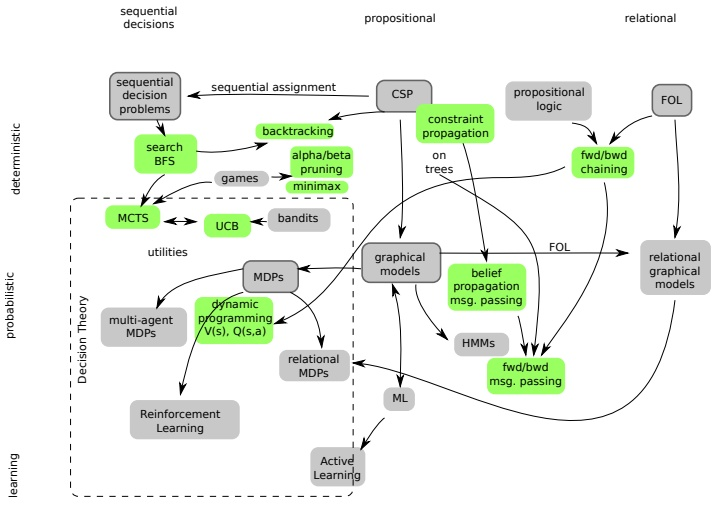

<!-- page: 6 -->

## 1 Introduction

## (some slides based on Stuart Russell’s AI course)

## What is intelligence?

• Maybe it is easier to first ask what systems we actually talk about:

– Decision making

– Interacting with an environment

• Then define objectives!

– Quantify what you consider good or successful

– Intelligence means to optimize...

1:1

## Intelligence as Optimization?

• A cognitive scientist or psychologist: “Why are you AI people always so obsessed with optimization? Humans are not optimal!”

• That’s a total misunderstanding of what “being optimal” means.

• Optimization principles are a means to describe systems:

– Feynman’s “unworldliness measure” objective function

– Everything can be cast optimal – under some objective

– Optimality principles are just a scientific means of formally describing systems and their behaviors (esp. in physics, economy, ... and AI)

– Toussaint, Ritter & Brock: The Optimization Route to Robotics – and Alternatives. Kunstliche ¨ Intelligenz, 2015

• Generally, I would roughly distinguish three basic types of problems:

– Optimization

– Logical/categorial Inference (CSP, find feasible solutions)

– Probabilistic Inference

<!-- page: 7 -->

– Acting to Learning (instead of ’Learning to Act’ for a fixed task)

– Related notions in other fields: (Bayesian) Experimental Design, Active Learning, curiosity, intrinsic motivation

• At time T, the system will be given a random task (e.g., random goal configuration of DOFs); the objective then is to reach it as quickly as possible

1:3

## More on objectives

• The value alignment dilemma

• What are objectives that describe things like “creativity”, “empathy”, etc?

• Coming up with objective functions that imply desired behavior is a core part of AI research

1:4

## Interactive domains

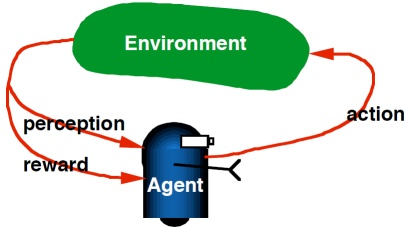

• We assume the agent is in interaction with a domain.

– The world is in a state $s _ { t } \in \mathcal { S }$ (see below on what that means)

– The agent senses observations $y _ { t } \in \mathcal { O }$

– The agent decides on an action $a _ { t } \in \mathcal { A }$

– The world transitions to a new state $s _ { t + 1 }$

• The observation $y _ { t }$ describes all information received by the agent (sensors, also rewards, feedback, etc) if not explicitly stated otherwise

(The technical term for this is a POMDP)

1:5

## State

• The notion of state is often used imprecisely

• At any time $t ,$ we assume the world is in a state $s _ { t } \in \mathcal { S }$

$s _ { t }$ is a state description of a domain iff future observations $y _ { t ^ { + } } , t ^ { + } > t$ are conditionally independent of all history observations $y _ { t ^ { - } } , t ^ { - } < t   \mathrm { g i v e n } \; s _ { t }$ and future actions $a _ { t : t ^ { + } }$

<!-- page: 8 -->

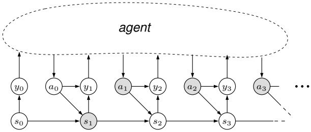

• Notes:

– Intuitively, $s _ { t }$ describes everything about the world that is “relevant”

– Worlds do not have additional latent (hidden) variables to the state $s _ { t }$

1:6

## Examples

• What is a sufficient definition of state of a computer that you interact with?

• What is a sufficient definition of state for a thermostat scenario? (First, assume the ’room’ is an isolated chamber.)

• What is a sufficient definition of state in an autonomous car case?

→ in real worlds, the exact state is practically not representable

→ all models of domains will have to make approximating assumptions (e.g., about independencies)

1:7

## How can agents be formally described?

...or, what formal classes of agents do exist?

• Basic alternative agent models:

– The agent maps $y _ { t } \mapsto a _ { t }$

(**stimulus-response** mapping.. non-optimal)

– The agent stores all previous observations and maps

$$
f: y _ {0: t}, a _ {0: t - 1} \mapsto a _ {t}
$$

f is called **agent function**. This is the most general model, including the others as special cases.

– The agent stores only the recent history and maps

$y _ { t - k : t } , a _ { t - k : t \cdot 1 } \mapsto a _ { t }$ (crude, but may be a good heuristic)

<!-- page: 9 -->

– The agent is some machine with its own **internal state** $n _ { t } , \mathbf { e . g . } ,$ a computer, a finite state machine, a brain... The agent maps $( n _ { t - 1 } , y _ { t } ) \mapsto n _ { t }$ (internal state update) and $n _ { t } \mapsto a _ { t }$

– The agent maintains a full probability distribution (**belief**) $b _ { t } ( s _ { t } )$ over the state, maps $( b _ { t - 1 } , y _ { t } ) \mapsto b _ { t }$ (Bayesian belief update), and $b _ { t } \mapsto a _ { t }$

1:8

## POMDP coupled to a state machine agent

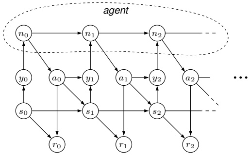

## Multi-agent domain models

(The technical term for this is a Decentralized POMDPs)

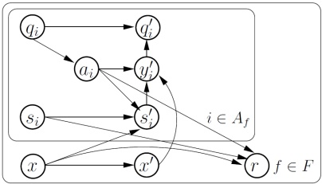

(from Kumar et al., IJCAI 2011)

• This is a special type (simplification) of a general DEC-POMDP

• Generally, this level of description is very general, but NEXP-hard Approximate methods can yield very good results, though

1:10

## Summary – AI is about:

• Systems that interact with the environment

<!-- page: 10 -->

– We distinguish between ’system’ and ’environment’ (cf. embodiment)

– We just introduced basic models of interaction

– A core part of AI research is to develop formal models for interaction

• Systems that aim to manipulate their invironment towards ’desired’ states (optimality)

– Optimality principles are a standard way to describe desired behaviors

– We sketched some interesting objectives

– Coming up with objective functions that imply desired behavior is a core part of AI research

1:11

## Organisation

1:12

## Vorlesungen der Abteilung MLR

• Bachelor:

– Grundlagen der Kunstlichen Intelligenz (3+1 SWS) ¨

• Master:

– Vertiefungslinie Intelligente Systeme (gemeinsam mit Andres Bruhn)

– WS: Maths for Intelligent Systems

– WS: Introduction to Robotics

– SS: Machine Learning

– (SS: Optimization)

– (Reinforcement Learning), (Advanced Robotics)

– Practical Course Robotics (SS)

– (Hauptseminare: Machine Learning (WS), Robotics (SS))

1:13

## Andres Bruhn’s Vorlesungen in der Vertiefungslinie

– WS: Computer Vision

– SS: Correspondence Problems in Computer Vision

– Hauptseminar: Recent Advances in Computer Vision

1:14

## Vorraussetzungen f ür die KI Vorlesung

• Mathematik fur Informatiker und Softwaretechniker ¨

• außerdem hilfreich:

– Algorithmen und Datenstrukturen

– Theoretische Informatik

<!-- page: 11 -->

1:15

## Vorlesungsmaterial

• Webseite zur Vorlesung:

https://ipvs.informatik.uni-stuttgart.de/mlr/marc/teachingdie Folien und Ubungsaufgaben werden dort online gestellt ¨

• Alle Materialien des letzten Jahres sind online – bitte machen Sie sich einen Eindruck

• Hauptliteratur:

Stuart Russell & Peter Norvig: Artificial Intelligence – A Modern Approach

– Many slides are adopted from Stuart

1:16

## Pr üfung

• Schriftliche Prufung, 90 Minuten ¨

• Termin zentral organisiert

• keine Hilfsmittel erlaubt

• Anmeldung: Im LSF / beim Prufungsamt ¨

• Prufungszulassung: ¨

– 50% der Punkte der Programmieraufgaben

– UND 50% der Votieraufgaben

1:17

## Ubungen ¨

• 8 Ubungsgruppen (4 Tutoren) ¨

• 2 Arten von Aufgaben: Coding- und Votier-Ubungen ¨

• Coding-Aufgaben: Teams von bis zu 3 Studenten geben die Coding-Aufgaben zusammen ab

• Votier-Aufgaben:

– Zu Beginn der Ubung eintragen, welche Aufgaben bearbeiten wurden/pr ¨ asentiert ¨ werden konnen ¨

– Zufallige Auswahl ¨

• Schein-Kriterium:

– 50% der Punkte der Programmieraufgaben

– UND 50% der Votieraufgaben

<!-- page: 12 -->

<!-- page: 13 -->

## 2 Search

(slides based on Stuart Russell’s AI course)

## Motivation & Outline

Search algorithms are a core tool for decision making, especially when the domain is too complex to use alternatives like Dynamic Programming. With the increase in computational power search methods became a standard method of choice for complex domains, like the game of Go, or certain POMDPs. Recently, they are combined with machine learning methods which learn heuristics or evaluation functions to guide search.

Learning about search tree algorithms is an important background for several reasons:

• The concept of decision trees, which represent the space of possible future decisions and state transitions, is generally important for thinking about decision problems.

• In probabilistic domains, tree search algorithms are a special case of Monte-Carlo methods to estimate some expectation, typically the so-called Q-function. The respective Monte-Carlo Tree Search algorithms are the state-of-the-art in many domains.

• Tree search is also the background for backtracking in CSPs as well as forward and backward search in logic domains.

We will cover the basic tree search methods (breadth, depth, iterative deepening) and eventually A∗

## Outline

• Problem formulation & examples

• Basic search algorithms

2:1

## 2.1 Problem Formulation & Examples

2:2

## Example: Romania

On holiday in Romania; currently in Arad. Flight leaves tomorrow from Bucharest Formulate goal: be in Bucharest, S<sub>goal</sub> = {Bucharest}

<!-- page: 14 -->

Formulate problem:

states: various cities, $\mathfrak { S } = \{ \mathrm { A r a d } , \mathrm { T i m i s o a r a } , \dots \}$

actions: drive between cities, A = {edges between states}

Find solution:

sequence of cities, e.g., Arad, Sibiu, Fagaras, Bucharest minimize costs with cost function, $( s , a ) \mapsto c$

2:3

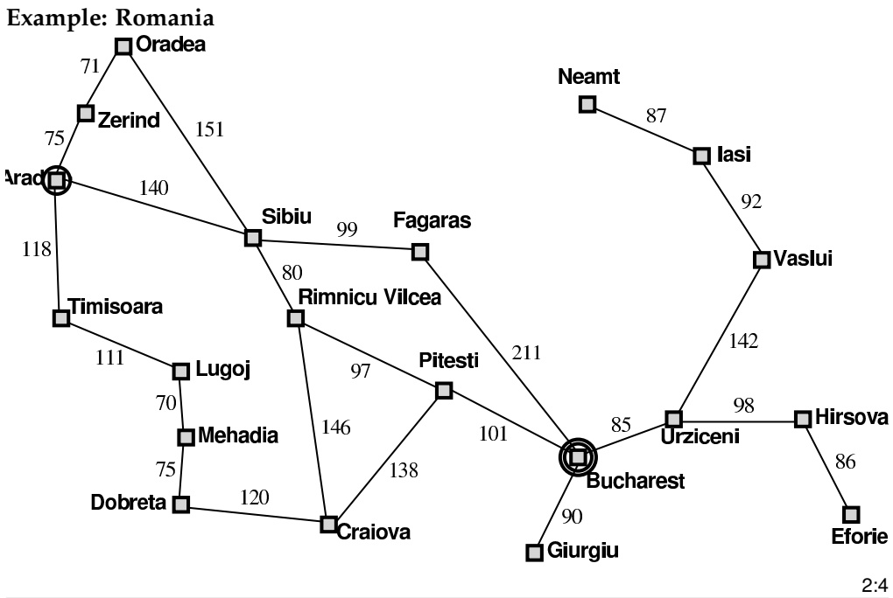

**Deterministic, fully observable search problem**

A deterministic, fully observable search problem is defined by four items:

<div class="docvortex-algorithm" style="white-space: pre-wrap; font-family:monospace;">
initial state $s_0 \in \mathcal{S}$ e.g., $s_0 = \text{Arad}$
successor function $succ : \mathcal{S} \times \mathcal{A} \to \mathcal{S}$
e.g., $succ(\text{Arad}, \text{Arad-Zerind}) = \text{Zerind}$
goal states $\mathcal{S}_{\text{goal}} \subseteq \mathcal{S}$
e.g., $s = \text{Bucharest}$
step cost function $cost(s, a, s')$, assumed to be $\geq 0$
e.g., traveled distance, number of actions executed, etc.
the path cost is the sum of step costs
</div>

A solution is a sequence of actions leading from $s _ { 0 }$ to a goal An optimal solution is a solution with minimal path costs

<!-- page: 15 -->

## Example: The 8-puzzle

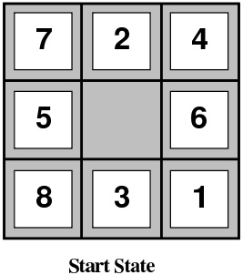

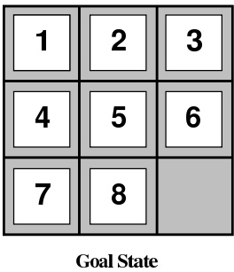

<u>goal test</u>??: = goal state (given)

<u>path cost</u>??: 1 per move

[Note: optimal solution of n-Puzzle family is NP-hard]

## 2.2 Basic Tree Search Algorithms

Tree search example

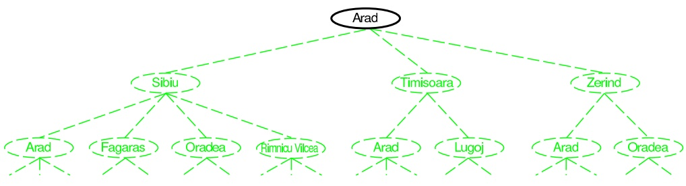

<!-- page: 16 -->

Tree search example

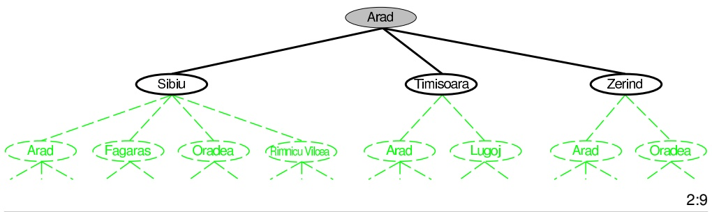

**Tree search example**

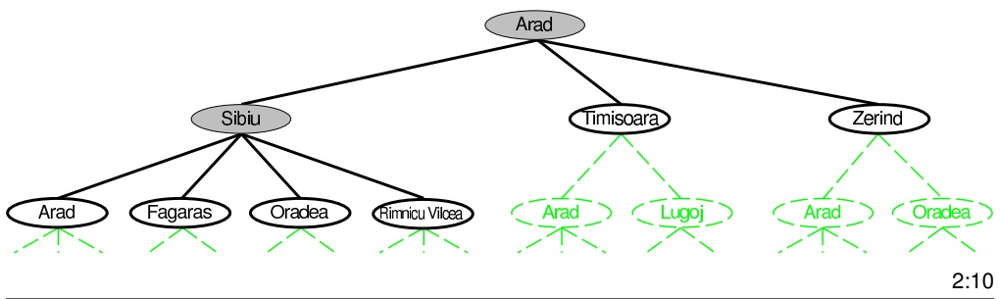

## Implementation: states vs. nodes

• A state is a (representation of) a physical configuration

• A node is a data structure constituting part of a search tree includes parent, children, depth, path cost $g ( x )$

(States do not have parents, children, depth, or path cost!)

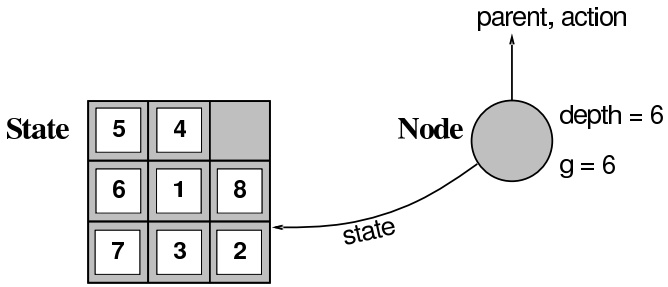

• The EXPAND function creates new nodes, filling in the various fields and using the SUCCESSORFN of the problem to create the corresponding states.

<!-- page: 17 -->

2:11

## Implementation: general tree search

```txt
function TREE-SEARCH(problem, fringe) returns a solution, or failure
    fringe ← INSERT(MAKE-NODE(INITIAL-STATE[problem]), fringe)
    loop do
        if fringe is empty then return failure
        node ← REMOVE-FRONT(fringe)
        if GOAL-TEST(problem, STATE(node)) then return node
        fringe ← INSERTALL(EXPAND(node, problem), fringe)

function EXPAND(node, problem) returns a set of nodes
successors ← the empty set
for each action, result in SUCCESSOR-FN(problem, STATE[node]) do
    s ← a new NODE
    PARENT-NODE[s] ← node; ACTION[s] ← action; STATE[s] ← result
    PATH-COST[s] ← PATH-COST[node] + STEP-COST(STATE[node], action, result)
    DEPTH[s] ← DEPTH[node] + 1
    add s to successors
return successors
```

2:12

## Search strategies

• A strategy is defined by picking the ordering of the fringe

• Strategies are evaluated along the following dimensions: completeness—does it always find a solution if one exists? time complexity—number of nodes generated/expanded space complexity—maximum number of nodes in memory optimality—does it always find a least-cost solution?

• Time and space complexity are measured in terms of

b = maximum branching factor of the search tree

d = depth of the least-cost solution

m = maximum depth of the state space (may be ∞)

2:13

## Summary of Search Strategies

• Breadth-first: fringe is a FIFO

• Depth-first: finge is a LIFO

• Iterative deepening search: repeat depth-first for increasing depth limit

• Uniform-cost: sort fringe by g

• A∗: sort by f = g + h

<!-- page: 18 -->

## Breadth-first search

• Pick shallowest unexpanded node

• Implementation:

fringe is a **FIFO** queue, i.e., new successors go at end

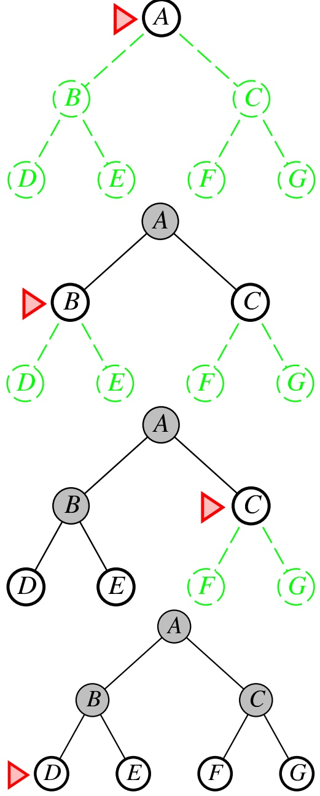

<!-- page: 19 -->

<div class="docvortex-algorithm" style="white-space: pre-wrap; font-family:monospace;">
Complete?? Yes (if $b$ is finite)
Time?? $1 + b + b^2 + b^3 + \ldots + b^d + b(b^d - 1) = O(b^{d+1})$, i.e., exp. in $d$
Space?? $O(b^{d+1})$ (keeps every node in memory)
Optimal?? Yes, if cost-per-step=1; not optimal otherwise
Space is the big problem; can easily generate nodes at 100MB/sec so 24hrs = 8640GB.
</div>

## Uniform-cost search

```txt
- "Cost-aware BFS": Pick least-cost unexpanded node
```

• Implementation:

• Equivalent to breadth-first if step costs all equal

```txt
Complete?? Yes, if step cost ≥ ε
Time?? # of nodes with g ≤ cost-of-optimal-solution, O(b^[C* / ε]) where C* is the cost of the optimal solution
Space?? # of nodes with g ≤ cost-of-optimal-solution, O(b^[C* / ε]) Optimal?? Yes: nodes expanded in increasing order of g(n)
```

## Depth-first search

• Pick deepest unexpanded node

• Implementation:

fringe = **LIFO** queue, i.e., put successors at front

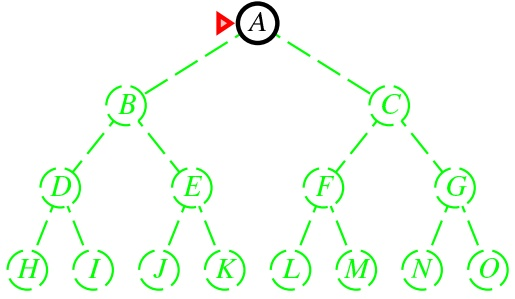

<!-- page: 20 -->

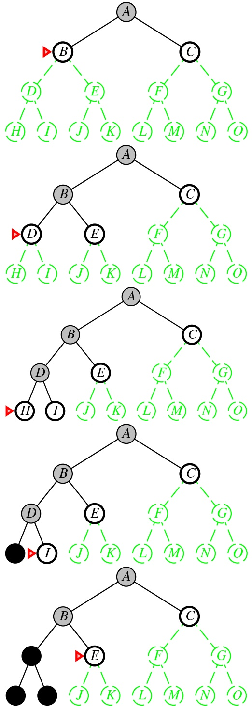

<!-- page: 21 -->

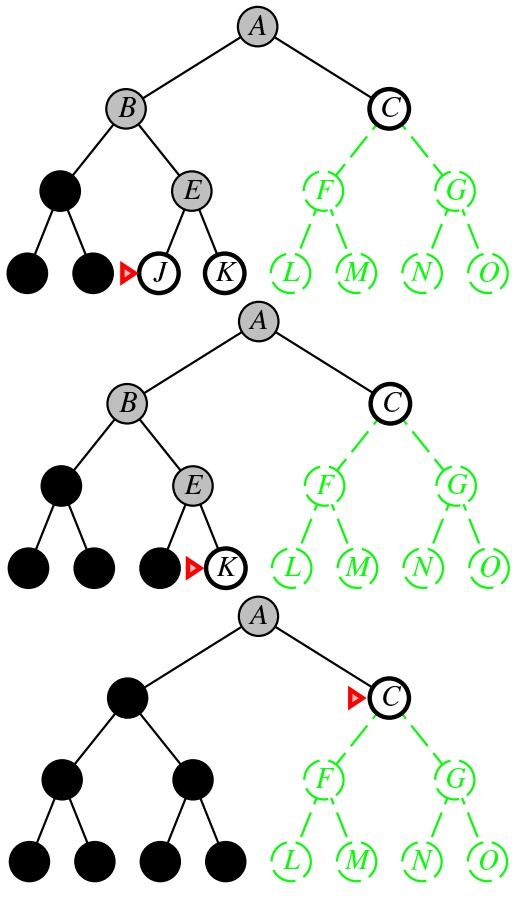

2:18

## Properties of depth-first search

<u>Complete</u>?? No: fails in infinite-depth spaces, spaces with loops

Modify to avoid repeated states along path ⇒ complete in finite spaces

<u>Time</u>?? O(b<sup>m</sup>): terrible if m is much larger than d

but if solutions are dense, may be much faster than breadth-first

<u>Space</u>?? O(bm), i.e., linear space!

<u>Optimal</u>?? No

2:19

## Depth-limited search

• depth-first search with depth limit l,

i.e., nodes at depth l have no successors

• Recursive implementation using the stack as LIFO:

<!-- page: 22 -->

```txt
function DEPTH-LIMITED-SEARCH(problem, limit) returns soln/fail/cutoff
    RECURSIVE-DLS(MAKE-NODE(INITIAL-STATE[problem]), problem, limit)
function RECURSIVE-DLS(node, problem, limit) returns soln/fail/cutoff
    cutoff-occurred? ← false
    if GOAL-TEST(problem, STATE[node]) then return node
    else if DEPTH[node] = limit then return cutoff
    else for each successor in EXPAND(node, problem) do
        result ← RECURSIVE-DLS(successor, problem, limit)
        if result = cutoff then cutoff-occurred? ← true
        else if result ≠ failure then return result
    if cutoff-occurred? then return cutoff else return failure
```

2:20

## Iterative deepening search

```txt
function ITERATIVE-DEEPENING-SEARCH(problem) returns a solution
  inputs: problem, a problem

  for depth ← 0 to ∞ do
    result ← DEPTH-LIMITED-SEARCH(problem, depth)
    if result ≠ cutoff then return result
  end
```

2:21

## Iterative deepening search

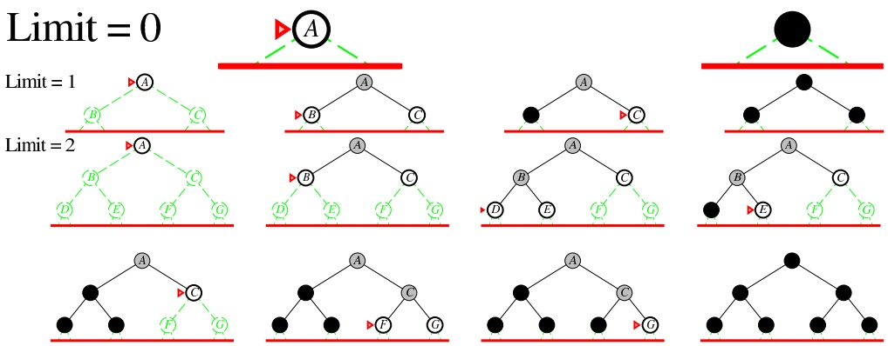

<!-- page: 23 -->

<div class="docvortex-algorithm" style="white-space: pre-wrap; font-family:monospace;">
Complete?? Yes
Time??  $(d+1)b^{0}+db^{1}+(d-1)b^{2}+\ldots+b^{d}=O(b^{d})$ 
Space?? O(bd)
Optimal?? Yes, if step cost = 1
Can be modified to explore uniform-cost tree
Numerical comparison for b = 10 and d = 5, solution at far left leaf:
</div>

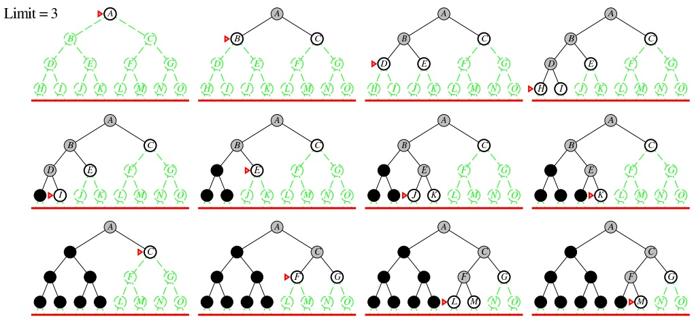

## Properties of iterative deepening search

$$
N (\mathrm{IDS}) = 5 0 + 4 0 0 + 3 0 0 0 + 2 0 0 0 0 + 1 0 0 0 0 0 = 1 2 3 4 5 0
$$

$$
N (\mathrm{BFS}) = 1 0 + 1 0 0 + 1 0 0 0 + 1 0 0 0 0 + 1 0 0 0 0 0 + 9 9 9 9 9 0 = 1 1 1 1 1 0 0
$$

• IDS does better because other nodes at depth d are not expanded

• BFS can be modified to apply goal test when a node is generated

2:23

## Summary of algorithms

<table><tbody><tr><td rowspan="2">Criterion</td><td rowspan="2">Breadth-First</td><td rowspan="2">Uniform-Cost</td><td rowspan="2">Depth-First</td><td rowspan="2">Depth-Limited</td><td rowspan="2">Iterative Deepening</td></tr><tr></tr><tr><td>Complete?</td><td>Yes<sup>∗</sup></td><td>Yes<sup>∗</sup></td><td>No</td><td>Yes, if l ≥ d</td><td>Yes</td></tr><tr><td>Time</td><td>b<sup>d+1</sup></td><td>b<sup>dC∗</sup>/e</td><td>b<sup>m</sup></td><td>b<sup>l</sup></td><td>b<sup>d</sup></td></tr><tr><td>Space</td><td>b<sup>d+1</sup></td><td>b<sup>dC∗</sup>/e</td><td>bm</td><td>bl</td><td>bd</td></tr><tr><td>Optimal?</td><td>Yes<sup>∗</sup></td><td>Yes</td><td>No</td><td>No</td><td>Yes<sup>∗</sup></td></tr></tbody></table>

<!-- page: 24 -->

## Loops: Repeated states

• Failure to detect repeated states can turn a linear problem into an exponential one!

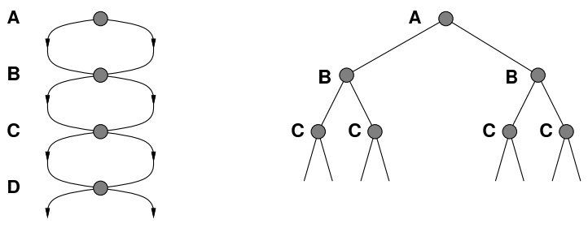

2:25

## Graph search

```lua
function GRAPH-SEARCH(problem, fringe) returns a solution, or failure
    closed ← an empty set
    fringe ← INSERT(MAKE-NODE(INITIAL-STATE[problem]), fringe)
loop do
    if fringe is empty then return failure
    node ← REMOVE-FRONT(fringe)
    if GOAL-TEST(problem, STATE[node]) then return node
    if STATE[node] is not in closed then
        add STATE[node] to closed
        fringe ← INSERTALL(EXPAND(node, problem), fringe)
end
```

But: storing all visited nodes leads again to exponential space complexity (as for BFS)

2:26

## Summary

• In BFS (or uniform-cost search), the fringe propagates layer-wise, containing nodes of similar distance-from-start (cost-so-far), leading to optimal paths but exponential space complexity $O ( b ^ { d + 1 } )$

• In DFS, the fringe is like a deep light beam sweeping over the tree, with space complexity $\bar { O ( b m ) }$ . Iteratively deepening it also leads to optimal paths.

• Graph search can be exponentially more efficient than tree search, but storing the visited nodes leads to exponential space complexity as BFS.

2:27

<!-- page: 25 -->

## Best-first search

• Idea: use an arbitrary priority function $f ( n )$ for each node

– actually $f ( n )$ is neg-priority: nodes with lower $f ( n )$ have higher priority

$f ( n )$ should reflect which nodes could be on an optimal path

– could is optimistic – the lower $f ( n )$ the more optimistic you are that n is on an optimal path

⇒ Pick the node with highest priority

• Implementation:

fringe is a queue sorted with decreasing priority (increasing f-value)

• Special cases:

– uniform-cost search $( f = g )$

– greedy search $( f = h )$

$\mathrm { A } ^ { * }$ search $( f = g + h )$

2:29

## Uniform-Cost Search as special case

• Define $g ( n ) = \mathrm { c o s t - s o - f a r }$ to reach n

• Then Uniform-Cost Search is Prioritized Search with $f = g$

2:30

## A∗search

• Idea: combine information from the past and the future

– neg-priority = cost-so-far + estimated cost-to-go

• The evaluation function is $f ( n ) = g ( n ) + h ( n )$ , with

– g(n) = cost-so-far to reach n

– h(n) = estimated cost-to-go from n

– f(n) = estimated total cost of path through n to goal

• A∗search uses an admissible $( = \mathrm { o p t i m i s t i c } )$ heuristic

– i.e., $h ( n ) \leq h ^ { * } ( n )$ where $h ^ { * } ( n )$ is the true cost-to-go from n.

– (Also require $h ( n ) \geq 0 ,$ so $h ( G ) = 0$ for any goal G.)

$\mathrm { E . g . , } ~ h _ { \mathrm { S L D } } ( n )$ never overestimates the actual road distance

• Theorem: $\mathbf { A } ^ { * }$ search is optimal (=finds the optimal path)

2:31

A∗**search example**

<!-- page: 26 -->

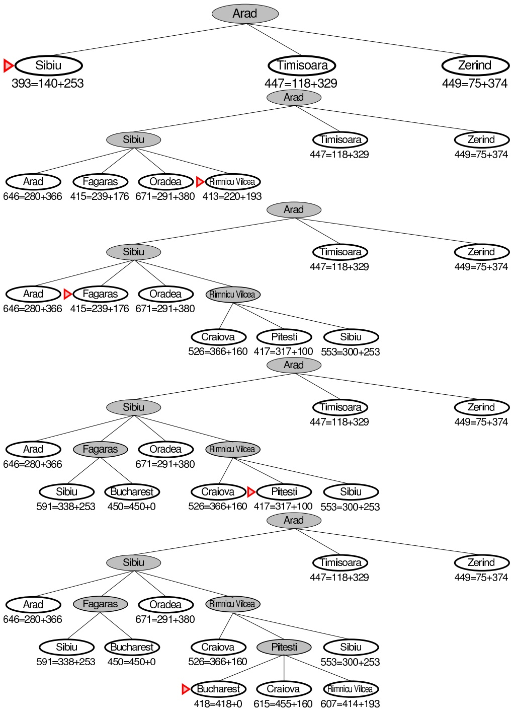

<!-- page: 27 -->

## Proof of optimality of $\mathbf { A } ^ { * }$

• Suppose some suboptimal goal $G _ { 2 }$ has been generated and is in the fringe (but has not yet been selected to be tested for goal condition!). We want to proof: Any node on a shortest path to an optimal goal G will be expanded before $G _ { 2 }$

• Let n be an unexpanded node on a shortest path to G.

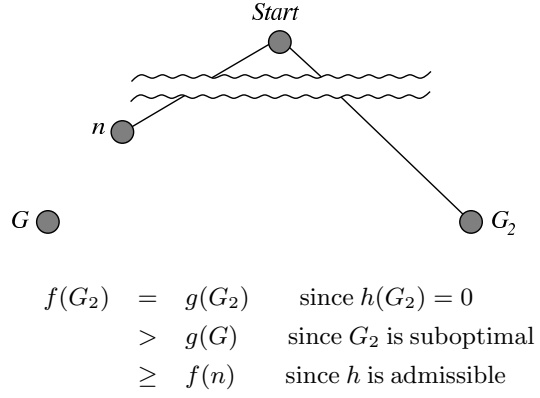

• Since $f(n) < f(G_2), \mathbf{A}^*$ will expand n before $G _ { 2 }$ . This is true for any n on the shortest path. In particular, at some time $G$ is added to the fringe, and since $f(G)   =   g(G)   <$ $f ( G _ { 2 } ) = g ( G _ { 2 } )$ it will select G before $G _ { 2 }$ for goal testing.

2:33

## Properties of $\mathbf { A } ^ { * }$

<u>Complete</u>?? Yes, unless there are infinitely many nodes with $f \leq f ( G )$

<u>Time</u>?? Exponential in [relative error in $h \times$ length of soln.]

<u>Space</u>?? Exponential. Keeps all nodes in memory

<u>Optimal</u>?? Yes

$\mathbf { A } ^ { * }$ expands all nodes with $f(n) < C^{*}$

$\mathbf { A } ^ { * }$ expands some nodes with $f(n) = C^{*}$

$\mathbf { A } ^ { * }$ expands no nodes with $f(n) > C^{*}$

2:34

## Optimality of $\mathbf { A } ^ { * }$ (more useful)

• Lemma: $\mathbf { A } ^ { * }$ expands nodes in order of increasing f value<sup>∗</sup>

Gradually adds “f-contours” of nodes (cf. breadth-first adds layers)

Contour i has all nodes with $f = f _ { i }$ , where $f _ { i } < f _ { i + 1 }$

<!-- page: 28 -->

2:35

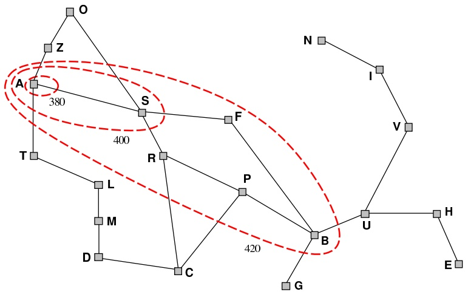

**Proof of lemma: Consistency**

• A heuristic is consistent if

$$
h (n) \leq c (n, a, n ^ {\prime}) + h (n ^ {\prime})
$$

• If h is consistent, we have

$$
\begin{array}{r c l} f (n ^ {\prime}) & = & g (n ^ {\prime}) + h (n ^ {\prime}) \\ & = & g (n) + c (n, a, n ^ {\prime}) + h (n ^ {\prime}) \\ & \geq & g (n) + h (n) \\ & = & f (n) \end{array}
$$

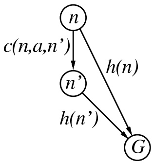

I.e., $f ( n )$ is nondecreasing along any path.

2:36

## Admissible heuristics

E.g., for the 8-puzzle:

$h _ { 1 } ( n )$ = number of misplaced tiles

$h _ { 2 } ( n )$ = total Manhattan distance

(i.e., no. of squares from desired location of each tile)

<!-- page: 29 -->

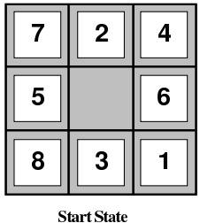

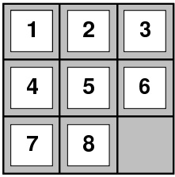

$$
\overline {{h _ {2} (S)}} = \text {??} 4 + 0 + 3 + 3 + 1 + 0 + 2 + 1 = 1 4
$$

2:37

## Dominance

<div class="docvortex-algorithm" style="white-space: pre-wrap; font-family:monospace;">
If $h_2(n) \geq h_1(n)$ for all $n$ (both admissible)
then $h_2$ dominates $h_1$ and is better for search
Typical search costs:
    $d = 14$ IDS = 3,473,941 nodes
        A*(h1) = 539 nodes
        A*(h2) = 113 nodes
    $d = 24$ IDS ≈ 54,000,000,000 nodes
        A*(h1) = 39,135 nodes
        A*(h2) = 1,641 nodes
Given any admissible heuristics $h_a, h_b$,
$h(n) = \max(h_a(n), h_b(n))$
is also admissible and dominates $h_a, h_b$
</div>

2:38

## Relaxed problems

• Admissible heuristics can be derived from the exact solution cost of a relaxed version of the problem

• If the rules of the 8-puzzle are relaxed so that a tile can move anywhere, then $h _ { 1 } ( n )$ gives the shortest solution

• If the rules are relaxed so that a tile can move to any adjacent square, then $h _ { 2 } ( n )$ gives the shortest solution

• Key point: the optimal solution cost of a relaxed problem is no greater than the optimal solution cost of the real problem

2:39

## Memory-bounded $\mathbf { A } ^ { * }$

• As with BFS, $\mathbf { A } ^ { * }$ has exponential space complexity

<!-- page: 30 -->

• Iterative-deepening $\mathbf { A } ^ { * }$ , works for integer path costs, but problematic for realvalued

• (Simplified) Memory-bounded $\mathrm { A ^ { * } \left( S M A ^ { * } \right) }$

– Expand as usual until a memory bound is reach

– Then, whenever adding a node, remove the worst node $n ^ { \prime }$ from the tree

– worst means: the $n ^ { \prime }$ with highest $f ( n ^ { \prime } )$

– To not loose information, backup the measured step-cost cost $( \tilde { n } , a , n ^ { \prime } )$ to improve the heuristic $h ( \tilde { n } )$ of its parent

SMA∗is complete and optimal if the depth of the optimal path is within the memory bound

2:40

## Summary

• Combine information from the past and the future

• A heuristic function $h ( n )$ represents information about the future

it estimates cost-to-go optimistically

• Good heuristics can dramatically reduce search cost

$\mathbf { A } ^ { * }$ search expands lowest $f = g + h$

– neg-priority = cost-so-far + estimated cost-to-go

– complete and optimal

– also optimally efficient (up to tie-breaks, for forward search)

• Admissible heuristics can be derived from exact solution of relaxed problems

• Memory-bounded startegies exist

2:41

## Outlook

• Tree search with partial observations

– we discuss this in a fully probabilistic setting later

• Tree search for games

– minimax extension to tree search

– probabilistic Monte-Carlo tree search methods for games

2:42

<!-- page: 31 -->

## 3 Probabilities

## Motivation & Outline

AI systems need to reason about what they know, or not know. Uncertainty may have so many sources: The environment might be stochatic, making it impossible to predict the future deterministically. The environment can only partially be observed, leading to uncertainty about the rest. This holds especially when the environment includes other agents or humans, the intensions of which are not directly observable. A system can only collect limited data, necessarily leading to uncertain models. We need a calculus for all this. And probabilities are the right calculus.

Actually, the trivial Bayes’ rule in principle tells us how we have to process information: whenever we had prior uncertainty about something, then get new information, Bayes’ rules tells us how to update our knowledge. This concept is so general that it includes large parts of Machine Learning, (Bayesian) Reinforcement Learning, Bayesian filtering (Kalman & particle filters), etc. The caveat of course is to compute or approximate such Bayesian information processing in practise.

In this lecture we introduce some basics of probabilities, many of which you’ve learned before in other courses. So the aim is also to recap and introduce the notation. What we introduce is essential for the later lectures on bandits, reinforcement learning, graphical models, and relational probabilistic models.

## Outline

• This set of slides is only for your reference. Only what is \*-ed below and was explicitly discussed in the lecture is relevant for the exam.

• Basic definitions\*

– Random variables\*

– joint, conditional, marginal distribution\*

– Bayes’ theorem\*

• Probability distributions:

– Binomial & Beta

– Multinomial & Dirichlet

– Conjugate priors

– Gauss & Wichart

– Student-t; Dirak; etc

– Dirak & Particles

• Utilities, decision theory, entropy, KLD

• Monte Carlo\*, Rejection & Importance Sampling

<!-- page: 32 -->

• Why do we need probabilities?

– Obvious: to express inherent (objective) stochasticity of the world

• But beyond this: (also in a “deterministic world”):

– lack of knowledge!

– hidden (latent) variables

– expressing uncertainty

– expressing information (and lack of information)

– **Subjective Probability**

• Probability Theory: an information calculus

## Objective Probability

The double slit experiment:

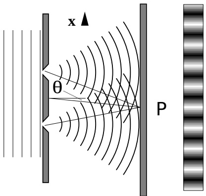

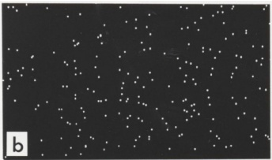

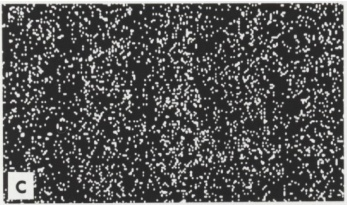

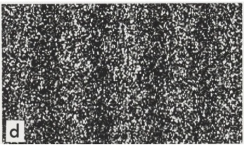

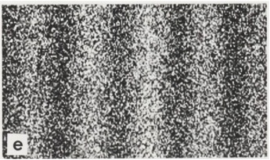

<!-- page: 33 -->

## Thomas Bayes (1702-–1761)

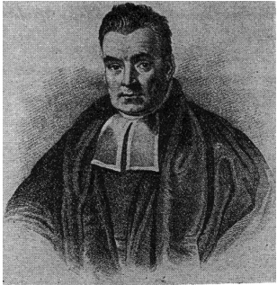

“Essay Towards Solving a Problem in the Doctrine of Chances”

REV. T. BAYES

• Addresses problem of inverse probabilities:

Knowing the conditional probability of B given A, what is the conditional probability of A given B?

## • Example:

40% Bavarians speak dialect, only 1% of non-Bavarians speak (Bav.) dialect Given a random German that speaks non-dialect, is he Bavarian?

(15% of Germans are Bavarian)

3:4

## Inference

• “Inference” = Given some pieces of information (prior, observed variabes) what is the implication (the implied information, the posterior) on a non-observed variable

## • Decision-Making and Learning as Inference:

– given pieces of information: about the world/game, collected data, assumed model class, prior over model parameters

– make decisions about actions, classifier, model parameters, etc

<!-- page: 34 -->

• Bayesian (subjective) probabilities quantify degrees of belief

Example: “The probability of it raining tomorrow is $0 . 3 ^ { \prime \prime }$

– Not possible to repeat “tomorrow”

3:6

## 3.1 Basic definitions

3:7

<div class="docvortex-algorithm" style="white-space: pre-wrap; font-family:monospace;">
Probabilities &amp; Sets
• Sample Space/domain $\Omega$, e.g. $\Omega = \{1, 2, 3, 4, 5, 6\}$
• Probability $P: A \subset \Omega \mapsto [0, 1]$
e.g., $P(\{1\}) = \frac{1}{6}$, $P(\{4\}) = \frac{1}{6}$, $P(\{2, 5\}) = \frac{1}{3}$,
• Axioms: $\forall A, B \subseteq \Omega$
- Nonnegativity $P(A) \geq 0$
- Additivity $P(A \cup B) = P(A) + P(B)$ if $A \cap B = \{\}$
- Normalization $P(\Omega) = 1$
• Implications
$0 \leq P(A) \leq 1$
$P(\{\}) = 0$
$A \subseteq B \Rightarrow P(A) \leq P(B)$
$P(A \cup B) = P(A) + P(B) - P(A \cap B)$
$P(\Omega \setminus A) = 1 - P(A)$
</div>

## Probabilities & Random Variables

• For a random variable X with discrete domain dom(X) = Ω we write:

$$
\forall_ {x \in \Omega}: 0 \leq P (X = x) \leq 1
$$

$$
\sum_ {x \in \Omega} P (X = x) = 1
$$

Example: A dice can take values $\Omega = \{ 1 , . . , 6 \}$

X is the random variable of a dice throw.

$P ( X   =   1 ) \in [ 0 , 1 ]$ is the probability that X takes value 1.

• A bit more formally: a random variable is a map from a measureable space to the domain (sample space) and thereby introduces a probability measure on the domain

<!-- page: 35 -->

<div class="docvortex-algorithm" style="white-space: pre-wrap; font-family:monospace;">
Probability Distributions
• $P(X=1) \in \mathbb{R}$ denotes a specific probability
$P(X)$ denotes the probability distribution (function over $\Omega$)
Example: A dice can take values $\Omega = \{1, 2, 3, 4, 5, 6\}$.
By $P(X)$ we describe the full distribution over possible values $\{1, .., 6\}$. These are 6 numbers that sum to one, usually stored in a table, e.g.: $[\frac{1}{6}, \frac{1}{6}, \frac{1}{6}, \frac{1}{6}, \frac{1}{6}, \frac{1}{6}]$
• In implementations we typically represent distributions over discrete random variables as tables (arrays) of numbers
• Notation for summing over a RV:
In equation we often need to sum over RVs. We then write
$\sum_{X} P(X) \cdots$
as shorthand for the explicit notation $\sum_{x \in \text{dom}(X)} P(X=x) \cdots$
3:10
Joint distributions
Assume we have two random variables X and Y
• Definitions:
Joint: $P(X,Y)$
Marginal: $P(X) = \sum_{Y} P(X,Y)$
Conditional: $P(X|Y) = \frac{P(X,Y)}{P(Y)}$
The conditional is normalized: $\forall_Y : \sum_X P(X|Y) = 1$
• X is independent of Y iff: $P(X|Y) = P(X)$
(table thinking: all columns of $P(X|Y)$ are equal)
3:11
Joint distributions
joint: $P(X,Y)$
marginal: $P(X) = \sum_Y P(X,Y)$
conditional: $P(X|Y) = \frac{P(X,Y)}{P(Y)}$
• Implications of these definitions:
</div>

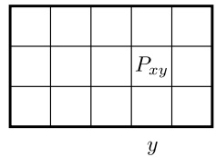

<!-- page: 36 -->

Product rule:

$$
P (X, Y) = P (X | Y) P (Y) = P (Y | X) P (X)
$$

Bayes’ Theorem:

$$
P (X | Y) = \frac {P (Y | X) P (X)}{P (Y)}
$$

3:12

**Bayes’ Theorem**

$$
P (X | Y) = \frac {P (Y | X) P (X)}{P (Y)}
$$

$$
\text {posterior} = \frac {\text {likelihood} \cdot \text {prior}}{\text {normalization}}\tag{3:13}
$$

## Multiple RVs:

• Analogously for n random variables $X _ { 1 : n }$ (stored as a rank n tensor)

Joint: $P ( X _ { 1 : n } )$

Marginal: $\textstyle P ( X _ { 1 } ) = \sum _ { X _ { 2 : n } } P ( X _ { 1 : n } ) ,$

Conditional: $\begin{array} { r } { P ( X _ { 1 } | X _ { 2 : n } ) = \frac { P ( X _ { 1 : n } ) } { P ( X _ { 2 : n } ) } } \end{array}$

• X is conditionally independent of Y given $Z$ iff:

$$
P (X | Y, \bar {Z}) = P (X | Z)
$$

• Product rule and Bayes’ Theorem:

$$
P (X, Z, Y) = P (X | Y, Z)   P (Y | Z)   P (Z)
$$

$$
P (X _ {1: n}) = \prod_ {i = 1} ^ {n} P (X _ {i} | X _ {i + 1: n})
$$

$$
P (X _ {1} | X _ {2: n}) = \frac {P (X _ {2} | X _ {1} , X _ {3 : n}) P (X _ {1} | X _ {3 : n})}{P (X _ {2} | X _ {3 : n})}
$$

$$
P (X | Y, Z) = \frac {P (Y | X , Z) P (X | Z)}{P (Y | Z)}
$$

$$
P (X, Y | Z) = \frac {P (X , Z | Y) P (Y)}{P (Z)}\tag{3:14}
$$

## 3.2 Probability distributions\*\*

recommended reference: Bishop.: Pattern Recognition and Machine Learning

3:15

<!-- page: 37 -->

• We have a binary random variable $x \in \{ 0 , 1 \} \quad ( \mathrm { i . e .   d o m } ( x ) = \{ 0 , 1 \} )$

The Bernoulli distribution is parameterized by a single scalar $\mu ,$

$$
P (x = 1 \mid \mu) = \mu , \quad P (x = 0 \mid \mu) = 1 - \mu
$$

$$
\mathrm{Bern} (x \mid \mu) = \mu^ {x} (1 - \mu) ^ {1 - x}
$$

• We have a data set of random variables $D   =   \{ x _ { 1 } , . . , x _ { n } \}$ , each $x _ { i }   \in   \{ 0 , 1 \}$ . If each $x _ { i } \sim \operatorname { B e r n } ( x _ { i } \operatorname { | } \mu )$ we have

$$
P (D \mid \mu) = \prod_ {i = 1} ^ {n} \mathrm{Bern} (x _ {i} \mid \mu) = \prod_ {i = 1} ^ {n} \mu^ {x _ {i}} (1 - \mu) ^ {1 - x _ {i}}
$$

argmaxlog $P ( D \thinspace \vert \thinspace \mu ) = \operatorname * { a r g m a x } _ { \mu } ~ \sum _ { i = 1 } ^ { n } x _ { i } \operatorname { l o g } \mu + ( 1 - x _ { i } ) \operatorname { l o g } ( 1 - \mu ) = \frac { 1 } { n } \sum _ { i = 1 } ^ { n } x _ { i }$ $\mu$

• The Binomial distribution is the distribution over the count $\textstyle m = \sum _ { i = 1 } ^ { n } x _ { i }$

$$
\mathrm{Bin} (m \mid n, \mu) = \binom{n}{m} \mu^ {m} (1 - \mu) ^ {n - m}, \quad \binom{n}{m} = \frac {n !}{(n - m) !   m !}
$$

3:16

## Beta

## How to express uncertainty over a Bernoulli parameter $\mu$

• The Beta distribution is over the interval $[ 0 , 1 ]$ , typically the parameter $\mu$ of a Bernoulli:

$$
\mathrm{Beta} (\mu \mid a, b) = \frac {1}{B (a , b)} \mu^ {a - 1} (1 - \mu) ^ {b - 1}
$$

with mean $\begin{array} { r } { \langle \mu \rangle = \frac { a } { a + b } } \end{array}$ and mode $\begin{array} { r } { \mu ^ { * } = \frac { a - 1 } { a + b - 2 } } \end{array}$ for $a , b > 1$

• The crucial point is:

– Assume we are in a world with a “Bernoulli source” (e.g., binary bandit), but don’t know its parameter $\mu$

– Assume we have a prior distribution $P ( \mu ) = \operatorname { B e t a } ( \mu   |   a , b )$

– Assume we collected some data $D   =   \{ x _ { 1 } , . . , x _ { n } \} ,   x _ { i }   \in   \{ 0 , 1 \}$ , with counts $a _ { D } \: = \:$ $\scriptstyle \sum _ { i } x _ { i } \; { \mathrm { o f } } \; [ x _ { i }   =   1 ]$ and $b _ { D } = \textstyle \sum _ { i } ( 1 - x _ { i } ) \; { \mathrm { o f } } \; [ x _ { i }   =   0 ]$

– The posterior is

$$
\begin{array}{r l} P (\mu \mid D) & = \frac {P (D \mid \mu)}{P (D)}   P (\mu) \propto \mathrm{Bin} (D \mid \mu)   \mathrm{Beta} (\mu \mid a, b) \\ & \quad \propto \mu^ {a _ {D}} (1 - \mu) ^ {b _ {D}}   \mu^ {a - 1} (1 - \mu) ^ {b - 1} = \mu^ {a - 1 + a _ {D}} (1 - \mu) ^ {b - 1 + b _ {D}} \\ & \quad = \mathrm{Beta} (\mu \mid a + a _ {D}, b + b _ {D}) \end{array}
$$

<!-- page: 38 -->

## Beta

The prior is Beta $( \mu   |   a , b )$ , the posterior is Beta $. ( \mu \left| \right. a + a _ { D } , b + b _ { D } )$

• Conclusions:

– The semantics of a and b are counts of $[ x _ { i }   =   1 ]$ and $[ x _ { i }   =   0 ]$ , respectively

– The Beta distribution is conjugate to the Bernoulli (explained later)

– With the Beta distribution we can represent beliefs (state of knowledge) about uncertain $\mu \in [ 0 , 1 ]$ and know how to update this belief given data

3:18

## Beta

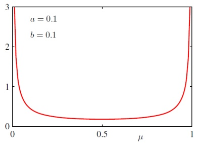

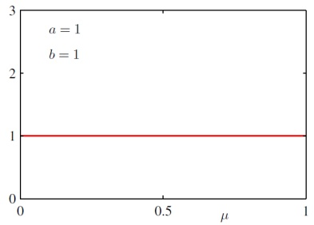

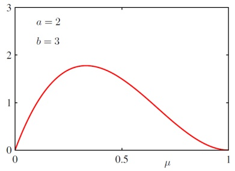

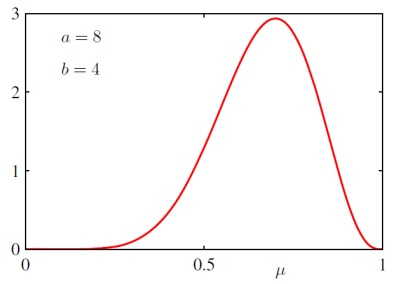

## Multinomial

• We have an integer random variable $x \in \{ 1 , . . , K \}$

The probability of a single x can be parameterized by $\mu = ( \mu _ { 1 } , . . , \mu _ { K } )$

$$
P (x = k \mid \mu) = \mu_ {k}
$$

with the constraint $\textstyle \sum _ { k = 1 } ^ { K } \mu _ { k } = 1$ (probabilities need to be normalized)

• We have a data set of random variables $D = \{ x _ { 1 } , . . , x _ { n } \} _ { . }$ , each $x _ { i } \in \{ 1 , . . , K \}$ . If each $x _ { i } \sim P ( x _ { i } \operatorname { | } \mu )$ we have

$$
P (D \mid \mu) = \prod_ {i = 1} ^ {n} \mu_ {x _ {i}} = \prod_ {i = 1} ^ {n} \prod_ {k = 1} ^ {K} \mu_ {k} ^ {[ x _ {i} = k ]} = \prod_ {k = 1} ^ {K} \mu_ {k} ^ {m _ {k}}
$$

<!-- page: 39 -->

where $\begin{array} { r } { m _ { k } = \sum _ { i = 1 } ^ { n } [ x _ { i }   =   k ] } \end{array}$ is the count of $[ x _ { i }   =   k ]$ . The ML estimator is

$$
\underset {\mu} {\operatorname{argmax}} \log P (D \mid \mu) = \frac {1}{n} (m _ {1},.., m _ {K})
$$

• The Multinomial distribution is this distribution over the counts $m _ { k }$

$$
\mathrm{Mult} (m _ {1},.., m _ {K} \mid n, \mu) \propto \prod_ {k = 1} ^ {K} \mu_ {k} ^ {m _ {k}}
$$

3:20

## Dirichlet

## How to express uncertainty over a Multinomial parameter $\mu$

• The Dirichlet distribution is over the K-simplex, that is, over $\mu _ { 1 } , . . , \mu _ { K }   \in   [ 0 , 1 ]$ subject to the constraint $\textstyle \sum _ { k = 1 } ^ { K } \mu _ { k } = 1$

$$
\mathrm{Dir} (\mu \mid \alpha) \propto \prod_ {k = 1} ^ {K} \mu_ {k} ^ {\alpha_ {k} - 1}
$$

It is parameterized by $\alpha = ( \alpha _ { 1 } , . . , \alpha _ { K } )$ , has mean $\begin{array} { r } { \left\langle \mu _ { i } \right\rangle = \frac { \alpha _ { i } } { \sum _ { j } \alpha _ { j } } } \end{array}$ and mode $\mu _ { i } ^ { * } =$ $\scriptstyle { \frac { \alpha _ { i } - 1 } { \sum _ { j } \alpha _ { j } - K } }$ for $a _ { i } > 1$

• The crucial point is:

– Assume we are in a world with a “Multinomial source” (e.g., an integer bandit), but don’t know its parameter $\mu$

– Assume we have a prior distribution $P ( \mu ) = \operatorname { D i r } ( \mu   |   \alpha )$

– Assume we collected some data $D = \{ x _ { 1 } , . . , x _ { n } \} , x _ { i } \in \{ 1 , . . , K \}$ , with counts $m _ { k } =$ $\textstyle \sum _ { i } [ x _ { i }   =   k ]$

– The posterior is

$$
\begin{array}{l} P (\mu \mid D) = \frac {P (D \mid \mu)}{P (D)}   P (\mu) \propto \text {Mult} (D \mid \mu)   \text {Dir} (\mu \mid a, b) \\ \quad \propto \prod_ {k = 1} ^ {K} \mu_ {k} ^ {m _ {k}}   \prod_ {k = 1} ^ {K} \mu_ {k} ^ {\alpha_ {k} - 1} = \prod_ {k = 1} ^ {K} \mu_ {k} ^ {\alpha_ {k} - 1 + m _ {k}} \\ \quad = \text {Dir} (\mu \mid \alpha + m) \end{array}
$$

3:21

## Dirichlet

The prior is $\operatorname { D i r } ( \mu   |   \alpha )$ , the posterior is $\operatorname { D i r } ( \mu   |   \alpha + m )$

• Conclusions:

– The semantics of α is the counts of $[ x _ { i }   =   k ]$

– The Dirichlet distribution is conjugate to the Multinomial

<!-- page: 40 -->

– With the Dirichlet distribution we can represent beliefs (state of knowledge) about uncertain $\mu$ of an integer random variable and know how to update this belief given data

3:22

## Dirichlet

Illustrations for $\alpha = ( 0 . 1 , 0 . 1 , 0 . 1 )$ , $\alpha = ( 1 , 1 , 1 )$ and $\alpha = ( 1 0 , 1 0 , 1 0 )$

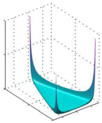

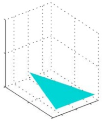

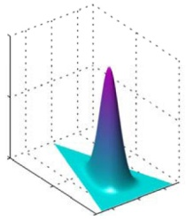

from Bishop

3:23

## Motivation for Beta & Dirichlet distributions

• Bandits:

– If we have binary [integer] bandits, the Beta [Dirichlet] distribution is a way to represent and update beliefs

– The belief space becomes discrete: The parameter α of the prior is continuous, but the posterior updates live on a discrete “grid” (adding counts to α)

– We can in principle do belief planning using this

• Reinforcement Learning:

– Assume we know that the world is a finite-state MDP, but do not know its transition probability $P ( s ^ { \prime }   |   s , a )$ . For each $( s , a ) ,   P ( s ^ { \prime }   |   s , a )$ is a distribution over the integer $\bar { s } ^ { \prime }$

– Having a separate Dirichlet distribution for each $( s , a )$ is a way to represent our belief about the world, that is, our belief about $P ( s ^ { \prime }   |   s , a )$

– We can in principle do belief planning using this → Bayesian Reinforcement Learning

• Dirichlet distributions are also used to model texts (word distributions in text), images, or mixture distributions in general

3:24

## Conjugate priors

• Assume you have data $D = \{ x _ { 1 } , . . , x _ { n } \}$ with likelihood

$$
P (D \mid \theta)
$$

that depends on an uncertain parameter $\theta$

<!-- page: 41 -->

Assume you have a prior $P ( \theta )$

• The prior $P ( \theta )$ is **conjugate** to the likelihood $P ( D   |   \theta )$ iff the posterior

$$
P (\theta \mid D) \propto P (D \mid \theta)   P (\theta)
$$

is in the same distribution class as the prior $P ( \theta )$

• Having a conjugate prior is very convenient, because then you know how to update the belief given data

3:25

## Conjugate priors

| likelihood | conjugate |
| --- | --- |
| Binomial Bin(D \| μ) | Beta Beta(μ \| a, b) |
| Multinomial Mult(D \| μ) | Dirichlet Dir(μ \| α) |
| Gauss N(x \| μ, Σ) | Gauss N(μ \| μ0, A) |
| 1D Gauss N(x \| μ, λ-1) | Gamma Gam(λ \| a, b) |
| nD Gauss N(x \| μ, Λ-1) | Wishart Wish(Λ \| W,ν) |
| nD Gauss N(x \| μ, Λ-1) | Gauss-Wishart |
|  | N(μ \| μ0, (βΛ)-1) Wish(Λ \| W,ν) |

## 3.3 Distributions over continuous domain\*\*

## Distributions over continuous domain

• Let x be a continuous RV. The **probability density function (pdf)** $p ( x ) \in [ 0 , \infty )$ defines the probability

$$
P (a \leq x \leq b) = \int_ {a} ^ {b} p (x) d x \in [ 0, 1 ]
$$

The **(cumulative) probability distribution** $\textstyle F ( y ) = P ( x \leq y ) = \int _ { - \infty } ^ { y } d x \; p ( x ) \in$ $[ 0 , 1 ]$ is the cumulative integral with li $\operatorname* { m } _ { y \to \infty } F ( y ) = 1$

(In discrete domain: probability distribution and probability mass function $P ( x ) \in [ 0 , 1 ]$ are used synonymously.)

• Two basic examples:

**Gaussian**: $\begin{array} { r } { \mathcal { N } ( x   |   \mu , \Sigma ) = \frac { 1 } {   \lfloor 2 \pi \Sigma   \rfloor ^ {   1 / 2 } } \; e ^ { - \frac { 1 } { 2 } ( x - \mu ) ^ { \top }   \Sigma ^ { \mathrm { \tiny ~ i ~ } } ( x - \mu ) } } \end{array}$

<!-- page: 42 -->

**Dirac or** δ (“point particle”) $\delta ( x ) = 0$ except at $\begin{array} { r } { x = 0 , \int \delta ( x ) \; d x = 1 } \end{array}$ $\begin{array} { r } { \delta ( x ) = \frac { \partial } { \partial x } H ( x ) } \end{array}$ where $H ( x ) = [ x \geq 0 ]$ = Heaviside step function

3:28

## Gaussian distribution

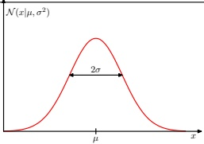

• 1-dim: $\begin{array} { r } { \mathbb { N } ( x   |   \mu , \sigma ^ { 2 } ) = \frac { 1 } {   \lfloor 2 \pi \sigma ^ { 2 }   \rfloor   ^ { 1 / 2 } }   e ^ { - \frac { 1 } { 2 } ( x - \mu ) ^ { 2 } / \sigma ^ { 2 } } } \end{array}$

• n-dim Gaussian in normal form:

$$
\mathcal {N} (x \mid \mu , \Sigma) = \frac {1}{\mid 2 \pi \Sigma \mid^ {1 / 2}} \exp \{- \frac {1}{2} (x - \mu) ^ {\top} \Sigma^ {- 1} (x - \mu) \}
$$

with **mean** $\mu$ and **covariance** matrix $\Sigma .$ In canonical form:

$$
\mathcal {N} [ x \mid a, A ] = \frac {\exp \{- \frac {1}{2} a ^ {\top} A ^ {- 1} a \}}{\left| 2 \pi A ^ {- 1} \right| ^ {1 / 2}} \exp \{- \frac {1}{2} x ^ {\top} A x + x ^ {\top} a \}\tag{1}
$$

with **precision** matrix $A = \Sigma ^ { - 1 }$ and coefficient $a = \Sigma ^ { - 1 } \mu$ (and mean $\mu = A ^ { - 1 } a )$

Note: ${ \bigl [ }   2 \pi \Sigma   { \bigr ] }   = \operatorname* { d e t } ( 2 \pi \Sigma ) = ( 2 \pi ) ^ { n } \operatorname* { d e t } ( \Sigma )$

• Gaussian identities: see [http://ipvs.informatik.uni-stuttgart.de/mlr/marc/notes/gaussians.pdf](http://ipvs.informatik.uni-stuttgart.de/mlr/marc/notes/gaussians.pdf)

3:29

## Gaussian identities

Symmetry:

$$
\mathcal {N} (x \mid a, A) = \mathcal {N} (a \mid x, A) = \mathcal {N} (x - a \mid 0, A)
$$

Product:

$$
\mathcal {N} (x \mid a, A) \mathcal {N} (x \mid b, B) = \mathcal {N} [ x \mid A ^ {- 1} a + B ^ {- 1} b, A ^ {- 1} + B ^ {- 1} ] \mathcal {N} (a \mid b, A + B)
$$

$$
\mathcal {N} [ x \mid a, A ] \mathcal {N} [ x \mid b, B ] = \mathcal {N} [ x \mid a + b, A + B ] \mathcal {N} (A ^ {- 1} a \mid B ^ {- 1} b, A ^ {- 1} + B ^ {- 1})
$$

$$
\begin{array}{l} \text {“Propagation”:} \\ \int_ {y} \mathcal {N} (x \mid a + F y, A) \mathcal {N} (y \mid b, B) d y = \mathcal {N} (x \mid a + F b, A + F B F ^ {\top}) \end{array}
$$

Transformation:

$$
\mathcal {N} (F x + f \mid a, A) = \frac {1}{| F |} \mathcal {N} (x \mid F ^ {- 1} (a - f), F ^ {- 1} A F ^ {- \top})
$$

Marginal & conditional:

$$
\mathcal {N} \bigg ( \begin{array}{c c c c} x & a & A & C \\ y & b & C ^ {\top} & B \end{array} \bigg) = \mathcal {N} (x \mid a, A) \cdot \mathcal {N} (y \mid b + C ^ {\top} A ^ {- 1} (x - a), B - C ^ {\top} A ^ {- 1} C)
$$

More Gaussian identities: see [http://ipvs.informatik.uni-stuttgart.de/mlr/marc/notes/gaussians.pdf](http://ipvs.informatik.uni-stuttgart.de/mlr/marc/notes/gaussians.pdf)

<!-- page: 43 -->

## Gaussian prior and posterior

• Assume we have data $D = \{ x _ { 1 } , . . , x _ { n } \}$ , each $x _ { i } \in \mathbb { R } ^ { n }$ , with likelihood

$$
P (D \mid \mu , \Sigma) = \prod_ {i} \mathcal {N} (x _ {i} \mid \mu , \Sigma)
$$

$$
\underset {\mu} {\operatorname{argmax}} P (D \mid \mu , \Sigma) = \frac {1}{n} \sum_ {i = 1} ^ {n} x _ {i}
$$

$$
\underset {\Sigma} {\operatorname{argmax}} P (D \mid \mu , \Sigma) = \frac {1}{n} \sum_ {i = 1} ^ {n} (x _ {i} - \mu) (x _ {i} - \mu) ^ {\top}
$$

• Assume we are initially uncertain about $\mu$ (but know $\Sigma )$ . We can express this uncertainty using again a Gaussian $\mathbb { N } [ \mu   |   a , A ]$ . Given data we have

$$
\begin{array}{c} P (\mu \mid D) \propto P (D \mid \mu , \Sigma)   P (\mu) = \prod_ {i} \mathcal {N} (x _ {i} \mid \mu , \Sigma)   \mathcal {N} [ \mu \mid a, A ] \\ = \prod_ {i} \mathcal {N} [ \mu \mid \Sigma^ {- 1} x _ {i}, \Sigma^ {- 1} ]   \mathcal {N} [ \mu \mid a, A ] \propto \mathcal {N} [ \mu \mid \Sigma^ {- 1} \sum_ {i} x _ {i}, n \Sigma^ {- 1} + A ] \end{array}
$$

Note: in the limit $A \to 0$ (uninformative prior) this becomes

$$
P (\mu \mid D) = \mathcal {N} (\mu \mid \frac {1}{n} \sum_ {i} x _ {i}, \frac {1}{n} \Sigma)
$$

which is consistent with the Maximum Likelihood estimator

3:31

## Motivation for Gaussian distributions

• Gaussian Bandits

• Control theory, Stochastic Optimal Control

• State estimation, sensor processing, Gaussian filtering (Kalman filtering)

• Machine Learning

• etc

3:32

## Particle Approximation of a Distribution

• We approximate a distribution $p ( x )$ over a continuous domain $\mathbb { R } ^ { n }$

• A particle distribution $q ( x )$ is a weighed set $\mathcal { \mathcal { S } } = \{ ( x ^ { i } , w ^ { i } ) \} _ { i = 1 } ^ { N }$ of N particles – each particle has a “location” $'' x ^ { i } \in \mathbb { R } ^ { n }$ and a weight $w ^ { i } \in \mathbb { R }$

– weights are normalized, $\textstyle \sum _ { i } { \boldsymbol { w } } ^ { i } = 1$

$$
q (x) := \sum_ {i = 1} ^ {N} w ^ {i} \delta (x - x ^ {i})
$$

where $\delta ( x - x ^ { i } )$ is the δ-distribution.

<!-- page: 44 -->

• Given weighted particles, we can estimate for any (smooth) $f ;$

$$
\langle f (x) \rangle_ {p} = \int_ {x} f (x) p (x) d x \approx \sum_ {i = 1} ^ {N} w ^ {i} f (x ^ {i})
$$

See An Introduction to MCMC for Machine Learning www.cs.ubc.ca/˜nando/ papers/mlintro.pdf

3:33

## Particle Approximation of a Distribution

Histogram of a particle representation:

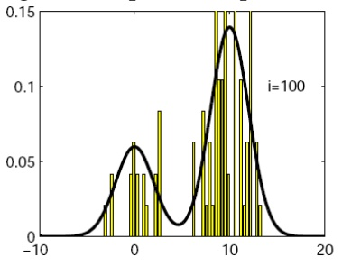

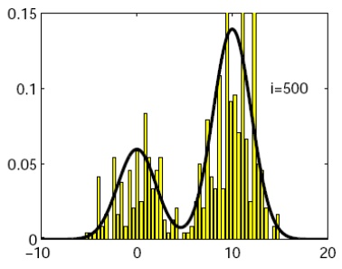

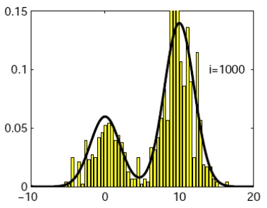

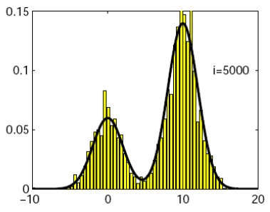

## Motivation for particle distributions

• Numeric representation of “difficult” distributions

– Very general and versatile

– But often needs many samples

• Distributions over games (action sequences), sample based planning, MCTS

• State estimation, particle filters

• etc

<!-- page: 45 -->

• Given a space of events Ω (e.g., outcomes of a trial, a game, etc) the utility is a function

$$
U: \Omega \to \mathbb {R}
$$

• The utility represents preferences as a single scalar – which is not always obvious (cf. multi-objective optimization)

• Decision Theory making decisions (that determine $p ( x ) )$ that maximize expected utility

$$
\operatorname{E} \{U \} _ {p} = \int_ {x} U (x) p (x)
$$

• Concave utility functions imply risk aversion (and convex, risk-taking)

3:36

## Entropy

• The neg-log (− log p(x)) of a distribution reflects something like “error”:

– neg-log of a Guassian ↔ squared error

– neg-log likelihood ↔ prediction error

• The $( - \log p ( x ) )$ is the “optimal” coding length you should assign to a symbol x. This will minimize the expected length of an encoding

$$
H (p) = \int_ {x} p (x) [ - \log p (x) ]
$$

• The **entropy** $H ( p ) = \operatorname { E } _ { p ( x ) } \{ - \log p ( x ) \}$ of a distribution $p$ is a measure of uncertainty, or lack-of-information, we have about x

3:37

## Kullback-Leibler divergence

• Assume you use a “wrong” distribution $q ( x )$ to decide on the coding length of symbols drawn from $p ( x )$ . The expected length of a encoding is

$$
\int_ {x} p (x) [ - \log q (x) ] \geq H (p)
$$

• The difference

$$
D \big (p \parallel q \big) = \int_ {x} p (x) \log \frac {p (x)}{q (x)} \geq 0
$$

is called Kullback-Leibler divergence

Proof of inequality, using the Jenson inequality:

$$
- \int_ {x} p (x) \log {\frac {q (x)}{p (x)}} \geq - \log \int_ {x} p (x) \frac {q (x)}{p (x)} = 0
$$

<!-- page: 46 -->

## 3.4 Monte Carlo methods\*\*

3:39

## Monte Carlo methods

• Generally, a Monte Carlo method is a method to generate a set of (potentially weighted) samples that approximate a distribution $p ( x )$

In the unweighted case, the samples should be i.i.d. $x _ { i } \sim p ( x )$

In the general (also weighted) case, we want particles that allow to estimate expectations of anything that depends on x, e.g. f(x):

$$
\lim _ {N \to \infty} \langle f (x) \rangle_ {q} = \lim _ {N \to \infty} \sum_ {i = 1} ^ {N} w ^ {i} f (x ^ {i}) = \int_ {x} f (x) p (x) d x = \langle f (x) \rangle_ {p}
$$

In this view, Monte Carlo methods approximate an integral.

• Motivation: $p ( x )$ itself is too complicated to express analytically or compute $\langle f ( x ) \rangle _ { p }$ directly

• Example: What is the probability that a solitair would come out successful? (Original story by Stan Ulam.) Instead of trying to analytically compute this, generate many random solitairs and count.

• Naming: The method developed in the 40ies, where computers became faster. Fermi, Ulam and von Neumann initiated the idea. von Neumann called it “Monte Carlo” as a code name.

3:40

## Rejection Sampling

• How can we generate i.i.d. samples $x _ { i } \sim p ( x ) ?$

• Assumptions:

– We can sample $x   \sim   q ( x )$ from a simpler distribution $q ( x )$ (e.g., uniform), called **proposal distribution**

– We can numerically evaluate $p ( x )$ for a specific x (even if we don’t have an analytic expression of $p ( x ) )$

– There exists M such that $\forall _ { x }   :   p ( x )   \leq   M q ( x )$ (which implies $q$ has larger or equal support as p)

• Rejection Sampling:

– Sample a candiate $x \sim q ( x )$

– With probability $\frac { p ( x ) } { M q ( x ) }$ accept x and add to S; otherwise reject

– Repeat until $| \mathbb { S } | = n$

• This generates an unweighted sample set S to approximate $p ( x )$

<!-- page: 47 -->

## Importance sampling

• Assumptions:

– We can sample $x \sim q ( x )$ from a simpler distribution $q ( x )$ (e.g., uniform)

– We can numerically evaluate $p ( x )$ for a specific x (even if we don’t have an analytic expression of $p ( x ) )$

• Importance Sampling:

– Sample a candiate $x \sim q ( x )$

– Add the weighted sample $\textstyle ( x , { \frac { p ( x ) } { q ( x ) } } )$ to S

– Repeat n times

• This generates an weighted sample set S to approximate $p ( x )$

The weights $\begin{array} { r } { w _ { i } = \frac { p ( x _ { i } ) } { q ( x _ { i } ) } } \end{array}$ are called **importance weights**

• Crucial for efficiency: a good choice of the proposal $q ( x )$

3:42

## Applications

• MCTS estimates the Q-function at branchings in decision trees or games

• Inference in graphical models (models involving many depending random variables)

3:43

<table><tr><td colspan="2">ne more continuous distributions</td></tr><tr><td>Gaussian</td><td> $\mathcal{N}(x \mid a, A) = \frac{1}{\left|2\pi A\right|^{1/2}} e^{-\frac{1}{2}(x-a)^{\top} A^{-1}} (x-a)$ </td></tr><tr><td>Dirac or  $\delta$ </td><td> $\delta(x) = \frac{\partial}{\partial x} H(x)$ </td></tr><tr><td>Student&#x27;s t(=Gaussian for  $\nu \to \infty$ , otherwise heavy tails)</td><td> $p(x; \nu) \propto [1 + \frac{x^2}{\nu}]^{-\frac{\nu+1}{2}}$ </td></tr><tr><td>Exponential(distribution over single event time)</td><td> $p(x; \lambda) = [x \geq 0] \lambda e^{-\lambda x}$ </td></tr><tr><td>Laplace(&quot;double exponential&quot;)</td><td> $p(x; \mu, b) = \frac{1}{2b} e^{-\left|x - \mu\right|/b}$ </td></tr><tr><td>Chi-squared</td><td> $p(x; k) \propto [x \geq 0] x^{k/2-1} e^{-x/2}$ </td></tr><tr><td>Gamma</td><td> $p(x; k, \theta) \propto [x \geq 0] x^{k-1} e^{-x/\theta}$ </td></tr></table>

<!-- page: 48 -->

# 4 Bandits, MCTS, & Games

## Motivation & Outline

The first lecture was about tree search (a form of sequential decision making), the second about probabilities. If we combine this we get Monte-Carlo Tree Search (MCTS), which is the focus of this lecture.

But before discussing MCTS we introduce an important conceptual problem: Multi-armed bandits. This problem setting is THE prototype for so-called explorationexploitation problems. More precisely, for problems where sequential decisions influence both, the state of knowledge of the agent as well as the states/rewards the agent gets. Therefore there is some tradeoff between choosing decisions for the sake of learning (influencing the state of knowledge in a positive way) versus for the sake of rewards—while clearly, learning might also enable you to better collect rewards later. Bandits are a kind of minimalistic problem setting of this kind, and the methods and algorithms developed for Bandits translate to other explorationexploitation kind of problems within Reinforcement Learning, Machine Learning, and optimization.

Interestingly, our first application of Bandit ideas and methods is tree search: Performing tree search is also a sequential decision problem, and initially the ’agent’ (=tree search algorithm) has a lack of knowledge of where the optimum in the tree is. This sequential decision problem under uncertain knowledge is also an exploitation-exploration problem. Applying the Bandit methods we get state-of-the-art MCTS methods, which nowadays can solve problems like computer Go.

We first introduce bandits, the MCTS, and mention MCTS for POMDPs. We then introduce 2-player games and how to apply MCTS in this case.

## 4.1 Bandits

<!-- page: 49 -->


• There are n machines

• Each machine i returns a reward $y \sim P ( y ; \theta _ { i } )$

The machine’s parameter $\theta _ { i }$ is unknown

• Your goal is to maximize the reward, say, collected over the first T trials

4:2

## Bandits – applications

• Online advertisement

## Google

• Clinical trials, robotic scientist

• Efficient optimization


4:3

## Bandits

• The bandit problem is an archetype for

– Sequential decision making

– Decisions that influence knowledge as well as rewards/states

– Exploration/exploitation

• The same aspects are inherent also in global optimization, active learning & RL

• The Bandit problem formulation is the basis of UCB – which is the core of serveral planning and decision making methods

• Bandit problems are commercially very relevant

<!-- page: 50 -->

## 4.2 Upper Confidence Bounds (UCB)

<div class="docvortex-algorithm" style="white-space: pre-wrap; font-family:monospace;">
Bandits: Formal Problem Definition
• Let $a_t \in \{1, ..., n\}$ be the choice of machine at time $t$
Let $y_t \in \mathbb{R}$ be the outcome
• A policy or strategy maps all the history to a new choice:
$\pi : [(a_1, y_1), (a_2, y_2), ..., (a_{t-1}, y_{t-1})] \mapsto a_t$
• Problem: Find a policy $\pi$ that
$\max\langle \sum_{t=1}^{T} y_t \rangle$
or
$\max\langle y_T \rangle$
or other objectives like discounted infinite horizon $\max\langle \sum_{t=1}^{\infty} \gamma^t y_t \rangle$
4:6
Exploration, Exploitation
• “Two effects” of choosing a machine:
– You collect more data about the machine → knowledge
– You collect reward
• For example
– Exploration: Choose the next action $a_t$ to $\min\langle H(b_t) \rangle$
– Exploitation: Choose the next action $a_t$ to $\max\langle y_t \rangle$
4:7
Upper Confidence Bound (UCB1)
Initialization: Play each machine once
repeat
Play the machine $i$ that maximizes $\hat{y}_i + \beta \sqrt{\frac{2\ln n}{n_i}}$
until
$\hat{y}_i$ is the average reward of machine $i$ so far
</div>

<!-- page: 51 -->

$n _ { i }$ is how often machine i has been played so far

$\textstyle n = \sum _ { i } n _ { i }$ is the number of rounds so far

$\beta$ is often chosen as $\beta = 1$

• The bound is derived from the Hoeffding inequality

See Finite-time analysis of the multiarmed bandit problem, Auer, Cesa-Bianchi & Fischer, Machine learning, 2002.

4:8

## UCB algorithms

• UCB algorithms determine a **confidence interval** such that

$$
\hat {y} _ {i} - \sigma_ {i} <   \left<   y _ {i} \right> <   \hat {y} _ {i} + \sigma_ {i}
$$

with high probability.

UCB chooses the upper bound of this confidence interval

• Optimism in the face of uncertainty

• Strong bounds on the regret (sub-optimality) of UCB1 (e.g. Auer et al.)

4:9

## UCB for Bernoulli\*\*

• If we have a single Bernoulli bandits, we can count

$$
a = 1 + \# \text {wins}, \quad b = 1 + \# \text {losses}
$$

• Our posterior over the Bernoulli parameter $\mu$ is Beta $( \mu   |   a , b )$

• The mean is $\begin{array} { r } { \langle \mu \rangle = \frac { a } { a + b } } \end{array}$

The mode (most likely) is $\begin{array} { r } { \mu ^ { * } = \frac { a - 1 } { a + b - 2 } } \end{array}$ for $a , b > 1$

The variance is Var $\begin{array} { r } { \{ \mu \} = \frac { a b } { ( a + b + 1 ) ( a + b ) ^ { 2 } } } \end{array}$

One can numerically compute the inverse cumulative Beta distribution → get exact quantiles

• Alternative strategies:

$$
\underset{i}{\text{argmax}} 90\% \text{-quantile}(\mu_i)
$$

$$
\underset {i} {\operatorname{argmax}} \langle \mu_ {i} \rangle + \beta \sqrt {\operatorname{Var} \{\mu_ {i} \}}
$$

<!-- page: 52 -->

## UCB for Gauss\*\*

• If we have a single Gaussian bandits, we can compute

the mean estimator $\begin{array} { r } { \hat { \mu } = \frac { 1 } { n } \sum _ { i } y _ { i } } \end{array}$

the empirical variance $\begin{array} { r } { \hat { \sigma } ^ { 2 } = \frac { 1 } { n - 1 } \sum _ { i } ( y _ { i } - \hat { \mu } ) ^ { 2 } } \end{array}$

and the estimated variance of the mean estimator Var $\{ \hat { \mu } \} = \hat { \sigma } ^ { 2 } / n$

• $\hat { \mu }$ and $\operatorname { V a r } \{ \hat { \mu } \}$ describe our posterior Gaussian belief over the true underlying $\mu$

Using the err-function we can get exact quantiles

• Alternative strategies:

$$
90\% \text{-quantile}(\mu_i)
$$

$$
\hat {\mu} _ {i} + \beta \sqrt {\mathrm{Var} \{\mu_ {i} \}} = \hat {\mu} _ {i} + \beta \hat {\sigma} / \sqrt {n}
$$

4:11

## UCB - Discussion

• UCB over-estimates the reward-to-go (under-estimates cost-to-go), just like $A ^ { * }$ – but does so in the probabilistic setting of bandits

• The fact that regret bounds exist is great!

• UCB became a core method for algorithms (including planners) to decide what to explore:

In tree search, the decision of which branches/actions to explore is itself a decision problem. An “intelligent agent” (like UBC) can be used within the planner to make decisions about how to grow the tree.

4:12

## 4.3 Monte Carlo Tree Search

4:13

## Monte Carlo Tree Search (MCTS)

• MCTS is very successful on Computer Go and other games

• MCTS is rather simple to implement

• MCTS is very general: applicable on any discrete domain

<!-- page: 53 -->

• Key paper:

Kocsis & Szepesvari: ´ Bandit based Monte-Carlo Planning, ECML 2006.

• Survey paper:

Browne et al.: A Survey of Monte Carlo Tree Search Methods, 2012.

• Tutorial presentation: [http://web.engr.oregonstate.edu/˜afern/icaps10-MCP-t](http://web.engr.oregonstate.edu/~afern/icaps10-MCP-tutorial.ppt)utori [ppt](http://web.engr.oregonstate.edu/~afern/icaps10-MCP-tutorial.ppt)

4:14

## Monte Carlo methods

• General, the term Monte Carlo simulation refers to methods that generate many i.i.d. random samples $x _ { i } \sim P ( x )$ from a distribution $P ( x )$ . Using the samples one can estimate expectations of anything that depends on x, e.g. f(x):

$$
\langle f \rangle = \int_ {x} P (x) f (x) d x \approx \frac {1}{N} \sum_ {i = 1} ^ {N} f (x _ {i})
$$

(In this view, Monte Carlo approximates an integral.)

• Example: What is the probability that a solitair would come out successful? (Original story by Stan Ulam.) Instead of trying to analytically compute this, generate many random solitairs and count.

• The method developed in the 40ies, where computers became faster. Fermi, Ulam and von Neumann initiated the idea. von Neumann called it “Monte Carlo” as a code name.

4:15

## Flat Monte Carlo

• The goal of MCTS is to estimate the utility (e.g., expected payoff ∆) depending on the action a chosen—the **Q-function**:

$$
Q (s _ {0}, a) = \mathrm{E} \{\Delta | s _ {0}, a \}
$$

where expectation is taken with w.r.t. the whole future randomized actions (including a potential opponent)

• Flat Monte Carlo does so by rolling out many random simulations (using a ROLLOUTPOLICY) without growing a tree

The key difference/advantage of MCTS over flat MC is that the tree growth focusses computational effort on promising actions

<!-- page: 54 -->

**Generic MCTS scheme**

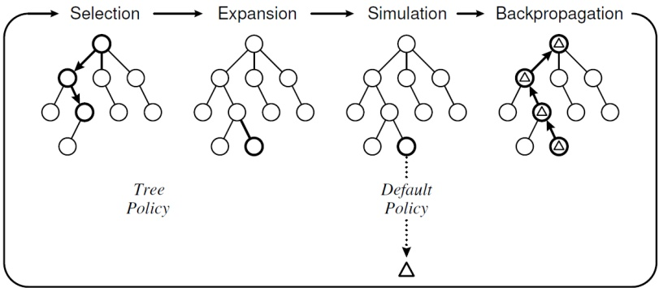

from Browne et al.

<div class="docvortex-algorithm" style="white-space: pre-wrap; font-family:monospace;">
start tree $V = \{v_0\}$
while within computational budget do
    $v_l \leftarrow \text{TREEPOLICY}(V)$ chooses and creates a new leaf of $V$
    append $v_l$ to $V$
    $\Delta \leftarrow \text{ROLLOUTPOLICY}(V)$ rolls out a full simulation, with return $\Delta$
    $\text{BACKUP}(v_l, \Delta)$ updates the values of all parents of $v_l$
end while
return best child of $v_0$
</div>

4:17

## Generic MCTS scheme

• Like FlatMC, MCTS typically computes full roll outs to a terminal state. A heuristic (evaluation function) to estimate the utility of a state is not needed, but can be incorporated.

• The tree grows unbalanced

• The TREEPOLICY decides where the tree is expanded – and needs to trade off exploration vs. exploitation

• The ROLLOUTPOLICY is necessary to simulate a roll out. It typically is a random policy; at least a randomized policy.

4:18

## Upper Confidence Tree (UCT)

• UCT uses UCB to realize the TREEPOLICY, i.e. to decide where to expand the tree

• BACKUP updates all parents of $v _ { l }$ as

$n ( v ) \gets n ( v ) + 1$ (count how often has it been played)

$$
Q (v) \leftarrow Q (v) + \Delta
$$

<!-- page: 55 -->

• TREEPOLICY chooses child nodes based on UCB:

$$
\underset {v ^ {\prime} \in \partial (v)} {\operatorname{argmax}} \frac {Q (v ^ {\prime})}{n (v ^ {\prime})} + \beta \sqrt {\frac {2 \ln n (v)}{n (v ^ {\prime})}}
$$

or choose $v ^ { \prime }$ if $n ( v ^ { \prime } ) = 0$

4:19

## 4.4 MCTS applied to POMDPs\*\*

4:20

**Recall POMDPs**

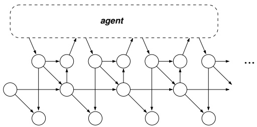

– initial state distribution $P ( s _ { 0 } )$

– transition probabilities $P ( s ^ { \prime } | s , a )$

– observation probabilities $P ( y ^ { \prime } | s ^ { \prime } , a )$

– reward probabilities $P ( r | s , a )$

• An optimal agent maps the history to an action, $( y _ { 0 : t } , a _ { 0 : t \overline { { \smash [ b ] { { 1 } } } } } ) \mapsto a _ { t }$

4:21

## Issues when applying MCTS ideas to POMDPs

• key paper:

Silver & Veness: Monte-Carlo Planning in Large POMDPs, NIPS 2010

• MCTS is based on generating rollouts using a simulator

– Rollouts need to start at a specific state $s _ { t }$

→ Nodes in our tree need to have states associated, to start rollouts from

• At any point in time, the agent has only the history $h _ { t } = ( y _ { 0 : t } , a _ { 0 : t - 1 } )$ to decide on an action

– The agent wants to estimate the Q-funcion $Q ( h _ { t } , a _ { t } )$

→ Nodes in our tree need to have a history associated

<!-- page: 56 -->

→ Nodes in the search tree will

– maintain $n ( v )$ and $Q ( v )$ as before

– have a history $h ( v )$ attached

– have a set of states $\mathcal { S } ( v )$ attached

4:22

## MCTS applied to POMDPs

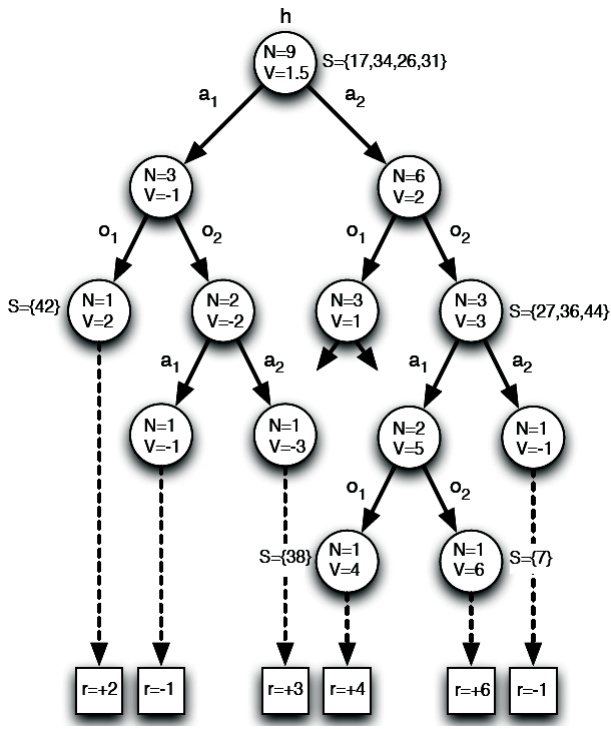

## MCTS applied to POMDPs

• For each rollout:

– Choose a random world state $s _ { 0 } \sim \mathcal { S } ( v _ { 0 } )$ from the set of states associated to the root $v _ { 0 } ;$ initialize the simulator with this $s _ { 0 }$

– Use a TREEPOLICY to traverse the current tree; during this, update the state sets $\mathcal { S } ( v )$ to contain the world state simulated by the simulator

– Use a ROLLOUTPOLICY to simulate a full rollout

– Append a new leaf $v _ { l }$ with novel history $h ( v _ { l } )$ and a single state $\mathcal { S } ( v _ { l } )$ associated

<!-- page: 57 -->

• MCTS combines forward information (starting simulations from $s _ { 0 } )$ with backward information (accumulating $Q ( v )$ at tree nodes)

• UCT uses an optimistic estimate of return to decide on how to expand the tree – this is the stochastic analogy to the $A ^ { * }$ heuristic

| table | PDDL | NID | MDP | POMDP | DEC-POMDP | Games | control |
| --- | --- | --- | --- | --- | --- | --- | --- |
| y | y | y | y | y | ? | y |  |

• Conclusion: MCTS is a very generic and often powerful planning method. For many many samples it converges to correct estimates of the Q-function. However, the Q-function can be estimated also using other methods.

## 4.5 Game Playing

## Outline

• Minimax

$\alpha { - } \beta$ pruning

• UCT for games

<!-- page: 58 -->

Game tree (2-player, deterministic, turns)

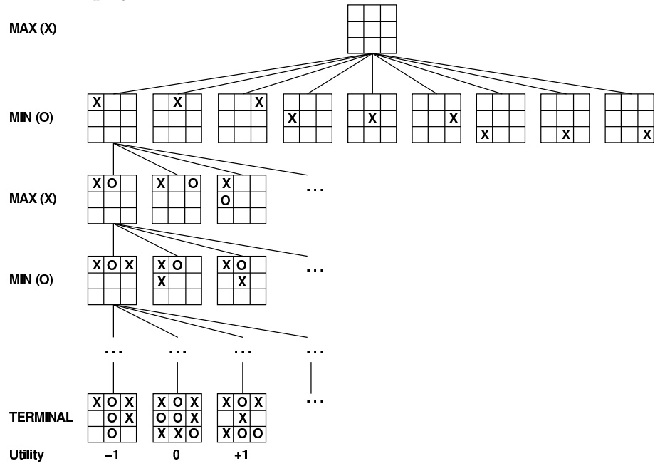

## Minimax

Perfect play for deterministic, perfect-information games

Idea: choose move to position with highest minimax value

= best achievable payoff against best play

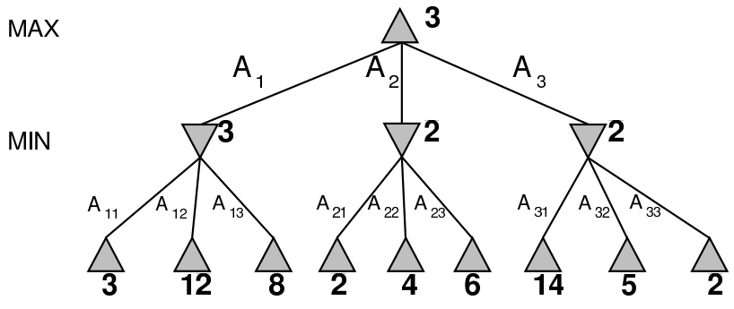

## Minimax algorithm

• Computation by direct recursive function calls, which effectively does DFS

<!-- page: 59 -->

MIN

<div class="docvortex-algorithm" style="white-space: pre-wrap; font-family:monospace;">
function MINIMAX-DECISION(state) returns an action
  inputs: state, current state in game
  return the $a$ in ACTIONS(state) maximizing MIN-VALUE(RESULT($a, state$))   
function MAX-VALUE(state) returns a utility value
  if TERMINAL-TEST(state) then return UTILITY(state)
    $v \leftarrow -\infty$
    for $a, s$ in SUCCESSORS(state) do $v \leftarrow \text{MAX}(v, \text{MIN-VALUE}(s))$
    return $v$

function MIN-VALUE(state) returns a utility value
  if TERMINAL-TEST(state) then return UTILITY(state)
    $v \leftarrow \infty$
    for $a, s$ in SUCCESSORS(state) do $v \leftarrow \text{MIN}(v, \text{MAX-VALUE}(s))$
    return $v$
</div>

4:30

## Properties of minimax

<u>Complete</u>?? Yes, if tree is finite (chess has specific rules for this)

<u>Optimal</u>?? Yes, against an optimal opponent. Otherwise??

<u>Time complexity</u>?? O(b<sup>m</sup>)

<div class="docvortex-algorithm" style="white-space: pre-wrap; font-family:monospace;">
Space complexity?? $O(bm)$ (depth-first exploration)
</div>

<div class="docvortex-algorithm" style="white-space: pre-wrap; font-family:monospace;">
For chess,  $b \approx 35$ ,  $m \approx 100$  for “reasonable” games
</div>

⇒ exact solution completely infeasible

But do we need to explore every path?

4:31

## α–β pruning example

MAX

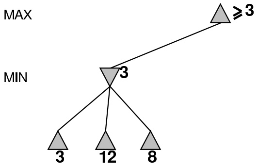

MAX

<!-- page: 60 -->

MAX

4:32

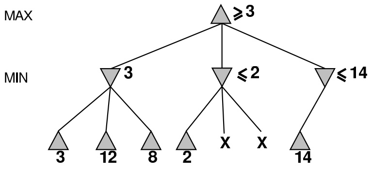

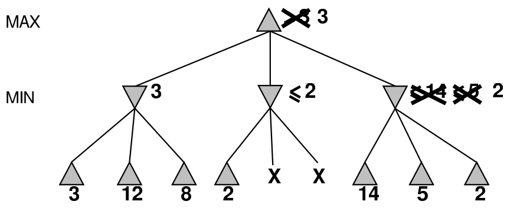

$\alpha { - } \beta$ pruning as instance of branch-and-bound

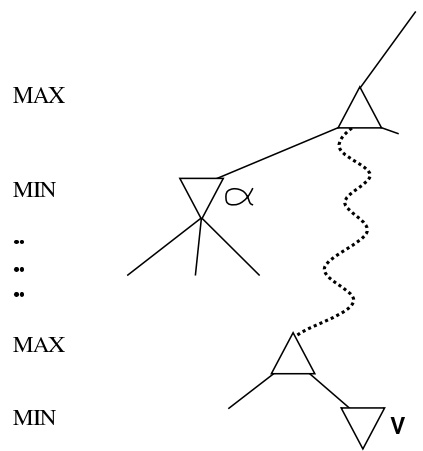

• α is the best value (to MAX) found so far off the current path

• If V is worse than $\alpha ,$ MAX will avoid it ⇒ prune that branch

<!-- page: 61 -->

<div class="docvortex-algorithm" style="white-space: pre-wrap; font-family:monospace;">
Suppose we have 100 seconds, explore $10^{4}$ nodes/second $\Rightarrow 10^{6}$ nodes per move $\approx 35^{8/2}$ $\Rightarrow \alpha -\beta$ reaches depth $8\Rightarrow$ pretty good chess program
</div>

• Define $\beta$ similarly for MIN

4:33

## The $\alpha { - } \beta$ algorithm

<div class="docvortex-algorithm" style="white-space: pre-wrap; font-family:monospace;">
function ALPHA-BETA-DECISION(state) returns an action
    return the $a$ in ACTIONS(state) maximizing MIN-VALUE(RESULT($a, state$))

function MAX-VALUE(state, $\alpha, \beta$) returns a utility value
    inputs: state, current state in game
        $\alpha$, the value of the best alternative for MAX along the path to state
        $\beta$, the value of the best alternative for MIN along the path to state

    if TERMINAL-TEST(state) then return UTILITY(state)
    $v \leftarrow -\infty$
    for $a, s$ in SUCCESSORS(state) do
        $v \leftarrow \text{MAX}(v, \text{MIN-VALUE}(s, \alpha, \beta))$
        if $v \geq \beta$ then return $v$
        $\alpha \leftarrow \text{MAX}(\alpha, v)$
    return $v$

function MIN-VALUE(state, $\alpha, \beta$) returns a utility value
    same as MAX-VALUE but with roles of $\alpha, \beta$ reversed
</div>

4:34

## Properties of $\alpha { - } \beta$

• Pruning does not affect final result

• Good move ordering improves effectiveness of pruning!

• A simple example of the value of reasoning about which computations are relevant (a form of metareasoning)

4:35

## Resource limits

Standard approach:

• Use CUTOFF-TEST instead of TERMINAL-TEST e.g., depth limit

• Use EVAL instead of UTILITY i.e., evaluation function that estimates desirability of position

<!-- page: 62 -->

## Evaluation functions

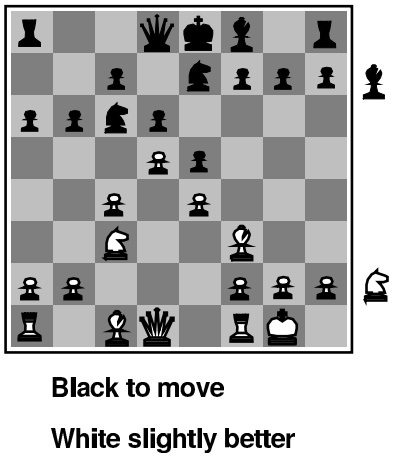

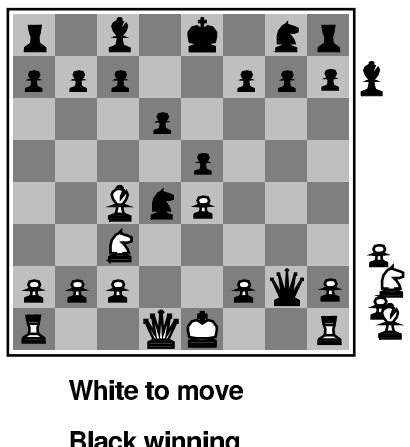

For chess, typically linear weighted sum of features

$$
\mathrm{EVAL} (s) = w _ {1} f _ {1} (s) + w _ {2} f _ {2} (s) + \dots + w _ {n} f _ {n} (s)
$$

$$
\begin{array}{l} \text {e.g.,} w _ {1} = 9 \text {with} \\ f _ {1} (s) = (\text {number of white queens}) - (\text {number of black queens}), \text {etc.} \end{array}
$$

4:37

## Upper Confidence Tree (UCT) for games

• Standard backup updates all parents of $v _ { l }$ as

$n ( v ) \gets n ( v ) + 1$ (count how often has it been played)

$Q ( v ) \gets Q ( v ) + \Delta$ (sum of rewards received)

• In games use a “negamax” backup: While iterating upward, flip sign $\Delta \leftarrow - \Delta$ in each iteration

• Survey of MCTS applications:

Browne et al.: A Survey of Monte Carlo Tree Search Methods, 2012.

<!-- page: 63 -->

<table><tr><td rowspan="2"></td><td rowspan="2">Go</td><td rowspan="2">Phuertou Go</td><td rowspan="2">Fibet Go</td><td rowspan="2">Nogo</td><td rowspan="2">Maksawau Go</td><td rowspan="2">Hos</td><td rowspan="2">Y. Star, Rokutal/</td><td rowspan="2">Hainimah</td><td rowspan="2">Hunan, Aksun</td><td rowspan="2">Frocrine</td><td rowspan="2">Chamber</td><td rowspan="2">Obello</td><td rowspan="2">Amazon</td><td rowspan="2">Akrif</td><td rowspan="2">Sesh</td><td rowspan="2">Seshi</td><td rowspan="2">Mascula</td><td rowspan="2">Bikkan Doo</td><td rowspan="2">Focus</td><td rowspan="2">Chinese Checkers</td><td rowspan="2">Tudailin</td><td rowspan="2">Green Conner</td><td rowspan="2">Tic Tic</td><td rowspan="2">Sum of Switches</td><td rowspan="2">Cham</td><td rowspan="2">LeftRight Games</td><td rowspan="2">Marpson Solatize</td><td rowspan="2">Cruad and</td><td rowspan="2">Same Game</td><td rowspan="2">Sudisha, Kakuro</td><td rowspan="2">Wampia World</td><td rowspan="2">Marsa FreeGold</td><td rowspan="2">Cu, COAT PLATER</td><td rowspan="2">LAR</td><td></td></tr><tr><td></td></tr><tr><td>Flat MC/UCB</td><td></td><td>+</td><td></td><td></td><td></td><td></td><td></td><td></td><td></td><td></td><td></td><td></td><td></td><td></td><td></td><td></td><td></td><td></td><td></td><td></td><td></td><td></td><td></td><td></td><td></td><td></td><td></td><td></td><td></td><td></td><td></td><td></td><td></td><td></td><td></td></tr><tr><td>BAST</td><td></td><td></td><td></td><td></td><td></td><td></td><td></td><td></td><td></td><td></td><td></td><td></td><td></td><td></td><td></td><td></td><td></td><td></td><td></td><td></td><td></td><td></td><td></td><td></td><td></td><td></td><td></td><td></td><td></td><td></td><td></td><td></td><td></td><td></td><td></td></tr><tr><td>TDMC(A)</td><td></td><td></td><td></td><td></td><td></td><td></td><td></td><td></td><td></td><td></td><td></td><td></td><td></td><td></td><td></td><td></td><td></td><td></td><td></td><td></td><td></td><td></td><td></td><td></td><td></td><td></td><td></td><td></td><td></td><td></td><td></td><td></td><td></td><td></td><td></td></tr><tr><td>BB Active Learner</td><td></td><td></td><td></td><td></td><td></td><td></td><td></td><td></td><td></td><td></td><td></td><td></td><td></td><td></td><td></td><td></td><td></td><td></td><td></td><td></td><td></td><td></td><td></td><td></td><td></td><td></td><td></td><td></td><td></td><td></td><td></td><td></td><td></td><td></td><td></td></tr><tr><td>UCT</td><td></td><td>+</td><td>+</td><td>+</td><td>+</td><td>+</td><td>+</td><td>+</td><td>+</td><td>+</td><td>+</td><td>+</td><td>+</td><td>+</td><td>+</td><td>+</td><td>+</td><td>+</td><td>+</td><td>+</td><td>+</td><td>+</td><td>+</td><td>+</td><td>+</td><td>+</td><td>+</td><td>+</td><td>+</td><td>+</td><td>+</td><td>+</td><td>+</td><td>+</td><td>+</td></tr><tr><td>SP-MCTS</td><td></td><td></td><td></td><td></td><td></td><td></td><td></td><td></td><td></td><td></td><td></td><td></td><td></td><td></td><td></td><td></td><td></td><td></td><td></td><td></td><td></td><td></td><td></td><td></td><td></td><td></td><td></td><td></td><td></td><td></td><td></td><td></td><td></td><td></td><td></td></tr><tr><td>FUSE</td><td></td><td></td><td></td><td></td><td></td><td></td><td></td><td></td><td></td><td></td><td></td><td></td><td></td><td></td><td></td><td></td><td></td><td></td><td></td><td></td><td></td><td></td><td></td><td></td><td></td><td></td><td></td><td></td><td></td><td></td><td></td><td></td><td></td><td></td><td></td></tr><tr><td>MP-MCTS</td><td></td><td></td><td></td><td></td><td></td><td></td><td></td><td></td><td></td><td></td><td></td><td></td><td></td><td></td><td></td><td></td><td></td><td></td><td></td><td></td><td></td><td></td><td></td><td></td><td></td><td></td><td></td><td></td><td></td><td></td><td></td><td></td><td></td><td></td><td></td></tr><tr><td>Coalition Reduction</td><td></td><td></td><td></td><td></td><td></td><td></td><td></td><td></td><td></td><td></td><td></td><td></td><td></td><td></td><td></td><td></td><td></td><td></td><td></td><td></td><td></td><td></td><td></td><td></td><td></td><td></td><td></td><td></td><td></td><td></td><td></td><td></td><td></td><td></td><td></td></tr><tr><td>Multi-agent MCTS</td><td></td><td>+</td><td></td><td></td><td></td><td></td><td></td><td></td><td></td><td></td><td></td><td></td><td></td><td></td><td></td><td></td><td></td><td></td><td></td><td></td><td></td><td></td><td></td><td></td><td></td><td></td><td></td><td></td><td></td><td></td><td></td><td></td><td></td><td></td><td></td></tr><tr><td>Ensemble MCTS</td><td></td><td>+</td><td></td><td></td><td></td><td></td><td></td><td></td><td></td><td></td><td></td><td></td><td></td><td></td><td></td><td></td><td></td><td></td><td></td><td></td><td></td><td></td><td></td><td></td><td></td><td></td><td></td><td></td><td></td><td></td><td></td><td></td><td></td><td></td><td></td></tr><tr><td>HOP</td><td></td><td></td><td></td><td></td><td></td><td></td><td></td><td></td><td></td><td></td><td></td><td></td><td></td><td></td><td></td><td></td><td></td><td></td><td></td><td></td><td></td><td></td><td></td><td></td><td></td><td></td><td></td><td></td><td></td><td></td><td></td><td></td><td></td><td></td><td></td></tr><tr><td>Sparse UCT</td><td></td><td></td><td></td><td></td><td></td><td></td><td></td><td></td><td></td><td></td><td></td><td></td><td></td><td></td><td></td><td></td><td></td><td></td><td></td><td></td><td></td><td></td><td></td><td></td><td></td><td></td><td></td><td></td><td></td><td></td><td></td><td></td><td></td><td></td><td></td></tr><tr><td>Info Set UCT</td><td></td><td></td><td></td><td></td><td></td><td></td><td></td><td></td><td></td><td></td><td></td><td></td><td></td><td></td><td></td><td></td><td></td><td></td><td></td><td></td><td></td><td></td><td></td><td></td><td></td><td></td><td></td><td></td><td></td><td></td><td></td><td></td><td></td><td></td><td></td></tr><tr><td>Multiple MCTS</td><td></td><td></td><td></td><td></td><td></td><td></td><td></td><td></td><td></td><td></td><td></td><td></td><td></td><td></td><td></td><td></td><td></td><td></td><td></td><td></td><td></td><td></td><td></td><td></td><td></td><td></td><td></td><td></td><td></td><td></td><td></td><td></td><td></td><td></td><td></td></tr><tr><td>UCT+</td><td></td><td></td><td></td><td></td><td></td><td></td><td></td><td></td><td></td><td></td><td></td><td></td><td></td><td></td><td></td><td></td><td></td><td></td><td></td><td></td><td></td><td></td><td></td><td></td><td></td><td></td><td></td><td></td><td></td><td></td><td></td><td></td><td></td><td></td><td></td></tr><tr><td>MC+</td><td></td><td></td><td></td><td></td><td></td><td></td><td></td><td></td><td></td><td></td><td></td><td></td><td></td><td></td><td></td><td></td><td></td><td></td><td></td><td></td><td></td><td></td><td></td><td></td><td></td><td></td><td></td><td></td><td></td><td></td><td></td><td></td><td></td><td></td><td></td></tr><tr><td>MC-TRI</td><td></td><td></td><td></td><td></td><td></td><td>+</td><td></td><td></td><td></td><td></td><td></td><td></td><td></td><td></td><td></td><td></td><td></td><td></td><td></td><td></td><td></td><td></td><td></td><td></td><td></td><td></td><td></td><td></td><td></td><td></td><td></td><td></td><td></td><td></td><td></td></tr><tr><td>Reflexive MC: Nested MC</td><td></td><td></td><td></td><td></td><td></td><td></td><td></td><td></td><td></td><td></td><td></td><td></td><td></td><td></td><td></td><td></td><td></td><td></td><td></td><td></td><td></td><td></td><td></td><td></td><td></td><td></td><td></td><td></td><td></td><td></td><td></td><td></td><td></td><td></td><td></td></tr><tr><td>NRPA</td><td></td><td></td><td></td><td></td><td></td><td></td><td></td><td></td><td></td><td></td><td></td><td></td><td></td><td></td><td></td><td></td><td></td><td></td><td></td><td></td><td></td><td></td><td></td><td></td><td></td><td></td><td></td><td></td><td></td><td></td><td></td><td></td><td></td><td></td><td></td></tr><tr><td>HGSTS</td><td></td><td></td><td></td><td></td><td></td><td></td><td></td><td></td><td></td><td></td><td></td><td></td><td></td><td></td><td></td><td></td><td></td><td></td><td></td><td></td><td></td><td></td><td></td><td></td><td></td><td></td><td></td><td></td><td></td><td></td><td></td><td></td><td></td><td></td><td></td></tr><tr><td>PSSS, BFPD</td><td></td><td></td><td></td><td></td><td></td><td></td><td></td><td></td><td></td><td></td><td></td><td></td><td></td><td></td><td></td><td></td><td></td><td></td><td></td><td></td><td></td><td></td><td></td><td></td><td></td><td></td><td></td><td></td><td></td><td></td><td></td><td></td><td></td><td></td><td></td></tr><tr><td>TAG</td><td></td><td></td><td></td><td></td><td></td><td></td><td></td><td></td><td></td><td></td><td></td><td></td><td></td><td></td><td></td><td></td><td></td><td></td><td></td><td></td><td></td><td></td><td></td><td></td><td></td><td></td><td></td><td></td><td></td><td></td><td></td><td></td><td></td><td></td><td></td></tr><tr><td>UNLEO</td><td></td><td></td><td></td><td></td><td></td><td></td><td></td><td></td><td></td><td></td><td></td><td></td><td></td><td></td><td></td><td></td><td></td><td></td><td></td><td></td><td></td><td></td><td></td><td></td><td></td><td></td><td></td><td></td><td></td><td></td><td></td><td></td><td></td><td></td><td></td></tr><tr><td>UCTSAI</td><td></td><td></td><td></td><td></td><td></td><td></td><td></td><td></td><td></td><td></td><td></td><td></td><td></td><td></td><td></td><td></td><td></td><td></td><td></td><td></td><td></td><td></td><td></td><td></td><td></td><td></td><td></td><td></td><td></td><td></td><td></td><td></td><td></td><td></td><td></td></tr><tr><td>μUCT</td><td></td><td></td><td></td><td></td><td></td><td></td><td></td><td></td><td></td><td></td><td></td><td></td><td></td><td></td><td></td><td></td><td></td><td></td><td></td><td></td><td></td><td></td><td></td><td></td><td></td><td></td><td></td><td></td><td></td><td></td><td></td><td></td><td></td><td></td><td></td></tr><tr><td>MRW</td><td></td><td></td><td></td><td></td><td></td><td></td><td></td><td></td><td></td><td></td><td></td><td></td><td></td><td></td><td></td><td></td><td></td><td></td><td></td><td></td><td></td><td></td><td></td><td></td><td></td><td></td><td></td><td></td><td></td><td></td><td></td><td></td><td></td><td></td><td></td></tr><tr><td>MRISP</td><td></td><td></td><td></td><td></td><td></td><td></td><td></td><td></td><td></td><td></td><td></td><td></td><td></td><td></td><td></td><td></td><td></td><td></td><td></td><td></td><td></td><td></td><td></td><td></td><td></td><td></td><td></td><td></td><td></td><td></td><td></td><td></td><td></td><td></td><td></td></tr><tr><td colspan="36">BCBI-Tuned Bayesian UCT EXPD</td></tr><tr><td colspan="36">HOOH</td></tr><tr><td colspan="36">First Play Urgency + (Anti)Decisive Moves + Move Groups + Move Ordering Transpositions + Progressive Bias Opening Books MCPG, Search Seeding Tuning Parameter Tuning</td></tr><tr><td colspan="36">History Heuristic + AMAF + RAVE + Killer RAVE + RAVE-max PoolRAVE + Score Bounded MCTS + Progressive Widening Pruning</td></tr><tr><td colspan="30">History Heuristic + AMAF + RAVE + Killer RAVE + RAVE-max PoolRAVE + Score Bounded MCTS + Progressive Widening Pruning</td><td>+</td><td>+</td><td>+</td><td>+</td><td>+</td><td>+</td></tr><tr><td colspan="36">MCS/Solver + Score Bounded MCTS + Progressive Widening Pruning</td></tr><tr><td colspan="36">Contextual MC Fill the Board + MAST, PAST, FAST Simulation Balancing + Last Good Reply Patterns + Score Bonus Decaying Reward Leaf Parallelisation + Root Parallelisation Tree Parallelisation UCT-Treesplit</td></tr></table>

## Brief notes on game theory

• Zero-sum games can be represented by a payoff matrix

$U _ { j i }$ denotes the utility of player 1 if she chooses the pure (=deterministic) strategy i and player 2 chooses the pure strategy j.

Zero-sum games: $U _ { j i } = - \bar { U } _ { i j } \; , \quad U ^ { T } \stackrel { \leftrightarrow } { = } - U$

• Fining a minimax optimal mixed strategy p is a Linear Program

$$
\max _ {w} w \quad \text {s.t.} \quad U p \geq w, \quad \sum_ {i} p _ {i} = 1, \quad p \geq 0
$$

Note that $U p \geq w$ implies $\operatorname { m i n } _ { j } ( U p ) _ { j } \geq w .$

• Gainable payoff of player 1: max<sub>p</sub> min<sub>q</sub> q<sup>T</sup>U p Minimax-Theorem: max<sub>p</sub> min<sub>q</sub> q<sup>T</sup>U p = min<sub>q</sub> max<sub>p</sub> q<sup>T</sup>U p Minimax-Theorem ↔ optimal p with $w \geq 0$ exists

4:40

## 4.6 Beyond bandits\*\*

4:39

<!-- page: 64 -->

• Perhaps have a look at the tutorial: Bandits, Global Optimization, Active Learning, and Bayesian RL – understanding the common ground

4:42

## Global Optimization

• Let $x \in \mathbb { R } ^ { n } ,   f :   \mathbb { R } ^ { n } \to \mathbb { R } ,$ , find

$$
\min _ {x} f (x)
$$

(I neglect constraints $g ( x ) \leq 0$ and $h ( x ) = 0$ here – but could be included.)

• Blackbox optimization: find optimium by sampling values $y _ { t } = f ( x _ { t } )$

No access to $\nabla f$ or $\nabla ^ { 2 } f$

Observations may be noisy $y \sim \mathcal { N } ( y   |   f ( x _ { t } ) , \sigma )$

4:43

## Global Optimization = infinite bandits

• In global optimization $f ( x )$ defines a reward for every $x \in \mathbb { R } ^ { n }$

– Instead of a finite number of actions $a _ { t }$ we now have $x _ { t }$

• The unknown “world property” is the function $\theta = f$

• Optimal Optimization could be defined as: find $\pi : \; h _ { t } \mapsto x _ { t }$ that

$$
\min \langle \sum_ {t = 1} ^ {T} f (x _ {t}) \rangle
$$

or

$$
\min \langle f (x _ {T}) \rangle
$$

4:44

## Gaussian Processes as belief

• If all the infinite bandits would be uncorrelated, there would be no chance to solve the problem → No Free Lunch Theorem

• One typically assumes that nearby function values $f ( x ) , f ( x ^ { \prime } )$ are correlated as described by a covariance function $k ( x , x ^ { \prime } ) \rightarrow$ Gaussian Processes

<!-- page: 65 -->

## Greedy 1-step heuristics

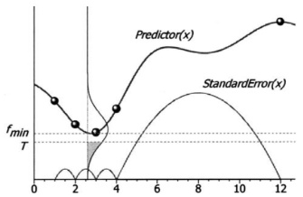

Figure 14. Using kriging, we can estimate the probability that sampling at a given point will from Jones (2001) T.

• Maximize Probability of Improvement (MPI)

$$
x _ {t} = \underset {x} {\operatorname{argmax}} \int_ {- \infty} ^ {y ^ {*}} \mathcal {N} (y | \hat {f} (x), \hat {\sigma} (x))
$$

• Maximize Expected Improvement (EI)

$$
x _ {t} = \underset {x} {\operatorname{argmax}} \int_ {- \infty} ^ {y ^ {*}} \mathcal {N} (y | \hat {f} (x), \hat {\sigma} (x)) (y ^ {*} - y)
$$

• Maximize UCB

$$
x _ {t} = \underset {x} {\operatorname{argmin}} \hat {f} (x) - \beta_ {t} \hat {\sigma} (x)
$$

(Often, $\beta _ { t } = 1$ is chosen. UCB theory allows for better choices. See Srinivas et al. citation below.)

4:46

From Srinivas et al., 2012:

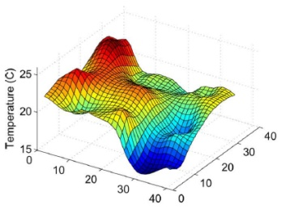

(a)

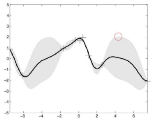

(b)

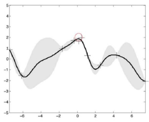

(c)

Fig. 2. (a) Example of temperature data collected by a network of 46 sensors at Intel Research Berkeley. (b) and (c) Two iterations of the GP-UCB algorithm. The dark curve indicates the current posterior mean, while the gray bands represent the upper and lower confidence bounds which contain the function with high probability. $\mathrm{Th}\mathfrak{e}^{\mathrm{i}\mathrm{i}}+$ mark indicates points that have been sampled before, while the $``  \text{、 } \text{〇 }^{ ** }$ mark shows the point chosen by the GP-UCB algorithm to sample next. It samples points that are either (b) uncertain or have (c) high posterior mean.

<!-- page: 66 -->

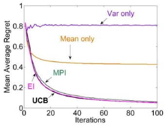

(a)

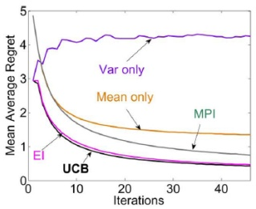

(b)

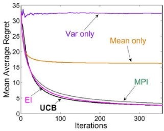

Fig. 6. Mean average regret: GP-UCB and various heuristics on (a) synthetic and (b, c) sensor network data.

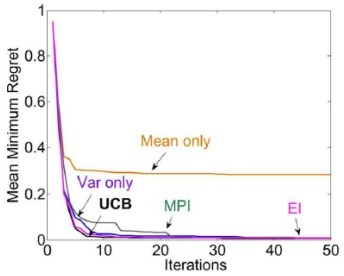

(a)

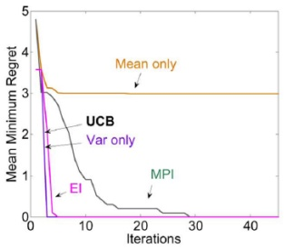

(b)

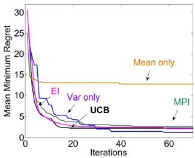

(c)

Fig. 7. Mean minimum regret: GP-UCB and various heuristics on (a) synthetic, and (b, c) sensor network data.

## Further reading

• Classically, such methods are known as Kriging

• Information-theoretic regret bounds for gaussian process optimization in the bandit setting Srinivas, Krause, Kakade & Seeger, Information Theory, 2012.

• Efficient global optimization of expensive black-box functions. Jones, Schonlau, & Welch, Journal of Global Optimization, 1998.

• A taxonomy of global optimization methods based on response surfaces Jones, Journal of Global Optimization, 2001.

• Explicit local models: Towards optimal optimization algorithms, Poland, Technical Report No. IDSIA-09-04, 2004.

## 4.7 Active Learning\*\*

<!-- page: 67 -->

• In standard ML, a data set $D _ { t } = \{ ( x _ { s } , y _ { s } ) \} _ { s = 1 } ^ { t \cdot 1 }$ 1 is given.

In active learning, the learning agent sequentially decides on each $x _ { t } -$ where to collect data

• Generally, the aim of the learner should be to learn as fast as possible, e.g. minimize predictive error

• Again, the unknown “world property” is the function $\theta = f$

• Finite horizon T predictive error problem:

Given $P ( x ^ { * } )$ , find a policy $\pi : \; D _ { t } \mapsto x _ { t }$ that

$$
\min \langle - \log P (y ^ {*} | x ^ {*}, D _ {T}) \rangle_ {y ^ {*}, x ^ {*}, D _ {T}; \pi}
$$

This also can be expressed as predictive entropy:

$$
\begin{array}{c} \langle - \log P (y ^ {*} | x ^ {*}, D _ {T}) \rangle_ {y ^ {*}, x ^ {*}} = \langle - \int_ {y ^ {*}} P (y ^ {*} | x ^ {*}, D _ {T}) \log P (y ^ {*} | x ^ {*}, D _ {T}) \rangle_ {x ^ {*}} \\ = \langle H (y ^ {*} | x ^ {*}, D _ {T}) \rangle_ {x ^ {*}} =: H (f | D _ {T}) \end{array}
$$

• Find a policy that min $\operatorname { E } \{ D _ { T } ; \pi \} H ( f | D _ { T } )$

4:51

## Greedy 1-step heuristic

• The simplest greedy policy is 1-step Dynamic Programming:

Directly maximize immediate expected reward, i.e., minimizes $H ( b _ { t + 1 } )$

$$
\pi : b _ {t} (f) \mapsto \underset {x _ {t}} {\operatorname{argmin}} \int_ {y _ {t}} P (y _ {t} | x _ {t}, b _ {t}) H (b _ {t} [ x _ {t}, y _ {t} ])
$$

• For GPs, you reduce the entropy most if you choose $x _ { t }$ where the current pre-dictive variance is highest:

$$
\mathrm{Var} (f (x)) = k (x, x) - \boldsymbol {\kappa} (x) (\boldsymbol {K} + \sigma^ {2} \mathbf {I} _ {n}) ^ {- 1} \boldsymbol {\kappa} (x)
$$

This is referred to as uncertainty sampling

• Note, if we fix hyperparameters:

– This variance is independent of the observations $y _ { t } ,$ only the set $D _ { t }$ matters!

– The order of data points also does not matter

– You can pre-optimize a set of “grid-points” for the kernel – and play them in any order

4:52

## Further reading

• Active learning literature survey. Settles, Computer Sciences Technical Report 1648, University of Wisconsin-Madison, 2009.

<!-- page: 68 -->

• Bayesian experimental design: A review. Chaloner & Verdinelli, Statistical Science, 1995.

• Active learning with statistical models. Cohn, Ghahramani & Jordan, JAIR 1996.

• ICML 2009 Tutorial on Active Learning, Sanjoy Dasgupta and John Langford [http://hunch.net/˜active\_learning/](http://hunch.net/~active_learning/)

<!-- page: 69 -->

## 5 Dynamic Programming

## Motivation & Outline

So far we focussed on tree search-like solvers for decision problems. There is a second important family of methods based on dynamic programming approaches, including Value Iteration. The Bellman optimality equation is at the heart of these methods.

Such dynamic programming methods are important also because standard Reinforcement Learning methods (learning to make decisions when the environment model is initially unknown) are directly derived from them.

## 5.1 Markov Decision Process

5:1

## MDP & Reinforcement Learning

• MDPs are the basis of Reinforcement Learning, where $P ( s ^ { \prime } | s , a )$ is not know by the agent

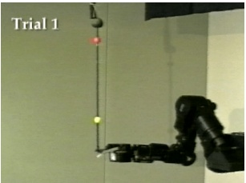


(around 2000, by Schaal, Atkeson, Vijayakumar)


(2007, Andrew Ng et al.)

<!-- page: 70 -->

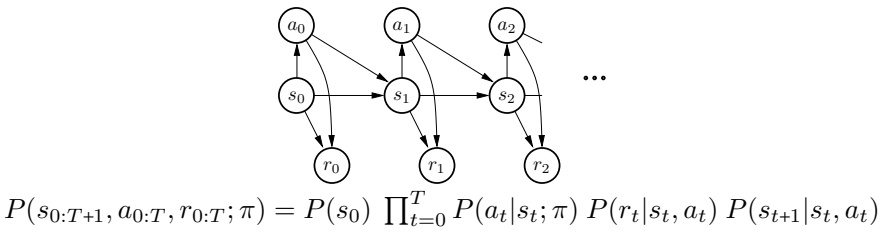

– world’s initial state distribution $P ( s _ { 0 } )$

– world’s transition probabilities $P ( s _ { t + 1 }   |   s _ { t } , a _ { t } )$

– world’s reward probabilities $P ( r _ { t } \thinspace \vert \thinspace s _ { t } , a _ { t } )$

– agent’s policy $\pi ( a _ { t } \thinspace \vert \thinspace s _ { t } ) = P ( a _ { 0 } \vert s _ { 0 } ; \pi )$ (or deterministic $a _ { t } = \pi ( s _ { t } ) )$

## • Stationary MDP:

– We assume $P ( s ^ { \prime }   |   s , a )$ and $P ( r | s , a )$ independent of time

– We also define $\begin{array} { r } { R ( s , a ) : = \operatorname { E } \{ \} r | s , a = \int r \; P ( r | s , a ) } \end{array}$ dr

5:3

## MDP

• In basic discrete MDPs, the transition probability

$$
P (s ^ {\prime} | s, a)
$$

is just a table of probabilities

• The Markov property refers to how we defined state:

History and future are conditionally independent given $s _ { t }$

$$
I (s _ {t ^ {+}}, s _ {t ^ {-}} | s _ {t}), \quad \forall t ^ {+} > t, t ^ {-} <   t
$$

5:4

## 5.2 Dynamic Programming

$$
P (s _ {0}), \quad P (s ^ {\prime} \mid s, a), \quad P (r \mid s, a), \quad \pi (a _ {t} \mid s _ {t})
$$

<!-- page: 71 -->

• The **value** (expected discounted return) of policy $\pi$ when started in state s:

$$
V ^ {\pi} (s) = \mathrm{E} _ {\pi} \{r _ {0} + \gamma r _ {1} + \gamma^ {2} r _ {2} + \dots \mid s _ {0} = s \}
$$

discounting factor $\gamma \in [ 0 , 1 ]$

• Definition of **optimality**: A policy $\pi ^ { * }$ is optimal iff

$$
\forall s: V ^ {\pi^ {*}} (s) = V ^ {*} (s) \quad \text {where} V ^ {*} (s) = \max _ {\pi} V ^ {\pi} (s)
$$

(simultaneously maximising the value in all states)

(In MDPs there always exists (at least one) optimal deterministic policy.)

An example for a value function...

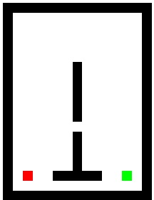

demo: test/mdp runVI

**Values provide a gradient towards desirable states**

5:7

## Value function

• The value function V is a central concept in all of RL!

Many algorithms can directly be derived from properties of the value function.

• In other domains (stochastic optimal control) it is also called cost-to-go function $( \mathsf { c o s t } = - \mathsf { r e w a r d } )$

5:6

<!-- page: 72 -->

**Recursive property of the value function**

$$
\begin{array}{r l} & V ^ {\pi} (s) = \mathrm{E} \{r _ {0} + \gamma r _ {1} + \gamma^ {2} r _ {2} + \dots \mid s _ {0} = s; \pi \} \\ & \qquad = \mathrm{E} \{r _ {0} \mid s _ {0} = s; \pi \} + \gamma \mathrm{E} \{r _ {1} + \gamma r _ {2} + \dots \mid s _ {0} = s; \pi \} \\ & \qquad = R (s, \pi (s)) + \gamma \sum_ {s ^ {\prime}} P (s ^ {\prime} \mid s, \pi (s))   \mathrm{E} \{r _ {1} + \gamma r _ {2} + \dots \mid s _ {1} = s ^ {\prime}; \pi \} \\ & \qquad = R (s, \pi (s)) + \gamma \sum_ {s ^ {\prime}} P (s ^ {\prime} \mid s, \pi (s))   V ^ {\pi} (s ^ {\prime}) \end{array}
$$

• We can write this in vector notation $\boldsymbol { V } ^ { \pi } = \boldsymbol { R } ^ { \pi } + \gamma \boldsymbol { P } ^ { \pi } \boldsymbol { V } ^ { \pi }$ with vectors $\boldsymbol { V } _ { s } ^ { \pi } = V ^ { \pi } ( s ) , \boldsymbol { R } _ { s } ^ { \pi } = R ( s , \pi ( s ) )$ and matrix $\boldsymbol { P } _ { s s ^ { \prime } } ^ { \pi } = P ( s ^ { \prime }   |   s , \pi ( s ) )$

• For stochastic $\pi ( a | s )$

$$
V ^ {\pi} (s) = \sum_ {a} \pi (a | s) R (s, a) + \gamma \sum_ {s ^ {\prime}, a} \pi (a | s) P (s ^ {\prime} \mid s, a) V ^ {\pi} (s ^ {\prime})\tag{5:9}
$$

## Bellman optimality equation

• Recall the recursive property of the value function

$$
V ^ {\pi} (s) = R (s, \pi (s)) + \gamma \sum_ {s ^ {\prime}} P (s ^ {\prime} \mid s, \pi (s)) V ^ {\pi} (s ^ {\prime})
$$

• Bellman optimality equation

$$
V ^ {*} (s) = \max _ {a} \left[ R (s, a) + \gamma \sum_ {s ^ {\prime}} P (s ^ {\prime} \mid s, a) V ^ {*} (s ^ {\prime}) \right]
$$

$$
\text {with} \pi^ {*} (s) = \operatorname{argmax} _ {a} \left[ R (s, a) + \gamma \sum_ {s ^ {\prime}} P (s ^ {\prime} \mid s, a) V ^ {*} (s ^ {\prime}) \right]
$$

(Sketch of proof: If π would select another action than argmax $\tau _ { a } [ \cdot ] ,$ then $\pi ^ { \prime }$ which $= \pi$ everywhere except $\pi ^ { \prime } ( s ) = \operatorname { a r g m a x } _ { a } [ \cdot ]$ would be better.)

• This is the **principle of optimality** in the stochastic case

5:10

Richard E. Bellman (1920—1984)


**Bellman’s principle of optimality**

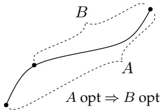

<!-- page: 73 -->

$$
\begin{array}{l} V ^ {*} (s) = \underset {a} {\max} \left[ R (s, a) + \gamma \sum_ {s ^ {\prime}} P (s ^ {\prime} \mid s, a) V ^ {*} (s ^ {\prime}) \right] \\ \pi^ {*} (s) = \underset {a} {\operatorname{argmax}} \left[ R (s, a) + \gamma \sum_ {s ^ {\prime}} P (s ^ {\prime} \mid s, a) V ^ {*} (s ^ {\prime}) \right] \end{array}
$$

5:11

## Value Iteration

• How can we use this to compute $V ^ { * } ?$

• Recall the Bellman optimality equation:

$$
V ^ {*} (s) = \max _ {a} \left[ R (s, a) + \gamma \sum_ {s ^ {\prime}} P (s ^ {\prime} \mid s, a) V ^ {*} (s ^ {\prime}) \right]
$$

• **Value Iteration:** (initialize $V _ { k = 0 } ( s ) = 0 )$

$$
\forall s: V _ {k + 1} (s) = \max _ {a} \left[ R (s, a) + \gamma \sum_ {s ^ {\prime}} P (s ^ {\prime} | s, a) V _ {k} (s ^ {\prime}) \right]
$$

stopping criterion: $\operatorname { m a x } _ { s } | V _ { k + 1 } ( s ) - V _ { k } ( s ) | \leq \epsilon$

• Note that $V ^ { * }$ is a **fixed point** of value iteration!

• Value Iteration converges to the optimal value function $V ^ { * }$ (proof below)

demo: test/mdp runVI

5:12

## State-action value function (Q-function)

• We repeat the last couple of slides for the Q-function...

• The state-action value function (or Q**-function**) is the expected discounted return when starting in state s and taking first action a:

$$
\begin{array}{c} Q ^ {\pi} (s, a) = \mathrm{E} _ {\pi} \{r _ {0} + \gamma r _ {1} + \gamma^ {2} r _ {2} + \dots | s _ {0} = s, a _ {0} = a \} \\ = R (s, a) + \gamma \sum_ {s ^ {\prime}} P (s ^ {\prime} | s, a) Q ^ {\pi} (s ^ {\prime}, \pi (s ^ {\prime})) \end{array}
$$

(Note: $V ^ { \pi } ( s ) = Q ^ { \pi } ( s , \pi ( s ) ) . )$

• Bellman optimality equation for the Q-function

$$
Q ^ {*} (s, a) = R (s, a) + \gamma \sum_ {s ^ {\prime}} P (s ^ {\prime} \mid s, a) \max _ {a ^ {\prime}} Q ^ {*} (s ^ {\prime}, a ^ {\prime})
$$

with $\pi ^ { * } ( s ) = \operatorname { a r g m a x } _ { a } Q ^ { * } ( s , a )$

<!-- page: 74 -->

## Q-Iteration

• Recall the Bellman equation:

$$
Q ^ {*} (s, a) = R (s, a) + \gamma \sum_ {s ^ {\prime}} P (s ^ {\prime} \mid s, a) \max _ {a ^ {\prime}} Q ^ {*} (s ^ {\prime}, a ^ {\prime})
$$

• **Q-Iteration:** (initialize $Q _ { k = 0 } ( s , a ) = 0 )$

$$
\forall_ {s, a}: Q _ {k + 1} (s, a) = R (s, a) + \gamma \sum_ {s ^ {\prime}} P (s ^ {\prime} | s, a) \max _ {a ^ {\prime}} Q _ {k} (s ^ {\prime}, a ^ {\prime})
$$

stopping criterion: max<sub>s</sub>,a |Q<sub>k+1</sub>(s, a) − Q<sub>k</sub>(s, a)| ≤ 

• Note that $Q ^ { * }$ is a **fixed point** of Q-Iteration!

• Q-Iteration converges to the optimal state-action value function $Q ^ { * }$

5:14

## Proof of convergence

• Let $\begin{array} { l } { \Delta _ { k } = | | Q ^ { * } - Q _ { k } | | _ { \infty } = \operatorname* { m a x } _ { s , a } | Q ^ { * } ( s , a ) - Q _ { k } ( s , a ) | } \\ \end{array}$

$$
\begin{array}{l} Q _ {k + 1} (s, a) = R (s, a) + \gamma \sum_ {s ^ {\prime}} P (s ^ {\prime} | s, a) \max _ {a ^ {\prime}} Q _ {k} (s ^ {\prime}, a ^ {\prime}) \\ \leq R (s, a) + \gamma \sum_ {s ^ {\prime}} P (s ^ {\prime} | s, a) \max _ {a ^ {\prime}} \left[ Q ^ {*} (s ^ {\prime}, a ^ {\prime}) + \Delta_ {k} \right] \\ = \left[ R (s, a) + \gamma \sum_ {s ^ {\prime}} P (s ^ {\prime} | s, a) \max _ {a ^ {\prime}} Q ^ {*} (s ^ {\prime}, a ^ {\prime}) \right] + \gamma \Delta_ {k} \\ = Q ^ {*} (s, a) + \gamma \Delta_ {k} \end{array}
$$

similarly: $\begin{array} { r } { Q _ { k } \geq Q ^ { * } - \Delta _ { k } \; \Rightarrow \; Q _ { k + 1 } \geq Q ^ { * } - \gamma \Delta _ { k } } \end{array}$

• The proof translates directly also to value iteration

5:15

## For completeness\*\*

• **Policy Evaluation** computes $V ^ { \pi }$ instead of $V ^ { * }$ : Iterate:

$$
\forall s: V _ {k + 1} ^ {\pi} (s) = R (s, \pi (s)) + \gamma \sum_ {s ^ {\prime}} P (s ^ {\prime} | s, \pi (s)) V _ {k} ^ {\pi} (s ^ {\prime})
$$

Or use matrix inversion $\boldsymbol { V } ^ { \pi } = ( \boldsymbol { I } - \gamma \boldsymbol { P } ^ { \pi } ) ^ { - 1 } \boldsymbol { R } ^ { \pi }$ , which is $O ( | S | ^ { 3 } )$

• **Policy Iteration** uses $V ^ { \pi }$ to incrementally improve the policy:

<!-- page: 75 -->

1. Initialise $\pi _ { 0 }$ somehow (e.g. randomly)

2. Iterate:

– **Policy Evaluation:** compute $V ^ { \pi _ { k } }$ or $Q ^ { \pi _ { k } }$

– **Policy Update:** $\pi _ { k + 1 } ( s ) \leftarrow \operatorname { a r g m a x } _ { a } Q ^ { \pi _ { k } } ( s , a )$

demo: test/mdp runPI

5:16

## Summary: Bellman equations

• Discounted infinite horizon:

$$
V ^ {*} (s) = \max _ {a} Q ^ {*} (s, a) = \max _ {a} \left[ R (s, a) + \gamma \sum_ {s ^ {\prime}} P (s ^ {\prime} \mid s, a) V ^ {*} (s ^ {\prime}) \right]
$$

$$
Q ^ {*} (s, a) = R (s, a) + \gamma \sum_ {s ^ {\prime}} P (s ^ {\prime} \mid s, a) \max _ {a ^ {\prime}} Q ^ {*} (s ^ {\prime}, a ^ {\prime})
$$

• With finite horizon T (non stationary MDP), initializing $V _ { T + 1 } ( s ) = 0$

$$
V _ {t} ^ {*} (s) = \max _ {a} Q _ {t} ^ {*} (s, a) = \max _ {a} \left[ R _ {t} (s, a) + \gamma \sum_ {s ^ {\prime}} P _ {t} (s ^ {\prime} \mid s, a) V _ {t + 1} ^ {*} (s ^ {\prime}) \right]
$$

$$
Q _ {t} ^ {*} (s, a) = R _ {t} (s, a) + \gamma \sum_ {s ^ {\prime}} P _ {t} (s ^ {\prime} | s, a) \max _ {a ^ {\prime}} Q _ {t + 1} ^ {*} (s ^ {\prime}, a ^ {\prime})
$$

• This recursive computation of the value functions is a form of **Dynamic Programming**

5:17

## Comments & relations

• Tree search is a form of **forward** search, where heuristics $( A ^ { * }$ or UCB) may optimistically estimate the value-to-go

• Dynamic Programming is a form of **backward** inference, which exactly computes the value-to-go backward from a horizon

• UCT also estimates $Q ( s , a )$ , but based on Monte-Carlo rollouts instead of exact Dynamic Programming

• In deterministic worlds, Value Iteration is the same as Dijkstra backward; it labels all nodes with the value-to-go (↔ cost-to-go).

• In control theory, the Bellman equation is formulated for continuous state x and continuous time t and ends-up:

$$
- \frac {\partial}{\partial t} V (x, t) = \min _ {u} \left[ c (x, u) + \frac {\partial V}{\partial x} f (x, u) \right]
$$

<!-- page: 76 -->

which is called Hamilton-Jacobi-Bellman equation.

For linear quadratic systems, this becomes the Riccati equation

5:18

## Comments & relations

• The Dynamic Programming principle is applicable throughout the domains – but inefficient if the state space is large (e.g. relational or high-dimensional continuous)

• It requires iteratively computing a value function over the whole state space

5:19

## 5.3 Dynamic Programming in Belief Space

5:20

## Back to the Bandits

• Can Dynamic Programming also be applied to the Bandit problem? We learnt UCB as the standard approach to address Bandits – but what would be the optimal policy?

5:21

## Bandits recap

• Let $a _ { t } \in \{ 1 , . . , n \}$ be the choice of machine at time t

Let $y _ { t } \in \mathbb { R }$ be the outcome with mean $\left\langle y _ { a _ { t } } \right\rangle$

A policy or strategy maps all the history to a new choice:

$$
\pi : [ (a _ {1}, y _ {1}), (a _ {2}, y _ {2}), \dots , (a _ {t - 1}, y _ {t - 1}) ] \mapsto a _ {t}
$$

• Problem: Find a policy π that

$$
\max \langle \sum_ {t = 1} ^ {T} y _ {t} \rangle
$$

or

$$
\max \langle y _ {T} \rangle
$$

• “Two effects” of choosing a machine:

– You collect more data about the machine → knowledge

– You collect reward

<!-- page: 77 -->

## The Belief State

• “Knowledge” can be represented in two ways:

– as the full history

$$
h _ {t} = [ (a _ {1}, y _ {1}), (a _ {2}, y _ {2}), \dots , (a _ {t - 1}, y _ {t - 1}) ]
$$

– as the **belief**

$$
b _ {t} (\theta) = P (\theta | h _ {t})
$$

where $\theta$ are the unknown parameters $\theta = ( \theta _ { 1 } , . . , \theta _ { n } )$ of all machines

• In the bandit case:

– The belief factorizes $\textstyle b _ { t } ( \theta ) = P ( \theta | h _ { t } ) = \prod _ { i } b _ { t } ( \theta _ { i } | h _ { t } )$

e.g. for Gaussian bandits with constant noise, $\theta _ { i } = \mu _ { i }$

$$
b _ {t} (\mu_ {i} | h _ {t}) = \mathcal {N} (\mu_ {i} | \hat {y} _ {i}, \hat {s} _ {i})
$$

e.g. for binary bandits, $\theta _ { i } = p _ { i }$ , with prior Beta $( p _ { i } | \alpha , \beta )$

$$
\begin{array}{c} b _ {t} (p _ {i} | h _ {t}) = \mathrm{Beta} (p _ {i} | \alpha + a _ {i, t}, \beta + b _ {i, t}) \\ a _ {i, t} = \sum_ {s = 1} ^ {t - 1} [ a _ {s} = i ] [ y _ {s} = 0 ], \quad b _ {i, t} = \sum_ {s = 1} ^ {t - 1} [ a _ {s} = i ] [ y _ {s} = 1 ] \end{array}
$$

5:23

## The Belief MDP

• The process can be modelled as

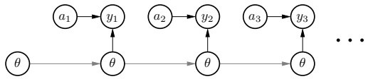

or as Belief MDP

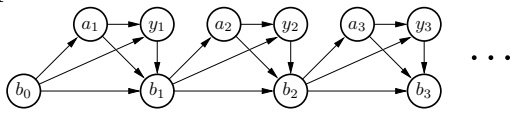

$$
P (b ^ {\prime} | y, a, b) = \left\{ \begin{array}{l l} 1 & \text {if} b ^ {\prime} = b _ {[ b, a, y ]} ^ {\prime} \\ 0 & \text {otherwise} \end{array} \right., \quad P (y | a, b) = \int_ {\theta_ {a}} b (\theta_ {a})   P (y | \theta_ {a})
$$

• The Belief MDP describes a different process: the interaction between the information available to the agent $( b _ { t }$ or $h _ { t } )$ and its actions, where the agent uses his current belief to anticipate observations, $P ( y | a , b )$

• The belief (or history $h _ { t } )$ is all the information the agent has avaiable; $P ( y | a , b )$ the “best” possible anticipation of observations. If it acts optimally in the Belief MDP, it acts optimally in the original problem.

Optimality in the Belief $MDP\ \Rightarrow$ optimality in the original problem

<!-- page: 78 -->

**Optimal policies via Dynamic Programming in Belief Space**

• The Belief MDP:

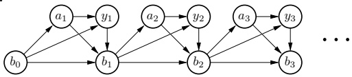

$$
P (b ^ {\prime} | y, a, b) = \left\{ \begin{array}{l l} 1 & \text {if} b ^ {\prime} = b _ {[ b, a, y ]} ^ {\prime} \\ 0 & \text {otherwise} \end{array} \right., \quad P (y | a, b) = \int_ {\theta_ {a}} b (\theta_ {a})   P (y | \theta_ {a})
$$

• Belief Planning: Dynamic Programming on the value function

$$
\begin{array}{c} \forall_ {b}: V _ {t - 1} (b) = \underset {\pi} {\max} \langle \sum_ {t = t} ^ {T} y _ {t} \rangle \\ = \underset {a _ {t}} {\max} \int_ {y _ {t}} P (y _ {t} | a _ {t}, b) \left[ y _ {t} + V _ {t} (b _ {[ b, a _ {t}, y _ {t} ]} ^ {\prime}) \right] \end{array}
$$

$$
V _ {t} ^ {*} (h) := \max _ {\pi} \int_ {\theta} P (\theta | h) V _ {t} ^ {\pi , \theta} (h)\tag{5:25}
$$

$$
V _ {t} ^ {\pi} (b) := \int_ {\theta} b (\theta) V _ {t} ^ {\pi , \theta} (b)\tag{3}
$$

$$
V _ {t} ^ {*} (b) := \max _ {\pi} V _ {t} ^ {\pi} (b) = \max _ {\pi} \int_ {\theta} b (\theta) V _ {t} ^ {\pi , \theta} (b)\tag{4}
$$

$$
= \max _ {\pi} \int_ {\theta} P (\theta | b) \left[ R (\pi (b), b) + \int_ {b ^ {\prime}} P (b ^ {\prime} | b, \pi (b), \theta) V _ {t + 1} ^ {\pi , \theta} (b ^ {\prime}) \right]\tag{5}
$$

$$
= \max _ {a} \max _ {\pi} \int_ {\theta} P (\theta | b) \left[ R (a, b) + \int_ {b ^ {\prime}} P (b ^ {\prime} | b, a, \theta) V _ {t + 1} ^ {\pi , \theta} (b ^ {\prime}) \right]\tag{6}
$$

$$
= \max _ {a} \left[ R (a, b) + \max _ {\pi} \int_ {\theta} \int_ {b ^ {\prime}} P (\theta | b) P (b ^ {\prime} | b, a, \theta) V _ {t + 1} ^ {\pi , \theta} (b ^ {\prime}) \right]\tag{7}
$$

$$
P (b ^ {\prime} | b, a, \theta) = \int_ {y} P (b ^ {\prime}, y | b, a, \theta)\tag{8}
$$

$$
= \int_ {y} \frac {P (\theta | b , a , b ^ {\prime} , y) P (b ^ {\prime} , y | b , a)}{P (\theta | b , a)}\tag{9}
$$

$$
= \int_ {y} \frac {b ^ {\prime} (\theta) P (b ^ {\prime} , y | b , a)}{b (\theta)}\tag{10}
$$

$$
V _ {t} ^ {*} (b) = \max _ {a} \left[ R (a, b) + \max _ {\pi} \int_ {\theta} \int_ {b ^ {\prime}} \int_ {y} b (\theta) \frac {b ^ {\prime} (\theta) P (b ^ {\prime} , y | b , a)}{b (\theta)} V _ {t + 1} ^ {\pi , \theta} (b ^ {\prime}) \right]\tag{11}
$$

$$
= \max _ {a} \left[ R (a, b) + \max _ {\pi} \int_ {b ^ {\prime}} \int_ {y} P (b ^ {\prime}, y | b, a) \int_ {\theta} b ^ {\prime} (\theta) V _ {t + 1} ^ {\pi , \theta} (b ^ {\prime}) \right]\tag{12}
$$

$$
= \max _ {a} \left[ R (a, b) + \max _ {\pi} \int_ {y} P (y | b, a) \int_ {\theta} b _ {[ b, a, y ]} ^ {\prime} (\theta) V _ {t + 1} ^ {\pi , \theta} (b _ {[ b, a, y ]} ^ {\prime}) \right]\tag{13}
$$

$$
= \max _ {a} \left[ R (a, b) + \max _ {\pi} \int_ {y} P (y | b, a) V ^ {\pi} (b _ {[ b, a, y ]} ^ {\prime}) \right]\tag{14}
$$

$$
= \max _ {a} \left[ R (a, b) + \int_ {y} P (y | b, a) \max _ {\pi} V ^ {\pi} (b _ {[ b, a, y ]} ^ {\prime}) \right]\tag{15}
$$

$$
= \max _ {a} \left[ R (a, b) + \int_ {y} P (y | b, a) V _ {t + 1} ^ {*} (b _ {[ b, a, y ]} ^ {\prime}) \right]\tag{16}
$$

5:26

<!-- page: 79 -->

## Optimal policies

• The value function assigns a value (maximal achievable expected return) to a state of knowledge

• While UCB approximates the value of an action by an optimistic estimate of immediate return; Belief Planning acknowledges that this really is a sequencial decision problem that requires to plan

• Optimal policies “navigate through belief space”

– This automatically implies/combines “exploration” and “exploitation”

– There is no need to explicitly address “exploration vs. exploitation” or decide for one against the other. Optimal policies will automatically do this.

• Computationally heavy: $b _ { t }$ is a probability distribution, $V _ { t }$ a function over probability distributions

• The term $\textstyle \int _ { y _ { t } } P ( y _ { t } | a _ { t } , b ) \; \Big [ y _ { t } + V _ { t } ( b _ { [ b , a _ { t } , y _ { t } ] } ^ { \prime } ) \Big ]$ is related to the Gittins Index: it can be computed for each bandit separately.

5:27

## Example exercise

• Consider 3 binary bandits for $T = 1 0 .$

– The belief is 3 Beta distributions Beta $. ( p _ { i } | \alpha + a _ { i } , \beta + b _ { i } ) \quad \to$ 6 integers

$T = 1 0 \rightarrow$ each integer ≤ 10

$V _ { t } ( b _ { t } )$ is a function over $\{ 0 , . . , 1 0 \} ^ { 6 }$

• Given a prior $\alpha = \beta = 1$

a) compute the optimal value function and policy for the final reward and the average reward problems,

b) compare with the UCB policy.

5:28

• The concept of Belief Planning transfers to other uncertain domains: Whenever decisions influence also the state of knowledge

– Active Learning

– Optimization

– Reinforcement Learning (MDPs with unknown environment)

– POMDPs

5:29

## Conclusions

• We covered two basic types of planning methods

– Tree Search: forward, but with backward heuristics

<!-- page: 80 -->

– Dynamic Programming: backward

• Dynamic Programming explicitly describes optimal policies. Exact DP is computationally heavy in large domains → approximate DP

Tree Search became very popular in large domains, esp. MCTS using UCB as heuristic

• Planning in Belief Space is fundamental

– Describes optimal solutions to Bandits, POMDPs, RL, etc

– But computationally heavy

– Silver’s MCTS for POMDPs annotates nodes with history and belief representatives

<!-- page: 81 -->

## 6 Reinforcement Learning

## Motivation & Outline

Reinforcement Learning means to learn to perform well in an previously unknown environment. So it naturally combines the problems of learning about the environment and decision making to receive rewards. In that sense, I think that the RL framework is a core of AI. (But one should also not overstate this: standard RL solvers typically address limited classes of MDPs—and therefore do not solve many other aspects AI.)

The notion of state is central in the framework that underlies Reinforcement Learning. One assumes that there is a ‘world state’ and decisions of the agent change the state. This process is formalized as Markov Decision Process (MDP), stating that a new state may only depend the previous state and decision. This formalization leads to a rich family of algorithms underlying both, planning in known environments as well as learning to act in unknown ones.

This lecture first introduces MDPs and standard Reinforcement Learning methods. We then briefly focus on the exploration problem—very much related to the exploration-exploitation problem represented by bandits. We end with a brief illustration of policy search, imitation and inverse RL without going into the full details of these. Especially inverse RL is really worth knowing about: the problem is to learn the underlying reward function from example demonstrations. That is, the agent tries to “understand” (human) demonstrations by trying to find a reward function consistent with them.

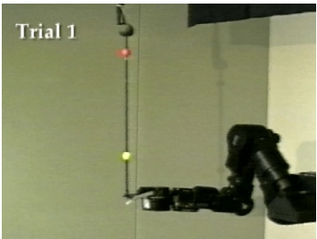


(around 2000, by Schaal, Atkeson, Vijayakumar)

<!-- page: 82 -->

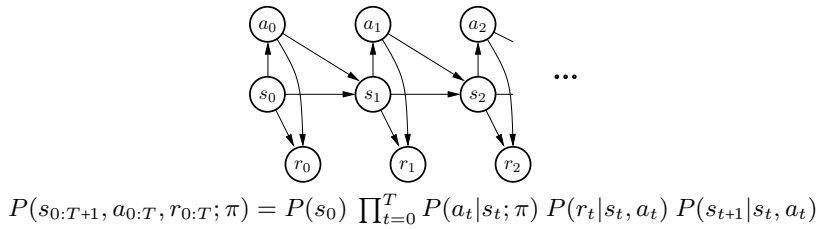


(2007, Andrew Ng et al.) 6:1

## Long history of RL in AI

Idea of programming a computer to learn by trial and error (Turing, 1954)

SNARCs (Stochastic Neural-Analog Reinforcement Calculators) (Minsky, 54)

Checkers playing program (Samuel, 59)

Lots of RL in the 60s (e.g., Waltz & Fu 65; Mendel 66; Fu 70)

MENACE (Matchbox Educable Naughts and Crosses Engine (Mitchie, 63)

RL based Tic Tac Toe learner (GLEE) (Mitchie 68)

Classifier Systems (Holland, 75)

Adaptive Critics (Barto & Sutton, 81)

Temporal Differences (Sutton, 88)

from Satinder Singh’s Introduction to RL, videolectures.com

• Long history in Psychology

6:2

## Recall: Markov Decision Process

– world’s initial state distribution $P ( s _ { 0 } )$

– world’s transition probabilities $P ( s _ { t + 1 }   |   s _ { t } , a _ { t } )$

– world’s reward probabilities $P ( r _ { t } \thinspace \vert \thinspace s _ { t } , a _ { t } )$

<!-- page: 83 -->

– agent’s policy $\pi ( a _ { t } \thinspace \vert \thinspace s _ { t } ) = P ( a _ { 0 } \vert s _ { 0 } ; \pi )$ (or deterministic $a _ { t } = \pi ( s _ { t } ) )$

• **Stationary MDP:**

– We assume $P ( s ^ { \prime }   |   s , a )$ and $P ( r | s , a )$ independent of time

– We also define $\textstyle R ( s , a ) : = \operatorname { E } \{ r | s , a \} = \int r \; P ( r | s , a ) \; d r$

6:3

## Recall

• Bellman equations

$$
V ^ {*} (s) = \max _ {a} Q ^ {*} (s, a) = \max _ {a} \left[ R (s, a) + \gamma \sum_ {s ^ {\prime}} P (s ^ {\prime} \mid s, a) V ^ {*} (s ^ {\prime}) \right]
$$

$$
Q ^ {*} (s, a) = R (s, a) + \gamma \sum_ {s ^ {\prime}} P (s ^ {\prime} \mid s, a) \max _ {a ^ {\prime}} Q ^ {*} (s ^ {\prime}, a ^ {\prime})
$$

• Value-/Q-Iteration

$$
\forall s: V _ {k + 1} (s) = \max _ {a} \left[ R (s, a) + \gamma \sum_ {s ^ {\prime}} P (s ^ {\prime} | s, a) V _ {k} (s ^ {\prime}) \right]
$$

$$
\forall_ {s, a}: Q _ {k + 1} (s, a) = R (s, a) + \gamma \sum_ {s ^ {\prime}} P (s ^ {\prime} | s, a) \max _ {a ^ {\prime}} Q _ {k} (s ^ {\prime}, a ^ {\prime})
$$

6:4

## Towards Learning

• From Sutton & Barto’s Reinforcement Learning book:

The term **dynamic programming (DP)** refers to a collection of algorithms that can be used to compute optimal policies given a perfect model of the environment as a Markov decision process (MDP). Classical DP algorithms are of limited utility in reinforcement learning both because of their assumption of a perfect model and because of their great computational expense, but they are still important theoretically. DP provides an essential foundation for the understanding of the methods presented in the rest of this book. In fact, all of these methods can be viewed as attempts to achieve much the same effect as DP, only with less computation and without assuming a perfect model of the environment.

• So far, we introduced basic notions of an MDP and value functions and methods to compute optimal policies **assuming that we know the world** (know $P ( s ^ { \prime } | s , a )$ and $R ( s , a ) )$

Value Iteration and Q-Iteration are instances of Dynamic Programming

• Reinforcement Learning?

<!-- page: 84 -->

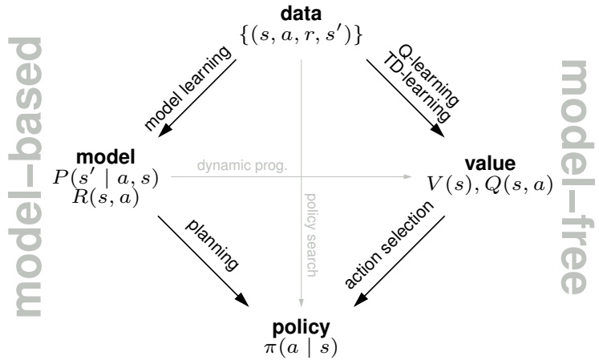

## Learning in MDPs

• While interacting with the world, the agent collects data of the form

$$
D = \{(s _ {t}, a _ {t}, r _ {t}, s _ {t + 1}) \} _ {t = 1} ^ {T}
$$

(state, action, immediate reward, next state)

What could we learn from that?

## • Model-based RL:

learn to predict next state: estimate $P ( s ^ { \prime } | s , a )$

learn to predict immediate reward: estimate $P ( r | s , a )$

## • Model-free RL:

learn to predict value: estimate V (s) or $Q ( s , a )$

## • Policy search:

e.g., estimate the “policy gradient”, or directly use black box (e.g. evolutionary) search

<!-- page: 85 -->

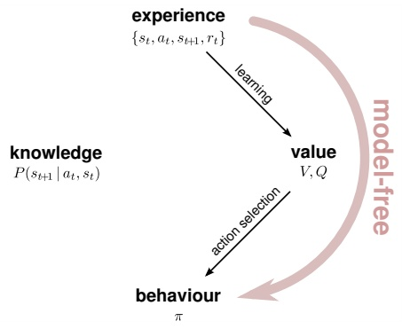

## Q-learning: Temporal-Difference (TD) learning of $Q ^ { * }$

• Recall the Bellman optimality equation for the Q-function:

$$
Q ^ {*} (s, a) = R (s, a) + \gamma \sum_ {s ^ {\prime}} P (s ^ {\prime} | s, a) \max _ {a ^ {\prime}} Q ^ {*} (s ^ {\prime}, a ^ {\prime})
$$

• **Q-learning** (Watkins, 1988) Given a new experience $( s , a , r , s ^ { \prime } )$

$$
\begin{array}{r l} & Q _ {\mathrm{new}} (s, a) = (1 - \alpha) Q _ {\mathrm{old}} (s, a) + \alpha [ r + \gamma \underset {a ^ {\prime}} {\max} Q _ {\mathrm{old}} (s ^ {\prime}, a ^ {\prime}) ] \\ & \qquad = Q _ {\mathrm{old}} (s, a) + \alpha \underbrace {[ r + \gamma \underset {a ^ {\prime}} {\max} Q _ {\mathrm{old}} (s ^ {\prime} , a ^ {\prime}) - Q _ {\mathrm{old}} (s , a) ]} _ {\mathrm{TDerror}} \end{array}
$$

## • Reinforcement:

– more reward than expected $\begin{array} { r } { ( r > Q _ { \mathrm { o l d } } ( s , a ) - \gamma \operatorname* { m a x } _ { a ^ { \prime } } Q _ { \mathrm { o l d } } ( s ^ { \prime } , a ^ { \prime } ) ) } \end{array}$

→ increase $Q ( s , a )$

– less reward than expected $\begin{array} { r } { ( r < Q _ { \mathrm { o l d } } ( s , a ) - \gamma \operatorname* { m a x } _ { a ^ { \prime } } Q _ { \mathrm { o l d } } ( s ^ { \prime } , a ^ { \prime } ) ) } \end{array}$

→ decrease $Q ( s , a )$

6:10

## Q-learning pseudo code

• Q-learning is called **off-policy:** We estimate $Q ^ { * }$ while executing π

• **Q-learning:**

<!-- page: 86 -->

<div class="docvortex-algorithm" style="white-space: pre-wrap; font-family:monospace;">
Initialize $Q(s, a) = 0$
repeat // for each episode
    Initialize start state $s$
    repeat // for each step of episode
        Choose action $a \approx_{\epsilon} \arg\max_a Q(s, a)$
        Take action $a$, observe $r, s'$
        $Q(s, a) \leftarrow Q(s, a) + \alpha \left[ r + \gamma \max_{a'} Q(s', a') - Q(s, a) \right]$
        $s \leftarrow s'$
    until end of episode
until happy
</div>

• **-greedy action selection:**

$$
a \approx_ {\epsilon} \underset {a} {\operatorname{argmax}} Q (s, a) \quad \Longleftrightarrow \quad a = \left\{ \begin{array}{l l} \text {random} & \text {with prob.} \epsilon \\ \operatorname{argmax} _ {a} Q (s, a) & \text {else} \end{array} \right.\tag{6:11}
$$

## Q-learning convergence with prob 1

• Q-learning is a stochastic approximation of Q-Iteration:

Q-learning:

Q-Iteration:

$$
\begin{array}{c} Q _ {\text {new}} (s, a) = (1 - \alpha) Q _ {\text {old}} (s, a) + \alpha [ r + \gamma \max _ {a ^ {\prime}} Q _ {\text {old}} (s ^ {\prime}, a ^ {\prime}) ] \\ \forall_ {s, a}: Q _ {k + 1} (s, a) = R (s, a) + \gamma \sum_ {s ^ {\prime}} P (s ^ {\prime} | s, a) \max _ {a ^ {\prime}} Q _ {k} (s ^ {\prime}, a ^ {\prime}) \end{array}
$$

We’ve shown convergence of Q-Iteration to $Q ^ { * }$

## • Convergence of Q-learning:

$$
Q _ {k + 1} = T (Q _ {k})
$$

$$
Q _ {k + 1} = (1 - \alpha) Q _ {k} + \alpha [ T (Q _ {k}) + \eta_ {k} ]
$$

## $\eta _ { k }$ is zero mean!

6:12

## Q-learning impact

• Q-Learning was the first provably convergent direct adaptive optimal control algorithm

• Great impact on the field of Reinforcement Learning in 80/90ies

– “Smaller representation than models”

– “Automatically focuses attention to where it is needed,” i.e., no sweeps through state space

– Can be made more efficient with eligibility traces

<!-- page: 87 -->

## Variants: TD(λ), Sarsa(λ), Q(λ)

• TD(λ):

$$
\forall s: V (s) \leftarrow V (s) + \alpha e (s) \left[ r _ {t} + \gamma V _ {\mathrm{old}} (s _ {t + 1}) - V _ {\mathrm{old}} (s _ {t}) \right]
$$

• Sarsa(λ)

$$
\forall_ {s, a}: Q (s, a) \leftarrow Q (s, a) + \alpha e (s, a) \left[ r + \gamma Q _ {\mathrm{old}} (s ^ {\prime}, a ^ {\prime}) - Q _ {\mathrm{old}} (s, a) \right]
$$

$Q ( \lambda )$

$$
\forall_ {s, a}: Q (s, a) \leftarrow Q (s, a) + \alpha e (s, a) \left[ r + \gamma \max _ {a ^ {\prime}} Q _ {\text {old}} \left(s ^ {\prime}, a ^ {\prime}\right) - Q _ {\text {old}} (s, a) \right]
$$

• **On-policy vs. off-policy** learning:

– On–policy: estimate $Q ^ { \pi }$ while executing π (Sarsa, TD)

– Off–policy: estimate $Q ^ { * }$ while executing π (Q-learning)

6:14

## Eligibility traces

• Temporal Difference: based on single experience $( s _ { 0 } , r _ { 0 } , s _ { 1 } )$

$$
V _ {\mathrm{new}} (s _ {0}) = V _ {\mathrm{old}} (s _ {0}) + \alpha [ r _ {0} + \gamma V _ {\mathrm{old}} (s _ {1}) - V _ {\mathrm{old}} (s _ {0}) ]
$$

• Longer experience sequence, $\mathbf { e . g . } \colon ( s _ { 0 } , r _ { 0 } , r _ { 1 } , r _ { 2 } , s _ { 3 } )$

**Temporal credit assignment**, think further backwards: receiving $r _ { 0 : 2 }$ and ending up in $s _ { 3 }$ also tells us something about $V ( s _ { 0 } )$

$$
V _ {\mathrm{new}} (s _ {0}) = V _ {\mathrm{old}} (s _ {0}) + \alpha [ r _ {0} + \gamma r _ {1} + \gamma^ {2} r _ {2} + \gamma^ {3} V _ {\mathrm{old}} (s _ {3}) - V _ {\mathrm{old}} (s _ {0}) ]
$$

• **TD(**λ): remember where you’ve been recently (“eligibility trace”) and update those values as well:

$$
e (s _ {t}) \leftarrow e (s _ {t}) + 1
$$

$$
\forall s: V _ {\mathrm{new}} (s) = V _ {\mathrm{old}} (s) + \alpha e (s) \left[ r _ {t} + \gamma V _ {\mathrm{old}} (s _ {t + 1}) - V _ {\mathrm{old}} (s _ {t}) \right]
$$

$$
\forall s: e (s) \leftarrow \gamma \lambda e (s)
$$

• Core topic of Sutton & Barto book

→ great improvement of basic RL algorithms

<!-- page: 88 -->

## Q(λ) pseude code

<div class="docvortex-algorithm" style="white-space: pre-wrap; font-family:monospace;">
Initialize $Q(s, a) = 0$, $e(s, a) = 0$
repeat // for each episode
    Initialize start state $s$
    repeat // for each step of episode
        Choose action $a \approx_{\epsilon} \arg\max_{a} Q(s, a)$
        Update eligibility: $e(s, a) \leftarrow 1$ or $e(s, a) \leftarrow e(s, a) + 1$
        Take action $a$, observe $r, s'$
        Compute TD-error $D = [r + \gamma \max_{a'} Q(s', a') - Q(s, a)]$
        $\forall_{\tilde{s}, \tilde{a}}$ with $e(\tilde{s}, \tilde{a}) &gt; 0$: $Q(\tilde{s}, \tilde{a}) \leftarrow Q(\tilde{s}, \tilde{a}) + \alpha e(\tilde{s}, \tilde{a}) D$
        Discount all eligibilities $\forall_{\tilde{s}, \tilde{a}} : e(\tilde{s}, \tilde{a}) \leftarrow \gamma \lambda e(\tilde{s}, \tilde{a})$
        $s \leftarrow s'$
    until end of episode
until happy
</div>

• Analogously for TD(λ) and SARSA(λ)

6:16

## Experience Replay

• In large state spaces, the Q-fucntion is represented using function approximation

We cannot store a full table $e ( s , a )$ and update $\forall _ { \tilde { s } , \tilde { a } }$

• Instead we store the full data $D \; = \; \{ ( s _ { i } , a _ { i } , r _ { i } , s _ { i + 1 } ) \} _ { i = o } ^ { t }$ up to now (time t), called the **replay buffer**

• Update the Q-function for a B subsample (of contant size) of D plus the most recent experience

$$
\forall (s, a, r, s ^ {\prime}) \in B: Q (s, a) \leftarrow Q (s, a) + \alpha \left[ r + \gamma \max _ {a ^ {\prime}} Q (s ^ {\prime}, a ^ {\prime}) - Q (s, a) \right]
$$

(See paper “A Deeper Look at Experience Replay” (Zhang, Sutton))

6:17

## TD-Gammon, by Gerald Tesauro\*\*

(See section 11.1 in Sutton & Barto’s book.)

• MLP to represent the value function $V ( s )$

<!-- page: 89 -->

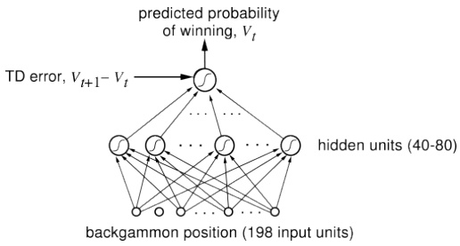

• Only reward given at end of game for win.

• **Self-play**: use the current policy to sample moves on both sides!

• random policies → games take up to thousands of steps. Skilled players ∼ 50 − 60 steps.

• TD(λ) learning (gradient-based update of NN weights)

6:18

## TD-Gammon notes\*\*

• Choose features as raw position inputs (number of pieces at each place)

→ as good as previous computer programs

• Using previous computer program’s expert features

→ world-class player

• Kit Woolsey was world-class player back then:

– TD-Gammon particularly good on vague positions

– not so good on calculable/special positions

– just the opposite to (old) chess programs

• See anotated matches: [http://www.bkgm.com/matches/woba.html](http://www.bkgm.com/matches/woba.html)

• Good example for

– value function approximation

– game theory, self-play

<!-- page: 90 -->

## Detour: Dopamine\*\*

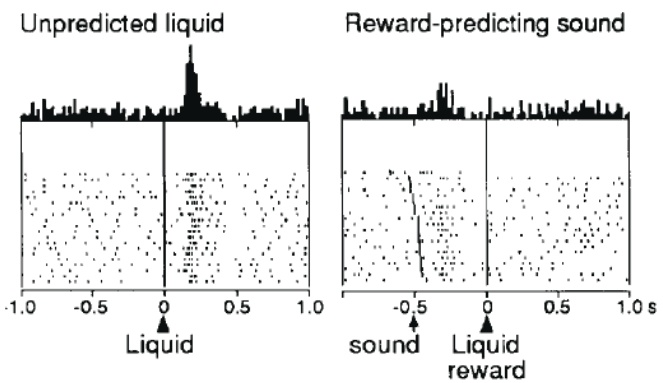

Montague, Dayan & Sejnowski: A Framework for Mesencephalic Dopamine Systems based on Predictive Hebbian Learning. Journal of Neuroscience, 16:1936-1947, 1996.

6:20

## So what does that mean?

– We derived an algorithm from a general framework

– This algorithm involves a specific variable (reward residual)

– We find a neural correlate of exactly this variable

## Great!

Devil’s advocate:

– Does not proof that TD learning is going on Only that an expected reward is compared with a experienced reward

– Does not discriminate between model-based and model-free (Both can induce an expected reward)

6:21

## Limitations of the model-free view

• Given learnt values, behavior is a fixed SR (or state-action) mapping

• If the “goal” changes: need to re-learn values for every state in the world! all previous values are obsolete

• No general “knowledge”, only values

• No anticipation of general outcomes (s<sup>0</sup>), only of value

<!-- page: 91 -->

• No “planning”

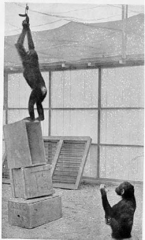

6:22

Wolfgang Kohler (1917) ¨ Intelligenzpr üfungen am Menschenaffen The Mentality of Apes

model-free RL? NO WAY!

6:23

Detour: Psychology\*\*


Edward Tolman (1886 - 1959)

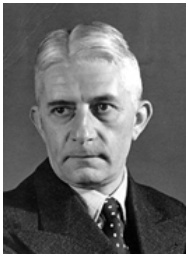

Wolfgang Kohler (1887–1967) ¨

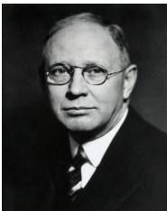

Clark Hull (1884 - 1952) Principles of Behavior (1943)

learn facts about the world that they could subsequently use in a flexible manner, rather than simply learning automatic responses

learn stimulus-response mappings based on reinforcement

<!-- page: 92 -->

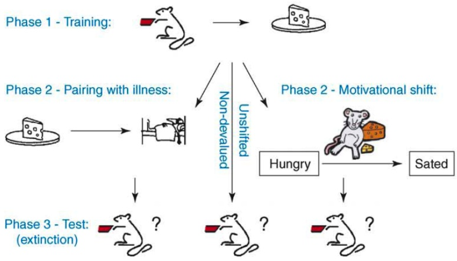

Niv, Joel & Dayan: A normative perspective on motivation. TICS, 10:375-381, 2006. 6:25

**Goal-directed vs. habitual: Devaluation\*\***

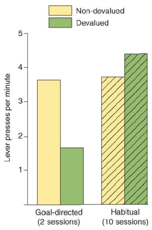

Niv, Joel & Dayan: A normative perspective on motivation. TICS, 10:375-381, 2006.

6:26

By definition, goal-directed behavior is performed to obtain a desired goal. Although all instrumental behavior is **instrumental** in achieving its contingent goals, it is not necessarily purposively **goal-directed**. Dickinson and Balleine [1,11] proposed that behavior is goal-directed if: (i) it is sensitive to the contingency between action and outcome, and (ii) the outcome is desired. Based on the second condition, motivational manipulations have been used to distinguish between two systems of action control: if an instrumental

<!-- page: 93 -->

outcome is no longer a valued goal (for instance, food for a sated animal) and the behavior persists, it must not be goaldirected. Indeed, after moderate amounts of training, outcome revaluation brings about an appropriate change in instrumental actions (e.g. leverpressing) [43,44], but this is no longer the case for extensively trained responses ([30,31], but see [45]). That extensive training can render an instrumental action independent of the value of its consequent outcome has been regarded as the experimental parallel of the folk psychology maxim that wellperformed actions become **habitual** [9] (see Figure I).

Niv, Joel & Dayan: A normative perspective on motivation. TICS, 10:375-381, 2006.

6:27

## Model-based RL

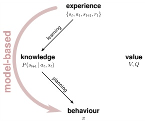

• **Model learning:** Given data $D   =   \{ ( s _ { t } , a _ { t } , r _ { t } , s _ { t + 1 } ) \} _ { t = 1 } ^ { T }$ estimate $P ( s ^ { \prime } | s , a )$ and $R ( s , a )$ . For instance:

– discrete state-action: $\begin{array} { r } { \hat { P } ( s ^ { \prime } | s , a ) = \frac { \# ( s ^ { \prime } , s , a ) } { \# ( s , a ) } } \end{array}$

– continuous state-action: $\hat { P } ( s ^ { \prime } | s , a ) = \mathbb { N } ( s ^ { \prime }   |   \phi ( s , a ) ^ { \top } \beta , \Sigma )$

$$
\beta
$$

(including non-linear features, regularization, cross-validation!)

• **Planning**, for instance:

– discrete state-action: Value Iteration with the estimated model

– continuous state-action: Least Squares Value Iteration Stochastic Optimal Control (Riccati, Differential Dynamic Prog.)

<!-- page: 94 -->

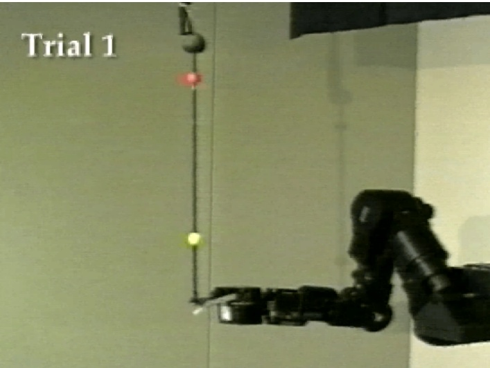

(around 2000, by Schaal, Atkeson, Vijayakumar)

• Use a simple regression method (locally weighted Linear Regression) to estimate

$$
P (\dot {x} | u, x) \stackrel {\text {local}} {=} \mathcal {N} (\dot {x} \mid A x + B u, \sigma)\tag{6:29}
$$

## 6.2 Exploration

6:30

## -greedy exploration in Q-learning

<div class="docvortex-algorithm" style="white-space: pre-wrap; font-family:monospace;">
Initialize $Q(s, a) = 0$
repeat // for each episode
    Initialize start state $s$
    repeat // for each step of episode
        Choose action $a = \begin{cases} \text{random} &amp; \text{with prob. } \epsilon \\ \text{argmax}_a Q(s, a) &amp; \text{else} \end{cases}$
        Take action $a$, observe $r, s'$
        $Q_{\text{new}}(s, a) \leftarrow Q_{\text{old}}(s, a) + \alpha \left[ r + \gamma \max_{a'} Q_{\text{old}}(s', a') - Q_{\text{old}}(s, a) \right]$
        $s \leftarrow s'$
    until end of episode
until happy
</div>

<!-- page: 95 -->

## Optimistic initialization & UCB

• Initialize the Q function optimistically! E.g., if you know $R _ { m a x } , \; Q ( s , a ) \; =$ $1 / ( 1 - \gamma ) R _ { m a x }$ (in practise, this is often too large..)

• UCB: If you can estimate a confidence bound $\sigma ( s , a )$ for your Q-function (e.g., using bootstrap estimates when using function approximation), choose your action based on $Q ( s , a ) + \beta \sigma ( s , a )$

• Generally, we need better ways to explore than -greedy!!

6:32

## R-MAX

Brafman and Tennenholtz (2002)

• Model-based RL: We estimate $R ( s , a )$ and $P ( s ^ { \prime } | s , a )$ on the fly

• Use an optimistic reward function: 1

$$
R ^ {\mathrm{R-MAX}} (s, a) = \left\{ \begin{array}{l l} R (s, a) & c (s, a) \geq m (s, a \text {known}) \\ R _ {m a x} & c (s, a) <   m (s, a \text {unknown}) \end{array} \right.
$$

• Is PAC-MDP efficient

• Optimism in the face of uncertainty

6:33

## KWIK-R-max\*\*

(Li, Littman, Walsh, Strehl, 2011)

• Extension of R-MAX to more general representations

• Let’s say the transition model $P ( s ^ { \prime }   |   s , a )$ is defined by n parameters Typically, $n \ll$ number of states!

• Efficient KWIK-learner L requires a number of samples which is polynomial in n to estimate approximately correct $\hat { P } ( s ^ { \prime }   |   s , a )$

(KWIK = Knows-what-it-knows framework)

• KWIK-R-MAX using L is PAC-MDP efficient in n

→ polynomial in number of parameters of transition model!

→ more efficient than plain $\mathrm { R - M A X }$ by several orders of magnitude!

<!-- page: 96 -->

## Bayesian RL\*\*

• There exists an optimal solution to the exploration-exploitation trade-off: belief planning (see my tutorial “Bandits, Global Optimization, Active Learning, and Bayesian RL – understanding the common ground”)

$$
V ^ {\pi} (b, s) = R (s, \pi (b, s)) + \int_ {b ^ {\prime}, s ^ {\prime}} P (b ^ {\prime}, s ^ {\prime} \mid b, s, \pi (b, s)) V ^ {\pi} (b ^ {\prime}, s ^ {\prime})
$$

– Agent maintains a distribution (belief) $b ( m )$ over MDP models m

– typically, MDP structure is fixed; belief over the parameters

– belief updated after each observation $( s , a , r , s ^ { \prime } ) \colon b \to b ^ { \prime }$

– only tractable for very simple problems

• Bayes-optimal policy $\pi ^ { * } = \operatorname { a r g m a x } _ { \pi } V ^ { \pi } ( b , s )$

– no other policy leads to more rewards in expectation w.r.t. prior distribution over MDPs

– solves the exploration-exploitation tradeoff

6:35

## Optimistic heuristics

• As with UCB, choose estimators for $R ^ { * } , P ^ { * }$ that are optimistic/over-confident

$$
V _ {t} (s) = \max _ {a} \left[ R ^ {*} + \sum_ {s ^ {\prime}} P ^ {*} (s ^ {\prime} | s, a) V _ {t + 1} (s ^ {\prime}) \right]
$$

• Rmax:

$$
- R ^ {*} (s, a) = \left\{ \begin{array}{l l} R _ {\max} & \text {if \#_{s,a} <  n} \\ \hat {\theta} _ {r s a} & \text {otherwise} \end{array} , P ^ {*} (s ^ {\prime} | s, a) = \left\{ \begin{array}{l l} \delta_ {s ^ {\prime} s ^ {*}} & \text {if \#_{s,a} <  n} \\ \hat {\theta} _ {s ^ {\prime} s a} & \text {otherwise} \end{array} \right. \right.
$$

– Guarantees over-estimation of values, polynomial PAC results!

– Read about “KWIK-Rmax”! (Li, Littman, Walsh, Strehl, 2011)

• Bayesian Exploration Bonus (BEB), Kolter & Ng (ICML 2009)

– Choose $P ^ { * } ( s ^ { \prime } | s , a ) = P ( s ^ { \prime } | s , a , b )$ integrating over the current belief b(θ) (non-overconfident)

– But choose $R ^ { * } ( s , a ) = \hat { \theta } _ { r s a } { + } \frac { \beta } { 1 { + } \alpha _ { 0 } ( s , a ) }$ with a hyperparameter $\alpha _ { 0 } ( s , a )$ , over-estimating return

• Confidence intervals for V -/Q-function (Kealbling ’93, Dearden et al. ’99)

6:36

## More ideas about exploration

• **Intrinsic rewards** for learning progress

– “fun”, “curiousity”

– in addition to the external “standard” reward of the MDP

<!-- page: 97 -->

– “Curious agents are interested in learnable but yet unknown regularities, and get bored by both predictable and inherently unpredictable things.” (J. Schmidhuber)

– Use of a meta-learning system which learns to predict the error that the learning machine makes in its predictions; meta-predictions measure the potential interestingness of situations (Oudeyer et al.)

• Dimensionality reduction for model-based exploration in continuous spaces: lowdimensional representation of the transition function; focus exploration on relevant dimensions (A. Nouri, M. Littman)

6:37

## 6.3 Policy Search, Imitation, & Inverse RL\*\*

6:38

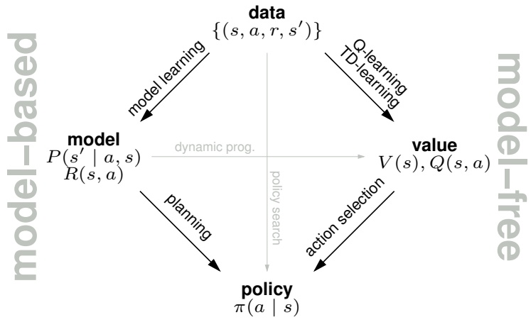

– Policy gradients are one form of policy search.

– There are other, direct policy search methods

(e.g., plain stochastic search, “Covariance Matrix Adaptation”)

<!-- page: 98 -->

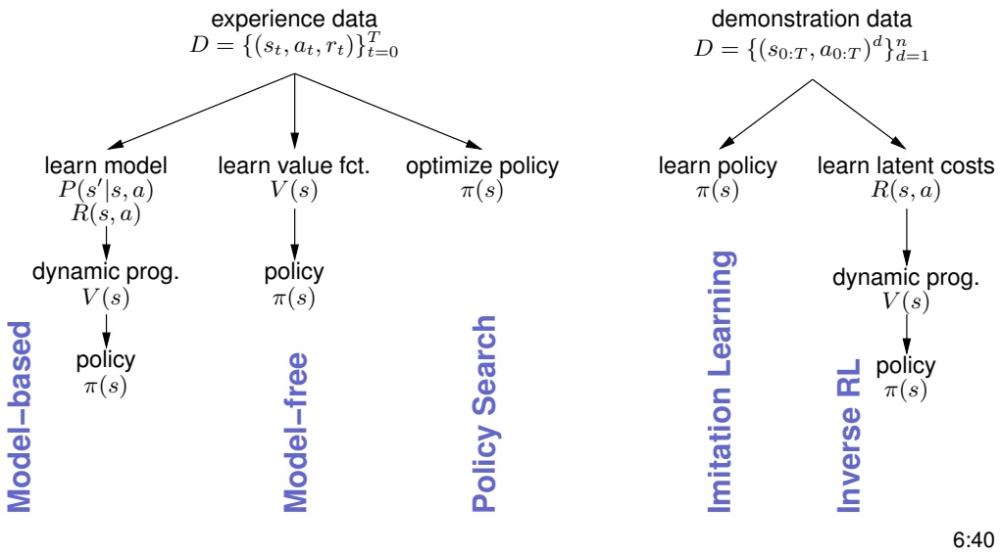

## Policy Gradients\*\*

• In continuous state/action case, represent the policy as linear in arbitrary state features:

$$
\begin{array}{c} \pi (s) = \sum_ {j = 1} ^ {k} \phi_ {j} (s) \beta_ {j} = \phi (s) ^ {\top} \beta \\ \pi (a \mid s) = \mathcal {N} (a \mid \phi (s) ^ {\top} \beta , \Sigma) \end{array}
$$

(deterministic)

(stochastic)

with k features $\phi _ { j }$

• Basically, given an episode $\xi = ( s _ { t } , a _ { t } , r _ { t } ) _ { t = 0 } ^ { H } ,$ we want to estimate

$$
\frac {\partial V (\beta)}{\partial \beta}\tag{6:41}
$$

## Policy Gradients\*\*

• One approach is called REINFORCE:

$$
\begin{array}{l} \frac {\partial V (\beta)}{\partial \beta} = \frac {\partial}{\partial \beta} \int P (\xi | \beta) R (\xi) d \xi = \int P (\xi | \beta) \frac {\partial}{\partial \beta} \log P (\xi | \beta) R (\xi) d \xi \\ = \mathrm{E} _ {\xi | \beta} \{\frac {\partial}{\partial \beta} \log P (\xi | \beta) R (\xi) \} = \mathrm{E} _ {\xi | \beta} \{\sum_ {t = 0} ^ {H} \gamma^ {t} \frac {\partial \log \pi (a _ {t} | s _ {t})}{\partial \beta} \underbrace {\sum_ {t ^ {\prime} = t} ^ {H} \gamma^ {t ^ {\prime} - t} r _ {t ^ {\prime}}} _ {Q ^ {\pi} (s _ {t}, a _ {t}, t)} \} \end{array}
$$

<!-- page: 99 -->

• Another is PoWER, which requires $\begin{array} { r } { \frac { \partial V ( \beta ) } { \partial \beta } = 0 } \end{array}$

$$
\beta \leftarrow \beta + \frac {\mathrm{E} _ {\xi | \beta} \{\sum_ {t = 0} ^ {H} \epsilon_ {t} Q ^ {\pi} (s _ {t} , a _ {t} , t) \}}{\mathrm{E} _ {\xi | \beta} \{\sum_ {t = 0} ^ {H} Q ^ {\pi} (s _ {t} , a _ {t} , t) \}}
$$

See: Peters & Schaal (2008): Reinforcement learning of motor skills with policy gradients, Neural Networks.

Kober & Peters: Policy Search for Motor Primitives in Robotics, NIPS 2008.

Vlassis, Toussaint (2009): Learning Model-free Robot Control by a Monte Carlo EM Algorithm. Autonomous Robots 27, 123-130.

6:42

## Imitation Learning\*\*

$$
D = \{(s _ {0: T}, a _ {0: T}) ^ {d} \} _ {d = 1} ^ {n} \quad \stackrel {{\text {learn / copy}}} {{\rightarrow}} \quad \pi (s)
$$

• Use ML to imitate demonstrated state trajectories $x _ { 0 : T }$

Literature:

Atkeson & Schaal: Robot learning from demonstration (ICML 1997)

Schaal, Ijspeert & Billard: Computational approaches to motor learning by imitation (Philosophical Transactions of the Royal Society of London. Series B: Biological Sciences 2003)

Grimes, Chalodhorn & Rao: Dynamic Imitation in a Humanoid Robot through Nonparametric Probabilistic Inference. (RSS 2006)

Rudiger Dillmann: Teaching and learning of robot tasks via observation of human performance ¨ (Robotics and Autonomous Systems, 2004)

6:43

## Imitation Learning\*\*

• There a many ways to imitate/copy the oberved policy:

Learn a density model $P ( a _ { t } \thinspace \vert \thinspace s _ { t } ) P ( s _ { t } )$ (e.g., with mixture of Gaussians) from the observed data and use it as policy (Billard et al.)

Or trace observed trajectories by minimizing perturbation costs (Atkeson & Schaal 1997)

6:44

<!-- page: 100 -->


Atkeson & Schaal 6:45

Inverse $\mathbf { R L } ^ { * * }$

$$
D = \{(s _ {0: T}, a _ {0: T}) ^ {d} \} _ {d = 1} ^ {n} \quad \stackrel {{\text {learn}}} {{\rightarrow}} \quad R (s, a) \quad \stackrel {{\text {DP}}} {{\rightarrow}} \quad V (s) \quad \rightarrow \quad \pi (s)
$$

• Use ML to “uncover” the latent reward function in observed behavior

Literature:

Pieter Abbeel & Andrew Ng: Apprenticeship learning via inverse reinforcement learning (ICML 2004)

Andrew Ng & Stuart Russell: Algorithms for Inverse Reinforcement Learning (ICML 2000) Nikolay Jetchev & Marc Toussaint: Task Space Retrieval Using Inverse Feedback Control (ICML 2011).

6:46

## Inverse RL (Apprenticeship Learning)\*\*

• Given: demonstrations $D = \{ x _ { 0 : T } ^ { d } \} _ { d = 1 } ^ { n }$

• Try to find a reward function that **discriminates demonstrations from other policies**

– Assume the reward function is linear in some features $R ( x ) = w ^ { \top } \phi ( x )$

– Iterate:

<!-- page: 101 -->

1. Given a set of candidate policies $\{ \pi _ { 0 } , \pi _ { 1 } , . . \}$

2. Find weights w that maximize the value margin between teacher and all other candidates

$$
\begin{array}{l} \max _ {w, \xi} \xi \\ \text {s.t.} \forall_ {\pi_ {i}}: \underbrace {w ^ {\top} \langle \phi \rangle_ {D}} _ {\text {value of demonstrations}} \geq \underbrace {w ^ {\top} \langle \phi \rangle_ {\pi_ {i}}} _ {\text {value of} \pi_ {i}} + \xi \\ \| w \| ^ {2} \leq 1 \end{array}
$$

3. Compute a new candidate policy $\pi _ { i }$ that optimizes $R ( x )   =   w ^ { \top } \phi ( x )$ and add to candidate list.

(Abbeel & Ng, ICML 2004)

6:47

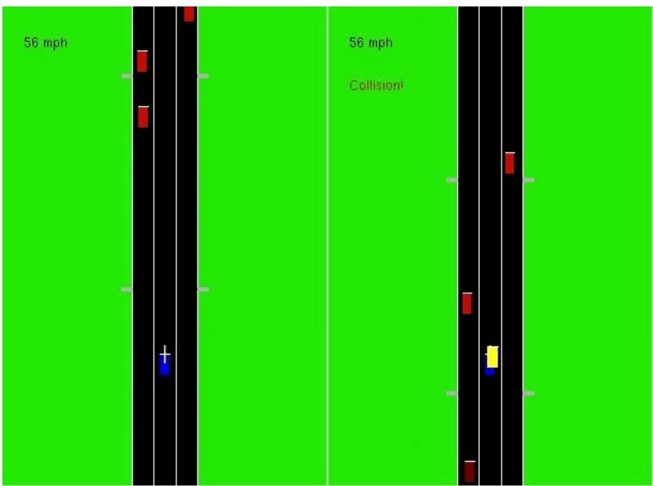

<!-- page: 102 -->

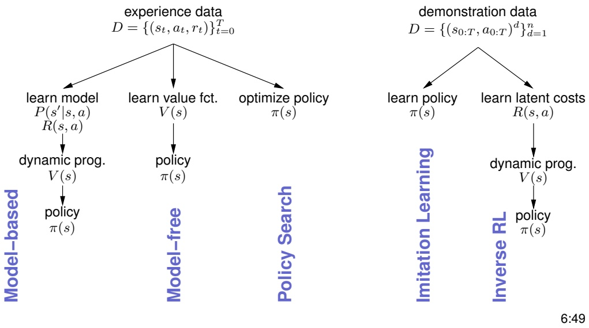

## Conclusions

• Markov Decision Processes and RL provide a solid framework for describing behavioural learning $\&$ planning

• Little taxonomy:

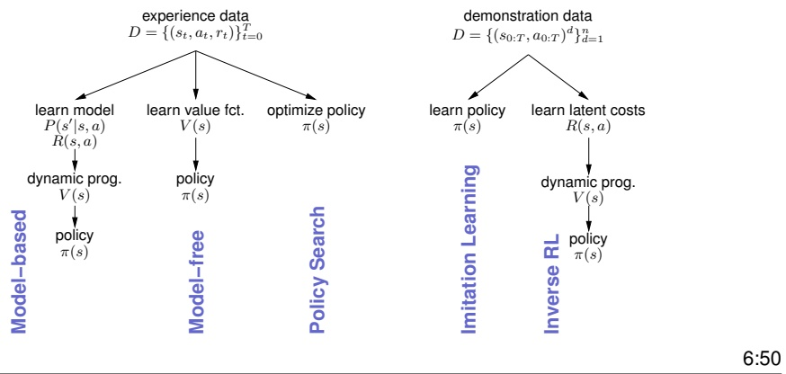

## Basic topics not covered

## • Partial Observability (POMDPs)

What if the agent does not observe the state $s _ { t } ? \rightarrow$ The policy $\pi ( a _ { t }   |   b _ { t } )$ needs to build on an internal representation, called belief $\beta _ { t }$

<!-- page: 103 -->

• Continuous state & action spaces, function approximation in RL

• Predictive State Representations, etc etc...

6:51

<!-- page: 104 -->

## 7 Other models of interactive domains\*\*

## 7.1 Basic Taxonomy of domain models

7:1

## Taxonomy of domains I

• Domains (or models of domains) can be distinguished based on their state representation

– Discrete, continuous, hybrid

– Factored

– Structured/relational

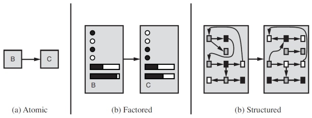

7:2

## Relational representations of state

• The world is composed of objects; its state described in terms of properties and relations of objects. Formally

– A set of constants (referring to objects)

– A set of predicates (referring to object properties or relations)

– A set of functions (mapping to constants)

• A (grounded) state can then described by a conjunction of predicates (and functions). For example:

– Constants: $C _ { 1 } , C _ { 2 } , P _ { 1 } , P _ { 2 } , S F O , J F K$

– Predicates: $A t ( . , . ) , C a r g o ( . ) , P l a n e ( . ) , A i r p o r t ( . )$

– A state description:

$$
A t (C _ {1}, S F O) \wedge A t (C _ {2}, J F K) \wedge A t (P _ {1}, S F O) \wedge A t (P _ {2}, J F K) \wedge C a r g o (C _ {1}) \wedge C a r g o (C _ {2}) \wedge
$$

$$
\text {Plane} (P _ {1}) \land \text {Plane} (P _ {2}) \land \text {Airport} (J F K) \land \text {Airport} (S F O)
$$

<!-- page: 105 -->

• Categories of Russel & Norvig:

– Fully observable vs. partially observable

– Single agent vs. multiagent

– Deterministic vs. stochastic

– Known vs. unknown

– Episodic vs. sequential

– Static vs. dynamic

– Discrete vs. continuous

• We add:

– Time discrete vs. time continuous

## Overview of common domain models

|  | prob. | rel. | multi | PO | cont.time |
| --- | --- | --- | --- | --- | --- |
| table | - | - | - | - | - |
| PDDL (STRIPS rules) | - | + | + | - | - |
| NDRs | + | + | - | - | - |
| MDP | + | - | - | - | - |
| relational MDP | + | + | - | - | - |
| POMDP | + | - | - | + | - |
| DEC-POMDP | + | - | + | + | - |
| Games | - | + | + | - | - |
| differential eqns. (control) | - | - |  | + | + |
| stochastic diff. eqns. (SOC) | + | - |  | + | + |

PDDL: Planning Domain Definition Language, STRIPS: STanford Research Institute Problem Solver, NDRs: Noisy Deictic Rules, MDP: Markov Decision Process, POMDP: Partially Observable MDP, DEC-POMDP: Decentralized POMDP, SOC: Stochastic Optimal Control

<!-- page: 106 -->

<div class="docvortex-algorithm" style="white-space: pre-wrap; font-family:monospace;">
$Init(At(C_1, SFO) \land At(C_2, JFK) \land At(P_1, SFO) \land At(P_2, JFK)$
    $\land Cargo(C_1) \land Cargo(C_2) \land Plane(P_1) \land Plane(P_2)$
    $\land Airport(JFK) \land Airport(SFO))$
$Goal(At(C_1, JFK) \land At(C_2, SFO))$
$Action(Load(c, p, a),$
    PRECOND: $At(c, a) \land At(p, a) \land Cargo(c) \land Plane(p) \land Airport(a)$
    EFFECT: $\neg At(c, a) \land In(c, p))$
$Action(Unload(c, p, a),$
    PRECOND: $In(c, p) \land At(p, a) \land Cargo(c) \land Plane(p) \land Airport(a)$
    EFFECT: $At(c, a) \land \neg In(c, p))$
$Action(Fly(p, from, to),$
    PRECOND: $At(p, from) \land Plane(p) \land Airport(from) \land Airport(to)$
    EFFECT: $\neg At(p, from) \land At(p, to))$

Figure 10.1 A PDDL description of an air cargo transportation planning problem.
</div>

(from Russel & Norvig)

• PDDL describes a deterministic mapping $( s , a ) \mapsto s ^ { \prime } ,$ , but

– using a set of action schema (rules) of the form ActionName(...) : PRECONDITION → EFFECT

– where action arguments are variables and the preconditions and effects are conjunctions of predicates

## PDDL

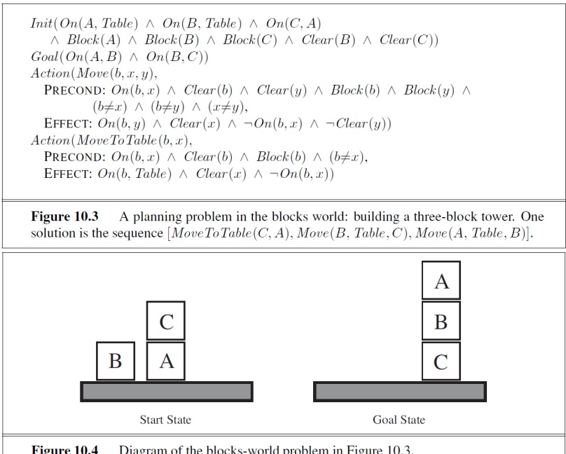

Figure 10.4 Diagram of the blocks-world problem in Figure 10.3.

<!-- page: 107 -->

## Noisy Deictic Rules (NDRs)

• Noisy Deictic Rules (Pasula, Zettlemoyer, & Kaelbling, 2007)

• A probabilistic extension of “PDDL rules”:

$$
\begin{array}{l l}g r a b (X):&o n (X, Y),   b a l l (X),   c u b e (Y),   t a b l e (Z)\\&\rightarrow \quad \left\{\begin{array}{l l}0. 7:&i n h a n d (X),   \neg o n (X, Y)\\0. 2:&o n (X, Z),   \neg o n (X, Y)\\0. 1:&\text {noise}\end{array}\right.\end{array}
$$

• These rules define a probabilistic transition probability

$$
P (s ^ {\prime} | s, a)
$$

Namely, if $( s , a )$ has a unique covering rule r, then

$$
P (s ^ {\prime} | s, a) = P (s ^ {\prime} | s, r) = \sum_ {i = 0} ^ {m _ {r}} p _ {r, i} P (s ^ {\prime} | \Omega_ {r, i}, s)
$$

where $P ( s ^ { \prime } | \Omega _ { r , i } , s )$ describes the deterministic state transition of the ith outcome (see Lang & Toussaint, JAIR 2010).

7:9

• While such rule based domain models originated from classical AI research, the following were strongly influenced also from stochastics, decision theory, Machine Learning, etc..

7:10

## Partially Observable MDPs

## Recall the general setup

7:11

• We assume the agent is in interaction with a domain.

– The world is in a state $s _ { t } \in \mathcal { S }$

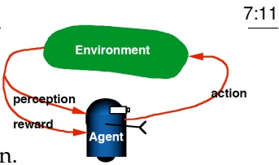

– The agent senses observations $y _ { t } \in \mathcal { O }$

– The agent decides on an action $a _ { t } \in \mathcal { A }$

– The world transitions in a new state $s _ { t + 1 }$

<!-- page: 108 -->


• Generally, an agent maps the history to an action, $h _ { t } = ( y _ { 0 : t } , a _ { 0 : t - 1 } ) \mapsto a _ { t }$

7:12

## POMDPs

• Partial observability adds a totally new level of complexity!

• Basic alternative agent models:

– The agent maps $y _ { t } \mapsto a _ { t }$

(stimulus-response mapping.. non-optimal)

– The agent stores all previous observations and maps $y _ { 0 : t } , a _ { 0 : t \cdot 1 } \mapsto a _ { t }$ (ok)

– The agent stores only the recent history and maps $y _ { t - k : t } , a _ { t - k : t \dashv 1 } \mapsto a _ { t }$ (crude, but may be a good heuristic)

– The agent is some machine with its own **internal state** $n _ { t } , \mathbf { e . g . } ,$ a computer, a finite state machine, a brain... The agent maps $( n _ { t - 1 } , y _ { t } ) \mapsto n _ { t }$ (internal state update) and $n _ { t } \mapsto a _ { t }$

– The agent maintains a full probability distribution (**belief**) $b _ { t } ( s _ { t } )$ over the state, maps $( b _ { t - 1 } , y _ { t } ) \mapsto b _ { t }$ (Bayesian belief update), and $b _ { t } \mapsto a _ { t }$

7:13

## POMDP coupled to a state machine agent


<!-- page: 109 -->

\- Reward for correct opening: +10

Reward Function

\- Penalty for wrong opening: -100

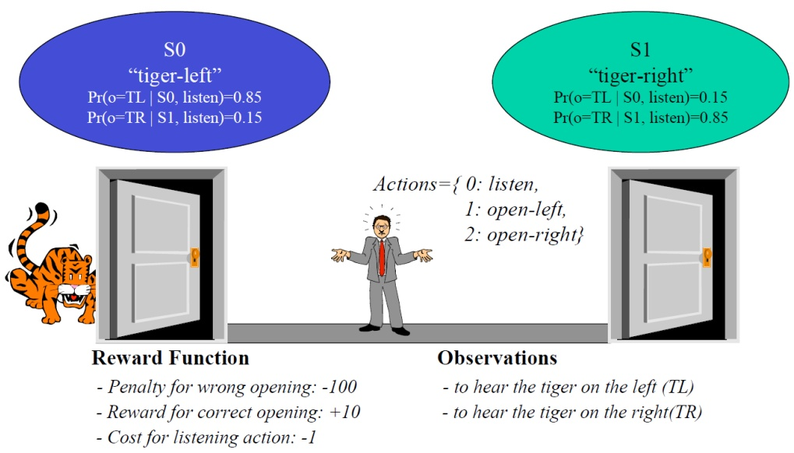


[http://www.darpa.mil/grandchallenge/index.asp](http://www.darpa.mil/grandchallenge/index.asp)7:15

## • The tiger problem: a typical POMDP example:

<!-- page: 110 -->

**Solving POMDPs via Dynamic Programming in Belief Space**

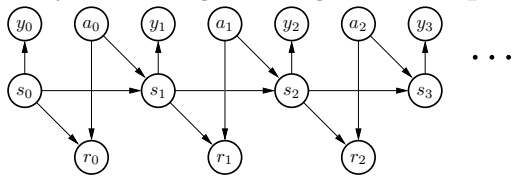

• Again, the value function is a function over the belief

$$
V (b) = \max _ {a} \left[ R (b, s) + \gamma \sum_ {b ^ {\prime}} P (b ^ {\prime} | a, b) V (b ^ {\prime}) \right]
$$

• Sondik 1971: V is piece-wise linear and convex: Can be described by m vectors $( \alpha _ { 1 } , . . , \alpha _ { m } )$ , each $\alpha _ { i } = \alpha _ { i } ( s )$ is a function over discrete s

$$
V (b) = \max _ {i} \sum_ {s} \alpha_ {i} (s) b (s)
$$

Exact dynamic programming possible, see Pineau et al., 2003

7:17

## Approximations & Heuristics

• Point-based Value Iteration (Pineau et al., 2003)

– Compute V (b) only for a finite set of belief points

• Discard the idea of using belief to “aggregate” history

– Policy directly maps history (window) to actions

– Optimize finite state controllers (Meuleau et al. 1999, Toussaint et al. 2008)

7:18

## Further reading

• Point-based value iteration: An anytime algorithm for POMDPs. Pineau, Gordon & Thrun, IJCAI 2003.

• The standard references on the “POMDP page” [http://www.cassandra.org/pomdp/](http://www.cassandra.org/pomdp/)

• Bounded finite state controllers. Poupart & Boutilier, NIPS 2003.

• Hierarchical POMDP Controller Optimization by Likelihood Maximization. Toussaint, Charlin & Poupart, UAI 2008.

<!-- page: 111 -->

## Decentralized POMDPs

• Finally going multi agent!

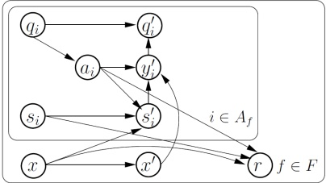

(from Kumar et al., IJCAI 2011)

• This is a special type (simplification) of a general DEC-POMDP

• Generally, this level of description is very general, but NEXP-hard Approximate methods can yield very good results, though

7:20

## Controlled System

• Time is continuous, $t \in \mathbb { R }$

• The system state, actions and observations are continuous, $x ( t )   \in   \mathbb { R } ^ { n } , u ( t )   \in$ $\mathbb { R } ^ { d } , \dot { y ( t ) } \in \mathbb { R } ^ { m }$

• A controlled system can be described as

linear:

non-linear:

$$
\dot {x} = A x + B u
$$

$$
\dot {x} = f (x, u)
$$

$$
y = C x + D u
$$

$$
y = h (x, u)
$$

with matrices A, B, C, D

with functions f, h

• A typical “agent model” is a feedback regulator (stimulus-response)

$$
u = K y
$$

$$
d x = f (x, u) d t + d \xi_ {x}
$$

$$
d y = h (x, u) d t + d \xi_ {y}
$$

<!-- page: 112 -->

dξ is a Wiener processes with $\langle d \xi , d \xi \rangle = C _ { i j } ( x , u )$

• This is the control theory analogue to POMDPs

## Overview of common domain models

|  | prob. | rel. | multi | PO | cont.time |
| --- | --- | --- | --- | --- | --- |
| table | - | - | - | - | - |
| PDDL (STRIPS rules) | - | + | + | - | - |
| NID rules | + | + | - | - | - |
| MDP | + | - | - | - | - |
| relational MDP | + | + | - | - | - |
| POMDP | + | - | - | + | - |
| DEC-POMDP | + | - | + | + | - |
| Games | - | + | + | - | - |
| differential eqns. (control) | - | - |  | + | + |
| stochastic diff. eqns. (SOC) | + | - |  | + | + |

PDDL: Planning Domain Definition Language, STRIPS: STanford Research Institute Problem Solver, NDRs: Noisy Deictic Rules, MDP: Markov Decision Process, POMDP: Partially Observable MDP, DEC-POMDP: Decentralized POMDP, SOC: Stochastic Optimal Control

<!-- page: 113 -->

## 8 Constraint Satisfaction Problems

(slides based on Stuart Russell’s AI course)

## Motivation & Outline

Here is a little cut in the lecture series. Instead of focussing on sequential decision problems we turn to problems where there exist many coupled variables. The problem is to find values (or, later, probability distributions) for these variables that are consistent with their coupling. This is such a generic problem setting that it applies to many problems, not only map colouring and sudoku. In fact, many computational problems can be reduced to Constraint Satisfaction Problems or their probabilistic analogue, Probabilistic Graphical Models. This also includes sequential decision problems, as I mentioned in some extra lecture. Further, the methods used to solve CSPs are very closely related to descrete optimization.

From my perspective, the main motivation to introduce CSPs is as a precursor to introduce their probabilistic version, graphical models. These are a central language to formulate probabilitic models in Machine Learning, Robotics, AI, etc. Markov Decision Processes, Hidden Markov Models, and many other problem settings we can’t discuss in this lecture are special cases of graphical models. In both settings, CSPs and graphical models, the core it to understand what it means to do inference. Tree search, constraint propagation and belief propagation are the most important methods in this context.

In this lecture we first define the CSP problem, then introduce basic methods: sequential assignment with some heuristics, backtracking, and constraint propagation.

## 8.1 Problem Formulation & Examples

## Inference

• The core topic of the following lectures is

**Inference:** Given some pieces of information on some things (observed variabes, prior, knowledge base) what is the implication (the implied information, the posterior) on other things (non-observed variables, sentence)

• Decision-Making and Learning can be viewed as Inference:

– given pieces of information: about the world/game, collected data, assumed model class, prior over model parameters

– make decisions about actions, classifier, model parameters, etc

• In this lecture:

<!-- page: 114 -->

– “Deterministic” inference in CSPs

– Probabilistic inference in graphical models variabels)

– Logic inference in propositional & FO logic

8:2

## Constraint satisfaction problems (CSPs)

• In previous lectures we considered sequential decision problems

CSPs are not sequential decision problems. However, the basic methods address them by testing sequentially ’decisions’

• CSP:

– We have n variables $x _ { i } ,$ each with domain $D _ { i } , x _ { i } \in D _ { i }$

– We have K constraints $C _ { k } ,$ each of which determines the feasible configurations of a subset of variables

– The goal is to find a configuration $X = ( X _ { 1 } , . . , X _ { n } )$ of all variables that satisfies all constraints

• Formally $C _ { k } = ( I _ { k } , c _ { k } )$ where $I _ { k } \subseteq \{ 1 , . . , n \}$ determines the subset of variables, and $c _ { k }   :   D _ { I _ { k } }   \to   \{ 0 , 1 \}$ determines whether a configuration $x _ { I _ { k } }   \in   D _ { I _ { k } }$ of this subset of variables is feasible

## Example: Map-Coloring


Variables $W , N , Q , E , V , S , T$ (E = New South Wales)

Domains $D _ { i } = \{ r e d , g r e e n , b l u e \}$ for all variables

Constraints: adjacent regions must have different colors

e.g., $W \neq N ,$ , or

$$
(W, N) \in \{(r e d, g r e e n), (r e d, b l u e), (g r e e n, r e d), (g r e e n, b l u e), \dots \}
$$

<!-- page: 115 -->

Example: Map-Coloring contd.

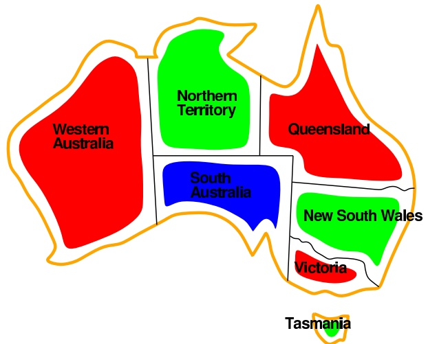

Solutions are assignments satisfying all constraints, e.g.,

$$
\{W = r e d, N = g r e e n, Q = r e d, E = g r e e n, V = r e d, S = b l u e, T = g r e e n \}
$$

## Constraint graph

• Pair-wise CSP: each constraint relates at most two variables

• Constraint graph: a bi-partite graph: nodes are variables, boxes are constraints

• In general, constraints may constrain several (or one) variables $( | I _ { k } | \neq 2 )$

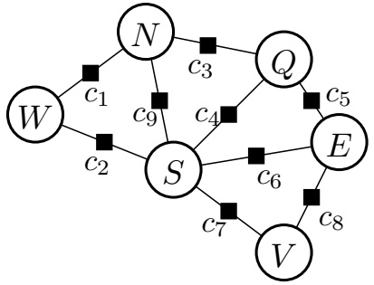


<!-- page: 116 -->

<div class="docvortex-algorithm" style="white-space: pre-wrap; font-family:monospace;">
Varieties of constraints
    Unary constraints involve a single variable, $|I_k| = 1$
    e.g., $S \neq green$
    Pair-wise constraints involve pairs of variables, $|I_k| = 2$
    e.g., $S \neq W$
    Higher-order constraints involve 3 or more variables, $|I_k| &gt; 2$
    e.g., Sudoku
</div>

• Discrete variables: finite domains; each $D _ { i }$ of size $| D _ { i } | = d \; \Rightarrow \; O ( d ^ { n } )$ complete assignments

– e.g., Boolean ${ \mathrm { C S P s } } ,$ incl. Boolean satisfiability infinite domains (integers, strings, etc.)

– e.g., job scheduling, variables are start/end days for each job

– linear constraints solvable, nonlinear undecidable

## • Continuous variables

– e.g., start/end times for Hubble Telescope observations

– linear constraints solvable in poly time by LP methods

• Real-world examples

– Assignment problems, e.g. who teaches what class?

– Timetabling problems, e.g. which class is offered when and where?

– Hardware configuration

– Transportation/Factory scheduling

## 8.2 Methods for solving CSPs

8:9

## Sequential assignment approach

• Let’s start with the straightforward, dumb approach, then fix it.

States are defined by the values assigned so far

• Initial state: the empty assignment, { }

• Successor function: assign a value to an unassigned variable that does not conflict with current assignment ⇒ fail if no feasible assignments (not fixable!)

• Goal test: the current assignment is complete

1) Every solution appears at depth n with n variables ⇒ use depth-first search 2) $b   =   ( n - \ell ) c$ d at depth \`, hence $n ! d ^ { n }$ leaves!

<!-- page: 117 -->

## Backtracking sequential assignment

• Two variable assignment decisions are commutative, i.e.,

[W = red then $N   =   g r e e n \mathbf { I }$ same as $\scriptstyle { \left[ N \right. =   g r e e n }$ then $W   =   r e d ]$

• We can fix a single next variable to assign a value to at each node! This drastically reduces the branching factor of the search tree.

• This does not compromise completeness (ability to find the solution)

$\Rightarrow   b   =   d$ and there are $d ^ { n }$ leaves

• Depth-first search for CSPs with single-variable assignments is called backtracking search

• Backtracking search is the basic uninformed algorithm for CSPs

Can solve n-queens for $n \approx 2 5$

8:11

## Backtracking search

```javascript
function BACKTRACKING-SEARCH(csp) returns solution/failure
    return RECURSIVE-BACKTRACKING({ },csp)

function RECURSIVE-BACKTRACKING(assignment,csp) returns soln/failure
    if assignment is complete then return assignment
    var ← SELECT-UNASSIGNED-VARIABLE(VARIABLES[csp],assignment,csp)
    for each value in ORDERED-DOMAIN-VALUES(var,assignment,csp) do
        if value is consistent with assignment given CONSTRAINTs[csp] then
            add [var = value] to assignment
            result ← RECURSIVE-BACKTRACKING(assignment,csp)
            if result ≠ failure then return result
            remove [var = value] from assignment
    return failure
```

8:12

## Backtracking example


<!-- page: 118 -->

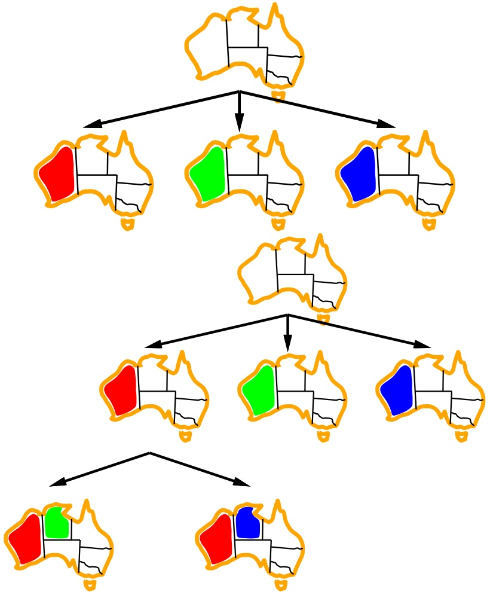

<!-- page: 119 -->

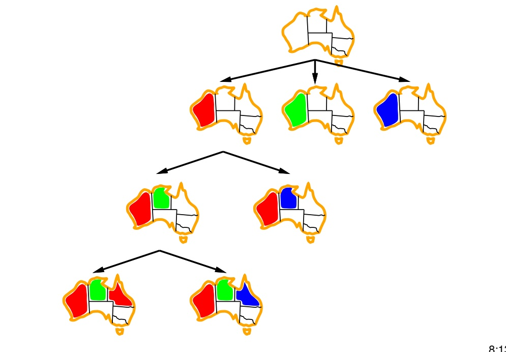

8:13

## Improving backtracking efficiency

Simple heuristics can give huge gains in speed:

1. Which variable should be assigned next?

2. In what order should its values be tried?

3. Can we detect inevitable failure early?

4. Can we take advantage of problem structure?

8:14

## Variable order: Minimum remaining values

Minimum remaining values (MRV): choose the variable with the fewest legal values


<!-- page: 120 -->

## Variable order: Degree heuristic

Tie-breaker among MRV variables

Degree heuristic:

choose the variable with the most constraints on remaining variables

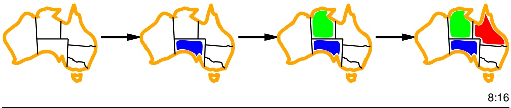

## Value order: Least constraining value

Given a variable, choose the least constraining value: the one that rules out the fewest values in the remaining variables

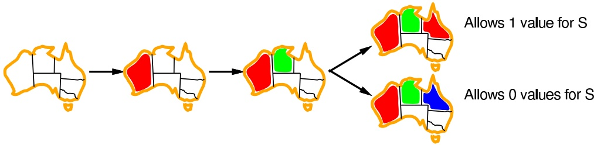

Combining these heuristics makes 1000 queens feasible

## Constraint propagation

• After each decision (assigning a value to one variable) we can compute what are the remaining feasible values for all variables.

• Initially, every variable has the full domain $D _ { i }$ . Constraint propagation reduces these domains, deleting entries that are inconsistent with the new decision.

• These dependencies are recursive: Deleting a value from the domain of one variable might imply infeasibility of some value of another variable → contraint propagation. We update domains until they’re all consistent with the constraints.

<!-- page: 121 -->

8:19

## Constraint propagation

• Example: quick failure detection after 2 decisions


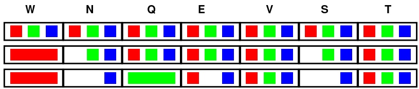

N and S cannot both be blue!

• Constraint Propagation: propagate the implied constraints serveral steps to reduce remaining domains and detect failures early.

## Constraint propagation

• Constraint propagation generally loops through the set of constraint, considers each constraint separately, and deletes inconsistent values from its adjacent domains.

• As it considers constraints separately, it does not compute a final solution, as backtracking search does.

8:20

## Arc consistency (=constraint propagation for pair-wise constraints)

• Simplest form of propagation makes each arc consistent

$X \to Y$ is consistent iff

for every value x of X there is some allowed y


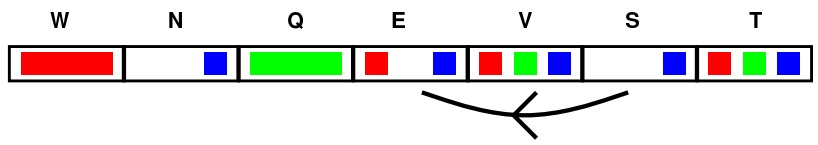

<!-- page: 122 -->

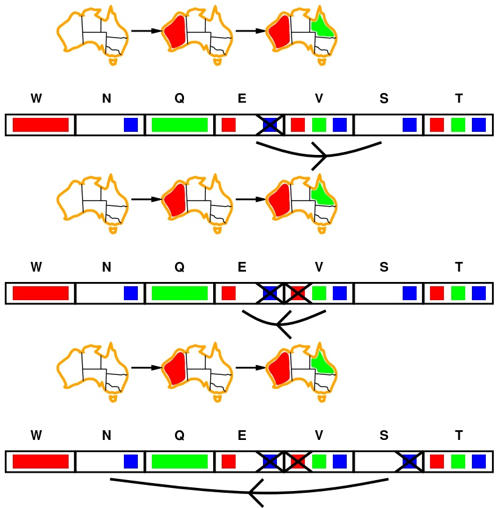

• If X loses a value, neighbors of X need to be rechecked Arc consistency detects failure earlier than forward checking Can be run as a preprocessor or after each assignment

<!-- page: 123 -->

## Arc consistency algorithm

<div class="docvortex-algorithm" style="white-space: pre-wrap; font-family:monospace;">
function AC-3(csp) returns the CSP, possibly with reduced domains
    inputs: csp, a pair-wise CSP with variables $\{X_1, X_2, \ldots, X_n\}$
    local variables: queue, a queue of arcs, initially all the arcs in csp

    while queue is not empty do
        $(X_i, X_j) \leftarrow \text{REMOVE-FIRST(queue)}$
        if REMOVE-INCONSISTENT-VALUES($X_i, X_j$) then
            for each $X_k$ in NEIGHBORS[$X_i$] do
                add $(X_k, X_i)$ to queue

function REMOVE-INCONSISTENT-VALUES($X_i, X_j$) returns true iff DOM[$X_i$] changed
    changed $\leftarrow$ false
    for each $x$ in DOMAIN[$X_i$] do
        if no value $y$ in DOMAIN[$X_j$] allows $(x,y)$ to satisfy the constraint $X_i \leftrightarrow X_j$
            then delete $x$ from DOMAIN[$X_i$]; changed $\leftarrow$ true
    return changed

$O(n^2 d^3)$, can be reduced to $O(n^2 d^2)$
</div>

## Constraint propagation

• Very closely related to message passing in probabilistic models

• In practice: design approximate constraint propagation for specific problem E.g.: Sudoku: If $X _ { i }$ is assigned, delete this value from all peers

8:23

## Problem structure


Tasmania and mainland are independent subproblems Identifiable as connected components of constraint graph

<!-- page: 124 -->

8:24

## Tree-structured CSPs

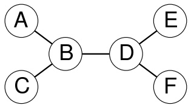

Theorem: if the constraint graph has no loops, the CSP can be solved in $O ( n   d ^ { 2 } )$ time

Compare to general CSPs, where worst-case time is $O ( d ^ { n } )$

This property also applies to logical and probabilistic reasoning!

8:25

## Algorithm for tree-structured CSPs

1. Choose a variable as root, order variables from root to leaves such that every node’s parent precedes it in the ordering

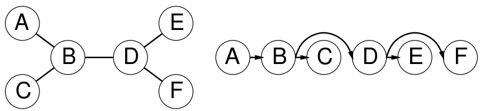

2. For $j$ from n down to $^ { 2 , }$ apply This is backward constraint propagation

REMOVEINCONSISTENT(P arent(X

3. For $j$ from 1 to $n ,$ assign $X _ { j }$ consistently with P arent $\left( X _ { j } \right)$ This is forward sequential assignment (trivial backtracking)

<!-- page: 125 -->

## Nearly tree-structured CSPs

Conditioning: instantiate a variable, prune its neighbors’ domains

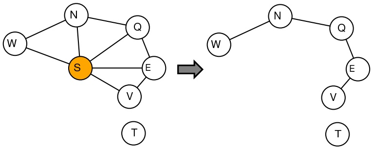

Cutset conditioning: instantiate (in all ways) a set of variables such that the remaining constraint graph is a tree

Cutset size c ⇒ runtime $O ( d ^ { c } \cdot ( n - c ) d ^ { 2 } )$ , very fast for small c

8:27

## Summary

• CSPs are a fundamental kind of problem:

finding a feasible configuration of $n$ variables

the set of constraints defines the (graph) structure of the problem

• Sequential assignment approach

Backtracking = depth-first search with one variable assigned per node

• Variable ordering and value selection heuristics help significantly

• Constraint propagation (e.g., arc consistency) does additional work to constrain values and detect inconsistencies

• The CSP representation allows analysis of problem structure

• Tree-structured CSPs can be solved in linear time

If after assigning some variables, the remaining structure is a tree

→ linear time feasibility check by tree CSP

8:28

<!-- page: 126 -->

## 9 Graphical Models

## Motivation & Outline

Graphical models are a generic language to express “structured” probabilistic models. Structured simply means that we talk about many random variables and many coupling terms, where each coupling term concerns only a (usually small) subset of random variables. so, structurally they are very similar to CSPs. But the coupling terms are not boolean functions but real-valued functions, called factors. And that defines a probability distribution over all RVs. The problem then is either to find the most probable value assignment to all RVs (called MAP inference problem), or to find the probabilities over the values of a single variable that arises from the couplings (called marginal inference).

There are so many applications of graphical models that is it hard to pick some to list: Modelling gene networks (e.g. to understand genetic diseases), structured text models (e.g. to cluster text into topics), modelling dynamic processes like music or human activities (like cooking or so), modelling more structured Markov Decision Processes (hierarchical RL, POMDPs, etc), modelling multi-agent systems, localization and mapping of mobile robots, and also many of the core ML methods can be expressed as graphical models, e.g. Bayesian (kernel) logistic/ridge regression, Gaussian mixture models, clustering methods, many unsupervised learning methods, ICA, PCA, etc. It is though fair to say that these methods do not have to be expressed as graphical models; but they can be and I think it is very helpful to see the underlying principles of these methods when expressing them in terms of graphical models. And graphical models then allow you to invent variants/combinations of such methods specifically for your particular data domain.

In this lecture we introduce Bayesian networks and factor graphs and discuss probabilistic inference methods. Exact inference amounts to summing over variables in a certain order. This can be automated in a way that exploits the graph structure, leading to what is called variable elimination and message passing on trees. The latter is perfectly analogous to constraint propagation to exactly solve tree CSPs. For non-trees, message passing becomes loopy belief propagation, which approximates a solution. Monte-Carlo sampling methods are also important tools for approximate inference, which are beyond this lecture though.

## 9.1 Bayes Nets and Conditional Independence

<!-- page: 127 -->

• B. Inference in Graphical Models

– Variable Elimination & Factor Graphs

– Message passing, Loopy Belief Propagation

– Sampling methods (Rejection, Importance, Gibbs)

9:2

## Graphical Models

• The core difficulty in modelling is specifying

What are the relevant variables?

How do they depend on each other?

(Or how could they depend on each other → learning)

• **Graphical models** are a graphical notation for

1) which random variables exist

2) which random variables are “directly coupled”

Thereby they describe a joint probability distribution $P ( X _ { 1 } , . . , X _ { n } )$ over n random variables.

• 2 basic variants:

– Bayesian Networks (aka. directed model, belief network)

– Factor Graphs (aka. undirected model, Markov Random Field)

9:3

## Example

drinking red wine → longevity?

9:4

## Bayesian Networks

• A **Bayesian Network** is a

– directed acyclic graph (DAG)

– where each node represents a random variable $X _ { i }$

– for each node we have a conditional probability distribution

P(X<sub>i</sub> | Parents(X<sub>i</sub>))

• In the simplest case (discrete RVs), the conditional distribution is represented as a conditional probability table (**CPT**)

9:5

## Bayesian Networks

• DAG → we can sort the RVs; edges only go from lower to higher index

<!-- page: 128 -->

9:6

• **The joint distribution can be factored as**

$$
P (X _ {1: n}) = \prod_ {i = 1} ^ {n} P (X _ {i} \mid \text { Parents } (X _ {i}))
$$

• Missing links imply conditional independence

• Forward sampling from joint distribution

**Example**

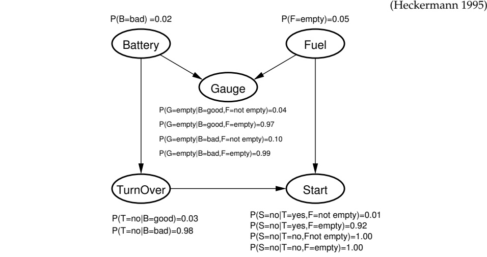

$$
\Longleftrightarrow P (S, T, G, F, B) = P (B) P (F) P (G | F, B) P (T | B) P (S | T, F)
$$

• Table sizes: $\mathrm{LHS} = 2^5 - 1 = 31 \quad \mathrm{RHS} = 1 + 1 + 4 + 2 + 4 = 12$

## Bayes Nets & conditional independence

• Independence: ${ I n d e p } ( X , Y ) \iff P ( X , Y ) = P ( X ) \; P ( Y )$

• Conditional independence:

$$
I n d e p (X, Y | Z) \iff P (X, Y | Z) = P (X | Z) P (Y | Z)
$$

<!-- page: 129 -->

$$
\neg I n d e p (X, Y | Z)
$$

¬Indep(X, Y ) Indep(X, Y |Z)

• Head-to-head: Indep(X, Y )

$$
P (X, Y, Z) = P (X) P (Y) P (Z | X, Y)
$$

$$
P (X, Y) = P (X) P (Y) \sum_ {Z} P (Z | X, Y) = P (X) P (Y)
$$

• Tail-to-tail: Indep(X, Y |Z)

$$
P (X, Y, Z) = P (Z)   P (X | Z)   P (Y | Z)
$$

$$
P (X, Y | Z) = P (X, Y, Z) / P (Z) = P (X | Z) P (Y | Z)
$$

<div class="docvortex-algorithm" style="white-space: pre-wrap; font-family:monospace;">
- Head-to-tail: $Indep(X, Y|Z)$
</div>

$$
P (X, Y, Z) = P (X) P (Z | X) P (Y | Z)
$$

$$
P (X, Y | Z) = \frac {P (X , Y , Z)}{P (Z)} = \frac {P (X , Z) P (Y | Z)}{P (Z)} = P (X | Z) P (Y | Z)
$$

9:9

**General rules for determining conditional independence in a Bayes net:**

• Given three groups of random variables X, Y, Z

$I n d e p ( X , Y | Z ) \iff$ every path from X to Y is “blocked by $Z ^ { \prime \prime }$

• A path is “blocked by $Z'' \iff$ on this path...

– ∃ a node in Z that is head-to-tail w.r.t. the path, or

– ∃ a node in Z that is tail-to-tail w.r.t. the path, or

– ∃ another node A which is head-to-head w.r.t. the path and neither A nor any of its descendants are in Z

9:10

## Example

<!-- page: 130 -->

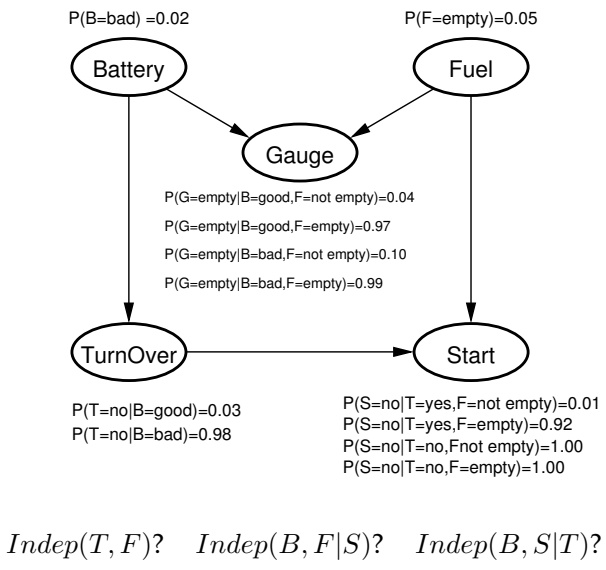

## What can we do with Bayes nets?

• **Inference:** Given some pieces of information (prior, observed variabes) what is the implication (the implied information, the posterior) on a non-observed variable

• **Decision Making:** If utilities and decision variables are defined → compute optimal decisions in probabilistic domains

## • Learning:

– Fully Bayesian Learning: Inference over parameters (e.g., β)

– Maximum likelihood training: Optimizing parameters

• **Structure Learning** (Learning/Inferring the graph structure itself): Decide which model (which graph structure) fits the data best; thereby uncovering conditional independencies in the data.

9:12

## Inference

• Inference: Given some pieces of information (prior, observed variabes) what is the implication (the implied information, the posterior) on a non-observed variable

• In a Bayes Nets: Assume there is three groups of RVs:

<!-- page: 131 -->

– Z are observed random variables

– X and $Y$ are hidden random variables

– We want to do inference about $X ,$ not $Y$

Given some observed variables $Z ,$ compute the

**posterior marginal** $P ( X   |   Z )$ for some hidden variable $X$

$$
P (X \mid Z) = \frac {P (X , Z)}{P (Z)} = \frac {1}{P (Z)} \sum_ {Y} P (X, Y, Z)
$$

where $Y$ are all hidden random variables except for $X$

• Inference requires summing over (eliminating) hidden variables.

9:13

## Example: Holmes & Watson

• Mr. Holmes lives in Los Angeles. One morning when Holmes leaves his house, he realizes that his grass is wet. Is it due to rain, or has he forgotten to turn off his sprinkler?

– Calculate $P ( R | H ) , P ( S | H )$ and compare these values to the prior probabilities.

– Calculate $P ( R , S | H )$

Note: R and S are marginally independent, but conditionally dependent

• Holmes checks Watson’s grass, and finds it is also wet.

– Calculate $P ( R | H , W ) , P ( S | H , W )$

– This effect is called explaining away

JavaBayes: run it from the html page

[http://www.cs.cmu.edu/˜javabayes/Home/applet.html](http://www.cs.cmu.edu/~javabayes/Home/applet.html)

9:14

## Example: Holmes & Watson

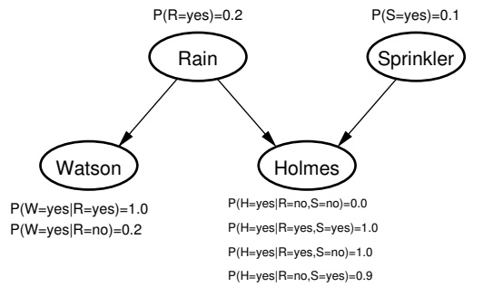

$$
P (H, W, S, R) = P (H | S, R)   P (W | R)   P (S)   P (R)
$$

<!-- page: 132 -->

$$
\begin{array}{c} P (R | H) = \sum_ {W, S} \frac {P (R , W , S , H)}{P (H)} = \frac {1}{P (H)} \sum_ {W, S} P (H | S, R) P (W | R) P (S) P (R) \\ = \frac {1}{P (H)} \sum_ {S} P (H | S, R) P (S) P (R) \end{array}
$$

$$
P (R = 1 \mid H = 1) = \frac {1}{P (H = 1)} (1. 0 \cdot 0. 2 \cdot 0. 1 + 1. 0 \cdot 0. 2 \cdot 0. 9) = \frac {1}{P (H = 1)} 0. 2
$$

$$
P (R = 0 \mid H = 1) = \frac {1}{P (H = 1)} (0. 9 \cdot 0. 8 \cdot 0. 1 + 0. 0 \cdot 0. 8 \cdot 0. 9) = \frac {1}{P (H = 1)} 0. 0 7 2
$$

9:15

• These types of calculations can be automated

→ Variable Elimination Algorithm

9:16

**Example: Bavarian dialect**

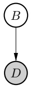

• Two binary random variables(RVs): B (bavarian) and D (dialect)

• Given:

$$
P (D, B) = P (D \mid B)   P (B)
$$

$$
P (D = 1 \mid B = 1) = 0. 4, P (D = 1 \mid B = 0) = 0. 0 1, P (B = 1) = 0. 1 5
$$

• **Notation:** Grey shading usually indicates “observed”

9:17

**Example: Coin flipping**

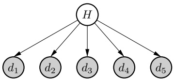

• One binary RV H (hypothesis), 5 RVs for the coin tosses $d _ { 1 } , . . , d _ { 5 }$

• Given:

$$
P (D, H) = \prod_ {i} P (d _ {i} \mid H)   P (H)
$$

$$
P (H = 1) = \frac {9 9 9}{1 0 0 0}, P (d _ {i} = \mathrm{H} \mid H = 1) = \frac {1}{2}, P (d _ {i} = \mathrm{H} \mid H = 2) = 1
$$

<!-- page: 133 -->

9:18

**Example: Ridge regression\*\***

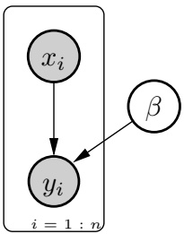

• One multi-variate $\operatorname { R V } \beta ,$ 2n RVs $x _ { 1 : n } ,   y _ { 1 : n }$ (observed data)

• Given:

$$
P (D, \beta) = \prod_ {i} \left[ P (y _ {i} \mid x _ {i}, \beta)   P (x _ {i}) \right]   P (\beta)
$$

$$
P (\beta) = \mathcal {N} (\beta \mid 0, \frac {\sigma^ {2}}{\lambda}), P (y _ {i} \mid x _ {i}, \beta) = \mathcal {N} (y _ {i} \mid x _ {i} ^ {\top} \beta , \sigma^ {2})
$$

• **Plate notation:** Plates (boxes with index ranges) mean “copy n-times”

9:19

**Example: Gaussian Mixture** <strong><u>Model\*\*</u></strong>

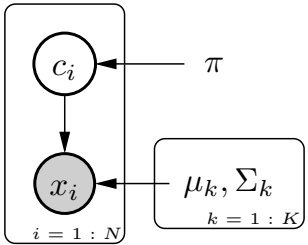

• Discrete latent $\operatorname { R V s } c _ { 1 : n }$ indicating mixture component, cont. $\operatorname { R V s } x _ { 1 : n }$ (observed data)

• Model: $\textstyle P ( x _ { i } \operatorname { | } \mu _ { 1 : K } , \Sigma _ { 1 : K } ) = \sum _ { k = 1 } ^ { K } \mathcal { N } ( x _ { i } \operatorname { | } \mu _ { k } , \Sigma _ { k } ) \; P ( c _ { i } \mathop { = } k )$

9:20

## 9.2 Inference Methods in Graphical Models

9:21

**Inference methods in graphical models**

• **Message passing:**

– Exact inference on trees (includes the Junction Tree Algorithm)

– Belief propagation

<!-- page: 134 -->

## • Sampling:

– Rejection samping, importance sampling, Gibbs sampling

– More generally, Markov-Chain Monte Carlo (MCMC) methods

## • Other approximations/variational methods

– Expectation propagation

– Specialized variational methods depending on the model

## • Reductions:

– Mathematical Programming (e.g. LP relaxations of MAP)

– Compilation into Arithmetic Circuits (Darwiche at al.)

9:22

## Variable Elimination

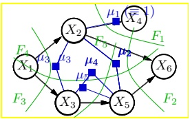

$$
\begin{array}{l} \text {riable Elimination example} \\ P (x _ {5}) \\ = \sum_ {x _ {1}, x _ {2}, x _ {3}, x _ {4}, x _ {6}} P (x _ {1})   P (x _ {2} | x _ {1})   P (x _ {3} | x _ {1})   P (x _ {4} | x _ {2})   P (x _ {5} | x _ {3})   P (x _ {6} | x _ {2}, x _ {5}) \\ = \sum_ {x _ {1}, x _ {2}, x _ {3}, x _ {6}} P (x _ {1})   P (x _ {2} | x _ {1})   P (x _ {3} | x _ {1})   P (x _ {5} | x _ {3})   P (x _ {6} | x _ {2}, x _ {5})   \sum_ {x _ {4}} \underbrace {P (x _ {4} | x _ {2})} _ {F _ {1} (x _ {2}, x _ {4})} \\ = \sum_ {x _ {1}, x _ {2}, x _ {3}, x _ {6}} P (x _ {1})   P (x _ {2} | x _ {1})   P (x _ {3} | x _ {1})   P (x _ {5} | x _ {3})   P (x _ {6} | x _ {2}, x _ {5})   \mu_ {1} (x _ {2}) \\ = \sum_ {x _ {1}, x _ {2}, x _ {3}} P (x _ {1})   P (x _ {2} | x _ {1})   P (x _ {3} | x _ {1})   P (x _ {5} | x _ {3})   \mu_ {1} (x _ {2})   \sum_ {x _ {6}} \underbrace {P (x _ {6} | x _ {2} , x _ {5})} _ {F _ {2} (x _ {2}, x _ {5}, x _ {6})} \\ = \sum_ {x _ {1}, x _ {2}, x _ {3}} P (x _ {1})   P (x _ {2} | x _ {1})   P (x _ {3} | x _ {1})   P (x _ {5} | x _ {3})   \mu_ {1} (x _ {2})   \mu_ {2} (x _ {2}, x _ {5}) \\ = \sum_ {x _ {2}, x _ {3}} P (x _ {5} | x _ {3})   \mu_ {1} (x _ {2})   \mu_ {2} (x _ {2}, x _ {5})   \sum_ {x _ {1}} \underbrace {P (x _ {1})   P (x _ {2} | x _ {1})   P (x _ {3} | x _ {1})} _ {F _ {3} (x _ {1}, x _ {2}, x _ {3})} \\ = \sum_ {x _ {2}, x _ {3}} P (x _ {5} | x _ {3})   \mu_ {1} (x _ {2})   \mu_ {2} (x _ {2}, x _ {5})   \mu_ {3} (x _ {2}, x _ {3}) \\ = \sum_ {x _ {3}} P (x _ {5} | x _ {3})   \sum_ {x _ {2}} \underbrace {\mu_ {1} (x _ {2})   \mu_ {2} (x _ {2} , x _ {5})   \mu_ {3} (x _ {2} , x _ {3})} _ {F _ {4} (x _ {2}, x _ {3}, x _ {5})} \\ = \sum_ {x _ {3}} P (x _ {5} | x _ {3})   \mu_ {4} (x _ {3}, x _ {5}) \\ = \sum_ {x _ {3}} \underbrace {P (x _ {5} | x _ {3})   \mu_ {4} (x _ {3} , x _ {5})} _ {{F _ {5} (x _ {3}, x _ {5})}} \\ = \mu_ {5} (x _ {5}) \end{array}\tag{9:23}
$$

<!-- page: 135 -->

## Variable Elimination example – lessons learnt

• There is a dynamic programming principle behind Variable Elimination:

– For eliminating $X _ { 5 , 4 , 6 }$ we use the solution of eliminating $X _ { 4 } ,$ 6

– The “sub-problems” are represented by the F terms, their solutions by the remaining µ terms

$\mathsf { W e ^ { \prime } } \mathbb { I }$ continue to discuss this 4 slides later!

• The factorization of the joint

– determines in which order Variable Elimination is efficient

– determines what the terms $F ( \ldots )$ and $\mu ( \ldots )$ depend on

• We can automate Variable Elimination. For the automation, all that matters is the factorization of the joint.

9:25

## Factor graphs

• In the previous slides we introduces the box notation to indicate terms that depend on some variables. That’s exactly what factor graphs represent.

• A **Factor graph** is a

– bipartite graph

– where each circle node represents a random variable $X _ { i }$

– each box node represents a **factor** $f _ { k }$ , which is a function $f _ { k } ( X _ { \partial k } )$

– the joint probability distribution is given as

$$
P (X _ {1: n}) = \prod_ {k = 1} ^ {K} f _ {k} (X _ {\partial k})
$$

**Notation:** $\partial k$ is shorthand for Neighbors(k)

9:26

## Bayes Net → factor graph

• Bayesian Network:

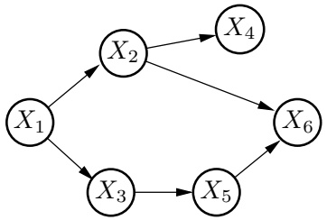

<!-- page: 136 -->

$$
P (x _ {1: 6}) = P (x _ {1}) P (x _ {2} | x _ {1}) P (x _ {3} | x _ {1}) P (x _ {4} | x _ {2}) P (x _ {5} | x _ {3}) P (x _ {6} | x _ {2}, x _ {5})
$$

• Factor Graph:

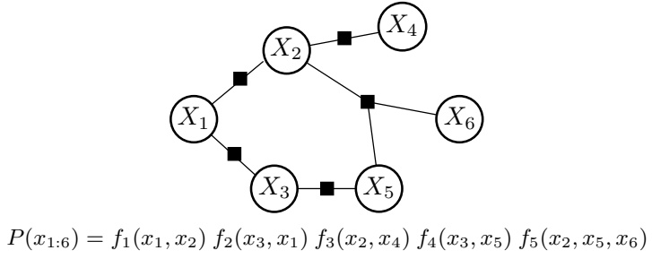

→ each CPT in the Bayes Net is just a factor (we neglect the special semantics of a CPT)

9:27

## Variable Elimination Algorithm

<div class="docvortex-algorithm" style="white-space: pre-wrap; font-family:monospace;">
- eliminate_single_variable(F, i)
Input: list F of factors, variable id i
Output: list F of factors
find relevant subset $\hat{F} \subseteq F$ of factors coupled to $i$: $\hat{F} = \{k : i \in \partial k\}$
create new factor $\hat{k}$ with neighborhood $\partial \hat{k} =$ all variables in $\hat{F}$ except $i$
compute $\mu_{\hat{k}}(X_{\partial \hat{k}}) = \sum_{X_i} \prod_{k \in \hat{F}} f_k(X_{\partial k})$
remove old factors $\hat{F}$ and append new factor $\mu_{\hat{k}}$ to $F$
return $F$
</div>

```txt
- elimination_algorithm(F, M)
```

<div class="docvortex-algorithm" style="white-space: pre-wrap; font-family:monospace;">
Input: list $F$ of factors, tuple $M$ of desired output variables ids
Output: single factor $\mu$ over variables $X_M$
define all variables present in $F$: $V = \text{vars}(F)$
define variables to be eliminated: $E = V \setminus M$
for all $i \in E$: eliminate_single_variable($F, i$)
for all remaining factors, compute the product $\mu = \prod_{f \in F} f$
return $\mu$
</div>

<!-- page: 137 -->

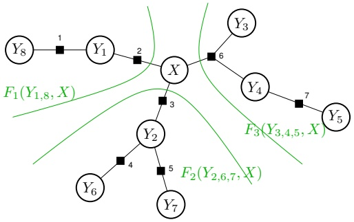

The subtrees w.r.t. X can be described as

$$
F _ {1} (Y _ {1, 8}, X) = f _ {1} (Y _ {8}, Y _ {1}) f _ {2} (Y _ {1}, X)
$$

$$
F _ {2} (Y _ {2, 6, 7}, X) = f _ {3} (X, Y _ {2}) f _ {4} (Y _ {2}, Y _ {6}) f _ {5} (Y _ {2}, Y _ {7})
$$

$$
F _ {3} (Y _ {3, 4, 5}, X) = f _ {6} (X, Y _ {3}, Y _ {4}) f _ {7} (Y _ {4}, Y _ {5})
$$

The joint distribution is:

$$
P (Y _ {1: 8}, X) = F _ {1} (Y _ {1, 8}, X)   F _ {2} (Y _ {2, 6, 7}, X)   F _ {3} (Y _ {3, 4, 5}, X)\tag{9:29}
$$

## Variable Elimination on trees

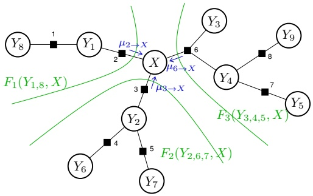

We can eliminate each tree independently. The remaining terms (**messages**) are:

$$
\mu_ {F _ {1} \to X} (X) = \sum_ {Y _ {1, 8}} F _ {1} (Y _ {1, 8}, X)
$$

$$
\mu_ {F _ {2} \to X} (X) = \sum_ {Y _ {2, 6, 7}} F _ {2} (Y _ {2, 6, 7}, X)
$$

$$
\mu_ {F _ {3} \to X} (X) = \sum_ {Y _ {3, 4, 5}} F _ {3} (Y _ {3, 4, 5}, X)
$$

The marginal $P ( X )$ is the **product of subtree messages**

$$
P (X) = \mu_ {F _ {1} \to X} (X) \mu_ {F _ {2} \to X} (X) \mu_ {F _ {3} \to X} (X)\tag{9:30}
$$

<!-- page: 138 -->

• The “remaining terms” $\mu ^ { \prime } \mathbf { s }$ are called **messages** Intuitively, **messages subsume information from a subtree**

• Marginal = product of messages, $\begin{array} { r } { P ( X ) = \prod _ { k } \mu _ { F _ { k } \to X } } \end{array}$ , is very intuitive:

– Fusion of independent information from the different subtrees

– Fusing independent information ↔ multiplying probability tables

• Along a (sub-) tree, messages can be computed recursively

9:31

## Message passing

• General equations (**belief propagation (BP)**) for recursive message computation (writing $\mu _ { k \to i } ( X _ { i } )$ instead of $\mu _ { F _ { k } \to X } ( X ) )$ :

$$
\mu_ {k \to i} (X _ {i}) = \underbrace {\sum_ {X _ {\partial k \setminus i}} f _ {k} (X _ {\partial k}) \prod_ {j \in \partial k \setminus i} \overbrace {\prod_ {k ^ {\prime} \in \partial j \setminus k} \mu_ {k ^ {\prime} \to j} (X _ {j})} ^ {\bar {\mu} _ {j \to k} (X _ {j})}} _ {F (\text {subtree})}
$$

$\textstyle \prod _ { j \in \partial k \setminus i ^ { \sharp } }$ branching at factor $k ,$ prod. over adjacent variables $j$ excl. i $\textstyle \prod _ { k ^ { \prime } \in \partial j \setminus k ^ { \prime } }$ : branching at variable $j ,$ prod. over adjacent factors $k ^ { \prime }$ excl. k $\bar { \mu } _ { j \rightarrow k } ( X _ { j } )$ are called “variable-to-factor messages”: store them for efficiency

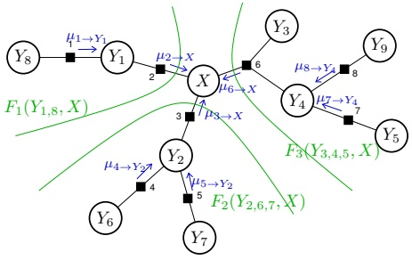

Example messages:

$$
\mu_ {2 \rightarrow X} = \sum_ {Y _ {1}} f _ {2} (Y _ {1}, X) \mu_ {1 \rightarrow Y _ {1}} (Y _ {1})
$$

$$
\mu_ {6 \rightarrow X} = \sum_ {Y _ {3}, Y _ {4}} f _ {6} (Y _ {3}, Y _ {4}, X) \mu_ {7 \rightarrow Y _ {4}} (Y _ {4}) \mu_ {8 \rightarrow Y _ {4}} (Y _ {4})
$$

$$
\mu_ {3 \to X} = \sum_ {Y _ {2}} f _ {3} (Y _ {2}, X) \mu_ {4 \to Y _ {2}} (Y _ {2}) \mu_ {5 \to Y _ {2}} (Y _ {2})
$$

<!-- page: 139 -->

## Message passing remarks

• Computing these messages recursively on a tree does nothing else than Variable Elimination

$$
\Rightarrow P (X _ {i}) = \prod_ {k \in \partial i} \mu_ {k \to i} (X _ {i}) \text {is the correct posterior marginal}
$$

• However, since it stores all “intermediate terms”, we can compute ANY marginal $P ( X _ { i } )$ for any $i$

• Message passing exemplifies how to exploit the factorization structure of the joint distribution for the algorithmic implementation

• Note: These are recursive equations. They can be resolved exactly if and only if the dependency structure (factor graph) is a tree. If the factor graph had loops, this would be a “loopy recursive equation system”...

9:34

## Message passing variants

• Message passing has many important applications:

– Many models are actually trees: In particular chains esp. Hidden Markov Models

– Message passing can also be applied on non-trees (↔ loopy graphs) → approximate inference (Loopy Belief Propagation)

– Bayesian Networks can be “squeezed” to become trees → exact inference in Bayes Nets! (Junction Tree Algorithm)

9:35

## Loopy Belief Propagation

• If the graphical model is not a tree (=has loops):

– The recursive message equations cannot be resolved.

– However, we could try to just iterate them as update equations...

• Loopy BP update equations: (initialize with $\mu _ { k \to i } = 1 )$

$$
\mu_ {k \rightarrow i} ^ {\text {new}} (X _ {i}) = \sum_ {X _ {\partial k \setminus i}} f _ {k} (X _ {\partial k}) \prod_ {j \in \partial k \setminus i} \prod_ {k ^ {\prime} \in \partial j \setminus k} \mu_ {k ^ {\prime} \rightarrow j} ^ {\text {old}} (X _ {j})
$$

<!-- page: 140 -->

## Loopy BP remarks

• Problem of loops intuitively:

loops ⇒ branches of a node to not represent independent information!

– BP is multiplying (=fusing) messages from dependent sources of information

• No convergence guarantee, but if it converges, then to a state of **marginal consistency**

$$
\sum_ {X _ {\partial k \setminus i}} b (X _ {\partial k}) = \sum_ {X _ {\partial k ^ {\prime} \setminus i}} b (X _ {\partial k ^ {\prime}}) = b (X _ {i})
$$

and to the minimum of the **Bethe approximation** of the free energy (Yedidia, Freeman, & Weiss, 2001)

• We shouldn’t be overly disappointed:

– if BP was exact on loopy graphs we could efficiently solve NP hard problems...

– loopy BP is a very interesting approximation to solving an NP hard problem

• Ways to tackle the problems with BP convergence:

– Damping (Heskes, 2004: On the uniqueness of loopy belief propagation fixed points)

– CCCP (Yuille, 2002: CCCP algorithms to minimize the Bethe and Kikuchi free energies: Convergent alternatives to belief propagation)

– Tree-reweighted MP (Kolmogorov, 2006: Convergent tree-reweighted message passing for energy minimization)

9:37

## Junction Tree Algorithm\*\*

## • Many models have loops

Instead of applying loopy BP in the hope of getting a good approximation, it is possible to convert every model into a tree by redefinition of RVs. The Junction Tree Algorithms converts a loopy model into a tree.

• Loops are resolved by defining larger variable groups (separators) on which messages are defined

9:38

## Junction Tree Example

• Example:

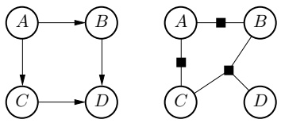

<!-- page: 141 -->

• Join variable B and C to a single **separator**

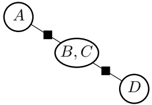

This can be viewed as a variable substitution: rename the tuple (B, C) as a single random variable

• A single random variable may be part of multiple separators – but only along a running intersection

9:39

## Junction Tree Algorithm

• Standard formulation: Moralization & Triangulation

A **clique** is a fully connected subset of nodes in a graph.

1) Generate the factor graph (classically called “moralization”)

2) Translate each factor to a clique: Generate the undirected graph where undirected edges connect all RVs of a factor

3) Triangulate the undirected graph. (This is the critical step!)

4) Translate each clique back to a factor; identify the separators between factors

• Formulation in terms of variable elimination for a given variable order:

1) Start with a factor graph

2) Choose an order of variable elimination (This is decided implicitly by trangulation above)

3) Keep track of the “remaining µ terms” (slide 14): which RVs would they depend on? → this identifies the separators

9:40

<!-- page: 142 -->

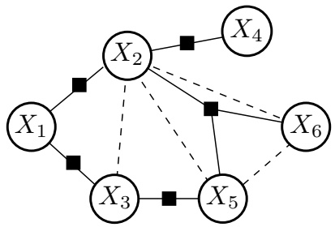

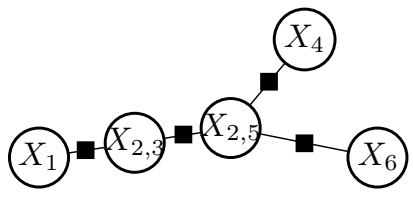

• If we eliminate in order 4, 6, 5, 1, 2, 3, we get remaining terms

$$
(X _ {2}), (X _ {2}, X _ {5}), (X _ {2}, X _ {3}), (X _ {2}, X _ {3}), (X _ {3})
$$

which translates to the Junction Tree on the right

9:41

## Maximum a-posteriori (MAP) inference

• Often we want to compute the most likely global assignment

$$
X _ {1: n} ^ {\mathrm{MAP}} = \underset {X _ {1: n}} {\operatorname{argmax}} P (X _ {1: n})
$$

of all random variables. This is called MAP inference and can be solved by replacing all $\sum$ by max in the message passing equations – the algorithm is called **Max-Product Algorithm** and is a generalization of Dynamic Programming methods like Viterbi or Dijkstra.

• Application: **Conditional Random Fields**

$$
f (y, x) = \phi (y, x) ^ {\top} \beta = \sum_ {j = 1} ^ {k} \phi_ {j} (y _ {\partial j}, x) \beta_ {j} = \log \left[ \prod_ {j = 1} ^ {k} e ^ {\phi_ {j} (y _ {\partial j}, x) \beta_ {j}} \right]
$$

with prediction $x \mapsto y ^ { * } ( x ) = \operatorname * { a r g m a x } _ { y } f ( x , y )$

Finding the argmax is a MAP inference problem! This is frequently needed in the innerloop of CRF learning algorithms.

9:42

## Conditional Random Fields\*\*

• The following are interchangable:

“Random Field” ↔ “Markov Random Field” ↔ Factor Graph

• Therefore, a CRF is a conditional factor graph:

– A CRF defines a mapping from input x to a factor graph over y

<!-- page: 143 -->

– Each feature $\phi _ { j } ( y _ { \partial j } , x )$ depends only on a subset $\partial j$ of variables $y _ { \partial j }$

$\operatorname { I f } y _ { \partial j }$ are discrete, a feature $\phi _ { j } ( y _ { \partial j } , x )$ is usually an indicator feature (see lecture 03); the corresponding parameter $\beta _ { j }$ is then one entry of a factor $f _ { k } ( y _ { \partial j } )$ that couples these variables

9:43

## Sampling

• Read:

Andrieu et al: An Introduction to MCMC for Machine Learning (Machine Learning, 2003)

• Here I’ll discuss only thee basic methods:

– Rejection sampling

– Importance sampling

– Gibbs sampling

9:44

## Monte Carlo methods

• General, the term Monte Carlo simulation refers to methods that generate many i.i.d. random samples $x _ { i } \sim P ( x )$ from a distribution $P ( x )$ . Using the samples one can estimate expectations of anything that depends on x, e.g. f(x):

$$
\langle f \rangle = \int_ {x} P (x) f (x) d x \approx \frac {1}{N} \sum_ {i = 1} ^ {N} f (x _ {i})
$$

(In this view, Monte Carlo approximates an integral.)

• Example: What is the probability that a solitair would come out successful? (Original story by Stan Ulam.) Instead of trying to analytically compute this, generate many random solitairs and count.

• The method developed in the 40ies, where computers became faster. Fermi, Ulam and von Neumann initiated the idea. von Neumann called it “Monte Carlo” as a code name.

9:45

## Rejection Sampling

• We have a Bayesian Network with RVs $X _ { 1 : n } ,$ , some of which are observed: $X _ { o b s } = y _ { o b s } , o b s \subset \{ 1 : n \}$

<!-- page: 144 -->

• The goal is to compute marginal posteriors $P ( X _ { i } \thinspace \vert \thinspace X _ { o b s } = y _ { o b s } )$ conditioned on the observations.

• We generate a set of K (joint) samples of all variables

$$
\mathcal {S} = \{x _ {1: n} ^ {k} \} _ {k = 1} ^ {K}
$$

Each sample $x _ { 1 : n } ^ { k } = ( x _ { 1 } ^ { k } , x _ { 2 } ^ { k } , . . , x _ { n } ^ { k } )$ is a list of instantiation of all RVs.

9:46

## Rejection Sampling

• To generate a single sample $x _ { 1 : n } ^ { k }$ :

1. Sort all RVs in topological order; start with $i = 1$

2. Sample a value $x _ { i } ^ { k }   \sim   P ( X _ { i }   |   x _ { \mathrm { P a r e n t s } ( i ) } ^ { k } )$ for the ith RV conditional to the previous samples $x _ { 1 : i - 1 } ^ { k }$

3. If $i \in$ obs compare the sampled value $x _ { i } ^ { k }$ with the observation $y _ { i }$ . Reject and repeat from a) if the sample is not equal to the observation.

4. Repeat with $i \gets i + 1$ from 2.

• We compute the marginal probabilities from the sample set $\mathcal { S } ;$

$$
P (X _ {i} = x \mid X _ {o b s} = y _ {o b s}) \approx \frac {\mathsf {c o u n t} _ {\mathcal {S}} (x _ {i} ^ {k} = x)}{K}
$$

or pair-wise marginals:

$$
P (X _ {i} = x, X _ {j} = x ^ {\prime} \mid X _ {o b s} = y _ {o b s}) \approx \frac {\mathrm{count} _ {\mathbb {S}} (x _ {i} ^ {k} = x \land x _ {j} ^ {k} = x ^ {\prime})}{K}\tag{9:47}
$$

## Importance Sampling (with likelihood weighting)

• Rejecting whole samples may become very inefficient in large Bayes Nets!

• New strategy: We generate a **weighted** sample set

$$
\mathcal {S} = \{(x _ {1: n} ^ {k}, w ^ {k}) \} _ {k = 1} ^ {K}
$$

where each sample $x _ { 1 : n } ^ { k }$ is associated with a weight $w ^ { k }$

• In our case, we will choose the weights proportional to the likelihood $P(X_{obs} =$ $y _ { o b s }   |   X _ { 1 : n }   =   x _ { 1 : n } ^ { k } )$ of the observations conditional to the sample $x _ { 1 : } ^ { k }$ n

9:48

<!-- page: 145 -->

## Importance Sampling

• To generate a single sample $( w ^ { k } , x _ { 1 : n } ^ { k } )$

1. Sort all RVs in topological order; start with $i = 1$ and $w ^ { k } = 1$

2. a) If $i \not \in$ obs, sample a value $\begin{array} { r } { x _ { i } ^ { k }   \sim   P ( X _ { i }   |   x _ { \mathrm { P a r e n t s } ( i ) } ^ { k } ) } \end{array}$ for the ith RV conditional to the previous samples $x _ { 1 : i - 1 } ^ { k }$

b) If $i   \in   o b s ,$ set the value $x _ { i } ^ { k }   =   y _ { i }$ and update the weight according to likelihood

$$
w ^ {k} \leftarrow w ^ {k} P (X _ {i} = y _ {i} \mid x _ {1: i - 1} ^ {k})
$$

3. Repeat with $i \gets i + 1$ from 2.

• We compute the marginal probabilities as:

$$
P (X _ {i} = x \mid X _ {o b s} = y _ {o b s}) \approx \frac {\sum_ {k = 1} ^ {K} w ^ {k} [ x _ {i} ^ {k} = x ]}{\sum_ {k = 1} ^ {K} w ^ {k}}
$$

and likewise pair-wise marginals, etc.

Notation: $[ e x p r ] = 1$ if expr is true and zero otherwise

9:49

## Gibbs Sampling\*\*

• In Gibbs sampling we also generate a sample set S – but in this case the samples are not independent from each other. The next sample “modifies” the previous one:

• First, all observed RVs are clamped to their fixed value $x _ { i } ^ { k } = y _ { i }$ for any k.

• To generate the $( k + 1 )$ th sample, iterate through the latent variables $i \not \in$ obs, updating:

$$
\begin{array}{r l} & x _ {i} ^ {k + 1} \sim P (X _ {i} \mid x _ {1: n \setminus i} ^ {k}) \\ & \qquad \sim P (X _ {i} \mid x _ {1} ^ {k}, x _ {2} ^ {k},.., x _ {i - 1} ^ {k}, x _ {i + 1} ^ {k},.., x _ {n} ^ {k}) \\ & \qquad \sim P (X _ {i} \mid x _ {\mathrm{Parents} (i)} ^ {k}) \prod_ {j: i \in \mathrm{Parents} (j)} P (X _ {j} = x _ {j} ^ {k} \mid X _ {i}, x _ {\mathrm{Parents} (j) \setminus i} ^ {k}) \end{array}
$$

That is, each $x _ { i } ^ { k + 1 }$ is resampled conditional to the other (neighboring) current sample values.

9:50

## Gibbs Sampling\*\*

• As for rejection sampling, Gibbs sampling generates an unweighted sample set S which can directly be used to compute marginals.

In practice, one often discards an initial set of samples (burn-in) to avoid starting biases.

<!-- page: 146 -->

## • Gibbs sampling is a special case of MCMC sampling.

Roughly, MCMC means to invent a sampling process, where the next sample may stochastically depend on the previous (Markov property), such that the final sample set is guaranteed to correspond to $P ( X _ { 1 : n } )$

→ An Introduction to MCMC for Machine Learning

9:51

## Sampling – conclusions

• Sampling algorithms are very simple, very general and very popular

– they equally work for continuous & discrete RVs

– one only needs to ensure/implement the ability to sample from conditional distributions, no further algebraic manipulations

– MCMC theory can reduce required number of samples

• In many cases exact and more efficient approximate inference is possible by actually computing/manipulating whole distributions in the algorithms instead of only samples.

9:52

## What we didn’t cover

• A very promising line of research is solving inference problems using mathematical programming. This unifies research in the areas of optimization, mathematical programming and probabilistic inference.

Linear Programming relaxations of MAP inference and CCCP methods are great examples.

9:53

<!-- page: 147 -->

## 10 Dynamic Models

## Motivation & Outline

This lecture covors a special case of graphical models for dynamic processes, where the graph is roughly a chain. Such models are called Markov processes, or hidden Markov model when the random variable of the dynamic process is not observable. These models are a cornerstone of time series analysis, as well as for temporal models for language, for instance. A special case of inference in the continuous case is the Kalman filter, which can be use to tracking objects or the state of controlled system.

## Markov processes (Markov chains)

Markov assumption: $X _ { t }$ depends on bounded subset of $X _ { 0 : t - 1 }$

First-order Markov process: $P ( X _ { t } \thinspace \vert \thinspace X _ { 0 : t - 1 } ) = P ( X _ { t } \thinspace \vert \thinspace X _ { t - 1 } )$

Second-order Markov process: $P ( X _ { t } \thinspace \vert \thinspace X _ { 0 : t - 1 } ) = P ( X _ { t } \thinspace \vert \thinspace X _ { t - 2 } , X _ { t - 1 } )$

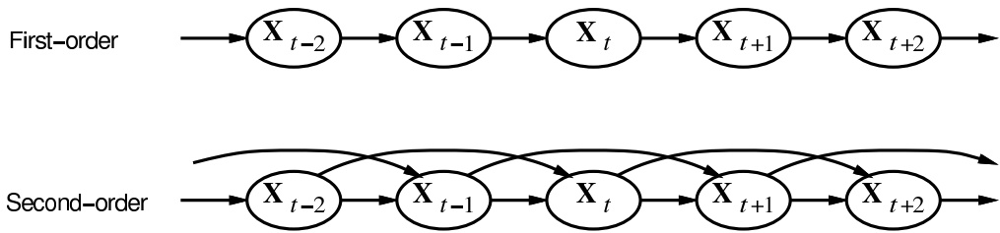

Sensor Markov assumption: $P ( Y _ { t }   |   X _ { 0 : t } , Y _ { 0 : t - 1 } ) = P ( Y _ { t }   |   X _ { t } )$

Stationary process: transition model $P ( X _ { t } \thinspace \vert \thinspace X _ { t - 1 } )$ and

sensor model $P ( Y _ { t } \thinspace \vert \thinspace X _ { t } )$ fixed for all t

10:1

## Hidden Markov Models

• We assume we have

– observed (discrete or continuous) variables $Y _ { t }$ in each time slice

– a discrete latent variable $X _ { t }$ in each time slice

– some observation model $P ( Y _ { t }   |   X _ { t } ; \theta )$

– some transition model $P ( X _ { t }   |   X _ { t - 1 } ; \theta )$

• A **Hidden Markov Model (HMM)** is defined as the joint distribution

$$
P (X _ {0: T}, Y _ {0: T}) = P (X _ {0}) \cdot \prod_ {t = 1} ^ {T} P (X _ {t} | X _ {t - 1}) \cdot \prod_ {t = 0} ^ {T} P (Y _ {t} | X _ {t}).
$$

<!-- page: 148 -->

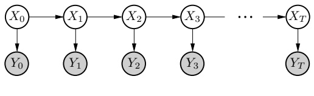

## Different inference problems in Markov Models

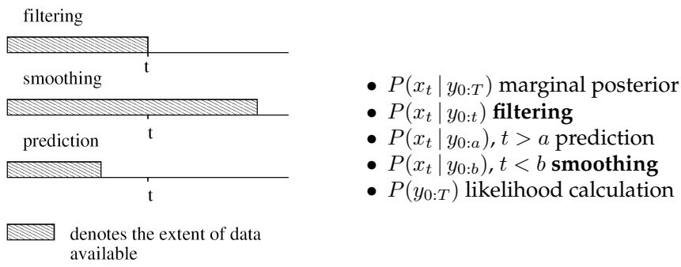

$P ( x _ { t }   |   y _ { 0 : T } )$ marginal posterior

• $P ( x _ { t }   |   y _ { 0 : t } )$ **filtering**

$P ( x _ { t }   |   y _ { 0 : a } ) ,   t > a$ prediction

$P ( x _ { t }   |   y _ { 0 : b } ) ,   t < b$ **smoothing**

$P ( y _ { 0 : T } )$ likelihood calculation

• **Viterbi** alignment: Find sequence $x _ { 0 : T } ^ { * }$ that maximizes $P ( x _ { 0 : T }   |   y _ { 0 : T } )$ (This is done using max-product, instead of sum-product message passing.)

10:3

## Inference in an HMM – a tree!


• The marginal posterior $P ( X _ { t }   |   Y _ { 1 : T } )$ is the product of three messages

$$
P (X _ {t} \mid Y _ {1: T}) \propto P (X _ {t}, Y _ {1: T}) = \underbrace {\mu_ {\text {past}}} _ {\alpha} (X _ {t}) \underbrace {\mu_ {\text {now}}} _ {\varrho} (X _ {t}) \underbrace {\mu_ {\text {future}}} _ {\beta} (X _ {t})
$$

• For all $a < t$ and $b > t$

$X _ { a }$ conditionally independent from $X _ { b }$ given $X _ { t }$

$- Y _ { a }$ conditionally independent from $Y _ { b }$ given $X _ { t }$

<!-- page: 149 -->

# “The future is independent of the past given the present” Markov property

(conditioning on $Y _ { t }$ does not yield any conditional independences)

10:4

## Inference in HMMs

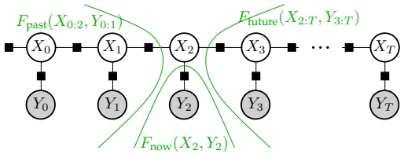

Applying the general message passing equations:

forward msg.

$$
\mu_ {X _ {t - 1} \to X _ {t}} (x _ {t}) =: \alpha_ {t} (x _ {t}) = \sum_ {x _ {t - 1}} P (x _ {t} | x _ {t - 1}) \alpha_ {t - 1} (x _ {t - 1}) \varrho_ {t - 1} (x _ {t - 1})
$$

$$
\alpha_ {0} (x _ {0}) = P (x _ {0})
$$

backward msg.

$$
\mu_ {X _ {t + 1} \to X _ {t}} (x _ {t}) =: \beta_ {t} (x _ {t}) = \sum_ {x _ {t + 1}} P (x _ {t + 1} | x _ {t}) \beta_ {t + 1} (x _ {t + 1}) \varrho_ {t + 1} (x _ {t + 1})
$$

$$
\beta_ {T} (x _ {T}) = 1
$$

observation msg.

$$
\mu_ {Y _ {t} \to X _ {t}} (x _ {t}) =: \varrho_ {t} (x _ {t}) = P (y _ {t} \mid x _ {t})
$$

posterior marginal

$$
q (x _ {t}) \propto \alpha_ {t} (x _ {t}) \varrho_ {t} (x _ {t}) \beta_ {t} (x _ {t})
$$

posterior marginal

$$
q (x _ {t}, x _ {t + 1}) \propto \alpha_ {t} (x _ {t}) \varrho_ {t} (x _ {t}) P (x _ {t + 1} | x _ {t}) \varrho_ {t + 1} (x _ {t + 1}) \beta_ {t + 1} (x _ {t + 1})
$$

10:5

## Inference in HMMs – implementation notes

• The message passing equations can be implemented by reinterpreting them as matrix equations: Let $\alpha _ { t } , \beta _ { t } , \varrho _ { t }$ be the vectors corresponding to the probability tables $\alpha _ { t } ( x _ { t } ) , \beta _ { t } ( x _ { t } ) , \varrho _ { t } ( x _ { t } ) ;$ and let $P$ be the matrix with enties $P ( x _ { t }   |   x _ { t - 1 } )$ . Then

<div class="docvortex-algorithm" style="white-space: pre-wrap; font-family:monospace;">
$\begin{array}{l}\boldsymbol{\alpha}_{0}=\boldsymbol{\pi},\boldsymbol{\beta}_{T}=1\\ \text{for}_{t=1:T-1}:\boldsymbol{\alpha}_{t}=\boldsymbol{P}\left(\boldsymbol{\alpha}_{t-1}\circ\boldsymbol{\varrho}_{t-1}\right)\\ \text{for}_{t=T-1:0}:\boldsymbol{\beta}_{t}=\boldsymbol{P}^{\top}\left(\boldsymbol{\beta}_{t+1}\circ\boldsymbol{\varrho}_{t+1}\right)\\ \text{for}_{t=0:T}:\boldsymbol{\mathbf{q}}_{t}=\boldsymbol{\alpha}_{t}\circ\boldsymbol{\varrho}_{t}\circ\boldsymbol{\beta}_{t}\\ \text{for}_{t=0:T-1}:\boldsymbol{\mathbf{Q}}_{t}=\boldsymbol{P}\circ[(\boldsymbol{\beta}_{t+1}\circ\boldsymbol{\varrho}_{t+1})(\boldsymbol{\alpha}_{t}\circ\boldsymbol{\varrho}_{t})^{\top}]\end{array}$
</div>

where ◦ is the element-wise product! Here, $\boldsymbol { q } _ { t }$ is the vector with entries $q ( x _ { t } )$ , and $\mathbf { Q } _ { t }$ the matrix with entries $q ( x _ { t + 1 } , x _ { t } )$ . Note that the equation for $\mathbf { Q } _ { t }$ describes $Q _ { t } ( x ^ { \prime } , x ) =$ $P ( x ^ { \prime } | x ) [ ( \beta _ { t + 1 } ( x ^ { \prime } ) \varrho _ { t + 1 } ( x ^ { \prime } ) ) \dot { ( } \alpha _ { t } ( x ) \dot { \varrho _ { t } } ( x ) ) ]$

<!-- page: 150 -->

## Inference in HMMs: classical derivation

Given our knowledge of Belief propagation, inference in HMMs is simple. For reference, here is a more classical derivation:

$$
\begin{array}{r l} P (x _ {t} \mid y _ {0: T}) & = \frac {P (y _ {0 : T} \mid x _ {t}) P (x _ {t})}{P (y _ {0 : T})} \\ & = \frac {P (y _ {0 : t} \mid x _ {t}) P (y _ {t + 1 : T} \mid x _ {t}) P (x _ {t})}{P (y _ {0 : T})} \\ & = \frac {P (y _ {0 : t} , x _ {t}) P (y _ {t + 1 : T} \mid x _ {t})}{P (y _ {0 : T})} \\ & = \frac {\alpha_ {t} (x _ {t}) \beta_ {t} (x _ {t})}{P (y _ {0 : T})} \end{array}
$$

$$
\begin{array}{c} \alpha_ {t} (x _ {t}) := P (y _ {0: t}, x _ {t}) = P (y _ {t} | x _ {t}) P (y _ {0: t - 1}, x _ {t}) \\ = P (y _ {t} | x _ {t}) \sum_ {x _ {t - 1}} P (x _ {t} \mid x _ {t - 1}) \alpha_ {t - 1} (x _ {t - 1}) \end{array}
$$

$$
\begin{array}{c} \beta_ {t} (x _ {t}) := P (y _ {t + 1: T} \mid x _ {t}) = \sum_ {x _ {t + 1}} P (y _ {t + 1: T} \mid x _ {t + 1}) P (x _ {t + 1} \mid x _ {t}) \\ = \sum_ {x _ {t + 1}} \left[ \beta_ {t + 1} (x _ {t + 1}) P (y _ {t + 1} | x _ {t + 1}) \right] P (x _ {t + 1} \mid x _ {t}) \end{array}
$$

Note: $\alpha _ { t }$ here is the same as $\alpha _ { t } \circ \varrho _ { t }$ on all other slides!

10:7

## HMM remarks

• The computation of forward and backward messages along the Markov chain is also called **forward-backward algorithm**

• Sometimes, computing forward and backward messages (in disrete or continuous context) is also called **Bayesian filtering/smoothing**

• The EM algorithm to learn the HMM parameters is also called **Baum-Welch algorithm**

• If the latent variable $x _ { t }$ is **continuous** $x _ { t } \in \mathbb { R } ^ { d }$ instead of discrete, then such a Markov model is also called **state space model**.

• If the continuous transitions and observations are linear Gaussian

$$
P (x _ {t + 1} | x _ {t}) = \mathcal {N} (x _ {t + 1} \mid A x _ {t} + a, Q), \quad P (y _ {t} | x _ {t}) = \mathcal {N} (y _ {t} \mid C x _ {t} + c, W)
$$

then the forward and backward messages $\alpha _ { t }$ and $\beta _ { t }$ are also Gaussian.

→ forward filtering is also called **Kalman filtering**

→ smoothing is also called **Kalman smoothing**

<!-- page: 151 -->

## Kalman Filter example

• filtering of a position $( x , y ) \in \mathbb { R } ^ { 2 }$

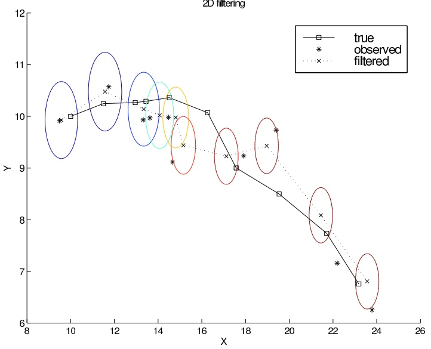

## Kalman Filter example

• smoothing of a position $( x , y ) \in \mathbb { R } ^ { 2 }$

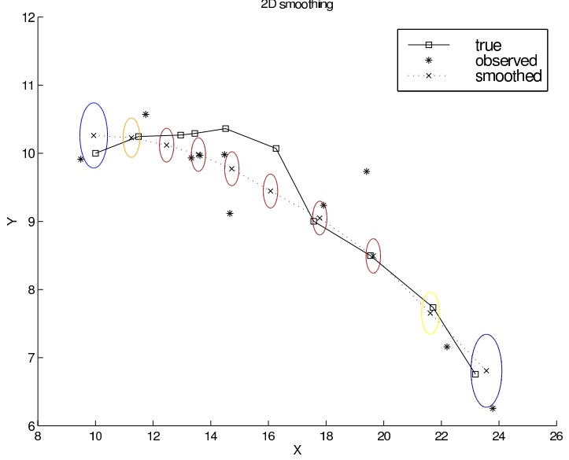

<!-- page: 152 -->

## HMM example: Learning Bach

• A machine “listens” (reads notes of) Bach pieces over and over again → It’s supposed to learn how to write Bach pieces itself (or at least harmonize them).

• Harmonizing Chorales in the Style of J S Bach Moray Allan & Chris Williams (NIPS 2004)

• use an HMM

– observed sequence $Y _ { 0 : T }$ Soprano melody

– latent sequence $X _ { 0 : T }$ chord & and harmony:


Figure 1: Hidden state representations (a) for harmonisation, (b) for ornamentation.

## HMM example: Learning Bach

• results: [http://www.anc.inf.ed.ac.uk/demos/hmmbach/](http://www.anc.inf.ed.ac.uk/demos/hmmbach/)

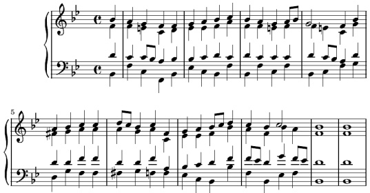

Figure 2: Most likely harmonisation under our model of chorale K4, BWV 48

• See also work by Gerhard Widmer [http://www.cp.jku.at/people/widmer/](http://www.cp.jku.at/people/widmer/)10:12

## Dynamic Bayesian Networks

– Arbitrary BNs in each time slide

– Special case: MDPs, speech, etc

<!-- page: 153 -->

- Introduction to Artificial Intelligence, Marc Toussaint 153
- 10:13

<!-- page: 154 -->

## 11 AI & Machine Learning & Neural Nets

## Motivation & Outline

Neural networks became a central topic for Machine Learning and AI. But in principle, they’re just parameterized functions that can be fit to data. They lack many appealing aspects that were the focus of ML research in the ’90-’10. So why are they so successful now? This lecture introduces the basics and tries to discuss the success of NNs.

## What is AI?

• AI is a research field

• AI research is about systems that take decisions

– AI formalizes decision processes: interactive (decisions change world state), or passive

– AI distinguishes between agent(s) and the external world: decision variables

• ... systems that take optimal/desirable decisions

– AI formalizes decision objectives

– AI aims for systems to exhibit functionally desirable behavior

• ... systems that take optimal decisions on the basis of all available information – AI is about inference

– AI is about learning

## What is Machine Learning?

• In large parts, ML is: (let’s call this ML<sup>0</sup>)

Fitting a function f : x 7→ y to given data $D = \{ ( x _ { i } , y _ { i } ) \} _ { i = 1 } ^ { n }$

• And what does that have to do with AI?

• Literally, not much:

– The decision made by a ML<sup>0</sup> method is only a single decision: Decide on the function f ∈ H in the hypothesis space H

– This “single-decision process” is not interactive; ML<sup>0</sup> does not formalize/model/consider how the choice of f changes the world

– The objective L(f, D) in ML<sup>0</sup> depends only on the given static data D and the decision f, not how f might change the world

– “Learning” in ML<sup>0</sup>is not an interactive process, but some method to pick f on the basis of the static D. The typically iterative optimization process is not the decision process that ML<sup>0</sup>focusses on.

<!-- page: 155 -->

**But,** function approximation can be used to help solving AI (interactive decision process) problems:

• Building a trained/fixed f into an interacting system based on human expert knowledge:

An engineer trains a NN f to recognize street signs based on a large fixed data set D. S/he builds f into a car to drive autonomously. That car certainly solves an AI problem; f continuously makes decisions that change the state of the world. But f was never optimized literally for the task of interacting with the world; it was only optimized to minimze a loss on the static data D. It is not a priori clear that minimizing the loss of f on D is related to maximizing rewards in car driving. That fact is only the expertise of the engineer; it is not some AI algorithm that discovered that fact. At no place there was an AI method that “learns to drive a car”. There was only an optimization method to minimize the loss of f on D.

• Using ML in interactive decision processes:

To approximate a Q-function, state evaluation function, reward function, the system dynamics, etc. Then, other AI methods can use these approximate models to actually take decisions in the interactive context.

11:3

## What is Machine Learning? (beyond ML<sup>0</sup>)

• In large parts, ML is: (let’s call this ML<sup>0</sup>) Fitting a function f : x 7→ y to given data $D = \{ ( x _ { i } , y _ { i } ) \} _ { i = 1 } ^ { n }$

Beyond ML<sup>0</sup>:

• Fitting more structured models to data, which includes

– Time series, recurrent processes

– Graphical Models

– Unsupervised learning (semi-supervised learning)

...but in all these cases, the scenario is still not interactive, the data D is static, the decision is about picking a single model f from a hypothesis space, and the objective is a loss based on f and D only.

• Active Learning, where the “ML agent” makes decisions about what data label to query next

• Bandits, Reinforcement Learning

11:4

## ML<sup>0</sup> objective: Empirical Risk Minimization

• We have a hypothesis space H of functions $f : x \mapsto y$

In a standard parameteric case $\mathcal { H } = \{ f _ { \theta }   |   \theta \in \mathbb { R } ^ { n } \}$ are functions $f _ { \theta } : x \mapsto y$ that are described by n parameters $\theta \in \mathbb { R } ^ { n }$

<!-- page: 156 -->

• Given data $D = \{ ( x _ { i } , y _ { i } ) \} _ { i = 1 } ^ { n }$ , the standard objective is to minimize the “error” on the data

$$
f ^ {*} \underset {f \in \mathcal {H}} {\operatorname{argmin}} \sum_ {i = 1} ^ {n} \ell (f (x _ {i}), y _ {i}) ,
$$

where $\ell ( \hat { y } , y )   >   0$ penalizes a discrepancy between a model output $\hat { y }$ and the data y.

– Squared error $\ell ( \hat { y } , y ) = ( \hat { y } - y ) ^ { 2 }$

– Classification error $\ell ( \hat { y } , y ) = [ \hat { y } \neq y ]$

– neg-log likelihood $\ell ( { \hat { y } } , y ) = - \log p ( y   |   { \hat { y } } )$

– etc

11:5

## What is a Neural Network?

• A parameterized function $f _ { \theta } : x \mapsto y$

– θ are called weights

– min<sub>θ</sub> $\textstyle \sum _ { i = 1 } ^ { n } \ell ( f _ { \theta } ( x _ { i } ) , y _ { i } )$ is called training

11:6

## What is a Neural Network?

• Standard fwd-forward NN $\mathbb { R } ^ { h _ { 0 } } \mapsto \mathbb { R } ^ { h _ { L } }$ with L layers:

1-layer $f _ { \theta } ( x ) = W _ { 0 } x$

$$
\theta = (W _ {0}), W _ {0} \in \mathbb {R} ^ {h _ {1} \times h _ {0}}
$$

2-layer $f _ { \theta } ( x ) = W _ { 1 } \sigma ( W _ { 0 } x )$

$$
\theta = (W _ {1}, W _ {0}), W _ {i} \in \mathbb {R} ^ {h _ {i + 1} \times h _ {i}}
$$

3-layer $f _ { \theta } ( x ) = W _ { 2 } \sigma ( W _ { 1 } \sigma ( W _ { 0 } x ) )$ $\theta = ( W _ { 3 } , W _ { 2 } , W _ { 0 } )$

• The activation function $\sigma ( z )$ is applied element-wise

rectified linear unit (ReLU)

leaky ReLU

sigmoid, logistic tanh

$$
\begin{array}{l} \sigma (z) = z [ z \geq 0 ] \\ \sigma (z) = \left\{ \begin{array}{l l} 0. 0 1 z & z <   0 \\ z & z \geq 0 \end{array} \right. \\ \sigma (z) = 1 / (1 + e ^ {- z}) \\ \sigma (z) = \tanh (z) \end{array}
$$

## Neural Networks: Basic Equations

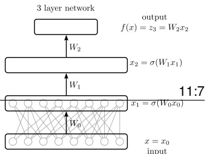

• Consider L layers (hidden plus output), each $h _ { l } \mathrm { - d i m e n s i o n a l }$

– let $z _ { l } = W _ { l - 1 } x _ { l - 1 } \in \mathbb { R } ^ { h _ { l } }$ be the inputs to all neurons in layer l

– let $x _ { l } = \sigma ( z _ { l } ) \in \mathbb { R } ^ { h _ { l } }$ be the **activation** of all neurons in layer l

– redundantly, we denote by $x _ { 0 } \equiv x$

• **Forward propagation:** An L-layer NN recursively computes,

$$
\forall_ {l = 1,.., L - 1}: z _ {l} = W _ {l - 1} x _ {l - 1}, \quad x _ {l} = \sigma (z _ {l})
$$

and then computes the output $f \equiv z _ { L } = W _ { L } x _ { L }$

<!-- page: 157 -->

• **Backpropagation:** Given some loss $\ell ( f )$ , let $\begin{array} { r } { \delta _ { L } \triangleq \frac { \partial \ell } { \partial f } = \frac { \partial \ell } { \partial z _ { L } } } \end{array}$ . We can recursivly compute the loss-gradient w.r.t. the inputs of layer l:

$$
\forall_ {l = L - 1, \dots , 1}: \delta_ {l} \triangleq \frac {d \ell}{d z _ {l}} = \frac {d \ell}{d z _ {l + 1}} \frac {\partial z _ {l + 1}}{\partial x _ {l}} \frac {\partial x _ {l}}{\partial z _ {l}} = \left[ \delta_ {l + 1} W _ {l} \right] \circ \left[ \sigma^ {\prime} (z _ {l}) \right] ^ {\top}
$$

where ◦ is an element-wise product. The gradient w.r.t. weights is:

$$
\frac {d \ell}{d W _ {l , i j}} = \frac {d \ell}{d z _ {l + 1 , i}} \frac {\partial z _ {l + 1 , i}}{\partial W _ {l , i j}} = \delta_ {l + 1, i} x _ {l, j} \quad \text {or} \quad \frac {d \ell}{d W _ {l}} = \delta_ {l + 1} ^ {\top} x _ {l} ^ {\top}
$$

11:8

## Behavior of Gradient Propagation

• Propagating $\delta _ { l }$ back through many layers can lead to problems

• For the classical sigmoid $\sigma ( z ) , \sigma ( z ) ^ { \prime }$ is always $< 1 \Rightarrow$ **vanishing gradient** Modern activations functions (ReLU) reduce this problem

• The Initialization of weights is super important!

E.g., initialize weights in $W _ { l }$ with standard deviation $\frac { 1 } { \sqrt { h _ { l } } }$ . Roughly: If each element of $z _ { l }$ has standard deviation $\epsilon _ { r }$ the same should be true for $z _ { l + 1 }$

11:9

## NN regression & regularization

• In the standard regression case, $h _ { L }   =   1$ , we typically assume a squared error loss $\begin{array} { r } { \ell ( f ) = \sum _ { i } ( \tilde { f _ { \theta } ( x _ { i } ) } - y _ { i } ) ^ { 2 } } \end{array}$ . We have

$$
\delta_ {L} = \sum_ {i} 2 (f _ {\theta} (x _ {i}) - y _ {i}) ^ {\top}
$$

• Regularization:

– Old: Add a $L _ { 2 }$ or $L _ { 1 }$ regularization. First compute all gradients as before, then add $\lambda W _ { l , i j }$ (for $L _ { 2 } )$ , or λ sign $W _ { l , i j }$ (for $L _ { 1 } )$ to the gradient. Historically, this is called **weight decay**, as the additional gradient leads to a step decaying the weighs.

– Modern: Dropout

• The optimal output weights are as for standard regression

$$
W _ {L - 1} ^ {*} = (X ^ {\top} X + \lambda I) ^ {- 1} X ^ {\top} y
$$

where X is the data matrix of activations $x _ { L \mathrm { - } 1 } \equiv \phi ( x )$

<!-- page: 158 -->

## NN classification

• In the multi-class case we have $h _ { L }   =   M$ output neurons, one for each class. The function $f ( x ) \; \in \; \mathbb { R } ^ { m }$ is the discriminative function, which means that the predicted class is the argmax $\mathsf { c } _ { y \in \{ 1 , . . , M \} } [ f _ { \theta } ( x ) ] _ { y }$

• Choosing neg-log-likelihood objective ↔ logistic regression

• Choosing hinge loss objective $\leftrightarrow \mathrm{''NN+SVM''}.$

– Let $y ^ { * }$ be the correct class and let’s use the short notation $f _ { y } \; = \; [ f _ { \theta } ( x ) ] _ { y }$ for the discriminative value for class y

– The **one-vs-all** hinge loss is $\textstyle \sum _ { y \neq y ^ { * } } [ 1 - ( f _ { y ^ { * } } - f _ { y } ) ] _ { + }$

– For output neuron $y \neq y ^ { * }$ this implies a gradient $\delta _ { y } = [ f _ { y ^ { * } } < f _ { y } + 1 ]$

– For output neuron $y ^ { * }$ this implies a gradient $\delta _ { y ^ { * } } = - \textstyle \sum _ { y \neq y ^ { * } } [ f _ { y ^ { * } } < f _ { y } + 1 ]$ Only data points inside the margin induce an error (and gradient).

– This is also called **Perceptron Algorithm**

11:11

Discussion: Why are NNs so successful now?

11:12

## Historical Perspective

(This is completely subjective.)

• Early (from 40ies):


– McCulloch Pitts, Hebbian learning, Rosenblatt, Werbos (backpropagation)

• 80ies:

– Start of connectionism, NIPS

– ML wants to distinguish itself from pure statistics (“machines”, “agents”)

• ’90-’10:

– More theory, better grounded, Statistical Learning theory

– Good ML is pure statistics (again) (Frequentists, SVM)

– ...or pure Bayesian (Graphical Models, Bayesian X)

– sample-efficiency, great generalization, guarantees, theory

– Great successes, in applications across disciplines; supervised, unsupervised, structured

• ’10-:

– Big Data. NNs. Size matters. GPUs.

– Disproportionate focus on images

– Software engineering becomes central

<!-- page: 159 -->

• NNs did not become “better” than they were 20y ago. By the standards of’90-’10, they would still be horrible. What changed is the standards by which they’re are evaluated:

Old:

– Sample efficiency & generalization; get the most from little data

– Guarantees (both, w.r.t. generalization and optimization)

– Being only as good as a nearest neighbor methods is embarrasing

New:

– Ability to cope with billions of samples → no batch processing, but stochastic optimization

– Happy to end up in some local optimum. (Theory on “every local optimum of a large deep net is good”.)

– Stochastic optimization methods (ADAM) without monotone convergence

– Nobody compares to nearest neighbor methods – nearest neighbor on 1B data points is too expensive anyway. I guess that it’d perform very well (for a descent kernel) and a NN could be glad to perform equally well

11:14

## NNs vs. nearest neighbor

• Imagine an autonomous car. Instead of carrying a neural net, it carries 1 Petabyte of data (500 hard drives, several billion pictures). In every split second it records an image from a camera and wants to query the database to returen the 100 most similar pictures. Perhaps with a non-trivial similarity metric. That’s not reasonable!

• In that sense, NNs are much better than nearest neighbor. They store/compress/mem huge amounts of data. Whether they actually generalize better than a good nearest neighbor methods is not so relevant.

• That’s how the standards changed from ’90-’10 to nowadays

11:15

## Images & Time Series

• I’d guess, 90% of the recent success of NNs is in the areas of images or time series

• For images, convolutional NNs (CNNs) impose a very sensible prior; the representations that emerge in CNNs are in fact similar to representations in the visual area of our brain.

• For time series, long-short term memory (LSTM) networks represent long-term dependencies in a way that is well trainable – something that is hard to do with other model structures.

• Both these structural priors, combined with huge data and capacity, make these methods very strong.

<!-- page: 160 -->

## Convolutional NNs

• Standard fully connected layer: full matrix $W _ { i }$ has $h _ { i } h _ { i + 1 }$ parameters

• Convolutional: Each neuron (entry of $\left| z _ { i + 1 } \right\rangle$ receives input from a square receptive field, with $k \times k$ parameters. All neurons share these parameters → translation invariance. The whole layer only has $k ^ { 2 }$ parameters.

• There are often multiple neurons with the same receitive field (“depth” of the layer), to represent different “filters”. Stride leads to downsampling. Padding at borders.

• Pooling applies a predefined operation on the receptive field (no parameters): max or average. Typically for downsampling.

11:17

Learning to read these diagrams...

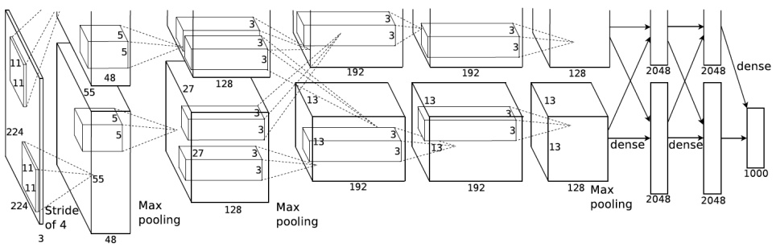

AlexNet 11:18

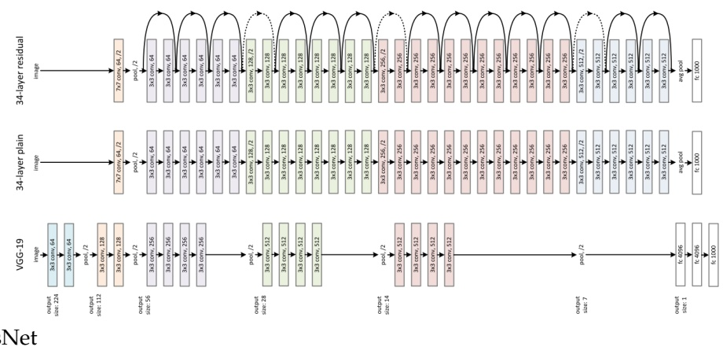

<!-- page: 161 -->

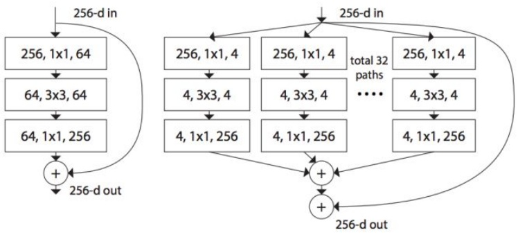

ResNeXt

11:20

## Pretrained networks

• ImageNet5k, AlexNet, VGG, ResNet, ResNeXt

11:21

## LSTMs

## 2 - Long Short-Term Memory (LSTM) network

This following figure shows the operations of an LSTM-cell.

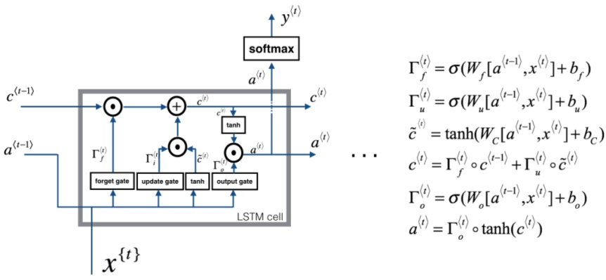

Figure 4: LSTM-cell. This tracks and updates a "cell state" or memory variable $c ^ { \langle t \rangle }$ at every time-step, which can be different from $a ^ { \langle t \rangle }$

11:22

## LSTM

• c is a memory signal, that is multiplied with a sigmoid signal $\Gamma _ { f }$ . If that is saturated $( \Gamma _ { f } \approx 1 )$ , the memory is preserved; and backpropagation copies gradients back

• If $\Gamma _ { i }$ is close to 1, a new signal c˜ is written into memory

• If $\Gamma _ { o }$ is close to 1, the memory contributes to the normal neural activations a

<!-- page: 162 -->

## Collateral Benefits of NNs

• The differentiable computation graph paradigm

– Perhaps a new paradigm to design large scale systems, beyond what software engineering teaches classically

• NN Diagrams as a specification language of models

– “Click your Network Together”

– High expressiveness to be creative in formulating really novel methods (e.g., Autoencoders, Embed2Control, GANs)

11:24

## Optimization: Stochastic Gradient Descent

• Standard optimization methods (gradient descent backtracking line search, L-BFGS, other (quasi) Newton methods) have strong guarantees, but require exact gradients.

– But computing exact gradients of the loss $\mathcal { L } ( f , D )$ would require to go through the full data set D – for every gradient evaluation. That does not scale to big data.

• Instead, use stochastic gradient descent, where the gradient is computed only for a batch $\hat { D } \subseteq D$ of fixed size k, subsampled uniformly from the whole D.

11:25

## • Core reference:

Yurii Nesterov (1983): A method for solving the convex programming problm with convergence rate $O ( 1 / k ^ { 2 } )$

Y Nesterov (2013): Introductory lectures on convex optimization: A basic course Springer

## • See also:

Mahsereci & Hennig (NIPS’15): Probabilistic line searches for stochastic optimization

<!-- page: 163 -->

## ADAM

<div class="docvortex-algorithm" style="white-space: pre-wrap; font-family:monospace;">
Algorithm 1: Adam, our proposed algorithm for stochastic optimization. See section 2 for details, and for a slightly more efficient (but less clear) order of computation. $g_t^2$ indicates the elementwise square $g_t \odot g_t$. Good default settings for the tested machine learning problems are $\alpha = 0.001$, $\beta_1 = 0.9$, $\beta_2 = 0.999$ and $\epsilon = 10^{-8}$. All operations on vectors are element-wise. With $\beta_1^t$ and $\beta_2^t$ we denote $\beta_1$ and $\beta_2$ to the power $t$.
Require: $\alpha$: Stepsize
Require: $\beta_1, \beta_2 \in [0,1)$: Exponential decay rates for the moment estimates
Require: $f(\theta)$: Stochastic objective function with parameters $\theta$
Require: $\theta_0$: Initial parameter vector
$m_0 \leftarrow 0$ (Initialize $1^{st}$ moment vector)
$v_0 \leftarrow 0$ (Initialize $2^{nd}$ moment vector)
$t \leftarrow 0$ (Initialize timestep)
while $\theta_t$ not converged do
    $t \leftarrow t + 1$
    $g_t \leftarrow \nabla_\theta f_t(\theta_{t-1})$ (Get gradients w.r.t. stochastic objective at timestep $t$)
    $m_t \leftarrow \beta_1 \cdot m_{t-1} + (1 - \beta_1) \cdot g_t$ (Update biased first moment estimate)
    $v_t \leftarrow \beta_2 \cdot v_{t-1} + (1 - \beta_2) \cdot g_t^2$ (Update biased second raw moment estimate)
    $\widehat{m}_t \leftarrow m_t / (1 - \beta_1^t)$ (Compute bias-corrected first moment estimate)
    $\widehat{v}_t \leftarrow v_t / (1 - \beta_2^t)$ (Compute bias-corrected second raw moment estimate)
    $\theta_t \leftarrow \theta_{t-1} - \alpha \cdot \widehat{m}_t / (\sqrt{\widehat{v}_t} + \epsilon)$ (Update parameters)
end while
return $\theta_t$ (Resulting parameters)
</div>

arXiv:1412.6980

(all operations interpreted element-wise)

11:27

## Deep RL

• Value Network

• Advantage Network

• Action Network

• Experience Replay (prioritized)

• Fixed Q-targets

• etc, etc

11:28

## Conclusions

• Conventional feed-forward neural networks are by no means magic. They’re a parameterized function, which is fit to data.

• Convolutional NNs do make strong and good assumptions about how information processing on images should be structured. The results are great and related to some degree to human visual representations. A large part of the success of deep learning is on images.

Also LSTMs make good assumptions about how memory signals help represent time series.

The flexibility of “clicking together” network structures and general differentiable computation graphs is great.

<!-- page: 164 -->

All these are innovations w.r.t. formulating structured models for ML

• The major strength of NNs is in their capacity and that, using massive parallelized computation, they can be trained on tons of data. Maybe they don’t even need to be better than nearest neighbor lookup, but they can be queried much faster.

11:29

<!-- page: 165 -->

## 12 Explainable AI

## Explainable AI

• General Concept of Explaination

– Data, Objective, Method, & Input

– Counterfactuals & Pearl

• Fitting interpretable models to black-boxes

• Sensitivity Analysis

– in general

– in NNs: Influence functions, relevance propagation

– Relation to Adversarial Examples

• Post-Hoc Rationalization

12:1

## Why care for Explainability

(Following Doshi-Velez & Kim’s arguments)

• Classical engineering: **complete** objectives and evaluation

– formal guarantees → system achieves well-defined objective → trust

• Novel AI applications: **incomplete** objectives

– Ethics, fairness & unbiasedness, privacy

– Safety and robustness beyond testable/formalizable domains

– Multi-objective trade-offs

• In those cases we want interpretable models and predictions

12:2

## What does Explainable mean?

• Why did you go to university today?

• In cognitive science: Counterfactuals

• A ML decision $y = f(x)$ has four ingredients:

– The data D

– The objective L

– The method/algorithm/hypothesis space: M, such that $f = M ( L , D )$

<!-- page: 166 -->

– The query input x

• recall Pearl’s notion of causality based on intervention

12:3

## Fitting Interpretable models to a Black-Box

• Started in the 80ies:

– Sun, Ron: Robust Reasoning: Integrating Rule-Based and Similarity-Based Reasoning. $\mathbf { A } \mathbf { I } ,$ 1995.

– Ras, van Gerven & Haselager (in Spring 2018): “Unlike other methods in Machine Learning (ML), such as decision trees or Bayesian networks, an explanation for a certain decision made by a DNN cannot be retrieved by simply scrutinizing the inference process.”

– Bastani et al: Interpreting Blackbox Models via Model Extraction, 2018:

$\mathrm { { } ^ { \prime \prime } W e }$ propose to construct global explanations of complex, blackbox models in the form of a decision tree approximating the original model.”

• (Great Work: Causal Generative Neural Networks, Guyon & Sebag)

12:4

## Sensitivity Analysis

12:5

## Sensitivity Analysis in Optimization

• Consider a general problem

$$
x ^ {*} = \underset {x} {\operatorname{argmin}} f (x) \quad \text {s.t.} \quad g (x) \leq 0, h (x) = 0
$$

– where $x \in \mathbb { R } ^ { n } , \; f : \; \mathbb { R } ^ { n } \to \mathbb { R } , \; g : \; \mathbb { R } ^ { n } \to \mathbb { R } ^ { m } , \; h : \; \mathbb { R } ^ { n } \to \mathbb { R } ^ { m ^ { \prime } }$ , all smooth

– First compute the optimum

– Then explain the optimum

12:6

## Sensitivity Analysis in Optimization

• KKT conditions: x optimal $\Rightarrow \exists \lambda \in \mathbb { R } ^ { m } , \nu \in \mathbb { R } ^ { m ^ { \prime } }$ such that

$$
\nabla f (x) + \nabla g (x) ^ {\top} \lambda + \nabla h (x) ^ {\top} \nu = 0\tag{17}
$$

$$
g (x) \leq 0, \quad h (x) = 0, \quad \lambda \geq 0\tag{18}
$$

$$
\lambda \circ g (x) = 0,\tag{19}
$$

• Consider infinitesimal variation $\tilde { f } = f + \epsilon \hat { f } ,   \tilde { g } = g + \epsilon \hat { g } ,   \tilde { h } = h + \epsilon \hat { h } ;$ how does $x ^ { * }$ vary?

<!-- page: 167 -->

– The KKT resitual will be

$$
\hat {r} = \left( \begin{array}{c} \nabla \hat {f} + \nabla \hat {g} ^ {\top} \lambda + \nabla \hat {h} ^ {\top} \nu \\ \hat {h} \\ \lambda \circ \hat {g} \end{array} \right)
$$

– The primal-dual Newton step will be

$$
\left( \begin{array}{c} \hat {x} \\ \hat {\lambda} \\ \hat {\nu} \end{array} \right) = - \left( \begin{array}{c c c} \nabla^ {2} f & \nabla g ^ {\top} & \nabla h ^ {\top} \\ \nabla h & 0 & 0 \\ \mathrm{diag} (\lambda) \nabla g & \mathrm{diag} (g) & 0 \end{array} \right) ^ {- 1} \left( \begin{array}{c} \nabla \hat {f} + \nabla \hat {g} ^ {\top} \lambda + \nabla \hat {h} ^ {\top} \nu \\ \hat {h} \\ \lambda \circ \hat {g} \end{array} \right)
$$

• The new optimum is at $x ^ { * } + { \hat { x } }$

– Insight: This derivation implies stability of constraint activity, which is “standard constraint qualification” in the optimization literature

12:7

## Sensitivity Analysis in Optimization

• Bottom line: We can analyze how changes in the optimization problem translate to changes of the optimium $x ^ { * }$

• Differentiable Optimization

– Can be embedded in auto-differentiation computation graphs (Tensorflow)

– Important implications for Differentiable Physics

– **But:** Not differentiable across constraint activations

12:8

## Sensitivity Analysis in Neural Nets

• Let $f : \mathbb { R } ^ { n } \to \mathbb { R }$ be a function from some input features $x _ { i }$ to a discriminative value

• (From Montavan et al:)

– We aim for a functional understanding, not a “lower-level mechanistic or algorithmic” understanding

– Features $x _ { i }$ are assumed to be in some human-interpretable domain: e.g., images, text

– An explanation is a collection of interpretable features that contributed to the decision

• Sensitivity Analysis ↔ Use gradients to quantify contribution of features to a value

<!-- page: 168 -->

relevance = gradient × input

## Example: Guided Backprop

guided backpropagation

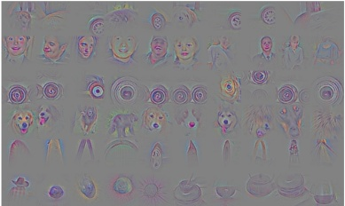

corresponding image crops


(Springenberg et al, 2014)

– Correct backprop for ReLu: $\delta _ { i } ^ { l } = [ x _ { i } ^ { l } > 0 ] \; \delta _ { i } ^ { l + 1 }$ where $\begin{array} { r } { \delta _ { i } ^ { l + 1 } = \frac { d f } { d x _ { i } ^ { l + 1 } } } \end{array}$

– Guided backprop: $R _ { i } ^ { l } = [ x _ { i } ^ { l } > 0 ] \; [ R _ { i } ^ { l + 1 } > 0 ] \; R _ { i } ^ { l + 1 }$

12:10

## Relevance Propagation & Deep Taylor Decomposition

• Not only gradients, but decompose value in additive relevances per feature

$$
f = \sum_ {i} R _ {i}
$$

• Deep Taylor Decomposition:

– ReLu networks are piece-wise linear

→ exact equations to propagate 1st-order Taylor coefficients through network

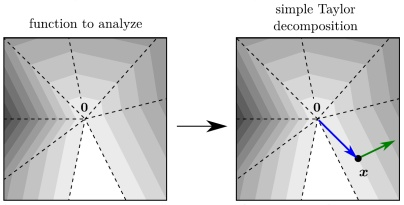

<!-- page: 169 -->

Relevance Propagation & Deep Taylor Decomposition

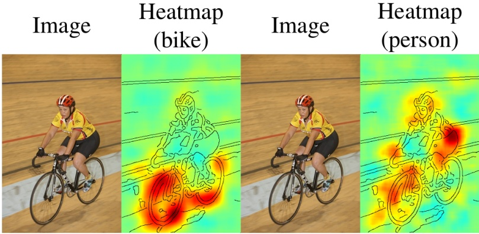

Relevance Propagation & Deep Taylor Decomposition

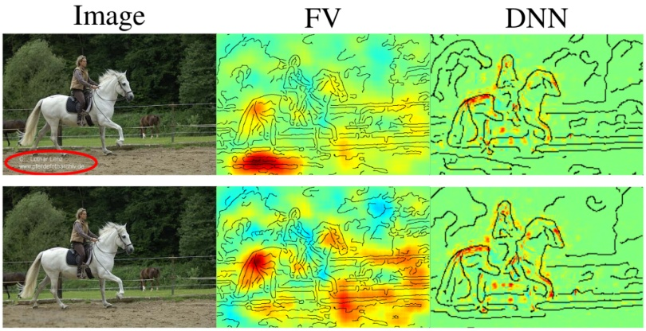

## Feature Inversion

• Try to find a “minimal image” that leads to the same value:

$$
x ^ {*} = \underset {x} {\operatorname{argmin}} \| f (x) - f (x _ {\mathrm{orig}}) \| ^ {2} + \mathcal {R} (x)
$$

– Constrain x to be maskings of the original image xorig

<!-- page: 170 -->


(a) Input

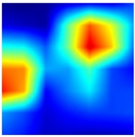

(b) Inversion map

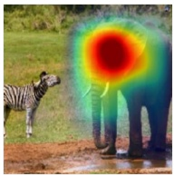

(c) “elephant”


(d) “ zebra”

(Du et al 2018)

12:14

Feature Inversion

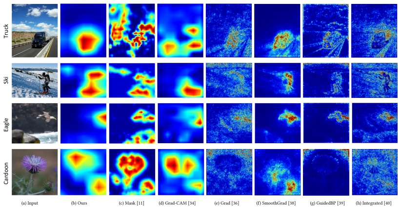

(Du et al 2018)

## Influence Functions

• Sensitivity w.r.t. data set!

– Leave-one-out retraining

– Vary the weighting of a training point (thereby the objective)

– Vary a training point itself: input image $x \gets x + \delta$

– Use linear sensitivity analysis to

<!-- page: 171 -->

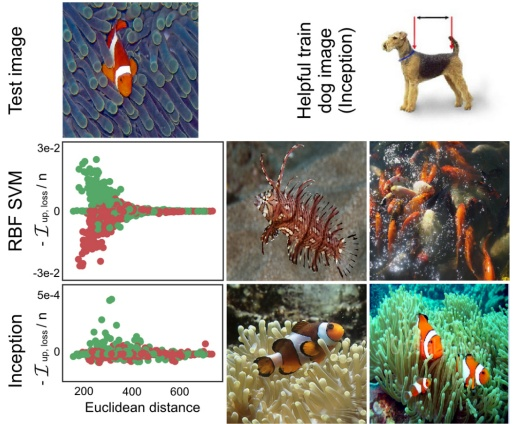

(Koh & Liang, ICML’17)

12:16

## Post-Hoc Rationalization

12:17

## Post-Hoc Rationalization

• Given an image and a (predicted) classification, learn to rationalize it!

• Data includes explanations!

– Caltech UCSD Birds 200-2011; 200 classes of bird species; 11,788 images

– Plus five sentences for each image! E.g., “This is a bird with red feathers and has a black face patch”


This is a pine grosbeak because this bird has a red head and breast with a gray wing and white wing.


This is a Kentucky warbler because this is a yellow bird with a black cheek patch and a black crown.


This is a pied billed grebe because this is a brown bird with a long neck and a large beak.


This is an artic tern because this is a white bird with a black head and orange feet.

(Akata et al, 2018)


This is a Bronzed Cowbird because ...

Definition: this bird is black with blue on its wings and has a long pointy beak.

Description: this bird is nearly all black with a short pointy bill.

GVE-image: this bird is nearly all black with bright orange eyes.

GVE-class: this is a black bird with a red eye and a white beak.

GVE: this is a black bird with a red eye and a pointy black beak.

(Akata et al, 2018)

12:18

<!-- page: 172 -->

• Koh, Pang Wei, and Percy Liang: Understanding Black-Box Predictions via Influence Functions. ArXiv:1703.04730

• Escalante, Hugo Jair, Sergio Escalera, Isabelle Guyon, Xavier Baro, Ya ´ gmur G ˘ uçl ¨ ut¨ urk, ¨ Umut Guçl ¨ u, and Marcel van Gerven: ¨ Explainable and Interpretable Models in Computer Vision and Machine Learning. Springer Series on Challenges in Machine Learning, 2018.

• Zeynep Akata, Lisa Anne Hendricks, Stephan Alaniz, and Trevor Darrell: Generating Post-Hoc Rationales of Deep Visual Classification Decisions. Springer 2018

• Montavon, Gregoire, Wojciech Samek, and Klaus-Robert M ´ uller: ¨ Methods for Interpreting and Understanding Deep Neural Networks. Digital Signal Processing 73, 2018

• Springenberg, Jost Tobias, Alexey Dosovitskiy, Thomas Brox, and Martin Riedmiller: Striving for Simplicity: The All Convolutional Net. ArXiv:1412.6806

• Du, Mengnan, Ninghao Liu, Qingquan Song, and Xia Hu: Towards Explanation of DNN-Based Prediction with Guided Feature Inversion. ArXiv:1804.00506 spangenberg

12:19

<!-- page: 173 -->

## 13 Propositional Logic

(slides based on Stuart Russell’s AI course)

## Motivation & Outline

Most students will have learnt about propositional logic their first classes. It represents the simplest and most basic kind of logic. The main motivation to teach it really is as a precursor of first-order logic (FOL), which is covered in the next lecture. The intro of the next lecture motivates FOL in detail. The main point is that in recent years there were important developments that unified FOL methods with probabilistic reasoning and learning methods, which really allows to tackle novel problems.

In this lecture we go quickly over the syntax and semantics of propositional logic. Then we cover the basic methods for logic inference: fwd & bwd chaining, as well as resolution.

## 13.1 Syntax & Semantics

13:1

## Outline

• Example: Knowledge-based agents & Wumpus world

• Logic in general—models and entailment

• Propositional (Boolean) logic

• Equivalence, validity, satisfiability

• Inference rules and theorem proving

– forward chaining

– backward chaining

– resolution

13:2

## Knowledge bases

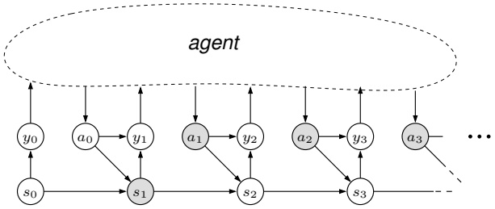

<!-- page: 174 -->

• An agent maintains a knowledge base

Knowledge base = set of sentences of a formal language

13:3

**Wumpus World description** Performance measure gold +1000, death -1000 -1 per step, -10 for using the arrow Environment Squares adjacent to wumpus are smelly Squares adjacent to pit are breezy Glitter iff gold is in the same square Shooting kills wumpus if you are facing it The wumpus kills you if in the same square Shooting uses up the only arrow Grabbing picks up gold if in same square Releasing drops the gold in same square Actuators Left turn, Right turn, Forward, Grab, Release, Shoot, Climb Sensors Breeze, Glitter, Stench, Bump, Scream

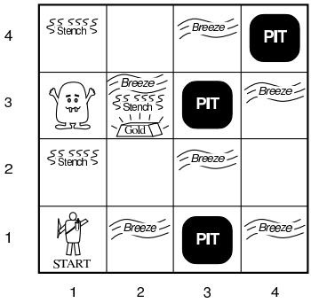

13:4

## Exploring a wumpus world

|  |  |  |  |
| --- | --- | --- | --- |
|  |  |  |  |
| OK |  |  |  |
| OKA | OK |  |  |

<!-- page: 175 -->

|  |  |  |  |
| --- | --- | --- | --- |
|  |  |  |  |
| B OKA↑ |  |  |  |
| OKA | OK |  |  |
|  |  |  |  |
| P? |  |  |  |
| B OKA↑ | P? |  |  |
| OKA | OK |  |  |

<!-- page: 176 -->

|  |  |  |  |
| --- | --- | --- | --- |
| P? |  |  |  |
| B OK | P? |  |  |
| A |  |  |  |
| OK | S OK |  |  |
| A | →A |  |  |
|  |  |  |  |
| P? |  |  |  |
| B OK | P? |  |  |
| A |  |  |  |
| OK | S OK |  |  |
| A | →A | W |  |

<!-- page: 177 -->

|  |  |  |  |
| --- | --- | --- | --- |
| P? |  |  |  |
| B OK | AOK |  |  |
| AOK | SOK |  |  |
| A→A | W |  |  |
|  |  |  |  |
| P? | OK |  |  |
| B OK | AOK | OK |  |
| AOK | SOK | W |  |

<!-- page: 178 -->

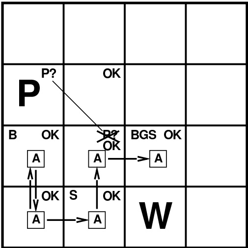

13:5

## Other tight spots

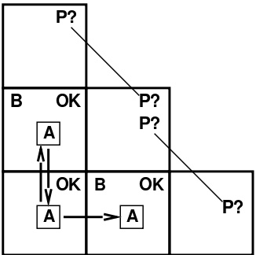

Breeze in (1,2) and (2,1) ⇒ no safe actions

Assuming pits uniformly distributed, (2,2) has pit w/ prob 0.86, vs. 0.31

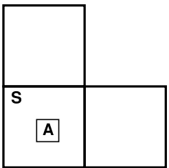

Smell in (1,1) ⇒ cannot move Can use a strategy of coercion: shoot straight ahead wumpus was there ⇒ dead ⇒ safe wumpus wasn’t there ⇒ safe

13:6

## Logic in general

• A Logic is a formal languages for representing information such that conclusions can be drawn

• The Syntax defines the sentences in the language

<!-- page: 179 -->

<div class="docvortex-algorithm" style="white-space: pre-wrap; font-family:monospace;">
- The Semantics defines the "meaning" of sentences; i.e., define truth of a sentence in a world
E.g., the language of arithmetic
$x + 2 \geq y$ is a sentence; $x2 + y &gt;$ is not a sentence
$x + 2 \geq y$ is true iff the number $x + 2$ is no less than the number $y$
$x + 2 \geq y$ is true in a world where $x = 7$, $y = 1$
$x + 2 \geq y$ is false in a world where $x = 0$, $y = 6$
</div>

## Notions in general logic

• A logic is a language, elements α are sentences

• A model m is a world/state description that allows us to evaluate $\alpha ( m ) \in$ {true, false} uniquely for any sentence α

We define $M ( \alpha ) = \{ m : \alpha ( m ) = { \mathsf { t r u e } } \}$ as the models for which α holds

• Entailment $\alpha \models \beta \colon M ( \alpha ) \subseteq M ( \beta )$ $\forall _ { m } : \; \alpha ( m ) \Rightarrow \beta ( m ) ^ { \prime \prime }$ (Folgerung)

• Equivalence $\alpha \equiv \beta ;$ iff $( \alpha \models \beta$ and $\beta \models \alpha )$

• A KB is a set (=conjunction) of sentences

• An inference procedure i can infer α from KB: $K B \vdash _ { i } \alpha$

• soundness of i: $K B \vdash _ { i }$ α implies $KB \models \alpha$ (Korrektheit)

• completeness of i: $KB \models \alpha$ implies $K B \vdash _ { i }$ α

## Propositional logic: Syntax

```txt
⟨sentence⟩          →   ⟨atomic sentence⟩ | ⟨complex sentence⟩
⟨atomic sentence⟩       →   true | false | P | Q | R | ...
⟨complex sentence⟩      →   ¬ ⟨sentence⟩
                        | (⟨sentence⟩ ∧ ⟨sentence⟩)
                        | (⟨sentence⟩ ∨ ⟨sentence⟩)
                        | (⟨sentence⟩ ⇒ ⟨sentence⟩)
                        | (⟨sentence⟩ ⇔ ⟨sentence⟩)
```

## Propositional logic: Semantics

• Each model specifies true/false for each proposition symbol

<div class="docvortex-algorithm" style="white-space: pre-wrap; font-family:monospace;">
E.g. $P_{1,2}$ $P_{2,2}$ $P_{3,1}$ true true false
</div>

(With these symbols, 8 possible models, can be enumerated automatically.)

• Rules for evaluating truth with respect to a model m:

<!-- page: 180 -->

<div class="docvortex-algorithm" style="white-space: pre-wrap; font-family:monospace;">
$\neg S$ is true iff $S$ is false
$S_1 \land S_2$ is true iff $S_1$ is true and $S_2$ is true
$S_1 \lor S_2$ is true iff $S_1$ is true or $S_2$ is true
$S_1 \Rightarrow S_2$ is true iff $S_1$ is false or $S_2$ is true
i.e., is false iff $S_1$ is true and $S_2$ is false
$S_1 \Leftrightarrow S_2$ is true iff $S_1 \Rightarrow S_2$ is true and $S_2 \Rightarrow S_1$ is true

- Simple recursive process evaluates an arbitrary sentence, e.g.,
$\neg P_{1,2} \land (P_{2,2} \lor P_{3,1}) = \text{true} \land (\text{false} \lor \text{true}) = \text{true} \land \text{true} = \text{true}$
</div>

<div class="docvortex-algorithm" style="white-space: pre-wrap; font-family:monospace;">
Notions in propositional logic – summary
• conjunction: $\alpha \land \beta$, disjunction: $\alpha \lor \beta$, negation: $\neg \alpha$
• implication: $\alpha \Rightarrow \beta \equiv \neg \alpha \lor \beta$
• biconditional: $\alpha \Leftrightarrow \beta \equiv (\alpha \Rightarrow \beta) \land (\beta \Rightarrow \alpha)$
Note: $\models$ and $\equiv$ are statements about sentences in a logic; $\Rightarrow$ and $\Leftrightarrow$ are symbols in the grammar of propositional logic
• $\alpha$ valid: true for any model (allgemeingültig). E.g., true; $A \lor \neg A$; $A \Rightarrow A$; $(A \land (A \Rightarrow B)) \Rightarrow B$
Note: $KB \models \alpha$ iff $[(KB \Rightarrow \alpha) \text{ is valid}]$
• $\alpha$ unsatisfiable: true for no model. E.g., $A \land \neg A$;
Note: $KB \models \alpha$ iff $[(KB \land \neg \alpha) \text{ is unsatisfiable}]$
• literal: $A$ or $\neg A$, clause: disj. of literals, CNF: conj. of clauses
• Horn clause: symbol | (conjunction of symbols $\Rightarrow$ symbol), Horn form: conjunction of Horn clauses
Modus Ponens rule: complete for Horn KBs $\frac{\alpha_1, ..., \alpha_n, ...\quad\alpha_1 \land ...\land\alpha_n \Rightarrow\beta}{\beta}$
Resolution rule: complete for propositional logic in CNF, let “$\ell_i = \neg m_j'$: $\frac{\ell_1 \lor ...\lor\ell_k, ...\quad m_1 \lor ...\lor m_n}{\ell_1 \lor ...\lor\ell_{i-1} \lor\ell_{i+1} \lor ...\lor\ell_k \lor m_1 \lor ...\lor m_{j-1} \lor m_{j+1} \lor ...\lor m_n}$
</div>

## Logical equivalence

• Two sentences are logically equivalent iff true in same models:

$\alpha \equiv \beta$ if and only if $\alpha \models \beta$ and $\beta \models \alpha$

$\left( \alpha \wedge \beta \right) \quad \equiv \quad \left( \beta \wedge \alpha \right)$ commutativity of ∧

$\left( \alpha \lor \beta \right) \quad \equiv \quad \left( \beta \lor \alpha \right)$ commutativity of ∨

$( ( \alpha \wedge \beta ) \wedge \gamma ) \quad \equiv \quad ( \alpha \wedge ( \beta \wedge \gamma ) )$ associativity of ∧

$( ( \alpha \vee \beta ) \vee \gamma ) \quad \equiv \quad ( \alpha \vee ( \beta \vee \gamma ) )$ associativity of ∨

$\begin{array} { r l r } { \neg ( \neg \alpha ) } & { { } \equiv } & { \alpha } \end{array}$ double-negation elimination

$\left( \alpha \Rightarrow \beta \right) \quad \equiv \quad \left( \neg \beta \Rightarrow \neg \alpha \right)$ contraposition

$$
(\alpha \Rightarrow \beta) \quad \equiv \quad (\neg \alpha \lor \beta)
$$

$$
(\alpha \Leftrightarrow \beta) \quad \equiv \quad ((\alpha \Rightarrow \beta) \land (\beta \Rightarrow \alpha))
$$

<!-- page: 181 -->

¬(α ∧ β) ≡ (¬α ∨ ¬β) De Morgan ¬(α ∨ β) ≡ (¬α ∧ ¬β) De Morgan (α ∧ (β ∨ γ)) ≡ ((α ∧ β) ∨ (α ∧ γ)) distributivity of ∧ over ∨ (α ∨ (β ∧ γ)) ≡ ((α ∨ β) ∧ (α ∨ γ)) distributivity of ∨ over ∧

13:12

## Example: Entailment in the wumpus world

Situation after detecting nothing in [1,1], moving right, breeze in [2,1]

Consider possible models for ?s assuming only pits

3 Boolean choices ⇒ 8 possible models

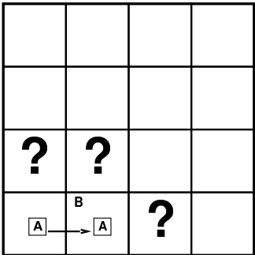

13:13

## Wumpus models

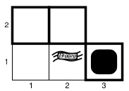

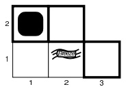

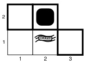

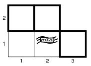

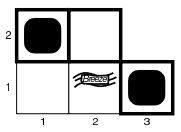

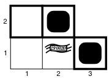

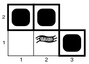

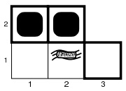

<!-- page: 182 -->

Wumpus models

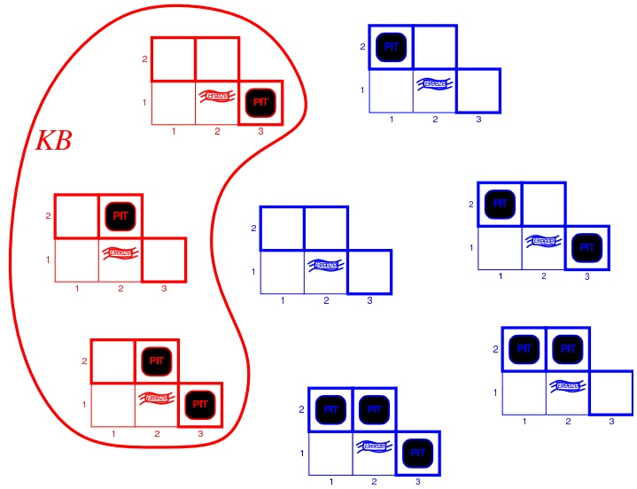

KB = wumpus-world rules + observations

13:15

Wumpus models

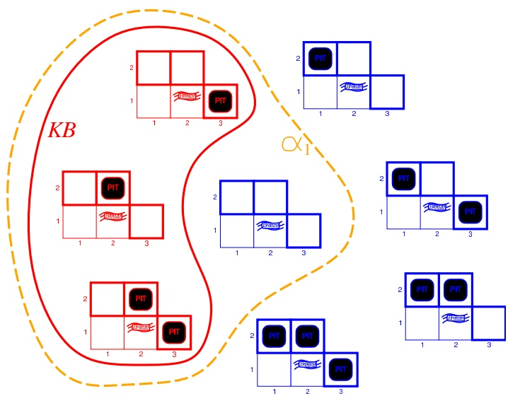

KB = wumpus-world rules + observations

$\alpha _ { \mathrm { 1 } } = { '' } [ 1 { , } 2 ]$ is safe”, $K B \models \alpha _ { 1 } ,$ proved by model checking

<!-- page: 183 -->

Wumpus models

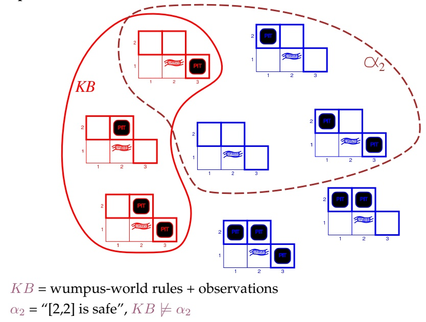

13:17

## 13.2 Inference Methods

13:18

## Inference

• Inference in the general sense means: Given some pieces of information (prior, observed variabes, knowledge base) what is the implication (the implied information, the posterior) on other things (non-observed variables, sentence)

$K B \vdash _ { i } \alpha = { \sf s e n t e n c e } \alpha$ can be derived from $K B$ by procedure $i$

Consequences of $K B$ are a haystack; $\alpha$ is a needle.

Entailment = needle in haystack; inference = finding it

• Soundness: i is sound if

whenever $K B \vdash _ { i } \alpha ,$ it is also true that $K B \models \alpha$

Completeness: i is complete if

whenever $K B \models \alpha ,$ it is also true that $K B \vdash _ { i } \alpha$

Preview: we will define a logic (first-order logic) which is expressive enough to say almost anything of interest, and for which there exists a sound and complete inference procedure. That is, the procedure will answer any question whose answer follows from what is known by the KB.

<!-- page: 184 -->

<div class="docvortex-algorithm" style="white-space: pre-wrap; font-family:monospace;">
$O(2^{n})$  for n symbols
</div>

Inference by enumeration

| B<sub>1</sub>,1 | B<sub>2</sub>,1 | P<sub>1</sub>,1 | P<sub>1</sub>,2 | P<sub>2</sub>,1 | P<sub>2</sub>,2 | P<sub>3</sub>,1 | R<sub>1</sub> | R<sub>2</sub> | R<sub>3</sub> | R<sub>4</sub> | R<sub>5</sub> | KB |
| --- | --- | --- | --- | --- | --- | --- | --- | --- | --- | --- | --- | --- |
| false | false | false | false | false | false | false | true | true | true | true | false | false |
| false | false | false | false | false | false | true | true | true | false | true | false | false |
| ... | ... | ... | ... | ... | ... | ... | ... | ... | ... | ... | ... | ... |
| false | true | false | false | false | false | false | true | true | false | true | true | false |
| false | true | false | false | false | false | true | true | true | true | true | true | true |
| false | true | false | false | false | true | false | true | true | true | true | true | true |
| false | true | false | false | false | true | true | true | true | true | true | true | true |
| false | true | false | false | true | false | false | true | false | false | true | true | false |
| ... | ... | ... | ... | ... | ... | ... | ... | ... | ... | ... | ... | ... |
| true | true | true | true | true | true | true | false | true | true | false | true | false |

Enumerate rows (different assignments to symbols), if KB is true in row, check that α is too

13:20

## Inference by enumeration

Depth-first enumeration of all models is sound and complete

```txt
function TT-ENTAILS?(KB,α) returns true or false
    inputs: KB, the knowledge base, a sentence in propositional logic
        α, the query, a sentence in propositional logic
symbols ← a list of the proposition symbols in KB and α
return TT-CHECK-ALL(KB,α,symbols,[])

function TT-CHECK-ALL(KB,α,symbols,model) returns true or false
    if EMPTY?(symbols) then
        if PL-TRUE?(KB,model) then return PL-TRUE?(α,model)
        else return true
    else do
        P ← FIRST(symbols); rest ← REST(symbols)
        return TT-CHECK-ALL(KB,α,rest,EXTEND(P,true,model)) and
            TT-CHECK-ALL(KB,α,rest,EXTEND(P,false,model))
```

13:21

## Proof methods

• Proof methods divide into (roughly) two kinds:

• Application of inference rules

– Legitimate (sound) generation of new sentences from old

– Proof = a sequence of inference rule applications

Can use inference rules as operators in a standard search alg.

– Typically require translation of sentences into a normal form

<!-- page: 185 -->

## • Model checking

truth table enumeration (always exponential in n) improved backtracking, e.g., Davis–Putnam–Logemann–Loveland (see book) heuristic search in model space (sound but incomplete) e.g., min-conflicts-like hill-climbing algorithms

13:22

## Forward and backward chaining

• Applicable when KB is in Horn Form

• Horn Form (restricted)

KB = conjunction of Horn clauses

Horn clause =

– proposition symbol; or

– (conjunction of symbols) ⇒ symbol

E.g., $C \wedge ( B \Rightarrow A ) \wedge ( C \wedge D \Rightarrow B )$

• Modus Ponens (for Horn Form): complete for Horn KBs

$$
\frac {\alpha_ {1} , \dots , \alpha_ {n} , \quad \alpha_ {1} \wedge \cdots \wedge \alpha_ {n} \Rightarrow \beta}{\beta}
$$

Can be used with forward chaining or backward chaining.

• These algorithms are very natural and run in linear time

13:23

## Forward chaining

• Represent a KB as a graph

• Fire any rule whose premises are satisfied in the $K B ,$ add its conclusion to the $| K B |$ , until query is found

$$
P \Rightarrow Q
$$

$$
L \land M \Rightarrow P
$$

$$
B \land L \Rightarrow M
$$

$$
A \land P \Rightarrow L
$$

$$
A \land B \Rightarrow L
$$

A

$$
B
$$

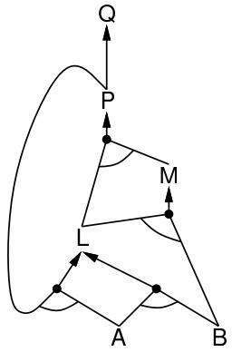

<!-- page: 186 -->

**Forward chaining example**

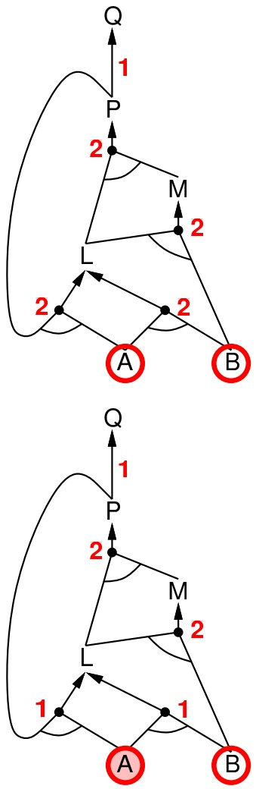

<!-- page: 187 -->

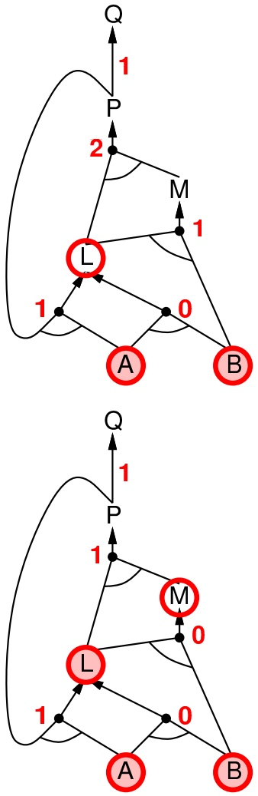

<!-- page: 188 -->

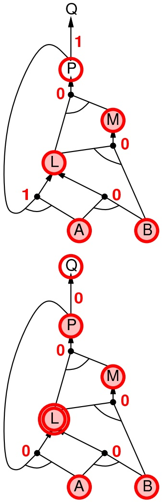

<!-- page: 189 -->

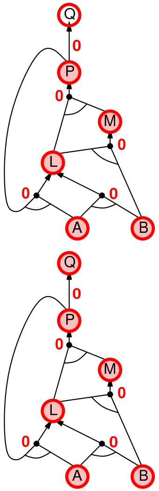

13:25

<!-- page: 190 -->

## Forward chaining algorithm

```txt
function PL-FC-ENTAILS?(KB,q) returns true or false
  inputs: KB, the knowledge base, a set of propositional Horn clauses
      q, the query, a proposition symbol
  local variables: count, a table, indexed by clause, initially the number of premises
      inferred, a table, indexed by symbol, each entry initially false
      agenda, a list of symbols, initially the symbols known in KB

  while agenda is not empty do
    p ← POP(agenda)
    unless inferred[p] do
      inferred[p] ← true
      for each Horn clause c in whose premise p appears do
        decrement count[c]
        if count[c] = 0 then do
          if HEAD[c] = q then return true
          PUSH(HEAD[c], agenda)
  return false
```

13:26

## Proof of completeness

FC derives every atomic sentence that is entailed by $K B$

1. FC reaches a fixed point where no new atomic sentences are derived

2. Consider the final state as a model $m ,$ assigning true/false to symbols

3. Every clause in the original KB is true in $m$

Proof: Suppose a clause $a _ { 1 } \wedge \ldots \wedge a _ { k } \Rightarrow b$ is false in $m$

Then $a _ { 1 } \wedge \ldots \wedge a _ { k }$ is true in m and b is false in $m$

Therefore the algorithm has not reached a fixed point!

4. Hence $m$ is a model of KB

5. If $K B \models q , q$ is true in every model of $K B ,$ including m

General idea: construct any model of $K B$ by sound inference, check α

13:27

## Backward chaining

• Idea: work backwards from the query $q ;$

to prove $q$ by BC,

check if $q$ is known already, or

prove by BC all premises of some rule concluding $q$

• Avoid loops: check if new subgoal is already on the goal stack

• Avoid repeated work: check if new subgoal

1) has already been proved true, or

2) has already failed

<!-- page: 191 -->

**Backward chaining example**

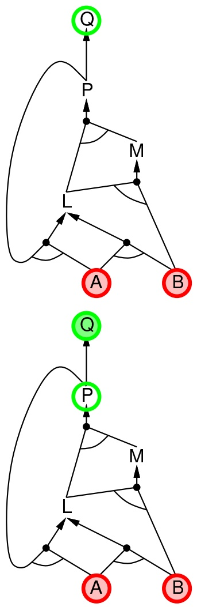

<!-- page: 192 -->

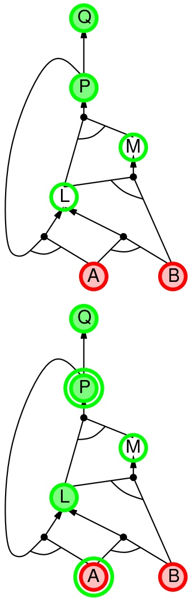

<!-- page: 193 -->

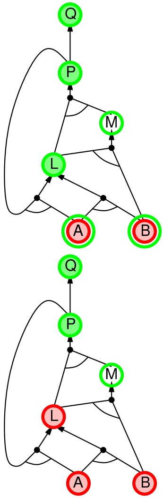

<!-- page: 194 -->

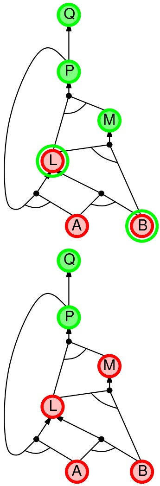

<!-- page: 195 -->

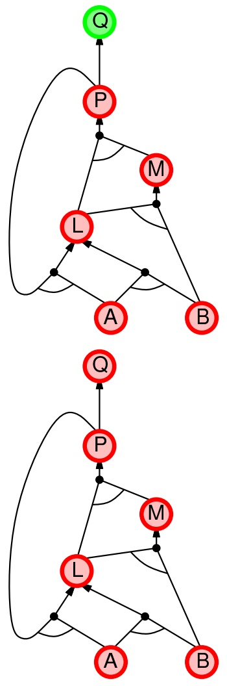

13:29

## Forward vs. backward chaining

FC is data-driven, cf. automatic, unconscious processing,

e.g., object recognition, routine decisions

May do lots of work that is irrelevant to the goal

BC is goal-driven, appropriate for problem-solving,

e.g., Where are my keys? How do I get into a PhD program?

Complexity of BC can be much less than linear in size of KB

<!-- page: 196 -->

## Resolution

• Conjunctive Normal Form (CNF—universal) conjunction of disjunctions of literals

$$
\text {E.g.,} (A \lor \neg B) \land (B \lor \neg C \lor \neg D)
$$

• Resolution inference rule (for CNF): complete for propositional logic

$$
\frac {\ell_ {1} \vee \cdots \vee \ell_ {k} , \qquad m _ {1} \vee \cdots \vee m _ {n}}{\ell_ {1} \vee \cdots \vee \ell_ {i - 1} \vee \ell_ {i + 1} \vee \cdots \vee \ell_ {k} \vee m _ {1} \vee \cdots \vee m _ {j - 1} \vee m _ {j + 1} \vee \cdots \vee m _ {n}}
$$

where $\ell _ { i }$ and $m _ { j }$ are complementary literals.

• E.g.,

$$
\frac {P _ {1 , 3} \lor P _ {2 , 2} , \quad \neg P _ {2 , 2}}{P _ {1 , 3}}
$$

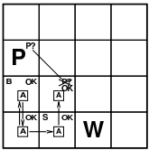

• Resolution is sound and complete for propositional logic

13:31

## Conversion to CNF

$$
B _ {1, 1} \Leftrightarrow (P _ {1, 2} \lor P _ {2, 1})
$$

1. Eliminate $\Leftrightarrow ,$ replacing $\alpha \Leftrightarrow \beta$ with $( \alpha \Rightarrow \beta ) \land ( \beta \Rightarrow \alpha )$

$$
(B _ {1, 1} \Rightarrow (P _ {1, 2} \lor P _ {2, 1})) \land ((P _ {1, 2} \lor P _ {2, 1}) \Rightarrow B _ {1, 1})
$$

2. Eliminate $\Rightarrow ,$ replacing $\alpha \Rightarrow \beta$ with $\neg \alpha \lor \beta .$

$$
(\neg B _ {1, 1} \lor P _ {1, 2} \lor P _ {2, 1}) \land (\neg (P _ {1, 2} \lor P _ {2, 1}) \lor B _ {1, 1})
$$

3. Move ¬ inwards using de Morgan’s rules and double-negation:

$$
(\neg B _ {1, 1} \lor P _ {1, 2} \lor P _ {2, 1}) \land ((\neg P _ {1, 2} \land \neg P _ {2, 1}) \lor B _ {1, 1})
$$

4. Apply distributivity law (∨ over ∧) and flatten:

$$
(\neg B _ {1, 1} \lor P _ {1, 2} \lor P _ {2, 1}) \land (\neg P _ {1, 2} \lor B _ {1, 1}) \land (\neg P _ {2, 1} \lor B _ {1, 1})
$$

13:32

## Resolution algorithm

<!-- page: 197 -->

```txt
function PL-RESOLUTION(KB, α) returns true or false
  inputs: KB, the knowledge base, a sentence in propositional logic
      α, the query, a sentence in propositional logic

  clauses ← the set of clauses in the CNF representation of KB ∧ ¬α
  new ← { }
  loop do
    for each Ci, Cj in clauses do
      resolvents ← PL-RESOLVE(Ci, Cj)
      if resolvents contains the empty clause then return true
      new ← new ∪ resolvents
    if new ⊆ clauses then return false
    clauses ← clauses ∪ new
```

## Resolution example

$$
K B = \left(B _ {1, 1} \Leftrightarrow \left(P _ {1, 2} \lor P _ {2, 1}\right)\right) \land \lnot B _ {1, 1} \quad \alpha = \lnot P _ {1, 2}
$$

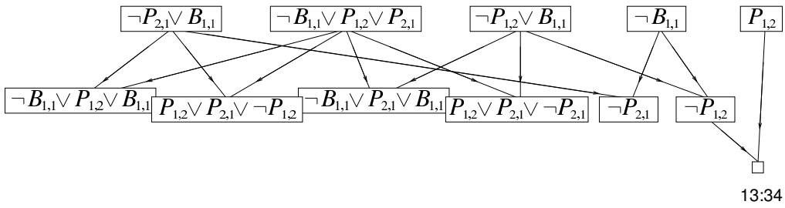

## Summary

Logical agents apply inference to a knowledge base

to derive new information and make decisions

Basic concepts of logic:

– syntax: formal structure of sentences

– semantics: truth of sentences wrt models

– entailment: necessary truth of one sentence given another

– inference: deriving sentences from other sentences

– soundness: derivations produce only entailed sentences

– completeness: derivations can produce all entailed sentences

Wumpus world requires the ability to represent partial and negated information, reason by cases, etc.

Forward, backward chaining are linear-time, complete for Horn clauses

Resolution is complete for propositional logic

Propositional logic lacks expressive power

<!-- page: 198 -->

<!-- page: 199 -->

## 14 First-Order Logic\*\*

(slides based on Stuart Russell’s AI course)

## Motivation & Outline

First-order logic (FOL) is exactly what is sometimes been thought of as “Good Old-Fashioned AI” (GOFAI) – and what was the central target of critique on AI research coming from other fields like probabilistic reasoning and machine learning. A bit over-simplified, in the AI winter many researchers said “logic doesn’t work”, therefore AI doesn’t work, and instead the focus should be on learning and probabilistic modelling. Some comments on this:

First, I think one should clearly distinguish between 1) logic reasoning and inference, and 2) “first-order (or relational) representations”. Logic reasoning indeed is only applicable on discrete & deterministic knowledge bases. And as learnt knowledge is hardly deterministic (it cannot be in a Bayesian view), logic reasoning does not really apply well. In my view, this is one of the core problems with GOFAI: the fact that logic reasoning does not unify well with learning and learned models.

However, using “first-order (or relational) representations” means to represent knowledge in such a way that it refers only to object properties and relations, and therefore generalizes across object identities. Sure, classical FOL knowledge bases are first-order knowledge representations. But here research has advanced tremendously: nowadays we can also represent learned classifiers/regressions, graphical models, and Markov Decision Processes in a first-order (also called “relational” or “lifted”) way. The latter are core probabilistic formalisms to account for uncertainty and learning. Therefore the current state-of-the-art provides a series of unifications of probabilistic and first-order representations. I think this is what makes it important to learn and understand first-order representations – which is best taught in the context of FOL.

The reasoning and inference methods one requires for modern relational probabilistic models are of course different to classical logical reasoning. Therefore, I think knowing about “logical reasoning” is less important than knowing about “logical representations”. Still, some basic aspects of logical reasoning, such as computing all possible substitutions for an abstract sentence, thereby grounding the sentence, are essential in all first-order models.

Modern research on relational machine learning has, around 2011, lead to some new optimism about modern AI, also called the spring of AI (see, e.g., “I, algorithm: A new dawn for artificial intelligence”, 2011). That wave of optimism now got over-rolled by the new hype on deep learning, which in the media is often equated with AI. However, at least up to now, one should clearly distinguish between deep learning as a great tool for machine learning with huge amounts of data; and reasoning, which includes model-based decision making, control, planning, and also (Bayesian) learning from few data.

This lecture introduces to FOL. The goal is to understand FOL as the basis for decision-making problems such as STRIPS rules, as well as for relational proba-

<!-- page: 200 -->

bilistic models such as relational Reinforcement Learning and statistical relational learning methods. The latter are (briefly) introduced in the next lecture.

We first introduce the FOL language, then basic inference algorithms. Perhaps one of the most important concepts is the problem of computing substitutions (also called unification or matching problem), where much of the computational complexity of FOL representations arises.

## 14.1 The FOL language

FOL is a language—we define the syntax, the semantics, and give examples. 14:1

## The limitation of propositional logic

• Propositional logic has nice properties:

– Propositional logic is declarative: pieces of syntax correspond to facts

– Propositional logic allows partial/disjunctive/negated information (unlike most data structures and databases)

– Propositional logic is compositional: meaning of $B _ { 1 , 1 } \wedge P _ { 1 , 2 }$ is derived from meaning of $B _ { 1 , 1 }$ and of $P _ { 1 , 2 }$

– Meaning in propositional logic is context-independent (unlike natural language, where meaning depends on context)

• Limitation:

– Propositional logic has very limited expressive power, unlike natural language. E.g., we cannot express “pits cause breezes in adjacent squares” except by writing one sentence for each square

14:2

## First-order logic

• Whereas propositional logic assumes that a world contains facts, first-order logic (like natural language) assumes the world contains

– Objects: people, houses, numbers, theories, Ronald McDonald, colors, baseball games, wars, centuries . . .

– Relations: red, round, bogus, prime, multistoried . . ., brother of, bigger than, inside, part of, has color, occurred after, owns, comes between, . . .

– Functions: father of, best friend, third inning of, one more than, end of . . .

<!-- page: 201 -->

<div class="docvortex-algorithm" style="white-space: pre-wrap; font-family:monospace;">
$\forall \langle variables\rangle$ （sentence）
</div>

```txt
FOL syntax elements
Constants KingJohn, 2, UCB,...
Predicates Brother, >,...
Variables x, y, a, b,...
Connectives ∧ ∨ ¬ ⇒ ⇔
Equality =
Quantifiers ∀∃
Functions Sqrt, LeftLegOf,...
14:4

FOL syntax grammar
⟨sentence⟩ → ⟨atomic sentence⟩
| ⟨complex sentence⟩
| [∀ | ∃] ⟨variable⟩ ⟨sentence⟩
⟨atomic sentence⟩ → predicate(⟨term⟩,...)
| ⟨term⟩=⟨term⟩
⟨term⟩ → function(⟨term⟩,...)
| constant
| variable
⟨complex sentence⟩ → ¬ ⟨sentence⟩
| (⟨sentence⟩ [∧ | ∨ | ⇒ | ⇔ ] ⟨sentence⟩)
14:5
```

## Quantifiers

• Universal quantification

$\forall   x \quad P$ is true in a model $m$ iff $P$ is true with $x$ being each possible object in the model

Example: “Everyone at Berkeley is smart:” ∀ x $A t ( x , B e r k e l e y ) \Rightarrow S m a r t ( x )$

• Existential quantification

$$
\exists \langle \text {variables} \rangle \langle \text {sentence} \rangle
$$

∃ x P is true in a model $m$ iff $P$ is true with x being some possible object in the model

Example: “Someone at Stanford is smart:” ∃ x At(x, Stanford) ∧ Smart(x)

14:6

## Properties of quantifiers

$\forall   x   \forall   y$ is the same as $\forall y \forall x$

$\exists   x   \exists   y$ is the same as $\exists y \exists x$

<!-- page: 202 -->

$\exists   x   \forall   y$ is not the same as $\forall y \exists x$

∃ x ∀ y Loves(x, y): “There is a person who loves everyone in the world”

∀ $\left[ y \right. \left. \right] x$ Loves(x, y): “Everyone in the world is loved by at least one person”

• Quantifier duality: each can be expressed using the other

<div class="docvortex-algorithm" style="white-space: pre-wrap; font-family:monospace;">
$\begin{array}{rcl}\forall x &amp; \text{Likes}(x,\text{IceCream}) &amp; \equiv &amp; \neg \exists x \neg \text{Likes}(x,\text{IceCream})\\ \exists x &amp; \text{Likes}(x,\text{Broccoli}) &amp; \equiv &amp; \neg \forall x \neg \text{Likes}(x,\text{Broccoli}) \end{array}$
</div>

14:7

## Semantics: Truth in first-order logic

• Sentences are true with respect to a model and an interpretation

• A model contains $\geq 1$ objects and relations among them

• An interpretation specifies referents for

constant symbols → objects

predicate symbols → relations

function symbols → functional relations

• An atomic sentence predicate $( t e r m _ { 1 } , \ldots , t e r m _ { n } )$ is true iff the objects referred to by $t e r m _ { 1 } , \ldots , t e r m _ { n }$ are in the relation referred to by predicate

14:8

Models for FOL: Example

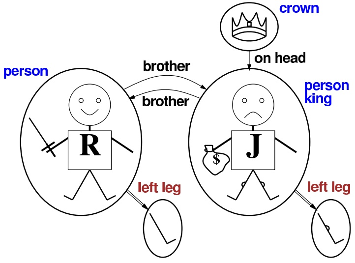

14:9

**Models for FOL: Lots!**

• Entailment in propositional logic can be computed by enumerating models

• We can also enumerate the FOL models for a given KB:

<!-- page: 203 -->

– For each number of domain elements n from 1 to ∞

– For each k-ary predicate $P _ { k }$ in the vocabulary

For each possible k-ary relation on n objects

For each constant symbol C in the vocabulary

For each choice of referent for C from n objects . . .

• Enumerating FOL models is very inefficient

14:10

## Example sentences

• “Brothers are siblings”

$$
\forall x, y \text {Brother} (x, y) \Rightarrow \text {Sibling} (x, y).
$$

• “Sibling” is symmetric

$$
\forall x, y \text {Sibling} (x, y) \Leftrightarrow \text {Sibling} (y, x).
$$

• “One’s mother is one’s female parent”

$$
\forall x, y \text {Mother} (x, y) \Leftrightarrow (\text {Female} (x) \land \text {Parent} (x, y)).
$$

• “A first cousin is a child of a parent’s sibling”

$$
\forall x, y \text {FirstCousin} (x, y) \Leftrightarrow \exists p, p s \text {Parent} (p, x) \land \text {Sibling} (p s, p) \land \text {Parent} (p s, y)
$$

14:11

## 14.2 FOL Inference

14:12

## Universal instantiation (UI)

• Whenever a KB contains a universally quantified sentence, we may add to the KB any instantiation of that sentence, where the logic variable v is replaced by a concrete ground term g:

$$
\frac {\forall v \alpha}{\text {SUBST} (\{v / g \} , \alpha)}
$$

E.g., ∀ x King(x) ∧ Greedy(x) ⇒ Evil(x) yields

<!-- page: 204 -->

## Existential instantiation (EI)

• Whenever a KB contains a existentially quantified sentence $\exists \quad v \quad \alpha ,$ we may add a single instantiation of that sentence to the KB, where the logic variable $v$ is replaced by a Skolem constant symbol $k$ which must not appear elsewhere in the knowledge base:

$$
\exists v \alpha
$$

$$
\overline {{\text {SUBST} (\{v / k \} , \alpha)}}
$$

E.g., ∃ x Crown(x) ∧ OnHead(x, John) yields

$$
C r o w n (C _ {1}) \land O n H e a d (C _ {1}, J o h n)
$$

provided $C _ { 1 }$ is a new constant symbol, called a Skolem constant

Another example: from $\exists   x   d ( x ^ { y } ) / d y   =   x ^ { y }$ we obtain

$$
d (e ^ {y}) / d y = e ^ {y}
$$

where $e$ is a new constant symbol

14:14

## Instantiations contd.

• UI can be applied several times to add new sentences; the new KB is logically equivalent to the old

• EI can be applied once to replace the existential sentence; the new KB is not equivalent to the old, but is satisfiable iff the old KB was satisfiable

14:15

## Reduction to propositional inference

• Instantiating all quantified sentences allows us to ground the KB, that is, to make the KB propositional

• Example: Suppose the KB contains just the following:

$$
\forall x \text {King} (x) \land \text {Greedy} (x) \Rightarrow \text {Evil} (x)
$$

King(John)

Greedy(John)

$$
B r o t h e r (R i c h a r d, J o h n)
$$

Instantiating the universal sentence in all possible ways, we have

$$
K i n g (J o h n) \land G r e e d y (J o h n) \Rightarrow E v i l (J o h n)
$$

$$
\text {King} (\text {Richard}) \land \text {Greedy} (\text {Richard}) \Rightarrow \text {Evil} (\text {Richard})
$$

King(John)

Greedy(John)

Brother(Richard, John)

The new KB is propositionalized: proposition symbols are King(John), Greedy(John), Evil(

<!-- page: 205 -->

## Theory on propositionalization

• Claim: A ground sentence is entailed by the propositionalized KB iff entailed by original FOL KB

(or “Every FOL KB can be propositionalized so as to preserve entailment”)

• Then, FOL inference can be done by: propositionalize KB and query, apply resolution, return result

• Problem: with function symbols, there are infinitely many ground terms, e.g., F ather(F ather(F ather(John)))

• Theorem: Herbrand (1930). If a sentence α is entailed by an FOL $\mathrm { K B } ,$ it is entailed by a finite subset of the propositional KB

• Idea: For $n = 0$ to ∞ do create a propositional KB by instantiating with depth-n terms see if α is entailed by this KB

• Problem: works if α is entailed, loops if α is not entailed

• Theorem: Turing (1936), Church (1936), entailment in FOL is semidecidable

14:17

## Inefficiency of naive propositionalization

• Propositionalization generates lots of irrelevant sentences. Example:

∀ x King(x) ∧ Greedy(x) ⇒ Evil(x)

King(John)

∀ y Greedy(y)

Brother(Richard, John)

propositionalization produces not only Greedy(John), but also Greedy(Richard) which is irrelevant for a query Evil(John)

• With p k-ary predicates and n constants, there are $p \cdot n ^ { k }$ instantiations With function symbols, it gets much much worse!

14:18

## Unification

• Instead of instantiating quantified sentences in all possible ways, we can compute specific substitutions “that make sense”. These are substitutions that unify abstract sentences so that rules (Horn clauses, GMP, see next slide) can be applied.

• In the previous example, the “Evil-rule” can be applied if we can find a substitution θ such that $K i n g ( x )$ and $G r e e d y ( x )$ match $K i n g ( J o h n )$ and $G r e e d y ( y )$ Namely, $\theta = \{ x / J o h n , y / J o h n \}$ is such a substitutions.

We write θ unifies(α, β) iff $\alpha \theta   =   \beta \theta$

<!-- page: 206 -->

## • Examples:

| p | q | θ |
| --- | --- | --- |
| Knows(John,x) | Knows(John,Jane) | {x/Jane} |
| Knows(John,x) | Knows(y,OJ) | {x/OJ,y/John} |
| Knows(John,x) | Knows(y,Mother(y)) | {y/John,x/Mother(John)} |
| Knows(John,x) | Knows(x,OJ) | fail |

Standardizing apart the names of logic variables eliminates the overlap of variables, $\mathbf { e . g . , } \: K n o w s ( z _ { 1 7 } , O J )$

14:19

## Generalized Modus Ponens (GMP)

• For every substitution θ such that $\forall _ { i } : \theta$ unifies $( p _ { i } ^ { \prime } , p _ { i } )$ we can apply:

$$
\frac {p _ {1} ^ {\prime} , p _ {2} ^ {\prime} , \dots , p _ {n} ^ {\prime} , (p _ {1} \wedge p _ {2} \wedge \dots \wedge p _ {n} \Rightarrow q)}{q \theta}
$$

Example:

$$
\begin{array}{l l} p _ {1} ^ {\prime} \text {is King(John)} & p _ {1} \text {is King(x)} \\ p _ {2} ^ {\prime} \text {is Greedy(y)} & p _ {2} \text {is Greedy(x)} \\ \theta \text {is} \{x / J o h n, y / J o h n \} & q \text {is Evil(x)} \\ q \theta \text {is Evil(John)} \end{array}
$$

• This GMP assumes a KB of definite clauses (exactly one positive literal) By default, all variables are assumed universally quantified.

14:20

## Forward chaining algorithm

```txt
function FOL-FC-ASK(KB, α) returns a substitution or false

repeat until new is empty
    new ← { }
    for each sentence r in KB do
        ( p1 ∧ ... ∧ pn ⇒ q) ← STANDARDIZE-APART(r)
        for each θ such that (p1 ∧ ... ∧ pn)θ = (p'1 ∧ ... ∧ pn')θ
            for some p'1, ..., pn' in KB
        q' ← SUBST(θ, q)
        if q' is not a renaming of a sentence already in KB or new then do
            add q' to new
            φ ← UNIFY(q', α)
            if φ is not fail then return φ
        add new to KB
return false
```

<!-- page: 207 -->

## Example: Crime

The law says that it is a crime for an American to sell weapons to hostile nations. The country Nono, an enemy of America, has some missiles, and all of its missiles were sold to it by Colonel West, who is American.

Prove that Col. West is a criminal.

14:22

## Example: Crime – formalization

• . . . it is a crime for an American to sell weapons to hostile nations:

American(x) ∧ W eapon(y) ∧ Sells(x, y, z) ∧ Hostile(z) ⇒ Criminal(x)

• Nono . . . has some missiles, i.e., ∃ x Owns(Nono, x) ∧ M issile(x):

Owns(Nono, M<sub>1</sub>) and M issile(M<sub>1</sub>)

• . . . all of its missiles were sold to it by Colonel West

• Missiles are weapons:

• An enemy of America counts as “hostile”:

• West, who is American . . .

• The country Nono, an enemy of America . . .

Enemy(Nono, America)

14:23

## Example: Crime – forward chaining proof

<!-- page: 208 -->

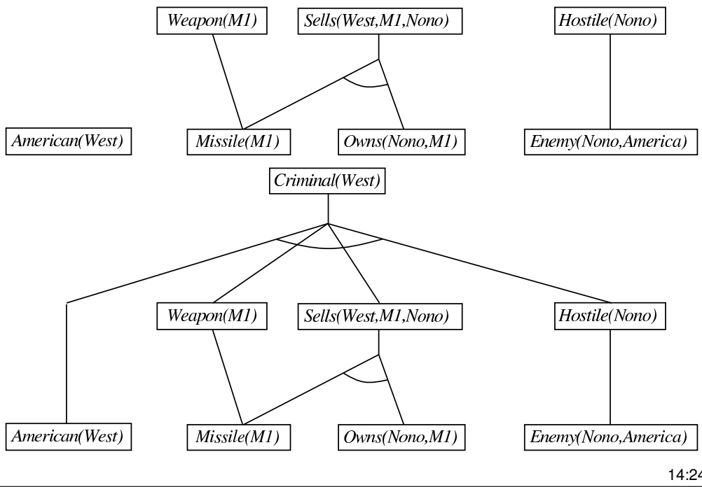

## Properties of forward chaining

• Sound and complete for first-order definite clauses (proof similar to propositional proof)

• Datalog = first-order definite clauses + no functions (e.g., crime KB). Forward chaining terminates for Datalog in poly iterations: at most $p \cdot n ^ { k }$ literals

• May not terminate in general if α is not entailed

This is unavoidable: entailment with definite clauses is semidecidable

• Efficiency:

– Simple observation: no need to match (=compute possible substitutions) a rule on iteration k if a premise wasn’t added on iteration k − 1 ⇒ match only rules whose premise contain a newly added literal

– Matching (computing substitutions) can be expensive:

– Database indexing allows O(1) retrieval of known facts, e.g., query M issile(x) retrieves M issile(M<sub>1</sub>)

– But matching conjunctive premises against known facts is NP-hard (is a CSP problem, see below)

<!-- page: 209 -->

```txt
- Consider the KB:
    Diff(wa, nt) ∧ Diff(wa, sa) ∧ Diff(nt, q) ∧ Diff(nt, sa) ∧
        Diff(q, nsw) ∧ Diff(q, sa) ∧ Diff(nsw, v) ∧ Diff(nsw, sa) ∧
        Diff(v, sa) ⇒ Colorable()
    Diff(Red, Blue),   Diff(Red, Green),   Diff(Green, Red)
    Diff(Green, Blue),   Diff(Blue, Red),   Diff(Blue, Green)
```

14:25

## Hard matching example: a CSP

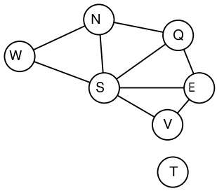

• Colorable() is inferred iff the CSP has a solution

CSPs include 3SAT as a special case, hence matching is NP-hard

14:26

## Backward chaining algorithm\*

```txt
function FOL-BC-ASK(KB,goals,θ) returns a set of substitutions
  inputs: KB, a knowledge base
    goals, a list of conjuncts forming a query (θ already applied)
    θ, the current substitution, initially the empty substitution { }
  local variables: answers, a set of substitutions, initially empty

  if goals is empty then return {θ}
    q' ← SUBST(θ, FIRST(goals))
    for each sentence r in KB
      where STANDARDIZE-APART(r) = ( p1 ∧ ... ∧ pn ⇒ q )
      and θ' ← UNIFY(q, q') succeeds
      new_goals ← [ p1, ..., pn | REST(goals)]
      answers ← FOL-BC-ASK(KB,new_goals, COMPOSE(θ',θ)) ∪ answers
  return answers
```

<!-- page: 210 -->

Criminal(West)

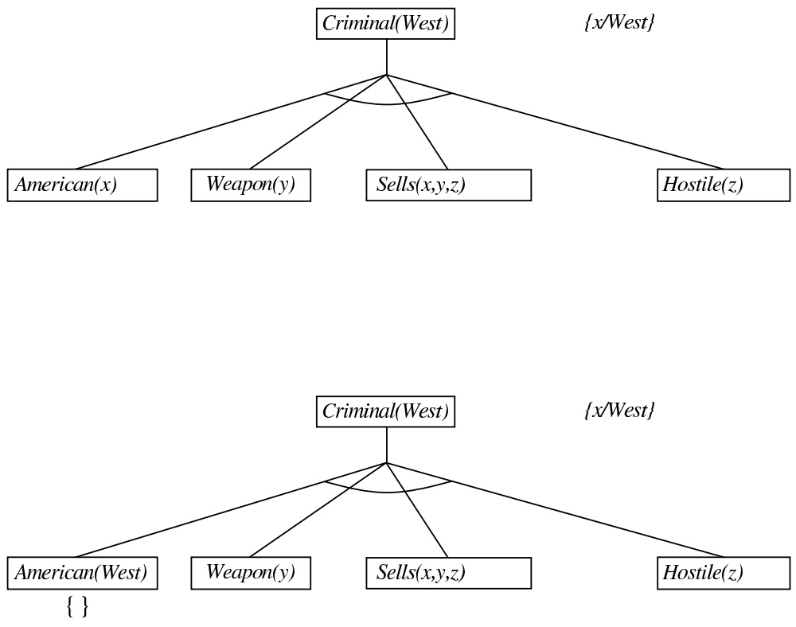

<!-- page: 211 -->

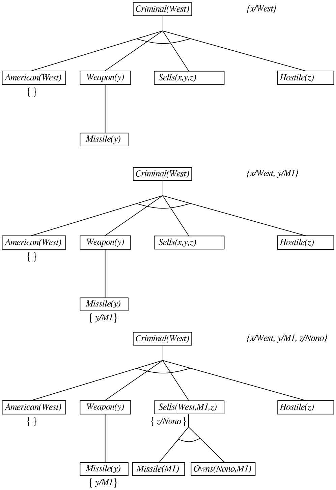

<!-- page: 212 -->

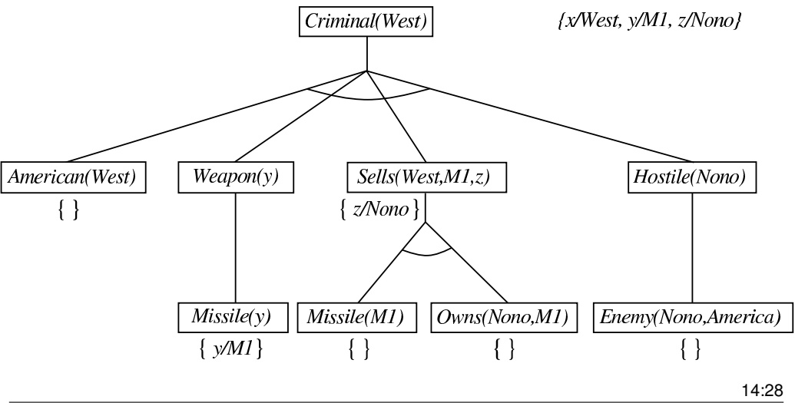

**Properties of backward chaining\***

• Depth-first recursive proof search: space is linear in size of proof

• Incomplete due to infinite loops

⇒ fix by checking current goal against every goal on stack

• Inefficient due to repeated subgoals (both success and failure)

⇒ fix using caching of previous results (extra space!)

• Widely used (without improvements!) for logic programming

## Example: Prolog\*

• Declarative vs. imperative programming:

|  | Logic programming | Ordinary programming |
| --- | --- | --- |
| 1. | Identify problem | Identify problem |
| 2. | Assemble information | Assemble information |
| 3. | Tea break | Figure out solution |
| 4. | Encode information in KB | Program solution |
| 5. | Encode problem instance as facts | Encode problem instance as data |
| 6. | Ask queries | Apply program to data |
| 7. | Find false facts | Debug procedural errors |

• Russell says “should be easier to debug Capital(NewY ork, US) than x := x + 2!”...

**Prolog systems\***• Basis: backward chaining with Horn clauses + bells & whistles Widely used in Europe, Japan (basis of 5th Generation project) Compilation techniques ⇒ approaching a billion LIPS

<!-- page: 213 -->

```prolog
- Program = set of clauses head :- literal₁, ... literalₙ.
    criminal(X) :- american(X), weapon(Y), sells(X,Y,Z), hostile(Z).
- Closed-world assumption ("negation as failure")
    e.g., given alive(X) :- not dead(X).
    alive(joe) succeeds if dead(joe) fails
- Details:
    - Efficient unification by open coding
    - Efficient retrieval of matching clauses by direct linking
    - Depth-first, left-to-right backward chaining
    - Built-in predicates for arithmetic etc., e.g., X is Y*Z+3
```

```prolog
Prolog examples*
  Depth-first search from a start state X:
    dfs(X) :- goal(X).
    dfs(X) :- successor(X,S),dfs(S).
    No need to loop over S: successor succeeds for each
  Appending two lists to produce a third:
    append([],Y,Y).
    append([X|L],Y,[X|Z]) :- append(L,Y,Z).

    query:   append(A,B,[1,2]) ?
    answers: A=[]      B=[1,2]
        A=[1]   B=[2]
        A=[1,2] B=[]
```

## Conversion to CNF

Everyone who loves all animals is loved by someone:

<div class="docvortex-algorithm" style="white-space: pre-wrap; font-family:monospace;">
$\forall x [\forall y Animal(y) \Rightarrow Loves(x,y)] \Rightarrow [\exists y Loves(y,x)]$
</div>

1. Eliminate biconditionals and implications

<div class="docvortex-algorithm" style="white-space: pre-wrap; font-family:monospace;">
$\forall x [\neg \forall y\neg Animal(y)\lor Loves(x,y)]\lor [\exists y Loves(y,x)]$
</div>

<div class="docvortex-algorithm" style="white-space: pre-wrap; font-family:monospace;">
2. Move  $\neg$  inwards:  $\neg\forall x, p \equiv \exists x \neg p, \neg\exists x, p \equiv \forall x \neg p;$
</div>

<div class="docvortex-algorithm" style="white-space: pre-wrap; font-family:monospace;">
$\forall x$ $[\exists y\neg (\neg Animal(y)\lor Loves(x,y))] \vee [\exists yLoves(y,x)]$
$\forall x$ $[\exists y\neg \neg Animal(y)\land \neg Loves(x,y)]\vee [\exists yLoves(y,x)]$
$\forall x$ $[\exists yAnimal(y)\land \neg Loves(x,y)]\vee [\exists yLoves(y,x)]$
</div>

<!-- page: 214 -->

**Conversion to CNF contd.**

3. Standardize variables: each quantifier should use a different one

$$
\forall x \left[ \exists y \text {Animal} (y) \land \neg \text {Loves} (x, y) \right] \lor \left[ \exists z \text {Loves} (z, x) \right]
$$

4. Skolemize: a more general form of existential instantiation. Each existential variable is replaced by a Skolem function of the enclosing universally quantified variables:

$$
\forall x [ \text {Animal} (F (x)) \land \neg \text {Loves} (x, F (x)) ] \lor \text {Loves} (G (x), x)
$$

5. Drop universal quantifiers:

$$
[ \text {Animal} (F (x)) \land \neg \text {Loves} (x, F (x)) ] \lor \text {Loves} (G (x), x)
$$

6. Distribute ∧ over ∨:

$$
[ \text {Animal} (F (x)) \vee \text {Loves} (G (x), x) ] \wedge [ \neg \text {Loves} (x, F (x)) \vee \text {Loves} (G (x), x) ]
$$

14:34

## Resolution: brief summary

• For any substitution θ unifies $( \ell _ { i } , \lnot m _ { j } )$ for some i and $j ,$ apply:

$$
\frac {\ell_ {1} \vee \cdots \vee \ell_ {k} , \qquad m _ {1} \vee \cdots \vee m _ {n}}{(\ell_ {1} \vee \cdots \vee \ell_ {i - 1} \vee \ell_ {i + 1} \vee \cdots \vee \ell_ {k} \vee m _ {1} \vee \cdots \vee m _ {j - 1} \vee m _ {j + 1} \vee \cdots \vee m _ {n}) \theta}
$$

Example:

$$
\frac {\neg \text {Rich} (x) \lor \text {Unhappy} (x), \quad \text {Rich} (\text {Ken})}{\text {Unhappy} (\text {Ken})}
$$

with $\theta = \{ x / K e n \}$

• Apply resolution steps to $CNF(KB \wedge \neg \alpha)$ ; complete for FOL

<!-- page: 215 -->

Example: crime – resolution proof

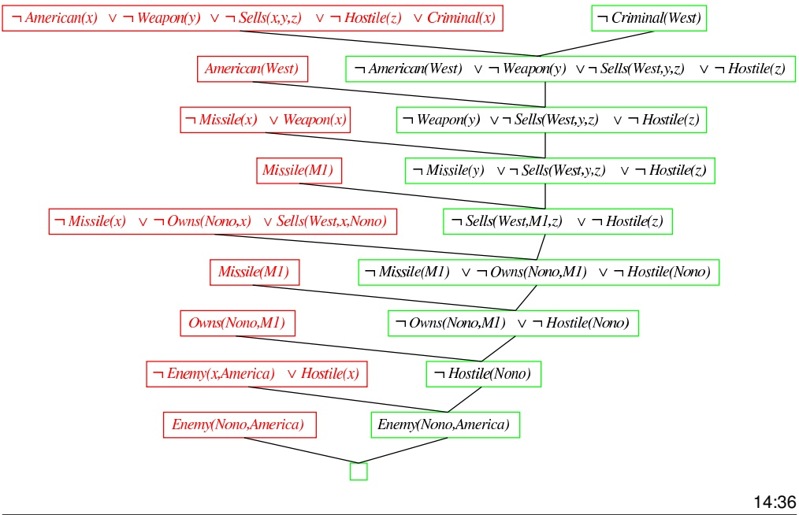

<!-- page: 216 -->

# 15 Relational Probabilistic Modelling and Learning\*\*

## Motivation & Outline

We’ve learned about FOL and the standard logic inference methods. As I mentioned earlier, I think that the motivation to learn about FOL is less the logic inference methods, but that the FOL formalism can be used to generalize AI methods (Markov-Decision Processes, Reinforcement Learing, Graphical Models, Machine Learning) to relational domains, that is, domains where the state or input is described in terms of properties and relations of objects.

As a side note: in the mentioned areas researchers often use the word relational to indicate that a model uses FOL representations.

These generalizations are the topic of this lecture. We first consider MDPs and describe STRIPS rules as a relational way to model state transitions for deterministic worlds; then their probabilistic extension called NDRs and how to learn them from data. A core message here is that allowing for probabilities in transition is a crucial pre-requisite to make them learnable—because anything that is learnt from limited data is necessarily also uncertain.

We then decribe briefly relational extensions of graphical models, namely Markov Logic Networks (=relational factor graphs), which allow us to formulate probabilistic models over relational domains, e.g., over data bases, and use probabilistic inference methods to draw conclusions.

If time permits, we also mention relational regression trees as a relational extension of standard Machine Learning regression.

For brevity we skip the classical AI discussion of the situation calculus and frame problem—please see the AIMA book if you’re interested.

## 15.1 STRIPS-like rules to model MDP transitions

15:1

**Markov Decision Process**

• Let’s recall standard MDPs

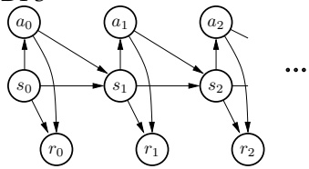

• Assume the state s is a sentence (or KB) in a FOL. How could we represent transition probabilities $P ( s ^ { \prime }   |   s , a )$ , rewards $R ( s , a )$ , and a policy $\pi ( s ) \bar { ? } \bar { ? }$ In general that would be very hard!

<!-- page: 217 -->

• We make the simpler assumption that the state s is a conjuction of grounded literals, that is, facts without logic variables, for instance:

<div class="docvortex-algorithm" style="white-space: pre-wrap; font-family:monospace;">
- Constants: $C_1, C_2, P_1, P_2, SFO, JFK$
- Predicates: $At(.,.), Cargo(.), Plane(.), Airport(.)$
- A state description:
    $At(C_1, SFO) \land At(C_2, JFK) \land At(P_1, SFO) \land At(P_2, JFK) \land Cargo(C_1) \land Cargo(C_2) \land Plane(P_1) \land Plane(P_2) \land Airport(JFK) \land Airport(SFO)$
</div>

## STRIPS rules and PDDL

• STRIPS rules (Stanford Research Institute Problem Solver) are a simple way to describe deterministic transition models. The Planning Domain Definition Language (PDDL) standardizes STRIPS

<div class="docvortex-algorithm" style="white-space: pre-wrap; font-family:monospace;">
$Init(At(C_1, SFO) \land At(C_2, JFK) \land At(P_1, SFO) \land At(P_2, JFK)$
    $\land Cargo(C_1) \land Cargo(C_2) \land Plane(P_1) \land Plane(P_2)$
    $\land Airport(JFK) \land Airport(SFO))$
$Goal(At(C_1, JFK) \land At(C_2, SFO))$
$Action(Load(c, p, a),$
    PRECOND: $At(c, a) \land At(p, a) \land Cargo(c) \land Plane(p) \land Airport(a)$
    EFFECT: $\neg At(c, a) \land In(c, p))$
$Action(Unload(c, p, a),$
    PRECOND: $In(c, p) \land At(p, a) \land Cargo(c) \land Plane(p) \land Airport(a)$
    EFFECT: $At(c, a) \land \neg In(c, p))$
$Action(Fly(p, from, to),$
    PRECOND: $At(p, from) \land Plane(p) \land Airport(from) \land Airport(to)$
    EFFECT: $\neg At(p, from) \land At(p, to))$
</div>

Figure 10.1 A PDDL description of an air cargo transportation planning problem.

15:3

## PDDL (or STRIPS)

• The precondition specifies if an action predicate is applicable in a given situation

• The effect determines the changed facts

• Frame assumption: All facts not mentioned in the effect remain unchanged.

• The majority of state-of-the-art AI planners use this format. E.g., FFplan: (B. Nebel, Freiburg) a forward chaining heuristic state space planner

<!-- page: 218 -->

## Another PDDL example

```txt
Init(On(A, Table) ∧ On(B, Table) ∧ On(C, A)
    ∧ Block(A) ∧ Block(B) ∧ Block(C) ∧ Clear(B) ∧ Clear(C))
Goal(On(A, B) ∧ On(B, C))
Action(Move(b, x, y),
    PRECOND: On(b, x) ∧ Clear(b) ∧ Clear(y) ∧ Block(b) ∧ Block(y) ∧
        (b ≠ x) ∧ (b ≠ y) ∧ (x ≠ y),
    EFFECT: On(b, y) ∧ Clear(x) ∧ ¬On(b, x) ∧ ¬Clear(y))
Action(MoveToTable(b, x),
    PRECOND: On(b, x) ∧ Clear(b) ∧ Block(b) ∧ (b ≠ x),
    EFFECT: On(b, Table) ∧ Clear(x) ∧ ¬On(b, x))
```

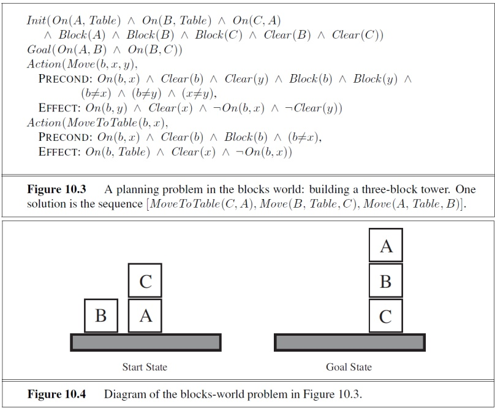

## Decision Making with STRIPS

• A general approach to planning is to query the KB for a plan that fulfills a goal condition; whether this is efficient is debated.

• The standard approach is fwd search:

– We build a standard decision tree; every node corresponds to a situation

– When expanding a node we need to compute all feasible actions. This implies to compute all feasible substitutions of all action preconditions → **matching problem**.

– This can in principle allow also for rewards and costs; if we have a heuristic we could use $A ^ { * }$

15:6

• STRIPS are nice, intuitive, concise, easy to plan with, and work very well in deterministic domains. But they can’t really be learned. Even in a deterministc world it is very awkward and hard to try to extract deterministic rules from only limited data.

$$
D = \left\{\right.
$$

<!-- page: 219 -->

```python
grab(c) : box(a) box(b) ball(c) table(d) on(a,b) on(b,d) on(c,d) inhand(nil)
        ...
        → box(a) box(b) ball(c) table(d) on(a,b) on(b,d) ¬on(c,d) inhand(c)
        ...
puton(a) : box(a) box(b) ball(c) table(d) on(a,b) on(b,d) ¬on(c,d) inhand(c)
        ...
        → box(a) box(b) ball(c) table(d) on(a,b) on(b,d) on(c,a) inhand(nil)
        ...
puton(b) : box(a) box(b) ball(c) table(d) on(a,b) on(b,d) on(c,a) inhand(nil)
        ...
        → box(a) box(b) ball(c) table(d) on(a,b) on(b,d) on(c,a) inhand(nil)
        ...
grab(b) : box(a) box(b) ball(c) table(d) on(a,b) on(b,d) on(c,a) inhand(nil)
        ...
        → box(a) box(b) ball(c) table(d) on(a,d) ¬on(b,d) on(c,d) inhand(b)
        ...
    :
}
• How can we learn a predictive model P(s'|a,s) for this data?
With n = 20 objects, state space is > 2^n^2 ≈ 10^{120}
```

15:8

## Learning probabilistic rules

Pasula, Zettlemoyer & Kaelbling: Learning probabilistic relational planning rules (ICAPS 2004)

• **Compress** this data into probabilistic relational rules:

$$
\begin{array}{l l}\text {grab} (X):&\text {on} (X, Y), \text {ball} (X), \text {cube} (Y), \text {table} (Z)\\&\rightarrow \quad \left\{\begin{array}{c c c}0. 7&:&\text {inhand} (X), \neg \text {on} (X, Y)\\0. 2&:&\text {on} (X, Z), \neg \text {on} (X, Y)\\0. 1&:&\text {noise}\end{array}\right.\end{array}
$$

Find a rule set that maximizes **(likelihood - description length)**

• These rules define a probabilistic transition probability $P ( s ^ { \prime } | s , a )$

Namely, if (s, a) has a unique covering rule r, then

$$
P (s ^ {\prime} | s, a) = P (s ^ {\prime} | s, r) = \sum_ {i = 0} ^ {m _ {r}} p _ {r, i} P (s ^ {\prime} | \Omega_ {r, i}, s)
$$

where $\begin{array} { r } { P ( s ^ { \prime } | \Omega _ { r , i } , s ) } \end{array}$ describes the deterministic state transition of the ith outcome.

<!-- page: 220 -->

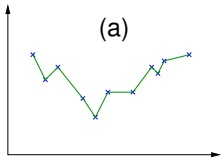

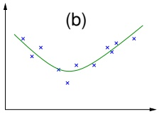

⇒ uncertainty ↔ regularization ↔ compression & abstraction

• Introducing uncertainty in the rules not only allows us to model stochastic worlds, it enables to compress/regularize and thereby learn strongly generalizing models!

uncertainty enables learning!

15:10

## Planning with learned probabilistic rules\*

• Tree search (SST & UCT) does not scale with # objects

• We can **propositionalize** the learned knowledge into a **Dynamic Bayesian Network (DBN)**: For every domain D they define a grounded DBN

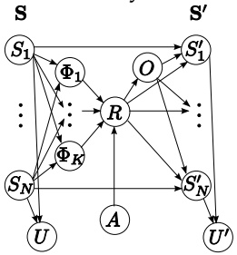

(Lang & Toussaint, JAIR 2010)

• Planning (estimating the likelihood of action sequences) can efficiently be done using probabilitic inference methods in this DBN

15:11

switch slides: 12/talk-Stanford ./talk-MIT

15:12

## 15.2 Relational Graphical Models

15:13

<!-- page: 221 -->

# • Probabilistic relational modelling has been an important development in modern AI. It fuses:

Structured first-order (logic) representations (↔ strong generalization) +

Probabilistic/statistical modelling, inference & learning

• I use the term “Probabilistic relational modelling” for all formalisms of that kind, including Markov Logic Networks, Bayesian Logic Programs, Probabilistic Relational Models, Relational Markov Networks, Relational Probability Trees, Stochastic Logic Programming, ... BLOG

15:14

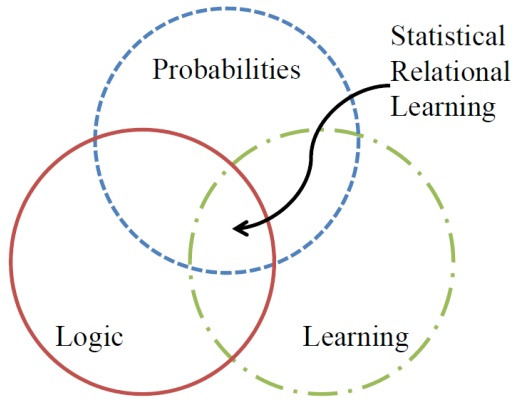

(from De Readt & Kersting)

15:15

## Intro

• A popular science article: I, algorithm: A new dawn for artificial intelligence (Anil Ananthaswamy, NewScientist, January 2011)

Talks of “probabilistic programming, which combines the logical underpinnings of the old AI with the power of statistics and probability.” Cites Stuart Russel as “It’s a natural unification of two of the most powerful theories that have been developed to understand the world and reason about it.” and Josh Tenenbaum as “It’s definitely spring”.

15:16

## Intro

• I think: probabilistic relational modelling does not suddenly solve all problems, but is important because:

<!-- page: 222 -->

```batch
(or http://www.cs.purdue.edu/probdb/updb06/UPDB-PRM-09-22-06.ppt
```

– One of the great deficits of classical AI is the inefficiency of learning (constructing deterministic knowledge bases from data) – statistical relational approaches do this the right way

– The world is structured in terms of objects and their properties and relations – firstorder representations offer a formalization of this structure; we need to such formalizations for strong generalization

– In my view: currently the only way to express & learn uncertain & generalizing knowledge about environments with objects, properties & relations

15:17

## References

• Pedro Domingos: CIKM-2013 tutorial on Statistical Relational Learning

```txt
http://homes.cs.washington.edu/~pedrod/cikm13.html
```

• Lise Getoor: ECML/PKDD 2007 tutorial on SRL

• Survey paper by Luc De Raedt and Kristian Kersting:

```txt
https://lirias.kuleuven.be/bitstream/123456789/301404/1/pilp.pdf
```

15:18

## Probabilistic Relational Modelling

• In general, probabilistic relational approaches

– make predictions based only on the properties/relations of objects, not their identity

– generalize data seen in one world (with objects A, B, C, ...)

to another world (with objects D, E, ..)

– thereby imply a very strong type of generalization/prior which allows to efficiently learn in the exponentially large space

• Formally, they are frameworks that define a

probability distribution P(X; D) or discriminative

function F(X; D) over dom(X; D), for any domain D

where X are the random variables that exist for a given domain D (a given set of objects/constants) [[Inconsistent with previous use of word ’domain’]]

(Note, this is a “transdimensional” distribution/discriminative function)

15:19

<!-- page: 223 -->

• Consider a relational data base


## PRM

• We think of the table attributes as random variables that depend on each other

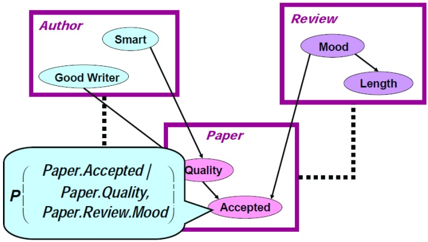

$P ( A | Q , M )$ is a conditional probability table, which should be independent of the particular identity (primary key) of the paper and reviewer—A should only depend on the values of Q and M

15:21

## PRM

• In a particular domain D = {A1, A2, P1, P2, P3, R1, R2, R3}, the PRM defines a probability distribution over the instantiations of all attributes (grounded predicates)

<!-- page: 224 -->

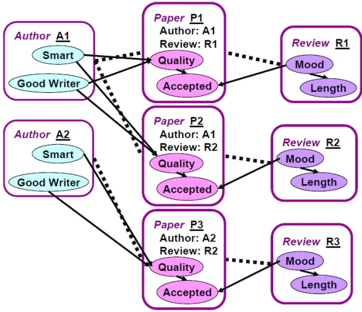

15:22

## PRM

• Learning PRMs amounts to learning all conditional probability tables from a relational data base

• Inference with PRMs means to construct the big grounded Bayesian Network – Each grounded predicate → random variable

• PRMs are nice because they draw clear connections to relational databases. But there is a easier/cleaner formulation of such types of models: Markov Logic Networks (MLN).

15:23

## Markov Logic Networks (MLN)

15:24

## MLN example: Friends & Smokers

• Consider three **weighted** Horn clauses

$$
w _ {1} = 1. 5, F _ {1}: \text {cancer} (x) \leftarrow \text {smoking} (x)
$$

$$
w _ {2} = 1. 1, F _ {2}: \text {smoking} (x) \leftarrow \text {friends} (x, y) \land \text {smoking} (y)
$$

$w _ { 3 } = 1 . 1 , F _ { 3 }$ : smoking(y) ← friends(X, Y ) ∧ smoking(x)

• Consider the domain $\mathcal { D } = \{ A n n a , B o b \}$

• Set of random variables (grounded predicates) becomes:

<!-- page: 225 -->

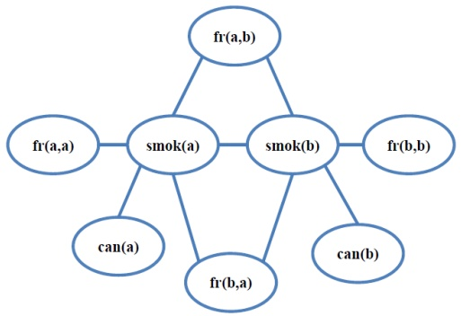

15:25

## MLN

• The MLN is defined by a set $\{ ( F _ { i } , w _ { i } ) \}$ of pairs where

$F _ { i }$ is a formula in first-order logic

$w _ { i } \in \mathbb { R }$ is a weight

• For a domain D this generates a factor graph with

– one random variable for each grounded predicate

– one factor for each grounding of each formula

$$
F (X, \mathcal {D}) \propto \exp \{\sum_ {i} \sum_ {\text {true groundings of} F _ {i} \text {in} X} w _ {i} \}
$$

• MLNs can be viewed as a **factor graph template**

– For every domain D a grounded factor graph $F ( X ; { \mathcal { D } } )$ is defined

– The ground factor graph has many shared parameters → learning the weights implies strong generalization across objects

15:26

## Generality of MLNs

• Special (non-relational) cases: (Limit of all predicates zero-arity)

– Markov networks

– Markov random fields

– Bayesian networks

– Log-linear models

– Exponential models

– Max. entropy models

– Gibbs distributions

– Boltzmann machines

– Logistic regression

<!-- page: 226 -->

– Hidden Markov models

– Conditional random fields

• Limit infinite weights → first-order logic

15:27

## MLN

• Inference in MLN: Create the grounded factor graph

• Learning: Gradient descent on the likelihood (often hard, even with full data)

• The learned factor graph F(X; D) can also define a discriminative function:

– Relational logistic regression

– Relational Conditional Random Fields

(See also Discriminative probabilistic models for relational data, Taskar, Abbeel & Koller; UAI 2002.)

15:28

slides: /git/3rdHand/documents/USTT/17-reviewMeeting3/slides.pdf

15:29

## Conclusions

• What all approaches have in common:

– A “syntax” for a **template** that, for every domain D, defines a grounded factor graph, Bayes Net, or DBN

– The grounding implies parameter sharing and strong generalization, e.g. over object identities

– Inference, learning & planning often operate on the grounded model

• Using probabilistic modelling, inference and learning on top of first-order representations

15:30

## The role of uncertainty in AI

• What is the benefit of the probabilities in these approaches?

– Obviously: If the world is stochastic, we’d like to represent this

– But, at least as important:

Uncertainty **enables to compress/regularize and thereby learn strongly generalizing models**

<!-- page: 227 -->

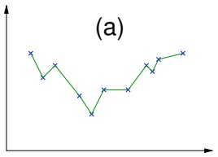

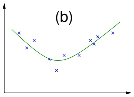

uncertainty ↔ regularization ↔ compression & abstraction

• The core problem with deterministic AI is learning deterministic models

<!-- page: 228 -->

## 16 Exercises

## 16.1 Exercise 1

## 16.1.1 Programmieraufgabe: Tree Search

(The deadline for handing in your solution is Monday 2pm in the week of the tutorials)

In the repository you will find the directory e01\_graphsearch with a couple of files. First there is ex\_graphsearch.py with the boilerplate code for the exercise. The comments in the code define what each function is supposed to do. Implement each function and you are done with the exercise.

The second file you will find is tests.py. It consists of tests that check whether your functions do what they should. You don’t have to care about this file, but you can have a look in it to understand the exercise better.

The next file is data.py. It consists of a very small graph and the S-Bahn net of Stuttgart as graph structure. It will be used by the test. If you like you can play around with the data in it.

The last file is run\_tests.sh. It runs the tests, so that you can use the test to check whether you are doing right. Note that our test suite will be different from the one we hand to you. So just mocking each function with the desired output without actually computing it will not work. You can run the tests by executing:

```shell
\$ sh run_tests.sh
```

If you are done implementing the exercise simply commit your implementation and push it to our server.

```txt
$ git add ex_graphsearch.py
$ git commit
$ git push
```

**Task:** Implement breadth-first search, uniform-cost search, limited-depth search, iterative deepening search and A-star as described in the lecture. All methods get as an input a graph, a start state, and a list of goal states. Your methods should return two things: the path from start to goal, and the fringe at the moment when the goal state is found (that latter allows us to check correctness of the implementation). The first return value should be the found Node (which has the path implicitly included through the parent links) and a Queue (one of the following: Queue, LifoQueue, PriorityQueue and NodePriorityQueue) object holding the fringe. You also have to fill in the priority computation at the put() method of the NodePriorityQueue.

Iterative Deepening and Depth-limited search are a bit different in that they do not explicitly have a fringe. You don’t have to return a fringe in those cases, of course. Depth-limited search additionally gets a depth limit as input. A-star gets a heuristic

<!-- page: 229 -->

function as input, which you can call like this:

```python
def a_star_search(graph, start, goal, heuristic):
    # ...
    h = heuristic(node.state, goal)
    # ...
```

## Tips:

– For those used to IDEs like Visual Studio or Eclipse: Install PyCharm (Community Edition). Start it in the git directory. Perhaps set the Keymap to ’Visual Studio’ (which sets exactly the same keys for running and stepping in the debugger). That’s helping a lot.

– Use the data structure Node that is provided. It has exactly the attributes mentioned on slide 26.

– Maybe you don’t have to implement the ’Tree-Search’ and ’Expand’ methods separately; you might want to put them in one little routine.

## 16.1.2 Votieraufgabe: A∗-Suche

Betrachten Sie die Rumanien-Karte aus der Vorlesung: ¨

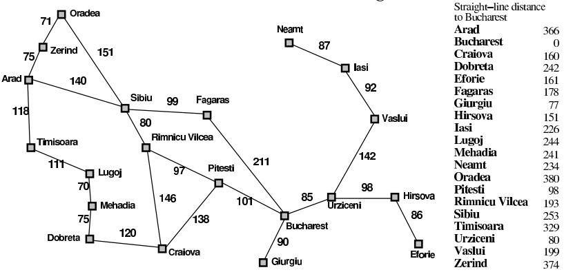

• Verfolgen Sie den Weg von Lugoj nach Bukarest mittels einer A∗-Suche und verwenden Sie die Luftlinien-Distanz als Heuristik. Geben Sie fur jeden Schritt ¨ den momentanen Stand der fringe (Rand) an. Nutzen Sie folgende Notation fur die fringe: ¨ $\langle ( A   :   0   +   3 6 \dot { 6 }   =   \dot { 3 } 6 6 ) ( Z   :   7 5   +   3 7 4   =   4 4 9 ) \rangle$ (d.h. (Zustand : $\left| g + h = f \right) )$

• Geben Sie den mittels der A∗-Suche gefundenen kurzesten Weg an. ¨

## 16.1.3 Votieraufgabe: Beispiel f ür Tiefensuche

Betrachten Sie den Zustandsraum, in dem der Startzustand mit der Nummer 1 bezeichnet wird und die Nachfolgerfunktion fur Zustand ¨ n die Zustande mit den ¨

<!-- page: 230 -->

Nummern 4n − 2, 4n − 1, 4n und 4n + 1 zuruck gibt. Nehmen Sie an, dass die ¨ hier gegebene Reihenfolge auch genau die Reihenfolge ist, in der die Nachbarn in expand durchlaufen werden und in die LIFO fringe eingetragen werden.

• Zeichnen Sie den Teil des Zustandsraums, der die Zustande 1 bis 21 umfasst. ¨

• Geben Sie die Besuchsreihenfolge (Besuch=[ein Knoten wird aus der fringe genommen, goal-check, und expandiert]) fur eine ¨ beschränkte Tiefensuche mit Grenze 2 und fur eine ¨ iterative Tiefensuche, jeweils mit Zielknoten 4, an. Geben Sie nach jedem Besuch eines Knotens den dann aktuellen Inhalt der fringe an. Die initiale fringe ist h1i. Nutzen Sie fur jeden Besuch in etwa die Notation: ¨ besuchter Zustand: hfringe nach dem Besuchi

• Fuhrt ein endlicher Zustandsraum immer zu einem endlichen Suchbaum? ¨ Begrunden Sie Ihre Antwort. ¨

## 16.2 Exercise 2

## 16.2.1 Programmieraufgabe: Schach

Implementieren Sie ein Schach spielendes Programm. Der grundlegende Python code ist dafur in Ihren Repositories. Wir haben auch bereits die Grundstruktur ¨ eines UCT Algorithmus implementiert, so dass Sie nur die einzelnen Funktionen implementieren mussen. Die Implementierung von m ¨ oglichen Erweiterungen steht ¨ Ihnen frei.

**Evaluations-Funktion statt Random Rollouts:** Letztes Jahr stellte sich heraus, dass der Erfolg naiver UCT Algorithmen bescheiden ist. Um die Baumsuche deutlich zu vereinfachen kann man die Evaluations-Funktion nutzen, um neue Blatter des Baums zu evaluieren (und den backup zu machen), statt eines ¨ random rollouts. Aber: Die Evaluations-Funktion ist deterministisch, und konnte die Suche fehlleiten. Als n ¨ achsten Schritt kann man deshalb sehr ¨ kurze random rollouts nehmen, die schon nach wenigen Schritten enden und mit der Evaluations-Funktion bewertet werden.

**Ziel:** Wir ’be-punkten’ diese Aufgabe automatisiert indem wir den Schach-Agenten 10 mal gegen einen Random-Spieler antreten lassen. Ziel ist es nach Punkten zu gewinnern. (Sieg - 1 Punkt, Unentschieden - 0.5 Punkte, Niederlage - 0 Punkte).

**Turnier:** Außerdem planen wir alle Schach-Agenten in einem Turnier gegeneinander antreten zu lassen. Das Gewinnerteam darf sich uber eine kleine Beloh- ¨ nung freuen!

<!-- page: 231 -->

## Ihr Algorithmus soll auf folgendes Interface zugreifen:

```python
class ChessPlayer(object):
    def __init__(self, board, player):
        # The game board is the board at the beginning, player is
        # either chess.WHITE or chess.BLACK.
        pass

    def inform_move(self, move):
        # after each move (also your own) this function is called to info
        # the player of the move played (which can be a different one that
        # chose, if you chose a illegal one.
        pass

    def get_next_move(self):
        # yields the move that you want to play next.
        pass
```

Sie konnen Ihre Implementierung testen mit ¨

```powershell
$ python2 interface.py --human --white --secs 2
um als Mensch gegen Ihren Spieler zu spielen. Oder mit
$ python2 interface.py --random --white --secs 2
um einen zufällig spielenden Spieler gegen ihr Programm antreten zu lassen.
```

## 16.2.2 Votieraufgabe: Bayes

a) Box 1 contains 8 apples and 4 oranges. Box 2 contains 10 apples and 2 oranges. Boxes are chosen with equal probability. What is the probability of choosing an apple? If an apple is chosen, what is the probability that it came from box 1?

b) The blue M&M was introduced in 1995. Before then, the color mix in a bag of plain M&Ms was: 30% Brown, 20% Yellow, 20% Red, 10% Green, 10% Orange, 10% Tan. Afterward it was: 24% Blue , 20% Green, 16% Orange, 14% Yellow, 13% Red, 13% Brown.

A friend of mine has two bags of M&Ms, and he tells me that one is from 1994 and one from 1996. He won’t tell me which is which, but he gives me one M&M from each bag. One is yellow and one is green. What is the probability that the yellow M&M came from the 1994 bag?

c) The Monty Hall Problem: I have three boxes. In one I put a prize, and two are empty. I then mix up the boxes. You want to pick the box with the prize in it. You

<!-- page: 232 -->

choose one box. I then open another one of the two remaining boxes and show that it is empty. I then give you the chance to change your choice of boxes—should you do so? Please give a rigorous argument using Bayes.

d) Given a joint probability $P ( X , Y )$ <u>over 2 binary r</u>andom variables as the table

|  | Y=0 | Y=1 |
| --- | --- | --- |
| X=0 | .06 | .24 |
| X=1 | .14 | .56 |

What are $P ( X )$ and P(Y )? Are X and Y independent?

## 16.2.3 Pr äsenzaufgabe: Bandits

Assume you have 3 bandits. You have already tested them a few times and received returns

• From bandit 1: 8 7 12 13 11 9

• From bandit 2: 8 12

• From bandit 3: 5 13

For the returns of each bandit separately, compute a) the mean return, the b) standard deviation of returns, and c) standard deviation of the mean estimator.

Which bandid would you choose next? (Distinguish cases: a) if you know this is the last chance to pull a bandit; b) if you will have many more trials thereafter.)

## 16.3 Exercise 3

## 16.3.1 Votieraufgabe: Value Iteration

(Teilaufgaben werden separat votiert.)

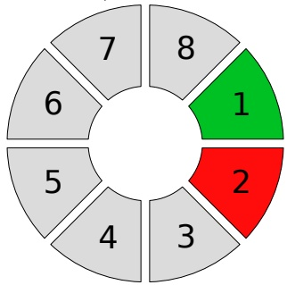

<!-- page: 233 -->

Consider the circle of states above, which depicts the 8 states of an MDP. The green state (#1) receives a reward of $r = 4 0 9 6$ and is a ’tunnel’ state (see below), the red state (#2) is punished with $r = - 5 1 2$ . Consider a discounting of $\gamma = 1 / 2$

Description of $P ( s ^ { \prime } | s , a )$

• The agent can choose between two actions: going one step clock-wise or one step counter-clock-wise.

• With probability $3 / 4$ the agent will transition to the desired state, with probability $1 / 4$ to the state in opposite direction.

• Exception: When $s = 1$ (the green state) the next state will be $s ^ { \prime } = 4 ,$ , independent of a. The Markov Decision Process never ends.

Description of $R ( s , a )$

• The agent receives a reward of r = 4096 when $s = 1$ (the green state).

• The agent receives a reward of $r = - 5 1 2 \; \mathrm { w h e n } \; s = 2$ (the red state).

• The agent receives zero reward otherwise.

1. Perform three steps of Value Iteration: Initialize $V _ { k = 0 } ( s ) = 0 ,$ , what is $V _ { k = 1 } ( s )$ $V _ { k = 2 } ( s ) ,   V _ { k = 3 } ( s ) ?$

2. How can you compute the value function $V ^ { \pi } ( s )$ of a GIVEN policy (e.g., always walk clock-wise) in closed form? Provide an explicit matrix equation.

3. Assume you are given $V ^ { * } ( s )$ . How can you compute the optimal $Q ^ { * } ( s , a )$ form this? And assume $Q ^ { * } ( s , a )$ is given, how can you compute the optimal $V ^ { * } ( s )$ from this? Provide general equations.

4. What is $Q _ { k = 3 } ( s , a )$ for the example above? What is the “optimal” policy given $Q _ { k = 3 } ?$

## 16.3.2 Programmieraufgabe: Value Iteration

In the repository you find python code to load the probability table $P ( s ^ { \prime } | a , s )$ and the reward function $R ( a , s )$ for the maze of Exercise 1. In addition, the MDP is defined by $\gamma = 0 . 5$

(a) Implement Value Iteration to reproduce the results of Exercise 1(a). Tip: An easy way to implement this is to iterate the two equations:

$$
Q (s, a) \leftarrow R (s, a) + \gamma \sum_ {s ^ {\prime}} P (s ^ {\prime} | s, a) V (s ^ {\prime})\tag{20}
$$

$$
V (s) \leftarrow \max _ {a} Q (s, a)\tag{21}
$$

<!-- page: 234 -->

Compare with the value functions $V _ { k = 1 } \big ( s \big ) , \; V _ { k = 2 } \big ( s \big ) , \; V _ { k = 3 } \big ( s \big )$ computed by hand. Also compute the $V _ { k = 1 0 0 } \approx V ^ { * }$

(b) Implement Q-Iteration for exactly the same setting. Check that $\begin{array} { r } { V ( s ) = \operatorname* { m a x } _ { a } Q ( s , a ) } \end{array}$ converges to the same optimal value.

WARNING: The test you have in your repository only tests for the specific world of Exercise 1. However, our evaluation will test your method also for other MDPs with other states, actions, rewards, and transitions! Implement general methods.

## 16.3.3 Pr äsenzaufgabe: The Tiger Problem

Assume that the tiger is truly behind the left door. Consider an agent that always chooses to listen.

a) Compute the belief state after each iteration.

b) In each iteration, estimate the expected reward of open-left/open-right based only on the current belief state.

c) When should the agent stop listening and open a door for a discount factor of $\gamma = 1 ?$ (How would this change if there were zero costs for listening?)

## 16.4 Exercise 4

## 16.4.1 Programmieaufgabe: Sarsa vs Q-Learning (vs your Agent)

Consider the following Cliff Walking problem.

In your git repo you find an implementation of the Cliff Walking environment. This is a standard undiscounted $( \gamma = 1 )$ , episodic task, with start (S) and goal (G) states, and the actions up, down, left, right causing deterministic movement. The reward is -1 for all transitions except into the region marked The Cliff. Stepping into this region incurs a reward of -100 and sends the agent instantly back to the start. An episode ends when reaching the goal state and NOT when falling down the cliff.

Recall: See slide 06:12 for pseudo code of Q-Learning; it updates the Q-function using

$$
Q (s, a) \leftarrow Q (s, a) + \alpha \left[ r + \gamma \max _ {a ^ {\prime}} Q _ {\mathrm{old}} (s ^ {\prime}, a ^ {\prime}) - Q _ {\mathrm{old}} (s, a) \right]
$$

. SARSA is exactly the same algorithm, except that it updates the Q-function with

$$
Q (s, a) \leftarrow Q (s, a) + \alpha \left[ r + \gamma Q _ {\mathrm{old}} (s ^ {\prime}, a ^ {\prime}) - Q _ {\mathrm{old}} (s, a) \right]
$$

To implement this SARSA update, you need to sample the next action $a ^ { \prime }$ before updating the Q-function.

Exercises:

<!-- page: 235 -->

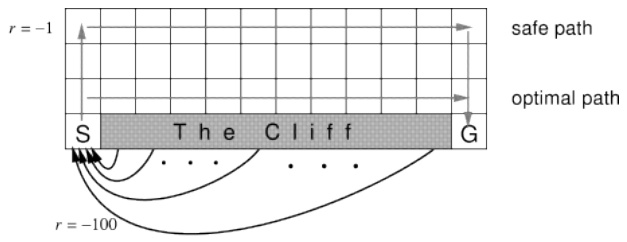

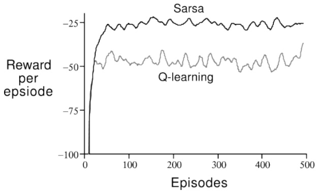

Figure 1: Cliffwalk environment and reference plot (smoothed)

1. Implement the SARSA and Q-learning methods using the -greedy action selection strategy with a fixed $\epsilon = 0 . 1$ . Choose a small learning rate $\alpha   =   0 . 1$ Compare the resulting policies when greedily selecting actions based on the learned Q-tables.

To compare the agents’ online performance run them for at least 500 episodes and log the reward per episode in a numpy array. Plot your logged data with episodes as x-axis and reward per episode as y-axis. Export the logged reward array for Q-Leaning and Sarsa to R ql.csv and R sa.csv respectively. See below on how to plot using python.

2. Propose a schedule that gradually reduces , starting from $\epsilon = 1$ . Then redo question 1 using your schedule for  instead of the fixed value. Again plot the learning graph and export your logged rewards per episode to R ql sched.csv and R sa sched.csv respectively.

3. In the lectures we introduced Rmax, which is a model-based approach. Here we consider a simplified model-free Rmax-variant working with Q-Learning: Implement standard Q-learning using greedy action selection but a modified reward function. The modified reward function assigns $r _ { m a x } = 0$ to unknown states $( \# ( s , a ) \: < \: 1 0 0 )$ and the original reward for known states. Plot and export your rewards per episode to R rmax.csv.

<!-- page: 236 -->

**Be sure to upload your code and all your csv files containing the rewards per episode. The evaluation is based on these files.**

**For each exercise get an understanding for the agent’s online behavior and their learned policies. Be ready to explain in class!**

The following example shows how to plot and export data contained in a numpy array. This is all you need to create the plots and generate the csv files for the above exercises.

```python
import numpy as np
import matplotlib.pyplot as plt

Y = np.array([5, 8, 1, 4])

# Export to CSV
np.savetxt(Y, 'Y.csv')

# Plot and display
plt.plot(Y)
plt.show()
```

Note: The graph may be very spiky so it might be a good idea to smooth your plot before comparing it with the graph given above, e.g. by using the simple box filter provided in the code. However you have to export and hand in the un-smoothed version.

## 16.4.2 Votieraufgabe: Eligibilities in TD-learning

Consider TD-learning in the same maze as in the previous exercise 1 (Value Iteration), where the agent starts in state 4, and action outcomes are stochastic. Describe at what events plain TD-learning will update the value function, how it will update it. Assuming the agent always takes clock-wise actions, guess roughly how many steps the agent will have taken when for the first time $\bar { V } ( s _ { 4 } )$ becomes non-zero. How would this be different for eligibility traces?

## 16.5 Exercise 5

## 16.5.1 Programmieraufgabe: Constrained Satisfaction Problems

Pull the current exercise from our server to your local repository.

<!-- page: 237 -->

**Task 1:** Implement backtracking for the constrained satisfaction problem definition you find in csp.py. Make three different versions of it 1) without any heuristic 2) with minimal remaining value as heuristic but without tie-breaker (take the first best solution) 3) with minimal remaining value and the degree heuristic as tie-breaker.

**Optional:** Implement AC-3 or any approximate form of constraint propagation and activate it if the according parameter is set.

**Task 2:** Implement a method to convert a Sudoku into a csp.ConstrainedSatisfacti and then use this to solve the sudoku given as a numpy array. Every empty field is set to 0. The CSP you create should cover all rules of a Sudoku, which are (from [http://en.wikipedia.org/wiki/Sudoku](http://en.wikipedia.org/wiki/Sudoku)):

Fill a 9 × 9 grid with digits so that each column, each row, and each of the nine 3 × 3 sub-grids that compose the grid (also called ’blocks’) contains all of the digits from 1 to 9.

In the lecture we mentioned the all different constraint for columns, rows, and blocks. As the

csp.ConstrainedSatisfactionProblem only allows you to represent pairwise unequal constraints (to facilitate constraint propagation) you need to convert this.

| 5 | 3 |  |  | 7 |  |  |  |  |
| --- | --- | --- | --- | --- | --- | --- | --- | --- |
| 6 |  |  | 1 | 9 | 5 |  |  |  |
|  | 9 | 8 |  |  |  |  | 6 |  |
| 8 |  |  |  | 6 |  |  |  | 3 |
| 4 |  |  | 8 |  | 3 |  |  | 1 |
| 7 |  |  |  | 2 |  |  |  | 6 |
|  | 6 |  |  |  |  | 2 | 8 |  |
|  |  |  | 4 | 1 | 9 |  |  | 5 |
|  |  |  |  | 8 |  |  | 7 | 9 |

## 16.5.2 Votieraufgabe: CSP

Betrachten Sie folgenden Kartenausschnitt:

<!-- page: 238 -->

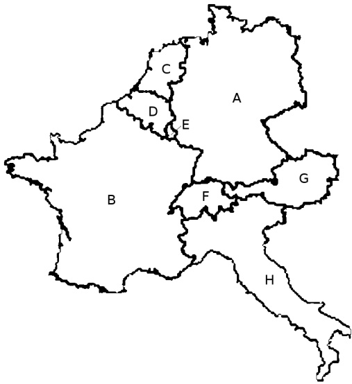

Der Kartenausschnitt soll mit insgesamt 4 Farben so eingef”arbt werden, dass je zwei Nachbarl”ander verschiedene Farben besitzen.

Mit welchem Land w”urde man am ehesten beginnen?

F”arben Sie das erste Land ein und wenden Sie durchgehend Constraint Propagation an.

## 16.5.3 Pr äsenzaufgabe: Generalized Arc Consistency

We have n variables $x _ { i } ,$ each with the (current) domain $D _ { i }$ . Constraint propagation by establishing local constraint consistency (“arc consistency”) in general means the following:

For a variable $x _ { i }$ and an adjacent constraint $C _ { k } .$ , we delete all values v from $D _ { i }$ for which there exists no tuple $\tau \in D _ { I _ { k } }$ with $\tau _ { i } = v$ that satisfies the constraint.

Consider a simple example

$$
x _ {1}, x _ {2} \in \{1, 2 \}, \quad x _ {3}, x _ {4} \in \{2,.., 6 \}, \quad c = \operatorname{AllDiff} (x _ {1},.., x _ {4})
$$

(a) How does constraint propagation from c to $x _ { 3 }$ update the domain $D _ { 3 } ?$

(b) On [http://norvig.com/sudoku.html](http://norvig.com/sudoku.html) Norvig describes his Sudoku solver, using the following rules for constraint propagation:

(1) If a square has only one possible value, then eliminate that value from the square’s peers.

(2) If a unit (block, row or column) has only one possible place for a value, then put the value there.

<!-- page: 239 -->

Is this a general implementation of constraint propagation for the allDiff constraint?

Note: The generalized arc consistency is equivalent so-called message passing (or belief propagation) in probabilistic networks, except that the messages are domain sets instead of belief vectors.

See also www.lirmm.fr/˜bessiere/stock/TR06020.pdf

## 16.6 Exercise 6

## 16.6.1 Programmieraufgabe: Spamfilter mit Naive Bayes

Sie haben in der Vorlesung grafische Modelle und Inferenz in ihnen kennengelernt. Auf dieser Grundlage basiert der viel verwendete Naive Bayes Klassifikator. Der Bayes Klassifikator wird zum Beispiel dafur verwandet, Spam Emails automa- ¨ tisch zu erkennen. Dafur werden Trainings-Emails untersucht und die Wahrschein- ¨ lichkeit des Auftreten eines Wortes bestimmt, abhangig davon, ob es eine Spam- ¨ oder Ham-Email ist.

Sei $c \in$ {Spam, Ham} die binare Zufallsvariable, die angibt, ob es sich bei einer ¨ Email um Spam oder Ham handelt. Sei $x _ { i }$ das ite Wort einer Email X. Sei $p ( x | c )$ die Wahrscheinlichkeit, dass ein Wort x in einer Spam- bzw. Ham-Email vorkommt, die wahrend des Trainings f ¨ ur jedes m ¨ ogliche Wort bestimmt wurde. Dann berechnet ¨ der Naive-Bayes-Klassifikator

$$
\begin{array}{l} p (c, \mathbf {X}) = p (c) \prod_ {i = 1} ^ {D} p (x _ {i} | c) \\ p (c \mid \mathbf {X}) = \frac {p (c , \mathbf {X})}{p (\mathbf {X})} = \frac {p (c , \mathbf {X})}{\sum_ {c} p (c , \mathbf {X})} \end{array}
$$

als die Wahrscheinlichkeit, dass die Email X Spam oder Ham ist, wobei D die Zahl der Worter ¨ $x _ { i }$ in der Email X ist.

(In praktischen Implementierungen werden haufig nur W ¨ orter ber ¨ ucksichtigt, bei ¨ denen p(x|Spam) und p(x|Ham) nicht Null sind.)

**Aufgabe:** Implementieren Sie einen Naive Bayes Klassifikator fur die Spam-Emails. ¨ Sie finden Trainingsdaten und Python-Code, der mit diesen umgehen kann, in Ihrem Repository.

Ihre Implementierung sollte zwei Funktionen enthalten:

```python
class NaiveBayes(object):
    def train(self, database):
        ''' Train the classificator with the given database. '''
```

<!-- page: 240 -->

```python
pass

def spam_prob(self, email):
    ''' Compute the probability for the given email that it is
    return 0.
```

**Tip:** David Barber gibt ein seinem Buch “Bayesian Reasoning and Machine Learning” eine sehr gute Einfuhrung in den Naive Bayes Klassifikator (Seite 243 ff., bzw. ¨ Seite 233 ff. in der kostenlosen Online Version des Buches, die man unter [http:// www.cs.ucl.ac.uk/staff/d.barber/brml/](http://www.cs.ucl.ac.uk/staff/d.barber/brml/) herunterladen kann). Zudem: Log-Wahrscheinlichkeiten zu addieren ist eine numerisch stabile Alternative zum Multiplizieren von Wahrscheinlichkeiten.

## 16.6.2 Votieraufgabe: Hidden Markov Modelle

## (Teilaufgaben werden separat votiert.)

Sie stehen bei Nacht auf einer Br”ucke ”uber der B14 in Stuttgart und m”ochten z”ahlen, wieviele LKW, Busse und Kleintransporter in Richtung Bad Canstatt fahren. Da Sie mehrere Spuren gleichzeitig beobachten und es dunkel ist machen Sie folgende Fehler bei der Beobachtung des Verkehrs:

• Einen LKW erkennen Sie in 30% der F”alle als Bus, in 10% der F”alle als Kleintransporter.

• Einen Bus erkennen Sie in 40% der F”alle als LKW, in 10% der F”alle als Kleintransporter.

• Einen Kleintransporter erkennen Sie in je 10% der F”alle als Bus bzw. LKW.

## Zudem nehmen Sie folgendes an:

• Auf einen Bus folgt zu 10% ein Bus und zu 30% ein LKW, ansonsten ein Kleintransporter.

• Auf einen LKW folgt zu 60% ein Kleintransporter und zu 30% ein Bus, ansonsten ein weiterer LKW.

• Auf einen Kleintransporter folgt zu 80% ein Kleintransporter und zu je 10% ein Bus bzw. ein LKW.

Sie wissen sicher, dass das erste beobachtete Fahrzeug tatsachlich ein Kleintrans- ¨ porter ist.

a) Formulieren Sie das HMM dieses Szenarios. D.h., geben Sie explizit $P ( X _ { 1 } )$ $P ( X _ { t + 1 } | X _ { t } )$ und $P ( Y _ { t } | X _ { t } )$ an.

<!-- page: 241 -->

b) Pradiktion: Was ist die Marginal-Verteilung ¨ $P ( X _ { 3 } )$ uber das 3. Fahrzeug. ¨

c) Filtern: Sie machten die Beobachtungen $Y _ { 1 : 3 } = ( K , B , B )$ . Was ist die Wahrscheinlichkeit $P ( X _ { 3 } | Y _ { 1 : 3 } )$ des 3. Fahrzeugs gegeben diese Beobachtungen?

d) Glatten: Was ist die Wahrscheinlichkeit ¨ $P ( X _ { 2 } | Y _ { 1 : 3 } )$ des 2. Fahrzeugs, gegeben die 3 Beobachtungen?

e) Viterbi (wahrscheinlichste Folge): Was ist die wahrscheinlichste Folge $\operatorname { a r g m a x } _ { X _ { 1 : 3 } } P ( X _ { 1 : 3 } | Y _ { 1 : 3 } )$ an Fahrzeugen, gegeben die 3 Beobachtungen?

## 16.7 Exercise 7

Die Losungen bitte als python-Datei (siehe Vorlage in der Email/Website) mit dem ¨ Namen e07/e07\_sol.py (in Verzeichnis e07) in Euer git account einloggen. In der python-Datei wird das Format, in dem Antworten gegeben werden sollen, genauer erklart. Bei Unklarheiten bitte bei dem Tutor melden. ¨

Diese letzte Ubung z ¨ ahlt zu den Programmieraufgaben. Dies ist keine Bonusauf- ¨ gabe. Prasenz- und Votieraufgaben gibt es nicht mehr. ¨

Abgabe bis Montag, 20. Februar.

## 16.7.1 Erf üllbarkeit und allgemeine G ültigkeit (Aussagenlogik) (30%)

Entscheiden Sie, ob die folgenden S”atze erf”ullbar (satisfiable), allgemein g”ultig (valid) oder keins von beidem (none) sind.

(a) Smoke ⇒ Smoke

(b) Smoke ⇒ F ire

(c) $( S m o k e \Rightarrow F i r e ) \Rightarrow ( \neg S m o k e \Rightarrow \neg F i r e )$

(d) Smoke ∨ F ire ∨ ¬F ire

(e) ((Smoke ∧ Heat) ⇒ F ire) ⇔ ((Smoke ⇒ F ire) ∨ (Heat ⇒ F ire))

(f) (Smoke ⇒ F ire) ⇒ ((Smoke ∧ Heat) ⇒ F ire)

(g) Big ∨ Dumb ∨ (Big ⇒ Dumb)

(h) (Big ∧ Dumb) ∨ ¬Dumb

<!-- page: 242 -->

## 16.7.2 Modelle enumerieren (Aussagenlogik) (30%)

Betrachten Sie die Aussagenlogik mit Symbolen A, B, C und D. Insgesamt existieren also 16 Modelle. In wievielen Modellen sind die folgenden S”atze erf”ullt?

1. $( A \wedge B ) \vee ( B \wedge C )$

2. $A \vee B$

3. $A \Leftrightarrow ( B \Leftrightarrow C )$

## 16.7.3 Unifikation (Pr ädikatenlogik) (40%)

Geben Sie $\mathbf { f } ^ { \prime \prime } \mathbf { u } \mathbf { r }$ jedes Paar von atomaren $S ^ { \prime \prime }$ atzen den allgemeinsten Unifikator an, sofern er existiert. Standardisieren Sie nicht weiter. Geben Sie None zuruck, wenn ¨ kein Unifikator existiert. Ansonsten ein Dictioary, dass als Key die Variable und als Value die Konstante enthalt. ¨

Fur¨ $P ( A ) , P ( x ) : \qquad \mathrm { s o } \bot \mathrm { 3 z } = \{   ^ { \prime } \mathrm { x }   ^ { \prime } :   ^ { \prime } \mathrm { A }   ^ { \prime }   \}$

1. $P(A,B,B),P(x,y,z)$

2. $Q ( y , G ( A , B ) ) , Q ( G ( x , x ) , y ) .$

3. ${ O l d e r } ( { F a t h e r } ( y ) , y ) , { O l d e r } ( { F a t h e r } ( x ) , { J o h n } ) .$

4. $K n o w s ( F a t h e r ( y ) , y ) , K n o w s ( x , x ) .$

## 16.7.4 Privat-Spaß-Aufgabe: as Constraint Satisfaction Problem

Consider the Generalized Modus Ponens (slide 09:15) for inference (forward and backward chaining) in first order logic. Applying this inference rule requires to find a substitution θ such that $p _ { i } ^ { \prime } \theta = p _ { i } \theta$ for all i.

Show constructively that the problem of finding a substitution θ (also called **matching problem**) is equivalent to a Constraint Satisfaction Problem. “Constructively” means, explicitly construct/define a CSP that is equivalent to the matching problem.

Note: The PDDL language to describe agent planning problems (slide 08:24) is similar to a knowledge in Horn form. Checking whether the action preconditions hold in a given situation is exactly the matching problem; applying the Generalized Modus Ponens corresponds to the application of the action rule on the current situation.

<!-- page: 243 -->

## 16.7.5 Privat-Spaß-Aufgabe

In the lecture we discussed the case

“A first cousin is a child of a parent’s sibling”

$$
\forall x, y \text {FirstCousin} (x, y) \iff \exists p, z \text {Parent} (p, x) \land \text {Sibling} (z, p) \land \text {Parent} (z, y)
$$

A question is whether this is equivalent to

$$
\forall x, y, p, z \text {FirstCousin} (x, y) \iff \text {Parent} (p, x) \land \text {Sibling} (z, p) \land \text {Parent} (z, y)
$$

Let’s simplify: Show that the following two

$$
\forall x A (x) \iff \exists y B (y, x)\tag{22}
$$

$$
\forall x, y A (x) \iff B (y, x)\tag{23}
$$

are different. For this, bring both sentences in CNF as described on slides 09:21 and 09:22 of lecture 09-FOLinference.

## 16.8 Exercise 9

Dieses Blatt enthalt Pr ¨ asenz ¨ ubungen, die am 26.01. in der ¨ Ubungsgruppe besprochen ¨ werden und auch zur Klausurvorbereitung dienen. Sie sind nicht abzugeben. Studenten werden zufallig gebeten, sich an den Aufgaben zu versuchen. ¨

## 16.8.1 Pr äsenzaufgabe: Hidden Markov Modelle

Sie stehen bei Nacht auf einer Br”ucke ”uber der B14 in Stuttgart und m”ochten z”ahlen, wieviele LKW, Busse und Kleintransporter in Richtung Bad Canstatt fahren. Da Sie mehrere Spuren gleichzeitig beobachten und es dunkel ist machen Sie folgende Fehler bei der Beobachtung des Verkehrs:

• Einen LKW erkennen Sie in 30% der F”alle als Bus, in 10% der F”alle als Kleintransporter.

• Einen Bus erkennen Sie in 40% der F”alle als LKW, in 10% der F”alle als Kleintransporter.

• Einen Kleintransporter erkennen Sie in je 10% der F”alle als Bus bzw. LKW.

Zudem nehmen Sie folgendes an:

<!-- page: 244 -->

• Auf einen Bus folgt zu 10% ein Bus und zu 30% ein LKW, ansonsten ein Kleintransporter.

• Auf einen LKW folgt zu 60% ein Kleintransporter und zu 30% ein Bus, ansonsten ein weiterer LKW.

• Auf einen Kleintransporter folgt zu 80% ein Kleintransporter und zu je 10% ein Bus bzw. ein LKW.

Sie wissen sicher, dass das erste beobachtete Fahrzeug tatsachlich ein Kleintrans- ¨ porter ist.

a) Formulieren Sie das HMM dieses Szenarios. D.h., geben Sie explizit $P ( X _ { 1 } )$ $P ( X _ { t + 1 } | X _ { t } )$ und $P ( Y _ { t } | X _ { t } )$ an.

b) Pradiktion: Was ist die Marginal-Verteilung ¨ $P ( X _ { 3 } )$ uber das 3. Fahrzeug. ¨

c) Filtern: Sie machten die Beobachtungen $Y _ { 1 : 3 } = ( K , B , B )$ . Was ist die Wahrscheinlichkeit $P ( X _ { 3 } | Y _ { 1 : 3 } )$ des 3. Fahrzeugs gegeben diese Beobachtungen?

d) Glatten: Was ist die Wahrscheinlichkeit ¨ $P ( X _ { 2 } | Y _ { 1 : 3 } )$ des 2. Fahrzeugs, gegeben die 3 Beobachtungen?

e) Viterbi (wahrscheinlichste Folge): Was ist die wahrscheinlichste Folge argmax ${ } _ { X _ { 1 : 3 } } P ( X _ { 1 : . }$ an Fahrzeugen, gegeben die 3 Beobachtungen?

## 16.9 Exercise 7

Dieses Blatt enthalt Pr ¨ asenz ¨ ubungen, die am 12.01. in der ¨ Ubungsgruppe besprochen ¨ werden und auch zur Klausurvorbereitung dienen. Sie sind nicht abzugeben. Studenten werden zufallig gebeten, sich an den Aufgaben zu versuchen. ¨

## 16.9.1 Pr äsenzaufgabe: Bedingte Wahrscheinlichkeit

1. Die Wahrscheinlichkeit, an der bestimmten tropischen Krankheit zu erkranken, betr”agt 0,02%. Ein Test, der bestimmt, ob man erkrankt ist, ist in 99,995% der $\mathrm{F''}$ alle korrekt. Wie hoch ist die Wahrscheinlichkeit, tats”achlich an der Krankheit zu leiden, wenn der Test positiv ausf”allt?

2. Eine andere seltene Krankheit betrifft 0,005% aller Menschen. Ein entsprechender Test ist in 99,99% der $\mathrm{F''}$ alle korrekt. Mit welcher Wahrscheinlichkeit ist man bei positivem Testergebnis von der Krankheit betroffen?

3. Es gibt einen neuen Test $\mathbf { f } ^ { \prime \prime }$ ur die Krankheit aus b), der in 99,995% der $\mathrm{F''}$ alle korrekt ist. Wie hoch ist hier die Wahrscheinlichkeit, erkrankt zu sein, wenn der Test positiv ausf”allt?

<!-- page: 245 -->

## 16.9.2 Pr äsenzaufgabe: Bandits

Assume you have 3 bandits. You have already tested them a few times and received returns

• From bandit 1: 8 7 12 13 11 9

• From bandit 2: 8 12

• From bandit 3: 5 13

For the returns of each bandit separately, compute a) the mean return, the b) standard deviation of returns, and c) standard deviation of the mean estimator.

Which bandid would you choose next? (Distinguish cases: a) if you know this is the last chance to pull a bandit; b) if you will have many more trials thereafter.)

<!-- page: 246 -->

## Index

| A* search (2:31), | Definitions based on sets (3:8), |
| --- | --- |
| A*: Proof 1 of Optimality (2:33), | Depth-first search (DFS) (2:18), |
| A*: Proof 2 of Optimality (2:35), | Dirac distribution (3:28), |
|  | Dirichlet (3:21), |
| Active Learning (4:50), |  |
| Admissible heuristics (2:37), | Eligibility traces (6:15), |
| Alpha-Beta Pruning (4:32), | Entropy (3:37), |
|  | Epsilon-greedy exploration in Q-learning (6:31), |
| Backtracking (8:10), |  |
| Backward Chaining (13:28), | Evaluation functions (4:37), |
| Backward Chaining (14:27), | Example: Romania (2:3), |
| Bayes' Theorem (3:13), | Existential quantification (14:6), |
| Bayesian Network (9:5), | Exploration, Exploitation (4:7), |
| Bayesian RL (6:35), |  |
| Belief propagation (9:32), | Factor graph (9:26), |
| Bellman optimality equation (5:10), | Filtering, Smoothing, Prediction (10:3), |
| Bernoulli and Binomial distributions (3:16), |  |
|  | FOL: Syntax (14:4), |
| Best-first Search (2:29), | Forward Chaining (14:21), |
| Beta (3:17), | Forward chaining (13:24), |
| Breadth-first search (BFS) (2:15), | Frequentist vs Bayesian (3:6), |
| Completeness of Forward Chaining (13:27), | Gaussian (3:29), |
|  | Generalized Modus Ponens (14:20), |
| Complexity of BFS (2:16), | Gibbs Sampling (9:50), |
| Complexity of DFS (2:19), | Global Optimization (4:43), |
| Complexity of Iterative Deepening Search (2:23), | GP-UCB (4:46), |
| Complexity of A* (2:34), | Graph search and repeated states (2:25), |
| Conditional distribution (3:11), |  |
| Conditional independence in a Bayes Net (9:8), | Hidden Markov Model (10:2), |
|  | HMM inference (10:5), |
| Conditional random field (9:43), | HMM: Inference (10:4), |
| Conjugate priors (3:25), | Horn Form (13:23), |
| Conjunctive Normal Form (13:31), |  |
| Constraint propagation (8:18), | Imitation Learning (6:43), |
| Constraint satisfaction problems (CSPs): Definition (8:3), | Importance Sampling (9:48), |
|  | Importance sampling (3:42), |
| Control (7:21), | Inference (13:19), |
| Conversion to CNF (13:32), | Inference (8:2), |
| Conversion to CNF (14:33), | Inference in graphical models: overview (9:22), |
| Dec-POMDP (7:20), | Inference: general meaning (3:5), |

<!-- page: 247 -->

| Inference: general meaning (9:13),Inverse RL (6:46),Iterative deepening search (2:21),Joint distribution (3:11),Junction tree algorithm** (9:38),Kalman filter (10:8),Knowledge base: Definition (13:3),Kullback-Leibler divergence (3:38),Learning probabilistic rules (15:9),Logic: Definition, Syntax, Semantics (13:7),Logical equivalence (13:12),Loopy belief propagation (9:36),Map-Coloring Problem (8:4),Marginal (3:11),Markov Decision Process (5:3),Markov Decision Process (MDP) (15:2),Markov Logic Networks (MLNs) (15:24),Markov Process (10:1),Maximum a-posteriori (MAP) inference (9:42),MCTS for POMDPs (4:20),Memory-bounded A* (2:40),Message passing (9:32),Minimax (4:29),Model-based RL (6:28),Modus Ponens (13:23),Monte Carlo (9:45),Monte Carlo methods (3:40),Monte Carlo Tree Search (MCTS) (4:14),Multi-armed Bandits (4:2),Multinomial (3:20),Multiple RVs, conditional independence (3:14),Neural networks (11:8),Noisy Deictic Rules (7:9),Nono, 207 | Optimistic heuristics (6:36),Particle approximation of a distribution (3:33),PDDL (7:6),Planning Domain Definition Language (PDDL) (15:3),Planning with probabilistic rules (15:11),Policy gradients (6:41),POMDP (7:11),Probabilistic Relational Models (PRMs) (15:20),Probabilities as (subjective) information calculus (3:2),Probability distribution (3:10),Problem Definition: Deterministic, fully observable (2:5),Proof of convergence of Q-Iteration (5:15),Proof of convergence of Q-learning (6:12),Propositional logic: Semantics (13:10),Propositional logic: Syntax (13:9),Q-Function (5:13),Q-Iteration (5:14),Q-learning (6:10),R-Max (6:33),Random variables (3:9),Reduction to propositional inference (14:16),Rejection sampling (3:41),Rejection sampling (9:46),Resolution (13:31),Resolution (14:35),STRIPS rules (15:3),Student's t, Exponential, Laplace, Chi-squared, Gamma distributions (3:44),Temporal difference (TD) (6:10), |
| --- | --- |

<!-- page: 248 -->

The role of uncertainty in AI (15:31), Tree search implementation: states vs nodes (2:11), Tree Search: General Algorithm (2:12), Tree-structured CSPs (8:25), UCT for games (4:38), Unification (14:19), Uniform-cost search (2:17), Universal quantification (14:6), Upper Confidence Bound (UCB1) (4:8), Upper Confidence Tree (UCT) (4:19), Utilities and Decision Theory (3:36), Value Function (5:6), Value Iteration (5:12), Value order: Least constraining value (8:17), Variable elimination (9:23), Variable order: Degree heuristic (8:16), Variable order: Minimum remaining values (8:15), Wumpus World example (13:4),
