<!-- page: 1 -->

**MULTI-AGENT REINFORCEMENT LEARNING FOUNDATIONS AND MODERN APPROACHES**

海

**Stefano V. Albrecht Filippos Christianos Lukas Schäfer**

<!-- page: 2 -->

Praise for Multi-Agent Reinforcement Learning

“The authors meticulously bring reinforcement learning together with game theory to provide a foundation for research and application of multi-agent reinforcement learning. This book is the perfect starting point for a grounding in the field.”

– **Andrew Barto**, Professor Emeritus, University of Massachusetts Amherst

“Multi-agent reinforcement learning is well positioned to be the next white-hot area of artificial intelligence and this book provides the essential background, concepts, and insights for understanding this exciting and important area of research.”

– **Michael L. Littman**, Professor of Computer Science, Brown University

“This book is the first complete reference for the growing area of multi-agent reinforcement learning. It provides both an essential resource for newcomers to the field; and a valuable perspective for established researchers.”

– **Peter Stone**, Professor of Computer Science, The University of Texas at Austin

“A landmark textbook to multiagent reinforcement learning, combining gametheoretic foundations with state-of-the-art deep learning. This essential textbook delivers fundamental insights for newcomers, experts and practitioners, featuring real-world applications and advanced algorithms.”

– **Karl Tuyls**, Director of AI Research, Meta AI and Professor of Computer Science, University of Liverpool

“This will become the standard text of the emerging field of multiagent reinforcement learning. It builds from foundational ideas, incorporating recent breakthroughs in deep learning. This book will help accelerate theoretical and practical progress.”

– **Mykel J. Kochenderfer**, Professor of Aeronautics and Astronautics, Stanford University

<!-- page: 3 -->

<!-- page: 4 -->

**Multi-Agent Reinforcement Learning**

<!-- page: 5 -->

<!-- page: 6 -->

**Multi-Agent Reinforcement Learning**

**Foundations and Modern Approaches**

Stefano V. Albrecht, Filippos Christianos, and Lukas Schäfer

<!-- page: 7 -->

© 2024 Massachusetts Institute of Technology

This work is subject to a Creative Commons CC-BY-NC-ND license.

This license applies only to the work in full and not to any components included with permission. Subject to such license, all rights are reserved. No part of this book may be used to train artificial intelligence systems without permission in writing from the MIT Press.

CC BY-NC-ND

The MIT Press would like to thank the anonymous peer reviewers who provided comments on drafts of this book. The generous work of academic experts is essential for establishing the authority and quality of our publications. We acknowledge with gratitude the contributions of these otherwise uncredited readers.

This book was set in Times New Roman by Stefano V. Albrecht, Filippos Christianos, and Lukas Schäfer. Printed and bound in the United States of America.

Library of Congress Cataloging-in-Publication Data

Names: Albrecht, Stefano V., author. | Christianos, Filippos, author. | Schäfer, Lukas, author.

Title: Multi-agent reinforcement learning : foundations and modern approaches / Stefano V. Albrecht, Filippos Christianos, Lukas Schäfer, The University of Edinburgh, United Kingdom.

Description: Cambridge, Massachusetts : The MIT Press, [2024] | Includes bibliographical references and index.

Identifiers: LCCN 2024002669 (print) | LCCN 2024002670 (ebook) | ISBN 9780262049375 (hardcover) | ISBN 9780262380508 (epub) | ISBN 9780262380515 (pdf)

Subjects: LCSH: Reinforcement learning. | Intelligent agents (Computer software)

Classification: LCC Q325.6 .A43 2024 (print) | LCC Q325.6 (ebook) | DDC 006.3/1–dc23/eng/20240412

LC record available at https://lccn.loc.gov/2024002669

LC ebook record available at https://lccn.loc.gov/2024002670

<!-- page: 8 -->

Für A.H.A. und R.J.A. — träumt groß, strebt nach euren Zielen, geht voraus. For A.E.A. — this book would not be here without you. –S.V.A.

Στη Δάφνη — για την αστείρευτη αγάπη και την υποστήριξη της στη συγγραφή ενός βιβλίου που πιθανώς να μην διαβάσει ποτέ. –F.C.

Für Jonas, Daniel, Annette und Stefan — für eure Liebe, Unterstützung und die Neugierde, die ihr in mir geweckt habt. –L.S.

<!-- page: 9 -->

<!-- page: 10 -->

- Summary of Notation xiii
- List of Figures xvii
- Preface xxiii
- 1 Introduction 1
- 1.1 Multi-Agent Systems 2
- 1.2 Multi-Agent Reinforcement Learning 6
- 1.3 Application Examples 9
- 1.3.1 Multi-Robot Warehouse Management 9
- 1.3.2 Competitive Play in Board Games and Video Games 10
- 1.3.3 Autonomous Driving 11
- 1.3.4 Automated Trading in Electronic Markets 11
- 1.4 Challenges of MARL 12
- 1.5 Agendas of MARL 13
- 1.6 Book Contents and Structure 15
- I FOUNDATIONS OF MULTI-AGENT REINFORCEMENT LEARNING 17
- 2 Reinforcement Learning 19
- 2.1 General Definition 20
- 2.2 Markov Decision Processes 22
- 2.3 Expected Discounted Returns and Optimal Policies 24
- 2.4 Value Functions and Bellman Equation 26
- 2.5 Dynamic Programming 29
- 2.6 Temporal-Difference Learning 32
- 2.7 Evaluation with Learning Curves 36

<!-- page: 11 -->

- 2.8 Equivalence of $\mathcal{R}(s,a,s')$ and $\mathcal{R}(s,a)$ 39
- 2.9 Summary 40
- 3 Games: Models of Multi-Agent Interaction 43
- 3.1 Normal-Form Games 44
- 3.2 Repeated Normal-Form Games 46
- 3.3 Stochastic Games 47
- 3.4 Partially Observable Stochastic Games 49
- 3.4.1 Belief States and Filtering 53
- 3.5 Modeling Communication 55
- 3.6 Knowledge Assumptions in Games 56
- 3.7 Dictionary: Reinforcement Learning $\leftrightarrow$ Game Theory 58
- 3.8 Summary 58
- 4 Solution Concepts for Games 61
- 4.1 Joint Policy and Expected Return 62
- 4.2 Best Response 65
- 4.3 Minimax 65
- 4.3.1 Minimax Solution via Linear Programming 67
- 4.4 Nash Equilibrium 68
- 4.5 $\epsilon$-Nash Equilibrium 70
- 4.6 (Coarse) Correlated Equilibrium 71
- 4.6.1 Correlated Equilibrium via Linear Programming 74
- 4.7 Conceptual Limitations of Equilibrium Solutions 75
- 4.8 Pareto Optimality 76
- 4.9 Social Welfare and Fairness 78
- 4.10 No-Regret 81
- 4.11 The Complexity of Computing Equilibria 83
- 4.11.1 PPAD Complexity Class 84
- 4.11.2 Computing $\epsilon$-Nash Equilibrium Is PPAD-Complete 86
- 4.12 Summary 87
- 5 Multi-Agent Reinforcement Learning in Games: First Steps and Challenges 89
- 5.1 General Learning Process 90
- 5.2 Convergence Types 92
- 5.3 Single-Agent RL Reductions 95
- 5.3.1 Central Learning 95
- 5.3.2 Independent Learning 97
- 5.3.3 Example: Level-Based Foraging 99

<!-- page: 12 -->

- 5.4 Challenges of MARL 102
- 5.4.1 Non-Stationarity 102
- 5.4.2 Equilibrium Selection 104
- 5.4.3 Multi-Agent Credit Assignment 106
- 5.4.4 Scaling to Many Agents 108
- 5.5 What Algorithms Do Agents Use? 109
- 5.5.1 Self-Play 110
- 5.5.2 Mixed-Play 111
- 5.6 Summary 112
- 6 Multi-Agent Reinforcement Learning: Foundational Algorithms 115
- 6.1 Dynamic Programming for Games: Value Iteration 116
- 6.2 Temporal-Difference Learning for Games: Joint-Action Learning 118
- 6.2.1 Minimax Q-Learning 121
- 6.2.2 Nash Q-Learning 123
- 6.2.3 Correlated Q-Learning 124
- 6.2.4 Limitations of Joint-Action Learning 125
- 6.3 Agent Modeling 127
- 6.3.1 Fictitious Play 128
- 6.3.2 Joint-Action Learning with Agent Modeling 131
- 6.3.3 Bayesian Learning and Value of Information 134
- 6.4 Policy-Based Learning 140
- 6.4.1 Gradient Ascent in Expected Reward 141
- 6.4.2 Learning Dynamics of Infinitesimal Gradient Ascent 142
- 6.4.3 Win or Learn Fast 145
- 6.4.4 Win or Learn Fast with Policy Hill Climbing 147
- 6.4.5 Generalized Infinitesimal Gradient Ascent 149
- 6.5 No-Regret Learning 151
- 6.5.1 Unconditional and Conditional Regret Matching 151
- 6.5.2 Convergence of Regret Matching 153
- 6.6 Summary 156
- II MULTI-AGENT DEEP REINFORCEMENT LEARNING: ALGORITHMS AND PRACTICE 159
- 7 Deep Learning 161
- 7.1 Function Approximation for Reinforcement Learning 161
- 7.2 Linear Function Approximation 163
- 7.3 Feedforward Neural Networks 165

<!-- page: 13 -->

- 7.3.1 Neural Unit 166
- 7.3.2 Activation Functions 167
- 7.3.3 Composing a Network from Layers and Units 168
- 7.4 Gradient-Based Optimization 169
- 7.4.1 Loss Function 170
- 7.4.2 Gradient Descent 171
- 7.4.3 Backpropagation 174
- 7.5 Convolutional and Recurrent Neural Networks 175
- 7.5.1 Learning from Images—Exploiting Spatial Relationships in Data 176
- 7.5.2 Learning from Sequences with Memory 178
- 7.6 Summary 180
- 8 Deep Reinforcement Learning 183
- 8.1 Deep Value Function Approximation 184
- 8.1.1 Deep Q-Learning—What Can Go Wrong? 184
- 8.1.2 Moving Target Problem 187
- 8.1.3 Breaking Correlations 188
- 8.1.4 Putting It All Together: Deep Q-Networks 192
- 8.1.5 Beyond Deep Q-Networks 193
- 8.2 Policy Gradient Algorithms 195
- 8.2.1 Advantages of Learning a Policy 195
- 8.2.2 Policy Gradient Theorem 197
- 8.2.3 REINFORCE: Monte Carlo Policy Gradient 200
- 8.2.4 Actor-Critic Algorithms 202
- 8.2.5 A2C: Advantage Actor-Critic 204
- 8.2.6 PPO: Proximal Policy Optimization 207
- 8.2.7 Policy Gradient Algorithms in Practice 209
- 8.2.8 Concurrent Training of Policies 210
- 8.3 Observations, States, and Histories in Practice 215
- 8.4 Summary 217
- 9 Multi-Agent Deep Reinforcement Learning 219
- 9.1 Training and Execution Modes 220
- 9.1.1 Centralized Training and Execution 220
- 9.1.2 Decentralized Training and Execution 221
- 9.1.3 Centralized Training with Decentralized Execution 222
- 9.2 Notation for Multi-Agent Deep Reinforcement Learning 222
- 9.3 Independent Learning 223
- 9.3.1 Independent Value-Based Learning 224

<!-- page: 14 -->

- 9.3.2 Independent Policy Gradient Methods 226
- 9.3.3 Example: Deep Independent Learning in a Large Task 228
- 9.4 Multi-Agent Policy Gradient Algorithms 230
- 9.4.1 Multi-Agent Policy Gradient Theorem 231
- 9.4.2 Centralized Critics 232
- 9.4.3 Centralized Action-Value Critics 236
- 9.4.4 Counterfactual Action-Value Estimation 237
- 9.4.5 Equilibrium Selection with Centralized Action-Value Critics 239
- 9.5 Value Decomposition in Common-Reward Games 242
- 9.5.1 Individual-Global-Max Property 244
- 9.5.2 Linear Value Decomposition 246
- 9.5.3 Monotonic Value Decomposition 249
- 9.5.4 Value Decomposition in Practice 255
- 9.5.5 Beyond Monotonic Value Decomposition 261
- 9.6 Agent Modeling with Neural Networks 266
- 9.6.1 Joint-Action Learning with Deep Agent Models 267
- 9.6.2 Learning Representations of Agent Policies 271
- 9.7 Environments with Homogeneous Agents 274
- 9.7.1 Parameter Sharing 276
- 9.7.2 Experience Sharing 278
- 9.8 Policy Self-Play in Zero-Sum Games 281
- 9.8.1 Monte Carlo Tree Search 283
- 9.8.2 Self-Play MCTS 286
- 9.8.3 Self-Play MCTS with Deep Neural Networks: AlphaZero 288
- 9.9 Population-Based Training 290
- 9.9.1 Policy Space Response Oracles 292
- 9.9.2 Convergence of PSRO 295
- 9.9.3 Grandmaster Level in StarCraft II: AlphaStar 298
- 9.10 Summary 301
- Multi-Agent Deep Reinforcement Learning in Practice 305
- 10.1 The Agent-Environment Interface 305
- 10.2 MARL Neural Networks in PyTorch 307
- 10.2.1 Seamless Parameter Sharing Implementation 309
- 10.2.2 Defining the Models: An Example with IDQN 310
- 10.3 Centralized Value Functions 312
- 10.4 Value Decomposition 313

<!-- page: 15 -->

- 10.5 Practical Tips for MARL Algorithms 313
- 10.5.1 Stacking Time Steps vs. Recurrent Network vs. Neither 314
- 10.5.2 Standardizing Rewards 314
- 10.5.3 Centralized Optimization 315
- 10.6 Presentation of Experimental Results 316
- 10.6.1 Learning Curves 316
- 10.6.2 Hyperparameter Search 318
- 11 Multi-Agent Environments 319
- 11.1 Criteria for Choosing Environments 320
- 11.2 Structurally Distinct $2 \times 2$ Matrix Games 321
- 11.2.1 No-Conflict Games 321
- 11.2.2 Conflict Games 322
- 11.3 Complex Environments 323
- 11.3.1 Level-Based Foraging 324
- 11.3.2 Multi-Agent Particle Environment 326
- 11.3.3 StarCraft Multi-Agent Challenge 327
- 11.3.4 Multi-Robot Warehouse 328
- 11.3.5 Google Research Football 329
- 11.3.6 Hanabi 330
- 11.3.7 Overcooked 331
- 11.4 Environment Collections 332
- 11.4.1 Melting Pot 333
- 11.4.2 OpenSpiel 334
- 11.4.3 Petting Zoo 335
- A Surveys on Multi-Agent Reinforcement Learning 337
- References 341
- Index 363

<!-- page: 16 -->

Sets are denoted with capital letters.

Elements of sets are denoted with lower-case letters.

Time index $t \left( \mathrm { o r } \; \tau \right)$ is shown in superscript $( \mathbf { e . g . } , s ^ { t }$ denotes state at time t).

Agent index is shown in subscript $( \mathbf { e . g . } , a _ { i }$ denotes action of agent i).

The most common symbols used in the book are listed below. Specific sections may use additional notation.

## General

| $\mathbb{R}$ | set of real numbers |
| --- | --- |
| $\propto$ | proportional to |
| $x^{\top}$ | transpose of a vector $x$ |
| $X^{\top}$ | transpose of a matrix $X$ |
| $\Pr$ | probability |
| $\Pr(x\|y)$ | conditional probability of $x$ given $y$ |
| $\mathbb{E}_{p}[x]$ | expectation of $x$ under probability distribution $p$ |
| $x \sim p$ | $x$ sampled according to probability distribution $p$ |
| $x \leftarrow y$ | assign value $y$ to variable $x$ |
| $\mathcal{D}$ | training data set |
| $\frac{\partial f}{\partial x}$ | derivative of function $f$ with respect to $x$ |
| $\nabla$ | gradient |
| $\langle a, b, c, ... \rangle$ | concatenation of inputs $a, b, c, ...$ into tuple $(a, b, c, ...)$ |
| $[x]_{1}$ | indicator function: returns 1 if $x$ is true, otherwise returns 0 |

## Game Model

<table><tr><td colspan="2">Game Model</td></tr><tr><td>I</td><td>set of agents</td></tr><tr><td>i,j</td><td>agent subscripts</td></tr><tr><td>-i</td><td>subscript to denote the tuple ⟨all agents except agent i⟩</td></tr><tr><td>S,  $\bar{S}$ </td><td>state space, set of terminal states</td></tr><tr><td>s</td><td>state</td></tr><tr><td>O,Oi</td><td>(joint-) observation space, observation space of agent i</td></tr><tr><td>o,o_i</td><td>(joint) observation, observation of agent i</td></tr><tr><td>A,A_i</td><td>(joint-) action space, action space of agent i</td></tr><tr><td>a,a_i</td><td>(joint) action, action of agent i</td></tr></table>

<!-- page: 17 -->

$r , r _ { i }$ (joint) reward, reward of agent i $\mu$ initial state distribution $\mathcal { T }$ state transition function $\hat { \mathcal { T } }$ simulation/sampling model of state transitions $\mathcal { O } , \mathcal { O } _ { i }$ observation function (of agent i) $\mathcal { R } , \mathcal { R } _ { i }$ reward function (of agent i) $\Gamma _ { s }$ normal-form game for state s

## Policies, Returns, Values

$\Pi , \Pi _ { i }$ (joint-) policy space, policy space of agent i

$\pi , \pi _ { i }$ (joint) policy, policy of agent i

$\pi ^ { * }$ optimal policy, or equilibrium joint policy

$H , \hat { H }$ set of histories, set of full histories

$h , h _ { i }$ joint-observation history, observation history of agent i

$\hat { h }$ full history containing states, joint observations, joint actions

$\sigma ( \hat { h } )$ function returning joint-observation history from full history $\hat { h }$

$\gamma$ discount factor

$u , u _ { i }$ discounted return (for agent i)

$U , U _ { i }$ expected discounted return (for agent i)

## (Multi-Agent) Reinforcement Learning

L learning algorithm

$\alpha$ learning rate

$\epsilon$ exploration rate

$\bar{\pi}_{i}$ empirical action distribution, or averaged policy, of agent i

$\hat { \pi } _ { j }$ agent model for agent j

$\mathbf { B R } _ { i }$ set of best-response actions or policies for agent i

$V ^ { \pi } , V _ { i } ^ { \pi }$ state-value function (of agent i) under policy $\pi$

$Q ^ { \pi } , Q _ { i } ^ { \pi }$ action-value function (of agent i) under policy $\pi$

$V ^ { * } , Q ^ { * }$ optimal state/action-value function

$V a l u e _ { i }$ return an equilibrium value for agent i in a normal-form game

## Deep Learning

θ network parameters

$f ( x ; \theta )$ function f for input x with parameters $\theta$

${ \mathcal { L } } ( \theta )$ loss function over parameters θ

B batch of data

B batch size, i.e., number of samples in a batch

## (Multi-Agent) Deep Reinforcement Learning

$\theta , \theta _ { i }$ value function parameters (of agent i)

<!-- page: 18 -->

| $\phi, \phi_{i}$ | policy parameters (of agent $i$) |
| --- | --- |
| $\bar{\theta}$ | target network parameters |
| $\mathcal{D}, \mathcal{D}_{i}$ | experience replay buffer (of agent $i$) |
| $\mathcal{H}$ | entropy |
| $z$ | centralized information, e.g. the state of the environment |

<!-- page: 19 -->

<!-- page: 20 -->

- 1.1 Schematic of a multi-agent system. 2
- 1.2 A level-based foraging task. 4
- 1.3 Schematic of multi-agent reinforcement learning. 6
- 1.4 Dimensions in multi-agent reinforcement learning. 8
- 2.1 Definition of a reinforcement learning problem. 20
- 2.2 Basic reinforcement learning loop for a single-agent system. 21
- 2.3 Mars Rover Markov decision process (MDP). 23
- 2.4 Sarsa and Q-learning algorithms in the Mars Rover problem. 37
- 3.1 Hierarchy of game models. 44
- 3.2 Three normal-form games with two agents (i.e., matrix games). 46
- 3.3 Three game models as directed cyclic graphs. 50
- 3.4 Level-based foraging environment with partial observability. 53
- 3.5 Synonymous terms in reinforcement learning and game theory. 59
- 4.1 Definition of a multi-agent reinforcement learning problem. 62
- 4.2 Matrix game in which $\epsilon$-Nash equilibrium can be far from Nash equilibrium. 71
- 4.3 Chicken matrix game. 73
- 4.4 Feasible joint rewards and Pareto frontier in Chicken game. 77
- 4.5 Feasible joint rewards and fairness-optimal outcomes in Battle of the Sexes game. 80
- 4.6 Ten episodes between two agents in the non-repeated Prisoner's Dilemma matrix game. 82
- 4.7 Instances of END-OF-LINE problem. 85
- 5.1 General learning process in multi-agent reinforcement learning. 90

<!-- page: 21 -->

- 5.2 Convergence of “infinitesimal” independent Q-learning (IQL). 99
- 5.3 A level-based foraging task with two agents. 100
- 5.4 Central and independent Q-learning in a level-based foraging task. 101
- 5.5 Evolving policies of two agents in Rock-Paper-Scissors with WoLF-PHC. 103
- 5.6 Matrix games with multiple equilibria. 105
- 5.7 A level-based foraging task with three agents. 107
- 6.1 Simplified grid-world soccer game. 122
- 6.2 Minimax Q-learning won episodes and episode length in soccer game. 122
- 6.3 NoSDE (“No Stationary Deterministic Equilibrium”) game. 126
- 6.4 General agent model. 128
- 6.5 Evolving policies of two agents in Rock-Paper-Scissors with fictitious play. 129
- 6.6 First ten episodes in the non-repeated Rock-Paper-Scissors game when both agents use fictitious play. 130
- 6.7 Joint-action learning with agent modeling in a level-based foraging task. 133
- 6.8 Two agent models for Prisoner’s Dilemma. 135
- 6.9 Value of information in the Prisoner’s Dilemma example. 136
- 6.10 Dirichlet distributions in the Rock-Paper-Scissors non-repeated game. 137
- 6.11 Joint policy $(\alpha, \beta)$ learned by Infinitesimal Gradient Ascent (IGA) in unconstrained space. 144
- 6.12 General form of joint policy $(\alpha, \beta)$ trajectory when using WoLF-IGA. 146
- 6.13 Evolving policies of two agents in Rock-Paper-Scissors with WoLF-PHC. 149
- 6.14 Evolving policies of two agents in Rock-Paper-Scissors using unconditional regret matching. 155
- 6.15 Unconditional regrets in Rock-Paper-Scissors using unconditional regret matching. 156
- 7.1 Single-agent maze environment. 162
- 7.2 Feedforward neural network with three layers. 165

<!-- page: 22 -->

- 7.3 Single unit of a feedforward neural network. 166
- 7.4 Summary of commonly used activation functions for input $x \in \mathbb{R}$. 167
- 7.5 Common non-linear activation functions defined in Figure 7.4. 168
- 7.6 Training loop for gradient-based optimization of a neural network. 169
- 7.7 Comparison of gradient-based optimization algorithms. 173
- 7.8 Convolutional neural network. 177
- 7.9 Recurrent neural network. 179
- 8.1 Neural network architecture for action-value functions. 185
- 8.2 Correlations of consecutive experiences. 190
- 8.3 Single-agent level-based foraging environment and learning curves for value-based deep RL algorithms. 192
- 8.4 Comparison of $\epsilon$-greedy and softmax policies. 196
- 8.5 Variance and bias trade-off of $N$-step returns. 204
- 8.6 Learning curves for policy gradient RL algorithms in single-agent level-based foraging environment. 210
- 8.7 Synchronous data collection for parallel training of the agent. 211
- 8.8 Learning curves for A2C with synchronous data collection in single-agent level-based foraging environment. 213
- 8.9 Asynchronous training for parallel optimization of the agent. 214
- 9.1 Learning curves of IA2C in the level-based foraging environment. 230
- 9.2 Architecture of a centralized critic. 233
- 9.3 Speaker-listener game and learning curve for A2C with and without a centralized critic. 235
- 9.4 Architecture of a centralized action-value critic. 237
- 9.5 The Stag Hunt and Climbing matrix games. 240
- 9.6 Learning curves comparing A2C with centralized critic and Pareto actor-critic. 242
- 9.7 A coordination graph. 244
- 9.8 Network architectures of VDN and QMIX. 250
- 9.9 Value decomposition format. 255
- 9.10 Linearly-decomposable matrix game with the learned value decompositions of VDN and QMIX. 256
- 9.11 Monotonically-decomposable matrix game with the learned value decompositions of VDN and QMIX. 257

<!-- page: 23 -->

- 9.12 QMIX mixing function in the monotonic matrix game. 257
- 9.13 Two-step common-reward stochastic game. 258
- 9.14 Learned value decompositions of VDN and QMIX in two-step common-reward stochastic game. 258
- 9.15 Learned value decomposition of VDN and QMIX in the Climbing game. 259
- 9.16 Level-based foraging task and learning curves comparing IDQN, VDN, and QMIX. 260
- 9.17 QTRAN value decomposition in the linear matrix game. 264
- 9.18 QTRAN value decomposition in the monotonic matrix game. 264
- 9.19 QTRAN value decomposition in the Climbing game. 265
- 9.20 Level-based foraging environment and learning curve for IDQN and deep JAL-AM. 270
- 9.21 Encoder-decoder architecture to learn representations of other agents' policies. 271
- 9.22 Level-based foraging environment and learning curve for centralized A2C with and without representation-based agent models. 273
- 9.23 Environments with strongly and weakly homogeneous agents. 276
- 9.24 Learning curves for the independent actor-critic algorithm in the level-based foraging environment. 277
- 9.25 Tree expansion and backpropagation in MCTS. 285
- 9.26 State transformation in chess. 287
- 9.27 AlphaZero match results. 290
- 9.28 Policy space response oracles (PSRO) steps. 294
- 9.29 PSRO in the non-repeated Rock-Paper-Scissors game. 297
- 10.1 Architecture for an independent Deep Q-networks algorithm. 310
- 10.2 Exemplary learning curves in single-agent and multi-agent reinforcement learning. 317
- 11.1 List of multi-agent environments with their properties. 324
- 11.2 Two level-based foraging environments. 325
- 11.3 Three multi-agent particle environment tasks. 326
- 11.4 StarCraft Multi-Agent Challenge tasks. 328
- 11.5 Three multi-robot warehouse tasks. 329

<!-- page: 24 -->

- 11.6 Two Google Research Football tasks. 330
- 11.7 Cooking Zoo. 332
- 11.8 Four Melting Pot environments. 333
- 11.9 Three Petting Zoo environments. 334

<!-- page: 25 -->

<!-- page: 26 -->

Multi-agent reinforcement learning (MARL) is a varied and highly active field of research. With the introduction of deep learning to MARL in the mid-2010s, the field has seen an explosive growth of activity, and now all major artificial intelligence and machine learning conferences routinely feature papers that develop new MARL algorithms or apply MARL in some way. This steep growth is also documented by the increasing number of survey papers that have been published since, of which we list many in Chapter A.

In the wake of this growth, it became clear that the field needed a textbook to provide a principled introduction to MARL. The present book is in part based on the tutorial “Multiagent Learning: Foundations and Recent Trends” given by Stefano V. Albrecht and Peter Stone at the 2017 International Joint Conference on Artificial Intelligence in Melbourne, Australia. The book was written to provide a basic introduction to the models, solution concepts, algorithmic ideas, and technical challenges in MARL, and to describe modern approaches in MARL that integrate deep learning techniques to produce powerful new algorithms. In essence, we believe that the materials covered in this book should be known by every MARL researcher. In addition, the book aims to give practical guidance for researchers and practitioners when using MARL algorithms. To this end, the book comes with its own codebase written in the Python programming language, which contains implementations of several MARL algorithms discussed in this book. The primary purpose of the codebase is to provide algorithm code that is self-contained and easy to read, to aid the reader’s understanding. A dedicated chapter (Chapter 10) describes of how these MARL algorithms are implemented in the codebase.

This book assumes that readers have an undergraduate-level background in basic mathematics, including statistics, probability theory, linear algebra, and calculus. A basic familiarity with programming concepts is required to understand and use the codebase. In general, we recommend reading the book chapters in the given sequence. For readers unfamiliar with reinforcement

<!-- page: 27 -->

learning and deep learning, we provide the basics in Chapters 2, 7, and 8, respectively. Readers who are already familiar with reinforcement learning and deep (reinforcement) learning, and who want to quickly get going with deep learning-based MARL algorithms, may read Chapter 3 and then skip to Chapter 9 and onward. To aid lecturers in adopting this book, we have developed lecture slides (available from the book’s website) that can be modified as required to suit the course’s needs.

MARL has become a large field of research, and this book does not cover all aspects of MARL. For instance, there is a growing body of work on using communication in MARL, which is not covered in this book. This includes questions such as how agents can learn to communicate robustly when communication channels are noisy and unreliable; and how agents may use MARL to learn specialized communication protocols or languages for a given task. While this book does not focus on communication in MARL, the models introduced in this book are general enough to also represent communication actions (as described in Section 3.5). There has also been research on using evolutionary game theory for multi-agent learning, which is not covered in this book. (We recommend the excellent survey of Bloembergen et al. (2015).) Finally, with the steep rise of activity in MARL in recent years, it would be futile to write a book that tries to keep up with new algorithms. We instead focus on the foundational concepts and ideas in MARL, and refer to survey papers (including those listed in Chapter A) for a more complete list of algorithm developments.

**Acknowledgements:** We are grateful to many people who have worked with us or provided feedback during the writing of this book. Special thanks go to Elizabeth Swayze and Matthew Valades from the MIT Press who diligently guided us through the publication process. Many colleagues have provided valuable feedback and suggestions, and we are grateful to all of them (in alphabetical order): Christopher Amato, Ignacio Carlucho, Georgios Chalkiadakis, Francesco Da Dalt, Sam Dauncey, Alex Davey, Bertrand Decoster, Mhairi Dunion, Kousha Etessami, Aris Filos-Ratsikas, Elliot Fosong, Amy Greenwald, Dongge Han, Josiah Hanna, Leonard Hinckeldey, Sarah Keren, Mykel Kochenderfer, Marc Lanctot, Stefanos Leonardos, Michael Littman, Luke Marris, Elle McFarlane, Trevor McInroe, Mahdi Kazemi Moghaddam, Frans Oliehoek, Georgios Papoudakis, Tabish Rashid, Michael Rovatsos, Rahat Santosh, Raul Steleac, Massimiliano Tamborski, Kale-ab Tessera, Callum Tilbury, Jeroen van Riel, and Zhu Zheng. We also thank the anonymous reviewers who reviewed the book for the MIT Press. The Mars Rover MDP from Figure 2.3 is based on a similar MDP created by Elliot Fosong and Adam Jelley for the reinforcement learning course at

<!-- page: 28 -->

the University of Edinburgh. The images in Figure 4.4 and Figure 4.5(b) were created for this book by Mahdi Kazemi Moghaddam. We are grateful to Karl Tuyls for announcing this book in his keynote talk at the AAMAS 2023 conference in London (29 May–2 June, 2023), during which the first preprint draft of the book was released.

**Errata:** Despite our best efforts, it is possible that some typos or imprecisions may have gone unnoticed. If you detect any errors, we would be much obliged if you could report them to us via e-mail at [issues@marl-book.com](mailto:issues@marl-book.com).

**Book website, codebase, slides:** The full PDF version of this book and links to accompanying materials, including the codebase and lecture slides, can be found on the book website at **www.marl-book.com**.

February, 2024

Stefano V. Albrecht

Filippos Christianos

Lukas Schäfer

<!-- page: 29 -->

<!-- page: 30 -->

## 1 Introduction

Imagine a scenario in which a collective of autonomous agents, each capable of making its own decisions, must interact in a shared environment to achieve certain goals. The agents may have a shared goal, such as a fleet of mobile robots whose task is to collect and deliver goods within a large warehouse or a team of drones tasked with monitoring a power plant. The agents may also have conflicting goals, such as agents trading goods in a virtual market in which each agent seeks to maximize its own gains. Since we may not know how the agents should interact to achieve their goals, we tell them to figure it out on their own. Thus, the agents begin to try actions in their environment and collect experiences about how the environment changes as a result of their actions, as well as how the other agents behave. In time, the agents begin to learn various concepts, such as skills needed to solve their task and, importantly, how to coordinate their actions with other agents. They may even learn to develop a shared language to enable communication between agents. Finally, the agents reach a certain level of proficiency and have become experts at interacting optimally to achieve their goals.

This exciting vision is, in a nutshell, what multi-agent reinforcement learning (MARL) aims to achieve. MARL is based on reinforcement learning (RL), in which agents learn optimal decision policies by trying actions and receiving rewards, with the goal of choosing actions to maximize the sum of received rewards over time. While in single-agent RL the focus is on learning an optimal policy for a single agent, in MARL the focus is on learning optimal policies for multiple agents and the unique challenges that arise in this learning process.

In this first chapter, we will begin to outline some of the underlying concepts and challenges in MARL. We begin by introducing the concept of a multi-agent system, which is defined by an environment, the agents in the environment, and their goals. We then discuss how MARL operates in such systems to learn optimal policies for the agents, which we illustrate with a number of examples of potential applications. Next we discuss some of the key challenges in MARL,

<!-- page: 31 -->

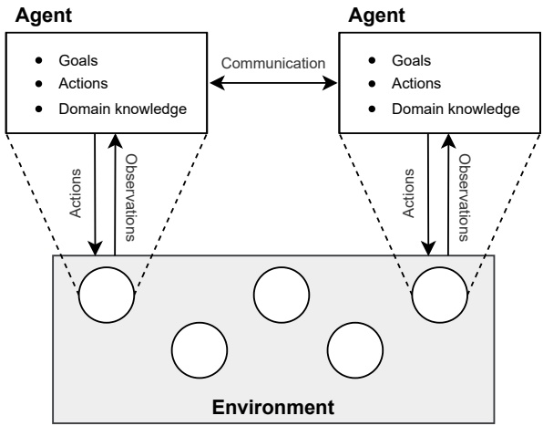

Figure 1.1: Schematic of a multi-agent system. A multi-agent system consists of an environment and multiple decision-making agents (shown as circles inside the environment). The agents can observe information about the environment and take actions to achieve their goals.

such as the non-stationarity and equilibrium selection problems, as well as several “agendas” of MARL that describe different ways in which MARL can be used. At the end of this chapter, we give an overview of the topics covered in the two parts of this book.

## 1.1 Multi-Agent Systems

A multi-agent system consists of an environment and multiple decision-making agents that interact in the environment to achieve certain goals. Figure 1.1 shows a general schematic of a multi-agent system, and we describe the basic components in the following.

**Environment** An environment is a physical or virtual world whose state evolves over time and is influenced by the actions of the agents that exist within the environment. The environment specifies the actions that agents can take at any point in time as well as the observations that individual agents receive about the state of the environment. The states of the environment may be defined as discrete or continuous quantities, or a combination of both. For example, in a 2D-maze environment, the state may be defined as the combination of the discrete integer positions of all agents together

<!-- page: 32 -->

with their continuous orientations in radians. Similarly, actions may be discrete or continuous, such as moving up/down/left/right in the maze or turning around by a specified continuous angle. Multi-agent environments are often characterized by the fact that agents only have a limited and imperfect view of the environment. This means that individual agents may only observe some partial information about the state of the environment, and different agents may receive different observations about the environment.

**Agents** An agent is an entity that receives information about the state of the environment and can choose different actions in order to influence the state. Agents may have different prior knowledge about the environment, such as the possible states that the environment can be in and how states are affected by the actions of the agents. Importantly, agents are goal-directed in the sense that agents have specified goals and choose their actions in order to achieve their goals. These goals could be to reach a certain environment state, or to maximize certain quantities such as monetary revenues. In MARL, such goals are defined by reward functions that specify scalar reward signals that agents receive after taking certain actions in certain states. The term policy refers to a function used by the agent to select actions (or assign probabilities to selecting each action) given the current state of the environment. If the environment is only partially observed by the agent, then the policy may be conditioned on the current and past observations of the agent.

As a concrete example of the above concepts, consider the level-based forag ing example shown in Figure 1.2.<sup>1</sup>In this example, multiple robots are tasked with collecting items that are spatially distributed in a grid-world environment. Each robot and item has an associated skill level, and a group of one or more robots can collect an item if the robots are located next to the item and the sum of the robots’ levels is greater than or equal to the item’s level. The state of this environment at a given time is completely described by variables containing the x/y-positions of the robots and items, and binary variables for each item indicating whether the item still exists or not.<sup>2</sup>In this example, we use three independent agents to control each of the three robots. At any given time, each agent can observe the complete state of the environment and choose an action

<small><span class="docvortex-page-footnote" data-block-type="page_footnote" style="color:#6b7280">1. The level-based foraging example will appear throughout this book. We provide an open-source implementation of this environment at [https://github.com/uoe-agents/lb-foraging.](https://github.com/uoe-agents/lb-foraging) See Section 11.3.1 for more details on this environment.</span></small>

<small><span class="docvortex-page-footnote" data-block-type="page_footnote" style="color:#6b7280">2. Note that the skill levels of robots and items are not included in the state since these are assumed constant. However, if the skill levels can change between different episodes, then the state may additionally include the skill levels of the robots and items.</span></small>

<!-- page: 33 -->


Figure 1.2: A level-based foraging task in which a group of three robots, each controlled by an agent, must collect all items (shown as apples). Each robot and item has an associated skill level, shown inset. A group of one or more robots can collect an item if they are located next to the item, and the sum of the robots’ levels is greater than or equal to the item’s level.

from the set {up, down, left, right, collect, noop} to control its robot. The first four actions in this action set modify the x/y-position of the robot in the state by moving the robot into the respective direction (unless the robot is already at the edge of the grid-world, in which case the action has no effect). The collect action attempts to collect an item that is located adjacent to the robot; if the item is collected, the action modifies the binary existence variable corresponding to the item. The noop (no operation) action has no effect on the state.

Notice that in the previous description, we used the terms “robot” and “agent” to refer to two distinct concepts. In level-based foraging, the word “robot” is a label for an object that is explicitly represented via the x/y-position variables. Similarly, the word “item” refers to an object in level-based foraging that is represented by its x/y-position variables and its binary existence variable. In contrast to these object labels, the term “agent” refers to an abstract decisionmaking entity that observes some information from the environment and chooses values for certain action variables, in this case, the action for a robot. If there is a direct one-to-one correspondence between agents and certain objects, such as agents and robots in level-based foraging, then it can be convenient to use the terms interchangeably. For example, in level-based foraging, we may say “the skill level of agent i” when referring to the skill level of the robot controlled by agent i. Unless the distinction is relevant, in this book, we will often use the term “agent” synonymously with the object that it controls.

The defining characteristic of a multi-agent system is that the agents must coordinate their actions with (or against) each other to achieve their goals. In a

<!-- page: 34 -->

fully cooperative scenario, the agents’ goals are perfectly aligned so that the agents need to collaborate toward achieving a shared goal. For example, in level-based foraging, all agents may receive a reward of +1 whenever an item is successfully collected by any of the agents. In a competitive scenario, the agents’ goals may be diametrically opposed so that the agents are in direct competition with each other. An example of such a competitive scenario is two agents playing a game of chess, in which the winning player gets a reward of +1 and the losing player gets a reward of −1 (or both get 0 for a drawn outcome). In between these two extremes, the agents’ goals may align in some respects while differing in other respects, which can lead to complex multi-agent interaction problems that involve both cooperation and competition to varying degrees. For example, in the actual implementation of level-based foraging we use in this book (described in Section 11.3.1), only those agents that were involved in the collection of an item (rather than all agents) will receive a positive normalized reward. Thus, the agents have a motivation to maximize their own returns (sum of rewards), which can lead them to try and collect items before other agents can do so; but they may also need to collaborate with other agents at certain times in order to collect an item.

The previously described concepts of states, actions, observations, and rewards are formally defined within game models. Different types of game models exist, and Chapter 3 introduces the most common game models used in MARL, including normal-form games, stochastic games, and partially observable stochastic games. A solution for a game model consists of a set of policies for the agents that satisfies certain desired properties. As we will see in Chapter 4, there exist a range of solution concepts in the general case. Most solution concepts are anchored in some notion of equilibrium, which means that no individual agent can deviate from its policy in the solution to improve its outcome.

Research in multi-agent systems has a long history in artificial intelligence and spans a vast range of technical problems (Shoham and Leyton-Brown 2008; Wooldridge 2009). These include questions such as how to design algorithms that enable agents to choose optimal actions toward their specified goals; how to design environments to incentivize certain long-term behaviors in agents; how information is communicated and propagated among agents; and how norms, conventions, and roles may emerge in a collective of agents. This book is concerned with the first of these questions, with a focus on using RL techniques to optimize and coordinate the policies of agents in order to maximize the rewards they accumulate over time.

<!-- page: 35 -->

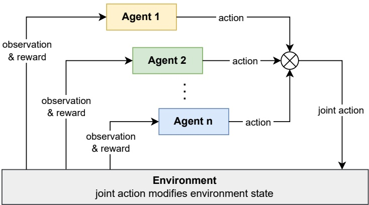

Figure 1.3: Schematic of multi-agent reinforcement learning. A set of n agents receive individual observations about the state of the environment, and choose actions to modify the state of the environment. Each agent then receives a scalar reward and a new observation, and the loop repeats.

## 1.2 Multi-Agent Reinforcement Learning

Multi-agent reinforcement learning (MARL) algorithms learn optimal policies for a set of agents in a multi-agent system.<sup>3</sup> As in the single-agent counterpart, the policies are learned via a process of trial-and-error to maximize the agents cumulative rewards, or returns. Figure 1.3 shows a basic schematic of the MARL training loop. A set of n agents choose individual actions, which together are referred to as the joint action. The joint action changes the state of the environment according to the environment dynamics, and the agents receive individual rewards as a result of this change as well as individual observations about the new environment state. This loop continues until a terminal criterion is satisfied (such as one agent winning a game of chess) or indefinitely. A complete run of this loop from the initial state to the terminal state is called an episode. The generated data produced from multiple independent episodes that is, the experienced observations, actions, and rewards in each episode are used to continually improve the agents’ policies.

In the level-based foraging environment introduced in the previous section, each agent $i   \in   \{ 1 , 2 , 3 \}$ observes the full environment state and chooses an action $a _ { i } \in \{ u p$ , down, left, right, collect, noop}. Given the joint action $( a _ { 1 } , a _ { 2 } , a _ { 3 } )$ , the

<small><span class="docvortex-page-footnote" data-block-type="page_footnote" style="color:#6b7280">3. This book uses a literal definition of the MARL term in which we learn policies for multiple agents. This is in contrast to learning a policy for a single agent that operates in a multi-agent system in which we have no control over the other agents.</span></small>

<!-- page: 36 -->

environment state transitions into a new state by modifying the $\mathrm { x / y }$ -positions of the robots and the binary existence variables of the items, depending on the chosen actions in the joint action. Then each agent receives a reward, such as +1 if any of the items has been collected and 0 otherwise, and observes the new state of the environment. An episode in level-based foraging terminates once all items have been collected, or after a maximum number of allowed time steps. Initially, each agent starts with a random policy that selects actions randomly. As the agents keep trying different actions in different states and observe the resulting rewards and new states, they will change their policies to select actions in each state that will maximize the sum of received rewards.

The MARL loop shown in Figure 1.3 is analogous to the single-agent RL loop (which will be covered in Chapter 2) and extends it to multiple agents. There are several important use cases in which MARL can have significant benefits over single-agent RL. One use case for MARL is to decompose a large, intractable decision problem into smaller, more tractable decision problems. To illustrate this idea, consider again the level-based foraging example shown in Figure 1.2. If we view this as a single-agent RL problem, then we have to train a single central agent that selects actions for each of the three robots. Thus, an action of the central agent is defined by the tuple $( a _ { 1 } , a _ { 2 } , a _ { 3 } )$ , in which $a _ { i }$ specifies what robot i does. This results in a decision problem with $6 ^ { 3 }   =   2 1 6$ possible actions for the central agent in every time step. Even in this toy example, most standard single-agent RL algorithms do not scale easily to action spaces this large. However, we can decompose this decision problem by introducing three independent agents, one for each robot, such that each agent faces a decision problem with only six possible actions in each time step. Of course, this decomposition introduces a new challenge, which is that the agents need to coordinate their actions in order to be successful. MARL algorithms may use various approaches to facilitate the learning of coordinated agent policies.

Even if we were able to solve the previous example using single-agent RL to train a central agent, this approach rests on the implicit assumption that the environment allows for centralized control. However, in many applications of multi-agent systems, it may not be possible to control and coordinate the actions of multiple agents from a central place. Examples include autonomous driving in urban environments, where each car requires its own local policy to drive, and a team of mobile robots used in search-and-rescue missions, where it may not be possible to communicate with a central coordinator and so each agent (robot) may need to act fully independently. In such applications, the agents may need to learn decentralized policies, where each agent executes its own policy locally based on its own observations. For such applications, MARL algorithms can learn agent policies that can be executed in a decentralized fashion.

<!-- page: 37 -->

| Dimension | Questions |
| --- | --- |
| Size | How many agents exist in the environment? Is the number of agents fixed, or can it change? How many states and actions does the environment specify? Are states/actions discrete or continuous? Are actions defined as single values or multi-valued vectors? (Chapter 3) |
| Knowledge | Do agents know what actions are available to themselves and to other agents? Do they know their own reward func-tions, and the reward functions of other agents? Do agents know the state transition probabilities of the environment? (Chapter 3) |
| Observability | What can agents observe about their environment? Can agents observe the full environment state, or are their ob-servations partial and noisy? Can they observe the actions and/or the rewards of other agents? (Chapter 3) |
| Rewards | Are the agents opponents, with zero-sum rewards? Or are agents teammates, with common (shared) rewards? Or do agents have to compete and cooperate in some way? (Chapter 3) |
| Objective | Is the agents' goal to learn an equilibrium joint policy? What type of equilibrium? Is performance during learning important, or only the final learned policies? Is the goal to perform well against certain classes of other agents? (Chapters 4 and 5) |
| Centralization &amp; | Can agents coordinate their actions via a central controller |
| Communication | or coordinator? Or do agents learn fully independent poli-cies? Can agents share/communicate information during learning and/or after learning? Is the communication chan-nel reliable, or noisy and unreliable? (Chapters 3, 5, 6, and 9) |

Figure 1.4: Dimensions in MARL and relevant book chapters for further details.

<!-- page: 38 -->

MARL algorithms can be categorized based on a number of dimensions, as shown in Figure 1.4. For example, this includes assumptions about the agents rewards (e.g., fully cooperative, competitive, or mixed), what type of solution concept the algorithm is designed to achieve (e.g., Nash equilibrium), and what agents can observe about their environment. Algorithms can also be categorized based on assumptions made during the learning of agent policies (“training”) versus assumptions made after learning (“execution”). Centralized training and execution assumes that both stages have access to some centrally shared mechanism or information, such as sharing all observations between agents. For example, a single central agent may receive information from all other agents and dictate the actions to the agents. Such centralization can help to improve coordination between agents and alleviate issues such as non-stationarity (discussed in Section 1.4). In contrast, decentralized training and execution assumes no such centrally shared information, and instead requires that the learning of an agent’s policy as well as the policy itself only use the local information of that agent. The third major category, centralized training with decentralized execution, aims to combine the benefits of the two aforementioned approaches, by assuming that centralization is feasible during training (e.g., in simulation) while producing policies that can be executed in a fully decentralized way. These ideas will be further discussed in Chapter 9.

## 1.3 Application Examples

We provide several examples to illustrate the MARL training loop shown in Figure 1.3 and its different constituent elements, such as agents, observations, actions, and rewards. Each example is based on a potential real-world application, and we give pointers to works that have used MARL to develop such applications.

## 1.3.1 Multi-Robot Warehouse Management

Imagine a large warehouse consisting of many aisles of storage racks that contain all manner of items. There is a constant stream of orders, which specify certain items and quantities to be picked up from the storage racks and delivered to a work station for further processing. Suppose we have one hundred mobile robots that can move along the aisles and pick items from the storage racks. We can use MARL to train these robots to collaborate optimally to service the incoming orders, with the goal of completing the orders as quickly and efficiently as possible. In this application, each robot could be controlled by an independent agent, so we would have 100 agents. Each agent might observe

<!-- page: 39 -->

information about its own location and current heading within the warehouse, the items it is carrying, and the current order it is servicing. It might also observe information about other agents, such as their locations, items, and orders. The actions of an agent may include physical movements, such as rotating toward a certain direction and accelerating/braking as well as picking items. Actions might also include sending communication messages to other robots, which could for example contain information about the travel plans of the communicating agent. Lastly, each agent might receive an individual positive reward when completing an order, which includes picking all items at the specified quantities in the order. Alternatively, the agents may all receive a collective reward when any order has been completed by any robot. The latter case, when all agents receive identical rewards, is called common reward (or shared reward) and is an important special case in MARL, discussed further in Chapter 3. Krnjaic et al. (2024) used MARL algorithms for multi-robot warehouse applications. A simple simulator of a multi-robot warehouse is described in Section 11.3.4.

## 1.3.2 Competitive Play in Board Games and Video Games

MARL can be used to train agents to achieve strong competitive play in board and card games (e.g., Backgammon, Chess, Go, Poker) and multi-player video games (e.g., shooting games, racing games, and other games). Each agent assumes the role of one of the players in the game. Agents may have actions available to move individual pieces or units to specific positions, placing specific cards, shooting target units, and other actions. Agents may observe the full game state, such as the entire game board with all pieces, or they may receive only a partial observation, such as their own cards but not the cards of other players or a partial view of the game map. Depending on the rules and mechanics of the game, the agents may or may not observe the chosen actions of other agents. In fully competitive games with two agents, one agent’s reward is the negative of the other agent’s reward. Thus, an agent may receive a reward of +1 for winning the game, in which case the other losing agent will receive a reward of -1, and vice versa. This property is referred to as zero-sum reward and is another important special case in MARL. With this setup, during MARL training, the agents will learn to exploit each other’s weaknesses and improve their play to eliminate their own weaknesses, leading to strong competitive play. Many different types of board games, card games, and video games have been tackled using MARL approaches (Tesauro 1994; Silver et al. 2018; Vinyals et al. 2019; Bard et al. 2020; Meta Fundamental AI Research Diplomacy Team et al. 2022; Pérolat et al. 2022).

<!-- page: 40 -->

## 1.3.3 Autonomous Driving

Autonomous driving in urban environments and highways involves frequent interactions with other vehicles. Using MARL, we could train control policies for multiple vehicles to navigate through complicated interaction scenarios, such as driving through busy junctions and roundabouts and merging onto highways. The actions of an agent might be the continuous controls for a vehicle, such as steering and acceleration/braking, or discrete actions such as deciding between different maneuvers to execute (e.g., change lane, turning, overtaking). An agent may receive observations about its own controlled vehicle (e.g., position on lane, orientation, and speed) as well as observations about other nearby vehicles. Observations about other vehicles may be uncertain due to sensor noise, and they may be incomplete due to partial observability caused by occlusions (e.g., other vehicles blocking the agent’s view). The reward of each agent can involve multiple factors. At a basic level, agents must avoid collisions and so any collision would result in a large negative reward. In addition, we want the agents to produce efficient and natural driving behavior, so there may be positive rewards for minimizing driving times, and negative rewards for abrupt acceleration/braking and frequent lane changes. Therefore, in contrast to the multi-robot warehouse (agents have the same goal) and game playing (agents have opposed goals), here we have a mixed-motive scenario in which agents collaborate to avoid collisions but are also self-interested based on their desire to minimize driving times and drive smoothly. This case is referred to as general-sum reward and is among the most challenging tasks in MARL. MARL algorithms have been applied to a range of autonomous driving tasks (e.g., Shalev-Shwartz, Shammah, and Shashua 2016; Peake et al. 2020; Zhou, Luo, et al. 2020; Dinneweth et al. 2022; Zhou et al. 2022).

## 1.3.4 Automated Trading in Electronic Markets

Software agents can be developed to assume the roles of traders in electronic markets (Wellman, Greenwald, and Stone 2007). The typical objective of agents in a market is to maximize their own returns by placing buying and selling orders. Thus, agents have actions to buy or sell commodities at specified times, prices, and quantities. Agents receive observations about price developments in the market and other key performance indicators, and possibly some information about the current state of the order book. In addition, the agents may need to model and monitor external events and processes based on diverse types of observed information, such as news pertaining to certain companies, or energy demand and usage of own managed households in peer-to-peer energy markets. The reward of an agent could be defined as a function of gains and losses

<!-- page: 41 -->

made over a certain period of time, for example at the end of each trading day, quarter, or year. Thus, trading in electronic markets is another example of a mixed-motive scenario, since the agents need to collaborate in some sense to agree on sell-buy prices while aiming to maximize their own individual gains. MARL algorithms have been proposed for different types of electronic markets, including financial markets and energy markets (Roesch et al. 2020; Qiu et al. 2021; Shavandi and Khedmati 2022).

## 1.4 Challenges of MARL

Various challenges exist in multi-agent reinforcement learning that stem from aspects such as that agents may have conflicting goals, that agents may have different partial views of their environment, and that agents are learning concurrently to optimize their policies. Next we outline some of the main challenges, which will be discussed in more detail in Chapter 5.

**Non-stationarity caused by learning agents** An important characteristic of MARL is non-stationarity caused by the continually changing policies of the agents during their learning processes. This non-stationarity can lead to a moving target problem because each agent adapts to the policies of other agents whose policies in turn also adapt to changes in other agents, thereby potentially causing cyclic and unstable learning dynamics. This problem is further exacerbated by the fact that the agents may learn different behaviors at different rates as a result of their different rewards and local observations. Thus, the ability to handle such non-stationarity in a robust way is often a crucial aspect in MARL algorithms and has been the subject of much research.

**Optimality of policies and equilibrium selection** When are the policies of agents in a multi-agent system optimal? In single-agent RL, a policy is optimal if it achieves maximum expected returns in each state. However, in MARL, the returns of one agent’s policy also depend on the other agents policies, and thus we require more sophisticated notions of optimality. Chapter 4 presents a range of solution concepts, such as equilibrium-type solutions in which each agent’s policy is in some specific sense optimal with respect to the other agents’ policies. In addition, while in the singleagent case all optimal policies yield the same expected return for the agent, in a multi-agent system (where agents may receive different rewards) there may be multiple equilibrium solutions, and each equilibrium may entail different returns for different agents. Thus, there is an additional challenge of agents having to essentially negotiate during learning which equilibrium

<!-- page: 42 -->

to converge to (Harsanyi and Selten 1988). A central goal of MARL research is to develop learning algorithms that can learn agent policies that robustly converge to a particular solution type.

**Multi-agent credit assignment** Temporal credit assignment in RL is the problem of determining which past actions contributed to a received reward. In MARL, this problem is compounded by the additional problem of determining whose action contributed to the reward. To illustrate, consider the level-based foraging example shown in Figure 1.2 and assume all agents choose the “collect” action, following which they receive a collective reward of +1. Given only this state/action/reward information, it can be highly non-trivial to disentangle the contribution of each agent to the received reward, in particular that the agent on the left did not contribute to the reward since its action had no effect (the agent’s level was not large enough). While ideas based on counterfactual reasoning can address this problem in principle, it is still an open problem how to resolve multi-agent credit assignment in an efficient and scalable way.

**Scaling in number of agents** In a multi-agent system, the total number of possible action combinations between agents may grow exponentially with the number of agents. This is particularly the case if each added agent comes with its own additional action variables. For example, in level-based foraging, each agent controls a robot and adding another agent comes with its own associated action variable to control a robot. (But see Section 5.4.4 for a counter-example without exponential growth.) In the early days of MARL research, it was common to use only two agents to avoid issues with scaling. Even with today’s deep learning-based MARL algorithms, it is common to use a number of agents between 2 and 10. How to handle many more agents in an efficient and robust way is an important goal in MARL research.

## 1.5 Agendas of MARL

An influential article by Shoham, Powers, and Grenager (2007) titled “If multi-agent learning is the answer, what is the question?” describes several distinct agendas that have been pursued in MARL research.<sup>4</sup> The agendas differ in their

<small><span class="docvortex-page-footnote" data-block-type="page_footnote" style="color:#6b7280">4. The article of Shoham, Powers, and Grenager (2007) was part of a special issue called “Foundations of Multi-Agent Learning” which was published in the Artificial Intelligence journal (Vohra and Wellman 2007). This special issue contains many interesting articles from some of the early contributors in MARL research, including responses to Shoham et al.’s article.</span></small>

<!-- page: 43 -->

motivations and goals for using MARL, as well as the criteria by which progress and success are measured. In their article, Shoham et al. made the important point that one must be clear about the purpose and goals when using MARL. We describe the main agendas as follows:

**Computational** The computational agenda uses MARL as an approach to compute solutions for game models. A solution consists of a collection of decision policies for the agents that satisfy certain properties (e.g., Nash equilibrium and other solution concepts, discussed in Chapter 4). Once computed, a solution could be deployed in an application of the game to control the agents (see Section 1.3 for some examples), or it may be used to conduct further analysis of the game. Thus, in the computational agenda, MARL algorithms compete with other direct methods to compute game solutions (Nisan et al. 2007; Roughgarden 2016). Such direct methods can be significantly more efficient than MARL algorithms for certain types of games (such as the linear programming methods discussed in Sections 4.3.1 and 4.6.1), but they typically require full knowledge of the game, including the reward functions of all agents. In contrast, MARL algorithms are usually designed to learn solutions without full knowledge of the game.

**Prescriptive** The prescriptive agenda focuses specifically on the behaviors and performance of agents during learning and asks how they should learn to achieve a given set of criteria. Different criteria have been proposed in this regard. One possible criterion is that the average reward received by a learning agent should not fall below a certain threshold during learning, regardless of how other agents may be learning. An additional criterion might be that the learning agent should learn optimal actions if the other agents come from a certain class of agents (such as static, non-learning agents) and otherwise should not fall below a certain performance threshold (Powers and Shoham 2004). Such criteria focus on the behaviors of agents during learning, and may leave open whether the collective learning process converges to a particular equilibrium. Thus, convergence to a particular solution concept (e.g., equilibrium) is not necessarily the goal in this agenda.

**Descriptive** The descriptive agenda uses MARL to study the behaviors of agents, including natural agents such as humans and animals, when learning in a population. This agenda often begins by proposing a certain MARL algorithm that uses an idealized description of how the studied agents adapt their actions based on past interactions. Methods from social sciences and behavioral economics can be used to test how closely the MARL algorithm matches the behavior of the agents, such as via controlled experimentation

<!-- page: 44 -->

in a laboratory setting (Mullainathan and Thaler 2000; Camerer 2011; Drouvelis 2021). This is followed by an analysis, such as via methods based on evolutionary game theory (Bloembergen et al. 2015), of whether a population of such agents will converge to a certain kind of equilibrium solution if all agents use the proposed MARL algorithm.

Our perspective in this book is to view MARL as a method to optimize the decision policies of agents toward defined criteria. As such, the book primarily covers ideas and algorithms from the computational and prescriptive agendas. In particular, the computational agenda is closest to our perspective, which is reflected in the structure of the book by first introducing game models and solution concepts, followed by algorithms designed to learn such solutions. Using MARL to study the learning behaviors of natural and other agents, as in the descriptive agenda, is outside the scope of this book.

## 1.6 Book Contents and Structure

This book provides an introduction to the theory and practice of multi-agent reinforcement learning, suitable for university students, researchers, and practitioners. Following this introductory chapter, the remainder of the book is divided into two parts.

Part I of the book provides foundational knowledge about the basic models and concepts used in MARL. Specifically, Chapter 2 gives an introduction to the theory and tabular algorithms of single-agent RL. Chapter 3 introduces the basic game models to define concepts such as states, actions, observations, and rewards in a multi-agent environment. Chapter 4 then introduces a series of solution concepts that define what it means to solve these game models, that is, what it means for agents to act optimally. The final two chapters in this part of the book explore a range of MARL approaches for computing solutions in games: Chapter 5 presents basic concepts such as central and independent learning, and discusses core challenges in MARL. Chapter 6 introduces different classes of foundational algorithms developed in MARL research and discusses their learning properties.

Part II of the book focuses on contemporary research in MARL that leverages deep learning techniques to create new powerful MARL algorithms. We start by providing introductions to deep learning and deep reinforcement learning in Chapters 7 and 8, respectively. Building on the previous two chapters, Chap ter 9 introduces several of the most important MARL algorithms developed in recent years, including ideas such as centralized training with decentralized

<!-- page: 45 -->

execution, value decomposition, parameter sharing, and population-based training. Chapter 10 provides practical guidance when implementing and using MARL algorithms and how to evaluate the learned policies. Finally, Chapter 11 describes examples of multi-agent environments that have been developed in MARL research.

One of the goals of this book is to provide a starting point for readers who want to use the MARL algorithms discussed in this book in practice, as well as develop their own algorithms. Thus, the book comes with its own MARL codebase (downloadable from the book’s website) that was developed in the Python programming language, providing implementations of many existing MARL algorithms that are self-contained and easy to read. Chapter 10 uses code snippets from the codebase to explain implementation details of the important concepts underlying the algorithms presented in the earlier chapters. We hope that the provided code will be useful to readers in understanding MARL algorithms as well as getting started with using them in practice.

<!-- page: 46 -->

## I FOUNDATIONS OF MULTI-AGENT REINFORCEMENT LEARNING

Part I of this book covers the foundations of multi-agent reinforcement learning. The chapters in this part focus on basic questions, including how to represent the mechanics of a multi-agent system via game models; how to define a learning objective in games to specify optimal agent behaviors; and how reinforcement learning methods can be used to learn optimal agent behaviors, as well as the complexities and challenges involved in multi-agent learning.

Chapter 2 provides an introduction to the basic models and algorithmic con cepts of reinforcement learning, including Markov decision processes, dynamic programming, and temporal-difference learning. Chapter 3 then introduces game models to represent interaction processes in a multi-agent system, including basic normal-form games, stochastic games, and partially observable stochastic games. Chapter 4 introduces a range of solution concepts from game theory to define optimal agent policies in games, including equilibrium-type solutions such as minimax, Nash, and correlated equilibrium, as well as other concepts such as Pareto optimality, welfare/fairness, and no-regret. We provide examples for each solution concept and also discuss important conceptual limitations. Together, a game model and a solution concept define a learning problem in multi-agent reinforcement learning.

Building on the previous chapters, Chapters 5 and 6 look at how to use reinforcement learning techniques to learn optimal agent policies in a game. Chapter 5 begins by defining the general learning process in games and different convergence types, and introduces the basic concepts of central learning and independent learning that reduce the multi-agent learning problem to a singleagent learning problem. The chapter then discusses the central challenges in multi-agent reinforcement learning, including non-stationarity, equilibrium selection, multi-agent credit assignment, and scaling to many agents. Chapter 6 introduces several classes of foundational algorithms for multi-agent reinforcement learning that go beyond the basic approaches introduced in the prior chapter, and discusses their convergence properties.

<!-- page: 47 -->

<!-- page: 48 -->

## 2 Reinforcement Learning

Multi-agent reinforcement learning (MARL) is, in essence, reinforcement learning (RL) applied to multi-agent game models to learn optimal policies for the agents. Thus, MARL is deeply rooted in both RL theory and game theory. This chapter provides a basic introduction to the theory and algorithms of RL when there is only a single agent for which we want to learn an optimal policy. We will begin by providing a general definition of RL, following which we will introduce the Markov decision process (MDP) as the foundational model used in RL to represent single-agent decision processes. Based on the MDP model, we will define basic concepts such as expected returns, optimal policies, value functions, and Bellman equations. The goal in an RL problem is to learn an optimal policy that chooses actions to achieve some objective, such as maximizing the expected (discounted) return in each state of the environment (Figure 2.1).

We will then introduce two basic families of algorithms to compute optimal policies for MDPs: dynamic programming and temporal-difference learning. Dynamic programming requires complete knowledge of the MDP specification and uses this knowledge to compute optimal value functions and policies. In contrast, temporal-difference learning does not require complete knowledge of the MDP; instead, it learns optimal value functions and policies by interacting with the environment and generating experiences. Most of the MARL algorithms introduced in Chapter 6 build on these families of algorithms and essentially extend them to game models.

Part I of this book focuses on the basic models and concepts used in MARL, and as such this chapter focuses only on the basic RL concepts that are required to understand the following chapters of this part of the book. In particular, topics such as value and policy function approximation are not covered in this chapter. These latter topics will be covered in Chapters 7 and 8 in Part II of the book.

<!-- page: 49 -->

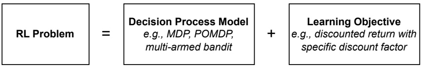

Figure 2.1: An RL problem is defined by the combination of a decision process model that defines the mechanics of the agent-environment interaction and a learning objective that specifies the properties of the optimal policy to be learned (e.g., maximize expected discounted return in each state).

## 2.1 General Definition

We begin by providing a general definition of reinforcement learning:

## Reinforcement learning (RL) algorithms learn solutions for sequential decision processes via repeated interaction with an environment.

This definition raises three main questions:

• What is a sequential decision process?

• What is a solution to the process?

• What is learning via repeated interaction?

A sequential decision process is defined by an agent that makes decisions over multiple time steps within an environment to achieve a specified goal. In each time step, the agent receives an observation from the environment and chooses an action. In a fully observable setting, as we assume in this chapter, the agent observes the full state of the environment; but in general, observations may be incomplete and noisy. Given the chosen action, the environment may change its state according to some transition dynamics and send a scalar reward signal to the agent. Figure 2.2 summarizes this process.

A solution to the decision process is an optimal decision policy for the agent, which chooses actions in each state to achieve some specified learning objective. Typically, the learning objective is to maximize the expected return for the agent in each possible state.<sup>1</sup> The return in a state when following a given policy is defined as the sum of rewards received over time from that state onward. Thus, RL assumes that the goal in the decision process can, in principle, be framed as the maximization of expected returns.

1. Other learning objectives can be specified, such as maximizing the average reward (Sutton and Barto 2018) and different types of “risk-sensitive” objectives (Mihatsch and Neuneier 2002).

<!-- page: 50 -->

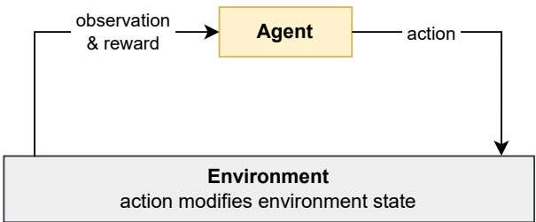

Figure 2.2: Basic reinforcement learning loop for a single-agent system.

Finally, RL algorithms learn such optimal policies by trying different actions in different states and observing the outcomes. This way of learning is sometimes described as “trial and error” since the actions may lead to positive or negative outcomes that are not known beforehand and, therefore, must be discovered by trying the actions. A central problem in this learning process, often called the exploration-exploitation dilemma, is how to balance exploring the outcomes of different actions versus sticking with actions that are currently believed to be best. Exploration may discover better actions but can accrue low rewards in the process, while exploitation achieves a certain level of returns but may not discover the optimal actions.

RL is a type of machine learning that differs from other types such as supervised learning and unsupervised learning. In supervised learning, we have access to a set of labeled input-output pairs $\{ x _ { i } , y _ { i } \}$ of some unknown function $f ( x _ { i } )   =   y _ { i }$ , and the goal is to learn this function using the data. In unsupervised learning, we have access to some unlabeled data $\{ x _ { i } \}$ and the goal is to identify some useful structure within the data. RL is neither of these: RL is not supervised learning because the reward signals do not tell the agent which action to take in each state $x _ { i } ,$ , and thus do not act as a supervision signal $y _ { i } ,$ . This is because some actions may give lower immediate reward but may lead to states from which the agent can eventually receive higher rewards. RL also differs from unsupervised learning because the rewards, while not a supervised signal, act as a proxy from which to learn an optimal policy.

In the following sections, we will formally define these concepts — sequential decision processes, optimal policies, and learning by interaction — within a framework called the Markov decision process.

<!-- page: 51 -->

## 2.2 Markov Decision Processes

The standard model used in RL to define the sequential decision process is the Markov decision process:

**Definition 1 (Markov decision process)** A finite Markov decision process (MDP) consists of:

• Finite set of states S, with subset of terminal states ${ \bar { S } } \subset S$

• Finite set of actions A

• Reward function R : $S \times A \times S \to \mathbb { R }$

• State transition probability function $\mathcal { T } : S \times A \times S \to [ 0 , 1 ]$ such that

$$
\forall s \in S, a \in A: \sum_ {s ^ {\prime} \in S} \mathcal {T} (s, a, s ^ {\prime}) = 1\tag{2.1}
$$

• Initial state distribution $\mu   :   S   \to   [ 0 , 1 ]$ such that

$$
\sum_ {s \in S} \mu (s) = 1 \quad a n d \quad \forall s \in \bar {S}: \mu (s) = 0\tag{2.2}
$$

An MDP starts in an initial state $s ^ { 0 } \in S ,$ , which is sampled from $\mu .$ At time t, the agent observes the current state $s ^ { t } \in S$ of the MDP and chooses an action $a ^ { t }   \in   A$ with probability given by its policy, $\pi ( a ^ { t }   |   s ^ { t } )$ , which is conditioned on the state. Given the state $s ^ { t }$ and action $a ^ { t }$ , the MDP transitions into a next state $s ^ { t + 1 } \in S$ with probability given by $\mathcal { T } ( s ^ { t } , a ^ { t } , s ^ { t + 1 } )$ , and the agent receives a reward $r ^ { t }   =   \mathcal { R } ( s ^ { t } , a ^ { t } , s ^ { t + 1 } )$ . We also write this probability as $\mathcal { T } ( s ^ { t + 1 }   |   s ^ { t } , a ^ { t } )$ to emphasize that it is conditioned on the state-action pair $s ^ { t } , a ^ { t }$ . These steps are repeated until the process reaches a terminal state $s ^ { t } \in \bar { S }$ or after completing a maximum number of $T$ time steps,<sup>2</sup>after which the process terminates; or the steps may be repeated for an infinite number of time steps if the MDP is non-terminating. Each independent run of this process is referred to as an episode.

A finite MDP can be compactly represented as a finite state machine. Figure 2.3 shows an example MDP, in which a Mars rover has collected some samples and must return to the base station. From the Start state, there are two paths that lead to the Base target state. The rover can travel down a steep mountain slope (action right) that will take it directly to the base station. However, there is a high probability of 0.5 that the rover will fall down the cliff and be destroyed (−10 reward). Or the rover can travel through a longer path (action left, then two times action $r i g h t )$ , which passes by two sites (Site A and Site B)

<small><span class="docvortex-page-footnote" data-block-type="page_footnote" style="color:#6b7280">5 st</span></small>

<small><span class="docvortex-page-footnote" data-block-type="page_footnote" style="color:#6b7280">st</span></small>

<small><span class="docvortex-page-footnote" data-block-type="page_footnote" style="color:#6b7280">t ≥ .</span></small>

<small><span class="docvortex-page-footnote" data-block-type="page_footnote" style="color:#6b7280">2. Technically, if we assume that the agent can observe the time step t, then termination after T time steps can be modeled by including t in the information contained in the state sand defining the set of terminal states ¯S to contain all states st with T</span></small>

<!-- page: 52 -->

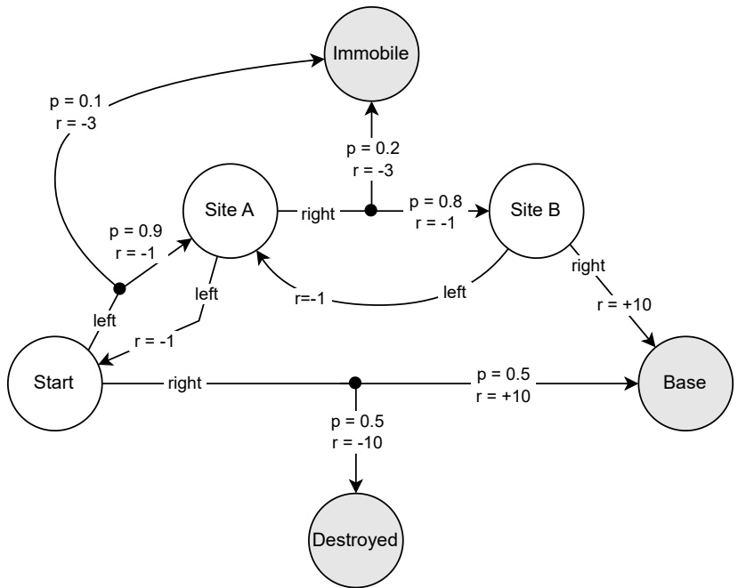

Figure 2.3: Mars Rover MDP. States are shown as circles, where Start is the initial state. Each non-terminal state (white) has two possible actions, right and left, that are shown as directed edges with associated transition probabilities (p) and rewards (r). Gray shaded circles mark terminal states.

before arriving at the base station. However, it takes a day to arrive at each site (−1 reward), and there is a probability of 0.3 that the rover will get stuck on the rocky ground and be immobilized (−3 reward). Arriving at the base station gives a reward of +10.

The term “Markov” comes from the Markov property, which states that the future state and reward are conditionally independent of past states and actions, given the current state and action:

$$
\Pr (s ^ {t + 1}, r ^ {t} \mid s ^ {t}, a ^ {t}, s ^ {t - 1}, a ^ {t - 1},..., s ^ {0}, a ^ {0}) = \Pr (s ^ {t + 1}, r ^ {t} \mid s ^ {t}, a ^ {t})\tag{2.3}
$$

This means that the current state provides sufficient information to choose optimal actions in an MDP — past states and actions are not relevant.

The most common assumption in RL is that the dynamics of the MDP, in particular the transition and reward functions $\mathcal { T }$ and $\mathcal { R } ,$ are a priori unknown to the agent. Typically, the only parts of the MDP that are assumed to be known are the action space A and the state space S.

<!-- page: 53 -->

While Definition 1 defines MDPs with finite, or discrete, states and actions, MDPs can also be defined with continuous states and actions, or a mixture of both discrete and continuous elements. Moreover, while the reward function R as defined here is deterministic, MDPs can also define a probabilistic reward function such that $\mathcal { R } ( s , a , s ^ { \prime } )$ gives a distribution over possible rewards.

The multi-armed bandit problem (or simply “bandit problem”) is an important special case of the MDP in which each episode terminates after one time step $( \mathrm { i . e . , } T   =   1 )$ , there is only a single state in S and no terminal states (i.e., |S| = 1 and $\bar { S }   =   \emptyset )$ , and the reward function R is probabilistic and unknown to the agent. Thus, in such a bandit problem, each action produces a reward from some unknown reward distribution, and the goal is effectively to find the action that yields the highest expected reward as quickly as possible. Bandit problems have been used as a basic model to study the exploration-exploitation dilemma (Lattimore and Szepesvári 2020).

An inherent assumption in MDPs is that the agent can fully observe the state of the environment in each time step. In many applications, an agent only observes partial and noisy information about the environment. Partially observable Markov decision processes (POMDPs) (Kaelbling, Littman, and Cassandra 1998) generalize MDPs by defining a decision process in which the agent receives observations $o ^ { t }$ rather than directly observing the state $s ^ { t }$ , and these observations depend in a probabilistic or deterministic way on the state. Thus, in general, the agent will need to take into account the history of past observations $o ^ { 0 } , o ^ { 1 } , . . . , o ^ { t }$ in order to infer the possible current states $s ^ { t }$ of the environment. POMDPs are a special case of the partially observable stochastic game (POSG) model introduced in Chapter 3; namely, a POMDP is a POSG in which there is only one agent. We refer to Section 3.4 for a more detailed definition and discussion of partial observability in decision processes.

We have defined the MDP as a model of decision processes, but we have not yet defined the learning objective in an MDP. The next section will introduce the most common learning objective used in MDPs: maximizing expected discounted returns. As discussed earlier (Figure 2.1), together, an MDP and learning objective specify an RL problem.

## 2.3 Expected Discounted Returns and Optimal Policies

Given a policy $\pi$ that specifies action probabilities in each state, and assuming that each episode in the MDP terminates after $T$ time steps, the total return in an episode is the cumulative reward received over time

$$
r ^ {0} + r ^ {1} + \dots + r ^ {T - 1}.\tag{2.4}
$$

<!-- page: 54 -->

Due to the stochastic nature of the MDP, it may not be possible to maximize this return in all episodes. This is because some actions may lead to different outcomes with certain probabilities, and these outcomes are outside the control of the agent. Therefore, the agent can maximize the expected return given by

$$
\mathbb {E} _ {\pi} \left[ r ^ {0} + r ^ {1} + \dots + r ^ {T - 1} \right]\tag{2.5}
$$

where the expectation $\mathbb { E } _ { \pi }$ assumes that the initial state is sampled from the initial state distribution $( \mathrm { i . e . , }   s ^ { 0 }   \sim   \mu )$ , that the agent follows policy $\pi$ to select actions $( \mathrm { i . e . , } ~ a ^ { t } \sim \pi ( \cdot \mid s ^ { t } ) )$ , and that successor states are governed by the state transition probabilities $( \mathrm { i . e . , } ~ s ^ { t + 1 } \sim \mathcal { T } ( \cdot \mid s ^ { t } , a ^ { t } ) )$

The above definition of total returns is guaranteed to be finite for a terminating MDP. However, in non-terminating MDPs the total return may be infinite, in which case returns may not be informative to distinguish the performance of different policies that achieve infinite returns. The standard approach to ensuring finite returns in non-terminating MDPs is to use a discount factor $\gamma   \in   [ 0 , 1 ]$ based on which we define the discounted return<sup>3</sup>

$$
\mathbb {E} _ {\pi} \left[ r ^ {0} + \gamma r ^ {1} + \gamma^ {2} r ^ {2} + \dots \right] = \mathbb {E} _ {\pi} \left[ \sum_ {t = 0} ^ {\infty} \gamma^ {t} r ^ {t} \right].\tag{2.6}
$$

For $\gamma   <   1$ and assuming that rewards are constrained to lie in a finite range $[ r _ { \mathrm { m i n } } , r _ { \mathrm { m a x } } ]$ , the discounted return is guaranteed to be finite

$$
\sum_ {t = 0} ^ {\infty} \gamma^ {t} r ^ {t} \leq r _ {\max} \sum_ {t = 0} ^ {\infty} \gamma^ {t} = r _ {\max} \frac {1}{1 - \gamma}\tag{2.7}
$$

where the right-hand fraction in the above equation is the closed form of the geometric series given by $\textstyle \sum _ { t = 0 } ^ { \infty } \gamma ^ { t }$

The discount factor has two equivalent interpretations. One interpretation is that $( 1 - \gamma )$ is the probability with which the MDP terminates after each time step. Thus, the probability that the MDP terminates after a total of $T   >   0$ time steps is $\gamma ^ { T - 1 } ( 1 - \gamma )$ , where $\gamma ^ { T - 1 }$ is the probability of continuing (i.e., not terminating) in the first $T - 1$ time steps, multiplied by the probability $( 1 - \gamma )$ of terminating in the following time step. For example, in the Mars Rover MDP shown in Figure 2.3, we can specify a discount factor of $\gamma   =   0 . 9 5$ to model the fact that the rover’s battery may fail with a probability of 0.05 after each state transition. The second interpretation is that the agent gives “weight” $\gamma ^ { t }$ to reward $r ^ { t }$ received at time t. Thus, a $\gamma$ close to 0 leads to a myopic agent that cares more about near-term rewards, while a $\gamma$ close to 1 leads to a farsighted agent that also values distant rewards. In either case, it is important to note that

<small><span class="docvortex-page-footnote" data-block-type="page_footnote" style="color:#6b7280">t</span></small>

<small><span class="docvortex-page-footnote" data-block-type="page_footnote" style="color:#6b7280">f .</span></small>

<small><span class="docvortex-page-footnote" data-block-type="page_footnote" style="color:#6b7280">γt</span></small>

<small><span class="docvortex-page-footnote" data-block-type="page_footnote" style="color:#6b7280">(γ</span></small>

<small><span class="docvortex-page-footnote" data-block-type="page_footnote" style="color:#6b7280">3. Note that rrefers to the reward at time t, while denotes the exponentiation operation to the power o t) This is a standard notational convention in RL literature.</span></small>

<!-- page: 55 -->

the discount rate is part of the learning objective and not a tunable algorithm parameter; $\gamma$ is a fixed parameter specified by the learning objective. In the remainder of this book, whenever we refer to returns, we specifically mean discounted returns with some discount factor $\gamma$

Finally, the above definition of discounted returns can work for both terminating and non-terminating MDPs via the convention of absorbing states. If an episode reaches a terminal state or a maximum number of time steps, we define the final state in the episode to be absorbing in that any subsequent actions in this state will transition the MDP into the same state with probability 1 and give a reward of 0 to the agent. Thus, once the MDP reaches an absorbing state, it will forever remain in that state and the agent will not accrue any more rewards.

Based on the above definition of discounted returns and absorbing states, we can now define the solution to the MDP as the optimal policy $\pi ^ { * }$ that maximizes the expected discounted return.

## 2.4 Value Functions and Bellman Equation

Based on the Markov property defined in Equation 2.3, we know that given the current state and action, the future states and rewards are independent of the past states and actions. This implies independence of past rewards, since rewards are a function of the states and actions, $r ^ { t }   =   \mathcal { R } ( s ^ { t } , a ^ { t } , s ^ { t + 1 } )$ . Therefore, in an MDP, the expected return can be defined individually for each state $s \in S$ This gives rise to the concept of value functions, which are central to much of RL theory and many algorithms.

First, note that the discounted reward sequence can be written in recursive form as

$$
u ^ {t} = r ^ {t} + \gamma r ^ {t + 1} + \gamma^ {2} r ^ {t + 2} + \dots\tag{2.8}
$$

$$
= r ^ {t} + \gamma u ^ {t + 1}.\tag{2.9}
$$

Given a policy $\pi ,$ , the state-value function $V ^ { \pi } ( s )$ gives the “value” of state s under $\pi .$ , which is the expected return when starting in state s and following policy $\pi$ to select actions, formally

$$
V ^ {\pi} (s) = \mathbb {E} _ {\pi} \left[ u ^ {t} \mid s ^ {t} = s \right]\tag{2.10}
$$

$$
= \mathbb {E} _ {\pi} \left[ r ^ {t} + \gamma u ^ {t + 1} \mid s ^ {t} = s \right]\tag{2.11}
$$

$$
= \sum_ {a \in A} \pi (a \mid s) \sum_ {s ^ {\prime} \in S} \mathcal {T} (s ^ {\prime} \mid s, a) \left[ \mathcal {R} (s, a, s ^ {\prime}) + \gamma \mathbb {E} _ {\pi} \left[ u ^ {t + 1} \mid s ^ {t + 1} = s ^ {\prime} \right] \right]\tag{2.12}
$$

$$
= \sum_ {a \in A} \pi (a \mid s) \sum_ {s ^ {\prime} \in S} \mathcal {T} (s ^ {\prime} \mid s, a) \left[ \mathcal {R} (s, a, s ^ {\prime}) + \gamma V ^ {\pi} (s ^ {\prime}) \right]\tag{2.13}
$$

<!-- page: 56 -->

where $V ^ { \pi } ( s )   =   0$ for terminal $( \mathbf { i . e . }$ , absorbing) states $s \in { \bar { S } } ,$ . The recursive equation given in Equation 2.13 is called the Bellman equation in honor of Richard Bellman and his pioneering work (Bellman 1957).

The Bellman equation for $V ^ { \pi }$ defines a system of m linear equations with m variables, where $m   =   | S |$ is the number of states in the finite MDP:

$$
V ^ {\pi} (s _ {1}) = \sum_ {a \in A} \pi (a \mid s _ {1}) \sum_ {s ^ {\prime} \in S} \mathcal {T} (s ^ {\prime} \mid s _ {1}, a) \left[ \mathcal {R} (s _ {1}, a, s ^ {\prime}) + \gamma V ^ {\pi} (s ^ {\prime}) \right]\tag{2.14}
$$

$$
V ^ {\pi} (s _ {2}) = \sum_ {a \in A} \pi (a \mid s _ {2}) \sum_ {s ^ {\prime} \in S} \mathcal {T} (s ^ {\prime} \mid s _ {2}, a) \left[ \mathcal {R} (s _ {2}, a, s ^ {\prime}) + \gamma V ^ {\pi} (s ^ {\prime}) \right]\tag{2.15}
$$

$$
V ^ {\pi} (s _ {m}) = \sum_ {a \in A} \pi (a \mid s _ {m}) \sum_ {s ^ {\prime} \in S} \mathcal {T} (s ^ {\prime} \mid s _ {m}, a) \left[ \mathcal {R} (s _ {m}, a, s ^ {\prime}) + \gamma V ^ {\pi} (s ^ {\prime}) \right]\tag{2.16}
$$

where $V ^ { \pi } ( s _ { k } )$ for $k   =   1 , . . . , m$ are the variables in the equation system and $\pi ( a   |   s _ { k } )$ $\mathcal { T } ( s ^ { \prime }   |   s _ { k } , a )$ $\mathcal { R } ( s _ { k } , a , s ^ { \prime } )$ , and $\gamma$ are constants. This equation system has a unique solution given by the value function $V ^ { \pi }$ for policy $\pi$ . If all elements of the MDP are known, then one can solve this equation system to obtain $V ^ { \pi }$ using any method to solve linear equation systems (such as Gauss elimination).

Analogous to state-value functions, we can define action-value functions $Q ^ { \pi } ( s , a )$ which give the expected return when selecting action a in state s and then following policy $\pi$ to select actions subsequently,

$$
Q ^ {\pi} (s, a) = \mathbb {E} _ {\pi} \left[ u ^ {t} \mid s ^ {t} = s, a ^ {t} = a \right]\tag{2.17}
$$

$$
= \mathbb {E} _ {\pi} \left[ r ^ {t} + \gamma u ^ {t + 1} \mid s ^ {t} = s, a ^ {t} = a \right]\tag{2.18}
$$

$$
= \sum_ {s ^ {\prime} \in S} \mathcal {T} (s ^ {\prime} \mid s, a) \left[ \mathcal {R} (s, a, s ^ {\prime}) + \gamma V ^ {\pi} (s ^ {\prime}) \right]\tag{2.19}
$$

$$
= \sum_ {s ^ {\prime} \in S} \mathcal {T} (s ^ {\prime} \mid s, a) \left[ \mathcal {R} (s, a, s ^ {\prime}) + \gamma \sum_ {a ^ {\prime} \in A} \pi (a ^ {\prime} \mid s ^ {\prime}) Q ^ {\pi} (s ^ {\prime}, a ^ {\prime}) \right]\tag{2.20}
$$

where $Q ^ { \pi } ( s , a )   =   0$ for terminal states $s \in { \bar { S } } ,$ . For the jump from Equation 2.19 to 2.20, notice in Equation 2.13 that the second sum (over states $s ^ { \prime } )$ is an application of Equation 2.19, and hence it can be replaced by $Q ^ { \pi } ( s ^ { \prime } , a ^ { \prime } )$ . Equation 2.20 admits a system of linear equations that has a unique solution given by $Q ^ { \pi }$

A policy $\pi$ is optimal in the MDP if the policy’s (state or action) value function is the optimal value function of the MDP, defined as

$$
V ^ {*} (s) = \max _ {\pi^ {\prime}} V ^ {\pi^ {\prime}} (s), \forall s \in S\tag{2.21}
$$

$$
Q ^ {*} (s, a) = \max _ {\pi^ {\prime}} Q ^ {\pi^ {\prime}} (s, a), \forall s \in S, a \in A\tag{2.22}
$$

<!-- page: 57 -->

We use $\pi ^ { * }$ to denote any optimal policy with optimal value function $V ^ { * }$ or $Q ^ { * }$ .

Because of the Bellman equation, this means that for any optimal policy $\pi ^ { * }$ we have

$$
\forall \pi^ {\prime} \forall s: V ^ {*} (s) \geq V ^ {\pi^ {\prime}} (s).\tag{2.23}
$$

Thus, maximizing the expected return in an MDP amounts to maximizing the expected return in each possible state $s \in S$

In fact, we can write the optimal value functions without reference to the policy using the Bellman optimality equations:

$$
V ^ {*} (s) = \max _ {a \in A} \sum_ {s ^ {\prime} \in S} \mathcal {T} (s ^ {\prime} \mid s, a) \left[ \mathcal {R} (s, a, s ^ {\prime}) + \gamma V ^ {*} (s ^ {\prime}) \right]\tag{2.24}
$$

$$
Q ^ {*} (s, a) = \sum_ {s ^ {\prime} \in S} \mathcal {T} (s ^ {\prime} \mid s, a) \left[ \mathcal {R} (s, a, s ^ {\prime}) + \gamma \max _ {a ^ {\prime} \in A} Q ^ {*} (s ^ {\prime}, a ^ {\prime}) \right]\tag{2.25}
$$

The Bellman optimality equations define a system of m non-linear equations, where m is again the number of states in the finite MDP. The non-linearity is due to the max-operator used in the equations. The unique solution to the system is the optimal value function $V ^ { * } / Q ^ { * }$

Once we know the optimal action-value function $Q ^ { * }$ , the optimal policy $\pi ^ { * }$ is simply derived by choosing actions with maximum value (i.e., expected return) in each state,

$$
\pi^ {*} (s) = \arg \max _ {a \in A} Q ^ {*} (s, a)\tag{2.26}
$$

where we use the =-notation in Equation 2.26 as a convenient shorthand to denote the deterministic policy that assigns probability 1 to the arg max-action in state s. If multiple actions have the same maximum value under $Q ^ { * }$ , then the optimal policy can assign arbitrary probabilities to these actions (the probabili ties must sum to 1). Therefore, while the optimal value function of the MDP is always unique, there may be multiple<sup>4</sup> optimal policies that have the same optimal (unique) value function. However, as shown in Equation 2.26, there always exist deterministic optimal policies in MDPs.

In the next sections, we will present two algorithm families to compute optimal value functions and policies. The first, dynamic programming, uses the Bellman (optimality) equations in an iterative way to estimate value functions, and it requires knowledge of the complete MDP such as the reward function and state transition probabilities. The second, temporal-difference learning, does not require complete knowledge of the MDP and instead uses sampled experiences from interactions with the environment to update value estimates.

<small><span class="docvortex-page-footnote" data-block-type="page_footnote" style="color:#6b7280">4. In fact, if multiple actions have maximum value, then there will be an infinite number of optimal policies since the set of possible probability assignments to these actions spans a continuous (infinite) space.</span></small>

<!-- page: 58 -->

## 2.5 Dynamic Programming

Dynamic programming $( \mathrm { D P } ) ^ { 5 }$ is a family of algorithms to compute value functions and optimal policies in MDPs (Bellman 1957; Howard 1960). DP algorithms use the Bellman equations as operators to iteratively estimate the value function and optimal policy. Thus, DP algorithms require complete knowledge of the MDP model, including the reward function $\mathcal { R }$ and state transition probabilities $\mathcal { T }$ . While DP algorithms do not “interact” with the environment as per our definition in Section 2.1, the basic concepts underlying DP are an important building block in RL theory, including temporal-difference learning presented in Section 2.6.

The basic DP approach is policy iteration, which alternates between two tasks:

• **Policy evaluation:** compute value function $V ^ { \pi }$ for current policy $\pi$

• **Policy improvement:** improve current policy $\pi$ with respect to $V ^ { \pi }$

Thus, policy iteration produces a sequence of policy and value function estimates, starting with some initial policy $\pi ^ { 0 }$ (e.g., uniform-random policy) and value function $V ^ { 0 }$ (e.g., zero vector):

$$
\pi^ {0} \to V ^ {\pi^ {0}} \to \pi^ {1} \to V ^ {\pi^ {1}} \to \pi^ {2} \to ... \to V ^ {*} \to \pi^ {*}\tag{2.27}
$$

As we will show later in this section, this sequence converges to the optimal value function, $V ^ { * }$ , and optimal policy, $\pi ^ { * }$ , under greedy policy improvements.

We first consider the policy evaluation task. Recall that the Bellman equation for $V ^ { \pi }$ defines a system of linear equations, which can be solved to obtain $V ^ { \pi }$ However, using Gauss elimination (the de-facto standard solution approach for linear equation systems) has time complexity $O ( m ^ { 3 } )$ , where $m$ is the number of states of the MDP. A number of alternative methods for policy evaluation have been developed in the DP literature, which often operate in iterative ways to produce successive approximations of value functions (see Puterman (2014) and Sutton and Barto (2018) for overviews). Iterative policy evaluation is one such method that iteratively applies the Bellman equation for $V ^ { \pi }$ to produce successive estimates of $V ^ { \pi }$ . The algorithm first initializes a vector $V ^ { 0 } ( s )   =   0$ for all $s \in S$ . It then repeatedly performs update sweeps for all states $s \in S _ { 1 }$

$$
V ^ {k + 1} (s) \leftarrow \sum_ {a \in A} \pi (a \mid s) \sum_ {s ^ {\prime} \in S} \mathcal {T} (s ^ {\prime} \mid s, a) \left[ \mathcal {R} (s, a, s ^ {\prime}) + \gamma V ^ {k} (s ^ {\prime}) \right]\tag{2.28}
$$

<small><span class="docvortex-page-footnote" data-block-type="page_footnote" style="color:#6b7280">5. The word “programming” in DP refers to a mathematical optimization problem, analogous to how the term is used in linear programming and non-linear programming. Regarding the adjective “dynamic,” Bellman (1957) states in his preface that it “indicates that we are interested in processes in which time plays a significant role, and in which the order of operations may be crucial.”</span></small>

<!-- page: 59 -->

This sequence $V ^ { 0 } , V ^ { 1 } , V ^ { 2 } , . .$ . converges to the value function $V ^ { \pi }$ . Hence, in practice, we may stop the updates once there are no more changes between $V ^ { k }$ and $V ^ { k + 1 }$ after performing an update sweep. Notice that Equation 2.28 updates the value estimate for a state s using value estimates for other states $s ^ { \prime } .$ This property is called bootstrapping and is a core property of many RL algorithms.

As an example, we apply iterative policy evaluation in the Mars Rover problem from Section 2.2 with $\gamma   =   0 . 9 5$ . First, consider a policy π which in the initial state Start chooses action right with probability 1. (We ignore the other states since they will never be visited under this policy.) After we run iterative policy evaluation to convergence, we obtain a value of $V ^ { \pi } ( S t a r t )   =   0$ . From the MDP specification in Figure 2.3, it can be easily verified that this value is correct, since $V ^ { \pi } ( S t a r t )   =   - 1 0 \cdot 0 . 5 + 1 0 \cdot 0 . 5   =   0$ . Now, consider a policy $\pi ,$ which chooses both actions with equal probability 0.5 in the initial state and action right with probability 1 in states Site A and Site B. In this case, the converged values are $V ^ { \pi } ( S t a r t ) = 2 . 0 5 ,   V ^ { \pi } ( S i t e   A ) = 6 . 2$ , and $V ^ { \pi } ( S i t e   B )   =   1 0$ For both policies, the values for the terminal states are all 0, since these are absorbing states as defined in Section 2.3.

To see why iterative policy evaluation converges to the value function $V ^ { \pi }$ , one can show that the Bellman operator defined in Equation 2.28 is a contraction mapping. A mapping $f   :   \mathcal { X }   \to   \mathcal { X }$ on a || · ||–normed complete vector space $\mathcal { X }$ is a γ-contraction, for $\gamma   \in   [ 0 , 1 )$ , if for all $x , y \in \mathcal { X }$

$$
\| f (x) - f (y) \| \leq \gamma \| x - y \|\tag{2.29}
$$

By the Banach fixed-point theorem, if f is a contraction mapping, then for any initial vector $x \in \mathcal { X }$ the sequence $f ( x ) , f ( f ( x ) ) , f ( f ( f ( x ) ) )$ , ... converges to a unique fixed point $x ^ { * } \in \mathcal { X }$ such that $f ( x ^ { * } )   =   x ^ { * }$ . Using the max-norm $\| x \| _ { \infty } = \max _ { i } | x _ { i } |$ it can be shown that the Bellman equation indeed satisfies Equation 2.29. First, rewrite the Bellman equation as follows:

$$
\begin{array}{l} V ^ {\pi} (s) = \sum_ {a \in A} \pi (a \mid s) \sum_ {s ^ {\prime} \in S} \mathcal {T} (s ^ {\prime} \mid s, a) \left[ \mathcal {R} (s, a, s ^ {\prime}) + \gamma V ^ {\pi} (s ^ {\prime}) \right] \\ = \sum_ {a \in A} \sum_ {s ^ {\prime} \in S} \pi (a \mid s) \mathcal {T} (s ^ {\prime} \mid s, a) \mathcal {R} (s, a, s ^ {\prime}) + \sum_ {a \in A} \sum_ {s ^ {\prime} \in S} \pi (a \mid s) \mathcal {T} (s ^ {\prime} \mid s, a) \gamma V ^ {\pi} (s ^ {\prime}) \end{array} \tag {2.30}\tag{2.31}
$$

This can be written as an operator $f ^ { \pi } ( \nu )$ over a value vector $\boldsymbol { \nu }   \in   \mathbb { R } ^ { | S | }$

$$
f ^ {\pi} (v) = r ^ {\pi} + \gamma M ^ {\pi} v\tag{2.32}
$$

where $r ^ { \pi } \in \mathbb { R } ^ { | S | }$ is a vector with elements

$$
r _ {s} ^ {\pi} = \sum_ {a \in A} \sum_ {s ^ {\prime} \in S} \pi (a \mid s) \mathcal {T} (s ^ {\prime} \mid s, a) \mathcal {R} (s, a, s ^ {\prime})\tag{2.33}
$$

<!-- page: 60 -->

and $M ^ { \pi }   \in   \mathbb { R } ^ { | S | \times | S | }$ is a matrix with elements

$$
M _ {s, s ^ {\prime}} ^ {\pi} = \sum_ {a \in A} \pi (a \mid s) \mathcal {T} (s ^ {\prime} \mid s, a).\tag{2.34}
$$

Then, we have for any two value vectors $\nu _ { \ast }$ u:

$$
\| f ^ {\pi} (v) - f ^ {\pi} (u) \| _ {\infty} = \| (r ^ {\pi} + \gamma M ^ {\pi} v) - (r ^ {\pi} + \gamma M ^ {\pi} u) \| _ {\infty}\tag{2.35}
$$

$$
= \gamma \| M ^ {\pi} (v - u) \| _ {\infty}\tag{2.36}
$$

$$
\leq \gamma \| v - u \| _ {\infty}.\tag{2.37}
$$

Therefore, the Bellman operator is a γ-contraction under the max-norm, and repeated application of the Bellman operator converges to a unique fixed point, which is $V ^ { \pi }$ . (The inequality in (2.37) holds because for each $s \in S$ we have $\textstyle \sum _ { s ^ { \prime } } M _ { s , s ^ { \prime } } ^ { \pi }   =   1$ and, therefore, $\| M ^ { \pi } x \| _ { \infty } \leq \| x \| _ { \infty }$ for any value vector x.)

Now that we have a method for policy evaluation, we next consider the policy improvement task in policy iteration. Once we have computed the value function $V ^ { \pi }$ , the policy improvement task modifies the policy $\pi$ by making it greedy with respect to $V ^ { \pi }$ for all $s \in S$

$$
\pi^ {\prime} = \arg \max _ {a \in A} \mathcal {T} (s ^ {\prime} \mid s, a) \left[ \mathcal {R} (s, a, s ^ {\prime}) + \gamma V ^ {\pi} (s ^ {\prime}) \right]\tag{2.38}
$$

$$
= \arg \max _ {a \in A} Q ^ {\pi} (s, a)\tag{2.39}
$$

By the policy improvement theorem (Sutton and Barto 2018), we know that if for all $s \in S$

$$
\sum_ {a \in A} \pi^ {\prime} (a \mid s) Q ^ {\pi} (s, a) \geq \sum_ {a \in A} \pi (a \mid s) Q ^ {\pi} (s, a)\tag{2.40}
$$

$$
= V ^ {\pi} (s)\tag{2.41}
$$

then $\pi ^ { \prime }$ must be as good as or better than $\pi )$ :

$$
\forall s: V ^ {\pi^ {\prime}} (s) \geq V ^ {\pi} (s).\tag{2.42}
$$

If after the policy improvement task, the greedy policy $\pi ^ { \prime }$ did not change from $\pi ,$ then we know that $V ^ { \pi ^ { \prime } }   =   V ^ { \pi }$ and it follows for all $s \in S _ { 1 }$

$$
V ^ {\pi^ {'}} (s) = \max _ {a \in A} \mathbb {E} _ {\pi} \left[ r ^ {t} + \gamma V ^ {\pi} (s ^ {t + 1}) \mid s ^ {t} = s, a ^ {t} = a \right]\tag{2.43}
$$

$$
= \max _ {a \in A} \mathbb {E} _ {\pi^ {\prime}} \left[ r ^ {t} + \gamma V ^ {\pi^ {\prime}} (s ^ {t + 1}) \mid s ^ {t} = s, a ^ {t} = a \right]\tag{2.44}
$$

$$
= \max _ {a \in A} \sum_ {s ^ {\prime} \in S} \mathcal {T} (s ^ {\prime} \mid s, a) \left[ \mathcal {R} (s, a, s ^ {\prime}) + \gamma V ^ {\pi^ {\prime}} (s ^ {\prime}) \right]\tag{2.45}
$$

$$
= V ^ {*} (s)\tag{2.46}
$$

<!-- page: 61 -->

<div class="docvortex-algorithm" style="white-space: pre-wrap; font-family:monospace;">
Algorithm 1 Value iteration for MDPs
Initialize: $V(s) = 0$ for all $s \in S$
Repeat until $V$ converged:
$\forall s \in S : V(s) \leftarrow \max_{a \in A} \sum_{s' \in S} \mathcal{T}(s' \mid s, a) \left[ \mathcal{R}(s, a, s') + \gamma V(s') \right]$ (2.48)
Return optimal policy $\pi^*$ with
$\forall s \in S : \pi^*(s) \leftarrow \arg\max_{a \in A} \sum_{s' \in S} \mathcal{T}(s' \mid s, a) \left[ \mathcal{R}(s, a, s') + \gamma V(s') \right]$ (2.49)
</div>

Therefore, if $\pi ^ { \prime }$ did not change from $\pi$ after policy improvement, we know that $\pi ^ { \prime }$ must be the optimal policy of the MDP, and policy iteration is complete.

The above version of policy iteration, which uses iterative policy evaluation, makes multiple complete update sweeps over the entire state space S. Value iteration is a DP algorithm that combines one sweep of iterative policy evaluation and policy improvement in a single update equation by using the Bellman optimality equation as an update operator:

$$
V ^ {k + 1} (s) \leftarrow \max _ {a \in A} \sum_ {s ^ {\prime} \in S} \mathcal {T} (s ^ {\prime} \mid s, a) \left[ \mathcal {R} (s, a, s ^ {\prime}) + \gamma V ^ {k} (s ^ {\prime}) \right], \forall s \in S\tag{2.47}
$$

Following a similar argument as for the Bellman operator, it can be shown that the Bellman optimality operator defined in Equation 2.47 is a $\gamma \cdot$ -contraction mapping. Thus, repeated application of value iteration converges to the unique fixed point that is the optimal value function $V ^ { * }$ . Algorithm 1 provides the complete pseudocode for the value iteration algorithm.

Returning to the Mars Rover example, if we run value iteration to convergence, we obtain the optimal state values $V^{*}(Start)=4.1,\;V^{*}(State\;A)=6.2$ , and $V ^ { * } ( S i t e B )   =   1 0$ . The optimal policy $\pi ^ { * }$ chooses action left with probability 1 in the initial state and action right with probability 1 in states Site A and Site B.

## 2.6 Temporal-Difference Learning

Temporal-difference learning (TD) is a family of RL algorithms that learn value functions and optimal policies based on experiences from interactions with the environment. The experiences are generated by following the agentenvironment interaction loop shown in Figure 2.2: in state $s ^ { t } ,$ , sample an action $a ^ { t }   \sim   \pi ( \cdot   \mid   s ^ { t } )$ from policy $\pi .$ , then observe reward $r ^ { t }   =   \mathcal { R } ( s ^ { t } , a ^ { t } , s ^ { t + 1 } )$ and the new state $s ^ { t + 1 }   \sim   \mathcal { T } ( \cdot   |   s ^ { t } , a ^ { t } )$ . Like DP algorithms, TD algorithms learn value functions based on the Bellman equations and bootstrapping — estimating the value of a

<!-- page: 62 -->

state or action using value estimates of other states/actions. However, unlike DP algorithms, TD algorithms do not require complete knowledge of the MDP, such as the reward function and state transition probabilities. Instead, TD algorithms perform the policy evaluation and policy improvement tasks based solely on the experiences collected while interacting with the environment.

TD algorithms use the following general update rule to learn action-value functions:

$$
Q (s ^ {t}, a ^ {t}) \leftarrow Q (s ^ {t}, a ^ {t}) + \alpha \left[ \mathcal {X} - Q (s ^ {t}, a ^ {t}) \right]\tag{2.50}
$$

where $\mathcal { X }$ is the update target, and $\alpha   \in   ( 0 , 1 ]$ is the learning rate (or step size). The update target $\mathcal { X }$ is constructed based on experience samples $( s ^ { t } , a ^ { t } , r ^ { t } , s ^ { t + 1 } )$ collected from interactions with the environment. A wide range of options exist to specify the update target, and here we present two basic variants.

Recall the Bellman equation for the action-value function $Q ^ { \pi }$ for policy π:

$$
Q ^ {\pi} (s, a) = \sum_ {s ^ {\prime} \in S} \mathcal {T} (s ^ {\prime} \mid s, a) \left[ \mathcal {R} (s, a, s ^ {\prime}) + \gamma \sum_ {a ^ {\prime} \in A} \pi (a ^ {\prime} \mid s ^ {\prime}) Q ^ {\pi} (s ^ {\prime}, a ^ {\prime}) \right]\tag{2.51}
$$

Sarsa (Sutton and Barto 2018) is a TD algorithm that constructs an update target based on Equation 2.51 by replacing the summations over successor states $s ^ { \prime }$ and actions $a ^ { \prime }$ as well as the reward function $\mathcal { R } ( s , a , s ^ { \prime } )$ with their corresponding elements from the experience tuple $( s ^ { t } , a ^ { t } , r ^ { t } , s ^ { t + 1 } , a ^ { t + 1 } )$ (hence the name Sarsa):

$$
\mathcal {X} = r ^ {t} + \gamma Q (s ^ {t + 1}, a ^ {t + 1})\tag{2.52}
$$

Here, the action $a ^ { t + 1 }$ is sampled from the policy $\pi$ in the successor state $s ^ { t + 1 }$ $a ^ { t + 1 } \sim \pi ( \cdot   |   s ^ { t + 1 } )$ . The complete Sarsa update rule is specified as

$$
Q (s ^ {t}, a ^ {t}) \leftarrow Q (s ^ {t}, a ^ {t}) + \alpha \left[ r ^ {t} + \gamma Q (s ^ {t + 1}, a ^ {t + 1}) - Q (s ^ {t}, a ^ {t}) \right].\tag{2.53}
$$

If π stays fixed, then it can be shown under certain conditions that Sarsa will learn the action-value function $Q   =   Q ^ { \pi }$ . The first condition is that all state action combinations $( s , a ) \in S \times A$ must be tried an infinite number of times during learning. The second condition is given by the “standard stochastic approximation conditions,” which state that the learning rate α must be reduced over time in a way that satisfies the following conditions:

$$
\forall s \in S, a \in A: \quad \sum_ {k = 1} ^ {\infty} \alpha_ {k} (s, a) \rightarrow \infty \quad \text {and} \quad \sum_ {k = 1} ^ {\infty} \alpha_ {k} (s, a) ^ {2} <   \infty\tag{2.54}
$$

where $\alpha _ { k } ( s , a )$ denotes the learning rate used when applying the update rule in Equation 2.53 after the kth selection of action a in state s. The left-hand sum in Equation 2.54 ensures that the learning rate is large enough to overcome initial learning conditions, while the right-hand sum ensures that the sequence will converge at a certain rate. Therefore, $\alpha _ { k } ( s , a )   =   \textstyle { \frac { 1 } { k } }$ satisfies these conditions on the

<!-- page: 63 -->

<div class="docvortex-algorithm" style="white-space: pre-wrap; font-family:monospace;">
Algorithm 2 Sarsa for MDPs (with $\epsilon$-greedy policies)
Initialize: $Q(s, a) = 0$ for all $s \in S, a \in A$
Repeat for every episode:
Observe initial state $s^0$
With probability $\epsilon$: choose random action $a^0 \in A$
Otherwise: choose action $a^0 \in \arg \max_a Q(s^0, a)$
for $t = 0, 1, 2, \ldots$ do
    Apply action $a^t$, observe reward $r^t$ and next state $s^{t+1}$
    With probability $\epsilon$: choose random action $a^{t+1} \in A$
    Otherwise: choose action $a^{t+1} \in \arg \max_a Q(s^{t+1}, a)$
    $Q(s^t, a^t) \leftarrow Q(s^t, a^t) + \alpha \left[ r^t + \gamma Q(s^{t+1}, a^{t+1}) - Q(s^t, a^t) \right]$
</div>

learning rate, while a constant learning rate $\alpha _ { k } ( s , a )   =   c$ does not. Nonetheless, in practice it is common to use a constant learning rate since learning rates that meet the above conditions, while theoretically sound, can lead to slow learning.

In order for Sarsa to learn the optimal value function $Q ^ { * }$ and optimal policy $\pi ^ { * }$ , it must gradually modify the policy $\pi$ in a way that brings it closer to the optimal policy. To achieve this, $\pi$ can be made greedy with respect to the value estimates $Q ,$ similarly to the DP policy improvement task defined in Equation 2.39. However, making $\pi$ fully greedy and deterministic would violate the first condition of trying all state-action combinations infinitely often. Thus, a common technique in TD algorithms is to instead use an ϵ-greedy policy that uses a parameter $\epsilon   \in   [ 0 , 1 ]$ , defined $\mathrm { a s } ^ { 6 }$

$$
\pi (a \mid s) = \left\{ \begin{array}{l l} 1 - \epsilon + \frac {\epsilon}{| A |} & \text {if} a \in \arg \max _ {a ^ {\prime} \in A} Q (s, a ^ {\prime}) \\ \frac {\epsilon}{| A |} & \text {otherwise} \end{array} \right.\tag{2.55}
$$

Thus, the ϵ-greedy policy chooses the greedy action with probability $1 - \epsilon ,$ and with probability ϵ chooses a random other action. In this way, if $\epsilon   >   0$ , the requirement to try all state-action combinations an infinite number of times is ensured. Now, in order to learn the optimal policy $\pi ^ { * }$ , we can gradually reduce the value of $\epsilon$ to $0$ during learning, such that $\pi$ will gradually converge to $\pi ^ { * }$ Pseudocode for Sarsa using ϵ-greedy policies is given in Algorithm 2.

<small><span class="docvortex-page-footnote" data-block-type="page_footnote" style="color:#6b7280">(1 − ϵ)</span></small>

<small><span class="docvortex-page-footnote" data-block-type="page_footnote" style="color:#6b7280">6. Equation 2.55 assumes that there is a single greedy action with maximum value under Q. If multiple actions with maximum value exist for a given state, then the definition can be modified to distribute the probability mass among these actions.</span></small>

<!-- page: 64 -->

<div class="docvortex-algorithm" style="white-space: pre-wrap; font-family:monospace;">
Algorithm 3 Q-learning for MDPs (with $\epsilon$-greedy policies)
Initialize: $Q(s, a) = 0$ for all $s \in S$, $a \in A$
Repeat for every episode:
for $t = 0, 1, 2, \ldots$ do
    Observe current state $s^t$
    With probability $\epsilon$: choose random action $a^t \in A$
    Otherwise: choose action $a^t \in \arg \max_a Q(s^t, a)$
    Apply action $a^t$, observe reward $r^t$ and next state $s^{t+1}$
    $Q(s^t, a^t) \leftarrow Q(s^t, a^t) + \alpha \left[ r^t + \gamma \max_{a'} Q(s^{t+1}, a') - Q(s^t, a^t) \right]$
</div>

While Sarsa is based on the Bellman equation for $Q ^ { \pi }$ , one can also construct a TD update target based on the Bellman optimality equation for $Q ^ { * }$

$$
Q ^ {*} (s, a) = \sum_ {s ^ {\prime} \in S} \mathcal {T} (s ^ {\prime} \mid s, a) \left[ \mathcal {R} (s, a, s ^ {\prime}) + \gamma \max _ {a ^ {\prime} \in A} Q ^ {*} (s ^ {\prime}, a ^ {\prime}) \right].\tag{2.56}
$$

Q-learning (Watkins and Dayan 1992) is a TD algorithm that constructs an update target based on the above Bellman optimality equation, again by replacing the summation over states $s ^ { \prime }$ and the reward function $\mathcal { R } ( s , a , s ^ { \prime } )$ with corresponding elements from the experience tuple $( s ^ { t } , a ^ { t } , r ^ { t } , s ^ { t + 1 } )$ :

$$
\mathcal {X} = r ^ {t} + \gamma \max _ {a ^ {\prime} \in A} Q (s ^ {t + 1}, a ^ {\prime})\tag{2.57}
$$

The complete Q-learning update rule is specified as

$$
Q (s ^ {t}, a ^ {t}) \leftarrow Q (s ^ {t}, a ^ {t}) + \alpha \left[ r ^ {t} + \gamma \max _ {a ^ {\prime} \in A} Q (s ^ {t + 1}, a ^ {\prime}) - Q (s ^ {t}, a ^ {t}) \right].\tag{2.58}
$$

Pseudocode for Q-learning using ϵ-greedy policies is given in Algorithm 3.

Q-learning is guaranteed to converge to the optimal policy $\pi ^ { * }$ under the same conditions as Sarsa (i.e., trying all state-action pairs infinitely often, and standard stochastic approximation conditions in Equation 2.54). However, in contrast to Sarsa, Q-learning does not require that the policy $\pi$ used to interact with the environment be gradually made closer to the optimal policy $\pi ^ { * }$ . Instead, Q-learning may use any policy to interact with the environment, so long as the convergence conditions are upheld. For this reason, Q-learning is called an off-policy TD algorithm while Sarsa is an on-policy TD algorithm, and this distinction has a number of implications which we will discuss in more detail in Chapter 8. In Section 2.7, we will use learning curves to evaluate and compare the performance of Q-learning and Sarsa on an RL problem.

<!-- page: 65 -->

## 2.7 Evaluation with Learning Curves

The standard approach to evaluate the performance of an RL algorithm on a learning problem is via learning curves. A learning curve shows the performance of the learned policy over increasing training time, where performance can be measured in terms of the learning objective (e.g., discounted returns) as well as other secondary metrics.

Figure 2.4 shows various learning curves for the Sarsa and Q-learning algorithms applied to the Mars Rover problem from Section 2.2 with discount factor $\gamma   =   0 . 9 5$ . In these figures, the x-axis shows the environment time steps across episodes, and the y-axis shows the average discounted evaluation returns achieved from the initial state, that is, $V ^ { \pi } ( s ^ { 0 } ) .$ <sup>7</sup>

The term “evaluation return” means that the shown returns are for the greedy policy<sup>8</sup> with respect to the learned action values after T learning time steps. Thus, the plots answer the question: If we finish learning after T time steps and extract the greedy policy, what expected returns can we expect to achieve with this policy? The results shown here are averaged over one hundred independent training runs, each using a different random seed to determine the outcomes of random events (e.g., probabilistic action selections and state transitions). Specifically, each point on a line is produced by taking the greedy policy from each training run at that time, running one hundred independent episodes with the policy and averaging over the resulting returns, and finally averaging over the average returns corresponding to the one hundred training runs. The shaded area shows the standard deviation over the averaged returns from each training run. In Figure 2.4(b), we show the average episode lengths of the greedy policy instead of the average returns.

In this example, Sarsa and Q-learning both learn the optimal policy $\pi ^ { * }$ which chooses action left in state Start and action right in states Site A and Site B. Moreover, the two algorithms basically have the same learning curves for the evaluation returns. Figures 2.4(c) and 2.4(d) (for Q-learning) show that the choice of the learning rate α and exploration rate ϵ can have an important impact on the learning. In this case, the “average” learning rate $\alpha _ { k } ( s , a )   =   \textstyle { \frac { 1 } { k } }$ performs best for Q-learning, but for more complex MDPs with larger state and action sets, this choice of learning rate usually leads to much slower learning compared to appropriately chosen constant learning rates.

<small><span class="docvortex-page-footnote" data-block-type="page_footnote" style="color:#6b7280">7. Recall that we use the term “return” as a shorthand for discounted return when the learning objective is to maximize discounted returns.</span></small>

<small><span class="docvortex-page-footnote" data-block-type="page_footnote" style="color:#6b7280">8. In policy gradient RL algorithms, discussed in Chapter 8, the algorithm learns a probabilistic policy for which there usually is no “greedy” version. In this case, the evaluation return just uses the current policy without modification.</span></small>

<!-- page: 66 -->

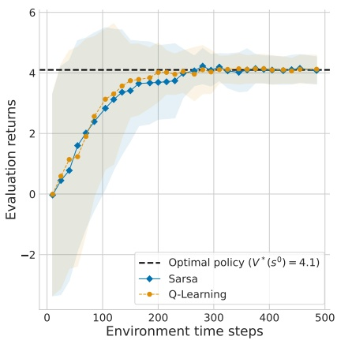

(a) Average evaluation returns for Sarsa and Q-learning

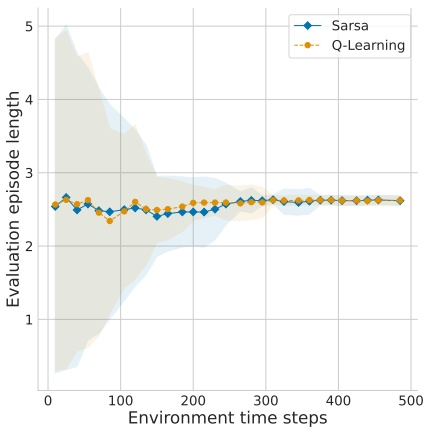

(b) Average episode length for Sarsa and Q-learning

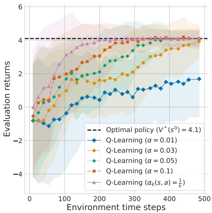

(c) Q-learning with different learning rates α (ϵ linearly decayed from 1 to 0)

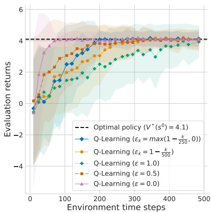

(d) Q-learning with different exploration rates ϵ (α = 0.1)

Figure 2.4: Results when applying the Sarsa and Q-learning algorithms to the Mars Rover problem (Figure 2.3, page 23) with $\gamma   =   0 . 9 5$ , averaged over one hundred independent training runs. The shaded area shows the standard deviation over the averaged discounted returns from each training run. The dashed horizontal line marks the optimal value of the initial state $( V ^ { * } ( s ^ { 0 } ) )$ computed via value iteration. In Figures 2.4(a) and 2.4(b), the algorithms use a scheduled learning rate of $\alpha _ { k } ( s , a )   =   \frac { 1 } { k }$ where k is the number of times state s has been visited and action a was applied. The exploration rate is linearly decayed from ϵ = 1 to $\epsilon   =   0$ over time steps $t = 0 , \ldots , 5 0 0   ( \mathrm { i . e . , } \epsilon ^ { t } = 1 - t \frac { 1 } { 5 0 0 } )$

<!-- page: 67 -->

Note that the x-axis of the plots show the cumulative training time steps across episodes. This is not to be confused with the time steps t within episodes. The reason that we show cumulative time steps instead of the number of completed episodes on the x-axis is that the latter can potentially skew the comparison of algorithms. For instance, suppose we show training curves for algorithms A and B with number of episodes on the x-axis. Suppose both algorithms eventually reach the same performance with their learned policies, but algorithm A learns much faster than algorithm B (i.e., the curve for A rises more quickly). In this case, it could be that in the early episodes, algorithm A explored many more actions (i.e., time steps) than algorithm B before finishing the episode, which results in a larger number of collected experiences (or training data) for algorithm A. Thus, although both algorithms completed the same number of episodes, algorithm A will have done more learning updates (assuming updates are done after each time step, as in the TD methods presented in this chapter), which would explain the seemingly faster growth in the learning curve. If we instead showed the learning curve for both algorithms with cumulative time steps across episodes, then the learning curve for A might not grow faster than the curve for B.

Recall that at the beginning of this chapter (Figure 2.1, page 20), we defined an RL problem as the combination of a decision process model (e.g., MDP) and a learning objective for the policy (e.g., maximizing the expected discounted return in each state for a specific discount factor). When evaluating a learned policy, we want to evaluate its ability to achieve this learning objective. For example, our Mars Rover problem specifies a discounted return objective with the discount factor $\gamma   =   0 . 9 5$ . Therefore, our learning curves in Figure 2.4(a) show exactly this objective on the y-axis.

However, in some cases, it can be useful to show undiscounted returns $( \mathbf { i . e . }$ $\gamma   =   1 )$ for a learned policy, even if the RL problem specified a discounted return objective with a specific discount factor $\gamma   <   1$ . The reason is that undiscounted returns can sometimes be easier to interpret than discounted returns. For example, suppose we want to learn an optimal policy for a video game in which the agent controls a space ship and receives a +1 score (reward) for each destroyed enemy. If in an episode the agent destroys ten enemies at various points in time, the undiscounted return will be ten but the discounted return will be less than ten, making it more difficult to understand how many enemies the agent destroyed. More generally, when analyzing a learned policy, it is often useful to show additional metrics besides the returns, such as win rates in competitive games, or episode lengths as we did in Figure 2.4(b).

When showing undiscounted returns and additional metrics such as episode lengths, it is important to keep in mind that the evaluated policy was not actually

<!-- page: 68 -->

trained to maximize these objectives — it was trained to maximize the expected discounted return for a specific discount factor. In general, two RL problems that differ only in their discount factor but are otherwise identical (i.e., same MDP) may have different optimal policies. In our Mars Rover example, a discounted return objective with discount factor $\gamma   =   0 . 9 5$ leads to an optimal policy that chooses action $l e \hat { H }$ in the initial state, achieving a value of $V ^ { * } ( S t a r t )   =   4 . 1$ . In contrast, a discount factor of $\gamma   =   0 . 5$ leads to an optimal policy that chooses action $r i g h t$ in the initial state, achieving a value of $V ^ { * } ( S t a r t )   =   0$ . Both policies are optimal, but they are for two different learning problems that use different discount factors. Both learning problems are valid, and the choice of $\gamma$ is part of designing the learning problem.

## 2.8 Equivalence of $\mathcal { R } ( s , a , s ^ { \prime } )$ and $\mathcal { R } ( s , \pmb { a } )$

Our definition of MDPs uses the most general definition of reward functions, $\mathcal { R } ( s ^ { t } , a ^ { t } , s ^ { t + 1 } )$ , by conditioning on the current state $s ^ { t }$ and action $a ^ { t }$ as well as the successor state $s ^ { t + 1 }$ . Another definition for reward functions commonly used in the RL literature is to condition only on $s ^ { t }$ and $a ^ { t }$ , that is, $\mathcal { R } ( s ^ { t } , a ^ { t } )$ . This may be a point of confusion for newcomers to RL. However, these two definitions are in fact equivalent, in that for any MDP using $\mathcal { R } ( s ^ { t } , a ^ { t } , s ^ { t + 1 } )$ we can construct an MDP using $\mathcal { R } ( s ^ { t } , a ^ { t } )$ (all other components are identical to the original MDP) such that a given policy $\pi$ produces the same expected returns in both MDPs.

Recall the Bellman equation for the state-value function $V ^ { \pi }$ that we have been using so far for an MDP with reward function $\mathcal { R } ( s , a , s ^ { \prime } )$

$$
V ^ {\pi} (s) = \sum_ {a \in A} \pi (a \mid s) \sum_ {s ^ {\prime} \in S} \mathcal {T} (s ^ {\prime} \mid s, a) \left[ \mathcal {R} (s, a, s ^ {\prime}) + \gamma V ^ {\pi} (s ^ {\prime}) \right]\tag{2.59}
$$

Assuming that $\mathcal { R } ( s , a , s ^ { \prime } )$ depends only on $s , a ,$ we can rewrite the above equation as

$$
V ^ {\pi} (s) = \sum_ {a \in A} \pi (a \mid s) \sum_ {s ^ {\prime} \in S} \mathcal {T} (s ^ {\prime} \mid s, a) \left[ \mathcal {R} (s, a) + \gamma V ^ {\pi} (s ^ {\prime}) \right]\tag{2.60}
$$

$$
= \sum_ {a \in A} \pi (a \mid s) \left[ \sum_ {s ^ {\prime} \in S} \mathcal {T} (s ^ {\prime} \mid s, a) \mathcal {R} (s, a) + \sum_ {s ^ {\prime} \in S} \mathcal {T} (s ^ {\prime} \mid s, a) \gamma V ^ {\pi} (s ^ {\prime}) \right]\tag{2.61}
$$

$$
= \sum_ {a \in A} \pi (a \mid s) \left[ \mathcal {R} (s, a) + \gamma \sum_ {s ^ {\prime} \in S} \mathcal {T} (s ^ {\prime} \mid s, a) V ^ {\pi} (s ^ {\prime}) \right].\tag{2.62}
$$

This is the simplified Bellman equation for MDPs using a reward function $\mathcal { R } ( s , a )$ . Going the reverse direction from $\mathcal { R } ( s , a )$ to $\mathcal { R } ( s , a , s ^ { \prime } )$ , we know that by

<!-- page: 69 -->

defining $\mathcal { R } ( s , a )$ to be the expected reward under the state transition probabilities

$$
\mathcal {R} (s, a) = \sum_ {s ^ {\prime} \in S} \mathcal {T} (s ^ {\prime} \mid s, a) \mathcal {R} (s, a, s ^ {\prime})\tag{2.63}
$$

and plugging this into Equation 2.62, we recover the original Bellman equation that uses $\mathcal { R } ( s , a , s ^ { \prime } )$ , given in Equation 2.59. Analogous transformations can be done for the Bellman equation of the action-value function $Q ^ { \pi }$ , as well as the Bellman optimality equations for $V ^ { * } / Q ^ { * }$ . Therefore, one may use either $\mathcal { R } ( s , a , s ^ { \prime } )$ or $\mathcal { R } ( s , a )$

In this book, we use $\mathcal { R } ( s , a , s ^ { \prime } )$ for the following pedagogical reasons:

1. Using $\mathcal { R } ( s , a , s ^ { \prime } )$ can be more convenient when specifying examples of MDPs, since it is useful to show the differences in reward for multiple possible outcomes of an action. In our Mars Rover MDP shown in Figure 2.3, when using $\mathcal { R } ( s , a )$ we would have to show the expected reward (Equation 2.63) on the transition arrow for action right from the initial state Start (rather than showing the different rewards for the two possible outcomes), which would be less intuitive to read.

2. The Bellman equations when using $\mathcal { R } ( s , a , s ^ { \prime } )$ show a helpful visual congruence with the update targets used in TD algorithms. For example, the Q-learning update target, $r ^ { t } + \gamma \operatorname* { m a x } _ { a ^ { \prime } } Q ( s ^ { t + 1 } , a ^ { \prime } )$ , appears in a corresponding form in the Bellman optimality equation (in the [] brackets):

$$
Q ^ {*} (s, a) = \sum_ {s ^ {\prime} \in S} \mathcal {T} (s ^ {\prime} \mid s, a) \left[ \mathcal {R} (s, a, s ^ {\prime}) + \gamma \max _ {a ^ {\prime} \in A} Q ^ {*} (s ^ {\prime}, a ^ {\prime}) \right]\tag{2.64}
$$

And similarly for the Sarsa update target and the Bellman equation for $Q ^ { \pi }$ (see Section 2.6).

Finally, we mention that most of the original MARL literature presented in Chapter 6 in fact defined reward functions as $\mathcal { R } ( s , a )$ . To stay consistent in our notation, we will continue to use $\mathcal { R } ( s , a , s ^ { \prime } )$ in the remainder of this book, noting that equivalent transformations from $\mathcal { R } ( s , a )$ to $\mathcal { R } ( s , a , s ^ { \prime } )$ always exist.

## 2.9 Summary

This chapter has provided a concise introduction to the basic concepts of singleagent RL. The most important concepts are the following:

• The Markov decision process (MDP) is the standard model to define the environment in which the agent chooses actions over a number of time steps. It defines the possible states of the environment, the actions available to the agent, how the environment state changes in response to the different actions,

<!-- page: 70 -->

and the rewards received by the agent. The agent uses a policy that assigns probabilities to the available actions in each state.

A learning problem in RL is defined by the combination of a decision process model (e.g., MDP) and a learning objective. The most common learning objective used in single-agent RL is to find a decision policy for the agent that maximizes the expected discounted return, defined as the sum of rewards received over time and weighted by a discount factor.

• The Markov property in MDPs means that the future states and rewards are independent of past states and actions, given the current state and action. This property allows us to define recursive value functions for policies, known as Bellman equations, that return the “value” of a policy in each possible state of the environment. The value is the expected return when starting in the given state and following the policy to select actions. Value functions can also be defined for state-action pairs, where a given action is first chosen and subsequent actions are chosen by the policy.

Dynamic programming (DP) and temporal-difference learning (TD) are two families of algorithms that can learn optimal policies in MDPs. DP algorithms require complete knowledge of the MDP specification and use procedures such as value iteration to learn optimal value functions. TD algorithms build on DP theory but do not need complete knowledge of the MDP, instead learning optimal policies by repeatedly exploring actions in the environment and observing the outcomes.

• RL algorithms are evaluated via learning curves that show improvement in expected returns over an increasing number of agent-environment interactions during learning.

The following chapters in this part of the book will build on the above concepts in multiple ways. First, Chapter 3 will extend the MDP model by introducing game models in which multiple agents interact in a shared environment. Chapter 4 will use the notion of discounted returns to define a range of solution concepts for multi-agent games. Finally, Chapters 5 and 6 will introduce several families of MARL algorithms that build on and extend the DP and TD algorithms introduced in this chapter.

<!-- page: 71 -->

<!-- page: 72 -->

## 3 Games: Models of Multi-Agent Interaction

Chapter 1 introduced the general idea of agents that interact in a shared environment to achieve specified goals. In this chapter, we will define this idea formally via models of multi-agent interaction. These models are rooted in game theory, and are hence called games. The game models we will introduce define a hierarchy of increasingly complex models, shown in Figure 3.1.

The most basic model is the normal-form game, in which there are multiple agents but there is no evolving environment state. Further up the hierarchy are stochastic games, which define environment states that change over time as a result of the agents’ actions and probabilistic state transitions. At the top of the game hierarchy are partially observable stochastic games, in which agents do not directly observe the full environment but instead observe incomplete and/or noisy information about the environment. Games may also use different assumptions about what the agents know about the game. We will introduce each of the game models in turn and provide examples.<sup>1</sup>

Note that this chapter focuses on defining models of multi-agent interaction, but does not define what it means to solve the games — that is, what it means for agents to act optimally. There are many possible solution concepts which define optimal policies for agents in games. We will introduce a range of solution concepts for games in Chapter 4.

<small><span class="docvortex-page-footnote" data-block-type="page_footnote" style="color:#6b7280">1. There exists another type of game model, not covered in this chapter, called “extensive-form game.” The primary distinction is that in extensive-form games, agents choose actions in turns (one after another) while in the games we introduce, agents choose actions simultaneously (at the same time). We focus on simultanous-move games since most MARL research uses this type of game model, and they are a more natural extension of the MDP-type models used in RL. Transformations between extensive-form games and (sequential) simultanous-move games are possible (Shoham and Leyton-Brown 2008).</span></small>

<!-- page: 73 -->

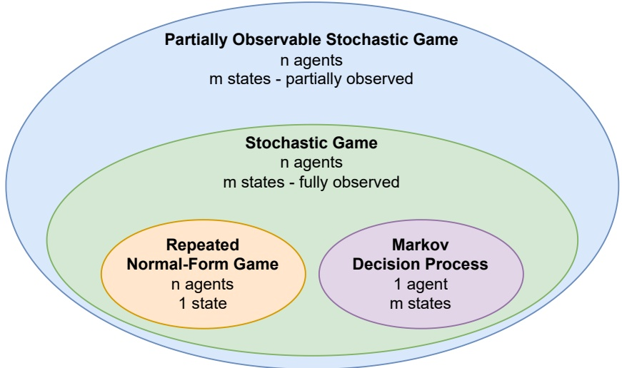

Figure 3.1: Hierarchy of game models used in this book. Partially observable stochastic games (POSGs) include stochastic games as a special case in which the states and agents’ chosen actions are fully observable by all agents. Stochastic games include repeated normal-form games as a special case in which there is only a single environment state, and they include Markov decision processes (MDPs) as a special case in which there is only a single agent.

## 3.1 Normal-Form Games

A normal-form game (also known as “strategic-form” game) defines a single interaction between two or more agents. Similar to how the multi-armed bandit problem (Section 2.2) can be seen as the basic kernel of the MDP, the normalform game can be seen as the basic building block of all game models introduced in this chapter.

**Definition 2 (Normal-form game)** A normal-form game consists of:

• Finite set of agents $I   =   \{ 1 , . . . , n \}$

• For each agent $i \in I .$

– Finite set of actions $A _ { i }$

– Reward function $\mathcal { R } _ { i }   :   A   \to   \mathbb { R } _ { i }$ , where $A   =   A _ { 1 } \times \ldots \times A _ { n }$

A normal-form game proceeds as follows: First, each agent $i \in I$ selects a policy $\pi _ { i }   :   A _ { i }   \to   [ 0 , 1 ]$ , which assigns probabilities to the actions available to the agent, so that $\textstyle \sum _ { a _ { i } \in A _ { i } } \pi _ { i } ( a _ { i } )   =   1$ . Each agent then samples an action $a _ { i }   \in   A _ { i }$ with

<!-- page: 74 -->

probability $\pi _ { i } ( a _ { i } )$ given by its policy. The resulting actions of all agents form a joint action, $a   =   ( a _ { 1 } , . . . , a _ { n } )$ . Finally, each agent i receives a reward based on its reward function and the joint action, $r _ { i }   =   \mathcal { R } _ { i } ( a )$

Normal-form games can be classified based on the relationship between the reward functions of agents:

• In a zero-sum game, the sum of the agents’ rewards is always 0, i.e., $\textstyle \sum _ { i \in I } { \mathcal { R } } _ { i } ( a )   =   0$ for all $a   \in   A . ^ { 2 }$ In zero-sum games with two agents, i and $j _ { \cdot } ^ { 3 }$ one agent’s reward function is simply the negative of the other agent’s reward function, i.e., $\mathcal { R } _ { i }   =   - \mathcal { R } _ { j }$

• In a common-reward game, all agents receive the same reward, i.e., $\mathcal { R } _ { i }   =   \mathcal { R } _ { j }$ for all $i , j   \in   I .$

• In a general-sum game, there are no restrictions on the relationship of reward functions.

Normal-form games with two agents are also referred to as matrix games because, in this case, the reward function can be compactly represented as a matrix.<sup>4</sup> Figure 3.2 shows three example matrix games. Agent 1’s action is to choose the row position, and agent 2’s action is to choose the column position. The values $( r _ { 1 } , r _ { 2 } )$ in the matrix cells show the agents’ rewards for each possible joint action. Figure 3.2(a) shows the Rock-Paper-Scissors game in which each agent chooses one of three possible actions (R,P,S). This is a zero-sum game $( \mathrm { i . e . , } r _ { 1 }   { = }   { - } r _ { 2 } )$ since for each action combination, one agent wins (+1 reward) and the other agent loses (-1 reward), or there is a draw (0 reward to both). Figure 3.2(b) shows a “coordination” game with two actions (A,B) for each agent, and agents must select the same action to receive a positive reward. This game is common-reward $( \mathrm { i . e . , } r _ { 1 }   { = }   r _ { 2 } )$ , hence it suffices to show a single reward in the matrix cells which both of the agents receive. Lastly, Figure 3.2(c) shows a widely studied game called the Prisoner’s Dilemma, which is a general-sum game. Here, each agent chooses to either cooperate (C) or defect (D). While mutual cooperation would give both agents the second-highest reward, each agent is individually incentivized to defect since this is the “dominant action,” meaning that D always achieves higher rewards compared to C. What makes

<small><span class="docvortex-page-footnote" data-block-type="page_footnote" style="color:#6b7280">2. Zero-sum games are a special case of constant-sum games, in which the agents’ rewards sum to a constant.</span></small>

<small><span class="docvortex-page-footnote" data-block-type="page_footnote" style="color:#6b7280">3. For games with two agents, we often use i and j to refer to the two agents in formal descriptions, and we use 1 and 2 to refer to the agents in specific examples.</span></small>

<small><span class="docvortex-page-footnote" data-block-type="page_footnote" style="color:#6b7280">4. Some game theory literature uses the term “bimatrix game” to specifically refer to general-sum games that require two matrices to define the agents’ reward functions, and “matrix game” for games that require only a single matrix to define the reward functions. This book uses “matrix game” in both cases.</span></small>

<!-- page: 75 -->

|  | R | P | S |
| --- | --- | --- | --- |
| R | 0,0 | -1,1 | 1,-1 |
| P | 1,-1 | 0,0 | -1,1 |
| S | -1,1 | 1,-1 | 0,0 |

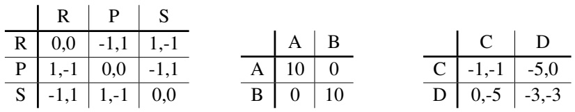

(a) Rock-Paper-Scissors

(b) Coordination Game

(c) Prisoner’s Dilemma

Figure 3.2: Three normal-form games with two agents (i.e., matrix games).

these and many other games interesting is that one agent’s reward depends on the choices of the other agents, which are not known in advance.

Much effort has been devoted to developing classifications of normal-form games and understanding the relationship between different games (Rapoport and Guyer 1966; Kilgour and Fraser 1988; Walliser 1988; Robinson and Goforth 2005; Bruns 2015; Marris, Gemp, and Piliouras 2023). For instance, in Section 11.2, we provide a comprehensive listing of all structurally distinct and strictly ordinal $2 \times 2$ normal-form games (meaning games with two agents and two actions each), of which there are seventy-eight in total.

In the remainder of the book, we will use “normal-form game” when making general statements about n-agent normal-form games, and we will sometimes use “matrix game” when discussing specific examples of normal-form games for two agents.

## 3.2 Repeated Normal-Form Games

A normal-form game, as presented in Section 3.1, defines a single interaction between two or more agents. The most basic way to extend this to sequential multi-agent interactions is by repeating the same normal-form game for a finite or infinite number of times, giving rise to the repeated normal-form game. This type of game model is among the most widely studied models in game theory. For example, the repeated Prisoner’s Dilemma has been extensively studied in the game theory literature (e.g., Axelrod 1984) and still serves as an important example of a sequential social dilemma.

Given a normal-form game $\Gamma   =   ( I , \{ A _ { i } \} _ { i \in I } , \{ \mathcal { R } _ { i } \} _ { i \in I } )$ , a repeated normal-form game repeats the same game Γ over T time steps, $t   =   0 , 1 , 2 , . . . , T - 1$ , where T is either finite or infinite. At each time step t, each agent $i \in I$ samples an action $a _ { i } ^ { t }   \in   A _ { i }$ with probability given by its policy, $\pi _ { i } ( a _ { i } ^ { t }   |   h ^ { t } )$ . The policy is now conditioned on the joint-action history, $h ^ { t }   =   ( a ^ { 0 } , . . . , a ^ { t - 1 } )$ , which contains all

<!-- page: 76 -->

joint actions before the current time step t (for $t   =   0$ , the history is the empty set). Given the joint action $a ^ { t }   =   ( a _ { 1 } ^ { t } , . . . , a _ { n } ^ { t } )$ , each agent i receives a reward $r _ { i } ^ { t }   =   \mathcal { R } _ { i } ( a ^ { t } )$

Besides the time index t, the important addition in repeated normal-form games is that policies can now make decisions based on the entire history of past joint actions, giving rise to a complex space of policies that agents can use. Typically, policies are conditioned on an internal state which is a function of the history, $f ( h ^ { t } )$ . For example, a policy may be conditioned on just the most recent joint action $a ^ { t - 1 }$ , or on summary statistics such as the action counts of other agents in the history. “Tit-for-Tat” is a famous policy for the game of repeated Prisoner’s Dilemma that simply conditions on the most recent action of the other agent, choosing to cooperate if the other agent cooperated and defecting if the other agent defected (Axelrod and Hamilton 1981).

It is important to note that a game with finite repetitions is not in general equivalent to the same game with infinite repetitions. In finitely repeated games, there can be “end-game” effects: if the agents know that a game will finish after T time steps, they may choose different actions closer to the end of the game compared to earlier in the game (see Section 6.3.3 for an example in Prisoner’s Dilemma). For infinitely repeated games, one may specify a probability with which each time step terminates the game. This termination probability is related to the discount factor $\gamma   \in   [ 0 , 1 ]$ used in the discounted-return learning objective in RL, in that $1 - \gamma$ specifies the probability of termination in each time step (see the discussion in Section 2.3). For $\gamma   <   1$ , the game still counts as “infinite” since any finite number $T   >   0$ of time steps will have a non-zero probability of occurring.

In the remainder of this book, we will use the term non-repeated normal-form game to refer to the special case when $T   =   1$ , while repeated normal-form game refers to the case when $T   >   1$

## 3.3 Stochastic Games

While the relative simplicity of normal-form games is useful to study interactions between agents, they lack the notion of an environment state which is affected by the actions of the agents. Moving closer to the full multi-agent system described in Section 1.1, stochastic games define a state-based envi ronment in which the state evolves over time based on the agents’ actions and probabilistic state transitions (Shapley 1953).

**Definition 3 (Stochastic game)** A stochastic game consists of:

• Finite set of agents $I   =   \{ 1 , . . . , n \}$

• Finite set of states S, with subset of terminal states ${ \bar { S } } \subset S$

<!-- page: 77 -->

• For each agent $i \in I \colon$

– Finite set of actions $A _ { i }$

– Reward function $\mathcal { R } _ { i } \colon S \times A \times S \to \mathbb { R } _ { i }$ , where $A   =   A _ { 1 } \times \ldots \times A _ { n }$

• State transition probability function T : $S \times A \times S \to [ 0 , 1 ]$ such that

$$
\forall s \in S, a \in A: \sum_ {s ^ {\prime} \in S} \mathcal {T} (s, a, s ^ {\prime}) = 1\tag{3.1}
$$

• Initial state distribution $\mu   :   S   \to   [ 0 , 1 ]$ such that

$$
\sum_ {s \in S} \mu (s) = 1 \quad a n d \quad \forall s \in \bar {S}: \mu (s) = 0\tag{3.2}
$$

A stochastic game proceeds as follows: The game starts in an initial state $s ^ { 0 } \in S$ sampled from $\mu .$ At time t, each agent $i \in I$ observes the current state $s ^ { t } \in S$ and chooses an action $a _ { i } ^ { t }   \in   A _ { i }$ with probability given by its policy, $\pi _ { i } ( a _ { i } ^ { t }   |   h ^ { t } )$ resulting in the joint action $a ^ { t }   =   ( a _ { 1 } ^ { t } , . . . , a _ { n } ^ { t } )$ . The policy is conditioned on the state-action history, $h ^ { t }   =   ( s ^ { 0 } , a ^ { 0 } , s ^ { 1 } , a ^ { 1 } , . . . . , s ^ { t } )$ , which contains the current state $s ^ { t }$ as well as the states and joint actions from the previous time steps. This history is observed by all agents, which is a property known as full observability. Given the state $s ^ { t }$ and joint action $a ^ { t } ,$ , the game transitions into a next state $s ^ { t + 1 } \in S$ with probability given by $\mathcal { T } ( s ^ { t } , a ^ { t } , s ^ { t + 1 } )$ , and each agent i receives a reward $r _ { i } ^ { t }   =   \mathcal { R } _ { i } ( s ^ { t } , a ^ { t } , s ^ { t + 1 } )$ . We also write this probability as $\mathcal { T } ( s ^ { t + 1 }   |   s ^ { t } , a ^ { t } )$ to emphasize that it is conditioned on the state-action pair $s ^ { t } , a ^ { t }$ . These steps are repeated until reaching a terminal state $s ^ { t } \in \bar { S }$ or completing a maximum number of $T$ time steps,<sup>5</sup>after which the game terminates; or it may continue for an infinite number of time steps if the game is non-terminating.

Similar to MDPs, stochastic games have the Markov property in that the probability of the next state and reward is conditionally independent of the past states and joint actions, given the current state and joint action

$$
\Pr (s ^ {t + 1}, r ^ {t} \mid s ^ {t}, a ^ {t}, s ^ {t - 1}, a ^ {t - 1},..., s ^ {0}, a ^ {0}) = \Pr (s ^ {t + 1}, r ^ {t} \mid s ^ {t}, a ^ {t})\tag{3.3}
$$

where $r ^ { t }   =   ( r _ { 1 } ^ { t } , . . . , r _ { n } ^ { t } )$ is the joint reward at time t. For this reason, stochastic games are also sometimes called Markov games (e.g., Littman 1994).

As a concrete example of a stochastic game, we can model the level-based foraging environment shown in Figure 1.2 (page 4). Each state is a vector that specifies the x-y integer positions of all agents and items, as well as binary flags for each item to indicate whether it has been collected. The agents’ action spaces include actions for moving up/down/left/right, collecting an item, and doing nothing (noop). The effect of joint actions is specified in the transition

<small><span class="docvortex-page-footnote" data-block-type="page_footnote" style="color:#6b7280">5. Recall also Footnote 2 (page 22).</span></small>

<!-- page: 78 -->

probability function T . For example, two agents that together collect an existing item will modify the state by switching the binary flag associated with that item (meaning that the item has been collected and no longer exists). In a common-reward version of the game, every agent will receive a reward of +1 whenever any of the items has been collected by any agents. A general-sum version may specify individual rewards for agents, such as +1 reward for agents which were actually involved in the collection of an item and 0 reward for all other agents. The game terminates after a fixed number of time steps, or when a terminal state has been reached in which all items have been collected.

Stochastic games include repeated normal-form games as a special case in which there is only a single state in S and there are no terminal states $( \mathrm { i . e . ,   \bar { S }   =   \emptyset } )$ More generally, if we define reward functions as $\mathcal { R } _ { i } ( s , a )$ , then each state $s \in S$ in the stochastic game can be viewed as a non-repeated normal-form game with rewards given by $\mathcal { R } _ { i } ( s , \cdot )$ , as shown in Figure 3.3. (For a comment on the equivalence of $\mathcal { R } _ { i } ( s , a , s ^ { \prime } )$ and $\mathcal { R } _ { i } ( s , a )$ , see Section 2.8.) It is in this sense that normal-form games form the basic building block of stochastic games. Stochastic games also include MDPs as the special case in which there is only a single agent in I. And, like MDPs, while the state and action sets in our definition of stochastic games are finite (as per the original definition of Shapley (1953)), a stochastic game can be analogously defined for continuous states and actions. Finally, the classification of normal-form games into zero-sum games, common-reward games, and general-sum games also carry over to stochastic games (Section 3.1). That is, stochastic games may specify zero-sum rewards, common rewards, or general-sum rewards.

Chapter 11 gives many more examples of state-based multi-agent environments, many of which can be modeled as a stochastic game.

## 3.4 Partially Observable Stochastic Games

Sitting at the top of the game model hierarchy shown in Figure 3.1, the most general model we use in this book is the partially observable stochastic game, or POSG for short (Hansen, Bernstein, and Zilberstein 2004). While in stochastic games the agents can directly observe the environment state and the chosen actions of all agents, in a POSG, the agents receive “observations” that carry some incomplete information about the environment state and agents’ actions. This allows POSGs to represent decision processes in which agents have limited ability to sense their environment, such as in autonomous driving and other robot control tasks or strategic games where players have private information not seen by other players (e.g., card games).

<!-- page: 79 -->

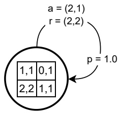

(a) Repeated normal-form game

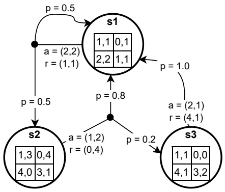

(b) Stochastic game

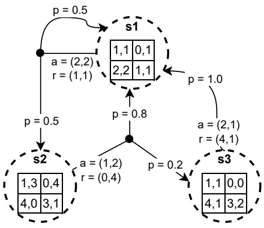

(c) POSG

Figure 3.3: Normal-form games are the basic building block of all game models described in Chapter 3. This figure shows one example game for each type of game model, shown as a directed cyclic graph. Each game is for two agents with two actions each. Each node in the graph corresponds to a state and shows a normal-form game being played in that state. We show one possible joint action choice for each state, along with the rewards received and the probabilities of reaching the respective next state in the outgoing arrows. For POSG, the states are dashed to represent that agents do not directly observe the current state of the game; instead, agents receive partial/noisy observations about the state.

<!-- page: 80 -->

In its most general form, a POSG defines state-observation probabilities $\operatorname* { P r } ( s ^ { t } , o ^ { t }   |   s ^ { t - 1 } , a ^ { t - 1 } )$ , where $o ^ { t }   =   ( o _ { 1 } ^ { t } , . . . , o _ { n } ^ { t } )$ is the joint observation at time t that contains the agents’ individual observations $o _ { i } ^ { t }$ . However, it is often the case that observations only depend on the new environment state $s ^ { t }$ and the joint action $a ^ { t - 1 }$ that led to this state (and not on the previous state $\boldsymbol { s } ^ { t - 1 } )$ . Thus, it is common to define for each agent i an individual observation function $\mathcal { O } _ { i }$ that specifies probabilities over the agent’s possible observations $o _ { i } ^ { t }$ given the state $s ^ { t }$ and joint action $a ^ { t - 1 }$ . We give the full definition of POSGs next:

**Definition 4 (Partially observable stochastic game)** A partially observable stochastic game (POSG) is defined by the same elements of a stochastic game (Definition 3) and additionally defines for each agent $i \in I .$

• Finite set of observations $O _ { i }$

• Observation function $\mathcal { O } _ { i } : A \times S \times O _ { i } \to [ 0 , 1 ]$ such that

$$
\forall a \in A, s \in S: \sum_ {o _ {i} \in O _ {i}} \mathcal {O} _ {i} (a, s, o _ {i}) = 1\tag{3.4}
$$

A POSG proceeds similarly to a stochastic game: The game starts in an initial state $s ^ { 0 } \in S$ sampled from $\mu .$ At each time t, the game is in a state $s ^ { t } \in S$ with previous joint action $a ^ { t - 1 }   \in   A$ (for $t   =   0$ we set $a ^ { t - 1 }   =   \emptyset )$ , and each agent $i \in I$ receives an observation $o _ { i } ^ { t } \in O _ { i }$ with probability given by its observation function, $\mathcal { O } _ { i } ( a ^ { t - 1 } , s ^ { t } , o _ { i } ^ { t } )$ We also write this as $\mathcal { O } _ { i } ( o _ { i } ^ { t }   |   a ^ { t - 1 } , s ^ { t } )$ to emphasize that the probability is conditioned on the state $s ^ { t }$ and joint action $a ^ { t - 1 }$ . Each agent then chooses an action $a _ { i } ^ { t }   \in   A _ { i }$ based on action probabilities given by its policy, $\pi _ { i } ( a _ { i } ^ { t }   |   h _ { i } ^ { t } )$ , resulting in the joint action $a ^ { t }   =   ( a _ { 1 } ^ { t } , . . . , a _ { n } ^ { t } )$ . The policy $\pi _ { i }$ is conditioned on agent $i ^ { \flat } \mathrm { s }$ observation history $h _ { i } ^ { t }   =   ( o _ { i } ^ { 0 } , . . . , o _ { i } ^ { t } )$ , which includes all of the agent’s past observations up to and including the most recent observation. Note that an agent’s observation $o _ { i } ^ { t }$ may or may not include the actions $a _ { j } ^ { t - 1 }$ from the previous time step, as we will further discuss in the next paragraphs. Given the joint action $a ^ { t }$ , the game transitions into the next state $s ^ { t + 1 } \in S$ with probability $\mathcal { T } ( s ^ { t + 1 }   |   s ^ { t } , a ^ { t } )$ , and each agent i receives a reward $r _ { i } ^ { t }   =   \mathcal { R } _ { i } ( s ^ { t } , a ^ { t } , s ^ { t + 1 } )$ These steps are repeated until reaching a terminal state $s ^ { t } \in \overline { { S } }$ or completing a maximum number of T time steps, after which the game terminates; or it may continue for an infinite number of time steps if the game is non-terminating.

Again, the classification of zero-sum reward, common reward, and generalsum reward also applies to the POSG model. POSGs with common rewards, in which all agents have the same reward function, are also known as “Decentralized POMDP” (Dec-POMDP) and have been widely studied in the area of multi-agent planning (see, for example, the textbook by Oliehoek and Amato

<!-- page: 81 -->

2016). POSGs can also be defined analogously with continuous-valued (or mixed discrete-continuous) observations.

POSGs include stochastic games as the special case in which $o _ { i } ^ { t }   =   ( s ^ { t } , a ^ { t - 1 } )$ They also include POMDPs as the special case in which there is only a single agent in I. In general, the observation functions in POSGs can be used to represent diverse observability conditions of interest. Examples include:

**Unobserved actions of other agents** Agents may observe the state and their own previous action, but not the previous actions of the other agents, that is, $o _ { i } ^ { t }   =   ( s ^ { t } , a _ { i } ^ { t - 1 } )$ . An example of this scenario is robot soccer, in which the robots may observe the full playing field but do not directly communicate their chosen actions to other players (especially players from the opponent team). In this case, agents may need to infer with some uncertainty the possible actions of other agents based on changes in the observed environment state (e.g., inferring a pass action between two players based on location, direction, and velocity of the ball). Another example is a market setting in which the asset prices are observed by all agents, but the agents’ buy/sell actions are private.

**Limited view region** Agents may observe a subset of the state and joint action, that is, $o _ { i } ^ { t }   =   ( \bar { s } ^ { t } , \bar { a } ^ { t } )$ where $\overline { { s } } ^ { t } \subset s ^ { t }$ and $\bar { a } ^ { t } \subset a ^ { t }$ . Such a scenario may arise if agents have a limited view of their surrounding environment, such that an agent may only see those parts of the state $s ^ { t }$ and joint action $a ^ { t - 1 }$ that are (or took place) within its view region. For example, in the partially observable version of level-based foraging shown in Figure 3.4, the agents have local vision fields and can only see items, other agents, and their actions within their own vision fields. Another example is agents playing a real-time strategy game in which parts of the game map are concealed by “fog of war” (e.g., Vinyals et al. 2019).

Observation functions can model uncertainty in observations (i.e., noise) by assigning non-zero probability to multiple possible observations. For example, such uncertainty may be caused by imperfect sensors in robotics applications. Observation functions can also model communication between agents, which may be limited by range and can be unreliable. A communication message can be modeled as a multi-valued vector (e.g., a bit vector) that does not modify the environment state but can be received by other agents within their own observation if they are within a certain range of the sender. Unreliable communication can be modeled by specifying a probability with which messages are lost (i.e., not received by an agent even if within sending range) or by randomly changing parts of the message. One may even specify combined actions $a _ { i }   =   ( a _ { i , s } , a _ { i , c } )$

<!-- page: 82 -->

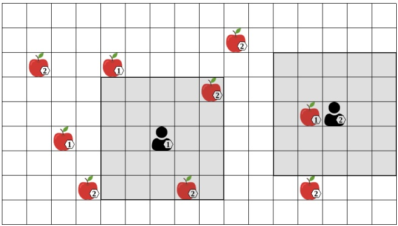

Figure 3.4: Level-based foraging environment with partial observability. Agents observe the world through their local vision fields (shown as gray rectangles around the agents).

where $a _ { i , s }$ affects the state s (such as moving around in a physical world) while $a _ { i , c }$ is a communication message which may be received by other agents j within their observation $o _ { j }$ .

In Chapter 11 (Section 11.3), we list several multi-agent environments with partial observability used in MARL research.

## 3.4.1 Belief States and Filtering

In a POSG, since an agent’s observation only provides partial information about the current state of the environment, it is typically not possible to choose optimal actions based only on the current observation. For example, in the level-based foraging environment shown in Figure 3.4, the optimal action for the level-1 agent may be to move toward the level-1 item to its left. However, this item is not included in the agent’s current observation within its vision field, and so the agent cannot infer the optimal action from its current observation alone. In general, if the environment is only partially observed, the agents must maintain estimates of the possible current states and their relative likelihoods based on the history of observations. Continuing with the example, the level-1 agent may have seen the level-1 item to its left in a previous observation, and may thus remember its location within the observation history.

One way of defining such estimates about environment states from the perspective of agent i is as a belief state $b _ { i } ^ { t } ,$ which is a probability distribution over the possible states $s \in S$ that the environment may be in at time t. Consider for simplicity a POSG with only a single agent i — that is, a POMDP. The initial belief state of the agent is given by the distribution of initial states, that is,

<!-- page: 83 -->

$b _ { i } ^ { 0 }   =   \mu$ . After taking action $a _ { i } ^ { t }$ and observing $\rho _ { i } ^ { t + 1 }$ , the belief state $b _ { i } ^ { t }$ is updated to $b _ { i } ^ { t + 1 }$ by computing a Bayesian posterior distribution

$$
b _ {i} ^ {t + 1} (s ^ {\prime}) \propto \sum_ {s \in S} b _ {i} ^ {t} (s) \mathcal {T} (s ^ {\prime} \mid s, a _ {i} ^ {t}) \mathcal {O} _ {i} (o _ {i} ^ {t + 1} \mid a _ {i} ^ {t}, s ^ {\prime}).\tag{3.5}
$$

The resulting belief state is exact in the sense that it retains all relevant information from the observation history. This belief state is known as a “sufficient statistic” because it carries enough information needed to choose optimal ac tions and to make predictions about the future. The process of updating belief states based on observations is also known as (belief state) filtering.

Unfortunately, the space complexity of storing such exact belief states and the time complexity of updating them using the Bayesian update from Equation 3.5 are each exponential in the number of variables that define the state, making it intractable for complex environments. Hence, developing algorithms for efficient approximate filtering has been the subject of much research; see, for example, Albrecht and Ramamoorthy (2016) and discussions therein.

In a POSG with more than one agent, the definition of belief states and how to update them becomes significantly more complex. In particular, since agents may not observe the chosen actions of other agents and their resulting observations, the agents now also have to infer probabilities over the possible observations and actions of other agents, which in turn requires knowledge of their observation functions and policies (e.g., Gmytrasiewicz and Doshi 2005; Oliehoek and Amato 2016). However, as we will discuss in Section 3.6, in MARL, we typically assume that agents do not possess complete knowledge about the elements of the POSG, such as S, T , and $\mathcal { O } _ { i }$ (including their own observation function), all of which are required in Equation 3.5. Thus, we will not dwell further on the intricacies of defining exact belief states in multi-agent contexts.

To achieve some form of filtering without knowledge of these elements, deep RL algorithms often use recurrent neural networks (discussed in Section 7.5.2) to process observations sequentially. The output vector of the recurrent network learns to encode information about the current state of the environment and can be used to condition other functions of the agent such as value and policy networks. Part II of this book will discuss how MARL algorithms can integrate such deep learning models in order to learn and operate in POSGs. See also Section 8.3 for a further discussion on this topic.

<!-- page: 84 -->

## 3.5 Modeling Communication

The game models introduced in this chapter are very general and can represent various multi-agent environments, such as the application examples discussed in Section 1.3. Stochastic games and POSGs can also model communication between agents by including communication actions that agents can use to send messages to other agents. This section will discuss several ways in which communication actions can be modeled.

Intuitively, we can view communication as a type of action that can be observed by other agents but does not affect the state of the environment. For an agent $i ,$ we can model the action space as a combination of two sets

$$
A _ {i} = X _ {i} \times M _ {i}\tag{3.6}
$$

where $X _ { i }$ includes environment actions that affect the environment state (such as the move and collect actions in level-based foraging) and $M _ { i }$ includes the communication actions. Thus, each action $( x _ { i } , m _ { i } )   \in   A _ { i }$ specifies both an environment action and a communication action at the same time. At a basic level, $M _ { i }$ may be defined as a set of possible messages {m1, m2, m3, ...}, which may be discrete symbols or continuous values. It is also possible to define more complex messages as multi-valued vectors, in which the vector elements may specify discrete or continuous values, or a combination of both. We could also include $\varnothing$ in $M _ { i }$ to represent an empty message.

In a stochastic game, each agent observes the current state $s ^ { t }$ and the previous joint action $a ^ { t - 1 }$ . Thus, each agent i’s communication action (message) $m _ { i } ^ { t - 1 } \in$ $M _ { i }$ is observed (i.e., received) by all other agents as part of the joint action $a ^ { t - 1 }$ In contrast to environment actions $X _ { i }$ , communication actions $M _ { i }$ do not affect the next state $s ^ { t + 1 }$ of the environment. Formally, let $M   =   \times _ { i \in I } M _ { i }$ , then the state transition probabilities are independent of M, that is,

$$
\forall s, s ^ {\prime} \in S \forall a \in A, m \in M: \mathcal {T} (s ^ {\prime} \mid s, a) = \mathcal {T} (s ^ {\prime} \mid s, \left\langle (a _ {1} ^ {x}, m _ {1}),..., (a _ {n} ^ {x}, m _ {n}) \right\rangle)\tag{3.7}
$$

where $a _ { i } ^ { x }$ refers to the environment action component of agent i in joint action a and the tuple $\left\langle ( a _ { 1 } ^ { x } , m _ { 1 } ) , . . . , ( a _ { n } ^ { x } , m _ { n } ) \right\rangle$ is a joint action in which the agents use the same environment actions as in a but their communication actions are replaced by $m   =   ( m _ { 1 } , . . . , m _ { n } )$ . Note that, based on this definition, communications are ephemeral in that they last only for a single time step. However, since agents can see the state-action history h that includes all past states and joint actions, they can in principle remember past messages.

In a POSG, we can also model noisy and unreliable communication via the agents’ observation functions $\mathcal { O } _ { i } ( o _ { i } ^ { t }   |   a ^ { t - 1 } , s ^ { t } )$ . For example, an agent i’s observation could be defined as a vector $o _ { i } ^ { t }   =   [ \bar { s } ^ { t } , w _ { 1 } ^ { t - 1 } , . . . , w _ { n } ^ { t - 1 } ]$ , where $\overline { { s } } ^ { t }$ contains

<!-- page: 85 -->

some partial information about the state $s ^ { t }$ , and $w _ { j } ^ { t - 1 }$ is the communication message $m _ { j } ^ { t - 1 }$ sent by agent j at time $t - 1$ . To model noisy communication, $\mathcal { O } _ { i }$ could specify $w _ { j } ^ { t - 1 }   =   f ( m _ { j } ^ { t - 1 } )$ where f can modify the message in some way. For example, if $m _ { j } ^ { t - 1 }$ is continuous-valued, then we could specify $f ( m _ { j } ^ { t - 1 } )   =   m _ { j } ^ { t - 1 } + \eta$ where $\eta$ is a random noise component sampled from a Gaussian distribution. $\mathcal { O } _ { i }$ can also model message loss, by specifying a probability with which $w _ { j } ^ { t - 1 }$ is set to $\varnothing$ to represent the case that the message from agent j was not received. Additional communication constraints can be modeled via $\mathcal { O } _ { i }$ , such as limited communication ranges, by setting $w _ { j } ^ { t - 1 }$ to $\varnothing$ if agents i and j are not within a communication range. Again, since agents have access to the history of observations, they can in principle remember past received messages.

The agents may use messages to communicate a variety of information, such as sharing their own observations about the state of the environment or communicating their intended actions and plans. In the level-based foraging example, the set $M _ { i }$ may contain a message corresponding to each possible location in the grid-world, and these messages could be used by the agents to communicate their intended goal locations to other agents or to tell other agents about item locations they have discovered. However, in reinforcement learning, the standard assumption is that agents do not know the meaning of the actions in $A _ { i }$ , including the communication actions. (See Section 3.6 for further discussion of knowledge assumptions.) Therefore, each communication action in $M _ { i }$ is an abstract action for agent i just like any environment action in $X _ { i } ,$ , and the agents have to learn the meaning of actions via repeated trials and observations. For communication actions, there is also the added difficulty that agents need to learn how to interpret the messages sent by other agents. This opens the possibility that the agents can learn and evolve a shared language or communication protocol (Foerster et al. 2016; Sukhbaatar, Szlam, and Fergus 2016; Wang, He, et al. 2020; Guo et al. 2022).

The learning algorithms we will present in the later chapters are general in that they learn policies over any given action sets $A _ { i } ,$ , which may or may not include communication actions. While communication actions may be modeled as part of $A _ { i }$ (such as discussed earlier), in the remainder of this book we will keep our descriptions general and will not give special consideration to communication actions.

## 3.6 Knowledge Assumptions in Games

What do the agents know about the environment they interact in and how it works? In other words, what do agents know about the game they are playing?

<!-- page: 86 -->

In game theory, the standard assumption is that all agents have knowledge of all components that define the game; this is referred to as a “complete knowledge game” (Owen 2013). For normal-form games, this means that the agents know the action spaces and reward functions of all agents (including their own). For stochastic games and POSGs, agents also know the state space and state transition function, as well as the observation functions of all agents. Knowledge of these components can be utilized in different ways. For example, if agent i knows the reward function $\mathcal { R } _ { j }$ of another agent $i j ,$ then agent i may be able to estimate the best-response action (Section 4.2) of agent $j ,$ which in turn could inform the optimal action for agent i. If an agent knows the transition function $\mathcal { T }$ , it may predict the effects of its actions on the state and plan its actions several steps into the future.

However, in most real-world applications of interest (such as those mentioned in Chapter 1), it is infeasible to obtain accurate and complete specifications of these components. For such applications, often the best we can obtain is a simulator of these components that can generate samples of states, (joint) rewards, and (joint) observations. For example, we may have access to a simulator $\hat { \mathcal { T } }$ that, given an input state s and joint action $a ,$ can produce samples of joint rewards and successor states $( r   =   ( r _ { 1 } , . . . , r _ { n } ) , s ^ { \prime } )   \sim   \widehat { \mathcal { T } } ( s , a )$ , such that

$$
\Pr \left\{\widehat {\mathcal {T}} (s, a) = (r, s ^ {\prime}) \right\} \approx \mathcal {T} (s ^ {\prime} \mid s, a) \prod_ {i \in I} [ \mathcal {R} _ {i} (s, a, s ^ {\prime}) = r _ {i} ] _ {1}\tag{3.8}
$$

where $[ x ] _ { 1 }   =   1$ if x is true, else $[ x ] _ { 1 }   =   0$

In MARL, we usually operate at the other end of the knowledge spectrum: agents typically do not know the reward functions of other agents, nor even their own reward function; and agents have no knowledge of the state transition and observation functions (in game theory, this is also known as “incomplete information game” (Harsanyi 1967)). Instead, an agent i only experiences the immediate effects of its own actions, via its own reward $r _ { i } ^ { t }$ and (in stochastic games) the joint action $a ^ { t }$ and resulting next state $s ^ { t + 1 }$ or (in POSG) an observation $\rho _ { i } ^ { t + 1 }$ . Agents may use such experiences to construct models of the unknown components in a game (such as $\mathcal { T } )$ or the policies of other agents.

Additional assumptions may pertain to whether certain knowledge about the game is held mutually by all agents or not (symmetric vs. asymmetric knowledge) and whether agents are aware of what other agents know about the game. Are the reward functions in a game known to all agents or only to some of the agents? If all agents have knowledge of the reward functions of each agent, are they also aware of the fact that all agents have this knowledge, the fact that all agents knowing the reward functions is known by all agents, and so on (common knowledge)? While such questions and their impact on optimal decision making

<!-- page: 87 -->

have been the subject of much research in game theory (Shoham and Leyton-Brown 2008; Perea 2012) and agent modeling (Albrecht and Stone 2018), in MARL they have played a relatively lesser role since the standard assumption is that agents have no knowledge of most game components. Exceptions can be found in MARL research for zero-sum or common-reward games, where the specific reward structure is exploited in some way in the algorithm design. Chapters 6 and 9 will describe several MARL algorithms of this latter category.

Lastly, it is usually assumed that the number of agents in a game is fixed, and that this fact is known by all agents. While outside the scope of this book, it is interesting to note that recent research in MARL has begun to tackle open multi-agent environments in which agents may dynamically enter and leave the environment (Jiang et al. 2020; Rahman et al. 2021; Rahman, Carlucho, et al. 2023).

## 3.7 Dictionary: Reinforcement Learning ↔ Game Theory

This book lies at the intersection of reinforcement learning and game theory. These distinct fields share a number of concepts but use different terminology, and this book primarily uses the terminology that is common in reinforcement learning. We conclude this chapter by providing a small “dictionary” in Figure 3.5 that shows some synonymous terms between the two fields.

## 3.8 Summary

This chapter introduced a hierarchy of increasingly complex game models, in which multiple agents interact in a shared environment. In summary, the main concepts are the following:

• The normal-form game is the most basic type of game model, defining a single interaction between two or more agents. Each agent uses a policy that assigns probabilities to the actions available to the agent. Given a joint action that specifies an action for each agent, each agent receives a reward and the interaction ends. Normal-form games with two agents are also called matrix games, since the agent’s reward functions can be represented as matrices.

• Repeated normal-form games repeat the same normal-form game over multi-ple time steps. The policies of agents can be conditioned on the history of past joint actions chosen by the agents.

<!-- page: 88 -->

| RL (this book) | GT | Description |
| --- | --- | --- |
| environment | game | Model specifying the possible actions, ob-servations, and rewards of agents, and the dynamics ofhow the state evolves over time and in response to actions. |
| agent | player | An entity which makes decisions. "Player" can also refer to a specific role in the game that is assumed by an agent, for example: • "row player" in a matrix game |
| reward | payoff, utility | • "white player" in chess Scalar value received by an agent/player after taking an action. |
| policy | strategy | Function used by an agent/player to assign probabilities to actions. In game theory, "(pure) strategy" is also sometimes used to refer to actions. |
| deterministic X | pure X | X assigns probability 1 to one option, for example: • deterministic policy • pure strategy |
| probabilistic X | mixed X | • deterministic/pure Nash equilibrium X assigns probabilities ≤1 to options, for example: • probabilistic policy • mixed strategy |
| joint X | X profile | • probabilistic/mixed Nash equilibrium X is a tuple, typically with one element for each agent/player, for example: • joint reward • deterministic joint policy • payoff profile • pure strategy profile |

Figure 3.5: Synonymous terms in reinforcement learning (RL) and game theory (GT). This book uses RL terminology.

<!-- page: 89 -->

Stochastic games additionally define an environment state that can change in response to the agents’ actions. Agents can see the full environment state and the previous actions of all other agents. The game terminates once it reaches a terminal state or a maximum number of time steps; or it may continue for an infinite number of time steps. Stochastic games include repeated normal-form games as a special case in which there is only a single environment state, and they include MDPs as a special case in which there is only a single agent.

• In partially observable stochastic games (POSGs), the agents make decisions based on potentially incomplete and noisy observations about their environment. Instead of observing the complete environment state and the past actions of other agents, POSGs define observation functions that generate individual observations for each agent that depend on the state and past joint action. The POSG model includes all of the other game models covered in this book as special cases.

• Games can be categorized based on the relationship between the agents rewards. In zero-sum games, the agents’ rewards always sum up to zero. In common-reward games, each agent receives the same reward. General-sum games are the most general games and do not define any restrictions on the relationship of reward functions.

• Communication can be modeled in stochastic games and POSGs by including special communication actions. These actions can be observed by other agents but do not affect the environment state. POSGs can also model noisy and unreliable communication channels with limited range.

• Different assumptions can be made about what knowledge the agents have about the different elements that define a game, such as the state transition probabilities and reward functions. In MARL, the standard assumption is that the agents do not know these elements.

Many of the dimensions of MARL listed in Figure 1.4 (page 8) are determined in the specification of a game. Similarly to single-agent RL, a learning problem in MARL is given by the combination of a game model and a learning objective for the agents. In Chapter 4, we will introduce a range of solution concepts that can be used as learning objectives in games.

<!-- page: 90 -->

What does it mean for agents to interact optimally in a multi-agent system? In other words, what is a solution to a game? This is a central question of game theory, and many different solution concepts have been proposed that specify when a collection of agent policies constitutes a stable or desirable outcome. While Chapter 3 introduced the basic game models to formalize multi-agent environments and interaction, this chapter will introduce a series of solution concepts. Together, a game model and solution concept define a learning problem in MARL (Figure 4.1).

For common-reward games, in which all agents receive the same reward, a straightforward definition for a solution is to maximize the expected return received by all agents (but finding such a solution may not be simple at all, as we will see in later chapters). However, if the agents have differing rewards, the definition of a solution concept becomes more complicated.

In general, a solution to a game is a joint policy that consists of one policy for each agent and satisfies certain properties. These properties are expressed in terms of the expected returns yielded to each agent under the joint policy and the relations between the agents’ returns. Thus, this chapter will begin by giving a universal definition of expected returns that applies to all of the game models introduced in Chapter 3. Using this definition, we will introduce a hierarchy of increasingly general equilibrium solution concepts that include the minimax equilibrium, Nash equilibrium, and correlated equilibrium. We will also discuss solution refinements such as Pareto-optimality and social welfare and fairness, and alternative solution concepts such as no-regret. We finish the chapter with a discussion of the computational complexity of computing Nash equilibria.

Note that our definitions of solution concepts and their stated existence properties assume finite game models, as defined in Chapter 3. In particular, we assume finite state, action, and observation spaces, and a finite number of agents. Games with infinite elements, such as continuous actions and observations, can

<!-- page: 91 -->


Figure 4.1: A MARL problem is defined by the combination of a game model, which defines the mechanics of the multi-agent system and interactions, and a solution concept, which specifies the desired properties of the joint policy to be learned. (See also Figure 2.1, page 20.)

use analogous definitions (e.g., by using densities and integrals) but may have different existence properties for solutions.<sup>1</sup>

Game theory has produced a wealth of knowledge on foundational questions about solution concepts, including: For a given type of game model and solution concept, is a solution guaranteed to exist in the game? Is the solution unique (i.e., only one solution exists) or are there potentially many solutions, even infinitely many? And is a given learning and decision rule, when used by all agents, guaranteed to converge to a solution? For a more in-depth treatment of such questions, we recommend the books of Fudenberg and Levine (1998), Young (2004), Shoham and Leyton-Brown (2008), and Owen (2013).

## 4.1 Joint Policy and Expected Return

A solution to a game is a joint policy, $\pi   =   ( \pi _ { 1 } , . . . , \pi _ { n } )$ , which satisfies certain requirements defined by the solution concept in terms of the expected return, $U _ { i } ( \pi )$ , yielded to each agent i under the joint policy. We seek a universal definition of the expected return $U _ { i } ( \pi )$ , which applies to all of the game models introduced in Chapter 3, so that our definitions of solution concepts also apply to all game models. Thus, we will define the expected return in the context of the POSG model (Section 3.4), which is the most general game model used in this book and includes both stochastic games and normal-form games.

We start by introducing some additional notation. In a POSG, let $\hat { h } ^ { t } =$ $\{ ( s ^ { \tau } , o ^ { \tau } , a ^ { \tau } ) _ { \tau = 0 } ^ { t - 1 } , s ^ { t } , o ^ { t } \}$ denote a full history up to time t, consisting of the states, joint observations, and joint actions of all agents in each time step before t, and the state $s ^ { t }$ and joint observation $o ^ { t }$ at time t. The function $\sigma ( \hat { h } ^ { t } )   =   ( o ^ { 0 } , . . . , o ^ { t } )$

<small><span class="docvortex-page-footnote" data-block-type="page_footnote" style="color:#6b7280">1. For example, every two-agent zero-sum normal-form game with finite action spaces has a unique minimax game value, but zero-sum games with continuous actions exist that do not have a minimax game value (Sion and Wolfe 1957). Sufficient conditions for equilibrium existence in continuous games have been studied in works such as Debreu (1952), Fan (1952), Glicksberg (1952), and Dasgupta and Maskin (1986).</span></small>

<!-- page: 92 -->

returns the history of joint observations from the full history $\hat { h } ^ { t } ,$ , and we sometimes abbreviate $\sigma ( \hat { h } ^ { t } )$ to $h ^ { t }$ if it is clear from context. We define the probability of a joint observation, $\mathcal { O } ( o ^ { t }   |   a ^ { t - 1 } , s ^ { t } )$ , as the product $\textstyle \prod _ { i \in I } { \mathcal { O } } _ { i } ( o _ { i } ^ { t }   \mid   a ^ { t - 1 } , s ^ { t } )$

To make our definitions valid for both finite and infinite time steps, we use discounted $\mathbf { r e t u r n s } ^ { 2 }$ and assume the standard convention of absorbing states, which we defined in Section 2.3. That is, once an absorbing state has been reached, the game will subsequently always transition into that same state with probability 1 and give a reward of 0 to all agents. To simplify our definitions below, we also assume that the observation functions and policies of all agents become deterministic (i.e., assign probability 1 to a certain observation and action, respectively) once an absorbing state has been reached. Thus, our definitions encompass infinite episodes as well as episodes that terminate after a finite number of time steps, including non-repeated normal-form games that always terminate after a single time step.<sup>3</sup>

In the following, we provide two equivalent definitions of expected returns. The first definition is based on enumerating all full histories in the game, while the second definition is based on a Bellman-style recursion of value computations. These definitions are equivalent, but can provide different perspectives and have been used in different ways. In particular, the first definition resembles a linear sum and may be easier to interpret, while the second definition uses a recursion that can be operationalized such as in value iteration for games (introduced in Section 6.1).

**History-based expected return:** Given a joint policy π, we can define the expected return for agent i under π by enumerating all possible full histories and summing the returns for agent i in each history, weighted by the probability of generating the history under the POSG and joint policy π. Formally, define the set $\hat { H }$ to contain all full histories $\hat { h } ^ { t }$ <sub>for</sub> $t   \rightarrow   \infty . ^ { 4 }$ Then, the expected return for agent i under joint policy π is given by

$$
U _ {i} (\pi) = \lim _ {t \to \infty} \mathbb {E} _ {\hat {h} ^ {t} \sim (\mu , \mathcal {T}, \mathcal {O}, \pi)} \Big [ u _ {i} (\hat {h} ^ {t}) \Big ]\tag{4.1}
$$

$$
= \sum_ {\hat {h} ^ {t} \in \hat {H}} \Pr (\hat {h} ^ {t} \mid \pi) u _ {i} (\hat {h} ^ {t})\tag{4.2}
$$

2. Alternative definitions based on average rewards instead of discounted returns are also possible for games (Shoham and Leyton-Brown 2008).

3. In the context of non-repeated normal-form games, the expected return for an agent simply becomes the expected reward of that agent, so we use the term “expected return” in all game models including non-repeated normal-form games.

<small><span class="docvortex-page-footnote" data-block-type="page_footnote" style="color:#6b7280">=</span></small>

<small><span class="docvortex-page-footnote" data-block-type="page_footnote" style="color:#6b7280">4. Recall from Chapter 3 that we assume finite game models, and that $a ^ { t - 1 }$ before time t 0 is the empty set.</span></small>

<!-- page: 93 -->

where $\operatorname* { P r } ( { \hat { h } } ^ { t }   \mid   \pi )$ is the probability of full history $\hat { h } ^ { t }$ under $\pi$ ,

$$
\Pr (\hat {h} ^ {t} \mid \pi) = \mu (s ^ {0}) \mathcal {O} (o ^ {0} \mid \emptyset , s ^ {0}) \prod_ {\tau = 0} ^ {t - 1} \pi (a ^ {\tau} \mid h ^ {\tau}) \mathcal {T} (s ^ {\tau + 1} \mid s ^ {\tau}, a ^ {\tau}) \mathcal {O} (o ^ {\tau + 1} \mid a ^ {\tau}, s ^ {\tau + 1})\tag{4.3}
$$

and $u _ { i } ( \hat { h } ^ { t } )$ is the discounted return for agent $i$ in $\hat { h } ^ { t }$ ,

$$
u _ {i} (\hat {h} ^ {t}) = \sum_ {\tau = 0} ^ {t - 1} \gamma^ {\tau} \mathcal {R} _ {i} (s ^ {\tau}, a ^ {\tau}, s ^ {\tau + 1})\tag{4.4}
$$

with discount factor $\gamma \in [ 0 , 1 ]$

We use $\pi ( a ^ { \tau }   |   h ^ { \tau } )$ to denote the probability of joint action $a ^ { \tau }$ under joint policy $\pi$ after joint-observation history $h ^ { \tau }$ . If we assume that agents act independently, then we can define

$$
\pi (a ^ {\tau} \mid h ^ {\tau}) = \prod_ {j \in I} \pi_ {j} (a _ {j} ^ {\tau} \mid h _ {j} ^ {\tau}).\tag{4.5}
$$

If agents do not act independently, such as in correlated equilibrium (Section 4.6) and methods such as central learning (Section 5.3.1), then $\pi ( a ^ { \tau }   |   h ^ { \tau } )$ can be defined accordingly.

**Recursive expected return:** Analogous to the Bellman recursion used in MDP theory (Section 2.4), we can define the expected return for agent i under joint policy $\pi$ via two interlocked functions $V _ { i } ^ { \pi }$ and $Q _ { i } ^ { \pi }$ , defined below. In the following, we use $s ( \hat { h } )$ to denote the last state in $\hat { h }   ( \mathrm { i . e . , }   s ( \hat { h } ^ { t } )   =   s ^ { t } )$ , and we use $\langle \rangle$ to denote the concatenation operation.

$$
V _ {i} ^ {\pi} (\hat {h}) = \sum_ {a \in A} \pi (a \mid \sigma (\hat {h})) Q _ {i} ^ {\pi} (\hat {h}, a)\tag{4.6}
$$

$$
Q _ {i} ^ {\pi} (\hat {h}, a) = \sum_ {s ^ {\prime} \in S} \mathcal {T} (s ^ {\prime} \mid s (\hat {h}), a) \left[ \mathcal {R} _ {i} (s (\hat {h}), a, s ^ {\prime}) + \gamma \sum_ {o ^ {\prime} \in O} \mathcal {O} (o ^ {\prime} \mid a, s ^ {\prime}) V _ {i} ^ {\pi} (\langle \hat {h}, a, s ^ {\prime}, o ^ {\prime} \rangle) \right]\tag{4.7}
$$

We can understand $V _ { i } ^ { \pi } ( \hat { h } )$ as the expected return, also called value, for agent i when agents follow the joint policy $\pi$ after the full history $\hat { h } .$ Similarly, $Q _ { i } ^ { \pi } ( \hat { h } , a )$ is the expected return for agent i when agents execute the joint action a after $\hat { h }$ and then follow $\pi$ subsequently. Given Equations 4.6 and 4.7, we can define the expected return for agent i from the initial state of the game as

$$
U _ {i} (\pi) = \mathbb {E} _ {s ^ {0} \sim \mu , o ^ {0} \sim \mathcal {O} (\cdot | \emptyset , s ^ {0})} \left[ V _ {i} ^ {\pi} (\langle s ^ {0}, o ^ {0} \rangle) \right].\tag{4.8}
$$

The equivalence of the history-based and recursive definitions for $U _ { i }$ can, intuitively, be seen by viewing the former as enumerating all possible infinite full histories, while the latter recursively constructs an infinite tree rooted in the initial state $s ^ { 0 }$ (or, one tree for each possible initial state $s ^ { 0 } \sim \mu )$ in which the

<!-- page: 94 -->

branching corresponds to the different possible full histories. In this chapter, we will define most of the presented solution concepts based on $U _ { i } ,$ with the understanding that $U _ { i }$ can be defined via the two equivalent definitions given above.

## 4.2 Best Response

Many existing solution concepts, including most of the solution concepts introduced in this chapter, can be expressed compactly based on best re sponses. Given a set of policies for all agents other than agent i, denoted by $\pi _ { - i }   =   ( \pi _ { 1 } , . . . , \pi _ { i - 1 } , \pi _ { i + 1 } , . . . , \pi _ { n } )$ , a best response for agent i to $\pi _ { - i }$ is a policy $\pi _ { i }$ that maximizes the expected return for i when played against $\pi _ { - i }$ . Formally, the set of best-response policies for agent i is defined as

$$
\mathrm{BR} _ {i} (\pi_ {- i}) = \arg \max _ {\pi_ {i}} U _ {i} (\langle \pi_ {i}, \pi_ {- i} \rangle)\tag{4.9}
$$

where $\langle \pi _ { i } , \pi _ { - i } \rangle$ denotes the complete joint policy consisting of $\pi _ { i }$ and $\pi _ { - i } .$ . For convenience and to keep our notation lean, we will sometimes drop the ⟨⟩ (e.g., $U _ { i } ( \pi _ { i } , \pi _ { - i } ) )$

Note that the best response to a given $\pi _ { - i }$ may not be unique, meaning that $\mathbf { B R } _ { i } ( \pi _ { - i } )$ may contain more than one best-response policy. For example, in a non-repeated normal-form game, there may be multiple actions for agent i that achieve equal maximum expected return against a given $\pi _ { - i } ,$ in which case any probability assignment to these actions is also a best response. (We will see a concrete example in the Rock-Paper-Scissors game in Section 4.3.)

Besides being useful for compact definitions of solution concepts, best response operators have also been used in game theory and MARL to iteratively compute solutions. Two example methods we will see include fictitious play (Section 6.3.1) and joint-action learning with agent modeling (Section 6.3.2), among others.

## 4.3 Minimax

Minimax is a solution concept defined for two-agent zero-sum games, in which one agent’s reward is the negative of the other agent’s reward (Section 3.1). A classical example of such games is the matrix game Rock-Paper-Scissors (see Figure 3.2(a), page 46). More complex examples with sequential moves include games such as chess and Go. The existence of minimax solutions for normal-form games was first proven in the foundational game theory work of von Neumann (1928) (see also von Neumann and Morgenstern (1944)).

<!-- page: 95 -->

**Definition 5 (Minimax solution)** In a zero-sum game with two agents, a joint policy $\boldsymbol { \pi }   =   ( \pi _ { i } , \pi _ { j } )$ is a minimax solution $i f$

$$
U _ {i} (\pi) = \max _ {\pi_ {i} ^ {\prime}} \min _ {\pi_ {j} ^ {\prime}} U _ {i} (\pi_ {i} ^ {\prime}, \pi_ {j} ^ {\prime})\tag{4.10}
$$

$$
= \min _ {\pi_ {j} ^ {\prime}} \max _ {\pi_ {i} ^ {\prime}} U _ {i} (\pi_ {i} ^ {\prime}, \pi_ {j} ^ {\prime})\tag{4.11}
$$

$$
= - U _ {j} (\pi).
$$

Every two-agent zero-sum normal-form game has a minimax solution (von Neumann and Morgenstern 1944). Minimax solutions also exist in every twoagent zero-sum stochastic game with finite episode length, and two-agent zerosum stochastic games with infinite episode length using discounted returns (Shapley 1953). Moreover, while more than one minimax solution may exist in a game, all minimax solutions yield the same unique value $U _ { i } ( \pi )$ for agent i (and, thus, agent j). This value is also referred to as the (minimax) value of the game.<sup>5</sup> Minimax values can also be defined for zero-sum games with more than two agents (see, for example, Equation 4.17 in Section 4.4).

In a minimax solution, each agent uses a policy that is optimized against a worst-case opponent that seeks to minimize the agent’s return. Formally, there are two parts in the definition of minimax. Equation 4.10 is the minimum expected return that agent i can guarantee against any opponent. Here, $\pi _ { i }$ is agent i’s maxmin policy and $U _ { i } ( \pi )$ is i’s maxmin value. Conversely, Equation 4.11 is the minimum expected return that agent j can force on agent i. Here, we refer to $j ^ { \flat } \mathbf { s }$ policy $\pi _ { j }$ as the minmax policy against agent i, and $U _ { i } ( \pi )$ is agent i’s minmax value. In a minimax solution, agent $i ^ { \flat } \mathbf { s }$ maxmin value is equal to its minmax value. Another way to interpret this is that the order of the min/max operators does not matter: agent i first announcing its policy followed by agent j selecting its policy, is equivalent to agent j first announcing its policy followed by agent i selecting its policy. Neither agent gains from such policy announcements.

A minimax solution can be understood more intuitively as each agent using a best-response policy against the other agent’s policy. That is, $( \pi _ { i } , \pi _ { j } )$ is a minimax solution if $\pi _ { i }   \in   \mathrm { B R } _ { i } ( \pi _ { j } )$ and $\pi _ { j }   \in   \mathrm { B R } _ { j } ( \pi _ { i } )$ . In the non-repeated Rock-Paper-Scissors game, there exists a unique minimax solution which is for both agents to choose actions uniformly randomly (i.e., assign equal probability to all actions). This solution gives an expected return of 0 to both agents. In

<small><span class="docvortex-page-footnote" data-block-type="page_footnote" style="color:#6b7280">5. Recall that we assume finite game models. For zero-sum games with continuous actions, examples exist that do not have a minimax game value (Sion and Wolfe 1957).</span></small>

<!-- page: 96 -->

fact, it can be verified<sup>6</sup>in this game that if any agent i uses a uniform policy $\pi _ { i } ,$ , then any policy $\pi _ { j }$ for the other agent j is a best-response policy to $\pi _ { i } ,$ and all best-response policies $\pi _ { j }   \in   \mathbf { B R } _ { j } ( \pi _ { i } )$ yield an expected reward of 0 to agent j (and to agent i). This example shows that best responses need not be unique, and there can be many (even infinitely many) possible best-response policies. However, the joint policy $( \pi _ { i } , \pi _ { j } )$ in which both policies are uniform policies is the only joint policy in which both policies are best responses to each other, making it a minimax solution. In Section 4.4, we will see that this best-response relation can also be applied to the more general class of general-sum games.

## 4.3.1 Minimax Solution via Linear Programming

For non-repeated zero-sum normal-form games, we can obtain a minimax solution by solving two linear programs, one for each agent. Each linear program computes a policy for one agent by minimizing the expected return of the other agent. Thus, agent i minimizes the expected return of agent $j ,$ and vice versa. We provide the linear program to compute the policy $\pi _ { i }$ for agent $i ;$ agent $\dot { \mathbf { \nabla } } \dot { J } ^ { \mathbf { \nabla } } \mathbf { S }$ policy is obtained by constructing a similar linear program in which the indices i and j are swapped. The linear program contains variables $x _ { a _ { i } }$ for each action $a _ { i }   \in   A _ { i }$ to represent the probability of selecting action $a _ { i }$ (thus, $\pi _ { i } ( a _ { i } )   =   x _ { a _ { i } }$ defines the policy of agent i), as well as a variable $U _ { j } ^ { * }$ to represent the expected return of agent j, which is minimized as follows:

minimize U<sup>∗</sup>j

(4.12)

$$
\text {subject to} \quad \sum_ {a _ {i} \in A _ {i}} \mathcal {R} _ {j} (a _ {i}, a _ {j}) x _ {a _ {i}} \leq U _ {j} ^ {*} \quad \forall a _ {j} \in A _ {j}\tag{4.13}
$$

$$
x _ {a _ {i}} \geq 0
$$

$$
\forall a _ {i} \in A _ {i}\tag{4.14}
$$

$$
\sum_ {a _ {i} \in A _ {i}} x _ {a _ {i}} = 1\tag{4.15}
$$

In this linear program, the constraints in Equation 4.13 mean that no single action of agent j will achieve an expected return greater than $U _ { j } ^ { * }$ against the policy specified by $\pi _ { i } ( a _ { i } )   =   x _ { a _ { i } }$ . This implies that no probability distribution over agent $j ^ { \flat } \mathbf { s }$ actions will achieve a higher expected return than $U _ { j } ^ { * }$ . Finally, the constraints in Equations 4.14 and 4.15 ensure that the values of $x _ { a _ { i } }$ form a valid

<small><span class="docvortex-page-footnote" data-block-type="page_footnote" style="color:#6b7280">1’</span></small>

<small><span class="docvortex-page-footnote" data-block-type="page_footnote" style="color:#6b7280">13</span></small>

<small><span class="docvortex-page-footnote" data-block-type="page_footnote" style="color:#6b7280">π2</span></small>

<small><span class="docvortex-page-footnote" data-block-type="page_footnote" style="color:#6b7280">π2(R)( 13 R2(R, R) + 13 R2(P, R) + 13 R2(S, R)) +</span></small>

<small><span class="docvortex-page-footnote" data-block-type="page_footnote" style="color:#6b7280">π ( )(− + ) + π ( )(+ − ) + π ( )(− + ) =</span></small>

<small><span class="docvortex-page-footnote" data-block-type="page_footnote" style="color:#6b7280">2 1R2 ,  1R2 ,  1R2 , 2 1R2 ,  1R2 ,  1R2 , π (P)( (R P) + (P P) + (S P)) + π (S)( (R S) + (P S) + (S S)) =</span></small>

<small><span class="docvortex-page-footnote" data-block-type="page_footnote" style="color:#6b7280">6. Assume agent s policy assigns probability to each action R, P, S. The expected reward to agent 2 for any policy is: 2 R 13 13 2 P 13 13 2 S 13 13 0. The same can be shown when switching the roles of agents 1 and 2.</span></small>

<!-- page: 97 -->

probability distribution. Note that in a minimax solution, we will have $U _ { i } ^ { * }   =   U _ { j } ^ { * }$ (see Definition 5).

Linear programs can be solved using well-known algorithms, such as the simplex algorithm, which runs in exponential time in the worst case but often is very efficient in practice; or interior-point algorithms, which are provably polynomial-time.

## 4.4 Nash Equilibrium

The Nash equilibrium solution concept applies the idea of a mutual best response to general-sum games with two or more agents. That such a solution exists in any general-sum non-repeated normal-form game was first proven in the celebrated work of Nash (1950).

**Definition 6 (Nash equilibrium)** In a general-sum game with n agents, a joint policy $\pi   =   ( \pi _ { 1 } , . . . , \pi _ { n } )$ is a Nash equilibrium if

$$
\forall i, \pi_ {i} ^ {\prime}: U _ {i} (\pi_ {i} ^ {\prime}, \pi_ {- i}) \leq U _ {i} (\pi).\tag{4.16}
$$

In a Nash equilibrium, no agent i can improve its expected return by changing its policy $\pi _ { i }$ specified in the equilibrium joint policy π, assuming the policies of the other agents stay fixed. This means that each agent’s policy in the Nash equilibrium is a best response to the policies of the other agents, that is, $\pi _ { i }   \in   \mathrm { B R } _ { i } ( \pi _ { - i } )$ for all $i \in I ,$ Thus, Nash equilibrium generalizes minimax in that, in two-agent zero-sum games, the set of minimax solutions coincides with the set of Nash equilibria (Owen 2013). Nash (1950) first proved that every finite normal-form game has at least one Nash equilibrium.

Recall the matrix games shown in Figure 3.2 (page 46). In the non-repeated Prisoner’s Dilemma matrix game, the only Nash equilibrium is for both agents to choose D. It can be seen that no agent can unilaterally deviate from this choice to increase its expected return. In the non-repeated coordination game, there exist three different Nash equilibria: (1) both agents choose action A, (2) both agents choose action B, and (3) both agents assign probability 0.5 to each action. Again it can be checked that no agent can increase its expected return by deviating from its policy in each equilibrium. Lastly, in the non-repeated Rock-Paper-Scissors game, the only Nash equilibrium is for both agents to choose actions uniform-randomly, which is the minimax solution of the game.

The previous examples illustrate two important aspects of Nash equilibrium as a solution concept. First, a Nash equilibrium can be deterministic in that each policy $\pi _ { i }$ in the equilibrium $\pi$ is deterministic $( \mathrm { i . e . , } ~ \pi _ { i } ( a _ { i } )   =   1$ for some $a _ { i }   \in   A _ { i } )$ such as in Prisoner’s Dilemma. However, in general, a Nash equilibrium may

<!-- page: 98 -->

be probabilistic in that the policies in the equilibrium use randomization (i.e., $\pi _ { i } ( a _ { i } )   <   1$ for some $a _ { i }   \in   A _ { i } )$ , such as in the coordination game and Rock-Paper-Scissors. In fact, some games only have probabilistic Nash equilibria but no deterministic Nash equilibria, such as the Rock-Paper-Scissors game. As we will see in Chapter $^ { 6 , }$ this distinction is important in MARL because some algorithms are unable to represent probabilistic policies, and hence cannot learn probabilistic equilibria. In the game theory literature, deterministic and probabilistic equilibria are also called “pure equilibria” and “mixed equilibria,” respectively; see also Section 3.7 for terminology.

Second, a game may have multiple Nash equilibria, and each equilibrium may entail different expected returns for the agents. In the coordination game, the two deterministic equilibria give an expected return of 10 to each agent, while the probabilistic equilibrium gives an expected return of 5 to each agent. The Chicken game (Section 4.6) and Stag Hunt game (Section 5.4.2) are other examples of games with multiple Nash equilibria that each give different expected returns to the agents. This leads to the important question of which equilibrium the agents should converge to during learning and how this may be achieved. We will discuss this equilibrium selection problem in more depth in Section 5.4.2.

The existence of Nash equilibria has also been shown for stochastic games (Fink 1964; Filar and Vrieze 2012). In fact, for games with (infinite) sequential moves, there are various “folk theorems”<sup>7</sup> which essentially state that any set of feasible and enforceable expected returns $\hat { U }   =   ( \hat { U } _ { 1 } , . . . , \hat { U } _ { n } )$ can be achieved by an equilibrium solution if agents are sufficiently far-sighted (i.e., the discount factor $\gamma$ is close to 1). The assumptions and details in different folk theorems vary and can be quite involved, and here we only provide a rudimentary description for intuition (for more specific definitions, see, e.g., Fudenberg and Levine 1998; Shoham and Leyton-Brown 2008). Broadly speaking, $\hat { U }$ is feasible if it can be realized within the game by some joint policy $\pi ;$ that is, there exists a $\pi$ such that $U _ { i } ( \pi )   =   \hat { U } _ { i }$ for all $i \in I$ . And $\hat { U }$ is enforceable if each $\hat { U } _ { i }$ is at least as large as agent i’s minmax value<sup>8</sup>

$$
v _ {i} = \min _ {\pi_ {- i} ^ {m m}} \max _ {\pi_ {i} ^ {m m}} U _ {i} (\pi_ {i} ^ {m m}, \pi_ {- i} ^ {m m}).\tag{4.17}
$$

(Think: other agents −i minimize the <u>max</u>imum achievable return for agent i.) Under these two conditions, we can construct an equilibrium solution that uses

<small><span class="docvortex-page-footnote" data-block-type="page_footnote" style="color:#6b7280">7. The name “folk theorem” apparently came about because the general concept was known before it was formalized.</span></small>

<small><span class="docvortex-page-footnote" data-block-type="page_footnote" style="color:#6b7280">8. We first encountered minmax in Section 4.3 where it was defined for two agents, while in Equation 4.17 we define it for n agents (the mm superscript stands for minmax).</span></small>

<!-- page: 99 -->

π to achieve $\hat { U } ,$ and if at any time t any agent i deviates from its policy $\pi _ { i }$ in $\pi ,$ the other agents will limit $i ^ { \flat } \mathrm { s }$ return to $\nu _ { i }$ by using their corresponding minmax policy $\pi _ { - i } ^ { m m }$ from Equation 4.17 indefinitely after t. Thus, since $\nu _ { i } \leq \hat { U } _ { i }$ , i has no incentive to deviate from $\pi _ { i }$ , making $\pi$ an equilibrium.

Given a joint policy π, how can one check whether it is a Nash equilibrium? Equation 4.16 suggests the following procedure, which reduces the multi-agent problem to n single-agent problems. For each agent $i ,$ keep the other policies $\pi _ { - i }$ fixed and compute an optimal best-response policy $\pi _ { i } ^ { \prime }$ for i. If the optimal policy $\pi _ { i } ^ { \prime }$ achieves a higher expected return than agent $i ^ { \flat } \mathrm { s }$ policy $\pi _ { i }$ in the joint policy $\pi .$ , that is, $U _ { i } ( \pi _ { i } ^ { \prime } , \pi _ { - i } )   >   U _ { i } ( \pi _ { i } , \pi _ { - i } )$ , then we know that $\pi$ is not a Nash equilibrium. For non-repeated normal-form games, $\pi _ { i } ^ { \prime }$ can be computed efficiently using a linear program (e.g., Albrecht and Ramamoorthy 2012). For games with sequential moves, $\pi _ { i } ^ { \prime }$ may be computed using a suitable single-agent RL algorithm.

## 4.5 ϵ-Nash Equilibrium

The strict requirement of Nash equilibrium — that no agent can gain anything by unilaterally deviating from the equilibrium — can lead to practical issues when used in a computational system. It is known that for games with more than two agents, the action probabilities specified by the policies in the equilibrium may be irrational numbers (i.e., cannot be represented as a fraction of two integers). Nash himself pointed this out in his original work (Nash 1950). However, computer systems cannot fully represent irrational numbers using finite-precision floating-point approximations. Moreover, in many applications, reaching a strict equilibrium may be too computationally costly. Instead, it may be good enough to compute a solution that is sufficiently close to a strict equilibrium, meaning that agents could technically deviate to improve their returns but any such gains are sufficiently small.

The ϵ-Nash equilibrium relaxes the strict Nash equilibrium by requiring that no agent can improve its expected returns by more than some amount $\epsilon   >   0$ when deviating from its policy in the equilibrium. Formally:

**Definition 7 (**ϵ**-Nash equilibrium)** In a general-sum game with n agents, a joint policy $\pi   =   ( \pi _ { 1 } , . . . , \pi _ { n } )$ is an ϵ-Nash equilibrium for $\epsilon   >   0$ if

$$
\forall i, \pi_ {i} ^ {\prime}: U _ {i} (\pi_ {i} ^ {\prime}, \pi_ {- i}) - \epsilon \leq U _ {i} (\pi).\tag{4.18}
$$

Since the action probabilities specified by $\pi _ { i } ^ { \prime }$ are continuous and we consider expected returns $U _ { i }$ , we know that every Nash equilibrium is surrounded by a region of ϵ-Nash equilibria for any $\epsilon   >   0$ . The exact Nash equilibrium corresponds

<!-- page: 100 -->

|  | C | D |
| --- | --- | --- |
| A | 100,100 | 0,0 |
| B | 1,2 | 1,1 |

Figure 4.2: Matrix game to illustrate that an ϵ-Nash equilibrium (B,D) (ϵ = 1) may not be close to a real Nash equilibrium (A,C).

to $\epsilon   =   0 .$ . However, although it may be tempting to view ϵ-Nash equilibrium as an approximation of Nash equilibrium, it is important to note that an ϵ-Nash equilibrium may not be close to any real Nash equilibrium, in terms of the expected returns produced by the equilibrium. In fact, the expected returns under an ϵ-Nash equilibrium may be arbitrarily far away from those of any Nash equilibrium, even if the Nash equilibrium is unique.

Consider the example game shown in Figure 4.2. This game has a unique Nash equilibrium at $\scriptstyle ( \mathrm { A , } \mathrm { C ) . ^ { 9 } }$ It also has an ϵ-Nash equilibrium at (B,D) for $\epsilon   =   1$ in which agent 2 could deviate to action C to increase its reward by ϵ. First, note that neither agent’s return under the ϵ-Nash equilibrium is within ϵ of its return under the Nash equilibrium. Second, we can arbitrarily increase the rewards for $( \mathrm { A , } \mathrm { C } )$ in the game without affecting the ϵ-Nash equilibrium (B,D). Thus, in this example, the ϵ-Nash equilibrium does not meaningfully approximate the unique Nash equilibrium of the game.

To check that a joint policy $\pi$ constitutes an ϵ-Nash equilibrium for some given ϵ, we can use essentially the same procedure for checking Nash equilibrium described at the end of Section 4.4, except that we check for $U _ { i } ( \pi _ { i } ^ { \prime } , \pi _ { - i } ) - \epsilon   >   U _ { i } ( \pi _ { i } , \pi _ { - i } )$ to determine that π is not an ϵ-Nash equilibrium.

## 4.6 (Coarse) Correlated Equilibrium

A restriction of Nash equilibrium is that the agent policies must be probabilistically independent (as per Equation 4.5), which can limit the expected returns that can be achieved by the agents. Correlated equilibrium (Aumann 1974) generalizes Nash equilibrium by allowing for correlation between policies. In the general definition of correlated equilibrium, each agent $i ^ { \flat } \mathrm { s }$ policy is additionally conditioned on the outcomes of a private random variable $d _ { i }$ for the agent, which are governed by a joint probability distribution over $( d _ { 1 } , . . . , d _ { n } )$ that is commonly known by all agents. Here, we will present a common version of correlated

<small><span class="docvortex-page-footnote" data-block-type="page_footnote" style="color:#6b7280">9. Saying that a joint action a is an X-equilibrium (e.g., Nash) is a shorthand for saying that a deterministic joint policy π that assigns probability 1 to this joint action is an X-equilibrium.</span></small>

<!-- page: 101 -->

equilibrium for non-repeated normal-form games, in which $d _ { i }$ corresponds to an action recommendation for agent i given by a joint policy $\pi _ { c }$ . At the end of this section, we will mention possible extensions to sequential-move games.

**Definition 8 (Correlated equilibrium)** In a general-sum normal-form game with n agents, let $\pi _ { c } ( a )$ be a joint policy that assigns probabilities to joint actions $a   \in   A$ . Then, $\pi _ { c }$ is a correlated equilibrium if for every agent $i \in I$ and every action modifier $\xi _ { i }   :   A _ { i }   \to   A _ { i }$

$$
\sum_ {a \in A} \pi_ {c} (a) \mathcal {R} _ {i} (\langle \xi_ {i} (a _ {i}), a _ {- i} \rangle) \leq \sum_ {a \in A} \pi_ {c} (a) \mathcal {R} _ {i} (a)\tag{4.19}
$$

Equation 4.19 states that in a correlated equilibrium, in which every agent knows the probability distribution $\pi _ { c } ( a )$ and its own recommended action $a _ { i }$ (but not the recommended actions for other agents), no agent can unilaterally deviate from its recommended actions in order to increase its expected return. Here, deviating from the recommended actions is represented by the action modifier $\xi _ { i }$ . An example of a correlated joint policy can be seen in the central learning approach discussed in Section 5.3.1, which trains a single policy $\pi _ { c }$ directly over the joint-action space $A _ { 1 } \times \ldots \times A _ { n }$ and uses this policy to dictate actions to each agent.

It can be shown that the set of correlated equilibria contains the set of Nash equilibria (e.g., Osborne and Rubinstein 1994); namely, Nash equilibrium is a special case of correlated equilibrium in which the joint policy $\pi _ { c }$ is factored into independent agent policies $\pi _ { 1 } , . . . , \pi _ { n }$ with $\textstyle \pi _ { c } ( a )   =   \prod _ { i \in I } \pi _ { i } ( a _ { i } )$ . In this case, since the agents’ policies in a Nash equilibrium are independent, knowing one’s own action $a _ { i }$ does not give any information about the action probabilities for the other agents $j { \neq } i .$ Similarly to ϵ-Nash equilibrium defined in Equation 4.18, we may add $- \epsilon$ in the left part of Equation 4.19 to obtain ϵ-correlated equilibrium, in which no agent can unilaterally deviate from its recommended actions to increase its expected return by more than ϵ.

To see an example of how correlated equilibrium can achieve greater returns than Nash equilibrium, consider the Chicken matrix game shown in Figure 4.3. This game represents a situation in which two vehicles (agents) are on a collision course and can choose to either stay on course (S) or leave (L). In the non-repeated game, there are the following three Nash equilibria with associated expected returns for the two agents shown as pairs $( U _ { i } , U _ { j } )$ :

$$
\pi_ {i} (S) = 1, \pi_ {j} (S) = 0 \rightarrow (7, 2)
$$

$$
\pi_ {i} (S) = 0, \pi_ {j} (S) = 1 \rightarrow (2, 7)
$$

$$
\pi_ {i} (S) = \frac {1}{3}, \pi_ {j} (S) = \frac {1}{3} \rightarrow \approx (4. 6 6, 4. 6 6)
$$

<!-- page: 102 -->

|  | S | L |
| --- | --- | --- |
| S | 0,0 | 7,2 |
| L | 2,7 | 6,6 |

Figure 4.3: Chicken matrix game.

Now, consider the following joint policy $\pi _ { c }$ that uses correlated actions:

$$
\pi_ {c} (L, L) = \pi_ {c} (S, L) = \pi_ {c} (L, S) = \frac {1}{3}
$$

$\pi _ { c } ( S , S )   =   0$

The expected return under $\pi _ { c }$ to both agents is: $7 \cdot { \frac { 1 } { 3 } } + 2 \cdot { \frac { 1 } { 3 } } + 6 \cdot { \frac { 1 } { 3 } } = 5$ . It can be verified that no agent has an incentive to unilaterally deviate from the action recommended to it by $\pi _ { c } ,$ , assuming knowledge of $\pi _ { c }$ (and without knowing the actions recommended to other agents). For example, say agent i received action recommendation L. Then, given $\pi _ { c } ,$ , i knows that agent j will choose S with probability 0.5 and L with probability 0.5. Thus, the expected return for i when choosing L is $2 \cdot \frac{1}{2} + 6 \cdot \frac{1}{2} = 4$ , which is higher than the expected return for choosing $S ( 0 \cdot \frac { 1 } { 2 } + 7 \cdot \frac { 1 } { 2 } = 3 . 5 )$ . Thus, i has no incentive to deviate from L.

The previous example also illustrates how a correlated equilibrium can again be described as mutual best responses between the agents. In correlated equilibrium, each action recommendation $a _ { i }$ given by $\pi _ { c }$ is a best response (i.e., achieves maximum expected return for i) to the conditional distribution $\begin{array} { r } { \pi _ { - i } ( a _ { - i }   |   a _ { i } )   =   \frac { \pi _ { c } ( \langle a _ { i } , a _ { - i } \rangle ) } { \sum _ { a _ { i } ^ { \prime } \in A _ { i } } \pi _ { c } ( \langle a _ { i } ^ { \prime } , a _ { - i } \rangle ) } } \end{array}$ over actions $a _ { - i }$ recommended to the other agents by $\pi _ { c }$ given $a _ { i }$ .

We can obtain an even more general class of equilibrium solutions, called coarse correlated equilibrium (Moulin and Vial 1978),<sup>10</sup> by requiring that the inequality in Equation 4.19 only needs to hold for unconditional action modifiers, which satisfy $\forall a _ { i } ^ { \prime }   \in   A _ { i }   :   \xi _ { i } ( a _ { i } ^ { \prime } )   =   a _ { i }$ for some action $a _ { i }$ . In other words, each unconditional action modifier is just a constant action, with one $\xi _ { i }$ corresponding to each action $a _ { i }   \in   A _ { i }$ . This solution concept means that each agent has to decide upfront, before seeing its recommended action, whether to follow the joint policy $\pi _ { c }$ assuming that the other agents follow it. If no agent can select a constant action (i.e., unconditional action modifier) to obtain a higher expected return compared to its expected return under $\pi _ { c } .$ , as per Equation 4.19, then $\pi _ { c }$ is a coarse correlated equilibrium. Coarse correlated equilibria include correlated equilibria as a special case in which Equation 4.19 must hold for all possible action modifiers, not just unconditional action modifiers.

10. Moulin and Vial (1978) proposed this solution concept but did not name it in their work.

<!-- page: 103 -->

For sequential-move games, various definitions of correlated equilibrium exist (e.g., Forges 1986; Solan and Vieille 2002; von Stengel and Forges 2008; Farina, Bianchi, and Sandholm 2020). These definitions vary in a number of design choices and can be relatively complex. For instance, the private signals $d _ { i }$ may specify actions $a _ { i }$ that are revealed at each decision point, or they may specify entire policies $\pi _ { i }$ revealed once at the start of the game. The joint distribution over $d _ { 1 } , . . . , d _ { n }$ and the action/policy modifier $\xi _ { i }$ may be conditioned on different types of information, such as the current game state, agent observation histories, or previous values of $d _ { i }$ (Solan and Vieille 2002). The sampled outcomes of $d _ { i }$ may or may not be revealed to agents, such as in coarse correlated equilibria, which assume that the outcomes of $d _ { i }$ are only revealed to agents if they “commit” to the equilibrium (e.g., Farina, Bianchi, and Sandholm 2020). Definitions of correlated equilibrium can also vary in how agents are treated if they deviate from the equilibrium; for example, no further action recommendations may be issued to an agent after it deviates from the action recommended by the equilibrium (von Stengel and Forges 2008).

## 4.6.1 Correlated Equilibrium via Linear Programming

For non-repeated normal-form games, we can compute a correlated equilibrium by solving a linear program. The linear program computes a joint policy $\pi$ such that no agent can improve its expected return by deviating from the joint actions sampled from $\pi .$ . Thus, the linear program contains variables $x _ { a }$ for each joint action $a   \in   A$ , to represent the probability of selecting $a$ under the joint policy $\pi$ $( \mathrm { i . e . , } \pi ( a )   =   x _ { a } )$ . To select between different possible equilibria, we here use an objective that maximizes the sum of the agents’ expected returns (i.e., social welfare, see Section 4.9), but other objectives could be used such as maximizing expected returns for individual agents. This gives rise to the following linear program:

maximize

$$
\sum_ {a \in A} \sum_ {i \in I} x _ {a} \mathcal {R} _ {i} (a)\tag{4.20}
$$

$$
\text {subject to} \sum_ {a \in A: a _ {i} = a _ {i} ^ {\prime}} x _ {a} \mathcal {R} _ {i} (a) \geq \sum_ {a \in A: a _ {i} = a _ {i} ^ {\prime}} x _ {a} \mathcal {R} _ {i} (a _ {i} ^ {\prime \prime}, a _ {- i}) \quad \forall i \in I, a _ {i} ^ {\prime}, a _ {i} ^ {\prime \prime} \in A _ {i}\tag{4.21}
$$

$$
x _ {a} \geq 0
$$

$$
\forall a \in A\tag{4.22}
$$

$$
\sum_ {a \in A} x _ {a} = 1\tag{4.23}
$$

The constraints in Equation 4.21 ensure the property that no agent can gain by deviating from the action $a _ { i } ^ { \prime }$ sampled under the joint policy $\pi ( a )   =   x _ { a }$ to a different action $a _ { i } ^ { \prime \prime }$ . The constraints in Equations 4.22 and 4.23 ensure that the

<!-- page: 104 -->

values of $x _ { a }$ form a valid probability distribution. A similar linear program can be solved to compute a coarse correlated equilibrium, by replacing the constraints from Equation 4.21 with the following constraints:

$$
\sum_ {a \in A} x _ {a} \mathcal {R} _ {i} (a) \geq \sum_ {a \in A} x _ {a} \mathcal {R} _ {i} (a _ {i} ^ {\prime \prime}, a _ {- i}) \quad \forall i \in I, a _ {i} ^ {\prime \prime} \in A _ {i}\tag{4.24}
$$

Note that these linear programs can contain many more variables and constraints than the linear programs for minimax solutions (Section 4.3.1). We now have variables corresponding to each joint action $a   \in   A$ , which can grow exponentially in the number of agents (see also the discussion in Section 5.4.4). For n agents with k actions each, Equation 4.22 specifies $k ^ { n }$ constraints, Equation 4.21 specifies $n k ^ { 2 }$ constraints, and Equation 4.24 specifies nk constraints.

## 4.7 Conceptual Limitations of Equilibrium Solutions

While equilibrium solutions, in particular the Nash equilibrium, have been adopted as the standard solution concept in MARL, they are not without certain shortcomings. Besides the practical issues noted in Section 4.5, we list some of the most important conceptual limitations in equilibrium solutions:

**Sub-optimality** In general, finding equilibrium solutions is not synonymous with maximizing expected returns. The only thing we know about a given equilibrium solution is that each agent’s policy is a best response to the policies of the other agents, but this does not mean that the agent’s expected returns are the best they could be. A simple example of this can be seen in the Prisoner’s Dilemma game (Figure 3.2(c)), in which the only Nash equilibrium is the joint action (D,D) giving each agent an expected return of −3, while the joint action (C,C) gives a higher expected return of −1 to each agent but is not a Nash equilibrium (each agent can deviate to improve its return). Similarly, in the Chicken game (Section 4.6), the shown correlated equilibrium $\pi _ { c }$ achieves an expected return of 5 for each agent, while the joint action (L,L) achieves expected returns of 6 for each agent but is neither a Nash equilibrium nor a correlated equilibrium.

**Non-uniqueness** Equilibrium solutions may not be unique, which means that there may exist multiple, even infinitely many, equilibria. Each of these equilibria may entail different expected returns for different agents, as can be seen in the three Nash equilibria in the Chicken game. This leads to a difficult challenge: Which of these different equilibria should the agents adopt, and how can they agree on a specific equilibrium? This challenge is known as the “equilibrium selection” problem and has been widely studied

<!-- page: 105 -->

in game theory and economics. In MARL, equilibrium selection can pose a serious challenge for agents that learn concurrently from local observations, which we will discuss further in Section 5.4.2. One approach to tackle equilibrium selection is to use additional criteria such as Pareto optimality (Section 4.8) and social welfare and fairness (Section 4.9) to differentiate between different equilibria.

**Incompleteness** For games with sequential moves, an equilibrium solution $\pi$ is incomplete in that it does not specify equilibrium behaviors for $o f f$ equilibrium paths. An off-equilibrium path is any full history $\hat { h }$ which has probability $\operatorname* { P r } ( { \hat { h } }   |   \pi )   =   0$ (Equation 4.3) under the equilibrium $\pi .$ . For example, this could occur due to some temporary disturbance in the agents executed policies leading to actions not normally prescribed by the policies. In such cases, $\pi$ does not prescribe actions to bring the interaction back to an on-equilibrium path, meaning a full history $\hat { h }$ with $\operatorname* { P r } ( \hat { h }   |   \pi )   >   0$ under the equilibrium $\pi .$ . To address such incompleteness, game-theorists have developed refinement concepts such as subgame perfect equilibrium and trembling-hand perfect equilibrium (Selten 1988; Owen 2013).

## 4.8 Pareto Optimality

As we saw in the previous sections, an equilibrium solution in which agents use mutual best-response policies may be of limited value, because different equilibria may entail very different expected returns for different agents (e.g., Chicken game; see Section 4.7). Moreover, under certain conditions, any feasible and enforceable expected returns can be realized by an equilibrium solution, making the space of equilibrium solutions very large or infinite (folk theorems; see Section 4.4). Therefore, we may want to narrow down the space of equilibrium solutions by requiring additional criteria that a solution must achieve. One such criterion is Pareto optimality,<sup>11</sup> defined next:

**Definition 9 (Pareto domination and optimality)** A joint policy $\pi$ is Paretodominated by another joint policy $\pi ^ { \prime }   i f$

$$
\forall i: U _ {i} (\pi^ {\prime}) \geq U _ {i} (\pi) a n d \exists i: U _ {i} (\pi^ {\prime}) > U _ {i} (\pi).\tag{4.25}
$$

A joint policy $\pi$ is Pareto-optimal<sup>12</sup> if it is not Pareto-dominated by any other joint policy. We then also refer to the expected returns of π as Pareto-optimal.

<small><span class="docvortex-page-footnote" data-block-type="page_footnote" style="color:#6b7280">11. Named after Italian economist Vilfredo Pareto (1848–1923).</span></small>

<small><span class="docvortex-page-footnote" data-block-type="page_footnote" style="color:#6b7280">12. Some of the game theory literature uses the terms “Pareto-efficient/inefficient” for Paretooptimal/dominated, respectively.</span></small>

<!-- page: 106 -->

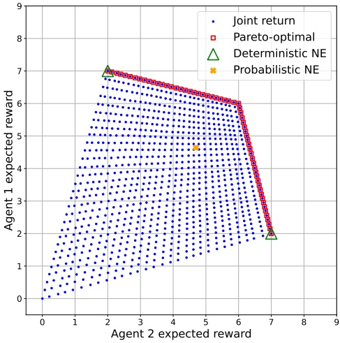

Figure 4.4: Feasible expected joint rewards and Pareto frontier in the Chicken matrix game. Each blue dot shows the expected joint reward obtained by a joint policy. Red squares show joint rewards of Pareto-optimal joint policies. Also shown are the joint rewards corresponding to the deterministic and probabilistic Nash equilibria of the non-repeated game.

Intuitively, a joint policy is Pareto-optimal if there is no other joint policy that improves the expected return for at least one agent, without reducing the expected return for any other agent. In other words, no agent can be better off without making other agents worse off. Every game must have at least one joint policy that is Pareto-optimal. In common-reward games, all Pareto-optimal joint policies achieve the same expected return, which by definition is the maximum possible expected return that any joint policy can achieve in the game.

We illustrate Pareto optimality using the non-repeated Chicken matrix game from Figure 4.3 (page 73). Figure 4.4 shows the convex hull of feasible expected joint returns in this game. Each dot corresponds to the expected joint return achieved by some joint policy $( \pi _ { 1 } , \pi _ { 2 } )$ . In this figure, we discretized the space of joint policies by stepping each policy from $\pi _ { i } ( S )   =   0$ to $\pi _ { i } ( S )   =   1$ using a step size of $\frac { 1 } { 3 0 }$ , resulting in 30 different policies for each agent, and a total of $3 0 \cdot 3 0 = 9 0 0$ joint policies. The corners of the convex hull correspond to the four possible deterministic joint policies (i.e., the four joint actions from the game matrix). The expected joint returns obtained by Pareto-optimal joint policies are marked by the red squares. The figure also shows the expected joint returns corresponding to the deterministic and probabilistic Nash equilibria of the game (see Section 4.6 for details).

<!-- page: 107 -->

For infinitely repeated games and under the average reward,<sup>13</sup> there exists a folk theorem that shows that any expected joint return in this hull that is equal to or larger than the minmax value of the agents (Equation 4.17) can be realized by an equilibrium. In the Chicken game, it can be seen from the game’s reward matrix that the minmax value for both agents is 2, and so any expected joint return $( U _ { 1 } , U _ { 2 } )$ with $U _ { 1 } , U _ { 2 }   \geq   2$ in the hull can be realized by means of an equilibrium. This is where Pareto optimality comes in: we can narrow down the space of desirable equilibria by requiring that the expected joint return achieved by an equilibrium also be Pareto-optimal. The Pareto-optimal joint returns are those that reside on the Pareto frontier shown by the red squares. Thus, for any given joint policy π, we can project its corresponding expected joint return into the convex hull and detect Pareto optimality if the joint return lies on the Pareto frontier.

We have presented Pareto optimality as a concept to refine equilibrium solutions. However, note that a joint policy can be Pareto-optimal without being an equilibrium solution. Yet, Pareto optimality on its own may not be a very useful solution concept. In particular, all joint policies in zero-sum games are Pareto-optimal by definition. In general-sum games, many joint policies may be Pareto-optimal without being a desirable solution, such as joint policies that are Pareto-optimal but result in large differences between the agents’ expected returns. We will discuss this latter case further in Section 4.9.

## 4.9 Social Welfare and Fairness

Pareto optimality states that there is no other solution in which at least one agent is better off without making other agents worse off. However, it does not make any statements about the total amount of rewards and their distribution among the agents. For example, the Pareto frontier in Figure 4.4 contains solutions with expected joint returns ranging from (7, 2) to (6, 6) to (2, 7). Thus, we may consider concepts of social welfare and fairness to further constrain the space of desirable solutions.

The study of social welfare and fairness has a long history in economics, and many criteria and social welfare functions have been proposed (Moulin 2004; Fleurbaey and Maniquet 2011; Sen 2018; Amanatidis et al. 2023). The term welfare usually refers to some notion of totality of the agents’ returns, while the term fairness relates to the distribution of returns among agents. In this section, we consider two basic definitions of welfare and fairness:

13. Average returns (or average rewards) correspond to discounted returns with γ → 1.

<!-- page: 108 -->

**Definition 10 (Welfare and Welfare Optimality)** The (social) welfare of a joint policy π is defined as

$$
W (\pi) = \sum_ {i \in I} U _ {i} (\pi).\tag{4.26}
$$

A joint policy π is welfare-optimal $\mathit { i f }   \pi \in \operatorname { a r g   m a x } _ { \pi ^ { \prime } } W ( \pi ^ { \prime } )$

**Definition 11 (Fairness and Fairness Optimality)** The (social) fairness of a joint policy $\pi$ is defined $a s ^ { 1 4 }$

$$
F (\pi) = \prod_ {i \in I} U _ {i} (\pi).\tag{4.27}
$$

A joint policy π is fairness-optimal $\mathit { i f }   \pi \in \operatorname { a r g   m a x } _ { \pi ^ { \prime } } F ( \pi ^ { \prime } )$

A welfare-optimal joint policy maximizes the sum of the agents’ expected returns, while a fairness-optimal joint policy maximizes the product of the agents’ expected returns. This definition of fairness promotes a type of equity between the agents, in the following sense: if we consider a set of joint policies $\pi \in \Pi$ that achieve equal welfare (sum of returns) $W ( \pi )$ , then the joint policy $\pi \in \Pi$ with the greatest fairness according to $F ( \pi )$ is that which gives equal expected return for each agent, that is, $U _ { i } ( \pi )   =   U _ { j } ( \pi )$ for all $i , j .$ For example, three different joint policies in a two-agent game that yield expected joint returns of (1, 5), (2, 4), (3, 3) achieve equal welfare of $6$ and a respective fairness of 5, 8, and $9 . ^ { 1 5 }$ When applying these definitions of welfare and fairness to the example game in Figure 4.4, it can be seen that the only solution that is both welfare-optimal and fairness-optimal is the joint policy that achieves expected joint return of (6, 6). Thus, in this example, we have narrowed the space of desirable solutions to a single solution. Another example of fairness-optimality, in the Battle of the Sexes matrix game, is shown in Figure 4.5.

Social welfare and fairness, such as defined here, can be useful in generalsum games but are not so useful in common-reward games and zero-sum games. In common-reward games, in which all agents receive identical reward, welfare and fairness are maximized if and only if the expected return of each agent is maximized; hence, welfare and fairness do not add any useful criteria in this class of games. In two-agent zero-sum games, in which one agent’s reward is the negative of the other agent’s reward, we know that all minimax solutions

<small><span class="docvortex-page-footnote" data-block-type="page_footnote" style="color:#6b7280">i ∈I  1n</span></small>

<small><span class="docvortex-page-footnote" data-block-type="page_footnote" style="color:#6b7280">Ui 0</span></small>

<small><span class="docvortex-page-footnote" data-block-type="page_footnote" style="color:#6b7280">Ui 0,</span></small>

<small><span class="docvortex-page-footnote" data-block-type="page_footnote" style="color:#6b7280">0.1, 1, 1</span></small>

<small><span class="docvortex-page-footnote" data-block-type="page_footnote" style="color:#6b7280">14. This type of fairness is also known as Nash social welfare, defined as the geometric mean Q Ui(π) (Caragiannis et al. 2019; Fan et al. 2023).</span></small>

<small><span class="docvortex-page-footnote" data-block-type="page_footnote" style="color:#6b7280">15. The careful reader may have noticed some limitations of the simple definition of fairness in Definition 11. For example, if (π) = for any agent, then it does not matter what returns the other agents obtain under π. And if we allow (π) < then the expected joint return (− ) would be less fair than the expected joint return (−0.1, −100, 100), which is counter-intuitive.</span></small>

<!-- page: 109 -->

|  | A | B |
| --- | --- | --- |
| A | 10,7 | 2,2 |
| B | 0,0 | 7,10 |

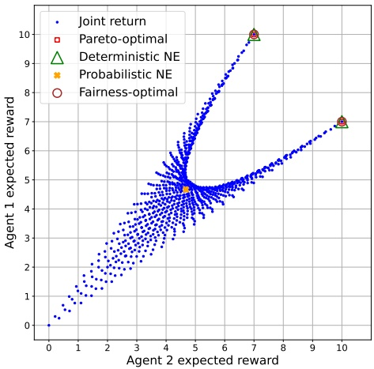

(a) Battle of the Sexes matrix game.

(b) Joint rewards and fairness-optimal outcomes.

Figure 4.5: Feasible joint rewards and fairness-optimal outcomes in the Battle of the Sexes matrix game. This game models a situation where two people (classically, a man and a woman, hence the name of the game) want to meet in one of two places (A or B) but have different preferences about the best place. Agent 1 prefers place A and agent 2 prefers place B. Joint action (A,B) is preferred over (B,A), since in the latter case both agents end up at their respective least-preferred place. The two deterministic joint policies corresponding to joint actions (A,A) and (B,B) are the only joint policies (in the non-repeated game) that are both Pareto-optimal and fairness-optimal. The figure also shows the only probabilistic Nash equilibrium, which is neither Pareto-optimal nor fairness-optimal.

$\pi$ have the same unique value $U _ { i } ( \pi )   =   - U _ { j } ( \pi )$ for agents $i , j .$ Therefore, all minimax solutions achieve equal welfare and fairness, respectively (besides, the welfare as defined here will always be zero).

It is easy to prove that welfare optimality implies Pareto optimality. To see this, suppose a joint policy $\pi$ is welfare-optimal but not Pareto-optimal. Since $\pi$ is not Pareto-optimal, there exists a joint policy $\pi ^ { \prime }$ such that ∀i : $U _ { i } ( \pi ^ { \prime } )   \geq   U _ { i } ( \pi )$ and ∃i : $U _ { i } ( \pi ^ { \prime } )   >   U _ { i } ( \pi )$ However, it follows that $\textstyle \sum _ { i } U _ { i } ( \pi ^ { \prime } )   >   \sum _ { i } U _ { i } ( \pi )$ and, therefore, $\pi$ cannot be welfare-optimal (contradiction). Thus, $\pi$ must also be Pareto-optimal if it is welfare-optimal. Note that Pareto optimality does not in general imply welfare optimality, hence welfare optimality is a stronger requirement. Moreover, fairness optimality does not imply Pareto optimality, and vice versa.

<!-- page: 110 -->

## 4.10 No-Regret

The equilibrium solution concepts discussed in the previous sections are based on mutual best responses between agents, and are thus a function of the agents policies. Another category of solution concepts is based on the notion of regret, which measures the difference between the rewards an agent received and the rewards it could have received if it had chosen a different action (or policy) in past episodes against the observed actions (or policies) of the other agents in these episodes. An agent is said to have no-regret if, in the limit of infinitely many episodes, the agent’s average regret across the episodes is at most zero. Therefore, no-regret considers the performance of learning agents across multiple episodes, which is in contrast to the other solution concepts introduced in this chapter that only consider a single joint policy (and not how this joint policy was learned). In this sense, no-regret can be viewed as an example of the prescriptive agenda discussed in Section 1.5, which is concerned with the performance of agents during learning.

There are multiple ways in which regret can be defined. We will first give a standard definition of regret for non-repeated normal-form games, which is based on comparing the rewards of different actions in the episodes. This definition will then be extended to sequential-move games. Let $a ^ { e }$ denote the joint action from episodes $e   =   1 , . . . , z .$ Agent i’s regret for not having chosen the best single action across these episodes is defined as

$$
\text {Regret} _ {i} ^ {z} = \max _ {a _ {i} \in A _ {i}} \sum_ {e = 1} ^ {z} \left[ \mathcal {R} _ {i} (\langle a _ {i}, a _ {- i} ^ {e} \rangle) - \mathcal {R} _ {i} (a ^ {e}) \right].\tag{4.28}
$$

An agent is said to have no-regret if its average regret in the limit of $z   \to   \infty$ is at most zero. As a solution concept, no-regret requires that all agents in the game have no-regret.

**Definition 12 (No-regret)** In a general-sum game with n agents, the agents have no-regret if

$$
\forall i: \lim _ {z \to \infty} \frac {1}{z} R e g r e t _ {i} ^ {z} \leq 0.\tag{4.29}
$$

Similar to ϵ-Nash equilibrium (Section 4.5), we may replace the $\leq 0$ in Equation 4.29 with $\leq \epsilon ,$ for $\epsilon   >   0$ , to obtain an ϵ-no-regret.

As a concrete example, Figure 4.6 shows ten episodes of two agents in the non-repeated Prisoner’s Dilemma matrix game. After the episodes, agent 1 has received a total reward of −21. Always choosing C in the episodes (against the observed actions of agent 2) would have resulted in a total reward of −30, while always choosing D would have resulted in a total reward of −15. Thus,

<!-- page: 111 -->

| Episode $e$ | 1 | 2 | 3 | 4 | 5 | 6 | 7 | 8 | 9 | 10 |
| --- | --- | --- | --- | --- | --- | --- | --- | --- | --- | --- |
| Action $a_{1}^{e}$ | C | C | D | C | D | D | C | D | D | D |
| Action $a_{2}^{e}$ | C | D | C | D | D | D | C | C | D | C |
| Reward $\mathcal{R}_{1}(a^{e})$ | -1 | -5 | 0 | -5 | -3 | -3 | -1 | 0 | -3 | 0 |
| Reward $\mathcal{R}_{1}(\langle C, a_{2}^{e} \rangle)$ | -1 | -5 | -1 | -5 | -5 | -5 | -1 | -1 | -5 | -1 |
| Reward $\mathcal{R}_{1}(\langle D, a_{2}^{e} \rangle)$ | 0 | -3 | 0 | -3 | -3 | -3 | 0 | 0 | -3 | 0 |

Figure 4.6: Ten episodes between two agents in the non-repeated Prisoner’s Dilemma matrix game. The bottom two rows show agent $\mathrm { T s }$ rewards for always choosing actions C/D against agent $2 ^ { \circ } \mathbf { s }$ observed actions in the episodes.

action D was the “best” action against the observed actions of agent 2, and so agent $\mathrm { { 1 s } }$ regret is $R e g r e t _ { 1 } ^ { 1 0 }   =   - 1 5 + 2 1   =   6$ with an average regret (dividing by 10) of 0.6. Indeed, in Prisoner’s Dilemma, D is a dominant action in that it is a best response against both D and C (see the reward matrix in Figure 3.2(c) (page 46) to verify this). In order for agent 1 to achieve no-regret, the episodes would need to continue in such a way that agent $\mathrm { T s }$ average regret across the episodes goes to zero.

We can generalize the definition of no-regret to stochastic games and POSGs, by redefining the regret over policies rather than actions. For each agent $i \in I ,$ let $\Pi _ { i }$ be a finite space of policies that agent i can select from. Let $\pi ^ { e }$ denote the joint policy from episodes $e   =   1 , . . . , z ,$ with $\pi _ { i } ^ { e } \in \Pi _ { i }$ for all $i \in I .$ . Then, agent $i ^ { \flat } \mathbf { s }$ regret for not having chosen the best policy across these episodes is defined as

$$
\text {Regret} _ {i} ^ {z} = \max _ {\pi_ {i} \in \Pi_ {i}} \sum_ {e = 1} ^ {z} \left[ U _ {i} (\langle \pi_ {i}, \pi_ {- i} ^ {e} \rangle) - U _ {i} (\pi^ {e}) \right].\tag{4.30}
$$

With this definition of regret, Definition 12 applies to all of the game models introduced in Chapter 3. (For non-repeated normal-form games, Equation 4.30 is equivalent to Equation 4.28 if we define each $\Pi _ { i }$ to be the set of deterministic policies corresponding to each action $a _ { i }   \in   A _ { i } . )$

Our previous example in Prisoner’s Dilemma illustrates an important conceptual limitation of regret, which is that it assumes that the actions or policies of other agents −i remain fixed in the episodes. This assumption is sensible if the other agents use constant policies that do not change between episodes. However, if the other agents adapt their policies based on past episodes, then this assumption is of course violated. Therefore, regret does not actually quantify what would have happened under counterfactual situations. The second limitation, which is a result of the first limitation, is that minimizing regret is

<!-- page: 112 -->

not necessarily equivalent to maximizing returns (Crandall 2014). For example, in non-repeated and finitely repeated Prisoner’s Dilemma, the only joint policy that has no-regret is for both agents to always choose D. This is analogous to the fact that mutual best-response policies do not necessarily entail maximum returns for the agents, as we discussed in Section 4.7.

Various alternative definitions of regret exist (e.g., de Farias and Megiddo 2003; Lehrer 2003; Chang 2007; Zinkevich et al. 2007; Arora, Dekel, and Tewari 2012; Crandall 2014). For example, for normal-form games in which agents can choose from more than two actions, rather than replacing all of agent $i ^ { \flat } \mathbf { s }$ past actions as in Equation 4.28, we may replace only the specific occurrences of a given action $a _ { i } ^ { \prime }$ in the history with a different action $a _ { i } .$ . This latter definition of regret is also known as conditional (or internal) regret, while the definition in Equation 4.28 is known as unconditional (or external) regret. Furthermore, no-regret solutions have connections to equilibrium solutions. In particular, in two-agent zero-sum normal-form games, the empirical distribution of joint actions produced by agents that have no external regret converges to the set of minimax solutions; and in general-sum normal-form games, the empirical distribution of joint actions converges to the set of coarse correlated equilibria if the agents have no external regret, and to the set of correlated equilibria if the agents have no internal regret (Hart and Mas-Colell 2000; Young 2004). (See also Section 5.2 for a discussion of convergence types.) We will revisit these two regret definitions and their connection to correlated equilibrium in Section 6.5.

## 4.11 The Complexity of Computing Equilibria

Before we turn to MARL algorithms in Chapters 5 and 6 as a method to compute solutions for games, it is instructive to ask: How difficult is it, in terms of computational complexity, to compute an equilibrium solution for a game? Do algorithms exist that can compute equilibria efficiently, meaning in polynomial time in the size of the game?

These and related questions are studied in algorithmic game theory, which is a research area at the interface of computer science and game theory. Many complexity results exist for various special types of games, and we recommend the books of Nisan et al. (2007) and Roughgarden (2016) for a broad discussion. Here, we focus on non-repeated normal-form games, which are the building block of the more complex (partially observable) stochastic game models. Thus, we can expect any complexity results for normal-form games to be a lower bound on the complexity for the more complex game models.

<!-- page: 113 -->

Most computer scientists will have some familiarity with the complexity classes P and NP. P includes all decision problems whose solutions (if they exist) can be computed efficiently in polynomial time in the size of the problem instance. NP includes all decision problems whose solutions (if they exist) can be computed in polynomial time by a non-deterministic Turing machine. Unfortunately, these familiar complexity classes are not a good fit for the problem of computing an equilibrium, since P/NP characterize decision problems which may or may not have solutions, while we know that games always have at least one equilibrium solution. On the other hand, computing an equilibrium that satisfies additional properties is a decision problem, since such solutions may or may not exist. Such problems include computing equilibria that:

• are Pareto optimal;

• achieve a certain minimum expected return for each agent;

• achieve a certain minimum social welfare (sum of returns);

• assign zero or positive probability to certain actions of certain agents.

All of these problems are known to be NP-hard (Gilboa and Zemel 1989; Conitzer and Sandholm 2008).

Some types of games and equilibria do admit polynomial-time algorithms. Computing a minimax solution in a two-agent zero-sum non-repeated normalform game can be formulated via linear programming (Section 4.3.1), which can be solved in polynomial time. Similarly, computing a correlated equilibrium in a general-sum non-repeated normal-form game can be done in polynomial time via a linear program (Section 4.6.1). However, computing a Nash equilibrium in general-sum non-repeated normal-form games — henceforth simply called NASH — cannot be solved via linear programming, due to the independence assumption between policies in a Nash equilibrium.

Problems that always have solutions, such as NASH, are known as total search problems. Section 4.11.1 will present one subclass of total search problems, called PPAD. It turns out that NASH is a complete problem in PPAD, meaning that any other problem in PPAD can be reduced to NASH. We will discuss the implications for MARL in Section 4.11.2.

## 4.11.1 PPAD Complexity Class

PPAD (short for “polynomial parity argument for directed graphs”) describes a special class of total search problems. We define PPAD by giving one of its

<!-- page: 114 -->

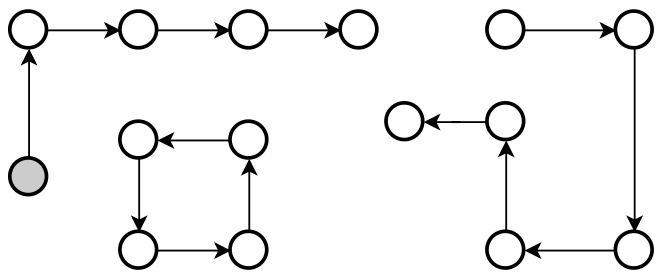

Figure 4.7: Any instance of END-OF-LINE consists of a set of paths and cycles, such as the instance shown here. Given the Parent / Child functions and a source node (a node with no parent node; here shaded in gray), is there an efficient polynomial-time algorithm to find a sink node (a node with no child node) or a different source node?

complete problems to which all other problems in PPAD can be reduced.<sup>16</sup> This PPAD-complete problem is called END-OF-LINE and is defined as follows:

**Definition 13 (END-OF-LINE)** Let $G ( k )   =   ( V , E )$ be a directed graph consisting of

• a finite set V containing $2 ^ { k }$ nodes (each node is represented as a bit-string of length k)

• a finite set $E   =   \{ ( a , b )   |   a , b   \in   V \}$ of directed edges (from node a to node b, for $a , b \in V )$ such that:

${ \it i f } ( a , b )   \in   E$ then $\not{a}^{\prime} \neq a:(a^{\prime},b) \in E$ and $\not{a}b^{\prime} \neq b:(a,b^{\prime}) \in E$

Assume functions Parent(v) and Child(v) that, respectively, return the parent node (if any) and child node (if any) of node $v \in V .$ These functions are represented as boolean circuits with k input bits and k output bits, and run in time polynomial in k. Given access to functions Parent and Child (but not E), and a node $s \in V$ such that Parent(s) = ∅, find a node $e   \neq   s$ such that either $C h i l d ( e ) = \emptyset$ or $P a r e n t ( e ) = \emptyset . ^ { 1 7 }$

Figure 4.7 shows an illustration of a END-OF-LINE problem instance. The restriction on E in Definition 13 means that any node in the graph can have at most one parent node and at most one child node. A node with no parent is

<small><span class="docvortex-page-footnote" data-block-type="page_footnote" style="color:#6b7280">16. Problem A can be “reduced” to problem B if there exist polynomial-time algorithms to transform any instance of A into an equivalent instance of B, and any solution of the instance of B to a solution of the original instance of A.</span></small>

<small><span class="docvortex-page-footnote" data-block-type="page_footnote" style="color:#6b7280">17. To indicate that a node has no parent/child, the respective circuit function simply outputs the same input node.</span></small>

<!-- page: 115 -->

also called a source node, while a node with no child is called a sink node. The “parity argument” in PPAD refers to the fact that any source node in this graph always has a corresponding sink node. Therefore, if a source node s is given, then we know that a node e must exist. The node $e$ can, in principle, be found by following the directed path starting at the given source node s. However, since we are only given the functions Parent and Child (and not E), the only obvious way to follow this path is by repeatedly calling the function Child starting at the source node s. Therefore, finding a sink node may require exponential time in the worst case, since there are $2 ^ { k }$ nodes.

Why should we care about PPAD? Just as it is unknown whether efficient polynomial-time algorithms exist to solve NP-complete problems (the big $\mathrm{P}=\mathrm{NP}?$ question), it is also unknown whether efficient algorithms exist for PPAD-complete problems $( ^ { \mathrm { c c } } \mathrm { P } = \mathrm { P P A D } ? )$ . Indeed, PPAD contains problems for which researchers have tried for decades to find efficient algorithms, including the classic Brouwer fixed-point problem and finding Arrow-Debreu equilibria in markets (see Papadimitriou (1994) for a more complete list). PPAD has also been shown to be hard under cryptographic assumptions (Bitansky, Paneth, and Rosen 2015; Garg, Pandey, and Srinivasan 2016; Choudhuri et al. 2019). There are currently no known algorithms that can efficiently solve END-OF-LINE (i.e., in time polynomial in $k )$ and, thus, any other problem in PPAD. Therefore, establishing that a problem is PPAD-complete is a good indicator that no efficient algorithms exist to solve the problem.

## 4.11.2 Computing ϵ-Nash Equilibrium Is PPAD-Complete

We return to our initial question, “Do algorithms exist that can compute equilibria efficiently, in polynomial time in the size of the game?” Unfortunately, the answer is very likely negative. It has been proven that NASH is PPAD-complete, at first for games with three or more agents (Daskalakis, Goldberg, and Papadimitriou 2006, 2009), and shortly after even for games with two agents (Chen and Deng 2006). This means that finding a Nash equilibrium in a non-repeated normal-form game can be described as finding an e-node in an equivalent END-OF-LINE instance. The completeness also means that any other problem in PPAD, including Brouwer fixed-points, can be reduced to NASH.

More precisely, the PPAD-completeness of NASH was proven for approximate ϵ-Nash equilibrium (Section 4.5) for certain bounds on $\epsilon   >   0 ;$ and for

<!-- page: 116 -->

exact equilibria (when ϵ = 0) in games with two agents.<sup>18</sup> The use of ϵ-Nash equilibrium is to account for the fact that a Nash equilibrium may involve irrational-valued probabilities in games with more than two agents. Therefore, the PPAD-completeness of NASH also includes approximation schemes for computing Nash equilibria, such as MARL algorithms, which may only learn approximate solutions given a finite number of interactions in the game.

The implication for us is that MARL is unlikely to be a magic bullet for solving games: since no efficient algorithms are known to exist for PPAD-complete problems, it is unlikely that efficient MARL algorithms exist to compute Nash equilibria in polynomial time. Much of the research in MARL has focused on identifying and exploiting structures (or assumptions) in certain game types that lead to improved performance. However, the PPAD-completeness of NASH tells us that, in general and without such assumed structures, it is likely that any MARL algorithm still requires exponential time in the worst case.

## 4.12 Summary

This chapter introduced a range of solution concepts for games, to define optimal policies for agents in the game. The main concepts are the following:

• A solution for a game is a joint policy (typically including one policy for each agent) that satisfies certain conditions which are expressed in terms of the expected returns for agents and the relationship between the returns.

• Many solution concepts can be compactly represented based on the notion of best responses. A best-response policy maximizes the expected returns of one agent against a set of given policies for the other agents.

• There exists a series of increasingly general equilibrium solution concepts, including minimax for two-agent zero-sum games, and Nash equilibrium and (coarse) correlated equilibrium for general-sum games with two or more agents. These equilibrium solutions are all based on the idea that every agent is best-responding to all other agents under the equilibrium, and hence no agent can unilaterally deviate from the equilibrium to increase its returns.

• Games may have a unique equilibrium solution, or they may have multiple (even infinitely many) equilibria that can yield different expected returns for

<small><span class="docvortex-page-footnote" data-block-type="page_footnote" style="color:#6b7280">18. As discussed in Section 4.5, an ϵ-Nash equilibrium may not be close to any actual Nash equilibrium, even if the Nash equilibrium is unique. The problem of approximating an actual Nash equilibrium within a desired distance, as measured in the policy space via norms such as L1 and L2, is in fact much harder than computing an ϵ-Nash equilibrium. This latter problem, for general-sum normal-form games with three or more agents, is complete for a different complexity class called FIXP (Etessami and Yannakakis 2010).</span></small>

<!-- page: 117 -->

the agents. Thus, learning an equilibrium solutions is not necessarily the same as maximizing the expected returns for all agents.

• Different refinement concepts exist that can be combined with equilibrium solutions to narrow the space of desirable solutions, such as Pareto optimality and concepts based on social welfare and fairness. For example, we may seek a Nash equilibrium that is also Pareto-optimal.

• No-regret is an alternative solution concept that considers the alternative returns an agent could have received if it had used different policies in past episodes of the game against the observed policies of the other agents. A joint policy achieves no-regret if the average regret for each agent goes to zero in the limit of infinitely many episodes.

Computing a Nash equilibrium in general-sum normal-form games is a complete problem for the PPAD complexity class. There are currently no known efficient (i.e., polynomial time) algorithms to solve PPAD-complete problems. The implication is that there probably do not exist efficient MARL algorithms that learn Nash equilibria for general games.

Now that we are equipped with different solution concepts for the game models introduced in Chapter 3, the next two chapters in this part of the book will describe different families of MARL algorithms that are designed to learn such solutions under certain conditions. Chapter 5 will begin by outlining a general learning process and different convergence types with which MARL algorithms can learn or approximate solutions, as well as the key challenges when trying to learn game solutions using MARL methods.

<!-- page: 118 -->

# 5 Multi-Agent Reinforcement Learning in Games: First Steps and Challenges

The preceding chapters introduced game models as a formalism of multi-agent interaction, and solution concepts to define what it means for the agents to act optimally in a game. In this chapter, we will begin to explore methods to compute solutions for games. The principal method by which we seek to compute solutions is via reinforcement learning (RL), in which the agents repeatedly try actions, make observations, and receive rewards. Analogous to the standard RL terminology introduced in Chapter 2, we use the term episode to refer to each independent run of a game starting in some initial state. The agents learn their policies based on data (i.e., observations, actions, and rewards) obtained from multiple episodes in a game.

To set the context for the algorithms presented in this book, this chapter will begin by outlining a general learning framework for MARL, as well as different types of convergence definitions used in the analysis and evaluation of MARL algorithms. We will then introduce two basic approaches of applying RL in games, called central learning and independent learning, both of which reduce the multi-agent problem to a single-agent problem. Central learning applies single-agent RL directly to the space of joint actions to learn a central policy that chooses actions for each agent, while independent learning applies single-agent RL to each agent independently to learn agent policies, essentially ignoring the presence of other agents.

Central and independent learning serve as a useful starting point to discuss several important challenges faced by MARL algorithms. One characteristic challenge of MARL is environment non-stationarity due to multiple learning agents, which can lead to unstable learning. Equilibrium selection is the problem of what equilibrium solution the agents should agree on and how they may achieve agreement. Another challenge is multi-agent credit assignment, in which agents must infer whose actions contributed to a received reward. Finally,

<!-- page: 119 -->

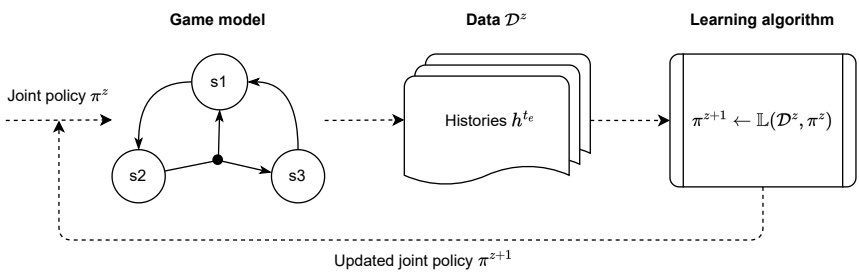

Figure 5.1: Elements of a general learning process in MARL.

MARL algorithms are typically faced with an exponential growth of the jointaction space as the number of agents is increased, leading to scalability problems. We will discuss each of these challenges and provide examples.

The idea that agents can use their own algorithms to learn policies, such as in independent learning, leads to the possibility that agents may use the same learning algorithm or different algorithms. This chapter will conclude with a discussion of such self-play and mixed-play settings in MARL.

## 5.1 General Learning Process

We begin by defining learning1in games and the intended learning outcome. In machine learning, learning is a process that optimizes a model or function based on data. In our setting, the model is a joint policy usually consisting of policies for each agent, and the data (or “experiences”) consist of one or more histories in the game. The learning goal is a solution of the game, defined by a chosen solution concept. Thus, this learning process involves several elements, shown in Figure 5.1 and detailed next.

**Game model:** The game model defines the multi-agent environment and how agents may interact. Game models introduced in Chapter 3 include non-repeated normal-form games, repeated normal-form games, stochastic games, and partially observable stochastic games (POSG).

**Data:** The data used for learning consist of a set of z histories,

$$
\mathcal {D} ^ {z} = \{h ^ {t _ {e}} \mid e = 1, \dots , z \}, z \geq 0.\tag{5.1}
$$

<small><span class="docvortex-page-footnote" data-block-type="page_footnote" style="color:#6b7280">1. Another commonly used term is “training.” We use the terms learning and training interchangeably, for example, as in “learning/training a policy.”</span></small>

<!-- page: 120 -->

Each history $h ^ { t _ { e } }$ was produced by a joint policy $\pi ^ { e }$ used during episode e. These histories may or may not be “complete” in the sense of ending in a terminal state of the game, and different histories may have different lengths $t _ { e }$ . Often, $\mathcal { D } ^ { z }$ contains the history so far from the current ongoing episode $z$ and the histories from previous episodes $e   <   z .$

**Learning algorithm:** The learning algorithm L takes the collected data $\mathcal { D } ^ { z }$ and current joint policy $\pi ^ { z }$ , and produces a new joint policy,

$$
\pi^ {z + 1} = \mathbb {L} (\mathcal {D} ^ {z}, \pi^ {z}).\tag{5.2}
$$

The initial joint policy $\pi ^ { 0 }$ is typically random.

**Learning goal:** The goal of learning is a joint policy $\pi ^ { * }$ which satisfies the properties of a chosen solution concept. Chapter 4 introduced a range of possible solution concepts, such as Nash equilibrium.

We note several nuances in the above elements:

The chosen game model determines the conditioning of the learned joint policy. In a non-repeated normal-form game (where episodes terminate after one time step), policies $\pi _ { i }$ are not conditioned on histories, that is, they are simple probability distributions over actions. In a repeated normal-form game, policies are conditioned on action histories $h ^ { t }   =   ( a ^ { 0 } , . . . , a ^ { t - 1 } )$ . In a stochastic game, policies are conditioned on state-action histories $h ^ { t }   =   ( s ^ { 0 } , a ^ { 0 } , s ^ { 1 } , a ^ { 1 } , . . . , s ^ { t } )$ In a POSG, policies are conditioned on observation histories $h _ { i } ^ { t }   =   ( o _ { i } ^ { 0 } , . . . , o _ { i } ^ { t } )$ These conditionings are general and may be constrained depending on the desired form of policies. For example, in a stochastic game we may condition policies only on the current state of the game; and in a POSG we may condition policies using only the most recent k observations.

The histories in $\mathcal { D } ^ { z }$ may in general be full histories (i.e., contain all states and joint observations/actions; see Section 4.1) or one of the other types of histories listed earlier. Therefore, the histories in $\mathcal { D } ^ { z }$ may contain more information than the histories used to condition the agents’ policies. For example, this can be the case in centralized training with decentralized execution regimes (discussed in Section 9.1), in which a learning algorithm has access to the observations of all agents during learning, while the agents’ policies only have access to the local observations of agents.

The learning algorithm L may itself consist of multiple learning algorithms that learn individual agent policies, such as one algorithm $\mathbb { L } _ { i }$ for each agent i. Each of these algorithms may use different parts of the data in $\mathcal { D } ^ { z }$ , or use its own data $\mathcal { D } _ { i } ^ { z }$ such as in independent learning (Section 5.3.2). Furthermore, an important characteristic of RL is that the learning algorithm is actively involved in the generation of the data by exploring actions, rather than just passively

<!-- page: 121 -->

consuming the data. Thus, the policies produced by the learning algorithm may actively randomize over actions to generate useful data for learning.

## 5.2 Convergence Types

A number of different criteria can be used to evaluate the learning performance of MARL algorithms. The main theoretical evaluation criterion for learning that we use in this book is convergence of the joint policy $\pi ^ { z }$ to a solution $\pi ^ { * }$ of the game (e.g., Nash equilibrium) in the limit of infinite data,

$$
\lim _ {z \to \infty} \pi^ {z} = \pi^ {*}.\tag{5.3}
$$

As was discussed in Chapter 4, a game may have more than one solution $\pi ^ { * }$ and this depends on the specific solution concept. When we say “convergence to a solution $\pi ^ { * * }$ the emphasis is on “a,” meaning that $\pi ^ { * }$ is some valid solution under the relevant solution concept.

When we make statements about the theoretical convergence of MARL algorithms, unless specified otherwise, we mean convergence as per Equation $5 . 3 . ^ { 2 }$ Of course, in practice we cannot collect infinite data, and learning typically stops after a predefined budget is reached (such as a total allowed number of episodes or time steps) or once the changes in policies are below some predetermined threshold. Whether a learned joint policy $\pi ^ { z }$ is in fact a solution can be tested using procedures such as described in Sections 4.4 and 4.5.

Several other theoretical evaluation criteria have been studied in the literature, including both weaker and stronger types of convergence. Weaker types of convergence include:

• Convergence of expected return:

$$
\lim _ {z \to \infty} U _ {i} (\pi^ {z}) = U _ {i} (\pi^ {*}), \forall i \in I\tag{5.4}
$$

This convergence type means that, in the limit of infinite data $z   \to   \infty$ , the expected joint return under the learned joint policy $\pi ^ { z }$ will converge to the expected joint return of a solution $\pi ^ { * }$

• Convergence of empirical distribution:

$$
\lim _ {z \to \infty} \bar {\pi} ^ {z} = \pi^ {*}\tag{5.5}
$$

<small><span class="docvortex-page-footnote" data-block-type="page_footnote" style="color:#6b7280">πz</span></small>

<small><span class="docvortex-page-footnote" data-block-type="page_footnote" style="color:#6b7280">1”  “ l</span></small>

<small><span class="docvortex-page-footnote" data-block-type="page_footnote" style="color:#6b7280">2. To be fully precise, some convergence statements in the literature add the additional qualifier that convergence will happen “with probability or a most surely.” This qualifier means that, theoretically, there may be conditions (i.e., trajectories of ( )) under which convergence might not happen, but that the probability of these conditions occurring is 0 under the relevant probability measure. We omit this technicality in favor of simplicity.</span></small>

<!-- page: 122 -->

where $\begin{array} { r } { \bar { \pi } ^ { z } ( a   \mid   h )   =   \frac { 1 } { z } \sum _ { e = 1 } ^ { z } \pi ^ { e } ( a   \mid   h ) } \end{array}$ is the averaged joint policy across episodes. We may equivalently define $\bar { \pi } ^ { z }$ as the empirical distribution as follows: In an episode $e ,$ let $( a ^ { \tau } , h ^ { \tau } ) _ { \tau = 0 } ^ { t }$ be the sequence of joint actions $a ^ { \tau }$ sampled from the joint policy $\pi ^ { e }$ conditioned on history $h ^ { \tau }$ , that is, $a ^ { \tau }   \sim   \pi ^ { e } ( \cdot   |   h ^ { \tau } ) . ^ { 3 }$ (Note that $e$ denotes the episode number while $\tau$ denotes the time step within an episode.) Let $H ^ { z }$ be the set containing all of the $( a ^ { \tau } , h ^ { \tau } )$ τ, h τ -pairs from episodes $e   =   1 , . . . , z$ . Then, the empirical distribution is given by

$$
\bar {\pi} ^ {z} (a \mid h) = \frac {1}{| H ^ {z} (h) |} \sum_ {(a ^ {\tau}, h ^ {\tau}) \in H ^ {z} (h)} [ a = a ^ {\tau} ] _ {1}\tag{5.6}
$$

where $H ^ { z } ( h )   =   \{ ( a ^ { \tau } , h ^ { \tau } )   \in   H ^ { z }   \mid   h ^ { \tau }   =   h \}$ , and $[ x ] _ { 1 }   =   1$ if x is true, else $[ x ] _ { 1 }   =   0$ (If $H ^ { z } ( h )$ is empty, then $\bar { \pi } ^ { z } ( a   |   h )   =   \textstyle { \frac { 1 } { | A | } } . )$ These two definitions are equivalent in that the averaged joint policy is the expectation of the empirical distribution. Thus, they get arbitrarily close for increasing $z _ { z }$ and they are identical for $z   \to   \infty$ . This means that the convergence in Equation 5.5 holds if and only if it holds for both the averaged joint policy and the empirical distribution.

• Convergence of empirical distribution to set of solutions:

$$
\forall \epsilon > 0 \exists z _ {0} \forall z > z _ {0} \exists \pi^ {*}: d (\bar {\pi} ^ {z}, \pi^ {*}) <   \epsilon\tag{5.7}
$$

In words, for any arbitrarily small (but fixed) $\epsilon   >   0$ , there is a point $z _ { 0 }$ in the learning process depending on ϵ such that, for all $z   \geq   z _ { 0 }$ , there exists a solution $\pi ^ { * }$ at a distance less than ϵ to the empirical distribution $\bar { \pi } ^ { z }$ . The distance $d ( \bar { \pi } ^ { z } , \pi ^ { * } )$ could be based one some L-norm, or the ϵ-versions of solution concepts (e.g., ϵ-Nash equilibrium). The difference to the pointwise convergence of Equation 5.3 is that, in Equation 5.7, the empirical distribution will eventually reach (within $\epsilon )$ the space of solutions but may then “wander” inside this space without necessarily converging to any one point $\pi ^ { * }$

• Convergence of average return:

$$
\lim _ {z \to \infty} \bar {U} _ {i} ^ {z} = U _ {i} (\pi^ {*}), \forall i \in I\tag{5.8}
$$

where $\begin{array} { r } { \bar { U } _ { i } ^ { z }   =   \frac { 1 } { z } \sum _ { e = 1 } ^ { z } U _ { i } ( \pi ^ { e } ) } \end{array}$ is the averaged expected return across episodes. Intuitively, this convergence type can be interpreted as saying that if we generate a new episode for each updated joint policy $\pi ^ { e }$ , then the average

<small><span class="docvortex-page-footnote" data-block-type="page_footnote" style="color:#6b7280">hτ  ∅</span></small>

<small><span class="docvortex-page-footnote" data-block-type="page_footnote" style="color:#6b7280">aT</span></small>

<small><span class="docvortex-page-footnote" data-block-type="page_footnote" style="color:#6b7280">3. For example, in a non-repeated normal-form game, ais the joint action selected by the agents and = since the policies are not conditioned on histories. In this book, we mainly refer to empirical distributions in the context of non-repeated normal-form games.</span></small>

<!-- page: 123 -->

of the joint returns from these episodes will converge to the expected joint return of a solution $\pi ^ { * }$

These weaker convergence types are often used when a particular learning algorithm is not technically able to achieve the convergence in Equation 5.3. For example, the fictitious play algorithm presented in Section 6.3.1 learns deterministic policies, meaning that it cannot represent probabilistic Nash equilibria, such as the uniform-random Nash equilibrium in Rock-Paper-Scissors. However, in certain cases, it can be proven that the empirical action distribution of fictitious play converges to a Nash equilibrium, as per Equation 5.5 (Fudenberg and Levine 1998). The infinitesimal gradient ascent algorithm presented in Section 6.4.1 can learn probabilistic policies, but may still not converge to a probabilistic Nash equilibrium, while it can be shown in non-repeated normal-form games that the average rewards produced by the algorithm do converge to the average rewards of a Nash equilibrium, as per Equation 5.8 (Singh, Kearns, and Mansour 2000). Lastly, the regret-matching algorithms pre-sented in Section 6.5 can produce abrupt changes in the joint policy $\pi ^ { z } ,$ , which, theoretically, may cause it to not converge to any one solution $\pi ^ { * }$ . However, it can be shown for normal-form games that the empirical distributions produced by the regret-matching algorithms do converge to the set of (coarse) correlated equilibria, as per Equation 5.7 (Hart and Mas-Colell 2000).

Note that Equation 5.3 implies all of the above weaker types of convergence. However, it makes no claims about the performance of any individual joint policy $\pi ^ { z }$ for a finite $z .$ In other words, the above convergence types leave open how the agents perform during learning. To address this, a stronger evaluation criterion could require additional bounds, such as on the difference between $\pi ^ { z }$ and $\pi ^ { * }$ for finite z. (See also the discussion and references in Section 5.5.2.)

In complex games, it may not be computationally practical to check for these convergence properties. Instead, a common approach is to monitor the expected returns $U _ { i } ( \pi ^ { z } )$ achieved by the joint policy as z increases, usually by visualizing learning curves that show the progress of expected returns during learning, as shown in Figure 2.4 (page 37). A number of such learning curves will be shown for various MARL algorithms presented in this book. However, this evaluation approach may not establish any relationship to the solution $\pi ^ { * }$ of the game. For instance, even if the expected returns $U _ { i } ( \pi ^ { z } )$ for all $i \in I$ converge after some finite z, the joint policy $\pi ^ { z }$ might not satisfy any of the convergence properties of Equations 5.3 to 5.8.

To reduce notation in the remainder of this chapter (and book), we will omit the explicit z-superscript $( \mathbf { e . g . } ,   \pi ^ { z } , \mathcal { D } ^ { z } )$ and we usually omit $\mathcal { D } ^ { z }$ altogether.

<!-- page: 124 -->

## 5.3 Single-Agent RL Reductions

The most basic approach to using RL to learn agent policies in multi-agent systems is to essentially reduce the multi-agent learning problem to a singleagent learning problem. In this section, we will introduce two such approaches: central learning applies single-agent RL directly to the space of joint actions to learn a central policy that chooses actions for each agent; and independent learning applies single-agent RL independently to each agent to learn independent policies, essentially ignoring the presence of other agents.

## 5.3.1 Central Learning

Central learning trains a single central policy $\pi _ { c }$ , which receives the local observations of all agents and selects an action for each agent, by selecting joint actions from $A   =   A _ { 1 } \times \ldots \times A _ { n }$ . This essentially reduces the multi-agent problem to a single-agent problem, and we can apply existing single-agent RL algorithms to train $\pi _ { c }$ . An example of central learning based on Q-learning, called central Q-learning (CQL), is shown in Algorithm 4. This algorithm maintains jointaction values $Q ( s , a )$ for joint actions $a   \in   A$ , which is a basic concept used by many MARL algorithms presented in this book. Central learning can be useful because it circumvents the multi-agent aspects of the non-stationarity and credit assignment problems (discussed in Sections 5.4.1 and 5.4.3, respectively). However, in practice, this approach has a number of limitations.

The first limitation to note is that, in order to apply single-agent RL, central learning requires transforming the joint reward $( r _ { 1 } , . . . , r _ { n } )$ into a single scalar reward r. For the case of common-reward games, in which all agents receive identical rewards, we can use $r   =   r _ { i }$ for any i. In this case, if we use a singleagent RL algorithm that is guaranteed to learn an optimal policy in an MDP (such as the temporal-difference algorithms discussed in Section 2.6), then it is guaranteed to learn a central policy $\pi _ { c }$ for the common-reward stochastic game such that $\pi _ { c }$ is a Pareto-optimal correlated equilibrium. The optimality of the single-agent RL algorithm means that $\pi _ { c }$ achieves maximum expected returns in each state $s \in S$ (as discussed in Section 2.4). Therefore, since the reward is defined as $r   =   r _ { i }$ for all i, we know that $\pi _ { c }$ is Pareto-optimal because there can be no other policy that achieves a higher expected return for any agent. This also means that no agent can unilaterally deviate from its action given by $\pi _ { c }$ to improve its returns, making $\pi _ { c }$ a correlated equilibrium.

Unfortunately, for zero-sum and general-sum stochastic games, it is less clear how the reward scalarization should be done. If one is interested in maximizing social welfare (Section 4.9) in general-sum games, one option is to use $r   =   \sum { r _ { i } }   r _ { i }$

<!-- page: 125 -->

<div class="docvortex-algorithm" style="white-space: pre-wrap; font-family:monospace;">
Algorithm 4 Central Q-learning (CQL) for stochastic games
Initialize: $Q(s, a) = 0$ for all $s \in S$ and $a \in A = A_1 \times ... \times A_n$
Repeat for every episode:
for $t = 0, 1, 2, ...$ do
    Observe current state $s^t$
    With probability $\epsilon$: choose random joint action $a^t \in A$
    Otherwise: choose joint action $a^t \in \arg \max_a Q(s^t, a)$
    Apply joint action $a^t$, observe rewards $r_1^t, ..., r_n^t$ and next state $s^{t+1}$
    Transform $r_1^t, ..., r_n^t$ into scalar reward $r^t$
    $Q(s^t, a^t) \leftarrow Q(s^t, a^t) + \alpha \left[ r^t + \gamma \max_{a'} Q(s^{t+1}, a') - Q(s^t, a^t) \right]$
</div>

However, if the desired solution is an equilibrium type solution, then no scalar transformation may exist that leads to equilibrium policies.

The second limitation is that by training a policy over the joint-action space, we now have to solve a decision problem with an action space that grows exponentially in the number of agents.<sup>4</sup>In the level-based foraging example shown in Figure 1.2 (page 4), there are three agents that choose from among six actions (up, down, left, right, collect, noop), leading to a joint-action space with $6 ^ { 3 }   =   2 1 6$ actions. Even in this toy example, most standard single-agent RL algorithms do not scale easily to action spaces this large.

Finally, a fundamental limitation of central learning is due to the inherent structure of multi-agent systems. Agents are often localized entities that are physically or virtually distributed. In such settings, communication from a central policy $\pi _ { c }$ to the agents and vice versa may not be possible or desirable, for various reasons. Therefore, such multi-agent systems require local agent policies $\pi _ { i }$ for each agent i, which act on agent $i ^ { \flat } \mathrm { s }$ local observations and independently from other agents.

In stochastic games, in which we assume that agents can observe the full state, it is possible to learn an optimal central policy $\pi _ { c }$ that can be decomposed into individual agent policies $\pi _ { 1 } , . . . , \pi _ { n }$ . This is because solving a stochastic game via central learning amounts to solving an MDP, and MDPs always admit deterministic optimal policies that assign probability 1 to some action in each state (see Equation 2.26 in Section 2.4). Thus, we can decompose the

<small><span class="docvortex-page-footnote" data-block-type="page_footnote" style="color:#6b7280">4. This exponential growth assumes that each additional agent comes with additional decision variables. For example, in level-based foraging (Section 1.1), each agent comes with its own action set. The reverse direction is when we have a fixed set of actions that are partitioned and assigned to agents. In the latter case, the total number of actions remains constant, regardless of the number of agents. We discuss this further in Section 5.4.4.</span></small>

<!-- page: 126 -->

deterministic joint policy $\pi _ { c }$ as

$$
\pi_ {c} (s) = (\pi_ {1} (s) = a _ {1}, \dots , \pi_ {n} (s) = a _ {n})\tag{5.9}
$$

where $\pi ( s )   =   a$ is a shorthand for $\pi ( a   |   s )   =   1$ , and analogously for $\pi _ { i } ( s )   =   a _ { i }$ . A basic way to achieve this decomposition is simply for every agent to use a copy of $\pi _ { c } ;$ in any given state s, each agent $i \in I$ computes the joint action $( a _ { 1 } , . . . , a _ { n } )   =   \pi _ { c } ( s )$ and executes its own action $a _ { i }$ from the joint action. However, if the environment is only partially observable by the agents (as in POSGs), then it may not be possible to decompose $\pi _ { c }$ into individual agent policies $\pi _ { i } ,$ since each policy $\pi _ { i }$ now only has access to the agent’s own observations $o _ { i }$

The next section will introduce the independent learning approach that eliminates these limitations, at the expense of introducing other challenges.

## 5.3.2 Independent Learning

In independent learning (often abbreviated as IL), each agent i learns its own policy $\pi _ { i }$ using only its local history of own observations, actions, and rewards, while ignoring the existence of other agents (Tan 1993; Claus and Boutilier 1998). Agents do not observe or use information about other agents, and the effects of other agents’ actions are simply part of the environment dynamics from the perspective of each learning agent. Thus, similar to central learning, independent learning reduces the multi-agent problem to a single-agent problem from the perspective of each agent, and existing single-agent RL algorithms can be used to learn the agent policies. An example of independent learning based on Q-learning, called independent Q-learning (IQL), is shown in Algorithm 5. Here, each agent uses its own copy of the same algorithm.

Independent learning naturally avoids the exponential growth in action spaces that plagues central learning, and it can be used when the structure of the multi-agent system requires local agent policies. It also does not require a scalar transformation of the joint reward, as is the case in central learning. The downside of independent learning is that it can be significantly affected by non-stationarity caused by the concurrent learning of all agents. In an independent learning algorithm such as IQL, from the perspective of each agent i the policies $\pi _ { j }$ of other agents $j   \neq   i$ become part of the environment’s state transition function $\mathbf { v i a } ^ { 5 }$

$$
\mathcal {T} _ {i} (s ^ {t + 1} \mid s ^ {t}, a _ {i} ^ {t}) \propto \sum_ {a _ {- i} \in A _ {- i}} \mathcal {T} (s ^ {t + 1} \mid s ^ {t}, \langle a _ {i} ^ {t}, a _ {- i} \rangle) \prod_ {j \neq i} \pi_ {j} (a _ {j} \mid s ^ {t})\tag{5.10}
$$

5. Recall that we use −i in the subscript to mean “all agents other than agent $i ^ { \prime \prime } ( \mathrm { e . g . } , A _ { - i } = \times _ { j \neq i } A _ { j } )$

<!-- page: 127 -->

<div class="docvortex-algorithm" style="white-space: pre-wrap; font-family:monospace;">
Algorithm 5 Independent Q-learning (IQL) for stochastic games
// Algorithm controls agent $i$
Initialize: $Q_i(s, a_i) = 0$ for all $s \in S$, $a_i \in A_i$
Repeat for every episode:
for $t = 0, 1, 2, \ldots$ do
    Observe current state $s^t$
    With probability $\epsilon$: choose random action $a_i^t \in A_i$
    Otherwise: choose action $a_i^t \in \arg \max_{a_i} Q_i(s^t, a_i)$
    (meanwhile, other agents $j \neq i$ choose their actions $a_j^t$)
    Observe own reward $r_i^t$ and next state $s^{t+1}$
    $Q_i(s^t, a_i^t) \leftarrow Q_i(s^t, a_i^t) + \alpha \left[ r_i^t + \gamma \max_{a_i'} Q_i(s^{t+1}, a_i') - Q_i(s^t, a_i^t) \right]$
</div>

where $\mathcal { T }$ is the game’s original state transition function defined over the jointaction space (Section 3.3).

As each agent j continues to learn and update its policy $\pi _ { j } ,$ , the action probabilities of $\pi _ { j }$ in each state s may change. Thus, from the perspective of agent i, the transition function $\mathcal { T } _ { i }$ appears to be non-stationary, when really the only parts that change over time are the policies $\pi _ { j }$ of the other agents. As a result, independent learning approaches may produce unstable learning and may not converge to any solution of the game. Section 5.4.1 discusses non-stationarity in MARL in further detail.

The learning dynamics of independent learning have been studied in various idealized models (Rodrigues Gomes and Kowalczyk 2009; Wunder, Littman, and Babes 2010; Kianercy and Galstyan 2012; Barfuss, Donges, and Kurths 2019; Hu, Leung, and Leung 2019; Leonardos and Piliouras 2022). For example, Wunder, Littman, and Babes (2010) study an idealized model of IQL with epsilon-greedy exploration (as shown in Algorithm 5) that uses infinitesimal learning steps $\alpha   \to   0 .$ , which makes it possible to apply methods from linear dynamical systems theory to analyze the dynamics of the model. Based on this idealized model, predictions about the learning outcomes of IQL can be made for different classes of general-sum normal-form games with two agents and two actions, which are summarized in Figure 5.2. These classes are primarily characterized by the number of deterministic and probabilistic Nash equilibria the games possess. As can be seen, this idealized version of IQL is predicted to converge to a Nash equilibrium in some of the game classes, while in others it may not converge at all or only under certain conditions. An interesting finding of this analysis is that in games such as Prisoner’s Dilemma, which is a member of class 3b, IQL can have a chaotic non-convergent behavior that

<!-- page: 128 -->

| Subclass | 1a | 1b | 2a | 2b | 3a | 3b |
| --- | --- | --- | --- | --- | --- | --- |
| # deterministic NE | 0 | 0 | 2 | 2 | 1 | 1 |
| # probabilistic NE | 1 | 1 | 1 | 1 | 0 | 0 |
| Dominant action? | No | No | No | No | Yes | Yes |
| Det. joint act. > NE? | No | Yes | No | Yes | No | Yes |
| IQL converges? | Yes | No | Yes | Y/N | Yes | Y/N |

Figure 5.2: Convergence of “infinitesimal” independent Q-learning (IQL) in general-sum normal-form games with two agents and two actions (Wunder, Littman, and Babes 2010). Games are characterized by: (1) number of deterministic Nash equilibria; (2) number of probabilistic Nash equilibria; (3) whether at least one of the agents has a dominant action in the game; (4) whether there exists a joint action that leads to higher rewards for both agents than the Nash equilibrium of the game (for class 2a/b, this refers to the Nash equilibrium that yields the lowest rewards to agents). Here the rewards are real-valued, hence each game class contains an infinite number of games. For example, class 2a includes Battle of the Sexes (Figure 4.5(a)), class 2b includes Chicken (Figure 4.3), and class 3b includes Prisoner’s Dilemma (Figure 3.2(c)). In the bottom row, “Yes” means that IQL will converge to a Nash equilibrium, “No” means that IQL will not converge, and “Y/N” means that IQL converges under certain conditions.

results in rewards that average above the expected reward under the unique Nash equilibrium of the game. We will revisit the notion of infinitesimal learning steps and dynamical systems in more depth in Section 6.4.

Despite their relative simplicity, independent learning algorithms still serve as important baselines in MARL research. In fact, they can often produce results that are competitive with state-of-the-art MARL algorithms, as shown by the study of Papoudakis et al. (2021). In Chapter 9, we will see some of the independent learning algorithms used in current MARL research.

## 5.3.3 Example: Level-Based Foraging

We compare the performance of central Q-learning (CQL), given in Algorithm 4, and independent Q-learning (IQL), given in Algorithm 5, in an instance of the level-based foraging environment shown in Figure 5.3. In this level-based foraging task, two agents must collaborate in order to collect two items in a 11 by 11 grid-world. In each time step, each agent can move in one of the four directions, attempt to collect an item, or do nothing. Each agent and item has

<!-- page: 129 -->

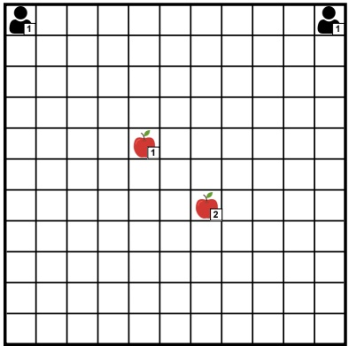

Figure 5.3: Level-based foraging task used to compare central Q-learning and independent Q-learning. This example task consists of a 11 by 11 grid world with two agents and two items. Both agents have level 1, while one item has level 1 and another item has level 2. All episodes start in this shown state with the shown positions and levels.

a skill level, and one or more agents can collect an item if they are positioned next to the item, they simultaneously attempt to collect, and the sum of their levels is equal or higher than the item’s level. Every episode begins with the same start state shown in Figure 5.3, in which both agents have level 1 and are initially located in the top corners of the grid, and there are two items located in the center with levels 1 and 2, respectively. Therefore, while the level-1 item can be collected by any individual agent, the level-2 item requires that the two agents collaborate in order to collect the item.

We model this learning problem as a stochastic game in which the agents observe the full environment state, using a discounted return objective with discount factor $\gamma   =   0 . 9 9$ . An agent receives a reward of $\frac{1}{3}$ when collecting the level-1 item, and both agents receive a reward of $\frac{1}{3}$ when collecting the level-2 item; thus, the total (undiscounted) reward between the agents after collecting all items is $1 . ^ { 6 }$ Due to the reward discounting, the agents will need to collect the items as quickly as possible in order to maximize their returns. Episodes terminate when all items have been collected or after a maximum of 50 time steps. In this example, both algorithms use a constant learning rate $\alpha   =   0 . 0 1$ and an exploration rate which is linearly decayed from ϵ = 1 to $\epsilon   =   0 . 0 5$ over the first 80,000 training time steps (recall from Section 2.7 that training time steps

<small><span class="docvortex-page-footnote" data-block-type="page_footnote" style="color:#6b7280">6. See Section 11.3.1 for a more general definition of the reward function in level-based foraging.</span></small>

<!-- page: 130 -->

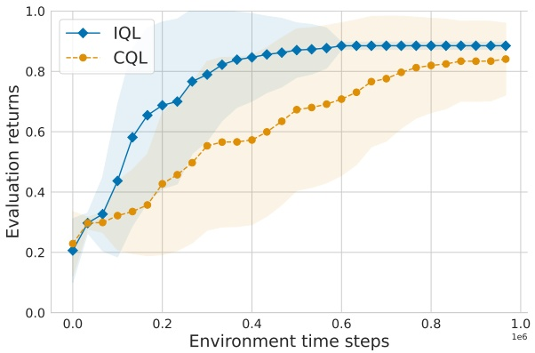

Figure 5.4: Average discounted evaluation returns of central Q-learning (CQL) and independent Q-learning (IQL) in the level-based foraging task shown in Figure 5.3, with discount factor $\gamma   =   0 . 9 9$ . Results are averaged over 50 inde pendent training runs. The shaded area shows the standard deviation over the averaged returns from each training run.

are across the episodes). For CQL, we obtain a scalar reward (Algorithm 4 in Algorithm 4) by summing the individual rewards, that is, $r ^ { t }   =   r _ { 1 } ^ { t } + r _ { 2 } ^ { t }$

Figure 5.4 shows the evaluation returns<sup>7</sup>achieved by CQL and IQL in the level-based foraging task. Note that Figure 5.4 shows discounted returns with discount factor $\gamma   =   0 . 9 9$ , hence the maximum achievable return is also less than 1. IQL learns to solve this task faster than CQL, which is a result of the fact that the IQL agents only explore $6$ actions in each state while the CQL agent has to explore $6 ^ { 2 }   =   3 6$ actions in each state. This allows the IQL agents to learn more quickly to collect the level-1 item, which can be seen in the early jump in evaluation returns of IQL. Eventually, both IQL and CQL converge to the optimal joint policy in this task, in which the agent in the right corner goes directly to the level-2 item and waits for the other agent to arrive; meanwhile, the agent in the left corner first goes to the level-1 item and collects it, and then goes to the level-2 item and collects it together with the other agent. This optimal joint policy requires 13 time steps to solve the task.

<small><span class="docvortex-page-footnote" data-block-type="page_footnote" style="color:#6b7280">7. For a reminder of the term “evaluation return” and how these learning curves are produced, see Section 2.7.</span></small>

<!-- page: 131 -->

## 5.4 Challenges of MARL

MARL algorithms, including central Q-learning and independent Q-learning introduced in this chapter, inherit certain challenges from single-agent RL such as unknown environment dynamics, exploration-exploitation dilemmas, non-stationarity from bootstrapping, and temporal credit assignment. In addition, MARL algorithms face additional conceptual and algorithmic challenges as a result of learning in a dynamic multi-agent system composed of multiple learning agents. This section describes several of the core challenges which together characterize MARL.

## 5.4.1 Non-Stationarity

A central problem in MARL is the non-stationarity resulting from the continual co-adaptation of multiple agents as they learn from interactions with one another. This non-stationarity can lead to cyclic dynamics, whereby a learning agent adapts to the changing policies of other agents, which in turn adapt their policies to the learning agent’s policy, and so on. An illustrative example of such learning dynamics can be seen in Figure 5.5, in which two agents learn in the Rock-Paper-Scissors matrix game using the WoLF-PHC algorithm (which will be introduced in Section 6.4.4) to update their policies. The lines show how the agents’ policies co-adapt over time until converging to the Nash equilibrium of the game, in which both agents choose each action with equal probability.

While non-stationarity caused by the learning of multiple agents is a defining characteristic of MARL, it is important to note that non-stationarity already exists in the single-agent RL setting. To gain clarity on the problem, it is useful to define the notion of stationarity and see how stationarity and non-stationarity appear in single-agent RL, before moving to the multi-agent RL setting.

A stochastic process $\{ X ^ { t } \} _ { t \in \mathbb { N } ^ { 0 } }$ is said to be stationary if the probability distribution of $X ^ { t + \tau }$ does not depend on $\tau \in \mathbb { N } ^ { 0 }$ , where t and $t + \tau$ are time indices. Intuitively, this means that the dynamics of the process do not change over time.

Now, consider a stochastic process $X ^ { t }$ that samples the state $s ^ { t }$ at each time step t. In a Markov decision process, the process $X ^ { t }$ is completely defined by the state transition function, $\mathcal { T } ( s ^ { t }   |   s ^ { t - 1 } , a ^ { t - 1 } )$ , and the agent’s policy, $\pi ,$ which selects the actions $a   \sim   \pi ( \cdot   \mid   s )$ . If this policy does not change over time (meaning that no learning takes place), then it can be seen that the process $X ^ { t }$ is indeed stationary, since $s ^ { t }$ depends only on the state $s ^ { t - 1 }$ and action $a ^ { t - 1 }$ from the previous time step (known as the Markov property), and $a ^ { t - 1 }$ depends only on $s ^ { t - 1 }$ via $\pi ( \cdot   \vert   s ^ { t - 1 } )$ . Therefore, the process dynamics are independent of the time t.

<!-- page: 132 -->

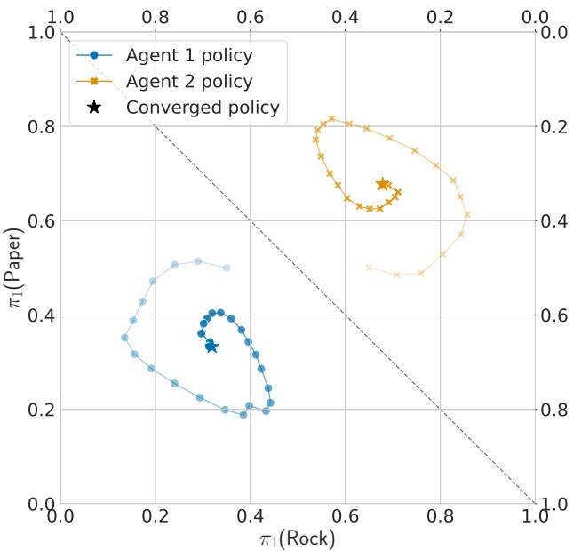

Figure 5.5: Evolving policies of two agents, each using the WoLF-PHC algorithm (Section 6.4.4) to update policies, in the non-repeated Rock-Paper-Scissors matrix game. The diagonal dashed line divides the plot into two probability simplexes, one for each of the two agents. Each point in the sim plex for an agent corresponds to a probability distribution over the agent’s three available actions. Each line shows the agent’s current policy at episodes 0, 5, 10, 15, ..., 145 (marked by the dots), as well as the converged policy at episode 100, 000 (marked by a star).

However, in reinforcement learning, the policy $\pi$ changes over time as a result of the learning process. Using the definition of a learning process from Section 5.1, the policy $\pi ^ { z }$ at time t is updated via $\pi ^ { z + 1 }   =   \mathbb { L } ( \mathcal { D } ^ { z } , \pi ^ { z } )$ , where $\mathcal { D } ^ { z }$ contains all data collected up to time t in the current episode z as well as data from the previous episodes. Therefore, in single-agent RL, the process $X ^ { t }$ is non-stationary since the policy depends on t.

This non-stationarity is a problem when learning the values of states or actions, since the values depend on subsequent actions which can change as the policy $\pi$ changes over time. For example, when using temporal-difference learning to learn action values as described in Section 2.6, the value estimate $Q ( s ^ { t } , a ^ { t } )$ is updated via an update target that depends on value estimates for a different state, such as in the target $r ^ { t }   +   \gamma Q ( s ^ { t + 1 } , a ^ { t + 1 } )$ used in the Sarsa algorithm. As

<!-- page: 133 -->

the policy $\pi$ changes during learning, the update target becomes non-stationary since the value estimate used in the target is also changing. For this reason, the non-stationarity problem is also referred to as the moving target problem.

In MARL, the non-stationarity is exacerbated by the fact that all agents change their policies over time; here, $\pi ^ { z + 1 }   =   \mathbb { L } ( \mathcal { D } ^ { z } , \pi ^ { z } )$ updates an entire joint policy $\pi ^ { z }   =   ( \pi _ { 1 } ^ { z } , . . . , \pi _ { n } ^ { z } )$ . This adds another difficulty for the learning agents in that not only do the value estimates face non-stationarity (as in single-agent RL), but the entire environment appears to be non-stationary from the perspective of each agent. As we discussed in Section 5.3.2, this is encountered in independent learning algorithms such as IQL: from the perspective of agent i, the policies of other agents $j   \neq   i$ become part of the environment’s state transition dynamics, as shown in Equation 5.10 (page 97). And since the policies of other agents are changing over time as a result of learning, the environment’s state transition dynamics from the perspective of agent i are also changing, rendering them non-Markovian since they now also depend on the history of the interaction (Laurent, Matignon, and Le Fort-Piat 2011).

Because of these non-stationarity issues, the usual stochastic approximation conditions required for temporal-difference learning in single-agent RL (defined in Equation 2.54, page 33) are usually not sufficient in MARL to ensure convergence. Indeed, all known theoretical results in MARL for convergent learning are limited to restricted game settings and mostly only work for specific algorithms. For example, IGA (Section 6.4.1) provably converges to the average reward of a Nash equilibrium as per Equation 5.8, and WoLF-IGA (Section 6.4.3) provably converges to a Nash equilibrium as per Equation 5.3; however, both results are limited to normal-form games with only two agents and two actions. Designing general and efficient MARL algorithms that have useful learning guarantees is a difficult problem and the subject of ongoing research (e.g., Zhang, Yang, and Basar 2019; Daskalakis, Foster, and Golowich 2020; Wei et al. 2021; Ding et al. 2022; Leonardos et al. 2022).

## 5.4.2 Equilibrium Selection

As was highlighted in Section 4.7, a game may have multiple equilibrium solutions which may yield different expected returns for the agents in the game. The (non-repeated) Chicken game discussed in Section 4.6, shown again in Figure 5.6(a), has three different equilibria that, respectively, yield expected returns of (7, 2), (2, 7), and $\approx   ( 4 . 6 6 , 4 . 6 6 )$ to the two agents. Equilibrium selection is the problem of which equilibrium the agents should agree on and how they can achieve agreement (Harsanyi and Selten 1988).

<!-- page: 134 -->

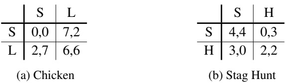

Figure 5.6: Matrix games with multiple equilibria.

Equilibrium selection can be a significant complicating factor for reinforcement learning in games, in which agents typically do not have prior knowledge about the game. Indeed, even if a game has a Nash equilibrium that yields maximum returns for all agents, there can be forces that make the agents prone to converging to a suboptimal equilibrium.

Consider the Stag Hunt matrix game shown in Figure 5.6(b). This game models a situation in which two hunters can either hunt a stag (S) or a hare (H). Hunting a stag requires cooperation and yields higher rewards, while hunting a hare can be done alone but gives lower rewards. It can be seen that the joint actions (S,S) and (H,H) are two Nash equilibria in the game (there is also a third probabilistic equilibrium, which we omit for clarity). While (S,S) yields the maximum reward to both agents and is Pareto-optimal, (H,H) has a relatively lower risk in that each agent can guarantee a reward of at least 2 by choosing H. Thus, (S,S) is the reward-dominant equilibrium meaning that it yields higher rewards than the other equilibria, and (H,H) is the risk-dominant equilibrium in that it has lower risk (agents can guarantee higher minimum reward) than the other equilibria. Algorithms such as independent Q-learning can be prone to converging to a risk-dominant equilibrium if they are uncertain about the actions of other agents. In the Stag Hunt example, in the early stages of learning when agents choose actions more randomly, each agent will quickly learn that action S can give a reward of 0 while action H gives a reward of 2 or higher. This can steer the agents to assign greater probability to action H, which reinforces the risk-dominant equilibrium in a feedback loop since deviating from H is penalized if the other agent chooses H.

Various approaches can be considered to tackle equilibrium selection. One approach is to refine the space of solutions by requiring additional criteria, such as Pareto optimality and welfare/fairness optimality. As we saw in the example discussed in Section 4.9, in some cases this may reduce an infinite space of solutions to a single unique solution. In some types of games, the structure of the game can be exploited for equilibrium selection. For instance, minimax Q-learning (Section 6.2.1) benefits from the uniqueness of equilibrium values in zero-sum games, meaning that all minimax solutions give the same

<!-- page: 135 -->

expected joint returns to agents. In no-conflict games such as Stag Hunt, in which there always exists a Pareto-optimal reward-dominant equilibrium, the Pareto actor-critic algorithm (Chapter 9) uses the fact that all agents know that the reward-dominant equilibrium is also preferred by all the other agents. Agent modeling (Section 6.3) can also help with equilibrium selection by making predictions about the actions of other agents. In the Stag Hunt game, if agent 1 expects that agent 2 is likely to choose action S if agent 1 chose S in past time steps, then agent 1 may learn to choose S more frequently and the process could converge to both agents choosing (S,S). However, whether such an outcome occurs depends on several factors, such as the details of the agents’ exploration strategies and learning rates and how the agent model is used by the agent.

If the agents are able to communicate with each other, then they may send messages about their preferred outcomes or future actions to each other, which could be used to agree on a particular equilibrium. However, communication can bring its own challenges if the agents are not bound to the information they communicate (such as deviating from their announced actions) and other agents cannot verify the received information. Moreover, if different equilibria yield different returns for the agents, then there may still be inherent conflicts about which equilibrium is most preferred.

## 5.4.3 Multi-Agent Credit Assignment

Credit assignment in RL is the problem of determining which past actions have contributed to received rewards. In multi-agent RL, there is the additional question of whose actions among multiple agents contributed to the rewards. To distinguish the two problems, the first type is usually referred to as temporal credit assignment, while the second type is referred to as multi-agent credit assignment.

To illustrate multi-agent credit assignment and how it complicates learning, consider the level-based foraging example introduced in Chapter 1 and shown again in Figure 5.7. In the shown situation, assume that all three agents attempt the “collect” action, and that as a result they all receive a reward of +1. Whose actions led to this reward? To us, it is clear that the action of the agent on the left did not contribute to this reward since it failed to collect the item (the agent’s level was not large enough). Moreover, we know that the combined actions of the two agents on the right led to the reward, rather than any individual agent’s action. However, for a learning agent that only observes the agents chosen actions, environment states (before and after the actions), and received collective reward of +1, disentangling the action contributions of all agents in such detail can be highly non-trivial. It requires a detailed understanding of

<!-- page: 136 -->

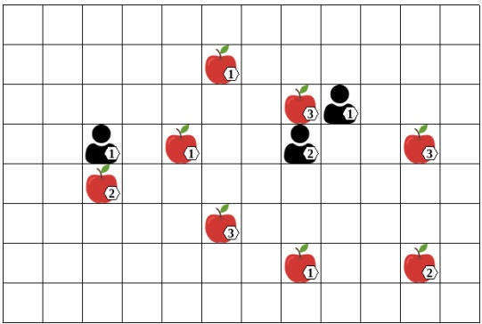

Figure 5.7: A level-based foraging task in which a group of three robots, or agents, must collect all items (shown as apples). Each agent and item has an associated skill level, shown inset. A group of one or more agents can collect an item if they are located next to the item, and the sum of the agents’ levels is greater than or equal to the item’s level.

the world dynamics, such as the relationship between agent/item locations and levels, and how the collect action depends on these.

The problem of multi-agent credit assignment is especially prominent in common-reward settings (such as our example above), since each reward is applied indiscriminately to each agent, effectively leaving it to the agents to disentangle the effects of everyone’s actions on the rewards. This can lead to situations in which an agent’s action is repeatedly reinforced when receiving a positive reward to which the agent’s action made no contribution – just like for the agent on the left in our example. However, it is important to note that the problem of multi-agent credit assignment exists more generally and does not depend on common rewards. If we change our example so that only the two agents on the right receive a reward of +1 upon collecting the item, while the agent on the left receives a reward of 0, then the same question remains from each agent’s perspective: whose actions contributed to the agent’s reward? For instance, the two agents on the right still have to understand that the agent on the left did not contribute to their +1 reward.

Note that our example considers multi-agent credit assignment in one specific time instance. Over time, this is further compounded by temporal credit assignment. Agents must also learn to give appropriate credit to their own past actions and those of other agents. For example, not only did the collect action of the agent on the left not contribute to the +1 reward, but neither did its previous move actions that brought it to its current location.

<!-- page: 137 -->

To resolve multi-agent credit assignment, an agent needs to understand the effect of its own actions on the received reward versus the effect of the other agents’ actions. Ascribing values to joint actions, as is done in central learning, is a useful way to disentangle each agent’s contribution to a received reward. As a simple example, consider the Rock-Paper-Scissors matrix game from Section 3.1. During training, suppose the two agents choose actions $( a _ { 1 } , a _ { 2 } )   =   ( R , S )$ and agent 1 receives a reward of +1 (because rock beats scissors), then the agents choose actions $( a _ { 1 } , a _ { 2 } )   =   ( R , P )$ and agent 1 receives a reward of −1 (because paper beats rock). If agent 1 uses an action-value function $Q ( s , a _ { 1 } )$ that ascribes values to its own actions (as in independent Q-learning, see Algorithm 5), then the average value of taking action R may appear to be 0 since Q does not explicitly model the impact of agent 2’s action. In contrast, a joint-action value function $Q _ { 1 } ( s , a _ { 1 } , a _ { 2 } )$ (as in central Q-learning, see Algorithm 4) can correctly represent the impact of agent 2’s action, by ascribing different values to joint actions (R, S) and $( R , P )$ . Besides central learning algorithms, the class of joint-action learning algorithms, introduced in Chapter 6, uses such joint-action values to learn solutions for games.

Joint-action value functions also enable an agent to consider counterfactual questions such as “What reward would I have received if agent j had done action X instead of $\mathrm { Y ? }$ . Difference rewards (Wolpert and Tumer 2002; Tumer and Agogino 2007) formulate this approach, where X corresponds to doing nothing or a “default action.” Unfortunately, it is generally unclear whether such a default action exists for a given environment and what it should be. Other approaches attempt to learn a decomposition of the value function corresponding to the agents’ individual contributions to a collective reward (e.g., Rashid et al. 2018; Sunehag et al. 2018; Son et al. 2019; Zhou, Liu, et al. 2020). Some of these methods will be introduced in Chapter 9.

## 5.4.4 Scaling to Many Agents

The ability to scale efficiently to many agents is an important goal in MARL research. This goal is significantly complicated by the fact that the number of joint actions can grow exponentially in the number of agents, since we have

$$
| A | = | A _ {1} | \cdot \dots \cdot | A _ {n} |.\tag{5.11}
$$

In the level-based foraging example discussed in Section 5.4.3, if we change the number of agents from 3 to 5, we also increase the number of joint actions from 216 to 7,776. Moreover, if the agents have their own associated features in the state s, as they do in level-based foraging (agent positions), then the number of states |S| also increases exponentially in the number of agents.

<!-- page: 138 -->

MARL algorithms can be affected in various ways by this exponential growth. For example, algorithms that use joint-action values $Q(s,a),a \in A$ , such as central Q-learning and joint-action learning (Section 6.2), are faced with an exponential growth of the space required to represent Q as well as the number of observations required to fill Q. Algorithms that do not use joint-action values, such as independent learning (Section 5.3.2), can also be significantly affected by additional agents. In particular, a larger number of agents can increase the degree of non-stationarity caused by multiple learning agents, since each additional agent adds another moving part that the other agents must adapt to. Multi-agent credit assignment can also become more difficult with more agents, since each additional agent adds a potential cause for an observed reward.

We stated at the beginning that the number of joint actions can grow exponentially. In fact, it is important to note that this exponential growth may not always exist, in particular when using the decomposition approach of multi-agent systems discussed in Section 1.2. As an example, suppose we want to control a power plant that has 1,000 control variables, and each variable can take one of k possible values. Thus, an action is a vector of length 1,000, and there are $k ^ { 1 , 0 0 0 }$ possible actions (value assignments). To make this problem more tractable, we could factor the action vector into n smaller vectors and use n agents, one for each of the smaller action vectors. Each agent now deals with a smaller action space, for example $| A _ { i } |   =   k ^ { \frac { 1 0 0 0 } { n } }$ if the factored action vectors have the same length. However, note that the total number of joint actions between agents, $| A |   =   | A _ { 1 } | \cdot \ldots \cdot | A _ { n } |   =   k ^ { 1 , 0 0 0 }$ , is independent of the number of agents n.

Indeed, while exponential growth due to the number of agents is an important challenge in MARL, it is not unique to MARL. Single-agent reductions of the problem, such as central learning, are still faced with an exponential growth in the number of actions. Moreover, other approaches to optimal decision making in multi-agent systems, such as model-based multi-agent planning (e.g., Oliehoek and Amato 2016), also have to handle the exponential growth. Still, scaling efficiently with the number of agents is an important goal in MARL research. Part II of this book will introduce deep learning techniques as one way to improve the scalability of MARL algorithms.

## 5.5 What Algorithms Do Agents Use?

MARL approaches such as independent learning open up the possibility that agents may use different learning algorithms. Two basic modes of operation in MARL are self-play and mixed-play. In self-play, all agents use the same

<!-- page: 139 -->

learning algorithm, or even the same policy. In mixed-play, agents use different learning algorithms. We will discuss these approaches in turn in this section.

## 5.5.1 Self-Play

The term self-play has been used to describe two related but distinct modes of operation in MARL. The first definition of self-play simply refers to the assumption that all agents use the same learning algorithm (Bowling and Veloso 2002; Banerjee and Peng 2004; Powers and Shoham 2005; Conitzer and Sandholm 2007; Shoham, Powers, and Grenager 2007; Wunder, Littman, and Babes 2010; Chakraborty and Stone 2014). Developing algorithms that converge to some type of equilibrium solution in self-play is at the core of much of the literature in MARL. Essentially all of the MARL algorithms introduced in this book operate in this way. For independent learning, self-play is usually implicitly assumed (such as in independent Q-learning), but note that this is not strictly a requirement since the agents may use different algorithms within the independent learning approach.

This definition of self-play is rooted in game theory, specifically the literature on “interactive learning” (Fudenberg and Levine 1998; Young 2004), which studies basic learning rules for players (i.e., agents) and their ability to converge to equilibrium solutions in game models. The principal focus is the theoretical analysis of learning outcomes in the limit, under the standard assumption that all players use the same learning rule. This assumption serves as an important simplification, since the non-stationarity caused by multiple learning agents (discussed in Section 5.4.1) can be further exacerbated if the agents use different learning approaches. From a practical perspective, it is appealing to have one algorithm that can be used by all agents regardless of differences in their action and observation spaces.

Another definition of self-play, which was primarily developed in the context of zero-sum sequential games, uses a more literal interpretation of the term by training an agent’s policy directly against itself. In this process, the agent learns to exploit weaknesses in its own play as well as how to eliminate such weaknesses. One of the earliest applications of this self-play approach in combination with temporal-difference learning was TD-Gammon (Tesauro 1994), which was able to achieve champion-level performance in the game of backgammon. More recently, several algorithms combined self-play with deep RL techniques to reach champion-level performance in diverse complex multi-agent games (e.g., Silver et al. 2017; Silver et al. 2018; Berner et al. 2019). Population-based training extends self-play by training policies against a distribution of other

<!-- page: 140 -->

policies, including past versions of themselves (e.g., Lanctot et al. 2017; Jaderberg et al. 2019; Vinyals et al. 2019). We will describe this type of self-play and population-based training in Sections 9.8 and 9.9, respectively.

To distinguish the two definitions of self-play mentioned previously, we use the terms algorithm self-play and policy self-play, respectively. Note that policy self-play implies algorithm self-play. An important benefit of policy self-play is that it may learn significantly faster than algorithm self-play, since the experiences of all agents (each using the same policy) can be combined to train a single policy. However, policy self-play is also more restricted in that it requires the agents in the game to have symmetrical roles and egocentric observations, such that the same policy can be used from the perspective of each agent. We will describe these aspects of policy self-play in Section 9.8. In contrast, algorithm self-play has no such restriction; here, the same algorithm can be used to learn policies for different agents that may have different roles in the game (e.g., different actions, observations, and rewards). This applies to independent learning algorithms such as independent Q-learning, as well as many of the algorithms introduced in Chapter 6 and later chapters.

## 5.5.2 Mixed-Play

Mixed-play describes the case in which the agents use different learning algorithms. One example of mixed-play can be seen in trading markets, in which the agents may use different learning algorithms developed by the different users or organizations that control the agents. Ad hoc teamwork (Stone et al. 2010; Mirsky et al. 2022) is another example, in which agents must collaborate with previously unknown other agents whose behaviors may be initially unknown.

The study of Albrecht and Ramamoorthy (2012) considered such mixedplay settings and empirically compared various learning algorithms, including Nash-Q (Section 6.2), JAL-AM (Section 6.3.2), WoLF-PHC (Section 6.4.4), and a variant of regret matching (Section 6.5), in many different normal-form games using a range of metrics, including several of the solution concepts discussed in Chapter 4. The study concluded that there was no clear winner among the tested algorithms, each having relative strengths and limitations in mixed-play settings. While Papoudakis et al. (2021) provide a benchmark and comparison of contemporary deep learning-based MARL algorithms (such as those discussed in Chapter 9) for algorithm self-play in common-reward games, there is currently no such study for deep learning-based MARL algorithms in mixed-play settings.

<!-- page: 141 -->

MARL research has also developed algorithms that aim to bridge algorithm self-play and mixed-play. For example, the agenda of converging to an equilibrium solution in algorithm self-play was extended with an additional agenda to converge to a best-response policy if other agents use a stationary policy (Bowling and Veloso 2002; Banerjee and Peng 2004; Conitzer and Sandholm 2007). Algorithms based on targeted optimality and safety (Powers and Shoham 2004) assume that other agents are from a particular class of agents and aim to achieve best-response returns if the other agents are indeed from that class, and otherwise achieve at least maxmin (“security”) returns that can be guaranteed against any other agents. For example, we could assume that other agents use a particular policy representation, such as finite state automata or decision trees, or that their policies are conditioned on the previous x observations from the history (Powers and Shoham 2005; Vu, Powers, and Shoham 2006; Chakraborty and Stone 2014). In algorithm self-play, these algorithms aim to produce Pareto-optimal outcomes (Shoham and Leyton-Brown 2008).

## 5.6 Summary

In this chapter, we made a first foray into using reinforcement learning to learn solutions for games, and we discussed some of the key challenges in the learning process. The main concepts from this chapter are the following:

• MARL algorithms are designed to learn a joint policy that satisfies the properties of a specific solution concept (e.g., Nash equilibrium). The data used for learning consists of a set of histories (containing the observations, actions, and rewards of one or more agents) from multiple episodes in the game.

• Different types of convergence criteria exist to analyze and evaluate the learning performance of MARL algorithms. The standard theoretical criterion is convergence of the learned joint policy to a solution of the game. Weaker criteria include convergence of the empirical distribution of joint actions across episodes to a solution joint policy; and convergence of the averaged returns across episodes to the expected returns under a solution joint policy.

• Two basic approaches to applying RL in games reduce the multi-agent learning problem to a single-agent learning problem. Central learning applies single-agent RL to the space of joint actions to learn a central policy that chooses actions for each agent. Independent learning uses single-agent RL independently for each agent to learn independent policies, without explicitly representing the presence of other agents.

• A key challenge in MARL is the environment non-stationarity caused by the concurrent learning of multiple agents. Essentially, from the perspective

<!-- page: 142 -->

of each agent, the environment appears non-stationary as the policies of the other agents are changing over time, which breaks the Markov assumption in game models. This can lead to cyclic dynamics where each agent ties to adapt to the changing policies of the other agents, also known as the moving target problem.

• Equilibrium selection is another key challenge, which can occur whenever the game has multiple equilibria and where different equilibria yield different expected returns for the agents. Thus, the agents face the problem of what equilibrium they should agree to converge to, and how such agreement can be achieved during learning.

• Additional challenges include the multi-agent credit assignment problem, in which agents have to determine during learning whose actions among multiple agents contributed to the received rewards; as well as scaling to many agents and dealing with an exponential growth of the joint-action space.

• Self-play and mixed-play are two basic modes of operation in MARL. We describe two types of self-play: in algorithm self-play, every agent uses the same learning algorithm; while in policy self-play, an agent’s policy is directly trained against itself. Mixed-play describes a scenario in which the agents use different learning algorithms.

In Chapter 6, we will go beyond the basic central and independent learning approaches introduced in this chapter by describing several families of more specialized MARL algorithms that explicitly model and use certain aspects of the multi-agent interaction. These algorithms use different approaches to deal with one or more of the above challenges, which can enable them to successfully learn different types of game solutions under certain conditions.

<!-- page: 143 -->

<!-- page: 144 -->

## 6 Multi-Agent Reinforcement Learning:Foundational Algorithms

In Chapter 5, we took some first steps toward applying RL to compute solutions in games: we defined a general learning process in games and different convergence types for MARL algorithms, and we introduced the basic concepts of central learning and independent learning which apply single-agent RL in games. We then discussed several core challenges faced in MARL, including non-stationarity, multi-agent credit assignment, and equilibrium selection.

Continuing in our exploration of RL methods to compute game solutions, the present chapter will introduce several classes of foundational algorithms in MARL. These algorithms go beyond the basic central/independent learning approaches by explicitly modeling and using aspects of the multi-agent interaction. We call them foundational algorithms because of their basic nature, and because each algorithm type can be instantiated in different ways. As we will see, depending on the specific instantiation used, these MARL algorithms can successfully learn or approximate (as per the different convergence types given in Section 5.2) different types of solutions in games.

Specifically, we will introduce four classes of MARL algorithms. Joint-action learning is a class of MARL algorithms that use temporal-difference learning to learn estimates of joint-action values. These algorithms can make use of game-theoretic solution concepts to compute policies and update targets for temporal-difference learning. Next we will discuss agent modeling, which is the task of learning explicit models of other agents to predict their actions based on their past chosen actions. We will show how joint-action learning can use such agent models in combination with best-response actions to learn optimal joint policies. The third class of MARL algorithms covered in this chapter are policy-based learning methods, which directly learn policy parameters using gradient-ascent techniques. Finally, we will cover basic regret matching algorithms that aim to minimize different notions of regret and are able to achieve no-regret outcomes.

<!-- page: 145 -->

To simplify the descriptions in this chapter, we will focus on normal-form games and stochastic games in which we assume full observability of environment states and actions. Part II of this book will introduce MARL algorithms that use deep learning techniques and can be applied to the more general POSG model. Many of the basic concepts and algorithm categories discussed in this chapter still feature in these deep learning-based MARL algorithms.

## 6.1 Dynamic Programming for Games: Value Iteration

In his seminal work on stochastic games, Shapley (1953) described an iterative procedure to compute the optimal expected returns or “values” $V _ { i } ^ { * } ( s )$ for each agent i and state s, in zero-sum stochastic games with two agents. These values are the unique minimax values for the agents in the stochastic game, that is, their expected returns when the agents use a minimax joint policy of the stochastic game. This procedure is analogous to the classical value iteration algorithm for MDPs (Section 2.5), and forms the foundation for a family of temporal-difference learning algorithms discussed in Sections 6.2 and 6.3.

Algorithm 6 shows the pseudocode of the value iteration algorithm for stochastic games. The algorithm requires access to the reward functions $\mathcal { R } _ { i }$ and state transition function $\mathcal { T }$ of the game, as is the case in MDP value iteration. The algorithm starts by initializing functions $V _ { i } ( s )$ , for each agent i, which associate a value to each possible state of the game. In the pseudocode we initialize $V _ { i }$ to $0 ,$ but arbitrary initial values may be used. The algorithm then makes two sweeps over the entire state space S:

1. The first sweep computes for each state $s \in S$ and agent $i \in I$ a matrix $M _ { s , i }$ that contains entries $M _ { s , i } ( a )$ for each joint action $a   \in   A$ . The value $M _ { s , i } ( a )$ represents an approximation of the expected return for agent i after selecting joint action $a$ in state s in the stochastic game. This matrix can be viewed as a reward function for agent i in a normal-form game associated with the state s, that is, $\mathcal { R } _ { i } ( a )   =   M _ { s , i } ( a )$

2. The second sweep updates each agent’s value function $V _ { i } ( s )$ for each state s, by using the expected return for agent i under the minimax solution (defined in Equation 4.10 on page 66) of the non-repeated normal-form game given by $M _ { s , 1 } , . . . , M _ { s , n }$ . We denote the minimax value for agent i by $\mathit { V a l u e } _ { i } ( M _ { s , 1 } , . . . , M _ { s , n } )$ . This minimax value is unique and can be computed efficiently as a linear program, as shown in Section 4.3.1.

Thus, the value iteration algorithm constructs a set of non-repeated normalform games, one for each state $s \in S$ , and computes their minimax values in order to update the state values $V _ { i } ( s )$ of the stochastic game.

<!-- page: 146 -->

<div class="docvortex-algorithm" style="white-space: pre-wrap; font-family:monospace;">
Algorithm 6 Value iteration for stochastic games
Initialize: $V_i(s) = 0$ for all $s \in S$ and $i \in I$
Repeat until all $V_i$ have converged:
for all states $s \in S$, agents $i \in I$, joint actions $a \in A$ do
$M_{s,i}(a) \leftarrow \sum_{s' \in S} \mathcal{T}(s' \mid s, a) \left[ \mathcal{R}_i(s, a, s') + \gamma V_i(s') \right]$ (6.3)
for all states $s \in S$, agents $i \in I$ do
$V_i(s) \leftarrow Value_i(M_{s,1}, ..., M_{s,n})$ (6.4)
</div>

The sweeps are repeated and the process converges to the optimal value functions $V _ { i } ^ { * }$ for each agent i, which satisfy for all $s   \in   S , a   \in   A$

$$
V _ {i} ^ {*} (s) = \text {Value} _ {i} (M _ {s, 1} ^ {*}, \dots , M _ {s, n} ^ {*})\tag{6.1}
$$

$$
M _ {s, i} ^ {*} (a) = \sum_ {s ^ {\prime} \in S} \mathcal {T} (s ^ {\prime} \mid s, a) \left[ \mathcal {R} _ {i} (s, a, s ^ {\prime}) + \gamma V _ {i} ^ {*} (s ^ {\prime}) \right]\tag{6.2}
$$

Given value functions $V _ { i } ^ { * }$ for each $i \in I ,$ the corresponding minimax policies of the stochastic game for each agent, $\pi _ { i } ( a _ { i }   \mid   s )$ , are obtained by computing the minimax solution in the non-repeated normal-form game given by $M _ { s , 1 } ^ { * } , . . . , M _ { s , n } ^ { * } ,$ for each state $s \in S$ . Notice that, analogous to optimal policies in MDPs, the minimax policies in the stochastic game are conditioned only on the state rather than state-action histories.

Notice that Equation 6.4 resembles the value update in MDP value iteration defined in Equation 2.47 and repeated below,

$$
V (s) \leftarrow \max _ {a \in A} \sum_ {s ^ {\prime} \in S} \mathcal {T} (s ^ {\prime} \mid s, a) \left[ \mathcal {R} (s, a, s ^ {\prime}) + \gamma V (s ^ {\prime}) \right]\tag{6.5}
$$

but replaces the $\mathrm { m a x } _ { a } \mathrm { - o p e r a t o r }$ with the $\mathit { V a l u e } _ { i } \text { - } \mathrm { o p e r a t o r } .$ In fact, in stochastic games with a single agent (i.e., MDPs), the value iteration algorithm reduces to MDP value iteration.<sup>1</sup> This can be seen as follows: First, in stochastic games with a single agent i, the value update becomes $V _ { i } ( s ) \gets V a l u e _ { i } ( M _ { s , i } )$ where $M _ { s , i }$ is a vector of action values for agent i in state s. Next, recall the definition of the maxmin value from Equation 4.10 (page 66), which simply becomes max $_ { \pi _ { i } } U _ { i } ( \pi _ { i } )$ in the single-agent case. In the single-agent case (i.e., MDPs), we know that there is always a deterministic optimal policy that in each state chooses an optimal action with probability 1. Using all of the aforementioned,

<small><span class="docvortex-page-footnote" data-block-type="page_footnote" style="color:#6b7280">1. Hence, despite the focus on stochastic games, Shapley (1953) can also be regarded as an early inventor of value iteration for MDPs.</span></small>

<!-- page: 147 -->

the definition of $V a l u e _ { i }$ becomes

$$
\begin{array}{l} \text {Value} _ {i} (M _ {s, i}) = \max _ {a _ {i} \in A _ {i}} M _ {s, i} (a _ {i}) \\ = \max _ {a _ {i} \in A _ {i}} \sum_ {s ^ {\prime} \in S} \mathcal {T} (s ^ {\prime} \mid s, a _ {i}) \left[ \mathcal {R} (s, a _ {i}, s ^ {\prime}) + \gamma V (s ^ {\prime}) \right] \end{array}\tag{6.6}
$$

(6.7)

and, thus, Equation 6.4 reduces to MDP value iteration.

To see why the value iteration process in zero-sum stochastic games converges to the optimal values $V _ { i } ^ { * }$ , one can show that the update operator defined in Equation 6.4 is a contraction mapping. We described the proof for MDP value iteration in Section 2.5, and the proof for value iteration in stochastic games follows an analogous argument that we summarize here. A mapping $f   :   \mathcal { X } \to \mathcal { X }$ on a || · ||–normed complete vector space $\mathcal { X }$ is a γ-contraction, for $\gamma \in [ 0 , 1 )$ , if for all $x , y   \in   \mathcal { X }$

$$
\| f (x) - f (y) \| \leq \gamma \| x - y \|\tag{6.8}
$$

By the Banach fixed-point theorem, if f is a contraction mapping, then for any initial vector $x \in \mathcal { X }$ the sequence $f ( x ) , f ( f ( x ) ) , f ( f ( f ( x ) ) )$ , ... converges to a unique fixed point $x ^ { * } \in \mathcal { X }$ such that $f ( x ^ { * } )   =   x ^ { * }$ . Using the max-norm $\| x \| _ { \infty } = \max _ { i } | x _ { i } |$ it can be shown that Equation 6.4 satisfies Equation 6.8 (Shapley 1953). Thus, repeated application of the update operator in Equation 6.4 converges to a unique fixed point which, by definition, is given by $V _ { i } ^ { * }$ for all agents $i \in I .$

While our description of value iteration focused on zero-sum stochastic games by using minimax values for $V a l u e _ { i }$ (based on the original method of Shapley (1953)), the general form shown in Algorithm $6$ suggests that a similar approach could be applied to other classes of stochastic games by using different solution concepts in $V a l u e _ { i }$ . In the next section, we will present a family of MARL algorithms that build on this idea in combination with temporal-difference learning, to learn equilibrium joint policies for zero-sum and general-sum stochastic games.

## 6.2 Temporal-Difference Learning for Games: Joint-Action Learning

The value iteration algorithm introduced in the previous section has useful convergence guarantees, but it requires access to the game model (in particular, the reward functions $\mathcal { R } _ { i }$ and state transition function T ), which may not be available. Thus, the question arises whether it is possible to learn solutions to games via a process of repeated interaction between the agents, using ideas based on temporal-difference learning in RL (Section 2.6).

<!-- page: 148 -->

Independent learning algorithms (such as independent Q-learning) can use temporal-differencing, but because they ignore the special structure of games — in particular, that the state is affected by actions of multiple agents — they suffer from non-stationarity and multi-agent credit assignment problems. On the other hand, central learning algorithms (such as central Q-learning) address these issues by learning values of joint actions, but they suffer from other limitations such as the need for reward scalarization.

Joint-action learning (JAL) refers to a family of MARL algorithms based on temporal-difference learning that seek to address the above problems. As the name suggests, JAL algorithms learn joint-action value functions that estimate the expected returns of joint actions in any given state. Analogous to the Bellman equation for MDPs (Section 2.4), in a stochastic game, the expected return for agent i when the agents select joint action $a   =   ( a _ { 1 } , . . . , a _ { n } )$ in state s and subsequently follow joint policy π is given by

$$
Q _ {i} ^ {\pi} (s, a) = \sum_ {s ^ {\prime} \in S} \mathcal {T} (s ^ {\prime} \mid s, a) \left[ \mathcal {R} _ {i} (s, a, s ^ {\prime}) + \gamma \sum_ {a ^ {\prime} \in A} \pi (a ^ {\prime} \mid s ^ {\prime}) Q _ {i} ^ {\pi} (s ^ {\prime}, a ^ {\prime}) \right].\tag{6.9}
$$

Specifically, the JAL algorithms we present in this section are all off-policy algorithms that aim to learn equilibrium Q-values, ${ \mathcal { Q } _ { i } ^ { \pi } } ^ { * }$ , where $\pi ^ { * }$ is an equilibrium joint policy for the stochastic game. To reduce notation, we will drop the $\pi$ from $Q _ { i } ^ { \pi }$ unless required.

In contrast to using single-agent Q-values $Q ( s , a )$ , using joint-action values $Q _ { i } ( s , a _ { 1 } , . . . , a _ { n } )$ alone is no longer enough to select the best action for agent i in a given state, that is, finding ma $\operatorname { i x } _ { a _ { i } } Q _ { i } ( s , a _ { 1 } , . . . , a _ { n } )$ , since it depends on the actions of the other agents in that state. Moreover, since a game can have multiple equilibria that may yield different expected returns for the agents, learning ${ \mathcal { Q } _ { i } ^ { \pi } } ^ { * }$ requires some way to agree on a particular equilibrium (we discussed this equilibrium selection problem in Section 5.4.2). Therefore, using joint action values requires additional information or assumptions about the actions of other agents in order to select optimal actions and to compute target values for temporal-difference learning. In this section, we will discuss a class of JAL algorithms that use solution concepts from game theory to derive this additional information; hence, we will refer to them as JAL-GT.

The underlying idea in JAL-GT algorithms is that the set of joint-action values $Q _ { 1 } ( s , \cdot ) , . . . , Q _ { n } ( s , \cdot )$ can be viewed as a non-repeated normal-form game $\Gamma _ { s }$ for state s, in which the reward function for agent i is given by

$$
\mathcal {R} _ {i} (a _ {1}, \dots , a _ {n}) = Q _ {i} (s, a _ {1}, \dots , a _ {n}).\tag{6.10}
$$

As convenient notation, we may also write this reward function as $\Gamma _ { s , i } ( a )$ for joint actions a. Thus, JAL-GT algorithms follow a similar approach to the value

<!-- page: 149 -->

<div class="docvortex-algorithm" style="white-space: pre-wrap; font-family:monospace;">
Algorithm 7 Joint-action learning with game theory (JAL-GT)
// Algorithm controls agent $i$
Initialize: $Q_j(s, a) = 0$ for all $j \in I$ and $s \in S, a \in A$
Repeat for every episode:
for $t = 0, 1, 2, \ldots$ do
    Observe current state $s^t$
    With probability $\epsilon$: choose random action $a_i^t$
    Otherwise: solve $\Gamma_{s^t}$ to get policies ($\pi_1, ..., \pi_n$), then sample action $a_i^t \sim \pi_i$
    Observe joint action $a^t = (a_1^t, ..., a_n^t)$, rewards $r_1^t, ..., r_n^t$, next state $s^{t+1}$
    for all $j \in I$ do
        $Q_j(s^t, a^t) \leftarrow Q_j(s^t, a^t) + \alpha \left[ r_j^t + \gamma Value_j(\Gamma_{s^{t+1}}) - Q_j(s^t, a^t) \right]$
</div>

iteration algorithm discussed in Section 6.1, in which the matrices $M _ { s , i }$ were the counterpart of $\Gamma _ { s , i }$ . Visually, for a stochastic game with two agents (i and j) and three possible actions for each agent, the normal-form game $\Gamma _ { s }   =   \{ \Gamma _ { s , i } , \Gamma _ { s , j } \}$ in state s can be written as

$$
\Gamma_ {s, i} = \begin{array}{c c c} Q _ {i} (s, a _ {i, 1}, a _ {j, 1}) & Q _ {i} (s, a _ {i, 1}, a _ {j, 2}) & Q _ {i} (s, a _ {i, 1}, a _ {j, 3}) \\ Q _ {i} (s, a _ {i, 2}, a _ {j, 1}) & Q _ {i} (s, a _ {i, 2}, a _ {j, 2}) & Q _ {i} (s, a _ {i, 2}, a _ {j, 3}) \\ Q _ {i} (s, a _ {i, 3}, a _ {j, 1}) & Q _ {i} (s, a _ {i, 3}, a _ {j, 2}) & Q _ {i} (s, a _ {i, 3}, a _ {j, 3}) \end{array}
$$

with an analogous matrix $\Gamma _ { s , j }$ for agent j using $Q _ { j }$ . The notation $a _ { i , k }$ means that agent i uses the k-th action, and similarly for $a _ { j , k }$ and agent j.

The normal-form game $\Gamma _ { s }$ can be solved using existing game-theoretic solution concepts, such as minimax or Nash equilibrium, to obtain an equilibrium joint policy $\pi _ { s } ^ { * }$ . Note that $\pi _ { s } ^ { * }$ is a joint policy for a non-repeated normal-form game $( \Gamma _ { s } )$ , while $\pi ^ { * }$ is the equilibrium joint policy we seek to learn for the stochastic game. Given $\pi _ { s } ^ { * }$ , action selection in state s of the stochastic game is simply done by sampling $a \sim \pi _ { s } ^ { * }$ with some random exploration (e.g., ϵ-greedy). Update targets for temporal-difference learning of $Q _ { i } ^ { \pi ^ { * } }$ are derived by using agent i’s expected return (or value) of the solution to the game $\Gamma _ { s ^ { \prime } }$ for the next state $s ^ { \prime } .$ , given by

$$
\text {Value} _ {i} (\Gamma_ {s ^ {\prime}}) = \sum_ {a \in A} \Gamma_ {s ^ {\prime}, i} (a)   \pi_ {s ^ {\prime}} ^ {*} (a)\tag{6.11}
$$

where $\pi _ { s ^ { \prime } } ^ { * }$ is the equilibrium joint policy for the normal-form game $\Gamma _ { s ^ { \prime } }$

The pseudocode for a general JAL-GT algorithm for stochastic games is shown in Algorithm 7. The algorithm observes the actions and rewards of

<!-- page: 150 -->

all agents in each time step, and maintains joint-action value functions $Q _ { j }$ for every agent $j \in I ,$ in order to produce the games $\Gamma _ { s }$ . Several well-known MARL algorithms can be instantiated from Algorithm 7, which differ in the specific solution concept used to solve $\Gamma _ { s }$ . These algorithms can learn equilibrium values for the stochastic game under certain conditions, as we will see in the following subsections.

## 6.2.1 Minimax Q-Learning

Minimax Q-learning (Littman 1994) is based on Algorithm 7 and solves $\Gamma _ { s }$ by computing a minimax solution, for example via linear programming (Section 4.3.1). This algorithm can be applied to two-agent zero-sum stochastic games. Minimax Q-learning is guaranteed to learn the unique minimax value of the stochastic game under the assumption that all combinations of states and joint actions are tried infinitely often, as well as the usual conditions on learning rates used in single-agent RL (Littman and Szepesvári 1996). This algorithm is essentially the temporal-difference version of the value iteration algorithm discussed in Section 6.1.

To see the differences in the policies learned by minimax Q-learning compared to independent Q-learning (Algorithm 5), it is instructive to look at the experiments of the original paper, which proposed minimax Q-learning (Littman 1994). Both algorithms were evaluated in a simplified soccer game represented as a zero-sum stochastic game with two agents. The game is played on a 4 by 5 grid in which each episode (i.e., match) starts in the initial state shown in Figure 6.1, with the ball randomly assigned to one agent. Each agent can move up, down, left, right, or stand still, and the agents’ selected actions are executed in random order. If the agent with the ball attempts to move into the location of the other agent, it loses the ball to the other agent. An agent scores a reward of +1 if it moves the ball into the opponent goal (and the opponent gets a reward of −1), after which a new episode starts. Each episode terminates as a draw (reward of 0 for both agents) with probability 0.1 in each time step, hence the discount factor was set to $\gamma   =   0 . 9 \left( 1 - \gamma \right.$ is the probability of terminating in each time step). Both algorithms learned over one million training time steps, used exploration rate $\epsilon   =   0 . 2$ , and an initial learning rate $\alpha   =   1 . 0$ which was reduced in each time step by multiplying with 0.9999954. After training, one of the learned policies from each algorithm was tested over 100,000 time steps against (1) a random opponent which picks actions uniformly randomly; (2) a deterministic hand-built opponent which uses heuristic rules for attacking and defending; and (3) an optimal (i.e., worst-case) opponent that used Q-learning to train an optimal policy against the other agent’s fixed policy.

<!-- page: 151 -->

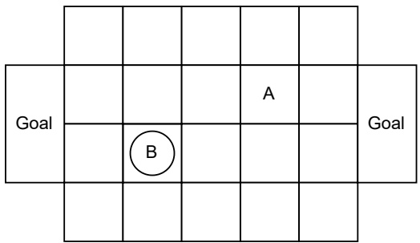

Figure 6.1: Simplified grid-world soccer game with two agents (A and B). The circle marks ball possession. Based on Littman (1994).

|  | mini% won | max Q ep. len. | indepe% won | ndent Q ep. len. |
| --- | --- | --- | --- | --- |
| vs. random | 99.3 | 13.89 | 99.5 | 11.63 |
| vs. hand-built | 53.7 | 18.87 | 76.3 | 30.30 |
| vs. optimal | 37.5 | 22.73 | 0 | 83.33 |

Figure 6.2: Percentage of won episodes and average episode length (time steps) in the simplified soccer game, when policies learned by minimax Q-learning and independent Q-learning are tested against random, hand-built, and optimal opponents. Based on Littman (1994).

Figure 6.2 shows the percentage of won episodes and average episode length<sup>2</sup> for policies learned by minimax Q-learning and independent Q-learning when tested against the random, hand-built, and optimal opponents. Against the random opponent, the policies of both algorithms won in almost all games and achieved similar episode lengths. Against the hand-built opponent, minimax Q-learning achieved a win rate of 53.7 percent, which is close to the theoretical 50 percent of the exact minimax solution. Independent Q-learning achieved a higher win rate of 76.3 percent because its learned policy was able to exploit certain weaknesses in the hand-built opponent. On the other hand, against the optimal opponent, minimax Q-learning achieved a win rate of 37.5 percent. The fact that this win rate was a little further from the theoretical 50 percent suggests that the algorithm had not fully converged during learning, resulting

<small><span class="docvortex-page-footnote" data-block-type="page_footnote" style="color:#6b7280">2. The original work (Littman 1994) showed the number of completed episodes within the 100,000 time steps in testing. We find the average episode length (100,000 divided by number of completed games) more intuitive to interpret.</span></small>

<!-- page: 152 -->

in weaknesses in the policy that the optimal opponent was able to exploit in some situations. The policy learned by independent Q-learning lost in all episodes against its optimal opponent. This is because any fully deterministic policy can be exploited by an optimal opponent. These results show that the policies learned by minimax Q-learning do not necessarily exploit weaknesses in opponents when they exist, but at the same time these policies are robust to exploitation by assuming a worst-case opponent during training.

## 6.2.2 Nash Q-Learning

Nash Q-learning (Hu and Wellman 2003) is based on Algorithm 7 and solves $\Gamma _ { s }$ by computing a Nash equilibrium solution. This algorithm can be applied to the general class of general-sum stochastic games with any finite number of agents. Nash Q-learning is guaranteed to learn a Nash equilibrium of the stochastic game, albeit under highly restrictive assumptions. In addition to trying all combinations of states and joint actions infinitely often, the algorithm requires that all of the encountered normal-form games $\Gamma _ { s }$ either (a) all have a global optimum or (b) all have a saddle point. A joint policy $\pi$ is a global optimum in $\Gamma _ { s }$ if each agent individually achieves its maximum possible expected return, that is, $\forall i , \pi ^ { \prime } : U _ { i } ( \pi ) \geq U _ { i } ( \pi ^ { \prime } )$ . Thus, a global optimum is also an equilibrium since no agent can deviate to obtain higher returns. A joint policy $\pi$ is a saddle point if it is an equilibrium and if any agent deviates from $\pi .$ , then all other agents receive a higher expected return.

Either of these conditions is unlikely to exist in any encountered normal-form game, let alone in all of the encountered games. For example, global optimality is significantly stronger than Pareto optimality (Section 4.8), which merely requires that there is no other joint policy that increases the expected return of at least one agent without making other agents worse off. As an example, in the Prisoner’s Dilemma matrix game (Figure 3.2(c)), agent 1 defecting and agent 2 cooperating is Pareto optimal since any other joint policy will reduce the expected return for agent 1. However, there is no global optimum since no single joint policy can achieve the maximum possible reward for both agents at the same time.

To see why these assumptions are required, notice that all global optima are equivalent to each agent, meaning that they give the same expected return to each agent. Thus, choosing a global optimum to compute $V a l u e _ { i }$ circumvents the equilibrium selection problem mentioned earlier. Similarly, it can be shown that all saddle points of a game are equivalent in the expected returns they give to agents, and so choosing any saddle point to compute $V a l u e _ { i }$ circumvents the equilibrium selection problem. However, an implicit additional requirement

<!-- page: 153 -->

here is that all agents consistently choose either global optima or saddle points when computing target values.

## 6.2.3 Correlated Q-Learning

Correlated Q-learning (Greenwald and Hall 2003) is based on Algorithm 7 and solves $\Gamma _ { s }$ by computing a correlated equilibrium. Like Nash Q-learning, correlated Q-learning can be applied to general-sum stochastic games with a finite number of agents.

This algorithm has two important benefits:

1. Correlated equilibrium spans a wider space of solutions than Nash equilibrium, including solutions with potentially higher expected returns for agents (see discussion in Section 4.6).

2. Correlated equilibria can be computed efficiently for normal-form games via linear programming (Section 4.6.1), while computing Nash equilibria requires quadratic programming.

Since correlated Q-learning solves $\Gamma _ { s }$ via correlated equilibrium, we require a small modification to Algorithm 7: in Algorithm 7 of the algorithm, it may not be possible to factorize a correlated equilibrium $\pi$ into individual agent policies $\pi _ { 1 } , . . . , \pi _ { n } ,$ , and hence there would be no policy $\pi _ { i }$ to sample an action $a _ { i } ^ { t }$ from. Instead, agent i can sample a joint action from the correlated equilibrium, $a ^ { t } \sim \pi$ , and then simply take its own action $a _ { i } ^ { t }$ from this joint action. To maintain correlations between the agents’ actions, a further modification would be to include a central mechanism that samples a joint action from the equilibrium and sends to each agent its own action from the joint action.

Since the space of correlated equilibria can be larger than the space of Nash equilibria in a game, the problem of equilibrium selection — how the agents should select a common equilibrium in $\Gamma _ { s }$ — becomes even more pronounced. Greenwald and Hall (2003) define different mechanisms to select equilibria, which ensure that there is a unique equilibrium value $V a l u e _ { j } ( \Gamma _ { s } )$ . One such mechanism is to choose an equilibrium that maximizes the sum of expected rewards of the agents, and this is what we used in the linear program presented in Section 4.6.1. Other mechanisms include selecting an equilibrium that maximizes the minimum or maximum of the agents’ expected rewards. In general, however, no formal conditions are known under which correlated Q-learning converges to a correlated equilibrium of the stochastic game.

<!-- page: 154 -->

## 6.2.4 Limitations of Joint-Action Learning

We saw that Nash Q-learning requires some very restrictive assumptions to ensure convergence to a Nash equilibrium in general-sum stochastic games, while correlated Q-learning has no known convergence guarantees. This begs the question: Is it possible to construct a joint-action learning algorithm based on Algorithm 7 that converges to an equilibrium solution in any general-sum stochastic game? As it turns out, there exist stochastic games for which the information contained in the joint-action value functions $Q _ { j } ( s , a )$ is insufficient to reconstruct equilibrium policies.

Consider the following two properties:

• Since $Q _ { j }$ is conditioned on the state s (rather than the history of states and joint actions), any equilibrium joint policy $\pi ^ { * }$ for the stochastic game that is derived from $Q _ { j }$ is also only conditioned on s to choose actions. Such an equilibrium is called stationary.

If in a given state s only one agent has a choice to make, that is, $| A _ { i , s } |   >   1$ for some agent i and $| A _ { j , s } |   =   1$ for all other agents $j \not = i ,$ where $A _ { i , s }$ is the set of available actions for agent i in state $S ;$ then any equilibrium concept (such as Nash equilibrium and correlated equilibrium) will reduce to a max-operator when applied to $Q _ { j }$ in s, that is, $\operatorname { n a x } _ { a } Q _ { i } ( s , a )$ . This is by virtue of the fact that the best response of the other agents $j   \neq   i$ is trivially their only available action, and hence the best response for agent i is to deterministically choose the action with the highest reward to agent i. (For simplicity, assume that any ties between actions are resolved by choosing one action with probability 1.)

In a “turn-taking” stochastic game, where in every state only one agent has a choice, the above two properties mean that any JAL-GT algorithm would attempt to learn a stationary deterministic equilibrium (joint policy). Unfortu nately, there exist turn-taking stochastic games that have a unique stationary probabilistic equilibrium, but no stationary deterministic equilibrium.

Zinkevich, Greenwald, and Littman (2005) provide an example of such a game, shown in Figure 6.3. In this game, there are two agents, two states, and two actions available to whichever agent’s turn it is. All state transitions in this game are deterministic. It can be seen that none of the four possible combinations of deterministic policies between the agents constitute an equilibrium, because each agent always has an incentive to deviate to increase its returns. For example, given the deterministic joint policy $\pi_{1}(\mathrm{send} \mid \mathrm{s}1)=1, \pi_{2}(\mathrm{send} \mid \mathrm{s}2)=1$ agent 1 would be better off choosing the keep action in state s1. Similarly, given joint policy $\pi_{1}(\mathrm{k} \mathrm{e} \mathrm{e} \mathrm{p} \mid \mathrm{s} 1)=1, \pi_{2}(\mathrm{s} \mathrm{e} \mathrm{n} \mathrm{d} \mid \mathrm{s} 2)=1$ , agent 2 would be better off

<!-- page: 155 -->

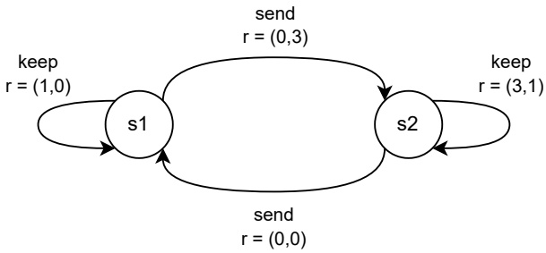

Figure 6.3: NoSDE (“No Stationary Deterministic Equilibrium”) game with two agents, two states {s1, s2}, and two actions {send, keep}. Agent 1 chooses an action in state s1 and agent 2 chooses an action in state $^ { s 2 }$ . State transitions are deterministic and shown via the arrows, with the resulting joint reward for the agents. The discount factor is $\gamma = { \frac { 3 } { 4 } }$

choosing keep. In fact, this game has a unique probabilistic stationary equilibrium which is $\pi_{1}^{*}(\mathrm{send} \mid \mathrm{s}1)=\frac{2}{3}, \pi_{2}^{*}(\mathrm{send} \mid \mathrm{s}2)=\frac{5}{12}$ . Zinkevich, Greenwald, and Littman (2005) refer to this class of games as NoSDE games (which stands for “No Stationary Deterministic Equilibrium”) and proved the following theorem:

**Theorem** Let $Q _ { i } ^ { \pi , \Gamma } / V _ { i } ^ { \pi , \Gamma }$ denote the $Q _ { i } ^ { \pi } / V _ { i } ^ { \pi }$ value functions in game Γ. For any NoSDE game Γ with a unique equilibrium joint policy $\pi ^ { * }$ , there exists another NoSDE game $\tilde { \Gamma }$ which differs from Γ only in the reward functions and has its own unique equilibrium joint policy $\tilde { \pi } ^ { * }   \neq   \pi ^ { * }$ , such that:

$$
\forall i: Q _ {i} ^ {\pi^ {*}, \Gamma} = Q _ {i} ^ {\tilde {\pi} ^ {*}, \tilde {\Gamma}} \quad a n d \quad \exists i: V _ {i} ^ {\pi^ {*}, \Gamma} \neq V _ {i} ^ {\tilde {\pi} ^ {*}, \tilde {\Gamma}}\tag{6.12}
$$

This result establishes that the joint-action value functions learned by JAL-GT algorithms may not carry sufficient information to derive the correct equilibrium joint policy in a stochastic game. Intuitively, the left-hand equality in Equation 6.12 means that a JAL-GT algorithm using $Q _ { i } ^ { \pi ^ { * } , \Gamma }$ would derive the same actions for agent i as when using $Q _ { i } ^ { \tilde { \pi } ^ { * } , \tilde { \Gamma } }$ , for every state $s \in S$ in both stochastic games Γ and $\tilde { \Gamma } ,$ . However, the right-hand inequality in Equation 6.12 means that the joint policies $\pi ^ { * }$ and $\tilde { \pi } ^ { * }$ actually yield different expected returns for some agent i between the two stochastic games. In essence, this discrepancy is due to the fact that the unique equilibrium $\tilde { \pi } ^ { * }$ of $\tilde { \Gamma }$ requires specific action probabilities in some states, such as in the example given above, which cannot be computed using the Q-functions alone.

While JAL-GT cannot learn the unique probabilistic stationary equilibrium in a NoSDE game, algorithms based on value iteration for games (such as

<!-- page: 156 -->

JAL-GT) can converge to a cyclic sequence of actions that constitutes a “cyclic equilibrium” in NoSDE games, as explained by Zinkevich, Greenwald, and Littman (2005).

## 6.3 Agent Modeling

The game-theoretic solution concepts used in JAL-GT algorithms are normative, in that they prescribe how agents should behave in equilibrium. But what if some of the agents deviate from this norm? For example, by relying on the minimax solution concept, minimax Q-learning (Section 6.2.1) assumes that the other agent is an optimal worst-case opponent, and so it learns to play against such an opponent — independently of the actual chosen actions of the opponent. We saw in the soccer example in Figure 6.2 that this hard-wired assumption can limit the algorithm’s achievable performance: minimax-Q learning learned a generally robust minimax policy, but would fail to exploit the weaknesses of the hand-built opponent if it was trained against such an opponent, whereas independent Q-learning was able to outperform minimax Q-learning against the hand-built opponent.

An alternative to making implicit normative assumptions about the behavior of other agents is to directly model the actions of other agents based on their observed behaviors. Agent modeling (also known as opponent modeling<sup>3</sup>) is concerned with constructing models of other agents that can make useful predictions about their behaviors. A general agent model is shown in Figure 6.4. For example, an agent model may make predictions about the actions of the modeled agent, or about the long-term goal of the agent such as wanting to reach a certain goal location. In a partially observable environment, an agent model may attempt to infer the beliefs of the modeled agent about the state of the environment. To make such predictions, an agent model may use various sources of information as input, such as the history of states and joint actions, or any subset thereof. Agent modeling has a long history in artificial intelligence research and, accordingly, many different methodologies have been developed (Albrecht and Stone 2018).<sup>4</sup>

The most common type of agent modeling used in MARL is called policy reconstruction. Policy reconstruction aims to learn models $\hat { \pi } _ { j }$ of the policies

<small><span class="docvortex-page-footnote" data-block-type="page_footnote" style="color:#6b7280">3. The term “opponent modeling” was originally used because much of the early research in this area focused on competitive games, such as chess. We prefer the more neutral term “agent modeling” since other agents may not necessarily be opponents.</span></small>

<small><span class="docvortex-page-footnote" data-block-type="page_footnote" style="color:#6b7280">4. The survey of Albrecht and Stone (2018) was followed by a dedicated special journal issue on agent modeling that contains further articles on the topic (Albrecht, Stone, and Wellman 2020).</span></small>

<!-- page: 157 -->

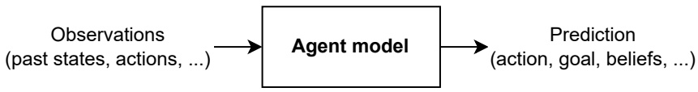

Figure 6.4: An agent model makes predictions about another agent (such as the action probabilities, goals, and beliefs of the agent) based on past observations about the agent.

$\pi _ { j }$ of other agents based on their observed past actions. In general, learning the parameters of $\hat{\pi}_{j}$ can be framed as a supervised learning problem using the past observed state-action pairs $\{ ( s ^ { \tau } , a _ { j } ^ { \tau } ) \} _ { \tau = 1 } ^ { t - 1 }$ of the modeled agent. Thus, we may choose a parameterized representation for $\hat{\pi}_{j}$ and fit its parameters using the $( s ^ { \tau } , a _ { j } ^ { \tau } )$ -data. Various possible representations for $\hat{\pi}_{j}$ could be used, such as look-up tables, finite state automata, and neural networks. The chosen model representation should ideally allow for iterative updating to be compatible with the iterative nature of RL algorithms.

Given a set of models for the other agents’ policies, $\hat { \pi } _ { - i }   =   \{ \hat { \pi } _ { j } \} _ { j \neq i }$ , the modeling agent i can select a best-response policy (Section 4.2) with respect to these models,

$$
\pi_ {i} \in \mathrm{BR} _ {i} (\hat {\pi} _ {- i}).\tag{6.13}
$$

Thus, while in Chapter 4 we used the concept of best-response policies as a compact characterization of solution concepts, in this section we will see how the best-response concept is operationalized in reinforcement learning. In the following subsections, we will see different methods that use policy reconstruction and best responses to learn optimal policies.

## 6.3.1 Fictitious Play

One of the first and most basic learning algorithms defined for non-repeated normal-form games is called fictitious play (Brown 1951; Robinson 1951). In fictitious play, each agent i models the policy of each other agent j as a stationary probability distribution $\hat { \pi } _ { j }$ . This distribution is estimated by taking the empirical distribution of agent $j ^ { \flat } \mathbf { s }$ past actions. Let $C ( a _ { j } )$ denote the number of times that agent j selected action $a _ { j }$ prior to the current episode. Then, $\hat{\pi}_{j}$ is defined as

$$
\hat {\pi} _ {j} (a _ {j}) = \frac {C (a _ {j})}{\sum_ {a _ {j} ^ {\prime} \in A _ {j}} C (a _ {j} ^ {\prime})}.\tag{6.14}
$$

At the start of the first episode, before any actions have been observed from agent $j ( \mathrm { i . e . , } C ( a _ { j } ) = 0$ for all $a _ { j }   \in   A _ { j } )$ , the initial model $\hat{\pi}_{j}$ can be the uniform distribution πˆj $\begin{array} { r } { { \bf \Phi } _ { i } ( a _ { j } )   =   \frac { 1 } { | A _ { j } | } } \end{array}$

<!-- page: 158 -->

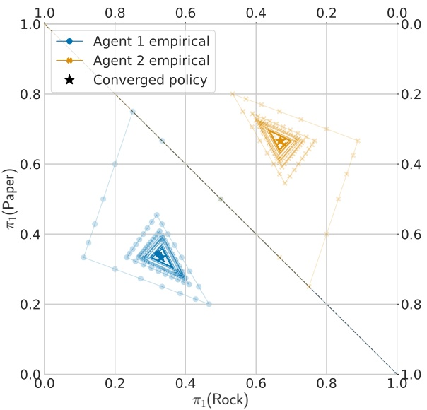

Figure 6.5: Evolution of empirical action distributions of two agents, each using fictitious play, in the non-repeated Rock-Paper-Scissors matrix game. The diagonal dashed line divides the plot into two probability simplexes, one for each of the two agents. Each point in the simplex for an agent corresponds to a probability distribution over the agent’s three available actions. The lines show the agents’ empirical action distributions over the first 500 episodes of the game. The empirical action distributions converge to the unique Nash equilibrium of the game, in which both agents choose actions uniform-randomly.

In each episode, each agent i chooses a best-response action against the models $\hat { \pi } _ { - i }   =   \{ \hat { \pi } _ { j } \} _ { j \neq i }$ , given by

$$
\mathrm{BR} _ {i} (\hat {\pi} _ {- i}) = \arg \max _ {a _ {i} \in A _ {i}} \sum_ {a _ {- i} \in A _ {- i}} \mathcal {R} _ {i} (\langle a _ {i}, a _ {- i} \rangle) \prod_ {j \neq i} \hat {\pi} _ {j} (a _ {j})\tag{6.15}
$$

where $A _ { - i }   =   \times _ { j \neq i }   A _ { j }$ , and $a _ { j }$ refers to the action of agent j in $a _ { - i }$

It is important to note that this definition of best response gives an optimal action, in contrast to the more general definition (see Equation 4.9, page 65), which gives best-response policies. Therefore, fictitious play cannot learn equilibrium solutions that require randomization, such as the uniform-random equilibrium for Rock-Paper-Scissors which we saw in Section 4.3. However, the empirical distribution of actions (defined in Equation 5.5) in fictitious play can converge to such randomized equilibria. Indeed, fictitious play has several interesting convergence properties (Fudenberg and Levine 1998):

<!-- page: 159 -->

| Episode e J | oint action (ae1, | ae2) Agent model πˆ2 | Agent 1 action values |
| --- | --- | --- | --- |
| 1 | R,R | (0.33,0.33,0.33) | (0.00,0.00,0.00) |
| 2 | P,P | (1.00,0.00,0.00) | (0.00,1.00,-1.00) |
| 3 | P,P | (0.50,0.50,0.00) | (-0.50,0.50,0.00) |
| 4 | P,P | (0.33,0.67,0.00) | (-0.67,0.33,0.33) |
| 5 | S,S | (0.25,0.75,0.00) | (-0.75,0.25,0.50) |
| 6 | S,S | (0.20,0.60,0.20) | (-0.40,0.00,0.40) |
| 7 | S,S | (0.17,0.50,0.33) | (-0.17,-0.17,0.33) |
| 8 | S,S | (0.14,0.43,0.43) | (0.00,-0.29,0.29) |
| 9 | S,S | (0.13,0.38,0.50) | (0.12,-0.38,0.25) |
| 10 | R,R | (0.11,0.33,0.56) | (0.22,-0.44,0.22) |

Figure 6.6: First ten episodes in the non-repeated Rock-Paper-Scissors game when both agents use fictitious play. The columns show the episode number e, the joint action $a ^ { e }$ in episode e, agent 1’s model $\hat{\pi}_{2}$ of agent 2 (probabilities assigned to R/P/S), and agent 1’s action values for R/P/S (expected reward for each action with respect to the current model of agent 2). If multiple actions have equal maximum value, then the first action is deterministically chosen.

• If the agents’ actions converge, then the converged actions form a Nash equilibrium of the game.

• If in any episode the agents’ actions form a Nash equilibrium, then they will remain in the equilibrium in all subsequent episodes.

• If the empirical distribution of each agent’s actions converges, then the distributions converge to a Nash equilibrium of the game.

• The empirical distributions converge in several game classes, including in two-agent zero-sum games with finite action sets (Robinson 1951).

Figure 6.5 shows the evolution of the agents’ empirical action distributions defined in Equation 6.14 in the non-repeated Rock-Paper-Scissors matrix game (see Section 3.1 for a description of the game), in which both agents use fictitious play to choose actions. The first ten episodes are shown in Figure 6.6. Both agents start with the R action and then follow identical trajectories.<sup>5</sup>In the next step, both agents choose the P action and the empirical action distribution gives 0.5 to R and P each, and 0 to S. The agents continue to choose the P action until episode 3, after which the optimal action for both agents with respect to

<small><span class="docvortex-page-footnote" data-block-type="page_footnote" style="color:#6b7280">5. The agents could also start with different initial actions and then follow non-identical trajectories; but they would still follow a similar spiral pattern and converge to the Nash equilibrium.</span></small>

<!-- page: 160 -->

their current agent models becomes S. The agents continue to choose S until the next “corner” of the trajectory, where both agents switch to choosing R, and so forth. As the history length increases, the changes in the empirical action distributions become smaller. The lines in Figure 6.5 show how the empirical action distributions change and co-adapt over time, converging to the only Nash equilibrium of the game, which is for both agents to choose actions uniform-randomly.

A number of modifications of fictitious play have been proposed in the literature to obtain improved convergence properties and generalize the method (e.g., Fudenberg and Levine 1995; Hofbauer and Sandholm 2002; Young 2004; Leslie and Collins 2006; Heinrich, Lanctot, and Silver 2015). Note that in repeated normal-form games, the best response defined in Equation 6.15 is myopic, in the sense that this best response only considers a single interaction (recall that fictitious play is defined for non-repeated normal-form games). However, in repeated normal-form games, the future actions of agents can depend on the history of past actions of other agents. A more complex definition of best responses in sequential game models, as defined in Equation 4.9, also accounts for the long-term effects of actions. In the following sections, we will see how MARL can combine a best-response operator with temporal-difference learning to learn non-myopic best-response policies.

## 6.3.2 Joint-Action Learning with Agent Modeling

Fictitious play combines policy reconstruction and best-response actions to learn optimal policies for non-repeated normal-form games. We can extend this idea to the more general case of stochastic games by using the joint-action learning framework introduced in Section 6.2. This class of JAL algorithms, which we will call JAL-AM, uses the joint-action values in conjunction with agent models and best responses to select actions for the learning agents and to derive update targets for the joint-action values.

Analogous to fictitious play, the agent models learn empirical distributions based on the past actions of the modeled agent, albeit this time conditioned on the state in which the actions took place. Let $C ( s , a _ { j } )$ denote the number of times that agent j selected action $a _ { j }$ in state s, then the agent model $\hat{\pi}_{j}$ is defined as

$$
\hat {\pi} _ {j} (a _ {j} \mid s) = \frac {C (s , a _ {j})}{\sum_ {a _ {j} ^ {\prime} \in A _ {j}} C (s , a _ {j} ^ {\prime})}.\tag{6.16}
$$

Note that the action counts $C ( s , a _ { j } )$ include actions observed in the current episode and previous episodes. If a state s is visited for the first time, then $\hat{\pi}_{j}$ can assign uniform probabilities to actions. Conditioning the model $\hat { \pi } _ { j }$ on the

<!-- page: 161 -->

<div class="docvortex-algorithm" style="white-space: pre-wrap; font-family:monospace;">
Algorithm 8 Joint-action learning with agent modeling (JAL-AM)
// Algorithm controls agent $i$
Initialize:
$Q_i(s, a) = 0$ for all $s \in S, a \in A$
Agent models $\hat{\pi}_j(a_j | s) = \frac{1}{|A_j|}$ for all $j \neq i, a_j \in A_j, s \in S$
Repeat for every episode:
for $t = 0, 1, 2, \ldots$ do
    Observe current state $s^t$
    With probability $\epsilon$: choose random action $a_i^t$
    Otherwise: choose best-response action $a_i^t \in \arg \max_{a_i} AV_i(s^t, a_i)$
    Observe joint action $a^t = (a_1^t, ..., a_n^t)$, reward $r_i^t$, next state $s^{t+1}$
    for all $j \neq i$ do
        Update agent model $\hat{\pi}_j$ with new observations (e.g., $(s^t, a_j^t))$
    $Q_i(s^t, a^t) \leftarrow Q_i(s^t, a^t) + \alpha \left[ r_i^t + \gamma \max_{a_i'} AV_i(s^{t+1}, a_i') - Q_i(s^t, a^t) \right]$
</div>

state s is a sensible choice, since we know that the optimal equilibrium joint policy in a stochastic game requires only the current state rather than the history of states and actions.

If the true policy $\pi _ { j }$ is fixed or converges, and is indeed conditioned only on the state s, then in the limit of observing each $( s ^ { \tau } , a _ { j } ^ { \tau } )$ -pair infinitely often, the model $\hat{\pi}_{j}$ will converge to $\pi _ { j }$ . Of course, during learning, $\pi _ { j }$ will not be fixed. To track changes in $\pi _ { j }$ more quickly, one option is to modify Equation 6.16 to give greater weight to more recent observed actions in state s. For example, the empirical probability $\hat { \pi } _ { j } ( a _ { j }   \mid   s )$ may only use up to the most recent ten observed actions of agent j in state s. Another option is to maintain a probability distribution over a space of possible agent models for agent $j ,$ and to update this distribution based on new observations via Bayesian learning (we will discuss this approach in Section 6.3.3). In general, many different approaches can be considered for constructing an agent model $\hat { \pi } _ { j }$ from observations (Albrecht and Stone 2018).

JAL-AM algorithms use the learned agent models to select actions for the learning agent and to derive update targets for the joint-action values. Given agent models $\left\{ \hat { \pi } _ { j } \right\} _ { j \neq i }$ , the value (expected return) to agent i for taking action $a _ { i }$ in state s is given by

$$
A V _ {i} (s, a _ {i}) = \sum_ {a _ {- i} \in A _ {- i}} Q _ {i} (s, \langle a _ {i}, a _ {- i} \rangle) \prod_ {j \neq i} \hat {\pi} _ {j} (a _ {j} \mid s)\tag{6.17}
$$

where $Q _ { i }$ is the joint-action value function for agent i learned by the algorithm. Using the action values $A V _ { i }$ , the best-response action for agent i in state s is

<!-- page: 162 -->

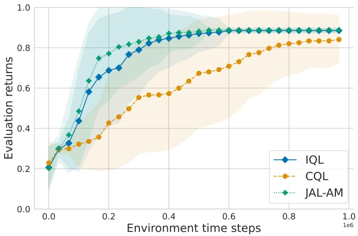

Figure 6.7: Joint-action learning with agent modeling (JAL-AM) compared to central Q-learning (CQL) and independent Q-learning (IQL) in the level-based foraging task from Figure 5.3. Results are averaged over fifty independent training runs. The shaded area shows the standard deviation over the averaged returns from each training run. All algorithms use a constant learning rate $\alpha   =   0 . 0 1$ and an exploration rate which is linearly decayed from $\epsilon   =   1$ to $\epsilon   =   0 . 0 5$ over the first 80,000 time steps.

given by arg $\operatorname* { m a x } _ { a _ { i } } A V _ { i } ( s , a _ { i } )$ ; and the update target in the next state $s ^ { \prime }$ uses max $_ { a _ { i } } A V _ { i } ( s ^ { \prime } , a _ { i } )$

Algorithm 8 provides pseudocode for a general JAL-AM algorithm for stochastic games. Similar to fictitious play, this algorithm learns best-response actions rather than best-response policies. Both JAL-AM and JAL-GT are off-policy temporal-difference learning algorithms. However, unlike JAL-GT, which requires observing the rewards of other agents and maintaining joint action value functions $Q _ { j }$ for every agent, JAL-AM does not require observing the rewards of other agents and only maintains a single joint-action value function $Q _ { i }$ for the learning agent.

Figure 6.7 shows the evaluation returns of JAL-AM using agent models defined in Equation 6.16, compared to CQL and IQL in the level-based foraging task from Figure 5.3 (page 100). The learning curves for CQL and IQL are copied over from Figure 5.4. In this specific task, JAL-AM converged to the optimal joint policy faster than IQL and CQL. The agent models learned by the JAL-AM agents reduced the variance in their update targets, as is reflected by the smaller standard deviation in evaluation returns compared to IQL and CQL. This allowed JAL-AM to converge (on average) to the optimal joint policy after

<!-- page: 163 -->

about 500,000 training time steps, while IQL required about 600,000 training time steps to converge to the optimal joint policy.

## 6.3.3 Bayesian Learning and Value of Information

Fictitious play (using Equation 6.14) and JAL-AM (using Equation 6.16) learn a single model for each other agent, and compute best-response actions with respect to the models. What these methods are lacking is an explicit representation of uncertainty about the models; that is, there may be different possible models for the other agents, and the modeling agent may have beliefs about the relative likelihood of each model given the past actions of the modeled agents. Maintaining such beliefs enables a learning agent to compute best-response actions with respect to the different models and their associated likelihoods. Moreover, as we will show in this section, it is possible to compute best-response actions that maximize the value of information (VI) (Chalkiadakis and Boutilier 2003; Albrecht, Crandall, and Ramamoorthy 2016).<sup>6</sup> VI evaluates how the outcomes of an action may influence the learning agent’s beliefs about the other agents, and how the changed beliefs will in turn influence the future actions of the learning agent. VI also accounts for how the action may influence the future behavior of the modeled agents. Thus, best responses based on VI can optimally trade-off between exploring actions to obtain more accurate beliefs about agent models on one hand, and the potential benefits and costs involved in the exploration on the other hand. Before we define the notions of beliefs and VI in more detail, we will give an illustrative example.

Suppose two agents play the repeated Prisoner’s Dilemma matrix game, first discussed in Section 3.1 and shown again in Figure 6.8(a), where every episode lasts ten time steps. In each time step, each agent can choose to either cooperate or defect, where mutual cooperation gives a reward of −1 to each agent, but each agent has an incentive to defect in order to achieve higher rewards. Suppose agent 1 believes that agent 2 can have one of two possible models, which are shown in Figures 6.8(b) and 6.8(c). The model Coop always cooperates, while the model Grim cooperates initially until the other agent defects after which Grim defects indefinitely. Assume agent 1 has a uniform prior belief which assigns probability 0.5 to each model. Given this uncertainty about agent 2’s policy, how should agent 1 choose its first action? Consider the following cases (summarized in Figure 6.9):

<small><span class="docvortex-page-footnote" data-block-type="page_footnote" style="color:#6b7280">6. The Bayesian learning approach discussed in this section is also known as type-based reasoning (Albrecht, Crandall, and Ramamoorthy 2016; Albrecht and Stone 2018).</span></small>

<!-- page: 164 -->

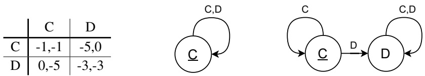

(a) Prisoner’s Dilemma

(b) Agent model “Coop”

(c) Agent model “Grim”

Figure 6.8: Two agent models for Prisoner’s Dilemma. The models are shown as simple finite state automata, where the state (circle) specifies the model’s action (C for cooperating, D for defecting) and the state transition arrows are labeled by the previous action of the other agent. Starting states are shown underlined. The model Coop always cooperates. The model Grim cooperates initially until the other agent defects, after which Grim defects indefinitely.

• If agent 1 cooperates initially and agent 2 uses Coop, then agent 1 has not learned anything new about agent 2’s model (meaning the probabilities assigned by agent 1’s belief to the models will not change), since both Coop and Grim cooperate in response to agent 1 cooperating. If agent 1 cooperates throughout the episode, it will obtain a return of 10 · (−1) = −10. Therefore, agent 1 will get a lower return than it could have achieved by using the defect action against Coop.

• On the other hand, if agent 1 defects initially and agent 2 uses Coop, then agent 2 will continue to cooperate and agent 1 will learn that agent 2 uses Coop (meaning that agent 1’s belief will assign probability 1 to Coop), since Grim would not cooperate in this case. With this new knowledge about agent 2, agent 1 can achieve maximum returns by defecting throughout the episode, resulting in a return of 10 · 0 = 0.

• However, if agent 1 defects initially but agent 2 uses Grim, then agent 2 will defect subsequently and agent 1 will learn that agent 2 uses Grim, which will lead agent 1 to continue defecting as its best response. Therefore, this new knowledge about agent 2 comes at the cost of a lower return, which is 0 + 9 · (−3) = −27 (one reward of 0, followed by −3 rewards until the end of the episode).

This example illustrates that some actions may reveal information about the policies of other agents, and the resulting more accurate beliefs can be used to maximize the returns; however, the same actions may carry a risk in that they may inadvertently change the other agents’ behaviors and result in lower achievable returns.

In the previous example, if agent 1 uses randomized exploration methods such as ϵ-greedy exploration, then eventually it will defect, which will cause

<!-- page: 165 -->

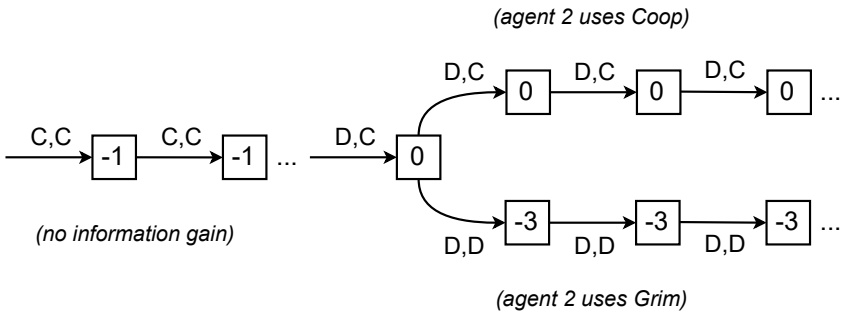

Figure 6.9: Value of information in the Prisoner’s Dilemma example. Arrows show joint action of agents 1 and 2, boxes show reward for agent 1. Action C provides no information gain to agent 1 since both Coop and Grim cooperate in response to agent 1 cooperating. Action D will cause agent 2 to either cooperate (Coop) or defect (Grim) in response, after which agent 1 will know which model agent 2 uses and can select the appropriate best-response action.

agent 2 to go into the “defect mode” if it uses Grim. VI instead evaluates the different constellations of agent 1’s models and actions, and the impact on agent 1’s future beliefs and actions under the different constellations, essentially as we did in the previous example. Depending on how far VI looks into the future when evaluating an action, it may decide that exploring the defect action is not worthwhile considering the potential cost (i.e., lower achievable return) if agent 2 uses Grim. In this case, if both agents maintain beliefs over Coop/Grim and use VI, they may learn a joint policy in which both agents cooperate, as we will show later in this section.

We now describe these ideas more formally, starting with beliefs over agent models. Assume we control agent i. Let Πˆj be the space of possible agent models for agent j, where each model $\hat { \pi } _ { j } \in \hat { \Pi } _ { j }$ can choose actions based on the interaction history $h ^ { t }$ . (Recall that we assume stochastic games, in which agents fully observe the state and actions.) In our example earlier, Πˆj contains two models $\hat { \pi } _ { j } ^ { C o o p }$ and $\hat { \pi } _ { j } ^ { G r i m }$ . Agent i starts with a prior belief $\operatorname* { P r } ( \hat { \pi } _ { j }   \mid   h ^ { 0 } )$ that assigns probabilities to each model $\hat { \pi } _ { j } \in \hat { \Pi } _ { j }$ before observing any actions from agent j. If no prior information is available that makes one agent model more likely than others, then the prior belief could simply be a uniform probability distribution, as used in our example. After observing agent $j ^ { \flat } \mathbf { s }$ action $a _ { j } ^ { t }$ in state $s ^ { t }$ , agent i

<!-- page: 166 -->

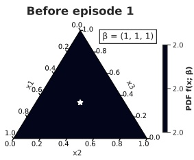

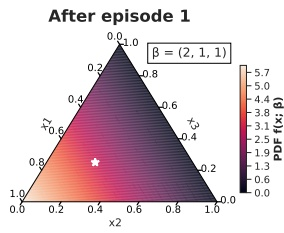

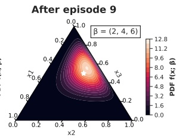

Figure 6.10: Agent $\mathrm { { 1 s } }$ beliefs about agent $2 ^ { \circ } \mathbf { s }$ model (policy) after varying episodes from the Rock-Paper-Scissors non-repeated game example in Figure $6 . 6$ (page 130): before episode 1 (left), after episode 1 (middle), and after episode 9 (right). Beliefs are represented as Dirichlet distributions over probability distributions $x   =   ( x _ { 1 } , x _ { 2 } , x _ { 3 } )$ for actions R,P,S. Each point in the simplex triangle shows the Dirichlet probability density (defined in Footnote 7) for a distribution x that is mapped into the simplex coordinate space via barycentric coordinates. Pseudocount parameters $( \beta _ { k } )$ are shown next to each simplex. Means are shown as white stars.

updates its belief by computing a Bayesian posterior distribution:

$$
\Pr (\hat {\pi} _ {j} \mid h ^ {t + 1}) = \frac {\hat {\pi} _ {j} (a _ {j} ^ {t} \mid h ^ {t}) \Pr (\hat {\pi} _ {j} \mid h ^ {t})}{\sum_ {\hat {\pi} _ {j} ^ {\prime} \in \hat {\Pi} _ {j}} \hat {\pi} _ {j} ^ {\prime} (a _ {j} ^ {t} \mid h ^ {t}) \Pr (\hat {\pi} _ {j} ^ {\prime} \mid h ^ {t})}\tag{6.18}
$$

Note that this Bayesian belief update is computed across episodes, meaning that the posterior $\mathbf { P r } ( \hat { \pi } _ { j }   |   h ^ { T } )$ at the end of episode $e$ is used as the prior $\operatorname* { P r } ( \hat { \pi } _ { j }   \mid   h ^ { 0 } )$ at the start of episode $e + 1$

The above definition of beliefs assumes that $\hat { \Pi } _ { j }$ contains a finite number of models. We can also define $\hat { \Pi } _ { j }$ to be a continuous space of agent models, in which case the beliefs are defined as probability densities over $\hat { \Pi } _ { j }$ rather than discrete probability distributions. For example, we may define $\hat { \Pi } _ { j }$ to contain all possible policies $\hat { \pi } _ { j } ( a _ { j }   \mid   s )$ that are conditioned on states, as we did in JAL-AM in Equation 6.16. We can then define the belief over $\hat { \Pi } _ { j }$ based on a set of Dirichlet distributions,<sup>7</sup> with one Dirichlet $\delta _ { s }$ corresponding to each state $s \in S$ to represent a belief over possible policies $\hat { \pi } _ { j } ( \cdot   \mid   s )$ in state $s ,$ where $\delta _ { s }$ is parameterized by pseudocounts $( \beta _ { 1 } , . . . , \beta _ { | A _ { j } | } )$ (one for each action). An initial setting of $\beta _ { k }   =   1$ for all $k$ produces a uniform prior belief. After observing action $a _ { j } ^ { t }$ in state $s ^ { t } .$

<small><span class="docvortex-page-footnote" data-block-type="page_footnote" style="color:#6b7280">≥</span></small>

<small><span class="docvortex-page-footnote" data-block-type="page_footnote" style="color:#6b7280">β = (β1 , ..., βK )</span></small>

<small><span class="docvortex-page-footnote" data-block-type="page_footnote" style="color:#6b7280">(i.e.,</span></small>

<small><span class="docvortex-page-footnote" data-block-type="page_footnote" style="color:#6b7280">xk</span></small>

<small><span class="docvortex-page-footnote" data-block-type="page_footnote" style="color:#6b7280">{xk}k=1,...,K</span></small>

<small><span class="docvortex-page-footnote" data-block-type="page_footnote" style="color:#6b7280">{xk}.</span></small>

<small><span class="docvortex-page-footnote" data-block-type="page_footnote" style="color:#6b7280">B</span></small>

<small><span class="docvortex-page-footnote" data-block-type="page_footnote" style="color:#6b7280">7. A Dirichlet distribution of order K 2 with parameters  has a probability density K-1 simplex the define a probability distribution), and (β) is the multivariate beta function. A Dirichlet distribution can be interpreted as specifying a likelihood over different probability values for It is the conjugate prior of the categorical and multinomial distributions.</span></small>

<!-- page: 167 -->

the belief update is simply done by incrementing (by 1) the pseudocount $\beta _ { k }$ in $\delta _ { s ^ { t } }$ that is associated with $a _ { j } ^ { t }$ . The resulting posterior distribution is again a Dirichlet distribution. Note that the mean of a Dirichlet distribution $\delta _ { s }$ is given by the probability distribution $\begin{array} { r } { \hat { \pi } _ { j } ( a _ { j , k }   |   s )   =   \frac { \beta _ { k } } { \sum _ { l } \beta _ { l } } } \end{array}$ where $\beta _ { k }$ is the pseudocount associated with action $a _ { j , k }$ . Therefore, the mean of the Dirichlet corresponds to the definition of the empirical distribution used in fictitious play (Equation 6.14) and JAL-AM (Equation 6.16).<sup>8</sup> Example Dirichlet distributions after varying episodes from the Rock-Paper-Scissors non-repeated game (i.e., stochastic game with a single state) example in Figure $6 . 6$ (page 130) can be seen in Figure 6.10.

Given finite model spaces $\hat { \Pi } _ { j }$ and beliefs $\operatorname* { P r } ( \hat { \pi } _ { j }   |   h ^ { t } )$ for each other agent $j \not = i ,$ define $\hat { \Pi } _ { - i }   =   \times _ { j \neq \hat { i } } \hat { \Pi } _ { j }$ and $\operatorname* { P r } ( \hat { \pi } _ { - i }   |   h ) = \prod _ { j \neq i } \operatorname* { P r } ( \hat { \pi } _ { j }   |   h )$ for $\hat { \pi } _ { - i }   \in   \hat { \Pi } _ { - i }$ . Let s(h) denote the last state in history h $( \mathrm { i . e . , } ~ s ( h ^ { t } )   =   \dot { s ^ { t } } )$ , and $\langle \rangle$ denote the concatenation operation. The VI of action $a _ { i }   \in   A _ { i }$ after history h is defined via a recursive combination of two functions:

$$
V I _ {i} (a _ {i} \mid h) = \sum_ {\hat {\pi} _ {- i} \in \hat {\Pi} _ {- i}} \Pr (\hat {\pi} _ {- i} \mid h) \sum_ {a _ {- i} \in A _ {- i}} Q _ {i} (h, \left\langle a _ {i}, a _ {- i} \right\rangle) \prod_ {j \neq i} \hat {\pi} _ {j} (a _ {j} \mid h)\tag{6.19}
$$

$$
Q _ {i} (h, a) = \sum_ {s ^ {\prime} \in S} \mathcal {T} \left(s ^ {\prime} \mid s (h), a\right) \left[ \mathcal {R} _ {i} \left(s (h), a, s ^ {\prime}\right) + \gamma \max _ {a _ {i} ^ {\prime} \in A _ {i}} V I _ {i} \left(a _ {i} ^ {\prime} \mid \langle h, a, s ^ {\prime} \rangle\right) \right]\tag{6.20}
$$

(The case of continuous $\hat { \Pi } _ { j }$ can be defined analogously, by using integrals and densities instead of sums and probabilities.) $V I _ { i } ( a _ { i }   |   h )$ computes the VI of action $a _ { i }$ by summing the action values $Q _ { i } ( h , \left\langle a _ { i } , a _ { - i } \right\rangle )$ for all possible action combinations $a _ { - i }$ of the other agents, weighted by the probabilities assigned by agent $i ^ { \flat } \mathrm { s }$ belief to models $\hat { \pi } _ { - i }$ and the probabilities with which $\hat { \pi } _ { - i }$ would take actions $a _ { - i } .$ The action value $Q _ { i } ( h , a )$ is defined analogously to the Bellman optimality equation (defined in Equation 2.25, page 28), except that the maxoperator uses $V I _ { i }$ rather than $Q _ { i }$ . Importantly, $Q _ { i }$ extends the history h to $\langle h , a , s ^ { \prime } \rangle$ and recurses back to $V I _ { i }$ with the extended history. Since $V I _ { i }$ uses the posterior belief $\operatorname* { P r } ( \hat { \pi } _ { - i }   \mid   h )$ , this means that the computation of $V I _ { i }$ accounts for how the beliefs will change in the future for different possible histories h. The depth of

<small><span class="docvortex-page-footnote" data-block-type="page_footnote" style="color:#6b7280">βk = 1</span></small>

<small><span class="docvortex-page-footnote" data-block-type="page_footnote" style="color:#6b7280">8. However, note the difference that the Dirichlet prior is initialized with pseudocounts for all actions (prior to observing any actions), while the empirical distribution used in fictitious play and JAL-AM is defined over the observed history of actions. Therefore, after one observed action, the empirical distribution assigns probability 1 to that action while the Dirichlet mean assigns probability less than 1. However, in practice, this difference is “washed away” as the number of observed actions increases, and in the limit of observing infinitely many actions (or state-action pairs), the Dirichlet mean and the empirical distribution used by fictitious play and JAL-AM converge to the same probability distribution. Moreover, by using initial action counts of C( ) = 1 ( C( ) = 1) aj or s, aj for all actions, the empirical distribution is identical to the Dirichlet mean.</span></small>

<!-- page: 168 -->

the recursion<sup>9</sup> between $Q _ { i }$ and $V I _ { i }$ determines how far VI evaluates the impact of an action into the future of the interaction. Using this definition of VI, at time t after history $h ^ { t }$ , agent i selects an action $a _ { i } ^ { t }$ with maximum VI, that is, $a _ { i } ^ { t }   \in   \arg \operatorname* { m a x } _ { a _ { i } } V I _ { i } ( a _ { i }   |   h ^ { t } )$

When applied in the Prisoner’s Dilemma example given previously, using a uniform prior belief over the two models $\operatorname* { P r } ( \hat { \pi } _ { j } ^ { C o o p }   |   h ^ { 0 } ) = \operatorname* { P r } ( \hat { \pi } _ { j } ^ { G r i m }   |   h ^ { 0 } ) = 0 . 5$ , no discounting $( \mathrm { i . e . ,   \gamma   =   1 } )$ , and a recursion depth equal to the length of the episode (i.e., 10), we obtain the following VI values for agent 1’s actions in the initial time step $t   =   0 !$

$$
V I _ {1} (C) = - 9 \quad V I _ {1} (D) = - 1 3. 5\tag{6.21}
$$

Therefore, in this example when using a uniform prior belief, cooperating has a higher value of information than defecting. Essentially, while VI realizes that the defect action can give absolute certainty about the model used by the other agent, if that agent uses the Grim model then the cost of causing the agent to defect until the end of the episode is not worth the absolute certainty in beliefs. If both agents use this VI approach to select actions, then they will both cooperate initially, and will continue to cooperate until the last time step. In the last time step $t   =   9$ , the agents obtain the following VI values (for $i \in \{ 1 , 2 \} )$ :

$$
V I _ {i} (C) = - 1 \quad V I _ {i} (D) = 0\tag{6.22}
$$

Thus, both agents will defect in the last time step. In this case, as this is the last time step, there is no more risk in defecting since both Coop and Grim are expected to cooperate (hence, in either case, defecting will give reward 0) and the episode will finish. This is an example of the end-game effects first mentioned in Section 3.2.

The idea of maintaining Bayesian beliefs over a space of agent models and computing best-responses with respect to the beliefs has been studied in game theory under the name “rational learning” (Jordan 1991; Kalai and Lehrer 1993; Nachbar 1997; Foster and Young 2001; Nachbar 2005). A central result in rational learning is that, under certain strict assumptions, the agents’ predictions of future play will converge to the true distribution of play induced by the agents actual policies, and the agents’ policies will converge to a Nash equilibrium (Kalai and Lehrer 1993). One important condition of the convergence result is

<small><span class="docvortex-page-footnote" data-block-type="page_footnote" style="color:#6b7280">d ≥ 0,</span></small>

<small><span class="docvortex-page-footnote" data-block-type="page_footnote" style="color:#6b7280">VIdi</span></small>

<small><span class="docvortex-page-footnote" data-block-type="page_footnote" style="color:#6b7280">d = 0</span></small>

<small><span class="docvortex-page-footnote" data-block-type="page_footnote" style="color:#6b7280">s( )</span></small>

<small><span class="docvortex-page-footnote" data-block-type="page_footnote" style="color:#6b7280">Q i</span></small>

<small><span class="docvortex-page-footnote" data-block-type="page_footnote" style="color:#6b7280">VIdi</span></small>

<small><span class="docvortex-page-footnote" data-block-type="page_footnote" style="color:#6b7280">Q i</span></small>

<small><span class="docvortex-page-footnote" data-block-type="page_footnote" style="color:#6b7280">Qdi</span></small>

<small><span class="docvortex-page-footnote" data-block-type="page_footnote" style="color:#6b7280">VIdi i | h 0,</span></small>

<small><span class="docvortex-page-footnote" data-block-type="page_footnote" style="color:#6b7280">VI i (ai| h) = 0</span></small>

<small><span class="docvortex-page-footnote" data-block-type="page_footnote" style="color:#6b7280">P πˆ−i| h</span></small>

<small><span class="docvortex-page-footnote" data-block-type="page_footnote" style="color:#6b7280">9. To make the recursion anchor explicit in the definition of VI, we can define and for recursion depth where calls d and d call and we define d if s VI<sup>d−1</sup>i , or if h is a terminal state (i.e., end of episode). For the case of  instead of assigning d = 0, value (a ) = Chalkiadakis and Boutilier (2003) describe an alternative “myopic” approach by fixing the belief r( ) at the end of the recursion, sampling agent models from the πˆ−i fixed belief, solving the corresponding MDPs in which agents −i use those sampled models, and averaging over the resulting Q-values from the MDPs.</span></small>

<!-- page: 169 -->

that any history that has positive probability under the agents’ actual policies must have positive probability under the agents’ beliefs (also known as “absolute continuity”). This assumption can be violated if the best-responses of agent j are not predicted by any model in $\hat { \Pi } _ { j }$ . In our Prisoner’s Dilemma example, if the agents start with a prior belief that assigns probability 0.8 to Coop and 0.2 to Grim, then the agents will obtain VI values of $VI_{i}(C)=-5.8,VI_{i}(D)=-5.4$ and both agents will initially defect, which is not predicted by the Coop nor Grim model.<sup>10</sup> On the other hand, when using the Dirichlet beliefs discussed earlier, then any finite history will always have non-zero probability under the agents’ beliefs. Note that an important difference between the Bayesian learning presented here and rational learning is that the latter does not use value of information as defined here. Instead, rational learning assumes that agents compute best-responses with respect to their current belief over models, without considering how different actions may affect their beliefs in the future.

## 6.4 Policy-Based Learning

The algorithms presented so far in this chapter all have in common that they estimate or learn the values of actions or joint actions. The agents’ policies are then derived using the value functions. We saw that this approach has some important limitations. In particular, the joint-action values learned by JAL-GT algorithms may not carry sufficient information to derive the correct equilibrium joint policy (Section 6.2.4); and algorithms such as fictitious play and JAL-AM are unable to represent probabilistic policies due to their use of best-response actions, which means that they cannot learn probabilistic equilibrium policies.

Another major category of algorithms in MARL instead uses the learning data to directly optimize a parameterized joint policy, based on gradient-ascent techniques. These policy-based learning algorithms have the important advantage that they can directly learn the action probabilities in policies, which means they can represent probabilistic equilibria. As we will see, by gradually varying the action probabilities in learned policies, these algorithms achieve some interesting convergence properties. Thus, as is the case in single-agent RL, there are value-based and policy-based methods in MARL. This section will present several of the original methods developed in this latter category.

<small><span class="docvortex-page-footnote" data-block-type="page_footnote" style="color:#6b7280">10. In fact, the choice of prior belief can have a substantial effect on the achievable returns and convergence to equilibrium (Nyarko 1998; Dekel, Fudenberg, and Levine 2004; Albrecht, Crandall, and Ramamoorthy 2015).</span></small>

<!-- page: 170 -->

## 6.4.1 Gradient Ascent in Expected Reward

We begin by examining gradient-ascent learning in general-sum non-repeated normal-form games with two agents and two actions. It will be useful to introduce some additional notation. First, we will write the reward matrices of the two agents as follows:

$$
\mathcal {R} _ {i} = \left[ \begin{array}{l l} r _ {1, 1} & r _ {1, 2} \\ r _ {2, 1} & r _ {2, 2} \end{array} \right] \qquad \mathcal {R} _ {j} = \left[ \begin{array}{l l} c _ {1, 1} & c _ {1, 2} \\ c _ {2, 1} & c _ {2, 2} \end{array} \right]\tag{6.23}
$$

$\mathcal { R } _ { i }$ is the reward matrix of agent i and $\mathcal { R } _ { j }$ is the reward matrix of agent $j .$ Thus, if agent i chooses action x and agent j chooses action $y ,$ , then they will receive rewards $r _ { x , y }$ and $c _ { x , y }$ , respectively.

Since the agents are learning policies for a non-repeated normal-form game (where each episode consists of a single time step), we can represent their policies as simple probability distributions:

$$
\pi_ {i} = (\alpha , 1 - \alpha) \qquad \pi_ {j} = (\beta , 1 - \beta), \qquad \alpha , \beta \in [ 0, 1 ]\tag{6.24}
$$

where $\alpha$ and $\beta$ are the probabilities with which agent 1 and agent 2 choose action 1, respectively. Note that this means that a joint policy $\boldsymbol { \pi }   =   ( \pi _ { i } , \pi _ { j } )$ is a point in the unit square $[ 0 , 1 ] ^ { 2 }$ . We will write $( \alpha , \beta )$ as a shorthand for the joint policy.

Given a joint policy $( \alpha , \beta )$ , we can write the expected reward for each agent as follows:

$$
\begin{array}{r l} U _ {i} (\alpha , \beta) & = \alpha \beta r _ {1, 1} + \alpha (1 - \beta) r _ {1, 2} + (1 - \alpha) \beta r _ {2, 1} + (1 - \alpha) (1 - \beta) r _ {2, 2} \\ & = \alpha \beta u + \alpha (r _ {1, 2} - r _ {2, 2}) + \beta (r _ {2, 1} - r _ {2, 2}) + r _ {2, 2} \end{array}\tag{6.25}
$$

$$
\begin{array}{r l} U _ {j} (\alpha , \beta) & = \alpha \beta c _ {1, 1} + \alpha (1 - \beta) c _ {1, 2} + (1 - \alpha) \beta c _ {2, 1} + (1 - \alpha) (1 - \beta) c _ {2, 2} \\ & = \alpha \beta u ^ {\prime} + \alpha (c _ {1, 2} - c _ {2, 2}) + \beta (c _ {2, 1} - c _ {2, 2}) + c _ {2, 2} \end{array}\tag{6.26}
$$

where

$$
u = r _ {1, 1} - r _ {1, 2} - r _ {2, 1} + r _ {2, 2}\tag{6.27}
$$

$$
u ^ {\prime} = c _ {1, 1} - c _ {1, 2} - c _ {2, 1} + c _ {2, 2}.\tag{6.28}
$$

The gradient-ascent learning method we consider in this section updates the agents’ policies to maximize their expected rewards defined above. Let $( \alpha ^ { k } , \beta ^ { k } )$ be the joint policy at episode k. Each agent updates its policy in the direction of

<!-- page: 171 -->

the gradient in expected reward using some step size $\kappa   >   0$

$$
\alpha^ {k + 1} = \alpha^ {k} + \kappa \frac {\partial U _ {i} (\alpha^ {k} , \beta^ {k})}{\partial \alpha^ {k}}\tag{6.29}
$$

$$
\beta^ {k + 1} = \beta^ {k} + \kappa \frac {\partial U _ {j} (\alpha^ {k} , \beta^ {k})}{\partial \beta^ {k}}\tag{6.30}
$$

where the partial derivative of an agent’s expected reward with respect to its policy takes the simple form of

$$
\frac {\partial U _ {i} (\alpha , \beta)}{\partial \alpha} = \beta u + (r _ {1, 2} - r _ {2, 2})\tag{6.31}
$$

$$
\frac {\partial U _ {j} (\alpha , \beta)}{\partial \beta} = \alpha u ^ {\prime} + (c _ {2, 1} - c _ {2, 2}).\tag{6.32}
$$

An important special case in this procedure is when the updated joint policy moves outside the valid probability space, that is, the unit square. This can happen when $( \alpha ^ { k } , \beta ^ { k } )$ is on the boundary of the unit square, meaning at least one of $\alpha ^ { k }$ and $\beta ^ { k }$ has value 0 or 1, and the gradient points outside the unit square. In this case, the gradient is redefined to project back onto the boundary of the unit square, ensuring that $( \alpha ^ { k + 1 } , \beta ^ { k + 1 } )$ will remain valid probabilities.

From the update rule in Equations 6.29 and 6.30, we can see that this method of learning implies some strong knowledge assumptions. In particular, each agent must know its own reward matrix and the policy of the other agent in the current episode k. In Section 6.4.5, we will see a generalization of this learning method that does not require this knowledge.

## 6.4.2 Learning Dynamics of Infinitesimal Gradient Ascent

What kind of joint policy will the two agents learn if they follow the learning rule given in Equations 6.29 and 6.30? Will the joint policy converge? And if yes, to what type of solution?

We can study these questions using dynamical systems theory (Singh, Kearns, and Mansour 2000). If we consider “infinitely small” step sizes $\kappa   \to   0$ , then the joint policy will follow a continuous trajectory $( \alpha ( t ) , \beta ( t ) )$ in continuous time t, which evolves according to the following differential equation (we will write $( \alpha , \beta )$ to refer to $( \alpha ( t ) , \beta ( t ) )$ in the rest of this section),

$$
\left[ \begin{array}{c} \frac {\partial \alpha}{\partial t} \\ \frac {\partial \beta}{\partial t} \end{array} \right] = \underbrace {\left[ \begin{array}{c c} 0 & u \\ u ^ {\prime} & 0 \end{array} \right]} _ {F} \left[ \begin{array}{c} \alpha \\ \beta \end{array} \right] + \left[ \begin{array}{c} (r _ {1 , 2} - r _ {2 , 2}) \\ (c _ {2 , 1} - c _ {2 , 2}) \end{array} \right]\tag{6.33}
$$

<!-- page: 172 -->

where F denotes the off-diagonal matrix that contains the terms u and $u ^ { \prime } ,$ . This learning algorithm using an infinitesimal step size is referred to as infinitesimal gradient ascent, or IGA for short.

The center point $( \alpha ^ { * } , \beta ^ { * } )$ which has a zero-gradient can be found by setting the left-hand side of Equation 6.33 to zero and solving to obtain:

$$
(\alpha^ {*}, \beta^ {*}) = \left(\frac {c _ {2 , 2} - c _ {2 , 1}}{u ^ {\prime}}, \frac {r _ {2 , 2} - r _ {1 , 2}}{u}\right)\tag{6.34}
$$

It can be shown that the dynamical system described in Equation 6.33 is an affine dynamical system, which means that $( \alpha , \beta )$ will follow one of three possible types of trajectories. The type of trajectory depends on the specific values of u and $u ^ { \prime }$ . First, recall that in order to compute the eigenvalues λ of matrix F, we have to find λ and a vector $x   \neq   0$ such that $F   x   =   \lambda   x .$ Solving for λ gives $\lambda ^ { 2 }   =   u u ^ { \prime }$ . Then, the three possible types of trajectories are the following:

1. If F is not invertible, then $( \alpha , \beta )$ will follow a divergent trajectory, as shown in Figure 6.11(a). This happens if u or $u ^ { \prime }$ (or both) are zero, which can occur in common-reward, zero-sum, and general-sum games.

2. If F is invertible and has purely real eigenvalues, then $( \alpha , \beta )$ will follow a divergent trajectory to and away from the center point, as shown in Figure 6.11(b). This happens if $u u ^ { \prime }   >   0$ , which can occur in commonreward and general-sum games but not in zero-sum games (since $u   =   - u ^ { \prime }$ thus $u u ^ { \prime } \leq 0 )$

3. If F is invertible and has purely imaginary eigenvalues, then $( \alpha , \beta )$ will follow an ellipse trajectory around the center point, as shown in Figure 6.11(c). This happens if $\boldsymbol { u } \boldsymbol { u } ^ { \prime }   <   0$ , which can occur in zero-sum and general-sum games but not in common-reward games (since $u   =   u ^ { \prime }$ , thus $u u ^ { \prime } \geq 0 )$

Note that this dynamical system does not take into account the constraint that $( \alpha , \beta )$ must lie in the unit square. Thus, the center point in general may not lie in the unit square. In the unconstrained system, there exists at most one point with zero-gradient (there is no such point if F is not invertible). The constrained system, which projects gradients on the boundary of the unit square back into the unit square, may include additional points with zero-gradient on the boundary of the unit square. In any case, IGA converges if and only if it reaches a point where the projected gradient is zero.

Based on the dynamical system described above, several properties of gradient ascent learning can be established:

$( \alpha , \beta )$ does not converge in all cases.

<!-- page: 173 -->

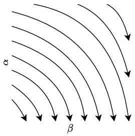

(a) F not invertible

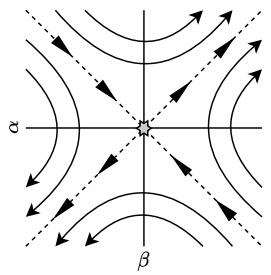

(b) F has purely real eigenvalues

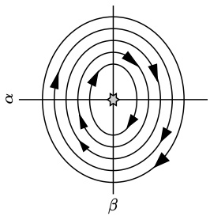

(c) F has purely imaginary eigenvalues

Figure 6.11: The joint policy $( \alpha , \beta )$ learned by Infinitesimal Gradient Ascent (IGA) in the unconstrained space $( \mathrm { i . e . } , ( \alpha , \beta )$ may be outside the unit square) will follow one of three possible types of trajectories, depending on properties of the matrix $F$ from Equation 6.33. Shown here are the general schematic forms of the trajectory types; the exact trajectory will depend on the values of u and $u ^ { \prime } ,$ . The plot axes correspond to values of $\alpha , \beta$ and arrows indicate the direction of the $( \alpha , \beta )$ -trajectories. The center point which has zero-gradient (if one exists) is marked by the star in the center. For non-invertible F, (a) shows one possible set of trajectories, but others are possible depending on u and $u ^ { \prime }$

• If $( \alpha , \beta )$ does not converge, then the average rewards received during learning converge to the expected rewards of some Nash equilibrium.

• If $( \alpha , \beta )$ converges, then the converged joint policy is a Nash equilibrium.

While if F is non-invertible or has real eigenvalues it can be shown that $( \alpha , \beta )$ converges to a Nash equilibrium in the constrained system, this does not hold if F has imaginary eigenvalues where ellipses can be wholly contained inside the unit square, in which case $( \alpha , \beta )$ will cycle indefinitely if it follows such an ellipse. Notably, however, Singh, Kearns, and Mansour (2000) showed that the average rewards obtained by following such an ellipse converge to the expected rewards of a Nash equilibrium of the game. Thus, this is an example of the convergence type defined in Equation 5.8 (Section 5.2). An implication of this result is that when $( \alpha , \beta )$ converges, then $( \alpha , \beta )$ must be a Nash equilibrium. This can also be seen by the fact that $( \alpha , \beta )$ converges if and only if reaching a point where the (projected) gradient is zero, and such points can be shown to be Nash equilibria in the constrained system (since otherwise the gradient cannot be zero). Finally, Singh, Kearns, and Mansour (2000) showed that these results also hold for finite step sizes κ if κ is appropriately reduced during learning $( \mathbf { e . g . } ,   \kappa ^ { k }   =   \frac { 1 } { k ^ { 2 / 3 } } )$

<!-- page: 174 -->

## 6.4.3 Win or Learn Fast

The IGA learning method presented in the preceding sections guarantees that the average rewards received by the agents converge in the limit to the expected rewards of a Nash equilibrium. In practice, this type of convergence is relatively weak since the reward received at any time may be arbitrarily low, as long as this is compensated by an arbitrarily high reward in the past or future. We would prefer that the actual policies of the agents converge to a Nash equilibrium, as per Equation 5.3 (page 92).

As it turns out, the problem in IGA that prevents convergence of the policies in all cases is when using a constant step size (or learning rate) κ. However, if we allow the step size to vary over time, we can construct a sequence of step sizes such that $( \alpha ^ { k } , \beta ^ { k } )$ is always guaranteed to converge to a Nash equilibrium of the game. Specifically, we modify the learning rule to

$$
\alpha^ {k + 1} = \alpha^ {k} + l _ {i} ^ {k} \kappa \frac {\partial U _ {i} (\alpha^ {k} , \beta^ {k})}{\partial \alpha^ {k}}\tag{6.35}
$$

$$
\beta^ {k + 1} = \beta^ {k} + l _ {j} ^ {k} \kappa \frac {\partial U _ {j} (\alpha^ {k} , \beta^ {k})}{\partial \beta^ {k}}\tag{6.36}
$$

where $l _ { i } ^ { k } , l _ { j } ^ { k } \in [ l _ { \min } , l _ { \max } ] > 0$ , and we still use $\kappa   \to   0$ . Thus, $l _ { i } ^ { k } , l _ { j } ^ { k }$ may vary in each update, and the overall step size $l _ { i / j } ^ { k } \kappa$ is bounded.

The principle by which we vary the learning rates $l _ { i } ^ { k } , l _ { j } ^ { k }$ is to learn quickly when “losing” (i.e., use $l _ { \mathrm { m a x } } )$ and to learn slowly when “winning” (i.e., use $l _ { \mathrm { m i n } } )$ This principle is known as win or learn fast, or WoLF (Bowling and Veloso 2002). The idea here is that if an agent is losing, it should try to adapt quickly to catch up with the other agent. If the agent is winning, it should adapt slowly since the other agent will likely change its policy. The determination of losing/winning is based on comparing the actual expected rewards with the expected rewards achieved by a Nash equilibrium policy. Formally, let $\alpha ^ { e }$ be an equilibrium policy chosen by agent i, and $\beta ^ { e }$ be an equilibrium policy chosen by agent j. Then, the agents will use the following variable learning rates:

$$
l _ {i} ^ {k} = \left\{ \begin{array}{l l} l _ {\min} & \text {if} U _ {i} (\alpha^ {k}, \beta^ {k}) > U _ {i} (\alpha^ {e}, \beta^ {k}) \quad \text {(winning)} \\ l _ {\max} & \text {otherwise} \end{array} \right. \quad \text {(losing)}\tag{6.37}
$$

$$
l _ {j} ^ {k} = \left\{ \begin{array}{l l} l _ {\min} & \text {if} U _ {j} (\alpha^ {k}, \beta^ {k}) > U _ {j} (\alpha^ {k}, \beta^ {e}) \quad \text {(winning)} \\ l _ {\max} & \text {otherwise} \end{array} \right. \quad \text {(losing)}\tag{6.38}
$$

This modified IGA learning rule using a variable learning rate is called $W o L F .$ IGA. Note that $\alpha ^ { e }$ and $\beta ^ { e }$ need not be from the same equilibrium, meaning that $( \alpha ^ { e } , \beta ^ { e } )$ may not form a Nash equilibrium.

<!-- page: 175 -->

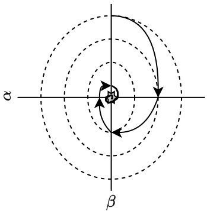

Figure 6.12: General form of joint policy $( \alpha , \beta )$ trajectory when using WoLF-IGA, for the case when $F ( t )$ has purely imaginary eigenvalues and the unique center point is contained in the unit square. The trajectory (solid line) tightens in each quadrant and converges to the center point (gray star), which is a Nash equilibrium. The plot axes correspond to values for $\alpha , \beta .$

Using this variable learning rate, it can be proven that WoLF-IGA is guaranteed to converge to a Nash equilibrium in general-sum games with two agents and two actions. The analysis of WoLF-IGA is near-identical to IGA: using infinitesimal step sizes, the joint policy will follow a continuous trajectory $( \alpha ( t ) , \beta ( t ) )$ in continuous time t, which evolves according to the following differential equation:

$$
\left[ \begin{array}{c} \frac {\partial \alpha}{\partial t} \\ \frac {\partial \beta}{\partial t} \end{array} \right] = \underbrace {\left[ \begin{array}{c c} 0 & l _ {i} (t) u \\ l _ {j} (t) u ^ {\prime} & 0 \end{array} \right]} _ {F (t)} \left[ \begin{array}{c} \alpha \\ \beta \end{array} \right] + \left[ \begin{array}{c} l _ {i} (t) (r _ {1 , 2} - r _ {2 , 2}) \\ l _ {j} (t) (c _ {2 , 1} - c _ {2 , 2}) \end{array} \right].\tag{6.39}
$$

As was the case for IGA, we again examine three qualitatively distinct trajectory types based on properties of the matrix $F ( t )$ , which now depends on t due to the variable learning rates. These cases are when (1) $F ( t )$ is non-invertible, (2) $F ( t )$ is invertible and has purely real eigenvalues, and (3) $F ( t )$ is invertible and has purely imaginary eigenvalues. The crucial part in the analysis is case (3), and in particular the sub-case where the center point is contained within the unit square. This is the problematic case where IGA will not converge to a Nash equilibrium. The WoLF variable learning rate has an important effect in this sub-case: Bowling and Veloso (2002) showed that in WoLF-IGA, the trajectories of $( \alpha , \beta )$ are in fact piecewise elliptical, with four pieces given by the four quadrants around the center point (as shown in Figure 6.12), such that the trajectories spiral toward the center point. Note that in this case, there

<!-- page: 176 -->

exists only one center point and this is by definition a Nash equilibrium. In each quadrant, the ellipse will “tighten” by a factor of $\sqrt { \frac { l _ { \mathrm { m i n } } } { l _ { \mathrm { m a x } } } } < 1$ , and thus the trajectory will converge to the center point.

## 6.4.4 Win or Learn Fast with Policy Hill Climbing

So far, both IGA and WoLF-IGA have been defined only for normal-form games with two agents and two actions. Moreover, these methods require complete knowledge about the learning agent’s reward function and the policy of the other agent, which can be quite restrictive assumptions in an RL setting. Win or learn fast with policy hill climbing (WoLF-PHC) (Bowling and Veloso 2002) is a MARL algorithm that can be used in general-sum stochastic games with any finite number agents and actions; and it does not require knowledge about the agents’ reward functions nor the policies of other agents.

Algorithm 9 shows the pseudocode for WoLF-PHC. The algorithm learns action values $Q ( s , a _ { i } )$ as in standard Q-learning (Algorithm 9; here $\alpha$ denotes the learning rate for Q-updates), and updates the policy $\pi _ { i }$ using the WoLF learning principle. When determining winning/losing to compute the learning rate, instead of comparing the expected rewards to Nash equilibrium policies as is done in WoLF-IGA, WoLF-PHC compares the expected reward of $\pi _ { i }$ to the expected reward of an “average” policy $\bar{\pi}_{i},$ , which averages over past policies (Algorithm 9). The idea is that this average policy replaces the (unknown) Nash equilibrium policy for agent i. A similar idea is used in fictitious play (Section 6.3.1), where it is shown that the average policy does in fact converge to a Nash equilibrium policy in many types of games.

WoLF-PHC uses two parameters, $l _ { l } , l _ { w } \in ( 0 , 1 ]$ with $l _ { l }   >   l _ { w }$ , which correspond to the learning rates for losing and winning, respectively. The action probabilities $\pi _ { i } ( a _ { i }   |   s ^ { t } )$ are updated as shown in Equation 6.43 in Algorithm 9 by adding a term $\Delta ( s ^ { t } , a _ { i } )$ , defined as

$$
\Delta (s, a _ {i}) = \left\{ \begin{array}{c l} - \delta_ {s, a _ {i}} & \text {if} a _ {i} \notin \arg \max _ {a _ {i} ^ {\prime}} Q (s, a _ {i} ^ {\prime}) \\ \sum_ {a _ {i} ^ {\prime} \neq a _ {i}} \delta_ {s, a _ {i} ^ {\prime}} & \text {otherwise} \end{array} \right.\tag{6.44}
$$

where

$$
\delta_ {s, a _ {i}} = \min \left(\pi_ {i} (a _ {i} \mid s), \frac {\delta}{| A _ {i} | - 1}\right)\tag{6.45}
$$

$$
\delta = \left\{ \begin{array}{l l} l _ {w} & \text {if} \sum_ {a _ {i} ^ {\prime}} \pi_ {i} (a _ {i} ^ {\prime} | s) Q (s, a _ {i} ^ {\prime}) > \sum_ {a _ {i} ^ {\prime}} \bar {\pi} _ {i} (a _ {i} ^ {\prime} | s) Q (s, a _ {i} ^ {\prime}) \\ l _ {l} & \text {otherwise} \end{array} \right.\tag{6.46}
$$

The role of $\Delta ( s , a _ { i } )$ is to move the policy $\pi _ { i }$ closer to the current greedy policy with respect to $Q ,$ which is done by removing probability mass $\delta _ { s , a _ { i } }$ from all non-greedy actions, and adding the sum of these masses to the greedy

<!-- page: 177 -->

<div class="docvortex-algorithm" style="white-space: pre-wrap; font-family:monospace;">
Algorithm 9 Win or learn fast with policy hill climbing (WoLF-PHC)
// Algorithm controls agent $i$
Initialize:
    Learning rates $\alpha \in (0,1]$ and $l_l, l_w \in (0,1]$ with $l_l &gt; l_w$
    Value function $Q(s, a_i) \leftarrow 0$ and policy $\pi_i(a_i | s) \leftarrow \frac{1}{|A_i|}$, for all $s \in S$, $a_i \in A_i$
    State counter $C(s) \leftarrow 0$, for all $s \in S$
    Average policy $\bar{\pi}_i \leftarrow \pi_i$
Repeat for every episode:
for $t = 0, 1, 2, \ldots$ do
    Observe current state $s^t$
    With probability $\epsilon$: choose random action $a_i^t \in A_i$
    Otherwise: sample action from policy, $a_i^t \sim \pi_i(\cdot | s^t)$
    Observe reward $r_i^t$ and next state $s^{t+1}$
    Update Q-value:
        $Q(s^t, a_i^t) \leftarrow Q(s^t, a_i^t) + \alpha \left[ r_i^t + \gamma \max_{a_i'} Q_i(s^{t+1}, a_i') - Q_i(s^t, a_i^t) \right]$ (6.40)
    Update average policy $\bar{\pi}_i$:
        $C(s^t) \leftarrow C(s^t) + 1$ (6.41)
        $\forall a_i \in A_i: \bar{\pi}_i(a_i | s^t) \leftarrow \bar{\pi}_i(a_i | s^t) + \frac{1}{C(s^t)} (\pi_i(a_i | s^t) - \bar{\pi}_i(a_i | s^t))$ (6.42)
    Update policy $\pi_i$:
        $\forall a_i \in A_i: \pi_i(a_i | s^t) \leftarrow \pi_i(a_i | s^t) + \Delta(s^t, a_i)$ (6.43)
        with $\Delta(s^t, a_i)$ defined in Equation 6.44.
</div>

action.<sup>11</sup> This ensures that $\pi _ { i } ( \cdot   \mid   s )$ remains a valid probability distribution over the set of actions $A _ { i }$ . The term $\delta _ { s , a _ { i } }$ defines how much probability mass is moved from action $a _ { i } ,$ which is nominally given by $\frac { \delta } { | A _ { i } | { - 1 } }$ , while the min-operator ensures that no more probability mass is moved than is currently assigned to $a _ { i } .$ Following the WoLF-approach, the term $\delta$ assumes the lower learning rate $l _ { w }$ if the expected reward of $\pi _ { i }$ is greater than the expected reward of $\bar{\pi}_{i}$ (winning), and the larger learning rate $l _ { l }$ if the expected reward of $\pi _ { i }$ is lower than or equal to the expected reward of $\bar{\pi}_{i}$ (losing).

<small><span class="docvortex-page-footnote" data-block-type="page_footnote" style="color:#6b7280">Q(s, ·),</span></small>

<small><span class="docvortex-page-footnote" data-block-type="page_footnote" style="color:#6b7280">∆ , i</span></small>

<small><span class="docvortex-page-footnote" data-block-type="page_footnote" style="color:#6b7280">11. Equation 6.44 assumes that there is only one greedy action in state s. If there are multiple greedy actions that have maximum value in then (s a ) can be defined to spread the probability mass uniformly across these greedy actions.</span></small>

<!-- page: 178 -->

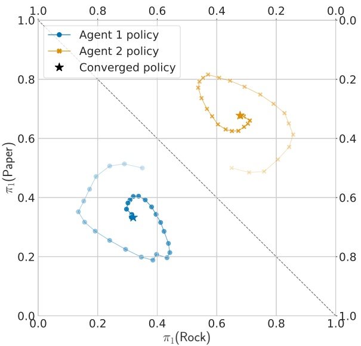

Figure 6.13: Evolving policies of two agents, each using the WoLF-PHC algorithm to update policies, in the non-repeated Rock-Paper-Scissors matrix game. The diagonal dashed line divides the plot into two probability simplexes, one for each of the two agents. Each point in the simplex for an agent corresponds to a probability distribution over the agent’s three available actions. Each line shows the agent’s current policy at episodes 0, 5, 10, 15, ..., 145 (marked by the dots), as well as the converged policy at episode 100, 000 (marked by a star).

Figure 6.13 shows WoLF-PHC applied in the non-repeated Rock-Paper-Scissors matrix game, where it can be seen that the agents’ policies gradually co-adapt and converge to the unique Nash equilibrium of the game, in which both agents choose actions uniform-randomly. The learning trajectories produced by WoLF-PHC are similar to the trajectories produced by fictitious play shown in Figure 6.5 (page 129), but they are “smoother” and circular rather than triangular. This is because fictitious play uses deterministic best-response actions, which can change abruptly over time, whereas WoLF-PHC learns action probabilities, which can vary gradually over time.

## 6.4.5 Generalized Infinitesimal Gradient Ascent

We have so far examined IGA based on its ability to learn Nash equilibria or Nash equilibrium rewards. Another major solution concept is no-regret, which was presented in Section 4.10. In this section, we will present a gradient-based

<!-- page: 179 -->

learning algorithm that generalizes IGA to normal-form games with more than two agents and actions. As we will see, this generalized infinitesimal gradient ascent (GIGA) algorithm achieves no-regret (Zinkevich 2003), which implies that IGA also achieves no-regret.

GIGA does not require knowledge of the other agents’ policies but assumes that it can observe the past actions of the other agents. Similarly to IGA, GIGA updates policies using unconstrained gradients that are projected back into the space of valid probability distributions. However, while IGA uses a gradient in expected reward with respect to the agents’ policies, GIGA uses a gradient in actual rewards after observing the past actions of the other agents. In the following, we will present GIGA for games with two agents i and $j ,$ and we will later return to the case of $n   >   2$ agents.

Given a policy $\pi _ { i }$ for agent i and an action $a _ { j }$ for agent $j ,$ the expected reward for agent i against action $a _ { j }$ is

$$
U _ {i} (\pi_ {i}, a _ {j}) = \sum_ {a _ {i} \in A _ {i}} \pi_ {i} (a _ {i}) \mathcal {R} _ {i} (a _ {i}, a _ {j}).\tag{6.47}
$$

Therefore, the gradient of this expected reward with respect to policy $\pi _ { i }$ is simply the vector of rewards for each of agent i’s available actions 1, 2, 3...,

$$
\begin{array}{r l r} \nabla_ {\pi_ {i}} U _ {i} (\pi_ {i}, a _ {j}) = & \left[ \begin{array}{l l l l} \frac {\partial U _ {i} (\pi_ {i} , a _ {j})}{\partial \pi_ {i} (1)}, & \frac {\partial U _ {i} (\pi_ {i} , a _ {j})}{\partial \pi_ {i} (2)}, & \frac {\partial U _ {i} (\pi_ {i} , a _ {j})}{\partial \pi_ {i} (3)}, & \dots \end{array} \right] \\ = & \left[ \begin{array}{l l l l} \mathcal {R} _ {i} (1, a _ {j}), & \mathcal {R} _ {i} (2, a _ {j}), & \mathcal {R} _ {i} (3, a _ {j}), & \dots \end{array} \right] \end{array}\tag{6.48}
$$

(6.49)

Given policy $\pi _ { i } ^ { k }$ and observed action $a _ { j } ^ { k }$ in episode $k ,$ GIGA updates $\pi _ { i } ^ { k }$ via two steps:

$$
\begin{array}{l l} (1) & \tilde {\pi} _ {i} ^ {k + 1} \leftarrow \pi_ {i} ^ {k} + \kappa^ {k} \nabla_ {\pi_ {i} ^ {k}} U _ {i} (\pi_ {i} ^ {k}, a _ {j} ^ {k}) \\ (2) & \pi_ {i} ^ {k + 1} \leftarrow P (\tilde {\pi} _ {i} ^ {k + 1}) \end{array}\tag{6.50}
$$

where $\kappa ^ { k }$ is the step size. Step (1) updates the policy in the direction of the unconstrained gradient $\nabla _ { \pi _ { i } ^ { k } } U _ { i } ( \pi _ { i } ^ { k } , a _ { j } ^ { k } )$ , while step (2) projects the result back into a valid probability space via the projection operator

$$
P (x) = \arg \min _ {x ^ {\prime} \in \Delta (A _ {i})} \| x - x ^ {\prime} \|\tag{6.51}
$$

where || · || is the standard L2-norm.<sup>12</sup> $P ( x )$ projects a vector x back into the space of probability distributions $\Delta ( A _ { i } )$ defined over the action set $A _ { i }$

Zinkevich (2003) showed that if all agents use GIGA to learn policies with a step size of $\begin{array} { r } { \kappa ^ { k }   = \frac { 1 } { \sqrt { k } } } \end{array}$ , then in the limit of $k   \to   \infty$ the policies will achieve no-regret. Specifically, recall the definition of regret in Equation 4.28 (page 81),

<small><span class="docvortex-page-footnote" data-block-type="page_footnote" style="color:#6b7280">x = √x · x,</span></small>

<small><span class="docvortex-page-footnote" data-block-type="page_footnote" style="color:#6b7280">12. The L2-norm is defined as || || where · is the dot product.</span></small>

<!-- page: 180 -->

then it can be shown that the regret for agent i is bounded by

$$
R e g r e t _ {i} ^ {k} \leq \sqrt {k} + \left(\sqrt {k} - \frac {1}{2}\right) | A _ {i} | r _ {\max} ^ {2}\tag{6.52}
$$

where $r _ { \mathrm { m a x } }$ denotes the maximum possible reward for agent i. Thus, the average regret $\scriptstyle { \frac { 1 } { k } } R e g r e t _ { i } ^ { k }$ will go to zero for $k   \to   \infty$ (since k grows faster than $\sqrt { k } )$ satisfying the no-regret criterion given in Definition 12.

Note that, as mentioned in Section 4.10, the no-regret property of GIGA implies that the empirical action distribution of agents using GIGA converges to coarse correlated equilibrium. Finally, the above definitions also work for games with more than two agents, since we can replace j by $- i$ to represent a collection of other agents that accordingly choose joint actions $a _ { - i }$ . All of the above definitions and results still hold for this case.

## 6.5 No-Regret Learning

The previous sections showed how several of the concepts defined in Chap ter 4 can be operationalized in MARL algorithms to learn solutions for games. Specifically, the JAL-GT algorithms presented in Section 6.2 apply equilibrium solutions in normal-form games (such as minimax and Nash equilibrium) to update value estimates and select actions in stochastic games. Similarly, the JAL-AM algorithms presented in Section 6.3.2 use best-response actions against learned agent models to update value estimates and select actions.

Now, we will consider how definitions of regret from Section 4.10 can be operationalized in MARL algorithms to learn solutions for games. Learning algorithms for games that specifically aim to minimize notions of regret are known as no-regret learners, and there exist whole families of such algorithms (e.g., Hart and Mas-Colell 2001; Cesa-Bianchi and Lugosi 2003; Greenwald and Jafari 2003; Zinkevich et al. 2007). These algorithms associate regrets for not having chosen certain actions in past episodes and update their policies to assign higher probability to actions that have high regrets. We will consider two variants of a particularly simple approach, called regret matching (Hart and Mas-Colell 2000), which have the property that their empirical action distributions converge to the set of (coarse) correlated equilibria in normal-form games.

## 6.5.1 Unconditional and Conditional Regret Matching

We consider two variants of regret matching, which we refer to as unconditional regret matching and conditional regret matching. These algorithms compute action probabilities based on the definitions of unconditional and conditional regret, respectively, which we first defined in Section 4.10. In the following, we

<!-- page: 181 -->

will define these algorithms in the context of non-repeated normal-form games. However, the same algorithms could, in principle, be applied to stochastic games and even POSGs by redefining the regrets over policies instead of actions, such as in Equation 4.30 in Section 4.10. We will begin with unconditional regret matching, which is the simpler of the two algorithms.

**Unconditional regret matching** computes action probabilities that are proportional to the (positive) average unconditional regrets of the actions. In Equation 4.28 we originally defined $R e g r e t _ { i } ^ { z }$ with respect to the single best action. We modify this definition slightly to define regret for individual actions $a _ { i }   \in   A _ { i }$ . In a general-sum normal-form game with reward functions $\mathcal { R } _ { i }$ for agents $i \in I ,$ let $a ^ { e }$ denote the joint action from episodes $e   =   1 , . . . , z .$ Agent $i ^ { \flat } \mathrm { s }$ unconditional regret for not having chosen action $a _ { i }   \in   A _ { i }$ in all of these episodes is defined as

$$
\text {Regret} _ {i} ^ {z} (a _ {i}) = \sum_ {e = 1} ^ {z} \left[ \mathcal {R} _ {i} (\langle a _ {i}, a _ {- i} ^ {e} \rangle) - \mathcal {R} _ {i} (a ^ {e}) \right].\tag{6.53}
$$

The average unconditional regret for agent i and action $a _ { i }$ is given by

$$
\bar {R} _ {i} ^ {z} (a _ {i}) = \frac {1}{z} R e g r e t _ {i} ^ {z} (a _ {i}).\tag{6.54}
$$

Each agent i starts with an initial policy $\pi _ { i } ^ { 1 }$ that can use any probability distribution over actions $a _ { i }   \in   A _ { i }$ (e.g., uniform probabilities). Then, given the above definition of average unconditional regret, the policy $\pi _ { i } ^ { z }$ is updated to

$$
\pi_ {i} ^ {z + 1} (a _ {i}) = \frac {[ \bar {R} _ {i} ^ {z} (a _ {i}) ] _ {+}}{\sum_ {a _ {i} ^ {\prime} \in A _ {i}} [ \bar {R} _ {i} ^ {z} (a _ {i} ^ {\prime}) ] _ {+}}\tag{6.55}
$$

where $[x]_{+} = \max[x, 0]$ . If the denominator in Equation 6.55 is zero, then $\pi _ { i } ^ { z + 1 }$ may use any probability distribution over actions.

**Conditional regret matching** computes action probabilities that are proportional to the (positive) average conditional regrets with respect to the most recent selected action. Let $a ^ { e }$ denote the joint action from episodes $e   =   1 , . . . , z .$ Agent i’s conditional regret for not having chosen action $a _ { i }$ in each episode in which it chose action $a _ { i } ^ { \prime }$ is defined as

$$
\text {Regret} _ {i} ^ {z} (a _ {i} ^ {\prime}, a _ {i}) = \sum_ {e: a _ {i} ^ {e} = a _ {i} ^ {\prime}} \left[ \mathcal {R} _ {i} (\langle a _ {i}, a _ {- i} ^ {e} \rangle) - \mathcal {R} _ {i} (a ^ {e}) \right].\tag{6.56}
$$

The average conditional regret for agent i and actions $a _ { i } ^ { \prime } , a _ { i }$ is given by

$$
\bar {R} _ {i} ^ {z} (a _ {i} ^ {\prime}, a _ {i}) = \frac {1}{z} R e g r e t _ {i} ^ {z} (a _ {i} ^ {\prime}, a _ {i}).\tag{6.57}
$$

<!-- page: 182 -->

Again, each agent i starts with an initial policy $\pi _ { i } ^ { 1 }$ that can use any probability distribution over actions. Then, given the above definition of average conditional regret, the policy $\pi _ { i } ^ { z }$ is updated to

$$
\pi_ {i} ^ {z + 1} (a _ {i}) = \left\{ \begin{array}{l l} \frac {1}{\eta} [ \bar {R} _ {i} ^ {z} (a _ {i} ^ {z}, a _ {i}) ] _ {+} & \text {if} a _ {i} \neq a _ {i} ^ {z} \\ 1 - \sum_ {a _ {i} ^ {\prime} \neq a _ {i} ^ {z}} \pi_ {i} ^ {z + 1} (a _ {i} ^ {\prime}) & \text {otherwise} \end{array} \right.\tag{6.58}
$$

where $a _ { i } ^ { z }$ is the action chosen by agent i in the last episode z, and $\eta   >$ $2 \cdot \operatorname * { m a x } _ { a \in A } | \mathcal { R } _ { i } ( a ) | \cdot ( | A _ { i } | - 1 )$ is a parameter that governs how far the action probabilities will be biased toward actions with high conditional regret (the higher $\eta ,$ the lower the bias). The lower bound on η ensures that the sum of the probabilities $\pi _ { i } ^ { z + 1 } ( a _ { i } )$ assigned to actions $a _ { i }   \neq   a _ { i } ^ { z }$ is at most 1.

Before discussing the asymptotic behaviors of these regret matching algorithms, we can examine their behaviors in the example from Figure 4.6 (page 82) in the Prisoner’s Dilemma matrix game. In Prisoner’s Dilemma, D is a dominant action since it is a best response against both D and C by the other agent. Therefore, the unconditional regret $R e g r e t _ { i } ^ { z } ( C )$ for action C can never be positive, which means that $[ \bar { R } _ { i } ^ { z } ( C ) ] _ { + }   =   0$ in all episodes. In our example, this results in unconditional regret matching always assigning probability 0 to action C and probability 1 to action D in all episodes after the first episode (the policies $\pi _ { i } ^ { 1 }$ in the first episode can use any probability distribution). Furthermore, note that since Prisoner’s Dilemma is a normal-form game with only two actions for each agent, the definition of conditional regret is equivalent to the definition of unconditional regret. Therefore, conditional regret matching has identical behavior to unconditional regret matching in Prisoner’s Dilemma.

## 6.5.2 Convergence of Regret Matching

If all agents use regret matching to update their policies, how will their regrets evolve in the long run? For both types of regret matching, it can be proven that each agent’s average regrets are bounded by $\kappa { \frac { 1 } { \sqrt { z } } }$ for some constant factor $\kappa   >   0$ , and this holds for both unconditional and conditional regrets (Hart and Mas-Colell 2000). Thus, in the limit of infinitely many episodes $z   \to   \infty$ , the average regrets $\bar { R } _ { i } ^ { z }$ will be at most 0 for each agent $i \in I$ . This satisfies the conditions for the no-regret solution concept defined in Definition 12 (page 81). It is interesting to note that this regret bound does not require any assumptions about the behaviors of other agents $j   \neq   i$ in the game — they may take any actions they like. That such regret minimization is nevertheless possible is a result of the seminal Approachability Theorem by Blackwell (1956).

What does the no-regret property imply for the policies learned by the agents? Based on the above regret bounds, for conditional regret matching we obtain

<!-- page: 183 -->

for all $i \in I$ and all $a _ { i } ^ { \prime } , a _ { i }   \in   A _ { i }$

$$
\begin{array}{c} \bar {R} _ {i} ^ {z} (a _ {i} ^ {\prime}, a _ {i}) = \frac {1}{z} \sum_ {e: a _ {i} ^ {e} = a _ {i} ^ {\prime}} \left[ \mathcal {R} _ {i} (\langle a _ {i}, a _ {- i} ^ {e} \rangle) - \mathcal {R} _ {i} (a ^ {e}) \right] \\ = \frac {1}{z} \sum_ {e = 1} ^ {z} \mathcal {R} _ {i} (\hat {a} ^ {e}) - \frac {1}{z} \sum_ {e = 1} ^ {z} \mathcal {R} _ {i} (a ^ {e}) \leq \kappa \frac {1}{\sqrt {z}} \end{array}\tag{6.59}
$$

(6.60)

where we define

$$
\hat {a} ^ {e} = \left\{ \begin{array}{l l} \langle a _ {i}, a _ {- i} ^ {e} \rangle & \text {if} a _ {i} ^ {e} = a _ {i} ^ {\prime} \\ a ^ {e} & \text {otherwise} \end{array} \right..\tag{6.61}
$$

For $z   \to   \infty$ , we have $\begin{array} { r } { \kappa \frac { 1 } { \sqrt { z } }   =   0 . } \end{array}$ , and hence we can write

$$
\frac {1}{z} \sum_ {e = 1} ^ {z} \mathcal {R} _ {i} (\hat {a} ^ {e}) \leq \frac {1}{z} \sum_ {e = 1} ^ {z} \mathcal {R} _ {i} (a ^ {e}).\tag{6.62}
$$

Now, consider the empirical distribution over joint actions $\{ a ^ { e } \} _ { e = 1 } ^ { z }$ given by

$$
\bar {\pi} ^ {z} (a) = \frac {1}{z} \sum_ {e = 1} ^ {z} [ a = a ^ {e} ] _ {1}\tag{6.63}
$$

with $[ x ] _ { 1 }   =   1$ if x is true, and $[ x ] _ { 1 }   =   0$ otherwise. The two averaged rewards in the left-hand and right-hand sides of Equation 6.62 can be equivalently written as expected rewards under the empirical distribution $\bar { \pi } ^ { z }$ as

$$
\sum_ {a \in A: a _ {i} = a _ {i} ^ {\prime}} \bar {\pi} ^ {z} (a) \mathcal {R} _ {i} (\langle a _ {i} ^ {\prime \prime}, a _ {- i} \rangle) \leq \sum_ {a \in A: a _ {i} = a _ {i} ^ {\prime}} \bar {\pi} ^ {z} (a) \mathcal {R} _ {i} (a)\tag{6.64}
$$

for all $i \in I$ and all $a _ { i } ^ { \prime } , a _ { i } ^ { \prime \prime }   \in   A _ { i }$

Notice that the inequalities in Equation 6.64 correspond to the inequalities specified in the definition of correlated equilibrium in Equation 4.19, where we have $\xi ( a _ { i } ^ { \prime } )   =   a _ { i } ^ { \prime \prime }$ . (The equivalence may be more obvious when comparing Equation 6.64 to the linear program definition for correlated equilibrium, given in Section 4.6.1.) This result establishes that, if all agents use conditional regret matching, then the empirical distribution of joint actions $\bar{\pi}^{z}$ will converge to the set of correlated equilibria for $z \to \infty$ , as per Equation 5.7. Note, however, that this result does not establish pointwise convergence of $\bar { \pi } ^ { z }$ to a correlated equilibrium, as per Equation 5.3. For unconditional regret matching, we obtain an analogous result but the convergence is to coarse correlated equilibrium.

Figure 6.14 illustrates the learning process when both agents use unconditional regret matching in the non-repeated Rock-Paper-Scissors matrix game. In this game, the sets of (coarse) correlated equilibria coincide with the set of Nash equilibria. As can be seen in Figure 6.14(a), the actual policies $\pi _ { i } ^ { z }$ of the agents move all over the probability simplexes and show no convergent

<!-- page: 184 -->

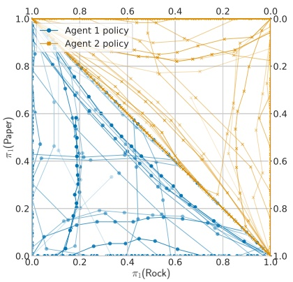

(a) Policies $\pi _ { i } ^ { z }$

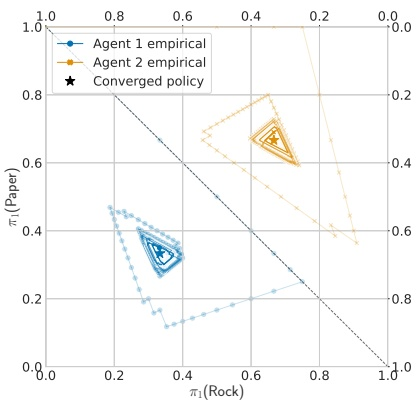

(b) Empirical distributions $\bar{\pi}_{i}^{z}$

Figure 6.14: Evolving policies of two agents, each using unconditional regret matching to update policies, in the non-repeated Rock-Paper-Scissors matrix game. The diagonal dashed line divides the plots into two probability simplexes, one for each of the two agents. Each point in the simplex for an agent corresponds to a probability distribution over the agent’s three available actions. (a) Trajectories of the agents’ actual policies $\pi _ { i } ^ { z }$ over 10, 000 episodes, with policies from every tenth episode marked by a dot. (b) Trajectories of the agents empirical action distributions $\bar{\pi}_{i}^{z}$ <sup>for</sup> the first 500 episodes, with the converged distribution marked by a star.

behavior. Yet, despite this apparent chaotic behavior (or, rather, because of it), Figure 6.14(b) shows that the agents’ empirical distributions $\bar{\pi}_{i}^{z}$ <sup>converge</sup> steadily to the unique Nash equilibrium of the game, in which both agents choose actions uniformly randomly.<sup>13</sup> Looking at the average unconditional regrets of both agents, which are shown in Figure 6.15, we see that they steadily reduce over the first 1,000 episodes and then enter oscillatory swings around the zero line. The oscillation is caused by the mutual adaptation of the agents: agent 1 repeatedly chooses actions with high average regret, which over time will cause agent $2 ^ { \circ } \mathbf { s }$ average regrets to increase for the respective best-response actions against agent 1’s actions, which in turn will increase agent 1’s regrets for its corresponding best-response actions, and so on. The empirical distribution of these oscillatory action changes converges to the Nash equilibrium.

<small><span class="docvortex-page-footnote" data-block-type="page_footnote" style="color:#6b7280">¯zi</span></small>

<small><span class="docvortex-page-footnote" data-block-type="page_footnote" style="color:#6b7280">¯ z</span></small>

<small><span class="docvortex-page-footnote" data-block-type="page_footnote" style="color:#6b7280">¯zi a ¯z,</span></small>

<small><span class="docvortex-page-footnote" data-block-type="page_footnote" style="color:#6b7280">13. The empirical distributions π for each agent i are given by the respective marginal distributions of the joint empirical distribution π, that is, π (ai) = P π (⟨ai a−i⟩).</span></small>

<!-- page: 185 -->

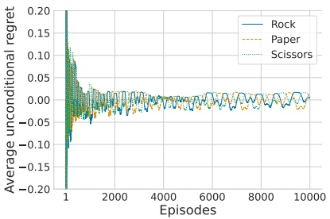

(a) Agent 1

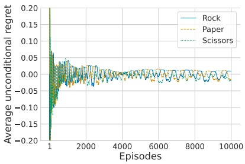

(b) Agent 2

Figure 6.15: Average unconditional regrets of both agents for actions Rock (R), Paper (P), Scissors (S) over 10,000 episodes in the non-repeated Rock-Paper-Scissors game. The y-axis is limited to the range [−0.2, 0.2] (the average regrets in the first few episodes are larger than these limits).

When comparing these learning plots to the corresponding plot for WoLF-PHC shown in Figure 6.13 (page 149), notice the important difference that WoLF-PHC achieves a much stronger convergence than regret matching; in WoLF-PHC the policies $\pi _ { i } ^ { z }$ converge to Nash equilibrium, but in regret matching only the empirical distribution $\bar { \pi } ^ { z }$ converges to the Nash equilibrium while the policies $\pi _ { i } ^ { z }$ shown in Figure 6.14(a) do not converge.

## 6.6 Summary

This chapter described several families of foundational MARL algorithms which are designed to learn different types of game solutions under certain conditions. We summarize the main ideas as follows:

• Analogous to the value iteration algorithm for MDPs, a value iteration algorithm exists for zero-sum stochastic games to learn optimal state values for each agent. The main idea of the algorithm is to compute matrices for each agent and state, which estimate the expected return (i.e., value) to an agent when selecting a specific joint action in the state and following the optimal joint policy afterward. For a given state, a normal-form game can be constructed using the corresponding matrices of the agents. This normalform game is then solved via a minimax solver, to obtain a target value to update the agents’ value estimate of the state. This value iteration algorithm provably converges to a minimax joint policy of the stochastic game.

<!-- page: 186 -->

• The value iteration algorithm laid the foundation for a family of MARL algorithms known as joint-action learning. These algorithms use temporaldifference learning in combination with game-theoretic solution concepts, to estimate the values of joint actions and learn solutions for games. Several instances of these algorithms can be defined that use different solution concepts. Minimax Q-learning is a temporal-difference version of the value iteration algorithm and converges to minimax solutions under certain condi tions in zero-sum stochastic games. Nash Q-learning is based on the Nash equilibrium concept and can be applied to general-sum stochastic games with two or more agents, but convergence to a Nash equilibrium requires very restrictive assumptions, in part due to equilibrium selection problems.

Agent modeling is the task of constructing models of other agents that can make useful predictions about their behaviors. For example, a model can be learned to predict the probabilities of another agent’s next actions, based on observations about the past chosen actions of that agent. Given such a model, an agent can compute best-response actions against the model. Fictitious play is one of the earliest learning algorithms for normal-form games that operates in this way, and is able to converge to Nash equilibria in several types of normal-form games. Joint-action learning algorithms can also learn such agent models and combine them with temporal-difference learning to learn best-response policies for the agents.

Bayesian learning approaches for agent modeling compute probabilities over multiple possible models based on past observations. Using the concept of value of information, such methods can compute best-response actions that can trade off between maximizing an agent’s expected returns and discovering the true model of an agent.

Policy-based learning methods directly optimize the parameters of some probabilistic policy functions. In contrast to methods that estimate joint action values, policy-based methods can directly adjust the probabilities in policies using techniques based on gradient ascent. By considering infinitely small update steps, the learning behaviors of these methods can be analyzed using dynamical systems theory. For example, basic infinitesimal gradient ascent can converge to Nash equilibria in normal-form games, or alternatively converge to the expected rewards under a Nash equilibrium.

• No-regret learning algorithms learn policies with the aim to minimize notions of regrets for not taking certain actions in past episodes. Unconditional regret matching is a no-regret learning algorithm that achieves zero unconditional regret in the long run, and the empirical distribution of joint actions converges to the set of coarse correlated equilibria in normal-form games. Similarly,

<!-- page: 187 -->

conditional regret matching achieves zero conditional regret in the long run, and the empirical distribution converges to the set of correlated equilibria.

This chapter concludes the first part of this book. The chapters in this first part of the book have laid out the foundations of MARL, by defining game models and solution concepts for games, as well as the basic ideas and challenges of using RL techniques to learn solutions in games. Building on these foundations, Part II of this book will introduce novel MARL algorithms that leverage deep learning techniques to learn solutions for complex games.

<!-- page: 188 -->

## II MULTI-AGENT DEEP REINFORCEMENT LEARNING: ALGORITHMS AND PRACTICE

Part II of this book will build on the foundations introduced in Part I and present MARL algorithms that use deep learning to represent value functions and agent policies. As we will see, deep learning is a powerful tool that enables MARL to scale to more complex problems than is possible with tabular methods. The chapters in this part will introduce the basic concepts of deep learning and show how deep learning techniques can be integrated into RL and MARL to produce powerful learning algorithms.

Chapter 7 provides an introduction to deep learning, including the building blocks of neural networks, foundational architectures, and the components of gradient-based optimization used to train neural networks. This chapter primarily serves as a concise introduction to deep learning for readers unfamiliar with the field and explains all foundational concepts required to understand the following chapters. Chapter 8 then introduces deep RL, explaining how to use neural networks to learn value functions and policies for RL algorithms.

Chapter 9 builds on the previous chapters and introduces multi-agent deep RL algorithms. The chapter begins by discussing different modes of training and execution, which determine the information available to agents during and after learning. The chapter then revisits the class of independent learning algorithms with deep learning, before presenting advanced topics including multi-agent policy gradient algorithms, value decomposition, and agent modeling. The chapter also shows how agents can share parameters and experiences in multi-agent deep RL algorithms to further improve the learning efficiency. Finally, the chapter presents self-play and population-based training in MARL, which have led to breakthroughs in tackling very complex multi-agent games. Chapters 10 and 11 conclude this part of the book by discussing practical considerations for the implementation of MARL algorithms and presenting environments that can serve as benchmarks and a playground to study these algorithms.

<!-- page: 189 -->

<!-- page: 190 -->

In this chapter, we provide a concise introduction to deep learning, a learning framework for function approximation. The chapter begins by motivating why we need function approximation in RL and MARL to tackle complex environments. We will introduce feedforward neural networks as the foundational architecture of neural networks. The chapter then introduces gradient-based optimization techniques as the main approach to train neural networks, before introducing architectures designed for high-dimensional and sequential inputs. This chapter only covers the basic concepts of deep learning and is not meant to be a comprehensive or complete summary of this vast field. We refer the interested reader to the textbooks by Goodfellow, Bengio, and Courville (2016), Fleuret (2023), and Prince (2023) for a more comprehensive overview of deep learning. Chapters 8 and 9 will build on the present chapter and show how deep learning can be used in RL and MARL.

## 7.1 Function Approximation for Reinforcement Learning

Before discussing what deep learning is and how it works, it is useful to see why deep learning is omnipresent in RL research nowadays. What does deep learning offer over other techniques used to learn value functions, policies, and other models in RL?

Part I introduced MARL algorithms in their classical form, using tabular methods to represent value functions and policies of agents. These methods are referred to as “tabular” because their value function can be thought of as a large table, with each state-action pair corresponding to a single table entry containing the value estimate for that particular input to the value function. This representation of tabular MARL has two important limitations. First, the table grows linearly with the number of possible inputs to the represented value function, rendering tabular MARL infeasible for complex problems like Go,

<!-- page: 191 -->

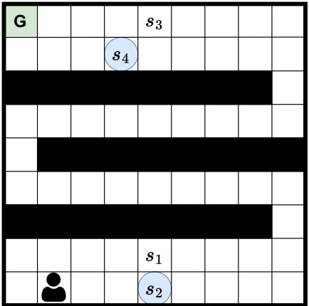

Figure 7.1: A maze environment in which a single agent must reach a goal location (G). The agent has seen several states, including $s _ { 1 }$ and $s _ { 3 }$ during its trajectories, and tries to estimate values for the circled states $s _ { 2 }$ and $s _ { 4 }$ . An agent with a tabular value function cannot generalize in this manner and would need to explicitly experience trajectories with $s _ { 2 }$ and $s _ { 4 }$ to be able to learn accurate value estimates. In contrast, a value function using function approximation techniques (such as linear value functions or deep learning) may be able to generalize and estimate the values of $s _ { 2 }$ and $s _ { 4 }$ to be similar to $s _ { 1 }$ and $s _ { 3 }$ , respectively.

video games, and most real-world applications. For example, the state space of the board game of Go is estimated to contain approximately $1 0 ^ { 1 7 0 }$ possible states. Storing, managing, and updating a table with this number of entries is completely infeasible for modern computers. Second, tabular value functions update each value estimate in isolation. For tabular MARL, an agent will update its value estimate for the state s after visiting this state, and leave its value function for any other state unchanged. These isolated updates for visited states and actions come with theoretical guarantees for tabular MARL algorithms, but it means that an agent has to encounter states before being able to learn their values. This can render tabular MARL algorithms inefficient in tasks with large state or action spaces. For learning in complex tasks, it is therefore essential that agents have the ability to generalize to novel states. Encountering a specific state should ideally allow an agent to update not just its value estimate for this particular state but also update its estimates for different states that are in some sense similar to the encountered state.

To illustrate the benefits of generalization, consider the following example depicted in Figure 7.1. In this single-agent environment, the agent needs to

<!-- page: 192 -->

navigate a maze and reach the goal location (G) to receive a positive reward. Given this reward function, the expected discounted returns of an optimal policy in a state depend on the path length of the state to the goal. Hence, two states that are similar in their path length to the goal should have similar value estimates. Considering the circled states in Figure 7.1, we would expect the value estimate for state $s _ { 2 }$ to be similar to the value of $s _ { 1 }$ . Likewise, the value of $s _ { 4 }$ should be similar to the value of $s _ { 3 }$ . Tabular value functions are trained on each of these states in isolation, but function approximation offers value functions that can generalize. This generalization can enable approximate value functions to pick up on the relationships between states and their respective values, and provide reasonable value estimates for $s _ { 2 }$ and $s _ { 4 }$ before encountering these states.

## 7.2 Linear Function Approximation

Given these limitations of tabular MARL, there is a clear need for value functions that generalize across states. Function approximation addresses both of these limitations by learning a function $f ( x ; \theta )$ for some input $x   \in   \mathbb { R } ^ { d _ { x } }$ , with $d _ { x }$ denoting the dimensionality of x, to approximate a target function $f ^ { * } ( x )$ . We denote the parameters of the parameterized function by $\theta \in \mathbb { R } ^ { d }$ , with $d$ corresponding to the total number of learnable parameters. Training a function approximator involves an optimization process to find a set of parameter values $\theta$ such that f accurately approximates a target function $f ^ { * }$ :

$$
\forall x: f (x; \theta) \approx f ^ {*} (x)\tag{7.1}
$$

For example in $\operatorname { R L } , f ^ { * }$ might be a value function representing the expected returns for a given state s as input.

One approach for function approximation is to represent $f ( x ; \theta )$ as a linear function defined over predefined features of states. For instance, a linear statevalue function can be written as

$$
\hat {V} (s; \theta) = \theta^ {\top} x (s) = \sum_ {k = 1} ^ {d} \theta_ {k} x _ {k} (s)\tag{7.2}
$$

with $\theta \in \mathbb { R } ^ { d }$ and $x ( s ) \in \mathbb { R } ^ { d }$ denoting the vectors of parameters and state features, respectively. Note that the state-value function is not limited to be linear with respect to the state itself, but linear with respect to the state feature vector. The state feature vector represents a predetermined encoding of states into a d-dimensional vector. Such an encoding of states can represent non-linear functions; for example, $x ( s )$ might represent a vector of polynomials where each entry represents a combination of values that make up the full state up to a fixed degree. During training, the value function is continually updated

<!-- page: 193 -->

by optimizing its parameters $\theta ,$ typically using gradient-based optimization techniques. Section 7.4 will provide a more detailed description of gradientbased optimization (for the more general case of deep learning, which includes linear function approximation), but in a nutshell we search for parameters $\theta$ that minimize an objective function. Consider the hypothetical example in which we aim to learn a linear state-value function and already know the true values $V ^ { \pi } ( s )$ for several states. We can minimize the mean squared error between the approximate value function $\hat { V } ( s ; \theta )$ and true values $V ^ { \pi } ( s )$

$$
\theta^ {*} = \arg \min _ {\theta} \mathbb {E} _ {s \in S} \left[ \left(V ^ {\pi} (s) - \hat {V} (s; \theta)\right) ^ {2} \right]\tag{7.3}
$$

To learn the optimal parameters $\theta ^ { * }$ , which minimize the mean squared error, we can compute the gradient of the error with respect to $\theta$ and follow this gradient “downward.” Following this optimization process, the approximate value function $\hat { V } ( \cdot ; \theta )$ will get closer to the true value function $V ^ { \pi } ( s )$ . The obtained approximate value function can also generalize to states for which we have not seen the true value, since the same parameters $\theta$ are used to compute the value of all states. In our maze example (Figure 7.1), given sufficient training data, the optimal parameters $\theta$ might be able to encode the relationship between the path length to the goal and the value of a state. After such parameters are learned, the value function can provide reasonable value estimates for states $s _ { 2 }$ and $s _ { 4 }$ despite not having been trained on these states.

The main benefit of linear value functions is their simplicity and ability to generalize. However, linear function approximation heavily relies on the selection of state features represented in $x ( s )$ , as $\hat { V } ( s ; \theta )$ is constrained to be a linear function with respect to these state features. Finding such state features can be non-trivial, depending on the task we want to solve, and thus requires domain knowledge. In particular, it can be very difficult to find appropriate features for environments with high-dimensional state representations, e.g. including images or language such that the desired value function can be represented as a linear function over these features.

In contrast to linear function approximation, deep learning provides a universal method for function approximation that is able to automatically learn feature representations of states, and is able to represent non-linear, complex functions that can generalize to novel states. In the following sections, we will introduce the fundamental building blocks of deep learning and their optimization process, before discussing their concrete application to RL and MARL in Chapter 8 and Chapter 9, respectively.

<!-- page: 194 -->

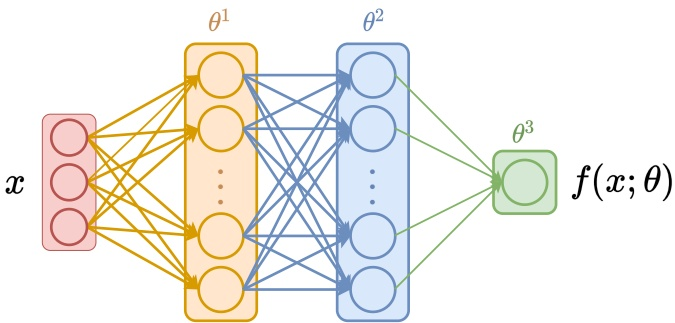

Figure 7.2: An illustration of a feedforward neural network with three layers. The input $x   \in   \mathbb { R } ^ { 3 }$ is processed by two hidden layers with parameters $\theta ^ { 1 }$ and $\theta ^ { 2 }$ respectively, and a single scalar output is computed in the final output layer with parameters $\theta ^ { 3 }$

## 7.3 Feedforward Neural Networks

Deep learning encompasses a family of machine learning techniques that apply neural networks as function approximators. These networks consist of many units organized in sequential layers, with each unit computing comparably simple but non-linear calculations (visualized in Figure 7.2). This sequence of non-linear transformations allows neural networks to approximate complex functions, which cannot be represented with linear function approximation. Neural networks are very flexible and have emerged as the most prominent type of function approximators in machine learning. In the following sections of this chapter, we will explain how neural networks work, and how we can optimize these complex function approximators.

Feedforward neural networks—also called deep feedforward networks, fully connected neural networks, or multi-layer perceptrons (MLPs)—are the simplest and most prominent architecture of neural networks, and commonly appear as building blocks of more complex architectures. Feedforward neural networks are structured into multiple sequential layers, with the first layer processing the given input x and any subsequent layer processing the output of the previous layer. Each layer is defined as a parameterized function and is composed of many units. The output of the overall layer consists of the concatenation of all its units’ outputs. We typically refer to the first layer as the input layer and the last layer as the output layer. All layers in between are called hidden layers since they compute internal representations that are typically hidden from the user. An entire feedforward neural network is defined by the composition of

<!-- page: 195 -->

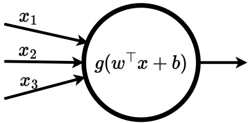

Figure 7.3: An illustration of a single neural unit computing a scalar output given an input $x   \in   \mathbb { R } ^ { 3 }$ . First, a weighted sum over the input features is computed using the vector multiplication of $w   \in   \mathbb { R } ^ { 3 }$ and the input x and a scalar bias $b \in \mathbb { R }$ is added. Finally, a non-linear activation function $g : \mathbb { R } \to \mathbb { R }$ is applied to obtain the scalar output.

the functions of all layers by sequentially feeding the output of the previous layer into the next layer. For example, a feedforward neural network with three layers (or two hidden layers), visualized in Figure 7.2, can be written as

$$
f (x; \theta) = f _ {3} (f _ {2} (f _ {1} (x; \theta^ {1}); \theta^ {2}); \theta^ {3})\tag{7.4}
$$

where $\theta ^ { k }$ corresponds to the parameters of layer k and $\theta   =   \bigcup _ { k } \theta ^ { k }$ denotes the parameters of the entire network. We denote the number of units in the kth layer by $d _ { k }$ . The number of layers is referred to as the depth of the neural network and the number of units in a layer is referred to as the width or hidden dimension of the layer. The generality and representational capacity, that is, the complexity of functions a neural network can represent, largely depend on the depth of the network and the dimensionality of each of its layers. The universal approximation theorem states that feedforward neural networks with as few as a single hidden layer are able to approximate any continuous function on a closed and bounded subset of real-valued vectors given sufficient hidden units (Cybenko 1989; Hornik, Stinchcombe, and White 1989; Hornik 1991; Leshno et al. 1993). However, training deeper neural networks with multiple layers can result in better performance and generalization at an equivalent number of total parameters (Goodfellow, Bengio, and Courville 2016). To understand how these networks approximate the overall function $f ( x ; \theta )$ , we will first explain individual units within layers before explaining how to compose all these pieces together to form the entire network.

## 7.3.1 Neural Unit

An individual unit of a neural network in layer k represents a parameterized function $f _ { k , u } \colon \mathbb { R } ^ { d _ { k - 1 } } \to$ R that processes the output of the previous layer given by the output of each of its $d _ { k - 1 }$ units. Note that for a unit in the first layer the

<!-- page: 196 -->

| Name | Equation | Hyperparameters |
| --- | --- | --- |
| Rectified linear unit (ReLU) | $\max(0, x)$ | None |
| Leaky ReLU | $\max(cx, x)$ | $0 < c < 1$ |
| Exponential linear unit (ELU) | $\begin{cases} x & \text{if } x > 0 \\ \alpha(e^x - 1) & \text{otherwise} \end{cases}$ | $\alpha > 0$ |
| Hyperbolic tangent | $\tanh(x) = \frac{e^{2x} - 1}{e^{2x} + 1}$ | None |
| Sigmoid | $\frac{1}{1 + e^{-x}}$ | None |

Figure 7.4: Summary of commonly used activation functions for input $x \in \mathbb { R }$

input $x   \in   \mathbb { R } ^ { d _ { x } }$ is used instead. First, a unit computes a weighted sum over its input features using a weight vector $w \in \mathbb { R } ^ { d _ { k - 1 } }$ and adding a scalar bias $b \in \mathbb { R }$ to the weighted sum. This first computation represents a linear transformation and is followed by a non-linear activation function $g _ { k }$ . The entire computation of a neural unit is visualized in Figure 7.3 and can be formalized as

$$
f _ {k, u} (x; \theta_ {u} ^ {k}) = g _ {k} \left(w ^ {\top} x + b\right)\tag{7.5}
$$

with parameters $\theta _ { u } ^ { k }   \in   \mathbb { R } ^ { d _ { k - 1 } + 1 }$ containing the weight vector w as well as the scalar bias b. Applying non-linear activation functions to the output of each unit is essential, because the composition of two linear functions, f and $g ,$ can only represent a linear function itself. Therefore, composing an arbitrary number of neural units without non-linear activation functions would only result in a linear function. During the optimization of a feedforward neural network, the parameters $\theta _ { u } ^ { k }$ of each unit in the network are optimized.

## 7.3.2 Activation Functions

There are many possible activation functions g to apply in neural units. Some common choices are listed in Figure 7.4. The rectified linear unit, short ReLU (Jarrett et al. 2009; Nair and Hinton 2010), applies a non-linear transformation but remains “close to linear.” This has useful implications for gradient-based optimization used to update neural network parameters. Moreover, ReLU is able to output zero values instead of outputting values close to zero, which can be desirable for networks to learn representations that have many zero entries (also referred to as representational sparsity) and computational efficiency. Other activation functions that are commonly applied in neural networks include tanh, sigmoid, and several variations of the ReLU function such as leaky ReLU and exponential linear units (ELU). For a visualization of these activation functions, see Figure 7.5. The tanh and sigmoid activation

<!-- page: 197 -->

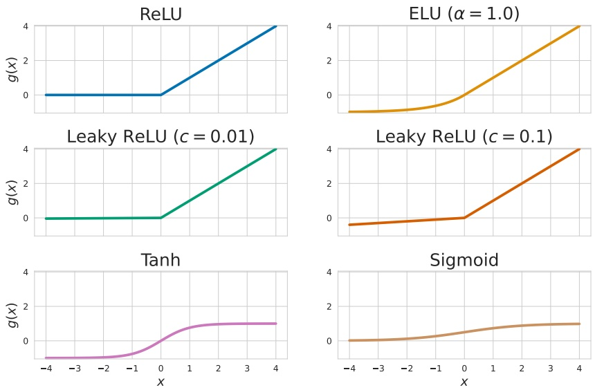

Figure 7.5: Common non-linear activation functions defined in Figure 7.4.

functions are most commonly applied to restrict the output of a neural network to be within the ranges (−1, 1) or (0, 1), respectively. If no such constraints are required, ReLU and variations of the ReLU function are commonly applied as default activation functions.

## 7.3.3 Composing a Network from Layers and Units

A feedforward neural network is composed of several layers, as visualized in Figure 7.2, with each layer consisting of many neural units, each of which represents a parameterized function (Section 7.3.1). The kth layer of a feedforward neural network receives the output of the previous layer $x _ { k - 1 } \in \mathbb { R } ^ { d _ { k } }$ <sup>−1</sup> as input and itself computes an output $x _ { k } \in \mathbb { R } ^ { d _ { k } }$ . By aggregating all neural units of the kth layer, we can write its computation as

$$
f _ {k} (x _ {k - 1}; \theta^ {k}) = g _ {k} \left(W _ {k} ^ {\top} x _ {k - 1} + b _ {k}\right)\tag{7.6}
$$

with activation function $g _ { k }$ , weight matrix $W _ { k }   \in   \mathbb { R } ^ { d _ { k - 1 } \times d _ { k } }$ , and bias vector $b _ { k } \in$ $\mathbb { R } ^ { d _ { k } }$ . The parameters of the layer k consist of the weight matrix as well as the bias vector, $\theta ^ { k }   =   W _ { k } \cup b _ { k }$ . Note that the computation of the layer can be seen as the parallel computation of its $d _ { k }$ neural units and aggregating their outputs to a vector $x _ { k }$ . The weight matrix and bias vector contain the weight vectors and bias of each of the neural units within the layer, respectively, as their column entries. Considering the calculation of a single layer in this vectorized way

<!-- page: 198 -->

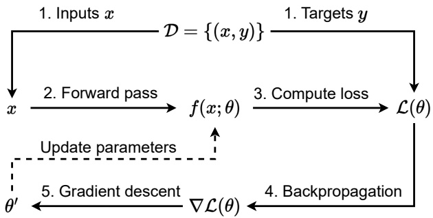

Figure 7.6: The training loop for gradient-based optimization of a neural network parameterized by $\theta ;$ 1. From a dataset $\mathcal { D }$ of input-output pairs $( x , y )$ , a subset of pairs is sampled as a batch. 2. The prediction $f ( x ; \theta )$ is computed for each input $x$ in the batch. 3. The loss function $\mathcal { L }$ is computed between the predictions $f ( x ; \theta )$ and the corresponding target values $y$ in the batch. 4. The gradients of the loss function with respect to the network parameters $\theta$ are computed using backpropagation. 5. The parameters $\theta$ are updated using a gradient-based optimizer. Then, the loop starts again with the updated parameters $\theta .$

naturally gives rise to an efficient computation and alternative interpretation of the operation of a single layer: the high-dimensional linear transformation of a single layer can also be described as a single matrix multiplication with the weight matrix, followed by a vector addition with the bias vector and lastly applying the activation function element-wise to the resulting vector.

## 7.4 Gradient-Based Optimization

The parameters θ of a neural network, sometimes referred to as weights of the network<sup>1</sup>, have to be optimized to obtain a function $f$ that accurately represents a target function $f ^ { * }$ . A neural network may have many parameters. For example, recent advances in large language models, like the GPT family of models (Brown et al. 2020), trained neural networks with many billions of parameters. To train networks with such large amounts of parameters, an efficient and automated process for the optimization of the network parameters is required. Neural networks are complex non-linear functions, and there exists

<small><span class="docvortex-page-footnote" data-block-type="page_footnote" style="color:#6b7280">1. Note that the parameters of feedforward neural networks include all weight matrices and bias vectors across all layers.</span></small>

<!-- page: 199 -->

no general closed-form solution to find their optimal parameters with respect to an optimization objective. Instead, non-convex gradient-based optimization methods can be used. These methods randomly initialize and sequentially update the parameters of a neural network to find parameters that improve the neural network under the optimization objective. In the following sections, we will explain the three key components for gradient-based optimization:

1. Loss function: an optimization objective that needs to be minimized and is defined over the network parameters θ.

2. Gradient-based optimizer: the choice of gradient-based optimization technique.

3. Backpropagation: a technique to efficiently compute gradients of the loss function with respect to the network parameters $\theta .$

The training loop of a neural network is illustrated in Figure 7.6, and the following sections will explain each of the three components in detail.

## 7.4.1 Loss Function

Our objective during the optimization is to obtain parameters $\theta ^ { * }$ such that the loss function, denoted with $\mathcal { L } ,$ is minimized:

$$
\theta^ {*} \in \underset {\theta} {\arg \min} \mathcal {L} (\theta)\tag{7.7}
$$

It is essential for this loss to be differentiable, because we need to compute gradients of the loss function to enable gradient-based optimization of the parameters $\theta .$ The choice of loss function is dependent on the type of function the neural network approximates and the available data used for the optimization.

To go back to our example of linear function approximation in Section 7.2, the network may be optimized to approximate a state-value function $\hat { V } ( s ; \theta )$ for RL. This value function should accurately approximate the true state-value function $V ^ { \pi } ( s )$ for any state s under the current policy $\pi .$ For this optimization objective, we can define the loss as the mean squared error (MSE) of our approximated state-value function and the true state-value function for a batch of B states:

$$
\mathcal {L} (\theta) = \frac {1}{B} \sum_ {k = 1} ^ {B} \left(V ^ {\pi} (s _ {k}) - \hat {V} (s _ {k}; \theta)\right) ^ {2}\tag{7.8}
$$

The used dataset consists of pairs of states and corresponding true state values, $\mathcal { D }   =   \{ ( s _ { k } , V ^ { \pi } ( s _ { k } ) ) \} _ { k = 1 } ^ { | \mathcal { D } | }$ . For the optimization, B pairs are sampled from $\mathcal { D }$ to compute the loss. Minimizing this loss will gradually update the parameters $\theta$ of our neural network, representing $\hat { V } ,$ such that it approximates the true state-value function more closely for all states in the batch. The MSE is a

<!-- page: 200 -->

commonly used loss function in a setting where pairs of inputs and continuous ground truth outputs, here states with their true state values, are available for training. This setting of machine learning, in which models are trained from data containing ground truth output labels, is referred to as supervised learning. However, note that in RL we typically do not know the true state-value function a priori. Fortunately, temporal-difference learning gives us a framework with which we can formulate a loss for our value function to approximate discounted state-value estimates using bootstrapped value estimates (Section 2.6):

$$
\mathcal {L} (\theta) = \frac {1}{B} \sum_ {i = 1} ^ {B} \left(r _ {i} + \gamma \hat {V} (s _ {i} ^ {\prime}; \theta) - \hat {V} (s _ {i}; \theta)\right) ^ {2}\tag{7.9}
$$

In this loss, we make use of a batch of experience of the agent consisting of state $s _ { z }$ reward $r ,$ and next state $s ^ { \prime }$ , respectively. Minimizing this loss will optimize our network parameters $\theta ,$ such that $\hat { V }$ will gradually provide accurate statevalue estimates. Later in Chapter $8 ,$ we will discuss details of RL using neural networks with concrete algorithms, examples, and performance comparisons.

## 7.4.2 Gradient Descent

A common optimization technique to update parameters in neural networks is gradient descent. Gradient descent sequentially updates parameters $\theta$ by following the negative gradients (hence “descent”) of the loss function with respect to the parameters for given data. This technique is similar to the gradient ascent in expected returns for policy learning we already saw in Section 6.4, with the difference that we minimize a loss function rather than maximizing expected returns. The gradient $\nabla _ { \theta } \mathcal { L } ( \theta )$ is defined as the vector of partial derivatives for each parameter $\theta _ { i } \in \theta$

$$
\nabla_ {\theta} \mathcal {L} (\theta) = \left(\frac {\partial \mathcal {L} (\theta)}{\partial \theta_ {1}}, \dots , \frac {\partial \mathcal {L} (\theta)}{\partial \theta_ {d}}\right)\tag{7.10}
$$

and can be interpreted as the vector in the parameter space that points in the direction where our loss function increases the fastest. As we want to minimize the loss function, we can follow the negative gradient to update our parameters in the direction of the steepest descent. In the simplest case of vanilla gradient descent, network parameters are updated as

$$
\theta \leftarrow \theta - \alpha \nabla_ {\theta} \mathcal {L} (\theta | \mathcal {D})\tag{7.11}
$$

<!-- page: 201 -->

with learning rate $\alpha   >   0$ typically taking on small values between $1 0 ^ { - 5 }$ and $1 0 ^ { - 2 }$ Vanilla gradient descent<sup>2</sup>computes a single gradient for the entire training data D to update the parameters. This application of gradient descent comes with two main downsides. First, the training data $\mathcal { D }$ will often not fit into memory in its entirety. This makes the computation of the gradient over the entire training data difficult. Second, computing the gradient for the entire dataset for a single update of the parameters is costly, and, hence, vanilla gradient descent is slow to converge to a local optima.

Stochastic gradient descent (SGD) addresses these difficulties by following the gradient for any individual sample d drawn from the training data:

$$
\theta \leftarrow \theta - \alpha \nabla_ {\theta} \mathcal {L} (\theta | d) | _ {d \sim \mathcal {U} (\mathcal {D})}\tag{7.12}
$$

Samples are typically drawn uniformly at random from the training data D $( \mathrm { i . e . , } d   \sim   \mathcal { U } ( \mathcal { D } ) )$ , but other sampling strategies can be used as well. SGD is significantly faster to compute as it only requires computing the gradient for a single sample from the training data, but its updates exhibit high variance due to the dependency on the sample drawn.

Mini-batch gradient descent lies in between these two extremes of vanilla and stochastic gradient descent. Instead of using the entire dataset or individual samples to compute gradients, mini-batch gradient descent uses, as the name suggests, batches of samples from the training data to compute gradients:

$$
\theta \leftarrow \theta - \alpha \nabla_ {\theta} \mathcal {L} (\theta | \mathcal {B}) \big | _ {\mathcal {B} = \{d _ {i} \sim \mathcal {U} (\mathcal {D}) \} _ {i = 1} ^ {B}}\tag{7.13}
$$

Similar to SGD, samples for the batch are typically drawn uniformly at random. The number of samples in a batch $\mathcal { B }$ used for each gradient computation, called the batch size B, is chosen as a hyperparameter and offers a trade-off between variance of gradients and computational cost. For small batch sizes, mini-batch gradient descent approaches SGD with fast computation of gradients but high variance. For larger batch sizes, mini-batch gradient descent approaches vanilla gradient descent with slower computation of gradients but lower variance of gradients and, hence, stable convergence. Common batch sizes for optimization of neural networks lie between 32 and 1,028, but the batch size should always be carefully chosen depending on the available data, computational resources, neural network architecture, and loss function.

Figure 7.7(a) provides a comparison of vanilla gradient descent, SGD, and mini-batch gradient descent with varying batch sizes for the optimization of a polynomial function. In this example, we train a function approximator

<small><span class="docvortex-page-footnote" data-block-type="page_footnote" style="color:#6b7280">2. Vanilla gradient descent is also sometimes referred to as batch gradient descent since it computes a single gradient using the entire training data as a batch.</span></small>

<!-- page: 202 -->

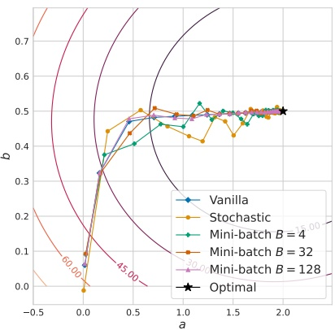

(a) Gradient descent batch

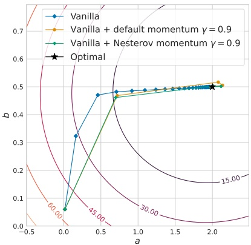

(b) Gradient descent momentum

Figure 7.7: Contour plots showing the optimization of a simple function approximation with two parameters, a and $b ,$ to fit a polynomial function with gradient-based optimization. The concentric circles represent loss values given by the mean-squared error. Each plotted dot represents the average estimate for both parameters a and $b$ after twenty gradient updates with the respective optimizer. Figure (a) compares vanilla, stochastic, and mini-batch gradient descent with various batch sizes, and (b) compares vanilla gradient descent with and without momentum.

$f ( x ; a , b )   =   a x   +   b x ^ { 2 }$ to approximate a target function $f ^ { * } ( x ; a ^ { * }   =   2 , b ^ { * }   =   0 . 5 )$ . For training, we generate a dataset $\mathcal { D }   =   \{ ( x , f ^ { * } ( x ) ) \}$ by sampling 10,000 input values uniform-randomly from [−5, 5]. For all optimization, we use $\alpha   =   5 \cdot 1 0 ^ { - 4 }$ initial parameters $a   =   b   =   0$ , and train for 500 gradient updates. The results indicate that the optimization with vanilla gradient descent is very stable, but it is important to remember that each update with vanilla gradient descent is computationally expensive, requiring on average 1.07ms per gradient computation in our experiment. In contrast, stochastic gradient descent is computationally cheap, each gradient computation only requiring 0.30ms on average, but its optimization is less stable due to the high variance of its gradients. Mini-batch gradient descent provides an appealing trade-off of both these approaches. Even with a fairly small batch size of $B   =   3 2$ , we see that mini-batch gradient descent approaches the stability of vanilla gradient descent at computational cost comparable to stochastic gradient descent, requiring only 0.32 ms per gradient computation. In the deep learning literature, mini-batch gradient descent is sometimes also referred to as just SGD due to its approach of approximating

<!-- page: 203 -->

the expected gradient of the entire training data using samples drawn from the data.

Many gradient-based optimization techniques have been proposed to extend mini-batch gradient descent. One common concept is the idea of momentum (Polyak 1964; Nesterov 1983), which computes a moving average over past gradients and adds it to the gradients to “accelerate” optimization. Figure 7.7(b) visualizes the optimization for the same polynomial function as discussed before using vanilla gradient descent with and without two types of momentum. We can see significant improvements in the efficiency of gradient descent when using momentum, with significantly fewer updates needed to obtain parameters close to the ground truth parameters. As seen by the default momentum, the speed-up of momentum is effective as long as gradients continue in a similar direction, but it also increases the risk of “overshooting” minima of the loss function. Nesterov momentum (Nesterov 1983) further improves upon this and exhibits higher stability than traditional momentum. Several more recent approaches follow the idea of dynamically adapting the learning rate during optimization, which can be considered similar to momentum. Learning rate adaptation has the main benefits of simplifying the process of choosing the initial learning rate as a hyperparameter, making the optimization less sensitive to the choice of the (initial) learning rate, and to speed-up the optimization process. All gradient-based optimizers, which are commonly used to optimize the parameters of neural networks, apply different learning rate adaptation schemes (e.g., Duchi, Hazan, and Singer 2011; Hinton, Srivastava, and Swersky 2012; Zeiler 2012; Kingma and Ba 2015). None of these optimizers consistently observed to perform better than the others, but the Adam optimizer (Kingma and Ba 2015) has emerged as a common choice and is often applied as the default optimizer in deep learning.

## 7.4.3 Backpropagation

Gradient-based optimizers require the gradients $\nabla _ { \theta } \mathcal { L } ( \theta )$ of the loss with respect to all parameters of the network. These gradients are needed to understand how we should change each parameter to minimize the loss. To compute gradients of the loss function with respect to all parameters in the network, that is, including the parameters of every layer within the network, the backpropagation algorithm (Rumelhart, Hinton, and Williams 1986) is used. This algorithm considers the fact that a neural network computes a compositional function for which the chain rule of derivatives can be applied. As a reminder, the chain rule

<small><span class="docvortex-page-footnote" data-block-type="page_footnote" style="color:#6b7280">3. For a more detailed overview of gradient-based optimization techniques, we refer the interested reader to Ruder (2016).</span></small>

<!-- page: 204 -->

states for $y   =   g ( x )$ and $z   =   f ( y )   =   f ( g ( x ) )$

$$
\nabla_ {x} z = \left(\frac {\partial y}{\partial x}\right) ^ {\top} \nabla_ {y} z\tag{7.14}
$$

with $\frac { \partial y } { \partial x }$ being the Jacobian matrix of function $g .$ In words, the chain rule allows us to compute the gradients of a compositional function with respect to the inputs of the inner function as a multiplication of the Jacobian of the inner function g and the gradient of the outer function with respect to its inputs.

As discussed in Section 7.3, feedforward neural networks are compositional functions with each layer defining its own parameterized function consisting of a non-linear activation function, matrix multiplication, and vector addition as defined in Equation 7.6. By computing the inner gradients, $\nabla _ { y } z$ for each inner operation computed throughout the network, the gradients of the parameters can be efficiently computed with respect to its parameters for some given input by traversing the network from its output layer to the input layer. Throughout the network, the chain rule is applied to propagate gradients backwards until the inputs are reached. Computing gradients with respect to every parameter of the network in a single process backwards from the last to the first layer is also referred to as a backward pass. This is in contrast to the forward pass that sequentially passes outputs of layers forward to compute the output of the neural network for some given input. All major deep learning frameworks include implementations of the backpropagation algorithm using computational techniques of automatic differentiation. Thanks to these techniques, the details of the backpropagation algorithm are hidden away and computing gradients of neural networks is as simple as calling a function in the respective framework.

## 7.5 Convolutional and Recurrent Neural Networks

Feedforward neural networks can be considered the backbone of deep learning and are universally applicable to any type of data. Many more specialized architectures exist which build on the idea of feedforward neural networks. The most common specialized architectures also found in RL and MARL algorithms are convolutional neural networks and recurrent neural networks. Both of these architectures are designed for specific types of inputs and, hence, are suitable for particular types of problems. Convolutional neural networks are specifically constructed to process spatially structured data, in particular images. Recurrent neural networks are designed to process sequences, in RL most commonly histories of observations in partially observable environments.

<!-- page: 205 -->

## 7.5.1 Learning from Images—Exploiting Spatial Relationships in Data

Feedforward neural networks can be used to process any inputs, but they are not well suited for processing spatial data such as images for two primary reasons. First, to process an image with a feedforward neural network, the image representation would need to be flattened from a tensor $x   \in   \mathbb { R } ^ { c \times h \times w }$ , where $c , h ,$ and w correspond to the number of color channels (many images are represented with three color channels corresponding to the colors red, blue, and green), height, and width of the image. The dimensionality of this flattened image vector $\tilde { x }   \in   \mathbb { R } ^ { c \cdot h \cdot w }$ corresponds to the number of pixels in the image, multiplied by the number of color channels. Processing such large input vectors with feedforward neural networks would require the first layer to contain many parameters, which makes the optimization difficult and is hence undesirable. For example, consider a feedforward neural network which processes images of $1 2 8 \times 1 2 8$ pixels with RGB colors for three color channels. Representing images of this size, which is significantly smaller than photos taken with any modern smartphone camera, corresponds to vectors of dimensionality $1 2 8 \cdot 1 2 8 \cdot 3 = 4 9 , 1 5 2$ . With a small number of neural units of 128 in the first layer, the network would have a total of 6,291,584 parameters<sup>4</sup>that need to be learned. While six million parameters is not a large neural network in comparison to large language models, it appears excessive and overly computationally expensive to require so many parameters to process even small images.<sup>5</sup>

Secondly, images contain spatial relationships with pixels close to each other, often corresponding to similar objects shown in the image. Feedforward neural networks do not consider such spatial relationships and process every input value individually.

Convolutional neural networks (CNNs) (Fukushima and Miyake 1982; Le-Cun et al. 1989) directly make use of the spatial relationships within input data such as images by processing patches of nearby pixels at a time. Small groups of parameters called filters or kernels are “slid” over the image in a convolution operation. For the convolution, each filter moves through the pixels in each row of the image and encodes all pixel values it covers at a time. For each patch of pixels the filter moves over, its parameters are multiplied with the corresponding patch of pixels of the same size in a matrix multiplication to obtain a single output value. The patch of input values involved in a single convolution are also

<small><span class="docvortex-page-footnote" data-block-type="page_footnote" style="color:#6b7280">49 152 128</span></small>

<small><span class="docvortex-page-footnote" data-block-type="page_footnote" style="color:#6b7280">4 2 16</span></small>

<small><span class="docvortex-page-footnote" data-block-type="page_footnote" style="color:#6b7280">12 12</span></small>

<small><span class="docvortex-page-footnote" data-block-type="page_footnote" style="color:#6b7280">4. The weight matrix would be a , × dimensional matrix with a total of 6,291,456 parameters, and the bias vector would contain 128 parameters.</span></small>

<small><span class="docvortex-page-footnote" data-block-type="page_footnote" style="color:#6b7280">5. To process 4K RGB images with a resolution of 3,8 0 × , 0 instead of 8 × 8 pixels, the weight matrix in the first layer of a feedforward neural network alone would contain more than 3 billion parameters.</span></small>

<!-- page: 206 -->


Figure 7.8: An illustration of a convolutional neural network with a single $3 \times 3$ kernel processing a $9 \times 9$ input. First, the kernel is applied to the image with padding one and a stride of two (kernel moving two pixels at a time) for a $5 \times 5$ output. Second, a pooling operation is applied to $2 \times 2$ groups of pixels with no padding and a stride of one for a final output of $4 \times 4$ . Note that the image is processed with only ten learned parameters (nine weights and a scalar bias).

referred to as the receptive field of the corresponding output value or neuron. Formally, the convolution of a filter with parameters $W \in \mathbb { R } ^ { d _ { w } \times d _ { w } }$ over input $x   \in   \mathbb { R } ^ { d _ { x } \times d _ { x } }$ for output $y _ { i , j } \in \mathbb { R }$ is defined as follows:

$$
y _ {i, j} = \sum_ {a = 1} ^ {d _ {w}} \sum_ {b = 1} ^ {d _ {w}} W _ {a, b} x _ {i + a - 1, j + b - 1}\tag{7.15}
$$

This operation is repeated until the filter has been moved over the entire image. Note that each filter has one parameter for each cell, and the parameters are reused in every convolution operation. This sharing of parameters across multiple computations leads to significantly fewer parameters that need to be optimized, in contrast to a fully-connected network layer, and makes use of the spatial relationship of images with patches of nearby pixels being highly correlated. Filters move across the input depending on the stride and padding. The stride determines the number of pixels the filter moves at each slide, and padding refers to an increase in the image size, typically by adding zero values around its borders. These hyperparameters can be used to influence the dimensionality of the convolution output. Following the convolution, a non-linear activation function is applied element-wise to each cell of the output matrix.

To highlight the efficiency of CNNs, consider our previous example of processing a $1 2 8 \times 1 2 8 ~ \mathrm { R G B }$ image. A CNN with sixteen filters of $5 \times 5$

<!-- page: 207 -->

dimensions has a total of 1,216 parameters<sup>6</sup>to process an image with three input channels. In contrast, a single-layered feedforward neural network with 128 hidden dimensions has over six million parameters to process the same input. This is because the number of parameters of the CNN, unlike for the feedforward neural network, is independent of the width and height of the input image since the same filters are applied across the entire image. Instead, the output dimension of a CNN depends on the dimensions of the input as well as the stride and padding. For example, the CNN with sixteen filters of $5 \times 5$ dimensions applied to a $1 2 8 \times 1 2 8 \times 3$ image with stride 2 and padding 0 results in a $6 3 \times 6 3 \times 1 6$ output.

CNNs often apply multiple such convolution operations in a sequence using varying sizes of filters. In between each convolution, it is common to additionally apply pooling operations. In these operations, patches of pixels are aggregated together using operations such as taking the maximum value within the patch, referred to as max-pooling, or taking the average. These pooling operations in between convolutions further reduce the output dimensionality throughout the convolutional neural networks and make the output of the network insensitive to small local changes in the image. This effect is desirable because the learned locally insensitive features might generalize better than features that are associated with a particular location in the image.

Figure 7.8 shows a convolutional neural network with a single kernel processing an input and applying pooling for aggregation. After processing spatial inputs, such as images, with several layers of CNNs, it is common to further process the obtained compact representations using feedforward neural networks.

## 7.5.2 Learning from Sequences with Memory

Feedforward neural networks are ill-equipped to process sequential inputs. For example in partially observable tasks, an RL agent is conditioned on its history of observations (see Section 3.4). Conditioning a feedforward neural network on such a history requires the entire sequence as input. Similar to image inputs, processing a long sequence of observations with a feedforward neural network can require many parameters. Additionally, observations within a history will likely be correlated; thus, sharing parameters to process each observation appears desirable, similarly to filters being used many times in a convolutional neural network.

6. Each kernel has 5 · 5 · 3 = 75 parameters. Across all sixteen filters, this results in 1,200 parameters in addition to the sixteen bias parameters.

<!-- page: 208 -->


Figure 7.9: An illustration of a recurrent neural network that represents a function $f$ used to process a sequence of inputs $x ^ { 1 } , x ^ { 2 } , \ldots$ At time step t, the network takes both the current input $x ^ { t }$ and the previous hidden state $h ^ { t - 1 }$ as inputs to compute the new hidden state $h ^ { t }$ . An initial hidden state $h ^ { 0 }$ is given to the model at the first step, and then the hidden state is continually updated by the recurrent neural network to process the input sequence.

Recurrent neural networks (RNNs) (Rumelhart, Hinton, and Williams 1986) are neural networks specifically designed to process sequential data. Instead of using long concatenated sequences of inputs, recurrent neural networks sequentially process inputs and additionally condition the computation at each step on a compact representation of the history of previous inputs. This compact representation, also called the hidden state of the recurrent neural network, is continually updated to encode more information as the sequence is processed and serves as a form of memory. In this way, the same neural network and computation can be applied at each time step, but its function continually adapts as the sequence is processed and the hidden state changes. Formally, the hidden state is given by the output of the network

$$
h ^ {t} = f (x ^ {t}, h ^ {t - 1}; \theta)\tag{7.16}
$$

with the initial hidden state $h ^ { 0 }$ usually being initialized as a zero-valued vector. In line with common notation in deep learning, we denote the hidden state of a recurrent neural network with h, but, highlight that elsewhere in the book h refers to the history of observations. Figure 7.9 illustrates the computational graph for a recurrent neural network processing a sequence of inputs. Some recurrent neural network architectures provide separate outputs for the updated hidden state and the main output of the network.

Optimizing recurrent neural networks over long sequences is difficult, with gradients often vanishing (becoming close to zero) or exploding (becoming very large) due to the backpropagation repeatedly multiplying gradients and Jacobians of the network parameters throughout the sequence. Various approaches have been proposed to address this challenge, including skip connections (Lin et al. 1996), which add connections between computations across multiple time

<!-- page: 209 -->

steps, and leaky units (Mozer 1991; El Hihi and Bengio 1995), which allow tuning the accumulation of previous time steps through linear self-connections. However, the most commonly used and effective recurrent neural network architectures are long short-term memory cells (LSTMs) (Hochreiter and Schmidhuber 1997) and gated recurrent units (GRUs) (Cho et al. 2014). Both approaches are based on the idea of allowing the recurrent neural network to decide when to try to remember or discard accumulated information within the hidden state.

## 7.6 Summary

In this chapter, we introduced deep learning and neural networks as a general approach to learn approximate functions. The main concepts from this chapter are the following:

For tabular value functions and policies, updates only occur for visited states and actions. However, it is infeasible to visit all states and actions many times to learn accurate estimates in complex environments with large state or action spaces. This necessitates function approximation to learn value functions and policies that generalize across states and actions. Linear function approximation approximates functions using a linear combination of features. This approach is simple but also limited in the functions it can represent and requires careful selection of features. Instead, deep learning can approximate any function with neural networks given sufficient capacity.

Feedforward neural network—also known as fully connected neural networks or multi-layer perceptrons (MLPs)—are the foundational building block of most neural networks. They are organized in layers with each layer representing a parameterized linear transformation followed by a non-linear activation function. An input is sequentially passed through the layers in the network with the input to each layer being the output of the previous layer. The output of the final layer is the output of the network.

• Neural networks are typically initialized with random parameters. To approximate a desirable function, their parameters are iteratively updated using gradient-based optimization. The objective of this optimization is to minimize a differentiable loss function. For each optimization step, the loss for a batch of inputs is computed. Then, the gradients of the loss with respect to the parameters of the neural network are computed using backpropagation. The backpropagation algorithm efficiently computes the necessary gradients by iteratively applying the chain rule of derivation. Lastly, the parameters of

<!-- page: 210 -->

the neural network are updated with a gradient-based optimizers based on the idea of gradient descent.

Convolutional neural networks are an architecture of neural networks de signed to process high-dimensional inputs with spatial structure like images. parameterized kernels are “slid” over the input in a convolutional operation to process groups of neighboring inputs together. The same learned kernels can process different parts of the input, thus sharing parameters and reducing the number of parameters in the network. Additionally, convolutional neural networks typically use pooling operations to reduce the dimensionality of the input and make the network more robust to small translations of the input. These operations are a form of inductive bias that allow convolutional neural networks to effectively learn representations of high-dimensional inputs.

• Recurrent neural networks are a family of neural networks designed to pro cess sequences of inputs. A sequence is iteratively processed by the same neural network that maintains a hidden state as a compact representation of the history of previous inputs. Before processing each sequence, the hidden state is initialized. At each step, the current hidden state and input of the sequence is fed into the network to obtain the output for the current step and a new hidden state. This process is repeated to compute the outputs for each step of the sequence. The most common recurrent neural network architectures are long short-term memory cells (LSTMs) and gated recurrent units (GRUs), which allow the network to decide when to try to remember or discard accumulated information within the hidden state.

In Chapter 8, we will build on the foundations of RL, introduced in Chapter 2, and the newly introduced ideas of deep learning. We will introduce deep RL algorithms that use neural networks to approximate value functions and policies, as well as key challenges that need to be considered when applying deep learning to RL. Chapter 9 will then extend these ideas to multi-agent RL.

<!-- page: 211 -->

<!-- page: 212 -->

## 8 Deep Reinforcement Learning

In Part I, we represented value functions with tables. After encountering a particular state, only its corresponding value estimate, as given by its entry in the table, is updated and all other value estimates remain unchanged. This inability of tabular value functions to generalize, that is, to update its value estimation for states similar but not identical to encountered states, renders tabular MARL algorithms impractical for any but simple tasks with small state and action spaces. In problems with large or continuous state spaces, encountering any state multiple times is unlikely, and, thus, generalization is essential to efficiently learn value functions and policies. Chapter 7 introduced deep learning and neural networks with techniques to optimize the parameters in neural networks. RL and MARL can leverage these powerful function approximators to represent value functions that, unlike tabular value functions, can generalize to previously unseen states.

Before we discuss how MARL algorithms can make use of neural networks (Chapter 9), this chapter introduces the underlying techniques in the context of single-agent RL. It naturally builds on the content of Chapters 2 and 7, and it aims to answer the questions of how to effectively use neural networks to approximate value functions and policies. We first describe how to use neural networks to approximate value functions. As we will see, the integration of deep learning into value functions for RL also introduces several challenges. In particular, the previously encountered moving target problem (Section 5.4.1) is further exacerbated when neural networks come into play, and neural networks tend to specialize to the most recent experiences. We will discuss these difficulties, and how we can mitigate them. Then, we will discuss a second family of RL algorithms—policy gradient algorithms—that directly learn a policy represented as a parameterized function. We will introduce the theorem underlying these algorithms, introduce fundamental policy gradient algorithms, and discuss how to efficiently train these algorithms.

<!-- page: 213 -->

## 8.1 Deep Value Function Approximation

Value functions are an essential component of most RL algorithms. This section presents fundamental ideas on how to leverage neural networks to approximate value functions. Perhaps surprisingly, introducing neural networks to represent value functions in RL introduces several challenges that did not previously occur with tabular value functions. In particular, extending common off-policy RL algorithms such as Q-learning (Section 2.6) with neural networks requires careful consideration. In this section, we piece-by-piece extend Q-learning, as introduced for tabular RL, to the commonly used deep RL algorithm known as deep Q-networks (DQN) (Mnih et al. 2015). DQN is the first and one of the most frequently applied deep RL algorithms. Moreover, DQN serves as a common building block for many single- and multi-agent RL algorithms, so we will explain all its components in detail. We start from the Q-learning algorithm we are already familiar with and present each extension with its formalization and pseudocode, and compare the resulting algorithms in a single-agent variant of the level-based foraging environment to study the impact of these extensions. To formalize the algorithms for this chapter, we assume the environment is represented by a fully observable MDP (Section 2.2). We will briefly discuss the extension to partially observable games in Section 8.3.

## 8.1.1 Deep Q-Learning—What Can Go Wrong?

In tabular Q-learning, the agent maintains an action-value function $Q$ in the form of a table. After taking action $a ^ { t }$ in state $s ^ { t }$ at time step t, the agent receives a reward $r ^ { t }$ and observes a new state $s ^ { t + 1 }$ . Using this experience, the agent can use the Q-learning update rule to update its action-value function as follows

$$
Q (s ^ {t}, a ^ {t}) \leftarrow Q (s ^ {t}, a ^ {t}) + \alpha \left(r ^ {t} + \gamma \max _ {a ^ {\prime}} Q (s ^ {t + 1}, a ^ {\prime}) - Q (s ^ {t}, a ^ {t})\right)\tag{8.1}
$$

with $\alpha   >   0$ denoting the learning rate.

How can the tabular value function of Q-learning be substituted with a neural network? In Chapter 7, we saw that in order to train a neural network, we need to define the network architecture as well as the loss function, and choose a gradient-based optimizer. The choice of an optimizer is important and may significantly impact the learning process, as we discussed in Section 7.4, but neural networks can be optimized with any gradient-based optimizer. Therefore, we focus on defining the architecture and loss function. To this end, we define a neural network $Q$ to represent the action-value function for a deep version of Qlearning, visualized in Figure 8.1. The network receives a state as its input and outputs its estimated action value for each possible action. This architecture is

<!-- page: 214 -->


Figure 8.1: The neural network architecture for action-value functions: the network receives a state as its input, and outputs action-value estimates for every possible (discrete) action.

computationally efficient by computing the action-value estimates for all actions in one forward pass through the network. However, just as tabular Q-learning, it limits deep Q-learning to environments with finite (discrete) action spaces. For the loss function, which is to be minimized by updating parameters $\theta ,$ we define the squared error between the value function estimate and the target value $y ^ { t }$ at step t using the same experience of a single transition as for tabular Q-learning:

$$
\mathcal {L} (\theta) = \left(y ^ {t} - Q (s ^ {t}, a ^ {t}; \theta)\right) ^ {2}\tag{8.2}
$$

It is important to keep in mind that state values for terminal states, after which the episode ends, are always zero. This is because the agent cannot take any further actions in terminal states and, therefore, cannot accumulate any more rewards. In tabular algorithms, we already accounted for this property by initializing the value function for all states to zero, since these values are never updated for terminal states. However, a neural network might output non-zero values for terminal states even if it was never explicitly updated for these states. To ensure that the target value does not include a non-zero value for terminal states, the target value is computed differently depending on whether $s ^ { t + 1 }$ is a terminal state or not:<sup>1</sup>

$$
y ^ {t} = \left\{ \begin{array}{l l} r ^ {t} & \text {if} s ^ {t + 1} \text {is terminal} \\ r ^ {t} + \gamma \max _ {a ^ {\prime}} Q (s ^ {t + 1}, a ^ {\prime}; \theta) & \text {otherwise} \end{array} \right.\tag{8.3}
$$

Additionally, it is important to see that the loss function defined in Equation 8.2 contains the approximate value function twice: once for the current estimate of the seen state and action, $Q ( s ^ { t } , a ^ { t } ; \theta )$ , and once in the bootstrapped target value (for non-terminal next states), ma $\mathtt { x } _ { a ^ { \prime } }   Q ( s ^ { t + 1 } , a ^ { \prime } ; \theta )$ . This is relevant

<small><span class="docvortex-page-footnote" data-block-type="page_footnote" style="color:#6b7280"><sup>t+1</sup></span></small>

<small><span class="docvortex-page-footnote" data-block-type="page_footnote" style="color:#6b7280">1. In practice, this is typically achieved by masking out the maximum action value in the next state with a value that takes on 0 if sis terminal and 1 otherwise.</span></small>

<!-- page: 215 -->

<div class="docvortex-algorithm" style="white-space: pre-wrap; font-family:monospace;">
Algorithm 10 Deep Q-learning
Initialize value network $Q$ with random parameters $\theta$
Repeat for every episode:
for time step $t=0,1,2,\ldots$ do
    Observe current state $s^t$
    With probability $\epsilon$: choose random action $a^t \in A$
    Otherwise: choose $a^t \in \arg \max_a Q(s^t, a; \theta)$
    Apply action $a^t$; observe reward $r^t$ and next state $s^{t+1}$
    if $s^{t+1}$ is terminal then
        Target $y^t \leftarrow r^t$
    else
        Target $y^t \leftarrow r^t + \gamma \max_{a'} Q(s^{t+1}, a'; \theta)$
        Loss $\mathcal{L}(\theta) \leftarrow (y^t - Q(s^t, a^t; \theta))^2$
        Update parameters $\theta$ by minimizing the loss $\mathcal{L}(\theta)$
</div>

since computing the gradients of the loss with respect to the network parameters $\theta$ using backpropagation will compute backward passes through both instances of the value function. However, in this case we want to update the value estimate for the current state-action pair $( s ^ { t } , a ^ { t } )$ , and the bootstrapped value estimate should only serve as a target value to optimize the main value estimate $Q ( s ^ { t } , a ^ { t } ; \theta )$ toward. To avoid computing gradients through the bootstrapped target value, we can stop any gradient flow backward through the target.<sup>2</sup> This detail has to be considered in all deep RL algorithms which use bootstrapping to estimate target values. Pseudocode for this algorithm with an ϵ-greedy exploration policy, which we will refer to as deep Q-learning, is shown in Algorithm 10. In the following sections and chapters, we will denote the parameters of neural networks that represent value functions with θ.

This simple extension of Q-learning suffers from two important issues. First, the moving target problem is further exacerbated by representing the value function with function approximation, since value estimates for all states and actions continually change as the value function is updated. Second, the strong correlation of consecutive samples used to update the value function leads to undesirable overfitting of the network to the most recent experiences. The

<small><span class="docvortex-page-footnote" data-block-type="page_footnote" style="color:#6b7280">2. Deep learning libraries such as PyTorch, Tensorflow, and Jax all provide functionality to restrict the gradient computation to specific components within the loss. This is an implementation detail, even though an important one, and is not essential to understand the core components within the following algorithms.</span></small>

<!-- page: 216 -->

following two sections will focus on these challenges and how to address them for deep reinforcement learning.

## 8.1.2 Moving Target Problem

In Section 5.4.1, we have already seen that the learning of value functions in RL is challenging due to non-stationarity . This non-stationarity is caused by two factors. First, the policy of the agent is changing throughout training. Second, the target estimates are computed with bootstrapped value estimates of the next state, which change as the value function is trained. This challenge, which we also refer to as the moving target problem, is further exacerbated in deep RL. In contrast to tabular value functions, value functions with function approximation, such as neural networks, generalize their value estimates across inputs. This generalization is essential in order to apply value functions to complex environments, but it also introduces a difficulty in that updating the value estimate for a single state may also change the value estimate in all other states. This can cause the bootstrapped target estimate to change significantly more rapidly than for tabular value functions, which can render optimization unstable.

This problem is particularly prominent in algorithms that combine off-policy learning<sup>3</sup> with function approximation and bootstrapped targets. The presence of this so-called deadly triad of RL (Sutton and Barto 2018; van Hasselt et al. 2018) can lead to unstable and diverging value estimates. To see why the combination of these three concepts can lead to instability and divergence during learning, we can consider the deep Q-learning algorithm in Section 8.1.1 that contains all these components. For this algorithm, we train an action-value function $Q$ represented by a neural network as a form of function approximation. To update the value function, we collect off-policy experiences, for example, using an ϵ-greedy policy. For a collected experience tuple $( s ^ { t } , a ^ { t } , r ^ { t } , s ^ { t + 1 } )$ , the bootstrapped target value is computed using max $\mathfrak { c } _ { a ^ { \prime } }   Q ( s ^ { t + 1 } , a ^ { \prime } ; \theta )$ . The subsequent update to the parameters $\theta$ of the value function might increase the value estimate for $( s ^ { t + 1 } , a ^ { \prime } )$ This increase in the target action-value estimate can be problematic, since the behavior policy might never take action $a ^ { \prime }$ in state $s ^ { t + 1 }$ . Therefore, the value estimate for this pair will only be indirectly updated through changes in $\theta ,$ which can cause increasing value estimates without any chance for correction of this potential overestimation. As a consequence, the value estimate for $( s ^ { t + 1 } , a ^ { \prime } )$ might diverge. Furthermore, this divergence can

<small><span class="docvortex-page-footnote" data-block-type="page_footnote" style="color:#6b7280">3. As a reminder, an algorithm is called off-policy when the experience used to update its policy is gathered by following a behavior policy different from the policy that is being learned.</span></small>

<!-- page: 217 -->

propagate to other value estimates that use diverging values as part of their bootstrapped targets.

It is important to see that the deadly triad requires all three components. Without function approximation, the target value estimates would never be updated and overestimated without actively visiting these states. Without bootstrapped target values, value estimates could only be diverging for state-action pairs that are never visited (due to the absence of correction), and such divergence would be without consequence for other value estimates. If we used on-policy experience samples instead of off-policy samples, the bootstrapped target values would be computed using states and actions that are also visited by the current policy, and, thus, overestimation of target values can be corrected once these states and actions are visited and their value estimates are updated.

To reduce the instability of training caused by the moving target problem and reduce the risk of diverging value estimates, we can equip the agent with an additional network. This so-called target network with parameters $\bar { \theta }$ uses the same architecture as the main value function and is initialized with the same parameters. The target network can then be used instead of the main value function to compute bootstrapped target values:

$$
y ^ {t} = \left\{ \begin{array}{l l} r ^ {t} & \text {if} s ^ {t + 1} \text {is terminal} \\ r ^ {t} + \gamma \max _ {a ^ {\prime}} \underbrace {Q (s ^ {t + 1} , a ^ {\prime} ; \bar {\theta})} _ {\text {target network}} & \text {otherwise} \end{array} \right.\tag{8.4}
$$

These target values can be used to compute the same loss of deep Q-learning (Equation 8.2).

Instead of optimizing the target network with gradient descent, the parameters of the target network are periodically updated by copying the current parameters of the main value function network to the target network, that is, ${ \bar { \theta } }   \leftarrow   \theta$ . This process ensures that the bootstrapped target values are not too far from the estimates of the main value function, but remain unchanged for a fixed number of updates and thereby increase the stability of target values. Furthermore, we reduce the risk of diverging value estimates caused by the deadly triad by decoupling the network used to compute bootstrapped value estimates for the target from the main value function. Pseudocode for deep Q-learning with target networks is given in Algorithm 11.

## 8.1.3 Breaking Correlations

The second problem of naive deep Q-learning is the correlation of consecutive experiences. In many paradigms of machine learning, it is generally assumed that the data used to train the function approximation are independent of each

<!-- page: 218 -->

<div class="docvortex-algorithm" style="white-space: pre-wrap; font-family:monospace;">
Algorithm 11 Deep Q-learning with target networks
Initialize value network $Q$ with random parameters $\theta$
Initialize target network with parameters $\bar{\theta} = \theta$
Repeat for every episode:
for time step $t = 0, 1, 2, \ldots$ do
    Observe current state $s^t$
    With probability $\epsilon$: choose random action $a^t \in A$
    Otherwise: choose $a^t \in \arg \max_a Q(s^t, a; \theta)$
    Apply action $a^t$; observe reward $r^t$ and next state $s^{t+1}$
    if $s^{t+1}$ is terminal then
        Target $y^t \leftarrow r^t$
    else
        Target $y^t \leftarrow r^t + \gamma \max_{a'} Q(s^{t+1}, a'; \bar{\theta})$
        Loss $\mathcal{L}(\theta) \leftarrow (y^t - Q(s^t, a^t; \theta))^2$
        Update parameters $\theta$ by minimizing the loss $\mathcal{L}(\theta)$
        In a set interval, update target network parameters $\bar{\theta}$
</div>

other and identically distributed, or $\mathbf { `` i . i . d . }$ data” in short. This assumption guarantees that, firstly, there are no correlations of individual samples within the training data, and secondly, that all data points are sampled from the same training distribution. Both of these components of the i.i.d. assumption are typically violated in RL. For the former, individual samples of experiences, given by tuples of state, action, reward, and next state, are clearly not independent and highly correlated. This correlation is obvious given the formalization of an environment as an MDP. The experience at time step t is directly dependent on and, therefore, not independent from the experience at time step $t - 1$ , with $s ^ { t + 1 }$ and $r ^ { t }$ being determined by the transition function conditioned on $s ^ { t }$ and $a ^ { t }$ Regarding the assumption of data points being sampled from the same training distribution, the distribution of encountered experiences in RL depends on the currently executed policy. Therefore, changes in the policy also cause changes in the distribution of experiences.

But why are we concerned about these correlations? What impact do these correlations have on the training of the agent using deep value functions? Consider the example illustrated in Figure 8.2, in which an agent controls a spaceship. For several time steps, the agent receives similar sequences of experiences in which it approaches the goal location from the right direction (Section 8.1.3). The agent sequentially updates its value function parameters

<!-- page: 219 -->


Figure 8.2: An illustration of the correlations of consecutive experiences in an environment where the agent controls a spaceship to land. In the first two episodes, the agent approaches the goal location from the right side. In the third episode, the agent has to approach the goal location from the left side and, thus, experiences very different states than in the previous episodes.

using these experiences, which may lead to the agent becoming specialized for these particular, recent experiences of approaching the goal location from the right side. Suppose that, after several such episodes, the agent has to approach the goal from the left side (Section 8.1.3), but throughout the previous updates has learned a value function that is specialized to states where the spaceship is located to the right of the goal location. This specialized value function may provide inaccurate value estimates for states where the spaceship is located to the left of the goal location and, thus, may fail to successfully land from this side. Moreover, updating the value function with the experience samples from this most recent episode might lead to the agent forgetting how to approach the goal from the right side. This phenomenon is referred to as catastrophic forgetting and is a fundamental challenge of deep learning. This challenge is further exacerbated in RL since changes in the policy will lead to changes in the data distribution encountered by the agent, and changes in the data distribution might change the optimal policy. This dependence can lead to oscillating or even diverging policies.

To address these issues, we can randomize the experience samples used to train the agent. Instead of using the sequential experiences as the agent receives them to update the value function, experience samples are collected in a so-called replay buffer D. For training of the value function, a batch of experiences B is sampled uniformly at random from the replay buffer, B ∼ U(D). This sampling has two additional benefits for the optimization of the value function: (1) experiences can be reused multiple times for training, which can improve sample efficiency, and (2) by computing the value loss over batches of experiences rather than for an individual experience sample, we can obtain a more stable gradient for the network optimization with lower variance. This effect is similar to the benefits of mini-batch gradient descent over stochastic

<!-- page: 220 -->

<div class="docvortex-algorithm" style="white-space: pre-wrap; font-family:monospace;">
Algorithm 12 Deep Q-networks (DQN)
Initialize value network $Q$ with random parameters $\theta$
Initialize target network with parameters $\bar{\theta} = \theta$
Initialize an empty replay buffer $\mathcal{D} = \{\}$
Repeat for every episode:
for time step $t = 0, 1, 2, \ldots$ do
    Observe current state $s^t$
    With probability $\epsilon$: choose random action $a^t \in A$
    Otherwise: choose $a^t \in \arg \max_a Q(s^t, a; \theta)$
    Apply action $a^t$; observe reward $r^t$ and next state $s^{t+1}$
    Store transition ($s^t, a^t, r^t, s^{t+1}$) in replay buffer $\mathcal{D}$
    Sample random mini-batch of $B$ transitions ($s^k, a^k, r^k, s^{k+1}$) from $\mathcal{D}$
    if $s^{k+1}$ is terminal then
        Targets $y^k \leftarrow r^k$
    else
        Targets $y^k \leftarrow r^k + \gamma \max_{a'} Q(s^{k+1}, a'; \bar{\theta})$
        Loss $\mathcal{L}(\theta) \leftarrow \frac{1}{B} \sum_{k=1}^{B} \left( y^k - Q(s^k, a^k; \theta) \right)^2$
        Update parameters $\theta$ by minimizing the loss $\mathcal{L}(\theta)$
        In a set interval, update target network parameters $\bar{\theta}$
</div>

gradient descent discussed in Section 7.4.2. During training, the mean squared error loss is computed over the batch and minimized to update the parameters of the value function

$$
\mathcal {L} (\theta) = \frac {1}{B} \sum_ {(s _ {k}, a _ {k}, r _ {k}, s _ {k} ^ {\prime}) \in \mathcal {B}} \left(y _ {k} - Q (s ^ {t}, a ^ {t}; \theta)\right) ^ {2}\tag{8.5}
$$

with the targets of the kth experience sample $y _ { k }$ being computed as given in Equation 8.3. Formally, the replay buffer can be denoted as a set $\mathcal { D }   =   \{ ( s ^ { t } , a ^ { t } , r ^ { t } , s ^ { t + 1 } ) \}$ of experience samples. Typically, the replay buffer is implemented with a fixed capacity as a first-in-first-out queue, that is, once the buffer is filled to its capacity with experience samples, the oldest experiences are continually replaced as new experience samples are added to the buffer. It is important to note that experiences within the buffer have been generated using the policy of the agent at earlier time steps during training. Therefore, these experiences are off-policy and, thus, a replay buffer can only be used to train off-policy RL algorithms such as algorithms based on Q-learning.

<!-- page: 221 -->


(a) Single-agent level-based foraging environment


(b) Learning curves

Figure 8.3: (a) A simplified single-agent variant of the level-based foraging environment (Figure 1.2). The agent moves within the grid-world and has to collect a single, randomly located item. (b) Learning curves for deep Qlearning, deep Q-learning with target networks, deep Q-learning with a replay buffer, and the full DQN algorithm in the single-agent level-based foraging environment. We train all algorithms for 100,000 time steps and in frequent intervals compute the average evaluation returns of the agent over ten episodes using a near-greedy policy $( \epsilon   =   0 . 0 5 )$ . Visualized learning curves and shading correspond to the mean and standard deviation across discounted evaluation returns across five runs with different random seeds. To ensure consistency, we use identical hyperparameters: discount factor $\gamma   =   0 . 9 9$ , learning rate $\alpha   =$ $3 \cdot 1 0 ^ { - 4 }$ , ϵ is decayed from 1.0 to 0.05 over half of training (50,000 time steps) and then kept constant, batch size $B   =   5 1 2$ and buffer capacity is set to 10,000 experience tuples for algorithms with a replay buffer, and target networks are updated every one hundred time steps where applied.

## 8.1.4 Putting It All Together: Deep Q-Networks

These ideas bring us to one of the first and one of the most influential deep RL algorithms: deep Q-networks (DQN) (Mnih et al. 2015). DQN extends tabular Q-learning by introducing a neural network to approximate the action-value function, as shown in Figure 8.1. To address the challenges of moving target values and correlation of consecutive samples, DQN uses a target network and replay buffer, as discussed in Sections 8.1.2 and 8.1.3. All these ideas together define the DQN algorithm, as shown in Algorithm 12. The loss function is given as in Equation 8.5 with targets computed using a target network as in Equation 8.4.

<!-- page: 222 -->

To see the impact of both the target network and replay buffer on the learning of the agent, we show the learning curves of four algorithms in the single-agent level-based foraging environment in Figure 8.3: Deep Q-learning (Algorithm 10), deep Q-learning with target networks, deep Q-learning with a replay buffer, and the full DQN algorithm with a replay buffer and target networks (Algorithm 12). In this environment, visualized in Figure 8.3(a), the agent moves within an 8 × 8 grid-world to collect a single item.<sup>4</sup> The agent and the item are randomly placed at the beginning of each episode. To collect the item, and receive a reward of +1, the agent has to move next to the item and select its collect action. For any other action, the agent receives a reward of 0. We see that training the agent with deep Q-learning leads to a slow and unstable increase in evaluation returns. Adding target networks leads to no notable improvement in performance. Training the agent with deep Q-learning and batches sampled from a replay buffer slightly increases evaluation returns in some runs, but performance remains noisy across runs. Finally, training the agent with the full DQN algorithm, that is, using target networks and a replay buffer, leads to a stable and quick increase in performance and convergence to near-optimal discounted returns.

This experiment demonstrates that, in isolation, neither the addition of target networks nor of a replay buffer are sufficient to train the agent with deep Q-learning in this environment. Adding a target network reduces stability issues caused by the moving target problem, but the agent still receives highly correlated samples and is unable to train its value function to generalize over all initial positions of the agent and item, which are randomized at the beginning of each episode. Training the agent with a replay buffer addresses the issue of correlated experiences, but without target networks suffers from unstable optimization due to the moving target problem. Only the combination of both of these ideas in the DQN algorithm leads to a stable learning process.

## 8.1.5 Beyond Deep Q-Networks

Despite the improved stability obtained by using target networks and a replay buffer, the DQN algorithm still suffers from several issues. Similar to the underlying tabular Q-learning algorithm, DQN is prone to overestimation of action values (Thrun and Schwartz 1993; van Hasselt 2010; van Hasselt, Guez, and Silver 2016). One key reason for the overestimation is that the target computation uses the maximum action-value estimate over all actions in the

<small><span class="docvortex-page-footnote" data-block-type="page_footnote" style="color:#6b7280">4. In contrast to the multi-agent level-based foraging environment introduced in Figure 1.2, the agent and item have no levels and collection will always be successful as long as the agent is located next to the item.</span></small>

<!-- page: 223 -->

next state, max $\mathfrak { i } _ { a ^ { \prime } }   Q ( s ^ { t + 1 } , a ^ { \prime } ; \bar { \theta } )$ . This maximum value estimate is likely to select an action value that is overestimated. By decoupling the selection of the action from the estimation of its value, the overestimation can be reduced. For DQN, this can be achieved by computing the target value with the greedy action in the next state being determined by the main value function, arg ma $\mathtt { x } _ { a ^ { \prime } }   Q ( s ^ { t + 1 } , a ^ { \prime } ; \theta )$ and using the target network, $Q ( s ^ { t + 1 } , \cdot ; \bar { \theta } )$ , to evaluate its value:

$$
y ^ {t} = \left\{ \begin{array}{l l} r ^ {t} & \text {if} s ^ {t + 1} \text {is terminal} \\ r ^ {t} + \gamma Q (s ^ {t + 1}, \arg \max _ {a ^ {\prime}} Q (s ^ {t + 1}, a ^ {\prime}; \theta); \bar {\theta}) & \text {otherwise} \end{array} \right.\tag{8.6}
$$

Decoupling the greedy action selection and the value estimation in this way reduces the risk of overestimation, since the main value network and target network are unlikely to overestimate the action value of the same actions. For example, even if the main value network overestimates the value for action $a ^ { \prime }$ and, thus, identifies this action as the greedy action, the target value will not be overestimated unless the target network overestimates the action value for action $a ^ { \prime }$ as well. Likewise, if the target network overestimates the value of action $a ^ { \prime }$ , this overestimation does not affect the target value unless the main value network also identifies action $a ^ { \prime }$ as the greedy action. By substituting the previous target computation from Equation 8.4 in Algorithm 12 with this new target, we obtain the double deep Q-networks (DDQN) algorithm (van Hasselt, Guez, and Silver 2016). Given its simplicity and effectiveness, the DDQN target computation is commonly found in many deep RL and MARL algorithms that are based on DQN.

Besides DDQN, many extensions to the original DQN algorithm have been proposed to improve its performance and stability. Schaul et al. (2016) argue that not all experiences in the replay buffer are equally important. Therefore, instead of sampling experiences uniform-randomly from the replay buffer, they propose to prioritize experiences with larger temporal-difference errors during the sampling process. Fortunato et al. (2018) propose to add parameterized and learned noise to the weights of the neural network to encourage exploration. Wang et al. (2016) show that decoupling the action-value function into a statevalue function and an advantage function can simplify the learning process and improve generalization of action-value estimates. Instead of learning a single point estimate for each action value, Bellemare, Dabney, and Munos (2017) propose to learn a distribution over possible values for each action. By combining many of these extensions, we obtain a more advanced version of the DQN algorithm, called Rainbow, which has been shown to exhibit significantly higher performance than DQN across Atari games (Hessel et al. 2018).

<!-- page: 224 -->

## 8.2 Policy Gradient Algorithms

So far in this chapter, we have discussed value-based RL algorithms. These algorithms learn a parameterized value function, represented by a neural network, and the agent follows a policy that is directly derived from this value function. As we will see, it can be desirable to directly learn a policy as a separate parameterized function. Such a parameterized policy can be represented by any function approximation technique, most commonly using linear function approximation (see Section 7.2) or deep learning. In the RL literature, these algorithms are referred to as policy gradient algorithms because they compute gradients with respect to the parameters of their policy to update the learned policy. In Section 6.4, we have already seen simple parameterized policies for MARL that are updated using gradient-based techniques. In this section, we will discuss more advanced policy gradient algorithms for single-agent RL that make use of neural networks to represent the policy.

## 8.2.1 Advantages of Learning a Policy

Directly representing the policy of an RL agent has two key advantages. First, in environments with discrete actions, a parameterized policy can represent any probabilistic policy, which leads to significantly more flexibility in its action selection compared to value-based RL algorithms. A value-based RL agent following an ϵ-greedy policy<sup>5</sup>is more restricted in its policy representation depending on the current value of ϵ and its greedy action. For example, assume an action-value function where the first action has the largest value estimate in a given state. The ϵ-greedy policies derived from this action-value function are limited to selecting the greedy action $a _ { 1 }$ with probability $\begin{array} { r } { 1 - \epsilon + \frac { \epsilon } { | A | } } \end{array}$ and $\frac { \epsilon } { | A | }$ for all other actions. Figure 8.4(a) visualizes these ϵ-greedy policies for varying values of ϵ. In contrast, a policy gradient algorithm learns a parameterized policy that can represent arbitrary policies (Figure 8.4(b)).

This expressiveness can be important in partially observable and multi-agent games, where the only optimal policy might be probabilistic. For example, in the game of Rock-Paper-Scissors, the unique Nash equilibrium (and the minimax solution) is for both agents to choose each of their three actions with uniform probability (see Sections 4.3 and 4.4 for a refresher on these solution

<small><span class="docvortex-page-footnote" data-block-type="page_footnote" style="color:#6b7280">5. We note that there are other policy representations for value-based RL algorithms than ϵ-greedy policies. For example, agents can follow a Boltzmann policy, which is similar to a softmax policy over the action-value estimates with a decaying temperature parameter, or agents can follow a deterministic exploration policy given with upper confidence bounds (UCB) from the bandit literature. However, all these policies of value-based algorithms are applied for exploration and converge to a deterministic policy for evaluation.</span></small>

<!-- page: 225 -->


(a) ϵ-greedy policies


(b) Probabilistic policies

Figure 8.4: An illustration of the varying flexibility of (a) ϵ-greedy policies and (b) softmax policies (Equation 8.7) for a task with three discrete actions.

concepts). An ϵ-greedy policy would only be able to represent the equilibrium for $\epsilon   =   1$ , but typically we want to decay ϵ throughout training to converge to the greedy policy. This would prevent the agents from being able to represent the equilibrium policy in this game. In contrast, a parameterized probabilistic policy can always be used to represent the policy with uniform action probabilities.

Second, by representing a policy as a separate learnable function, we can represent policies for continuous action spaces. In environments with continuous actions, an agent selects a single or several continuous values (typically within a certain interval) as its actions. For example, the agent might control (real or simulated) robots and vehicles, with continuous actions corresponding to the amount of torque applied by an actuator, rotational angles of a steering wheel, or the force applied to a brake pedal. All these actions are most naturally represented by continuous actions within a predefined interval of possible values. The value-based RL algorithms introduced in Section 8.1 are not applicable to such settings, because their neural network architecture has one output value for every possible (discrete) action corresponding to the action-value estimate of that particular action. However, there are an infinite number of continuous actions, and, thus, the same architecture cannot be applied. In contrast, we can learn parameterized policies over continuous actions. For example, we can represent a parameterized policy over continuous actions with a Gaussian distribution, in which the mean $\mu$ and standard deviation $\sigma$ of a continuous action are computed by parameterized functions. In this book, we focus on policy gradient algorithms for discrete action spaces, which are commonly used in the MARL literature.

To represent a probabilistic policy for discrete action spaces using neural networks, we can use an identical architecture as for action-value functions

<!-- page: 226 -->

(Figure 8.1). The policy network receives a state as input and outputs a scalar output for every action, $l ( s , a )$ , to represent the preference of the policy to select action a in state s. These preferences are transformed into a probability distribu tion using the softmax function, defined as the exponential of the preferences divided by the sum of the exponentials of all preferences:

$$
\pi (a \mid s; \phi) = \frac {e ^ {l (s , a ; \phi)}}{\sum_ {a ^ {\prime} \in A} e ^ {l (s , a ^ {\prime} ; \phi)}}\tag{8.7}
$$

In the remainder of this book, we will always denote the parameters of a parameterized value function with θ and denote the parameters of a parameterized policy with $\phi .$

## 8.2.2 Policy Gradient Theorem

To train a parameterized policy for policy gradient RL algorithms, we want to be able to use the same gradient-based optimization techniques introduced in Section 7.4. For gradient-based optimization, we require the representation of the policy to be differentiable. Besides a differentiable function, we need to specify the loss function to compute gradients to update the parameters of the policy. Generally, minimizing the loss function should correspond to increasing the “quality” of the policy. But what constitutes a “good” policy? One sensible metric for the quality of a policy in episodic environments is expected episodic returns (Section 2.3). The expected returns in any given state under a given policy are represented by the value of the policy for that particular state, $V ^ { \pi } ( s )$ or the action value $Q ^ { \pi } ( s , a )$ . However, optimizing the policy to maximize such values can be challenging since changes of the policy affect not just the action selection, and thus the rewards received by the agent, but also the distribution of states encountered by the agent. The action selection and changes in expected returns can be captured by the returns of experienced episodes, but the state distribution directly depends on the transition dynamics of the environment, which is generally assumed to be unknown.

The policy gradient theorem (Sutton and Barto 2018) formulates a solution to these challenges and provides a theoretically founded expression for the gradient of the performance of a parameterized policy with respect to the parameters of the policy. The policy gradient for episodic environments is given by

$$
\nabla_ {\phi} J (\phi) \propto \sum_ {s \in S} \operatorname * {P r} (s \mid \pi) \sum_ {a \in A} Q ^ {\pi} (s, a) \nabla_ {\phi} \pi (a \mid s; \phi)\tag{8.8}
$$

where J represents the objective function we aim to maximize. This function is defined over the parameters $\phi$ of parameterized policy $\pi ,$ and measures the quality of the policy as given by the values $Q ^ { \pi } ( s , a )$ under policy $\pi$ for actions

<!-- page: 227 -->

and states under their respective probabilities. The probabilities of actions are given by the policy $\pi ,$ and the probability of being in state s at any time step while following policy $\pi$ is given by the state distribution $\operatorname* { P r } ( s   \mid   \pi )$ , also called the on-policy distribution of policy $\pi .$ . To derive this distribution, we first define the probability of being in state s at time step t when following policy π:

$$
\Pr (s ^ {t} = s \mid \pi) = \left\{ \begin{array}{l l} \mu (s) & \text {if} t = 0 \\ \sum_ {s ^ {\prime}} \Pr (s ^ {t - 1} = s ^ {\prime} \mid \pi) \sum_ {a} \pi (a \mid s ^ {\prime}) \mathcal {T} (s \mid s ^ {\prime}, a) & \text {if} t > 0 \end{array} \right.
$$

Based on these probabilities, we can define a quantity $\rho$ that can be thought of as the time steps policy $\pi$ is expected to spend in state s:

$$
\begin{array}{l} \rho (s \mid \pi) = \sum_ {t = 0} ^ {\infty} \gamma^ {t} \mathrm{Pr} (s ^ {t} = s \mid \pi) \\ \qquad = \mu (s) + \sum_ {t = 1} ^ {\infty} \gamma^ {t} \sum_ {s ^ {\prime}} \mathrm{Pr} (s ^ {t - 1} = s ^ {\prime} \mid \pi) \sum_ {a} \pi (a \mid s ^ {\prime}) \mathcal {T} (s \mid s ^ {\prime}, a) \\ \qquad = \mu (s) + \gamma \sum_ {s ^ {\prime}} \rho (s ^ {\prime} \mid \pi) \sum_ {a} \pi (a \mid s ^ {\prime}) \mathcal {T} (s \mid s ^ {\prime}, a) \end{array}
$$

The discount factor $\gamma$ is used in $\rho$ following the interpretation that the environment terminates at any time step with a probability of $( 1 - \gamma )$ (as discussed in Section 2.3). Finally, we obtain the state distribution of policy $\pi$ by normalizing the quantity $\rho$ over all states:

$$
\Pr (s \mid \pi) = \frac {\rho (s \mid \pi)}{\sum_ {s ^ {\prime}} \rho (s ^ {\prime} \mid \pi)}
$$

As we can see, the policy gradient relies on state probabilities under the policy $\pi$ Obtaining these probabilities for all states is costly, but we can approximate them by using policy $\pi$ to interact with the environment and, thereby, sampling states corresponding to their probability under policy $\pi .$ In this way, the policy gradient does not depend on unknown information about the environment, such as the transition function and reward function, so we can use it in RL where we typically assume these functions to be unknown.

We note that the policy gradient theorem assumes that the state distribution and action values are given under the currently optimized policy $\pi .$ To make this assumption more apparent, we can write the policy gradient as an expectation with respect to the state distribution $\operatorname* { P r } ( s   \mid   \pi )$ under the current policy and the

<!-- page: 228 -->

probability of actions being selected by the policy:

$$
\nabla_ {\phi} J (\phi) \propto \sum_ {s \in S} \operatorname * {P r} (s \mid \pi) \sum_ {a \in A} Q ^ {\pi} (s, a) \nabla_ {\phi} \pi (a \mid s; \phi)\tag{8.9}
$$

$$
= \mathbb {E} _ {s \sim \mathrm{Pr} (\cdot | \pi)} \left[ \sum_ {a \in A} Q ^ {\pi} (s, a) \nabla_ {\phi} \pi (a \mid s; \phi) \right]\tag{8.10}
$$

$$
= \mathbb {E} _ {s \sim \operatorname * {P r} (\cdot | \pi)} \left[ \sum_ {a \in A} \pi (a \mid s; \phi) Q ^ {\pi} (s, a) \frac {\nabla_ {\phi} \pi (a \mid s ; \phi)}{\pi (a \mid s ; \phi)} \right]\tag{8.11}
$$

$$
= \mathbb {E} _ {s \sim \operatorname * {P r} (\cdot | \pi), a \sim \pi (\cdot | s; \phi)} \left[ Q ^ {\pi} (s, a) \frac {\nabla_ {\phi} \pi (a \mid s ; \phi)}{\pi (a \mid s ; \phi)} \right]\tag{8.12}
$$

$$
= \mathbb {E} _ {s \sim \operatorname * {P r} (\cdot | \pi), a \sim \pi (\cdot | s; \phi)} \left[ Q ^ {\pi} (s, a) \nabla_ {\phi} \log \pi (a \mid s; \phi) \right]\tag{8.13}
$$

We denote the natural logarithm with log unless stated otherwise. We can see that the state distribution and action selection are both induced by the policy and, thus, fall within the expectation in Equations 8.10 and 8.12, respectively. In the end, we obtain a simple expression (Equation 8.13) within the expectation under the current policy to express the gradients of the policy parameters toward policy improvement. This expectation also clearly illustrates the restriction that follows from the policy gradient theorem: the optimization of the parameterized policy is limited to on-policy data, that is, the data used to optimize $\pi$ is generated by the policy $\pi$ itself (Section 2.6). Therefore, data collected by interacting with the environment using any different policy $\pi ^ { \prime }$ , in particular also including previous policies obtained during the training of $\pi ,$ can not be used to update $\pi$ following the policy gradient theorem. The application of a replay buffer, as seen in Section 8.1.3, would constitute such a violation of the assumption, because it contains experiences generated by “older and outdated” versions of our currently optimized policy. Therefore, a replay buffer cannot be used to update a policy following the policy gradient theorem. Furthermore, we have to approximate the expected returns under our current policy denoted with $Q ^ { \pi }$ . Most algorithms that train an action-value function, such as DQN and other algorithms based on the classical Q-learning algorithm, do not satisfy this requirement. Instead, they directly approximate the optimal value function, that is, the expected returns under the optimal policy, by following the Bellman optimality equation (Section 2.6).

Looking at Equation 8.12 of the policy gradient theorem further provides an intuitive interpretation for policy improvement:

$$
\nabla_ {\phi} J (\phi) = \mathbb {E} _ {s \sim \operatorname * {P r} (\cdot | \pi), a \sim \pi (\cdot | s; \phi)} \left[ Q ^ {\pi} (s, a) \frac {\nabla_ {\phi} \pi (a \mid s ; \phi)}{\pi (a \mid s ; \phi)} \right]\tag{8.14}
$$

<!-- page: 229 -->

The numerator of the fraction within the expression, $\nabla _ { \phi } \pi ( a   |   s ; \phi )$ , represents the gradient of the policy pointing in the direction in parameter space that most increases the probability of repeating action $a$ on future visits to state s. This gradient is weighted by the quality of the action $a$ in state s as given by the value or expected returns of the policy $Q ^ { \pi } ( s , a )$ . This weighting ensures that the policy optimizes its parameters such that actions with higher expected returns become more probable than actions with lower expected returns. Lastly, the denominator of the fraction, π(a | s; ϕ), can be thought of as a normalizing factor to correct for the data distribution induced by the policy. The policy π might take some actions with significantly higher probabilities than others, and, hence, more updates might be done to the policy parameters to increase the probability of more likely actions. To account for this factor, the policy gradient needs to be normalized by the inverse of the action probability under the policy.

## 8.2.3 REINFORCE: Monte Carlo Policy Gradient

The policy gradient theorem defines the gradient to update a parameterized policy to gradually increase its expected returns. To use the theorem to compute gradients and update the parameters of the policy, we need to either approximate the derived expectation (Equation 8.13) or obtain samples from it. Monte Carlo estimation is one possible sampling method, which uses on-policy samples of episodic returns to approximate the expected returns of the policy. By instantiating the expected returns in the policy gradient theorem with Monte Carlo samples, we obtain the REINFORCE algorithm (Williams 1992) that minimizes the following loss for the episodic history $\{ s ^ { 0 } , a ^ { 0 } , r ^ { 0 } , . . . , s ^ { T - 1 } , a ^ { T - 1 } , r ^ { T - 1 } , s ^ { T } \}$

$$
\mathcal {L} (\phi) = - \frac {1}{T} \sum_ {t = 0} ^ {T - 1} \left(\sum_ {\tau = t} ^ {T - 1} \gamma^ {\tau - t} r ^ {\tau}\right) \log \pi (a ^ {t} \mid s ^ {t}; \phi)\tag{8.15}
$$

$$
= - \frac {1}{T} \sum_ {t = 0} ^ {T - 1} \left(\sum_ {\tau = t} ^ {T - 1} \gamma^ {\tau - t} \mathcal {R} (s ^ {\tau}, a ^ {\tau}, s ^ {\tau + 1})\right) \log \pi (a ^ {t} \mid s ^ {t}; \phi)\tag{8.16}
$$

Given that the policy gradient theorem provides a gradient in the direction of policies with higher expected returns and we want to define a to-be-minimized loss, this loss corresponds to the negative policy gradient (Equation 8.13) with Monte Carlo estimates of the expected returns under the current policy π. During training, the REINFORCE algorithm first collects an episodic history by using its current policy $\pi .$ After an episode has terminated, the return estimate and the policy gradient are computed as given by Equation 8.16. We provide pseudocode for the REINFORCE algorithm in Algorithm 13.

Unfortunately, Monte Carlo return estimates have high variance, which leads to high variance of gradients and unstable training in REINFORCE. This high

<!-- page: 230 -->

<div class="docvortex-algorithm" style="white-space: pre-wrap; font-family:monospace;">
Algorithm 13 REINFORCE
Initialize policy network $\pi$ with random parameters $\phi$
Repeat for every episode:
for time step $t = 0, 1, 2, \ldots, T - 1$ do
    Observe current state $s^t$
    Sample action $a^t \sim \pi(\cdot | s^t; \phi)$
    Apply action $a^t$; observe reward $r^t$ and next state $s^{t+1}$
Loss $\mathcal{L}(\phi) \leftarrow -\frac{1}{T} \sum_{t=0}^{T-1} \left( \sum_{\tau=t}^{T-1} \gamma^{\tau-t} r^\tau \right) \log \pi(a^t | s^t; \phi)$
Update parameters $\phi$ by minimizing the loss $\mathcal{L}(\phi)$
</div>

variance arises due to the returns of each episode depending on all states and actions encountered within the episode. Both states and actions are samples of a probabilistic transition function and policy, respectively. To reduce the variance of return estimates, we can subtract a baseline from the return estimates. For any baseline $b ( s )$ defined over the state $s ,$ the gradient derived from the policy gradient theorem (Equation 8.13) remains unchanged in expectation. Therefore, even when subtracting a baseline, we still optimize the parameters of the policy to maximize its expected returns, but we reduce the variance of the computed gradients. For the following derivation, we will use $\mathbb { E } _ { \pi } [ \ldots ]$ to abbreviate the expectation over the state distribution and action selection distribution under the current policy $\pi$ as shown in Equations 8.10 to 8.13. Note that the expectation in Equations 8.18 and 8.19 is only over the state distribution, $\mathbb { E } _ { s \sim \operatorname* { P r } ( \cdot | \pi ) } [ \dots ]$ whereas for latter equations the expectation is over both the state and action selection distributions, $\mathbb { E } _ { s \sim \operatorname* { P r } ( \cdot | \pi ) , a \sim \pi ( \cdot | s ; \phi ) } [ \cdots ]$ . To see that the policy gradient remains unchanged, we can rewrite the policy gradient theorem as follows:

$$
\nabla_ {\phi} J (\phi) \propto \sum_ {s \in S} \operatorname * {P r} (s \mid \pi) \sum_ {a \in A} (Q ^ {\pi} (s, a) - b (s)) \nabla_ {\phi} \pi (a \mid s; \phi)\tag{8.17}
$$

$$
= \mathbb {E} _ {\pi} \left[ \sum_ {a \in A} (Q ^ {\pi} (s, a) - b (s)) \nabla_ {\phi} \pi (a \mid s; \phi) \right]\tag{8.18}
$$

$$
= \mathbb {E} _ {\pi} \left[ \sum_ {a \in A} \pi (a \mid s; \phi) \left(Q ^ {\pi} (s, a) - b (s)\right) \frac {\nabla_ {\phi} \pi (a \mid s ; \phi)}{\pi (a \mid s ; \phi)} \right]\tag{8.19}
$$

$$
= \mathbb {E} _ {\pi} \left[ (Q ^ {\pi} (s, a) - b (s)) \frac {\nabla_ {\phi} \pi (a \mid s ; \phi)}{\pi (a \mid s ; \phi)} \right]\tag{8.20}
$$

$$
= \mathbb {E} _ {\pi} \left[ (Q ^ {\pi} (s, a) - b (s)) \nabla_ {\phi} \log \pi (a \mid s; \phi) \right]\tag{8.21}
$$

$$
= \mathbb {E} _ {\pi} \left[ Q ^ {\pi} (s, a) \nabla_ {\phi} \log \pi (a \mid s; \phi) \right] - \mathbb {E} _ {\pi} \left[ b (s) \nabla_ {\phi} \log \pi (a \mid s; \phi) \right]\tag{8.22}
$$

<!-- page: 231 -->

$$
= \mathbb {E} _ {\pi} \left[ Q ^ {\pi} (s, a) \nabla_ {\phi} \log \pi (a \mid s; \phi) \right] - \sum_ {s \in S} \Pr (s \mid \pi) \sum_ {a \in A} b (s) \nabla_ {\phi} \pi (a \mid s; \phi)\tag{8.23}
$$

$$
= \mathbb {E} _ {\pi} \left[ Q ^ {\pi} (s, a) \nabla_ {\phi} \log \pi (a \mid s; \phi) \right] - \sum_ {s \in S} \operatorname * {P r} (s \mid \pi) b (s) \nabla_ {\phi} \sum_ {a \in A} \pi (a \mid s; \phi)\tag{8.24}
$$

$$
= \mathbb {E} _ {\pi} \left[ Q ^ {\pi} (s, a) \nabla_ {\phi} \log \pi (a \mid s; \phi) \right] - \sum_ {s \in S} \Pr (s \mid \pi) b (s) \nabla_ {\phi} 1\tag{8.25}
$$

$$
= \mathbb {E} _ {\pi} \left[ Q ^ {\pi} (s, a) \nabla_ {\phi} \log \pi (a \mid s; \phi) \right] - \sum_ {s \in S} \operatorname * {P r} (s \mid \pi) b (s) 0\tag{8.26}
$$

$$
= \mathbb {E} _ {\pi} \left[ Q ^ {\pi} (s, a) \nabla_ {\phi} \log \pi (a \mid s; \phi) \right]\tag{8.27}
$$

A state-value function V(s) is a common choice for a baseline. We can train a state-value function to approximate the episodic returns by minimizing the following loss:

$$
\mathcal {L} (\theta) = \frac {1}{T} \sum_ {t = 0} ^ {T - 1} \left(u ^ {t} - V (s ^ {t}; \theta)\right) ^ {2}\tag{8.28}
$$

As a reminder, episodic returns $u ^ { t }$ denote the discounted cumulative sum of rewards from time step t until the end of the episode (Equation 2.8, page 26). Similarly, the REINFORCE policy loss with a state-value function as a baseline can be written as:

$$
\mathcal {L} (\phi) = - \frac {1}{T} \sum_ {t = 0} ^ {T - 1} \left(u ^ {t} - V (s ^ {t}; \theta)\right) \log \pi (a ^ {t} \mid s ^ {t}; \phi)\tag{8.29}
$$

## 8.2.4 Actor-Critic Algorithms

Actor-critic algorithms are a family of policy gradient algorithms that train a parameterized policy, called the actor, and a value function, called the critic, alongside each other. As for REINFORCE, the actor is optimized using gradient estimates derived from the policy gradient theorem. However, in contrast to REINFORCE (with or without a baseline), actor-critic algorithms use the critic to compute bootstrapped return estimates. Using bootstrapped value estimates to optimize policy gradient algorithms has two primary benefits.

First, bootstrapped return estimates allow us, as seen with temporal-difference algorithms (Section 2.6), to estimate episodic returns just from the experience of a single step. Using bootstrapped return estimates of a state-value function

<!-- page: 232 -->

V, we can estimate episodic returns as follows:

(8.30)

$$
= \mathbb {E} _ {s ^ {t} \sim \mathrm{Pr} (\cdot | \pi), a ^ {t} \sim \pi (\cdot | s ^ {t}), s ^ {t + 1} \sim \mathcal {T} (\cdot | s ^ {t}, a ^ {t})} \left[ \mathcal {R} (s ^ {t}, a ^ {t}, s ^ {t + 1}) + \gamma u ^ {t + 1} \mid s ^ {t} \right]\tag{8.31}
$$

$$
= \mathbb {E} _ {s ^ {t} \sim \mathrm{Pr} (\cdot | \pi), a ^ {t} \sim \pi (\cdot | s ^ {t}), s ^ {t + 1} \sim \mathcal {T} (\cdot | s ^ {t}, a ^ {t})} \left[ \mathcal {R} (s ^ {t}, a ^ {t}, s ^ {t + 1}) + \gamma V (s ^ {t + 1}) \mid s ^ {t} \right]\tag{8.32}
$$

By using bootstrapped return estimates, actor-critic algorithms are able to update the policy (and critic) from the experience of a single time step, irrespective of the following history of the episode. Particularly in environments with long episodes, this allows significantly more frequent updates and, thereby, often more efficient training than with REINFORCE, which only updates at the end of each episode.

Second, bootstrapped return estimates exhibit lower variance compared to the Monte Carlo estimates of episodic returns used in REINFORCE. Variance is reduced because bootstrapped return estimates only depend on the current state, received reward, and next state, and unlike episodic returns do not depend on the entire history of the episode. However, this reduction in variance comes at a price of introduced bias, because the used value function might not (yet) approximate the true expected returns of states. In practice, we find that the trade-off of bias for lower variance often improves training stability. Moreover, N-step return estimates can be used. Instead of directly computing a value estimate of the next state, N-step return estimates aggregate the received rewards of N consecutive steps before computing a value estimate of the following state:

$$
\begin{array}{c} \mathbb {E} _ {s ^ {t} \sim \operatorname * {P r} (\cdot | \pi)} \left[ u ^ {t} \mid s ^ {t} \right] = \mathbb {E} _ {s ^ {t} \sim \operatorname * {P r} (\cdot | \pi), a ^ {t} \sim \pi (\cdot | s ^ {t}), s ^ {t + \tau + 1} \sim \mathcal {T} (\cdot | s ^ {t + \tau}, a ^ {t + \tau})} \Bigg [ \\ \left(\sum_ {\tau = 0} ^ {N - 1} \gamma^ {\tau} \mathcal {R} (s ^ {t + \tau}, a ^ {t + \tau}, s ^ {t + \tau + 1})\right) + \gamma^ {N} V (s ^ {t + N}) \mid s ^ {t} \Bigg ] \end{array}\tag{8.33}
$$

For N = T, with T being the episode length, the computed return estimate corresponds to the Monte Carlo episodic returns with no bootstrapped value estimates, as used in REINFORCE. These return estimates have high variance but are unbiased. For N = 1, we obtain one-step bootstrapped return estimates, as given in Equation 8.32, with low variance and high bias. Using the hyperparameter of N allows us to choose between bias and variance of return estimates. Figure 8.5 illustrates this trade-off of N-step return estimates at the example of an actor-critic algorithm. We train a policy and state-value function using the A2C algorithm with N-step returns (detailed in Section 8.2.5) in a single-agent level-based foraging environment (Figure 8.3(a), page 192). After training with $N   =   5$ , we collect 10,000 episodes with the trained policy and compute the bias and variance of N-step return estimates with $N   \in   [ 1 , 1 0 ]$ and Monte Carlo

<!-- page: 233 -->


Figure 8.5: The variance and bias of N-step return estimates for $N   \in   \{ 1 , . . . , 1 0 \}$ and Monte Carlo returns for a state-value function trained with A2C for 100,000 time steps in a single-agent level-based foraging environment visualized in Figure 8.3(a). We use N-step return estimates with N = 5 during training.

return estimates using the trained critic and dataset of episodes. As expected, the variance of the N-step return estimates increases with increasing N and Monte Carlo returns exhibit the highest variance. In contrast, the bias gradually decreases with increasing N close to the level of Monte Carlo returns, which are unbiased. In practice, N-step returns are commonly applied for small N, such as N = 5 or $N   =   1 0$ , to obtain return estimates with fairly low bias and variance.

For notational brevity, we will write pseudocode and equations using onestep bootstrapped return estimates, but note that N-step return estimates can be applied to substitute any of these value estimates. In the following subsections, we will introduce two actor-critic algorithms: advantage actor-critic (A2C) and proximal policy optimization (PPO).

## 8.2.5 A2C: Advantage Actor-Critic

Advantage actor-critic $( \mathrm { A 2 C } ) ^ { 6 }$ (Mnih et al. 2016) is a foundational actor-critic algorithm that, as the name suggests, computes estimates of the advantage of a policy to guide the policy gradients. The advantage for a state s and action a is

<small><span class="docvortex-page-footnote" data-block-type="page_footnote" style="color:#6b7280">6. Mnih et al. (2016) originally proposed the asynchronous advantage actor-critic (A3C) algorithm, which uses asynchronous threads to collect experience from the environments. For simplicity, and because in practice it often does not make a difference, we avoid the asynchronous aspect of this algorithm and introduce a simplified version of its synchronous implementation (A2C). We will further discuss asynchronous and synchronous parallelization of training in Section 8.2.8.</span></small>

<!-- page: 234 -->

given by

$$
A d v ^ {\pi} (s, a) = Q ^ {\pi} (s, a) - V ^ {\pi} (s)\tag{8.34}
$$

with $Q ^ { \pi }$ and $V ^ { \pi }$ representing action-value functions and state-value functions with respect to a policy $\pi ,$ respectively. For the policy $\pi ,$ the action value $Q ^ { \pi } ( s , a )$ represents the expected return of $\pi$ when first applying action $a$ in state s and afterwards following $\pi .$ In contrast, the state value $V ^ { \pi } ( s )$ represents the expected return when following the policy $\pi$ already in state s rather than taking a specific predetermined action. The advantage can therefore be understood as quantifying how much higher the expected returns are when applying the specific action $a$ compared to following the policy $\pi$ in state s. The advantage takes on positive values whenever the chosen action $a$ achieves higher expected return than the current policy $\pi .$ . Similarly, the advantage is negative when the chosen action $a$ achieves lower expected return than the current policy $\pi$ This interpretation of the advantage can be used to guide the optimization of the policy. For a positive advantage, we should increase the probability of the policy $\pi$ to select action $a$ in state $s ;$ and we should decrease the probability of the policy $\pi$ to select action $a$ in state s whenever the advantage is negative. In the following, we will omit the superscript $\pi$ and assume that the advantage and value functions are computed with respect to the current policy $\pi .$

As defined in Equation 8.34, estimating the advantage requires both an actionvalue function and a state-value function. Fortunately, we can estimate an action-value function using the immediate rewards and the state-value estimate of the following state, while accounting for the fact that the value of terminal states must be zero as explained in Section 8.1.1:

$$
Q (s ^ {t}, a ^ {t}) = \left\{ \begin{array}{l l} r ^ {t} & \text {if} s ^ {t + 1} \text {is terminal} \\ r ^ {t} + \gamma V (s ^ {t + 1}) & \text {otherwise} \end{array} \right.\tag{8.35}
$$

With this estimation of the action-value function, we only rely on a state-value function to approximate the advantage:

$$
A d v (s ^ {t}, a ^ {t}) = Q (s ^ {t}, a ^ {t}) - V (s ^ {t}) = \left\{ \begin{array}{l l} r ^ {t} - V (s ^ {t}) & \text {if} s ^ {t + 1} \text {is terminal} \\ r ^ {t} + \gamma V (s ^ {t + 1}) - V (s ^ {t}) & \text {otherwise} \end{array} \right.\tag{8.36}
$$

Similar to return estimates (Equation 8.33), we can estimate the advantage using N-step returns to reduce the variance of the obtained estimate:

$$
A d v (s ^ {t}, a ^ {t}) = \sum_ {\tau = 0} ^ {N - 1} \gamma^ {\tau} \mathcal {R} (s ^ {t + \tau}, a ^ {t + \tau}, s ^ {t + \tau + 1}) \left\{ \begin{array}{l l} - V (s ^ {t}) & \text {if} s ^ {t + N} \text {is terminal} \\ + \gamma^ {N} V (s ^ {t + N}) - V (s ^ {t}) & \text {otherwise} \end{array} \right. \tag {3-27}\tag{8.37}
$$

<!-- page: 235 -->

<div class="docvortex-algorithm" style="white-space: pre-wrap; font-family:monospace;">
Algorithm 14 Simplified advantage actor-critic (A2C)
Initialize actor network $\pi$ with random parameters $\phi$
Initialize critic network $V$ with random parameters $\theta$
Repeat for every episode:
for time step $t = 0, 1, 2, \ldots$ do
    Observe current state $s^t$
    Sample action $a^t \sim \pi(\cdot | s^t; \phi)$
    Apply action $a^t$; observe reward $r^t$ and next state $s^{t+1}$
    if $s^{t+1}$ is terminal then
        Advantage $Adv(s^t, a^t) \leftarrow r^t - V(s^t; \theta)$
        Critic target $y^t \leftarrow r^t$
    else
        Advantage $Adv(s^t, a^t) \leftarrow r^t + \gamma V(s^{t+1}; \theta) - V(s^t; \theta)$
        Critic target $y^t \leftarrow r^t + \gamma V(s^{t+1}; \theta)$
    Actor loss $\mathcal{L}(\phi) \leftarrow -Adv(s^t, a^t) \log \pi(a^t | s^t; \phi)$
    Critic loss $\mathcal{L}(\theta) \leftarrow (y^t - V(s^t; \theta))^2$
    Update parameters $\phi$ by minimizing the actor loss $\mathcal{L}(\phi)$
    Update parameters $\theta$ by minimizing the critic loss $\mathcal{L}(\theta)$
</div>

In A2C, we optimize the parameters $\phi$ of the actor to maximize the advantage by minimizing the following loss:

$$
\mathcal {L} (\phi) = - A d v (s ^ {t}, a ^ {t}) \log \pi (a ^ {t} \mid s ^ {t}; \phi)\tag{8.38}
$$

For the optimization of the parameters of the critic $\theta ,$ we compute the squared error of the value estimate of the current state and the bootstrapped target estimate $y ^ { t }$ (here one-step bootstrapped target estimate)

$$
y ^ {t} = \left\{ \begin{array}{l l} r ^ {t} & \text {if} s ^ {t + 1} \text {is terminal} \\ r ^ {t} + \gamma V (s ^ {t + 1}; \theta) & \text {otherwise} \end{array} \right.\tag{8.39}
$$

leading to the following loss:

$$
\mathcal {L} (\theta) = \left(y ^ {t} - V (s ^ {t}; \theta)\right) ^ {2}\tag{8.40}
$$

Commonly, multi-step target estimates are used to reduce the variance of the critic’s loss. In this case, the target can be computed as shown in Equation 8.33.

Full pseudocode for the A2C algorithm is given in Algorithm 14. We denote this algorithm as “Simplified $\mathrm { A 2 C ^ { \prime \prime } }$ because the algorithm was originally proposed with multi-step estimates as defined in Equations 8.33 and 8.37 and two

<!-- page: 236 -->

further techniques: asynchronous or synchronous parallelization of training, and entropy regularization to incentivize exploration. We will discuss parallelization of training in Section 8.2.8. Entropy regularization adds an additional term to the actor loss given by the negative entropy of the policy in the current state:

$$
- \mathcal {H} \left(\pi (\cdot \mid s; \phi)\right) = \sum_ {a \in A} \pi (a \mid s; \phi) \log \pi (a \mid s; \phi)\tag{8.41}
$$

The entropy of the policy $\pi$ is a measure of the policy’s uncertainty. The entropy is maximized for a uniform distribution, that is, when the policy selects all actions with equal probability. Minimizing the negative entropy, that is, maximizing the entropy, as part of the actor loss penalizes the policy for assigning a very high probability to any action. This regularization term discourages pre-mature convergence to a suboptimal close-to-deterministic policy and, thereby, incentivizes exploration.

## 8.2.6 PPO: Proximal Policy Optimization

In all algorithms discussed in the previous sections, the policy parameters are continually updated using gradients derived with the policy gradient theorem. These gradients aim to move the policy parameters toward a policy with higher expected returns. However, any individual gradient update step, even for small learning rates, might lead to significant changes of the policy and could reduce the expected performance of the policy. The risk of such significant changes of the policy as a consequence of a single gradient optimization step can be reduced using trust regions. Intuitively, trust regions define an area within the space of policy parameters in which the policy would not change significantly and, thus, we would “trust” that the resulting policy with such parameters would not lead to a significant reduction in performance. Trust region policy optimization (TRPO) (Schulman et al. 2015) constrains each optimization step of the policy in policy gradient RL algorithms to a small trust region. In this way, TRPO reduces the risk of any degradation in quality of the policy and, thereby, gradually and safely improves the quality of the policy. However, each update with TRPO requires either solving a constrained optimization problem or computing a penalty term, which are both computationally expensive.

Proximal policy optimization $( \mathrm { P P O } ) ^ { 7 }$ (Schulman et al. 2017) builds on the idea of trust regions for policy optimization and computes a computationally

<small><span class="docvortex-page-footnote" data-block-type="page_footnote" style="color:#6b7280">7. Schulman et al. (2017) propose two versions of the PPO algorithm in their work. In this section, we describe the PPO algorithm with a clipped surrogate objective. This algorithm is simpler and more common than the alternative PPO algorithm with a KL divergence penalty term, and often just referred to as PPO.</span></small>

<!-- page: 237 -->

<div class="docvortex-algorithm" style="white-space: pre-wrap; font-family:monospace;">
Algorithm 15 Simplified proximal policy optimization (PPO)
Initialize actor network $\pi$ with random parameters $\phi$
Initialize critic network $V$ with random parameters $\theta$
Repeat for every episode:
for time step $t = 0, 1, 2, \ldots$ do
    Observe current state $s^t$
    Sample action $a^t \sim \pi(\cdot | s^t; \phi)$
    Apply action $a^t$; observe reward $r^t$ and next state $s^{t+1}$
    $\pi_\beta(a^t | s^t) \leftarrow \pi(a^t | s^t; \phi)$
    for epoch $e = 1, \ldots, N_e$ do
        $\rho(s^t, a^t) \leftarrow \pi(a^t | s^t; \phi) \div \pi_\beta(a^t | s^t)$
        if $s^{t+1}$ is terminal then
            Advantage $Adv(s^t, a^t) \leftarrow r^t - V(s^t; \theta)$
            Critic target $y^t \leftarrow r^t$
        else
            Advantage $Adv(s^t, a^t) \leftarrow r^t + \gamma V(s^{t+1}; \theta) - V(s^t; \theta)$
            Critic target $y^t \leftarrow r^t + \gamma V(s^{t+1}; \theta)$
        Actor loss $\mathcal{L}(\phi) \leftarrow -\min\left(\begin{array}{c}\rho(s^t, a^t)Adv(s^t, a^t), \\ clip\left(\rho(s^t, a^t), 1 - \epsilon, 1 + \epsilon\right)Adv(s^t, a^t)\end{array}\right)$
        Critic loss $\mathcal{L}(\theta) \leftarrow (y^t - V(s^t; \theta))^2$
    Update parameters $\phi$ by minimizing the actor loss $\mathcal{L}(\phi)$
    Update parameters $\theta$ by minimizing the critic loss $\mathcal{L}(\theta)$
</div>

efficient surrogate objective to avoid large jumps in policy in a single optimization step. This surrogate objective makes use of importance sampling weights $\rho ( s , a )$ which are defined as the fraction of probabilities of selecting a given action a in state s for two policies:

$$
\rho (s, a) = \frac {\pi (a \mid s ; \phi)}{\pi_ {\beta} (a \mid s)}\tag{8.42}
$$

For the importance sampling weight $\rho ,$ the policy $\pi$ parameterized by $\phi$ represents the policy we want to optimize, and $\pi _ { \beta }$ represents a behavior policy that was used to select the action a in state s. The importance sampling weight can be thought of as a factor to shift from the distribution of data encountered under policy $\pi _ { \beta }$ to the data distribution of policy $\pi$ . This factor adjusts the data distribution to make the data generated by $\pi _ { \beta }$ “appear” on-policy for $\pi .$

<!-- page: 238 -->

Using these weights, PPO is able to update the policy multiple times using the same data. Typical policy gradient algorithms rely on the policy gradient theorem and, therefore, assume data to be on-policy. However, after a single update of the policy, the policy changes and any previously collected data is not on-policy anymore. Additionally, the importance sampling weight can be seen as a measure of divergence of the policies, with an importance weight of 1 corresponding to both policies having equal probabilities of selecting an action a in state s. PPO makes use of these properties to update the policy multiple times using the same data and restrict the change of the policy by restricting the importance sampling weight. This is achieved using an actor loss with clipped importance sampling weights

$$
\mathcal {L} (\phi) = - \min \binom{\rho (s ^ {t}, a ^ {t}) A d v (s ^ {t}, a ^ {t}),}{\text {clip} \left(\rho (s ^ {t}, a ^ {t}), 1 - \epsilon , 1 + \epsilon\right) A d v (s ^ {t}, a ^ {t})}\left. \right.\tag{8.43}
$$

where $\rho$ represents the importance sampling weight as defined in Equation 8.42, the advantage $A d v ( s ^ { t } , a ^ { t } )$ is computed using a state-value function as given in Equation 8.36, and ϵ represents a hyperparameter which determines how much the policy is allowed to deviate from the previous policy $\pi _ { \beta }$

Pseudocode for PPO is given in Algorithm 15, with $N _ { e }$ denoting the num ber of epochs, i.e. number of updates, for a given batch of data. Similar to A2C, we denote the presented algorithm as “Simplified $\mathrm { P P O ^ { \prime \prime } }$ because it is typically applied in combination with parallel training (Section 8.2.8), entropy regularization (Section 8.2.5), and N-step returns (Section 8.2.4) to obtain larger batches of data for more stable optimization and improve the exploration of the algorithm.

## 8.2.7 Policy Gradient Algorithms in Practice

Figure 8.6 compares the policy gradient algorithms REINFORCE, A2C, and PPO in the single-agent level-based foraging environment introduced in Figure 8.3(a) on page 192. We see that REINFORCE learns to solve the task in most runs at the end of training, but the episodic returns exhibit high variance all throughout training. This variance can be explained by the high variance of Monte Carlo returns (Figure 8.5) and, thus, highly variant policy gradients during training. In contrast, A2C and PPO with N-step returns reach the optimal performance across all runs within 60,000 time steps. This experiment demonstrates the improved stability and sample efficiency of actor-critic algorithms such as A2C and PPO. In particular, with N-step returns, training is significantly more stable than REINFORCE due to less variant return estimates, and the agent robustly obtains optimal returns across all episodes thereafter. Lastly, we

<!-- page: 239 -->


Figure 8.6: Learning curves for REINFORCE, A2C, and PPO in the singleagent level-based foraging environment shown in Figure 8.3(a). We train all algorithms for 100,000 time steps. Visualized learning curves and shading correspond to the mean and standard deviation across discounted episodic returns across five runs with different random seeds. Across all algorithms, we use a discount factor $\gamma   =   0 . 9 9$ during training, small critic and actor networks with two layers of thirty-two hidden units, ReLU activation function, and we conduct a small grid search to identify suitable hyperparameters. REINFORCE is trained without a baseline and with a learning rate of $\alpha   =   1 0 ^ { - 3 }$ . For A2C and PPO we use N-step returns with $N   =   5$ and a learning rate of $3 \cdot 1 0 ^ { - 4 }$ . Lastly, PPO uses a clipping parameter $\epsilon   =   0 . 2$ and optimizes its networks for $N _ { e }   =   4$ epochs using the same batch of experience.

see that PPO is able to learn slightly faster than A2C, which can be explained by its optimization being able to use each batch of experiences multiple times.

## 8.2.8 Concurrent Training of Policies

On-policy policy gradient algorithms cannot make use of a replay buffer, as applied in off-policy value-based RL algorithms such as DQN (Section 8.1.3). However, the replay buffer is a key component of off-policy RL algorithms in order to break correlations between consecutive experiences, and it provides larger batches of data to compute the loss. This raises the question of how to break correlations and obtain batches of data for sample-efficient optimization of on-policy policy gradient algorithms. In this section, we introduce two approaches to target this problem by parallelizing the interaction of the agent with the environment using multi-threading capabilities of modern hardware: synchronous data collection and asynchronous training.

<!-- page: 240 -->


Figure 8.7: Visualization of synchronous data collections to parallelize interactions of the agent across multiple environment instances running in parallel. Environment instances are executed across different threads. At each time step, the agent selects a vector of actions $a _ { b } ^ { t }$ with one action for each environment conditioned on the last batch of states $s _ { b } ^ { t }$ . Each environment instance receives its action and transitions to a new state, returning both the reward and new state. The batch of rewards $r _ { b } ^ { t }$ and new states $s _ { b } ^ { t + 1 }$ from all environment instances is then passed to the agent as vectors for training and its next action selection. The parallelization of this technique is synchronous because the agent has to wait with its next action selection until all environment instances have finished their current transition.

Synchronous data collection, visualized in Figure 8.7, initiates separate instances of the environment on multiple threads. At every time step, the agent receives a batch of states and rewards from all environment instances and independently decides on its action selection for every environment. A batch of selected actions is then sent to each of the environments in its respective thread to transition to a new state and receive a new reward. This interaction is repeated throughout all of training, and is synchronous because the agent has to wait for its next action selection until all environment instances have transitioned to their new state. Synchronous data collection is simple to deploy with minimal changes required for the training of the RL algorithm, and it significantly increases the amount of data samples available for each update. Similarly to the batches sampled from a replay buffer, averaging gradients across such batches of experience makes gradients more stable and optimization more efficient. Moreover, the forward pass over batches of inputs through a

<!-- page: 241 -->

<div class="docvortex-algorithm" style="white-space: pre-wrap; font-family:monospace;">
Algorithm 16 Simplified A2C with synchronous environments
Initialize actor network $\pi$ with random parameters $\phi$
Initialize critic network $V$ with random parameters $\theta$
Initialize $K$ parallel environments
Repeat for every episode:
for time step $t = 0, 1, 2, \ldots$ do
    Observe a batch of current states for all environments $[s^{t,1} \cdots s^{t,K}]^T$
    Sample actions $a^{t,k} \sim \pi(\cdot | s^{t,k}; \phi)$ for $k = 1, \ldots, K$
    Apply action $a^{t,k}$ in $k$th environment for $k = 1, \ldots, K$; observe rewards $[r^{t,1} \cdots r^{t,K}]^T$ and next states $[s^{t+1,1} \cdots s^{t+1,K}]^T$
    if $s^{t+1,k}$ is terminal then
        Advantage $Adv(s^{t,k}, a^{t,k}) \leftarrow r^{t,k} - V(s^{t,k}; \theta)$
        Critic target $y^{t,k} \leftarrow r^{t,k}$
    else
        Advantage $Adv(s^{t,k}, a^{t,k}) \leftarrow r^{t,k} + \gamma V(s^{t+1,k}; \theta) - V(s^{t,k}; \theta)$
        Critic target $y^{t,k} \leftarrow r^{t,k} + \gamma V(s^{t+1,k}; \theta)$
    Actor loss $\mathcal{L}(\phi) \leftarrow \frac{1}{K} \sum_{k=1}^{K} Adv(s^{t,k}, a^{t,k}) \log \pi(a^{t,k} | s^{t,k}; \phi)$
    Critic loss $\mathcal{L}(\theta) \leftarrow \frac{1}{K} \sum_{k=1}^{K} (y^{t,k} - V(s^{t,k}; \theta))^2$
    Update parameters $\phi$ by minimizing the actor loss $\mathcal{L}(\phi)$
    Update parameters $\theta$ by minimizing the critic loss $\mathcal{L}(\theta)$
</div>

neural network can be parallelized using efficient vector and matrix operations, so the computation required for synchronous data collection is highly efficient. The benefits of vectorized computation are particularly significant for modern hardware such as GPUs, which are able to perform many operations in parallel.

Lastly, correlations of consecutive experiences are partly broken because experiences across different environment instances may vary significantly due to different initial states and probabilistic transitions.

We show the pseudocode for the simplified A2C algorithm with synchronous data collection in Algorithm 16. The algorithm is identical to Algorithm 14, except that the agent computes its loss over batches of experience from all environment instances and independently interacts with every environment.

<!-- page: 242 -->


(a) Performance per time steps trained


(b) Performance per training time

Figure 8.8: Learning curves for A2C in a single-agent level-based foraging environment similar to the one shown in Figure 8.3(a) but with a $1 2 \times 1 2$ grid and a total of two items the agent has to collect each episode for optimal performance. We train simplified A2C for five minutes with $K   \in   \{ 1 , 4 , 1 6 , 6 4 \}$ synchronous environments and compare the (a) sample efficiency as given by the episodic returns per time steps trained and (b) wall-clock efficiency as given by the episodic returns per time trained. Visualized learning curves and shading correspond to the mean and standard deviation across discounted episodic returns across five runs with different random seeds. For all algorithms, we use a discount factor $\gamma   =   0 . 9 9$ during training, small critic and actor networks with two layers of thirty-two hidden units, ReLU activation function, a learning rate of $\alpha   =   1 0 ^ { - 3 }$ , and N-step returns with $N   =   1 0$

Note that simplified A2C optimizes its networks once each of its K environments has completed a single time step.<sup>8</sup> Therefore, the agent collects more experiences within the same wall-clock time<sup>9</sup>for larger values of K but also uses more experience for each optimization of its networks as it makes use of the experience across all K environments.

To illustrate the impact of synchronous parallel environments on the training of the agent, we train the simplified A2C algorithm with synchronous environments (Algorithm 16) with varying numbers of synchronous environments in a single-agent level-based foraging environment. The environment has a larger $1 2 \times 1 2$ grid, and the agent has to collect two items to receive all possible episodic rewards. We train the agent with $K   \in   \{ 1 , 4 , 1 6 , 6 4 \}$ for five minutes and

<small><span class="docvortex-page-footnote" data-block-type="page_footnote" style="color:#6b7280">8. We commonly use N-step returns to obtain value estimates with reduced bias. In this case, the batch of K · N experiences across N time steps and K environments can be used to optimize the networks.</span></small>

<small><span class="docvortex-page-footnote" data-block-type="page_footnote" style="color:#6b7280">9. Wall-clock time is the elapsed time that a clock or stopwatch would measure between the start and end of the training, irrespective of the required resources and number of parallel threads or processes.</span></small>

<!-- page: 243 -->


Figure 8.9: Visualization of asynchronous training to parallelize the optimization of the agent across multiple threads. Each thread keeps a copy of the agent to interact with its separate environment instance. Training is done within each thread and only uses the data collected from the environment instance in that particular thread. Whenever gradients are computed to update the agent’s networks within the training of any thread, the networks of the central agent are updated and the updated parameters are shared with all threads. This ensures that all threads use the most up-to-date networks at all times and updates of any thread affect the policy executed by other threads.

present (discounted) evaluation returns across time steps trained and wall-clock training time in Figure 8.8. On the one hand, the experiment illustrates that training for smaller values of K can be comparably sample-efficient because of the frequent optimizations of the agent’s networks (Figure 8.8(a)). On the other hand, the optimization is less stable because each optimization is computed over a smaller batch of experiences, so the agent trained with K = 1 environments does not converge to the optimal policy. Inspecting the wall-clock efficiency in Figure 8.8(b), we see that training with larger values of K can be considerably more efficient (while making use of larger amounts of computational resources). However, these benefits diminish with a growing number of synchronous environments. For large values of K, individual threads have to wait for other threads to finish their transition to receive the next action from the agent and continue their interaction, so idle time of threads increases the more parallel environments are deployed.

Asynchronous training, visualized in Figure 8.9, instead parallelizes the optimization of the agent. In addition to keeping an instance of the environment, each thread keeps a copy of the agent to interact with its environment instance.

<!-- page: 244 -->

Each thread separately computes the loss and gradients to optimize the parame ters of the agent’s networks based only on data collected within the environment instance of the thread. Once gradients are computed, the networks of the central agent are updated and the newly obtained parameters are sent to all threads to update their agent copies. Therefore, the agent’s networks are separately updated by all threads, with each thread’s optimization only using data collected within that particular thread. Implementing memory-safe asynchronous parallelization and optimization is more involved and requires careful engineering considerations, but it has the major benefit of not relying on information of all threads to proceed for every interaction. Threads can independently complete transitions and optimizations, which minimizes potential idle time.

Due to the parallelized computation, both synchronous environments and asynchronous training can efficiently leverage multiple threads ranging from a few threads supported by CPUs found in most consumer laptops and desktop computers, up to thousands of threads executed across large distributed computing clusters. Whenever multiple CPU threads are available, synchronous data collection is a comparably simple approach to significantly improve the efficiency of policy gradient algorithms. If multiple machines with dedicated accelerators for deep learning models are available, asynchronous training may be preferred due to its ability to independently optimize network parameters within each thread. However, it is worth noting that both approaches assume that multiple instances of environment can be executed in parallel. This is not always the case, for example, when the environment is a physical system with a single instance such as a robot. In these cases, parallelization of data collection with these techniques is not possible and other techniques have to be used to improve the efficiency of policy gradient algorithms.

We further note that these techniques are most commonly applied with onpolicy policy gradient because these algorithms cannot use replay buffers, but parallel training and data collection are also applicable to off-policy algorithms. Also, in this section we focused on two conceptually simple ideas to improve the efficiency of policy gradient algorithms. More complex ideas have been proposed in the literature, which largely focus on parallelization across large computing infrastructures (e.g., Espeholt et al. 2018; Espeholt et al. 2020).

## 8.3 Observations, States, and Histories in Practice

In this chapter, we defined deep RL algorithms conditioned on states of the environment. However, as discussed in Section 3.4, the agent might not observe the full state of the environment but only receive a partial view of the current

<!-- page: 245 -->

state. Consider for example an environment in which the agent has to control a robot. Using its sensors, the agent perceives its environment, but some objects might be out of its sensory view or be occluded by other objects. In such partially observable environments, learned value functions and policies should be conditioned on the episodic history of observations, $h ^ { t }   =   ( o ^ { 0 } , . . . , o ^ { t } )$ , to make use of all information perceived within an episode until time step t.

To condition value functions and policies on the history of observations, we could concatenate all observations into a single vector representing $h ^ { t }$ and use this vector as the input to the policy and value networks. However, this approach is not practical because the dimensionality of the input vector grows as past observations are accumulated. Most neural network architectures, including the commonly used feedforward neural networks, require a constant input dimensionality. To represent a concatenated observation vector as an input of constant dimensionality for a deep value function or policy network, we could represent the history as a zero-padded vector of sufficient dimensionality to represent a history of maximum episode length.<sup>10</sup> However, such an input vector would be of high dimensionality and very sparse, that is, it would contain mostly zero values for most histories. These properties would make it difficult to learn a good policy and value function conditioned on such episodic histories.

We have already seen a deep learning technique to address these challenges. Recurrent neural networks, introduced in Section 7.5.2, are designed to process sequences of inputs. By treating the history of observations as such a sequence, a recurrent neural network is able to process the history one observation at a time. At each time step, the network only receives the most recent observation as its input and continually updates its hidden state to represent information about the full episodic history of observations. At the beginning of each episode, this hidden state is initialized to a zero-valued vector. By using recurrent neural networks within the architecture of policies and value functions in partially observable environments, RL algorithms can receive one observation at a time to internally represent the full episodic history. Using this architectural change for all networks, the deep RL algorithms introduced in this chapter can be applied to partially observable environments. Among recurrent network architectures, gated recurrent units (GRUs) and long short-term memory (LSTM) networks are commonly used in deep RL (Hausknecht and Stone 2015; Rashid et al. 2018; Jaderberg et al. 2019; Morad et al. 2023).

10. This approach is not applicable to tasks with potentially infinite episodes.

<!-- page: 246 -->

## 8.4 Summary

In this chapter, we introduced deep single-agent RL algorithms that leverage neural networks to represent the value function and policy of the agent. In the following, we summarize the key concepts introduced in this chapter:

• With tabular value functions, updating the value of a state only changes the value estimate for that particular state. In contrast, with function approximation such as neural networks, updating the value of a state may change the value estimates of all states. This generalization property is a key advantage of function approximation over tabular representations but also introduces new challenges.

The moving target problem arises whenever function approximation is used to compute bootstrapped target values. These target values depend on the value of the next state, and thus change with every parameter update. To address the resulting unstable training, target networks are introduced. These networks are initialized as copies of the main value functions and used to compute target values. Target networks are updated less frequently than the value network and thus provide a more stable target value.

Correlations of consecutive experiences represent a second challenge when training an RL with function approximators. The experience of the agent at any time strongly depends on the previous experience, and the overall data distribution shifts as the policy changes. To address these problems, an experience replay buffer is introduced. The replay buffer stores experiences of transitions. During training, random batches of experiences can then be sampled to update the value function. This approach breaks the temporal correlations between consecutive transitions and allows us to reuse experiences multiple times during training. As a result, training becomes more sample-efficient and stable.

Deep Q-learning (DQN) trains an action-value function with Q-learning updates but replaces the tabular value function with a neural network. The algorithm uses both target networks and an experience replay buffer to stabi lize training and is able to learn action-value functions for high-dimensional state spaces. DQN represents a common foundation for deep RL algorithms.

The policy gradient theorem is the foundation of policy gradient RL algorithms. These algorithms represent the policy of an agent with function approximation. The theorem states that the gradient of the expected return with respect to the parameters of the policy can be expressed as the expected value of the product of the gradient of the log-probability of an action and the action-value function under the current policy.

<!-- page: 247 -->

• The REINFORCE algorithm represents a foundational policy gradient RL algorithm that approximates the expected value of experiences under the current policy using Monte Carlo samples of returns for completed episodes. Monte Carlo estimates are unbiased but can exhibit high variance. To reduce the variance, a baseline can be subtracted from the return estimates. A state-value function is a common baseline that reduces variance without introducing bias.

• Actor-critic algorithms are a family of RL algorithms which simultaneously train a parameterized policy, the actor, and a parameterized value function, the critic. The critic is trained to represent a value function with bootstrapped target values. Using the policy gradient theorem and return estimates of the critic, the parameters of the actor are updated. The advantage, defined as the difference between the expected value of applying a given action in a state and the value of the state under the current policy, can be used to quantify the quality of an action in a given state. The Advantage actor-critic (A2C) algorithm represents one of the first actor-critic algorithms that use this advantage to update the policy and value function.

• Proximal policy optimization (PPO) extends A2C by introducing a surrogate objective function based on the concept of trust regions. The idea is that large changes in the policy might result in a significant reduction in performance of the policy. To prevent such large changes, the surrogate objective clips the computed policy gradient. Additionally, the objective is weighted with importance sampling weights to allow for multiple times of the policy from the same experience. These changes can result in more stable training and better sample efficiency than A2C.

• To leverage the parallelization capabilities of modern hardware, the experience collection and optimization of deep RL algorithms can be parallelized. Concurrent data collection gathers experience from multiple environments in parallel. Each environment can be simulated on a single CPU thread, and experiences across all environments are aggregated to optimize the policy and value functions. Instead, asynchronous training individually computes gradients in each thread using separate environments and copies of the current neural networks. Using the gradients of all asynchronous gradient computations, the networks of all threads are centrally updated.

After introducing deep learning in Chapter 7 and deep RL algorithms in this chapter, we are now ready to introduce deep multi-agent RL algorithms in the next chapter. We will extend many of the concepts and families of algorithms introduced in Chapters 5 and 6 using neural networks to train MARL agents in complex environments.

<!-- page: 248 -->


## 9 Multi-Agent Deep Reinforcement Learning

In Chapter 8, we saw that tabular MARL algorithms, introduced in Part I, are limited because their value functions are only updated for visited states. This inability to generalize to previously unseen states makes tabular MARL algorithms ineffective in environments with many states, because the agent might not encounter states a sufficient number of times to obtain accurate value estimates for the state. Deep learning, introduced in Chapter 7, provides us with the tools to train neural networks as flexible function approximators that generalize over large input spaces. Chapter 8 already demonstrated how deep learning can be used to train parameterized value functions and policies for RL. This chapter will extend these ideas to MARL and introduce fundamental algorithms for training multiple agents to solve complex tasks.

To set the context for the algorithms presented in this chapter, we will begin by discussing different paradigms of MARL training that differ in the information available for training and execution of agent policies. Then, we will discuss deep independent learning algorithms for MARL, which naively apply deep single-agent RL by training each agent’s policy while ignoring the presence of other agents. After that, we will introduce more sophisticated algorithms that make use of joint information from multiple agents available during training to improve the learning process for policy gradient and value-based MARL algorithms. To inform agents about the policies of other agents, we will discuss how agent modeling (Section 6.3) can be extended with deep learning. Concurrently training multiple agents often requires large numbers of samples to learn effective policies. Therefore, we will also discuss how multiple agents can share networks and experiences to make the training more sample efficient. In zero-sum games, agents can be trained in self-play. Under this paradigm, a single agent is trained to play a zero-sum game by playing against copies of its own policy. Self-play has been highly impactful and is a core component of several MARL breakthroughs in competitive board- and video-game playing.

<!-- page: 249 -->

Lastly, we will discuss how self-play can be extended to general-sum games by training populations of agents to play against each other.

## 9.1 Training and Execution Modes

MARL algorithms can be categorized based on the information available during the training and execution of policies. During training, the MARL algorithm may be restricted to only use local information observed by each agent (“decentralized training”) or might be able to leverage information about all agents in the multi-agent system (“centralized training”). After the training of agent policies, the question of available information remains: What information can agents use to make their action selection, that is, to condition their policy on? Most commonly, policies of agents are only conditioned on their local history of observations (“decentralized execution”), but under some circumstances it might be reasonable to assume availability of information from all agents (“centralized execution”). This section will give a brief description of the three main categories of MARL algorithms based on their modes of training and execution.

## 9.1.1 Centralized Training and Execution

In centralized training and execution, the learning of agent policies as well as the policies themselves use some type of information or mechanism that is centrally shared between the agents. Centrally shared information may include the agents’ local observation histories, learned world and agent models, value functions, or even the agents’ policies themselves. In the case of centralized training and execution, we knowingly depart from the typical setting defined by a POSG (Section 3.4), since agents are no longer limited to only receiving local observations of the environment. Therefore, centrally shared information can be considered privileged information that may benefit the training or execution of policies if the application scenario allows for it.

An example of this category is central learning (Section 5.3.1), which reduces a multi-agent game to a single-agent problem by using the joint-observation history (the history of observations of all agents) to train a single central policy over the joint-action space, which then sends actions for all agents. This approach has the primary benefit of being able to leverage the joint-observation space of the environment, which can be useful in environments with partial observability or where complex coordination is required by the agents. For instance, a value function can be conditioned on the history of joint observations to better estimate the expected returns. However, central learning is often not feasible or applicable for multiple reasons: (1) the joint reward across all agents

<!-- page: 250 -->

has to be transformed into a single reward for training, which might be difficult or impossible in general-sum games, (2) the central policy has to learn over the joint-action space, which typically<sup>1</sup> grows exponentially in the number of agents, and (3) agents might be physically or virtually distributed entities, which might not allow for communication from and to a central policy for centralized control. For example, for autonomous vehicles, it may not be realistic to expect to transmit and receive the sensor and camera information of all surrounding vehicles in real time. Furthermore, even if information sharing across vehicles was possible and instantaneous, learning a centralized control policy to control all vehicles would be very difficult due to the scale and complexity of the problem. In this case, decentralized control is a more reasonable approach to implement individual agents for each vehicle and to decompose the larger single-agent problem into multiple smaller multi-agent problems.

## 9.1.2 Decentralized Training and Execution

In decentralized training and execution, the training of agent policies and the policies themselves are fully decentralized between the agents, meaning that they do not rely on centrally shared information or mechanisms. Decentralized training and execution is a natural choice for MARL training in scenarios in which agents lack the information or ability to be trained or executed in a central manner. Financial markets are an example of such a scenario. Trading individuals and companies do not know how other agents might act or how they affect the markets, and any such influence can only be partially observed.

An example of this category is independent learning (Section 5.3.2), in which each agent does not explicitly model the presence and actions of other agents. Instead, other agents are viewed as a (non-stationary) part of the environment dynamics, so each agent trains its policy in a completely local way using singleagent RL techniques. Independent learning has the benefit of scalability by avoiding the exponential growth in action spaces of central learning, and it is naturally applicable in scenarios where agents are physically or virtually distributed entities that cannot communicate with each other. However, inde pendent learning has three downsides: (1) the agents’ policies are not able to leverage information about other agents (neither during training of their policies nor for their execution), (2) training can be significantly affected by non-stationarity caused by the concurrent training of all agents, as we discussed in Section 5.4.1, and (3) agents cannot distinguish between stochastic changes in the environment as a consequence of other agents’ actions and the environment

<small><span class="docvortex-page-footnote" data-block-type="page_footnote" style="color:#6b7280">1. In Section 5.4.4, we discussed an example in which the growth is not considered exponential.</span></small>

<!-- page: 251 -->

transition function. Effectively, with changes in the policies of other agents, the transition, observation, and reward functions, as perceived by each individual agent, change as well. These changes can lead to unstable learning and poor convergence of independent learning. Despite these challenges, independent learning often performs well in practice and can serve as a first step to develop more complex algorithms. Building on independent learning algorithms with tabular value functions (Section 5.3.2), we will introduce deep independent learning algorithms in Section 9.3. We note that independent learning is not the only way decentralized training can be implemented. Agent modeling (Section 6.3), for example, covers a variety of methods that can be used to model the changing behavior of other agents in the environment.

## 9.1.3 Centralized Training with Decentralized Execution

Centralized training and decentralized execution (CTDE) represents the third paradigm of MARL. These algorithms use centralized training to train agent policies, while the policies themselves are designed to allow for decentralized execution. For example, during training the algorithm may utilize the shared local information of all agents to update the agent policies, while each agent’s policy itself only requires the agent’s local observation to select actions, and can thus be deployed fully decentralized. In this way, CTDE algorithms aim to combine the benefits of both centralized training and decentralized execution.

CTDE algorithms are particularly common in deep MARL because they enable conditioning approximate value functions on privileged information in a computationally tractable manner. A multi-agent actor-critic algorithm, for example, may train a policy with a centralized critic that can be conditioned on the joint-observation history and, thereby, provide more accurate estimation of values compared to a critic that only receives a single agent’s observation history. During execution, the value function is no longer needed since the action selection is done by the policy. To enable decentralized execution, the policies of agents are only conditioned on their local observation histories. This chapter will discuss a variety of deep MARL algorithms that operate within CTDE regimes, including algorithms based on multi-agent policy gradient (Section 9.4), value decomposition (Section 9.5), agent modeling (Section 9.6), and experience sharing (Section 9.7), among others.

## 9.2 Notation for Multi-Agent Deep Reinforcement Learning

In line with the notation used in Chapter 8, the parameters of the policy and value function of agent i will be denoted with $\phi _ { i }$ and $\theta _ { i }$ , respectively. We will

<!-- page: 252 -->

denote the policy, value function, and action-value function of agent i with $\pi ( \cdot ; \phi _ { i } ) ,   V ( \cdot ; \theta _ { i } )$ , and $Q ( \cdot ; \theta _ { i } )$ , respectively. To keep notation slim, we do not explicitly denote the policy and value functions with a subscript of the respective agent when it is clear from the parameterization which agent is considered. For example, we will write $\pi ( \cdot ; \phi _ { i } )$ instead of $\pi _ { i } ( \cdot ; \phi _ { i } )$ . We note that this notation simplifies potential distinction between agent networks; the networks might differ beyond the parameterization, for example, due to varying input and output dimensions for different observation and action spaces across agents.

In partially observable multi-agent games, agents only receive local observations about the environment, which might be different between agents (Section 3.4). During centralized training, agents may use joint information across all agents during training but condition their policies only on their local observation history. To represent this discrepancy of information available during training and execution, we will introduce all following MARL algo rithms using notation for partially observable environments. For this purpose, we will use h to denote histories of observations. However, we note that some centralized training algorithms make use of the full state s of the environment during training. In these cases, we will specifically highlight where the local observation history $h _ { i } ^ { t }   =   ( o _ { i } ^ { 0 } , o _ { i } ^ { 1 } , . . . , o _ { i } ^ { t } )$ of agent $i ,$ the joint-observation history $h ^ { t }   =   ( o ^ { 0 } , o ^ { 1 } , . . . , o ^ { t } )$ , or the state $s ^ { t }$ at time step t should be used. In environments where the full state is not available and only partial observations are accessible, the state of the environment can be approximated by the joint-observation history $s ^ { t }   \approx   h ^ { t }$ . In fully observable environments, agents use the state s of the environment instead of individual or joint-observation histories to make use of the full information available to agents.

Section 8.3 discussed the application of recurrent neural networks to efficiently condition deep value functions and policies on the history of observations. These networks can receive one observation at a time and internally represent the observation history as a hidden state. Due to this practice and for notational brevity, many publications define the policy and value functions of deep RL algorithms as a function conditioned only on the most recent observation. Instead, we will explicitly condition the policy and value function networks at time step t on the history of local or joint observations, denoted with $h _ { i } ^ { t }$ and $h ^ { t }$ respectively.

## 9.3 Independent Learning

In MARL, multiple agents act and learn concurrently in a shared environment. When agents perceive other agents as part of the environment and learn

<!-- page: 253 -->

using (single-agent) RL algorithms, we consider them to be learning independently. Despite its simplicity, independent learning is commonly used and has been shown to perform competitively in diverse learning tasks (e.g., Gupta, Egorov, and Kochenderfer 2017; Palmer 2020; Schroeder de Witt et al. 2020; Papoudakis et al. 2021). In this section, we will show how to use existing deep RL algorithms, such as those introduced in Chapter 8, to train multiple agents.

## 9.3.1 Independent Value-Based Learning

Independent value-based algorithms learn value functions that are conditioned on the observations and actions of individual agents. A representative example is the independent deep Q-networks (IDQN) algorithm, where each agent trains its own action-value function $Q ( \cdot ; \theta _ { i } )$ , maintains a replay buffer $\mathcal { D } _ { i }$ , and only learns from its own observation history, actions, and rewards using DQN (Section 8.1.4). The DQN loss function for each agent i is

$$
\mathcal {L} (\theta_ {i}) = \frac {1}{B} \sum_ {(h _ {i} ^ {t}, a _ {i} ^ {t}, r _ {i} ^ {t}, h _ {i} ^ {t + 1}) \in \mathcal {B}} \left(r _ {i} ^ {t} + \gamma \max _ {a _ {i} \in A _ {i}} Q (h _ {i} ^ {t + 1}, a _ {i}; \bar {\theta} _ {i}) - Q (h _ {i} ^ {t}, a _ {i} ^ {t}; \theta_ {i})\right) ^ {2}\tag{9.1}
$$

with ${ \bar { \theta } } _ { i }$ denoting the parameters of agent i’s target network. The value function parameters are optimized simultaneously by minimizing the aggregate loss across all agents $\mathcal { L } ( \theta _ { 1 } ) + \mathcal { L } ( \theta _ { 2 } ) + \cdots + \mathcal { L } ( \theta _ { N } )$ . We also present pseudocode of the IDQN algorithm in Algorithm 17.

It is worth noting that the replay buffer can lead to problems in IDQN that do not occur in single-agent RL. In multi-agent environments, the behavior of an agent is not only determined by its own actions but also influenced by the actions of other agents in the environment. Therefore, an agent might receive identical observation and select identical action but still receive significantly different returns depending on the policies of other agents. This creates a challenge when using a replay buffer, as it assumes that the stored experiences will remain relevant over time. However, in MARL, the policies of other agents are changing as they learn, and this can make the experiences stored in the replay buffer quickly become outdated.

To understand the problem that can occur with off-policy algorithms like IDQN that use a replay buffer to store experiences in multi-agent settings, consider an example of two agents learning to play chess. Suppose agent 1 is using a specific opening move that is initially effective against agent 2 but is actually a weak strategy in the long run. Agent 2 has not yet learned to counter this opening and so is not penalizing agent 1 for using it. As agent 2 learns to counter the opening, the old opening sequences where agent 1 had success will still be stored in the replay buffer. Agent 1 will keep learning from these old

<!-- page: 254 -->

<div class="docvortex-algorithm" style="white-space: pre-wrap; font-family:monospace;">
Algorithm 17 Independent deep Q-networks
Initialize $n$ value networks with random parameters $\theta_1, \ldots, \theta_n$
Initialize $n$ target networks with parameters $\bar{\theta}_1 = \theta_1, \ldots, \bar{\theta}_n = \theta_n$
Initialize a replay buffer for each agent $D_1, D_2, \ldots, D_n$
for time step $t = 0, 1, 2, \ldots$ do
    Collect current observations $o_1^t, \ldots, o_n^t$
    for agent $i = 1, \ldots, n$ do
        With probability $\epsilon$: choose random action $a_i^t$
        Otherwise: choose $a_i^t \in \arg\max_{a_i} Q(h_i^t, a_i; \theta_i)$
    Apply actions $(a_1^t, ..., a_n^t)$; collect rewards $r_1^t, ..., r_n^t$ and next observations $o_1^{t+1}, ..., o_n^{t+1}$
    for agent $i = 1, \ldots, n$ do
        Store transition $(h_i^t, a_i^t, r_i^t, h_i^{t+1})$ in replay buffers $D_i$
        Sample random mini-batch of $B$ transitions $(h_i^k, a_i^k, r_i^k, h_i^{k+1})$ from $D_i$
        if $s^{k+1}$ is terminal$^2$ then
            Targets $y_i^k \leftarrow r_i^k$
        else
            Targets $y_i^k \leftarrow r_i^k + \gamma \max_{a_i' \in A_i} Q(h_i^{k+1}, a_i'; \overline{\theta_i})$
            Loss $\mathcal{L}(\theta_i) \leftarrow \frac{1}{B} \sum_{k=1}^{B} \left( y_i^k - Q(h_i^k, a_i^k; \theta_i) \right)^2$
            Update parameters $\theta_i$ by minimizing the loss $\mathcal{L}(\theta_i)$
            In a set interval, update target network parameters $\bar{\theta}_i$
</div>

examples, even though they are no longer relevant to the current state of the learning process, since the improved policy of agent 2 can counter those actions. This can lead to a situation in which agent 1 continues to use the weak opening even after it has been countered by the agent 2.

One way to address the issue of non-stationarity when using a replay buffer in MARL is to use smaller replay buffers. As a result, the buffer will more quickly reach its maximum capacity and older experiences will be removed. This reduces the risk of stored experiences becoming outdated, and allows agents to learn from recent data. However, there are also more elaborate methods. Foerster et al. (2017) use a replay buffer that also stores importance

<small><span class="docvortex-page-footnote" data-block-type="page_footnote" style="color:#6b7280">2. We note that agents do not observe the full state of the environment, but only their own observations. However, agents receive information about the termination of episodes, and can use this information to compute the respective targets. For more details on how agents receive termination information in practice, see Section 10.1.</span></small>

<!-- page: 255 -->

sampling weights for each experience. These importance sampling weights contain the action probabilities of all agents that was used to select their actions and serve as a snapshot of the policies of other agents at the time of collecting the experience. Using the importance sampling weights, agents can re-weight the experiences in the replay buffer to account for the changing policies of other agents and, thereby, correct the non-stationarity of the data distribution. Hysteretic Q-learning (Matignon, Laurent, and Le Fort-Piat 2007) uses a smaller learning rate for updates, which would decrease action-value estimates. This approach is motivated by the observation that these decreasing estimates might be the result of the stochasticity of other agents’ policies. Similarly, the concept of leniency (Panait, Tuyls, and Luke 2008) ignores decreasing updates of action-value estimates with a given probability that decreases throughout training, to account for the stochasticity of agent policies early in training. Both concepts of hysteretic and lenient learning have been applied to deep multi-agent RL algorithms (Omidshafiei et al. 2017; Palmer et al. 2018) and extended by distinguishing between negative updates as a consequence of miscoordination or stochasticity (Palmer, Savani, and Tuyls 2019).

## 9.3.2 Independent Policy Gradient Methods

Similarly to independent learning with value-based methods, policy gradient methods can be independently applied in MARL. To independently train each agent with the REINFORCE algorithm (Section 8.2.3) in multi-agent settings, each agent maintains its own policy and learns independently from its own experiences. The policy gradient is computed based on the agent’s own actions and rewards, without taking into account the actions or policies of other agents.

Each agent can follow the policy gradient by computing the gradient of the expected return with respect to its own policy parameters. At the end of every episode, each agent updates its policy with the following policy gradient:

$$
\begin{array}{c} \nabla_ {\phi_ {i}} J (\phi_ {i}) = \mathbb {E} _ {\pi} \bigg [ u _ {i} ^ {t} \frac {\nabla_ {\phi_ {i}} \pi (a _ {i} ^ {t} | h _ {i} ^ {t} ; \phi_ {i})}{\pi (a _ {i} ^ {t} | h _ {i} ^ {t} ; \phi_ {i})} \bigg ] \\ = \mathbb {E} _ {\pi} \big [ u _ {i} ^ {t} \nabla_ {\phi_ {i}} \log \pi (a _ {i} ^ {t} | h _ {i} ^ {t}; \phi_ {i}) \big ] \end{array}\tag{9.2}
$$

This gradient updates the policy parameters in the direction in which the probability of selecting an action increases $( \nabla _ { \phi _ { i } } \pi ( a _ { i } ^ { t }   |   h _ { i } ^ { t } ; \phi _ { i } ) )$ proportional to the agent’s returns, $u _ { i } ^ { t } ,$ with gradients being normalized by the inverse of the current probability of selecting the action under the policy $( \pi ( a _ { i } ^ { t }   |   h _ { i } ^ { t } ; \phi _ { i } ) )$ . The independent REINFORCE algorithm is shown in Algorithm 18.

In multi-agent settings, on-policy algorithms like REINFORCE have an advantage over off-policy algorithms, such as IDQN, in that they always learn from the most up-to-date policies of the other agents. This is because the

<!-- page: 256 -->

<div class="docvortex-algorithm" style="white-space: pre-wrap; font-family:monospace;">
Algorithm 18 Independent REINFORCE
Initialize $n$ policy networks with random parameters $\phi_1, \ldots, \phi_n$
Repeat for every episode:
for time step $t=0, 1, 2, \ldots, T-1$ do
    Collect current observations $o_1^t, \ldots, o_n^t$
    for agent $i=1, \ldots, n$ do
        Sample actions $a_i^t$ from $\pi(\cdot | h_i^t; \phi_i)$
        Apply actions ($a_1^t, \ldots, a_n^t$); collect rewards $r_1^t, \ldots, r_n^t$ and next observations $o_1^{t+1}, \ldots, o_n^{t+1}$
    for agent $i=1, \ldots, n$ do
        Loss $\mathcal{L}(\phi_i) \leftarrow -\frac{1}{T} \sum_{t=0}^{T-1} \left( \sum_{\tau=t}^{T-1} \gamma^{\tau-t} r_i^\tau \right) \log \pi(a_i^t | h_i^t; \phi_i)$
        Update parameters $\phi_i$ by minimizing the loss $\mathcal{L}(\phi_i)$
</div>

policy gradient is computed based on the most recent experiences, which are generated by the agents’ current policies. As the policies of the agents evolve over time, the experiences collected by each agent reflect the most up-to-date policies of the other agents in the environment. This feature of on-policy algorithms is important in multi-agent settings because the policies of the agents are continually evolving. Learning from the most up-to-date policies of other agents enables each agent to adapt to changes in the environment or the policies of the other agents, and, thus, can lead to more stable learning.

Consider again the chess example from Section 9.3.1, which discussed how algorithms that use replay buffers may be unable to learn that an opening has been countered by the other agent. On-policy algorithms like REINFORCE are less susceptible to this problem because they always learn from the most up-to-date policies of the other agents. In the chess example, as agent 2 learns to counter the opening, the trajectories collected by agent 1 will immediately reflect that change. In this way, on-policy algorithms can adapt more quickly to changes in the policies of the other agents.

The A2C (Section 8.2.5) and PPO (Section 8.2.6) algorithms can also be extended similarly to REINFORCE and be applied independently in multi-agent settings. We now describe the independent learning algorithm for A2C with multiple environments (Section 8.2.8). In independent A2C with parallel environments, each agent receives experiences from multiple parallel environments. Therefore, the collected experience across all agents and parallel environments form batches of higher dimensionality. For example, the observations collected

<!-- page: 257 -->

from K environments on a time step t form a two-dimensional matrix:

$$
\left[ \begin{array}{c} o _ {1} ^ {t, 1} \dots o _ {1} ^ {t, K} \\ \ddots \\ o _ {n} ^ {t, 1} \dots o _ {n} ^ {t, K} \end{array} \right]\tag{9.3}
$$

Similar matrices can be formed for the actions and rewards. Calculating the A2C loss requires iterating and summing over the individual losses. The policy loss of a single agent over the data collected from an environment k becomes

$$
\mathcal {L} (\phi_ {i} \mid k) = - \underbrace {\left(r _ {i} ^ {t , k} + \gamma V (h _ {i} ^ {t + 1 , k} ; \theta_ {i}) - V (h _ {i} ^ {t , k} ; \theta_ {i})\right)} _ {\text {Advantage Adv} (h _ {i} ^ {t, k}, a _ {i} ^ {t, k})} \log \pi (a _ {i} ^ {t, k} \mid h _ {i} ^ {t, k}; \phi_ {i})\tag{9.4}
$$

and the final policy loss sums and averages over the batch

$$
\mathcal {L} (\phi) = \frac {1}{K} \sum_ {i \in I} \sum_ {k = 1} ^ {K} \mathcal {L} (\phi_ {i} \mid k)\tag{9.5}
$$

where i iterates over the agents and k over the environments.

The value loss also makes use of the batch by iterating over all its elements similarly to the policy loss:

$$
\mathcal {L} (\theta_ {i} \mid k) = \left(y _ {i} - V (h _ {i} ^ {t, k}; \theta_ {i})\right) ^ {2} \text {with} y _ {i} = r _ {i} ^ {t, k} + \gamma V (h _ {i} ^ {t + 1, k}; \bar {\theta} _ {i})\tag{9.6}
$$

Pseudocode for independent advantage actor-critic (IA2C) is shown in Algorithm 19. Independently applying PPO does not require any other considerations and is very similar to IA2C.

## 9.3.3 Example: Deep Independent Learning in a Large Task

Section 5.3.2 showed how independent learning, with tabular MARL algorithms, can learn policies in the level-based foraging environment. The level-based foraging environment used in the experiments of that section used the same initial state in each episode, so that the two agents and items started in the same locations and had the same levels in all episodes. With the 11 × 11 grid size, two agents, and two items, the size of the state space can be calculated to be 42,602, which means that as many value estimates will need to be stored for each action of any agent. While such a state space can be manageable for a tabular algorithm, any significant increases to the space will be limited by the algorithm’s requirement to maintain large Q-tables.

Independent learning algorithms such as IA2C make use of neural networks to learn policies and action-value functions. The ability of neural networks to generalize value estimates to similar states allows IA2C to handle environments

<!-- page: 258 -->

<div class="docvortex-algorithm" style="white-space: pre-wrap; font-family:monospace;">
Algorithm 19 Independent A2C with synchronous environments
Initialize $n$ actor networks with random parameters $\phi_1, \ldots, \phi_n$
Initialize $n$ critic networks with random parameters $\theta_1, \ldots, \theta_n$
Initialize $K$ parallel environments
for time step $t = 0 \ldots$ do
    Batch of observations for each agent and environment: $\begin{bmatrix} o_1^{t,1} \ldots o_1^{t,K} \\ \ddots \\ o_n^{t,1} \ldots o_n^{t,K} \end{bmatrix}$
    Sample actions $\begin{bmatrix} a_1^{t,1} \ldots a_1^{t,K} \\ \ddots \\ a_n^{t,1} \ldots a_n^{t,K} \end{bmatrix} \sim \pi(\cdot | h_1^t; \phi_1), \ldots, \pi(\cdot | h_n^t; \phi_n)$
    Apply actions; collect rewards $\begin{bmatrix} r_1^{t,1} \ldots r_1^{t,K} \\ \ddots \\ r_n^{t,1} \ldots r_n^{t,K} \end{bmatrix}$ and observations $\begin{bmatrix} o_1^{t+1,1} \ldots o_1^{t+1,K} \\ \ddots \\ o_n^{t+1,1} \ldots o_n^{t+1,K} \end{bmatrix}$
    for agent $i = 1, \ldots, n$ do
        if $s^{t+1,k}$ is terminal then
            Advantage $Adv(h_i^{t,k}, a_i^{t,k}) \leftarrow r_i^{t,k} - V(h_i^{t,k}; \theta_i)$
            Critic target $y_i^{t,k} \leftarrow r_i^{t,k}$
        else
            Advantage $Adv(h_i^{t,k}, a_i^{t,k}) \leftarrow r_i^{t,k} + \gamma V(h_i^{t+1,k}; \theta_i) - V(h_i^{t,k}; \theta_i)$
            Critic target $y_i^{t,k} \leftarrow r_i^{t,k} + \gamma V(h_i^{t+1,k}; \theta_i)$
        Actor loss $\mathcal{L}(\phi_i) \leftarrow \frac{1}{K} \sum_{k=1}^{K} Adv(h_i^{t,k}, a_i^{t,k}) \log \pi(a_i^{t,k} | h_i^{t,k}; \phi_i)$
        Critic loss $\mathcal{L}(\theta_i) \leftarrow \frac{1}{K} \sum_{k=1}^{K} (y_i^{t,k} - V(h_i^{t,k}; \theta_i))^2$
        Update parameters $\phi_i$ by minimizing the actor loss $\mathcal{L}(\phi_i)$
        Update parameters $\theta_i$ by minimizing the critic loss $\mathcal{L}(\theta_i)$
</div>

with much larger state spaces. To demonstrate this, we train IA2C on levelbased foraging with a grid size of $1 5 \times 1 5$ , and random initial locations and levels for the agents and items, which adheres to the open-sourced level-based foraging environment presented in Chapter 11. This learning problem has a state space that is many orders of magnitude larger than the tasks we explored in Part I. Indicatively, two agents and two items in a $1 5 \times 1 5$ grid result in approximately five billion $( 5 \times 1 0 ^ { 9 } )$ combinations.

Our experiments with IA2C on the larger level-based foraging environment demonstrate the power of deep RL algorithms in tackling tasks with larger state spaces. As shown in Figure 9.1(a), IA2C learned a joint policy that collects all the available items, which is indicated by the evaluation returns reaching values close to 1 (as detailed in Section 11.3.1). This result was reached within

<!-- page: 259 -->


(a) A task with two agents and two items.(b) A task with three agents and three items.

Figure 9.1: The independent A2C (IA2C) algorithm in the level-based foraging environment with a $1 5 \times 1 5$ grid, and (a) two agents and two items, (b) three agents and three items. Each episode starts with random initial locations and levels for agents and items. IA2C used eight parallel environments, N-step returns with $N   =   1 0$ , a learning rate of $\alpha   =   3 \cdot 1 0 ^ { - 4 }$ , and two neural networks with two hidden layers of sixty-four units for the actor and critic networks. The discount factor for the environment was set to $\gamma   =   0 . 9 9$

40,000,000 environment time steps and required approximately three hours on typical hardware (running on an Intel i7-2700K CPU), indicating its scalability to environments with much larger state spaces.

We extended our experiments to the case of three agents and three items in the level-based foraging environment, which results in a state space of approximately three hundred trillion possible states $( 3 . 6 \times 1 0 ^ { 1 4 } )$ . As shown in Figure 9.1(b), IA2C still learned to navigate the environment and collect some of the items (a return of 0.5 signifies that on average half of the items are collected in each episode) in less than six hours on the same hardware (Intel i7-2700K CPU), even in the presence of multiple agents and a much larger state space. These results highlight the potential of deep MARL algorithms, such as IA2C, for solving complex multi-agent environments.

## 9.4 Multi-Agent Policy Gradient Algorithms

So far in this chapter, we discussed deep independent learning algorithms for MARL. These algorithms extend single-agent RL algorithms with deep neural networks for value function and policy approximation to multi-agent RL . In Section 5.4.1, we discussed the problem of non-stationarity in RL and explained how multi-agent learning and partial observability exacerbate it. Independent learning suffers from this problem in particular, as each agent perceives other

<!-- page: 260 -->

agents as part of the environment, rendering the environment non-stationary from each agent’s perspective. We can, however, use the CTDE paradigm (Section 9.1.3) to mitigate the effects of non-stationarity . Under this paradigm, agents can share information during training to stabilize learning, as long as they are still able to execute their policies in a decentralized manner. In this section, we will focus on how to apply CTDE to policy gradient algorithms, where centralized training allows us to train value functions conditioned on information of all agents. First, we extend the policy gradient theorem to multi-agent RL, then discuss how to train centralized critics and action-value critics conditioned on centralized information of all agents.

## 9.4.1 Multi-Agent Policy Gradient Theorem

The policy gradient theorem (Section 8.2.2) is the foundation of all singleagent policy gradient RL algorithms, which define various update rules for the parameters of a parameterized policy. As a reminder, the policy gradient theorem states that the gradients of the quality of a parameterized policy, as given by its expected returns, with respect to the policy parameters can be written as follows:

$$
\nabla_ {\phi} J (\phi) \propto \sum_ {s \in S} \operatorname * {P r} (s \mid \pi) \sum_ {a \in A} Q ^ {\pi} (s, a) \nabla_ {\phi} \pi (a \mid s; \phi)\tag{9.7}
$$

$$
= \mathbb {E} _ {s \sim \operatorname * {P r} (\cdot | \pi), a \sim \pi (\cdot | s; \phi)} \left[ Q ^ {\pi} (s, a) \nabla_ {\phi} \log \pi (a \mid s; \phi) \right]\tag{9.8}
$$

To extend the policy gradient theorem to the setting of MARL, we can define the multi-agent policy gradient theorem (Lowe et al. 2017; Foerster, Farquhar, et al. 2018; Kuba et al. 2021; Lyu et al. $2 0 2 3 ) ^ { 3 }$ by considering that the expected returns of agents are dependent on the policies of all agents. Using this insight, we can write the multi-agent policy gradient theorem for the policy of agent i with an expectation over the policies of all agents.<sup>4</sup>In line with notation of this chapter, we write the multi-agent policy gradient theorem for the more general

<small><span class="docvortex-page-footnote" data-block-type="page_footnote" style="color:#6b7280">3. We define a general variant of the multi-agent policy gradient theorem using expected returns for partially observable environments. Related work first defined the multi-agent policy gradient theorem using centralized critics conditioned on the joint observation of all agents (Lowe et al. 2017) or the environment state (Foerster, Farquhar, et al. 2018). However, as we will discuss in Section 9.4.2, using critics conditioned on agent observations or environment states rather than observation histories with potential additional centralized information can result in bias and increased variance of policy gradients (Kuba et al. 2021; Lyu et al. 2023).</span></small>

<small><span class="docvortex-page-footnote" data-block-type="page_footnote" style="color:#6b7280">, ˆ ,</span></small>

<small><span class="docvortex-page-footnote" data-block-type="page_footnote" style="color:#6b7280">Q i ,</span></small>

<small><span class="docvortex-page-footnote" data-block-type="page_footnote" style="color:#6b7280">4. The definitions for the distribution of full histories Pr(h | π) the action-value function, π and the extraction of the individual agent’s history using σ (h) can be found in Section 4.1. i ˆ</span></small>

<!-- page: 261 -->

partially observable case using histories of information:

$$
\nabla_ {\phi_ {i}} J (\phi_ {i}) \propto \mathbb {E} _ {\hat {h} \sim \operatorname * {P r} (\hat {h} | \pi), a _ {i} \sim \pi_ {i}, a _ {- i} \sim \pi_ {- i}} \left[ Q _ {i} ^ {\pi} (\hat {h}, \langle a _ {i}, a _ {- i} \rangle) \nabla_ {\phi_ {i}} \log \pi_ {i} (a _ {i} \mid h _ {i} = \sigma_ {i} (\hat {h}); \phi_ {i}) \right]\tag{9.9}
$$

Similar to the single-agent policy gradient theorem, the multi-agent policy gradient theorem can be used to derive various policy gradient update rules by estimating the expected returns in different ways. We have already seen two instantiations of multi-agent policy gradient algorithms in the form of independent learning policy gradient algorithms (Section 9.3.2). For independent REINFORCE and A2C, the expected returns of agent i are estimated with Monte Carlo estimates and an advantage estimate conditioned only on the individual observation history and action of agent i, $A d v ( h _ { i } , a _ { i } ) \approx Q _ { i } ^ { \pi } ( \hat { h } , \langle a _ { i } , a _ { - i } \rangle )$ respectively. In the following, we will focus on the CTDE paradigm and derive estimates of the expected return that are conditioned on additional centralized information. In particular, we will see that we can obtain more precise estimates of expected returns when using centralized information and the actions of all agents. We will then use these value functions to derive multi-agent policy gradient algorithms under the CTDE paradigm.

## 9.4.2 Centralized Critics

To define an actor-critic algorithm under the CTDE paradigm, we have to consider both the actor and critic networks. The actor network was previously defined as $\pi ( h _ { i } ^ { t } ; \phi _ { i } )$ . With this definition, the actor network requires only the local observation history of agent i to select its actions. Conditioning the actor only on the agent’s observations ensures decentralized execution, where each agent can independently select its actions.

However, it is important to note that during the training phase, there are no such constraints on the critic network. In fact, once the training is completed, the critic network is no longer utilized, and the actor alone takes charge of generating agent actions. As a result, there is no requirement for a decentralized critic network; it can instead be substituted with a centralized one. We call the critic of an agent centralized if it is conditioned on any information beyond the individual observation and action history of the agent.

For instance, we can redefine the critic as $V ( h _ { 1 } ^ { t } , . . . , h _ { n } ^ { t } ; \theta _ { i } )$ , allowing it to condition on the observation histories of all agents while still approximating the value of agent $i ^ { \flat } \mathrm { s }$ policy. We can even incorporate information that is inaccessible during execution, such as the full state of the environment, and create a vector representation z that encompasses various centralized information sources, such as the history of observations of all agents and any external data.

<!-- page: 262 -->


Figure 9.2: The architecture of a centralized critic for agent i. The critic is conditioned on the individual agent observation history and centralized information and outputs a single scalar to represent the approximated value.

The value loss of this centralized critic, also shown in Figure 9.2, becomes:

$$
\mathcal {L} (\theta_ {i}) = \left(y _ {i} - V (h _ {i} ^ {t}, z ^ {t}; \theta_ {i})\right) ^ {2} \text {with} y _ {i} = r _ {i} ^ {t} + \gamma V (h _ {i} ^ {t + 1}, z ^ {t + 1}; \theta_ {i})\tag{9.10}
$$

This modification offers an important benefit: the network gains access to more information with which to make predictions. Access to such centralized information can prove beneficial in some environments by having the critic be more accurate in its estimation of the returns of a policy. Moreover, by having access to information about all other agents, a centralized critic may adapt faster to the non-stationary policies of other agents.

Lyu et al. (2023) studied centralized critics and what their inputs should contain. At a minimum, the critic should be conditioned on the agent’s observation history $h _ { i } ^ { t } ,$ which is the policy’s input. Without it, the critic may be biased since it has less information than the actor itself, and may be unable infer the policy it is evaluating. To illustrate this concept intuitively, we may envision a situation involving a policy denoted as $\pi ( a   |   h ^ { t } )$ , a value function conditioned on the current observation, $V ( o ^ { t } )$ , and a partially observable environment. In this environment, we have a sequence of observations, $o ^ { 1 } , o ^ { 2 } , o ^ { 3 }$ , and another sequence in which the first two observations are different, $\bar { o } ^ { 1 } , \bar { o } ^ { 2 } , o ^ { 3 }$ Let us assume that, in this environment, these two trajectories would lead to significantly different outcomes for the agent in terms of expected returns. Now, if we were to estimate the value $V ( o ^ { 3 } )$ without considering the historical data, it would inherently be biased. This bias emerges because $V ( o ^ { 3 } )$ would have to account for both potential outcomes. Conversely, the policy, conditioned on the observation history $h ^ { t } ,$ , has the ability to recognize the difference in the past observations and select the correct actions. In their work, Lyu et al. (2023) even show that any additional information may introduce higher variance in the policy gradient during training, without improving the theoretical convergence

<!-- page: 263 -->

<div class="docvortex-algorithm" style="white-space: pre-wrap; font-family:monospace;">
Algorithm 20 Centralized A2C with synchronous environments
Initialize $n$ actor networks with random parameters $\phi_1, \ldots, \phi_n$
Initialize $n$ critic networks with random parameters $\theta_1, \ldots, \theta_n$
Initialize $K$ parallel environments
for time step $t = 0 \ldots$ do
    Batch of observations for each agent and environment: $\begin{bmatrix} o_1^{t,1} \ldots o_1^{t,K} \\ \ddots \\ o_n^{t,1} \ldots o_n^{t,K} \end{bmatrix}$
    Batch of centralized information for each environment: $[z^{t,1} \ldots z^{t,K}]$
    Sample actions $\begin{bmatrix} a_1^{t,1} \ldots a_1^{t,K} \\ \ddots \\ a_n^{t,1} \ldots a_n^{t,K} \end{bmatrix} \sim \pi(\cdot | h_1^t; \phi_1), \ldots, \pi(\cdot | h_n^t; \phi_n)$
    Apply actions; collect rewards $\begin{bmatrix} r_1^{t,1} \ldots r_1^{t,K} \\ \ddots \\ r_n^{t,1} \ldots r_n^{t,K} \end{bmatrix}$, observations $\begin{bmatrix} o_1^{t+1,1} \ldots o_1^{t+1,K} \\ \ddots \\ o_n^{t+1,1} \ldots o_n^{t+1,K} \end{bmatrix}$, and centralized information $[z^{t+1,1} \ldots z^{t+1,K}]$
    for agent $i = 1, \ldots, n$ do
        if $s^{t+1,k}$ is terminal then
            $Adv(h_i^{t,k}, z^{t,k}, a_i^{t,k}) \leftarrow r_i^{t,k} - V(h_i^{t,k}, z^{t,k}; \theta_i)$
            Critic target $y_i^{t,k} \leftarrow r_i^{t,k}$
        else
            $Adv(h_i^{t,k}, z^{t,k}, a_i^{t,k}) \leftarrow r_i^{t,k} + \gamma V(h_i^{t+1,k}, z^{t+1,k}; \theta_i) - V(h_i^{t,k}, z^{t,k}; \theta_i)$
            Critic target $y_i^{t,k} \leftarrow r_i^{t,k} + \gamma V(h_i^{t+1,k}, z^{t+1,k}; \theta_i)$
        Actor loss $\mathcal{L}(\phi_i) \leftarrow \frac{1}{K} \sum_{k=1}^K Adv(h_i^{t,k}, z^{t,k}, a_i^{t,k}) \log \pi(a_i^{t,k} | h_i^{t,k}; \phi_i)$
        Critic loss $\mathcal{L}(\theta_i) \leftarrow \frac{1}{K} \sum_{k=1}^K (y_i^{t,k} - V(h_i^{t,k}, z^{t,k}; \theta_i))^2$
        Update parameters $\phi_i$ by minimizing the actor loss $\mathcal{L}(\phi_i)$
        Update parameters $\theta_i$ by minimizing the critic loss $\mathcal{L}(\theta_i)$
</div>

guarantees. This is because the additional information may simply add noise to the estimation.

Nevertheless, when we examine empirical performance, particularly in the context of deep RL, we sometimes find a beneficial trade-off when incorporating additional information $z ^ { t } ,$ , which may be attributed to the fact that the theoretical assumptions behind the study of Lyu et al. (2023) do not universally hold true in every domain. For instance, an underlying assumption is the convergence of the critics to the true value functions under the current policies of all agents. However, in the deep learning setting, this assumption might not

<!-- page: 264 -->


(a) Speaker-listener game


(b) Training curves

Figure 9.3: Using a centralized critic with A2C for the speaker-listener game allows the agents to learn the task by addressing the partial observability of the environment. With the centralized critic, the algorithm converges to higher returns than IA2C.

hold, as the critic’s training might not converge, or converge to a local minimum. Furthermore, in practice, it has been observed (Lowe et al. 2017; Papoudakis et al. 2021) that the centralized information, despite increasing the variance of the policy gradient—which is thought to be detrimental to learning—can occasionally assist agents in avoiding a local optimum. External information may also make it easier for the critic to learn informative representations conditioned on the features of $z ^ { t } .$ Finally, the introduction of bias whenever the critic is not conditioned on the observation history assumes that the history of observations cannot be approximated only from the last state, which might not hold in several deterministic and fully observable environments. As a result of these observations, a practical approach is to make use of the state history, that is, $z ^ { t }   =   ( s ^ { 0 } , s ^ { 1 } , \ldots , s ^ { t } )$ , in addition to the individual agent observation history, $h _ { i } ^ { t }$

Any independent actor-critic RL algorithm (Section 9.3.2) can be instantiated with a centralized critic to learn a value function in MARL. Algorithm 20 presents pseudocode for the centralized A2C algorithm, which can be seen as multi-agent A2C with a centralized critic.

A centralized critic can occasionally lead to more robust learning in some environments. Consider the speaker-listener game shown in Figure 9.3(a) (see also Section 11.3.2 for more information). This is a common-reward game, in which two agents need to cooperate to reach their goals. One agent, the listener, is placed in the environment and can observe its location and that of three distinct landmarks (shapes in Figure 9.3(a)). The other agent, the speaker, can

<!-- page: 265 -->

only observe the shape of the landmark that will maximize the common reward and can transmit an integer from 1 to 3 to the listener. The goal of the game is for the two agents to learn to cooperate such that the listener always moves to the goal landmark. Given the partial observability, this game is quite challenging: the speaker has to learn to recognize the different shapes and transmit a distinct message long enough for the listener to learn to move to the correct landmark. Conditioning the critic of each agent on the observations of both agents (the landmark goal and the positions of the agent and landmarks) allows them to learn more precise value estimates despite the partial observability, and leads to the performance advantages seen in Figure 9.3(b).

## 9.4.3 Centralized Action-Value Critics

As we have seen in Figure 9.3(b), a centralized critic conditioned on the history $h _ { i } ^ { t }$ and on external information $z ^ { t }$ can stabilize the training of multi-agent actorcritic algorithms, particularly in partially observable multi-agent environments. However, it can be desirable to learn action-value functions as critics instead. These value functions condition their value estimation not just on the history and centralized information but also on the actions of agents. To train a centralized action-value critic for multi-agent actor-critic algorithms, similar to the setting described in Section 9.4.2, each agent i trains a policy $\pi _ { i }$ which is conditioned on agent $i ^ { \flat } \mathbf { s }$ observation history. For the critic, agent i trains an action-value function $Q$ that is conditioned on the individual observation history, centralized information, and the actions of all agents. We can instantiate this idea by training the centralized critic to minimize the following value loss:

$$
\mathcal {L} (\theta_ {i}) = \left(y _ {i} - Q (h _ {i} ^ {t}, z ^ {t}, a ^ {t}; \theta_ {i})\right) ^ {2} \text {with} y _ {i} = r _ {i} ^ {t} + \gamma Q (h _ {i} ^ {t + 1}, z ^ {t + 1}, a ^ {t + 1}; \theta_ {i})\tag{9.11}
$$

For this loss, we compute the target value $y _ { i }$ for agent i using the individual observation history $h _ { i } ^ { t } ,$ additional centralized information $z ^ { t } .$ , and the next actions applied by all agents $a ^ { t }$ , similar to the on-policy Sarsa algorithm (Equation 2.53, page 33). Using the critic, we can define the policy loss for agent i as:

$$
\mathcal {L} (\phi_ {i}) = - Q (h _ {i} ^ {t}, z ^ {t}, a ^ {t}; \theta_ {i}) \log \pi (a _ {i} ^ {t} | h _ {i} ^ {t}; \phi_ {i})\tag{9.12}
$$

Using the centralized critic, the multi-agent policy gradient for agent i is given by:

$$
\nabla_ {\phi_ {i}} J (\phi_ {i}) = \mathbb {E} _ {a ^ {t} \sim \pi} \left[ Q (h _ {i} ^ {t}, z ^ {t}, \langle a _ {i} ^ {t}, a _ {- i} ^ {t} \rangle ; \theta_ {i}) \nabla_ {\phi_ {i}} \log \pi_ {i} (a _ {i} ^ {t} | h _ {i} ^ {t}; \phi_ {i}) \right]\tag{9.13}
$$

We have previously seen action-value functions in value-based RL algorithms like DQN. These algorithms optimize their value function with bootstrapped targets using the max-operator over the action in the next state, and use batches of experiences sampled from a replay buffer. To understand why we do not

<!-- page: 266 -->


Figure 9.4: The architecture of a centralized action-value critic for agent i. The critic is conditioned on the individual observation history, additional centralized information, and the actions of all other agents. The network outputs a single scalar for every action of agent i to represent the approximated value for the respective joint actions.

use these techniques to train the action-value critic for multi-agent actor-critic algorithms, recall that the multi-agent policy gradient theorem requires the estimation of the expected returns under the current policies of all agents. To train the critic to estimate the expected returns under the current policies of all agents, we have to use on-policy data. In contrast, a replay buffer contains off-policy data that may not represent the distribution of experiences under the current policies. Likewise, DQN directly updates the critic to approximate the optimal returns instead of the expected returns under the current policies.

To represent a centralized action-value critic as a neural network, the network might take the individual observation history and centralized information as inputs and output one action-value for each joint action. However, this network architecture would suffer from large dimensionality of the output due to the exponential growth of the joint-action space with the number of agents. To avoid such a large output dimension, we can instead model the action-value critic of agent i to receive the actions $a _ { - i }$ of all other agents as additional inputs. Then, the network only computes a single output for each action of agent i that corresponds to the action-value for the given individual observation history $h _ { i } ^ { t } ,$ additional centralized information $z ^ { t } ,$ , and the joint action composed by concatenating the particular action of agent $i , a _ { i } ,$ , with the joint action of all other agents, $a _ { - i }$ . This architecture is illustrated in Figure 9.4.

## 9.4.4 Counterfactual Action-Value Estimation

In Section 9.4.3, we trained a centralized action-value critic, $Q ( h _ { i } , z , a ; \theta _ { i } )$ , instead of a centralized value function, $V ( h _ { i } , z ; \theta _ { i } )$ . The motivation for training

<!-- page: 267 -->

an action-value function is its ability to directly estimate the impact of the action selection on the expected returns. However, a value function without action inputs, $V ( h _ { i } , z ; \theta _ { i } )$ , can still be used to approximate the advantage (Equation 8.34), which also provides preferences over particular actions. Additionally, training an action-value function with one output for every possible action may be more difficult than training a function with only a single output. Given these considerations, why would we want to train action-value critics for multi-agent actor-critic algorithms, instead of learning simpler critics only conditioned on the agent observation history $h _ { i }$ and potential centralized information $z ^ { \prime }$

One motivation for training action-value critics is to use their action inputs to address the multi-agent credit assignment problem, discussed in Section 5.4.3, based on the concept of difference rewards (Wolpert and Tumer 2002; Tumer and Agogino 2007). Difference rewards approximate the difference between the received reward, and the reward agent i would have received if it had chosen a different action $\tilde { a } _ { i } ;$

$$
d _ {i} = \mathcal {R} _ {i} (s, \left\langle a _ {i}, a _ {- i} \right\rangle) - \mathcal {R} _ {i} (s, \left\langle \tilde {a} _ {i}, a _ {- i} \right\rangle)\tag{9.14}
$$

The action $\tilde { a } _ { i }$ is also referred to as the default action. Difference rewards aim to consider the counterfactual question of “Which reward would agent i have received if it instead had selected its default action?”. Answering this question is valuable in settings where all agents receive a common reward, because it provides information about the concrete contribution of agent i to the received reward. However, computing difference rewards in practice is often difficult because (1) it is not clear how to select the default action for agent i, and (2) computing $\mathcal { R } _ { i } ( s , \left\langle \tilde { a } _ { i } , a _ { - i } \right\rangle )$ requires access to the reward function. The need to determine a default action for each agent can be avoided by using the definition of the aristocrat utility. Instead of the reward agent i would have received if they had selected their default action, we subtract the expected rewards agent i would have received if they had followed their current policy:

$$
d _ {i} = \mathcal {R} _ {i} (s, \left\langle a _ {i}, a _ {- i} \right\rangle) - \mathbb {E} _ {a _ {i} ^ {\prime} \sim \pi_ {i}} \big [ \mathcal {R} _ {i} (s, \left\langle a _ {i} ^ {\prime}, a _ {- i} \right\rangle) \big ]\tag{9.15}
$$

In this way, the aristocrat utility can be seen as the expected difference reward where the default action is sampled from the current policy. Intuitively, the aristocrat utility provides an indication of whether action $a _ { i }$ is expected to lead to better or worse rewards in expectation than sampling an action from the current policy.

Given access to the reward function, Castellini et al. (2021) derive return estimates over difference rewards determined by the aristocrat utility, and incorporate these return estimates into the REINFORCE algorithm for MARL. If the reward function is not available, they propose to learn a model of the reward

<!-- page: 268 -->

function from experience in the environment, and use this model to estimate the difference rewards.

Counterfactual multi-agent policy gradient (COMA) (Foerster, Farquhar, et al. 2018) uses the same concepts to derive a centralized action-value $\mathbf { c r i t i c } ^ { 5 }$ to compute a counterfactual baseline, which marginalizes out the action of agent i to estimate the advantage for selecting action $a _ { i }$ over following the current policy:

$$
A d v _ {i} (h _ {i}, z, a) = Q (h _ {i}, z, a; \theta) - \underbrace {\sum_ {a _ {i} ^ {\prime} \in A _ {i}} \pi (a _ {i} ^ {\prime} \mid h _ {i} ; \phi_ {i}) Q (h _ {i} , z , \langle a _ {i} ^ {\prime} , a _ {- i} \rangle ; \theta)} _ {\text {counterfactual baseline}}\tag{9.16}
$$

This advantage estimate looks similar to the one defined in Equation 8.34 (page 205), but the baseline is computed based on the aristocrat utility instead of a value function V. The counterfactual baseline computes the expected centralized value estimate for agent i for following its own policy, $\pi ( a _ { i } ^ { \prime } , h _ { i } ; \phi _ { i } )$ and with the actions of other actions, $a _ { - i } ,$ being fixed. This baseline is shown to not change the multi-agent policy gradient (Equation 9.9) in expectation, and can efficiently be computed using the previously introduced architecture for centralized action-value critics (Figure 9.4). To train the policy of agent i in COMA, the action-value estimate in Equation 9.12 is replaced by the advantage estimate in Equation 9.16. Despite its clear motivation, COMA empirically suffers from high variance in its baseline (Kuba et al. 2021) and inconsistent value estimates (Vasilev et al. 2021), which result in unstable training that can lead to poor performance (Papoudakis et al. 2021).

## 9.4.5 Equilibrium Selection with Centralized Action-Value Critics

A centralized action-value critic offers flexibility when computing the advantage. Christianos, Papoudakis, and Albrecht (2023) alter the definition of the advantage term to guide the learning agents to a Pareto-optimal equilibrium (Section 4.8) in no-conflict games. No-conflict games are a class of games where all agents agree on the most-preferred outcome. Formally, a game is no-conflict if:

$$
\arg \max _ {\pi} U _ {i} (\pi) = \arg \max _ {\pi} U _ {j} (\pi) \quad \forall i, j \in I\tag{9.17}
$$

An example is the Stag Hunt game (Figure 9.5(a)), which is a no-conflict game with two agents and was previously discussed in Section 5.4.2 (the full list of $2 \times 2$ no-conflict matrix games can be found Section 11.2). In the Stag Hunt

<small><span class="docvortex-page-footnote" data-block-type="page_footnote" style="color:#6b7280">5. In their original work, Foerster, Farquhar, et al. (2018) condition the critic only on the full state of the environment and the joint action of all agents. As discussed in Section 9.4.2, the critic should be additionally conditioned on the individual observation history to obtain an unbiased policy gradient.</span></small>

<!-- page: 269 -->

|  | A | B |
| --- | --- | --- |
| A | 4,4‡ | 0,3 |
| B | 3,0 | 2,2† |

|  | A | B | C |
| --- | --- | --- | --- |
| A | 11‡ | -30 | 0 |
| B | -30 | 7† | 0 |
| C | 0 | 6 | 5 |

(a) Stag Hunt game

(b) Climbing game

Figure 9.5: (a) The Stag Hunt matrix game, also seen in Section 5.4.2. (b) The Climbing matrix game. The Climbing game is a common-reward (which is always no-conflict) game that shares similar characteristics to the Stag Hunt game: an optimal Nash equilibrium and joint actions that are less rewarding but are easier to reach. The Pareto-dominated equilibrium is denoted with † and the Pareto-optimal one with ‡.

game, both agents prefer the outcome (A, A), making it no-conflict, although they disagree on the second-best outcome: (B, A) for agent 1 and (A, B) for agent 2. These two joint actions do not represent Nash equilibria, however, since agents can unilaterally change their actions to improve their rewards. Finally, action (B,B) is a Nash equilibrium since an agent changing its action (with the other agent not doing so) decreases its reward.

When such games have multiple Nash equilibria, learning agents tend to converge to less risky equilibria by preferring less risky actions (Papoudakis et al. 2021). In the Stag Hunt example, agents selecting action B are guaranteed a reward of at least 2, while action A might lead to a reward of 0. Therefore, even if the highest reward can only be achieved by choosing action A, the agents tend to learn the suboptimal (B, B) solution. This preference is easy to illustrate for agents that do not model the actions of the other agents. Suppose the two agents are initialized with a uniform random policy, $\pi ( A )   =   \pi ( B )   =   0 . 5 ,$ before learning starts. At that moment, the expected reward of choosing action A for agent 1 is $0.5 \cdot 4 + 0.5 \cdot 0 = 2.0$ and for action B the expected reward is $0.5 \cdot 3 + 0.5 \cdot 2 = 2.5$ (where 0.5 is the probability of the other agent selecting A or B). Consequently, when applying the policy gradient, agent 1 learns to assign a greater probability to action B. This reinforcement further strengthens the risk-averse (B, B) equilibrium through a positive feedback loop, making action A even less appealing for agent 2.

Pareto actor-critic (Pareto-AC) (Christianos, Papoudakis, and Albrecht 2023) is a method of addressing this problem that builds on the multi-agent policy gradient methods discussed in Sections 9.3.2, 9.4.2, and 9.4.4. Pareto-AC addresses the equilibrium selection problem in no-conflict games by incorporating into the policy gradient the fact that other agents have the same most preferred

<!-- page: 270 -->

outcome. In no-conflict games, a joint policy that satisfies the most preferred outcome for an agent is Pareto-optimal (Equation 4.25), as that joint policy by definition has the highest expected returns for all agents. For the training of agent i following policy $\pi _ { i } ,$ the algorithm assumes that all other agents follow a policy $\pi _ { - i } ^ { + }$ that is in the set of policies that maximize the returns of agent i, that is:

$$
\pi_ {- i} ^ {+} \in \underset {\pi_ {- i}} {\arg \max} U _ {i} (\pi_ {i}, \pi_ {- i})\tag{9.18}
$$

Using $\pi _ { - i 1 } ^ { + }$ , the original Nash equilibrium objective (Equation 4.16) can be changed to

$$
\pi_ {i} \in \arg \max _ {\pi_ {i}} U _ {i} (\pi_ {i}, \pi_ {- i} ^ {+}),\tag{9.19}
$$

which, following the actor-critic methodology, can be optimized by minimizing the following loss where the actions $a _ { - i } ^ { t }$ of other agents are drawn from $\pi _ { - i ^ { * } } ^ { + }$

$$
\begin{array}{c} \mathcal {L} (\phi_ {i}) = - \mathbb {E} _ {a _ {i} ^ {t} \sim \pi_ {i}, a _ {- i} ^ {t} \sim \pi_ {- i} ^ {+}} \left[ \log \pi (a _ {i} ^ {t} | h _ {i} ^ {t}; \phi_ {i}) \right. \\ \left. \left(Q ^ {\pi^ {+}} (h _ {i} ^ {t}, z ^ {t}, \langle a _ {i} ^ {t}, a _ {- i} ^ {t} \rangle ; \theta_ {i} ^ {q}) - V ^ {\pi^ {+}} (h _ {i} ^ {t}, z ^ {t}; \theta_ {i} ^ {\nu})\right) \right] \end{array}\tag{9.20}
$$

Equation 9.20 uses centralized critics conditioned on additional information $z ^ { t }$ as discussed in Section 9.4.2. During training, $\pi _ { - i } ^ { + }$ can be computed by calculating the maximum over the actions of the other agents using a joint-action value function:

$$
\pi_ {- i} ^ {+} \in \arg \max _ {a _ {- i}} Q (h _ {i} ^ {t}, z ^ {t}, \langle a _ {i} ^ {t}, a _ {- i} \rangle)\tag{9.21}
$$

However, as with any algorithm that uses a joint-action value function, this calculation has unattractive scaling properties as the number of agents increases. This issue is even more pronounced in the context of Pareto-AC, where the explicit iteration over the joint actions of other agents necessitates tractable approximations, a challenge that remains unresolved.

With Pareto-AC, agents tend to converge to more rewarding equilibria in no-conflict games, even if the equilibria are riskier. We show experiments in two environments to illustrate the difference between Pareto-AC and centralized A2C. First, in Figure 9.6(a), Pareto-AC is shown to converge to the Paretooptimal equilibrium (A, A) in the Climbing game (Figure 9.5(b)) while the A2C algorithm with a centralized value function only converges to action (B,B), which is a suboptimal solution for both agents. However, matrix games are not the only situation in which this problem appears. Take the example of level-based foraging (Section 5.4.3) with two agents and an item that always needs both agents to cooperate to collect it. In addition, apply a penalty (−0.6 in this example) if an agent attempts to collect an item alone and fails. Such a game has a suboptimal equilibrium of never trying to collect items in order to

<!-- page: 271 -->


(a) Learning curves on the Climbing game.


(b) Learning curves on the level-based foraging game (with penalty).

Figure 9.6: Learning curves comparing centralized A2C with Pareto-AC in the Climbing and level-based foraging games.

avoid getting penalized. In Figure 9.6(b), we can see the results of Pareto-AC and a centralized A2C algorithm in level-based foraging with two agents that always need to cooperate to collect an item that has been placed on a $5 \times 5$ grid. Centralized A2C quickly learns to avoid collecting the item so as to not receive any penalties. In contrast, Pareto-AC is optimistic by using the centralized action-value critic and the modified policy objective (Equation 9.20) and eventually learns to solve the task.

Pareto-AC is an example of how a centralized action-value function can be used to improve learning in multi-agent problems. The centralized action-value function is not only used to learn a joint-action value but also to guide the policy gradient to the most promising equilibria. With its decentralized actors, which are only conditioned on the observations, the algorithm adheres to the CTDE paradigm, enabling the individual agents to execute their actions independently during execution.

## 9.5 Value Decomposition in Common-Reward Games

As we have seen in Section 9.4, centralized value functions can be used to address or mitigate several challenges in MARL, such as non-stationarity, partial observability (Section 9.4.2), multi-agent credit assignment (Section 9.4.4), and equilibrium selection (Section 9.4.5). However, there are several challenges in training and applying centralized value functions. First, it can be difficult to learn centralized value functions. In particular, centralized action-value functions are difficult to learn due to the exponential growth of the joint-action space with the number of agents. Second, centralized value functions by themselves

<!-- page: 272 -->

do not enable agents to select actions in a decentralized and efficient manner. Even if centralized information is available, selecting the greedy actions with respect to a centralized action-value function is computationally costly due to the large joint-action space. In Section 9.4, we circumvented these challenges and enabled decentralized and efficient action selection by training additional policy networks whenever using centralized value functions. In this section, we will discuss an alternative approach to learning centralized value functions, which enables efficient training and decentralized execution without relying on additional policy networks.

There is a long history of research on how value functions can be factorized to facilitate learning them. Crites and Barto (1998) employed independent learners that attempt to learn $Q _ { i } ( s , a _ { i } ) \approx Q ( s , a )$ . However, it soon became evident that the underlying joint-action value function can be difficult to learn and cannot be approximated as easily. A key observation that helped simplify the problem was that not all agents interact with each other, and the interacting agents could be represented as a graph, known as a coordination graph (Guestrin, Koller, and Parr 2001; Guestrin, Lagoudakis, and Parr 2002; Kok and Vlassis 2005). The sparsity of the coordination graph can be exploited to approximate the joint-action value as the sum of the values of interacting agents, which can be easier to estimate. In the coordination graph example shown in Figure 9.7, in which two agents interact with a third agent but not with each other, the jointaction value $Q ( s , \langle a _ { 1 } , a _ { 2 } , a _ { 3 } \rangle ) )$ can be approximated as the sum $Q ( s , \langle a _ { 1 } , a _ { 2 } \rangle ) +$ $Q ( s , \left\langle a _ { 1 } , a _ { 3 } \right\rangle )$ . Numerous studies have since explored approaches to learning near-exact (Oliehoek, Witwicki, and Kaelbling 2012) or approximate (Oliehoek 2010; Oliehoek, Whiteson, and Spaan 2013) versions of these value functions and applied these methods to the deep RL setting (van der Pol 2016; Böhmer, Kurin, and Whiteson 2020).

In this section, we will discuss more recent methods that have been successful at learning factored action-value functions in common-reward games using deep learning. In these games, all agents share the same objective in the form of their reward functions, that is, $\mathcal { R } _ { i }   =   \mathcal { R } _ { j }$ for all $i , j   \in   I ,$ and can benefit from a centralized value function that accurately estimates the expected returns over the common rewards. The centralized action-value function $Q ( h , z , a ; \theta )$ conditioned on the joint history $h ,$ potential centralized information $z _ { z }$ and joint action $a$ can be written as

$$
Q (h ^ {t}, z ^ {t}, a ^ {t}; \theta) = \mathbb {E} \left[ \sum_ {\tau = t} ^ {\infty} \gamma^ {\tau - t} r ^ {\tau} \mid h ^ {t}, z ^ {t}, a ^ {t} \right]\tag{9.22}
$$

where $r ^ { \tau }$ denotes the common reward at time step $\tau$ .

<!-- page: 273 -->


Figure 9.7: An example of a simple coordination graph. Each node represents an agent, and each edge connects agents that interact with each other. In this example, agent 1 interacts with agent 2 and agent 3. However, agent 2 and agent 3 do not interact with each other.

Value decomposition algorithms decompose this centralized action-value function into simpler functions that can be learned more efficiently and enable decentralized execution. One natural way is to learn individual utility functions for each agent. The utility function of agent i, written as $Q ( h _ { i } , a _ { i } ; \theta _ { i } )$ , is conditioned only on the individual observation history and action of the agent. Similar to individual action-value functions, agents can use these functions to efficiently select their greedy actions. We refer to these functions as utility rather than value functions because they are not optimized to approximate the expected returns of their respective agents. Instead, the utility functions of all agents are jointly optimized to approximate the centralized action-value function.

In this section, we will discuss how agents can efficiently learn and use such individual utility functions to jointly approximate the centralized actionvalue function in common-reward games, select actions, and understand their contribution to common rewards.

## 9.5.1 Individual-Global-Max Property

To ensure that decentralized action selection with respect to individual agent utilities leads to effective joint actions, we introduce the individual-global-max (IGM) property (Rashid et al. 2018; Son et al. 2019). Intuitively, the IGM property states that the greedy joint actions with respect to the centralized action-value function should be equal to the joint actions composed of the greedy individual actions of all agents that maximize the respective individual utilities. To formally define the IGM property, we first define the sets of greedy actions with respect to a decomposed centralized action-value function and the

<!-- page: 274 -->

individual utility function of agent $i ,$ respectively,

$$
A ^ {*} (h, z; \theta) = \underset {a \in A} {\arg \max} Q (h, z, a; \theta)\tag{9.23}
$$

$$
A _ {i} ^ {*} (h _ {i}; \theta_ {i}) = \underset {a _ {i} \in A _ {i}} {\arg \max} Q (h _ {i}, a _ {i}; \theta_ {i})\tag{9.24}
$$

with $Q ( h , z , a ; \theta )$ and $Q ( h _ { i } , a _ { i } ; \theta _ { i } )$ denoting the centralized action-value function and individual utility function of agent $i ,$ respectively.

The IGM property<sup>6</sup>is satisfied if the following holds for all full histories $\hat { h }$ with joint-observation histories $h   =   \sigma ( \hat { h } )$ , individual observation histories, $h _ { i }   =   \sigma _ { i } ( \hat { h } )$ , and centralized information $z ; ^ { 7 }$

$$
\forall a = (a _ {1}, \dots , a _ {n}) \in A: a \in A ^ {*} (h, z; \theta) \iff \forall i \in I: a _ {i} \in A _ {i} ^ {*} (h _ {i}; \theta_ {i})\tag{9.25}
$$

The IGM property has two important implications for a value decomposition. First, each agent can follow the greedy policy with respect to its individual utility function for decentralized execution, and all agents together will select the greedy joint action with respect to the decomposed centralized action-value function. Second, the greedy joint action with respect to the decomposed centralized action-value function, needed to compute the target value during training, can be efficiently obtained by computing the greedy individual actions of all agents with respect to their individual utility. If the individual utility functions satisfy the IGM property for the centralized action-value function, we also say that the utility functions factorize the centralized value function.

Besides providing an easier-to-learn decomposition of the centralized actionvalue function and enabling decentralized execution, the individual utilities learned by value decomposition algorithms can provide an estimate for the contribution of each agent to the common reward. This is because the individual utility functions are jointly optimized to approximate the centralized actionvalue function in aggregation, and individually are only conditioned on the local observation history and action of their corresponding agent. Hence, if an agent contributed to the common reward with its action, then its utility should approximate such contribution. In this way, value decomposition can address

<small><span class="docvortex-page-footnote" data-block-type="page_footnote" style="color:#6b7280">h, ,  θ</span></small>

<small><span class="docvortex-page-footnote" data-block-type="page_footnote" style="color:#6b7280">6. The IGM property was first defined by Son et al. (2019). Previously, Rashid et al. (2018) introduced the term consistency following an almost identical definition. However, prior work typically defines the IGM property as the equivalence of the greedy joint action with respect to Q( z a; ) and the joint action of the individually greedy actions. These definitions disregard the possibility that there could be multiple greedy actions and, thus, we define the IGM property as the equivalence of the greedy joint action with respect to Q( z a; ) and the joint action of the h, ,  θ individually greedy actions that maximize the joint-action value function.</span></small>

<small><span class="docvortex-page-footnote" data-block-type="page_footnote" style="color:#6b7280">ˆ</span></small>

<small><span class="docvortex-page-footnote" data-block-type="page_footnote" style="color:#6b7280">ˆ .</span></small>

<small><span class="docvortex-page-footnote" data-block-type="page_footnote" style="color:#6b7280">7. Recall from Section 4.1 that a full history h contains the history of states, joint observations, and joint rewards; σ(h) returns the history of joint observations within full history ĥ; z could for example ˆ include the last state in the history denoted with s(h) We use σ (h) to denote the observation history i ˆ of agent i.</span></small>

<!-- page: 275 -->

the multi-agent credit assignment problem (Section 5.4.3), similarly to the counterfactual action-value estimation seen in Section 9.4.4.

Lastly, it is important to note that for some environments there may exist no decomposition that satisfies the IGM property. Particularly in environments with partial observability, individual agent utility functions might lack important information to discriminate between joint histories with different action values. However, in many cases, the IGM property can be satisfied by a suitable decomposition of the centralized action-value function, or a decomposition may be learned that is able to identify effective joint actions across many (if not all) histories.

## 9.5.2 Linear Value Decomposition

A simple method of decomposing $Q ( h , z , a ; \theta )$ that satisfies the IGM property is to assume a linear decomposition of common rewards, that is, the sum of the individual utilities of agents equals the common reward

$$
r ^ {t} = \bar {r} _ {1} ^ {t} + \dots + \bar {r} _ {n} ^ {t}\tag{9.26}
$$

where $\bar { r } _ { i } ^ { t }$ denotes the utility of agent i at time step t. The bar over the reward symbol denotes that these utilities are obtained by the decomposition, and do not represent true rewards received by the environment. Using this assumption, the centralized action-value function of agents can be decomposed as follows, with the expectation being defined over the probability distribution of full histories $\hat { h } ^ { t }$ defined in Equation 4.3 (page 64):

$$
Q (h ^ {t}, z ^ {t}, a ^ {t}; \theta) = \mathbb {E} _ {\hat {h} ^ {t} \sim \operatorname * {P r} (\cdot | \pi)} \left[ \sum_ {\tau = t} ^ {\infty} \gamma^ {\tau - t} r ^ {\tau} \mid h ^ {t} = \sigma (\hat {h} ^ {t}), z ^ {t}, a ^ {t} \right]\tag{9.27}
$$

$$
= \mathbb {E} _ {\hat {h} ^ {t} \sim \mathrm{Pr} (\cdot | \pi)} \left[ \sum_ {\tau = t} ^ {\infty} \gamma^ {\tau - t} \left(\sum_ {i \in I} \bar {r} _ {i} ^ {\tau}\right) \mid h ^ {t}, z ^ {t}, a ^ {t} \right]\tag{9.28}
$$

$$
= \sum_ {i \in I} \mathbb {E} _ {\hat {h} ^ {t} \sim \mathrm{Pr} (\cdot | \pi)} \left[ \sum_ {\tau = t} ^ {\infty} \gamma^ {\tau - t} \bar {r} _ {i} ^ {\tau} \mid h ^ {t}, z ^ {t}, a ^ {t} \right]\tag{9.29}
$$

$$
= \sum_ {i \in I} Q (h _ {i} ^ {t}, a _ {i} ^ {t}; \theta_ {i})\tag{9.30}
$$

Any such linear decomposition satisfies the IGM property (Equation 9.25), as we will show below:

Proof. Let $\hat { h }$ be a full history, $h   =   \sigma ( \hat { h } )$ be the joint-observation history, $h _ { i }   =   \sigma _ { i } ( \hat { h } )$ be the observation history of agent i, and z denote potential additional centralized

<!-- page: 276 -->

information. We will first prove that for any greedy joint action $a ^ { * }   \in   A ^ { * } ( h , z ; \theta )$ the individual actions in $a ^ { * }$ of all agents are also greedy with respect to their individual utility functions. Then, we will show that any greedy individual actions of all agents together represent a greedy joint action with respect to $Q ( h , z , a ; \theta )$

$\Rightarrow$ Let $a ^ { * }   =   ( a _ { 1 } ^ { * } , . . . , a _ { n } ^ { * } )   \in   A ^ { * } ( h , z ; \theta )$ be a greedy joint action with respect to $Q ( h , z , \cdot ; \theta )$ . To prove that the individual actions of all agents $a _ { 1 } ^ { * } , . . . , a _ { n } ^ { * }$ are also greedy with respect to agents’ individual utility functions, that is,

$$
\forall i \in I: a _ {i} ^ {*} \in A _ {i} ^ {*} (h _ {i}; \theta_ {i}),\tag{9.31}
$$

we need to show that for any agent i and any action $a _ { i }   \in   A _ { i }$ , we have

$$
\forall i \in I: Q (h _ {i}, a _ {i} ^ {*}; \theta_ {i}) \geq Q (h _ {i}, a _ {i}; \theta_ {i}).\tag{9.32}
$$

We will prove this by contradiction. Assume that there exists an agent i and an action $a _ { i }   \in   A _ { i }$ such that

$$
Q (h _ {i}, a _ {i} ^ {*}; \theta_ {i}) <   Q (h _ {i}, a _ {i}; \theta_ {i}).\tag{9.33}
$$

Given the linear decomposition of $Q ( h , z , a ; \theta )$ , we have

$$
Q (h, z, a ^ {*}; \theta) = \sum_ {i \in I} Q (h _ {i}, a _ {i} ^ {*}; \theta_ {i})\tag{9.34}
$$

$$
= Q (h _ {i}, a _ {i} ^ {*}; \theta_ {i}) + \sum_ {j \neq i} Q (h _ {j}, a _ {j} ^ {*}; \theta_ {j})\tag{9.35}
$$

$$
<   Q (h _ {i}, a _ {i}; \theta_ {i}) + \sum_ {j \neq i} Q (h _ {j}, a _ {j} ^ {*}; \theta_ {j})\tag{9.36}
$$

$$
= Q (h, z, \langle a _ {i}, a _ {- i} ^ {*} \rangle ; \theta)\tag{9.37}
$$

which contradicts the assumption that $a ^ { * }$ is a greedy joint action with respect to $Q ( h , z , a ; \theta )$ . Therefore, Equation 9.33 cannot hold, and thus, Equation 9.32 must be true and the individual actions of all agents within the greedy joint action $a ^ { * }$ are also greedy with respect to their individual utility functions.

$\text{" } \Leftarrow  \text{" }$ Let $a _ { 1 } ^ { * } \in A _ { 1 } ^ { * } ( h _ { 1 } ; \theta _ { 1 } ) , \ldots , a _ { n } ^ { * } \in A _ { n } ^ { * } ( h _ { n } ; \theta _ { n } )$ be greedy individual actions of all agents with respect to their individual utility functions. Let $\boldsymbol { a } ^ { * } =$ $( a _ { 1 } ^ { * } , . . . , a _ { n } ^ { * } )$ be the joint action composed of such greedy individual actions of all agents. To prove that $a ^ { * }$ is a greedy joint action with respect to $Q ( h , z , a ; \theta )$ , we need to show that for any joint action $a ^ { \prime }   \in   A ( h , z ; \theta )$ , we have

$$
Q (h, z, a ^ {*}; \theta) \geq Q (h, z, a ^ {\prime}; \theta).\tag{9.38}
$$

<!-- page: 277 -->

Given the linear decomposition of the centralized action-value function, we have

$$
Q (h, z, a ^ {*}; \theta) = \sum_ {i \in I} Q (h _ {i}, a _ {i} ^ {*}; \theta_ {i})\tag{9.39}
$$

$$
= \sum_ {i \in I} \max _ {a _ {i} \in A _ {i}} Q (h _ {i}, a _ {i}; \theta_ {i})\tag{9.40}
$$

$$
\geq \sum_ {i \in I} Q (h _ {i}, a _ {i} ^ {\prime}; \theta_ {i})\tag{9.41}
$$

$$
= Q (h, z, a ^ {\prime}; \theta)\tag{9.42}
$$

where $a ^ { \prime }   =   ( a _ { 1 } ^ { \prime } , . . . , a _ { n } ^ { \prime } )$ is any joint action composed of arbitrary individual actions $a _ { 1 } ^ { \prime }   \in   A _ { 1 } , \ldots , a _ { n } ^ { \prime }   \in   A _ { n }$ . Therefore, $a ^ { * }$ is a greedy joint action with respect to $Q ( h , z , a ; \theta )$ (Equation 9.38).

This concludes the proof.

□

The introduced linear decomposition<sup>8</sup> defines the approach of value decomposition networks (VDN) (Sunehag et al. 2018). VDN maintains a replay buffer D containing the experience of all agents and jointly optimizes the loss defined in Equation 9.43 over the approximate centralized value function for all agents. The loss is computed over a batch $\mathcal { B }$ sampled from the replay buffer and propagates its optimization objective through the individual utilities of all agents

$$
\mathcal {L} (\theta) = \frac {1}{B} \sum_ {(h ^ {t}, a ^ {t}, r ^ {t}, h ^ {t + 1}) \in \mathcal {B}} \left(r ^ {t} + \gamma \max _ {a \in A} Q (h ^ {t + 1}, a; \bar {\theta}) - Q (h ^ {t}, a ^ {t}; \theta)\right) ^ {2}\tag{9.43}
$$

with

$$
Q (h ^ {t}, a ^ {t}; \theta) = \sum_ {i \in I} Q (h _ {i} ^ {t}, a _ {i} ^ {t}; \theta_ {i}) \text { and }\tag{9.44}
$$

$$
\max _ {a \in A} Q (h ^ {t + 1}, a; \bar {\theta}) = \sum_ {i \in I} \max _ {a _ {i} \in A _ {i}} Q (h _ {i} ^ {t + 1}, a _ {i}; \bar {\theta} _ {i}).\tag{9.45}
$$

Using this optimization objective, all agents implicitly learn their individual utility functions. These functions are computationally tractable and naturally gives rise to policies with agent i choosing the greedy action with respect to its individual utility function for any given history, that is, $a _ { i } ^ { t }   =$ arg ma $\mathtt { X } _ { a _ { i } \in A _ { i } }   Q ( h _ { i } ^ { t } , a _ { i } ; \theta _ { i } )$ . Note that no constraints are imposed on the individual utility functions and only the shared rewards are used during the optimization.

<small><span class="docvortex-page-footnote" data-block-type="page_footnote" style="color:#6b7280">8. An observant reader may have noticed that this decomposition is simply a disconnected coordination graph (Figure 9.7).</span></small>

<!-- page: 278 -->

<div class="docvortex-algorithm" style="white-space: pre-wrap; font-family:monospace;">
Algorithm 21 Value decomposition networks (VDN)
Initialize $n$ utility networks with random parameters $\theta_1, \ldots, \theta_n$
Initialize $n$ target networks with parameters $\bar{\theta}_1 = \theta_1, \ldots, \bar{\theta}_n = \theta_n$
Initialize a shared replay buffer $D$
for time step $t = 0, 1, 2, \ldots$ do
    Collect current observations $o_1^t, \ldots, o_n^t$
    for agent $i = 1, \ldots, n$ do
        With probability $\epsilon$: choose random action $a_i^t$
        Otherwise: choose $a_i^t \in \arg\max_{a_i} Q(h_i^t, a_i; \theta_i)$
    Apply actions; collect shared reward $r^t$ and next observations $o_1^{t+1}, \ldots, o_n^{t+1}$
    Store transition ($h^t, a^t, r^t, h^{t+1}$) in shared replay buffer $D$
    Sample mini-batch of $B$ transitions ($h^k, a^k, r^k, h^{k+1}$) from $D$
    if $s^{k+1}$ is terminal then
        Targets $y^k \leftarrow r^k$
    else
        Targets $y^k \leftarrow r^k + \gamma \sum_{i \in I} \max_{a_i' \in A_i} Q(h_i^{k+1}, a_i'; \overline{\theta_i})$
    Loss $\mathcal{L}(\theta) \leftarrow \frac{1}{B} \sum_{k=1}^{B} \left( y^k - \sum_{i \in I} Q(h_i^k, a_i^k; \theta_i) \right)^2$
    Update parameters $\theta$ by minimizing the loss $\mathcal{L}(\theta)$
    In a set interval, update target network parameters $\bar{\theta}_i$ for each agent $i$
</div>

Figure 9.8(a) illustrates the architecture of VDN. Algorithm 21 shows pseudocode for VDN, which follows the same structure as IDQN (Algorithm 17) but optimizes the common loss given in Equation 9.43. It is worth noting that VDN can benefit from any of the implementation tricks or optimizations that can be applied to IDQN mentioned in Section 9.3.1.

## 9.5.3 Monotonic Value Decomposition

While the linear decomposition assumed by VDN is natural and simple, it is not necessarily realistic. In many cases, the contribution of agents might be better represented by a non-linear relation, which VDN is unable to capture. Various approaches have been proposed to represent non-linear decompositions of rewards and value functions, with QMIX (Rashid et al. 2018) being a widely adopted approach. QMIX builds on the observation that the IGM property can be ensured if (strict) monotonicity of the centralized action-value function with respect to individual utilities holds, that is, the derivative of the centralized

<!-- page: 279 -->


Figure 9.8: The network architecture of VDN and QMIX. Given the observation histories, the individual utility networks output utility values for all actions of the respective agents. For VDN, the centralized action-value function is then approximated by the sum of the individual utilities for the chosen actions. For QMIX, the centralized action-value function is approximated by a monotonic aggregation computed by the mixing network, which is parameterized by the output of a trained hypernetwork.

action-value function with respect to agent utilities is positive:

$$
\forall i \in I, \forall a \in A: \frac {\partial Q (h , z , a ; \theta)}{\partial Q (h _ {i} , a _ {i} ; \theta_ {i})} > 0\tag{9.46}
$$

Intuitively, this means that an increase in the utility of any agent i for its action $a _ { i }$ must lead to an increase in the decomposed centralized action-value function for joint actions containing $a _ { i }$

Similar to VDN, QMIX builds on top of IDQN and represents each agent’s individual utility function as a deep Q-network. In order to be able to represent any monotonic decomposition of the centralized action-value function into these individual utilities, QMIX defines a mixing network $f _ { \mathrm { m i x } }$ given by a feedforward neural network that combines individual utilities to approximate the centralized action-value function:

$$
Q (h, z, a, \theta) = f _ {\mathrm{mix}} \left(Q (h _ {1}, a _ {1}; \theta_ {1}), \dots , Q (h _ {n}, a _ {n}; \theta_ {n}); \theta_ {\mathrm{mix}}\right)\tag{9.47}
$$

This decomposition ensures the monotonicity property from Equation 9.46 if the mixing function is monotonic with respect to the utilities of all agents.

The monotonic decomposition of QMIX is a sufficient condition to ensure the IGM property. We can prove this similarly to the previous proof for a linear decomposition.

<!-- page: 280 -->

Proof. Let $\hat { h }$ be a full history, $h   =   \sigma ( \hat { h } )$ be the joint-observation history, $h _ { i }   =   \sigma _ { i } ( \hat { h } )$ be the observation history of agent i, and $z$ denote potential additional centralized information. We will first prove that for any greedy joint action $a ^ { * }   \in   A ^ { * } ( h , z ; \theta )$ the individual actions in $a ^ { * }$ of all agents are also greedy with respect to their individual utility functions. Then, we will show that any greedy individual actions of all agents together represent a greedy joint action with respect to $Q ( h , z , a ; \theta )$

$\Rightarrow$ Let $a ^ { * }   =   ( a _ { 1 } ^ { * } , . . . , a _ { n } ^ { * } )   \in   A ^ { * } ( h , z ; \theta )$ be a greedy joint action with respect to $Q ( h , z , \cdot ; \theta )$ . To prove that the individual actions of all agents $a _ { 1 } ^ { * } , . . . , a _ { n } ^ { * }$ are also greedy with respect to agents’ individual utility functions, that is,

$$
\forall i \in I: a _ {i} ^ {*} \in A _ {i} ^ {*} (h _ {i}; \theta_ {i}),\tag{9.48}
$$

we need to show that for any agent i and any action $a _ { i }   \in   A _ { i }$ , we have

$$
\forall i \in I: Q (h _ {i}, a _ {i} ^ {*}; \theta_ {i}) \geq Q (h _ {i}, a _ {i}; \theta_ {i}).\tag{9.49}
$$

We will prove this by contradiction. Assume that there exists an agent i and an action $a _ { i }   \in   A _ { i }$ such that

$$
Q (h _ {i}, a _ {i} ^ {*}; \theta_ {i}) <   Q (h _ {i}, a _ {i}; \theta_ {i}).\tag{9.50}
$$

Given the monotonic decomposition of $Q ( h , z , a ; \theta )$ , we have

$$
Q (h, z, a ^ {*}; \theta)\tag{9.51}
$$

$$
= f _ {\mathrm{mix}} \left(Q (h _ {1}, a _ {1} ^ {*}; \theta_ {1}), \dots , Q (h _ {i}, a _ {i} ^ {*}; \theta_ {i}), \dots , Q (h _ {n}, a _ {n} ^ {*}; \theta_ {n}); \theta_ {\mathrm{mix}}\right)\tag{9.52}
$$

$$
<   f _ {\mathrm{mix}} \left(Q (h _ {1}, a _ {1} ^ {*}; \theta_ {1}), \dots , Q (h _ {i}, a _ {i}; \theta_ {i}), \dots , Q (h _ {n}, a _ {n} ^ {*}; \theta_ {n}); \theta_ {\mathrm{mix}}\right)\tag{9.53}
$$

$$
= Q (h, z, \langle a _ {- i} ^ {*}, a _ {i} \rangle ; \theta)\tag{9.54}
$$

where the inequality follows from Equation 9.50 and the monotonicity of $f _ { \mathrm { m i x } }$ with respect to its inputs (Equation 9.46). This contradicts the assumption that $a ^ { * }$ is a greedy joint action with respect to $Q ( h , z , a ; \theta )$ Therefore, Equation 9.50 cannot hold, and we have Equation 9.49, so the individual actions of all agents within the greedy joint action $a ^ { * }$ are also greedy with respect to their individual utility functions.

$\text{" } \Leftarrow  \text{" }$ Let $a _ { 1 } ^ { * } \in A _ { 1 } ^ { * } ( h _ { 1 } ; \theta _ { 1 } ) , \ldots , a _ { n } ^ { * } \in A _ { n } ^ { * } ( h _ { n } ; \theta _ { n } )$ be greedy individual actions of all agents with respect to their individual utility functions. Let $\boldsymbol { a } ^ { * } =$ $( a _ { 1 } ^ { * } , . . . , a _ { n } ^ { * } )$ be the joint action composed of such greedy individual actions of all agents. To prove that $a ^ { * }$ is a greedy joint action with respect to $Q ( h , z , a ; \theta )$ , we need to show that for any joint action $a ^ { \prime }   \in   A ( h , z ; \theta )$ , we have

$$
Q (h, z, a ^ {*}; \theta) \geq Q (h, z, a ^ {\prime}; \theta).\tag{9.55}
$$

<!-- page: 281 -->

Given the monotonic decomposition of $Q ( h , z , a ; \theta )$ , we have

$$
Q (h, z, a ^ {*}; \theta) = f _ {\mathrm{mix}} \left(Q (h _ {1}, a _ {1} ^ {*}; \theta_ {1}), \dots , Q (h _ {n}, a _ {n} ^ {*}; \theta_ {n}); \theta_ {\mathrm{mix}}\right)\tag{9.56}
$$

$$
\geq f _ {\text {mix}} \left(Q (h _ {1}, a _ {1} ^ {\prime}; \theta_ {1}), \dots , Q (h _ {n}, a _ {n} ^ {\prime}; \theta_ {n}); \theta_ {\text {mix}}\right)\tag{9.57}
$$

$$
= Q (h, z, a ^ {\prime}; \theta)\tag{9.58}
$$

where $a ^ { \prime }   =   ( a _ { 1 } ^ { \prime } , . . . , a _ { n } ^ { \prime } )$ is any joint action composed of arbitrary individual actions $a _ { 1 } ^ { \prime }   \in   A _ { 1 } , \ldots , a _ { n } ^ { \prime }   \in   A _ { n }$ . The inequality follows from the monotonicity of $f _ { \mathrm { m i x } }$ with respect to its inputs (Equation 9.46) and the fact that $a _ { 1 } ^ { * } , . . . , a _ { n } ^ { * }$ are greedy individual actions of all agents with respect to their individual utility functions. Therefore, Equation 9.55 holds, so $a ^ { * }$ is a greedy joint action with respect to $Q ( h , z , a ; \theta )$ ).

This concludes the proof.<sup>9</sup>

□

In practice, the monotonicity assumption is satisfied if the mixing network $f _ { \mathrm { m i x } }$ is a network with only positive weights for the utility inputs. Note, the same constraint does not need to be imposed on the bias vectors in $\theta _ { \mathrm { m i x } }$ . The parameters $\theta _ { \mathrm { m i x } }$ of the mixing function are obtained through a separate hypernetwork $f _ { \mathrm { h y p e r } }$ parameterized by $\theta _ { \mathrm { h y p e r } }$ , which receives additional centralized information

9. We note that in their original paper, Rashid et al. (2018) do not assume strict monotonicity of the mixing network $f _ { \mathrm { m i x } }$ with respect to its inputs. Instead, they assume that $f _ { \mathrm { m i x } }$ is monotonic with respect to its inputs, that is,

$$
\forall i \in I, \forall a \in A: \frac {\partial Q (h , z , a ; \theta)}{\partial Q (h _ {i} , a _ {i} ; \theta_ {i})} \geq 0.\tag{9.59}
$$

In this case, the proof of the implication $\Rightarrow$ that the joint action composed of greedy individual actions with respect to all agents’ utility functions is a greedy joint action with respect to $Q ( h , z , a ; \theta )$ still holds. However, the proof of the implication $`` \Leftarrow  ''$ does not. To see why the strict monotonicity assumption is necessary, consider the following counterexample for two agents with actions $A _ { 1 }   =$ $\{ a _ { 1 , 1 } , a _ { 1 , 2 } \}$ and $A _ { 2 }   =   \{ a _ { 2 , 1 } , a _ { 2 , 2 } \}$ , respectively. Let $a _ { 1 , 1 }$ and $a _ { 2 , 1 }$ be the greedy actions with respect to the agents’ individual utility functions

$$
Q (h _ {1}, a _ {1, 1}; \theta_ {1}) > Q (h _ {1}, a _ {1, 2}; \theta_ {1}) \quad \text { and } \quad Q (h _ {2}, a _ {2, 1}; \theta_ {2}) > Q (h _ {2}, a _ {2, 2}; \theta_ {2}),\tag{9.60}
$$

and let the decomposed centralized action-value function be

$$
Q (h, z, (a _ {1}, a _ {2}); \theta) = f _ {\mathrm{mix}} (Q (h _ {1}, a _ {1}; \theta_ {1}), Q (h _ {2}, a _ {2}; \theta_ {2}); \theta_ {\mathrm{mix}}) = Q (h _ {1}, a _ {1}; \theta_ {1})\tag{9.61}
$$

for some actions $a _ { 1 } \in A _ { 1 }$ and $a _ { 2 } \in A _ { 2 }$ , meaning that the mixing function only considers the first agent’s utility and ignores the second agent’s utility. We can see that

$$
\frac {\partial Q (h , z , a ; \theta)}{\partial Q (h _ {1} , a _ {1} ; \theta_ {1})} = 1 \geq 0 \quad \text {and} \quad \frac {\partial Q (h , z , a ; \theta)}{\partial Q (h _ {2} , a _ {2} ; \theta_ {2})} = 0 \geq 0\tag{9.62}
$$

so the monotonicity assumption (Equation 9.59) holds. However, the joint action $a   =   ( a _ { 1 , 1 } , a _ { 2 , 2 } )$ is a greedy joint action with respect to $Q ( h , z , a ; \theta )$ , since $a _ { 1 , 1 }$ maximizes the individual utility of agent 1 and the mixing function is maximized whenever the individual utility of agent 1 is maximized, but $a _ { 2 , 2 }$ is not a greedy action with respect to the individual utility of agent 2. Therefore, the implication $\text{" } \underset{ \text{" } \text{" }}{\overset{\text{" }}{\underset{ \text{" }}{\longleftarrow}}}  \text{" }$ does not hold without the strict monotonicity assumption (Equation 9.46).

<!-- page: 282 -->

z as its input<sup>10</sup> and outputs the parameters $\theta _ { \mathrm { m i x } }$ of the mixing network (hence the name "hyper"). To ensure positive weights, the hypernetwork $f _ { \mathrm { h y p e r } }$ applies an absolute value function as activation function to the outputs corresponding to the weight matrix of the mixing network $f _ { \mathrm { m i x } }$ and, thus, ensures monotonicity.<sup>11</sup> Whenever $Q ( h , z , a ; \theta )$ is needed for optimization, the individual utilities $Q ( h _ { 1 } , a _ { 1 } ; \theta _ { 1 } ) , \ldots , Q ( h _ { n } , a _ { n } ; \theta _ { n } )$ are computed and the mixing network parameters $\theta _ { \mathrm { m i x } }$ are obtained by feeding centralized information into the hypernetwork. The utilities are then aggregated to $Q ( h , z , a ; \theta )$ using the mixing network with the parameters received by the hypernetwork.

The entire architecture of QMIX is illustrated in Figure 9.8(b). During optimization, all parameters $\theta$ of the decomposed centralized action-value function, including the parameters of individual utility networks $\theta _ { 1 } , . . . , \theta _ { n }$ and parameters of the hypernetwork $\theta _ { \mathrm { h y p e r } }$ , are jointly optimized by minimizing the value loss given by

$$
\mathcal {L} (\theta) = \frac {1}{B} \sum_ {(h ^ {t}, z ^ {t}, a ^ {t}, r ^ {t}, h ^ {t + 1}, z ^ {t + 1}) \in \mathcal {B}} \left(r ^ {t} + \gamma \max _ {a \in A} Q (h ^ {t + 1}, z ^ {t + 1}, a; \bar {\theta}) - Q (h ^ {t}, z ^ {t}, a ^ {t}; \theta)\right) ^ {2}\tag{9.63}
$$

over a batch B sampled from the replay buffer D with the centralized value function and its target network being given by Equation 9.47 with parameters $\theta$ and ${ \bar { \theta } } ,$ respectively. The parameters of the mixing network are not optimized by gradient-based optimization, but instead are always obtained as an output of the optimized hypernetwork. Algorithm 22 shows pseudocode for QMIX. It is also worth noting that the replay buffer in QMIX needs to store centralized information $z ^ { t }$ in addition to individual agent observations, since the hypernetwork is conditioned on this information.

It is straightforward to see that any linear decomposition of the centralized action-value function, as seen in Equation 9.30, also upholds the monotonicity property, but there exist monotonic decompositions of the centralized actionvalue function that are not linear. A simple example is the following linear decomposition

$$
Q (h, z, a; \theta) = \sum_ {i \in I} \alpha_ {i} (h) Q (h _ {i}, a _ {i}; \theta_ {i})\tag{9.64}
$$

where $\alpha _ { i } ( h )   \geq   0$ are positive weights. The weights can be interpreted as the relative importance of each agent’s contribution to the centralized action-value function given a particular joint-observation history h. Any such weighting

<small><span class="docvortex-page-footnote" data-block-type="page_footnote" style="color:#6b7280">z s.</span></small>

<small><span class="docvortex-page-footnote" data-block-type="page_footnote" style="color:#6b7280">10. In their original work, Rashid et al. (2018) condition the hypernetwork on the state, that is,  = 11. We note that the absolute value function could allow zero weights that violate the necessary strict monotonicity assumption. However, for the strict monotonicity to be violated, all weights corresponding to a single agent’s utility would need to be zero, which does not occur in practice.</span></small>

<!-- page: 283 -->

<div class="docvortex-algorithm" style="white-space: pre-wrap; font-family:monospace;">
Algorithm 22 QMIX
Initialize $n$ utility networks with random parameters $\theta_1, \ldots, \theta_n$
Initialize $n$ target networks with parameters $\bar{\theta}_1 = \theta_1, \ldots, \bar{\theta}_n = \theta_n$
Initialize hypernetwork with random parameters $\theta_{\text{hyper}}$
Initialize a shared replay buffer $D$
for time step $t = 0, 1, 2, \ldots$ do
    Collect current centralized information $z^t$ and observations $o_1^t, \ldots, o_n^t$
    for agent $i = 1, \ldots, n$ do
        With probability $\epsilon$: choose random action $a_i^t$
        Otherwise: choose $a_i^t \in \arg \max_{a_i} Q(h_i^t, a_i; \theta_i)$
    Apply actions; collect shared reward $r^t$, next centralized information $z^{t+1}$ and observations $o_1^{t+1}, ..., o_n^{t+1}$
    Store transition ($h^t, z^t, a^t, r^t, h^{t+1}, z^{t+1}$) in shared replay buffer $D$
    Sample mini-batch of $B$ transitions ($h^k, z^k, a^k, r^k, h^{k+1}, z^{k+1}$) from $D$
    if $s^{k+1}$ is terminal then
        Targets $y^k \leftarrow r^k$
    else
        Mixing parameters $\theta_{\text{mix}}^{k+1} \leftarrow f_{\text{hyper}}(z^{k+1}; \theta_{\text{hyper}})$
        Targets $y^k \leftarrow r^k + \gamma f_{\text{mix}} \left( \begin{array}{ccc} \max_{a'_1} Q(h_1^{k+1}, a'_1; \bar{\theta}_1), &amp; \\ &amp; \ddots &amp; ; &amp; \theta_{\text{mix}}^{k+1} \\ &amp; &amp; \max_{a'_n} Q(h_n^{k+1}, a'_n; \bar{\theta}_n) &amp; \\ &amp; &amp; &amp; \end{array} \right)$
    Mixing parameters $\theta_{\text{mix}}^k \leftarrow f_{\text{hyper}}(z^k; \theta_{\text{hyper}})$
    Value estimates $Q(h^k, z^k, a^k; \theta) \leftarrow f_{\text{mix}} \left( Q(h_1^k, a_1^k; \theta_1), ..., Q(h_n^k, a_n^k; \theta_n); \theta_{\text{mix}}^k \right)$
    Loss $\mathcal{L}(\theta) \leftarrow \frac{1}{B} \sum_{k=1}^{B} \left( y^k - Q(h^k, z^k, a^k; \theta) \right)^2$
    Update parameters $\theta$ by minimizing the loss $\mathcal{L}(\theta)$
    In a set interval, update target network parameters $\bar{\theta}_i$ for each agent $i$
</div>

constitutes a monotonic decomposition, but VDN is only able to represent equal weighting for all agents with $\alpha _ { i } ( h )   =   1$ for $i \in I$ and all observation histories h. This example illustrates that the monotonicity assumed by QMIX subsumes the linearity assumption of VDN, so the set of centralized action-value functions that can be represented with QMIX is a superset of the centralized action-value functions that can be decomposed with VDN. In Section 9.5.4, we will see concrete examples of games where QMIX is able to decompose the centralized

<!-- page: 284 -->

|  | Q<sub>2</sub>(A) | Q<sub>2</sub>(B) |
| --- | --- | --- |
| Q<sub>1</sub>(A) | Q(A,A) | Q(A,B) |
| Q<sub>1</sub>(B) | Q(B,A) | Q(B,B) |

Figure 9.9: A visualization of the format in which the value decomposition of algorithms will be shown.

action-value function but VDN is unable to accurately represent the value function.

QMIX has been shown to outperform VDN and many other value-based MARL algorithms in a diverse set of common-reward environments (Rashid et al. 2018; Papoudakis et al. 2021). However, it is worth noting that the original implementation of QMIX (Rashid et al. 2018) includes several implementation details, some of which may significantly contribute to its performance. Among others, individual agent utility networks are shared across agents, that is, $\theta _ { i }   =   \theta _ { j }$ for all $i , j   \in   I ,$ and these utility networks receive an additional one-hot encoded agent ID to allow for different utility functions across agents. We will discuss such parameter sharing with its benefits and disadvantages for deep MARL in more detail in Section 9.7. Also, agent utility networks are modeled as recurrent neural networks, and the observation of agent i additionally includes its last action to allow the utility function to consider the concrete action applied while stochastic exploration policies are followed. Lastly, an episodic replay buffer is used to store and sample batches of entire episodes to update all networks after the completion of each episode. All these details are not specific to QMIX and could also be applied in other deep MARL algorithms.

## 9.5.4 Value Decomposition in Practice

To better understand value decomposition algorithms and their limitations, we will analyze VDN and QMIX in simple matrix games and a level-based foraging environment. Due to their simplicity, matrix games allow to visualize and better understand the decompositions learned by VDN and QMIX. However, these value decomposition algorithms are designed to solve complex coordination problems, so we also evaluate in a level-based foraging environment that requires more complex coordination. To compactly represent the learned individual utility functions and the centralized action-value function for any matrix game, we present tables as shown in Figure 9.9 and in the following denote the individual utility function of agent i by $Q _ { i }$ instead of $Q ( \cdot ; \theta _ { i } )$

The first matrix game (Figure 9.10(a)) is linearly decomposable, that is, the centralized action-value function can be represented by the sum of individual

<!-- page: 285 -->


(a) True rewards


(b) VDN—linear game

|  | -0.21 | 0.68 |
| --- | --- | --- |
| 0.19 | 1.00 | 5.00 |
| 0.96 | 5.00 | 9.00 |

(c) QMIX—linear game

Figure 9.10: A visualization of the (a) linearly-decomposable matrix game, as well as the learned value decomposition of (b) VDN and (c) QMIX.

utility functions. To see this, we can write the centralized action-value function as

$$
Q (a _ {1}, a _ {2}) = Q _ {1} (a _ {1}) + Q _ {2} (a _ {2})\tag{9.65}
$$

and assign concrete values to the individual utility functions:

$$
Q _ {1} (\mathrm{A}) = 1, \quad Q _ {1} (\mathrm{B}) = 5, \quad Q _ {2} (\mathrm{A}) = 0, \quad Q _ {2} (\mathrm{B}) = 4\tag{9.66}
$$

It is easy to verify that these utilities indeed lead to the desired centralized actionvalue function, but many similar assignments are possible. Figure 9.10 shows this linear game as well as the individual utility functions and decomposed centralized action-value functions learned by VDN and QMIX. As expected, both VDN and QMIX are able to learn an accurate centralized action-value function.<sup>12</sup> The learned individual utility functions of VDN are different from the ones given in Equation 9.66 but also accurately represent the centralized action-value function. However, these results also emphasize the fact that these algorithms are optimized to learn accurate centralized action-value functions, which may result in individual action-value functions that are difficult to interpret. In particular for QMIX, which aggregates individual utilities through its monotonic mixing network, the individual utilities are difficult to interpret besides their ability to represent the centralized action-value function and policies of both agents.

The second matrix game is monotonic but not linear, that is, the centralized action-value function can be represented by a monotonic decomposition of the individual action-value functions.

<small><span class="docvortex-page-footnote" data-block-type="page_footnote" style="color:#6b7280">α=3·10−4</span></small>

<small><span class="docvortex-page-footnote" data-block-type="page_footnote" style="color:#6b7280">12. For all experiments, we train a feedforward neural network with two layers of sixty-four hidden units and ReLU activation function for each agent’s utility function in both VDN and QMIX. All networks are optimized with the Adam optimizer using a learning rate of α = 3 · 10 and batches of 128 experiences sampled from the replay buffer. Target networks are updated every two hundred time steps. To ensure sufficient exploration of all joint actions, agents follow a uniform policy throughout training. For QMIX, the hypernetwork is represented by a two-layer feedforward neural network with thirty-two hidden units each and the ReLU activation function between layers. For the mixing network, we use a two-layer feedforward neural network with sixty-four units and the ELU activation function in between layers. Both algorithms were trained until convergence (at most 20,000 time steps).</span></small>

<!-- page: 286 -->

|  | A | B |
| --- | --- | --- |
| A | 0 | 0 |
| B | 0 | 10 |

|  | -1.45 | 3.45 |
| --- | --- | --- |
| -0.94 | -2.43 | 2.51 |
| 4.08 | 2.60 | 7.53 |

(a) True rewards

(b) VDN—monotonic game

|  | -4.91 | 0.82 |
| --- | --- | --- |
| -4.66 | 0.00 | 0.00 |
| 1.81 | 0.00 | 10.00 |

(c) QMIX—monotonic game

Figure 9.11: A visualization of the (a) monotonically decomposable matrix game, as well as the learned value decomposition of (b) VDN and (c) QMIX.


Figure 9.12: A visualization of the QMIX mixing function $f _ { \mathrm { m i x } }$ in the monotonic matrix game. The mixing function is shown after convergence over the individual utilities of both agents, with shading corresponding to the estimated centralized action-value function. The mixed utilities of all four joint actions are highlighted together with their centralized action-value estimate, with the optimal joint action shown as a star.

Figure 9.11 shows the monotonic game as well as the learned individual utilities and centralized action-value function for VDN and QMIX. As expected, VDN is unable to learn an accurate centralized action-value function due to its inability to represent non-linear value functions. In contrast, using its monotonic mixing function, QMIX learns the true centralized action-value function. To further illustrate the monotonic aggregation of individual utilities of both agents through the mixing network $f _ { \mathrm { m i x } }$ in QMIX, we visualize the mixing function over the individual agents’ utilities in Figure 9.12. Due to the monotonicity constraint, the estimated joint-action values increase with increasing individual utilities. The optimal joint action has a value of +10, which is significantly larger

<!-- page: 287 -->


Figure 9.13: Two-step common-reward stochastic game with three states. The transition function across the three states and the reward function within each state is shown here. In the initial state the agents receive no rewards for any action and agent 1 decides which matrix game to choose in the next time step: either the linearly decomposable game, as represented by the state in the top right, or the monotonically decomposable game, as represented by the state in the bottom right.


Figure 9.14: Learned value decomposition of (a) VDN and (b) QMIX in the two-step common-reward stochastic game. Both algorithms were trained to estimate undiscounted returns (γ = 1).

than the value of all the other joint actions, which is 0. QMIX’s monotonic aggregation is able to accurately represent all these values by learning a mixing function with a steep incline from the value estimates of suboptimal actions to the optimal joint-action value, as seen by the sharp change in shading in the top-right corner of the visualization.

However, it is worth noting that despite inaccurate value estimates, VDN learns the optimal policy of (B,B) by greedily following its individual value function. We often evaluate MARL algorithms based on the evaluation returns (or rewards in non-repeated matrix games) and here VDN and QMIX would both obtain the optimal reward of +10 by greedily following the learned individual utility functions. To see that the inaccurate value estimates of VDN can be

<!-- page: 288 -->

|  | A | B | C |
| --- | --- | --- | --- |
| A | 11 | -30 | 0 |
| B | -30 | 7 | 0 |
| C | 0 | 6 | 5 |

(a) Climbing game

|  | -4.56 | -4.15 | 3.28 |  | -16.60 | -0.24 | -4.68 |
| --- | --- | --- | --- | --- | --- | --- | --- |
| -4.28 | -8.84 | -8.43 | -1.00 | -7.44 | -11.16 | -11.16 | -11.16 |
| -6.10 | -10.66 | -10.25 | -2.82 | 7.65 | -11.15 | 2.34 | -1.37 |
| 5.31 | 0.75 | 1.16 | 8.59 | 11.27 | -4.95 | 8.72 | 5.01 |

(b) VDN—Climbing game

(c) QMIX—Climbing game

Figure 9.15: (a) Reward table of the Climbing matrix game with the learned value decomposition of (b) VDN and (c) QMIX.

problematic, we evaluate both VDN and QMIX in a two-step common-reward stochastic game shown in Figure 9.13. This game has three states. In the initial state, the agents receive 0 reward for any action, but the action of agent 1 determines the next and final state. With action $a _ { 1 }   =   \mathbf { A }$ , the agents will select the previously introduced linearly decomposable matrix game. With action $a _ { 1 }   =   \mathbf { B }$ , the agents will select the monotonically decomposable matrix game. The optimal policy in this two-step game is for agent 1 to use action B in the initial state and for both agents to use action B in the monotonic game for a reward of +10. QMIX accurately learns the centralized action-value function in both games and is able to learn this optimal policy (Figure 9.14(b)). However, VDN is only able to learn accurate value estimates in the linearly decomposable game and underestimates the value of the optimal policy in the monotonically decomposable game (Figure 9.14(a)). This underestimation leads to VDN preferring to select the linearly decomposable game by choosing $a _ { 1 }   =   \mathbf { A }$ in the initial state and then choosing the policy (B,B) in the second state for a reward of +9.13

The Climbing game, shown in Figure 9.15(a), is a more complex matrix game with no obvious linear or monotonic decomposition to accurately represent the centralized action-value function. As we have seen in Section 9.4.5, solving this game is challenging due to the coordination required to obtain

<small><span class="docvortex-page-footnote" data-block-type="page_footnote" style="color:#6b7280">with γ = . . 1 0</span></small>

<small><span class="docvortex-page-footnote" data-block-type="page_footnote" style="color:#6b7280">13. The value and utility functions learned by VDN and QMIX at both steps at t = 1 in the two-step game are different from the ones seen in Figures 9.10 and 9.11 due to different initialization of the networks and stochasticity introduced by the ϵ-greedy exploration policy. We train both algorithms</span></small>

<!-- page: 289 -->


(a) Environment


(b) Learning curve

Figure 9.16: (a) Visualization of the level-based foraging environment with two agents collecting three items in a $8 \times 8$ grid-world. The levels and starting locations of agents and items are randomized for each episode lasting up to twenty-five steps, and agents are rewarded with a shared reward for collecting up items. (b) Learning curves for IDQN, VDN, and QMIX in the level-based foraging environment. All algorithms are trained for two million environment steps using a learning rate of $\alpha   =   3 \cdot 1 0 ^ { - 4 }$ , a batch size of 128, and a discount factor of $\gamma   =   0 . 9 9$ . The DQN value functions and individual utilities of VDN and QMIX are represented by a two-layer feedforward neural network with sixty-four hidden units and the ReLU activation function. The mixing network of QMIX is a two-layer feedforward neural network with thirty-two hidden units. All networks are shared between both agents (Section 9.7.1). Target networks are updated every two hundred steps and the replay buffer contains the last 100,000 transitions. All agents explore with an ϵ-greedy policy with ϵ linearly annealed from 1 to 0.05 over training and a fixed $\epsilon   =   0 . 0 5$ being used during evaluation. Visualized learning curves and shading correspond to the mean and standard deviation across evaluation returns across five runs with different random seeds.

the optimal rewards of +11, with deviations by any individual agent leading to significantly lower rewards. By inspecting the decomposition learned by VDN (Figure 9.15(b)) and QMIX (Figure 9.15(c)), we see that both algorithms learn inaccurate value functions, which also result in convergence to suboptimal policies. VDN converges to (C,C) with a reward of +5 and QMIX converges to (C, B) with a reward of +6. This illustrates that both VDN and QMIX can fail to learn accurate action-value estimates and recover the optimal policy for more complex matrix games.

<!-- page: 290 -->

Matrix games are a useful tool to illustrate the limitations of these algorithms and directly analyze the learned decompositions, but they are not representative of the complex multi-agent environments these algorithms are designed for. Therefore, we also evaluate both VDN and QMIX in a level-based foraging environment. Figure 9.16 shows the level-based foraging environment as well as the learning curves for IDQN, VDN, and QMIX. In this environment, rewards are shared across all agents. This makes the task significantly more challenging as agents are also rewarded for items collected by other agents. We see that QMIX significantly outperforms VDN and IDQN, achieving the highest average returns, faster learning, and lower variance across multiple runs. This illustrates that the increased capacity of QMIX through its mixing function can substantially improve its performance over VDN in complex tasks. VDN still performs better than IDQN but exhibits notably higher variance across runs compared to QMIX.

## 9.5.5 Beyond Monotonic Value Decomposition

The Climbing game illustrates that the monotonicity constraint of QMIX on the value decomposition can still be too restrictive to represent the centralized action-value function in some environments. While the monotonicity constraint is a sufficient condition to ensure the IGM property, it is not necessary to ensure the IGM property. In that sense, a less restrictive constraint can be formalized to factorize the centralized action-value function into individual utility functions.

Son et al. (2019) formulate the following conditions sufficient to ensure the IGM property of the value decomposition, that is, the utility functions factorize the centralized action-value function if

$$
\sum_ {i \in I} Q (h _ {i}, a _ {i}; \theta_ {i}) - Q (h, z, a; \theta^ {q}) + V (h, z; \theta^ {v}) = \left\{ \begin{array}{l l} 0 & \text {if} a = a ^ {*} \\ \geq 0 & \text {otherwise} \end{array} \right.\tag{9.67}
$$

where $a ^ { * }   =   ( a _ { 1 } ^ { * } , . . . , a _ { n } ^ { * } )$ is the greedy joint action, that is,

$$
a _ {i} ^ {*} = \underset {a _ {i} \in A _ {i}} {\arg \max} Q (h _ {i}, a _ {i}; \theta_ {i})\tag{9.68}
$$

for all agents $i \in I ,$ and $V ( h , z ; \theta ^ { v } )$ denotes a utility function defined as follows

$$
V (h, z; \theta^ {v}) = \max _ {a \in A} Q (h, z, a; \theta^ {q}) - \sum_ {i \in I} Q (h _ {i}, a _ {i} ^ {*}; \theta_ {i}),\tag{9.69}
$$

and the centralized action-value function $Q$ over the joint history h, centralized information $z ,$ and joint action a is parameterized by $\theta ^ { q }$ . These conditions use three components: (1) individual utility functions $\{ Q ( h _ { i } , a _ { i } ; \theta _ { i } ) \} _ { i \in I }$ , which are combined to a linear decomposition akin to VDN, (2) a non-decomposed and unrestricted centralized action-value function $Q ( h , z , a ; \theta ^ { q } )$ , and (3) a utility

<!-- page: 291 -->

function $V ( h , z ; \theta ^ { v } )$ . The unrestricted centralized action-value function does not enable decentralized execution but is used as a supervision signal for the linear decomposition through the sum of individual utility functions. However, in partially observable environments, the utility functions might lack information to accurately represent the unrestricted centralized action-value function. To correct for the difference between the sum of individual agent utilities and unrestricted centralized action-value estimate for greedy actions, the utility function V is conditioned on centralized information. The centralized utility function V is trained to specifically represent this difference for the greedy actions, since the IGM property only defines a relationship between the greedy actions of the decomposed centralized action-value function and the individual agent utilities. For fully observable environments, the utility function V is not required and can be omitted.

It can be further shown that these conditions are also necessary to ensure the IGM property under an affine transformation $g$ of the individual utilities, where

$$
g \left(Q (h _ {i}, a _ {i}; \theta_ {i})\right) = \alpha_ {i} Q (h _ {i}, a _ {i}; \theta_ {i}) + \beta_ {i}\tag{9.70}
$$

with $\alpha _ { i } \in \mathbb { R } .$ + and $\beta _ { i } \in \mathbb { R }$ for all $i \in I .$ Given such a necessary and sufficient conditions, we know that for any centralized action-value function that can be factorized into individual utility functions, there exists a decomposition which satisfies the above conditions. Likewise, if a decomposition of this form is found, we know that it satisfies the IGM property and, therefore, factorizes the centralized action-value function.

Based on these conditions, the QTRAN value decomposition algorithm is defined (Son et al. 2019). QTRAN optimizes neural networks for each of the three components found in Equation 9.67. For each agent, an individual utility function, $Q ( h _ { i } , a _ { i } ; \theta _ { i } )$ , is trained, and QTRAN trains a single network to approximate the global utility function, $V ( h , z ; \theta ^ { v } )$ , and centralized action-value function, $Q ( h , z , a ; \theta ^ { q } )$ , respectively. Therefore, in contrast to the previously discussed value decomposition algorithms, QTRAN directly optimizes a centralized action-value function for the purpose of optimizing the individual utility functions used for action selection. As previously discussed in Section 9.4.3, naively training a centralized action-value function with the joint history and centralized information as input, and one output for the value estimate of each joint action, is infeasible for larger numbers of agents. Therefore, the network for the centralized action-value function, $Q ( h , z , a ; \theta ^ { q } )$ , receives the joint history $h ,$ centralized information, $z ,$ and joint actions a as input and computes a single scalar output for the corresponding value estimate. To train the centralized action-value function, the following TD-error is minimized over a batch $\mathcal { B }$

<!-- page: 292 -->

sampled from a replay buffer D

$$
\mathcal {L} _ {\mathrm{td}} (\theta^ {q}) = \frac {1}{B} \sum_ {(h ^ {t}, z ^ {t}, a ^ {t}, r ^ {t}, h ^ {t + 1}, z ^ {t + 1}) \in \mathcal {B}} \left(r ^ {t} + \gamma Q (h ^ {t + 1}, z ^ {t + 1}, a ^ {* t + 1}; \bar {\theta} ^ {q}) - Q (h ^ {t}, z ^ {t}, a ^ {t}; \theta^ {q})\right) ^ {2}\tag{9.71}
$$

where $\bar { \theta } ^ { q }$ denotes the parameters of an architecturally identical target network, and $a^{*t} = \left( \arg \max_{a_i \in A_i} Q(h_i^t, a_i; \theta_i) \right)_{i \in I}$ is the greedy joint action at time step t. To train the individual utility networks of all agents and ensure that the conditions of Equation 9.67 are satisfied, QTRAN computes soft regularization terms in the overall loss function. By minimizing the first regularization term given by

$$
\begin{array}{c} \mathcal {L} _ {\mathrm{opt}} (\{\theta_ {i} \} _ {i \in I}, \theta^ {\nu}) = \frac {1}{B} \sum_ {(h ^ {t}, z ^ {t}, a ^ {t}, r ^ {t}, h ^ {t + 1}, z ^ {t + 1}) \in \mathcal {B}} \\ \left(\sum_ {i \in I} Q (h _ {i} ^ {t}, a _ {i} ^ {* t}; \theta_ {i}) - Q (h ^ {t}, z ^ {t}, a ^ {* t}; \theta^ {q}) + V (h ^ {t}, z ^ {t}; \theta^ {\nu})\right) ^ {2} \end{array}\tag{9.72}
$$

QTRAN optimizes for the property stated in Equation 9.67 for the greedy joint action. The second regularization term is computed as follows

$$
m = \sum_ {i \in I} Q (h _ {i} ^ {t}, a _ {i} ^ {t}; \theta_ {i}) - Q (h ^ {t}, z ^ {t}, a ^ {t}; \theta^ {q}) + V (h ^ {t}, z ^ {t}; \theta^ {v})\tag{9.73}
$$

$$
\mathcal {L} _ {\mathrm{nopt}} (\{\theta_ {i} \} _ {i \in I}, \theta^ {\nu}) = \frac {1}{B} \sum_ {(h ^ {t}, z ^ {t}, a ^ {t}, r ^ {t}, h ^ {t + 1}, z ^ {t + 1}) \in \mathcal {B}} \min (0, m) ^ {2}\tag{9.74}
$$

and optimizes for the property stated in Equation 9.67 for non-greedy joint actions ${ a ^ { 1 4 } }$ We note that the optimization of QTRAN does not directly enforce the formulated properties defined in Equations 9.67 and 9.69, but minimizes the additional loss terms (Equations 9.72 and 9.74), which reach their minimum when the properties from Equations 9.67 and 9.69 are satisfied. Therefore, these properties are only satisfied asymptotically and not throughout the entire training process.

To get a sense of the centralized action-value functions QTRAN is able to represent, we train the algorithm in the linear game, the monotonic game, and the Climbing game seen in Section 9.5.4. We can see that the unconstrained centralized action-value function $Q ( h , z , a ; \theta ^ { q } )$ of QTRAN almost exactly converges to the true reward table for all three games (Figures 9.17(a), 9.18(a),

<small><span class="docvortex-page-footnote" data-block-type="page_footnote" style="color:#6b7280">14. The QTRAN algorithm presented in this section is the QTRAN-base algorithm proposed by Son et al. (2019). In their work, they also propose an alternative algorithm QTRAN-alt that uses a counterfactual centralized action-value function, similar to COMA (Section 9.4.4), to compute an alternative condition for non-greedy actions.</span></small>

<!-- page: 293 -->


(a) Q(h, z, a; θ<sup>q</sup>)

|  | 2.01 | 4.13 |
| --- | --- | --- |
| 1.82 | 3.83 | 5.95 |
| 3.77 | 5.78 | 7.9 |

(b) Linear decomposition


(c) Utility

Figure 9.17: Visualization of the learned (a) centralized action-value function, (b) value decomposition, and (c) utility of QTRAN in the linearly decomposable common-reward matrix game (Figure 9.10(a)).

|  | A | B |
| --- | --- | --- |
| A | 0.01 | 0.00 |
| B | 0.00 | 10.00 |

(a) Q(h, z, a; θ<sup>q</sup>)

|  | 0.75 | 3.83 |
| --- | --- | --- |
| 0.72 | 1.47 | 4.55 |
| 3.75 | 4.50 | 7.58 |

(b) Linear decomposition


(c) Utility

Figure 9.18: Visualization of the learned (a) centralized action-value function, (b) value decomposition, and (c) utility of QTRAN in the monotonically decomposable common-reward matrix game (Figure 9.11(a)).

and 9.19(a)). The learned linear decomposition does not converge to the correct centralized action values (Figures 9.17(b), 9.18(b), and 9.19(b)), but together with the learned utilities is converging to values that satisfy the formulated constraints in Equation 9.67 for the linear game and Climbing game. For the monotonically decomposable matrix game, the constraint for the optimal action $a ^ { * }   =   ( B , B )$ is not satisfied exactly with

$$
\sum_ {i \in I} Q (h _ {i}, a _ {i} ^ {*}; \theta_ {i}) - Q (h, z, a ^ {*}; \theta^ {q}) + V (h, z; \theta^ {\nu}) = 7. 5 8 - 1 0. 0 0 + 2. 4 5\tag{9.75}
$$

$$
= 0. 0 3\tag{9.76}
$$

$$
\neq 0\tag{9.77}
$$

but is still close to zero. Given the constraints of Equation 9.67 are a sufficient and necessary condition to satisfy the IGM property, we can see that QTRAN is able to learn a decomposition of the centralized action-value function that satisfies the IGM property for the linear and Climbing game, and is close to satisfying it for the monotonic game. For all three games, the learned decomposition of QTRAN gives rise to the optimal policy, indicating its ability to express more complex decompositions than VDN and QMIX, which were unable to learn the optimal policy in the Climbing game.

<!-- page: 294 -->

|  | A | B | C |
| --- | --- | --- | --- |
| A | 11.01 | -30.25 | 0.00 |
| B | -30.27 | 5.38 | 5.73 |
| C | 0.00 | 6.18 | 4.31 |

(a) Q(h, z, a; θ<sup>q</sup>)

|  | 4.98 | 4.29 | 2.63 |
| --- | --- | --- | --- |
| 4.67 | 9.65 | 8.96 | 7.30 |
| 3.98 | 8.96 | 8.27 | 6.61 |
| 2.45 | 7.43 | 6.74 | 5.08 |

(b) Linear decomposition

(c) Utility

Figure 9.19: Visualization of the learned (a) centralized action-value function, (b) value decomposition, and (c) utility of QTRAN in the Climbing game (Figure 9.15(a)).

However, it is worth noting that QTRAN suffers from several issues in complex environments. First, training the non-decomposed centralized actionvalue function becomes challenging in tasks with a large number of agents or actions, since the joint-action space typically grows exponentially to the number of agents. Second, the formal conditions underlying the QTRAN algorithm are sufficient and necessary to ensure the IGM property, but the practical algorithm relaxes these conditions for a tractable optimization objective as detailed above. This relaxation means that the IGM property is not ensured throughout training, which can lead to degrading performance.

There exist several other value decomposition algorithms that, similar to QTRAN, aim to expand on QMIX by either increasing the capacity of the trained value functions or relaxing the monotonicity constraint. For example, Rashid et al. (2020) observe that VDN and QMIX put equal importance on learning value estimates for each possible joint action. However, to learn the optimal policy and ensure the IGM property, greedy or potentially optimal actions are more important. Based on this intuition, they propose the weighted QMIX algorithm that trains an unconstrained mixing network in addition to the typical utility functions and mixing network of QMIX. Using this unconstrained centralized action-value function, the algorithm can learn a weighted value loss, which puts more emphasis on learning the value estimates of joint actions that are considered potentially optimal. Similar to QTRAN, weighted QMIX is not guaranteed to ensure the IGM property all throughout training, but the algorithm is shown to improve on the performance of QMIX in many complex environments. Instead, Wang et al. (2021) propose a duplex decomposition that represents the centralized action-value function and action-conditioned utility functions with value and advantage functions:

$$
Q (h, z, a) = V (h, z) + A (h, z, a) \text {with} V (h, z) = \max _ {a ^ {\prime} \in A} Q (h, z, a ^ {\prime})\tag{9.78}
$$

<!-- page: 295 -->

$$
Q (h _ {i}, a _ {i}) = V (h _ {i}) + A (h _ {i}, a _ {i}) \text {with} V (h _ {i}) = \max _ {a _ {i} ^ {\prime} \in A _ {i}} Q (h _ {i}, a _ {i} ^ {\prime})\tag{9.79}
$$

Based on this decomposition, an equivalent advantage-based IGM property can be defined that is ensured to be upheld throughout training by their proposed QPLEX algorithm. In addition to the duplex decomposition, the QPLEX algorithm uses a linear mixing of advantage functions to ensure the IGM property with mixing weights being computed through a multi-head attention (Vaswani et al. 2017) operation.

In this section, we have discussed value decomposition algorithms for common-reward games. These algorithms decompose the centralized actionvalue function into individual utilities of agents to (1) simplify the learning problem and (2) enable decentralized execution of agents. All discussed algorithms can be considered value-based MARL algorithms, since they learn value functions and use these to derive policies without learning an explicit representation of these policies. However, the idea of decomposing centralized value functions to simplify the learning problem can also benefit multi-agent policy gradient algorithms by simplifying the learning of centralized critics. Following this idea, the factored multi-agent centralized policy gradient algorithm (FACMAC) (Peng et al. 2021) proposes to train a decomposed centralized critic alongside an individual policy network for each agent. The decomposition uses a similar architecture to QMIX with a mixing network, but FACMAC does not necessarily need to restrict the mixing function to be monotonic since the parameterized policies are used for decentralized execution and, thus, the IGM property is not required.

## 9.6 Agent Modeling with Neural Networks

In any multi-agent environment, agents have to consider the actions of other agents to learn effective policies. This appears obvious, but is only indirectly achieved in the previous approaches introduced in this chapter. In independent learning algorithms (Section 9.3), multi-agent policy gradient algorithms (Section 9.4), and value decomposition algorithms (Section 9.5), the action selection of other agents is only considered through the training data that is generated by all agents, or by training centralized critics that can be conditioned on the actions of other agents. This raises the question of how we might be able to provide agents with more explicit information about the policies of other agents. In addition, in MARL, agents continually learn and change their policies, and so agents need to continually adapt to the changing policies of

<!-- page: 296 -->

other agents. Agent modeling allows agents to explicitly model the policies of other agents and, in this way, adapt to potential changes in their behavior.

In Section 6.3, we already saw how we can model the policies of other agents by observing their actions and computing their empirical action distribution. However, similar to tabular value functions, these approaches are limited due to their inability to generalize to novel states for which actions of other agents have not yet been observed. In this section, we will see how we can use deep neural networks to learn generalizable models of the policies of other agents. We consider two different approaches. The first approach is a direct extension of the joint-action learning approach introduced in Section 6.3.2, in which agents use neural networks to reconstruct the policies of other agents. The second approach learns representations of the policies of other agents (instead of reconstructing the policies directly), and these representations can be used as additional information to condition policies and value functions on.

## 9.6.1 Joint-Action Learning with Deep Agent Models

In joint-action learning, first introduced in Section 6.3.2, each agent learns a joint-action value function that estimates expected returns for each possible joint action of the agents. These functions were previously conditioned on the fully observed states in a stochastic game. In order to extend this approach to partially observable environments such as defined by POSGs, agents can learn a centralized action-value function that depends on the agent’s individual observation history and the actions of all agents. Based on this function, agents can learn to select actions that are optimal with respect to the actions of other agents. However, to select actions in a decentralized manner, each agent needs to know the actions that all other agents intend to take at the current time step. This is not possible in multi-agent environments, where agents only have access to their observation history at execution time, and we assume simultanous action selection of all agents. To overcome these issues, each agent can learn a model of the other agents’ policies. To train such agent models, agents need access to the actions of other agents during training. Then, during execution, agents can use their agent models to predict which actions other agents might take at the current time step, and select actions that are optimal with respect to the predicted actions of all other agents.

Formally, each agent i maintains agent models $\hat { \pi } _ { - i } ^ { i }   =   \{ \hat { \pi } _ { j } ^ { i } \} _ { j \neq i }$ of the policies of all other agents, where $\hat { \pi } _ { j } ^ { i }$ is the agent model maintained by agent i for the policy of agent j and is parameterized by $\phi _ { j } ^ { i }$ . Each agent model is a neural network that takes the observation history of agent i as input and outputs a probability distribution over the actions of agent j. We note that the true policies of other

<!-- page: 297 -->

agents are conditioned on the observation histories of the respective agents. However, agent i does not observe the observation histories of other agents at execution time, so we approximate the policies of other agents based on the information available to agent i.

To learn the agent models, during training, agents can use the past actions of other agents. Let $a _ { j } ^ { t }$ be the action taken by agent j at time step t after full history $\hat { h } ^ { t }$ . Let $h _ { i } ^ { t }   =   \sigma _ { i } ( \hat { h } ^ { t } )$ be the respective individual observation history of agent i. Then, the agent model $\hat { \pi } _ { j } ^ { i }$ of agent i for the policy of agent j can be updated by minimizing the cross-entropy loss between the action probabilities predicted by $\hat { \pi } _ { j } ^ { i }$ and the true action of agent j:

$$
\mathcal {L} (\phi_ {j} ^ {i}) = - \log \hat {\pi} _ {j} ^ {i} (a _ {j} ^ {t} | h _ {i} ^ {t}; \phi_ {j} ^ {i})\tag{9.80}
$$

Minimizing this cross-entropy loss is equivalent to maximizing the likelihood of the agent model to select the action $a _ { j } ^ { t }$ of agent j given the observation history $h _ { i } ^ { t }$ of agent i. We can train the agent models of all agents using mini-batches of experiences sampled from a replay buffer.

In addition to these agent models, each agent trains a centralized action-value function $Q$ parameterized by $\theta _ { i }$ . The value function takes the observation history of agent i and actions of all other agents $a _ { - i }$ as input, and outputs the estimated centralized action value for each action of agent i (similar to Figure 9.4). We can train the agent models and the centralized action-value function similarly to the DQN algorithm, using mini-batches of experiences sampled from a replay buffer to minimize the loss

$$
\mathcal {L} (\theta_ {i}) = \frac {1}{B} \sum_ {(h _ {i} ^ {t}, a ^ {t}, r _ {i} ^ {t}, h _ {i} ^ {t + 1}) \in \mathcal {B}} \left(r _ {i} ^ {t} + \gamma \max _ {a _ {i} ^ {\prime} \in A _ {i}} A V (h _ {i} ^ {t + 1}, a _ {i} ^ {\prime}; \bar {\theta} _ {i}) - Q (h _ {i} ^ {t}, \langle a _ {i} ^ {t}, a _ {- i} ^ {t} \rangle ; \theta_ {i})\right) ^ {2}\tag{9.81}
$$

with ${ \bar { \theta } } _ { i }$ denoting the parameters of the target network. The target action value is computed using the greedy action of agent i and the action probabilities of all other agents predicted by their respective agent models:

$$
A V (h _ {i}, a _ {i}; \theta_ {i}) = \sum_ {a _ {- i} \in A _ {- i}} Q (h _ {i}, \langle a _ {i}, a _ {- i} \rangle ; \theta_ {i}) \hat {\pi} _ {- i} ^ {i} (a _ {- i} \mid h _ {i}; \phi_ {- i} ^ {i})\tag{9.82}
$$

$$
= \sum_ {a _ {- i} \in A _ {- i}} Q (h _ {i}, \langle a _ {i}, a _ {- i} \rangle ; \theta_ {i}) \prod_ {j \neq i} \hat {\pi} _ {j} ^ {i} (a _ {j} \mid h _ {i}; \phi_ {j} ^ {i})\tag{9.83}
$$

To compute Equation 9.83, we need to sum over all possible joint actions $a _ { - i }$ of all other agents. This is intractable in environments with many agents or large action spaces. To address this issue, we can approximate the expected target value by sampling a fixed number K of joint actions from the models of all other agents and computing the average target values over these sampled

<!-- page: 298 -->

<div class="docvortex-algorithm" style="white-space: pre-wrap; font-family:monospace;">
Algorithm 23 Deep joint-action learning
Initialize $n$ value networks with random parameters $\theta_1, \ldots, \theta_n$
Initialize $n$ target networks with parameters $\bar{\theta}_1 = \theta_1, \ldots, \bar{\theta}_n = \theta_n$
Initialize $n$ policy networks with parameters $\phi_{-1}^1, \ldots, \phi_{-n}^n$
Initialize a replay buffer for each agent $D_1, D_2, \ldots, D_n$
for time step $t = 0, 1, 2, \ldots$ do
    Collect current observations $o_1^t, \ldots, o_n^t$
    for agent $i = 1, \ldots, n$ do
        With probability $\epsilon$: choose random action $a_i^t$
        Otherwise: choose $a_i^t \in \arg\max_{a_i} AV(h_i, a_i; \theta_i)$
    Apply actions $(a_1^t, ..., a_n^t)$; collect rewards $r_1^t, ..., r_n^t$ and next observations $o_1^{t+1}, ..., o_n^{t+1}$
    for agent $i = 1, \ldots, n$ do
        Store transition $(h_i^t, a_i^t, r_i^t, h_i^{t+1})$ in replay buffers $D_i$
        Sample random mini-batch of $B$ transitions $(h_i^k, a_i^k, r_i^k, h_i^{k+1})$ from $D_i$
        if $s^{k+1}$ is terminal then
            Targets $y_i^k \leftarrow r_i^k$
        else
            Targets $y_i^k \leftarrow r_i^k + \gamma \max_{a_i' \in A_i} AV(h_i^{k+1}, a_i'; \overline{\theta_i})$
            Critic loss $\mathcal{L}(\theta_i) \leftarrow \frac{1}{B} \sum_{k=1}^{B} \left( y_i^k - Q(h_i^k, \langle a_i^k, a_{-i}^k \rangle; \theta_i) \right)^2$
            Model loss $\mathcal{L}(\phi_{-i}^i) = \sum_{j \neq i} \frac{1}{B} \sum_{k=1}^{B} - \log \hat{\pi}_j^i (a_j^k | h_j^k; \phi_j^i)$
            Update parameters $\theta_i$ by minimizing the loss $\mathcal{L}(\theta_i)$
            Update parameters $\phi_{-i}^i$ by minimizing the loss $\mathcal{L}(\phi_{-i}^i)$
            In a set interval, update target network parameters $\bar{\theta}_i$
</div>

joint actions. Let $\hat { h }$ be the full history with $h _ { i }   =   \sigma _ { i } ( \hat { h } )$ denoting the individual observation history of agent i, then we can approximate the expected action value for agent i with action $a _ { i }$ and history $h _ { i }$ as follows:

$$
AV(h_{i},a_{i};\theta_{i}) = \frac{1}{K}\sum_{k = 1}^{K}Q(h_{i},\langle a_{i},a_{-i}^{k}\rangle ;\theta_{i})\Bigg|_{a_{j}^{k}\sim \hat{\pi}_{j}^{i}(\cdot |h_{i})}\tag{9.84}
$$

Algorithm 23 shows pseudocode for the joint-action learning algorithm with neural networks. The computation of action values can either be instantiated using the exact computation of Equation 9.83 or the approximate sampling version of Equation 9.84. The latter is more efficient but might introduce

<!-- page: 299 -->


(a) Environment


(b) Learning curve

Figure 9.20: (a) A visualization of the level-based foraging environment with two agents collecting two items in a $5 \times 5$ grid-world. The levels and starting locations of agents and items are randomized for each episode lasting up to twenty-five steps, and item levels are such that both agents always have to cooperate to collect any items. (b) Learning curve of IDQN and JAL-AM with exact action-value estimation (Equation 9.83) as well as the sampling approach for $K   =   1 0$ (Equation 9.84) in the level-based foraging environment. All algorithms are trained for two million environment steps using a learning rate of $\alpha   =   3 \cdot 1 0 ^ { - 4 }$ , a batch size of 128, and a discount factor of $\gamma   =   0 . 9 9$ . All value function networks are represented by a two-layer feedforward neural network with sixty-four hidden units and the ReLU activation function. The agent models to represent the policy of the other agent consists of a threelayered feedforward neural network with sixty-four hidden units and the ReLU activation functions. Target networks are updated every two hundred steps and the replay buffer contains the last 100,000 transitions. All agents explore with an ϵ-greedy policy with ϵ linearly annealed from 1 to 0.05 over training and a fixed $\epsilon   =   0 . 0 5$ being used during evaluation. Visualized learning curves and shading correspond to the mean and standard deviation across evaluation returns across five runs with different random seeds.

additional variance in the learning process. To see how these two approaches compare in practice, we train agents using both approaches in a small levelbased foraging environment in which agents have to cooperate to collect any items (Figure 9.20). IDQN fails to learn policies which reliably collect items whereas JAL-AM learns to collect items. Interestingly, the sampling-version of JAL-AM learns faster and more reliably than the exact variant. This is likely due to sampling variant prioritizing action values over the most common actions of the other agent for which the value function has been trained more and, thereby,

<!-- page: 300 -->


Figure 9.21: The encoder network $\cdot f ^ { e }$ outputs a representation $m _ { i } ^ { t }$ of the policies of other agents. During training, a decoder network $f ^ { d }$ is trained to reconstruct the action probabilities of all other agents’ policies from the representation. During execution, the representation is used to condition the policy of the agent.

might provide more precise value estimates. Additionally, the sampling process might introduce additional noise which might help to explore the environment.

## 9.6.2 Learning Representations of Agent Policies

The goal of agent modeling, specifically policy reconstruction, is to consider the policies of other agents during learning and acting. In an ideal setting, we would like to condition the policies and value functions of agents on the policies of all other agents. However, this may not be feasible for multiple reasons. First, the policies of other agents might be available during centralized training but are not known to the agent during decentralized execution. Second, the policies of other agents might be too complex to be represented explicitly. For example, the policies of other agents might be implemented using neural networks. In this case, we could represent their policies by the parameters, $\phi _ { - i }   =   \{ \phi _ { j } \} _ { j \neq i }$ , of their policy networks, but the number of parameters is typically too large to effectively condition agent policies on it. Third, the policies of agents change during learning. Given these challenges, we would like to obtain compact representations of the policies of other agents that can be inferred from the individual observations of an agent, and adapt as the policies of other agents change. In the following, we will discuss how such representations of agent policies can be learned.

Encoder-decoder neural network architectures are commonly used to learn a compact representation of some data which is indicative of specific features. As visualized in Figure 9.21, these types of architectures consist of two neural networks: an encoder network $f ^ { e }$ and a decoder network $f ^ { d }$ . To learn representations of the policies of other agents from the individual observation history of agent $i ,$ the encoder network $f ^ { e }$ takes as input the observation history and outputs a representation, $m _ { i } ^ { t }   =   f ^ { e } ( h _ { i } ^ { t } ; \psi _ { i } ^ { e } )$ . The decoder network $f ^ { d }$ takes as input the representation $m _ { i } ^ { t }$ of the corresponding encoder and predicts the action probabilities

<!-- page: 301 -->

of all other agents at the current time step, $\hat { \pi } _ { - i } ^ { i , t }   =   f ^ { d } ( m _ { i } ^ { t } ; \psi _ { i } ^ { d } )$ $\hat { \pi } _ { j } ^ { i , t }$ represents a $| A _ { j } |$ -dimensional vector corresponding to the action probabilities for each action of agent $i j$ at time step t according to agent i’s agent model. We denote the probability of the model for action $a _ { j }$ with $\hat { \pi } _ { j } ^ { i , t } ( a _ { j } )$ , and denote the parameters of the encoder and decoder of agent i with $\psi _ { i } ^ { e }$ and $\psi _ { i } ^ { d }$ , respectively. Given these reconstructions, the encoder and decoder networks are jointly trained to minimize the cross-entropy loss for the predicted action probabilities and true actions of all other agents at the current time step:

$$
\mathcal {L} (\psi_ {i} ^ {e}, \psi_ {i} ^ {d}) = \sum_ {j \neq i} - \log \hat {\pi} _ {j} ^ {i, t} (a _ {j} ^ {t}) \text {with} \hat {\pi} _ {j} ^ {i, t} = f ^ {d} \left(f ^ {e} (h _ {i} ^ {t}; \psi_ {i} ^ {e}); \psi_ {i} ^ {d}\right)\tag{9.85}
$$

Using this loss, the encoder network e is trained to represent information within $m _ { i } ^ { t }$ which is indicative of the action selection of all other agents.

The policies and value functions of agents can then be additionally conditioned on the representations outputted by the respective encoder of the agent.<sup>15</sup> One benefit of this approach of agent modeling is that it is agnostic to the MARL algorithm used to learn the policies of agents. Any MARL algorithm can be extended to condition the policies and value functions of agents on the representations outputted by the encoder networks. For example, to extend centralized A2C (Algorithm 20) with this approach, we can condition the policy, $\pi ( \cdot   |   h _ { i } , m _ { i } ; \phi _ { i } )$ , and centralized critic, $V ( h _ { i } , z , m _ { i } ; \theta _ { i } )$ , on the learned representations.

To illustrate the benefits of this type of agent modeling, we train agents using the centralized A2C algorithm with and without representation-based agent modeling in a fully observable level-based foraging environment. Figure 9.22 visualizes the environment and learning curves for all agents. We observe that agents with agent models learn to collect items more quickly than agents without agent models. Agents with agent models seemingly learn more efficiently, and converge to higher average returns. Convergence to higher average returns and notably lower variance across runs indicate that the policies learned with agent models are more robustly collecting all food items for maximum returns.

Similar approaches of agent modeling with encoder-decoder architectures have been applied in a slightly different setting in which a single main agent is trained to interact with other fixed agents (Rabinowitz et al. 2018; Papoudakis, Christianos, and Albrecht 2021; Zintgraf et al. 2021). In this setting, the other agents do not learn during the training of the main agent, but follow

<small><span class="docvortex-page-footnote" data-block-type="page_footnote" style="color:#6b7280">15. During training, gradients from the MARL algorithm used to train policies and value functions would naturally flow backwards through the representations and update the parameters of mti ψei the encoder. To train the encoder purely from the encoder-decoder reconstruction loss defined in Equation 9.85, we stop gradients of the MARL training from flowing into the encoder.</span></small>

<!-- page: 302 -->


(a) Environment


(b) Learning curve

Figure 9.22: (a) Visualization of the level-based foraging environment with two agents collecting two items in a $8 \times 8$ grid-world. The levels and starting locations of agents and items are randomized for each episode lasting up to 25 steps, and item levels are such that both agents always have to cooperate to collect any items. (b) Learning curve of centralized A2C with and without representation-based agent models in the level-based foraging environment. All algorithms are trained for 16 million environment steps across eight synchronous environments using a learning rate of $\alpha   =   3 \cdot 1 0 ^ { - 4 }$ , and a discount factor of $\gamma   =   0 . 9 9$ . All value function, policy, and agent model encoder networks are represented by a two-layer feedforward neural network with 64 hidden units and the ReLU activation function. The decoder of the agent models has three layers instead with 64 hidden units and the ReLU activation function. Agents compute N-step advantage estimates with $N   =   1 0$ , and use an entropy regularization term with a coefficient of 0.01. Visualized learning curves and shading correspond to the mean and standard deviation across evaluation returns across five runs with different random seeds.

fixed policies sampled from a predetermined set of policies. In addition to reconstructing the policies of other agents, these approaches propose to predict the observations or current “mental state” of other agents in the decoder as an indicator for the information other agents might have.

So far, we answered the question of how agents can gain knowledge about the policies of other agents and leverage this knowledge during learning and acting. Beyond this question, agents can further consider how other agents might react to their decision making, or how their actions might affect the learning of other agents. Humans naturally consider how their actions might affect others, and what others might believe about their own knowledge. This is known as theory of mind (Premack and Woodruff 1978) or recursive reasoning (Albrecht

<!-- page: 303 -->

and Stone 2018; Doshi, Gmytrasiewicz, and Durfee 2020). The probabilistic recursive reasoning framework of Wen et al. (2019) applies this concept to MARL. In this framework, agents recursively reason about the belief of other agents’ policies and how their actions might affect other agents. The framework is implemented using Bayesian variational inference to model the believes of agents about the policies of other agents as well as the uncertainty of these beliefs. These believes are updated and recursively propagated, and integrated into fully decentralized actor-critic and value-based MARL algorithms.

Opponent shaping is a similar idea, which tries to answer the following question: how can agents leverage the fact that other agents are learning by shaping their behavior to their own advantage?<sup>16</sup> If the main agent knows the optimization objective or learning rule by which other agents are updating their policies, then we can compute higher-order gradients through the learning objective of other agents to account for the changes in their policy caused by actions taking by the main agent. This idea can be integrated into deep RL algorithms (Foerster, Chen, et al. 2018; Letcher et al. 2019) to shape the policies of other agents. More broadly, this approach can be viewed as a meta learning problem in which multiple agents learn policies within the “inner” learning process, whereas the “outer” learning process optimizes the policy of the main agent considering the learning of all other agents in the “inner” process (Kim et al. 2021; Lu et al. 2022).

## 9.7 Environments with Homogeneous Agents

As the number of agents increases, the parameter space of multi-agent deep RL methods can increase significantly. For example, IDQN uses an actionvalue network containing a large number of parameters $\theta _ { i }$ for each agent i in the environment. Having more agents in IDQN requires more sets of such parameters, each defining the parameters of an action-value function. Updating and training multiple neural networks can be a slow process and require a lot of computational power. In this section, we discuss methods to improve the scalability and sample-efficiency of MARL algorithms in environments where agents are homogeneous.

A game in which the agents are homogeneous intuitively means that all agents share the same or similar capabilities and characteristics, such as the same set of actions, observations, and rewards. Homogeneous agents can be thought of

<small><span class="docvortex-page-footnote" data-block-type="page_footnote" style="color:#6b7280">16. A related idea is the concept of value of information, discussed in Section 6.3.3, as well as ideas based on “manipulation learning” (Fudenberg and Levine 1998) and “teaching” (Shoham and Leyton-Brown 2008).</span></small>

<!-- page: 304 -->

as identical or nearly identical copies of each other, and they interact with the environment in similar ways. Intuitively, this allows agents to interchange their policies while still preserving the overall result in solving a task, regardless of which agent is executing which policy. The level-based foraging example (Section 11.3.1) is such a game: the agents are all randomly assigned a level in the beginning of an episode, they move in the environment using the same set of actions, and receive the same rewards for performing similar actions to gather the items. We define such a game as an environment with weakly homogeneous agents.

**Definition 14 (Weakly homogeneous agents)** An environment has weakly homogeneous agents if for any joint policy $\pi = ( \pi _ { 1 } , \pi _ { 2 } , \ldots , \pi _ { n } )$ and permutation between agents $\sigma   :   I   \to   I ,$ the following holds:

$$
U _ {i} (\pi) = U _ {\sigma (i)} \left(\left\langle \pi_ {\sigma (1)}, \pi_ {\sigma (2)}, \dots , \pi_ {\sigma (n)} \right\rangle\right), \forall i \in I\tag{9.86}
$$

At a first glance, one could assume that in such an environment, the optimal policy of the agents would be to behave identically. This is not necessarily true, as we will discuss in the rest of the section, especially given the numerous solution concepts in MARL (Chapter 4). However, to capture environments in which all agents act identically under the optimal policy, we also define an environment with strongly homogeneous agents.

**Definition 15 (Strongly homogeneous agents)** An environment has strongly homogeneous agents if the optimal joint policy consists of identical individual policies, formally:

• The environment has weakly homogeneous agents.

• The optimal joint policy $\pi ^ { * }   =   ( \pi _ { 1 } , \pi _ { 2 } , \ldots , \pi _ { n } )$ consists of identical policies $\pi _ { 1 }   =   \pi _ { 2 }   =   \cdot \cdot \cdot = \pi _ { n }$

Figure 9.23 shows environments with weakly homogeneous (left) and strongly homogeneous (right) agents. In both examples, the agents start at a random location and must reach a target location to receive a positive reward and end the game. The agents can only observe their own position relative to the landmark(s) and move in one of the four cardinal directions.

In the environment shown in Figure 9.23(a), there are two landmarks that the agents must reach. The agents are weakly homogeneous in this example because their policies can be switched without affecting the outcome of the game; if they have learned to move to opposite landmarks, they will still move to them even if their policies are switched. However, the optimal joint policy (e.g., agent 1 moving to the left landmark and agent 2 moving to the right landmark)

<!-- page: 305 -->


(a) Agents have to move to two different locations.

(b) Both agents have to move to the same location.

Figure 9.23: Illustrations of environments with weakly (left) and strongly (right) homogeneous agents. Agents (circles) have to move to certain locations (squares) to receive a positive reward. In the beginning of the episode, the agents begin in a random location. For simplicity, agents can only observe the squares, they cannot collide, and each agent chooses to move in one of the four cardinal directions. The agents receive a common reward of 1 only when they both arrive at their goal.

requires the agents to behave differently by moving to different landmarks, and as such, the environment does not have strongly homogeneous agents.

In contrast, the environment shown in Figure 9.23(b) has a single landmark for both agents to move to. The optimal policy in this environment requires both agents to move to the same landmark as soon as possible, making the agents strongly homogeneous.

In the next two subsections, we will further discuss environments with weakly and strongly homogeneous agents, and how the properties of such environments can be exploited for improved sample and computational efficiency.

## 9.7.1 Parameter Sharing

Sharing parameters across agents can offer significant improvements on an algorithm’s sample-efficiency in environments with strongly homogeneous agents. Parameter sharing consists of agents using the same set of parameter values in their neural networks, that is,

$$
\begin{array}{l} \theta_ {\mathrm{shared}} = \theta_ {1} = \theta_ {2} = \dots = \theta_ {n} \text {and/or} \\ \phi_ {\mathrm{shared}} = \phi_ {1} = \phi_ {2} = \dots = \phi_ {n}. \end{array}\tag{9.87}
$$

Equation 9.87 constrains the joint policy to consist of identical policies for all agents, and, thereby, reduces the number of possible joint policies. This constraint aligns with the definition of strongly homogeneous agents introduced

<!-- page: 306 -->


Figure 9.24: Learning curves for the independent actor-critic algorithm with parameter sharing across both critic and actor, parameter sharing only for the critic or actor, and without any parameter sharing on the level-based foraging environment.

earlier (Definition 15), which states that the optimal joint policy can be represented as a joint policy consisting of identical policies for all agents. Any experience generated by those agents, in the form of observations, actions, and rewards, is then used to update shared parameters simultaneously. Sharing parameters among agents has two main benefits. Firstly, it keeps the number of parameters constant, regardless of the number of agents, whereas not sharing would result in a linear increase in the number of parameters with the number of agents. Secondly, the shared parameters are updated using the experiences generated by all agents, resulting in a more diverse and larger set of trajectories for training.

The caveat is that strongly homogeneous agents is a strong assumption, and it is one that might be difficult to verify. If agents share parameters, the policies of the agents are identical. An environment with weakly homogeneous agents will not see the same benefit from parameter sharing. An example was already shown in Figure 9.23(a), in which the agents are weakly homogeneous but the optimal policies of the agents are different and cannot be learned if the constraint of Equation 9.87 is enforced. So, when approaching a problem, one should consider the properties of the environment and decide whether techniques such as parameter sharing could be useful.

Theoretically, we might be able to train diverse policies and still retain the benefits of shared parameters in environments with weakly homogeneous agents.

<!-- page: 307 -->

To achieve that, the observations of the agents can include their index i to create a new observation $\bar { o } _ { i } ^ { t } .$ . Since each agent will always receive an observation that contains their own index, they will theoretically be able to develop distinct behaviors. But in practice, learning distinct policies by relying on the index may not be sufficient, as the representational capacity of neural networks might not be enough to represent several distinct strategies. The work of Christianos et al. (2021) discusses the limitations of parameter sharing and parameter sharing with an observation that contains the agent index.

To further illustrate the advantages of parameter sharing in an environment with strongly homogeneous agents, we have executed four variations of the independent A2C algorithm (Algorithm 19) in a level-based foraging environment. The four variations are (i) using parameter sharing in both actor and critic, (ii) parameter sharing only on the critic, (iii) parameter sharing only on the actor, and (iv) no parameter sharing. Figure 9.24 presents the average returns during training for the four variations in a level-based foraging environment with a grid-world of size $6 \times 6 .$ , two level-1 agents, and one level-2 item. In the figure, we observe that sharing parameters leads to the algorithm converging in fewer time steps. However, it does not necessarily increase the final converged returns, as all algorithms eventually reach a similar policy in this example.

## 9.7.2 Experience Sharing

Parameter sharing offers computational advantages by retaining only a single set of policy (and/or value) network parameters. Learning only one set of parameters can be very beneficial in environments with strongly homogeneous agents, since it constrains the policy search space to identical individual policies. A different approach would be to train a different set of parameters for each agent, but share the trajectories generated between the agents. This approach relaxes the strongly homogeneous agent assumption and allows for different policies to be learned. For example, consider the IDQN algorithm, where each agent collects experience tuples and stores them in a replay buffer. In an environment with weakly homogeneous agents, the replay buffer could be shared across all agents. Now, an agent could sample and learn from a transition collected by a different agent.

In Algorithm 24 we show how DQN can be implemented with a shared replay buffer. In the pseudocode shown, the experience replays of IDQN $( D _ { 1 \ldots n } )$ are replaced with a single shared one $D _ { s h a r e d } .$ . This simple change can improve learning in environments with weakly homogeneous agents, as the variety of experiences found in the replay buffer increases. Also, any successful policy

<!-- page: 308 -->

by an agent that achieves higher returns will further populate the replay buffer with those experiences from which the other agents can also learn.

Directly using a shared replay buffer in IDQN (i.e., replacing $D _ { 1 , \ldots , n }$ with a $D _ { \mathrm { s h a r e d } }$ in Algorithm 17 of Algorithm 17) will not necessarily make a difference to using individual buffers, however. That is because the number of samples used for training (Algorithm 17, Algorithm 17) remains constant. The benefit of a shared replay buffer is that it will contain more (and more recent) experiences than an individual buffer. To exploit that, we can increase the number of samples used for training. Therefore, DQN with shared replay buffer needs to contain a loop that performs the backpropagation steps. The algorithm can be seen in Algorithm 24. Note that we denote the experience sampled in the minibatch for agent i without the subscript $i \left( \mathbf { e . g . } , o ^ { k } \right.$ instead of $o _ { i } ^ { k } )$ to indicate that the experience is sampled from the shared replay buffer and could have been generated by any agent.

Implementing DQN with shared experiences is relatively simple because DQN is an off-policy algorithm. Off-policy algorithms can make use of transitions collected by other agents. That is not the case for algorithms such as independent actor-critic (Algorithm 19). Shared experience actor-critic (SEAC) (Christianos, Schäfer, and Albrecht 2020) uses importance sampling to correct for transitions collected by other algorithms and apply the idea of experience sharing to on-policy settings.

In on-policy based algorithms, such as A2C or PPO, each agent generates one on-policy trajectory in every episode. The algorithms we have seen so far, such as independent A2C or A2C with centralized state-value critics, used the experience of each agent’s own sampled trajectory to update the agent’s networks with respect to their policy loss (e.g., Equation 9.4). The SEAC algorithm reuses trajectories of other agents while considering that they have been collected as off-policy data, that is, the trajectories were generated by agents executing different policies than the one being optimized. Correcting for off-policy samples can be achieved with importance sampling. The loss for such off-policy policy gradient optimization from a behavioral policy $\pi _ { \beta }$ can be written as

$$
\mathcal {L} (\phi) = - \frac {\pi (a ^ {t} \mid h ^ {t} ; \phi)}{\pi_ {\beta} (a ^ {t} \mid h ^ {t})} \left(r ^ {t} + \gamma V (h ^ {t + 1}; \theta) - V (h ^ {t}; \theta)\right) \log \pi (a ^ {t} \mid h ^ {t}; \phi),\tag{9.88}
$$

in a similar fashion to Equation 8.42 in Section 8.2.6. In the independent A2C framework of Section 9.3.2, we can extend the policy loss to use the agent’s own trajectories (denoted with i) along with the experience of other agents (denoted

<!-- page: 309 -->

<div class="docvortex-algorithm" style="white-space: pre-wrap; font-family:monospace;">
Algorithm 24 Deep Q-networks with shared experience replay
Initialize $n$ value networks with random parameters $\theta_1, \ldots, \theta_n$
Initialize $n$ target networks with parameters $\bar{\theta}_1 = \theta_1, \ldots, \bar{\theta}_n = \theta_n$
Initialize a single replay $D_{\text{shared}}$ buffer for all agents
for time step $t = 0, 1, 2, \ldots$ do
    Collect current observations $o_1^0, \ldots, o_n^0$
    for agent $i = 1, \ldots, n$ do
        With probability $\epsilon$: choose random action $a_i^t$
        Otherwise: choose $a_i^t \in \arg \max_{a_i} Q(h_i^t, a_i; \theta_i)$
    Apply actions $(a_1^t, ..., a_n^t)$; collect rewards $r_1^t, ..., r_n^t$ and next observations $o_1^{t+1}, ..., o_n^{t+1}$
    Store transition $(h_i^t, a_i^t, r_i^t, h_i^{t+1})$ for each agent $i$ in replay buffer $D_{\text{shared}}$
    for agent $i = 1, \ldots, n$ do
        Sample random mini-batch of $B$ transitions $(h^k, a^k, r^k, h^{k+1})$ from $D_{\text{shared}}$ that may have been generated by any agent
        if $s^{k+1}$ is terminal then
            Targets $y_i^k \leftarrow r^k$
        else
            Targets $y_i^k \leftarrow r^k + \gamma \max_{a_i' \in A_i} Q(h^{k+1}, a_i'; \bar{\theta}_i)$
            Loss $\mathcal{L}(\theta_i) \leftarrow \frac{1}{B} \sum_{k=1}^{B} \left( y_i^k - Q(h^k, a^k; \theta_i) \right)^2$
            Update parameters $\theta_i$ by minimizing the loss $\mathcal{L}(\theta_i)$
            In a set interval, update target network parameters $\bar{\theta}_i$
</div>

with k), shown as follows:

$$
\begin{array}{l} \mathcal {L} (\phi_ {i}) = - \left(r _ {i} ^ {t} + \gamma V (h _ {i} ^ {t + 1}; \theta_ {i}) - V (h _ {i} ^ {t}; \theta_ {i})\right) \log \pi (a _ {i} ^ {t} | h _ {i} ^ {t}; \phi_ {i}) \\ \qquad - \lambda \sum_ {k \neq i} \frac {\pi (a _ {k} ^ {t} | h _ {k} ^ {t} ; \phi_ {i})}{\pi (a _ {k} ^ {t} | h _ {k} ^ {t} ; \phi_ {k})} \left(r _ {k} ^ {t} + \gamma V (h _ {k} ^ {t + 1}; \theta_ {i}) - V (h _ {k} ^ {t}; \theta_ {i})\right) \log \pi (a _ {k} ^ {t} | h _ {k} ^ {t}; \phi_ {i}) \end{array}\tag{9.89}
$$

Using this loss function, each agent is trained on both on-policy data while also using the off-policy data collected by all other agents at each training step. The hyperparameter λ controls how much the experience of others is weighted, with $\lambda   =   1$ indicating that the experience of others has the same weight to the agent and $\lambda   =   0$ collapsing to no-sharing. The value function can also make

<!-- page: 310 -->

use of experience sharing. The final algorithm is identical to independent A2C (Algorithm 19) but uses Equation 9.89 for learning the parameters.

Why would one consider using experience sharing over parameter sharing? Experience sharing is certainly more expensive in terms of computational power per environment step, as it increases the size of the batch and has a number of neural network parameters that scale with the number of agents. However, it has been shown (Christianos, Schäfer, and Albrecht 2020) that initializing agent-specific neural networks can lead to learning better policies: not making the assumption that an environment contains strongly homogeneous agents and not restricting policies to be identical can lead to higher converged returns.

In contrast to parameter sharing, experience sharing does not assume that the optimal joint policy $\pi ^ { * }   =   ( \pi _ { 1 } , \pi _ { 2 } , \ldots , \pi _ { n } )$ consists of identical policies $\pi _ { 1 } =$ $\pi _ { 2 }   =   \cdot \cdot \cdot = \pi _ { n }$ . In addition, the benefit of experience sharing over not sharing any experience or parameters is that it increases the sample-efficiency of algorithms by using all the available trajectories for learning. But another, less apparent, benefit is that it ensures a uniform learning progression between agents. Agents learning from the experience of others can quickly catch up on policies that achieve higher returns, since each agent learns using the experiences from all agents, including agents with more advanced policies. In turn, when agents have a similar learning progression, they get more opportunities to explore actions that require coordination, resulting in better efficiency in data collection.

## 9.8 Policy Self-Play in Zero-Sum Games

In this section, we will turn our attention to zero-sum games with two agents and fully observable states and actions, in particular turn-taking board games such as chess, shogi, backgammon, and Go. Such games are characterized by three primary aspects, which in combination can make for a very challenging decision problem for an agent:

**Sparse reward** The game terminates after a finite number of moves, at which point the winning player receives a +1 reward and the losing player receives a −1 reward; or both players receive a 0 reward in the case of a draw outcome. In all other cases there is no reward signal, meaning the reward is always 0 in non-terminal states, until a terminal state is reached.

**Large action space** The agents can typically choose from a large number of actions, such as moving the many available pieces on the board. This leads to a large branching factor in the search space.

<!-- page: 311 -->

**Long horizon** Reaching a terminal state (i.e., win/lose/draw) can require tens or even hundreds of moves in some games. Therefore, the agents may have to explore long sequences of actions before they receive any reward.

We can think of such games as a tree, in which each node represents a game state, and each outgoing edge from a node represents a possible action choice for the player whose turn it is in the node. A terminal state is represented by a leaf node that has no outgoing edges. The above aspects mean that the tree can be both very wide (many actions leading to large branching factor) and very deep (many actions needed to reach a terminal state), and that only the leaf nodes can give a non-zero reward. With a limited compute budget, it is typically infeasible to fully explore such complex game trees.

A standard approach to tackle such games is to use heuristic search algorithms such as alpha-beta minimax search, which expands a search tree from each encountered state of the game to compute an optimal action for that state. Such algorithms rely heavily on specialized evaluation functions that are used to guide the search, as well as many other domain-specific adaptations (Levy and Newborn 1982; Campbell, Hoane Jr., and Hsu 2002). This makes such algorithms highly specialized for a specific game, and difficult to adapt to other games. Moreover, the heuristic design choices in such algorithms can limit their achievable performance, for example, due to inaccuracies in heuristic evaluations of game states.

Monte Carlo tree search (MCTS) is a sampling-based method that, similar to alpha-beta search, expands a search tree from the game state but does not require knowledge of specialized evaluation functions (however, if available, such knowledge can also be used in MCTS to further improve its performance). MCTS algorithms grow the search tree by generating a number of simulations from the game state, where each simulation is produced by sampling actions based on information contained in the current search tree. MCTS is essentially a reinforcement learning method in that it can use the same action selection mechanisms and temporal-difference learning operators. However, while reinforcement learning algorithms aim to learn complete policies that choose optimal actions in each state, the focus in MCTS is to compute optimal actions for the current state of the game rather than complete policies.

Algorithms that use MCTS in combination with policy self-play and deep learning have achieved “super-human” performance in several games, including chess, shogi, and Go (Silver et al. 2016; Silver et al. 2017; Silver et al. 2018; Schrittwieser et al. 2020). These algorithms use a self-play approach (specifically, “policy self-play” as described in Section 5.5.1) whereby an agent’s

<!-- page: 312 -->

policy is trained against itself. In this section, we will describe one such algorithm called AlphaZero (Silver et al. 2018). The section begins by describing a general MCTS algorithm for Markov decision processes, based on which we will introduce policy self-play in MCTS for zero-sum turn-taking games with fully observable states and actions. The AlphaZero algorithm uses this self-play MCTS algorithm in combination with deep learning to learn an effective evaluation function for the game.

## 9.8.1 Monte Carlo Tree Search

The pseudocode for a general MCTS algorithm in a Markov decision process is shown in Algorithm 25. In each state $s ^ { t }$ , the algorithm performs k simulations $\begin{array} { r } { \cdot ^ { 1 7 }   \hat { s } ^ { \tau } , \hat { a } ^ { \tau } , \hat { r } ^ { \tau } , \hat { s } ^ { \tau + 1 } , \hat { a } ^ { \tau + 1 } , \hat { r } ^ { \tau + 1 } , \hat { s } ^ { \tau + 2 } , \hat { a } ^ { \tau + 2 } , \hat { r } ^ { \tau + 2 } , \ldots } \end{array}$ . (where k is a parameter of the MCTS algorithm) by sampling actions and growing the search tree. We use the notation $\hat { s } ^ { \tau } , \hat { a } ^ { \tau }$ , and $\hat { r } ^ { \tau }$ to refer to the states, actions, and rewards in a simulation, respectively, starting with state $\hat { \boldsymbol { s } } ^ { \tau } = \boldsymbol { s } ^ { t }$ and time $\tau   =   t .$ To simplify the pseudocode, we implicitly assume that $\hat { s } ^ { \tau }$ refers to both a state and a corresponding node in the search tree; hence, we do not introduce explicit notation to represent trees and nodes. The algorithm can either use the state transition function $\mathcal { T }$ , if this is known, or it can use a simulation model $\hat { \mathcal { T } }$ as described in Section 3.6. Note that, rather than building a new tree in each state $s ^ { t }$ , MCTS continually uses and grows the tree across all episodes and time steps.

Each node in the search tree carries certain statistics used by the algorithm. In particular, each node $\hat { s } ^ { \tau }$ contains a counter $N ( \hat { s } ^ { \tau } , \hat { a } )$ that counts the number of times that action $\hat { a }$ was tried in state $\hat { s } ^ { \tau }$ , and an action-value function $Q ( \hat { s } ^ { \tau } , \hat { a } )$ to estimate the value (i.e., expected return) of each action in the state. When a new node $\hat { s } ^ { \tau }$ is created and added to the tree, the function $I n i t i a l i z e N o d e ( \hat { s } ^ { \tau } )$ sets the counter and action-value function to zero, that is, $N ( \hat { s } ^ { \tau } , \hat { a } )   =   0$ and $Q ( \hat { s } ^ { \tau } , \hat { a } )   =   0$ for all ${ \hat { a } }   \in   A$

To generate a simulation, the function ExploreAction(ŝτ) returns an action to be tried in each visited state $\hat { s } ^ { \tau }$ in the simulation. A basic way to sample actions is ϵ-greedy action selection, such as used in Algorithm 3 (page 35). Another, often used action selection method in MCTS is to first try each action once, and then deterministically choose an action that has the highest upper confidence

<small><span class="docvortex-page-footnote" data-block-type="page_footnote" style="color:#6b7280">17. Other terms used to refer to simulations in MCTS include “rollouts” and “playouts.” These terms come from the original research focus of using MCTS in competitive board games. We prefer the neutral term “simulation” since MCTS can be applied in a broad range of decision problems.</span></small>

<!-- page: 313 -->

<div class="docvortex-algorithm" style="white-space: pre-wrap; font-family:monospace;">
Algorithm 25 Monte Carlo tree search (MCTS) for MDPs
Repeat for every episode:
for $t = 0, 1, 2, 3, \ldots$ do
    Observe current state $s^t$
    for $k$ simulations do
        $\tau \leftarrow t$
        $\hat{s}^\tau \leftarrow s^t$ $\triangleright$ Perform simulation
        while $\hat{s}^\tau$ is non-terminal and $\hat{s}^\tau$-node exists in tree do
            $\hat{a}^\tau \leftarrow ExploreAction(\hat{s}^\tau)$
            $\hat{s}^{\tau+1} \sim \mathcal{T}(\cdot | \hat{s}^\tau, \hat{a}^\tau)$
            $\hat{r}^\tau \leftarrow \mathcal{R}(\hat{s}^\tau, \hat{a}^\tau, \hat{s}^{\tau+1})$
            $\tau \leftarrow \tau + 1$
        if $\hat{s}^\tau$-node does not exist in tree then
            InitializeNode($\hat{s}^\tau$) $\triangleright$ Expand tree
        while $\tau &gt; t$ do $\triangleright$ Backpropagate
            $\tau \leftarrow \tau - 1$
            Update($Q, \hat{s}^\tau, \hat{a}^\tau$)
        Select action $a^t$ for state $s^t$:
            $\pi^t \leftarrow BestAction(s^t)$
            $a^t \sim \pi^t$
</div>

bound (UCB),<sup>18</sup> formally

$$
\hat {a} ^ {\tau} = \left\{ \begin{array}{l l} \hat {a} & \text {if} N (\hat {s} ^ {\tau}, \hat {a}) = 0 \\ \arg \max _ {\hat {a} \in A} \left(Q (\hat {s} ^ {\tau}, \hat {a}) + \sqrt {\frac {2 \ln N (\hat {s} ^ {\tau})}{N (\hat {s} ^ {\tau} , \hat {a})}}\right) & \text {otherwise} \end{array} \right.\tag{9.90}
$$

where $\begin{array} { r } { N ( \hat { s } )   =   \sum _ { \hat { a } } N ( \hat { s } , \hat { a } ) } \end{array}$ is the number of times state ŝ has been visited. (If multiple actions $\hat { a }$ have $N ( \hat { s } ^ { \tau } , \hat { a } )   =   0$ , then we can choose them in any order.) UCB assumes that the rewards $\hat { r } ^ { \tau }$ lie in the normalized range [0, 1] (Auer, Cesa-Bianchi, and Fischer 2002). UCB action selection tends to be more effective than ϵ-greedy action selection if only a relatively small number of actions can be tried in a state. Moreover, the finite-sample estimation errors of UCB are bounded when used in MCTS (Kocsis and Szepesvári 2006).

The simulation stops once a state $\hat { s } ^ { l }$ has been reached that is a leaf node in the search tree, meaning the state $\hat { s } ^ { l }$ has never been visited and no corresponding

<small><span class="docvortex-page-footnote" data-block-type="page_footnote" style="color:#6b7280">18. This version of UCB was originally called “UCB1” in the work of Auer, Cesa-Bianchi, and Fischer (2002).</span></small>

<!-- page: 314 -->


(a) Tree expansion


(b) Backpropagation

Figure 9.25: Tree expansion and backpropagation in MCTS. Each node in the tree corresponds to a state. The tree is expanded by sampling actions (edges) until a previously unvisited state $\hat { s } ^ { l }$ is reached, and a new node for the state is initialized and added to the tree (dashed circle). The new state $\hat { s } ^ { l }$ is evaluated via $u   =   f ( \hat { s } ^ { l } )$ , and u is propagated back through the predecessor nodes in the tree until reaching the root node (e.g., using Equation 9.91).

node exists in the search tree. The search tree is then expanded by using $I n i t i a l i z e N o d e ( \hat { s } ^ { l } )$ to initialize a new node corresponding to $\hat { s } ^ { l } . ~ I n i t i a l i z e N o d e ( \hat { s } ^ { l } )$ can use an evaluation function $f ( \hat { s } ^ { l } )$ to get an initial estimate of the value of the state $\hat { s } ^ { l }$ . Such a value estimate could be obtained in different ways. If domain knowledge is available, then a heuristic function f could be manually created to compute value estimates based on the domain knowledge. For instance, sophisticated evaluation functions have been created for the game of chess based on vast amounts of expert knowledge (Levy and Newborn 1982; Campbell, Hoane Jr., and Hsu 2002). More generally, a domain-agnostic approach could be to sample actions uniform-randomly until a terminal state is reached, but such an approach can be highly inefficient.

Once the new state $\hat { s } ^ { l }$ has been initialized in the search tree and a value estimate $u   =   f ( \hat { s } ^ { l } )$ is obtained, MCTS backpropagates u and the rewards $\hat { r } ^ { \tau }$ through the nodes that have been visited in the simulation, starting with the predecessor node $\hat { \boldsymbol { s } } ^ { l - 1 }$ and following its predecessors until reaching the root node. For each node $\hat { s } ^ { \tau }$ to be updated, the function $U p d a t e ( Q , \hat { s } ^ { \tau } , \hat { a } ^ { \tau } )$ increases the counter $N ( \hat { s } ^ { \tau } , \hat { a } ^ { \tau } )   =   N ( \hat { s } ^ { \tau } , \hat { a } ^ { \tau } )   +   1$ , and the action-value function Q is updated. In general, Q may be updated using any of the known temporal-difference

<!-- page: 315 -->

learning rules used in RL (Section 2.6). For example, we may update $Q ( \hat { s } ^ { \tau } , \hat { a } ^ { \tau } )$ using the off-policy Q-learning update rule with learning target $\hat { r } ^ { \tau } + \gamma u \; \mathrm { i f } \; \tau =$ $l - 1$ , and learning target $\hat { r } ^ { \tau } + \gamma   \operatorname* { m a x } _ { a ^ { \prime } \in A } Q ( \hat { s } ^ { \tau + 1 } , a ^ { \prime } ) \; \mathrm { i f } \; \tau   <   l - 1$ . However, if the MDP is terminating (i.e., each episode will terminate at some point) and all rewards are zero until a terminal state is reached, such as in the zero-sum board games considered in this section, then u can be backpropagated directly via<sup>19</sup>

$$
Q (\hat {s} ^ {\tau}, \hat {a} ^ {\tau}) \leftarrow Q (\hat {s} ^ {\tau}, \hat {a} ^ {\tau}) + \frac {1}{N (\hat {s} ^ {\tau} , \hat {a} ^ {\tau})} \left[ u - Q (\hat {s} ^ {\tau}, \hat {a} ^ {\tau}) \right]\tag{9.91}
$$

which computes the average value of u for state-action pair $\hat { s } ^ { \tau } , \hat { a } ^ { \tau }$ . Note that, in this case, if ŝ is a terminal state giving reward $\hat { r }$ (such as +1 for win, −1 for lose), then the evaluation $u   =   f ( \hat { s } )$ should be equal or close to the reward ˆr. Figure 9.25 depicts the process of expanding the search tree and backpropagating u through the predecessor nodes.

After the k simulations have been completed, MCTS uses BestAction(s<sup>t</sup>) to select an action $a ^ { t }$ for the current state $s ^ { t }$ , based on the information stored in the node corresponding to $s ^ { t }$ . In general, BestAction(s<sup>t</sup>) returns a probability distribution $\pi ^ { t }$ over actions $a   \in   A$ . A common choice is to select a most-tried action, $a ^ { t } \in \arg \operatorname* { m a x } _ { a } N ( s ^ { t } , a )$ , or an action with the highest value, $a ^ { t } \in \arg \operatorname* { m a x } _ { a } Q ( s ^ { t } , a )$ After executing $a ^ { t }$ and observing the new state $s ^ { t + 1 }$ , the MCTS procedure repeats and k simulations are performed in $s ^ { t + 1 }$ , and so forth.

## 9.8.2 Self-Play MCTS

The idea of policy self-play is to train an agent’s policy against itself, meaning the same policy is used to choose actions for each agent. This requires that the agents in the game have symmetrical roles and egocentric observations, such that the same policy can be used from the perspective of each agent. In zero-sum board games, the focus of this section, agents have symmetric roles since they are direct opponents (each agent is trying to defeat the other agent) and they generally have access to the same types of actions.<sup>20</sup> In contrast, if the agents have non-symmetrical roles in the game, such as offense and defense players in a football team, then using the same policy for each agent does not make sense since the different roles require different actions.

<small><span class="docvortex-page-footnote" data-block-type="page_footnote" style="color:#6b7280">20. The self-play approach we describe in this section can also work even if the agents’ roles are not completely symmetric. For example, the game of chess is not perfectly symmetric because the white player makes the first move, which gives it a slight advantage; and the relative starting positions of the king and queen differ between the two players. What matters is that we can define egocentric observations and agents have access to the same actions, and that there are generalizable characteristics over the agents’ roles. For example, in chess, many play strategies can be used by both white and black players.</span></small>

<small><span class="docvortex-page-footnote" data-block-type="page_footnote" style="color:#6b7280">19. Equation 9.91 additionally assumes an undiscounted return objective.</span></small>

<!-- page: 316 -->


(a) Original state s


(b) Transformed state ψ(s)

Figure 9.26: State transformation in chess. The state s is transformed to $\psi ( s )$ by rotating the board by 180 degrees and swapping the color of the pieces.

An agent’s observation is egocentric if the information contained in the observation is relative to the agent. In the chess example, in which agents observe the full state of the game, the state may be represented as a vector $s   =   ( i , x , y )$ where i is the number of the agent whose turn it is, x is a vector containing the locations of agent $i ^ { \flat } \mathrm { s }$ pieces (set to -1 if the piece was removed), and y is a similar vector for the opponent’s pieces. Suppose agent 1 controls the white pieces and its policy $\pi _ { 1 }$ is conditioned on this state vector. Therefore, $\pi _ { 1 }$ will assume that the information about white pieces is located in the x-part of the state vector. To use agent 1’s policy $\pi _ { 1 }$ to control the black pieces for agent 2, we can transform the state vector $s   =   ( 2 , x , y )$ (in which x stores the locations of the black pieces, and y for white pieces) by changing the agent number and swapping the order of the $x / y$ vectors, $\psi ( s )   =   ( 1 , y , x )$ . If we visualize the state $s ,$ as shown in Figure 9.26, where white pieces are located at the top of the board and black pieces are at the bottom, then the transformation $\psi ( s )$ corresponds to rotating the board by 180 degrees and swapping the colors of the pieces from black to white and vice versa. The transformed state $\psi ( s )$ can now be used by agent 1’s policy to choose an action for agent 2, that is, $a _ { 2 }   \sim   \pi _ { 1 } ( \cdot   \mid   \psi ( s ) )$

Given such a state transformation method, we can adapt the general MCTS algorithm shown in Algorithm 25 to implement a policy self-play approach for zero-sum games in which the agents take turns. Essentially, from the perspective of agent 1, in self-play the MCTS simulations become a Markov decision process in which agent 1 chooses the action in each time step. Using $\hat { s } _ { i } ^ { \tau }$ to denote the state and agent i whose turn it is to choose an action in that

<!-- page: 317 -->

state, the self-play simulation process for agent 1 becomes:

$$
\pi_ {1} (\hat {s} _ {1} ^ {\tau}) \rightarrow \hat {a} ^ {\tau} \rightarrow \pi_ {1} (\psi (\hat {s} _ {2} ^ {\tau + 1})) \rightarrow \hat {a} ^ {\tau + 1} \rightarrow \pi_ {1} (\hat {s} _ {1} ^ {\tau + 2}) \rightarrow \hat {a} ^ {\tau + 2} \rightarrow \pi_ {1} (\psi (\hat {s} _ {2} ^ {\tau + 3})) \rightarrow \hat {a} ^ {\tau + 3} \dots\tag{9.92}
$$

To implement this process in the MCTS simulations, we modify the algorithm to replace $\hat { s } ^ { \tau }$ with $\hat { s } _ { i } ^ { \tau }$ to keep track of which agent is choosing the action in the state, and in the function calls of ExploreAction (Algorithm 25), InitializeNode (Algorithm 25), and Update (Algorithm 25) we input $\hat { s } _ { i } ^ { \tau }$ if $i   =   1$ , and $\psi ( \hat { s } _ { i } ^ { \tau } )$ if $i   \neq   1$ . Additionally, since the evaluation $u   =   f ( \hat { s } ^ { l } )$ is always from the perspective of agent 1 (e.g. +1 reward if agent 1 wins), in function Update when using Equation 9.91 to update $Q ( \hat { s } _ { i } ^ { \tau } , \hat { a } ^ { \tau } )$ , we have to flip the sign of u if $i   \neq   1$ . Thus, these functions always operate on states as if it was agent $\mathrm { T s }$ turn in each state. Note that MCTS controls agent 1, hence the time steps t in Algorithm 25 include only the times in which it is agent 1’s turn.

The above version of self-play MCTS uses the current version of the policy to select actions for each agent. This algorithm can be further modified by training the policy not just against the current version of itself but also against past versions of the policy. For example, we may maintain a set Π that contains copies of agent 1’s policies (or the $Q$ functions from which they are derived) from different points of the training process. Using Π, the self-play MCTS algorithm may sample any policy from this set when selecting actions for agent 2. In this way, we may obtain a potentially more robust policy for agent 1 by forcing it to perform well against not just one specific policy (itself) but also against past versions of the policy. Thus, Π serves a similar purpose to the replay buffer $\mathcal { D }$ (Section 8.1.3), which is to reduce overfitting. We will explore this idea in more depth in Section 9.9.

## 9.8.3 Self-Play MCTS with Deep Neural Networks: AlphaZero

AlphaZero (Silver et al. 2018) is based on MCTS with self-play against the current policy, as described in the previous sections. Additionally, it uses a deep convolutional neural network parameterized by $\theta$ to learn an evaluation function

$$
(u, p) = f (s; \theta)\tag{9.93}
$$

which, for any input state s, predicts two elements:

$u ;$ The expected outcome of the game from state s, $u   \approx   \mathbb { E } [ z   |   s ]$ , where $z$ is either +1 for a win, −1 for a loss, and 0 for a draw. Thus, u estimates the (undiscounted) value of state s.

$p ;$ A vector of action selection probabilities in state $S _ { z }$ with entries $p _ { a } = \operatorname* { P r } ( a \mid s )$ for each action $a   \in   A$ , to predict the action probabilities computed by MCTS in the BestAction function for state s.

<!-- page: 318 -->

AlphaZero learns these value estimates and action probabilities entirely from self-play, starting with randomly initialized parameters $\theta$ and using stochastic gradient descent to minimize a combined loss function

$$
\mathcal {L} (\theta) = (z - u) ^ {2} - \pi^ {\top} \log p + c \| \theta \| ^ {2}\tag{9.94}
$$

with parameter $c$ to control the weight of the squared L2-norm, $\| \theta \| ^ { 2 }   =   \theta ^ { \top } \theta .$ which acts as a regulariser to reduce overfitting. This loss is computed based on data $D   =   \{ ( s ^ { t } , \pi ^ { t } , z ^ { T } ) \}$ , where for each episode in the MCTS algorithm (Algorithm 25), $s ^ { t }$ is the state at time t (Algorithm 25), $\pi ^ { t }$ is the action probability distribution for state $s ^ { t }$ computed in BestAction (Algorithm 25), and $z ^ { T }$ is the game outcome in the last time step $T$ of the episode. As usual, a mini-batch of this data is sampled when computing the loss in stochastic gradient descent. Thus, $f ( s )$ learns value estimates u to predict the outcome $z ,$ and action probabilities $p$ to predict the MCTS action probabilities $\pi ,$ for any given state s.

The action probability vector $p$ is used in AlphaZero to guide the action selection in the MCTS simulations. When expanding the search tree for new node $\hat { s } ^ { l }$ (Algorithm 25), the function InitializeNode(ŝl) computes $( u , p )   =   f ( \hat { s } ^ { l } ; \theta )$ with the current parameters $\theta$ and, in addition to setting $N ( \hat { s } ^ { l } , \hat { a } )   =   0$ and $Q ( \hat { s } ^ { l } , \hat { a } )   =$ $0 ,$ initializes action prior probabilities $P ( \hat { s } ^ { l } , \hat { a } )   =   p _ { \hat { a } }$ for all ${ \hat { a } }   \in   A$ . The function ExploreAction (Algorithm 25) uses $N , Q , P$ in a formula similar to the UCB (Equation 9.90) method

$$
\hat {a} ^ {\tau} = \left\{ \begin{array}{l l} \hat {a} & \text {if} N (\hat {s} ^ {\tau}, \hat {a}) = 0 \\ \arg \max _ {\hat {a} \in A} \left(Q (\hat {s} ^ {\tau}, \hat {a}) + C (\hat {s} ^ {\tau}) P (\hat {s} ^ {\tau}, \hat {a}) \frac {\sqrt {N (\hat {s} ^ {\tau})}}{1 + N (\hat {s} ^ {\tau} , \hat {a})}\right) & \text {otherwise} \end{array} \right.\tag{9.95}
$$

where C(ŝ) in an additional exploration rate. Therefore, AlphaZero explores actions similarly to UCB, but biases the action selection based on the predicted probabilities $p .$ After completing the MCTS simulations from the root node $s ^ { t }$ , AlphaZero uses a function BestAction(s<sup>t</sup>) that selects an action $a ^ { t }$ either proportionally (for exploration/training) with respect to the root visit counts $N ( s ^ { t } , \cdot )$ , that is, $\begin{array} { r } { a ^ { t } \sim \frac { N ( s ^ { t } , \cdot ) } { \sum _ { a \in A } N ( s ^ { t } , a ) } } \end{array}$ , or greedily $a ^ { t } \in \arg \operatorname* { m a x } _ { a } N ( s ^ { t } , a )$

The complete specification of AlphaZero includes various additional implementation details about the network representation of $^ { \ast } f ,$ the exploration rate $C ,$ the addition of exploration noise in action probabilities, the sampling of data batches to compute the loss, action masking, and so on. These details can be found in the supplementary material of Silver et al. (2018). However, the core idea behind AlphaZero is to learn an effective evaluation function $f$ purely from self-play MCTS, and to use this function to guide the tree search in a vast search space in order to find optimal actions.

<!-- page: 319 -->

| AlphaZero (playing white) vs. | Win | Draw | Loss |
| --- | --- | --- | --- |
| Stockfish (chess) | 29.0% | 70.6% | 0.4% |
| Elmo (shogi) | 84.2% | 2.2% | 13.6% |
| AlphaGo Zero (Go) | 68.9% | - | 31.1% |

Figure 9.27: AlphaZero match results reported by Silver et al. (2018). Results show percentage of won/drawn/lost games for AlphaZero when playing white.

Silver et al. (2018) reported results for AlphaZero in the games of chess, shogi, and Go, in which it was matched against several strong game-playing programs: “Stockfish” for chess, “Elmo” for shogi, and AlphaGo Zero (Silver et al. 2017) for Go trained for three days. In each game, AlphaZero performed k = 800 MCTS simulations in each state s<sup>t</sup>. Separate instances of AlphaZero were trained for nine hours (fourty-four million games) in chess, twelve hours (twenty-four million games) in shogi, and thirteen days (140 million games) in Go. Based on Elo rating (Elo 1960), AlphaZero first outperformed Stockfish after four hours, Elmo after two hours, and AlphaGo Zero after thirty hours. Figure 9.27 shows the reported match results for the final trained instances of AlphaZero (when playing white) in the three games. AlphaZero was able to achieve this performance using the same general self-play MCTS method in each game, without requiring heuristic evaluation functions based on expert knowledge.<sup>21</sup> While Stockfish and Elmo evaluated approximately sixty million and twenty-five million states per second, respectively, AlphaZero evaluated only about sixty thousand states per second in chess and shogi. AlphaZero compensated for the lower number of evaluations by using its deep neural network to focus more selectively on promising actions.

## 9.9 Population-Based Training

Policy self-play, as presented in Section 9.8, requires that the agents in the game have symmetrical roles and egocentric observations, such that the same policy can be used from the perspective of each agent. Specifically, in Section 9.8 we focussed on symmetrical zero-sum games with two agents. Can we generalize policy self-play to general-sum games with two or more agents?

<small><span class="docvortex-page-footnote" data-block-type="page_footnote" style="color:#6b7280">21. However, AlphaZero did use domain knowledge in the construction of the input and output features of f (e.g., legality of castling, repetition count for current position, underpromotions for pawn moves, piece drops in shogi, and so on).</span></small>

<!-- page: 320 -->

We already discussed one type of generalization of policy self-play at the end of Section 9.8.2, in which an agent’s policy is trained not just against itself, but also against a distribution over past versions of its policy. In doing so, we can potentially obtain a more robust policy by training it against a diverse population of policies, thereby reducing overfitting to itself. The term “population” is used in this context because the number of policies in the population can grow over successive generations (also called “epochs”), and the policies may change and adapt in each generation to perform better within the population.

Population-based training generalizes this idea to work in general-sum games with two or more agents, in which the agents may have different (non-symmetric) roles, actions, and observations. Essentially, the idea is to maintain multiple policy populations $\Pi _ { i } ^ { k }$ , one for each agent $i \in I$ in the game, and to grow and modify each population with respect to the other populations over successive generations $k   =   1 , 2 , 3 , \ldots$ The general steps in population-based training can be summarized as follows:

**Initialize populations:** Create an initial policy population Π<sup>1</sup>i for each agent i. For example, each population may start with a single uniform policy that selects actions uniform-randomly. If domain knowledge or recorded data of past interactions are available, then other types of policies could be created for the initial populations.

**Evaluate populations:** In generation k, evaluate the current policies $\pi _ { i } \in \Pi _ { i } ^ { k }$ in each agent’s population to measure the performance of each policy (e.g., based on expected returns or Elo ranking) with respect to the policies in the other populations. For example, this can be done by running episodes with different combinations of policies from the populations.

**Modify populations:** Based on the evaluations of policies $\pi _ { i } \in \Pi _ { i } ^ { k }$ in each population, modify the existing policies and/or add new policies to the populations. For example, existing policies could be modified by making random changes to their parameters, or by copying the parameters of betterperforming policies in the same population (Jaderberg et al. 2017). New policies could be created by training new policies against some distribution over the policies in other populations, or by creating new policies that optimize a type of best-response diversity (Rahman, Fosong, et al. 2023).

Once the populations have been modified, we have a new generation of populations $\Pi _ { i } ^ { k + 1 }$ for each agent i and the process repeats by reevaluating the new populations, followed by further modifications to the policies, and so on. The process terminates after a predetermined number of generations, or once

<!-- page: 321 -->

some other termination criterion is achieved such as reaching a certain average performance of policies in each population.

Variants of this population-based training approach have been successfully applied in diverse complex games (e.g., Lanctot et al. 2017; Jaderberg et al. 2019; Liu et al. 2019; Vinyals et al. 2019). In the next subsection, we will describe a general variant of population-based training called policy space response oracles (PSRO) (Lanctot et al. 2017), which can directly incorporate the notion of best-response policies and game-theoretic solution concepts from Chapter 4 as sub-routines. PSRO can be applied to optimize policies in generalsum games with two or more agents and full or partial observability. We will then discuss a complex MARL algorithm called AlphaStar (Vinyals et al. 2019) which, among other components, uses population-based training and was the first algorithm to reach top-level performance in the full game of StarCraft II.

## 9.9.1 Policy Space Response Oracles

Policy space response oracles (PSRO) (Lanctot et al. 2017), itself based on the double oracle algorithm (McMahan, Gordon, and Blum 2003), refers to a family of population-based training algorithms that learn policies in general-sum games with full or partial observability and two or more agents (e.g., a POSG or any other game model defined in Chapter 3). PSRO builds on empirical gametheoretic analysis (e.g., Wellman 2006), which constructs a meta-game as an abstraction of the underlying game $G ,$ and applies equilibrium analysis to the meta-game. A meta-game is a finite normal-form game in which the possible actions of the agents correspond to specific policies $\pi _ { i }$ in the underlying game $G$ and the reward functions $\mathcal { R } _ { i } ( \pi _ { 1 } , . . . , \pi _ { n } )$ of the meta-game give the average return for agent i in the game G if the agents select policies $\pi _ { 1 } , . . . , \pi _ { n }$ . The important benefit of meta-games is that they allow for tractable approximate equilibrium computation by limiting the sets of possible policies the agents can choose in $G .$

PSRO constructs such meta-games in each generation of the population-based training to evaluate and grow the policy populations. The pseudocode of PSRO is given in Algorithm 26, and the main steps are shown in Figure 9.28. We detail the steps in the following paragraphs.

PSRO starts by initializing the populations $\Pi _ { i } ^ { 1 }$ , for each agent $i ,$ to contain one or more randomly generated policies. Then, in each generation $k ,$ PSRO constructs a meta-game (i.e., normal-form game) $M ^ { k }$ in which the action space of each agent is set as the current population of the agent, that is, $A _ { i }   =   \Pi _ { i } ^ { k }$ . The reward $\mathcal { R } _ { i } ( \pi _ { 1 } , . . . , \pi _ { n } )$ for each agent i when agents use policies $\pi _ { 1 } , . . . , \pi _ { n }$ in the meta-game $M ^ { k }$ is estimated empirically, by running one or more episodes of the underlying game $G$ using the policies $\pi _ { 1 } , . . . , \pi _ { n }$ and averaging agent

<!-- page: 322 -->

<div class="docvortex-algorithm" style="white-space: pre-wrap; font-family:monospace;">
Algorithm 26 Policy space response oracles (PSRO)
Initialize populations $\Pi_i^1$ for all $i \in I$ (e.g., random policies)
for each generation $k = 1, 2, 3, \ldots$ do
    Construct meta-game $M^k$ from current populations $\{\Pi_i^k\}_{i \in I}$
    Use meta-solver on $M^k$ to obtain distributions $\{\delta_i^k\}_{i \in I}$
    for each agent $i \in I$ do $\triangleright$ Train best-response policies
        for each episode $e = 1, 2, 3, \ldots$ do
            Sample policies for other agents $\pi_{-i} \sim \delta_{-i}^k$
            Use single-agent RL to train $\pi_i'$ wrt. $\pi_{-i}$ in underlying game $G$
        Grow population $\Pi_i^{k+1} \leftarrow \Pi_i^k \cup \{\pi_i'\}$
</div>

i’s returns from these episodes. Thus, in the limit of running infinitely many episodes, the reward will converge to the expected return of the agent, that is, $\mathcal { R } _ { i } ( \pi _ { 1 } , . . . , \pi _ { n } )   =   U _ { i } ( \pi _ { 1 } , . . . , \pi _ { n } )$ . The construction of the meta-game $M ^ { k }$ completes the population evaluation step.

Given the meta-game $M ^ { k }$ , PSRO uses a so-called “meta-solver” to compute probability distributions $\delta _ { i } ^ { k }$ for each population $\Pi _ { i } ^ { k }$ , where $\delta _ { i } ^ { k } ( \pi _ { i } )$ is the probability assigned to policy $\pi _ { i } \in \Pi _ { i } ^ { k }$ . For example, the meta-solver may compute any of the solution concepts discussed in Chapter 4, such as Nash equilibrium.<sup>22</sup> To avoid situations in which $\delta _ { i } ^ { k }$ concentrate their probability masses on a small number of policies, which could potentially lead to overfitting of policies learned by PSRO, the original PSRO method enforces a lower bound $\delta _ { i } ^ { k } ( \pi _ { i } )   >   \epsilon$ for each policy $\pi _ { i } \in \Pi _ { i } ^ { k }$ , where $\epsilon   >   0$ is a parameter (Lanctot et al. 2017). Other types of distributions may be computed based on the requirements of the game, such as in AlphaStar discussed in Section 9.9.3.

Based on $M ^ { k }$ and the population distributions $\delta _ { i } ^ { k }$ , PSRO uses an oracle to compute a new policy $\pi _ { i } ^ { \prime }$ to add to each agent’s population. The standard oracle used in PSRO computes a best-response policy in the game G with respect to the distribution $\begin{array} { r } { \delta _ { - i } ^ { k } ( \pi _ { - i } )   =   \prod _ { j \neq i } \delta _ { j } ^ { k } ( \pi _ { j } ) } \end{array}$

$$
\pi_ {i} ^ {\prime} \in \arg \max _ {\pi_ {i}} \mathbb {E} _ {\pi_ {- i} \sim \delta_ {- i} ^ {k}} \left[ U _ {i} (\langle \pi_ {i}, \pi_ {- i} \rangle) \right]\tag{9.96}
$$

Such a best-response policy $\pi _ { i } ^ { \prime }$ can be obtained by using a single-agent RL algorithm to train $\pi _ { i } ^ { \prime }$ over multiple episodes in the underlying game G, where in each episode the policies of the other agents $j   \neq   i$ are sampled as $\pi _ { j } \sim \delta _ { j } ^ { k }$ . Note

<small><span class="docvortex-page-footnote" data-block-type="page_footnote" style="color:#6b7280">k</span></small>

<small><span class="docvortex-page-footnote" data-block-type="page_footnote" style="color:#6b7280">Π k</span></small>

<small><span class="docvortex-page-footnote" data-block-type="page_footnote" style="color:#6b7280">Πk  Πk1 ...  Πkn</span></small>

<small><span class="docvortex-page-footnote" data-block-type="page_footnote" style="color:#6b7280">δk</span></small>

<small><span class="docvortex-page-footnote" data-block-type="page_footnote" style="color:#6b7280">22. With some small modifications, it is also possible to use a correlated equilibrium meta-solver to compute a joint distribution δover the joint-policy space = × × , where (π) is the probability assigned to join policy π ∈ (Marris et al. 2021).</span></small>

<!-- page: 323 -->

| $M^{k}$ | $\pi_{2}^{(1)}$ | $\pi_{2}^{(2)}$ | $\cdots$ | $\pi_{2}^{(k)}$ |
| --- | --- | --- | --- | --- |
| $\pi_{1}^{(1)}$ | 0,1 | 1,2 | $\cdots$ | 0,3 |
| $\pi_{1}^{(2)}$ | 2,1 | 0,1 | $\cdots$ | 1,1 |
| $\vdots$ | $\vdots$ | $\vdots$ | $\cdot$ | $\vdots$ |
| $\pi_{1}^{(k)}$ | 5,1 | 0,1 | $\cdots$ | 4,3 |

(a) Construct meta-game

<table><tr><td colspan="5"> $\delta_{1}^{k}/\delta_{2}^{k}$ </td></tr><tr><td> $M^{k}$ </td><td> $\pi_{2}^{(1)}$ </td><td> $\pi_{2}^{(2)}$ </td><td> $\cdots$ </td><td> $\pi_{2}^{(k)}$ </td></tr><tr><td> $\pi_{1}^{(1)}$ </td><td>0, 1</td><td>1, 2</td><td> $\cdots$ </td><td>0, 3</td></tr><tr><td> $\pi_{1}^{(2)}$ </td><td>2, 1</td><td>0, 1</td><td> $\cdots$ </td><td>1, 1</td></tr><tr><td> $\vdots$ </td><td> $\vdots$ </td><td> $\vdots$ </td><td> $\cdot$ </td><td> $\vdots$ </td></tr><tr><td> $\pi_{1}^{(k)}$ </td><td>5, 1</td><td>0, 1</td><td> $\cdots$ </td><td>4, 3</td></tr></table>

(b) Solve meta-game

| $M^{k}$ | $\pi_{2}^{(1)}$ | $\pi_{2}^{(2)}$ | $\cdots$ | $\pi_{2}^{(k)}$ | $\pi_{2}^{\prime}$ |
| --- | --- | --- | --- | --- | --- |
| $\pi_{1}^{(1)}$ | 0,1 | 1,2 | $\cdots$ | 0,3 | ? |
| $\pi_{1}^{(2)}$ | 2,1 | 0,1 | $\cdots$ | 1,1 | ? |
| $\vdots$ | $\vdots$ | $\vdots$ | $\cdot$ | $\vdots$ | ? |
| $\pi_{1}^{(k)}$ | 5,1 | 0,1 | $\cdots$ | 4,3 | ? |
| $\pi_{1}^{\prime}$ | ? | ? | ? | ? | ? |

(c) Add new policies via oracle

Figure 9.28: Steps in PSRO for a two-agent game, at generation k. (a) Construct a meta-game $M ^ { k }$ based on the current policy populations $\{ \Pi _ { i } ^ { k } \} _ { i \in I }$ . The cells show the estimated average returns for each agent (we show example values for illustration purposes) when they use the respective policies from the row and column. (b) Use meta-solver on $M ^ { k }$ to obtain distributions $\delta _ { i } ^ { k }$ for each population (e.g., Nash equilibrium). The shown bars on the left and top represent probabilities assigned by $\delta _ { i } ^ { k }$ to the respective policies in the population. (c) Use the oracle to compute a new policy (e.g., best-response policy) $\pi _ { i } ^ { \prime }$ for each agent i with respect to the other populations $\Pi _ { - i } ^ { k }$ and distributions $\delta _ { - i } ^ { k } ,$ and add $\pi _ { i } ^ { \prime }$ to the population $\Pi _ { i } ^ { k }$ . PSRO then repeats these steps, where step (a) estimates values for the missing entries for the new policies $\pi _ { i } ^ { \prime }$ (marked by “?”)

<!-- page: 324 -->

that, in this case, the policy $\pi _ { i } ^ { \prime }$ may only be an approximate best response if the RL training does not converge in the given training budget, or if it converges to a local optimum. The computation of best-response policies $\pi _ { i } ^ { \prime }$ (Algorithm 26 of Algorithm 26) can be done in parallel for each agent $i \in I$

Once we have the new best-response policies $\pi _ { i } ^ { \prime }$ for each agent i, PSRO adds the policies to the respective populations to obtain the next generation, i.e.

$$
\Pi_ {i} ^ {k + 1} = \Pi_ {i} ^ {k} \cup \{\pi_ {i} ^ {\prime} \}.\tag{9.97}
$$

PSRO then repeats the above steps, constructing a new meta-game $M ^ { k + 1 }$ to reevaluate the populations (i.e., computing the new entries in $\mathcal { R } _ { i }$ for the newly added policies), meta-solving $M ^ { k + 1 }$ and adding further policies to the populations, and so on. This process terminates after a predefined number of generations, or if the new best-response policies $\pi _ { i } ^ { \prime }$ are already contained in their respective populations $\Pi _ { i } ^ { k }$ for each $i ,$ in which case the process has reached a fixed point.

The basic version of PSRO presented here can be computationally expensive and difficult to scale to many agents. Constructing a meta-game $M ^ { k }$ involves sampling potentially many episodes in the underlying game for each joint policy $\pi \in \Pi _ { 1 } ^ { k } \times \ldots \times \Pi _ { n } ^ { k }$ , and this space of joint policies grows geometrically with the size of the populations. Solving $M ^ { k }$ via Nash equilibrium also has exponential complexity (see Section 4.11) and the added problem of non-uniqueness (see Sections 4.7 and 5.4.2). Finally, using RL to compute best-response policies can also be costly depending on the complexity of the underlying game. To address these computational bottlenecks, a number of improvements for PSRO have been developed that make the method more computation-efficient and scalable (e.g., Lanctot et al. 2017; Balduzzi et al. 2019; McAleer et al. 2020; Muller et al. 2020; Smith, Anthony, and Wellman 2021). In Section 9.9.3, we will see how the algorithm AlphaStar builds on PSRO ideas to learn strong policies in a very complex, high-dimensional multi-agent game.

## 9.9.2 Convergence of PSRO

If PSRO uses a meta-solver that computes exact Nash equilibria for a meta-game, and an oracle that computes exact best-response policies in the underlying game G, then the distributions $\{ \delta _ { i } ^ { k } \} _ { i \in I }$ converge to a Nash equilibrium of G. To see why this happens, we can consider two questions: Is PSRO always guaranteed to converge? And when it does converge, is the outcome guaranteed to be a Nash equilibrium?

We assume a finite underlying game G (i.e., with finite sets of agents, actions, states, and observations) that terminates after a finite number of time steps. The first thing to note is that, for any distribution $\delta _ { - i } ^ { k }$ for agents −i, there will

<!-- page: 325 -->

always be a deterministic best-response policy $\pi _ { i } ^ { \prime }$ for agent i. This is because, by fixing the policies of other agents according to $\pi _ { - i }   \sim   \delta _ { - i } ^ { k }$ , the underlying game G reduces to a finite MDP if G is a stochastic game, or to a finite POMDP if G is a POSG. In both cases, we know (see Chapter 2) that there always exist deterministic optimal policies $\pi _ { i } ^ { \prime }$ for the MDP/POMDP. While there may also exist stochastic (i.e., not deterministic) optimal policies, these need not be considered by the oracle, since any stochastic policy can be obtained by a probabilistic mixture of deterministic policies, which can be achieved via the distributions $\delta _ { i } ^ { k }$ (we will see an example of this below). Furthermore, since G has finite episodes, there are a finite number of deterministic policies that can be enumerated for G.

All of the above means that there is a finite set of deterministic best-response policies $\pi _ { i } ^ { \prime } \in \Pi _ { i } ^ { \prime }$ for each agent i in G that the oracle can select from in each generation k. In the worst case, PSRO will need to add all best-response policies from $\Pi _ { i } ^ { \prime }$ to the population $\Pi _ { i } ^ { k }$ for each agent i before it terminates (recall that PSRO terminates in generation $k$ if the oracle’s selected policies $\pi _ { i } ^ { \prime }$ are already contained in the populations $\Pi _ { i } ^ { k }$ for each agent i, respectively). Therefore, returning to the first question above, we know that PSRO will eventually converge. In other games it may be possible for PSRO to converge much earlier, by reaching a point where the new best-response policies $\pi _ { i } ^ { \prime }$ selected by the oracles are already contained in the respective agent populations $\Pi _ { i } ^ { k }$ . At that point, by the definition of the Nash equilibrium (Section 4.4), we know that no agent can unilaterally select a best-response policy $\pi _ { i } ^ { \prime } \in \Pi _ { i } ^ { \prime }$ that is not already contained in $\Pi _ { i } ^ { k }$ in order to improve its expected returns against the distribution $\delta _ { - i } ^ { k }$ . Therefore, returning to the second question above, we know that if PSRO converges then the outcome $\{ \delta _ { i } ^ { k } \} _ { i \in I }$ must be a Nash equilibrium in the underlying game G.

To illustrate these points, we give two examples in non-repeated matrix games with two agents (the reward matrices are shown in Figure 3.2, page 46). As a convenient shorthand, we will say “action $\mathbf { X } ^ { \flat }$ to refer to the deterministic policy that assigns probability 1 to action $\mathbf { X }$

First, consider the non-repeated Rock-Paper-Scissors game. Suppose PSRO initializes the populations so that agent $\mathrm { T s }$ initial population $\Pi _ { 1 } ^ { 1 }$ <sup>contains</sup> action R, and agent $2 ^ { \circ } \mathbf { s }$ initial population $\Pi _ { 2 } ^ { 1 }$ contains action P. Figure 9.29 shows the populations $\Pi _ { i } ^ { k } ,$ , distributions $\delta _ { i } ^ { k }$ , and best responses $\pi _ { i } ^ { \prime }$ for both agents over generations $k   =   1 , . . . , 5$ . It can be seen that PSRO converges to the unique Nash equilibrium of the game, in which both agents randomize uniformly. However, since this equilibrium assigns positive probability to all joint actions, PSRO will need to add all deterministic policies (i.e., actions) in both populations before it converges. At generation $k   =   5$ , in which both populations contain all actions,

<!-- page: 326 -->

| k | Πk1 | Πk2 | δ1k | δ2k | <sup>π</sup>1' | <sup>π</sup>2' |
| --- | --- | --- | --- | --- | --- | --- |
| 1 | R | P | 1 | 1 | S | P |
| 2 | R,S | P | (0,1) | 1 | S | R |
| 3 | R,S | R,P | (23, 13) | (32, 13) | P | R/P |
| 4 | R,P,S | R,P | (0, 23, 13) | (31, 23) | R | S |
| 5 | R,P,S | R,P,S | (13, 13, 31) | (13, 31, 13) | R/P/S | R/P/S |

Figure 9.29: PSRO in the non-repeated Rock-Paper-Scissors matrix game. The table shows the populations $\Pi _ { i } ^ { k }$ , distributions $\delta _ { i } ^ { k }$ , and best responses $\pi _ { i } ^ { \prime }$ for both agents over generations $k   =   1 , . . . , 5$ . New entries in populations are shown underlined. $\operatorname { A t } k   =   3$ , R/P for $\pi_{2}^{\prime}$ means that both actions are best responses and the oracle can select one of them (and same at $k   =   5$ for R/P/S). PSRO converges to the unique Nash equilibrium in which both agents randomize uniformly.

any best responses $\pi _ { 1 } ^ { \prime } , \pi _ { 2 } ^ { \prime }$ will already be contained in the populations $\Pi _ { 1 } ^ { 5 } , \Pi _ { 2 } ^ { 5 }$ respectively, and hence PSRO terminates.

Next, consider the non-repeated Prisoner’s Dilemma game. Suppose PSRO initializes the populations $\Pi _ { i } ^ { 1 }$ of both agents to contain the defect action. Since the populations contain only single policies, the distributions $\delta _ { i } ^ { 1 }$ will assign probability 1 to these policies. The oracle will then return the defect action as the only best-response $\pi _ { i } ^ { \prime }$ for each agent, which is already contained in both populations. Hence, in this example, PSRO converges to the unique Nash equilibrium of the game (in which both agents defect) without enumerating all possible deterministic policies.

Note that the above assumes exact meta-games $M ^ { k }$ , in which the meta rewards are equal to the expected returns of the agents, that is, $\mathcal { R } _ { i } ( \pi _ { 1 } , . . . , \pi _ { n } )   =$ $U _ { i } ( \pi _ { 1 } , . . . , \pi _ { n } )$ for all $i \in I$ and all joint policies $( \pi _ { 1 } , . . . , \pi _ { n } )$ from the populations $\Pi _ { 1 } ^ { k } , . . . , \Pi _ { n } ^ { k }$ . It also assumes exact best-responses $\pi _ { i } ^ { \prime }$ for each agent. Both assumptions will likely not hold in practice, since $M ^ { k }$ is constructed using a finite number of sampled game episodes under the different joint policies,<sup>23</sup> and since the best-response policies $\pi _ { i } ^ { \prime }$ are learned using a RL algorithm.

For other combinations of meta-solvers and oracles, PSRO will evolve different policy populations and may converge to different solution types (e.g., Muller et al. 2020; Marris et al. 2021).

<small><span class="docvortex-page-footnote" data-block-type="page_footnote" style="color:#6b7280">23. Theoretical bounds exist on the number of sampled episodes required such that a Nash equilibrium in the estimated meta-game is also a (approximate) Nash equilibrium in the exact meta-game (Tuyls et al. 2020).</span></small>

<!-- page: 327 -->

## 9.9.3 Grandmaster Level in StarCraft II: AlphaStar

StarCraft II is a popular real-time strategy game in which two or more players collect resources and build armies consisting of diverse units (e.g., infantry, tanks, aircraft) in order to defeat each other in battle. StarCraft II shares all the difficulties outlined at the beginning of Section 9.8: players can choose from a very large set of possible actions, and each match can involve many thousands of sequential actions before a terminal state (win or lose) is reached. In addition, players in StarCraft II only have a limited view of the environment: they only see what the units in their army see within their limited view regions. Moreover, the three different races available in StarCraft II (Terran, Protos, Zerg) offer different units and require different play strategies. These aspects make StarCraft II a highly complex game, and its popularity has led to a large and active community of professional human players that compete in international electronic sports events. In the year 2019, AlphaStar (Vinyals et al. 2019) was the first artificial agent to reach Grandmaster level in the full game of StarCraft II,<sup>24</sup> placing it above 99.8 percent of officially ranked human players according to the ranking metric used in StarCraft II. AlphaStar achieved this performance by using a combination of RL and population-based training.

At its core, AlphaStar trains a policy $\pi ( a _ { i } ^ { t }   |   h _ { i } ^ { t } , z ; \theta _ { i } )$ for each race parameterized by $\theta _ { i } ,$ which assigns probabilities to actions $a _ { i } ^ { t }$ at time t, given the history of observations and actions $h _ { i } ^ { t }   =   ( o _ { i } ^ { 0 } , a _ { i } ^ { 0 } , o _ { i } ^ { 1 } , a _ { i } ^ { 1 } , . . . , o _ { i } ^ { t } )$ , and a vector $z$ which summarizes a strategy based on human data (detailed below). An observation $o _ { i } ^ { t }$ contains an overview map of the environment (akin to the minimap observed by human players) and a list of visible friendly and enemy units with associated attributes (e.g., remaining health points). An action $a _ { i } ^ { t }$ specifies the action type (e.g., move, build, attack), what unit to issue the action to, the target of the action (e.g., where to move), and when the agent wants to select its next action. AlphaStar receives a reward of +1 for winning, −1 for losing, and 0 for a draw outcome; and 0 rewards at all other times. No discounting is used in the learning objective, to reflect the true goal of winning the game.

As human players are limited by physical constraints when playing the game, various constraints were put in place for AlphaStar in order to ensure a fair match against humans. For example, agents were limited to executing at most twenty-two non-duplicate actions in a five second time window.

The action representation used in AlphaStar results in approximately $1 0 ^ { 2 6 }$ possible actions an agent can choose from in a time step. Exploring such a

<small><span class="docvortex-page-footnote" data-block-type="page_footnote" style="color:#6b7280">24. The StarCraft Multi-Agent Challenge (SMAC) (Samvelyan et al. 2019) provides a smaller version of StarCraft II and has been used widely in MARL research; see Section 11.3.3.</span></small>

<!-- page: 328 -->

vast search space from scratch is intractable, especially since the only non zero rewards are obtained in terminal states after many thousands of sequential actions. Therefore, AlphaStar uses human play data to initialize the policies. Prior to any RL training, each policy is trained via supervised learning to imitate human actions based on recorded matches played by human players. From each match replay, a statistic z is extracted which encodes information about the human player’s strategy, such as the order of constructed buildings and statistics about units during the match. The policy is then trained to predict the human action $a _ { i } ^ { t }$ given only the history $h ^ { t }$ from the match or also $z .$ By extracting a diverse set of statistics $z$ from the recorded matches and conditioning the policy on $z ,$ the policy is able to produce diverse strategies.

Following policy initialization, AlphaStar uses a range of deep learning and RL techniques based on A2C (Section 8.2.4) to train a policy against a distribution of opponent agents (i.e., the oracle in PSRO). The policy is either conditioned on a statistic z and the agent receives a reward for following the strategy corresponding to $z ;$ or it is only conditioned on the history $h ^ { t }$ and free to choose its own actions. In both cases, the agent is penalized when the action probabilities deviate from the initial (supervised) policy. While the details of the RL techniques are important for the training performance of AlphaStar, for the purpose of this section, we will focus on the population-based training component used in AlphaStar. We refer to the original publication (Vinyals et al. 2019) for details on the used deep learning architectures and RL methods.

AlphaStar uses a type of population-based training called “League training,” which follows a similar approach to PSRO. AlphaStar maintains a single league (population) $\Pi ^ { k }$ of policies corresponding to three different types of agents for each race: main agents, main exploiter agents, and league exploiter agents. The three types of agents differ in the distributions $\delta _ { i } ^ { k }$ of opponents from the league against which they are trained, at which points in training their current policies (i.e., parameters) are added to the league, and when their policies are reset to the initial parameters obtained from the supervised learning stage.

Let $\Pi ^ { k }$ be the current league at generation $k ,$ which contains past policy copies of the three agent types from different points in the training. For a given policy $\pi _ { i } ^ { \prime } \in \Pi ^ { k }$ , AlphaStar uses a method called prioritized fictitious self-play (PFSP) to compute a distribution $\delta _ { i } ^ { k }$ over policies $\pi _ { i }$ in a subset of $\Pi ^ { k }$ against which to train $\pi _ { i } ^ { \prime } ,$ , defined as

$$
\delta_ {i} ^ {k} (\pi_ {i}) \propto f \left(\operatorname * {P r} [ \pi_ {i} ^ {\prime} \text {wins against} \pi_ {i} ]\right)\tag{9.98}
$$

where $f \colon [ 0 , 1 ]   \to   [ 0 , \infty )$ is a weighting function. AlphaStar uses two types of weighting functions:

<!-- page: 329 -->

$f _ { h a r d } ( x )   =   ( 1 - x ) ^ { p }$ , where $p \in \mathbb { R } ^ { + }$ is a parameter, leads PFSP to focus on the most difficult opponent policies for $\pi _ { i } ^ { \prime } .$ This is the default choice for $f .$

$f _ { v a r } ( x )   =   x ( 1 - x )$ leads PFSP to focus on opponent policies that are at a similar level of performance as $\pi _ { i } ^ { \prime }$

The probability $\operatorname* { P r } [ \pi _ { i } ^ { \prime } ]$ wins against $\pi _ { i } ]$ is estimated empirically by running multiple matches of $\pi _ { i } ^ { \prime }$ versus $\pi _ { i }$ and recording the average win rate for $\pi _ { i } ^ { \prime } .$

Based on the above, the details of the three agent types used in the league are as follows:

• Main agents (one per race) are trained with a proportion of: 35 percent in self-play, in which the currently learning policy of the main agent is matched against itself (as described in Section 9.8.2); 50 percent over the past policies of all agent types in $\Pi ^ { k }$ using probabilities given by PFSP; and another 15 percent against past policies of main exploiters with probabilities given by PFSP. The policies of main agents are frozen and added to the league every $2 x 1 0 ^ { 9 }$ training time steps. Main agents are never reset to the initial parameters.

• Main exploiter agents (one per race) are trained against the main agents to exploit their weaknesses. With a proportion of 50 percent, or if their current estimated probability of winning is less than 0.20, exploiter agents are trained against past main agent policies in the league with probabilities given by PFSP using weighting function $f _ { v a r }$ . The other 50 percent of training is done against the currently learning policies of the main agents. Main exploiter agents are added to the league when they manage to defeat all three main agents in at least 70 percent of the played matches, or after $4 x 1 0 ^ { 9 }$ training time steps. Their parameters are then reset to the initial parameters.

• League exploiter agents (two per race) are trained against all of the policies contained in the league, to identify strategies that no policy in the league is effective against. They are trained against policies in $\Pi ^ { k }$ using probabilities given by PFSP, and they are added to the league if they manage to defeat all policies in the league in at least 70 percent of the played matches, or after $2 x 1 0 ^ { 9 }$ training time steps. At that point, with a probability of 0.25, their parameters are reset to the initial parameters.

For the matches against top-level human players reported by Vinyals et al. (2019), AlphaStar initialized the policies via supervised learning based on a publicly available dataset of 971,000 anonymised matches with human players that ranked in the top 22 percent on the StarCraft II metric “Match Making Rating” (MMR), which is similar to the Elo ranking used in chess (see Section 9.8.3). After fourty-four days of League training using thirty-two third-generation tensor processing units (TPUs) (Jouppi et al. 2017), the final

<!-- page: 330 -->

trained main agents corresponding to the three races were evaluated in matches against human players (under an anonymous account) via the official online match-making system used in StarCraft II. The main agents were evaluated without conditioning on the statistics z in the policy. The final main agents achieved MMR ratings that placed them above 99.8 percent of officially ranked human players, and at “Grandmaster” level for all three races. Interestingly, the initial policies after supervised learning already achieved a fairly strong performance, ranking them above 84 percent of human players. Vinyals et al. (2019) showed that without using the human play data to initialize policies, the performance of AlphaStar degrades very substantially as the search space becomes too difficult to explore from scratch. It is worth noting that, similarly to AlphaZero (Section 9.8.3), AlphaStar was able to achieve this superior performance using general deep learning and RL methods. These methods could similarly be applied to other multi-agent decision problems that require complex planning and interactions over long timescales.

## 9.10 Summary

This chapter has presented a range of “deep” MARL algorithms that build on deep learning methods to learn policies in complex environments. The main concepts are summarized as follows:

• In deep MARL, different training and execution paradigms have played a significant role in how algorithms are developed and used. The concept of centralized information includes information that may be shared across agents, such as parameters, gradients, observations, actions, or anything else that is not typically included in an agent’s observation space. Three paradigms are discussed: In centralized training and execution, agents learn and operate by sharing centralized information throughout both training and execution phases. In decentralized training and execution, agents are isolated, neither sharing information nor communicating with each other, ensuring fully independent learning based solely on their local observations. Lastly, centralized training and decentralized execution (CTDE) represents a hybrid and popular approach. Agents utilize centralized information to facilitate learning during the training phase. However, agents learn policies that are only conditioned on the local observations, thus enabling a fully independent execution of their policies.

• Independent learning is a class of MARL algorithms in which agents independently use single-agent RL to to learn their policies. This class of algorithms

<!-- page: 331 -->

in deep MARL can sometimes reach similar performance to more complicated methods despite its relative simplicity. Independent learning algorithms can be utilized with the decentralized training and execution paradigm.

• The first extension of independent learning we discuss are MARL algorithms based on the multi-agent policy gradient. These algorithms typically learn a centralized value function to consider that the returns an agent receives are also dependent on the policies of other agents. We introduced centralized critics $V ( h _ { i } ^ { t } , z ^ { t } ; \theta _ { i } )$ , which are not only conditioned on an agent’s observation history but also centralized information $z ^ { t }$ such as the observations of other agents. The same methodology can be extended to centralized action-value critics by learning a action value $Q ( h _ { i } ^ { t } , z ^ { t } , a ^ { t } ; \theta _ { i } )$ , which is also conditioned on the joint action.

• Value decomposition algorithms are designed to address environments $( \mathbf { i . e . }$ games) with common rewards. These algorithms attempt to find the contribution of each individual agent to a common reward signal. This problem is also known as the multi-agent credit assignment problem and it is commonly solved by attempting to factorize the joint-action value functions by assuming that it can be approximated using simpler functions, for example, $Q ( s , \langle a _ { 1 } , a _ { 2 } , a _ { 3 } \rangle )   \approx   Q ( s , \langle a _ { 1 } , a _ { 2 } \rangle ) + Q ( s , \langle a _ { 1 } , a _ { 3 } \rangle )$ . Value decomposition networks (VDN) is such an algorithm that assumes that $Q ( s , \langle a _ { 1 } , a _ { 2 } , a _ { 3 } , \ldots \rangle ) \approx$ $Q ( a _ { 1 } ) + Q ( a _ { 2 } ) + Q ( a _ { 3 } ) + \cdots$ , and thus learning a value functions for each agent that sum up to the environment’s expected common returns. Similarly, QMIX approximates the joint action as a linear combination (albeit with monotonic requirements) of the individual action-values.

• Agent modeling is concerned with learning models of other agents to inform the policy or value functions of the modeling agent. For example, an agent model can be trained to reconstruct the policies of other agents. By representing such agent models as neural networks, the agent models can further generalize to unseen states. Instead of reconstructing the policies of other agents, agent models can also learn compact representations of the policies of other agents. By condition policies and value functions on such compact representations, agents can learn to act with respect to the policies of other agents and more efficiently learn to adapt to their policies.

• Deep MARL algorithms may be able to benefit from experience or parameter sharing. This methodology was inspired after observing that in some environments, the optimal joint policy $\pi ^ { * }$ is composed of (nearly) identical individual policies, that is, $\pi _ { 1 } ^ { * }   =   \pi _ { 2 } ^ { * }   =   \pi _ { 3 } ^ { * }   = \ldots .$ Parameter sharing works in such environments, by using shared parameters for the policy or value functions, and substantially improves both the efficiency of gradient descent and limits

<!-- page: 332 -->

the search space. Similarly experience sharing consists of sharing trajectories collected by the agents between them, in order to train independent policies with more a more diverse batch of experience.

Chess, Go, and other zero-sum games with particularly large state spaces have inspired a class of policy self-play algorithms that train a single policy by letting it play against itself. AlphaZero is a self-play algorithm that uses Monte Carlo tree search (MCTS) in each encountered state, a sampling-based tree search algorithm that can look ahead to find the optimal move for the current state. AlphaZero was able to learn champion-level policies in diverse zero-sum games, including chess, shogi, and Go.

Population-based training generalizes the idea of self-play to general-sum games with two or more agents and full or partial observability. These algorithms maintain populations (i.e., sets of) of policies for each agent, and evolve these populations over multiple generations by evaluating and modifying the policies in the populations. Policy space response oracles (PSRO) is a population-based training algorithm that generates meta-games in each generation, which are normal-form games in which the actions for each agent correspond to the policies in their populations, and the rewards for a joint action (i.e., combination of policies) correspond to the agents expected returns when using these policies in the underlying game. PSRO uses game-theoretic solution concepts such as Nash equilibrium to compute distributions over the agents’ policies in their populations, based on which an oracle function computes new policies for each agent (normally best-response policies with respect to the distributions) and adds those policies to the agents respective populations. AlphaStar is an algorithm that operates like PSRO (with some modifications) and was able to achieve Grandmaster level in the game of StarCraft II.

In this chapter, we have discussed various deep MARL algorithms that use deep learning techniques to learn policies in high-dimensional, partially observable multi-agent environments. We have covered important concepts and strategies used in these algorithms to tackle challenges such as partial observability, non-stationarity, multi-agent credit assignment, and equilibrium selection. Next, we move from theory to practice. In the upcoming chapter, we will show how some of these MARL concepts can be implemented in practice.

<!-- page: 333 -->

<!-- page: 334 -->

# 10 Multi-Agent Deep Reinforcement Learning in Practice

In this chapter, we will dive into the implementation of MARL algorithms. The book comes with a codebase,<sup>1</sup> which is built using Python and the PyTorch framework, and it implements some of the key concepts and algorithms we have discussed in earlier chapters. The codebase provides a practical and easy-to-use platform for experimenting with MARL algorithms. The goal of this chapter is to provide an overview of how these algorithms are implemented in the codebase, and provide the reader with an understanding of coding patterns that are repeatedly found in MARL algorithm implementations.

This chapter assumes knowledge of the Python programming language and a basic understanding of the PyTorch framework. The code examples shown in this chapter are meant to be educational and describe some of the ideas that this book explored in earlier chapters, and are not necessarily to be used as-is. For MARL, many codebases exist that efficiently implement many of the algorithms discussed in the deep MARL chapters, including EPyMARL,<sup>2</sup> Mava,<sup>3</sup>JaxMARL,<sup>4</sup> MARLLib,<sup>5</sup>and more.

## 10.1 The Agent-Environment Interface

Interacting with an environment is critical to the implementation of MARL algorithms. In a MARL setting, multiple agents interact with an environment simultaneously, and each agent’s actions affect the environment state and other agents’ actions. However, unlike the single-agent RL case, MARL does not have a unified interface for environments. Different frameworks use different

<small><span class="docvortex-page-footnote" data-block-type="page_footnote" style="color:#6b7280">1. Code accompanying this book can be found in [https://github.com/marl-book/codebase](https://github.com/marl-book/codebase).</span></small>

<small><span class="docvortex-page-footnote" data-block-type="page_footnote" style="color:#6b7280">2. [https://github.com/uoe-agents/epymarl](https://github.com/uoe-agents/epymarl)</span></small>

<small><span class="docvortex-page-footnote" data-block-type="page_footnote" style="color:#6b7280">3. [https://github.com/instadeepai/Mava](https://github.com/instadeepai/Mava)</span></small>

<small><span class="docvortex-page-footnote" data-block-type="page_footnote" style="color:#6b7280">4. [https://github.com/FLAIROx/JaxMARL](https://github.com/FLAIROx/JaxMARL)</span></small>

<small><span class="docvortex-page-footnote" data-block-type="page_footnote" style="color:#6b7280">5. [https://github.com/Replicable-MARL/MARLlib](https://github.com/Replicable-MARL/MARLlib)</span></small>

<!-- page: 335 -->

environment interfaces, making it challenging to implement an algorithm that seamlessly works on all environments.

Nevertheless, the general idea of an agent-environment interface remains the same in MARL as in single-agent RL. The environment provides a set of functions that agents can use to interact with the environment. Typically, the environment has two main functions: reset() and step(). The reset() function initializes the environment and returns the initial observation, while the step() function advances the environment by one time step, taking an agent’s action as input and returning the next observation, reward, and binary variable that is true if the episode has terminated (termination flag). In addition to these functions, the environment should be able to describe the observation space and the action space. The observation space defines the possible observations that agents can receive from the environment, while the action space defines the possible actions that agents can take.

In single-agent RL, the most common interface is called Gym (Brockman et al. 2016) and, with some minor modifications, can support many multi-agent environments. An example of this interface can be found in level-based foraging (Section 11.3.1), which can be imported in Python using the code in Code Block 10.1. The gym.make() command takes as an argument the name of the environment, which in this case further defines the exact task parameters (grid size, number of agents, and number of items).

```txt
import lbforaging
import gym

env = gym.make("Foraging-8x8-2p-1f-v2")

Code Block 10.1: Creating an environment.
```

The observation and action spaces can be retrieved from the environment using the code in Code Block 10.2. In the case of level-based foraging, the observation space is a 15-dimensional vector for each agent (noted as Box in the Gym library when it contains float values) containing information on the placement of agents and items, along with their levels. The action space, which is Discrete(6) for each agent, specifies that the expected actions are discrete numbers (0, 1, …, 5) corresponding to the four movement actions, the collecting action to collect an item, and the noop action that does nothing (see Section 11.3.1 for further details on this environment). Notably, both the observation and action spaces are tuples and their n elements correspond to each agent. In Code Block 10.2, the tuples are of size two, which means that two agents exist in the environment.

```txt
env.observation_space
>> Tuple(Box(..., 15), Box(..., 15))
```

<!-- page: 336 -->

```txt
env.action_space
>> Tuple(Discrete(6), Discrete(6))
```

Code Block 10.2: Observation and action spaces. The Box action space also includes the upper and lower limits of these values (abbreviated as dots).

The crucial step of interacting with the environment is shown in Code Block 10.3. The reset() function initializes the environment and returns the initial observation for each agent. This can be used to select the actions $a _ { i } ^ { 0 }$ for each agent i, which are then passed to the step function. The step() function simulates the transition from a state to the next state given the joint action, and returns the n observations (of the next state), a list of n rewards, whether the episode has terminated, and an optional info dictionary (which we ignore in the Code Block using Python’s \_ notation).

```python
observations = env.reset()
next_observations, rewards, terminal_signal, _ = env.step(
    actions)
```

Code Block 10.3: Observing and acting in an environment.

Some multi-agent environments (which will be discussed in Chapter 11) do not conform to this exact interface. However, the simple interface described above can model POSGs, with other interfaces mostly used to extend it with additional capabilities, such as limiting the actions available to agents during the episode, or providing the full environment state. The book’s codebase uses the above interface and requires wrappers for environments that have a different way to provide the necessary information to the learning algorithms.

## 10.2 MARL Neural Networks in PyTorch

The first step in implementing a deep learning algorithm is the process of setting up a simple neural network model. In RL, neural networks can be used to represent various functions, such as the policy, the state value, and the action value. The exact specifications of a model depend on the algorithm that will be implemented, but the main structure is similar across algorithms.

The book’s codebase provides a flexible architecture for designing a fully connected neural network per agent to be used in a MARL scenario. The code defines a specific number of hidden layers, number of units in each hidden layer, and type of non-linearity applied in each unit, which can be changed to best fit the specific problem being modeled. The input to the module’s constructor allows for different networks to be created, by changing the size of the inputs

<!-- page: 337 -->

and outputs for each of the agents. In this implementation, the networks defined in Code Block 10.4 below are independent of each other.

```python
import torch
from torch import nn
from typing import List

class MultiAgentFCNetwork(nn.Module):
    def __init__
        self,
        in_sizes: List[int],
        out_sizes: List[int]
    ):
        super().__init__()

        # We use the ReLU activation function:
        activ = nn.ReLU
        # We use two hidden layers of 64 units each:
        hidden_dims = (64, 64)

        n_agents = len(in_sizes)
        # The number of agents is the length of the
        # input and output vector
        assert n_agents == len(out_sizes)

        # We will create 'n_agents' (independent) networks
        self.networks = nn.ModuleList()

        # For each agent:
        for in_size, out_size in zip(in_sizes, out_sizes):
            network = [
                nn.Linear(in_size, hidden_dims[0]),
                activ(),
                nn.Linear(hidden_dims[0], hidden_dims[1]),
                activ(),
                nn.Linear(hidden_dims[1], out_size),
            ]
            self.networks.append(nn.Sequential(*network))

    def forward(self, inputs: List[torch.Tensor]):
        # The networks can run in parallel:
        futures = [
            torch.jit.fork(model, inputs[i])
                for i, model in enumerate(self.networks)
        ]
        results = [torch.jit.wait(fut) for fut in futures]
        return results
```

Code Block 10.4: An example of a neural network for MARL.

In Code Block 10.4, Lines 27 to 35 iterate over the input and output sizes of each agent and extend the list of the separate neural networks (Line 35). While all modules are included in the same model, the actual networks are independent and can even be run in parallel. The loop in Line 40 begins a

<!-- page: 338 -->

parallel forward pass through these networks, which makes the computation begin in the background. The program can continue while PyTorch computes the forward pass. In Line 44, the program waits until the computation finishes and the result is ready (similarly to the async/await pattern found in many programming languages).

## 10.2.1 Seamless Parameter Sharing Implementation

Section 9.7.1 discussed parameter sharing, a prevalent paradigm when implementing MARL algorithms and especially useful in environments with homogeneous agents. Parameter sharing requires agents to have a single network and all inputs and outputs can derive from that. Parameter sharing can be seamlessly interchanged in the model by defining a parameter-sharing variant as shown in Code Block 10.5.

```python
class MultiAgentFCNetwork_SharedParameters(nn.Module):

    def __init__(
        self,
        in_sizes: List[int],
        out_sizes: List[int]
    ):
        # ... same as MultiAgentFCNetwork

        # We will create one (shared) network
        # This assumes that input and output size of the
        # networks is identical across agents. If not, one
        # could first pad the inputs and outputs

        network = [
            # ... same as MultiAgentFCNetwork
        ]
        self.network = nn.Sequential(*network)

    def forward(self, inputs: List[torch.Tensor]):
        # A forward pass of the same network in parallel
        futures = [
            torch.jit.fork(self.network, inp)
                for inp in inputs)
        ]
        results = [torch.jit.wait(fut) for fut in futures]
        return results
```

Code Block 10.5: An example of a shared neural network.

The difference between the networks created in Code Block 10.4 and 10.5 is that in the latter there is no loop that creates many sub-networks (Code Block 10.4, Line 27), and instead, the definition of a single sequential module (Code Block 10.5, Line 19). The parallel execution of the forward operation in Code

<!-- page: 339 -->


Figure 10.1: The resulting MultiAgentFCNetwork of Code Block 10.6 for the IDQN algorithm with two agents, an observation of size 5, and three possible actions for each agent.

Block 10.5’s Line 24 calls the same network each time instead of iterating over a list.

## 10.2.2 Defining the Models: An Example with IDQN

The models that were discussed in Section 10.2 can be easily initialized for use in a MARL setting. For instance, to use either of them in IDQN (Algorithm 17), we only have to understand and define the sizes of our action and observation spaces. DQN uses a single value network that is structured in a way that receives as input the individual observation $o _ { i }$ and outputs a vector of Q-values for each of the possible actions. Code Block 10.6 shows an example of how to create a model to be used with IDQN, with two agents, an observation size of five, and three possible actions per agent.

```python
# Example of observation of agent 1:
# obs1 = torch.tensor([1, 0, 2, 3, 0])

# Example of observation of agent 2:
# obs2 = torch.tensor([0, 0, 0, 3, 0])

obs_sizes = (5, 5)
```

<!-- page: 340 -->

```python
# Example of action of agent 1:
# act1 = [0, 0, 1] # one-hot encoded

# Example of action of agent 2:
# act2 = [1, 0, 0] # one-hot encoded

action_sizes = (3, 3)

model = MultiAgentFCNetwork(obs_sizes, action_sizes)

# Alternatively, the shared parameter model can be used instead:
# model = MultiAgentFCNetwork_SharedParameters(
#    obs_sizes, action_sizes
#)
```

Code Block 10.6: Example of initializing the models.

The resulting networks produced by the Code Block 10.6 can be seen in Figure 10.1. The IDQN algorithm can be built on top of these networks. To predict (and later learn) action value for each agent for the IDQN algorithm, one can use Code Block 10.7.

```python
# obs1, obs2, model as above

q_values = model([obs1, obs2])
>> ([Q11, Q12, Q13], [Q21, Q22, Q23])
# where Qij is the Q value of agent i doing action j
```

In PyTorch, executing operations (such as summation, or other functions) in an additional “agent” dimension is a very powerful tool. Say, for example, that the algorithm needs to calculate the actions with the highest Q-values per agent (e.g., for use in the Bellman equation). This can be done in parallel in a similar way as in the single agent case, as shown in Code Block 10.8.

```python
# we are creating a new "agent" dimension
q_values_stacked = torch.stack(q_values)
print(q_values_stacked.shape)
>> [2, 3]
# 2: agent dimension, 3: action dimension

# calculating best actions per agent (index):
_, a_prime = q_values_stacked.max(-1)
```

Implementing the full IDQN algorithm presented in Algorithm 17 requires a framework to interact with the environment, an implementation of a replay buffer, and a target network. However, with the basics covered in this section, implementing IDQN should be a relatively simple exercise.

<!-- page: 341 -->

## 10.3 Centralized Value Functions

This section will cover another basic idea in MARL, which is to build algorithms that condition value functions or policies on “external” information (Section 9.4.2).

The IDQN algorithm uses the observations as input to the action-value network. A simple alternative is conditioning the action value on the concatenation of the observations of all agents, which may give a better approximation of the state in partially observable environments. The state-conditioned actor-critic algorithm, first presented in Section 9.4.2, uses such a critic. An example in PyTorch for concatenating the observations and creating the critic for this algorithm is shown in Code Block 10.9.

```python
centr_obs = torch.cat([obs1, obs2])
print(centr_obs)
>> tensor([1, 0, 2, 3, 0, 0, 0, 0, 3, 0])

# we use an input size of 5+5=10, once for each agent
critic = MultiAgentFCNetwork([10, 10], [1, 1])

values = critic(2*[centr_obs]) # outputs the state value for
    each agent
```

Code Block 10.9: Concatenated observations.

Line 1 uses PyTorch’s concatenation function to merge the observations of two agents. The input size of the critic is increased accordingly to 10 (Line 6), while the dimensionality of the output is 1 given that it returns the value of the joint observation under the policy (but not action). This model is now conditioned on the concatenation of the observations, and produces better estimates in partially observable environments.

To adhere to the CTDE paradigm, the policy network (actor) is just conditioned on the observation of the agent. An example of how to initialize and how to sample actions from that network can be seen in Code Block 10.10.

```txt
actor = MultiAgentFCNetwork([5, 5], [3, 3])

from torch.distributions import Categorical
actions = [Categorical(logits=y).sample() for y in actor([obs1, obs2])]
```

Code Block 10.10: Sampling actions from a policy network.

Line 4 creates a categorical distribution for each agent, from the outputs of the network. The categorical distribution can be sampled to produce the actions that the agents will perform.

<!-- page: 342 -->

## 10.4 Value Decomposition

In common-reward environments, an algorithm could employ a value decomposition method such as VDN or QMIX (Sections 9.5.2 and 9.5.3). In Code Block 10.11 we show how value decomposition with VDN can be implemented in practice.

```python
# The critic and target are both MultiAgentFCNetwork
# The target is "following" the critic using soft or hard
# updates. Hard updates copy all the parameters of the network
# to the target while soft updates gradually interpolate them

# obs and nobs are List[torch.tensor] containing the
# observation and observation at t+1 respectively
# For each agent

with torch.no_grad():
    q_tp1_values = torch.stack(critic(nobs))
    q_next_states = torch.stack(target(nobs))
all_q_states = torch.stack(self.critic(obs))

_, a_prime = q_tp1_values.max(-1)

target_next_states = q_next_states.gather(
        2, a_prime.unsqueeze(-1)
).sum(0)

# Notice .sum(0) in the line above.
# This command sums the Q values of the next states

target_states = rewards + gamma*target_next_states*(1-terminal_signal)
```

Code Block 10.11: Value decomposition with VDN.

Remember that in the example above, our rewards are one-dimensional, meaning one (common) reward for the joint action. We, therefore, sum the outputs of the action-value networks and attempt to approximate the returns using that sum. More complicated solutions (e.g., QMIX) can be used in place of a simple summation operation to enforce assumptions (e.g., non-linearity, or the monotonicity constraint).

## 10.5 Practical Tips for MARL Algorithms

Similarly to other areas of machine learning, the implementation of MARL algorithms also demands significant engineering efforts. This section provides a number of useful tips for implementing such algorithms. It should be noted that not all of these tips will be applicable to every MARL problem, given

<!-- page: 343 -->

the wide-ranging and diverse assumptions that exist in this field. Nonetheless, gaining a grasp of these concepts can prove to be useful.

## 10.5.1 Stacking Time Steps vs. Recurrent Network vs. Neither

In Part I of the book, we focused on the theoretically sound approach of conditioning policies on the history of observations $( \mathrm { i . e . } , h _ { i } ^ { t } )$ , especially in POSGs. But, as discussed in Section 8.3, neural networks have a predefined structure that does not allow a variable input length. Even if this was circumvented (e.g., by padding the inputs), in large and complicated environments, large inputs with repeated information could even have a detrimental effect on learning. A MARL practitioner implementing an algorithm with neural networks can choose between three options: (i) stack a small number of observations (e.g., $\rho _ { i } ^ { t - 5 : t } )$ , (ii) use a recurrent neural network (e.g., LSTM or GRU), or (iii) simply ignore the previous observations and assume that $o _ { i } ^ { t }$ carries all necessary information for deciding on an action. Using recurrent structures is the closest to the theoretically sound solution, but in practice, recurrent architectures suffer from the vanishing gradient problem that can lead to information far in the past being unused.

When should we use each approach? We cannot have a definite answer to this question before we have experimental results on a specific environment. We could, however, consider the following: How important is the information contained in previous observations to the agents’ decisions? If almost all information is contained in the last observation (e.g., a nearly fully observable environment), then it is possible that using previous observations will not lead to improved performance. If all information is contained in a set amount of time steps, then a starting point would be to concatenate the last time steps before providing them to the network. Finally, if the information contained far in the past is required (e.g., navigating a long maze), then a recurrent network might prove useful.

## 10.5.2 Standardizing Rewards

Research in single-agent RL has demonstrated empirical improvements when standardizing the rewards and returns. These improvements are also observed in MARL. Many MARL environments have rewards that span many orders of magnitude (e.g., multi-agent particle environments discussed in Section 11.3.2), hindering the ability of neural networks to approximate them. So, an algorithm could be more efficient by using rewards that are standardized: the mean of rewards should be zero, with a standard deviation of one. In practice, there are many different ways to implement such a mechanism. For example, one could

<!-- page: 344 -->

```txt
# Standardizing the returns requires a running mean and variance
returns = (returns - MEAN) / torch.sqrt(VARIANCE)
Code Block 10.12: Example of return standardization.
```

standardize over the batch, or over a running average and standard deviation of the rewards. Or one could standardize the returns instead of the rewards, as shown in Code Block 10.12, attempting to keep the output of the state-value or action-value network close to zero.

Notably, reward standardization is an empirical tip but can distort the underlying assumptions and goals of an algorithm. For example, consider an environment with only negative rewards: a one-state MDP with two actions. The first action rewards the agent with −1 and ends the episode, while the second action rewards the agent with −0.1 but only ends the episode with a 1 percent chance. Standardization would lead to the second action being considered to provide positive rewards instead. While the overall preference between actions would remain the same (the first action leads to lower rewards than the second action), the nature of the problem has changed. With negative rewards, the agent aims for the episode to end as early as possible, but now, with potentially positive rewards, the agent could instead prefer staying in the environment for longer. This difference in an agent’s goals is subtle, but should be well understood before standardization of rewards is applied in practice.

## 10.5.3 Centralized Optimization

Stochastic gradient descent remains one of the slowest parts of training an RL agent. Many independent learning implementations use a separate optimizer instance for each agent. Multiple co-existing optimizers can ensure the independence between agents by having a separate list of trainable and internal parameters. However, such an implementation can be extremely timeconsuming and does not use parallelization. Instead, using a single optimizer encompasses all the trainable parameters, even if the agents consist of different neural networks or algorithms, and can be significantly faster. The final losses can just be added before the stochastic gradient descent steps. An example in PyTorch can be seen in Code Block 10.13.

```python
params_list = list(nn_agent1.parameters())
            + list(nn_agent2.parameters())
            + list(nn_agent3.parameters())
            + ...
common_optimizer = torch.optim.Adam(params_list)
...
loss = loss1 + loss2 + loss3 + ...
loss.backward()
```

<!-- page: 345 -->

```javascript
9 common_optimizer.step()
```

Code Block 10.13: Example of single optimizer.

Lines 1 to 4 create a list of parameters to be used by the optimizer. (The MultiAgentFCNetwork introduced in Code Block 10.6 already does this automatically). Summing the losses of each agent (Line 7) creates a single loss to be used for the gradient descent step (Lines 8 and 9).

## 10.6 Presentation of Experimental Results

Comparing algorithms and presenting their differences is arguably more difficult in MARL than typical supervised learning or even single-agent RL. There are two main reasons these comparisons are not straightforward: (i) sensitivity to hyperparameters or training seeds and (ii) solution concepts that go beyond one-dimensional representations (such as the accuracy in supervised learning). This section discusses how to perform fair comparisons between algorithms in MARL.

## 10.6.1 Learning Curves

Single-agent RL can often present learning performance in a “learning curve” (see Section 2.7, page 36), a two-dimensional plot where the x-axis represents the training time, or environment time steps, and the y-axis shows an estimation of the agent’s episodic returns. An example of such a learning curve can be seen in Figure 10.2(a), where the performance of a single agent learning in an environment is displayed. There are two steps to creating the information needed to reproduce such a figure:

• An evaluation procedure for the parameters of a policy ϕ, or action value θ, that outputs an estimation of the mean returns of an agent in an environment. This procedure should run at regular intervals during training.

• The outputs of the evaluations across different seeds. Then, the average and the standard error (or deviation) of the mean returns approximated in the previous step are needed for the final plots.

Learning curves are easy to read and to parse, and therefore they are often used in MARL too. In common-reward games, the common reward can be used during evaluation and should be sufficient to provide informative learning curves similar to single-agent RL. However, this might not be the case in other types of games, such as zero-sum games. For example, Figure 10.2(b) shows the learning curves of two agents in a zero-sum game. It is immediately clear

<!-- page: 346 -->


(a) Example of a single-agent learning curve.


(b) Example of a learning curve in a zerosum game with two agents.

Figure 10.2: Examples of learning curves in single-agent and multi-agent reinforcement learning with independent A2C. The learning curve in a zerosum multi-agent game is not informative and cannot demonstrate whether agents learn during training.

that the learning curves in this example are not informative and cannot inform of the learned abilities of the agents. In this particular example, each agent would be able to beat an untrained agent (thus showed signs of improvement), but as the two agents were trained together, no agent has been able to prevail over the other.

There are still options available to make learning curves informative even in zero-sum games. For example, a pretrained or heuristic agent could be used as a static opponent and every evaluation procedure should match the learning agents with that stationary opponent. This way, the MARL practitioner can assess the abilities of the agents as they learn. The disadvantage of this method is apparent when the game is hard enough to make heuristic agents difficult to program, or when there is a gap between the abilities of the heuristic and learned agents (e.g., a heuristic chess agent with high Elo rating will not offer informative signals before the learned agent also approaches that rating). Another way to monitor the performance in zero-sum games is by saving previous instances of the trainable parameters, creating a pool of opponent agents, and ensuring that newer agents can typically win against them (as is done in AlphaStar, see Section 9.9.3). However, this does not necessarily make comparisons easy, unless the pool of agents is common between different algorithms.

Finally, the information in the learning curves could potentially be condensed into a single number, either by presenting the maximum value of the curve or its average. These values offer different functions, the maximum can be used to signify whether an algorithm at any point solved the environment, and the average signifies how fast the algorithm learned in the environment as well as its

<!-- page: 347 -->

stability. The maximum can be considered more important since it can inform us whether a desired behavior has been achieved. However, multiple algorithms might reach the same maximum performance. In this case, the average can help to further distinguish algorithms based on their learning speed and stability.

## 10.6.2 Hyperparameter Search

The fact that multiple agents are learning concurrently, and that they each affect the learning of other agents, makes MARL especially sensitive to hyperparameters. In turn, this sensitivity to hyperparameters makes comparisons between algorithms complicated. Remember: a comparison between algorithms when one algorithm has had a larger hyperparameter search is unfair.

Therefore, in most cases, a thorough hyperparameter search is necessary for finding hyperparameters that work in a specific problem. The quantity of hyperparameters to be tested depends on the complexity of the problem and the computational resources available. A simple, highly parallelisable solution is to run a grid search across many combinations of hyperparameters and multiple seeds. Then, the best hyperparameter combination can be found by comparing the runs using the metrics (e.g., maximum) described in Section 10.6.1.

A parallel hyperparameter search can be executed by independently calling the training programs with different input parameters (the hyperparameters). For example, the Bash script shown in Code Block 10.14 iterates over various learning rates by providing them as inputs to a Python script. The ampersand symbol (&) at the end of Line 4 indicates the end of the command, but causes Bash to execute it asynchronously.

```shell
for s in {1..5}
    for i in $(seq 0.01 0.01 0.1)
    do
        python algorithm.py --lr=$i --seed=$s &
    done
done
```

Code Block 10.14: An example of a hyperparameter search.

Of course, more complicated hyperparameter searches would require more complicated scripts to launch and collect the experiments. However, the procedure should be similar in nature. The size of the hyperparameter search is limited to the available computational power, but a larger search leads to more confidence in the ability of an algorithm to learn in an environment. A rule of thumb is to start the hyperparameter search near values that are known to be sensible and mainly focus on the hyperparameters that control the exploration, such as the entropy coefficient.

<!-- page: 348 -->

## 11 Multi-Agent Environments

Chapter 3 introduced a hierarchy of game models to formalize interaction processes in multi-agent systems, including normal-form games, stochastic games, and POSGs. Based on these game models, a number of multi-agent environments have been implemented in the MARL research community that serve as benchmarks and “playgrounds” for MARL algorithms, and allow us to evaluate and study such algorithms. This chapter presents a selection of existing multi-agent environments.

The purpose of this chapter is two-fold: Firstly, the environments presented here serve as concrete examples of the game models used in this book. They illustrate a range of situations and learning challenges for MARL algorithms. Secondly, for the reader interested in experimenting with MARL algorithms, the environments presented in this chapter are a first starting point. The code implementations for these environments are freely available from their respective sources. Note that our selection of environments is by no means comprehensive; there are many more environments used in MARL research.

We begin in Section 11.1 by discussing a set of criteria to consider when selecting multi-agent environments, in particular regarding the mechanics of the environment (e.g., state/action dynamics and observability) and the different types of learning challenges involved. Section 11.2 will then present a taxonomy of 2 × 2 matrix games (i.e., normal-form games with two agents and two actions each), which are further classified into no-conflict games and conflict games. This taxonomy is complete in the sense that it contains all games that are structurally distinct from each other, including ordinal versions of many games discussed in previous chapters of this book, such as Prisoner’s Dilemma, Chicken, and Stag Hunt. Moving on to the more complex game models of stochastic games and POSGs, Section 11.3 will present a selection of multi-agent environments in which agents are faced with multiple challenges, such as complex state/action spaces, partial observability, and sparse rewards.

<!-- page: 349 -->

## 11.1 Criteria for Choosing Environments

There are a number of considerations when choosing environments to test MARL algorithms. Which properties and learning abilities do we want to test in a MARL algorithm? Relevant properties may include the algorithm’s ability to robustly converge to specific solution concepts; how efficiently it scales in the number of agents; and the algorithm’s ability to learn successfully when there are large state and/or action spaces, partial observability, and sparse rewards (meaning rewards are zero most of the time).

Normal-form games can serve as simple benchmarks and are particularly useful when evaluating fundamental properties of MARL algorithms, such as convergence to specific types of solution concepts. For non-repeated normalform games, methods exist to compute exact solutions for the different solution concepts, such as the linear programs for minimax and correlated equilibria shown in Sections 4.3.1 and 4.6.1. The joint policies learned by MARL algo rithms in a normal-form game can then be compared to the exact solutions to give an indication of learning success. Normal-form games (if they are relatively small) are also useful for manual inspection of learning processes, and can be used as illustrative examples as we have done in many places in this book.

Environments based on stochastic games and POSGs can be used to test an algorithm’s ability to deal with state/action spaces of varying complexity, partial observability, and sparse rewards. Many such environments can be configured to create tasks of increasing complexity, such as by varying the number of agents and world size; and by varying the degree of partial observability (e.g., setting the observation radius). The most difficult learning tasks usually feature a combination of large state/action spaces, limited observability for agents, and sparse rewards. A downside of using such environments is that it is usually not tractable to compute exact solutions, such as Nash equilibria; though we can test whether a learned joint policy is an equilibrium, as outlined in Section 4.4.

In addition to the properties mentioned previously, it is important to consider what kinds of skills the agents have to learn in order to be successful in an environment. Different environments may require different kinds of skills in agents, such as deciding when and with what other agents to cooperate (as in LBF, Section 11.3.1), what information to share (as in some MPE tasks, Section 11.3.2), how to position oneself in a team and distribute responsibilities (such as in SMAC and GRF, Sections 11.3.3 and 11.3.5), and many other skills. A MARL algorithm may succeed at learning some types of skills but not others, and it is important to evaluate such learning abilities.

<!-- page: 350 -->

## 11.2 Structurally Distinct 2 × 2 Matrix Games

This section contains a listing of all seventy-eight structurally distinct, strictly ordinal $2 \times 2$ matrix games (i.e., normal-form games with two agents and two actions each), based on the taxonomy of Rapoport and Guyer (1966).<sup>1</sup> The games are structurally distinct in that no game can be reproduced by any sequence of transformations of any other game, which includes interchanging the rows, columns, agents, and any combinations thereof in the game’s reward matrix. The games are strictly ordinal, meaning that each agent ranks the four possible outcomes from 1 (least preferred) to 4 (most preferred), and no two outcomes can have the same rank. The games are further categorized into no-conflict games and conflict games. In a no-conflict game, the agents have the same set of most preferred outcomes. In a conflict game, the agents disagree on the most preferred outcomes.

The games are presented in the following format:

| X (Y) |
| --- |
| a1,1, b1,1 <sup>a</sup><sub>1</sub>,2, b<sub>1</sub>,2 a2,1, b2,1 <sup>a</sup><sub>2</sub>,2, b<sub>2</sub>,2 |

X is the number of the game in our listing, and Y is the corresponding number of the game in the original taxonomy (Rapoport and Guyer 1966). The variables $a _ { k , l }$ and $b _ { k , l }$ , where $k , l   \in   \{ 1 , 2 \}$ , contain the rewards for agent 1 (row) and agent 2 (column), respectively, if agent 1 chooses action k and agent 2 chooses action l. A reward pair is <u>underlined</u> if the corresponding joint action constitutes a deterministic (pure) Nash equilibrium, as defined in Section 4.4. (Some games do not have deterministic Nash equilibria.)

## 11.2.1 No-Conflict Games

| 1 (1) |
| --- |
| 4, 4 3, 32, 2 1, 1 |

$$
\begin{array}{c c} \hline 2 & (2) \\ \hline \frac {4 , 4}{1 , 2} & 3, 3 \\ & 2, 1 \end{array}
$$

$$
\begin{array}{c c} \hline 3 & (3) \\ \hline \frac {4 , 4}{2 , 3} & 3, 2 \\ & 1, 1 \end{array}
$$

$$
\begin{array}{c c} \hline 4 & (4) \\ \hline \underline {{4 , 4}} & 3, 2 \\ \hline 1, 3 & 2, 1 \\ \hline \end{array}
$$

| 5 (5) |
| --- |
| 4, 4 3, 11, 3 2, 2 |

| 6 (6) |
| --- |
| 4, 4 2, 33, 2 1, 1 |

$$
\begin{array}{c c} \hline 7 & (2 2) \\ \hline \underline {{4 , 4}} & 3, 3 \\ \underline {{2 , 1}} & 1, 2 \\ \hline \end{array}
$$

$$
\begin{array}{c c} \hline 8 & (2 3) ^ {2} \\ \hline \frac {4 , 4}{1 , 1} & 3, 3 \\ & 2, 2 \end{array}
$$

$$
\begin{array}{c c} \hline 9 & (2 4) \\ \hline \underline {{4 , 4}} & 3, 2 \\ \underline {{2 , 1}} & 1, 3 \\ \hline \end{array}
$$

| 10 (25) |
| --- |
| 4, 4 3, 21, 1 2, 3 |

1. The matrix games can be downloaded for use with this book’s codebase at: [https://github.com/uoe-agents/matrix-games](https://github.com/uoe-agents/matrix-games)

<small><span class="docvortex-page-footnote" data-block-type="page_footnote" style="color:#6b7280">a2,1</span></small>

<small><span class="docvortex-page-footnote" data-block-type="page_footnote" style="color:#6b7280">2. Game no. 23 in the original listing provided by Rapoport and Guyer (1966) has a typo: the reward should be 1.</span></small>

<!-- page: 351 -->

$$
\begin{array}{c c} \hline 1 1 & (2 6) \\ \hline \underline {{4 , 4}} & 2, 3 \\ 3, 1 & 1, 2 \end{array}
$$

$$
\begin{array}{c c} \hline 1 2 & (2 7) \\ \hline \underline {{4 , 4}} & 2, 2 \\ 3, 1 & 1, 3 \end{array}
$$

$$
\begin{array}{c c} \hline 1 3 & (2 8) \\ \hline \frac {4 , 4}{2 , 2} & 3, 1 \\ & 1, 3 \end{array}
$$

$$
\begin{array}{c c} \hline 1 4 & (2 9) \\ \hline \frac {4 , 4}{1 , 2} & 3, 1 \\ & 2, 3 \end{array}
$$

$$
\begin{array}{c c} \hline 1 5 & (3 0) \\ \hline \underline {{4 , 4}} & 2, 1 \\ \hline 3, 2 & 1, 3 \\ \hline \end{array}
$$

$$
\begin{array}{c c} \hline 1 6 & (5 8) \\ \hline \underline {{4 , 4}} & 2, 3 \\ \underline {{1 , 1}} & \underline {{3 , 2}} \end{array}
$$

$$
\begin{array}{c c} \hline 1 7 & (5 9) \\ \hline \underline {{4 , 4}} & 2, 2 \\ \underline {{1 , 1}} & 3, 3 \end{array}
$$

$$
\begin{array}{c c} \hline 1 8 & (6 0) \\ \hline \underline {{4 , 4}} & 2, 1 \\ 1, 2 & \underline {{3 , 3}} \end{array}
$$

$$
\begin{array}{c c} \hline 1 9 & (6 1) \\ \hline \frac {4 , 4}{3 , 1} & 1, 3 \\ & 2, 2 \end{array}
$$

$$
\begin{array}{c c} \hline 2 0 & (6 2) \\ \hline \frac {4 , 4}{3 , 1} & 1, 2 \\ & 2, 3 \end{array}
$$

$$
\begin{array}{c c} \hline 2 1 & (6 3) \\ \hline \underline {{4 , 4}} & 1, 2 \\ \underline {{2 , 1}} & \underline {{3 , 3}} \end{array}
$$

## 11.2.2 Conflict Games

$$
\begin{array}{c c} \hline 2 2 & (7) \\ \hline \underline {{3 , 3}} & 4, 2 \\ 2, 4 & 1, 1 \end{array}
$$

$$
\begin{array}{c c} \hline 2 3 & (8) \\ \hline \underline {{3 , 3}} & 4, 2 \\ 1, 4 & 2, 1 \end{array}
$$

$$
\begin{array}{c c} \hline 2 4 & (9) \\ \hline \underline {{3 , 3}} & 4, 1 \\ 1, 4 & 2, 2 \end{array}
$$

$$
\begin{array}{c c} \hline 2 5 & (1 0) \\ \hline \underline {{2 , 3}} & 4, 2 \\ 1, 4 & 3, 1 \end{array}
$$

$$
\begin{array}{c c} \hline 2 6 & (1 1) \\ \hline \underline {{2 , 3}} & 4, 1 \\ 1, 4 & 3, 2 \end{array}
$$

$$
\begin{array}{c c} \hline 2 7 & (1 2) \\ \hline \underline {{2 , 2}} & 4, 1 \\ \underline {{1 , 4}} & 3, 3 \end{array}
$$

$$
\begin{array}{c c} \hline 2 8 & (1 3) \\ \hline \underline {{3 , 4}} & 4, 2 \\ 2, 3 & 1, 1 \end{array}
$$

$$
\begin{array}{c c} \hline 2 9 & (1 4) \\ \hline \underline {{3 , 4}} & 4, 2 \\ \hline 1, 3 & 2, 1 \end{array}
$$

$$
\begin{array}{c c} \hline 3 0 & (1 5) \\ \hline \underline {{3 , 4}} & 4, 1 \\ \underline {{2 , 3}} & 1, 2 \end{array}
$$

$$
\begin{array}{c c} \hline 3 1 & (1 6) \\ \hline \underline {{3 , 4}} & 4, 1 \\ 1, 3 & 2, 2 \end{array}
$$

$$
\begin{array}{c c} \hline 3 2 & (1 7) \\ \hline \underline {{2 , 4}} & 4, 2 \\ \underline {{1 , 3}} & 3, 1 \end{array}
$$

$$
\begin{array}{c c} \hline 3 3 & (1 8) \\ \hline \underline {{2 , 4}} & 4, 1 \\ \underline {{1 , 3}} & 3, 2 \end{array}
$$

$$
\begin{array}{c c} \hline 3 4 & (1 9) \\ \hline \underline {{3 , 4}} & 4, 3 \\ \hline 1, 2 & 2, 1 \end{array}
$$

$$
\begin{array}{c c} \hline 3 5 & (2 0) \\ \hline \frac {3 , 4}{2 , 2} & 4, 3 \\ & 1, 1 \end{array}
$$

$$
\begin{array}{c c} \hline 3 6 & (2 1) \\ \hline \underline {{2 , 4}} & 4, 3 \\ 1, 2 & 3, 1 \end{array}
$$

$$
\begin{array}{c c} \hline 3 7 & (3 1) \\ \hline \frac {3 , 4}{1 , 3} & 2, 2 \\ & 4, 1 \end{array}
$$

$$
\begin{array}{c c} \hline 3 8 & (3 2) \\ \hline \underline {{3 , 4}} & 2, 1 \\ 1, 3 & 4, 2 \end{array}
$$

$$
\begin{array}{c c} \hline 3 9 & (3 3) \\ \hline \underline {{3 , 4}} & 1, 2 \\ 2, 3 & 4, 1 \end{array}
$$

$$
\begin{array}{c c} \hline 4 0 & (3 4) \\ \hline \underline {{3 , 4}} & 1, 1 \\ \hline 2, 3 & 4, 2 \end{array}
$$

$$
\begin{array}{c c} \hline 4 1 & (3 5) \\ \hline \underline {{2 , 4}} & 3, 2 \\ 1, 3 & 4, 1 \end{array}
$$

$$
\begin{array}{c c} \hline 4 2 & (3 6) \\ \hline \underline {{2 , 4}} & 3, 1 \\ \hline 1, 3 & 4, 2 \\ \hline \end{array}
$$

$$
\begin{array}{c c} \hline 4 3 & (3 7) \\ \hline \underline {{3 , 4}} & 2, 3 \\ \hline 1, 2 & 4, 1 \end{array}
$$

$$
\begin{array}{c c} \hline 4 4 & (3 8) \\ \hline \underline {{3 , 4}} & 1, 3 \\ \hline 2, 2 & 4, 1 \end{array}
$$

$$
\begin{array}{c c} \hline 4 5 & (3 9) \\ \hline \underline {{2 , 4}} & 3, 3 \\ \hline 1, 2 & 4, 1 \end{array}
$$

$$
\begin{array}{c c} \hline 4 6 & (4 0) \\ \hline \underline {{3 , 4}} & 4, 1 \\ \hline 2, 2 & 1, 3 \end{array}
$$

$$
\begin{array}{c c} \hline 4 7 & (4 1) \\ \hline \frac {3 , 4}{1 , 2} & 4, 1 \\ & 2, 3 \end{array}
$$

$$
\begin{array}{c c} \hline 4 8 & (4 2) \\ \hline \underline {{3 , 3}} & 4, 1 \\ \hline 2, 2 & 1, 4 \end{array}
$$

$$
\begin{array}{c c} \hline 4 9 & (4 3) \\ \hline \underline {{3 , 3}} & 4, 1 \\ \hline 1, 2 & 2, 4 \end{array}
$$

$$
\begin{array}{c c} \hline 5 0 & (4 4) \\ \hline \underline {{2 , 4}} & 4, 1 \\ \hline 1, 2 & 3, 3 \end{array}
$$

$$
\begin{array}{c c} \hline 5 1 & (4 5) \\ \hline \underline {{3 , 2}} & 4, 1 \\ 2, 3 & 1, 4 \end{array}
$$

<!-- page: 352 -->


## 11.3 Complex Environments

With the emergence of increasingly complex MARL algorithms, a plethora of multi-agent environments have been developed to evaluate and study algorithms. In this section, we present a selection of such multi-agent environments which have seen significant adoption by the MARL research community (many more environments exist that are not covered in this chapter). Our selection includes individual environments as well as environment collections. For each environment, we describe the core properties in terms of state/action representation and observability, and the main learning challenges involved.

<!-- page: 353 -->

| Environment (Section) | Observability | Observations | Actions | Rewards |
| --- | --- | --- | --- | --- |
| Environments: |  |  |  |  |
| LBF (11.3.1) | full, part | dis | dis | spa |
| MPE (11.3.2) | full, part | con | dis, con | den |
| SMAC (11.3.3) | part | mix | dis | den |
| RWARE (11.3.4) | part | dis | dis | spa |
| GRF (11.3.5) | full, part | mix | dis | den, spa |
| Hanabi (11.3.6) | part | dis | dis | spa |
| Overcooked (11.3.7) | full | mix | dis | spa |
| Environment collections: |  |  |  |  |
| Melting Pot (11.4.1) | part | con | dis | den, spa |
| OpenSpiel (11.4.2) | full, part | dis | dis | den, spa |
| Petting Zoo (11.4.3) | full, part | mix | dis, con | den, spa |

Figure 11.1: List of multi-agent environments and environment collections, with core properties. Observability indicates full (full) or partial (part) observability. Observations indicate discrete (dis), continuous (con), or mixed (mix) observations and states. Actions indicates discrete (dis) or continuous (con) actions. Rewards indicates dense (den) or sparse (spa) rewards. Multiple values in a column indicate that the environment provides options for each value.

Figure 11.1 provides a summary of the environments along with their core properties. Download URLs can be found in the references for each environment, given in the respective following subsections. Many environments use parameters to control the complexity or difficulty of the learning problem (such as by setting the number of agents, word size, number of items, and others). We use the term “task” to refer to a specific parameter setting of an environment.

## 11.3.1 Level-Based Foraging

Throughout this book, we have used a number of examples based on the level based foraging (LBF) environment. LBF was first introduced in the work of Albrecht and Ramamoorthy (2013), and has been adopted as a benchmark for multi-agent deep RL (e.g., Christianos, Schäfer, and Albrecht 2020; Papoudakis et al. 2021; Yang et al. 2022; Jafferjee et al. 2023). In LBF, n agents are placed in a fully observable grid-world environment and tasked with collecting items that are randomly located in the environment. Each agent and item has a numerical skill level. All agents have the same action space, A = {up, down, left, right, collect, noop}, to navigate in the environment, collect items, or do nothing (noop). A group of one or more agents can collect an item

<!-- page: 354 -->


(a) Random levels


(b) Forced cooperation

Figure 11.2: Illustrations of two LBF tasks in an $8 \times 8$ grid-world with three agents, five items, and either (a) random levels or (b) forced cooperation. Tasks with forced cooperation assign item level, such that each item requires all agents to cooperate to collect the item.

if: they are positioned adjacent to the item, they all select the collect action, and the sum of the agents’ levels is equal or greater than the item’s level. Thus, some items require cooperation between (subsets of) agents. Agents receive a normalized reward for the collection of an item, which depends on the level of the item as well as the agents’ contribution to the collection of the item. Specifically, agent i receives the following reward when collecting item f

$$
r _ {i} = \frac {l _ {f} \cdot l _ {i}}{\sum_ {f ^ {\prime} \in \mathcal {F}} l _ {f ^ {\prime}} \sum_ {j \in I (f)} l _ {j}}\tag{11.1}
$$

where $l _ { f }$ is the level of item $f ,   l _ { i }$ is the level of agent $i , \; \mathcal { F }$ is the set of all items, and I(f) is the set of agents involved in collecting the item f . Hence, the rewards of agent i are normalized with respect to the level of all items that can be collected in the environment as well as the relative level of agent i compared to the level of all agents contributing to the collection of item f .

An LBF task is specified by the size of the grid-world, the number of agents and items, and their skill levels. Agents and items can be randomly assigned a level at the beginning of each episode and placed in a random location within the grid-world. See Figure 11.2 for an illustration of two LBF tasks.

The environment is flexible with tasks requiring varying degrees of cooperation, observability, and scale. Challenging exploration problems can be defined in LBF by “enforcing cooperation.” In tasks with forced cooperation, item levels are assigned such that all agents in the environment need to cooperate to collect any of the items in the grid-world. See Figure 11.2(b) for an example environ ment with forced cooperation. It is also worth noting that many LBF tasks have

<!-- page: 355 -->


(a) Predator-prey


(b) Coord. navigation


(c) Speaker-listener

Figure 11.3: Three MPE tasks. (a) Predator-prey: a set of predator agents must catch a faster prey agent and avoid obstacles (large black circles). (b) Coordinated navigation: three agents need to scatter to cover three landmarks in the environment while avoiding collisions with each other. (c) Speaker-listener: a “listener” agent is randomly assigned one of three landmarks and needs to navigate to its assigned landmark (highlighted with the same color). The listener does not observe its own color and relies on a “speaker” agent that can see the listener’s color and needs to learn to communicate the color through binary communication actions.

mixed objectives across agents, with agents competing to receive individual reward for items they can collect by themselves and needing to cooperate with other agents to collect items of higher levels. Such conflicting objectives make for interesting multi-agent environments.

## 11.3.2 Multi-Agent Particle Environment

The multi-agent particle environment (MPE) contains several two-dimensional navigations tasks focusing on agent coordination. The environment includes competitive, cooperative, and common-reward tasks with full and partial observability. Agents observe high-level features, such as their velocity and relative positions to landmarks and other agents in the environment. Agents can either choose between discrete actions corresponding to movement in each cardinal direction, or use continuous actions for the velocity to move in any direction. Tasks include the common predator-prey problem in which a team of agents, the predators, must chase and reach an escaping prey; tasks in which agents need to communicate parts of their local observation to other agents; and more coordination problems.

Mordatch and Abbeel (2018) introduced the environment, and Lowe et al. (2017) proposed an initial set of tasks commonly used for MPE. As the

<!-- page: 356 -->

environment is extendable, more variations and tasks have been proposed (e.g., Iqbal and Sha (2019)). Three common MPE tasks are shown in Figure 11.3.

To further extend MPE, Bettini et al. (2022) propose the vectorized multi-agent simulator (VMAS). It also supports 2D multi-agent tasks with continuous or discrete action spaces. In contrast to the original MPE environment, VMAS can directly be simulated on GPUs to speed up training, offers more tasks, and supports multiple interfaces for compatibility across multiple RL frameworks.

## 11.3.3 StarCraft Multi-Agent Challenge

The StarCraft Multi-Agent Challenge (SMAC) environment (Samvelyan et al. 2019) contains common-reward tasks based on the real-time strategy game StarCraft II. In SMAC tasks, a team of agents controls units (one per agent) that combat against a team of units controlled by a fixed built-in AI. Tasks vary in the number and types of units, and maps in which the combat scenarios take place. Depending on the terrain, area and units, micromanagement strategies such as “kiting” are required to coordinate the team and successfully defeat the opponent team. SMAC contains symmetric tasks in which both teams consist of the same units (Figure 11.4(a)), and asymmetric tasks in which the teams have different compositions (Figure 11.4(b)). All SMAC tasks are partially observable, with agents only observing information such as health and shield status of themselves and nearby units up to a certain radius. Agents have actions to move within the map and to attack opponent units, and receive a dense common reward based on damage dealed and enemy units defeated, as well as a large bonus reward for winning the combat scenario.

The main challenge of SMAC lies in the common rewards across all agents. The credit assignment problem (Section 5.4.3) is particularly prominent in this setting because the actions of agents can have long-term consequences (such as destroying an opponent unit early on in an episode), and the common reward makes it difficult to disentangle each agent’s contribution to the achieved returns. This makes value decomposition methods, introduced in Section 9.5, particularly suitable for SMAC tasks.

Each task in SMAC fixes the starting locations of all units within the task. This lack in variability across episodes often leads to agents overfitting to the specific configuration of the task, for example, by learning to act in a specific order irrespective of the state. To address this issue of SMAC, Ellis et al. (2023) propose SMACv2 with novel tasks that randomize the exact types of units and their starting locations across episodes. This makes SMACv2 tasks more challenging and requires agents to learn more generalizable policies.

<!-- page: 357 -->


(a) Symmetric task


(b) Asymmetric task

Figure 11.4: StarCraft Multi-Agent Challenge tasks in which two teams fight against each other. One team is controlled by the agents (one agent per unit), while the other team is controlled by a built-in AI. (a) A symmetric task in which each team consists of the same number and type of units (3 “marines” on each team). (b) An asymmetric task in which the teams consist of different unit types.

One downside of both SMAC and SMACv2 is that they are based on StarCraft II, which is a commercial game that still continues to receive updates. This makes it difficult to reproduce results across different versions of the game, and running the environment depends on the StarCraft II game, which comes with considerable computational cost. Motivated by this downside, Michalski, Christianos, and Albrecht (2023) propose the SMAClite environment, which tries to closely mimic the SMAC tasks but does not rely on the StarCraft II game. Thus, SMAClite is easier to setup and run, and is computationally cheap in comparison. Michalski, Christianos, and Albrecht (2023) show that agents trained on SMAClite tasks can be transferred to their SMAC counterparts with some degradation in performance, indicating that SMAC is accurately but not perfectly modeled by SMAClite.

## 11.3.4 Multi-Robot Warehouse

In the multi-robot warehouse (RWARE) environment (Christianos, Schäfer, and Albrecht 2020; Papoudakis et al. 2021), agents control robots navigating a grid-world warehouse and need to find, collect, and deliver shelves with requested items. Tasks vary in the layout of the warehouse and number of agents (Figure 11.5). Agents observe information about shelves and agents in their close proximity, defined by an observation range that can be specified as part of the task. Agents select actions to rotate to the left or right, move forward, stay, or pick-up/drop-off load in their current location if possible. Agents can

<!-- page: 358 -->

Goal locations Requested shelf Shelf Agent Agent carrying a shelf


(a) Tiny, two agents


(b) Small, two agents


(c) Medium, four agents

Figure 11.5: Three multi-robot warehouse tasks with varying sizes and number of agents (from Christianos, Schäfer, and Albrecht (2020)).

move underneath shelves as long as they carry no shelves. Agents only receive individual positive rewards for successfully delivering shelves with requested items to the goal locations. Upon each delivery, a new shelf without requested items in the warehouse is randomly sampled and then requested.

The main challenge in RWARE tasks lies in its very sparse rewards. Delivering shelves with requested items requires agents to execute very specific, long sequences of actions to receive any non-zero reward. This makes the sample-efficient approaches of sharing parameters and experiences, introduced in Section 9.7, particularly well suited in this environments as demonstrated by Christianos, Schäfer, and Albrecht (2020).

## 11.3.5 Google Research Football

The Google Research Football (GRF) environment (Kurach et al. 2020) provides a visually complex, physics-based 3D simulation of the game of football (Figure 11.6). The environment supports a multi-agent interface with either two agents controlling each of the teams, or agents controlling individual players as part of a cooperating team competing against a team controlled by a fixed built-in AI. The environment includes the full game of 11 vs. 11 football as well as a set of reference tasks with progressively harder scenarios to evaluate specific situations, such as defending and scoring with a smaller number of players. Agents can choose among sixteen discrete actions, including eight movement actions, variations of passes, shots, dribbling, sprinting, and defensive actions.

<!-- page: 359 -->


(a) 3 vs 1 with keeper


(b) 11 vs 11

Figure 11.6: Two Google Research Football tasks.

There are two reward functions that can be chosen: (1) providing a reward of +1 and −1 for scoring and conceding a goal, respectively, and (2) additionally providing positive rewards for maintaining the ball and moving forward toward the opponent’s goal region. Similar to reward functions, there are three modes of observations including (1) a pixel-based observation showing a rendered screen with a view of the pitch following the ball, a small global map as well as a scoreboard, (2) a significantly smaller compressed global map showing information about both teams, ball location, and highlighting the location of the active player, and (3) a feature vector of 115 values encoding player locations, ball possession, direction, game mode, active player, and more. Motivated by the available settings and variations across prior MARL research in GRF, Song et al. (2023) propose a unified settings for evaluating MARL algorithms in GRF and benchmark MARL algorithms in several variants of the GRF environment.

The different modes of rewards, observations, and progressively harder scenarios provided by the environment make it a suitable benchmark to evaluate complex multi-agent interactions for cooperative games. The environment can also be used for two-player competitive games, with each agent controlling one team, to investigate competitive self-play algorithms.

## 11.3.6 Hanabi

Hanabi is a cooperative turn-based card game for two to five players in which each player (agent) holds a set of cards with numerical rank (1 to 5) and colors (red, green, blue, yellow, white) drawn from a set of fifty cards in total. Players need to build up ordered stacks of cards, with each stack containing cards of the same color with increasing rank. The twist of Hanabi is that each player does not see their own card but only sees the cards of all other players. Players take actions in turns with the acting player having three possible actions: giving a hint, playing a card from their hand, or discarding a card from their hand. When

<!-- page: 360 -->

giving a hint, the acting player selects another player and is allowed to point out all cards of that player’s hand which match a chosen rank or color. Each given hint consumes an information token, with the entire team of players starting the game with eight information tokens. Once all information tokens have been used, players can no longer give hints. Information tokens can be recovered by discarding a card (which also makes the active player draw a new card from the deck) and by completing a stack of a color by placing the fifth and final card on it. When a card is played, it is either successfully continuing one of the five stacks or is unsuccessful, in which case the team loses a life. The game ends when the team loses all their three lives, all five stacks were successfully completed with cards of all five ranks in increasing order, or when the last card of the deck has been drawn and each player took a final turn. The team receives a reward for each successfully placed card, for final scores between 0 and 25.

Based on the partial observability of Hanabi, in which agents lack significant information to guide their action selection, Bard et al. (2020) proposed Hanabi as a challenging multi-agent environment with agents needing to adopt conventions to successfully use their limited communication to cooperate. Agents need to establish implicit communication beyond the limited resource of hints to succeed. These properties make Hanabi an interesting challenge for cooperative self-play algorithms, ad hoc teamwork (Mirsky et al. 2022), and communicating and acting under imperfect information.

## 11.3.7 Overcooked

Overcooked is a video game in which players control chefs in a kitchen and need to cooperate to prepare and serve dishes to customers. The game is played on a grid-based map with a top-down view, with each player controlling one chef. The chefs can move around the map, pick up ingredients, and interact with tools such as chopping boards, pans, pots, and plates to prepare and deliver dishes following given recipes.

There exist multiple implementations that adopt this popular video game as an environment for cooperative MARL. Rother, Weisswange, and Peters (2023) propose the Cooking Zoo environment (based on work by Wang, Wu, et al. (2020)). The environment supports customization of tasks with varying number of agents, level layouts, recipes, rewards, and observation spaces. At each step, agents observe normalized relative positions of all agents, ingredients and interactive tools such as pots and pans. Agents can decide to move in each of the four cardinal directions or interact with the object in front of them, such as placing a carried item on a counter, putting ingredients on a chopping board, or chopping ingredients. The rewards received for each action can be customized

<!-- page: 361 -->


Figure 11.7: An illustration of the Cooking Zoo environment.

by setting rewards for correct or incorrect completion of recipes, running out of time, and progress toward the completion of the current recipe. Given its customisability, Cooking Zoo allows the generation of a diverse range of tasks that vary in their complexity. This feature makes the environment particularly well suited to study the ability of MARL algorithms to generalize to new tasks.

Carroll et al. (2019) propose an alternative Overcooked environment with similar observation and action spaces to Cooking Zoo. By default, only the completion of recipes is rewarded, but the environment also offers an alternative reward function including rewards for progress toward the completion of the recipe. The main limitation of this environment, in contrast to Cooking Zoo, is its support for only a limited set of recipes, five different layouts of maps, and a lack of customization. However, it offers a publicly available dataset of human gameplay that can be used for evaluation or training purposes.

## 11.4 Environment Collections

The environment collections in this section include many different environments, each representing a different game that can differ in properties such as state/action representation and dynamics, full/partial observability and type of observation, and reward density. Hence, the focus of these environment collections is to provide a unified representation and agent-environment interface for the games, such that a MARL algorithm which is compatible with the interface can be trained in each of its environments. These environment collections typically also provide additional functionality, such as tools for analysis and the creation of new environments, and even implementations of MARL algorithms.

<!-- page: 362 -->


(a) Collab. Cooking


(b) Clean-up


(c) Chemistry


(d) Territory

Figure 11.8: Four Melting Pot environments. (a) Collaborative Cooking: agents need to cook a meal together. There exist several versions of the task that vary in the layout of the kitchen and, thus, required cooperation and specialization of agents. (b) Clean up: seven agents can collect apples in the environment to gain reward. The rate of apples spawning is dependent on agents cleaning the nearby river which leads to a social dilemma with competition between agents for apples, and the need to clean up for long-term rewards. (c) Chemistry: agents can carry molecules in the environment. When two molecules are brought close to each other, they may react to synthesize new molecules and generate reward according to a task-specific reaction graph. (d) Territory: agents need to capture resources and eliminate opponent agents by shooting a beam.

While some of the previously introduced environments also include multiple tasks, their tasks usually have the same transition function and observation specification. In contrast, the environments contained in the following collections define a set of diverse games.

## 11.4.1 Melting Pot

Melting Pot (Leibo et al. 2021) is a collection of over fifty different multi-agent tasks based on DeepMind Lab2D (Beattie et al. 2020) (see Figure 11.8 for some examples). It focuses on two aspects of generalization for MARL: (1) generalization across different tasks and (2) generalization across different co-players. The first aspect is achieved by providing a diverse set of tasks, including tasks with different numbers of agents, different objectives, and different dynamics. The second aspect is achieved by providing a set of diverse populations of pretrained agent policies for each task. During training, a socalled focal population of agents is trained in a task. During evaluation, the focal population is evaluated in the same task but with varying co-players: a set of agents is sampled from the trained focal population, and some so-called background agents are controlled by pretrained policies. Therefore, Melting Pot

<!-- page: 363 -->


(a) Pong


(b) Multiwalker


(c) Pistonball

Figure 11.9: Three Petting Zoo environments. (a) Pong: two agents play against each other in the classic Atari Pong game. (b) Multiwalker: three agents control bipedal robots and need to learn to walk together without dropping the package placed on their heads. (c) Pistonball: agents control pistons on the ground and move the ball from the right side of the screen to the left.

evaluates the ability of trained focal agents to be able to zero-shot generalize to the diverse behaviors of the background agents in the task.

Melting Pot tasks vary in their number of agents, their objectives ranging from zero-sum competitive, fully cooperative common-reward, and mixed-objective games. Tasks are partially observable with agents observing a partial 88 × 88 RGB image of the environment. The action space is discrete with agents having six movement actions in all tasks: move forward, backward, strafe left or right, turn left or right, and potentially additional actions depending on the task.

## 11.4.2 OpenSpiel

OpenSpiel<sup>3</sup>(Lanctot et al. 2019) is a collection of environments and MARL algorithms, as well as other planning/search algorithms (such as MCTS, see Section 9.8.1), with a focus on turn-based games, also known as “extensiveform” games. A large diversity of classical turn-based games are provided in OpenSpiel, which includes games such as Backgammon, Bridge, Chess, Go, Poker, Hanabi (Section 11.3.6), and many more. The agent-environment interface used in OpenSpiel is designed with a focus on turn-based games, though it also supports simultanous-move games such as the game models used in this book. The environments in OpenSpiel use a mix of full or partial observability, and all environments specify discrete actions, observations, and states. A challenge in many of the games is that long interaction sequences are often required by the agents before they receive any rewards.

<small><span class="docvortex-page-footnote" data-block-type="page_footnote" style="color:#6b7280">3. Spiel is the German word for game, pronounced “shpeel.”</span></small>

<!-- page: 364 -->

## 11.4.3 Petting Zoo

Petting Zoo (Terry et al. 2021) is a library for MARL research that contains a large number of multi-agent environments, including multi-agent games based on the Atari Learning Environment (Bellemare et al. 2013), various classic games such as Connect Four, Go, and Texas Holdem, and continuous control tasks (see Figure 11.9 for some examples). Petting Zoo also integrates the multi-agent particle environment (Section 11.3.2). Petting Zoo covers a wide range of learning problems by including environments with full and partial observability, discrete and continuous actions, and dense and sparse rewards. Besides providing a large set of tasks, Petting Zoo unifies the interface across all its tasks, offers additional tools to customize the environment interface, and integrates training with various MARL frameworks.

<!-- page: 365 -->

<!-- page: 366 -->


## Surveys on Multi-Agent Reinforcement Learning

At the time of writing this book, MARL is a highly active and fast-moving field of research, which is evidenced by the many survey articles that have been published in this area in recent years. To complement this book, we include a list of survey articles that provide diverse overviews of MARL algorithms, including many algorithms not covered in this book. The list is given in reverse chronological order, dating back to the first survey of the field (to our knowledge) published in 1999. Additional survey articles about particular application domains of MARL exist but have been omitted here.

Changxi Zhu, Mehdi Dastani, Shihan Wang. 2024. “A Survey of Multi-Agent Deep Reinforcement Learning with Communication.” In Autonomous Agents and Multi-Agent Systems, vol. 38, no. 4.

Afshin Oroojlooy, Davood Hajinezhad. 2023. “A Review of Cooperative Multi-Agent Deep Reinforcement Learning.” In Applied Intelligence, vol. 53, pp. 13677–13722.

Annie Wong, Thomas Bäck, Anna V. Kononova, Aske Plaat. 2023. “Deep Multiagent Reinforcement Learning: Challenges and Directions.” In Artificial Intelligence Review, vol. 56, pp. 5023–5056.

Sven Gronauer, Klaus Diepold. 2022. “Multi-Agent Deep Reinforcement Learning: A Survey.” In Artificial Intelligence Review, vol. 55, pp. 895–943.

Kaiqing Zhang, Zhuoran Yang, Tamer Başar. 2021. “Multi-Agent Reinforcement Learning: A Selective Overview of Theories and Algorithms.” In Handbook of Reinforcement Learning and Control.

<!-- page: 367 -->

Clément Moulin-Frier, Pierre-Yves Oudeyer. 2020. “Multi-Agent Reinforcement Learning as a Computational Tool for Language Evolution Research: Historical Context and Future Challenges.” In AAAI Spring Symposium: Challenges and Opportunities for Multi-Agent Reinforcement Learning.

Thanh Thi Nguyen, Ngoc Duy Nguyen, Saeid Nahavandi. 2020. “Deep Reinforcement Learning for Multiagent Systems: A Review of Challenges, Solutions and Applications.” In IEEE Transactions on Cybernetics, vol. 50, no. 9, pp. 3826–3839.

Pablo Hernandez-Leal, Bilal Kartal, Matthew E. Taylor. 2019. “A Survey and Critique of Multiagent Deep Reinforcement Learning.” In Autonomous Agents and Multi-Agent Systems, vol. 33, no. 6, pp. 1–48.

Roxana Radulescu, Patrick Mannion, Diederik M. Roijers, Ann Nowé. 2019. ˘ “Multi-Objective Multi-Agent Decision Making: A Utility-based Analysis and Survey.” In Autonomous Agents and Multi-Agent Systems, vol. 34, no. 10.

Georgios Papoudakis, Filippos Christianos, Arrasy Rahman, Stefano V. Albrecht. 2019. “Dealing with Non-Stationarity in Multi-Agent Deep Reinforcement Learning.” In arXiv:1906.04737.

Felipe Leno Da Silva, Anna Helena Reali Costa. 2019. “A Survey on Transfer Learning for Multiagent Reinforcement Learning Systems.” In Journal of Artificial Intelligence Research, vol. 64, pp. 645–703.

Karl Tuyls, Peter Stone. 2018. “Multiagent Learning Paradigms.” In Lecture Notes in Artificial Intelligence, vol. 10767, pp. 3–21.

Pablo Hernandez-Leal, Michael Kaisers, Tim Baarslag, Enrique Munoz de Cote. 2017. “A Survey of Learning in Multiagent Environments: Dealing with Non-Stationarity.” In arXiv:1707.09183.

Daan Bloembergen, Karl Tuyls, Daniel Hennes, Michael Kaisers. 2015. “Evolutionary Dynamics of Multi-agent Learning: A Survey.” In Journal of Artificial Intelligence Research, vol. 53, no. 1, pp. 659–697.

Karl Tuyls, Gerhard Weiss. 2012. “Multiagent Learning: Basics, Challenges, and Prospects.” In AI Magazine, vol. 33, no. 3, pp. 41–52.

<!-- page: 368 -->

Laetitia Matignon, Guillaume J. Laurent, Nadine Le Fort-Piat. 2012. “Independent Reinforcement Learners in Cooperative Markov Games: A Survey Regarding Coordination Problems.” In The Knowledge Engineering Review, vol. 27, no. 1, pp. 1–31.

Ann Nowé, Peter Vrancx, Yann-Michaël De Hauwere . 2012. “Game Theory and Multi-Agent Reinforcement Learning.” In Reinforcement Learning Stateof-the-Art, pp. 441–470.

Lucian Buşoniu, Robert Babuška, Bart De Schutter. 2010. “Multi-Agent Reinforcement Learning: An Overview.” In Studies in Computational Intelligence, vol. 310, pp. 183–221.

Lucian Buşoniu, Robert Babuška, Bart De Schutter. 2008. “A Comprehensive Survey of Multiagent Reinforcement Learning.” In IEEE Transactions on Systems, Man, and Cybernetics, Part C (Applications and Reviews), vol. 38, pp. 156–172.

Yoav Shoham, Rob Powers, Trond Grenager. 2007. “If Multi-Agent Learning is the Answer, What is the Question?.” In Artificial Intelligence, vol. 171, no. 7, pp. 365–377.

Karl Tuyls, Ann Nowé. 2005. “Evolutionary Game Theory and Multi-Agent Reinforcement Learning.” In The Knowledge Engineering Review, vol. 20, no. 1, pp. 63–90.

Liviu Panait, Sean Luke. 2005. “Cooperative Multi-Agent Learning: The State of the Art.” In Autonomous Agents and Multi-Agent Systems, vol. 11, no. 3, pp. 387–434.

Pieter Jan ’t Hoen, Karl Tuyls, Liviu Panait, Sean Luke, J.A. La Poutré. 2005. “An Overview of Cooperative and Competitive Multiagent Learning.” In Proceedings of the First International Workshop on Learning and Adaption in Multi-Agent Systems.

Erfu Yang, Dongbing Gu. 2004. “Multiagent Reinforcement Learning for Multi-Robot Systems: A Survey.” In Technical report.

<!-- page: 369 -->

Yoav Shoham, Rob Powers, Trond Grenager. 2003. “Multi-Agent Reinforcement Learning: A Critical Survey.” In Technical report.

Eduardo Alonso, Mark D’inverno, Daniel Kudenko, Michael Luck, Jason Noble. 2001. “Learning in Multi-Agent Systems.” In The Knowledge Engineering Review, vol. 16, no. 3.

Peter Stone, Manuela Veloso. 2000. “Multiagent Systems: A Survey from a Machine Learning Perspective.” In Autonomous Robots, vol. 8, no. 3.

Sandip Sen, Gerhard Weiss. 1999. “Learning in Multiagent Systems.” In Multi-agent Systems: A Modern Approach to Distributed Artificial Intelligence, pp. 259-298.

<!-- page: 370 -->

Albrecht, Stefano V., Jacob W. Crandall, and Subramanian Ramamoorthy. 2015. “An empirical study on the practical impact of prior beliefs over policy types.” In Proceedings of the 29th AAAI Conference on Artificial Intelligence, 1988–1994.

Albrecht, Stefano V., Jacob W. Crandall, and Subramanian Ramamoorthy. 2016. “Belief and truth in hypothesised behaviours.” Artificial Intelligence 235:63–94.

Albrecht, Stefano V., and Subramanian Ramamoorthy. 2012. “Comparative evaluation of multiagent learning algorithms in a diverse set of ad hoc team problems.” In Proceedings of the International Conference on Autonomous Agents and Multiagent Systems, 349–356.

Albrecht, Stefano V., and Subramanian Ramamoorthy. 2013. “A game-theoretic model and best-response learning method for ad hoc coordination in multiagent systems.” In Proceedings of the International Conference on Autonomous Agents and Multiagent Systems.

Albrecht, Stefano V., and Subramanian Ramamoorthy. 2016. “Exploiting causality for selective belief filtering in dynamic Bayesian networks.” Journal of Artificial Intelligence Research 55:1135–1178.

Albrecht, Stefano V., and Peter Stone. 2018. “Autonomous agents modelling other agents: A comprehensive survey and open problems.” Artificial Intelligence 258:66–95.

Albrecht, Stefano V., Peter Stone, and Michael P. Wellman. 2020. “Special issue on autonomous agents modelling other agents: Guest editorial.” Artificial Intelligence 285.

Amanatidis, Georgios, Haris Aziz, Georgios Birmpas, Aris Filos-Ratsikas, Bo Li, Hervé Moulin, Alexandros A. Voudouris, and Xiaowei Wu. 2023. “Fair division of indivisible goods: Recent progress and open questions.” Artificial Intelligence 322:103965.

Arora, Raman, Ofer Dekel, and Ambuj Tewari. 2012. “Online bandit learning against an adaptive adversary: From regret to policy regret.” In Proceedings of the International Conference on Machine Learning.

Auer, Peter, Nicolo Cesa-Bianchi, and Paul Fischer. 2002. “Finite-time analysis of the multiarmed bandit problem.” Machine Learning 47:235–256.

Aumann, Robert J. 1974. “Subjectivity and correlation in randomized strategies.” Journal of Mathematical Economics 1 (1): 67–96.

<!-- page: 371 -->

Axelrod, Robert. 1984. The evolution of cooperation. Basic Books.

Axelrod, Robert, and William D. Hamilton. 1981. “The evolution of cooperation.” Science 211 (4489): 1390–1396.

Balduzzi, David, Marta Garnelo, Yoram Bachrach, Wojciech M. Czarnecki, Julien Pérolat, Max Jaderberg, and Thore Graepel. 2019. “Open-ended learning in symmetric zero-sum games.” In Proceedings of the International Conference on Machine Learning, 434–443. PMLR.

Banerjee, Bikramjit, and Jing Peng. 2004. “Performance bounded reinforcement learning in strategic interactions.” In Proceedings of the AAAI Conference on Artificial Intelligence, 4:2–7.

Bard, Nolan, Jakob Foerster, Sarath Chandar, Neil Burch, Marc Lanctot, H. Francis Song, Emilio Parisotto, Vincent Dumoulin, Subhodeep Moitra, Edward Hughes, Iain Dunning, Shibl Mourad, Hugo Larochelle, Marc G. Bellemare, and Michael Bowling. 2020. “The Hanabi challenge: A new frontier for AI research.” In AIJ Special Issue on Autonomous Agents Modelling Other Agents, vol. 280. Elsevier.

Barfuss, Wolfram, Jonathan F. Donges, and Jürgen Kurths. 2019. “Deterministic limit of temporal difference reinforcement learning for stochastic games.” Physical Review E 99 (4): 043305.

Beattie, Charles, Thomas Köppe, Edgar A. Duéñez-Guzmán, and Joel Z. Leibo. 2020. “Deepmind lab2d.” arXiv preprint:2011.07027.

Bellemare, Marc G., Will Dabney, and Rémi Munos. 2017. “A distributional perspective on reinforcement learning.” In Proceedings of the International Conference on Machine Learning, 449–458. PMLR.

Bellemare, Marc G., Yavar Naddaf, Joel Veness, and Michael Bowling. 2013. “The arcade learning environment: An evaluation platform for general agents.” Journal of Artificial Intelligence Research 47:253–279.

Bellman, Richard. 1957. Dynamic Programming. Princeton University Press.

Berner, Christopher, Greg Brockman, Brooke Chan, Vicki Cheung, Przemysław Dębiak, Christy Dennison, David Farhi, Quirin Fischer, Shariq Hashme, Chris Hesse, Rafal J ózefowicz, Scott Gray, Catherine Olsson, Jakub Pachocki, Michael Petrov, Henrique Pondé de Oliveira Pinto, Jonathan Raiman, Tim Salimans, Jeremy Schlatter, Jonas Schneider, Szymon Sidor, Ilya Sutskever, Jie Tang, Filip Wolski, and Susan Zhang. 2019. “Dota 2 with large scale deep reinforcement learning.” arXiv preprint:1912.06680.

Bettini, Matteo, Ryan Kortvelesy, Jan Blumenkamp, and Amanda Prorok. 2022. “VMAS: A vectorized multi-agent simulator for collective robot learning.” International Symposium on Distributed Autonomous Robotic Systems.

Bitansky, Nir, Omer Paneth, and Alon Rosen. 2015. “On the cryptographic hardness of finding a Nash equilibrium.” In 2015 IEEE 56th Annual Symposium on Foundations of Computer Science, 1480–1498. IEEE.

Blackwell, David. 1956. “An analog of the minimax theorem for vector payoffs.” Pacific Journal of Mathematics 6:1–8.

<!-- page: 372 -->

Bloembergen, Daan, Karl Tuyls, Daniel Hennes, and Michael Kaisers. 2015. “Evolutionary dynamics of multi-agent learning: A survey.” Journal of Artificial Intelligence Research 53:659–697.

Böhmer, Wendelin, Vitaly Kurin, and Shimon Whiteson. 2020. “Deep coordination graphs.” In Proceedings of the International Conference on Machine Learning, 980–991. PMLR.

Bowling, Michael, and Manuela Veloso. 2002. “Multiagent learning using a variable learning rate.” Artificial Intelligence 136 (2): 215–250.

Brockman, Greg, Vicki Cheung, Ludwig Pettersson, Jonas Schneider, John Schulman, Jie Tang, and Wojciech Zaremba. 2016. OpenAI Gym.

Brown, George W. 1951. “Iterative solution of games by fictitious play.” In Proceedings of the Conference on Activity Analysis of Production and Allocation, Cowles Commission Monograph 13, 374–376.

Brown, Tom B., Benjamin Mann, Nick Ryder, Melanie Subbiah, Jared D. Kaplan, Prafulla Dhariwal, Arvind Neelakantan, Pranav Shyam, Girish Sastry, Amanda Askell, Sandhini Agarwal, Ariel Herbert-Voss, Gretchen Krueger, Tom Henighan, Rewon Child, Aditya Ramesh, Daniel M. Ziegler, Jeffrey Wu, Clemens Winter, Christopher Hesse, Mark Chen, Eric Sigler, Mateusz Litwin, Scott Gray, Benjamin Chess, Jack Clark, Christopher Berner, Sam McCandlish, Alec Radford, Ilya Sutskever, and Dario Amodei. 2020. “Language models are few-shot learners.” In Advances in Neural Information Processing Systems, 33:1877–1901.

Bruns, Bryan Randolph. 2015. “Names for games: Locating 2×2 games.” Games 6 (4): 495–520.

Camerer, Colin F. 2011. Behavioral Game Theory: Experiments in Strategic Interaction. Princeton University Press.

Campbell, Murray, A. Joseph Hoane Jr., and Feng-Hsiung Hsu. 2002. “Deep Blue.” Artificial Intelligence 134 (1-2): 57–83.

Caragiannis, Ioannis, David Kurokawa, Hervé Moulin, Ariel D. Procaccia, Nisarg Shah, and Junxing Wang. 2019. “The unreasonable fairness of maximum Nash welfare.” ACM Transactions on Economics and Computation (TEAC) 7 (3): 1–32.

Carroll, Micah, Rohin Shah, Mark K. Ho, Tom Griffiths, Sanjit Seshia, Pieter Abbeel, and Anca Dragan. 2019. “On the utility of learning about humans for human-AI coordination.” In Advances in Neural Information Processing Systems.

Castellini, Jacopo, Sam Devlin, Frans A. Oliehoek, and Rahul Savani. 2021. “Difference rewards policy gradients.” In Proceedings of the International Conference on Autonomous Agents and Multiagent Systems.

Cesa-Bianchi, Nicolo, and Gábor Lugosi. 2003. “Potential-based algorithms in on-line prediction and game theory.” Machine Learning 51:239–261.

Chakraborty, Doran, and Peter Stone. 2014. “Multiagent learning in the presence of memory-bounded agents.” Autonomous Agents and Multi-Agent Systems 28:182–213.

<!-- page: 373 -->

Chalkiadakis, Georgios, and Craig Boutilier. 2003. “Coordination in multiagent reinforcement learning: A Bayesian approach.” In Proceedings of the International Conference on Autonomous Agents and Multiagent Systems, 709–716.

Chang, Yu-Han. 2007. “No regrets about no-regret.” Artificial Intelligence 171 (7): 434–439.

Chen, Xi, and Xiaotie Deng. 2006. “Settling the complexity of two-player Nash equilibrium.” In 47th Annual IEEE Symposium on Foundations of Computer Science, 261–272. IEEE.

Cho, Kyunghyun, Bart Van Merriënboer, Çaglar Gülçehre, Dzmitry Bahdanau, Fethi Bougares, Holger Schwenk, and Yoshua Bengio. 2014. “Learning phrase representations using RNN encoder-decoder for statistical machine translation.” In Proceedings of Conference on Empirical Methods in Natural Language Processing, 1724–1734.

Choudhuri, Arka Rai, Pavel Hubácek, Chethan Kamath, Krzysztof Pietrzak, Alon Rosen, ˇ and Guy N. Rothblum. 2019. “Finding a Nash equilibrium is no easier than breaking Fiat-Shamir.” In Proceedings of the 51st Annual ACM SIGACT Symposium on Theory of Computing, 1103–1114.

Christianos, Filippos, Georgios Papoudakis, and Stefano V. Albrecht. 2023. “Pareto actor-critic for equilibrium selection in multi-agent reinforcement learning.” Transactions on Machine Learning Research.

Christianos, Filippos, Georgios Papoudakis, Arrasy Rahman, and Stefano V. Albrecht. 2021. “Scaling multi-agent reinforcement learning with selective parameter sharing.” In Proceedings of the International Conference on Machine Learning.

Christianos, Filippos, Lukas Schäfer, and Stefano V. Albrecht. 2020. “Shared experience actor-critic for multi-agent reinforcement learning.” In Advances in Neural Information Processing Systems.

Claus, Caroline, and Craig Boutilier. 1998. “The dynamics of reinforcement learning in cooperative multiagent systems.” In Proceedings of the 15th National Conference on Artificial Intelligence, 746–752.

Conitzer, Vincent, and Tuomas Sandholm. 2007. “AWESOME: A general multiagent learning algorithm that converges in self-play and learns a best response against stationary opponents.” Machine Learning 67 (1-2): 23–43.

Conitzer, Vincent, and Tuomas Sandholm. 2008. “New complexity results about Nash equilibria.” Games and Economic Behavior 63 (2): 621–641.

Crandall, Jacob W. 2014. “Towards minimizing disappointment in repeated games.” Journal of Artificial Intelligence Research 49:111–142.

Crites, Robert H., and Andrew G. Barto. 1998. “Elevator group control using multiple reinforcement learning agents.” Machine Learning 33 (2-3): 235–262.

Cybenko, George. 1989. “Approximation by superpositions of a sigmoidal function.” Mathematics of Control, Signals and Systems 2 (4): 303–314.

Dasgupta, Partha, and Eric Maskin. 1986. “The existence of equilibrium in discontinuous economic games, I: Theory.” The Review of Economic Studies 53 (1): 1–26.

<!-- page: 374 -->

Daskalakis, Constantinos, Dylan J. Foster, and Noah Golowich. 2020. “Independent policy gradient methods for competitive reinforcement learning.” In Advances in Neural Information Processing Systems, 33:5527–5540.

Daskalakis, Constantinos, Paul W. Goldberg, and Christos H. Papadimitriou. 2006. “The complexity of computing a Nash equilibrium.” In Symposium on Theory of Computing, 71–78.

Daskalakis, Constantinos, Paul W. Goldberg, and Christos H. Papadimitriou. 2009. “The complexity of computing a Nash equilibrium.” SIAM Journal on Computing 39 (1): 195–259.

de Farias, Daniela, and Nimrod Megiddo. 2003. “How to combine expert (and novice) advice when actions impact the environment.” In Advances in Neural Information Processing Systems.

Debreu, Gerard. 1952. “A social equilibrium existence theorem.” Proceedings of the National Academy of Sciences 38 (10): 886–893.

Dekel, Eddie, Drew Fudenberg, and David K. Levine. 2004. “Learning to play Bayesian games.” Games and Economic Behavior 46 (2): 282–303.

Ding, Dongsheng, Chen-Yu Wei, Kaiqing Zhang, and Mihailo Jovanovic. 2022. “Independent policy gradient for large-scale Markov potential games: Sharper rates, function approximation, and game-agnostic convergence.” In Proceedings of the International Conference on Machine Learning, 5166–5220. PMLR.

Dinneweth, Joris, Abderrahmane Boubezoul, René Mandiau, and Stéphane Espié. 2022. “Multi-agent reinforcement learning for autonomous vehicles: A survey.” Autonomous Intelligent Systems 2 (1): 27.

Doshi, Prashant, Piotr Gmytrasiewicz, and Edmund Durfee. 2020. “Recursively modeling other agents for decision making: A research perspective.” Artificial Intelligence 279:103202.

Drouvelis, Michalis. 2021. Social preferences: An introduction to behavioural economics and experimental research. Agenda Publishing.

Duchi, John, Elad Hazan, and Yoram Singer. 2011. “Adaptive subgradient methods for online learning and stochastic optimization.” Journal of machine learning research 12 (7): 2121–2159.

El Hihi, Salah, and Yoshua Bengio. 1995. “Hierarchical recurrent neural networks for long-term dependencies.” In Advances in Neural Information Processing Systems, vol. 8.

Ellis, Benjamin, Skander Moalla, Mikayel Samvelyan, Mingfei Sun, Anuj Mahajan, Jakob Foerster, and Shimon Whiteson. 2023. “SMACv2: An improved benchmark for co-operative multi-agent reinforcement learning.” In Proceedings of the Neural Information Processing Systems Track on Datasets and Benchmarks.

Elo, Arpad. 1960. “The USCF Rating System.” Chess Life XIV (13).

Espeholt, Lasse, Raphaël Marinier, Piotr Stanczyk, Ke Wang, and Marcin Michalski. 2020. “SEED RL: Scalable and efficient deep-RL with accelerated central inference.” In Conference on Learning Representations.

<!-- page: 375 -->

Espeholt, Lasse, Hubert Soyer, Rémi Munos, Karen Simonyan, Volodymyr Mnih, Tom Ward, Yotam Doron, Vlad Firoiu, Tim Harley, Iain Dunning, Shane Legg, and Koray Kavukcuoglu. 2018. “IMPALA: Scalable distributed deep-RL with importance weighted actor-learner architectures.” In Proceedings of the International Conference on Machine Learning, 1407–1416. PMLR.

Etessami, Kousha, and Mihalis Yannakakis. 2010. “On the complexity of Nash equilibria and other fixed points.” SIAM Journal on Computing 39 (6): 2531–2597.

Fan, Ky. 1952. “Fixed-point and minimax theorems in locally convex topological linear spaces.” Proceedings of the National Academy of Sciences 38 (2): 121–126.

Fan, Ziming, Nianli Peng, Muhang Tian, and Brandon Fain. 2023. “Welfare and fairness in multi-objective reinforcement learning.” In Proceedings of the International Conference on Autonomous Agents and Multiagent Systems, 1991–1999.

Farina, Gabriele, Tommaso Bianchi, and Tuomas Sandholm. 2020. “Coarse correlation in extensive-form games.” In Proceedings of the AAAI Conference on Artificial Intelligence, 34:1934–1941.

Filar, Jerzy, and Koos Vrieze. 2012. Competitive Markov decision processes. Springer Science & Business Media.

Fink, A. M. 1964. “Equilibrium in a stochastic n-person game.” Journal of Science of the Hiroshima University 28 (1): 89–93.

Fleurbaey, Marc, and François Maniquet. 2011. A Theory of Fairness and Social Welfare. Cambridge University Press.

Fleuret, François. 2023. The Little Book of Deep Learning.

Foerster, Jakob, Ioannis Alexandros Assael, Nando de Freitas, and Shimon Whiteson. 2016. “Learning to communicate with deep multi-agent reinforcement learning.” In Advances in Neural Information Processing Systems, vol. 29.

Foerster, Jakob, Richard Chen, Maruan Al-Shedivat, Shimon Whiteson, Pieter Abbeel, and Igor Mordatch. 2018. “Learning with opponent-learning awareness.” In Proceedings of the International Conference on Autonomous Agents and Multiagent Systems.

Foerster, Jakob, Gregory Farquhar, Triantafyllos Afouras, Nantas Nardelli, and Shimon Whiteson. 2018. “Counterfactual multi-agent policy gradients.” In AAAI conference on artificial intelligence, vol. 32. 1.

Foerster, Jakob, Nantas Nardelli, Gregory Farquhar, Triantafyllos Afouras, Philip H. S. Torr, Pushmeet Kohli, and Shimon Whiteson. 2017. “Stabilising experience replay for deep multi-agent reinforcement learning.” In Proceedings of the International Conference on Machine Learning, 1146–1155. PMLR.

Forges, Francoise. 1986. “An approach to communication equilibria.” Econometrica: Journal of the Econometric Society, 1375–1385.

Fortunato, Meire, Mohammad Gheshlaghi Azar, Bilal Piot, Jacob Menick, Ian Osband, Alex Graves, Volodymyr Mnih, Rémi Munos, Demis Hassabis, Olivier Pietquin, Charles Blundell, and Shane Legg. 2018. “Noisy networks for exploration.” In Conference on Learning Representations.

<!-- page: 376 -->

Foster, Dean P., and H. Peyton Young. 2001. “On the impossibility of predicting the behavior of rational agents.” Proceedings of the National Academy of Sciences 98 (22): 12848–12853.

Fudenberg, Drew, and David K. Levine. 1995. “Consistency and cautious fictitious play.” Journal of Economic Dynamics and Control 19 (5-7): 1065–1089.

Fudenberg, Drew, and David K. Levine. 1998. The Theory of Learning in Games. MIT Press.

Fukushima, Kunihiko, and Sei Miyake. 1982. “Neocognitron: A new algorithm for pattern recognition tolerant of deformations and shifts in position.” Pattern recognition 15 (6): 455–469.

Garg, Sanjam, Omkant Pandey, and Akshayaram Srinivasan. 2016. “Revisiting the cryptographic hardness of finding a Nash equilibrium.” In Annual International Cryptology Conference, 579–604. Springer.

Gilboa, Itzhak, and Eitan Zemel. 1989. “Nash and correlated equilibria: Some complexity considerations.” Games and Economic Behavior 1 (1): 80–93.

Glicksberg, Irving L. 1952. “A further generalization of the Kakutani fixed point theorem with application to Nash points points.” Proceedings of the American Mathematical Society, no. 38, 170–174.

Gmytrasiewicz, Piotr J., and Prashant Doshi. 2005. “A framework for sequential planning in multiagent settings.” Journal of Artificial Intelligence Research 24 (1): 49–79.

Goodfellow, Ian, Yoshua Bengio, and Aaron Courville. 2016. Deep Learning. MIT Press.

Greenwald, Amy, and Keith Hall. 2003. “Correlated Q-learning.” In Proceedings of the International Conference on Machine Learning, 3:242–249.

Greenwald, Amy, and Amir Jafari. 2003. “A general class of no-regret learning algorithms and game-theoretic equilibria.” In Learning Theory and Kernel Machines, 2–12. Springer.

Guestrin, Carlos, Daphne Koller, and Ronald Parr. 2001. “Multiagent planning with factored MDPs.” In Advances in Neural Information Processing Systems, 1523–1530. MIT Press.

Guestrin, Carlos, Michail G. Lagoudakis, and Ronald Parr. 2002. “Coordinated reinforcement learning.” In Proceedings of the International Conference on Machine Learning, 227–234.

Guo, Shangmin, Yi Ren, Kory Mathewson, Simon Kirby, Stefano V. Albrecht, and Kenny Smith. 2022. “Expressivity of emergent languages is a trade-off between contextual complexity and unpredictability.” In International Conference on Learning Representations.

Gupta, Jayesh K., Maxim Egorov, and Mykel Kochenderfer. 2017. “Cooperative multi-agent control using deep reinforcement learning.” In Autonomous Agents and Multiagent Systems Workshops, Revised Selected Papers, 10642:66–83. Lecture Notes in Computer Science. Springer.

<!-- page: 377 -->

Hansen, Eric A., Daniel S. Bernstein, and Shlomo Zilberstein. 2004. “Dynamic programming for partially observable stochastic games.” In Proceedings of the AAAI Conference on Artificial Intelligence, 4:709–715.

Harsanyi, John C. 1967. “Games with incomplete information played by “Bayesian” players. Part I. The basic model.” Management Science 14 (3): 159–182.

Harsanyi, John C., and Reinhard Selten. 1988. A General Theory of Equilibrium Selection in Games. MIT Press.

Hart, Sergiu, and Andreu Mas-Colell. 2000. “A simple adaptive procedure leading to correlated equilibrium.” Econometrica 68 (5): 1127–1150.

Hart, Sergiu, and Andreu Mas-Colell. 2001. “A general class of adaptive strategies.” Journal of Economic Theory 98 (1): 26–54.

Hausknecht, Matthew J., and Peter Stone. 2015. “Deep recurrent Q-learning for partially observable MDPs.” In AAAI Fall Symposium Series, 29–37. AAAI Press.

Heinrich, Johannes, Marc Lanctot, and David Silver. 2015. “Fictitious self-play in extensive-form games.” In Proceedings of the International Conference on Machine Learning, 805–813.

Hessel, Matteo, Joseph Modayil, Hado van Hasselt, Tom Schaul, Georg Ostrovski, Will Dabney, Dan Horgan, Bilal Piot, Mohammad Azar, and David Silver. 2018.

“Rainbow: Combining improvements in deep reinforcement learning.” In Thirty-second AAAI conference on artificial intelligence.

Hinton, Geoffrey, Nitish Srivastava, and Kevin Swersky. 2012. Neural networks for machine learning lecture 6A overview of mini-batch gradient descent, 8.

Hochreiter, Sepp, and Jürgen Schmidhuber. 1997. “Long short-term memory.” Neural Computation 9 (8): 1735–1780.

Hofbauer, Josef, and William H. Sandholm. 2002. “On the global convergence of stochastic fictitious play.” Econometrica 70 (6): 2265–2294.

Hornik, Kurt. 1991. “Approximation capabilities of multilayer feedforward networks.” Neural Networks 4 (2): 251–257.

Hornik, Kurt, Maxwell Stinchcombe, and Halbert White. 1989. “Multilayer feedforward networks are universal approximators.” Neural Networks 2 (5): 359–366.

Howard, Ronald A. 1960. Dynamic programming and Markov processes. John Wiley.

Hu, Junling, and Michael P. Wellman. 2003. “Nash Q-learning for general-sum stochastic games.” Journal of Machine Learning Research 4:1039–1069.

Hu, Shuyue, Chin-wing Leung, and Ho-fung Leung. 2019. “Modelling the dynamics of multiagent Q-learning in repeated symmetric games: A mean field theoretic approach.” In Advances in Neural Information Processing Systems, vol. 32.

Iqbal, Shariq, and Fei Sha. 2019. “Actor-attention-critic for multi-agent reinforcement learning.” In Proceedings of the International Conference on Machine Learning. PMLR.

Jaderberg, Max, Wojciech M. Czarnecki, Iain Dunning, Luke Marris, Guy Lever, Antonio García Castañeda, Charles Beattie, Neil C. Rabinowitz, Ari S. Morcos, Avraham Ruderman, Nicolas Sonnerat, Tim Green, Louise Deason, Joel Z. Leibo, David Silver,

<!-- page: 378 -->

Demis Hassabis, Koray Kavukcuoglu, and Thore Graepel. 2019. “Human-level performance in 3D multiplayer games with population-based reinforcement learning.” Science 364 (6443): 859–865.

Jaderberg, Max, Valentin Dalibard, Simon Osindero, Wojciech M. Czarnecki, Jeff Donahue, Ali Razavi, Oriol Vinyals, Tim Green, Iain Dunning, Karen Simonyan, Chrisantha Fernando, and Koray Kavukcuoglu. 2017. “Population based training of neural networks.” arXiv preprint:1711.09846.

Jafferjee, Taher, Juliusz Ziomek, Tianpei Yang, Zipeng Dai, Jianhong Wang, Matthew E. Taylor, Kun Shao, Jun Wang, and David H. Mguni. 2023. “Taming multi-agent reinforcement learning with estimator variance reduction.” arXiv preprint:2209.01054.

Jarrett, Kevin, Koray Kavukcuoglu, Marc’Aurelio Ranzato, and Yann LeCun. 2009. “What is the best multi-stage architecture for object recognition?” In 2009 IEEE 12th International Conference on Computer Vision, 2146–2153. IEEE.

Jiang, Jiechuan, Chen Dun, Tiejun Huang, and Zongqing Lu. 2020. “Graph convolutional reinforcement learning.” In International Conference on Learning Representations.

Jordan, James S. 1991. “Bayesian learning in normal form games.” Games and Economic Behavior 3 (1): 60–81.

Jouppi, Norman P., Cliff Young, Nishant Patil, David Patterson, Gaurav Agrawal, Raminder Bajwa, Sarah Bates, Suresh Bhatia, Nan Boden, Al Borchers, Rick Boyle, Pierre-luc Cantin, Clifford Chao, Chris Clark, Jeremy Coriell, Mike Daley, Matt Dau, Jeffrey Dean, Ben Gelb, Tara Vazir Ghaemmaghami, Rajendra Gottipati, William Gulland, Robert Hagmann, C. Richard Ho, Doug Hogberg, John Hu, Robert Hundt, Dan Hurt, Julian Ibarz, Aaron Jaffey, Alek Jaworski, Alexander Kaplan, Harshit Khaitan, Daniel Killebrew, Andy Koch, Naveen Kumar, Steve Lacy, James Laudon, James Law, Diemthu Le, Chris Leary, Zhuyuan Liu, Kyle Lucke, Alan Lundin, Gordon MacKean, Adriana Maggiore, Maire Mahony, Kieran Miller, Rahul Nagarajan, Ravi Narayanaswami, Ray Ni, Kathy Nix, Thomas Norrie, Mark Omernick, Narayana Penukonda, Andy Phelps, Jonathan Ross, Matt Ross, Amir Salek, Emad Samadiani, Chris Severn, Gregory Sizikov, Matthew Snelham, Jed Souter, Dan Steinberg, Andy Swing, Mercedes Tan, Gregory Thorson, Bo Tian, Horia Toma, Erick Tuttle, Vijay Vasudevan, Richard Walter, Walter Wang, Eric Wilcox, and Doe Hyun Yoon. 2017. “In-datacenter performance analysis of a tensor processing unit.” In Proceedings of the 44th Annual International Symposium on Computer Architecture, 1–12.

Kaelbling, Leslie Pack, Michael L. Littman, and Anthony R. Cassandra. 1998. “Planning and acting in partially observable stochastic domains.” Artificial Intelligence 101 (1-2): 99–134.

Kalai, Ehud, and Ehud Lehrer. 1993. “Rational learning leads to Nash equilibrium.” Econometrica 61 (5): 1019–1045.

Kianercy, Ardeshir, and Aram Galstyan. 2012. “Dynamics of Boltzmann Q learning in two-player two-action games.” Physical Review E 85 (4): 041145.

Kilgour, D. Marc, and Niall M. Fraser. 1988. “A taxonomy of all ordinal 2×2 games.” Theory and Decision 24 (2): 99–117.

<!-- page: 379 -->

Kim, Dong Ki, Miao Liu, Matthew D. Riemer, Chuangchuang Sun, Marwa Abdulhai, Golnaz Habibi, Sebastian Lopez-Cot, Gerald Tesauro, and Jonathan P. How. 2021. “A policy gradient algorithm for learning to learn in multiagent reinforcement learning.” In Proceedings of the International Conference on Machine Learning.

Kingma, Diederik P., and Jimmy Ba. 2015. “Adam: A method for stochastic optimization.” In International Conference on Learning Representations.

Kocsis, Levente, and Csaba Szepesvári. 2006. “Bandit based Monte-Carlo planning.” In European Conference on Machine Learning, 282–293. Springer.

Kok, Jelle R., and Nikos Vlassis. 2005. “Using the max-plus algorithm for multiagent decision making in coordination graphs.” In Proceedings of the Seventeenth Belgium-Netherlands Conference on Artificial Intelligence, 359–360.

Krnjaic, Aleksandar, Raul D. Steleac, Jonathan D. Thomas, Georgios Papoudakis, Lukas Schäfer, Andrew Wing Keung To, Kuan-Ho Lao, Murat Cubuktepe, Matthew Haley, Peter Börsting, and Stefano V. Albrecht. 2024. “Scalable multi-agent reinforcement learning for warehouse logistics with robotic and human co-workers.” In IEEE/RSJ International Conference on Intelligent Robots and Systems.

Kuba, Jakub Grudzien, Muning Wen, Linghui Meng, Shangding Gu, Haifeng Zhang, David H. Mguni, Jun Wang, and Yaodong Yang. 2021. “Settling the variance of multi-agent policy gradients.” In Advances in Neural Information Processing Systems, 34:13458–13470.

Kurach, Karol, Anton Raichuk, Piotr Stanczyk, Michal Zajac, Olivier Bachem, Lasse Espeholt, Carlos Riquelme, Damien Vincent, Marcin Michalski, Olivier Bousquet, and Sylvain Gelly. 2020. “Google research football: A novel reinforcement learning environment.” In AAAI Conference on Artificial Intelligence, 34:4501–4510. 04.

Lanctot, Marc, Edward Lockhart, Jean-Baptiste Lespiau, Vin ícius Flores Zambaldi, Satyaki Upadhyay, Julien Pérolat, Sriram Srinivasan, Finbarr Timbers, Karl Tuyls, Shayegan Omidshafiei, Daniel Hennes, Dustin Morrill, Paul Muller, Timo Ewalds, Ryan Faulkner, János Kramár, Bart de Vylder, Brennan Saeta, James Bradbury, David Ding, Sebastian Borgeaud, Matthew Lai, Julian Schrittwieser, Thomas Anthony, Edward Hughes, Ivo Danihelka, and Jonah Ryan-Davis. 2019. “OpenSpiel: A framework for reinforcement learning in games.” arXiv preprint:1908.09453.

Lanctot, Marc, Vinícius Flores Zambaldi, Audrunas Gruslys, Angeliki Lazaridou, Karl Tuyls, Julien Pérolat, David Silver, and Thore Graepel. 2017. “A unified game-theoretic approach to multiagent reinforcement learning.” In Advances in Neural Information Processing Systems, vol. 30.

Lattimore, Tor, and Csaba Szepesvári. 2020. Bandit Algorithms. Cambridge University Press.

Laurent, Guillaume J., Laëtitia Matignon, and Nadine Le Fort-Piat. 2011. “The world of independent learners is not Markovian.” International Journal of Knowledge-based and Intelligent Engineering Systems 15 (1): 55–64.

LeCun, Yann, Bernhard Boser, John S. Denker, Donnie Henderson, Richard E. Howard, Wayne Hubbard, and Lawrence D. Jackel. 1989. “Backpropagation applied to handwritten zip code recognition.” Neural Computation 1 (4): 541–551.

<!-- page: 380 -->

Lehrer, Ehud. 2003. “A wide range no-regret theorem.” Games and Economic Behavior 42 (1): 101–115.

Leibo, Joel Z., Edgar A. Duéñez-Guzmán, Alexander Sasha Vezhnevets, John P. Agapiou, Peter Sunehag, Raphael Koster, Jayd Matyas, Charlie Beattie, Igor Mordatch, and Thore Graepel. 2021. “Scalable evaluation of multi-agent reinforcement learning with melting pot.” In Proceedings of the International Conference on Machine Learning, 6187–6199. PMLR.

Leonardos, Stefanos, Will Overman, Ioannis Panageas, and Georgios Piliouras. 2022. “Global convergence of multi-agent policy gradient in Markov potential games.” In International Conference on Learning Representations.

Leonardos, Stefanos, and Georgios Piliouras. 2022. “Exploration-exploitation in multi-agent learning: Catastrophe theory meets game theory.” Artificial Intelligence 304:103653.

Leshno, Moshe, Vladimir Ya Lin, Allan Pinkus, and Shimon Schocken. 1993. “Multi-layer feedforward networks with a nonpolynomial activation function can approximate any function.” Neural Networks 6 (6): 861–867.

Leslie, David S., and Edmund J. Collins. 2006. “Generalised weakened fictitious play.” Games and Economic Behavior 56 (2): 285–298.

Letcher, Alistair, Jakob Foerster, David Balduzzi, Tim Rocktäschel, and Shimon Whiteson. 2019. “Stable opponent shaping in differentiable games.” In Conference on Learning Representations.

Levy, David, and Monroe Newborn. 1982. “How computers play chess.” In All About Chess and Computers: Chess and Computers and More Chess and Computers. Springer.

Lin, Tsungnan, Bill G. Horne, Peter Tino, and C. Lee Giles. 1996. “Learning longterm dependencies in NARX recurrent neural networks.” IEEE Transactions on Neural Networks 7 (6): 1329–1338.

Littman, Michael L. 1994. “Markov games as a framework for multi-agent reinforcement learning.” In Proceedings of the International Conference on Machine Learning, 157–163.

Littman, Michael L., and Csaba Szepesvári. 1996. “A generalized reinforcementlearning model: Convergence and applications.” In Proceedings of the International Conference on Machine Learning, 96:310–318.

Liu, Siqi, Guy Lever, Josh Merel, Saran Tunyasuvunakool, Nicolas Heess, and Thore Graepel. 2019. “Emergent coordination through competition.” In International Conference on Learning Representations.

Lowe, Ryan, Yi I. Wu, Aviv Tamar, Jean Harb, Pieter Abbeel, and Igor Mordatch. 2017. “Multi-agent actor-critic for mixed cooperative-competitive environments.” In Advances in Neural Information Processing Systems, vol. 30.

Lu, Christopher, Timon Willi, Christian A. Schroeder de Witt, and Jakob Foerster. 2022. “Model-free opponent shaping.” In Proceedings of the International Conference on Machine Learning.

<!-- page: 381 -->

Lyu, Xueguang, Andrea Baisero, Yuchen Xiao, Brett Daley, and Christopher Amato. 2023. “On centralized critics in multi-agent reinforcement learning.” Journal of Artificial Intelligence Research 77:295–354.

Marris, Luke, Ian Gemp, and Georgios Piliouras. 2023. “Equilibrium-invariant embedding, metric space, and fundamental set of $2 \times 2$ normal-form games.” arXiv preprint:2304.09978.

Marris, Luke, Paul Muller, Marc Lanctot, Karl Tuyls, and Thore Graepel. 2021. “Multi-agent training beyond zero-sum with correlated equilibrium meta-solvers.” In Proceedings of the International Conference on Machine Learning, 7480–7491. PMLR.

Matignon, Laëtitia, Guillaume J. Laurent, and Nadine Le Fort-Piat. 2007. “Hysteretic Q-learning: An algorithm for decentralized reinforcement learning in cooperative multi-agent teams.” In IEEE/RSJ International Conference on Intelligent Robots and Systems, 64–69. IEEE.

McAleer, Stephen, John B. Lanier, Roy Fox, and Pierre Baldi. 2020. “Pipeline PSRO: A scalable approach for finding approximate Nash equilibria in large games.” In Advances in Neural Information Processing Systems, 33:20238–20248.

McMahan, H. Brendan, Geoffrey J. Gordon, and Avrim Blum. 2003. “Planning in the presence of cost functions controlled by an adversary.” In Proceedings of the International Conference on Machine Learning, 536–543.

Meta Fundamental AI Research Diplomacy Team, Anton Bakhtin, Noam Brown, Emily Dinan, Gabriele Farina, Colin Flaherty, Daniel Fried, Andrew Goff, Jonathan Gray, Hengyuan Hu, Athul Paul Jacob, Mojtaba Komeili, Karthik Konath, Minae Kwon, Adam Lerer, Mike Lewis, Alexander H. Miller, Sasha Mitts, Adithya Renduchintala, Stephen Roller, Dirk Rowe, Weiyan Shi, Joe Spisak, Alexander Wei, David Wu, Hugh Zhang, and Markus Zijlstra. 2022. “Human-level play in the game of Diplomacy by combining language models with strategic reasoning.” Science 378 (6624): 1067–1074.

Michalski, Adam, Filippos Christianos, and Stefano V. Albrecht. 2023. “SMAClite: A lightweight environment for multi-agent reinforcement learning.” In Workshop on Multi-agent Sequential Decision Making Under Uncertainty at the International Conference on Autonomous Agents and Multiagent Systems.

Mihatsch, Oliver, and Ralph Neuneier. 2002. “Risk-sensitive reinforcement learning.” Machine Learning 49:267–290.

Mirsky, Reuth, Ignacio Carlucho, Arrasy Rahman, Elliot Fosong, William Macke, Mohan Sridharan, Peter Stone, and Stefano V. Albrecht. 2022. “A survey of ad hoc teamwork research.” In European Conference on Multi-Agent Systems.

Mnih, Volodymyr, Adria Puigdomenech Badia, Mehdi Mirza, Alex Graves, Timothy P. Lillicrap, Tim Harley, David Silver, and Koray Kavukcuoglu. 2016. “Asynchronous methods for deep reinforcement learning.” In Proceedings of the International Conference on Machine Learning, 1928–1937. PMLR.

Mnih, Volodymyr, Koray Kavukcuoglu, David Silver, Andrei A. Rusu, Joel Veness, Marc G. Bellemare, Alex Graves, Martin A. Riedmiller, Andreas K. Fidjeland, Georg Ostrovski, Stig Petersen, Charles Beattie, Amir Sadik, Ioannis Antonoglou, Helen King, Dharshan Kumaran, Daan Wierstra, Shane Legg, and Demis Hassabis. 2015.

<!-- page: 382 -->

“Human-level control through deep reinforcement learning.” Nature 518 (7540): 529–533.

Morad, Steven, Ryan Kortvelesy, Matteo Bettini, Stephan Liwicki, and Amanda Prorok. 2023. “POPGym: Benchmarking partially observable reinforcement learning.” In Conference on Learning Representations.

Mordatch, Igor, and Pieter Abbeel. 2018. “Emergence of grounded compositional language in multi-agent populations.” In AAAI Conference on Artificial Intelligence, vol. 32. 1.

Moulin, Hervé. 2004. Fair Division and Collective Welfare. MIT Press.

Moulin, Hervé, and J.-P. Vial. 1978. “Strategically zero-sum games: The class of games whose completely mixed equilibria cannot be improved upon.” International Journal of Game Theory 7:201–221.

Mozer, Michael C. 1991. “Induction of multiscale temporal structure.” In Advances in Neural Information Processing Systems, vol. 4.

Mullainathan, Sendhil, and Richard H. Thaler. 2000. Behavioral Economics. National Bureau of Economic Research, Working Paper 7948.

Muller, Paul, Shayegan Omidshafiei, Mark Rowland, Karl Tuyls, Julien Pérolat, Siqi Liu, Daniel Hennes, Luke Marris, Marc Lanctot, Edward Hughes, Zhe Wang, Guy Lever, Nicolas Heess, Thore Graepel, and Rémi Munos. 2020. “A generalized training approach for multiagent learning.” In International Conference on Learning Representations.

Nachbar, John H. 1997. “Prediction, optimization, and learning in repeated games.” Econometrica 65 (2): 275–309.

Nachbar, John H. 2005. “Beliefs in Repeated Games.” Econometrica 73 (2): 459–480.

Nair, Vinod, and Geoffrey E. Hinton. 2010. “Rectified linear units improve restricted Boltzmann machines.” In Proceedings of the International Conference on Machine Learning.

Nash, John F. 1950. “Equilibrium points in n-person games.” Proceedings of the National Academy of Sciences 36 (1): 48–49.

Nesterov, Yurii E. 1983. “A method for solving the convex programming problem with convergence rate O(1/k<sup>2</sup>).” In Dokl. Akad. Nauk SSSR, 269:543–547.

Nisan, Noam, Tim Roughgarden, Eva Tardos, and Vijay V. Vazirani. 2007. Algorithmic Game Theory. Cambridge University Press.

Nyarko, Yaw. 1998. “Bayesian learning and convergence to Nash equilibria without common priors.” Economic Theory 11 (3): 643–655.

Oliehoek, Frans A. 2010. “Value-based planning for teams of agents in stochastic partially observable environments.” PhD diss., January.

Oliehoek, Frans A., and Christopher Amato. 2016. A Concise Introduction to Decentralized POMDPs. Springer.

Oliehoek, Frans A., Shimon Whiteson, and Matthijs T. J. Spaan. 2013. “Approximate solutions for factored Dec-POMDPs with many agents.” In Proceedings of the International Conference on Autonomous Agents and Multiagent Systems, 563–570.

<!-- page: 383 -->

Oliehoek, Frans A., Stefan J. Witwicki, and Leslie Pack Kaelbling. 2012. “Influencebased abstraction for multiagent systems.” In Proceedings of the AAAI Conference on Artificial Intelligence, edited by Jörg Hoffmann and Bart Selman, 1422–1428. AAAI Press.

Omidshafiei, Shayegan, Jason Pazis, Christopher Amato, Jonathan P. How, and John Vian. 2017. “Deep decentralized multi-task multi-agent reinforcement learning under partial observability.” In Proceedings of the International Conference on Machine Learning, 2681–2690. PMLR.

Osborne, Martin J., and Ariel Rubinstein. 1994. A Course in Game Theory. MIT Press. Owen, Guillermo. 2013. Game Theory (4th edition). Emerald Group Publishing.

Palmer, Gregory. 2020. Independent learning approaches: Overcoming multi-agent learning pathologies in team-games. The University of Liverpool (United Kingdom).

Palmer, Gregory, Rahul Savani, and Karl Tuyls. 2019. “Negative update intervals in deep multi-agent reinforcement learning.” In Proceedings of the International Conference on Autonomous Agents and Multiagent Systems.

Palmer, Gregory, Karl Tuyls, Daan Bloembergen, and Rahul Savani. 2018. “Lenient multi-agent deep reinforcement learning.” In Proceedings of the International Conference on Autonomous Agents and Multiagent Systems.

Panait, Liviu, Karl Tuyls, and Sean Luke. 2008. “Theoretical advantages of lenient learners: An evolutionary game theoretic perspective.” The Journal of Machine Learning Research 9:423–457.

Papadimitriou, Christos H. 1994. “On the complexity of the parity argument and other inefficient proofs of existence.” Journal of Computer and System Sciences 48 (3): 498–532.

Papoudakis, Georgios, Filippos Christianos, and Stefano V. Albrecht. 2021. “Agent modelling under partial observability for deep reinforcement learning.” In Advances in Neural Information Processing Systems.

Papoudakis, Georgios, Filippos Christianos, Lukas Schäfer, and Stefano V. Albrecht. 2021. “Benchmarking multi-agent deep reinforcement learning algorithms in cooperative tasks.” In Proceedings of the Neural Information Processing Systems Track on Datasets and Benchmarks.

Peake, Ashley, Joe McCalmon, Benjamin Raiford, Tongtong Liu, and Sarra Alqahtani. 2020. “Multi-agent reinforcement learning for cooperative adaptive cruise control.” In IEEE 32nd International Conference on Tools with Artificial Intelligence (ICTAI), 15–22. IEEE.

Peng, Bei, Tabish Rashid, Christian A. Schroeder de Witt, Pierre-Alexandre Kamienny, Philip H. S. Torr, Wendelin Böhmer, and Shimon Whiteson. 2021. “FACMAC: Factored multi-agent centralised policy gradients.” In Advances in Neural Information Processing Systems.

Perea, Andrés. 2012. Epistemic game theory: Reasoning and choice. Cambridge University Press.

<!-- page: 384 -->

Pérolat, Julien, Bart de Vylder, Daniel Hennes, Eugene Tarassov, Florian Strub, Vincent de Boer, Paul Muller, Jerome T. Connor, Neil Burch, Thomas Anthony, Stephen McAleer, Romuald Elie, Sarah H. Cen, Zhe Wang, Audrunas Gruslys, Aleksandra Malysheva, Mina Khan, Sherjil Ozair, Finbarr Timbers, Toby Pohlen, Tom Eccles, Mark Rowland, Marc Lanctot, Jean-Baptiste Lespiau, Bilal Piot, Shayegan Omidshafiei, Edward Lockhart, Laurent Sifre, Nathalie Beauguerlange, Rémi Munos, David Silver, Satinder Singh, Demis Hassabis, and Karl Tuyls. 2022. “Mastering the game of Stratego with model-free multiagent reinforcement learning.” Science 378 (6623): 990–996.

Polyak, Boris T. 1964. “Some methods of speeding up the convergence of iteration methods.” USSR Computational Mathematics and Mathematical Physics 4 (5): 1–17.

Powers, Rob, and Yoav Shoham. 2004. “New criteria and a new algorithm for learning in multi-agent systems.” In Advances in Neural Information Processing Systems, vol. 17.

Powers, Rob, and Yoav Shoham. 2005. “Learning against opponents with bounded memory.” In Proceedings of the International Joint Conference on Artificial Intelligence, 5:817–822.

Premack, David, and Guy Woodruff. 1978. “Does the chimpanzee have a theory of mind?” Behavioral and Brain Sciences 1 (4): 515–526.

Prince, Simon J. D. 2023. Understanding Deep Learning. MIT Press.

Puterman, Martin L. 2014. Markov decision processes: Discrete stochastic dynamic programming. John Wiley & Sons.

Qiu, Dawei, Jianhong Wang, Junkai Wang, and Goran Strbac. 2021. “Multi-agent reinforcement learning for automated peer-to-peer energy trading in double-side auction market.” In Proceedings of the International Joint Conference on Artificial Intelligence, 2913–2920.

Rabinowitz, Neil, Frank Perbet, H. Francis Song, Chiyuan Zhang, S. M. Ali Eslami, and Matthew Botvinick. 2018. “Machine theory of mind.” In Proceedings of the International Conference on Machine Learning.

Rahman, Arrasy, Ignacio Carlucho, Niklas Höpner, and Stefano V. Albrecht. 2023. “A general learning framework for open ad hoc teamwork using graph-based policy learning.” Journal of Machine Learning Research 24 (298): 1–74.

Rahman, Arrasy, Elliot Fosong, Ignacio Carlucho, and Stefano V. Albrecht. 2023. “Generating teammates for training robust ad hoc teamwork agents via best-response diversity.” Transactions on Machine Learning Research.

Rahman, Arrasy, Niklas Höpner, Filippos Christianos, and Stefano V. Albrecht. 2021. “Towards open ad hoc teamwork using graph-based policy learning.” In Proceedings of the International Conference on Machine Learning.

Rapoport, Anatol, and Melvin Guyer. 1966. “A taxonomy of 2 × 2 games.” General Systems: Yearbook of the Society for General Systems Research 11:203–214.

Rashid, Tabish, Gregory Farquhar, Bei Peng, and Shimon Whiteson. 2020. “Weighted QMIX: Expanding monotonic value function factorisation for deep multi-agent reinforcement learning.” In Advances in Neural Information Processing Systems, vol. 33.

<!-- page: 385 -->

Rashid, Tabish, Mikayel Samvelyan, Christian A. Schroeder de Witt, Gregory Farquhar, Jakob Foerster, and Shimon Whiteson. 2018. “QMIX: Monotonic value function factorisation for deep multi-agent reinforcement learning.” In Proceedings of the International Conference on Machine Learning, 4295–4304. PMLR.

Robinson, David, and David Goforth. 2005. The topology of the 2×2 games: A new periodic table. Vol. 3. Psychology Press.

Robinson, Julia. 1951. “An iterative method of solving a game.” Annals of Mathematics, 296–301.

Rodrigues Gomes, Eduardo, and Ryszard Kowalczyk. 2009. “Dynamic analysis of multiagent Q-learning with ε-greedy exploration.” In Proceedings of the International Conference on Machine Learning, 369–376.

Roesch, Martin, Christian Linder, Roland Zimmermann, Andreas Rudolf, Andrea Hohmann, and Gunther Reinhart. 2020. “Smart grid for industry using multi-agent reinforcement learning.” Applied Sciences 10 (19): 6900.

Rother, David, Thomas Weisswange, and Jan Peters. 2023. “Disentangling interaction using maximum entropy reinforcement learning in multi-agent systems.” In European Conference on Artificial Intelligence.

Roughgarden, Tim. 2016. Twenty Lectures on Algorithmic Game Theory. Cambridge University Press.

Ruder, Sebastian. 2016. “An overview of gradient descent optimization algorithms.” arXiv preprint:1609.04747.

Rumelhart, David E., Geoffrey E. Hinton, and Ronald J. Williams. 1986. “Learning representations by back-propagating errors.” Nature 323 (6088): 533–536.

Samvelyan, Mikayel, Tabish Rashid, Christian A. Schroeder de Witt, Gregory Farquhar, Nantas Nardelli, Tim G. J. Rudner, Chia-Man Hung, Philiph H. S. Torr, Jakob Foerster, and Shimon Whiteson. 2019. “The StarCraft multi-agent challenge.” In Workshop on Deep Reinforcement Learning at the Conference on Neural Information Processing Systems.

Schaul, Tom, John Quan, Ioannis Antonoglou, and David Silver. 2016. “Prioritized experience replay.” In International Conference on Learning Representations.

Schrittwieser, Julian, Ioannis Antonoglou, Thomas Hubert, Karen Simonyan, Laurent Sifre, Simon Schmitt, Arthur Guez, Edward Lockhart, Demis Hassabis, Thore Graepel, Timothy P. Lillicrap, and David Silver. 2020. “Mastering Atari, Go, chess and shogi by planning with a learned model.” Nature 588 (7839): 604–609.

Schroeder de Witt, Christian, Tarun Gupta, Denys Makoviichuk, Viktor Makoviychuk, Philip HS Torr, Mingfei Sun, and Shimon Whiteson. 2020. “Is independent learning all you need in the StarCraft multi-agent challenge?” arXiv preprint:2011.09533.

Schulman, John, Sergey Levine, Pieter Abbeel, Michael Jordan, and Philipp Moritz. 2015. “Trust region policy optimization.” In Proceedings of the International Conference on Machine Learning, 1889–1897. PMLR.

Schulman, John, Filip Wolski, Prafulla Dhariwal, Alec Radford, and Oleg Klimov. 2017. “Proximal policy optimization algorithms.” arXiv preprint:1707.06347.

<!-- page: 386 -->

Selten, Reinhard. 1988. “Reexamination of the perfectness concept for equilibrium points in extensive games.” In Models of Strategic Rationality, 1–31. Springer.

Sen, Amartya. 2018. Collective Choice and Social Welfare. Harvard University Press.

Shalev-Shwartz, Shai, Shaked Shammah, and Amnon Shashua. 2016. “Safe, multi-agent, reinforcement learning for autonomous driving.” arXiv preprint:1610.03295.

Shapley, Lloyd S. 1953. “Stochastic games.” Proceedings of the National Academy of Sciences of the United States of America 39 (10): 1095.

Shavandi, Ali, and Majid Khedmati. 2022. “A multi-agent deep reinforcement learning framework for algorithmic trading in financial markets.” Expert Systems with Applications 208:118124.

Shoham, Yoav, and Kevin Leyton-Brown. 2008. Multiagent systems: Algorithmic, game-theoretic, and logical foundations. Cambridge University Press.

Shoham, Yoav, Rob Powers, and Trond Grenager. 2007. “If multi-agent learning is the answer, what is the question?” Artificial Intelligence 171 (7): 365–377.

Silver, David, Aja Huang, Chris J. Maddison, Arthur Guez, Laurent Sifre, George van den Driessche, Julian Schrittwieser, Ioannis Antonoglou, Veda Panneershelvam, Marc Lanctot, Sander Dieleman, Dominik Grewe, John Nham, Nal Kalchbrenner, Ilya Sutskever, Timothy P. Lillicrap, Madeleine Leach, Koray Kavukcuoglu, Thore Graepel, and Demis Hassabis. 2016. “Mastering the game of Go with deep neural networks and tree search.” Nature 529 (7587): 484–489.

Silver, David, Thomas Hubert, Julian Schrittwieser, Ioannis Antonoglou, Matthew Lai, Arthur Guez, Marc Lanctot, Laurent Sifre, Dharshan Kumaran, Thore Graepel, Timothy P. Lillicrap, Karen Simonyan, and Demis Hassabis. 2018. “A general reinforcement learning algorithm that masters chess, shogi, and Go through self-play.” Science 362 (6419): 1140–1144.

Silver, David, Julian Schrittwieser, Karen Simonyan, Ioannis Antonoglou, Aja Huang, Arthur Guez, Thomas Hubert, Lucas Baker, Matthew Lai, Adrian Bolton, Yutian Chen, Timothy P. Lillicrap, Fan Hui, Laurent Sifre, George van den Driessche, Thore Graepel, and Demis Hassabis. 2017. “Mastering the game of Go without human knowledge.” Nature 550 (7676): 354–359.

Singh, Satinder, Michael Kearns, and Yishay Mansour. 2000. “Nash convergence of gradient dynamics in general-sum games.” In Proceedings of the 16th Conference on Uncertainty in Artificial Intelligence, 541–548.

Sion, Maurice, and Philip Wolfe. 1957. “On a game without a value.” Contributions to the Theory of Games 3:299–306.

Smith, Max Olan, Thomas Anthony, and Michael P. Wellman. 2021. “Iterative empirical game solving via single policy best response.” In International Conference on Learning Representations.

Solan, Eilon, and Nicolas Vieille. 2002. “Correlated equilibrium in stochastic games.” Games and Economic Behavior 38 (2): 362–399.

Son, Kyunghwan, Daewoo Kim, Wan Ju Kang, David Earl Hostallero, and Yung Yi. 2019. “QTRAN: Learning to factorize with transformation for cooperative multi-agent

<!-- page: 387 -->

reinforcement learning.” In Proceedings of the International Conference on Machine Learning, 5887–5896.

Song, Yan, He Jiang, Haifeng Zhang, Zheng Tian, Weinan Zhang, and Jun Wang. 2023. “Boosting studies of multi-agent reinforcement learning on Google research football environment: The past, present, and future.” arXiv preprint:2309.12951.

Stone, Peter, Gal A. Kaminka, Sarit Kraus, and Jeffrey S. Rosenschein. 2010. “Ad hoc autonomous agent teams: Collaboration without pre-coordination.” In Twenty-Fourth AAAI Conference on Artificial Intelligence.

Sukhbaatar, Sainbayar, Arthur Szlam, and Rob Fergus. 2016. “Learning multiagent communication with backpropagation.” In Advances in Neural Information Processing Systems, 29:2244–2252.

Sunehag, Peter, Guy Lever, Audrunas Gruslys, Wojciech Marian Czarnecki, Vinícius Flores Zambaldi, Max Jaderberg, Marc Lanctot, Nicolas Sonnerat, Joel Z. Leibo, Karl Tuyls, and Thore Graepel. 2018. “Value-decomposition networks for cooperative multi-agent learning.” In Proceedings of the International Conference on Autonomous Agents and Multiagent Systems, 2085–2087.

Sutton, Richard S., and Andrew G. Barto. 2018. Reinforcement learning: An introduction (2nd edition). MIT Press.

Tan, Ming. 1993. “Multi-agent reinforcement learning: Independent vs. cooperative agents.” In Proceedings of the International Conference on Machine Learning, 330–337.

Terry, Jordan K., Benjamin Black, Nathaniel Grammel, Mario Jayakumar, Ananth Hari, Ryan Sullivan, Luis S. Santos, Clemens Dieffendahl, Caroline Horsch, Rodrigo Perez-Vicente, Niall Williams, Yashas Lokesh, and Praveen Ravi. 2021. “PettingZoo: Gym for multi-agent reinforcement learning.” In Advances in Neural Information Processing Systems, 34:15032–15043.

Tesauro, Gerald. 1994. “TD-Gammon, a self-teaching backgammon program, achieves master-level play.” Neural Computation 6 (2): 215–219.

Thrun, Sebastian, and Anton Schwartz. 1993. “Issues in using function approximation for reinforcement learning.” In Connectionist Models Summer School, 255–263. Psychology Press.

Tumer, Kagan, and Adrian K. Agogino. 2007. “Distributed agent-based air traffic flow management.” In International joint conference on Autonomous agents and multiagent systems, 1–8.

Tuyls, Karl, Julien Pérolat, Marc Lanctot, Edward Hughes, Richard Everett, Joel Z. Leibo, Csaba Szepesvári, and Thore Graepel. 2020. “Bounds and dynamics for empirical game theoretic analysis.” Autonomous Agents and Multi-Agent Systems 34:1–30.

van der Pol, Elise. 2016. “Deep reinforcement learning for coordination in traffic light control.” PhD diss., August.

van Hasselt, Hado. 2010. “Double Q-learning.” In Advances in Neural Information Processing Systems, vol. 23.

<!-- page: 388 -->

van Hasselt, Hado, Yotam Doron, Florian Strub, Matteo Hessel, Nicolas Sonnerat, and Joseph Modayil. 2018. “Deep reinforcement learning and the deadly triad.” arXiv preprint:1812.02648.

van Hasselt, Hado, Arthur Guez, and David Silver. 2016. “Deep reinforcement learning with double Q-learning.” In AAAI Conference on Artificial Intelligence, vol. 30.

Vasilev, Bozhidar, Tarun Gupta, Bei Peng, and Shimon Whiteson. 2021. “Semi-on-policy training for sample efficient multi-agent policy gradients.” In Adaptive and Learning Agents Workshop at the International Conference on Autonomous Agents and Multiagent Systems.

Vaswani, Ashish, Noam Shazeer, Niki Parmar, Jakob Uszkoreit, Llion Jones, Aidan N. Gomez, Lukasz Kaiser, and Illia Polosukhin. 2017. “Attention is all you need.” In Advances in Neural Information Processing Systems, vol. 30.

Vinyals, Oriol, Igor Babuschkin, Wojciech M. Czarnecki, Michaël Mathieu, Andrew Dudzik, Junyoung Chung, David H. Choi, Richard Powell, Timo Ewalds, Petko Georgiev, Junhyuk Oh, Dan Horgan, Manuel Kroiss, Ivo Danihelka, Aja Huang, Laurent Sifre, Trevor Cai, John P. Agapiou, Max Jaderberg, Alexander Sasha Vezhnevets, Ré mi Leblond, Tobias Pohlen, Valentin Dalibard, David Budden, Yury Sulsky, James Molloy, Tom Le Paine, Çaglar Gülç ehre, Ziyu Wang, Tobias Pfaff, Yuhuai Wu, Roman Ring, Dani Yogatama, Dario Wünsch, Katrina McKinney, Oliver Smith, Tom Schaul, Timothy P. Lillicrap, Koray Kavukcuoglu, Demis Hassabis, Chris Apps, and David Silver. 2019. “Grandmaster level in StarCraft II using multi-agent reinforcement learning.” Nature 575 (7782): 350–354.

Vohra, Rakesh V., and Michael P. Wellman. 2007. “Foundations of multi-agent learning: Introduction to the special issue.” Artificial Intelligence 171 (7): 363–364.

von Neumann, John. 1928. “Zur Theorie der Gesellschaftsspiele.” Mathematische Annalen 100 (1): 295–320.

von Neumann, John, and Oskar Morgenstern. 1944. Theory of Games and Economic Behavior. Princeton University Press.

von Stengel, Bernhard, and Françoise Forges. 2008. “Extensive-form correlated equilibrium: Definition and computational complexity.” Mathematics of Operations Research 33 (4): 1002–1022.

Vu, Thuc, Rob Powers, and Yoav Shoham. 2006. “Learning against multiple opponents.” In Proceedings of the International Conference on Autonomous Agents and Multiagent Systems, 752–759.

Walliser, Bernard. 1988. “A simplified taxonomy of 2×2 games.” Theory and Decision 25:163–191.

Wang, Jianhao, Zhizhou Ren, Terry Liu, Yang Yu, and Chongjie Zhang. 2021. “QPLEX: Duplex dueling multi-agent Q-learning.” In Conference on Learning Representations.

Wang, Rose E., Sarah A. Wu, James A. Evans, Joshua B. Tenenbaum, David C. Parkes, and Max Kleiman-Weiner. 2020. “Too many cooks: Coordinating multi-agent collaboration through inverse planning.” In Proceedings of the International Conference on Autonomous Agents and Multiagent Systems.

<!-- page: 389 -->

Wang, Rundong, Xu He, Runsheng Yu, Wei Qiu, Bo An, and Zinovi Rabinovich. 2020. “Learning efficient multi-agent communication: An information bottleneck approach.” In Proceedings of the International Conference on Machine Learning, 9908–9918. PMLR.

Wang, Ziyu, Tom Schaul, Matteo Hessel, Hado van Hasselt, Marc Lanctot, and Nando de Freitas. 2016. “Dueling network architectures for deep reinforcement learning.” In Proceedings of the International Conference on Machine Learning, 1995–2003. PMLR.

Watkins, Christopher J.C.H., and Peter Dayan. 1992. “Q-learning.” Machine Learning 8 (3): 279–292.

Wei, Chen-Yu, Chung-Wei Lee, Mengxiao Zhang, and Haipeng Luo. 2021. “Lastiterate convergence of decentralized optimistic gradient descent/ascent in infinite-horizon competitive Markov games.” In Conference on Learning Theory, 4259–4299. PMLR.

Wellman, Michael P. 2006. “Methods for empirical game-theoretic analysis.” In Proceedings of the AAAI Conference on Artificial Intelligence, 980:1552–1556.

Wellman, Michael P., Amy Greenwald, and Peter Stone. 2007. Autonomous bidding agents: Strategies and lessons from the trading agent competition. MIT Press.

Wen, Ying, Yaodong Yang, Rui Luo, Jun Wang, and Wei Pan. 2019. “Probabilistic recursive reasoning for multi-agent reinforcement learning.” In Conference on Learning Representations.

Williams, Ronald J. 1992. “Simple statistical gradient-following algorithms for connectionist reinforcement learning.” Machine Learning 8 (3): 229–256.

Wolpert, David H, and Kagan Tumer. 2002. “Optimal payoff functions for members of collectives.” In Modeling Complexity in Economic and Social Systems, 355–369. World Scientific.

Wooldridge, Michael. 2009. An Introduction to MultiAgent Systems (2nd edition). John Wiley & Sons.

Wunder, Michael, Michael L. Littman, and Monica Babes. 2010. “Classes of multiagent Q-learning dynamics with ϵ-greedy exploration.” In Proceedings of the International Conference on Machine Learning.

Yang, Yaodong, Guangyong Chen, Weixun Wang, Xiaotian Hao, Jianye Hao, and Pheng-Ann Heng. 2022. “Transformer-based working memory for multiagent reinforcement learning with action parsing.” In Advances in Neural Information Processing Systems.

Young, H. Peyton. 2004. Strategic Learning and Its Limits. Oxford University Press.

Zeiler, Matthew D. 2012. “ADADELTA: An adaptive learning rate method.” arXiv preprint:1212.5701.

Zhang, Kaiqing, Zhuoran Yang, and Tamer Basar. 2019. “Policy optimization provably converges to Nash equilibria in zero-sum linear quadratic games.” In Advances in Neural Information Processing Systems, vol. 32.

Zhou, Meng, Ziyu Liu, Pengwei Sui, Yixuan Li, and Yuk Ying Chung. 2020. “Learning implicit credit assignment for cooperative multi-agent reinforcement learning.” In Advances in Neural Information Processing Systems, 33:11853–11864.

<!-- page: 390 -->

Zhou, Ming, Jun Luo, Julian Villella, Yaodong Yang, David Rusu, Jiayu Miao, Weinan Zhang, Montgomery Alban, Iman Fadakar, Zheng Chen, Aurora Chongxi Huang, Ying Wen, Kimia Hassanzadeh, Daniel Graves, Dong Chen, Zhengbang Zhu, Nhat Nguyen, Mohamed Elsayed, Kun Shao, Sanjeevan Ahilan, Baokuan Zhang, Jiannan Wu, Zhengang Fu, Kasra Rezaee, Peyman Yadmellat, Mohsen Rohani, Nicolas Perez Nieves, Yihan Ni, Seyedershad Banijamali, Alexander Cowen Rivers, Zheng Tian, Daniel Palenicek, Haitham Bou Ammar, Hongbo Zhang, Wulong Liu, Jianye Hao, and Jun Wang. 2020. “SMARTS: Scalable multi-agent reinforcement learning training school for autonomous driving.” In Proceedings of the 4th Conference on Robot Learning.

Zhou, Wei, Dong Chen, Jun Yan, Zhaojian Li, Huilin Yin, and Wanchen Ge. 2022. “Multi-agent reinforcement learning for cooperative lane changing of connected and autonomous vehicles in mixed traffic.” Autonomous Intelligent Systems 2 (1): 5.

Zinkevich, Martin. 2003. “Online convex programming and generalized infinitesimal gradient ascent.” In Proceedings of the International Conference on Machine Learning, 928–936.

Zinkevich, Martin, Amy Greenwald, and Michael L. Littman. 2005. “Cyclic equilibria in Markov games.” In Advances in Neural Information Processing Systems, vol. 18.

Zinkevich, Martin, Michael Johanson, Michael Bowling, and Carmelo Piccione. 2007. “Regret minimization in games with incomplete information.” In Advances in Neural Information Processing Systems, 20:1729–1736.

Zintgraf, Luisa, Sam Devlin, Kamil Ciosek, Shimon Whiteson, and Katja Hofmann. 2021. “Deep interactive Bayesian reinforcement learning via meta-learning.” In Proceedings of the International Conference on Autonomous Agents and Multiagent Systems.

<!-- page: 391 -->

<!-- page: 392 -->

## Index

ϵ-Nash equilibrium, 70 ϵ-greedy, 34, 187, 195 N-step returns, 203, 205

absorbing states, 26 action, 2, 20, 22 action-value functions, 27 activation function, 167 actor, 202 actor-critic, 202 Adam optimizer, 174 advantage, 204 advantage actor-critic, 204 agent, 3, 20 agent modeling, 127, 267 algorithm self-play, 111 AlphaStar, 298 AlphaZero, 288 aristocrat utility, 238 asynchronous advantage actor-critic, 204 asynchronous training, 214

backpropagation, 170, 174 backward pass, 175 batch gradient descent, 172 batch size, 172 Bayesian learning, 134 belief state, 53 belief state filtering, 54 Bellman equation, 27 Bellman optimality equations, 28 best responses, 65 bias-variance tradeoff, 203, 204

Boltzmann policy, 195 bootstrapping, 30, 187

catastrophic forgetting, 190 central learning, 95, 220 central Q-learning, 95 centralized critic, 233, 312 centralized execution, 220 centralized training, 220 centralized training and decentralized execution, 222 centralized training and execution, 220 coarse correlated equilibrium, 73 common-reward, 45 communication, 55 conditional regret, 83 conditional regret matching, 151 conflict games, 321 constant-sum, 45 contraction mapping, 30, 118 convolution, 176 convolutional neural networks, 176 coordination graph, 243 correlated equilibrium, 71 correlated Q-learning, 124 counterfactual multi-agent policy gradient, 239 critic, 202

deadly triad, 187 Dec-POMDP, 51 decentralized execution, 220 decentralized training, 220

<!-- page: 393 -->

decentralized training and execution, 221 deep feedforward networks, 165 deep learning, 161 deep Q-learning, 186 deep Q-networks, 192 difference rewards, 108, 238 discount factor, 25 discounted return, 25 double deep Q-networks, 194 dynamic programming, 29

empirical distribution, 93 entropy regularization, 207 environment, 2, 20, 305, 319 episode, 6, 22, 89 equilibrium selection, 69, 104, 119, 240 evaluation returns, 36 expected return, 25 experience sharing, 278 exploration-exploitation dilemma, 21

factored multi-agent centralized policy gradient, 266 fairness-optimal, 79 feedforward neural networks, 165 fictitious play, 128 forward pass, 175 full history, 62 full observability, 48, 215 fully connected neural networks, 165 function approximation, 161, 187

game value, 66 games, 43 gated recurrent units, 180 general-sum, 45 generalization, 162, 187 generalized infinitesimal gradient ascent, 150 goals, 3 gradient descent, 171 gradient-based optimizer, 170, 315 greedy, 31 greedy policy improvements, 29

hidden dimension, 166 hidden state, 179, 216 history, 91 homogeneous, 274 hyperparameter search, 318 hysteretic Q-learning, 226

i.i.d. data, 189 importance sampling, 208, 226, 279 independent advantage actor-critic, 228 independent deep Q-networks, 224, 310 independent learning, 97, 224 independent Q-learning, 97 independent REINFORCE, 226 individual-global-max, 244 infinitesimal gradient ascent, 143 initial state distribution, 22 iterative policy evaluation, 29

joint action, 6, 45 joint policy, 62 joint-action history, 46 joint-action learning, 119, 267 joint-action value functions, 119 joint-action values, 95, 236 joint-observation history, 63

learning, 90 learning curves, 36, 316 learning rate, 33, 172 leniency, 226 linear function approximation, 163 long short-term memory cells, 180 loss function, 170

Markov decision process, 22 Markov games, 48 Markov property, 23 matrix games, 45, 321 maxmin, 66 mean squared error, 170 mini-batch gradient descent, 172 minimax, 65 minimax Q-learning, 121 minmax, 66 mixed-play, 111 momentum, 174 Monte Carlo tree search, 282 moving target problem, 104, 187

<!-- page: 394 -->

multi-agent credit assignment, 106, 238, 246 multi-agent policy gradient theorem, 231 multi-armed bandit problem, 24 multi-layer perceptrons, 165

Nash equilibrium, 68 Nash Q-learning, 123 Nash social welfare, 79 neural network layer, 165 neural networks, 165, 307 neural unit, 166 no-conflict games, 239, 321 no-regret, 81 no-regret learners, 151 non-repeated normal-form game, 47 non-stationarity, 102, 187, 225, 231 normal-form game, 44 normative solution, 127

observation, 2, 20, 49, 216, 223 observation function, 51 observation history, 24, 51, 216, 223 off-equilibrium paths, 76 off-policy, 35, 184, 187, 208, 224, 237 on-policy, 35, 199, 208, 226, 237 on-policy distribution, 198 opponent shaping, 134, 274 optimal policy, 26 optimal value function, 27

padding, 177 parameter sharing, 276, 309 Pareto actor-critic, 240 Pareto frontier, 78 Pareto optimality, 76 partial observability, 24, 49, 216, 223 partially observable Markov decision processes, 24 partially observable stochastic game, 49 policy, 3, 20 policy gradient algorithms, 140, 195, 230 policy gradient theorem, 197 policy improvement theorem, 31 policy iteration, 29 policy reconstruction, 127, 271 policy self-play, 111

policy space response oracles, 292 POMDP, 24, 52 pooling, 178 population-based training, 291 PPAD, 84 prioritized fictitious self-play, 299 proximal policy optimization, 207

Q-learning, 35, 184 QMIX, 249

receptive field, 177 rectified linear unit, 167 recurrent neural networks, 179, 216, 314 recursive reasoning, 273 regret, 81, 151 regret matching, 151 REINFORCE, 200 reinforcement learning, 1, 20 repeated normal-form game, 46 replay buffer, 190, 224, 248 representation-based agent modeling, 272 representational sparsity, 167 return, 20, 24 reward, 3, 20, 22 reward function, 3, 22 reward hypothesis, 20 reward-dominant, 105 risk-dominant, 105

Sarsa, 33 self-play, 110, 286 shared experience actor-critic, 279 social welfare and fairness, 78 softmax, 197 solution concepts, 61 state, 2, 20, 22, 215, 223, 232 state distribution, 198 state transition probability function, 22 state-value function, 26 stationary equilibrium, 125 stochastic games, 47 stochastic gradient descent, 172 stride, 177 strongly homogeneous agents, 275 supervised learning, 21, 171 synchronous data collection, 211

<!-- page: 395 -->

target network, 188 targeted optimality and safety, 112 temporal credit assignment, 106 temporal-difference learning, 32 theory of mind, 273 total search problems, 84 trust region, 207 trust region policy optimization, 207 type-based reasoning, 134

unconditional regret, 83 unconditional regret matching, 151 undiscounted returns, 38 universal approximation theorem, 166 unsupervised learning, 21 update target, 33 upper confidence bound, 195, 284

value, 26, 64 value decomposition, 244, 313 value decomposition networks, 248, 313 value factorization, 243 value functions, 26 value iteration, 32 value of information, 134 value overstimation, 193 vanilla gradient descent, 171

weakly homogeneous agents, 275 weighted QMIX, 265 welfare-optimal, 79 win or learn fast, 145 WoLF-IGA, 145 WoLF-PHC, 147

zero-sum, 45, 286
