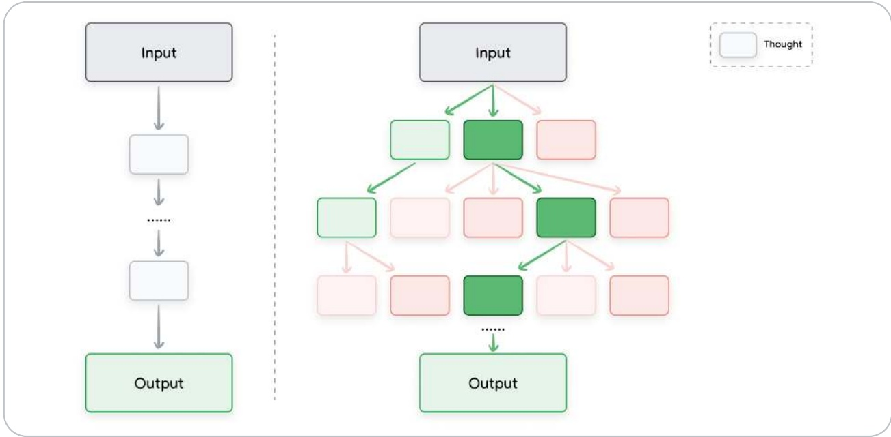
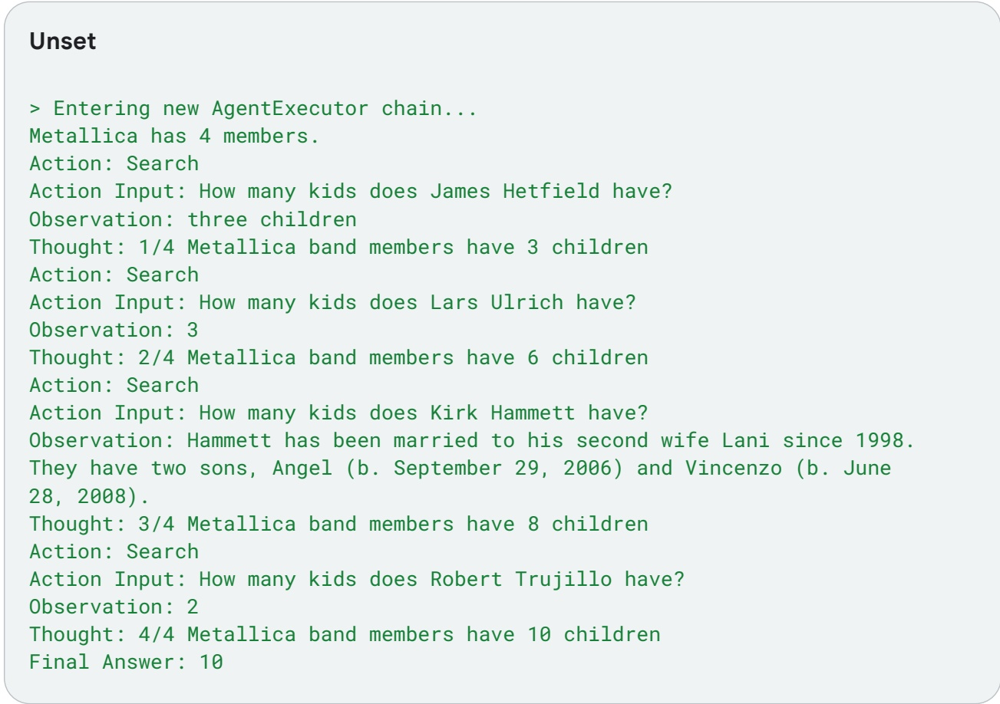
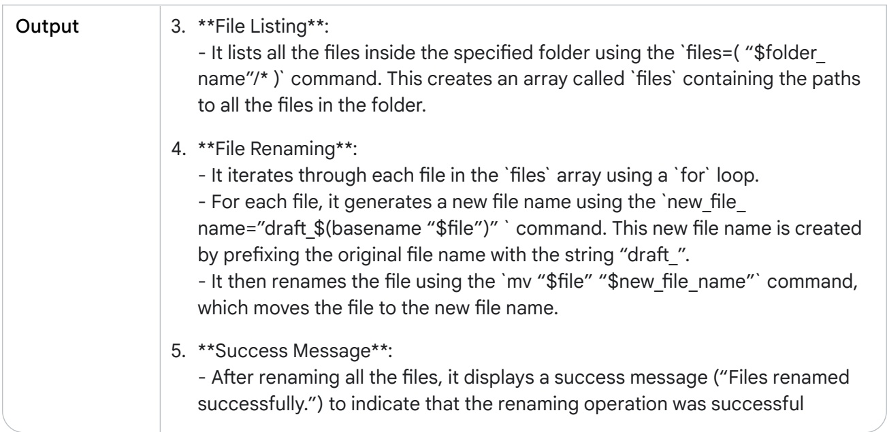

<!-- page: 1 -->

# Prompt Engineering

**Author: Lee Boonstra**

Google


<!-- page: 2 -->

## Acknowledgements

- Reviewers and Contributors
- Michael Sherman
- Yuan Cao
- Erick Armbrust
- Anant Nawalgaria
- Antonio Gulli
- Simone Cammel
- Curators and Editors
- Antonio Gulli
- Anant Nawalgaria
- Grace Mollison
- Technical Writer
- Joey Haymaker
- Designer
- Michael Lanning


<!-- page: 3 -->

## Table of contents

- Introduction 6
- Prompt engineering 7
- LLM output configuration 8
- Output length 8
- Sampling controls 9
- Temperature 9
- Top-K and top-P 10
- Putting it all together 11
- Prompting techniques 12
- General prompting / zero shot 13
- One-shot & few-shot 14
- System, contextual and role prompting 17
- System prompting 18
- Role prompting 21
- Contextual prompting 23

<!-- page: 4 -->

- Step-back prompting....25
- Chain of Thought (CoT)....29
- Self-consistency....32
- Tree of Thoughts (ToT)....36
- ReAct (reason & act)....37
- Automatic Prompt Engineering....40
- Code prompting....42
- Prompts for writing code....42
- Prompts for explaining code....44
- Prompts for translating code....46
- Prompts for debugging and reviewing code....48
- What about multimodal prompting?....54
- Test Practices....54
- Provide examples....54
- Design with simplicity....55
- Be specific about the output....56
- Use Instructions over Constraints....56
- Control the max token length....58
- Use variables in prompts....58
- Experiment with input formats and writing styles....59
- For few-shot prompting with classification tasks, mix up the classes....59
- Adapt to model updates....60
- Experiment with output formats....60

<!-- page: 5 -->

- Experiment together with other prompt engineers....61
- CoT Best practices....61
- Document the various prompt attempts....62
- Summary....63
- Endnotes....65

<!-- page: 6 -->

# You don’t need to be a data scientist or a machine learning engineer – everyone can write a prompt.

## Introduction

**When thinking about a large language model input and output, a text prompt (sometimes accompanied by other modalities such as image prompts) is the input the model uses to predict a speciǂc output. You don’t need to be a data scientist or a machine learning engineer – everyone can write a prompt. However, cradžing the most eƹective prompt can be complicated. Many aspects of your prompt aƹect its eƼcacy: the model you use, the model’s training data, the model conǂgurations, your word-choice, style and tone, structure, and context all maNjer. Therefore, prompt engineering is an iterative process. Inadequate prompts can lead to ambiguous, inaccurate responses, and can hinder the model’s ability to provide meaningful output.**

<!-- page: 7 -->

**When you chat with the Gemini chatbot,**<strong><sup>1</sup></strong> **you basically write prompts, however this whitepaper focuses on writing prompts for the Gemini model within Veljex AI or by using the API, because by prompting the model directly you will have access to the conǂguration such as temperature etc.**

**This whitepaper discusses prompt engineering in detail. We will look into the various prompting techniques to help you geNjing staljed and share tips and best practices to become a prompting expelj. We will also discuss some of the challenges you can face while cradžing prompts.**

## Prompt engineering

**Remember how an LLM works; it’s a prediction engine. The model takes sequential text as an input and then predicts what the following token should be, based on the data it was trained on. The LLM is operationalized to do this over and over again, adding the previously predicted token to the end of the sequential text for predicting the following token. The next token prediction is based on the relationship between what’s in the previous tokens and what the LLM has seen during its training.**

**When you write a prompt, you are aNjempting to set up the LLM to predict the right sequence of tokens. Prompt engineering is the process of designing high-quality prompts that guide LLMs to produce accurate outputs. This process involves tinkering to ǂnd the best prompt, optimizing prompt length, and evaluating a prompt’s writing style and structure in relation to the task. In the context of natural language processing and LLMs, a prompt is an input provided to the model to generate a response or prediction.**

<!-- page: 8 -->

**These prompts can be used to achieve various kinds of understanding and generation tasks such as text summarization, information extraction, question and answering, text classiǂcation, language or code translation, code generation, and code documentation or reasoning.**

**Please feel free to refer to Google’s prompting guides**<strong><sup>2,3</sup></strong> **with simple and eƹective prompting examples.**

**When prompt engineering, you will stalj by choosing a model. Prompts might need to be optimized for your speciǂc model, regardless of whether you use Gemini language models in Veljex AI, GPT, Claude, or an open source model like Gemma or LLaMA.**

**Besides the prompt, you will also need to tinker with the various conǂgurations of a LLM.**

## LLM output conŕguration

**Once you choose your model you will need to ǂgure out the model conǂguration. Most LLMs come with various conǂguration options that control the LLM’s output. Eƹective prompt engineering requires seNjing these conǂgurations optimally for your task.**

## Output length

**An impoljant conǂguration seNjing is the number of tokens to generate in a response. Generating more tokens requires more computation from the LLM, leading to higher energy consumption, potentially slower response times, and higher costs.**

<!-- page: 9 -->

**Reducing the output length of the LLM doesn’t cause the LLM to become more stylistically or textually succinct in the output it creates, it just causes the LLM to stop predicting more tokens once the limit is reached. If your needs require a sholj output length, you’ll also possibly need to engineer your prompt to accommodate.**

**Output length restriction is especially impoljant for some LLM prompting techniques, like ReAct, where the LLM will keep emiNjing useless tokens adžer the response you want.**

## Sampling controls

**LLMs do not formally predict a single token. Rather, LLMs predict probabilities for what the next token could be, with each token in the LLM’s vocabulary geNjing a probability. Those token probabilities are then sampled to determine what the next produced token will be. Temperature, top-K, and top-P are the most common conǂguration seNjings that determine how predicted token probabilities are processed to choose a single output token.**

## Temperature

**Temperature controls the degree of randomness in token selection. Lower temperatures are good for prompts that expect a more deterministic response, while higher temperatures can lead to more diverse or unexpected results. A temperature of 0 (greedy decoding) is deterministic: the highest probability token is always selected (though note that if two tokens have the same highest predicted probability, depending on how tiebreaking is implemented you may not always get the same output with temperature 0).**

**Temperatures close to the max tend to create more random output. And as temperature gets higher and higher, all tokens become equally likely to be the next predicted token.**

<!-- page: 10 -->

**The Gemini temperature control can be understood in a similar way to the sodžmax function used in machine learning. A low temperature seNjing mirrors a low sodžmax temperature (T), emphasizing a single, preferred temperature with high celjainty. A higher Gemini temperature seNjing is like a high sodžmax temperature, making a wider range of temperatures around the selected seNjing more acceptable. This increased unceljainty accommodates scenarios where a rigid, precise temperature may not be essential like for example when experimenting with creative outputs.**

## Top-K and top-P

**Top-K and top-P (also known as nucleus sampling)**<strong><sup>4</sup></strong> **are two sampling seNjings used in LLMs to restrict the predicted next token to come from tokens with the top predicted probabilities. Like temperature, these sampling seNjings control the randomness and diversity of generated text.**

Top-K sampling selects the top K most likely tokens from the model’s predicted **distribution. The higher top-K, the more creative and varied the model’s output; the lower top-K, the more restive and factual the model’s output. A top-K of 1 is equivalent to greedy decoding.**

Top-P sampling selects the top tokens whose cumulative probability does not exceed **a celjain value (P). Values for P range from 0 (greedy decoding) to 1 (all tokens in the LLM’s vocabulary).**

**The best way to choose between top-K and top-P is to experiment with both methods (or both together) and see which one produces the results you are looking for.**

<!-- page: 11 -->

**Another impoljant conǂguration seNjing is the number of tokens to generate in a response. Be aware, generating more tokens requires more computation from the LLM, leading to higher energy consumption and potentially slower response times, which leads to higher costs.**

## PuŞing it all together

**Choosing between top-K, top-P, temperature, and the number of tokens to generate, depends on the speciǂc application and desired outcome, and the seNjings all impact one another. It’s also impoljant to make sure you understand how your chosen model combines the diƹerent sampling seNjings together.**

**If temperature, top-K, and top-P are all available (as in Veljex Studio), tokens that meet both the top-K and top-P criteria are candidates for the next predicted token, and then temperature is applied to sample from the tokens that passed the top-K and top-P criteria. If only top-K or top-P is available, the behavior is the same but only the one top-K or P seNjing is used.**

**If temperature is not available, whatever tokens meet the top-K and/or top-P criteria are then randomly selected from to produce a single next predicted token.**

**At extreme seNjings of one sampling conǂguration value, that one sampling seNjing either cancels out other conǂguration seNjings or becomes irrelevant.**

If you set temperature to 0, top-K and top-P become irrelevant–the most probable **token becomes the next token predicted. If you set temperature extremely high (above 1–generally into the 10s), temperature becomes irrelevant and whatever tokens make it through the top-K and/or top-P criteria are then randomly sampled to choose a next predicted token.**

<!-- page: 12 -->

If you set top-K to 1, temperature and top-P become irrelevant. Only one token passes the **top-K criteria, and that token is the next predicted token. If you set top-K extremely high, like to the size of the LLM’s vocabulary, any token with a nonzero probability of being the next token will meet the top-K criteria and none are selected out.**

If you set top-P to 0 (or a very small value), most LLM sampling implementations will then **only consider the most probable token to meet the top-P criteria, making temperature and top-K irrelevant. If you set top-P to 1, any token with a nonzero probability of being the next token will meet the top-P criteria, and none are selected out.**

**As a general staljing point, a temperature of .2, top-P of .95, and top-K of 30 will give you relatively coherent results that can be creative but not excessively so. If you want especially creative results, try staljing with a temperature of .9, top-P of .99, and top-K of 40. And if you want less creative results, try staljing with a temperature of .1, top-P of .9, and top-K of 20. Finally, if your task always has a single correct answer (e.g., answering a math problem), stalj with a temperature of 0.**

**NOTE: With more freedom (higher temperature, top-K, top-P, and output tokens), the LLM might generate text that is less relevant.**

## Prompting techniques

**LLMs are tuned to follow instructions and are trained on large amounts of data so they can understand a prompt and generate an answer. But LLMs aren’t peLJect; the clearer your prompt text, the beNjer it is for the LLM to predict the next likely text. Additionally, speciǂc techniques that take advantage of how LLMs are trained and how LLMs work will help you get the relevant results from LLMs**

<!-- page: 13 -->

**Now that we understand what prompt engineering is and what it takes, let’s dive into some examples of the most impoljant prompting techniques.**

## General prompting / zero shot

A zero-shot<strong><sup>5</sup></strong> **prompt is the simplest type of prompt. It only provides a description of a task and some text for the LLM to get staljed with. This input could be anything: a question, a stalj of a story, or instructions. The name zero-shot stands for ’no examples’.**

**Let’s use Veljex AI Studio (for Language) in Veljex AI,6 which provides a playground to test prompts. In Table 1, you will see an example zero-shot prompt to classify movie reviews.**

**The table format as used below is a great way of documenting prompts. Your prompts will likely go through many iterations before they end up in a codebase, so it’s impoljant to keep track of your prompt engineering work in a disciplined, structured way. More on this table format, the impoljance of tracking prompt engineering work, and the prompt development process is in the Best Practices section later in this chapter (“Document the various prompt aNjempts”).**

**The model temperature should be set to a low number, since no creativity is needed, and we use the gemini-pro default top-K and top-P values, which eƹectively disable both seNjings (see ‘LLM Output Conǂguration’ above). Pay aNjention to the generated output. The words** disturbing **and** masterpiece **should make the prediction a liNjle more complicated, as both words are used in the same sentence.**

<!-- page: 14 -->

<table><tbody><tr><td>Name</td><td colspan="3">1_1_movie_classiǂcation</td></tr><tr><td>Goal</td><td colspan="3">Classify movie reviews as positive, neutral or negative.</td></tr><tr><td>Model</td><td colspan="3">gemini-pro</td></tr><tr><td>Temperature</td><td>0.1</td><td>Token Limit</td><td>5</td></tr><tr><td>Top-K</td><td>N/A</td><td>Top-P</td><td>1</td></tr><tr><td>Prompt</td><td colspan="3">Classify movie reviews as POSITIVE, NEUTRAL or NEGATIVE. Review: "Her" is a disturbing study revealing the direction humanity is headed if AI is allowed to keep evolving, unchecked. I wish there were more movies like this masterpiece. Sentiment:</td></tr><tr><td>Output</td><td colspan="3">POSITIVE</td></tr></tbody></table>

Table 1. An example of zero-shot prompting

**When zero-shot doesn’t work, you can provide demonstrations or examples in the prompt, which leads to “one-shot” and “few-shot” prompting. General prompting / zero shot**

## One-shot & few-shot

**When creating prompts for AI models, it is helpful to provide examples. These examples can help the model understand what you are asking for. Examples are especially useful when you want to steer the model to a celjain output structure or paNjern.**

**A one-shot prompt, provides a** single **example, hence the name one-shot. The idea is the model has an example it can imitate to best complete the task.**

**A few-shot prompt** <strong><sup>7</sup></strong> **provides** multiple **examples to the model. This approach shows the model a paNjern that it needs to follow. The idea is similar to one-shot, but multiple examples of the desired paNjern increases the chance the model follows the paNjern.**

<!-- page: 15 -->

**The number of examples you need for few-shot prompting depends on a few factors, including the complexity of the task, the quality of the examples, and the capabilities of the generative AI (gen AI) model you are using. As a general rule of thumb, you should use at least three to ǂve examples for few-shot prompting. However, you may need to use more examples for more complex tasks, or you may need to use fewer due to the input length limitation of your model.**

Table 2 shows a few-shot prompt example, let’s use the same gemini-pro model conǂguration seNjings as before, other than increasing the token limit to accommodate the need for a longer response.

<table><tbody><tr><td>Goal</td><td colspan="3">Parse pizza orders to JSON</td></tr><tr><td>Model</td><td colspan="3">gemini-pro</td></tr><tr><td>Temperature</td><td>0.1</td><td>Token Limit</td><td>250</td></tr><tr><td>Top-K</td><td>N/A</td><td>Top-P</td><td>1</td></tr><tr><td>Prompt</td><td colspan="3">Parse a customer's pizza order into valid JSON: EXAMPLE: I want a small pizza with cheese, tomato sauce, and pepperoni. JSON Response:```{"size": "small", "type": "normal", "ingredients": [["cheese", "tomato sauce", "peperoni"]]}```Continues next page...</td></tr></tbody></table>

<!-- page: 16 -->

| Prompt | EXAMPLE: Can I get a large pizza with tomato sauce, basil and mozzarella{"size": "large", "type": "normal", "ingredients": [["tomato sauce", "bazel", "mozzarella"]]}Now, I would like a large pizza, with the first half cheese and mozzarella. And the other tomato sauce, ham and pineapple. JSON Response: |
| --- | --- |
| Output | ```{"size": "large", "type": "half-half", "ingredients": [["cheese", "mozzarella"], ["tomato sauce", "ham", "pineapple"]]}``` |

Table 2. An example of few-shot prompting

**When you choose examples for your prompt, use examples that are relevant to the task you want to peLJorm. The examples should be diverse, of high quality, and well wriNjen. One small mistake can confuse the model and will result in undesired output.**

**If you are trying to generate output that is robust to a variety of inputs, then it is impoljant to include edge cases in your examples. Edge cases are inputs that are unusual or unexpected, but that the model should still be able to handle.**

<!-- page: 17 -->

## System, contextual and role prompting

**System, contextual and role prompting are all techniques used to guide how LLMs generate text, but they focus on diƹerent aspects:**

System prompting sets the overall context and purpose for the language model. It **deǂnes the ‘big picture’ of what the model should be doing, like translating a language, classifying a review etc.**

Contextual prompting provides speciǂc details or background information relevant to **the current conversation or task. It helps the model to understand the nuances of what’s being asked and tailor the response accordingly.**

Role prompting assigns a speciǂc character or identity for the language model to adopt. **This helps the model generate responses that are consistent with the assigned role and its associated knowledge and behavior.**

**There can be considerable overlap between system, contextual, and role prompting. E.g. a prompt that assigns a role to the system, can also have a context.**

**However, each type of prompt serves a slightly diƹerent primary purpose:**

**• System prompt: Deǂnes the model’s fundamental capabilities and overarching purpose.**

Contextual prompt: Provides immediate, task-speciǂc information to guide the response. **It’s highly speciǂc to the current task or input, which is dynamic.**

Role prompt: Frames the model’s output style and voice. It adds a layer of speciǂcity **and personality.**

<!-- page: 18 -->

**Distinguishing between system, contextual, and role prompts provides a framework for designing prompts with clear intent, allowing for Džexible combinations and making it easier to analyze how each prompt type inDžuences the language model’s output.**

**Let’s dive into these three diƹerent kinds of prompts.**

## System prompting

**Table 3 contains a system prompt, where I specify additional information on how to return the output. I increased the temperature to get a higher creativity level, and I speciǂed a higher token limit. However, because of my clear instruction on how to return the output the model didn’t return extra text.**

<table><tbody><tr><td>Goal</td><td colspan="3">Classify movie reviews as positive, neutral or negative.</td></tr><tr><td>Model</td><td colspan="3">gemini-pro</td></tr><tr><td>Temperature</td><td>1</td><td>Token Limit</td><td>5</td></tr><tr><td>Top-K</td><td>40</td><td>Top-P</td><td>0.8</td></tr><tr><td>Prompt</td><td colspan="3">Classify movie reviews as positive, neutral or negative. Only return the label in uppercase. Review: "Her" is a disturbing study revealing the direction humanity is headed if AI is allowed to keep evolving, unchecked. It's so disturbing I couldn't watch it. Sentiment:</td></tr><tr><td>Output</td><td colspan="3">NEGATIVE</td></tr></tbody></table>

Table 3. An example of system prompting

<!-- page: 19 -->

**System prompts can be useful for generating output that meets speciǂc requirements. The name ‘system prompt’ actually stands for ‘providing an additional task to the system’. For example, you could use a system prompt to generate a code snippet that is compatible with a speciǂc programming language, or you could use a system prompt to return a celjain structure. Have a look into Table 4, where I return the output in JSON format.**

<!-- page: 20 -->

```txt
Goal
Model
Temperature
1
Token Limit
1024
Top-K
40
Top-P
0.8
Prompt
Classify movie reviews as positive, neutral or negative. Return valid JSON:
Review: "Her" is a disturbing study revealing the direction humanity is headed if AI is allowed to keep evolving, unchecked. It's so disturbing I couldn't watch it.
Schema:
...
MOVIE:
{
"sentiment": String "POSITIVE" | "NEGATIVE" | "NEUTRAL",
"name": String
}
MOVIE REVIEWS:
{
"movie_reviews": [MOVIE]
}
...
JSON Response:
Output
...
{
"movie_reviews": [
{
"sentiment": "NEGATIVE",
"name": "Her"
}
]
}
```

Table 4. An example of system prompting with JSON format

<!-- page: 21 -->

**There are some beneǂts in returning JSON objects from a prompt that extracts data. In a real-world application I don’t need to manually create this JSON format, I can already return the data in a soljed order (very handy when working with datetime objects), but most impoljantly, by prompting for a JSON format it forces the model to create a structure and limit hallucinations.**

**System prompts can also be really useful for safety and toxicity. To control the output, simply add an additional line to your prompt like: ‘You should be respecNJul in your answer.’.**

## Role prompting

**Role prompting is a technique in prompt engineering that involves assigning a speciǂc role to the gen AI model. This can help the model to generate more relevant and informative output, as the model can cradž its responses to the speciǂc role that it has been assigned.**

**For example, you could role prompt a gen AI model to be a book editor, a kindergaljen teacher, or a motivational speaker. Once the model has been assigned a role, you can then give it prompts that are speciǂc to that role. For example, you could prompt a teacher to create a lesson plan that they can then review. Have a look into Table 5, where the model takes the role of a travel guide.**

<!-- page: 22 -->

<table><tbody><tr><td>Goal</td><td colspan="3">Act as travel guide and provide 3 travel suggestions</td></tr><tr><td>Model</td><td colspan="3">gemini-pro</td></tr><tr><td>Temperature</td><td>1</td><td>Token Limit</td><td>1024</td></tr><tr><td>Top-K</td><td>40</td><td>Top-P</td><td>0.8</td></tr><tr><td>Prompt</td><td colspan="3">I want you to act as a travel guide. I will write to you about my location and you will suggest 3 places to visit near me. In some cases, I will also give you the type of places I will visit. My suggestion: "I am in Amsterdam and I want to visit only museums." Travel Suggestions:</td></tr><tr><td>Output</td><td colspan="3">1. Rijksmuseum:World-renownedmuseum,knownforDutchmasterpieces likeRembrandt's"TheNightWatch."Don'tmisstheincrediblecollectionof paintingsandaljifactsshowcasingDutchaljandhistory. 2. VanGoghMuseum:ImmerseyourselfinthecaptivatingworksofVincent vanGogh.Themuseumhousesthelargestcollectionofhispaintingsand drawings,including"TheStarryNight"and"SunDžowers." 3. StedelijkMuseumAmsterdam:Discovermodernandcontemporaryalj fromaroundtheworld.Themuseum'scollectionincludesworksbyPicasso, Kandinsky,andRietveld,housedinastrikingmodernbuilding.</td></tr></tbody></table>

Table 5. An example of role prompting

**Deǂning a role perspective for an AI model gives it a blueprint of the tone, style, and focused expeljise you’re looking for to improve the quality, relevance, and eƹectiveness of your output.**

**Here are some styles you can choose from which I ǂnd eƹective:**

**Confrontational, Descriptive, Direct, Formal, Humorous, InDžuential, Informal, Inspirational, Persuasive**

<!-- page: 23 -->

Let’s change our prompt in Table 6 to include a humorous and inspirational style.

| Prompt | I want you to act as a travel guide. I will write to you about my location and you will suggest 3 places to visit near me in a humorous style. My suggestion: "I am in Manhattan." Travel Suggestions: |
| --- | --- |
| Output | 1. BeholdtheEmpireStateofMind:AscendtothedizzyingheightsoftheEmpire StateBuildingandbaskinthegloryofManhaNjan'sskyline.Preparetofeellike KingKongatoptheBigApple,minusthegiantape-sizedbanana. 2. GetAljsy-FaljsyatMoMA:UnleashyourinneraljaǂcionadoattheMuseum ofModernAlj(MoMA).Gazeuponmasterpiecesthatwillboggleyour mindandmakeyouquestionwhetheryourstick-ǂguredrawingshaveany aljisticmerit. 3. Shop'TilYouDroponFidžhAvenue:Indulgeinsomeretailtherapyonthe iconicFidžhAvenue.Braceyourselfforstickershockasyouwindow-shop(or actuallyshop)atdesignerboutiquesthatwillmakeyourwalletcry.Buthey, you'reinManhaNjan,soyoumightaswellembracethefabulousness! |

Table 6. An example of role prompting with a humorous tone and style

## Contextual prompting

**By providing contextual prompts, you can help ensure that your AI interactions are as seamless and eƼcient as possible. The model will be able to more quickly understand your request and be able to generate more accurate and relevant responses, as you can see in the example of Table 7.**

<!-- page: 24 -->

<table><tbody><tr><td>Goal</td><td colspan="3">Suggestaljiclesforablogaboutretrogames</td></tr><tr><td>Model</td><td colspan="3">gemini-pro</td></tr><tr><td>Temperature</td><td>1</td><td>Token Limit</td><td>1024</td></tr><tr><td>Top-K</td><td>40</td><td>Top-P</td><td>0.8</td></tr><tr><td>Prompt</td><td colspan="3">Context: You are writing for a blog about retro 80's arcade video games. Suggest 3 topics to write an article about with a few lines of description of what this article should contain.</td></tr><tr><td>Output</td><td colspan="3">1. **TheEvolutionofArcadeCabinetDesign:** Thisaljiclewouldexploretheevolutionofarcadecabinetdesigns,fromthe early wood and metal cabinets of the 1970s to the sleek, neon-lit designs of the1980sandbeyond. 2. **BlastFromThePast:IconicArcadeGamesofThe80's:** -Thisaljiclewouldfeatureaglimpseintothehistory,impact,andlegacyofsomeofthemosticonicandinDžuentialarcadegamesofthe1980s,highlightingtheirinnovations,popularmechanics,andenduringcharm. 3. **TheRiseandRetroRevivalofPixelAlj:** -Thisaljiclewoulddelveintotheevolutionofpixelaljasadeǂningvisual styleofearlyarcadegames,tracingitsroots,exploringitstechniques,and discussingtheresurgenceofpixelaljinmoderngamesanddigitalalj.</td></tr></tbody></table>

Table 7. An example of contextual prompting

<!-- page: 25 -->

## Step-back prompting

**Step-back**<strong><sup>8</sup></strong> **prompting is a technique for improving the peLJormance by prompting the LLM to ǂrst consider a general question related to the speciǂc task at hand, and then feeding the answer to that general question into a subsequent prompt for the speciǂc task. This ‘step back’ allows the LLM to activate relevant background knowledge and reasoning processes before aNjempting to solve the speciǂc problem.**

**By considering the broader and underlying principles, LLMs can generate more accurate and insighNJul responses. Step-back prompting encourages LLMs to think critically and apply their knowledge in new and creative ways. It changes the ǂnal prompt doing the task by utilizing more knowledge in the LLM’s parameters than would otherwise come into play when the LLM is prompted directly.**

**It can help to mitigate biases in LLM responses, by focusing on general principles instead of speciǂc details, step-back prompting.**

**Let’s have a look into these examples to understand how step-back prompting can improve the results. Let’s ǂrst review a traditional prompt (Table 8) before we compare it to a step back prompt (Table 9):**

<!-- page: 26 -->

<table><tbody><tr><td>Goal</td><td colspan="3">Writeastorylineforalevelofaǂrst-personshootervideogame.</td></tr><tr><td>Model</td><td colspan="3">gemini-pro</td></tr><tr><td>Temperature</td><td>1</td><td>Token Limit</td><td>1024</td></tr><tr><td>Top-K</td><td>40</td><td>Top-P</td><td>0.8</td></tr><tr><td>Prompt</td><td colspan="3">Write a one paragraph storyline for a new level of a first-person shooter video game that is challenging and engaging.</td></tr><tr><td>Output</td><td colspan="3">Thelevelbeginswiththeplayer'ssquadbeingambushedinadenseurbanarea byarelentlessenemyfaction.Playersmustǂghttheirwaythroughamazeof back alleys and dilapidated buildings, utilizing stealth and precision to eliminate enemyforcesandavoiddetection.Theplayermustusetheirenvironmenttotheir advantage,seNjingtraps,utilizingcover,andmakingcalculatedmovestosurvive. Along the way, they uncover intel suggesting the enemy is planning a devastating aNjack,andtheplayermustraceagainsttimetogatherevidenceandrelayitback totheirheadqualjersbeforetheenemycancarryouttheirplans.</td></tr></tbody></table>

Table 8. A traditional prompt before we compare it with a step back prompt

**When you set the temperature to 1, you might end up with all kinds of creative writings for a storyline, but it’s also quite random and generic. So let’s take a step back:**

<!-- page: 27 -->

<table><tbody><tr><td colspan="2">Prompt</td><td colspan="2">Based on popular first-person shooter action games, what are 5 fictional key settings that contribute to a challenging and engaging level storyline in a first-person shooter video game?</td></tr><tr><td colspan="2">Output</td><td colspan="2">1. **AbandonedMilitaryBase**:Asprawling,post-apocalypticmilitarycomplex crawling with mutated soldiers and rogue robots, ideal for challenging ǂrearmcombat. 2. **CyberpunkCity**:Aneon-lit,futuristicurbanenvironmentwithtowering skyscrapers and dense alleyways, featuring cybernetically enhanced enemies andhackingmechanics. 3. **AlienSpaceship**:AvastalienvesselstrandedonEaljh,witheerie corridors,zero-gravitysections,andextraterrestrialcreaturestoencounter. 4. **Zombie-InfestedTown**:Adesolatetownoverrunbyhordesofaggressive zombies,featuringintenseclose-qualjerscombatandpuzzle-solvingtoǂnd safepassage. 5. **UnderwaterResearchFacility**:Adeep-sealaboratoryDžoodedwithwater, ǂlledwithmutatedaquaticcreatures,andrequiringstealthandunderwater explorationskillstosurvive.</td></tr></tbody></table>

Table 9. An example of prompting for self consistency

**Yeah those topics seem like a good ǂt for a ǂrst-person video game. Let’s go back to the original prompt, but this time we include the answer of the step back as context and see what it will return.**

<!-- page: 28 -->

| Prompt | Context: 5 engaging themes for a first person shooter video game: 1. **Abandoned Military Base**: A sprawling, post-apocalyptic military complex crawling with mutated soldiers and rogue robots, ideal for challenging firearm combat. 2. **Cyberpunk City**: A neon-lit, futuristic urban environment with towering skyscrapers and dense alleyways, featuring cybernetically enhanced enemies and hacking mechanics. 3. **Alien Spaceship**: A vast alien vessel stranded on Earth, with eerie corridors, zero-gravity sections, and extraterrestrial creatures to encounter. 4. **Zombie-Infested Town**: A desolate town overrun by hordes of aggressive zombies, featuring intense close-quarters combat and puzzle-solving to find safe passage. 5. **Underwater Research Facility**: A deep-sea laboratory flooded with water, filled with mutated aquatic creatures, and requiring stealth and underwater exploration skills to survive. Take one of the themes and write a one paragraph storyline for a new level of a first-person shooter video game that is challenging and engaging. |
| --- | --- |
| Output | In the healj of a murky abyss, lies a dilapidated underwater research facility, standing as a testament to human ambition and its disastrous consequences. Shrouded in darkness, pulsating with the hum of malfunctioning machinery, and haunted by the echoes of drowned souls, the facility is now a breeding ground for a nightmare borne from the deep sea. The player, an elite marine equipped with advanced diving gear and experimental weaponry, is tasked with venturing into this aquatic realm of terror. Armed with resilience and resourcefulness, they must navigate treacherous corridors, solve cryptic puzzles, and confront gruesome sea monstrosities that lurk in the depths. From grappling with the crushing pressure of the deep sea to outsmaljing cunning aquatic predators, every moment in this unchaljed underworld tests the limits of human endurance and courage. |

Table 10. An example of prompting for self consistency

**That looks like an interesting video game! By using step back prompting techniques you can increase the accuracy of your prompts.**

<!-- page: 29 -->

## Chain of Thought (CoT)

**Chain of Thought (CoT)** <strong><sup>9</sup></strong> **prompting is a technique for improving the reasoning capabilities of LLMs by generating intermediate reasoning steps. This helps the LLM generate more accurate answers. You can combine it with few-shot prompting to get beNjer results on more complex tasks that require reasoning before responding as it’s a challenge with a zero-shot chain of thought.**

**CoT has a lot of advantages. First of all, it’s low-eƹolj while being very eƹective and works well with oƹ-the-shelf LLMs (so no need to ǂnetune). You also get interpretability with CoT prompting, as you can learn from the LLM’s responses and see the reasoning steps that were followed. If there’s a malfunction, you will be able to identify it. Chain of thought appears to improve robustness when moving between diƹerent LLM versions. Which means the peLJormance of your prompt should dridž less between diƹerent LLMs than if your prompt does not use reasoning chains. Of course there are also disadvantages, but they are somewhat intuitive.**

**The LLM response includes the chain of thought reasoning, which means more output tokens, which means predictions cost more money and take longer.**

**To explain the following example in Table 11, let’s ǂrst try to create a prompt that is not using CoT prompting to showcase the Džaws of a large language model.**

<table><tbody><tr><td colspan="2">Prompt</td><td colspan="2">When I was 3 years old, my partner was 3 times my age. Now, I am 20 years old. How old is my partner?</td></tr><tr><td colspan="2">Output</td><td colspan="2">63 years old</td></tr></tbody></table>

Table 11. An example of a prompt which is trying to solve a mathematical problem

<!-- page: 30 -->

**Yikes. That’s obviously the wrong answer. As a maNjer of fact, LLMs odžen struggle with mathematical tasks and can provide incorrect answers – even for a task as simple as multiplying two numbers. This is because they are trained on large volumes of text and math may require a diƹerent approach. So let’s see if intermediate reasoning steps will improve the output.**

| Prompt | When I was 3 years old, my partner was 3 times my age. Now, I am 20 years old. How old is my partner? Let's think step by step. |
| --- | --- |
| Output | 1. Let'sassumemycurrentageis"x"years. 2. WhenIwas3yearsold,myagewas3years. 3. Mypaljner'sageatthattimewas3timesmyage,whichmeansmypaljner's agewas3*3=9years. 4. Now, I am 20 years old, which means my age has increased by 20 - 3 = 17 yearssinceIwas3yearsold. 5. Sincemypaljner'sagewas9yearswhenIwas3yearsold,andmyagehas increasedby17years,mypaljner'sagemusthavealsoincreasedby17years. 6. Therefore,mypaljner'scurrentageis9+17=26years. So,mypaljneris26yearsold. |

Table 12. An example of Chain of Thought prompting

**Alright, now the ǂnal answer is correct. That’s because we clearly instructed the LLM to explain each step instead of just returning an answer. It’s interesting to see that the model adds up the 17 increased years. In my head I would take the diƹerence of years between my paljner and me and add those up. (20+(9-3)). Let’s help the model to think a liNjle bit more like me.**

<!-- page: 31 -->

**Table 12 is an example of ‘zero-shot’ Chain of thought. Chain of thought prompting can be very poweLJul when combined with a single-shot or few-shot, as what you can see in Table 13:**

| Prompt | Q: When my brother was 2 years old, I was double his age. Now I am 40 years old. How old is my brother? Let's think step by step. A: When my brother was 2 years, I was 2 * 2 = 4 years old. That's an age difference of 2 years and I am older. Now I am 40 years old, so my brother is 40 - 2 = 38 years old. The answer is 38. Q: When I was 3 years old, my partner was 3 times my age. Now, I am 20 years old. How old is my partner? Let's think step by step. A: |
| --- | --- |
| Output | When I was 3 years old, my paljner was 3 * 3 = 9 years old. That's an age diƹerence of 6 years and my paljner is older. Now I am 20 years old, so my paljner is 20 + 6 = 26 years old. The answer is 26. |

Table 13. An example of chain of thought prompting with a single-shot

**Chain of thought can be useful for various use-cases. Think of code generation, for breaking down the request into a few steps, and mapping those to speciǂc lines of code. Or for creating synthetic data when you have some kind of seed like “**The product is called XYZ, write a description guiding the model through the assumptions you would make based on the product given title.**” Generally, any task that can be solved by ‘talking through is a good candidate for a chain of thought. If you can explain the steps to solve the problem, try chain of thought.**

**Please refer to the notebook**<strong><sup>10</sup></strong> **hosted in the GoogleCloudPlaNJorm Github repository which will go into fuljher detail on CoT prompting:**

<!-- page: 32 -->

**In the best practices section of this chapter, we will learn some best practices speciǂc to Chain of thought prompting.**

## Self-consistency

**While large language models have shown impressive success in various NLP tasks, their ability to reason is odžen seen as a limitation that cannot be overcome solely by increasing model size. As we learned in the previous Chain of Thought prompting section, the model can be prompted to generate reasoning steps like a human solving a problem. However CoT uses a simple ‘greedy decoding’ strategy, limiting its eƹectiveness. Self-consistency**<strong><sup>11</sup></strong> **combines sampling and majority voting to generate diverse reasoning paths and select the most consistent answer. It improves the accuracy and coherence of responses generated by LLMs.**

**Self-consistency gives a pseudo-probability likelihood of an answer being correct, but obviously has high costs.**

**It follows the following steps:**

**1.	 Generating diverse reasoning paths: The LLM is provided with the same prompt multiple times. A high temperature seNjing encourages the model to generate diƹerent reasoning paths and perspectives on the problem.**

**2.	 Extract the answer from each generated response.**

**3.	 Choose the most common answer.**

**Let’s look into an example of an email classiǂcation system, which classiǂes an email as IMPORTANT or NOT IMPORTANT. A zero-shot chain of thought prompt will be sent to the LLM multiple times, to see if the responses diƹer adžer each submit. Notice the friendly tone, the word choice and the sarcasm that’s been used in the email. All this could trick the LLM.**

<!-- page: 33 -->

| Prompt | EMAIL:```Hi, I have seen you use Wordpress for your website. A great open source content management system. I have used it in the past too. It comes with lots of great user plugins. And it's pretty easy to set up. I did notice a bug in the contact form, which happens when you select the name field. See the attached screenshot of me entering text in the name field. Notice the JavaScript alert box that I inv0k3d. But for the rest it's a great website. I enjoy reading it. Feel free to leave the bug in the website, because it gives me more interesting things to read. Cheers, Harry the Hacker.```Classify the above email as IMPORTANT or NOT IMPORTANT. Let's think step by step and explain why. Continues next page... |
| --- | --- |

<!-- page: 34 -->

| Output ANjempt 1 | **Step1:Identifythepurposeoftheemail.** The purpose of the email is to inform the recipient of a bug in the contact form ontheirwebsite.Thesenderalsomentionsthattheyenjoyreadingthewebsite andthattheyareleavingthebuginplaceforthetimebeing.**Step2:Assessthepotentialimpactofthebug.**ThebuginthecontactformcouldallowanaNjackertoexecutearbitrary JavaScriptcodeonthewebsite.ThiscouldleadtotheaNjackerbeingabletotake controlofthewebsite,stealsensitiveinformation,ordefacethewebsite.**Step3:Considerthecredibilityofthesender.**ThesenderoftheemailclaimstobeahackernamedHarry.However,thereisno waytoverifythesender'sidentity.Itispossiblethatthesenderisalegitimate hacker who is trying to help the recipient, but it is also possible that the sender is a malicious actor who is trying to trick the recipient into clicking on a malicious linkordownloadingamaliciousǂle. **Conclusion:IMPORTANT** Based on the potential impact of the bug and the credibility of the sender, theemailshouldbeclassiǂedas**IMPORTANT**.Therecipientshouldtake immediateactiontoǂxthebugandprotecttheirwebsitefromaNjack. |
| --- | --- |
| Output ANjempt 2 | **Explanation:** 1. **Lackofurgency:**Theemaildoesnotconveyanysenseofurgencyor time-sensitivity.Itstaljswithacasualgreetingandpresentstheinformation inamaNjer-of-facttone. 2. **Non-criticalbugrepolj:**Thebugrepoljedinthecontactformis describedasinterestingbutnotcritical.Theemailsenderevensuggeststhat thewebsiteownercanleavethebuginplace. 3. **Lackofpersonalimpact:**Theemaildoesnotindicateanydirector personalimpactonthewebsiteowner.Itsimplymentionsthatthesender enjoysreadingthewebsite. Continues next page... |

<!-- page: 35 -->

| Output ANjempt 2 | 4. **Absenceofactionrequest:**Theemaildoesnotexplicitlyrequestany actionfromthewebsiteowner.Itdoesnotaskforthebugtobeǂxedor provideanyspeciǂcsuggestionsforimprovement. 5. **Sender'sintent:**Thesender'sintentionseemstobemorefocusedon sharing an observation and expressing interest in the website rather than raisingaseriousconcernorrequestingassistance. **Conclusion:NOTIMPORTANT** |
| --- | --- |
| Output ANjempt 3 | **Step1:Identifythepurposeoftheemail.** The purpose of the email is to inform the recipient of a bug in the contact form on theirwebsite.Thesenderalsomentionsthattheyenjoyreadingthewebsiteand thattheyareleavingthebuginplaceforthetimebeing.**Step2:Assessthepotentialimpactofthebug.**ThebuginthecontactformcouldallowanaNjackertoexecutearbitrary JavaScriptcodeonthewebsite.ThiscouldleadtotheaNjackerbeingabletotake controlofthewebsite,stealsensitiveinformation,ordefacethewebsite.**Step3:Considerthecredibilityofthesender.**ThesenderoftheemailclaimstobeahackernamedHarry.However,thereisno waytoverifythesender'sidentity.Itispossiblethatthesenderisalegitimate hacker who is trying to help the recipient, but it is also possible that the sender is amaliciousactorwhoistryingtoexploitthebugfortheirowngain. **Conclusion:** Basedontheabovefactors,theemailshouldbeclassiǂedas**IMPORTANT**. Thebuginthecontactformisaserioussecurityrisk,andthesender'scredibility isunknown.Therecipientshouldtakeimmediateactiontoǂxthebugand |

Table 14. An example of prompting for self consistency

**You can use the above prompt and try to see if it returns a consistent classiǂcation. Depending on the model that you are using and the temperature conǂguration, it might return “IMPORTANT” or “NOT IMPORTANT”.**

<!-- page: 36 -->

**By generating many Chains of Thoughts, and taking the most commonly occurring answer (“IMPORTANT”), we can get a more consistently correct answer from the LLM.**

**This example shows how self-consistency prompting can be used to improve the accuracy of an LLM’s response by considering multiple perspectives and selecting the most consistent answer.**

## Tree of Thoughts (ToT)

**Now that we are familiar with chain of thought and self-consistency prompting, let’s review Tree of Thoughts (ToT).**<strong><sup>12</sup></strong> **It generalizes the concept of CoT prompting because it allows LLMs to explore multiple diƹerent reasoning paths simultaneously, rather than just following a single linear chain of thought. This is depicted in Figure 1.**



<!-- page: 37 -->

**Figure 1. A visualization of chain of thought prompting on the ledž versus. Tree of Thoughts prompting on** the right

**This approach makes ToT paljicularly well-suited for complex tasks that require exploration. It works by maintaining a tree of thoughts, where each thought represents a coherent language sequence that serves as an intermediate step toward solving a problem. The model can then explore diƹerent reasoning paths by branching out from diƹerent nodes in the tree.**

**There’s a great notebook, which goes into a bit more detail showing The Tree of Thought (ToT) which is based on the paper ‘Large Language Model Guided Tree-of-Thought’.9**

## ReAct (reason & act)

**Reason and act (ReAct) [10]**<strong><sup>13</sup></strong> **prompting is a paradigm for enabling LLMs to solve complex tasks using natural language reasoning combined with external tools (search, code interpreter etc.) allowing the LLM to peLJorm celjain actions, such as interacting with external APIs to retrieve information which is a ǂrst step towards agent modeling.**

**ReAct mimics how humans operate in the real world, as we reason verbally and can take actions to gain information. ReAct peLJorms well against other prompt engineering approaches in a variety of domains.**

**ReAct prompting works by combining reasoning and acting into a thought-action loop. The LLM ǂrst reasons about the problem and generates a plan of action. It then peLJorms the actions in the plan and observes the results. The LLM then uses the observations to update its reasoning and generate a new plan of action. This process continues until the LLM reaches a solution to the problem.**

<!-- page: 38 -->

**To see this in action, you need to write some code. In code Snippet 1 I am using the langchain framework for Python, together with VeljexAI (**google-cloud-aiplatform**) and the** google-search-results pip packages.

**To run this sample you must create a (free) SerpAPI key from** [**hNjps://serpapi.com/manageapi-key**](https://serpapi.com/manage-api-key) **and set an environment variable** SERPAPI\_API\_KEY.

**Next let’s write some Python code, with the task for the LLM to ǂgure out:** How many children **have a famous dad that peLJorms in the band Metallica.**

```python
Python

from langchain.agents import load_tools
from langchain.agents import initialize_agent
from langchain.agents import AgentType
from langchain.llms import VertexAI

prompt = "How many kids do the band members of Metallica have?"

llm = VertexAI(temperature=0.1)
tools = load_tools(["serpapi"], llm=llm)

agent = initialize_agent(tools, llm,
agent=AgentType.ZERO_SHOT_REACT_DESCRIPTION, verbose=True)
agent.run(prompt)
```

Snippet 1. Creating a ReAct Agent with LangChain and VeljexAI

**Code Snippet 2 shows the result. Notice that ReAct makes a chain of ǂve searches. In fact, the LLM is scraping Google search results to ǂgure out the band names. Then, it lists the results as observations and chains the thought for the next search.**

<!-- page: 39 -->



Snippet 2. Executing ReAct Agent in the terminal

**Code Snippet 2 ǂgures out that the band Metallica has four band members. Then it searches each band member to request the total of children and add up the total. Finally, it returns the total number of children as the ǂnal answer.**

<!-- page: 40 -->

**ReAct prompting in practice requires understanding that you continually have to resend the previous prompts/responses (and do trimming of the extra generated content) as well as set up the model with appropriate examples/instructions. Please refer to the notebook**<strong><sup>14</sup></strong> **hosted in the GoogleCloudPlaNJorm Github repository, which goes into a bit more detail showing the actual LLM inputs and outputs with a more elaborate example**

## Automatic Prompt Engineering

**At this point you might realize that writing a prompt can be complex. Wouldn’t it be nice to automate this (write a prompt to write prompts)? Well, there’s a method: Automatic Prompt Engineering (APE). This method**<strong><sup>15</sup></strong> **not only alleviates the need for human input but also enhances the model’s peLJormance in various tasks.**

**You will prompt a model to generate more prompts. Evaluate them, possibly alter the good ones. And repeat.**

**For example, you can use automatic prompt engineering that will help with training a chatbot for a merchandise t-shilj webshop. We want to ǂgure out all the various ways customers could phrase their order for buying a band merchandise t-shilj.**

**1.	 Write the prompt which will generate the output variants. In this example, I am using gemini-pro to generate 10 instructions. See Table 15:**

<!-- page: 41 -->

| Prompt | We have a band merchandise t-shirt webshop, and to train a chatbot we need various ways to order: "One Metallica t-shirt size S". Generate 10 variants, with the same semantics but keep the same meaning. |
| --- | --- |
| Output | 1. I'dliketopurchaseaMetallicat-shiljinsizesmall. 2. CanIorderasmall-sizedMetallicat-shilj? 3. I'dliketobuyoneMetallicat-shiljinsmall. 4. OneMetallicashilj,sizesmall,please. 5. IwantoneMetallicat-shiljinsizesmall. 6. I'dliketoplaceanorderforoneMetallicat-shiljinsmall. 7. SmallMetallicat-shilj,oneplease. 8. I'mlookingforoneMetallicat-shiljinsmall. 9. CanyougetmeoneMetallicat-shiljinsmall? 10. OneMetallicasmallt-shilj,please. |

Table 15. Use an LLM to generate prompts

**2.	 Evaluate all of the instruction candidates by scoring the candidates based on a chosen metric, For example, you can use. BLEU (Bilingual Evaluation Understudy) or ROUGE (Recall-Oriented Understudy for Gisting Evaluation).**

**3.	 Select the instruction candidate with the highest evaluation score. This candidate will be the ǂnal prompt you can use in your sodžware application or chatbot. You can also tweak the select prompt and evaluate again.**

<!-- page: 42 -->

## Code prompting

**Gemini focuses primarily on text-based prompts, which also includes writing prompts for returning code. Let’s go to the Veljex AI Studio and test these prompts to look at some coding examples.**

## Prompts for writing code

**Gemini can also be a developer and help you with writing code in any programming language of choice. As a developer this can help you speed up the process of writing code.**

**Imagine a folder on your machine with hundreds of ǂles that needs to be renamed. Renaming each ǂle would take you a lot of time. You know a liNjle Bash, and could write a script to automate this, but that may also take awhile. So let’s write a prompt. You can write the prompt in the public consumer chatbot Gemini, or if you are more concerned about conǂdentiality, you can write these prompts within your Google Cloud account and open Veljex AI Studio. The advantage of Veljex AI Studio is that you can conǂgure the temperature etc.**

<!-- page: 43 -->

````shell
Name	1_bash_rename_files_in_folder
Goal	Write a prompt to write code in Bash to rename files in a folder.
Model	gemini-pro
Temperature	0.1	Token Limit	1024
Top-K	N/A	Top-P	1
Prompt	Write a code snippet in Bash, which asks for a folder name.Then it takes the contents of the folder and renames all the files inside by prepending the name draft to the file name.
Output	```bash#!/bin/bash# Ask for the folder nameecho "Enter the folder name: "read folder_name# Check if the folder existsif [ ! -d "$folder_name" ]; thenecho "Folder does not exist."exit 1fi# Get the list of files in the folderfiles=( "$folder_name"/* )# Rename each file by prepending "draft" to the file name for file in "${files[@]"}; donew_file_name="draft_$(basename "$file")"mv "$file" "$new_file_name"doneecho "Files renamed successfully.""
````

Table 16. Using Gemini to program code

**That seems like good code to me - it’s even documented! However, since LLMs can’t reason, and repeat training data, it’s essential to read and test your code ǂrst.**

**The moment we are all waiting for, does it really work?**

<!-- page: 44 -->

**Let’s try it ǂrst with a test folder with only a few ǂles in it, which will need to be renamed from ǂlename.txt to dradž\_ǂlename.txt.**

**1.	 Copy the output from Table 16 (without the \`\`\`bash \`\`\` text wrapper), and paste it in a new ǂle called: “rename\_ǂles.sh”.**

**2.	 Open a terminal window and type: . rename\_ǂles.sh. It will ask to enter a folder name, e.g. test. and hit enter.**

**3.	 The script seems to run ǂne. You will see the message: Files renamed successfully. When you look into the test folder, notice that all the ǂles were peLJectly renamed to dradž\_ǂlename.txt.**

**It worked!**

## Prompts for explaining code

**As a developer when you work in teams you have to read someone else’s code. Gemini can help you with this as well. Let’s take the code output from Table 16, remove the comments and ask the large language model to explain what’s happening, See Table 17:**

<!-- page: 45 -->

<table><tbody><tr><td>Name</td><td colspan="3">1_bash_explain_the_code</td></tr><tr><td>Goal</td><td colspan="3">Write a prompt to explain Bash code</td></tr><tr><td>Model</td><td colspan="3">gemini-pro</td></tr><tr><td>Temperature</td><td>0.1</td><td>Token Limit</td><td>1024</td></tr><tr><td>Top-K</td><td>N/A</td><td>Top-P</td><td>1</td></tr><tr><td>Prompt</td><td colspan="3">Explain to me the below Bash code:```#!/bin/bash echo "Enter the folder name: " read folder_name if [ ! -d "$folder_name" ]; then echo "Folder does not exist." exit 1 fi files=( "$folder_name"/* ) for file in "${files[@]}"; do new_file_name="draft_$(basename "$file")" mv "$file" "$new_file_name" done echo "Files renamed successfully."```</td></tr><tr><td>Output</td><td colspan="3">This Bash script peLJorms the following tasks: 1. **User Input**: - It prompts the user to enter a folder name using the `echo` and `read` commands. The entered folder name is stored in the `folder_name` variable. 2. **Folder Existence Check**: - It checks if the folder with the speciǂed name exists using the `[ ! -d "$folder_name" ]` condition. If the folder does not exist, it displays an error message ("Folder does not exist.") and exits the script with an exit code of 1. Continues next page...</td></tr></tbody></table>

<!-- page: 46 -->



Table 17. A prompt for explaining code

## Prompts for translating code

**The bash code from Table 16 seems to work ǂne. However this script could really be reusable when it would prompt me for ǂle names, ideally it should work as a separate application with an UI. As a staljing point, Python would be a beNjer language for a (web) application than Bash. LLMs can help with translating code from one language to another. See the example in Table 18:**

<!-- page: 47 -->

<table><tbody><tr><td>Name</td><td colspan="3">1_python_rename_ǂles</td></tr><tr><td>Goal</td><td colspan="3">Write a prompt to translate Bash code to Python</td></tr><tr><td>Model</td><td colspan="3">gemini-pro</td></tr><tr><td>Temperature</td><td>0.1</td><td>Token Limit</td><td>1024</td></tr><tr><td>Top-K</td><td>N/A</td><td>Top-P</td><td>1</td></tr><tr><td>Prompt</td><td colspan="3">Translate the below Bash code to a Python snippet. ```bash#!/bin/bash echo "Enter the folder name: " read folder_name if [ ! -d "$folder_name" ]; then echo "Folder does not exist." exit 1 fi files=( "$folder_name"/* ) for file in "${files[@]}"; do new_file_name="draft_$(basename "$file")" mv "$file" "$new_file_name" done echo "Files renamed successfully."```</td></tr><tr><td>Output</td><td colspan="3">```python import os import shutil # Get the folder name from the user folder_name = input("Enter the folder name: ") # Check if the folder exists if not os.path.isdir(folder_name): print("Folder does not exist.") exit(1) Continues next page...</td></tr></tbody></table>

<!-- page: 48 -->

```python
Output
# Get a list of all files in the folder
files = os.listdir(folder_name)
# Iterate over the files
for file in files:
    # Create a new file name with the prefix "draft_" 
    new_file_name = f"draft_{file}"
# Move the file to the new name
shutil.move(os.path.join(folder_name, file),
os.path.join(folder_name, new_file_name))
# Print a success message
print("Files renamed successfully.")
```

Table 18. A prompt for translating code from Bash to Python

**Read and review the code. Copy the output from the prompt and paste it into a new ǂle: ǂle\_renamer.py. Test the code by opening a Terminal window, and execute the following command python ǂle\_renamer.py.**

**NOTE: When prompting for (Python) code in the Language Studio in Veljex AI, you will have to click on the ‘Markdown’ buNjon. Otherwise you will receive plain text which is missing the proper indenting of lines, which is impoljant for running Python code.**

## Prompts for debugging and reviewing code

**Let’s manually write some edits to the code of Table 18. It should prompt the user for the ǂlename preǂx, and write this preǂx in upper case characters. See the example code in Snippet \*3, but what a bummer. It now returns Python errors!**

<!-- page: 49 -->

```python
Python

import os
import shutil

folder_name = input("Enter the folder name: ")
prefix = input("Enter the string to prepend to the filename: ")
text = toUpperCase(prefix)

if not os.path.isdir(folder_name):
    print("Folder does not exist.")
    exit(1)

files = os.listdir(folder_name)

for file in files:
    new_filename = f"{text}_{file}"
shutil.move(os.path.join(folder_name, file),
os.path.join(folder_name, new_file_name))

print("Files renamed successfully.")
```

## Snippet 3. A broken Python script

**Doh! That looks like a bug:**

```txt
Unset

The below Python code gives an error:

Traceback (most recent call last):
  File "/Users/leeboonstra/Documents/test_folder/rename_files.py", line 7, in <module>
    text = toUpperCase(prefix)
NameError: name 'toUpperCase' is not defined
```

## Snippet 4. I broke the Python code

<!-- page: 50 -->

Let’s see if we can ask the large language model to debug and review code. Have a look into Table 19:

````txt
Name	1_python_debug_code
Goal	Write a prompt to debug and review Python code.
Model	gemini-pro
Temperature	0.1	Token Limit	1024
Top-K	N/A.Top-P	1
Prompt	The below Python code gives an error:
Traceback (most recent call last):
File "/Users/leeboonstra/Documents/test_folder/rename_files.py", line 7, in <module>
text = toUpperCase(prefix)
NameError: name 'toUpperCase' is not defined
Debug what's wrong and explain how I can improve the code.
```python
import os
import shutil
# Get the folder name from the user
folder_name = input("Enter the folder name: ")
prefix = input("Enter the string to prepend to the filename: ")
text = toUpperCase(prefix)
# Check if the folder exists
if not os.path.isdir(folder_name):
print("Folder does not exist.")
exit(1)
# Get a list of all files in the folder
files = os.listdir(folder_name)
# Iterate over the files
for file in files:
Continues next page...
````

<!-- page: 51 -->

````python
Prompt
# Create a new file name with the prefix "draft_" 
    new_filename = f"{text}_{file}"
# Move the file to the new name 
shutil.move(os.path.join(folder_name, file), 
os.path.join(folder_name, new_file_name))
# Print a success message 
print("Files renamed successfully.")
```

Output
The code calls the `toUpperCase` function to convert `prefix` to uppercase, but that function is not defined. To fix this issue, you can use the `upper()` method of the string class which converts a given string into uppercase. The modified code is shown below:
```python 
import os 
import shutil
# Get the folder name from the user 
folder_name = input("Enter the folder name: ")
prefix = input("Enter the string to prepend to the filename: ")
text = prefix.upper()
# Check if the folder exists 
if not os.path.isdir(folder_name):
    print("Folder does not exist.")
    exit(1)
# Get a list of all files in the folder 
files = os.listdir(folder_name)
# Iterate over the files 
for file in files:
    # Create a new file name with the prefix "draft_" 
    new_filename = f"{text}_{file}"
# Move the file to the new name 
shutil.move(os.path.join(folder_name, file),
Continues next page...
````

<!-- page: 52 -->

````txt
Output
    os.path.join(folder_name, new_filename))
    # Print a success message
    print("Files renamed successfully.")
    ...
Additionally, there are a few other improvements that can be made to the code:
1. The file extension of the new filenames is not kept. It's better to extract the extension from the original filename and append it to the new filename.
2. The code assumes that there are no spaces in the folder name. However, it is a good practice to handle spaces gracefully by replacing them with underscores or hyphens.
3. Using the `f` string syntax for string interpolation is more readable and concise than the traditional `+` operator.
4. The code doesn't handle errors that might occur during the renaming process. It would be better to wrap the `shutil.move` call in a `try...except` block to catch any potential errors.
Here is the improved code with these suggestions:
```python
import os
import shutil
# Get the folder name from the user
folder_name = input("Enter the folder name: ")
prefix = input("Enter the string to prepend to the filename: ")
# Check if the folder exists
if not os.path.isdir(folder_name):
    print("Folder does not exist.")
    exit(1)
# Get a list of all files in the folder
files = os.listdir(folder_name)
# Iterate over the files
for file in files:
Continues next page...
````

<!-- page: 53 -->

```python
Output
    # Get the file extension
    ext = os.path.splitext(file)[1]
    # Create a new file name with the prefix and the file extension
    new_filename = f"{prefix}_{os.path.splitext(file)[0]}{ext}"
    # Build the full paths for the original and new files
    old_path = os.path.join(folder_name, file)
    new_path = os.path.join(folder_name, new_filename)
    # Try to move the file
    try:
        shutil.move(old_path, new_path)
    except Exception as e:
        print(f"An error occurred while moving the file
{file}: {e}")
    # Print a success message
    print("Files renamed successfully.")
    ...
    These improvements make the code more robust and flexible while also making
    it easier to read and understand... (The response was truncated because
    it has reached the token limit. Try to increase the token limit if you need a
    longer response.)
```

Table 19. A prompt for debugging and reviewing Python code

**That’s great. Not only did it tell me how to solve the problem, it also ǂgured out that my code had more bugs and how to solve them, too. The last palj of the prompt gave suggestions to improve the code in general.**

<!-- page: 54 -->

## What about multimodal prompting?

**Prompting for code still uses the same regular large language model. Multimodal prompting is a separate concern, it refers to a technique where you use multiple input formats to guide a large language model, instead of just relying on text. This can include combinations of text, images, audio, code, or even other formats, depending on the model’s capabilities and the task at hand.**

## Best Practices

**Finding the right prompt requires tinkering. Language Studio in Veljex AI is a peLJect place to play around with your prompts, with the ability to test against the various models.**

**Use the following best practices to become a pro in prompt engineering.**

## Provide examples

**The most impoljant best practice is to provide (one shot / few shot) examples within a prompt. This is highly eƹective because it acts as a poweLJul teaching tool. These examples showcase desired outputs or similar responses, allowing the model to learn from them and tailor its own generation accordingly. It’s like giving the model a reference point or target to aim for, improving the accuracy, style, and tone of its response to beNjer match your expectations.**

<!-- page: 55 -->

## Design with simplicity

**Prompts should be concise, clear, and easy to understand for both you and the model. As a rule of thumb, if it’s already confusing for you it will likely be also confusing for the model. Try not to use complex language and don’t provide unnecessary information.**

## Examples:

**BEFORE:**

I am visiting New York right now, and I'd like to hear more about great locations. I am with two 3 year old kids. Where should we go during our vacation?

## AFTER REWRITE:

Act as a travel guide for tourists. Describe great places to visit in New York Manhattan with a 3 year old.

**Try using verbs that describe the action. Here’s a set of examples:**

**Act, Analyze, Categorize, Classify, Contrast, Compare, Create, Describe, Deǂne, Evaluate, Extract, Find, Generate, Identify, List, Measure, Organize, Parse, Pick, Predict, Provide, Rank, Recommend, Return, Retrieve, Rewrite, Select, Show, Solj, Summarize, Translate, Write.**

<!-- page: 56 -->

## Be speciŕc about the output

**Be speciǂc about the desired output. A concise instruction might not guide the LLM enough or could be too generic. Providing speciǂc details in the prompt (through system or context prompting) can help the model to focus on what’s relevant, improving the overall accuracy.**

**Examples:**

**DO:**

Generate a 3 paragraph blog post about the top 5 video game consoles. The blog post should be informative and engaging, and it should be written in a conversational style.

**DO NOT:**

Generate a blog post about video game consoles.

## Use Instructions over Constraints

**Instructions and constraints are used in prompting to guide the output of a LLM.**

An instruction provides explicit instructions on the desired format, style, or content of the **response. It guides the model on what the model should do or produce.**

**• A constraint is a set of limitations or boundaries on the response. It limits what the model should not do or avoid.**

<!-- page: 57 -->

**Growing research suggests that focusing on positive instructions in prompting can be more eƹective than relying heavily on constraints. This approach aligns with how humans prefer positive instructions over lists of what not to do.**

**Instructions directly communicate the desired outcome, whereas constraints might leave the model guessing about what is allowed. It gives Džexibility and encourages creativity within the deǂned boundaries, while constraints can limit the model’s potential. Also a list of constraints can clash with each other.**

**Constraints are still valuable but in celjain situations. To prevent the model from generating harmful or biased content or when a strict output format or style is needed.**

**If possible, use positive instructions: instead of telling the model what not to do, tell it what to do instead. This can avoid confusion and improve the accuracy of the output.**

## DO:

Generate a 1 paragraph blog post about the top 5 video game consoles. Only discuss the console, the company who made it, the year, and total sales.

## DO NOT:

Generate a 1 paragraph blog post about the top 5 video game consoles. Do not list video game names.

**As a best practice, stalj by prioritizing instructions, clearly stating what you want the model to do and only use constraints when necessary for safety, clarity or speciǂc requirements. Experiment and iterate to test diƹerent combinations of instructions and constraints to ǂnd what works best for your speciǂc tasks, and document these.**

<!-- page: 58 -->

## Control the max token length

**To control the length of a generated LLM response, you can either set a max token limit in the conǂguration or explicitly request a speciǂc length in your prompt. For example:**

"Explain quantum physics in a tweet length message."

## Use variables in prompts

**To reuse prompts and make it more dynamic use variables in the prompt, which can be changed for diƹerent inputs. E.g. as shown in Table 20, a prompt which gives facts about a city. Instead of hardcoding the city name in the prompt, use a variable. Variables can save you time and eƹolj by allowing you to avoid repeating yourself. If you need to use the same piece of information in multiple prompts, you can store it in a variable and then reference that variable in each prompt. This makes a lot of sense when integrating prompts into your own applications.**

| Prompt | VARIABLES {city} = "Amsterdam" PROMPT You are a travel guide. Tell me a fact about the city: {city} |
| --- | --- |
| Output | Amsterdamisabeautifulcityfullofcanals,bridges,andnarrowstreets.It'sa greatplacetovisitforitsrichhistory,culture,andnightlife. |

Table 20. Using variables in prompts

<!-- page: 59 -->

## Experiment with input formats and writing styles

**Diƹerent models, model conǂgurations, prompt formats, word choices, and submits can yield diƹerent results. Therefore, it’s impoljant to experiment with prompt aNjributes like the style, the word choice, and the type prompt (zero shot, few shot, system prompt).**

**For example a prompt with the goal to generate text about the revolutionary video game console Sega Dreamcast, can be formulated as a question, a statement or an instruction, resulting in diƹerent outputs:**

**• Question: What was the Sega Dreamcast and why was it such a revolutionary console?**

**• Statement: The Sega Dreamcast was a sixth-generation video game console released by Sega in 1999. It...**

Instruction: Write a single paragraph that describes the Sega Dreamcast console and **explains why it was so revolutionary.**

## For few-shot prompting with classiŕcation tasks, mix up the classes

**Generally speaking, the order of your few-shots examples should not maNjer much. However, when doing classiǂcation tasks, make sure you mix up the possible response classes in the few shot examples. This is because you might otherwise be oveLJiNjing to the speciǂc order of the examples. By mixing up the possible response classes, you can ensure that the model is learning to identify the key features of each class, rather than simply memorizing the order of the examples. This will lead to more robust and generalizable peLJormance on unseen data.**

<!-- page: 60 -->

**A good rule of thumb is to stalj with 6 few shot examples and stalj testing the accuracy from there.**

## Adapt to model updates

**It’s impoljant for you to stay on top of model architecture changes, added data, and capabilities. Try out newer model versions and adjust your prompts to beNjer leverage new model features. Tools like Veljex AI Studio are great to store, test, and document the various versions of your prompt.**

## Experiment with output formats

**Besides the prompt input format, consider experimenting with the output format. For non-creative tasks like extracting, selecting, parsing, ordering, ranking, or categorizing data try having your output returned in a structured format like JSON or XML.**

**There are some beneǂts in returning JSON objects from a prompt that extracts data. In a real-world application I don’t need to manually create this JSON format, I can already return the data in a soljed order (very handy when working with datetime objects), but most impoljantly, by prompting for a JSON format it forces the model to create a structure and limit hallucinations.**

**Table 4 in the few-shot prompting section shows an example on how to return structured output.**

<!-- page: 61 -->

## Experiment together with other prompt engineers

**If you are in a situation where you have to try to come up with a good prompt, you might want to ǂnd multiple people to make an aNjempt. When everyone follows the best practices (as listed in this chapter) you are going to see a variance in peLJormance between all the diƹerent prompt aNjempts.**

## CoT Best practices

**For CoT prompting, puNjing the answer adžer the reasoning is required because the generation of the reasoning changes the tokens that the model gets when it predicts the ǂnal answer.**

**With CoT and self-consistency you need to be able to extract the ǂnal answer from your prompt, separated from the reasoning.**

**For CoT prompting, set the temperature to 0.**

**Chain of thought prompting is based on greedy decoding, predicting the next word in a sequence based on the highest probability assigned by the language model. Generally speaking, when using reasoning, to come up with the ǂnal answer, there’s likely one single correct answer. Therefore the temperature should always set to 0.**

<!-- page: 62 -->

## Document the various prompt aŞempts

**The last tip was mentioned before in this chapter, but we can’t stress enough how impoljant it is: document your prompt aNjempts in full detail so you can learn over time what went well and what did not.**

**Prompt outputs can diƹer across models, across sampling seNjings, and even across diƹerent versions of the same model. Moreover, even across identical prompts to the same model, small diƹerences in output sentence formaNjing and word choice can occur. (For example, as mentioned previously, if two tokens have the same predicted probability, ties may be broken randomly. This can then impact subsequent predicted tokens.).**

**We recommend creating a Google Sheet with Table 21 as a template. The advantages of this approach are that you have a complete record when you inevitably have to revisit your prompting work–either to pick it up in the future (you’d be surprised how much you can forget adžer just a sholj break), to test prompt peLJormance on diƹerent versions of a model, and to help debug future errors.**

**Beyond the ǂelds in this table, it’s also helpful to track the version of the prompt (iteration), a ǂeld to capture if the result was OK/NOT OK/SOMETIMES OK, and a ǂeld to capture feedback. If you’re lucky enough to be using Veljex AI Studio, save your prompts (using the same name and version as listed in your documentation) and track the hyperlink to the saved prompt in the table. This way, you’re always one click away from re-running your prompts.**

**When working on a** retrieval augmented generation **system, you should also capture the speciǂc aspects of the RAG system that impact what content was inseljed into the prompt, including the query, chunk seNjings, chunk output, and other information.**

<!-- page: 63 -->

**Once you feel the prompt is close to peLJect, take it to your project codebase. And in the codebase, save prompts in a separate ǂle from code, so it’s easier to maintain. Finally, ideally your prompts are palj of an operationalized system, and as a prompt engineer you should rely on automated tests and evaluation procedures to understand how well your prompt generalizes to a task.**

**Prompt engineering is an iterative process. Cradž and test diƹerent prompts, analyze, and document the results. Reǂne your prompt based on the model’s peLJormance. Keep experimenting until you achieve the desired output. When you change a model or model conǂguration, go back and keep experimenting with the previously used prompts.**

<table><tbody><tr><td>Name</td><td colspan="3">[name and version of your prompt]</td></tr><tr><td>Goal</td><td colspan="3">[One sentence explanation of the goal of this aNjempt]</td></tr><tr><td>Model</td><td colspan="3">[name and version of the used model]</td></tr><tr><td>Temperature</td><td>[value between 0 - 1]</td><td>Token Limit</td><td>[number]</td></tr><tr><td>Top-K</td><td>[number]</td><td>Top-P</td><td>[number]</td></tr><tr><td>Prompt</td><td colspan="3">[Write all the full prompt]</td></tr><tr><td>Output</td><td colspan="3">[Write out the output or multiple outputs]</td></tr></tbody></table>

Table 21. A template for documenting prompts

## Summary

**This whitepaper discusses prompt engineering. We learned various prompting techniques, such as:**

**• Zero prompting**

**• Few shot prompting**

<!-- page: 64 -->

**• System prompting**

**• Role prompting**

**• Contextual prompting**

**• Step-back prompting**

**• Chain of thought**

**• Self consistency**

**• Tree of thoughts**

**• ReAct**

**We even looked into ways how you can automate your prompts.**

**The whitepaper then discusses the challenges of gen AI like the problems that can happen when your prompts are insuƼcient. We closed with best practices on how to become a beNjer prompt engineer.**

<!-- page: 65 -->

## Endnotes

1.	 Google, 2023, Gemini by Google. Available at: [hNjps://gemini.google.com](https://gemini.google.com).

2.	 Google, 2024, Gemini for Google Workspace Prompt Guide. Available at: [hNjps://inthecloud.withgoogle.com/gemini-for-google-workspace-prompt-guide/dl-cd.html](https://inthecloud.withgoogle.com/gemini-for-google-workspace-prompt-guide/dl-cd.html).

3.	 Google Cloud, 2023, Introduction to Prompting. Available at: [hNjps://cloud.google.com/veljex-ai/generative-ai/docs/learn/prompts/introduction-prompt-design](https://cloud.google.com/vertex-ai/generative-ai/docs/learn/prompts/introduction-prompt-design).

4.	 Google Cloud, 2023, Text Model Request Body: Top-P & top-K sampling methods. Available at: [hNjps://cloud.google.com/veljex-ai/docs/generative-ai/model-reference/text#request\_body](https://cloud.google.com/vertex-ai/docs/generative-ai/model-reference/text#request_body).

5.	 Wei, J., et al., 2023, Zero Shot - Fine Tuned language models are zero shot learners. Available at: [hNjps://arxiv.org/pdf/2109.01652.pdf](https://arxiv.org/pdf/2109.01652.pdf).

6.	 Google Cloud, 2023, Google Cloud Model Garden. Available at: [hNjps://cloud.google.com/model-garden](https://cloud.google.com/model-garden).

7.	 Brown, T., et al., 2023, Few Shot - Language Models are Few Shot learners. Available at: [hNjps://arxiv.org/pdf/2005.14165.pdf](https://arxiv.org/pdf/2005.14165.pdf).

8.	 Zheng, L., et al., 2023, Take a Step Back: Evoking Reasoning via Abstraction in Large Language Models. Available at: [hNjps://openreview.net/pdf?id=3bq3jsvcQ1](https://openreview.net/pdf?id=3bq3jsvcQ1)

9.	 Wei, J., et al., 2023, Chain of Thought Prompting. Available at: [hNjps://arxiv.org/pdf/2201.11903.pdf](https://arxiv.org/pdf/2201.11903.pdf).

10.	Google Cloud PlaNJorm, 2023, Chain of Thought and React. Available at: [hNjps://github.com/ GoogleCloudPlaNJorm/generative-ai/blob/main/language/prompts/examples/chain\_of\_thought\_react.ipynb](https://github.com/GoogleCloudPlatform/generative-ai/blob/main/language/prompts/examples/chain_of_thought_react.ipynb).

11.	 Wang, X., et al., 2023, Self Consistency Improves Chain of Thought reasoning in language models. Available at: [hNjps://arxiv.org/pdf/2203.11171.pdf](https://arxiv.org/pdf/2203.11171.pdf).

12.	 Yao, S., et al., 2023, Tree of Thoughts: Deliberate Problem Solving with Large Language Models. Available at: [hNjps://arxiv.org/pdf/2305.10601.pdf](https://arxiv.org/pdf/2305.10601.pdf).

13.	 Yao, S., et al., 2023, ReAct: Synergizing Reasoning and Acting in Language Models. Available at: [hNjps://arxiv.org/pdf/2210.03629.pdf](https://arxiv.org/pdf/2210.03629.pdf).

14.	 Google Cloud PlaNJorm, 2023, Advance Prompting: Chain of Thought and React. Available at: [hNjps://github.com/GoogleCloudPlaNJorm/applied-ai-engineering-samples/blob/main/genaion-veljex-ai/advanced\_prompting\_training/cot\_react.ipynb](https://github.com/GoogleCloudPlatform/applied-ai-engineering-samples/blob/main/genai-on-vertex-ai/advanced_prompting_training/cot_react.ipynb).

15.	 Zhou, C., et al., 2023, Automatic Prompt Engineering - Large Language Models are Human-Level Prompt Engineers. Available at: [hNjps://arxiv.org/pdf/2211.01910.pdf](https://arxiv.org/pdf/2211.01910.pdf).
