<!-- page: 1 -->

# GIÁO TRÌNH TRÍ TƯỆ NHÂN TẠO


NHÀ XUẤT BẢN THỐNG KÊ

<!-- page: 2 -->

TRƯỜNG ĐẠI HỌC CÔNG NGHIỆP HÀ NỘI
Nguyễn Phương Nga (Chủ biên)
Trần Hùng Cường

## GIÁO TRÌNH TRÍ TUỆ NHÂN TẠO

<!-- page: 3 -->

## LỜI MỞ ĐẦU

Ngày nay, công nghệ thông tin được ứng dụng trong hầu hết các lĩnh vực của đời sống. Bên cạnh những cách làm truyền thống cũng đã xuất hiện những kỹ thuật mới được áp dụng và đem lại hiệu quả đăng kể. Với lượng thông tin lớn, những bài toán có độ phức tạp cấp hàm mũ, vấn đề đặt ra là làm thế nào để phát hiện tri thức, đưa ra lời giải mà thời gian thực hiện có thể chấp nhận được. Một trong số các kỹ thuật được sử dụng đó chính là trí tuệ nhân tạo. Với tỉnh thần đó, chúng tôi biên soạn cuốn "Giáo trình trí tuệ nhân tạo" nhằm đáp ứng nhu cầu tìm hiểu của bạn đọc về lĩnh vực còn mới mẻ này. Giáo trình này sẽ giúp bạn đọc nằm được những khái niệm cơ bản, những kỹ thuật cũng như triển khai một số ứng dụng của lĩnh vực này vào giải quyết một số bài toán trong thực tế.

Nội dung giáo trình gồm 4 chương. Chương 1 đưa ra một bức tranh tổng quan về trí tuệ nhân tạo, những vấn đề cơ bản này sẽ được lần lượt trình bày trong các chương tiếp theo. Chương 2 trình bày về cách giải quyết vấn đề trong không gian trạng thái gồm các kỹ thuật tìm kiếm màu và kỹ thuật tìm kiếm heuristic. Một vấn đề quan trọng là đề máy tính có thể giải quyết được các bài toán thì cần phải biểu diễn tri thức, vấn đề này được đề cập trong chương 3. Chương này giới thiệu các phương pháp biểu diễn tri thức cơ bản, với mỗi cách biểu diễn sẽ có phương pháp xử lý tương ứng. Chương 4 đưa một số kỹ thuật hiện đại trong trí tuệ nhân tạo, đó là các kỹ thuật học dựa trên cây quyết định và mạng no-ron nhân tạo để có thể tư vấn, hỗ trợ người sử dụng ra quyết định.

Nhân đây, chúng tôi cũng bày tỏ lòng biết on đến Khoa Công nghệ thông tin, cùng các đồng nghiệp đã động viên, giúp đỡ chúng tôi hoàn thành giáo trình này. Do khuôn khó thời gian hạn hep nên không tránh khởi những thiếu sót trong lần xuất bản đầu tiên. Chúng tôi mong nhận được những ý kiến đóng góp của bạn đọc gần xa để cuốn sách được hoàn thiện hơn. Mợi ý kiến đóng góp xin gửi về Khoa Công nghệ thông tin, Trường Đại học Công nghiệp Hà Nội.

CÁC TÁC GIẢ

<!-- page: 4 -->

## MỤC LỤC

- LỜI MỒ ĐẦU ....3
- Chương 1. TỔNG QUAN VỀ TRÍ TUỆ NHÂN TẠO ....7
- 1.1. KHÁI NIỆM TRÍ TUỆ NHÂN TẠO ....7
- 1.2. TẠI SAO CẦN TRÍ TUỆ NHÂN TẠO ....10
- 1.3. ÚNG DỤNG CỦA AI ....12
- 1.4. CÁC LĨNH VỰC NGHIÊN CỨU CỦA AI ....14
- 1.5. LỊCH SỬ HÌNH THÀNH VÀ PHÁT TRIỂN AI....17
- TÓM TẮT CHƯƠNG 1 ....23
- BÀI TẬP ....24
- Chương 2. TÌM KIỂM TRÊN KHÔNG GIAN TRẠNG THÁI .....25
- 2.1. ĐẶT VĂN ĐỀ ....25
- 2.2. MỘT SỐ KHÁI NIỆM ....25
- 2.2.1. Mô tả trạng thái....25
- 2.2.2. Toán tử....28
- 2.3. CẤU TRỨC CHUNG CỦA BÀI TOÁN TÌM KIỂM ....29
- 2.4. TÌM KIỂM LỜI GIẢI TRONG KHÔNG GIAN TRẠNG THÁI....31
- 2.5. CHIẾN LƯỢC TÌM KIỂM MÙ ....32
- 2.5.1. Tìm kiểm theo chiều rộng....32
- 2.5.2. Tìm kiểm theo chiều sâu....34
- 2.5.3. Tìm kiểm sâu đàn ....37
- 2.6. TÌM KIỂM HEURISTIC ....40
- 2.6.1. Thuật giải heuristic....41
- 2.6.2. Thiết kế thuật giải heuristic....42
- 2.6.3. Tìm kiểm leo đổi....46
- 2.6.4. Tìm kiểm tối ưu....50
- TÓM TẮT CHƯƠNG 2 ....63
- BÀI TẬP ....64

<!-- page: 5 -->

- Chương 3. BIỂU DIỂN VÀ XỬ LÝ TRI THỨC....68
- 3.1. KHÁI NIỆM VÀ PHÂN LOẠI....68
- 3.1.1. Tri thức là gì?....68
- 3.1.2. Phân loại tri thức....70
- 3.1.3. Tri thức và suy diễn....71
- 3.2. CÁC PHƯƠNG PHÁP BIỂU DIỂN TRI THỨC....72
- 3.2.1. Biểu diễn tri thức bằng logic hình thức....72
- 3.2.2. Biểu diễn tri thức nhờ các luật sản xuất....84
- TÓM TẮT CHƯƠNG 3....98
- BÀI TẬP....99
- Chương 4. HỌC MÁY....101
- 4.1. GIỚI THIỆU....101
- 4.2. HỌC DỰA TRÊN CÂY QUYẾT ĐỊNH....102
- 4.2.1. Cây quyết định....102
- 4.2.2. Tạo cây quyết định....102
- 4.3. HỌC BẰNG MẠNG NØ-RON....106
- 4.3.1. Mô hình một nơ-ron nhân tạo....106
- 4.3.2. Hàm truyền đạt....107
- 4.3.3. Kiến trúc mạng Perceptron....110
- 4.3.4. Huấn luyện mạng Perceptron....112
- 4.3.5. Mạng nơ-ron nhiều lớp và học lan truyền ngược....118
- 4.4. GIẢI THUẬT DI TRUYỀN....127
- 4.4.1. Cơ bản về giải thuật di truyền....127
- 4.4.2. Các giải thuật di truyền đơn giản....129
- TÓM TẮT CHƯƠNG 4....135
- BÀI TẬP....136
- TÀI LIỆU THAM KHẢO....139

<!-- page: 6 -->

# Chương 1. TỔNG QUAN VỀ TRÍ TUỆ NHÂN TẠO

Chương này trình bày khái niệm về trí tuệ nhân tạo, các thành phần cơ bản trong trí tuệ nhân tạo, đặc trưng của trí tuệ nhân tạo cũng như những nghiên cứu, những ứng dụng của lĩnh vực này.

## 1.1. KHÁI NIỆM TRÍ TUỆ NHÂN TẠO

Trí tuệ nhân tạo (Artificial Intelligence - AI) là một cách tiếp cận làm cho máy móc suy nghĩ và hành xử một cách thông minh. Những cổ máy này được điều khiển bởi phần mềm bên trong chúng, vì vậy, trí tuệ nhân tạo (TTNT) có liên quan nhiều đến các chương trình phần mềm thông minh điều khiển những máy móc này. AI là một ngành khoa học tìm kiếm các lý thuyết và phương pháp luận có thể giúp máy móc hiểu thế giới và phản ứng lại với các tỉnh hướng theo cách như con người vẫn làm.

AI có liên quan mật thiết đến việc nghiên cứu bộ não của con người. Các nhà nghiên cứu tin ràng AI có thể được thực hiện bằng cách hiểu được cách thức hoạt động của bộ não con người. Bằng cách bắt chức cách bộ não con người làm việc, suy nghĩ và hành động, chúng ta có thể tạo ra một cổ máy có thể làm được điều tương tự. Cách tiếp cận này có thể được sử dụng như một nền tảng đề phát triển các hệ thống thông minh có khả năng học hỏi (Chương 1, [7]).

Trí tuệ nhân tạo là một nhánh của khoa học và công nghệ liên quan đến việc làm cho máy tính có những năng lực của trí tuệ con người, tiêu biểu như các khả năng biết suy nghĩ và lập luận đề giải quyết vấn đề, biết giao tiếp do hiểu ngôn ngữ và tiếng nói, biết học và tự thích nghi, ... (xem [2, 9]).

<!-- page: 7 -->

Có một số quan điểm khác khi định nghĩa AI: Một số nhóm coi trí thông minh là đặc tính của các quá trình suy nghĩ bên trong và lập luận, trong khi những người khác tập trung vào hành vi thông minh, một đặc điểm bên ngoài. Chúng ta xem xét bốn cách tiếp cận sau đây:

(1) Hành động như con người (Acting humanly): Mong muốn làm cho máy có những khả năng của trí thông minh con người đã có từ nhiều thế kỳ trước, tuy nhiên, TTNT chỉ xuất hiện khi con người sáng tạo ra máy tính điện tử. Phép thử Turing, được đề xuất bởi Alan Turing (1950) được thiết kế để trả lời câu hỏi “máy tính có biết nghĩ không?”.

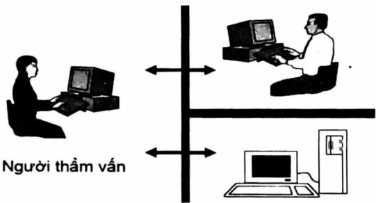

Hình 1.1. Phép thử Turing

Alan Turing đề xuất bộ kiểm thử: Trong phép thử này, một máy tính và một người tham gia trắc nghiệm được đặt vào trong các căn phòng cách biệt với một người thứ hai (người thẩm vấn). Người thẩm vấn không biết được chính xác đối tượng nào là người hay máy tính, và cũng chỉ có thể giao tiếp với hai đối tượng đó thông qua các phương tiện kỹ thuật như một thiết bị soạn thảo văn bản, hay thiết bị đầu cuối. Người thẩm vấn có nhiệm vụ phân biệt người với máy tính bằng cách chỉ dựa trên những câu trả lời của họ đối với những câu hỏi được truyền qua thiết bị liên lạc này. Trong trường hợp nếu người thẩm vấn không thể phân biệt được máy tính với người thì who đó, theo Turing máy tính này có thể

<!-- page: 8 -->

được xem là thông minh. Đề vượt qua phép thử Turing, máy tính cần có những khả năng sau:

\- Xử lý ngôn ngữ tự nhiên để giao tiếp thành công bằng ngôn ngữ của con người;

\- Biểu diễn tri thức đề lưu trữ những gì hệ thống biết được hoặc nghe được;

\- Suy luận tự động để trả lời câu hỏi và đưa ra kết luận mới;

\- Học máy để thích ứng với hoàn cảnh mới.

(2) Nghĩ như con người (Thinking humanly): Phương pháp tiếp cận mô hình nhận thức. Đề nói rằng một chương trình suy nghĩ giống như con người, ta phải biết con người suy nghĩ như thế nào. Chúng ta có thể tìm hiểu về cách nghĩ của con người theo các cách sau:

\- Nội tâm - cố gắng nấm bắt những suy nghĩ của chính chúng ta khi chúng trôi qua;

\- Thực nghiệm tâm lý - quan sát một người đang hành động;

\- Hình ảnh não - quan sát não hoạt động.

Một khi chúng ta có một lý thuyết đủ chính xác về trí não, thì có thể diễn đạt lý thuyết như một chương trình máy tính. Nếu hành vi đầu vào - đầu ra của chương trình phù hợp với hành vi tương ứng của con người, đó là bằng chứng cho thấy một số cơ chế của chương trình cũng có thể hoạt động giống như ở con người.

(3) Suy nghĩ hợp lý (Thinking rationally): Cách tiếp cận “quy luật của suy nghĩ”. Nhà triết học Hy Lạp Aristotle là một trong những người đầu tiên cố gắng hệ thống hóa “tư duy đúng đắn” - nghĩa là các quá trình suy luận không thể bác bò. Tam đoạn luận của ông đã cung cấp các mẫu cho cấu trúc lập luận luôn mang lại kết luận đúng khi các tiền đề cho trước đúng.

<!-- page: 9 -->

(4) Hành động hợp lý (Acting rationally): Cách tiếp cận tác nhân hợp lý. Tác nhân hợp lý là tác nhân hoạt động đề đạt được kết quả tốt nhất hoặc kết quả mong đợi tốt nhất khi có yếu tố không chắc chắn.

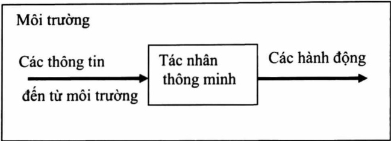

Hình 1.2. Mô hình tác nhân thông minh

## 1.2. TẠI SAO CẦN TRÍ TUỆ NHÂN TẠO

AI có khả năng tác động đến mọi khóa cạnh trong cuộc sống của chúng ta. Với AI, chúng ta muốn xây dựng các hệ thống thông minh cũng như hiểu khái niệm trí thông minh. Các hệ thống thông minh mà chúng ta xây dựng rất hữu ích trong việc hiểu cách một hệ thống thông minh vận hành giống như bộ não của chúng ta tiến hành xây dựng một hệ thống thông minh khác.

So với một số lĩnh vực khác như toán học hay vật lý đã có từ nhiều thế kỳ trước, AI còn tương đối sơ khai. Trong vài thập kỳ qua, AI đã tạo ra một số sản phẩm ngoại mục như ô tô tự lái và robot thông minh có thể đi bộ. Dựa trên định hướng mà chúng ta đang hướng tới, rõ ràng là việc đạt được trí thông minh sẽ có tác động lớn đến cuộc sống của chúng ta trong những năm tới.

Chúng ta luôn tự hỏi làm thể nào mà bộ não con người có thể làm được nhiều việc một cách dễ dàng như vậy. Chúng ta có thể dễ dàng nhận ra các đồ vật, hiểu ngôn ngữ, học những điều mới và thực hiện nhiều nhiệm vụ phức tạp hơn với bộ não của mình. Làm thể nào để bộ não con người làm được điều này? Khi ta cổ gắng làm điều này với một chiếc máy, ta sẽ thấy rằng nó bị tự lại phía sau! Tất cả những gì chúng ta

<!-- page: 10 -->

phải làm là bắt chức chức năng của bộ não con người để tạo ra một hệ thống thông minh có thể làm điều gì đó tương tự, thâm chí có thể làm tốt hơn.

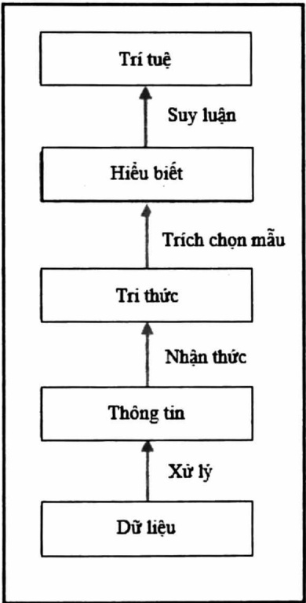

Hình 1.3. Quá trình hình thành trí tuệ của con người

Một trong những lý do chính mà chúng ta muốn nghiên cứu về AI là để thực hiện tự động hóa một số công việc. Chúng ta đang sống trong một thể giới nơi:

\- Hằng ngày, chúng ta xử lý lượng dữ liệu không lò và không thể vượt qua. Bộ não con người không thể theo dõi quá nhiều dữ liệu.

\- Dữ liệu đến đồng thời và từ nhiều nguồn khác nhau.

<!-- page: 11 -->

\- Dữ liệu không có tổ chức và hỗn loạn.

\- Tri thức thu được từ dữ liệu này phải được cập nhật liên tục vì bản thân dữ liệu luôn thay đổi.

\- Thu nhận và hành động phải diễn ra trong thời gian thực với độ chính xác cao.

Mặc dù bộ não của con người rất giới trong việc phân tích mọi thứ xung quanh, nhưng nó không thể theo kịp các điều kiện trước đó. Do đó, chúng ta cần thiết kế và phát triển những cổ máy thông minh để có thể làm được điều này. Chúng ta mong muốn các hệ thống AI có thể:

\- Xử lý một lượng lớn dữ liệu một cách hiệu quả. Với sự ra đời của điện toán đảm mây, giờ đây chúng ta có thể lưu trữ một lượng lớn dữ liệu.

\- Nhập dữ liệu đồng thời từ nhiều nguồn mà không có bất kỳ độ trẻ nào.

\- Lập chi mục và tổ chức dữ liệu theo cách cho phép chúng ta thu thập thông tin chi tiết.

\- Học hỏi từ dữ liệu mới và cập nhật liên tục bằng cách sử dụng các thuật toán phù hợp.

\- Suy nghĩ và phản ứng với các tình huống dựa trên các điều kiện trong thời gian thực.

Các kỹ thuật AI đang tích cực được sử dụng đề làm cho các máy hiện có thông minh hơn, đề chúng có thể thực thi nhanh hơn và hiệu quả hơn.

## 1.3. ÚNG DỤNG CỦA AI

AI đã được sử dụng trong nhiều ngành công nghiệp và nó tiếp tục mở rộng nhanh chóng. Một số lĩnh vực phổ biến nhất bao gồm:

<!-- page: 12 -->

Thị giác máy tính (Computer Vision): Nghiên cứu về việc thu nhận, xử lý, nhận dạng thông tin hình ảnh thành biểu biến mức cao hơn như các đối tượng xung quanh để máy tính có thể hiểu được. Đây là những hệ thống xử lý dữ liệu trực quan như hình ảnh và video. Các hệ thống này hiểu nội dung và trích xuất thông tin chi tiết dựa trên trường hợp sử dụng. Ví dụ: Google sử dụng tìm kiếm hình ảnh đào ngược để tìm kiếm các hình ảnh tương tự về mặt hình ảnh trên Web (Hình 1.4).

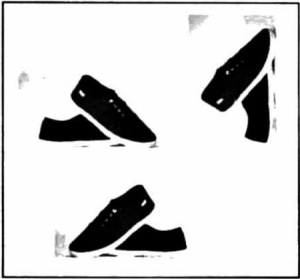

Hình 1.4. Kết quả tìm kiếm với hình ảnh thay đổi của Google trên Web

Xử lý ngôn ngữ tự nhiên (Natural Language Processing): Lĩnh vực này đề cập đến việc hiểu văn bản. Chúng ta có thể tương tác với máy bằng cách gỗ các câu ngôn ngữ tự nhiên. Các công cụ tìm kiếm sử dụng thông tin này đề cung cấp các kết quả tìm kiếm phù hợp.

Nhận dạng giọng nói (Speech Recognition): Các hệ thống này có khả năng nghe và hiểu các từ được nói. Ví dụ: có những trợ lý cá nhân thông minh trên điện thoại thông minh của chúng ta có thể hiểu những gì chúng ta đang nói và cung cấp thông tin liên quan hoặc thực hiện một hành động dựa trên đó.

Hệ chuyên gia (Expert Systems): Các hệ chuyên gia này sử dụng các kỹ thuật AI để đưa ra lời khuyên hoặc đưa ra quyết định. Các hệ này thường sử dụng cơ sở dữ liệu về các lĩnh vực kiến thức chuyên ngành như tài chính, y học, tiếp thị, v.v... để đưa ra lời khuyên về những việc cần làm tiếp theo. Hây xem một hệ thống chuyên gia trông như thế nào và nó tương tác với người dùng như thế nào:

<!-- page: 13 -->

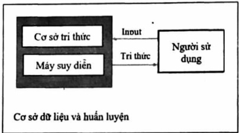

Hình 1.5. Hoạt động của hệ chuyên gia

Trò chơi (Games): AI được sử dụng rộng rãi trong ngành công nghiệp trò chơi. Nó được sử dụng để thiết kế các tác nhân thông minh có thể cạnh tranh với con người. Ví dụ, AlphaGo là chương trình máy tính có thể chơi trò chơi chiến thuật cờ vậy. AI cũng được sử dụng để thiết kế nhiều loại trò chơi khác nơi mà chúng ta mong đợi máy tính hoạt động một cách thông minh.

Người máy (Robotics): Người máy kết hợp nhiều khái niệm trong AI. Các hệ thống này có thể thực hiện nhiều nhiệm vụ khác nhau. Tùy thuộc vào từng tỉnh hướng cụ thể, người máy có cảm biến và cơ cấu truyền động có thể làm những việc khác nhau. Các cảm biến này có thể nhìn thấy mọi thứ ở phía trước và đo nhiệt độ, độ nóng, chuyển động, v.v... Chúng có bộ xử lý trên bo mạch đề thực hiện nhiều nhiệm vụ khác nhau trong thời gian thực. Chúng cũng có khả năng thích nghi với môi trường mới.

## 1.4. CÁC LĨNH VỰC NGHIÊN CỨU CỦA AI

Có nhiều kỹ thuật nghiên cứu, phát triển ngành khoa học AI, dưới đây là các chủ đề đang được các nhà nghiên cứu quan tâm:

Học máy và nhận dạng mẫu (Machine learning and pattern recognition): Chủ đề này có lẻ đang được nhiều người quan tâm nhất hiện nay. Chúng ta thiết kế và phát triển phần mềm có thể học hỏi từ dữ liệu. Dựa trên các mô hình học này, chúng ta thực hiện các dự đoán trên dữ liệu chưa biết. Một trong những hạn chế chính ở đây là các chương

<!-- page: 14 -->

trình này bị giới hạn sức mạnh của dữ liệu. Nếu tập dữ liệu nhỏ, thì các mô hình học tập cũng sẽ bị hạn chế. Dưới đây là một hệ thống học máy điển hình:

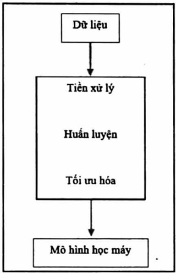

Hình 1.6. Mô hình học máy

Khi hệ thống thực hiện một quan sát, nó được huấn luyện đề so sánh quan sát này với mẫu đã có trước đó. Ví dụ, trong hệ thống nhận dạng khuôn mặt, phần mềm sẽ cố gắng đối sánh mẫu mắt, mũi, môi, lông mày, v.v... để tìm khuôn mặt trong cơ sở dữ liệu hiện có của người dùng.

AI dựa trên logic (Logic-based AI): Logic toán học được sử dụng để thực thi các chương trình máy tính trong AI dựa trên logic. Một chương trình được viết bằng AI dựa trên logic về cơ bản là một tập hợp các câu lệnh ở dạng logic thể hiện các sự kiện và luật về một bài toán cụ thể nào đó. Công cụ này được sử dụng rộng rãi trong đối sánh mẫu, phân tích cú pháp ngôn ngữ, phân tích ngữ nghĩa, v.v...

Tìm kiểm (Search): Các kỹ thuật tìm kiếm được sử dụng rộng rãi trong các chương trình AI. Các chương trình này kiểm tra một số lượng lớn các khả năng và sau đó chọn ra phương án tối ưu nhất. Ví dụ, kỹ thuật này được sử dụng nhiều trong các trò chơi chiến lược như cờ vua, phân bổ tài nguyên, lập kế hoạch, v.v...

<!-- page: 15 -->

Biểu diễn tri thức (Knowledge representation): Các sự kiện về thể giới xung quanh chúng ta cần được biểu diễn theo một cách nào đó đề một hệ thống hiểu được chúng. Các ngôn ngữ logic toán học thường được sử dụng trong trường hợp này. Nếu tri thức được biểu diễn một cách hiệu quả, thì hệ thống trở nên thông minh. Ontology là một lĩnh vực nghiên cứu liên quan chặt chẽ đến các loại đối tượng đang tồn tại. Nó có thể định nghĩa một cách hình thức về các thuộc tính và mối quan hệ của các thực thể tồn tại trong một miền cụ thể nào đó. Hình 1.7 sau đây cho thấy sự khác biệt giữa thông tin và tri thức:

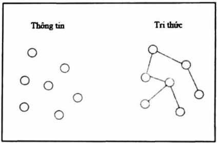

Hình 1.7. Sự khác biệt giữa thông tin và tri thức

Lập kế hoạch (Planning): Lĩnh vực này đề cập đến việc lập kế hoạch tối ưu mang lại cho chúng ta lợi nhuận tối đa với chi phí tối thiểu. Các chương trình này bắt đầu với các dữ kiện về tình huống cụ thể và mục tiêu cần đạt được. Các chương trình này cũng nhận thức được các quy luật xuất phát từ các sự kiện của môi trường xung quanh. Từ những thông tin này, chúng đưa ra phương án tối ưu nhất để đạt được mục tiêu.

Lý thuyết tìm kiếm heuristic: Heuristic là một kỹ thuật hữu ích trong việc giải quyết vấn đề trong ngắn hạn, nhưng không đảm bảo được tính tối ưu. Kỹ thuật này bao gồm các phương pháp và các kỹ thuật tìm kiếm, sử dụng các tri thức đặc biệt này sinh từ bản thân bài toán cần giải đề từ đó nhanh chóng đưa ra kết quả mong muốn. Trong AI, chúng ta thường xuyên gặp phải những tỉnh hướng mà chúng ta không thể kiểm tra mọi khả năng đề chọn ra phương án tốt nhất. Vi vậy, chúng ta cần sử dụng heuristic để đạt được mục tiêu. Chúng được sử dụng rộng rãi trong

<!-- page: 16 -->

các lĩnh vực như robot, công cụ tìm kiếm, v.v... Lý thuyết tìm kiếm heuristic bao gồm các phương pháp và các kỹ thuật tìm kiếm, sử dụng các tri thức đặc biệt này sinh từ bản thân lĩnh vực của bài toán cần giải đề từ đó nhanh chóng đưa ra kết quả mong muốn.

Lập trình di truyền (Genetic programming): Lập trình di truyền là một phương pháp đề có được các chương trình đề giải quyết một nhiệm vụ, bằng cách ghép đôi các chương trình và chọn chương trình phù hợp nhất. Các chương trình được mã hóa như một tập hợp các gen, sử dụng một thuật toán đề có được một chương trình có khả năng thực hiện các nhiệm vụ thực sự tốt.

## 1.5. LỊCH SỬ HÌNH THÀNH VÀ PHÁT TRIỂN AI

Một cách nhanh chóng đề tóm tất các cột mốc quan trọng trong lịch sử AI là liệt kê những người giành Giải thường Turing: Marvin Minsky (1969) và John McCarthy (1971) vì đã xác định nền tảng của lĩnh vực này dựa trên biểu diễn tri thức và lập luận dựa trên logic cổ điện; Ed Feigenbaum và Raj Reddy (1994) phát triển các hệ chuyên gia mã hóa tri thức của con người đề giải quyết các vấn đề trong thế giới thực; Judea Pearl (2011) phát triển các kỹ thuật lập luận dựa trên xác suất để đối phó với sự không chắc chắn một cách có nguyên tắc; và cuối cùng là Yoshua Bengio, Geoffrey Hinton và Yann LeCun (2019) vì đã biến “học sâu” (mạng nơ-ron đa lớp) trở thành một phần quan trọng của máy tính hiện đại. Phần còn lại của phần này đi sâu hơn vào từng giai đoạn của lịch sử AI.

## Sự ra đời của trí tuệ nhân tạo (1943 - 1956)

\- Công trình đầu tiên mà ngày nay thường được công nhận là AI được thực hiện bởi Warren McCulloch và Walter Pitts (1943), họ đã đề xuất một mô hình nơ-ron nhân tạo. McCulloch và Pitts cũng gọi ý rằng các mạng được xác định phù hợp có khả năng học hỏi.

<!-- page: 17 -->

\- Donald Hebb (1949) đã chứng minh một quy tắc cập nhật đơn giản đề điều chỉnh trọng số kết nối giữa các nơ-ron. Quy tắc của ông bảy giờ được gọi là quy tắc Hebbian, vẫn là một mô hình có ảnh hưởng cho đến ngày nay.

\- Năm 1955, John McCarthy của Đại học Dartmouth đã thuyết phục Minsky, Claude Shannon và Nathaniel Rochester giúp ông tập hợp các nhà nghiên cứu Hoa Kỳ quan tâm đến lý thuyết automata, mạng nơ-ron nhân tạo và nghiên cứu trí thông minh. Hộ tổ chức một hội thảo kéo dài hai tháng tại Dartmouth vào mùa hè năm 1956. Chính vì lý do này mà người ta lấy hội nghị này làm sự kiện ra đời của ngành AI.

## Sự nhiệt tình ban đầu, những kỳ vọng lớn (1952 - 1969)

Tiếp nối sự thành công chương trình LT (Logic Theorist), Newell và Simon đã đề xuất mô hình GPS (General Problem Solver). GPS có lẽ là chương trình đầu tiên thể hiện phương pháp tiếp cận “suy nghĩ như con người”. Sự thành công của GPS và các chương trình tiếp theo làm mô hình nhận thức đã khiển Newell và Simon (1976) hình thành giả thuyết hệ thống ký hiệu vật lý nổi tiếng, trong đó tuyên bố rằng “một hệ thống ký hiệu vật lý là phương tiện cần và đủ cho hành động thông minh nói chung”. Ý của họ là bất kỳ hệ thống nào (con người hoặc máy móc) thể hiện trí thông minh đều phải hoạt động bằng cách điều khiển cấu trúc dữ liệu bao gồm các ký hiệu.

Năm 1958, John McCarthy đã có hai đóng góp quan trọng cho AI. Trong MIT AI Lab Memo No.1, ông đã định nghĩa ngôn ngữ cấp cao Lisp, ngôn ngữ này đã trở thành ngôn ngữ lập trình AI thống trị trong 30 năm. Trong một bài báo có tựa đề “Programs with Common Sense”, ông đã nâng tầm đề xuất khái niệm cho các hệ thống AI dựa trên tri thức và lập luận. Cách tiếp cận này vẫn còn phù hợp cho đến ngày nay.

Năm 1963, McCarthy bắt đầu làm việc tại phòng thí nghiệm AI, Stanford. Ông đã lên kế hoạch xây dựng chương trình lời khuyến cuối

<!-- page: 18 -->

cùng Advice Taker. Chương trình này của ông đã được nâng cao bởi J.A.Robinson vào năm 1965 về phương pháp hợp giải (một thuật toán chứng minh định lý hoàn chỉnh cho logic vị từ bậc nhất).

Chương trình ANALOGY (1968) của Tom Evans đã giải được các bài toán hình học xuất hiện trong các bài kiểm tra IQ.

Trong giai đoạn này, mạng no-ron của McCulloch và Pitts được các nhà nghiên cứu quan tâm phát triển mạnh mê. Phương pháp học của Hebb được nâng cao bởi Bernie Widrow (Widrow và Hoff, 1960; Widrow, 1962), người đã gọi các mạng của mình là ADALINES và Frank Rosenblatt (1962) bằng các Perceptron của mình. Định lý hội tụ Perceptron (Block và cộng sự, 1962) nói rằng, thuật toán học có thể điều chỉnh trọng số kết nối của Perceptron để phù hợp với bất kỳ dữ liệu đầu vào nào, miễn là tồn tại sự phù hợp như vậy.

## Sự trầm lắng (1966 – 1973)

Ngay từ đầu, các nhà nghiên cứu AI đã không ngại đưa ra dự đoán về những thành công sắp tới của họ. Simon đưa ra dự đoán cụ thể hơn: trong vòng 10 năm nửa máy tính sẽ trở thành nhà vô dịch cờ vua và một số định lý toán học quan trọng sẽ được chứng minh bằng máy tính. Những dự đoán này đã trở thành sự thật (hoặc gần đúng) trong vòng 40 năm thay vì 10 năm. Sự tự tin quá mức của Simon là do hiệu suất đầy hóa hạn của các hệ thống AI ban đầu trên các ví dụ đơn giản. Tuy nhiên, trong hầu hết mọi trường hợp, những hệ thống ban đầu này đều thất bại với những bài toán khó hơn.

Có hai lý do chính cho sự thất bại này. Thứ nhất, là nhiều hệ thống AI ban đầu chủ yếu dựa trên "sự xem xét nội tâm được thông báo" về cách con người thực hiện một nhiệm vụ, thay vì phân tích kỹ lưỡng nhiệm vụ, ý nghĩa của một giải pháp và thuật toán cần phải làm gì để tạo ra các giải pháp như vậy một cách dáng tin cây. Thứ hai là sự thiếu đánh giá cao về khả năng khó giải quyết của nhiều vấn đề mà AI đang cố gắng giải quyết. Hầu hết các hệ thống giải quyết vấn đề ban đầu đều hoạt động

<!-- page: 19 -->

bằng cách thử các bước kết hợp khác nhau cho đến khi tìm ra giải pháp. Chiến lược này ban đầu hoạt động vì thể giới nhỏ (microworlds) chứa rất ít đối tượng và do đó, rất ít hành động có thể thực hiện được và chuỗi giải pháp rất ngắn.

## Hệ chuyên gia (1969 - 1986)

Bức tranh về giải quyết vấn đề đã này sinh trong thập kỳ đầu tiên của nghiên cứu AI là một cơ chế tìm kiếm có mục đích chung có gắng xấu chuỗi các bước lập luận cơ bản lại với nhau để tìm ra các giải pháp hoàn chỉnh. Cách tiếp cận này có một số hạn chế do không có tri thức về lĩnh vực liên quan, và do vậy không thể giải quyết những bài toán khó, đời hỏi khối lượng tính toán lớn hoặc nhiều tri thức chuyên sâu. Giải pháp thay thế cho các phương pháp này là sử dụng tri thức mạnh hơn, theo lĩnh vực cụ thể cho phép các bước lập luận lớn hơn và có thể dễ dàng xử lý các trường hợp thường xảy ra trong các lĩnh vực chuyên môn hẹp hơn. Có thể kể đến một số chương trình như vậy:

\- Chương trình DENDRAL (Buchanan và cộng sự, 1969) là một minh chứng ban đầu của cách tiếp cận này. Nó được phát triển tại Stanford, nơi Ed Feigenbaum (một học trò cũ của Herbert Simon), Bruce Buchanan (một triết gia trò thành nhà khoa học máy tính) và Joshua Lederberg (một nhà di truyền học đoạt giải Nobel) đã hợp tác đề giải quyết vấn đề dự đoán cấu trúc phân tử từ thông tin được cung cấp bởi một khối phổ kế.

\- Nỗ lực lớn tiếp theo là hệ thống MYCIN để chẩn đoán nhiễm trùng máu. Với khoảng 450 quy tắc, MYCIN có thể hoạt động tốt như một số chuyên gia và tốt hơn đáng kể so với các bác sĩ sơ cấp.

Năm 1972, Alain Colmerauer đã phát triển ngôn ngữ Prolog (Programming in logic - tức là lập trình logic) phục vụ việc biểu diễn tri thức dưới dạng tương tự logic vị từ và lập luận trên tri thức đó.

<!-- page: 20 -->

## Sự trở lại của mạng nơ-ron (1986 - nay)

Vào giữa những năm 1980, ít nhất bốn nhóm khác nhau đã phát minh lại thuật toán học truyền ngược (back-propagation learning algorithm) được phát triển lần đầu tiên vào đầu những năm 1960. Thuật toán đã được áp dụng cho nhiều bài toán trong khoa học máy tính và tâm lý học, và việc phổ biến rộng rãi các kết quả trong đề án “Parallel Distributed Processing” (Rumelhart và McClelland, 1986) đã tạo ra rất nhiều hứng thú cho các nhà nghiên cứu.

## Lập luận xác suất và học máy (1987 - nay)

Tính thiếu ổn định của các hệ chuyên gia đã dẫn đến một cách tiếp cận mới, khoa học hơn đó là dựa trên xác suất thay vì logic hai trị, học máy thay vì mã hóa bằng tay, và các kết quả thực nghiệm hơn là các tuyên bố triết học. Cách tiếp cận này dựa trên các định lý được chứng minh một cách chặt chẽ hoặc phương pháp thực nghiệm vững chắc (Cohen, 1995) hơn là dựa trên trực giác. Chẳng hạn, trong những năm 1980, mô hình Markov ăn (Hidden Markov Models - HMM) đã thống trị lĩnh vực nhận dạng giống nói, hay Pearl (1988) đã phát triển mạng Bayes, đây là công cụ hiệu quả mạnh mẽ để lập luận với các tri thức không chắc chắn.

## Dữ liệu lớn (2001 - nay)

Những tiến bộ đáng kể trong sức mạnh tính toán và sự ra đời của World Wide Web đã tạo điều kiện thuận lợi cho việc tạo ra các tập dữ liệu rất lớn (đôi khi được gọi là dữ liệu lớn - Big data). Các tập dữ liệu này bao gồm hàng nghìn tỷ từ văn bản, hàng tỷ hình ảnh, hàng tỷ giờ nói và video, cũng như một lượng lớn dữ liệu bộ gen, dữ liệu theo dõi xe, dữ liệu dòng nhập chuột, dữ liệu mạng xã hội, v.v... Điều này đã dẫn đến sự phát triển của các thuật toán học được thiết kế đặc biệt để tận dụng các tập dữ liệu rất lớn này. Có thể kể đến các thuật toán của Banko and Brill (2001), Hays and Efros (2007), (Deng và các cộng sự, 2009), Havenstein, (2005), Halevy và các cộng sự (2009).

<!-- page: 21 -->

Dữ liệu lớn là một yếu tố quan trọng trong chiến thắng năm 2011 của hệ thống Watson thuộc hăng IBM trước các nhà vô dịch con người trong cuộc thi Jeopardy (trò chơi đổ vui), một sự kiện có tác động lớn đến nhận thức của công chúng về AI.

## Học sâu (2011 - nay)

Thuật ngữ học sâu (Deep learning) đề cập đến việc học máy sử dụng mạng nhiều lớp no-ron, có thể điều chỉnh. Các thí nghiệm đã được thực hiện với các mạng như vậy từ những năm 1970, và ở dạng mạng no-ron tích chấp (Convolutional Neural Network - CNN), các nhà nghiên cứu đã tìm thấy một số thành công trong việc nhận dạng chữ số viết tay vào những năm 1990 (LeCun và cộng sự, 1995). Tuy nhiên, phải đến năm 2011, phương pháp học sâu mới thực sự thành công. Thành công đầu tiên cho bài toán nhận dạng giống nói và sau đó là nhận dạng đối tượng trực quan.

Trong cuộc thi ImageNet năm 2012, người tham gia được yêu cầu phân loại hình ảnh thành một trong một nghìn danh mục (cánh tay, giá sách, nút văn, v.v... Geoffrey Hinton tại Đại học Toronto (Krizhevsky và cộng sự, 2013) đã tạo ra mạng học sâu, kết quả thu được cải tiến đáng kể so với các hệ thống trước đó. Kề từ đó, các hệ thống học sâu đã vượt quá hiệu suất của con người trong một số nhiệm vụ liên quan đến thị giác. Lợi ích tương tự cũng đã được báo cáo trong việc nhận dạng giống nói, dịch máy, chẩn đoán y tế và chơi trò chơi. Việc sử dụng mạng học sâu để thể hiện chức năng đánh giá đã góp phần vào chiến thắng của ALPHAGO trước những kỳ thủ cờ vậy hàng đầu (Silver và các cộng sự, 2016, 2017, 2018).

Học sâu chủ yếu dựa vào phần cứng mạnh. Một CPU máy tính tiêu chuẩn chỉ có thể thực hiện $10^{9}$ hoặc $10^{10}$ thao tác trên giây, trong khi đó một thuật toán học sâu chạy trên phần cứng chuyên dụng (ví dụ: GPU, TPU hoặc FPGA) có thể thực hiện $10^{14}$ đến $10^{17}$ phép toán trên giây.

<!-- page: 22 -->

## TÓM TẮT CHƯƠNG 1

✿ Như vậy, TTNT là một lĩnh vực của khoa học và công nghệ nhằm làm cho máy có những khả năng của trí tuệ con người, tiêu biểu như biết suy nghĩ và lập luận để giải quyết vấn đề, biết giao tiếp do hiểu ngôn ngữ tự nhiên và tiếng nói, biết học và tự thích nghi, v.v...

❖ Sự phát triển của TTNT đã tạo ra một bước nhảy vọt về chất trong kỹ thuật và kỹ nghệ xử lý thông tin. Trí tuệ nhân tạo chính là cơ sở của công nghệ xử lý thông tin mới.

✿ TTNT có vai trò rất quan trọng trong việc đưa ra lời giải cho các bài toán có không gian tìm kiếm lớn.

✿ TTNT gồm hai thành phần cơ bản: Tri thức và suy diễn

$$
\mathrm{AI} = \text {Tri thức} + \text {Suy diễn}
$$

✿ TTNT được ứng dụng thành công trong hầu hết các lĩnh vực: Kinh tế, địa chất, y học, hóa học, v.v... với mô hình học sâu hiện nay.

<!-- page: 23 -->

## BÀI TẬP

Bài 1:

a) Trí tuệ nhân tạo là gì? Cho ví dụ một chương trình sử dụng TTNT?

b) Cho biết vai trò của TTNT và cho ví dụ minh họa cho nhận định này?

c) Các thành phần cơ bản của TTNT?

Bài 2: Nghiên cứu tài liệu AI đề tìm ra công việc nào dưới đây có thể giải quyết được bằng máy tính:

a) Trò chơi bóng bàn?

b) Đưa ra lời khuyên, tư vấn về một căn bệnh nào đó?

c) Viết một truyền cuối?

d) Dịch tiếng Anh sang tiếng Việt theo thời gian thực?

<!-- page: 24 -->

## Chương 2.

## TÌM KIỂM TRÊN KHÔNG GIAN TRẠNG THÁI

Chương này giới thiệu cách biểu diễn bài toán trong không gian trạng thái, từ không gian này chuyển sang biểu diễn bằng đồ thị; các chiến lược tìm kiếm mù và sau cùng là các kỹ thuật tìm kiếm theo kinh nghiệm được áp dụng cho bài toán có độ phức tạp tính toán cấp hàm mũ.

## 2.1. ĐẶT VẤN ĐỀ

Khi giải quyết bài toán bằng phương pháp tìm kiếm, trước hết ta phải xác định được không gian tìm kiếm (bao gồm tất cả các đối tượng mà trên đó thực hiện việc tìm kiếm). Nó có thể là không gian liên tục và nó cũng có thể là không gian các đối tượng rời rạc. Như vậy, ta sẽ xét việc biểu diễn một bài toán trong không gian trạng thái sao cho việc giải quyết bài toán này được quy về việc tìm kiếm lời giải trong không gian trạng thái. Ta có thể sử dụng các khái niệm trạng thái (state) và toán tử (operator) để biểu diễn bài toán đang xét.

Phương pháp giải quyết vấn đề dựa trên khái niệm trạng thái và toán từ được gọi là cách tiếp cận giải quyết vấn đề nhờ không gian trạng thái.

## 2.2. MỘT SỐ KHÁI NIỆM

## 2.2.1. Mô tả trạng thái

Giải bài toán trong không gian trạng thái, trước hết phải xác định dạng mô tả trạng thái bài toán sao cho bài toán trở nên đơn giản hơn, phù hợp bản chất vật lý của bài toán (có thể sử dụng các xây ký hiệu, véctơ, màng hai chiều, cây, danh sách,...).

<!-- page: 25 -->

Mỗi trạng thái chính là mỗi hình trạng của bài toán, các tình trạng ban đầu và tình trạng cuối của bài toán gọi là trạng thái đầu và trạng thái cuối.

Ví dụ 2.1: Bài toán trò chơi 8 số

Trong bảng ô vuông 3 hàng, 3 cột, mỗi ô chứa một số nằm trong phạm vi từ 1 đến 8 sao cho không có 2 ô có cùng giá trị, có một ô trong bảng bị trống (không chứa giá trị nào cả). Xuất phát từ một sắp xếp nào đó các số trong bảng, hãy dịch chuyển ô trống sang phải, sang trái, lên trên hoặc xuống dưới (nếu có thể được) để đưa bảng ban đầu về bảng quy ước trước.

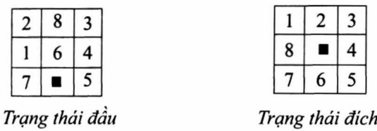

Hình 2.1. Bài toán 8 số

Mỗi hình trạng trong bài toán này là một cách sắp xếp các con số. Ta có thể dùng màng hai chiều kích thước 3×3 hoặc màng một chiều kích thước 9 đề biểu diễn cho mỗi trạng thái trong máy tính.

Ví dụ 2.2: Bài toán thấp Hà Nội

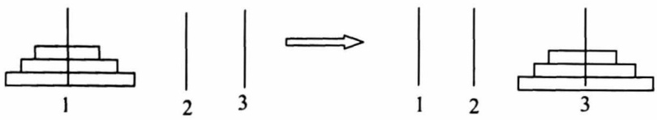

Hình 2.2. Bài toán thấp Hà Nội với n = 3

Cho 3 cọc 1, 2, 3. Ô cọc 1 ban đầu có n đĩa sắp xếp theo thứ tự từ nhỏ đến lớn. Hãy dịch chuyển n đĩa đó sang cọc 3 sao cho:

\- Mỗi lần chuyển một đĩa.

<!-- page: 26 -->

\- Trong mỗi cọc không được đặt đĩa to ở trên đĩa nhỏ hơn trong bất cứ tình huống nào.

Trong bài toán trên, mỗi trạng thái là một bộ (ijk) với ý nghĩa: Đĩa C (đĩa lớn nhất) ở cọc i, đĩa B ở cọc j, đĩa A (đĩa bé nhất) ở cọc k. Trạng thái đầu là (111) còn trạng thái đích là (333).

Với bài toán này, ta cũng có thể dùng màng hai chiều đề biểu diễn: 3 cột tương ứng với 3 cọc, số dòng tương ứng với số đĩa. Cụ thể, trong trường hợp này ta dùng màng 3×3.

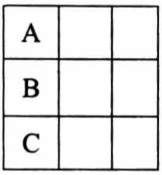

Trạng thái đầu

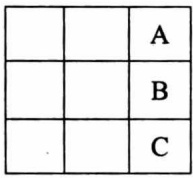

Trạng thái đích

Hình 2.3. Trạng thái trong bài toán thấp Hà Nội

Ví dụ 2.3: Bài toán khách du lịch

Một khách du lịch có trong tay bản đồ mạng lưới giao thông nối các thành phố trong một vùng lãnh thổ (hình 2.4). Du khách đang ở thành phố A và anh ta muốn tìm đường đi tới thành phố B.

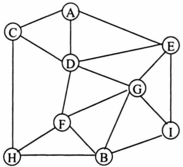

Hình 2.4. Tîm đường đi từ A đến B

<!-- page: 27 -->

Trong bài toán này, các thành phố có trong bản đồ là các trạng thái. Thành phố A là trạng thái đầu còn thành phố B là trạng thái kết thúc. Với bài toán này, ta có thể sử dụng cách biểu diễn của đồ thị (ma trận kè, ma trận trọng số, danh sách cạnh, danh sách kè).

## 2.2.2. Toán tử

Toán từ là các phép biến đổi từ trạng thái này sang trạng thái khác.

Có hai cách dùng để biểu diễn các toán tử:

\- Biểu diễn như một hàm xác định trên tập các trạng thái và nhận giá trị cũng trong tập này.

\- Biểu diễn dưới dạng các luật sản xuất S → A, có nghĩa là nếu có trạng thái S thì có thể đưa đến trạng thái A.

Trong ví dụ 2.1, mỗi toán từ là cách chuyển ô trống, có 4 kiểu toán từ: chuyển ô trống lên trên, xuống dưới, sang trái, sang phải. Tuy nhiên, đối với một số trạng thái nào đó, một toán từ nào đó có thể không áp dụng được, chẳng hạn, nếu ô trống nằm ở cột đầu tiên thì ô trống không thể sang trái được.

Trong ví dụ 2.2, toán từ là cách chuyển đĩa từ cọc này sang cọc khác, mỗi lần chuyển một đĩa và không được đặt đĩa to ở trên đĩa nhỏ.

Chẳng hạn như: (ijk) → (ijj) (Chuyển đĩa A từ cọc k sang cọc j)

(ijk) → (iik) (Chuyên đĩa B từ cọc j sang cọc i)

(1 1 1) → (1 1 2)

(1 1 1) → (1 1 3)

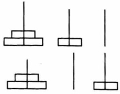

Trong ví dụ 2.3, mỗi toán từ là hành động đi từ thành phố này tới các thành phố khác.

<!-- page: 28 -->

## 2.3. CẤU TRÚC CHUNG CỦA BÀI TOÁN TÌM KIỂM

Từ các ví dụ 2.1, 2.2, 2.3 ta có thể thấy nhiều bài toán đều có dạng "tìm đường đi trong đồ thị", hay nói một cách hình thức hơn là "xuất phát từ một định của một đồ thị, tìm đường đi hiệu quả nhất đến một định nào đó". Từ đây, ta có bài toán phát biểu trong không gian trạng thái.

Bài toán S: Cho trước hai trạng thái T₀ và T\_G, hãy xây dựng chuỗi trạng thái T₀, T₁, T₂, ..., Tₙ₋₁, Tₙ = T\_G sao cho:

$\sum_{i=1}^{n}\cos t(T_{i-1},T_{i})$ thỏa mãn một điều kiện cho trước (thường là nhỏ nhất).

Trong đó, $T_i$ thuộc tập hợp S (gọi là không gian trạng thái - state space) bao gồm tất cả các trạng thái có thể có của bài toán, và cost($T_{i-1}$, $T_i$) là chi phí đề biến đổi từ trạng thái $T_{i-1}$ sang trạng thái $T_i$. Dĩ nhiên, từ một trạng thái $T_{i-1}$ ta có nhiều cách đề biến đổi sang trạng thái $T_i$. Khi nói đến một biến đổi cụ thể từ $T_{i-1}$ sang $T_i$ ta sẽ dùng thuật ngữ hướng đi (với ngụ ý nói về sự lựa chọn).

Mô hình chung của các bài toán phải giải quyết bằng phương pháp tìm kiếm lời giải. Không gian tìm kiếm là một tập hợp trạng thái - tập các nút của đồ thị. Chi phí cần thiết để chuyển từ trạng thái $T_{i-1}$ này sang trạng thái $T_i$ được biểu diễn dưới dạng các con số nằm trên cung nối giữa hai nút.

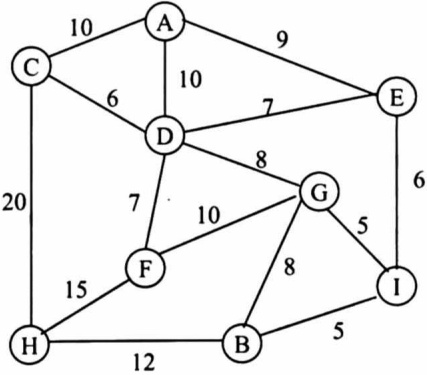

Hình 2.5. Đồ thị có trọng số

<!-- page: 29 -->

Bảng 2.1: Sự tương đương giữa không gian trạng thái và đồ thị

| Không gian trạng thái | Đồ thị |
| --- | --- |
| - Trạng thái đầu- Trạng thái đích- Toán từ dịch chuyển- Dãy các trạng thái- Bài toán S | - Đình đầu- Đình đích- Cung- Đường đi- Bài toán G |

Chẳng hạn, với đồ thị trong hình 2.5, ta có thể phát biểu bài toán: Hây tìm đường đi ngắn nhất từ đỉnh A đến đỉnh B.

Đa số các bài toán thuộc dạng mà chúng ta đang mô tả đều có thể được biểu diễn dưới dạng đồ thị. Trong đó, mỗi trạng thái là một định của đồ thị. Tập hợp S bao gồm tất cả các trạng thái chính là tập hợp bao gồm tất cả các đình của đồ thị. Việc biến đổi từ trạng thái $T_{i-1}$ sang trạng thái $T_i$ là việc đi từ đỉnh đại diện cho $T_{i-1}$ sang đỉnh đại diện cho $T_i$ theo cung nối giữa hai đỉnh này.

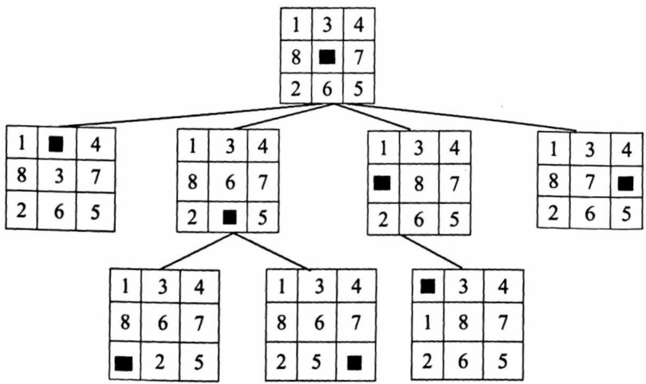

Hình 2.6. Một phần đồ thị biểu diễn trò chơi 8 số

<!-- page: 30 -->

Bài toán G: Cho định đầu  $S_{o}$  và tập các định đích Goal. Hãy tìm đường đi p (tối ưu) nào đó từ định  $S_{o}$  đến định nào đó thuộc tập Goal.

Từ những phân tích ở trên, ta có thể thấy được sự tương đương giữa không gian trạng thái và đồ thị được tổng hợp trong Bảng 2.1.

## 2.4. TÌM KIỂM LỜI GIẢI TRONG KHÔNG GIAN TRẠNG THÁI

Quá trình tìm kiếm lời giải của bài toán được biểu diễn trong không gian trạng thái được xem như quá trình dò tìm trên đồ thị, xuất phát từ trạng thái ban đầu, thông qua các toán từ chuyển trạng thái, lần lượt đến các trạng thái tiếp theo cho đến khi gặp được trạng thái đích hoặc không còn trạng thái nào có thể tiếp tục được nửa.

Khi áp dụng các phương pháp tìm kiếm trong không gian trạng thái, người ta thường quan tâm đến các vấn đề sau:

\- Kỹ thuật tìm kiếm lời giải;

\- Phương pháp luận của việc tìm kiếm;

\- Chiến lược tìm kiểm.

Tuy nhiên, không phải các phương pháp này đều có thể áp dụng đề giải quyết cho tất cả các bài toán phức tạp mà chỉ cho từng lớp bài toán.

Việc chọn chiến lược tìm kiếm cho bài toán cụ thể phụ thuộc nhiều vào các đặc trưng của bài toán.

Trong phần này, chúng ta sẽ nghiên cứu hai chiến lược tìm kiếm:

\- Các kỹ thuật tìm kiếm mù: Trong các kỹ thuật tìm kiếm này, không có một sự hướng dẫn nào cho sự tìm kiếm, mà ta chi phát triển các trạng thái một cách hệ thống từ trạng thái ban đầu cho tới khi gặp một trạng thái đích nào đó. Có ba kỹ thuật tìm kiếm mù cơ bản, đó là tìm kiếm theo chiều rộng (Breath First Search), tìm kiếm theo chiều sâu (Depth First Search) và tìm kiếm sâu dàn.

\- Các kỹ thuật tìm kiếm kinh nghiệm (tìm kiểm heuristic): Với kỹ thuật tìm kiếm này, phải dựa vào kinh nghiệm và sự hiểu biết của chúng ta về vấn đề cần giải quyết đề xây dựng nên hàm đánh giá nhằm tìm ra

<!-- page: 31 -->

các định tiềm năng dẫn đến lời giải. Trong số các trạng thái chờ phát triển, ta chọn trạng thái được đánh giá là tốt nhất để phát triển. Do đó, tốc độ tìm kiếm sẽ nhanh hơn.

Nhận xét:

i) Trong tìm kiểm mù: Ta chọn trạng thái để phát triển theo thứ tự mà chúng được sinh ra.

ii) Trong tim kiểm kinh nghiệm: Ta chọn trạng thái để phát triển dựa vào sự đánh giá các trạng thái.

## 2.5. CHIÉN LƯỢC TÌM KIỂM MÙ

## 2.5.1. Tìm kiểm theo chiều rộng

Từ đỉnh xuất phát, duyệt tất cả các đỉnh kể với đỉnh này, sau đó lại làm như vậy với các đỉnh vừa được duyệt. Quá trình duyệt kết thúc khi tìm thấy đỉnh kết thúc hoặc duyệt hết đồ thị mà không tìm thấy.

Thủ tục tìm kiếm theo chiều rộng (Breadth First Search - BFS)

```txt
Vào: - Đồ thị G = (V, E) với V: Tập đinh, E: Tập cung.
```

\- Đình đầu T₀ và tập Goal chứa các đỉnh đích.

Ra: Đường đi p từ T₀ đến một định T\_G ∈ Goal

Phương pháp: //Sử dụng hai danh sách Closed và Open. Cả hai danh sách này hoạt động theo nguyên tắc FIFO (vào trước ra trước).

```txt
Closed: Chứa các đỉnh đã xét.
```

Open: Chứa các đỉnh đang xét.

```txt
A(n) = {m/ (n, m) ∈ E} (tập các định kể (adjacent) với n)
void BFS ()
{ Open ← {T₀}          // cho T₀ vào cuối danh sách Open.
    While Open ≠ ∅ do
    {
        n ← get (Open)  // lấy định n ở đầu danh sách Open
        if (n = T_G) then return True;
```

<!-- page: 32 -->

Open = Open ∪ A(n) // cho A(n) vào cuối danh sách Open
Closed = Closed ∪ {n}
}
return False
}
Ví dụ 2.4: Cho đồ thị (hình 2.7)

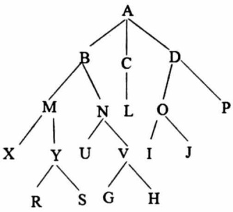

Hình 2.7. Đồ thị tìm kiếm

Đinh đầu T₀ = A, Goal = {R, O}

Tìm đường đi p từ A đến một định T\_G ∈ Goal

| n | A(n) | Open | Closed |
| --- | --- | --- | --- |
|  |  | A |  |
| A | B, C, D | B, C, D | A |
| B | M, N | C, D, M, N | A, B |
| C | L | D, M, N, L | A, B, C |
| D | O, P | M, N, L, O, P | A, B, C, D |
| M | X, Y | N, L, O, P, X, Y | A, B, C, D, M |
| N | U, V | L, O, P, X, Y, U, V | A, B, C, D, M, N |
| L | ∅ | O, P, X, Y, U, V | A, B, C, D, M, N, L |
| O |  |  |  |

Hình 2.8. Bảng duyệt theo BFS

<!-- page: 33 -->

Đình O ∈ Goal nên dùng quá trình tìm kiếm và xây dựng đường đi p. Đường đi này có hành trình là:

$$
\mathrm{p} = \mathrm{A} \rightarrow \mathrm{D} \rightarrow \mathrm{O}
$$

## Nhân xét:

i) Nếu trong đồ thị G tồn tại đường đi từ T₀ đến một định T\_G ∈ Goal thì thủ tục tìm kiếm theo chiều rộng sẽ dùng và cho đường đi p có độ dài ngắn nhất.

ii) Trong BFS các định được duyệt theo từng mức.

iii) Thuật toán tìm kiếm này có độ phức tạp O(b$^{k}$) với b bậc của cây và d là độ sâu của cây [3].

| Độ sâu d | Thời gian | Không gian |
| --- | --- | --- |
| 4 | 11 giây | 1 megabyte |
| 6 | 18 giây | 111 megabytes |
| 8 | 31 giờ | 11 gigabytes |
| 10 | 128 ngày | 1 terabyte |
| 12 | 35 năm | 111 terabytes |
| 14 | 3500 năm | 11.111 terabytes |

Hình 2.9. Thời gian thực hiện của BFS theo độ sâu d

## 2.5.2. Tîm kiểm theo chiều sâu

Trong thủ tục tìm kiếm theo chiều rộng, các đỉnh của đồ thị sẽ được duyệt theo từng mức độ sâu. Trong thủ tục tìm kiếm theo chiều sâu các đỉnh của đồ thị được duyệt theo từng nhánh đến nút lá và nếu chưa tìm thấy đỉnh  $T_{G} \in Goal$  thì quay lui tới một định nào đó đề sang nhánh khác.

Thủ tục tìm kiếm theo chiều sâu (Depth First Search): Tương tự như thủ tục tìm kiếm theo chiều rộng, DFS chỉ khác ở chỗ là danh sách

<!-- page: 34 -->

chứa các đỉnh đang xét Open có kiểu LIFO (thay vì bổ sung các đỉnh vào cuối tập Open ta bổ sung A(n) vào đầu tập Open). Do vậy, khi bổ sung đỉnh mới hoặc lấy đỉnh ra ta chi thực hiện ở một đầu.

Ví dụ 2.5: Cho đồ thị như Hình 2.10

| n | A(n) | Open | Closed |
| --- | --- | --- | --- |
|  |  | A |  |
| A | B, C, D | B, C, D | A |
| B | M, N | M, N, C, D | A, B |
| M | X, Y | X, Y, N, C, D | A, B, M |
| X | ∅ | Y, N, C, D | A, B, M, X |
| Y | R, S | R, S, N, C, D | A, B, M, X, Y |
| R |  |  |  |

Hình 2.10. Duyệt đồ thị theo DFS

Đình R ∈ Goal nên dùng quá trình tìm kiếm và xây dựng đường đi p. Đường đi này có hành trình là:

$$
\mathrm{p} = \mathrm{A} \rightarrow \mathrm{B} \rightarrow \mathrm{M} \rightarrow \mathrm{Y} \rightarrow \mathrm{R} \in \text {Goal}
$$

## Nhận xét:

Nếu trong đồ thị G tồn tại đường đi p từ T₀ đến T\_G ∈ Goal và đồ thị hữu hạn thì thủ tục tìm kiếm chiều sâu dùng và cho kết quả đường đi p có độ dài có thể không ngắn nhất.

Độ phức tạp của thuật toán tìm kiếm theo chiều sâu là O(bd) với b là bậc của cây và d là chiều cao của cây. Tuy nhiên, trong trường hợp xấu nhất cũng là O(b$^{d}$).

<!-- page: 35 -->

Bảng so sánh giữa tìm kiếm theo chiều rộng và tìm kiếm theo chiều sâu [4]:

|  | BFS | DFS |
| --- | --- | --- |
| Thứ tự các đỉnh khi duyệt đồ thị | Các đỉnh được duyệt theo mức độ sâu | Các đỉnh được duyệt theo từng nhánh |
| Độ dài đường đi p từ $T_0 \rightarrow T_G \in$ Goal | Ngắn nhất | Không nhất thiết phải ngắn nhất |
| Tính hiệu quả | - Chiến lược có hiệu quả khi lời giải nằm gần gốc của cây tìm kiếm- Hiệu quả của chiến lược phụ thuộc vào độ sâu của lời giải so với gốc cây tìm kiếm, lời giải nằm càng sâu thì hiệu quả của chiến lược càng giảm- Thuận lợi khi cần tìm nhiều lời giải | - Chiến lược có hiệu quả khi lời giải nằm sâu trong cây tìm kiếm và có phương án chọn hướng đi tốt- Hiệu quả của chiến lược phụ thuộc vào phương án chọn đường đi, phương án càng kém thì hiệu quả của chiến lược càng giảm- Có thuận lợi khi cần tìm một lời giải |
| Sử dụng bộ nhớ để lưu trữ các trạng thái | Lưu trữ toàn bộ không gian trạng thái của bài toán | Lưu trữ các trạng thái đang xét. |
| Trường hợp tốt nhất | Vét cạn toàn bộ | Phương án chọn đường đi chính xác có lời giải trực tiếp |
| Trường hợp tối nhất | Vét cạn | Vét cạn |

<!-- page: 36 -->

## 2.5.3. Tîm kiểm sâu dàn

Nếu trong trường hợp đồ thị G tồn tại đường đi p từ T₀ → T\_G ∈ Goal thì có thể thủ tục DFS không đứng vì đi theo nhánh vô tận mặc dù định đích T\_G rất gần định xuất phát T\_0. Chẳng hạn, ta xét một ví dụ theo hình sau:

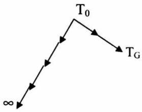

Đề khắc phục, người ta đưa vào thủ tục tìm kiếm theo chiều sâu một đại lượng giới hạn độ sâu.

Ký hiệu: d(n) được gọi là độ sâu hiện tại của đình n và được xác định:

$$
\mathrm{d} (\mathrm{T} _ {0}) = 0
$$

$$
\mathrm{d} (\mathrm{m}) = \mathrm{d} (\mathrm{n}) + 1 \text {neu} \mathrm{m} \in \mathrm{A} (\mathrm{n})
$$

Trong trường hợp này thuật toán dùng nhưng có thể cho kết quả không mong muốn. Vì định đích T$_{G}$ nằm ở dưới độ sâu nên để khắc phục nhược điểm này người ta tăng dần độ sâu, phương pháp sử dụng kỹ thuật này được gọi là phương pháp tìm kiếm sâu dàn (Iterative Deepening Search).

Thủ tục tìm kiếm sâu đần

Vào: - Đồ thị G = (V, E)

\- Đình đầu T₀ và Goal chứa tập các đỉnh đích

\- Độ sâu ds = k giới hạn độ sâu

Ra: Đường đi p:  $T_{0} \rightarrow T_{G} \in Goal$

<!-- page: 37 -->

```txt
Phương pháp: //Sử dụng hai danh sách Closed và Open
//Closed hoạt động theo nguyên tắc FIFO
//Open vừa hoạt động theo nguyên tắc FIFO và vừa hoạt động theo LIFO
void IDS()
{
    Open = {T₀}, ds = k;
    while Open ≠ ∅ do
    {
        n ← get (Open)
        if (n = T_G) then return True
        Closed = Closed ∪ {n}
        case d(n) do
        {
            0 .. ds - 1: Đặt A(n) vào đầu Open
            ds: Đặt A(n) vào cuối Open
            ds + 1:
            {
                ds = ds + k   // tăng độ sâu
                if k = 1 then đặt A(n) vào cuối tập Open
                else đặt A(n) vào đầu tập Open
            }
        }
    }
    return False
}
```

<!-- page: 38 -->

Ví dụ 2.6: Xét đồ thị hình 2.11, định xuất phát T₀ = A, Goal = {R, O} và độ sâu k = 2

| n | d(n) | A(n) | Open | Closed |
| --- | --- | --- | --- | --- |
|  |  |  | A |  |
| A | 0 | B, C, D | B, C, D | A |
| B | 1 | M, N | M, N, C, D | A, B |
| M | 2 | X, Y | N, C, D, X, Y | A, B, M |
| N | 2 | U, V | C, D, X, Y, U, V | A, B, M, N |
| C | 1 | L | L, D, X, Y, U, V | A, B, M, N, C |
| L | 2 | ∅ | D, X, Y, U, V | A, B, M, N, C, L |
| D | 1 | O, P | O, P, X, Y, U, V | A, B, M, N, C, L, D |
| O |  |  |  |  |

Hình 2.11. Duyệt đồ thị theo tìm kiếm sâu dân

Đình O ∈ Goal nên dùng quá trình tìm kiếm và xây dựng đường đi p. Đường đi này có hành trình là:

$$
\mathrm{p} = \mathrm{A} \rightarrow \mathrm{D} \rightarrow \mathrm{O}
$$

Kết quả: Nếu đồ thị G tồn tại đường đi p thì thủ tục tìm kiếm sâu dàn sẽ dùng và cho đường đi p có độ dài khác độ dài đường đi ngắn nhất không quá k - 1.

## Nhận xét:

i) Tím kiểm sâu đàn là kết hợp của tìm kiếm chiều sâu và tìm kiếm chiều rộng.

ii) Nếu k = 1 thì tìm kiếm sâu đàn trở thành BFS.

iii) Nếu k là chiều cao của cây thì tìm kiếm sâu đàn trở thành DFS.

iv) Thuật toán này cũng có độ phức tạp O(b$^{d}$).

<!-- page: 39 -->

## 2.6. TÌM KIỂM HEURISTIC

Trường hợp bài toán có độ phức tạp cấp hàm đa thức thì ta tiền hành cài đặt và viết chương trình. Trường hợp thuật toán có độ phức tạp cấp hàm mũ thì ta đưa ra cách tìm kiếm xấp xi, gần đúng bằng cách dựa vào thuật giải heuristic. Đây là đánh giá thô các ước lượng nhằm tìm hướng đi có triển vọng và việc lựa chọn định kế tiếp phụ thuộc vào hàm ước lượng.

Thuật toán: Là chuỗi hữu hạn các thao tác theo trình tự xác định đề giải bài toán.

Đặc trung: Dữ liệu vào, dữ liệu ra; tính xác định; tính đúng đắn; tính dùng; tính hiệu quả.

Biểu diễn thuật toán: Ngôn ngữ tự nhiên, lưu đồ và mã giả.

Thuật toán có độ phức tạp đa thức: Khi n tăng, giá trị của hàm cũng tăng nhưng độ phức tạp tính toán vẫn trong khoảng thời gian chấp nhận được. Các hàm để đánh giá độ phức tạp: O(1), O(log₂n), O(n), O(nlog₂n), O(n²), O(n³). Chẳng hạn như, thuật toán tìm tuyến tính có độ phức tạp tính toán là O(n), của thuật toán tìm kiểm nhị phân là O(log₂n). Khi thiết kế giải thuật, người ta luôn mong muốn tìm ra thuật toán có độ phức tạp đa thức.

Thuật toán có độ phức tạp cấp hàm mũ: Khi n tăng, giá trị của hàm tăng rất nhanh. Các hàm đánh giá độ phức tạp: O(a$^{n}$), O(n!), v.v...

Một ví dụ khác về bài toán không thuộc lớp các bài toán có độ phức tạp đa thức là bài toán thấp Hà Nội: Với n đĩa thì độ phức tạp tính toán là O(2$^{n}$). Người ta tính rằng, nếu mỗi lần chuyển 1 đĩa mất 1 giây thì thời gian chuyển hết 64 chiếc đĩa xấp xỉ $5 \times 10^{11}$ tỷ năm.

Ta xét một ví dụ nữa, đó là bài toán người bán hàng: Một nhân viên phân phối hàng cho một công ty được giao nhiệm vụ phải giao hàng cho các đại lý của công ty, sau đó trở về công ty. Vấn đề của người nhân viên là làm sao đi giao hàng cho tất cả các đại lý với chi phí đường đi thấp

<!-- page: 40 -->

nhất (chi phí là độ dài đường đi mà người nhân viên đã đi để giao hàng và trở về nơi xuất phát). Một cách giải cổ điện cho bài toán này là liệt kê tất cả các cách đi có thể có và so sánh độ dài của đường đi của chúng đề tìm ra cách đi có độ dài ngắn nhất. Người ta đã chứng minh được độ phức tạp của thuật toán này là O(n!). Như vậy, nếu số đại lý lớn thì thuật toán trên là không thực tế.

Trong những trường hợp như vậy, người ta thường dựa vào bài toán đề xác định các tri thức đặc biệt sản sinh từ chính những bài toán này, từ đó đưa ra các hàm đánh giá, ước lượng đề chọn hướng tìm phù hợp làm giảm không gian bài toán, tránh được sự bùng nổ tổ hợp. Chẳng hạn, đối với bài toán người bán hàng, người ta dựa vào nguyên lý tham lam đề đưa ra lời giải trong khoảng thời gian chấp nhận được.

Nếu chấp nhận kết quả không bắt buộc là kết quả đúng mà chỉ gần đúng thì có thể tồn tại nhiều cách giải đỡ phức tạp và hiệu quả hơn.

Đề có thể được chấp nhận thuật giải phải thể hiện một giải pháp hợp lý nhất có thể trong tình hướng hiện tại bằng cách:

i) Tân dụng mọi thông tin hữu ích.

ii) Sử dụng tri thức, kinh nghiệm, trực giác của con người.

iii) Tự nhiên, đơn giản nhưng cho kết quả chấp nhận được.

## 2.6.1. Thuật giải heuristic

Heuristic là những tri thức được rút ra từ những kinh nghiệm, “trực giác” của con người. Heuristic có thể đúng hoặc sai. Heuristic thường được sử dụng trong những trường hợp sau:

i) Bài toán có thể không có nghiệm chính xác do các mệnh đề không phát biểu chặt chẽ hay thiếu dữ liệu đề khẳng định kết quả.

ii) Bài toán có nghiệm chính xác nhưng phí tồn tính toán để tìm ra nghiệm là quá lớn (bùng nổ tổ hợp).

<!-- page: 41 -->

Thuật giải heuristic là mở rộng khái niệm thuật toán và có đặc điểm:

i) Thường tìm lời giải tốt nhưng không tốt nhất.

ii) Nhanh chóng tìm ra kết quả hơn so với giải thuật tối ưu, vì vậy chi phí thấp hơn.

iii) Thường thể hiện khá tự nhiên, gần gửi với cách suy nghĩ và hành động của con người.

## 2.6.2. Thiết kế thuật giải heuristic

Có nhiều phương pháp đề xây dựng một thuật giải heuristic, trong đó, người ta dựa vào một số nguyên lý cơ bản sau:

## Nguyên lý vét cạn thông minh

Trong một bài toán tìm kiếm nào đó, khi không gian tìm kiếm D lớn, ta thường tìm cách giới hạn lại không gian tìm kiếm này hoặc thực hiện một kiểu dò tìm đặc biệt dựa vào đặc thù của bài toán đề nhanh chóng tìm ra mục tiêu. Nghĩa là tạo miền D' rất nhỏ so với D, sau đó vét cạn trên D'.

## Nguyên lý tham lam (greedy)

Lấy tiêu chuẩn tối ưu (trên phạm vi toàn cục) của bài toán đề làm tiêu chuẩn chọn lựa hành động cho phạm vi cục bộ của từng bước trong quá trình tìm kiếm lời giải.

## Ví dụ 2.7: Bài toán người đưa thư

Giả sử có một đồ thị có trọng số dương, tìm đường đi ngắn nhất qua tất cả các thành phố sao cho mỗi thành phố đi qua đúng một lần rời trở về thành phố xuất phát.

Trường hợp vét cạn: Liệt kê tất cả các hành trình có thể có, sau đó chọn hành trình tốt nhất. Thuật toán này có độ phức tạp là O(n!). Sau đây, ta đưa ra một thuật giải mà thời gian chỉ là O(n$^{2}$).

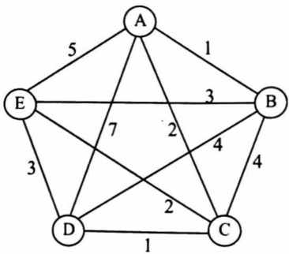

Hình 2.12. Đồ thị bài toán
người đưa thư

<!-- page: 42 -->

Thuật giải GTS (Greedy-Traveling Saleman)

Xây dựng một lịch trình du lịch có chi phí cost tối thiểu cho bài toán trong trường hợp phải qua n thành phố với ma trận chi phí C và bắt đầu tại một định U nào đó.

1. Bước 1: {Khởi đầu}
    a. Đặt Tour = {};
    b. Cost = 0;
    c. V = U; {V là đỉnh hiện tại đang làm việc}

2. Bước 2: {Thăm tất cả các thành phố}
a. For k = 1 To n Do
b. Qua bước 3;

3. Bước 3: {Chọn cung kế tiếp}

a. Đặt (V, W) là cung có chỉ phí nhỏ nhất tính từ V đến các đình
W chưa dùng:
b. Tour = Tour + {(V, W)}
c. Cost = Cost + Cost(V, W)
d. Nhân W. được sử dụng
e. Đặt V = W {Gán đề xét bước kế tiếp}

4. Bước 4: {Chuyển đi hoàn thành}
a. Đặt Tour = Tour + {(V, U)}
b. Cost = Cost + Cost(V, U)

5. Dùng.
1. U = A

<!-- page: 43 -->

2. Tour = {}
a. Cost = 0
b. V = A
c. W ∈ {B, C, D, E} {Các định có thể đến từ A}
d. → W = B {Vì qua B có giá thành bé nhất}

3. Tour = {(A, B)}
    e. Cost = 1
    f. V = B
    g. W ∈ {C, D, E} → W = E

4. Tour = {(A, B), (B, E)}
h. Cost = 1 + 3 = 4
i. V = E
j. W ∈ {C, D} → W = C

5. Tour = {(A, B), (B, E), (E, C)}
    a. Cost = 4 + 2 = 6
    b. V = C
    c. W ∈ {D}
    d. → W = D

6. Tour = {(A, B), (B, E), (E, C), (C, D)}
e. Cost = 6 + 1 = 7
f. V = D

7. Tour = {(A, B), (B, E), (E, C), (C, D), (D, A)}
g. Cost = 7 + 7 = 14

Kết quả: Tour du lịch A → B → E → C → D → A với giá thành Cost = 14.

<!-- page: 44 -->

Nhận xét: Kết quả tốt hơn sẽ là A → B → D → C → E → A với Cost = 13 hoặc có thể là A → B → E → D → C → A với Cost = 10. Sở đã không tối ưu do “tham lam”: cứ hướng nào có chi phí thấp thì đi bắt chấp về sau (chẳng hạn, cung DA = 100?).

## Nguyên lý thứ tự

Thực hiện hành động dựa trên một cấu trúc thứ tự hợp lý của không gian khảo sát nhằm nhanh chóng đạt được lời giải tốt.

## Ví dụ 2.8: Bài toán phân việc

Cho M máy có cùng công suất như nhau và n công việc. Thực hiện công việc i trên bất kỳ máy nào cũng tốn thời gian là $t_i$. Hãy phân công các công việc trên các máy sao cho tổng thời gian để hoàn thành tất cả công việc là thấp nhất.

Xét trường hợp có 3 máy: M₁, M₂, M₃ và 6 công việc: t₁ = 2, t₂ = 5, t₃ = 8, t₄ = 1, t₅ = 5, t₆ = 1.

Già sù, ta đưa ra một phương án thực hiện: Chi tiết thứ 5 thực hiện trên máy M₁, chi tiết thứ 2 thực hiện trên máy M₂, các chi tiết còn lại thực hiện trên máy M₃. Với phương án thi công này thì tổng thời gian thực hiện là 12. Vấn đề đặt ra là còn phương án thi công nào tốt hơn không? Sau đây, ta đưa ra phương án thực hiện dựa theo nguyên lý thứ tự.

Nguyên lý thứ tự gồm hai bước:

i) Sắp xếp các công việc giảm đàn theo thời gian thực hiện:  $t_{3}=8$ ,  $t_{5}=5$ ,  $t_{2}=5$ ,  $t_{1}=2$ ,  $t_{6}=1$ ,  $t_{4}=1$ .

ii) Lần lượt đưa các chi tiết vào máy còn nhiều thời gian thực hiện nhất.

<!-- page: 45 -->

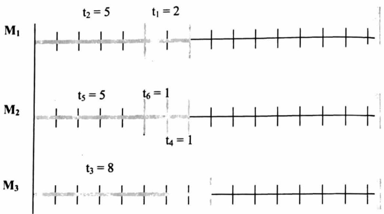

Hình 2.13. Một phương án thi công theo nguyên lý thứ tự

Với bài toán này độ phức tạp cũng là O(M$^{n}$), tuy nhiên, khi áp dụng nguyên lý thứ tự thì độ phức tạp chỉ còn là O(n$^{2}$). Cũng giống như nguyên lý tham lam, nguyên lý này cho kết quả chấp nhận được, tức là kết quả có thể không tốt nhất nhưng thời gian thực hiện là chấp nhận được.

## 2.6.3. Tîm kiểm leo đôi

Tìm kiểm leo đổi (Hill Climbing Search - HCS) thực chất chỉ là một trường hợp đặc biệt của tìm kiếm theo chiều sâu nhưng không thể quay lui. Trong tìm kiếm leo đổi, việc lựa chọn trạng thái tiếp theo được quyết định dựa trên một hàm heuristic.

Tư tưởng của thuật giải được thực hiện qua hai bước:

i) Nếu trạng thái bắt đầu cũng là trạng thái đích thì thoát và báo là đã tim được lời giải. Ngọc lại, đặt trạng thái hiện hành (T$_{i}$) là trạng thái khởi đầu (T$_{0}$).

<!-- page: 46 -->

```c
ii) Lặp lại cho đến khi đạt đến trạng thái kết thúc hoặc cho đến khi (T_i) không tồn tại một trạng thái kế tiếp (T_k) nào tốt hơn trạng thái hiện tại (T_i).
a) Đặt S bằng tập tất cả trạng thái kế tiếp có thể có của T_i và tốt hơn T_i.
b) Xác định T_kmax là trạng thái tốt nhất trong tập S.
Đặt T_i = T_kmax

Thuật giải tìm kiếm leo đời:
- Bước 1: T_i = T_0 (nút khởi đầu).
- Bước 2: Nếu T_i là đích thì dùng (Success).
- Bước 3: Triển khai T_i; tính hàm h(T_k), với T_k là trạng thái kế tiếp của T_i. Chọn T_k tương ứng với h(T_i) nhỏ nhất và gọi là T_kmax.
- Bước 4: Nếu T_kmax không tốt hơn T_i thì thoát (Fail).
- Bước 5: T_i = T_kmax
- Bước 6: Lặp từ B_2 đến B_5

Giải thuật:
Vào:
Đồ thị G = (V, E), đỉnh xuất phát T_0.
Hàm đánh giá h(n) đối với mỗi đỉnh n.
Tập đỉnh đích Goal.
Ra:
Đường đi từ đỉnh T_0 đến T_G ∈ Goal.
void HCS()
{
T_i = T_0;
stop = FALSE;
while (stop = FALSE) do
```

<!-- page: 47 -->

```txt
{
    if (T_i = T_G) then
    {
        <tìm được kết quả >;
        Stop = TRUE;
    }
    else
    {
        Best = h(T_i);
        T_kmax = T_i;
        while (tồn tại trạng thái kế tiếp hợp lệ của T_i) do
        {
            T_k = <một trạng thái kế tiếp hợp lệ của T_i>;
            if(h(T_k) tốt hơn Best) then
            {
                Best = h(T_k);
                T_kmax = T_k;
            }
        }
        if (Best > T_i) then
            T_i = T_kmax;
        else
        {
            <không tìm được kết quả >;
            stop = TRUE;
        }
    }
}
```

<!-- page: 48 -->

Ví dụ 2.9: Xét đồ thị hình 2.14

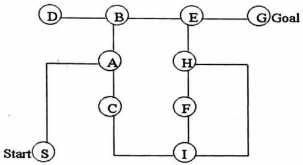

Hình 2.14. Đồ thị áp dụng tìm kiếm leo đổi

Hàm đánh giá được xác định:

$$
\begin{array}{l} \mathrm {h(n) = |G.x - n.x| + |G.y - n.y|} \\ \mathrm {h(S) = |4 - 1| + |4 - 1| = 6} \\ \mathrm {T_ {i} = S, h(A) = |4 - 2| + |4 - 3| = 3 <   h(S)} \\ \mathrm {T_{Smax} = A} \\ \mathrm {T_ {i} = A, h(B) = |4 - 2| + |4 - 4| = 2 (min) <   h(A)} \\ \quad \quad \quad \quad \quad \quad \quad \quad \quad \quad \quad \quad \quad \quad \quad \quad \quad \quad \quad \quad \quad \quad \quad \quad \quad \quad \quad \quad \quad \quad \quad \quad \quad \quad \quad \quad \quad \quad \quad \quad \quad \quad \quad \quad \quad \quad \quad \quad \quad \quad \text {Amax} = B \\ \mathrm {T_ {i} = B, h(D) = |4 - 1| + |4 - 4| = 3} \\ \quad \quad \quad \quad \quad \quad \quad \quad \quad \quad \quad \quad \quad \quad \quad \quad \quad \quad \quad \quad \quad \quad \quad \quad \quad \quad \quad \quad \quad \quad \text {Bmax} = E \\ \mathrm {T_ {i} = E, h(G) = |4 - 4| + |4 - 4| = 0 (min) <   h(B)} \\ \quad \quad \quad \quad \quad \quad \quad \quad \quad \quad \quad \quad \quad \quad \quad \text {H(H) = |4 - 3| + |4 - 3| = 2} \\ \end{array}
$$

$$
\mathrm{T} _ {\text {Emax}} = \mathrm{G} (\text {Dích - Dùng})
$$

Nhận xét: Tím kiểm leo đời thất bại khi gặp phải điểm cực đại địa phương hoặc đoạn bằng phẳng.

<!-- page: 49 -->

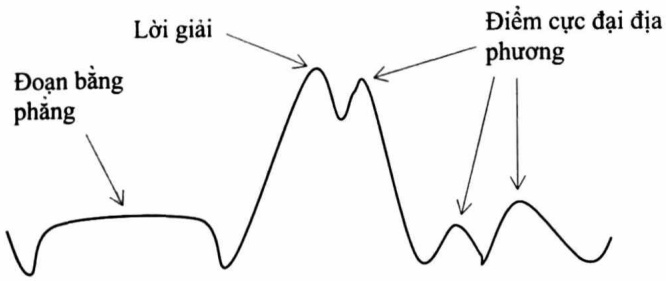

Hình 2.15. Trường hợp thất bại của tìm kiếm leo đôi

## 2.6.4. Tîm kiểm tối ưu

Ưu điểm của DFS là không phải quan tâm đến sự mở rộng của tất cả các nhánh. Ưu điểm của BFS là không bị sa vào các đường dẫn bề tắc. Tuy nhiên, trong BFS và DFS, khi chúng ta đang ở một nút, ta có thể xét bất kỳ nút kè nào là nút kế tiếp. Vì vậy, cả BFS và DFS đều tìm các đường đi một cách mù quảng mà không cần xét đến bất kỳ hàm chi phí nào. Ý tưởng của tìm kiếm tối ưu (Best-First Search-BeFS) là sử dụng hàm đánh giá đề quyết định vùng lân cận nào có triển vọng nhất và sau đó tìm đường đi trong vùng này. BeFS thuộc lớp các phương pháp tìm kiếm theo kinh nghiệm hoặc tìm kiếm có thông tin bổ sung.

## Thuật giải tìm kiếm tối ưu

1. Đặt Open chứa trạng thái khởi đầu T₀.

2. Cho đến khi tìm được trạng thái đích hoặc không còn nút nào trong Open, thực hiện:

a. Chọn trạng thái tốt nhất (T$_{max}$) trong Open (và xóa T$_{max}$ khởi Open).

b. Nếu $T_{max}$ là trạng thái kết thúc thì thoát.

c. Ngược lại, tạo ra các trạng thái kế tiếp $T_k$ có thể có từ trạng thái $T_{max}$. Đối với mỗi trạng thái kế tiếp $T_k$ thực hiện:

<!-- page: 50 -->

Tính f(Tk); thêm Tk vào Open.

BeFS khá đơn giản, thông thường, người ta thường dùng các phiên bản của BeFS là A$^{T}$, A$^{KT}$ và A$^{*}$.

Thông tin về quá khứ và tương lai:

Thông thường, trong các phương án tìm kiếm theo kiểu BeFS, chi phí f của một trạng thái được tính dựa theo hai giá trị mà ta gọi là g và h. Trong đó, h là một ước lượng về chi phí từ trạng thái hiện hành cho đến trạng thái đích (thông tin tương lai), còn g là chiều dài quảng đường đã đi từ trạng thái ban đầu cho đến trạng thái hiện tại (thông tin quá khứ). Khi đó, hàm ước lượng tổng chi phí f(n) được tính theo công thức:

$$
\mathrm{f(n)} = \mathrm{g(n)} + \mathrm{h(n)}
$$

Ví dụ 2.10: Xét đồ thị trong hình 2.16

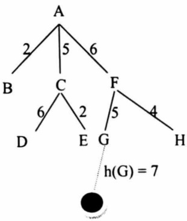

Hình 2.16: Phân biệt hàm g và h

Trong ví dụ này, g(G) = 11 là chi phí thực sự từ A đến G, còn h(G) = 7 là chi phi ước lượng từ G đến định đích (hình tròn màu đen), nên f(G) = g(G) + h(G) = 18

<!-- page: 51 -->

```txt
Thuật giải Aᵀ
Thuật giải Aᵀ là một phương pháp tìm kiếm theo kiểu BeFS với chi phí của định là giá trị hàm g (tổng chiều dài thực sự của đường đi từ định bắt đầu đến định hiện tại).
Cho đồ thị G = (V, E) với V: Tập định; E: Tập cung. Với mỗi một cung người ta gắn thêm một đại lượng được gọi là giá của cung.
    C: E → R+
    e ↦ C(e)
    Khi đó, đường đi p = n₁, n₂, ...nₖ có giá được tính theo công thức:
        C(p) = ∑_{i=1}^{k-1} C(nᵢ, nᵢ₊₁)
    Vấn đề đặt ra là tìm đường đi p từ T₀ đến định T_G ∈ Goal sao cho c(p) → min
    Vào:          - Đồ thị G = (V, E)
        C: E → R⁺
        e ↦ C(e)
        - Đình đầu T₀ và Goal chứa tập các định đích
    Ra:          Đường đi p: T₀ → T_G ∈ Goal sao cho:
        C(p) = g(nₖ) = min {g(n)/n ∈ Goal}.
    Phương pháp: Sử dụng hai danh sách Closed và Open
    void AT()
    {
        Open = {T₀}, g(T₀) = 0, Closed = ∅
        while Open ≠ ∅ do
        {
            n ← getNew(Open)      // lấy định n sao cho g(n) → min
            if (n = T_G) then return True
            else
```

<!-- page: 52 -->

```txt
{
    for each m ∈ A(n) do
        if(m∉ Open) and (m∉ Closed) then
        {
            g(m) = g(n) + cost(m, n)
            Open = Open ∪ {m}
        }
        else g(m) = min{g(m), g_new(m)}
        Closed = Closed ∪ {n}
    }
    return False;
```

Ví dụ 2.11: Cho đồ thị (hình 2.17). Đình xuất phát A và Goal = {D, H}

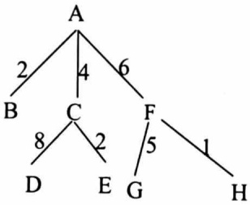

Hình 2.17. Đồ thị trọng số

| n | A(n) | Open | Closed |
| --- | --- | --- | --- |
|  |  | A(0) |  |
| A | B, C, E | B(2), C(4), F(6) | A |
| B | ∅ | C(4), F(6) | A, B |
| C | D, E | D(12), E(6), F(6) | A, B, C |
| E | ∅ | D(12), F(6) | A, B, C, E |
| F | G, H | G(11), H(7), D(12) | A, B, C, E, F |
| H |  |  |  |

Hình 2.18. Kết quả tìm kiếm theo $A^{T}$

<!-- page: 53 -->

Do H∈Goal nên thuật toán dùng và đường đi tìm được p: A → F → H có chi phí C(p) = 7.

Kết quả: Nếu trong đồ thị G tồn tại đường đi p:  $T_{0} \rightarrow T_{G} \in Goal$  thì thủ tục  $A^{T}$  sẽ dùng và cho kết quả đường đi có độ dài ngắn nhất.

Nhận xét:

i) Nếu C(a) = 1 ∀ a ∈ E thì A$^{T}$ trở thành BFS.

ii) Nếu thay điều kiện g(n) → min bằng điều kiện d(n) → max, trong đó, d(n) là độ sâu hiện tại của định n. Khi đó, A$^{T}$ trở thành DFS.

## Thuật giải A$^{KT}$ (Algorithm for Knowlegeable Tree Search)

Thuật giải A$^{T}$ trong quá trình tìm đường đi chỉ xét đến các đỉnh và giá của chúng. Nghĩa là việc tìm đỉnh triển vọng chỉ phụ thuộc hàm g(n) (thông tin quá khứ). Tuy nhiên, thuật giải này không còn phù hợp khi gặp phải những bài toán phức tạp (độ phức tạp cấp hàm mũ) do ta phải xét một lượng nút lớn. Đề khắc phục nhược điểm này, người ta sử dụng thêm các thông tin bổ sung xuất phát từ bản thân bài toán đề tìm ra các đỉnh có triển vọng, tức là đường đi tối ưu sẽ tập trung xung quanh đường đi tốt nhất nếu sử dụng các thông tin đặc tả về bài toán (thông tin quá tương lai).

Theo thuật giải này, chi phí của định được xác định:

$$
\mathrm{f(n)} = \mathrm{g(n)} + \mathrm{h(n)}
$$

Đình n được chọn nếu f(n) → min.

Việc xác định hàm ước lượng h(n) được thực hiện dựa theo:

i) Chọn toán từ xây dựng cung sao cho có thể loại bót các đỉnh không liên quan và tìm ra các đỉnh có triển vọng.

ii) Sử dụng thêm các thông tin bổ sung nhằm xây dựng tập Open và cách lấy các đỉnh trong tập Open.

<!-- page: 54 -->

Đề làm được việc này, người ta phải đưa ra độ đo, tiêu chuẩn để tìm ra các đỉnh có triển vọng. Các hàm sử dụng các kỹ thuật này gọi là hàm đánh giá. Sau đây là một số phương pháp xây dựng hàm đánh giá:

i) Dựa vào xác suất của đỉnh trên đường đi tối ưu.

ii) Dựa vào khoảng cách, sự sai khác của trạng thái đang xét với trạng thái đích hoặc các thông tin liên quan đến trạng thái đích.

```txt
Thuật giải
Vào:          - Đồ thị G = (V, E), trong đó, V là tập đỉnh, E là tập cung.
              - f: V →R⁺ (f(n): hàm ước lượng)
              - Đình đầu T₀ và tập các đỉnh đích
Ra:          - Đường đi p: T₀ → T_G ∈ Goal
Phương pháp: Sử dụng 2 danh sách Closed và Open
void AKT()
{
    Open = {T₀}, g(T₀) = 0
    Tính h(T₀), f(T₀) = g(T₀) + h(T₀)
    while Open ≠ ∅ do
    {
        n ← getNew(Open)      // lấy đỉnh n sao cho f(n) → min
        if(n = T_G) then return True
        else
        {
            for each m ∈ A(n) do
            {
                g(m) = g(n) + cost(m,n)
                Tính h(m), f(m) = g(m) + h(m)
                Open = Open ∪ {m}
            }
        }
        return False;
}
```

<!-- page: 55 -->

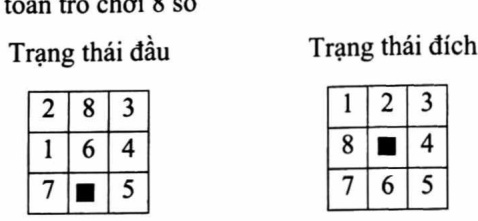

Hình 2.19. Bài toán $n^{2}-1$ số với $n=3$

Chọn hàm f(n) = g(n) + w(n)

Trong đó:

\- g(n) là giá của đường đi hiện tại từ đình T₀ tới đình n (số lần dịch chuyển ô trống từ trạng thái đầu đến trạng thái n).

\- h(n) là số các con số không nằm đúng vị trí của nó so với trạng thái đích. Chẳng hạn, với bài toán này, khi xét trạng thái ban đầu thì g(n) = 0 (do ô trống chưa dịch chuyển lần nào) và h(n) = 4 nên f(n) = 4. Trong hình 2.20 các con số nằm trong hình tròn là giá trị của hàm f.

<!-- page: 56 -->

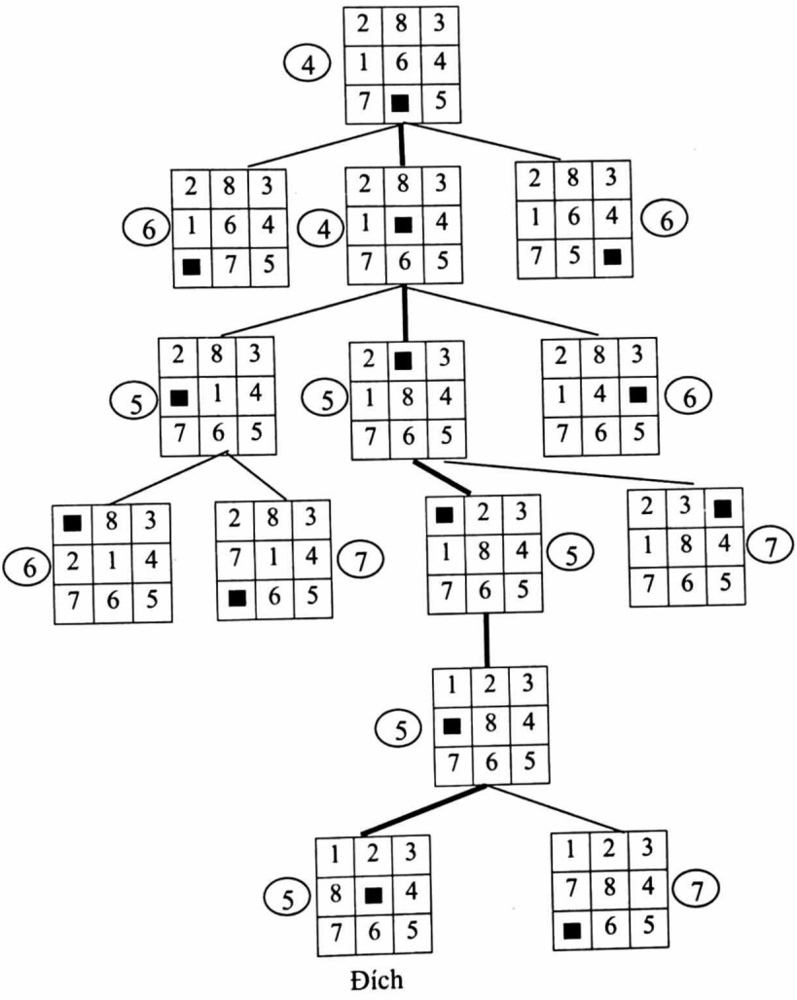

Hình 2.20. Cây trò chơi 8 số

Ví dụ 2.14: Xét bài toán thấp Hà Nội với n = 2

Chọn hàm f(n) = g(n) + h(n)

<!-- page: 57 -->

Trong đó: h(n) thông tin liên quan đến số đĩa ở cọc 3

\- Nếu cọc 3 chưa có địa nào thì h = 2

\- Nếu cọc 3 có 1 đĩa nhỏ thì h = 3

\- Nếu cọc 3 có 1 đĩa to thì h = 1

\- Nếu cọc 3 có 2 đĩa và đĩa nhỏ ở trên đĩa to thì h = 0

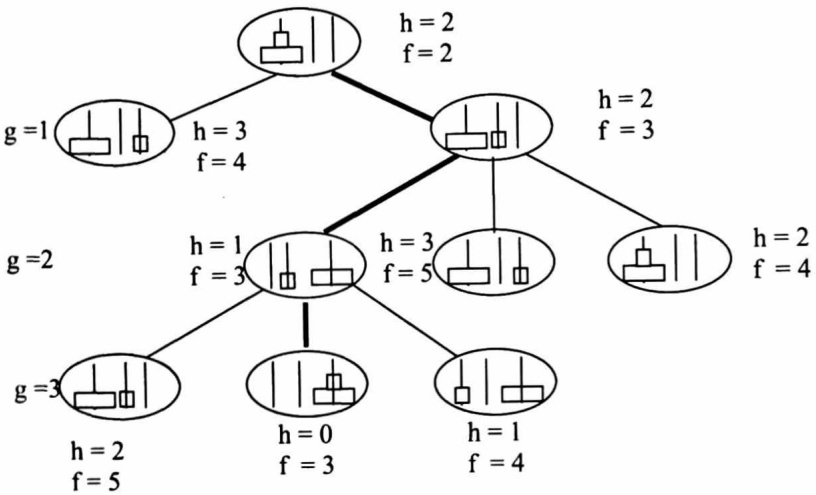

Hình 2.21. Đồ thị bài toán thấp Hà Ni với n = 2

## Thuật giải A\*

Thuật toán tìm kiếm A\* là một trong những kỹ thuật tốt nhất và phổ biến nhất được sử dụng để tìm kiếm đường đi và duyệt đồ thị. Không giống như các kỹ thuật duyệt khác, A\* có “bộ não”. Điều đó có nghĩa là nó thực sự là một thuật toán thông minh tách biệt nó với các thuật toán thông thường khác. Nhiều trò chơi và bản đồ dựa trên nền tảng web sử dụng thuật toán này để tìm đường đi ngắn nhất rất hiệu quả.

<!-- page: 58 -->

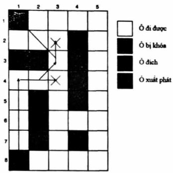

Hình 2.22. A\* tìm đường đi tối ưu

Đề dễ hình dung, ta xét bài toán được biểu diễn trong Hình 2.23. Ô mỗi bước, A\* chọn định dựa theo giá trị của hàm f = g + h, ở đó g = chi phí di chuyển từ hình vuông xuất phát đến đến hình vuông đang xét, còn h là chi phí di chuyển ước lượng từ hình vuông đang xét đến đích cuối cùng (gọi là heuristic - phòng đoán thông minh). Nút được chọn là nút có giá trị f nhỏ nhất.

```txt
void Astar()
{
    Open = {T0}, Closed = Ø,
    g(T0) = 0, tính h(T0), f(T0) = g(T0) + h(T0)
    while (Open ≠ Ø)
    {
        n ← getNew(Open) // lấy dinh n sao cho f(n) → min
        if(n = TG) then return path T0 → TG
        else
        {
            for each m ∈ A(n) do
            if (m∉ Open + Closed) then
            {
                tính h(m), g(m),
                f(m) = g(m) + h(m)
                cha(m) = n
                Open = Open ∪ {m}
```

<!-- page: 59 -->

```txt
}
else
{
    g(m) = min{gold(m), gnew(m)}
    Cập nhật lại Open
}
}
Closed = Closed ∪ {n}
}
return False
}
```

## Ví dụ 2.14

Trạng thái ban đầu T₀ = A, trạng thái đích Goal = {B}, các số ghi cạnh các cung là độ dài đường đi, các số cạnh các định là giá trị ước lượng của hàm h.

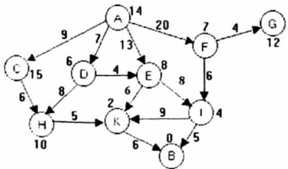

Hình 2.23. Đồ thị áp dụng cho $A^{*}$

$$
\text {Ban dâu Open} = \{\mathrm{A}, \mathrm{g(A)} = 0, \mathrm{f(A)} = 1 4 \}
$$

Phát triển đỉnh A sinh ra các đỉnh con C, D, E và F. Tính giá trị của hàm f tại các đỉnh này, ta có:

```lua
Open = {g(C) = 9, f(C) = 9 + 15 = 24, cha(C) = A,
    g(D) = 7, f(D) = 7 + 6 = 13, cha(D) = A,
    g(E) = 13, f(E) = 13 + 8 = 21, cha(E) = A,
    g(F) = 20, f(F) = 20 + 7 = 27, cha(F) = A
}
```

<!-- page: 60 -->

$$
\text { Closed } = \{\mathrm{A}, \mathrm{g} (\mathrm{A}) = 0, \mathrm{f} (\mathrm{A}) = 1 4 \}
$$

Do f(D) = 13 nhỏ nhất nên chọn D để phát triển. Phát triển D, ta nhận được các định kế tiếp H và E.

$$
\mathrm{g(H)=g(D)+cost(D,H)=7+8=15,f(H)=15+10=25}.
$$

$$
\mathrm{g(E)} = \mathrm{g(D)} + \mathrm{cost(D,E)} = 7 + 4 = 1 1, \mathrm{f(E)} = 1 1 + 8 = 1 9.
$$

Bây giờ, ta bổ sung hai đỉnh mới này vào tập Open. Tuy nhiên, trong tập Open lúc này đã có đỉnh E nên cần phải so sánh g(E) đã có và g(E) vừa tính được. Ta so sánh hai giá trị này và giữ lại giá trị nhỏ hơn. Do vậy:

$$
\begin{array}{r l} \text {Open} & = \{\mathrm{g(C)} = 9, \mathrm{f(C)} = 9 + 1 5 = 2 4, \mathrm{cha(C)} = \mathrm{A}, \\ & \quad \mathrm{g(E)} = 1 1, \mathrm{f(E)} = 1 1 + 8 = 1 9, \mathrm{cha(E)} = \mathrm{D}, \\ & \quad \mathrm{g(F)} = 2 0, \mathrm{f(F)} = 2 0 + 7 = 2 7, \mathrm{cha(F)} = \mathrm{A}, \\ & \quad \mathrm{g(H)} = 1 5, \mathrm{f(H)} = 1 5 + 1 0 = 2 5, \mathrm{cha(H)} = \mathrm{D} \\ & \quad \} \end{array}
$$

$$
\begin{array}{r l} \text {Closed} & = \{\mathrm{A}, \mathrm{g(A)} = 0, \mathrm{f(A)} = 1 4, \\ & \quad \mathrm{D}, \mathrm{g(D)} = 7, \mathrm{f(D)} = 7 + 6 = 1 3, \mathrm{cha(D)} = \mathrm{A} \\ & \quad \} \end{array}
$$

Với lập luận tương tự như trên, ta chọn định E để phát triển. Các định kế tiếp của E là K và I

$$
\begin{array}{r l} \text {Open} = \{\mathrm{g(C)} = 9, \mathrm{f(C)} = 9 + 1 5 = 2 4, \mathrm{cha(C)} = \mathrm{A}, \\ & \mathrm{g(F)} = 2 0, \mathrm{f(F)} = 2 0 + 7 = 2 7, \mathrm{cha(F)} = \mathrm{A} \\ & \mathrm{g(H)} = 1 5, \mathrm{f(H)} = 1 5 + 1 0 = 2 5, \mathrm{cha(H)} = \mathrm{D}, \\ & \mathrm{g(K)} = 1 7, \mathrm{f(K)} = 1 7 + 2 = 1 9, \mathrm{cha(K)} = \mathrm{E}, \\ & \mathrm{g(I)} = 1 9, \mathrm{f(I)} = 1 9 + 4 = 2 3, \mathrm{cha(I)} = \mathrm{E} \\ & \} \end{array}
$$

$$
\begin{array}{r l} \text {Closed} & = \{\mathrm{A}, \mathrm{g(A)} = 0, \mathrm{f(A)} = 1 4, \\ & \quad \mathrm{D}, \mathrm{g(D)} = 7, \mathrm{f(D)} = 7 + 6 = 1 3, \mathrm{cha(D)} = \mathrm{A} \\ & \quad \mathrm{E}, \mathrm{g(E)} = 1 1, \mathrm{f(E)} = 1 1 + 8 = 1 9, \mathrm{cha(E)} = \mathrm{D} \\ & \} \end{array}
$$

<!-- page: 61 -->

Chọn định K đề phát triển. Các định tiếp của K là B.

```lua
Open = {g(C) = 9, f(C) = 9 + 15 = 24, cha(C) = A,
                     g(F) = 20, f(F) = 20 + 7 = 27, cha(F) = A
                     g(H) = 15, f(H) = 15 + 10 = 25, cha(H) = D
                     g(I) = 19, f(I) = 19 + 2 = 23, cha(I) = E,
                     g(B) = 23, f(B) = 23 + 0 = 23, cha(B) = K
}
Closed = {
    A, g(A) = 0, f(A) = 14,
    D, g(D) = 7, f(D) = 7 + 6 = 13, cha(D) = A,
    E, g(E) = 11, f(E) = 11 + 8 = 19, cha(E) = D,
    g(K) = 17, f(K) = 17 + 2 = 19, cha(K) = E
}
```

Trong tập Open có f(B) = f(I) nên chọn ngẫu nhiên một trong hai định này. Giả sử chọn định B đề phát triển.

Do B ∈ Goal nên quá trình tìm kiếm kết thúc. Đề đưa ra đường đi ta truy ngược lại trong tập Closed. Khi đó, đường đi tìm được có chi phí c(p) = 23 và trình tự các đỉnh là:

$$
\mathrm{p} \colon \mathrm{A} \to \mathrm{D} \to \mathrm{E} \to \mathrm{K} \to \mathrm{B}
$$

Nhận xét:

i) Đường đi tìm được có thể không phải là tốt nhất.

ii) Nếu h(n) = 0 trong mọi trường hợp thì A\* trở thành A$^{T}$.

<!-- page: 62 -->

## TÓM TẮT CHƯƠNG 2

Đề biểu diễn bài toán trong không gian trạng thái, ta cần phải mô tả: Trạng thái, toán từ, trạng thái đầu, trạng thái cuối.

Bài toán tổng quát trong không gian trạng thái có dạng: Cho trước hai trạng thái T₀ và T\_G, hãy xây dựng chuỗi trạng thái T₀, T₁, ..., T\_{n-1}, T\_n = T\_G sao cho:

$\sum_{i=1}^{n}\cos t(T_{i-1},T_{i})$ thỏa mãn một điều kiện cho trước.

✿ Từ bài toán biểu diễn trong không gian trạng thái, ta có thể quy về bài toán biểu diễn trong đồ thị: Trạng thái tương ứng với đình, toán từ tương ứng với cung và bài toán tìm dãy trạng thái tương ứng với bài toán tìm đường đi.

✿ Có hai chiến lược tìm kiếm lời giải trong không gian trạng thái, đó là: Kỹ thuật tìm kiếm mù và kỹ thuật tìm kiếm heuristic.

Với kỹ thuật tìm kiếm mù thì việc tìm lời giải được thực hiện theo một hệ thống nhất định nào đó (chỉ quan tâm đến đỉnh kè mà không để ý đến thông tin khác). Kỹ thuật này chỉ áp dụng với bài toán có kích thước nhỏ, các bài toán có thuật toán với độ phức tạp cấp hàm đa thức. Có ba chiến lược cơ bản đó là: BFS, DFS và IDS.

Trong trường hợp bài toán có thuật toán với độ phức tạp cấp hàm mũ thì việc sử dụng kỹ thuật heuristic sẽ làm giảm kích thước không gian tìm kiếm đề nhanh chóng tìm ra lời giải. Trong kỹ thuật này, ta sử dụng hàm heuristic (ước lượng chi phí).

❖ Các phương pháp được sử dụng trong kỹ thuật heuristic: Tìm kiểm leo đổi, tìm kiểm tối ưu.

❖ Các giải thuật A$^{T}$: Chỉ dựa vào thông tin quá khứ (hàm g(n)), A$^{KT}$: dựa cả vào thông tin quá khứ và tương lai (f(n) = g(n) + h(n)). Cả hai thuật giải thường áp dụng cho đồ thị dạng cây. Thuật giải A$^{*}$ là mở rộng của A$^{KT}$ và áp dụng cho đồ thị bất kỳ.

<!-- page: 63 -->

## BÀI TẬP

Bài 1: Cho đồ thị như hình 2.7 trong phương pháp tìm kiếm chiếu rộng
Cho $T_0 = A$, Goal = {R, I}, k = 3. Tìm đường đi p: $T_0 \to T_G \in$ Goal theo IDS.

Bài 2: Cho đồ thị như hình phía dưới với $T_0 = A$, Goal = {S, M}. Tim đường đi p: $T_0 \to T_G \in$ Goal theo:

a) BFS

b) DFS

c) IDS với k = 2, k = 3, k = 4

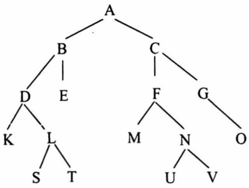

## Bài 3:

a) Tại sao trong IDS, khi k = 1 thì thủ tục này trở thành BFS. Hãy giải thích và cho ví dụ minh hoạ?

b) Tại sao trong IDS, khi k = chiều cao của cây thì thủ tục này trở thành DFS. Hây giải thích và cho ví dụ minh hoạ?

Bài 4: Bài toán đong nước

Cho hai bình có dung tích lần lượt là m và n (lít). Với nguồn nước không hạn chế, dùng hai bình trên đề dong k lít nước.

<!-- page: 64 -->

Hãy thực hiện các yêu cầu sau:

a) Mô tả trạng thái cho bài toán.

b) Mô tả trạng thái đầu.

c) Mô tả trạng thái cuối.

d) Mô tả toán tử.

## Bài 5: Bài toán qua sông

Người nông dân muốn chuyển một con cáo, một con vịt và túi ngũ cốc từ bờ bên này sông sang bờ biên kia sông bằng một chiếc thuyền. Nhưng chiếc thuyền của ông rất nhỏ chỉ có thể chờ một mình ông với một trong ba vật trên. Làm thế nào để người nông dân chuyển các vật trên sang bờ bên kia an toàn? Biết rằng nếu vắng người nông dân thì con cáo ăn con vịt, con vịt ăn hạt ngũ cốc.

Hãy thực hiện các yêu cầu sau:

a) Mô tả trạng thái cho bài toán.

b) Mô tả trạng thái đầu.

c) Mô tả trạng thái cuối.

d) Mô tả toán tử.

## Bài 6: Bài toán nhà truyền giáo

Có ba nhà truyền giáo và ba con quý đúng ở bờ bên này sông. Làm thế nào để các nhà truyền giáo qua sông được an toàn? Biết rằng các nhà truyền giáo có thể qua sông bằng một chiếc thuyền, mỗi chuyển chỉ chờ nhiều nhất được hai người và nếu số con quý nhiều hơn số nhà truyền giáo ở bờ bên này, ở bờ bên kia và ở trên thuyền thì các nhà truyền giáo sẽ bị ăn thịt.

Hãy thực hiện các yêu cầu sau:

a) Mô tả trạng thái cho bài toán.

b) Mô tả trạng thái đầu.

c) Mô tả trạng thái cuối.

d) Mô tả toán tử.

<!-- page: 65 -->

## Bài 7:

Cho đồ thị với định T₀ = A, Goal = { M, K }.

Tìm đường đi p:  $T_{0} \rightarrow T_{G} \in Goal theo A^{T}$

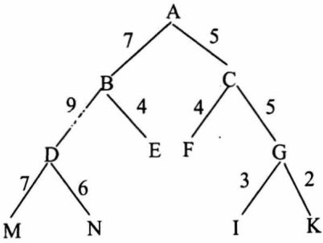

## Bài 8:

Xét bài toán trò chơi 8 số với trạng thái đầu a) và trạng thái đích b) cho như hình vẽ. Hây áp dụng thuật toán A$^{KT}$ để tìm đường đi từ đỉnh đầu a) đến đỉnh đích b)

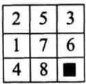

a)

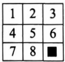

b)

## Bài 9:

Xét bài toán 8 số trong ví dụ 2.12. Hây xây dựng hai hàm đánh giá khác hàm xây dựng trong ví dụ này. Tìm lời giải cho bài toán với hai hàm vừa xây dựng.

## Bài 10:

Xét bài toán thấp Hà Nội với n = 3

a) Xây dựng hàm đánh giá.

b) Tim đường đi từ trạng thái đầu đến trạng thái đích dựa vào hàm đánh giá vừa xây dựng được ở câu a)

<!-- page: 66 -->

Bài 11: Cho đồ thị với  $T_{0}=A$ ,  $T_{G}=D$

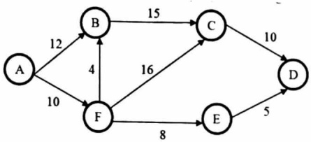

Bảng chi phí ước lượng:

| $T_i$ | h($T_i$) |
| --- | --- |
| D | 0 |
| A | 20 |
| B | 15 |
| F | 10 |
| E | 4 |
| C | 8 |

Hãy tìm đường đi từ A đến D theo A\*.

Bài 12: Hây tìm đường đi từ a đến z theo A\* với chi phí ước lượng là các giá trị nằm cạnh đình.

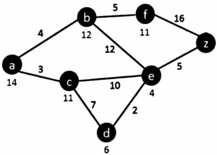

Bài 13: Cải đặt chương trình từ bài 1 đến bài 12 bằng Python (có thể sử dụng thư viện sẵn có trong Python).

<!-- page: 67 -->

## Chương 3. BIỂU DIỄN VÀ XỬ LÝ TRI THỨC

Một vấn đề rất quan trọng là muốn máy tính giải quyết được các bài toán thì cần phải cung cấp tri thức cho nó. Chương này sẽ đề cập đến các phương pháp biểu diễn tri thức cơ bản, ứng với cách biểu diễn sẽ có các cách xử lý tương ứng.

## 3.1. KHÁI NIỆM VÀ PHÂN LOẠI

## 3.1.1. Tri thức là gì?

Tri thức là một thuật ngữ trừu tượng nhằm chỉ các hiểu biết cá nhân về chủ đề xác định. Tri thức được coi là một mắt xích trong chuỗi bắt đầu với dữ liệu (Data) rất ít hữu dụng. Bằng cách tổ chức và phân tích dữ liệu, ta hiểu được dữ liệu có ý nghĩa gì, đó chính là thông tin (Information). Sự giải thích hoặc đánh giá thông tin cho ta tri thức.

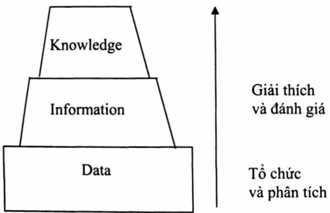

Hình 3.1. Sự phát triển tri thức

<!-- page: 68 -->

Thuật ngữ "Tri thức" được các chuyên gia tin học gần đây nhắc đế rất nhiều cũng như các thuật ngữ "Chương trình" và "Dữ liệu". Có thể phân biệt dữ liệu, thông tin, tri thức:

\- Dữ liệu được coi là “các đối tượng”, các sự kiện ở đó ta tập hợp được. Các đối tượng, các sự kiện này không liên kết với nhau. Đồ có thể là chuỗi các bit, các số hoặc các tín hiệu nào đó không được giải thích.

\- Thông tin là dữ liệu được lưu trữ trong thiết bị với một ngữ nghĩa nào đó, ở đó dữ liệu được loại bỏ sự dư thừa, được giảm đến cực tiểu cần thiết để có thể nhận biết được đặc trưng dữ liệu. Trong đó mối liên quan giữa các sự kiện đã được thiết lập và được hiểu Thông tin cung cấp câu trả lời cho các dạng câu hỏi “Ai?”, “Cái gì?”, “Khi nào?”, “Ở đâu?”. Chẳng hạn: Nhiệt độ xuống 150 và sau đó trời bắt đầu mưa.

\- Tri thức xuất hiện khi các thành phần thông tin được tích hợp, chứa các sự kiện và các mối quan hệ giữa chúng đã được định danh và được hiểu. Ô đó, chúng được nhận biết, được phát hiện, được học. Tri thức được xem là dữ liệu ở mức cao của sự trừtượng hoá và tổng quát hoá.

Tri thức có một số tính chất sau:

\- Tính cấu trúc: Một trong những đặc trưng cơ bản của hoạt động nhận thức con người đối với thế giới xung quanh là khả năng phân tích cấu trúc của các đối tượng ("bộ phận - toàn thể", "phần tử - lớp", ...). Tri thức đưa vào máy tính cũng cần có khả năng tạo được một phân cấp giữa các khái niệm và quan hệ giữa chúng.

\- Tính liên hệ: Ngoài các quan hệ về cấu trúc của mỗi tri thức, giữa các đơn vị tri thức còn có nhiều mối liên hệ khác nhau (không gian, thời gian, nhân - quả, v.v... ). Chính nhỏ tính liên hệ này mà

<!-- page: 69 -->

tri thức có thể mô tả và biểu diễn được hầu hết mọi vấn đề mà chúng ta quan tâm.

\- Tính chủ động: Như ta đã biết, dữ liệu có vai trò “bị động” vì nó phụ thuộc vào sự khai thác của chương trình cụ thể. Khi hoạt động ở bất kỳ đầu và trong lĩnh vực nào, con người cũng bị điều khiển bởi tri thức. Nhò tri thức mà con người hình thành mục tiêu và các hành vi đạt tới mục tiêu đó. Quá trình này luôn luôn đi kèm với sự bổ sung tri thức và khắc phục sự mãu thuẫn giữa các tri thức để hoàn thiện tri thức ở mỗi người. Tri thức ở trong máy tính cũng vậy, chúng chủ động hướng người sử dụng biết cách khai thác tri thức.

Biểu diễn tri thức gồm các phương pháp dùng đề mã hoá tri thức trong cơ sở tri thức của hệ thống. Đề xây dựng cơ sở tri thức cần lựa chọn các đối tượng có ý nghĩa, các quan hệ trong miền (domain) và biểu diễn chúng trong một ngôn ngữ hình thức.

Kỹ nghệ xử lý tri thức bao gồm trong nó các kỹ thuật cấu trúc tri thức, suy diễn, quản trị tri thức và học tự động.

Một hệ thống biểu diễn tri thức bao gồm: Ngôn ngữ biểu diễn, cơ chế suy diễn và công cụ tạo lập cơ sở tri thức trong từng lĩnh vực cụ thể.

## 3.1.2. Phân loại tri thức

Tri thức định lượng thường gắn với các kỹ thuật heuristic khác nhau. Đó là các kỹ thuật phụ thuộc vào các hàm giá.

Tri thức định tính: Tri thức mô tả, tri thức thủ tục và tri thức điều khiển.

Tri thức mô tả: Diễn tả cách nhìn nhận về các đối tượng hoặc sự kiện, bao gồm các khẳng định đơn giản mang giá trị đúng hay sai, hoặc gồm xấu các khẳng định để diễn tả đầy đủ hơn về đối tượng hay khái niệm nào đó (nhung không đưa ra thông tin về cấu trúc bên trong cũng

<!-- page: 70 -->

như phương pháp sử dụng). Tri thức mô tả còn đưa ra các mối liên hệ ràng buộc giữa các đối tượng, các sự kiện và các quá trình.

Tri thức thủ tục: Cho phép mô tả các phương pháp cấu trúc tri thức, ghép nối và suy diễn tri thức mới từ những tri thức đã có. Các tri thức này tạo cơ sở kỹ nghệ xử lý tri thức.

Ví dụ: Thủ tục tìm kiếm trên cây nhị phân, các phương tìm kiếm trong không gian trạng thái, ...

Tri thức điều khiển: Tri thức này dùng để chỉ ra phương pháp điều khiển phối hợp các nguồn tri thức mô tả và tri thức thủ tục khác nhau.

## 3.1.3. Tri thức và suy diễn

Hệ thống AI giải quyết vấn đề bao gồm 2 thành tố cơ bản: Phương pháp biểu diễn vấn đề và các phương pháp tìm kiếm heuristic.

Xét hai thành tố trên một số sơ đồ giải quyết các bài toán sau:

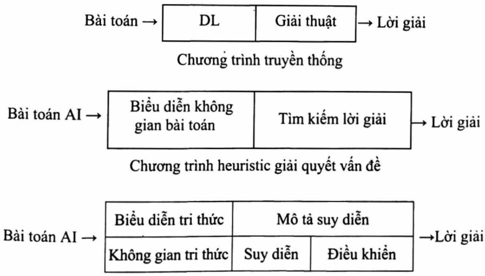

Chương trình dựa trên tri thức

Trong chương trình dựa trên tri thức, mô tả suy diễn gồm hai phần: Suy diễn và điều khiển.

<!-- page: 71 -->

Suy diễn: Thường sử dụng các quy tắc:

Modus ponens:  $\frac{A, A \rightarrow B}{B}$

$$
\neg \mathrm{B}, \mathrm{A} \rightarrow \mathrm{B}
$$

Modus tollens:

Điều khiển: - Suy diễn tiến, lùi.

\- Kết hợp suy diễn tiến và lùi.

\- Các phương pháp tìm kiếm (TKCR, TKCS, ...).

## 3.2. CÁC PHƯƠNG PHÁP BIỂU DIỄN TRI THỨC

Trong mục này chúng ta tập trung vào các phương pháp biểu diễn cơ bản như logic mệnh đề, logic vị từ và luật sản xuất, các phương pháp biểu diễn còn lại độc giả có thể tham khảo trong tài liệu [1].

## 3.2.1. Biểu diễn tri thức bằng logic hình thức

## 3.2.1.1. Logic mệnh đề

Mệnh đề là khẳng định có thể nhận giá trị đúng (True) hoặc sai (False), ta dùng các chữ cái in thường đề kí hiệu cho mệnh đề: a, b, c, v.v...

Mệnh đề được chia làm 2 loại:

\- Mệnh đề sơ cấp: Là mệnh đề không thể phân chia thành các mệnh đề nhỏ hơn. Ví dụ “15 chia hết cho 3” là mệnh đề sơ cấp.

\- Mệnh đề phức hợp: Là mệnh đề được tạo thành từ 2 hay nhiều mệnh đề sơ cấp và có sử dụng các phép kết nối mệnh đề (và, hoặc, ...).

Trong logic menses đề có sử dụng các phép toán logic: $\neg, \rightarrow, \leftrightarrow, \vee, \wedge$.

<!-- page: 72 -->

Bảng 3.1: Bảng chân lý đối của các phép toán

| a | b | $\neg a$ | $a \land b$ | $a \lor b$ | $a \rightarrow b$ | $a \leftrightarrow b$ |
| --- | --- | --- | --- | --- | --- | --- |
| 0 | 0 | 1 | 0 | 0 | 1 | 1 |
| 0 | 1 | 1 | 0 | 1 | 1 | 0 |
| 1 | 0 | 0 | 0 | 1 | 0 | 0 |
| 1 | 1 | 0 | 1 | 1 | 1 | 1 |

Độ ưu tiên của các phép toán: phép phù định có độ ưu tiên cao nhất, tiếp theo là phép ∨, ∧ và cuối cùng là →, ↔.

Một số tính chất của các phép toán:

1.  $a \vee b \Leftrightarrow b \vee a, a \wedge b \Leftrightarrow b \wedge a$

2. $a \vee (b \vee c) \Leftrightarrow (a \vee b) \vee c, a \wedge (b \wedge c) \Leftrightarrow (a \wedge b) \wedge c$

3.  $\neg(a \land b) \Leftrightarrow \neg a \lor \neg b, \neg(a \lor b) \Leftrightarrow \neg a \land \neg b$

4. $a \rightarrow b \Leftrightarrow \neg a \lor b$

5. $a \leftrightarrow b \Leftrightarrow (a \rightarrow b) \land (b \rightarrow a)$

## 3.2.1.2. Logic vị từ

Logic vị từ là mở rộng của logic mệnh đề bằng cách bổ sung thêm các lượng từ phổ dụng (∀, ∃).

Vị từ p(x, y, ..., z) là một phát biểu phụ thuộc vào các biến x, y, ..., z và tuỷ theo giá trị của các biến này mà p(x, y, ..., z) nhận giá trị True hoặc False.

Ví dụ 3.1: P(x, y): “x - y = 1”

P(1, 0) là menses đề có giá trị chân lý đúng.

P(1, 2) là menses đề có giá trị chân lý sai.

Trong logic vị từ, mệnh đề được tạo thành từ hai thành phần: Các đối tượng và mối quan hệ giữa các đối tượng này gọi là vị từ.

<!-- page: 73 -->

Ví dụ 3.2: Với mệnh đề “Cam có vị ngọt” được chuyển thành “vị(cam, ngọt)” hay với mệnh đề “Cam có màu xanh” được chuyển thành “màu (cam, xanh)”.

Tổng quát: Vị từ(<đối tượng 1>, <đối tượng 2>, ..., <đối tượng n>)

Ví dụ 3.3: A là bổ của B nếu B là anh em của một người con của A

$$
\mathrm{Bo} (\mathrm{A}, \mathrm{B}) = \exists \mathrm{C} (\mathrm{Anh} (\mathrm{B}, \mathrm{C}) \vee \mathrm{Anh} (\mathrm{C}, \mathrm{B})) \wedge \mathrm{Bo} (\mathrm{A}, \mathrm{C})
$$

Ta có menses đề cơ sở: Anh(An, Bình) là menses đề đúng, Bố(Trị, An) là menses đề đúng. Khi đó Bố(Trị, Bình) là menses đề đúng.

∀x: P(x) là menses đề luôn đúng.

∃x: P(x) tồn tại x thuộc miền xác định để P(x) đúng.

## 3.2.1.3. Giải thuật của Vương Hạo (Hao Wang - Wang's Algorithm) [8]

Bài toán: Cho các giả thiết GT = {gt₁, gt₂, ..., gtₙ}, tập kết luận KL = {kl₁, kl₂,..., klₘ}. Hãy rút ra một trong các kết luận kl₁, kl₂, ..., klₘ.

Ví dụ 3.4: Cho a ∧ b → c, b ∧ c → d và a, b cần suy ra d. Trong ví dụ này GT = {a ∧ b → c, b ∧ c → d, a, b} và KL = {d}.

Bước 1: Viết lại giả thiết và kết luận dưới dạng sau:

$gt_{1}, gt_{2}, \ldots, gt_{n} \rightarrow kl_{1}, kl_{2}, \ldots, kl_{m}.$  Trong đó, các  $gt_{i}$  và  $kl_{j}$

chi chứa các phép toán ¬, ∧, ∨

Ví dụ: ¬(a → b) ∨ (c ∧ d) ⇔ ¬(¬a ∨ b) ∨ (c ∧ d)

$$
\Leftrightarrow (a \land \neg b) \lor (c \land d)
$$

Buróc 2: Chuyển vé các gt$_{i}$ và các kl$_{j}$ ở dạng phù định:

Ví dụ: 1) ¬a ∨ ¬b ∨ ¬c, d, e → ¬e, d ⇔ ¬a ∨ ¬b ∨ ¬c, d, e → d

$$
p \vee q, \neg (r \wedge s), \neg p \rightarrow s, \neg r \Leftrightarrow p \vee q, r \rightarrow r \wedge s, p, s \tag {2}
$$

$\underline{Bước 3}$: Nếu trong $gt_i$ có dấu ∧ thì thay bằng dấu “ , ”, nếu trong $kl_j$ có dấu ∨ thì thay bằng dấu “ , ”.

<!-- page: 74 -->

```txt
Ví dụ: 1) ¬a ∨ b, r ∧ (¬p ∨ q) → s, r ⇔ ¬a ∨ b, r, ¬p ∨ q → ¬s, r
```

<div class="docvortex-algorithm" style="white-space: pre-wrap; font-family:monospace;">
2) $\neg (a\lor b)\rightarrow \neg (c\land d)\Leftrightarrow c\land d\to a\lor b\Leftrightarrow c,d\to a,b$
</div>

Bước 4: Nếu trong gt$_{i}$ có dấu ∨ thì tách gt$_{i}$ thành 2 dòng

Nếu trong kl$_{j}$ có dâu ∧ thì tách kl$_{j}$ thành 2 dòng

Ví dụ: 1) ¬a ∨ b, p, q → r được tách thành 2 dòng:

Bước 5: Một dòng được chứng minh nếu tồn tại chung một mệnh đề ở cả hai vé

Ví dụ: p, q → q được chứng minh

a ∨ b, ¬a, a → q ⇔ a ∨ b, a → q, a dòng này cũng được chứng minh.

## Bước 6:

a) Một dòng không được chứng minh nếu không có phép tuyển ở về trái, phép hội ở về phải đồng thời ở cả 2 về không có biến mệnh đề chung.

Ví dụ: a, b, c → d

b) Một bài toán được chứng minh nếu tất cả các dòng đều được chứng minh.

Chú ý: Từ B2 đến B6 không nhất thiết thực hiện theo trình tự.

<!-- page: 75 -->

## Ví dụ 3.5: Xét lại Ví dụ 3.4

Ta biến đổi giả thiết và kết luận dưới dạng chuẩn:

$$
\mathrm{a} \land \mathrm{b} \rightarrow \mathrm{c} \Leftrightarrow \neg (\mathrm{a} \land \mathrm{b}) \lor \mathrm{c} \Leftrightarrow \neg \mathrm{a} \lor \neg \mathrm{b} \lor \mathrm{c}
$$

$$
\mathrm{b} \land \mathrm{c} \rightarrow \mathrm{d} \Leftrightarrow \neg \mathrm{b} \lor \neg \mathrm{c} \lor \mathrm{d}
$$

Viết lại giả thiết và kết luận dưới dạng:

$$
\neg a \lor \neg b \lor c, \neg b \lor \neg c \lor d, a, b \rightarrow d
$$

Tách vé trái thành 2 dòng (bước 4):

Dòng 1: $\neg a, \neg b \lor \neg c \lor d, a, b \rightarrow d \Leftrightarrow \neg b \lor c \lor d, a, b \rightarrow a, d$ (bước 2).

Dòng này được chứng minh vì ở hai về có chung biển a (bước 5).

Dòng 2: $\neg b \lor c$, $\neg b \lor \neg c \lor d$, $a, b \to d$. Dòng này chưa chứng minh được nên ta phải tiếp tục biến đổi. Tách vé trái dòng 2 thành 2 dòng (bước 4):

Dòng 2.1: ¬b, ¬b ∨ ¬c ∨ d, a, b → d ⇔ ¬b ∨ ¬c ∨ d, a, b → b, d (bước 2). Dòng này được chứng minh (bước 5).

Dòng 2.2: c, $\neg b \lor \neg c \lor d$, a, $b \to d$. Vế trái dòng này tiếp tục được tách.

Dòng 2.2.1: c, ¬b, a, b → d ⇔ c, a, b → d, b. Dòng này chung nhau biến b.

Dòng 2.2.2: c, ¬c ∨ d, a, b → d. Tách vé trái dòng 2.2.2 thành hai dòng:

Dòng 2.2.2.1: c, ¬c, a, b → d ⇔ c, a, b → c, d. Được chứng minh.

Dòng 2.2.2.2: c, d, a, b → d. Dòng này có chung biến d.

Tất cả các dòng được chứng minh nên bài toán được chứng minh (bước 6).

<!-- page: 76 -->

Từ cách làm trên, ta có cây suy diễn:

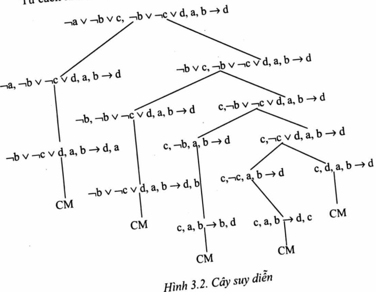

3.2.1.4. Giải thuật Robinson
Đây là phương pháp chứng minh bằng phản chứng: Đề chứng minh a → b là đúng với a đúng. Ta giả sử b sai, từ a và →b đúng, ta suy ra màu

Bước 1: Viết lại các giả thiết và kết luận
gt₁, gt₂, ..., gtₙ → kl₁, kl₂, ..., klₘ. Trong đó, các gtᵢ và klⱼ
chi chứa các phép toán ¬, ∧, ∨
Bước 2: Nếu trong gtᵢ có dấu ∧ thì thay bằng dấu “,”, nếu trong klⱼ

Bước 2. Nou
có dấu ∨ thì thay bằng dấu “,”

$$
\begin{array}{r l}&\text {Ví   dụ:} \neg (a \rightarrow b) \lor c \Leftrightarrow \neg (\neg a \lor b) \lor c\\&\qquad \Leftrightarrow (a \land \neg b) \lor c \Leftrightarrow (a \lor c) \land (\neg b \lor c)\\&\text {Ta thay dấu ∧ bằng dấu “ , ” } \{a \lor c, \neg b \lor c \}\end{array}
$$

<!-- page: 77 -->

Bước 3: Phù định lại kết luận

$$
\{\mathrm{gt} _ {1}, \mathrm{gt} _ {2}, \dots , \mathrm{gt} _ {\mathrm{n}}, \neg \mathrm{kl} _ {1}, \neg \mathrm{kl} _ {2}, \dots , \neg \mathrm{kl} _ {\mathrm{m}} \}
$$

Bước 4: Nếu trong các câu ở bước 3 có cặp mệnh đề đối ngẫu (a và —a gọi là hai mệnh đề đối ngẫu) thì bài toán được chứng minh. Nguộc lại, thực hiện bước 5.

Bước 5: Xây dựng câu mới bằng cách tuyển các cặp câu, nếu có biến đổi ngẫu thì biến này bị loại bỏ và thay hai câu cũ bằng một câu mới.

Ví dụ: { ¬a ∨ ¬b ∨ c, a ∨ ¬b ∨ d, ¬b ∨ c ∨ d}

Tuyển hai câu đầu tiên (¬a ∨ ¬b ∨ c ∨ a ∨ ¬b ∨ d) loại bỏ biến ¬a và a ta được (¬b ∨ c ∨ d). Thay hai câu cũ bằng câu mới:

$\{\neg b \vee c \vee d, \neg b \vee c \vee d\}$

Bước 6: Nếu không tạo ra được dòng mới và không có cặp mệnh đề đối ngẫu thì bài toán không được chứng minh. Nguộc lại, bài toán được chứng minh khi và chi khi chỉ còn hai mệnh đề đối ngẫu.

Ví dụ: {¬a, ¬b, c, d} (bài toán không chứng minh được)

Ví dụ 3.6: Cho a ∧ b → c, b ∧ c → d và a, b cần suy ra d.

Buóc 1: a ∧ b → c ⇔ ¬(a ∧ b) ∨ c ⇔ ¬a ∨ ¬b ∨ c

$b \land c \rightarrow d \Leftrightarrow \neg b \lor \neg c \lor d$

Viết lại giả thiết và kết luận dưới dạng:

$\neg a \vee \neg b \vee c, \neg b \vee \neg c \vee d, a \wedge b \rightarrow d$

Buóc 2: {¬a ∨ ¬b ∨ c, ¬b ∨ ¬c ∨ d, a, b → d}

Buóc 3: {¬a ∨ ¬b ∨ c, ¬b ∨ ¬c ∨ d, a, b, ¬d}

Bước 4: Chưa có cặp câu nào đối ngẫu.

Buóc 5:

$\{\neg b \lor c, \neg b \lor \neg c \lor d, b, \neg d\}$ (vì $\neg a \lor \neg b \lor c \lor a$ bó $\neg a$ và a còn $\neg b \lor c$)

<!-- page: 78 -->

$\{\neg b \vee c, \neg c \vee d, b, \neg d\}$ (vì $\neg b \vee \neg c \vee d \vee b$ bò $\neg b$ và $b$ còn $\neg c \vee d$), giữ lại $b$
$\{\neg b \vee c, \neg c, b\}$ (vì $\neg c \vee d \vee \neg d$ còn $\neg c$)
$\{\neg b \vee c, \neg c, b\}$ (vì $\neg b \vee c \vee b$ còn $c$)
$\{c, \neg c\}$

Như vậy, bài toán đã được chứng minh vì tôn tại cặp câu đối ngẫu.
Sau đây là đồ thị hợp giải:

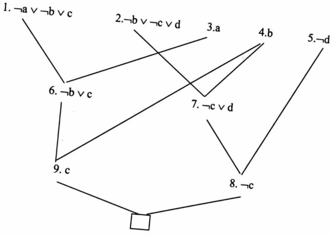

Hình 3.34. Đồ thị hợp giải

## 3.2.1.5. Thủ tục hợp giải cho logic vị từ

Xét biểu thức sau: $\forall x\{P(x)\to\{\forall y\{P(y)\to P(f(x,y))\}\land\neg\neg y\}$ $\{Q(x,y)\to P(y)\}\}\}$

Bước 1: Viết lại giả thiết và kết luận dưới dạng chuẩn: - Loại bờ khác nhau

\- Loại bỏ phép kéo theo A → B ⇔ ¬A ∨ B

\- Đưa dấu phù định vào trong cùng nhờ:

<!-- page: 79 -->

$$
\begin{array}{r l} & {\neg (\mathrm{A} \lor \mathrm{B}) \equiv \neg \mathrm{A} \land \neg \mathrm{B}} \\ & {\neg (\mathrm{A} \land \mathrm{B}) \equiv \neg \mathrm{A} \lor \neg \mathrm{B}} \\ & {\neg (\neg \mathrm{A}) \equiv \mathrm{A}} \\ & {\neg \exists \mathrm{xA} \equiv \forall \mathrm{x} \neg \mathrm{A}} \\ & {\neg \forall \mathrm{xA} \equiv \exists \mathrm{x} \neg \mathrm{A}} \end{array}
$$

Ta có: ∀x {¬P(x) ∨ {∀y {¬P(y) ∨ P(f(x, y)) } ∧ ¬∀y {¬Q(x,y) ∨ P(y) }}}

$$
\equiv \forall \mathrm{x} \{\neg \mathrm{P} (\mathrm{x}) \vee \{\forall \mathrm{y} \} \neg \mathrm{P} (\mathrm{y}) \vee \mathrm{P} (\mathrm{f} (\mathrm{x}, \mathrm{y})) \wedge \exists \mathrm{y} \{\mathrm{Q} (\mathrm{x}, \mathrm{y}) \wedge \neg \mathrm{P} (\mathrm{y}) \} \}\}
$$

\- Thay tên biến đề mỗi lượng từ có một tên biến riêng.

$$
\forall \mathrm{x} \{\neg \mathrm{P} (\mathrm{x}) \vee \{\forall \mathrm{y} \{\neg \mathrm{P} (\mathrm{y}) \vee \mathrm{P} (\mathrm{f} (\mathrm{x}, \mathrm{y})) \wedge \exists \mathrm{z} \{\mathrm{Q} (\mathrm{x}, \mathrm{z}) \wedge \neg \mathrm{P} (\mathrm{z}) \} \} \}
$$

\- Loại bỏ lượng từ ∃ nhở:

$\exists x P(x)$ được chuyển thành $P(a)$ ($\exists x = a$ thuộc miền xác định sao cho $P(a)$ đúng).

Ví dụ: P(x): “ x > 10” với x ∈ Z, ∃x P(x) được chuyển thành P(a) (a- hằng số và a >10).

$\forall x\exists y P(x, y) được chuyển thành P(x, g(x)) (\forall x\exists y sao cho y = g(x))$

Ví dụ: ∀x∃y: x - y = 10 ⇒ y = g(x) = x - 10

$\forall x\exists y: x - y = 10 \text{ được chuyên thành } P(x, g(x))$

$$
\forall \mathrm{x} \{\neg \mathrm{P} (\mathrm{x}) \vee \{\forall \mathrm{y} \{\neg \mathrm{P} (\mathrm{y}) \vee \mathrm{P} (\mathrm{f} (\mathrm{x}, \mathrm{y})) \wedge \{\mathrm{Q} (\mathrm{x}, \mathrm{g} (\mathrm{x})) \wedge \neg \mathrm{P} (\mathrm{g} (\mathrm{x})) \} \} \}
$$

\- Đưa lượng từ ∀ về đầu biểu thức, phần thân biểu thức được gọi là ma trận và đưa ma trận về dạng chuẩn tắc hội:

$$
\begin{array}{l} \mathrm{A} \vee (\mathrm{B} \wedge \mathrm{C}) \equiv (\mathrm{A} \vee \mathrm{B}) \wedge (\mathrm{A} \vee \mathrm{C}) \\ \text {Ta có:} \\ \forall x \forall y \{\neg P (x) \vee \{\{\neg P (y) \vee P (f (x, y)) \} \wedge \{Q (x, g (x)) \wedge \neg P (g (x)) \} \} \} \\ \equiv \forall x \forall y \{\{\neg P (x) \vee \neg P (y) \vee P (f (x, y)) \} \wedge \{\neg P (x) \vee \{Q (x, g (x)) \wedge \neg P (g (x)) \} \} \} \end{array}
$$

<!-- page: 80 -->

$$
\equiv \forall x \forall y \{\{\neg P (x) \vee \neg P (y) \vee P (f (x, y)) \} \wedge \{\neg P (x) \vee Q (x, g (x)) \wedge
$$

$\{\neg P(x) \lor \neg P(g(x))\}\}$

\- Loại bỏ lượng từ ∀.

\- Thay dấu ∧ bằng dấu “,” và viết mỗi câu trên một dòng:

1.  $\neg\mathrm{P}(\mathrm{x})\lor\neg\mathrm{P}(\mathrm{y})\lor\mathrm{P}(\mathrm{f}(\mathrm{x},\mathrm{y}))$

2.  $\neg\mathrm{P}(\mathrm{x})\lor\mathrm{Q}(\mathrm{x},\mathrm{g}(\mathrm{x}))$

3.  $\neg\mathrm{P}(\mathrm{x})\lor\neg\mathrm{P}(\mathrm{g}(\mathrm{x}))$

$\underline{\text{Bước 2}}$: Tìm cặp câu $p_1$, $p_2$ và phép gán q sao cho $p1q = \neg p2q$. Khi đó bài toán được chứng minh, ngược lại thực hiện $\underline{\text{Bước 3}}$.

Ví dụ: 1.  $\neg P(x, y) \lor \neg P(y, z) \lor P(x, y)$

2. $\mathrm{P}(\mathrm{a},\mathrm{b})$

3. $\neg \mathrm{P}(\mathbf{x},\mathbf{z})$

4. Mâu thuẫn Res(2, 3) với q = {a/x, b/z} (tuyển dòng 2 và dòng 3 với phép gán trị q)

$\underline{\text{Bước 3:}}$ Tîm cặp câu $P_{1} = P_{1}^{0} \vee Q1 \vee Q2 \vee \ldots \vee Qn$

$$
\mathrm{P} _ {2} = \mathrm{P} _ {2} ^ {0} \vee \mathrm{R} 1 \vee \mathrm{R} 2 \vee \dots \vee \mathrm{Rn}
$$

và phép gán q sao cho:  $P_{1}^{0}q = \neg P_{2}^{0}q$

Ví dụ:

1.  $\neg\mathsf{DT}(x,y)\lor\neg\mathsf{BB}(y)\lor\mathsf{BB}(x)$

2. $\mathrm{DT}(\mathbf{a},\mathbf{b})$

3. BB(a)

4.  $\neg BB(b) \lor BB(a)$  Res (1, 2) q1 = {a/x, b/y}

5. $\neg \mathrm{DT}(x, a) \vee \mathrm{BB}(x)$ Res (1, 3) $q2 = \{a / y\}$

6. $\neg \mathrm{DT}(a, y) \vee \neg \mathrm{BB}(y) \vee \mathrm{BB}(a)$ Res (1, 3) $q3 = \{a / x\}$

<!-- page: 81 -->

Bước 4: Nếu không xác định được thêm dòng mới mà không có hai mệnh đề nào đổi ngẫu thì bài toán không được chứng minh. Ngược lại, bài toán được chứng minh.

Ví dụ 3.7: Xét các tiên đề sau:

1) Tất cả các con chó sẵn đều hú vào ban đêm (All Hounds Howl at night).

2) Bất cứ ai có mèo sẽ không có bất kỳ con chuột nào (Anyone who has any cats will not have any mice).

3) Những người ngủ nhẹ không có bất cứ điều gì mà hú vào ban đêm (Light sleepers do not have anything which howls at night).

4) John có một con mèo hoặc một con chó sẵn (John has either a cat or a hound).

Nếu John là một người ngủ nhẹ, thì John không có bất kỳ con chuột nào (If John is a light sleeper, then John does not have any mice).

Từ các tiên đề trên, ta có các vị từ và các luật sau:

1. $\forall x (\mathrm{Hound}(x) \rightarrow \mathrm{Howl}(x))$

2.  $\forall x \forall y (Have(x, y) \land Cat(y) \rightarrow \neg \exists z (Have(x, z) \land Mouse(z)))$

3.  $\forall x (LS(x) \rightarrow \neg \exists y (Have(x, y) \land Howl(y)))$

4. ∃ x (Have(John, x) ∧ (Cat(x) ∨ (Hound (x)))

5. LS(John) → ¬∃ z (Have(John, z) ∧ Mouse(z))

Loại bỏ phép kéo theo:

1.  $\forall x ((Hound(x) \rightarrow Howl(x)))$

$\neg(\text{Hound}(x) \lor \text{Howl}(x))$

2. $\forall x \forall y (\text{Have}(x, y) \land \text{Cat}(y) \rightarrow \neg \exists z (\text{Have}(x, z) \land \text{Mouse}(z)))$

$\Leftrightarrow \forall x \forall y (\text{Have}(x,y) \land \text{Cat}(y) \rightarrow \forall z \neg (\text{Have}(x,z) \land \text{Mouse}(z)))$

$\Leftrightarrow \forall x \forall y \forall z (\neg (\text{Have}(x,y) \land \text{Cat}(y)) \lor \neg (\text{Have}(x,z) \land \text{Mouse}(z)))$

$\Leftrightarrow \neg \text{Have}(x, y) \lor \neg \text{Cat}(y) \lor \neg \text{Have}(x, z) \lor \neg \text{Mouse}(z)$

<!-- page: 82 -->

```txt
3. ∀ x (LS(x) → ¬∃ y (Have(x, y) ∧ Howl(y)))
∀ x (LS(x) → ∀ y ¬ (Have(x, y) ∧ Howl(y)))
∀ x ∀ y (LS(x) → ¬ Have(x, y) ∨ ¬ Howl(y))
∀ x ∀ y (¬ LS(x) ∨ ¬ Have(x, y) ∨ ¬ Howl(y))
¬ LS(x) ∨ ¬ Have(x, y) ∨ ¬ Howl(y)
4. ∃ x (Have(John, x) ∧ (Cat(x) ∨ Hound(x)))
Have(John, a) ∧ (Cat(a) ∨ Hound(a))
5. ¬ [LS(John) → ¬ ∃ z (Have(John,z) ∧ Mouse(z))]
¬ [¬ LS (John) ∨ ¬ ∃ z (Have(John, z) ∧ Mouse(z))]
LS(John) ∧ ∃ z (Have(John, z) ∧ Mouse(z)))
LS(John) ∧ Have(John, b) ∧ Mouse(b)
Loại bỏ lượng từ ∀, ∃, và phép ∧, ta được các câu ở dạng chuẩn sau:
1. ¬ (Hound(x) ∨ Howl(x)
2. ¬ Have(x, y) ∨ ¬ Cat(y) ∨ ¬ Have(x, z) ∨ ¬ Mouse(z)
3. ¬ LS(x) ∨ ¬ Have(x, y) ∨ ¬ Howl(y)
4.
    1. Have(John, a)
    2. Cat(a) ∨ Hound(a)
5.
    1. LS(John)
    2. Have(John, b)
    3. Mouse(b)
Thực hiện phép hợp giải:
[1.,4.(b):] 6. Cat(a) ∨ Howl(a)
[2,5.(c):] 7. ¬ Have(x, y) ∨ ¬ Cat(y) ∨ ¬ Have(x, b)
[7,5.(b):] 8. ¬ Have(John, y) ∨ ¬ Cat(y)
[6,8:]      9. ¬ Have(John, a) ∨ Howl(a)
[4.(a),9:]   10. Howl(a)
[3,10:]      11. ¬ LS(x) ∨ ¬ Have(x, a)
[4.(a),11:] 12. ¬ LS(John)
[5.(a),12:] 13. □
```

<!-- page: 83 -->

## 3.2.2. Biểu diễn tri thức nhờ các luật sản xuất

Đây là phương pháp biểu diễn tri thức có cấu trúc, ý tưởng cơ bài của phương pháp này là tri thức được cấu trúc hoá bằng cặp điều kiện - hành động, nghĩa là nếu điều kiện xảy ra thì hành động được thi hành (xem [1]).

Luật sản xuất có dạng sau:
Nếu Điều kiện 1
Điều kiện 2
...
Điều kiện m

Thì Hành động 1 (hoặc Kết luận 1)
Hành động 2 (hoặc Kết luận 2)
...
Hành động n (hoặc Kết luận n)

Ví dụ: Cho tập các sự kiện F = {a, b, c, d, e} và tập các luật R = {r₁, r₂, r₃}

## 3.2.2.1. Suy diễn tiến đối với logic mệnh đề (Forward chaining algorithm)

Vào:

\- Tập các mệnh đề đã cho GT = {gt₁, gt₂, ..., gtₘ}

\- Tập hợp các luật R = {r₁, r₂, ..., rₘ}, với

$r_{i}: p_{1} \wedge \ldots \wedge p_{n} \rightarrow q \text{ với } i = 1, \ldots, n$

\- Tập KL = {q₁, ..., qₖ}

<!-- page: 84 -->

<div class="docvortex-algorithm" style="white-space: pre-wrap; font-family:monospace;">
Ra: Thông báo thành công nếu $\forall q_i$ ($i = \overline{1,k}$) đều được suy ra từ GT và tập luật R.
Phương pháp: /*GT $\xrightarrow{r1} \mathrm{TG}_1 \xrightarrow{r2} \mathrm{TG}_2 \longrightarrow ... \longrightarrow \mathrm{TG}_n \supset \mathrm{KL}^*$/
/* TG là tập các sự kiện (mệnh đề) đúng cho đến thời điểm đang xét*/ void SDT ()
{
TG = GT
/* SAT là tập hợp các luật có dạng $p_1 \wedge p_2 \wedge ... \wedge p_n \to q$, sao cho $\forall pi$ ($i = \overline{1,n}$) $\in$ TG */
SAT = Loc (R, TG)
while (KL $\subset$ TG) and (SAT $\neq \emptyset$) do
{
    r ← get (SAT) /*Lấy luật r trong SAT*/
        /*Già sử $r_i$: $p_1 \wedge p_2 \wedge ... \wedge p_n \to q^*$/
    TG = TG $\cup$ {q} /* Bổ sung về phải vào TG*/
    R = R \ {r}      /*Loại đi luật đã áp dụng*/
    SAT = Loc (R, TG) /*Tính lại tập SAT*/
}
If KL $\subset$ TG then exit ("thành công")
else exit ("không thành công")
}
Ví dụ 3.8: Cho tập luật R = {r_1, r_2,..., r_6 }
    r_1: a $\to$ c
    r_2: b $\to$ d
    r_3: a $\to$ e
    r_4: a $\wedge$ d $\to$ e
    r_5: b $\wedge$ c $\to$ f
    r_6: e $\wedge$ f $\to$ g
</div>

<!-- page: 85 -->

$$
\mathrm{GT} = \{\mathrm{a}, \mathrm{b} \}
$$

$$
\mathrm{KL} = \{\mathrm{g} \}
$$

$$
\text {Ban   dâu   TG} = \{\mathrm{GT} \} = \{\mathrm{a}, \mathrm{b} \}, \mathrm{SAT} = \{\mathrm{r} _ {1}, \mathrm{r} _ {2}, \mathrm{r} _ {3} \}
$$

$$
\mathrm{KL} \not \subset \mathrm{TG} \text {và} \mathrm{SAT} \neq \emptyset
$$

Lấy luật r₁ để áp dụng, ta có: TG = {a, b, c}, R = {r₂, r₃, ..., r₆}, và SAT = {r₂, r₃, r₅}

$$
\mathrm{KL} \not \subset \mathrm{TG} \text {và SAT} \neq \emptyset
$$

$$
\text {Áp dụng luật } \mathrm{r} _ {3}, \mathrm{TG} = \{\mathrm{a}, \mathrm{b}, \mathrm{c}, \mathrm{e} \}, \mathrm{R} = \{\mathrm{r} _ {2}, \mathrm{r} _ {4}, \mathrm{r} _ {5}, \mathrm{r} _ {6} \}, \mathrm{SAT} = \{\mathrm{r} _ {2}, \mathrm{r} _ {5} \}
$$

$$
\mathrm{KL} \not \subset \mathrm{TG} \text {và SAT} \neq \emptyset
$$

$$
\text {Lay} \mathrm{r} _ {2} \text {dêthực hiện, TG} = \{\mathrm{a}, \mathrm{b}, \mathrm{c}, \mathrm{d}, \mathrm{e} \}, \mathrm{R} = \left\{\mathrm{r} _ {4}, \mathrm{r} _ {5}, \mathrm{r} _ {6} \right\}, \mathrm{SAT} = \left\{\mathrm{r} _ {4}, \mathrm{r} _ {5} \right\}
$$

$$
\mathrm{KL} \not \subset \mathrm{TG} \text {và SAT} \neq \emptyset
$$

$$
\text {Lấy} \mathrm{r} _ {5} \text {đề thực hiện, TG} = \{\mathrm{a}, \mathrm{b}, \mathrm{c}, \mathrm{d}, \mathrm{f} \}, \mathrm{R} = \left\{\mathrm{r} _ {4}, \mathrm{r} _ {6} \right\}, \mathrm{SAT} = \left\{\mathrm{r} _ {4}, \mathrm{r} _ {6} \right\}
$$

$$
\mathrm{KL} \not \subset \mathrm{TG} \text {và SAT} \neq \emptyset
$$

$$
\text {Lấy} \mathrm{r} _ {6} \text {đề thực hiện, TG} = \{\mathrm{a}, \mathrm{b}, \mathrm{c}, \mathrm{d}, \mathrm{e}, \mathrm{f}, \mathrm{g} \}, \mathrm{R} = \{\mathrm{r} _ {1} \}, \mathrm{SAT} = \{\mathrm{r} _ {4} \}
$$

KL = {g} ⊆ TG nên ta nhận được kết quả “thành công”.

Nhận xét: Trong Ví dụ 3.8 các luật lấy ra trong tập SAT một cách ngẫu nhiên. Tuy nhiên, ta cũng có thể tổ chức tập SAT là Stack hoặc Queue.

## 3.2.2.2. Suy diễn lùi đối với logic mệnh đề (backward chaining algorithm)

Đề đưa ra kết luận q, ta phải tìm tất cả các luật sản sinh ra q có dạng:

$$
\mathrm{p} _ {1} \wedge \mathrm{p} _ {2} \wedge \dots \wedge \mathrm{p} _ {\mathrm{n}} \rightarrow \mathrm{q}
$$

Tiếp đó, đề có được q ta phải đưa ra các kết luận  $p_{1}$ ,  $p_{2}$ , ...,  $p_{n}$ . Quá trình xác định các  $p_{i}$  (i = 1,..., n) ta tiến hành làm tương tự như đối với q

<!-- page: 86 -->

```txt
Phương pháp: /* Sử dụng hai danh sách kiểu Stack: Goal và Vet */
void SDL ()
{
if KL ⊆ GT then exit ("thành công")
else
{
Goal = ∅; Vet = ∅; first = 0;
For each q ∈ KL do
    Goal = Goal ∪ {(q, 0)};
Repeat
{
(f, i) ← get (Goal); first = first + 1;
if not (f ∈ GT) then
{
Tim_luat(f, i, R, j); /*r_j: left_j → f*/
if j ≤ m then
{
Vet = Vet ∪ {(f, j)};
}
```

và đến một lúc nào đó ∃  $p_{i0}$  không dẫn xuất từ các giả thiết và tập luật R ta phải quay lui sang luật khác sản sinh ra q. Nguộc lại, nếu tất cả các  $p_{i}$  đều suy ra được từ giả thiết thì bài toán được chứng minh.

Vào:

```lua
- Tập các luật mệnh đề đã cho: GT = {gt₁, ..., gtₖ}
```

\- Tập các luật: $R = \{r_1, r_2, ..., r_m\}$ với $r_i: p_1 \land p_2 \land ... \land p_n \to q$

```txt
- Tập các kết luận KL = {q₁, ..., qₛ}
```

$\underline{Ra}$: Thông báo “thành công” nếu $q_{i}$ (i = 1,..., s) đều suy ra từ tập giả thiết GT và tập luật R.

<!-- page: 87 -->

```lisp
for each t ∈ left_j \ GT do
    Goal = Goal ∪ {(t, 0)
}
else /* j > m */
{
    back = true; /* quay lui*/
    while f ∈ KL and back do
    {
        Repeat
        {
            (g, k) ← get(Vet)
            Goal = Goal \ left_k
        }
        until (f ∈ left_k);
        tim_luat(g, k, R, l);
        if l ≤ m then
        {
            Goal = Goal \ left_k;
            for each t ∈ left_l \ GT do
                Goal = Goal ∪ {(t, 0)
                Vet = Vet ∪ {(g, l)};
                back = false
            }
            else f = g
        }}}}
Until Goal = Ø or (f ∈ KL and (first ≥ 2)) (*)
If f ∈ KL then exit ("không thành công")
Else exit ("thành công")
}
}
}
```

<!-- page: 88 -->

Trong thủ tục suy diễn lùi ta sử dụng thủ tục Tìm\_luật (f, i, R, j) có ý nghĩa là tìm luật từ i + 1 đến m (tổng số luật), xem có luật đầu tiên nào sản sinh ra f không, nếu có thì j = chỉ số của luật, ngược lại j = m + 1. Đề minh hoạ thủ tục này, ta xét ví dụ sau đây:

```txt
Cho R = {r₁, r₂, r₃, r₄}, với
    r₁: a ∧ b → c
    r₂: a ∧ b → d
    r₃: b → c
    r₄: a → d
```

Tìm\_luật(c, 0, R, j) ⇒ j = 1 (luật đầu tiên sản sinh ra c).

$\text{Tim\_luật}(h, 0, R, j) \Rightarrow j = 5 \text{ (không có luật nào sản sinh ra h kể từ luật thứ nhất).}$

```txt
Tim_luật(d, 3, R, j) ⇒ j = 4.
```

Tìm\_luật(d, 4, R, j) $\Rightarrow$ j = 5 (không có luật nào sản sinh ra d kể từ luật thứ 5).

Sau đây ta xét một ví dụ minh hoạ cho thủ tục suy diễn lùi.

```txt
Ví du 3.9: Cho tập luật sau:
    R = {r₁, r₂, ..., r₆}
    r₁: a ∧ b → c
    r₂: a ∧ h → d
    r₃: a ∧ c → e
    r₄: a ∧ d → m
    r₅: a ∧ b → n
    r₆: n ∧ e → m
    GT = {a, b}, KL = {m}
Ban đầu Goal = ∅, Vet = ∅, First = 0;
KL = {m} nên Goal = {(m, 0)}
```

<!-- page: 89 -->

Lấy (m, 0) trong Goal nên Goal = ∅, First = 1, áp dụng Tim\_luật (m, 0, R, j), suy ra j = 4, Vet = {(m, 4)}; left₄ \ GT = {d} nên Goal = {(d, 0)}. Kiểm tra điều kiện (\*) thấy không thỏa mãn nên quay lại thực hiện vòng lập.

Lấy (d, 0) trong Goal, suy ra Goal = ∅, First = 2, áp dụng Tîm\_luật (d, 0, R, j) nên ta có j = 2, Vet = {(m, 4), (d, 2)}, left₂ \ GT = {h} nên Goal = {(h, 0)}.

Lấy (h, 0) trong Goal nên ta được Goal = ∅, First = 3, áp dụng Tim\_luật (h, 0, R, j), lúc này j = 7, back = true (quay lui sang luật khác sinh ra kết luận m).

$f = h \notin KL$ và back = true, thực hiện:

Lấy (d, 2) trong Vet, suy ra Vet = {(m, 4)}, Goal = Goal \ left₂ = ∅, f = h ∈ left₂ nên ta thoát khởi vòng lặp Repeat. Áp dụng Tîm\_luật (d, 2, R, l) kéo theo l = 7, lớn hơn tổng số luật nên f = d ∉ KL và back = true.

Lấy (m, 4) trong Vet, Goal = Goal \ left₄ = ∅, f = d ∈ left₄, áp dụng Tim\_luật (m, 4, R, l), suy ra l = 6, left₆ \ GT = {n, e} nên Goal = {(n, 0), (e, 0)}, Vet = {(m, 6)}, và back = false.

$f = d \notin KL$ và back = false nên ta thoát khởi vòng lặp while ... do

Lúc này điều kiện (\*) vẫn chưa thỏa mãn. Do đó, ta phải tiếp tục thực hiện:

Lấy (e, 0) trong Goal nên tập Goal = {(n,0)}, áp dụng Tîm\_Luật (e, 0, R, j), suy ra j = 3, Vet = {(m, 6), (e, 3)}, left₃ \ GT = {c}, ta được Goal = {(n, 0), (c, 0)}.

Lấy (c, 0) trong Goal $\Rightarrow$ Goal = {(n,0)}, áp dụng Tim\_luật (c, 0, R, j), ta có j = 1, Vet = {(m, 6), (e, 3), (c, 1)}, left\_1\ GT = $\varnothing$ nên tập Goal = {(n, 0)}

Lấy (n, 0) trong Goal, lúc này Goal = ∅, áp dụng Tìm luật (n, 0, R, j), suy raj = 5, Vet = {(m, 6), (e, 3), (c, 1), (n, 5)}, left 5 \ GT = ∅ nên Goal = ∅.

Goal = ∅ thoả mãn điều kiện (\*)

<!-- page: 90 -->

Do f = n ∉ KL nên ta nhận được kết quả “Thành công”.

Ví dụ 3.10: Cho tập luật R = {r₁, r₂, ..., r₆} như trong Ví dụ 3.9

$$
\mathrm{GT} = \{\mathrm{b} \}, \mathrm{KL} = \{\mathrm{m} \}
$$

Ban đầu Goal = ∅, VET = ∅, First = ∅

KL = {m} nên tập Goal = {(m,0)}

Lấy (m, 0) trong Goal suy ra Goal = ∅, First = 1, áp dụng Tîm\_luật (m, 0, R, j), ta được j = 4, Vet = {(m, 4)}, left₄ \ GT = {a, d} nên Goal = {(a,0), (d, 0)}

Lấy (d, 0) trong Goal, suy ra Goal = {(a, 0)}, First = 2, áp dụng Tim\_luật (d, 0, R, j), ta có j = 2, Vet = {(m, 4), (d, 2)}, Left₂ \ GT = {a, h} và Goal = {(a, 0), (h, 0)}

Lấy (h, 0) trong Goal, suy ra Goal = {(a, 0)}, First = 3, áp dụng Tìm\_luật (h, 0, R, j) nên j = 7, back = true.

Lấy (d, 2) trong Vet nên Vet = {(m, 4)}, Goal = Goal \ left₂ = ∅, f = h ∈ left₂, áp dụng Tîm\_luật (d, 2, R, j), ta thu được j = 7 và f = d.

Lấy (m, 4) trong Vet suy ra Vet = ∅, Goal = Goal\left\_{4} = ∅, f = d ∈ left\_{4}, áp dụng Tim\_luật (m, 4, R, l) nên l = 6, Vet = {(m, 6)}, Goal = Goal \left\_{4} = ∅, left\_{6} \ GT = {n, e} do đó Goal = {(n, 0), (e, 0)}, back = false nên ta thoát khởi vòng lắp while.

Lấy (e, 0) trong Goal nên Goal = {(n, 0)}, First = 4, Tim\_luật(e, 0 R, j) suy ra j = 3, Vet = {(m, 6),(e, 3)}, left₃ \ GT = {c} và Goal = {(n, 0), (c, 0)}

Lấy (c, 0) trong Goal dẫn đến Goal = {(n, 0)}, First = 5, Tìm\_luật (c, 0, R, j), suy ra j = 1, Vet = {(m, 6), (e, 3), (c, 1)}, Left₁ \ GT = {a} nên Goal = {(n, 0), (a, 0)}

Lấy (a, 0) trong Goal kéo theo Goal = {(n, 0)}, First = 6, Tim\_luật (a, 0, R, j) suy ra j = 7, back = true, lấy (c, 1) trong Vet, lúc này Vet = {(m, 6), (e, 3)}, Goal = Goal \ left₁ = {(n, 0)}, f = a ∈ left₁, Tim\_luật (c, 1, R, l), ta được l = 7 lớn hơn tổng số luật trong R nên f = c.

<!-- page: 91 -->

```lua
Vào: - Tập các mệnh đề đã cho GT = {gt₁(.), gt₂(.), ..., gt₃(.)}
- Tập các luật: R = {r₁, r₂, ..., rₖ} với rᵢ ở dạng chuẩn Horn:
    p₁(.) ∧ p₂(.) ∧ ... ∧ pₙ(.) → q(.)
- Tập kết luận = {q₁(.), q₂(.), ..., qₙ(.)}
```

Lấy (e, 3) trong Vet, suy ra Vet = {(m, 6)}, Goal = Goal\left₃ = {(n, 0)}, f = c ∈ left₃, Tim\_luật(e, 3, R, l) ta nhận được l = 7 và f = e

```txt
Lấy (m, 6) trong Vet suy Vet = ∅, Goal = Goal\left₆ = ∅, f = e ∈ left₁, Tim_luật (m, 6, R, l) ta nhận được l = 7 và f = m.
```

```txt
Lúc này Goal = ∅ nên thoát khởi vòng lặp Repead ... Until.
```

Do $f = m \in KL$ nên ta nhận được thông báo “Không thành công”.

3.2.2.3. Suy diễn tiến đối với logic vị từ

$\underline{Ra}$: Thông báo thành công nếu $\forall q_{i}(i = 1, ..., m)$ được suy ra từ GT nhờ tập luật R.

```txt
Phương pháp
void SDT_ViTu()
{
TG = GT;
SAT = LOC (R, TG);
While (KL ∅ TG và SAT ≠ ∅) do
{
(r, θ) ← get (SAT) /*Lấy một luật khả hợp r: p₁ ∧ p₂ ∧ ... ∧ pₙ → q*/
TG = TG ∪ {qθ}
SAT = LOC (R, TG)
}
If KL ⊆ TG then exit (“Thành công")
Else exit (“Không thành công")
}
```

<!-- page: 92 -->

Chú ý: Khi lấy một luật trong SAT, ta phải xác định luôn phép gán trị θ sao cho $r_i$: $p_1(.) \wedge p_2(.) \wedge \ldots \wedge p_n(.) \to q(.)$, $p_i\theta \in TG$ $\forall i = 1, \ldots, n$

Ví dụ 3.11: Cho luật r: p (x, y, z) ∧ q(y, z) → r(x, z), GT = {p(a, a, b), p(a, c, d), q(c, d)}

TG = GT, khi đó với phép gán $\theta_{1} = \{a / x, a / y, b / z\}$, ta được:

$r\theta_{1}: p(a, a, b) \land q(a, b) \rightarrow r(a, b)$

và q(a, b) ∉ TG ⇒ thực hiện phép gán giá trị khác θ₂ = {a/ x, c/ y, d/ z}

$r\theta_{2}: p(a, c, d) \land q(c, d) \rightarrow r(a, d).$  Lúc này r khả hợp với phép gán trị  $\theta_{2}$

$\Rightarrow \mathrm{TG} = \mathrm{TG} \cup \{\mathrm{r(a,d)}\}$

Đề minh hoạ cho giải thuật này ta xét bài toán ví dụ sau:

Ví dụ 3.12: Hai người gọi là anh em nếu họ có cùng cha mẹ. Hai người cũng được gọi là anh em nếu cha mẹ của họ là anh em. Biết rằng Bắc là cha mẹ của Nam, Tây là cha mẹ của Đông, Bắc và Tây có cùng cha mẹ. Chứng minh rằng Nam và Đông là anh em.

i) Đặt vị từ: chamẹ(x, y): x là cha mẹ của y; anhem(x, y): x là anh em của y.

ii) Chuyển đổi giả thiết và kết luận sang các vị tử.

$r_{1}$ : chamę(x, y) ∧ chamę(x, z) → anhem(y, z)

$r_{2}$ : chamę(x, y) ∧ chamę(z, t) ∧ anhem(x, z) → anhem(y, t)

$r_{3}$ : anhem(x, y) → anhem(y, x)

GT= {chamę(B, N), chamę(T, Đ), chamę(A, B), chamę(A, T)}

KL = {anhem(N, D)}

Ban đầu TG = GT

$r_{1}\theta_{1}$ : chamφ(A, B) ∧ chamφ(A, T) → anhem(B, T)

<!-- page: 93 -->

Vi chamę(A, B) và chamę(A, T) ∈ TG nên SAT = {(r₁,θ₁)} với phép gán trị θ₁ = {A/x, B/y, T/z}.

KL $\notin$ TG và SAT $\neq \emptyset$, lấy $(r_1, \theta_1)$ trong SAT nên tập TG = TG $\cup$ {anhem(B, T)}

$r_{2}, \theta_{2}$: chamę(B,N) ∧ chamę(T, Đ) ∧ anhem(B, T) → anhem(N, Đ)
với phép gán trị $\theta_{2} = \{B/x, N/y, T/z, Đ/t\}$ nên SAT = {(r₂, θ₂)}.

## KL ∉ TG và SAT ≠ ∅

```txt
Lấy (r₂, θ₂) đề thực hiện, ta thu được TG = TG ∪ {anhem(N, Đ)}
```

KL là tập con của tập TG nên ta nhận được kết quả “thành công”.

## 3.2.2.4. Suy diễn lùi đối với logic vị từ

$\underline{Vào}$: - Tập các mệnh đề đã cho GT = {gt₁(.), gt₂(.), ..., gt₃(.)}

\- Tập các luật: $R = \{r_1, r_2, ..., r_m\}$ với

$r_{i}$  ở dạng chuẩn Horn:  $p_{1}(.) \wedge p_{2}(.) \wedge \ldots \wedge p_{n}(.) \rightarrow q(.)$

```txt
- Tập KL = {q₁(.), q₂(.), ..., qₛ(.)}
```

$\underline{Ra}$: Thông báo thành công nếu $\forall q_{i} (i = 1,2, \ldots, s)$ được suy ra từ GT nhỏ tập luật R.

## Phương pháp

```txt
void SDL_ViTu()
{
If KL ∈ GT then exit ("thành công")
Else
{
Goal = ∅; vet = ∅; Goal = KL;
Repeat
{
```

<!-- page: 94 -->

```txt
f ← get (Goal);
if fα ∈ GTα then Goal = Goal α
else
{
    Tim_luật (f, 0, R, j); /*Tim luật r_j sao cho fβ ∈ right_j β*/
    if j ≤ m then /*m tổng số luật*/
    {
        Vet = Vet ∪ {f, j, β)
        Goal = Goal ∪ left_jβ \ GT
    }
    else
    {
        back = true /*quay lui */
        while f∉ KL and back do
        {
            repeat
            {
                (g, k, θ) ← get (Vet)
                Goal = Goal \ left_kθ
            }
            Until f ∈ left_kθ
            Tim_luat (g, k, r, l) /* tìm luật r_l sao cho gγ ∈ right_l γ*/
            if l ≤ m then
            {
                Goal = Goal \ left_kθ
                Goal = Goal ∪ left_lγ \ GT
                Vet = Vet ∪ {( g, l , γ )}
                back = false
            }
            else f = g
        }}}}}
```

<!-- page: 95 -->

```txt
Until f ∈ KL or Goal = ∅;
If f ∈ KL the exit (“không thành công”)
Else (“thành công”)
}
Ví dụ 3.13: Xét ví dụ 3.12
Ban đầu VET = ∅, Goal = ∅
KL = {anhem(N, Đ)} nên Goal = {anhem(N, Đ)}
```

Lấy anhem(N, Đ) trong Goal và Goal = ∅, Tim\_luật (anhem (N, Đ), 0, R, j), ta được j = 1, với phép gán trị θ₁ = {N/y, Đ/z} suy ra Vet = {(anhem(N, Đ), 1, θ₁)}, left₁θ₁\GT = {chamẹ (x, N), chamẹ(x, Đ)} nên Goal = {chamẹ(x, N), chamẹ(x, Đ)}.

Lấy chamę(x, N) trong Goal, với $\theta_{2} = \{B/x\}$. Vì chamę(B, N) ∈ GT nên Goal = {chamę(B, Đ)}

Lấy chamę(B, Đ) trong Goal, vì chamę(B, Đ) ∉ GT, áp dụng Tim\_luật (chamę(B, Đ), 0, R, j) ta thu được j = 4. Vì j = 4 nên ta phải quay lui (Back = true), f = chamę(B, Đ) ∉ KL và Back = true.

Lấy (anhem(N, Đ), 1, θ₁) trong Vet nên Vet = ∅, Goal = Goal\left₁θ₁ = ∅, áp dụng Tim\_luật (anhem(N, Đ), 1, R, l) ta có l = 2, với phép gán θ₃ = {N/y, Đ/z}, Goal = left₂θ₃\GT = {chamẹ(x, N), chamẹ(z, Đ), anhem(x, N)}, Vet = {(anhem(N, Đ), 2, θ₃)} và Back = false.

Lấy chamę(x, N) trong Goal với $\theta_{4} = \{B/x\}$, vì chamę(B, N) $\in$ GT nên Goal = {chamę(z, Đ), anhem(B, z)}.

Lấy chamę(z, Đ) trong Goal với $\theta_{5} = \{T/z\}$ vì chamę(T, Đ) ∈ GT nên Goal = {(anhem(B, T)).

Lấy anhem(B, T) trong Goal, vì anhem (B, T) ∉ GT nên áp dụng Tim\_luật (anh em (B, T), 0, R, j) suy ra j = 1, với θ₆ = {B/y, T/z}, Vet = {(anhem (B, T), 1 , θ₆)}, Goal = {chamẹ(x,B), chamẹ(x,T)}.

<!-- page: 96 -->

Lấy chamę (x, B) trong Goal với $\theta_{7}=\{A/x\}$. Vi chamę(A, B) ∈ GT; Goal = {chamę(A, T)}

Lấy chamẹ(A, T) trong Goal nên Goal = ∅. Vi chamẹ(A, T) ∈ GT suy ra Goal = ∅.

Do Goal = ∅ nên ta thoát khởi vòng lặp repeat ... until.

Kiểm tra f = chamẹ(A, T) ∉ KL nên ta nhận được thông báo “Thành công”.

<!-- page: 97 -->

## TÓM TẮT CHƯƠNG 3

❖ Tri thức là sự tổng quát hóa, trừu tượng hóa, tỉnh lọc từ dữ liệu và thông tin. Tri thức gồm ba loại: tri thức mô tả, tri thức thủ tục và tri thức điều khiển.

✿ Biểu diễn tri thức là cung cấp các tri thức cho máy, trên cơ sở đó máy sẽ giải quyết được các bài toán đặt ra.

✿ Có năm phương pháp biểu diễn tri thức: Biểu diễn nhờ logic hình thức, biểu diễn bằng mạng ngữ nghĩa, biểu diễn bằng bộ ba liên hợp OAV, biểu diễn bằng luật sinh và biểu diễn bằng Frame. Với mỗi cách biểu diễn sẽ có cách xử lý riêng.

Biểu diễn tri thức nhờ logic hình thức: Với logic mệnh đề tuy đơn giản nhưng tính hình thức cao và không can thiệp được. Cách sử dụng logic vị từ linh hoạt hơn logic mệnh đề ở chỗ, ta có thể can thiệp vào được vì mỗi vị từ được coi như một hàm còn tham số chính là các đối số của hàm. Với cách biểu diễn này, ta có thể sử dụng hai thuật giải của Vương Hạo và Robinson.

Biểu diễn nhờ luật sinh: Mỗi luật sinh có dạng chuẩn Horn. Với cách biểu diễn này, ta có thể thực hiện suy diễn tiến và suy diễn lùi. Suy diễn tiến xuất phát từ giả thiết và mở rộng tập này cho đến khi chứa kết luận, còn suy diễn lùi thực hiện ngược lại. Đây cũng là điểm khác biệt lớn nhất của TTNT với chương trình truyền thống. Đặc biệt với logic vị từ, ta có thể thực hiện cải đặt trên ngôn ngữ Prolog [5].

<!-- page: 98 -->

## BÀI TẬP

Bài 1: Cho tập luật R như trong suy diễn lùi đối với logic mệnh đề nhưng GT = {a}, KL = {m}.

a) Áp dụng thủ tục suy diễn tiến.

b) Áp dụng thủ tục suy diễn lùi.

Bài 2: Cho tập luật R như trong suy diễn tiến đối với logic mệnh đề. Hây áp dụng thủ tục suy diễn lùi đề đưa ra kết luận và vẽ đồ thị VÀ/HOẠC.

Bài 3: Cho tập luật sau:

$r_{1}$ : Hoc(x, k) ∧ Hoc(y, k) → Cungkhoa(x, y)

$r_{2}$ : Cunglop(x, y) → Cungkhoa(x, y)

$r_{3}$ : Ratruong(x, n) ∧ Ratruong(y, n) → Cungkhoa(x, y)

$r_{4}$ : Cungkhoa(x, y) ∧ Cungkhoa(y, z) → Cungkhoa(x, z)

$r_{5}$ : Cunglop(x, y) → Cunglop(y, x)

$r_{6}$ : Cungkhoa(x, y) → Cungkhoa(y, x)

$GT = \{Cunglop(a_1, a_2), Hoc(a_2, kk), Hoc(b_1, kk), Ratruong(b_1, nn),$

Ratruong(b₂, nn), Cunglop(b₂, c₁)}

KL = {Cungkhoa(a1, c1)}

Hãy chứng minh bài toán trên bằng cách áp dụng:

a) Giải thuật của Robinson.

b) Suy diễn tiến đôi với logic vị từ.

c) Suy diễn lùi đối với logic vị từ.

<!-- page: 99 -->

Bài 4: Cho các quan hệ sau:

Con(X, Y): X là con của Y, Nam(X): X là nam giới, Nu(X): X là nữ giới, Chong(X,Y): X là chồng của Y. Hây định nghĩa các quan hệ: Chame(X, Y): X là cha hoặc mẹ của Y; Ba(X, Y): X là bà của Y; Anhem(X, Y): Hai người gọi là anh em nếu họ có cùng cha mẹ. Hai người cũng được gọi là anh em nếu cha mẹ của họ là anh em; Totien(X, Y): X là tổ tiên của Y.

Bài 5: Hai người gọi là anh em nếu họ có cùng cha mẹ. Hai người cũng được gọi là anh em nếu cha mẹ của họ là anh em. Biết rằng Bắc là cha mẹ của Nam, Tây là cha mẹ của Đông, Bắc và Tây có chung cha mẹ. Chứng minh rằng Nam và Đông là anh em bằng cách cải đặt chương trình Prolog [5].

<!-- page: 100 -->

## Chương 4. HỌC MÁY

Thông tin ngày càng lớn, bằng phương pháp thủ công khó có thể phát hiện được tri thức. Vậy, bằng cách nào mà ta có thể phát hiện được tri thức từ dữ liệu? Chương này sẽ giới thiệu một số kỹ thuật học, đó là học có giám sát và học không giám sát.

## 4.1. GIỚI THIỆU

Học máy (tiếng Anh: machine learning-ML) là một lĩnh vực của trí tuệ nhân tạo liên quan đến việc nghiên cứu và xây dựng các kĩ thuật cho phép các hệ thống "học" tự động từ dữ liệu để giải quyết những vấn đề cụ thể. Học máy vẫn đời hỏi sự đánh giá của con người trong việc tìm hiểu dữ liệu cơ sở và lựa chọn các kĩ thuật phù hợp để phân tích dữ liệu. Đồng thời, trước khi sử dụng, dữ liệu phải sạch, không có sai lệch và không có dữ liệu giả. Các mô hình học máy yêu cầu lượng dữ liệu đủ lớn để "huấn luyện" và đánh giá mô hình. Trước đây, các thuật toán ML thiếu quyền truy cập vào một lượng lớn dữ liệu cần thiết để mô hình hóa các mối quan hệ giữa các dữ liệu. Sự tăng trưởng trong dữ liệu lớn (big data) đã cung cấp các thuật toán học máy với đủ dữ liệu để cải thiện độ chính xác của mô hình và dự đoán.

Có 2 phương pháp học máy chính, đó là: Học có giám sát và học không giám sát.

\- Học có giám sát: Trong học có giám sát, máy tính học cách mô hình hóa các mối quan hệ dựa trên dữ liệu được gán nhân (labeled data). Sau khi tìm hiểu cách tốt nhất đề mô hình hóa các mối quan hệ cho dữ liệu được gán nhân, các thuật toán được huấn luyện, được sử dụng cho các bộ dữ liệu mới.

\- Học không giám sát: Trong học không giám sát, máy tính không được cung cấp dữ liệu được gán nhân mà thay vào đó chi được cung cấp dữ liệu mà thuật toán tìm cách mô tả dữ liệu và cấu trúc của chúng.

<!-- page: 101 -->

## 4.2. HỌC DỰA TRÊN CÂY QUYẾT ĐỊNH

## 4.2.1. Cây quyết định

Cây quyết định được dùng đề đưa ra tập luật if - then nhằm mục đích dự báo, giúp con người nhận biết về tập dữ liệu. Cây quyết định cho phép phân loại đối tượng tuỷ thuộc vào các điều kiện tại các nút trong cây, bắt đầu từ gốc cây tới các nút lá - Nút xác định phân loại đối tượng. Mỗi nút trong của cây xác định điều kiện đối với thuộc tính mô tả của đối tượng. Mỗi nhánh tương ứng với điều kiện: Nút (thuộc tính) bằng giá trị nào đó. Đối tượng được phân loại nhờ tích hợp các điều kiện bắt đầu từ nút gốc của cây và các thuộc tính mô tả với giá trị của thuộc tính đối tượng.

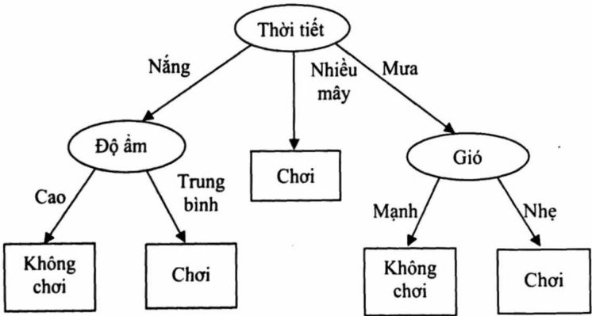

Hình 4.1. Cây quyết định phân loại xem thời tiết như thế nào thì phù hợp với việc chơi tennis

## 4.2.2. Tạo cây quyết định

Xét bảng dữ liệu T = (A, D), trong đó: A = {A₁, A₂,..., Aₙ} là tập thuộc tính dẫn xuất, D = {r₁, r₂, ..., rₙ} là thuộc tính mục tiêu. Vấn đề đặt ra là trong tập thuộc tính A ta phải chọn thuộc tính nào để phân hoạch? Một trong các phương pháp đó là dựa vào độ lợi thông tin. Hay còn gọi là thuật giải ID3.

<!-- page: 102 -->

Lựa chọn chủ yếu trong giải thuật ID3 là chọn thuộc tính nào đề đưa vào mỗi nút trong cây. Ta sẽ chọn thuộc tính phân rã tập mẫu tốt nhất. Thước đo độ tốt của việc chọn lựa thuộc tính là gì? Ta cần xác định một độ đo thống kê, gọi là thông tin thu được, đánh giá từng thuộc tính được chọn tốt như thế nào còn phụ thuộc vào việc phân loại mục tiêu của tập mẫu. ID3 sử dụng thông tin thu được đánh giá đề chọn ra thuộc tính cho mỗi bước giữa những thuộc tính ứng viên, trong quá trình phát triển cây.

$$
\text {Entropy} (S) = \sum_ {i = 1} ^ {c} - p _ {i} \log_ {2} p _ {i}
$$

Đề đánh giá chính xác thông tin thu được, dùng Entropy(S): Độ bất định (độ pha trộn/độ hỗn tạp) của S liên quan đến sự phân loại đang xét.

Trong công thức trên, $p_i$ là xác suất xuất hiện trạng thái i của hệ thống. Theo lý thuyết thông tin, mã có độ dài tối ưu là mã gán -log2p bits cho thông điệp có xác suất là p. S là một tập huấn luyện.

Nếu gọi $p_{\oplus}$ là xác suất xuất hiện các ví dụ dương trong tập S, $p_{\Theta}$ là xác suất xuất hiện các ví dụ âm trong tập S. Entropy đo độ bắt định của tập S sẽ là:

$$
\text {Entropy} (S) = - p _ {\oplus} \log_ {2} p _ {\oplus} - p _ {\Theta} \log_ {2} p _ {\Theta}
$$

Quy định 0.log0 = 0

Chẳng hạn, với tập S gồm 14 mẫu, trong đó có 9 mẫu dương và 5 mẫu âm. Khi đó, đại lượng Entropy của tập S liên quan đến sự phân loại logic này là:

$$
\text {Entropy} ([ 9 +, 5 - ]) = - (9 / 1 4) \log_ {2} (9 / 1 4) - (5 / 1 4) \log_ {2} (5 / 1 4) = 0, 9 4 0
$$

<!-- page: 103 -->

## Chú y:

Đại lượng Entropy = 0 nếu tất cả thành viên của tập S cùng thuộc một lớp (vì nếu tất cả là dương (P+ = 1), do đó P- = 0, Entropy(S) = -1log₂1-0log₂0=0).

Đại lượng Entropy(S) = 1 khi tập S chứa tỉ lệ tập mẫu âm và mẫu dương là như nhau. Nếu tập S chứa tập mẫu âm và tập mẫu dương có tỉ lệ P+ khác P- thì Entropy(S) ∈ (0,1).

Dựa trên sự xác định entropy, ta tính Gain(S, A) = Lượng giảm entropy mong đợi qua việc chia các ví dụ theo thuộc tính A:

$$
G a i n (S, A) = E n t r o p y (S) - \sum_ {v \in V a l u e s (A)} \frac {| S _ {v} |}{| S |} E n t r o p y (S _ {v})
$$

Trong đó: $S_v$ là tập con của S mà ở đó thuộc tính A có giá trị v, và |S| là số mẫu trong S.

Ví dụ 4.1: Xem xét nhiệm vụ học được đưa ra bởi tập mẫu dưới đây, thuộc tính mục tiêu ở đây là: chơi tennis có giá trị là có hoặc không, giá trị thuộc tính này dự đoán dựa vào các thuộc tính mô tả.

Bảng 4.1: Bảng dữ liệu khảo sát người chơi tennis

| Ngày | Thời tiết | Nhiệt độ | Độ ẩm | Gió | Chơi tennis |
| --- | --- | --- | --- | --- | --- |
| D1 | Nắng | Nóng | Cao | Nhẹ | Không |
| D2 | Nắng | Nóng | Cao | Mạnh | Không |
| D3 | Nhiều mây | Nóng | Cao | Nhẹ | Có |
| D4 | Mưa | Đễ chịu | Cao | Nhẹ | Có |
| D5 | Mưa | Lạnh | Trung bình | Nhẹ | Có |
| D6 | Mưa | Lạnh | Trung bình | Mạnh | Không |
| D7 | Nhiều mây | Lạnh | Trung bình | Mạnh | Có |
| D8 | Nắng | Đễ chịu | Cao | Nhẹ | Không |
| D9 | Nắng | Lạnh | Trung bình | Nhẹ | Có |
| D10 | Mưa | Đễ chịu | Trung bình | Nhẹ | Có |
| D11 | Nắng | Đễ chịu | Trung bình | Mạnh | Có |
| D12 | Nhiều mây | Đễ chịu | Cao | Mạnh | Có |
| D13 | Nhiều mây | Nóng | Trung bình | Nhẹ | Có |
| D14 | Mưa | Đễ chịu | Cao | Mạnh | Không |

<!-- page: 104 -->

Giải quyết bước đầu tiên của giải thuật, tạo nút định của cây quyết định. Nên đưa thuộc tính nào vào cây đầu tiên? ID3 xác định thông tin thu được cho mỗi thuộc tính ứng cử (thời tiết, nhiệt độ, độ ẩm và gió), sau đó chọn một trong số đó mà có thông tin thu được cao nhất.

Giá trị thông tin thu được cho mỗi thuộc tính là:

Xét thuộc tính gió:

$$
\text {Entropy} (\mathrm{S} \mathrm{nhe}) = (- 6 / 8) \log_ {2} (6 / 8) - (2 / 8) \log_ {2} (2 / 8) = 0, 8 1 1
$$

Entropy(S mạnh) = (-3/6) log₂(3/6) - (3/6) log₂(3/6) = 1

$$
\begin{array}{r l} \text {Gain(S, gió)} & = \text {Entropy(S) - (8 / 4). Entropy(S nhé) - (6 / 4).} \\ & \text {Entropy(S manh) = 0,048} \end{array}
$$

Tương tự như vậy với các thuộc tính còn lại:

Gain(S, thời tiết) = 0,246

Gain(S, độ ẩm) = 0,151

Gain(S, nhiệt độ) = 0,029

Trong đó tập S là tập mẫu ở bảng trên.

Theo đánh giá thông tin thu được, thuộc tính thời tiết cung cấp dự đoán tốt nhất về thuộc tính mục tiêu “choi tennis” trên tập mẫu. Do đó, thuộc tính “thời tiết” được chọn là thuộc tính quyết định cho nút gốc, nhánh được tạo ra dưới nút gốc tương ứng với mỗi giá trị của thuộc tính thời tiết (như nắng, mưa, nhiều mây) cùng với tập mẫu sẽ thêm vào mỗi nút con mới.

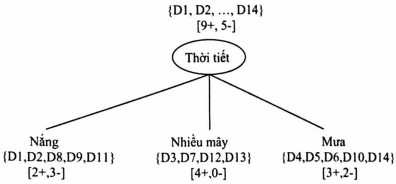

Hình 4.2. Cây quyết định sau lần phân hoạch đầu tiên

<!-- page: 105 -->

Mọi mẫu mà có thời tiết = “nhiều mây” thì là mẫu dương với thuộc tính chơi tennis. Do vậy, nút này trở thành nút lá với sự phân loại thuộc tính chơi tennis = “Có”. Trái lại với những nút con tương ứng với thời tiết = “nắng” và “thời tiết” = “mưa” có giá trị Entropy ≠ 0 và cây quyết định sẽ phát triển xa hơn dưới những nút này.

Quá trình chọn thuộc tính mới để phân loại tập mẫu lắp lại cho mỗi nút con. Lức này chỉ sử dụng những mẫu có liên quan tới nút này. Những thuộc tính mô tả có sự kết hợp chặt chẽ hơn trong cây đã được ngăn chặn. Bời vậy mà bất kì thuộc tính đưa ra nào có thể xuất hiện theo bất kì nhánh nào của cây. Quá trình xử lí còn tiếp diễn cho mỗi nút lá mới cho đến khi hai điều kiện sau thỏa mãn: Tập thuộc tính rộng (mọi thuộc tính đều đã nằm đọc theo những nhánh của cây) hoặc tất cả những mẫu có liên quan với nút lá này có cùng giá trị thuộc tính mục tiêu (giá trị entropy của chúng = 0).

## 4.3. HỌC BẢNG MẠNG NO-RON

## 4.3.1. Mô hình một nơ-ron nhân tạo

Bộ não con người chứa khoảng 10$^{11}$ nơ-ron, mỗi nơ-ron có khoảng 10$^{4}$ kết nối với các nơ-ron lân cận. Mỗi nơ-ron sinh học có 3 thành phần chính như hình 4.3:

\- Cell body chứa nhân.

\- Dendrites dùng để truyền tín hiệu từ nơ-ron lân cận đến cell body.

\- Axons dùng để truyền tín hiệu từ cell body này đến cell body của nơ-ron khác.

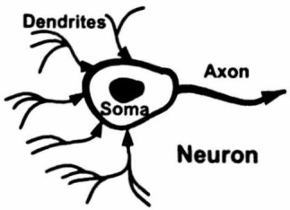

Hình 4.3. Cấu tạo của nơ-ron sinh học

<!-- page: 106 -->

Từ cấu tạo của nơ-ron sinh học, chúng ta có thể mô hình hóa nơ-ron nhân tạo như hình 4.4 sau:

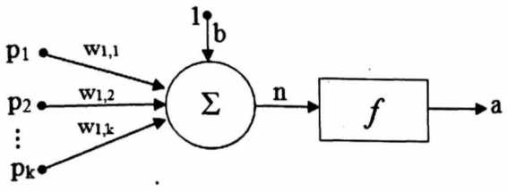

Hình 4.4. Mô hình nơ-ron nhân tạo

Các đầu vào  $p_{1}$ ,  $p_{2}$ , ...,  $p_{k}$  được kết nối thông qua trọng số có thể thay đổi được  $w_{1,1}$ ,  $w_{1,2}$ , ...,  $w_{1,k}$  tương ứng để đưa vào bộ tổng. Ngoài ra, no-ron còn có độ lệch (bias) b được cộng cùng với các đầu vào được trọng số hóa đề tạo ra đầu ra n được tính theo công thức sau:

$$
n = p _ {1} \times w _ {1, 1} + p _ {2} \times w _ {1, 2} + \dots + p _ {k} \times w _ {1, k} + b = \sum_ {i = 1} ^ {k} p _ {i} \times w _ {1 i} + b = W \times p ^ {T}
$$

Trong đó:

W là ma trận trọng số và  $W = \begin{bmatrix} w_{1,1} \\ \vdots \\ w_{1,k} \end{bmatrix}$  và  $p = [\mu_{1}, \mu_{2}, \ldots, \mu_{k}]$

Giá trị đầu ra của nơ-ron được tính theo công thức sau:

$$
a = f (n)
$$

Trong đó: $f$ được gọi là hàm truyền đạt (transfer function) hoặc hàm kích hoạt (activate function).

## 4.3.2. Hàm truyền đạt

Hàm truyền đạt có thể là tuyến tính hoặc phi tuyến, việc chọn hàm truyền đạt phù hợp cho nơ-ron tùy thuộc vào mục đích sử dụng đề giải quyết những vấn đề cụ thể. Một số hàm truyền đạt thường được sử dụng là:

\- Hàm truyền Hardlimit: Có biểu thức toán học sau:

$$
f (n) = \left\{ \begin{array}{l} 0 \text {vof} n <   0 \\ 1 \text {vof} n \geq 0 \end{array} \right.
$$

<!-- page: 107 -->

Trong thư viện của Matlab thì hàm truyền đạt tuyến tính có tên là hardlim

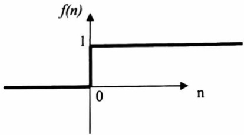

Hình 4.5. Hàm truyền đạt hardlim

\- Hàm truyền đạt tuyến tính (linear transfer function): Biểu thức toán học của hàm truyền đạt tuyến tính như sau:

$$
\mathrm{f(n)=n}
$$

Hình 4.6 bên dưới minh họa hàm truyền đạt tuyến tính.

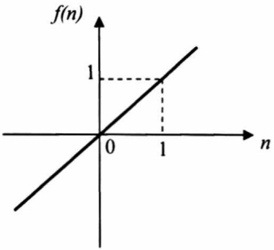

Hình 4.6. Hàm truyền đạt tuyến tính

\- Hàm truyền đạt log-sigmoid

Biểu thức toán học của hàm truyền đạt log-sigmoid như sau:

$$
f (n) = \frac {1}{1 + e ^ {- n}}
$$

Tên hàm trong thư viện của Matlab là logsig. Hình vẽ 4.7 bên dưới minh họa hàm truyền đạt log-sigmoid.

<!-- page: 108 -->

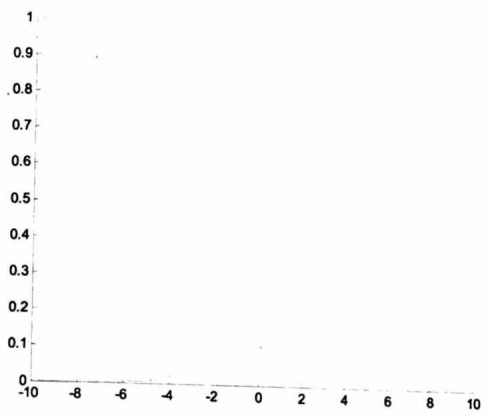

Hình 4.7. Hàm truyền đạt log-sigmoid

\- Hàm truyền đạt tangent-sigmoid

Biểu thức toán học của hàm truyền đạt tangent-sigmoid như sau:

$$
f (n) = \frac {e ^ {2} - e ^ {- 2}}{e ^ {2} + e ^ {- 2}}
$$

Hàm truyền đạt tangent-sigmoid trong thư viện của Matlab có tên là tansig và được biểu diễn như hình 4.8.

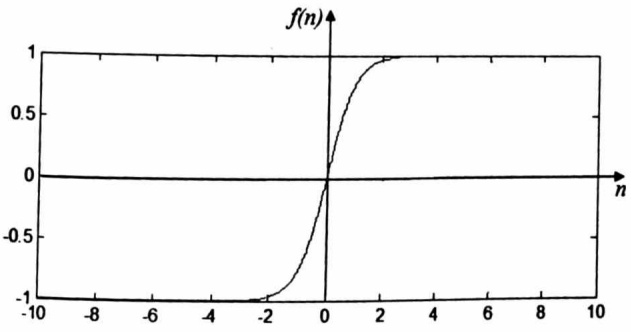

Hình 4.8. Hàm truyền đạt tangent-sigmoid

<!-- page: 109 -->

## 4.3.3. Kiến trúc mạng Perceptron

Mạng Perceptron đơn giản chỉ bao gồm một lớp (Singer Layer Network). Nó được tạo nên từ M no-ron nhân tạo, mỗi no-ron nhận N tín hiệu đầu vào. Hinh 4.9. chỉ ra kiến trúc của một mạng như vậy. Theo đó, có N trạm nhận tín hiệu vào để truyền tới M no-ron cho ta một mạng có M×N đường truyền. Hiền nhiên, chúng ta cần thiết lập một ma trận trọng số có M×N giá trị.

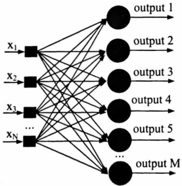

Hình 4.9. Kiến trúc một mạng Perceptron

Gọi $x(x_1, x_2, \ldots, x_N)$ là véctor tín hiệu đầu vào cho một mạng có $M$ no-ron. Ma trận trọng số $w$ kích thước $M \times N$ với mỗi dòng $w_i$ là véctor trọng số của no-ron thứ $i$:

$$
W = \left[ \begin{array}{c c c c} w _ {1, 1} & w _ {1, 2} & \dots & w _ {1, N} \\ w _ {2, 1} & w _ {2, 2} & \dots & w _ {2, N} \\ \dots & \dots & \dots & \dots \\ w _ {M, 1} & w _ {M, 2} & \dots & w _ {M N} \end{array} \right]
$$

Xét nơ-ron thứ $i$ ($I = 1, \dots, M$). Véc tơ trọng số tương ứng của nó có thể biểu diễn dưới dạng véc tơ cột $w_i$ bao gồm $N$ giá trị ($w_i \in R^N$):

<!-- page: 110 -->

$$
w _ {i} = \left[ \begin{array}{c} w _ {i, 1} \\ w _ {i, 2} \\ \dots \\ w _ {i, N} \end{array} \right]
$$

Khi đó, ma trận w được viết lại là (ký hiệu T là chuyển vị):

$$
w = \left[ \begin{array}{c} w _ {1} ^ {T} \\ w _ {2} ^ {T} \\ \dots \\ w _ {M} ^ {T} \end{array} \right]
$$

và $b = (b_1, b_2, ..., b_M)^T$ là véctơ các độ lệch của $M$ no-ron. Giá trị $net$ của no-ron thứ $i$, ký hiệu $net_i$ được tính như sau:

$$
n e t _ {i} = w _ {i} ^ {T} p + b _ {i}.
$$

Hàm kích hoạt $f(.)$ của các nơ-ron trong mạng Perceptron thường là hàm Hardlim cho ta một giá trị $output_{i}$ tại đầu ra ứng với giá trị đầu vào $net_{i}$:

$$
o u p u t _ {i} = f (n e t _ {i}) = \text {Hardlim} (n e t _ {i}) = \left\{ \begin{array}{l l} 1 & \quad \text {if} n e t _ {i} \geq 0 \\ 0 & \quad \text {if} n e t _ {i} <   0 \end{array} \right.
$$

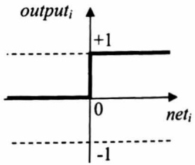

Hình 4.10. Đồ thị hàm kích hoạt Hardlim

<!-- page: 111 -->

## 4.3.4. Huân luyện mạng Perceptron

Đễ thấy, việc tính toán giá trị đầu ra của mạng ngoài phụ thuộc vào các tín hiệu vào, hàm kích hoạt được chọn, nó còn phụ thuộc mạnh vào bộ trọng số w. Nếu các giá trị này được chọn ngẫu nhiên, chất lượng của mạng có thể sẽ xấu. Do vậy, việc xác định bộ trọng số w tốt ứng với từng loại dữ liệu là rất quan trọng đối với một mạng no-ron nhân tạo. Đề làm được điều đó, mạng trải qua một quá trình huấn luyện.

Xét trường hợp mạng có 1 nơ-ron: Trong trường hợp này mạng có N đầu vào và 1 đầu ra (Hình 4.11).

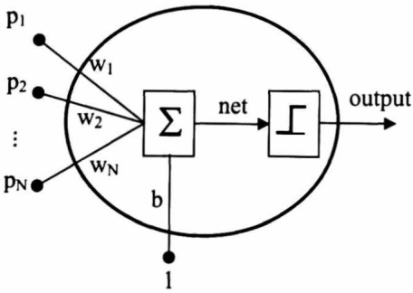

Hình 4.11. Mạng Perceptron có 1 nơ-ron

Ta xét quá trình huấn luyện mạng Perceptron dựa trên phương pháp học có giám sát. Giả sử, ta có một mẫu dữ liệu huấn luyện $\{x, y\}$ với $x \in N$ là $N$ giá trị đầu vào và $y \in R$ là giá trị đầu ra tương ứng, đã biết trước. Ý tưởng thuật toán như sau: với bộ tín hiệu đầu vào $x$ mạng sẽ cho ra một giá trị đầu ra tương ứng ouput. Giá trị output sẽ được so sánh với $y$ và ta sẽ điều chỉnh các trọng số $w$ và $b$ sao cho độ chênh lệch $e = y$ - output ngày càng giảm.

<!-- page: 112 -->

Bước 1: Khởi tạo ngẫu nhiên bộ trọng số w, b.

Bước 2: Lấy lần lượt các mẫu dữ liệu {x, y} trong tập dữ liệu huấn luyện, tính đầu ra output của mạng:

$$
\text {   ouput   } = \text { Hardlim } (w ^ {T} x + b).
$$

Bước 3: So sánh output với y

Néu output ≠ y thì cập nhật w = w + (y - output)x$^{T}$.

$$
b = b + (y - o u t p u t).
$$

Bước 4: Lặp bước 2, bước 3 cho đến khi output = y với mọi mãu dữ liệu {x, y}, hoặc thỏa mãn điều kiện dùng.

Ví dụ 4.2: Xét bộ dữ liệu huấn luyện gồm hai cặp tín hiệu vào/ra (n = 2) với mỗi bộ gồm 3 tín hiệu vào (N = 3) và 1 tín hiệu ra như sau:

$$
\{x _ {I} = (1 - 1 - 1) ^ {T}, y _ {I} = 0 \},
$$

$$
\{x _ {2} = (1 1 - 1) ^ {T}, y _ {2} = 1 \}.
$$

Ta sẽ huấn luyện một mạng Perceptron có duy nhất 1 nơ-ron với 3 đầu vào và 1 đầu ra (Hình 4.12) để tìm ra bộ trọng số tốt nhất.

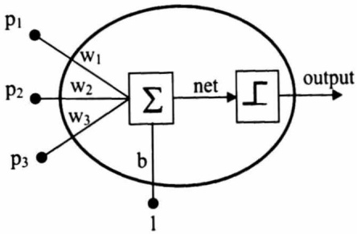

Hình 4.12. Kiến trúc mạng Perceptron cho ví dụ trên

Trước tiên, ta khởi tạo bộ trọng số (w, b) một cách ngẫu nhiên, giả sử:

$$
w = [ 0. 5, - 1, - 0. 5 ], b = 0. 5.
$$

<!-- page: 113 -->

Lần lặp thứ 1:

Xét mẫu dữ liệu huấn luyện thứ nhất $\{x_{1}, y_{1}\}$:

$$
\begin{array}{r l} \text {output} _ {1} & = \operatorname{Hardlim} (w x _ {1} + b) \\ & = \operatorname{Hardlim} \left([ 0. 5 - 1 - 0. 5 ] \left[ \begin{array}{c} 1 \\ - 1 \\ - 1 \end{array} \right] + 0. 5\right) = \operatorname{Hardlim} (2. 5) = 1. \end{array}
$$

Do output$_{1}$ ≠ y$_{1}$ nên ta tiến hành cập nhật lại trọng số:

$$
w = w + (y _ {I} - o u t p u t _ {I}) x _ {I} ^ {T} = [ 0. 5 - 1 - 0. 5 ] + (- 1) [ 1 - 1 - 1 ] = [ - 0. 5 0 0. 5 ].
$$

$$
b = b + (y _ {1} - o u t p u t _ {1}) = 0. 5 + (- 1) = - 0. 5.
$$

Xét mẫu dữ liệu huấn luyện thứ 2 $\{x_{2}, y_{2}\}$:

$$
\begin{array}{r l} \text {output} _ {2} & = \text {Hardlim} (w x _ {2} + b) = \text {Hardlim} \left(\left[ - 0. 5 0 0. 5 \right] \left[ \begin{array}{c} 1 \\ 1 \\ - 1 \end{array} \right] - 0. 5\right) \\ & = \text {hardlim} (- 0. 5) = 0. \end{array}
$$

Do output$_{2}$ ≠ $t_{2}$ nên ta cập nhật lại trọng số:

$$
w = w + (y _ {2} - o u t p u t _ {2}) x _ {2} ^ {T} = [ - 0. 5 0 0. 5 ] + (1) [ 1 1 - 1 ] = [ 0. 5 1 - 0. 5 ].
$$

$$
b = b + (y _ {2} - o u t p u t _ {2}) = - 0. 5 + 1 = 0. 5.
$$

Lần lặp thứ 2:

$$
\begin{array}{r l} \text {output} _ {I} & = \operatorname{Hardlim} (w x _ {I} + b) = \operatorname{Hardlim} \left(\left[ 0. 5 1 - 0. 5 \right] \left[ \begin{array}{c} 1 \\ - 1 \\ - 1 \end{array} \right] + 0. 5\right) \\ & = \operatorname{Hardlim} (0. 5) = 1 \neq \mathrm{y} _ {1}. \end{array}
$$

Ta tiến hành cập nhật lại bộ trọng số:

$$
\begin{array}{l} w = w + (y _ {I} - o u t p u t _ {I}) x _ {I} ^ {T} = [ 0. 5 1 - 0. 5 ] + (- 1) [ 1 - 1 - 1 ] = [ - 0. 5 2 0. 5 ]. \\ b = b + (y _ {I} - o u t p u t _ {I}) = 0. 5 + (- 1) = - 0. 5. \end{array}
$$

<!-- page: 114 -->

$$
\begin{array}{r l} \text {output} _ {2} & = \operatorname{Hardlim} (w x _ {2} + b) = \operatorname{Hhardlim} \left(\left[ - 0. 5 2 0. 5 \right] \left[ \begin{array}{c} 1 \\ 1 \\ - 1 \end{array} \right] - 0. 5\right) \\ & = \operatorname{Hardlim} (0. 5) = 1. \end{array}
$$

Do output$_{2}$ = y$_{2}$ nên ta giữ nguyên trọng số.

Lần lặp thứ 3:

$$
\begin{array}{r l} \text {output} _ {l} & = \operatorname{Hardlim} (w x _ {l} + b) = \operatorname{Hardlim} \left(\left[ - 0. 5 2 0. 5 \right] \left[ \begin{array}{c} 1 \\ - 1 \\ - 1 \end{array} \right] - 0. 5\right) = 0 \\ & = t _ {l}. \end{array}
$$

$$
\begin{array}{r l} \text {output} _ {2} & = \operatorname{Hardlim} (w x _ {2} + b) = \operatorname{Hardlim} \left(\left[ - 0. 5 2 0. 5 \right] \left[ \begin{array}{c} 1 \\ 1 \\ - 1 \end{array} \right] - 0. 5\right) \\ & = 1 = t _ {2}. \end{array}
$$

Đến đây, thuật toán có thể dùng và ta nhận được bộ trọng mới số: $w = [-0.5 \ 2 \ 0.5]$; $b = -0.5$. Kết thúc quá trình huấn luyện, ta tìm được bộ trọng số tối ưu cho mạng theo nghĩa là sai số xảy ra là thấp nhất. Giả sử cần phân loại một mẫu dữ liệu mới $x = [1 \ -1 \ 1]^T$. Ta tính đầu ra của mạng tương ứng với đầu vào là $x$:

$$
\text {output} = \operatorname{Hardlim} (w x + b) = \operatorname{Hardlim} \left(\left[ - 0. 5 2 0. 5 \right] \left[ \begin{array}{c} 1 \\ - 1 \\ 1 \end{array} \right] - 0. 5\right) = 0.
$$

Nhận xét: Từ kết quả mẫu $x$ có nhiều so với $x_{1}$ ($x_{1} = [1 - 1 - 1]^{T}$) nhưng mạng vẫn có thể phân lớp chính xác.

Việc tìm ra bộ trọng số (w, b) tối ưu của một mạng Perceptron có 1 nơ-ron thực chất là việc tìm ra một siêu phẳng có dạng  $\langle w, x \rangle + b = 0$  sao cho siêu phẳng này phân tách bộ dữ liệu huấn luyện thành hai lớp (0 hoặc 1)

<!-- page: 115 -->

một cách tốt nhất, tương tự như kỹ thuật SVM. Hình 4.13 dưới đây cho thấy bộ (w, b) tối ưu tìm được sẽ tương ứng với siêu phẳng tối ưu chia tập dữ liệu huấn luyện thành hai lớp 0 và 1 (giả sử dữ liệu ở không gian hai chiều với mỗi điểm dữ liệu có dạng $x(x_1, x_2)$).


Hình 4.13. Siêu phẳng phân tách bộ dữ liệu huấn luyện một cách tối ưu
sẽ cho ta các giá trị trọng số (w, b) tối ưu.

## Xét trường hợp mạng có nhiều nơ-ron

Trong khi mạng Perceptron có 1 nơ-ron chỉ phân chia tập các tín hiệu vào thành 2 lớp do đầu ra là một trong hai giá trị 0 hoặc 1 thì mạng Perceptron nhiều nơ-ron có thể phân chia tập các tín hiệu vào 1 thành nhiều lớp do nó có nhiều đầu ra. Mỗi véc to đầu ra gồm M thành phần, mỗi thành phần lại nhận một trong hai giá trị 0 hoặc 1. Do vậy, số véc to đầu ra (hay số lớp) tối đa của mạng là $2^{M}$.

Trong trường hợp này, bộ trọng số w của mạng là một ma trận w ∈ RM×N và b là một véc tơ b ∈ RN. Hiền nhiên, mỗi mẫu dữ liệu huấn luyện {x, y} vẫn có $x \in R^{N}$ nhưng $y \in R^{M}$, tức là 1 véc-tơ đầu ra thay vì 1 giá trị đầu ra.

<!-- page: 116 -->

Ta có thể sử dụng quy tắc huấn luyện của mạng Perceptron có 1 nơ-ron ở trên để cập nhật từng dòng cho ma trận w và từng giá trị cho b. Quy tắc huấn luyện mạng như sau: hàng thứ k của ma trận w (tương ứng với trọng số của nơ-ron thứ k) được cập nhật theo công thức (k=1,...,M):

$$
w _ {k} = w _ {k} + (y _ {k} - o u t p u t _ {k}) x
$$

và phần tử thứ $k$ của vectơ độ lệch $b$ được cập nhật theo công thức:

$$
b _ {k} = b _ {k} + (y _ {k} - o u t p u t _ {k})
$$

Quy tắc huấn luyện trên có thể viết lại dưới dạng ma trận:

$$
w = w + (y - o u t p u t) x ^ {T} \text {và} b = b + (y - o u t p u t)
$$

Dễ thấy, do đường phân tách các lớp là siêu phẳng nên mạng Perceptron thường chỉ thực hiện tốt trên dữ liệu có khả năng phân tách tuyến tính (linearly separable). Đối với trường hợp dữ liệu không phân tách tuyến tính, mạng có thể thực hiện nhưng độ chính xác sẽ có thể bị ảnh hưởng. Chẳng hạn với bài toán XOR (Hình 4.14), không thể dùng một đường thẳng để phân chia tập 4 điểm dữ liệu thành hai lớp riêng biệt (lớp màu đen và lớp màu trắng). Đề giải quyết bài toán này có thể phải mở rộng kiến trúc mạng thành nhiều lớp (Multilayer Perceptrons - MLP) đồng thời xây dựng thuật toán lan truyền ngược (Backpropagation Algorithm) trên kiến trúc mạng này.


Hình 4.14. Bài toán phân lớp cho mạch XOR

<!-- page: 117 -->

## 4.3.5. Mạng nơ-ron nhiều lớp và học lan truyền ngược

Mạng nơ-ron là một hệ thống gồm nhiều nơ-ron hoạt động song, song liên kết với nhau. Hình 4.15 đưa ra một ví dụ về mạng nơ-ron nhân tạo. Các nơ-ron được liên kết tạo thành: lớp vào, các lớp ẩn, lớp ra. Số lượng nơ-ron tại mỗi lớp cũng như số lượng các đầu vào của mỗi nơ-ron trong các lớp khác nhau có thể khác nhau. Các nơ-ron trong các lớp vào có thể đơn giản chỉ làm nhiệm vụ thu thập tín hiệu đầu vào và truyền tới các nơ-ron trong các lớp tiếp theo. Các trọng số được kết hợp trên các đường truyền tạo thành một (hoặc nhiều) ma trận trọng số (thay vì một véc to trọng số như trong một nơ-ron). Trong một mạng, có thể có một hoặc nhiều lớp ẩn hoặc thập chí không có lớp ẩn nào.


Hình 4.15. Mô hình một mạng nơ-ron nhân tạo

Mạng nhiều lớp sử dụng thuật giải học lan truyền ngược đang được sử dụng rộng rãi nhất trong lĩnh vực nơ-ron. Luật học lan truyền ngược được phát triển từ luật học delta. Cùng như luật học delta, luật học lan truyền ngược (BP) là xếp xi của thuật toán giảm đốc nhất, trong đó hàm nhất chất lượng là sai số bình phương trung bình. Sự khác nhau giữa luật học delta và luật học lan truyền ngược chỉ là cách thức lấy đạo hàm.

<!-- page: 118 -->

Đối với mạng đa lớp, ta có phương trình như sau:

$$
\mathrm{y} ^ {\mathrm{q+1}} = \mathrm{g} ^ {\mathrm{q+1}} (\mathrm{W} ^ {\mathrm{q+1}} \mathrm{y} ^ {\mathrm{q}} + \mathrm{b} ^ {\mathrm{q+1}}) \text {vói q= 0,1,...,Q-1}.
$$

Trong đó: Q là số lớp của mạng. Các nơ-ron ở lớp đầu tiên nhận đầu vào từ ngoài:

$$
\mathbf {y} ^ {\mathbf {0}} = \mathbf {p}
$$

Chính là điểm khởi đầu của phương trình phía trên. Các đầu ra của các nơ-ron trong lớp cuối cùng được xem là đầu ra của mạng:

$$
\mathbf {y} = \mathbf {y} ^ {\mathbf {Q}}
$$

Mạng được cung cấp các tập mẫu học:

$$
\{(p _ {1}, d _ {1}), (p _ {2}, d _ {2}), \dots , (p _ {k}, d _ {k}) \}
$$

Trong đó: $p_i$ là một đầu vào mạng và $d_i$ là đầu ra mong muốn tương ứng, với $i = 1...k$. Mỗi đầu vào đưa vào mạng, đầu ra của mạng đối với nó được đem so sánh với đầu ra mong muốn. Thuật toán sẽ điều chỉnh các tham số của mạng để tối thiểu hóa sai số bình phương trung bình:

$$
\hat {F} (x) = e ^ {T} (k). e (k) = \big (d (k) - y (k) \big) ^ {T}. \big (d (k) - y (k) \big)
$$

với x là véc tơ chứa các trọng số và ngưỡng của mạng.

Thuật toán giảm đốc nhất cho xấp xỉ sai số bình phương trung bình là:

$$
w _ {i j} ^ {q} (k + 1) = w _ {i j} ^ {q} (k) - \alpha \frac {\partial \hat {F}}{\partial w _ {i j} ^ {q}}
$$

$$
b _ {i} ^ {q} (k + 1) = b _ {i} ^ {q} (k) - \alpha \frac {\partial \hat {F}}{\partial b _ {i} ^ {q}}
$$

Trong đó α là hệ số học.

<!-- page: 119 -->

Với định nghĩa $s_{i}^{q} = \frac{\partial \hat{F}}{\partial u_{i}^{q}}$ là độ nhạy của $\hat{F}$ theo thay đổi của net input tại lớp q.

Thuật toán xấp xỉ giám đốc nhất trở thành:

$$
w _ {i j} ^ {q} (k + 1) = w _ {i j} ^ {q} (k) - \alpha s _ {i} ^ {q} y _ {j} ^ {q - 1}
$$

$$
b _ {i} ^ {q} (k + 1) = b _ {i} ^ {q} (k) - \alpha s _ {i} ^ {q}
$$

Và dạng ma trận:

$$
w ^ {q} (k + 1) = w ^ {q} (k) - \alpha s ^ {q} (y ^ {q - 1}) ^ {T}
$$

$$
b ^ {q} (k + 1) = b ^ {q} (k) - \alpha s ^ {q}
$$

Trong đó:

$$
s ^ {q} = \frac {\partial \hat {F}}{\partial u ^ {q}} = \left[ \begin{array}{c} \frac {\partial \hat {F}}{\partial u _ {1} ^ {q}} \\ \vdots \\ \frac {\partial \hat {F}}{\partial u _ {n ^ {q}} ^ {q}} \end{array} \right]
$$

Ký hiệu $F^{\prime q}(u^{q}) = \begin{bmatrix} f^{\prime q}(u_{1}^{q}) & 0 & \cdots 0 \\ 0 & f^{\prime q}(u_{2}^{q})\cdots 0 \\ \vdots & \vdots & \vdots & \vdots \\ 0 & 0 & \cdots & f^{\prime q}\big(u_{n}^{q}\big) \end{bmatrix}$

Ta c6: $S^q = F^q(u^q)(W^{q+1})^T s^{q+1}$

$S^{q} = -2F^{q}(u^{q})(d-y)$

Ta sẽ truyền lùi các độ nhạy thông qua mạng từ lớp cuối cùng cho đến lớp đầu

$$
\mathbf {S Q - 1}
$$

Tóm lại giải thuật BP được mô tả như sau:

Bước truyền thắng: truyền đầu vào xuôi theo mạng

$$
\mathbf {y} ^ {0} = \mathbf {p}
$$

$$
\mathrm{y} ^ {\mathrm{q+1}} = \mathrm{g} ^ {\mathrm{q+1}} (\mathrm{W} ^ {\mathrm{q+1}} \mathrm{y} ^ {\mathrm{q}} + \mathrm{b} ^ {\mathrm{q-1}}) \text {vói q= 0,1,...,Q-1}.
$$

$$
\mathbf {y} = \mathbf {y} ^ {\mathbf {Q}}
$$

Bước truyền lùi: Truyền lùi các độ nhạy

$$
\mathrm{s} ^ {\mathbf {Q}} = - 2 \mathrm{F} ^ {\prime \mathbf {Q}} (\mathrm{u} ^ {\mathbf {Q}}) (\mathrm{d} - \mathrm{y});
$$

$$
\mathrm{s} ^ {\mathrm{q}} = \mathrm{F} ^ {\prime \mathrm{q}} (\mathrm{u} ^ {\mathrm{q}}) (\mathrm{W} ^ {\mathrm{q+1}}) ^ {\mathrm{T}} \mathrm{s} ^ {\mathrm{q+1}} \text {vói q} = \mathrm{Q-1}, \dots , 2, 1
$$

<!-- page: 120 -->

Các trọng số và ngưỡng được cập nhật theo luật xấp xỉ giảm đốc nhất:

$$
\begin{array}{l} \mathrm {W ^ {q} (k + 1) = W ^ {q} (k)- \alpha.s^ {q} (y^ {q - 1}) ^ {T}} \\ \mathrm {b ^ {q} (k + 1) = b^ {q} (k)- \alpha.s^ {q}} \end{array}
$$

Tuy nhiên, thuật toán lan truyền ngược cơ bản ở trên vẫn còn quá chậm cho các ứng dụng. Việc nghiên cứu các thuật toán nhanh hơn được chia thành hai nhóm. Nhóm thứ nhất phát triển các kỹ thuật mang tính kinh nghiệm (heuristic). Các kỹ thuật heuristic này đưa ra các ý tưởng như hệ số học biến đổi, sử dụng momentum và các biến co giãn. Nhóm thứ hai phát triển theo hướng kỹ thuật tối ưu hóa số. Một số kỹ thuật về tối ưu hóa số đã áp dụng thành công cho mạng no-ron nhiều lớp là: thuật toán gradient liên hợp và thuật toán Levenberg-Marquardt (LM - một phiên bản khác của phương pháp Newton)...

## Ví dụ về quá trình lan truyền ngược:

Trong ví dụ này, ta sử dụng mạng nơ-ron với hai đầu vào, hai nơ-ron ẩn, hai nơ-ron đầu ra. Đây là cấu trúc của mạng nơ-ron:


Hình 4.16. Mô hình mạng thể hiện quá trình lan truyền ngược

<!-- page: 121 -->

Sau đây là các giá trị trọng số khởi tạo, bias, dữ liệu đầu vào, đầu ra của bộ huấn luyện.


Hình 4.17. Trọng số khởi tạo, input, output

Mục tiêu của lan truyền ngược là tối ưu hóa các trọng số đề mạng no-ron có thể học cách ánh xạ chính xác các đầu vào tương ứng với đầu ra. Trong phần này, ta chỉ xét một bộ dữ liệu đầu vào duy nhất: 0.05 và 0.10. Đầu ra mong muốn là 0.01 và 0.99.

Trước hết, thực hiện quá trình lan truyền xuôi để xác định đầu ra dự đoán của mạng, hàm kích hoạt là hàm logistic.

$$
n e t _ {h 1} = w _ {1} * i _ {1} + w _ {2} * i _ {2} + b _ {1} * 1
$$

$$
n e t _ {h 1} = 0. 1 5 * 0. 0 5 + 0. 2 * 0. 1 + 0. 3 5 * 1 = 0. 3 7 7 5
$$

$$
o u t _ {h 1} = \frac {1}{1 + e ^ {- n c t _ {h 1}}} = \frac {1}{1 + e ^ {- 0 . 3 7 7 5}} = 0. 5 9 3 2 6 9 9 9 2
$$

Tương tự:

$$
o u t _ {h 2} = 0. 5 9 6 8 8 4 3 7 8
$$

<!-- page: 122 -->

nơ-ron lớp ân làm dư liệu đau vao cho nơ-ron lớp ra.

$$
n e t _ {o 1} = w _ {5} * o u t _ {h 1} + w _ {6} * o u t _ {h 2} + b _ {2} * 1
$$

$$
n e t _ {o 1} = 0. 4 * 0. 5 9 3 2 6 9 9 9 2 + 0. 4 5 * 0. 5 9 6 8 8 4 3 7 8 + 0. 6 * 1 = 1. 1 0 5 9 0 5 9 6 7
$$

$$
o u t _ {o 1} = \frac {1}{1 + e ^ {- n e t _ {o 1}}} = \frac {1}{1 + e ^ {- 1 . 1 0 5 9 0 5 9 6 7}} = 0. 7 5 1 3 6 5 0 7
$$

$$
o u t _ {o 2} = 0. 7 7 2 9 2 8 4 6 5
$$

Tính tổng lỗi:

$$
E _ {t o t a l} = \sum \frac {1}{2} (t a r g e t - o u t p u t) ^ {2}
$$

Ví dụ: Đầu ra mục tiêu của o1 là 0.01 nhưng đầu ra mạng nơ-ron là 0.75136507, do đó lỗi của nó là:

$$
E _ {o 1} = \frac {1}{2} (t a r g e t _ {o 1} - o u t _ {o 1}) ^ {2} = \frac {1}{2} (0. 0 1 - 0. 7 5 1 3 6 5 0 7) ^ {2} = 0. 2 7 4 8 1 1 0 8 3
$$

Tương tự:

$$
E _ {o 2} = 0. 0 2 3 5 6 0 0 2 6
$$

Tổng lỗi sẽ là:

$$
E _ {t o t a l} = E _ {o 1} + E _ {o 2} = 0. 2 7 4 8 1 1 0 8 3 + 0. 0 2 3 5 6 0 0 2 6 = 0. 2 9 8 3 7 1 1 0 9
$$

## Quá trình lan truyền ngược:

Mục tiêu của lan truyền ngược là cập nhật từng trọng số trong mạng để chúng làm cho đầu ra thực tế gần với đầu ra mục tiêu hơn, do đó giảm thiểu lỗi cho từng nơ-ron đầu ra và toàn bộ mạng.

Lóp output:

Xét $w_{5}$. Muôn biết w5 ảnh hưởng đến tổng lôi như thế nào, ta sử dụng $\frac{\partial E_{total}}{\partial w_{5}}$.

$$
\frac {\partial E _ {t o t a l}}{\partial w _ {5}} = \frac {\partial E _ {t o t a l}}{\partial o u t _ {o 1}} * \frac {\partial o u t _ {o 1}}{\partial n e t _ {o 1}} * \frac {\partial n e t _ {o 1}}{\partial w _ {5}}
$$

<!-- page: 123 -->

Quá trình tích đạo hàm trên thể hiện quá trình lan truyền ngược như hình dưới đây:


Hình 4.18. Lan truyền ngược để cập nhật lại $w_5$

Ta cần tính từng thành phần trong công thức theo thứ tự ngược.

$$
\frac {\partial E _ {t o t a l}}{\partial o u t _ {o 1}} = 2 * \frac {1}{2} (t a r g e t _ {o 1} - o u t _ {o 1}) ^ {2 - 1} * - 1 + 0
$$

Tiếp theo:

$$
\begin{array}{l} o u t _ {o 1} = \frac {1}{1 + e ^ {- n c t _ {o 1}}} \\ \frac {\partial o u t _ {o 1}}{\partial n e t _ {o 1}} = o u t _ {o 1} (1 - o u t _ {o 1}) = 0. 7 5 1 3 6 5 0 7 (1 - 0. 7 5 1 3 6 5 0 7) = 0. 1 8 6 8 1 5 6 0 2 \end{array}
$$

Cuối cùng:

$$
\begin{array}{l} n e t _ {o 1} = w _ {5} * o u t _ {h 1} + w _ {6} * o u t _ {h 2} + b _ {2} * 1 \\ \frac {\partial n e t _ {o 1}}{\partial w _ {5}} = 1 * o u t _ {h 1} * w _ {5} ^ {(1 - 1)} + 0 + 0 = o u t _ {h 1} = 0. 5 9 3 2 6 9 9 9 2 \end{array}
$$

Ta được kết quả:

$$
\begin{array}{l} \frac {\partial E _ {t o t a l}}{\partial w _ {5}} = \frac {\partial E _ {t o t a l}}{\partial o u t _ {o 1}} * \frac {\partial o u t _ {o 1}}{\partial n e t _ {o 1}} * \frac {\partial n e t _ {o 1}}{\partial w _ {5}} \\ \frac {\partial E _ {t o t a l}}{\partial w _ {5}} = 0. 7 4 1 3 6 5 0 7 * 0. 1 8 6 8 1 5 6 0 2 * 0. 5 9 3 2 6 9 9 9 2 = 0. 0 8 2 1 6 7 0 4 1 \end{array}
$$

Đề giảm lỗi, ta trừ giá trị này khởi trọng số hiện tại (nhân với một hằng số biểu diễn độ học, ở đây ta lấy bằng 0.5):

$$
w _ {5} ^ {+} = w _ {5} - \eta * \frac {\partial E _ {t o t a l}}{\partial w _ {5}} = 0. 4 - 0. 5 * 0. 0 8 2 1 6 7 0 4 1 = 0. 3 5 8 9 1 6 4 8
$$

<!-- page: 124 -->

Thực hiện tương tự, ta được các trọng số mới của w$_{6}$, w$_{7}$,w$_{8}$:

$$
w _ {6} ^ {+} = 0. 4 0 8 6 6 6 1 8 6
$$

$$
w _ {7} ^ {+} = 0. 5 1 1 3 0 1 2 7 0
$$

$$
w _ {8} ^ {+} = 0. 5 6 1 3 7 0 1 2 1
$$

Lóp ẩn:

Tiếp tục quá trình lan truyền ngược bằng cách tính giá trị mới cho  $w_{1}$ ,  $w_{2}$ ,  $w_{3}$ ,  $w_{4}$ .

Trước tiên ta tính:

$$
\frac {\partial E _ {t o t a l}}{\partial w _ {1}} = \frac {\partial E _ {t o t a l}}{\partial o u t _ {h 1}} * \frac {\partial o u t _ {h 1}}{\partial n e t _ {h 1}} * \frac {\partial n e t _ {h 1}}{\partial w _ {1}}
$$

Có thể hình dung quá trình tính này trên hình sau:

$$
\begin{array}{c} \frac {\partial E _ {t o t a l}}{\partial w _ {1}} = \frac {\partial E _ {t o t a l}}{\partial o u t _ {h 1}} * \frac {\partial o u t _ {h 1}}{\partial n e t _ {h 1}} * \frac {\partial n e t _ {h 1}}{\partial w _ {1}} \\ \downarrow \\ \frac {\partial E _ {t o t a l}}{\partial o u t _ {h 1}} = \frac {\partial E _ {o 1}}{\partial o u t _ {h 1}} + \frac {\partial E _ {o 2}}{\partial o u t _ {h 1}} \end{array}
$$


Hình 4.19. Lan truyền ngược để cập nhật lại $w_{1}$

Sử dụng cách tính tương tự như đã thực hiện với lớp ra, nhưng có một điểm khác là giá trị output của mỗi nơ-ron lớp ẩn được phân bổ tới

<!-- page: 125 -->

tất cả các nơ-ron của lớp ra. Ví dụ: out$_{h1}$ ảnh hưởng tới cả out$_{o1}$ và out$_{o2}$. Do đó, ảnh hưởng tới cả hai nơ-ron lớp ra.

$$
\frac {\partial E _ {o 1}}{\partial o u t _ {h 1}} \quad \frac {\partial E _ {t o t a l}}{\partial o u t _ {h 1}}
$$

Tính

$$
\frac {\partial E _ {o 1}}{\partial o u t _ {h 1}} = \frac {\partial E _ {o 1}}{\partial n e t _ {o 1}} * \frac {\partial n e t _ {o 1}}{\partial o u t _ {h 1}}
$$

Tính bằng công thức đã tính ở lớp ra:  $\frac{\partial E_{o1}}{\partial net_{o1}}$

$$
\frac {\partial E _ {o 1}}{\partial n e t _ {o 1}} = \frac {\partial E _ {o 1}}{\partial o u t _ {o 1}} * \frac {\partial o u t _ {o 1}}{\partial n e t _ {o 1}} = 0. 7 4 1 3 6 5 0 7 * 0. 1 8 6 8 1 5 6 0 2 = 0. 1 3 8 4 9 8 5 6 2
$$

$$
\text {và bàng w} _ {5}: \frac {\partial n e t _ {o 1}}{\partial o u t _ {h 1}}
$$

$$
\frac {\partial n e t _ {o 1}}{\partial o u t _ {h 1}} = w _ {5} = 0. 4 0
$$

Ghép các công thức lại với nhau:

$$
\frac {\partial E _ {o 1}}{\partial o u t _ {h 1}} = \frac {\partial E _ {o 1}}{\partial n e t _ {o 1}} * \frac {\partial n e t _ {o 1}}{\partial o u t _ {h 1}} = 0. 1 3 8 4 9 8 5 6 2 * 0. 4 0 = 0. 0 5 5 3 9 9 4 2 5
$$

Tính tương tự ta được:

$$
\frac {\partial E _ {o 2}}{\partial o u t _ {h 1}} = - 0. 0 1 9 0 4 9 1 1 9
$$

Do đó:

$$
\frac {\partial E _ {t o t a l}}{\partial o u t _ {h 1}} = \frac {\partial E _ {e 1}}{\partial o u t _ {h 1}} + \frac {\partial E _ {e 2}}{\partial o u t _ {h 1}} = 0. 0 5 5 3 9 9 4 2 5 + - 0. 0 1 9 0 4 9 1 1 9 = 0. 0 3 6 3 5 0 3 0 6
$$

Bây giờ đã có $\frac{\partial E_{total}}{\partial out_{h1}}$, ta cần tính $\frac{\partial out_{h1}}{\partial net_{h1}}$ và $\frac{\partial net_{h1}}{\partial w}$ cho mỗi trọng số:

$$
o u t _ {h 1} = \frac {1}{1 + e ^ {- n c t _ {h 1}}}
$$

$$
\frac {\partial o u t _ {h 1}}{\partial n e t _ {h 1}} = o u t _ {h 1} (1 - o u t _ {h 1}) = 0. 5 9 3 2 6 9 9 9 (1 - 0. 5 9 3 2 6 9 9 9) = 0. 2 4 1 3 0 0 7 0 9
$$

$$
n e t _ {h 1} = w _ {1} * i _ {1} + w _ {3} * i _ {2} + b _ {1} * 1
$$

$$
\frac {\partial n e t _ {h 1}}{\partial w _ {1}} = i _ {1} = 0. 0 5
$$

Kết hợp các công thức:

$$
\frac {\partial E _ {t o t a l}}{\partial w _ {1}} = \frac {\partial E _ {t o t a l}}{\partial o u t _ {h 1}} * \frac {\partial o u t _ {h 1}}{\partial n e t _ {h 1}} * \frac {\partial n e t _ {h 1}}{\partial w _ {1}}
$$

<!-- page: 126 -->

Cập nhật lại giá trị mới cho w₁:

$$
w _ {1} ^ {+} = w _ {1} - \eta * \frac {\partial E _ {t o t a l}}{\partial w _ {1}} = 0. 1 5 - 0. 5 * 0. 0 0 0 4 3 8 5 6 8 = 0. 1 4 9 7 8 0 7 1 6
$$

Tính tương tự cho các trọng số w₂, w₃, w₄:

$$
w _ {2} ^ {+} = 0. 1 9 9 5 6 1 4 3
$$

$$
w _ {3} ^ {+} = 0. 2 4 9 7 5 1 1 4
$$

$$
w _ {4} ^ {+} = 0. 2 9 9 5 0 2 2 9
$$

Cuối cùng, tất cả các trọng số đã được cập nhật. Ban đầu, lỗi của mạng là 0.298371109. Sau vòng lan truyền ngược đầu tiên này, tổng số lỗi hiện giảm xuống còn 0.291027924. Lỗi giảm không nhiều, nhưng sau khi lập lại quy trình này 10.000 lần, lỗi giảm xuống còn 0.0000351085. Với bộ trọng số lúc đó, hai nợ-on đầu ra tạo ra 0.015912196 (so với mục tiêu 0.01) và 0.984065734 (so với mục tiêu 0.99).

## 4.4. GIẢI THUẬT DI TRUYỀN

Giải thuật di truyền thực chất là một phương pháp tìm kiếm cực trị tổng thể. Kỹ thuật tối ưu tổng thể có tầm quan trọng lớn đối với nhiều vấn đề khác nhau trong khoa học và kỹ thuật.

## 4.4.1. Cơ bản về giải thuật di truyền

Nội dung giải thuật di truyền: Từ tập các lời giải có thể ban đầu, thông qua nhiều bước tiến hóa, hình thành các tập hợp mới với những lời giải tốt hơn, cuối cùng tìm ra lời giải gần tối ưu nhất.

Quá trình tìm kiếm của giải thuật này dựa trên cơ chế của chọn lọc và di truyền trong tự nhiên: Trong mọi thế hệ, một tập mới các sinh vật nhân tạo (cá thể) được tạo ra có chứa các phần của những sinh vật phù hợp nhất trong thế hệ cũ. Đồng thời giải thuật di truyền khai thác một cách có hiệu quả thông tin trước đó đề suy xét trên điểm tìm kiếm mới với mong muốn có sự cải thiện. Như vậy, các đặc trưng được đánh giá tốt

<!-- page: 127 -->

sẽ có cơ hội phát triển và các tính chất tối (không phù hợp với môi trường) sẽ có xu hướng biến mất.

Hiện nay, ta thấy rằng giải thuật di truyền được áp dụng ngày càng nhiều trong kinh doanh, khoa học và kỹ thuật vì tính chất không quá phức tạp mà lại hiệu quả, hơn nữa nó không đồi hỏi khắt khe đối với không gian tìm kiếm (như giả định về sự liên tục, sự có đạo hàm và các vấn đề khác). Các giải thuật di truyền đã được chứng minh bằng lý thuyết và thực nghiệm là các giải thuật tìm kiếm toàn cục mạnh trong các không gian lời giải phức tạp.

Giải thuật di truyền hoạt động trên một quản thể chuỗi (gen), kết hợp thông tin của các chuỗi khoẻ nhất, nhằm tạo ra các thể hệ mới tốt hơn. Công việc này được thực hiện dựa vào các toán từ tái tạo, lai ghép và đột biến các chuỗi.

Các đặc điểm cơ bản của giải thuật di truyền (khác với các phương pháp truyền thống) là:

\- Giải thuật di truyền làm việc với mã của tập thông số chú không làm việc trực tiếp với giá trị của các thông số.

\- Giải thuật di truyền tìm kiếm song song trên một quản thể chữ không tìm kiếm từ một điểm.

\- Các giải thuật di truyền chỉ sử dụng thông tin của hàm mục tiêu trên chức không sử dụng thông tin nào khác.

\- Các luật chuyển đổi của giải thuật di truyền mang tính xác suất chữ không mang tính tiền định. Giải thuật di truyền theo sơ đồ sau:

<!-- page: 128 -->


Hình 4.20. Qui trình thực hiện GA

## 4.4.2. Các giải thuật di truyền đơn giản

Các cá thể trong giải thuật di truyền (GA) là các chuỗi bit được tạo bởi việc cắt dán các chuỗi bit con. Mỗi chuỗi bit đại diện cho một tập thông số trong không gian tìm kiếm, nên được coi là lời giải tiềm năng của bài toán tối ưu. Từ mỗi chuỗi bit ta giải mã để tính lại tập thông số, sau đó tính được giá trị hàm mục tiêu. Từ giá trị hàm mục tiêu được biến đổi thành giá trị đo độ phù hợp của từng chuỗi.

Quần thể chuỗi ban đầu được khởi tạo ngẫu nhiên, sau đó tiến hoá từ thể hệ này sang thể hệ khác bằng các toán từ di truyền (tổng số chuỗi trong mỗi quản thể là không thay đổi). Có ba toán từ di truyền đơn giản là:

<!-- page: 129 -->

\- Tái tao.

\- Tạp lai.

\- Đột biến.

Tái tạo: Tái tạo là quá trình sao chép các chuỗi (các gen) theo giá trị hàm thích nghi (hàm mục tiêu, hàm sức khoẻ,...). Coi giá trị hàm là số đo độ phù hợp.

Giải thuật di truyền sử dụng giá trị hàm sức khoẻ đề quyết định số con của một chuỗi: Những chuỗi với giá trị hàm mục tiêu lớn sẽ có xác suất lớn trong việc đóng góp một hay nhiều con cháu trong thể hệ tiếp theo.

Toán từ này mô phỏng theo học thuyết sinh tồn của Darwin, chỉ có các cá thể khoẻ mới có cơ hội sống sót và đóng góp con cháu vào các thể hệ sau.

Có nhiều cách đề chọn lựa cá thể khoẻ, tuy nhiên cần chọn lựa sao cho đảm bảo các chuỗi khoẻ nhất có đóng góp nhiều con trong quản thể, còn các chuỗi yếu vẫn có khả năng đóng góp (ít con hơn) vào quản thể theo một xác suất nào đó. Điều này làm hạn chế các cá thể siêu khoẻ, nếu không các cá thể siêu khoẻ sẽ nhanh chóng chiếm toàn bộ quản thể và thuật toán sẽ dùng rất nhanh vì toàn bộ quản thể chỉ gồm một vài nhóm các chuỗi giống nhau. Từ đó, dễ có khả năng sa vào cực trị địa phương: (mà ta muốn tránh).

Toán từ tái tạo có thể thực hiện bằng nhiều cách, một trong các cách đơn giản và hiệu quả là sử dụng vòng tròn Rulet. Trong vòng tròn Rulet, mỗi cá thể sẽ chiếm một vùng (slot) có diện tích tỷ lệ với sức khoẻ của chúng. Diện tích của cả vòng tròn tương ứng với 100% của tổng sức khoẻ toàn quản thể. Việc thực hiện lựa chọn chuỗi con trong tái tạo được thực hiện như sau:

Đánh số các cá thể trong quản thể. Tính tổng sức khoẻ sumfitness của toàn quản thể đồng thời ứng với mỗi cá thể, tính một tổng chạy bằng tổng sức khoẻ của cá thể đó và các cá thể đúng trước nó.

<!-- page: 130 -->

Sinh một số ngẫu nhiên n trong khoảng từ 0 đến tổng sức khoẻ sumfitness.

Cá thể đầu tiên trong quản thể có tổng chạy lớn hơn hoặc bằng n sẽ được chọn.

Bảng 4.2: Biểu diễn gen

<table><tr><td>STT</td><td>Chuỗi</td><td>Sức khỏe</td><td>Tỷ lệ %</td><td>Tổng chạy</td></tr><tr><td>1</td><td>1011...1001</td><td>66</td><td>33</td><td>66</td></tr><tr><td>2</td><td>0100...0110</td><td>28</td><td>14</td><td>94</td></tr><tr><td>3</td><td>1101...1001</td><td>76</td><td>38</td><td>170</td></tr><tr><td>4</td><td>1001...1010</td><td>30</td><td>15</td><td>200</td></tr><tr><td colspan="2">Tổng</td><td>200</td><td>100</td><td></td></tr></table>

Khi đã chọn được cá thể cho tái tạo, chuỗi đó sẽ được sao chép vào quản thể mới. Cách này cho phép các cá thể có sức khoẻ lớn có nhiều cơ hội được đóng góp con cháu vào các thể hệ tiếp theo. Tuy nhiên, mỗi thể hệ tiến hoá còn phải có thêm các toán từ tạp lai và đột biến nửa thì mới thực sự hoàn thành.


Hình 4.21: Vòng tròn Rulet với 4 cá thể

<!-- page: 131 -->

Lai ghép: các cá thể trong quản thể sau khi đã tái tạo được cho tạp lai với nhau.

Toán từ lai ghép (crossover) được coi là toán tử di truyền quan trọng nhất, nó sẽ kết hợp các đặc trưng của các cá thể bố mẹ để tạo ra hai cá thể con bằng cách trao đổi các phần của bố mẹ.

Lai ghép: Chọn ngẫu nhiên hai chuỗi bất kì trong quản thể sau khi đã thực hiện tái tạo, đồng thời sinh một số ngẫu nhiên, nếu nhỏ hơn xác suất lai ghép $p_c$ thì thực hiện tạp lai, còn nếu không thì chỉ việc thực hiện sao chép đơn giản hai chuỗi vào quản thể mới. Lai ghép hai chuỗi thực hiện tráo đổi hai đoạn mã cho nhau, rời đưa hai chuỗi kết quả vào một quản thể mới. Chú ý rằng lực lượng của quản thể là không thay đổi, do đó mỗi thể hệ tiến hoá, chúng ta chỉ lai ghépcho tới khi nào quản thể mới có đủ số chuỗi thì thôi. Vị trí tráo đổi khi lai ghép được chọn ngẫu nhiên trong khoảng [1, L-1], với L là độ dài chuỗi.

Ví dụ: Giả sử chúng ta có hai chuỗi bổ mẹ là:

$$
\mathrm{A} _ {1} = \dot {0} 1 1 0 1
$$

$$
\mathrm{A} _ {2} = 1 1 0 0 0
$$

Với vị trí lai ghéplà 3 thì hai chuỗi con sinh ra sẽ là:

$$
\mathrm{A} _ {1} ^ {\prime} = 1 1 0 0 1
$$

$$
\mathrm{A} _ {2} ^ {\prime} = 0 1 1 0 0
$$

Đột biến: Tái tạo và lai ghép chỉ tạo ra các chuỗi mới chữ không đem lại cho quản thể một thông tin mới. Toán từ đột biến sẽ thay đổi ngẫu nhiên một bit thông tin của một chuỗi với xác suất $p_m$. Tuy nhiên, xác suất đột biến phải đủ nhỏ vì thực tế toán từ đột biến là toán từ tìm kiếm ngẫu nhiên. Độ lớn của $p_m$ là phụ thuộc vào từng bài toán cụ thể. Với phương pháp mã hoá chuỗi bit, một bit thông tin A nếu bị đột biến được biến đổi bằng công thức đơn giản: A = 1 - A.

<!-- page: 132 -->

Ba toán từ (tái tạo, tạp lai, đột biến) được tiến hành lập cho đến khi các chuỗi con chiếm toàn bộ quản thể mới. Quần thể mới sẽ bao gồm các cá thể của ba loại: Lai ghép nhưng không đột biến, bị đột biến nhưng không lai ghép và không lai ghép cũng không đột biến mà chi đơn thuần là sao chép lại.

Trong một giải thuật di truyền đơn giản, chúng ta cần xác định các thông số:

i) Số cá thể trong quản thể n.

ii) Xác suất lai ghép  $p_{c}$ .

iii) Xác suất đột biến  $p_{m}$ .

iv) Độ gói của các quản thể G.

Ba thông số đầu rất dễ hiểu và đã được nhắc tới trong các phần trên. Còn độ gói G được tác giả De Jong đưa vào năm 1975, ý nghĩa của nó là cho phép quản thể mới chứa một phần của quản thể cũ: Với G=1, tất cả các cá thể của quản thể mới đều được sinh ra bởi các toán từ của giải thuật di truyền; với 0<G<1, sẽ có G\*n cá thể được đưa trực tiếp từ quản thể cũ sang quản thể mới mà không cần qua các toán từ của giải thuật di truyền. Con cháu sinh ra được xếp ngẫu nhiên xen lẫn với các cá thể được đưa sang trực tiếp.

Ví dụ 4.5: Sau đây, chúng ta sẽ xét một ví dụ đơn giản đề thấy được sự hoạt động của giải thuật di truyền cũng như tác dụng của chúng. Giả sử chúng ta cần tìm giá trị cực đại của hàm số $f(x) = x^{2}$, với x nằm trong khoảng [0,31]. Ta mã hoá biến x thành chuỗi có độ dài 5 bit. Như số 7 sẽ được mã thành chuỗi '00111'. Hàm sức khoẻ của các chuỗi được tính bằng f(x). Với các giá trị thông số: $n = 4; p_{c} = 1; p_{m} = 0.01; G = 1$ và quản thể ban đầu được khởi tạo một cách ngẫu nhiên, Bảng 4.3 và Bảng 4.4 mô tả các quá trình tái tạo, lai ghép và đột biến trong một thể hệ.

<!-- page: 133 -->

Bảng 4.3: Quá trình tái tạo

<table><tr><td>STT</td><td>Quản thể đầu</td><td>x</td><td></td><td>Sức khoẻ  $f(x) = x^{2}$ </td><td>Tỷ lệ sức khoẻ  $f/\Sigma f$ </td><td>Số con</td></tr><tr><td>1</td><td>01001</td><td>9</td><td></td><td>81</td><td>0.08</td><td>1</td></tr><tr><td>2</td><td>11000</td><td>24</td><td></td><td>576</td><td>0.55</td><td>2</td></tr><tr><td>3</td><td>00100</td><td>4</td><td></td><td>16</td><td>0.02</td><td>0</td></tr><tr><td>4</td><td>10011</td><td>19</td><td></td><td>361</td><td>0.35</td><td>1</td></tr><tr><td colspan="3">Tổng sức khoẻ</td><td></td><td>1034</td><td></td><td></td></tr><tr><td colspan="2"></td><td colspan="3">Giá trị sức khoẻ trung bình: 259</td><td></td><td></td></tr></table>

Quan sát các giá trị trong các bảng 4.3 và 4.4, chúng ta thấy chuỗi 1 và chuỗi 4 đóng góp một bản copy vào quản thể tạm thời, chuỗi số 2 đóng góp 2 bản copy, chuỗi số 3 có sức khoẻ quá nhỏ so với các chuỗi còn lại và do đó, không đóng góp con nào vào quản thể tạm thời. Trong ví dụ này, không có bit thông tin nào bị đột biến. Giá trị sức khoẻ trung bình của toàn quản thể đã tăng lên từ 259 thành 419, điều này chứng tờ các cá thể trong quản thể đã tốt lên sau một thể hệ tiến hoá.

Bảng 4.4: Quá trình lai ghép

<table><tr><td>STT</td><td colspan="2">Quản thể tạm thời</td><td>Chuỗi ghép đôi</td><td>Vị trí tạp lai</td><td>Quản thể mới</td><td>x</td><td>Sức khoẻ  $f(x) = x^{2}$ </td></tr><tr><td>1</td><td colspan="2">01001</td><td>2</td><td>4</td><td>01000</td><td>8</td><td>64</td></tr><tr><td>2</td><td colspan="2">11000</td><td>1</td><td>4</td><td>11001</td><td>25</td><td>625</td></tr><tr><td>3</td><td colspan="2">11000</td><td>4</td><td>2</td><td>11011</td><td>27</td><td>729</td></tr><tr><td>4</td><td colspan="2">10011</td><td>2</td><td>2</td><td>10000</td><td>16</td><td>256</td></tr><tr><td colspan="2"></td><td colspan="4">Tổng sức khoẻ</td><td></td><td>1674</td></tr><tr><td colspan="2"></td><td colspan="4">Giá trị sức khoẻ trung bình</td><td></td><td>419</td></tr></table>

<!-- page: 134 -->

# TÓM TẮT CHƯƠNG 4

❖ Học máy (Machine Learning) là một công nghệ phát triển từ lĩnh vực trí tuệ nhân tạo. Các thuật toán học máy là các chương trình máy tính có khả năng học hỏi về cách hoàn thành các nhiệm vụ và cách cải thiện hiệu suất theo thời gian.

✿ Hai phương pháp học máy cơ bản: Học có giám sát (supervised learning) và học không có giám sát (unsupervised learning). Trong học không giám sát, máy tính được cung cấp dữ liệu không được gán nhân. Hệ thống tìm cách mô tả dữ liệu và cấu trúc của chúng. Trong học có giám sát, máy tính học cách mô hình hóa các mối quan hệ dựa trên dữ liệu được gán nhân. Trên cơ sở đó hệ thống sẽ gán cho các bộ dữ liệu mới.

❖ Học dựa trên cây quyết định: Cây quyết định là cấu trúc cây mà dựa vào đó ta có thể phân lớp cho các đối tượng chưa được xếp lớp. Việc chọn thuộc tính làm gốc của cây dựa vào độ lợi thông tin của thuộc tính, thuộc tính được chọn là thuộc tính có độ lợi thông tin lớn nhất. Từ cây quyết định ta sinh ra tập luật và đây chính là tri thức mà ta cần phải khám phá từ dữ liệu huấn luyện. Dựa trên tập luật này mà ta có thể phân lớp cho mẫu mới.

❖ Học bằng mạng nơ-ron: Mạng nơ-ron nhân tạo có thể sử dụng cho các bài toán phân lớp và dự báo. Với mỗi bài toán cần phải xây dựng kiến trúc mạng và thuật toán huấn luyện mạng phù hợp. Đối với bài toán không phân tách tuyến tính cần phải mở rộng kiến trúc mạng Perceptron thành mạng nhiều lớp và sử dụng thuật toán lan truyền ngược trên mạng này.

❖ Học bằng giải thuật di truyền: Giải thuật di truyền nói tới một kỹ thuật đưa ra lời giải dựa vào thuyết tiến hóa trong tự nhiên (những cá thể nào mạnh mẽ mới có thể tồn tại và phát triển). Từ tập lời giải ban đầu, ta dựa vào hàm thích nghi đề điều chỉnh đàn tập nghiệm với một sai số nào đó. Các toán từ trong GA: chọn lọc, lai ghép và đột biến. GA thường được áp dụng cho bài toán tối ưu. Người ta cũng có thể kết hợp GA và ANN để tìm ra bộ trọng số phù hợp nhất cho ANN.

<!-- page: 135 -->

## BÀI TẬP

Bài 1: Xét bảng dữ liệu trong ví dụ 4.1. Hãy tạo cây quyết định. Kiểm tra mẫu x = (mưa, dễ chịu, cao, nhẹ) được xếp vào lớp nào.

Bài 2: Xét bảng dữ liệu trong ví dụ 4.2. Hãy xây dựng cây quyết định bằng Entropy và cho biết mẫu x = (Young, Low, No, Fair) được xếp vào lớp nào.

Bài 3: Cho bàng quan sát sau:

| STT | Quang cảnh | Nhiệt độ | Gió | Chơi tenis |
| --- | --- | --- | --- | --- |
| 1 | Nắng | Cao | Nhẹ | Được |
| 2 | Mưa | Thấp | Mạnh | Không |
| 3 | Râm mát | TB | Nhẹ | Được |
| 4 | Nắng | TB | Mạnh | Không |
| 5 | Mưa | Cao | Mạnh | Không |
| 6 | Râm mát | Thấp | Mạnh | Được |
| 7 | Mưa | TB | Nhẹ | Không |
| 8 | Nắng | TB | Nhẹ | Được |

Xác định điều kiện như thế nào để chơi tenis Được hay Không bằng cách sử dụng độ đo Entropy.

Bài 4: Xét noron có một đầu vào có trọng số w = 2.3, b = -3, tín hiệu vào x = 2.

a) Xác định đầu vào của hàm kích hoạt.

b) Cho biết đầu ra của nơ-ron với hàm kích hoạt: hardlim(n), purelin(n) và hàm logsig(n).

Bài 5: Cho một nơ-ron với 4 đầu vào và một đầu ra với bộ trọng số w = [2 3 -2 1], b = 2, hàm kích hoạt y = hardlims(n). Với tín hiệu vào x = [1 1 2 4], xác định đầu ra của nơ-ron này.

<!-- page: 136 -->

Bài 6: Một kho chứa lẫn lộn hai loại hoa quả cam và táo. Mỗi loại quả này được đặc trưng bởi hình dáng, cân nặng và bề mặt. Hây thiết kế mạng noron cho phép phân biệt được cam và táo. Viết chương trình cải đặt để kiểm tra kết quả.

Bài 7: Thiết kế mạng no-ron cho phép nhận dạng các chữ số từ 0 đến 9. Cải đặt chương trình để kiểm tra kết quả.

Bài 8: Thiết kế mạng nơ-ron cho phép nhận dạng các chữ cái trong bảng chữ cái tiếng Anh. Cải đặt chương trình để kiểm tra kết quả.

<!-- page: 137 -->

## TÀI LIỆU THAM KHẢO

[1] Nguyễn Thanh Thủy: Trí tuệ nhân tạo - Các phương pháp giải quyết vấn đề và kỹ thuật xử lý tri thức, Nhà xuất bản Giáo dục, 1997.

[2] Hồ Tú Bảo: “Trí tuệ nhân tạo và chặng đường 50 năm”, Viện Khoa học và Công nghệ Việt Nam, Viện Khoa học Công nghệ và tiên tiến Nhật Bản.

[3] Đình Mạnh Tường: Nhập môn trí tuệ nhân tạo, Nhà xuất bản Khoa học kỹ thuật, 2008.

[4] Hoàng Kiểm: Giáo trình Nhập môn Trí tuệ nhân tạo, Nhà xuất bản Đại học Quốc Gia TPHCM, 2006.

[5] Phan Huy Khánh: Lập trình logic trong Prolog; Nhà xuất bản Đại học Quốc gia Hà Nội, 2004.

[6] John Harrison: Handbook of Practical Logic and Automated Reasoning, Cambdirdge University, 2009.

[7] Prateek Joshi: Artificial Intelligence with Python, Packt, 2017.

[8] Schagrin, Morton; Rapaport, William J.; & Dipert, Randall R. Logic: A Computer Approach, (1985).

[9] Stuart Russell, Peter Norvig: Artificial Intelligence: A Modern Approach, 4th Edition, Pearson, 2020

<!-- page: 138 -->

# GIÁO TRÌNH TRÍ TƯỆ NHÂN TẠO

Chịu trách nhiệm xuất bản:
Q. Giám đốc
NGUYỄN VIỆT QUÂN

Chịu trách nhiệm nội dung:
Tổng Biên tập
NGUYỄN THỊ THỨY HẢNG

Biên tập, sửa bản in:
VƯƠNG NGỌC LAM

Trình bày sách: MẠNH HÀ
Thiết kế bìa: ĐỨC TRUNG

<small><span class="docvortex-page-footnote" data-block-type="page_footnote" style="color:#6b7280">\- In 3.000 cuốn, khô 17×24 cm tại NXB Thống kê - Công ty CP Khoa học và Công nghệ Hoàng Quốc Việt Địa chỉ: Số 18 Hoàng Quốc Việt, Q. Cầu Giấy, TP. Hà Nội.</span></small>

<small><span class="docvortex-page-footnote" data-block-type="page_footnote" style="color:#6b7280">\- Số xác nhận ĐKXB: 2478-2021/CXBIPH/03-15/TK do Cục Xuất bản, In và Phát hành cấp ngày 09/7/2021<br>- QĐXB số 127/QĐ-NXBTK ngày 07/9/2021 của Giám đốc NXB Thống kê.</span></small>

<small><span class="docvortex-page-footnote" data-block-type="page_footnote" style="color:#6b7280">\- In xong và nộp lưu chiều tháng 10 năm 2021.</span></small>

<small><span class="docvortex-page-footnote" data-block-type="page_footnote" style="color:#6b7280">\- ISBN: 978-604-75-1977-4</span></small>

<!-- page: 139 -->

## GIÁO TRÌNH TRÍ TƯỆ NHÂN TẠO

Bạn đọc được phục vụ giáo trình tại:
Trung tâm Thông tin Thự viện
Trường Đại học Công nghiệp Hà Nội

Tại TP. Hà Nội:
Cơ sở 1: Phường Minh Khai, Q. Bắc Từ Liêm
Cơ sở 2: Phường Tây Tựu, Q. Bắc Từ Liêm

Tại Hà Nam:

Cơ sở 3: Phường Lê Hồng Phong, thành phố Phù Lý

Website: www.haui.edu.vn
