<!-- page: 1 -->

HÊ MÔ
MÁNG NÒRON
& ÚNG DỤNG

<!-- page: 2 -->

# HÊ MÒ, MẠNG NƠRON VÀ ÚNG DỤNG (TUYÊN TẬP CÁC BÀI GIẢNG)

IN LẦN THỨ HAI, CÓ SỬA ĐỔI VÀ BỔ SUNG

<!-- page: 3 -->

Chiu trách nhiệm xuất bản:
Biên tập:

Vẽ bìa:

PGS.TS Tô Đăng Hải

Nguyễn Đăng

Ngoc Quang

<!-- page: 4 -->

## Lời nói đầu

Từ 20 năm nay, Lý thuyết tập mơ và Mạng nơ-ron nhân tạo đã phát triển rất nhanh và đa dạng. Công nghệ mơ và công nghệ mạng nơ-ron đã cung cấp những công nghệ mối cho các ngành công nghiệp làm ra nhiều sản phẩm thông minh, đáp ứng nhu cầu thi trường cần có những bộ điều khiển linh hoạt hơn, những thiết bị "biết" làm việc với những bài toàn khó, phải xử lý nhiều loại thông tin mập mơ, chưa đầy đủ và thiếu chính xác. Hai công nghệ hiện đại này là hai trụ cột chính để tạo nên công nghệ tích hợp mối, công nghệ tính toán mềm (soft computing).

Đế đáp ứng nhu cầu mang công nghệ mới vào nước ta và trực tiếp cung cấp cho sinh viên và các cán bộ kỹ thuật trẻ những kiến thức cơ bản nhất về lĩnh vực này, Trường Thu về "Hệ mờ và ứng dụng" lần thủ nhất đã tổ chức tại Hà nội, tháng 8/2000. Từ những bài giảng đã trình bày tại Trường Thu, chúng tối chọn lọc, nâng cấp và bổ sung thành những chương khá hoàn chỉnh của cuốn sách này.

Cuón sách bắt đầu với hai chương tổng quan do Bùi Công Cường và Nguyễn Cát Hồ viết. Nếu chương đâu tập trung vào những kiến thức cơ bản của hai trụ cốt chính: Hệ mơ và Mạng nơ-ron nhân tạo, thì trong chương hai sau những phân về toán học mơ, quy hoạch mơ, tác giả đã tập trung trình bày khá hệ thống những vấn đề rất cơ bản thuộc một tên gọi chung "Công nghệ tính toán mềm".

Tiếp theo là những chương chuyên sâu hơn, như Logic màu và các ứng dụng đa dạng, Điều khiển màu và mang nơ-ron của Nguyễn Doàn Phước và Phan Xuân Minh. Lý thuyết khả năng - một hưởng hiện đại nằm giữa Lý thuyết tập màu và Lý thuyết xác suất - do Đỗ Văn Thành trình bày.

Tiếp theo là bài giảng của tập thể Nguyễn Thanh Thuy, Nguyễn Hữu Đức và Trần Ngơc Hà – một bài giảng rất hay về tích hợp các kỹ thuật tính toán mềm và mạng nư-ron trong xử lý dữ liệu và bài giảng về một lớp toán từ góp mới – toán từ trung bình trọng số có sắp xếp. Chắc chắn các dạng suy rộng của nó chữa đúng nhiều khả năng phát triển và ứng dụng.

Ba chương cuối của cuốn sách tập trung vào lĩnh vực hiện đại: Mạng no-ron nhân tạo và ứng dụng. Nếu như bài giảng của Vũ Như Lân tập trung vào hai bài toán chính, khó và rất hay của Điều khiển học kỹ thuật: Nhận dạng mô hình và điều khiển các hệ thống phi tuyến, thì bài giảng của Đặng Quang Á lại tập trung trong một số lớp thuật toán giải các bài toán tối ưu rời rạc.

Cuối cùng cần nhắc tối bài giảng có liên quan tới dự báo. Trong khuôn khô của "Công nghệ tính toán mềm", kết hợp Giải thuật di truyền và mang no-ron để dự báo đó là một hướng hiện đại và đầy triển vọng – vấn đề này được để cấp đến trong bài giảng của Nguyễn Thanh Thúy và Nguyễn Thi Diệu Thu.

<!-- page: 5 -->

Sẽ là thiếu sót nếu không kể đến một đặc thù của cuốn sách. Sau rất nhiều chương có phần tài liệu dẫn khá phong phú, đủ kiến thức để các bạn đọc có thể đi sâu tiếp. Hơn nulla theo chỗ chứng tối biết thì các tài liệu dẫn này hiện có trong tay các tác giả.

Không còn nghi ngờ gi nữa, hơn muời bài giảng trén đã tạo một bó hoa khá hoàn chỉnh, đa sắc, nhiều thông tin, đưa tới cho bạn đọc những kiến thức rất cơ bản đồng thời gọi mở cho các bạn sinh viên trẻ nhiều hướng nghiên cứu triển vọng và đầy hấp dẫn.

Cuón sách sẽ không thể ra mất ban đọc nếu không có sự hợp tác nhiệt tỉnh của các tác giả, nếu không có sự độ đầu chủ yếu của Viện Toán học – đơn vị đóng góp chính tổ chức Trường Thu về "Hệ mờ và ứng dung", nếu không có sự giúp đỗ và góp ý quy báu của Ban Biên tập Nhà Xuất bản Khoa học và Kỹ thuật. Với tất cả các cả nhân và đơn vị trên chúng tôi xin chân thành cảm on.

Do nhiều hạn chế, đặc biệt hạn chế về thời gian, cuón sách không tránh khởi những khiêm khuyết. Chúng tôi hoan nghênh và chân thành lăng nghe mọi góp ý.

Hà Nội, ngày 6.3.2006

<!-- page: 6 -->

## Mục lực

- 1 Kiến thức cơ sở của hệ mò
- Bùi Công Cường
- 9
- 1 Tập mò. Logic mò và Hệ mò.
- 9
- 1.1 Tập mò.
- 9
- 1.2 Logic mò.
- 14
- 1.3 Quan hệ mò.
- 30
- 1.4 Suy luân xấp xỉ và suy diễn mò.
- 32
- 1.5 Ví dụ bằng số.
- 36
- 1.6 Sư phát triển của công nghệ mò.
- 38
- 2 Mạng nondon nhân tạo và hệ mò.
- 40
- 2.1 Mang nondon nhân tạo.
- 40
- 2.2 Một số mạng nondon cơ bản.
- 45
- 2.3 Kết hợp mang nondon với hệ mò.
- 48
- Tài liệu trích dẫn.
- 50
- 2 Lý thuyết tập mò và công nghệ tính toán mềm
- Nguyễn Cát Hồ
- 51
- 1 Lý thuyết tập mò là cơ sở phương pháp luận cho việc giải các bài toán...
- 53
- 1.1 Tập mò và ngữ nghĩa khải niêm mò.
- 53
- 1.2 Đại số các tập mò.
- 54
- 1.3 Quan hệ mò.
- 55
- 2 Toán học mò.
- 59
- 2.1 Topo mò.
- 59
- 2.2 Giải tích mò.
- 61
- 2.3 Bài toán tối ưu hóa mò.
- 64
- 3 Hệ chuyên gia mò và hệ trợ giúp quyết định mò.
- 68
- 3.1 Bài toán lấy quyết định và vấn đề lập luận.
- 68
- 3.2 Phương pháp lập luận xấp xỉ dựa trên tập mò.
- 69
- 3.3 Đại số gia tử và lập luận xấp xĩ.
- 72
- 3.4 Hệ trợ giúp quyết định mò.
- 77
- 4 Điều khiển mò.
- 81
- 4.1 Quá trình điều khiển với yếu tố mò, không chắc chắn.
- 81
- 4.2 Phương pháp điều khiển mò.
- 82
- 5 Tính toán mò và tri thức.
- 85
- 5.1 Khai phá dữ liệu.
- 85
- 5.2 Bài toán kết bỏ mò.
- 88
- 6 Danh mục các tài liệu dẫn.
- 89
- 3 Logic mô và các ứng dụng đa dạng của nó
- Bùi Công Cường
- 93
- 1 Kiến thức cơ bản về logic mô.
- 94
- 1.1 Ôn nhanh về logic mệnh đề cổ điện.
- 94
- 1.3 Quan hệ mò.
- 102
- 1.4 Suy luân xấp xỉ và suy diễn mò.
- 104
- 2 Các ứng dụng đa dạng.
- 108
- 2.1 Sự phát triển của công nghệ mò.
- 108
- 2.2 Điều khiển mò.
- 109
- 2.3 Các hệ chuyên gia mò.
- 112
- 2.4 Nhân dạng mò.
- 115
- 2.5 Hệ hỗ trợ quyết định và bài toàn lấy quyết định.
- 117
- Tài liệu trích dẫn.
- 117

<!-- page: 7 -->

- 4 Nhập môn điều khiển mò
- Nguyễn Doàn Phước, Phan Xuân Minh
- 1 Nguyễn lý làm việc....120
- 2 Lý thuyết tập mò trong điều khiển....123
- 2.1 Đình nghĩa tập mò....123
- 2.2 Pháp suy diễn mò....125
- 2.3 Pháp hợp mò....129
- 2.4 Giải mò....132
- 3 Bộ điều khiển mò....136
- 3.1 Cấu trúc bộ điều khiển mò....136
- 3.2 Thiết kế bộ điều khiển mò....140
- 3.3 Cấu trúc bộ điều khiển mò thông minh....144
- Tài liệu tham khảo....147
- 5 Điều khiển uốc lượng và mô hình trên cơ sở điều khiển mò
- Phan Xuân Minh, Nguyễn Doàn Phước
- 1 Điều khiển Mamdani....149
- 2 Điều khiển mò trượt (sliding mode FC)....150
- 3 Điều khiển tra bằng....153
- 4 Mỏ hình TS trên cơ sở điều khiển mò....155
- 5 Mỏ hình trên cơ sở điều khiển mò với phương pháp tuyến tính hóa của Lyapunov....157
- Tài liệu tham khảo....159
- 6 Nhập môn mạng no-ron
- Nguyễn Doàn Phước, Phan Xuân Minh
- 1 Mỏ hình mạng no-ron nhân tao....160
- 1.1 Cấu trúc một no-ron nhân tao....160
- 1.2 Các cấu trúc cơ bản của mạng no-ron nhân tao....163
- 2 Huấn luyện mạng....165
- 2.1 Nguyên tắc huấn luyện mạng....165
- 2.2 Huấn luyện mạng truyền thẳng một lớp....167
- 2.3 Huấn luyện mạng MLP truyền thẳng....169
- Tài liệu tham khảo....173
- 7 Lý thuyết khả năng và một số vấn đề mò
- Đỗ Văn Thành
- 1 Một số khái niệm ban đầu....174
- 2 Ngôn ngữ PL1....176
- 2.1 Văn đề suy diễn trong lý thuyết khả năng....177
- 2.2 Mẫu thuẩn từng phần và suy diễn trong các CSTT mẫu thuẩn từng phần....178
- 2.3 Hệ thống hình thức và suy diễn tự động....179
- 3 Ngôn ngữ PL2 và một số vấn đề mò....182
- 3.1 Ngôn ngữ PL2....182
- 3.2 Ngôn ngữ PL1....182
- 3.3 Mỗi liên hệ giữa các logic....182
- Tài liệu tham khảo....182
- 8 Một cách tiếp cận nghiên cứu phát hiện tri thức trong các cơ sở dữ liệu...
- Đỗ Văn Thành, Phạm Tho Hoàn
- 1 Đặt vấn đề....183
- 2 Hình thành các mẫu luật trong lý thuyết khả năng từ cơ sở dữ liệu cho trước....184
- 2.1 Xuất xứ của vấn đề....184
- 2.2 Đề nghị hình thành mẫu luật trong lý thuyết khả năng....185
- 2.3 Cách giải quyết và một số kết quả ban đầu....186
- 3 Lý thuyết khả năng mở rộng với định giá là giá trị ngôn ngữ....186
- 3.1 Những vấn đề mở trong lý thuyết khả năng....186
- 3.2 Ngôn ngữ PL1 với định giá là giá trị ngôn ngữ....188
- Tài liệu tham khảo....189

<!-- page: 8 -->

- 9 Tích hợp các kỹ thuật tính toán mềm và mạng nondon trong xử lý dữ liệu 192
- Nguyễn Thanh Thủy. Nguyễn Hữu Đức, Trần Ngọc Ha
- 1 Xử lý dữ liệu trong các ứng dụng tin học....192
- 2 Tiếp cận mạng nondon trong xử lý dữ liệu....193
- 3 Mạng nondon nhiều lớp truyền thẳng và giải thuật học BP....195
- 3.1 Kiến trúc....195
- 3.2 Giải thuật học lan truyền ngược lỗi....195
- 3.3 Goi lai và dự báo....196
- 4 Quan điểm toán học về quá trình học của mạng nondon....196
- 4.1 Học tham số....196
- 4.2 Học tham số bằng giải thuật lan truyền ngược lỗi....197
- 5 Tích hợp giải thuật di truyền với quá trình học của mạng nondon nhiều lớp truyền thẳng....198
- 6 Cải thiện giải thuật di truyền bằng mô phòng quả trình tôi thép....200
- 7 Kết luận....201
- Tài liệu tham khảo....201
- 10 Suy rộng toán từ OWA của Yager và ứng dụng vào xử lý thông tin trong các hệ tri thức 202
- Bùi Công Cường
- Phân 1: Toán từ trung bình trọng số có sắp xếp....202
- 1 Đình nghĩa và một số tính chất....202
- 2 Đối ngẫu của toán từ OWA....205
- 3 Ngữ nghĩa kết hợp với toán từ OWA....207
- 4 Cách xác định trọng số ω....210
- 5 Các hàm định lượng và độ đo tính tuyến orness....211
- Phân 2: Toán từ tích hợp ngôn ngữ....212
- 1 Cần một suy rộng lên miễn giá trị ngôn ngữ....212
- 2 Một suy rộng: toán từ tích hợp ngôn ngữ LOWA....215
- Phân 3: Một số ứng dụng....217
- 1 Hai thuật toán cụm....217
- 2 Độ nhất trí và độ trội đia phương....219
- 3 Hai quy trình lựa chọn trong bài toán lấy quyết định tập thể....220
- Tài liệu dẫn....222
- 11 Giải pháp dự đoán thông minh trong hệ hỗ trợ quyết định .... 224
- Nguyễn Thanh Thủy, Nguyễn Thị Diêu Thư
- 1 Đặt vấn đề....224
- 2 Giải pháp thông minh xây dựng công cụ dự đoán hỗ trợ việc ra quyết định....225
- 3 Kết quả thử nghiệm....228
- 4 Kết luận....229
- Tài liệu tham khảo....230
- 12 Ứng dụng mạng nondon trong tỉnh toán 231
- Đăng Quang Á
- 1 Mò dấu....231
- 2 Ứng dụng mạng nondon giải các bài toán tối ưu tổ hợp....231
- 2.1 Mỏ hình mang nondon nhân tạo....231
- 2.2 ánh xạ các bài toán tối ưu tổ hợp lên mạng nondon....232
- 2.3 Tìm trang thái ổn định của mạng....237
- 3 Ứng dụng mạng nondon giải hệ phương trình tuyến tính....238
- 3.1 Mạng nondon với cơ chế phản hồi....238
- 3.2 Nhắc qua về một số phương pháp lập giải hệ phương trình đại sở tuyến tính....239
- 3.3 Các thuật toán nondon....240
- Tài liệu tham khảo....243

<!-- page: 9 -->

- Một số vấn đề nhận dạng mô hình và điều khiển sử dụng mạng nondon 244
- Vũ Như Lân
- 1   Nhận dạng phi tuyến mô hình hệ động lực....244
- 1.1   Nhận dạng thông số hệ thống (off line)....244
- 1.2   Nhận dạng thông số hệ thống (on line)....248
- 1.3   Kết luận....251
- 2   Nhận dạng mô hình và điều khiển sử dụng mạng nondon....252
- 2.1   Mở dấu....252
- 2.2   Nhận dạng thông số sử dụng mạng nondon....252
- 2.3   Điều khiển sử dụng mạng nondon....254
- 2.4   Kết luận....257
- 3   Nhận dạng mô hình và điều khiển sử dụng mạng nondon đối xứng xuyên tâm cơ sở....257
- 3.1   Hàm đối xứng xuyên tâm cơ sở và ứng dụng trong nhận dạng....257
- 3.2   Nhận dạng mô hình....260
- 3.3   Ví dụ nhận dạng hệ động học phi tuyến sử dụng mạng RBF....262
- 3.4   Ví dụ về điều khiển thích nghi sử dụng mạng RBF....264
- 3.5   Mạng nondon nhiều lớp và một số thuật học trong nhận dạng....268
- 4   Tổng kết....274
- Tài liệu tham khảo....275

<!-- page: 10 -->

# KIÊN THỨC CƠ SỞ CỦA HỆ MỜ

Bùi Công Cường
Viên Toán học Hà nội

## 1 Tập mò, logic mò và hệ mò

## 1.1 Tập mò

Trong phân 1 của chương này chúng ta bất đầu tìm hiểu những khái niệm cơ bản nhất: định nghĩa tập mở của L.Zadeh (1965), các phép toán đại số, nguyên lý suy rộng, số mở và sau đó là khái niệm biến ngôn ngữ, các phép toán bước dấu của logic mở, suy diễn mở và hệ mở trên cơ sở các luật mở. Một số dạng phát triển ứng dụng quan trong cũng sẽ được lượt nhanh để tạo điều kiện cho các bạn mới học lần dấu có cái nhìn tổng quan về hệ mở và ứng dụng.

## 1.1.1 Định nghĩa tập mà

Xét tập $X \neq \emptyset$. Ta sẽ gọi $X$ là không gian nền. Chăng hạn:

X = tập sinh viên Đại học Bách khoa Hà Nội khoá 41.

A1 = tập sinh viên Khoa Công nghệ thông tin khoá 41.

Khi đó A1 là một tập con rõ của X. Gọi:

$A2 = \text{tập sinh viên giới Tin}$, khoá 41 của Khoa Cơ khí.

Khi đó A2 là một tập mò trên X.

Môi minh hoạ khác vé tập mờ là vết vấn tay của tới phạm để lại trên hiện trường.

Đình nghĩa 1.1 (xem[1]): A là tập mở trên không gian nên X nếu A được xác định bởi hàm

$$
\mu_ {A}: X \rightarrow [ 0, 1 ].
$$

$\mu_{A}$ là hàm thuộc (membership function) còn $\mu_{A}(x)$ là độ thuộc của x vào tập mở A.

Ví dụ 1.1

Hình 1 : Vi dụ về tập mò

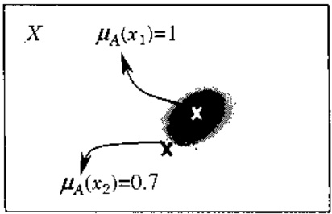

<!-- page: 11 -->

Nhiều tài liệu vấn quen ký hiệu $\mu_{A}(x)$. Tuy nhiên, đề gọn đối khi cần ta sẽ ký hiệu $A(x)$ thay cho $\mu_{A}(x)$.

Chúng ta cũng sẽ kí hiệu

$$
A = \{(\mu_ {A} (x) / x): x \in X \}.
$$

Ví dụ 1.2: $A_{01} = \text{một vải (quả cam)} = \{(0/0), (0/1), (0.6/2), (1/3), (1/4), (0.8/5), (0.2/6)\}$.

Vì dụ 1.3: $A =$ "số thực gần $10"$ có hàm thuộc $\mu_A(x) = \frac{1}{1 + (x - 10)^2}$.

Ta sē kí hiệu

$$
F (X) = \{A \text {tập mở trên} X \}
$$

Định nghĩa 1.2: Giá của tập mở $A$. $S(A)$ là tập các điểm $x$ nào có $\mu_A(x)>0$.

Với môi  $0 \leq \alpha \leq 1$  tập mức  $A_{\alpha}$  cho bởi:

$$
A _ {\alpha} = \{x \in X: \mu_ {A} (x) \geq \alpha \}.
$$

Đế ý $A_{\alpha}$ là tập con rõ của $X$.

Mệnh đề 1.1: Cho A là tập mò. Khi đó:

$$
\mu_ {A} (x) = \sup _ {0 <   a \leq 1} \min \left(\alpha , \mu_ {A _ {n}} (x)\right), \quad \text {v} \acute {\mathrm{o}} \mathrm{i} \quad \mu_ {A _ {n}} (x) = \left\{ \begin{array}{l l} 1 & \text {ne} \acute {\mathrm{u}} \quad x \in A _ {a} \\ 0 & \text {ne} \acute {\mathrm{u}} \quad x \in A _ {o} \end{array} \right.
$$

(Ở dây sup- là cận trên đúng của một tập trên đường thẳng số thực. Bàn nào chưa quen có thể thay bằng max, hoặc hỏi thêm thấy dạy Toán).

Chứng minh: Cho $0 < \alpha \leq 1$ có định. Với $x$ có $\mu_A(x) = 0$. Do $x \notin A_\alpha$, nên $\mu_{A_\alpha}(x) = 0$.

$\mathrm{Vay:}\quad \sup_{(1\leq \alpha \leq 1}}\min (\alpha ,\mu_{A_{\alpha}}(x)) = 0 = \mu_{A}(x)$

Với $x$ có $\mu_A(x) = \alpha' > 0$. Ta xét 3 trường hợp:

\- Nếu $\alpha < \alpha'$, $\mu_{A_{\alpha}}(x) = 1$. nên $\min(\alpha, \mu_{A_{\alpha}}(x)) = \alpha < \alpha'$.

$$
- \quad \text {Ne} ^ {\prime} \mathrm{u} \alpha = \alpha^ {\prime}, \mu_ {A _ {\alpha}} (x) = 1. \text {n} \text {e} \mathrm{n} \min (\alpha , \mu_ {A _ {\alpha}} (x)) = \alpha = \alpha^ {\prime}.
$$

\- Néu $\alpha > \alpha'$, $\mu_{A_{\alpha}}(x) = 0$, nên min($\alpha, \mu_{A_{\alpha}}(x)$) = $0'$.

Vay:  $\sup_{0\leq\alpha\leq1}\min(\alpha,\mu_{A_{\alpha}}(x))=\alpha^{2}=\mu_{A}(x)$

<!-- page: 12 -->

## 1.1.2 Các phép toán đại số trên tập mà

Định nghĩa 1.3: Cho A, B là hai tập mò trên không gian nén X, có các hàm thuộc $\mu_A$, $\mu_B$

Khi đó phép hợp $A \cup B$, phép giao $A \cap B$ và phân bù $A^{C}$ là các tập mở trên $X$ với các hàm thuộc cho bồi:

$$
\mu_ {A \cup B} (x) = \max \left| \mu_ {A} (x), \mu_ {B} (x) \right|, \quad x \in X
$$

$$
\mu_ {A \cap B} (x) = \min \mid \mu_ {A} (x), \mu_ {B} (x) \mid , \quad x \in X
$$

$$
\mu_ {A} c (x) = 1 - \mu_ {A} (x), \quad x \in X.
$$

Định nghĩa 1.4: Cho $A, B \in F(X)$. Ta nói:

$A \subseteq B$ . nếu  $\mu_{A}(x) \leq \mu_{B}(x)$  với mọi  $x \in X$ .

$A \supseteq B$. nếu $\mu_A(x) \geq \mu_B(x)$ với mọi $x \in X$.

Do đó

$A = B$ ,neu $\mu_A(x) = \mu_B(x)$ với mọi $x\in X$ .

Dế dàng kiểm tra mènh để sau:

Mệnh đề 1.2: Cho $A, B \in F(X)$. Khi đó

$$
(A \smile B) _ {\sigma} = A _ {\alpha} \smile B _ {\alpha} \quad \text {va} \quad (A \cap B) _ {\alpha} = A _ {\sigma} \cap B _ {\sigma}.
$$

Ta sẽ coi ∅ là tập mò với  $\mu_{2}(x)=0$  với mọi x. X là tập mò với  $\mu_{X}(x)=1$ , với mọi x.

Với các tập mờ nhiều tính chất của tập rõ còn đúng. Mệnh đề sau sẽ minh hoa điều đó.

Mệnh đề 1.3: Cho $A, B, C \in F(X)$. Ta có các tính chất:

a) Giao hoán:  $A \cup B = B \cup A$ .  $A \cap B = B \cap A$

b) Két hop: $A \cup (B \cup C) = A \cup (B \cup C)$

$$
A \cap (B \cap C) = A \cap (B \cap C)
$$

c) Luy dàng:  $A \cup A = A$ ,  $A \cap A = A$

d) Phân phối:  $A \cup (B \cap C) = (A \cup B) \cap (A \cup C)$

$$
A \cap (B \cup C) = (A \cap B) \cup (A \cap C)
$$

e) $A\cap \emptyset = \emptyset$ và $A\cup X = X$

f) Đồng nhất:  $A \cup \varnothing = A$  và  $A \cap X = A$

g) Hập thu  $A \cup (A \cap B) = A$  và  $A \cap (A \cup B) = A$

h) Luát De Morgan $(A \cup B)^{C} = A^{C} \cap B^{C}$ và $(A \cap B)^{C} = A^{C} \cup B^{C}$

i) Cuôn:  $(A^{C})^{C}=A$

j) Dang tuong duong:  $(A^{C} \cup B) \cap (A \cup B^{C}) = (A^{C} \cap B^{C}) \cup (A \cap B)$

k) Hiêu đối xứng:  $(A^{C} \cap B) \cup (A \cap B^{C}) = (A^{C} \cup B^{C}) \cap (A \cup B)$

Chứng minh. Ta sẽ chỉ chứng minh một vài đẳng thức để minh hoạ. Ví dụ ta sẽ chứng minh đẳng thức:

<!-- page: 13 -->

$$
A \cap (B \cup C) = (A \cap B) \cup (A \cap C)
$$

Dat

$$
D _ {1} = A \cap (B \cup C), \quad D _ {2} = (A \cap B) \cup (A \cap C).
$$

Lấy x tuỷ ý, cỏ định. Ta sẽ chỉ rõ ràng $\mu_{D_1}(x) = \mu_{D_2}(x)$. Kí hiệu

$$
a = \mu_ {A} (x), b = \mu_ {B} (x), c = \mu_ {C} (x).
$$

Do cổ định x, như vậy ứng với vectơ (a,b,c) ta chỉ cần xét 6 trường hợp sau:

|  | $(B \cup C)(x)$ | $D_{1}(x)$ | $(A \cap B)(x)$ | $(A \cap C)(x)$ | $D_{2}(x)$ |
| --- | --- | --- | --- | --- | --- |
| $a \leq b \leq c$ | c | a | a | a | a |
| $a \leq c \leq b$ | b | a | a | a | a |
| $b \leq c \leq a$ | c | c | b | c | c |
| $b \leq a \leq c$ | c | a | b | a | a |
| $c \leq a \leq b$ | b | a | a | c | a |
| $c \leq b \leq a$ | b | b | b | c | b |

Ví dụ ta sẽ chứng minh một ménh để về tính chất De Morgan

$$
(A \cap B) ^ {C} = (A ^ {C} \cup B ^ {C}).
$$

Có định x. ta chỉ cần tính 2 trường hợp:

$a \leq b$, khi đó $(A \cap B)^{C}(x) = 1 - \min(a, b) = 1 - a$. còn

$$
(A ^ {C} \cup B ^ {C}) (x) = \max (1 - a, 1 - b) = 1 - a.
$$

Với  $b \leq a$ , cũng có kết quả tương tự.

## 1.1.3 Nguyên lý suy rộng của Zadeh

Đế trực tiếp suy rộng hàm nhiều biến, như vậy cũng sẽ cung cấp cơ sở chất chẽ đầu tiên cho định nghĩa các hệ thống có nhiều biến vào một biến ra (Multi Input-Single Output . MISO system). nguyên lý suy rộng sau đây của Zadeh là rất quan trọng.

Hình 2: Hệ thống nhiều đầu vào, một đầu ra

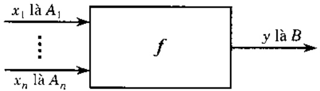

Định nghĩa 1.5: Cho $A_{i}$ là tập mở với hàm thuộc $\mu_{A_{i}}$ trên không gian nên $X_{i}$, $(i=1,2,\ldots,n)$. Khi ấy tích trực tiếp

$A = A_{1} \times A_{2} \times \cdots \times A_{n}$ là tập mở trên không gian nền:

$X = X_{1} \times X_{2} \times \cdots \times X_{n}$  với hàm thuộc:

<!-- page: 14 -->

$$
\mu_ {A} (x) = \min \left\{\mu_ {A _ {1}} (x _ {1}), \mu_ {A _ {2}} (x _ {2}), \dots , \mu_ {A _ {n}} (x _ {n}) \right\},
$$

trong đó  $x = (x_{1}, x_{2}, \cdots, x_{n})$ .

Bây giờ chứng ta xét hệ thống như trên hình 2.

Nguyên lý suy rộng của Zadeh (Zadeh' extention principle): Giả sử mỗi biến vào $x_i$ lấy giá trị là $A_i$ ($i = 1,2,\dots,n$) với $A_i$ là tập mở trên không gian nên $X_i$ với hàm thuộc $\mu_{A_i}(x_i)$. Hàm $f: X \to Y$ chuyển các giá trị đầu vào $A_i$ thành giá trị đầu ra $B$. Khi đó $B$ sẽ là tập mở trên $Y$ với hàm thuộc $\mu_B(x)$ được tính theo công thức sau:

$$
\mu_ {B} (x) = \left\{ \begin{array}{l l} \sup \{\min (\mu_ {A _ {1}} (x _ {1}), \dots , \mu_ {A _ {n}} (x _ {n}): x \in f ^ {- 1} (y) \} & \text {neu} f ^ {- 1} (y) \neq \emptyset \\ 0 & \text {neu} f ^ {- 1} (y) = \emptyset \end{array} \right.
$$

ó đây

$$
f ^ {- 1} (y) = \{x = (x _ {1}, x _ {2}, \dots , x _ {n}) \in X: f (x) = y \}
$$

## 1.1.4 Số mò

Chúng ta sẽ dùng các số mở theo định nghĩa sau:

Định nghĩa 1.6: Tập mò M trên đường thẳng số thực $R^{1}$ là một số mò, nếu

a) $M$ chuẩn hóa, tức là có điểm $x'$ sao cho $\mu_M(x') = 1$,

b) Ứng với mối $\alpha\in\mathbb{R}^{1}$, tập mức $\{x:\mu_{M}(x)\geq\alpha\}$ là doan đóng trên $\mathbb{R}^{1}$.

c)  $\mu_{M}(x)$  là hàm liên tục.

Người ta thường dùng các số mở dạng tam giác, hình thang và dạng hàm Gauss.

Số mở tam giác được xác định bởi 3 tham số. Khi đó hàm thuộc của số mở tam giác $M(a, b, c)$ cho bởi:

$$
\mu_ {M} (z) = \left\{ \begin{array}{c c c} 0 & \text {neu} & z \leq a \\ z - a / b - a & \text {neu} & a \leq z \leq b \\ 1 & \text {neu} & z = b \\ z - b / c - b & \text {neu} & b \leq z \leq c \\ 0 & \text {neu} & c \leq z \end{array} \right.
$$

Còn số mở hình thang $M(a, b, c, d)$ được xác định bởi 4 tham số có hàm thuộc đang sau:

$$
\mu_ {M} (z) = \left\{ \begin{array}{c c c} 0 & \text {ne} ^ {\prime} \mathrm{u} & z \leq a \\ z - a / b - a & \text {ne} ^ {\prime} \mathrm{u} & a \leq z \leq b \\ 1 & \text {ne} ^ {\prime} \mathrm{u} & b \leq z \leq c \\ z - c / d - c & \text {ne} ^ {\prime} \mathrm{u} & c \leq z \leq d \\ 0 & \text {ne} ^ {\prime} \mathrm{u} & d \leq z \end{array} \right.
$$

<!-- page: 15 -->

Còn hàm thuộc của số mở dạng hàm Gauss (dạng hình chuông) cho bời:

$$
\mu_ {M} (z) = \left\{ \begin{array}{c c c} e ^ {- \frac {(z - a) ^ {2}}{2}} & \text {neu} & | z - a | \leqslant d _ {a} \\ 0 & \text {neu} & | z - a | \geqslant d _ {a} \end{array} \right.
$$

$d_{n}$ là số dương được chọn thích hợp.

Định lý 1.1 (Doubois, Prade 1980): Nếu $M \cdot N$ là 2 số mở thì phép cộng suy rộng $M \oplus N$ có hàm thuộc cho bối

$$
\mu_ {M \in N} (z) = \max (\min (\mu_ {M} (x), \mu_ {N} (y)): x + y = z), \text {vói moi} z,
$$

cũng là số mò.

Khi M, N là 2 số mở hình thang $M(a_{m}, b_{m}, c_{m}, d_{m})$, $N(a_{n}, b_{n}, c_{n}, d_{n})$ thì:

$$
M \oplus N (a _ {m} + a _ {n}, b _ {m} + b _ {n}, c _ {m} + c _ {n}, d _ {m} + d _ {n}).
$$

Định nghĩa tập mở dồi: Nếu A là tập mở trên  $R^{1}$  với hàm thuộc  $\mu_{A}(z)$  thì tập đối -A cũng là tập mở trên  $R^{1}$  có hàm thuộc cho bơi  $\mu_{-A}(z)=\mu_{A}(-z)$ .

Nhận xét nếu M là số mở thì -M cũng là số mở.Hon nửa M là số mở hình thang thì -M cũng là số mở hình thang.

Đình nghĩa phép trité suy rộng: Cho M.N là 2 số mò thì ta có thể định nghĩa

$$
M - N = M \oplus (- N).
$$

## 1.2 Logic mò

Bất kỳ một người nào có ít nhiều trị thức đều hiểu ràng ngay trong những suy luận đời thường cũng như trong các suy luận khoa học chất chế, logic toán học đã đóng vai trò rất quan trọng.

Nhung dáng tiếc, chiếc áo logic toán học cổ điện đã quá chất hep đối với những ai mong muốn tìm kiếm những cơ sở vững chắc cho những suy luận phù hợp hơn với những bài toán nây sinh từ nghiên cứu và thiết kế những hệ thống phức tạp, đặc biệt là những có gắng đưa những suy luận giống như cách con người vấn thường sử dụng vào các lĩnh vực trí tuệ nhân tạo (chẳng hạn, trong các hệ chuyên gia, các hệ hó trợ quyết định, các bộ phân mềm lớn, v.v...) hay vào trong công việc thiết kế và điều khiển, vận hành các hệ thống lớn, phức tạp sao cho kịp thời và hiệu quả.

Trong sự phát triển đa dạng của các hệ mở, dựa trên cách tiếp cận mối của lý thuyết tập mở. logic mở giữ một vai trò rất cơ bản. Trong chương này chủng tôi sẽ hiểu logic mở theo nghĩa đủ "hep" - đó là phần trực tiếp suy rộng logic mềm để cổ diễn thông qua việc trình bày một số công cụ chủ chốt của logic mở: các liên kết logic cơ bản.

<!-- page: 16 -->

## 1.2.1 Ôn nhanh về logic menses để cổ điện

Ta sẽ kí hiệu $\mathcal{P}$ là tập hợp các ménh đề và $P, P_1, Q, Q_1, \cdots$ là những ménh đề. Với môi ménh $P \in \mathcal{P}$, ta gần một trị $v(P)$ là giá trị chàn lý (truth value) của ménh đề. Logic cổ diễn để nghi $v(P) = 1$ nếu $P$ là đúng ($T$-true), $v(P) = 0$ nếu $P$ là sai ($F$-false).

Trên P chúng ta xác định trước tiên ba phép toán cơ bản và rất trực quan:

\- Phép tuyến: P OR Q, kí hiệu $P \vee Q$, đó là ménh để "hoặc P hoặc Q".

\- Phép hội: P AND Q, kí hiệu $P \land Q$, đó là mènh dẻ "vừa $P$ vừa $Q$".

\- Phép phù định: NOT P, kí hiệu → P, đó là ménh đề "không P".

Dựa vào 3 phép toán logic cơ bản này người ta đã định nghĩa nhiều phép toán khác. nhưng đối với chúng ta quan trọng nhất là phép kéo theo (implication), kí hiệu là $P \Rightarrow Q$.

Định nghĩa 2.1: Khi sử dụng các liên kết logic: phép tuyến, phép hội, phép phù định, phép kéo theo và phép tương đương (⇔), giá trị chân lý của ménh để hệ quả được xác định phụ thuộc vào giá trị chân lý của các ménh để góc P, Q cho trong bảng sau:

Bảng 1

| P | Q | $\neg P$ | $\vee$ | $\wedge$ | $\Rightarrow$ | $\Leftrightarrow$ |
| --- | --- | --- | --- | --- | --- | --- |
| 1 | 1 | 0 | 1 | 1 | 1 | 1 |
| 1 | 0 | 0 | 1 | 0 | 0 | 0 |
| 0 | 1 | 1 | 1 | 0 | 1 | 0 |
| 0 | 0 | 1 | 0 | 0 | 1 | 1 |

Sử dụng những định nghĩa trên. trong logic cổ diễn, các luật suy diễn quan trọng sau đây giữ vai trò rất quyết định trong các lập luận truyền thống. Đó là các luật:

\- modus ponens: $(P \wedge (P \Rightarrow Q)) \Rightarrow Q$

\- modus tollens: $((P\Rightarrow Q)\land\neg Q)\Rightarrow\neg P$

\- syllogism: $((P\Rightarrow Q)\land (Q\Rightarrow R))\Rightarrow (P\Rightarrow R)$

\- contraposition: $(P \Rightarrow Q) \Rightarrow (\neg Q \Rightarrow \neg P)$

Mệnh đề 2.1: Luật modus ponen luôn đúng trong logic cổ điện

Chứng minh: Ta chỉ cần tính giá trị chân lý của $(P \land (P \Rightarrow Q)) \Rightarrow Q$. Thật vây:

| P | Q | $P \Rightarrow Q$ | $P \land (P \Rightarrow Q)$ | $(P \land (P \Rightarrow Q)) \Rightarrow Q$ |
| --- | --- | --- | --- | --- |
| 1 | 1 | 1 | 1 | 1 |
| 1 | 0 | 0 | 0 | 1 |
| 0 | 1 | 1 | 0 | 1 |
| 0 | 0 | 1 | 0 | 1 |

Mệnh đề 2.2: Luật modus tollens ((P⇒Q)∧¬Q)⇒¬P luôn đúng trong logic cổ điện.

Chứng minh: Ta chỉ cần tính giá trị chân lý của  $(P \Rightarrow Q) \land \neg Q) \Rightarrow \neg P$ . Thất vậy:

<!-- page: 17 -->

| P | Q | $\neg P$ | $\neg Q$ | $P \Rightarrow Q$ | $(P \Rightarrow Q) \land \neg Q$ | $((P \Rightarrow Q) \land \neg Q) \Rightarrow \neg P$ |
| --- | --- | --- | --- | --- | --- | --- |
| 1 | 1 | 0 | 0 | 1 | 0 | 1 |
| 1 | 0 | 0 | 1 | 0 | 0 | 1 |
| 0 | 1 | 1 | 0 | 1 | 0 | 1 |
| 0 | 0 | 1 | 1 | 1 | 1 | 1 |

Ta hây lây luật modus ponens làm ví dụ. Luật này có thể giải thích như sau: Nếu ménh để P là đúng và nếu định lý "P kéo theo Q" đúng, thì ménh để Q cũng đúng.

Tương tự người đọc có thể lý giải cho các luật khác.

## 1.2.2 Máy phép toán cơ bản của logic mà

Năm 1973 L.Zadeh ([2]) đã chính thức định nghĩa và làm việc với các liên kết logic mở cơ bản. đồng thời với việc đưa ra khái niệm biển ngôn ngữ đã bước dấu ứng dụng vào suy diễn mờ. Đây là bước khởi đầu rất quan trọng tính toán các suy diễn dùng logic mở trong các hệ mờ.

Thất tự nhiên để có thể tiền hành mô hình hoá các hệ thống có nhiều thông tin bất định và nhiều trị thức còn mập mở và tìm cách biểu diễn các quy luật vận hành trong các hệ thống này, chúng tại cần suy rộng các phép liên kết logic cơ bản (logic connectives) với các mạnh để có giá trị chân lý $v(P)$ nhận trong đoạn [0,1]. (thay cho quy định $v(P)$ chỉ nhận giá trị 1 hoặc 0 như trước đây).

Chứng ta sẽ dura vào các phép toán cơ bản của logic mở qua con đường tiền để hoá. Cho các ménh đề P, Q,  $P_{1}$ , ... , giá trị chân lý  $v(P)$ ,  $v(Q)$ ,  $v(P_{1})$  ... sẽ nhận trong doạn [0,1].

Phân tiếp theo của phân 1.2.2 sẽ trình bày bón phép liên kết cơ bản nhất.

## 1.2.2.1 Phép phủ định

Bây giờ chúng ta cho dạng toán học của phép toán này.

Định nghĩa 2.2: Hàm $n:[0,1]\to[0,1]$ không tăng thỏa mãn các điều kiện $n(0)=1$, $n(1)=0$, gọi là hàm phù định (negation - hay là phép phù định).

Chúng ta có thể xét thêm vài tiên để khác.

## Định nghĩa 2,3:

a) Hàm phù định n là chất nếu nó là hàm liên tục và giảm chặt.

b) Hàm phù định n là manh nếu nó là chăt và thỏa mãn  $n(n(x))=x$ ,  $\forall x\in[0,1]$ .

Ta hãy cho vải ví dụ và tính chất.

\- Hàm phù định thường dùng $n(x)=1-x$ (Zadeh [2]).

\- Hàm $n(x) = 1 - x^2$

\- Họ phù định (Sugeno) $N_{\lambda}(x)=(1-x)/(1+\lambda x)$. với $\lambda>-1$.

<!-- page: 18 -->

Rõ ràng (1-x) là phù định mạnh. còn (1-x$^{2}$) là một phù định chất, nhưng không mạnh. Côn với họ Sugeno ta có menses để sau.

Mệnh để 2.3: Với môi $\lambda > -1$, $N_{\lambda}(x)$ là hàm phủ định mạnh.

Chứng minh:That vây, do $1 + \lambda >0$ với $x_{1} < x_{2}$, $\lambda x_{1} + x_{1} < \lambda x_{2} + x_{2}$ điều này tương đương với $N_{\lambda}(x_1) > N_{\lambda}(x_2)$.

Hon nãa $N_{\lambda}(N_{\lambda}(x)) = ((1 + \lambda x) - (1 - x) / (1 + \lambda x) + \lambda(1 - x)) = x$, với môi $0 \leq x \leq 1$.

Đế thuận lợi chúng ta cần thêm hai định nghĩa sau.

Một cách định nghĩa phần bù của một tập mở: Cho Ω là không gian nền, một tập mở A trên Ω tương ứng với hàm thuộc $A: \Omega \to [0,1]$.

Định nghĩa 2.6: Cho n là hàm phù định, phần bù $A^{C}$ của tập mờ A là một tập mờ với hàm thuộc cho bởi $A^{C}(a) = n(A(a))$, với mỗi $a \in \Omega$.

Rõ ràng định nghĩa phản bù chỗ trong phần 1.1. là trường hợp riêng khi n(x) là hàm phù định thường dùng.

## 1.2.2.2Phép hội

Phép hội (vàn quen gọi là phép AND - conjunction) là một trong máy phép toán logic cơ bản nhất. Thông thường người ta xét các tiên để sau:

td1.  $v(P_{1} \text{ AND } P_{2})$  chi phụ thuộc vào  $v(P_{1}), v(P_{2})$

td2. Nếu  $v(P_{1}) = 1$  thì  $v(P_{1} \text{ AND } P_{2}) = v(P_{2})$ , với mọi ménh để  $P_{2}$

td3. Giao hoán:  $v(P_{1} \text{ AND } P_{2}) = v(P_{2} \text{ AND } P_{1})$

td4. Nếu $v(P_1) \leq v(P_2)$, thì $v(P_1 \text{ AND } P_3) \leq v(P_2 \text{ AND } P_3)$, với mọi ménh đề $P_3$

td5. Két hợp: $v(P_1 \text{ AND } (P_2 \text{ AND } P_3)) = v((P_1 \text{ AND } P_2) \text{ AND } P_3))$

Khi diễn đạt phép hội mở như một hàm số $T: [0,1]^2 \to [0,1]$, chúng ta cần tới định nghĩa sau :

Định nghĩa 2.7: Hàm $T: [0,1]^2 \to [0,1]$ là một $t$-chuẩn (chuẩn tam giác hay $t$-norm) nếu thỏa mãn các điều kiện sau:

a)  $T(1, x) = x$ , với mọi  $0 \leq x \leq 1$ .

b) $T$ có tính giao hoán, tức là $T(x,y) = T(y,x)$, với mọi $0 \leq x,y \leq 1$,

c) T không giám theo nghĩa  $T(x,y) \leq T(u,v)$ , với mọi  $x \leq u, y \leq v$ ,

d) $T$ có tính kết hợp: $T(x, T(y, z)) = T(T(x, y), z)$ với mọi $0 \leq x, y, z \leq 1$.

Từ những tiền để trên chúng ta suy ra ngay $T(0,x)$. Hơn nữa tiền để d) đảm bảo tính thác triển duy nhất cho hàm nhiều biến.

<!-- page: 19 -->

Ví dụ 2.1:

1) Min (Zadeh):

$$
T _ {1} (x, y) = \min {(x, y)}
$$

2)

$$
T _ {2} (x, y) = \frac {x y}{x + y - x y}
$$

3) t-chuẩn dạng tích:  $T_{3}(x,y)=xy$ ,

$$
T _ {4} (x, y) = \frac {x y}{2 - (x + y - x y)}
$$

5) t-chuân Lukasiewicz:

$$
T _ {L} (x, y) = \max \left\{x + y - 1, 0 \right\},
$$

6) t-chuẩn yếu nhất (drastic product):  $Z(x,y)=\begin{cases}\min(x,y)&\text{nếu} &\max(x,y)=1\\0&\text{nếu} &\max(x,y)<1\end{cases}$

Bây giờ chúng ta xét vài tính chất của t-chuẩn:

Mệnh đề 2.4: Với môi t-chuẩn T thì:

$$
T _ {5} (x, y) \leq T (x, y) \leq T _ {1} (x, y) = \min (x, y) \quad \text {với mọi } 0 \leq x, y \leq 1
$$

Chứng minh: Thật vậy.

Néu max(x,y)=1.

Khi x=1,  $T(1,y)=y=\min(x,y)$  hay  $T_{5}(x,y)=T(x,y)=T_{1}(x,y)$ . Tương tự nếu y=1.

Néu max(x,y)<1,  $T_{5}(x,y)=0<T(x,y)$ .

Giả sử $y = \min(x, y)$, khi đó $T(x, y) \leq T(1, y) = y = T_1(x, y)$. Tương tự nếu $x = \min(x, y)$. Đinh nghĩa 2.8:

a) Một t-chuẩn T gọi là liên tục nếu T là hàm liên tục trên  $[0,1]^{2}$

b) Hàm T gọi là Archimed nếu  $T(x, x) < x$  với mọi 0 < x < 1

c) Hàm T gọi là chặt nếu T tăng chặt trên  $(0,1)^{2}$

Sau đây là đồ thị của một số hàm t-chuẩn:

$$
T _ {L} (x, y) = \max (0, x + y - 1).
$$

$^{1}$  ∅n (mton-3 yad oblig mpi nduo) nduo-1 tom ál [1,0] ← $^{2}$ [1,0] : 5 msH .S.S airlqn rngD

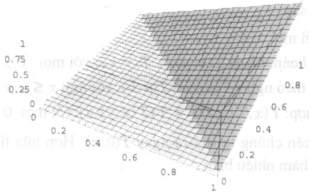

<!-- page: 20 -->

$T_{4}(x,y) = \frac{xy}{2 - (x + y - xy)}$

bemindorA 61 T 107 bemindorA 61 T 108 M naurdo-1 10m 61 T 6h ind

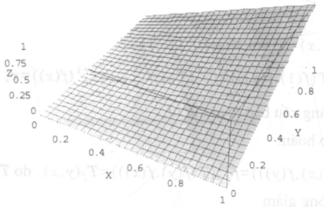

$T_{3}(x,y) = xy$

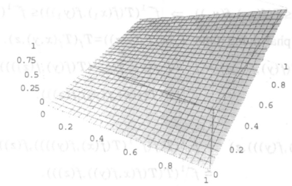

Không khó khăn kiểm tra các t-chuẩn $T_{1}(x,y)$, $T_{2}(x,y)$, $T_{3}(x,y)$, $T_{4}(x,y)$, t-chuẩn Lukasiewicz là liên tục và $T_{2}(x,y)$, $T_{3}(x,y)$, $T_{4}(x,y)$ là Archimed. Thật vậy:

1)  $T_{4}(x,y)=\frac{xy}{2-(x+y-xy)}$  là Archimed vi  $T_{2}(a,a)=\frac{a^{2}}{2-(2-(2a-a^{2}))}$  và do:

$$
a ^ {2} - 2 a + 2 = (a - 1) ^ {2} + 1 > 1 \Rightarrow \frac {a 2}{2 - (2 a - a 2)} <   a ^ {2} \leq a
$$

Vậy $T_{2}(a,a)<a$ với mọi $a\in(0,1)$.

2)  $T_{3}(x,y)=xy$  là chặt vì  $0\leq x_{1}<x_{2}$ ,  $0\leq y_{1}<y_{2}$ , ta có  $x_{1}y_{1}<x_{2}y_{2}$ .

3) $T_{5}(x,y)=\min(x,y)$ là một hàm liên tục trên $[0,1]^{2}$, nên t-chuẩn $T$ là liên tục. Hơn thể nửa, ta luôn có $T_{5}(x,x)=\min(x,x)=x$.

Hàm sinh của lớp toán tử t-chuẩn: Cho f là một đẳng cấu bảo toàn thứ tự từ [0,1] → [0,1]. ta có định lí sau:

<!-- page: 21 -->

Định lý 2.1: Cho T là một t-chuẩn, ta xác định $T_{f}: [0,1] \times [0,1] \to [0,1]$ bằng định nghĩa:

$$
T _ {f} (x, y) = f ^ {- 1} \left(T (f (x), f (y))\right), \text {vói moi} 0 \leq x, y \leq 1.
$$

Khi đó $T_{f}$ là một t-chuẩn. Nếu $T$ là Archimed thì $T_{f}$ là Archimed.

Chứng minh:

1) Chứng minh  $T_{f}(1,x)=x$ , với  $\forall x\in[0,1]$ . Ta có:

$$
T _ {f} (1, x) = f ^ {- 1} (T (f (1), f (x))) = f ^ {- 1} (T (1, f (x))) = f ^ {- 1} (f (x)) = x,
$$

với  $\forall x \in [0,1]$ , vì f dàng cấu bảo toàn thứ tự.

2) Kiểm tra tính giao hoán.

$T_{f}(x,y)=f^{-1}(T(f(x),f(y)))=f^{-1}(T(f(y),f(x)))=T_{f}(y,x)$ , do T có tính giao hoán.

3) Tính đơn điều không giảm

Với $x_1 \leq x_2$ và $y_1 \leq y_2$ do $f$ là đẳng cấu bảo toàn thứ tự nên $f^{-1}$ cũng là đẳng cấu bảo toàn thứ tự và $f(x_1) \leq f(x_2)$, $f(y_1) \leq f(y_2)$. Lai do $T$ là t-chuẩn nên:

$$
T (f (x _ {1}, f (y _ {1})) \leq T (f (x _ {2}), f (y _ {2})) \Rightarrow f ^ {- 1} (T (f (x _ {1}), f (y _ {1}))) \leq f ^ {- 1} (T (f (x _ {2}), f (y _ {2}))).
$$

4) Tính kết hợp: Ta phải chứng minh $T_{f}(x,T_{f}(y,z)) = T_{f}(T_{f}(x,y),z)$. Ta có vé trái:

$$
\begin{array}{r l} T _ {f} (x, f ^ {- 1} (T (f (y), f (z))) & = f ^ {- 1} (T (f (x), f (f ^ {- 1} (T (f (y), f (z)))))) \\ & = f ^ {- 1} (T (T (f (x), f (y)), f (z))). \end{array}
$$

Vế phải là:

$$
\begin{array}{r l} T _ {f} (f ^ {- 1} (T (f (x), f (y))), z) & = f ^ {- 1} (T (f (f ^ {- 1} (T (f (x), f (y)))), f (z))) \\ & = f ^ {- 1} (T (T (f (x, f (y)), f (z))). \end{array}
$$

Ta thấy về trái bằng về phải.

5) Kiểm tra T là Archimed thì  $T_{f}$  là Archimed. Theo giả thiết:

T là Archimed  $\Rightarrow T(a,a)<a$  với mọi  $a\in[0,1]$

Ta có:

$$
T _ {f} (a, a) = f ^ {- 1} (T (f (a), f (a))) = f ^ {- 1} (c) <   f ^ {- 1} (f (a)) = a,
$$

$$
\mathrm{vi} \quad T (f (a), f (a)) = c <   f (a)
$$

Ví dụ 2.2: Xét $T(x,y)=xy$. Khi đó ta có nhiều cách tạo ra $T_f$

$$
\text {Cách 1:} \quad \text {Chon} f (x) = x \text {ta có} f ^ {- 1} (x) = x; T (x, y) = x y = f (x) f (y) = f ^ {- 1} (f (x) f (y)). \text {Vay};
$$

$$
T _ {f} (x, y) = f ^ {- 1} (f (x) f (y)) = x y
$$

Cach 2: Chon $f(x) = x^n \Rightarrow f^{-1}(x) = \sqrt[n]{x}$, khi đó:

$$
T _ {f} (x, y) = f ^ {- 1} (f (x) f (y)) = f ^ {- 1} (x ^ {n}, y ^ {n}) = x y
$$

<!-- page: 22 -->

Vì dụ 2.3: Xét $T(x, y) = \frac{xy}{a + (1 - a)(x + y - xy)}$. Ta chọn $f(x) = \frac{x}{x + a(1 - x)}$

Với $a>0$ ta thấy $f(x)$ liên tục và $f(0)=0/a=0$; $f(1)=1$. Vậy $f(x)$ là đẳng cấu bảo toàn thứ tự. Ta có $f^{-1}(x)=\frac{ax}{ax-x+1}$. Theo định lý trên ta có:

$$
T _ {f} (x, y) = f ^ {- 1} (T (f (x), f (y))) = f ^ {- 1} (f (x) \cdot f (y)).
$$

Nếu $x = 1/2$ thì $f^{-1}(1/2) = f\left(\frac{1}{2}\right) = \frac{a\left(\frac{1}{2}\right)}{a\left(\frac{1}{2}\right) - \frac{1}{2} + 1} = \frac{1}{1 + \frac{1}{a}}$. Ta thấy $T(x, y)$ phụ thuộc vào $a > 0$.

Xét một số trường hợp đặc biệt:

$$
\begin{array}{l l} \text {a)} & a = 1 \Rightarrow f (x) = x \Rightarrow T _ {f} (x, y) = x y \\ \text {b)} & a = 1 / 2 \Rightarrow f (x) = \frac {2 x}{1 + x} \Rightarrow f ^ {- 1} (x) = \frac {x}{2 - x}. \mathrm{Vay} T _ {f} (x, y) = \frac {2 x y}{1 + (x + y - x y)}. \\ \text {c)} & a = 2 \Rightarrow f (x) = \frac {x}{2 - x} \Rightarrow T _ {f} (x, y) = \frac {x y}{2 - (x + y - x y)} = T _ {2} (x, y). \end{array}
$$

Dình nghĩa tổng quát phép giao của 2 tập mờ: Cho hai tập mờ A. B trên cùng không gian nền X với hàm thuộc tương ứng là A(x), B(x). Cho T là một t-chuẩn.

Định nghĩa 2.9: Ứng với t-chuẩn T, tập giao của hai tập mở A, B là một tập mở (A ∩ \_B) trên X với hàm thuộc cho bởi:

$$
(A \cap_ {T} B) (x) = T (A (x), B (x)), \quad \forall x \in X
$$

Việc lựa chọn phép giao tương ứng với t-chuẩn T nào tuỷ thuộc vào bài toán được quan tâm.

Ví dụ 2.4: Cho U là không gian nền: $U = [0, 120]$ - thời gian sống.

$A = \{ Những người ở tuổi trung niên \} ; \quad B = \{ Những người ở tuổi thanh niên \}$

Khi đó giao của hai tập mờ A và B, khi sử dụng $T(x,y)=\min(x,y)$ và $T(x,y)=xy$ chủng sẽ được biểu diễn trên hình về như sau:

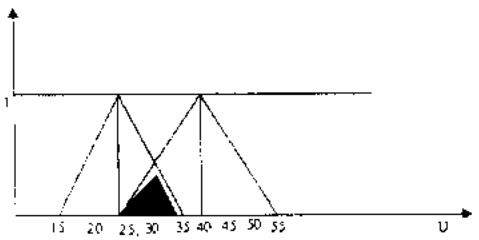

Dang tích  $T(x,y)=xy$

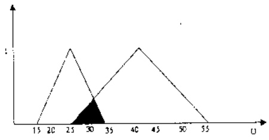

Dang  $T(x,y)=\min(x,y)$

<!-- page: 23 -->

## 1.2.2.3 Phép tuyến

Giống như phép hội, phép tuyển hay toán từ logic OR (disjunction) thông thường cần thỏa mãn các tiên đề sau:

Định nghĩa 2.10: Hàm $S:[0,1]^{2} \rightarrow [0,1]$ gọi là phép tuyến (OR suy rộng) hay là $t$-đối chuẩn ($t$-conorm) nếu thỏa mãn các tiên để sau:

a)  $S(0,x)=x$  với mọi  $x\in[0,1]$

b) S có tính giao hoán:  $S(x,y)=S(y,\dot{x})$  với mọi  $0\leq x,y)\leq1$ ,

c) S không giảm:

$S(x,y) \leq S(u,v) \text{ với mọi } 0 \leq x \leq u \leq 1 \text{ và } 0 \leq y \leq v \leq 1$

d) S có tính kết hợp:

$S(x,S(y,z)) = S(S(x,y),z) \text{ với mọi } 0 \leq x,y,z \leq 1$

Từ định nghĩa ta thấy: $S(0,1) \leq S(x,1) \Leftrightarrow 1 \leq S(x,1) \leq 1 \Rightarrow S(x,1) = 1$.

Ví dụ 2.5: $S_{0}(x,y) = \max (x,y)$

$$
S _ {1} (x, y) = x + y - x y
$$

$$
S _ {2} (x, y) = \min (1, x + y)
$$

$$
S _ {3} (x, y) = \max _ {1} (x, y) = \left\{ \begin{array}{l l} \max (x, y) & \text {khi} \quad x + y = 1 \\ 1 & \text {khi} \quad x + y \neq 1 \end{array} \right.
$$

$$
S _ {4} (x, y) = \left\{ \begin{array}{l l} \max (x, y) & \text {khi} \quad \min (x, y) = 0 \\ 1 & \text {khi} \quad \min (x, y) \neq 0 \end{array} \right.
$$

Các hàm này đều là các t-đối chuẩn. Sau đây là đồ thị của một số hàm t-đối chuẩn:

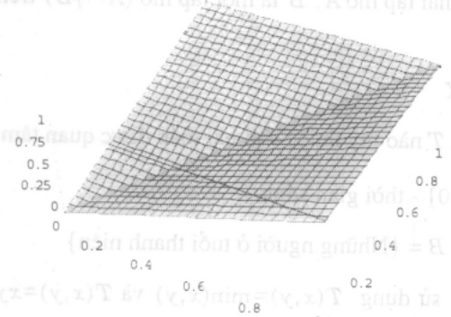

$$
S _ {0} (x, y) = \max (x, y)
$$

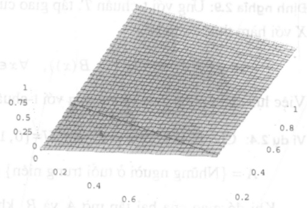

$$
S _ {2} (x, y) = \min (1, x + y)
$$

$$
S _ {1} (x, y) = x + y - x y
$$

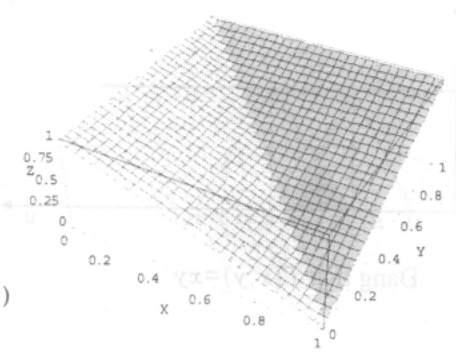

<!-- page: 24 -->

Tiếp tục ta sẽ xem xét một số tính chất của t-đối chuẩn

Định lý 2.2: Với $S$ là một t-dối chuẩn bất kỳ thì bất đẳng thức sau luôn đúng với mọi $x$. $y \in [0,1]$:
a) $S_0(x,y) \leq S(x,y) \leq S_4(x,y)$.
b) $S_0 \leq S_1 \leq S_2 \leq S_4$

Chúng minh:

a) Khi $x=1$. ta có $S(1,y)=1$, $S_{0}(1,y)=\max(1,y)=1=S_{4}(x,y)$. Khi $y=1$, tương tự $S_{0}(x,1)=S(x,1)=S_{4}(x,y)$. Khi $x=0$. tương tự ta cũng có $S_{0}(0,y)=S(0,y)=S_{4}(0,y)$. Khi $y=0$, ta cũng có $S_{0}(x,0)=S(x,0)=S_{4}(x,0)$.

Nếu $x > y$, suy ra $S_0((x,y)) = x < S_4(x,y) = 1$. Thấy $x = S(0,x) \leq S(y,x)$ (tính không giám ). Vì vây $S_0(x,y) < S(x,y) < S_4(x,y)$.

$$
\text {Néu} y > x: \quad S _ {0} ((x, y)) = y <   S _ {+} (x, y) = 1
$$

$$
y = S (0, y) <   S (x, y)
$$

$$
S _ {0} (x, y) <   S (x, y) <   S _ {4} (x, y).
$$

Vay $\forall x, y \in [0,1]$ thi $S_0(x,y) < S(x,y) < S_4(x,y)$.

b) Phân a) ta đã chứng minh được rằng: $S_0(x,y) < S(x,y) < S_4(x,y)$. Giờ dãy ta phải chứng minh: $S_0 \leq S_1 \leq S_2 \leq S_4$ và $S_0 \leq S_2 \leq S_3 \leq S_4$

\- Chúng minh $S_{0} \leq S_{1}$: Xét $x \geq y$ suy ra

$$
S _ {0} (x, y) = \max (x, y) = x, \text {và} S _ {1} (x, y) = x + y - x y = x + (1 - x) y
$$

$$
0 \leq x, y \leq 1 \Rightarrow 1 - x \geq 0 \Rightarrow (1 - x) y \geq 0 \Rightarrow x + (1 - x) y \geq x
$$

Tương tự, với $y \geq x$ $S_{0}(x,y) \leq S_{1}(x,y)$. Vậy $\forall x,y \in [0,1]$ luôn có $S_{0}(x,y) \leq S_{1}(x,y)$.

\- Chúng minh $S_{1} \leq S_{2}: \text{Xét } x + y \leq 1$. Khi đó $S_{2}(x, y) = x + y$. Tháy $0 \leq x, y \leq 1$, suy ra

$$
1 - x \leq 1 \Rightarrow (1 - x) y \leq y \Rightarrow x + (1 - x) y \leq x + y
$$

$$
S _ {1} (x, y) \leq S _ {2} (x, y)
$$

Xét  $x+y>1$ , khi đó  $S_{2}(x,y)=1$ . Do

Vay $S_{1}(x,y)\leq S_{2}(x,y)$. Do do $\forall x,y\in[0,1]$ luon có $S_{1}(x,y)\leq S_{2}(x,y)$.

$$
S _ {2} \leq S _ {4}
$$

$$
x = 0 \Rightarrow x + y \leq 1
$$

$$
S _ {3} (x, y) = \max (x, y)
$$

$$
x = 0
$$

$$
\min (x, y) = 0 \Rightarrow S _ {4} (x, y) = \max (x, y) = S _ {3} (x, y).
$$

<!-- page: 25 -->

Tương tự xét $y=0$, ta cũng lại có kết quả như trên. Xét tiếp với $x\neq0$, $y\neq0$. Khi đó: $S_{4}(x,y)=1$.

Khi $x + y < 1 \Rightarrow S_{3}(x,y) = \max (x,y)\leq 1 = S_{4}(x,y)$

$$
\text {Khi} x + y > 1 \Rightarrow S _ {3} (x, y) = 1 = S _ {4} (x, y)
$$

Vây $\forall x, y \in [0,1]$ luôn có $S_{2}(x,y) \leq S_{4}(x,y)$.

Từ các kết quả trên ta được: $S_{0}(x,y)\leq S_{1}(x,y)\leq S_{2}(x,y)\leq S_{4}(x,y)$

Từ đó ta có ménh để sau:

Mệnh đề 2.5: Nếu S là t-dối chuẩn thì:

$$
\max (x, y) \leq S (x, y) \leq Z ^ {\prime} (x, y) \quad \text {vói moi} 0 \leq x, y \leq 1.
$$

Định nghĩa 2.11: Cho S là t-dối chuẩn. Khi ấy:

a) S gọi là liên tục nếu S là hàm liên tục trên  $[0,1]^{2}$ .

b) Hàm S gọi là Archimed nếu $S(x,x)>x$ với mọi $0<x<1$.

c) S gọi là chất nếu S tăng chất trên  $(0,1)^{2}$ .

Ví dụ 2.6: $S_{1}(x,y)=x+y-xy$, là chất vì: Giả sử $x_{1}<x_{2}$, ta có

$$
S _ {1} (x _ {1}, y) = x _ {1} + y - x _ {1} y <   x _ {2} + y - x _ {2} y = S _ {1} (x _ {2}, y), \forall y \in (0, 1).
$$

Mặt khác do $S$ có tính chất giao hoán nên ta có $S_{1}(x_{1},y_{1})<S_{1}(x_{2},y_{2}),\forall\ 0<x_{1}<x_{2}<1,$ và $\forall\ 0<y_{1}<y_{2}<1.$

$S_{0}(x,y)=\max(x,y)$ là một hàm liên tục trên $[0,1]^{2}$, nên t-dói chuẩn S là liên tục. Hơn thể nửa, ta luôn có $S_{0}(x,y)=\max(x,y)=x$.

$$
S _ {2} (x, y) = \min \{1, x + y \} \text {la Archimed vi} S _ {2} (x, x) \min \{1, x + x \} = \min \{1, 2 x \} > x.
$$

$\underline{Hàm\ sinh\ của\ lớp\ toán\ từ\ t-đôi\ chuẩn}$: Cho $f$ là một đẳng cấu bảo toàn thứ tự từ $[0,1] \rightarrow [0,1]$, ta có định lí sau:

Định lý 2.3: Cho S là một t-dôi chuẩn, ta xác định:

$$
S _ {f}: [ 0, 1 ] \times [ 0, 1 ] \rightarrow [ 0, 1 ]
$$

$$
S _ {f} (x, y) = f ^ {- 1} (S (f (x), f (y))).
$$

Khi đó $S_{f}$ là một t-dói chuẩn. Nếu $S$ là Archimed thì $S_{f}$ là Archimed.

Chứng minh: Dành cho bạn đọc như một bài tập.

Ví dụ 2.7: Xét $S(x,y)=x+y-xy$. Khi đó ta có nhiều cách tạo ra $S_f$, ta có thể chọn:

$f(x)=x$ , khi đó

<!-- page: 26 -->

$$
\begin{array}{l l} & f ^ {- 1} (x) = x, \quad S (x, y) = x + y - x y = f (x) + f (y) - f (x) f (y) \\ \Rightarrow & S _ {f} (x, y) = f ^ {- 1} (f (x) + f (y) - f (x) f (y)) = x + y - x y \\ \text {Vay} & S _ {f} (x, y) = f ^ {- 1} (f (x) + f (y) - f (x) f (y)). \end{array}
$$

Đình nghĩa tổng quát phép hợp của 2 tập mờ.

Định nghĩa 2.12: Cho A và B là 2 tập mở trên không gian nền X, với hàm thuộc $A(x)$, $B(x)$ tương ứng. Cho S là một t-dối chuẩn. Phép hợp $(A \cup_{S} B)$ là một tập mở trên X với hàm thuộc cho bởi biểu thức:

$$
(A \cup_ {S} B) (x) = S (A (x), B (x)), \quad \forall x \in X.
$$

Việc lựa chọn phép hợp, tương ứng với t-dối chuẩn S nào tuỷ thuộc vào bài toán ta quan tâm.

Ví dụ 2.8: Cho U là không gian nền: $U = [0,120]$ là thời gian sống.

$A = \{ Những người ở tuổi trung niên \}; B = \{ Những người ở tuổi thanh niên \}.$

Khi đó hợp của hai tập mở A, B với  $T(x,y)=\max(x,y)$  và  $T(x,y)=\max(1,x+y)$ . Chứng biểu diễn trên hình vẽ như sau:

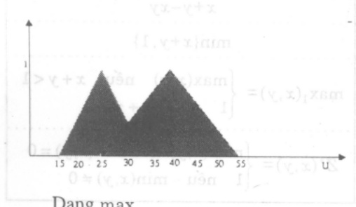

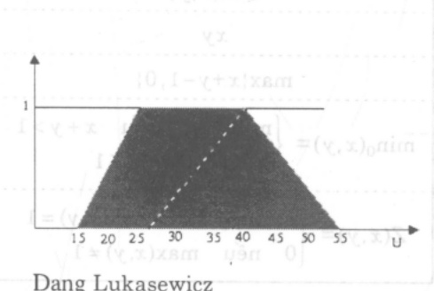

Bô ba De Morgan:

## J.S.P.BP ### Q##9A.S.S.1

Trong lý thuyết tập hợp luật De Morgan nổi tiếng sau đây đã được sử dụng nhiều nơi: Cho A, B là hai tập con của X, khi đó

$$
(A \cup B) ^ {C} = A ^ {C} \cap B ^ {C}
$$

$$
\mathrm{và} \quad (A \cap B) ^ {C} = A ^ {C} \cup B ^ {C}
$$

Có nhiều dạng suy rộng hai đẳng thức này. Sau đây một dạng suy rộng cho logic mò.

Định nghĩa 2.13: Cho T là t-chuẩn, S là t-đói chuẩn, n là phép phù định mạnh. Chúng ta nói bộ ba (T, S, n) là một bộ ba De Morgan nếu thỏa mãn một trong 2 đẳng thức sau:

$$
S (x, y) = n \left(T (n (x), n (y))\right) \text {hay}
$$

$$
T (x, y) = n \left(S (n (x), n (y))\right)
$$

<!-- page: 27 -->

Khi ấy ta nói T và S đối ngẫu với nhau. Quan hệ đối ngẫu giữa t-chuẩn và t-dối chuẩn có thể thấy qua định lý sau.

Định lý 2.4: Cho n là phép phù định mạnh.

a) $S(x,y)$ là một t-dói chuẩn và $T(x,y)$ cho bôi:

$T(x,y)=nT(S(n(x),n(y)))$  với mọi  $0\leq x,y\leq1$ .

Khi đó  $T(x,y)$  là một t-chuẩn.

b) Đối ngâu, cho $T(x,y)$ là t-chuẩn và $S(x,y)$ cho bôi

$S(x,y) = nT(T(n(x),n(y)))$ với mọi $0 \leq x, y \leq 1$.

Khi đó $S(x,y)$ là một t-chuẩn.

Chứng minh: Dành cho bạn đọc như một bài tập.

Sau dây là máy cập đôi ngẫu cụ thể.

Ví dụ: Chọn $n(x)=1-x$, chúng ta có các cấp sau:

| $T(x,y)$ | $S(x,y)$ |
| --- | --- |
| $\min(x,y)$ | $\max(x,y)$ |
| $xy$ | $x+y-xy$ |
| $\max\{x+y-1,0\}$ | $\min\{x+y,1\}$ |
| $\min_{0}(x,y)=\begin{cases}\min(x,y) & \text{nếu } x+y>1 \\0 & \text{nếu } x+y\leq 1\end{cases}$ | $\max_{1}(x,y)=\begin{cases}\max(x,y) & \text{nếu } x+y<1 \\1 & \text{nếu } x+y\geq 1\end{cases}$ |
| $Z(x,y)=\begin{cases}\min(x,y) & \text{nếu } \max(x,y)=1 \\0 & \text{nếu } \max(x,y)\neq 1\end{cases}$ | $Z'(x,y)=\begin{cases}\max(x,y) & \text{nếu } \min(x,y)=0 \\1 & \text{nếu } \min(x,y)\neq 0\end{cases}$ |

## 1.2.2.4Phép kéo theo

Phép kéo theo là công đoạn chủ chốt nhất của quá trình suy diện trong mọi lập luận xấp xì, bao gồm cả lập luận mờ. Phép kéo theo (Implication) được xét như một mối quan hệ. một toán từ logic. Khi mô hình hoá có thể xét tới các tiên để sau cho hàm $v(P_1 \Rightarrow P_2)$:

$\mathrm{td}_{01}: \quad v(P_{1} \Rightarrow P_{2}) \text{ chỉ phụ thuộc vào giá trị } v(P_{1}), v(P_{2})$

$\mathrm{td}_{1}$: Nếu $v(P_{1}) \leq v(P_{2})$ thì $v(P_{1} \Rightarrow P_{2}) \geq v(P_{3} \Rightarrow P_{2})$ với mọi ménh để $P_{2}$

$\mathrm{td}_{2}$: Nếu $v(P_{1}) \leq v(P_{3})$ thì $v(P_{1} \Rightarrow P_{2}) \leq v(P_{1} \Rightarrow P_{3})$ với mọi ménh dê $P_{1}$

$\mathrm{td}_{3}$: Nếu $v(P_{1})=0$ thì $v(P_{1}\Rightarrow P)=1$ với mối ménh đề $P$

$\mathrm{td}_{4}$: Nếu $v(P_{1})=1$ thì $v(P \Rightarrow P_{1})=1$ với mỗi ménh để $P$

$\mathrm{td}_{5}$: Nếu $v(P_{1})=1$ và $v(P_{2})=0$ thì $v(P_{1}\Rightarrow P_{2})=0$

<!-- page: 28 -->

Tính hợp lí của các tiền đề này chủ yếu dựa vào logic cổ diễn và những tư duy trực tiếp về phép suy diễn. Từ tiền đề $I_0$ ta khẳng định sự tổn tại của hàm $I(x,y)$ xác định trên $[0,1]^2$, với giá trị chán lí qua biểu thức sau:

$$
v (P _ {1} \Rightarrow P _ {2}) = I (v (P _ {1}), v (P _ {2}))
$$

Định nghĩa 2.14: Phép kéo theo (implication) là một hàm số $I:[0,1]^2 \to [0,1]$ thỏa mãn các điều kiện sau:

a) Nếu  $x \leq z$  thì  $I(x, y) \geq I(z, y)$  với mọi  $y \in [0, 1]$

b) Nếu  $y \leq u$  thì  $I(x, y) \leq I(x, u)$  với mọi  $x \in [0, 1]$

c) $I(0,x) = 1$ với mọi $x \in [0,1]$

d)  $I(x,1)=1 \text{ với mọi } x\in[0,1]$

e)  $I(1,0)=0.$

```txt
Môt sô dang hàm kéo theo cu thể:
```

Định nghĩa 2.15: Dạng kéo theo thứ nhất. Cho $S(x,y)$ là một t-dối chuẩn, $n(x)$ là một phù định mạnh. Hàm $I_{S}(x,y)$ xác định trên $[0,1]^{2}$ bằng biểu thức:

$$
I _ {S} (x, y) = S (n (x), y), \forall 0 \leq x, y \leq 1.
$$

Rô ràng ăn ý sau định nghĩa này là công thức từ logic cổ diễn $P \Rightarrow Q \Leftrightarrow (\neg P \lor Q)$

Định lý 2.5: Với bất kỳ t-chuẩn T, t-dối chuẩn S và phép phù định mạnh n nào, $I_{S}$ được định nghĩa như trên là một phép kéo theo.

Chứng minh. (Ta kiểm chứng $I_{S}$ theo từng tiên đề của định nghĩa 2.14.).

a) Tiên đề $I_1$: Cho $x \leq z$. Vi $I_S(x, y) = S(n(x), y)$. Ta chỉ xét trường hợp $x < z$, khi áy $n(x) > n(z)$. Do t-dói chuẩn không giảm theo hai biến

$$
I _ {S} (x, y) = S (n (x), y) \geq S (n (z), y) = I _ {S} (z, y)
$$

b) Tiên đê $I_{2}$: Cho $y \leq t$, khi đó $I_{S}(x,y)=S(nx,y) \leq S(nx,t)=I_{S}(x,t)$, $\forall x$.

c) Tiên dé $I_3$: $I_S(0, x) = S(n(0), x) = I_S(x, y) = S(1, x) \geq \max(1, x) = 1$, vây $I_S(0, x) = 1$, ∀x.

d) Tiên dé $I_4: I_S(x,1) = S(nx,1) \geq \max(nx,1) = 1$, vây $I_S(x,1) = 1$, $\forall x$.

e) Tien dé $I_5: I_S(1,0) = S(n(1),0) = S(0,0) = 0$, vay $I_S(1,0) = 0$, $\forall x$.

$I_{S}$ là một phép kéo theo của logic mở thỏa mãn định nghĩa 2.14.

Định nghĩa 2.16: Dạng kéo theo thứ hai. Cho T là một t-chuẩn, hàm $I_T(x,y)$ xác định trên, $[0,1]^2$ bằng biểu thức:

$$
I _ {\gamma} (x, y) = \sup \{\mathrm{u}: T (x, u) \leq y, \forall 0 \leq x, y \leq 1 \}
$$

<!-- page: 29 -->

Định lý 2.6: Với bất kỳ t-chuẩn T nào, $I_T$ được định nghĩa như trên là một phép kéo theo.

Chứng minh: Ta kiểm chứng $I_{T}$ theo từng tiên để của định nghĩa 2.14.

a) Tiên đế $I_{1}$: Cho $x \leq z$. Vi $I_{T}(x,y)=\sup\{u: T(x,u) \leq y\}$. Do t-chuẩn $T$ không giảm theo hai biến; nên $T(x,u) \leq T(z,u)$ và do vậy:

$$
\{u: T (z, u) \leq y \} \subseteq \{u: T (x, u) \leq y \}
$$

$$
\sup \{u: T (z, u) \leq y \} \leq \sup \{u: T (x, u) \leq y \}.
$$

Hay $I_{T}(z,y) \leq I_{T}(x,y)$ với mọi y. Đó chính là điều kiện $I_{1}$.

b) Tiên đế $I_{2}$: Cho $y \leq t$, khi đó với mỗi cặp $(x, u)$ ta có $T(x, u) \leq y \leq t$:

$$
\{u: T (x, u) \leq y \} \subseteq \{u: T (x, u) \leq t \}
$$

$$
\sup \{u: T (x, u) \leq y \} \leq \sup \{u: T (x, u) \leq t \}.
$$

Hay $I_{T}(x,y) \leq I_{T}(x,t)$ với mọi x. Đó chính là điều kiện $I_{2}$

c) Tiên dê $I_{3}$: $T(0,x)=x$ với bất kì $u$ nào ta có $0\leq u\leq1$. Do vây $T(0,u)\leq x$, suy ra

$$
\sup \{u: T (0, u) \leq x \} = 1
$$

với mọi x hay $I_{\mathcal{T}}(0;x)=1$. Đỏ chính là điều kiện $I_{3}$

d) Tiên đề $I_{4}: I_{T}(x,1)=1$ là hiện nhiên với mọi $x$.

e) Tiến đề $I_5$: Do $I_T(1,0) = \sup \{u: T(1,u) \leq 0\}$, điều này dẫn tới $T(1,u) = 0$. Sử dụng tính chất $T(1,u) = u$ của t-chuẩn, chỉ có $u = 0$ thỏa mãn đẳng thức, tức là $T(1,0) = 0$. Vậy $I_T$ là một phép kéo theo của logic mở thỏa mãn định nghĩa 2.14

Như đã nhận xét từ đầu, có rất nhiều con đường muốn xác định phép kéo theo. Pháp kéo theo sau đây, nói chung không thỏa mãn tiên để 1, nhưng được nhiều tác giả sử dụng, ý chính của phép kéo theo này bắt nguồn từ biểu diễn phép $P \Rightarrow Q$ theo lý thuyết tập hợp.

Nếu $P, Q$ là các menses để trong logic cổ điện hay ta biểu diễn dưới dạng tập hợp trong cùng một không gian nền thì $(P \Rightarrow Q) = (\neg P \lor (P \land Q))$.

Sử dụng T là t-chuẩn, S là t-dối chuẩn. n là phép phù định. thì có thể nghĩ tới dạng:

$$
I (x, y) = S (T (x, y), n (x))
$$

Lập luận tương tự khi cho P và Q trên các không gian nền khác nhau cũng có thể dẫn tới cùng dạng hàm I(x,y) này.

Định nghĩa 2.17: Dạng kéo theo thứ ba. Cho (T, S, n) là bộ ba De Morgan với n là phép phù định mạnh, phép kéo theo thứ ba $I_S(x, y)$ xác định trên [0, 1]$^{2}$ bằng biểu thức:

$$
I _ {S} (x, y) = S (T (x, y), n (x)), \forall 0 \leq x, y \leq 1
$$

Vi dụ 2.9: Chọn $T(x,y)=xy$, $S(x,y)=x+y-xy$. ta được:

<!-- page: 30 -->

$$
I _ {S} (x, y) = S (x y, (1 - x)) = x y + (1 - x) - x y (1 - x).
$$

Từ đó  $I_{S}(x,y)=1-x+x^{2}y$

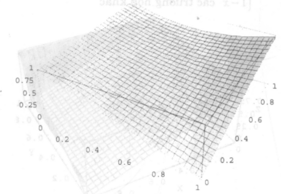

Chon $n(x) = 1 - n$, $T(x,y) = \max \{x + y - 1, 0\}$; $S(x,y) = \min \{x + y, 1\}$, có:

$$
\begin{array}{r l} I _ {S} (x, y) & = S \{\max (x + y - 1, 0), 1 - x \} \\ & = \min \{\max (x + y - 1, 0) + (1 - x), 1 \} \\ & = \min \{\max (y, 1 - x), 1 \}. \end{array}
$$

Do $y \leq 1$. nên luôn có: $\max(y, 1 - x) \leq 1$. Khi đó ta được: $I_S(x, y) = \max(1 - x, y)$.

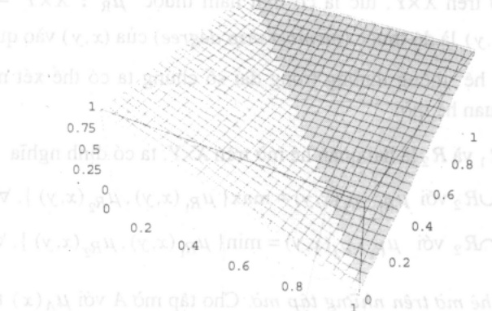

Chọn $T(x,y)=Z(x,y)$, $S(x,y)=Z'(x,y)$. Xét lần lượt các trường hợp:

\- Nếu  $\max(x,y)\neq1$  thì ta có  $T(x,y)=Z(x,y)=0$ , khi đó:

$$
\begin{array}{r l} I _ {S} (x, y) & = S (T (x, y), n (x)) = Z ^ {\prime} (0, 1 - x) \\ & = \max (0, 1 - x) = 1 - x \qquad (\mathrm{do} \min (0, 1 - x) = 0) \end{array}
$$

\- Nếu $x=1$, ta có $T(x,y)=Z(1,y)=\min(1,y)=y$, khi đó

$$
I _ {S} (x, y) = S (T (x, y), n (x)) = Z ^ {\prime} (y, 1 - 1) = Z ^ {\prime} (y, 0) = y
$$

$$
\begin{array}{r l} I _ {S} (x, y) & = S (T (x, y), n (x)) = Z ^ {\prime} (1, 1 - x) = Z ^ {\prime} (y, 0) = y \\ & = 1 \text {vì} (\mathrm{x} <   1, \mathrm{nên} \min (1, 1 - x) = 1 - x > 0). \end{array}
$$

<!-- page: 31 -->

Tóm lại ta có: $I_S(x, y) = \begin{cases} y & \text{khi} & x = 1 \\ 1 & \text{khi} & y = 1 \\ 1 - x & \text{các trường hợp khác} \end{cases}$

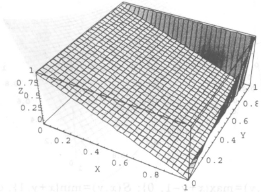

## 1.3 Quan hệ mò

## 1.3.1 Một số khái niệm của quan hệ mò

Định nghĩa 3.1: Cho X, Y là hai không gian nền. R gọi là một quan hệ mờ trên X×Y nếu R là một tập mờ trên X×Y, tức là có một hàm thuộc $\mu_{R} : X \times Y \to [0,1]$, ở đây $\mu_{R}(x,y) = R(x,y)$ là độ thuộc (membership degree) của $(x,y)$ vào quan hệ R.

Như những quan hệ thông thường trong đại số chúng ta có thể xét những khái niệm quen thuộc cho các quan hệ mở.

Định nghĩa 3.2: Cho $R_{1}$ và $R_{2}$ là hai quan hệ mở trên $X \times Y$, ta có định nghĩa

a) Quan hê $R_{1} \cup R_{2}$ với $\mu_{R_1 \cup R_2}(x, y) = \max\{\mu_{R_1}(x, y), \mu_{R_2}(x, y)\}$, $\forall (x, y) \in X \times Y$,

b) Quan hệ $R_{1} \cap R_{2}$ với $\mu_{R_1 \cap R_2}(x, y) = \min\{\mu_{R_1}(x, y), \mu_{R_2}(x, y)\}, \forall (x, y) \in X \times Y$.

Định nghĩa 3.3: Quan hệ mờ trên những tập mờ. Cho tập mờ A với $\mu_A(x)$ trên $X$, tập mờ $B$ với $\mu_B(x)$ trên $Y$. Quan hệ mờ trên các tập mờ A và $B$ là quan hệ mờ $R$ trên $X \times Y$ thỏa mãn điều kiện:

$$
\mu_ {R} (x, y) \leq \mu_ {A} (x), \forall y \in Y.
$$

$$
\mu_ {R} (x, y) \leq \mu_ {B} (x), \forall x \in X.
$$

Định nghĩa 3.4: Cho quan hệ mò R trên X×Y.

\- $Phép \ chiêu \ của \ R \ lên \ X \ là: \ proj_X R = \{ (x, \max_y \mu_R(x, y) : x \in X \}$

\- $Phép \ chiêu \ của \ R \ lên \ Y \ là: \ proj_Y R = \{(y, \max_x \mu_R(x, y) : y \in X\}$

\- Thác triển R lên không gian tích $X \times Y \times Z$ là:

$$
\mathrm{ext} _ {X Y Z} R = \{(x, y, z), \mu_ {\mathrm{ext}} (x, y, z) = \mu_ {R} (x, y), \forall z \in Z \}.
$$

<!-- page: 32 -->

Định nghĩa 3.5 (phép hợp thành): Cho $R_1$ là quan hệ mở trên $X \times Y$ và $R_2$ là quan hệ mở trên $Y \times Z$. Hợp thành $R_1 \circ R_2$ của $R_1, R_2$ là quan hệ mở trên $X \times Z$.

a) Hop thành max-min (max-min composition) được xác định bởi

$$
\mu_ {R _ {1}: R _ {2}} (x, z) = \max _ {y} \left\{\min (\mu_ {R _ {1}} (x, y), \mu_ {R _ {2}} (y, z) \right\}, \forall (x, z) \in X \times Z.
$$

b) Hợp thành max-prod cho bồi

$$
\mu_ {R _ {1} \in R _ {2}} (x, z) = \max _ {y} \left\{\left(\mu_ {R _ {1}} (x, y) \cdot \mu_ {R _ {2}} (y, z) \right. \right\}. \forall (x, z) \in X \times Z.
$$

c) Hợp thành max-\* được xác định bởi toán từ \*: [0,1]$^{2}$ → [0,1]

$$
\mu_ {R _ {1} \circ R _ {2}} (x, z) = \max _ {\mathrm{y}} \left\{\mu_ {R _ {1}} (x, y) * \mu_ {R _ {2}} (y, z) \right\}, \forall (x, z) \in X \times Z.
$$

Vi du 3.1: Cho $X = \{x_1, x_2, x_3\}$, $Y = \{y_1, y_2\}$, $Z = \{z_1, z_2\}$, với quan hệ mò $R$ cho trên $X \times Y$, $S$ là quan hệ mò cho trên $Y \times Z$ cho bôi ma trân

$$
R = \left[ \begin{array}{c c} 0. 8 & 1 \\ 1 & 0. 7 \\ 0. 2 & 0. 6 \end{array} \right], \qquad S = \left[ \begin{array}{c c} 0. 7 & 1 \\ 0. 6 & 0. 9 \end{array} \right]
$$

thì hợp thành max-min là $S \circ R = \begin{bmatrix} 0.7 & 0.9 \\ 0.7 & 1 \\ 0.6 & 0.6 \end{bmatrix}$ và max-prod là $S \circ R = \begin{bmatrix} 0.6 & 0.9 \\ 0.7 & 1 \\ 0.36 & 0.54 \end{bmatrix}$.

Báy giờ chúng ta xét một số quan hệ nhi nguyên mờ trên cùng một không gian nền.

Già thiết T là t-chuẩn.

Định nghĩa 3.6: Cho $R_1$, $R_2$ là quan hệ mở trên $X \times X$, phép $T$-hợp thành cho một quan hệ $R_1 \circ_T R_2$ trên $X \times X$ xác định bởi

$$
R _ {1 ^ {\circ} \mathrm{T}} R _ {2} (x, z) = \sup _ {y \in X} T (R _ {1} (x, y), R _ {2} (y, z)).
$$

Định lý 3.1: Cho $R_{1}, R_{2}, R_{3}$ là những quan hệ mở trên $X \times X$, khi đó:

$$
\mathrm{a)} \quad R _ {1 ^ {\circ} \mathrm{T}} (R _ {2 ^ {\circ} \mathrm{T}} R _ {3}) = (R _ {1 ^ {\circ} \mathrm{T}} R _ {2}) _ {\circ \mathrm{T}} R _ {3}
$$

b) Nếu $R_{1} \subseteq R_{2}$ thì $R_{1^{\circ}\mathrm{T}}R_{3} \subseteq R_{2^{\circ}\mathrm{T}}R_{3}$ và $R_{3^{\circ}\mathrm{T}}R_{1} \subseteq R_{3^{\circ}\mathrm{T}}R_{2}$

Tình bắc câu:

Định nghĩa 3.7: Quan hệ mò R trên XXX gọi là:

a) min-chuyên tiếp nếu min $\{R(x,y), R(y,z)\} \leq R(x,z) \quad \forall x,y,z \in X.$

b) bắc cấu yếu nếu  $\forall x, y, z \in X$  có

$$
R (x, y) > R (y, x) \text {và} R (y, z) > R (z, y) \quad \text {thi} R (x, z) > R (z, x).
$$

<!-- page: 33 -->

c) bắc câu tham số nếu có một số 0<θ<1 sao cho: Nếu R(x,y) > θ > R(y,x) và R(y,z) > θ > R(z,y) thì R(x,z) > θ > R(z,x) ∀x,y,z∈X.

Định lý 3.1: (xem [7])

a) Nếu R là quan hệ mở có tính chất min-bắc cầu thì R là quan hệ mở có tính chất bắc cầu tham số với mọi 0<θ<1.

b) Nếu R là quan hệ mờ có tính chất bắc câu tham số thì R là quan hệ mờ có tính chất bắc câu yếu.

## 1.3.2 Phương trình quan hệ mò

Phương trình quan hệ mở lân đầu tiên nghiên cứu bởi GS. Sanchez năm 1976, đóng vai trò quan trọng trong các lĩnh vực phân tích các hệ mở, thiết kế các bộ điều khiển mờ, quá trình lấy quyết định và nhận dạng mờ.

Dạng đơn giản nhất có thể diễn đạt như sau:

Cho một hệ mở biểu diễn dưới dạng một quan hệ mở nhị nguyên R trên không gian tích X×Y. Đầu vào (input) của hệ là một tập mở A cho trên không gian nén input X. Tác động của dấu vào A với hệ R sẽ là phép hợp thành A∘R sẽ cho ở dấu ra (output) một tập mở trên không gian nén Y, kí hiệu là B. Khi ấy chúng ta có A∘R = B.

Nếu chúng ta sử dụng phép hợp thành max-min thì hàm thuộc của B cho bồi

$$
\mu_ {B} (y = \mu_ {A ^ {\circ} R} (y) = \max _ {x} (\min _ {y} [ \mu_ {A} (x), \mu_ {R} (x, y) ])
$$

Ví dụ 3.2: Cho input là tập mờ A trên X và quan hệ mờ R trên X×Y như sau:

$$
\begin{array}{l} X = \{x _ {1}, x _ {2}, x _ {3} \}, Y = \{y _ {1}, y _ {2}, y _ {3} \}, \\ A = \left(0, 2 / x _ {1} \quad 0, 8 / x _ {2} \quad 1 / x _ {3}\right) = \left(0, 2 \quad 0, 8 \quad 1\right) \end{array}
$$

$$
A \circ R = \left[ \begin{array}{c c c} 0. 7 & 1 & 0. 4 \\ 0. 5 & 0. 9 & 0. 6 \\ 0. 2 & 0. 6 & 0. 3 \end{array} \right].
$$

Khi đó chúng ta có

$$
B = A \circ R = (0. 2 \quad 0. 8 \quad 1) \circ \left[ \begin{array}{c c c} 0. 7 & 1 & 0. 4 \\ 0. 5 & 0. 9 & 0. 6 \\ 0. 2 & 0. 6 & 0. 3 \end{array} \right] = (0, 5 \quad 0, 8 \quad 0, 6) = \frac {0 . 5}{y _ {1}} + \frac {0 , 8}{y _ {2}} + \frac {0 , 6}{y _ {3}}.
$$

## 1.4 Suy luận xấp xỉ và suy diện mò

1.4.1 Chúng ta sẽ trình bày đủ đơn giản vấn đề suy luận xếp xi dưới dạng những mạnh để với các biến ngôn ngữ như đời thường vấn dùng như: "máy lạnh", "ga yếu", hay những quy tắc, những luật dạng mạnh đề "nếu quay tay ga manh thì tốc độ xe sẽ nhanh".

<!-- page: 34 -->

Suy luận xấp xi - hay còn gọi là suy luận mở - đó là quá trình suy ra những kết luận dưới dạng các ménh đề mở trong điều kiện các quy tác, các luật, các dữ liệu đầu vào cho trước cũng không hoàn toàn xác định. Chúng ta sẽ hạn chế bởi những luật đơn giản như dạng modus ponens hay modus tollens đã nếu ở phân đầu.

Trước tiên chúng ta nhớ lại trong giải tích toán học đã dùng quá trình lập luận sau:

| Định lý: | Nếu một hàm số là khả vi thì nó liên tục |
| --- | --- |
| Sự kiện: | Hàm $f$ khả vi |
| Kết luận: | $f$ liên tục |

dày là dạng suy luân dưa vào luật modus ponens. Bảy giờ ta tìm cách diễn đạt cách suy luân quen thuộc trên dưới dạng sao cho có thể suy rộng cho logic mờ.

Ký hiệu: $U =$ không gian nền = không gian tất cả các hàm số.

Ví dụ đơn giản có thể hiểu

$$
U = \{g: R \to R \}.
$$

$$
A = \{\text {các hàm khả vi} \}.
$$

$$
B = \{\text {các hàm liên tục} \}.
$$

Hãy chọn hai mènh đề $P = "g \in A"$ và $Q = "g \in B"$. Khi áy chúng ta có

| Luật (tri thức): | $g \Rightarrow B$ |
| --- | --- |
| Sự kiện: | $P$ đúng (true) |
| Kết luận: | $Q$ đúng (true) |

ó dây chúng ta đã sử dụng luật modus ponens ((P ⇒ Q) ∧ P) ⇒ Q.

1.4.2 Bây giờ đã có thể chuyên sang suy diện mở cùng dạng.

| Luật mờ: | Nếu góc tay quay ga lớn thì xe đi nhanh |
| --- | --- |
| Sự kiện mờ: | Góc tay ga quay khá lớn |
| Hệ quả: | Xe đi khá nhanh |

Zadeh đã, diễn đạt sự kiện trên bảng các biến ngôn ngữ: góc tay quay, tốc độ, nhiệt độ, áp lực, tuổi tác và các ménh để mở dạng tương ứng. Chúng ta làm rõ cách tiếp cận của Zadeh qua vài ví dụ.

## 1.4.2.1 Biến ngôn ngữ

Ví dụ 3.3: Ta nói "Nam có tuổi trung niên", khi ấy chọn

$$
x = \text {biến ngòn ngữ}" T u ô i"
$$

không gian nền là thời gian sống

$U = [0, 130 \text{ năm}]$.

$$
A = \text {tập mô}" t r u n g n i ê n".
$$

Một cách tự nhiên, ta gắn cho A là một tập mở trên U với hàm thuộc $A(u):U\to[0,1]$.

<!-- page: 35 -->

Sự kiện "có thể tuổi của Nam là 40" dĩ nhiên không chắc chắn và khá hợp lý nếu diện đạt như một khả năng, trong [4.5] Zadeh đề nghị

$$
\begin{array}{r l} \text {Khả   nang (Tuổi của Nam = 40)} & = \text {Poss} (x = 4 0) \\ & = \text {độ thuộc của số 40 vào tập mở A = A(40).} \end{array}
$$

Mệnh đề mò

"Nam có tuôi trung niên"

báy giờ được diễn đạt thành ménh đẻ

$$
\begin{array}{r l} P = \{x = A \} & = \{\text {biên} x \text {nhân giá trị mò} A \text {trên không gian nền} U \} \\ & = \{x \text {is} A \} (\text {theo dang tiếng Anh}). \end{array}
$$

1.4.2.2 Vi dụ 3.4: Đối với suy luận mò cho ở đầu mục này chúng ta có thể dùng biển ngôn ngữ

x="góc tay quay"

trên không gian nén $U = [0.360^{**}]$ (cho phép quay tay ga của xe máy). $A = \text{"góc lón"}$ là một tập mở trên $U$ (trong trường hợp này tiên hơn dùng khái niệm số mở $A$), với hàm thuộc $A(u): U \to [0,1]$.

Tương tư, biến ngôn ngữ y = "tốc độ xe". với không gian nên

$V = \{0  km/gi\partial, 150  km/gi\partial \}$ .

$Q = \text{"xe đi nhanh"} = \text{mở tập mở } B \text{ trên không gian nền } V \text{ với hàm thuộc } B(v) : V \rightarrow [0,1].$  
Khi ấy

$P =$ "góc tay quay lón" $= \{x = A\}$ (x is u).

$$
Q = \text {``xe di nhanh''} = \{y = B \},
$$

và luật mở có dạng  $P \Rightarrow Q$ .

Như vay một luật mở dạng "If $P$ then $Q$" sẽ được biểu diễn thành một quan hệ mở $R$ của phép kéo theo $P \Rightarrow Q$ với hàm thuộc của $R$ trên không gian nên $U \times V$ được cho bởi phép kéo theo mà bạn dự định sử dụng:

$$
R _ {(A, B)} (u, v) = R _ {P \Rightarrow Q} (u, v) = I (A (u), B (v)), \text {vói moi} (u, v) \in U \times V.
$$

Bây giờ quy trình suy diễn mò đã có thể xác định:

| Luật mờ (trì thức): | $P \Rightarrow Q$, với quan hệ cho bồi $I(A(u), B(v))$ |
| --- | --- |
| Sự kiện mờ (đầu vào): | $P' = \{x = A'\}$, xác định bồi tập mờ $A'$ trên $U$ |
| Kết luận: | $Q' = \{y = B'\}$ |

Sau khi đã chọn phép kéo theo $I$ xác định quan hệ mở $R_{(A,B)}$. $B'$ là một tập mở trên $V$ với hàm thuộc của $B'$ được tính bằng phép hợp thành $B' = A' \circ R_{(A,B)}$, cho bởi công thức:

$$
B ^ {\prime} (v) = \max _ {u \in U} \left\{\min \left(A ^ {\prime} (u), I (A (u), B (v))\right) \right\}, \text {vói moi} v \in V.
$$

<!-- page: 36 -->

## 1.4.3 Tiếp tục cách biểu diễn và diễn đạt như vậy, ta có thể xét dạng

"If $P$ then $Q$ else $Q_{1}$"

quen biết trong logic cổ điện và thường hay sử dụng trong các ngôn ngữ lập trình của ngành Tin học.

Có thể chọn những cách khác nhau diễn đạt ménh để này, sau đáy tìm hàm thuộc của biểu thức tương ứng. Châng hạn, chúng ta chọn

$$
" \text {If} P \text {then} Q \text {else} Q _ {1}" = (P \wedge Q) \vee (\neg P \wedge Q _ {1}).
$$

Thông thường Q và  $Q_{1}$  là những ménh để trong cùng một không gian nền.

Giả thiết $Q$ và $Q_1$ được biểu diễn bằng các tập mở $B$ và $B_1$ trên cùng không gian nền $V$, với các hàm thuộc tương ứng $B: V \to [0,1]$ và $B_1: V \to [0,1]$. Nếu $Q$ và $Q_1$ không cùng không gian nền thì cũng sẽ xử lý tương tự nhưng với công thức phức tạp hơn.

\- Kí hiệu $R(P, Q, Q') = R(A, B, B_1)$ là quan hệ mở trên $U \times V$ với hàm thuộc cho bởi biểu thức

$$
R (u, v) = \max \left\{\min (A (u), B (v)), \min (1 - A (u), B _ {1} (v)) \right\}, \text {với moi} (u, v) \in U \times V.
$$

Tiếp tục quy trình này chứng ta có thể xét những quy tắc lấy quyết định phức tạp hơn. Chăng hạn chứng ta xét một quy tắc trong hệ thống mở có hai biến đầu vào và một đầu ra dang

$$
\text {If} A _ {1} \text {and} B _ {1} \text {then} C _ {1}
$$

else If $A_{2}$ and $B_{2}$ then $C_{2}$

else ...

1.4.4 Một dạng suy rộng khác trong cơ sở tri thức của nhiều hệ mở thực tiền, ví dụ điện hình là trong các hệ điều khiển mở, có thế phát biểu dưới dạng sau:

Cho $x_1, x_2, \ldots, x_m$ là các biến vào của hệ thống, $y$ là biến ra. Các tập $A_{ij}, B_j$, với $i = 1, \ldots, m, j = 1, \ldots, n$ là các tập mở trong các không gian nền tương ứng của các biến vào và biến ra đang sử dụng của hệ thống. các $R_j$ là các suy diện mở (các luật mở) đang "Nếu ... thì ..." (dạng if ... then )

$$
R _ {1}: \quad \text {Néu} x _ {1} \text {là} A _ {1, 1} \text {và} \dots \text {và} x _ {m} \text {là} A _ {m, 1} \text {thìy} \text {là} B _ {1}
$$

$$
R _ {2}: \quad \text {Néu} x _ {1} \text {là} A _ {1. 2} \text {và} \dots \text {và} x _ {m} \text {là} A _ {m. 2} \text {thì} y \text {là} B _ {2}
$$

$$
R _ {n}: \quad \text {Néu} x _ {1} \text {là} A _ {1, n} \text {và} \dots \text {và} x _ {m} \text {là} A _ {m, n} \text {thì} y \text {là} B _ {n}
$$

<!-- page: 37 -->

Bài toán

| Cho: | Nếu $x_{1}$ là $e_{1}^{*}$ và ... và $x_{m}$ là $e_{m}^{*}$ |
| --- | --- |
| Tính: | Giá trị y là $u^{*}$ |

ở dây $e_1^*$, ... , $e_m^*$ là các giá trị đầu vào hay sự kiện (có thể mò hoặc giá trị rõ ).

Chúng ta có thể nhận thấy ràng phần cốt lời của nhiều hệ một cho bồi cơ sở tri thức dạng $R = \{ \text{các luật } R_i \}$ và các cơ chế suy diện cải đặt trong mô tô suy diện.

Tính toán quan hệ mở cho những bộ luật phức tạp như thể các bạn có thể xem thêm công trình của M. Mizumoto và H.J. Zimmermann. Những kiến thức về suy diễn mò liên quan tới lập luận ngôn ngữ có thể đọc thêm chương 2 của Nguyễn Cát Hồ.

## 1.5 Ví dụ bằng số

1.5.1 Đề minh hoạ trong phân cuối chúng ta xét ví dụ bằng số trực tiếp trích từ [7]. Ví dụ chúng ta nghe thấy câu nói: "Nếu nhiệt độ của hệ thống lạnh, thì áp suất của hệ thống yếu". Rỗ ràng đầy là một luật mở dạng $P \Rightarrow Q$.

Trước tiền chúng ta chọn không gian nền với các trạng thái cơ sở. Ví dụ:

$U = \{ nhie\hat{t} do\ cua he th\acute{o}ng\} = \{ th\acute{a}p, trung binh th\acute{a}p, hon trung binh, cao\}$

$$
= \{u _ {1}, u _ {2}, u _ {3}, u _ {4} \}.
$$

$V = \{ \text{áp suất của hệ thống} \} = \{ \text{thấp, trung bình thấp, trung bình, hơn trung bình, cao} \}$
$= \{ v_1, v_2, v_3, v_4, v_5 \}$.

Trong trường hợp này mối ménh để $A_{1}$ trên $U$ có hàm thuộc hoàn toàn xác định bởi vectơ $\{A_{1}(u):u\in U\}$. Như vảy, châng hạn

Tập mò $A_{1}$ biểu diễn ménh dê: "nhiệt độ lạnh" = { 1 0.6 0 0},

Tập mờ $B_{1}$ biểu diễn ménh để: "áp suất thấp" = {1 0.8 0.1 0 0}.

Đế tính độ thuộc của quan hệ mở, người ta thác triển $A_{1}$ lên không gian nên $U \times V$. Khi ấy hàm thuộc của $A_{1}$ sẽ kí hiệu $ext_{U \times V} A_{1}$ có dạng

$$
\mathrm{ext} _ {U \times V} A _ {1} = \left| \begin{array}{c c c c c} 1 & 1 & 1 & 1 & 1 \\ 0. 6 & 0. 6 & 0. 6 & 0. 6 & 0. 6 \\ 0 & 0 & 0 & 0 & 0 \\ 0 & 0 & 0 & 0 & 0 \end{array} \right|.
$$

Do $P \Rightarrow Q$ là đóng nhất với biểu thức $\neg A_1 \vee (A_1 \wedge B_1)$, cho nên để tính hàm thuộc xác định trên $U \times V$ của quan hệ này chỉ cần tính ma trận

$$
(\mathrm{ext} _ {L: \times V} - A _ {1}) \vee ((\mathrm{ext} _ {L: \times V} A _ {1}) \wedge (\mathrm{ext} _ {L: \times V} B _ {1}))
$$

<!-- page: 38 -->

Sau đây là các ma trận tương ứng:

$$
\mathrm{ext} _ {l ^ {\prime} \times V} \neg A _ {1} = \left| \begin{array}{c c c c c} 0 & 0 & 0 & 0 & 0 \\ 0. 4 & 0. 4 & 0. 4 & 0. 4 & 0. 5 \\ 1 & 1 & 1 & 1 & 1 \\ 1 & 1 & 1 & 1 & 1 \end{array} \right|,
$$

$$
(\mathrm{ext} _ {U \times V} A _ {1}) \wedge (\mathrm{ext} _ {U \times V} B _ {1}) = \left| \begin{array}{c c c c c} 1 & 0. 8 & 0. 1 & 0 & 0 \\ 0. 6 & 0. 6 & 0. 1 & 0 & 0 \\ 0 & 0 & 0 & 0 & 0 \\ 0 & 0 & 0 & 0 & 0 \end{array} \right|,
$$

Biểu diễn và tính toán như trên vì chúng ta sẽ tính quan hệ $R(A_1, B_1)$ theo phép kéo theo $I_S(u, v)$ như trong vị dụ a phần 2.4.5. Kết quả thu được quan hệ

$$
R _ {P \Rightarrow Q} = R (A _ {1}, B _ {1}) = \left| \begin{array}{c c c c c} 1 & 0. 8 & 0. 1 & 0 & 0 \\ 0. 6 & 0. 6 & 0. 4 & 0. 4 & 0. 4 \\ 1 & 1 & 1 & 1 & 1 \\ 1 & 1 & 1 & 1 & 1 \end{array} \right|.
$$

Dày chính là quan hệ mở biểu thị quan hệ $P \Rightarrow Q$, thông qua các biến ngôn ngữ "nhiệt độ, áp suất" và các tập mở $A_{1}, B_{1}$ tương ứng.

Tiếp tục, chúng ta có thể tiến hành các suy diễn mò. Chắng hạn, sự kiện đầu vào quan sát được là "nhiệt độ của hệ thống hơi lạnh". Mệnh để mò P' này diễn đạt qua tập mò

$P'$ với hàm thuộc trên không gian nền U cho bồi vector $A' = \{0.8 \quad 1 \quad 0.3 \quad 0\}$.

Như thế chúng ta có quá trình suy diện mờ:

| Luật mờ (tri thức): | $R(A_1, B_1)$ |
| --- | --- |
| Sự kiện mờ (đầu vào): | $A'$ |
| Kết luận: | $B'$ |

$B'$ là một tập mở trên $V$ được tính bằng phép hợp thành $B' = R(A_1, B_1) \circ A'$.

Áp dụng vào trường hợp này chủng ta thu được hàm thuộc của B' là vecto

$$
B ^ {\cdot} = \{0. 8 \quad 0. 8 \quad 0. 4 \quad 0. 4 \}.
$$

Nếu bảy giờ quan hệ $R(A_1, B_1)$ được tính theo phép kéo theo $I_S(u, v)$ như trong ví dụ 6.8.b thì

$$
R _ {P \Rightarrow Q} = R \left(A _ {1}, B _ {1}\right) = \left| \begin{array}{c c c c c} 1 & 0. 8 & 0. 1 & 0 & 0 \\ 1 & 0. 8 & 0. 4 & 0. 4 & 0. 4 \\ 1 & 1 & 1 & 1 & 1 \\ 1 & 1 & 1 & 1 & 1 \end{array} \right|
$$

<!-- page: 39 -->

và kết quả của suy diễn mờ trong trường hợp này sẽ là $B' = R(A_1, B_1) \circ A'$ là tập mờ kết luận (kết quả đầu ra) trên không gian nén $V$ có hàm thuộc cho bởi vector

$$
B ^ {\prime} = \{1 \quad 0. 8 \quad 0. 4 \quad 0. 4 \quad 0. 4 \}.
$$

## 1.5.2 Tính toán minh họa cho mệnh đế dạng "If P then Q else Q1".

Già sử ménh dé $Q_1$ cùng không gian nén V với ménh dê $Q$, chăng hạn $Q_1 =$ "áp suất của hệ thống trung bình". $Q_1$ sẽ được biểu diễn qua biến ngôn ngữ "áp suất" và tập mô $B_2$ với hàm thuộc cho trên V là vector

$$
B _ {2} = \{0 0. 6 1 0. 6 0 \}.
$$

Khi áy

$$
\mathrm{ext} _ {U \times V} B _ {2} = \left| \begin{array}{c c c c c} 0 & 0. 6 & 1 & 0. 6 & 0 \\ 0 & 0. 6 & 1 & 0. 6 & 0 \\ 0 & 0. 6 & 1 & 0. 6 & 0 \\ 0 & 0. 6 & 1 & 0. 6 & 0 \end{array} \right|,
$$

$$
(\mathrm{ext} _ {U: \times V} ] A _ {1}) \wedge (\mathrm{ext} _ {U: \times V} B _ {2}) = \left| \begin{array}{c c c c c} 0 & 0 & 0 & 0 & 0 \\ 0 & 0. 4 & 0. 4 & 0. 4 & 0 \\ 0 & 0. 6 & 1 & 0. 6 & 0 \\ 0 & 0. 6 & 1 & 0. 6 & 0 \end{array} \right|.
$$

Cuối cùng thu được

$$
R (\text {If} P \text {then} Q \text {else} Q _ {1}) = \left| \begin{array}{c c c c c} 1 & 0. 8 & 0. 1 & 0 & 0 \\ 0. 6 & 0. 6 & 0. 4 & 0. 4 & 0 \\ 0 & 0. 6 & 1 & 0. 6 & 0 \\ 0 & 0. 6 & 1 & 0. 6 & 0 \end{array} \right|.
$$

## 1.6 Sự phát triển của công nghệ mò

Do hạn chế về thời gian, người viết tập trung trình bày về một vài nét về tình hình tại Nhật Bản. Trong quá trình phát triển của Lý thuyết tập mở và công nghệ mở tại Nhật Bản phải nhắc tới dự án lớn LIFE (the Laboratory for International Fuzzy Engineering) 1989–1995 do G.S. T.Terano (Tokyo Institute of Technology) làm Giám đốc điều hành – theo sáng kiến và sự tài trợ chính của Bộ ngoại thương và công nghiệp Nhật Bản. Phòng thí nghiệm LIFE được thiết kế bởi G.S. M. Sugeno. Chính Giáo sư cũng đã thuyết phục được nhiều công ty công nghiệp hàng đầu của Nhật Bản cung cấp tài chính và nhân lực, trở thành thành viên tập thể của dự án và chính họ trực tiếp biến các sản phẩm của phòng thí nghiệm thành sản phẩm hàng hoá.

Và kết quả là, theo Datapro, nên công nghiệp sử dụng công nghệ mở của Nhật Bản, năm 1993 có tổng doanh thu khoảng 650 triệu USD, thì tới năm 1997 đã ước lượng cỡ 6,1 tỷ

<!-- page: 40 -->

USD và hiện nay hàng nằm nên công nghiệp Nhật Bản chỉ 500 triệu USD cho nghiên cứu và phát triển lý thuyết mở và công nghệ mở. Theo Giáo sư T. Terano [6] quá trình phát triển của công nghệ mở có thể chia thành bốn giai đoạn sau:

1) Giai đoạn 1: Lợi dụng tri thức ở mức thấp.

Thực chất: Những ứng dung trong công nghiệp chủ yếu là biểu diễn trị thức định lượng của con người.

Ví dụ điện hình: Điều khiển mò.

Trong giai đoạn ban đầu này, chủ yếu là có gảng làm cho máy tính hiểu một số từ định lượng của con người vân quen dùng (như 'cao, nóng, ấm, yếu', v.v.). Một lí do rất đơn giản để di tới phát triển điều khiển mờ là câu hỏi sau: "Tại sao các máy móc đơn giản trong gia đình ai cũng điều khiển được mà máy tính lai không điều khiển được ?".

Có thể hầu hết các hệ điều khiển mờ là ở mức này. Thực tế tại mức ban đầu này đã đưa vào sử dụng rất nhiều loại máy mới có sử dụng logic mờ. Đó là sự kiện rất quan trọng trong quá trình phát triển của logic mờ, nhưng đó vấn là các hệ thuộc giai doan 1.

2) Giai đoạn 2: Sử dụng trị thức ở mức cao.

Thực chất: Dùng logic mà đế biểu diễn trị thực.

Ví dụ: - Các hệ chuyên gia mò.

\- Các ứng dụng ngoài công nghiệp: y học, nông nghiệp, quản lý, xã hội học, môi trường.

Trong giai đoạn này cổ gắng trang bị cho máy tính những tri thức cơ bản và sâu sắc hơn, những tri thức định tính mà trước tới nay chưa thế biểu diễn bằng định lượng, ví dụ như trong các hệ chuyên gia mò. mô hình hoá nhiều bài toán khó trong quản lý các nhà máy mà trước đây chưa làm được.

3) Giai đoạn 3: Liên lạc-giao tiếp.

Thực chất: Giao lưu giữa người và máy tính thông qua ngôn ngữ tự nhiên.

Ví dụ: - Các robot thông minh.

\- Các hệ hổ trợ quyết định dạng đối thoại.

4) Giai đoạn 4: Trí tuệ nhân tạo tích hợp.

Thực chất: Giao lưu và tích hợp giữa trí tuệ nhân tạo, logic mò, mạng noron và con người.

Ví dụ: - Giao lưu con người và máy tính.

\- Các máy dịch thuật.

\- Các hệ hỗ trợ lao động sáng tạo.

Giáo su Terano còn cho ràng sự phát triển của công nghệ mở và các hệ mở tại Nhật Bản đã và sẽ di qua bón giai đoạn trên.

<!-- page: 41 -->

Một số thông tin khác người đọc có thể tham khảo thêm các tài liệu [3,4.5.6] và các tài trích dẫn trong đó. Về các ứng dụng của công nghệ mở bạn đọc có thể tham khảo thêm tài liệu [8].

## 2 Mạng nondon nhân tạo và hệ mò

## 2.1 Mạng naron nhân tạo

## 2.1.1 Não và nondon sinh học

Não là tố chức vật chất cao cấp, có cấu tạo vô cùng phức tạp, dày đặc các mối liên kết giữa các nondon nhưng xử lý thông tin rất linh hoạt trong một mối trường bất định.

Trong bộ não có khoảng $10^{11} - 10^{12}$ noron và mỗi noron có thể liên kết với $10^{4}$ noron khác qua các khớp nổi. Những kích hoạt hoặc úc chế này được truyền qua trực noron (axon) đến các noron khác.

Trên hình 3 là hình ảnh của tế bào noron trong não con người.

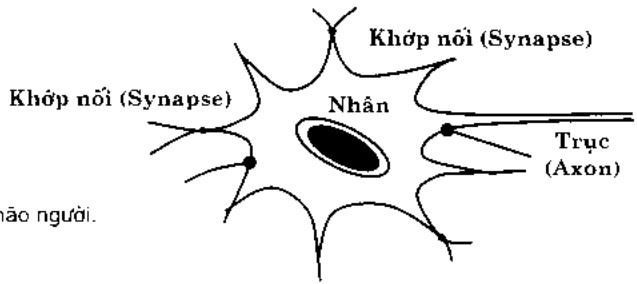

Khi người ta nhìn não từ góc độ tính toán. chúng ta dễ dàng phát hiện cách thức tính toán của não khác xa với tính toán theo thuật toán và chương trình chúng ta thường làm với sự trợ giúp của máy tính.

Sự khác biệt cơ bản trước tiên là ở 2 điểm rất quan trọng sau:

\- Quả trình tính toán được tiền hành song song và phản tán trên nhiều noron gần như đồng thời.

\- Tính toán thực chất là quá trình học, chữ không phải theo sơ đồ định sẵn từ trước.

## 2.1.2 Mạng nondon nhân tạo

## 2.1.2.1 Nondon nhân tạo

Khai thác nhân xét trên, bất chuốc não, các nhà khoa học đã có mô hình tính toán mới: đó là các mạng noron nhân tạo (Artificial Neural Networks ANN).

Một noron nhân tạo (một đơn vị xử lý - PE) phần ảnh các tính chất cơ bản của noron sinh học và được mô phỏng dưới dạng như hình 4.

<!-- page: 42 -->

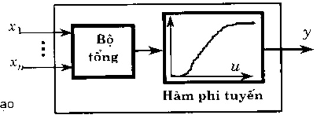

Đầu vào của noron nhân tạo gồm $n$ tín hiệu $x_{i}$ ($i = 1,2,\dots,n$). Đầu ra là tín hiệu y. Trạng thái bên trong của noron được xác định qua bộ tổng các dấu vào có trọng số $w_{i}$ ($i = 1,2,\dots,n$). Đầu ra y của noron được xác định qua hàm phi tuyến nào đó $f$.

Như vậy mô hình định lượng của noron nhân tạo như sau:

$$
y (t) = f (\sum_ {i = 1} ^ {n} w _ {i} x _ {i} (t) - \theta).
$$

ở dây $net = \sum_{i=1}^{n} w_i x_i(t) = I(t)$ là tín hiệu tổng hợp đầu vào, $w_i$ - các trọng số, $i = 1,2,\ldots,n$ đặc trung cho tính liên kết của các khớp synap. $\theta$-ngưỡng kích hoạt noron, $t$-thời gian. $n$-số tín hiệu đầu vào, $f$-hàm kích hoạt.

Do vậy người ta rất hay dùng kí hiệu sau: Đầu ra $out = y(t) = f(net)$.

Tóm lai có thể xem noron là một hàm phi tuyến nhiều đầu vào, một đầu ra.

Các noron có thể liên kết với nhau tạo thành mạng noron nhân tạo. Ví dụ noron i liên kết với noron j theo hai chiều thuân nghịch (có thông tin phản hồi) như ở hình 5.

Hình 5: Liên kết 2 chiều giữa ndron
i và ndron j.

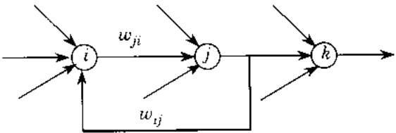

## 2.1.2.2 Các giai đoạn phát triển của mạng ndron

Theo R. Schalkoff [11] thì có thể chia sự phải triển của mạng noron nhân tạo thành 3 giai đoạn:

1) Giai đoạn 1: Tiến Perceptron (những năm 1940 - những năm 1960)

Đế dàng nhân thấy ràng trong giai đoạn này mạng chưa đủ phức tạp cho nên chưa có khả năng giải quyết các bài toán khó có sức thuyết phục.

<!-- page: 43 -->

Trong giai đoạn này cán nhắc tới các sự kiện sau:

\- Lán đầu tiên McCulloch và Pitts, 1943 giới thiệu mô hình toán học của mạng noron.

\- Rosenblatt, 1957 định nghĩa Perceptron, mong muốn kháng định các noron liên kết, phi tuyến tạo nên mạng thích nghi có thể góp phần giải quyết các bài toán nhận dạng.

\- 1960 Windrow đóng góp chính là thuật toán trung bình bình phương bé nhất (LMS) cho mô hình Adaline/Madaline.

\- Kết quả của Minsky và Papert 1969.

## 2) Giai đoạn 2: Hậu Perceptron

Trong giai đoạn này mô hình perceptron được phát huy với những thuật học truyền thẳng và liên kết suy rộng. Đã tìm thêm nhiều cấu trúc mới, ứng dụng mới, trong đó cần kế tới:

\- Mang truyền thàng với thuật toán lan truyền ngược (luật Delta suy rộng-GDR), 1985.

\- Mạng dùng các hàm cơ sở xuyên tâm (mang RBF).

\- Các mạng Hopfield hồi quy. 1982.

\- Bộ nhớ liên hợp hai chiều (BAM), 1987.

\- Làm sâu sắc hơn nhiều khái niệm và các thuật toán đã có.

\- Công trình về các mạng thích nghi của Grossberg và Kohonen.

## 3) Giai đoạn 3: Gân đây và hiện nay

Tiếp tục suy rộng và đưa vào thực tiền nhiều mô hình và thuật toán đã hoàn chỉnh hơn. Những vấn đề chính hiện nay phải làm là:

\- Đánh giá xác thực những hạn chế của mang noron.

\- Các khả năng suy rộng khác nhau.

\- Phôi hợp công nghệ mạng noron với các công nghệ của logic mở và các thuật toán di truyền.

\- Cải đạt các mang noron nhân tạo bằng các phần cứng chuyên dụng.

## 2.1.3 Sức mạnh của mô hình mạng noron

Những mô hình mạng noron đã trình bày có tiêm nâng tạo nên một cuộc cách mạng trong công nghệ máy tính và các quá trình xử lý thông tin. Những mong muốn và hy vọng đó chủ yếu bắt nguồn từ các đặc trưng chính sau:

a) Khả năng của các quá trình xử lý song song và phản tán: Có thể đưa vào mang một lượng lớn các noron liên kết với nhau theo những lược đổ với các kiểm trúc khác nhau.

<!-- page: 44 -->

b) Khả năng thích nghi và tự tổ chức: về đặc trung này người ta để cập tới khả năng xử lý thích nghi và điều chỉnh bên vững đưa vào các thuật toán học thích nghi và các quy tắc tự tổ chức.

c) Khả năng dung thứ lỗi: Cổ gắng bắt chuốc khả năng dung thứ lỗi của não theo nghĩa hệ thống có thể tiếp tục làm việc và điều chỉnh khi nhận tín hiệu vào một phần thông tin bị sai lệch hoặc bị thiếu.

d) Xìt lý các quá trình phi tuyến: Đặc trung này rất quan trọng, ví dụ trong xấp xỉ mạng, miễn nhiều (chấp nhận nhiều) và có khả năng phân lớp.

## 2.1.4 Các phạm vi ứng dụng

Lĩnh vực ứng dụng của mạng noron nhân tạo rất rộng, chủ yếu trong các vùng sau:

1) Lĩnh vực 1: Phân lớp (classification), tách cụm (clustering), dụt đoán (diagnosis) và liên kết. Có thể dây là lĩnh vực tìm thấy nhiều ứng dụng nhất và cũng được nghiên cứu sỏi động nhất. Nhóm mô hình này nhận những tín hiệu vào tỉnh hoặc tín hiệu theo thời gian và cần nhận dạng hoặc phân lớp chúng. Thuật toán phân lớp cần huấn luyện mạng sao cho khi tín hiệu vào bị biến dạng ít nhiều thì mang vẫn nhân đúng dạng thực của chúng. Mang cần có khả năng miễn nhiều tốt, bởi vì dây là một mong muốn tha thiết của nhiều ứng dụng.

2) Lĩnh vực 2: Các bài toán tối ưu. Ván để chính ở đáy là tìm những thuật toán huấn luyện mang sao cho góp phần tìm nghiệm cho nhiều lớp bài toán tối ưu toàn cục. Trong nhóm các thuật toán ứng dụng mạng noron, người ta đã quan tâm tới sự kết hợp mạng noron với các thuật toán di truyền.

3) Lĩnh vực 3: Hồi quy và tổng quạt hoá (Regression and Generalization). Trước dây các bài toán hôi quy đã được tích cực nghiên cứu. Qua hôi quy tuyến tính và phi tuyến người ta gảng tìm các đường thẳng hoặc các đường hôi quy phi tuyến trơn sao cho khớp với mẫu. Trong các bài toán hôi quy người ta thường dùng các thuật học có giám sát. Bài toán suy rộng khó hơn, vì dữ liệu được học mới chỉ có một phần.

4) Lĩnh vực 4: Hoàn chính dạng (Pattern completion). Bài toán là hoàn chỉnh “đủ” dữ liệu ban đầu sau khi đã bị mất đi một phần (hay ta chỉ thu được một phần). Người ta đã quan tâm tới hai lớp mô hình: Mô hình Markov và các mạng có độ trẻ với các mạng notion nhiều lớp, máy Bolzmann và mạng Hopfield tỉnh.

Trong những phân còn lại của phân tổng quan này, chúng ta sẽ xét thêm về cấu trúc của mạnh, các hàm kích hoạt và bài toán huấn luyện mạng.

## 2.1.5 Câu trúc mạng naron

Cấu trúc của mang noron chủ yếu được đặc trưng bồi loại của các noron và mối liên hệ xử lý thông tin giữa chúng.

Về câu trúc của noron: Chủ yếu người ta quan tâm tới cách "tổng" các tín hiệu vào, ngưỡng tại mỗi noron và các hàm chuyển – hàm kích hoạt. Sau đây là một số hàm kích hoạt.

<!-- page: 45 -->

## 2.1.5.1 Hàm kích hoạt

Hàm kích hoạt của từng noron trong mang noron đóng vai trò quan trọng trong sự liên kết giữa các noron. Hàm này đặc trưng cho mức độ liên kết giữa các noron. Trong lý thuyết mang noron, phép tổng hợp các tín hiệu đầu vào và thường được ký hiệu dưới dạng sau: ví dụ đối với noron j có m tín hiệu đầu vào x,

$$
n e t _ {j} = \sum_ {i = 1} ^ {m} x _ {i} w _ {j i}; \quad w _ {j i} = (w _ {j 1}, \dots , w _ {j m})
$$

Dấu ra của nondon j thường ký hiệu là $out_{j}$ hoặc $f_{j}$. Sau đây là vài dạng hàm kích hoạt:

$$
f _ {j} = o u t _ {j} = \left\{ \begin{array}{l l} 1, & \text {neu} \quad (n e t _ {j} - \theta_ {j}) \geq 0 \\ - 1 & \text {neu} \quad (n e t _ {j} - \theta_ {j}) <   0 \end{array} . \right.\tag{a}
$$

b) Dạng hàm Gauss: $f_{j} = out_{j} = \exp(-(net_{j} - \theta_{j})^{2})$.

c) Dạng hàm sigmoid (hay hàm logistic): $f_{j} = out_{j} = (1 + \exp(-(net_{j} - \theta_{j}))) - 1$.

Các loại hàm kích hoạt còn có nhiều biến thể khác nhau.

## 2.1.5.2 Liên kết mạng

Sự liên kết trong mạng noron tuỷ thuộc vào nguyên lý tương tác giữa dấu ra của từng noron riêng biệt với các noron khác và tạo ra cấu trúc mạng noron. Về nguyên tắc sẽ có rất nhiều kiểu liên kết giữa các noron. Mối noron là một nút của mạng. Một số cấu trúc hay gặp trong những ứng dụng có dạng sau.

## 1) Các mạng truyền thẳng (Feedforward neural networks).

Đó là một đô thị định hướng hữu hạn không chu trình (acyclid). Mỗi nút là một noron, có phản biệt nứt vào và nứt ra. Các noron chia theo lớp (layers). Trên mỗi cung có trọng số $w_{i,j}$ , nổi noron j với noron i trong lớp sau. Mỗi nút k không phải nứt vào có gán ngưỡng $\theta_k$. Mang trình bày trên hình 6 sẽ minh hoạ cho một mang noron truyền thẳng có ba lớp.

Hình 6: Cấu trúc truyền thẳng phân lớp.

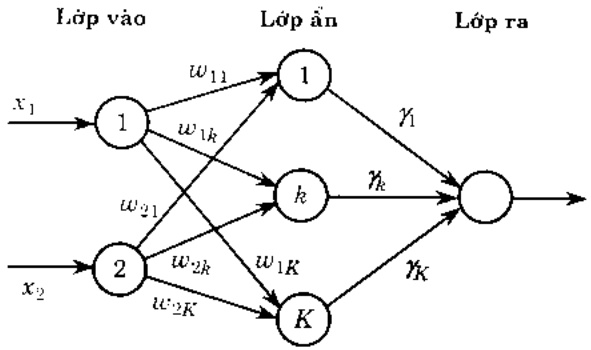

<!-- page: 46 -->

2) Mang có nôi ngược: Các mạng có thông tin và xử lý theo 2 chiều (hình 7, có nôi ngược—còn được gọi là mạng hôi quy recurrent networks).

Hinh 7: Mang Hopfield, dùng liên kết
phàn hôi

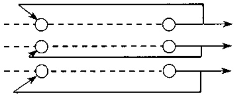

Cấu trúc của các mạng noron có thể tham khảo thêm trong phần 2 về các lớp mạng noron cơ bản.

## 2.1.6 Bài toán huấn luyện mạng

Bài toán huấn luyện mạng (hay bài toán học – the problem of learning) là xác định (nhàn dạng – to identify) các tham số của mạng, chủ yếu là các trọng số liên kết mạng và cấu trúc – các dạng liên kết của các notion, giữa các lớp dựa trên thông tin có trong hệ thống.

Thuồng quá trình huấn luyện mang noron (hay còn được gọi là thuật học) được thực hiện qua phép so sánh dấu ra của mạng với tín hiệu chỉ đạo.

Sau dây là thuật toán học có giám sát (hình 8). Nội dung chính là điều chỉnh trọng số liên kết trong mạng $w$.

Hình 8: Học có giám sát

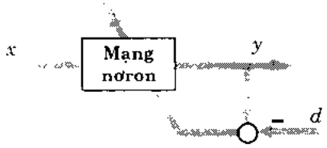

Sai sō e = y-d là cō sō dě huán luyên màng.

## 2.2 Một số mạng naron cơ bản

## 2.2.1 Lớp mạng naron có giám sát (Supervised neural networks)

## 2.2.1.1Perceptron

Mô hình Perceptron do Rosenblatt dua ra 1958. Mô hình có dạng như đã trình bày trong hình 4. Có một số thuật học cho mạng Perceptron, ví dụ thuật toán cực tiểu bình phương trung bình (LMS-the least mean square), nhưng mô hình còn quá đơn giản nên ít hiệu quả.

<!-- page: 47 -->

## 2.2.1.2 Perceptron nhiều lớp (the multilayer perceptron-MLP)

Đã có nhiều công trình trình bày nhiều thuật học cho mạng MLP và chỉ rõ rõ sức mạnh của những lớp mô hình này. Cần nhắc tới là thuật toán lan truyền ngược (the Back-Propagation Learning Algorithm) và khả năng xếp xử hàm liên tục bằng mạng MLP.

Thuật toán lan truyền ngược cụ thể như sau: Tập dữ liệu đã cho có N mẫu ($x_n, d_n$), $n = 1,2, \ldots, N$. Với mối $n$, $x_n$ là tín hiệu đầu vào, $d_n$ là đầu ra mong muốn. Quá trình huấn luyện thực chất là làm cực tiểu hàm $G$ với

$$
G = \sum_ {n = 1} ^ {N} G _ {n}, \quad \text {vói} \quad G _ {n} = \frac {1}{N} \sum_ {q = 1} ^ {N} (y q (x _ {n}) - d q (x _ {n})) ^ {2},
$$

Q là số nút tại lớp ra của mạng. Cơn trọng số liên kết mạng được điều chỉnh theo phép lập sau

$$
w (k + 1) = w (k) - \mu \frac {\partial G}{\partial w} \quad . \quad \text {trong đó} \mu > 0 \text {là hàng số tỷ lệ học.}
$$

Mang noron nhiều lớp lan truyền ngược là một giải pháp hữu hiệu cho công việc mô hình hoá, đặc biệt với quá trình phúc tạp hoặc cơ chế chưa rõ ràng. Nó không đổi hỏi phải biết trước dạng hàm hoặc các tham số.

Cùng cần thiết nhắc tới sự kiện sau: Mang truyền thẳng nhiều lớp được sử dụng để biểu diễn chính xác và biểu diễn xếp xi các hàm phi tuyến. Một công cụ cơ bản là định lý sau:

## Định lý Kolmogorov

Gọi $I_n$ là khối $n$ chiều của đoạn [0,1]. $I_n = [0,1]^n$. Bất kì hàm liên tục $f(x_1, x_2, \cdots, x_n)$ nào của $n$ biến $x_1, x_2, \cdots, x_n$ trên $I_n$ đều có thể biểu diễn dưới dạng

$$
f (x _ {1}, x _ {2}, \dots , x _ {n}) = \sum_ {j = 1} ^ {2 n - 1} h _ {j} \sum_ {i = 1} ^ {n} g _ {i j} (x _ {i}).
$$

ở dây $h_{j}$ và $g_{ij}$ là hàm liên tục một biến, hơn nửa $g_{ij}$ là hàm tầng đơn điều có định không phụ thuộc vào hàm $f$.

## 2.2.1.3Mang nondon với hàm cơ sở xuyên tâm (mạng RBF)

Hàm cơ sở xuyên tâm (Radial Basis Functions--RBF) đã có từ lâu trong lý thuyết xấp xỉ và được sử dụng dễ xấp xỉ hàm chưa biết dựa trên cơ sở các cập điểm vào – ra biểu diễn hàm chưa biết đó.

Trong nhận dạng mô hình hệ thống RBF có thể biểu diễn theo cấu trúc mang perceptron. Mọi hệ phi tuyến có thể xấp xỉ bằng RBF. Đay là đặc điểm làm cho RBF đặc biệt phù hợp với bài toán nhận dạng mô hình.

<!-- page: 48 -->

Đối với mới hàm, việc xếp xỉ được lưu giữ trong các trọng số và tâm của RBF. Tuy nhiên các trọng số này không phải là duy nhất. RBF có biểu diễn toán học như sau :

$$
F (x) = C _ {0} + \sum_ {i = 0} ^ {N - 1} C _ {i} \varphi (\left\| x - R _ {i} \right\|)
$$

trong đó

C - vécto chứa trọng số RBF.

$$
R - \text {vecto chúa các tâm RBF},
$$

φ-hàm cơ sở hoặc hàm kích hoạt của mạng.

$F(x)$  – hàm nhận được từ đầu ra của mạng,

$C_{0}$  - hệ số chệch (có thể là 0).

$$
\| \cdot \| - \text {chuân euclidean}.
$$

Môi tâm $R_{j}$ có cùng số chiều với véctor đầu vào $x$. Các tâm cũng là các điểm bên trong không gian dữ liệu đầu vào và được chọn sao cho chúng là thể hiện của dữ liệu đầu vào. Khi RBF tính toán quá trình xấp xỉ đối với một số điểm dữ liệu đầu vào thì khoảng cách giữa các điểm đầu vào và môi tâm được tính theo khoảng cách euclidean. Những khoảng cách này được chuyển qua $\varphi$ sau đó được trọng số hóa bằng $C_{i}$ và được tổng hợp lại để sinh ra đầu ra toàn bộ RBF. Một trong những lựa chọn thông thường nhất đối với hàm cơ sở là hàm Gauss:

$$
\varphi (x) = \exp (- (x - a) ^ {2} / 2 \sigma). \quad \text {trong do} \sigma \text {là tham sõ tý lê.}
$$

Mang RBF được Moody và Darken để xuất năm 1989 dựa trên sự tương đồng giữa triển khai hàm cơ sở xuyên tâm và mạng noron một lớp ẩn.

Nhở khả năng xấp xì các hàm phi tuyến bất kì với độ chính xác tuỷ ý, mạng noron và sau này là hệ mờ noron sẽ là công cụ quan trọng, đặc biệt là mạng RBF, cho mô hình hoá hệ thống và cho điều khiển thích nghi các hệ thống phi tuyến.

## 2.2.1.4 Các mô hình động phi tuyến

Cho đến lúc này ta mới để cập tới các lớp mạng tĩnh, có giám sát. Song nhiều bài toán thực tiền đời hỏi phải xét tới các mô hình động phi tuyến. Nhóm mô hình này có thể chia làm hai lớp: lớp mạng có nói ngược, tức là mạng hồi quy và mạng noron có thời gian trẻ.

## 1) Mang có nôi nguộc (mang hôi quy - mang Hopfield)

Mang Hopfield nổi tiếng được bắt đầu nghiên cứu từ 1982. Đay là lớp mạng một lớp với thông tin và quá trình xử lý có nổi ngược. Chính công trình của Hopfield đã kích thích làm ra các mạch noron tích hợp đầu tiên. Mang Hopfield đã tìm thấy rất nhiều ứng dụng đặc biệt trong bộ nhớ liên hợp và trong các bài toán tối ưu.

Bảng cách xây dựng các thuật toán phức tạp hơn, các mạng hồi quy ngoài các bài toán tối ưu còn tìm thấy nhiều ứng dụng trong dự báo dãy thời gian, nhận dạng các hệ phi tuyến và điều khiển.

<!-- page: 49 -->

Kiến thức cơ sở ban đầu về mạng này xem thêm chương 11 sách [10].

## 2) Mạng có thời gian trẻ (mạng TDNN).

Một cách tự nhiên khi xử lý tin chúng ta gặp những tín hiệu xuất hiện theo dãy thời gian. Dĩ nhiên lúc ban đầu người ta dùng mang noron tỉnh. Song con đường tất yếu là phải xét tối mô hình động có tham số thời gian. Hơn nữa hệ động không phải là lĩnh vực xa là với những người làm về khoa học hệ thống. Do đó mạng có thời gian trẻ (mạng TDNN) xuất hiện. Nó đã và sẽ còn được nghiên cứu và ứng dụng trong nhiều bài toán, ví dụ nhận dạng và xử lý tiếng nói.

## 2.2.1.5Mạng không giám sát (Unsupervised NN)

Một lớp mô hình nửa của mang noron nhân tạo cũng thường được giới thiệu, đó là các mang noron có thuật học không có thấy (không giám sát – đôi khi gọi gọn là mạng không giám sát). Như vậy mạng noron nhân tạo, vì mong muốn bất chức con người, phải “tự mình” khám phá những mối quan hệ đang quan tâm: những dạng, đường nét, có chuẩn – có bình thường hay không, các hệ số tương quan. ... và sau đó chuyển những quan hệ tìm thấy qua đầu ra. (Đế dễ hình dung công việc này chúng ta hây nhớ tới công việc của các nhà thông kê, nhất là các nhà thống kê dùng máy tính hiện đại).

Như vậy với những mang này (cũng như nhiều lớp khác), chủ yếu là tìm các thuật học tương ứng với các mang. Về phân này người ta thường nhắc tới tuật học Hebb, thuật học cạnh tranh, ....

Có thể phản chia số thuật học này thành hai nhóm: nhóm thực hành phản cụm (clustering) và nhóm có chiết xuất, rút tia ra những “đường – nét nào đó” từ dữ liệu.

Trong mạng noron không giám sát, các thuật học cạnh tranh, mạng tự tổ chức và cả lý thuyết suy diễn thích nghi (Adaptive Resonance Theory – ART) cùng thuộc nhóm một. Các phương pháp chiết xuất theo thành phần chính (Adative Principal Component) thuộc nhóm 2. Bạn đọc tìm thiểu về những lớp mạng này và các thuật học tương ứng hãy xem các sách [10.11.12.16].

## 2.3 Kết hợp mạng naron với hệ mà

Theo dõi sự phát triển trong thời kỳ còn phát triển độc lập người ta để nhận thấy cả hai lý thuyết và do đó cả hai công nghệ đều có những mục đích gần gửi, hơn mùa những thành đạt cũng có những điểm tương tự. Do vậy sự kết hợp với nhau là lễ rất tự nhiên.

Sau dây là máy điểm tương đồng giữa hệ trên cơ sở logic mở và mạng noron nhân tạo:

\- Cả hai đều nhằm tăng thêm tri thức, tăng độ thông minh cho các hệ thống với sự giúp đỡ của các hệ thống kỹ thuật (đặc biệt với máy tính), trong môi trường bất định, có nhiều, thông tin và tri thức thiểu chính xác.

<!-- page: 50 -->

\- Cả hai đều là hệ động, là công cụ uốc lượng bằng số không dùng mô hình số chọn trước.

\- Cả hai khi ước lượng hàm số không đôi hỏi mô tả dạng toán học $y = f(x)$, thường “ học được” từ mẫu dữ liệu, tiêm cận với các số liệu, khác nhiều với cách tiếp cận xử lý tín hiệu như trong phần Trí tuệ nhân tạo (AI) ở giai đoạn trước.

\- Cà hai loại hệ thống và công nghệ đều rất thành đạt, đã đưa ra nhiều hệ thống và thiết bị đang dùng trong đời sống hàng ngày.

Sự kết hợp các hệ mở với mang noron, ít nhất cũng để xuất ngay được một ý tưởng mới: chuyển nhiệm vụ thiết kế nhiều phần của hệ mở trong các bộ điều khiển và hệ trợ giúp quyết định thành các bài toán huấn luyện và học trong các mạng noron. Như vậy sẽ gạt hải được tất cả ưu thế của cả hai lý thuyết và hai công nghệ.

Sau đây là phác họa gọn máy ý về kết hợp hai công nghệ.

## 2.3.1 Mạng naron mò

Sự kết hợp trực quan đầu tiên là trực tiếp suy rộng mạng noron bằng cách đưa các khái niệm mờ đặc biệt là tập mờ và số mờ vào mạng noron và xem xét xem những bài toán nào, thuật toán nào còn đúng. Tác động của lớp thuật toán mới ra sao ?

Hoàn toàn tự nhiên người ta nghĩ ngay tới và nghiên cứu bốn loại suy rộng sau:

1) Loại 1: Tín hiệu vào là số thực, trọng số mở.

2) Loại 2: Tín hiệu vào là tập mờ, trọng số là số thực.

3) Loại 3: Cả tín hiệu vào và trọng số đều là mờ.

4) Loại mở rộng: Khai thác các phép toán t-chuẩn, t-đối chuẩn.

## 2.3.2 Hệ mô noron

Cân kết hợp nhuân nhuyễn hơn hệ mở với mạng nondon nhân tạo. Kết quả phụ thuộc vào từng nghiên cứu, vào từng kiến trúc của thiết kế lớp hệ thông mối. Hình 9 là một kiến trúc kiểu mẫu.

• Xử lý tín hiệu noron vào

\- Uốc lượng trạng thái

\- Dự báo trạng thái

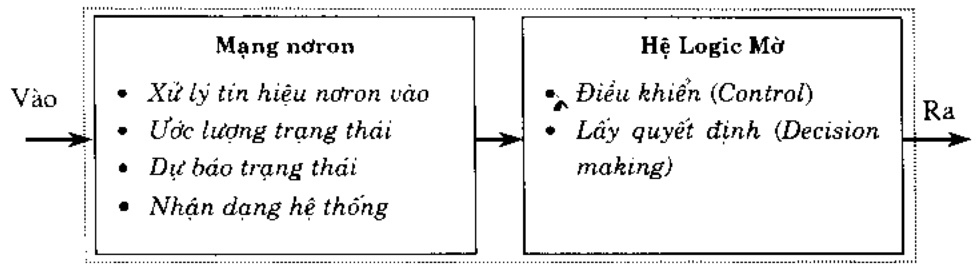

\- Nhân dạng hệ thống

Hình 9: Kiến trúc kiểu mẫu của một hệ mờ nondon,

<!-- page: 51 -->

Không còn nghi ngờ gì điều khẳng định sau: "trong lĩnh vực các hệ thống mờ notion còn nhiều khoảng trống ménh mông dây sức hấp dẫn cho sức sáng tạo của những ai quan tâm nghiên cứu, thiết kế, cải đặt và ứng dụng các hệ tri thức".

Ban đọc có thể tìm thấy những kiến thức ban đầu về các hệ mở notion trong các tài liệu [9,10,17].

## Tài liệu trích dẫn cho Phân 1

[1] L.A. Zadeh: Fuzzy sets, Inform. and Control, 8, 1965, 338-353.

[2] D. Dubois and H. Prade: Fuzzy Sets and Systems, Academic Press, N.Y., 1980.

[3] H.J. Zimmermann: Fuzzy Set Theory - and Its Applications, 2 nd Ed., Kluwer Acad. Pub., Dodrech, 1991.

[4] Hệ mờ và ứng dụng: Biên tập tập thể : Nguyễn Hoàng Phương, Bùi Công Cường, Nguyễn Doãn Phước, Phan Xuân Minh và Chu Văn Hỷ, NXB Khoa học và Kỹ thuật, 1998, Hà nổi.

[5] Anca L. Ralescu, Ed.: Applied research in fuzzy technology. Kluwer Acad. Pub., Dordrecht, 1994.

[6] Satoru Fukami and Minoru Yoneda: Decision Support System. [5] trang 17-66.

[7] Bùi công Cường: Cơ sở toán học của các hệ mò. Giáo trình. ĐH Bách khoa Hà nội, 1998-1999.

[8] Bùi công Cường: Một số kiến thức cơ sở của logic mở trong các hệ mà.trong [4], trang 1-21.

## Tài liệu trích dẫn cho Phân 2

[1] B.Kosko: Neural Networks and Fuzzy Systems, Prentice-Hall, NJ, 1992.

[2] C.T. Lin and C.S.G.Lee: Neural Fuzzy systems, Prentice Hall, London, 1996.

[3] R. Schalkoff: Artificial Neural Networks, McGrawhill, Singapore, 1997.

[4] V.Roychodhury, K.Y.Siu, A.Orlitsky: Theoretical Advances in Neural Computation and Learning, Kluwer Acad. Pub., Boston, 1994.

[5] Gyorgrry Turan: [12], trang 243 + 294.

[6] Wolfgang Maass: [12]. 295 + 336.

[7] Vũ Như Lân: Một số vấn đề nhân dạng mô hình và điều khiển sử dụng mạng nondon. Trường Thu – Hệ mô và ứng dụng. Hà nội, 8/2000.

[8] N.K.Bose and P.Liang: Neural Network Fundamentals with Graph.Algorithms,and Applications, McGrawhill, New York,1996.

[9] C.H.Chen (Ed.): Fuzzy Logic and Neural Network Handbook, McGraw-Hill, New York, 1996.

<!-- page: 52 -->

# LÝ THUYÊT TẬP MÒ VÀ CÔNG NGHỆ TÍNH TOÁN MÊM

Nguyễn Cát Hồ
Viện Công nghệ Thông tin

Cách mạng KHKT về cơ khí ra dồi đã dem đến năng suất lao động mới và sự phát triển kinh tế-xã hội có tính cách mạng. Ngày nay chúng ta vẫn tiếp tục chứng kiến những thành tự nghiên cứu phát triển các công cụ, thiết bị với công nghệ hiện đại, đặc biệt các thiết bị và dây truyền sản xuất tự động hoá nhằm tăng năng suất và thay thế sức lao động của con người. Có thể xem cách mạng cơ khí và tự động hoá như là biện pháp ‘kéo dài bàn tay’ của con người để tăng năng suất lao động.

Theo logic lý tự nhiên, sự phát triển khoa học và kỹ thuật lại dẫn đến khả năng ‘kéo dài’ nâng lực tư duy, suy luận của con người. Bằng nâng lực tư duy của mình con người đã và đang khai phá thể giới thực tế rộng lớn. Thế giới hiện thực và tri thức khoa học cần khám phá là vỏ hạn và là những hệ thống cực kỳ phức tạp, nhưng ngôn ngữ mà nâng lực tư duy và tri thức của chúng ta sử dụng làm phương tiện nhận thức và biểu đạt lại chỉ hữu hạn. Lịch sử phát triển sáng tạo của loại người chỉ ra ràng phương tiện ngôn ngữ tuy hữu hạn nhưng đủ để cho con người mô tả, nhận thức các sự vật, hiện tượng để tốn tại và phát triển. Như là một hệ quả tất yếu của việc sử dụng một số lượng hữu hạn các từ ngữ của một ngôn ngữ tự nhiên để mô tả tính vỏ hạn các sự vật hiện tượng, dễ nhận thấy rằng hâu hết các bài toán liên quan đến hoạt động nhận thức, trí tuệ của con người đều hàm chứa những đại lượng, thông tin mà bản chất là không chính xác, không chắc chắn, không đầy đủ. Sẽ chẳng bao giờ có các thông tin, dữ liệu cũng như các mô hình toán – lý đáy đủ và chính xác cho các bài toán dự báo thời tiết. Và nhìn chung con người luôn ở trong bối cảnh thực tế là không thể có thông tin đầy đủ và chính xác cho các hoạt động lấy quyết định của mình và cũng không thể hy vọng có những quyết định đúng dẫn và chính xác như các menses để, định luận trong khoa học toán— lý hay nói chung khoa học tự nhiên.

Như vậy có thể thấy có rất nhiều văn đề rộng lớn trong thực tiền, liên quan đến hầu hết các lĩnh vực khoa học kỹ thuật, nhiều hay ít đều hàm chứa những yếu tố có bản chất không đầy đủ, không chắc chắn.

Môi lĩnh vực khoa học kỹ thuật đều có một miền ứng dụng của mình. Khoa học kỹ thuật lấy tính "chính xác" làm cơ sở xây dựng và phát triển sẽ có một miền ứng dụng và cũng có những giới hạn xác định không thể vượt qua và nó chỉ có khả năng mô phỏng được một phần thế giới thực tế. Liệu có một lý thuyết toán học nào cho phép mô hình hoá phân thể giới thực mà con người vấn chỉ có thể nhận thức, mô tả bằng ngôn ngữ tự nhiên vốn hàm chứa những thông tin không chính xác, không chắc chắn hay không?

Phát niên thấy nhu cầu tất yếu ấy, năm 1965 L.A. Zadeh đã sáng tạo ra lý thuyết tập mở (Fuzzy Sets Theory) và đặt nền móng cho việc xây dựng một loạt các lý thuyết quan trọng

<!-- page: 53 -->

dưa trên cơ sở lý thuyết tập mờ. Kể từ đáy một trào lưu khoa học lấy tính không chắc chắn, không chính xác làm triết lý để nghiên cứu sáng tạo đã phát triển mạnh mẽ, và người ta đánh giá rằng những công trình của Zadeh như là một trong những phát minh quan trọng có tính chất bùng nổ và đang hija hạn giải quyết được nhiều vấn đề phức tạp và to lớn của thực tiền. Như một nhà khoa học hệ thống tổng quát Mỹ George Klir đã nhận định chỉ cần làm chú một chút tính không chắc chắn cũng có thể giải quyết được những vấn đề rất to lớn.

Một trong những vấn đề như vậy là việc mô hình hoá các quía trình tư duy, lập luận của con người để tự động hoá hồ trợ cho các hoạt động tư duy, chẳng hạn như hoạt động lấy quyết định. Nhiểu hệ chuyên gia hay hệ trợ giúp quyết định đã được phát triển và đưa vào ứng dụng. Nhiểu thiết bị thông minh được thiết kế xây dựng dựa trên công nghệ tập mở, logic mở đã xuất hiện trên thị trường và được ứng dụng trong lĩnh vực chế tạo xe ô tô, các thiết bị tiêu dùng, trong điều khiển tự động trong các nhà máy .... Sự phát triển manh mê

các ứng dụng đã dẫn đến việc thành lập ở nhiều nước các phòng thí nghiệm để phát triển các ứng dụng công nghệ mở trong công nghiệp. Đáng chú ý là phòng thí nghiệm LIFE (Laboratory for International Fuzzy Engineering) ở Nhật mà cái tên viết tất của nó thể hiện một niêm tin ràng công nghệ này là công nghệ của Cước sống trong tương lai. Ngày nay không chỉ các nước phát triển mà ngay cả những nước đang phát triển cũng quan tâm nghiên cứu và phát triển các ứng dụng của các “lĩnh vực khoa học mờ” như Trung quốc, Singapor, Brazil, Ai cập, Iran .... Điều này chứng minh thêm ý nghĩa thực tiến của lĩnh vực “khoa học mờ”.

Tuy mục tiêu nguyên thủy của việc ra dời lý thuyết tập mở là ứng dụng tự động hoá các hoạt động tư duy của con người, nhưng về mặt lý thuyết nó lai là một sự mở rộng rất chính, rất đẹp dễ của khái niệm tập hợp kinh diễn. Như chúng ta đã biết, lý thuyết tập hợp kinh diễn là cơ sở, nền tàng cho việc hình thức hoá một cách nhất quán và cho sự phát triển của các ngành toán học và do đó cho các ngành khoa học khác. Như là một hệ quả logic, hâu như tất cả các ngành khoa học này có người em sinh đối được mở rộng và phát triển trên cơ sở lý thuyết tập mở. Nếu một vài ví dụ như giải tích mở, lý thuyết các hệ vi tích phân mở, toppings mở, lý thuyết nhóm mở, lý thuyết điều khiển mở, ....

Với vai trò và khả năng to lớn của việc phát triển các ứng dụng da dạng của lý thuyết tập mở, và vì dảy là bài tổng quan đầu tiên mà chủng tôi giới thiệu với ban đọc thuộc các lĩnh vực khoa học khác nhau và với sự hiểu biết có hạn, chủng tôi chỉ xin trình bày những nét tổng quan về lý thuyết tập mở và một số ngành khoa học được xây dựng và phát triển trên nền tảng của lý thuyết tập mở với hy vọng dem lại sự quan tâm của ban đọc đối với lĩnh vực khoa học vấn nền xem là còn mới mẻ ở nước ta.

Đế đơn giản việc trình bày chúng tôi sẽ bỏ qua các chỉ tiết quá hình thức hoá của tính chính xác, tính chặt chẽ làm người đọc khó năm bất các ý tưởng chính. Bạn đọc nào muốn quan tâm nghiên cứu sâu hơn, cần nội dung chính xác đầy đủ hơn có thể tìm tài liệu trong phần phụ lục các tài liệu được xếp theo chuyên ngành.

<!-- page: 54 -->

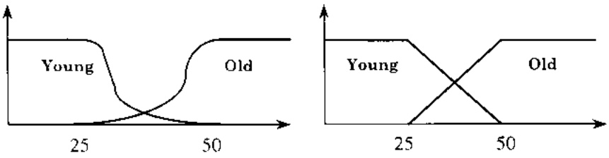

## 1 Lý thuyết tập mò và logic mò là cơ sở phương pháp luận cho việc giải các bài toán với các đại lượng không chính xác (inexact), không chắc chắn (uncertain).

## 1.1 Tập mà và ngũ nghĩa khái niệm mà

Như trên đã nói, con người sử dụng ngôn ngữ có số lượng ngữ nghĩa (do số lượng các từ) hữu hạn để nhận biết, nhận thức, phản ảnh thế giới vô hạn. Về triết lý, điều này dẫn đến ngôn ngữ về bản chất vốn chưa những thông tin không chính xác, không chắc chắn. Về nhận thức khoa học, điều này khẳng định có khả năng thực tế sử dụng ngôn ngữ để mô hình hoá thế giới thực trong những lĩnh vực lý thuyết nào đó.

L.A. Zadeh đã sáng lập lý thuyết tập mờ, trong đó tập mờ được xem như là một sự mở rộng trực tiếp của tập hợp kinh điện: Tập hợp kinh điện $A \subset U$ có một danh giới sắc nét, rõ ràng, và vì vậy nó được biểu thị bằng hàm đặc trưng $\mu_A(u) = \begin{cases} 1 & \text{if } u \in A \\ 0 & \text{if } u \notin A \end{cases}$. Ví dụ, $A$ là tập những người có tuổi dưới 19 (điều kiện cần để tham gia đội bóng U19!) là một tập hợp kinh điện. Mỗi người (phân tử) chỉ có hai khả năng rõ ràng: hoặc là phần tử của $A$ hoặc không. Tuy nhiên ta xét tập $\tilde{A}$ gồm những người là trẻ. Trong trường hợp này sẽ không có ranh giới rõ ràng để khẳng định một người có là phần tử của $\tilde{A}$ hay không: Ranh giới của nó là mờ. Ta chỉ có thể nói một người sẽ thuộc tập hợp $\tilde{A}$ ở một mức độ nào đó. Chẳng hạn chứng ta có thể đồng ý với nhau (subjective) ràng một người 35 tuổi thuộc về tập hợp $\tilde{A}$ với độ thuộc là 60% hay 0,6. Và Zadeh gọi một tập $\tilde{A}$ (hay có thể kí hiệu là $A$ để phân biệt với tập kinh điện $A$) như vậy là tập mờ và đồng nhất tập hợp $\tilde{A}$ với một hàm $\mu_{tre}: Y \to [0,1]$. gọi là hàm thuộc của tập $\tilde{A}$ (memberhip function), trong đó $Y$ là tập số tự nhiên dùng để do độ tuổi tính theo nám. gọi là không gian tham chiếu. Từ trẻ gọi là khái niệm mờ (vague concept). Như vậy mọi phần tử đều thuộc vào tập trẻ ở một mức độ nào đó!

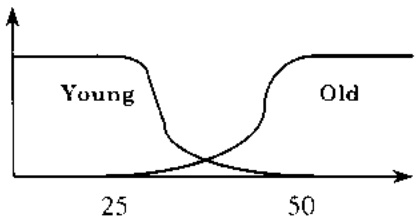

Hình 1: Khái niệm lập mơ.

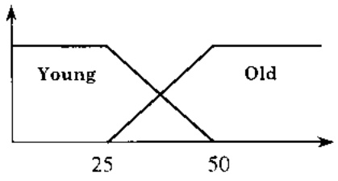

Vé mặt ngữ nghĩa, hàm thuộc cho ta khả năng biểu thị trực cảm (intuition) của chúng ta về ý nghĩa của khái niệm mờ. Nhưng tại sao một khái niệm mờ lại được biểu thị bằng một hàm thuộc này mà không phải là một hàm khác. Có thể thấy không thể xác định chính xác được hàm thuộc cho một khái niệm mờ. Vi vậy người ta nói hàm thuộc có tính chất chủ

<!-- page: 55 -->

quan (subjective) và Zadeh đưa ra ý tưởng là việc chấp nhận một khái niệm mờ được biểu thị bằng một tập mờ (hàm thuộc) là một ràng buộc (constraint).

Nhìn chung phân lớn các khái niệm mờ đều có thể để dàng biểu thị bằng những tập mờ và do đó lý thuyết tập mờ cho ta tiêm năng mô hình hoá toán học một lớp rộng lớn các bài toán thực tế, đặc biệt các bài toán liên quan đến tư duy, đến quá trình lấy quyết định của con người.

Trong bất kỳ ngôn ngữ của một dân tộc nào cũng có các khái niệm mờ mà là các trạng từ, có vai trò biến đổi ngữ nghĩa của các từ khác ở một mức độ nào đó nhu very, slightly, more or less, ... (gọi là các gia tử), hay các liên từ logic như and, or, if ... then, .... Chúng ta có thể định nghĩa các phép tính trên tập mờ (t.l. trên các hàm) để biểu thị ngữ nghĩa của các gia tử, các phép liên kết logic ... nhu xuất hiện trong các biểu thức $\underline{A}$ AND $\underline{B}$, $\underline{A}$ OR $\underline{B}$,

## IF A THEN B, NOT A. VERY B, A Approx. A, More-or-Less B, ..., About 30 year old.

Almost young people are intelligent (các chữ viết nghiêng là các khái niệm mờ (vague)). Về nguyên tắc việc chọn các phép tính để biểu thị ngữ nghĩa của các phép liên kết logic trên là khá tự do, tuỷ theo trực cảm (intuition) của nhóm người sử dụng (ví dụ cảm nhận của những người lái tàu hoá đối với một loại tàu nhất định về khoảng cách đến đích hay vật chương ngại, về tốc độ của con tàu, về tính năng của con tàu và các cơ chế điều khiển như kỹ năng sử dụng phanh tàu), để đạt được ý nghĩa mà họ mong muốn. Trong việc thiết kế các hệ điều khiển mờ việc này còn có thể đạt được bằng việc nghiên cứu thử nghiệm.

## 1.2 Đại số các tập mà

Goi $F(U,[0,1])$ là tập tất cả các tập mở trên $U$. Có thể hiểu việc biểu diễn ngữ nghĩa các từ ngôn ngữ bằng tập mở như là một ánh xạ định lượng ngữ nghĩa từ miền ngôn ngữ vào không gian hàm $F(U,[0,1])$. Dây là một không gian rất giàu về cấu trúc tính toán và vì vậy thủ tục xử lý thông tin ngôn ngữ và tư duy lập luận của con người – mà nó có về còn phúc tạp, bí hiểm vì chúng ta còn chưa khám phá được gì nhiều về nó – sẽ được mô phỏng bằng các thủ tục đưa trên cấu trúc tính toán của $F(U,[0,1])$. Đề linh hoạt và mềm dẻo trong việc mô phỏng các quá trình phúc tạp như vậy sẽ có tính khá tự do trong các định nghĩa các phép tính trên tập mở.

## 1.2.1 Các phép tính

Chúng tôi xin giới thiệu ở đây một số phép tính trên các tập mờ:

Phép toán trên tập mò

Định nghĩa trên hàm thuộc

1) $\underline{A} \subseteq \underline{B}$

$$
\mu_ {A} (u) \leq \mu_ {B} (u)
$$

2)  $A \cup B$

$$
\mu_ {A \cup B} (u) = \mu_ {A} (u) \vee \mu_ {B} (u) = \max \{\mu_ {A} (u), \mu_ {B} (u) \}
$$

$$
\mu_ {A \cup B} (u) = \mu_ {A} (u) + \mu_ {B} (u) - \mu_ {A} (u) \mu_ {B} (u)
$$

3)  $\underline{A} \cap \underline{B}$

$$
\mu_ {A \cap B} (u) = \mu_ {A} (u) \wedge \mu_ {B} (u) = \min \{\mu_ {A} (u), \mu_ {B} (u) \}
$$

<!-- page: 56 -->

$$
\mu_ {A \cap B} (u) = \mu_ {A} (u) \mu_ {B} (u)
$$

4)  $-\underline{A}$  (hay c'A, phản bù của  $\underline{A}$ )  $\mu_{-A}(u)=1-\mu_{A}(u)$

5) $\underline{A} \oplus \underline{B}$ $\mu_A \oplus_B(u) = \mu_A(u) + \mu_B(v) - \mu_A(u)\mu_B(v)$

6) $U$ $\mu_U(u) = 1$

7) $\varnothing$ $\mu_{\varnothing}(u)\equiv 0$

8) Tich De-cac  $\underline{A} \times \underline{B}$   $\mu_{A \times B}(u,v) = \min\{\mu_{A}(u), \mu_{B}(v)\}$

## 1.2.2 Các phép t-norm t và t-conorm s

Theo xu thể nói ở trên, để giảm bót sự phụ thuộc vào các phép tính min và max và do đó làm tăng tính mềm dẻo và linh hoạt trong việc giải các bài toán thực tế người ta mở rộng hai phép tính min, max thành hai lớp hàm t-norm và t-conorm có từng cập phân tử đối ngâu nhau.

\- Chàng hạn bỏ qua đặc tính cụ thể trong việc xác định giá trị của hàm min hai biển mà chỉ giữ lại một số tính chải của nó ta thu được lớp hàm t-norm $t(x,y)$:

a) Giao hoán:  $t(x,y)=t(y,x)$

b) Két hợp:  $t(x,t(x,z)) = t(t(x,y),z)$

c) Tôn tại phân từ đơn vị:  $t(1,y)=y$

d) Không giảm theo từng biến.

\- Một cách tương tự và đối ngẫu, bờ qua tính cụ thể trong việc xác định giá trị của hàm. Max hai biến mà chỉ giữ lại một số tính chất của nó ta thu được lớp hàm t-conorm $s(x,y)$:

a) Giao hoán:  $s(x,y)=s(y,x)$

b) Két hop:  $s(x,s(x,z)) = s(s(x,y),z)$

c) Có phân từ không:  $s(0,y) = y$

d) Không giảm theo từng biến.

Có thể thấy t-norm và t-conorm tuân thủ quy tắc đối ngấu nhau theo nghĩa

$$
t (x, y) = 1 - s (1 - x, 1 - y)
$$

Như vậy chứng ta sẽ không có một đại số tập mở duy nhất, vì trong định nghĩa đại số tập hợp ta luòn có thể thay min, max bằng 1-norm và 1-conorm đối ngẫu nhau và thu được một đại số tập mở khác.

## 1.3 Quan hệ mà

Quan hệ mờ n ngôi là một tập mờ R trong không gian tích Đe-cac của n không gian $U_{1} \times U_{2} \times \cdots \times U_{n}$.

<!-- page: 57 -->

Quan hệ mò 2 ngôi $R(u,v)$ gọi là

a) Đôi xứng nếu $\mu_{R}(u,v)=\mu_{R}(v,u)$.

b) Phân xα nếu $\mu_{R}(u,u)=1,\forall u\in U.$

c) Phân phản xα nếu  $\mu_{R}(u,u)=0,\forall u\in U.$

d) Băc câu Max-Min nếu $\mu_{R}(u,v)\geq\vee\{\mu_{R}(u,w)\wedge\mu_{R}(w,v):w\in U\}$.

e) Băc câu Min-Max nếu $\mu_{R}(u,v)\leq\wedge\{\mu_{R}(u,w)\vee\mu_{R}(w,v):w\in U\}$.

f) $\text{Phép hợp thành } RoS \text{ với } R \in U \times W, S \in W \times U \text{ được định nghĩa như sau}$

$$
\mu_ {R \circ S} (u, v) = \vee \{\mu_ {R} (u, w) \wedge \mu_ {S} (w, v): w \in U \}.
$$

R là quan hệ tương tự (quan hệ tương đương mờ) nếu nó có các tính chất:

\- Phân xạ.

\- Đối xúng.

\- Bắc câu.

$R$ là quan hệ không tương tự nếu nó là phân bù của một quan hệ tương tự hay, một cách tương đương, nó thỏa mãn các tính chất:

\- Phân phản xa.

\- Phàn đối xúng.

\- Bắc câu Min-Max.

Ký hiệu $d_{R}(u,v)=\mu_{R}(u,v)$. Khi đó chúng ta thấy nó có các tính chất sau:

a) $d_{R}(u,v)\geq 0$

b) $d_{R}(u,v) = d_{R}(v,u)$.

c) $\pmb{d}_R(u,v) = \pmb{d}_R(u,w) \vee \pmb{d}_R(w,v)$.

Như vậy $\boldsymbol{d}_{R}(u,v)$ có các tính chất tương tự như khoảng cách trong không gian hình học và được gọi là khoảng cách Mín–Max.

R là quan hệ giống nhau nếu nó thỏa mãn:

\- Phàn xạ.

\- Đối xứng.

R là quan hệ không giống nhau nếu nó là phân bù của quan hệ giống nhau, tức là:

\- Phản phản xạ.

\- Đối xúng.

Như vậy bao đóng bắc cấu $R^{\wedge}$ của quan hệ giống nhau là quan hệ tương tự. $R^{\wedge}$ được tính theo công thức:

<!-- page: 58 -->

$$
R ^ {\wedge} = R ^ {1} \cup R ^ {2} \cup \dots R ^ {k} \cup \dots
$$

trong đó:

$$
R ^ {2} = R \circ R \quad \text {vói} \quad \mu_ {R \circ S} (u, v) = \vee \left\{\mu_ {R} (u, w) \wedge \mu_ {R} (w, v): w \in U \right\}.
$$

$$
R ^ {k} = R ^ {k - 1} \circ R.
$$

Định lý 1: (i) Nếu có n mà $R^{n} = R^{n+1}$ thì $R^{\wedge} = R^{1} \cup R^{2} \cup \cdots R^{n}$.

(ii) Nếu U hữu hạn và /U/ = n thì  $R^{\wedge} = R^{1} \cup R^{2} \cup \cdots R^{n}$ .

Định lý 2: Nếu R là quan hệ mở tương tự thì tập mức $\alpha$, $R_{\alpha} = \{u, v \in U : \mu_R(u, v) \geq \alpha\}$ của R là quan hệ tương đương kinh diễn và do đó nó phân hoạch $U$ thành các lớp tương đương.

Ký hiệu $R'$ là phân bù của $R$, tức là $R' = \mathcal{CR}$ thì $R'$ là quan hệ không tương tư và

$$
R _ {1 - \alpha} ^ {\prime} = \{u, v \in U: \mu_ {R ^ {\prime}} (u, v) = d _ {R} (u, v) \leq 1 - \alpha \} = R _ {\alpha}
$$

nói cách khác, khoảng cách giữa hai phần từ bất kỳ trong cùng lớp tương đương không vượt quá 1 - α.

## Phân hoạch các đối tượng mở:

Với cơ sở lý thuyết trên ta đã có thể có bài toán ứng dụng sau. Xét các đối tượng mở $A_i$, $i=1,2,\ldots,n$, nghĩa là các đối tượng được biểu thị bằng tập mở. Chắng hạn các đối tượng đó là học sinh với điểm các môn học là (ố đây điểm x/10 hiểu là 0.x):

| S/V | V=văn | T=toán | Đ=dịa | S=sử | L= lý | S=sinh | H= hoá | N=n/ngữ |
| --- | --- | --- | --- | --- | --- | --- | --- | --- |
| $A_{1}$ | 0.5 | 0.8 | 0.7 | 0.6 | 0.9 | 0.6 | 0.9 | 0.9 |
| $A_{2}$ | 1.0 | 0.6 | 0.8 | 0.7 | 0.6 | 0.8 | 0.6 | 0.8 |
| $A_{3}$ | 0.8 | 0.7 | 0.9 | 0.8 | 0.6 | 0.9 | 0.8 | 0.7 |
| $A_{4}$ | 0.7 | 0.9 | 0.6 | 0.7 | 0.8 | 0.9 | 0.6 | 0.6 |
| $A_{5}$ | 0.8 | 0.6 | 0.9 | 0.8 | 0.7 | 0.7 | 0.7 | 0.8 |

Như vảy mỗi học sinh được xem như là một đối tượng mở. Mục đích của bài toán là phân loại các đối tượng có “độ tương tự nhau” vào cùng một lớp phân hoạch theo một tiêu chuẩn nào đó. Vé ý nghĩa thực tiền ta mong muốn các học sinh trong cùng một nhóm sẽ có năng khiếu tương tự nhau.

Trên cơ sở phương pháp luận trên, việc phân loại sẽ được tiến hành như sau:

\- Xây dựng quan hệ không tương tự giữa các đối tượng mờ:

<!-- page: 59 -->

a) Định nghĩa khoảng cách giữa các đối tượng: Giả sử A và B là hai đối tượng mở bất kỳ. Ta định nghĩa khoảng cách giữa A và B là khoảng cách Hamming

$$
d (A, B) = \frac {1}{n} \left(\left| A (u _ {1}) - B (u _ {1}) \right| + \left| A (u _ {2}) - B (u _ {2}) \right| + \dots + \left| A (u _ {n}) - B (u _ {n}) \right|\right), 0 \leq d (A, B) \leq 1.
$$

b) Ký hiệu $d_{ij} = d(A_i, A_j)$ và lập quan hệ không giống nhau

$$
R = (d _ {i j}) _ {n \times m}.
$$

c) Tính $R^{*} = \mathcal{O}(\mathcal{CR})^{\wedge}$. Dây là quan hệ không tương tự mà mỗi phán từ của ma trận chính là khoảng cách giữa các đối tượng mờ.

\- Ta thấy $R_{\alpha}^{*} = \{i,j : d_{R^{*}}(i,j) \leq \alpha\}$ là một quan hệ tương đương kinh điện và nó xác định một phân hoạch mức $\alpha$ trên các đối tượng. Như vậy các đối tượng, trong cùng một lớp phân hoạch có khoảng cách (mức độ không tương tự $\leq \alpha$, hay mức độ tương tự $\geq (1 - \alpha)$ không vượt quá $\alpha$.

\- Xây dựng cây phản tích.

Trong ví dụ trên ta tính được các kết quả sau:

$$
8 R = 8 (d _ {i j}) _ {n \times m} = \left| \begin{array}{l l l l l} 0. 0 & 1. 8 & 1. 7 & 1. 5 & 1. 5 \\ 1. 8 & 0. 0 & 0. 9 & 1. 3 & 0. 7 \\ 1. 7 & 0. 9 & 0. 0 & 1. 1 & 0. 6 \\ 1. 5 & 1. 3 & 1. 1 & 0. 0 & 1. 4 \\ 1. 5 & 0. 7 & 0. 6 & 1. 1 & 0. 0 \end{array} \right|, \quad 8 (\mathcal {C R}) ^ {2} = 8 (\mathcal {C R}) ^ {3} = \left| \begin{array}{l l l l l} 8. 0 & 6. 5 & 6. 5 & 6. 5 & 6. 5 \\ 6. 5 & 8. 0 & 7. 3 & 6. 9 & 7. 3 \\ 6. 5 & 7. 3 & 8. 0 & 6. 9 & 7. 4 \\ 6. 5 & 6. 9 & 6. 9 & 8. 0 & 6. 9 \\ 6. 5 & 7. 3 & 7. 4 & 6. 9 & 8. 0 \end{array} \right|
$$

$$
R ^ {*} = \begin{array}{l l l l l} 0. 0 0 & 0. 1 9 & 0. 1 9 & 0. 1 9 & 0. 1 9 \\ 0. 1 9 & 0. 0 0 & 0. 0 9 & 0. 1 4 & 0. 0 9 \\ 0. 1 9 & 0. 1 4 & 0. 1 4 & 0. 0 0 & 0. 1 4 \\ 0. 1 9 & 0. 0 9 & 0. 0 8 & 0. 1 4 & 0. 0 0 \end{array} \quad \begin{array}{l l} d \leq 0. 1 9 \\ d \leq 0. 1 4 \\ d \leq 0. 0 9 \\ d \leq 0. 0 8 \\ d \leq 0. 0 8 \end{array} \quad \begin{array}{l} \left\{A _ {1}, A _ {2}, A _ {3}, A _ {4}, A _ {5} \right\} \\ \left\{A _ {1} \right\}, \left\{A _ {2}, A _ {3}, A _ {4}, A _ {5} \right\} \\ \left\{A _ {1} \right\}, \left\{A _ {2}, A _ {3}, A _ {5} \right\}, \left\{A _ {4} \right\} \\ \left\{A _ {1} \right\}, \left\{A _ {2} \right\}, \left\{A _ {3}, A _ {5} \right\}, \left\{A _ {4} \right\} \\ \left\{A _ {1} \right\}, \left\{A _ {2} \right\}, \left\{A _ {3} \right\}, \left\{A _ {5} \right\}, \left\{A _ {4} \right\} \end{array}
$$

Như vậy ta thu được cây phân tích sau:

$$
\begin{array}{l} d \leq 0. 1 9 \\ d \leq 0. 1 4 \\ d \leq 0. 0 9 \\ d \leq 0. 0 8 \\ d \leq 0. 0 8 \end{array}
$$

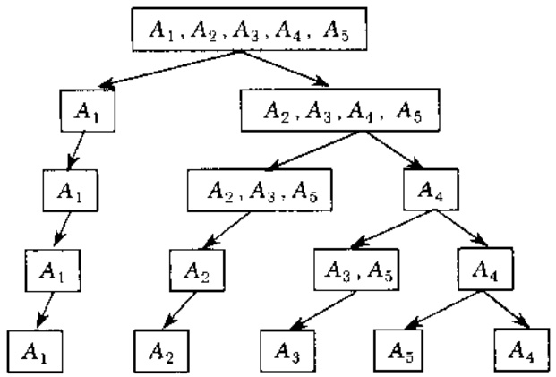

<!-- page: 60 -->

Với những nội dung đã trình bày trong phân này chứng ta có thể đưa ra một số nhận xé sau:

\- Về mặt toán học lý thuyết tập mở là một sự khái quát trực tiếp của lý thuyết tập hợp kinh điện.

\- Nó không phải là một lý thuyết duy nhất, và vì vậy nó mô tả một lớp các phép toán một lớp các đại số tập mờ, ....

\- Nó tạo ra khả năng mô tả định lượng ngữ nghĩa của ngôn ngữ và vì vậy nó cho phép mô phòng những bài toán không có hoặc khó khăn mới có mô hình định lượng, chẩn hạn các bài toán được mô tả bằng ngôn ngữ. Đầy chính là đặc điểm quan trọng cho phép phương pháp luận tập mô tiếp cận mềm đẻo các bài toán thực tiễn phức tạp, đđ dạng trong hầu hết các lĩnh vực của cuộc sống.

## 2 Toán học mò (Fuzzy Mathematics)

Như trên chúng tôi đã trình bày, khái niệm tập mở về hình thức hoá là một sự khái quả rất chỉnh và vì vậy những lý thuyết toán học xây dựng trên cơ sở tập hợp thông thường đề có thể chuyển sang lý thuyết mở tương ứng được xây dựng trên lý thuyết các tập mở. Tự nhiên như chúng tôi đã trình bày ở trên, chúng ta không có một lý thuyết tập mở duy nhà và vì vậy nói chung chúng ta luôn luôn có nhiều hướng mở rộng các lý thuyết kinh điện như dưới đây chúng ta sẽ thấy.

## 2.1 Topo mô

Một trong những lý thuyết cơ sở quan trọng để phát triển toán học là lý thuyết cá không gian topo. Một yêu cầu tự nhiên theo trào lưu này là cần xây dựng và phát triển l thuyết các không gian topo mờ (xem Mingsheng Ying: A new approach for fuzzy topologies Vol. 55, N2(1993); W. Gahler, A.S. Abd-Allah and A. Kandel: On extended fuzz topologies; V. Gregori and A. Vidal: Gradations of openness and Chang fuzzy topologies Vol.109, N2(2000)).

Giả sử X là một tập hợp bất kỳ và I = [0,1] là đoạn thẳng đơn vị. Ta ký hiệu  $I^{X}$  là tập t cả các tập mờ của X.

Định nghĩa 1: (Topo mà "kinh điện") Một họ các tập mờ $T \subseteq I^{X}$ được gọi là topo mờ nếu rithoả các tiên đề sau:

a)  $\varnothing, X \in T.$

b) Nếu  $\underline{A}, \underline{B} \in T$  thì  $\underline{A} \cap \underline{B} \in T$ .

c) Nếu  $\underline{A}_{i} \in T$  với  $\forall i \in \xi$  thì  $\bigcup_{i \in \xi} \underline{A}_{i} \in T$ .

Cập (X, T) gọi là không gian topo theo nghĩa "kinh điện".

<!-- page: 61 -->

Một ánh xa $C\mathcal{L}: I^{X} \to I^{X}$, được gọi là một toán từ lấy bao đóng nếu nó thỏa mãn:

a) $C\angle (\varnothing) = \varnothing .$

b) $C\ell (C\ell (\underline{A})) = C\ell (\underline{A}).$

c) $C\angle (\underline{A})\supseteq \underline{A}$

d) $C\ell (\underline{A}\cup \underline{B}) = \underline{A}\cup C\ell (\underline{B}).$

Tương tự như trong trường hợp topo kinh điện. toán từ $C\angle$ sẽ cảm sinh một topo

$$
T _ {\mathcal {C} \ell} = \{\underline {{A}} \in I ^ {X}: \underline {{A}} = \mathcal {O} (\mathcal {C} \ell (\mathcal {C} \underline {{A}})) \}.
$$

Lân cân của một điểm mở. Tập mở $x_{i} \in I^{X}$ với $x \in X$, $\mu_{x_{i}}(x) = t$, $\mu_{x_{i}}(y) = 0$, $x \neq y$, được gọi là một điểm mở trong $I^{X}$. Giống như quan hệ bao hàm, ta nói điểm mở $x_{i} \in A$ nếu $x_{i} \subseteq A$, nghĩa là khi $t \leq \mu_{A}(x)$. Một tập mở $A \in I^{X}$ được gọi là một lần cân của điểm mở $x_{i}$ nếu $\exists U \in T$ sao cho $x_{i} \in U \subseteq A$.

Định nghĩa 2: (Topo phân bậc tỉnh mờ) Ánh xạ $\tau : I^{X} \to I(I=[0,1])$ được gọi là sự phân bậc tính mờ (gradation of openness) nếu nó thỏa mãn các điều kiện sau:

a) $\tau(\varnothing) = \tau(X) = 1,$

b) $\tau (\underline{A}\cap \underline{B})\geq \tau (\underline{A})\cap \tau (\underline{B}),$

c) $\tau\left(\bigcup_{i}A_{i}\right)\geq\bigcap_{i}\tau(A_{i})$

Khi đó  $(X, \tau)$  gọi là không gian topo mò phân bậc.

Định lý 3: Giả sử $(X, \tau)$ là không gian topo mò phân bậc. Khi đó đối với mỗi giá trị $r \in [0,1]$, họ các tập mò $\tau_r = \{ \underline{A} \in I^X : \tau_r(\underline{A}) \geq r \}$ là topo mò kinh điện.

Lân cản của một điểm trong không gian $(X, \tau)$: Một tập mờ $\underline{A} \in I^{X}$ được gọi là một lân cản $\alpha$ của điểm $x \in X$ nếu $\exists U \in I^{X}$ sao cho $\tau(U) > 0$. $\alpha < \mu_{U}(x)$ và $U \subseteq \underline{A}$.

Khái niệm cơ sở lần cân và cơ sở của không gian topo mờ được định nghĩa tương tự như trong trường hợp topo kinh diễn.

Định lý 4: Một họ $\mathcal{B} = \{B \in I^{X} : \tau_{r}(B) \geq 0\}$ là một cơ sở của không gian topo mở $(X, \tau)$ khi và chỉ khi với mối $U \in I^{X}$ sao cho $\tau(U) > 0$, $U$ có thể biểu diễn như là hợp (trong đại số các tập mở) của một số các phần từ nào đó trong $\mathcal{B}$.

<!-- page: 62 -->

## 2.2 Giải tích mô (Fuzzy Analysis)

Như trên đã trình bày, mọi lý thuyết toán học đều có thể được mở rộng sang các lý thuyết toán học mở. Trong phần này chúng ta trình bày một vài lý thuyết như vậy.

## 2.2.1 Phương trình vi phân mà

Đế đơn giản chúng ta xét trường hợp phương trình vi phân bậc một. Trong giải tích kinh diễn nó có dạng

$$
\frac {d y}{d t} = f (t, y, k) \quad \text {với điều kiện ban đầu} y (0) = c.\tag{D1}
$$

trong đó $k$ là vecto $n$ hàng số. $t$ là biến trên một doan đóng giới nội chúa giá trị $0, c \in \mathcal{R}$, còn $y$ và $f$ là các vecto.

Bây giờ ta tìm cách mở rộng (D1) thành phương trình vi phân mở (xem M. Friedman, M. Making and A. Kandel: Numerical solutions of fuzzy differential and integral equations, Vol.106, N1(1999): J.J. Buckley and T. Feuring; Fuzzy differential equations; J.Y. Park and H.K. Han: Fuzzy differential equations, Vol.110, N.1 (2000)).

Trước hết ta đưa ra khái niệm số mò.

Định nghĩa 3: (Số mở) Một tập mở Â được gọi là số mở nếu nó là tập mở trên trường số thực
R và thỏa mãn các điều kiện sau:

a) $\exists x_{0} \in \mathcal{R}$ sao cho $\mu_{\tilde{A}}(x_{0}) = 1$, trong đó $\mu_{\tilde{A}}(x)$ là hàm thuộc của tập mò $\tilde{A}$.

b) Hàm  $\mu_{\bar{A}}$  liên tục từng khúc trên R.

Việc cân thiết là định nghĩa các phép tính ‘số học’ trên các số mở và một quan hệ bất đẳng thức giữa chúng. Nhìn chung việc định nghĩa các phép toán và các phép so sánh các số mở (Ranking Fuzzy Sets) là một vấn đề phức tạp. Nhầm đơn giản các định nghĩa này chúng ta giới hạn chỉ xét các số mở có dạng sau đây và gọi là $L-R$ số mở. Chứng sẽ có dạng hình học giống hình thang với hai canh bên được thay bằng các đường cong đơn điều.

Gọi L (Left) và R (Right) là hai hàm tham chiếu, tức là hàm thỏa mãn các tính chất:

1)  $L(x)=L(-x).$

2) $L(0) = 1$.

3) L không tăng trên  $[0,+\infty)$ . Khi đó L-R số mở là tập mở với hàm thuộc có dạng:

$$
\mu_ {\tilde {A}} (x) = \left\{ \begin{array}{l l} L \left(\left(A ^ {L} - x\right) / \alpha \quad \text {neu} \quad x \leq A ^ {L}, \alpha > 0 \right. \\ R \left(\left(x - A ^ {U}\right) / \beta \quad \text {neu} \quad x \geq A ^ {U}, \beta > 0 \right. \\ 1 \quad \text {chocáctrườnghopcònlai} \end{array} \right.
$$

trong đó $A^{L}<A^{U}$ và $\{A^{L},A^{U}\}$ được gọi là lôi (Core) của $\tilde{A}$, tức là $\mu_{\tilde{A}}(x)=1$. $\forall x\in[A^{L},A^{U}]$ với $A^{L}$, $A^{U}$ là các giá trị modal trên và dưới (theo nghĩa modal logic) của tập mờ $\tilde{A}$. Một số mờ như vậy được ký hiệu là $\tilde{A}=[A^{L},A^{U},\alpha,\beta]_{LR}$.

<!-- page: 63 -->

Một lớp quan trọng các $L-R$ số mở là các số mở hình thang (với các cạnh bên tuyến tính), ký hiệu là ($A^{L}$, $A^{U}$, $\alpha$, $\beta$), vì tính đơn giản của các phép tính và dễ sử dụng trong ứng dụng thực tiền đối với các nhà kỹ thuật.

Cho hai số mở hình thang bất kỳ.  $\tilde{a}=(a^{L}, a^{U}, \alpha, \beta)$ .  $\tilde{b}=(b^{L}, b^{U}, \gamma, \theta)$ . Các phép tính trên các số mở được định nghĩa như sau:

1) Nhân số mở với một số thực:

$$
\text {Voi} x > 0, x \in R: x \tilde {a} = (x a ^ {I}, x a ^ {U}, x \alpha , x \beta).
$$

$$
\text {Vói ó} x <   0, x \in R: x \bar {a} = \left(x a ^ {L}, x a ^ {U}, - x \alpha , - x \beta\right).
$$

2) Tổng và hiệu hai số mờ:

$$
\tilde {a} + \tilde {b} = (a ^ {L} + b ^ {L}, a ^ {U} + b ^ {U}, \alpha + \gamma , \beta + \theta).
$$

$$
\tilde {a} - \tilde {b} = (a ^ {L} - b ^ {L}, a ^ {U} - b ^ {U}, \alpha + \gamma , \beta + \theta).
$$

3) Ta quy ước ràng ứng với mỗi số mở $\tilde{a}$ ta gần một số thực $r(\tilde{a}) = a^{L} + a^{U} + \frac{1}{2(\beta - \alpha)}$, gọi là phần từ đai diện của $\tilde{a}$.

Hình 2: So sánh số mà.

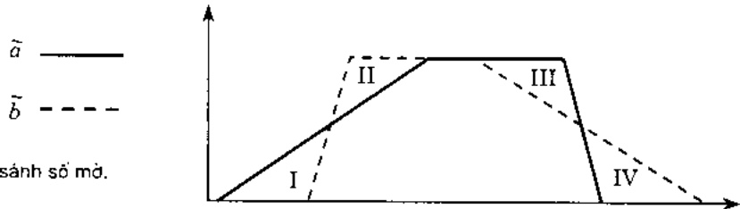

4) So sánh hai số mở: Giả sử hai số mở đã cho có biểu diễn như trong hình trên. Ký hiệu $S_{i}, i=I, II, III, IV$ tương ứng là diện tích của các miền I, II, III, IV và kí hiệu:

$$
C (\tilde {a}, \tilde {b}) = S _ {\mathrm{II}} - S _ {\mathrm{I}} + S _ {\mathrm{III}} - S _ {\mathrm{IV}}.
$$

Khi đó ta nói  $\tilde{a} \geq \tilde{b}$  nếu và chỉ nếu  $C(\tilde{a}, \tilde{b}) \geq 0$ .

Bây giờ ta có thể chuyển phương trình vi phân thông thường (D1) thành phương trình vi phân mở như sau:

Goi $\tilde{K} = (\tilde{K}_1, \dots, \tilde{K}_n)$ là một vectơ các số mở hình thang (môi $\tilde{K}_i$ là một số mở hình thang), và $\tilde{C}$ là một số mở hình thang. Thay thế các giá trị này vào phương trình (D1) ta thu được một phương trình vi phản mở:

$$
\frac {d \tilde {Y}}{d t} = \boldsymbol {f} (t, \tilde {Y}, \tilde {K}). \quad \tilde {Y} (0) = \tilde {C}.\tag{D2}
$$

<!-- page: 64 -->

2.2.1.1 Chúng ta khảo sát bài toán với điều kiện sau: Giả sử ràng $\widetilde{Y}(t) = [y_1(t), y_2(t)]$ và $y_i(t, \alpha)$, $i=1,2$, là hàm khả vi theo $t$ với $\alpha$ là tham số. Ký hiệu đạo hàm của $y_i(t, \alpha)$ theo $t$ là $y_i(t, \alpha)$.

Đặt $G(t, \alpha) = [y_1'(t, \alpha), y_2'(t, \alpha)]$. Nếu $G(t, \alpha)$ chính là một lát cất $\alpha$ của một số một thì ta nói hàm mờ $\tilde{Y}(t)$ khả vị và được viết:

$$
\frac {d \tilde {Y}}{d t} [ \alpha ] = G (t, \alpha) = [ y _ {1} ^ {\prime} (t, \alpha), y _ {2} ^ {\prime} (t, \alpha) ].\tag{D3}
$$

Một điều kiện đủ để cho $G(t, \alpha)$ là lát cắt ($\alpha$-cut hay $\alpha$-level) của một số mở là:

a) $y_{1}(t,\alpha).y_{2}(t,\alpha)$ là các hàm liên tục theo cả hai biến.

b) $y_{1}^{!}(t,\alpha)$ là hàm tāng theo biēn $\alpha$.

c) $y_{2}(t,\alpha)$ là hàm giảm theo biến $\alpha$.

d) $y_1'(t,\alpha) \leq y_2'(t,\alpha)$, điều kiện này đảm bảo $[y_1'(t,\alpha), y_2'(t,\alpha)]$ là một đoạn thẳng.

Tất nhiên $\tilde{Y}(t)$ là nghiệm nếu $\frac{d\tilde{Y}}{dt}$ tôn tại và chúng thỏa các đẳng thức trong (D2). Từ đó suy ra $\tilde{Y}(t)$ là nghiệm nếu $\frac{d\tilde{Y}}{dt}$ tôn tại và ta có các đẳng thức sau:

a) $y_{1}^{'}(t,\alpha)=f_{1}(t,\alpha),$   $y_{2}^{'}(t,\alpha)=f_{2}(t,\alpha).$

b) $y_{1}(0,\alpha)=c_{1}(\alpha),$   $y_{2}(0,\alpha)=c_{2}(\alpha).$

trong đó $\widetilde{C} (\alpha) = [c_1(\alpha), c_2(\alpha)]$.

## 2.2.1.2 Các phép đạo hàm của hàm mò

Như trên ta đã nói, nhìn chung có nhiều cách mở rộng khái niệm vi phản mở. Duối dãy ta đưa ra một số cách định nghĩa đạo hàm mở (giá trị của hàm là tập mở).

Giả sử $\widetilde{X}(t)$ nhận giá trị số mờ và giả sử $\widetilde{X}(t)[\alpha] = [x_1(t, \alpha), x_2(t, \alpha)]$ và $x_i'(t, \alpha)$ là đạo hàm riêng theo $t$ của $x_i(t, \alpha)$.

Xét hai hàm mở $\tilde{X}(t)$ và $\tilde{Z}(t)$. Ký hiệu lát cất $\alpha$ của hai số mở $\tilde{X}(t)$ và $\tilde{Z}(t)$ là

$$
\tilde {X} (t) [ \alpha ] = \left[ x _ {1} (t, \alpha), x _ {2} (t, \alpha) \right].
$$

$$
\mathrm{v} \dot {\mathrm{a}} \quad \tilde {Z} (t) [ \alpha ] = \left[ z _ {1} (t, \alpha), z _ {2} (t, \alpha) \right].
$$

Gọi $D(\tilde{X}(t), \tilde{Z}(t))$ là metric giữa hai số mở được định nghĩa một cách xác định nào đó. Khi đó đại lượng

<!-- page: 65 -->

$$
\tilde {X} (\pmb {t} _ {0}) = \lim _ {h \to 0} \frac {\tilde {X} (t _ {0} + h) - \tilde {X} (t _ {0})}{h}.
$$

nếu tôn tại. là đạo hàm của hàm mờ  $\tilde{X}(t)$ . . .

1) Nếu $D(\tilde{X}(t), \tilde{Z}(t)) = \sup_{\alpha} \left\{ \left| x_1(t, \alpha) - z_1(t, \alpha) \right|, \left| x_2(t, \alpha) - z_2(t, \alpha) \right| \right\}$, ta có đạo hàm
Goetschel-Voxman và ký hiệu là $GVD \tilde{X}(t_0)$. trong đó biểu thức hiệu trong công thức dưới lim được hiệu là hiệu số học theo từng thành phần toạ độ của vectơ $\tilde{X}$.

2) Nếu ta có hai điều kiện sau đây:

a) $D(\tilde{X}(t), \tilde{Z}(t)) = \sup_{\alpha} H(\tilde{X}(t)[\alpha], \tilde{Z}(t)[\alpha])$. trong đó $H$ là khoảng cách Hausdoff giữa các tập compact của $R$.

b) Biểu thức hiệu trong công thức dưới lim là hiệu Hukuhara, tức là hiệu hai số mờ $H$ A và $B$, được kí hiệu là $A - B$, là một số mờ $C$ sao cho $B \oplus C = A$, trong đó $\oplus$ là phép công trên số mờ.

thì khi đó ta có đạo hàm Puri-Relescu và kí hiệu là $PRD \tilde{X}(t_0)$.

3) Nêu ta có:

$$
D _ {p} (\bar {X} (t), \tilde {Z} (t)) = \max \left\{\left(\int_ {0} ^ {1} \left| x _ {1} (t, \alpha) - z _ {1} (t, \alpha) \right| ^ {p} d \alpha\right) ^ {\frac {1}{p}}, \left(\int_ {0} ^ {1} \left| x _ {2} (t, \alpha) - z _ {2} (t, \alpha) \right| ^ {p} d \alpha\right) ^ {\frac {1}{p}} \right\}
$$

với tích phân lấy trên các hàm trong $L_{p}[0,1]$.

b) Hiêu trong biểu thức dưới lim được hiểu như trong trường hợp 1).

thì khi đó ta có đạo hàm Kandel-Friedman-Minh và kí hiệu là $KFMD \tilde{X}(t_0)$.

Định lý 5: (1) Nếu đạo hàm $GVD \tilde{X}(t)$ tốn tại và là một số mở thì đạo hàm $SD \tilde{X}(t)$ cũng
tớn tại và ta có $GVD \tilde{X}(t) = SD \tilde{X}(t)$.

(2) Nếu đạo hàm $PRD \tilde{X}(t)$ tổn tại và là một số mở thì đạo hàm $SD \tilde{X}(t)$ cũng tổn tại và ta có $PRD \tilde{X}(t) = SD \tilde{X}(t)$.

(3) Nếu đạo hàm $KFMD \tilde{X}(t)$ tốn tại và là một số mở thì đạo hàm $SD \tilde{X}(t)$ cũng tốn tại và chúng bằng nhau.

## 2.3 Bài toán tối ưu hoá mò

Chúng ta đều biết đến sự phát triển về lý thuyết và ứng dụng của các bài toán tối ưu hoá trong đó có sự đóng góp dáng chân trọng của các nhà toán học Việt nam. Trên cách nhìn hệ thống hiện nay bài toán tối ưu luôn xuất phát từ nhu cầu của quá trình lấy quyết định và vì vây nó gần với việc lấy quyết định. Trong thực tế, quá trình này luôn luôn nằm trong môi trường các thông tin, dữ liệu không chính xác, biến động và bao gồm cả những dữ kiện có

<!-- page: 66 -->

bản chất không chắc chắn, mờ. Ngoài ra việc lấy quyết định thường nằm trong một hệ thống có câu trúc thứ bậc và vì vậy nó cũng dẫn đến bài toán tối ưu nhiều mức (Multi-levels).

Như vậy thực tiền dòi hòi cản phát triển lý thuyết các bài toán tối ưu linh hoạt, mềm đèo hơn. Cùng với sự phát triển lý thuyết toán học mơ, các bài toán tối ưu mơ cũng được nghiên cứu ứng dụng rất mạnh mẽ. Các bài toán tối ưu mơ có ý nghĩa thực tiền lớn vì trong thực tế các ràng buộc không dòi hòi quá chất chẽ. Chắng hạn việc giới hạn các ràng buộc bất đẳng thức theo nghĩa toán học kinh điện (ví dụ tổng các hàng mục đầu tư dòi hòi không vượt quá 20.000 tỷ đồng) sẽ có thể loại di mất những \`nghiệm\` cho kết quả tốt hơn (cháng hạn với nó tổng vốn đầu tư có thể bằng 20.000 tỷ đồng cộng 1xu !!).

Có thể nói một đặc trưng quan trọng của phương pháp luận mở là tính linh hoạt, mềm dẻo trong một môi trường phức tạp với thông tin, dữ kiện không chắc chắn, không chính xác và biến động, hơn nửa bài toán tối ưu mở có thể được ứng dụng ngay đổi với cả các bài toán kinh diễn tuy giải được nhưng bằng những thuật toán quá phức tạp. Về nguyên tắc, sẽ xuất hiện các dạng bài toán tối ưu rất khác nhau tuỷ theo nhu cầu thực tế và quan điểm xây dựng mô hình.

Dưới dây chứng tôi chỉ giới thiệu dôi dạng bài toán (xem Vol.55,N3(1993)285-294; Vol.109, N1(2000)3-20,21-34,141-147).

## 2.3.1 Dạng bài toán tối uu hoá với dữ kiện mà

Giả sử các dữ kiện tham số trong bài toán tối ưu mò được giới hạn trong lớp các số mò.

Định nghĩa 4: (mô hình tối ưu hoá tuyến tính với số mờ) Gọi $F(R)$ là tập tất cả các số mờ hình thang. Mô hình bài toán tối ưu hoá tuyến tính với số mờ có dạng sau:

$\max \tilde{z} = \sum_{j=1}^{p} \tilde{c}_j x_j.$

với các ràng buộc  $\sum_{j=1}^{p}\widetilde{a}_{ij}x_{j}\leq\widetilde{b}_{i}, i=1,2,\ldots,m_{0}$ ,

và $\sum_{j=1}^{P} \widetilde{a}_{ij} x_j \geq \widetilde{b}_i$, $i = m_0 + 1, \ldots, m$, $j = 1, 2, \ldots, p$, trong đó $\widetilde{a}_{ij}, \widetilde{b}_i, \widetilde{c}_j \in F(R)$.

Dạng bài toán này có thể chuyển về bài toán tối ưu thông thường nhà ménh để sau.

Mệnh đề 1: Bài toán tối ưu hoá mở tuyến tính trên tương đương với bài toán tối ưu sau:

max $z = \sum_{j=1}^{p} r(\widetilde{c}_j) x_j$, với các ràng buộc $\sum_{j=1}^{p} r(\widetilde{a}_{ij}) x_j \leq s(\widetilde{b}_i)$, $i = 1,2, \ldots, m_0$, và

$\sum_{j=1}^{p} r(\widetilde{a}_{ij}) x_j \geq s(\widetilde{b}_i), x_j \geq 0, i = m_0 + 1, \ldots, m, j = 1, 2, \ldots, p,$ trong đó $r$ và $s$ là hàm

số mà giá trị của chúng được tính bằng một biểu thức trên các thông số của số mò.

<!-- page: 67 -->

## 2.3.2 Bài toán tối uu hoá tuyến tính với biến mò

Bài toán này được phát biểu như sau.

Định nghĩa 5: Bài toán tìm nghiệm tối thiểu sau (sau đây gọi là bài toán A)

$\min: \tilde{Z} = b' \tilde{Y}$

với các ràng buộc:  $\tilde{Y}A \geq \tilde{C}$ ,  $\tilde{Y} \geq 0$ ,

trong đó $0 \leq b \in R$. $A \in R^{m \times n}$. $\tilde{Y}$ gọi là bài toán tối ưu tuyến tính với biến mờ.

Định nghĩa 6: Bài toán hỗ trợ (gọi là bài toán B) là bài toán

max: $\tilde{Z} = \tilde{C} X$

với các ràng buộc: $AX < b, X \geq 0$.

trong đó $0 \leq b \in R^{m}$, $X \in R^{m}$, $A \in R^{m \times n}$, $\tilde{C} \in (F(R))^{n}$, $\tilde{Y} \in (F(R))^{n}$.

Giữa hai bài toán trên có mối quan hệ chất chẽ thể hiện trong mệnh đề sau.

Định lý 6: (1) Nếu $\tilde{Y}^{0}$ là nghiệm mò chấp nhận được của bài toán $A$ và $X^{0}$ là nghiệm chấp nhận được của bài toán $B$, thì $\tilde{C} X^{0} \leq b' \tilde{Y}^{0}$.

(2) Nếu $\tilde{Y}^{0}$ là nghiệm mò chấp nhận được của bài toán $A$ và $X^{0}$ là nghiệm chấp nhận được của bài toán $B$ sao cho $\tilde{C} X^{0} = b' \tilde{Y}^{0}$ thì $X^{0}$ là nghiệm tối ưu của bài toán $B$ còn $\tilde{Y}^{0}$ là nghiệm tối ưu mò của bài toán $A$.

(3) Nếu bài toán B có một nghiệm tối ưu thì bài toán A cũng có một nghiệm tối ưu mà.

## 2.3.3 Bài toán quy hoạch nguyên mô

Bài toán quy hoạch nguyên thông thường có rất nhiều ứng dụng thực tiễn như trong lập kế hoạch sản xuất chẳng hạn. Trong trường hợp như vậy các tham số là những đơn giá chi phí, nhu cầu vật tư hay bán thành phẩm và nguồn cung cấp (các bạn hàng cung cấp). Tuy nhiên trong thực tế thông tin về nhu cầu và khả năng cung cấp của các bạn hàng thường không chính xác, không chắc chắn. Tính không chính xác của những dữ liệu này còn là hệ quả của tính mềm dẻo, linh hoạt trong hoạch định sách lược, chiến lược của nhà máy. Thực tế đó đời hỏi phải nghiên cứu ứng dụng bài toán quy hoạch nguyên mờ. Về trực cảm có thể thấy bài toán quy hoạch nguyên mờ sẽ rất gần gửi với cách giải bài toán kinh điện.

Chúng ta sẽ giới hạn tính mở trong lớp các $L-R$ số mở dạng $\tilde{A}=\left[A^{L}, A^{U}, \alpha, \beta\right]_{LR}$ đã được nói đến ở phần trên, nhưng ở đây $L$ và $R$ được thay thế bằng hàm số $F$ thỏa mãn điều kiện sau: $F$ liên tục và không tăng trên nửa đường thẳng $(0,\infty)$. $F(0)=1$ và thực sự giám trên miền mà $F$ nhận giá trị dương.

Định nghĩa 7: Bài toán quy hoạch nguyên mở được phát biểu như sau:

<!-- page: 68 -->

$c(x) = \sum_{i}^{m} \sum_{j=1}^{n} c_{ij} x_{ij} \rightarrow \min^*$, với các ràng buộc $\sum_{j=1}^{n} x_{ij} \equiv A_i$, $i = 1,2, \ldots, m$ và

$$
\sum_ {i = 1} ^ {m} x _ {i j} \cong B _ {j}. j = 1, 2, \dots . n, x _ {i j} \geq 0, j = 1, 2, \dots , n, i = 1, 2, \dots , m \text {và} A, \text {và} B _ {j} \text {là các}
$$

số mờ. Các $c_{1j}$ là chỉ phí vận chuyển được biểu thị bằng các giá trị số (không mờ).

Đặc biết min\* được hiểu là mục tiêu mờ. hay một số mờ có dạng $\left[-\infty, c_{0}, 0, \beta_{G}\right]_{LR}$.

Trong môi trường mờ, chúng ta cần hiểu các ràng buộc mờ và mục tiêu mờ G sẽ có mức độ thỏa nào đó (degree of satisfaction) và được định nghĩa như sau:

Định nghĩa 8: Giả sử x là một lời giải của bài toán. Khi đó

a) Giá trị được biểu thị bồi biểu thức sau

$$
\mu_ {c} (x) = \min \{\mu_ {A _ {i}} \left(\sum_ {j = 1} ^ {n} x _ {i j}\right) (i = 1, \dots , m), \mu_ {B _ {j}} \left(\sum_ {i = 1} ^ {m} x _ {i j}\right) (j = 1, \dots , n), \}
$$

được gọi là độ thỏa của các ràng buộc:

$$
\text {b)} \quad \text {Còn giá trị} \mu_ {G} (x) = \mu_ {c} (c (x)) = \mu_ {G} \left(\sum_ {i = 1} ^ {m} \sum_ {j = 1} ^ {n} c _ {i j} x _ {i j}\right),
$$

được gọi là độ thỏa của mục tiêu của bài toán quy hoạch nguyên mò.

Bài toán A: Lời giải tối đại của bài toán quy hoạch nguyên mở được định nghĩa là giá trị x sao cho hàm $\mu_{D}(x)=\min\{\mu_{c}(x),\mu_{G}(x)\}$ đạt cực đại. Trong trường hợp giá trị cực đại này bằng 0 thì ta nói bài toán không khả thì.

Bài toán A tương đương với bài toán dưới đây.

Bài toán B: λ → max với các ràng buộc sau

a) $\mu_G(c(x))\geq \lambda ,i = 1,2,\dots ,m,$

$$
\mathrm{b)} \quad \mu_ {\mathbf {A} _ {i}} \left(\sum_ {j = 1} ^ {n} x _ {i j}\right) \geq \lambda , i = 1, 2, \dots , m,
$$

$$
\mu_ {B _ {j}} \left(\sum_ {i = 1} ^ {m} x _ {i j}\right) \geq \lambda , j = 1, 2, \dots , n, \lambda > 0, x _ {i j} \geq 0.
$$

Gọi $A_{i}^{\lambda}, B_{j}^{\lambda}$ và $G^{\lambda}$ tương ứng là các lát cắt $\lambda$ của các số mở $A_{i}, B_{j}$ và $G$. Khi đó bài toán $B$ chuyển về bài toán sau.

Bài toán C: λ → max với các ràng buộc sau

a) $c(x)\in G^{\lambda}$

$$
\mathrm{b)} \quad \sum_ {j = 1} ^ {n} x _ {i j} \in A _ {i} ^ {\lambda}, i = 1, 2, \dots , m,
$$

<!-- page: 69 -->

$$
\text {c)} \quad \sum_ {i = 1} ^ {m} x _ {i j} \in B _ {j} ^ {\lambda}, j = 1, 2, \dots , n. \lambda > 0, x _ {i j} \geq 0.
$$

Như vây bài toán quy hoạch nguyên mở từng bước được đưa về bài toán quy hoạch nguyên thông thường (xem S. Chanas và D. Kuchta: Fuzzy integer transportation problem, Vol.98, N3(1998)) để tìm nghiệm bài toán gốc.

## 3 Hệ chuyên gia mò và hệ trợ giúp quyết định mò

## 3.1 Bài toán lấy quyết định và vấn để lập luận

Mở đặc trung rất khác biệt của con người là khả năng lấy quyết định. Việc lấy quyết định là hoạt động diễn ra hàng ngày của mỗi người, của mỗi nhóm người và nó là hoạt động đặc biệt quan trọng trong lĩnh vực tổ chức và quản lý như việc ra nghị quyết, chính sách chế độ, lập kế hoạch, ra chỉ thị ....

Đế dễ hiểu chúng ta sẽ chỉ ra những thành tố quan trọng nhất của quá trình lấy quyết định.

1) Cơ sở (kho tàng) tri thức: Như chúng ta đã biết con người khác biệt với loài vật ở trí tuê, khả năng tư duy. Vì vậy một thành tố quan trọng đầu tiên của quá trình lấy quyết định là tri thức và được mô hình hóa thành một cơ sở tri thức. Các yếu tố cơ bản của tri thức có thể phát biểu thành các ménh để và dạng ménh để quan trọng nhất là dạng ménh để “nếu ... thì ...” và được gọi là các luật (rules).

Ví dụ: Trong lĩnh vực quản lý xí nghiệp cơ sở tri thức có thể chúa ménh để sau, trong đó các từ viết nghiếng là các khái niệm mờ: “Nếu sản phẩm của một xí nghiệp chiếm một thị phần tương đối lớn thì xí nghiệp đó có thể có chính sách điều phối giá cả”.

Các chuyên gia trong lĩnh vực nghiên điều khiển mô to điện có thể phát biểu trí thức của mình bằng các mènh để if-then sau. trong đó I là cường độ dòng điện. N là tốc độ vòng quay của mô to (xem Cao, Z. and A. Kandel, Applicability of some fuzzy implication operators, Fuzzy Sets and Systems 31(1989).151-186), (xin sử dụng thuật ngữ tiếng Anh để có chỗ có thể đề hiểu hơn):

<div class="docvortex-algorithm" style="white-space: pre-wrap; font-family:monospace;">
If $I =$ very small then $N =$ very large
If $I =$ very more small then $N =$ large
If $I =$ small then $N =$ medium
If $I =$ medium then $N =$ small
If $I =$ large then $N =$ very more small
If $I =$ very large then $N =$ very more small.
</div>

2) Cơ sở dữ liệu (CSDL): Có thể thấy trị thức là những kháng định đã được tổng kết, khái quát hoá từ kinh nghiệm thực tiễn. Kinh nghiệm này được “bộ ốc” lưu trữ ở dạng dữ

<!-- page: 70 -->

liệu (biểu thị ở dạng chữ hay số). Vì vậy một thành tố khác trong quá trình lấy quyết định là tập hợp các dữ liệu được tổ chức thành cơ sở dữ liệu. Trong các bài toán lớn như việc xây dựng các hệ trợ giúp quyết định, CSDL là một thành tố quan trọng vì hai lý do:

\- Thứ nhất, nó lưu trữ các dữ liệu cần thiết cho quá trình lấy quyết định.

\- Thứ hai, vì dữ liệu là kinh nghiệm thực tiễn nên kho dữ liệu này là cơ sở để điều chỉnh và phát hiện thêm các luật mới của tri thức.

Một hướng quan trọng đang được quan tâm nghiên cứu là việc phát hiện luật từ một tập hợp dữ liệu. Ví dụ từ một tập hợp dữ liệu của hơn hai trăm loài hoa người ta có thể xây dựng thuật toán cho phép tìm ra 7 hoặc 8 luật mở về mối quan hệ giữa đặc tính màu sắc của hoa, số dài hoa. số cánh hoa và tính chất của lông quang dài và cuống hoa v.v....

3) Phương pháp, thủ tục lập luận: Thành tố quan trọng nhất của quá trình lấy quyết định là vấn đề lập luận. Bản chất phương pháp tư duy, lập luận của con người vấn còn là một vấn đề bí hiểm, phúc tạp và chúng ta chưa hiểu biết được nhiều. Nhiểu phương pháp lập luận để mô phỏng phương pháp lập luận của con người đã và đang được nghiên cứu. Những phương pháp mô phỏng dựa trên logic toán đã được nghiên cứu phát triển từ rất sớm nhưng chúng chỉ phù hợp cho các ứng dụng dựa trên khoa học chính xác, dựa trên thông tin đây đủ và chắc chắn, ví dụ như phương pháp chứng minh tự động trong lĩnh vực toán học. Tuy nhiên sức mạnh tư duy và lập luận của con người lại nằm trong lĩnh vực (môi trường) thông tin không đây đủ, mờ và không chắc chắn, không chính xác. Ví dụ trong môi trường như vậy chúng ta vấn phải quyết định tuyến chọn cán bộ, chọn phương án phát triển, xây dựng khu vực công nghệ cao v.v....

Trong môi trường như vậy “công nghệ tập mờ”, và hiện nay nó được khái quát thành khái niệm “công nghệ tính toán mềm”, đang giữ một vai trò độc tôn.

## 3.2 Phương pháp lập luận xấp xỉ dựa trên tập mờ

Như trên đã trình bày, phương pháp lập luận là một thành tố rất đặc trưng của quá trình lấy quyết định và vì vậy một chức năng quan trọng của một hệ chuyên gia hay một hệ trợ giúp quyết định là việc lập luận cho phép rút ra những kết luận trợ giúp người lấy quyết định. Những phương pháp lập luận trong những hệ như vậy có khả năng mô phòng quá trình lập luận trong môi trường thông tin không đầy đủ, không chắc chắn và vì vậy bản chất của phương pháp là xếp xi gần đúng. L.A. Zadeh vẫn là người đầu tiên đưa ra ý tưởng và xây dựng phương pháp luận này và gọi là phương pháp lập luận xếp xi (xem L. A. Zadeh: A theory of approximate reasoning, in: R. R. Yager, S. Ovchinnikov, R. M. Tong and H. T. Nguyen, Eds., Fuzzy Sets and Applications: The selected papers by L. A. Zadeh (Wiley, New York, 1987) 367-411; L. A. Zadeh: The concept of linguistic variable and its application to approximate reasoning (I),(II), Inform. Sci. 8(1975) 199-249; 8(1975) 310 - 357).

Trong công trình của mình. Zadeh dưa ra khái niệm lược đó lập luận xấp xỉ như sau:

<!-- page: 71 -->

| Tiên đế 1: | Nếu màu của quả cà chua nào đó là đỏ thì quả cà chua đó là chín. |
| --- | --- |
| Tiên đế 2: | Màu quả cà chua Q là rất đỏ. |
| Kết luận: | Quả cà chua là rất chín. |

Chúng ta thấy lược đỏ này tương tự như luật Modus ponens trong logic kinh điện: từ $A \Rightarrow B$ và $A$ cho phép ta rút-ra kết luận $B$. Tuy nhiên ở lược đỏ trên trong giả thiết (tiền đề) ta không có $A$ mà lại có $A'$ ($:=$ rất đỏ) một biến chương của $A$ ($:=$ đỏ), và mỗi người trong chúng ta đều có khả năng rút ra một kết luận $B'$ nào đỏ. Văn đề là cần xây dựng phương pháp luận cho phép lựa chọn phương pháp lập luận đề "tính" $B'$ sao cho kết quả phù hợp với ứng dụng cụ thể đã cho.

Nhở tính mềm đẻ của phương pháp luận tập mở chúng ta có nhiều phương án lựa chọn để xây dựng phương pháp lập luận xếp xỉ. Trong phạm vi bài này, chúng tôi chỉ trình bày phương pháp đơn giản nhất qua đó để bạn đọc thấy được ý tưởng của phương pháp luận.

Chúng ta xét lược đó lập luận mờ da điều kiện. t.l. mô hình mờ có chữa nhiều mạnh để điều kiện dạng nếu...thì:

| Tiền đề 1 | if $X = A_{1}$ then $Y = B_{1}$ |
| --- | --- |
| Tiền đề 2 | if $X = A_{2}$ then $Y = B_{2}$ |
| ⋮ | ⋮ |
| Tiền đề n | if $X = A_{n}$ then $Y = B_{n}$ |
| Tiền đề n+1 | if $X = A_{n+1}$ then $Y = B_{n+1}$ |
| Kết luận: | $Y = B_{0}$ |

Tập hợp $n$ menses để đầu tiên trong (M) được gọi là mô hình mò, trong đó $A_{i}$, $B_{i}$ là các khái niệm mò. Mô hình này mô tả môi quan hệ (hay sự phụ thuộc) giữa hai đại lượng $X$ và $Y$. Giá trị $X=A_{0}$ được gọi là input còn $Y=B_{0}$ được gọi là output của mô hình.

Phương pháp lập luận xấp xi tính $Y = B_{0}$ gồm các bước sau:

1) Buốc 1. Giải nghĩa các mệnh để điều kiện: Chứng ta xem các khái niệm mở $A_{i}, B_{i}$ là nhân của các tập mở biểu thị ngữ nghĩa của $A_{i}, B_{i}$. Đề cho tiện hàm thuộc của chúng được kí hiệu tương ứng là $A_{i}(u)$ và $B_{i}(u)$ trên các không gian tham chiếu $U$ và $V$.

Một cách trực cảm, mỗi ménh để nếu...thì trong mô hình mở có thể hiểu là một phép kéo theo (implication operator) trong một hệ logic nào đó và được viết $A_{i}(u) \Rightarrow B_{i}(u)$. Khi $u$ và $v$ biến thiên. biểu thức này xác định một quan hệ mở $R_{i}: U \times V \to \{0, 1\}$. Như vậy mỗi ménh để điều kiện trong (M) xác định một quan hệ mở.

2) Buốc 2. Kết nhập (aggregation) các quan hệ mờ thu được bằng công thức:

<!-- page: 72 -->

$R = @_{i=1}^{n} R_{i}$, trong đó @ là một phép tính t-norm hay t-conorm nào đó.

Chàng hạn $R = \wedge_{i=1}^{n} R_i$ hay $R = \vee_{i=1}^{n} R_i$, trong đó $\wedge, \vee$ là các phép tính min và max.

Việc kết nhập như vây đảm bảo R chứa thông tin được cho bởi các mệnh để if...then có trong mô hình mờ.

3) Bước 3. Tính output $B_{0}$ theo công thức $B_{0}=A_{0}oR$, trong đó 0 là phép hợp thành giữa hai quan hệ $A_{0}$ và $R$.

4) Buóc 4. Khử mờ (Defuzzification; xem Vol.55.N1(1993)1-14; Vol.80.N2(1996)177-186; Vol.81.N3(1996)259-262): Kết quả tính toán ở bước 3 là một tập mờ. Trong nhiều bài toán ứng dụng, đặc biệt trong điều khiển kỹ thuật, người ta cần biết giá trị thực của biến Y. Phương pháp tính giá trị thực “tương ứng” với tập mờ $B_0$ được gọi là phương pháp khử mờ. Người ta đưa ra nhiều phương pháp khử mờ. Sẽ không có phương pháp nào gọi là tốt nhất. Nó sẽ được lựa chọn để đạt được “độ tốt” qua thử nghiệm. Ta lấy ví dụ một phương pháp khử mờ, gọi là phương pháp khử mờ theo trung bình cộng có trọng số, được cho bởi công thức:

$$
\mathrm{defuz} (B _ {0}) = \frac {\sum_ {v \in V} v B _ {0} (v)}{\sum_ {v \in V} B _ {0} (v)}.
$$

Những yếu tố ảnh hưởng đến kết quả tính toán của phương pháp lập luận mờ:

Có thể hình dung phương pháp lập luận mơ bảng mơ hình tổng quát sau:

Hình 3: Mó hình lập luận mơ.

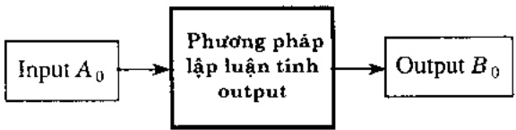

Chúng ta nhân thấy có nhiều phương pháp lập luận mờ. Môi phương pháp đều phụ thuộc vào:

\- việc chọn các hàm thuộc dùng để biểu diễn ngữ nghĩa của các khái niệm mờ.

\- việc chọn toán từ kéo theo để tính các quan hệ mở $R_{i}$.

\- việc chọn phương pháp kết nhập.

\- việc chọn phép tính hợp thành 0,

\- và cuối cùng phụ thuộc vào chính phương pháp khử mờ.

Hiện nay chưa có phương pháp nào hỗ trợ việc lựa chọn này ngoài trực cảm, kinh nghiệm và qua thử nghiệm. Nhiều khi sử dụng các phép toán có ý nghĩa đối nghịch nhau nhưng nó vấn góp phần hoàn thiện kết quả.

<!-- page: 73 -->

## Thuật toán xấp xỉ ngôn ngữ:

Tuy nhiên, trái với sự đời hồi ở trên, trong các ứng dụng khác, chẳng hạn như trong việc trợ giúp người lấy quyết định, chúng ta lại đời hồi kết quả của bài toán phải được biểu diễn ở dạng ngôn ngữ. Như vậy kết quả của phương pháp lập luận mở ở dạng tập mở (t.l. một hàm số) cần phải được chuyển thành dạng ngôn ngữ. Đay là một bài toán đời hồi các thuật toán phức tạp và thời gian tính toán lớn.

Chúng ta có thể hình dung bài toán như sau: Đế dẽ hiểu chúng ta xét các giá trị chân lý ngôn ngữ gồm true, false, very true, very false, more-or-less true, more-or-less false, possibly true, possibly false, approximately true, approximately false, little true, little false, very possibly true, very possibly false, .... Có thể xem các dữ liệu này như là nhân

của các tập mờ, hay nói một cách khác, chúng ta có thể biểu diễn ngữ nghĩa của các dữ liệu này bằng các tập mờ (các hàm số) mà chúng ta cho là thích hợp đối với ứng dụng đang được xem xét. Như vậy chúng ta có một họ các hàm số K biểu diễn ngữ nghĩa của các dữ liệu ngôn ngữ.

Khi đó bài toán xấp xỉ ngôn ngữ có thể phát biểu nôm na như sau: Cho một hàm bất kỳ $B_{0}$ (là tập mờ - chẳng hạn là output của bài toán lập luận mờ), hãy tìm một hàm F trong họ $\mathcal{K}$ sao cho nó nằm gần $B_{0}$ đã cho nhất.

Như vậy chúng ta có thể cảm nhận thấy thực sự lý thuyết tập mô cung cấp cho chúng ta một cách tiếp cận tính toán cho phép mô phỏng quá trình lập luận của con người.

## 3.3 Đại số gia tử và lập luận xấp xỉ

Đại số gia từ và ứng dụng của chúng trong lập luận xếp xỉ đã được Phòng Nghiên cứu các Hệ Trợ giúp Quyết định và Hệ Chuyên gia. Viện Công nghệ Thông tin, nghiên cứu phát triển từ hơn chục nằm nay(xem tài liệu liệt kê trong phân Lập luận trên cơ sở đại số gia tử). Trong bài tổng quan này chúng tôi chỉ trình bày những ý tưởng chính của cách tiếp cận này.

Như trên chúng tôi đã trình bày, để xây dựng phương pháp luận tính toán nhằm giải quyết vấn đề mô phỏng tư duy, lập luận của con người chúng ta phải thiết lập ánh xạ (t.l. phép nhưng theo thuật ngữ toán học) gán mỗi khái niệm mờ một tập mờ trong không gian tất cả các hàm $F(U,[0,1])$. Nghĩa là chúng ta muộn cầu trúc tính toán rất phong phí của tập $F(U,[0,1])$ để mô phỏng phương pháp lập luận của con người thường vấn được thực hiện trên nền ngôn ngữ tự nhiên.

Vậy một vấn đề đặt ra là liệu bản thân ngôn ngữ có cấu trúc tính toán không? Nếu có thì các phương pháp lập luận xây dựng trên đó dem lại những lợi ích gì?

Trả lời cho câu hỏi thứ nhất, chúng tôi chỉ ra rảng tập các giá trị ngôn ngữ của một biến ngôn ngữ, tức là biến mà giá trị của nó được lấy trong miền ngôn ngữ, sẽ là một cấu trúc đại số đủ giàu để tính toán.

<!-- page: 74 -->

Chúng ta sē làm sáng tò điều này qua việc xét miền ngôn ngữ (linguistic domain) của biến chân lý TRUTH gồm các từ sau: dom(TRUTH) = {true, false, very true, very false, more-or-less true, more-or-less false, possibly true, possibly false, approximately true, approximately false, little true, little false, very possibly true, very possibly false, ...}, trong đó true, false là các từ nguyên thủy, các từ nhân (modifier hay intensifier) very, more-or-less, possibly, approximately, little gọi là các gia tử (hedges).

Khi đó miền ngôn ngữ $T = \text{dom}(\text{TRUTH})$ có thể biểu thị như là một đại số $AT = (T, G, H, \leq)$. trong đó $G$ là tập các từ nguyên thuỷ được xem như là các phân từ sinh, $H$ là tập các gia từ được xem như là các phép toán một ngoi, quan hệ ≤ trên các từ (các khái niệm mờ) là quan hệ thứ tự được “cảm sinh” từ ngữ nghĩa tự nhiên. Ví dụ dựa trên ngữ nghĩa, các quan hệ thứ tự sau là đúng: false ≤ true, more true ≤ very true nhưng very false ≤ more false, possibly true ≤ true nhưng false ≤ possibly false, v.v...., $T$ được sinh ra từ $G$ bởi các phép tính trong $H$. Như vậy mối phán từ của $T$ sẽ có đang biểu diễn là $x = h_n h_{n-1} h_1 u$, $u \in G$. Tập tất cả các phân từ được sinh ra từ một phân từ $x$ được ký hiệu là $H(x)$. Nếu $G$ chỉ gồm có đúng hai từ nguyên thuỷ mờ, thì một được gọi là phân từ sinh dương ký hiệu là $t$, một gọi là phân từ sinh âm ký hiệu là $f$ và ta có $f < t$. Trong với dụ trên True là dương còn False là âm.

Hai phân từ của đại số gia từ được gọi là đối nghịch nhau nếu chứng có dạng biểu diễn với cùng một dây các gia từ nhưng phân từ sinh của chứng khác nhau, t.l. một cái là dương, một cái là âm. Một đại số gia từ là đối xứng nếu mỗi phân từ chỉ có duy nhất một phân từ đối nghịch.

Kết quả tổng quát chính của chúng tôi về đại số gia từ có thể được phát biểu trong ménh đề sau:

Định lý 7: Có tôn tại một hệ tiên để hoá sao cho mỗi miền ngôn ngữ $A T$ của biến ngôn ngữ trở thành dàn đầy đủ (complete lattice) có một phần từ 0, một phần từ đơi vị 1 và một phần từ trung hoà. Như vậy phép tuyến ∪ và hội ∩ logic có thể định nghĩa được trong cấu trúc này. Hơn nữa, nếu $A T$ là một đại số gia từ đối xứng thì trong cấu trúc đó ta có thể định nghĩa phép phù định – và phép kéo theo ⇒ và ta có:

a) -h x = h - x, với mọi  $h \in H$ .

b)  $-hx=x,-1=0,-0=1$  và -W=W.

c)  $-(x \cup y) = (-x \cap -y)$  và  $-(x \cap y) = (-x \cup -y)$ .

d)  $x \cap -x \leq y \cup -y$  với mọi  $x, y \in X$ .

e) $x \cap -x \leq W \leq y \cup -y$;

f) x>y khi và chi khi x<-y .

g) $x \Rightarrow y = -x \Rightarrow -y$.

h)  $x \Rightarrow (y \Rightarrow z) = y \Rightarrow (x \Rightarrow z)$ .

i) $x \Rightarrow y \geq x' \Rightarrow y'$ khi và chỉ khi $x \leq x'$ và/hoặc $y \geq y'$.

j) $1 \Rightarrow x = x, x \Rightarrow 1 = 1, 0 \Rightarrow x = 1$ và $x \Rightarrow 0 \neq -x$.

<!-- page: 75 -->

k)  $x \Rightarrow y \geq W$  khi và chỉ khi hoặc  $x \leq W$  hoặc  $y \geq W$ .

1)  $x \Rightarrow y \leq W$  khi và chỉ khi  $y \leq W$  và  $x \geq W$ .

m)  $x \Rightarrow y = 1$  khi và chỉ khi hoặc x = 0 hoặc y = 1.

Kết quả trên chứng tờ ràng cấu trúc dài số gia từ dù giàu để nghiên cứu các phương pháp lập luận.

## 1) Lập luận xấp xi dưa trên đại số gia tử:

Xét mô hình mờ (M). Vĩ chúng ta có thể xem các miền ngôn ngữ X và Y như là các đại số gia tử. một cách trực cảm ta có thể hình dung môi mệnh để if...then trong (M) sẽ xác định một điểm và do đó mô hình (M) sẽ xác định cho ta một đường cong trong không gian ngôn ngữ X×Y và gọi là đường cong mờ C. Khi đó bài toán lập luận xếp xử trên tập mờ có thể chuyển về bài toán nội suy đổi với đường cong mờ C (hình 4).

Đế giải bài toán xấp xỉ, trước hết chứng ta phải lượng hoá đại số gia từ bằng cách trang bị cho nó một metric. Vì trong điều khiển học, các đại lượng X và Y thường là các đại lượng vật lý với giá trị lấy trên đường thẳng nên việc cho một metric trên X hay Y tương đương với việc cho một ánh xạ f từ X hay Y vào doan thắng [0.1] với sự sai khác một hệ số tỷ lệ (vì trong thực tế ta cần ánh xạ vào một doan thắng [0.a] nào đó). Do đó ta dưa vào định nghĩa sau:

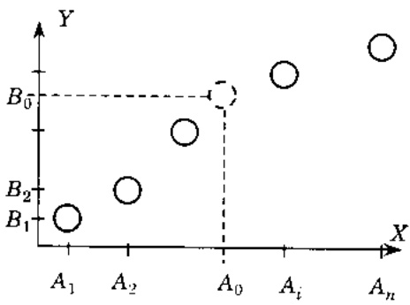

Hình 4: Lập luận xấp xỉ với đại số gia tử.

Định nghĩa 9: $f_{s}: X \to [0,1]$ gọi là hàm ngữ nghĩa định lượng của $X$ nếu với mọi $h, k \in H^{+}$

$$
\text {hoac} h, k \in H ^ {-} \text {và moi} x, y \in X, \text {ta có:} \left| \frac {f (h x) - f (x)}{f (k x) - f (x)} \right| = \left| \frac {f (h y) - f (y)}{f (k y) - f (y)} \right|.
$$

Với đại số gia từ và hàm ngữ nghĩa định lượng chứng ta có thể định nghĩa một khái niệm rất triu tương và khó định nghĩa một cách thỏa đáng trong lý thuyết tập mờ là tính mờ của một khái niệm mờ hay của tập mờ biểu diễn nó.

## 2) Tính mò (Fuzziness) của một giá trị ngôn ngữ.

Xét các giá trị: True, Very False, .... Làm thể nào định nghĩa tính mở?

Trên quan điểm đại số gia từ ta có một cách định nghĩa tính mở khá trực quan dựa trên kích cỡ của tập $H(x)$ như sau (hình 5).

Cho trước một hàm định lượng ngữ nghĩa $f$ của $X$. Xét bất kỳ $x \in X$. Tính mờ của $x$ khi đó được đo bằng đường kính của tập $f_s(H(x)) \subseteq [0,1]$.

<!-- page: 76 -->

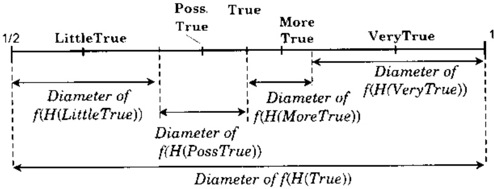

Hình 5: Tính mò của giá trị ngôn ngữ.

Định nghĩa 10: Độ đo tính mờ. Hàm $fm: X \to [0,1]$ được gọi là độ đo tính mờ nếu:

a)  $fm(c^{-})=w>0$  và  $fm(c^{+})=1-w>0, c^{-}$

trong đó $c^{-}$ và $e^{+}$ là các phân tử sinh âm và dương.

b) Giả sử tập các gia tử là $H = H^{+} \cup H^{-}$, $H^{-} = \{h_{1}, h_{2}, \dots h_{p}\}$ với $h_{1} > h_{2} > \dots > h_{p}$.  
và $H^{+} = \{h_{p+1}, h_{p+2}, \dots h_{p+q}\}$ với $h_{p+1} < h_{p+2} < \dots < h_{p+q}$. Khí đó,  
$\sum_{i=1}^{p+q} fm(h_{i}c) = fm(c)$ với $c \in \{c^{+}, c^{-}\}$.

c) Với bắt kỳ $x, y \in X$, $h \in H$, $\frac{fm(hx)}{fm(x)} = \frac{fm(hy)}{fm(y)}$, t.l. dàng thức này không phụ thuộc vào các phần tử $x, y$ và do đó ta có thể kí hiệu là $\mu(h)$ và gọi là độ do tính mở (fuzziness measure) của gia tử $h$.

Mệnh để 2 (Tính chất của $fm(x)$ và $\mu(h)$). Chúng ta có:

a) $fm(hx) = \mu (h)f m(x),\forall x\in X.$

$$
\mathrm{b)} \quad \sum_ {i = 1} ^ {p + q} f m (h _ {i} c) = f m (c), c \in \{c ^ {+}, c ^ {-} \}.
$$

$$
\mathrm{c)} \quad \sum_ {i = 1} ^ {\mu + q} f m (h _ {i} x) = f m (x).
$$

d) $\sum_{i=1}^{p}\mu(h_i)=\alpha$ và $\sum_{i=p+1}^{p+q}\mu(h_i)=\beta$ với $\alpha, \beta>0$ và $\alpha+\beta=1$.

3) Xây dựng hàm định lượng ngữ nghĩa trên cơ sở độ đo tính mở của gia tử.
Định nghĩa 11: Hàm sgn : $X \to \{-1, 0, 1\}$.

$$
\text {a)} \quad \operatorname{sgn} \left(c ^ {-}\right) = - 1 \text {và} \quad \operatorname{sgn} \left(h c ^ {-}\right) = \left\{ \begin{array}{l l l} + \operatorname{sgn} \left(c ^ {-}\right) & \text {neu} & h c ^ {-} <   c ^ {-} \\ - \operatorname{sgn} \left(c ^ {-}\right) & \text {neu} & h c ^ {-} \geq c ^ {-} \end{array} . \right.
$$

<!-- page: 77 -->

b) $\operatorname{sgn}(c^{+}) = +1$ và $\operatorname{sgn}(hc^{+}) = \begin{cases} +\operatorname{sgn}(c^{+}) & \text{néu} & hc^{+} < c^{+}\\ -\operatorname{sgn}(c^{+}) & \text{néu} & hc^{+}\geq c^{+} \end{cases}.$

c) $\operatorname{sgn}(h'hx) = -\operatorname{sgn}(hx)$ nếu $h'$ là negative d/vói $h$ và $h'hx \neq hx$.

d) $\operatorname{sgn}(h'hx) = -\operatorname{sgn}(hx)$ nếu $h'$ là positive d/vói $h$ và $h'hx \neq hx$.

e) $\operatorname{sgn}(h'h x)=0$ nếu $h'hx=hx$.

4) Xây dựng hàm định lượng ngữ nghĩa: Giả sử cho trước độ đo tính mờ của các gia tử  $\mu(h)$ , và các giá trị độ đo tính mờ của các phân tử sinh  $fm(c^{-})$ ,  $fm(c^{+})$  và w là phân tử trung hoà (Neutral).

Hàm định lượng ngữ nghĩa $v$ của $X$ được xây dựng như sau với $x = h_{im} \ldots h_{i2} h_{i1} c$;

a) $v(c^{-}) = w - \alpha f m(c^{-}), v(c^{+}) = w + \alpha f m(c^{+}).$

$$
f m (x) = f m (h _ {i m} \dots h _ {i 2} h _ {i 1} c) = \mu (h _ {i m}) \dots \mu (h _ {i 2}) \mu (h _ {i 1}) f m (c). \tag {b}
$$

$$
\mathrm{c)} \quad v (h _ {j} x) = v (x) + \operatorname{sgn} (h _ {j} x) \left[ \sum_ {i = j} ^ {p} f m (h _ {i} x) - \frac {1}{2} (1 - \operatorname{sgn} (h _ {i} x) \operatorname{sgn} (h _ {1} h _ {i} x) (\beta - \alpha) f m (h _ {i} x) \right]
$$

nếu j < p và

$$
v (h _ {j} x) = v (x) + \operatorname{sgn} (h _ {j} x) \left[ \sum_ {i = p + 1} ^ {j} f m (h _ {i} x) - \frac {1}{2} (1 - \operatorname{sgn} (h _ {i} x) \operatorname{sgn} (h _ {1} h _ {i} x) (\beta - \alpha) f m (h _ {i} x) \right]
$$

néu j>p.

5) Giải bài toán lập luận mở bằng nội suy.

Xét mô hình mò (M). Giả sử X, Y là các đại số gia từ sinh ra từ các giá trị ngôn ngữ tương ứng xuất hiện trong mô hình. Kí hiệu C đường cong mò trong không gian X×Y.

Gia sử $fs_{x}$ và $fs_{y}$ là các hàm định lượng ngữ nghĩa tương ứng của $\mathcal{X}$ và của $\mathcal{Y}$. Các hàm này sẽ chuyển đường cong mở $\mathcal{C}$ thành đường cong thực $C$ trong không gian $[0,1] \times [0,1]$.

Như vậy bài toán lập luận mở được chuyển về bài toán nội suy thông thường nhờ hàm định lượng đại số gia tử.

Có thể thấy phương pháp này có một số ưu điểm sau:

\- Cho một ý tưởng trực quan rõ ràng về cách thức giải bài toán.

\- Trong phương pháp giải dựa trên lý thuyết tập mờ có rất nhiều yếu tố gây sai số như: xây dựng hàm thuộc: chọn cách giải nghĩa mạnh để if-then bằng quan hệ mờ (thực chất là chọn việc giải nghĩa toán từ kéo theo): chọn toán từ kết nhập (Aggregation) các quan hệ: chọn phép hợp thành để tính output: chọn phương pháp khử mờ và khó có được trực giác trong việc xây dựng phương pháp giải. Còn trong phương pháp nội suy dựa trên đại số gia từ chúng ta chỉ phải tập trung nổ lực vào việc lựa chọn độ do tính mờ của các

<!-- page: 78 -->

gia từ và chúng trở thành hệ tham số của phương pháp. Vì vây nó rất gần gửi với các cách giải kinh điện.

\- Không cần phương pháp khử mờ! Lưu ý rằng trong lý thuyết tập mờ có khá nhiều phương pháp khử mờ.

\- Thực nghiệm kiểm chứng đã chỉ ra ràng nó cho sai số nhỏ (hình 6).

EX2

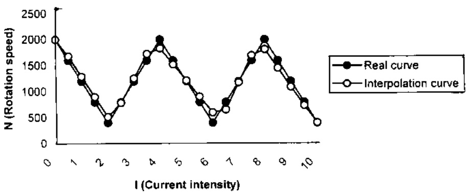

EX7

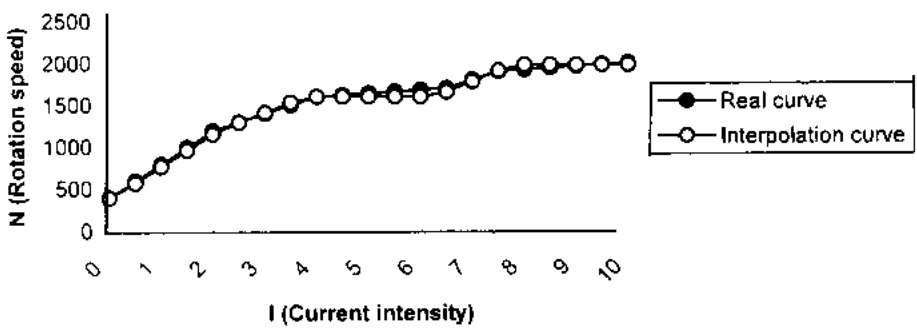

Hình 6: Giải bài toàn lập luận mở bằng nội suy.

## 3.4 Hệ trợ giúp quyết định mà

Ngay sau khi máy tính điện tử ra đời nó đã được nhanh chóng ứng dụng vào việc xây dựng các hệ xử lý thông tin và sau này. cùng với sự phát triển, chúng được gọi là các hệ thông tin quản lý (MIS: Management Information System). Theo nghĩa rộng các hệ MIS cũng hàm chứa chức năng trợ giúp quyết định, chúng cung cấp các thông tin cần thiết cho nhận định tình hình hay phát hiện vấn đề. Tuy nhiên các hệ như vậy không có khả năng can

<!-- page: 79 -->

thiệp vào các quá trình lấy quyết định và đưa ra những phương án tốt cho người lấy quyết định.

## 3.4.1 Hệ trợ giúp quyết định mà

Mục tiêu xây dựng các hệ trợ giúp quyết định và các hệ chuyên gia là làm sao chúng có khả năng sản sinh ra các phương án lấy quyết định hợp lý trước các tình huống cụ thể được phản ảnh. cung cấp qua các dữ liệu. Các dữ liệu phản ánh tình huống và các thông tin được sản sinh ra trong các phương pháp và các quá trình lấy quyết định của người lấy quyết định thường hàm chứa các yếu tố không chính xác, không chắc chắn và biểu thị qua các dữ liệu ngôn ngữ. Vì vậy các hệ mờ sẽ có miền ứng dụng rộng lớn và có vai trò ứng dụng quan trọng, đi đối với sự phát triển mạnh mẽ của xã hội hiện đại—một xã hội thông tin—tri thức.

Như chúng ta có thể cảm nhận, các quá trình lấy quyết định rất phức tạp, đa dạng và vì vậy cũng có rất nhiều phương pháp, mô hình xây dựng các hệ trợ giúp quyết định, trong đó yếu tố quan trọng nhất là các phương pháp lấy quyết định. Dưới dây chúng tôi trình bày một mô hình khá thông dụng để qua đó bạn đọc hình dung phương pháp trợ giúp quyết định và nhận diện một phương pháp xử lý thông tin mơ.

Giả sử người lấy quyết định sử dụng phương pháp chuyên gia, t.l. lấy ý kiến các chuyên gia, để lựa chọn phương án quyết định (chẳng hạn trong việc nên lựa chọn phương án xây dựng nhà máy lọc đầu như thể nào cho tối ưu, trong việc sinh viên tốt nghiệp nên lựa chọn làm việc ở đầu cho phù hợp, trong việc học sinh nên lựa chọn ngành học thể nào (công tác tư vấn hướng nghiệp), hay lựa chọn địa điểm, vùng đầu tư. ....). Các quá trình lấy quyết định như vậy có thể được mô hình hoá như sau.

Giả sử chúng ta có $n$ khả năng lựa chọn (alternatives) $A_1, A_2, \ldots, A_n$. Hãy chọn khả năng tốt nhất trong $n$ khả năng đã cho dựa trên ý kiến của $m$ chuyên gia $E_1, E_2, \ldots, E_m$ đánh giá theo $k$ tiêu chuẩn $C_1, C_2, \ldots, C_k$. Đề phù hợp với thực tế, chúng ta giả thiết mỗi chuyên gia và mỗi tiêu chuẩn có một trọng số nào đó thể hiện mức độ tin cây vào chuyên gia và tâm quan trọng của tiêu chuẩn. và ý kiến đánh giá của các chuyên gia có thể được biểu thị bằng dữ liệu ngôn ngữ (khái niệm mở như cao, thấp, trung bình...) hay bằng số.

Chúng ta giới hạn các khái niệm mở được biểu thị bằng số mở dạng $\widetilde{a} = (a^{L}, a^{U}, \alpha, \beta)$ và kí hiệu ý kiến của chuyên gia $E_{j}$ đánh giá mức độ thỏa mãn của khả năng lựa chọn $A_{i}$ đối với tiêu chuẩn $C_{l}$ là $\widetilde{a}_{ij}^{l} = (a_{ij}^{Ll}, a_{ij}^{Ul}, \alpha_{ij}^{l}, \beta_{ij}^{l})$.

Chúng ta cũng giả sử ràng tâm quan trong của các tiêu chuẩn cũng được xác định dựa trên việc lấy ý kiến chuyên gia và kí hiệu $\tilde{b}_{ij}^{l}=(b_{ij}^{Ll},b_{ij}^{Ul},\delta_{ij}^{l},\varepsilon_{ij}^{l})\quad\tilde{b}_{i}^{l}=(b_{i}^{U},b_{j}^{U},\delta_{i}^{l},\varepsilon_{j}^{l})$ là ý kiến của chuyên gia $E_{j}$ về tâm quan trọng của tiêu chuẩn $C_{l}$. Dựa vào các phép tính trên số mở chúng ta thiết lập ý liên “trung bình cộng” của các chuyên gia bằng các biểu thức sau:

<!-- page: 80 -->

\- Trung bình cộng các ý kiến của các chuyên gia về tâm quan trọng tiêu chuẩn $C_l$ là:

$$
\widetilde {d} ^ {l} = \frac {1}{n} \otimes \left(\widetilde {b} _ {1} ^ {l} \oplus \widetilde {b} _ {2} ^ {l} \oplus \dots \oplus \widetilde {b} _ {n} ^ {l}\right).
$$

\- Trung bình cộng các ý kiến của các chuyên gia về mức độ thỏa mãn của khả năng lựa chọn $A_{i}$ đối với tiêu chuẩn $C_{l}$ là:

$$
\tilde {m} _ {i} ^ {l} = \frac {1}{n} \otimes \left(\tilde {\boldsymbol {a}} _ {i 1} ^ {l} \ominus \tilde {\boldsymbol {a}} _ {i 2} ^ {l} \oplus \dots \oplus \tilde {\boldsymbol {a}} _ {i n} ^ {l}\right).
$$

\- Cuối cùng, kết quả kết nhập các ý kiến của các chuyên gia về độ thỏa mãn của khả năng lựa chọn $A_{i}$ theo tất cả các tiêu chuẩn được cho bởi công thức:

$$
\tilde {\omega} _ {i} = \frac {1}{k M} \otimes \left(\tilde {m} _ {i} ^ {1} \oplus \tilde {d} ^ {1} \oplus \tilde {m} _ {i} ^ {2} \oplus \tilde {d} ^ {2} \oplus \dots \oplus \tilde {m} _ {i} ^ {k} \oplus \tilde {d} ^ {k}\right).
$$

trong đó M là một hàng số xác định.

\- Ván đế sắp xếp các tập mở: Đề chọn phương án tốt chủng ta phải so sánh (t.l. có gắng sắp xếp chúng theo thứ tự tuyến tính) các kết quả $\tilde{\omega}_{i}, i = 1,2, \ldots, n$. Chủng là những tập mở. Như vậy chủng ta cần xây dựng các thuật toán sắp xếp các tập mở (Ranking fuzzy sets). Đây cũng là một vấn đề không để có thuật toán tốt và hiện nay đối với bất kỳ thuật toán sắp xếp các tập mở nào bao giờ cũng có những trường hợp không thể quyết định xem tập này có “lớn hơn” tập kia không và những thuật toán sắp xếp mới vấn tiếp tục xuất hiện trên các tập chí.

## 3.4.2 Các toán từ kết nhập

Ô trên chúng ta đã thấy, để kết quả đánh giá chung về các khả năng lựa chọn đều có phân ý kiến của các chuyên gia một cách hợp lý người ta đã sử dụng phép kết nhập (tích hợp) trung bình công có trọng số. Với nguyên tắc mềm đẻo của công nghệ tính toán mềm trong môi trường mở, chúng ta lại thấy trong sự phát triển của lý thuyết tập mở, người ta cần đưa ra nhiều phương pháp kết nhập (Aggregation) ý kiến chuyên gia khác nhau. Nói khác di một phương pháp kết nhập không thể phù hợp cho môi tình huống đa dạng, phúc tạp khác nhau.

Một cách tiền để một họ các toán từ kết nhập được giả thiết phải thỏa một số điều kiện nào đó. Chắng hạn tiền để “bình đẳng” dồi hỏi khi các ý kiến của các chuyên gia là trùng nhau thì kết quả kết nhập phải trùng với ý kiến chung đó. Một lần nữa chúng ta lại có thể thấy sự dồi hỏi về tính mềm dẻo: không thể có một hệ tiền để chung duy nhất cho các toán từ kết nhập. Tiền đề bình đẳng có thể phù hợp với những tỉnh hướng này nhưng không phù hợp với những tỉnh hướng khác, chẳng hạn không phù hợp đối với mô hình trợ giúp quyết định có gán trọng số cho các chuyên gia (không bình đẳng).

Về trực cảm chúng ta có thể thấy từ thực tiễn cuộc sống là việc kết nhập, tổng hợp ý kiến của mọi người là một việc phức tạp. Trên quan điểm toán học, những nhận xét trên thể

<!-- page: 81 -->

hiện không gian các dữ liệu biểu thị các ý kiến chuyên gia chỉ có cấu trúc yếu và do đó không thể đưa ra một định nghĩa toán từ kết nhập duy nhất.

Dưới dây chúng tôi xin trình bày một họ toán từ kết nhập gọi là uni-norm có cấu trúc toán khá chặt chẽ (xem Yager et al. FSS Vol.80(1996) []).

Định nghĩa 12: Toán từ uni-norm R là một ánh xạ hai ngôi R:[0,1]×[0,1]→[0,1] thỏa các tính chất sau:

a)  $R(a, b) = R(b, a) - \text{Tính chất giao hoán.}$

b)  $R(a, b) \geq R(c, d)$  nếu  $a \geq b$  và  $b \geq d$  - Tính chất đơn điều.

c)  $R(a, R(b, c)) = R(R(a, b), c) - \text{Tính chất kết hợp.}$

d) Tôn tại một phần từ đơn vị e nghĩa là với mọi $a \in [0,1]$ ta đều có $R(a,e)=a$.

Như vậy toán từ uni-norm tương tự như phép toán t-norm và t-conorm, trừ tính chất cuối cùng về phân tử đơn vị. Trong định nghĩa trên, phân tử đơn vị có thể khác các giá trị 0 và 1.

Định lý 8: Giả sử R là toán từ uni-norm với đơn vị là e. Khi đó

a)  $\overline{R}=1-R(\overline{a},\overline{b})$ ,  $\overline{a}=1-a$  cũng là toán từ uni-norm với đơn vị là 1-e.

b) $R(a, b) \geq a$, với mọi $b > e$ và $a \in [0, 1]$.

c) $R(a, b) \leq a$, với mọi $b < e$ và $a \in [0, 1]$.

d) $R(a_{1},\ldots ,a_{n})\geq R(a_{1},\dots,a_{n},a_{n + 1}),\text{ne} \acute{\mathrm{u}} a_{n + 1} <   e.$

e) $R(a_{1},\ldots ,a_{n})\leq R(a_{1},\dots ,a_{n},a_{n + 1}).$ neu $a_{n + 1} > e$

f) $R(a,0) = 0$ với $\forall a\leq e;R(a,1) = 1,$ với $\forall a\geq e.$

Mệnh đề sau đây chỉ ra sự tôn tại toán từ uni-norm;

## Đình lý 9:

I) Toán từ $R_{s}$ được xác định như sau:

a) Với mọi $a, b$ mà $\max(a, b) \leq e$ ta định nghĩa $R_{*}(a, b) = \min(a, b)$;

b) Với mọi $a, b$ mà $\min(a, b) \geq e$ ta định nghĩa $R_{*}(a, b) = \max(a, b)$;

c) Với mọi $a, b$ mà $\max(a, b) > e$ và $\min(a, b) < e$ ta định nghĩa $R_{*}(a, b) = \min(a, b)$,

là toán từ uni-norm với đơn vị là e.

II) Toán từ $R_*$ được xác định như sau:

a) Với mọi $a, b$ mà $\max(a, b) \leq e$ ta định nghĩa $R_{*}(a, b) = \min(a, b)$;

b) Với mọi $a, b$ mà $\min(a, b) \geq e$ ta định nghĩa $R_{*}(a, b) = \max(a, b)$;

c) Với mọi $a, b$ mà $\max(a, b) > e$ và $\min(a, b) < e$ ta định nghĩa $R_{*}(a, b) = \max(a, b)$,

là toán từ uni-norm với đơn vị là e.

Chúng ta có mènh dẻ sau để đạc trung thêm toán từ kết nhập uni-norm

<!-- page: 82 -->

Định lý 10:

1) Nếu $\min(a_1, \ldots, a_n) < e$ thì $R_{*}(a_1, \ldots, a_n) = \min(a_1, \ldots, a_n)$, trái lại thì $R_{*}(a_1, \ldots, a_n) = \max(a_1, \ldots, a_n)$;

2) Nếu $\max(a_1, \ldots, a_n) > e$ thì $R_*(a_1, \ldots, a_n) = \max(a_1, \ldots, a_n)$, trái lại thì $R_*(a_1, \ldots, a_n) = \min(a_1, \ldots, a_n)$.

## 4 Điều khiển mò (Fuzzy Control)

## 4.1 Quá trình điều khiển với yếu tố mà, không chắc chắn

Lý thuyết điều khiển đã được phát triển rất mạnh mẽ và dữ tìm được những lĩnh vực ứng dụng rất rộng rãi trong công nghiệp, trong các hệ thống hoá học, các hệ không gian, .... Các phương pháp điều khiển truyền thống thường đời hỏi người ta phải hiểu biết rõ bản chất của đối tượng cần điều khiển thông qua các mô hình toán học, và trong nhiều ứng dụng chứng thường là các phương trình toán lý phức tạp với bậc phi tuyến cao. Ngoài ra các đối tượng điều khiển thường nằm trong môi trường có những tác động gây nhiều và người ta rất khó xác định được các đặc trưng. Những đối tượng phức tạp như vậy thường nằm ngoài khả năng giải quyết của các phương pháp điều khiển truyền thống và trong quá trình tự động hoá người ta phải nhờ vào khả năng xử lý tình huống của con người và phải thiết kế thiết bị sử dụng việc điều khiển bằng tay. Việc con người có khả năng điều khiển các quá trình như vậy chứng tờ ràng các quá trình đó đã được phản ánh và mô phòng đúng đắn bằng mô hình nào đó trong đầu óc của người điều hành. Như đã trình bày trong phần mở đầu, các mối quan hệ trong quá trình điều khiển này không phải được biểu thị bằng các mô hình toán lý mà bằng mô hình ngôn ngữ với các thông tin không chính xác, không chắc chắn hay nói khác di, những thông tin mở, có tính vốc lệ hay định tính.

Mục tiêu cội nguồn của phương pháp điều khiển mở chính là nhằm vào việc xây dựng các phương pháp có khá năng bắt chuốc cách thức con người điều khiển các quá trình với mô hình định tính như vay trên cơ sở phương pháp luận lý thuyết tập mở và công nghệ tính toán mềm. Việc bắt chuốc này có thể hiểu nòm na như sau:

Vì đối tượng điều khiển là một hệ phức tạp, có những bản chất chưa rõ và không thể biểu thị bằng các mô hình toán lý nên người “chuyên gia” điều hành hệ thống chỉ có thể quan sát thông tin vào – ra để phán đoán hành vi của hệ thống và trên cơ sở kinh nghiệm đó điều khiển hệ thống. Nhận thức về hành vi của hệ này được thầu tóm dưới dạng mô hình mở (M), t.l. một tập các mênh để if...then (các luật) với các dữ liệu ngôn ngữ mô tả mối quan

hệ giữa các biến vào, các biến ra. Việc mô phỏng hành vi của hệ trong thực tế điều khiển của người điều hành bằng một thuật toán tính được bằng máy tính chính là phương pháp lập luận mờ da điều kiện đã trình bày ở trên.

Như vậy các phương pháp điều khiển mờ đều gần với các phương pháp lập luận mờ và chúng có những đặc điểm sau:

<!-- page: 83 -->

1) Nó chỉ dựa trên các thông tin vào—ra quan sát được trên các đối tượng điều khiển, không dòi hỏi phải hiểu bản chất để mô hình hoá toán học đối tượng như trong lý thuyết điều truyền thống.

2) Mô hình định tính dựa trên ngôn ngữ (hay mô hình được biểu thị nhờ trị thức có tính chuyên gia): Thay vì phải mô hình hoá bằng các phương trình toán lý, phương pháp điều khiển mờ dồi hỏi phải thu thập được tri thức để thiết lập mô hình hoá định tính về đổi tượng điều khiển. Trì thức này có thể thu thập từ các chuyên gia hay từ các thuật toán phân tích, khai thác dữ liệu mờ: phát hiện ra các luật, t.l. các mệnh để if...then, từ đồng dữ liệu quan sát được.

3) Giảm độ phức tạp tính toán nhờ mô hình định tính, tuy không có được tính chính xác mà mô hình toán học định lượng có được.

4) Miền ứng dụng rộng lớn đa dạng.

## 4.2 Phương pháp điều khiển mà

Việc nghiên cứu ứng dụng điều khiển mở hiện nay được phát triển rất mạnh mê. Ô nhiều nước công nghiệp phát triển, như Đức, Nhật .... một số phòng thí nghiệm chuyên nghiên cứu ứng dụng phương pháp luận mở trong các lĩnh vực công nghiệp đã được thiết lập (như phòng thí nghiệm LIFE (Laboratory of International Fuzzy Engineering ở Nhật). Tính hiệu quả trong các ứng dụng kỹ thuật và công nghiệp đã hình thành tư tưởng, quan niệm thể hiện qua các thuật ngữ mới như công nghệ lý thuyết tập mở (fuzzy sets technology), công nghệ logic mở (fuzzy logic technology) và gần đây là công nghệ tính toán mềm (soft computing technology). Trong trào lưu như vậy tất nhiên sẽ ra đời rất nhiều phương pháp khác nhau để giải quyết các bài toán thức tế hàm chứa sự thông minh, trí tuệ mà phần lớn các bài toán như vậy có cấu trúc yếu hoặc phương pháp giải truyền thống quá phức tạp. Trong bài tổng quan về các hướng nghiên cứu ứng dụng của lý thuyết tập mở này chúng tôi chỉ nêu tom lượng hai phương pháp điều khiển mở khá “kinh diện”.

## 4.2.1 Phương pháp xây dựng bộ điều khiển mò dựa trên luật (Rule-based fuzzy controllers)

Bộ điều khiển mở dựa trên luật lần đầu tiên được Mamdani và Assilan phát triển vào năm 1975 nhằm điều khiển tự động áp suất hơi nước và tốc độ cho Turbin phát điện thông qua việc thay đổi chế độ cung cấp nhiệt và van tiết lưu. Ý tưởng phương pháp thiết kế về tổng quát tương tự như đã trình bày ở trên và quan trọng là dựa vào việc xây dựng một phương pháp lập luận mở và lượng hoá các khái niệm mở cho phù hợp.

Đặc trung của phương pháp này là tập hợp các luật (tri thức) được xây dựng dựa vào tri thức của các chuyên gia, hay nói khác đi là tập luật là sự mô phỏng các tỉnh hướng đáp ứng của các chuyên gia trong quá trình thao tác điều khiển.

Bộ điều khiển mờ kiểu như vậy đã được phát triển và ứng dụng trong nhiều công việc khác nhau, trong công nghiệp, trong điều khiển các lò xì măng v.v....

<!-- page: 84 -->

Phương pháp xây dựng kiểu bộ điều khiển này có ưu điểm là đơn giản và việc ứng dụng cũng khá phố biến. Tuy nhiên nó cũng có những bất lợi. Thứ nhất, việc xây dựng tập hợp luật là một khó khăn. Các chuyên gia không dễ gì phát biểu trì thức của họ dưới dạng luật mạc dù họ có kinh nghiệm. Thư hai, Một khi bộ điều khiển đã được xây dựng thì thuật toán điều khiển dựa trên tập luật đó là cổ định, không thay đổi, không thể thích nghi theo sự thay đổi của quá trình điều khiển. Thứ ba là theo phương pháp thiết kế, bộ điều khiển sẽ cư xử giống như người chuyên gia điều khiển quá trình đó, mạc dù cư sử như vậy chưa chắc đã là tối ưu.

Những thiếu sót này dẫn đến việc phát triển các bộ điều khiển mở tự tổ chức (self-organising—controller). Đặc điểm của bộ điều khiển kiểu này là nó sẽ tự sinh ra luật điều khiển của mình.

## 4.2.2 Phương pháp xây dựng bộ điều khiển mô dựa trên mô hình (Model-based fuzzy controller)

Như trên đã trình bày ý tưởng chính của phương pháp trên là thuật toán điều khiển mô phỏng hành vi của người điều hành. Trái lại, ý tưởng của phương pháp này, tương tự như các phương pháp truyền thống, là mô hình hoá chính đối tượng hay quá trình điều khiển bằng mô hình mở trên cơ sở khảo sát mối quan hệ giữa dữ liệu biến vào và biến ra. Mô hình hệ điều khiển có thể mô phỏng trong hình 7 dưới đây. Cách tiếp cận như vậy có những ưu điểm sau: 1) Về nguyên tắc việc khảo sát hành vi (sự đáp ứng) của đối tượng điều khiển thông qua inputs và outputs là đề dàng hơn so với việc khảo sát sự đáp ứng của các chuyên gia (operators); 2) Phương pháp này cung cấp khả năng thiết kế mềm đẻo, linh hoạt hơn và cung cấp cách thức bộ điều khiển đạt được mục tiêu chữ không chỉ đơn giản là việc đáp ứng lại các input: 3) Văn tận dụng lợi thế của phương pháp lập luận mờ.

Những nội dung chính của phương pháp là:

\- Xây dựng mô hình mô quan hệ (relational fuzzy model) dựa trên quan sát input/output;

\- Xây dựng thuật toán cho phép bộ điều khiển lựa chọn thao tác điều hành cho kết quả tốt nhất dựa trên hàm tôn thất mờ (fuzzy cost function);

\- Có thể sử dụng mô hình tự học (self-learning) hay các mô hình lai giữa mô hình mở và mô hình toán học.

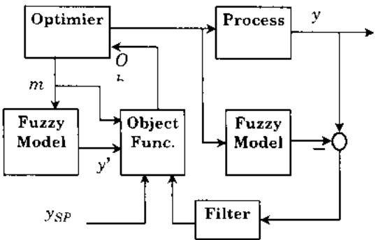

Hình 7: Điều khiển có mô hình mà theo dõi.

<!-- page: 85 -->

## 4.2.3 Phương pháp điều khiển thông minh dựa trên tri thức và logic mò

Trong thực tiễn điều khiển các quá trình người ta thường gặp những môi trường trong đó người ta không thể thu được các dữ liệu chính xác hoặc không thể mô tả chính xác trạng thái, .... trong những trường hợp như vậy cần phát triển, xây dựng các bộ điều khiển thông minh nhiều thành phần dựa trên việc kết hợp các kỹ thuật điều khiển chuyên gia để chọn các giải thuật điều khiển và sử dụng logic mở để đánh giá

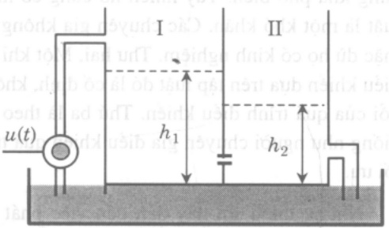

Hình 8: Điều khiển mục nước.

hiệu năng thực hiện của giải thuật. Nghĩa là người ta sẽ sử dụng nhiều giải thuật điều khiển khác nhau trong cùng một bộ điều khiển. Một ví dụ đơn giản là việc điều khiển một hệ hai bề nước thông nhau. Nó là một hệ SISO (single-input – single–output). Tuy nhiên đầy là một hệ phức tạp vì thực nghiệm chỉ ra rảng máy bơm có đặc trưng động học phi tuyến bậc cao liên quan đến điện áp đầu vào và tốc độ dòng chảy. Khi điện áp thấp máy bơm không tạo đủ áp suất đưa nước vào bề I, nhưng với điện áp cao, tốc độ dòng không phụ thuộc vào điện áp. Với tính phi tuyến như vậy người ta không thể áp dụng các bộ điều khiển thông thường để điều khiển quá trình này mà đời hồi phải ứng dụng phương pháp điều khiển thích nghi dựa trên cơ sở tri thức. Trong trường hợp này người ta sử dụng bốn giải thuật điều khiển tổng hợp khác nhau: bộ điều khiển tự điều chỉnh PID, bộ điều khiển PPC (Pole-placement controller), bộ điều khiển GMV (Generalised minimum variance controller), bộ điều khiển GPC (Generalised predictive controller).

Cấu trúc của bộ điều khiển thông minh được trình bày trong hình 9. Trong hình thể hiện hệ có chứa bôn giải thuật điều khiển mà sẽ được sử dụng theo một chiến lược dựa trên kiến thức (cơ sở tri thức) của chuyên gia.

Mạc dù phương pháp dựa trên công nghệ các hệ chuyên gia nhưng nó có những khác biệt dáng kể so với các hệ chuyên gia khác, như nó dồi hỏi phải sản sinh tín hiệu điều

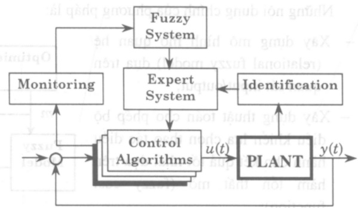

Hình 9: Bộ điều khiển mờ thông minh.

khiền trong thời gian thực (real time), không cần đồi hỏi sự tương tác với con người để thực hiện chức năng điều khiển (hệ chuyên gia hay hệ hỗ trợ quyết định, một cách tự nhiên, cần tương tác với người ra quyết định), bộ điều khiển thông minh cần phải tương tác trực tiếp với quá trình hay đối tượng điều khiển và cần trang bị các phương tiện để gắn bộ điều khiển vào quá trình ấy.

<!-- page: 86 -->

Bộ điều khiển loại này có những đặc điểm sau:

\- Nó phải có khả năng sử dụng nhiều giải thuật điều khiển khác nhau, đánh giá được chiến lược điều khiển nào có khả năng sinh ra tín hiệu điều khiển thích ứng nhất và có khả năng điều chỉnh các thông số của mỗi giải thuật để thích ứng với những đồi hỏi trong các tình huống khác nhau. Việc đánh giá này dựa vào kỹ thuật tập mờ và logic mờ với dữ liệu ngôn ngữ như nhỏ, trung bình, lớn ....

\- Nó có khả năng dáng giá và lựa chọn giải thuật để duy trì trạng thái gần tối ưu và đảm bảo độ tin cây. và ngay cả khi một vài yếu tố của thiết bị điều khiển bị hông nó cũng có thể câu hình lại giải thuật đó hay chuyển sang bộ giải thuật khác thích ứng hơn.

\- Nó có một cơ sở tri thức về kinh nghiệm đối với quá trình điều khiển cùng với những tri thức dạng luật mà các giải thuật sẽ sử dụng trong quá trình điều khiển v.v....

Ví dụ đối với hệ hai bề nước các luật có thể là:

If Overshoot is Small AND Setting time is Fast, Then Score is Large Positive;

If Overshoot is Small AND Setting time is Slow. Then Score is Medium Positive;

If Overshoot is Large AND Setting time is Optimal, Then Score is Small Positive

V.V....

## 5 Tính toán mò và tri thức

Tri thức có vai trò rất quan trọng trong các hoạt động “thông minh” của con người. Như chứng ta dễ dàng nhân thấy, mối con người dù là người nước nào đều tư duy bằng ngôn ngữ và như vậy tri thức trong đầu của mỗi người được biểu thị qua ngôn ngữ. Vì ngôn ngữ hàm chứa các thông tin mở cho nên việc ứng dụng phương pháp luận mở trong việc biểu diễn, xử lý, xây dựng các hệ tri thức là tự nhiên và như vậy mới thực sự di vào giải quyết vấn đề một cách bản chất. Chính vì vậy các mô hình fuzzy được sử dụng để mô phỏng, phản ánh, giả quyết các bài toán liên quan đến các khóa cạnh định tính của tri thức. Một trong những ứng dụng của công nghệ tính toán mở là bài toán phát hiện, khai phá tri thức.

## 5.1 Khai phá dữ liệu (DM - Data Mining)

Cách dảy vải năm chúng ta thấy rộ lên vấn đề khai thác dữ liệu (Data Mining (DM)) mà nội dung chủ yếu là phát hiện thông tin có tính trí tuệ trong kho tàng dữ liệu. Khai phá dữ liệu (DM) thường di đôi với phát hiện trí thức (Knowledge Discovery (KD)), vì tuy mức độ "trí tuệ" của kết quả khai thác dữ liệu có khác nhau nhưng ý tưởng của chúng có chung một bán chất. Vì vậy trong mục này tuy chỗ này chỗ kia có sử dụng một trong hai thuật ngữ đó nhưng chúng ta hiểu đang nối cùng một vấn đề phương pháp luận.

Như chúng ta đã thấy, ngay sau khi ra dòi vài năm, máy tính điện tử đã được ứng dụng vào lĩnh vực quản lý, một lĩnh vực hoạt động cần có thông tin và trí thức. Trong sự phát triển

<!-- page: 87 -->

của xã hội mà yếu tố khoa học công nghệ có tính quyết định nhu cầu như vây trở nên ngày càng to lớn và dẫn đến sự bùng nổ thông tin và những nhà quản lý đúng trước tỉnh trang phải đối mặt với tình trạng lụt “thông tin”. Ví dụ Hệ thông quan sát trái đất của NASA trong năm 1999 phải sinh tạo ra 50 Gb dữ liệu ảnh quan sát được mỗi giờ: thị trường Walmart phải thực hiện khoảng 20 triệu giao dịch dữ liệu mỗi ngày, ....

Chính vì vậy các chuyên gia cho ràng hiện nay chúng ta đang sống trong một xã hội rất giàu có về thông tin nhưng nghèo về thi thức. Tỉnh hình đó dồi hỏi phải nghiên cứu phát triển các phương pháp khai phá, phát hiện ra những thông tin, tri thức hữu ích bị che dấu trong “đống” thông tin (dữ liệu) để phục vụ cho các công việc của các nhà quản lý, các chuyên viên, chuyên gia. Chắng bao lâu nửa chúng ta sẽ chứng kiến sự gia tăng mạnh mẽ các ứng dụng của bài toán phát hiện trí thức từ dữ liệu.

Mục tiêu của bài toán khai phá dữ liệu là tìm ra thông tin, tri thức (t.l. những mối quan hệ hay sự phụ thuộc giữa các đại lượng (các biến)) trong kho tàng dữ liệu(vê một lĩnh vực nào đó). Suy cho cùng tri thức phản ánh mối quan hệ giữa các đại lượng mà quan hệ là cấu trúc của sự vật, hiện tượng.

Bài toán cơ sở của vấn đề khai phá dữ liệu mờ có thể hình thức hoá như sau:

Cho một bảng dữ liệu với cột chỉ các thuộc tính (attribute) và mỗi hàng là một bộ dữ kiện. Bảng dữ liệu này sẽ phần ảnh những cái gì đó, hay nói cách khác nó hàm chữa những mối quan hệ bản chất nào dấy (tri thức) mà ta cần phải tìm. phát hiện ra. Chẳng hạn T là bảng dữ liệu về thời tiết với các thuộc tính về áp suất khí quyền. nhiệt độ, độ ẩm, tốc độ gió trung bình, cường độ bức xạ mặt trời, ....

Môi tri thức sẽ được phát hiện trên một góc nhìn nào đó, ta gọi là khung cảnh (context). Ô đây sẽ là khung cảnh mở hay khung cảnh ngôn ngữ. Khung cảnh sẽ được kí hiệu là C. Ví dụ phát hiện tri thức trong bảng dữ liệu với khung cảnh được xác định bởi áp suất = small & nhiệt độ = medium.

Khi đó bài toán khai phá tri thức được phát biểu như sau:

Hãy tim câu trúc S trong bảng T với khung cảnh C trong đó C sẽ được biểu thị bằng tập mò, vi dụ áp suất = small sẽ được biểu thị bằng một tập mò P nhất định trong không gian tham chiếu chỉ số đo áp suất khí quyền.

Trường hợp khung cánh được xác định bởi nhiều biến, bài toán có thể phát biểu như sau:

Hày tìm câu trúc S của T với khung cảng C được xác được định bồi

$\{\acute{a}p\ su\acute{a}t = small\ AND\ nhi\hat{e}t\ \dot{d}\hat{o} = medium\}$.

Tà thấy ngay là mô hình mở (khái niệm mở hay ngôn ngữ) rất dễ sử dụng, rất tự nhiên. cỏ động và trực cảm. Lý thuyết tập mở thiết lập cho chúng ta những (chứ không phải là một) cơ chế tính toán để giải bài toán này.

<!-- page: 88 -->

Có thể hình dung bài toán cơ bản này như là một cái “lọc” (filtering): dữ liệu qua cái lọc này sẽ cho kết quả là các dữ liệu thỏa mãn những điều nào đó. Điều cần nhân mạnh, đây là những điều kiện mò.

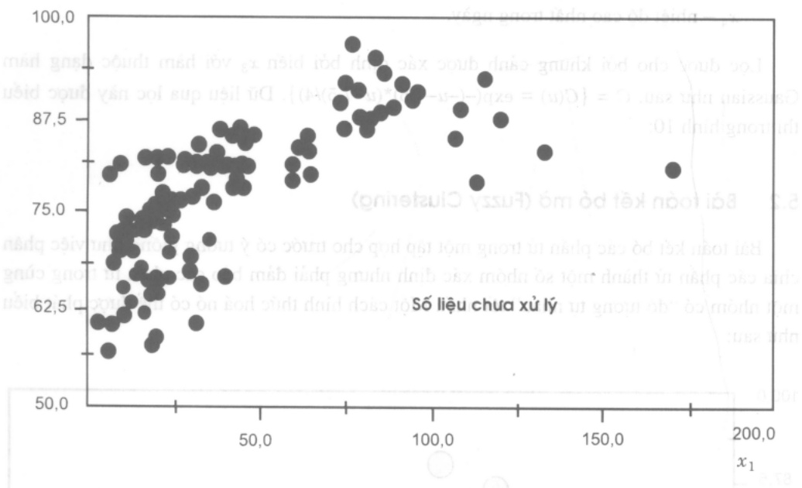

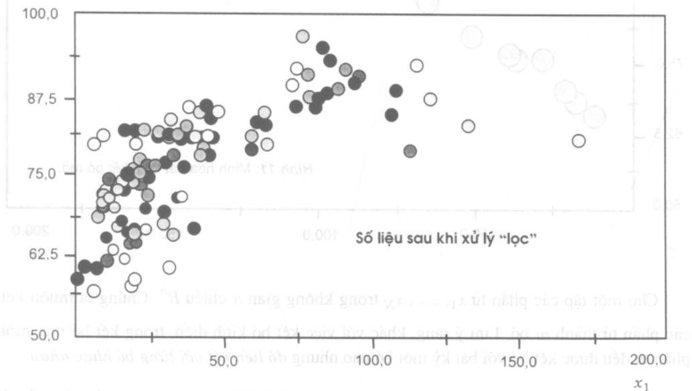

Hình 10: Lộc mã dữ liệu.

Ví dụ hãy xem xét đóng dữ liệu đề cập đến sự trong lành của không khí vùng New York. Dữ liệu được thu thập trên cơ sở 4 thuộc tính:

<!-- page: 89 -->

$x_{1}$  - múc độ ozone,

$x_{2}$  - bức xạ mặt trời.

$x_{3}$  - tốc độ trung bình của gió,

$x_{4}$  – nhiệt độ cao nhất trong ngày.

Lọc được cho bởi khung cảnh được xác định bởi biến $x_{3}$ với hàm thuộc dạng hàm Gaussian như sau: $C = \{C(u) = \exp(-(-u-7,5)^{*}(u-7,5)/4)\}$. Dữ liệu qua lọc này được biểu thị trong hình 10:

## 5.2 Bài toán kết bó mà (Fuzzy Clustering)

Bài toán kết bó các phần tử trong một tập hợp cho trước có ý tưởng giống như việc phân chia các phần tử thành một số nhóm xác định nhưng phải đảm bảo các phần tử trong cùng một nhóm có "độ tương tự nhau" tốt nhất. Một cách hình thức hoá nó có thể được phát biểu như sau:

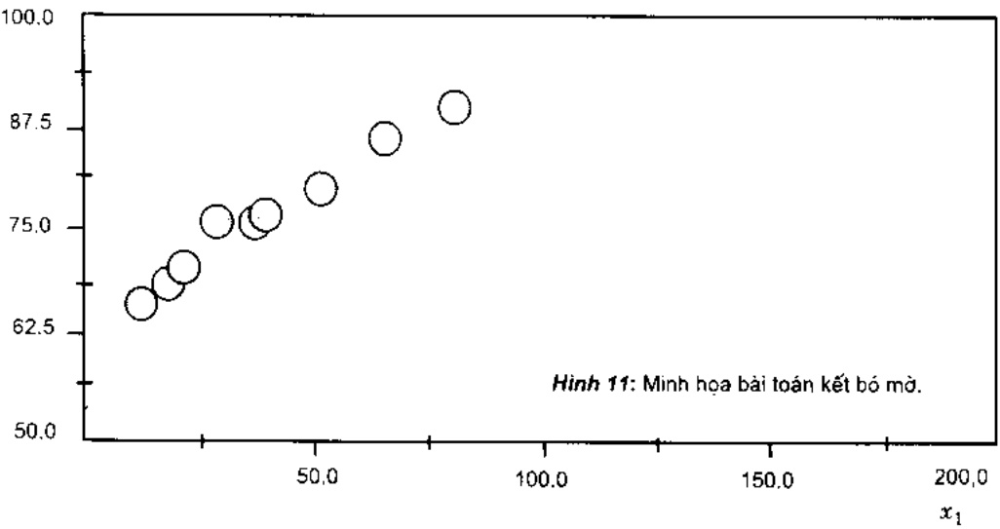

Cho một tập các phần từ $x_{1}, \ldots, x_{N}$ trong không gian $n$ chiều $R^{n}$. Chứng ta muốn kết các phần từ thành $m$ bó. Lưu ý ràng, khác với việc kết bó kinh điện, trong kết bó mờ, mỗi phần từ đều được kết bó với bất kỳ một bó nào nhưng độ liên kết với từng bó khác nhau.

Gọi $z_{i}$ là phần tử mẫu của bó thứ $i, i = 1, \ldots, m$. Gọi $P$ là họ các ma trận phân hoạch cỡ $m \times N$ được định nghĩa như sau:

$$
\boldsymbol {P} = \{\mu = (p i k): p i k \in [ 0, 1 ], \sum_ {i = 1} ^ {m} p _ {i k} = 1, \forall k \text {và} 0 <   \sum_ {i = 1} ^ {m} p _ {i k} <   N \text {vói} \forall i \}.
$$

Hây kết bó sao cho nó làm tối tiêu hàm Q và ta có bài toán tối ưu sau:

<!-- page: 90 -->

$$
\min _ {\mu , x _ {1}, \dots , x _ {n}} Q = \sum_ {i = 1} ^ {m} \sum_ {k = 1} ^ {N} p _ {i k} \left| x _ {k} - z _ {i} \right| ^ {2}
$$

với điều kiện ràng buộc là $\mu \in P$.

Đế nhận dạng rõ hơn mối quan hệ của dữ liệu trong ví dụ trên, ta chỉ tập trung vào các phần từ mẫu được xác định qua sử dụng thuật toán kết bó cùng các kỹ thuật mở khác và ta thu được đồ thị như ở hình 11:

## 6 Danh mục các tài liệu dẫn

Đế bạn đọc thấy được sự phát triển của các hướng nghiên cứu và để tiện theo dõi lĩnh vực mình quan tâm chúng tôi liệt kê một số lượng khá lớn các tài liệu và sắp xếp theo các vực khoa học.

## 6.1 Giải tích

[1] M. Friedman, M. Ming, A. Kandel: On the validity of the Peano theorem for fuzzy differential equations, Fuzzy Sets and Systems, Vol. 86 N. 3, (1997)

[2] J.Y. Park, H.K. Han, J.U. Jeong: Asymptotic behaviour of solutions of fuzzy differential equations, Fuzzy Sets and Systems, Vol. 91 N.3 (1997).

[3] F.M. Ali: A differential equation approach to fuzzy non-linear programming problem, Fuzzy Sets and Systems Vol.93 N.1 (1998).

[4] J.J. Buckley and T. Feuring: Fuzzy differential equations, Fuzzy Sets and Systems, Vol.110 N.1 (2000).

## 6.2 Topo

[1] A.S. Mashhour, M. H. Ghanim, A.N. EL-Wakeil and N.N.Morsi: The productivity classes of fuzzy topologies, Fuzzy Sets and Systems Vol.53 N.2 (1993).

[2] K.C Chattopadhyay and S.K. Samanta: Fuzzy topology: Fuzzy closure operator, fuzzy compactness and fuzzy compactness. Fuzzy Sets and Systems Vol.54 N.2(1993).

[3] Mingsheng Ying: Compactness in fuzzifying topology, Fuzzy Sets and Systems, Vol5.5 N.1(1993).

[4] Mingsheng Ying: A new approach for fuzzy topology (III). Fuzzy Sets and Systems Vol.55 N.2(1993).

[5] R. Srivastava: On separation axioms in a newly defined fuzzy topology, Fuzzy Sets and Systems, Vol.62 N.3(1994).

[6] P.Das: Fuzzy topology on fuzzy sets: Product fuzzy topology and fuzzy topological groups, Fuzzy Sets and Systems. Vol.100 N,1-3(1998).

[7] D. Adnadjevic: Mappings and covering properties of topological groupoids, Fuzzy Sets and Systems, Vol.101 N.3(1999).

[8] W. Gahler, A.S. Abd-Allah and A. Kandil: On extended fuzzy topologies, Fuzzy Sets and Systems. Vol.109 N.2(2000).

[9] V. Gregori and A. Vidal: Gradations of openness and Chang fuzzy topologies. Fuzzy Sets and Systems, Vol.109 N.2(2000).

## 6.3 Bài toán quy hoạch

[1] Herrera, J.L. Verdegay and H-J. Zimmermann: Boclean programming problems with fuzzy constraints. Fuzzy Sets and Systems. Vol.55 N.3(1993).

[2] H. Kuwano: On the fuzzy multi-objective linear programming problems: goal programming approach. Fuzzy Sets and Systems. Vol.82 N.1(1996).

<!-- page: 91 -->

[3] S. Chanas, D. Kuchta: Fuzzy integer transportation problem, Fuzzy Sets and Systems, Vol.98, N.3(1998).

[4] D. Wang: An inexact approach for linear programming problems with fuzzy objective and resources, Fuzzy Sets and Systems, Vol.89, N.1(1997).

[5] Y. Nakahara: User oriented ranking criteria and its application topological fuzzy mathematical programming problems, Fuzzy Sets and Systems, Vol.94, N.3(1998).

[6] M.A.E. Kassem: A study of fuzzy parametric on multiobjective nonlinear programming problems without differentiability, Fuzzy Sets and Systems, Vol.98, N.1(1998).

[7] S.M. Guu, Y.K. Wu: Two-phase approach for solving the fuzzy linear programming problems, Fuzzy Sets and Systems, Vol.107, N,2(1999).

## 6.4. Lý luận mà và trợ giúp quyết định

[1] Fuzzy Sets and Applications: The selected papers by L. A. Zadeh (Wiley, New York, 1987), Eds: R. R. Yager, S. Ovchinnikov, R. M. Tong and H. T. Nguyen

[2] L. A. Zadeh: A theory of approximate reasoning, Inform. Sci. 8(1975)367-411.

[3] L. A. Zadeh: The concept of linguistic variable and its application to approximate reasoning (1), Inform. Sci. 8(1975)199-249.

[4] L.A. Zadeh: The concept of linguistic variable and its application to approximate reasoning (II), Inform. Sci. 8(1975) 310–357.

[5] E. Eslami, J.J. Buckley: Inverse approximate reasoning. Fuzzy Sets and Systems Vol.87, N.2(1997).

[6] T. Yamashita: On a support system for human decision making by the combination of fuzzy reasoning and fuzzy structural modelling. Fuzzy Sets and Systems Vol.87. N.3(1997).

[7] J.L. Castro, E. Trillas, J.M. Zurita: Non-monotonic fuzzy reasoning, Fuzzy Sets and Systems Vol.94, N.2(1998).

[8] Y. Shi, M. Mizumoto: A note on reasoning conditions of Koczy's interpolative reasoning method (Short Communication), Fuzzy Sets and Systems Vol.96.N.3(1998).

## 6.5 Detuzzification

[1] S. Mabuchi: A proposal for a defuzzification strategy by the concept of sensitivity analysis, Fuzzy Sets and Systems Vol.55.N.1(1993).

[2] R.R. Yager and D. Filev: On the issue of defuzzification and selection based on a fuzzy set, Fuzzy Sets and Systems Vol.55.N.3(1993).

[3] R.R. Yager: Knowledge-based defuzzification, Fuzzy Sets and Systems Vol.80,N.2(1996).

[4] L.Rondeau, R. Ruelas, L. Levrat, M. Lamotte: A defuzzification method respecting the fuzzification. Fuzzy Sets and Systems Vol.86,N.3(1997).

## 6.6 Lập luận dựa trên đại số gia tử

[1] N. Cat Ho: Fuzziness in structure of linguistic truth values: A foundation for development of fuzzy reasoning. Proc. of ISMVL '87. Boston, USA (IEEE Computer Society Press, New York), 1987, 326-335.

[2] N. Cat Ho: A method in linguistic reasoning on a knowledge base representing by sentences with linguistic belief degree. Fundamenta Informaticae Vol. 28 (3.4) (1996), 247-259 (also appeared at Linguistic-valued logic and a deductive method in linguistic reasoning, Proc. of the Fifth IFSA' 93, Seoul, Korea, July 4-9, 1993).

[3] N. Cat Ho, H.V. Nam, T.D. Khang, N.H. Chau: Hedge algebras, linguistic-valued logic and their application to fuzzy reasoning. Inter. J. of Uncertainty. Fuzziness and Knowledge-Based Syst., Vol.7, No.4(1999) 347-361.

[4] N. Cat Ho & H. Van Nam: A refinement structure of hedge algebras, Proc. of the NCST of Vietnam 9 (1) (1997). 15-28.

[5] N. Cat Ho & H. Van Nam: A theory of refinement structure of hedge algebras and its application to fuzzy logic, in: D. Niwinski & M. Zawadowski, Eds., Logic, Algebra and Computer Science, Banach Centre Publications (PWN-Polish Scientific Publishers), 1999, 63-91.

<!-- page: 92 -->

[6] N. Cat Ho & W. Wechler: Hedge algebras: An algebraic approach to structure of sets of linguistic truth values. Fuzzy Sets and Systems 35 (1990), 281-293.

[7] N. Cat Ho & W. Wechler; Extended hedge algebras and their application to fuzzy logic, Fuzzy Sets and Systems 52 (1992), 259 - 281.

## 6.7 Decision Making

[1] L.-M. Jia and XX.-D. Zhang: Distributed intelligent railway traffic control Based on fuzzy decision making, Fuzzy Sets and Systems Vol.62.N.3(1994).

[2] F. Herrera, E. Herrera-Viedma and J.L. Verdegay: A model of consensus in group decision making under linguistic assessments. Fuzzy Sets and Systems Vol.78,N.1(1996).

[3] Ch. Carlsson and R. Fuller: Fuzzy multiple criteria for decision making: Recent development, Fuzzy Sets and Systems, Vol.78,N.2(1996).

[4] F. Herrera, E. Herrera-Viedma and J.L. Verdegay: Direct approach processes in group decision making using linguistic OWA operator Fuzzy Sets and Systems, Vol.79,N.2(1996).

[5] S. Bodjanova: Approximation of fuzzy concepts in decision making, Fuzzy Sets and Systems, Vol.85,N.1(1997).

[6] K. Meier: Methods for decision making with cardinal numbers and additive aggregation. Fuzzy Sets and Systems. Vol.88, N.2(1997).

[7] F. Herrera, E. Herrera Viedma, J.L. Verdegay: Choice processes for non-homogeneous group decision making in linguistic setting, Fuzzy Sets and Systems, Vol. 94, N.3(1998).

[8] K.K.Dompere: Cost-benefit analysis, benefit accounting and fuzzy decisions (II). A hypothetical application topological mental illness. Fuzzy Sets and Systems. Vol.100, N.1-3(1998).

## 6.8 Điều khiển mò

[1] V. Novak: Fuzzy control from the logical point of view, Fuzzy Sets and Systems, Vol.66, N.2(1994).

[2] W. Z. Qiao and M. Mizumoto: PID type fuzzy controller and parameters adaptive method. Fuzzy Sets and Systems. Vol.78.N.1(1996).

[3] B.E. Postlethwaite: Building a model-based fuzzy controller, Fuzzy Sets and Systems, Vol./79.N.1(1996).

[4] Misir, H. A. Malki and G. Chen: Design and analysis of a fuzzy proportional-integral-derivative controller, Fuzzy Sets and Systems, Vol.79, N.3(1996).

[5] Tong Shaocheng, chai Tianyou, Zhang Huaguang: Notes on multivariable fuzzy controller under Goedel implication. Fuzzy Sets and Systems, Vol.88, N.2(1997).

[6] C.C. Fuh, P.C. Tung: Robust stability analysis of fuzzy control systems, Fuzzy Sets and Systems, Vol.88, N.2(1997).

[7] F. Herrera, M. Lozano, J.L. Verdegay: A learning process for fuzzy control rules using genetic algorithms, Fuzzy Sets and Systems, Vol. 100, N. 1-3 (1998).

[8] C. Li and R. Priemer: Fuzzy control of unknown multiple-input-multiple-output plants, Fuzzy Sets and Systems, Vol.104, N.2(1999).

[9] M.R. Emani, I.B. Turksen, A.A. Goldenberg: A unified parameterized formulation of reasoning in fuzzy modeling and control. Fuzzy Sets and Systems, Vol.108, N.1(1999).

## 6.9 Lý thuyết tập hợp

[1] E.Tresch: On the convergence of product-sum series of L-R fuzzy numbers, Fuzzy Sets and Systems, Vol.53, N.2(1993).

[2] X. Xiaoping, H. Minghu and W. Congxin: On the extension of the fuzzy number measure in Banach spaces: Part I. Representation of fuzzy number measure, Fuzzy Sets and Systems. Vol.78, N.3(1996).

[3] D.P. Filev, R.R. Yager: Operations of fuzzy numbers via fuzzy reasoning. Fuzzy Sets and Systems, Vol.91, N.2(1997).

[4] K.I. Zhang, K. Hirota: On fuzzy number lattice (R1 ≤.) Fuzzy Sets and Systems, Vol.92, N.1(1997).

[5] M. Delgado, M.A. Vila, W. Voxman: On a canonical representation of fuzzy numbers, Fuzzy Sets and Systems, Vol.93, N.1(1998).

<!-- page: 93 -->

[6] W.Voxman: Some remarks on distances between fuzzy numbers, Fuzzy Sets and Systems, Vol.100, N.1-3(1998).

[7] D. Dubois and H. Prade: Semantics of quotient operators in fuzzy relations databases, Fuzzy Sets and Systems, Vol.78, N.1(1996).

[8] F. Tamaki, A. Kanagawa, H. Ohta: Identification of membership functions based on fuzzy observation data. Fuzzy Sets and Systems. Vol. 93, N.3(1998).

<!-- page: 94 -->

# LOGIC MÒ VÀ CÁC ÚNG DỤNG ĐA DẠNG CỦA NÓ

Bùi Công Cường
Viện Toán học Hà nội

## Tóm tắt

Bài tổng quan này gồm 2 phần. Phần 1 sẽ trình bày một số kiến thức cơ bản của logic mở - một hướng hiện đại, đã và đang được khẩn trương nghiên cứu trong nước cũng như trên thể giới và thực tiễn đã tìm được rất nhiều ứng dụng trong nhiều lĩnh vực khác nhau: sản xuất công nghiệp, công nghệ tin học, nghiên cứu và dự báo kinh tế, quản lý môi trường, xã hội học, y học, toán học, ....

Phân 2 của bài báo tập trung vào giới thiệu nhanh một số ứng dụng quan trọng nhất của công nghệ mờ trong các lĩnh vực: điều khiển mờ, hệ chuyên gia mờ, nhận dạng mờ, hệ hỗ trợ quyết định và bài toán lấy quyết định.

## Vào dâu

Bất kỳ một người nào có ít nhiều trị thức đều hiểu rằng ngay trong những suy luận đời thường cũng như trong các suy luận khoa học chặt chế, hay khi triển khai ứng dụng, logic toán học cổ điện và nhiều định lý toán học quan trọng thu được qua những lập luận bằng logic cổ điện đã đóng vai trò rất quan trọng.

Nhung dáng tiếc, chiếc áo logic toán học cổ diễn đã quá chạt hep đối với những ai mong muốn tìm kiếm những cơ sở vững chắc cho những suy luận phù hợp hơn với những bài toán nảy sinh từ công việc nghiên cứu và thiết kế những hệ thống phúc tạp, đặc biệt là những có gång đưa những suy luận giống như cách con người vẫn thường sử dụng vào các lĩnh vực trí tuệ nhân tao (chẳng hạn, như trong các hệ chuyên gia, các hệ hỗ trợ quyết định, ...) hay vào trong công việc điều khiển và vận hành các hệ thống lớn, phúc tạp sao cho kịp thời và hiệu quả.

Một cách tiếp cận mới đã mang lại nhiều kết quả thực tiễn và có nhiều triển vọng tiếp tục phát triển mạnh mê. Đó là cách tiếp cận của lý thuyết tập mờ (Fuzzy Set Theory), bắt đầu với công trình của L. Zadeh, 1965 [1]. Trong sự phát triển da đang của lý thuyết tập mờ và các hệ mờ, logic mờ (Fuzzy Logic) giữ một vai trò cơ bản. Trong bài tổng quan gọn này chúng tôi sẽ trình bày một số kiến thức cơ bản của logic mờ thông qua việc giới thiệu các phép toán chủ chốt, vấn đề lập luận xấp xỉ (lập luận mờ ) của logic mờ bằng con đường dù hiện đại và trực quan và một số ứng dụng của nó.

Phân I bài viết sẽ tập trung vào những phép toán cơ bản và bước dấu đi vào lập luận xấp xỉ với phép suy diễn mờ. Một vài tính toán trong phân cuối nhằm minh họa cho điều khẳng

<!-- page: 95 -->

dịnh của người viết là logic mở tuy còn để ngô nhiều bài toán, song những bước ứng dụng ban đầu vào các bài toán đơn giản không phải là quá khó khăn.

Khả năng ứng dụng rất da dạng của logic mở sẽ tìm thấy trong phân II của bài viết và trong các tài liệu tìm thấy trong phân tài liệu trích dẫn (phân lớn là những tài liệu có thể tìm được ngay trong nước).

## 1 Kiên thức cơ bản về logic mò

## 1.1 Ôn nhanh về logic mệnh để cổ điện

Ta sẽ kí hiệu P là tập hợp các ménh đề và $P, P_{1}, Q, Q_{1}, \ldots$ là những ménh đề. Với mỗi ménh $P \in \mathcal{P}$, ta gần một trị $v(P)$ là giá trị chán lý (truth value) của ménh đề. Logic cổ điện đề nghị $v(P)=1$, nếu $P$ là đúng (T-true). $v(P)=0$, nếu $P$ là sai (F-false).

Trên P chúng ta xác định trước tiên 3 phép toán cơ bản và rất trực quan:

Phép tuyến P OR Q. kí hiệu P ∨ Q, đó là ménh đề "hoặc P hoặc Q".

Phép hội P AND Q, ki hiệu  $P \wedge Q$ . đó là ménh để "vừa P vừa Q".

Phép phù định NOT P, kí hiệu 7 P, đó là mènh đề "không P".

Dựa vào 3 phép toán logic cơ bản này người ta đã định nghĩa nhiều phép toán khác, nhưng đối với chúng ta quan trọng nhất là phép kéo theo (implication), sẽ kí hiệu là $P \Rightarrow Q$.

Sử dụng những định nghĩa trên, trong logic cổ điện, các luật suy điện quan trọng sau đây giữ vai trò rất quyết định trong các lập luận truyền thống. Đó là các luật

a) modus ponens:  $(P \land (P \Rightarrow Q)) \Rightarrow Q$

b) modus tollens: $((P\Rightarrow Q)\land \top Q)\Rightarrow \top P$

c) syllogism:  $((P \Rightarrow Q) \land (Q \Rightarrow R)) \Rightarrow (P \Rightarrow R)$

d) contraposition: $(P\Rightarrow Q)\Rightarrow (\lceil Q\rangle \Rightarrow \lceil P\rceil)$.

Ta hây lấy luật modus ponens làm ví dụ. Luật này có thể giải thích như sau: "Nếu ménh để P là đúng và nếu định lý "P kéo theo Q " đúng, thì ménh để Q cũng đúng".

## 1.2 Logic mô

1973 L..Zadeh trong tài liệu [4] đã đưa vào khái niệm "biến ngôn ngữ" và bước đầu ứng dụng vào suy diện mờ – phân cơ bản của logic mờ. Dây là bước khởi đầu rất quan trọng cho công việc tính toán các suy diện chủ chốt trong các hệ mờ.

Đế có thể tiến hành mô hình hoá các hệ thống và biểu diễn các quy luật vận hành trong các hệ thống này, trước tiến chúng ta cần tới suy rộng các phép toán logic cơ bản (logic connectives) với các mềm để có giá trị chân lý $v(P)$ trong đoạn [0,1] (thay cho quy định $v(P)$ chi nhận giá trị 1 hoặc 0 như trước đây).

<!-- page: 96 -->

Chúng ta sẽ đưa vào các phép toán cơ bản của logic mở qua con đường tiên để hoá. Như vậy có lẽ tự nhiên và phân nào hứa hẹn sẽ có tính công nghệ hơn.

Cho các mènh dé $P, Q, P_1, \ldots$, giá trị chân lý $v(P), v(Q), v(P_1), \ldots$ sẽ nhận trong doàn [0,1]. Sau dày chứng ta di ngay vào các phép toán cơ bản nhất.

## 1.2.1 Phép phủ định

Phù định (negation) là một trong những phép toán logic cơ bản. Đề suy rộng chúng ta cần tới toán từ v(NOT P) xác định giá trị chân lý của NOT P đối với mỗi menses để NOT P.

Ta sẽ xét tới một số tiền để diễn đạt những tính chất quen biết nhất vẫn dùng trong logic cổ điện:

e)  $v(\text{NOT } P)$  chi phụ thuộc vào  $v(P)$ .

f) Nếu  $v(P)=1$ , thì  $v(\text{NOT } P)=0$ .

g) Nếu $v(P)=0$. thì $v(\text{NOT }P)=1$.

h)  $\text{Neu } v(P_{1}) \leq v(P_{2}), \text{ thì } v(\text{NOT } P_{1}) \geq v(\text{NOT } P_{2}).$

Bây giờ chúng ta cho dạng toán học của những toán từ này.

Định nghĩa 1: Hàm $n:[0,1]\to[0,1]$ không tăng thỏa mãn các điều kiện $n(0)=1$, $n(1)=0$. gọi là hàm phủ định (negation - hay là phép phù định).

Chúng ta có thể xét thêm và tiên đề khác:

a) Nếu $v(P_1) < v(P_2)$, thì $v(\text{NOT } P_1) > v(\text{NOT } P_2)$.

b) v(NOT P) phụ thuộc liên tục vào v(P).

c) $v(\mathrm{NOT}(\mathrm{NOT}P)) = v(P)$.

Định nghĩa 2: 1) Hàm phù định n là chặt (strict) nếu nó là hàm liên tục và giảm chất.

2) Hàm phủ định n là mảnh (strong) nếu nó giảm chặt và thỏa mãn:

$$
n (n (x)) = x \text {với môi} x.
$$

Vài ví dụ:

\- Hàm phù định chuẩn $n(x)=1-x$ (ví dụ trong định nghĩa của Zadeh [1]).

\- Hàm phù định  $n(x)=1-x^{2}$ .

\- Phù định trục cảm (Yage, 1980) $n(x)=1$. nếu $x=0$ và $n(x)=0$ nếu $x>0$.

\- Hộ phù định (Sugeno, 1977) $N_{\lambda}(x)=\frac{1-x}{1+\lambda x}$, với $\lambda>-1$.

Định lý biểu diễn.

Xem trong [25].

<!-- page: 97 -->

## 1.2.3 Một cách định nghĩa phần bù của một tập mà

Cho Ω là không gian nén, một tập một A trên Ω tương ứng với một hàm thực nhân giá trị trong doan [0,1]:

A : Ω → [0,1], là hàm thuộc (membership function).

Người ta cũng dùng kí hiệu hàm thuộc $\mu_{A}\colon\Omega\to[0,1]$.

Chúng ta kí hiệu

$$
A = \{(a, \mu_ {A} (a)): a \in \Omega \}.
$$

ò dây

$$
A (a) = \mu_ {A} (a) \in [ 0, 1 ].
$$

là độ thuộc (membership degree) của phần tử x vào tập mờ A. Kí hiệu  $\mu_{A}(\alpha)$  hay được dùng hơn trong các tài liệu về mờ. Song vì thuận lợi chúng ta sẽ dùng  $A(\alpha)$ .

Định nghĩa 3: Cho n là hàm phủ định. phần bù $A^{C}$ của tập mờ Alà một tập mờ với hàm thuộc được xác định bởi $A^{C}(a) = n(A(a))$, với mỗi $a \in \Omega$.

## 1.2.4 Phép hội

Phép hội (vân quen gọi là phép AND - conjunction) là một trong máy phép toán logic cơ bản nhất. Nó cũng là cơ sở để định nghĩa phép giao của hai tập mờ. Chứng ta cần xem xét các tiên để sau:

a)  $v(P_{1} \text{ AND } P_{2}) \text{ chi phụ thuộc vào } v(P_{1}), v(P_{2}).$

b) Nếu $v(P_1)=1$. thì $v(P_1 \text{ AND } P_2)=v(P_2)$, với mọi ménh đề $P_2$.

c) Giao hoán:  $v(P_{1} \text{ AND } P_{2}) = v(P_{2} \text{ AND } P_{1})$ .

d) Nếu $v(P_1) \leq v(P_2)$ thì $v(P_1 \text{ AND } P_3) \leq v(P_2 \text{ AND } P_3)$, với mọi ménh đề $P_3$.

e) Kết hợp: $v(P_1 \text{ AND } (P_2 \text{ AND } P_3)) = v((P_1 \text{ AND } P_2) \text{ AND } P_3).$

Nếu diễn đạt phép hội mờ (fuzzy conjunction) như một hàm $T:[0,1]^{2}\rightarrow[0,1]$ thì chủng ta có thể cần tới các hàm sau:

Định nghĩa 4: Hàm $T: [0,1]^2 \to [0,1]$ là một $t$-chuẩn (chuẩn tam giác hay $t$-norm) khi và chi khi thỏa mãn các điều kiện sau:

a) $T(1,x) = x$, với mọi $0 \leq x \leq 1$.

b) $T$ có tính giao hoán, tức là $T(x,y)=T(y,x)$, với mọi $0\leq x,y\leq1$,

c) T không giám theo nghĩa  $T(x,y) \leq T(u,v)$ , với mọi  $x \leq u, y \leq v$ ,

d) $T$ có tính kết hợp: $T(x, T(y, z)) = T(T(x, y), z)$ với mọi $0 \leq x, y, z \leq 1$.

Từ những tiền để trên chủng ta suy ra ngay $T(0,x)$. Hơn nữa tiền đề d) đảm bảo tính thác triển duy nhất cho hàm nhiều biến.

<!-- page: 98 -->

Định lý biểu diễn: Xem trong [25].

Một vải lớp 1-chuẩn khác cùng một số tính chất các bạn có thể tìm thấy trong bãi báo của Klement [6]và E. Walker [23, trang 306-314].

## 1.2.5 Định nghĩa tổng quát phép giao của hai tập mà.

Cho hai tập mở A, B trên cùng không gian nền Ω với hàm thuộc A(α), B(α). Cho T là một t-chuẩn.

$$
\acute{\text{Ung}}
$$

$(A \cap_{T} B)$ trên Ω với hàm thuộc cho bồi:

$$
(A \cap_ {T} B) (a) = T (A (a), B (a)). \text {vói moi} a \in \Omega.
$$

Việc lựa chọn phép giao nào, tức là chọn t-chuẩn T nào để làm việc và tính toán hoàn toàn phụ thuộc vào từng bài toán cụ thể mà bạn đang quan tâm.

Ví dụ: Hamacher 1978 đề nghị dùng

$$
(A \cap_ {T} B) (a) = \frac {A (a) B (b)}{p + (1 - p) [ A (a) + B (b) - A (a) B (a) ]}, p \geq 0, \text {vói moi} a \in \Omega.
$$

còn Yager,1980 xét phép giao hai tập mò A.B với hàm thuộc cho bồi

$$
(A \cap_ {T} B) (a) = 1 - \min \left\{1, ((1 - A (a)) ^ {p} + (1 - B (a)) ^ {p}) ^ {1 / p} \right\}, p \geq 1, \text {vói moi} a \in [ 0, 1 ].
$$

Cùng thời, Dubois và Prade cũng để nghị một họ toán từ phụ thuộc tham số $t$, đó là phép giao $(A \cap_{T} B)$ với hàm thuộc

$$
(A \cap_ {T} B) (a) = \frac {A (a) B (a)}{\max \{A (a) , B (a) , t \}} \text {, với} 0 \leq t \leq 1, \text {và mọi} a \in [ 0, 1 ].
$$

## 1.2.6 Phép tuyên

Giống như phép hội, phép tuyến hay toán từ logic OR (disjunction) thống thường cần thỏa mãn các tiên đề sau:

a)  $v(P_{1} \text{ OR } P_{2}) \text{ chi phụ thuộc vào } v(P_{1}), v(P_{2}).$

b) Nếu $u(P_1)=0$, thì $v(P_1 \text{ OR } P_2)=v(P_2)$, với mọi ménh đề $P_2$.

c) Giao hoán:  $v(P_{1} \text{ OR } P_{2}) = v(P_{2} \text{ OR } P_{1})$ .

d) Nếu $v(P_{1}) \leq v(P_{2})$ thì $v(P_{1} \text{ OR } P_{3}) \leq v(P_{2} \text{ OR } P_{3})$. với mọi mệnh đề $P_{3}$.

e) Kết hợp: $v(P_1 \text{ OR } (P_2 \text{ OR } P_3)) = v((P_1 \text{ OR } P_2) \text{ OR } P_3).$

Khi ấy chứng ta có thể nghĩ tới các phép tuyển được định nghĩa bằng con đường tiền để như sau:

<!-- page: 99 -->

Định nghĩa 6: Hàm $S : [0.1]^2 \to [0.1]$ gọi là phép tuyến (OR suy rộng) hay là t-đối chuẩn (t-conorm) nếu thỏa mãn các tiền đế sau:

a)  $S(0,x)=x$  với mọi  $x\in[0,1]$ .

b) S có tính giao hoàn:  $S(x,y)=S(y,x)$  với mọi  $0\leq x,y)\leq1$ .

c) S không giảm:  $S(x,y) \leq S(u,v)$  với mọi  $0 \leq x \leq u \leq 1$  và  $0 \leq y \leq v \leq 1$

d) S có tính kết hợp:  $S(x, S(y, z)) = S(S(x, y), z)$  với mọi  $0 \leq x, y, z \leq 1$

Định lý 7: Cho n là phép phù định mạnh. T là một t-chuẩn, khi ấy hàm S xác định trên [0,1]$^{2}$ bằng biểu thức

$$
S (x, y) = n T (n x, n y) \quad \text {với mọi} 0 \leq x, y \leq 1.
$$

là một 1-đổi chuẩn.

Chứng minh: Xem [25].

Không khó khăn nhận thấy rảng. với t-đôi chuẩn $S(x,y)$ bắt kỳ thực hiện bắt đẳng thức

$$
\max (x, y) \leq S (x, y) \leq Z ^ {\prime} (x, y).
$$

Định lý biểu diễn: Xem trong [25] và E. Walker [23, trang 306-314].

Định lý 8: Cho S là t—đôi chuẩn. Khi ấy:

a) S gọi là liên tục nếu đó là hàm liên tục trên miền xác định.

b) S là Archimed nếu  $S(x,x)>x$ . với mối 0<x<1.

c) S gọi là chặt nếu S là hàm tăng tại mỗi điểm  $(x, y) \in (0, 1)^{2}$ .

## 1.2.7 Định nghĩa tổng quát phép hợp của hai tập mà

Định nghĩa 9: Cho Ω là không gian nền. A,B là hai tập mờ trên Ω với hàm thuộc $A(a),B(a)$. S là t-đối chuẩn. Phép hợp $(A\cup_{S}B)$ trên Ω của hai tập mờ là một tập mờ với hàm thuộc:

$$
(A \cup_ {S} B) (a) = S (A (a), B (a)), \text {với mọi} a \in \Omega.
$$

Việc lựa chọn phép hợp nào, tức là chọn t-dối chuẩn S nào để xác định hàm thuộc tương ứng phụ thuộc vào bài toán đang nghiên cứu. Sau đây là máy ví dụ:

\- Hamacher .1978 . đã cho họ phép hợp hai tập mở với hàm thuộc theo tham số q :

$$
(A \cup_ {S} B) (a) = \frac {(q - 1) A (a) B (a) + A (a) + B (a)}{1 + q A (a) B (a)}. q \geq - 1, \text {voi} a \in \Omega.
$$

\- Côn họ phép hợp (A ∪ \_S B) tương ứng của Yager cho bởi hàm thuộc với tham số q:

$$
(A \cup_ {S} B) (a) = \min \left\{1, \left(\mathrm{A} (\mathrm{a}) ^ {\rho} + B (a) ^ {\rho}\right) ^ {1 / p} \right\}, \text {vói} p \geq 1. \text {vói} a \in \Omega.
$$

\- Tuong tự. họ phép hợp do Dubois và Prade để nghị với các hàm thuộc với tham số $t$, có đang:

<!-- page: 100 -->

$$
(A \cup_ {S} B) (a) = \frac {A (a) + B (a) - A (a) B (a) - \min \left\{A (a) , B (a) , (1 - t) \right\}}{\max \{(1 - A (a)) , (1 - B (a)) , t \}}. \text {vói} t \in [ 0, 1 ], a \in \Omega .
$$

## 1.2.8 Một số quy tắc với phép hội và phép tuyến

Nhiều bạn đọc trong nghiên cứu hay chứng minh thường quen dùng nhiều quy tắc suy luận (hay đơn giản hơn là sử dụng một số tính chất gần như hiển nhiên), song thực ra những quy tắc đó có được là do chứng ta xây phân toán học trước đây trên lý thuyết tập hợp cổ điện và logic cổ điện. Chuyển sang lý thuyết tập mở và suy luận với logic mở chứng ta cần thận trọng với những thới quen cũ này.

Ví dụ trong lý thuyết tập hợp, với bất kỳ tập rõ $A \subset \Omega$ thì

$$
A \cap A ^ {C} = \varnothing , \quad A \cup A ^ {C} = \Omega .
$$

nhung sang tập mò thì hai tính chất quen dùng đó không còn đúng nửa.

Sau dây chứng ta dùng lai với máy quy tắc quen biết của hai phép toán hội và phép tuyến.

Cho T là một t-chuẩn, S là t-dôi chuẩn.

## Tính lũy dàng

Định nghĩa 10: Chúng ta nói T là lũy đẳng (idempotency) nếu $T(x,x)=x$, với mọi $x\in[0,1]$.

S là lũy dàng nếu $S(x, x) = x$. với mọi $x \in [0, 1]$.

Mệnh đề 11: $T$ là lũy đăng khi và chí khi $T(x, y) = \min(x, y)$, với $x, y \in [0, 1]$,

$$
S \text {là luy dang khi và chỉ khi} S (x, y) = \max (x, y), \text {vói} x, y \in [ 0, 1 ].
$$

Tỉnh hấp thụ

Định nghĩa 12: Có hai dạng định nghĩa hấp thụ (absorption) suy rộng từ lý thuyết tập hợp:

$$
T (S (x, y), x) = x \text {vói mọi} x, y \in [ 0, 1 ]. \tag {a}\tag{1}
$$

$$
b) \quad S (T (x, y), x) = x \text {với mọi} x, y \in [ 0, 1 ].\tag{2}
$$

Mệnh đề 13: Đắng thức (1) thực hiện khi và chỉ khi $T(x,y)=\min(x,y), \forall x,y \in [0,1]$.

Đảng thức (2) thực hiện khi và chỉ khi $S(x,y)=\max(x,y), \forall x,y \in [0,1]$.

Tính phản phối

Định nghĩa 14: Có hai biểu thức xác định tính phân phối (distributivity):

$$
S (x, T (y, z)) = T (S (x, y), S (x, z)), \text {vói moi} x, y, z \in [ 0, 1 ]. \tag {a}\tag{3}
$$

$$
b) \quad T (x, S (y, z)) = S (T (x, y), T (x, z)), \text {vói moj} x, y, z \in [ 0, 1 ].\tag{4}
$$

Mệnh đề 15: Đảng thức (3) thực hiện khi và chỉ khi $T(x,y)=\min(x,y), \forall x,y \in [0,1]$.

Đảng thức (4) thực hiện khi và chỉ khi $S(x,y)=\max(x,y), \forall x,y \in [0,1]$.

Như vậy nhiều tính chất quen biết hay dùng chỉ luôn luôn đúng với hai phép toán mịn và max.

<!-- page: 101 -->

## 1.2.9 Luật De Morgan

Trong lý thuyết tập hợp luật De Morgan nổi tiếng sau đây được sử dụng nhiều nơi: Cho A, B là hai tập con của Ω, khi đó

$$
(A \cup B) ^ {C} = A ^ {C} \cap B ^ {C}
$$

và  $(A\cap B)^{C}=A^{C}\cup B^{C}$

Có nhiều dạng suy rộng hai đẳng thức này. Sau đây một dạng suy rộng cho logic mở.

Định nghĩa 16: Cho T là t-chuẩn, S là t-đôi chuẩn, n là phép phù định chất. Chúng ta nói bộ ba (T.S.n) là một bộ ba De Morgan nếu

$$
n (S (x, y)) = T (n x, n y).
$$

Chúng ta nói bộ ba (T, S, n) là liên tục nếu T và S là hai hàm liên tục. Sau đây là 2 lớp bộ ba quan trọng:

Định nghĩa 17: Bộ ba De Morgan (T, S, n) là bộ ba manh (strong) khí và chỉ khi có một tư đồng cấu $\varphi : [0, 1] \to [0, 1]$ sao cho:

a) $T(x,y) = \varphi^{-1}(\max \{\varphi (x) + \varphi (y) - 1,0\})$

b) $S(x,y) = \varphi^{-1}(\min \{\varphi (x) + \varphi (y),1\})$

c) $N(x) = \varphi^{-1}(1 - \varphi(x)).$

Định nghĩa 18: Bộ ba De Morgan (T, S, n) là bộ ba chăt (strict) khi và chỉ khi có một tự đồng cấu φ : [0, 1] → [0, 1] sao cho :

a) $T(x,y) = \varphi^{-1}(\varphi (x)\varphi (y)).$

b) $S(x,y) = \varphi^{-1}(\varphi (x) + \varphi (y) - \varphi (x)\varphi (y)).$

c) $N(x) = \varphi^{-1}(1 - \varphi(x))$.

## 1.2.10 Phép kéo theo

Cho đến bày giờ đã có khá nhiều nghiên cứu về phép kéo theo (implication). Điều đó cũng tự nhiên vì dảy là công đoạn chốt nhất của quá trình suy diễn trong mọi lập luận xấp xỉ .bao gồm cả suy luán mò. Trong phần tiếp theo này chúng ta sẽ di tiếp con đường tiền đề hoá và sau đó dùng nhanh tại vài dạng phổ cấp để minh họa.

Chúng ta sẽ xét phép kéo theo như một mối quan hệ, một toán từ logic. Thông thường chúng ta nhớ tối các tiên để sau cho hàm $v(P_{1} \Rightarrow P_{2})$:

1)  $v(P_{1} \Rightarrow P_{2})$  chỉ phụ thuộc vào giá trị  $v(P_{1}), v(P_{2})$ .

2) Nếu $v(P_1) \leq v(P_3)$ thì $v(P_1 \Rightarrow P_2) \geq v(P_3 \Rightarrow P_2)$. với mọi ménh để $P_2$.

3) Nếu $v(P_{2}) \leq v(P_{3})$ thì $v(P_{1} \Rightarrow P_{2}) \leq v(P_{1} \Rightarrow P_{3})$, với mọi ménh đề $P_{1}$.

4) Nếu $v(P_1) = 0$ thì $v(P_1 \Rightarrow P) = 1$, với môi ménh đề $P$.

5) Nếu $v(P_1) = 1$ thì $v(P \Rightarrow P_1) = 1$, với môi ménh đẻ $P$.

<!-- page: 102 -->

6) Nếu  $v(P_{1}) = 1$  và  $v(P_{2}) = 0$ , thì  $v(P_{1} \Rightarrow P_{2}) = 0$ .

Tính hợp lý của những tiên để này chủ yếu dựa vào logic cổ điện và những tư duy trực quan về phép suy diễn. Từ tiên để 10 chứng ta khẳng định sự tổn tại hàm số $I(x,y)$ xác định trên $[0,1]^2$ với mong muốn do giá trị chân lý của phép kéo theo qua biểu thức

$$
v (P _ {1} \Rightarrow P _ {2}) = I (v (P _ {1}), v (P _ {2})).
$$

Định nghĩa 19: Phép kéo theo (implication) là một hàm số $I:[0,1]^{2} \rightarrow [0,1]$ thỏa mãn các điều kiện sau:

1) Nếu  $x \leq z$  thì  $I(x, y) \geq I(z, y)$  với mọi  $y \in [0, 1]$ ,

2) Nếu  $y \leq u$  thì  $I(x, y) \leq I(x, u)$  với mọi  $x \in [0, 1]$ ,

3)  $I(0,x)=1 \text{ với mọi } x\in[0,1]$ ,

4) $I(x,1) = 1$ với mọi $x \in [0,1]$.

5)  $I(1,0)=0.$

Đế ý ràng tuy rất đơn giản nhưng điều kiện 5) vấn cần đưa vào định nghĩa vì không thể suy ra từ 4 tiên để trên.

Từ định nghĩa toán học đề dàng nhận thấy mối phép kéo theo là một tập mở trên  $[0,1]^{2}$  và như vậy xác lập một quan hệ mở trên  $[0,1]^{2}$ .

Tiếp tục, chúng ta xem xét thêm một số tính chất khác của phép kéo theo, những tính chất này nhận được nhà những bài báo của Dubois và Prade.

1)  $I(1,x)=x$ , với mọi  $x\in[0,1]$ .

2) $I(x,I(y,z)) = I(y,I(x,z)).$

Dây là quy tắc đối cho, cơ sở trên sự tương đương giữa hai ménh đề:

"If $P_{1}$ then (If $P_{2}$ then $P_{3}$)"

và "If $(P_{1}\text{ AND } P_{2})$ then $P_{3})$.

3)  $x \leq y$  nếu và chi nếu  $I(x, y) = 1$ .

Tien dê 3) này biểu thị ý: phép kéo theo xác lập một thứ tự.

4) $I(x,0)) = N(x)$ là một phép phù định mạnh, như vay 4) phản ánh mệnh để sau từ logic có điện $P \Rightarrow Q = \lceil P \text{ nếu } v(Q) = 0 \text{ (nếu } Q \text{ là False)}$.

5) $I(x,y)\geq y$ ，với mọi $x,y$

6)  $I(x,x)=1$  với mọi x.

7) $I(x, y) = I(N(y), N(x))$. Điều kiện này phản ánh phép suy luận ngược trong logic cổ điện 2 giá trị: $(P \Rightarrow Q) = (\neg Q \Rightarrow \neg P)$. Nói chung đây là một điều kiện mạnh.

8)  $I(x,y)$  là hàm liên tục trên[0.1] $^{2}$ .

Đế tìm hiểu thêm các điều kiện này chúng ta xét tới định lý sau.

Định lý 20: Môi hàm số $I:[0,1]^2 \to [0,1]$ thỏa mãn các điều kiện 2), 7), 8) thì cũng sẽ thỏa mãn các điều kiện 1), 3), 4), 5), 6), 10) và 11).

<!-- page: 103 -->

Ching minh: Xem trong [25]

## 1.2.11 Một số dạng hàm kéo theo cụ thể

Đế tính toán được . chứng ta cần những dạng cử thể của phép kéo theo. Sau đây là một số dạng hàm kéo theo, xây dựng dựa vào các phép toán logic mở đã suy rộng phía trên.

Cho T là t-chuẩn, S là t-dôi chuẩn, n là phép phủ định mạnh.

Định nghĩa 19: Dạng kéo theo thu nhất. Hàm $I_{S_1}(x,y)$ xác định trên [0,1]$^2$ bằng biểu thức

$$
I _ {S 1} (x, y) = S (n (x), y).
$$

Rō ràng ăn ý sau định nghĩa này là công thức từ logic cổ điện $P \Rightarrow Q = ]P \lor Q$.

Định lý 20: Với bất kỳ t-chuẩn T, t-dối chuẩn S và phép phủ định mạnh n nào, $I_{S1}$ là một phép kéo theo thỏa mãn định nghĩa 19.

Ching minh: Xem trong [25]

Phép kéo thút hai sau đây lấy ý từ logic trực cảm (intuitionistic logic).

Định nghĩa 21: Cho T là t-chuẩn, hàm $I_T(x,y)$ xác định trên [0,1]$^2$ bằng biểu thức

$$
I _ {T} (x, y) = \sup \{u: T (x, u) \leq y \}.
$$

Định lý 22: Với bất kỳ t-chuẩn T nào. $I_T$ được định nghĩa như trên là một phép kéo theo thỏa màn định nghĩa 19.

Ching minh: Xem trong [25]

## 1.3 Quan hệ mò

## 1.3.1 Quan hệ mò và phép hợp thành

Định nghĩa 23: Cho X, Y là hai không gian nền. R gọi là một quan hệ mờ trên X×Y nếu R là một tập mờ trên X×Y, tức là có một hàm thuộc $\mu_{R}:X\times Y\rightarrow[0,1]$, ở đây $\mu_{R}(x,y)=R(x,y)$ là độ thuộc (membership degree) của $(x,y)$ vào quan hệ R.

Định nghĩa 24: Cho $R_{1}$ và $R_{2}$ là hai quan hệ mở trên X×Y, ta có định nghĩa

a) Quan hè $R_{1} \cup R_{2}$ với $\mu_{R_1 \cup R_2}(x, y) = \max\{\mu_{R_1}(x, y), \mu_{R_j}(x, y)\}, \forall (x, y) \in X \times Y$.

b) Quanhê $R_{1} \cap R_{2}$ với $\mu_{R_1 \sim R_2}(x, y) = \min\{\mu_{R_1}(x, y), \mu_{R_2}(x, y)\}$. $\forall (x, y) \in X \times Y$.

Định nghĩa 25: Quan hệ mở trên những tập mờ. Cho tập mờ A với $\mu_A(x)$ trên X, tập mờ B với $\mu_H(x)$ trên Y. Quan hệ mở trên các tập mờ A và B là quan hệ mờ R trên X×Y thỏa mãn điều kiện:

$$
\mu_ {R} (x, y) \leq \mu_ {A} (x). \forall y \in Y \quad \text {va} \quad \mu_ {R} (x, y) \leq \mu_ {B} (x). \forall x \in X.
$$

<!-- page: 104 -->

Định nghĩa 26: Cho quan hệ mò R trên X×Y.

$$
\text {Phép   chiếu của } R \text { lên } X \text { là:} \operatorname{proj} _ {X} R = \{(x, \max _ {y} \mu_ {R} (x, y): x \in X \}
$$

$$
\text {Phép   chiếu của } R \text { lên } Y \text { là:} \operatorname{proj} _ {Y} R = \{(y, \max _ {x} \mu_ {R} (x, y): y \in Y \}
$$

Định nghĩa 27: Cho quan hệ mờ R trên X×Y. Thác triển R lên không gian tích X×Y×Z là:

$\operatorname{ext}_{XYZ} R = \{(x, y, z), \mu_{\mathrm{ex1}}(x, y, z) = \mu_R(x, y), \forall z \in Z\}$.

## 1.3.2 Phép hợp thành

Định nghĩa 28: Cho $R_1$ là quan hệ mở trên $X \times Y$ và $R_2$ là quan hệ mở trên $Y \times Z$. Hop thành $R_1 \circ R_2$ của $R_1, R_2$ là quan hệ mở trên $X \times Z$.

a) Hợp thành max-min (max-min composition) được xác định bởi

$$
\mu_ {R _ {1}, R _ {2}} (x, z) = \max _ {y} \{\min (\mu_ {R _ {1}} (x, y), \mu_ {R _ {2}} (y, z) \}. \forall (x, z) \in X \times Z.
$$

b) Hợp thành max-prod cho bồi

$$
\mu_ {R _ {1} \cdot R _ {2}} (x, z) = \max _ {y} \left\{\left(\mu_ {R _ {1}} (x, y) \cdot \mu_ {R _ {2}} (y, z) \right. \right\}. \forall (x, z) \in X \times Z.
$$

c) Hop thành max-\* được xác định bởi toán từ \*: [0.1]$^{2}$ → [0.1]

$$
\mu_ {R _ {1}: R _ {2}} (x, z) = \max _ {y} \left\{\mu_ {R _ {1}} (x, y) * \mu_ {R _ {2}} (y, z) \right\}, \forall (x, z) \in X \times Z.
$$

Giả thiết (T.S.n) là bộ ba De Morgan, trong đó T là t-chuẩn. S là t-dối chuẩn, n là phép phù định.

Định nghĩa 29: Cho $R_1, R_2$ là quan hệ mở trên X×X, phép T-tích hợp thành cho một quan hệ

$R_{1^{\circ}T}R_{2}$  trên X×X xác định bởi

$$
R _ {1} \circ_ {\mathsf {T}} R _ {2} (x, z) = \sup _ {\nu \in X} T (R _ {1} (x, y), R _ {2} (\nu , z)).
$$

Định lý 30: Cho $R_{1}, R_{2}, R_{3}$ là những quan hệ mở trên $X \times X$, khi đó:

a)  $R_{1} \circ_{T}(R_{2} \circ_{T} R_{3}) = (R_{1} \circ_{T} R_{2}) \circ_{T} R_{3}.$

b) Nếu $R_{1} \subseteq R_{2}$ thì $R_{1^{\circ}\mathsf{T}}R_{3} \subseteq R_{2^{\circ}\mathsf{T}}R_{3}$ và $R_{3^{\circ}\mathsf{T}}R_{1} \subseteq R_{3^{\circ}\mathsf{T}}R_{2}$.

## 1.3.3 Tính chuyển tiếp

Định nghĩa 31: Quan hệ mò R trên XXX gọi là:

a) min-chuyên tiếp nếu min  $\{R(x,y), R(y,z)\} \leq R(x,z) \quad \forall x, y, z \in X.$

b) chuyên tiếp yếu nêu  $\forall x, y, z \in X$  có

$$
R (x, y) > R (y, x) \text {va} R (y, z) > R (z, y) \quad \text {thi} R (x, z) > R (z, x).
$$

c) chuyển tiếp tham số nếu có một số 0<θ<1 sao cho: Nếu R(x,y) > θ > R(y,x) và R(y,z) > θ > R(z,y) thì R(x,z) > θ > R(z,x) ∀x,y,z∈X.

<!-- page: 105 -->

Định lý 32:

a) Nếu R là quan hệ mờ có tính chất min-chuyển tiếp thì R là quan hệ mờ có tính chất chuyển tiếp tham số với mọi 0<θ<1.

b) Nếu R là quan hệ mở có tính chất chuyển tiếp tham số thì R là quan hệ mở có tính chất chuyển tiếp yếu.

Chứng minh: Xem trong [24]

## 1.3.4 Phương trình quan hệ mà

Phương trình quan hệ mở lân đầu tiên nghiên cứu bởi GS. Sanchez năm 1976, đóng vai trò quan trọng trong các lĩnh vực phân tích các hệ mở, thiết kế các bộ điều khiển mờ, quá trình lấy quyết định và nhận dạng mờ.

Dạng đơn giản nhất có thể diễn đạt như sau:

Cho một hệ mở biểu diễn dưới dạng một quan hệ mở nhị nguyên R trên không gian tích X×Y. Dầu vào (input) của hệ là một tập mở A cho trên không gian nền input X. Tắc động của đầu vào A với hệ R sẽ là phép hợp thành A·R sẽ cho ở đầu ra (output) một tập mở trên không gian nền Y. Kí hiệu là B. Khi ấy chúng ta có A·R = B.

Nếu chúng ta sử dụng phép hợp thành max-min thì hàm thuộc của B cho bởi

$$
\mu_ {B} (y = \mu_ {A ^ {\circ} R} (\gamma) = \max _ {x} (\min _ {y} [ \mu_ {A} (x), \mu_ {R} (x, y) ])
$$

Ví dụ 33: Cho input là tập mờ A trên X và quan hệ mờ R trên X×Y như sau:

$$
X = \{x _ {1}, x _ {2}, x _ {3} \}, Y = \{y _ {1}, y _ {2}, y _ {3} \}, A = \frac {0 . 2}{x _ {1}} + \frac {0 . 8}{x _ {2}} + \frac {1}{x _ {3}} = (0. 2 \quad 0. 8 \quad 1)
$$

$$
A \circ R = \left[ \begin{array}{c c c} 0. 7 & 1 & 0. 4 \\ 0. 5 & 0. 9 & 0. 6 \\ 0. 2 & 0. 6 & 0. 3 \end{array} \right],
$$

Khi đó chúng ta có

$$
B = A \circ R = (0, 2 \quad 0, 8 \quad 1) \circ \left[ \begin{array}{c c c} 0. 7 & 1 & 0. 4 \\ 0. 5 & 0. 9 & 0. 6 \\ 0. 2 & 0. 6 & 0. 3 \end{array} \right] = (0, 5 \quad 0. 8 \quad 0, 6) = \frac {0 , 5}{y _ {1}} + \frac {0 , 8}{y _ {2}} + \frac {0 , 6}{y _ {3}}.
$$

## 1.4 Suy luận xấp xỉ và suy diện mò

1.4.1 Chúng ta sẽ trình bày đủ đơn giản vấn đề suy luận xấp xỉ dưới dạng những mạnh đề với các biến ngôn ngữ như đời thường vấn dùng như: "máy lạnh", "ga yếu", hay những quy tắc, những luật dạng mạnh đề "nếu quay tay ga manh thì tốc độ xe sẽ nhanh".

Suy luận xấp xi - hay còn gọi là suy luân mò - đó là quá trình suy ra những kết luân dưới dạng các ménh để mò trong điều kiện các quy tác, các luật, các dữ liệu đầu vào cho

<!-- page: 106 -->

trước cũng không hoàn toàn xác định. Chứng ta sẽ hạn chế bởi những luật đơn giản như đang modus ponens hay modus tollens đã nêu ở phần dấu.

Trước tiên chúng ta nhớ lại trong giải tích toán học đã dùng quá trình lập luận sau:

| Đình lý: | Nếu một hàm số là khả vi thì nó liên tục |
| --- | --- |
| Sự kiện: | Hàm $f$ khả vi |
| Kết luận: | $f$ liên tục |

dây là đang suy luận dựa vào luật modus ponens. Bảy giờ ta tìm cách diễn đạt cách suy luận quen thuộc trên dưới đang sao cho có thể suy rộng cho logic mò.

Ký hiệu: $U =$ không gian nền = không gian tất cả các hàm số.

Ví dụ đơn giản có thể hiểu

$$
U = \{g: R \to R \}.
$$

$$
A = \{\text {các hàm khá vi} \}.
$$

$$
B = \{\text {các hàm liên tục} \}.
$$

Hãy chọn hai ménh để $P = "g \in A"$ và $Q = "g \in B"$. Khi ấy chúng ta có

| Luất (tri thức): | $g \Rightarrow B$ |
| --- | --- |
| Sự kiện: | $P$ đúng (true) |
| Kết luận: | $Q$ đúng (true) |

ó đây chủng ta đã sử dụng luật modus ponens ((P ⇒ Q) ∧ P) ⇒ Q.

1.4.2 Bây giờ đã có thể chuyển sang suy diễn mở cùng dạng.

| Luật mở: | Nếu góc tay quay ga lớn thì xe đi nhanh |
| --- | --- |
| Sự kiện mở: | Góc tay ga quay khá lớn |
| Hề quả: | Xe đi khá nhanh |

Zadeh đã diễn đạt sự kiện trên bằng các biến ngôn ngữ: góc tay quay, tốc độ, nhiệt độ, áp lực, tuổi tác và các ménh để mờ dạng tương ứng. Chúng ta làm rõ cách tiếp cần của Zadeh qua vài ví dụ.

## 1.4.2.1 Biến ngôn ngữ

Ví dụ 1: Ta nói "Nam có tuổi trung niên". khi ấy chọn

$$
x = \text {biến ngôn ngữ}" T u ô i"
$$

không gian nền là thời gian sông

$$
U = [ 0. 1 3 0 \mathrm{nam} ].
$$

$$
A = \text {tập mô}" t r u n g n i ê n".
$$

Một cách tự nhiên, ta gắn cho A là một tập mở trên U với hàm thuộc $A(u):U\to[0,1]$.

<!-- page: 107 -->

Sự kiện "có thể tuổi của Nam là 40" dĩ nhiên không chắc chắn và khá hợp lý nếu diện đạt như một khả năng, trong [4,5] Zadeh để nghị

$$
\begin{array}{r l} \text {Khả năng (Tuổi của Nam} = 4 0) & = \text {Poss} (x = 4 0) \\ & = \text {độ thuộc của số 40 vào tập mở A} = A (4 0). \end{array}
$$

Mệnh để mờ

"Nam có tuổi trung niên"

bảy giờ được diễn đạt thành ménh đề

$$
\begin{array}{r l} P = \{x = A \} & = \{\text {biến} x \text {nhân giá trị mỏ } A \text {trên không gian nên} U \} \\ & = \{x \text {is} A \} \text {(theo dạng tiếng Anh)}  . \end{array}
$$

1.4.2.2 Ví dụ 2: Đối với suy luận mờ cho ở đầu mục này chứng ta có thể dùng biến ngôn ngữ

$$
x = \text {``góc tay quay''}
$$

trên không gian nên $U = [0.360^{*}]$ (cho phép quay tay ga của xe máy), $A =$ ""góc lón" là một tập mở trên $U$ (trong trường hợp này tiện hơn dùng khái niệm số mờ $A$), với hàm thuộc $A(u)$: $U \to [0.1]$.

Tương tự, biến ngôn ngữ y = "tốc độ xe". với không gian nền

$$
V = [ 0 \mathrm{km} / \mathrm{gi} \text {ò}. 1 5 0 \mathrm{km} / \mathrm{gi} \text {ò} ].
$$

$Q = \text{"xe di nhanh"} = \text{một tập mở } B \text{ trên không gian nền } V \text{ với hàm thuộc } B(v) : V \rightarrow [0,1].$  
Khi ấy

$$
P = \text {``góc tay quay lón''} = \{x = A \} (x \text {is} u).
$$

$$
Q = \text {``xe dinhanh''} = \{y = B \}.
$$

và luật mở có dạng  $P \Rightarrow Q$ .

Như vây một luật mở dạng "If $P$ then $Q$" sẽ được biểu diễn thành một quan hệ mở $R$ của phép kéo theo $P \Rightarrow Q$ với hàm thuộc của $R$ trên không gian nền $U \times V$ được cho bởi phép kéo theo mà bạn dự định sử dụng:

$$
R _ {(A, B)} (u, v) = R _ {\rho \Rightarrow Q} (u, v) = I (A (u), B (v)), \quad \text {voi moi} (u, v) \in U \times V.
$$

Bây giờ quy trình suy diễn mò đã có thể xác định:

| Luất mở (tri thức): | $P \Rightarrow Q$, với quan hệ cho bồi $I(A(u), B(v))$. |
| --- | --- |
| Sự kiện mở (đầu vào): | $P' = \{x = A'\}$, xác định bồi tập mở $A'$ trên $U$ |
| Kết luận: | $Q' = \{y = B'\}$ |

Sau khi đã chọn phép kéo theo $I$ xác định quan hệ mở $R_{(A,B)}$. $B'$ là một tập mở trên $V$ với hàm thuộc của $B'$ được tính bằng phép hợp thành $B' = A' \circ R_{(A,B)}$, cho bởi công thức:

$$
B ^ {\prime} (v) = \max _ {u \in U} \left\{\min \left(A ^ {\prime} (u), I (A (u), B (v))\right) \right\}. \text {vói moi} v \in V.
$$

<!-- page: 108 -->

## 1.4.3 Tiếp tục cách biểu diễn và diễn đạt như vậy, ta có thể xét dạng

"If $P$ then $Q$ else $Q_{1}$"

quen biết trong logic cổ điện và thường hay sử dụng trong các ngón ngữ lập trình của ngành Tin học.

Có thể chọn những cách khác nhau diễn đạt mènh đề này, sau đáy tìm hàm thuộc của biểu thức tương ứng. Chăng hạn, chúng ta chọn

$$
" \text {If} P \text {then} Q \text {else} Q _ {1}" = (P \wedge Q) \vee (\lceil P \wedge Q _ {1}).
$$

Thông thường Q và  $Q_{1}$  là những mệnh để trong cùng một không gian nền.

Giả thiết $Q$ và $Q_1$ được biểu diễn bằng các tập mờ $B$ và $B_1$ trên cùng không gian nên $V$. với các hàm thuộc tương ứng $B: V \to [0,1]$ và $B_1: V \to [0,1]$. Nếu $Q$ và $Q_1$ không cùng không gian nên thì cũng sẽ xử lý tương tự nhưng với công thức phức tạp hơn.

Kí hiệu $R(P, Q, Q') = R(A, B, B_1)$ là quan hệ mở trên $U \times V$ với hàm thuộc cho bởi biểu thức

$$
R (u, v) = \max \left\{\min \left(A (u), B (v)\right), \min \left(1 - A (u), B _ {1} (v)\right) \right\}, \text {vói moi} (u, v) \in U \times V.
$$

Tiếp tục quy trình này chứng ta có thể xét những quy tắc lấy quyết định phúc tạp hơn. Chẳng hạn chứng ta xét một quy tắc trong hệ thống mở có 2 biến đầu vào và một đầu ra dạng

$$
\text { If   } A _ {1} \text {   and   } B _ {1} \text {   then   } C _ {1}
$$

else If $A_{2}$ and $B_{2}$ then $C_{2}$

else ...

1.4.4 Môi dạng suy rộng khác trong cơ sở tri thức của nhiều hệ mò thực tiễn. ví dụ điện hình là trong các hệ điều khiển mò, có thể phát biểu dưới dạng sau:

Cho $x_1, x_2, \ldots, x_m$ là các biến vào của hệ thống, $y$ là biến ra. Các tập $A_{ij}, B_j$, với $i = 1, \ldots, m, j = 1, \ldots, n$ là các tập mở trong các không gian nền tương ứng của các biến vào và biến ra đang sử dụng của hệ thống, các $R_j$ là các suy diễn mở (các luật mở) đang "Nếu ... thì ..." (dang if ... then)

$$
R _ {1}: \quad \text {Néu} x _ {1} \text {là} A _ {1, 1} \text {và} \dots \text {và} x _ {m} \text {là} A _ {m, 1} \text {thìylà} B _ {1}
$$

$$
R _ {2}: \quad \text {Néu} x _ {1} \text {là} A _ {1, 2} \text {và} \dots \text {và} x _ {m} \text {là} A _ {m, 2} \text {thì} y \text {là} B _ {2}
$$

$$
R _ {n}: \quad \text {Nếu} x _ {1} \text {là} A _ {1, n} \text {và} \dots \text {và} x _ {m} \text {là} A _ {m, n} \text {thì} y \text {là} B _ {n}
$$

<!-- page: 109 -->

| Cho: | Nếu $x_{1}$ là $e_{1}^{*}$ và ... và $x_{m}$ là $e_{m}^{*}$ |
| --- | --- |
| Tính: | Giá trị y là $u^{*}$ |

ở dày $e_1^*$, $\ldots$. $e_m^*$ là các giá trị đầu vào hay sự kiện (có thể mở hoặc giá trị rõ ).

Chúng ta có thể nhận thấy ràng phản cốt lôi của nhiều hệ mờ cho bồi cơ sở tri thức dạng $R = \{ \text{các luật } R_i \}$ và các cơ chế suy diễn cải đặt trong mô tô suy diễn.

Tình toán quan hệ mở cho những bộ luật phục tạp như thể các bạn có thể xem thêm công trình của M. Mizumoto và H.J. Zimmermann [8]. Những kiến thức về suy diễn mở liên quan tới lập luận ngôn ngữ có thể đọc thêm bài của Nguyễn Cát Hồ [7] hay tài liệu [13]. Những bạn đọc nào quan tâm tới nghiên cứu toán học hiện đại trực tiếp liên quan tới logic mở hãy xem thêm sách [10].

## 2 Các ứng dụng đa dạng

## 2.1 Sự phát triển của công nghệ mò

Trong quá trình phát triển của Lý thuyết tập mờ và công nghệ mờ tại Nhật bản phải nhắc tối dự án lớn LIFE (the Laboratory for International Fuzzy Engineering) 1989–1995 do G.S. T.Terano (Tokyo Institute of Technology) làm Giám đốc điều hành – theo sáng kiến và sự tài trợ chính của Bộ ngoại thương và công nghiệp Nhật bản. Phòng thí nghiệm LIFE được thiết kế bởi G.S. M. Sugeno. Chính Giáo sư cũng đã thuyết phục được nhiều công ty công nghiệp hàng đầu của Nhật bản cung cấp tài chính và nhân lực, trở thành thành viên tập thể của dự án và chính họ trực tiếp biến các sản phẩm của phòng thí nghiệm thành sản phẩm hàng hoá.

Và kết quả là, theo Datapro, nên công nghiệp sử dụng công nghệ mở của Nhật bản, năm 1993 có tổng doanh thu khoảng 650 triệu USD, thì tới năm 1997 đã ước lượng cỡ 6,1 tỷ USD và hiện nay hàng năm nên công nghiệp Nhật bản chi 500 triệu USD cho nghiên cứu và phát triển lý thuyết mở và công nghệ mở. Theo Giáo sư T. Terano [6] quá trình phát triển của công nghệ mở có thể chia thành 4 giai đoạn sau:

1) Giai đoạn 1: Lợi dụng trị thức ở mức thấp.

Thực chất: Những ứng dụng trong công nghiệp chủ yếu là biểu diễn tri thức định lượng của con người.

## Ví dụ diễn hình: Điều khiển mò.

Trong giai đoạn ban đầu nay, chú yếu là có gắng làm cho máy tính hiểu một số từ định lượng của con người vấn quen dùng (như 'cao, nóng, ấm, yếu', v.v.). Một lí do rất đơn giản đề di tới phát triển điều khiển mở là câu hỏi sau: "Tại sao các máy móc đơn giản trong gia đình ai cũng điều khiển được mà máy tính lại không điều khiển được ?".

<!-- page: 110 -->

Có thể hậu hết các hệ điều khiển mờ là ở mức này. Thực tế tại mức ban đầu này đã đưa vào sử dụng rất nhiều loại máy mới có sử dụng logic mờ. Đó là sự kiện rất quan trọng trong quá trình phát triển của logic mờ, nhưng đó vấn là các hệ thuộc giai đoạn 1.

2) Giai đoạn 2: Sử dụng trì thức ở mức cao.

Thực chất: Dùng logic mò để biểu diễn tri thức.

Ví dụ: - Các hệ chuyên gia mò.

\- Các ứng dụng ngoài công nghiệp: y học, nông nghiệp, quản lý, xã hội học, môi trường.

Trong giai đoạn này cổ gảng trang bị cho máy tính những trị thức cơ bản và sâu sắc hơn, những trị thức định tính mà trước tới nay chưa thể biểu diễn bằng định lượng, ví dụ như trong các hệ chuyên gia mờ. mô hình hoá nhiều bài toán khó trong quản lý các nhà máy mà trước dảy chưa làm được.

3) Giai doan 3: Liên lac-giao tiếp.

Thực chất: Giao lưu giữa người và máy tính thông qua ngôn ngữ tự nhiên.

Ví dụ: - Các robot thông minh.

\- Các hệ hõ trợ quyết định dạng đôi thoại.

4) Giai đoạn 4: Trí tuệ nhân tạo tích hợp.

Thực chất: Giao lưu và tích hợp giữa trí tuệ nhân tạo. Logic mò, mang noron và con người.

Ví dụ: - Giao lưu con người và máy tính.

\- Các máy dịch thuật.

\- Các hệ hỗ trợ lao động sáng tạo.

Giao sur Terano còn cho ràng sự phát triển của công nghệ mở và các hệ mở tại Nhật bản đã và sẽ di qua 4 giai đoạn trên.

## 2.2 Điều khiển mò (Fuzzy Control)

Như đã trình bày, những ứng dụng thực tiễn thành công nhất là Điều khiển mò. Do vậy thật tự nhiên chứng ta sẽ trình bày khá chỉ tiết về lĩnh vực hấp dẫn này.

## 2.2.1 Cấu trúc cơ bản

Tư tưởng cơ bản của điều khiển dựa vào logic mở là dưa các kinh nghiệm chuyên gia của những người vận hành giới hệ thống vào trong thiết kế các bộ điều khiển các quá trình trong đó quan hệ vào-ra (input-output) được cho bởi một tập các luật điều khiển mở (dạng luật if...then).

Cấu trúc cơ bán (Basic architecture).

<!-- page: 111 -->

Câu trúc cơ bản của một bộ điều khiển dựa vào logic mở (fuzzy logic control FLC) gồm bốn thành phần chính (hình 1): khâu mờ hoá (a fuzzifier), một cơ sở các luật mờ (a fuzzy rule base), một moto suydiễn (an inference engine) và khâu giải mờ (a defuzzifier). Nếu dâu ra sau công doan giải mờ không phải là một tín hiệu điều khiển (thường gọi là tín hiệu điều chỉnh) thì chúng ta có một hệ quyết định trên cơ sở logic mờ.

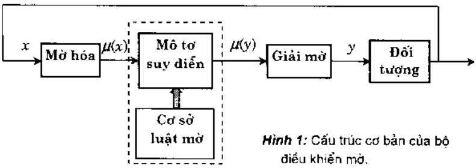

## 2.2.2 Không gian Input-Output.

Vì mục tiêu của bộ điều khiển mở là tính toán các giá trị của các biến điều khiển từ quan sát và đo luồng các biến trạng thái của quá trình được điều khiển sao cho hệ thống vận hành như mong muốn. Như vậy việc chọn các biến trạng thái và các biến điều khiển phải đặc trưng cho các phép toán (the operator) của bộ điều khiển mở và có tác động cơ bản lên sự quá trình thực hiện bộ FLC.

Kinh nghiệm của các chuyên gia và các tri thức về công nghệ đóng vai trò rất quan trong trong việc lựa chọn các biến. Ví dụ các biến vào thường là trạng thái (state) sai lâm trạng thái (state error, state error derivate, state error integral ...). Khi sử dụng biến ngôn ngữ, biến ngôn ngữ đầu vào x sẽ gồm các biến ngôn ngữ input $x_{i}$ xác định trên không gian nền $U_{i}$ và tương tự với biến đầu ra y gồm các biến ngôn ngữ output $y_{j}$ trên không gian nền $U_{j}$. Khi đó

$$
\boldsymbol {x} = \left\{\left(x _ {i}, U _ {i}, \left[ A _ {x _ {i}} (1), \dots , A _ {x _ {j}} \left(k _ {i}\right) \right. \right\}, \left\{\mu_ {x _ {i}} (1), \dots , \mu_ {x _ {i}} \left(k _ {i}\right) \right. \right\}: i = 1, 2, \dots , n \}
$$

$$
y = \left\{\left(y _ {i}, V _ {i}, \left\{A _ {y _ {j}} (1), \dots , A _ {y _ {j}} \left(k _ {i}\right) \right. \right\}, \left\{\mu_ {y _ {j}} (1), \dots , \mu_ {y _ {j}} \left(k _ {i}\right) \right. \right\}: i = 1, 2, \dots , m \rbrace
$$

ở đây $x_{i}$ là biến ngôn ngữ xác định trên không gian nền $U_{i}$, nhận từ - giá trị $A_{x_{i}}$ với hàm thuộc $\mu_{x_{i}}(k)$ với $k=1,2,\ldots,k_{i}$. Tương tự cho các biến output $y_{j}$.

Ví dụ $x_1$ là biến tốc độ trên không gian nén là miền giá trị vật lý $U_1 = [0, 200\text{km/h}]$. Biến ngón ngữ tốc độ có thể có các từ giá trị

{rất châm, châm, trung bình, nhanh, rất nhanh}.

<!-- page: 112 -->

Môi giá trị ngôn ngữ của biến này được xác định bằng một tập mở trên $U$ với các hàm thuộc $\mu_{chàm}(u), \ldots, \mu_{trung binh}(u)$.

## 2.2.3 Khâu mà hoá.

Vì nhiều luật cho dưới dạng dùng các biến ngôn ngữ với các từ thông thường. Như vây với những giá trị (rō) quan sát được ,đo được cù thể, đề có thế tham gia vào quá trình điều khiển thì cần thiết phải mò hoá.

Có thể định nghĩa, mở hoá là một ánh xạ (mapping) từ không gian các giá trị quan sát được (rõ) vào không gian của các từ-tập mở trên không gian nền của các biến ngôn ngữ input.

Ví dụ ứng với biến ngôn ngữ tốc độ, ta cho phép mò hoá bằng ánh xạ

\- Tốc độ một xe tải đo được: $u = 75 \text{km/h}$.

\- Từ đó có: $(\mu_{r\acute{a}t\acute{c}h\acute{a}m}(75), \mu_{ch\acute{a}m}(75), \mu_{trung\acute{b}inh}(75), \mu_{nhanh}(75), \mu_{r\acute{a}t\acute{n}hanh}(75))$.

## 2.2.4 Cơ sở các luật mà

Dạng tổng quát của các luật điều khiển mờ là bộ các quy tắc mở dạng IF ... THEN, trong đó các điều kiện đầu vào và cả các biến ra ( hệ quả ) sử dụng các biến ngón ngữ. Việt ở dạng tổng quát, cơ sở các luật mờ trong các hệ thống nhiều biến vào (output) và một biến ra (output) ( tức là với các hệ MISO ) cho dưới dạng sau:

Cho $x_{1}, x_{2}, \ldots, x_{m}$ là các biến vào của hệ thống. y là biến ra (thường là các biến ngôn ngữ). Các tập $A_{ij}, B_{j}$, với $i=1, \ldots, m, j=1, \ldots, n$ là các tập mở trong các không gian nền tương ứng của các biến vào và biến ra đang sử dụng của hệ thống. Các $R_{j}$ là các suy diễn mở (các luật mở) dạng "Nếu ... thì" (dạng if ...then)

| $R_{1}$ | Nếu $x_{1}$ là $A_{11}$ và ... và $x_{m}$ là $A_{m1}$ thì y là $B_{1}$ |
| --- | --- |
| $R_{2}$ | Nếu $x_{1}$ là $A_{12}$ và ... và $x_{m}$ là $A_{m2}$ thì y là $B_{2}$ |
| ⋮ | ⋮ |
| $R_{n}$ | Nếu $x_{1}$ là $A_{1n}$ và ... và $x_{m}$ là $A_{mn}$ thì y là $B_{n}$ |
| Cho: | Nếu $x_{1}$ là $A_{1}^{*}$ và ... và $x_{m}$ là $A_{m}^{*}$ |
| Tính: | y là $B^{*}$ |

ở dây $A_{1}^{*}, \ldots, A_{m}^{*}$ là các giá trị đầu vào hay sự kiện (có thể mở hoặc giá trị rõ).

Một dạng tường minh các luật mở thường cho dưới dạng

<!-- page: 113 -->

$R_{j}: \text{Néu } x_{1} \text{ là } A_{1j} \text{ và } \ldots \text{ và } x_{m} \text{ là } A_{mj} \text{ thì } y = f_{j}(x_{1}, x_{2}, \ldots, x_{m})$,

$j=1,\ldots,n$ . Ô dây  $f_{j}(x_{1},x_{2},\ldots,x_{m})$ là một hàm của các biến trạng thái.

## 2.2.5 Mô to suy diễn

Dây là phân cốt lôi nhất của FLC trong quá trình mô hình hoá các bài toán điều khiển và chọn quyết định của con người trong khuôn khổ vận dụng logic mô và lập luận xấp xỉ. Do các hệ thống được xét dưới dạng hệ vào-ra nên luật suy diện modus ponens suy rộng đóng một vai trò rất quan trọng.

Như đã trình bày kỹ trong phần trước. Suy luận xếp xỉ, phép hợp thành và phép kéo theo của logic mờ sẽ quyết định những công việc chính trong quá trình tính toán cũng như trong quá trình rút ra kết luận. Bảng sau đây giới thiệu một số phép kéo theo mà (fuzzy implications) thường được sử dụng trong diện đạt các luật mờ.

| Phép kéo theo | Công thức |
| --- | --- |
| Toán tử min [Mamdani] | $a \Rightarrow b = \min(a, b)$ |
| Toán tử tích [Larsen] | $a \Rightarrow b = a.b$ |
| Tích bị chăn | $a \Rightarrow b = \max(0, a+b \cdot 1)$ |
| Quy tắc số học [Zadeh] | $a \Rightarrow b = \min(1, 1-a+b)$ |
| Quy tắc max-min[Zadeh] | $a \Rightarrow b = \max(1-a, \min(a, b))$ |
| Suy diễn bình thường | $a \Rightarrow b = \begin{cases} 1 & nếu \quad a \leq b \\ 0 & nếu \quad a > b \end{cases}$ |
| Logic Boole | $a \Rightarrow b = \max(1-a, b)$ |
| Logic Godel | $a \Rightarrow b = \begin{cases} 1 & nếu \quad a \leq b \\ b & nếu \quad a > b \end{cases}$ |
| Phép kéo theo Goguen | $a \Rightarrow b = \begin{cases} 1 & nếu \quad a \leq b \\ b/a & nếu \quad a > b \end{cases}$ |

## 2.2.6 Khâu giải mò

Đày là khâu thực hiện quá trình xác định một gia trị rõ có thể chấp nhận được làm đầu ra từ hàm thuộc của gia trị mở đầu ra. Có hai phương pháp giải mở chính: Phương pháp cúc đai và phươngpháp điểm trọng tâm. Tính toán theo các phương pháp này không phức tạp. Có thể tham khảo ở các tài liệu [3,12].

## 2.2.7 Ling dụng

Ứng dụng đầu tiên của điều khiển mở phải kể đến của nhóm Mamdani và Assilian năm 1974.[14]. Từ dãy phạm vi ứng dụng thực tiền của điều khiển mở trong các lĩnh vực khác nhau đã hết sức rộng: từ điều khiển lò nung xi măng [Larsen,1980- combines là ứng dụng thực sự đầu tiên vào sản xuất công nghiệp], quản lý các bãi đỗ xe [Sugeno và cộng sự 1984,1985.

<!-- page: 114 -->

[1989], điều khiển vận hành hệ thống giao thông ngâm, quản lý nhóm các thang máy [Fujitec.1988], điều chỉnh việc hoà clo trong các nhà máy lọc nước, điều khiển hệ thống máy bơm làm sạch nước [Yagishita et al., 1985], điều khiển hệ thống năng lượng và điều khiển phản ứng hạt nhân [Bernard.1988, Kinoshita et al., 1988], máy bay trực thăng [Sugeno. 1990]. v.v.... cho tới thám sát các sự cố trên đường cao tốc [Hsiao et al., 1993] các thiết bị phần cứng mờ [fuzzy hardware devices, Togai và Watanabe, 1986, nhóm cộng tác với GS, Yamakawa, 1986, 1987.1988 ...].

Trong số những ứng dụng thực sự thành công trong thực tiền còn phải nhắc tới tới bộ FLC dùng trong quản lý sân bay [Clymer et al., 1992], các hệ thống điều khiển đường sắt và các hệ thống cần cầu container [Yasunobu và Miyamoto, 1985, Yasunobu et al., 1986, 1987]. Một ứng dụng rất hay của điều khiển mờ là hệ điều khiển “the camera tracking control system” của NASA, 1992 ....

Chúng ta cũng không thể không nhắc tối các máy móc trong gia đình dùng FLC đang bán trên thị trường thể giới: máy điều hoà nhiệt độ [hăng Mitsubishi], máy giặt [Matsushita. Hitachi, Sanyo], các video camera [Sanyo, Matsushita], tivi, camera [hăng Canon], máy hút bui, lò sấy (microwave oven) [Toshiba] vv....

Ngay từ 1990, trong một bài đăng ở tạp chí AI Expert, Vol.5, T.J. Schwartz đã viết: "Tại Nhật bản đã có hơn 120 ứng dung của điều khiển mờ".

## 2.3 Các hệ chuyên gia mà (Fuzzy Expert Systems)

2.3.1 Các hệ chuyên gia (Expert Systems) là một nhánh của bộ môn Trí tuệ nhân tạo (Artificial Intelligence) sử dụng các trí thức chuyên biệt để giải quyết bài toán ở giai đoạn dùng các chuyên gia – con người. Chúng phát triển vào những năm 1970 và đã được ứng dụng trong khá nhiều lĩnh vực. Ngày nay nói đến hệ chuyên gia thì thực chất hiểu là các hệ thống trong đó có sử dụng công nghệ hệ chuyên gia (expert system technology) bao gồm: các ngôn ngữ hệ chuyên gia chuyên dụng, các chương trình và cả các phần cứng được thiết kế nhằm phát triển và vận hành các hệ chuyên gia.

Hiện nay trong các sách báo người ta thường dùng từ đồng nghĩa là “hệ chuyên gia trên cơ sở tri thức” (knowledge-based expert system). Sau đây chúng ta sẽ cho cấu trúc cơ bản (hình 2) và cách sử dụng hệ chuyên gia.

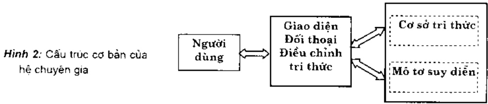

<!-- page: 115 -->

Dưới đây là vài cột móc chính trong quá trình hình thành và phát triển của các hệ chuyên gia:

\- 1957 Bất đầu “Chương trình giải quyết bài toán tổng quát” (GPS).

\- 1958 Ngôn ngữ lập trình LISP.

\- 1965 DENDRAL- hệ chuyên gia đầu tiên.

\- 1968 Mang ngū nghĩa.

\- 1970 Ngôn ngữ lập trình PROLOG.

\- 1973 MYCIN - hệ chuyên gia dành cho chuẩn đoán y học (Shortliffe et all.).

\- 1976 Hệ chuyên gia PROSPECTOR trong lĩnh vực địa chất.

\- 1985 Công cụ hệ chuyên gia CLIPS của NASA (expert system tool).

Trong số những hệ ban đầu này hệ MYCIN có ý nghĩa rất lớn vì máy lí do sau :

a) Nó chỉ ra ràng Trí tuế nhân tạo có thể sử dụng trong các bài toán thực tiễn.

b) Trong MYCIN đã dưa vào nhiều khái niệm mới rất có lợi cho những phát triển về sau.

c) Nó chứng minh tính khả thi của các khung của hệ chuyên gia, các công cụ tạo lập hệ chuyên gia (expert system shell).

2.3.2 Bên cạnh những thành công của công nghệ hệ chuyên gia. lý thuyết tập mở và logic mở có nhiều ưu điểm trong biểu diễn trị thức của các chuyên gia. Cho nên việc đưa các luật mở và đặc biệt các biến ngôn ngữ và hàm thuộc đã xuất hiện khá sớm. Các hệ chuyên gia trình bày dưới đầy đã sử dụng các luật mở (fuzzy rules).

Tên/ tác giả/ năm
Lĩnh vực

CADIAG-2, Adlassnig et al., 1985 Y (internal medicine)

EMERGE. Hudson, Cohen, 1988 Phân tích đầu ngực

ESP. Zimmermann, 1989
Kế hoạch mức chiến lược

FAULT, Whalen et al., 1987
Kế toán

OPAL, Bensana et al., 1988 Lập lịch công việc

Thực tiền đã dẫn tới cần phối hợp tốt hơn hai loại công nghệ này. đó là nhu cầu về nghiên cứu các hệ chuyên gia mờ (fuzzy expert systems). Những nghiên cứu sau dày là với dụ:

\- FESS - một hệ chuyên gia mở tải sử dụng ,Hall và Kandell, 1992

\- Hệ chuyên gia mở có mục đích tổng quát, Schneider và Kandel, 1994.

\- Những khung cho hệ chuyên gia mò. Umano, Hatono và Tamura (Fuzzy expert system shells), 1994.

\- Công trình của Whalen và Schott. 1992. tạo ra mang suy diễn ngôn ngữ mờ (Fuzzy linguistic inference network generator).

<!-- page: 116 -->

Chúng ta cũng không khó khăn chỉ ra các ứng dụng thực tiễn của các hệ chuyên gia mờ. Sau đây là vàí ví dụ:

\- Von Altrock và Krause đã phát triển hệ chuyên gia mở dành cho công nghiệp ôtô của hăng Mercedes-Benz tại CHLB Đức. 1994 (xem bài báo Multi-criteria decision making in the German automotive industry).

\- Hệ EMERGE của Hudsson và Cohen, 1992 là hệ chuyên gia y học trên cơ sở các luật mở trợ giúp cho các phòng cấp cứu và đưa các lời chỉ dẫn về kiểm tra các hiện tượng đau.

\- Hệ EAR của López de Mántaras et al. dành cho chẩn đoán y học, còn hệ FLING, của Whalen và Schott, 1992 thì trợ giúp cho công việc nắm bắt . phân tích tri thức.

\- Vế các hè MedFrame/CADIAG-IV, 1996, FuzzyKBWean, 1998, và Fuzzy-ARDS, 1999. đang sử dụng tại Viên, C.H. Aó có thể tìm thấy trong bài báo của K.P. Adlassnig [23, trang 134-138].

Những trị thức cơ bản và đủ hiện đại về hệ chuyên gia có thể tìm thấy trong sách [18].

## 2.4 Nhận dạng mò (Fuzzy Pattern Recognition)

## 2.4.1 Bài toán nhận dạng.

Nhiều thông tin hàng ngày chúng ta cần thu nhân và xử lý nhiều khi có hình dạng phúc tạp. Bộ môn nhân dạng cung cấp cho chúng ta một số phương pháp để phát hiện cấu trúc chính và một số nét cơ bản của các hình dạng đó. Các tiếp cận chính tới các bài toán nhận dạng là: phản lớp tuyến tính, tiếp cận thống kê, lý thuyết mờ, các perceptrons, phản lớp cơ sở trí thức dựa vào kì thuật của trí tuệ nhân tạo.

Nghĩ tới tiếp cận từ Lý thuyết mờ là hoàn toàn tự nhiên vì các hình dạng quan sát được, các thông tin nhận được thường mờ. thảm chí có thể nói là “rất mờ”. Một số kết quả đã được công bố (Ví dụ: Bezdek, 1981, Pedrrycz, 1990, hay Bezdek và Pal, 1992) và đã ứng dụng thành công trong xử lý ảnh, nhận dạng tiếng nói. trong robot thông minh, nhận dạng các đối tượng hình học .... Hình 3 trình bày sơ độ chung của một quá trình nhận dạng.

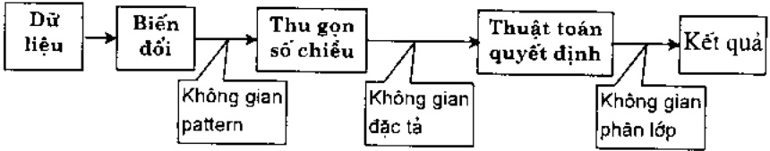

Hình 3: Quá trình nhận dạng

Bây giờ hãy nói thêm về một số khái niệm.

Dữ liệu (data) thu được từ các quá trình vật lý hoặc các hiện tượng. Dữ liệu (hiểu theo nghĩa rộng) có thể ở dạng định tính, định lượng, dạng số, hình, hay một doan văn, ngôn ngữ hay tổ hợp của các dạng trên.

<!-- page: 117 -->

Không gian các dáng (pattern space) - còn được gọi là cấu trúc (structure), đó là tập các dáng về, các kiểu dáng trong đó thông tin được tổ chức sao cho chúng có thể góp phần phát hiện mối liên hệ giữa các biến. Nói chung số chiều của không gian các dáng cần ít hơn số chiều của không gian dữ liệu.

Không gian các đặc tà (feature space) là không gian nằm giữa không gian dữ liệu và không gian phân lớp. Nói chung số chiều của không gian đặc tà thường phải ít hơn nhiều số chiều của không gian dữ liệu. Văn đề khó khăn là chọn những đặc tà nào cho đủ phần ảnh những nét quan trọng nhất của đối tượng.

Không gian phân lớp dĩ nhiên phải chứa được các lớp mà người nghiên cứu muốn phân. Tuy nhiên thực chất có bao nhiều lớp phân biệt thì nhiều khi ngay từ đầu cũng khó xác định.

Một nhận xét cũng nên để ý là tính mở không chỉ trong không gian dữ liệu mà còn nằm trong không gian các đặc tả và cả trong các thuật toán phân lớp.

## 2.4.2 Phân nhóm và vai trò trong thực tế

Theo [17] các chuyên gia hiện đang nghiên cứu về nhận đang mò có thể chia theo 4 nhóm để tài chính:

\- Nhận dạng tỉnh các đối tượng 3 chiều, có màu.

\- Nhân dạng động các đối tượng 3 chiếu, có màu.

\- Nhân dạng theo công nghệ hiển thị (visual recognition) các đối tượng 3 chiều, có màu.

\- Nhàn dạng động các biểu hiện của con người (human expressions).

Ai cũng hiểu được tâm quan trọng của các đề tài nhận dạng các đối tượng động 3-chiều trong quốc phòng, an ninh và ngành viên thám. Nhưng ngay đổi với các ngành dân sự độ quan trọng của các đề tài này cũng được phản ảnh qua bảng tổng kết sau cuộc thảm dò ý kiến của hơn 200 chuyên gia hàng đầu về công nghệ mở tiến hành 1989 bởi hai giáo sư A. Ishikawwa và T. L. Wilson [17] (các con số ghi trong bảng tính theo % của các ý kiến).

Bàng 1

<table><tr><td rowspan="2">Đế tài</td><td colspan="3">Độ quan trọng</td></tr><tr><td>Cao</td><td>Trung bình</td><td>Thấp</td></tr><tr><td>1) Nhân dạng tỉnh dùng công nghệ mở</td><td></td><td></td><td></td></tr><tr><td>- Các hệ robot sản xuất dùng công nghệ hiển thị</td><td>84.0</td><td>16.0</td><td>0</td></tr><tr><td>- Các hệ theo dõi tự động dùng công nghệ hiển thị</td><td>80.8</td><td>19.2</td><td>0</td></tr><tr><td>- Các hệ vận tải robot dùng công nghệ hiển thị</td><td>42.9</td><td>47.6</td><td>9.5</td></tr><tr><td>2) Nhận dạng động dùng công nghệ mở</td><td></td><td></td><td></td></tr><tr><td>- Các hệ robot sản xuất dùng công nghệ hiển thị</td><td>81.8</td><td>9.1</td><td>9.1</td></tr><tr><td>- Các hệ theo dõi tự động dùng công nghệ hiển thị</td><td>78.3</td><td>13.0</td><td>8.7</td></tr></table>

<!-- page: 118 -->

## 2.5 Hệ hỗ trợ quyết định và bài toán lấy quyết định

Trong phân áp chót này chúng ta sẽ dành cho hai lớp bài toán sau: bắt đầu với một hệ hỗ trợ quyết định mở và sau đó là một mô hình của bài toán lấy quyết định tập thể.

2.5.1 Các hệ hổ trợ quyết định (Decision Support Systems) đã di qua một chăng đường khá dài, từ những hệ thông tin quản lý và những cơ sở dữ liệu được tổ chức khoa học và hoàn chỉnh hơn nhằm phục vụ cho nhiều nhiệm vụ quan trọng và thường là tương đối khó trong các doanh nghiệp. tới giai đoạn xây thêm các hệ chuyên gia ,coi đó là một phản hệ quan trọng giúp cho người lấy quyết định thêm những lời khuyến quý gia.

Đưa các thành tụ của logic mở và nhiều trị thức mới của lý thuyết tập mở vào hệ hỗ trợ quyết định là một tiếp cận tự nhiên. Trong giai đoạn sau này các thành tụ hiện đại này thường được đưa vào trong các hệ hỗ trợ quyết định nhằm góp phần tìm lời giải đáp cho nhiều lớp bài toán phức tạp trong các tình huống có nhiều yếu tố bất định, nhiều trị thức ít xác định, hoặc chưa được phát biểu chính xác.

2.5.2 Đế đơn giản chúng ta hây xem bài báo giới thiệu về hệ hỗ trợ quyết định FOREX của hai tác giả Satoru Fukami (NTT Data Communication Systems Cor.) và Minoru Yoneda (Mitsubishi Kasei Cor.) [16, trang 17-66].

FOREX là tên viết tất của FOREign EXchange dealing support system - một trong 9 để tài chính trong giai doan 1 (3 năm đầu) của LIFE nhằm hỗ trợ việc buôn bán trao đối ngoại tệ bằng những dự báo các tỷ giá hối doái. dựa trên các ước lượng bảng kinh nghiệm của các chuyên gia nhằm nâng cao hiệu quả của cả hệ thống kinh doanh.

Đế cho hệ hoạt động có hiệu quả cần thu thập các thông tin số ( dạng numeric data). các dữ liệu dạng văn bảng(text data), những gì liên quan tới các giao dịch ngoại hôi, cũng như các kinh nghiệm của các chuyên gia. Các bài toán dự báo được giải quyết chủ yếu dựa vào lý thuyết tập mở.

Sau đây là vải thông tin về cấu hình của hệ thống:

\- Trước hết tại LIFE đã phát triển LIFE FEShell ( "LIFE Fuzzy Expert System Shell"). Hệ thống này đã được sử dụng như một môi trường hỗ trợ và là công cụ tạo lập hệ chuyên gia.

\- FOREX được viết bởi Common LISP và ngôn ngữ C.

\- Phân cứng đã sử dụng là một SUN-4 workstation.

FOREX công bố bởi LIFE năm 1991 đã là một hệ khá lớn, nó chứa tới 5100 luật.

## Tài liệu trích dẫn

[1] L.A. Zadeh: Fuzzy sets, Inform, and Control .B, 1965. 338-353.

[2] D. Dubois and H. Prade: Fuzzy Sets and Systems. Academic Press, N.Y., 1980.

[3] H.J. Zimmermann: Fuzzy Set Theory - and Its Applications. 2 nd Ed.. Kluwer Acad. Pub.. Dodrech, 1991.

<!-- page: 119 -->

[4] L.A.Zadeh: The concept of a linguistic variable and its application to approximate reasoning, American Elsevier Pub. company, New York, 1973.

[5] L.A. Zadeh: Fuzzy sets as a basis for a theory of possibility, Fuzzy Sets and Systems, 1, 1978, 3-28.

[8] E.P. Klement: Some mathematical aspects of fuzzy sets: Triangular norms, fuzzy logics, and generalized measures. Fuzzy sets and systems. 90, 1997, 133-140.

[7] N. Cat Ho: A method in linguistic reasoning on a knowledge base representing by sentences with linguistic belief degree, Fund. Informaticae. 28, 1996, 247-260.

[8] M.Mizumoto, H.J.Zimmermann: Comparison of fuzzy reasoning methods, Fuzzy Sets and Systems, 8, 1982, 253-283.

[9] Fuzzy reasoning in information, decision and control systems. Ed. S.G. Tzafestas and A.N.Venetnopoulos. Kluwer Acad. Pub., Dordrecht. 1994.

[10] Non-classical logics and their applications to fuzzy subsets, Ed. U. Hohle and E.P. Klement, Kluwer Acad. Pub., Dordrecht. 1995.

[11] R.R. Yager: Fuzzy logics and artificial intelligence. Fuzzy Sets and Systems, 90, 1997, 193-198.

[12] Phan Xuân Minh và Nguyễn Doãn Phước: Lý thuyết điều khiển mở. In lần 2, NXB Khoa học và Kỹ thuật, 1999, Hà nội.

[13] Hệ mở và ứng dụng. Biên tập tập thể : Nguyễn Hoàng Phương, Bùi Công Cường, Nguyễn Doãn Phước, Phan Xuân Minh và Chu Văn Hỷ, NXB Khoa học và Kỹ thuật, 1998, Hà nổi.

[14] E.H.Mamdani: Application of fuzzy algorithms for the control of a simple dynamic plant, Proc. IEEE .121,(12),p. 1585-1588,1974.

[15] Kazuyuki Suzuki: Fuzzy modeling and process control system design, in [14], p.103-136.

[16] Anca L. Ralescu, Ed.: Applied research in fuzzy technology, Kluwer Acad. Pub., Dordrecht, 1994.

[17] A. Ishikawa and T.L. Wilson: Analysis and Evaluation of Fuzzy Systems, Kluwer Acad. Pub., Dordrecht, 1995.

[18] Giarratano and G.Riley: Expert Systems, Principles and Programming, Second Edition, PWS Pub. Com., Boston, 1994.

[19] Satoru Fukami and Minoru Yoneda: Decision Support System. [16] trang 17-66.

[20] C.T.Lin and C.S.George Lee: Neural Fuzzy Systems, Prentice-Hall Inter. Inc., New Jersey, 1996.

[21] C.H.Chen (Ed.): Fuzzy Logic and Neural Network Handbook, McGraw-Hill, Inc., New York, 1996.

[22] T.Yamakawa and G. Matsumoto (Eds.): Methodologies for the Conception, Design and Application of Soft Computing, Proceedings of the 5 $^{th}$ International Conference on Soft Computing and Information/Intelligent Systems, IIZUKA 98, Vol. 1 and Vol 2, World Scientific, New Jersey, 1998.

[23] Proceedings of the International Symposium on Medical Informatics and Fuzzy Technology, MIF 99, August 26-29, 1999. Trung tâm KHTN và CNQG. Hà nôi, 1999.

[24] Bùi công Cường: Cơ sở toán học của các hệ mở, Giáo trình, ĐH Bách khoa Hà nói, 1998-1999.

[25] Bùi công Cường: Một số kiến thức cơ sở của logic mà trong các hệ mà, trong [13], trang 1-21.

[26] Bùi công Cường: A multiple criteria group decision making model under linguistic assessments. Proceedings of the International Symposium on Medical Informatics and Fuzzy Technology. MIF 99, August 26-29, 1999, Trung tâm KHTN và CNQG, Hà nổi .1999, 291-297.

<!-- page: 120 -->

# NHẬP MÔN ĐIỀU KHIỂN MỜ

Nguyễn Doãn Phước & Phan Xuân Minh
Đại học Bách khoa Hà Nội

Có lẻ hầu hết mọi người hiện nay không ai là chưa từng nghe đến khái niệm điều khiển mò (Fuzzy control) cũng như tên các thiết bị điều khiển được tích hợp dựa trên nguyên lý tập mò (Fuzzy set). Những thiết bị làm việc trên cơ sở lý thuyết tập mò hiện có khấp mọi nơi trong cuộc sống thường nhật như máy giặt Fuzzy, máy ảnh Fuzzy, bàn là Fuzzy, nổi com điện Fuzzy ... đã giúp cho sự phổ thông hóa đó của những khái niệm lý thuyết này.

Nhìn lại quảng đường đã di, kể từ thời điểm ra đời của lý thuyết tập mở vào khoảng giữa thập niên 60 do nhà toán học người Mỹ Zahde đưa ra nhằm thay thế, đơn giản hóa các khái niệm dấy tính lý thuyết của xác suất, của quá trình ngẫu nhiên, thì cho tới ngày nay, điều khiển mở đã có những bước phát triển vượt bậc, đóng góp không nhỏ vào sự tăng trưởng, hiện đại hóa cuộc sống con người. Những khái niệm của điều khiển mở mà trước dây còn mang dấy tính trừu trọng thì nay nó đã được đưa vào ngôn ngữ cộng đồng như một sự đương nhiên ai cũng biết hoặc cũng được nghe đến một cách thường xuyên nhờ các phương tiện của thông tin đại chúng như báo, dài, truyền hình quảng cáo .... Sự phát triển nhanh mang tính vượt bậc của điều khiển mở có nguyên nhân của nó:

\- Thứ nhất là trên cơ sở suy luận mở, nguyên lý điều khiển mở đã cho phép con người tự động hóa được kinh nghiệm điều khiển của họ cho một quá trình, một thiết bị ... tạo ra được những bộ điều khiển làm việc tin cây thay thế được họ song vẫn mang lại chất lượng như họ đã từng đạt được.

\- Thứ hai là với nguyên tắc mơ, bộ điều khiển tổng hợp được có cấu trúc đơn giản đến kỳ là so với những bộ điều khiển kinh diễn khác có cùng chức năng. Sự đơn giản đó đã đóng vai trò quan trọng trong việc tăng độ tin cây cho thiết bị, giảm giá thành sản phẩm.

\- Và cuối cùng nhưng không kém phản trọng cho sự phát triển vượt bậc đó của điều khiển mở là những cải tiến liên tiếp của kỹ thuật vi xử lý, một câu nổi không thể thiểu giữa kết quả nguyên cứu của lý thuyết điều khiển mở với thực tế ứng dụng.

Trong bài này chủng tôi mong muốn cùng bạn đọc nhìn lại một cách tổng quan có tính hệ thống về nguyên lý làm việc của một bộ điều khiển mờ để có thể tự tạo ra được. tự tổng hợp được các thiết bị tự động điều khiển trên nguyên lý tập mờ chữ không đơn thuẩn là chỉ sử dụng chủng.

Đế thực hiện được mục đích đặt ra đó, ta sẽ lần lượt di qua các phần sau:

\- Trước hết ta sẽ nghiên cứu xem bộ điều khiển mở làm việc theo nguyên lý cơ bản nào khác so với những "bộ điều khiển không mở". Trong phần này ta sẽ làm quen với các

<!-- page: 121 -->

khái niệm được dùng đến ở những phân sau là biến ngôn ngữ, giả trị ngôn ngữ, luật hợp thành và ménh để hợp thành.

\- Tiếp theo là phân giới thiệu lý thuyết tập mò dưới góc nhìn của một người làm điều khiển. Tại dây chúng ta sẽ tiến hành mô tả chi tiết khái niệm giá trị ngôn ngữ, phép suy diễn mò (còn gọi là phép kéo theo) để có thể cải đặt luật hợp thành trong bộ điều khiển mò.

\- Phân thứ ba. chúng ta sẽ làm quen với thiết bị hợp thành có nhiệm vụ thực hiện luật hợp thành được xem như là một "phương châm hành động" của bộ điều khiển mờ.

\- Cuối cùng chứng ta sẽ cùng nhau xây dựng một bộ điều khiển mở hoàn chỉnh với những công đoạn bổ sung thêm bao gồm mở hóa và giải mở.

## 1 Nguyên lý làm việc

Trong rất nhiều các bài toán điều khiển, khi mà đối tượng không thể mô tả bởi một mô hình toán học hoặc có thể mô tả được song mô hình của nó lại quá phức tạp, công kênh, không ứng dụng được, thì điều khiển mô chiếm ưu thế rõ rệt. Ngay cả ở những bài toán đã điều khiển thành công theo nguyên tắc kinh diễn thì việc áp dụng điều khiển mô cũng sẽ vấn mang lại cho hệ thống sự cải tiến về tính đơn giản, gọn nhe.

Lý do chính dẫn tới suy nghĩ áp dụng logic mở để điều khiển nằm ở chỗ trong rất nhiều trường hợp, con người chỉ cần dựa vào kinh nghiệm (hoặc ý kiến chuyên gia) vân có thể điều khiển được đối tượng cho dù đối tượng có thông số kỹ thuật không đúng hoặc thường xuyên bị thay đổi ngẫu nhiên và do đó mô hình toán học của đối tượng điều khiển không chính xác, đó là chưa nói tới chứng có thể hoàn toàn sai. Việc điều khiển theo kinh nghiệm như vậy, có thể bị đánh giá là không chính xác như các yêu cầu kỹ thuật đề ra (ví dụ như điều khiển tối ưu), song đã giải quyết được vấn đề trước mất là vân đảm bảo được về mặt định tính các chỉ tiêu chất lượng định trước.

Tà hây xét một ví dụ đơn giản là điều khiển mục nước. Hình 1 mỏ tà nguyên lý của bài toán. Không phụ thuộc vào lượng nước cháy ra khởi bình ta phải chỉnh van cho lượng nước cháy vào bình vừa đủ để sao cho mục nước trong bình là $h$ luòn không đối. Tất nhiên ràng bài toán điều khiển này đã được giải quyết rất đơn giản và ta có thể bất gặp nó trong những thiết bị gia đình thông dung. Nhung ở đây ta đề cập lại nó từ phương diện điều khiển mờ để thông qua đó hiểu rõ hơn về bản chất của một bộ điều khiển mờ.

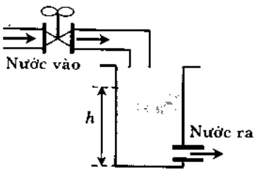

Hình 1: Điều khiển mục nước.

Hình dung bộ điều khiển là con người. Vậy thì con người sẽ điều chỉnh van đóng/mở nước vào như thế nào?. Ta có thể dựa vào kinh nghiệm để nói ràng họ sẽ điều chỉnh van theo bồn nguyên tắc như sau:

<!-- page: 122 -->

a) Nếu mục nước là thấp nhiều thì van ở mức độ mở to.

b) Nếu mục nước là thấp ít thì van ở mức độ mở nhỏ.

c) Nếu mục nước là cao thì van ở vị trí đóng.

d) Nếu mục nước là đủ thì van ở vị trí đóng.

Một bộ điều khiển làm việc theo luật như trên để thay thế con người sẽ được gọi là bộ điều khiển mò. Khác hẩn với những phương pháp kinh diễn, điều khiển mò không cần đến mô hình toán học của đối tượng.

Bón nguyên tắc điều khiển trên, trong điều khiển mở được gọi là bón ménh để hợp thành. Kinh nghiệm điều khiển mục nước chung gồm cả bón nguyên tắc đó được gọi là luật hợp thành.

Bên cạnh hai khái niệm luật hợp thành và mệnh để hợp thành vừa được trình bày, trong ví dụ về bốn nguyên tắc điều khiển ta còn thấy những tên gọi khác như mục nước và van. Chúng chính là các tín hiệu vào (mục nước) và ra (van) của bộ điều khiển (mà ở đây là con người). Những tín hiệu vào và ra này được gọi chung lại thành biến ngôn ngữ.

Mỗi biến ngôn ngữ lại có nhiều giá trị. Chẳng hạn trong ví dụ trên thì:

\- biến ngôn ngữ mục nước có bốn giá trị là thấp nhiều, thấp ít, đủ, cao.

\- hoặc biến van có ba giá trị là to, nhỏ, đóng.

Những giá trị này của các biến ngôn ngữ được gọi chung lại là giá trị ngôn ngữ.

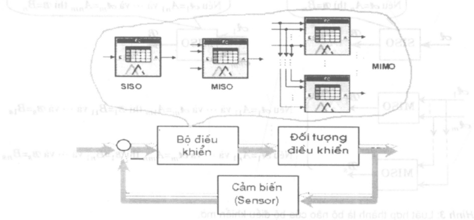

Hình 2: Phân nhóm các bộ điều khiển theo số tín hiệu vào/ra.

Như vậy, bộ điều khiển mở có thể được hiểu là một bộ điều khiển làm việc theo nguyên tắc tự động hoá những kinh nghiệm điều khiển của con người. Những kinh nghiệm này phải được đức kết lại luật hợp thành gồm nhiều mệnh để hợp thành với cấu trúc chung như sau:

Néu $\mathcal{A}=A_{i}$ thì $\mathcal{B}=B_{j}$. (1)

<!-- page: 123 -->

trong đó A là biến ngôn ngữ đầu vào, B là biến ngôn ngữ đầu ra,  $A_{i}, i=1.2, \ldots$  là các giá trị ngôn ngữ của biến A và  $B_{j}, j=1.2, \ldots$  là các giá trị ngôn ngữ của biến B.

Một bộ điều khiển mờ chỉ có một tín hiệu vào ra như ta đã xét được gọi là bộ điều khiển SISO (Single Input, Single Output). Song tất nhiên một bộ điều khiển mờ không nhất thiết là chỉ có một tín hiệu vào và một tín hiệu ra. Nó có thể có rất nhiều tín hiệu đầu vào cũng như có nhiều tín hiệu ra. Những bộ điều khiển mờ có nhiều đầu vào/ra như vậy được gọi là bộ điều khiển MIMO (Multi Input, Multi Output). Nói cách khác cũng giống như một bộ điều khiển kinh diễn, một bộ điều khiển mờ cũng có thể có nhiều tín hiệu vào và nhiều tín hiệu ra. Ta phân chia chúng thành các nhóm:

\- Nhóm bộ điều khiển SISO nếu nó chỉ có một đầu vào và một đầu ra.

\- Nhóm MIMO nếu chúng có nhiều đầu vào và nhiều đầu ra.

\- Nhóm bộ điều khiển SIMO nếu nó chỉ có một đầu vào nhưng nhiều đầu ra.

\- Nhóm MISO nếu chúng có một đầu vào và nhiều đầu ra.

Hình 2 mô tả trực quan các nhóm bộ điều khiển mô này.

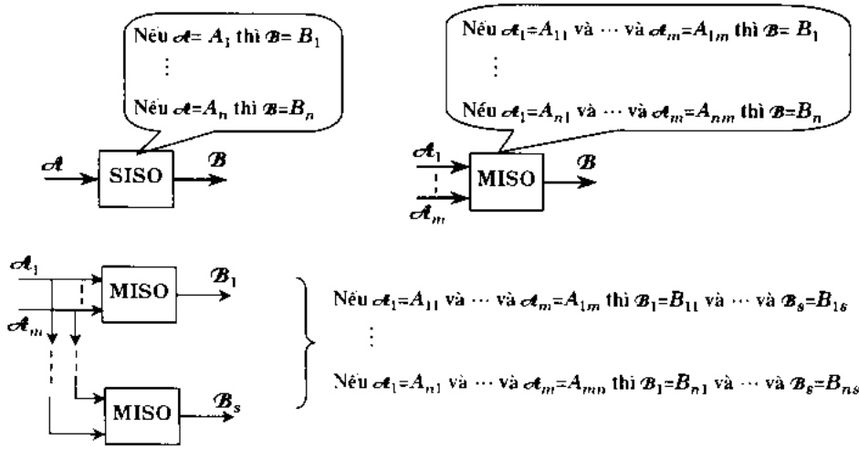

Hình 3: Luật hợp thanh là bộ não của bộ điều khiển mỏ.

Nếu một bộ điều khiển mở có nhiều tín hiệu vào/ra thì tương ứng ménh để hợp thành của nó cũng phải có nhiều biến ngôn ngữ vào $\mathcal{A}_1, \mathcal{A}_2, \ldots, \mathcal{A}_m$ và nhiều biến ngôn ngữ ra $\mathcal{B}_1, \mathcal{B}_2, \ldots, \mathcal{B}_s$. Tùng biến ngôn ngữ đó lại có nhiều giá trị ngôn ngữ. Ta ký hiệu $A_{ki}, i=1,2, \ldots$ là một giá trị của biến $\mathcal{A}_k, k=1,2, \ldots, m$ cũng như $B_{jl}, l=1,2, \ldots$ là một giá trị của biến $\mathcal{B}_j, j=1,2, \ldots, s$ thì ménh để hợp thành của nó sẽ có dạng

<!-- page: 124 -->

$$
\text {Néu} \mathcal {A} _ {1} = A _ {i 1} \quad \text {và} \dots \text {và} \mathcal {A} _ {m} = A _ {i m} \text {thì} \mathcal {B} _ {1} = B _ {i 1} \text {và} \dots \text {và} \mathcal {B} _ {s} = B _ {i s}.\tag{2}
$$

Bộ não của điều khiển mờ là luật hợp thành. Luật hợp thành của bộ điều khiển mờ SISO với các mệnh để hợp thành dạng (1) được gọi là luật hợp thành đơn. Ngọc lại luật hợp thành có các mệnh để dạng (2) của bộ điều khiển mờ MIMO có tên là luật hợp thành kép.

Ta sẽ dành riêng cho luật hợp thành MISO có mènh để theo cấu trúc:

$$
\text {Néu} \mathcal {A} _ {1} = A _ {i 1} \text {và} \dots \text {và} \mathcal {A} _ {m} = A _ {i m} \text {thi} \mathcal {B} = B _ {I}.\tag{3}
$$

của bộ điều khiển có nhiều tín hiệu vào nhưng chỉ có một tín hiệu ra, một sự quan tâm đặc biệt. Lý do nằm ở chỗ mọi luật hợp thành kép (2) đều có thể được đưa về dạng hợp song song của nhiều luật hợp thành MISO (hình 3).

## 2 Lý thuyết tập mở trong điều khiển

## 2.1 Định nghĩa tập mà

Quay lai ví dụ về điều khiển mục nước đã nói tới ở phân 1 với những giá trị ngôn ngữ thấp nhiều, thấp ít, đủ, cao của biến đầu vào mục nước, cũng như to, nhớ, đóng của biến đầu ra là van. Các giá trị đó sẽ gây ra nhiều cảm giác phân vân cho người thiết kế bộ điều khiển nếu không đưa vào đó khái niệm tập mơ.

Tại sao lại như vậy?. Đế trả lời ta giả sử mục nước trong bình hiện là 2m và hai người điều khiển có hai quan điểm khác nhau. Người thứ nhất thì cho rằng mục nước như vậy là đủ và do đó phải đóng van trong khi người thứ hai thì lại cho rằng mục nước 2m là thấp ít nên phải mở nhỏ van.

Nhàm thống nhất hai quan điểm trái ngược nhau đó, ta sẽ đưa thêm vào giá trị độ cao 2m một số thực trong khoảng từ 0 đến 1 để đánh giá mức độ phụ thuộc của nó vào hai quan điểm trên. Chắng hạn độ cao mục nước 2m sẽ là đủ với độ phụ thuộc 0,7 và thấp ít với độ phụ thuộc 0,4. Nếu cả hai người cùng thống nhất với nhau ràng mục nước 2m không thể gọi là thấp nhiều hoặc cao thì mức độ phụ thuộc của nó vào giá trị thấp nhiều cũng như vào giá trị cao sẽ bằng 0.

Một cách tổng quai thì ta phải đưa thêm vào cho mỗi một độ cao x bất kỳ một số thực $\mu(x)$ trong khoảng [0.1] để đánh giá độ phụ thuộc của nó ứng với từng giá trị ngôn ngữ. Việc đưa thêm số thực $\mu(x)$ để đánh giá độ phụ thuộc như vậy được gọi là mò hóa giá trị rõ x. Ta di đến định nghĩa:

Định nghĩa: Tập mở là một tập hợp mà mỗi phân tử cơ bản x của nó được gán thêm một giá trị thực $\mu(x)\in[0,1]$ để chỉ thị độ phụ thuộc của phân tử đó vào tập đã cho. Khi độ phụ thuộc bằng 0 thì phân tử cơ bản đó sẽ hoàn toàn không thuộc tập đã cho, ngược lại với độ phụ thuộc bằng 1, phân tử cơ bản sẽ thuộc tập hợp với xác suất 100%.

<!-- page: 125 -->

Như vậy, tập mở là tập hợp của các cập (x, $\mu(x)$). Tập kinh diễn U của các phân tử x được gọi là tập nén của tập mở. Cho x chay khắp trong tập hợp U, ta sẽ có hàm $\mu(x)$ có giả trị là số bất kỳ trong khoảng [0, 1], tức là

$$
\mu : U \to [ 0, 1 ]
$$

và hàm này được gọi là hàm thuộc.

Việc $\mu(x)$ có giá trị là số bất kỳ trong khoảng [0,1] là điều khác biệt cơ bản giữa tập kinh điện và tập mờ. Ô tập kinh điện $A$, hàm thuộc $\mu(x)$ chỉ có hai giá trị:

$$
\boldsymbol {\mu} (x) = \left\{ \begin{array}{l l} 1 & \text {neu} \quad x \in A \\ 0 & \text {neu} \quad x \notin A \end{array} \right.\tag{4}
$$

Chính do có sự khác biệt đó mà ta cũng có nhiều công thức khác nhau cùng mô tả cho một phép tính giữa các tập mở. Đỏ là những công thức có cùng một giá trị nếu hàm thuộc $\mu(x)$ thỏa mãn (4).

Như đã nói, bất cứ một hàm $\mu: U \to [0,1]$ cũng đều có thể là hàm thuộc của một tập mờ nào đó. Song trong điều khiển, với mục đích sử dụng các hàm thuộc sao cho khả năng tích hợp chúng là đơn giản, người ta thường chỉ quan tâm đến ba dạng (hình 4):

\- Hàm Singleton (còn gọi là hàm Kronecker).

\- Hàm hình tam giác.

\- Hàm hình thang.

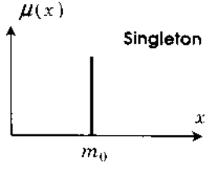

$\mu (x)$

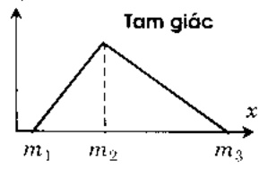

$\mu (x)$

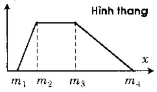

Hình 4: Khái niệm tập mỏ

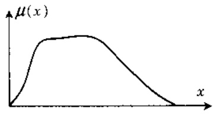

Ví dụ: Thông thường, để chỉ một tập mở người ta hay sử dụng ngay hàm thuộc $\mu(x)$ của tập mở đó. Với việc dưa khái niệm tập mở, mỗi một giá trị ngôn ngữ sẽ là một tập mở. Trong ví dụ về điều khiển mục nước, ta sẽ có tất cả là bốn tập mở cho bốn giá trị ngôn ngữ đầu vào:

<!-- page: 126 -->

\- Tập mơ $\mu_{thâp nhieu}(x)$ cho giả trị thấp nhiều.

\- Tập mò $\mu_{thâp it}(x)$ cho giá trị thấp ít.

\- Tập mò $\mu_{du}(x)$ cho giá trị đủ.

\- Tập mò $\mu_{cao}(x)$ cho giá trị cao.

và do đó khi x=2m thì (hình 5)

$$
\mu_ {t h \dot {a} p n h e o} (x) = 0, \quad \mu_ {c a o} (x) = 0, \quad \mu_ {t h \dot {a} p i t} (x) = 0. 4 \quad \text {va} \quad \mu_ {d \ddot {u}} (x) = 0. 7.
$$

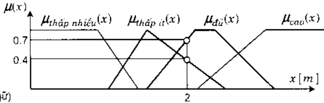

Hình 5: Các giá trị mò (ngôn ngũ)

của biến vào.

Tương tự, ứng với ba giá trị ngôn ngữ đầu ra to, nhỏ, đóng của biến van ta cũng có ba tập mở $\mu_{to}(y)$, $\mu_{nhỏ}(y)$ và $\mu_{đồng}(y)$ như hình 6 mô tả.

Hình 6: Các giả trị mờ (ngôn ngữ) của biến ra.

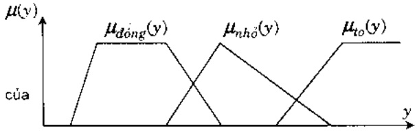

## 2.2 Phép suy diễn mò

## 2.2.1 Xác định giá trị của mệnh để hợp thành

Sau khi đã mở hóa giá trị rõ x thông qua tập mở  $\mu(x)$  thì bước tiếp theo là ta phải thực hiện những nguyên tắc điều khiển đã cho dưới dạng mênh đề hợp thành. Chắng hạn ở bài toán điều khiển mục nước là việc thực hiện bón nguyên tắc:

a) Nếu mực nước = thấp nhiều thì van = to.

b) Nếu mucus nước = thấp ít thì van = nhỏ.

c) Nếu mục nước = cao thì van = đóng.

d) Nếu mục nước = đủ thì van = đóng.

Chúng đều có chung một cấu trúc đơn:

$$
\text {Nếu} \mathcal {A} = A \text {thi} \mathcal {B} = B.\tag{5}
$$

<!-- page: 127 -->

Gọi tập mở của giá trị A là $\mu_{A}(x)$ và của B là $\mu_{B}(y)$. Vậy thì ménh để hợp thành (5) sẽ chính là phép suy diễn:

$$
A \Rightarrow B \qquad \mathrm{hay} \qquad \mu_ {A} (x) \Rightarrow \mu_ {B} (y)\tag{6}
$$

Phép suy diên (6) là một phép tính có dôi số x nên nó cũng phải có một giá trị cụ thể khi mà dôi số x, tức là $\mu_{A}(x)$ đã cho trước. Ký hiệu giá trị của phép suy diên là $\mu_{A\Rightarrow B}(y)$ thì ở tập kinh diên, nó sẽ được tính từ $\mu_{A}(x), \mu_{B}(y)$ như sau:

$$
\mu_ {A \Rightarrow B} (y) = \mu_ {A} (x) \cdot \mu_ {B} (y)\tag{7a}
$$

hoặc

$$
\mu_ {A \Rightarrow B} (y) = \min \{\mu_ {A} (x), \mu_ {B} (y) \}\tag{7b}
$$

Sở dĩ cả hai công thức trên cùng được sử dụng cho tập kinh diễn mà không gây màu thuẩn là vì với x, y thỏa mãn (4). cả hai công thức đó đều cho cùng một giá trị, nói cách khác chúng là tương đương.

| Tập kinh điện | Tập mò |
| --- | --- |
| $\mu_{A}(x) \cdot \mu_{B}(y) = \min\{ \mu_{A}(x), \mu_{B}(y) \}$ | $\mu_{A}(x) \cdot \mu_{B}(y) \neq \min\{ \mu_{A}(x), \mu_{B}(y) \}$ |

Với tập mở $\mu_{A}(x)$, $\mu_{B}(y)$ thì điều đó có khác một chút. Hai công thức trên sẽ cho hai giá trị mở có cùng nên với tập mở $B$ nhưng với hai hàm thuộc khác nhau. Vậy thì phải bỏ công thức nào ?. Câu trả lời thất khó, và vì khó trả lời như vậy nên người ta đã đề nghị là không bỏ và có thể chọn một trong hai công thức trên. còn chọn như thế nào là do người thiết kế bộ điều khiển tự quyết định:

\- Nếu chọn công thức (7a) thì ta nói phép suy diễn mò đó là luật suy diễn Prod.

\- Ngược lại nếu chọn (7b) thì phép suy diện mờ có tên là luật suy diện Min.

Sau khi đã chọn được một công thức thực hiện phép suy diễn là Prod hay Min thì khi cho trước giá trị rõ $x_0$ ó đầu vào ta luôn có được một giá trị cho phép suy diễn $A \Rightarrow B$. Giá trị đó là tập mờ có hàm thuộc $\mu_{A \Rightarrow B}(y)$ cùng nền với $B$ và được tính như sau (hình 7):

$$
\mu_ {A \Rightarrow B} (y) = H \cdot \mu_ {B} (y) \quad \text {neu chon luat Prod}\tag{8a}
$$

$$
2) \quad \mu_ {A \Rightarrow B} (v) = \min \left\{H, \mu_ {B} (v) \right\} \quad \text {neu chon luat Min}\tag{8b}
$$

trong đó

$$
H = \mu_ {A} (x _ {0})
$$

dược gọi là độ thỏa mãn dấu vào.

Ví dụ 1: Quay lại bài toán điều khiển mục nước với 4 quy tắc điều khiển có dạng của phép suy điện:

<!-- page: 128 -->

$$
R _ {1}: \quad \text {Nếu mục nước} = \text {thấp nhiều thì van} = \text {to}.
$$

$$
R _ {2}: \quad \text {Nếu mục nước} = \text {thấp ít thì van} = n h o.
$$

$$
R _ {3}: \quad \text {Nếu mục nước} = \text {cao thì van} = \text {đóng.}
$$

$$
R _ {4}: \quad \text {Nếu mục nước} = \text {đủ thì van} = \text {đóng.}
$$

Giả sử rằng mục nước hiện thời là 2m và luật thực hiện phép suy diễn được sử dụng là luật Min với công thức (8b). Vậy thì:

1) Phép suy diên (mệnh đề hợp thành)  $R_{1}$  có giá trị là

$$
\mu_ {R _ {1}} (y) = \mu_ {t h \acute {a} p n h i \acute {e} u \Rightarrow t o} (y) = \min \{\mu_ {t h \acute {a} p n h i \acute {e} u} (2), \mu_ {t o} (y) \} = 0.
$$

2) Phép suy diên (mệnh để hợp thành) $R_{2}$ có giá trị là (hình 7)

$$
\mu_ {R _ {2}} (y) = \mu_ {\text {tháp} i t \Rightarrow n h o} (y) = \min \left\{\mu_ {\text {tháp} i t} (2), \mu_ {n h o} (y) \right\} = \min \{0, 4, \mu_ {n h o} (y) \}.
$$


Hình 7: Xác định giá trị của phép suy diễn (mệnh đề hợp thành) $R_{2}$ ứng với giá trị rõ $x_{0}=2m$ tại đầu vào.

3) Phép suy diên (mệnh đề hợp thành) $R_3$ có giá trị là

$$
\mu_ {R _ {3}} (y) = \mu_ {c a o \Rightarrow d o n g} (y) = \min \left\{\mu_ {c a o} (2), \mu_ {d o n g} (y) \right\} = 0.
$$

4) Phép suy diễn (mệnh đề hợp thành)  $R_{4}$  có giá trị là (hình 8)

$$
\mu_ {R _ {4}} (y) = \mu_ {d u} \Rightarrow_ {d o n g} (y) = \min \{\mu_ {d u} (2), \mu_ {d o n g} (y) \} = \min \{0, 7, \mu_ {d o n g} (y) \} = 0.
$$


Hình 8: Xác định giá trị của phép suy diễn (mệnh đề hợp thành) $R_4$ ứng với giá trị rõ $x_0 = 2m$ tại đầu vào.

<!-- page: 129 -->

Trên dây là những bước tính thực hiện việc xác định giá trị mở $\mu_{A\Rightarrow B}(y)$ của phép suy diễn (6) để thực hiện việc cải đặt ménh đề hợp thành đơn (5) cho một giá trị $r_0$ đã biết trước của tín hiệu dấu vào. Bước tiếp theo, ta sẽ nghiên cứu việc thực hiện một ménh để MISO:

$$
\text {Néu} \mathcal {A} _ {1} = A _ {1} \text {và} \dots \text {và} \mathcal {A} _ {m} = A _ {m} \text {thi} \mathcal {B} = B\tag{9}
$$

của bộ điều khiển có nhiều tín hiệu vào và một tín hiệu ra.

So sánh (5) với (9) ta thấy ở mênh để hợp thành MISO (9) có nhiều tập mở đầu vào còn ở mênh để (5) chỉ có một đầu vào. Điều này làm cho ta chưa thể sử dụng được ngay một trong hai công thức suy diễn (8a) hoặc (8b) để xác định giá trị mò $\mu_{A\Rightarrow B}(y)$ vì chưa có được một độ thỏa mãn đầu vào $H$ cụ thể. Nói cách khác, trước khi sử dụng hai công thức suy diễn (8a) hoặc (8b) cho mênh để hợp thành (9) ta phải có được độ thỏa mãn đầu vào $H$ chung làm đại diện cho tất cả $m$ các giá trị tín hiệu vào.

Gọi $\mu_{A_k}(x_k)$ là những hàm thuộc của các tập mờ đầu vào $A_k$, $k=1,2,\ldots,m$ ứng với $m$ tín hiệu vào là $A_k$, $k=1,2,\ldots,m$ và $\mu_B(y)$ là hàm thuộc của tập mờ $B$ ứng với đầu ra $\mathcal{B}$ của một bộ điều khiển MISO, trong đó $x_k$ là tín hiệu có ở công vào thứ $k$. Nức là giá trị của nó sẽ thuộc tập nền của tập mờ $A_k$. Giả sử ràng tại đầu vào của bộ điều khiển có các giá trị rõ $x_k^{0}$, $k=1,2,\ldots,m$. Vậy thì mỗi một tập mờ $A_k$ sẽ có một độ thỏa mãn riêng

$$
H _ {k} = \mu_ {A _ {k}} (x _ {k} ^ {\cup}).
$$

Độ thỏa mãn đầu vào chung H cho cả mệnh đề hợp thành MISO (9) khi đó sẽ được xác định theo nguyên tắc tỉnh hướng xấu nhất như sau:

$$
H = \min \left\{H _ {1}, H _ {2}, \dots , H _ {m} \right\} = \min _ {1 <   k <   m} \mu_ {A _ {k}} (x _ {k} ^ {\cup}).
$$

Khi đã có độ thỏa mãn đầu vào chung $H$ thì tập mở $\mu_{A\Rightarrow B}(y)$ của ménh để (9) ứng với vector các giá trị rõ đầu vào $x_{h}^{(1)}$, $k=1,2,\ldots,m$ sẽ được tính theo công thức (8a) hoặc (8b). tức là:

$$
\mu_ {A \Rightarrow B} (y) = \min _ {1 <   k \leq m} \mu_ {A _ {k}} (x _ {k} ^ {0}) \cdot \mu_ {B} (y)\tag{10a}
$$

$$
\mu_ {A \Rightarrow B} (y) = \min \left\{\min _ {1 \leq k \leq m} \mu_ {A _ {k}} \left(x _ {k} ^ {(1)}\right). \mu_ {B} (y) \right\} \quad \text {neu chon luat Min}\tag{10b}
$$

## 2.2.2 Phép tính suy diễn mô

Trên dây ta đã làm quen với các công thức:

\- (8a) và (8b) cho ménh để hợp thành SISO.

\- (10a) và (10b) cho ménh để hợp thành MISO.

<!-- page: 130 -->

phục vụ việc xác định kết quả của ménh để hợp thành (phép suy diện).

Không bị bó buộc bởi chỉ có các công thức đó, thì một cách tổng quát về phép tính suy diễn, mọi ánh xạ $\mu_{A\Rightarrow B}:[0,1]^{2}\rightarrow[0,1]$, nếu thỏa mãn:

a) $\mu_{A\Rightarrow B}(H,\mu_{B})\leq H$ với mọi $H.\mu_{B}\in[0,1]$,

b) $\mu_{A\Rightarrow B}(H,\mu_{B})\leq \mu_{A\Rightarrow C}(H,\mu_{C})$ với mọi $\mu_B\leq \mu_C$ và $H\in [0,1]$.

c) $\mu_{A\Rightarrow B}(H_{1},\mu_{B})\leq \mu_{A\Rightarrow C}(H_{2},\mu_{B})$ với mọi $H_{1}\leq H_{2}$ và $\mu_B\in [0,1]$.

d) $\mu_{A\Rightarrow B}(0,\mu_{B}) = 0$ với mọi $\mu_B\in [0,1]$,

e)  $\mu_{A\Rightarrow B}(1,0)=0,$

dêu có thể được sử dụng để làm hàm thuộc mô tả cho phép tính suy diện.

## 2.3 Phép hợp mà

Tại sao điều khiển lại phải cần đến phép hợp của hai hay nhiều tập mờ ?. Câu trả lời là vì chỉ khi đó ta mới xác định được giả trị chung của một luật hợp thành gồm có nhiều ménh để hợp thành.

## 2.3.1 Xác định giá trị của luật hợp thành

Xét luật hợp thành gồm n ménh để hợp thành:

$$
\begin{array}{l l} R _ {1}: & \text {Nếu} \mathcal {A} _ {1} = A _ {1 1} \text {và} \dots \text {và} \mathcal {A} _ {m} = A _ {1 m} \text {thì} \mathcal {B} = B _ {1} \\ R _ {2}: & \text {Nếu} \mathcal {A} _ {1} = A _ {2 1} \text {và} \dots \text {và} \mathcal {A} _ {m} = A _ {2 m} \text {thì} \mathcal {B} = B _ {2} \\ & \vdots \end{array} \quad \text {hoặc}
$$

$$
R _ {n}: \quad \text {Néu} \mathcal {A} _ {1} = A _ {n 1} \text {và} \dots \text {và} \mathcal {A} _ {m} = A _ {m n} \text {thi} \mathcal {B} = B _ {n}
$$

Nếu vector các giá trị rõ đầu vào $x_{0}^{k}, k=1,2,\ldots,m$ là đã biết trước thì theo công thức (10a) hoặc (10b), mỗi một ménh để hợp thành trong luật hợp thành trên sẽ có một giá trị là một tập mở $R_{i}$ với hàm thuộc $\mu_{R_{i}}(y)=\mu_{A_{i}\geq B}(y), i=1,2,\ldots,n$. Vì luật hợp thành đang xét có $n$ ménh để hợp thành nên ta cũng có ở dảy $n$ tập mở $R_{i}$. Văn để đặt ra ở dảy là từ $n$ tập mở $R_{i}, i=1,2,\ldots,n$ đó tả phải xác định được tập mở kết quả chung $R$ cho toàn bộ luật hợp thành theo phép tính hợp các tập mở $R_{i}$:

$$
R = \bigcup_ {i = 1} ^ {n} R _ {i}.\tag{11}
$$

Lý do cho việc sử dụng phép hợp là vì các ménh để hợp thành trong một luật hợp thành được liên kết với nhau bảng toán từ "hoặc".

<!-- page: 131 -->

Giống như đã làm với phép suy diễn, để thực hiện công thức (11) cho n tập mờ $R_{q}$, ta bắt đầu với tập kinh diễn. Cho hai tập hợp kinh diễn A và B. Gọi $\mu_{A}(y)$ và $\mu_{B}(y)$ là những hàm thuộc của chúng. Vậy thì tập $A \cup B$ là kết quả hợp của hai tập trên sẽ có hàm thuộc

$$
\mu_ {A \cup B} (y) = \left\{ \begin{array}{l l} 1 & \text {neu} \quad y \in A \quad \text {hoac} \quad y \in B \\ 0 & \text {neu} \quad y \notin A \quad \text {va} \quad y \notin B \end{array} . \right.
$$

Hàm thuộc $\mu_{A\cup B}(y)$ này có thể được suy ra từ hai hàm thuộc

$$
\mu_ {A} (y) = \left\{ \begin{array}{l l l} 1 & \text {neu} & y \in A \\ 0 & \text {neu} & y \notin A \end{array} \quad \text {va} \quad \mu_ {B} (y) = \left\{ \begin{array}{l l l} 1 & \text {neu} & y \in B \\ 0 & \text {neu} & y \notin B \end{array} \right. \right.
$$

bảng một trong hai công thức:

$$
\mu_ {A \cup B} (y) = \max \{\mu_ {A} (y), \mu_ {B} (y) \}\tag{12a}
$$

$$
\mathrm{g}) \quad \mu_ {A \cup B} (y) = \min \left\{1. \mu_ {A} (y) + \mu_ {B} (y) \right\}\tag{12b}
$$

vì chúng là tương đương.

| Tập kinh điện | Tập mô |
| --- | --- |
| $\max \{ \mu_A(y), \mu_B(y) \} = \min \{ 1, \mu_A(y) + \mu_B(y) \}$ | $\max \{ \mu_A(y), \mu_B(y) \} \neq \min \{ 1, \mu_A(y) + \mu_B(y) \}$ |

Khi A và B không phải là tập hợp kinh diễn nửa mà là hai tập mở thì do các hàm thuộc  $\mu_{A}(x)$  và  $\mu_{B}(y)$  của chúng không còn là hàm hai trị 0 hoặc 1 nên tính tương đương của (12a) và (12b) cùng mất. Người thiết kế bộ điều khiển mở phải tự quyết định lấy cho mình là nên sử dụng công thức nào:

1) Nếu sử dụng công thức (12a) thì người ta nói phép hợp các tập mờ đã được thực hiện theo luật Max (cực đai).

2) Nếu sử dụng công thức (12b) thì người ta nói phép hợp các tập mở đã được thực hiện theo luật Sum (tổng).

Ví dụ 2: Trở lại bài toán ban đầu là điều khiển mục nước với luật điều khiển đã biết

$R_{1}$: Nếu mực nước = thấp nhiều thì van = to.

$R_{2}$: Nếu mực nước = thấp ít thì van = nhỏ.

$$
R _ {3}: \quad \text {Nếu mục nước} = \text {cao thì van} = \text {đóng}.
$$

$R_{4}$: Nếu mục nước = đủ thì van = đóng.

Sau khi đã xây dựng được các hàm thuộc (mục 2.1):

$$
\mu_ {t h \bar {a} p n h i c u} (x), \mu_ {t h \bar {a} p i t} (x), \mu_ {d u} (x), \mu_ {c a o} (x) \tag {a}
$$

b) $\mu_{dong}(y),\mu_{nho}(y),\mu_{to}(y)$

<!-- page: 132 -->

mô tả cho những giá trị ngôn ngữ của các biến vào/ra và nhất là sau khi đã chọn luật Min cho việc thực hiện phép suy diễn thì ứng với mục nước hiện thời 2m ta đã có được các kết quả sau của 4 mệnh đề hợp thành trên (mục 2.2.1):

a) Phép suy diên thâp nhíêu ⇒ to:

$$
\mu_ {R _ {1}} (y) = 0.
$$

b) Phép suy diễn tháp ít ⇒ nhỏ:

$$
\mu_ {R _ {2}} (y) = \min \{0, 4 , \boldsymbol {\mu} _ {n h o} (y) \}.
$$

c) Phép suy diên cao ⇒ đóng:

$$
\mu_ {R _ {3}} (y) = 0.
$$

d) Phép suy diēn đủ ⇒ đóng:

$$
\mu_ {R _ {4}} (y) = \min \{0, 7, \mu_ {\text {dóng}} (y) \}.
$$

Bước tiếp theo là ta phải xác định tập mở chung của cả 4 tập mở trên để làm kết quả $\mu_{R}(y)$ cho luật hợp thành ứng với mục nước đầu vào $2m$. Nếu chọn phép hợp mở Max với công thức tính (12a) thì (hình 9):

$$
\mu_ {R} (y) = \max \left\{0, \mu_ {R _ {2}} (y), 0, \mu_ {R _ {4}} (y) \right\} = \max \left\{\mu_ {R _ {2}} (y), \mu_ {R _ {4}} (y) \right\}.
$$

Hình 9: Xác định giá trị mở của luật hợp thành.


## 2.3.2 Phép tính hợp các tập mà

Mục 2.3.1 đã giới thiệu hai công thức tính hợp của các tập mờ. Một cách tổng quát thì mọi hàm $\mu: [0,1]^{2} \rightarrow [0,1]$, đều có thể được sử dụng để xác định hàm thuộc cho $A \cup B$ nếu chúng thỏa mãn:

a)  $\mu(x, y) = \mu(y, x).$

b)  $\mu(x, y) \leq \mu(u, v)$  nếu  $x \leq u$  và  $y \leq v$ ,

c)  $\mu(x, \mu(y, z)) = \mu(\mu(x, y), z)$ ,

d)  $\mu(0,x)=x.$

trong đó x, y, u, v, z∈[0,1].

Ví dụ 3:

$$
\mathrm{C} = \{\text {   解   } \mathrm{Y} \mid \mathrm{H} ^ {\mathrm{B}} \mathrm{O} \} = \mathrm{H}
$$

$$
1) \quad \mu_ {A \cup B} (y) = \mu_ {A} (x) + \mu_ {B} (y) - \mu_ {A} (x) \mu_ {B} (y).
$$

(Tổng trực tiếp)

2) $\mu_{A\cup B}(y) = \frac{\mu_A(y) + \mu_B(y)}{1 + \mu_A(y) + \mu_B(y)}$

(Tổng Einstein)

$$
\mu_ {A \cup B} (y) = \left\{ \begin{array}{l l} \max \left\{\mu_ {A} (y), \mu_ {B} (y) \right\} & \text {khi} \quad \min \left\{\mu_ {A} (y), \mu_ {B} (y) \right\} = 0 \\ 1 & \text {khi} \quad \min \left\{\mu_ {A} (y), \mu_ {B} (y) \right\} \neq 0 \end{array} \right.
$$

Chú ý: Khác với phép suy diễn, phép hợp hai tập mở chỉ có nghĩa khi chúng có cùng nền.

<!-- page: 133 -->

## 2.4 Giải mô

Sau khi thực hiện được xong việc tính giá trị luật hợp thành (nguyên lý điều khiển) chứng ta thu được kết quả là tập mở $\mu_{R}(y)$ cùng nền với tín hiệu ra. Kết quả đó chưa thể là một giá trị thích hợp để điều khiển. Chẳng hạn như ở bài toán điều khiển mục nước, tuy ràng đã xác định được kết quả của luật điều khiển là tập mở có hàm thuộc $\mu_{R}(y)$ cho mục nước 2m như ở hình 9, ta vấn không biết được phải chỉnh van nước như thể nào, nói cách khác ta vấn chưa biết phải điều chỉnh van một góc mở là bao nhiêu?

Công việc xác định một góc mờ van cụ thể, hay nói một cách tổng quát, việc xác định một giá trị rõ $y_0$ từ tập mờ $\mu_R(y)$ của nó, được gọi là giải mờ. Giá trị rõ $y_0$ xác định được có thể được xem như "phân tử đại diện xửng đâng" cho tập mờ.

Căn cứ theo những quan niệm khác nhau về phản tử đại diện xứng dáng mà ta sẽ có các phương pháp giải mờ khác nhau. Trong điều khiển người ta thường hay sử dụng hai phương pháp chính. đó là:

\- phương pháp điểm cực đại

\- và phương pháp điểm trọng tâm.

## 2.4.1 Phương pháp điểm cực đại

Tư tưởng chính của phương pháp giải mở điểm cực đại là tìm trong tập mở có hàm thuộc  $\mu_{R}(y)$  một phần từ rõ  $y_{0}$  với độ phụ thuộc lớn nhất (có xác suất thuộc tập mở lớn nhất trong số những phần từ còn lại), tức là:

$$
y _ {0} = \arg \max _ {y} \mu_ {R} (y).\tag{13}
$$

Tuy nhiên, do việc tìm $y_0$ theo (13) có thể đưa đến vỏ số nghiệm (hình 10) nên ta phải dưa thêm những yêu cầu cho phép chọn trong số các nghiệm đó một giá trị $y_0$ cụ thể chấp nhận được. Như vậy, việc giải mờ theo phương pháp cực đại sẽ gồm hai bước:

\- xác định miễn chứa giá trị rõ $y_0$. Giá trị rõ $y_0$ là giá trị mà tại đó hàm thuộc đạt giá trị cục đai (bảng độ thỏa mãn đầu vào $H$). tức là miễn

$$
G = \{y \in Y \mid \mu_ {R} (y) = H \}.
$$

\- xác định $y_{0}$ có thể chấp nhận được từ $G$.

Trong ví dụ ở hình 10 thì G là khoảng $[y_{1}, y_{2}]$ của tập nền của R.

Trong trường hợp có vỏ số nghiệm của (13) thì để tìm $y_0$ ta có hai cách:

1) Xác định điểm trung bình:

$$
y _ {0} = \frac {y _ {1} + y _ {2}}{2}.
$$

<!-- page: 134 -->

Nếu các hàm thuộc đều có dạng tam giác hoặc hình thang thì điểm  $y_{0}$  xác định theo phương pháp này sẽ không quá bị nhạy cảm với sự thay đổi của giá trị rõ đầu vào  $x_{0}$  do đó rất thích hợp với các bài toán có nhiều biến độ nhỏ tại đầu vào.

2) Xác định điểm cận trái hoặc phải:

$$
y _ {0} = \inf _ {y \in G} (y) \quad \text {hoac} \quad y _ {0} = \sup _ {y \in G} (y).
$$

Theo phương pháp giải mờ này và nếu các hàm thuộc đều có dạng tam giác hoặc hình thang thì điểm $y_0$ sẽ phụ thuộc tuyến tính (trong một lần cản) vào giá trị rõ $x_0$ tại dấu vào.


Hình 10 : Giải mò bằng phương pháp cực đại.

## 2.4.2 Phương pháp điểm trọng tâm

Phương pháp điểm trọng tâm sẽ cho ra kết quả $y_0$ là hoàn độ của điểm trọng tâm miền được bao bởi trực hoàn và đường $\mu_R(v) - \text{hình 11}$.

$$
y _ {(1)} = \frac {\int_ {S} y \mu_ {R} (y) d y}{\int_ {S} \mu_ {R} (y) d y}.\tag{14}
$$

với $S = \operatorname{supp} \mu_R(y) = \{y \mid \mu_R(y) \neq 0\}$ là miền xác định của tập mơ $R$.


Hình 11 : Giải mò bằng phương pháp điểm trọng tâm.

Đày là phương pháp ura được sử dụng nhất. Nó cho phép ta xác định giá trị $y_0$ với sự tham gia của tất cả các tập mở đầu ra của luật điều khiển một cách bình đẳng và chính xác. Tuy nhiên phương pháp này lai không để ý được tới độ thỏa mãn của ménh đề điều khiển cũng như thời gian tính lâu. Ngoài ra một trong những nhược điểm cơ bản của phương pháp

<!-- page: 135 -->

diểm trọng tâm là có thể giá trị  $y_{0}$  xác định được lại có độ thuộc nhỏ nhất, thâm chí bằng 0 (bình 11 bên phải là một vị dụ minh họa).

## Phương pháp điểm trọng tâm cho thiết bị hợp thành Sum-Min

Xét một luật hợp thành có n ménh đê. Nếu tập mở đầu ra  $\mu_{R}(y)$  của nó được xác định với:

\- luật suy điện Min (công thức (8b) hoặc (10b)) và,

\- luật hợp Sum (công thức (12b)).

thì người ta nói $\mu_{R}(y)$ đã được tính theo quy tắc Sum-Min. Một luật hợp thành có kèm theo quy tắc tính Sum-Min được gọi là thiết bị hợp thành Sum-Min.

Với quy tắc Sum-Min, và nếu không cần phải để ý tới giá trị cực đại của hàm thuộc không được lớn hơn 1 (vần được áp dụng trong thực tế ứng dụng của điều khiển mờ) thì giá trị mờ $\mu_{R}(y)$ đầu ra của luật hợp thành sẽ chính là tổng của $n$ giá trị mờ đầu ra $\mu_{R_{i}}(y)$, $i=1,\cdots,n$ của từng mệnh để hợp thành.

$$
\mu_ {R} (y) = \sum_ {i = 1} ^ {q} \mu_ {R _ {i}} (y).\tag{15}
$$

Thay (15) vào (14), sau đó đổi chỗ của tổng và tích phân cho nhau (hoàn toàn có nghĩa, vì tổng và tích phân đều hội tụ) thì công thức tính $y_0$ sẽ được đơn giản như sau

$$
y _ {0} = \frac {\int_ {S} \left(y \sum_ {i = 1} ^ {n} \mu_ {R _ {i}} (y)\right) d y}{\int_ {S} \sum_ {i = 1} ^ {n} \mu_ {R _ {i}} (y) d y} = \frac {\sum_ {i = 1} ^ {n} \left(\int_ {S} y \mu_ {R _ {i}} (y) d y\right)}{\sum_ {i = 1} ^ {n} \left(\int_ {S} \mu_ {R _ {i}} (y) d y\right)} = \frac {\sum_ {i = 1} ^ {n} M _ {i}}{\sum_ {i = 1} ^ {n} A _ {i}},
$$

trong đó

$$
M _ {i} = \int_ {S} y \mu_ {R _ {i}} (y) d y \quad \text {va} \quad A _ {i} = \int_ {S} \mu_ {R _ {i}} (y) d y, \quad i = 1, \dots , n.
$$

Hình 12: Tập mô có hàm thuộc hình thang.


Xét riêng cho các hàm thuộc $\mu_{R_{i}}(y)$ dạng hình thang như trong hình 12 thì

<!-- page: 136 -->

$$
M _ {k} = \frac {H}{6} \Big (3 m _ {2} ^ {2} - 3 m _ {1} ^ {2} + b ^ {2} - a ^ {2} + 3 m _ {2} b + 3 m _ {1} a \Big).\tag{16a}
$$

$$
A _ {k} = \frac {H}{2} (2 m _ {2} - 2 m _ {1} + a + b).\tag{16b}
$$

Có một điều đặc biệt ở dày ban đọc nên chú ý là tuy công thức (16a) được dẫn ra với giả thiết ràng phép tính thực hiện luật hợp thành là Sum-Min song trong thực tế nó vấn được áp dụng ngay cả khi luật hợp thành được thực hiện theo Max-Min (thực hiện hợp mở theo luật Max và suy diễn mở theo luật Min).

Ví dụ 4: Quay lại bài toán điều khiển mục nước. Khi dấu vào có giá trị rõ là 2m ta đã tính ra được giá trị mờ của luật hợp thành (nguyên tắc điều khiển) theo Max-Min với hàm thuộc:

$$
\mu_ {R} (y) = \max \{\mu_ {R _ {2}} (y), \mu_ {R _ {+}} (y) \}
$$

cho trong hình 9. Hình 13 biểu diễn lại hàm thuộc đó một cách chỉ tiết hơn với các giá trị cụ thể của nó.

Như đã nói, tuy rằng $\mu_{R}(y)$ được xác định theo luật $Max-Min$ nhưng để giải mở với phương pháp điểm trọng tâm người ta vẩn thường sử dụng công thức (16). Từ hình 13 ta suy ra được

a) Với hình thang  $\mu_{R_{1}}(y)$

$$
M _ {4} = \frac {0 . 7}{6} (3 \cdot 4 ^ {2} - 3 \cdot 1 ^ {2} + (5, 3 - 4) ^ {2} - (1 - 0) ^ {2} + 3 \cdot 4 \cdot (5, 3 - 4) + 3 \cdot 1 \cdot (1 - 0)) = 7. 5.
$$

$$
A _ {- 1} = \frac {0 , 7}{2} (2 \cdot 4 - 2 \cdot 1 + (1 - 0) + (5, 3 - 4)) = 2, 9.
$$

b) Với hình thang  $\mu_{R_{2}}(y)$

$$
M _ {2} = \frac {0 , 7}{6} (3 \cdot 8 ^ {2} - 3 \cdot 5, 3 ^ {2} + (1 0 - 8) ^ {2} - (5, 3 - 4, 6) ^ {2} + 3 \cdot 8 \cdot (1 0 - 8) + 3 \cdot 5, 3 \cdot (5, 3 - 4, 6)) = 1 9, 9.
$$

$$
A _ {2} = \frac {0 , 7}{2} (2 \cdot 8 - 2 \cdot 5, 3 + (5, 3 - 4, 6) + (1 0 - 8)) = 2, 8.
$$

Hình 13: Xác định giá trị rõ của tập mỏ.


Vay

$$
y _ {0} = \frac {M _ {1} + M _ {2}}{A _ {1} + A _ {2}} = \frac {7 . 5 + 1 9 . 9}{2 . 9 + 2 . 8} = 4. 8.
$$

<!-- page: 137 -->

## Phương pháp độ cao

Đặc biệt hơn nửa ở phương pháp điểm trọng tâm, là nếu các hàm thuộc của tập mở đầu ra lại có đang singleton với

$$
\mu_ {B _ {i}} (y) = \left\{ \begin{array}{l l} 1 & \text {neu} \quad y = y _ {i} \\ 0 & \text {neu} \quad y \neq y _ {i} \end{array} \right.
$$

thì do

$$
\mu_ {R _ {i}} (y) = \left\{ \begin{array}{l l} H _ {i} & \text {neu} \quad y = y _ {i} \\ 0 & \text {neu} \quad y \neq y _ {i} \end{array} \right.
$$

ta sē có

$$
y _ {0} = \frac {\sum_ {i = 1} ^ {n} y _ {i} H _ {i}}{\sum_ {i = 1} ^ {n} H _ {i}}.\tag{17}
$$

Công thức (17) có tên gọi là công thức tính xấp xỉ $y_0$ theo phương pháp độ cao và nó cũng thường được sử dụng không chỉ riêng khi tính giá trị luật hợp thành theo quy tắc Sum-Min, mà còn cho cả những quy tắc khác như: Max-Min, Sum-Prod, Sum-Min, ...).

## 3 Bộ điều khiển mò

## 3.1 Câu trúc một bộ điều khiển mô

Do bản chất là một bộ điều khiển thực hiện luật hợp thành

$$
\begin{array}{l l} R _ {1}: & \text {Nếu} \mathcal {A} _ {1} = A _ {1 1} \text {và} \dots \text {và} \mathcal {A} _ {m} = A _ {m 1} \text {thi} \mathcal {B} = B _ {1} \quad \text {hoặc} \\ R _ {2}: & \text {Nếu} \mathcal {A} _ {1} = A _ {1 1} \text {và} \dots \text {và} \mathcal {A} _ {m} = A _ {2 m} \text {thi} \mathcal {B} = B _ {2} \quad \text {hoặc} \\ & \vdots \end{array}
$$

$$
R _ {n}: \quad \text {Néu} \mathcal {A} _ {1} = A _ {n 1} \text {và} \dots \text {và} \mathcal {A} _ {m} = A _ {n m} \text {thì} \mathcal {B} = B _ {n}.
$$

nên bộ điều khiển mò phải có ba khâu cơ bản gồm (hình 14):

\- Khâu mở hóa có nhiệm vụ chuyển đổi một giá trị rõ đầu vào

$$
\underline {{u}} _ {0} = (u _ {k} ^ {0}, k = 1. 2, \dots , m),
$$

trong đó ký hiệu $u_{k}^{0}$ không có nghĩa là lũy thừa 0 của $x$ mà đó chỉ là ký hiệu chỉ rằng nó là giá trị rõ của tín hiệu đầu vào thứ $k$, thành vector

$$
\underline {{\mu}} _ {i} = (\mu_ {A _ {k i}} (u _ {k} ^ {0}), k = 1, 2, \dots , m)
$$

cho mènh đẻ hợp thành thứ $i$ ($i=1,2,\ldots,n$), tức là giá trị rõ ứng với tập mở $A_{ki}$.

<!-- page: 138 -->

\- Khâu thực hiện luật hợp thành, có tên gọi là thiết bị hợp thành, xử lý các vector $\underline{\mu}_{i}$, $i=1.2, \ldots, n$ và cho ra giá trị mò $R$ với hàm thuộc $\mu_{R}(y)$ của biến ngôn ngữ đầu ra.

\- Khâu giải mờ, có nhiệm vụ chuyển đổi tập mờ $\mu_{R}(y)$ thành một giá trị $r_{0}$ chấp nhận được cho đối tượng (tín hiệu điều chỉnh).

$$
\underline {{u}} = \left( \begin{array}{c} u _ {1} \\ \vdots \\ u _ {m} \end{array} \right)
$$

Hình 14: Cấu trúc bên trong của một bộ điều khiển mò.


## 3.1.1 Mò hóa

Như đã giới thiệu, mở hóa là sự chuyển đổi giá trị rõ đầu vào $\underline{u}_{0}=(u_{k}^{0}, k=1,2,\ldots,m)$, thành vector $\underline{\mu}_{i}=(\mu_{A_{ki}}(u_{k}^{0})$, để trên cơ sở đó xác định được độ thỏa mãn đầu vào $H_{i}=\min_{1\leq k\leq m}\mu_{A_{ki}}(u_{k}^{0})$ phục vụ cho công tác suy diễn (hình 15):

$R_{i}; \quad \text{Néu } \boldsymbol{u}_{1}=A_{i1} \text{ và } \cdots \text{ và } \boldsymbol{u}_{m}=A_{im} \text{ thì } \boldsymbol{y}=Y_{i}.$

Đơn giản là vậy, song kinh nghiệm cho thấy đây là một bước khó khăn nhất khi phải thiết kế một bộ điều khiển mờ. Lý do là vì để mờ hóa ta phải có được các hàm thuộc biểu diễn giá trị ngôn ngữ cho biến đầu vào mà điều này lai không thuộc hẩn về nhiệm vụ nghiên cứu của lý thuyết tập mờ lại cũng không hoàn toàn có được trên cơ sở kinh nghiệm điều khiển (ý kiến của chuyên gia).


Hình 15: Xác định độ thỏa mãn đầu vào.

Mặc dù lý thuyết mở phát triển nhiều, đa dạng,

dưa được đến những thuật toán xác định giá trị luật hợp thành cũng như chính định các ménh để hợp thành (chẳng hạn thông qua các trọng số) rất hiệu quả, song những kết quả này lại dựa vào giả thiết là đã phải có tập mờ (hàm thuộc). Chuyên gia thì nhiều nhất cũng chỉ có thể cung cấp được ý kiến về miền xác định cho các tập mờ. Vì công việc mờ hóa nằm giữa chủng như vậy nên việc thiết lập các hàm thuộc cho tập mờ hoàn toàn do người thiết kế đảm nhận.

<!-- page: 139 -->

Bản thân tác giả bài này cũng gặp rất nhiều khó khăn khi phải giải quyết bước mò hóa. Thẩm chí, cho dù đã “tình cò” chọn được các hàm thuộc một cách có hiệu quả cho công việc điều khiển thì cũng vân không giải thích được một cách cận kê lý do tại sao. Bởi vậy nếu sau này có muốn nâng cao chất lượng của bộ điều khiển thông qua sửa đổi hàm thuộc thì không biết phải bắt đầu từ điểm xuất phát nào.

Tóm lại, chuyên ngành điều khiển mở còn thiếu nhiều sự hồ trợ từ phía lý thuyết cho công việc mở hóa của nó và thiết nghĩ đó là mạnh đất còn khá hoang sơ để các bạn yếu điều khiển mở khai phá nó.

## 3.1.2 Thiết bị hợp thành

Thiết bị hợp thành được hiểu là sự ghép nối chung giữa bản thân nội dung luật hợp thành và thuật toán xác định giá trị mà của luật hợp thành khi biết trước giá trị rõ của tín hiệu đầu vào.

Thiết bị hợp thành được gọi bằng tên của quy tắc thực hiện luật hợp thành. Trong điều khiển ta có 4 thiết bị chính. Đó là:

1) Thiết bị hợp thành Max-Min. nếu:

a) Phép suy diên được thực hiện với luật Min:  $\mu_{A\Rightarrow B}(y)=\min\{H,\mu_{B}(y)\}$ .

b) Phép hợp mở được thực hiện theo luật Max: $\mu_{A\cup B}(y)=\max\{\mu_{A}(y),\mu_{B}(y)\}$.

2) Thiết bị hợp thành Max-Prod, nếu:

a) Phép suy diền được thực hiện với luật Prod: $\mu_{A\Rightarrow B}(y)=H\cdot\mu_{B}(y)$.

b) Phép hợp mở được thực hiện theo luật Max:  $\mu_{A\cup B}(y)=\max\{\mu_{A}(y),\mu_{B}(y)\}$ .

3) Thiết bị hợp thành Sum-Prod, nếu:

a) Phép suy diên được thực hiện với luật Prod:  $\mu_{A\Rightarrow B}(y)=H\cdot\mu_{B}(y)$ .

b) Phép hợp mô được thực hiện với luật Sum: $\mu_{A\cup B}(y)=\min\{1,\mu_{A}(y)+\mu_{B}(y)\}$.

4) Thiết bị hợp thành Sum-Min, nếu:

a) Phép suy diēn được thực hiện với luật Min:  $\mu_{A\Rightarrow B}(y)=\min\{H,\mu_{B}(y)\}$ .

b) Phép hợp mở được thực hiện với luật Sum: $\mu_{A\cup B}(y)=\min\{1,\mu_{A}(y)+\mu_{B}(y)\}$.

Đế tiên cho việc thể hiện nội dung luật hợp thành trong thiết bị, người ta thường không biểu diễn luật hợp thành dưới dạng các câu văn như ta đã biết mà thay vào đó là bảng, rất thích hợp khi cải đặt với kiểu cấu trúc dữ liệu dạng màng (array). Chẳng hạn như thay vì:

$$
R _ {1}: \quad \text {Nếu mục nước} = \text {thấp nhiều thì van} = t o, \quad \text {hoặc}
$$

$$
R _ {2}: \quad \text {Nếu mục nước} = \text {thấp it thì van} = n h o.
$$

$$
R _ {3}: \quad \text {Nếu mực nước} = \text {cao thì van} = \text {đóng}, \quad \text {hoặc}
$$

$$
R _ {4}: \quad \text {Nếu mục nước} = d u \text {thì van} = d o n g,
$$

người ta lại biểu diễn thành:

<!-- page: 140 -->

| van\\mức nước | thấp nhiều | thấp ít | cao | đủ |
| --- | --- | --- | --- | --- |
| to |  |  |  |  |
| nhỏ |  |  |  |  |
| đóng |  |  |  |  |

Theo cách biểu diễn luật hợp thành dưới dạng bằng như vậy, bằng của một luật hợp thành MISO với m đầu vào, một đầu ra sẽ có m+1 chiều. Đề giảm số chiều xuống còn m người ta sử dụng luôn các ô trong bảng biểu diễn giá trị ngôn ngữ cho tín hiệu ra. Ví dụ:

$R_1:$ Nếu $\mathcal{U}_1=ZE$ và $\mathcal{U}_2=NB$ thì $\mathcal{Y}=NB$ hoặc,
$R_2:$ Nếu $\mathcal{U}_1=PS$ và $\mathcal{U}_2=NB$ thì $\mathcal{Y}=NS$ hoặc,
$R_3:$ Nếu $\mathcal{U}_1=NS$ và $\mathcal{U}_2=NS$ thì $\mathcal{Y}=NS$ hoặc,
$R_4:$ Nếu $\mathcal{U}_1=ZE$ và $\mathcal{U}_2=NS$ thì $\mathcal{Y}=NS$ hoặc,
$R_5:$ Nếu $\mathcal{U}_1=PS$ và $\mathcal{U}_2=NS$ thì $\mathcal{Y}=NS$ hoặc,
$R_6:$ Nếu $\mathcal{U}_1=PB$ và $\mathcal{U}_2=NS$ thì $\mathcal{Y}=ZE$ hoặc,
$R_7:$ Nếu $\mathcal{U}_1=NB$ và $\mathcal{U}_2=ZE$ thì $\mathcal{Y}=NB$ hoặc,
$R_8:$ Nếu $\mathcal{U}_1=NS$ và $\mathcal{U}_2=ZE$ thì $\mathcal{Y}=NS$ hoặc,
$R_9:$ Nếu $\mathcal{U}_1=ZE$ và $\mathcal{U}_2=ZE$ thì $\mathcal{Y}=ZE$ hoặc,
$R_{10}:$ Nếu $\mathcal{U}_1=PS$ và $\mathcal{U}_2=ZE$ thì $\mathcal{Y}=PS$ hoặc,
$R_{11}:$ Nếu $\mathcal{U}_1=PB$ và $\mathcal{U}_2=ZE$ thì $\mathcal{Y}=PB$ hoặc,
$R_{12}:$ Nếu $\mathcal{U}_1=NS$ và $\mathcal{U}_2=PS$ thì $\mathcal{Y}=PS$ hoặc,
$R_{13}:$ Nếu $\mathcal{U}_1=ZE$ và $\mathcal{U}_2=PS$ thì $\mathcal{Y}=PS$ hoặc,
$R_{14}:$ Nếu $\mathcal{U}_1=PS$ và $\mathcal{U}_2=PS$ thì $\mathcal{Y}=PS$ hoặc,
$R_{15}:$ Nếu $\mathcal{U}_1=PB$ và $\mathcal{U}_2=PS$ thì $\mathcal{Y}=PS$ hoặc,
$R_{16}:$ Nếu $\mathcal{U}_1=NS$ và $\mathcal{U}_2=PB$ thì $\mathcal{Y}=PB$ hoặc,
$R_{17}:$ Nếu $\mathcal{U}_1=ZE$ và $\mathcal{U}_2=PB$ thì $\mathcal{Y}=PS$ hoặc,
$R_{18}:$ Nếu $\mathcal{U}_1=PS$ và $\mathcal{U}_2=PB$ thì \( \mathcal{Y}=PB. sẽ được thể hiện dưới dạng bằng như sau:

$$
\mathcal {M} _ {2}
$$

$$
\boldsymbol {u} _ {1}
$$

|  | NB | NS | ZE | PS | PB |
| --- | --- | --- | --- | --- | --- |
| NB |  |  | NB | NS |  |
| NS |  | NS | NS | NS | ZE |
| ZE | NB | NS | ZE | PS | PB |
| PS |  | PS | PS | PS | PS |
| PB |  | PB | PS | PB |  |

<!-- page: 141 -->

## 3.1.3 Khâu giải mò

Dây là thành phần cuối cùng trong bộ điều khiển mở có nhiệm vụ xác định một phần từ $y_0$ làm đại diện cho tập mở $R$ có hàm thuộc $\mu_R(y)$, trong đó $\mu_R(y)$ là kết quả đầu ra của thiết bị hợp thành. Theo như mục 2.4.2 thì người ta thường xác định $y_0$ như sau:

1)  $y_{0}=\sup\{y \mid y=\arg\max_{y} \mu_{R}(y)\}$ , phương pháp điểm cực đại bên phải.

2)  $y_{0}=\inf\{y\mid y=\arg\max_{v}\mu_{R}(v)\}$ , phương pháp điểm cực đại bên trái.

3) $y_0 = \frac{\int y \mu_R(y) dy}{\int \mu_R(y) dy}$, với $S = \text{supp} \mu_R(y)$ là miền xác định của tập mò R (phương pháp điểm trọng tâm).

## 3.2 Thiết kế bộ điều khiển mò

## 3.2.1 Các bước thực hiện chung

Giả thiết ràng, người thiết kế đã thu thập đủ các kinh nghiệm cũng như ý kiến của chuyên gia và muốn chuyển nó thành bộ điều khiển thì phải tiến hành các bước sau đây:

\- Định nghĩa tất cả các biến ngôn ngữ vào và ra, đó cũng chính là các tín hiệu vào/ra của bộ điều khiển.

\- Định nghĩa các tập mờ (giá trị ngôn ngữ) cho từng biến vào/ ra, tức là thực hiện công việc mờ hóa.

\- Xây dựng luật hợp thành.

\- Chơn quy tắc thực hiện luật hợp thành (thiết bị hợp thành), hay còn được gọi là động cơ suy diễn.

\- Chọn phương pháp giải mò.

Trong quá trình thiết kế, ta cần lưu ý máy điểm sau:

1) Không nên thiết kế bộ điều khiển mở để giải quyết một bài toán tổng hợp mà có thể dễ dàng thực hiện bằng các bộ điều khiển kinh diễn (bộ điều khiển P. - PI. - PD, - PID. bộ điều khiển trạng thái) thỏa mãn các yêu cầu đặt ra.

2) Không nên thiết kế bộ điều khiển mở cho các hệ thống cần độ an toàn cao (điều khiển lò phản ứng hạt nhân, điều khiển các quy trình công nghệ sản xuất hóa chất ...).

3) Do nguyên lý làm việc của bộ điều khiển mờ là sao chép lại kinh nghiệm điều khiển của chuyên gia nên luôn phải nghĩ tới việc bổ sung thêm cho bộ điều khiển mờ các khả năng tự học để thích nghi được với sự thay đổi của đối tượng. Thông thường người ta ít khi yêu cầu một cách khất khe là hệ thống điều khiển tự động phải có chất lượng cao nhất mà thường là chỉ tiêu bền vững. Tuy rằng sao chép lại nguyên lý điều khiển của chuyên gia, nhưng nếu như đã được chuẩn bị và được tối ưu hoá một cách kéo léo, các bộ điều khiển mờ sẽ có khả năng làm việc bền vững hơn. Linh hoạt hơn cả chuyên gia.

<!-- page: 142 -->

## 3.2.2 Quan hệ truyền đạt

Quan hệ truyền đạt của bộ điều khiển là mô hình toán học mô tả quan hệ $y = f(\underline{u})$ giữa vector các tín hiệu vào $\underline{u}(t)$ và tín hiệu ra $y(t)$. Ô đây chứng tối đã không gọi quan hệ $y = f(\underline{u})$ của hệ mờ là mô hình vào/ra như trong điều khiển kinh diễn vẫn thường gọi mà thay vào đó là khái niệm quan hệ truyền đạt. Lý do đơn giản chỉ là để nhân mạnh ràng chúng ta sẽ không bị bắt buộc phải có mô hình khí thiết kế một bộ điều khiển mờ.

Nếu đã không cần mô hình thì tại sao ta lại đặt ra vấn đề nghiên cứu quan hệ truyền đạt $y=f(u)$ của hệ mở?. Đó là để phục vụ việc phân tích đánh giá chất lượng hệ mở. Hon nửa đôi khi trong thực tế ta vấn thường hay gặp phải bài toán thiết kế một bộ điều khiển mở có $y=f(u)$ cho trước.

Nhìn lại từng khâu của bộ điều khiển mở gồm các khâu mở hóa, thiết bị hợp thành và giải mở trong hình 15, thì thấy ràng trong quan hệ truyền đạt, giá trị $y_0 = y(t_0)$ tại thời điểm $t = t_0$ ở đầu ra chỉ phụ thuộc vào một mình giá trị $\underline{u}_0 = \underline{u}(t_0)$ của đầu vào tại đúng thời điểm đó chữ không phụ thuộc vào các giá trị đã qua của tín hiệu $u(t)$, tức là không phụ thuộc vào tích phân hay đạo hàm của $\underline{u}(t)$. Như vậy $y = f(\underline{u})$ là một hàm đại số và do đó bộ điều khiển mở thực chất là một bộ điều khiển (phi tuyến) tỉnh.

Quan hệ truyền đạt $f(\underline{u})$ của bộ điều khiển mở với $m$ đầu vào, một đầu ra (MISO) và luật hợp thành gồm $n$ mệnh để hợp thành

$$
R _ {i}: \quad \text {Néu} \mathcal {U} _ {1} = A _ {i 1} \text {và} \dots \text {và} \mathcal {U} _ {m} = A _ {i m} \text {thì} \mathcal {Y} = Y _ {i}, \quad i = 1, 2, \dots , n
$$

sẽ nhận được thông qua thực hiện việc ghép nổi các ánh xạ:

a) $\underline{u}_0 \mapsto H_t = \min_{1 \leq k \leq m} \mu_{A_{ki}}(u_k^0)$ của khâu mờ hóa, trong đó $\underline{u}_0 = (u_k^0, k=1,2, \ldots, m)$ là

một giá trị rõ ở đầu vào, $A_{ki}$, $k=1.2, \ldots, m$, $i=1.2, \ldots, n$ là các tập mở ứng với $n$ giá trị ngôn ngữ cho từng đầu vào.

b)  $H_{i} \mapsto \mu_{R_{i}}(y)$  của phép suy diện.

c)  $\mu_{R_{i}}(y)\mapsto\mu_{R}(y)$  của phép hợp mơ.

d)  $\mu_{R}(y) \mapsto y_{0}$  của khâu giải mò.

Ví dụ 5: Xét bộ điều khiển mờ có luật hợp thành:

$R_{1}$ : Nếu  $u = \hat{a}m$  thì  $y = nh\ddot{o}$  hoặc,

$R_{2}$ : Nếu  $\mu=không$ thì  $\gamma=vùa$  hoặc,

$$
R _ {3}: \quad \text {Nếu} \mathcal {M} = d u o n g \text {thi} \mathcal {Y} = t o.
$$

trong đó các giá trị ngôn ngữ âm, không, dương của biến M và nhỏ, vita, to của biến Y cho trong hình 16a) và 16b). Nếu bộ điều khiển mở được cải đặt với thiết bị hợp thành

<!-- page: 143 -->

Max-Min và giải mờ theo phương pháp điểm trọng tâm thì nó sẽ có quan hệ hợp thành cho trong hình 16c).


Hình 16: Minh họa cho vi dụ 5.

Nếu cải đặt một luật hợp thành gồm n mạnh để hợp thành với thiết bị hợp thành Sum-Prod và giải mờ theo phương pháp điểm trọng tâm, thì bộ điều khiển thu được sẽ có quan hệ truyền đạt:

$$
y _ {0} = \frac {\sum_ {i = 1} ^ {n} \left(\int_ {s} y \mu_ {R _ {i}} (y) \min _ {1 \leq k \leq m} \mu_ {A _ {k i}} (u _ {k} ^ {0}) d y\right)}{\sum_ {i = 1} ^ {n} \left(\int_ {s} \mu_ {R _ {i}} (y) \min _ {1 \leq k \leq m} \mu_ {A _ {k i}} (u _ {k} ^ {0}) d y\right)}.
$$

## 3.2.3 Tổng hợp bộ điều khiển có quan hệ truyền đạt cho trước (13)

Bây giờ ta sẽ xét bài toán tổng hợp một bộ điều khiển mở SISO khi biết trước quan hệ truyền đạt $y=f(u)$ của nó. Dây là bài toán thường gặp khi mà ta đã áp dụng phương pháp kinh diễn để phản tích hệ thống và đã đến được mô hình toán học cần phải có cho bộ điều khiển.

Rièng cho trường hợp $y=f(u)$ tuyến tính từng doan (gầy khúc) thì thuật toán tổng hợp sẽ gồm các bước như sau:

1) Xác định các điểm gây khác  $(u_{k}, y_{k}), k=1, 2, \ldots, n$  của  $y=f(u)$ .

2) Đình nghĩa n tập mở đầu vào $A_{k}, k=1, 2, \ldots, n$ có hàm thuộc $\mu_{A_{k}}(u)$ dạng hình tam giác với định là điểm $u_{k}$ và miền xác định là khoảng $[u_{k-1}, u_{k+1}]$, trong đó cho $A_{1}$ và $A_{n}$ thì các điểm $u_{0}, u_{n+1}$ có thể chọn tùy ý miền là thỏa mãn $u_{0}<u_{1}$ và $u_{n+1}>u_{n}$.

<!-- page: 144 -->

3) Xác định n tập mở đầu đầu ra $B_{k}$, $k=1, 2, \ldots, n$ có hàm liên thuộc $\mu_{B_{k}}(u)$ dạng hàm Singleton định nghĩa tại $y_{k}, k=1, 2, \ldots, n$.

4) Định nghĩa tập n mạnh để hợp thành

$$
R _ {i}: \quad \text {Néu} \boldsymbol {\mathcal {U}} = A _ {i} \text {thì} \boldsymbol {\mathcal {Y}} = B _ {i}, \quad i = 1, 2, \dots , n.
$$

Như vậy môi một giá trị rõ đầu sẽ tích cực được 2 ménh đề.

5) Sử dụng nguyên tắc độ cao để giải mò.

Ví dụ 6: Xét ví dụ về đường $y=f(u)$ cho trong hình 17. Đường này có 6 cập điểm gây khác $(u_{k},y_{k}), k=1,2,\ldots,6$.

Hình 17: Đường đặc tính $y = f(u)$ cho trước.


Hình 18 biểu diễn các hàm liên thuộc vào ra của bộ điều khiển mờ có đường đặc tính $y = f(u)$ đã cho trong hình 17.

Luật hợp thành của bộ điều khiển gồm 6 mệnh đẻ:

$$
R _ {1}: \quad \text {Néu} \mathcal {U} = A _ {1} \text {thi} \mathcal {Y} = B _ {1}
$$

$$
R _ {2}: \quad \text {Néu} u = A _ {2} \text {thi} y = B _ {2}
$$

hoặc.

$$
R _ {3}: \quad \text {Néu} \mathcal {M} = A _ {3} \text {thi} \mathcal {Y} = B _ {3}
$$

$$
R _ {4}: \quad \text {Neu} \mathcal {M} = A _ {4} \text {thi} \mathcal {Y} = B _ {4}
$$

hoac.

$$
R _ {5}: \quad \text {Néu} \mathcal {M} = A _ {5} \text {thi} \mathcal {Y} = B _ {5}
$$

$$
R _ {6}: \quad \text {Néu} \boldsymbol {\mathcal {M}} = A _ {6} \text {thi} \boldsymbol {\mathcal {Y}} = B _ {6}.
$$


Hình 18: Hàm liên thuộc của các biển ngôn ngữ vào ra minh họa cho ví dụ 6.

<!-- page: 145 -->

Mở rộng ra, nếu đường $y=f(u)$ không có dạng gãy khúc, nhưng trơn thì ta có thể xấp xỉ nó bằng một đường gãy khúc $y=\widetilde{f}(u)$ rời áp dụng thuật toán trên đế tìm bộ điều khiển mờ có quan hệ truyền đạt $y=\widetilde{f}(u)$. Do mọi đường trơn $y=f(u)$ đều có thể xấp xỉ bằng một đường gãy khúc (trong một khoảng kín, giới nội) với độ sai lệch nhỏ tùy ý nén ta có thể khẳng định:

Định lý: Nếu cho trước một hàm trơn $g=g(u)$ trong một miễn compact $C$ và một số $\varepsilon$ dương nhỏ tuỷ ý thì bao giờ cũng tồn tại một bộ điều khiển mờ có quan hệ truyền đạt $y=f(u)$ thỏa mãn $\sup_{u\in C}|g-y|<\varepsilon$.

Thuật toán trên và như định lý vừa nêu cũng được phát biểu một cách hoàn toàn tương tự cho hàm nhiều biến $y = f(\underline{u})$ để tổng hợp bộ điều khiển mờ MISO khi biết trước quan hệ truyền đạt của nó.

## 3.3 Cấu trúc bộ điều khiển mà thông minh (4,10)

Như đã nói, một trong những tiêu chí hàng đầu thường được quan tâm khi thiết kế bộ điều khiển là tính tự thích nghi với sự thay đổi của đối tượng. Trong thực tế, hệ tự thích nghi được sử dụng nhiều về những ưu điểm của nó so với các hệ thống điều khiển thông thường. Khả năng tự chỉnh định lại các thông số của bộ điều khiển cho phù hợp với đối tượng chưa biết rõ đã đưa hệ tự thích nghi trở thành một hệ điều khiển thông minh. So với những bộ

diều khiển kinh điện, bộ điều khiển mở có rất nhiều tham số nên miền chỉnh định cho hệ mở định hướng thích nghi là rất lớn.

## 3.3.1 Thích nghi trực tiếp và gián tiếp

Hệ thống điều khiển cơ bản của hệ thích nghi hoàn toàn giống như các hệ thống điều khiển mạch vòng thông thường. Các tính chất của đối tượng dưới tác dụng của điều khiển, thường được tiến hành nhận dạng qua hệ kín hoặc thông qua các dai lượng đãc trung của hệ như độ quá điều chỉnh cực đại, thời gian quá điều chỉnh cực đại, bình phương sai lệch, tích phản sai số tuyệt đối

Mạch vòng thích nghi cho hệ điều khiển mờ hoặc không mờ đều được xây dựng trên 2 phương pháp:

Phương pháp trực tiếp: thực hiện qua


Hình 19: Điều khiển thích nghi trực tiếp


Hình 20: Điều khiển thích nghi gián tiếp

<!-- page: 146 -->

việc nhân dạng thường xuyên các tham số của đối tượng trong hệ kín (hình19). Quá trình nhận dạng thông số của đối tượng có thể thực hiện bằng cách thường xuyên đo trạng thái của tín hiệu vào/ra của đối tượng và chọn một thuật toán nhận dạng hợp lý. Tất nhiên là phải đi kèm với giả thiết là mô hình đối tượng đã biết trước (ví dụ như đối tượng có mô hình của một khâu quán tính bậc một có trẻ và các tham số $K_p$, $T_p$ cần được nhận dạng). Mô hình của đối tượng cũng có thể là mô hình mở. Mô hình mở là mô hình biểu diễn dưới dạng câu điều kiện: Nếu ... thì ... hoặc dưới dạng ma trận quan hệ $R$ (ma trận biểu diễn luật hợp thành)

Phường pháp giản tiếp: thực hiện thông qua phiêm hàm mục tiêu của hệ kín xây dựng dựa trên các chỉ tiêu chất lượng. Chất lượng của hệ thống được phản ánh qua các tham số của phiêm hàm mục tiêu. Phiêm hàm mục tiêu có thể được xây dựng dựa trên các chỉ tiêu chất lượng động của hệ thống như độ quá điều chỉnh cực đại, thời gian quá điều chỉnh, các chỉ tiêu ở miền tân số, độ rộng giải thông tân, biên độ cộng hướng hay các tiêu chuẩn tích phân sai lệch và cũng có thể xây dựng nhiều chỉ tiêu trong cùng một phiêm hàm (hình 20).

## 3.3.2 Bộ điều khiển mò tự chỉnh cấu trúc

Các bộ điều khiển mở thích nghi có khả năng chính định các tham số của tập mờ (các hàm thuộc) gọi là bộ điều khiển mở tự chính (Self-Turning-Controller). Bộ điều khiển mờ có khả năng tự chính định lại các mệnh để hợp thành (luật điều khiển), ví dụ chuyển từ

$$
\text {Néu} \boldsymbol {u} = \dots \text {thi} \boldsymbol {y} = N S
$$

thành

$$
\text {Nếu} \boldsymbol {u} = \dots \text {thì} \boldsymbol {y} = Z E
$$

(sùa đôi phân kết luân) được gọi là bô điều khiển mò tự chỉnh cấu trúc. Trong trường hợp này, hệ thống có thể bắt đầu làm việc với các luật đã được chỉnh định hoặc với bộ điều khiển còn chưa đủ các luật điều khiển. Các luật điều khiển cần được bổ xung thêm sẽ được thiết lập trong quá trình học.

Tóm lại, bộ điều khiển mở tự chỉnh định các luật điều khiển được gọi là bộ điều khiển mở tự chỉnh cấu trúc. Bộ chỉnh định được thiết kế đảm bảo đầu ra là giá trị hiệu chỉnh của tín hiệu điều khiển $u(t)$ (tín hiệu ra của bộ điều khiển). Đề thay đổi luật điều khiển trước tiên là phải xác định được quan hệ giữa giá trị được hiệu chỉnh ở đầu ra của bộ điều khiển với giá trị biến đổi ở đầu vào. Do vậy cần có mô hình thô của đối tượng, mô hình này dùng để tính toán tương ứng với một giá trị đầu ra cần đạt của bộ điều khiển. Dưa trên tín hiệu ra mong muốn và tín hiệu vào tương ứng của bộ điều khiển có thể xác định và hiệu chỉnh các nguyên tắc điều khiển, các nguyên tắc này đảm bảo chất lượng điều khiển của hệ thống. Một câu hỏi được đặt ra là những giá trị nào của tín hiệu điều khiển $u(t)$ sẽ làm cho chất lượng của hệ thống xấu đi?. Đề trả lời được câu hỏi này phải xác định được đặc tính động học của hệ thống. Đối với những đối tượng bậc cao có thời gian trẻ lớn có thể có thời gian chỉnh định chậm, còn đối với các hệ thống bậc thấp có thời gian trẻ nhỏ yêu cầu thời gian

<!-- page: 147 -->

chính định nhanh. Tóm lại, việc chính định chỉ có ý nghĩa khi quá trình chính định kết thúc trước khi hệ thống kết thúc quá trình quá độ.

## 3.3.3 Bộ điều khiển mô tự chỉnh có mô hình theo dôi

Một hệ tự chỉnh không những chỉnh định trực tiếp tham số của bộ điều khiển mà còn chỉnh định cả tham số của mô hình đối tượng được gọi là bộ tự chỉnh có mô hình theo dõi (Model Based Controller MBC). Với bộ điều khiển như vậy hệ mô không chỉ sử dụng cho quá trình điều khiển đối tượng mà còn phục vụ cho quá trình nhận dạng đối tượng, được gọi là “mó hình đối tượng mở”. Hệ tự chỉnh có mô hình theo dõi đã được áp dụng trong hệ thống điều khiển đường tàu diện ngâm ở Sendai/Nhật bản và trong các hệ thống điều khiển mức, các hệ thống mà mức độ khó thực hiện do hàng số thời gian chậm trẻ gây ra.

Bộ điều khiển mờ có mô hình theo đôi MBC bao gồm ba thành phần chính:

1) Mò hình có đối tượng mở (thường có dạng quan hệ). được xác định trong khi hệ thống đang làm việc bảng cách do và phản tích các tín hiệu vào/ra của đối tượng. Vì mô hình của đối tượng gián tiếp xác định các luật hợp thành của bộ điều khiển do vậy bộ điều khiển MBC


Hình 21: Điều khiển thích nghi có mô hình theo dõi.

cũng chính là bộ điều khiển mở tự chỉnh cấu trúc.

2) Các chỉ tiêu chất lượng được sử dụng trong phiểm hàm mục đích thường được dưa dưới dạng hàm liên thuộc. Thí dụ như trong hệ thống, điều khiển mức, độ chênh so với mức mong muốn được biểu diễn bằng hàm liên thuộc dạng hình tam giác, trong đó định của tam giác chính là giá trị mức mong muốn. Nếu cần tối ưu đồng thời nhiều phiểm hàm mục đích, có thể tố hợp các chỉ tiêu tương ứng theo toán từ liên kết min.

3) Lựa chọn tín hiệu điều khiển u từ tập hợp của các tín hiệu điều khiển xác định từ mô hình đối tượng và đảm bảo chi tiêu chất lượng nào đó của hệ thống tốt nhất.

Những bài toán thiết kế theo câu trúc này thường gặp khi:

\- Những thông tin về mô hình đối tượng còn rất ít khi bắt đầu quá trình điều khiển. Bời vậy thông thường quá trình nhân dạng phải bắt đầu với ma trận quan hệ "rổng". Theo kinh nghiệm của các phương pháp cũ thì nên bắt đầu với mô hình của đối tượng được nhân dạng ở hệ hồ được gọi là mô hình ban đầu.

\- Trong những trường hợp đặc biệt, ở giai đoạn đầu do thiếu thông tin về đối tượng nên các quyết định điều khiển không thỏa mãn được phiên hàm mục tiêu, hay nói một cách khác là không thỏa mãn được các chi tiêu chất lượng đặt ra. Trong những trường hợp như vậy nên thiết kế thêm một bộ điều khiển phụ với chức năng ít nhất là giữ cho hệ thống làm việc ổn định cho đến khi mô hình đối tượng mở được xác định hoàn toàn. Đơn giản nhất là nên giữ lại giá trị tín hiệu điều khiển $u(t)$ của bước trước đó.

<!-- page: 148 -->

## 3.3.4 Bộ điều khiển mà lai

Bộ điều khiển mờ lai (Fuzzy-hybrid) là một bộ điều khiển tự động trong đó thiết bị điều khiển bao gồm hai thành phần:

a) phân thiết bị điều khiển kinh diện.

b) và phân bộ điều khiển mờ.

Phân lớn các hệ thống điều khiển mò lai là hệ thích nghi, nhưng không phải mọi hệ lai là hệ thích nghi. Ví dụ một hệ thống điều khiển có khâu tiền xử lý để tự chỉnh định tham số bộ điều khiển một lần khi bắt đầu khởi tạo hệ thống, sau đó trong suốt quá trình làm việc các thông số đó không được thay đổi nửa, thì không thuộc nhóm các hệ thích nghi. Hoặc một trường hợp khác, hệ thống mà tính "tự


Hình 22: Một ví dụ vé cấu trúc hệ mole lai.

thích nghi" của thiết bị điều khiển được thực hiện bằng cách dựa vào sự thay đổi của đối tượng mà chọn khâu điều khiển có tham số thích hợp trong số các khâu cùng cấu trúc nhưng với những tham số khác nhau đã được cải đặt từ trước, cũng không được gọi là hệ điều khiển thích nghi. Tính "mà vấn nhằm tương là thích nghi" của các loại hệ thống này được thực hiện bằng cách chuyển công tắc đến bộ điều khiển có tham số phù hợp chú không phải tự chỉnh định lại tham số của bộ điều khiển đó theo đúng nghĩa của một bộ điều khiển thích nghi đã định nghĩa.

Hình 22 là một ví dụ về hệ mở lai.

Do bàn chất bộ điều khiển mở chỉ là một bộ điều khiển tỉnh, nên để mang thêm tính động vào cho nó người ta thường phải sử dụng cấu trúc bộ điều khiển mở lai. Sau đây là một vài bộ điều khiển mở lai, thích nghỉ đã được ứng dụng trong công nghiệp [4,9,16,17]:

\- Thiết bị kiểm tra các công cụ truyền động.

\- Bộ điều khiển câu treo.

\- Bộ điều khiển máy dập khuôn và đóng hộp thuốc viên.

\- Bộ phản tích và xử lý tiếng nói.

\- Bộ xử lý dữ liệu đo mức bằng sóng cực ngắn.

•
•
•

## Tài liệu tham khảo

[1] Driankov, D.: An Introduction to Fuzzy Control. Springer Verlag 1993.

[2] Dubois, D. and Prade, H.: Fuzzy Sets and Systems: Theory and Applications. New York: Academic Press, 1980.

<!-- page: 149 -->

[3] Hellendoorn, H.: Fuzzy Control: An Overview. Vieweg Verlag, 1994.

[4] Kahler, J.: Fuzzy control für Ingenieure. Vieweg Verlag Wiesbaden, 1995.

[5] Kahlert, J.: Entwurf, Analyse und Synthese von Fuzzy-Regelungssysteme mit dem Programmsystem WinFACT. 9 $^{th}$ Symposium Simulationstechnik ASIM, 1994.

[6] Kliir, G.J. and Yuan, B.: Fuzzy Sets and Fuzzy Logic: Theory and Applications. Prentice Hall, 1995.

[7] Kosko, B.: Neural Networks and Fuzzy Control. Prentice Hall, 1991.

[8] Kruse, R.; Gebhard, J. and Klawonn, F.: Foundations of Fuzzy Systems. John Wiley & Sons, 1994.

[9] Lauzi, M.: Anwendung der Fuzzy-Logic in automatisierungstechnischen Entscheidungsstrukturen. VDI Verlag, 1995.

[10] Phan Xuân Minh và Nguyễn Doãn Phước: Lý thuyết điều khiển mờ. (in lần 2). NXB Khoa học và Kỹ thuật, 1999, Hà nội.

[11] Hệ mờ và ứng dụng. Biên tập tập thể : Nguyễn Hoàng Phương, Bùi Công Cường, Nguyễn Doãn Phước, Phan Xuân Minh và Chu Văn Hỷ. NXB Khoa học và Kỹ thuật, 1998. Hà nổi.

[12] Sontag, E. D.: Mathematical Control Theory. Spring Verlag New York, 1990.

[13] Wang, L.X.: A Course in Fuzzy Systems and Control. Prentice-Hall International, Inc. 1997.

[14] Wechler, W.: The Concept of Fuzziness in Automata and Language Theory. Akademie-Verlag, 1978.

[15] Zimmermann, H.J.: Fuzzy-Set-Theory and its Applications. Boston, Dordrecht, London: Kluwer Academic Publishers, 1991.

[16] Zimmermann, H.J., Altrock, C.: Fuzzy Logic Anwendungen. Oldenburg Verlag, München, 1995.

[17] Zadeh, L., Jamshidi M., Titli A., Boverie S.: Application of Fuzzy Logic. Prentice Hall PTR. New Jersey. 1997.

<!-- page: 150 -->

# 5 ĐIỀU KHIÊN UỐC LUỘNG VÀ MÔ HÌNH TRÊN CƠ SỞ ĐIỀU KHIÊN MỜ

Phan Xuân Minh & Nguyễn Doãn Phước
Đại học Bách khoa Hà Nội

Hai thập ký cuối của thể ký XX. với sự phát triển mạnh mẽ của công nghệ thông tin nhất là kỹ thuật vi xử lý và công nghệ phân mềm đã đặt nền móng cho việc ứng dụng hệ thống điều khiển thông minh vào các ngành công nghiệp. Các hệ thống điều khiển thông minh được xây dựng trên cơ sở trí tuệ nhân tạo đã giúp cho con người có khả năng chế ngự được những đối tượng mà trước kia tưởng chủng như không điều khiển được. Một trong những hệ thống điều khiển thông minh đó là hệ thống điều khiển mở, hệ thống điều khiển được thiết kế dựa trên cơ sở toán học là logic mở do Zadeh đặt nền móng.

Điều khiển mở được chia thành hai lớp bài toán điều khiển đó là điều khiển ước lượng mờ và mô hình mờ. Điều khiển ước lượng mờ được áp dụng cho các bài toán điều khiển mà đối tượng điều khiển có mô hình không chính xác hoặc không tường minh hay nói một cách khác là lượng thông tin về đối tượng không đầy đủ, trong khi mô hình mờ là bài toán xây dựng mô hình cho đối tượng theo phương pháp mờ.

Những thuật toán điều khiển mở đang được quan tâm và đã đạt được những kết quả khả quan trong nhiều ứng dụng công nghiệp đó là:

\- Điều khiển Mamdani (MC-Mamdani Control)

\- Điều khiển mở trượt (SMFC-Sliding Mode Fuzzy Control)

\- Điều khiển tra bảng (CM-Cell Mapping Control)

\- Điều khiển Takagi/Sugeno (TS-Control)

\- Điều khiển Takagi/Sugano với phương pháp tuyến tính hoá của Lyapunov

## 1 Điều khiển Mamdani

Cách thức làm việc của các bộ điều khiển mở FC theo kiểu này hoàn toàn dựa trên kinh nghiệm của các chuyên gia. Vì không thể xây dựng được mô hình của đối tượng một cách chính xác nên không thể thiết kế bộ điều khiển theo các phương pháp thông thường. Tuy nhiên vấn có thể thiết kế theo nguyên tắc sai lệch bằng cách cải đặt có chọn lọc các luật điều khiển cho bộ điều khiển mở FC. Như vậy mọi hoạt động của đối tượng được điều khiển thông qua các luật điều khiển (Control Rule). Nhìn nhận theo quan điểm điều khiển, một hệ thống như vậy không thể thỏa mãn được các chỉ tiêu chất lượng đặt ra cho hệ thống. Đề khác phục nhiều điểm trên, trong quá trình điều khiển có thể kết hợp xây dựng mô hình toán học gần đúng cho đối tượng theo luật mở.

<!-- page: 151 -->

Điều khiển uốc lượng còn gọi là cơ chế suy diễn Mamdani được sử dụng trong trường hợp cả ménh để nguyên nhân và ménh để kết quả đều là các giá trị mở. Một luật điều khiển như vậy được biểu diễn cho một hệ SISO như sau:

$$
R _ {i}: \quad \text {Néu} x = I, X ^ {i} \text {thì} u = L U ^ {i}
$$

và cho một hệ MISO bao gồm hai biến vào và một biến ra có dạng sau:

$$
R _ {i}: \quad \text {Néu} x = P S \quad \text {và} \quad \dot {x} = N B \quad \text {thì} u = P M
$$

Luật điều khiển này cũng có thể biểu diễn dưới dạng vector các biến vào:

$$
R _ {i}: \quad \text {Néu} \underline {{x}} = \binom{x}{\dot {x}} = \binom{P S}{N B} \text {thi} u = P M
$$

trong đó  $\underline{x}=\begin{pmatrix}x\\\dot{x}\end{pmatrix}$  là vector biến đầu vào có giá trị mờ  $LX^{i}=\begin{pmatrix}PS\\NB\end{pmatrix}$  và biến đầu ra  $u\in U$  có giá trị mờ là  $LU^{i}=PM$ .

Thậm chí ngay cả khi hiểu biết về hệ thống còn rất ít vẩn có thể thiết kế được luật điều khiển u nếu như có được một vài ý tưởng về trạng thái động của hệ qua trạng thái của x và đạo hàm của nó x.

Thông thường các hiểu biết thường được thể hiện dưới dạng cấu trúc nên hoàn toàn có thể biểu diễn bằng các luật mờ. Một luật mờ đặc trưng trong việc xây dựng mô hình là nếu như biết được x và đại lượng điều khiển u thì cũng xác định được giá trị của đạo hàm của x theo:

$$
R _ {s i}: \quad \text {Néu} \underline {{x}} = L X ^ {i} \text {và} u = L U ^ {i} \text {thì} \underline {{x}} = L \dot {X} ^ {i}
$$

hay

$$
R _ {s t} = \text {Néu} (x, \dot {x}) ^ {T} = (P S, N B) ^ {T} \text {và} u = P M \text {thì} (\dot {x}, \ddot {x}) = (N M, P M) ^ {T}
$$

$$
\text {voin} \underline {{x}} = (x, \dot {x}) ^ {T}, L X ^ {i} = (P S, N B) ^ {T}, \underline {{\dot {x}}} = (\dot {x}, \ddot {x}) = (N M, P M) ^ {T}, u = L U ^ {i} = P M \in U.
$$

Một bộ điều khiển mở trượt (Sliding Mode Fuzzy Control-SMFC) cũng là một bộ điều khiển Mamdani. Mặt khác nếu hiểu biết tương đối về đối tượng, về cấu trúc của hệ thống thì vấn có thể có được những kinh nghiệm tương ứng để điều khiển hệ thống. Hiểu biết tương đối về đối tượng được thể hiện trong thiết kế là có khả năng xây dựng các luật điều khiển đảm bảo cho hệ thống làm việc một cách bình thường. Hay nói một cách khác, là tạo ra được bằng vào/ra của bộ điều khiển và của hệ thống đầy đủ và chính xác đảm bảo hoạt động bình thường của hệ thống. Đối với hệ thống đó chính là bài toán nhận dạng tham số của hệ thống.

## 2 Điều khiển mô trượt (Sliding Mode FC)

Phân lớn các đối tượng phi tuyến bậc hai được thiết kế dưa trên phương pháp mặt phẳng pha. Các quyết định điều khiển được dưa ra dưa trên phân tích tín hiệu sai lệch $e(t)$ và đạo hàm của nó theo thời gian $\dot{e}(t)$.

<!-- page: 152 -->

Tín hiệu điều khiển $u$ từ FC được xác định từ các giá trị của sai lệch $e(t)$ và đạo hàm của nó $é(t)$ qua các luật điều khiển mờ. Quan điểm mô phỏng để thiết kế các luật điều khiển mờ này hoàn toàn dựa trên đường chuyển đổi (trượt) của hệ trong mặt phẳng pha. Điều đó có nghĩa là bộ điều khiển mờ


Hình 1: Hệ mơ trượt.

điều khiển theo kiểu đường chéo (diagonal form). Một khả năng thiết kế để đảm bảo hệ trượt trơn về điểm cần bằng là đường chuyển đổi động thời là đường quỹ đạo pha của hệ thống (time optimale trajectory).

Luật điều khiển mở theo dạng duồng chéo thường được biểu diễn như sau:

|  | NB | NM | NS | Z | PS | PM | PB |
| --- | --- | --- | --- | --- | --- | --- | --- |
| PB | Z | NS | NS | NM | NM | NB | NB |
| PM | PS | Z | NS | NS | NM | NM | NB |
| PS | PS | PS | Z | NS | NS | NM | NM |
| Z | PM | PS | PS | Z | NS | NS | NM |
| NS | PM | PM | PS | PS | Z | NS | NS |
| NM | PB | PM | PM | PS | PS | Z | NS |
| NB | PB | PB | PM | PM | PS | PS | Z |

Với luật hợp thành kiểu:

$$
R: \quad \text {Néu} e = P S \text {và} \dot {e} = N B \text {thì} u = P S
$$

trong đó, châng hạn như PS là giá trị mở $duong$ $it$ (POSITIV SMALL) của biến sai lệch $e$. NB là giá trị mờ $âm$ $it$ (NEGATIV SMALL) của biến $è$ và $PM$ là giá trị mờ $duong$ $viùa$ (POSITIV MEDIUM) của biến điều khiển $u$. Ô điều khiển kinh điện, $u$ chỉ có một trong hai giá trị hoặc duong hoặc âm được quyết định thông qua các giá trị mờ của $e$ và $è$. thực chất là qua dâu của $s = \lambda e + è$. Nhung trong trường hợp này tín hiệu điều khiển $u$ được tạo ra có nhiều giá trị mờ ($NB$, $NM$, $NS$, $Z$, $PS$, $PM$, $PB$) phụ thuộc vào dâu và khoáng cách | $s$ | giữa trạng thái thực tế của $e$ với duông chuyển đổi $s = \lambda e + è = 0$.

Dế dàng nhận thấy ràng, phương pháp thiết kế này rất gần với phương pháp thiết kế hé trượt có giới hạn (SMC with a boundary layer BL), đó là một phương pháp thiết kế bộ điều khiển bền vững. Điều khiển trượt được ứng dụng trong thiết kế điều khiển các hệ phi tuyến có mô hình không chính xác (uncertainties), tham số không xác định và làm việc trong môi trường có nhiều tác động. Sự giống nhau giữa điều khiển mở theo đường chéo (diagonal FC) và điều khiển trượt có giới hạn(SMC with BL) cho phép người thiết kế tạo ra bộ điều khiển mở theo đường chéo hoạt động hoàn toàn giống như bộ điều khiển trượt có giới hạn, và vì vậy bộ điều khiển mở hoàn toàn đảm bảo được tính ổn định, bền vững như bộ điều khiển trượt có giới hạn. Bộ điều khiển mở thiết kế như trên được gọi là SMFC.

<!-- page: 153 -->

Tuy nhiên, cũng có câu hỏi đặt ra ràng: đường chuyển đổi của bộ SMFC có dạng như thế nào? Câu trả lời hoàn toàn đơn giản vì thực chất bộ điều khiển trượt có giới hạn là một trường hợp đặc biệt của SMFC. Điều khiển trượt có giới hạn có đặc tính truyền đạt tỉnh tuyến tính và bị giới hạn về hai phía trên và dưới, còn SMFC không nhất thiết phải đường thẳng giữa hai giới hạn hoàn toàn có thể là đường cong và có thể thay đổi cho phù hợp với đối tượng. Ví dụ như tạo ra một đặc tính động cho hệ thống kín với thời gian quá độ ngắn và độ quá điều chỉnh nhỏ hoàn toàn là những yêu cầu có khả năng thực hiện được khi sử dụng SMFC. Điều đó có thể đạt được khi hiệu chỉnh hệ số khuếch đại của bộ điều khiển theo nguyên tắc là càng xa đường chuyển đổi thì hệ số khuếch đại càng lớn.

Do cách thiết kế theo nguyên tắc đường chéo nền các luật mở có thể định nghĩa lại dựa trên khoảng cách | s | giữa vectơ trạng thái sai lệch e và đường trượt $s = \lambda e + \dot{e} = 0$ và giá trị mở đầu ra u của SMFC được chọn phù hợp với khoảng cách này. Bằng cách thiết kế như vậy sẽ giám được dáng kể số lượng các luật điều khiển mở $R_i$ đặc biệt trong các trường hợp bậc của hệ thống cao. Ví dụ trong trường hợp hệ bậc 2, mỗi biến trạng thái gồm $m$ tập mở, nếu theo phương pháp đường chéo ta phải thiết kế $m^2$ luật suy diễn mở $R_i$ cho bộ FC, nhưng nếu thiết kế theo phương pháp SMFC thì chỉ cần thiết kế $m$ luật $R_i$ là đủ. Tại sao lại có thể thiết kế như vậy như vậy? -Điều đơn giản là vì SMFC chỉ mô tả lại quan hệ giữa khoảng cách của véc tố trạng thái đến đường trượt và dựa trên quan hệ đó ra tạo ra một giá trị điều khiển u phù hợp.

Ngoài ra cũng có thể xây dựng các luật điều khiển mở của SMFC dựa trên quan hệ giữa véc to trạng thái với đường thẳng trực giao của đường trượt đi qua gốc toạ đỏ. Luật điều khiển mở trong trường hợp này được biểu diễn dưới dạng:

$$
R: \quad \text {Neu} e = P S \text {và} d = S \text {thì} u = N S
$$

Ưu điểm nổi bạt của SMFC là ở chỗ không những tìm được giải pháp thực hiện điều khiển đối với số lượng lớn các bài toán điều khiển mà hệ thống có bộ điều khiển được thiết kế như vậy còn đảm bảo tính bền vững. Đề làm giảm sai lệch tỉnh của toàn hệ ở chế độ xác lập, ta tích hợp thêm vào SMFC một bộ tích phân cho các đối tượng có nhiều nhiều tác động và có mô hình không


Hình 2: Xác định khoảng cách.

chính xác (uncertainly). Có nhiều cách khác nhau để thực hiện ý tưởng này. Ta có thể tích hợp thêm một biển ngôn ngữ dai diện cho thành phân tích phân vào SMFC hoặc có thể thay đổi chế độ trượt như ở trên đã trình bày.

Còn một vấn đề cần giải quyết nửa là số hoá các biến vào của SMFC trước khi mở hoá. Phương pháp số hoá quyết định chất lượng của bộ điều khiển, nó đòi hỏi phải phản ảnh trung thành đại lượng vật lý quan sát được từ đối tượng và đưa ra giải pháp chọn các giá trị

<!-- page: 154 -->

mở tối ưu đối với các biến mở đầu vào. Giải pháp thông thường là chuẩn hoá tính hiệu bằng một thừa số $k_{c}$ và tín hiệu điều khiển $u_{c}$ chuẩn hoá được xác định từ SMFC có đầu vào chuẩn hoá. Tín hiệu ra $u$ chính bằng:

$$
u = k _ {g} u _ {c}.
$$

Chọn thừa số chuẩn hoá $k_{c}$ không chỉ thuần tuý giải quyết vấn đề chuẩn hoá các biến vào mà còn quan trọng trong điều khiển thích nghi và chỉnh định trực tuyến của SMFC. Đặc tính động học của hệ kín hoàn toàn phụ thuộc vào đặc tính tỉnh (mặt phẳng trượt) của SMFC. Mặt trượt này được xác định thông qua các hàm liên thuộc của biến mở vào/ra chuẩn hoá được định nghĩa bằng các giá trị mở của SMFC. Do vậy khi chọn thừa số $k_{c}$ và $k_{g}$ cần phải lưu ý các điểm sau đây:

1) Chọn $k_g$ cho tín hiệu điều khiển $u$ phải quan tâm nhất đến tính ổn định và dao động của hệ, bởi vì trong thiết kế tính ổn định của hệ thống có mức độ ưu tiên cao nhất.

2) Chọn $k_{c}$ của SMFC cần quan tâm đến độ nhạy được phản ánh qua vùng làm việc của hai tham số $s$ và $d$ của hệ thống, $k_{c}$ có mức độ ưu tiên thứ hai trong thiết kế.

3) Chọn hàm liên thuộc và qua đó quan hệ vào/ ra tỉnh của SMFC được xác định. Quan hệ này quyết định trạng thái mở của hệ ở miền hoạt động của đường trượt s và tín hiệu điều khiển mở u và có thể chính định được thông qua hệ số chuẩn hoá $k_{c}$ và $k_{g}$. Chỉ tiêu chất lượng này có mức độ ưu tiên thứ ba trong thiết kế.

Văn để cuối cùng là thiết kế SMFC cho hệ MIMO. Hệ mờ SISO được coi là một trường hợp đặc biệt của hệ MIMO. Một hệ mờ MIMO là hệ có nhiều tín hiệu điều khiển $u_i$ và nhiều biến trạng thái dấu vào $x_i$. Dây là một hệ mà tham số của mô hình không xác định, hoàn toàn khác với hệ thống không tham số (không có mô hình).

Cho đổi tượng có mô hình phi tuyến:

$$
\dot {x} = f (x) + B u,
$$

$f(x)$ là véc to hàm phi tuyến của véc to trang thái $x$, $u$ là véc to tín hiệu dấu vào và $B$ là ma trận dấu vào.

Điều kiện cần thiết để thiết kế được SMFC đảm bảo tính ổn định trong trường hợp tham số không xác định là ma trận B là ma trận vuông đảm bảo tính điều khiển được của hệ và tôn tại ma trận nghịch đào $B^{-1}$.


Hình 3: Đối tượng phi tuyến.

## 3 Điều khiển tra bảng (Cell mapping)

Người đặt nền móng cho phương pháp thiết kế điều khiển này là C.S.Hsu. Điều khiển theo bảng được bắt nguồn từ kỹ thuật tính với những kết quả ban đầu là tính toán trạng thái và khảo sát tính ổn định của các hệ thống phi tuyến. Những kết quả này đã khẳng định khả năng xây dựng các mô hình bằng phương pháp ước lượng trên máy tính và ngày nay đã trở

<!-- page: 155 -->

thành một định hướng nghiên cứu được các nhà khoa học và công nghệ đặc biệt quan tâm. Những người đầu tiên ứng dụng phương pháp điều khiển tra bảng vào hệ mở là Chen và Tsao. Sau đây là những ưu điểm chính của điều khiển tra bảng:

\- Cung cấp các chiến lược tự học cho FC

\- Các phương pháp thiết kế FC tối ưu về mặt thời gian.

Ý tưởng của Hsu bắt đầu bằng việc biểu diễn rời rạc hệ phi tuyến theo phương trình:

$$
x (k + 1) = f (x (t _ {k}), u (t _ {k})),\tag{4.1}
$$

trong đó $t_k$ là điểm thời gian rời rạc mà tại đó quá trình tra bảng được thực hiện. Thời gian $t_k$ không nhất thiết phải trùng với thời gian của hệ. Thông thường để tra bảng người ta chia không gian trạng thái thành số lượng xác định các phần tử (cell). Mỗi phân tử biểu diễn trực $x_i$ của không gian trạng thái trong miền giới hạn $s_i$, được thể hiện thông qua giá trị $z_i$. Nếu chia không gian trạng thái thành $a$ phần tử, thì $a$ phần tử là $n$-tuple (véc to) của $z = (z_1, z_2, \ldots, z_n)^T$. Phân không gian trạng thái không được quan tâm (nằm ngoài bảng) được gọi là phần bổ đi (sink cell). Trạng thái của hệ (4.1) được mô phỏng qua $z$ với điểm trọng tâm $x^C$. Bảng tra $C$ được định nghĩa như sau:

$$
z (t _ {k + 1}) = C ((z (t _ {k})).\tag{4.2}
$$

Từ phương trình trạng thái rời rạc của hệ (4.1) điểm biểu diễn ào của điểm trạng thái $x(t_k)$ được tính toán và được xác định bằng một phần tử trong bảng đã được xếp đặt sẵn. Điều hiển nhiên là không phải tất cả các điểm thuộc $x(t_k)$ trong $z(t_k)$ đều có cùng phần tử ào $z(t_{k+1})$. Tuy nhiên phần tử ào của điểm trạng thái trọng tâm $x^C$ thì chắc chắn tôn tại. Một phần tử (cell) sau khi tra bảng lại chính là nó được gọi là phần tử cân bằng (equilibrium cell). Tất cả các phần tử trong không gian trạng thái hữu hạn được gọi là regular cell.

Điểm mạnh của điều khiển tra bảng là tạo ra tín hiệu điều khiển $u(t_k)$ lái hệ thống đến điểm trạng thái mong muốn đồng thời thỏa mãn chỉ tiêu chất lượng tối ưu đặt ra. Môi một phần từ trong bảng (một cell) có những tính chất sau đây:

\- Sở nhóm $G(z)$ quyết định số phân từ $z$ phụ thuộc vào miền dự đoán hoặc miền hấp dẫn.

\- Số bước $S(z)$ quyết định số lần chuyển đổi cần thiết để chuyển từ phân từ $z$ sang phân từ dự đoán (preodic cell).

\- Số lượng dự đoán $P(z)$ quyết định số phản từ câu thành chuyển động dự đoán.

Tính chất này được giới thiệu trong thuật toán tìm kiếm chuyển động dự đoán và miền hấp đản.

Ứng dụng của phương pháp này trong điều khiển mở thống qua các phần từ (cell) mà trong đó mỗi phần từ mô tả trạng thái của hệ thống phụ thuộc vào các luật của hệ mở tương

<!-- page: 156 -->

úng. Thêm nửa mỗi một phần từ còn mô tả một tác động điều khiển phụ thuộc vào luật điều khiển mở tương ứng.

Smith và Conner phát triển thuật toán điều khiển tra bảng mò, tư tưởng chính của phương pháp là chỉnh định bộ điều khiển mò trên cơ sở bảng trạng thái của hệ. Môi một phần từ trong bảng tương ứng với một tác động điều khiển đồng thời là điều khiển tối ưu của một phiểm hàm mục đích nào đó, ví dụ như là nghiệm của bài toán tối ưu tác động


Hình 4: Điều khiển tra bảng theo Smith và Comer

nhanh. Với một phiêm hàm mục đích và một mô hình của đối tượng, thuật toán phần tử trạng thái (cell state space). phát ra một bảng mô tả các tác động điều khiển trên cơ sở quĩ đạo điều khiển tối ưu. Bộ điều khiển mô FC thực hiện tra từ phân tử trạng thái ra phần tử tác động điều khiển. Kỹ thuật tra bảng từ phân từ này ra phần từ kia đã được Takagi và Sugano sử dụng trong việc chính định bộ điều khiển của mình (hình 4).

Kang và Vachtsevanos đã phát triển thuật toán gán chân dung pha trên quan hệ giữa phân từ trạng thái và phân từ điều khiển (hình 5). Trên quan điểm đó, họ đã tách riêng biệt không gian của các phân từ trạng thái và không gian của phân từ điều khiển. Không gian của phân từ trạng thái x-cell được ghi lại trong quá trình mô phỏng với tín hiệu vào là hàng. Thuật toán tìm kiếm đảm bảo chỉnh định các luật của bộ điều


Hình 5 : Điều khiển tra bảng theo Kang và Vachtsvanos

khiến mờ sao cho hệ ổn định tiêm cản. Nó giải quyết vấn đề xác định điều khiển tối ưu không phụ thuộc vào điểm tìm kiếm đầu tiên.

Hu, Tai và Shenoi sử dụng thuật giải di truyền để thực hiện thuật toán tra bảng. Mục đích của phương pháp là để chính định bộ điều khiển của Takagi và Sugano.

## 4 Mô hình TS trên cơ sở điều khiển mò

Thiết kế bộ điều khiển mờ trên cơ sở mô hình bất đầu từ những hiểu biết trên cơ sở toán học về hệ thống để điều khiển hệ. Sẽ có câu hỏi được đặt ra: tại sao lại thiết kế điều khiển mờ trong khi các bộ điều khiển kinh diễn hoàn toàn có thể thực hiện nhiệm vụ điều khiển này. Những nguyên nhân dẫn đến việc thiết kế bộ điều khiển mờ mắc dù đã có mô hình toán học của đối tượng là bồi vị:

<!-- page: 157 -->

1) Điều khiển mở là một phương pháp điều khiển đơn giản và thân thiện với người thiết kế.

2) Điều khiển mò cung cấp những chiến lược điều khiển phi tuyến, những chiến lược này có quan hệ mật thiết với kỹ thuật điều khiển hệ phi tuyến truyền thống.

3) Đặc tính phi tuyến tỉnh của bộ điều khiển mờ có thể thay đổi linh hoạt khi thay đổi vị trí và dạng của hàm liên thuộc do vậy có thể đề dàng áp dụng các thuật toán thích nghi.

4) Khả năng xấp xỉ của bộ điều khiển mờ cho phép thiết kế luật điều khiển cho toàn bộ hệ dựa trên cơ sở trợ giúp chỉ của vải luật cơ bản.

5) Có thể thiết kế bộ điều khiển mở trên cơ sở kỹ thuật tra bảng tỷ lệ (gain shedding technique). Trong trường hợp này bộ điều khiển mở được sử dụng như một bộ xấp xử luật giữa các luật điều khiển tuyến tính.

Mô tả hệ bắt đầu từ mô hình mở sử dụng cả không gian trạng thái mò và mô tả linh hoạt của hệ. Nguyên tắc của hệ Takagi/Sugano (TS) có thể được diễn giải qua ví dụ dưới đây:

Một hệ TS bao gồm hai luật điều khiển với hai đầu vào $x_1$, $x_1$ và một đầu ra $y$.

$$
R _ {1}: \quad \text {Néu} x _ {1} = B I G \text {và} x _ {2} = M E D I U M \text {thì} y _ {1} = x _ {1} - 3 x _ {2}
$$

$$
R _ {2}: \quad \text {Nếu} x _ {1} = S M A L L \quad \text {và} x _ {2} = B I G \quad \text {thì} y _ {2} = 4 + 2 x _ {1}
$$

Đầu vào rõ do được là: $x_1^* = 4$ và $x_2^* = 60$. Từ hình 3 ta xác định được:

$$
L X _ {B I G} (x _ {1} ^ {\star}) = 0, 3 \quad \text {va} \quad L X _ {B I G} (x _ {2} ^ {\star}) = 0, 3 5
$$

$$
L X _ {S M A L L} (x _ {1} ^ {\star}) = 0, 7 \quad \text {va} \quad L X _ {M E D I U M} (x _ {2} ^ {\star}) = 0, 7 5
$$

Từ đó ta xác định được :

$$
\min (0. 3; 0. 7 5) = 0, 3 \quad \text {va} \quad \min (0. 7; 0. 3 5) = 0, 3 5
$$

và

$$
y _ {1} = 4 - 3 \cdot 6 0 = - 1 7 6,
$$

$$
y _ {2} = 4 + 2 \cdot 4 = 1 2.
$$

Như vậy hai thành phần luật $R_1$ và $R_2$ là (0,3 ; -176) và (0,35 ; 12). Theo phương pháp tổng trọng số trung bình (weighted normalized sum) ta có:

$$
y = \frac {0 , 3 . (- 1 7 4) + 0 , 3 5 . 1 2}{0 , 3 + 0 , 3 5} = - 7 4, 7 7
$$

Hinh 6: Minh hoa cho ví dụ


Phương pháp này có thể mở rộng để biểu diễn hệ dưới dạng phương trình vi phân, ví dụ như một vùng mò $LX^{i}$ được mô tả bởi luật:

<!-- page: 158 -->

$$
R _ {s i}: \quad \text {Neu} x = L X ^ {i} \text {thi} \dot {x} = A \left(x ^ {i}\right) x + B \left(x ^ {i}\right) u\tag{5.1}
$$

Luật này có nghĩa là: nếu véc tơ trạng thái $x$ nằm trong vùng $LX^{i}$ thì hệ thống được mô tả bởi phương trình vi phân cục bộ $\dot{x} = A(x^{i})x + B(x^{i})u$. Nếu toàn bộ các luật hệ thống được xây dựng thì có thể mô tả trạng thái của hệ trong toàn cục. Trong (5.1) ma trận $A(x^{i})$ và $B(x^{i})$ là những ma trận hàng của hệ thống ở trọng tâm của miền $LX^{i}$ được xác định từ các chương trình nhận dạng.

Kết quả thu được là:

$$
x = \sum w _ {i} \left(A (x ^ {i}) x + B (x ^ {i}) u\right)\tag{5.2}
$$

với $w_{i}(x) \in [0,1]$ là độ thỏa mãn đã chuẩn hoá của $x^{*}$ đối với vùng mò $LX^{i}$.

Luật điều khiển tương ứng sẽ là:

$$
R _ {c i}: \quad \text {Ne} u x = L X ^ {i} \text {thi} u = K (x ^ {i}) x\tag{5.3}
$$

và luật điều khiển cho toàn bộ không gian trạng thái có dạng:

$$
u = \sum_ {i = 1} ^ {n} w _ {i} (x) K (x ^ {i}) x.\tag{5.4}
$$

Kết hợp (5.2) và (5.4) ta có phương trình động học cho hệ kín:

$$
\dot {x} = \sum w _ {i} (x) w _ {j} (x) \left(A (x ^ {i}) + B (x ^ {i}) K (x ^ {j})\right) x.\tag{5.5}
$$

Cân phải nhận mạnh ràng hệ thống được mô tả bằng tập các luật như (5.2) là một hệ phi tuyến thâm chí ngay cả khi ở lần cận trọng tâm của vùng. Trong thực tế $w_{i}(x)$ phụ thuộc vào véc to trang thái $x$. Thẩm chí ngay cả khi $w_{i}(x)$ là một hàm tuyến tính hoá từng doan đổi với véc to trang thái $x$, thì tích $w_{i}(x)w_{j}(x)\big(A(x^{i})+B(x^{i})K(x^{j})\big)x$ ở (5.5) vẫn luôn là hàm phi tuyến.

## 6 Mô hình trên cơ sở điều khiển mà với phương pháp tuyến tính hoá của Lyapunov

Phân này trình bày về hệ thống điều khiển bao gồm đối tượng điều khiển có mô hình toán học biết trước và bộ điều khiển mờ FC. Trong trường hợp này đối tượng và bộ điều khiển được mờ tả toán học ở những mức độ khác nhau. Đối tượng có mô hình khởi đầu là:

$$
\dot {x} = f (x, u)\tag{6.1}
$$

và bó điều khiển với các luật mờ:

$$
R _ {c i}: \quad \text {Néu} x = L X ^ {i} \text {thi} u = L U ^ {i}\tag{6.2}
$$

<!-- page: 159 -->

Hình 7 : Quan hệ truyền đạt.


Đế có thể nghiên cứu về tính ổn định, tính bền vững và giải quyết các vấn đề với hệ kín, người ta phải mô tả toán học đối tượng và bộ điều khiển ở cùng một mức độ. Chính vì vậy, người ta chuyển đổi cách biểu diễn bộ điều khiển mờ bằng mô hình có cấu trúc:

$$
u = g (x),\tag{6.3}
$$

với $g(x)$ là quan hệ truyền đạt (tĩnh) giữa vector trạng thái $x$ và vector điều khiển $u$. Quan hệ truyền đạt cung cấp thông tin toàn bộ và cục bộ về bộ điều khiển. Từ những thông tin này người ta có thể kết luận được hệ thống ổn định hay không ổn định. Ngoài ra người ta còn cảm nhận được quĩ đạo trạng thái của hệ trong không gian trạng thái.

Mặt khác, đề nghiên cứu trạng thái cục bộ của hệ ở lân cận một điểm đặc biệt nào đó người ta tuyến tính hoá mô hình toán học của hệ tại lân cận điểm đặc biệt. Ví dụ như hệ (6.1) được tuyến tính hoá xung quanh điểm trạng thái $x^{d}$ và véc to điều khiển $u^{d}$, ta có

$$
\dot {x} = f (x ^ {d}, u ^ {d}) + A (x ^ {d}, u ^ {d}) (x - x ^ {d}) + B (x ^ {d}, u ^ {d}) (u - u ^ {d})\tag{6.4}
$$

với $A(x^{d}, u^{d}) = \frac{\partial f(x, u)}{\partial x}$ và $B(x^{d}, u^{d}) = \frac{\partial f(x, u)}{\partial u}$ tính tại $x = x^{d}$ và $u = u^{d}$ là những ma trận Jacobi.

Luật điều khiển u được xấp xỉ bằng công thức:

$$
u = u ^ {d} + K (x ^ {d}) (x - x ^ {d}),\tag{6.5}
$$

với $K(x^{d})$ là ma trận hệ số khuếch đại tỷ lệ. Khi hệ (6.1) thay đổi trạng thái với điểm đặt trước $x^{d}$, thì luật điều khiển (6.5) cũng thay đổi đồng thời với sự thay đổi của $x^{d}$. Đề thiết kế luật điều khiển cho hệ kín ứng với mỗi điểm $x^{d}$ bắt kỳ người ta xấp xì (6.4) bằng tập của các luật mờ TS

$$
R _ {c i}: \quad \text {Néu} x ^ {d} = L X ^ {i} \text {thì} \dot {x} = f (x ^ {d}, u ^ {d}) + A (x ^ {d}, u ^ {d}) (x - x ^ {d}) + B (x ^ {d}, u ^ {d}) (u - u ^ {d})
$$

<!-- page: 160 -->

Phương trình động học của hệ thống có dạng:

$$
x = f (x ^ {d}, u ^ {d}) + \sum_ {i = 1} ^ {n} w _ {i} (x ^ {d}) A (x ^ {d}, u ^ {d}) (x - x ^ {d}) + B (x ^ {d}, u ^ {d}) (u - u ^ {d})\tag{6.6}
$$

là một phương trình vi phản tuyến tính vi trọng số $w_i$ chỉ phụ thuộc vào véc to trang thái $x^d$ mà không phụ thuộc vào véc to trang thái $x$.

Tập luật điều khiển tương ứng là:

$$
R _ {c i}: \quad \text {Néu} x ^ {d} = L X ^ {i} \text {thì} u = u ^ {d} + K \left(x ^ {i}\right) \left(x - x ^ {d}\right)\tag{6.7}
$$

và luật điều khiển là:

$$
u = u ^ {d} + \sum_ {i = 1} ^ {n} w _ {i} (x ^ {d}) K (x ^ {i}) (x - x ^ {d})\tag{6.8}
$$

Thay (6.8) vào (6.6). ta được phương trình động học của hệ kín:

$$
\dot {x} = f (x ^ {d}, u ^ {d}) + \sum_ {i, j = 1} ^ {n} w _ {i} (x ^ {d})   w _ {j} (x ^ {d}) \left(A (x ^ {d}, u ^ {d}) + B (x ^ {d}, u ^ {d}) K (x ^ {j})\right) (x - x ^ {d}).\tag{6.9}
$$

Biểu diễn $A(x^{l}, u^{l}) + B(x^{l}, u^{l}) K(x^{j})$ bằng ma trận $A_{ij}$, điều kiện đảm bảo ổn định tiêm cận cho hệ (6.9) là tôn tại một ma trận $P$ xác định dương luôn luôn thỏa mãn chỉ tiêu chất lượng nội của Lyapunov

$$
A _ {i j} ^ {T} P + P A _ {i j} <   0
$$

với $A_{ij}$ là ma trận Hurwitz. Với kếtquá này, người ta có thể nghiên cứu tính chất ổn định, bền vững và giải quyết nhiệm vụ điều khiển đối với hệ kín lần cận điểm đặt trước $x^{d}$ tuỷ chọn so với điểm trạng thái được định nghĩa trước đó $x^{i}$.

## Tài liệu tham khảo

[1] Phan Xuân Minh & Nguyễn Doãn Phước: Lý thuyết điều khiển mờ, NXB KH & KT 2000.

[2] Hung T. Nguyen, Michio Sugano: Fuzzy Systems, Modeling and Control, Kluwer academic publishers 1998.

[3] Christopher Edwards and Sarah K. Spurgeon, Taylor and Fransis: Sliding Mode Control Theory and Application, 1998.

[4] Control Engineering, Addison-Wesley 1990

[5] C. J. Harris, C. G. Moore & M. Brown: Intelligent control. Aspects of Fuzzy Logic and Neural Nets. World Scientific 1993

[6] Chin-Teng Lin and C.S, George Lee: Neural Fuzzy Systems, Prentice-Hall International 1996

[7] J. Kahler: Fuzzy Control fuer Ingeneure, Vieweg Verlag 1994

[8] L. X. Wang: A Course in Fuzzy System and Control, Prentice-Hall International 1997

<!-- page: 161 -->

# NHẬP MÔN MẠNG NO-RON

Nguyễn Doãn Phước & Phan Xuân Minh
Đại học Bách khoa Hà Nội

Với logic mờ, trí tuệ nhân tạo phát triển mạnh mê trong những năm gần dảy tạo ra cơ sở xây dựng các hệ chuyên gia, những hệ có khả năng cung cấp "kinh nghiệm điều khiển hệ thống" hay còn gọi là các hệ trợ giúp quyết định. Trí tuệ nhân tạo được xây dựng dựa trên mạng no-ron nhân tạo. Sự kết hợp giữa logic mờ và mạng no-ron trong thiết kế hệ thống điều khiển tự động là một khuynh hướng hoàn toàn mới, phương hướng thiết kế hệ điều khiển thông minh, một hệ thống mà bộ điều khiển có khả năng tư duy như bộ não của con người, tức là nó có khả năng tự học hỏi, tự chỉnh định lại cho phù hợp với sự thay đổi không luồng được trước của đối tượng điều khiển. Bài giảng này sẽ trình bày nhanh những nét cơ bản nhất của mạng no-ron nhân tạo cũng như các phương pháp thường dùng để huấn luyện cho nó.

## 1 Mô hình mạng nơ-ron nhân tạo

## 1.1 Cấu trúc một no-ron nhân tạo

Mang no-ron là sự tái tạo bằng kỹ thuật những chức năng của hệ thân kinh con người. Trong quá trình tái tạo không phải tất cả các chức năng của bộ não con người có đều được tái tạo, mà chỉ có những chức năng cần thiết. Bên cạnh đó còn có những chức năng mới được tạo ra nhằm giải quyết một bài toán điều khiển đã định hướng trước.

Mang no-ron bao gồm vô số các no-ron được liên kết truyền thông với nhau trong mạng. Hình 1 là một phần của mạng no-ron
bao gồm hai no-ron.

Một no-ron chứa dụng các thành phần cơ bản:

\- Thân nơ-ron được giới hạn trong một màng membran và trong cùng là nhân. Từ thân nơ-ron còn có rất nhiều đường rẽ nhánh tạm gọi là rẻ.

\- “Bus” liên kết no-ron này với các no-ron khác được gọi là axon, trên axon có các đường rẽ nhánh. No-ron còn có thế liên kết với các no-ron khác qua các rẽ. Chính vì cách liên kết da dạng như vậy nên mạng no-ron có độ liên kết rất cao.

Nhân
Rê đầu ra của nd-ron 1 được nối với axon
Axon
Axon được nối với rễ đầu vào của, nd-ron 2


Hình 1: Một mạng nd-ron đơn giản gồm hai nd-ron.

<!-- page: 162 -->

Các rễ của no-ron được chia thành hai loại: loại nhận thông tin từ no-ron khác qua axon. mà ta sẽ gọi là rễ đầu vào và loại đưa thông tin qua axon tới các no-ron khác. gọi là rễ đầu ra. Một no-ron có thể có nhiều rễ đầu vào, nhưng chỉ có một rễ đầu ra. Bời vậy nếu xem no-ron như một khẩu điều khiển thì nó chính là khẩu có nhiều đầu vào, một đầu ra (khâu MISO). Một tính chất rất cơ bản của mang no-ron sinh học là các đáp ứng theo kích thích có khả năng thay đổi theo thời gian. Các đáp ứng có thể tăng lên, giảm di hoặc hoàn toàn biến mất. Qua các nhánh axon liên kết tế bào no-ron này với các no-ron khác, sự thay đổi trạng thái của một no-ron cũng sẽ kéo theo sự thay đổi trạng thái của những no-ron khác và do đó là sự thay đổi của toàn bộ mang no-ron. Việc thay đổi trạng thái của mạng no-ron có thể thực hiện qua một quá trình “day” hoặc do khả năng “học” tự nhiên.

Sự thay thể những tính chất này bằng một mô hình toán học tương đương được gọi là mạng no-ron nhân tạo. Mạng no-ron nhân tạo có thể được chế tạo bằng nhiều cách khác nhau vì vậy trong thực tế tổn tại rất nhiều kiểu mạng no-ron nhân tạo.

Hình 2 biểu diễn một no-ron nhân tạo gồm m (rễ) dấu vào $x_1$, ...


Hình 2: Mô hình một nơ-ron nhân tạo

, $x_m$ và một (rễ) dấu ra y. Mô hình này gồm ba thành phần cơ bản:

1) Khâu cộng: Các kích thích (đầu vào) của tế bào nơ-ron có thể năng tác động vào màng membran khác nhau được biểu diễn qua các trọng số $w_i$, $i=1,\ldots,m$ tương ứng với cường độ kích thích của từng đầu vào. Tổng giá trị của các kích thích đầu vào được thực hiện qua một bộ cộng:

$$
\varepsilon = \sum_ {i = 1} ^ {m} w _ {i} x _ {i} = \underline {{w}} ^ {T} \underline {{x}} \quad \text {vói} \quad \underline {{w}} = \left( \begin{array}{c} w _ {1} \\ \vdots \\ w _ {m} \end{array} \right), \underline {{x}} = \left( \begin{array}{c} x _ {1} \\ \vdots \\ x _ {m} \end{array} \right)\tag{1.1}
$$

2) Khâu tiền đáp ứng: Đầu ra của khâu cộng được đưa đến khâu tiền đáp ứng c. Một cách đơn giản nhất có thể tạo đáp ứng đầu ra là:

$$
c = \varepsilon\tag{1.2}
$$

Nhung để tăng độ chính xác về đặc tính động học, phù hợp với nguyên lý làm việc của no-ron ràng khi có kích thích  $\varepsilon(t)$  dâu vào, thể năng  $c(t)$  của màng membran tăng dân có quán tính, người ta thay thể (1.2) bằng:

$$
T \frac {d c (t)}{d t} + c (t) - c _ {0} = \varepsilon (t)\tag{1.3}
$$

trong đó $c_0$ là thể nâng của mạng membran ở trạng thái không bị kích thích. Đó là phương trình động học của một khẩu quán tính bậc nhất với hằng số thời gian quán tính $T$. Khâu tạo chức nâng đáp ứng kiểu này còn có tên là khẩu BSB.

<!-- page: 163 -->

Bên cạnh khâu tạo đáp ứng c(t) kiểu tuyến tính và kiểu BSB còn tôn tại các kiểu khâu theo kiểu gián doan. Thuộc nhóm khâu kiểu gián doan có khâu tạo đáp ứng theo hàm Hopfield:

$$
c = \left\{ \begin{array}{l l} - 1 & \quad \mathrm{khi} \quad \varepsilon <   0 \\ + 1 & \quad \mathrm{khi} \quad \varepsilon \geq 0 \end{array} \right.\tag{1.4}
$$

3) Khâu tạo đáp ứng đầu ra: Khi thế năng c(t) của màng membran vượt quá ngưỡng, no-ron sẽ ở trạng thái tích cực:

$$
y = \alpha (c) = \left\{ \begin{array}{l l} 0 & \quad \mathrm{khi} \quad c <   c _ {0} \\ 1 & \quad \mathrm{khi} \quad c \geq c _ {0} \end{array} \right.\tag{1.5}
$$

Tuy nhiên, sự chuyển đổi trạng thái của nơ-ron từ không tích cực sang tích cực và ngược lại thường là quá trình liên tục. Một trong những khâu α mô tả được quá trình liên tục đó là khâu Sigma biểu diễn dưới dạng hàm Fermi:

$$
y = \alpha (c) = \frac {1}{1 + e ^ {- c}}\tag{1.6}
$$

Ngoài ra người ta còn sử dụng nhiều khâu α khác, chẳng hạn như:

$$
\text {Khâu lưỡng tuyến tính } y = \left\{ \begin{array}{l l} 1 + \operatorname{sgn} (c) & \text {khi} \quad | c | > 1 \\ 1 + c & \text {khi} \quad | c | \leq b \end{array} \right.\tag{1.7}
$$

b) Khâu tuyến tính y=kc, với k là hằng số.

(1.8)

c) Khâu đông dạng y=c

(1.9)

d) Khâu tạo đáp ứng ngầu nhiên. Khâu này cho ra giá trị y nhi phân (hoặc bằng 0 hoặc bằng 1) tại đầu ra. Điểm khác biệt so với loại khâu tiên định là hàm mô tả khâu không ở dạng tiền định như (1.5)-(1.9) mà là một hàm thông báo xác suất để có được $y = 1$ tại đầu ra. Một trong đại diện cho mô hình mô tả khâu ngầu nhiên này là hàm Boltzman định nghĩa như sau:

$$
p (y = 1) = \frac {1}{1 + e ^ {- \frac {c - c _ {0}}{T}}}\tag{1.10}
$$

trong đó $c_{0}$ là giá trị ngưỡng và tham số $T$ là một đại lượng vật lý biểu diễn độ nhay cảm của no-ron.

Tất cả các dạng hàm mô tả trên của khâu tạo đáp ứng α đều cho ra đáp ứng y là một tín hiệu nằm trong khoảng từ 0 đến 1. Tuy vậy không bất buộc ta phải giữ nguyên miễn giá trị đó của y. Tủy vào từng bài toán ứng dụng, ta có thể thay đổi chúng sao cho y nhận giá trị chẳng hạn như từ $y_{min}$ đến $y_{max}$ cho trước.

Mỗi một kết nối từ vector tín hiệu vào x tới tín hiệu ra y, qua đặc tính của khâu cộng. khâu tiền đáp ứng c và khâu tạo đáp ứng α sẽ cho ra một mô hình no-ron. Như vậy tổng cộng sẽ có tất cả là 15 mô hình no-ron. Giá trị đầu ra y của no-ron là:

<!-- page: 164 -->

$$
y = \alpha (c) = \alpha (c (\varepsilon)) = \alpha (c (\underline {{w}} ^ {T} \underline {{x}})) = \alpha^ {\circ} c (\underline {{w}} ^ {T} \underline {{x}})
$$

Tuy nhiên, phổ biến nhất trong số 15 mô hình nơ-ron nếu trên là 6 loại cho trong bảng sau:

| Tên gọi | Khâu c | Khâu $\alpha$ | Tên gọi | Khâu c | Khâu $\alpha$ |
| --- | --- | --- | --- | --- | --- |
| McCulloch-Pitts | (1.2) | (1.5) | Adeline | (1.2) | (1.9) |
| Fermi | (1.2) | (1.6) | Boltzmann | (1.2) | (1.10) |
| BSB | (1.3) | (1.7) | Hopfield | (1.4) | (1.9) |

## 1.2 Các cấu trúc cơ bản của mạng nơ-ron nhân tạo

Liên kết các đầu vào và ra của nhiều nơ-ron với nhau ta được một mạng nơ-ron. Việc ghép nối các nơ-ron trong mạng với nhau có thể theo một nguyên tắc bất kỳ nào đó. Ô một mạng, các nơ-ron được phân biệt với nhau thông qua vị trí của nó trong mạng, cụ thể là

\- Nhóm nơ-ron đầu vào (input layer) là những nơ-ron nhận thông tin từ môi trường bên ngoài vào trong mạng. Chúng có vị trí ngoài cùng "bên trái" và được nối với các nơ-ron khác trong mạng từ (rễ) đầu ra.

\- Nhóm nơ-ron được các nơ-ron khác trong mạng kết nối tới thông qua (rễ) đầu vào được gọi là nơ-ron đầu ra (output layer). Những nơ-ron đầu ra có vị trí ngoài cùng "bên phải" và có nhiệm vụ đưa tín hiệu của mạng ra bên ngoài.

\- Những nơ-ron còn lại không thuộc hai nhóm trên được gọi là nơ-ron bên trong (hidden layer).

Như vậy một mạng nơ-ron cũng có chức năng của một hệ truyền đạt và xử lý tín hiệu từ đầu vào đến đầu ra của mạng. Các nơ-ron trong một mạng thường được chọn cùng một loại, chúng được phân biệt với nhau qua vector hàm trọng số w.

Một mạng nơ-ron được chia thành các lớp, mỗi lớp bao gồm nhiều nơ-ron có cùng một chức năng trơmạng. Hình 3 là mô hình của một mạng nơ-ron ba lớp với 9 nơ-ron.


Hình 3: Mạng nơ-ron ba lớp truyền thẳng

Mang có ba đầu vào $x_1$, $x_2$, $x_3$ và hai đầu ra $y_1$, $y_2$. Các tín hiệu đầu vào được đưa đến ba no-ron đầu vào, ba no-ron này làm thành lớp đầu vào của mạng (input layer). Đầu ra của các no-ron này được đưa đến đầu vào của bón no-ron tiếp theo, bón no-ron này không trực tiếp tiếp xúc với môi trường xung quanh và làm thành lớp trung gian trong mạng (hidden layer). Đầu ra của các no-ron này được đưa đến hai no-ron dưa tín hiệu ra môi trường bên ngoài, thuộc lớp các no-ron đầu ra (output layer).

<!-- page: 165 -->

Mang no-ron mà ở đó không tôn tại bất kỳ một mạch hồi tiếp nào kể cả hồi tiếp nội lần hồi tiếp từ đầu ra trở về đầu vào, được gọi mang truyền thẳng (feedforward network). Ngược lại, mang có đường phản hồi từ đầu ra của một no-ron tới đầu vào của no-ron cùng lớp hoặc thuộc lớp phía trước có tên gọi là mạng hồi tiếp (feedback network).

Mang no-ron bao gồm một hay nhiều lớp trong (lớp trung gian) được gọi là mạng MLP (multilayer perceptrons Network). Côn mạng chỉ có một lớp, vừa là lớp vào vừa là lớp trung gian và cũng là lớp ra thì mạng đó có tên là mạng một lớp.


Hình 4: Mạng no-ron nhiều lớp (mạng MLP)

Hình 5: Cấu trúc mạng no-ron MLP

a) Mạng truyền thẳng một lớp

b) Mạng hồi tiếp một lớp

c) Mạng MLP truyền thẳng

d) Mang MLP hồi tiếp

a}


b}


c)


d)


<!-- page: 166 -->

Mang no-ron luôn có cấu trúc ghép nôi hoàn toàn, tức là bất cứ một no-ron nào trong mạng cũng được nôi với một hoặc vài no-ron khác. Trong trường hợp các no-ron trong mạng có khâu tạo chức năng đáp ứng là khâu tuyến tính, tính phi tuyến chỉ nằm ở khâu tạo chức năng ra thì việc mắc nôi tiếp các no-ron trong mạng không còn ý nghĩa nữa và lúc đó ta hoàn toàn có thể thay thể mạng no-ron nhiều lớp thành mạng no-ron một lớp.

## 2 Huân luyện mạng

## 2.1 Nguyên tắc huấn luyện mạng

Huán luyện mạng là công việc xác định các vector trọng số $w_{i}$ có trong từng no-ron của mạng sao cho mạng no-ron có khả năng tạo ra các đáp ứng đầu ra mong muốn (giống như tín hiệu ra của một hệ thống) khi cùng được kích thích bằng một lượng thông tin đầu vào của hệ thống đó. Như vậy, có thể xem việc huấn luyện mạng là tạo ra cho mạng khả năng của một thiết bị xếp xí thông tin.

Đế huấn luyện, người ta cho tác động vào mạng hàng loạt kích thích $\underline{x}^{(k)}$, $k=1,2, \ldots$ có khả năng lập lại trong quá trình mạng làm việc. Những tác động này được gọi là kích thích mẫu. Các giá trị $\underline{y}^{(k)}$ tương ứng tại đầu ra của mạng được so sánh với đáp ứng mẫu $\underline{y}^{(k)}$ cho trước. Các phân tử của những vector trọng số $\underline{w}_{i}$, $i=1,2, \ldots, n$ có trong tất cả $n$ no-ron của mạng được hiệu chỉnh theo từng bước huấn luyện sao cho tổng các sai lệch $E_{k}=\left|\underline{e}^{(k)}\right|^{2}=\left|\underline{\dot{y}}^{(k)}-\underline{y}^{(k)}\right|^{2}$ là


Hình 6: Nguyên tắc huấn luyện mạng

nhò nhất. Như vậy, thực chất việc huấn luyện mạng chính là quá trình giải bài toán tối ưu tham số và để thực hiện được bài toán tối ưu tham số này phải xây dựng được phiêm hàm mục đích mô tả rõ ràng sai lệch. Hình 6 mô tả nguyên lý huấn luyện một mạng nơ-ron.

Đế minh họa quy trình huấn luyện mạng nơ-ron, ta quan sát một mạng MLP ba lớp như đã mô tả ở hình 4 gồm các lớp vào có $n$ đầu vào $x_{1}, x_{2}, \cdots, x_{n}$, lớp trong với $l$ nơ-ron và lớp ra với $p$ đầu ra $y_{1}, y_{2}, \cdots, y_{p}$. Các nơ-ron đầu vào chỉ đóng vai trò thuẩn túy thu thập thông tin tác động vào mạng và không tham gia vào quá trình huấn luyện. Quá trình huấn luyện chỉ thực hiện thông qua các nơ-ron ở lớp trong và ở lớp ra. Ta sẽ ký hiệu phân từ của các vector trọng số $w_{j}$ thuộc nơ-ron thứ $i$ của lớp trong với $n$ phân từ là $w_{i1}, w_{i2}, \cdots, w_{i,n}$ và vector trọng số $v_{j}$ của nơ-ron ở lớp đầu ra gồm $l$ phân từ là $v_{j1}, v_{j2}, \cdots, v_{jl}$. Đầu ra của các nơ-ron lớp trong có ký hiệu là $z_{1}, z_{2}, \cdots, z_{l}$.

<!-- page: 167 -->

Già sù, tại thời điểm huân luyện thứ $m$ ta đã có $m$ cấp vector các giá trị $\{\underline{x}^{(k)}, \underline{y}^{(k)}\}$. $k=1,2,\ldots,m$. Ứng với mỗi vector dâu vào $\underline{x}^{(k)}$ ta có một vector đáp ứng dâu ra $\tilde{y}^{(k)}$ của mạng. Sai lệch $E_{k}$ ứng với mẫu học thứ $k$ được biểu diễn dưới dạng hàm mục đích bằng bình phương sai lệch giữa mẫu $\underline{y}^{(k)}$ và đáp ứng ra thực của mạng $\tilde{y}^{(k)}$ có dạng :

$$
E _ {k} = \frac {1}{2} \left| \underline {{y}} ^ {(k)} - \tilde {\underline {{y}}} ^ {(k)} \right| ^ {2} = \frac {1}{2} \sum_ {j = 1} ^ {p} \left[ y _ {j} ^ {(k)} - \tilde {y} _ {j} ^ {(k)} \right] ^ {2}
$$

Khi đó, tổng tất cả các sai lệch được tính đến thời điểm huấn luyện thứ m sẽ là:

$$
E = \sum_ {k = 1} ^ {m} E _ {k} = \frac {1}{2} \sum_ {k = 1} ^ {m} \sum_ {j = 1} ^ {p} \left[ y _ {j} ^ {(k)} - \tilde {y} _ {j} ^ {(k)} \right] ^ {2}
$$

Quá trình học là thực hiện nhiệm vụ $\text{tím giá trị cực tiểu } E_{\text{min}}$ cho hành mục đích $E$ bằng cách thay đổi giá trị của các phần tử trong vector hàm trọng số $\underline{w}$, sao cho sau mỗi lần thay đổi như vậy giá trị của $E$ chẳng hạn đang là $k_1$ sẽ được giảm đi một ít thành $k_2 < k_1$ (hình 7). Thông thường việc giải bài toán tối ưu tính này được thực hiện theo nguyên lý chuyển động đến điểm cực trị.


Hình 7: Minh hoa phương pháp tìm kiếm $E_{\min}$ theo hướng ngược gradient của $E$.

Một trong những cách thay đổi vector hàm trọng số nhằm làm giảm giá trị của $E$ là dịch chuyển theo hướng ngược gradient vì vector gradient $E$ là $\left(\frac{\partial E}{\partial \underline{w}}\right)^T$ luốn có hướng chỉ chiều tăng giá trị của $E$. Nguyên tắc học này có thể diễn đạt dưới dạng xác định lượng hiệu chỉnh như sau:

$$
\Delta w _ {i q} = - s \frac {\partial E}{\partial w _ {i q}} \quad ; i = 1, 2, \dots , l; q = 1, 2, \dots , n
$$

cho lớp nơ-ron trong và

$$
\Delta v _ {j r} = - s \frac {\partial E}{\partial v _ {j r}}: \quad j = 1, 2, \dots , p: r = 1, 2, \dots , l
$$

cho lớp no-ron dâu ra, trong đó hàng số s thường có thể được chọn trước trong khoảng từ 0.1 đến 0.9 (có vai trò như khoảng cách bước tìm, cảng nhỏ thì nghiệm tìm được cảng chính xác, song lại lâu hội tụ – xem thêm tài liệu [6]). Sau đó những giá trị $w_{iq}$, $v_{jr}$ mối sẽ được xác định từ giá trị $w_{iq}$, $v_{jr}$ cũ và các lượng hiệu chỉnh $\Delta w_{iq}$, $\Delta v_{jr}$ theo:

$$
w _ {i q} ^ {(m \partial i)} = w _ {i q} ^ {(c \hat {u})} + \Delta w _ {i q} \quad \mathrm{va} \qquad v _ {j r} ^ {(m \partial i)} = v _ {j r} ^ {(c \hat {u})} + \Delta v _ {j r}
$$

<!-- page: 168 -->

## 2.2 Huấn luyện mạng truyền thẳng một lớp

Mạng no-ron truyền thàng một lớp là mạng có cấu trúc đơn giản nhất. Tính đơn giản này hoàn toàn không hạn chế miễn ứng dụng của nó vì mọi mạng MLP với các no-ron thuộc lớp trong (lớp trung gian) và lớp đầu vào có tính tuyến tính đều chuyển được về dạng một lớp. Do có khả năng đại diện tổng quát cho mạng MLP với tính tuyến tính của các no-ron lớp trung gian và lớp đầu vào như vậy nên mạng no-ron một lớp còn có tên gọi là mạng tuyến tính.


Hình 8: Mạng nd-ron truyền thẳng một lớp với m đầu vào, n đầu ra.

## 2.2.1 Mang Adeline

Mạng Adeline (phân từ thích nghi tuyến tính – Adaptive Linear Element) là mạng có cấu trúc như ở hình 8 mỏ tả, với khâu tiên đáp ứng kiểu (1.2) và khâu tạo đáp ứng dấu ra đồng dạng cho bồi (1.9) trong tất cả n no-ron, tức là:

$$
\bar {y} _ {i} = \underline {{w}} _ {i} ^ {T} \underline {{x}} = \sum_ {j = 1} ^ {m} w _ {i j} x _ {j} \quad \text {trong do} \underline {{x}} = \left( \begin{array}{c} x _ {1} \\ \vdots \\ x _ {m} \end{array} \right), \quad \bar {y} _ {i} = \left( \begin{array}{c} \bar {y} _ {1} \\ \vdots \\ \hat {y} _ {n} \end{array} \right), \quad \underline {{w}} _ {i} = \left( \begin{array}{c} w _ {i 1} \\ \vdots \\ w _ {i m} \end{array} \right), i = 1, 2, \dots , n
$$

Nhiêm vụ huấn luyện mạng là xác định các trọng số $w_{ij}$, $i=1,2,\ldots,n$; $j=1,2,\ldots,m$

đế tai bước điều khiển thứ $k$ bất kỳ luôn có đáp ứng đầu ra $\underline{\tilde{y}}^{(k)} = \begin{pmatrix} \tilde{y}_1^{(k)} \\ \vdots \\ \tilde{y}_n^{(k)} \end{pmatrix}$ ứng với tác động

$\underline{x}^{(k)}=\begin{pmatrix}x_{1}^{(k)}\\\vdots\\x_{m}^{(k)}\end{pmatrix}$  où đầu vào được "giống như" màu  $\underline{y}^{(k)}=\begin{pmatrix}y_{1}^{(k)}\\\vdots\\y_{n}^{(k)}\end{pmatrix}$  mong muốn, tức là đẻ có:

$$
E _ {k} = \left| \underline {{y}} ^ {(k)} - \bar {\underline {{y}}} ^ {(k)} \right| ^ {2} = \left| \underline {{y}} ^ {(k)} - \underline {{w}} _ {i} ^ {T} \underline {{x}} ^ {(k)} \right| ^ {2} \rightarrow \min
$$

$$
E _ {k} = \left| \underline {{y}} ^ {(k)} - \left(\begin{array}{c c c c}w _ {1 1}&w _ {1 2}&\dots&w _ {1 m}\\w _ {2 1}&w _ {2 2}&\dots&w _ {2 m}\\\vdots&\vdots&\ddots&\vdots\\w _ {n 1}&w _ {n 2}&\dots&w _ {n m}\end{array}\right) \underline {{x}} ^ {(k)} \right| ^ {2} = \left| \underline {{y}} ^ {(k)} - W \underline {{x}} ^ {(k)} \right| ^ {2} \rightarrow \min\tag{2.1}
$$

Giả sử ràng ta đã có tất cả $p$ mẫu học $\{\underline{x}^{(k)},\underline{y}^{(k)}\}$, $k=1,2,\ldots,p$. Khi đó điều kiện (2.1) cho tất cả $p$ bước sẽ tương đương với:

<!-- page: 169 -->

$$
E = \frac {1}{2} \sum_ {k = 1} ^ {p} E _ {k} = \frac {1}{2} \sum_ {k = 1} ^ {p} \left[ \underline {{y}} ^ {(k)} - W \underline {{x}} ^ {(k)} \right] ^ {2} \rightarrow \min\tag{2.2}
$$

và từ dây ta suy ra được với một khoảng cách bước tìm s cố định cho trước:

$$
\Delta w _ {i j} = - s \frac {\partial E}{\partial w _ {i j}} = s \sum_ {k = 1} ^ {p} \left[ y _ {i} ^ {(k)} - \underline {{w}} _ {i} ^ {T} \underline {{x}} ^ {(k)} \right] x _ {j} ^ {(k)}\tag{2.3}
$$

Nhược điểm của công thức (2.3) để hiệu chỉnh trọng số $w_{ij}$ là phải có ngay một lúc toàn bộ $p$ mẫu học $\{\underline{x}^{(k)},\underline{y}^{(k)}\}, k=1,2,\ldots,p$. Nhảm khác phục. Widnow năm 1962 đã đề nghị sử dụng dạng cải biến của nó tại bước học thứ $k$ thành:

$$
\Delta w _ {i j} ^ {(k)} = s \left[ y _ {i} ^ {(k)} - \left(\underline {{w}} _ {i} ^ {T}\right) ^ {(k)} \underline {{x}} ^ {(k)} \right] x _ {j} ^ {(k)}\tag{2.4}
$$

trong đó $\left(\underline{w}_i^T\right)^{(k)} = \left(w_{i1}^{(k)}, w_{i2}^{(k)}, \dots, w_{im}^{(k)}\right)^T$. Với giá trị gia tăng $\Delta w_{ij}^{(k)}$ trên ta sẽ thu được sự hiệu chỉnh trong số $w_{ij}^{(k+1)}$ tại bước thứ $k+1$ từ các giá trị đã có là $w_{ij}^{(k)}$ ở ngay bước thứ $k$ trước đó một cách đơn giản hơn như sau:

$$
w _ {i j} ^ {(k + 1)} = w _ {i j} ^ {(k)} + \Delta w _ {i j} ^ {(k)}\tag{2.5}
$$

## 2.2.2 Mạng tuyến tính sử dụng nơ-ron Hopfield

Mạng tuyến tính có câu trúc như ở hình 8 với khâu tiền đáp ứng Hopfield (1.4) và khâu tạo đáp ứng dấu ra đồng dạng (1.9) trong tất cả n no-ron, sẽ có dấu ra:

$$
\hat {y} _ {i} = \operatorname{sgn} (\underline {{w}} _ {i} ^ {T} \underline {{x}}), \text {trong do} \underline {{x}} = \left( \begin{array}{c} x _ {1} \\ \vdots \\ x _ {m} \end{array} \right), \bar {y} _ {i} = \left( \begin{array}{c} \tilde {y} _ {1} \\ \vdots \\ \tilde {y} _ {n} \end{array} \right), \underline {{w}} _ {i} = \left( \begin{array}{c} w _ {i 1} \\ \vdots \\ w _ {i m} \end{array} \right), i = 1, 2, \dots , n\tag{2.6}
$$

Như vậy, giống như ở mạng Adeline, cụ thể là với công thức (2.2). ta có hàm mục tiêu cho quá trình xác định trọng số $w_{ij}$ từ $p$ mẫu học $\{\underline{x}^{(k)},\underline{y}^{(k)}\}$, $k=1,2,\ldots,p$ như sau:

$$
E = \frac {1}{2} \sum_ {k = 1} ^ {p} \left[ \underline {{y}} ^ {(k)} - \tilde {\underline {{y}}} ^ {(k)} \right] ^ {2} = \frac {1}{2} \sum_ {k = 1} ^ {p} \left[ \underline {{y}} ^ {(k)} - \mathrm{sgn} \left(W \underline {{x}} ^ {(k)}\right)\right] ^ {2} \rightarrow \min\tag{2.7}
$$

Do đó nếu gọi $s$ là khoảng cách bước tìm, thì với (2.7) ta có công thức tính $\Delta w_{ij}^{(k)}$ ở bước học thứ $k$ đã được cải biến theo Widnow (2.4) là:

$$
\Delta w _ {i j} ^ {(k)} = s \left[ y _ {i} ^ {(k)} - \operatorname{sgn} \left(\left(\underline {{w}} _ {i} ^ {T}\right) ^ {(k)} \underline {{x}} ^ {(k)}\right) \right] x _ {j} ^ {(k)} = \left\{ \begin{array}{l l} 2 s y _ {i} ^ {(k)} x _ {j} ^ {(k)} & \text {neu} \quad y _ {i} ^ {(k)} \neq \bar {y} _ {i} ^ {(k)} \\ 0 & \text {chocáctrườnghợpkhác} \end{array} \right.\tag{2.8}
$$

vì $y_{i}^{(k)}$ chỉ có giá trị là -1 hoặc 1. trong đó $\left(\underline{w}_{i}^{T}\right)^{(k)} = \left(w_{i1}^{(k)}, w_{i2}^{(k)}, \dots, w_{im}^{(k)}\right)^{T}$.

<!-- page: 170 -->

Cuối cùng, với giá trị gia tăng $\Delta w_{ij}^{(k)}$ theo (2.8) ta sẽ thu được sự hiệu chỉnh $w_{ij}^{(k+1)}$ tại bước thứ $k+1$ từ các giá trị đã có là $w_{ij}^{(k)}$ ở ngay bước thứ $k$ trước đó như sau:

$$
w _ {i j} ^ {(k - 1)} = w _ {i j} ^ {(k)} + \Delta w _ {i j} ^ {(k)}\tag{2.9}
$$

## 2.3 Huấn luyện mạng MLP truyền thẳng

## 2.3.1 Nguyên tắc huấn luyện chung

Khi huấn luyện mạng một lớp với mẫu học $\{\underline{x}^{(k)},\underline{y}^{(k)}\}$, $k=1,2,\ldots$ cho trước mà thuật toán xác định vector trọng số không hội tụ. người ta phải nghĩ tối mạng nhiều lớp (MLP) và đặc biệt mạng MLP này phải có quan hệ phi tuyến không chỉ nằm riêng ở lớp nơ- rơn dấu ra.

Mạng MLP có cấu trúc đơn giản nhất là mạng truyền thẳng. Hình 9 mô tả một mang no-ron MLP hai lớp truyền thẳng với m đầu vào $x_{j}, j=1,2, \ldots, m$ và n đầu ra $\bar{y}_{i}, i=1,2, \ldots, n$. Lớp no-ron thứ nhất có $l$ no-ron với $l$ đầu ra $z_{1}, z_{2}, \ldots, z_{l}$, nức là có:


Hình 9: Mang nơ-ron hai lớp truyền thẳng

$$
c _ {q} = \sum_ {j = 1} ^ {m} v _ {q j} x _ {j} \quad \Rightarrow \quad z _ {q} = \alpha (c _ {q}) = \alpha \left(\sum_ {j = 1} ^ {m} v _ {q j} x _ {j}\right)
$$

Lớp no-ron thứ hai có n no-ron với n đầu ra  $\bar{y}_{1}, \bar{y}_{2}, \ldots, \hat{y}_{n}$

$$
c _ {i} = \sum_ {q = 1} ^ {l} w _ {i q} z _ {q} \quad \Rightarrow \quad \tilde {y} _ {i} = \alpha (c _ {i}) = \alpha \left(\sum_ {q = 1} ^ {l} w _ {i q} z _ {q}\right)
$$

Suy ra

$$
\dot {y} _ {i} = \alpha \left(\sum_ {q = 1} ^ {l} w _ {i q} \alpha \left(\sum_ {j = 1} ^ {m} v _ {q j} x _ {j}\right)\right)\tag{2.10}
$$

Nhiêm vụ của việc dạy học cho mang trên là xác định các trọng số $w_{iq}$, $v_{qj}$ từ mẫu học $\{x^{(k)}, y^{(k)}\}$, $k=1, 2, \ldots$ sao cho:

$$
E = \frac {1}{2} \sum_ {(k)} \sum_ {i = 1} ^ {n} \left[ y _ {i} ^ {(k)} - \tilde {y} _ {i} ^ {(k)} \right] ^ {2} \rightarrow \min\tag{2.11}
$$

<!-- page: 171 -->

Nguyên tắc chung để xác định $w_{iq}$, $v_{qj}$ theo hướng ngược gradient của $E$ đã được trình bày ở hình 7 ngay đầu mục 2 này. Gọi $w_{iq}^{(cũ)}$, $v_{qj}^{(cũ)}$ là giá trị các trọng số đã có. Những giá trị này sẽ được hiệu chỉnh bằng một đại lượng gia tăng $\Delta w_{iq}$, $\Delta v_{qj}$ để có:

$$
w _ {i q} ^ {(m \partial i)} = w _ {i q} ^ {(c \bar {u})} + \Delta w _ {i q} \quad \mathrm{va} \quad v _ {q j} ^ {(m \partial i)} = v _ {q j} ^ {(c \bar {u})} + \Delta v _ {q j}\tag{2.12}
$$

trong đó $\Delta w_{iq}$, $\Delta v_{qj}$ được tính theo hướng ngược gradient:

$$
\Delta w _ {i q} = - s \frac {\partial E}{\partial w _ {i q}} = - s \frac {\partial E}{\partial \tilde {y} _ {i}} \frac {\partial \tilde {y} _ {i}}{\partial c _ {i}} \frac {\partial c _ {i}}{\partial w _ {i q}} = s \sum_ {(k)} \left[ y _ {t} ^ {(k)} - \tilde {y} _ {i} ^ {(k)} \right] \frac {d \alpha}{d c _ {i}} \Bigg | _ {c _ {i} ^ {(k)}} z _ {q}\tag{2.13}
$$

$$
\Delta v _ {q j} = - s \frac {\partial E}{\partial v _ {q j}} = - s \frac {\partial E}{\partial c _ {q}} \frac {\partial c _ {q}}{\partial v _ {q j}} = s \sum_ {(k)} \sum_ {i = 1} ^ {n} \left[ \left(y _ {i} ^ {(k)} - \tilde {y} _ {i} ^ {(k)}\right) \frac {d \alpha}{d c _ {i}} w _ {i q} ^ {(c \bar {u})} \right] \frac {d \alpha}{d c _ {q}} \Bigg | _ {c _ {q} ^ {(k)}} x _ {j}\tag{2.14}
$$

Tuy nhiên phương pháp trên lại đôi hỏi phải có ngay một lúc toàn bộ mẫu học mà điều này là không thể. Một phương pháp khác được ứng dụng nhiều trong thực tế để tìm kiếm $\Delta w_{ij}$, $\Delta v_{ij}$ là thuật toán lan truyền ngược (back propagation) sẽ được trình bày sau đây.

## 2.3.2 Thuật toán lan truyền ngược

Lan truyền ngược là thuật toán được dùng phố thông nhất trong việc dạy mạng nhiều lớp, kể cả mạng với no-ron có tính động học BSB. Từ một mẫu học cụ thể $\underline{x}^{(k)}$, $\underline{y}^{(k)}$ và các trọng số đã có của mạng, chẳng hạn như $\underline{w}^{(k)}$, $\underline{v}^{(k)}$ ở mạng hai lớp, người ta xác định đầu ra thực $\underline{\dot{y}}^{(k)}$. Sau đó trên cơ sở so sánh với mẫu học $\underline{y}^{(k)}$, các trọng số của lớp no-ron đầu ra, ví dụ $\underline{w}^{(k)}$, được hiệu chỉnh thành $\underline{w}^{(k+1)}$. Tiếp tục, từ trọng số mới $\underline{w}^{(k+1)}$ người ta lại hiệu chỉnh trọng số của các no-ron thuộc lớp phía trước, ví dụ như $\underline{v}^{(k)}$ thành $\underline{v}^{(k+1)}$. Cử như vậy cho đến trọng số của lớp no-ron đầu vào.

## 2.3.2.1 Minh họa thuật toán với mạng 2 lớp

Đế phần giải thích chỉ tiết thuật toán lan truyền ngược được đơn giản, sau đây ta sẽ lấy mạng hai lớp ở hình 9 làm vi dụ. Với sai lệch cho riêng mẫu học thứ $k$ là $\underline{y}^{(k)} - \underline{\hat{y}}^{(k)}$, giá trị gia tầng $\Delta w_{iq}^{(k)}$ được xác định theo công thức cải biên của Widnow từ (2.13) như sau:

$$
\Delta w _ {i q} ^ {(k)} = \underbrace {s \left[ y _ {i} ^ {(k)} - \bar {y} _ {i} ^ {(k)} \right] \frac {d \alpha}{d c _ {i}} \Bigg | _ {c _ {i} ^ {(k)}}} _ {\tilde {\delta} _ {o i}} z _ {q} = s \delta_ {o i} z _ {q}\tag{2.15}
$$

trong đó hàng số $\delta_{oi}$ có tên gọi tín hiệu sai lệch của no-ron đầu ra thứ $i$. Rỗ ràng $\Delta w_{iq}^{(k)}$ phụ thuộc vào $z_q$. Đề tính $z_q$ ta sử dụng các trọng số cũ hiện có của mạng là $\underline{v}^{(k)}$ như sau;

<!-- page: 172 -->

$$
z _ {q} = \alpha (c _ {q} ^ {(k)}) = \alpha \left(\sum_ {j = 1} ^ {m} v _ {q l} ^ {(k)} x _ {j} ^ {(k)}\right).\tag{2.16}
$$

Cùng với $\Delta w_{iq}^{(k)}$, trọng số cũ $w_{iq}^{(k)}$ được hiệu chỉnh thành:

$$
w _ {i q} ^ {(k + 1)} = w _ {i q} ^ {(k)} + \Delta w _ {i q} ^ {(k)}\tag{2.17}
$$

Sau khi đã có $w_{iq}^{(k+1)}$, ta xác định giá trị gia tăng $\Delta v_{qj}^{(k)}$ cho trọng số cũ $v_{qj}^{(k)}$ của no-ron thuộc lớp đầu vào trước đó nhỏ công thức (2.14) nhưng đã được cải biên theo tư tưởng Widnow thành:

$$
\Delta v _ {q l} ^ {(k)} = s \underbrace {\sum_ {i = 1} ^ {n} \left[ \left(y _ {i} ^ {(k)} - \tilde {y} _ {i} ^ {(k)}\right) \frac {d \alpha}{d c _ {i}} w _ {i q} ^ {(k + 1)} \right] \frac {d \alpha}{d c _ {q}}} _ {\delta_ {h q}} x _ {j} = s \delta_ {h q} x _ {j}\tag{2.18}
$$

trong đó

$$
\delta_ {h q} = \sum_ {i = 1} ^ {n} \left[ \left(y _ {i} ^ {(k)} - \bar {y} _ {i} ^ {(k)}\right) \frac {d \alpha}{d c _ {i}} w _ {i q} ^ {(k - 1)} \right] \frac {d \alpha}{d c _ {q}} \Bigg | _ {c _ {q} ^ {(k)}} = \frac {d \alpha}{d c _ {q}} \Bigg | _ {c _ {q} ^ {(k)}} \sum_ {i = 1} ^ {n} \delta_ {o i} w _ {i q} ^ {(k + 1)}\tag{2.19}
$$

Từ  $\Delta v_{q}^{(k)}$  ta lại được

$$
v _ {q j} ^ {(k + 1)} = v _ {q j} ^ {(k)} + \Delta v _ {q j} ^ {(k)}\tag{2.20}
$$

## 2.3.2.2Dạng thuật toán cho mạng nhiều lớp

Hình 10: Mạng MLP
truyền thẳng


Bây giờ ta xét tổng quát mạng MLP truyền thẳng với $m$ đầu vào $x_{j}, j=1,2,\ldots,m$ và $n$ đầu ra $\dot{y}_{i}, i=1,2,\ldots,n$ gồm $Q$ lớp với mỗi lớp có $n_{p}$ no-ron, $p=1,2,\ldots,Q$ như hình 10 mô tả. Gọi $c_{i}^{p}, z_{i}^{p}, p=1,2,\ldots,Q$ là đối số hàm $\alpha(\cdot)$ cũng như đầu ra của no-ron thứ $i$ thuộc lớp thứ $p$ trong mạng. Ký hiệu $w_{ij}^{p}, j=1,2,\ldots,n_{p-1}; i=1,2,\ldots,n_{p}$ là trọng số chuyển $z_{j}^{p-1}$ thành $z_{i}^{p}$. Như vậy thì:

<!-- page: 173 -->

$$
z _ {i} ^ {p} = \alpha (c _ {i} ^ {p}) = \alpha \underbrace {\left(\sum_ {j = 1} ^ {m _ {p}} w _ {i j} ^ {p} z _ {j} ^ {p - 1}\right)} _ {c _ {i} ^ {p}}\tag{2.21}
$$

$$
z _ {j} ^ {0} = x _ {j}, \quad n _ {0} = m, \quad z _ {i} ^ {Q} = \hat {y} _ {i} \quad \mathrm{va} \quad n _ {Q} = n\tag{2.22}
$$

Già sử mạng đang có các trọng số $w_{ij}^{p,(k)}$ và một mẫu học $\underline{x}^{(k)}, \underline{y}^{(k)}$. Thuật toán lan truyền ngược xác định trọng số mới $w_{ij}^{p,(k+1)}$ cho mạng MLP như trên sẽ gồm:

\- Đặt $z_{j}^{0}=x_{j}, n_{0}=m$ và $n_{Q}=n$

\- Tính $c_i^{p,(k)}$ và $z_i^p$ lần lượt cho $p = 1,2,\dots,Q$ bằng cách ứng với mỗi giá trị $p$ ta lại thực hiện lần lượt cho $i = 1,2,\dots,n_p$ theo:

$$
c _ {i} ^ {p, (k)} = \sum_ {j = 1} ^ {n _ {p - 1}} w _ {i j} ^ {p, (k)} z _ {j} ^ {p - 1} \quad \mathrm{va} \quad z _ {i} ^ {p} = \alpha (c _ {i} ^ {p, (k)})
$$

\- Tính $\delta_{Q_i} = \left[y_i^{(k)} - z_i^Q\right]\frac{d\alpha}{dc_i^Q}\bigg|_{c_i^{Q_i(k)}}$ với $i = 1,2,\dots,n$

\- Thực hiện ngược hướng lần lượt theo $p = Q, Q - 1, \ldots, 1$ các bước:

$$
w _ {i j} ^ {p, (k + 1)} = w _ {i j} ^ {p, (k)} + s \delta_ {p i} z _ {j} ^ {p - 1} \quad \text {với} j = 1, 2, \dots , n _ {p - 1} \text {và} i = 1, 2, \dots , n _ {p}
$$

b) Nếu p>1 thì tính:

$$
\delta_ {p - 1, i} = \frac {d \alpha}{d c _ {i} ^ {p - 1}} \Bigg | _ {\left| c _ {i} ^ {p - 1, (k)} \right|} \sum_ {j = 1} ^ {n _ {p}} \delta_ {p j} w _ {i j} ^ {p. (k + 1)} \quad \text {vói} \quad i = 1, 2, \dots , n _ {p - 1}
$$

## 2.3.2.3Hệ số chính hướng học (momentum)

Đế tiếp cận đơn giản tới ý tưởng đưa thêm hệ số chính hướng học vào thuật toán ta lại quay về mạng hai lớp đã mô tả ở hình 9, cụ thể là hướng học tổng quát (2.13) ngược gradient và hướng học đã được cải biến (2.15).

Qua so sánh hai hướng học đó ta thấy hướng học (2.15) được sử dụng trong thuật toán có một sai lệch đáng kể so với hướng ngược gradient (2.13) do đã chỉ giữ lại số hàng cuối cùng và bò qua tất cả các số hàng còn lại. Bời vảy, tổng quát


Hình 11: Nguyên lý chỉnh hướng học nhà hệ số momentum.

<!-- page: 174 -->

cho mạng nhiều lớp truyền thàng thì để có được một hướng học mới gần sát (2.13) hơn nửa người ta đã sử dụng $\Delta w_{ij}^{p,(k+1)}$ cho nơ-ron thứ $i$ thuộc lớp thứ $p$ theo công thức:

$$
\Delta w _ {i j} ^ {p, (k + 1)} = \mu \Delta w _ {i j} ^ {p, (k - 1)} + \Delta w _ {i j} ^ {p, (k)} = \mu \Delta w _ {i j} ^ {p, (k - 1)} + s \delta_ {p i} z _ {j} ^ {p - 1},
$$

trong đó $\mu\in[0,1]$ được gọi là hệ số chỉnh hướng học (hình 11).

## Tài liệu tham khảo

[1] Chen, C.H. (Ed.): Fuzzy Logic and Neural Network Handbook, McGraw-Hill, New York. 1996.

[2] Dubois, D. and Prade, H.: Fuzzy Sets and Systems, Academic Press, N.Y.. 1980.

[3] Kahler, J.: Fuzzy control für Ingenieure. Vieweg Verlag Wiesbaden, 1995.

[4] Kosko, B.: Neural Networks and Fuzzy Systems, Prentice-Hall, NJ, 1992.

[5] Minh, P.X. và Phước, N.D.: Lý thuyết điều khiển mờ. (in lần 4). NXB Khoa học và Kỹ thuật. 2004, Hà nổi.

[6] Phước, N.D.: Lý thuyết điều khiển năng cao. NXB Khoa học và Kỹ thuật, 2005, Hà nội.

[7] Wang, L.X.: A Course in Fuzzy System and Control. Prentice-Hall International 1997

<!-- page: 175 -->

# LÝ THUYÊT KHẢ NĂNG VÀ MỘT SỐ VẤN ĐỀ MỞ

Đỗ Văn Thành
Văn phòng Chính phủ

Trình bảy tóm tất một số nội dung

\- Một số khái niệm ban đầu.

\- Ngôn ngữ PL1, một số nội dung cơ bản nhất trong PL1.

\- Ngôn ngữ PL2. một số vấn đề mở.

## 1 Một số khái niệm ban đầu

Trong các lý thuyết lập luận xếp xỉ được nghiên cứu và ứng dụng nhiều trong tin học để biểu diễn các thông tin không chắc chắn, được biết không chính xác và không đầy đủ những năm qua như: modal logic, lý thuyết niêm tin và chứng có, lý thuyết tập mở, lý thuyết xác suất, lò gic thời gian, lập luận tương tự, ... thì hiện nay lý thuyết khả năng được nhiều nhà

Tin học coi là một trong những lý thuyết có nhiều triển vọng nhất [1] được lựa chọn đề xây dựng các hệ chuyên gia, hệ trợ giúp quyết định trên những thông tin được biết không chắc chắn, không đầy đủ.

Lý thuyết khả năng nguyên thuỷ được bắt nguồn từ lý thuyết mờ [7-8], và được D.Dubois. H.Prade phát triển mạnh [2-5]. Nó mang năng dấu ăn của lý thuyết tập mờ [7]. Nhung những phát triển về sau này của nó cho thấy lý thuyết này là một sự lai tạo giữa lý thuyết tập mờ và lý thuyết xác suất, nó vừa có mô hình toán học đẹp dễ của lý thuyết xác suất, vừa có sự mềm đẻ của lý thuyết tập mờ. Lý thuyết khả năng đặc biệt thích hợp để xử lý những thông tin chỉ được biết một phần, không được biết đầy đủ, hoặc màu thuẩn từng phân. Lý thuyết khả năng có 2 loại: định lượng và định tính. Lý thuyết khả năng định lượng xuất phát từ lý thuyết tập mờ, với ngữ nghĩa dựa trên các phân bố khả năng định lượng [2, 17] (dịnh giá là số thực trong [0,1]) trong khi lý thuyết khả năng định tính xuất phát từ Modal logic có ngữ nghĩa dựa trên các quan hệ thư tự yếu (được coi là phản bố khả năng định tính)[1, 4]. Giữa hai loại lý thuyết khả năng này có nhiều mối quan hệ mất thiết với nhau.. Trong trình bày này chỉ xin phác hoạ một số nét cơ bản của Lò gic khả năng định lượng được phát triển bởi D.Dubois và H.Prade xét trên các ngôn ngữ cổ điện (ngôn ngữ mạnh để hoặc ngôn ngữ tàn từ cấp 1) [3, 5]. Ngữ nghĩa của lò gic này là khá tương tự với ngữ nghĩa lò gic xác suất của Nilsson [6].

<!-- page: 176 -->

Già sử L là ngôn ngữ cổ điện (mệnh để hoặc tân từ cấp 1). Ω là tập các thể hiện đối với các câu trong ngôn ngữ L. Một độ do khả năng định lượng là một ánh xạ Π từ L vào [0,1] sao cho

1)  $\Pi(\Theta)=0;\Theta$  là phần tử (câu) luôn không thể xây ra.

2)  $\Pi(I)=1; I$  là phân tử luón xây ra.

3) $\Pi(a \vee b) = \max(\Pi(a), \Pi(b))$ với mọi $a, b \in \mathbf{L}$.

Một phân bổ khả năng định lượng là một ánh xạ $\pi: \Omega \to [0,1]$. $\pi$ được gọi là phân bổ khả năng được chuẩn hoá nếu tôn tại ít nhất một phân tử $x^*$ trong $\Omega$ sao cho $\pi(x^*) = 1$.

Khi biết độ do khả năng thì hoàn toàn xác định được một phân bố khả năng tương ứng. là phân bố chuẩn, và ngược lại. Mối liên hệ giữa phân bố khả năng và độ do khả năng được thể hiện qua công thức.

$$
\Pi (S) = \operatorname{suf} \{\pi (w ^ {*}) / w | = S \}, b \in \Omega .
$$

Độ do cần thiết N là ánh xạ từ L vào [0,1] được xác định như sau:

$$
N (S) = 1 - \Pi (\neg S).
$$

Ví dụ: Già sử ta có các mênh đề sau:

S1: Nếu Lea là sinh viên thì khá chắc chấn ràng cô ta còn trẻ.

S2: Nếu Lea còn trẻ thì tương đối chắc chắn ràng cỏ ta chưa có chống;

S3: Nếu Lea vừa là sinh viên vừa là người mẹ thì gần như chắc chắn răng cỏ ta đã có chồng;

S4: Chắc chẩn rảng Lea là sinh viên;

S5: Gân như chắc chắn ràng Lea là người mẹ.

Đất:

$\alpha = \text{`` Lea là sinh viên '':}$

$$
b = \text {`` Lea con tre''};
$$

$$
c = \text {``Lea chua có chống' };
$$

$$
d = \text {``Lea là người me''}.
$$

Lúc đó ta có thể viết lại các ménh để trên ở dạng:

$$
S 1: \neg a \vee b; S 2: \neg b \vee c; S 3: \neg a \vee \neg d \vee \neg c; S 4: a; \quad S 5: d;
$$

Khi đó tập các thể hiện của ngôn ngữ sinh bởi các câu $S_{i}$, $i=1, \ldots, 5$ sẽ gồm:

$$
\omega_ {1} = (a, b, c, d); \quad \omega_ {2} = (a, b, c, \neg d); \quad \omega_ {3} = (a, b, \neg c, d);
$$

$$
\omega_ {4} = (a, b, \neg c, \neg d); \quad \omega_ {5} = (a, \neg b, c, d); \quad \omega_ {6} = (a, \neg b, c, \neg d);
$$

<!-- page: 177 -->

$$
\omega_ {7} = (a, \neg b, \neg c, d); \qquad \omega_ {8} = (a, \neg b, \neg c, \neg d); \quad \omega_ {9} = (\neg a, b, c, d);
$$

$$
\omega_ {1 0} = (\neg a, b, c, \neg d); \quad \omega_ {1 1} = (\neg a, b, \neg c, d); \quad \omega_ {1 2} = (\neg a, b, \neg c, \neg d);
$$

$$
\omega_ {1 3} = (\neg a, \neg b, c, d); \quad \omega_ {1 4} = (\neg a, \neg b, c, \neg d); \quad \omega_ {1 5} = (\neg a, \neg b, \neg c, d);
$$

$$
\omega_ {1 6} = (\neg a, \neg b, \neg c, \neg d);
$$

Nếu tập thể hiện là hữu hạn thì tập này được gọi là tập các thể giới có thể.

Từ định nghĩa trên ta có một số nhận xét sau:

1) Từ $\Pi(S)$ không thể suy ra được $\Pi(\neg S)$, và cũng đúng như vậy đối với độ đo cần thiết $N$.

2) $\Pi(S) = \inf\{1 - \pi(w)/w| = S\}$, với, $w \in \Omega$.

3) $\Pi(a \wedge b) = \min(\Pi(a), \Pi(b))$

4)  $\max(\Pi(S),\Pi(\neg S))=1;\min(N(S),N(\neg S))=0.$

5) $\Pi(S) \geq N(S)$.

6) $N(S) > 0$ thi $\Pi (S) = 1$: $\Pi (S) < 1$ thi $N(S) = 0$.

7) Với câu S bãi kỳ, chỉ có 2 tình huống dáng quan tâm có thể xảy ra là $N(S) \geq \beta$ hoặc $II(S) \leq \alpha$.

8) $\Pi(S) + \Pi(\neg S) \geq 1 : N(S) + N(\neg S) \leq 1$.

9) Độ do cần thiết được định nghĩa thông qua độ đo khả năng là tương đương với nó cần thỏa mãn 3 tiên để sau:

a)  $N(\Theta)=0$ :

b) $N(I) = 1$:

c)  $N(a \wedge b) = \min(N(a), N(b)) \text{ với mọi } a, b \in L.$

## 2 Ngôn ngữ PL1

Ký hiệu

$$
\mathcal {L} = \{S _ {i}, i = 1, 2, \dots , n \}
$$

là tập các mènh đế. Khi đó

$$
\mathbf {F} = \left\{(S _ {i}, \alpha_ {i}) \mid N (S _ {i}) \geq \alpha_ {i}, \alpha_ {i} \in [ 0, 1 ], i = 1, 2, \dots , n \right\}
$$

ở dây N là một độ do cần thiết được gọi là cơ sở trị thức cần thiết giá trị khoảng.

Đối với mỗi cơ sở tri thức cân thiết F. nói chung có thể xác định được rất nhiều phân bố khả năng để thỏa cơ sở tri thức đã cho, D.Dubois và H.Prade để xuất công thức xây dựng phân bố khả năng đặc biệt thỏa cơ sở tri thức này. Ký hiệu phân bố đó là $\pi_{\mathbf{F}}$ và nó được xác định như sau:

<!-- page: 178 -->

$$
\pi_ {\mathrm{F}} (\omega) = \min \left\{ \begin{array}{l} 1 - \alpha_ {i} \quad \text {neu} \quad \omega | = - S _ {i} \\ 1 \quad \text {neu} \quad \omega | = S _ {1} \wedge S _ {2} \wedge \dots \wedge S _ {n} \end{array} \right.
$$

với mọi $\omega \in \Omega$, ([7.8]. D.Dubois, H.Prade, 1987, 1994) khi đó độ đo cần thiết $N_{F}$ xác định từ phân bố này sẽ thỏa: $N_{F}(S_{i}) \geq \alpha_{i}$ với mọi $i = 1, 2, \ldots, n$.

## 2.1 Văn đề suy diện trong lý thuyết khả năng PL1

Già sử F là cơ sở trí thức khả năng, $\mathbf{F} = \{(S_i, \alpha_i) \mid \alpha_i \in [0, 1], i=1, 2, \dots, n\}$. $S_i$ là một công thức lô gic đóng trong ngôn ngữ cổ điện. Phân bố $\pi$ được gọi là mô hình của $(S, \alpha)$ (ký hiệu $\pi| = (S, \alpha)$) nếu và chỉ nếu $N_\pi(S) \geq \alpha$. Phân bố $\pi$ được gọi là mô hình của tập các công thức trong $\mathbf{F} (\pi| = \mathbf{F})$ nếu và chỉ nếu $\pi| = (S_i, \alpha_i)$. $(S, \alpha)$ được gọi là hệ quả lô gic của $\mathbf{F}$ (ký hiệu $\mathbf{F}| = (S, \alpha)$) nếu với mọi phân bố $\pi / (\pi| = \mathbf{F})$ thì $\pi| = (S, \alpha)$.

Văn để suy diện trong trong ngôn ngữ PL1 được hiểu như sau: Cho cơ sở trí thức khả năng giá trị cần thiết F, với S là một câu bất kỳ, ta cần tìm biên dưới tốt nhất của mức độ cần thiết

$$
\operatorname{Val} (S, \mathbf {F}) = \sup \{\alpha | \mathbf {F} \models (S, \alpha) \}.
$$

Cho cơ sở tri thức khả năng F. phân bố $\pi_{F}$ là phân bố đặc biệt ở chỗ:

Định lý 1: với bắt kỳ phân bố khả năng $\pi$ thỏa cơ sở tri thức F đã cho thì $\pi \leq \pi_{\mathrm{F}}$, nghĩa là
$\pi(\omega) \leq \pi_{\mathrm{F}}(\omega)$ với mọi $\omega \in \Omega$.

Phân bố $\pi_{\mathrm{F}}$ thực chất được xây dựng theo của nguyên lý đặc tả cực tiểu, mà bản chất của nguyên lý này được bất nguồn từ ý tưởng của nguyên lý Entropy tối đại. Trong một nghiên cứu của mình [7], chúng tối đã chỉ ra ràng trong một số điều kiện nào đó thì nguyên lý đặc tả cực tiểu và nguyên lý Entropy tối đại thực sự có quan hệ với nhau, một cách cụ thể là trong những điều kiện như vậy việc áp dụng nguyên lý đặc tả cực tiểu trên các phân bố khả năng là hoàn toàn tương tự như việc áp dụng nguyên lý Entropy tối đại trên các phân bố xác suất được xác định thông qua những phép biến đổi thỏa nguyên lý phi màu thuần theo nghĩa của D.Dubois và H.Prade để chuyển việc biểu diễn thông tin từ mô hình của lô gic khả năng sang mô hình của lô gic xác suất và ngược lại.

Lúc đó ta cũng nói $\pi_{\mathrm{F}}$ là phân bố khả năng đặc trưng của cơ sở tri thức F. D. Dubois và H. Prade đã chỉ ra ràng $\pi_{\mathrm{F}}$ là phân bố được chuẩn hoá khi và chỉ khi $\{S_{i}, i=1,2,\ldots,n\}$ là phi màu thuần trong ngôn ngữ cổ điện.

Lý thuyết khả năng PL1 được phát triển dựa trên phân bố khả năng đặc biệt này.

<!-- page: 179 -->

Định lý 2:

a) $\operatorname{Val}(S, \mathbf{F}) = N_{\mathbf{F}}(S)$.

b)  $\mathbf{F}|=(S,\alpha)$  khi và chỉ khi  $\pi|=(S,\alpha)$ .

## 2.2 Mâu thuẫn từng phần và suy diễn trong các CSTT mẫu thuẫn từng phần

Định nghĩa: CONS(F) = supπ(ω) được gọi là mức độ phi màu thuần của cơ sở tri thức F.
INCONS(F) = 1 - CONS(F) được gọi là mức độ màu thuần của F.
π| = F, ω ∈ Ω.

Định lý 3: INCONS(F) = N\_F(Θ) = sup{α | F | = (Θ, α)}.

Già sử $\mathbf{F}^{\wedge}\subset\mathbf{F}$. sao cho INCONS($\mathbf{F}^{\wedge}$) = INCONS(F) và với mọi $\theta=(\varphi,\alpha)\in\mathbf{F}^{\wedge}$. INCONS($\mathbf{F}^{\wedge}-\{\theta\})=0$ thì $\mathbf{F}^{\wedge}$ được tập con màu thuần cực tiểu của $\mathbf{F}$.

Định lý 4: Nếu INCONS(F) = α > 0, khi đó tổn tại ít nhất một công thức (φ, α) ∈ F$^{^}$ và mọi
(ψ, β) ∈ F$^{^}$ thì β ≥ α.

Định lý 5 (về suy diễn): F ∪ { (φ, 1) } |= (ψ, β) nếu và chỉ nếu F |= (φ → ψ, β).

Định lý 6 (về loại trừ): F |= $(\varphi, \beta)$ nếu và chỉ nếu F ∪ $\{(\neg \varphi, 1)\}$ |= $(\Theta, \beta)$ và điều này tương đương với: Val$(\varphi, \mathbf{F})$ = INCONS(F ∪ $\{(\neg \varphi, 1)\}$).

Nhận xét: Ván đề suy diễn được đưa về kiểm tra xem một công thức khả năng có phải là hệ quả lò gic của cơ sở tri thức khả năng hay không?, việc kiểm tra này lại được thực hiện bằng việc tỉnh toán mức độ màu thuần của một cơ sở tri thức khả năng được xác định.

Phân loại tập các công thức F như sau:

\- F hoàn toàn phi màu thuần nếu INCONS(F) =0.

\- F hoàn toàn màu thuần nếu INCONS(F) = 1.

\- F màu thuần từng phần nếu 0 < INCONS(F) < 1.

a) CONS(F) = sup$\pi_{F}(\omega)$ và nếu tổn tại $\omega^{*}$ sao cho $\pi_{F}(\omega^{*}) = 1$ thì $\omega^{*}$ là thể giới tốt nhất của F.

b) Các trạng thái suy diện không đơn điều.

Nhận xét: F |= (φ, α) thì F ∪ F' |= (φ, α), ở đây F, F' là tập các công thức khả năng bất kỳ.

Ta nói $\mathbf{F}|=(\varphi,\alpha)$ là không tâm thường nếu $\alpha>\mathrm{INCONS}(\mathbf{F})$. Ký hiệu toán từ suy diễn không tâm thường là |\~,, thì $\mathbf{F}|~-(\varphi,\alpha)$ khi và chỉ khi $\mathbf{F}|=(\varphi,\alpha)$ và $\alpha>\mathrm{INCONS}(\mathbf{F})$.

<!-- page: 180 -->

Định lý 7: Suy diễn |\~\~ là suy diễn không đơn điều.

Tức là: có F |\~\~ (φ, α) thì chưa chắc đã có F ∪ F' |\~\~ (φ, α).

## 2.3 Hệ thống hình thức và suy diễn tự động

Mục đích là xây dựng hệ thống các tiên đề và các luật suy diễn sao cho công thức khả năng ( $\varphi, \alpha$ ) là hệ quả lô gie của cơ sở tri thức F nếu và chỉ nếu nó suy diễn từ F trong hệ thống hình thức này.

Hệ tiên đề:

1) $(\varphi \rightarrow (\psi \rightarrow \varphi), 1)$.

2) $((\varphi \to (\psi \to \xi)) \to ((\varphi \to \psi) \to (\varphi \to \xi)), 1)$.

3) $((\neg \varphi \rightarrow \neg \psi)\rightarrow ((\neg \varphi \rightarrow \psi)\rightarrow \varphi),1)$.

4)  $(\forall x(\varphi\rightarrow\psi))\rightarrow((\varphi\rightarrow(\forall x\psi),1)$  nếu x không xuất hiện trong  $\varphi$  và không là biến của  $\psi$ .

5)  $(\forall x\varphi)\rightarrow\varphi_{x/t},1)$  nếu x là tự do đối với t trong  $\varphi$ .

a) GMP: $(\varphi, \alpha), (\varphi \to \psi, \beta) \mid -(\psi, \min(\alpha, \beta))$.

b) $S: (\varphi, \alpha) \mid -(\varphi, \beta)$ nếu $\alpha \geq \beta$.

c) $G: (\varphi, \alpha) | - (\forall x \varphi, \alpha)$ nếu $\alpha \geq \beta$ nếu $x$ không là biên của $\varphi$.

Định lý 8 (Tính hợp lý và tính đầy đủ): F |= (S, α) nếu và chỉ nếu F └── (S, α).

Như vây lô gic khả năng giá trị cần thiết đã được tiên để hoá.

Một ménh để khả năng có dạng là một công thức khả năng (c, α), ở đây c là một ménh để trong ngôn ngữ cổ điện. Một dạng ménh để khả năng là một tuyến hữu hạn ménh để khả năng.

$\mathbf{F} = \{(S_i, a_i)^f, a_i \in [0,1], i=1, \ldots, n\}$, mỗi $S_i = \wedge c_{ij}, c_{ij}$ là tuyến hữu hạn của các ménh để cơ sở trong ngôn ngữ cổ điện.

Ký hiệu $\mathbf{C} = \{(c_{ij}, a_i)/, a_i \in [0,1], i=1, \ldots, n\}$. C là tập các ménh để giá trị cần thiết của F. được gọi là đang ménh để của F.

Định lý 9: INCONS(C) = INCONS(F)

Luật giải định giá cần thiết:

$$
(\varphi , \alpha), (\psi , \beta) \vdash - (R (\varphi , \psi), \min (\alpha , \beta)),
$$

R là cái giải (Resolvent) của hai ménh để φ và α.

<!-- page: 181 -->

Định lý 10: C là tập các menses để khả năng giá trị cần thiết, (c, α) là một menses để khả năng nhận được bằng việc áp dụng một số hữu hạn luật giải (R) thì C |= (c, α).

Định lý 11 (Tình hợp lý và tính đáy đủ của phép loại trừ trong PL1): Giả sử F là một tập các công thức khả năng - tân từ cấp 1 giá trị cần thiết và C là dạng mệnh đề của F. Khi đó định giá của phép loại trừ tối ưu bởi phép giải từ C là mức độ màu thuần của F.

Hệ quả: Giả sử $\varphi$ là một công thức có điện, C là tập các mènh để nhân được từ $\mathbf{F} \cup \{(\neg \varphi, 1)\}$. Định giá của phép loại trừ bởi phép giải tối ưu là $\text{Val}(\varphi, \mathbf{F})$.

Loại trừ bồi phép giải:

1) Đưa F về dạng ménh đẻ C.

2) Đưa φ về dạng ménh đế, giả sử $c_{1}, c_{2}, \ldots, c_{m}$ là các ménh đế nhân được.

3) Ký hiệu $C' = C \cup \{(c_1, 1), (c_2, 1), \ldots, (c_m, 1)\}$.

4) Áp dụng luật giải (R) trên C' dé suy diễn ra (Θ, α)

5) $\operatorname{Val}(\varphi, \mathbf{F}) = \alpha$.

Kết thúc phản trình bày này chúng tôi xin minh hoa 1 ví dụ do D.Dubois và H.Prade [5] để xuất:

Ví dụ: Xét một cơ sở trị thức khả năng giá trị cần thiết sau: $\mathbf{F} = \{ \phi_i, i=1, \ldots, 6 \}$ liên quan đến việc lựa chọn một ứng cử viên cho một nhiệm vụ nào đó.

$\phi_{1}: ((\text{Elected(Peter)} \vee \text{Elected(Mary)}) \wedge (\neg \text{Elected(Peter)} \vee \neg \text{Elected(Mary)}, 1)).$

$\phi_{2}:\quad(\forall x\neg\text{Current-president}(x)\lor\text{Elected}(x),0.5),$

$\phi_{3}$ : (Current-president (Mary. 1).

$\phi_{4}$ :  $(\forall x \neg \text{Supports (John. } x) \lor \text{Elected}(x), 0.6)$ .

$\phi_{5}$ : (Supports (John, Mary), 0.2).

$\phi_{6}$: $(\forall x \neg \text{Victim-of-an-affair } (x) \lor \text{Elected}(x), \neg 0.7)$.

F là tương đương với tập các ménh để khả năng $C = \{C_{1}, C_{2}, \ldots, C_{7}\}$.

$C_{1}$ : (Elected(Peter) ∨ Elected(Mary). 1).

$C_{2}$ : ( $\neg$ Elected(Peter)  $\vee$   $\neg$ Elected(Mary). 1).

$C_{0}$ : ( $\neg$ Current-president (x)  $\vee$  Elected(x), 0.5).

$C_{4}$ : (Current-president (Mary, 1).

$C_{5}$ : ( $\neg$ Supports (John, x)  $\vee$  Elected(x), 0.6).

$C_{6}$ : (Supports (John. Mary), 0.2).

$C_{7}$ : ( $\neg$ Victim-of-an-affair (x)  $\vee$  Elected(x).  $\neg$  0.7).

<!-- page: 182 -->

Chúng ta không tìm thấy bất kỳ sự loại trừ nào từ C, vì vậy C (cũng vậy F) là hoàn toàn phi màu thuần. Giả sử ta muốn tìm biến dưới tốt nhất cho công thức 'Elected(Mary)', ta ký hiệu

$$
C ^ {\prime} = C \cup \{(C \text {Elected(Mary)}, 1) \}.
$$

Lúc đó có thể áp dụng 2 luật giải cho {($\neg$ Elected(Mary). 1), $C_3$, $C_4$} và {($\neg$ Elected(Mary). 1), $C_5$, $C_6$) ta nhận được tương ứng ($\Theta$, 0.5) và ($\Theta$, 0.2), phép giải trước là tối ưu, phép giải sau là không tối ưu.

Chúng ta đang cần biết ai sẽ được lựa chọn và với mức độ cần thiết lớn nhất. Do

$$
\text {Val(Elected(Mary), F)} = 0. 5
$$

diều đó chứng tờ:

$$
\mathbf {F} \mid \sim \sim (\text {Elected(Mary), 0.5)}:
$$

Bảng cách tương tự ta cũng có:

$$
\mathbf {F} \mid \sim (\neg \text {Elected(Peter). 0.5)}:
$$

Điều này cho ta kết luận ban dấu Mary có về như có nhiều khả năng được lựa chọn hơn Peter. Bảy giờ ta bổ sung thêm thông tin vào cơ sở trí thức đã cho:

$$
\phi_ {7}: \quad (\text {Victim - of - an - affair (Mary), 1.0}).
$$

$$
\text {Ký hiệu} \mathrm{F} _ {1} = \mathrm{F} \cup \{\phi_ {7} \}.
$$

$F_{1}$  màu thuần từng phần, và INCONS( $FF_{1}$ ) = 0.5. Ta cũng có thể chứng minh được ràng:

$$
\mathrm{F} _ {1} \mid = (\text {Elected(Mary), 0.5});
$$

$$
\mathrm{F} _ {1} \models (\neg \text {Elected(Peter), 0.5)};
$$

Nhung những suy diễn này đã trở thành suy diễn tâm thường trên  $F_{1}$ . Trên  $F_{1}$  thực ra ta có:

$$
\mathrm{F} _ {1} \models (\text {Elected(Mary).} 0. 7):
$$

$$
\mathrm{F} _ {1} \models (\neg \text {Elected(Peter), 0.7)};
$$

$$
\text {Do} 0. 7 > \text {INCONS} (F _ {1}) \text {ta có}
$$

$$
\mathrm{F} _ {1} \mid \sim \sim (\text {Elected(Mary), 0.7});
$$

$$
\mathrm{F} _ {1} \mid \sim (\neg \text {Elected(Peter), 0.7)};
$$

Điều đó có nghĩa là: bảy giờ hầu như chắc chắn ràng Mary sẽ không được lựa chọn. trong khi Peter lại có thể. Như vậy việc cập nhật thêm thông tin đã dẫn đến một kết luận khá trái ngược với kết luận ban đầu.

<!-- page: 183 -->

## 3 Ngôn ngữ PL2 và một số vấn đề mouse

3.1 Ngôn ngữ PL2 là ngôn ngữ bao gồm các công thức khả năng định giá cần thiết và công thức khả năng định giá khả năng.

$$
\mathbf {F} = \left\{\left(S _ {i}, a _ {i}\right) / N \left(S _ {i}\right) \geq a _ {i}, a _ {i} \in [ 0, 1 ], i = 1, \dots , n \text {và} \left(S _ {i} ^ {\prime}, b _ {i}\right) / P \left(S _ {k} ^ {\prime}\right) \leq b _ {k}, b _ {k} \in [ 0, 1 ], k = 1, \dots , m \right\}
$$

Người ta đã đạt được một số kết quả ban đầu của ngôn ngữ này, như phân loại tính màu thuần của F theo các mức: hoàn toàn màu thuần, màu thuần từng phân, màu thuần yếu, hoàn toàn không màu thuần dựa vào cả hai độ do N và Π.

Và còn rất nhiều vấn đề cần được tiếp tục nhiên cứu mà trước hết là làm rõ ngữ nghĩa của ngôn ngữ này, liệu có thể xây dựng được phân bố khả năng đặc biệt như trong ngôn ngữ PL1 hay không, hệ thống hình thức của nó thể nào, ...

3.2 Ngôn ngữ PL1 với định giá không phải là số mà là ngôn ngữ.

3.3 Môi liên hệ giữa các lô gic: Khả năng, xác suất, modal lôgic, lý thuyết chứng có.
.... Nhảm trả lời một số câu hỏi:

\- Môi lý thuyết sẽ thích hợp trong những trường hợp nào? Một một hệ ứng dụng cần sử dụng nhiều mô hình biểu diễn thông tin suy luận khác nhau thì việc chuyển đổi biểu diễn và suy luận đó được thực hiện bằng cách nào ?. những rủi ro, phát sinh nào sẽ xảy ra. ....

\- Sử dụng các mỗi liên hệ đó để nghiên cứu lý thuyết này thông qua lý thuyết kia, ...

## Tài liệu tham khảo

[1] Boutilier C.: Modal Logics for Qualitative Possibility Theory. Inter. Jour. of Approximate Reasoning, 1994, 10, 173-201.

[2] Dubois D., H. Prade: Posibility Theory: An approach to Computerized Processing of Uncertainty, CNRS, LSI, Toulouse III (1986), bàn dich tiếng Anh, Univer, Of Cambridge, 1988.

[3] Dubois D., H. Prade: An Introduction to Possibilistic and Fuzzy Logics, Non standard Logics for Automated Reasoning (P. Smets and AI. Eds). Academic Press. New York, 1988, 287-326.

[4] Dubois D. and H. Prade: Epistemic Entrenchment and Possibilistic Logic, Artificial Intelligence, 1991, Vol 50, N1, 1-21.

[5] Dubois D., J. Lang, H. Prade: Possibilistic Logic. Handbook of Logic in Artificial Intelligence and Logic Programming. Volume 3, Nonmonotonic reasoning and Uncertain Reasoning. Eds. Dov M. Gabbay, C.J. Hogger, J.A. Robinson, D.Nute, Clarendon Press. Oxford. 1994, 438-510.

[6] NilsonN.J., Probabilistic Logic: Artificial Intelligence, 1986, Vol 28, 21-87.

[7] Thanh D.V.: A relationship between the Possibilistic logic and the probabilistic logic. Computer and Artificial Intelligence, Vol. 17, No. 1, 51-68, 1998.

[8] Zadeh L.A.: Fuzzy Sets. Information and Control. 1965. 8, 338-353.

[9] Zadeh L.A.: Fuzzy Sets as basic for a theory of Possibility, Fuzzy Sets and Systems, 1978, Vol. 1, 3-28.

<!-- page: 184 -->

# MỘT CÁCH TIẾP CẦN NGHIÊN CỨU PHÁT HIÊN TRI THỨC TRONG CÁC CƠ SỞ DỮ LIỆU TROĞ GIÚP QUYẾT ĐỊNH

Đỗ Văn Thành$^{a}$ · Phạm Thọ Hoàn$^{b}$

$^{a}$ : Văn phòng Chính phủ

$^{b}$: Khoa Toán tin, Đại học Sư phạm Hà nội

## Tóm tắt

Mục đích của báo cáo này là trình bày một số vấn đề nghiên cứu về hai giai đoạn quan trọng nhất của các quá trình từ cơ sở dữ liệu đến hỗ trợ ra quyết định một cách tự động là: Khai phá dữ liệu và Xây dựng các hệ thống thông minh tác nghiệp trên các dữ liệu được khai phá. Cách tiếp cận nghiên cứu của chúng tôi đối với hai giai đoạn này được cụ thể như sau: Xây dựng cơ sở tri thức từ cơ sở dữ liệu và Xây dựng cơ chế biểu diễn, lập luận trên cơ sở tri thức ấy. Trong bài báo sẽ trình bày tóm tất: Phương pháp khai phá dữ liệu, xây dựng cơ sở tri thức khả năng giá trị cần thiết từ một cơ sở dữ liệu quan hệ cho trước và để xuất phương án giải quyết một bài toán mở trong lý thuyết khả năng khí định giá của độ do khả năng không phải là số mà là giá trị ngôn ngữ.

## 1 Đặt vấn đề

Theo ý kiến của nhiều nhà nghiên cứu và ứng dụng tin học về cơ bản quá trình từ cơ sở dữ liệu (CSDL) đến ra quyết định có thể được xem là quá trình khai phá trị thức trong các CSDL (Knowledge Discovery Process in Databases: KDD). Quá trình này nhằm kết xuất không tầm thường các thông tin tiêm ẩn, không biết trước, và tiêm năng có lợi từ các dữ liệu. Nó là quá trình tìm kiếm các mẫu tôn tại trong các CSDL, nhưng đang bị che dấu trong các khởi dữ liệu. Các mẫu này có thể cung cấp trị thức có giá trị, nếu dữ liệu đủ thuyết phục và chứa nhiều thuộc tính xác dáng đối với vấn đề đặt ra trong nhiều đại diện của phạm vi ứng dụng [1, 15, 27].

Về mặt công nghệ, hệ thống phát hiện tri thức là một môi trường được tích hợp, nó trợ giúp người dùng trong việc thực hiện quá trình phát hiện tri thức phức tạp từ khối dữ liệu đã cho [ 4, 15, 27].

Quá trình KDD có thể được phân thành 5 giai doan: [1, 2, 15]

1) Xác định và định nghĩa vấn đề: Nhảm hiểu lĩnh vực ứng dụng, nhu cầu tri thức của người sử dụng. Lựa chọn và tạo tập dữ liệu đích....

2) Nhân và tiền xử lý dữ liệu: Làm sách dữ liệu, bò di các dữ liệu tạp, các dữ liệu lôi. không bình thường, xử lý dữ liệu bị mất, chuyển đổi dữ liệu sang dạng phù hợp, rút gọn

<!-- page: 185 -->

kích thước dữ liệu thông qua việc tìm các thuộc tính hữu ích, giảm bót số chiếu và biết đối dữ liệu để nhận được các bất biến....

3) Khai phá dữ liệu (Data-mining): Chọn nhiễm vụ khai phá dữ liệu, Lựa chọn các phương pháp khai phá dữ liệu. Thực hiện khai phá dữ liệu để rút ra các mãu, các mô hình.

4) Giải thích kết quả và đánh giá các mẫu, các mô hình ở giai đoạn 3.

5) Sử dụng các tri thức được phát hiện: các tri thức được phát hiện được tích hợp trong một hệ thống, giải quyết các mẫu thuần tiêm tàng và nghiên cứu những thay đổi.

Một số thành viên của nhóm Xemina chúng tôi về "Khai phá tri thúc trong các Cơ sở dữ liệu" của khoa Công nghệ. Đại học Quốc gia Hà nội tập trung nghiên cứu vào hai khâu trong yêu của quá trình KDD như sau:

Hinh 1: Khai phá tri thúc.


Quá trình 1 từ cơ sở dữ liệu đến hình thành các mẫu biểu diễn dưới dạng luật thuộc về giai đoạn khai phá dữ liệu (Data mining) trong 5 giai đoạn trên. Trong khi nội dung chủ yếu của giai đoạn 4 và 5 được thể hiện trong quá trình 2 nhằm xây dựng các hệ thông

minh tác nghiệp (Business Intelligence System) và đối với cách tiếp cận nghiên cứu của chứng tới nội dung cơ bản của quá trình này là xây dựng cơ chế suy diễn trên các mẫu luật được phát hiện trong quá trình trước. Trong những nghiên cứu ban đầu chứng tới chọn lý thuyết khả năng để biểu diễn các mẫu luật và để xây dựng cơ chế suy diễn trên các mẫu luật ấy. Các phần 2, 3 dưới đây sẽ trình bày khái quát cách tiếp cận nghiên cứu hai giai đoạn này.

## 2 Hình thành các mẫu luật trong lý thuyết khả năng từ cơ sở dữ liệu cho trước

2.1 Xuất xứ của vấn đề [5]: Xuất phát từ mong muốn giải quyết bài toán là: cho trước một CSDL quan hệ nào đó, người ta mong muốn xây dựng được các luật dạng: α% của việc xây ra của các sự kiện $A_{1}, A_{2}, \ldots$, và $A_{n}$, thì sẽ xây ra sự kiện $B$, ở dây các $A_{i}$. $B$

là tập các khoản mục (Itemset) được sinh từ CSDL quan hệ đã cho này. Phân mềm ứng dụng của nghiên cứu này được sử dụng để phát hiện và xây dựng chiến lược kinh doanh bán hàng, trong việc phân tích các hợp chất hữu cơ, nguyên tố vi lượng có trong các nguồn nước,...

<!-- page: 186 -->

Trong [5] người ta đã để xuất cách giả quyết như sau: Giả sử $I = \{i_1, i_2, \ldots, i_m\}$ là tập của các chữ (literals) được gọi là các item. Giả sử $D$ là tập của các tác vụ, mỗi một tác vụ $T$ là một tập các item (ItemSet) sao cho $T \subseteq I$. Tác vụ $T$ được gọi là chứa ItemSet $X$ nếu $X \subseteq T$. Một luật kết hợp là một phép kéo theo dạng $X \Rightarrow Y$, ở đây $X \subseteq T$, $Y \subseteq T$ và $X \cap Y = \emptyset$.

Luật $X \Rightarrow Y$ xây ra trong tập các tác vụ $D$ với độ tin cây (confidence) c nếu c% các tác vụ trong $D$ chứa $X$ thì nó cũng chứa $Y$. Luật $X \Rightarrow Y$ xây ra trong tập các tác vụ $D$ với độ hỗ trợ (support) s nếu s% các tác vụ trong $D$ chứa $X \cup Y$. Bài toán được đề nghị trở thành:

Cho trước một tập các tác vụ, vấn đề phát hiện, khai phá trị thức ở đây là sinh ra tất cả các luật kết hợp với độ hỗ trợ và độ tin cây cực tiểu (minSup, minConf), các số này được đưa ra bởi người dùng.

Thực tế trong ứng dụng: biểu diễn của $D$ được quan tâm có thể là một tập dữ liệu, cũng có thể là là một bảng dữ liệu quan hệ.

Văn để phát hiện ra các luật kết hợp được phản rã thành 2 vấn đề con:

a) Tím tất cả các tổ hợp của các Item có các tác vụ hỗ trợ minSup ở trên. Người ta đã để xuất 2 thuật toán Apiori và ApioriTid để giải quyết vấn đề này.

b) Sử dụng các ItemSet tìm được đế sinh ra các luật mong muốn. Tư tưởng chính ở đây là ở chỗ: Nếu ABCD và CD để là các ItemSet, nếu luật AB $\Rightarrow$ CD xây ra bằng cách tính tỷ số $r =$ support(ABC)/support(CD) thì chỉ khi có $r \geq$ minconf thì luật này mới được chấp nhận.

## 2.2 Đề nghị hình thành mẫu luật trong lý thuyết khả năng

Trước hết chúng tôi nhận xét ràng khái niệm độ tin cây và độ hỗ trợ xuất phát từ ý tưởng của các khái niệm (được làm đơn giản hơn) Blief và Plausibility trong lý thuyết chứng có và niềm tin của Demster - Shafer [26]. Trong một số trường hợp đặc biệt các độ do Blief và Plausibility có liên hệ mật thiết với nhau và trở thành độ do xác suất, và trong trường hợp đặc biệt khác nó lại có thể trở thành độ do cần thiết và độ do khả năng trong lý thuyết khả năng.

Mặt khác: đặc trưng của các quá trình phát hiện tri thức là khối dữ liệu thường rất lớn, vì thể việc phát hiện tri thức thường được thực hiện trên các bộ phận của các khối dữ liệu đó và trong những trường hợp như vậy các luật được phát hiện thường không đầy đủ, không chắc chắn. Như đã biết hiện có 3 lý thuyết nổi trội nhất trong biểu diễn thông tin được biết không chắc chắn, không đầy đủ là lô gie xác xuất, lô gie mò và lô gie khả năng. Trong nghiên cứu giải quyết bài toán ở trên, chúng tôi lựa chọn lô gie khả năng, mà cụ thể lô gie khả năng với giá trị cần thiết được xét trên ngôn ngữ cổ diễn (ngôn ngữ mạnh đề, hoặc tàn từ cấp 1 và được gọi là ngôn ngữ PL1) để biểu diễn các mẫu luật được phát hiện.

<!-- page: 187 -->

Nói cách khác, chúng tôi mong muốn sinh ra các luật dạng: Nếu xảy ra các sự kiện $A_{1}$, $A_{2}$, ..., và $A_{n}$ thì chắc chắn (khả năng) sẽ xảy ra sự kiện $B$ với độ tin cây ít nhất ở mức $\alpha$ ( nhiều nhất ở mức $\beta$). Về bán chất dạng luật này rất khác với dạng luật đã được nghiên cứu trong [5].

Chúng tôi đã đặt ra bài toán cần giải quyết sau đây: Cho trước một tập các tác vụ, vấn đề là sinh ra tất cả các luật kết hợp mức độ cần thiết cực đại và mức độ khả năng cực tiểu. các số này được đưa ra bởi người dùng.

Những nghiên cứu của chúng tôi mối là ban đầu và hiện chỉ tập trung vào việc tìm các luật kết hợp với một điều kiện là mức độ cần thiết cực tiểu.

## 2.3 Cách giải quyết và một số kết quả ban đầu

Đế giải quyết bài toán đặt ra chúng tối đã và đang giả 3 vấn đề sau đây:

a) Xây dung độ đo cần thiết giá trị khoảng cho các ItemSet trong Cơ sở dữ liệu quan hệ cho trước.

b) Quan niệm mới về ngữ nghĩa của luật kết hợp

c) Trên có sở các thuật toán tìm các ItemSet và sinh luật đã biết, xây dựng các thuật toán đó khi các ItemSet và các luật kết hợp được do mức độ cần thiết.

Thực sự những nghiên cứu về những vấn đề này mới chỉ bắt đầu, chưa hoàn chỉnh, nhưng theo chúng tới là có nhiều triển vọng tốt.

## 3 Lý thuyết khả năng mở rộng với định giá là giá trị ngôn ngữ

## 3.1 Những vấn đề mở trong lý thuyết khả năng:

Lý thuyết khả năng nguyên thuy được bất nguồn từ lý thuyết mờ [7, 25] và được D.Dubois. H.Prade phát triển mạnh [7-11]. Nó mang nặng dấu ấn của lý thuyết tập mờ. Nhưng những phát triển về sau này của nó cho thấy lý thuyết này là một sự lai tạo giữa lý thuyết tập mờ và lý thuyết xác suất, nó vừa có mô hình toán học đẹp dễ của lý thuyết xác suất, vừa có sự mềm đẻ của lý thuyết tập mờ [8-11]. Lý thuyết khả năng đặc biệt thích hợp để xử lý những thông tin chỉ được biết một phần, không được biết đầy đủ, hoặc màu thuẩn từng phần trong khi lý thuyết xác suất rất thích hợp để biểu diễn và xử lý những thông tin được biết không chính xác, không chắc chắn và mang yếu tố ngẫu nhiên [6, 14]. Lý thuyết khả năng có 2 loại: định lượng và định tính. Lý thuyết khả năng định lượng xuất phát từ lý thuyết tập mờ, với ngữ nghĩa dựa trên các phản bổ khả năng định lượng [25] (định giá là số thực trong [0, 1]) trong khi lý thuyết khả năng định tính xuất phát từ Modal logic có ngữ nghĩa dựa trên phản bổ khả năng định tính là các quan hệ thụ tự yếu [6]. Giữa hai loại lý thuyết khả năng này có nhiều mối quan hệ rất mật thiết với nhau. Trong trình bày này chỉ đề cập đến lý thuyết khả năng định lượng.

<!-- page: 188 -->

$$
\mathrm{L} = \left\{S _ {i}, i = 1, \dots , n \right\}
$$

$$
\mathbf {F} = | (S _ {i}, a _ {i}) / N (S _ {i}) \geq a _ {i}, a _ {i} \in
$$

[0,1], $i=1,\ldots,n$ (hoặc $\mathbf{F}^{*}=\{(S_{i},b_{i})/P(S_{i})\leq b_{i},b_{i}\in[0,1],i=1,\ldots,n\}$), ơ dây $N$ là một độ do cần thiết (hoặc $\Pi$ là độ do khả năng), được gọi là cơ sở tri thức khả năng giá trị cần thiết (hoặc khả năng) giá trị khoảng. Ký hiệu $\Omega$ là tập tất cả các thể giới có thể đối với các mệnh để trong $\mathbf{L}$ và nó cũng được gọi là tập các lớp thể giới có thể đối với các cơ sở tri thức khả năng $\mathbf{F}(\mathbf{F}^{*})$.

## Mô hình lô gic khả năng:

Với mối cơ sở tri thức khả năng giá trị cần thiết F. nói chung có thể xác định được rất nhiều phân bố khả năng để thỏa cơ sở tri thức đã cho, D.Dubois và H.Prade đã chỉ ra phương pháp đề xác định phân bố khả năng ít đặc tả nhất thỏa cơ sở tri thức này. Phân bố này là đặc trưng cho cơ sở tri thức đã cho và được xác định như sau:

$$
\pi_ {\mathbf {F}} (\omega) = \min \left\{ \begin{array}{l} 1 - \alpha \quad \text {neu} \quad \omega \mid = - S _ {i} \\ 1 \quad \text {neu} \quad \omega \mid = S _ {1} \wedge S _ {2} \wedge \dots \wedge S _ {n} \end{array} \right.
$$

với mọi $\omega\in\Omega$ [10-11]. khi đó độ đo cần thiết $N_{\mathrm{F}}$ xác định từ phân bố này sẽ thỏa: $N_{\mathrm{F}}(S_{i})\geq a_{i}$ với mọi $i=1,\ldots,n$.

Khi đó với của menses để S bất kỳ, các độ do khả năng và độ do cần thiết của nó được xác định thông qua phản bố khả năng như sau:

$$
\Pi (S) = \max _ {\omega \in \Omega} \left\{\pi_ {\mathbf {F}} (\omega) / \omega \right| = S \}\quad \text {va}
$$

$$
\Pi (S) = \min _ {\omega \in \Omega} \left\{1 - \pi_ {\mathbf {F}} (\omega) / \omega \right| = \neg S \mid .
$$

Trong ngôn ngũ PL1 bao gồm các công thức khả năng định giá cân thiết, lý thuyết khả năng đã giải quyết khả trọn vẹn những vấn đề cơ bản sau:

1) Vân đề suy diễn trong ngón ngữ PL1.

2) Mâu thuần từng phần và suy diện trong các cơ sở tri thức mẫu thuần từng phần.

3) Hệ thống hình thức và vấn đề suy diễn tự động.

4) Tính hợp lý và tính đầy đủ mô hình lô gic khả năng ....

Trong [16-24] chúng tôi đã phát triển tiếp lý thuyết khả năng trong ngôn ngữ PL.1, ở đó thực chất chúng tôi giả quyết bài toán sau:

Giá sử có m cơ sở tri thức khả năng giá trị cần thiết $\mathbf{F}_{j} = \{(S_{i}, a_{ji}) / N_{j}(S_{i}) \geq a_{ji}, a_{ji} \in [0,1], j = 1, \dots, m, i = 1, \dots, n\}$, khi đó với ménh để $S$ bất kỳ ta đo mức độ khả năng và cần thiết của chúng bằng cách nào ?. Việc giải quyết bài toán này cũng vẫn cần được tiếp

<!-- page: 189 -->

tục thêm. Chăng hạn cần nghiên cứu đặc trưng của các toán từ tích hợp thỏa các điều kiện đồi hỏi của các quía trình tích hợp các phản bő khả năng ....

Trong lý thuyết khả năng D.Dubois and H.Prade đã nêu ra 2 bài toán mở sau đây:

a) Ngôn ngữ PL2: là ngôn ngữ bao gồm cả các công thức khả năng định giá cần thiết và lần công thức khả năng định giá khả năng:

$$
\mathrm{F} = \left\{\left(S _ {i}, a _ {i}\right) / N \left(S _ {i}\right) \geq a _ {i}, a _ {i} \in [ 0, 1 ], i = 1, \dots , n \text {và} \left(S _ {i} ^ {\prime}, b _ {i}\right) / P \left(S _ {k} ^ {\prime}\right) \leq b _ {k}, b _ {k} \in [ 0, 1 ], k = 1, \dots , m \right\}.
$$

Những vấn đề cơ bản đổi với ngôn ngữ PL1 có giải quyết được trong ngôn ngữ PL2 không ?. Hiện nay khó khăn trước hết là ở chỗ chưa xây dựng được phân bố khả năng đặc trưng cho cơ sở tri thức hỗn hợp này.

b) Trong ngôn ngữ PL1: khi định giá không phải là số mà là giá trị ngôn ngữ, thì các vấn đề cơ bản trên sẽ xảy ra như thể nào ? ...

Theo D.Dubois và H.Prade, giải pháp có lẻ là sử dụng modal logic và lò gic khả năng định tính để giải quyết vấn đề 2 [11], lý do là chưa có được một đai số ngôn ngữ dù tôi có thế thay thể cho [0, 1] để làm định giá cho các độ do thông tin. Một số tác giả đã để xuất một cách tiếp cận khác để giải quyết vấn đề 2 thông qua việc lượng hoá các giả trị ngôn ngữ.

Cách tiếp cận của chúng tôi là khác với ý tưởng của D.Dubois và H.Prade và các tác giả đó.

c) Ngoài ra những nghiên cứu về mối liên hệ giữa các lô gic: Khả năng, Xác suất, Lý thuyết tập mở. Modal Lógic, Lý thuyết chứng có, ... cũng được đặc biệt quan tâm một mặt làm rõ ưu điểm và sức mạnh của từng loại lô gic trong những lớp bài toán cụ thể, mặt khác mong muốn sử dụng các mối liên hệ đó để nghiên cứu lý thuyết này thông qua lý thuyết kia. .... Kết quả đề án nghiên cứu mới đây của NASA đã chi ra ràng trên các tập vô hạn thì tính biểu diễn của 3 lô gic Khả năng, Xác suất, Mở là tương đương, theo nghĩa thông tin được biểu diễn theo mô hình của lô gic này có thể biểu diễn được trong mô hình của lô gic kia với điều kiện ràng buộc nào đó và ngược lại. Những trong trường hợp hữu hạn thì lô gic xác suất là mạnh hơn cả, đối lại lô gic xác suất phải trả giá bằng sự phức tạp tính toán của nó.

## 3.2 Ngôn ngữ PL1 với định giá là giá trị ngôn ngữ

Các cơ sở trí thức khả năng giá trị cần thiết được xét ở dây có dạng: $\mathbf{F} = \{(S_i, x_i) / N(S_i) \geq x_i, x_i \in X, i = 1, \dots, n\}$, ở dây $\underline{X} = (X, C, H, \leq, \neg, \cup, \cap, 0, 1)$ là đại số gia từ đối xứng hữu hạn (Symmetrical Hedge Algebra) được đề nghị bởi N.C. Ho và cộng sự [12-13]. Trong đó $C = \{F, W, T\}$. $F < W < T$ ($\{F, W, T\}$ có thể là (false, unknown, true) hoặc (bad, normal, good) ...). Hiện tại chúng tối mới xét trường hợp các gia từ của đại số này $H$ là hữu hạn và được

<!-- page: 190 -->

sắp tuyến tính. Tức là $H = \{h_1, h_2, \ldots, h_p, I: h_{p+1}, h_{p+2}, \ldots, h_{2p}\}$, và $h_1 < h_2 < \ldots < h_p < I < h_{p+1} < h_{p+2} < \ldots < h_{2p}$, $T = H_p[C]$. Ô dày $C \subset H[C] \subset H_2[C] \subset \ldots \subset H_p[C] = X$ và với mọi $x \in H_p[C]$ và $x \notin H_{p-1}[C]$ thì: $hx = x$ với mọi $h \in H$. $X$ có phân tử lớn nhất là V$^P$True (Ký hiệu là 1) và phân tử nhỏ nhất là V$^P$False (Ký hiệu là 0).

Với mọi $h \in H$, $h(W) = W$; $\neg W = W$, $\neg T = F$, $\neg F = T$. Mọi $x \in T$, $x$ đều có thể biểu diễn dưới dạng $x = h_1 h_2 \ldots h_i u$ ($u \in C$) với $i \leq p$. Khi đó phù định của $x$ là $\neg x = h_1 h_2 \ldots h_i v$ với $v = -u$ trong $C$.

## Mô hình lô gic được đề nghị:

Với mỗi cơ sở tri thức khả năng giá trị cần thiết F như trên, chúng tôi đề xuất công thức xác định phân bổ khả năng đãc biệt như sau:

$$
\pi_ {\mathbf {F}} (\omega) = \min \left\{ \begin{array}{l} \neg x _ {i} \quad \text {neu} \quad \omega | = \neg S _ {i} \\ 1 \quad \text {neu} \quad \omega | = S _ {1} \wedge S _ {2} \wedge \dots \wedge S _ {n} \end{array} \right.
$$

với mọi $\omega\in\Omega$. Khi đó với của ménh để $S$ bất kỳ, các độ đo khả năng và độ do cần thiết của nó được xác định thông qua phân bố khả năng như sau:

$$
\begin{array}{l} \Pi (S) = \max _ {\omega \in \Omega} \{\pi_ {\mathbf {F}} (\omega) / \omega | = S \} \quad \text {va} \\ \Pi (S) = \min _ {\omega \in \Omega} \{\neg \pi_ {\mathbf {F}} (\omega) / \omega | = \neg S \}. \end{array}
$$

Khi đó độ đo cần thiết $N_{\mathbf{F}}$ xác định từ phân bố này sẽ thỏa: $N_{\mathbf{F}}(S_i) \geq x_i$. $\forall i = 1, \ldots, n$.

Chứng tôi đã chứng minh được ràng phản bó được xây dựng theo công thức nêu trên là đặc tả ít nhất trong tất cả các phản bó khả năng nhận giá trị trong đại số gia từ đối xứng đặc biệt trên. Tức là nếu có phản bó khả năng $\pi'$ thỏa mãn điều kiện $N_{\mathrm{F}}(S_i) \geq x_i$, $\forall i = 1, \dots, n$ thì $\pi' \geq \pi_{\mathrm{F}}$.

Chúng tôi hy vọng là sử dụng phản bó này để nghiên cứu ngôn ngữ PL1 khi định giá là giá trị ngôn ngữ. hiện tại chúng tôi chưa xây dựng được hệ thống hình thức và các luật suy diễn, chưa chúng minh được tính hợp lý và tính đầy đủ của ngôn ngữ PL1, ....

## Tài liệu tham khảo

[1] Hồ Tú Bảo: Giới thiệu về KDD và Datamining. Báo cáo Xemina: "Các vấn đề chọn lọc của Công nghệ Thông tin" giữa các Trường Đại học và Viện CNTT, 1997.

[2] Đỗ Tân Phong: Một số nổi dung nghiên cứu trong lập luận xấp xỉ. Luận văn Cao học Khoa Công nghệ thông tin, Đại học Khoa học Tự nhiên, Đại học Quốc gia Hà nổi, 1999.

<!-- page: 191 -->

[3] Đỗ Văn Thành: Tích hợp ý kiện chuyên gia trong lý thuyết khả năng, Xemina: Những vấn đề chơn loc về Công nghệ thống tin, Đại học Bách khoa Hà nội, 1998.

[4] Đỗ Văn Thành: Khai phá trị thức trong các các cơ sở dữ liệu, Báo cáo Xemina" Các hệ thống thông tin và hồ trợ quyết định". Khoa Công nghệ, Đại học Quốc gia Hà nội, tháng 5/2000.

[5] Agrawal R. et al.: Fast Discovery of Association Rules, in Advances in Knowledge Discovery and Data mining, AAAI Press/ The MIT Press, USA, 1996.

[6] Boutilier C.: Modal Logics for Qualitative Possibility Theory. Inter. Jour. of Approximate Reasoning. 1994. 10, 173-201.

[7] Dubois D., H. Prade: Posibility Theory: An approach to Computerized Processing of Uncertainty. CNRS. LSI, Toulouse III (1986), bản dịch tiếng Anh, Univer. Of Cambridge, 1988.

[8] Dubois D., H. Prade: An Introduction to Possibilistic and Fuzzy Logics, Non standard Logics for Automated Reasoning (P. Smets and AI. Eds). Academic Press, New York, 1988, 287-326.

[9] Dubois D. and H. Prade.: Aggregation of possibility measures, Multiperson decision Making using fuzzy sets and Possibility Theory. (J. kacprzyk and M. Fedrizzi, Eds.) Kluwer Academic Publ., 1990, 55-63.

[10] Dubois D., H. Prade: Necessity measures and the Resolution Principle. IEEE Tras. on Systems, Man and Cybernetics. 1987. 17, 474-478.

[11] Dubois D., J. Lang, H. Prade: Possibilistic Logic, Handbook of Logic in Artificial Intelligence and Logic Programming. Volume 3, Nonmonotonic reasoning and Uncertain Reasoning. Eds. Dov M. Gabbay, C.J. Hogger, J.A. Robinson, D.Nute. Clarendon Press. Oxford, 1994, 438-510.

[12] Ho. N.C, Nam. H.V, Chau. N.H: Hedge Algebra, lingüitic-valued logic and their Application to Fuzzy Reasoning. Inter. Jour. of Uncertainty.. Fuzzyness and Knowledge Based Systems. Vol. 7. N 4 (1999), 347-361.

[13] Ho, N.C, Nam. H.V: A Theory of refinement Structure of Hedge Algebra and its Application to Fuzzy Logic. Logic. Algebra and Computer Science. Banach Center Publication, Vol. 46, 1999, 63-90.

[14] Nilson N.J.: Probabilistic Logic, Artificial Intelligence, 1986. Vol 28, 21-87.

[15] Roanal J., Brachman and al.: Knowledge Discovery Process in Databases. Advances in Knowledge Discovery and Data mining. AAAI Press/ The MIT Press, USA, 1996.

[16] Thanh D.V.: Reasoning Methods on Multiperson Knowledge Bases. Information Technology: Research and Application, 1996, 403-419, 20th Anniversary Memorial Volume of Institute for IT(In Vietnamese).

[17] Thanh D.V.: Aggregation of distributions and Aggregation operators. Computer and Cybernetics, Tom 12, 3 (1996), 47-63.

[18] Thanh D.V.: Hierarchical Aggregation of Possibility Distributions. Proceedings of the National Center for Science and Technology., Vol. 9, N1, 1997, PP 29-41.

[19] Thanh, D.V.: Stability of the principles of minimal Specificity and maximal Buoyancy: presentation in The joint Pacific Asian Conference on Expert System/ Singapore International Conference on Intelligent Systems, Singapore, 24-27 February 1997.

[20] Thanh D.V.: A relationship between the Possibilistic logic and the probabilistic logic. Computer and Artificial Intelligence, Vol. 17, No. 1, 51-68, 1998.

[21] Thanh.D.V.: Possibility Consensus Model. Proceedings of Japan -Vietnam Bilateral Symposium on Fuzzy Systems and Appliacations. 30 $^{th}$ September - 2 $^{th}$ October 1998, pp 288-293.

[22] Thanh. D.V.: Possibility Information Measures and Selection Approach, Computer and Artificial Intelligence, Vol. 18, 1999, N5, 595-610.

[23] Thanh, D.V.: Aggregation of Expert Knowledge for Medical Diagnosis. Proceeding of the 8th International Fuzzy Systems Association World Congress, IFSA'99, Taiwan, Vol. 1, 279-283.

[24] Thanh D.V.: Aggregation of Possibility distributions proceeded via Probabilistic Models Logic. (to appear in Advances of Natural Sciences, N2, 2000).

[25] Zadeh L.A.: Fuzzy Sets as basic for a theory of Possibility. Fuzzy Sets and Systems, 1978. Vol. 1, 3-28.

<!-- page: 192 -->

[26] Wagner C. G.: Consensus for Belief Functions and related uncertainty measures. Report ORNL/TM-10748, Oak Ride, Tenn., 1988

[27] Willi Klosgen. Explora: A Multipattern and Multistrategy Discovery Assistant. In Advances in Knowledge Discovery and Data mining. AAAI Press/ The MIT Press, USA, 1996. 248-271.

<!-- page: 193 -->

# TÍCH HỢP CÁC KỸ THUẬT TÍNH TOÁN MÊM VÀ MẠNG NORON TRONG XỬ LÝ DỬ LIỆU

Nguyễn Thanh Thủy và Nguyễn Hữu Đức
Khoa Công nghệ Thông tin - Đại học Bách Khoa Hà Nội
Trần Ngọc Hà
Viện Công nghệ Xạ hiểm

## 1 Xử lý dữ liệu trong các ứng dụng tin học

Trong các ứng dụng tin học, nhu cầu xử lý dữ liệu bao gồm quá trình phân tích dữ liệu mẫu , mô hình hoá dữ liệu hay khai thác xử dụng những kho dữ liệu lớn là một nhu cầu cấp thiết cho những hệ thống ứng dụng đời hồi tính mềm dẻo. Ta hãy thử phân tích một vải ứng dụng để thấy rõ được nhu cầu cấp thiết này.

Trong lĩnh vực tài chính thương mại, do độ rủi ro cao của quá trình đầu tư cho các dự án, người ta thường nghĩ đến việc xây dựng các ứng dụng cho phép các nhà đầu tư có thể đánh giá được các điều kiện cho môi trường đầu tư. Việc đánh giá này dồi hỏi ứng dụng không những phải khai thác những yếu tố khách quan như khả năng tiêu thụ của khách hàng, khả năng cung cấp của các nhà cung ứng vật tư, thông số về tình hình thị trường chứng khoán... mà còn phải khai thác cả những yếu tố kinh nghiệm của các dự án đã thực hiện trong cùng môi trường.

Một thí dụ khác cũng được đưa ra phản tích là ứng dụng dự báo thời tiết cho nghành khí tương thuỷ vàn. Công việc dự báo thời tiết đồi hỏi phải tập trung rất nhiều thông tin thời tiết từ các tram đo ở chấp cả nước. Thông thường người ta áp dụng những phương pháp lý thuyết đã được công nhận để phản tích và đưa ra dự báo cuối cùng. Tuy nhiên do sự thay đổi liên tục về quy luật khí hậu cũng như việc thu thập thông tin không dây đủ dẫn đến độ chính xác của các phương pháp này thường không cao. Một để xuất đặt ra cho công việc dự báo này là xây dựng một ứng dụng có khả năng học được những quy luật thay đổi thời tiết dựa trên những tỉnh hướng đã xây ra trong quá khứ. Đề thực hiện điều này, ứng dụng cũng phải khai thác một khối lượng không lỗ dữ liệu quá khứ với những cấu trúc phức tạp, không đồng nhất và đồi khi không chính xác và thiếu dây đủ.

Trong thực tế, có vỏ vàn những ứng dụng có cùng nhu cầu xử lý dữ liệu như vậy. Chia khoá cho những thành công của các ứng dụng này chính là những phương pháp tiên tiến để khai thác dữ liệu một cách hiệu quả. Chính nhu cầu này là động cơ chính thúc đáy cho sự hình thành và phát triển của một chuyên ngành mới – chuyên ngành khai khoáng dữ liệu (data mining). Trong một kho dữ liệu không lỗ, người ta tìm cách trích chọn, dúc rút ra

<!-- page: 194 -->

được những thông tin quan trọng và cần thiết cho nhu cầu của ứng dụng. Khi những thông tin này mang một tính quy luật và có thể coi là những tri thức, những kinh nghiệm quý bấu được tổng kết thì quá trình khai khoáng dữ liệu trở thành một quá trình phát hiện tri thức từ dữ liệu (Knowledge Discovering in Data).

Trong lĩnh vực này (khai khoáng dữ liệu và phát hiện tri thức từ dữ liệu), rất nhiều phương pháp, kỹ thuật đã được áp dụng nhằm tìm ra những quy luật, những mẫu hình ăn dấu bên trong một khối dữ liệu hỗn dọn. Có thể liệt kê ra ở dây một vài phương pháp trong rất nhiều các phương pháp được áp dụng trong lĩnh vực này:

\- Tím kiểm quan hệ giữa các thuộc tính bằng phương pháp tương quan và hồi quy của thông kê.

\- Biểu diễn trí thức dưới dạng luật kết hợp.

\- Xấp xếp phân loại tri thức nhỏ cây quyết định.

\- Biểu diễn tri thức dưới mô hình mạng Bayes.

Và ở dày cũng cần đề cập tới một công cụ quan trọng và hiệu quả cho quá trình khai thác dữ liệu – mô hình mạng nondon.

## 2 Tiếp cận mạng ndron trong xử lý dữ liệu

Nói đến mạng noron ở dây ta hiểu là mạng noron nhân tạo (artificiel neuron network) –

sự mô phỏng toán học của các mạng noron sinh học (biological neuron network). Một mạng noron nhân tạo được xây dựng từ những thành phần cơ sở là những noron nhân tạo được mô tả như hình 1.

Môi noron nhân tạo này có nhiều đầu vào và một đầu ra. Các đầu vào tiếp nhận kích thích từ đầu ra của những noron khác hoặc từ mới trường. Môi noron vào có một trọng số (weight) nhằm khuyéch đại tín hiệu kích thích. Tất cả các tín hiệu kích thích này sau khi được khuếch đại sẽ di vào thân noron bắt đầu từ bộ cộng. Bộ cộng sẽ thực hiện việc tổng hợp các kích thích theo công thức :

$$
N e t = \sum_ {i = 1} ^ {n} x _ {i} w _ {i}.
$$


Hình 1: Nondon nhân tạo

Tín hiệu sau khi tổng hợp được lại tiếp tục được biến đổi nhờ một hàm phi tuyến, thường được gọi là hàm kích hoạt (activation function).

<!-- page: 195 -->

Dưới dày là một số hàm kích hoạt thường được sử dụng :

\- Hard-limit $hl(Net, \theta) = \begin{cases} 0 & \text{nêu} \quad Net \geq \theta \\ 1 & \text{nêu} \quad Net < \theta \end{cases}$.

\- Threshold $t(Net, \alpha, \theta) = \max(1, \alpha(Net + \theta))$.

\- Sigmoidal $sf(Net, \alpha, \theta) = \frac{1}{1 + e^{-\alpha(Net + \theta)}}$.

Và cuối cùng tín hiệu sẽ được đưa ra đầu ra của mang noron để lại trở thành đầu vào của các noron khác hoặc trở thành tín hiệu ra của toàn bộ mang.

Khi kết hợp các noron lại với nhau thành một mạng noron nhân tạo, ta có thể xem như mạng này là một mô hình tính toán $Y = F(X)$ với $X$ là véc to só liệu vào và $Y$ là véc to só liệu ra. Uu điểm của một mang noron nhân tạo như vậy là nó cho phép xây dựng một mô hình tính toán có khả năng học dữ liệu rất cao. Chỉ cần đưa vào cho mạng một tập mẫu dữ liệu trong quá trình học là mạng có khả năng phát hiện những ràng buộc dữ liệu và áp dụng những ràng buộc này trong quá trình xử dụng mà không cần phải có thêm các tri thức về miền ứng dụng. Khả năng này cho phép ta xây dựng mô hình dữ liệu một cách đề dàng. Một uu điểm khác của mạng noron là khả năng dụng thứ lôi cao. Mạng có thể chấp nhận những dữ liệu mẫu không hoàn toàn chính xác tuyệt đối mà vấn đảm bảo được phần nhiều tính đúng đán của bài toán. Điều này làm giảm nhẹ rất nhiều quá trình sàng lọc, làm mịn dữ liệu trong khai thác. Với những đặc điểm này, mạng noron cho phép đề dàng xây dựng các mô hình thích nghi mà trong đó sự thay đổi liên tục về quy luật dữ liệu có thể đề dàng được áp nhật trong quá trình học lại của mạng. Tuy nhiên mạng noron cũng không phải là một công cụ van nâng. Nó cũng có một số nhiều điểm khó khác phục:

\- Mạng chỉ có thể làm việc với những dữ liệu số.

\- Đề mạng đạt được một hiệu quả cao thì điều cần thiết là phải có một bộ dữ liệu mẫu đủ lớn cho quá trình học.

\- Mạng chỉ có tính chất nội suy. Khả năng ngoại suy là rất kém.

\- Mạng không thể đưa ra được cơ chế giải thích.

\- Các giải thuật học của mạng đôi khi chưa đảm bảo sự hội tự cần thiết cho quá trình sử dụng.

Những được điểm này chính là một trong những tiền đề cho ý tưởng tích hợp mạng noron với các kỹ thuật khác của chúng tôi. Trong phạm vi của bài báo chúng tôi xin chỉ đề cập tối những nghiên cứu của nhóm về mạng noron nhiều lớp lan truyền thẳng (multi-layer feedforward no-ron network) với giải thuật học lan truyền ngược lỗi (back-propagation of error - BP) và những cải tiến nhằm khác phục thuộc điểm của mạng này.

<!-- page: 196 -->

## 3 Mạng nondon nhiều lớp truyền thẳng và giải thuật học BP

## 3.1 Kiến trúc

Một mạng noron nhiều lớp lan truyền thắng có thể được mô tả như hình 2. Mạng này có đặc tính là chia thành nhiều lớp, lớp vào tương ứng với các tín hiệu đầu vào của hệ thống và lớp ra tương ứng với các kết quả trả về. Các noron giữa các lớp kể tiếp nhau được nói một các đầy đủ. Mạc dù một mạng noron tổng quát, người ta có thể sử dụng nhiều lớp ăn tuy nhiên người ta đã chứng minh được rằng chỉ cần một lớp ăn của mạng là đủ mô hình hoá một hàm bắt kỳ nào đó [3].

Mạng noron này cũng có thể được đặc tả bởi các tập các thông tin câu trúc S bao gồm số lớp của mang, số lượng noron trên một lớp và một tập thông tin tham số P chính là tập các trọng số của từng noron trong mang. Khi đó đề xây dựng một mạng ta cần phải xác định cả hai tập S và P này.


Hình 2: Mạng nhiều lớp truyền thẳng

Thông thường, qua trình xác định $S$ và $P$ phụ thuộc vào tập những dữ liệu mẫu ($X_i, Y_i$) đã được lưu trữ lại từ những tình huống sử dụng thực tế của hệ thống. Mạng sẽ được học nhằm xây dựng được một cấp $S$ và $P$ tốt nhất và từ đó nó có khả năng dự đoán một kết quả $Y$ khi có một đầu vào $X$ nào đó sao cho bộ $(X, Y)$ này cũng đảm bảo được tính quy luật như trong tập dữ liệu mẫu. Như đã để cập ở trên, thông thường một mạng noron chỉ có một lớp ẩn, khi đó công việc xác định bộ thông số $S$ chỉ là việc chỉ ra cụ thể xem lớp ẩn có bao nhiều noron. Việc xác định này thường được thực hiện dựa trên kinh nghiệm hoặc phép thử và sai và thực ra ta cũng không có quá nhiều lựa chọn cho tham số $S$ này. Chính vì vậy ta tập trung ở đây vào công việc xác định bộ tham số $P$. Một phương pháp xác định truyền thống nhất đó là áp dụng giải thuật học BP.

## 3.2 Giải thuật học lan truyền ngược lỗi (Back-propagation of error)

Giải thuật học này được xem như một giải thuật học có thấy (supervised learning) nghĩa là để mạng có thể học được thì bộ dữ liệu mẫu phải là tập những cập ($X_{i}, Y_{i}$). Với mỗi cập dữ liệu mẫu ($X_{i}, Y_{i}$) này giải thuật sẽ thực hiện hai pha:

Pha1 : $X_{i}$ được dưa vào mạng và được la truyền trong mạng để thu được một đầu ra $O_{i}$

Pha2 : Hàm lôi $E_{i}=(Y_{i}-O_{i})^{2}$ được tính toán và lôi này lại được lan truyền ngược lại đầu ra của mạng nhằm mục đích cập nhất lại các trọng số của mang.

<!-- page: 197 -->

Đế thu được một kết quả tốt, mạng sẽ phải thực hiện hàng ngân vòng lập như vậy để cuối cùng thu được một bộ trọng số sao cho sai số $E$ là nhỏ nhất.

## 3.3 Gọi lại (recall) và dự báo (prediction)

Goi lai là khả năng dự đoán dấu ra của mạng trong quá trình học còn dự báo là khả năng dự đoán của mạng trong quá trình xử dụng. Đề xác định được các khả năng này người ta thường chia bộ mẫu học thành 2 phân $T_{train}$ và $T_{test}$. Chỉ có $T_{train}$ được sử dụng cho quá trình học thời còn $T_{test}$ được sử dụng để thử dự báo. Kết quả được đánh giá bởi hàm sai số bình phương tối thiểu RMS :

$$
R M S = \sqrt {\frac {\sum_ {s = 1} ^ {p} \sum_ {i = 1} ^ {n} \left(y _ {s i} - O _ {s i}\right) ^ {2}}{p n}} \text {trong đó p là số lượng mẫu và n là số đầu ra của mang}
$$

Hàm sai số này sẽ được tính toán trên cả hai tập $T_{train}$ và $T_{test}$ và sẽ đại diện cho khả năng gọi lại và dự báo của hệ thống. Thông thường nếu kết quả học là tốt thì cả hai hàm sai số này đều cho những giá trị sai số rất nhỏ. Tuy nhiên cũng có khi sai số học thì nhỏ mà sai số khi dự báo thì lớn (overtraining effect). Điều này cho phép ta khẳng định là có sự dư thừa trong các tham số cấu trúc mà cụ thể là số lượng noron lớp ăn quá nhiều. Khi đó ta phải thay đổi lại số lượng noron này và bắt đầu lại một quá trình học khác.

## 4 Quan điểm toán học về quá trình học của mạng nondon

Theo chúng tôi, một quá trình học của mạng noron bao thực chất là một quá trình tìm kiếm một bộ các tham số trên một không gian của các tham số đó. Quá trình này cần phải thực hiện theo hai bước :

\- Xác định hàm giá trên các tham số

\- Tôi thiểu hoá hàm giá trong không gian của các tham số

## 4.1 Học tham số

Học tham số là quá trình xác định một tập tham số $P$ (hay là các trọng số) tốt nhất với một cấu trúc mạng có định. Đề làm được điều này, ta cần phải xây dựng một hàm giá dựa trên tập các dữ liệu mẫu $T_{train}$ và tập trọng số $W$. Hàm giá này có thể là một hàm khả vi bắt kỳ mà có tính chất đạt đến cực tiểu khi các đầu ra $O_i$ đúng bằng đầu ra lý tưởng $Y_i$ của tập mẫu. Ta có thể xây dựng hàm giá này dưới dạng $L_n$ – norm như sau:

$$
W = \frac {1}{p} \sum_ {i} (y _ {i} - O _ {i}) ^ {p} \text {v} \acute {\sigma} \mathrm{i} \quad 1 \leq p \leq \infty .
$$

<!-- page: 198 -->

Với hàm giả này, ta có thể áp dụng một giải thuật tìm kiếm nào đó trên không gian $R^{m}$ của tập trọng số. Nếu thu được kết quả tốt với một cực tiểu toàn cực, ta sẽ có một bộ tham số tốt nhất cho mang.

## 4.2 Học tham số bằng giải thuật lan truyền ngược lỗi (BP)

Trong giải thuật BP, với mối một cấp dữ liệu mẫu ($X_{i}, Y_{i}$) người ta xây dựng một hàm giá như sau:

$$
E (w) = \frac {1}{2} \sum_ {j = 1} ^ {n} (y _ {j} - O _ {j}) ^ {2}.
$$

Nếu như ta có $p$ cập dữ liệu mẫu như vay, ta sẽ có $p$ hàm giá khác nhau và các hàm giá này sẽ được tối thiểu hoá từng bước trong quá trình học của mạng bằng phương pháp gradient:

$$
\begin{array}{l} \Delta w _ {j i} ^ {l} = - \eta \frac {\partial E}{\partial w _ {j i} ^ {l}} \\ \Delta w _ {j i} ^ {l} (n) = \eta \delta_ {j} (n) y _ {i} ^ {l} (n) \end{array}
$$

trong đó  $\Delta w_{ji}^{l}$  là sự điều chỉnh trọng số sau mối bước lập l của noron thứ j trong lớp i.  $\eta$  gọi là hệ số học hay tốc độ học.

Tuy nhiên chứng ta cũng được biết ràng $E(W)$ là một hàm có bề mặt rất phúc tạp. Nếu nhu với một mang một lớp (không có lớp ẩn) thì bề mặt này có hình dạng paraboloid và khi đó phương pháp gradient mới chắc chắn cho ta đạt tới một cực trị toàn cực của hàm giá. Tuy nhiên nếu sở lượng lớp ẩn lớn hơn hoặc bằng một thì bề mặt này trở thành một bề mặt xoắn có nghĩa là nó tôn tại vỏ số cực trị địa phương và do đó phương pháp gradient không thể đảm bảo cho ta tìm thấy dược một cực trị toàn cực trên bề mặt hàm giá này. Chính vì vậy để cải thiện giải thuật gradient này, người ta thường tìm cách thay đổi hệ số học hoặc thêm vào đó thành phần quá tính để cho phép có thể vượt qua những cực trị địa phương trong quá trình tìm kiếm.

$$
\Delta w _ {j t} ^ {l} (n) = \eta \delta_ {j} (n) y _ {t} ^ {l} (n) (3) + \alpha \Lambda w _ {j i} ^ {l} (n - 1).
$$

Việc lựa chọn hệ số học η hoặc hệ số quán tính α cũng là một vấn đế rất khó khăn bởi vì nếu hệ số học quá lớn đối khi dẫn đến tình trạng không ổn định của quá trình tìm kiếm. Còn hệ số học quá nhỏ lại dẫn đến tốc độ học chậm và khả năng vượt qua các cục trị địa phương thấp. Quá trình tìm kiếm trên những hàm giá như thế này đã được chứng minh là một bài toán NP-dây dù nghĩa là ta không thể xử dụng được một giải pháp tổng quát có độ phức tạp da thức để đạt đến kết quả. Xuất phát từ quan điểm này, trong bài báo chúng toi để xuất việc tính hợp các kỹ thuật tìm kiếm toàn cục dựa trên một một số yếu tố ngẫu nhiên

<!-- page: 199 -->

(stochaostic) của SoftComputing với giải thuật học của mạng noron truyền thẳng nhiều lớp để có thể đạt tới được một kết quả tốt nhất có thể.

## 5 Tích hợp giải thuật di truyền với quá trình học của mạng nondon nhiều lớp truyền thẳng

Giải thuật di truyền được biết đến như một giải thuật tìm kiếm dựa trên học thuyết về chọn lọc tự nhiên và nó cho phép ta đạt được tối những cực trị toàn cực [1]. Đề áp dụng được giải thuật di truyền trong quá trình tìm kiếm trên không gian tham số $R^{m}$. Ta cần phải thực hiện các bước sau :

1) Mã hoá các trọng số của mạng nondon thành các nhiễm sắc thể đại diện cho các cá thể của một quản thể của giải thuật di truyền.

Môi cá thể trong giải thuật di truyền sẽ thay mật cho một bộ trọng số của mang notion. Môi trọng số này sẽ được mã hoá thành một đoạn k-gen trong nhiễm sắc thể tương ứng. Ô dây ta không cần phải phân biệt trọng số nào ở lớp nào mà ta chỉ cán trải tất cả các trọng số lên sơ độ gen của nhiễm sắc thể. Do tiêu chuẩn về minimal alphabets [1] nên mỗi nhiễm sắc thể sẽ được mã hoá thành một chuỗi có định các gen và do đó các trọng số cần phải được nắn (scale) cho phù hợp với khung của từng đoạn gen. Ví dụ một nhiễm sắc thể có độ dài 20 bit biểu diễn 5 trọng số thì mỗi trọng số cần phải được nắn chính về 4 bit tức là về giá trị trong khoảng 0 đến 15.

Sau khi đã thu được kết quả, các trọng số sẽ được chuyên đổi ngược lại về giá trị thực qua quá trình giải mã.

## 2) Xây dựng hàm giá

Hàm giá này sẽ được sử dụng để tạo nên độ phù hợp (fitness) của các cá thể và của cả quản thể trong giải thuật di truyền.

Khác với giải thuật BP (sử dụng nhiều hàm giá), giải thuật di truyền sử dụng duy nhất một hàm giá. Nếu như ta có $T_{train}$ là tập các dữ liệu mẫu thì hàm giá sẽ được tính toán trên toàn bộ tập này như sau :

$$
E (w) = \frac {1}{2} \sum_ {s = 1} ^ {P} \sum_ {j = 1} ^ {n} (y _ {s j} - O _ {s j}) ^ {2}
$$

Trong quá trình tiến hoá của toàn bộ quản thể, hàm giá này sẽ dân dân đạt tới cực tiểu toàn cục.

## 3) Khối tạo quản thể đầu tiên

Theo C.T. Lin, C.S.G. Lee [2] quản thể đầu tiên sẽ đạt hiệu quả tốt nhất khi ta lựa chọn ngầu nhiên với phân bố xác xuất $e^{-|x|}$ trong đó $x$ là số lượng các giải pháp chọn. Đầy là

<!-- page: 200 -->

một quan sát thực tiễn cho phép hạn chế được không gian lựa chọn ban đầu của các cá thể trong quản thể.

## 4) Kết hợp giải thuật di truyền với BP

Mặc dù giải thuật di truyền có khả năng đạt được tới cục trị toàn cục cho quá trình tìm kiếm nhưng do có kết hợp những yếu tố ngầu nhiên nên tốc độ tìm kiếm nói chung là rất chậm. Mặt khác nó không thể hoàn toàn đạt được tới cục trị toàn cục mà chỉ cho những kết quả xung quanh đó. Đối lập với giải thuật di truyền, BP lại cho phép đạt được những cục trị nếu như điểm xuất phát của quá trình tìm kiếm nằm trong vùng của cục trị toàn cục. Từ đó chúng tôi có ý tưởng kết hợp cả giải thuật di truyền và BP nhằm đạt tới một kết quả trọn ven trong bài toán tìm kiếm.

Trong giải thuật kết hợp này, giải thuật di truyền được sử dụng như một bộ khởi tạo cho BP. Tập trong số được mã hoá thành các nhiễm sắc thể và được tiến hoá nhờ giải thuật di truyền. Kết thúc quá trình tiến hoá , bộ trọng số tốt nhất tương ứng với cá thể ưu viết nhất trong quản thể được lựa chọn làm những trọng số khởi tạo cho giải thuật BP. Nó chính là bộ tham số cho phép xác định điểm gần cực trị toàn cực nhất của hàm giá.


Hình 3 : Kết hợp GA và BP

Với sự kết hợp này. giải thuật BP sẽ cần phải được thay đổi một vài yếu tố :

\- Giải thuật không tự khởi tạo trọng số mà nhận các trọng số từ giải thuật di truyền

\- Thành phần quán tính được loại bỏ đề làm tăng tốc độ của quá trình hội tụ và loại bỏ dao động.

\- Hệ số học thích nghi [1] được áp dụng để tăng tốc độ tìm kiếm

$$
\Delta \eta = \left\{ \begin{array}{l l} + a & \text {neu} \Delta E <   0 \text {duy tri trong} k \text {buóc} \\ - b \eta & \text {neu} \Delta E > 0 \\ 0 & \text {các trường hợp khác} \end{array} \right.
$$

Trong đó $\Delta\eta$ là sự điều chỉnh hệ số học sau mỗi bước tính toán.

## 5) Những nhược điểm của giải thuật di truyền

Sở dĩ giải thuật di truyền có một tốc độ hội tự chậm là do sự kém hiệu quả của các toán từ lai ghép (crossover) và biển dị(mutation). Trong các toán từ này, các nhiễm sắc thể được tạo ra đôi khi rất "yếu". Do vậy quá trình tiến hoá của toàn bộ quân thể sẽ bị chậm lại. Nguyên nhân chính là do hai toán từ này xây dựng các nhiễm sắc thể mới dựa trên yếu tố ngầu nhiên mà không cần biết chúng có hiệu quả hay không.

<!-- page: 201 -->

Chính vì vây cần phải tìm cách cải thiện hai toán từ này mà không làm mất di yếu tố ngẫu nhiên trong đó. Giải thuật mô phỏng quá trình tối thép (Simulated Annealing – SA) là lựa chọn của chúng tối nhằm cải tiến hai toán từ này.

## 6 Cải thiện giải thuật di truyền bằng mô phỏng quá trình tôi thép

Khác với giải thuật di truyền, mô phỏng quá trình tôi thép không sử dụng phương pháp tìm kiếm trên một quản thể mà chỉ xuất phát từ một điểm giống như các phương pháp gradient. Tuy nhiên thông qua việc chuyển trạng thái bằng lịch trình tôi và xác xuất chuyển trạng thái thì yếu tố ngầu nhiên được đưa vào cho phép giải thuật từ xuất phát điểm ban đầu có thể vượt qua những vùng cực trị cực bộ để đạt tới cực trị toàn cực. Một điểm khác nữa giữa SA và GA đó là sự xác định tương đối trong quá trình tìm kiếm. Với GA ta không thể xác định được với baonhiều thể hệ thì có thể đạt tới trạng thái ưu viết tuy nhiên trong SA quá trình tiến đến trạng thái ưu viết hoàn toàn được xác định thông qua lịch trình tôi. Chính vì vậy chúng tôi muốn được kết hợp hai phương pháp này để chúng có thể bổ xung cho nhau những ưu điểm của từng phương pháp.

Cụ thể của việc tích hợp là sự thay thế của hai toán từ Crossover và Mutation bằng hai toán từ mới SA-Crossover và SA-Mutation.

```txt
Procedure SAC(parent1,parent2,T) {
    crossover( parent1,parent2->child1,child2)
    if C_accept(child1,child2,parent1,parent2,T) then return child1,child2
    else return parent1,parent2 }
Procedure SAM(ch,T) {
    new_ch=mutate(ch,T)
    if M_accept(ch,new_ch,T) then return new_ch
    else return ch }
```

trong đó crossover và mutation là hai toán từ truyền thống của GA. Thay vì sử dụng ngay kết quả của hai toán từ này thì ta cân lọc qua bằng các hàm C\_accept và M\_accept. Đầy chính là điểm kết hợp giữa SA và GA.

Nếu như E và new\_E là những hàm giá của các nhiễm sắc thể cũ và nhiễm sắc thể mới tạo ra bởi các hàm truyền thống thì

$$
\Delta E = n e w \_ E - E
$$

chỉ ra sự chênh lệch về độ phù hợp giữa hai nhiễm sắc thể này.

SA sẽ sử dụng $\Delta E$ để quyết định có sử dụng nhiễm sắc thể mới hay không thông qua phản bố xác xuất Metropolis

<!-- page: 202 -->

$$
\begin{array}{r l} \mathrm {M\_accept} & = \left\{ \begin{array}{l l} t r u e & \text {if} \Delta E \leq 0 \\ t r u e & \text {if} \Delta E > 0 \text {and} z \leq p = \exp (- \Delta E / T) \\ f a l s e & \text {otherwise} \end{array} \right. \\ \mathrm {C\_accept} & = \end{array}
$$

z được sử dụng ở dày là một số ngẫu nhiên trong khoảng 0 - 1 để quyết định sự chuyển trạng thái bằng phân bố xác xuất.

Ta có thể thấy rõ ràng: Nếu nhiệt độ T cao thì khả năng chuyển trạng thái là có thể xảy ra dễ dàng nhưng nếu T thấp thì khả năng chuyển trạng thái là rất thấp nếu như các toán từ truyền thống cho một kết quả tối hơn.

Lịch trình tôi cũng được xác định thông qua công thức do Geman S. and D. Geman [1984] dura ra

$$
T (g) = \frac {T _ {0}}{1 + \ln g} \text {với} g \text {là bước chuyên hiện tại và} T _ {0} \text {là nhiệt độ ban đầu}
$$

## 7 Kết luận

Trong bài báo này chúng tôi đã sử dụng hai kỹ thuật hàng đầu về tìm kiếm toàn cực trong việc cải thiện giải thuật học của mang noron truyền thẳng nhiều lớp. Những nghiên cứu chính trong phạm vi của bài viết mới chỉ dùng ở mức độ lý thuyết. Chúng tôi hy vọng sẽ có điều kiện chúng minh tính hữu ích của phương pháp này trong những ứng dụng cụ thể. Xa hơn nửa chúng tôi cũng mong muốn được áp dụng các ý tưởng tích hợp trên một số các phương pháp khác trong lĩnh vực tính toán mềm như logic mở, lập luận xếp xì ... nhằm nâng cao khả năng ứng dụng của chúng trong các bài toán thực tiễn về xử lý dữ liệu.

## Tài liệu tham khảo

[1] David E. Goldberg: Genetic Algorithms in Search, Optimization, and Machine Learning, Reading, MA: Addison-Wesley(1989).

[2] C.T. Lin, C.S.G. Lee: Neurofuzzy, Academic Press, New York (1993).

[3] LiMin Fu: Neural networks in computer intelligence, McGraw-Hill, New York(1994).

[4] L. R. Medsker: Hybrid Intelligent Systems. Kluwer Academic Pub. (1995).

[5] Trần Ngọc Hà, Nguyễn Thanh Thủy: Mang noron nhiều lớp lan truyền ngược dùng cho việc mô hình hoá, Journal of computer science and cybernetics T.14.S.1.(1998),(26-33)45

[6] J. Zupan, J. Gasteiger: Neural networks for chemists, VCH Pub. (1993)

<!-- page: 203 -->

# 10 SUY RỘNG TOÁN TỬ OWA CỦA YAGER VÀ ỨNG DỤNG VÀO XỬ LÝ THÔNG TIN TRONG CÁC HỆ TRI THỨC

Bùi Công Cường

Viện Toán học

## Nội dung

\- Vào dâu.

\- Phân 1: Toán từ trung bình trọng số có sắp xếp.

\- Phân 2: Toán từ tích hợp ngôn ngữ.

\- Phân 3: Một số ứng dụng.

## Vào dâu

Năm 1988 R. Yager trong [1] đã định nghĩa toán từ trung bình trọng số có sắp xếp (ordered weighted averaging operators –OWA). Tiếp theo tác giả cùng nhiều nhà nghiên cứu đã trình bày hàng loạt khả năng sử dụng những toán từ này vào các bài toán khác nhau, ví dụ xem [2-4]. Gân đây, 1996 F.Herrera và các cộng sự [6-9] đã đưa vào lớp toán từ tích hợp ngôn ngữ dựa vào OWA và bắt đầu ứng dụng trong các bài toán quyết định tập thể. Theo hướng nghiên cứu này, từ 1998 chúng tôi cũng đã thu được một số kết quả [10-13]. Trong bài báo này sau phân giới thiệu những kết quả chính sẽ đi sâu thêm một số khóa cạnh mới.

## Phân 1: Toán tử trung bình trọng số có sắp xếp (OWA)

## 1 Định nghĩa và một số tính chất

Quá trình tích hợp thông tin xuất hiện trong rất nhiều ứng dụng của các hệ tri thức, ví dụ tích hợp trong mạng noron (neural networks), điều khiển mở, hệ chuyên gia và hệ trợ giúp quyết định, đặc biệt trong các bài toán phải xử lý những thông tin bất định. R. Yager [1] đã giới thiệu một kỹ thuật tích hợp mới đặt cơ sở trên toán từ trung bình có sắp xếp (ordered weighted averaging, viết tất là OWA). Toán từ OWA này chỉ định nghĩa trên các vec to sở thực, tuy nhiên như chúng ta sẽ thấy toán từ này có thể suy rộng để phát huy thế mạnh của nó trong các hệ tri thức.

Toán từ OWA, thực chất đã cung cấp các toán từ kết hợp (loại phép toán lấy trung bình) nằm giữa 2 phép toán logic “phép tuyến - OR” và “phép hội - AND”.

<!-- page: 204 -->

## 1.1 Định nghĩa

Cho vectơ trọng số $w = [w_{1}, w_{2}, \ldots, w_{n}]^{T}$, các trọng số $w_{i}$ thoả $0 \leq w_{i} \leq 1$, với mỗi $i = 1, \ldots, n$ và thoả điều kiện $\sum_{i} w_{i} = 1$.

Định nghĩa 1.1: Cho vectơ $a=(\alpha_{1}, \ldots, \alpha_{n}) \in R^{n}$. Toán từ OWA là một ánh xạ $F: R^{n} \to R$, xác định bởi

$$
F (a) = \sum_ {j} w _ {j} b _ {j}.
$$

trong đó $b_{j}$ là phần tử lớn thứ $j$ của vecto $\alpha$.

Vi du: Giả sử $W=[0.4, 0.3, 0.2, 0.1]^T$, $a=(0.7, 1, 0.3, 0.6)$, vec to $b$ sẽ là $b=(1, 0.7, 0.6, 0.3)$ và $F(a)=(0.4)(1)+(0.3)(0.7)+(0.2)(0.6)+(0.1)(0.3)=0.76$.

Ý cơ bản của toán từ này là sắp xếp lại, nghĩa là phần tử cần tích hợp $\alpha_{i}$ không kết hợp với trọng số $w_{i}$, mà một trọng số sẽ kết hợp với một vị trí tương ứng của tập các phần tử tích hợp sau khi đã được sắp xếp.

Sự khác nhau giữa các toán từ OWA được phân biệt bởi các trọng số này.

Đề minh hoạ, chúng ta xét một số trường hợp đặc biệt.

1) $F^{*}$: trong trường hợp $w = w^{*} = [1, 0, \ldots, 0]^{T}$.

2) $F_{*}: \text{ứng với } w = w_{*} = [0, \dots, 0, 1]^{T}$.

3) $F_{\mathrm{Ave}}$: tương ứng với $w = w_{\mathrm{Ave}} = [1/n, \dots, 1/n]^T$.

Dê dàng thấy răng:

$$
F ^ {*} (a _ {1}, \dots , a _ {n}) = \max _ {i} (a _ {i}).
$$

$$
F _ {*} (a _ {1}, \dots , a _ {n}) = \min _ {i} (a _ {i}).
$$

va  $F_{\mathrm{Ave}}(a_{1},\ldots,a_{n})=\frac{1}{n}\sum_{i}a_{i}.$

## 1.2 Một số tính chất của toán từ OWA

1) Đối với môi toán từ OWA-F

$$
F _ {*} (a _ {1}, \dots , a _ {n}) \leq F (a _ {1}, \dots , a _ {n}) \leq F ^ {*} (a _ {1}, \dots , a _ {n}).
$$

Do vay diem tháp nhất hay cao nhất của vecto a là giới hạn của nó. Rô ràng:

<!-- page: 205 -->

$$
\min _ {i} (a _ {i}) \leq F (a _ {1}, \dots , a _ {n}) \leq \max _ {i} (a _ {i}).
$$

## 2) Tính hoán vị (Commutative)

Đặt ($a_{1}, \ldots, a_{n}$) là một gói cần tích hợp, và ($d_{1}, \ldots, d_{n}$) là một trong các hoán vị (permutation) của $a_{i}$. Khi ấy

$$
F (a _ {1}, \dots , a _ {n}) = F (d _ {1}, \dots , d _ {n}).
$$

## 3) Tính đơn điều (monotonicity)

Cho $a_{i}$ và $c_{i}$ là các phần từ được chọn lựa của tích hợp. Nếu $a_{i} \geq c_{i}$, với mỗi $i = 1, \dots, n$, thì:

$$
F (a _ {1}, \dots , a _ {n}) \geq F (c _ {1}, \dots , c _ {n}).
$$

trong đó toán từ OWA-F có trọng số w cô định.

4) Tính lũy dàng (idempotancy)

$\text{Neu } a_{i} = a \text{ với mọi } i \text{ thì } F(a_{1}, \ldots, a_{n}) = a.$

Từ 4 tính chất trên chúng ta thấy toán từ OWA có những tính chất kết hợp cơ bản như một toán từ trung bình.

## 1.3 Hai độ đo quan trọng gần với toán tử OWA

Định nghĩa 1.2: Đó phán tán hay entropy (dispersion or entropy) của vector w được xác

$$
\mathrm{dinh} \text {b} \text {c} \mathrm{Disp} (w) = - \sum_ {i} w _ {i} \ln w _ {i}.
$$

Khi sử dụng toán từ OWA như là một toán từ trung bình thì Disp(w) = ln(n) chính là mức độ khi ta sử dụng tất cả các phần từ tích hợp bằng nhau, khi đó giá trị của độ do là lớn nhất. Côn trường hợp $F^{*}$. $F_{*}$, thì độ phản tán các trọng số là thấp nhất bằng 0.

Định nghĩa 1.3: Độ đo tính tuyến (orness) và độ đo tính hội (andness)

a) Độ đo tính tuyến của một vector w được cho bối

$$
\mathrm{orness} (w) = \frac {1}{n - 1} \sum_ {i = 1} ^ {n} (n - i) w _ {i}.
$$

Có thé thây orness($w^{*}$) = 1, orness($w_{*}$) = 0, orness($w_{\text{Ave}}$) = 0.5.

b) Độ đo tính hội của vector w được định nghĩa:

$$
\text { andness } (w) = 1 - \text { orness } (w).
$$

<!-- page: 206 -->

Nói chung, các độ đo này sẽ đánh giá toán từ OWA với nhiều trọng số gần định hơn sẽ là toán từ “orlike” (giống toán từ tuyến “or”). và khí đó orness(W) ≥0.5.

Khi các trọng số là khác 0 và gần với đáy thì toán từ OWA được gọi là giống toán từ hội "andlike", khi đó orness($\omega$) $\leq$ 0.5.

Định lý sau đây minh hoạ đặc tính này.

Định lý 1.4: Nếu $w$ và $w'$ là hai vector OWA có $n$ thứ nguyên và với $\Delta > 0$, $i \neq j$, $j < k$ có:

a) $w_{1} = w_{1}^{*}$

b) $w_{j} = w_{j}^{i} + \Delta \quad (i \neq j, \Delta > 0)$.

c) $w_{k} = w_{k}^{-1} - \Delta$ $(\Delta > 0, j < k)$.

thì orness(w) > orness(w$^{*}$).

Chúng minh:

$$
\begin{array}{r l} \mathrm{orness} (w) & = \frac {1}{n - 1} \sum_ {i = 1} ^ {n} (n - i) w _ {i} = \frac {1}{n - 1} \left[ \sum_ {i = 1} ^ {n} (n - i) w _ {i} ^ {\prime} + (n - j) \Delta - (n - k) \Delta \right] \\ & = \mathrm{orness} (w ^ {\prime}) + \frac {1}{n - 1} \Delta (k - j). \end{array}
$$

Vi $k > j$ nên orness $(w) >$ orness $(w')$.

Định lý này chỉ ra ràng nếu chứng ta chuyển trọng số của vector $w$ lên thì chứng ta sẽ làm tăng orness, khi chuyển trọng số xuống thì làm giảm orness($w$).

## 2 Đối ngẫu của toán tử OWA

2.1 Định nghĩa 2.1: $\vec{F}$ gọi là đối ngẫu (dual) của toán từ OWA-$F$, nếu nó là một toán từ OWA cùng thứ nguyên với trọng số $\hat{w}_i = w_{n+i+1}$.

Có thể đề dàng thấy rằng nếu F và  $\tilde{F}$  là một cập đối ngầu thì:

1) $\mathrm{Disp}(\widetilde{F}) = \mathrm{Disp}(F)$

2) orness( $\bar{F}$ ) = 1-orness( $F$ )

Do vay nếu F là giống tuyến (orlike) thì F là giống hội (andlike.)

Bây giờ chứng ta hãy xét vài thay đổi khác của tập các trọng số OWA.

Già sử F có trọng số $w_{i}$ và $\dot{w}_{i} = (1 - w_{i}) / (n - 1)$

Vi du: $w = [10000]^T$ thì $\tilde{W} = [01/41/41/41/4]^T$

<!-- page: 207 -->

Trong biến đổi này chúng ta làm cho môi $w_i$ phân tán đều trong khoảng $n-1$ vị trí còn lại ở dạng các trọng số của vector mới.

Néu $w_{i}=1/n$ thì $\widetilde{w}_{i}=(1-1/n)/(n-1)=1/n$

Khi đó

$$
\begin{array}{r l} \text {orness} (\widetilde {F}) & = \frac {1}{n - 1} \sum_ {i} (n - 1) \widetilde {w} _ {i} = \frac {1}{n - 1} \sum_ {i = 1} ^ {n} (n - i) \frac {1 - w _ {i}}{n - 1} \\ & = \frac {1}{(n - 1) ^ {2}} \sum_ {i} (n - i) - \frac {1}{(n - 1) ^ {2}} \sum_ {i} (n - i) w _ {i} \\ & = \frac {1}{(n - 1) ^ {2}} \sum_ {i} (n - i) - \frac {1}{n - 1} \text {orness} (F) \\ & = \frac {n (n - 1)}{2 (n - 1) ^ {2}} - \frac {1}{n - 1} \text {orness} (F) \\ & = \frac {n}{2 (n - 1)} - \frac {1}{n - 1} \text {orness} (F) \\ & = \frac {1}{n - 1} (\frac {n}{2} - \text {orness} (F)) \end{array}
$$

Kết quả của phép biến đổi này là làm xuất hiện việc đưa các trọng số đến gần với độ trung bình thực, $w_{i}=1/n$. Pháp toán này là một loại tuyến tính hoá của toán từ OWA.

## 2.2 Độ trội (Buoyancy measure)

Định nghĩa 2.2: Cho F là một toán từ OWA với trọng số w.

a) $F$ có độ trội nếu các trọng số thỏa mãn điều kiện: $w_{i} \geq w_{j}$ với mọi $i < j$.

b) F có độ trội mở rộng (buoyancy measure extensive) nếu như điều kiện là chất theo nghĩa $w_{i} > w_{j}$ với mọi $i < j$.

Định lý 2.3: Nếu $F$ là có độ troisi thì orness($F$) $\geq$ 0.5.

Chúng minh: Ta có

$$
\mathrm{orness} (F) = \frac {1}{n - 1} \sum_ {i = 1} ^ {n} (n - 1) w _ {i} = \frac {1}{2} + \frac {1}{n - 1} \sum_ {i = 1} ^ {n} (n - 1) w _ {i} - \frac {1}{2}
$$

mà $\sum_{i} w_{i}=1$, vây $\frac{1}{2}\sum_{i} w_{i}=\frac{1}{2}$, nên:

$$
\begin{array}{r l} \text {orness} (F) & = \frac {1}{2} + \frac {1}{n - 1} \sum_ {i = 1} ^ {n} (n - 1) w _ {i} - \frac {1}{2} \sum_ {i} w _ {i}, \\ & = \frac {1}{2} + \sum_ {i} (\frac {n - i}{n - 1} - \frac {1}{2}) w _ {i} = \frac {1}{2} + \sum_ {i} (\frac {n - 2 i + 1}{2 (n - 1)}) w _ {i}. \end{array}
$$

<!-- page: 208 -->

Dat $q_{i} = \frac{n - 2i + 1}{2(n - 1)}, i = 1, \dots, n.$

nên

$$
q _ {i + 1 - i} = \frac {n - 2 n - 2 + 2 i + 1}{2 (n - 1)} = \frac {- n + 2 i - 1}{2 (n - 1)} = - q _ {i}.
$$

Trường hợp n chẩn, ta có n=2m và khi ấy i=a, a≤m

$$
\mathrm{orness} (F) = \frac {1}{2} + \sum_ {a = 1} ^ {m} q _ {a} (w _ {a} - w _ {n + 1 - a}) \geq \frac {1}{2}
$$

Vi: $q_{\alpha} = \frac{n - 2\alpha + 1}{2(n - 1)} \geq \frac{2m - 2m + 1}{2(n - 1)} \geq 0$ và $w_{i} \geq w_{j}$ với $i < j$.

Trường hợp n là số lẻ, tức là  $n=2m+1$  chứng ta có:

$$
\mathrm{orness} (F) = \frac {1}{2} + \sum_ {a = 1} ^ {m} q _ {a} (w _ {a} - w _ {n + 1 - a}) + q _ {m + 1} w _ {m + 1}
$$

$\mathrm{mà:} \quad q_{m+1} = \frac{2m + 1 - 2(m + 1) + 1}{2(n - 1)} = 0$

nên orness(F) ≥  $\frac{1}{2}$ .

Bổ đế 2.4: Nếu trọng số thỏa điều kiện $w_{i} \geq w_{n-i+1}$ thì orness($F$) $\geq 0.5$.

Néu $w_{i} \leq w_{n - i + 1}$ thi orness $(F) \leq 0.5$.

Một lớp quan trọng của độ trội là độ trội mạnh (strong buoyancy measure).

Một toán từ OWA n thứ nguyên được gọi là có độ trội mạnh nếu:

$$
w _ {i} \geq \sum_ {j = i + 1} ^ {n} w _ {i} \quad \text {vói} i = 1, \dots , n - 1.
$$

## 3 Ngũ nghĩa kết hợp với toán tử OWA

Một số ngữ nghĩa có thể được kết hợp với việc sử dụng toán từ OWA (xem [2]). Đó là các ngữ nghĩa gần bó với một số ứng dụng của toán từ này.

3.1 Ngữ nghĩa dấu tiên và rất tự nhiên được kết hợp với toán từ tích hợp OWA là một loại toán từ trung bình.

Ố dảy độ phân tán Disp(w) chỉ ra lượng biến thông tin được sử dụng trong quá trình tính trung bình.

Với phép lấy trung bình quen biết thì orness(w) = 0.5, do đó chúng ta có thể sử dụng độ do orness để xác định độ chệch khởi trung bình:

<!-- page: 209 -->

$$
\mathrm{Bias} (w) = \frac {1}{2} (\mathrm{orness} (w) - \frac {1}{2})
$$

Từ định nghĩa của Bias(w), cho ta nhận xét sau:

Bias(w) > 0: giá trị cao hơn được nhân mạnh

Bias(w) < 0: giá trị thấp hơn được nhân mạnh

Bias(w) = 0: không nhân mạnh giá trị nào

Độ chếch này cùng với giá trị độ phân tán cho chúng ta một hình ảnh tốt về toán từ được thể hiện.

3.2 R. Yager cho ràng có thể sử dụng các trọng số của toán từ OWA như là một loại phân phối xác suất đặc biệt.

Do $w_{i} \in [0,1]$ và $\sum_{i} w_{i} = 1$, rõ ràng trọng số của toán từ OWA có những tính chất của một phân phối xác suất.

Giả sử chúng ta có một quyết định cân đưa ra. Ứng với mỗi phương án lựa chọn có một tập các kết quả xảy ra $A = \{a_{1}, a_{2}, \ldots, a_{n}\}$. Mà sự thực, một vài phân tử trong $A$ được xác định bởi một số tác nhân ngoại sinh được gọi là tự nhiên.

Trên A xác định phân phối xác suất P, với  $p_{i}$  là xác suất mà kết quả thứ i xảy ra tốt nhất.

Gọi V là giá trị của một phương án thì:

$$
V = F (a _ {1}, a _ {2}, \dots , a _ {n})
$$

Trong đó $F$ là một toán từ OWA với trọng số $w_{i}=p_{i}$

Nếu $w_n = p_n = 1$ thì giả sử ràng khả năng tối nhất sẽ xảy ra trong “tự nhiên hiểm ác”. Sự lựa chọn này của toán từ OWA chính là kĩ thuật quyết định Max, Min.

Trong môi trường lấy quyết định, chúng ta sẽ thấy ràng độ phân tán có thể được hiểu như entropi của phân phối xác suất. Hơn nĩa, độ orness của W có thể như là độ lạc quan của quyết định, trong đó độ andness là chỉ tiêu về độ bị quan.

Néu $w_{i}=p_{i}=\alpha$ và $w_{n}=p_{n}=1-\alpha$, ta có:

$$
\text {optimism} (w) = \frac {1}{n - 1} \sum_ {i = 1} ^ {n} ((n - 1) w _ {i} = \frac {1}{n - 1} ((n - 1) \alpha) + \frac {n - n}{n - 1} (1 - \alpha) = \alpha
$$

<!-- page: 210 -->

3.3 Một vùng khác toán từ OWA được sử dụng rất thành công là trong lý thuyết tập mở và logic da trị. Chứng ta thấy rằng rất nhiều các phép toán của tập mở sử dụng trong các ứng dụng có các phép toán sử dụng logic da trị (multivalued logic).

Nếu A và B là 2 tập mở của x, ta có với mối $x \in X$, thì độ thuộc (membership degrees) $A(x)$, $B(x)$ có thể được xác định bởi những số trong khoảng [0,1]. Khi đó phép giao $E = A \cap B$ và phép hợp $F = A \cup B$ được định nghĩa bằng:

$$
E (x) = T (A (x), B (x)), \quad F (x) = S (A (x), B (x)),
$$

trong đó T và S là cập toán từ t-chuẩn và t-đổi chuẩn. Các toán từ này là họ toán từ cân thiết của logic đa trị “and” và “or”. Về các toán từ này xem thêm trong [14, 15].

Vậy Min là “pure and”(phép hội thuân tuý) lớn nhất và Max là “pure or” (phép tuyến thuân tuý) nhỏ nhất. Hình dưới đây sẽ chi ra mối liên hệ giữa toán từ OWA và t-chuẩn (t-corm) và t-dôi chuẩn (t-cornom).

## "pure and" các toán từ "pure or"


Hình 1: Môi liên hệ giữa toán từ OWA, t-chuẩn và t-dối chuẩn

Chúng ta thấy ràng toán từ OWA cung cấp sự biến đổi liên tục từ "pure and" tới "pure or". Trong quá trình này orness đo mức độ toán từ là 'orlike' hoặc 'andlike'. Nếu giá trị orness lớn hơn 0.5, toán từ đó là 'orlike'. còn nếu nhỏ hơn 0.5 thì toán từ đó là 'andlike'.

$\text{Vi du: } w = [0\ 0\ 0\ 1\ 0.\ 2\ 0.\ 7]^{T} \text{ sẽ là phép toán ‘andlike’.}$

Đối với toán từ OWA có $w_{i}=1/n$, thì orness($w$)=0.5. Khi đó chúng ta thấy trung bình thực sự như ranh giới giữa phép toán ‘andlike’ và ‘orlike’.

3.4 Một đặc trung nửa của toán từ OWA là đóng một vai trò quan trọng trong những mô hình lượng hoá ngôn ngữ.

Theo logic có diễn có 2 lượng hoá quen thuộc, đó là “có tôn tại một - there exits” và “với mọi - for all”.

Trong ngôn ngữ tự nhiên chúng ta sử dụng rất nhiều lượng hoá khác "mở hơn" như là "hấu hết – almost all". "một ít – few". "đa số – most". "gân một nữa – nearly half".

Zadeh trong [19] đã cho ràng việc trọng hoá tất cả những gì chúng ta vấn dùng trong ngôn ngữ thông thường đều có thể làm được bằng những tập mờ trong một khoảng nào đó.

Do vay, nếu Q là một lượng từ, ví dụ “đa số – most” thì Q có thể được thể hiện dưới một tập mở của L trong đó với mối  $r \in L$ , thì  $Q(r)$  sẽ chỉ ra mức độ của vị trí r được thỏa

<!-- page: 211 -->

mân bôi nội dung định nghĩa ở Q, do vậy nếu Q là most thì Q(0.8)=1 chúng ta sẽ nói rằng 80% là hoàn toàn thỏa mãn với ý định đưa ra bôi sự lượng hoá 'most'.

## 4 Cách xác định trọng số w

Chúng ta đều nhân thấy việc chọn vectơ $w$ có ý nghĩa rất quan trọng. Sau đây sẽ giới thiệu nhanh 2 cách xác định vectơ trọng số.

## 4.1 Xác định qua các lượng từ mà Q.

Hây xét bài toán thực tiền sau: Cho tập phương án X và một tập hữu hạn các tiêu chuẩn (ví dụ: đất, rè, bền, khả thi, độ may rủi ...). Những tiêu chuẩn này được biểu diễn như là các tập mở trên X, với độ thuộc  $A_{i}(x)$ , theo tiêu chuẩn thứ i.

Bây giờ hây đánh giá giá trị chân lý $v(P)$ của ménh để mò $P$ sau:

$P =$ "x thoả măn da số các tiêu chuẩn".

R. Yager từ sớm đã đề nghị thuật toán tính $v(P)$ với mỗi phương án $x$.

Thuật toán 4.1: Thuật toán đánh giá $v(P)$.

Có định phương án x. Thực hiện các bước:

1) Xác định hàm định lượng "đa số - most " bằng một hàm Q đơn diệu không giảm trên [0,1], thỏa điều kiện $Q(0)=0$, $Q(1)=1$.

2) Với môi tiêu chuẩn  $A_{i}$  tính  $a_{i}=A_{i}(x)$ .  $i=1,\ldots,n$ .

3) Xác định  $w_{i}=Q(i/n)-Q((i-1)/n)$ .

4) Đánh giá $v(P)$ của ménh để $P$ bảng sử dụng toán từ OWA với vectơ $a$ và $w$ vừa xác định.

## 4.2 Học trọng số w từ dữ liệu.

Filev và Yager trong [3] đã giới thiệu một thuật toán học trọng số $w$ từ mẫu dữ liệu. Kỹ thuật này chịu ảnh hưởng của các thuật học trong mang noron nhân tạo và cũng dựa vào phương pháp tụt gradient.

Giả sử chúng ta có m mẫu dữ liệu dạng vec to n chiều

$$
a _ {k} = \left(a _ {k 1}, a _ {k 2}, \dots , a _ {k n}\right) \text {và mòt giá trị gộp} d _ {k}, \text {vói} k = 1, \dots , m.
$$

Mục đích của chúng ta là sử dụng toán từ OWA để mô hình hoá vấn đề góp này. Ván để trở thành bài toán xác định vecto w thích hợp – vậy dảy là bài toán học trọng số w từ mãu dữ liệu.

<!-- page: 212 -->

Gọi $b_{k}=(b_{k1},b_{k2},\ldots,b_{kn})$ là vectơ dữ liệu đã sắp xếp. Hãy tìm $w=(w_{1},w_{2},\ldots,w_{n})$ sao cho

$$
b _ {k 1} w _ {1} + b _ {k 2} w _ {2} + \dots + b _ {k n} w _ {n} = d _ {k} \quad \text {vói} \quad k = 1, \dots , m.
$$

Phương pháp giải là phép lập sao cho đạt min sai số

$$
e _ {k} = \frac {1}{2} (b _ {k 1} w _ {1} + b _ {k 2} w _ {2} + \dots + b _ {k n} w _ {n} - d _ {k}) ^ {2}.
$$

Thuật toán 4.2: Thuật toán được tính lập theo t.

\- Bước 1: Tại bước lập $t$ chứng ta đang ở giá trị tham số $u, u_i(t)$ và một quan sát mới $b_k = (b_{k1}, b_{k2}, \ldots, b_{kn})$ cùng với giá trị gộp $d_k$.

\- Buốc 2: Uốc lượng:

$$
w _ {i} (t) = \exp (u _ {i} (t)) / \sum_ {k} \exp (u _ {k} (t))
$$

\- Bước 3: Tính giá trị gộp $d_k^*$:

$$
d _ {k} ^ {*} = b _ {k 1} w _ {1} (t) + b _ {k 2} w _ {2} (t) + \dots + b _ {k n} w _ {n} (t)
$$

\- Bước 4: Điều chỉnh tham số $u_{i}$:

$$
u _ {i} (t + 1) = u _ {i} (t) - \beta w _ {i} (t) (b _ {k i} - d _ {k} ^ {*}) (d _ {k} ^ {*} - d _ {k}),
$$

ở dây β là hàng số học.

## 5 Các hàm định lượng và độ đo tính tuyến – orness

5.1 Bây giờ chúng ta sẽ làm việc với lớp các định lượng sau:

Định nghĩa 5.1: Q là một hàm định lượng thông thường, đơn điều, không giảm nếu thỏa các điều kiện:

$$
Q (0) = 0: Q (1) = 1 \text {và} Q \left(r _ {1}\right) \geq Q \left(r _ {2}\right) \text {neu} r _ {1} > r _ {2}.
$$

Sau dây là một vải kết quả:

Định lý 5.2: Nếu toán từ OWA $F_w$ được tạo nên từ một hàm định lượng không giảm bình thường $Q$ với $w_i = Q(i/n) - Q((i-1)/n)$. thì

$$
\text {orness} (w) = \left\{\sum_ {i} Q (i / n): i = 1, \dots , n - 1 \right\} / (n - 1).
$$

Chứng minh: Thật vay

<!-- page: 213 -->

$$
\begin{array}{r l} \text {orness} (w) & = \frac {1}{n - 1} \sum_ {i = 1} ^ {n} (n - i) w _ {i} \\ & = (1 / (n - 1)) \left\{- (n - 1) Q (0 / n) + Q (1 / n) + Q (2 / n) + \dots + Q ((n - 1) / n) \right\}. \end{array}
$$

Chúng ta có kết quả vĩ $Q(0)=0$.

Định lý 5.3: Giả sử $Q_{1}$, $Q_{2}$ là hai hàm lượng hoá sao cho $Q_{1}(x) \leq Q_{2}(x)$. Khi ấy

orness( $F_{Q_{1}}$ ) ≤ orness( $F_{Q_{2}}$ ).

Hệ quả 5.4: Giả sử Q là một hàm lượng hoá, khi đó

a) Nếu $Q(r) \geq t$ với mọi $r$. thì $Q$ là "orlike" và orness($F_Q$) $\geq 0.5$

b) Nếu $Q(r) \leq t$ với mọi $r$, thì $Q$ là "andlike" và orness($F_Q$) $\leq 0.5$

Tương tự, chúng ta có mệnh đề sau:

Định lý 5.5: a) Hộ các hàm lượng hoá $Q(r^{t})$, $t > 1$ sinh ra họ các lượng hoá "andlike". $t$ cảng lớn tính hội (andlike) cảng lớn.

b) Họ các hàm lượng hoá $Q(r^{t})$, $t < 1$ sinh ra họ các lượng hoá "orlike". $t$ cảng bé tính tuyến (orlike) cảng bé.

## Phân 2: Toán tử tích hợp ngôn ngữ

## 1 Cần một suy rộng lên miền giá trị ngôn ngữ

1.1 Chúng ta sẽ xét các lớp toán từ tích hợp cho giá trị trên tập từ như vẫn thường dùng trong ngôn ngữ đời thường. Đề đề hình dung chúng ta xét bài toán đánh giá các dự án sau.

## 1.2 Các chỉ tiêu định tính và việc đánh giá cho bằng từ.

Thông thường khi xem xét, đánh giá các dự án trước tiên người ta quan tâm tới một số chỉ tiêu định lượng. Ví dụ chỉ tiêu: Tổng vốn đầu tư, Thời gian hoàn vốn. Hay như các chỉ tiêu thường được nhắc trong các bài giảng về quản lý dự án như: Tỷ suất nội hoàn IRR (Internal Rate of Return).

Bên cạnh các chỉ tiêu định lượng, chẳng hạn với các dự án công nghệ thông tin, người ta vản thường xuyên nhắc tối một số chỉ tiêu định tính như: Độ may rủi (Potential Risk), Tính khá thi (Feasibility), Độ tương thích (Suitability), v.v.

Đã có những Hội đồng mong muốn các có vấn cho đánh gia bằng số về các chỉ tiêu định tính này. Chăng hạn họ muốn các chuyên gia phát biểu dưới dạng: 'độ khả thi của dự án A4 là 35%'. hay 'độ may rủi của dự án A2 là 25%'. Đó là một mong muốn chăng thể nào thực hiện được một cách nghiệm tức.

<!-- page: 214 -->

Một cách tiếp cần khoa học, khách quan, tương đối dễ thực hiện là để các cổ vấn - chuyên gia phát biểu bằng từ như vấn dùng trong ngôn ngữ thông thường.

Ví dụ với chỉ tiêu 'Độ may rủi' có thể chọn tập nhân S sau đây để các chuyên gia lựa chọn phát biểu:

$S = \{ hâu như không, rất thấp, thấp, trung bình, cao, khá cao, rất cao \}$.

Cùng với các cách tính toán truyền thống thông qua các công thức, các mô hình chặt chẽ, rõ ràng, cần bổ sung các cách thu thập và tính toán với thông tin từ nhiều nguồn, đặc biệt từ thu thập ý kiến đánh giá, kinh nghiệm của các có vấn – chuyên gia. Chấp nhận và tổ chức tốt để thu nhận được những đánh giá cho bằng từ vấn dùng trong ngôn ngữ thông thường.

## 1.3 Cơ sở dữ liệu và cơ sở tri thức

Đây là hai phân hệ không thể thiếu trong các hệ hỗ trợ ngày nay.

Chúng tôi tạm dùng lại máy ý trong việc xây dựng cơ sở trì thức cho hệ hỗ trợ đánh giá các dự án.

\- Cỏ gảng làm việc nghiêm tức với các chuyên gia giới, am hiểu và có kinh nghiệm thực tiến về lĩnh vực đang quan tâm.

\- Hệ cần được thiết kế bởi những người có tri thức vững vàng về khoa học hệ thống, phản tích hệ thống (dáng tiếc các kỹ sư chúng ta đào tạo ra ngày nay rất yếu phần này).

\- Trong cơ sở tri thức nền tổ chức thu thập tốt các tri thức (hiểu theo nghĩa rộng) quan trọng nhất. Dành sự quan tâm đúng mức tới các luật (rules) dạng quan hệ nhân quả. (Vì ngày nay khả năng xử lý các bộ luật đó đã tiến bộ rất nhiều – những ví dụ đơn giản có thể xem trong [17, 18])

\- Lựa chọn cần thân các chỉ tiêu định lượng và các chỉ tiêu định tính. Với các chỉ tiêu định lượng nền xem xét kỹ mô hình và cách tính toán. Với các chỉ tiêu định tính có gảng phân tích sâu hơn, chẳng hạn thông qua các chỉ tiêu định tính khác từng bước chỉ tiết hơn.

Ví dụ đề uốc lượng ‘độ may rủi’ của các dự án công nghệ thông tin ta xét tới bộ 3 các chi tiêu sau:

\- Độ phức tạp của dự án.

\- Thời gian phát triển dự án.

\- Các phản ứng cạnh tranh trên thương trường.

<!-- page: 215 -->

## 1.4 Thu thập đánh giá, xử lý thông tin và phân lớp các dự án

Sau dây chúng tôi tập trung trình bày một mô hình chính, phục vụ hỗ trợ cho nhiệm vụ đã chọn.

Mô hình chính:

Cho $A = \{A_{1}, A_{2}, \ldots, A_{n}\}$ là $n$ dự án cần đánh giá và phân lớp.

Cho $E = \{e_1, e_2, \ldots, e_m\}$ là $m$ chuyên gia - có vấn tham gia Hội đồng đánh gia.

Tạm thời chúng ta cổ định một chỉ tiêu. Giả sử tập nhân bằng từ cho dưới dạng sau:


Hình 2: Đố thị hàm liên thuộc nhân đánh giá.

Ví dụ: Tập nhân S sau đây gồm 9 từ có thể sử dụng cho các chuyên gia đánh giá về các kết luận dạng:

$Q = \text{``Dự án } A_{3} \text{ này rất khả thi''}$

hay các kết luận có dạng

$Q = \text{``Dư án } A_{1} \text{ tốt hơn, hiệu quả hơn dự án } A_{3} \text{``}.$

$$
S = " s _ {1}, s _ {2}, \dots , s _ {9}"
$$

chúng ta có thể chọn từ tiếng Việt tương ứng là

$S = \text{``không the xây ra, không có khả năng, rất ít khả năng, ít khả năng, có thể, có nhiều khả năng, rất có khả năng, hoàn toàn có khả năng, hiện nhiên''}.$

(Biểu diễn những từ này dưới dạng các số mở có thể tìm thấy trong [6]).

| C | Certain | Hiền nhiên | (1, 1, 1, 1) |
| --- | --- | --- | --- |
| EL | Extremely_likely | Hoàn toàn có khả năng | (0.93, 0.98, 0.99, 1) |
| ML | Most_likely | Rất có khả năng | (0.72, 0.78, 0.92, 0.97) |
| MC | Meaningful_chance | Có khả năng | (0.58, 0.63, 0.80, 0.86) |
| IM | It_may | Có thể | (0.32, 0.41, 0.58, 0.65) |
| SC | Small_chance | Có ít khả năng | (0.17, 0.22, 0.36, 0.42) |

<!-- page: 216 -->

VLC Very\_slow\_chance Rất ít khả năng (0.04, 0.10, 0.18, 0.23)
EU Extremely\_unlikely Không có khả năng (0.00, 0.01, 0.02, 0.07)
I Impossible Không thể xây ra (0.0, 0, 0)

Hình 2 là đô thị thể hiện các hàm liên thuộc các nhân đánh giá:

## 2 Một suy rộng: toán từ tích hợp ngôn ngữ LOWA

## 2.1 Định nghĩa

Sử dụng khái niệm tổ hợp lôi của J.Delgado [5]. F.Herrera và cộng sự trong [6, 7, 8] đã trình bày định nghĩa một lớp toán từ LOWA trực tiếp suy rộng toán từ OWA của R.Yager và áp dụng trong các bài toán quyết định tập thể. Tuy nhiên trong quá trình tìm cách ứng dụng định nghĩa trong [6, 7] vào trong bài toán đánh giá và uốc lượng cá dự án công thức đã cho trong [6, 7] tờ ra không phù hợp.

Với gọi ý đó, từ năm 1998 (xem [10, 12] tác giả đã sử dụng công thức tính dưới đây.

Cho $S = \{s_1, s_2, \ldots, s_T\}$ là tập nhân (tập từ như đã giải thích), sắp toàn phần $s_1 < s_2 < \cdots < s_T$. Cho $a = \{a_1, a_2, \ldots, a_m\}$ là tập các từ cần tích hợp, mỗi $a_i$ nhận giá trị trong $S$. b là tập $a$ đã sắp xếp $b = \{b_1, b_2, \ldots, b_m\}$, trong đó $b_j$ là phần từ lớn thứ j của $a$. Như vậy $b = \{s_{im}, s_{i(m-1)}, \ldots, s_{i1}\}$ với $i_m \geq i_{m-1} \geq \cdots \geq i_1$.

Cho $w = \{w_{1}, w_{2}, \ldots, w_{m}\}$ là vector trọng số, $w_{i} \in [0, 1]$ và $\sum_{i} w_{i} = 1$.

Định nghĩa 2.1: Tổ hợp trọng số của $a$ và $w - C\{a, w\}$ là tổ hợp trọng số thực (actual combination), nếu

$$
C \{a, w \} = C \{a ^ {\prime}, w ^ {\prime} \}.
$$

$\sigma$ dây $a'$, $w'$ là cái thu hep của $a$ và $w$ trên tập những chỉ số $i$ nào mà $w_i > 0$.

Hệ quả 2.2: Nếu có một chỉ số $i_0$ sao cho $w_{i0} = 1$, đồng thời $w_i = 0$ với mọi $i \neq i_0$, thì mỗi tổ hợp thực $C\{a, w\} = a_{i0}$.

Nhân xét 2.3: Nếu chỉ quan tâm tới tổ hợp trọng số thực thì chứng ta có thể định nghĩa LOWA chỉ với các vectơ trọng số $w$ có mọi $w_{i} > 0$.

Dinh nghĩa 2.4: Cho tập $a = \{a_{1}, a_{2}, \ldots, a_{m}\}$, $w = [w_{1}, w_{2}, \ldots, w_{m}]$ là vector trọng số.

$w_{i}>0$, với mỗi i. Toán từ LOWA là một tổ hợp thực của vectơ a với trọng số $w$. Low: $(a,w)\rightarrow S$ cho bởi công thức truy toán sau:

<!-- page: 217 -->

$\operatorname{Low}(a, w) = C\{(w_{im}, a_{im}), (1 - w_{im}, \operatorname{Low}(a', w')\}$,

$\dot{\sigma}$ dây $a' = \{a_{i(m - 1)}, \dots, a_{i1}\}$, $w' = [w_{i1}', w_{i2}', \dots, w_{i(m - 1)}']$, $w_j' = w_j / (1 - w_{im})$, $C$ lâ

phép tổ hợp của 2 nhân ($s_{j}$, $s_{i}$), $j \geq i$ với trọng số $w_{j} > 0$, $w_{i} > 0$, $w_{j} + w_{i} = 1$.

$C\{(w_{j},s_{j}).(w_{i},s_{i})\}=s_{k}$ . với  $k=i+\operatorname{round}(w_{j},(j-i))$  (round là phép làm tròn số).

Nhận xét 2.5: Rō ràng nếu tập S nhận các giá trị trên $R^{1}$ thì toán từ Low là phép lấy trung bình có trọng số quen biết, (do vậy Low(a,w) sẽ là kỳ vọng toán học khi w là vectơ xác suất).

Vi dụ 2.6: Cho $a=(s_{1},s_{2},s_{3})$. Cho $w=(0.2,0.3,0.5)$. Khi đó $b=(s_{3},s_{2},s_{1})$, $w_{3}=0.5$, $w_{2}=0.3$, $w_{1}=0.2$ và

$$
\operatorname{Low} (a, w) = C \{(0. 5, s _ {3}), (0. 5, \text {Low} ((s _ {2}, s _ {1}), (0. 2 / 0. 5, 0. 3 / 0. 5).
$$

Song

$$
\operatorname{Low} ((s _ {2}, s _ {1}), (0. 2 / 0. 5, 0. 3 / 0. 5) = C \{(3 / 5, s _ {3}), (2 / 5), s _ {2}) \} = s _ {k 1}
$$

$$
k _ {1} = 1 + \text {round} ((3 / 5) \cdot (2 - 1)) = 1 + 1 = 2.
$$

Do vây

$$
\operatorname{Low} (a, w) = C \left\{(0. 5, s _ {3}), (0. 5, s _ {2}) \right\} = s _ {k}, k = 2 + \text {round} (0. 5, (3 - 2)) = 3.
$$

Cuối cùng

<div class="docvortex-algorithm" style="white-space: pre-wrap; font-family:monospace;">
$\operatorname{Low}(a, w) = s_{3}$.
</div>

Vi du 2.7: Cho $S = (s_1, s_2, \ldots, s_9)$, $w = (0, 0, 0.2, 0, 0.3, 0.2, 0, 0.1, 0.2)$.

Khi đó  $\operatorname{Low}(S,w)=\operatorname{Low}(a,w')$ ,  $\dot{o}$  dây  $a=(s_{1},s_{2},\ldots,s_{9})$ ,  $w'=(0.2,0.3,0.2,0.1,0.2)$ ,

$b=(s_{9},s_{3},s_{6},s_{5},s_{3})$ . Như vây

$$
\operatorname{Low} (a, w ^ {\prime}) = C \{(0. 2, s _ {9}), (0. 8, \operatorname{Low} ((s _ {8}, s _ {6}, s _ {5}, s _ {3}), (2 / 8, 3 / 8, 2 / 8, 1 / 8) = s _ {k 1}
$$

$$
\text {và} \quad \operatorname{Low} \left(\left(s _ {8}, s _ {6}, s _ {5}, s _ {3}\right), (2 / 8, 3 / 8, 2 / 8, 1 / 8)\right) = C \left\{\left(1 / 8, s _ {8}\right), (7 / 8, \text {Low} \left(s _ {6}, s _ {5}, s _ {3}\right), (2 / 7, 3 / 7, 2 / 7) \right\} = s _ {k 2}
$$

Tương tự, dùng công thức truy toán chúng ta có

$$
\begin{array}{r l} \operatorname{Low} (s _ {6}, s _ {5}, s _ {3}), (2 / 7, 3 / 7, 2 / 7) & = C \{(2 / 7, s _ {6}), (5 / 7, \operatorname{Low} ((s _ {5}, s _ {3}), (2 / 5, 3 / 5)) \} \\ & = C \{(2 / 7, s _ {6}), (5 / 7, s _ {4}) \} = s _ {5}. \end{array}
$$

Do dó

$$
s _ {k 2} = s _ {5}, \quad \text {va} \quad s _ {k 1} = s _ {6}.
$$

Hay là

$$
\mathrm{Low} (a, w ^ {\prime}) = s _ {6}.
$$

<!-- page: 218 -->

## Phân 3: Một số ứng dụng

## 1 Hai thuật toán phân cụm (clustering analysis algorithms)

Trước tiên chúng ta xét bài toán đánh giá các dự án, các phương án sau.

Mô hình:

\- Cho $A = \{A_{1}, A_{2}, \ldots, A_{n}\}$ là $n$ dự án cần đánh giá và phân lớp.

\- Cho $E = \{ e_1, e_2, \ldots, e_m \}$ là $m$ chuyên gia - có vấn tham gia Hội đồng dáng gia.

\- Cho $W = \{w(1), w(2), \ldots, w(k), \ldots, w(m)\}$. $w(k)$ là trong số của chuyên gia $e_k$, $0 \leq w(k) \leq 1$.

Chọn tương ứng một tập nhân S bằng từ để các chuyên gia lựa chọn và thực hiện đánh giá các dự án. Ví dụ

$$
S = " s _ {1}, s _ {2}, \dots , s _ {9}"
$$

chúng ta có thể chọn từ tiếng Việt tương ứng là

$S = \text{``không the xây ra, không có khả năng, rất ít khả năng, ít khả năng, có thể, có nhiều khả năng, rất có khả năng, hoàn toàn có khả năng, hiển nhiên''}.$

1) Thuật toán phân cụm 1: Thuật toán đưa vào đánh giá trực tiếp của các chuyên gia.

Môi chuyên gia $e_{k}$ cho đánh giá các dự án $A_{i}$ bằng một phép đánh giá

$$
P _ {k} \colon A \to S.
$$

Mọi thông tin đánh giá là $\{P_{k}: k=1, \ldots, m\}$.

## Thuật toán 1

a) Buốc 1. Thu thập các vecto $\{P_{k}\}$.

b) Butoc 2. Dua vào vec to trong só $W = \{w(1), w(2), \ldots, w(k), \ldots, w(m)\}$, $w(k)$ là trong só của chuyên gia $e_k$. $0 \leq w(k) \leq 1$, chuẩn hoá $w'(k) = w(k)/w_0$, $\dot{o}$ dây $w_0 = \Sigma_k w(k)$.

c) Bước 3. Tính trọng số gộp theo từng nhân $s_t$ đối với mỗi phương án $A_i$ - đó chính là độ nhất trí chọn $s_t$ của cả Hội đồng khi đánh giá $A_i$

$$
\mathrm{IC} (i) [ s _ {t} ] = \Sigma_ {k} \{w ^ {\prime} (k): P _ {k} (A _ {i}) = s _ {t} \}
$$

d) Bước 4. Tính độ trội của mỗi phương án $A_{i}$ (cho bằng từ) bằng toán từ LOWA

$$
E (i) = \operatorname{Low} (S, U (i)).
$$

$$
\dot {\sigma} \text {dây} U (i) = \left[ u _ {1}, \dots , u _ {t}, \dots , u _ {T} \right], \text {với} u _ {t} = \mathrm{IC} (i) \left[ s _ {t} \right], \text {với mỗi} t.
$$

<!-- page: 219 -->

e) Bước 5. Phân cụm. Dùng $\{E(i): A_i \in A\}$ để phân cụm tập phương án $A$ thành các lớp $Y_1, Y_2, \ldots, Y_T$, $Y_t = \{A_i E(i) = s_t\}$, với mối $s_t \in S$.

Rõ ràng $A = \cup_{t} Y_{t}$. Môi tập con $Y_{t}$ có thể là tập rỗng, đối với những tập $Y_{t}$ khác rỗng ta có thể sắp xếp theo sự sắp xếp của tập nhân $S$ như sau: $Y_{t} < Y_{t}$, nếu $t < t'$.

2) Thuật toán phân cụm 2: Thuật toán dùng thông tin đang đánh giá so sánh từng cập của các chuyên gia.

Môi chuyên gia $e_k$ cho đánh giá dạng so sánh dự án $A_i$ với dự án $A_j$ bằng một phép đánh giá $P_k: A \times A \to S$.

Mơi thông tin để phân cum là thông tin đánh giá là $\{P_k: k=1, \ldots, m\}$. Đề gọn ta khí hiệu $P_k(i,j)=P_k(A_i,A_j)$. Chúng ta sẽ giả thiết rằng $P_k(i,i)=s_{(T+1)/2}$, với mỗi $i$ và nếu $P_k(i,j) \geq s_{(T+1)/2}$ thì $P_k(j,i) \leq s_{(T+1)/2}$.

## Thuật toán 2

a) Buốc 1. Thu thập các quan hệ mờ $\{P_{k}\}$.

b) Butoc 2. Dua vào vec to trong só $W = \{w(1), w(2), \ldots, w(k), \ldots, w(m)\}$, $w(k)$ là trong só của chuyên gia $e_k$. $0 \leq w(k) \leq 1$, chuẩn hoá $w'(k) = w(k)/w_0$, ở đây $w_0 = \Sigma_k w(k)$.

c) Bước 3. Tính trọng số góp theo từng nhân $s_t$ đối với mỗi cập phương án $(A_i, A_j)$ - đó chính là độ nhất trí chọn $s_t$ trong so sánh của cả Hội đồng.

$$
\mathrm{IC} (i, j) [ s _ {t} ] = \sum_ {k} \{w ^ {\prime} (k): P _ {k} (A _ {i}, A _ {j}) = s _ {t} \}
$$

d) Bước 4. Tính độ trội tương đối của mỗi cập phương án ( $A_{i}, A_{j}$ ) (cho bằng từ) bằng toán từ LOWA

$$
E (i, j) = \operatorname{Low} (S, U (i, j)).
$$

$\dot{\sigma}$ d$\hat{a}$y $U(i,j)=[u_{1},\ldots,u_{t},\ldots,u_{T}]$, với $u_{t}=IC(i,j)[s_{t}]$, với mỗi $t$.

Đế ý mỗi $E(i,j)$ là một ma trận, như vậy đó là một quan hệ mở cấp 2- quan hệ mở này do độ trội tương đối theo ý kiến đã tích hợp của cả Hội đồng.

e) Bước 5. Tím nghiệm tập thể mở FCS (the fuzzy collective solution xem [13]. Dây là một tập mở loại 2 xác định trên cho bồi

$$
\mathrm{FCS} = (\mu_ {\mathrm{FCS}} (A _ {1}) / A _ {1}, \dots , \mu_ {\mathrm{FCS}} (A _ {n}) / A _ {n}),
$$

$$
\text {voi} \mu_ {\mathrm{FCS}} (A _ {i}) = \operatorname{Low} (S, V (i)), V (i) = [ v _ {1}, \dots , v _ {t}, \dots , v _ {T} ],
$$

với mối $t, v_t = \# \{j : E(i,j) = s_t, j \neq i\} / m - 1$.

<!-- page: 220 -->

f) Bước 6. Phân cum. Dùng $\{\mu_{\mathrm{FCS}}(A_i): A_i \in A\}$ để phân cum tập phương án $A$ thành các lớp $Y_1, Y_2, \ldots, Y_T$ sao cho $Y_t = \{A_i \mu_{\mathrm{FCS}}(A_i) = s_t\}$. với mối $s_t \in S$.

Rô ràng $A = \cup_{t} Y_{t}$. Môi tập con $Y_{t}$ có thể là tập ròng, đối với những tập $Y_{t}$ khác ròng ta có thể sắp xếp theo sự sắp xếp của tập nhân S như sau: $Y_{t} < Y_{t}$, nếu $t < t'$.

## 2 Độ nhất trí và độ trội địa phương

Đế thuân lợi cho trình bày hai quy trình chọn giải pháp được kiến nghị làm quyết định, chúng ta cần thêm hai độ đo sau.

1) Đô đo sự nhất trí.

Định nghĩa 3.1: a) Hàm lượng hoá đơn điều $Q_1$ ứng với $[a, b] \subset [0, 1]$, $a < b$ cho bởi:

$$
Q _ {1} (z) = \left\{ \begin{array}{l l} 0 & \text {neu} \quad z <   a \\ (z - a) / (b - z) & \text {neu} \quad a \leq z \leq b \\ 1 & \text {neu} \quad z > b \end{array} \right.
$$

b) Hàm lượng hoá ngôn ngữ $Q_{2}$ tương ứng với $Q_{1}$ cho bồi:

$$
Q _ {2} (z) = \left\{ \begin{array}{l l} s _ {1} & \text {neu} \quad z <   a \\ s _ {i} & \text {neu} \quad a \leq z \leq b \\ s _ {T} & \text {neu} \quad z > b \end{array} \right.
$$

$\dot{\sigma}$ dây $s_i = \max \{s_1: s_1 \in M\}$.

$$
M = \{s _ {1}: \mu_ {1} (z) = \max \{\mu_ {t} (z - a / b - a): s _ {1} \in S \},
$$

Độ đo nhất trí sau đây áp dụng với mô hình đánh giá trong thuật toán 2 vừa trình bày.

Giá sử $Q_{2}$ là hàm lượng hóa ngôn ngữ phản ánh quan niệm về đám đông (tập thể).

Định nghĩa 3.2: Cho hàm $Q_{2}$.

a) Với mối cập  $(A_{i}, A_{j})$  độ đo nhất trí về cập  $(i, j)$  cho bồi

$$
\mathrm{PM} (i, j) = Q _ {2} (\mathrm{IC} (i, j)), \text {vói} \mathrm{IC} (i, j) = \max \left\{\mathrm{IC} (i, j) \left[ s _ {t} \right]: s _ {t} \in S \right\}.
$$

b) Với mỗi phương án $A_{1}$, độ đo sự nhất trí của tập thể cho bồi

$$
\mathrm{PM} (i) = Q _ {2} (\Sigma_ {j} \{\mathrm{IC} (i, j): j \neq i \} / n - 1).
$$

2) Đó trôi địa phương.

Cho $A'$ là tập con của tập phương án $A, A' \subset A$.

Độ trội địa phương là độ do mức trội hơn của phương án $A_i$ hơn phương án $A_j$ trên tập $A'$ tương ứng với tập con $S'$ của tập nhân $S$.

<!-- page: 221 -->

Có thể có định tập con $S^{'} \subset S$ như sau:

$$
S ^ {\cdot} = \{s _ {(T + 1) / 2}, \dots , s _ {T} \}
$$

hoac $S^{*} = \{ s_{(T+1)/2+1}, \ldots, s_{T} \}$.

Định nghĩa 3.3: Sử dụng máng các mức độ nhất trí IC(i,j)[s\_t] (hay độ quan trọng của nhân)
Độ trội địa phương D (local dominance degree) của phương án A\_i đối với phương án A\_j là $D(i,j,S') = \Sigma_t\{IC(i,j)[s_t]: s_t \in S'\}$.

Rô ràng: $D(i,j,S') \leq 1$.

Định nghĩa 3.4: Độ trội địa phương $D$ (the local Dominance degree of an Alternative) của phương án $A_i$ trên tập $A'$ tương ứng xét trong $S'$ là tổng các độ trội $D$ của phương án $A_i$ đối với toàn bộ các phương án còn lại của $X'$.

$$
D (A _ {i}, A ^ {\prime}, S ^ {\prime}) = \sum_ {j} \{D (i, j, S ^ {\prime}): A _ {j} \in A ^ {\prime}, j \neq i \} / (| X ^ {\prime} | - 1).
$$

Sự sắp xếp theo quan hệ hơn trong tập $S'$ đưa vào độ troi $DA$ được xác định như sau:

Néu $D(A_{i},A^{\prime},S^{\prime})\leq D(A_{j},A^{\prime},S^{\prime})$ với $A_{i}$. $A_{j}\in A^{\prime}$, thì $A_{i}\leq A_{j}$.

Như vậy, những phương án trội hơn hành của một tập phương án $A'$ sẽ có độ trội $D$ lớn nhất, và có thể gọi là tập trội $DS$ (The Dominance Set) của $A'$.

DS được định nghĩa như sau:

$$
D S (X ^ {\prime}) = \{x _ {i}: D A (x _ {i}, X ^ {\prime}, S ^ {\prime}) = \max \{D A (x _ {k}, X ^ {\prime}, S ^ {\prime}): x _ {k} \in X ^ {\prime} \mid \}
$$

## 3 Hai quy trình lựa chọn trong bài toán lấy quyết định tập thể

## Quy trình 1. Quy trình dựa vào độ nhất trí và toán tử LOWA

Quá trình được thực hiện theo các bước:

a) Butóc 1. Thu thập các quan hệ mở $\{P_k\}$. Dưa vào vec to trọng số $W = \{w(1), w(2), \ldots, w(k), \ldots, w(m)\}$, chuẩn hoá $w'(k) = w(k)/w_0$, ô dây $w_0 = \Sigma_k w(k)$.

b) Bước 2. Với mỗi cập $(A_i, A_j)$ tính trọng số gộp theo từng nhân $s_t$ đối với mỗi phương án $A_i$ – đó chính là độ nhất trí chọn từ $s_t$ trong khi so sánh cập của cả Hội đồng.

$$
\mathrm{IC} (i, j) [ s _ {t} ] = \sum_ {k} \left\{w ^ {\prime} (k): P _ {k} (A _ {i}, A _ {j}) = s _ {t} \right\}
$$

c) Butoc 3. Chon hàm lượng hoá $Q_1$. Tính với mỗi phương án $A_i$, độ do sự nhất trí của tập thể cho bởi theo hàm lượng hoá ngôn ngữ $Q_2$

<!-- page: 222 -->

$$
\mathrm{PM} (i) = Q _ {2} (\Sigma_ {j} \{\text {IC} (i, j): j \neq i \} / n - 1).
$$

Chọn phương án trích dân $A_{j*}$ theo điều kiện

$$
\mathrm{PM} (i ^ {*}) = \max \{\mathrm{PM} (i): A _ {i} \in A \}.
$$

d) Bước 4. Dùng toán từ Low tính

$$
E (i, j) = \operatorname{Low} (S, U).
$$

với $U = [u_{1}, \ldots, u_{T}]$ là vector trọng số, $u_{t} = \mathrm{IC}(i,j)[s_{t}], t = 1, \ldots, T$.

c) Bước 5. Dùng $\{E(i,i^{*}):A_{i}\in A\}$ đế phân lớp tập phương án $A$ thành các lớp $Y_{1},Y_{2},\ldots,Y_{T}$, sao cho:

$$
Y _ {t} = \left\{A _ {i}: E (i, i ^ {*}) = s _ {t} \right\}. \text {vói moi} s _ {t} \in S, A _ {i ^ {*}} \in \mathrm{Y} _ {(T + 1) / 2}
$$

và lóp $Y_{t^{*}}$ lón nhất là lóp có:

$$
t ^ {*} = \max \{t: Y _ {t} \neq \emptyset , s _ {t} \in S \}
$$

f) Bước 6. Có định tập $S'$ và tính toán độ trội địa phương $D(A_{t}, Y_{t}, S')$ của mỗi $A_{t} \in Y_{t} \neq \emptyset$. Sắp xếp tập phương án $Y_{t}$ theo độ trội địa phương.

Lời giải của bài toán là DS($Y_{t^*}$).

## Quy trình 2. Quy trình dựa nghiệm tập thể mò FCS và toán tử LOWA

Quá trình được thực hiện theo các bước sau:

a) Butoc 1. Thu thập các quan hệ mở $\{P_k\}$. Dưa vào vec to trọng số $W = \{w(1), w(2), \ldots, w(k), \ldots, w(m)\}$, chuẩn hoá $w'(k) = w(k)/w_0$, $\dot{\sigma}$ dây $w_0 = \Sigma_k w(k)$.

b) Buốc 2. Với mỗi cập ($A_i, A_j$) tính trọng số góp theo từng nhân $s_t$ đối với mỗi phương án $A_i$ – đó chính là độ nhất trí chọn từ $s_t$ trong khi so sánh cập của cả Hội đồng.

$$
\mathrm{IC} (i, j) \left[ s _ {t} \right] = \sum_ {k} \left\{w ^ {\prime} (k): P _ {k} (A _ {i}, A _ {j}) = s _ {t} \right\}
$$

c) Bước 3. Dùng toán từ LOWA tính ma trân quan hệ mò

$$
E (i, j) = \operatorname{Low} (S, U),
$$

với $U = [u_{1}, \ldots, u_{T}]$ là vector trọng số. $u_{t} = \mathrm{IC}(i,j)[s_{t}], t = 1, \ldots, T$.

d) Butoc 4. Tím nghiệm tập thể mở FCS

$$
\mathrm{FCS} = (\mu_ {\mathrm{FCS}} (A _ {1}) / A _ {1}, \dots , \mu_ {\mathrm{FCS}} (A _ {n}) / A _ {n}).
$$

<!-- page: 223 -->

vói $\mu_{\mathrm{FCS}}(A_i) = \mathrm{Low}(S, V(i))$, $\partial$ dây vecto $V(i) = [v_1, \ldots, v_t, \ldots, v_T]$ với mõi t,
$v_t = \# \{j : E(i,j) = s_t, j \neq i\} / m - 1$.

e) Buóc 5. Phân cum. Dùng $\{\mu_{\mathrm{FCS}}(A_i): A_i \in A\}$ dê phân cum tập phương án $A$ thành các lớp $Y_1, Y_2, \ldots, Y_T$, sao cho:

$$
Y _ {t} = \left\{A _ {i} \mu_ {\mathrm{FCS}} \left(A _ {i}\right) = s _ {t} \right\}, \text {với môi } s _ {t} \in S. \text {Rõ ràng} A = \cup_ {t} Y _ {t}
$$

Môi tập con $Y$, có thể sắp xếp theo sự sắp xếp của tập nhân $S$:

$$
Y _ {t} <   Y _ {t}, \text {neu} t <   t ^ {\prime}.
$$

Dùng $\{E(i,i^{*}):A_{i}\in A\}$ để phân lớp tập phương án $A$ thành các lớp $Y_{1},Y_{2},\ldots, Y_{T}$, sao cho:

$$
Y _ {t} = \left\{A _ {i}: E (i, i ^ {*}) = s _ {t} \right\}. \text {vói moi} s _ {t} \in S, A _ {i ^ {*}} \in Y _ {(T + 1) / 2}
$$

và lóp $Y_{t^{*}}$ lón nhất là lóp có:

$$
t ^ {*} = \max \left\{t: Y _ {t} \neq \emptyset , s _ {t} \in S \right\}
$$

f) Bước 6. Cổ định tập $S'$ và tính toán độ trội địa phương $D(A_i, Y_t, S')$ của mỗi $A_i \in Y_t \neq \emptyset$. Sắp xếp tập phương án $Y_t$ theo độ trội địa phương.

Lời giải của bài toán là DS($Y_{t*}$).

## Tài liệu dẫn

[1] R.R. Yager: On ordered weighted averaging aggregation operators in multicriteria decision making, IEEE Trans. System Man Cerbernetics. 18 (1988) 183 - 190.

[2] R.R. Yager: Families of OWA operators, Fuzzy Sets and Systems, 59 (1993) 125-148.

[3] D.P.Filev and R.R. Yager: On the issue of obtaining OWA weights, Fuzzy Sets and Systems, v. 94, (1998), 157-169.

[4] G. Bordogna, M. Fedrizzi and G. Pasi: A linguistic modeling of consensus in group decision making based on OWA operators, IEEE Trans. System Man Cerbernet. 27 (1997), 126 - 132.

[5] Delgado, J.L. Verdagay and M.A. Vila: Linguistic decision making models. J. Intelligent Systems 7 (1993) 479-492.

[6] F.Herrera, E. Herrera Viedma and J.L. Verdegay: A sequential selection process in group decision making with a linguistic assessment approach, Information Sciences, 85 (1995), 223-239.

[7] F. Herrera, E. Herrera-Viedma and J.L. Verdegay: A model of consensus in group decision making under linguistic assessments, Fuzzy Sets and Systems 78 (1996), 73-87.

[8] F. Herrera, E. Herrera-Viedma and J.L.Verdegay: Direct approach processes in group decision making using linguistic OWA operators. Fuzzy Sets and Systems 79 (1996) 175 - 190.

[9] F. Herera, E. Herera-Viedma and J.L. Verdegay: Choice processes for non-homogeneous group decision making in linguistic setting. Fuzzy Sets and Systems 94 (1998). 287-308.

<!-- page: 224 -->

[10] B.C.Cuong: A new process in group decision making using linguistic consensus measures and linguistic OWA operators, Preprint 98/1, Institute of Mathematics, Hanoi, 1998.

[11] B.C. Cuong: Some problems in group decision making under linguistic assessments. VJFUZZY'98: Vietnam-Japan Bilateral Symposium on Fuzzy Systems and Applications. Proceeding, Nguyen Hoang Phuong and Ario Ohsato, Eds., Hanoi, 1998.

[12] B.C.Cuong: On group decision making under linguistic assessments, Int. Journal of Uncertainty, Fuzziness and Knowledge-Based Systems. Vol.7, no.4, 1999, 301–308.

[13] B.C.Cuong and Phan V.H.Van: A choice process for multicriteria group decision making under linguistic assessments, Proceedings MFI-99, August 26-29, 1999, 403 - 408.

[14] Bùi Công Cuống: Logic mò và các ứng dụng đa dạng của nó, Viện Toán học Hà nội, Preprint 99/35, Hà nội 10/1999.

[15] Bùi Công Cường: Kiến thức cơ sở của hệ mà, Trường Thu "Hè mà và ứng dụng", Lấn thứ nhất. Hà nôi, 8/2000.

[16] C.L. Hwang and M. J. Lin: Group Decision Making under Multiple Criteria, Springer-Verlag, Berlin, 1987.

[17] J. Fodor and M. Roubens: Fuzzy Preference Modelling and Multicriteria Decision Support, Kluwer Academic Publishers, Dordrecht, 1994.

[18] L. Zadeh: Fuzzy sets and information granularity, in M.M.Gupta et al., Eds., Advances in Fuzzy Sets Theory and Applications, North-Holland, London, 1979 3-18.

[19] L. Zadeh: A computational approach to fuzzy quantifiers in natural language, Comput. Math. Appls. 9 (1983) 149-184.

<!-- page: 225 -->

# 11 GIẢI PHÁP DỰ ĐOÁN THÔNG MINH TRONG HỆ HỒ TRỢ QUYẾT ĐỊNH CÁC HOẠT ĐỘNG NGÂN HÀNG

Nguyễn Thanh Thuy\* và Nguyễn Thị Diệu Thu\*\*
\* Đại học Bách Khoa Hà nội
\*\* Ngân hàng Ngoại Thương Việt Nam

## 1 Đặt vấn đề

Văn để dự báo vốn đã được quan tâm từ lâu do sự cần thiết của nó. Trong rất nhiều ngành nghề, dự báo đóng một vai trò quan trọng trong việc hoạch định chiến lược phát triển, hay đơn giản hơn, nó được sử dụng thường xuyên công việc hàng ngày như dự báo thời tiết.

Trong hoạt động kinh tế thương mại, lĩnh vực kinh doanh nào cũng tiêm ăn rủi ro. Song có thể nói Ngân hàng là lĩnh vực kinh doanh tiêm ăn nhiều rủi ro nhất. Hình thái rủi ro muốn hình, muốn về. Ta có thể kế ra một số loại rủi ro sau đây:

## 1) Rùi ro nguồn vốn:

Ngân hàng là tổ chức trung gian tài chính - đi vay để cho vay. Bối vậy, Ngân hàng rất dễ có nguy cơ mặt khá nàng thanh toán khi không đủ vốn và kinh doanh sẽ kém hiệu quả nếu không cho vay được. Khi đó, cho dù các chương trình máy tính quản lý rủi ro trong lĩnh vực nguồn vốn có theo dõi sự biến động hàng ngày về nguồn vốn thì cũng khó đáo ngược được tỉnh thể do trong quá trình giám sát, quản lý nguồn vốn thiếu thông tin về dự đoán nguồn vốn.

## 2) Rủi ro tỷ giá hôi đoái:

Vốn kinh doanh của Ngân hàng bao gồm nội tệ và ngoại tệ. Nếu việc sử dụng vốn ngoại tệ lớn và sau đó đóng nội tệ bị lên giá kéo dài thì Ngân hàng sẽ bị thua lỗ. Tỉnh trạng rủi ro về tỷ giá hôi đoái còn xảy ra giữa các loại ngoại tệ với nhau khi có biến động. Công nghệ tin học tuy đã được ứng dụng trong Quản lý rủi ro tỷ giá hôi đoái nhưng do thiếu thông tin đầu vào nên đầu ra không chính xác. Trong khi đó, kinh nghiệm trong việc theo dõi, dự đoán biến động tỷ giá còn nhiều hạn chế.

## 3) Rui ro trong hoạt động tín dụng và thẩm định đầu tư:

Đày là loại rủi ro lớn nhất và phức tạp nhất. Tuy nhiên cho đến nay việc ứng dụng công nghệ tin học mới chỉ hạn chế ở các chương trình quản lý tín dụng, cho phép Ngân hàng quản lý các khoản nợ trong hạn và quá hạn của khách hàng một cách tự động. Vì vậy rủi ro tín dụng ở nước ta đang là vấn đề bức thiết cần tìm các giải pháp khác phục thích hợp, nhất là trong việc hỗ trợ quản lý, dự đoán, cảnh báo các thông tin tín dụng.

<!-- page: 226 -->

## 2 Giải pháp thông minh xây dựng công cụ dự đoán hỗ trợ việc ra quyết định

Với tính hình thực tế như trên, ta thấy rằng việc xây dựng một công cụ cho phép dự đoán sẽ dem lại nhiều lợi ích cho hoạt động kinh doanh của Ngân hàng cũng như các tổ chức tài chính nói chung. Đã có nhiều giải thuật thống kê được cải đặt tích hợp cũng như được phát triển thành gói công cụ riêng nhằm hỗ trợ cho công tác dự đoán như MS Excel, Lotus, Microfit, v.v. Tuy nhiên, chúng chỉ thực hiện được các chức năng hồi quy đơn giản như hôi quy tuyến tính, hồi quy theo phương pháp bình phương nhỏ nhất, hồi quy phi tuyến bậc thấp, ...Các phương pháp này đều yêu cầu phải biết trước mô hình toán học. Việc dự

doán thực chất chỉ là việc mô hình hoá các hàm tuyến tính hoặc phi tuyến dựa trên các công thức hỏi quy, nghĩa là muốn dự đoán được thì phải biết các yếu tố đầu vào phụ thuộc. Điều này không làm được trong việc dự đoán tương lai, khi không biết được các thông tin đầu vào. Ví dụ như trong Excel, hàm dự đoán được xây dựng như sau: FORECAST(giá trị x cần để dự đoán giá trị y, các giá trị y đã biết, các giá trị x đã biết). Hơn nữa, hàm này lại có hạn chế là giá trị của biến dự đoán bị giới hạn chỉ phụ thuộc được vào một biến độc lập, thường thì ở đây là biến thời gian, còn các biến mà nó phụ thuộc thực sự ở đây lại không xét được.

Do vậy, ở dây chúng tới nghiên cứu một giải pháp mới dựa trên kỹ thuật khai phá dữ liệu nhằm đạt được khả năng và kết quả dự đoán tốt hơn. Kỹ thuật khai phá dữ liệu khá giống với kỹ thuật thống kê theo cách nó xây dựng mô hình dự đoán từ dữ liệu. Tuy nhiên, việc lựa chọn khai phá dữ liệu sẽ có thuận lợi hơn so với phương pháp thống kê truyền thống vì nó chưa ra được cải nhìn tổng thể toàn bộ quá trình hoạt động kinh doanh chữ không chỉ là độ chính xác dự đoán theo thống kê.

Đế thực hiện khai phá dữ liệu, quy trình xử lý phải bao gồm: xác định vấn đề cần phải giải quyết. xác định dữ liệu liên quan. thu thập và tiền xử lý dữ liệu sao cho giải thuật khai phá dữ liệu có thể hiểu được, lựa chọn kỹ thuật khai phá dữ liệu và cuối cùng là thực hiện khai phá dữ liệu. Dấu ra của việc khai phá dữ liệu là các mẫu (pattern) mà từ đó, ta rút ra được kết quả dự đoán.

## 1) Kỹ thuật khai phá dữ liệu

Đế giải quyết bài toán dự đoán, kỹ thuật khai phá dữ liệu ta sử dụng ở đây là mạng neuron lan truyền ngược (Back-propagation neural network) kết hợp với giải thuật di truyền (Genetic Algorithm - GA). Mạng neuron là một tiếp cận tính toán mới liên quan đến việc phát triển các cầu trúc toán học với khả năng học. Một trong những ưu điểm phải kể đến của mạng neuron là khả năng tạo ra các mô hình dự đoán có độ chính xác cao, đáp ứng được nhiệm vụ đặt ra của khai phá dữ liệu là dự đoán các sự kiện phụ thuộc vào thời gian. Phương pháp được sử dụng trong mạng neuron lan truyền ngược là phương pháp học có thấy (supervised learning). Hoạt động của nó là phân tích các dữ liệu quá khử để sinh ra một quy luật dự đoán ra các dữ liệu trong tương lai. Mẫu chiết xuất bằng mạng neuron được thể hiện ở các nút dấu ra của mạng.

<!-- page: 227 -->

Trong mạng lan truyền ngược, mỗi nút được kết hợp với một ngưỡng, vì vậy các mẫu (hay các luật) của một khái niệm là sự kết hợp của các trọng số lớn hơn ngưỡng.

## 2) Mạng neuron lan truyền ngược có trẻ và của số dịch chuyển

Bài toán dự đoán là bài toán sử dụng các dữ liệu mẫu đầu vào thường là dữ liệu theo thời gian và dữ liệu ra cũng là dữ liệu theo thời gian. Việc suy diễn theo thời gian liên quan đến các dữ liệu tại thời điểm hiện tại và các thời điểm trước đó. Mối quan hệ sau trước này là điểm mẫu chốt trong việc học các dữ liệu theo thời gian. Thực ra, phân khó nhất trong việc học các mẫu này là làm thể nào để nhận ra, miền tả và


Hình 1 : Mạng neuron áp dụng cho dữ liệu theo thời gian.

lưu giữ các mối quan hệ đó. Đế thực hiện điều đó, ta cải tiến mạng neuron lan truyền ngược thành mạng có trẻ và đưa vào khái niệm cửa số dịch chuyển.

Nêu dữ liệu vào có x bits và được làm trẻ với cửa sở dịch chuyển là m thì sẽ có  $m^{*}x$  đơn vị đầu vào để mã hoá mẫu vào. Khi có dữ liệu mới dưa vào, dữ liệu này sẽ được đặt tại nút vào tại một đầu nhất định của mang, các dữ liệu cũ sẽ được dịch di một đơn vị trên các nút vào của mạng giống như ở thanh ghi dịch.

Việc dự đoán dựa vào số liệu của bao nhiêu thời điểm thì của số dịch chuyển dấu vào (lookback windows) là bảy nhiều. Cũng như vậy, với nhu cầu dự đoán trong những thời điểm xa bao nhiêu thì của số dịch chuyển dấu ra (look ahead windows) cũng là bảy nhiều. Một ví dụ về quan hệ vào ra của mang thực hiện dự đoán với dữ liệu theo thời gian có thể được biểu diễn như sau:

$$
Y (t) = f _ {n n} (X (t - 1), X (t - 2), \dots , X (t - m))
$$

trong đó m là của số dịch chuyển đầu vào và cũng là số nút vào của mạng, cửa số dịch chuyển đầu ra bằng 1 và cũng là số nút ra của mạng. Quan hệ trên cho thấy mạng sẽ dư đoán giá trị Y tại thời điểm t tiếp theo trong tương lai với thời điểm hiện tại là t-1, biết các giá trị của nó và các giá trị phụ thuộc của nó trong quá khử và hiện tại.

## 3) Tích hợp giải thuật di truyền vào mạng neuron

Với phương pháp tìm kiếm cục bộ để tối thiểu hoá sai số, mạng lan truyền ngược gặp phải một số khó khăn sau:

\- Không có khả năng tìm được tập trọng số tối ưu cho một cấu trúc mạng cho trước mà chỉ tìm được một tập trọng số có thể chấp nhận được.

<!-- page: 228 -->

\- Mạng có thể không hội tụ hoặc hội tụ sẽ rất chậm làm ảnh hưởng đến tốc độ khai phá dữ liệu cũng như có thể không cho kết quả khai phá dữ liệu như mong muốn.

Trong khi đó, giải thuật di truyền có thể tìm ra vùng quan tâm chứa cực trị toàn cực. Song nó lại không có khả năng đạt được cực trị đó. Thực chất, dây là một giải thuật tối ưu hoá. Chính vì vậy, chúng tối dùng giải thuật di truyền để hỗ trợ tối ưu hoá cho các thông số của mạng neuron. Chu trình lại ghép được bắt đầu bằng việc khởi tạo một quản thể đầu tiên các nhiễm sắc thể (chính là tập mã hoá các trọng số của mạng) làm đầu vào cho giải thuật di truyền. Giải thuật di truyền sẽ sản sinh ra một thể hệ mới. Thế hệ này được giải mã đưa trở lại mạng neuron để đánh giá độ thích nghi của từng cá thể mà ó dảy là các tập trọng số. Trước khi tiếp tục quá trình tiến hoá đưa trên độ thích nghi đã đánh giá được, hệ thống sẽ lưu lại một số cá thể thích nghi nhất của thể hệ hiện tại. Quả trình cứ như thể tiếp tục cho đến khi tìm được một tập trọng số tối ưu. Mạng neuron sau khi đã được tối ưu hoá sẽ đi tìm cực trị cục bộ trong không gian đã được tối ưu hoá này. Sau đó mạng mới được sử dụng để khai phá dữ liệu, chiết xuất ra các mẫu dự đoán.

## 4) Mô tả mẫu học

Khi khai phá dữ liệu, vấn đề chiết xuất dữ liệu và giao diện giữa cơ sở dữ liệu và giải thuật khai phá trở thành vấn đề quan trọng. Thay cho việc đem áp dụng giải thuật khai phá truy nhập vào toàn bộ cơ sở dữ liệu, chúng tôi lựa chọn dữ liệu để phân tích theo yêu cầu của người sử dụng, từ đó dữ liệu sẽ được cấu trúc lại và chuẩn hoá trước khi áp dụng giải thuật. Về lý thuyết thì đây có thể là một vấn đề rất đơn giản, nhưng trên thực tế thì đây quả là một vấn đề khó. Ví dụ như phải lập di lập lại toàn bộ quá trình do dữ liệu thường xuyên thay đổi. Ta thấy ràng sẽ rất công kênh nếu áp dụng giải thuật khai phá dữ liệu với toàn bộ cơ sở dữ liệu. Rất nhiều giải thuật khai phá dữ liệu chỉ dựa trên những thống kê đơn giản, những bảng tom tất dữ liệu trong khi đó toàn bộ cơ sở dữ liệu trở nên quá dư thừa, không cần thiết.

Đôi với bài toán dự đoán, các mẫu học và mẫu ra có đặc điểm như sau:

\- Dữ liệu đầu vào của mạng là một bảng số liệu được lưu trong file dữ liệu (cấu trúc file dạng xls). Mồi bộ số liệu nằm trên một hàng (một bản ghi) bao gồm các trường dữ liệu phụ thuộc và dữ liệu độc lập. Có bao nhiêu hàng thì có bảy nhiều bộ số liệu. Việc số liệu nào được sử dụng làm đầu vào dữ liệu và số liệu nào được sử dụng làm đầu ra đích hoàn toàn do người dùng quyết định. Bảng số liệu này có cấu trúc hoàn toàn giống với một bảng thống kê số liệu bình thường theo thời gian như trong các hoạt động kinh doanh, quản lý, thao tác nghiệp vụ.

\- Vây điều gì ở đây khiên các bảng dữ liệu này trở thành các mẫu học trong dự đoán? Trước hết, ta mô tả một mẫu học của mang: Đối với bài toán dự đoán, một mẫu học của mạng bao gồm một tập các tín hiệu vào theo thời gian và tín hiệu ra dự đoán mẫu. Tín hiệu ra phụ thuộc vào bao nhiều thời điểm (lookback windows) thì có bấy nhiều bộ số liệu vào; tín hiệu ra phụ thuộc vào bao nhiều tham số độc lập thì một bộ số liệu vào cũng phải có bấy nhiều tham số. Vì vậy, đâu vào mẫu phải có số tín hiệu bằng tích của

<!-- page: 229 -->

số thời điểm xem xét với số tham số mà nó phụ thuộc. Ví dụ như ta có số cột số liệu vào độc lập trong file dữ liệu là InCol, số thời điểm xem xét là BWnd thì số tín hiệu vào mẫu của mạng là InColxBWnd. Đối với tín hiệu ra, nếu ta cần dự đoán bao nhiều tham số phụ thuộc thì một bộ số liệu dự đoán phải có bấy nhiều tham số, mặt khác ta lai muốn dự đoán vào các thời điểm khác nhau trong tương lai nên số tín hiệu đầu ra sẽ là tích của số số liệu phụ thuộc muốn dự đoán với số thời điểm muốn dự đoán. Ví dụ như trong file dữ liệu có OutCol cột số liệu phụ thuộc, nếu muốn dự đoán những thông số này trong vòng thời gian là Awnd thời điểm trong tương lai thì số mẫu đầu ra của mạng phải là OutColxAwnd.

Việc lấy tập dữ liệu mẫu học được thực hiện bằng cách di cửa số dịch chuyển đầu vào trên tập mẫu vào và di cửa số dịch chuyển đầu ra tương ứng trên tập mẫu ra. Số thứ tự của dữ liệu mẫu đích sẽ được tính bằng số thứ tự bắt đầu của dữ liệu mẫu đầu vào + độ dài của số dịch chuyển đầu vào.

Ngoài ra còn có rất nhiều bước quan trọng cần phải làm để tiền xử lý dữ liệu trước khi đưa vào mạng neuron để mạng có thể hiểu được (ví dụ như việc chuẩn hoá dữ liệu, đưa tất cả các tiêu chuẩn dự đoán về dạng số).

## 3 Kết quả thử nghiệm

Chúng tôi đã thử nghiệm với tập dữ liệu đầu vào là các số liệu doanh thu được theo dõi trong vài năm của một khách hàng xin vay vốn đầu tư tại Ngân hàng (hình 2 trên). Yếu tố dáng quan tâm ở đây là trong những năm tới, liệu tổng doanh thu của khách hàng tăng hay giảm bao nhiều để có thể xác định nhu cầu vay vốn và khả năng trả nợ của khách hàng.

Đế đánh giá hoạt động của việc dự đoán, ta sử dụng một phân của tập dữ liệu để học và các dữ liệu khác dùng để kiểm tra. Đường nét liên trên đô thị là đường dự đoán. Đường nét đứt là đường giá trị thực (hình 2 dưới).


Kết quả thử nghiệm cho thấy:

Hình 2: Kết quả thực nghiệm.

\- Với dữ liệu học quá khứ là tổng (1) ECB róm usidn osd oév cœuri udq ea vquit nT
oév uqil òa od róm frú qól ôb ze márj usidn osd oév cœuri udq ea vquit nT
cím doit gnéd vquit nT òa oo liàq Łám oév uqb, yév IV. ¿e márj usidn yèd ồ lǜq guòu

<!-- page: 230 -->

doanh thu từ 1994 đến 1996, việc dự đoán doanh thu của tháng tới dựa trên 12 tháng trước đó cho kết quả gần như trùng khít với giá trị thực.

\- Với dữ liệu học quá khứ là tổng doanh thu phụ thuộc vào hai yếu tố là lãi thuần và lãi gộp từ 1994 đến 1995, việc dự đoán doanh thu tháng 1 năm 1996 dựa trên 6 tháng

trước đó cho kết quả cũng rất khả quan, kết quả dự đoán khá sát với giá trị thực.

\- Ta cũng có thể thấy rõ vai trò của giải thuật di truyền trong quá trình học. Hình 3 là kết quả việc học không sử dụng giải thuật di truyền, với số lần học như nhau ta thấy mang neuron có kết hợp GA cho kết quả tốt hơn.


\- Mẫu chiết xuất cũng có thể được thể hiện dưới dạng bằng số liệu. Những số liệu trong 3 hàng cuối là những dữ liệu dự đoán. Ta thấy sai số so với giá trị thực khá nhỏ. Sai số trung bình chỉ khoảng vài phần trăm trong khi kết quả chấp nhận được đối với các phương pháp thống kê hiện nay vào khoảng 10%.

<table><tr><td colspan="3">Tăng thải</td><td colspan="3">Kiểu học</td><td>Lựa chọn</td></tr><tr><td>Vòng lập</td><td colspan="2">1020</td><td>G</td><td>Truyền nguyrc Tốc đo học</td><td>0.4</td><td>☑ Dùng</td></tr><tr><td>Sơ tổ học</td><td>0.0761900</td><td>10.1020%</td><td>C</td><td>Di truyền</td><td>Số nạt</td><td>K Xin saa</td></tr><tr><td>Sơ tổ ktra</td><td>0.3440188</td><td>45.6134%</td><td colspan="2">Xsual tập lại</td><td>Xsual dbiến</td><td>Kiểm tra</td></tr></table>

\- Bàng mẫu chiết xuất cũng cho thấy kết quả sai số so sánh giữa hai phương pháp có sử dụng GA và không sử

<table><tr><td></td><td>Target</td><td> $Output_{GA}$ </td><td> $Error_{GA}$ </td><td> $Output_{KGA}$ </td><td> $Error_{KGA}$ </td></tr><tr><td>J</td><td>581265</td><td>562874</td><td>18391</td><td>524034.8</td><td>57230.2</td></tr><tr><td>A</td><td>579225.1</td><td>570850.7</td><td>8374.4</td><td>558261.3</td><td>20963.8</td></tr><tr><td>S</td><td>645715.6</td><td>638964.6</td><td>6751</td><td>651448.1</td><td>-5732.5</td></tr><tr><td>O</td><td>657985.4</td><td>679756.5</td><td>-21771.1</td><td>659982</td><td>-1996.6</td></tr><tr><td>N</td><td>724053.9</td><td>642846.3</td><td>81207.6</td><td>620352.8</td><td>103701.1</td></tr><tr><td>D</td><td>532932.3</td><td>576143.8</td><td>-43211.5</td><td>627111.8</td><td>-94179.5</td></tr><tr><td>J-1995</td><td>416509.5</td><td>459116.5</td><td>-42607</td><td>514259.7</td><td>-97750.2</td></tr><tr><td>F</td><td>564208.6</td><td>557053.1</td><td>7155.5</td><td>571626.9</td><td>-7418.3</td></tr><tr><td>M</td><td>786707.6</td><td>695112.6</td><td>91595</td><td>704728.3</td><td>81979.3</td></tr><tr><td>A</td><td>597938.5</td><td>604482.4</td><td>-6543.9</td><td>625384</td><td>-27445.5</td></tr><tr><td>M</td><td>648135.9</td><td>621468.3</td><td>26667.6</td><td>593652.1</td><td>54483.8</td></tr><tr><td>J</td><td>518721.4</td><td>523443.6</td><td>-4722.2</td><td>532314.1</td><td>-13592.7</td></tr><tr><td>J</td><td>522032.2</td><td>513194.2</td><td>8838</td><td>514255.3</td><td>7776.9</td></tr><tr><td>A</td><td>572768.2</td><td>620891.7</td><td>-48123.5</td><td>623143.8</td><td>-50375.6</td></tr><tr><td>S</td><td>616184.9</td><td>701197.9</td><td>-85013</td><td>700691.5</td><td>-84506.6</td></tr><tr><td>O</td><td>661245.6</td><td>642353.3</td><td>18892.3</td><td>620478.2</td><td>40767.4</td></tr><tr><td>N</td><td>637526.3</td><td>602847.9</td><td>34678.4</td><td>597040.8</td><td>40485.5</td></tr><tr><td>D</td><td>482233.3</td><td>518225.9</td><td>-35992.6</td><td>520426.6</td><td>-38193.3</td></tr><tr><td>J-1996</td><td>437362.9</td><td>516488.6</td><td>-79125.7</td><td>515946.3</td><td>-78583.4</td></tr><tr><td>F</td><td>420269.3</td><td>562580.1</td><td>-142311</td><td>642137.6</td><td>-221868</td></tr><tr><td>M</td><td>593667.9</td><td>648910.1</td><td>-55242.2</td><td>693267.2</td><td>-99599.3</td></tr><tr><td colspan="3">Sai só trung binh</td><td>-92226.2</td><td></td><td>-133350</td></tr></table>

Hình 3: Kết quả thực nghiệm.

dụng GA. Sai số khi không sử dụng GA trong trường hợp này lớn hơn sai số khi có sử dụng GA khoảng 1,5 lần.

## 4 Kết luận

Với việc áp dụng kỹ thuật này, ta thấy việc dự đoán đạt được những ưu điểm hơn hẩn so với việc dùng các phương pháp thống kê truyền thống như sau:

<!-- page: 231 -->

\- Không cần biết những thông tin trong tương lai vấn có thể dự đoán cho một yếu tố mà nó phụ thuộc vào những thông tin ấy.

\- Mạng neuron kết hợp với GA trong khai phá dữ liệu có thể tự dự đoán trên chính những số liệu của mình đã có trong quá khứ.

\- Phương pháp này có khả năng dự đoán đa biến, không bị hạn chế về số lượng như trong MS Excel hay Lotus, hơn nửa lại cho kết quả dự đoán chính xác hơn.

\- Có thể dự đoán nhiều thời điểm trong tương lai.

\- Có khả năng áp dụng thời gian thực.

\- Không phải tính toán các biến trẻ để xác định các biến vào cho dự đoán. Không bị giới hạn khoảng dự đoán và giả thời gian thực như trong các phương pháp thống kê mà có khả năng nhìn toàn cục, dự đoán nhiều thời điểm trong tương lai.

\- Không mất nhiều công sức phân tích và tính toán các tham số đầu vào cho một mô hình hồi quy để dự đoán.

Khác với các phương pháp cơ bản là trước khi học cần phải có giai đoạn lấy mẫu để trích chọn các đặc trưng của mẫu; tập mẫu học luôn yêu cầu phải đúng và phải bao được hết các khả năng xảy ra. khai phá dữ liệu như đã cải đặt ở đây không hệ sử dụng một biện pháp trích chọn đặc trưng nào. Nó nhận dữ liệu nguyên sơ như đã có trong cơ sở dữ liệu và chiết xuất ra các mẫu dự đoán khá chính xác. Dây chính là đặc trưng cơ bản của khai phá dữ liệu phân biệt nó với các phương pháp khác.

## Tài liệu tham khảo

[1] Alex Berson and Stephen J. Smith: Data Warehousing, Data Mining, & OLAP. McGraw-Hill 1997.

[2] Limin Fu: Neural Networks in Computer Intelligence, 460. McGraw-Hill, Inc., 1994.

[3] Introduction to Genetic Algorithms Data structures + Genetic Algorithms = Evolution Program. Springer Verlag. 1994

[4] Tạp chí tin học Ngân hàng số 5/1999, 6/1999.

<!-- page: 232 -->

# 12 ÚNG DỤNG MẠNG NÒRON TRONG TÍNH TOẢN

Đặng Quang Á
Viên Công nghệ Thông tin

## 1 Mổ đầu

Trong vài thập niên qua mạng noron nhân tạo - một mô hình tính toán nhằm mô phòng bộ não người đã được sử dụng có hiệu quả trong các lĩnh vực trí tuệ nhân tạo, nhân đang, xử lý ảnh. xử lý tín hiệu, y học, điều khiển, .... Các loại bài toán chính được giải quyết nhờ mạng noron là: phân loại, so sánh, tự tổ chức và tối ưu (xem [4, 5, 13]). Trong bài viết này chúng tôi sẽ để cấp đến ứng dụng của mạng noron trong tính toán, cụ thể là để giải các bài toán tối ưu tố hợp và hệ phương trình đại số tuyến tính cỡ lớn. Phải nói ràng, dây là cách tiếp cán mối đầy hóa hen tới các bài toán đã được giải bằng các phương pháp khác.

Bài viết gồm hai phân. Phân một để cập việc sử dụng mô hình mạng noron nhân tao Hopfield để giải các bài toán tối ưu tổ hợp như bài toán sánh cập có trọng, bài toán người bán hàng. bài toán bón màu, bài toán phân chia đô thị. .... Phân hai giành cho mô hình mạng noron với cơ chế phản hồi có khả năng nhớ trạng thái cũ để giải các hệ phương trình đại số tuyến tính thu được sau khi rời rạc hóa các bài toán biến cho phương trình elliptic.

## 2 Ứng dụng mạng nondon giải các bài toán tối ưu tổ hợp

## 2.1 Mô hình mạng naron nhân tạo

Mạng noron nhân tạo bao gồm hai thành phần: các nút (đơn vị xử lý, noron) và các liên kết giữa chúng được gán một trọng số nào đó đặc trưng cho cường độ liên kết.

Ta ký hiệu: $u_i$ là tín hiệu đầu vào. $V_i$ là tín hiệu đầu ra của noron $i$. Trạng thái đầu vào của noron $i$ được xác định bởi tổng tuyến tính của các tín hiệu vào có trọng từ các noron $j$ khác:

$$
u _ {i} := \sum_ {j \neq i} w _ {i j} V _ {j} + \theta_ {i}.\tag{2.1}
$$

trong đó $\theta_{i}$ là đầu vào ngoài (external input, offset). Dầu ra của notion $i$ cho bồi

$$
V _ {i} = f _ {i} (u _ {i}).\tag{2.2}
$$

trong đó $f_{i}$ là hàm kích hoạt của notion $i$.

<!-- page: 233 -->

Trong đa số các mạng người ta dùng một hàm $f$ chung cho cả mạng. Một số hàm thường được dùng trong thực tế là:

\- Hàm McCuloch-Pitts:

$$
f (u) = \left\{ \begin{array}{l l} 1 & \text {neu} \quad u > 0 \\ 0 & \text {khác} \end{array} \right.
$$

\- Hàm sigmoid:

$$
\mathrm{sigmoid} (u) = \frac {1}{1 + e ^ {- 2 \lambda u}}.
$$

trong đó λ là hàng số xác định độ nghiêng của hàm.

Sự thay đổi trạng thái đầu vào của các noron cho bởi phương trình động học

$$
\frac {d u _ {i}}{d t} = - \frac {\partial E (V _ {1} , V _ {2} , \cdots , V _ {n})}{\partial V _ {i}}.\tag{2.3}
$$

$\dot{\sigma}$ dây $E=(V_{1}, V_{2}, \ldots, V_{n})$ là hàm năng lượng của mạng gồm n noron.

Sự hội tụ (hay ổn định) của mạng noron cho bởi định lý dễ chúng minh sau:

Định lý 1 (xem [9]): Nếu các hàm kích hoạt (1.2) là các hàm không giảm thì $\frac{dE}{dt} \leq 0$, tức là năng lượng của mạng sẽ giảm và đạt tới giá trị cực tiểu.

Do đó, nếu phải tìm các gia trị $V_{1}, V_{2}, \ldots, V_{n}$ để cực tiểu hóa hàm $E = E(V_{1}, V_{2}, \ldots, V_{n})$ ta có thể tiến hành theo phương pháp sau: xây dựng mạng notion (2.3), (2.2) với các hàm kích hoạt không giảm. Khi đó từ một vị trí ban đầu, sau một thời gian mạng sẽ ổn định. Lức đó do đầu ra của các notion than sẽ được các gia trị $V_{1}, V_{2}, \ldots, V_{n}$ cần tìm.

## 2.2 Ánh xạ các bài toán tối uu tổ hợp lên mạng noron

Từ sau công trình của Hopfield và Tank (1985) mang noron nhân tạo đã được sử dụng nhiều đề giải các bài toán tối ưu tố hợp (xem [5, 6, 9, 12]).

Có thể nêu lên các bước sau đây trong việc sử dụng mạng noron để giải các bài toán tối ưu hóa hay còn gọi là ánh xạ các bài toán tối ưu lên mạng noron [6]:

\- Chọn sơ độ biểu diễn để các đầu ra của các nondon có thể giải mã thành các nghiệm có thể của bài toán tối ưu.

\- Chơn hàm năng lượng sao cho cực tiểu của nó ứng với nghiệm “tốt nhất” của bài toán cần ánh xa.

<!-- page: 234 -->

\- Gán giá trị cho các tham số của hàm năng lượng - điều này sẽ xác định các trọng số tương đối gán cho các thành phần khác nhau của hàm năng lượng.

\- Rút ra phương trình động học của các noron (tương ứng với việc xác định các trọng số liên kết và dấu vào ngoài).

\- Đại giá trị đầu cho các tín hiệu vào.

Không có phương pháp trực tiếp ánh xạ các bài toán tối uu có ràng buộc lên mạng nondon ngoại trừ việc thêm vào hàm mục tiêu các thành phần phạt khi các ràng buộc bị phá vô. Trong trường hợp hàm năng lượng được biểu diễn như tổng có trọng của hàm mục tiêu của bài toán và các thành phần phạt.

Dưới dây chúng ta sẽ xét một số bài toán cụ thể.

## 2.2.1 Bài toán sánh cập có trọng

Phát biểu bài toán: Cho N điểm $i=1,2,\ldots,N$. Khoảng cách giữa 2 điểm $i$ và $j$ là $d_{ij}$. Phải nổi các điểm thành từng cập, mỗi điểm chỉ nổi với đúng một điểm khác sao cho tổng độ dài của các đường nổi là nhỏ nhất.

Hình 1 dưới dây chỉ ra một thí dụ khi N=6.

Hinh 1 : Lời giải cho N=6.


(a) Lời giải tốt


(b) Lòi giải xấu

Ảnh xạ bài toán lên mạng noron:

Ta gần cho mối cập điểm ($i,j$) với $i<j$ một noron $ij$ với đầu ra là $n_{ij}$. Như vậy cần tất cả $N(N-1)/2$ noron. Môi phương án của bài toán ứng với một trạng thái của mạng với

$$
n _ {i j} = \left\{ \begin{array}{l l} 1 & \text {neu cac diém i và j có nôi nhau} \\ 0 & \text {neu khác} \end{array} \right.
$$

Ta cản phải giải bài toán

$$
L = \sum_ {i <   j} d _ {i j} n _ {i j} \rightarrow \min
$$

với các ràng buộc  $\sum_{j} n_{ij} = 1$ .  $\forall i = 1, 2, \ldots, N$ .

<!-- page: 235 -->

Các ràng buộc trên nói lên ràng mỗi điểm phải được nổi với đúng một điểm khác.

Ta định nghĩa $n_{ij} = n_{ji}$ khi $j < i$ và $n_{ii} = 0$. Đưa thành phần phạt vào hàm cần cực tiểu hóa ta di đến hàm nâng lượng

$$
E [ n ] = \frac {1}{2} \sum_ {i, j} d _ {i j} n _ {i j} + \frac {\gamma}{2} \sum_ {i} (1 - \sum_ {j} n _ {i j}) ^ {2},
$$

trong đó γ là tham số. Từ dây lấy đạo hàm riêng  $\partial E/\partial n_{ij}$  ta xác định được phương trình động học của các noron

$$
\frac {d u _ {i j}}{d t} = \gamma \sum_ {k} n _ {i k} - n _ {i j} + \gamma .
$$

Nếu ký hiệu cường độ liên kết giữa noron ij với noron kl là $w_{ij,kl}$ và đầu vào ngoài của noron ij là $\theta_{ij}$ ta có

$$
w _ {i j, k l} = \left\{ \begin{array}{l l} 1 & \text {neu} k l \quad \text {có một chỉ số chung với ij} \\ 0 & \text {neu khác} \end{array} \right.
$$

$$
\theta_ {i j} = d _ {i j} - \gamma .
$$

Chọn hàm kích hoạt của các noron là hàm McCulloch-Pitts. Và như vậy là ta đã ánh xạ được bài toán sánh cập có trọng lên mạng noron nhân tạo.

## 2.2.2 Bài toán người bán hàng

Bài toán này tương tự bài toán sánh cấp có trọng nhưng khó giải trên máy tính hơn vì nó là bài toán NP-dãy dù (xem [11]).

Phát biểu bài toàn: Cho N điểm (thành phố) với các khoảng cách là $d_{ij}$. Tím đường di khép kín ngắn nhất sao cho mỗi điểm chỉ di qua một lần và trở về điểm xuất phát.

Đã có nhiều tài liệu để cấp bài toán này do các ứng dụng thực tiền phong phí của nó. Cách tiếp cận noron tới bài toán này do Hopfield và Tank để xuất năm 1985-1986.

## Ánh xạ bài toán lên mạng noron:

Ta dùng các biến nhị phân $n_{1a}$ để biểu diễn các nghiệm có thể

$$
n _ {i a} = \left\{ \begin{array}{l l} 1 & \text {neu thanh pho i là diem dùng thứ a của lộ trình} \\ 0 & \text {neu khác} \end{array} \right.
$$

Ta cân phải giải bài toán tìm lộ trình ngắn nhất.

$$
L = \frac {1}{2} \sum_ {i j, a} d _ {i j} n _ {i a} (n _ {j, a - 1} + n _ {j, a - 1}) \rightarrow \min
$$

<!-- page: 236 -->

với các ràng buộc

$$
\sum_ {a} n _ {i a} = 1, \forall i = 1, 2, \dots , N (\text {đối với mỗi thành phố})
$$

$$
\sum_ {i} n _ {i a} = 1, \forall a = 1, 2, \dots , N (\text {dối với môi điểm dùng})
$$

Thêm các thành phần phạt vào hàm độ dài lộ trình ta đi đến hàm cần cực tiểu hóa

$$
E = \frac {1}{2} \sum_ {i j, a} d _ {i j} n _ {i a} (n _ {j, a + 1} + n _ {j, a - 1}) + \frac {\gamma}{2} \Biggl [ \sum_ {a} \Biggl (1 - \sum_ {i} n _ {i a} \Biggr) ^ {2} + \sum_ {i} \Biggl (1 - \sum_ {a} n _ {i \dot {a}} \Biggr) ^ {2} \Biggr ]\tag{2.4}
$$

trong đó γ là tham số dương.

Bây giờ đối với mỗi điểm dùng $a$ ta dùng $N$ noron để biểu diễn và cũng ký hiệu $n_{ia}$ là đầu ra của noron thứ $i$ của điểm dùng $a$. Như vậy ta cần $N \times N$ noron để biểu diễn $N$ điểm dùng của lộ trình. Thí dụ về biểu diễn noron của bài toán với $N = 4$ cho bởi hình 2.

Hình 2: Thí dụ về biểu diễn ndron của bài toán với N=4.


Lấy đạo hàm riêng của hàm năng lượng (2.4) và đổi dấu ta xác định được phương trình động học của các noron. Sau đó chọn hàm kích hoạt của các noron, ta xây dựng được mạng noron nhân tạo cho bài toán người bán hàng.

## 2.2.3 Bài toán bốn mẫu

Phát biểu bài toán: Cho một bản đồ trong đó có N nước (miền). Cần tô mẫu sao cho hai nước kể nhau tức là có chung biên giới được tô bởi hai mẫu khác nhau.

Bài toán này được dễ dàng giải quyết nếu sử dụng số lượng lớn các mẫu. Nhưng bài toán sẽ khó hơn rất nhiều nếu phải dùng số mẫu nhỏ nhất để tổ mẫu một bản đồ cho trước. Nếu số nước nhỏ thì bài toán cũng sẽ dễ hơn. Các nhà toán học đã chứng minh rằng bản đồ bắt kỳ có thể tổ bởi 4 mẫu.

Ánh xạ bài toán lên mạng nondon: 4 mẫu được biểu diễn bồi 4 nondon. Mỗi nước cần 4 nondon để được gán một mẫu.

Thí dụ bản đồ 9 nước được tô bởi 4 mẫu như trong hình 3.

<!-- page: 237 -->


Hình 3 : Bản đồ 9 nước và 4 mẫu

Biểu diễn nondon cho bài toán tô mâu 9 nước cho bôi hình 4, trong đó sử dụng màng 4×9 nondon.


Hình 4 : Biểu diễn nondon cho bản đồ 4 mẫu trong hình 3

Đế đặc trung cho sự kê cân của 2 nước X và Y ta dùng biến $d_{XY}$ được xác định như sau:
$d_{XY}=\begin{cases}1 & \text{nếu } X \text{ và } Y \text{ kê nhau} \\0 & \text{nếu khác}\end{cases}$

Ký hiệu $V_{XY}$ là đầu ra của noron thứ $i$ trong nước $X$:

$$
V _ {X i} = \left\{ \begin{array}{l l} 1 & \text {nếu X tô bằng màu i} \\ 0 & \text {nếu khác} \end{array} \right.
$$

Bài toán đặt ra là phải cực tiểu hoá hàm

$$
\sum_ {i = 1} ^ {4} \sum_ {X = 1} ^ {N} \sum_ {\substack {Y = 1 \\ Y \neq X}} ^ {N} d _ {X Y} V _ {X i} V _ {Y i}
$$

với ràng buộc  $\sum_{i=1}^{4} V_{Xi} = 1, \forall X = 1, 2, \ldots, N$  (mỗi nước phải tổ một mẫu).

Đưa thành phần phạt vào hàm mục tiêu khi ràng buộc bị phá vỡ ta đi đến hàm được coi là hàm năng lượng

$$
E = \sum_ {X = 1} ^ {N} \sum_ {\substack {Y = 1 \\ Y \neq X}} ^ {N} d _ {X Y} V _ {X i} V _ {Y i} + \frac {\gamma}{2} \sum_ {X = 1} ^ {N} \left(\sum_ {i = 1} ^ {4} V _ {X i} - 1\right) ^ {2}\tag{2.5}
$$

<!-- page: 238 -->

Lấy đạo hàm riêng của $E$ theo $V_{Xi}$ và đổi dấu ta được phương trình động học của các notion

$$
\frac{du_{Xi}}{dt} = -\sum_{\substack{Y = 1\\ Y\neq X}}^{N}d_{XY}V_{Yi} - \gamma \left(\sum_{j - 1}^{1}V_{Xj} - 1\right).
$$

## 2.2.4 Một số bài toán khác

Cách tiếp cận noron đã được sử dụng để giải nhiều bài toán tối ưu tố hợp quan trọng khác như bài toán phân chia đô thị (graph partitioning), bài toán E-hậu (E-queen), bài toán định tuyến (channel routing), bài toán sắp xếp và tìm kiếm, bài toán khối phục ảnh do nhiều hoặc mờ ....

Có thể tìm hiểu kỹ về các bài toán này trong bài tổng quan [6] và các sách [4, 9].

## 2.3 Tîm trạng thái ổn định của mạng

Sau khi các bài toán tối ưu đã được ánh xạ lên mạng noron nhân tạo tức là ta đã xây dựng được mạng noron, công việc tiếp theo là phải tìm trạng thái ổn định của mạng. Đề làm việc này ta phải giải số phương trình động học của mạng và xác định đầu ra của các noron tại mối bước thời gian.

Già sử ta có mạng $N \times N$ noron với đầu vào là $u_{ij}$ và đầu ra là $v_{ij}$ với hàm kích hoạt McCulloch-Pitts. Khi đó thuật toán tìm trạng thái ổn định của mạng có thể mô phỏng bởi chương trình trong mã giả sau:

## Begin

<div class="docvortex-algorithm" style="white-space: pre-wrap; font-family:monospace;">
Khởi tạo các giá trị đầu của $u_{ij}$ và $v_{ij}$
While (điều kiện xác định trạng thái ổn định chưa thỏa mãn) do
Begin
/*** Vòng lập 1
    for $i := 1$ to $N$
    for $j := 1$ to $10$ $N$
    $u_{ij} = u_{ij} + \Delta u_{ij}$
/***Kết thúc vòng lập 1
/*** Vòng lập 2
    for $i := 1$ to $N$
    for $j := 1$ to $10$ $N$
    if $u_{ij} &gt; 0$ then $v_{ij} = 1$ else $v_{ij} = 0$
/***Kết thúc vòng lập 2
end;
end;
</div>

<!-- page: 239 -->

Trong thuật toán trên công thức $u_{ij} = u_{ij} + \Delta u_{ij}$ chung là phương pháp Euler áp dụng cho phương trình động học.

Chú ý ràng trọng số của các thành phần phạt xác định độ nhay tương đối tới năng lượng của các ràng buộc. Nó đóng vai trò rất quan trọng trong sự hồi tự của mạng. Việc chọn trọng số thích hợp phụ thuộc vào bài toán cụ thể.

## 3 Úng dụng mạng nondon giải hệ phương trình đại số tuyến tính

## 3.1 Mạng naron với cơ chế phản hồi

Đế ý ràng trong quy tắc chuyển trang thái cho bởi phương trình (1.1), (1.2) đầu ra của nondon i được xác định bởi đầu ra của các nondon khác nổi với nondon i, chữ giá trị của chính nondon i không được sử dụng một cách truy toán trong quá trình chuyển trạng thái. Điều đó có nghĩa là mạng không nhớ hay không phản hồi trạng thái trước của nó. Dưới


Hình 5 : Mạng nondon với cơ chế phản hồi

dây là một cấu hình cải biên của mạng noron dược để xuất trong [10] để thực hiện cơ chế phản hồi.

Một khái niệm noron mới được dua vào mạng. Đề tránh nhằm lần ta sẽ gọi các noron không có cơ chế phản hồi là các noron cơ bản (base neuron), các noron có cơ chế phản hồi là các noron phản hồi (feedback neuron). Hình 5 chỉ ra cấu trúc của mạng với cơ chế phản hồi.

Trong mô hình này mỗi noron cơ bản có một noron phần hồi tương ứng. Do đó, số noron phần hồi bằng số noron cơ bản. Hoạt động của noron phần hồi cũng được mô tả bởi (1.1). (1.2) ngoại trừ một điều là trọng giữa các noron phần hồi và đối tác của nó là không đối xứng, nghĩa là nếu noron cơ bản i có noron phần hồi là i' thì $w_{ii} \neq w_{i'i}$.

Quy tắc chuyển trạng thái của mạng phản hồi như sau:

Đối với noron cơ bản:

$$
t _ {i} := \sum_ {j \neq i} w _ {i j} u _ {j} + w _ {i i} w _ {i}. + \theta_ {i}.\tag{3.1}
$$

$$
u _ {i} = f _ {i} (t _ {i}).\tag{3.2}
$$

<!-- page: 240 -->

Đối với nondon phản hồi:

$$
\begin{array}{l} t _ {i ^ {\cdot}} := w _ {i ^ {\cdot}, i} u _ {i} + \theta_ {i ^ {\cdot}} \\ u _ {i ^ {\cdot}} = f _ {i ^ {\cdot}} (t _ {i ^ {\cdot}}). \end{array}\tag{3.3}
$$

(3.4)

trong đó: $i'$ chỉ nondon phản hồi của nondon cơ bản $i$, $u_j$ và $u_{i''}$ trong (3.4) là đầu vào từ các nondon $j$ và $i'$ tới nondon $i$. $u_i$ trong (3.2) là đầu ra từ nondon $i$, $w_{ij}$ là trọng đối xứng, $w_{ii'}$: là trọng xác định từ nondon $i'$ tới nondon $i$, trong khi đó $w_{i'i}$ xác định trong hướng ngược lại, $\theta_i$ và $\theta_i$, các đầu vào từ ngoài, $t_i$, và $t_i$, là các biến trạng thái, $f_i$ và $f_i$, là các hàm kích hoạt. (chú ý sự thay đổi ký hiệu so với phần 1).

Năng lượng của mang được xác định như sau

$$
E(u) = -\frac{1}{2}\sum_{\substack{i,j\\ i\neq j}}w_{ij}u_{i} - \sum_{i}\theta_{i}u_{i} - \frac{1}{2}\sum_{i}w_{ii}u_{i}u_{i^{\prime}} - \frac{1}{2}\sum_{i^{\prime}}w_{iv}u_{i^{\prime}}u_{i} - \sum_{i^{\prime}}\theta_{i}u_{i^{\prime}}.\tag{3.5}
$$

Mang noron với cơ chế phản hồi mô tả ở trên sẽ được sử dụng để giải các hệ phương trình đại số tuyến tính thu được sau khi rời rạc hóa các bài toán biên cho phương trình elliptic bằng phương pháp phần tử hữu hạn hoặc phương pháp sai phân.

## 3.2 Nhắc qua về một số phương pháp lắp giải hệ phương trình đại số tuyến tính

Sau khi rời rạc hóa các bài toán biên đối với phương trình elliptic người ta thu được hệ phương trình đại số tuyến tính

$$
A u = b\tag{3.6}
$$

trong đó $A = (a_{ij})$ là ma trận đối xứng xác định dương cỡ $n \times n$, $b$ là véc tơ $n$ chiều, $n$ bằng số nút lưới của miền được xét. Nghiệm của (3.6) cho nghiệm của bài toán cực tiểu hóa phiểm hàm

$$
J (u) = \frac {1}{2} (A u, u) - (b, u),\tag{3.7}
$$

ở dảy, như thường lệ. (,) ký hiệu tích vô hướng trong $R^{n}$.

Có nhiều phương pháp trực tiếp và phương pháp lập giải hệ (3.7) (xem, chẳng hạn [2, 3, 7, 8]). Dưới dây chúng ta nhắc lại một số phương pháp lập quen biết giải (2.6), mà có thể được xem như các quy tắc chuyển trạng thái của mạng noron sẽ được xây dựng.

Phuong pháp Jacobi: Xuất phát từ $u(0) \in R^{n}$, tính $u(t), t=1,2,\ldots$ sử dụng phép lập

$$
u _ {i} (t + 1) = u _ {i} (t) - \frac {1}{a _ {i i}} g _ {i} (t).\tag{3.8}
$$

<!-- page: 241 -->

trong đó  $g_{i}(t)=\sum_{j}a_{ij}u_{i}(t)-b_{r}$

(3.9)

1) Phương pháp Gauss-Seidel:

$$
u _ {i} (t + 1) = u _ {j} (t) - \frac {1}{\alpha_ {i i}} \left(\sum_ {j <   i} \alpha_ {i j} u _ {j} (t + 1) + \sum_ {j \geq i} \alpha_ {i j} u _ {j} (t) - b _ {i}\right)\tag{3.10}
$$

2) Phương pháp giám dư trên (SOR):

$$
u _ {i} (t + 1) = u _ {i} (t) - \frac {\omega}{a _ {i i}} \left(\sum_ {j <   i} a _ {i j} u _ {j} (t + 1) + \sum_ {j \geq i} a _ {i j} u _ {j} (t) - b _ {i}\right)\tag{3.11}
$$

3) Phương pháp lập đơn giản:

$$
u _ {i} (t + 1) = u _ {i} (t) - \tau g _ {i} (t).\tag{3.12}
$$

4) Phương pháp lập Chebyshev:

$$
u _ {i} (t + 1) = u _ {i} (t) - \tau_ {t} g _ {i} (t), t = 0, 1, \dots , T - 1.\tag{3.13}
$$

trong đó  $\{\tau_{t}\}$  là bộ tham số Chebyshev ([6, 7]).

## 3.3 Các thuật toán noron

3.3.1 Các thuật toán naron tuang ứng các phương pháp Jacobi, Gauss-Seidel và SOR

Đế xây dựng thuật toán noron giải hệ (2.6) hay bài toán tối ưu (2.7) ta chỉ ra các trọng, các dấu vào và các hàm kích hoạt của mạng noron với cơ chế phản hồi đã nêu ở mục 2.1.

Đôi với nondon cơ bản:

$$
w _ {i j} = w _ {j i} = - \omega n _ {i j}.\tag{3.14}
$$

$$
\theta_ {i j} = \omega b _ {i}.\tag{3.15}
$$

$$
f _ {i} (t _ {i}) = f _ {i} (t _ {i}) / a _ {i i}.\tag{3.16}
$$

Đối với nondon phản hồi

$$
w _ {i i ^ {\prime}} = (1 - \omega) a _ {i i}.\tag{3.17}
$$

$$
w _ {i ^ {\prime} i} = - a _ {i t}.\tag{3.18}
$$

$$
\theta_ {i} = 0\tag{3.19}
$$

$$
f _ {i ^ {\prime}} (t _ {i ^ {\prime}}) = - t _ {i ^ {\prime}} / a _ {i i}.\tag{3.20}
$$

trong đó ω tham số dương điều khiển biên độ phản hồi để tang tốc quá trình cực tiểu hóa.

Từ (3.3). (3.4) và (3.18) ÷ (3.20) rút ra được $u_{i'} = u_i$, nghĩa là đầu ra từ noron cơ bản được sao chép và lưu giữ như đầu ra của noron phản hôi.

<!-- page: 242 -->

Giả sử $u_{i}(t)$ và $E(t)$ là đầu ra và năng lượng tại bước $t$. Ta viết lại quy tắc chuyển trạng thái (2.1), (2.2) trong dạng

$$
u _ {i} (t + 1) = u _ {i} (t) - \frac {\omega}{a _ {i i}} g _ {i} (t)\tag{3.21}
$$

trong đó ký hiệu

$$
g _ {i} (t) = \sum_ {j} a _ {i j} u _ {i} (t) - b _ {i}.\tag{3.22}
$$

Xét một số trường hợp khác nhau của (3.21).

1) Trường hợp  $\omega = 1$  (không phản hồi): Ta có

$$
u _ {i} (t + 1) = u _ {i} (t) - \frac {1}{\alpha_ {i i}} g _ {i} (t).\tag{3.23}
$$

Nếu tại mỗi bước thời gian $t$ tất cả các noron được kích hoạt, tức là trạng thái của tất cả các noron được cập nhật đồng bộ thì quy tắc chuyển trạng thái (3.23) chính là công thức của phương pháp Jacobi (2.8). Nếu khác, tức là nếu các noron được kích hoạt tuần tự sao cho tại mỗi bước thời gian chỉ có một noron được kích hoạt, trong khi các noron khác giữ nguyên không đổi thì quy tắc chuyển trạng thái là

$$
u _ {l} (t + 1) = u _ {l} (t) - \frac {1}{a _ {l l}} g _ {l} (t).\tag{3.24a}
$$

$$
u _ {i} (t + 1) = u _ {i} (t), \qquad i \neq l.\tag{3.24b}
$$

trong đó $l$ là noron duy nhất được kích hoạt tai bước $t$.

Dē thấy ràng (3.24) chính là công thức (2.10) của phương pháp Gauss-Seidel.

2) Trường hợp $\omega \neq 1$ (có phản hồi): nếu các notion được kích hoạt không đồng bộ như mô là ở trên thì quy tắc chuyển trạng thái là

$$
u _ {l} (t + 1) = u _ {l} (t) - \frac {\omega}{a _ {l l}} g _ {l} (t).
$$

$$
u _ {i} (t + 1) = u _ {i} (t), \qquad i \neq l.
$$

Đày chính là phương pháp SOR (3.11).

Sự hồi tự của mạng với các quy tắc chuyển trạng thái nếu trên đã được thiết lập trong [1, 10].

## 3.3.2 Các thuật toán naron tuang ứng các phương pháp lặp đơn giản và lặp Chebyshev

Bảy giờ ta chọn các trọng, các đầu vào ngoài và các hàm kích hoạt của mạng notion với cơ chế phản hồi như sau

<!-- page: 243 -->

1) Đôi với các nởon cơ bản:

$$
\begin{array}{l} w _ {i j} = w _ {j i} = - \tau a _ {i j}. \\ \theta_ {i} = \tau b _ {i}. \\ f _ {i} (t _ {i}) = t _ {i}. \end{array}
$$

2) Đối với các nondon phản hồi:

$$
\begin{array}{r l} w _ {i i ^ {\prime}} & = (1 - \tau) a _ {i i}. \\ w _ {i ^ {\prime} i} & = - 1 \\ \theta_ {i ^ {\prime}} & = 0 \\ f _ {i ^ {\prime}} (t _ {i ^ {\prime}}) & = - t _ {i ^ {\prime}}. \end{array}
$$

Đổi với mạng này ta cũng có $u_{i}$ = $u_{i}$ và năng lượng của mạng là $E(u)=\tau J(u)$.

Quy tắc chuyên trạng thái đối với noron cơ bản của mạng là

$$
u _ {i} (t + 1) = u _ {i} (t) - \tau g _ {i} (t).
$$

Đáy chính là công thức của phương pháp lập đơn giản (2.12). Trong [1] đã thiết lập được điều kiện hội tự của mạng là $I > \frac{\tau}{2} A$.

Bây giờ giả sử $\gamma_{1}$ và $\gamma_{2}$ là các cận dưới và trên, tương ứng của ma trận $A$, nghĩa là $\gamma_{1}I \leq A \leq \gamma_{2}I$ và $\{\tau_{t}, t=0,1,\ldots,T-1\}$ là bộ số Chebyshev xây dựng theo các cận $\gamma_{1}$ và $\gamma_{2}$ (chỉ tiết xem [7, 8]). Ta chọn các trọng, các đầu vào ngoài và các hàm kích hoạt của mạng notion với cơ chế phản hồi như sau

1) Đối với các nondon cơ bản:

$$
\begin{array}{l} w _ {i j} = w _ {i j} (t) = - \tau_ {i} a _ {i j}. \\ \theta_ {i j} = \theta_ {i j} (t) = \tau_ {i} b _ {i}. \\ f _ {i} (t _ {i}) = t _ {i}. \end{array}
$$

2) Đối với các nondon phản hồi:

$$
\begin{array}{r l} w _ {i i ^ {\prime}} & = w _ {i i ^ {\prime}} (t) = 1 - \tau_ {t} a _ {i i}. \\ w _ {i ^ {\prime} i} & = - 1 \\ \theta_ {i ^ {\prime}} & = 0 \\ f _ {i ^ {\prime}} (t _ {i ^ {\prime}}) & = - t _ {i ^ {\prime}}. \end{array}
$$

Rõ ràng là trong mạng này các trọng, các dấu vào ngoài thay đổi trong quá trình cực tiểu hóa. Quy tắc chuyển trạng thái đổi với noron cơ bản là:

<!-- page: 244 -->

$$
u _ {i} (t + 1) = u _ {i} (t) - \tau_ {t} g _ {i} (t).
$$

Đay chính là công thức (2.13) của phương pháp Chebyshev đối với hệ (3.6).

Trong [1] đã thực hiện việc phân tích so sánh tốc độ hội tụ của các thuật toán noron nếu trên.

## Tài liệu tham khảo

[1] Dang Quang A: On neural network approach to the solution of boundary value problems for elliptic equations, in: VJFUZZY'98, Vietnam-Japan bilateral symposium on fuzzy systemsd applications (Halong Bay, 30/9-2/7), Proceedings, Hà nói, 1998, 415-420.

[2] D. P. Bertsekas, J. N. Tsitsiklis: Parallel and Distributed Computation, Numerical Methods, Prentice - Hall, 1988.

[3] L. A. Hageman, D. M. Young: Applied iterative Methods, Academic Press, 1981.

[4] J. Hertz, A. Krogh, R. G. Palmer: Introduction to the Theory of Neural Computation, Addison-Wesley, 1991.

[5] LiMin Fu: Neural Network in Computer intelligence, Mc. Graw Hill, 1994.

[6] J. Ramanujam and P. Sadayappan: Mapping Combinatorial Optimization Problems onto Neural Networks, Information Sciences. 82. 239-255 (1995).

[7] A. A. Samarskij: Introduction to Numerical Methods, Moscow, Nauka, 1987 (in Russian).

[8] Samarskij & E. Nikolaev: Numerical Methods for Grid Equations, V. 2, Birkhauser Basel. 1989.

[9] Y. Takefuji: Neural Network Parallel Computing, Kluwer Acad. Publ., 1992.

[10] G. Yagawa and H. Okuda: Finite element solutions with feedback network mechanism through direct minimization of energy functionals, int. J. Numer. Meth. Engng, 39, 867-883 (1996).

[11] H. Papadimitriou & K, Kenneth: Combinatorial optimization, Prentice-Hall, 1982 (bán dịch tiếng Nga, "Mir", 1985).

[12] C. Pain, C. R. De Oliveira and A. J. Goddard: A Neural network graph partitioning procedure for grid-based domain decomposition, Int. J. Numer. Meth. Engng, 44, 593-613 (1999).

[13] R. J. Schalkoff: Artificial neural networks, McGraw-Hill, International Editions, 1997.

<!-- page: 245 -->

# 13 MỘT SỐ VẬN ĐỀ NHẬN DẠNG MÔ HÌNH VÀ ĐIỂU KHIỂN SỬ DỤNG MẠNG NÒRON

Vũ Nhu Lân
Viên Công nghệ Thông tin

## I  Nhận dạng phi tuyến mô hình hệ động lực

## 1.1 Nhận dạng thông số hệ thống (off line)

Trong quá trình điều khiển các đối tượng động lực. cần phải giải quyết bảr toán nhận dạng thông số mô hình hệ động lực. Hiện nay có hai hướng cơ bản mô tả toán học các đối tượng động lực:

## - Mô hình hàm truyền

## - Mô hình không gian trạng thái

Loại mô hình hàm truyền phù hợp với giai đoạn đầu phát triển lý thuyết điều khiển và hướng đến các hệ tuyến tính dùng.

Loại mô hình không gian trạng thái tổng quát hơn và có thể hướng đến lớp đối tượng rộng hơn như hệ phi tuyến, dùng và không dùng.

Quan điểm không gian trạng thái tổ ra rất hiệu quả trong các nghiên cứu khoa học và trong thiết kế các hệ động lực phúc tạp.

Mục tiêu của bài toán nhận dạng không ngoài việc đảm bảo cho hiệu quả điều khiển. Tuy nhiên bài toán nhận dạng có thể có ý nghĩa độc lập. Trong trường hợp này đời hồi độ chính xác của các ước lượng thông số nhận được. Dây là bài toán nhận dạng off-line mô hình với cấu trúc cho trước.

## Bài toán nhận dạng thông số off-line:

Quan sát được các vectơ $z(t)$ bao gồm vectơ trạng thái với nhiều tác động $v(t)$ và đầu vào $u(t)$ như sau:

$$
Z (t) = h \left[ x (t), u (t), v (t), P _ {2} (t), t \right].\tag{1.1.1}
$$

ở dây $P_{2}(t)$ là các thông số chưa biết của hệ thống.

Vectơ trạng thái của hệ được mô tả bởi phương trình:

$$
\dot {x} (t) = f \big [ x (t), u (t), w (t), P _ {1} (t), t \big ].\tag{1.1.2}
$$

trong đó $w(t)$ là vectơ nhiều tác động từ bên ngoài.

<!-- page: 246 -->

Cân tìm các thông số mó hình đảm bảo cực trị một tiêu chuẩn nhận dạng.

Sơ đồ tổng quát có dạng biểu diễn ở hình 1

Hình 1: Sơ đồ tổng quát nhận dạng
thống số mô hình


Véc tơ thông số $P(t) = \left[ P_1(t), P_2(t) \right]$ có thể chứa các hệ số của phương trình vi phân, phương trình quan sát và đồng thời có thể có các đặc trưng thông kê của nhiều $v(t)$, $w(t)$.

## 1.1.1 Phương pháp xấp xỉ vi phân

Nếu lấy vi phân giá trị các biến tại các thời điểm, thì có thể xây dựng hệ phương trình tuyến tính được giải bằng phương pháp bình phương cực tiểu đối với véc to cần tìm P. Nếu $x(t), \dot{x}(t), u(t)$ là các hàm đã biết thì phương trình (1.1.2) có thể viết dưới dạng:

$$
\left( \begin{array}{c} \dot {\dot {x}} (t _ {1}) \\ \vdots \\ \dot {\dot {x}} (t _ {k}) \end{array} \right) = \left( \begin{array}{l} \text {Ma tran A chua cac hàm} \\ \text {phi tuyên x và u tại} \\ t _ {1}, t _ {2}, \dots , t _ {k} \end{array} \right) \left( \begin{array}{c} p _ {1} \\ \vdots \\ p _ {m} \end{array} \right)\tag{1.1.3}
$$

trong đó  $\dot{x}(t_{i})$  là uốc lượng của  $x(t_{i})$  được tính theo phương trình mô hình.

Phương pháp bình phương cực tiểu cho kết quả sau:

$$
\dot {P} _ {1} = [ A ^ {T} A ] ^ {- 1} A ^ {T} \dot {x} (t).\tag{1.1.4}
$$

Xáp xì vì phân đơn giản nhưng không tiên lợi ở máy điểm sau đây:

\- Phải có đạo hàm của $x(t)$ theo thời gian,

\- Khi có nhiều tác động thì kết quả nhận được là xấp xỉ trung bình bình phương đến $\dot{x}(t)$ mà không phải $x(t)$.

\- Khi không do được toàn bộ vectơ trạng thái thì phương pháp trên không dùng được.

## 1.1.2 Phương pháp gradient

Giả thiết ràng mô hình phí tuyến (1.1.1) và (1.1.2) được biểu diễn dưới dạng rời rạc. Cần xác định véc từ thông số P sao cho  $x(t)$  với độ chính xác cho trước phù hợp với  $z(t)$  dưới tác động của điều khiển  $u(t)$ .

<!-- page: 247 -->

So sánh $x(t)$ với $z(t)$ có thể dẫn đến tiêu chuẩn sai số $J$ bao gồm hiệu các đầu ra của mô hình và đối tượng (hệ thống):

$$
J = \sum_ {i = 0} ^ {k} H \big [ x (t _ {i}) - z (t _ {i}) \big ]\tag{1.1.5}
$$

Trong đó $H$ là hàm và thường được chọn dưới dạng tổng bình phương các thành phần vectơ sai số. Cấu trúc hệ nhận dạng theo phương pháp gradient được thể hiện ở hình 2.


Hình 2: Nhận dạng theo phương pháp gradient

Thuật toán nhận dạng gradient như sau:

1) Cho các giá trị ban đầu  $P_{0}$ .

2) Giải các phương trình sai phân hoặc vi phân và xác định được J.

3) Cho $p_{i} = p_{i0} + \Delta$ và giải cũng các phương trình đó, xác định được $\partial J/\partial p_{i}$

4) Thông tin nhận được về hướng gradient được sử dụng tuỷ theo từng trường hợp để xây dựng thuật toán tìm vectơ thông số P.

Thuất toán gradient lập đơn giản nhất để xác định thông số P, là phương pháp hạ nhanh nhất. Hướng của phương pháp hạ nhanh nhất ngược với hướng gradient và ở điểm ban đầu trùng với hướng trong đó tiêu chuẩn sai số giảm nhanh nhất. Có nghĩa là hướng của phương pháp hạ nhanh nhất được mô tả bằng vectơ:

$$
P ^ {(k + 1)} = P ^ {(k)} + \Delta P,\tag{1.1.6}
$$

$$
\Delta P = \left[ \Delta p _ {1}, \Delta p _ {2}, \dots , \Delta p _ {m}, \right] ^ {T}.
$$

trong đó:

$$
\Delta p _ {i} = - C \frac {\partial J}{\partial p _ {i}} / \left[ \sum_ {j = 1} ^ {m} (\frac {\partial J}{\partial p _ {j}}) ^ {2} \right] ^ {\frac {1}{2}}.\tag{1.1.7}
$$

<!-- page: 248 -->

Lưu ý rằng  $\frac{\partial J}{\partial p_{j}}$  thường được xấp xỉ như sau:

$$
\frac {\partial J}{\partial p _ {j}} = \frac {J (p _ {1} , p _ {2} , \dots , p _ {j} + \Delta , \dots , p _ {m}) - J (p _ {1} , p _ {2} , \dots , p _ {j} , \dots , p _ {m})}{\Delta}\tag{1.1.8}
$$

Hàng số C của phương trình (1.1.7) xác định bước thay đổi vectơ thông số theo hướng gradient. Nếu cho C quá lớn thì tiêu chuẩn sai số nhận dạng J thực tế có thể cũng rất lớn. Ngược lại, chọn C quá nhỏ thì tốc độ hội tự có thể quá châm. Vì vậy cần chọn $C = C^{*}$ tối ưu theo nghĩa cực tiểu J theo hướng ngược với gradient

$$
J (P + C ^ {*} \Delta P) = \min _ {C} [ J (P + C \Delta P) ].
$$

Đế tìm C\* có thể sử dụng các phương pháp tối ưu thông thường [38].

## 1.1.3 Phương pháp tìm kiếm trực tiếp

Phuong pháp này không yêu cầu biết trước giá trị đạo hàm (sai phân) như các phương pháp gradient và xếp xi đạo hàm. Mạc dù phương pháp tìm kiếm hội tụ chậm hơn so với các phương pháp khác nhưng trên thực tế được sử dụng khá nhiều do tính đơn giản, dễ sử dụng của nó.

Bàn chất của phương pháp dựa trên giả thiết ràng độ lệch của vectơ thông số ở những bước tìm kiếm đúng dẫn trước đó có thể dẫn đến thành công ở bước sau.

Đầu tiên chọn giá trị ban đầu của vectơ thông số và tính toán hàm mục tiêu tìm kiếm $J(0)$. Sau đó tiền hành xem xét (với bước tính toán cho trước) các hướng phù hợp với tất cả các thành phần của vectơ thông số. Nếu $J(k) < J(0)$ thì chọn lại giá trị ban đầu mới và dịch chuyển "sơ đồ" tính toán sang toạ độ gốc mới và lập lại chu trình tìm kiếm cho tới khi tìm được giá trị cực tiêu $J^{*}$.

$$
p _ {i m} ^ {(k + 1)} = p _ {i} ^ {(k + 1)} + \alpha [ p _ {i} ^ {(k - 1)} - p _ {i r} ^ {(k)} ]\tag{1.1.9}
$$

trong đó $p_{im}^{(k+1)}$, $p_{ic}^{(k+1)}$ là các toa độ gốc mới và cũ, $a \geq 1$ là hệ số khuyết ch đại.

Tiêu biểu cho trường phải nhận dạng thông số này là Rastrigin L.A[41]. Thuật toán di truyền là thế hệ thuật toán phát triển cao trên ý tưởng tìm kiếm ngầu nhiên.

## 1.1.4 Phương pháp tựa tuyến tính

Phương pháp tựa tuyến tính kết hợp với phương pháp bình phương cực tiểu có thể nhận dạng vectơ thông số chính xác hơn khi biết các giá trị xấp xỉ của nó.

Già sử hệ được mô tả bằng phương trình sau:

$$
\dot {x} (t) = f [ x, u, P, t ], x (0) = x _ {0}.\tag{1.1.10}
$$

<!-- page: 249 -->

Nếu tuyến tính hoá về phải biểu thức (1.1.10) qua chuỗi Taylor thì có thể tìm P hết sức đơn giản bằng phương pháp bình phương cực tiểu như đã giới thiệu ở trên. Tuy nhiên cần bổ sung một hệ phương trình đánh giá thông số cho (1.1.10) như sau:

$$
\dot {p} _ {i} = 0; \quad p _ {i} (0) = p _ {i 0}; \quad i = 1, 2, \dots , m.
$$

Như vậy mô hình đánh giá (1.1.10) được mở rộng với:

$$
\begin{array}{l} x ^ {T} = \left[ x _ {1}, x _ {2}, \dots , x _ {v}, p _ {1}, p _ {2}, \dots , p _ {m} \right] \\ U ^ {T} = \left[ u _ {1}, u _ {2}, \dots , u _ {v}, 0, \dots , 0 \right] \\ f ^ {T} = \left[ f _ {1} (x, u, t), f _ {2} (x, u, t), \dots , f _ {v} (x, u, t), 0, \dots , 0 \right] \\ x _ {0} = \left[ x _ {1 0}, x _ {2 0}, \dots , x _ {v 0}, p _ {1 0}, p _ {2 0}, \dots , p _ {m 0} \right] \end{array}\tag{1.1.12}
$$

Lưu ý ràng có thể dùng phương pháp xấp xỉ vị phân ở những bước đầu tiên của thuật toán tựa tuyến tính.

## 1.1. 5 Phương pháp sử dụng hàm nhạy

Đày là phương pháp trực giác cho phép xác định thông số tương đối chính xác. Giả sử hệ có dạng (1.1.10). Hàm ma trận nhay của đầu ra hệ thống được xác định bằng:

$$
\lambda = \frac {\partial x}{\partial p}\tag{1.1.13}
$$

hoac

$$
\frac {\Delta x _ {i}}{x _ {i}} = \lambda_ {i j} \frac {\Delta p _ {j}}{p _ {j}}
$$

Sử dụng (1.10) và (1.13) có thể viết

$$
\frac {\partial^ {2} x}{\partial p \partial t} = \frac {\partial f}{\partial x} \cdot \frac {\partial x}{\partial p} + \frac {\partial f}{\partial p}\tag{1.1.14}
$$

$$
\dot {\lambda} = \frac {\partial f}{\partial x}   \dot {\lambda} ^ {T} + \frac {\partial f}{\partial p}, \qquad \lambda (0) = \frac {\partial x _ {0}}{\partial p}.\tag{1.1.15}
$$

Lấy tích phản (1.1.15) nhân được λ phục vụ cho quá trình nhân dạng.

## 1.2 Nhận dạng thông số hệ thống (ON-LINE)

Các phương pháp nhận dạng OFF-LINE có nhược điểm chung sau đây:

\- Mất thông tin do phép rời rạc hoá.

\- Khó thể hiện bảng phân cứng trên thực tế,

<!-- page: 250 -->

\- Khi số thông số lớn (>3), khó xác định chính xác vectơ thông số,

\- Không sử dụng được khi hệ không dùng.

Mục tiêu của nhân dạng là phục vụ cho bài toán điều khiển. Vì vậy các quan sát thu được theo thời gian phải sử dụng để nhân dạng mô hình tốt hơn đồng thời hiệu chỉnh điều khiển. Như vậy nhân dạng và thiết kế hệ điều khiển phải được tiến hành đồng thời.

Trong chế độ on-line, mô hình phải thật đơn giản. Số các thông số chọn đủ nhỏ và cấu trúc mô hình tuyến tính theo thông số.

Thuật toán nhận dạng on-line được xây dựng sao cho trên mỗi bước tính không cần xử lý lai toàn bộ chuỗi quan sát, có nghĩa là sử dụng quá trình lập. Sau đây là một số phương pháp nhận dạng thông số hệ thống on-line.

## 1.2.1 Phương pháp lập bình phương cực tiểu

Hệ thống có thể mô tả bằng phương trình sai phân tuyến tính theo thông số hoặc điều khiển sau đây:

$$
\begin{array}{l} x (k + 1) = \Phi (k) P (k) + w (k), \\ z (k) = x (k) + v (k). \end{array}\tag{1.2.1}
$$

(1.2.2)

trong đó  $\Phi(k)=\Phi(x,u,k)$ .

Sơ đồ nhận đang có tính đến hệ số trong cho các quan sát trong quá khứ theo luật hàm exponent:

$$
\dot {P} (k) = \dot {P} (k + 1) + K (k) \left[ x (k - 1) - \Phi (k) \dot {P} (k - 1) \right],\tag{1.2.3}
$$

$$
K (k) = P (k - 1) \Phi^ {T} (k) \left[ \Phi (k) P (k - 1) \Phi^ {T} (k) + e ^ {\Delta T / \tau} \right] ^ {- 1}.\tag{1.2.4}
$$

$$
P (k) = e ^ {\Delta T / \tau} \big [ I - K (k) \Phi (k) \big ] P (k - 1).\tag{1.2.5}
$$

trong đó $\Delta T$ là khoảng cách giữa hai quan sát, $\tau$ là thời gian đặc trung cho khoảng ảnh hưởng tiếp tục của quan sát lên quá trình uốc lượng.

## 1.2.2 Phương pháp xấp xỉ ngẫu nhiên

Thuật toán có dạng sau:

$$
\dot {P} (k + 1) = \dot {P} (k) + 0. 5 \rho (k) \Delta_ {p} J.\tag{1.2.6}
$$

trong đó  $\rho(k)$  là vectơ thống số hiệu chỉnh thỏa mãn các điều kiện sau:

$$
\rho (k) \geq 0, \quad \sum_ {k = 0} ^ {\infty} \rho (k) = \infty , \quad \sum_ {k = 0} ^ {\infty} \rho^ {2} (k) <   \infty ,
$$

<!-- page: 251 -->

$$
J = e ^ {2} (k + 1),
$$

$$
e (k + 1) = x (k + 1) - \Phi (k + 1) \dot {P} (k).
$$

Như vây (1.2.6) có thể viết dưới dạng:

$$
\hat {P} (k + 1) = \hat {P} (k) + \rho (k) \Phi (k) \left[ x (k + 1) - \Phi (k + 1) \hat {P} (k) \right].\tag{1.2.7}
$$

Thuật toán xấp xỉ ngẫu nhiên đơn giản hơn thuật toán lập bình phương cực tiểu, tuy nhiên kém chính xác hơn.

## 1.2.3 Phương pháp lọc Kalman mở rộng

Lọc Kalman là thuật toán xử lý thông tin sử dụng đầy đủ thông tin tiên nghiệm (cấu trúc, thông số, các đặc trưng thống kê của nhiều trạng thái và nhiều quan sát, các dữ kiện về điều kiện ban đầu ...). Nếu trạng thái hoá vectơ thông số $P(k+1)=P(k)$, ta có vectơ trạng thái mở rộng

$$
y (k + 1) = \left[ x (k + 1), P (k + 1) \right] ^ {T}.
$$

và như vây bộ lọc Kalman mở rộng có thể được sử dụng để xác định đóng thời trạng thái và thông số.

Già sử hệ có động học:

$$
x (k + 1) = \Phi (k) \left[ x (k), u (k), P _ {1} (k), k \right] + w (k),\tag{1.2.8}
$$

$$
z (k) = h \left[ x (k), u (k), P _ {2} (k), k \right] + v (k).\tag{1.2.9}
$$

trong đó:

$$
E \left\{w (j) \right\} = 0: E \left\{v (j) \right\} = 0\tag{1.2.10}
$$

$$
\operatorname{cov} \left\{w (k), w (j) \right\} = v _ {k} (k) \delta (k - j).\tag{1.2.11}
$$

$$
\operatorname{cov} \left\{v (k), v (j) \right\} = v _ {v} (k) \delta (k - j).\tag{1.2.12}
$$

Nếu biết cấu trúc $\Phi$, $h$ và các thông số mô hình $P_{1}$. $P_{2}$ thì bộ lọc Kalman cho kết quả lọc:

$$
\hat {x} (k + 1) = \hat {x} (k + 1 / k) + \varkappa (k + 1) \left\{z (k + 1) - h \left[ \hat {x} (k + 1 / k), u (k + 1), P _ {2} (k), k + 1 \right] \right\},\tag{1.2.13}
$$

trong đó dự báo

$$
\hat {x} (k + 1 / k) = \Phi (k) \left[ \hat {x} (k), u (k). P _ {1} (k), k \right].\tag{1.2.14}
$$

<!-- page: 252 -->

Ma trận hiệp phương sai của sai số dự báo thỏa mãn phương trình:

$$
V _ {x} (k + 1 / k) = \frac {\partial \Phi [ \hat {x} (k) , u (k) , P _ {1} (k) , k ]}{\partial \hat {x} (k)} V _ {x} (k) \frac {\partial \Phi^ {T} [ \hat {x} (k) , u (k) , P _ {1} (k) , k ]}{\partial \hat {x} (k)} + V _ {w} (k)\tag{1.2.15}
$$

Ma trận hiệp phương sai của sai số lọc thỏa mãn phương trình:

$$
\begin{array}{l} V _ {x} (k + 1) = V _ {x} (k + 1 / k) - V _ {x} (k + 1 / k) \frac {\partial h ^ {T} [ u (k + 1) , \hat {x} (k + 1 / k) , P _ {2} (k) , k + 1 ]}{\partial \hat {x} (k + 1 / k)} \times \\ \left[ \frac {\partial h [ u (k + 1) , \hat {x} (k + 1 / k) , P _ {2} (k) , k + 1 ]}{\partial \hat {x} (k + 1 / k)} V _ {x} (k + 1 / k) \times \right. \\ \qquad \times \frac {\partial h ^ {T} [ \hat {x} (k + 1 / k) , u (k + 1) , P _ {2} (k) , k + 1 ]}{\partial \hat {x} (k + 1 / k)} + V _ {x} (k + 1) ] ^ {- 1} \times \\ \qquad \times \frac {\partial h [ \hat {x} (k + 1 / k) , u (k + 1) , P _ {2} (k) , k + 1 ]}{\partial \hat {x} (k + 1 / k)} V _ {x} (k + 1 / k). \end{array}\tag{1.2.16}
$$

Hệ số Kalman được tính bảng biểu thức sau:

$$
K (k + 1) = V _ {x} (k + 1) \frac {\partial h [ \hat {x} (k + 1 / k) , u (k + 1) , P _ {2} (k) , k + 1 ]}{\partial \hat {x} (k + 1 / k)} V _ {x} ^ {- 1} (k + 1)\tag{1.2.17}
$$

Các điều kiện ban đầu:

$$
\dot {x} = E \left\{x _ {0} \right\} \text {va} V _ {x} (0) = V _ {x (0)}.\tag{1.2.18}
$$

Do các vectơ thông số $P_1(k)$, $P_2(k)$ thay đổi theo thời gian chưa biết trước nên cần thiết nhận dạng thông số cùng với trạng thái. Tuy nhiên phải giả thiết ràng $P_1(k)$ và $P_2(k)$ trong khoảng thời gian đủ ngắn là không đối (có nghĩa là đổi tượng gần dùng). Khi đó vectơ mở rộng có thể viết dưới dạng sau:

$$
y (k + 1) = \left( \begin{array}{c} x (k + 1) \\ P _ {1} (k + 1) \\ P _ {2} (k + 1) \end{array} \right) = \left( \begin{array}{c} \Phi [ x (k), u (k), k ] \\ P _ {1} (k) \\ P _ {2} (k) \end{array} \right) + \left( \begin{array}{c} w (k) \\ 0 \\ 0 \end{array} \right).\tag{1.2.19}
$$

Sử dụng thuật toán (1.2.13) ÷ (1.2.18) đánh giá đồng thời thông số và trạng thái hệ thống với vectơ trạng thái mở rộng (1.2.19).

Lưu ý ràng phương pháp trên chỉ có hiệu quả khi tính phi tuyến thấp.

## 1.3 Kết luận

Trên dày đã tóm tất một số phương pháp nhân dạng phi tuyến đơn giản. Kết quả đạt được của các phương pháp trên đã được sử dụng trên thực tế nhưng hạn chế ở các đối tượng

<!-- page: 253 -->

có tính phi tuyến thấp. Khi đối tượng có tính phi tuyến cao, độ bất định lớn và số chiều lớn thì cần phải có tiếp cận khác. Các phần tiếp theo sẽ giới thiệu về mạng noron nhân tạo và một hướng giải quyết bài toán nhận dạng mô hình hướng đến điều khiển thông minh trên cơ sở sử dụng khả năng học của mạng noron nhân tạo.

## 2 Nhận dạng mô hình và điều khiển sử dụng mạng nondon

## 2.1 Mổ đầu

Chúng ta sẽ làm việc với mang noron nhân tạo. Kiến thức cơ sở về mang noron nhân tạo bạn đọc có thể tham khảo bài báo [????, trong sách này trang 3-]. Các bài toán quan trọng trong lý thuyết điều khiển thường là các thuật toán điều khiển và các phương pháp nhân dạng mô hình. Đối tượng điều khiển (DTĐK) nói chung là phi tuyến, có độ phức tạp cao, độ bất định lớn. Sự hiểu biết về mô hình đối tượng có thể nghèo nàn do hạn chế về trí thức. Vĩ vậy môi liên hệ ngược là đặc điểm diễn hình được sử dụng trong hệ điều khiển nhằm làm giảm độ bất định của đối tượng và môi trường, đạt đến tính ổn định bền vững. Tuy nhiên khi độ bất định quá lớn, bộ điều khiển không còn phù hợp. Trong trường hợp này cần đến điều khiển thích nghi. Ô dày các thông số của đối tượng được nhận dạng on-line và thông tin này được sử dụng để thay đổi tham sở của bộ điều khiển. Tất cả thực hiện được nhờ mạng noron. Mang noron phản hồi rất quan trọng trong hệ điều khiển đối tượng có động học phúc tạp. Đối với mạng noron truyền thẳng nhiều lớp, một tính chất trung tâm cho các ứng dụng của điều khiển là tính xếp xì hàm. Các mạng như vậy tạo ra những biến đổi vào-ra, có thể xếp xì mọi hàm liên tục với độ chính xác cho trước. Nên tầng cho tính xếp xì hàm của mạng noron nhiều lớp là định lý Kolmogorov [18] và các định lý Stone-Weierstrass [36].

Mạng noron có thể kết hợp cho cả hai bài toán nhận dạng mô hình và điều khiển [16]. Tuy nhiên trong các hệ điều khiển sử dụng mạng noron chưa chú ý đúng mức đến tính ổn định của hệ thống.

## 2.2 Nhận dạng thông số sử dụng mạng naron

Nhận dạng thông số chính là luyện mạng. Mô hình cơ bản của mạng noron được luyện để mô phỏng hành vi của đối tượng điều khiển giống như mô hình truyền thông được biểu diễn ở hình 3.

Hình 3: Mô hình nhận dạng cơ bản


<!-- page: 254 -->

Tín hiệu sai số $e = y - \hat{y}$ là cơ, sò cho quá trình luyện mạng. Mạng noron ở dây có thể là mạng truyền thẳng nhiều lớp hoặc các dạng khác. Thuật luyện mạng cũng rất đa dạng. Có thể sử dụng tất cả các thuật nhận dạng đã có [23], các thuật luyện có giám sát [29].

Dạng thông tin vào mạng noron có thể bổ sung, ví dụ hình 4

Hình 4: Bổ sung thông tin đầu vào cho mạng noron


Δ - thời gian trẻ.

Lưu ý ràng số lượng các trẻ đầu vào và dấu ra của ĐTDK cần chọn ít nhất cũng phải bằng bậc của ĐTDK. Nếu có tri thức tiền nghiệm về ĐTDK thì có thể nhưng trong mô hình của đối tượng dưới dạng mô hình song song như trong [1]. Thông tin của tri thức tiền nghiệm được thể hiện bằng mô hình đối tượng song song thể hiện qua hình 5.

Hình 5: Sử dụng trị thức tiền nghiệm


Ngoài ra có thể thay vì luyện mạng để nhân dạng động học thuận của đối tượng, người ta có thể luyện mạng để nhân dạng động học nghịch như hình 6.

Hình 6: Nhân dạng động học nghịch


<!-- page: 255 -->

Kiểu nhân dạng này phù hợp với những phương pháp điều khiển tiến định. Dạng thông tin được sử dụng trong mạng noron nhân dạng động học nghích của đối tượng cũng có thể rất da dạng tương tự như trường hợp nhân dạng động học thuận hình 4.

Căn lưu ý răng phải dầm bảo điều kiện tôn tại động học nghịch của DTĐK.

## 2.3 Điều khiển sử dụng mạng nởon

Mạng nondon có thể được sử dụng như bộ điều khiển truyền thống trong điều khiển theo vòng hồ hoặc điều khiển theo vòng kín (điều khiển có phản hồi). Quả trình luyện mạng có thể cải trong luật điều khiển thích nghi. Riêng bài toán điều khiển trong thời gian thực, tốc độ hội tu của thuật luyện mạng đóng vai trò quan trọng nhất. Nhìn chung, các ứng dụng cho thấy: ở bài toán điều khiển theo vòng hồ, đối tượng là ổn định, còn bất định nằm ở thông số đối tượng. Các tác động bên ngoài được loại trừ hoặc có thể bỏ qua. Trong tỉnh hướng này mang nondon phải xếp xi được động học nghịch của đối tượng nhằm đạt được tính hướng điều khiển lý tường. Có khá nhiều ứng dụng của phương pháp trên. đặc biệt cho robot [40].

## 2.3.1 Điều khiển theo vòng hồ

Thay cho việc luyện mạng đề mô hình hoá động học nghịch của DTDK, mạng notion có thể được luyện trực tiếp như một bộ điều khiển theo vòng hồ như hình 7 dưới đây:

Hình 7 : Bộ điều khiển thể hiện bằng mang ndron trong cấu trúc điều khiển theo vòng hồ.


Sai số $e = y - y_d$ được sử dụng để luyện mạng. Trong mô hình này cho trước đầu ra mong muốn $y_d$. Vì vậy thông tin về sai số phải lan truyền ngược qua cả đối tượng điều khiển và mạng noron để hiệu chỉnh lại thông số mạng. Lưu ý rằng tình hướng này luôn xuất hiện trong điều khiển cả theo vòng kín và vòng hồ. Như vậy học có giám sát không được sử dụng ở đây. Đầu ra mong muốn của mạng không biết trước nhưng phải được xác định để sử dụng thuật lan truyền ngược sai số. Khi sử dụng phương pháp này để luyện mạng có thể cơi ĐTĐK như “lớp đầu ra” của mạng noron. Nhung cũng có thể tránh quá trình lan truyền ngược qua đối tượng bằng cách sử dụng thêm mô hình mạng noron của ĐTĐK. Mô hình mạng noron này nhận được sau khi nhận dạng mô hình đối tượng. Như vậy sai số có thể dễ dàng lan truyền ngược qua mô hình mạng của ĐTĐK. Nếu sử dụng được mô hình mạng noron mô phòng động học nghịch của đối tượng thì mô hình mạng này cho phép lan truyền trực tiếp sai số sang mô hình mạng noron của bộ điều khiển.

<!-- page: 256 -->

## 2.3.2 Điều khiển theo vòng kín

Mạng noron trong cấu trúc điều khiển theo vòng kín đóng vai trò bộ điều khiển với phản hồi như hình 8.

Nên lưu ý trường hợp này, đầu ra mong muốn của mạng noron u thể hiện bộ điều khiển phải được xác định từ đầu ra mong muốn của ĐTĐK $y_{d}$ trước khi sử dụng mọi thuật học có giám sát như lan truyền ngược sai số.

Có thể có quan điểm khác về bộ điều khiển bằng mạng noron là mang noron được luyện để "bất chức" bộ điều khiển hiện tại như ở hình 9. Trường hợp này hay xảy ra khi bộ điều khiển hiện tại đang sử dụng quá đất hoặc không tin cây. Sau khi bộ điều khiển bằng mạng noron thay thể bộ điều khiển hiện tại, nó có thể được hiệu chỉnh qua quá trình luyện mang bám theo sự biến đổi động học của đối tượng và môi trường.


Hình 8 : Bộ điều khiển thể hiện bằng mạng nondon trong cấu trúc điều khiển theo vòng kín.


Hình 9 : Mang ndron được luyện bắt chức bộ điều khiển.

Việc sử dụng mang noron như trên tương đương với việc thiết kế và sử dụng một hệ chuyên gia. Cần thận trong với tiêm cân này vì phải rất linh hoạt. Có thể thay thế cho bộ điều khiển hiện tại theo từng giai đoạn sao cho hợp lý và kinh tế.

## 2.3.3 Điều khiển với mô hình tham chiếu

Mang noron thay thế bộ điều khiển cũng có thể được luyện đề làm giảm sai số giữa đầu ra của đối tượng điều khiển và mô hình tham chiếu như ở hình 10.

Ô đây một lần nửa đầu ra mong muốn của bộ điều khiển bằng mạng noron u phải được xác định trước khi sử dụng thuật lan truyền ngược sai số. Sai số $e = y_d - y$ được truyền qua DTDK và sau đó được sử dụng để chỉnh trọng số liên kết của bộ điều khiển bằng mạng noron. Tuy nhiên sai


Hình 10 : Điều khiển với mô hình tham chiếu và sai số lan truyền qua ĐTĐK.

<!-- page: 257 -->

số e cũng có thế không lan truyền qua ĐTDK mà qua mô hình mạng notion mô phỏng ĐTDK hoặc mô phỏng động học nghịch của ĐTDK tương tự như phần điều khiển theo vòng hồ đã trình bày ở trên.

## 2.3.4 Điều khiển theo thời gian vượt quá (over time)

Trong các bài toán điều khiển sử dụng mạng nорon xem xét ở các phân trước, quỹ đạo mong muốn của đầu ra ĐTĐK thường được biết trước. Điều đó có nghĩa ràng đầu ra mong muốn của mạng nорon có thể được biết trước hoặc có thể tính được trước. Bài toán diễn hình của dạng này là bài toán điều chỉnh và bài toán bám quỹ đạo [15,16]. Khi quỹ đạo mong muốn của đổi tượng điều khiển không được biết trước thì thuật học có giám sát không sử dụng được. Một trong những bài toán không biết trước quỹ đạo mong muốn của ĐTĐK là điều khiển làm cực tiểu năng lượng hoặc thời gian trong quá trình đạt đến trạng thái cần thiết nào đó của ĐTĐK. Ví dụ bài toán cực tiểu thời gian vượt quá là yêu cầu và hiệu quả của các tác động hiện tại lên các kết quả của tương lai. Bài toán này có nhiều trong điều khiển robot thông minh hoặc xử lý ô nhiễm sao cho ảnh hưởng về ô nhiễm môi trường của tác nhân ô nhiễm nào đó lên môi trường xung quanh sẽ chấm dứt trong thời gian ngắn nhất. Hiện tại có hai phương pháp được sử dụng:

1) Xây dựng mô hình của quá trình và sau đó sử dụng một dạng nào đó của thủ tục lan truyền ngược theo thời gian như có ở [17, 25]. Phương pháp này khó sử dụng dưới dạng tổng quát.

2) Sử dụng giả trị tới hạn thích nghi (adaptive critic) và các phương pháp học cùng cổ. Phương pháp này bao gồm hai mạng như hình 11.

Bộ điều khiển bằng mang noron là mạng hoạt động chính, còn mạng tới hạn có thể là mạng noron hoặc không. Mạng tới hạn sẽ xấp xử lời giải quy hoạch động cho bài toán điều khiển tối ưu nâng lượng hoặc thời gian vượt quá. Mạng này phải đảm bảo hoạt động tối trong môi trường có nhiều hoặc với mô hình không chính xác của ĐTĐK


Hình 11 : Điều khiển bằng mạng noron sử dụng mạng tới hạn.

[37]. Mạng tới hạn phải tạo ra chỉ số thực hiện J theo ý đồ người thiết kế và chỉ dẫn cho bộ điều khiển cần thích nghi như thể nào theo chỉ số thực hiện đó.

Khi điều khiển $u$ làm cho chỉ số $J$ tăng lên ở bước tiếp theo, bộ điều khiển bằng noron sẽ hoạt động theo thuật toán "thường". Khi điều khiển $u$ làm cho chỉ số $J$ giám đi ở bước sau đó thì bộ điều khiển bằng mang noron hoạt động theo thuật toán "phạt". Trong thuật học không có giám sát, không có thông tin về đầu ra mong muốn và hệ học chỉ nhận được đánh giá về việc thực hiện quá trình học đó theo từng bước. Lưu ý rằng học có giám sát nếu

<!-- page: 258 -->

có thể được sử dụng sẽ tốt hơn học cùng có. Đề thiết kế mạng noron tới hạn phải xác định được kết quả thực hiện tại của ĐTDK để “thương” hoặc “phạt” bộ điều khiển bằng noron. Như vậy, mạng tới hạn thích nghi và các phương pháp học cùng có là cách hợp lý để giải quyết bài toán điều khiển tới ưu thời gian vượt quá.

## 2.3.5 Bộ điều khiển với hồ trợ quyết định của mạng naron

Khi bộ tới hạn thích nghi là mạng noron có thể xây dựng được bộ điều khiển thông minh mức thấp. Trong đó mang noron đóng vai trò bộ lịch trình (scheduler) [33] sẽ quyết định luật điều khiển nào được sử dụng. Xem hình 12.

Mang noron cũng có thể được luyện để xác định giá trị của các thông số trong bộ điều khiển công nghiệp PID thông thường [2]. Ngoài ra mạng noron có thể đóng vai trò bộ tối ưu tìm giá trị tối ưu của hàm mục tiêu điều khiển [28]. Đầu ra của mạng noron là giá trị thông số của bộ điều khiển làm cực tiêu hàm giá. Mang


Hình 12: Điều khiển với bộ lịch trình,

noron còn cung cấp những thông tin làm việc sai lệch cho bộ điều khiển, giúp bộ điều khiển hoạt động chính xác [1].

## 2.4 Kết luận

Mạng noron là hệ xử lý thông tin thể hệ mới, đặc biệt có ý nghĩa quan trọng trong bài toán nhận dạng mô hình và điều khiển hệ phi tuyến phúc tạp, chữa bất định cao. Ngày nay nhiều kết quả thu được húa hạn một tiêm năng ứng dụng lớn của mang noron trong điều khiển và mô hình hoá hệ thống. Tuy nhiên nhiều vấn đề còn mỏ, dòi hồi những kết quả lý thuyết mạnh hơn và những ứng dụng toàn diện hơn trong dòi sống.

## 3 Nhận dạng mô hình và điều khiển sử dụng mạng ndron đối xứng xuyên tâm cơ sở

## 3.1 Hàm đối xúng xuyên tâm cơ sở và ứng dụng trong nhận dạng

Hàm đối xúng xuyên tâm cơ sở (Radial Basis Functions) viết ngắn là RBF đã có từ lâu trong lý thuyết xấp xỉ và được sử dụng để xấp xỉ hàm chưa biết dựa trên cơ sở các cấp điểm vào - ra biểu diễn hàm chưa biết đó. Như vậy RBF có thể xem như một dạng mạng notion.

Trong nhân dạng mô hình hệ thống RBF có thể biểu diễn theo cấu trúc mang perceptron. Mọi hệ phi tuyến có thể xấp xỉ bằng RBF. Đay là đặc điểm làm cho RBF đặc biệt phù hợp với bài toán nhân dạng mô hình. Vệ nguyên tắc RBF có thể được coi là mạng

<!-- page: 259 -->

norton 3 lớp (tương tự mạng perceptron với 1 lớp án). Tuy nhiên RBF có đặc điểm sau: Dầu ra luôn là biến đổi tuyến tính đối với trọng số liên kết.

Đối với mỗi hàm, việc xếp xi được lưu giữ trong các trọng số và tâm của RBF. Tuy nhiên các trọng số này không phải là duy nhất. RBF có biểu diễn toán học như sau:

$$
F (x) = C _ {0} + \sum_ {i = 0} ^ {N - 1} C _ {i} \varphi (\| x - R _ {i} \|).\tag{3.1.1}
$$

trong đó C - véctơ chứa trọng số RBF. R - véctơ chứa các tâm RBF. φ - hàm cơ sở hoặc hàm kích hoạt của mang. F(x) - hàm nhận được từ đầu ra của mạng. C₀ - hệ số chêch (có thể là 0), || · || - chuẩn euclidean, tức là nếu x chứa n phân từ thì:

$$
\| x \| = \sqrt {\sum_ {i = 1} ^ {n} x _ {i} ^ {2}}.\tag{3.1.2}
$$

Môi tâm $R_{j}$ có cùng số chiếu với vécto đầu vào $x$. Các tâm cũng là các điểm bên trong không gian dữ liệu đầu vào và được chọn sao cho chúng là thể hiện của dữ liệu đầu vào. Khi RBF tính toán quá trình xếp xỉ đối với một số điểm dữ liệu đầu vào thì khoảng cách giữa các điểm đầu vào và môi tâm được tính theo khoảng cách euclidean. Những khoảng cách này được chuyển qua $\varphi$ sau đó được trọng số hóa bảng $C_{i}$ và được tổng hợp lại để sinh ra đầu ra toàn bộ RBF. Một trong những lựa chọn thông thường nhất đối với hàm cơ sở là hàm Gauss:

$$
\varphi (x) = \exp \left(\frac {- x ^ {2}}{2 \sigma}\right).\tag{3.1.3}
$$

trong đó σlà thông số tỷ lệ.

Hàm Gauss thể hiện hình ảnh mỗi đầu ra của hàm cơ sở sẽ xa hơn hoặc gần hơn so với các điểm dữ liệu $x = R_{t}$ - tâm hàm cơ sở. Mặt khác dạng Gauss của RBF cung cấp các ghép nối qua logic mờ [19] và mỗi vị trí tâm hàm cơ sở có ý nghĩa vật lý nhất định. Xa hơn nửa, mỗi tâm có thể được xem như một dạng hành vi hoặc phân ứng không chỉ của RBF mà còn là của hệ thống mà RBF thực hiện nhận dạng. Ngoài ra có thể có các lựa chọn khác đối với hàm cơ sở như hàm spline sau đây.

$$
\varphi (x) = x ^ {2} \ln x.\tag{3.1.4}
$$

Hàm (3.1.4) làm việc rất hiệu quả trong bài toán nhận dạng mô hình.

## 3.1.1 Mang RBF

Hình 13 biểu diễn mạng RBF nhiều đầu vào - nhiều đầu ra. Lớp đầu vào phân bố mỗi thành phần của véctơ đầu vào cho tất cả các nút ẩn. Mỗi nút ẩn trong lớp ẩn chứa một trong

<!-- page: 260 -->

những tâm của RBF và áp hàm cơ sở φ cho khoảng cách euclidean giữa véctơ đầu vào và tâm. Do đó mỗi nút trong lớp ẩn đưa ra một giá trị vô hướng đưa trên tâm mà nút đó có.

Các đầu ra của lớp án được truyền đến lớp đầu ra với các liên kết trọng số. Nút ở lớp đầu ra cộng các đầu vào của nó để tạo ra đầu ra của mạng.

Hinh 13 : Mang RBF


Khi sử dụng mạng RBF trong bài toán nhận dạng, cần lưu ý một vài điểm như sau:

\- Dạng φ nào cần chọn ?

\- Bao nhiều tâm sẽ cho kết quả tốt nhất?

\- Tâm cần đặt ở dấu ?

\- Bao nhiêu dữ liệu cần thiết đủ để luyện mạng ?

Hàm cơ sở φ có thể có nhiều dạng. Môi dạng có thể phù hợp với bài toán này nhưng không phù hợp với bài toán kia. Việc chọn số lượng và vị trí tâm cũng tương tự bài toán chọn số lượng và giá trị ban đầu của trọng số liên kết trong mạng perceptron nhiều lớp. Mặc dù trọng số liên kết của perceptron nhiều lớp có thể được xác định sử dụng thuật lan truyền ngược. Những chưa có thuật nào chọn trọng số ban đầu mà thường chỉ là cho trước ngẫu nhiên. Muốn tìm mô hình tối nhất cho ĐTĐK thì cần thiết phải tìm số lượng tâm tối ưu. Có quá nhiều tâm hoặc quá ít tâm sẽ cho kết quả không tốt. Nhiểu tâm quá sẽ không đủ dữ liệu luyện mạng, nhưng tâm ít quá sẽ cho mô hình sai lệch.

Thuật bình phương nhỏ nhất trong trường hợp có nhiều tâm sẽ tạo ra trọng số liên kết $C_t$ lớn.

Tóm lại vấn đề quan trong trong khi nhận dạng mô hình bằng mạng RBF là tìm sự cần bằng giữa số lượng tâm và số lượng dữ liệu luyện, giữa số lượng tâm và độ phức tạp của ĐTĐK cần nhận dạng.

Có một số trường hợp đối với tâm của RBF như

\- Tâm cổ định

\- Tàm thay đổi theo cách tự tổ chức

\- Tảm được chọn từ thuận học có giám sát. Ví dụ thuật giám gradient.

<!-- page: 261 -->

Nếu tâm có định thì chúng có thể được chọn từ không gian dữ liệu đầu vào. Có nhiều cách đặt vị trí tâm trong không gian này tùy theo phân bố của dữ liệu. Nếu không có thông tin ban đầu về phân bố, có thể cơi dữ liệu có phân bố đều hay phân bố ngẫu nhiên. Phân bố tốt nhất phụ thuộc vào bài toán riêng biệt với dạng DTĐK cụ thể và dữ liệu cụ thể.

## 3.1.2 Luyện mạng RBF

Việc luyện mạng RBF phụ thuộc vào việc chọn tâm như thế nào. Có 2 kỹ thuật luyện mạng RBF.

1. Chọn các giá trị của tâm có định. Sau đó sử dụng kỹ thuật thích nghi để luyện mạng tìm ra các trọng số $C_i$ tối ưu.

2. Giá trị của tâm không được chọn cổ định mà được chọn trong quá trình luyện. Như vậy cả $R_i$ và $C_i$ được tìm trên cơ sở sử dụng các phương trình giảm gradient.

Kỹ thuật 2) nói chung chậm hơn kỹ thuật 1). Nhung nếu tập dữ liệu bị giới hạn thì kỹ thuật 2) sẽ cho kết quả tốt hơn kỹ thuật 1).

## 3.1.3 Mở rộng mạng RBF - Mạng RBF nhiều lớp

Mang RBF và mang perceptron nhiều lớp có một số uu và nhược điểm như sau: Mang RBF có tốc độ hội tự nhanh nhưng có thể bị mất thông tin do khả năng tổng hợp thấp nếu sử dụng thuật lan truyền ngược sai số.

Mang perceptron nhiều lớp thường có tốc độ hội tụ chậm nhưng độ chính xác cao trong nhận dạng. Như vậy cần mở rộng mang RBF theo hướng thêm các lớp ăn bên trong RBF để hội tụ được những đặc trưng tốt nhất của cả hai kiểu mạng. Có nghĩa là nâng cao độ chính xác trong quá trình nhận dạng mô hình nhưng vấn đảm bảo hội tụ nhanh.

Ngoài ra khi mạng RBF được luyện sử dụng thuật bình phương nhỏ nhất thì RBF hoạt động nhanh hơn perceptron nhiều lớp. Nhung nếu tập mẫu để luyện được chọn kém thì mạng RBF lại không cho kết quả tối ưu toàn cục tốt như mạng perceptron nhiều lớp. Một số kết quả đã đạt được trong việc mở rộng mạng RBF như [10]. Sự khác nhau giữa RBF nhiều lớp so với perceptron nhiều lớp là ở các phương trình nút tại các lớp ẩn và lớp đầu ra. Trong mạng RBF nhiều lớp không sử dụng thuật luyện tối ưu theo bình phương nhỏ nhất.

## 3.2 Nhận dạng mô hình

Nhàn dạng mô hình là quá trình xác định mô hình của ĐTĐK về cấu trúc và thông số trên cơ sở đầu vào và đầu ra của ĐTĐK. Thông thường mô hình hôi quy được sử dụng. Ô dảy động học ĐTĐK được xét dưới dạng hệ rời rạc với véctơ đầu vào bao gồm:

$$
x = (y _ {t - 1}, y _ {t - 2}, \dots , u _ {t - 1}, u _ {t - 2}, \dots),\tag{3.2.1}
$$

<!-- page: 262 -->

trong đó $y_{t-1}$ và $u_{t-1}$ là các giá trị đầu ra và đầu vào tương ứng ở chu kỳ trước.

Lưu ý rằng véctơ đầu vào mang noron sẽ hoàn toàn bao gồm các giá trị đầu ra và đầu vào ĐTĐK. Tuy nhiên có thế tôn tại một vài khả năng khác. Trong [13] sử dụng véctơ đầu vào mang dưới dạng:

$$
x = (v _ {t - 1}, v _ {t - 2}, \dots , u _ {t - 1}, u _ {t - 2}, \dots),\tag{3.2.2}
$$

$\sigma$ dây $v_{t-1}$ là giá trị đầu ra của mạng RBF, có nghĩa là $F(x)$ $\sigma$ chu kỳ trước.

Mô hình thu được sau khi nhận dạng gọi là tốt nếu nó thể hiện được đúng ĐTĐK. Như vậy có thể sử dụng mô hình thay cho ĐTĐK để dự báo, kiểm tra và điều khiển. Mạng noron được luyện để mô hình hóa quan hệ vào - ra của ĐTĐK. Như vậy quy trình nhận dạng mô hình có bản chất là thuật toán luyện mạng.

Mạng RBF cho nhận dạng mô hình được xem xét kỹ ở [3,9].

Biến thể của mạng RBF là mạng Gauss xuyên tâm (radial gaussian network) được sử dụng để nhận dạng hệ phi tuyến [32].

Mạng perceptron nhiều lớp dùng cho nhận dạng mô hình với nhiều thuật toán khác nhau được xem xét trong [6].

Mang spline cũng được sử dụng nhiều cho nhận dạng mô hình với yêu cầu về bộ nhớ máy tính đủ lớn. Nhìn chung mạng noron nhiều lớp sử dụng cho nhận dạng mô hình phi tuyến theo hai quan điểm:

1) Sử dụng mạng nhiều lớp như mô hình song song với ĐTDK. Mạng được luyện sử dụng sai số giữa đầu ra mô hình và đầu ra của ĐTDK. Phản hồi lấy từ đầu ra của mạng như ở hình 14.

2) Sử dụng mạng nhiều lớp như mô hình liên tiếp - song song. Mạng cũng được luyện sử dụng sai số giữa dấu ra của mạng và dấu ra của ĐTDK. Nhung phản hồi lấy từ dấu ra của ĐTDK như hình 15.


Hinh 14 : Mô hình song song.


Hình 15 : Mô hình liên tiếp - song song.

<!-- page: 263 -->

Mô hình liên tiếp - song song có ưu thế hơn so với mô hình song vì thuật lan truyền ngược sai số có thể sử dụng bình thường do không có vòng phản hồi trong mạng noron. Nếu ĐTĐK được giả thiết là ổn định với đầu vào đầu ra bị giới hạn (Bounded input Bounded output stable) thì mọi đầu vào mạng noron bị giới hạn và khi sai số đầu ra tiệm cận đến giá trị đủ nhỏ, mô hình song song có thể thay thế bằng mô hình liên tiếp - song song mà không có hệ quả nào nghiệm trọng xảy ra.

Câu trúc mạng noron giải bài toán nhận dạng mô hình rất đa dạng [8]. tùy thuộc vào từng bài toán cụ thể.

Mạng RBF khi sử dụng trong nhận dạng mô hình cần lưu ý một số ưu điểm và nhược điểm sau đây:

Uu: Quả trình học tương đối đơn giản và nhanh chóng so với mạng perceptron nhiều lớp.

Nhược: Khi véctơ đầu vào có số chiều lớn sẽ kéo theo số tâm lớn và như vậy khối lượng tính toán nhiều và có thể sinh ra hiệu ứng không chính làm sai lệch quá trình nhận dạng mô hình. Ngoài ra, nếu tính ngẫu nhiên của dữ liệu tăng sẽ dẫn đến việc làm tăng số lượng tâm và như vậy phải tăng thêm chiều cho véctơ dữ liệu đầu vào để đảm bảo độ chính xác nhận dạng mô hình. Khối lượng tính toán tăng lên làm cho thời gian nhận dạng bị kéo dài.

## 3.3 Ví dụ nhận dạng hệ động học phi tuyến sử dụng mạng RBF (26)

Xét hệ động học phi tuyến của ĐTDK

$$
\dot {x} = f (x) + g (x) u\tag{3.3.1}
$$

Giả thiết ĐTDK là ổn định theo vòng hồ. Véctơ trạng thái x quan sát được. Số chiều n của x biết trước. Cần tìm mô hình xếp xì ĐTDK (3.3.1).

Rõ ràng có thể viết (3.3.1) dưới dạng sau:

$$
\dot {x} = A x + (f (x) - A x) + g (x) u\tag{3.3.2}
$$

Ô dây $A \in \mathbb{R}^{n \times m}$ là ma trận ôn định cho trước.

Theo tính chất xấp xỉ của mạng RBF cho các hàm phi tuyến: Nếu số lượng các nút trong lớp ẩn là đủ lớn. thì $f(x)-Ax$ và $g(x)$ có thể xấp xỉ bằng các mạng RBF sau:

$$
f (x) - A x = W ^ {*} S (x) \quad \text {va} \quad g (x) = V ^ {*} S (x),
$$

trong đó $W^{*} \in \mathbb{R}^{n \times N}$ và $V^{*} \in \mathbb{R}^{n \times N}$ là các ma trận trọng số của các tổ hợp tuyến tính trên. $N$ xác định số lượng nút trong một lớp RBF của mạng.

$$
S (x) = [ S _ {1}, S _ {1}, \dots , S _ {N} ] ^ {T}.
$$

véctơ các hàm cơ sở sau:

<!-- page: 264 -->

$$
S _ {i} = \left(\left\| x - C _ {i} \right\| ^ {2} + \rho_ {i} ^ {2}\right) ^ {- \frac {1}{2}}, \quad \forall i, i = 1, 2, \dots , N.
$$

Tâm $C_i \in \mathbb{R}^n$ và độ rộng $\rho_i \in \mathbb{R}^n$ được biết trước. Như vậy phương trình (3.3.1) có thể viết dưới dạng sau:

$$
\dot {x} = A x + W ^ {*} S (x) + V ^ {*} S (x) u.\tag{3.3.3}
$$

Dựa trên (3.3.3) mô hình ước lượng của ĐTĐK có thể được mô tả bằng phương trình sau:

$$
\dot {\tilde {x}} = A \dot {\tilde {x}} + W S (x) + V S (x) u.\tag{3.3.4}
$$

ở dây $W \in \mathbb{R}^{n \times N}$, $V \in \mathbb{R}^{n \times N}$ là các ma trân ước lượng của $W^*$ và $V^*$ tương ứng. $\tilde{x} \in \mathbb{R}^n$ là ước lượng trạng thái của $x$. Gọi

$$
x _ {c} = \widetilde {x} - x, \quad W _ {c} = W - W ^ {*}, V _ {c} = V - V ^ {*},
$$

phương trình sai số ước lượng sẽ là:

$$
\dot {x} _ {e} = A x _ {e} + W _ {e} S (x) + V _ {e} S (x) u.\tag{3.3.5}
$$

Thuật nhận dạng sử dụng hàm Lyapunov sau đây để đảm bảo tính hội tự:

$$
L (x _ {e}, W _ {e}, V _ {e}) = \frac {1}{2} x _ {e} ^ {T} P x _ {e} + \frac {1}{2} T r (W _ {e} ^ {T} W _ {e}) + \frac {1}{2} T r (V _ {e} ^ {T} V _ {e}),\tag{3.3.6}
$$

ở dạy P là ma tran tràn dôi xúng xác định duong. Có thể xác định ma tran Q đối xúng xác định duong thỏa mãn phương trình Lyapunov sau:

$$
P A + A ^ {T} P = - Q.
$$

Thay (3.3.5) vào (3.3.6) và xét đạo hàm của hàm Lyapunov, thu được:

$$
\begin{array}{l} \dot {L} = \frac {1}{2} x _ {e} ^ {T} (P A + A ^ {T} P) x _ {e} + S ^ {T} (x) W _ {e} ^ {T} P x _ {e} + S ^ {T} (x) V _ {e} ^ {T} P x _ {e} u + \\ \quad + T r (\dot {W} _ {e} ^ {T} W _ {e}) + \frac {1}{2} T r (\dot {V} _ {e} ^ {T} V _ {e}). \end{array}\tag{3.3.7}
$$

Nếu chọn

$$
T r (W _ {e} ^ {T} W _ {e}) = - S ^ {T} (x) W _ {e} ^ {T} P x _ {e},\tag{3.3.8}
$$

$$
T r (\dot {V} _ {e} ^ {T} V _ {e}) = - S ^ {T} (x) V _ {e} ^ {T} P x _ {e} u.\tag{3.3.9}
$$

thì:

$$
\dot {L} (x _ {c}, W _ {c}, V _ {c}) = - \frac {1}{2} x _ {c} ^ {T} Q x _ {c}.\tag{3.3.10}
$$

Do ma trận sai số $W^{*}$ và $V^{*}$ là ma trận hàng, nên từ (3.3.8), (3.3.9) nhận được thuật nhận dạng mô hình sau đây:

<!-- page: 265 -->

$$
\dot {W} _ {i j} = - S _ {j} \sum_ {l = 1} ^ {n} P _ {i l} x _ {e l}\tag{3.3.11a}
$$

$$
\dot {V} _ {i j} = - S _ {j} \sum_ {l = 1} ^ {n} P _ {i l} x _ {e l} u\tag{3.3.11b}
$$

với $i=1,2,\ldots,N$ và $j=1,2,\ldots,N$, $P_{ij}$ là phần tử của ma trận Lyapunov $P$.

Từ (3.3.6) thấy ràng  $\dot{L}(x_{e}, W_{e}, V_{e}) \geq 0$ .

Từ (3.3.10) nhân được  $L(x_{e}, W_{e}, V_{e}) \leq 0$ .

Vì vây $x_{e}(t)\to0$, $W_{e}\to0$, $V_{e}\to0$. hoặc $\dot{x}\to x$, $W\to W^{*}$, $V\to V^{*}$, khi $t\to\infty$.

Đế tính toán đơn giản có thể chọn

$$
A = a I, Q = q I \text {và} P = p I \text {vói} a > 0, q > 0 \text {và} I \text {là ma tran don vi.}
$$

Khi đó thuật nhận dạng mô hình đơn giản như sau:

$$
\begin{array}{l} \dot {W} _ {i j} = - p S _ {j} x _ {e i}. \\ \dot {V} _ {i j} = - p S _ {j} x _ {e i} u. \end{array}
$$

Từ phương trình Lyapunov rút ra:

$$
p = \frac {q}{2 a} > 0.
$$

Đế hội tự đến trọng số thực, hệ động lực phải có đủ giàu thông tin ở đầu vào. Vì thế đa số đầu vào phải được chọn ngầu nhiên.

## 3.4 Vĩ dụ về điều khiển thích nghi sử dụng mạng RBF (7)

Mạng noron nhiều lớp có khả năng xấp xỉ mọi hàm phí tuyến và được sử dụng rộng rãi trong nhân dạng và điều khiển [15, 23, 43]. Mạng noron có thể xem như một hệ phi tuyến với dấu ra là biến đổi phi tuyến của dấu vào và trọng số liên kết. Như vậy bài toán nhân dạng thông số mô hình trong điều khiển thích nghi phải dựa trên cơ sở kỹ thuật tối ưu phi tuyến. Kỹ thuật này đời hỏi tính toán phức tạp mà thường chỉ đạt đến tối ưu địa phương. Trong những ứng dụng cụ thể thường hàm kích hoạt sigmoid được chọn và thuật toán lan truyền ngược là phương pháp luyện mạng cơ bản. Nhung phương pháp này có tốc độ hội tự chậm và cũng không đảm bảo tối ưu toàn cục.

Mạng RBF có ưu điểm là đầu ra có quan hệ tuyến tính đối với trọng số liên kết. Phương pháp luyện nhanh và hiệu quả. Những ưu điểm này được nhân mạnh trong [22].

Điều khiển sử dụng mạng naron RBF được đế cập trong nhiều công trình [11.27].

<!-- page: 266 -->

Trong mọi phương pháp điều khiển thích nghi thì chiến lược điều khiển thích nghi dựa trên mô hình nghịch là chiến lược điều khiển khá đơn giản nhưng hiệu quả. Nếu đưa mạng RBF vào cấu trúc điều khiển sẽ nâng cao hiệu quả hơn nửa. Hàm kích hoạt có thể chọn các hàm spline cho bài toán nhận dạng động học nghịch của ĐTĐK. Với những ý tưởng này, xét mạng RBF với n đầu vào và m đầu ra dưới dạng vécto:

$$
f _ {r} (x) = c _ {0} * \sum_ {j = 1} ^ {M} C _ {j} \varphi (\left\| x - R _ {j} \right\|)\tag{3.4.1}
$$

$\acute{o}$  dây  $x \in R^{n}$ ,  $C_{j} \in R^{m}$ ,  $C_{0} \in R^{m}$ ,  $R_{j} \in R^{n}$ , j = 1, 2, ..., M,  $\varphi(.)$  là hàm và  $\|\cdot\|$  là chuẩn euclidean. Giả sử:

$$
C = [ C _ {m j} ] ^ {T},   j = 1, 2, \dots , M.\tag{3.4.2}
$$

Biểu thức (3.4.1) dưới dạng vỏ hướng được viết như sau:

$$
f _ {r, i} (x) = c _ {i 0} + \sum_ {j = 1} ^ {M} C _ {i j} \varphi (\left\| x - R _ {j} \right\|), i = 1, 2, \dots , m.\tag{3.4.3}
$$

Nếu $\varphi(.)$ và các tâm $R_{j}$ là có định, tập đầu vào $x(t)$ và đầu ra mong muốn $d(t)$, $t=1,2,\ldots,N$, được cho trước thì các trọng số liên kết $C_{ij}$ với $i=1,2,\ldots,m$, và $j=1,2,\ldots,M$ sẽ được xác định trên cơ sở thuật bình phương nhỏ nhất tuyến tính và ở đây không tổn tại bài toán cực tiểu địa phương vì mô hình RBF là mạng noron có đầu ra tuyến tính theo trọng số liên kết. Biểu diễn mạng RBF trên hình 16.

Hàm φ(.) có thể chọn như sau:

$$
\varphi (z) = z ^ {2} \ln z.\tag{3.4.4}
$$

Cân nhân mạnh ràng quá trình xử lý thông tin của RBF phụ thuộc vào các tâm $R_{j}$ cho trước. Các tâm này phải được cho phù hợp với miền dấu vào $\{x(t)\}^{N}$. Lưu ý đến một số cách chọn tâm, ví dụ [5].


<!-- page: 267 -->

Già sù hè động học phi tuyến ổn định theo giới hạn đầu vắc - giới hạn đầu ra (BIBO Stable) và được mô tả bằng biểu thức sau:

$$
y (k + 1) = f [ y (k), y (k - 1), \dots , y (k - n + 1), u (k - \theta), u (k - \theta - 1), \dots , u (k - \theta - m) ],\tag{3.4.5}
$$

trong đó y là đầu ra của ĐTDK, u là đầu ra của Bộ điều khiển, n và m là các trẻ cực đại ở đầu ra và đầu vào tương ứng, θ là trẻ thời gian biết trước.

Nêu hệ thống có động học nghích (invertible) thì mô hình động học nghích có thể biểu diễn dưới dạng sau:

$$
u (k - \theta) = f \left[ y _ {e} (k + 1), y (k), \dots , y (k - n + 1), u (k - \theta - 1), \dots , u (k - \theta - m) \right],\tag{3.4.6}
$$

ở dây $y_{e}(k+1)$ là dâu ra kỳ vọng tại bước $(x+1)$ của ĐTDK.

$$
\begin{array}{r l} & {\text {Goi}} \\ & {x (k) = \left[ y _ {e} (k + 1), y (k), \dots , y (k - n + 1), u (k - \theta - 1), \dots , u (k - \theta - m) \right],} \end{array}\tag{3.4.7}
$$

như vảy có thể sử dụng mạng RBF để mô hình hóa động học nghịch như sau:

$$
\hat {u} (k - \theta) = C _ {0} + \sum_ {i = 1} ^ {\overline {{M}}} C _ {i} \varphi (\left\| x (k) - R _ {i} \right\|), x (k) \in R ^ {m - n}, M <   N,\tag{3.4.8}
$$

trong đó  $\dot{u}(k-\theta)$  là ước lượng đầu vào tại bước k tương ứng với đầu ra kỳ vọng  $y_{e}(k+1)$  và N là số lượng các mẫu đầu vào.

Bộ điều khiển thích nghi dựa trên mạng RBF được thiết kế cụ thể như hình 17.


Hình 17: Sơ đồ điều khiển
dưa trên 2 mạng RBF.

Có 2 mạng RBF1 và RBF2 trong sơ đồ điều khiển. RBF2 mô hình hóa động học nghịch của ĐTĐK và thường được sử dụng như bộ điều khiển. Côn RBF1 có cấu trúc giống hết RBF2. Khi RBF1 tại thời điểm bắt đầu của điều khiển, được dùng như đơn vị phản hồi.

<!-- page: 268 -->

Trong sơ đồ điều khiển trên sử dụng thuật bình phương nhỏ nhất truy hồi để hiệu chỉnh thông số mạng.

$y_{D}$ là đầu ra kỳ vọng của ĐTDK ở bước tiếp theo thời điểm hiện tại được đưa vào RBF2. Ngoài ra còn 2 đầu vào khác được lấy từ đầu ra RBF2 qua bộ trẻ và từ đầu ra của ĐTDK cũng qua bộ trẻ. Dầu ra RBF2 là tín hiệu điều khiển $u$. Mục tiêu điều khiển là tạo ra đầu ra kỳ vọng $y_{D}$. Tuy nhiên rất khó đạt được mục tiêu khi có tác động bất thường của nhiều môi trường $d$ hoặc bất định trong ĐTDK. Chính vì vậy mạng RBF1 được dùng đến để giải quyết khó khăn này. Sự sai lệch $e$ giữa đầu ra RBF2 (dầu vào ĐTDK) và đầu ra của RBF1 sẽ được sử dụng để hiệu chỉnh trọng số của mạng RBF1 theo thuật bình phương nhỏ nhất truy hôi. Các trọng số mới của RBF1 được sao chép sang mạng RBF2 đảm bảo cấu trúc giống nhau giữa RBF1 và RBF2. Thuật toán dùng khi sai số $e$ đạt giá trị cực tiểu. Khi đó đầu vào và đầu ra của RBF1 chính là đầu vào và đầu ra của RBF2 ($y = y_{trê}$). Như vậy toàn bộ quá trình điều khiển gồm hai bước sau đây:

## a) Nhân dạng off-line

b) Điều khiển thích nghi on-line

Trong quá trình nhân dạng mô hình, các tâm RBF và các trọng số ban đầu cho trước. Trong khi điều khiển on-line, các tâm RBF không thay đổi, các trọng số được hiệu chỉnh theo sự thay đổi của mới trường và độ bất định của hệ thống (DTDK). Đề thu được điều khiển tốt hơn có thể cải tiến thuật luyện mạng như sau: Coi biểu thức (3.4.8) là trường hợp đặc biệt của mô hình hỏi quy tuyến tính:

$$
d (t) = \sum_ {i = 1} ^ {M} p _ {i} (t) \theta_ {i} + e (t).\tag{3.4.9}
$$

$\dot{o}$ dây $d(t)$-dấu ra mong muốn: $\theta$-các trọng số

$P_{i}(t)$  - bộ hồi quy (regressors) và là một hàm nào đó cố định của  $x(t)$

$$
P _ {i} (t) = P _ {i} (x (t)) = \varphi \| x (t) - R _ {j} \|\left. \right)\tag{3.4.10}
$$

sai số $e(t)$ giả thiết không tương quan với $P_{i}(t)$. Như vậy bài toán chính trọng số có thể hiệu trên cơ sở ý tưởng cải biên thuật toán bình phương nhỏ nhất truy hồi sau đây:

$$
\dot {c} (k + 1) = \dot {c} (k) + \Delta c (k)\tag{3.4.11}
$$

Từ dây có thể xây dựng một kiểu thuật toán cải biên như sau:

$$
\hat {c} (k + 1) - \hat {c} (k) = k _ {p} \Delta c (k) + k _ {d} (\Delta c (k) - \Delta c (k - 1)) + \frac {1}{k _ {i}} \sum_ {j = 1} ^ {k} \Delta c (j).\tag{3.4.12}
$$

Quy tắc (3.4.12) tương đương với quy tắc điều khiển PID trong lý thuyết điều khiển. Đại lượng đầu của về phải (3.4.12) là đại diện tỷ lệ thuận với đại lượng cải biên $\Delta c(k)$ thu

<!-- page: 269 -->

được từ thuận toán bình phương nhỏ nhất truy hồi áp dụng cho (3.4.9). Đại lượng thứ hai tỷ lệ với tốc độ thay đổi của đại lượng cải biên đó. Đại lượng thứ ba tỷ lệ với tổng các đại lượng cải biên đã có trước đây. So sánh (3.4.11) và (3.4.12), có thể thấy rằng (3.4.11) có thể thu được từ (3.4.12) nếu

$$
k _ {p} = 1, \quad k _ {d} = 0, \quad k _ {i} = \infty .
$$

Thuật toán này gọi là thuật bình phương nhỏ nhất truy hôi PID [7]. Thuật toán này hội tụ nhanh hơn thuật toán bình phương nhỏ nhất thông thường.

## 3.5 Mạng naron nhiều lớp và một số thuật học trong nhận dạng mô hình và điều khiển

Mạng noron nhiều lớp được sử dụng khá rộng rãi cho các bài toán nhận dạng ảnh, nhận dạng mô hình và điều khiển. Thuật học lan truyền ngược sai số là một thuật học tương đối phổ biến cho các bài toán trên trong những năm 90. Thuật học này đã được Werbos P.J. xây dựng từ 1974 [42]. Tuy nhiên nhiều nhà khoa học thực tế cho rằng tiêm cản trên thuộc về các công trình của nhóm tác giả về tính toán song song [30, 31].

Quá trình học của mạng noron nhiều lớp được thực hiện bằng cách so sánh các đầu ra của mạng với các tín hiệu chỉ đạo, thiếu vắng thông tin về các đầu ra ở các lớp ẩn. Sự hiểu biết về cấu trúc mạng nhiều lớp cho phép tính toán các tín hiệu hiệu chỉnh trọng số liên kết không chỉ đổi với những noron lớp cuối cùng mà còn đối với cả các lớp ẩn. Một số tác giả cải tiến phương pháp lan truyền ngược sai số để nâng cao độ chính xác về tốc độ tính toán [12,14]. Một số phương pháp khác làm tăng tốc độ hội tụ của quá trình học thông qua việc sử dụng các thuật toán dạng Newton, trong đó ngoài việc thể hiện gradient của phiểm hàm cần cực tiêu còn cần phải có cả ma trận đạo hàm bậc hai. Vị vậy các thuật toán này gọi là thuật toán học bậc hai [4]. Các thuật học dạng lan truyền ngược sai số thuộc dạng thuật toán Newton và có thể thể hiện trong mạng noron với cỡ không lớn làm. Đối với mạng cỡ lớn thuật lan truyền ngược đồi hỏi khối lượng tính toán lớn để xác định gradient bậc nhất và đối với một số dạng thuật học nâng cao đồi hỏi xác định gradient bậc hai.

## 3.5.1 Câu trúc mạng naron nhilêu lớp

Hình 18 mô tả mạng noron phố biến nhiều lớp thực hiện chức năng biến đổi phi tuyến với liên kết trọng số, trong đó:

1) M - só lớp của mạng.

2) $N_{\mu}$ - số noron tại lớp $\mu$ và không có mối liên kết giữa các noron cùng một lớp.

3) Đề bài toán trở nên đơn giản nhưng không mất tính tổng quát cần quan niệm như sau: Những dấu ra của noron lớp $\mu$, $\mu = 1,2,\ldots,M-1$ chỉ liên kết với lớp tiếp theo ($\mu+1$).

<!-- page: 270 -->

4) Cấu trúc liên kết giữa các noron lớp $\mu$ và $(\mu+1)$ thể hiện bằng ma trận $C^{(\mu)}$ với 2 giá trị 0 và 1:

a) Nếu  $C_{i,j}^{(\mu)} = 1$  thì đầu ra của nondon thứ i tại lớp μ được đưa vào nondon thứ j tại lớp  $(\mu+1)$ .

b) Nếu  $C_{i,j}^{(\mu)} = 0$  thì không có liên kết đó.

5) $x$ - vecto tín hiệu vào từ bên ngoài chỉ tác động lên đầu vào các noron lớp đầu tiên ($\mu$=1). Các tác động của tín hiệu bên ngoài vào lớp noron đầu tiên được biểu diễn bằng ma trận tác động $C^{(0)}$ có cấu trúc tương tự $C^{(\mu)}$. Các đầu ra của lớp noron cuối cùng ($\mu$=M) tạo thành vecto đầu ra $y^{(M)}$.


Hình 18 : Cấu trúc mạng nondon nhiều lớp

Môi noron thứ $i$ tại lớp $\mu$ biến đổi vectơ đầu vào $x^{(\mu,i)}$ thành đại lượng vô hướng $y^{(\mu,i)}$. Biến đổi này gồm 2 giai đoạn: đầu tiên tính toán hàm $net^{(\mu,i)}$, sau đó biến đổi hàm này thành đầu ra vô hướng $y^{(\mu,i)} = f_{\mu_i}(net^{(\mu,i)})$ với hàm kích hoạt $f_{\mu_i}$ của noron $i$ tại lớp $\mu$. Hàm $net^{(\mu,i)}$ là một đoạn chuỗi Taylor nhiều chiều; bậc cao nhất của hàm này là bậc của noron. Nếu bậc bằng 1, tương ứng với noron bậc nhất; bậc từ 2 trở đi tương ứng với noron bậc cao. Các hệ số phân rã chuỗi Taylor nhiều chiều tạo thành vectơ trọng số liên kết $w^{(\mu,i)}$ hay còn gọi là bộ nhớ của noron. Đối với bài toán nhận dạng mô hình và điều khiển, ít khi sử dụng noron bậc cao, chủ yếu là hàm bậc 1:

<!-- page: 271 -->

$$
n e t _ {1} ^ {(\mu , i)} = w _ {(i} ^ {(\mu , i)} + \sum_ {j = 1} ^ {N} w _ {j} ^ {(\mu , i)} x _ {j} ^ {(\mu , i)} = w ^ {T (\boldsymbol {\mu}, i)} u ^ {(\boldsymbol {\mu}, i)}\tag{3.5.1}
$$

trong đó:

1) $w^{(\mu,i)} = \left(w_{0}^{(\mu,i)}, w_{1}^{(\mu,i)}, \dots, w_{N}^{(\mu,i)}\right)^{T}$ là vec to trong số liên kết với noron,

2) $u^{(\mu,i)} = \left(1, x_1^{(\mu,i)}, \dots, x_N^{(\mu,i)}\right)^T$ là vec to mở rộng đầu vào noron thử $i$ tại lớp $\mu$ (ngưỡng được coi là đầu vào 1).

3) $x_{j}^{(\mu,t)}$ là phản tử $j$ của vec to dâu vào $x^{(\mu,t)}$ có chiều $N$.

Đôi với noron bậc hai:

$$
n e t _ {2} ^ {(\mu , i)} = w _ {0} ^ {(\mu , i)} + \sum_ {j = 1} ^ {N} w _ {j} ^ {(\mu , i)} x _ {j} ^ {(\mu , i)} + \sum_ {j = 1} ^ {N} \sum_ {k = 1} ^ {j} w _ {i j} ^ {(\mu , i)} x _ {j} ^ {(\mu , i)} x _ {k} ^ {(\mu , i)} = w ^ {T (\boldsymbol {\mu}, i)} u ^ {(\boldsymbol {\mu}, i)}\tag{3.5.2}
$$

ó dây:

1) $w_0^{(\mu,i)}$, $w_j^{(\mu,i)}$, $w_{jk}^{(\mu,t)}$, $j = 1,2,\dots,N$, $k \leq j$ là các phần từ của vec to trọng số $w^{(\mu,i)}$.

2) $u^{(\mu,i)}$ là vec to dâu vào mở rộng có dạng:

$$
u ^ {(\boldsymbol {\mu}, i)} = \left(1, x _ {1} ^ {(\boldsymbol {\mu}, i)}, \dots , x _ {N} ^ {(\boldsymbol {\mu}, i)}, x _ {1} ^ {2 (\boldsymbol {\mu}, i)}, x _ {2} ^ {(\boldsymbol {\mu}, i)} x _ {1} ^ {(\boldsymbol {\mu}, i)}, \dots , x _ {N} ^ {2 (\boldsymbol {\mu}, i)}\right) ^ {T}\tag{3.5.3}
$$

Noron bậc cao có thể dùng cho nhận dạng ảnh.

Biến đổi phi tuyến $y = f(net)$ được cho bởi hàm kích hoạt tăng, đơn điều và hữu hạn. Ví dụ hàm kích hoạt của noron thứ $i$ tại lớp $\mu$

$$
f _ {\mu_ {i}} (n e t ^ {(\mu , i)}) = \frac {1}{1 + e ^ {- n e t (\mu , i)}} \quad \text {hoac} \quad f _ {\mu_ {i}} (n e t ^ {(\mu , i)}) = \frac {1 - e ^ {- n e t (\mu , i)}}{1 + e ^ {- n e t (\mu , i)}}
$$

## 3.5.2 Mối liên hệ giữa đầu vào và đầu ra của mạng naron nhiều lớp bậc nhất

$net_{1}^{(\mu,i)} = net^{(\mu,i)}$  được biểu diễn qua (3.5.1)

Ô mạng noron nhiều lớp với đầy đủ liên kết, đầu ra của noron i tại lớp $\mu$ được mô tả bằng phương trình sau:

$$
\begin{array}{r l} y ^ {(\mu , i)} & = f \left(w _ {0} ^ {(\mu , i)} + \sum_ {j = 1} ^ {N} w _ {j} ^ {(\mu , i)} y _ {j} ^ {(\mu - 1, j)}\right) = f (w ^ {T (\mu , i)} u ^ {(\mu , i)}) \\ & = f (n e t ^ {(\mu , i)}), \qquad j = 1, 2, \dots , N _ {\mu} \end{array}\tag{3.5.4}
$$

trong đó $u^{(\mu,i)}$ là vec to dâu vào mở rộng (kể cả ngưỡng) của noron $i$ tại lớp $\mu$

<!-- page: 272 -->

Đế viết gọn, sử dụng các ký hiệu sau đây:

$$
\mathrm{a)} \quad y ^ {(\mu)} = (y ^ {(\mu , 1)}, y ^ {(\mu , 2)}, \dots , y ^ {(\mu , N _ {\mu})}) ^ {T}\tag{3.5.5}
$$

là vec to đầu ra của các noron tai lớp μ có số noron $N_{\alpha}$

$$
W ^ {(\mu)} = (w ^ {(\mu , 1)}, w ^ {(\mu , 2)}, \dots , w ^ {(\mu , N _ {\mu})}) = \left(w _ {0} ^ {(\mu)}, W _ {1} ^ {(\mu)}\right) \tag {b}\tag{3.5.6}
$$

là ma trận trọng số liên kết có chiều $N_{\mu}(N_{\mu+1}+1)$ của các notion tại lớp $\mu$

$$
c) \quad w _ {0} ^ {(\mu)} = \left(w _ {0} ^ {(\mu , 1)}, w _ {0} ^ {(\mu , 2)}, \dots , w _ {0} ^ {(\mu , N _ {\mu})}\right) ^ {T}
$$

là vec to có chiếu $N_{\mu}$ bao gồm các trọng số liên kết ngưỡng $w_{0}^{(\mu,j)}$

Các ký hiệu a), b) và c) cho phép viết (3.5.4) dưới dạng sau đây:

$$
y ^ {(\mu , t)} = f \left(w _ {0} ^ {(\mu)} + W _ {1} ^ {(\mu)} y ^ {(\mu - 1)}\right) = f ^ {(\mu)} (y ^ {(\mu - 1)}), \mu = 1, 2, \dots , M\tag{3.5.8}
$$

trong đó $f^{(\mu)}$ là vec to hàm phi tuyến biến đổi từng vec to thành phần $w_{0}^{(\mu)} + W_{1}^{(\mu)}y^{(\mu - 1)}$ tương ứng với quan hệ (3.5.4).

Phương trình hồi quy phi tuyến (3.5.8) cho phép lập mối quan hệ giữa đầu vào và đầu ra của mạng nondon nhiều lớp dưới đang tổng quát sau:

$$
\begin{array}{r l} Y ^ {(M)} & = f ^ {(M)} \left(w _ {0} ^ {(M)} + W _ {1} ^ {(M)} f ^ {(M - 1)} \left(w _ {0} ^ {(M - 1)} + W _ {1} ^ {(M - 1)} f ^ {(M - 2)}\right) \dots \right. \\ & \quad \dots \left. \left(w _ {0} ^ {(2)} + W _ {1} ^ {(2)} f ^ {(1)} \left(w _ {0} ^ {(1)} + W _ {1} ^ {(1)} x\right) \dots\right) = f ^ {(M)} f ^ {(M - 1)} \dots f ^ {(1)} x\right). \end{array}\tag{3.5.9}
$$

Như vậy dấu ra của mạng noron nhiều lớp là vec to hàm phi tuyến phức tạp của vec to dấu vào x và vec to hàm này phụ thuộc vào vec to trọng số liên kết trong mạng.

## 3.5.3 Thuật học của mạng notion nhiều lớp và phương pháp lantruyền ngược saisó

Quá trình tìm các giá trị tối ưu của trọng số liên kết là quá trình học của mang và quá trình này được thực hiện nhằm cực tiểu tiêu chuẩn chất lượng nào đó $J(w)$ đặc trưng cho độ do gần nhau được tích hợp ở các đầu ra của mang $y^{(M)}(n)$ và tín hiệu chỉ đạo $y^{*}(n)$. Ví dụ:

$$
J (w) = \frac {1}{n} \sum_ {m = 1} ^ {n} Q (e (w, m))\tag{3.5.10}
$$

n - là thời điểm ra của mạng noron và tín hiệu chỉ đạo tương ứng.

w - vec to của các vec to thành phần biểu diễn trọng số liên kết của mạng

$$
w = (w ^ {(M) T}, w ^ {(M - 1) T}, \dots , w ^ {(1) T}) ^ {T}.\tag{3.5.11}
$$

<!-- page: 273 -->

O dày các vec 10 thành phần $w^{(\mu)}$, $\mu = \overline{M.1}$ chứa các vec 10 $w^{(\mu,i)}$, $i = \overline{1,N_{\mu}}$ biểu diễn trong số liên kết với nondon $i$ tại lớp $\mu$:

$$
w ^ {(\boldsymbol {\mu})} = (w ^ {(\boldsymbol {\mu}, 1) T}, w ^ {(\boldsymbol {\mu}, 2) T}, \dots , w ^ {(\boldsymbol {\mu}, N _ {\boldsymbol {\mu}}) T}) ^ {T}.\tag{3.5.12}
$$

Tiêu chuẩn chất lượng học tức thời $Q(e(w,n))$ phụ thuộc vào vec to sai số mạng $e(w,m)$

$$
e (w, n) = y ^ {(M)} (m) - y ^ {*} (m).\tag{3.5.13}
$$

Trong các bài toán nhân dạng và điều khiển thường Q có dạng bình phương:

$$
Q (e (w, n)) = e ^ {T} (w, n) R e (w, n),\tag{3.5.14}
$$

với R là ma trận xác định dương.

Cực tiêu phiem hàm tiêu chuẩn tích hợp chất lượng học $J(w)$ được thực hiện chủ yếu nhỏ phương pháp gradient. Như vậy sẽ đưa đến biểu thức tìm trọng số dưới đây:

$$
w (n) = w (n - 1) - \Upsilon \nabla_ {w} Q (e (w (n - 1), n))\tag{3.5.15}
$$

trong đó:

$\nabla_{w}Q(\cdot)=\frac{\partial Q(e(w(n-1),n))}{\partial w}$ là gradient của phiém hàm tức thời $Q(\cdot)$ đối với vec to

trọng số liên kết của mạng

Đặc trung Y hoặc là hàng và khi đó thông thường chuỗi $w(n)$ hội tự đến lần cận giá trị tối ưu $w$, hoặc Y là hàm giảm theo thời gian, ví dụ như thuật toán tối ưu thích nghi ngẫu nhiên [38].

O dây sẽ không bàn đến vấn đề hội tụ của (3.5.15), chỉ lưu ý ràng (3.5.15) có tốc độ hội tụ chậm và nhiều khả năng làm phiêm hàm (3.5.10) rời vào tối ưu địa phương. Từ quan điểm tính toán, khó khăn cơ bản thực hiện thuật học (3.5.15) là việc tìm gradient của hàm phúc tạp $Q(e(w,m))$. Chính vì vậy, các tác giả [30, 31] đã tìm được thủ tục có hiệu quả để tính toán gradient của hàm $Q(\cdot)$. Thủ tục này được gọi là phương pháp lan truyền ngược sai số. Đầu tiên tính toán gradient của $Q(e(w,m))$ chỉ đổi với vec to trọng số liên kết $w^{(\mu)}$ tại lớp $\mu$, bò qua các lớp khác. Như vậy sẽ có:

$$
\frac {\partial Q}{\partial w ^ {(\mu)}} = \left(\left(\frac {\partial Q}{\partial w ^ {(\mu , 1)}}\right) ^ {T}, \left(\frac {\partial Q}{\partial w ^ {(\mu , 2)}}\right) ^ {T}, \dots , \left(\frac {\partial Q}{\partial w ^ {(\mu , N _ {\mu})}}\right) ^ {T}\right) ^ {T}.\tag{3.5.16}
$$

Do hàm $Q(e(w,m))$ phụ thuộc vào vec to $w^{(\mu,i)}$ qua hàm vỏ hướng $y^{(\mu,i)}$ của (3.5.4) nên biểu thức (3.5.16) có thể viết lại như sau:

<!-- page: 274 -->

$$
\frac {\partial Q}{\partial w ^ {(\mu)}} = \left(\left(\frac {\partial Q}{\partial y ^ {(\mu , 1)}} \cdot \frac {\partial y ^ {(\mu , 1)}}{\partial n e t ^ {(\mu , 1)}} \cdot \frac {\partial n e t ^ {(\mu , 1)}}{\partial w ^ {(\mu , 1)}}\right) ^ {T}, \dots , \left(\frac {\partial Q}{\partial y ^ {(\mu , N _ {\mu})}} \cdot \frac {\partial y ^ {(\mu , N _ {\mu})}}{\partial n e t ^ {(\mu , N _ {\mu})}} \cdot \frac {\partial n e t ^ {(\mu , N _ {\mu})}}{\partial w ^ {(\mu , N _ {\mu})}}\right) ^ {T}\right) ^ {T}\tag{3.5.17}
$$

Sử dụng (3.5.4) và (3.5.1) có thể viết nhân từ thứ hai và thứ ba của (3.5.17) như sau:

$$
\frac {\partial \mathbf {v} ^ {(\mu , i)}}{\partial n e t ^ {(\mu , i)}} = \dot {f} (n e t ^ {(\mu , i)})\tag{3.5.18a}
$$

$$
\frac {\partial n e t ^ {(\mu , i)}}{\partial w ^ {(\mu , i)}} = u ^ {(\mu , i)}.\tag{3.5.18b}
$$

Nhân tử đầu tiên của (3.5.17) là hàm nhạy. Thành phần của tiêu chuẩn chất lượng tức thời $Q(e(w,m))$ đối với vec tố đầu ra $y^{(\mu)}$ tại lớp $\mu$.

$$
S ^ {(\mu)} = \frac {\partial Q}{\partial \mathbf {y} ^ {(\mu)}} = \left(\frac {\partial Q}{\partial \mathbf {y} ^ {(\mu , 1)}}, \frac {\partial Q}{\partial \mathbf {y} ^ {(\mu , 2)}}, \dots , \frac {\partial Q}{\partial \mathbf {y} ^ {(\mu , N _ {\mu})}}\right) ^ {T} = (S ^ {(\mu , 1)}, \dots , S ^ {(\mu , N _ {\mu})}) ^ {T}.\tag{3.5.19}
$$

Sử dụng quy tác lấy vi phân hàm phức tạp và trên cơ sở cấu trúc mạng notion nhiều lớp suy ra:

$$
S ^ {(\mu , i)} = \frac {\partial Q}{\partial y ^ {(\mu , i)}} = \sum_ {j = 1} ^ {N _ {\mu + 1}} \frac {\partial Q}{\partial y ^ {(\mu + 1 , j)}} \cdot \frac {\partial y ^ {(\mu + 1 , j)}}{\partial y ^ {(\mu , j)}} = \sum_ {j = 1} ^ {N _ {\mu + 1}} S ^ {(\mu + 1, j)} d _ {i, j} ^ {(\mu + 1)}, i = 1, 2, \dots , N _ {i},\tag{3.5.20}
$$

Biểu thức (3.5.20) biểu diễn phương trình hồi quy đổi với vec to thành phần độ nhảy $S^{(\mu)}$. Dạng ma trận của (3.5.20) sẽ là:

$$
S ^ {(\mu)} = D ^ {(\mu + 1)} S ^ {(\mu + 1)}, \mu = M - 1, M - 2, \dots , 2, 1.\tag{3.5.21}
$$

ở dây $D^{(\mu+1)}$ là ma trận chuyển độ nhảy có chiều $N_{\mu} \times N_{\mu+1}$ đối với mạng bậc nhất (3.5.1) và có dạng sau dày sau khi kết hợp với (3.5.8):

$$
D ^ {(\mu + 1)} = \frac {\partial y ^ {(\mu + 1 , j)}}{\partial y ^ {(\mu , i)}} = (d _ {i, j} ^ {(\mu + 1)}) = \frac {\partial y ^ {(\mu + 1) T}}{\partial y ^ {(\mu)}} = W _ {1} ^ {(\mu + 1) T} d i a g (f ^ {*} (n e t ^ {(\mu + 1)}))\tag{3.5.22}
$$

Trong biểu thức (3.5.22) đối với ma trận chuyển độ nhảy $D^{(\mu+1)}$ lưu ý ràng ma trận $W_{1}^{(\mu+1)T}$ được xác định bằng (3.5.6)

$$
f ^ {*} (n e t ^ {(\mu + 1)}) = \left[ f ^ {*} (n e t ^ {(\mu + 1, 1)}, \dots , f ^ {*} (n e t ^ {(\mu + 1, N _ {\mu} + 1)}) \right] ^ {T}.
$$

Nhịt vậy biểu thức (3.5.22) chỉ bao gồm phân ma trận trọng số liên kết $W^{(\mu)}$ tại các lớp $\mu$ không chứa vec to ngưỡng $w_{0}^{(\mu)}$.

<!-- page: 275 -->

Biểu thức gradient của $Q(e(w,m))$ đối với vec to $w^{(\mu)}$ trọng số liên kết tại lớp $\mu$ (3.5.17) có dạng:

$$
\frac {\partial Q}{\partial w ^ {(\mu)}} = \left(S ^ {(\mu , 1)} f ^ {*} (n e t ^ {(\mu , 1)}) [ u ^ {(\mu)} ] ^ {T} \dots , S ^ {(\mu , N _ {\mu})} f ^ {*} (n e t ^ {(\mu_ {j} N _ {\mu})}) [ u ^ {(\mu)} ] ^ {T}\right) ^ {T}.\tag{3.5.23}
$$

Biểu thức (3.5.23 và (3.5.21) tạo thành quy trình tính toán tìm gradient phiểm hàm tức thời Q theo toàn bộ các lớp của mạng, bắt đầu từ lớp cuối cùng:

$$
\frac {\partial Q}{\partial w ^ {(\mu)}} = \mathrm{diag} (f ^ {*} (n e t ^ {| \mu |})) S ^ {(\mu)} \otimes u ^ {(\mu)}.\tag{3.5.24a}
$$

$$
S ^ {(\mu)} = D ^ {(\mu + 1)} S ^ {(\mu + 1)}. \quad \mu = M - 1, M - 2, \dots , 2, 1,\tag{3.5.24b}
$$

trong đó ⊗ là ký hiệu tích trực tiếp của các ma trận hay còn gọi là tích Kroneker [41]

Ví dụ tích trực tiếp của 2 ma trận A và B là:

$$
A \otimes B = \left| \begin{array}{c c c} a _ {1 1} B & \dots & a _ {1 m} B \\ \vdots & \ddots & \vdots \\ a _ {n 1} B & \dots & a _ {n m} B \end{array} \right|\tag{3.5.25}
$$

Các điều kiện ban đầu của (3.5.21) dễ dàng tính được theo công thức:

$$
S ^ {(M)} = \frac {\partial Q (y ^ {(M)} - y ^ {*})}{\partial y ^ {(M)}}
$$

và như vây $S^{(M)}$ phụ thuộc vào cấu trúc hàm $Q$. Nếu $Q$ có dạng bình phương như ở (3.5.14) và $R = 0.5I$ với $I$ là ma trận đơn vị thì vec to ban đầu $S^{(M)} = y^{(M)} - y^* = e$. Dây chính là lý do đề giải thích xuất xứ của phương pháp lan truyền ngược sai số. Có nghĩa là quy trình (3.5.21) tính các sai số ban dấu của mang theo hướng giảm dân số lớp, bắt dấu từ lớp $M$ - lớp ra của mang.

## 4 Tổng kết

Mang noron là một công cụ hữu hiệu cho các bài toán nhận dạng mô hình và điều khiển phi tuyến các hệ động học có độ bất định cao. Lớp mạng quan trọng ứng dụng trong nhận dạng mô hình và điều khiển là mạng RBF hoặc mạng nhiều lớp với thuật học lan truyền ngược sai số. Tuy nhiên thuật học này khó có thể áp dụng cho mạng noron nhiều lớp cỡ lớn. Cần lưu ý rằng các tín hiệu trong mạng noron sinh học chỉ có thể lan truyền theo hướng thắng. Một số thuật học tự tổ chức hoặc thuật di truyền có thể sử dụng trong các bài toán điều khiển thích nghi thông minh và húta hạn nhiều ứng dụng có ý nghĩa. Mạng noron còn có thể kết hợp với logic mở tạo thành một hướng ứng dụng khá mạnh cho các bài toán nhận dạng mô hình và điều khiển trong công nghiệp

<!-- page: 276 -->

[1] P.J Autsaklis and P.M Passino: Introduction to intelligence control systems with high degree of autonomy, Kluwer. 1992.

[2] S. Akhyar and S. Omatu: Neuromorphic self-turning PID controller, IEEE Int. Conf. Neural networks, San. Francisco, March 28-Apr. 1, Vol 1, 1993.

[3] S. A. Billings: Practical Indentification of NARMAX Models using RBF, Inter. J.Contr. Vol 52, p.1327-1350, 1992.

[4] S. A Billings and S. Chen: Properties of neural networks with application to modeling non-linear dynamical systems, Int. J. Contr., Vol 55, N1, p. 193-224, 1992.

[5] S. Chen: Orthogonal least squares learning algorithm for RBFN, IEEE Tr. N.N, N2, p. 302-309, 1991.

[6] S. Chen and S. A. Billings: Neural networks for nonlinear dynamic systems modelling and identification. Int. J. Contr., Vol 56, p. 319-349, 1993.

[7] X. Chen and F. Q. Gao: Adaptive control based on RBF networks, Proc. of 35 $^{th}$ Conf. on Dec. and Contr., p.3810-3816, 1996.

[8] L. O. Chuna and L. Yang: Cellular neural networks, IEEE Tran. Circuits and systems theory, p.1257-1290, 1988.

[9] C. F. N. Cowan, S. A. Billings: Nonlinear systems identification using RBF, Int. J.Contr., Vol 21, p.2513-1533, 1990.

[10] R. J. Craddock, K. Warwick: Multilayer Radical Basis Function networks and Extension to the radical basis function. IEEE Inter. Conf. on Neural Net., p. 700-705, Washington D.C 1996.

[11] D. Flynn: Neural Control of turbogenerator systems, Automatica, Vol 33, N11, p.1861-1873, 1997.

[12] L. Fortuna and S. Geaziani: Improving back-propagation learning using auxiliary neural networks. Int. J. Contr., V55, N4, p.793-807, 1992.

[13] K. Godfrey, R. Jones: Signal processing for control, Springer-Verlag Press, 1986.

[14] Y. Hirose and K. Yamashita: Back-propagation algorithm which varies the number of hidden units. Neural networks with application to modelling non-linear dynamical systems, Int. J.Contr., V55, N1, p.193-224, 1992.

[15] K. J. Hunt, D. Sbarbaro, R. Zbikowski and P. J. Gawthrop: Neural networks for Control systems: A survey, Automatica, V28, N6, p.1083-1112, 1992.

[16] K. J. Hunt, G. Irwin: Neural Network Engineering in dynamic Control Systems, Springer-Verlag London Limited, 1996.

[17] M. Kawato: Computational schemes and neural network models for formation and control of Multijoint Arm Trajectory Neural Networks for Control, MIT Press, 1990.

[18] A. N. Kolmogorov: On the representation of the continuous functions of the several variables by superposition of continuous function of the one variable and addition. Dokl. Acad. Nauk USSR, Vol 114, p.953-956, 1957.

[19] B. Kosko: Neural Network and Fuzzy systems, Prentice Hall, Englewood Cliffs, 1992.

[20] K. Kristinsson and G. A. Dumont: System Identification and control using genetic algorithm, IEEE TR. Syst. Men and Syber, 22(8), p.1033-1046, 1992.

[21] C.T. Lin and C. S. G. Lee: Neural Fuzzy systems. Prentice Hall, 1996.

[22] W.T. Miller: Rapid learning using CMAC neural Networks: Real\_Time control of unstable system, Proc. of IEEE Intelligent Control Symposium, Philadelphia, 1990.

[23] K. S. Narendra and K. Parthasarathy: Identification and Control of dynamical systems using Neural Networks, IEEE Tr, N.N, V1, N1, p.11-27, 1990,

[24] K. S. Narendra and S. Mukhopadhyay: Intelligent Control using neural networks, IEEE Control System, p.11-18, 1992.

[25] H. D. Nguyen, B. Window: Neural Network for self-learning Control Systems. IEEE Control System Magazine, Vol 10, N3, p.18-23, 1990.

<!-- page: 277 -->

[26] X. Ni and S. T. R. Simons: Nonlinear Dynamic System Identification using RBF networks, Proc. of the 35 $^{th}$ Conf. On Decision and Control, p.935-937, 1996.

[27] F. M. Pottman and D. E. Seborg: A nonlinear prediction control strategy using RBF Networks, IFAC Symposium DYCORD, College Park, p. 309-314, 1992.

[28] G. Puskorius and L. Feldkamp: Neuro-control of nonlinear dynamical systems with Kalman filter trained recurrent networks, IEEE Tr, NN, Vol 5, N2, p.279-297, 1994.

[29] S. Z. Qin and H. T. Su: Comparison of 4 Neural net learning methods for Dynamical System Identification, IEEE Tr. N.N. Vol 3. N1. p. 112-130, 1992.

[30] D. E. Rumelhart, J. I. McCellawd Eds: V1, 2. cambridge, MA. MIT Press, 1986.

[31] D. E. Rumelhart, G. E. Hinton, R. J. Williams: Learning internal representation by error propagation. Paralled Distributed Processing, Cambridge, MA MIT. Press V1, 1986. p.318-362.

[32] R. M. Sanner and J. E. Slotine: Stable adaptive control and recursive identification using radical Gaussian networks. Proc. of the 30th conf on decision and control. Brighton, England. 1991,

[33] M. A. Sartori and P. J. Antsaklis: A Gaussian Neural Network Implementation for Control Scheduling, Proc. of the IEEE Int. Sym. On Intell. Control, p. 400-404, 1991.

[34] M. A. Sartor: Feedforward neural networks and their applications in the Hight level control of systems. PhD Dissertation. University of Notre Dame, 1991.

[35] R. Schalkoff: Artificial neural networks, McGraw-Hill, International Editions, 1997.

[36] M. H. Stone: The generalized Weierstrass approximation theorem, Mathematica Magazine, Vol. 21, p.167-184, 1948.

[37] R. S. Sutton and A. G. Barto: Reinforcement learning in direct adaptive optimal control. Control system Magazine, Vol 12, N3, 1992.

[38] Ya. Z. Tsypkin: Adaptation and learning in Automatic Systems, Academic Press., New York, 1971

[39] S. V. Ulyanov and V.N. Zakharov: Towards design of AI Control systems. Proc. East-West Conf. Art Intelligence: From theory to practice, EWAIC 93, Moscow, Sept. 7-9, 1993.

[40] K. Warwick: An overview of neural networks in control applications, In "Neural networks in Robotic control theory and applications". Ellis Horwood, 1995.

[41] A. Weimann: Uncertain models and Robust control, New York, Springer-Verlag, 1991.

[42] P. J. Werbos: Beyond regression: New tools for prediction and analysis in the behavioral sciences. Thesis in applied mathematics, Harvard University, 1974.

[43] W. J. Willis, G. A. Montague, C. D. I. Massimo, M.T Them and A.J. Morris: Artificial Neural Networks in process Estimation and Control. Automatica. Vol 28. V 6. p.1181-1187, 1992,

[44] T. Yabuta; Neural Network controller characteristics with regard for adaptive control. IEEE Tr. Syst. Man and Cyber.. V22. N1, 1992.

<!-- page: 278 -->

# TRUỔNG ĐẠI HỌC BÁCH KHOA HÀ NỘI 50 NĂM XÂY DỰNG VÀ PHẤT TRIỂN

1956 - 2006
