<!-- page: 1 -->

# TRÍ TƯỀ NHÀN TAO

(Artificial Intelligent)

Tài liệu dùng cho sinh viên, kĩ su, cử nhân ngành Công nghệ thông tin

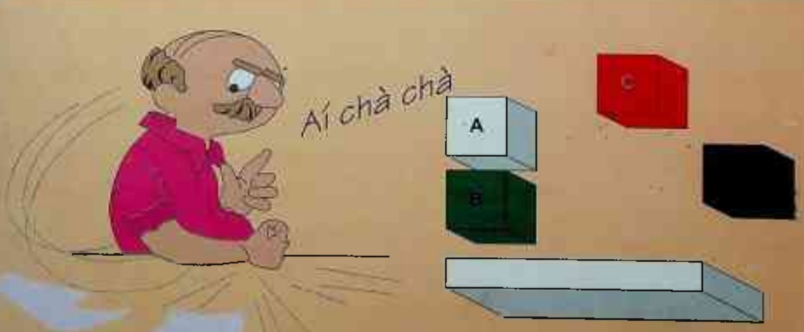

<!-- page: 2 -->

# TRÍ TUÊ NHÂN TẠO (ARTIFICIAL INTELLIGENCE)

Giáo trình dùng cho sinh viên, kī su, cǔ nhân
chuyên ngành Công nghệ thông tin

NHÀ XUẤT BẢN GIÁO DỤC

<!-- page: 3 -->

Chiu trách nhiệm xuất bản:
Giám đốc: PHẠM VĂN AN
Tổng biên tập: NGUYỄN NHU Ý
Biên soạn:
ĐỐ TRUNG TUẤN
Hiệu dính và biên tập nội dung
QUÁCH TUẤN NGỌC

<!-- page: 4 -->

Việc trang bị kiến thức về công nghệ thông tin là cần thiết cho mọi ngành kinh tế quốc dân. Tuy theo từng mức độ mà có các tài liệu thích hợp để nâng cao ứng dụng cũng như phát triển chuyên sâu về công nghệ thống tin. Trong các năm qua, nhiều tài liệu cho ngành khoa học này đã được giới thiệu với cán bộ nghiên cứu, ứng dụng và các học sinh của các bậc học. Tuy nhiên các giáo trình ngành công nghệ thông tin chưa nhiều, chưa đáp ứng được nhu cầu của sinh viên các trường đại học, cao đẳng và trường nghề. Một mật cần có tài liệu để sinh viên tra cứu, học tập và mật khác là để có nhiều giáo trình trên một khung chương trình đào tạo, chúng tôi giới thiệu cuối sách về urí tuệ nhân tạo. Cuốn sách này được dùng nhu tài liệu cho môn học Trí tuệ nhân tạo bậc đại học. Nó cũng có thể dùng để tham khảo đối với bậc học khác. Tuy nhiên trong khuôn khổ của một số giờ hạn chế, một vài nội dung có thể được bỏ qua.

Các nội dung trong cuốn sách đã được dùng để giảng dạy cho sinh viên một số trường đại học trong các năm qua. Một só phân đã được coi là tài liệu trong để tài nghiên cứu về giáo dục đào tạo. Tất cả các nội dung đó được kết hợp trong sách chỉ với mục đích cung cấp tài liệu cho sinh viên một số bậc học. Người đọc có thể tra cứu các tài liệu tham khảo bằng tiếng Việt hay tiếng nước ngoài đã chú thích kèm theo các chương.

Cuôn sách không thể ra đời được nếu thiểu sự giúp dỡ về vật chất và tỉnh thân của các ông Tiến sĩ Quách Tuấn Ngọc, Giáo sư Nguyễn Thúc Hải và của Trung tâm Công nghệ thông tin của Bộ Giáo dục và Đào tạo. Ngoài ra, nhà xuất bản Giáo dục cùng đóng góp phần không nhỏ trong các thủ tục cần thiết. Chứng tôi xin gửi tới họ lỏng biết on. Xin chân thành cảm-on các bề bạn và người thân đã cổ vũ rất nhiều cho việc chuẩn bị cuôn sách này.

Tuy rằng đã có gắng, cuốn sách còn có một số nhược điểm. Mong bạn đọc lượng thứ và đóng góp bổ sung.

Hà nội, tháng 11 năm 1997

Đỗ Trung Tuân

<!-- page: 5 -->

## Chương 1. Mở dâu

- 1. Trí tuệ nhân tạo ?
- I.1. Máy tính và trí tuệ nhân tạo
- I.2. Lịch sử của trí tuệ nhân tạo
- I.3. Các kỹ thuật phát triển trí tuệ nhân tạo
- I.4. Những đặc trưng của trí tuệ nhân tạo
- I.5. Trí tuệ nhân tạo trong công nghệ nhận thức
- I.6. Thế hiện trí thức và các dạng trí thức
- II. Một số quan tâm về trí tuệ nhân tạo
- III. Kết luận
- Phần I. Thế hiện trí thức và giải các bài toán
- Chương 2. Thế hiện trí thức
- I. Giới thiệu
- II. Các dạng trí thức
- III. Các kỹ thuật thể hiện trí thức
- III.1. Cập ba đối tượng - thuộc tính - giá trị
- III.2. Các sự kiện không chắc chắn
- III.3. Các sự kiện màu
- III.4. Các luật
- III.5. Bằng đen
- III.6. Các mạng ngũ nghĩa
- III.7. Khung
- III.8. Các mặt
- III.9. Logic
- III.10. Logic mênh đế
- IV. Vai trò của các luật
- IV.1. Các hệ thống dựa trên luật
- IV.2. Mô hình giải bài toán mang tính người
- IV.3. Kết luận về mô hình hóa nhận thức
- V. Kết luận

<!-- page: 6 -->

## Chương 3. Văn để giải bài toán

- I. Các đặc tính của bài toán 58
- I.1. Phân rã ra các bài toán nhớ 58
- I.2. Một số bước thừa khi giải bài toán 59
- I.3. Khả năng đoán trước trạng thái của bài toán 60
- I.4. Chọn giải pháp tốt, tối ưu 61
- I.5. Vai trò của tri thức phụ mang tính người khi giải bài toán 63
- II. Đặc tính của hệ sản xuất 63
- III. Kết luận 65

- I. Các ký thuật suy diễn 66
- I.1. Giới thiệu 66
- I.2. Suy lý 66
- I.3. Suy diễn 69
- II. Suy diễn tiến/ lủi 75
- II.1. Tổng quan 75
- II.2. Suy diễn tiến 76
- II.3. Suy diễn lủi 81
- II.4. Ủy nhược điểm của kỹ thuật suy diễn 85
- II.5. Kết hợp suy diễn tiến và suy diễn lủi 87
- III. Cây/ độ thị bài toán 89
- III.1. Biểu diễn trạng thái trên cây bài toán 89
- III.2. Biểu diễn trị thức khi giải bài toán 90
- IV. Quay lui và quản lý các trị chân lý 91
- IV.1. Quay lui theo thời gian và quay lui theo sự phụ thuộc 91
- IV.2. Chứng minh bằng cách lan truyền ràng buộc 96
- IV.3. Kết luận về việc quay lui 104
- V. So sánh khớp 105
- V.1. So sánh các chỉ số 105
- V.2. So sánh các biến 105
- V.3. So sánh phúc tạp 107
- VI. Các chức năng may rủi 108
- VII. Kết luận 109

<!-- page: 7 -->

## Chương 5. Một số phương pháp giải bài toán

- 1. Các phương pháp yếu
- 1.1. Giới thiệu
- 1.2. Tìm sâu
- 1.3. Phương pháp tạo sinh và thử
- 1.4. Phương pháp leo núi
- 1.5. Tìm kiểm rộng
- 1.6. Tìm điểm phù hợp
- II. Mạng các nút và tìm kiếm tối ưu
- II.1. Đường tốt nhất
- II.2. Các đường thừa
- II.3. Phân rã bài toán
- II.4. Kết luận về các thủ tục tìm
- III. Cây tìm kiếm và các dấu thủ
- III.1. Các phương pháp thuật toán
- III.2. Các phương pháp may rủi
- III.3. Kết luận
- IV. Các ràng buộc số và việc lan truyền
- IV.1. Lan truyền các số trên mạng ràng buộc số
- IV.2. Lan truyền giá trị xác suất thông qua các mạng ý kiến
- IV.3. Lan truyền độ cao nhỏ các máng số liệu
- IV.4. Tìm kiểm lời giải theo các ràng buộc
- IV.5. Nhận xét về ràng buộc số và lan truyền
- V. Kết luận
- Chương 6. Logic mệnh để trong việc giải bài toán
- I. Giới thiệu
- II. Thế hiện các sự kiện đơn giản bằng logic
- III. Sử dụng các hàm tỉnh toán trong thể hiện tri thức
- IV. Việc giải bài toán
- IV.1. Chuyển mệnh để sang dạng câu
- IV.2. Cơ sở của việc dùng logic vị tử để giải bài toán
- IV.3. Thuật toán hợp nhất
- IV.4. Giải bài toán bằng logic vị tử
- IV.5. Trả lời các câu hỏi
- V. Kết luận

<!-- page: 8 -->

- I. Suy diễn các thông tin đặc biệt 193
- I.1. Giới thiệu 193
- I.2. Suy diễn đơn điệu 194
- I.3. Suy diễn không đơn điệu 195
- I.4. Nhân xét 196
- II. Suy diễn theo xác suất và thống kê 198
- II.1. Sự không chắc chắn và các quyết định hợp lý 199
- II.2. Kỹ thuật xử lý thể giới ngẫu nhiên 199
- II.3. Kỹ thuật xử lý thể giới tất định, không đủ thông tin 200
- II.4. Các trường hợp thuận lợi cho suy luận xác suất và thống kê 201
- III. Kết luận 203
- Chương 8. Biểu diễn cấu trúc của tri thức
- I. Giới thiệu 204
- I.1. Cầu trúc trị thức về quan hệ 206
- I.2. Chọn mức thể hiện 208
- I.3. Cầu trúc phù hợp với câu chuyện 210
- II. Thế hiện theo phương pháp mô tả 211
- II.1. Mạng ngữ nghĩa 212
- II.2. Phụ thuộc khái niệm 213
- II.3. Khung 227
- II.4. Kịch bản 231
- III. Thế hiện theo thủ tục 236
- IV. Kết luận 238
- Chương 9. Các mạng ngữ nghĩa và mô tả sự giống nhau
- I. Mạng ngữ nghĩa 239
- I.1. Vai trò của thế hiện trong việc giải bài toán 239
- I.2. Thế hiện hỗ trợ cho việc mô tả các ràng buộc 241
- I.3. Nội dung của thế hiện 241
- I.4. Truyền đạt ý nghĩa trên mạng ngữ nghĩa 242
- I.5. Nghĩa của ngữ nghĩa 2243
- II. Phương pháp mô tả sự giống nhau 244
- III. Phương pháp mô tả sự giống nhau 246
- III.1. Mô tả quan hệ và chuyển dạng các đối tượng 247

<!-- page: 9 -->

- III.2. Xếp hạng các luật 252
- III.3. Nhập nhằng khi so sánh 253
- IV. Ghi nhận các đối tượng trừu tương 254
- IV.1. Các trạng thái tỉnh thần và các sự kiện 254
- IV.2. Tóm tất câu chuyên trên mạng trừu tương 257
- IV.3. Khả năng của công cụ trừu tương 260
- V. Giải vấn đề và hiểu trị thức 261
- VI. Kết luận 261
- Phân II. Hệ thống giải bài toán
- Chương 10. Một số hệ thống giải bài toán
- I. Lập kế hoạch 264
- I.1. Giới thiệu 264
- I.2. Các tiếp cận lập kế hoạch 268
- I.3. Lập kế hoạch nhỏ toán từ if-add-delete 268
- I.4. Lập kế hoạch theo các biến tính hướng 279
- I.5. Kết luận về việc lập kế hoạch 285
- II. Trả lời các câu hỏi và các lệnh 286
- II.1. Các mạng chuyển tiếp ngũ nghĩa 286
- II.2. Cây mạng ngũ nghĩa 289
- II.3. Kết luận về trả lời các câu hỏi và các lệnh 296
- III. Tổ chức hệ thống 296
- III.1. Xếp lịch 297
- III.2. Tiếp cận Blackboard 297
- III.3. Delta - Min 297
- IV. Hệ chuyên gia 298
- IV.1. Định nghĩa 298
- IV.2. Lợi ích của hệ chuyên gia 299
- IV.3. Một số loại hình của hệ chuyên gia 299
- IV.4. Hệ chuyên gia và công nghiệp 300
- IV.5. Thu thập tri thức cho hệ chuyên gia 300
- V. Trí tuệ nhân tạo phân tán 301
- V.1. Hệ thống trí tuệ nhân tạo phân tán 301
- V.2. Hệ thống nhiều chuyên gia 302
- VI. Các mô hình thân kinh 302
- VI.1. Lịch sử 302
- VI.2. Ý tưởng về hệ thần kinh 302
- VI.3. Đặc trưng của các mô hình liên kết 303
- VII. Kết luận 304

<!-- page: 10 -->

- I. Khó khân của perceptron 305
- II. Các kỹ thuật giải bài toán nhận thức 307
- III. Thỏa mãn ràng buộc 309
- III.1. Các ràng buộc trong hình 309
- III.2. Xác định các ràng buộc 310
- III.3. Dùng các ràng buộc trong các bài toán phân tích 314
- IV. Kết luận 316
- Phân III. Học và nhận dạng quy luật
- Chương 12. Học bằng cách phân tích sự khác nhau
- I. Các may rủi quy nạp 320
- I.1. Thị dụ 320
- I.2. Cải thiện mô hình nhỏ các trượt gần giống 321
- I.3. Cải thiện các mô hình nhỏ các thí dụ 323
- I.4. Đặc biệt hóa và tổng quát hóa 324
- I.5. Một số nguyên tắc trong thủ tục học 326
- II. Định tên 327
- II.1. Các liên kết trong so sánh khớp 327
- II.2. Sắp xếp các mô hình 328
- III. Kết luận 329
- Chương 13. Học bằng cách giải thích kinh nghiệm
- I. Học về lý do khiến con người đã làm 330
- I.1. Giới thiệu 330
- I.2. Cụ thể hóa vấn đề trừu tượng 331
- I.3. Giải bài toán bằng cách truyền giải thích 332
- I.4. Các nguyên tắc giải bài toán tổng quát 336
- I.5. Xấu nhân quả thiết lập ngữ cảnh chung 339
- II. Học về dạng và chức năng 340
- II.1. Hỗ trợ lẫn nhau của các thí dụ và các tiên để 340
- II.2. Ủy điểm của việc học dựa trên giải thích thuộc tính 343
- III. So sánh khớp 343
- III.1. Vai trò của so sánh khớp 344
- III.2. Sử dụng biến trong so sánh khớp 344
- IV. Kết luận 346

<!-- page: 11 -->

- 1. Cô lập các quan hệ nghi ngò
- 348
- I.1. Giới thiệu bài toán
- 348
- I.2. Sử dụng nhóm trượt gần giống
- 349
- I.3. Chính lý chiến lược tìm kiếm
- 350
- II. Điều chỉnh các trị thức
- 351
- II.1. Giải thích các quan hệ nghi ngò có tác động
- 351
- II.2. Hợp nhất các quan hệ nghi ngò đúng
- 354
- II.3. Giải thích các quan hệ nghi ngò sai
- 355
- II.4. Mô tả chi tiết hơn
- 357
- III. Kết luận
- 357
- Chương 15. Học nhỏ ghi nhận các trường hợp
- I. Ghi nhận và tìm kiếm kinh nghiệm thô
- 358
- I.1. Phép may rủi kiên trì
- 358
- I.2. Giải bài toán động nhỏ may rủi
- 360
- II. Người láng giếng gần nhất
- 362
- II.1. Thủ tục tìm tuần tự
- 362
- II.2. Tìm song song
- 366
- III. Kết luận
- 367
- Chương 16. Học theo cách quản lý đa mô hình
- I. Phương pháp không gian các thế hệ
- 368
- I.1. Không gian các thế hệ
- 368
- I.2. Việc tổng quát hóa và đặc biệt hóa
- 372
- II. Thủ tục không gian thế hệ
- 376
- II.1. Thủ tục
- 376
- II.2. Nhận dạng thí dụ
- 377
- III. Kết luận
- 377
- Chương 17. Học bằng cách xây dựng cây định tên
- I. Từ dữ hiệu đến cây định tên
- 379
- I.1. Thí dụ về thế giới thực thu gọn
- 379
- I.2. Phân loại đối tượng theo các thuộc tính
- 382
- I.3. Độ lộn xộn của tập hợp
- 383
- II. Chuyển cây sang luật
- 385
- II.1. Lược bỏ giả thiết không cần thiết trong luật
- 386

<!-- page: 12 -->

- II.2. Lược bó luật thừa 388
- II.3. Phép thủ chính xác Fisher 390
- III. Kết luận 396
- Chương 19. Học bằng cách huấn luyện các mạng thân kinh
- I. Các mạng thân kinh mô phỏng 397
- I.1. Các nondon 398
- I.2. Các nondon mô phỏng 398
- I.3. Dùng các mạng tiến như mạng ràng buộc số học 400
- I.4. Nhận dạng tính quy luật nhỏ các mạng tiến 400
- II. Leo núi và truyền ngược 402
- II.1. Thủ tục truyền ngược 402
- II.2. Thay đổi ngưỡng 402
- II.3. Hàm số ngưỡng trơn 403
- II.4. Truyền ngược theo cách may rủi 404
- II.5. Công thức đạo hàm 406
- II.6. Thủ tục truyền ngược 409
- III. Các tỉnh chất của truyền ngược 409
- III.1. Việc huấn luyện dựa vào truyền ngược 409
- III.2. Sự không ổn định của truyền ngược 412
- III.3. Truyền ngược tiến hành theo từng giai đoạn 413
- III.4. Học nhận dạng đồng thời nhiều khái niệm . 415
- III.5. Dự đoán nhỏ các mạng thân kinh 416
- III.6. Trọng số thái quá là không thích hợp 416
- III.7. Huấn luyện trên mạng thần kinh 418
- IV. Kết luận 420
- Chương 20. Học bằng cách huấn luyện perceptron
- I. Perceptron và học perceptron . 421
- I.1. Giới thiệu 421
- I.2. Thủ tục hội tụ perceptron 424
- I.3. Mô tả hội tụ với hai trọng số bằng đại số 426
- I.4. Trường hợp perceptron có nhiều trọng số 429
- II. Khả năng của Perceptron 430
- II.1. Học định dạng số nhỏ perceptron di thắng 430
- II.2. Hội tụ nhanh của perceptron 432
- II.3. Hạn chế của perceptron . 433
- III. Kết luận 435

<!-- page: 13 -->

- Chương 21. Học bằng cách huấn luyện các mạng xấp xỉ
- I. Các mạng xấp xỉ và nội suy
- 436
- I.1. Nội suy dùng các hàm Gauss
- 436
- I.2. Khả năng của mạng nội suy
- 439
- I.3. Mạng xấp xỉ đối với trường hợp nhiều mẫu
- 441
- I.4. Huấn luyện trọng số khi có nhiều mẫu
- 442
- I.5. Sử dụng thêm nhân tố trong mạng xấp xỉ
- 444
- I.6. Trả lời câu hỏi theo tiếp cận xấp xỉ nội suy
- 446
- II. Cải đặt trong sinh học
- 446
- II.1. Thể hiện số thông qua các vị trí
- 446
- II.2. Các nondon sử dụng hàm Gauss
- 446
- II.3. Tính hàm Gauss
- 447
- III. Kết luận
- 448
- Chương 22. Học bằng cách mô phỏng sự tiến hóa
- I. Vai trò của tính phù hợp
- 449
- I.1. Vai trò di truyền của nhiễm sắc thể
- 449
- I.2. Tính thích hợp
- 451
- II. Các thuật toán sinh
- 452
- II.1. Xử lý nhiều phép tính tương tự
- 452
- II.2. Phương pháp tính sự phù hợp
- 455
- II.3. Một số qui định cần làm
- 456
- II.4. Đặc biệt hóa phương pháp tổng quát
- 456
- II.5. Giao nhau trong không gian nhiều chiều
- 459
- II.6. Trường hợp cần đến sự giao nhau
- 459
- II.7. Phương pháp hạng chất lượng
- 460
- III. Điểm mạnh của đối tượng đặc biệt
- 462
- III.1. Phương pháp không gian hạng
- 462
- III.2. Phương pháp không gian hạng đối với miền có đường hào
- 467
- III.3. Khắc phục cực đại địa phương
- 470
- IV. Kết luận
- 470
- Chương 23. Kết luận
- Tài liệu tham khảo
- 473

<!-- page: 14 -->

# MÔ ĐẦU

## GIÔI THIỆU

Kiến thức là môi quan tâm trước tiên của con người. Người ta luôn luôn tìm kiếm thêm kiến thức, sử dụng nó và làm phong phí thêm thể giới xung quanh minh. Con người đã có nhiều công cụ mở rộng kiến thức, trong đó máy tính là cái dáng kê nhất. Máy tính có thể xử lý nhanh chóng và chính xác các dữ liệu. Ngày nay nó không chỉ lưu trữ, tìm kiếm và xử lý các dữ liệu mà nó còn giữ vai trò ra các quyết định. Trong thời gian ngắn, công nghệ đã đưa con người từ việc xử lý dữ liệu, qua việc xử lý thông tin, đến việc xử lý trí thức. Một lĩnh vực nghiên cứu đóng góp vào công việc này là trí tuệ nhân tạo.

Mục đích trước tiên của tri tuệ nhân tạo là phát triển các chương trình để các máy tỉnh nghĩ như con người. Mục đích này nhằm vào việc chế tạo các chiếc máy thông minh hỗ trợ con người thông qua nhiệm vụ ra quyết định. Mục đích thú hai của trí tuệ nhân tạo là hiểu cách suy lý của con người. Đề phát triển chương trình ứng dụng, cần thiết hiểu cách thức mà con người lưu trữ và xử lý các kiến thức. Thành công thu được cho phép con người biết cách sử dụng tốt nhất các kiến thức phát minh.

## Các nội dung trong tài liệu

Một số điểm dáng quan tâm về ngành khoa học này lần lượt được giới thiệu trong các chương.

\- Biểu diễn tri thức, gồm các phương pháp dùng luật, logic, mạng ngũ nghĩa, hoặc khung được trình bày trong các chương 2 và chương 3. Riêng mạng ngũ nghĩa được trình bày trong chương 9. Chương 6 và chương 7 mô tả cách biểu diễn tri thức chưa được mô tả trong các chương 2 và chương 3; đặc biệt các thể hiện cấu trúc của tri thức được trình bày trong chương 8.

\- Một số phương pháp giải các bài toán về trí tuệ nhân tạo. Chương 4 sẽ giới thiệu một số phương pháp dùng để giải các bài toán. Chương 5 và chương 6 sẽ để cập các phương pháp giải.

<!-- page: 15 -->

Phân 1. Thế hiện trị thức và giải các bài toán

Cháng 2. Thế hiện tri thức

Chương 3. Văn đề giải bái toàn

Chuong 8. Biểu diễn cấu trúc của tri thử

Chương 9. Cử mang ngữ nghĩa và mô tả sự giống nhu

Chương 4. Một số kỹ thuật chuẩn bị giải bài toán

Chương 5. Môi số phương pháp gửi bài toán

Chương 6. Logic mènh để trong việc giải bài toán

Chương 7 Thế hiện trị thức không chắc chắn

Phân II. Hệ thống giải bài toán

Chương 10. Một số hệ thống violin bin toán

Chuong 11. Perceptron

Phân III. Hộc và nhận dạng quy luật

Chương 12. Học bảng cách phân tích
sự khác nhau

Chương 15 Hoc nhớ ghi nhận cie trường hợp

Chương 16. Học theo cách quản lý đa mô hình

Chương 17 Hộc bằng cách xây dựng cây định tên

Chương 13. Học bằng cách giải thích kinh nghiệm

Chương 18. Hợc bảng cách hoàn
luyên mạng thân kinh

Chương 14. Học nhỏ sửa chữa các lôi sai

Chương 19. Học bảng cách luận luyện perceptron

Chương 20. Hợc bảng cách huấn
luyện các mạng xếp xi

Chuang 21. Hoc bằng cách mô phỏng sự tiến hơn

<!-- page: 16 -->

\- Một số hệ thống giải bài toàn về trị tuệ nhân tạo được trình bày tại chương 10. Chương 11 giới thiệu phương pháp Perceptron.

\- Bài toán học máy tính được xem như phần riêng. Chủng được trình bày trong các chương, từ chương 12 đến chương 21.

Loài người tự cho mình là người thông minh (homo sapiens) vi khả năng trí tuệ là rất quan trọng trong cuộc sống hàng ngày và tỉnh cảm của mỗi người. Linh vực của tri tuệ nhân tạo nhằm vào việc hiểu các thực thể thông minh. Do đó một trong các lí do đề nghiên cứu là học về bản thân con người. Nhung không giống như những nhà tâm lý học hay triết học, tri tuệ nhân tạo còn xây dựng các thực thể thông minh và hiểu chúng. Một lí do khác để nghiên cứu tri tuệ nhân nhân tạo là các thực thể thông minh được xây dựng nên cũng có ích và hấp dẫn con người. Từ trước đến nay, trí tuệ nhân tạo đã cho nhiều kết quả và cho dù trong tương lai người ta chưa biết nó ra sao. nhưng chắc chắn ràng máy tính với trí tuệ như con người sẽ tác động mạnh đến cuộc sống và văn minh của con người.

Trí tuệ nhân tạo đặt ra nhiều triển vọng về khả năng chế ngụ thể giới. Nó húta hẹn các khả năng vượt lên hẩn các công cụ diện tử, sinh học... mà nó sử dụng để phát triển.

Trong công nghệ thông tin, trí tuệ nhân tạo là ngành mới. Nó được hình thành mới từ năm 1956. Nhiểu nhà khoa học ngành khác hay cho trí tuệ nhân tạo là ngành như tự thân nó muốn lốn tại. Chẳng hạn như người làm công tác vật lý có thể cho ràng các ý tưởng lớn đã do các bậc tiền bối như Galileo, Newton... thực hiện, và phải qua nhiều năm nửa mới có thể có ý tưởng mới là.

Việc nghiên cứu trí tuệ tuy thế cũng đã có từ lâu. Trên 2000 năm trước, các nhà triết học đã cố để hiểu cách thức nhìn nhận, học tập, nhỏ và suy lý. Việc ra đời của máy tính diện tử vào đầu những năm 50 sinh ra khuynh huống dưa các lĩnh vực nghiên cứu trí tuệ về các vấn đề lí thuyết và thực nghiệm trên máy. Nhiểu người cảm thấy "bộ não siêu diện tử" là tiêm năng không hạn chế đối với cho trí tuệ. Đồng thời với việc tạo ra các thực thể trí tuệ nhân tạo, máy tính còn cung cấp công cụ để kiểm nghiệm các lý thuyết thông minh, và thực tế cho thấy nhiều lý thuyết đã không trụ được. Trong khi đó, trí tuệ nhân tạo càng khó hơn và có nhiều ý tưởng hiện đại hơn.

Trí tuệ nhân tạo bao quát rất nhiều lĩnh vực nghiên cứu hep. Nó nghiên cứu từ các lĩnh vực tổng quát như máy nhận biết perceptron, suy luận logic, đến các bài toán như chơi cò, chứng minh định lý, làm thơ, hay chẩn đoán bệnh. Thường thì các nhà khoa học trong các lĩnh vực khác đến dẫn dẫn tới trí tuệ nhân tạo để hệ thống hóa và tự động hóa các xử lý tri thức. Và những người khác cũng có thể tìm thấy ở trí tuệ nhân tạo các phương pháp phù hợp trong công việc thuộc lĩnh vực mang tính người.

<!-- page: 17 -->

## I. TRÍ TUÊ NHÂN TẠO ?

## I.1. Máy tính và trí tuệ nhân tạo

Theo M. Minsky "trí tuệ nhân tạo nhằm mô phỏng bằng máy tính về hành vi thông minh của con người". Tuy nhiên, định nghĩa này cũng mới cho thấy một mát của trí tuệ nhân tạo.

Đế định nghĩa rõ thêm về trí tuệ nhân tạo, người ta dựa trên hai quan điểm đã được chấp nhận khi nhìn nhận về vai trò phục vụ của máy tính cho ngành trí tuệ nhân tạo :

1. Quan điểm của người nghiên cứu những cơ chế của trí tuệ cho ràng máy tính như phương tiện mô phỏng để thủ một mô hình hay một định lý.

2. Quan điểm khác cho rằng máy tính có nhiều khả năng chủ động. Do vậy, cần cổ gắng để sản xuất các máy tính có khả năng thông minh con người, như các khả năng thu nhận tri thức, nhận dạng, suy luận, hoặc ra quyết định.

Khi làm việc với trí tuệ nhân tạo, quan điểm thủ hai có khuynh hướng mô phỏng máy tính như thiết bị có có hành động thông minh; tuy vậy trong các ứng dụng cụ thể cũng chỉ mối dùng ở mức như quan điểm thủ nhất đã khẳng định.

Các định nghĩa về trí tuệ nhân tạo trong các tài liệu xuất bản gần đây cho thấy nó thuộc hai hướng chính là (i) xử lý các suy nghĩ và suy lý; và (ii) hên quan đến hành vi. Theo mỗi hướng, người ta chia ra cách xác định theo hoạt động mang tính người hay theo các khái niệm mang tính từ tưởng của trí tuệ, tức ý chí con người.

| Các hệ thống suy nghĩ giống con ngườiTheo tài liệu của Haugeland vào năm 1985 "Kích thích có gắng mới làm các máy tính suy nghĩ... các máy có bộ ốc, theo nghĩa dãy đủ..."Theo tài liệu của Bellman năm 1978 "Tự động của các hoạt động liên quan đến suy nghĩ mang tính người, các hoạt động như ra quyết định, giải bài toán, học..." | Các hệ thống suy nghĩa theo ý chỉTheo tài liệu của Charniak và McDermott nam 1985 "Nghiên cứu các phương tiện thân kinh thông qua việc sử dụng các mô hình tính toán"Theo tài liệu của Winson vào năm 1992 "Nghiên cứu các tính toán để có thể nhận biết, suy lý và hành động" |
| --- | --- |

<!-- page: 18 -->

| Các hệ thống hành động như con ngườiTheo tài liệu của Kurzweil năm 1990 "Nghệ thuật sinh ra các máy thực hiện các chức năng đôi hỏi trí tuệ khi con người vận hành"Theo tài liệu của Rich và Knight năm 1991 "Nghiên cứu cách thức làm máy tính thực hiện công việc mà khi đó con người thực hiện tốt hơn" | Các hệ thống hành động theo ý chíTheo tài liệu của Schalkoff năm 1990 "Lãnh vực nghiên cứu đề tìm cách giải thích và bất chước hành vi thông minh bằng các quá trình tính toán"Theo tài liệu của Luger và Stubblefield năm 1993 "Một ngành khoa học máy tính liên quan đến tự động hóa hành vi thông minh" |
| --- | --- |

Hình 1-1. Các định nghĩa về trí tuệ nhân tạo.

Về lịch sử thì xem như có bốn tiếp cận như trong bảng. Qua đó người ta thấy chúng xoay quanh con người và ý chí. Tiếp cận lấy con người làm trung tâm cần theo khoa học kinh nghiệm, cần các giả thuyết và kháng định theo kinh nghiệm. Cơn tiếp cần ý chỉ yêu cầu tổ hợp toán học và công nghệ. Mỗi nhóm có thể liên quan đến nhóm kĩa, nhưng thực sự họ có các kết quả ý nghĩa riêng.

## 1. Hoạt động mang tính người được đặc trưng bằng tiếp cận thí nghiệm Turing

Thí nghiệm Turing do Alan Turing để xuất năm 1950 để đáp ứng việc xác định về thao tác của trí tuệ. Turing xác định trí tuệ như thuộc tỉnh để đạt được hiệu quả ở mức con người trong công tác nhận thức. Theo mô tả đơn giản thì máy do Turing để xuất đáp ứng các câu hỏi của con người thông qua một máy diện tín. Ngày nay máy tính dùng chương trình thực hiện được hết các thí nghiệm, và cần có khả năng sau :

\- Xử lý ngôn ngữ tự nhiên, cho phép con người liên lạc với máy, ít ra là bằng tiếng Anh.

\- Thế hiện tri thức để lưu trữ các thông tin trước và trong lúc người đối thoại với máy.

\- Suy diēn tự động được dùng để lưu các câu trả lời và cho ra các kết luận.

\- Học nhỏ máy để đáp ứng với hoàn cảnh mới và phát hiện được các thành phần không phù hợp.

Thí nghiệm của Turing tránh tương tác trực tiếp về vật lý giữa người dùng và máy tính, vì mô phỏng vật lý về con người là không nhất thiết cho trí tuệ nhân tạo. Một thí nghiệm Turing tổng thể còn gồm :

<!-- page: 19 -->

• Thiết bị nhìn bằng máy để nhận biết đối tượng. và

• Người máy đế di chuyển.

Trí tuệ nhân tạo không phải chỉ chuyên tâm vào việc giải quyết các thí nghiệm Turing. Trong thời kì dấu của trí tuệ nhân tạo, người ta mối cần biết các hoạt động mang tính người, cũng như một hệ chuyên gia muốn chấn đoán như người, hay hệ xử lý ngôn ngữ muốn đối thoại ngay với người sử dụng. Các chương trình này cần có thao tác phù hợp với các ràng buộc mang tính người để nó dễ hiểu. Việc thể hiện và suy lý trong hệ thống như vậy có thể không dựa trên các mô hình mang tính người.

## 2. Suy nghĩ mang tính người : tiếp cận mô hình hóa nhận thức

Nếu có chương trình suy nghĩ được như người thi người ta cũng phải biết con người suy nghĩ thế nào. Có hai cách để di vào nội tâm của suy nghĩ là (i) theo nội tâm để nắm được ý nghĩ như nó phát triển và (ii) nhỏ các trắc nghiệm tâm lý. Một khi người ta xây dựng dược lý thuyết của nhận thức thì môi viết được chương trình có thể nhận thức như người. Nếu các hành vi xuất/nhập của máy cũng như người thi phần nào người ta đã có cơ chế mang tính người. Newell và Simon đã phát triển hệ giải bản toán tổng quát GPS (General Problem Solving), đã không lưu tâm vào việc hệ thống giải bài toán đúng hay không. Cái quan trọng khác với các nhà nghiên cứu khác của hai ông là theo dõi các bước của con người để giải các bài toán tương tự. Khoa học nhận thức kết hợp các mô hình tính toán của trí tuệ nhân tạo với các kỹ thuật kinh nghiệm của tâm lý học để để xuất lý thuyết trắc nghiệm, chính xác trên trị thức con người.

## 3. Suy nghī có lý : các luật các tiếp cận theo các ý nghī

Nhà triết học Hy lạp cổ đại Aristotle là một trong những người muốn mã hóa các suy nghĩ đúng. Phương pháp suy luận của ông là thành phần trong cấu trước cho phép rút ra kết luận từ các tiên đề. Các luật suy luận được dùng để quản lý các thao tác của suy nghĩ và là khởi dấu của logic.

Sự phát triển của logie hình thức vào cuối thể kỉ mươi chin hoặc dấu thể kỉ hai mươi đảm bảo ghi nhận chính xác các câu về thể giới. Cơn với các kỉ pháp toán học chuẩn tắc thì người ta chỉ ghi nhận được các đẳng thức hay bất đẳng thức trên các con số. Từ năm 1965, nhỏ các chương trình người ta hy vọng có thể xây dựng được các hệ thống trị tuệ nhân tạo.

Tuy nhiên con người cũng gặp hai trở ngại chính. Thứ nhất là không dễ nằm các tri thức không hình thức và dưa chúng về các dạng hình thức theo kí pháp logic, nhất là khi tri thức không hoàn toàn chắc chắn. Thứ hai là còn khoảng cách xa giữa khá nâng giải bài toán theo nguyên tắc và việc thực sự giải nó. Đầu sao người ta vấn thấy logic có nâng lực thể hiện và dễ xác định các hệ thống suy lý.

<!-- page: 20 -->

## 4. Hành động có lý : tiếp cận theo tác nhân có lý

Hoạt động có lý có nghĩa hoạt động để đạt đến các đích. Tác nhân là cái nhận thức và hành động. Theo tiếp cận này, trí tuệ nhân tạo cần nghiên cứu và xây dựng các tác nhân có lý.

Trong tiếp cận "các luật của suy nghĩ" ở trên, người ta nhân mạnh vào các suy luận đúng. Thực hiện các suy luận đúng dôi khi là một phần của tác nhân lý trí, vì một cách để hành động có lý là suy lý logie với các hành động dễ đến đích. Mặt khác, suy luận đúng không phải là toàn bộ những điều có lý bởi vi đôi khi không có những điều đúng cần phải chứng minh. Có những cách hành động có lý nhưng theo suy diễn đang làm lại là không hợp lý.

Tất cả các kĩ năng nhận thức cần thiết cho thí nghiệm Turing cho phép thực hiện các hành vi có lý. Đo vậy người ta cần có khả năng thể hiện tri thức và suy lý với chúng vi chúng cho phép con người đạt được quyết định tốt trong nhiều hoàn cảnh da dạng. Người ta cần tạo được các câu phù hợp bằng ngôn ngữ tự nhiên vi chúng giúp con người thể hiện được các tỉnh huống xã hội phúc tạp. Khi người ta dùng máy nhìn thì không phải cho vui hơn mà để có thêm ý tưởng về cản mà một hoạt động có thể đạt được.

Việc nghiên cứu trí tuệ nhân tạo như thiết kế các tác nhân lý trí có hai ưu điểm. Thứ nhất nó tổn quát hơn tiếp cận "luật suy nghĩ", vi suy luận đúng chỉ là cơ chế hữu ích để đạt được sự có lý, chú không phải cần thiết. Thứ hai là tiếp cận này hấp dẫn người ta hơn tiếp cận dựa trên hành vi con người hay trên ý nghĩa mang tỉnh người, vi chuẩn của lý trí được xác định sáng sửa và hoàn toàn tổng quát. Mặt khác, hành vi của con người là dễ thích nghi với một môi trường đặc biệt và là tổng hợp của nhiều quá trình mà còn lâu mới hoàn thiện được.

## 1.2. Lịch sử của trí tuệ nhân tạo

Lịch sử của trí tuệ nhân tạo cho thấy ngành khoa học này có nhiều kết quả dáng ghi nhận, tuy chưa trải qua nhiều năm tháng. Theo các móc phát triển, người ta thấy trí tuệ nhân tạo được sinh ra từ những năm 50 với các sự kiện sau :

\- Người đi đầu trong trí tuệ nhân tạo là Turing. Phân trên đã giới thiệu vài nét về thí nghiệm của ông.

\- Tháng 8/56, J. McCarthy, M. Minsky, A. Newell, Shannon, Simon... dua ra khái niêm "trí tuệ nhân tạo",

\- Chương trình dấu tiên về trí tuệ nhân tạo có nguồn gốc từ lý thuyết logic, từ các trò chơi cò,

\- Xuất hiện ngôn ngữ lập trình LISP, phù hợp với các nhu cầu xử lý đặc trưng của trí tuệ nhân tạo.

<!-- page: 21 -->

Tuy vay trí tuệ nhân tạo chỉ di vào hoạt động thực sụ từ những năm 60. khi có nhiều đế án về trí tuệ nhân tạo, có các nghiên cứu về may rủi, về hệ thống giải bài toàn GPS. Thuật ngữ "giải bài toán" còn được quen gọi là "giải vấn đề". Lức đó là những năm 1957-1969.

Việc khai thác và ứng dụng các kết quả của trí tuệ nhân tạo bất dấu từ những năm 70. Các kết quả dáng kể của trí tuệ nhân tạo thuộc các màng nghiên cứu ứng dụng sau :

• Thế hiện trị thức và suy lý.

• Hệ chuyên gia,

\- Hiểu ngôn ngữ tự nhiên.

\- Người máy (robot) thông minh, phát triển ở mức độ cao.

Những năm 80 được cơi là thời gian thẩm nhập của trị tuệ nhân tạo vào các ngành kinh tế quốc dân. Trong những năm này người ta tiên hành các thực nghiệm và đạt được các nghiên cứu lý thuyết quan trọng.

Nhùng năm 90 người ta thực hiện :

\- Cải đặt trí tuệ nhân tạo, bay gọi là cản đặt thành phần thông minh trong các hệ thống thông tin.

\- Làm rò hơn các thành phần của ngành khoa học về trị tuệ nhân tạo.

\- Tiến hành các nghiên cứu mới, đặc biệt là các nghiên cứu về cơ chế suy lý, về trí tuệ nhân tạo phân tán, về bài toán học, về các mô hình tương tác...

## I.3. Các kỹ thuật phát triển trí tuệ nhân tạo

Trong phần này là một số kỹ thuật giúp cho việc nghiên cứu, phát triển ngành khoa học này :

## 1. Lý thuyết giải bài toán và suy diễn thông minh

Lý thuyết giải bài toán cho phép viết các chương trình giải câu độ, chơi các trò chơi thông qua các suy luận mang tính người. Hệ thống giải bài toán GPS do Newel, Shaw và Simon duta ra rối được hoàn thiện năm 1969 là một móc dáng ghi nhớ. Trước năm 1980, Buchanan và Luckham cũng hoàn thành hệ thống chứng minh định lý. Ngoài ra các hệ thống hồi đáp thông mirth như SIR, QA2, QA3... cho phép lưu trữ và xử lý khối lượng lớn các thông tin. Chương trình của McCarthy về các phương án hành động có khả năng cho các lời khuyến.

## 2. Lý thuyết tìm kiếm may rủi

Việc tìm kiếm lời giải cũng là việc việc bài toán. Lý thuyết tìm kiếm nhỏ may rủi gồm các phương pháp và kỹ thuật tìm kiếm với sự hỗ trợ của thông tin phụ để giải bài

<!-- page: 22 -->

toán một cách hiệu quả. Công trình dáng kê về lý thuyết này là của G. Pearl vào năm 1984.

## 3. Các ngôn ngữ về trí tuệ nhân tạo

Dế xử lý các trị thức người ta không thể chỉ sử dụng các ngôn ngữ lập trình dùng cho các xử lý dữ liệu số, mà cần có các ngôn ngữ khác. Các ngôn ngữ chuyên dụng này cho phép lưu trữ và xử lý các thông tin kí hiệu. Dùng các ngôn ngữ này cũng là cách đề trả lời câu hỏi "thể nào" (what), rời tới câu hỏi "lám sao vậy" (how). Một số ngôn ngữ được nhiều người biết đến là :

• Cảr ngôn ngữ IPL.V, LISP

\- Ngôn ngữ mạnh hơn như PLANNER. PROLOG. Ngay trong một ngôn ngữ cũng có nhiều thế hệ với những phát triển dáng kê.

## 4. Lý thuyết thể hiện tri thức và hệ chuyên gia

Theo quan điểm của nhiều chuyên gia công nghệ thông tin, trí tuệ nhân tạo là khoa học về thể hiện trị thức và sử dụng trị thức. Người ta nhận xét về phương pháp thể hiện trị thức như sau :

\- Luego dỗ dùng để thể hiện trị thức trong chương trình.

\- Mạng ngữ nghĩa, logic vị tử, khung, mạng là các phương pháp thế hiện tri thức một cách thông dụng.

\- Dùng khung dẻ thể hiện tri thức chắc chắn là phương pháp có nhiều hóa bẹn trong các nấm gần đây.

Việc gần liền cách thể hiện và sử dụng trị thức là cơ sở hình thành hệ chuyên gia. Vậy nên phải kết hợp các quá trình nghiên cứu các quy luật, thiết kế và xây dựng hệ chuyên gia. Tuy nhiên cho đến nay, da số các hệ chuyên gia mới thuộc lĩnh vực y học.

## 5. Lý thuyết nhận dạng và xử lý tiếng nói

Giai đoạn phát triển đầu của tri tuệ nhân tạo gắn với lý thuyết nhận dạng. Các phương pháp nhận dạng chính được giới thiệu gồm :

• Nhận dạng dùng tâm lý học,

\- Nhân dạng hình học.

\- Nhận dạng theo phương pháp hàm thể,

• Dùng máy nhận dạng.

Ứng dụng của phương pháp này trong việc nhận dạng trong chữ viết, âm thanh. hình ảnh... cho đến nay đã trở nên quen thuộc. Người ta đã có hệ thống xử lý ảnh ba chiều, hệ thống tổng hợp tiếng nói.

<!-- page: 23 -->

Do khối lượng đổ sộ của tri thức về lý thuyết nhận dạng, các chương sau chưa đế cấp đến các phương pháp nhận dạng được.

## 6. Nguôi máy

Cuối những năm 70, người máy trong công nghiệp đã đạt được nhiều tiến bộ. "Khoa học người máy là nổi kết thông minh của nhận thức với hành động". Người máy có bộ phận cảm nhận và các cơ chế hoạt động được nổi ghép theo sự điều khiển thông minh. Khoa học về cơ học và trí tuệ nhân tạo được tích hợp trong khoa học về người máy. Các đề án trí tuệ nhân tạo nghiên cứu về người máy bất dấu từ để án "mất -tay". Trong thực tế, người máy được dùng trong các nhiệm vụ chuyên sâu, thuộc các dây chuyển công nghiệp.

Nội dung về khoa học người máy, sẽ được trình bày trong tài liệu riêng, không thuộc các chương của tài liệu này.

## 7. Tâm lý học xử lý thông tin

Các kết quả nghiên cứu của tâm lý học giúp trí tuệ nhân tạo xây dựng các cơ chế trả lời theo hành vi, có ý thức. Nó giúp thực hiện các suy diễn mang tính người.

## I.4. Những đặc trưng của trí tuệ nhân tạo

Trí tuệ nhân tạo có các đặc trưng sau :

\- Trí tuệ nhân tạo xử lý thông tin theo trật tự kí hiệu. Các thông tin gồm khái niệm, luật, các đối tượng... dùng cho suy lý.

\- Khái niệm cơ bản trong trí tuệ nhân tạo là sự thể hiện, suy lý, nhận biết, việc học, và hệ thống cơ sở trí thức.

\- Phương pháp may rủi hay được dùng trong trí tuệ nhân tạo. Phương pháp này cho phép giải hai lớp bài toán khó. Thứ nhất là những bài toán chưa có thuật toán giải, nhu bài toán về nhận biết, ra quyết định, về khái niệm hóa. Thứ hai là các bài toán đã có thuật toán giải nhưng độ phúc tạp lớn, nhu bài toán chơi cỏ.

\- Trí tuệ nhân tạo xét đến những thông tin không đầy đủ, không chính xác, có về mãu thuần. Những thông tin có về mãu thuần thường thấy trong y học, trong quản lý xí nghiệp... Tuy vay các kết luận của trí tuệ nhân tạo là cụ thể.

\- Việc tương tác người máy di đôi với nhận biết tự động là cần thiết trong trí tuệ nhân tạo. Các bài toán nhận dạng là thí dụ về yêu cầu này.

\- Trí tuệ nhân tạo liên quan đến nhiều lĩnh vực, như các kỹ thuật mới, logic học, khoa học nhận biết, ngôn ngữ học, khoa học về tổ chức, thần kinh học. Trí tuệ nhân tạo còn nằm trong các lĩnh vực nghiên cứu nâng cao, đề án nghiên cứu quan trọng.

<!-- page: 24 -->

## 1.5. Trí tuệ nhân tạo trong công nghệ nhận thức

Khi so sánh các phản mềm xử lý dữ liệu có điện như xử lý dữ liệu số, vân bản... với các phản mềm xử lý ed dữ liệu lăn các trị thức. người ta nhận thấy giữa hai cách xử lý có những khác nhau :

Tân học cổ điện đưa dữ hiệu vào chương trình và thu nhận kết quả. Chương trình trong trường hợp này được cơi như hộp đen thực hiện các chức năng xử lý dữ liệu theo thuật toán.

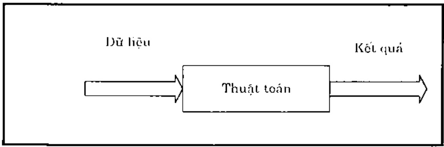

Hình 1-2. Xử lý dữ hiệu trong tin học cổ điện.

Với trí tuệ nhân tạo, các thông tin được nhập vào phần xử lý gồm các dữ liệu, các sự kiện và các thông tin may rủi. Phần xử lý dữ liệu trong mô hình tin học cỏ điện được phát triển, cho phép xử lý các trí thức như mô tô suy diễn trong hệ chuyên gia. Các kết quả của hệ thống trí tuệ nhân tạo là các diễn giải, kết luận.

## Dinh nghĩa 1-1: Sự kiện (Event)

Sự kiện được dùng để thiết lập tạm thời về một khái niệm cụ thể. Trong việc khảo sát lý thuyết về lập kế hoạch, "sự kiện" tham chiếu đến bất kì thay đổi của "một trạng thái của thế giới".

\- Một sự kiện được khởi tạo bởi tác nhân gọi là hành động.

\- Sự kiện cùng là các phần tử của cấu trúc thời gian trong logie thời gian.

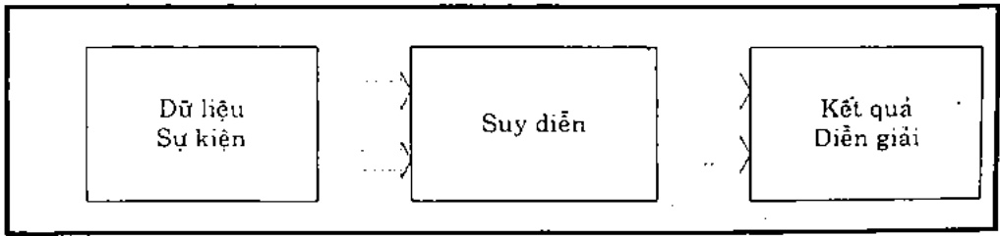

Hình 1-3. Xử lý dữ liệu và trí thức trong trí tuệ nhân tạo.

<!-- page: 25 -->

Trong công nghệ tri thải, số đồ trên được mô tả với nhiều thông tin vào/ra. Trong hệ thống như vậy, cần phân biệt tri thải và cơ chế khai thải tri thải. Tri thải được sử dụng không ngùng để làm phong phí thêm hệ thống. Việc kết hợp cả hệ thống tin học cổ điện và hệ thống xử lý tri thải tạo nên hệ thống lai, cho phép khai thải của số dữ hiệu và cơ sở các tri thải.

## 1.6. Thể hiện tri thức và các dạng tri thức

Trước khi xử lý các tri thừ, việc xác định các dạng thể hiện của các tri thừ là rất quan trọng. Việc mô tả dữ liệu và tri thừ phù hợp tạo điều kiện thuận tiện cho các thao tác xử lý. Đa số các cách thể hiện tri thừ sẽ được lán lượt giới thiệu trong các chuống. Sau dây là một vài dạng thể hiện tri thừ, xem như các dạng thí dụ :

\- Trị thức được thể hiện thông qua các đối tượng và sự kiện trên các đối tượng.

\- Các sự kiện dùng thể hiện tri thất. Các sự kiện có thể mang yếu tố thời gian, tạo nên một chuỗi các sự kiện tuần tự.

\- Thế hiện thông tin thông qua các suy điện. Chẳng hạn sử dụng các luật suy điện các sự kiện.

\- Thế hiện ưu thức thông qua cách sử dụng ưu thức, như cách thực hiện hành động. Loại thế hiện này liên quan đến ngôn ngữ học.

\- Thế hiện trị thức và thông tin về trị thức đó. Chứng được cơi là meta-tri thức, tức là trị thức về trị thức. Tiếp đầu "meta" chỉ mức độ phản ánh đối với hệ thống hơn là đối với việc phản ánh bản thân hệ thống. Meta trị thức cho biết nguồn gốc, hạn chế, tỉ suất của thông tin liên quan đến chiến lược suy lý.

Tri thức chuyên gia được dễ ý vi nó là các tri thức về lĩnh vực chuyên sâu. Đỏ là tri thức có được do kinh nghiệm, cảm nhận được. Thí dụ như các luật kiểm-chứng, may rủi, lời khuyến, ý đồ chiến lược, cảm nhận về sự phân cấp của các sự kiện.

## II. MỘT SỐ QUAN TÂM VỀ TRÍ TUỆ NHÂN TẠO

Một số quan tâm trong ngành trí tuệ nhân tạo có thể được xét theo các đầu mục nhu sau :

\- Việc giải bài toán cho phép nghiên cứu về các phương pháp giải bài toán thống qua việc tìm kiếm các lời giải, có hoặc không dùng đến các trị thức bổ sung. Liên quan đến vấn đề này là các nội dung về các trò chơi.

\- Người ta nghiên cứu tri thức và việc suy lý liên quan đến các công cụ logie, là một trong các công cụ dùng để thể hiện tri thức. Ngoài ra người ta xét đến

<!-- page: 26 -->

việc xây dựng cơ sở tri thúc và suy diễn dựa trên logie bậc một và các hệ thống suy luận logic.

\- Một hoạt các hoạt động logic như việc lập kế hoạch, lập lịch.

\- Các tri thức không chắc chắn và việc suy lý trên các tri thức đó. Khi đó người ta cần xử lý các hệ thống suy lý, nghiên cứu việc ra quyết định từ mức độ đơn giản đến phúc tạp.

\- Việc học nhỏ máy tính được xét từ việc học đưa trên các quan sát, học theo mạng thân kinh, đến việc chủ động học. Các trị thức cần thiết cho việc học cần được xét đến trong các nội dung này.

\- Truyền thông, nhận biết và hành động để cập đến các yếu tố trong truyền thông, việc xử lý ngôn ngữ tự nhiên và máy perceptron, người máy.

Dù ràng có thể được giới thiệu sơ lược trong một số chuống, một số chuyên ngành hep của trí tuệ nhân tạo cần được xét kĩ hơn. Có nhiều lí do, nhưng trước hết do nội dung trong các ngành hep đó không dễ dàng góp vào nội dung của các chuống. Lại nửa, một số chuyên ngành là ngành môi, mang tính thời sự. Do vậy khi có điều kiện, việc nghiên cứu chúng một cách độc lập và nghiêm tục là đáng quan tâm. Một số chuyên ngành hep là :

\- Lý thuyết nhận dạng

• Hệ chuyên gia,

\- Trí tuệ nhân tạo phân tán.

• Các mô hìnhチン kinh.

\- Máy nhìn và ngôn ngữ.

Một số nội dung về dịch tự động, người máy... sẽ được giới thiệu trong một số chương cũng cần được khảo cứu riêng.

Khoa học về trí tuệ nhân tạo liên quan đến cảm giác, tri giác, và cả quá trình tư duy thông qua các hành vi. giao tiếp. Người ta nhận thấy nó có các định hướng nghiên cứu, từng dụng sau :

\- Tùm và nghiên cứu các thủ tục giúp con người tiến hành các hoạt động sáng tạo. Công việc sáng tạo được thực hiện trên mô hình theo cấu trúc, chức năng và sử dụng công nghệ thông tin.

\- Dùng ngôn ngữ tự nhiên. Trước hết ngôn ngữ được dùng để thể hiện tri thức. tiếp thu và chuyển hóa sang dạng có thể xử lý được.

\- Hình thức hóa các khóa cạnh, các hành vi liên quan đến trị tuệ nhân tạo. Do vậy có thể xây dựng các bài toán mang tính người và thông minh.

<!-- page: 27 -->

Nhìn nhận về trí tuệ nhân tạo, người ta nhận thấy nó có các hoạt động lớn như:

• Chứng minh định lý,

• Xử lý ngôn ngữ tự nhiên.

• Hiếu tiếng nói.

• Phân tích ảnh và hình,

• Nguòi máy.

• Hệ chuyên gia.

Các ký thuật lớn về trí tuệ nhân tạo là :

\- Suy luận dựa trên tri thức. Đề tăng cường các mô hình suy luận, người ta sử dụng logie mò, suy luận theo mô hình, suy luận theo hoàn cảnh, suy luận thời gian và thời gian thực, cải đặt các ràng buộc và da suy luận.

• Mạng thân kinh,

\- Chương trình hóa với ràng buộc. Một cách hình thức, ràng buộc là quan hệ thiết lập điều kiện tương thích giữa các giá trị của tập các biến.

Vế cải đặt hệ thống, khuynh hướng hiện tại của trí tuệ nhân tạo là cải đặt các hệ trí tuệ nhân tạo trong các hệ thống khác, đặc biệt trong ác hệ thống tin học. Việc xử lý trí thức trong các hệ thống xã hội, quản lý, hỗ trợ được quan tâm nhiều.

Người ta cũng có thể kế ra các giải pháp mới cho hệ thống thông minh thông qua các mạng liên kết thần kinh, sử dụng thuật toán sinh.

## III. KÊT LUẬN

Chương mỏ đầu xác định vai trò trí tuệ nhân tạo trong nhận thức của con người và giới thiệu sơ lược về các kỹ thuật, những ngành hợp trong trí tuệ nhân tạo. Phấn đầu của chương đã giới thiệu các nhìn nhận khác nhau về trí tuệ nhân tạo.

Những vấn đề cần thiết để cập trong các chương sau như tri thức, thể hiện tri thức, giải bài toán, phương pháp tìm và việc học tự động đã được vạch ra sơ bộ. Các nội dung chi tiết dành cho các phần gồm nhiều chương sau này.

<!-- page: 28 -->

# Thế hiện tri thức và giải các bài toán

Phân I với nội dung "Thể hiện tri thức và giải các bài toán" dễ cập đến hai măng kiến thức là :

• Thế hiện tri thức, và

• Giải các bài toán.

Nó được chia ra thành tám chương, theo các nhan để sau :

• Chương 2. Thế hiện tri thức

• Chương 3. Vấn dê giải bài toán

\- Chương 4. Một số kỹ thuật chuẩn bị giải bài toán

\- Chương 5. Một số phương pháp giải bài toán

\- Chương 6. Logic ménh để trong việc giải bài toán

\- Chương 7. Thể hiện tri thức không chắc chắn

• Chương 8. Biểu diễn cấu trúc của tri thức

\- Chương 9. Các mạng ngũ nghĩa và mô tả sự giống nhau

<!-- page: 29 -->

# THÊ HIỆN TRI THỨC

## 1. GIÔI THIỆU

Đế xử lý các tri thức, trí tuệ nhân tạo cần có các kỹ thuật mà hóa tri thức. Các kỹ thuật mã hóa tri thức này khác nhiều so với cách thể hiện của các dữ hiệu trọng các chương trình, thuật toán xử lý dữ liệu thường gặp. Các hệ thống thông minh cần xử lý các tri thức, và các tri thức cần được biểu diễn ở dạng kí hiệu mà hệ thống xử lý được.

Trong phần này có một vài cách biểu diễn tri thức. Do tính da dạng của thực tế và vi chẳng có kỹ thuật nào là phù hợp cho tất cả các ứng dụng, người ta cần lụa chọn một kỹ thuật thích hợp.

Về tổng thể, tri thức là sức mạnh. Câu ngắn gọn này thương được nhân mạnh trong hệ thống thông minh. Đã từ lâu. hiệu quả của hệ thống trị tuệ nhân tạo liên quan trực tiếp đến chất lượng tri thức mà hệ thống có được về bài toán cần phải giải.

Tri thúc là gì ? Nó là thuật ngữ trều tượng nhằm chỉ hiểu biết của một cá nhân về chủ đề đã cho. Đề xác định tri thúc theo cách rộng hơn, người ta xét vài khái niệm:

## Định nghĩa 2-1 : Tri thúc (Knowledge)

Tri thúc là sự hiểu biết về một miền chủ đề

Thí dụ

Hiểu biết về y học là tri thức. Dương nhiên khi xây dựng hệ thống trí tuệ nhân tạo như hệ chuyên gia. không phải người ta muốn nằm bắt tất cả các tri thức chuyên gia. Chỉ tri thức chuyên gia được chọn và hơn thế, người ta chỉ chọn tri thức chuyên gia trong vài chủ đề quan trọng của miền chủ đề. Chăng hạn người ta cần chọn ra các hiểu biết chỉ chuyên về bệnh nhiễm trùng máu. Khi ấy người ta có kiến thức chuyên về lĩnh vực.

Dịnh nghĩa 2.2 : Lĩnh vực (Domain)
Là miễn chủ đề được chú trọng

<!-- page: 30 -->

Điểm then chốt để phát triển thành công một hệ thống như hệ chuyên gia là tính tập trung của lĩnh vực. Khi miền chủ đề trải rộng, mà trị thức cán thiết chỉ nằm trong một vàr khía cạnh, thì việc xét nhiều trị thức của nhiều khía cạnh sẽ mất tập trung và sẽ ảnh hưởng đến hiệu quả của hệ thống.

Sau khi có tri thức từ các chuyên gia về lĩnh vực quan lâm, người ta mã hóa chứng trong hệ thống tri tuệ nhân tạo. Dé thực hiện việc này, cần có cách cấu trúc các tri thức trong hệ thống sao cho hệ thống giải quyết vấn đề cũng như một chuyên gia giải quyết. Đó là yêu cầu về thể hiện tri thức.

Định nghĩa 2-3 : Thế hiện tri thức (Knowledge representation)

Thế hiện trị thức là phương pháp dùng để mã hóa trị thức trong cơ sở trị thức của hệ thống

## II. CÁC DẠNG TRI THỨC

Từ lâu, các nhà tâm lý học về nhận thức đã xây dựng lý thuyết giải thích về giải quyết vấn đề. Các lý thuyết đã cho người ta thấy các dạng tri thức con người hay dùng, cách con người tổ chức có suy nghĩ trên các tri thức này, và cách dùng các tri thức một cách hiệu quả. Các nhà nghiên cứu về tri tuệ nhân tạo dùng các kết quả nghiên cứu này để phát triển các kỹ thuật thể hiện tri thức trên máy tính.

Cháng có lý thuyết nào giải thích được cách tổ chức tri thức con người và cũng cháng có cấu trúc thể hiện tri thức nào là lý tưởng cả. Vấn đề là con người phải biết chọn kỹ thuật thể hiện tri thức nào phù hợp với ứng dụng họ cần. Do vậy cần phải biết các kỹ thuật thể hiện tri thức và các dạng tri thức mà các kỹ thuật này có thể thể hiện được. Một số dạng tri thức được liệt kê trong bảng sau.

Diên giải chỉ tiết về từng dạng tri thức, người ta nhận xét có tính so sánh như sau

\- Tri thức thủ tục diễn tả cách mà vấn đề được giải quyết. Dạng trị thức này cho biết phương hướng thực hiện. Các luật, các chiến lược, các lịch và các thủ tục là các dạng đặc trưng của trị thức thủ tục.

\- Tri thức mô tả cho biết một vấn đề được thấy như thế nào. Tri thức này gồm các khẳng định đơn giản, mang giả trị đúng hay sai. Nó cũng có thể gồm xấu các khẳng định để diễn tả đầy đủ hơn về đối tượng hay khái niệm nào đó.

\- Tri thúc meta diễn tả tri thức về tri thức. Loại tri thúc này giúp lấy ra tri thúc thích hợp nhất để giải vấn đề. Các chuyên gia dùng nó để tăng hiệu quả giải vấn đề bằng cách hướng suy lý về miền tri thúc có khả năng.

<!-- page: 31 -->

| Loại tri thức | Thi dụ |
| --- | --- |
| Tri thức thủ tục | Các luật, các chiến lược, lịch, các thủ tục |
| Tri thức mô tả | Các khái niệm, các đối tượng, các sự kiện |
| Tri thức meta | Tri thức về các dạng tri thức khác và cách sử dụng chủng |
| Tri thức may rủi | Các luật may rủi |
| Tri thức cấu trúc | Các tập luật, các quan hệ khái niệm, khái niệm về quan hệ của đối tượng |

## Hình 2-1. Các dạng tri thức.

\- Tri thức may rủi diễn tà luật may rủi dẫn đất quá trình suy lý. Tri thức may rủi thường được gọi là tri thức nông can. Nó dựa vào kinh nghiệm, tri thức có được do giải các vấn đề trước đó. Các chuyên gia thường lấy các tri thức cản bản về vấn đề, đó là tri thức sâu, như các điều luật cơ bản, các quan hệ chức năng... rời chuyên chúng thành các may rủi đơn giản khi giải quyết vấn đề.

\- Trỉ thức cấu trúc diễn tả các cấu trúc của trị thức. Loại trị thức này mô tả mô hình trí tuệ tổng quát của chuyên gia về một vấn đề.

## III. CÁC KỸ THUẬT THỂ HIỆN TRI THỨC

Sau nhiều có gắng, các nhà nghiên cứu về trí tuệ nhân tạo đã phát triển một số cách thể hiện trí thức có hiệu quả trong máy tính. Có năm kỹ thuật phố thông nhất dùng để phát triển một hệ thống trí tuệ nhân tạo là :

1. Cập ba đối tượng- thuộc tính- giá trị,

2. Các luật,

3. Các mạng ngũ nghĩa,

4. Các khung,

5. Logic.

Mỗi kỹ thuật nhân mạnh vào một mặt nào đó của vấn đề, mà không xét đầy đủ các thông tin về các mặt khác. Mỗi kỹ thuật bậc lộ uu, nhược điểm đối với từng tri thức khác nhau. Do vậy việc chọn cách thể hiện tri thức một cách hợp lý cho phép thể hiện cấu trúc tri thức có hiệu quả đề giải vấn đề đã cho.

<!-- page: 32 -->

## III.1. Cập ba đối tượng - thuộc tính - giá trị

Trong các lý thuyết nhận thức về tổ chức tri thức, con người đều dùng các sự kiện như nên tăng cơ bản. Một sự kiện là dạng tri thức mó tả. Nó cho phép hiểu về một sự kiện hay vấn đề.

Trong hệ thống trí tuệ nhân tạo, các sự kiện được dùng để mô tả các phần của khung, mạng ngũ nghĩa hay các luật. Chúng cũng được dùng để mô tả quan hệ giữa các cấu trúc trí thức phúc tạp hơn và điều khiển việc dùng cấu trúc này khí giải vấn đề. Trong trí tuệ nhân tạo, một sự kiện thường được tham chiếu như một mô hình đế.

## Đình nghĩa 2-4 : Mệnh đế (Proposition)

Một kháng định hoặc đúng hoặc sai.

Mệnh để có thể là câu đơn giản nhu "hóm nay trời náng". Mệnh để nhận giá trị logique, từ TRUE hay FALSE, và sẽ được dùng khi xử lý các trí thức khác.

Một sự kiện cũng có thể được dùng để gần một giá trị riêng cho đối tượng nào đó. Tỉ dụ như câu "màu của quá bóng là xanh" dùng để gần giá trị "xanh" cho màu sắc của "quả bóng". Loại sự kiện này được coi như cấp ba đối tượng - thuộc tỉnh : giá trị, kí hiệu là O-A-V (object-attribute-value).

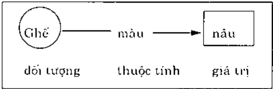

Hinh 2-2. O-A-V của câu "màu của chiếc ghế là nâu".

Một O-A·V là dạng mệnh để phúc tạp. Nó chia mệnh để thành ba phần, ứng với đổi tượng, thuộc tính và giá trị thuộc tính.

## Thí dụ

Câu "màu của chiếc ghế là nâu" theo cấu trúc O-A-V thì đôi tương được xác định là "chiếc ghế", thuộc tính là "màu" và giá trị là "nâu".

Đối tượng thể hiện trong O-A-V có thể được vật lý hóa như cái xe, quả bóng, hay vật trừu tượng nhu tỉnh yêu, sự sống. Thuộc tính là tính chất hay những nét quan trọng đề nhận ra đối tượng. Giá trị cho biết một thể hiện cụ thể sẽ được gần cho thuộc tính. Giá trị có thể là logic, số hay chữ. Đối tượng có thể mang nhiều thuộc tính. Khung và mạng ngũ nghĩa dùng các thuộc tính để mô tả đối tượng rõ hơn.

<!-- page: 33 -->

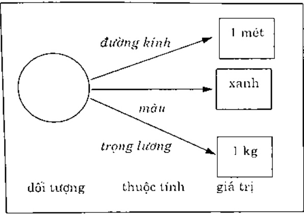

Hình 2-3. Các thuộc tính của đối tượng.

## Các sự kiện mang một giá trị và mang nhiều giá trị

Vế bản chất, một và thuộc tính của đối tượng được sự kiện mô tả chỉ mang một giá trị, hoặc mang nhiều giá trị. Người ta gọi các sự kiện đó là sự kiện mang giá trị đơn hay sự kiện mang nhiều giá trị. Trong thiết kế hệ thống, có thể lấy thuộc tính O-A-V có một hay nhiều giá trị. Việc chọn lựa bao nhiều giá trị cho một sự kiện tùy thuộc vào tính uyền chuyển cho phép trong lúc thể hiện trị thức.

## Thí dụ

Dùng O-A-V để thể hiện ménh để mô tả việc dọc áp suất trên đồng hồ đo. Đối tượng là "đồng hồ đo" và thuộc tính là "dọc áp suất". Các giá trị có thể lấy là xuống, ổn định, hay lên. Khi cần thông tin về áp suất do đồng hồ chỉ, hệ thống hơi :

Hôi : Hây cho biết áp suất do đồng hồ trở, ứng với trường hợp nào trong số các trường hợp sau :

\- Kim trở xuống

\- Kim ôn định

\- Kim trở lên

Trả lời : Trở xuống.

Về mật logic, áp suất đồng hồ chỉ có một trong ba giá trị. Người ta cần thiết kế O-A-V này có giá trị đơn.

Tiếp theo là thí dụ về bậc học của một người. Đối tượng là "người" và thuộc tính là "bậc học". Thuộc tính có thể nhận nhiều giá trị như đại học, cao đẳng... Người ta thiết

<!-- page: 34 -->

kế O-A-V có nhiều giá trị. Câu hỏi trong hệ thống yêu cầu người dùng chọn một phần thống tin của một danh sách. Chăng hạn :

Hơi : Xin lựa chọn các bậc học

1. Đại học

2. Cao dàng

3. Hộc nghệ

Trả lòn

• Đại học

• Cao dàng

Cả hai loại sự kiện O-A-V đơn hoặc da giá trị đều cho phép ngắn định sự suy chồn. Khi người dùng chọn một giá trị của danh sách, hệ thống sẽ kháng định mộng để ứng với giá trị chọn này là TRUE (dúng), và với các giá trị khác là FALSE (sai). Chẳng hạn lúc xem mặt đồng hồ, người sử dụng trả lời chiều trở của kim là "xuống", hệ thống không chỉ biết sự kiện này mà còn biết áp suất không lên và không ổn định. Khia cạnh này của O-A-V được quan tâm hơn so với cách thể hiện bằng cấu đơn giản chỉ mang một giá trị đơn.

## III.2. Các sự kiện không chắc chắn

Không thể biết rõ ràng thể giới xung quanh ta trắng hay đen. Sở dĩ như vậy vi người ta không rõ sự kiện nào đó là đúng hay sai với độ chắc chắn hoàn toàn. Bời thế, người ta sử dụng thêm một khái niệm là mức độ tin vào sự kiện. Trong câu nói thông thường luôn mang một mức độ tin cây, chẳng hạn như "có thể". "hình như", "có về"...

Phương pháp truyền thống trong hệ thống trị tuệ nhân tạo khi quản lý thông tin không chắc chắn là sử dụng nhân tố chắc chắn. Nhân tố chắc chắn, kí hiệu là CF (certainty factor), là giả trị bằng số gần cho mệnh để để thể hiện mức độ tin cây vào, mệnh để đó.

Thí dụ

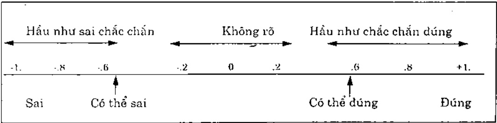

Hình 2-4. Các giá trị của nhân tố chắc chắn CF trong hệ chuyên gia MYCIN.

<!-- page: 35 -->

Khái niệm CF bắt đầu từ hệ thống MYCIN rời được hình thức hóa vào năm 1975 trong kỹ thuật suy lý gọi là lý thuyết chắc chắn. Người ta có thể dùng CF để quản lý mức độ chắc chắn trong câu trả lời của người dùng và thông tin suy diễn.

Thí dụ

Câu "hôm nay có thể mưa" được gán giá trị CF bằng 0.6

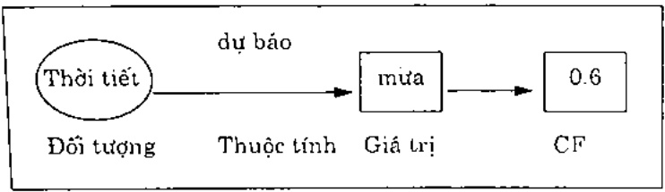

Hình 2-5. Sử dụng CF với bộ ba O-A-V.

## III.3. Các sự kiện mò

Thực tế cho thấy khi thể hiện vấn đề của thế giới thực, dôi khi cần dùng đến các thuật ngũ nhập những như thường thấy trong ngôn ngữ tự nhiên. Khi ấy người ta có thể tham chiếu đến khải niệm không chắc chắn để diễn đạt. Chắng hạn với câu "ôngấy cao" là không rõ ràng, có thể gây nên sự hiểu không rõ vì không xác định rõ được "cao" có nghĩa là gì. Công cụ nhỏ máy tính hỗ trợ thể hiện trn thức này dựa vào logic mở, do Zadet dưa ra năm 1965. Logic mở để xuất phương pháp thể hiện và suy lý trên các thuật ngũ nhập những. Các thuật ngũ nhập những được thể hiện, được lượng hoàn trong tập mà.

Thí dụ

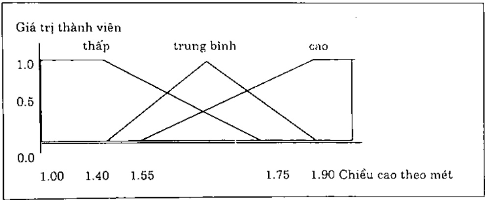

Hình 2-6. Quan hệ giữa giá trị thành viên và chiều cao của người ứng với từng tập mờ.

<!-- page: 36 -->

Dùng tập mở đề thể hiện chiều cao của người. Có ba tập mở là "thấp", "trung bình" và "cao". Trong các tập mở, một chiều cao cụ thể được gán với con số gọi là giá trị thành viên, hay mức độ thành viên. Giá trị thành viên lấy giá trị giữa 0 và 1, phần ảnh mức độ tin cậy để chiều cao đã biết rơi vào tập nào trong số các tập mở. Chẳng hạn một người cao 1"65 được xem là thành viên của những người "tầm thước" với giá trị thành viên là 1; trong khi họ được xem là "cao" hay "thấp" với giá trị thành viên cùng là 0.25.

Logic mô dùng các luật mò để tạo ra tập mò. Một luật mò có các tập mò trong cả phần IF và THEN.

Thí dụ :

IF Chiêu cao của người là cao

## THEN Trọng lượng của người ấy là năng.

## III.4. Các luật

## III.4.1. Giới thiệu

Các sự kiện do người dùng cung cấp rất có ý nghĩa đối với các hoạt động của hệ thống trị tuệ nhân tạo. Chúng cho phép hệ thống hiểu trạng thái hiện tại của thể giới. Dương nhiên khi giải bài toán, hệ thống có các tri thức phụ, bổ sung để làm việc với các sự kiện này. Một cấu trúc tri thức thông dụng dùng trong thiết kế hệ thống trí tuệ nhân tạo mà yêu cầu sử dụng thêm tri thức bổ sung là các luật.

## Định nghĩa 2-5 : Luật (Rule)

Cấu trúc trị thức dùng để liên kết thông tin đã biết với các thông tin khác; các thông tin này có thể được suy diễn đề người ta hiểu biết thêm.

Luật thuộc dạng tri thức thủ tục. Nó gắn thông tin đã cho với một vài hoạt động. Các hoạt động này có thể là khẳng định về thông tin mối hay là thủ tục sẽ được thực hiện. Như vậy luật mô tả cách giải quyết vấn đề.

Về mật logic, cấu trúc của luật kết nối một hay nhiều giả thiết. hay cái có trước trong câu IF, với một hay nhiều kết luận, hay được gọi là kết quả trong câu THEN.

Thí dụ

IF Màu của quả bóng là xanh

THEN Tôi thích quả bóng

Nói chung một luật có nhiều giả thiết gắn với nhau bằng câu AND (và) hay câu OR (hoặc) hay cả hai. Luật cũng có thể dùng câu ELSE dùng cho suy diễn khi giả thiết bị sai.

<!-- page: 37 -->

Trong hệ thống dựa trên các luật, tri thức về linh vực được nấm bất trong một tập và được dựa vào có sở tri thức của hệ thống. Hệ thống dùng các luật này cũng với các thông tin trong bộ nhỏ để giải bài toán. Khi câu IF của luật khớp với thông tin trong bộ nhỏ, hệ thống thực hiện các hoạt động mô tả trong câu THEN của luật. Lức này luật được SEM như đã thực hiện, bay cháy; câu THEN được bổ sung vào bộ nhớ. Mệnh đề môi này cũng có thể làm cho các luật khác được thực hiện.

## Thi du

Bản dân có sơ trí thức có hai luật, và bộ nhớ làm việc là ròng. Khi nhận được trải lôi "xanh" cho câu hơi "qua bóng màu gì?", bộ suy đến của hệ thống trị tuệ nhìn tạo dựa trên luật sẽ thực hiện các luật và rút ra được thông tin mới "tói sẻ mua quả bóng".

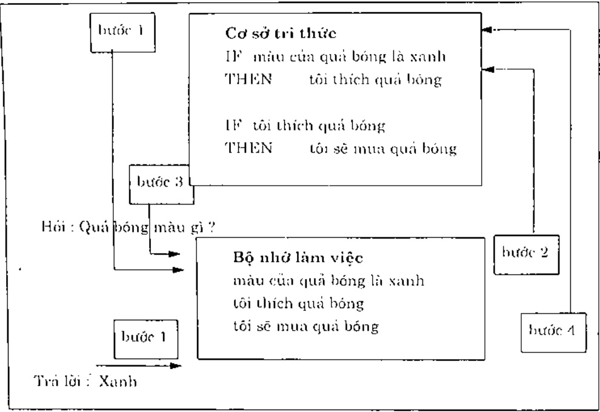

Hình 2-7. Các bước xử lý trị thức trong hệ thống dựa trên luật.

Việc xử lý các luật trong hệ thống dựa trên luật được quản lý bằng một modun gọi là bộ suy diễn. Thị dự trên mô tả vải hành động của bộ suy diễn.

## III.4.2. Khai thác một thủ tục

Cùng với việc sản sinh các thông tin mới, một luật có thể thực hiện các hành động. Nô có thể là tính toán đơn giản, như là :

<!-- page: 38 -->

IF Cán đến diện tích hình chữ shaped

THEN Diện tích = chiều dài \* chiều rộng

Đế thực hiện các thao tác phức tạp hơn, nhiều hệ thống truy nhập các thủ tục bên ngoài. Chương trình loại này da phân là phân mềm về cơ sở dữ hiệu, chương trình ngôn ngữ C... Cháng có thể được viết bằng các ngôn ngữ kịp trình hay các lệnh trên bảng tỉnh.

Thí dụ

\- Luật 1. (Laên quan đến thủ tục trong ngôn ngữ lập trình)

IF Thiết kế hộp mới

AND NUMBER = Số các chu tiết lập ráp

AND SIZE = Kích cõ của chi tiết

THEN CALL Tính thể tích của hộp

AND SEND NUMBER, SIZE

AND RETURN Thế tích

• Luật 2. (Lien quan đến bảng tính)

IF Cân số hàng bán trong tháng Hai

THEN OPEN Báng HANG
AND Số hàng tháng Hai = B5

• Luật 3. (Laiên quan đến cơ sở dữ liệu)

1F Có trường hợp cấp cứu

AND Tê11 = "Toto"

THEN OPEN Điện thoại

AND FIND Tên. mã

AND Diên thoại = Mã diện thoại

Nói chung người ta có thể truy nhập hay thay đổi thông tin nhà chương trình bên ngoài. Khả nâng này tạo điều kiện thiết kế uyền chuyển một hệ thống trí tuệ nhân tạo. Có thể dùng khối lượng lớn các thông tin có trong cơ sở dữ liệu và bảng tính, hay thay đổi các thông tin nhà chức năng hỗ trợ quyết định của hệ thống xử lý luật.

<!-- page: 39 -->

## III.4.3. Các dạng luật khác nhau

Các luật thể hiện tri thức được phân loại thành các lớp luật liên quan đến tri thức quan hệ, tri thức khuyến cáo, tri thức hướng dẫn, tri thức chiến lược, hay tri thức may rủi. Thí dụ sau đây sẽ giới thiệu các lớp luật đó :

## Quan hé

IF Acquy hóng

THEN Không khởi động ô tô được

## Khuyến cáo

1F Ô lô không khải động được

THEN Di bộ

## Hướng dẫn

IF Ô tô không khởi động được
AND Xăng đầu tốt

THEN Kiểm tra hệ thống điện

Chiên lược

IF. Ô tô không khởi động được

THEN Trước tiên kiểm tra hệ thống xăng dấu, rối kiểm tra hệ thống điện
May rủi

IF Ô tô không khởi động được
AND Ô tô tên là Hòa bình sản xuất năm 1960

THEN Kiểm tra bộ phận an toàn

Các luật cũng có thể được phân loại theo bản chất của chiến lược giải quyết vấn đề, thường được gọi·là cách thức giải vấn đề. Các luật diễn hình được sử dụng phố biến là các luật theo cách thức diễn giải, cách thức chẩn đoán, hay cách thức thiết kế :

Diên giải

IF    Điện thể trên diện trở R1 lớn qua 2.0 V

THEN Cuòng độ bình thường

Chân doán

IF Sôt cao

<!-- page: 40 -->

AND Hay ho

AND Họng đỏ

THEN Viêm họng

Thiết kế

IF Đang làm nhiệm vụ cấp diện

AND Biết nơi cấp diện trong phòng

AND Có khoảng trống đề lắp điện trong phòng

THEN Cấp diện cho phòng

## III.4.4. Các luật có dùng biến

Sử dụng các biến trong luật là phù hợp với các ứng dụng cần thực hiện cùng một số thao tác trên tập các đối tượng tương tự nhau. Nếu viết một luật đơn cho mỗi đối tượng thì không hiệu quả và hệ thống khó quản lý.

Thí dụ

Luật sau cho biết Toto có về hưu hay không.

IF Toto là công chức

AND Tuôi của Toto quá 60

THEN Toto có thể nghi hưu

Khi hệ thống muốn thực hiện việc kiểm tra cho các cá nhân khác không phải là Toto thì nó cần phải viết luật khác. Do vậy không kinh tế. Thẩm chí độ tuổi nghĩ hưu của người cần được linh động trong khoảng từ 55 đến 60 tuổi. Có thể dùng ngôn ngữ lập trình để tạo ra một luật để luật này có thể khớp với đai giá trị rộng hơn. Các luật này dùng biến để khớp với các mệnh để tương tự.

Thí dụ

IF X là công chức

AND Tuôi của X quá 60

THEN X có thể nghi hưu

Luật này quét trong bộ nhớ để xem khớp được hai giả thiết không. Nếu thấy khớp, luật này kết luận rằng người đó có thể nghỉ hưu. Chăng hạn trong bộ nhớ có thông tin nhu trong hình :

<!-- page: 41 -->

| Xuân là công chứcTuổi 63 | Hạ là công chứcTuổi 45 | Thu là nhà buónTuổi 73 |
| --- | --- | --- |

Hình 2-8. Một phần nội dung trong bộ nhớ cho biết tuổi của các cá nhân.

Giả thiết đầu tiên gần tên một cả nhân cho biến X nếu người ấy là công chức. Gải thiết thú hai kiểm tra xem người có tên gần cho biến X đó có quá 60 tuổi không. Nếu khớp cả hai giả thiết, luật kết luận ràng người này có thể nghị hữu và đưa thông tin đó vào bộ nhớ. Như trong thí dụ, trị thức "Xuân có thể nghị hữu" được bổ sung vào bộ nhớ.

Việc khớp luật có sử dụng biến cho phép xử lý thông tin một cách hiệu quả. Người ta có thể viết một luật thay cho nhiều luật, thuận lợi cho việc mã hóa và bảo trì có sở luật. Luật trên có được do uni thức chuyên gia "Nếu công chức quá tuổi sâu mươi. Thi họ có thể nghỉ hưu".

## III.4.5. Các luật không chắc chắn

Dả có sự kiện không chắc chắn thì cũng có các luật không chắc chắn. Luật này, thiết lập quan hệ không chính xác giữa giá thiết và kết luận.

Thí dụ

IF Lạm phát cao

## THEN Hâu như chắc chắn lãi suất uến gửi tiết kiệm cao

Chuyên gia tin ràng "hấu chắc chắn"... nếu... Đề có được độ tin cấy về trị thức của chuyên gia trong quan hệ này. người ta dùng nhân tố chắc chắn. Chẳng hạn luật trên có thể được viết lại với giá trị CF là 0.8 :

1F Lam phát cao

THEN Lãi suất tiền gửi tiết kiệm cao. với CF=0.8

Thí dụ này môi chỉ giới thiệu sơ lược về luật với sự không chắc chắn. Nó cũng như các luật bình thường, trừ ra ràng kết luận được khẳng định với một mức độ tín cậy. Những khóa cạnh phức tạp về sự không chắc chắn cần được xét kỹ thêm.

## III.4.6. Các luật meta

Khi giải quyết vấn đề, các chuyên gia cũng cần đến trị thức hướng dẫn. Tri thức này có dạng khác với dạng đã thấy. Tri thức bình thường đặc trưng cho lĩnh vực. Tri

<!-- page: 42 -->

thức loại này dùng trị thức bình thường để xác định cách tốt nhất để giải vấn đề. Loại trị thức này gọn là trị thức meta.

## Định nghĩa 2-6 : Tri thúc meta (Meta-knowledge)

Tri thức về cách sử dụng và điều khiển tri thức về linh vực

Tri thức meta thường được thể hiện qua luật meta để tra cứu trực tiếp.

## Dình nghĩa 2-7 : Luật meta (Meta-rule)

Một luật mô tả cách thức dùng các luật khác

Luật meta dưa ra chiến lược dùng các luật về lĩnh vực chuyên dụng, thay vi dưa ra thông tin mới.

Thí dụ

IF Ô tô không khởi động được

AND Hệ thống điện hoạt động bình thường

## THEN    Dùng các luật liên quan đến hệ thống xăng dấu

Luật meta chẩn đoán về ô tô này hướng hệ thống về phần xăng dầu nếu không phát hiện được gì trong phân điện. Luật meta hướng dẫn hệ thống đi về một phần của công việc, cũng như làm tăng hiệu quả của hệ thống bằng cách hướng dẫn hệ thống suy luận đến lĩnh vực có khả năng giải quyết vấn đề.

## III.4.7. Tập các luật

Các trị thức chuyên gia được tịch lũy thành các luật để giải các vấn đề. Tập các luật có thể dùng cho vấn đề này nhưng không dùng được cho vấn đề khác. Tập các luật phân ánh kinh nghiệm, khéo léo của chuyên gia trong lĩnh vực. Việc chọn lựa tập luật nào cùng thể hiện trình độ của chuyên gia. Chỉ riêng các luật không đủ để suy lý. Do vậy cần đến chiến lược để biết khi nào áp dụng luật và áp dụng như thế nào.

## Thí dụ

Đế sửa chữa xe ô tô, người ta kiểm tra các bộ phận của xe theo các luật hướng dẫn như trong hình.

Một trong các thiết kế hệ thống khai thác trên các luật là sử dụng cấu trúc modun để sắp xếp thứ tự các luật về lĩnh vực. Loại cấu trúc này cũng gọi ý cách giải quyết bài toán từ trên xuống, ở đó các tập luật được dùng chỉ khi phù hợp. Hệ thống có thể chuyển điều khiển đến tập luật đã cho bằng cách dùng luật meta.

<!-- page: 43 -->

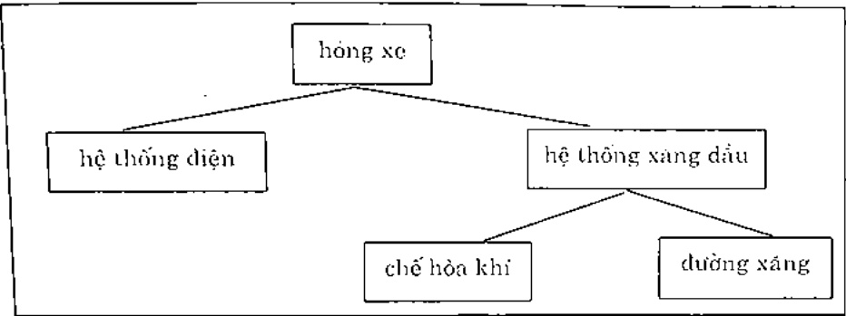

Hình 2-9. Tập các luật liên quan đến việc hông xe.

Về việc dùng tập các luật có cấu trúc modun, người ta có nhận xét sau :

\- Ủy điểm chính của thiết kế này là thể hiện được cách giải quyết vấn đề phúc tạp. Nhìn chung con người có xu hướng chia vấn đề phúc tạp ra các vấn đề nhỏ hơn, dễ quản lý hơn.

\- Ủy điểm khác là dễ phát triển và bảo trì hệ thống. Khi phát triển hệ thống, người ta chỉ tập trung vào một modun. Khi cần thiết người ta có thể thử và kiểm tra riêng từng modun theo cách độc lập. Đối với việc quản lý toàn bộ cơ sở trí thức, việc thiết kế theo các modun tổ ra thuận tiện.

\- Vê kỹ thuật, tiếp cận này có ưu điểm dễ tích hợp các kỹ thuật thể hiện tri thức, chiến lược suy diễn khác nhau vào cùng một hệ thống.

## III.5. Bång đen

Một nhu cầu đặt ra là sự hợp tác giữa các chuyên gia. Do vậy trên phương diện tổ chức hệ thống, liệu có cách nào cho phép liên kết thông tin giữa các tập luật tách biệt?

Thực tế cho thấy việc giải các bài toán phúc tập cần đến trị thức của nhiều chuyên gia. Chắng hạn yêu cầu tạo chiến lược tiếp thị trong giới kinh doanh có thể được giải quyết bằng cách lập ra mối liên kết giữa các chuyên gia trong công ty. Tổng hợp các nhận định chuyên gia về một khóa cạnh cho phép thu được kế hoạch tiếp thị hiệu quả. Phương pháp này thường được coi như phương pháp giải quyết vấn đề phản tán. Trong hệ thống trí tuệ nhân tạo, việc giải quyết vấn đề phản tán có thể thực hiện thông qua liên kết các tập luật.

Một trong những hệ thống dầu tiên dùng phương thức liên kết tập luật là hệ chuyên gia hiểu tiếng nói HEARSAY-II do Erman cho ra năm 1980. Hệ thống này

<!-- page: 44 -->

điền giải câu nói lên tục với từ diện 1000 từ. Đề làm được việc này, HEARSAY đã dùng 12 modun chuyên gia với các nhiệm vụ tách biệt. Các modun này làm việc cùng nhau theo cách trao đổi thông tin qua một cấu trúc gọi là bảng đen.

## Định nghĩa 2-8 : Bảng đen (Blackboard)

Bảng đen là một thiết kế trong đó vải hệ chuyên gia dùng chung thông tin từ một nguồn

Mô hình bảng đen, hay gọi là BB (Blackboard) là hệ thống có nhiều thành phần độc lập, có cơ sở dữ liệu và trị thức chung. Các thành phần khác nhau trao đổi với nhau qua phần chung là "bảng đen".

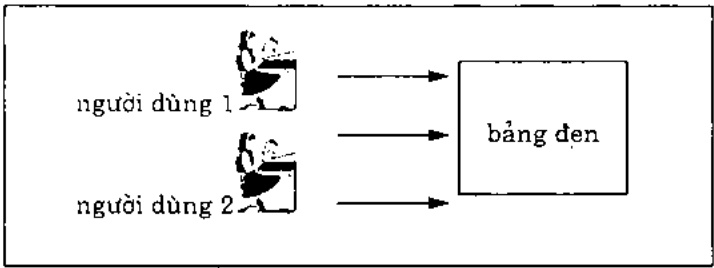

Hình 2-10. Nhiêu chuyên gia làm việc chung thông qua bảng đen.

Nguyên tắc của mô hình BB là :

\- Sử dụng nhiều nguồn tri thúc chuyên gia,

\- Dàm bảo tinh độc lập của các nguồn tri thức. Chúng chỉ liên hệ qua bảng đen.

\- Các thành phần hoạt động dị bộ, do vay có thể thiết kế hệ thống hoạt động song song,

\- "Bảng đen" là cơ sở các sự kiện phúc tạp, có cấu trúc tổng quát cho tất cả cơ sở tri thức,

• Có cấu trúc điều khiển,

Tri thúc được trình bày theo cả hai kiểu là thủ tục và mô tả.

Kiến trúc của một hệ thống trí tuệ nhân tạo theo cấu trúc bảng đen có ba phần chính sau :

\- Nhiệu cơ sở tri thức thành phần là các hệ chuyên gia khác nhau.

<!-- page: 45 -->

\- Nơi trao đổi thông tin giữa các thành phần là bảng đen.

\- Phân điều khiển có nhiệm vụ xếp lịch làm việc giữa các thành phần.

Mỗi chuyên gia gắn với một vấn đề nhớ, tách biệt. Tuy vay họ sử dụng chung thông tin để hoàn thành công việc. Các modun chuyên gia liên lạc với nhau qua việc viết thông tin lên bằng đen và đọc thông tin từ các modun khác. Thông tin điều hình là tìm modun hay tìm các giả thiết dùng cho việc giải bài toán. Bộ xếp lịch giữ điều khiển chung và hướng dẫn chiến lược suy lý.

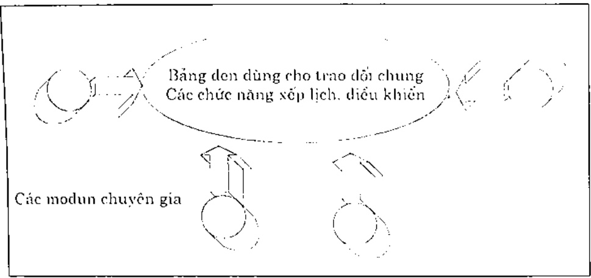

Hình 2-11. Các cơ sở tri thức trao đổi với nhau qua bộ nhớ chung là bảng đen.

Kiến trúc của hệ thống này tương tự như kiến trúc thảo luận kê hoạch tiếp thị nêu trên. Bảng đen đóng vai trò nơi hội thảo, bộ xếp lịch đóng vai trò chủ tọa cuộc trao đổi. Kiến trúc này cho phép các modun chuyên, gia làm việc tương tranh, theo phương thức song song.

## III.6. Các mạng ngũ nghĩa

## III.6.1. Giới thiệu

Một trong những ý định dấu tiên của trí tuệ nhân tạo nhằm thể hiện trí thức trên máy tính là sử dụng mạng ngũ nghĩa.

## Đình nghĩa 2-9 : Mạng ngũ nghĩa (Semantic network)

Phương pháp thể hiện tri thức bằng cách dùng đồ thị gồm các nút và các cung; nút thể hiện đối tượng và cung thể hiện quan hệ giữa các đối tượng.

<!-- page: 46 -->

Thông qua mạng ngữ nghĩa người ta để thấy đối tượng nào la quan trọng, thấy thuộc tính và môi quan hệ của các đối tượng một cách trực quan. Đồ thị gồm nút và các cung nôi các nút; nút và cung đều có nhân, ứng với đối tượng và môi quan hệ bản chất giữa các đối tượng. Nút thể hiện đối tượng, thuộc tính hoặc giả trị của thuộc tính. Các cung thể hiện môi quan hệ giữa các nút.

## Thí dụ

Mang ngữ nghĩa có các nút "chim". "bay"; và nút "cánh" thể hiện ý nghĩa "chim có cảnh" và "chim biết bay". Nút "yến" nôi nút "chim" theo cung IS-A thể hiện ý nghĩa "con yến là chim".

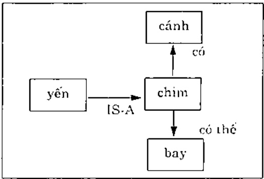

Hình 2-12. "Con yến là chim" được thể hiện nhỏ mạng ngũ nghĩa.

Người ta có thể nổi rộng mạng ngữ nghĩa bằng cách thêm các nút và nổi chứng vào đồ thị. Các nút mới ứng với các đổi tượng bổ sung. Thông thường có thể thêm theo một trong ba cách :

• Thêm một đối tượng lượng tự,

• Thêm một đối tượng đặc biệt hơn.

• Thêm một đối tượng tổng quát hơn.

Thứ nhất, thêm "cánh cụt" thể hiện một dạng chim mới. Thứ hai, thêm "chích chíp" có nghĩa nó là con "yến", và đồng thời nó là "chim". Thứ ba, có thể đưa ra đối tượng tổng quát như "con vật". Lức này người ta không những biết "chim là con vật" mà còn biết "chip chíp tháo bằng không khí".

## III.6.2. Tỉnh kế thừa trong mạng ngũ nghĩa

Tính chất quan trọng của mạng ngữ nghĩa là tính kê thừa. Nó cho phép các nút được bổ sung có các thông tin của các nút đã có trước. Tính kê thừa của mạng ngữ nghĩa cho phép mã hóa trị thức một cách dễ dàng. Thí dụ khi thêm nút đặc biệt là

<!-- page: 47 -->

"chíp chíp" vào mạng ngữ nghĩa, nó kế thừa thông tin theo cung IS-A. Hơn nữa, khi thêm nút đối tượng tổng quát "con vật", các nút khác thừa kế tính chất của nó. Dó chính là tính chất đặc biệt của mạng ngữ nghĩa trong nghiên cứu về trí tuệ nhân tạo.

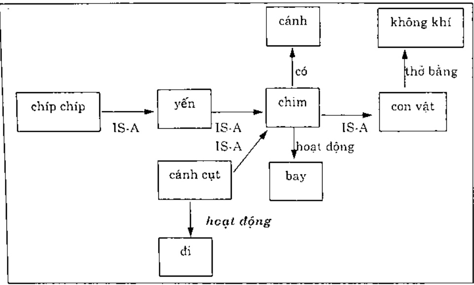

Hinh 2-13. Phát triển mạng ngũ nghĩa.

## III.6.3. Phép toán trên mạng ngũ nghĩa

Đế minh họa tính kế thừa của mạng ngũ nghĩa, hây xét một câu hỏi trên đồ thi. Chăng hạn tại nút "chim", người ta muốn hỏi xem nó hoạt động thể nào ? Thông qua cung "hoạt động" người ta biết được nó "bay".

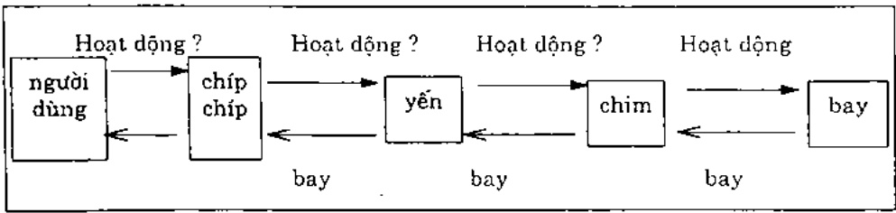

Hình 2-14. Các bước thực hiện phép toán trên mạng ngũ nghĩa.

<!-- page: 48 -->

Nếu không có cung trực tiếp như vậy, có thể tìm thấy câu trả lời thông qua cung IS-A. Khi cần biết "chíp chíp" hoạt động thế nào, người ta trả lời dân dân, cho lãi khi thu được "bay" thì trở về nút câu hỏi.

## III.6.4. Ngoại lệ

Tính kê thừa là tính chất mạnh của mạng ngũ nghĩa. Tuy vậy nó cũng gây ra hiểu lấm, chẳng hạn cổ đi tìm khả năng bay của "cánh cụt" theo cung IS-A. Đề khởi phải đi tìm mãi một điều phi lý là "chim cánh cụt bay", người ta dùng kỹ thuật gọi là ngoại lệ.

Kī thuật này yêu cầu người dùng chỉ ra ngoại lệ, để tránh một nút thừa kế thông tin không đúng. Khi ấy cần nổi thêm một nút tối nó với một thông tin mới: thông tin này cho phép cập nhật thông tin không đúng. Do vậy khi trả lời câu hỏi "cánh cụt hoạt động thể nào?" tại khu vực trong mạng ngũ nghĩa đã có thông tin "đi": người ta không đi theo cung IS·A để tìm xem nó hoạt động ra sao nửa. Kī thuật ngoại lệ tuy là đơn giản, nhưng được dùng một cách hiệu quả để tránh các sai sót trong mạng ngũ nghĩa.

## III.7. Khung

## III.7.1. Giới thiệu

Năm 1932 F.C. Barlett dễ nghị dùng lược đổ để thay thế mạng ngữ nghĩa trong việc thể hiện trị thức. Một lược đổ được coi là khối trị thức diễn hình về khải niệm hay đối tượng não đó, và gồm cả trị thức thủ tục lẫn trị thức mô tả. Chẳng hạn trong lược đổ có trị thức về cảnh và chân của "chìm", cũng như cách sản bắt nổ... Một lược đổ có nhiều thống tin về khái niệm sẽ phục vụ tốt cho các nghiên cứu đặc biệt.

Những người thiết kế hệ thống trí tuệ nhân tạo dùng ý tưởng trên để nằm bắt và thể hiện trí thức khái niệm trong hệ thống. Ý tưởng này được dùng thông qua khung. là khái niệm do Minsky đưa ra vào năm 1975.

## Đình nghĩa. 2-10 : Khung (Frame)

Cấu trúc dữ liệu để thể hiện tri thức đa dạng về khái niệm hay đôi tượng nào đó.

Minsky đã mô tả một khung nhu sau : khi một người vào hoàn cảnh mới (hay thay thế cách nhìn của người ấy về một vấn đề) họ tìm trong trí nhớ một cấu trúc gọi là một "khung". Đấy là một khung được nhớ lại một cách thích nghi để phù hợp với thực tại bằng cách thay đổi các chi tiết cần thiết.

<!-- page: 49 -->

## III.7.2. Thiết kế khung cơ bản

Một khung có hình thức như bằng mẫu, như tờ khai yêu cầu diện các ô trống. Cầu true cơ bản của khung có tên đối tượng được thể hiện trong khung, có các trường thuộc tỉnh của đối tượng. Các thuộc tính này có thể là mục tin như địa chỉ, tuổi. Môi thuộc tỉnh có một ngân để nhập các dữ liệu riêng. Chắng hạn Titu có ngân tuổi, cho phép nhập 30. Các thuộc tính và giá trị thuộc tính tạo nên danh sách các ménh để O-A-V, thể hiện đầy đủ về đối tượng.

Một khung cùng có trường dự trễ, như trường "lớp". Người ta nhập vào đó tên khung hôn kết với "đối tượng 1". Quan hệ này thường là IS-A, tạo ra "đối tượng 1 IS-A đối tượng 2". Khi trường đối tượng 1 có giá trị "Tỉt" và trường đối tượng 2 có giá trị "người" thì đã thể hiện "Tỉt là người". Giá trị này thiết lập nổi kết giữa hai khung, như là hai nút liên kết trong mạng ngữ nghĩa. "Đối tượng 1" thừa kế thông than của "đối tượng 2".

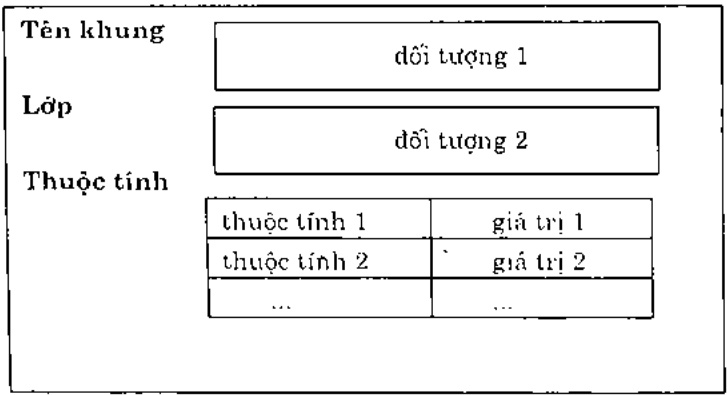

Hình 2-15. Cấu trúc khung tổng quát.

## III.7.3. Khung lớp

Một khung lớp thể hiện các tính chất tổng quát của tập các đối tượng chung. Thí dụ người ta cần mô tả các đối tượng như ô tô, cải thuyên, hay áp suất, nhiệt độ. Trong mỗi khung lớp người ta xác định các tính chất chung cho tất cả các đối tượng trong lớp; đôi khi có cá giá trị mặc định. Tính chất của các đối tượng gồm hai loại diễn hình là tỉnh hay động. Tính chất tỉnh mô tả khóa cạnh không thay đổi giá trị của đối tượng. Tính chất động dùng cho khóa cạnh của đối tượng có giá trị thay đổi khi hệ thống hoạt động.

<!-- page: 50 -->

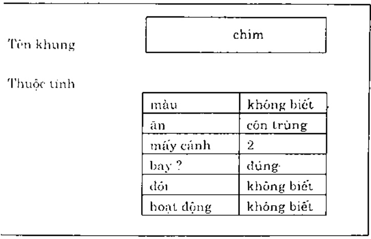

| màu | không biết |
| --- | --- |
| ān | côn trùng |
| máy cánh | 2 |
| bay ? | dùng |
| dói | không biết |
| hoạt động | không biết |

Hình 2-16. Khung lớp cho phép mô tả các đối tượng "chim".

tung lớp có tên khung là "chim" mô tả đối tượng cần thể h
h chung của hậu hết loài'chim; đó là "màu", "mấy cánh" n
'hoạt động" như tính chất động.

Tên đối tượng

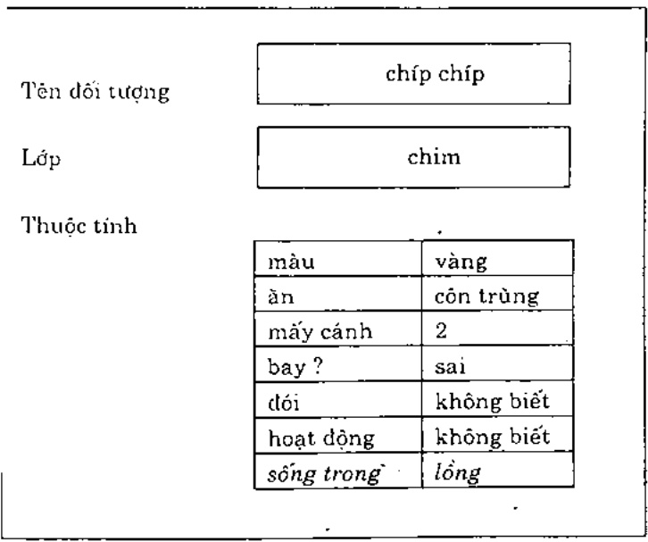

| màu | vàng |
| --- | --- |
| àn | côn trùng |
| máy cánh | 2 |
| bay ? | sai |
| dói | không biết |
| hoạt động | không biết |
| sống trong` | lóng |

Hình 2-17. Khung thể hiện ứng với một đối tượng cụ thể 1 "chim".

<!-- page: 51 -->

Người ta dùng một dạng khung khác để mô tả một thể hiện của khung lớp, và được gọi là khung thể hiện. Khi tạo ra một thể hiện của một lớp, khung này kế thừa tỉnh chất và giả trị của lớp. Có thể thay đổi giả trị để phù hợp với thể hiện cụ thể. Thẩm chỉ có thể thêm tỉnh chất khác đối với khung thể hiện.

## III.7.4. Tinh kê thừa của khung

Như nút của mạng ngũ nghĩa, khung thể hiện nhận giá trị kế thừa từ khung lớp. Khi tạo một khung thể hiện, người ta khẳng định khung đó là thể hiện của một khung lớp. Khẳng định này cho phép nó kế thừa các thông tin từ khung lớp.

Trong thi du, "chíp chíp" kê thừa các tính chất của "chìm". Nói chung người ta cho phép một thể hiện nhận các giả trị mạc định hoặc nhận giả trị có định đưa vào.

Bên cạnh việc kế thừa thông tin từ lớp của nó, một thế hiện còn kế thừa hành vi. Do vậy trong khung lớp chữa cả thủ tục, thường được gọn là phương pháp. Thủ tục này xác định hành động mà khung thực hiện. Chắng hạn trong khung lớp "chìm" có thể bổ sung thủ tục chi ra hành động chim phải làm khi có thuộc tính "dớ".

## III.7.5. Câu trúc phân cấp

Người các khung lớp đơn giản và các thể hiện gắn với nó, người ta có thể tạo ra cấu trúc khung phức tạp.

Thi du

Dùng cấu trúc phân cấp các khung để mô tả thể giới loài chim. Cấu trúc này tổ chức khái niệm về chim theo các mức trường khác nhau. Khung ở mức cao mang thông tin chung về tất cả loài chim. Mức giữa có khung lớp con, mang thông tin đặc thù hơn của nhóm chim. Mức cuối cùng là khung thể hiện, ứng với đối tượng cụ thể.

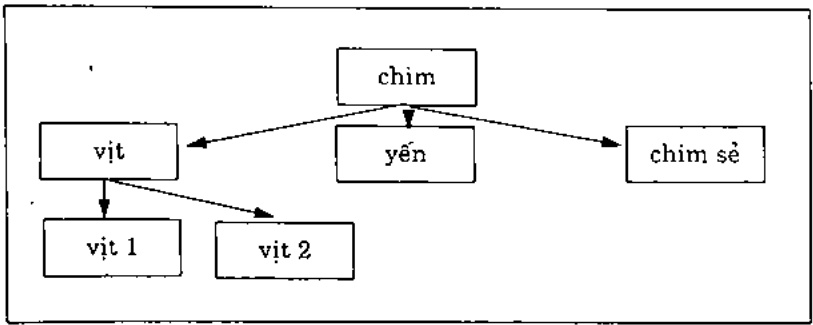

Hình 2-18. Nhiểu mức của khung dùng để mô tả quan hệ phúc tạp hơn.

<!-- page: 52 -->

## III.8. Các mặt

## III.8.1. Giới thiệu

Một nhu cầu sử dụng đến khải niệm "mặt" là xác định ràng buộc đối với các giá trị của thuộc tỉnh. Người ta cũng dùng mặt để hạn chế dạng dữ liệu của các giá trị thuộc tỉnh. Bời vậy các trị thức hèn quan đến các giá trị thuộc tỉnh còn được gọi là thông tin điều khiển.

## Dinh nghĩa 2-11:MAT (Facet)

Hé thống dựa trên khung thường dùng mặt để bỏ sung trị thức về giá trị của thuộc tính.

Một ứng dụng khác của "mặt" là hướng dẫn cho thuộc tỉnh nhân các giá trị, và cách thay đổi các giá trị của nó. Các loại mặt này được gọi là mặt IF-NEEDED và IF-CHANGED.

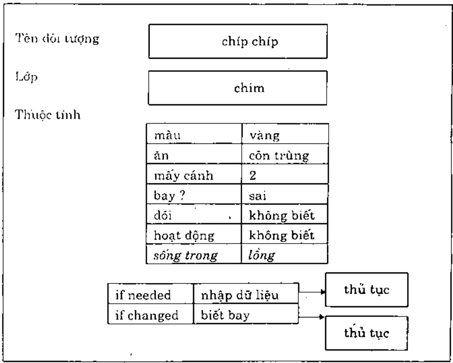

Hình 2-19. Thị dụ về mặt được dùng trong khung.

<!-- page: 53 -->

## III.8.2. Mặt IF-NEEDED

Một vải ứng dụng cần thực hiện thủ tục khi thuộc tính đạt đến giá trị xác định. Diễn hình khi thuộc tính nhận giá trị từ một dãy tính toán, hay từ cơ sở dữ hiệu hoặc từ bảng tính bên ngoài. Đối khi giá trị này phụ thuộc vào giá trị động của thuộc tính khác. Phương pháp, hay thủ tục được viết bằng ngôn ngữ thủ tục, và được gần với mật 1F-NEEDED.

## Dịnh nghĩa 2-12. Phương pháp (Method)

Thời tục gần với một đối tượng và được khai thác khi cần thiết.

## III.8.3. Mặt IF-CHANGED

Một thủ tục gần với mật IF-CHANGED cho phép thực hiện các hành động khi mà giá trị thay đổi. Người ta cần sử dụng loại mật này khi giá trị thuộc tỉnh tham chiếu đến một khung khác, thường xảy ra trong các ứng dụng về điều khiển hay mô phỏng quá trình. Tuy nhiên thủ tục cũng được dùng để thay đổi giá trị thuộc tỉnh trong phạm vi khung hiện tại.

## III.9. Logic

Loại thế hiện trị thức cổ điện nhất trong máy tính là logie. Trong những năm qua, nhiều kỹ thuật thể hiện đã được để nghị và nghiên cứu. Loại thường gắn với hệ thống trị tuệ nhân tạo là logie mệnh để và phép toán vị tử. Cả hai kỹ thuật này đều dùng kĩ hiệu để thể hiện trị thức và các toán tự áp lên các ký hiệu để suy luận logie. Chủng cho các nhà nghiên cứu một công cụ hình thực để thể hiện và suy luận trị thức.

| Phép toán | AND | OR | NOT | kéo theo | tương đương |
| --- | --- | --- | --- | --- | --- |
| Ki hiệu | ∧, &amp;, ∩ | ∨, ∪, + | ¬, ~ | ⊃, → | ≡ |

Hình 2-20. Các phép toán logic và các kí hiệu sử dụng trong các tài hiệu về trí tuệ nhân tạo.

Dù ràng người thiết kế hệ thống trí tuệ nhân tạo ít khi tiếp cận theo thể hiện trí thức logic cổ diễn, nhưng tiếp cận này tạo cơ sở cho nhiều ngôn ngữ lập trình trí tuệ nhân tạo và cho nhiều công cụ phát triển hệ thống trí tuệ nhân tạo. Ngôn ngữ PROLOG là thí dụ về ngôn ngữ lập trình dựa trên phép toán vị tử. Pháp toán vị từ như hợp ngũ, cho phép thể hiện trí thức. Việc hiểu rõ về logic giúp con người di sâu văn kỹ thuật trí thức ở mức độ cao.

<!-- page: 54 -->

## III.10. Logic mệnh dề

## III.10.1. Mệnh đế

Logic mènh dẻ thế hiện và suy lý với các mènh đẻ. Mènh đẻ là câu, bình thường mang giá trị hoặc dùng hoặc sai. Giá trị này gọi là trị chán lý của mènh đẻ. Logic mènh dẻ gán một biến kí hiệu cho mènh đẻ. như la phép gán sau :

$$
\mathrm{A} = \text {``O   tô sê khói động''}
$$

Khi bài toán phát biểu theo logic ménh dẻ dòi hôi phải kiểm tra trị chán lý của câu trên, người ta kiểm tra giá trị của A. Nhiếu bài toán liên quan đến logic ménh dẻ, cháng hạn bài toán xử lý các luật trong đó có nhiều ménh dẻ.

Thí dụ

Bài toán có một luật

IF Ô tô không khởi động (câu A)

AND Xa quá không di bộ được (câu B)

THEN Phái nghi hôm nay (câu C)

Luật này liên quan đến các câu A, B, C. Việc thực hiện luật yêu cầu kiểm tra trị chân lý của các mệnh đẻ. Các phép toán logic mệnh để như AND, OR, NOT, kéo theo và tương đương cho phép suy lý với các câu trúc luật da dạng. Luật trên có thể được viết lại là A∧B→C.

Các phép toán quen thuộc trên các menses để được cho trong bảng sau :

| A | B | $\neg A$ | $A \land B$ | $A \lor B$ | $A \rightarrow B$ | $A \equiv B$ |
| --- | --- | --- | --- | --- | --- | --- |
| T | T | F | T | T | T | T |
| F | T | T | F | T | T | F |
| T | F | F | F | T | F | F |
| F | F | T | F | F | T | T |

Hình 2-21. Bảng chân lý, với các giá trị T (dúng), F (sai).

Một số phép toán có thể được suy diễn từ các phép khác. Thí dụ phép kéo theo A→B chỉ cho giá trị sai khi A đúng và B sai, vậy A→B ≡ ¬A∨B.

Logic menses để cung cấp công cụ thu nhận các sự kiện và các luật theo dạng kí hiệu và dùng các phép toán logic để thao tác trên các sự kiện và luật. Tiếp cận logic

<!-- page: 55 -->

hình thức này đảm bảo một phương pháp chính xác để quản lý các câu có giá trị đúng hay sai. Tuy vậy trong nhiều bài toán khó, người ta cán kháng định giá trị của toàn bộ câu gồm nhiều mạnh để. Do vậy một câu phức tạp được tách ra thành các câu thành phần nhỏ hơn. Các phần nhỏ này có thể được thể hiện và suy lý bằng logie. Đối với các bài toán này, phép toán vị từ là công cụ uyền chuyển hơn cả.

## III.10.2. Phép toán vị tử

## Định nghĩa 2.13 : Phép toán vị iù (Predicate calculus)

Phép toán vị tử, hay còn được gọi là logic vị tử, là mở rộng của phép toán ménh để đề thể hiện rõ hơn các tri thức.

## Thí dụ

Người ta thể hiện toàn bộ câu bằng một kí hiệu đơn, cháng hạn A được kí hiệu cho quá bóng màu xanh. Pháp toán vị từ cho phép mô tả theo quan hệ của trị thức theo dạng màu (quả bóng, xanh). Cách thể hiện này thuận tiện đối với việc dùng biển và hàm trong xử lý trị thức.

Phép toán vị tử, cũng như logic mệnh dễ, dùng các kỉ hiệu dễ thể hiện trị thức. Những kỉ hiệu này gồm hằng số, vị tử, biến và hàm. Phép toán vị tử cho phép thực hiện các phép toán logic mệnh dễ trên các kỉ hiệu.

## - Các hàng số

Các hàng số dùng để đặt tên các đối tượng đặc biệt hay thuộc tính. Nhìn chung các hàng số được kí hiệu bằng chữ viết thường, chẳng hạn tutu, nhiệt độ. Hàng số john có thể được dùng để thể hiện đối tượng John, là một người được xét.

## • Các vị tử

Một sự kiện hay mệnh để trong phép toán vị từ được chia thành hai phần : vị từ và tham số. Tham số thể hiện một hay nhiều đối tượng của mệnh đề; còn vị từ dùng để khẳng định về đối tượng. Chắng hạn mệnh để "Nam thích Mai" được viết lại theo vị từ sẽ có dạng :

## thích (Nam, Mai)

Với cách thể hiện này người ta dùng từ đầu tiên, tức "thích", là vị tử. Vị tử cho biết quan hệ giữa các đối số đặt trong ngoặc. Đối số là các kí hiệu thay cho các đối tượng của bài toán. Theo quy uốc chuẩn, người ta dùng các chữ thường để thể hiện các đối số.

<!-- page: 56 -->

## - Biên

Các biến dùng để thể hiện các lớp tổng quát của các đối tượng hay các thuộc tính. Biến được viết bảng các kí hiệu bắt đầu là chữ in hoa. Như vậy có thể dùng vị từ có biến để thể hiện nhiều vị từ tương tự.

## Thí dụ

Có hai mènh dẻ tương tự "Nam thích Mai" và "Bắc thích Cúc". Hai biến X. Y được dùng trong mènh dẻ sau :

$$
\text {thich} (X, Y)
$$

Các biến nhận giá trị, hay được thể hiện thông qua X = Nam. Bắc: Y = Mai. Cúc. Trong phép toán vị từ người ta dùng biến như đối số của biểu thức vị từ hay của hàm.

## - Hàm

Hàm số được thế hiện bằng kí hiệu, cho biết quan hệ hàm số.

Thí dụ

Mỗ là cha của Nam. Mơ là mẹ của Mai. Mỗ và Mơ là bạn của nhau. Hàm số được viết để thế hiện quan hệ này :

$$
\mathrm{cha(Nam)} = \mathrm{Mo},
$$

$$
\mathrm{me} (\mathrm{Ma}) = \mathrm{Mo},
$$

$$
\text {bàn} (\text {Mô}, \text {Mô}).
$$

Các hàm cũng có thể được dùng trong vị tử, như là :

$$
\text {bàn} (\text {cha(Nam)}, \text {mę(Mai)})
$$

## - Phép toán

Phép toán vị từ dùng các phép toán như logic mệnh đẻ.

Thí dụ

Cần viết cấu "nếu hai người cùng thích một người thì họ không thích nhau" dưới dạng của logic vị tử. Trước hết các câu đơn giản được viết như sau :

"Nam thích Mai" được viết lại theo phép toán vị từ thích (Nam. Mai)

"Dông thích Mai" được viết lại theo phép toán vị từ thích (Đông, Mai)

Khẳng định trên được viết :

thích(X,Z) AND thích(Y,Z) kéo theo NOT thích(X,Y), hoặc viết là :

$$
\text {thich} (X, Z) \land \text {thich} (Y, Z) \rightarrow \neg \text {thich} (X, Y)
$$

<!-- page: 57 -->

Áp dụng kháng định này, túc cho các biến nhận giá trị cụ thể, dễ dàng thu được

$$
- \text {thích (Nam, Dong)}
$$

Đế giải bài toán nhỏ này hay nhìn chung trong bài toán với logie vị tử, việc khớp các biến với các giá trị cần được xét chỉ tiết hơn.

Phép toán vị từ cũng dùng hai kí hiệu, gọi là biến lượng tử, để xác định phạm vi của các biến trong biểu thức logie. Đó là lượng tử "với mọi", kí hiệu là ∆ và "tớn tại", kí hiệu là ∃.

Thí dụ

"Ai cũng thích Mai" được viết thành

$$
\forall \mathrm{X} \text {thich (X, Mai)}.
$$

Biểu thức vừa viết đúng đối với tất cả các giá trị gần cho X.

Thí dụ

"Ít nhất có một người thích Mai" được viết thành

$$
\exists \mathrm{X} \text {thích} (\mathrm{X}, \text {Mai}).
$$

Chỉ một giá trị nào đó của X khớp với vị từ là biểu thức đúng.

Dấu ngoặc dùng đề chỉ phạm vi của lượng tử.

Thí dụ

Câu "nếu Mai xinh thì ai thích Mai đều khoẻ" sẽ được viết thành :

$$
\forall \mathrm{X} (\text {thích} (\mathrm{X}, \text {Mai}) \wedge \sinh (\text {Mai}) \rightarrow \text {khoë} (\mathrm{X}))
$$

## III.10.3. Suy lý với logic

Trong khi dơi chương sau trình bày các định nghĩa liên quan đến quá trình suy lý, ở dây quan niệm ràng về đại thể việc suy lý dời hoi một khả năng rút ra được kết luận từ các sự kiện đã có. Việc lấy ra thông tin mới từ các thông tin đã biết và các luật là trọng tâm của suy lý trong các hệ thống trí tuệ nhân tạo.

Thông qua cách sử dụng các phép của phép toán vị từ người ta có thể suy lý trên các tri thức. Một trong những cách đơn giản để tiến hành suy lý là sử dụng modus ponens. Modus ponens khẳng định ràng :

## Nếu A đúng và A kéo theo B thì B đúng

Thí dụ

Bài toán về người máy sẽ minh họa quá trình suy lý với logic. Giả sử người máy có tay gấp có thể chuyển động tỉnh tiến hoặc xoay, cho phép chuyển đồ vật từ vị trí này

<!-- page: 58 -->

sang vị trí khác. Cần cho người máy hiểu thể giới quanh nó thông qua phép toán vị từ đế nó có thể thực hiện các chức năng vận chuyển đồ vật.

Dô vật quanh người máy gồm khối hộp a, b và d; hình cấu c; hình chóp c. Vị trí các đồ vật trên mặt bản như hình vẽ. Hiện tại tay người máy đang rời.

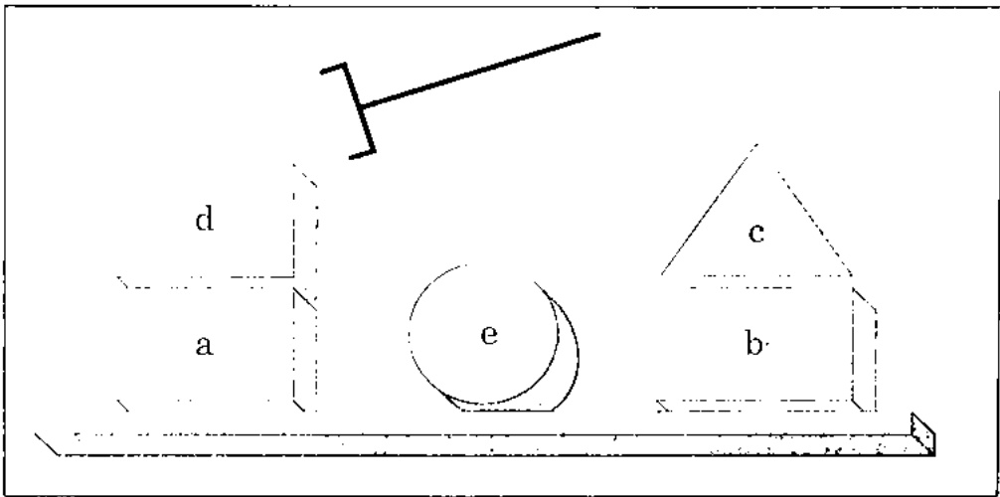

Hình 2-22. Tay máy và các khối hợp,

Mô tả thé giới các khối :

• Xác định các đối tượng :

khói (a) ∧ khói (b) ∧ khói(d) ∧ chóp(c) ∧ câu(e)

\- Hiện trạng của các khối :

trên (a, bàn) ∧ trên (b, bàn) ∧ trên (d, a) ∧ trên (c, b)

\- Hiện trạng của tay máy là rỗng, tức không nắm một vật nào :

Lay máy (rổng)

Yêu cầu của bài toán là đặt khối b trên khối a. Yêu cầu này là đích của bài toán; nó được viết lại như sau :

$$
d \ddot {a} t (b, a)
$$

Người ta chỉ đặt khối nào đó lên khối a khi trên khối a trống, tức trống (a). Khối b được mang di đặt vào dâu đó khi b được tay người máy nấm, tức tay máy (b). Do vậy đích của bài toán liên quan đến

$$
\text {tay máy (b) \wedge trong (a)} \rightarrow \text {dặt (b, a)}
$$

<!-- page: 59 -->

Đế có thể áp dụng trị thức này cho trường hợp tổng quát, nó được viết lại với các biến và các lượng từ :

$$
\forall \mathrm{X} \exists \mathrm{Y} (\text {tay máy (X)} \wedge \text {trống (Y)} \rightarrow \text {dịt (X, Y)})
$$

Trong bài toán này cần kiểm tra một khối có bị cản gì khác để lên không, tục cần kiểm tra một khối có được gọi là trống hay không. Do vậy cần dùng kháng định "nếu không có gì để trên khối X thì khối X gọi là trống". Khẳng định này được viết :

$$
\forall \mathrm{X} (\neg \exists \mathrm{Y} \text {trong} (\mathrm{Y}, \mathrm{X}) \rightarrow \text {trong} (\mathrm{X}))
$$

Tuy chua đến đích euối cùng nhưng lần lượt qua các suy diễn, người may sè đặt được khối b lên khối a.

## IV. VAI TRÒ CỦA CÁC LUẬT

Phản trước của chương này đã giới thiệu việc thể hiện trị thức nhỏ các luật. Tiếp theo, ở dây trình bày các khả năng quan trọng của việc giải vấn đề thông qua dây các luật. Có thể xem các luật như nền tảng của việc xử lý trị thức và mô hình hóa nhận thức. Người ta muốn có các ý tưởng tuy đơn giản nhưng hiệu quá để tiền hành quá trình suy lý trên các luật và thông tin sẵn có.

Một số yêu cầu đặt ra cho hệ thống urí tuệ nhân tạo dựa trên luật là :

• Giải thích từng bước di đến kết luận.

• Suy lý theo các kiểu đa dạng.

\- Suy lý trong điều kiện thời gian hạn chế.

• Xác định xác suất của hết luận. và

\- Kiểm tra'tính bền viũng của luật mới được đề xuất.

Vay hệ thống dựa trên luật được nhìn nhận ra sao ? Có hai hướng. Thất nhất, theo quan điểm công nghệ, các hệ thống dựa trên luật có các hạn chế, không dùng làm công cụ vận nặng cho các yêu cầu nấm bất các đặc trưng của chuyên gia. Hệ chuyên gia cũng chỉ là hệ thống dựa trên luật. thực hiện các thao tác ố, mức độ không cao. Thất hai, cũng tồn tại quan điểm ngược lại của những người cho ràng các luật và suy diễn trên luật tạo nên quá trình xử lý thông tin mang tính người.

## IV.1. Các hệ thống dựa trên luật

Các hệ thống dựa trên luật được xem như nền tảng của xử lý tri thức. Việc giới thiệu chi tiết hơn về hệ thống trí tuệ nhân tạo dựa trên luật là cần thiết trước khi xem nó có là nền tảng của việc xử lý tri thức không. Cần biết các điều thuận lợi và các hạn chế khi dùng luật trong việc thể hiện tri thức và dùng phép suy diễn trên luật để giải

<!-- page: 60 -->

quyết vấn đề. Hơn nửa cần phải có phương pháp thu thập nhận thông tin, thu nhận luật từ các chuyên gia để có được một cơ sở luật phong phủ.

## IV.1.1. Giải thích việc suy lý

Một cách để biết các luật giả thiết - kết luận làm được những gì là về mạng suy diễn. Mạng này chỉ ra các luật dùng trong suy diễn tiến/lùi. Dói khi dùng mạng suy diễn có thể biết được tại sao lại dùng kháng định này, và một kháng định được lập ra như thế nào. Đề tạo điều kiện sử dụng các kháng định, chỉ cần liệt kê các luật với các giả thiết, kết luận. Tuy vậy khi trả lời các câu hỏi tại sao/thế nào, người ta cần có các thông tin kích hoạt các luật, tức vai trò của các thống tin về kích hoạt các kháng định cũng là quản trọng. Có thể hướng dẫn xử lý các câu hỏi nhụ sau :

\- Nếu gặp câu hỏi "thé nào", thông báo các kháng định liên kết các phân lf của luật. Các kháng định trong lf sẽ tạo nên kết luận trong câu hỏi.

\- Nếu gặp câu hỏi "tại sao", cho ra các kháng định liên quan với phần THEN của luật. Các phần này sử dụng kháng định chỉ ra trong kết luận.

## IV.1.2. Các kiểu suy lý da dạng trong hệ thống suy lý

Các hệ thống dựa trên luật thường dùng trong lĩnh vực mà một vài khẳng định hầu như đúng và các khẳng định khác hầu như sai. Thị dụ hệ thống đánh giá ngựa với nguyên tắc "ngựa có giá trị nếu nó có nguồn gốc nhanh nhẹ" hay "ngựa có chất lượng nếu nó như là con giống hay con cái". Nếu con ngựa vô sinh thì kết luận nó là không tốt Vậy nên có các luật về sự sinh sản như sau :

Luật sinh sán

IF · X là ngùa

X là cha, mẹ của Y

Y nhanh nhèn

X sinh sản được

THEN X có giá trị

Nếu dùng luật này người ta không mua nhiều ngựa vì cần có thời giờ để xác định xem con ngựa có sinh sản không. Bời vay có thể giả thiết ngựa đều sinh sản được, loại bỏ các giả thiết X sinh sản được sang phần khác, gọi là các giả thiết được đảm bảo.

Luật sinh sản cải biên

IF X là ngựa

X là cha, mę của Y

<!-- page: 61 -->

## Y nhanh nhèn

THEN X có giá trị

Dã có X sinh sản được

Có thể sắp đặt để hệ thống hoạt động theo hai cách thức :

\- Chỉ ra hết : Xù lý và dám bảo các giả thiết đường như chúng là các giả thiết bình thường; do đó không chấp nhận những gì chuta được chỉ ra.

\- Sau sẽ hồi : Không tính đến đến các giả thiết được đảm bảo. Cách này là tốt khi xem việc trả lời nhanh là quan trọng hơn việc phân tích kỹ lượng.

Người ta có thể đưa vào các giả thiết loạn trừ để hoàn thiện các giả thiết đảm bảo. Chẳng hạn :

Luật ngựa sông

IF X là ngựa
X là cha, mẹ của Y
Y nhanh nhẹn
X sống
THEN X có giá trị

Người ta nghĩ rằng ngựa chết không có giá trị, thu được luật mới bằng cách dưa giả thiết X sống vào phần riêng gọi là giả thiết loại trừ.

Luật ngựa sông cải biên

IF X là ngua
X là cha, mẹ của Y
Y nhanh nhẹn
THEN X có giá trị
Trù ra X chết

Trong kiểu "sau sē hôi", các giả thiết loại trừ bị bỏ qua, nhưng trong kiểu "chǐ ra hết". các mẫu loại trừ được xử lý như giả thiết bình thường.

Đương nhiên cũng có cách khác nhằm xử lý giả thiết được đảm bảo và giả thiết loại trừ, ngoài hai cách thức trên. Mỗi cách đều cần xác định mức độ sử dụng các khẳng định và các luật. Bả cách thức bổ sung gồm :

\- Quyết định : Giả sử các giả thiết loại trừ là sai, trừ phi nó khớp với khẳng định nào đó, và các giả thiết dầm bảo là đúng.

<!-- page: 62 -->

\- Tin vào điều hoài nghi : Giá sử các giả thiết đảm bảo là đúng, và các giả thiết loại trừ là sai, trừ phí người ta chỉ ra điều ngược lại bằng một luật. Khu người ta coi trọng giả thiết loại trừ, họ cho ràng giả thiết loại trừ là sai với độ tin cậy lớn. Do vậy cách thức này có tên là "tin vào điều hoài nghi".

\- Tin cậy dẫn dẫn : Trả lời theo kiểu "sau sẽ hôi" rời nếu thời gian cho phép sẽ khai thác tiếp các giá thiết đảm bảo và loại trừ để có cấu trả lời tin cậy hơn.

## IV.1.3. Xác định độ tin cậy của câu trả lời nhỏ xác suất

Thông thường luật có dạng if A then B được xem như khi ménh để A hoàn toàn dung thì ménh để B đúng. Trong trường hợp không hoàn toàn kháng định được sự đúng dẫn của ménh để A, người ta vấn có thể dùng luật này và chấp nhận ménh để B đúng với độ chắc chắn nào đó. Vậy nên hệ thống dùng các thủ tục hỗ trợ cho việc xác định mức độ đúng dẫn đó.

Nhìn chung các thủ tục này gắn xác suất từ 0 đến 1 cho mỗi kháng định. Mỗi xác suất phản ảnh một kháng định được tin cấy đến dấu. Xác suất 0 dành cho các kháng định hoàn toàn sai, xác suất 1 cho kháng định đúng thực sự.

## IV.1.4. Hai may rủi chính để nấm bắt tri thúc

Việc nấm bắt tri thức của các chuyên gia là nhu cầu dương nhiên. Một chuyên gia lĩnh vực là người tích lũy được ý lớn về kỹ năng trong việc nấm vấn đề của một ứng dụng cụ thể. Miền ứng dụng này gọi là miễn chuyên gia. Công việc của công nghệ tri thức là dùng máy tính để lấy các tri thức có ích từ các chuyên gia lĩnh vực. Thường thì công nghệ tri thức thể hiện tri thức thu nhận được qua các hệ thống dựa trên luật:

Người ta có thể dùng phép may rủi để thu nhận các tri thức. May rủi là thuật ngữ đoán có phương pháp, suy luận cảm giác theo kinh nghiệm. Nó được dùng trong nhiều nội dung của trí tuệ nhân tạo.

## Định nghĩa 2-14 : May rủi (Heuristics)

Là thuật ngũ chỉ các luật suy đoán có phương pháp, kinh nghiệm, kiểm chứng theo cảm tỉnh, hay cảm giác chung đơn số.

Công nghệ tri thức là nghệ thuật, mỗi người có khéo lẻo riêng. Tuy vay có hai phép may rủi chính giúp người xử lý tri thức thực hiện công việc.

<!-- page: 63 -->

\- Phép thủ nhất là máy rủi về tỉnh trạng đặc biệt. Theo may rút này, không nên đặt các câu hơi chung chung như "công việc thể nào?", mà phải xoáv vào các khia cạnh đặc trưng, vào bản chất của công việc mà tỉnh trạng đó chứng kiến.

\- Phép may rủi thủ hai là may rủi về so sánh các tỉnh trạng. Tư tưởng ở dây là hòi chuyên gia lĩnh vực để làm rõ ra các hành vi của chuyên gia lĩnh vực có thay đổi hay không trong hoàn cảnh mà người xử lý tri thức đã gặp. Mục đích ở dây là giúp người xử lý tri thức đạt được thông tin đủ cho việc thu nhận các tri thức cần thiết.

Lưu ý là các ý tương để dùng máy tính thu nhận trị thức cũng dược dùng khi người ta muốn lấy trị thức cho một công việc riêng. Hai phép may rủi dùng trong công nghệ thu nhận trị thức là :

\- Hơi về tình trạng, hoàn cảnh đặc biệt nhằm học hỏi tri thức tổng quan của chuyên gia.

\- Hói về cập các hoàn cảnh có về giống nhau, nhưng được năm bắt khác nhau, để người ta có thể thu được thông tin, vốn trị thức giúp cho công việc sau này.

## IV.1.5. Chuyển hóa tri thức tạo ra tri thức mới

Khi dùng hệ thống dựa trên luật để thể hiện trị thức. người ta không còn được mềm đẻ và mạnh mẹ nila. Tuy vậy hệ thống cùng cho phép các cơ hội bổ sung các chức nâng cần quan tâm vào bộ máy giải bài toán.

Các trị thức mới được sinh ra thông qua việc bổ sung các thủ tục hồi-trả lời, dựa trên các luật hiện tại và lịch sử sử dụng luật. Thủ tục thực hiện các luật cho phép chuyển hóa các luật; do vậy cũng sinh ra các trị thức mới dưới dạng luật.

## IV.1.6. Sự tương tác luật

Các hệ thống dựa trên luật cho phép các tri thức được dưa vào hệ thống một cách đồng nhất và cóp nhật dân. không quan tâm đến các thể hiện cũ. Người sử dụng tập trung vào một số luật và các luật cũng có sự tương tác với nhau dưới sự điều khiển chung của hệ thống. Vai trò của điều khiển tương tác là quan trọng.

Tuy nhiên khi việc điều khiển được duy trì thì một vấn đề nào đó là thuận lợi cho hệ thống, nhưng khi điều khiển bị giản đoạn thì vấn đề đó có thể là bất lợi cho hệ thống.

## IV.1.7. Hai thái cực của các hệ thống dựa trên luật

Khả năng của các hệ thống trí tuệ nhân tạo dựa trên luật cho phép người ta xử lý trí thức về nhiều lĩnh vực. Chính vì có nhiều khả năng rộng nên nó được xem như là bộ máy có thể hành động vừa khôn vừa ngò nghệch.

<!-- page: 64 -->

Trước hết, nơi về phần thông thái của hệ thống dựa trên luật, người ta thấy :

• Hệ thống dựa trên luật giải được nhiều bai toán.

\- Các hệ thống dựa trên luật trả lời các cấu hơi đơn giản về cách chúng có được kết luận.

Do các hệ thống này thiếu nhiều đặc tính của các chuyên gia lĩnh vực, khiển cho người ta cho ràng chúng ngờ nghệch :

• Chúng không suy lý trên nhiều mức,

• Chứng không dùng mô hình thế hiện các ràng buộc.

\- Không nhìn bài toán theo các góc độ khác nhau,

• Chúng không hiểu được khi nào và làm sao thực hiện các luật riêng.

\- Không suy lý sau khi thực hiện các luật.

Về nguyên tắc, không gì ngân cần việc dụng ra các hệ thống mang tính người và sử dụng luật. vì các luật có thể được dùng như một loại ngôn ngữ lập trình. Khi đó, các luật được sơ sánh với ngôn ngữ lập trình, và thực tế cho thấy hệ thống các luật cũng giải quyết được một số loại bài toán.

## IV.2. Mô hình giải bài toán mang tính người

Liaçu các lý thuyết tính toán về giải bài toán có thể biến đổi thành mô hình tâm lý đế suy lý mang tính người không ? Cầu trả lời là có, chí ít đối với nhiều nhà tâm lý học. Hộ dung tính toán để hiểu hoạt động thông qua những đặc trưng của con người.

## IV.2.1. Mô hình hóa nhỏ các hệ thống dựa trên luật

Trong thể giới mô hình hóa theo con người, việc dùng các luật IF THEN được gọi là sản xuất. và hệ thống dựa trên luật được gọi là các hệ thống sản xuất. Những người theo mô hình này cho rằng còn người tiến hành sản xuất nhỏ các kích hoạt đặt trong bộ nhớ tạm thời. Hộ cũng cho rằng bộ nhớ vĩnh cứu giữ tất cả các sản xuất. Việc kết hợp đặc biệt tại bộ nhớ tạm thời sẽ kích hoạt các sản xuất. Người ta ta cho rằng các hệ thống trí tuệ nhân tạo dựa trên luật có thể mô hình hóa giải bài toán mang tính người.

## Việc phân tích giao thức trong các hệ thống sản xuất giả định

Đế biết người tại giải quyết bài toán như thể nào, các nhà tâm lý học xử lý thông tin nghiên cứu các biên bản chủ đề về bài toán. Các biên bản này được gọi là giao thức. Các nhà tâm lý học cho rằng có hai khái niệm :

<!-- page: 65 -->

\- Trạng thái trì thức là cái mà chủ đề biết. Mỗi lán chủ đề cần đến trì thức thông qua cảm giác, suy điện, hay quên điều gì đó, thì trạng thái trì thức thay đổi.

\- Đồ thị hành vi của bài toán là vết chuyển động của chủ đề qua trạng thái trị thức khi bài toán được giải.

Đồ thị về hành vi của bài toán là quan trọng bởi lẻ nó giúp người ta tháo gỗ các đặc tính của các chủ đề. Bảng cách phân tích sự biến chuyển của một trạng thái tri thức, người ta có thể biết được quá trình thay đổi trạng thái trong sản xuất.

## Thí dụ

## Có giao thúc sau :

"Tôi muốn định tên con vật này, nhưng bản khoản không biết nó là con báo hay không. Tôi không có gì để tiếp tục, vậy nên nghĩ ràng tôi sẽ bất dấu xét các khả năng nó là vật ăn thịt. Tôi đã kiểm tra xem nó là loại có vú ? đúng là loại có vú. Hình như nó không ăn gì, vậy chẳng kết luận được nó là loại ăn thịt. Những xem răng nó, mỏng vuốt, và mất nhìn về phía trước, vậy là nó là loại ăn thịt. Bảy giờ xét đến da, thấy màu hung, có đốm đơn; vậy chắc là con báo rối !".

Giao thúc cho thấy các tri thức được tích lũy dẫn dân, từ các sự kiện có vù, ràng sắc, có vượt, màu, và đốm đến sự kiện con báo. Từ những thông tin quan sát được, nhà tâm lý học xử lý thông tin có thể thấy hệ thống sản xuất thuộc loại suy diễn lùi. Việc xác định một suy diễn là tiến hay lùi sẽ được xét trong chương sau.

## IV.2.2. Giới thiệu về SOAR

Trong trí tuệ nhân tạo, một kiến trúc là là tích hợp các thể hiện và các phương pháp dùng để quản lý lớp các bài toán hay để mô hình hóa một dạng trí tuệ tự nhiên.

SOAR là một kiến trúc chú trọng sản xuất. Nó được phát triển để giải thích việc giải bài toán mang tính người và dễ hỗ trợ cải đặt các hệ thống ứng dụng. SOAR tạo ra bộ nhỏ vĩnh cứu cho các sản xuất và bộ nhớ tạm thời cho các chi tiết kích hoạt. SOAR là tên tất của trạng thái (state), toán tử (operator) và kết quả (result). Nó được Allen Newell và những người kế tục phát triển vào năm 1987, 1990.

Với các khả năng trên của SOAR, người ta muốn mô hình hóa việc giải bài toán mang tính người. Tiếp sau đây là một số khóa cạnh trong kiến trúc của SOAR.

<!-- page: 66 -->

## IV.2.3. SOAR nghiên cứu không gian bài toán

Trước hết những người phát triển SOAR cho ràng tất cả các bài toán có thể được tạo nên khi tìm trong không gian bài toán. là mạng lưới gồm, các mô tả hoàn cảnh trạng thái bài toán. SOAR bất dấu từ hoàn cảnh khởi dấu. gọi là trạng thái hiện tại. rối theo những điều đã được định trước để di đến trạng thái dịch.

SOAR chuyển trạng thái bài toán này sang trạng thái bài toán khác theo chu trình ba bước :

\- Thiết lập mạng thích hợp, gồm các nhân phù hợp và các liên kết có kèm theo đánh giá.

\- Dịch các nhân và các liên kết thành các quan hệ giữa các trạng thái.

• Dùng các quan hệ này để chọn trạng thái tiếp theo.

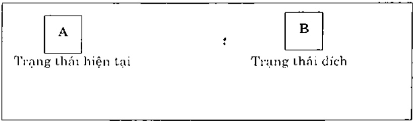

Hinh 2-23. Các trạng thái dầu, trung gian, và đích trong SOAR.

SOAR lập lại chu trình, lập liên kết mới, xác định quan hệ mới, và cập nhật trạng thái hiện tại cho đến khi thấy trạng thái đích.

Trong hình về mô tả việc chuyển trạng thái của SOAR, trạng thái C là trạng thái hiện tại. Các liên kết có nhân chấp nhận được, tối, tốt hơn nổi các nút. Các liên kết được cơi là vật vấn chuyển các thông tin thích hợp. Chúng có thể xuất hiện trong mạng thích hợp theo cách mô tả trong định nghĩa sau.

## Dình nghĩa 2-15 : Mạng thích hợp (Preference net)

Không gian trạng thái mà

\- Các lựa chọn tuyệt đối được định tên "là", cho phép nổi trạng thái với các nút "chấp nhận được", "bỏ đi", "tời", hay "tốt hơn".

\- Các lựa chọn tương đối được định tên là "tốt hơn", "tồi", hoặc "không khác". cho phép nổi các trạng thái với nhau.

<!-- page: 67 -->

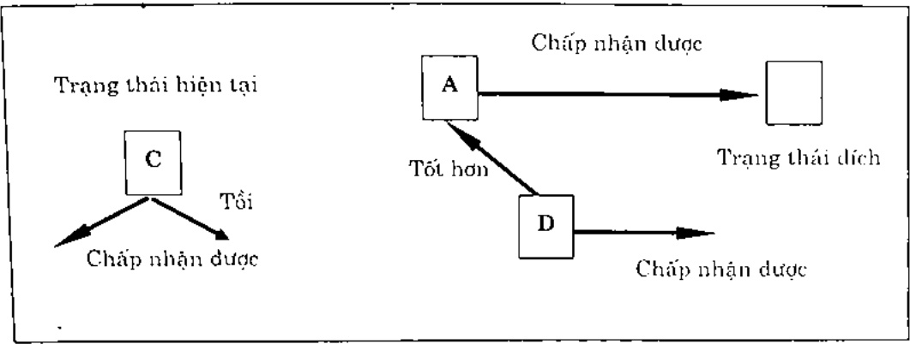

Hình 2-24. Chuyển trạng thái trong SOAR.

## IV.2.4. Bộ phân tích thích hợp tự động của SOAR

Đế sử dụng các nhân và các liên kết thích hợp. SOAR dùng bộ phân tích thích hợp tự động. Bộ phân tích thích hợp tự động là modun xử lý những trạng thái, liên kết không phù hợp do các luật với tầm nhìn hạn hẹp sinh ra.

## Thí dụ

Trong thí dụ minh họa trên hình, có các nút và liên kết. Trước hết bộ phản tích của SOAR chọn ra các trạng thái bài toán là C, A, D, và các những trạng thái có nhân là chấp nhận được. Tiếp theo SOAR thiết lập "trạng thái D quyết định trạng thái A" vì có cung tốt hơn từ D trở sang A. Rôi SOAR cho ràng trạng thái C được quyết định bởi cả hai trạng thái kia, do C được đánh nhân tối và không quyết định bất kì trạng thái nào.

Lúc này tất cả các trạng thái được quyết định bị loại bỏ, còn lại chỉ D. Tiếp theo. SOAR chọn D là trạng thái đầu của bài toán và bắt đầu chu trình khác.

Khi phát hiện thấy các trạng thái mối của bài toán thì cần đánh nhân các trạng thái chưa biết bằng các thông tin thích hợp. Chiến lược giải bài toán chấp nhận xung đột thường được mô tả trước theo một cách cứng nhắc không dùng trong SOAR. SOAR dùng chiến lược giải không xung đột để xác định luật nào sẽ được cháy. SOAR làm cháy tất cả các luật kích hoạt và xác định phải làm gì, dựa vào kết quả do các luật tạo ra.

Hệ thống SOAR xác định trạng thái bài toán đ mức cao và mức thấp hơn. Tại mức cao, để xác định trạng thái mối thay thể trạng thái hiện tại, bộ phân tích của SOAR tìm các cơ hội để tạo lại bài toán trên một tập trạng thái tốt hơn. Điều này có nghĩa đích của bài toán được tìm trong tập trạng thái mối này, tức là cần thay đổi cả không

<!-- page: 68 -->

gian bài toàn hiện tại. Tại mức thấp hơn, bộ phán tích tìm cơ hội thay thế phương pháp. Phương pháp mối được gọi là toán tử hiện tại, cho phép tìm trạng thái trong không gian mối.

Dù với phương pháp tìm trạng thái mối chưa thật hoàn thiện, cuối cùng SOAR cũng thay thế được không gian bài toán hiện tại, trạng thái bài toán, hay toán tử. Đến lúc nào đó trong quá trình sử dụng phương pháp mối, khi bộ phân tích không thực hiện tiếp được: nó sẽ ra thông báo tắc đường. Cần thiết có cơ chế đích con tổng quát của SOAR cho phép tạo ra đích con để giải quyết đường tắc. Đối với người sử dụng SOAR, họ muốn đoán trước các nguy cơ da dạng của đường tắc để đảm bảo có các sản xuất phù hợp, thiết lập lại không gian bài toán, các trạng thái phụ thuộc vào không gian bài toán, và các toán tử phụ thuộc.

Các hành vi chi tiết của bộ phân tích thích hợp tự động của SOAR được thể hiện qua các thủ tục sau :

1. Thu thập tất cả các trạng thái có nhân chấp nhận được.

2. Bỏ các trạng thái chấp nhận được mà cũng mang nhân bị loại.

3. Quyết định các quan hệ như sau :

\- Trạng thái A quyết định trạng thái B nếu có cung tốt hơn nổi A sang B, nhưng không có cung tốt hơn nổi B sang A.

\- Trạng thái A quyết định trạng thái B nếu có cung tối nổi B sang A, mà không ngược lại.

\- Một trạng thái có nhân tốt nhất và không bị trạng thái khác quyết định, sẽ quyết định các trạng thái khác.

\- Một trạng thái có nhân tối nhất và không quyết định trạng thái khác, sẽ được quyết định bởi các trạng thái khác.

4. Hủy các trạng thái bị quyết định.

5. Chọn trạng thái tiếp theo trong số trạng thái còn lại :

\- Nếu chỉ còn một trạng.thái, chọn nó.

\- Ngược lại, nếu không còn trạng thái nào, chọn trạng thái hiện tại, trừ phi nó mang nhân bị loại.

\- Nguộc lại nếu tất cả các trạng thái còn lại được nổi bởi các cung không quan trọng, thì : nếu trạng thái hiện tại là một trong các trạng thái còn lại, giữ nó lại. Nguộc lại, chọn trạng thái ngẫu nhiên nào đó.

6. Nguộc lại thông báo đường tắc.

<!-- page: 69 -->

## IV.3. Kết luận về mô hình hóa nhận thức

\- Tỉnh đơn giản của các hệ thống dựa trên luật cho phép xây dựng các modun hữu dụng thông qua các thủ tục suy diễn.

\- Các modun giải nghĩa giải thích việc suy lý bằng cách dùng cây hướng đích đề trả lời cho các câu hỏi tại sao và thể nào. Các modun xác suất giúp ta xác định độ tin cậy của câu trả lời. Các modun lấy dữ hiệu hỗ trợ người xử lý trị thức trong việc chuyên hóa trị thức từ chuyên gia sang tập các luật. Việc chuyên hóa luật cũng sinh ra trị thức mới.

\- Các hệ thống suy lý chính xác dùng biến trình bày kiểu suy lý dùng biến, dàn trải từ kiểu suy lý nhanh nhưng qua loa đến kiểu suy lý chậm nhưng cán thận.

\- Hai may rủi chính cho phép người xứ lý pri thức nấm bất tri thức của chuyên gia. Một cái hoạt động với hoàn cảnh đặc biệt, cái kia xét hai hoàn cảnh như nhau nhưng được quản lý khác nhau.

\- Các hệ thống dựa trên luật hoạt động như thông thái mà ngày ngõ. Chủng thực hiện tốt vải nhiệm vụ, nhưng không suy lý nhiều mức được, không dùng với các mô hình ràng buộc, không theo dõi bài toán dưới các khia cạnh khác nhau, không cho phép thực hiện các luật riêng và không suy lý sau khi xử lý các luật.

\- Các hệ thống dựa trên luật có thể mô hình hóa việc giải bài toán mang tỉnh người. SOAR là mô hình phát triển ở mức cao nhất, dùng bộ phân tích thích hợp tự động để xác định điều cần làm, thay vì dùng chiến lược giải xung đột có định.

## V. KÊT LUẬN

Chương này phần đã trình bày các kỹ thuật phổ biến để thể hiện trị thức. Một số kỹ thuật quan trọng cùng với các nhận xét tổng kết về việc thể hiện trị thức gồm :

\- Một cấp ba O-A-V thể hiện giá trị thuộc tính của đối tượng.

\- Sự kiện không chắc chắn có thể được thể hiện trong hệ thống với nhân tố tín cậy.

\- Sự kiện nhập những có thể được thể hiện qua tập mò.

\- Các luật dùng để suy diễn thông tin mới từ các thông tin cũ.

\- Một luật khớp có chứa biến có thể áp dụng cho các đối tượng tương tự.

\- Các luật có thể thể hiện suy diễn mò hay không chắc chắn.

<!-- page: 70 -->

\- Mạng ngữ nghĩa thể hiện đối tượng và mối quan hệ giữa chúng.

\- Nút đối tượng trong mạng ngũ nghĩa thừa kế thống tin từ nút cha.

\- Khung thể hiện trị thức thủ tục và mô tả.

\- Một khung thể hiện thừa kê tri thức thủ tục và mô tả từ khung lớp.

\- Mặt dùng để thế hiện trị thức bổ sung hay điều khiển thuộc tính của đối tượng.

\- Logie là cách thể hiện và suy lý trị thức một cách hình thức.

\- Pháp toàn vị từ thể hiện khóa cạnh định tỉnh của menses để thông qua biến và hàng số.

\- Phép toán của phép toán vị từ có thể dùng để tạo các suy diễn phúc tạp.

<!-- page: 71 -->

# VÂN ĐÊ GIẢI BÀI TOÁN

Chương này giới thiệu hai nội dung. Thứ nhất là các đặc tính của bài toán cần giải. Thứ hai là đặc tính của hệ thống sản xuất.

## I. CÁC ĐẶC TÍNH CỦA BÀI TOÁN

Trong các phương pháp giải các lớp bài toán hay vấn đề, người ta thường lưu ý đến các phương pháp may rủi. Khi đó, lớp các bài toán có thể được phân chia thành, các bài toán con; tuy nhiên cần quan tâm đến :

\- Bài toán con đó thực dễ dàng được giải và độc lập với nhau,

\- Trong khi giải các bài toán, có thể bổ qua một vài bước, tức trong quá trình giải, có vài bước không cần thiết.

\- Trong các bài toán, cần có hệ thống các tiến đề, và có thể dự đoán trước được các bài toán con được phát sinh.

\- Trong các bài toán, yêu cầu kết quả tối ưu không phải bao giờ cũng cần; tuy nhiên, cần xét đến khả năng thụ được lời giải tối ưu mà không phải so sánh với các kết quả khác.

\- Việc sử dụng tri thực trong các bài toán cần thiết đến đâu, và cần đến khối lượng lớn không?

\- Trong các phương pháp giải, nên khẳng định vai trò của giao diện người/máy.

Các vấn đề nêu trên có thể được nghiên cứu kỹ luãng. Trong các mục con dưới đây chỉ là một vài nội dung nhỏ.

## I.1. Phân rã ra các bài toán nhỏ

Một bài toán phúc tạp thường được dựa về nhiều bài toán nhỏ hơn. Các bài toán nhỏ đã được giải hoặc dễ được giải; chúng không còn phúc tạp như bài toán ban đầu.

<!-- page: 72 -->

Quá trình phân rã một bài toán phúc tạo được thực hiện cho đến khi toàn bộ các bài toán được giải.

## Thí dụ

Bài toán tính tích phân tách bài toán ban đầu thành các bài toán tích phân đơn giản hơn, theo công thức phân rã tích phân.

$$
\int (x ^ {2} + 3 x) d x = \int x ^ {2} d x + \int 3 x d x = x ^ {3} / 3 + 3 x ^ {2} / 2
$$

Khi thu được các bài toán nhỏ, người ta kiểm tra khả năng giải tại bước này. Nếu chưa giải ngay được, việc phân rã được tiến hành tiếp.

## 1.2. Một số bước thừa khi giải bài toán

Trong số các bước giải bài toán người ta có thể thực hiện một số bước di không cần thiết. Dĩ nhiên việc váp phải sai lâm chưa hẩn là không có ích! Các bước di thừa sinh ra bởi người giải bài toán thử nghiệm, dò tìm dưỡng di đến dịch. Việc trạng thái của bài toán quay trở về một trạng thái trước đó cho người ta thấy các bước chuyển trạng thải của quá trình đó là thừa.

## Thí dụ

Người ta được môi chơi trò 8-ô. Việc di thủ gây ra thừa rất hay xảy ra, dễ nhận thấy có lẻ bản thân trò chơi này dễ tạo điều kiện thủ di thủ lại một nước di.

```txt
1 2 3
6 5
8 7 4
```

## Hình 3-1. Trò choi 8 ô.

Đế các bước thừa bị loại ngay, quá trình giải có thể trang bị chứa năng hủy bỏ bước di vừa thực hiện, chẳng hạn như chức năng UNDO trong các trò chơi. Chức năng này không phải là không cần thiết trong việc đi đến lời giải. Tủy từng loại bài toán, chẳng hạn bài toán chứng minh định lý, một số bước giải có thể được bỏ qua khi lại gặp trạng thái trước đó. Trong bài toán 8-ô, người ta được phép di lại được nước vừa di; nhưng trong chơi cỏ, một đối thủ xin hoãn lại nước thì chưa chắc đã hay.

<!-- page: 73 -->

Những ghi nhận này không những áp dụng cho việc giải một bản toán mà còn cho bộ sản xuất. Việc chấp nhận khả năng làm lại đồng nghĩa với việc chấp nhận sai làm trong việc giải. Trong quát trình không chấp nhận quay lui, khả năng làm lại không được đặt ra.

Trong chương khác đã định nghĩa về giải bài toán. Dưới dây là giới thiệu về hệ san xuất.

## Dình nghĩa 3-1: Hệ sản xuất (Production system)

Một hệ sản xuất là hệ thống dựa trên luật, với :

\- Tập các luật, như cơ sở trí thức tỉnh, trong đó trí thức được mô tả dưới dạng các luật sản xuất, từ là dưới dạng cặp các điều kiện

• Hành động,

\- Bộ nhà làm việc, như cơ sở tri thức động, chưa dữ liệu, các đích và các kết quả trung gian.

\- Bộ diễn giải các luật, như thành phần giải bài toán.

Trong suy diễn tiến, khai thác chương trình là quá trình đơn giản gồm các bước lập sau :

1. Trước hết các luật được xác định các điều kiện, tục giả thiết IF được thỏa mãn bởi nội dung của bộ nhớ làm việc;

2. Thử hai là một luật cụ thể, gọi là luật được kích hoạt được chọn và về THEN của luật được thực hiện;

3. Thử ba, thông tin được đưa vào bộ nhớ làm việc.

Chu trình tương tự được thực hiện cho quá trình suy diễn lùi xét từ về phải của luật. tức phía THEN:

## I.3. Khả năng đoán trước trạng thái của bài toán

Trong các bài toán đơn giản như bài toán 8-0, tính trước và nước di không khó. Người ta cho bảng hai chiều gồm chín ô vuông. Một trong các ô không chứa con số nào. và tấm ô còn lại chứa các số 1, 2... 8.

Bài toán đạt ra là dùng các phép đổi chỗ để dua các con số về vị trí tương đối cần thiết. Hai ô đối số cho nhau nếu chúng có cạnh kể nhau và một trong hai là ô trống. Dụ đoán trạng thái của các số trong các ô nhằm tránh các nước di không cần thiết. Nước di của bài toán này là một lần đối chỗ ô trống.

<!-- page: 74 -->

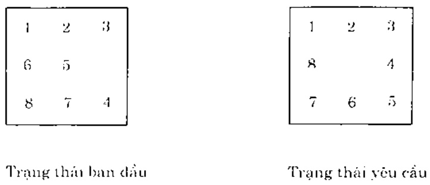

Hình 3-2. Thị dụ về trạng thái ban đầu và trạng thái đích của trò 8 ô.

Trong bài toán phức tạp hơn như chơi bài, không thế có nhiều thông tin về quản bài phía dưới, về bài của đối phương, người ta không thế doán trước một cách chắc chắn. Côn đối với bài toán lập kế hoạch, việc dự đoán trước được là điều chắc chắn; nếu không thì cùng dự đoán được với xác suất nào đó. Như vậy soở các khá nâng nhiều lên và gây không ít tôn kém cho việc xử lý, lưu trữ... do việc phải nhớ tất cả các trạng thái.

Nhận xét cho thấy :

\- Cần lưu ý khi giải một số bài toán thuộc loại không làm lại được và không đoán trước được một cách chắc chắn.

\- Khó dự đoán lời giải của các bài toán như bài toán chơi bài, bài toán điều khiển thao tác của người máy, hệ thống hỗ trợ cho luật su.

## I.4. Chọn giải pháp tốt, tối ưu

Một số bài toán yêu cầu tìm lời giải chấp nhận được, hay lời giải tối ưu. Việc giải các bài toán này được thực hiện trong không gian các trạng thái, cần chuyển qua nhiều trạng thái của bài toán. Người ta được phép lựa chọn trong số nhiều thông tin và các luật để giải bài toán.

## Thí dụ

Dưới dây là thi dụ lịch sử được sử dụng nhiều trong các chương sau này. Cho cơ sở dữ hiệu đặc biệt gồm các sự kiện. Như định nghĩa trước dây, sự kiện là một ghi nhận được dùng trong hoàn cảnh tạm thời, cụ thể là một khái niệm trong nghiên cứu có tính lý thuyết về lập kế hoạch. Sự kiện cũng nhằm vào sự thay đổi của trạng thái. Mỗi sự kiện được khối động do tác nhân gọi là hành động. Các sự kiện cũng là các phần tử theo cấu trúc thời gian, theo logic mang tính thời gian.

Trong cơ sở trí thức còn có các biểu thức như là "if A then B" được ngầm hiểu như suy diễn logic A → B hay là một luật sản xuất, quan hệ nhân quả giữa A và B. Nó được giải thích là "nếu A thì B". Tuy nhiên hai nghĩa này là không tương đương, bởi vì

<!-- page: 75 -->

A → B là đúng ngay cả khi A là sai, trong khi mà IF A THEN B không áp dụng trong trường hợp A sai.

Cơ sở tri thức gồm các tri thức sau :

1. Marcus là người

2. Marcus là người Pompie

3. Marcus sinh năm 40

4. Mợi người đều có thể chết

5. Người Pompie chết khi núi lửa phun, vào năm 79

6. Không ai sống quá 150 tuổi

7. Bây giờ là 1997

Nếu cần biết "Marcus có còn sống không?", tục dồi hỏi có suy diễn trong cơ sở interim thức trên, có phương pháp hình thức :

1. Áp dụng 1. Marcus là người, tức đã dùng tiên để 1

2. Áp dụng 4. Người có thể chết, tức tiên để 4

3. Thu được 8. Marcus có thể cũng chết, tức dùng cả tiền để 1, 4

4. Áp dụng 3. Marcus sinh năm 40, tức tiên đề 3

5. Áp dụng 7. Bây giờ là 1997, tức tiền đề 7

6. Áp dụng 9. Marcus đã 1957 tuổi, do dùng tiên để 3, 7

7. Áp dụng 6. Không ai sóng quá 150 tuổi, tiên đề 6

Thu được 10. Marcus đã chết, do dùng tiên để 8; 6 và 9

Hoặc đơn giản hơn, có suy diễn

1. Áp dụng 7. Bây giờ là 1997, tức tiền đề 7

2. Áp dụng 5. Tất cả người Pompie đều chết, năm 79, tức tiên đề 5

3. Thu được 11. Bây giờ người Pompie đã chết, do tiên đề 7, 5

4. Áp dụng 2. Marcus là người Pompie, tức tiên đề 2

5. Thu được 12. Marcus đã chết, do dùng 11, 12

Trong thí dụ trên, thường thì khi đã thu được kết quả, người ta không còn chú ý đến việc tìm cách giải khác, mà có thể phương án sau là tốt hơn. Việc tìm đường đi ngắn nhất trong hành trình của người đưa thư là thí dụ. Tuy nhiên việc đi tìm phương án tối ưu là không dễ, do bị hạn chế về thời gian, tài nguyên khác. Trong các trường hợp đó, phương pháp may rủi là thích hợp.

<!-- page: 76 -->

Việc dùng may rủi được tính đến khi giải hải toán không có thuật toán nào, cũng không có thuật toán với độ phúc tạp chấp nhận được. Trước kia, trí tuệ nhân tạo được coi là "chuống trình hóa may rủi", nhằm phân biệt nó với việc lập trình có thuật toán. Điều này giờ đây không còn đúng, do việc xử lý trí thức may rủi được lập ra theo cách có thuật toán trên máy tính.

## I.5. Vai trò của tri thức phụ mang tính người khi giải bài toán

Không thể không dùng cơ sở tri thức trong các bài toán xử lý tri thức. Chắng hạn trong bài toán chơi cò, tri thức giúp máy tính toán các nước di. Đề thấy được vai trò của quan hệ nguồn/máy trong quá trình giải bài toán, có thể tách biệt hai lớp bài toán :

\- Thử nhất là lớp các bài toán không cần trao đói thông tin người/máy. Đó là bài toán đã có thuật toán, tự động sinh ra lời giải, không cần giải thích về các suy lý.

\- Thú hai là lớp các bài toán duy trì hội thoại nhằm lấy thêm thông tin phụ trong quá trình giải.

## II. ĐẶC TÍNH CỦA HỆ SẢN XUẤT

Có thể dùng hệ sản xuất để diễn tả phương pháp, tìm lời giải cho một bài toán. Có các hệ sản xuất khác nhau và có các hệ sản xuất chuyên dụng. Người ta thấy các hệ sản xuất có những đặc tính và giữa các hệ sản xuất khác nhau có những quan hệ. Hai đặc tỉnh chính của hệ sản xuất là :

• Tính đơn diêu,

• Tính giao hoán.

Dựa vào các đặc tính, các hệ sản xuất hay các bài toán được chia thành ba lớp.

1. Lớp thử nhất gồm các hệ sản xuất đơn điều. Trước hết, những hệ sản xuất đơn điều là hệ mà việc áp dụng một luật mới không lâm tôn hại đến các luật khác đã được dem thực hiện. Suy luận gọi là đơn điều là một quá trình mà các tri thức thu được chỉ tăng thêm; về hình thức thì :

$$
N \acute {e} u U \rightarrow A v \dot {a} U \subset W t h i W \rightarrow A
$$

2. Thút hai, hệ sản xuất giao hoán từng phần là hệ mà nếu áp dụng xâu nào đó của các luật, chuyển được kết quả từ X đến Y thì bất kì giao hoán nào của các luật tham gia cũng cho kết quả như vậy.

3. Thú ba, hệ sản xuất giao hoán nói chung là hệ thống có thể được tách ra thành hệ thống giao hoán đơn diệu hay giao hoán từng phần.

<!-- page: 77 -->

Việc xét kĩ hơn về suy lý đơn điều/không đơn điều còn được xét tiếp trong chương sau.

Việc phân chất lớp nhàm áp dụng các chiến lược cản đặt phù hợp, để nó có thể phù hợp với một bài toán xác định.

## Thí dụ

Bài toán chứng minh định lý thuộc loại giao hoàn từng phần, đơn diệu. Loại bài toán không đơn diệu có thể kể ra là bài toán 8-ô, thế giới của các khởi hộp. Việc phân tích hóa học thuộc loại không giao hoàn và đơn diệu: còn chơi bài thì không đơn diệu.

Bài toán thể giới các hình khối. là thể giới nhỏ nhân tạo, gồm các khối lập phương hay hình chóp, được thiết kế để phát triển các tự tưởng trong thị giác máy tính, trong người máy và xử lý ngôn ngữ tự nhiên. Chương trình SHRDLU mô phóng tay máy hoạt động trong thể giới này: các mẫu và mô hình mở rộng của thể giới này vấn được dùng để thể hiện cho ý tưởng và phương pháp trong trí tuệ nhân tạo.

Vế hình thức, có thể chọn bất kì hệ sản xuất nào để giải bài toán nhưng chỉ một vải hệ là hiệu quả. Có nhiều bài toán không chấp nhận quay lui thi thứ tự thực hiện các bước là quan trọng.

## Thí dụ

Khi đã rót các chất hóa học vào nhau trong bài toán phân tích, tạo ra chất mới thì không thay đổi được. Trong bài toán này thứ tự thực hiện là quan trọng.

Một số bài toán khác có thể dùng làm thí dụ minh họa, chẳng hạn như :

\- Bài toán thấp Hà nội. Có một chống các địa, địa nhỏ đặt trên địa to. Cần di chuyển chống địa sang vị trí khác; mỗi lấn chỉ di chuyển một địa và được phép dùng vị trí trung gian. Điều kiện ở dây là địa to bao giờ cũng ở phía dưới địa nhỏ hơn. Trong hình yêu cầu chuyển chống địa bên trái sang chống bên phải. Chống địa giữa là chống địa trung gian.

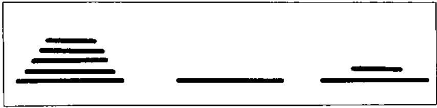

Hình 3-3. Ba chống dia trong bài toán Tháp Hà nội.

<!-- page: 78 -->

\- Bài toán con khí và buống chuối trong cản phòng không có gỉ ngoại các gây và hộp gỗ để trẻ. Làm sao khí chọc được chuối khí mà buống chuối à trên cao bảng chiều cao của khi cộng với chiều cao của cái hộp và cấy gây.

\- Bài toán ba nhà truyền giáo và ba kế ăn thịt người. Ba nhà truyền giáo góp ba kê thuộc bộ tộc ăn thịt người tại bờ sông. Tại đó có chiếc thuyền chỉ chở được hai người. Làm sao qua sông khi mà kế ăn thịt người sẽ thực hiện tới ác nếu họ đóng người hơn.

\- Bài toán diễn số vào các chữ trong biểu thực toán cũng thuộc phạm vi giải quyết của các phương pháp giải. Có các hàng chữ và phép toán số học. Cần diện các số thay cho các chữ phù hợp với luật của phép toán số học. Bài toán thuộc loại nghiên cứu về mật mã.

## III. KÊT LUẬN

Chương này đã để cập vấn đề giải bài toán theo các nội dung :

\- Xác định đặc tính của bài toán. Bảy toán có thể được phản rã, giảm các bước thừa. sử dụng thêm các trị thức phụ để việc giải có hiệu quả hơn.

\- Hệ sản xuất được nhìn nhận theo tính chất đơn diệu và giao hoàn. Một số bài toán về trí tuệ nhân tạo được giới thiệu như bài toán thí dụ.

<!-- page: 79 -->

# MỘT SỐ KỸ THUẬT CHUẤN BỊ GIẢI BÀI TOÁN

Chương này trình bày chung về các kỹ thuật suy diễn, rời làm rõ thêm về suy diễn tiến và suy diễn lủi. Tiếp theo là sử dụng cây bài toán, hay còn gọn là đồ thị bài toán trong việc suy diễn. Việc quay lui và quản lý các trị chân lý dùng trong kỹ thuật quay lui được lần lượt giới thiệu. Các kỹ thuật so sánh, khớp đúng và một số chức năng may rủi kết thúc chương.

## I. CÁC KỸ THUẬT SUY DIÊN

## I.1. Giới thiệu

Dế giải bài toán trong hệ thống trí tuệ nhân tạo, tối thiểu cần thiết việc thể hiện trí thức. như đã được trình bày trong chương trước. Rối cần có hệ thống suy lý trên các trí thức. Trong hệ thống như hệ chuyên gia, việc suy lý được thực hiện thông qua kỹ thuật suy diễn và các chiến lược điều khiển. Các kỹ thuật suy diễn hướng dẫn hệ thống theo cách tổng hợp trí thức từ các trí thức đã có trong cơ sở trí thức và từ các sự kiện ghi lại trong bộ nhớ. Các chiến lược điều khiển thiết lập đích cần đến và hướng dẫn hệ thống suy lý.

## I.2. Suy lý

Con người giải bài toán bằng cách kết hợp các sự kiện với các trị thức. Hộ dùng các sự kiện riêng về bài toán và dùng chúng trong ngũ cảnh hiểu tổng thể về lĩnh vực của bài toán để rút ra các kết luận logic. Quá trình này gọi là suy lý.

Định nghĩa 4-1 : Suy lý (Reasoning)

Quá trình làm việc với tri thức, sự kiện, và các chiến lược giải bài toán để đẻ rút ra kết luận.

<!-- page: 80 -->

Hiểu cách con người suy lý và cách họ làm việc với thông tin về bãi toán đã cho, cộng với kiến thức tổng quảt của họ về lĩnh vực này sẽ đảm bảo hiểu rõ các bước di trong việc xử lý trị thức trong hệ thống trí tuệ nhân tạo.

## 1.2.1. Suy lý theo cách suy diễn

Con người dùng suy lý suy diễn để rút ra thông tin mới từ các thống tin đã biết. Các thông tin này có quan hệ logic với nhau. Suy lý suy diễn dùng các sự kiện của bài toán gọi là các tiên để và kiến thức chung có liên quan ở dạng các luật gọi là các kéo theo.

Thi dụ

Kéo theo : Tôi sẽ ướt nếu tôi đúng dưới mưa.

Tiên dê : Tôi đúng dưới mưa.

Kết luận : Tôi sẽ uót.

Suy lý suy diễn là một trong các kỹ thuật phố biến nhất. Suy diễn đã dùng modus ponens, là loại cơ bản của suy lý suy diễn. Khi có A→B và A đúng thì rút ra được B đúng.

## .1.2.2. Suy lý quy nạp

Con người dùng suy lý quy nạp để rút ra kết luận tổng quát từ một tập các sự kiện theo cách tổng quát hóa.

Thí dụ

Giá thiết : Con khi ở vườn thú Hà nội ăn chuỗi

Giả thiết : Con khí ở vườn thú Cần thơ ăn chuối

Kết luận : Nói chung, khi ăn chuỗi.

Qua suy lý này, người ta cho ràng kết luận sẽ đúng cho tất cả các trường hợp cùng loại, dựa trên một số hạn chế của các trường hợp. Thực chất của suy lý suy diễn là dem cái thiếu số áp đặt cho da số. Năm 1988 Firebaugh mô tả quá trình này như sau :

Cho tập các đối tượng $X = \{a, b, c, ...\}$, nếu tính chất $P$ đúng đối với $a$, và nếu tính chất $P$ đúng đối với $b$, và nếu tính chất $P$ đúng đối với $c...$, thì tính chất này đúng với tất cả $X$.

## 1.2.3. Suy lý giả định

Suy diễn là suy lý chính xác từ các sự kiện và thông tin đã biết. Suy lý giả định (abductive) là một loại suy diễn có về hợp lý. Điều này có nghĩa câu kết luận có thể dùng, nhưng cũng có thể không đúng.

<!-- page: 81 -->

Thí dụ

Kéo theo : Đất với nếu trời mưa

Tiền đề : Đất vớit

Kết luận : Trời mưa ?

Kết luận "trời muta ?" cho ràng có thể trời mua. cũng có thể không phải trời mua mà "dất uốt" xảy ra vì lý do nào khác.

## 1.2.4. Suy lý tương tự, loại suy

Người ta tạo một mô hình của một vài khái niệm thông qua kinh nghiệm của họ. Hồ dùng mô hình này để hiểu một vài hoàn cảnh và đối tượng tương tự. Hồ vạch ra điểm tương đồng giữa hai vật đơn so sánh, rút ra sự giống nhau và khác nhau nhằm hướng dẫn việc suy lý của họ.

Thí dụ

Khung : Con hô

Chủng loại :    Thủ vật

Số chân : 4

Ân : Thịt

Sống lại : Ân độ và Đông Nam Á

Màu : Vàng có vạch

Một khung cho biết thông tin da dạng về đối tượng. Người ta có thể dùng khung để thể hiện những nét điện hình của các đối tượng tương tự. Nếu cho rằng Sư từ giống Hồ thi Sư từ cùng có nhiều tỉnh chất như trên. Loại suy lý này có thể dùng để hiểu biết về đối tượng mới, và để hiểu rõ thêm bằng cách tra cứu đến những sự khác biệt giữa các đối tượng. Trong thí dụ này, Sư từ được phân biệt với Hồ do các nét khác nhau giữa chúng.

## 1.2.5. Suy lý theo lē thuòng

Nhỏ kinh nghiệm, con người có thể giải vấn đề một cách hiệu quả. appreciation of the whole is a strong growth (common sense) despite a change in the growth rate. Such growth has been expected to be a good way to achieve a better outcome.

Thí dụ

Văn để chẩn đoán hổng học ô tô : "Siết quạt lòng thường gây ra tiếng ổn". Kết luận này có được do kinh nghiệm sửa nhiều ô tô. Người ta đoán ngay "Siết quạt lòng" khí thấy chiếc ô tô sinh ra tiếng ổn. Loại trị thức này được coi như may rủi, cầu may.

<!-- page: 82 -->

Khi các may rủi dùng để hướng dẫn giải bài toán trong hệ thống trí tuệ nhân tạo, người ta có kiểu tìm kiếm may rủi hay tìm phù hợp (best-first). Loại tìm kiếm này phát hiện lời giải tại nơi có về là tốt nhất. Như vậy cũng chẳng đảm bảo nơi đó có lời giải. Tuy nhiên, cách tìm kiếm may rủi là thích hợp đối với những ứng dụng cần nhành chóng thu được lời giải.

## 1.2.6. Suy lý không đơn diêu

Dời với nhiều trường hợp, người ta suy lý trên các thông tin tỉnh. Các thông tin này không thay đổi trạng thái trong quá trình giải bài toán. Loại suy lý này được gọi là suy lý đơn diệu.

Thí dụ

Trong vải bài toán trạng thái của các sự kiện thay đổi.

1F    Giới thôi
THEN    Cái nổi dung dưa

Nếu có sự kiện "cơn gió mạnh" thì câu trong IF đúng, tức là người ta đã sử dụng nếu "gió thời mạnh" thì "giộ thời". Lức này trong câu trên, người ta thu được kết luận trong câu THEN, tức là :

"con gió mạnh" → "gió thôi" → "cái nôi dung dua

Sau khi gió mạnh hết, người ta muốn ràng cái nổi hết dung dưa. Tuy nhiên, hệ thống với cách suy lý đơn diệu sẽ "giữ" trạng thái đang dung dưa của cái nổi.

Do việc theo dõi sự thay đổi của thông tin không máy khó khăn, khi có sự kiện nào thay đổi người ta có thể dựa vào nhiều sự kiện phụ thuộc khác để thu được kết luận như mong muốn. Loại suy lý như vậy được gọi là suy lý không đơn điều.

Hệ thống có thể suy lý không đơn diệu nếu nó có hệ thống quản lý giá trị chân lý. Hệ thống này quản lý dữ liệu về nguyên nhân để sự kiện được khẳng định. Do vậy khi nguyên nhân thay đổi, sự kiện cũng thay đổi theo. Một hệ thống dùng suy lý không đơn diệu như thí dụ trên sẽ giữ được cải nổi đang dung dua lại.

## I.3..Suy diên

Hệ thống trí tuệ nhân tạo mô hình hóa quá trình suy lý của con người nhỏ kỹ thuật gọi là suy diễn. Việc suy diễn là quen thuộc trong hệ chuyên gia.

Định nghĩa 4-2 : Suy diện (Inference)

Quá trình dùng trong hệ chuyên gia để rút ra thông tin mới từ các thông tin cụ.

<!-- page: 83 -->

Một hệ chuyên gia thực hiện suy diễn bằng módun gọi là mộto suy diễn. Nó được định nghĩa:

## Định nghĩa 4-3 : Môto suy diên (Inference Engine)

Bộ xử lý trong hệ chuyên gia khớp các sự kiện trong bộ nhà với tri thức lĩnh vực trong cơ sở tri thức, để rút ra các kết luận về vấn đề đang xét.

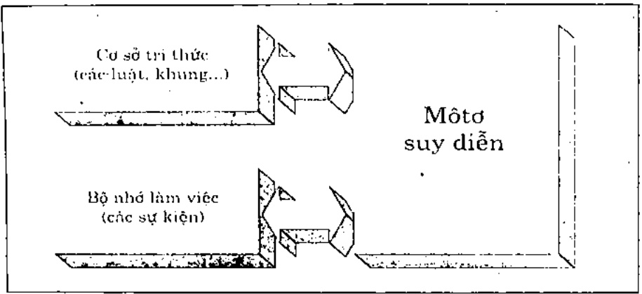

Hình 4-1. Vị trí của mô tô suy diễn trong hệ chuyên gia.

Người ta thường quan tâm về một số khía cạnh của suy diễn, cũng như cách thức thực hiện của mộto suy diễn. Trong hệ thống, phần mô to suy diễn thường được coi là kín, ít thấy tường minh. Tuy nhiên cần biết :

• Câu hỏi nào sẽ được chọn để người sử dụng trả lời?

• Cách tìm kiếm trong số số tri thức?

\- Làm sao chọn được luật thực hiện được trong số các luật có thể?

\- Thông tin vừa được kết luận có ảnh hưởng thể nào đối với việc tìm kiếm?

Lần lượt các vấn đề này sẽ được trả lời sau khi trình bày kỹ thuật suy diễn tiến và lui. Cả hai ký thuật suy diễn này đều dựa trên suy diễn logie được xét dưới đáy.

## 1.3.1. Modus Ponens

Suy lý theo logic đã được giới thiệu qua các luật. suy diễn đơn giản gọi là modus- ponens.

<!-- page: 84 -->

## Đinh nghĩa 4-4 : Modus Ponens

Luật logie kháng định rằng nếu biết A là đúng và A kéo theo B thì có thể cho là B đúng.

Modus ponens làm việc với các tiên để (các câu dùng) để suy ra các sự kiện mới. Chắng hạn có tiên để với dạng $E_1 \to E_2$, và tiên đề khác $E_1$ thì về logic suy ra $E_2$, tức $E_2$ đúng. Các tiên đề này có thể được dịch thành danh sách, trong đó tiên đề 3 có được do tiền để 1 và tiên đề 2:

1. $\mathbb{E}_1$  
2. $\mathbb{E}_1\rightarrow \mathbb{E}_2$  
3. $\mathbb{E}_2$

Nếu có tiên để khác, có dạng  $E_{2} \rightarrow E_{3}$  thì  $E_{1}$  được dưa vào danh sách.

Thí dụ

IF nhiệt độ lớn hơn 38 THEN bệnh nhân bị nóng, ứng với $E_1 \to E_2$
IF bệnh nhân bị nóng THEN uống thuốc cảm, ứng với $E_2 \to E_3$
Cơi như dây là hai tiên để đầu tiên, STATE-0

Giả sử có bệnh nhân nhiệt độ trên 38, thêm tiền dễ mới "nhiệt độ trên 38", vào trạng thái, tạo nên STATE-1 :

1. $E_1 \rightarrow E_2$
2. $E_2 \rightarrow E_3$
3. $E_1$ (nhiệt độ prên 38)

$E_{2}$  được thêm vào, tạo nên STATE-3 :
1.  $E_{1} \rightarrow E_{2}$ 
2.  $E_{2} \rightarrow E_{3}$ 
3.  $E_{1}$  (nhiệt độ trên 38)
4.  $E_{2}$  (bệnh nhân bị nóng)

Thông tin mới thêm tạo ra tiên đề E₁. Thêm E₃ vào, tạo nên STATE-4 :
1. E₁ → E₂
2. E₂ → E₃
3. E₁ (nhiệt độ trên 38)
4. E₂ (bệnh nhân bị nóng)
5. E₃ (uống thuốc cản)

<!-- page: 85 -->

Dựa trên tập các kéo theo, tức là các luật. và dữ liệu ban dấu, luật modus ponens tạo nền một dãy các khẳng định. Quá trình suy diễn được tiến hành nhỏ các thông tin đã được khẳng định. Loại suy diễn này là cơ sở của suy diễn dữ liệu hay của hệ chuyên gia suy diễn tiện.

## I.3.2. Giải vấn đề

Modus ponens suy ra thông tin mới từ các dữ hiệu ban đầu. Chính quá trình suy diễn cho biết thông tin nào là phù hợp với ứng dụng. Dương nhiên trong các ứng dụng, phải thu thập thêm thông tin để suy ra dịch bài toán. Chăng hạn như bắc sĩ muốn kháng định rõ về bệnh cần làm các xét nghiệm tại phòng thí nghiệm. Loại suy diễn này là cơ sở của việc giải vấn đề, tức giải bãi toán. Robinson giới thiệu phương pháp này vào năm 1965, và dùng làm thuật toán cơ bản được dùng trong ngôn ngữ lập trình Prolog.

## Định nghĩa 4-5 : Giải vấn đề (Problem solving)

Chiến lược suy diễn dùng trong các hệ thống logie để xác định chân lý của một khẳng định.

Phương pháp giải muốn chứng minh ràng định lý nào đó hay một đích thể hiện qua mệnh để P nào đó là đúng, dựa trên tập các tiên để đã cho về vấn đề này. Thực ra phương pháp này chứng minh phủ định của P. tức –P, không thể đúng được. Do vậy nó có tên là chứng minh bằng phản chứng. Phương pháp giải dưa ra biểu thức mới, gọi là vật giải (resolvent) bằng cách hợp các tiến để và phủ định của điều phải chứng minh.

Dế minh họa cho cách giải, giả sử có hai tiên để đ dạng A v B và -B v C. Phương pháp tạo vật giải bằng cách dùng logic AND :

$$
(A \vee B) \wedge (\neg B \vee C) = A \vee C
$$

Về hình thức có thể công các biểu thức và lưu ý B và -B triệt tiêu. Có thể dùng thí dụ thực tế để rõ thêm về phương pháp tạo vật giải này.

Vật giải này được bổ sung vào tập các tiên đẻ. Quá trình tiếp tục cho đến khí thấy màu thuẫn. Mâu thuẫn đơn giản là hai tiên đẻ có giá trị logic trái nhau, như P và  $\neg P$ . Mâu thuẫn ngâm chỉ ra rằng menses để đó đúng. Tức cầu ban dấu là đúng.

Thuật toán giải được tổng kết như sau :

i. Giá sú -P đúng

2. Chỉ ra được các tiên đề và ¬P đưa đến màu thuẩn

3. Kế luận ràng ¬P là sai, vì nó dua đến màu thuẩn

4. Do → P sai, nên P đúng

<!-- page: 86 -->

Thi du

Tiếp lực thí dụ về bệnh nhân bị nóng. Lưu ý luật IF A THEN B được biểu diễn bằng ki hiệu là A → B: nó có giá trị logie như  $-A \vee B$ .

Ban đầu có

\- IF nhiệt độ lớn hơn 38 THEN bệnh nhân bị nóng, ứng với $E_1 \to E_2$, từ $\neg E_1 \lor E_2$

\- IF bệnh nhân bị nóng THEN uống thuốc cảm, ứng với $E_{2} \rightarrow E_{1}$, tức $\neg E_{2} \vee E_{1}$

\- Nhiệt độ trên 38. lực $E_{1}$.

Thi dụ muốn chứng minh  $E_{3}$  là đúng. Theo thuật toán, giả sử  $-E_{3}$  là đúng. Lúc này bản toán có STATE-0 :

$$
\begin{array}{l l} 1. & \neg \mathrm{E} _ {1} \lor \mathrm{E} _ {2} \\ 2. & \neg \mathrm{E} _ {2} \lor \mathrm{E} _ {3} \\ 3. & \mathrm{E} _ {1} \\ 4. & \neg \mathrm{E} _ {3} \end{array}
$$

Giải tiên đề 1 và 2 thu được $\neg E_{1} \vee E_{0}$. Bổ sung nó vào tập trạng thái, được STATE-1:

$$
\begin{array}{l l} 1. & \neg E _ {1} \lor E _ {2} \\ 2. & \neg E _ {2} \lor E _ {3} \\ 3. & E _ {1} \\ 4. & \neg E _ {3} \\ 5. & \neg E _ {1} \lor E _ {4} \end{array}
$$

Giải tiên để 3 và 5 thu được E$_{3}$. Bố sung E$_{3}$ vào tập trạng thái, được STATE-2

1. $\neg \mathbf{E}_1\lor \mathbf{E}_2$   
2. $\neg \mathbf{E}_2\lor \mathbf{E}_3$   
3. $\mathbf{E}_1$   
4. $\neg \mathbf{E}_3$   
5. $\neg \mathbf{E}_1\lor \mathbf{E}_3$   
6. $\mathbf{E}_3$

<!-- page: 87 -->

Cuối cùng thấy được máu thuẩn từ tiên để 4 và 6. Do vậy $\neg E_{3}$ là sau, từ $E_{4}$ là đúng. Vậy là đích ban đầu "uống thuốc cảm" được thiết lập. Kết quả này như kết quả thu được bằng modus ponens. Tuy nhiên cách tiếp cận là khác.

Trong modus ponens, dữ hiệu ở dạng thông tin dùng khởi động tìm kiếm và kết quả có được do dùng phép kéo theo. Nếu bài toán có nhiều phép kéo theo, quá trình có thể rối lên, suy diễn ra tất cả thông tin có thể. Việc giải chỉ tập trùng vào dịch, chỉ xét các kéo theo nào có ý nghĩa.

Cách giải vừa nêu dựa trên logic mềm dễ. Việc dựa vào phép toán vị từ cũng tương tự nhưng phức tạp hơn, cần có các thủ tục làm việc với biến và các lượng từ. Điều này cần đến các thuật toán như thuật toán thống nhất và dùng hàm Skolem. Nội dung này sẽ được chi tiết thêm.

## 1.3.4. Giải vấn đề một cách tự nhiên

Trong việc giải không phân biệt dâu là đích. là giá thiết hay luật. Tất cả được đưa vào danh sách và được luật suy diễn xử lý. Loại xử lý này cũng có, thể lần đường, do không giữ được dâu là điều cần chứng minh. Vậy nên kỹ thuật suy diễn một cách tự nhiên, hay là giải như không giải chứng minh câu hướng đến dịch. Suy diễn tự nhiên dùng luật suy diễn quay lui theo dạng sạ :

Dê chúng minh [H ∧ (A → B) → C]:

Nêu đã có (B → C) thì chúng minh (H → A).

Thí dụ

Xét bài toán sau đây để minh họa cho cách giải này. Giả sử cần chủng minh Nam thích đội bóng Sông Cẩm của Hải phòng. Giả sử ai sống ở Hải phòng đều thích Sông Cẩm. Do vậy nếu xác định được Nam sống tại Hải phòng thì chủng minh xong. Bài toán được thể hiện lại như sau :

Giả thiết : sống tại Hải phòng (Nam) ∧ (sống tại Hải phòng (X) → thích Sông Cẩm (X))

Dích : thích Sông Cám (Nam)

Trong phần giá thiết thay biến X bằng giá trị Nam, rối thủ các menses để như cách suy diễn trên.

$$
\mathrm{H} = \text {sống tại Hải phòng (Nam)}
$$

$$
\mathrm{A} = \text {sông tại Hải phòng (Nam)}
$$

B = thích Sông Cám (Nam)

$$
\mathrm{C} = \text {thích   Sông   Câm (Nam)}
$$

Do hiên nhiên B → C, cần thủ H → A. Điều này cũng hiên nhiên.

<!-- page: 88 -->

Gải theo cách tự nhiên có ưu điểm là cho phép trao dôi với người dùng trong quá trình chúng minh. Cách này thành công trong hệ thống IMPLY năm 1977. Nó cũng có những nét như hệ chuyên gia hướng đích hay quay lui.

## II. SUY ĐIỂN TIÊN/ LÙI

## II.1. Tổng quan

Mục dich của quá trình tìm kiếm là phát hiện đường đi từ cứu hình hay trạng thái xuất phát đến trạng thải dịch. Có hai hướng, tiến hay lui, khi thực hiện mục đích này. Hai phương pháp suy diễn là suy diễn tiến và suy diễn lùi sẽ được trình bày chỉ tiết ngay sau đây. Một cách chưa được hình thức, có thể cơ suy diễn tiến là chiến lược giải bài toán xử lý sự kiện hay dữ liệu; nó thiên về quá trình suy diễn lập đi lập lại từ tiên để hay giả thiết di chuyển về phía trước từ giả thiết về phía kết luận.

Thí dụ

Về chiến thuật này, giá thiết p và r, có thể suy ra s do luật 1, t từ luật 2, và w từ luật 4. Nếu dịch cần chúng minh là w thi tới dây bài toán đã được chủng minh xong.

1. if p and r then s

2. if $r$ then $t$

3. if $\mathbf{q}$ and $\mathbf{s}$ then $\mathbf{u}$

4. if s and t then w

5. if r and u then v

Suy diễn tiến có mật trái là khi các dữ liệu thừa-cú sinh ra và có thể càng tiếp tục suy diễn càng không di đến trạng thái dịch mong muốn. Hướng tìm kiếm và suy luận ngược với cách này là suy diễn lùi.

Đôi với các hệ dựa trên luật, suy diễn lui thiên về quả trình đặt điều kiện hay giả thiết đã có đích bài toán rời làm ngược với các luật nhằm thấy một tập các giả thiết thỏa mãn dùng cho đích này. Trong thí dụ, cần suy ra w, thấy từ luật 4 có giả thiết t và s: do luật 2, t được suy ra chỉ nếu r là đúng, và do luật 1, s được suy ra chỉ nếu p và r là đúng; do đó, để có w, cần phải cho trước cả p và r.

Trong hệ sản xuất, dễ thấy tính đối xứng của hai cách suy diễn trên. Thí dụ qua bài toán 8-ô, theo suy diễn tiến người ta xây dựng được cây tìm kiếm bằng cách áp lên trạng thái đầu của các ô, tức gốc của cây. Môi bước di chuyển tương ứng với việc áp dụng một luật, tạo ra trạng thái mối của các ô.... cho đến khi hiện ra ô đích được yêu cầu.

<!-- page: 89 -->

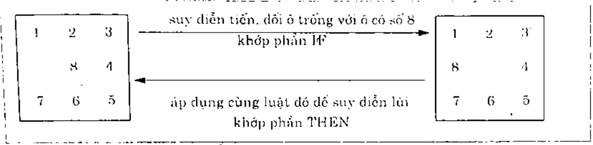

Hình 4-2. Dùng luật suy diễn tiến và lùi.

## II.2. Suy diện tiền

## II.2.1. Giới thiệu

Quả trình giải đối với vài vấn đề bất dấu bằng việc thu thập thông tin. Thông tin này được suy lý để suy ra kết luận. Diệu này cũng như bắc sĩ bất dấu chấn đoán bằng một loat câu hỏi về triệu chứng của bệnh nhân. Loại suy diễn này được mô hình hóa trong hệ chuyên gia có tìm kiếm dữ liệu với tên là suy diễn tiến. Suy diễn tương tự như modus ponens đã trình bày.

## Định nghĩa 4-6 : Suy diễn tiền (Forward chaining)

Chiên lược suy diễn được bất đầu bằng tập sự kiện đã biết, rút ra các sự kiện môi nhà dùng các luật mà phần giá thiết khớp với sự kiện đã biết, và tiếp tục quá trình này cho đến khi thấy trạng thái đích, hoặc cho đến khi không con luật nào khớp được các sự kiện đã biết hay được sự kiện suy diễn.

Ứng dụng đơn giản nhất của hệ thống suy diễn tiến hoạt động như sau :

\- Trước tiên hệ thống lấy các thông tin về bài toán từ người sử dụng và đặt chủng vào bộ nhớ làm việc.

\- suy diễn quét các luật theo dãy xác định trước; xem phần giả thiết có trùng-khốp với nội dung trong bộ nhỏ.

\- Nếu phát hiện một luật như mô tả trên, bổ sung kết luận của luật này vào bộ nhớ. Luật này gọi là cháy.

\- Tiếp tục quá trình này: có thể bổ qua các luật đã cháy. Quả trình tiếp cho đến khi không khớp được luật nào.

Lúc này bộ nhớ có các thông tin của người dùng và thông tin do hệ thống suy diễn.

<!-- page: 90 -->

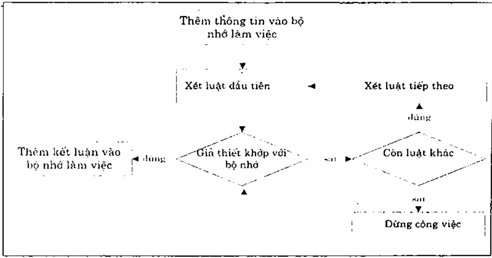

Hình 4-3. Các hoạt động của hệ thống suy diễn tiền.

## Thí dụ

Giả sử có bệnh nhân đến khám bệnh. Bắc sĩ dùng kiến thức y học và thông tin do bệnh nhân khai đó xem có bệnh gì không. Mô hình chẩn đoán theo suy diễn tiến. Thị dụ xét bệnh viêm họng.

Luật 1. IF Bệnh nhân rất họng
AND Nghi viêm nhiễm
THEN Tín ràng bệnh nhân viêm họng, di chữa họng.

Luật 2. IF Nhiệt độ bệnh nhân quá 37 độ
THEN Bệnh nhân bị sốt

Luật 3. IF Bệnh nhân ốm trên một tuần
AND Bệnh nhân sốt
THEN Nghi bệnh nhân viêm nhiễm

Thông tin từ bệnh nhân là :

• Bệnh nhân có nhiệt độ 39

\- Bệnh nhân đã ôm hai tuần

<!-- page: 91 -->

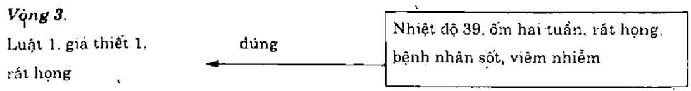

• Bệnh nhân họng rất

Khi hệ thống thấy gia thiết của luật khớp với thông tin trong bộ nhớ, câu kết luận của luật được bổ sung vào bộ nhớ.

## Vòng 1

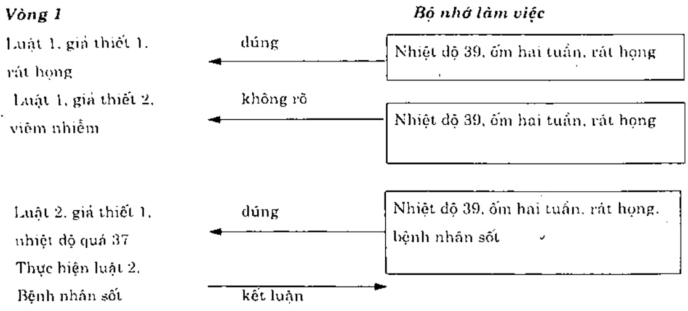

## Vòng 2. Luật 1 lại không khớp, luật 2 cháy.

<!-- page: 92 -->

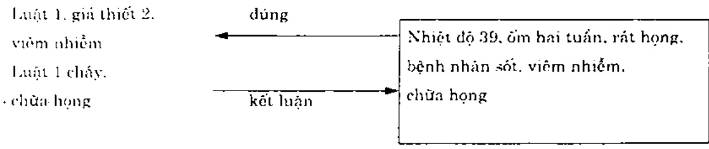

Hình 4-4. Các luật bị cháy, thông tin trong bộ nhớ thay đổi trong suy diễn tiến.

Nhỏ các thông tin, hệ thống kết luận được ba thông tin mới :

1. Bệnh nhân sối

2. Nghi viêm nhiễm

3. Phải chữa họng bệnh nhân

Hệ thống suy diễn tiến kết luận mọi thứ có thể. Tiếp cận này phù hợp đối với một vài ứng dụng. Tuy nhiên trong ứng dụng khác, tiếp cận này dưa ra các thông tin không cần thiết. Giá sử cho thêm hai luật :

Luật 4. IF Bệnh nhân sốt

THEN Lức ấy bệnh nhân không đi lại được

Luật 5. IF Bệnh nhân không di lại được

THEN Bệnh nhân ở nhà và đọc sách.

Hệ thống dễ dàng suy được " bệnh nhân sót". Thông tin này làm cháy luật 4 và luật 5. Thông tin mới về việc họ ở nhà và đọc sách chẳng giúp ích gì cho bắc sĩ. Dương nhiên làm sao hệ thống biết được thông tin đó có quan trọng hay không!

Nói chung hệ thống suy diễn tiền không làm thể nào biết được thông tin này là quan trọng hơn thông tin kia. Do vậy nó tôn công sức vào việc phát hiện các sự kiện không cần thiết.

## II.2.2. Giải quyết xung đột

Trong thí dụ về suy diễn tiến, hệ thống kiểm tra các luật để thực hiện luật khi giá thiết khớp với nội dung của bộ nhớ làm việc. Tất nhiên có các luật khác có thể cháy được nhưng không được hệ thống kịp xem xét đến. Sở dĩ như vậy là vì mộto suy diễn xử lý các luật theo thứ tự. Thứ tự xem xét các luật là rất quan trọng. Vì vậy tiếp cận này có thể là thuận lợi đối với một vài ứng dụng, hoặc gây khó khăn cho các ứng dụng khác.

<!-- page: 93 -->

## Thí dụ

Văn để là tôi làm gì tôi nay ? Giá sử có hai cách lựa chọn, đến nhà hát hay sản bóng.

## Luật 1. IF Đội Sông Cảm chơi tối nay

AND Có ít nhất 20\$

## THEN Tôi sẽ xem đá bóng

## Luật 2. IF Vó kích phù hợp

AND Có ít nhất 20\$

THÊN Tôi sẽ xem hát

Khi các giả thiết của hai luật đều đúng, dùng luật như đã làm, cá hai luật đều cháy. Tuy vậy không thể cùng đi tới hai nơi được.

Đế giải quyết xung đột này trong hệ thống, người thiết kế cần có chiến lược giải quyết xung đột.

\- Chiến lược đơn giản là trước tiên thiết lập đích, và ngùng hệ thống ngay khi dịch đạt được. Nhu vây ương thí dụ, nêu đích là "tối sẽ đến X". thi khi xác định được giá trị X, dùng hệ thống lại. Trong chiến lược này, thứ tự luật có ý nghĩa.

\- Chiến lược khác dùng độ ưu tiên của luật. Độ ưu tiên đơn giản là con số gắn cho luật để thể hiện mức độ quan trọng của nó. Khi đó hệ thống sẽ kiểm tra các luật và chọn ra luật có độ ưu tiên cao nhất để thực hiện.

\- Chiến lược chọn luật để thực hiện khi nó đã cháy vải lần.

Các chiến lược này gọi là chiến lược giải quyết xung đột.

## Đình nghĩa 4-7 : Giải quyết xung đột (Conflict resolution)

Chiên lược chọn một xấu luật cháy trong số nhiều luật có thể cháy.

Trong hệ thống dùng chiến lược giải quyết xung đột này, việc giải bài toán được thực hiện theo các bước của quá trình ghi nhận - giải - hoạt động trên các luật.

1. Ghi nhận. Khớp giả thiết của các luật với sự kiện liệt kê trong bộ nhớ làm việc, và định tên các luật có thể cháy này.

2. Giải. Nếu nhiều luật có thể cháy, chọn một luật theo chiến lược nào đó.

3. Hoạt động. Thực hiện luật này và bổ sung kết luận vào bộ nhớ làm việc.

<!-- page: 94 -->

Bước ghi nhận định tên các luật có thể thực hiện được rôi đặt chúng vào tập tranh chấp. Bước giải dùng một chiến lược để chọn ra một luật trong tập tranh chấp. Các chiến lược giải quyết xung đột diện hình được dùng là :

\- Luật đầu tiên có giá thiết khớp với nội dung bộ nhớ làm việc.

\- Luật có độ ưu tiên cao nhất. Trong hệ thống dùng chiến lược này, thứ tự của thông tin là quan trọng.

\- Luật đặc biệt nhất. Chiến lược này để ý đến luật khác biệt so với các luật tổng quát. Chắng hạn một luật là khác biệt hơn nếu nó có nhiều giá thiết hơn. Tự tưởng của ý này là nếu xử lý nhiều thông tin thi có khả năng thành công nhiều hơn.

\- Luật liên quan đến phần tử vừa được thêm vào bộ nhớ. Chiến lược liên quan đến thời gian của sự kiện trong bộ nhớ làm việc.

\- Không thực hiện luật đã cháy. Chiến lược này trình được suy diễn xoay vòng. Nó thường được dùng kèm với chiến lược khác.

\- Thực hiện các luật với suy lý tách biệt. Nó yêu cầu làm cháy tất cả các luật nhưng bổ sung các kết luận vào bộ nhớ tách rời nhau. Điều này cho phép hệ thống quản lý các dòng suy diễn tách rời và xem xét được nhiều lán giải.

Môi chiến lược giải quyết xung đột đều điều khiển việc thực hiện luật. Người ta có thể thêm vào hệ thống chức năng tìm may rủi để hướng dẫn tìm luật một cách thông minh. Việc chọn một hoặc nhiều luật phụ thuộc vào mức độ cần thiết của ứng dụng.

## II.3. Suy diện lùi

## II.3.1. Giới thiệu

Ki thuật suy diễn tiền là tốt khi làm việc với bài toán bắt đầu từ các thông tin và cần suy lý một cách logic đến các kết luận. Trong bài toán loại khác, người ta bắt đầu từ các giả thuyết định chứng minh rời tiến hành thu thập thông tin. Chẳng hạn bác sĩ nghi người bệnh bị bệnh nào đó, ông ta tìm các triệu chứng của bệnh ấy. Loại suy lý này được mô hình hóa trong hệ thống trị tuệ nhân tạo như hệ chuyên gia với tên là suy diễn lùi.

## Định nghĩa 4-8 : Suy diễn lùi (Backward chaining)

Chiên lược suy diễn đế chứng minh một giả thuyết bằng cách thu thập thông tin hỗ trợ.

Hệ thống suy diện lủi bắt đầu từ dịch cần chủng minh.

<!-- page: 95 -->

\- Trước hết nó kiểm tra trong bộ nhớ làm việc để xem đích này đã được bổ sung trước đó chưa. Bước này cần thiết vi cơ sở tri thức khác có thể đã chủng minh đích này.

\- Nếu đích chuta hệ được chứng minh. nó tìm các luật có phần THEN chúa dịch. Loại luật này gọi là luật đích.

\- Hệ thống xem phần giả thiết của các luật này có trong bộ nhớ làm việc không. Các giả thiết không được liệt kê trong bộ nhớ gọn lǜ các dịch mới, hay dịch con, cần được chứng minh. Các dịch con này được cung cấp, từ giải, nhỏ các luật khác.

Quả trình này tiếp tục để quy cho đến khi hệ thống tìm thấy một gia thiết không được luật nào cung cấp. Đó là một sơ khởi.

## Định nghĩa 4-9 : Sơ khôi (Primitive)

Giả thiết của một luật mà không do luật nào kết luận.

Khi thấy sơ khởi hệ thống yêu cầu người sử dụng các thông tin về nó. Hệ thống dùng các, thông tin này để giải dịch con và dịch ban dấu. Suy diễn lủi thực hiện tương tự như cách con người kiểm tra một giả thuyết có đúng không.

Thi dụ

Giả sử sau khi tiếp chuyên bệnh nhân, bắc sĩ nghị ràng người bệnh viêm họng. Công việc của ông ta là chúng tố kháng định này. Thủ tục chấn đoán được mô hình· hóa bằng hệ chuyên gia suy diễn lùi.

Luật 1. IF Có dấu hiệu viêm họng
AND Có cơ quan nội tạng bị viêm
THEN Bệnh nhân bị viêm họng

Luật 2. IF Họng bệnh nhân đồ
THEN Có dấu hiệu viêm nhiễm

Luật 3. IF Cơ quan bị thương tổn
AND Có khuẩn câu
AND Có hạt
THEN Chắc chắn cơ quan nội tạng bị viêm

Bước 1. Dịch : bệnh nhân bị viêm họng

Buốc 2. Đã thấy đích. Không

Bước 3. Tím đích trong phần THEN của luật 1.

<!-- page: 96 -->

Bước 4. Xem luật 1. Phân giá thiết "dấu hiệu viêm"? Không

Bước 5. Tìm thấy các luật có giá thiết như phản THEN của luật 2 ?

Bước 6. Xeim luật 2, giả thiết 1 đã biết "họng đo"? Không

Bức 7. Tìm thấy luật với giả thiết này trong phần THEN của luật nào đó ? Không

Bước 8. Giá thiết này này là sơ khởi. Cần có thống tin này bằng hội thoại :

Trả lời : Đúng !

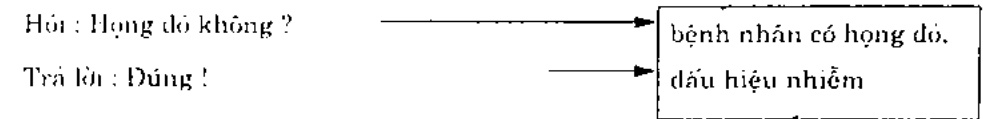

Luật 2 được cháy, do vậy "có dấu hiệu nhiễm khuẩn"

Bước 9. Xem luật 1. giả thiết 2 "có nội tạng viêm"? Không

Bước 10. Tìm các luật có giá thiết trong phân THEN của luật 3

Bước 11. Tiếp theo là các suy diễn như trình bày. Tất cả ba giả thiết của luật 3 là số khởi có được do trao đổi với người bệnh.

Chà sù thu được các câu trả lời đúng. Hệ thống bổ sung kết luận "chắc chẩn có cơ quan nội tạng bị viêm" vào bộ nhỏ, do luật 3 cháy

Bước 12. Luật 1 cháy, thêm kết luận vào bộ nhớ.

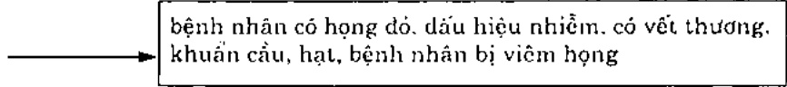

bệnh nhân có họng dò, dấu hiệu nhiễm, có vết thương, khuẩn cầu, hạt, bệnh nhân bị viêm họng

"Bệnh nhân bị viêm họng"

Hình 4-5. Các bước suy diễn lủi.

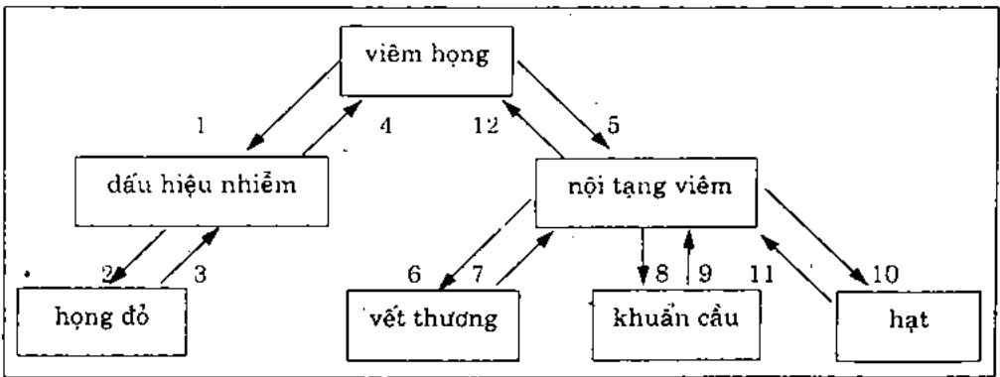

Hình 4-6. Quả trình suy diện lủi được thể hiện trên đô thị.

<!-- page: 97 -->

## II.3.2. Lên lịch các dịch

Suy đến lùi đơn giản chí có một dịch cần chứng minh. Môi hệ thống suy diễn lùi có ít nhất một dịch để bắt đầu. Tuy nhiên nhiều ứng dụng cần một xấu các đích theo dãy đá sắp đạt thủ tự. Cái này gọi là lịch các dịch.

## Định nghĩa 4-10 : Lịch các dịch (Goal agenda)

Một xản các đích tuần theo thử tự mô tả trước.

Lịch các dịch có thể chỉ là liệt kê thứ tự một hai. Hệ thống sẽ thực hiện các dịch theo thứ tự xuất hiện trong lịch. Người ta dùng lịch các dịch loại này khi về bản chất, bài toán được trình bày theo quá trình tuần tự.

Người ta có thể chỉ thị cho hệ thống cái cần làm khi dích được chứng minh. Chắng hạn như quyết định để hệ thống tiếp tục chứng minh các dích khác hay dùng lại. Cũng có thể duta rạ lịch phúc tạp để hệ thống biết phải làm gì khi dích dùng/sai.

Việc dùng lịch các dịch được dùng nhiều trong trường hợp người dùng muốn có nhiều thông tin về vấn đề đang xét. Tủy theo mức độ thống tin đã đạt được mà họ có thể suy diễn tiếp.

## II.3.3. Các đích do người dùng đặt ra

Khi thiết kế lịch các đích. cần xác định thủ tự hệ thống tìm đích. Danh sách có thủ tự này là cứng nhắc. ngân cần hệ thống dùng được các điểm mạnh của thông tin về bài toán trong quá trình giải quyết vấn đề.

Thi du

Giả sử cần chân đoán sai sót trong hệ thống chuyển mạch truyền thông lớn, gồm. mudi modun khác nhau, người ta có thể xếp lịch các modun kể tiếp. Do cháng có lý do gì đảm bảo modun này dễ hông hơn modun kia, khi xảy ra sự có người ta có thể kiểm tra lần lượt :

1. Xác định sai trong modun 1

2. Xác định sai trong modun 2

## 10. Xác định sai trong modun 10

Nhung nếu có khối bốc lên tại modun thứ mươi. kỹ thuật viên cầu cứu hệ thống. Hệ thống kiểm tra lần lượt từ modun thứ nhất đến modun thứ chín thì modun cuối cùng đã tiêu tan.

Đế tránh loại trực trắc này hệ thống được thiết kế với người dùng thông minh. "Thông minh" có nghĩa người sử dụng có thông tin hướng dẫn hệ thống làm việc. Cách đơn giản là cho phép người dùng truy nhập đến thực đơn kiểm tra các, modun để chọn

<!-- page: 98 -->

ngay modun có vấn đề. Nếu người dùng cháng có thông tin nào, hệ thống thực hiện theo lịch đã vạch ra. Người ta có thể dùng ý tưởng này khí hệ thống có phiếu đích con.

## II.3.4. Các dịch do luật tạo ra

Đối với một vải ứng dụng, khi thực hiện các luật lại sinh ra các đích mới. Tiếp cận này cho phép hệ thống thích nghi với việc tìm kiếm tùy theo kết quả tìm. Đề minh họa, xét thi dụ sau.

## Thí dụ

Cân chọn bóng bán dẫn của bộ khuyến đại công suất. Về kỹ thuật người tại dùng bộ phận giám nhiệt khi cần công suất quá ngưỡng nào đó. Bộ hạ nhiệt làm tòa nhiệt bán dẫn để bán dẫn làm việc lâu dài. Do bộ hạ nhiệt không nhất thiết phải có, người ta dùng các luật sau để thay đổi đích của hệ thống :

## IF Đầu ra của bộ khuyêch đại quá 10 W

## THEN Cần dùng bán dẫn công suất cao

## AND Tạo dịch mới để thiết kế tốianni nhiệt bán dẫn.

Việc cho phép hệ thống điều khiển thao tác dựa trên các thông tin tìm được là một khóa cạnh quan trọng trong hệ thống trí tuệ nhân tạo. Một cách cho phép làm điều này là dùng luật thay đổi dịch hệ thống. Loại luật đặc biệt như vậy gọi là luật meta.

## II.4. Ủy nhược điểm của các kỹ thuật suy diễn

Suy diễn tiến và suy diễn lùi là hai kỹ thuật suy diễn cơ bản trong hệ chuyên gia. Việc phân tích uu nhược điểm của từng loại kỹ thuật nhằm sử dụng chúng phù hợp trong các ứng dụng.

## II.4.1. Uu điểm của suy diện tiến

\- Ủy điểm chính của suy diễn tiến là làm việc tốt khi bài toán về bản chất di thu thập thông tin rời thấy điều cần suy diễn.

\- Suy diễn tiến cho ra khối lượng lớn các thông tin từ một số thông tin ban dấu. Nó sinh ra nhiều thông tin mới.

\- Suy diễn tiến là tiếp cận lý tương đối với loại bài toán cần giải quyết các nhiệm vụ, như lập kế hoạch, điều hành, điều khiển, và diễn dịch.

<!-- page: 99 -->

## II.4.2. Nhuộc điểm của suy diện tiến

\- Một trong nhiều điểm chính của hệ thống suy diễn tiến, là không cảm nhận được rằng chỉ một vài thông tin là quan trọng. Hệ thống hơi các câu hơi có thể hôi mà không biết rằng chỉ một ít câu đã di đến kết luận được.

\- Hệ thống có thể hôi cả câu không liên quan. Có thể các câu trả lời cũng quan trọng, nhưng làm người dùng lùng từng khi phải trả lời các câuチャ chăng dinh đến chú đề.

## II.4.3. Úu điểm của suy diễn lùi

\- Một trong các ưu điểm chính của suy diễn lủ là phù hợp với bài toán dựa giá thuyết rời xem liệu gia thuyết đó có dùng không.

\- Suy diễn lủi tập trung vào đích đã cho. Nó tạo ra một hoạt câu hỏi chỉ liên quan đến vấn đề đang xét, đến hoàn cảnh thuận tiện đối với người dùng.

\- Khi suy điện lùi muốn suy diễn cái gì đó từ các thông tun đã biết, nó chỉ tìm trên một phần của cơ sở trí thúc thích dáng đối với bài toán đang xét.

\- Suy diễn lủi được đánh giá cao trong các bài toán giải quyết nhiệm vụ như là chẩn đoán, dự đoán, và tìm lỗi.

## II.4.4. Nhuộc điểm của suy diện lùi

Nhược điểm cơ bản của loại suy diễn này là nó thường tiếp theo dòng suy diễn, thay vì đúng ra phải dùng ở đó mà sang nhánh khác. Tuy nhiên có thể dùng nhân tố tin cây và các luật meta để khắc phục.

## II.4.5. Chọn giữa suy diện tiến và suy diện lùi

Việc chọn loại suy diễn nào có thể dễ trả lời sau khi đã biết tất cả ưu khuyết điểm của từng loại suy diễn. Đề trả lời người ta còn phải thông suốt về việc "hiếu vấn đề ra sao ?"

Xem cách các chuyên gia giải bài toán thể nào có thể giúp ta lựa chọn phương pháp thích hợp. Chuyên gia thu thập thông tin về vấn đề rối dùng thông tin đó hướng dẫn việc suy diễn.

\- Vấn đề là phải xem xét một số kết luận có thể dùng được và các dữ hiệu sẵn có. Chắng hạn bác sĩhiểu hàng trăm vấn đề có thể xảy ra với một cá nhân, nhưng vẫn phải tìm hiểu hiện trạng của bệnh nhân, lúc đó cần dùng suy diễn tiến. Ngọc lại bác sĩ hâu như thấy được bệnh viêm họng thì ông ta dùng suy diễn lủi.

<!-- page: 100 -->

\- Cần xem vấn đề cần chúng minh đã được thực hiện trong quá khử chưa. Thường thì người ta có thể dùng kinh nghiệm và kỹ thuật đã dùng đối với vấn đề mái.

\- Việc chọn một kỹ thuật có thể không phù hợp ngày. Tuy nhiên người ta có thể thay đổi kỹ thuật để được một suy diễn tốt hơn.

Từ hai cách suy diễn, có các nhận xét về việc lựa chọn cách suy diễn phù hợp nào trong hai cách suy diễn :

\- Nôn chọn cách nào để sẽ sản sinh ra nhiều trạng thái, vi để dàng di từ nơi ít trạng thái đến nơi nhiều trạng thái.

\- Nên chọn trường hợp ít rẽ nhánh. và

\- Nên chọn cách nào cho phép tiến hành hội thoại, trao đổi giữa người và máy: hội thoại cảng mang tính người cảng thuận lợi. Thị dụ về suy diễn có hội thoại là MYCIN. là hệ chuyên gia y học dùng cho chẩn đoán bệnh nhiễm trùng máu và chọn kháng sinh trị hiệu. Dây là hệ sản xuất lủi. Ngoài các thành công được ca ngội. MYCIN có ảnh hưởng lớn do việc xử lý trường hợp không chắc chắn.

Có bài toán có thể áp dụng suy diễn tiến hay suy diễn lùi đều di đến kết quả. Tuy nhiên cũng có thể dùng cá hai loại suy diễn khi giải một bài-toán. Việc dùng cá hai phương pháp suy diễn đôi khi không gặp nhau ở trạng thái giữa như người ta nghĩ. mà có khi hai suy diễn không đưa đến bắt ki trạng thái chung nào.

Tôm lại, khi cần quyết định chọn kỹ thuật suy diễn tiến hay lủi, cần lưu ý vài chẽm sau:

1. Chuyên gia giải nó ra sào ?

2. Nếu cần thu thập dữ hiệu rối mới quyết định suy diễn cái gì, thì dùng suy diễn tiến.

3. Đã có giả thuyết, cần chúng tố đích này thì dùng suy diễn lùi.

4. Cần xem không gian bài toán có bao nhiều kết luận, có bao nhiều dữ liệu?

5. Có kết quả tương tự trong quá khú chua?

6. Thiết kế rối chỉnh lý để có kỹ thuật phù hợp.

## II.5. Kết hợp suy diện tiến và suy diện lùi

Nhiều hệ thống trị tuệ nhân tạo dùng cả suy diễn tiến lẫn suy, diễn lùi. Người thiết kế kết hợp kỹ thuật suy diễn tiến và suy diễn lùi theo một trong hai phương pháp. Phương pháp thử nhất là dùng các hệ thống phân tách, mỗi hệ thống có một kỹ thuật suy diễn riêng. Phương pháp thử hai, sử dụng chức năng đặc biệt gọi là ma thuật. Ma thuật này hoạt động theo suy diễn tiến.

<!-- page: 101 -->

## 11.5.1. Các hệ thống phân tách

Bài toán lớn có thể được chia thành nhiều bài toán con. Đối với vấn đề phúc tạp, người thiết kế hệ thống trí tuệ nhân tạo thường chia vấn đề thành các nhiệm vụ nhỏ với thiết kế bài toán con ứng với mỗi nhiệm vụ. Ua điểm của tiếp cận này là mỗi hệ thống có kỹ thuật suy diễn riêng.

## 11.5.2. Ma thuật

Thiết kế dùng suy diễn tiền và suy chiến lủi có dùng các luật ma thuật.

## Dịnh nghĩa 4-11 : Ma thuật (Demon rules)

Luật được cháy ngay khi giá thiết khớp với các nội dung của bộ nhớ làm việc.

Luật ma thuật có trong các luật suy diễn lùi nhưng nó không áp dụng trong quá trình suy diễn lùi. Hơn thế, nó còn chưa hoạt động ngay cả khí thông tin trong bộ nhớ đã đủ điều kiện khớp với giả thiết của nó. Khi dùng mà thuật, các luật này cháy hết và bổ sung kết luận vào bộ nhớ. Những thông tin mới này có thể hỗ trợ các luật suy diễn lùi, hay có thể kích hoạt các ma thuật khác, tạo nên dây các suy diễn tiên. Một luật ma thuật cho phép hệ thống tự biến đổi, đặc biệt cho đổi với các ứng dụng cần thích nghi với hoàn cảnh mối.

## Thi dụ

Dùng luật điều khiển trong việc chẩn đoán các vấn đề của nhà máy. Các luật này được coi như là luật ma thuật để thay thế việc kiểm tra tuần tự. Giá sử có vải chiếc máy làm việc cùng nhau để sản xuất ra vải sản phẩm. Một máy trực trực, dây chuyển sản xuất cần dùng trong lúc cần thực hiện việc chẩn đoán máy móc. Giá sử hệ thống dùng suy diễn lùi.

Trong lúc chẩn đoán, hệ thống cần thực hiện và bước thao tác như ngắt diện, giảm áp suất... Nó cũng cần thu thập thông tin để xác định nguyên nhân hỏng học và làm các thao tác khác phục. Dương nhiên có thể có sự kiện bất thường, sự kiện làm ngắt quá trình chẩn đoán bình thường của hệ thống dễ tới ngay sự kiện đó. Khả năng này ứng với luật ma thuật những trong hệ thống chẩn đoán :

Luật ma thuật 1. Văn dê áp suất

## IF Nguồn mát

$$
\text {AND} \text {Áp suất quá 1000}
$$

$$
\text {THEN} \quad \text {Vân   đế} = \text {vân   đế   áp   suất}
$$

Luật ma thuật 2. Tỉnh trạng khẩn cấp

$$
\text {IF} \quad \text {Ván   dê = ván   dê   àp   suát}
$$

<!-- page: 102 -->

$$
\text {THEN} \quad \text {Tình trạng} = \text {khân cấp}
$$

Luật ma thuật 3. Sơ tín

$$
\text {IF} \quad \text {Tinh trạng} = \text {khân cấp}
$$

$$
\text {THEN} \quad \text {Trả lời} = \text {cần phải số tán}
$$

Có thể dùng luật ma thuật tương tự như luật 2 để phân loại các tỉnh trạng trong nhà máy theo bình thường, bảo động... Luật ma thuật 3 cho cấu trả lời thích hợp cho hoàn cảnh Kaplan cấp.

Thí dụ này mô tả cách nhưng luật ma thuật vào hệ thống suy diễn lời, đáp ứng các điều kiện thay đổi. Người ta có thể dùng nó để làm thích nghi việc suy lý của hệ thống với các sự kiện hiện tại. Tiếp cận này có ý nghĩa về thời gian thực. được gọi là suy diễn theo sự kiên.

## III. CÂY/ ĐÔ THỊ BÀI TOÁN

## III.1. Biểu diễn trạng thái trên cây bài toán

Cách đơn giản để mô phỏng chiến lược tim kiểm, hay gọi là tìm lời giải là tiến hành duyệt trên cây. Các nút của cây được nở ra dân dán bắt đầu từ trạng thái đấu bằng cách áp dụng các luật.

Thí dụ

Bài toán lấy nước sử dụng hai xô, một chiếc loại 4 lit và chiếc kia loại 3 lit. Làm thể nào để có 2 lit trong xô loại 4 lit?

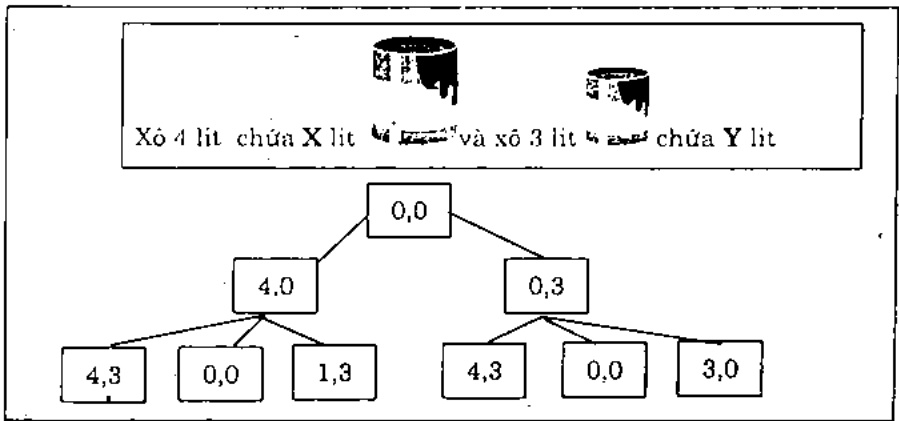

Hình 4-7. Cây bài toán "láy nước".

<!-- page: 103 -->

Nguồn ta dược phép lấy nước đầy xổ và trút nước từ xổ nợ saping xổ kia. Cây ứng với bài toán này gồm các nút, trong đó mỗi nút ứng với trạng thái x, y mà x là lượng nước trong xổ 4 lit, y trong xổ kia.

Quả trình này thường hiện ra nhiều lần một trạng thái, thí dụ như trạng thái (4.3), do cây là đồ thị tự do có hướng. Nhu vậy để tránh lăng phí, người ta dùng khái niệm đồ thị định hướng. Đỗ thị ở dây khác cây ở chỗ có nhiều cung trở vào một nút.

Thủ tục tìm trên cây có thể chuyển thành trên độ thị, bằng cách biến đổi thao tác cho mỗi nút được tạo. Thay vì tạo thêm một nút khí áp dụng một luật, người ta kiểm tra xem nút đó đã có hay chưa; nếu chưa, thêm nút mới vào độ thị; nếu không, tạo con trở đến nút mới. Trong trường hợp cần tính giá tối ưu, người ta ghi nhớ đường di, xét dưỡng mối là tốt hay kém so với đường cũ; nếu được đường di tốt hơn, phải cập nhật thông tin này, còn đường mối không tốt hơn, người ta coi đó là bình thường.

Trong đó thị tìm kiếm xuất hiện chu trình thì không thuận lợi. Việc tìm trên đó thị sẽ tiết kiệm được sức lực, do không phải qua nhiều nút như nhau, tuy nhiên phải tôn thời gian để kiểm tra một nút đã tổn tại trước khi thêm nó vào đồ thị. Việc lựa chọn việc cải đặt cây hay đồ thị phụ thuộc vào từng bài toán cụ thể. Tìm kiểm trên đó thị là tốt cho hệ sản xuất giao hoán từng phần, trong đó tập các phép xử lý cho ra kết quả mà không phụ thuộc vào thủ tự áp dụng các phép.

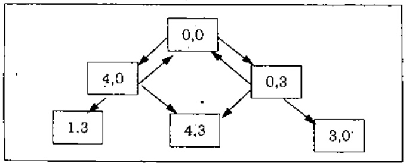

Hình 4-8. Đồ thị định hướng của bài toán "láy nước".

## III.2. Biểu diễn tri thức khi giải bài toán

Trước khi áp dụng các phương pháp giải, cần biểu diễn các nút độ thị, thể hiện một trạng thái của bài toán, chữ chưa cần đến cây các nút. Sau nửa mối là nhu cầu thể hiện các trị thức. Thị dụ trong các bài toán đã kể :

\- Trong trò chơi cò, ma trận được chọn, mỗi phần tử của ma trận chữa một chữ: hoặc là dùng danh sách liệt kê các vị trí của các quân cò.

<!-- page: 104 -->

\- Trong bài toán lấy nước, dùng cập số (x,y).

• Đối với các bài toán phức tạp hơn, việc tách thành nhiều bài toán nhỏ là cần thiết. Trọng thái của bài toán là hợp các trạng thái của các bài toán nhỏ.

Lúc này cần quan tâm đến từng chi tiết, cháng hạn xử lý các đối tượng, các sự kiện riêng lẻ trong các bài toán nhỏ, liên hệ giữa các đối tượng đơn lẻ và các khái niệm chung, và cách thể hiện hiệu quả các dây trạng thái trong bài toán con và bài toán lớn.

Hai thi du dàu là choi cò và lấy nước liên quan đến việc biểu diễn tri thúc. Tuy phúc tạp nhưng đã có và kỹ thuật. Tri thúc được xem là thông tin về các đối tượng với các thuộc tính, về mối quan hệ giữa các đối tượng.

Thi dụ về bài toán phúc tạp liên quan đến quá trình tìm, mô tả một nút bằng đường đi từ nút đầu đến nút đó. Tri thức có thể được mô tả theo khuôn mẫu, như khung do J. McCarthy giới thiệu năm 1939. Trong và lĩnh vực, công việc khó khăn là thể hiện tổng thể các sự kiện, trong đó phải chỉ ra được những thay đổi có ý nghĩa.

## Thí dụ

Trong bài toán về người máy, mẫu gỗ được đặt trên mặt bàn, dưới của số. Khi dịch chuyển bản, dưỡng nhiên phải ghi nhận việc di chuyển cả mẫu gỗ, chú của số thi đúng nguyên.

Liên quan đến việc thay đổi các trạng thái, người ta có nhận xét là khi thay đổi các trạng thái, từ trạng thái đầu đến trạng thái nào đó mà không thể quay lui thì cần phải ghi nhỏ lại các trạng thái ấy. Đề có thể thực hiện lại các chức năng đã làm, các trạng thái trung gian đều được ghi lại; việc này gây tốn kém về thời gian và bộ nhớ. Hơn nửa nếu cần thiết, các thay đổi trạng thái cần được gắn với mốc thời gian.

## IV. QUAY LUI VÀ QUẢN LÝ CÁC TRỊ CHÂN LÝ

Logic có thể dùng làm cơ sở cho các phương pháp giải. Dưới dây giới thiếu việc chứng minh các menses để bằng cách lan truyền ràng buộc. Dầu ràng việc chứng minh định lý theo cách giải bình thường đã rất mạnh, việc chứng minh bằng lan truyền ràng buộc có điểm mạnh khác. Chắng hạn nó giúp giữ được đường kiểm chứng nhỏ các thủ tục quản lý trị chăn lý để rút ra các giả định mà không cần suy diễn thừa.

Trước hết để cập quay lui phụ thuộc trực tiếp và so sánh với quay lui theo thời gian. Ý chính này sẽ được minh họa qua việc lập lịch hoạt động.

## IV.1. Quay lui theo thời gian và quay lui theo sự phụ thuộc

Khi giải bài toán với nhiều điều kiện ràng buộc, cần thiết dưa ra giải pháp đáp ứng hết các yêu cầu của bài toán và thỏa mãn các ràng buộc. Trong quá trình giải, khi

<!-- page: 105 -->

phát hiện thấy có điều kiện nào đó không thỏa mãn, người ta có thể di nguộc lại để chanh lý hoặc để xuất phương án khác. Khi quay lại, có thể :

\- Quay lui theo thời gian, tức là theo trình tự tự nhiên của công việc.

• Quay lui theo sự phụ thuộc trực tiếp giữa các hoạt động, không theo thời gian.

## IV.1.1. Các hộp điều kiện ràng buộc

Tường tương ràng mỗi ngày trong tuần người ta cần thực hiện một hoạt các hoạt động. Các lựa chọn gồm việc giải trí, luyện tập hay nghiên cứu. Cảc lựa chọn bị ràng buộc để đạt được mục đích là người ta phải giải trí trong tuần, luyện tập cũng như học tập/nghiên cứu đầy đủ, mà không được tiêu nhiều tiền. Giá sử có với khả năng :

\- Thử ba, thứ tự và thứ năm là ngày nghiên cứu. Người ta có thể nghiên cứu hai, bên bay sâu giờ hoặc không nghiên cứu gì cả.

\- Thứ hai và thứ sáu là các ngày luyện tập. Người ta có thể tập di bộ, được tính là 5 đơn vị luyện tập; di ngựa 10 cây số, được tính 10 đơn vị luyện tập; tập tại câu lạc bộ được tính 15 đơn vị luyện tập. Vé vào câu lạc bộ 20 \$, tỉnh cả ürün taxi.

\- Thứ hai và thứ sâu cũng là ngày nghi. Người ta có thể di ăn, hết 20 \$, được tính 2 đơn vị nghi ngoi. Hoặc người ta có thể đọc sách, được tính 1 đơn vị nghi ngoi. Nếu không làm gì thì được tính là 0 đơn vị nghi ngoi.

Ngoài ra còn giả thiết răng hàng tuần để giữ sức khoẻ và đều dân. cần nghiên cứu 6 giờ, có 2 đơn vị nghị và 20 đơn vị luyện tập. Đề giữ ngân quỹ bình thường cần hạn chế chỉ tiêu chỉ 30 \$ mỗi tuần.

Tất cả giả thiết có thể được diễn tả trên mạng ràng buộc số. Các lưa chọn được ghi trong hộp chọn. Các số được lan truyền qua hộp cộng. Các nhu cầu trong tuần được ghi trong hộp hạn chế. Nếu giả trị tại dấu hộp hạn chế ra khói dài cho phép, kể hoạch là không chấp nhận được. Giả sử người ta lập kế hoạch :

\- Thú hai, e rǎng mua khó di bộ và cuôi ngua, do vay lụa chọn đến câu lạc bộ. Việc này tôn thời gian, không thể giải trí được.

♦ Thút ba dành 2 giờ để nghiên cứu.

• Thử tư nghiên cứu thêm 2 giờ nửa.

• Thú năm nghiên cứu thêm 2 giờ nửa.

♦ Thú sáu có thể di bộ và đọc sách.

<!-- page: 106 -->

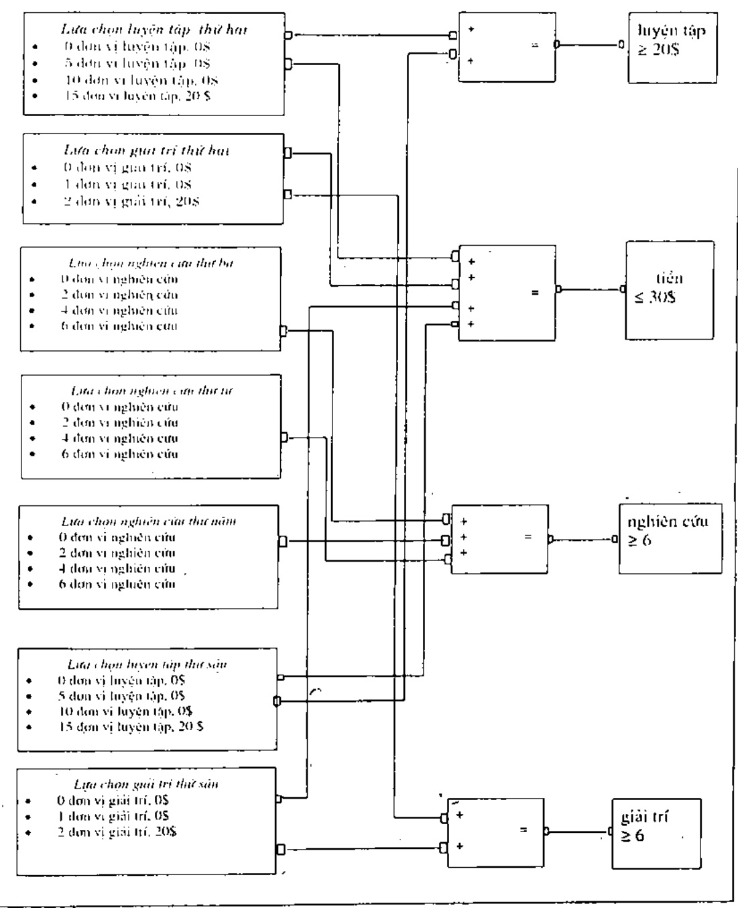

Hình 4-9. Mạng ràng buộc số thể hiện các ràng buộc kế hoạch hoạt động. Có ba loại hộp, là hộp chọn, hộp cộng và hộp hạn chế.

<!-- page: 107 -->

Số giá Ion truyền các lựa chọn này qua mạng ràng buộc số đến các hợp hạn chế. Trình của cây đã đạt Shift câu nghiên cứu, vì đã đạt 6 giờ nghiên cứu, được tính 6 đơn nghiên cứu. Luyện tập cũng đã đủ, vì đã có 20 đơn vị luyện tập. Chỉ còn vấn đề giải trung của được xếp. Hơn nĩa không thể đi ăn được, do đã tiêu 20 \$ tại câu lạc bộ.

Đơn vịy cần thay đổi các lựa chọn. Văn đề là làm sao có thể tìm thấy nhanh chóng vượt kỳ hoạch tốt trong khi vấn duy trì kế hoạch tối?

## IV.1.2. Quay lui theo thời gian

Một cách xử lý một kế hoạch tối là từ chối lựa chọn vừa mới làm và các hậu quả của nó, để chọn lựa chọn khác và tiếp tục. Nếu tất cả các thay thế tại điểm chọn này đã được sử dụng thì quay lưu lại cho tối khi có thay thế chưa dùng.

Toàn bộ quả trình dưỡng như di trong mê cung. Khi gặp ngõ cụt, tите điểm chết, cần xử lý để di tiếp. Quả trình này đã được giới thiệu trong tìm kiếm sâu. Phân thủ tục ứng với điểm chết này được gọi là quay lui theo thời gian, thực hiện lại những việc đã làm trong quá khử. Việc quay lui theo thời gian bắt đầu ngay khi phát hiện ra một điểm chết, quy định theo mô tả sau :

Dịnh nghĩa 4-12: Quay lui theo thời gian (Chronological backtracking)

Quay lui theo thời gian được thực hiện khi người ta đến điểm chết : cho đến khi thấy được một lựa chọn thay thể chưa dùng thi :

• Rút lúa chọn vừa làm.

• Hủy các hậu quả do lựa chọn vừa rút gây ra.

• Di tiếp, thực hiện lựa chọn mới.

Việc quay lui theo thời gian như lịch thí dụ trên bất dấu từ thú sâu, khi đó lần ngược mai, thực hiện nhiều lần quay lui. Nó cần qua 4$^{4}$ = 64 tổ hợp trước khi đến được điểm có vấn đề.

Do vay quay lui theo thời gian có thể không hiệu quả và lăng phí thời gian. Trong bài toán thực, các thao tác không hiệu quả có thể làm hệ thống giải bài toán trở nên không thực tế.

## IV.1.3. Quay lui không theo thời gian có dùng sự phụ thuộc

Giải pháp cho việc xử lý kẽ hoạch sai mà không phải truy tìm tất cả các phương án thay đổi là nhớ lại đường lan truyền dẫn đến điểm chết từ các hợp chọn đến các hợp hạn chế.

<!-- page: 108 -->

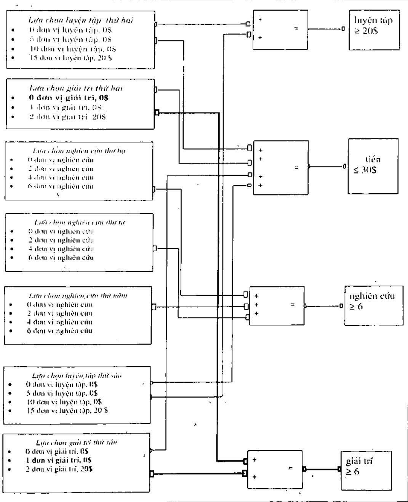

Hinh 4-10. Mạng ràng buộc số cho phép quay lui không phụ thuộc thời gian.

<!-- page: 109 -->

'Thi dy

Trong kế hoạch trong thí dụ trước, dưỡng đánh dấu tổ dặm cho thấy hộp giải trí chưa được ổn thỏa do việc lựa chọn vào thứ hai và thứ sáu không tương thích với nhu cầu giải trí hàng tuần. Bời thể cần xem xét để thay đổi lựa chọn này.

Trong hình là mạng ràng buộc số cho phép quay lui không theo thời gian. Người ta xác định nguyên nhân các các đối tượng không phủ hợp bằng cách di ngược lại theo các hộp công.

Thủ tục để xác định các lựa chọn không phù hợp gọi là quay lui phụ thuộc trực tiếp, để nhân mạnh rằng các lựa chọn rút ra là cải mà điểm chết phụ thuộc vào. Thủ tục còn được gọi là quay lui không theo thời gian, để thấy yếu tố thời gian không là quyết định trong việc quyết định lựa chọn nào sẽ bị rút.

## Định nghĩa 4-13 : Quay lui không theo thải gian (Nonchronological backtracking)

Quay lui không theo thời gian khi gặp ngõ cụt thì thực hiện :

• Đi nguộc lại theo các phụ thuộc, vừa định tên các điểm lựa chọn gây ra
\* ngõ cut.

\- Dùng phương pháp tìm sâu đế tìm tổ hợp các lựa chọn tại các điểm chết đã gây ra ngõ cụt.

Phương pháp tìm sâu sẽ được trình bày sau. Trong cách quay lui này, chỉ rút các lựa chọn phát hiện thấy. Do vậy, quay lui không theo thời gian là cách hiệu quá trong việc tìm ra các lựa chọn tương thích di kèm với việc di ngược lại dựa trên các phụ thuộc.

## IV.2. Chứng minh bằng cách lan truyền ràng buộc

Các mục trên vừa cho thấy cách quay lui không theo thời gian và quay lui phụ thuộc trực tiếp trong hoàn cảnh các giá trị số được coi là bền vững, tục không thay đổi trong quá trình giải bài toán. Trong ngũ cảnh khác người ta dùng giá trị chân lý và các phép toán, logie thi mạng lan truyền trị chân lý gồm :

\- Các hộp chân lý chuá các giá trị đúng/ sai, và

\- Các hợp lán truyền trị chân lý để lan truyền các giá trị logic.

## IV.2.1. Có thể lan truyền trị chân lý

Logic và việc lan truyền ràng buộc có các điểm gần gửi do một vài nguyên nhân :

\- Các mạng lan truyền trị chân lý nhân mạnh ý cho rằng việc chúng minh định lý có thể xom như khám phá các ràng buộc.

<!-- page: 110 -->

\- Các mạng lan truyền trị chấn lý thuận lợi trong việc theo dôi cái giá trị đã xảy ra thông qua việc thực hiện hay rút di các gia định. Chính ý này làm người ta liên tưởng đến khái niệm quản lý trị chấn lý.

\- Dùng mạng lan truyền trị chán lý để dàng thấy mối phụ thuộc trực tiếp. Việc quav lui không theo thời gian giúp người ta chính lý các mài thuần khi dùng các giả định không thích hợp.

## Thi du

Đế thấy việc kết hợp, giữa lan truyền ràng buộc và logie ra sao, xét hai người là anh Mổ và chỉ Hoa. Giá sử Mổ thích Hoa, vậy khi Hoa vui thi Mổ cũng vui. Điều này viết theo dạng "nếu Hoa vui thi Mổ vui". Liệu có thể dùng lan truyền ràng buộc để suy diễn về trạng thái vui không?

Trước tiền cần tạo các hộp trị chẩn lý cho các biểu thức logic với ghi chủ đúng/ sai. Biểu thức vui (Hoa) → vui (Mỗ) cũng mang trị logic trong một hộp nào đó. Biểu thức này gần: với hai literal vui (Hoa) và vui (Mỗ), có giá trị đúng/ sai.

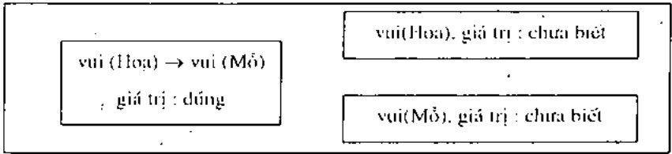

Hình 4-11. Các hộp giá trị chân lý.

Hộp ứng với vui (Hoa) → vui (Mỗ) có giá trị đúng. Giá trị trong hộp literal chưa thể kháng định được, tức chưa biết được chúng đúng hay sai.

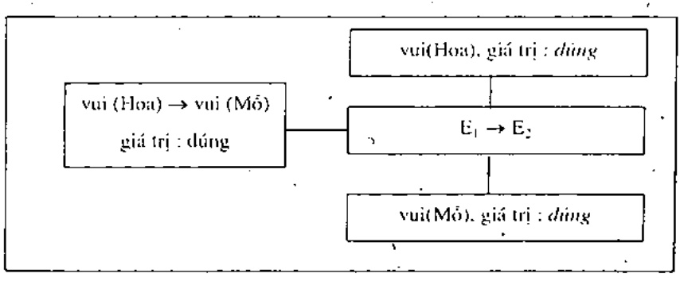

Hình 4-12. Mạng lan truyền trị chân lý.

<!-- page: 111 -->

Nếu có kháng định Hoa vui về thi vui (Hoa) đúng và giá trị vui (Mổ) cần là đúng. Xét sự lan truyền qua các ràng buộc, người ta muốn ràng trị chân lý của hộp vui (Hoa) và của hộp vui (Hoa) → vui (Mổ) quyết định giá trị của hộp vui (Mổ). Yêu cấu này được thể hiện qua việc lan truyền trên hình. Vậy các mạng lan truyền trị chân lý chúa cả hộp chân lý và hộp lan truyền chân lý.

Nhìn chung mỗi liên kết logie có một cập biểu thức và xác định ràng buộc giữa trị chân lý của biểu thức và của tổ hợp hai biểu thức. Do vậy để cải đặt một mạng lan truyền trị chân lý với tập các biểu thức logie đã có, người ta cần có hợp lan truyền chân lý cho mỗi liên kết logie. Thông thường các liên kết logie đã có mặt trong các biểu thức logie.

Người ta cần biết cách thức mỗi loại hộp lan truyền chân lý quản lý các ràng buộc. Dựa vào giá trị của hộp chân lý người ta xác định được giá trị tại các hộp khác.

Giá trị của hợp $E_1 \to E_2$ có các hệ quả logic dưới đây. Chúng sẽ được chủng tố ngay trong trang sau.

$$
\begin{array}{l l}\bullet&\neg E _ {1} \vee E _ {2} \vee \neg (E _ {1} \rightarrow E _ {2})\\\bullet&E _ {1} \vee (E _ {1} \rightarrow E _ {2})\\\bullet&\neg E _ {2} \vee (E _ {1} \rightarrow E _ {2}).\end{array}
$$

Trong các biểu thức hợp logic trên có ít nhất một thành phần đúng. Mỗi biểu thức là yêu cầu đối với các thành phần tham gia, gọi là biểu thức ràng buộc. Người ta có thể cải đặt các ràng buộc ứng với các hợp lan truyền chân lý bằng cách đúng các thủ tục when-written.

Bảng các biểu thức ràng buộc người ta dễ dàng xây dựng các thủ tục when-written cho phép xác định loại của hợp lan truyền ràng buộc. Thủ tục này quản lý các biểu thức ràng buộc đối với các hợp chân lý suy diễn, được xác định theo cách như sau.

Khi một giá trị được viết vào một đầu của hộp chân lý thì :

\- Nếu $E_1$ đúng và $E_2$ sai thì ghi sai vào ngân suy diễn.

\- Ngược lại, nếu $E_1$ đúng và bên suy diện là đúng, thì ghi đúng vào ngân của $E_2$.

\- Ngược lại nếu $E_{2}$ sai và bên suy diện là đúng thì ghi sai vào ngân $E_{1}$.

Đế xác định rõ thêm các hệ quả rút ra từ định nghĩa của $E_1 \to E_2$ người ta có thể liệt kê các giá trị chân lý của $E_1, E_2$ và $E_1 \to E_2$:

<!-- page: 112 -->

| $E_1$ | $E_2$ | $E_1 \rightarrow E_2$hiều đúng | $E_1 \rightarrow E_2$hiều sai |
| --- | --- | --- | --- |
| dứng | sai | sai | dứng |
| sai | sai | dứng | sai |
| sai | dứng | dứng | sai |
| dứng | dứng | dứng | sai |

Hinh 4·13. Bảng chân lý minh hoạ cho thủ tục when-written.

Theo bảng trên, để cho hộp $E_1 \to E_2$ hoạt động đúng thì phải thỏa mãn biểu thức logic

$$
- (\mathrm{E} _ {1} \land \neg \mathrm{E} _ {2} \land (\mathrm{E} _ {1} \rightarrow \mathrm{E} _ {2}))
$$

$$
\wedge \neg (\neg \mathrm{E} _ {1} \wedge \neg \mathrm{E} _ {2} \wedge \neg (\mathrm{E} _ {1} \rightarrow \mathrm{E} _ {2}))
$$

$$
\wedge \neg (\neg E _ {1} \wedge E _ {2} \wedge \neg (E _ {1} \rightarrow E _ {2}))
$$

$$
\wedge \neg (\mathrm{E} _ {1} \wedge \mathrm{E} _ {2} \wedge \neg (\mathrm{E} _ {1} \rightarrow \mathrm{E} _ {2}))
$$

Đơn giản các biểu thức và kết hợp dòng hai và ba. hai và bốn, thu được :

$$
(- \mathrm{E} _ {1} \vee \mathrm{E} _ {2} \vee \neg (\mathrm{E} _ {1} \rightarrow \mathrm{E} _ {2}))
$$

$$
\wedge \cdot (\mathrm{E} _ {1} \vee (\mathrm{E} _ {1} \rightarrow \mathrm{E} _ {2}))
$$

$$
\wedge \quad (\neg \mathrm{E} _ {2} \vee (\mathrm{E} _ {1} \rightarrow \mathrm{E} _ {2}))
$$

Nhú vây, diện tả bằng lời được kết luận sau :

<div class="docvortex-algorithm" style="white-space: pre-wrap; font-family:monospace;">
Khối $E_1 \to E_2$ yếu câu :
Yêu câu $E_1$ là sai, hoặc $E_2$ là đúng, hoặc $(E_1 \to E_2)$ là sai,
Yêu câu $E_1$ là đúng, hoặc $(E_1 \to E_2)$ là đúng,
Yêu câu $E_2$ là sai, hoặc $(E_1 \to E_2)$ là đúng.
</div>

Hình 4-14. Yêu câu của logic kéo theo.

Định nghĩa 4-14 : Mạng lan truyền chân lý (Truth-propagation net)
Mạng lan truyền chân lý được thể hiện như mạng lan truyền giá trị mà :

<!-- page: 113 -->

\- Các hộp chân lý mang các giá trị logie. Môi hộp chân lý tương ứng với một literal hay biểu thức.

\- Các hộp lan truyền chân lý tải các ràng buộc logie thông qua các thử tục when-written.

Dó là những thử đã được nêu trước đây cho cho hộp $E_1 \rightarrow E_2$. Bằng các suy luận tương tự cho các hộp thực hiện các phép logie và, hoặc và phủ định, người ta có các kết quả sau :

<div class="docvortex-algorithm" style="white-space: pre-wrap; font-family:monospace;">
Khối $E_1 \wedge E_2$ yêu cầu :
Yêu cầu $E_1$ là sai, hoặc $E_2$ là sai, hoặc ($E_1 \wedge E_2$) là đúng,
Yêu cầu $E_1$ là đúng, hoặc ($E_1 \wedge E_2$) là sai,
Yêu cầu $E_2$ là đúng, hoặc ($E_1' \wedge E_2'$) là sai.
</div>

## Hình 4-15. Yêu cầu của phép toán logic AND.

<div class="docvortex-algorithm" style="white-space: pre-wrap; font-family:monospace;">
Khối $E_1 \lor E_2$ yêu cầu :
Yêu cầu $E_1$ là đúng, hoặc $E_2$ là đúng, hoặc ($E_1 \lor E_2$) là sai,
Yêu cầu $E_1$ là sai, hoặc ($E_1 \lor E_2$) là đúng,
Yêu cầu $E_2$ là sai, hoặc ($E_1 \lor E_2$) là đúng.
</div>

## Hình 4-16. Yêu cầu của phép toán logic OR:

<div class="docvortex-algorithm" style="white-space: pre-wrap; font-family:monospace;">
Khối  $\neg E_{1}$  yêu cầu :
Yêu cấu  $E_{1}$  là đúng, hoặc  $\neg E_{1}$  sai,
Yêu cấu  $E_{1}$  là sai, hoặc  $\neg E_{1}$  là đúng.
</div>

## Hình 4-17. Yêu cấu của phép toán logic NOT.

<!-- page: 114 -->

## IV.2.2. Thiết lập các liên kết đúng dẫn khi lan truyền chân lý Thí dụ

Mở rộng thi dụ đã nêu và trong phân trước : nêu Hoa vui thi Mổ vui, và có thêm chỉ Lan, chỉ Mai. Chỉ Lan thích anh Mổ, vậy nêu Mổ vui thi Lan vui. Giá sử Hoa và Mau vui. Diện tả lại đều này :

$$
\text {vui (Hoa)} \rightarrow \text {vui (Mó)}
$$

$$
\text {vun} (\mathrm{M} \delta) \rightarrow \text {vun} (\text {Lan})
$$

vui (Hoa)

$$
\text {vun (Mai)}
$$

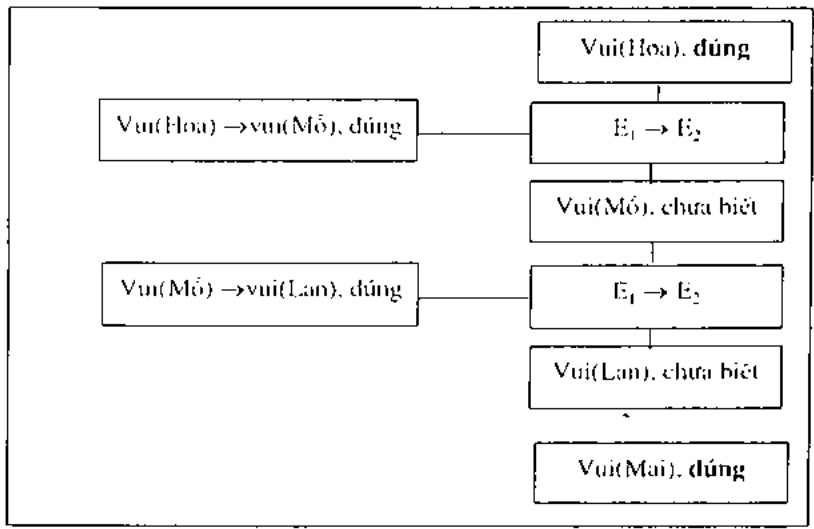

Hình 4-18. Lan truyền trị chân lý.

Bôn biểu thức và các literal được dùng bón hợp chân lý và hai hộp lan truyền chân lý. Hai hộp ứng với hai phép logie kéo theo thể hiện ràng buộc, quyết định các hộp lan truyền chân lý cần thỏa mãn các yêu cầu dưới đáy, theo các kết luận đã thu được trong phần trên :

\- Yêu cầu vui (Hoa) sai, hay vui (Mổ) đúng hay vui (Hoa)→vui (Mổ) sai.

\- Yêu cầu vui (Hoạ) đúng hay vui (Hoa)→ vui (Mổ) đúng.

\- Yêu cầu vui (Mỗ) sai hay vui (Hoa)→vui (Mỗ) đúng.

và

<!-- page: 115 -->

\- Yêu cứu vui (Mổ) sai, hay vui (Lan) dùng hay vui (Mổ)→ vui (Lan) sau.

\- You cầu vui (Mô) đúng hay vui (Mô) → vui (Lan) đúng.

\- You cai vui (Lan) sai hay vui (Mô) → vui (Lan) dimg.

Theo sự lan truyền chân lý thu được vui (Mổ) và vui (Lan). Dế để theo dōi vận hành của các hộp lan truyền, người ta dùng duông nổi từ giá trị dung đến các giá trị của hộp chân lý có mối bên hệ phụ thuộc. Đường nổi này được gọn là liên kết dung đán, bay liên kết trị chân lý đúng. Do vậy thông tin trong hình trên được mô tả lại như sau :

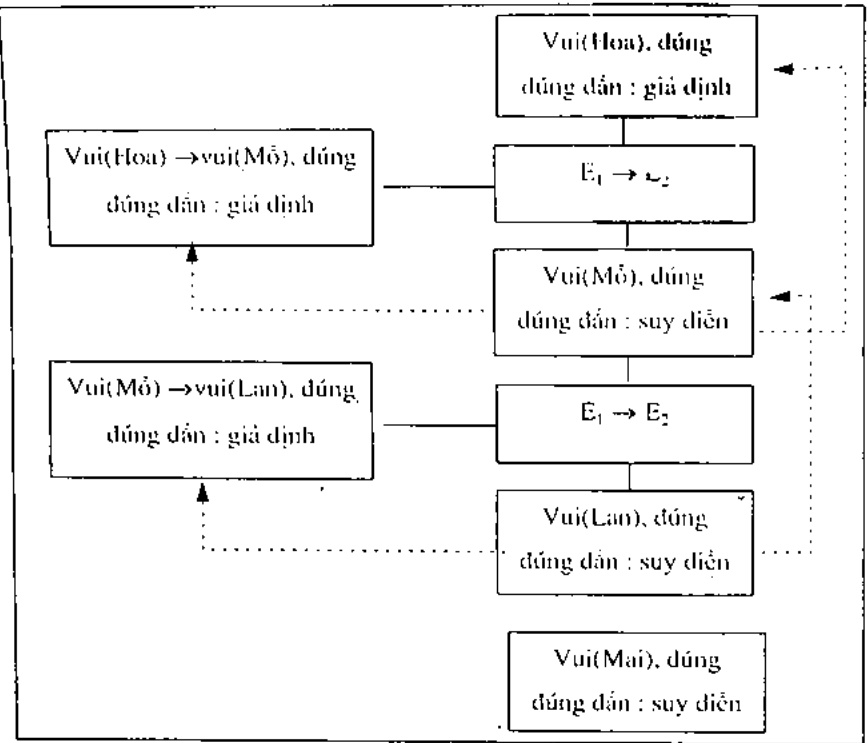

Hình 4-19. Lan truyền trị chân lý có sử dụng liên kết giá trị đúng.

Các đường nổi đúng đán chỉ ra cách mỗi giá trị chân lý được thiết lập. Đường này ứng với đường chấm chấm trong hình.

<!-- page: 116 -->

## IV.2.3. Chính lý ý nghī nhò các đường nôi đúng đán

Lay tiếp thí dụ đã nếu, bổ sung ý môi là Lan châng thích Mai, vậy nén việc Mai vui khien Lan không vui, tức vui (Mai) → ¬vui (Lam).

Biểu thúc mới ứng với hai hộp chán lý và hai hộp kan truyền chán lý bő sung vào thế luận hình về trước. Các yêu cầu với các hộp logie kéo theo đã được liệt kê: riêng hộp ứng với phép logie phù định có các yêu cầu :

\- You cần vui (Lan) là đúng, hay —vui(Lan) là đúng.

\- You câu vui (Lan) là sai, hay -vui(Lan) là sai.

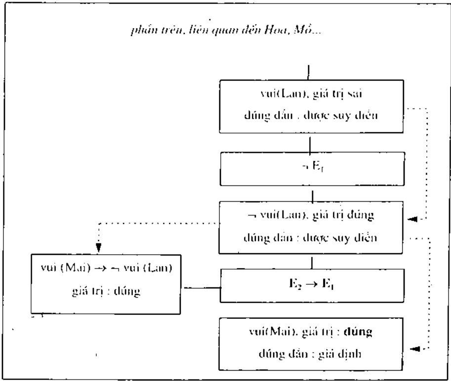

Hình 4-20. Thị dụ về chỉnh lý ý nghị nhà dưỡng nổi đúng dẫn.

Lưu ý rằng việc thực hiện các biểu thức ràng buộc mới này do các hộp lan truyền chẩn lý dẫn đến màu thuẫn. Theo hộp logic kéo theo người ta thu được -vui (Lan), do vui (Mai). Điều này cho biết vui (Lan) là sai, do hộp logic phủ định. Kết luận này trái với kết luận của các hộp lan truyền phía trên. Theo các dưỡng nổi đúng dẫn để kiểm tra giả định nào dưa đến kết luận vui (Lan). ... tới các giả định về Hoa, về Mỗ.

<!-- page: 117 -->

Nhu vay, khi gập màu thuần có thể quay lui theo dưỡng đúng đản, tục là các đường nơi đúng đản cho phép quay lui theo phụ thuộc trực tiếp.

Trong thí dự trên, nếu quay lui theo giá trị dùng của vui (Lan) thì dưa về hạ giả định:

$$
\text {vui (Hoa)} \rightarrow \text {vui (Mô)}
$$

$$
\mathrm{vun} (\bar {M \bar {o}}) \rightarrow \mathrm{vun} (\text {Lan})
$$

vun (Hoa)

Còn nếu quay lui theo giả trị sai của vui (Lan), dưa về hai giả định bổ sung :

$$
\text {vui (Mian)} \rightarrow \neg \text {vui (Lan)}
$$

$$
\text {vui (Mai)}
$$

Đế giải quyết màu thuần người ta có thể xử lý một trong hai bộ gia định, cháng hạn có thể rút gia định vui (Hoa).

Một khi có một giả định bị rút có thể gây ra việc rút các giả định khác vi chung có thể liên hệ phụ thuộc. Tuy nhiên cũng có thể rút đi một vải giả định mà nguyên nhân máu thuần vẫn chưa được giải quyết.

## IV.2.4. Hạn chế của chứng minh bằng lan truyền chân lý

Việc lan truyền trị chẩn lý chỉ xử lý phép toán mệnh đặc. Điều này không cho phép người ta xử lý các biểu thúc có mang biến số. Dương nhiên cũng có bài toán cho phép chuyển các biểu thúc mang biến về các biểu thúc không còn biến, thì tiện cho việc sử dụng lan truyền chẩn lý.

Một nhận xét nửa là cách giải theo lan truyền chân lý không thể chứng minh được tỉnh dùng của các biểu thức. Vậy nên nó không thể là thủ tục chứng minh hoàn chỉnh.

## IV.3. Kết luận về việc quay lui

Một vải kết luận cho các nội dung về sự quay lui và quản lý các trị chân lý :

\- Các lựa chọn số có thể dẫn đến các bài toán trên các hợp hạn chế. Việc quay lui theo thời gian trên các hợp có thể phi thời giờ.

\- Việc quay lui không theo thời gian tập trung vào tính phụ thuộc.

\- Sử dụng tiếp cận lan truyền ràng buộc cho suy luận logie. người ta có thể lan truyền các trị chân lý qua các nút với các biểu thức ràng buộc. Đối khí các giá trị lan truyền không đảm bảo tính bền vững của dữ liệu, khiến người ta phải rút di một số giả định.

<!-- page: 118 -->

\- Phương pháp lan truyền ràng buộc giúpung Sierra để theo dở tính đúng dân của các kết luận. Các đường nổi về tính đúng dân cho phép với các gia đình gây ra máu thuần.

## V. SO SÁNH KHÓP

Một văn để xét đến là làm sao chọn được một luật trong số các luật đồng khả náng để áp dụng cho hoàn cảnh, tức tỉnh đến việc so sánh, hay khớp, các điều kiện dung có và khả náng áp dụng của một luật. Việc chọn đúng luật cán thiết có ảnh hưởng quyết định đến quả trình giải. Có và phương pháp khớp cho phép thực hiện điều này.

## V.1. So sánh các chỉ số

Việc chọn một luật trong số các luật xem ra đơn giản, chỉ việc áp các điều kiện giai thiết vào luật, nếu khớp thì sử dụng luật đó. Tuy nhiên cách này dễ làm người ta phải duyệt tất cả các luật.

Phương pháp dùng chỉ số khác phục bằng cách đơn giản là đánh chỉ số các luật. Dùng phương pháp chọn theo chỉ số để tránh tỉnh trạng phải duyệt qua tất cả các luật để chọn ra luật thích hợp nhất. Phương pháp này có ưu điểm là không phải xét tất cả các luật có điều kiện giá thiết trong về IF của luật đã thỏa mãn, mà ngay cả khi xét các điều kiện thỏa mãn cho một luật cũng chưa đủ để xác định luật đó là phù hợp đề áp dụng.

Đế chọn được chỉ số, phương pháp này dùng hàm mã cát, hay dùng trạng thái của bài toán, chẳng hạn vị trí của quân trong bài toán chơi cò.

## V.2. So sánh các biến

Đế chọn luật đem áp dụng, có thể không dùng phương pháp chỉ số mà đơn giản là bò qua một số luật. rời chọn ngẫu nhiên một luật. Nhung thông qua các sự kiện người ta thấy được hiện tượng qua giả trị thực của các thuộc tỉnh, còn bản thân thuộc tính được ăn dưới tên biến x, y, z. Khi so sánh để áp dụng luật, các biến được lộ ra và làm cho việc khớp trở nên khó hơn bình thường.

Thí dụ

Có có sò tri thúc về gia phả :

1. Con-trai (Siêu, Xuân) với nghĩa Siêu là con trai của Xuân. Lưu ý ràng mò tả tri thức dưới dạng câu như vậy cũng có thể được hiểu khác di. chẳng hạn coi con-trai (a, b) có nghĩa b là con trai của a.

2. Con-trai (Chén, Siêu)

<!-- page: 119 -->

3. Con-trai (Tích. Chén)

4. Con-trai (Lan. Chén)

5. Con-gái (Hoa, Siêu) với nghĩa Hoa là con gáu của Siêu

6. Con-gái (Cúc. Hoa).

7. Con-trai (x,y) ∧ Con-trai (y,z) → Cháu-trai (x,z) lúc con của con la cháu

8. Con-gái (x,y) ∧ Con-trai (y,z) → Cháu-gái (x,z)

9. Con-trai (x,y) ∧ DAUGHTER(y,z) → Cháu-trai (x,z)

Nếu cần tìm "ai là châu trai của Siêu". Tue điều giá trị cần tìm vào chỗ trống trong ciau châu-trai (.. Siêu). Trước khi tiến hành khớp các điều kiện, nhận xét thấy nên áp dụng trì thúc 7. 9 do có xuất hiện châu-trai.

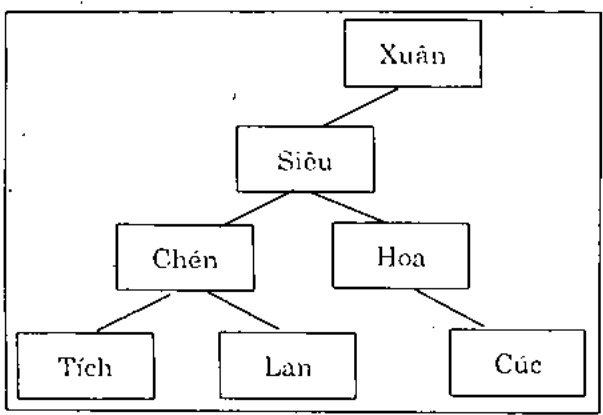

Hình 4-21. Thí dụ một cây gia phả.

Trong các cấu này có con-trai (y, Siêu) và con-trai (z, y), liên quan đến vải giá trị z. Tím những y thỏa mãn, successive xem ai là con trai của Siêu, sau đó tìm tiếp ai là con trai của những người đó, thì không tôn công sức nhiều lấm. Tuy vậy, không dễ biết trước được cải nào khớp trước, hay nhiều luật chi-khớp một phần, không thỏa mãn cả hai phần như yêu cầu.

Thí dụ này cho thấy hai vấn đề sau :

\- Thứ nhất, cần thiết ghi nhớ không chỉ sự trùng khớp mà còn cả các ràng buộc về biến x. y. z... trong đó x ≡ Siêu, y ≡ Chén, z ≡ Tích ... để rút ra chấu-trai (Tích, Siêu) từ chấu-trai (z, x).

\- Thử hai, trong sơ sánh không có hàng số, có biến số, một luật đơn có thể khớp một trạng thái hiện tại theo nhiều về, do đó thu được nhiều suy diễn tử với

<!-- page: 120 -->

phải, thí dụ trong 7. z ≡ Tieh hay z ≡ Lan . khi đó các trường hợp này đều không dẫn đến lòn giải.

Nhung nếu có bước trung gian trên đường đến lời gian, thi cũng không thể thấy ngay sự trùng khớp nào là tốt hơn. Do vậy điều quan trọng là số trạng thái có thể được tạo ra không do số các luật mà do số cách mà các luật có thể được áp dụng.

## V.3. So sánh phúc tạp

Một số so sánh phúc tạp dài hỏi dùng đến xếp xỉ vị với các điều kiện trùng khớp phúc tạp hơn nền không dễ dàng thấy ngay kết quả. Chắng hạn so sánh khớp trong xử lý ngôn ngữ tự nhiên, lời nói. Việc dùng đến đánh giá xếp xỉ làm tăng các khá năng phải xét đến, làm phúc tạp thêm quá trình khớp.

Đơn khi trong quá trình xét khớp, người ta kết hợp thực hiện vải quyết định giải quyết tranh chấp. Giải quyết tranh chấp là chiến lược điều khiển cho các hệ sản xuất, dùng kỹ thuật chọn một luật sản xuất từ tập có tranh chấp, tức tập chúa các luật sản xuất đã khớp với một phần dữ liệu trọng cơ sở trí thức của hệ sản xuất. Các kỹ thuật thường được dùng là chọn theo trật tự ưu tiên, hay theo trật tự của dữ liệu được kích hoạt, hay theo trật tự của các luật.

Thí dụ

Trong bài toán độ nước vào xô có thể xét đến các trường hợp đặc biệt, mà đã được mô tả trong các luật; thường thì các trường hợp đặc biệt dáng được lưu tâm hơn. Lưu ý có N lit nước trong một xô, mà xô kia cần N lit, có thể trút sang nhau, tức là lưu ý đến:

• (0.2) → (2.0) túc là đô được 2 lit trong xô 3 lit sang xô 4 lit

• (x, 2 | x>0) → (0,2) tức là làm rổng xô 4 lit.

Thực ra, hai luật thêm vào này là trường hợp riêng của luật

$$
(x, y) \rightarrow (0, y) v \dot {a}
$$

$$
(x, y \mid y > 2) \rightarrow (2, y - 2).
$$

Trong khoảng thời gian hữu hạn, không thể đồng thời tiến hành so sánh các luật tổng quát và đặc biệt; thường bỏ qua các luật tổng quát. Một luật đánh giá là tổng quát, hay không do căn cứ vào :

\- Nếu tập các tiên để của luật thứ nhất bao trùm tiên để của luật thứ hai. thì luật thứ nhất là tổng quát hơn:

\- Nếu tiên để hai luật như nhau, nếu luật thứ nhất chứa biến số. trong khi ở luật thứ hai, ứng với các biến đó là hàng số. thì luật thứ nhất là tổng quát hơn.

<!-- page: 121 -->

Khi đó cũng cần lưu ý ràng phải có dạng chuẩn để trình bày phân giá thiết của luận, tạo điều kiện so sánh khớp thuận tiện hơn. Ngoin ra, khi tiên hành so sánh khớp, đặc biệt trong phân tích cầu của ngôn ngữ, cún xác định được trọng số quan trọng của từng đối tượng: hic đó việc đảm bảo khớp cho các đối tượng trọng số cao là quan trọng hơn.

## V1. CÁC CHỨC NĂNG MAY RỦI

Các phương pháp may rủi được nói đến và được sử dụng, nhưng cũng cần để ý đến những lực nó gây lạc đường khi tìm kiếm. Thực tế cho thấy cũng có các phương pháp may rủi to ra hiệu quả dài với lớp bài toán cụ thể. Với hệ thống dựa trên luật, có hai cách chính mà các thông tin mav rủi, theo chú để đặc biệt, có thể được bổ sung vào thủ tục tìm kiếm :

1. Thú nhất, chúc năng may rủi đối với bán thân luật, tủa là nền áp dụng luật có nhạy cảm thì tốt hơn. Thị dụ chọn trong số các nước đi cùng khi nâng trong chơi cò:

2. Thú hai, dùng chức năng may rủi để đánh giá trạng thái riêng của bài toàn và xác định ý nghĩa của trạng thái đó trong toàn bộ bài toàn. Vậy, chức năng may rủi có thể cho độ do về mong muốn, thường thế hiện bằng số. Đế cần đặt chức năng này, tại mỗi nút người ta trạng bị :

• Công cụ đánh giá trạng thái.

• Đặt trọng số cho mỗi trạng thái, và

• Đánh giá khả năng của nút tham gia vào quá trình tìm.

Thỉnh thoảng phương pháp mays rủi có giá trị, thí dụ trong cò tic-tac-toe, như cò caro, chọn hàng đã có một hay hai phân tử, trong bài toán 8-ô, chọn dịch chuyển các ô chưa đúng-vị trí so với trạng thái đích.

$$
\begin{array}{c c c} \hline 1 & 2 & 3 \\ & 8 & 4 \\ 7 & 6 & 5 \\ \hline \end{array}
$$

Một trạng thái của bài toán 8 ô

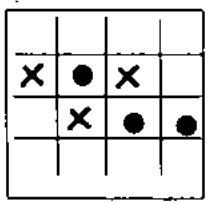

Một trạng thái của bài toán tic-tac-toe

Hinh 4-22. Trạng thái của bài toán.

<!-- page: 122 -->

Mục đích của phương pháp may rủi là chỉ hưởng có lợi nhất, bảng việc chỉ ra đường di dấu tiên trong số các đường cùng khai nang. Phương pháp may rủi được còn là tốt khi không phải tìm thêm nữa đã kháng định được lời gian là tốt, trong khi phương pháp đánh trọng số tố ra phải tối kém. Nhìn chung người ta dùng phương pháp may rủi để xem đường đang đi có dẫn đến dịch không.

## VII. KÊT LUẬN

Chương vừa rôi để cấp một số kỹ thuật giúp cho việc giản bài toàn. Các kỹ thuật suy lý gồm có

\- Suy lý theo cách suv diên,

\- Suy ly theo quv nap.

\- Suy ly theo gia định,

\- Suy lý theo loại suy,

\- Suy lý theo lẻ thường, và

• Suy lý không đơn điện.

Việc suy lý được thực hiện thông qua kỳ thuật suy diễn và các chiến lược điều khiển. Hai kỹ thuật suy diễn được giới thiệu trong chương là suy diễn tiến và suy diễn lui. Việc thấy rò uu nhược điểm của từng loại suy diễn và kết hợp hai loại suy diễn là cần thiết.

Bà nội dung vừa được trình bày trong chương là :

\- Dùng cây/ độ thị để thể hiện các trạng thái bài toán. Việc thể hiện tốt trạng thái của bài toán sẽ tạo điều kiện thuận lợi để giải bài toán.

\- Việc quay lui khi giải bài toán và quản lý các trị chân lý được xét theo hai tiếp cận quay lui là quay lui theo thời gian và quay lui theo quan hệ phụ thuộc.

\- So sánh khớp trong hệ thống trí tuệ nhân tạo được thực hiện đơn giản như so sánh các chỉ số của trí thức hay so sánh các biến trong trí thức.

Khi giải bài toán người ta dùng các phương pháp may rủi và thu được hiệu quả nhất định.

<!-- page: 123 -->

# MỘT SỐ PHƯƠNG PHÁP GIẢI BÀI TOÁN

Chương 5 trình bày một số phương pháp gửi bài toàn, theo các một dung sau.

\- Một số phương pháp yếu dùng để giản bài toán. Các phương pháp tìm kiếm được giới thiệu như tìm kiếm rộng, sâu... cũng đã trở nên quen thuộc trong trị tuệ nhân tạo.

\- Việc tìm kiếm tối ưu trên cây. Tiếp theo là giới thiệu về thuật toán, hay thủ tục A'.

\- Giải bài toán có dạng trò chơi của hai dấu thu.

• Các ràng buộc số trong việc giải bản toán.

## I. CÁC PHƯƠNG PHÁP YÊU

## I.1. Giới thiệu

## Định nghĩa 5-1 : Phương pháp yếu (Weak method)

Các phương pháp yếu là phương pháp phụ thuộc vào lựa chọn đường đi ban đầu.

Trong một số bài toán người ta có thể thấy ngay cách giải, lúc là thấy đường đến lời giải, hay gọi là dịch. Các phương pháp yếu được xét ở dây cho phép giải tổng quát một bài toán, đôi lúc phải sử dụng đến trị thức. Phương pháp yếu là phương pháp giải phụ thuộc vào việc chọn đường di ban dẫn.

## Định nghĩa 5-2 : Giải trên đồ thị (Resolving on graph)

Quá trình tìm kiếm ra lời giải được xem như quá trình dò theo đồ thị gồm các nút và cung; mỗi nút ứng với một trạng thái, cung thể hiện quan hệ giữa các trạng thái.

<!-- page: 124 -->

Các phương pháp để cấp ở dây không đưa ra dây đủ một cây đồ thị tìm kiếm phục vụ cho việc giải, mà ngầm chỉ ra cấy thông qua các luật được ứng dụng và hiện ra một phần đồ thì có tham gia vào quyết định.

Đời với tất các các phương pháp yêu, người ta đều quan tâm đến các vấn đề sau :

\- Kỳ thuật hướng dẫn việc tìm kiếm lòn giai.

• Phương pháp luận của việc tìm kiếm.

\- Cách thể hiện các nút trong quá trình tìm kiếm.

\- Việc chọn các luật có thể áp dụng được và khả năng sử dụng phương pháp may rút trong việc tìm kiếm.

Tuy nhiên đối với bài toán phức tạp, nếu áp dụng phương pháp may rủi thường khó xạc định được hiệu quả, nhất là với bài toán cụ thể. Bời vậy việc khảo cứu một kỹ thuật tổng quát là cần thiết. Các phương pháp yếu xem như chiến lược điều khiển tổng quát, bảo gồm các phương pháp tạo sinh và thủ, phương pháp leo núi, phương pháp tìm rộng, phương pháp tìm sâu, phương pháp biến đổi... Tuy thế, không phải các phương pháp này áp dụng cho tất cả các bài toán phức tạp, mà cho từng lớp bài toán. Việc chọn dùng chiến lược tìm kiếm cho bài toán cụ thể phụ thuộc nhiều vào các đặc tỉnh của bài toán

Trước dây, việc tìm kiếm được mô tại trên cây, tục cây OR như bài toán lấy nước, và có thể phát triển cho cây hay đổ thị AND/OR. Nhắc về đổ thị AND/OR; nó là đổ thị với hai dạng nút, đặt tôn là nút AND và nút OR. Các đổ thị này nhằm thể hiện cho các bài toán mà có thế chia nhỏ thành các bài toán con độc lập. Các nhánh ứng vợi bài toán con có quan hệ AND hay quan hệ OR với nhau để tạo thành bài toán lớn ban đầu. Chứng cũng được dùng như cấy chứng minh của ngôn ngữ PROLOG và các ngôn ngữ lập trình logie khác, hay trong trở chơi hai dấu thú.

Một vải kỹ thuật tìm kiếm thực hiện tốt trên đồ thị bình thường có thể được tổng quát hóa để dùng trên đô thị AND/OR. Khác nhau chính giữa việc tìm kiếm trên đồ thị/cây AND/OR với tìm kiếm bình thường là ở chỗ lời giải của việc tìm kiếm trên đồ thị/cây AND/OR là một đồ thị con, chữ không chỉ là một đường nhự trong phương pháp tìm kiếm thông thường. Một lời giải bao gồm :

• Nút gốc.

\- Một nhánh trong số các nhánh nút OR, hoặc tất cả các nhánh nút AND.

• Nút dích.

Thí dụ

Cây AND/OR có các nhánh AND và các nhánh OR. Hai nút A và B là nút AND. Lời giải gồm nút gốc, hoặc nút C hoặc cả hai nút A, B. và nút đích.

<!-- page: 125 -->

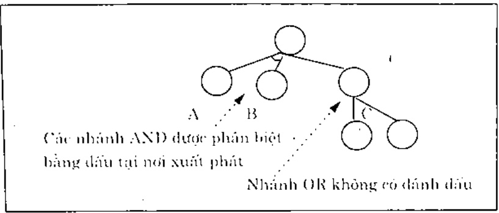

Hinh 5-1. C&y AND/OR.

## Kỹ thuật tìm cơ bản

Những người nghiên cứu về trí tuệ nhân tạo đa nhìn các trí thức trong không gian bài toán dưới dạng hiển thị hay đô thị. Đề làm đáp ứng nhu cầu này, người tả hiểu diễn không gian bài toán theo cách thuận tiện để tìm lời giải bài toán, đồng thời để hiển thị.

## Dịnh nghĩa 5-3 : Không gian bài toán (Problem space)

Cây hay đó thị gồm các nút thể hiện các trạng thái của bài toàn và các cung thể hiện đường đi hoặc mối quan hệ giữa các trạng thái.

Các nút thể hiện các trạng thái bài toán và cung thể hiện đường di có thể giữa các nút. Nhỏ cách biểu diễn này, việc giải bài toán được xem như việc lận lợi trong đám các nút để tìm nút lời giải. Đối với hệ thống trị tuệ nhân tạo dựa trên luật, có thể dùng nút thể hiện giá thiết và kết luận của luật. Không gian bài toán gồm các nút và cung cũng xem như được tổ chức như vậy, tạo nên mạng suy diễn.

## Thí dụ

Xét cách hệ thống trí tuệ nhân tạo tìm trong không gian bài toán để giải bài toán chọn loại rượu vang. Tùy theo từng dân tộc mà người ta có cách dùng rượu vang phù, hợp với thức ăn đang dùng, có nơi yêu cầu dùng vang trắng khi ăn đô biến, dùng vang đó khi ăn thịt. Bài toán yêu cầu chọn dùng loại vang cho bữa ăn dùng thịt. Người ta dùng danh sách các luật để quyết định trong không gian bài toán.

THEN Dùng vang đó

<!-- page: 126 -->

THEN Dùng vàng trăng (câu kết luận C')

Larật 3. IF Cửa hàng có cả (câu gia thải P.)

ÀND Có tiên mua cá

câu gia thiết P$_{1}$

THEN Dùng cái

tân kõi luân C$^{'}$

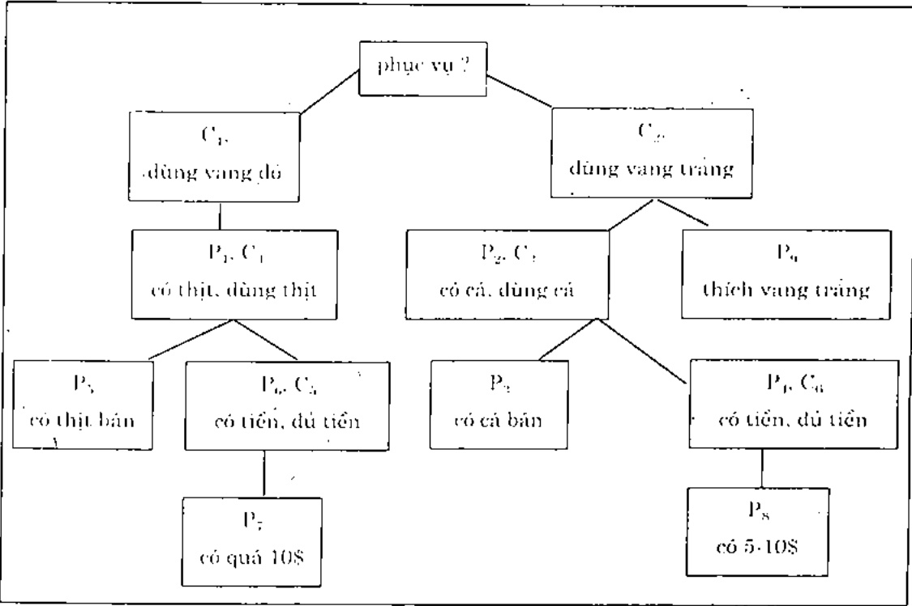

Hình 5-2. Chơn luật thích hợp trong không gian bài toán.

Laiq 4., IF Cua hang có thut (cau gia thiet P₅)
AND Có tiên mua thut (cau gia thiet P₆)
THEN Dùng thut (cau két luân C₁)

Lượt 5. IF Có quá 10\$ (câu giả thiết P7)
THEN Dủ tiến mua thịt (câu kết luận C7)

Lượt 6. IF Có 5\$ đến 10\$ (câu giá thiết P$_{S}$)
THEN Dữ tiên mua cá (câu kết luận C$_{G}$)

<!-- page: 127 -->

## Luiát 7. IF Thích vang tráng (câu gia thiết P$_{q}$).

## THEN Dược dùng vang trắng (câu kết luận C;)

Trong ứng dụng thuộc về hệ chuyên gia. bài toán đặt ra là tìm trong không gian bài toán và định vị lời giải. Hệ thống suy diễn lǜu bất dấu tìm tự một lời giải, trong thí dụ là nút C₁ hoặc C₂. Nó tiếp tục tìm xuống, qua các cung và tìm thông tìm hỗ trợ cho dịch. Côn hệ thống suy diễn tiến bất dấu từ nút thông tin số khởi, tức nút lá. Trong thí dụ, các nút lá gồm P₁, P₃, P₇, P₈ và P₉. Rối nó tìm lên qua các cung để xem có dẫn tới được nút dịch không.

Đối với suy chiến tiến hay lủi, người ta có thể tìm lời giải trong cơ sở trí thức theo thuại toán đơn giản. Tuy nhiên nguồn thiết kế hệ thống có thể bổ sung các điều khiển phụ cho cá hai kỹ thuật dưới dạng tìm sâu, tìm rộng và tìm điểm phù hợp.

## I.2. Tîm sâu

## 1.2.1. Kỹ thuật tìm sâu

Tìm kiểm sâu trong không gian bài toán được bắt đầu từ một nút rời tiếp tục cho đến khi hoặc đến ngô cụt, hoặc đến đích. Tại một nút có luật trọng tải, cháng hạn "đi theo nút cực trái", hướng dẫn việc tìm. Nếu không di tiếp được, gọi là đến ngô cụt, hệ thống quay lại một mức trên độ thị và tìm theo hướng khác, cháng hạn "đến nút sát nút cực trái". Hành động này gọi là quay lui. Nếu quy ước di từ trái sang phải, cách tìm kiểm này đến được cuối của không gian bài toán theo các nhánh cực trái.

## Định nghĩa 5-4 : Tìm sâu (Depth-First search)

Kỹ thuật tìm lời giải theo các cung của không gian bài toàn theo chiều dọc. rối xử lý theo trật tự xác định, thi dụ từ trải sang phải.

## Thí dụ

Hình sau mô tả việc tìm sâu theo kỹ thuật suy điện lũi trong không gian bài toán nêu ở trên. Yêu câu là xác định đích "ruqu vang nào sẽ dùng với thịt 2". Quá trình thu được lời khuyến C₁ "vang đỏ" vì câu P₃ "của hàng có thịt" và câu P₂ "có quá 10\$". Do hệ thống có thể tìm lời giải theo C₁, nút C₂ và các nút tiếp theo nó không được tìm.

## I.2.2. Uu điểm của kỹ thuật tìm sáu

\- Lời giải được đám báo. Việc tìm sâu khai thác tận cùng không gian bài toán để tìm lời giải. Nếu giả thiết có ít nhất một lời giải, kỹ thuật tìm sâu sẽ tìm ra được.

\- Nhanh đến lời giải. Do cách tìm của kỹ thuật này, nếu nút lời giải ở rất sâu. Kỹ thuật tìm sâu sẽ tiết kiệm thời gian. Chẳng hạn trong trở chơi cỏ, người ta

<!-- page: 128 -->

tìm sâu để đến ngay nước di thích hợp mà không lăng phí thời gian vào các nước di không cần thiết.

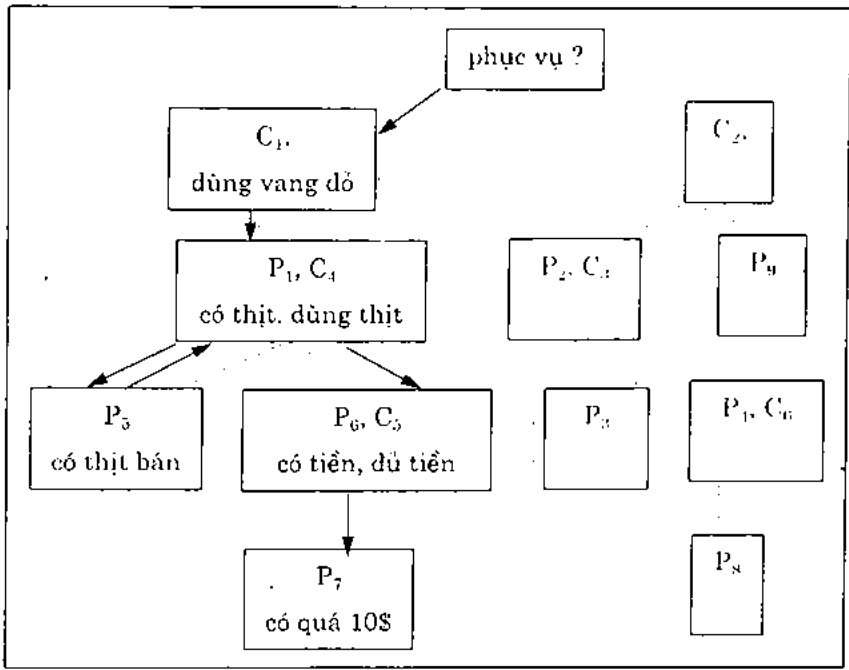

Hình 5-3. Tîm sâu trong kỹ thuật suy diễn lủi.

\- Tập trung chủ ý. Kỹ thuật tìm sâu luôn tập trung vào dịch. Chẳng hạn khi bất dấu từ nút "dùng vang đó". ký thuật sẽ chủ trọng vào mộng đề $C_1$ "dùng thịt". $P_3$, "của hàng bán thịt"... túc chú trọng vào dịch "thịt". Duy trì sự tập trung là một ưu điểm của hệ thống có hội thoại với người sử dụng. Con người cảm thấy hải lòng khi các câu hỏi tập trung vào vấn đề chính.

## 1.2.3. Nhuộc điểm của kỹ thuật tìm sâu

\- Không biết trước. Tím sâu khai thác không gian bài toàn để tìm lời giải theo thuật toán đơn giản một cách cứng nhắc. Trong quá trình tìm, nó không có thông tin nào hỗ trợ để phát hiện lời giải. Nếu chọn nút ban đầu không thích hợp có thể không dẫn đến dịch của bài toán.

\- Không phù hợp với không gian bài toán lớn. Với bài toán có không gian lời giải lớn, kỹ thuật tìm sâu có thể không đến lời giải trong khoảng thời gian vùng phải. Nếu dùng kỹ thuật này trong trở đánh cò, cần xét đến các nước di để

<!-- page: 129 -->

chọn lối giải tối ưu. Bản cò có 10$^{30}$ khái nang khắc than và nếu kiểm tra một nuit chỉ mất một micro giay (μs), máy tính phải có 10$^{30}$ năm để tìm hết không gian bài toán,

\- Không hiệu quả đối với các lời giải tâm thường. Nếu mất công đi theo một nhánh để nhận được lời giải không máy giả trị thì đó là không hiệu quả. Đề việc tìm sâu có hiệu quả, cần thiết nhìn nhận tổng quát để loại ra các lời giải tâm thường, hoặc có chiến thuật xem xét các nhánh có lời giải tâm thường vào cuối lúc tìm kiếm.

Hai phương pháp tìm sàu dây thuộc loại tìm sàu. Đó là phương pháp "tạo sinh và thu" và "leo nứ".

## I.3. Phương pháp tạo sinh và thử

Chiên lược này đơn giản, gồm ba bước :

1. Trước hết tạo ra một giải pháp. Trong vài bài toàn cụ thể đó là việc chọn một lời giải trong không gian các lời giải, hay tạo ra một đường dư.

2. Thứ hai, thủ xem lời giải có thích hợp không, bằng cách so sánh với phương ăn khác hay so với điểm cuối cần suy điện:

3. Tiếp theo, nếu lời giải đã đạt được thì dùng, ngược lại lập lại từ bước dấu với một khác.

Với phương pháp này, nếu bài toán có lời giải thì người ta sẻ di đến dịch. Tuy nhiên, kích thước bài toán lớn sẽ làm tăng khối lượng tính toán. Thuật toàn này gọi là tìm sâu. Như đã giới thiệu, tìm sâu trên độ thị có nghĩa là xuất phát từ một nút rời xuống nút tiếp theo, con của nút trước, cho đến khi thấy được lời giải hay buộc phải quay lui. Với hệ thống trình độ thấp, để phải vệt cạn không gian lời giải, do vậy tốn kém. Việc tạo ra lời giải ban đầu có thể thực hiện ngẫu nhiên, và cũng hy vọng ngẫu nhiên mà đạt được lời giải; bởi vậy, không thể không tính đến chỉ một vài hướng di được cảm nhận là tối, và loại trừ trước các hướng không dẫn đến lời giải.

Thi dụ về phương pháp này thấy trong hệ DENDRAL vào năm 1980, liên quan đến hợp chất hữu cơ, sử dụng phố và số hiệu cộng hưởng từ tính hạt nhân... DENDRAL dùng kỹ thuật lập kế hoạch theo việc kiểm tra sự thỏa mãn của các điều kiện. Tuy nhiên phương pháp này đôi khi lộ nhiều điểm là dưa ra lời giải không được thực tế.

## I.4. Phương pháp leo núi

Phương pháp tìm theo kiểu leo núi tương tự như phương pháp tạo sinh và thủ, nhưng dùng thông tin phần hồi để xác định hướng đi tiếp. Phương pháp này thường không dùng ở việc xác định phép thử có đạt hay không, mà chú trọng tìm xem hướng

<!-- page: 130 -->

đi nào để dẫn đến trạng thái đích nhất. Cách đó được dưa ra nhằm giảm công sức tìm. Thủ tục được mô tả như sau :

1. Tạo phương án dấu tiền, như trong phương pháp tạo và thử. Nếu may mắm phương án này là lời giải thì có thể dùng ngay, nhiều bằng không lại phải tiếp tục sang bước sau.

2. Sử dụng một vài luật để tạo ra tập các lời giải khác,

3. Với mỗi lời giải trong tập vừa được tạo ra, thực hiện các bước sau :

\- Dưa ra thử, nếu đó là lời giải cần tìm. kết thúc công việc.

\- Nếu chuta được lời giải mong muốn, kiểm tra lời giải mối này có tốt hơn, hay gần bằng lời giải đã có không ? nếu quả như vậy thì ghi nhận phương án này, nhiều bằng không tốt, hay xa lời giải trước thi bỏ qua phương án đó.

4. Chọn trong số các lời giải, chọn ra lời giải tốt nhất, lấy nó là lời giải cho các bước lập sau. Bước này tương ứng với việc chuyển không gian bài toán theo hướng đến dịch nhanh nhất.

5. Tiếp tục lắp lại từ bước thú hai.

## Thí dụ

Mình họa cho phương pháp này có thể thấy qua việc xoay các khối màu về một vị trí xác định của trở chơi tương tự Rubic. Mỗi khi được xoay, các khối màu chuyển trạng thái. Người ta xoay các khối màu với hy vọng đưa chúng càng gần trạng thái yêu cầu.

Dôi với phương pháp này cần phải quan tâm đến hiện tượng là sau một số bước thực hiện thuật toán, phương án không được cải thiện so với phương án trước. Hiện tượng này xảy ra khi đạt đến cực trị địa phương. Một số hiện tượng mà người ta ghi nhận gồm có :

\- Thủ nhất là cục đại địa phương, là nơi đạt được lời giải tốt hơn các lời giải lân cận, nhưng không tốt hơn lại các nơi xa hơn, tục không thể là lời giải tốt tổng thể được. Khi đó có thể quay về nút trước, theo hướng khác. Giải pháp này dòi hồi phải có thủ tục đánh giá sự tối và ghi nhớ lại nhiều đường di, để phòng khi cần di lại các đường cũ.

\- Thú hai, có vùng lời giải như cao nguyên bằng phẳng, các giá trị của các phương án lời giải đều như nhau, không thể xác định được ngay hướng nào là tốt hơn nếu chỉ so sánh vùng lân cận. Khi đó phải có bước nhảy xa, thoát khởi vùng bằng phẳng. Nếu đã áp dụng một luật, có thể tiếp tục sử dụng luật đó vài lần nhằm đi ra xa trạng thái này.

<!-- page: 131 -->

\- Thất ba, phương án lựa chọn với vào định hình chóp. Lời gian tối hơn vùng bên cạnh, nhưng không vượt qua được theo bất kì hướng nào. Lás do nên áp dụng hai hay nhiều luật trước khi kiểm tra lời giải. Việc này tương ứng với việc chuyển theo đồng thời với hướng, nhằm xử lý hiện tượng hình chóp.

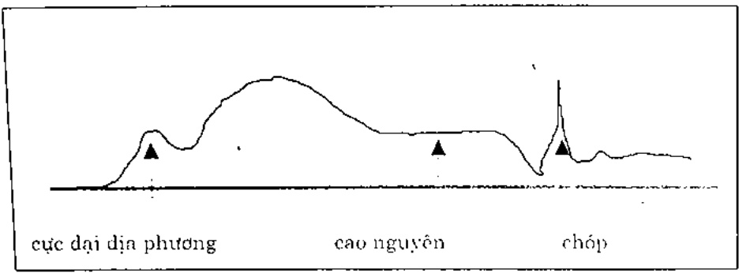

Hình 5-4. Minh họa các cục trị địa phương khi giới bài toán theo phương pháp leo núi.

Nhận xét thấy phương pháp giải theo cách tìm kiếm lieu nứ không phải lúc nào cũng tố ra là hiệu quả. Nó không phù hợp đối với các bài toán có giả trị hàm may rủi đột nhiên thay đổi khi đến ngưỡng nào đó. Nó là phương pháp giải quyết cục bộ, thường dùng với thuật toán người lắng giếng gần nhất. Như vài phương pháp khác, phương pháp này không đảm bảo hiệu quả, đặc biệt khi không gian bài toán là lớn. Khi áp dụng phương pháp này, người ta khuyến cáo sử dụng kèm với phương pháp khác.

## I.5. Tîm kiểm rộng

## 1.5.1. Kỹ thuật tìm rộng

## Định nghĩa 5-5 : Tìm rộng (Breadth-First search)

Kỹ thuật tìm kiếm lời giải trên tất cả các nút của một mức trong không gian bài toán trước khi chuyển sang các nút của mức tiếp theo.

Thí dụ

Sử dụng kỹ thuật tìm rộng đối với bài toán lựa chọn rượu vang.

<!-- page: 132 -->

Kỹ thuật tìm rộng bắt đầu từ mức thủ nhất của không用心 ban toán, theo hướng đản của luật trọng tải, chăng hạn "đi từ trải sang phai". Nếu không thấy lời gửi tại mức này, nó chuyển xuống mức sau để tiếp tục... đến khi định vị được lời gửi, nếu có.

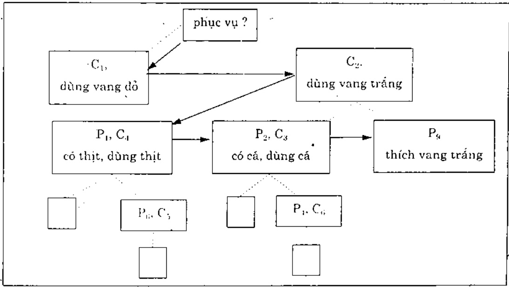

Hình 5-5. Đồ thị ứng với việc tìm rộng.

## 1.5.2. Uu điểm của kỹ thuật tìm rộng

\- Giải được. Như kỹ thuật tìm trước, kỹ thuật tìm rộng là kỹ thuật vét cạn không gian bài toán, do vậy sẽ thấy lời giải nếu có.

\- Không bổ các lời giải dễ. Một ưu điểm của tìm rộng là không bổ sót các lời giải tâm thường, dễ thấy.

## I.5.3. Nhuộc điểm của kỹ thuật tìm rộng

1. Không biết trước. Kỹ thuật tìm kiếm rộng thực hiện theo thuật toán đã định trước. Do vậy nó tìm lời giải một cách máy móc; khi không cỏ thông tin hỗ trợ cho quá trình tìm kiếm, nó không nhận ra ngay lời giải và dễ bỏ qua mất lời giải.

<!-- page: 133 -->

2. Không phù hợp với không gian bài toán kích thước lớn. Trọng không gian bài toán với kích thước lớn, người ta khó có đủ thời gian để vết cận các lòn giải. Đối với loại bài toán này, phương pháp tìm rộng đối mật với nhu cầu :

• Cần nhiều bộ nhớ, theo số nút cản lưu trữ;

\- Cần nhiều công sức xử lý các nút, nhất là khi các nhánh cây dài, số nút tăng;

\- Đề thực hiện các thao tác không thích hợp, thừa, dưa đến việc tăng dàng kể số nút phải xử lý.

3. Không hiệu quả nêu lời giải ở sâu. Nếu lời giải cần tìm nằm ở mức dưới trong đó thị không gian bài toán, kỹ thuật phải qua hết các lời giải tâm thường môn đến được lời giải này. Phương pháp này không phù hợp cho trường hợp có nhiều đường dẫn đến kết quả, nhưng đều dài lục đó phương pháp tìm sâu tổ ra có ưu điểm hơn.

4. Giào tiếp với người dùng không thân thiện. Do duyệt qua tất cả các nút, việc tìm kiếm không tập trung vào một chú đề. Các quan tâm cũng như các câu hỏi đặt ra cho người sử dụng chuyển từ ý này sang ý khác. Về tâm lý, các câu hỏi không liên quan tới dịch và tàn mạn để làm người dùng câu bản.

So sánh số bộ với phương pháp tìm sâu người ta thấy các phương pháp tạo và thử, leo núi là các phương pháp tìm sâu, có đặc điểm dễ cải đặt, cho phép tìm thấy lời giải một cách nhanh chóng. Tuy nhiên, chúng có nhiều điểm là khi chọn sai đường thì tổn công sức di theo dưỡng vô ích. Phương pháp tìm rộng đảm bảo tìm được lời giải, nếu có, theo số hữu hạn các nhánh cây. Đường đi đến lời giải được gần số các nút, cơi như độ dài của lời giải.

Trong phương pháp tìm rộng, các nút tại một mức của cây/dồ thị được kiểm tra trước khi di đến nút của mức sau. Đồ thị duy trì mối liên hệ giữa các mức phục tạp hơn cây, do vậy cán có biện pháp xử lý phù hợp.

## 1.6. Tîm điểm phù hợp

Kỹ thuật tìm điểm tốt nhất đầu tiên (best first search) còn được gọi là kỹ thuật tìm điểm phù hợp.

## 1.6.1. Giới thiệu

Cả hai kỹ thuật tìm rộng và tìm sâu đều là phương pháp cơ bản để khai thác không gian bài toán. Chứng đều vét cạn không gian để tìm ra lời giải, theo thủ tục tìm xác định trước. Dương nhiên chúng cũng dùng tri thức về trạng thái của bài toán để hướng dẫn tìm kiếm nhưng không phổ biến. Cho dù có vài ưu điểm, chúng là kỹ thuật thực hiện một cách máy móc. Chính vì vậy mà chúng phải nhận cải tên là kỹ

<!-- page: 134 -->

thuậtitu quảng. Một kỹ thuật khác, dùng trn thức hỗ trợ tim kiểm gọi là tìm điểm phù hợp.

## Dình nghĩa 5-6 : Tím phù hợp (Best-First search)

Kỹ thuật tìm lời giải có dùng trì thức về bai toàn để hưởng dẫn. Tri thức này hưởng việc tìm về nứt lời giải trong không gian bai toàn.

Khu tim trong không gian bài toán, tại mối nút được xem xét người ta sẽ quyết định việc tìm kiếm tiếp tục theo nhánh nào. Điều này có nghĩa người ta chọn nhánh với sự tin tưởng sẽ dẫn đến lời giải.

Trong các chương trình trị tuệ nhân tạo, kỹ thuật tìm điểm phù hợp sử dụng hàm danh gia. Hàm này dùng các thông tìm hiện tại về mức độ quan trọng của bài toán tại nút đó để gần con số, hay trọng số cho mỗi nút. Con số này được xem xét trong lúc tìm kiếm. Nút mang trọng số lớn nhất sẽ được chọn trong quá trình tìm kiếm.

Hệ chuyên gia dùng may rủi khi cải đặt kỹ thuật này. Dựa trên thông tin có được, may rủi chọn ra hệ thống trị thức sẽ được xử lý tiếp. Bái vì may rủi dùng để hướng dẫn việc tìm, cách này được gọi là tìm kiếm may rủi. Một vài cách dùng may rủi diễn hình trong việc hướng dẫn tìm kiếm là :

\- Xếp sắp các dịch. Đặt các đích theo thủ tự thích hợp nhất đối với nhu cầu của ứng dụng. Người ta có thể đặt các luật quan trọng lên trên với hy vọng chúng sớm dẫn đến kết quả.

\- Xếp các giả thiết. Việc đạt các giả thiết theo thú tự thuận lợi nhằm chỉ ra khía cạnh quan trọng hoặc khía cạnh dễ cho phép đạt được kết quả nhất.

\- Dùng các luật meta. Các luật meta hướng việc tìm về nơi có khả năng phát triển hơn. Giống như luật ma thuật, luật meta điều phối thông tin của bài toán thông qua các giả thiết của nó. Khi cháy, luật meta có thế tạo nên đích hệ thống mới hay tái vào một cơ sở trí thức mới.

\- Dùng độ uu tiên cho luật. Trọng số dành cho luật phản ánh độ quan trọng của nó. Hệ thống tìm có khuynh hướng sử dụng các luật có trọng số lớn.

\- Dùng nhân tố tin cậy. Cho mỗi khía cạnh bài toán một nhân tố tin cậy. Con số này chứng tố độ tin cậy của hệ thống vào khía cạnh này. Hơn nữa, các nhân tố này được dùng để hướng hệ thống về phía lời giải có độ tin cậy cao.

## 1.6.2. Ưu điểm của kỹ thuật tìm phù hợp

Phương pháp tìm điểm thích hợp tổ hợp các ưu điểm của phương pháp tìm rộng, tìm sâu.

<!-- page: 135 -->

\- Biết rõ lời giải. Cửu điểm chủ yếu của kỹ thuật tìm phù hợp là nó dùng trị thức để dẫn đất việc tìm. Trị thức này giúp người ta bắt đầu từ đầu là tốt nhất và cách tốt nhất để tiền hành tìm lời giải.

\- Suy lý mang tính người. Tím phù hợp tuân theo cách suy lý của một chuyên gia. Con người dùng trị thất hỗ trợ suy lý của họ. Do vậy họ thấy rõ đường đi hơn các kỳ thuật tìm sâu hay tìm rộng.

## 1.6.3. Nhược điểm của tìm phù hợp

Không chắc chắn thấy lời giải là thuộc điểm chính của kỹ thuật này. Nó có thể đi xa khởi lời giải, trong khi kỹ thuật tìm sâu và tìm rộng sẽ thấy được lời giản do vết cạn không gian bài toán. Kỹ thuật này chỉ xét một phần của không gian đó, cơn phân đó là hậu hẹn hơn cả.

Phương pháp này sử dụng cây OR tại mỗi nút trong quá trình tìm, chọn rà nút có khả năng nhất, hay gọi là nút có hùa hẹn, sau đó áp dụng hàm may rủi vào nút đó. Nếu công việc này không đưa đến lời giải tốt, người ta chọn nút có ít hùa hẹn hơn tại đầu nhánh cây vừa di qua.

Thí dụ các bước chuyển các nút trên cây :

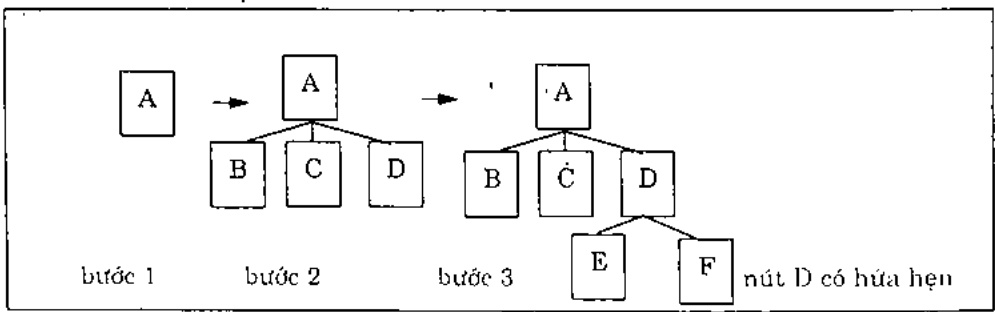

Hình 5-6. Các bước phát triển trên cây tìm kiếm.

Người ta dùng thuật toán A$^{*}$ là thuật toán hữu hiệu, được Hart giới thiệu năm 1968, để tìm lời giải phù hợp. Thuật toán A$^{*}$ sẽ được giới thiệu trong phần tiếp sau.

## II. MẠNG CÁC NÚT VÀ TİM KIỂM TỔI UU

Các kỹ thuật nêu ra trước đây nhằm tìm được lời giải. Tiếp theo người ta đời hồi đường đến lời giải là tối ưu theo một số tiêu chuẩn. Với các kỹ thuật dưới đây, không

<!-- page: 136 -->

nihùng nguǒi tā quan tám đến dô dàu duōng tím kětia, mā cón quan tám đến duōng nǎo lì tún vù trong sǒ cie duōng dān đến lòi gài.

Việc tìm kiếm tối ưu sore giới thiệu qua bài toàn thải tục Thư viện Anh. nhánh và biến, quy hoạch động rời rạc và A. Các bài toán cho thấy cách xử lý tính hướng tìm kiếm lay chu phi đường đi làm yếu tố quan trọng.

Các mảnh họa di kèm la thí dụ về bản toán tìm duong ngắn nhất trên bản đồ, thi dụ về cách thức hệ thống lập kế hoạch người máy với không gian cây hình để tìm biện pháp circumference quả chỉ chuyển các đồ vật.

## II.1. Đường tốt nhất

Bản toàn duyệt các thành phố trên bản đồ được xét trong phần này. Trong bài toàn này, độ din đường đi được quan tâm.

## II.1.1. Thủ tục Thủ viện Anh

Một thủ tục tìm dưỡng ngắn nhất trên mang là tìm tất cả các con đường di được rôi chọn đường tốt nhất. Thủ tục này được gọi đua với tên là thủ tục Thư viện Anh chắc do sự nhàng nhật của các con đường. Nó được dùng rộng rãi cho các bài toàn đơn giản, có thể giải bằng vết cận không gian lời giải.

Đế có tất cả các phương án lựa chọn, cần tìm ra tất cả các con đường. Người ta dùng các kỹ thuật hoặc tìm sâu hoặc tìm rộng, có cải biên. Nếu cây tìm kiếm không lớn, nhu trong khu vực một bản đồ thì không có vấn đề. Thế nhưng kích thước cây lớn, việc tìm ra mọi con đường thật không dễ dàng gì. Nếu mỗi mức trên cây có trung bình n-nút thi đến mức thủ m đã có n$^{m}$ con đường. Chính vì vậy mà cần có chiến lược tìm các đường tối ưu mà không nhất thiết phải chi ra các đường di đã được tìm trước.

## II.1.2. Tìm kiểm nhánh và biên

Một rạch cho phép tìm các đường tối ưu mà không tôn nhiều công sức là dùng phương pháp tìm kiếm theo nhánh và biên. Tìm kiểm nhánh và biên cho phép mở rộng đường riêng có giá thấp. Nội dung của phương pháp cũng đơn giản.

## Thí dụ

Bài toán tìm kiếm đường di từ nút bất dầu S đến nút dích G. Khoáng cách các nút, hay được xem như giá di trên đường giữa hai nút được cho trong hình.

Cử cho rằng người ta đã cảm nhận được đường SDEFG là ngắn nhất. Dương nhiên người làm tin học chẳng tin ngay vào linh cảm này.

<!-- page: 137 -->

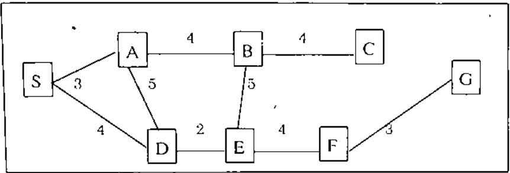

Hình 5-7. Yêu cầu từ nút S đến được nút G. Giữa hai nút có giá đường di.

Do đã biết độ dài đường SDEFG là 13 người ta sẽ không bắt đầu các con đường đại loại như SDAB, vì chưa đến G nó đã dài 13. Do vậy không cần để ý đến SDAB nửa vi nó sẽ dưa theo con đường dài hơn đường đã biết. Chỉ đế ý đến đường di từ S và từ SDE mới mong có đường ngắn hơn.

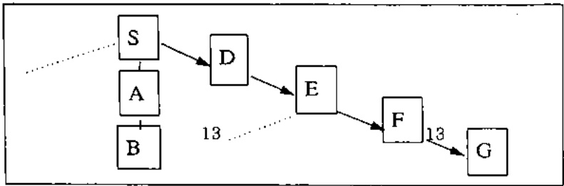

Hình 5-8. Tập trung vào đường có đánh giá thấp hơn.

Tổng quát hơn, người ta sử dụng lược đồ nhánh và biên cho phép giữ vết của các đường cục bộ để xét sau. Đường ngắn nhất được nổi thêm một mức, tạo nên nhiều nhánh con, ứng với các con đường mới. Trong các nhánh mới, một nhánh tốt hơn được chọn để nổi vào đường cũ... cho đến khí thấy dịch theo con đường nào đó. Bời vì tại mỗi bước người ta chọn đường ngắn nhất để di tiếp, đường đạt được có nhiều khả năng là tối ưu.

Đế duòng hâu như tốt nhất chắc chắn là tốt nhất, người ta cần nói tất cả các con đường cục bộ cho đến lúc nó dài bằng hay dài hơn duòng đã đạt được. Sau dây là thủ tục đã thay đổi so với thủ tục tìm kiếm đã được giới thiệu trước dây.

<!-- page: 138 -->

## Thú tục tìm kiếm nhánh và biên

1. Tạo hàng đại có một phần tử là nút gốc, độ dài đường đi là 0.

2. Cho đến khi đường đầu tiên trong hàng đại kết thúc tại nút đích hay hàng đại rộng, thực hiện :

\- Rút duồng đầu tiên ra khối hàng đợi; tạo các duồng môi bằng cách nôi duồng đầu tiên về phía lân cản của nút đích.

• Bó di các đường xoay vòng.

\- Bổ sung các đường mới còn lại, nếu có, vào hàng đợi.

\- Sắp xếp toàn bộ hàng đội theo độ dài đường đi, các đường giá ré lên trước.

3. Nếu thấy nút đích thông bảo hoàn thành, nếu không thì thông bảo thất bại.

Quay lại bài toán dò bán đổ để thấy phương pháp nhánh và biên thực hiện ra sao khi bất dấu với các đường không là chấp nhận được. Trước tiên từ nút S thủ tục so sánh độ dài SA và SD; nó chọn đường SA với độ dài 3. Sau đó SAB và SAD là hai đường được nói với độ dài 7 và 8.

Bây giờ thì SD được dùng, độ dài 4. Các nút A và E được nói, tạo nên SDA và SDE. Đến dây có tổng cộng bốn đường, trong đó SDE là ngắn nhất.

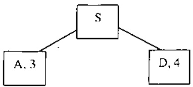

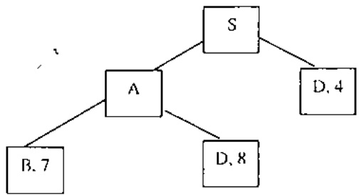

<!-- page: 139 -->

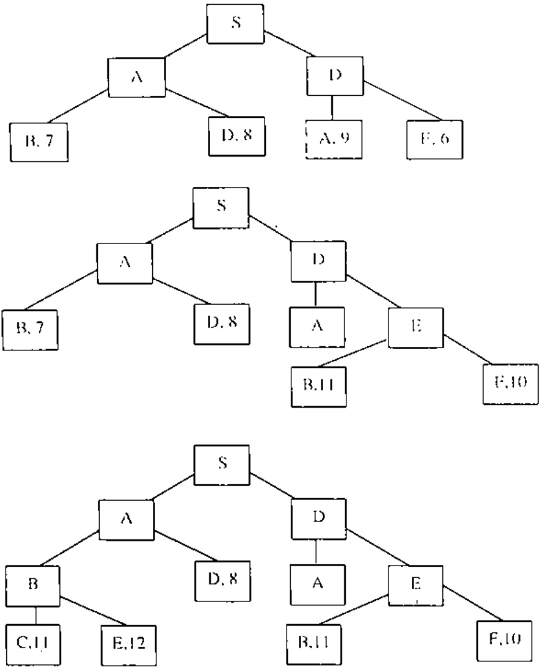

Hình 5-9. Phát triển các nhánh trong bài toán tìm dưỡng đi trên bản độ.

Tiếp tục nổi, theo thủ tục thì đã ở bước thú bày. Kết quả có các đường mà SADE và SDEF là các đường riêng ngắn nhất. Phát triển SADE dẫn đến các đường riêng kết thúc tại B và F. Côn việc phát triển đường kia dẫn đến đường hoàn chính, tổng độ dài là 13.

Đế chắc chắn đường độ dài 13 vừa thấy là tối ưu, cần phát triển tiếp SABE, có độ dài 12 và SDEB, có độ dài 11. Cồn đường SDAB không cần phát triển tiếp do độ dài riêng của nó đã là 13, bằng độ dài con đường tìm thấy. Tuy số các tìm kiếm không ít nhưng thú tục này trách được việc vết can không gian các lời giải như loại Thư viện Anh.

<!-- page: 140 -->

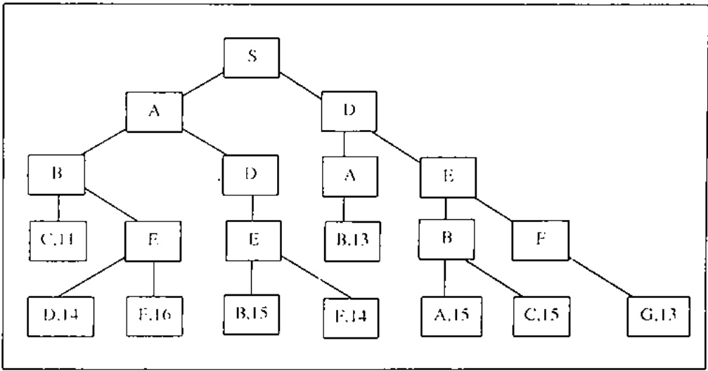

Hình 5-10. Các nhánh trong bài toán tìm dưỡng di trên bản đồ.

## II.1.3. Bổ sung các đánh giá để tăng hiệu quả tìm kiếm

Trong một vải trường hợp người ta cải tiến phương pháp tìm kiếm nhánh và biên bằng cách dùng thêm sự uốc đoán về đoạn đường còn lại, chua di, cũng như khoáng cách đã di được. Nhìn tổng thể, việc uốc đoán được gần sát đoạn đường còn lại cho phép người ta cộng với đoạn đường đã di sẽ được đánh giá sát về độ dài của cả con đường.

Dánh giả cả con đường $e = độ dài đoạn đã đi \, d + đánh giả đoạn còn lại \, e'$

Việc dự đoán giá của phần đường còn lại không dễ dàng. Dánh giá nó càng chính xác thì càng để có nhận định đúng về đường tối ưu. Thông thường các đánh giá đều không hoàn hảo, và việc đánh giá cao hơn giá đường di thực có thể làm người ta bờ mất đường tốt lẻ ra phải chọn.

Di nhiên dành giá thấp hơn giá thực không thể gây ra việc bỏ mất con đường tốt. Dánh giá thấp khoảng cách còn lại dưa đến giá trị đánh giá thấp của cại con đường.

Đánh giá thấp của con đường $u = \text{độ dài đoạn đã di } d + \text{đánh giá thấp của đoạn con lai } u'$

<!-- page: 141 -->

Nếu nguồn ta phát hiện được con đường do phát triển các nút theo đánh giá thấp, không phải sệt các đường có đánh giá cao hơn đường này. Nếu tất cả đoạn còn lại có thể được đánh giá thấp thì không thể sai làm được.

## Thi du

Khi chọn đường trên bản đồ, đường chim bay giữa hai thành phố là khoảng cách theo đánh giá thấp. Chắng hạn các dữ liệu trên hình đã thay đổi, giữa hai đường từ nút S di đến nút A, nút D, đường SD được chọn do có giá 12.9 thấp hơn 13.4.

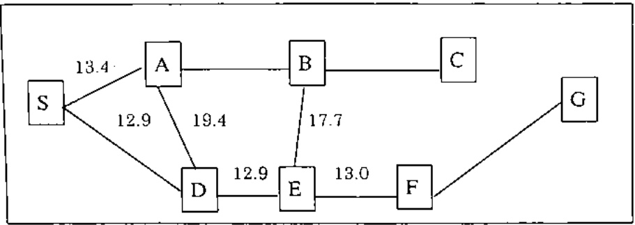

Hình 5-11. Các giá trị đánh giá thấp từ nút S đến nút được xét.

Phát triển nút D được các đường :

• SDA, đánh giá thấp là 19.4

\- SDE. đánh giá thấp là 12.9, do vay duồng SDE được chọn là duồng riêng để phát triển tiếp. Nút B được nổi với đánh giá khoáng cách là 17.7, và duồng đến F có đánh giá 13.0.

\- Việc di tiếp từ F là chính xác do giá thấp tại đó nhỏ hơn cả, nó cho phép dẫn đến G với tổng đánh giá là 13.0. Không còn đường riêng nào có đánh giá thấp hơn vậy, do đó không còn phải tìm kiếm hơn nửa.

Trong giải pháp vừa rối, người ta đã tiết kiệm được nhiều công sức. Thủ tục nhánh và biến được viết lại, với nội dung cải biến ở dòng chủ dầm.

Thủ tục tìm kiếm nhánh và biên với đánh giá biên thấp

1. Tạo hàng đợi có một phần tử là nút gốc, độ dài đường đi là 0.

2. Cho đến khi đường đầu tiên trong hàng đại kết thúc tại nút đích hay hàng đại rỗng, thực hiện :

\- Rút đường đầu tiên ra khởi hàng đội; tạo các đường môi bằng cách nói đường đầu tiên về phía lân cận của nút đích.

<!-- page: 142 -->

\- Bò di các đường xoay vòng.

• Bô sung các đường mới còn lại, nếu có, vào hàng đoi.

\- Sắp xếp toàn bộ hàng đoi theo tổng độ dài đường di và đánh giá biến thấp đổi với đánh giá đoạn đường còn lại, các đường giá ré lên trước.

3. Nếu thấy nút dịch thông báo hoàn thành, nếu không thi thông báo thất bại.

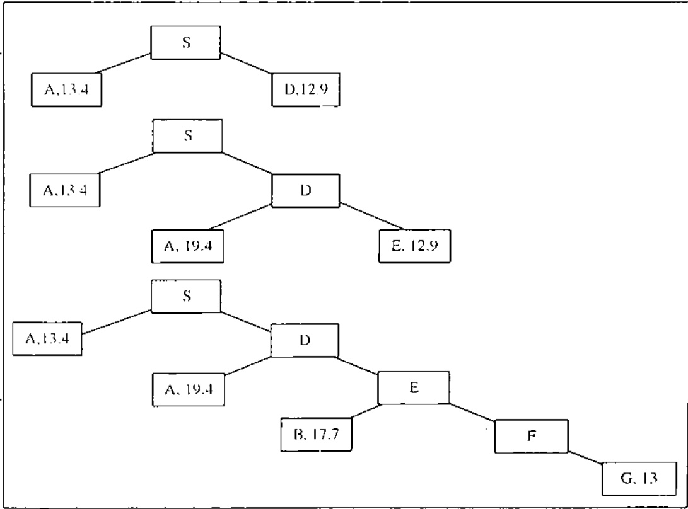

Hình 5-12. Các bước tim đường đi trên độ thị.

Việc doàn chính xác được khoảng cách của doàn đường còn lại là thuận lợi cho thủ tục. Tuy nhiên, vi không phải bao giờ cũng thực hiện được điều mong muốn nên người ta mối phải dùng đánh giá thấp hơn để thay thể. Việc dưa ra đánh giá biến thấp còn tốt hơn là không dưa ra đánh giá nào mà cho tất cả các uốc lượng giá của doàn chưa di là 0.

<!-- page: 143 -->

## II.2. Các đường thừa

Tiếp tục nghiên cứu cải thiện các giải pháp đã dùng trong bài toán do đường di trên bản đồ, người ta mong muốn thực hiện thủ tục có lưu ý loại bỏ các đường di thừa, không hiệu quả trong lúc tìm kiếm. Sau đó, thuật toán A đã được khác đến trong phần trước sẽ được giới thiệu cùng với các ứng dụng của nó trong việc lập kế hoạch người máy.

## II.2.1. Loại bổ các đường riêng bị thừa

Thi dụ

Theo thu tục trên, từ nút S người ta phát triển nút A, rót đến nút B, nút D. Do ban dâu D đã không được chọn để phát triển tiếp, không có lý gì mà nhánh SAD lại được phát triển tiếp.

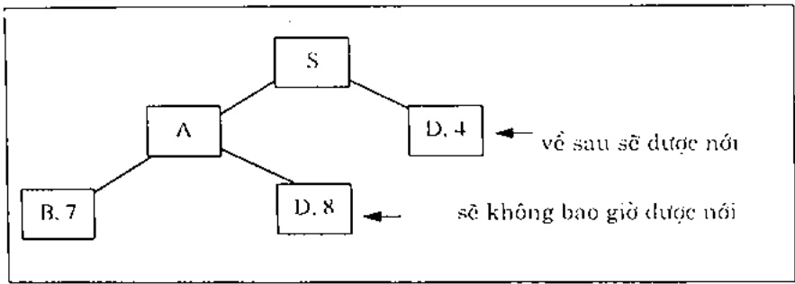

Hình 5-13. Ban dấu D đã không được phát triển ngay, mà phát triển A.

Việc không chọn D để phát triển tiếp cũng có lý khi người tại suy 'nghĩ ràng đã không di theo hướng SD với độ dài 4, tại sao lại phải di về D với độ dài 8. Trong trường hợp này. giả sử các đánh giá đoạn còn lại đều là 0. Thị dụ này cho thấy nhánh ứng với nút D là thừa, không nhất thiết di qua nó. Quá trình này tuân theo nguyên tắc chung là nguyên tắc quy hoạch động.

Giá sử đường di từ nút bất đầu là S qua nút trung gian I không có ảnh hưởng gì
• đến việc chọn các con đường từ I đến dịch G. Người ta nhận xét thấy :

Khoảng cách tối thiểu $u_{S \to I \to G} = khoảng$ cách tối thiểu $u_{S \to I} + khoảng$ cách tối thiểu $u_{I \to G}$

Nguyên tắc quy hoạch động phát biểu ràng "khi tìm đường tốt nhất từ S đến G có thể bỏ qua các đường khác từ S đến nút trung gian I, mà chỉ giữ lại một đường có độ dài nhỏ nhất".

<!-- page: 144 -->

## Định nghĩa 5-7 : Nguyên tắc quy hoạch động (Dynamic-programming principle)

Cách tốt nhất qua một nơi trung gian là đường tốt nhất tới nó kê từ nơi xuất phát, nơi với đường tốt nhất từ nó đến dịch. Không cần thiết tìm các đường khác từ/ đến nơi trung gian ấy.

Lục này thủ tục nhánh và biến có mang ý của nguyên tắc quy hoạch động được viết bị dưới đây. Những thay đổi của thủ tục này so với thủ tục ban đầu là các dòng m đạm :

Thủ tục tìm kiếm nhánh và biến với nguyên tắc quy hoạch động

1. Tạo hàng đại có một phần từ là nút gốc, độ dài đường đi là 0.

2. Cho đến khi dưỡng đầu tiên trong hàng đại kết thúc tại nút đích hay hàng đại rộng, thực hiện :

\- Rút đường đầu tiên ra khởi hàng đợi; tạo các đường môi bằng cách , nơi đường đầu tiên về phía lân cận của nút đích.

• Bò di các đường xoay vòng.

\- Bó sung các đường mới còn lại, nếu có, vào hàng đại.

\- Nếu hai hay nhiều đường gặp nút chung, xóa tất cả các đường này và chi để lại đường gặp nút chung với đánh giá tối thiểu.

\- Sắp xếp toàn bộ hàng đại theo độ dài đường đi. các đường giá ré lên trước.

3. Nếu thấy nút đích thông bảo hoàn thành, nếu không thì thông bảo thất bại. Thị dụ

Các hình cho thấy thủ tục nhánh và biên có lưu ý nguyên tắc quy hoạch động. Bến duống bị khóa lại ngay, chỉ để lại đường cụt đến nút C và duống tối ưu SDEFG.

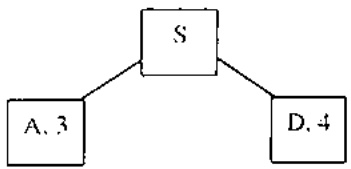

<!-- page: 145 -->

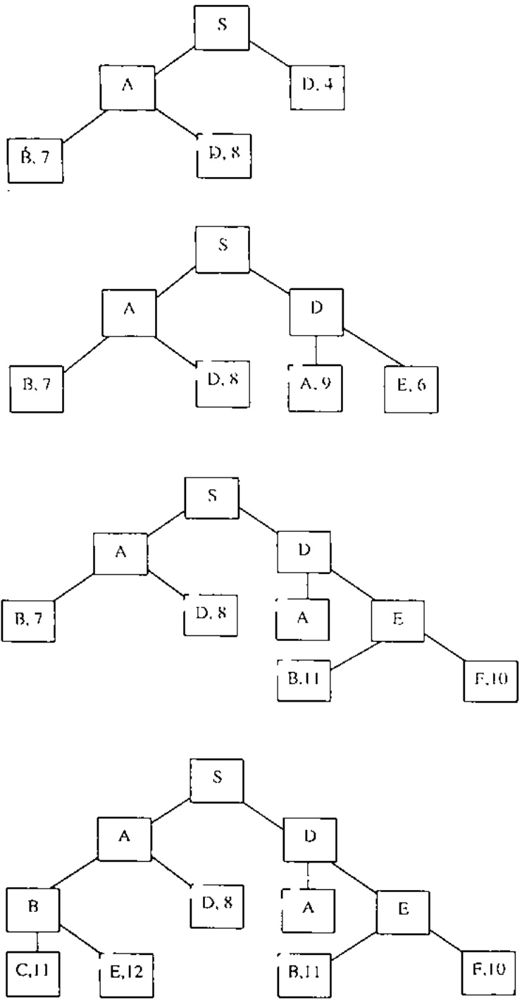

<!-- page: 146 -->

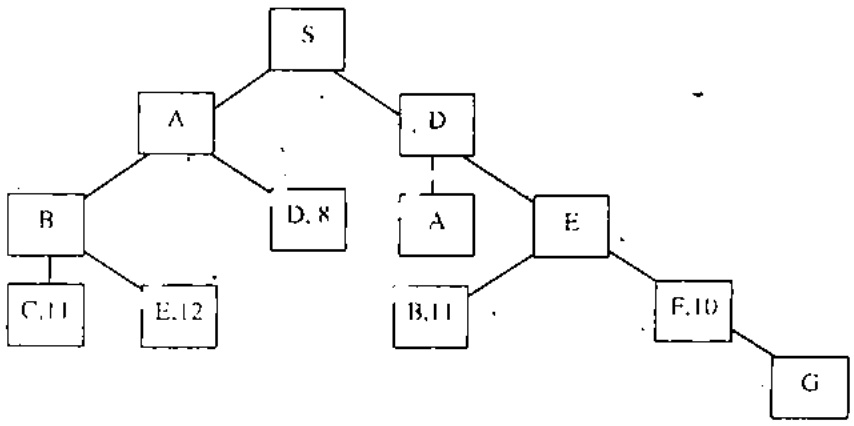

Hình 5-14. Thủ tục nhánh và biến có lưu ý nguyên tắc quy hoạch động.

## II.2.2. Cải tiến việc tìm kiếm nhánh và biến

Người tư dùng phương pháp đánh giá thấp và nguyên tắc quy hoạch động để cải tiến việc tìm kiếm nhánh và biên. Thuật toán, hay thủ tục A$^{*}$ là thủ tục tìm kiếm nhánh và biên, sử dụng đánh giá đoạn đường còn lại có sự kết hợp của nguyên tắc quy hoạch động. Nếu đánh giá khoảng cách còn lại là biên thấp của khoảng cách thực, thủ tục A$^{*}$ cho các lời giải tối ưu. Nhìn chung trừ các trường hợp đặc biệt, đánh giá này có thể được giá định là đánh giá biên thấp. Vậy nên các lời giải của thủ tục A$^{*}$ là tối ưu. Thủ tục A$^{*}$ tương tự như thủ tục tìm kiếm nhánh và biên có sử dụng nguyên tắc quy hoạch động.

Thuật toán A là thuật toán hữu hiệu, được Hart giới thiệu năm 1968.

\- Thuật toàn tìm trên đồ thị định hướng, tại các nút có mô tả trạng thái, cho biết nút đồ là hùa hẹn hay không.

\- Môi nút có trở về nút cha "tốt". Tức nút cha mà quá trình tìm kiếm vừa di qua: nôi này cho phép khởi phục lại đường đi, khi cần quay lại.

• Thuật toán dùng hai danh sách nút,

\- Tập OPEN gồm các nút được tạo, đã được áp dụng hàm may rút. Tức hàm đánh giá nhưng chưa được xem như nút trong đường đi, lời giải. Thực chất dày là danh sách các nút có độ vụ tiên cao, có hóa hạn hơn các nút khác.

♦ Tập CLOSED chúa các núi đã tham gia vào lời giải. hay dưỡng dị đang dẫn đến lời giải.

Tại mỗi nút. cần có hàm may rủi f để đánh giá, quan sát hướng di tiếp như phương pháp tìm rộng. Hàm f là thay-cho hàm f chi phí thực, được xác định $f = g + h'$.

<!-- page: 147 -->

trong đó hàm g là đó đo giá, hay chi phí. từ trạng thái dấu đến trạng thái hiện tại, tức tại nút hiện tại. Thực chất g là tổng của các giả áp dụng luật theo dưỡng di tốt nhất đến được nút đó. Hàm h' là ước lượng chi phí còn phải thêm vào g, để chỉ được đến lời guají, hay nút dịch. Mục đích của quá trình là f → m/n.

Thuật toán A xét từ nút dầu tiên: tại mỗi nút. A chọn ra nút có húa hạn hơn ça, tạo nút con cho nó, áp dụng hàm may rủi, dưa nút con đó vào danh sách OPEN. Nếu nút độ đã được tạo trong quá trình trước, không cần dưa thêm vào tập OPEN.

\- Bước 1. Bất dấu OPEN chỉ có nút gốc. Cho g=0, h' bất, kì, f=g+h'. Cho CLOSED rộng.

\- Buốc 2. Cho đến khi thấy nút đích. thực hiện việc lập sau :

Nếu không còn nút nào trong OPEN, dùng với thông báo thất bại.

Nếu có nút trong OPEN thì chọn nút ứng với f thấp nhất. Nút đó gọi-là BESTNODE. Lấy nút đó ra khởi OPEN, đặt vào CLOSED. Nếu đó là nút dịch, tức nút cho phép kết thúc quá trình trên cây tìm kiếm thì đã đến được dịch và dùng. Việc thể hiện kết quả có thể là mô tả đường di đến dịch, danh sách các nút tham gia vào quá trình, giá của đường di.

Nếu BESTNODE không là nút dịch thì tạo cho nó một nút con SUCCESSOR. nhưng chưa với cho BESTNODE  rewards đến nó. Với nút con này, thực hiện :

2.1. Cho SUCCESSOR trở về BESTNODE, titc tạo đường di nguộc.

2.2. Tính g tại nút này, g(SUCCESSOR) bằng tổng của g(BESTNODE) và giá từ BESTNODE đến nút này.

2.3. Nếu SUCCESSOR đã được tạo ra trước đây thì gọi là nút OLD và cho nó vào danh sách, các nút con của nút BESTNODE. Do nút này đã có trước đây nên nó có nút cha: cần quyết định nôi cha của OLD với BESTNODE không? Việc nôi là cần thiết nếu dưỡng đến SUCCESSOR là rẻ hơn đường đang đi đến OLD.

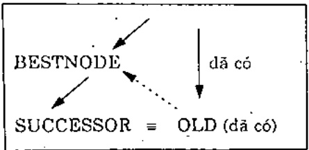

<small><span class="docvortex-page-footnote" data-block-type="page_footnote" style="color:#6b7280">Hình 5-15. Các bước 2.1, 2.2 và 2.3 của thuật toán A$^{*}$.</span></small>

<!-- page: 148 -->

Thực chất lúc này SUCCESSOR và OLD là một, và đường đến BESTNODE là rẻ hơn đến OLD. Việc này nhằm xác định quá trình đến OLD, tức SUCCESSOR qua BESTNODE là rẻ hơn qua cha của OLD hay không: rối cấp nhật giá trị g(OLD) rẻ hơn vào nút con đó; f(OLD) cũng được cấp nhật.

2.4. Nếu SUCCESSOR không có trong OPEN, xem nó có trong CLOSED hay không ? Nếu có, gọi nó là CLOSED OLD, và gần OLD vào danh sách các nút con của BESTNODE. Có đường trước dây di đến OLD, vậy cần kiểm tra xem đường đó là tốt hay đường qua BESTNODE là tốt. Sau đó cấp nhật hàm g, f. Nếu có đường tốt hơn đến OLD, cần tiếp tục cải thiện theo hướng các nút con của OLD cho đến khi gặp nút đã có trong OPEN hay không còn nút con. Nhu vây, để giá hạ, từ nút OLD người ta dùng phương pháp tìm sâu. Quá trình này cũng phải tạo ra các tự động về các nút cha.

2.5. Nõu SUCCESSOR không có trong OPEN hay CLOSED thì cho nó vào OPEN, đồng thời cho vào danh sách các con của BESTNODE. Tính  $\Gamma(\text{SUCCESSOR}) = g(\text{SUCCESSOR}) + h'(\text{SUCCESSOR})$ .

Lần quan đến thuật toán này, có một vân văn để cần lưu ý sau :

\- Thử nhất là hàm đánh giá g tại một nút. Vì có hàm h' cho phép đánh giá chỉ phí di tiếp tục đến dịch, khi thêm g vào h' để tạo ra f' người ta không đánh giá được uu điểm gần đích của một'nút bằng cách sử dụng riêng hàm h'.

Cho g=0 thì hàm f đánh giá được độ gần đích. Ngoài ra, trường hợp muốn đánh giá thuật toàn theo số bước ít nhất, cho g bằng hàng số chăng hạn g=1. Trong các trường hợp này, A\* tố ra phù hợp cho các quan tâm đa dạng.

\- Thứ hai, thuật toán A' lúc đầu áp dụng cho đồ thị bài toán. Tuy nhiên nó dùng cho cả cây bài toán, khi đó không cần quan tâm đến hai tập OPEN và CLOSED.

\- Thứ ba là hàm h', tục khoảng cách từ một nút đến nút dịch.

## Thí dụ

Nếu h' được đánh giá hoàn hảo. gần h. A\* sẽ hội tự ngay về đích. không cần nhiều bước tìm kiếm. Khi h'=0, việc điều khiển dựa vào g: nếu g cũng triết tiêu, điều khiển là ngầu nhiên.

Đồ thị có giá trên cung đều là 1. Ban đầu, từ nụt gốc A, có OPEN = !B.C, D,E.F!.
Tính f=g+h'. thấy cực tiểu đạt tại B. Giá sử di tiếp đến E, thấy còn ba bước nửa mới đến dịch. f(E)=5=f(C). Giá sử di theo E, sinh ra F. giả sử có giá là 3. Do vậy f(C)=6, chọn C. do f đạt giá trị 5.

<!-- page: 149 -->

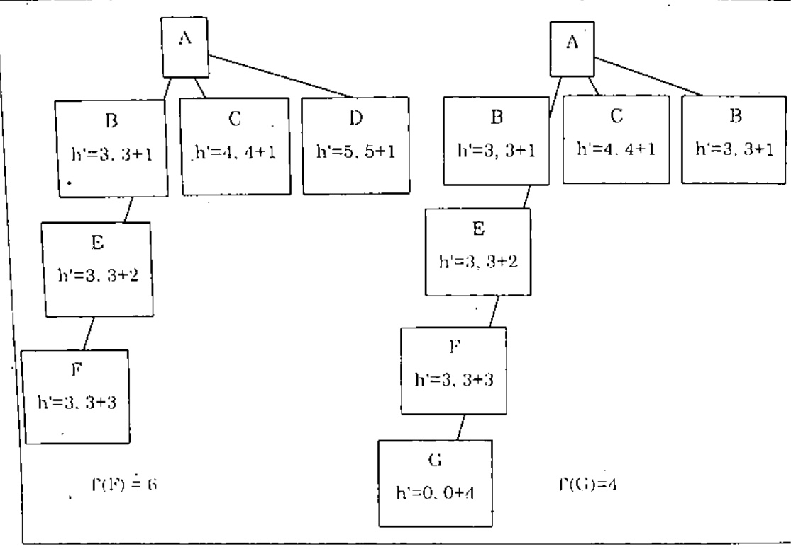

Hình 5-16. Hàm h' trong tìm kiếm.

Nhìn chung, nếu đánh giá h' quá cao so với h thu không thể thực sự tìm được dưỡng rẻ nhất. trừ phi phải duyệt tất cả cây.

Với vải điều kiện thuật toán A có thể cho lời giải tối ưu; còn trong điều kiện tổng quát thi chưa chắc.

## II.2.3. Nhận xét về việc tìm đường tối uu

Có nhiều thủ tục cho phép tìm lời giải tối ưu. Môi thủ tục đều có các ưu điểm và impulse điểm. Sau đây là một vài nhận xét so sánh các thủ tục này :

• Thủ tục Thụ viện Anh là tốt chỉ khi cấy tìm kiếm là nhỏ.

\- Việc tìm nhánh và biên là tốt đối với cây lớn và các đường không tốt rễ các hướng khác nhau. Việc tìm kiếm nhánh và biên có dự đoán là tốt khi có đánh giá biên thấp về đoạn đường còn lại cho tối đích.

\- Việc dùng thủ tục với ý tưởng quy hoạch động là tốt khi nhiều đường tự hội về nơi chung.

<!-- page: 150 -->

\- Thú tục $A'$ là tốt khi cả cách tìm kiếm nhánh và biến có uốc doán và quy hoạch động là tốt.

## II.2.4. Lập kế hoạch đường di của người máy

Phân nây giới thiệu một ứng dụng của thủ tục X trong việc lập kế hoạch cho người máy, hay mô tả sự tìm kiếm qua việc lập kế hoạch cho đường đi của người máy. Bải toán về người máy yêu cầu di chuyển một vật trong môi trường chất hep, từ nơi này đến nơi khác. Người máy cần tìm đường để tránh và chậm vào vật khác trên đoạn đường giữa hai địa điểm. Yêu cầu này thường gặp khi điều khiển chuyển động của người máy và cho tay máy di chuyển trong không gian nhiều hình kiện, thành phần.

Thí dụ

Cán di chuyển tam giác đến nơi khác mà không chậm phải ngũ giác và bất giác.

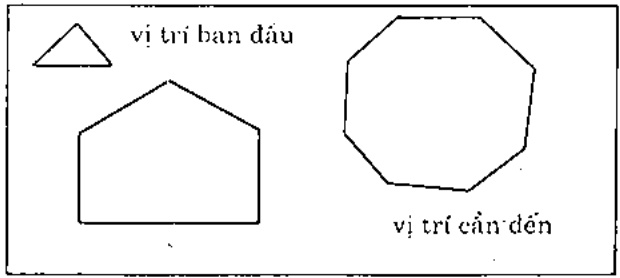

Hình 5-17. Cần di chuyển tam giác mà không chậm vào hai hình kia.

Bài toán yêu cầu lâchì tam giác giữa các hình, không được xoay. Trên mật phẳng người ta cũng tìm ra cách để trả lời bài toán. Nhìn chung bài toán được thể hiện dưới dạng khác, đơn giản hơn để chỉ giải bài toán để hơn, rời lại thể hiện lời giải dưới dạng của bài toán ban dấu.

Dạng ban đầu của bài toán tránh chuống ngại vật yêu cầu di chuyển vật cần chuyển chỗ và cả các vật chuống ngại; và có dạng thể hiện mới yêu cầu di chuyển điểm và các vật áo, lớn hơn gọi là các chuống ngại vật của không gian cầu hình.

Người ta cho trượt vật cần di chuyển, ở dây là tam giác, xung quanh chuống ngai vật, ở dây là ngũ giác. Lấy một điểm có định trên vật di chuyển, chăng hạn như ở dây là dinh của tam giác. Khi di chuyển sát biên của vật chuống ngai, điểm này vạch thành duồng bao, nhu trong hình là bất giác kê, dạm, gọi là vạch các điểm. Chuống ngai vật nào cũng có một duồng bao nhu vậy. Rỗ ràng là để vật di chuyển không và chậm thi miễn do-các duồng bao ứng với các đối tượng giữa hai địa điểm là không giao nhau.

<!-- page: 151 -->

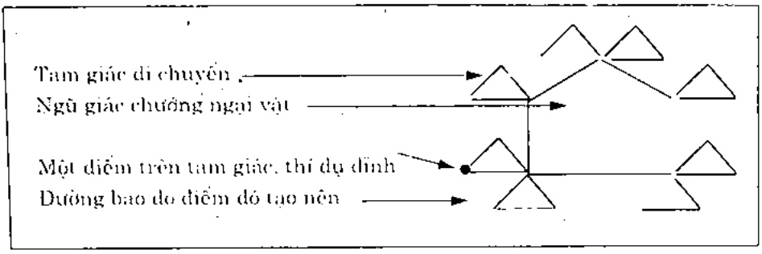

Hình 5-18. Tạo đường bao quanh một đối tượng.

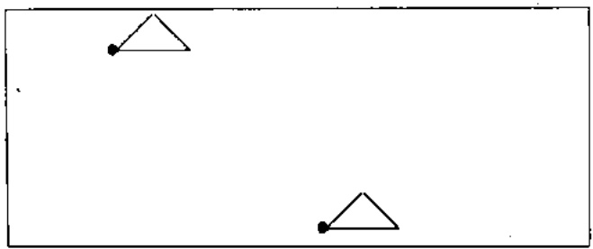

Hình 5-19. Đế tam giác di chuyển được, các đường bao không giao nhau.

Bài toán trong thí dụ trên được giải do tạm giác có thể di từ vị trí này sạng vị trí kia. Nó có thể di chuyển giữa hình ngủ giác và bất giác. Tuy nhiên duồng này chưa chắc chắn là duồng đi ngắn nhất. Còn phải tìm kiếm tiếp để kháng định được điều này.

Đế dưa việc tìm dưỡng trong bài toán này về bài toán tìm kiếm trên mạng các nút. người tả tạo ra mạng đối với không gian cấu hình hai chiều. Trong hình đã có miền bao các chuống ngại vật, khi đã chọn một điểm cố định cho vật di chuyển, chẳng hạn định của tam giác như trong thí dụ trên, nếu tại chỗ ban đầu có thể "nhìn" thấy điểm cần đến thi dưỡng thẳng là dưỡng ngắn nhất. Lức này bài toán trở nên đơn giản hơn. khi hai điểm xuất phát và đích nổi được bằng dưỡng tháng.

Nếu không nổi hai điểm đó được. người ta xuất phát từ điểm có định của vật tại nơi xuất phát. Việc di chuyển theo yêu cầu của bài toán bày giờ ứng với di chuyển của điểm này. Như vậy các vị trí khác nhau của điểm này tương ứng với các nút của mạng trong bài toán tìm dưỡng đi. Bài toán tìm dưỡng đi đã được giới thiệu. Giữa hai điểm người ta tạo ra một dưỡng nổi khi có thể kê được dưỡng thông, tức là dưỡng kê không

<!-- page: 152 -->

cát miễn bao của vật cản nào. Điều này có nghĩa là hạn điểm thấy được nhau. Vi vậy，má mạng này được gọn là đồ thị nhìn thấy được.

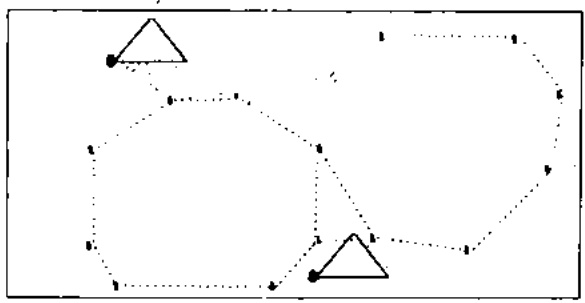

Hình 5-20. Xây dựng đô thị nhìn thấy được.

Dựa trên mạng các nút và đường này, thủ tục A\* được tiến hành đề tìm ra đường di ngắn nhất cho không gian cấu hình của người máy.

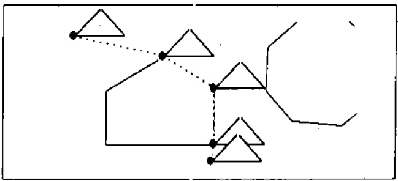

Hinh 5-21. Tîm duòng di ngân nhất.

Với bàn toán phức tạp hơn và cho phép vật di chuyển có thể xoay, người ta có thể xây dựng nhiều không gian cấu hình ứng với các góc độ khác nhau khi xoay vật này. Lức này việc tìm kiếm không những thực hiện trên các không gian cấu hình riêng lẻ mã còn phải chuyển từ không gian này sang không gian khác.

Nhìn chung khi cần chuyển động cảnh tay người máy, hay nấm một vật trong không gian ba chú không phải là hai chiều thì việc tạo dụng không gian cấu hình phù hợp là không đơn giản về mặt toán học.

<!-- page: 153 -->

## II.3. Phân rã bài toán

Đế phục vụ cho quá trình tìm kiếm lời giải của bài toán trí tuệ nhân tạo, người ta đã sử dụng cây OR và cả cây AND/OR. Cây AND/OR còn cho phép mô tả việc biến đổi một bài toán lớn thành các bài toán còn.

Thí dụ

Bài toán mua máy thu hình được tách ra hai bài toán con, trong đó bài toán con thứ hai là gộp của hai bài toán con khác :

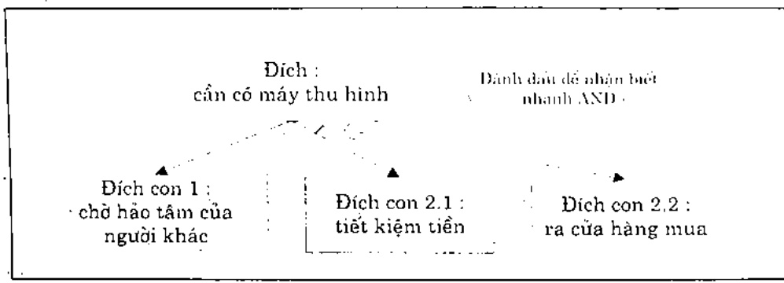

Hình 5-22. Tách bài toán ra các bài toán con.

Các nhánh được phản biệt hai loại, và các nút có tên tương ứng là AND/OR. Đồ thị trên chứa cả nút AND và nút OR.

Việc sử dụng cây, đồ thị AND/OR mô tả thể giới thực đời hỏi các kỹ thuật tìm kiếm lời giải phù hợp. Duối dây là quá trình cải tiến thuật toán A\* cho các đồ thị có cả nút AND. Như trong thí dụ trên, điều kiện dịch theo nhánh AND được thỏa mãn khi các dịch trong các nút AND đều thỏa mãn. Vậy nên đánh giá của nhánh AND là tổng đánh giá của các nhánh con.

## Thí dụ

Giả sử hàm g được lấy như nhau, g = 1.

Phát triển theo nhánh B, hay gọi là di theo dưỡng B, có đô thị chẳng hạn như dưới đây. Khi đó đánh giá A→B→(E,F) có đánh giá là 17+1=18 > 9, là đánh giá A→(C,D).

<!-- page: 154 -->

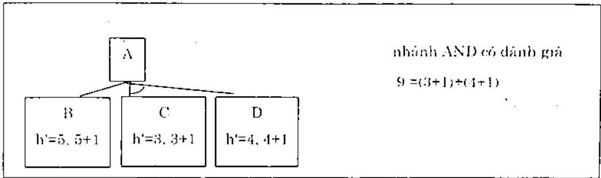

Hình 5-23. Nhánh C và D là các nhánh AND.

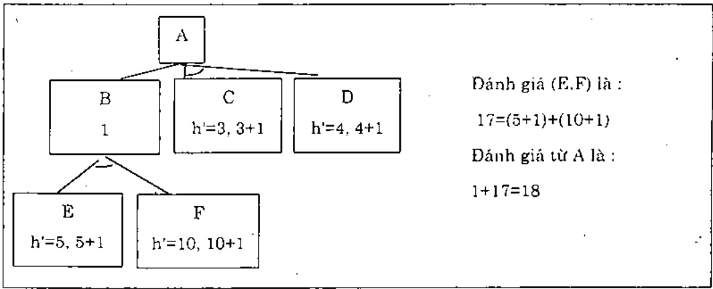

Hình 5-24. E và F là các nhánh AND của nút B.

Sang bưu tiếp, bình thường xét G. H. có tổng giá là $10 = 1 + (3 + 1) + (4 + 1)$. Do nút từ A đến C là AND với nút D. có giá là 27, tạo ra tổng giá theo con dưỡng này là $10 + 27 = 37$. Ngược lại, theo dưỡng B, đến E.F có tổng giá là $17 + 1 = 18$.

Trên cây AND/OR, việc duyệt cây, tức là giải bài toán trên cây được lập di lập lại ba bước sau đối với mỗi nút :

\- Tiến hành từ nút dầu. đến tập hợp các nút đã duyệt đến.

\- Chơn một nút, duyệt tiếp, như là phát triển ra nút khác. Bổ sung nút mới vào đô thi, tính h'. I cho nó.

\- Do có các nút mới, giá f của các nút khác cũng thay đổi. Di,ngược lại để xem trong số các nút trên nút vừa bổ sung, nút nào là có khả năng, hay hija hạn, nhất. Kết quả so sánh çó thể dẫn đến việc thay đổi đường đã được xem là tốt.

<!-- page: 155 -->

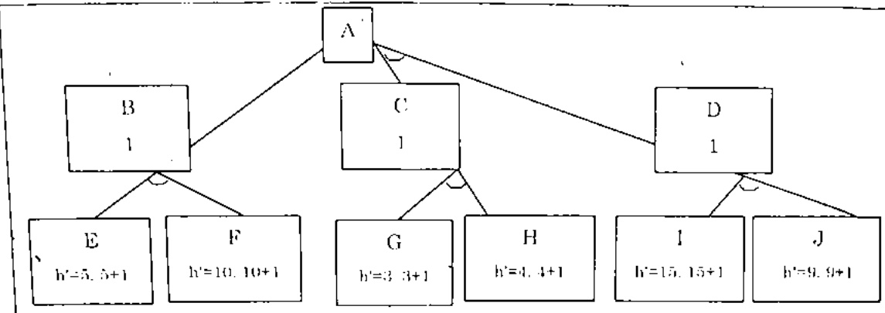

Hình 5-25. Cảc nút và các giả trị hàm đánh giá.

Trong thuật toán A$^{*}$. không để cập đến quá trình đi nguộc này.

Nút A phát triển ra các nút B. C và D. Cho A gần với 6. có nghĩa 6 = min{5+1, (3+1)+(4+1)!}. Nhánh (B.C) được gần giá trị bằng 9.

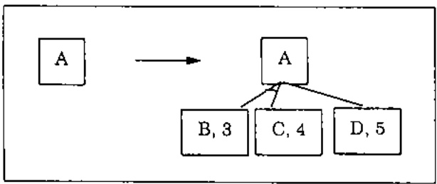

Hình 5-26. A phát triển ra các nút và được gán giá trị.

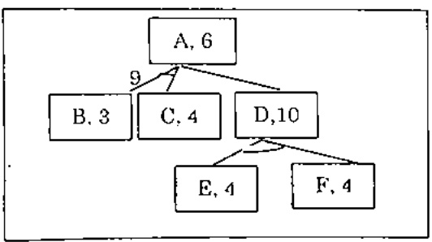

Hình 5-27. Phát triển D, được đánh giá bằng 10. So sánh với nhánh (B.C), đánh giá 9. Sang (B.C).

<!-- page: 156 -->

Chang hạn C kết thúc. Nhánh B la OR, nền B được cấp nhật giá trị 5+1=6. Do vậy A được cấp nhật là (6+1)+(4+1) = 12 > 10+1 của nhánh D. Vậy di lại theo nhánh A. D, (E.F)

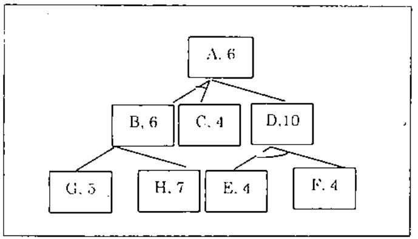

Hình 5-28. Dánh giá giá trị và quyết định đường di là AD(EF).

Do phức tạp hơn so với đồ thị OR, đồ thị AND/OR cần loại trừ các trường hợp dùng con ưu không hợp lý. Trong đồ thị AND/OR có các nhánh kép của nhánh AND, cho nên một nhánh có thể ưu đến nút của mức nào đó, trong khi nút gốc không đi đến được nút đó. Chẳng hạn từ nút gốc đến nút đó phải qua các nút không thể quai được, tức là nút không giải được, không phải lời giải.

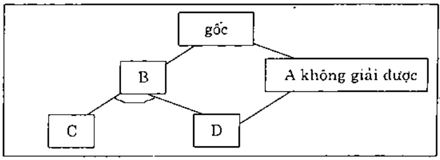

Hình 5-29. Nút A là nút không dua đến lôi giải, hay được gọi là nút không giải được. Con trở từ A sang D khiên D là không giải được. Đế giải B cần phải giải C và D, trong khi đó D là không giải được. Do vậy để giải bài toán, hoặc A trở D không hợp lý hoặc B không trở đến D.

Thuật toán tìm lời giải trên đô thị AND/OR là AÔ$^{*}$, được trình bày trong tài liệu của Nilsson vào năm 1980. Nội dung của nó so với A$^{*}$ thay đổi ở chỗ thay hai tập

<!-- page: 157 -->

OPEN, CLOSED bằng G. Môi nút có hàm h', cho phép đánh giá chi phí từ đó đến dịch.

Trong thuật toán này người ta không sử dụng đến hàm g. Thực ra, b' chưa đánh giá được hết cho một nút, chẳng hạn trong trường hợp có nhiều dưỡng dẫn đến nút đó, nhưng cò thể bỏ qua điều này do dưỡng đi đã được chọn là dưỡng tốt nhất. Ngoài các giá trị trên, thuật toán dùng giá trị QUA, đánh giá ngưỡng mã một nút không còn ý nghĩa nếu tiếp tục tham gia vào dưỡng dẫn đến lời gián.

## Thuật toán $AO^{*}$:

Bước 1. Cho G chúa trạng thái đầu, INIT. Uốc lượng h'(INIT).

Butoc 2. Cho đến khi INIT là lời gửi, ki hiệu bằng SOLVED ứng với nút cuối nhánh, hoặc giá trị hàm h' quá ngưỡng, h' > QUA, lập các bước nhỏ sau :

• 2.1. Phát triển thêm nút mới, gọi là NODE.

\- 2.2. Tạo nút con của NODE. Nếu không được, tức NODE không còn nút con thì cho QUA = h'(NODE). Điều này tương ứng với NODE là không giải được. Ngược lại, có nút con SUCCESSOR mà không là nút cha của NODE, thực hiện:

\- 2.2.1. G = G + SUCCESSOR, lưu ý phép toán cộng theo nghĩa tập hợp.

\- 2.2.2. SUCCESSOR là nút lá, túc nút cuối nhánh, cho nó maṅg nhân giải được, túc SOLVED. Cho giá trị $h' = 0$.

\- 2.2.3. Nếu SUCCESSOR không phải là nút lá, tính hàm h' cho nó.

2,3. Thông tin về các nút con và giá trị hàm h' được truyền lên các nút trên, cập nhật các giá trị h' tại đó. Gọi S là tập các nút SOLVED, hoặc nút mà có các giá trị h' đã thay đổi và có nhu cầu truyền giá trị h' đó về nút cha của nó. Trước tiên lấy một nút trong S là NODE; cho tới khi S là rổng, thực hiện các bước con sau:

\- 2.3.1. Chọn trong S một nút, gọi là CURRENT, mà trong S không có nút nào là nút con của nó. Việc này có nghĩa xử lý một nút trước các nút cha của nút đó. Thay đổi S= S-CURRENT.

\- 2.3.2. Tính h' cho CURRENT, theo các nút xuất phát từ CURRENT; giá theo mỗi cung bằng giá h' của nút cuối

<!-- page: 158 -->

cung công với giá tròn cung. Tại CURRENT, hàm h' lấy giá trị là cực tiểu của các giá theo các cung vừa được tính.

\- 2.3.3. Dánh dấu đường di tốt nhất, nếu di từ CURRENT, tức nhánh có giá trị h' đạt cực tiểu.

\- 2.3.4. Đánh dấu CURRENT là SOLVED nếu tất cả các nút được liên hệ với nó qua cung mới. đều được đánh dấu là SOLVED.

\- 2.3.5. Nếu CURRENT là SOLVED hay nếu giá tại CURRENT vừa thay đổi, thi trạng thái của nó cần được truyền lại đó thị. Rối cho S= S + các nút con của CURRENT.

Nhân xét I : Trong bước 2.3.5, của thuật toán, khi có nút mà giá thay đổi thì xến xét lại giá của các nút cha của nút này. Thoạt dầu thuật toán sẽ bổ sung các nút cha vào tập hợp: chính việc này đưa đến việc xét lại các đường trước dã bị cơi là không tối. Có thể lây thu dự minh họa cho nhận xét này.

## Thi dụ

Từ gốc là nút A, đi theo đường A, C là tốt. Do vậy đến nút E. Nếu đánh giá tại E là 10, thay vi 5 thì C thành 11 = 10 + 1. Do vậy đường A, C, E mất 12 = 11 + 1, lúc này đất hơn đường A, B, (D,E).

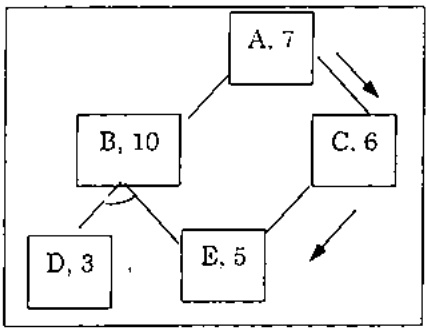

Hình 5-30. Bất dấu di từ nút A.

Điều này khiển cho người ta nghĩ ràng luôn phải cập nhật giá trị tại B để chứng
tó di qua C là tốt. Việc này làm cho các nhành từ B trở đi cần được phát triển tiếp; khi
đó có thể di theo hướng D là vô vọng, lâng phí, trong khi chỉ để chứng tổ đường qua C
là tốt hơn.

<!-- page: 159 -->

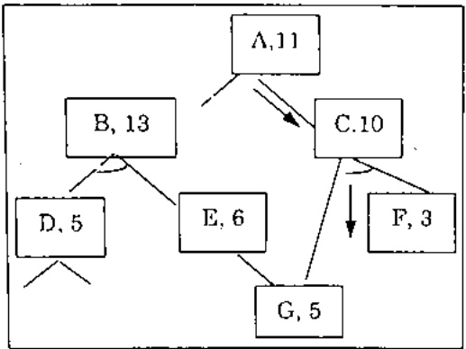

Hình 5-31. Các giá trị được cấp nhật.

D được cập nhật do các nhánh của nó. E được cập nhật do G được nôi ra. Tiếp theo C được cập nhật và A cũng được cập nhật.

Tuy nhiên có thể việc truyền giá trị ngưçe lại để cấp nhật các giá trị tại các một trên không có tác dụng, mà chỉ gây rời cho quá trình chính.

Nhận xét 2 : Một vấn đề nửa trong thuật toán AO là là sự tương tác giả các dịch con. Thuật toán này thực hiện một cách máy móc, không để ý ràng một số dịch con đã được giải thì không phải giải nửa, có nghĩa việc giải xong một dịch con không tác động gì đến việc giải các dịch con còn lại.

## Thí dụ

\- Một cách trựe quan, người ta thấy ngay ràng nếu xuất phát từ A. chỉ qua D là bài toán được giải xong, do C đã được giải và E cùng được giải.

Tuy nhiên thuật toán kiểm tra C và D. A được giải khi C và D được giải. Do C đã được giải, cần chủng tố D được giải. Nó xem hoặc C hoặc E có được giải hay không. Dủ rảng đánh giá của E thấp hơn của C, có thể nó vấn đi kiểm tra C có được giải hay không.

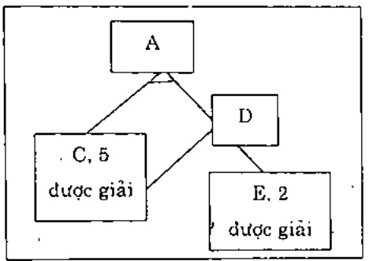

Hình 5-32. Khi C đã được giải thì D không kiểm tra tỉnh-giải được của C nữa.

<!-- page: 160 -->

## II.4. Kết luận về các thủ tục tìm

Trước khi kết thúc các nội dung về các mạng và cách tìm kiếm tối ưu, có vải nhận xét về các kỹ thuật tìm kiếm như sau :

\- Thủ tục Thủ viện Anh là một trong nhiều thủ tục thiên về việc tìm kiếm dưỡng đi ngắn nhất giữa hai điểm. Thủ tục này dưa ra tất cả các đường có được.

\- Việc tìm kiếm nhánh và biến thường tiết kiệm thời gian so với thủ tục Thư viện Anh. Nô nói nhánh riêng có đánh giá nhỏ nhất cho đến khi thấy đích.

\- Việc bỏ sung đánh giá thấp vào phương pháp tìm kiếm nhánh và biên làm tăng hiệu quả tìm kiếm. Việc bỏ di các đường thừa khi áp dụng nguyên tắc quy hoạch động làm tăng hiệu quả tìm kiếm. Việc dùng các đánh giá thấp và huy các nhánh thừa cho phép chuyển thủ tục tìm kiếm nhánh và biên thành thủ tục A.

\- Việc chuyên hóa không gian cầu hình đưa bài toán vật di chuyển và các chuống ngai về bài toán điểm và các chuống ngai. Khi đã được chuyển hóa, bài toán lập kế hoạch đường di của người máy được giải nhỏ thuật toán A$^{'}$.

## III. CAY TİM KIỂM VÀ CÁC ĐẦU THỦ

Liaçu các chương trình máy tính chơi các trò chơi ra sao ? Trong các trònbut đánh có có thể sinh ra các cây ứng với các nước di của dấu thủ. Dặc thủ của các trò chơi này là chúng thể hiện sự luán phiên giữa hai dấu thủ:

Lien quan dên các trò chơi giữa hai dấu thủ có các phép tìm kiếm sau :

\- Tim kiểm minimax, là phương pháp cơ bản để quyết định điều phải làm.

\- Cất xến alpha-beta, cho phép giảm dáng kê các tìm kiếm theo quan điểm bảo thủ là không tiếp tục các hướng đi không thuận lợi.

\- Việc đi sâu thêm và tiếp tục sử dụng may rủi để chương trình tìm kiếm hiệu quai hơn.

Những ký thuật này tiết kiệm thời gian tìm kiếm bởi lẻ chủng tránh các phương án đã biết chắc là không tốt, từе tránh bỏ nhiều công sức quanh các kết luận không máy ý nghĩa.

## III.1. Các phương pháp thuật toán

Các tỉnh huống trong trở chơi được thể hiện trên cây và cách tìm kiếm trên cây là cách thuận lợi để chọn các nước di.

<!-- page: 161 -->

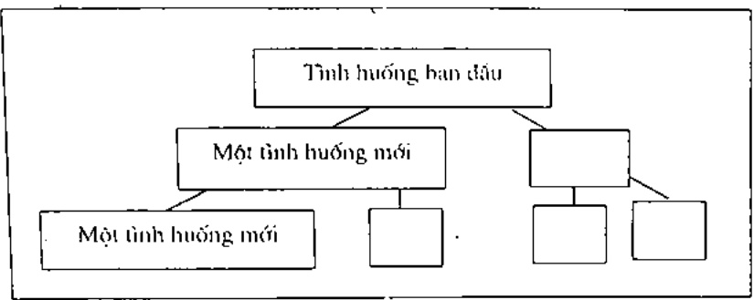

Hình 5-33. Dùng cây để thế hiện các nước di.

## III.1.1. Thế hiện các vị trí trò chơi qua các nút

Cây trò chơi dùng các nút để thể hiện trạng thái của trò chơi. Cây nay là một dạng của cây ngũ nghĩa, có các nhánh ứng với việc chuyển cấu hình sau một nước đi. Có thể xem hai nhánh xuất phát từ một nút là hai quyết định của hai dấu thủ.

Gọi p là số mức của cây thì độ sâu của cây là d = p - 1. Trong chơi cờ, nước di được xem như gồm một lựa chọn của một bên và nước di phần ứng của bên kua. Tuy vậy trên cây người ta cùng có thể coi mỗi lựa chọn, hay bước chuyển như một nước di.

## III.1.2. Tránh vét cạn

Với trò chơi như chơi cả không thể dùng thủ tục như Thư viện Anh, bởi nếu có khoảng 16 cách di, chơi khoảng 100 nước, thì số các nhánh cần vết cận là $10^{120}$, quá nhiều.

Đế quyết định một trong số các lựa chọn có thể được, người ta có thể nhớ nhiều tỉnh huống bài toán. Tuy nhiên không thể lưu trữ quá nhiều thông tin và cũng không xử lý tất cả các trạng thái của bài toán được. Do vậy người ta có thể dùng một chiến thuật phù hợp, quyết định chỉ trên tập các tỉnh huống hạn chế.

## III.1.3. Thủ tục minimax

Giá sǔ có bộ phản tích tinh huống cho phép chuyển các nhận định về các tỉnh huống về con số định lượng đơn giản. Nhân tiện giả sử số đó là dương nếu nó chỉ sự thuận lợi cho một dấu thủ. và âm nếu chỉ thuận lợi cho dấu thủ kia. Giá trị tuyệt đối của số này chứng tố mức độ thuận lợi.

Quá trình tính ra còn số phần ánh chất lượng của trò chơi được gọi là đánh giá tỉnh, còn thủ tục tính toán gọi là bộ đánh giá tỉnh. Con số vừa nêu được gọi là tỉ số

<!-- page: 162 -->

dánh giá tỉnh. Người chơi với mong muốn có các số dương gọi là dấu thủ max và dấu thủ kia được gọi là dấu thủ min.

Cây trò chơi được dùng cho việc thể hiện trò chơi giữa hai dấu thu này.

## Dịnh nghĩa 5-8 : Cây trò chơi (Game tree)

Cây trò chơi là cây ngữ nghĩa, trong đó các nut thể hiện câu hình trò chơi, các nhánh thể hiện các bước chuyển.

Việc ghi được thutc hiện :

• Thiết lập một nút cho hoặc dấu thu max, hoặc dấu thu min.

\- Liên kết cấu hình trở chơi với mô tả của cấu hình trở chơi.

Viec dọc được thực hiện :

\- Xác dinh nút nào cho hoặc dấu thú máx, hoặc dấu thú mín.

• Sinh ra mô tả cấu hình trò chơi.

Dấu thú max tim các bước chuyển dưa đến đánh giá là số dương lớn và giá sử ràng dấu thủ mìn sẽ có giữ trò chơi hướng về tỉnh hướng có đánh giá tỉnh âm nhiều.

Trên cây trò chơi, trước tiên là đầu thủ max di. xuất phát từ mức thứ nhất. Ho phải tính sao để đến mức sau của cây, ứng với lượt di của đầu thủ min, trò chơi tạo điều kiện tốt cho họ. Giả sử tại mức thú ba có các đánh giá 2, 7, 1 và 8. Do biết ràng đầu thủ min tại mức hai sẽ di theo nhánh đến nút 1 hoặc nút 2, ngay tại mức đầu đầu thủ máx sẽ chọn nhánh đến nút bên trái, cho phép sẽ dẫn đến nút 2.

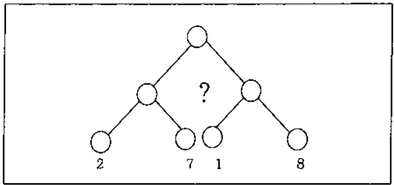

Hình 5-34. Đấu thủ max di trước, cần tính toán để nước di sau đó có lợi cho mình. Giá sử tại mức thú ba có bốn nút với các đánh giá là 2, 7, 1 và 8.

<!-- page: 163 -->

Tại mức hai, neu được di thị dân thời minus sẽ chọn các nhánh di đến tỉ số có lợi cho minh, tức nui 1 hoặc 2

Quyết định này cho phép gần hai minus tại mức hai là 2 và 1.

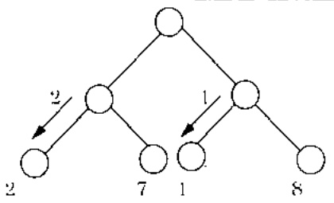

Hình 5-35. Lựa chọn của hai dấu thủ.

Thủ tục cho phép thông tin về các tỉ số được truyền lên trên câyorno chọn là thủ tục minimax. Do tỉ số này hoặc là tỉ số cực tiểu hoặc là tỉ số cực đại so với nút tiếp theo. Việc tìm kiếm theo thủ tục này được thực hiện theo các bước :

\- Nếu đã đến cuối đường tìm kiếm, tính giá trị tỉnh tại nơi hiện tại cho dấu thủ tương ứng. Cho ra kết quả này.

\- Ngược lại pêu mức này là mức của dấu thủ min, sử dụng thủ tục minimax đối với các nhánh con của nút hiện tại. Dưa ra giá trị cực tiểu.

\- Ngược lại, khi mức ứng với dấu thủ max. dùng thủ tục minimax đối với các nhánh con. Cho ra giá trị cực đại.

Quay lại bước dấu tiên, do dấu thủ max nhận thức được quyết định của dấu thủ min, họ sẽ chọn thành đưa đến một cuối cùng là 2.

Nhu vay nui goc se mang danh gia truyền lên là 2.

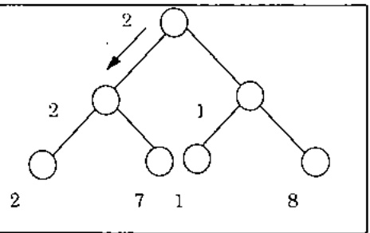

Hình 5-36. Nút gốc được truyền giá trị.

Lưu ý ràng toàn bộ ý tưởng của việc sử dụng thủ tục minimax là chuyển trò chơi về giá trị số tỉnh. Con số này đủ sao cũng không thể hiện được hết mọi ý được. Mặt khác, dùng thủ tục này không kinh tế vì phải tổn công để tạo ra các nhánh. Nhiểu lần sử dụng bộ tạo các giá trị tỉnh thì giá càng cao.

<!-- page: 164 -->

## III.1.4. Giám kích thước cây trò chơi nhỏ thủ tục Alpha-beta

Bộ đánh giá tỉnh trong thủ tục trên cần được thực hiện đối với tất cả các nút tại mức cuối của cây trò chơi. Người ta có thể giảm bột số tính toán tốn kém này bằng cách giảm số nhánh cây cần tạo ra và số các đánh giá tỉnh cần tỉnh ra. Do vậy một giải pháp như đã dùng trong thủ tục nhánh và biến là không tiếp tục đi theo các đường không tốt.

## Thi dụ

Sử dụng thí dụ trước đây. Thay vì xét tất cả bốn nút cuối, thủ tục chí xét hai nút trấn nhất, nút số 2 và số 7.

Tại mức ứng với dấu thủ max, khái niệm $ti$ số tốt có nghĩa giá trị lớn hơn. và đối với dấu thủ min là giá trị nhỏ hơn.

| Đầu thủ max ứng với mức tân cùng xét hai nút trải phát. Giá trị nhỏ hơn là 2.Giá trị này được truyền lên trên các mức của dấu thủ max với tỉ số ≥2 |
| --- |
| Đầu thủ mịn tại mức của mình sẽ chọn di theo nhánh có nút giá trị 2. Nút tại mức của dấu thủ mịn được ghi là =2. |
| Đầu thủ max xét nút lá thứ ba, giá trị 1.Hộ biết ràng tại mức trên đó, tức mức của dấu thủ mịn, giá trị của nút sẽ là ≤1.Tại nút gốc, dấu thủ max không cần biết nút lá thứ tư là bao nhiều mà quyết định di đến nút 2. |

Hình 5-37. Tỉ số tốt theo quan niệm của mỗi đối thủ.

<!-- page: 165 -->

Rô ràng ràng nếu một đối thủ đã chọn nước di dưa đến các nước di tối, không cần kiểm tra các nước di ứng với nước di đã chọn đồ. Tổng quất hơn người ta có nguyên tắc Alpha-beta.

## Dình nghĩa 5-9 : Nguyên tắc Alpha-béta (Alpha-beta principle)

Nếu người ta có y nghị rằng một điều chắc là tối thì dùng tồn thôn gian để thấy nó tối như thế nào.

Ý nghị này được gọi là nguyên tắc Alpha-beta là do nằm trong thuí tuc Alpha-beta. dùng hai tham số là alpha và beta để theo dõi các khả năng.

Theo ngữ cảnh của trò chơi, nguyên tắc Alpha-beta cho biết ràng khi biết thông tin tại một nút thì có thể kiểm tra điều sẽ xảy ra tại nút ông cha của nó. Thông tin tại nút cha cho biết việc tiếp tục di theo một số hướng từ đó là không có ý nghĩa nửa. Bời vay việc xác định chính xác thông tin tại một nút là cần thiết.

Nguyên tắc Alpha-beta như trong thí dụ trên dùng để xử lý các thay đổi tỉ số cũng có thể dùng cho bài toán quy mô lớn hơn.

## Thí dụ

Cây có độ sâu là 3, túc có bốn mức, khả năng rẽ nhánh là 3. Đề tiện theo dở tiến trình của suy luận thí dụ này dùng con số nhỏ bên cạnh chỉ thứ tự suy xét: các tỉ số vấn đạt cạnh các nút như trong thí dụ trước đây. Mức thử nhất của cây ứng với dấu thủ max.

Thi dụ chỉ phải đánh giá 16 giá trị tỉnh, thay vì 27 giá trị khi không dùng cách lược bỏ Alpha-beta. Cách di tốt nhất cho dấu thủ max là theo phánh giữa.

Có thể giải thích chỉ tiết các bước suy luận của các dấu thủ như trong hình vē.

\- Bước 1. Suy luận 1-2. Xuống nhánh trái của mối điểm quyết định, việc tìm kiếm cho thấy giá trị 8 là con số mà dấu thủ max chọn để đảm bảo tỉ số ít nhất là 8 với ba lựa chọn có thể được. Nhận xét này được chuyển xuống bước sau.

\- Bước 2. Suy luận 3-5. Đề chắc 8 là úi số tốt, dấu thủ max kiểm tra hai bước khác. Vì 7 và 3 nhỏ hơn 8, việc chọn tỉ số này là chính xác.

\- Bước 3. Suy luận 6. Người ta án định 8 và xem dấu thủ min sẽ chọn tỉ số đó ở mức trên. Bời vì bước tiếp dẫn đến tỉnh hướng cho dấu thủ max tỉ số 8, dấu thủ min ở bước trên có thể chọn tỉ số 8 hoặc nhớ hơn.

\- Bước 4. Suy luận 7-8. Đề xem dấu thủ min có thể làm tốt hơn tại mức thử hai, người ta cần kiểm tra hai bước còn lại của nó. Nhánh dấu tiên dẫn đến tỉnh hướng mà dấu thủ max có thể lấy tỉ số ít nhất là 9. Do 9 >8, nhánh này bị cất di. Với nhánh trái nó, nhánh này khẳng định thêm giá trị 8.

<!-- page: 166 -->

\- Bước 5. Suy luận 9-14. Đầu thủ mìn cản điều tra ý cuối cùng phần, xem đất thủ max sẽ làm gì ở đó ? Kết luận ở dây cho thấy thủ máx là 4.

\- Buốc 6. Suy luận 15. Giá trị 4 tại nhánh phương ở bước 5 được trên. Do 4 < 8 nên tư số này được ăn định cho nút ứng với đầu thử

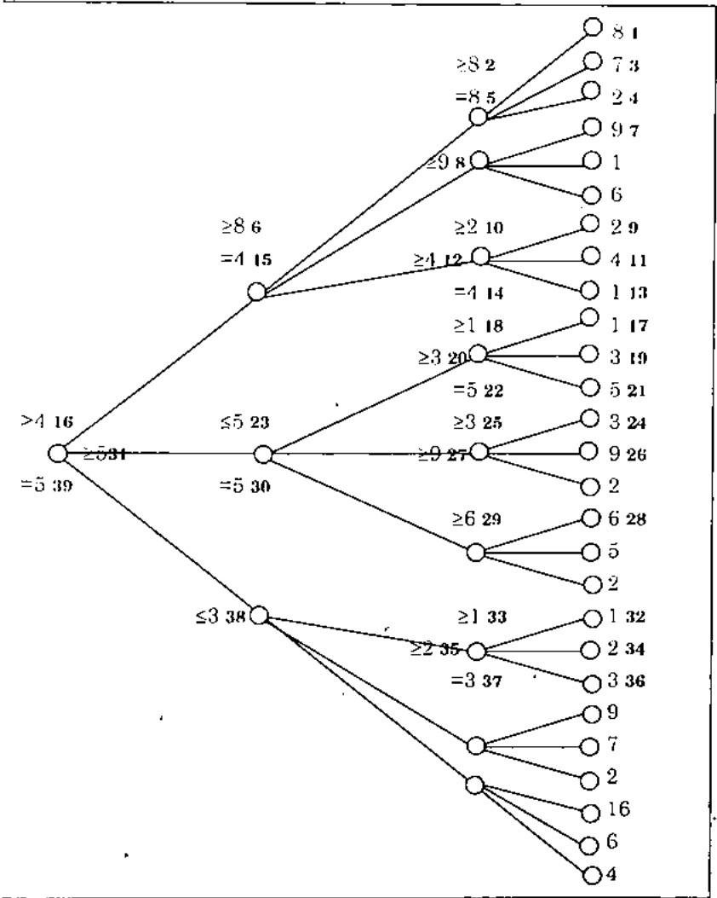

Hình 5-38. Sử dụng nguyên tắc Alpha-beta: Số nhỏ in đậm là số t

<!-- page: 167 -->

\- Buốc 7. Suy luận 16. Tại mức trên cùng, dấu thủ max kiểm soát tỉnh huống. Do nhánh bên trái có tỉ số là 4, vậy dấu thủ max sẽ chọn giá trị ít nhất là 4. Đề có được giải pháp tốt hơn, người ta kiểm tra hai nhánh còn lại.

\- ... tiếp tục các bước như với nhánh bên trái, nhánh giữa cho giá trị 5 và nhánh phải cho giá trị 3. Tỉ số 3 với 3 < 4 khiển cho thủ tục ngắt nhánh này ra khởi các xem xét sau này. Vậy tại mức trên cùng, giá trị 5 được chọn ứng với nhánh giữa.

Người ta thấy nhiều điều diệu kì khi dùng thủ tục Alpha-beta này. Môi kết luận riêng lẻ thấy có lý, nhưng thỉnh thoảng kết quả tổng thể xem như khó tin được. Trong thí dụ vừa nêu, người ta chưa bao giờ nhìn lên trên quá một mức để xác định việc đúng khai thác thủ tục. Trong các cây trò chơi sâu hơn, có nhiều mức thì việc ngắt bó vải nhánh hay xảy ra: điều này làm người ta không nhìn xa hơn được.

Một cách cho phép lưu lại vết của các tỉ số trong thủ tục là dùng các tham số alpha và beta, nhớ lại các quan sát cần thiết. Thủ tục Alpha-beta bất dấu từ nút gốc với giá trị alpha là -∞ và beta +∞. Thủ tục Alpha-beta gọi đệ quy với đây số giữa alpha và beta. Đế thực hiện tìm kiếm minimax với thủ tục Alpha-beta, có các bước sau :

1. Nếu mức của cây là gốc, lấy giá trị alpha là -∞ và beta là +∞.

2. Nếu đã đến cuối tìm kiếm, tính giá trị tỉnh của vị trí hiện tại cho dấu thủ tương ứng. Cho ra kết quả.

3. Nếu mức ứng với dấu thủ min :

3.1. Cho đến khi các nút con được kiểm tra bằng thủ tục Alpha-beta hoặc cho đến khi alpha ≥ beta, thực hiện :

\- Dùng thủ tục Alpha-beta với các giả trị alpha, beta hiện có trên nút con; ghi lại giả trị do thủ tục dưa ra.

\- So sánh giá trị thu được với beta: nếu giá trị thu được nhỏ hơn thì cho beta lấy giá trị này.

3.2. Cho ra giá trị beta.

4. Nguộc lại, mức này ứng với dấu thủ max. thực hiện :

4.1. Cho đến khi các nút con được kiểm tra bằng thủ tục Alpha-beta hoặc cho đến khi alpha ≥ beta, thực hiện :

\- Dùng thủ tục Alpha-beta với các giá trị alpha, beta hiện có trên nút con; ghi lại giá trị do thủ tục dua ra.

\- So sánh giá trị thu được với alpha; nếu giá trị thu được lớn hơn thì cho alpha lấy giá trị này.

42. Cho ra giá tri alpha.

<!-- page: 168 -->

## III.1.5. Dánh giá về việc cất nhánh của cây

Một cách để rõ thêm thủ tục Alpha-beta là xem hiệu quả của nó trong trường hợp tối nhất và xấu nhất. Thủ tục thủ tục Alpha-beta có thể không cất bỏ nhiều nhánh của cây.

Trong trường hợp xấu nhất, đối với một vài cây trở chơi, các nhánh có thể được sắp trước làm cho thủ tục Alpha-beta không cất được nhánh nào. Cơn với các cây khác, ứng với trường hợp tốt hơn, chẳng có cách nào để mọi nhánh của cây không bị thủ tục Alpha-beta cất bó.

Dôi với các cây được sắp xếp theo kiểu khác thi thủ tục Alpha-beta-phái xử lý nhiều. Gua sử cây được sắp đặt để bước di tốt nhất của dấu thu là theo nhánh cục trái tại các nút. Vậy nên rõ ràng là nước di tốt nhất tại gốc của cây là theo phía trái. Tuy nhiên cần thiết bao nhiều đánh giá tính là đủ để dấu thu tại gốc cây tin chắc bước di là tối ưu ? Liên quan đến vấn đề này. xem xét thí dụ minh họa sau.

## Thí dụ

Tình huống li tương theo thủ tục Alpha-beta như mô tả trên cây trò chơi. Thủ tục Alpha-beta làm giám còn một nửa hàm mũ. do không cần thiết xem xét tất cả các lụa chọn của các dấu thủ.

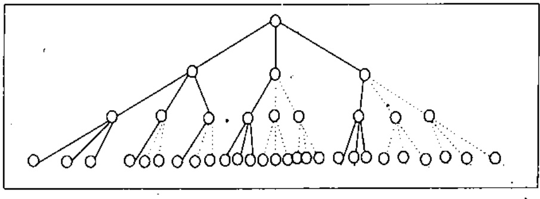

Hình 5-39. Cần giám nhẹ khối lượng tính toán đối với cây đã xếp các nhánh di tốt nhất về phía trái.

Trong cây độ sâu 3, có 3 khả năng rẻ unhánh thì thủ tục Alpha-beta giám các đánh giá tỉnh từ 27 còn 11.

Giả sử các nước di tốt nhất đối với cả hai dấu thủ đều là về phía trái, thì giá trị tại bước cực trái đối với dấu thủ max tại đình là giá trị tỉnh của trò chơi là giá trị tỉnh ở phía trái bên dưới. Giá trị tỉnh này đảm bảo cho dấu thủ max tin tưởng như đã được đổi sánh với các lựa chọn khác, và không cần xem dấu thủ min chọn nước di nào.

<!-- page: 169 -->

Đế kiểm tra bước đúng đán tại một nút đã cho trên cây trò chơi, người chơi cần xem xét một vải nút là phía dưới. Tất cả các nút lá xuất phát từ nước di không tối ưu của dấu thủ của họ có thể không cần phải xem xét đến. Người ta có thể thực hiện điều này do nguyên tắc của thủ tục Alpha-beta là "nếu đối thủ thực hiện nước di tối nào đó thì cho dù các nước di sau đó có ra sao, nó vấn là nước di tối". Sở đi người ta xử lý nước di nào đó của đối thủ của mình bởi vi người ta phân tích các nước di của đối thủ ngay khi đổi thủ dưa ra lựa chọn, và người ta hy vọng nước di lựa chọn đó chủng thực cho dự định của họ.

Bình thường phải tính 27 giá trị tỉnh. Người ta muốn có cây trò chơi đã được sắp thuận lợi để chỉ phải tính 11 giá trị. Đối với cây sâu hơn và có nhiều nhánh hơn, việc giảm số các giá trị phải tính không hoàn toàn như mong muốn. Thực tế số các đánh giá tỉnh cần thiết để tìm ra nước di tốt nhất trên cây trò chơi đã sắp tối ưu phụ thuộc. vào số các khả năng rẽ nhánh và độ sâu của cây. Kí hiệu b là khả năng rẽ nhánh. d là độ sâu và s là số các đánh giá tỉnh.

$$
\begin{array}{l l} \mathrm{s} = 2 \mathrm{b} ^ {\mathrm{d} / 2} - 1 & \text {với: d lẻ,} \\ \mathrm{s} = \mathrm{b} ^ {\mathrm{d} (\mathrm{d}) / 2} + \mathrm{b} ^ {\mathrm{d} (\mathrm{d}) / 2} - 1 & \text {với d chan,} \end{array}
$$

Tuy nhiên cần lưu ý là công thức trên chỉ đúng khi cây được sắp thứ tự hoàn hảo. Do vậy trong các trường hợp bình thường, công thức là cải mà người ta có thể trống dợi: nếu có cách nào xếp sắp lại cây để cho các nước di tốt nhất về bên trái, thì yêu tám sử dụng việc cất xén Alpha-beta.

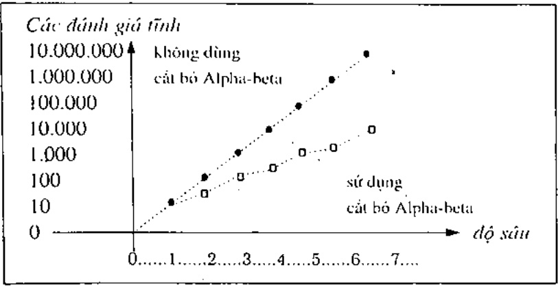

Hình 5-40. Dánh giá khối lượng tỉnh toán khi tăng kích thước bài toán.

Một điểm lưu ý nửa là đánh giá trong các thí dụ trên cho biết cận dưới của số các đánh giá tỉnh. Đánh giá này cần thiết cho trò chơi thực. Đó là cận dưới không sát với kết quả thực tế, mà còn phụ thuộc vào các nước di tốt nhường nào. Vậy nên kết quả

<!-- page: 170 -->

năm giữa giá trị xấu nhất và giá trị này. Điều này có nghĩa số các đánh giá tính trong khoảng b$^{1}$ và 2b$^{d2}$. Thực tế cho thấy số các đánh giá tính gần với trường hợp tốt hơn là xấu.

Một nhận xét về thủ tục này là khối lượng công việc trở nền quá lớn khi tăng độ sâu của cây trở chơi. Thủ tục Alpha-béta chỉ tố ra tốt khi kích thước bài toán không lớn; nó không ngân cần được sự phát triển theo hàm màu của các nút.

## III.2. Các phương pháp may rủi

Có thể một bài toán có thuật toán giải được về li thuyết nhưng không thực đo thực hiện trong thời gian quá lâu. Phản này giới thiệu cách các cây tìm kiếm thực hiện các bước trong khoảng thời gian hạn-hep. Đồng thời người ta còn lưu tâm đến việc bố trí công sức tính toán để'un tưởng các lựa chọn tốt nhất đã chọn ít ra sẽ là lời giải tốt.

## III.2.1. Tinh toán với thời gian hạn chế

Người ta cần di sâu dân dân và lưu y giữ việc tính toán không quá thời gian. Khi đến lượt minh các dấu thủ cần thực hiện một số bước di trong khoảng thời gian hạn chế Ràng buộc này không để thực hiện được do di thêm nhanh chậm vải bước còn phụ thuộc tỉnh hướng của bài toán. Đế tìm kiếm đến độ sâu án định độc lập với tiến triển của trò chơi, người ta cần sử dụng lựa chọn không cầu toàn đối với độ sâu đó. Ngược lại họ sẽ thua đo quá thời gian. Lức này lựa chọn không cầu toàn có nghĩa tạm hài lòng với lựa chọn tìm kiếm kèm hơn so với tìm kiếm trong thời gian thời mái.

Cách lên lời trong thế khó giải quyết này là phân tích từng mức của cây, từ mức thứ nhất, thử hai... cho đến khi thời gian hết. Lức này người ta lựa chọn có phân tích đến mức trên mức đã đạt đến một mức, tức là sẽ không bị quá thời gian.

Thực ra việc xét các nút tại d mức trước mức d+1 cuối cùng trên cây không tôn. nhiều công sức như xét các nút tại mức cuối cùng. Với cây độ sâu d, tức d+1 mức với độ rõ nhánh b thì số các nút cuối cùng là b$^{d}$; các nút còn lại là

$$
\mathrm{b} ^ {\mathrm{D}} + \mathrm{b} ^ {\mathrm{I}} + \dots + \mathrm{b} ^ {\mathrm{d-I}} = (\mathrm{b} ^ {\mathrm{d}} - 1) / (\mathrm{b} - 1)
$$

Tỉ lệ b$^{d}$ / ((b$^{d}$ - 1)/ (b-1)) ≈ b-1. Khi b=16 thì số nút tại mức cuối gấp khoảng 15 lần các nút tại các mức trên nó.

## III.2.2. Khắc phục hiệu ứng đường chân trời

Khi nước di tó ra tốt hơn hẩn các nước di khác, nước di này được gọi là mạnh. Do, vậy người ta thường xác định xem một nước di có phải là mạnh hay không bằng cách phân tích tình huống giả trị tỉnh cục bộ. Chẳng hạn khi người ta quyết định đến một vị trí cho phép di tiếp đến các nơi có giá trị tỉnh tốt hơn các nơi khác là do hầu hết các

<!-- page: 171 -->

bộ đánh giá tỉnh đều đánh giá nơi này tốt hơn. Dĩ nhiên nên chọn nước di dẫn đến vị trí thuận lợi ấy.

Phép may rủi nói rộng đơn không định việc tìm kiếm được tiếp tục khi mà giả trị tỉnh của nước đi còn tốt hơn nước đi còn lại, nhằm vào các nước đi mạnh: vì nếu giá trị tỉnh có sai thì nước đi mối sai. Theo phép này, tại mức ứng với dấu thủ max hay min, họ đều chọn nhánh rất khác với các nhánh khác. Dương nhiên các nước đi có thể đi được đều có giả trị tỉnh nằm trong khoảng quy định và giả thiết có nước đi mạnh tại một điểm; vậy nền phép may rủi nói rộng đơn không để ra việc tìm kiếm thêm.

Còn có cơ hội tiếp tục tìm kiếm khi mà việc phân tích của ta kết thúc trước khi đổi thủ chọn nhánh của ta hoặc ta chọn nhánh của đối thủ. Pháp may rủi để tìm kiếm cho đến khi yên lắng phát biểu ràng việc tìm kiếm còn được tiếp tục cho tối khi không còn nhánh nào nửa để chọn.

Những chương trình chơi cả tìm kiếm tất cả các đường cho đến cùng một độ sâu, do vậy tạo nên một nơi gọi là đường chân trời. Người ta e ngại hiện tượng này vì để có đột biến không tốt sau đường này. Thông thường các chương trình này dùng ở điểm giá trị thấp trên các con đường mà sẽ đến các điểm về sau không có được giả trị cao. Trong trường hợp này, nếu không dùng phép may rủi để tìm kiếm cho đến khi yên làng, hoặc phép may rủi nói rộng đơn, hay tiếp tục các phép như may rủi thì có nguy cơ bị hại do hiệu ứng đường chân trời.

Thí dụ

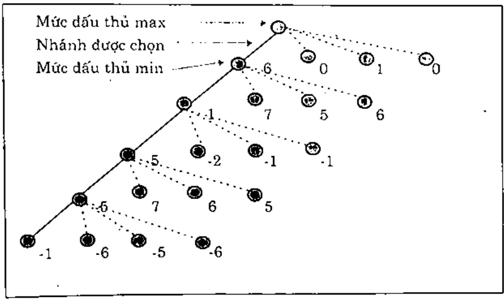

Hình 5-41. Các đánh giá tỉnh và việc khắc phục hiện tượng đường chân trời. Người ta dùng may rủi nói rộng đơn và chỉ xét nút cực trái.

<!-- page: 172 -->

Phép may rủi nơi rộng đơn khác phục được hiệu ứng dưỡng chán tròn. Tất cả các nút đều được đánh giá giá trị tỉnh như trong hình. Người ta chỉ nhìn trước một mức, do vậy chọn nhánh ứng với giá trị tỉnh cục đại 6, tục nhánh cục trải. Thực tế cho thấy nước đi này là tối nhất theo thủ tục minimax.

Theo nhận xét về đường chân trời, dấu thú max trong thí dụ này đã chọn ngay nút giá trị 6, chưa chắc đã tốt hơn lựa chọn khác.

## III.2.3. Phép may rủi lược bỏ để tìm kiếm hạn chế

Thủ tục cất bơ thỉnh thoảng được dùng dù không thường xuyên, với tìm kiếm Alpha-beta để hạn chế phát triển của cây trở chơi bằng các giám khả năng sinh thêm nhánh.

Một cách để xén bó cây trò chơi là bố trí để hệ số rẽ nhánh thay đổi theo độ sâu thâm nhập, chẳng hạn dùng cách tìm kiếm thu hẹp để tập trung vào các nước di có hùa hen hơn. Người ta có thể thực hiện việc tìm kiếm thu hẹp bằng cách xếp hạng các nút con của một nút và sử dụng công thức phát triển như sau. Khi đó có lẻ người ta nhận được bộ đánh giá tỉnh nhanh hơn bộ trước đây.

$$
\mathrm{n} _ {i + 1} = \mathrm{n} _ {i} \cdot \mathrm{h} _ {i + 1}
$$

Trong đó $n_{i+1}$ là số các nhánh được giữ lại tại nút con nào đó, $n_i$ là số các nhánh được giữ lại của nút cha của nó, và $h_i$ là hạng của nút này so với các nút anh em của nút này.

## Thí dụ

Gốc có 4 nút con. Nút con trái nhất được coi là hạng một, nút con thú hai hạng hai, nút con thú ba hạng ba...

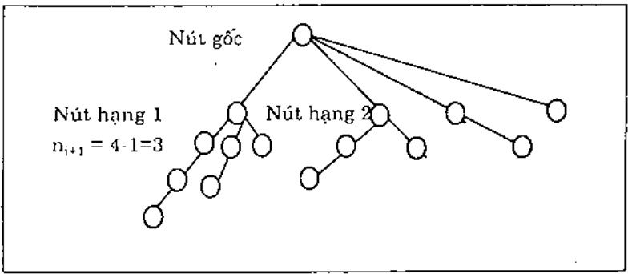

Hình 5-42. Nút con của gốc có các hạng khác nhau. Hạng của nút liên quan đến số nút con được phép có.

<!-- page: 173 -->

Theo công thải trên, cấy được phát triển như trong hình. Thủ tục thu hợp làm giảm một cách hợp lý việc tìm kiếm khi độ sâu tăng lên.

Một cách khác cho phép loại bỏ môi nguy hiểm là trong trường hợp nào cũng dùng ngay việc tìm kiếm khi chạy phải một nước di tối. Nếu có nhiều đường cũng khả năng, chi chọn một dưỡng.

## III.3. Kết luận

Duôi đáy là một số nhận xét tóm tất về các cây trò chơi và tìm kiếm của các dấu thu:

\- Trọng ngữ cảnh trở chơi, các nút thế hiện các tỉnh hướng trở chơi, và các nhánh thể hiện các nước di.

\- Độ sâu đ của cây trò chơi là số các nước di thực hiện. Người ta dùng đ +1 mức. Hệ số rè nhánh cây b là số trung bình của nước di xuất phát từ một nút. Trong hâu hết các trường hợp, người ta không thể thực hiện hết các đường đi đến cuối trò chơi, do số đường b$^{d}$ là quả lớn.

\- Thủ tục minimas dựa trên sự phân tích đánh giá bằng số được tính ra nhỏ bộ đánh giá tỉnh tại cuối cây trò chơi.

\- Thủ tục Alpha-beta cắt bỏ cây trò chơi cho phép số lần rõ nhánh giảm đi một nửa và cho phép tìm kiếm xa hơn hai lần. Thủ tục Alpha-beta mang ý tưởng là không đến xià đến các nước di đã biết là không tốt.

\- Việc tìm sâu liên tục phát hiện nước di nhìn trước, một nước, hai nước, ba nước... cho đến khi hết thời gian. Việc này đảm bảo luôn có nước di và không vi phạm thời gian hạn chế.

\- Các chương trình chơi cò bảy giờ mạnh đến mức người khó thắng nổi. Tất cả chủng đều dùng một dạng chọn nước đi liên tục may rủi.

## IV. CÁC RÀNG BUỘC SỐ VÀ VIỆC LAN TRUYỀN

Phân này giới thiệu cách di chuyển các giá trị trong các hộp ràng buộc của các thủ tục lan truyền; sau đó giới thiệu việc thực hiện việc truyền các ràng buộc số. Một thủ tục có thể truyền giá trị xác suất trên mạng các ý nghĩa. Công cụ này được dùng để giải bài toán nhận biết hình ảnh.

## IV.1. Lan truyền các số trên mạng ràng buộc số

Các ràng buộc số vận hành trên mạng cho phép người ta có thông tin giúp cho quá trình suy diễn.

<!-- page: 174 -->

## Tinidu

Các hộp ràng buộc số lan truyền các số trong các đắng thục. Có các đắng thục :

$$
\left[ 3 \right] = 1. 1
$$

$$
1 3 5 = 3 0 0 0
$$

$$
(5 = 1 3 1 ^ {*} 1 3 5
$$

$$
\mathrm{D} 5 = \mathrm{B} 1 ^ {*} \mathrm{C} 5
$$

Các động thức được biểu diễn lại thec một mạng.

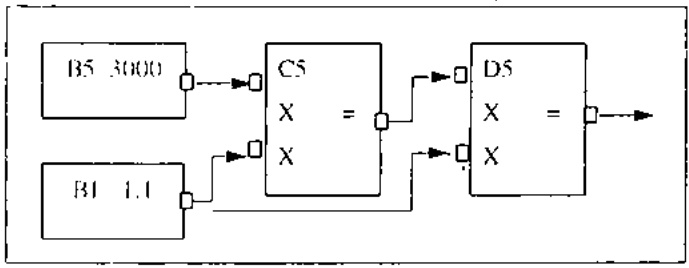

Hình 5-43. Hộp ràng buộc số.

Ràng buộc ở đáy thể hiện lôi ra của các hộp "nhân" có giá trị bằng tích của các giá trị dấu vào. Tuy nhiên cơi như không dùng thuật ngũ kỹ thuật, mạng chỉ gồm các thủ tục nhân và các toán hạng. Khi thay đổi một toán hạng, kết quả thay đổi theo.

Tương tự, hộp "cộng" đảm bảo ràng buộc khác tính theo tổng của các giá trị. Một cách để sắp xếp các phép tính này là thể hiện các hợp ràng buộc số theo hệ thống các khung. Nó được xác định như sau :

Định nghĩa 5-10 : Mạng lan truyền giá trị (Value-propagation net)

Mạng lan truyền giá trị là một cách thể hiện như hệ thống khung, trong đó

• Các hộp giá trị như các khung mang các giá trị.

• Các hộp phép toán như khung giữ các ràng buộc.

\- Thải tục ứng với một ứng dụng đặc biệt, ứng với lớp các hộp phép toán cụ thể, cho phép tính ra các giá trị đầu chưa biết khi có đủ thông tin tại các đầu khác của chính hộp đó.

Với công cụ như mạng lan truyền giá trị, người dùng có thể huấn luyện mạng ràng buộc số để mô tả các ý nghĩa.

<!-- page: 175 -->

Định nghĩa 5-11 : Mạng ràng buộc số học (Arithmetic-propagation net)
Mạng ràng buộc số học là mạng có dạng mạng lan truyền giá trị, mà các hợp biến mang các số, và các hợp phép toán giữ các ràng buộc số học.

## Thi dụ

Mạng số học mô tả việc nhân hai giá trị A, B sử dụng thủ tục when-written cho phép thực hiện :

Khi một giá trị ghi vào A, thủ tục kiểm tra : nếu không có giá trị tại B, không xảy ra chuyên gì. Nếu có giá trị tại B :

\- Nếu không có giá trị tại đầu ra, ghi vào đó tích của giá trị A, B.

\- Nếu có giá trị tại đầu ra mà giá trị này không trùng với tích giá trị A, B thì ghi tích giá trị A. B.

Định nghĩa 5-12 : Thủ tục when-read, when-written (when-read, when-written procedure)

Thủ tục when-read, when-written là các thủ tục được kích hoạt khí các giá trị tại các ngăn tương ứng được đọc vào, in ra. Do vậy các thủ tục này được dùng để quản lý các ràng buộc.

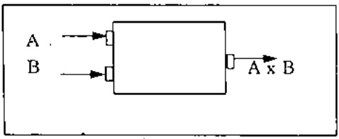

Hình 5-44. Mạng ràng buộc số học thực hiện thủ tục when-written.

Về nguyên tắc, cây gia phả mạng ràng buộc số học có thể thấy trong cây gia phá chung của mạng ngữ nghĩa vì các mạng ràng buộc số học là một loại mạng lan truyền giá trị, có thể thấy được nhỏ hệ thống các khung. Mặt khác việc tách nhánh lan truyền số ra khởi lan truyền các mô tả kí hiệu là một khuynh hướng, và họ các mạng ràng buộc số học cũng có thể được xét tách biệt với họ mạng ngữ nghĩa.

<!-- page: 176 -->

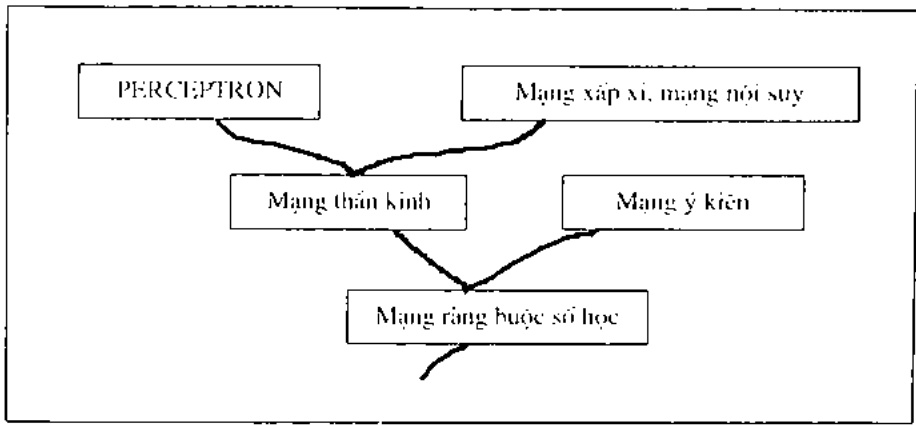

Hình 5-45. Cây gia phá của mạng ngũ nghĩa.

## IV.2. Lan truyền giá trị xác suất thông qua các mạng ý kiến

Trong phản trước đã cho thấy các ràng buộc số học có thể lan truyền trên mạng. Dưới dày giới thiệu sự lan truyền của giá trị xác suất.

## IV.2.1. Giá trị xác suất thể hiện tính không chắc chắn

Thí dụ

Một nguồn cần mua mảnh đất. Đề không bị hó họ có thể tham khảo các ý kiến.
Chẳng hạn họ tham khảo ý kiến của hai người môi giới và ý kiến của hai người bạn.
Những người được hồi ý kiến cũng không thể cho câu trả lời hoàn toàn khẳng định hay phủ định. Do vậy có thể dùng giá trị từ 0 đến 1 để chi sự tán đồng với quyết định mua mảnh đất. Mức độ cao của xác suất cho phép sự nhất trí cao với khẳng định mua được, có lợi.

Việc dùng các giá trị đánh giá cao, thấp cho phép mô tả sự việc uyền chuyển hơn. Các ý kiến có giá trị đãi rộng. chú không nhận một giá trị như mạng lan truyền giá trị. Các ý kiến sẽ được tập hợp lại để thủ được ý kiến cuối cùng. Tuy nhiên cũng có thể lấy ý kiến cuối cùng theo cách đến số ý kiến khẳng định cao, chẳng hạn 3/4 ý kiến nhất trị... Hon thể, có thể chỉ cần một ý kiến khẳng định trong số hai người môi giới và một ý kiến trong số hai người bạn. Quyết định cuối cùng khi có ý kiến khẳng định của cả phía những người môi giới và bạn bè. Mạng được giới thiệu trên hình, trong hợp là ràng buộc AND, OR.

<!-- page: 177 -->

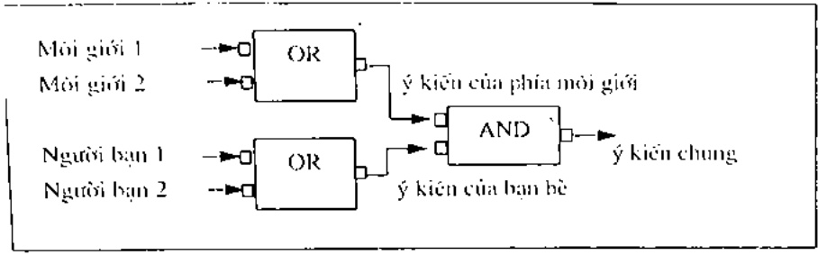

Hình 5-46. Mạng ràng buộc trong bài toán mua đất.

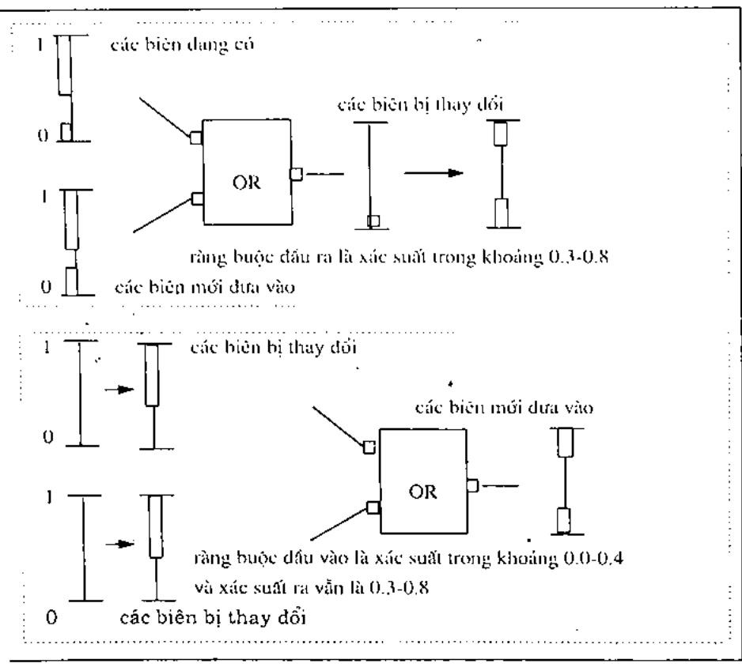

Hình 5-47. Thí dụ các ràng buộc với các giá trị biên. Hình vẽ dùng cột 0,1 với hai đường đậm dễ chỉ các giá trị cao và giá trị thấp trong khoáng 0,1. Chúng được gọi là các giá trị biên.

<!-- page: 178 -->

Các hộp ràng buộc này hoàn chính hơn các hộp số học; nó dựa vào lý thuyết xác suất chú không dựa vào số học. Trong hộp OR của các giá trị A và B thì A ∨ B là giá trị thu được tại dấu ra. Dùng các kí hiệu l(X), u(X) để chi giá trị thấp nhất, cao nhất của X thì :

$$
\mathrm{u} (\mathrm{A}) \leq \mathrm{u} (\mathrm{A} \vee \mathrm{B}),
$$

$$
\mathrm{l} (\mathrm{A}) \geq \mathrm{l} (\mathrm{A} \vee \mathrm{B}) \cdot \mathrm{u} (\mathrm{B}),
$$

$$
\mathrm{u} (\mathbf {B}) <   \mathrm{u} (\mathbf {A} \vee \mathbf {B}),
$$

$$
\mathrm{I} (\mathrm{B}) \geq \mathrm{I} (\mathrm{A} \vee \mathrm{B}) \cdot \mathrm{u} (\mathrm{A}),
$$

$$
\mathrm{u} (\mathrm{A} \vee \mathrm{B}) \leq \mathrm{u} (\mathrm{A}) + \mathrm{u} (\mathrm{B}),
$$

$$
\mathrm{l} (\mathrm{A} \vee \mathrm{B}) \geq \max (\mathrm{l} (\mathrm{A}), \mathrm{l} (\mathrm{B})).
$$

Lức tập hợp lại các khẳng định và các hợp ràng buộc xác suất người ta thu được mạng ý kiến. Khi làm việc với mạng ý kiến, thuật ngũ đầu vào, đầu ra không thật , chất chế do một giá trị là đầu vào tại hợp này, nhưng là đầu ra của hợp khác. Qua thí dụ có thể thấy được việc lan truyền tiến và lan truyền lùi. Các giá trị xác suất hoặc đi từ đầu vào đến đầu ra hay ngược lại.

## IV.2.2. Lược đồ Venn mó tả các điều kiện ràng buộc biến

Đế hiểu các biên xác suất người ta nghĩ về các lược độ mà trong đó các sự kiện được cơi như các chấm. Một vài sự kiện thuộc lớp các sự kiện A ứng với các chấm thuộc miền mang nhãn A. Các chấm khác thuộc B. Các sự kiện đều ở bên trong hình chữ nhật gọi là vũ trụ. Nếu có sựện thuộc cả hai lớp, hình A giao với hình B. Lước độ này gọi là lược độ Venn hay lược độ các sự kiện.

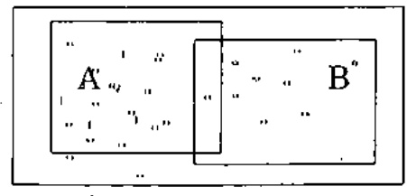

Hình 5-48. Lược đô các sự kiện.

Lước đồ Venn giúp người ta hiển thị ý tưởng về xác suất; nếu người ta tăng số các sự kiện trong một lớp, ứng với việc gia tăng miền phân bổ cho lớp đó trong lược đồ Venn thì xác suất của lớp hoặc không đổi hoặc tăng lên. Xác suất không đối chỉ khi các sự kiện thêm vào có xác suất bằng không.

<!-- page: 179 -->

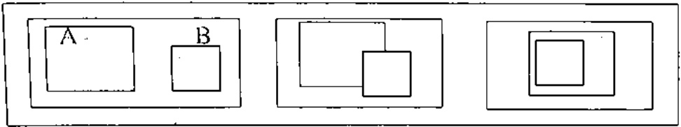

Hinh 5-49. Miền phản phối cho A và B.

Gọi xác suất của lớp X là p(X), xác suất để sự kiện thuộc A hay B là p(A v B). Xác suất ứng với miền trong hình vẽ. Xác suất p(A v B) ứng với miền do cả A và B được phân phối.

Trực quan thấy ngay

$$
\max \left(\mathrm{p} (\mathrm{A}), \mathrm{p} (\mathrm{B})\right) \leq \mathrm{p} (\mathrm{A} \vee \mathrm{B}) \leq \mathrm{p} (\mathrm{A}) + \mathrm{p} (\mathrm{B})\tag{a}
$$

Giá trị p(X) không thể nhỏ hơn ràng buộc biến xác suất thấp nhất là l(X), có nghĩa là l(X) ≤ p(X). Tường tự p(A) ≤ u(A). Vậy $\max(l(A), l(B)) \leq \max(p(A), p(B))$. (b)

Kết hợp (a) và (b): max(l(A), l(B)) ≤ p(A ∨ B), tức là max(l(A), l(B)) ≤ l(A ∨ B).

Do $p(A) + p(B) \leq u(A) + u(B)$ và (a) thu được : $p(A \lor B) \leq u(A) + u(B)$ đối với mọi giá trị xác suất, tục là $u(A \lor B) \leq u(A) + u(B)$. Các ràng buộc này như các ràng buộc · đối với hộp OR đã nêu trong phần trên.

Tương tự đối với hộp AND người ta thu được các kết quả sau :

$$
\begin{array}{l} \mathrm{u(A)} \leq \mathrm{u(A} \wedge \mathrm{B)} \cdot \mathrm{l(B)} + 1 \\ \mathrm{l(A)} \geq 0 \\ \mathrm{u(B)} \leq \mathrm{u(A} \wedge \mathrm{B)} - \mathrm{l(A)} + 1 \\ \mathrm{l(B)} \geq 0 \\ \mathrm{u(A} \wedge \mathrm{B)} \leq \min (\mathrm{u(A)}, \mathrm{u(B)} \\ \mathrm{l(A} \wedge \mathrm{B)} \geq \mathrm{l(A)} + \mathrm{l(B)} - 1 \end{array}
$$

## IV.2.3. Lan truyền các biên xác suất

Quay lại thí dụ hỏi ý kiến bốn người để quyết định mua mảnh đất. Trước tiên, không một ai trong số bốn người đưa ra ý kiến gì. Rồi các biên xác suất gắn với việc khẳng định mua đất lấy giá trị từ 0 đến 1, được viết là [0,1].

Tiếp theo giả sử có một người môi giới nghị rằng khả năng mua được là 0.25 đến 0.75, viết là [0.25, 0.75]. Với thông tin này và cách thức lan truyền trong hộp OR,

<!-- page: 180 -->

người ta có thế xác định được biến dưới là $\max(0.25, 0) = 0.25$. Biến xác suất trên vấn là 1.

Kho nhận được ý kiến của người mỗi giới thứ hai, cho ràng biên là [0.33, 0.66], biến xác suất nhóm người mỗi giới là max (0.25, 0.33) = 0.33.

Nguồn bạn thử nhất cho ý kiến ứng với biến xác suất [0.15, 0.15], người thứ hai [0.85, 0.85]... cuối cùng thu được biến dưới của tổng hợp các ý kiến của các bạn là 0.85. Biên dưới xác suất kết hợp hai nhóm ý kiến là 0.33 + 0.85-1 = 0.18, theo hợp AND. Nhuí vậy giá trị chuyển dịch từ 0 đến 0.18.

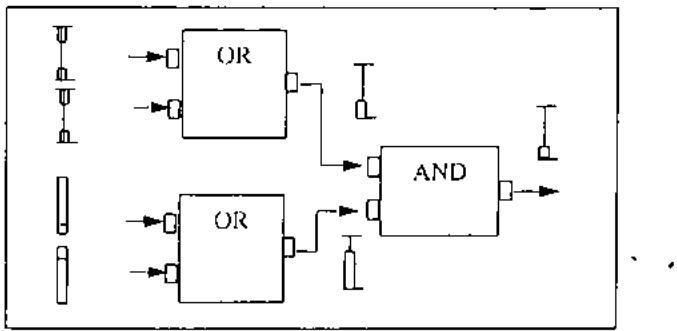

Hình 5-50. Các biên xác suất trong bài toán mua đất.

## IV.3. Lan truyền độ cao nhỏ các măng số liệu

Phân trên đã cho thấy cái cách cho phép các ràng buộc số học lan truyền trên mạng. Tiếp theo là cách để các ràng buộc đối với các phần tử của một măng được lan truyền. Loại lan truyền này hữu hiệu khi người ta nhìn hình ảnh để hình dung ra các thuộc tính về bề mặt như khoáng cách, phương hướng.

## IV.3.1. Các ràng buộc cho phép làm trơn số liệu

Giả sử người ta muốn dụng bản đồ đất số hóa, có chỉ độ cao. Người ta dùng dụng cụ do áp suất không khí để xác định độ cao tại những nơi định đo. Các kết quả do thu được là b$_{i}$ với độ chắc chắn c$_{i}$. Độ tin cây c$_{i}$ trải từ 0 có nghĩa ít giá trị nhất đến 1 có nghĩa hoàn toàn tin cây.

Khi đánh giá độ cao, quy uốc dùng hai nguyên tắc :

\- Môi đánh giá được gắn với giá trị do đồng hồ do chỉ, nếu có giá trị do.

<!-- page: 181 -->

\- Độ cao bằng trung bình hai độ cao bên cạnh, khi không có giá trị đo. Giá sử vùng đất không làm chởm.

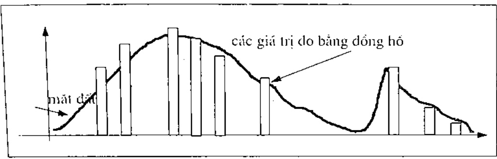

Hình 5-51. Dụng bản đồ về độ cao.

Những nơi không có chỉ số đồng hồ quy ước lấy $b_{1}$ và $c_{1}$ là 0. Dộ cao $a_{1}$, dược tính theo công thức :

$$
\mathrm{a} _ {\mathrm{i}} = \mathrm{c} _ {\mathrm{i}} \mathrm{b} _ {\mathrm{i}} + (1 - \mathrm{c} _ {\mathrm{i}}) (\mathrm{a} _ {\mathrm{i}, 1} + \mathrm{a} _ {\mathrm{i}, 1}) / 2
$$

Cũng có công thức cho phép tính độ cao theo xấp xỉ do lan truyền ràng buộc số.

Bước dâu là ước lượng độ cao khởi dâu :

$$
\mathrm{a} _ {i} ^ {\prime \prime} = \mathrm{c} _ {i} \mathrm{b} _ {i} + (1 - r _ {i}) (\mathrm{b} _ {i + 1} + \mathrm{b} _ {i - 1}) / 2
$$

Tiếp theo dùng các đánh giá độ cao ban dấu để tạo nên cái thú hai. Cải thiện tập các đánh giá độ cao.

$$
\mathrm{a} _ {1} ^ {1} = \mathrm{c} _ {\mathrm{i}} \mathrm{b} _ {\mathrm{i}} + (1 \cdot \mathrm{c} _ {\mathrm{i}}) (\mathrm{a} _ {1 + 1} ^ {0} + \mathrm{a} _ {1 - 1} ^ {0}) / 2
$$

Nói chung thì :

$$
\mathrm{a} _ {\mathrm{i}} ^ {\mathrm{n}} = \mathrm{c} _ {\mathrm{i}} \mathrm{b} _ {\mathrm{i}} + (1 - \mathrm{c} _ {\mathrm{i}}) (\mathrm{a} _ {\mathrm{i+1}} ^ {\mathrm{n-1}} + \mathrm{a} _ {\mathrm{j-1}} ^ {\mathrm{n-1}}) / 2
$$

Loại ràng buộc số này gọi là công thức truy hồi do toán học cung cấp. Các thủ tục dùng các công thức này là các thủ tục truy hồi. Cấu trúc tổng quát của thủ tục lan truyền dựa vào truy hồi được phát biểu như sau :

Định nghĩa 5-13 : Lan truyền ràng buộc số thông qua măng theo kiểu truy hồi (Propagation of numeric constraints through arrays using relaxation)

Là thủ tục :

1. Dùng măng ban đầu làm măng hiện tại.

<!-- page: 182 -->

2. Cho đến khi các giá trị trong máng thay đổi đủ chám :

\- Tính phân tử màng môi theo công thức truy hồi cho các phân tử của màng hiện lại,

\- Lấy máng mới làm máng hiện tại.

## IV.3.2. Tính bền vững tổng thể

Đối tượng toàn thể của các thủ tục lan truyền ràng buộc số là tìm ra các giá trị luôn bền vững trong các ràng buộc đặt ra. Khi các thủ tục lan truyền số dùng các ràng buộc chỉ với phạm vi áp dụng hợp, người ta nói ràng thủ tục dùng tính toán cục bộ. Khi các ràng buộc đúng mọi nơi, các số thỏa mãn điều kiện ràng buộc được gọi là có tính bền vững tổng thể. Vậy nên việc lan truyền ràng buộc cần đạt được tính bên vùng tổng thể thống qua tính toán cục bộ.

## IV.4. Tìm kiểm lời giải theo các ràng buộc

Việc tìm kiếm lời giải theo ràng buộc có thể được minh họa qua các bài toán như bài toán trên lịch với điều kiện các nút trên đồ thị được đánh giá độc lập, chăng hạn các nút trong đồ thị bài toán lấy xố nước, giá trị do của nút (4,3) không phụ thuộc vào việc nó trên nhánh nào. Lớp bài toán này xét các bài toán được chia thành các bài toán con, như kế hoạch chia công việc thành các nhiệm vụ nhỏ hơn. Về loại này có bài toán AM, năm 1977, 1982 làm thí dụ. Việc lựa chọn trong các nhiệm vụ căn cứ vào . danh sách nguyên nhân phát sinh ra nhiệm vụ đó, trọng số cho biết khả năng thực hiện của nhiệm vụ.

Hệ thông vận hành theo lịch tiến hành lập các bước sau :

1. Chọn nhiệm vụ có hóa hạn nhất trong lịch. Nhiệm vụ này có thể ở dạng các lệnh, hay tham chiếu đến các nút khác.

2. Khai thác nhiệm vụ, khi đã gần cho nó tài nguyên yêu cầu, tức là khoáng trống, thiết bị, thời gian... Việc khai thác lại tạo ra các nhiệm vụ con khác. Với từng nhiệm vụ con này :

\- Nếu nhiệm vụ đó đã có trong lịch, kiểm tra xem nó có cần được-thực hiện lại không.

\- Tính trọng số cho nhiệm vụ đó dựa trên các sự kiện liên quan với nhiệm vụ này.

Ván dê đặt ra là làm sao có thể xác định được độ húa hạn cho mỗi nhiệm vụ. Có thể sử dụng phương pháp tính điểm, đánh trọng số. Cơ chế tổ chức thực hiện như lịch cũng có nhược điểm cần tránh; nhu chia quá nhỏ các nhiệm vụ sẽ tạo ra các nhiệm vụ lất nhất không dáng thực hiện, trong khi vấn phải thực hiện đầy đủ các thủ tục xử lý;

<!-- page: 183 -->

hoặc khi tạo ra nhiệm vụ quá lớn mà việc thực hiện nó khiển cho không còn đủ tư nguyên để thực hiện các nhiệm vụ khác.

Nhiều bài toán trí tuệ nhân tạo yêu cầu lời giải thỏa mãn một số ràng buộc, thí du bài toán 8-ô với ràng buộc thời gian. Đối với các bài toán loại này, các luật suy diện có tác dụng tối đế :

• Thay đổi, chế biến các ràng buộc.

\- Thay đổi không gian trạng thái của bài toán.

Thủ tục cho các bài toán cần thỏa，mân các ràng buộc là:cho đến khi lời giải được
tìm thấy，hoặc phải dùng vì đi vào đường cụt，thực hiện:

1. Chọn nút chưa được nổi trên độ thị tìm kiếm.

2. Áp dụng luật suy diễn ràng buộc tại một nút, nhằm thay đổi ràng buộc đó hay sinh ra ràng buộc khác.

3. Nếu phát hiện thấy mẫu thuẫn sinh ra trong số các ràng buộc, bài toán không giải được đo điều kiện sai.

4. Nếu thấy tập lời giải, bài toán dùng.

5. Nếu không xảy ra hai trường hợp trên, áp dụng suy diễn trên không gian bài toán, tạo ra các lời giải riêng thỏa mãn các ràng buộc. Các lời giải này được bổ sung vào đô thị tìm kiếm.

Không gian bài toán trong trí tuệ nhân tạo cần được mô tả, phải có phương pháp mô tả các luật suy diễn, các ràng buộc. Một cách mô tả thích hợp như trong bài toán đồ chữ : chọn các số thay vào các chữ, sao cho các chữ khác nhau mang con số khác nhau; ràng buộc ở đây là luật số học. Việc giải trong bài toán này là việc lập các chu trình, mà mỗi chu trình thực hiện hai điều sau :

\- Áp dụng luật suy diễn trên các ràng buộc để tạo ra ràng buộc khác.

\- Áp dụng quy tác gán chữ để gán cho tập các chữ đang dùng. Mỗi lần gán giá trị cho chữ lại tạo ra các ràng buộc khác.

Thí dụ

Cân diện các số thay cho các chữ. Trạng thái ban dâu là S, E, N, ... và các số nhớ C₁, C₂, C₃ và C₄ là chưa biết, cần tìm ra. Loại bài toán này có thể cho nhiều lời giải. Mỗi lần xét khá nâng của các chữ, có thể dùng chức năng may rủi, dùng phương pháp tìm sâu.

<!-- page: 184 -->

|  | S | E | N | D |
| --- | --- | --- | --- | --- |
| + | M | O | R | E |
| M | O | N | E | Y |
|  | $C_1$ | $C_3$ | $C_2$ | $C_1$ |

Hinh 5-52. Điên số.

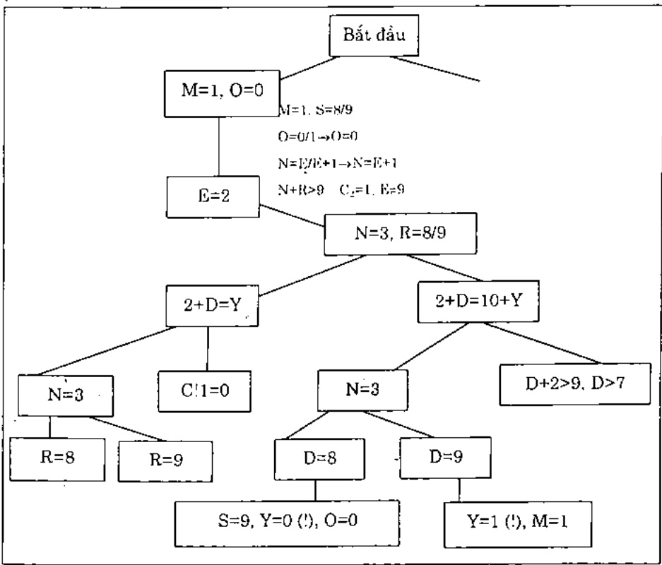

Hình 5-53. Cây thể hiện suy diện.

\- Trước tiên, thử M=0, không được do chữ số đầu con số khác không. Không thể M>1 do tổng hai số nhỏ hơn 19. Do vậy, M=1. Giá trị nhỏ C$_{4}$=1 là dương nhiên.

<!-- page: 185 -->

\- Xét S=8/9, túc chơn hoặc 8 hoặc 9. Vĩ $S+M+C_{3}=S+C_{3}+1>9$, túc $S+C_{3}>8$, chơn $C_{3}=1/0$.

\- Tháy trên cột phép cộng phía trái $11 \geq S + M + C_3 \geq 10$, do $M = 1$ nên $O = 0$.
- Người ta có $11 \geq S + M + C_3 \geq 10$ cũng suy ra $10 \geq S + C_3 \geq 9$.

\- Trên cột cộng thú hai từ trái, đoán E. giả sử chọn $E=2$. Dựa trên giá trị này của E, các suy diễn được tiếp tục. N = E + O + C₂ = 2+0+C₂, trong đó C₂=0/1. C₂ không thể là 0, vi nếu vậy N=2, trùng với giá trị 2 đã chọn cho E. Do vậy N=3, C₂=1.

\- Trên cột cộng thứ hai từ phải R + N + C₁ = 2/12. Do dây là tổng ba số nguyên, lớn hơn 2, tổng là 12, tức R + 3 + (1/0) = 12. Do vậy R = 8/9.

\- Trên cốt cộng bên phải, $E + D = 2 + D = Y / 10 + Y$. Lức này phải bổ sung ràng buộc, giả sử $2 + D = 10 + Y$, nên $D \geq 8$, hay $D = 8/9$. không thể được vida đã chọn R, vảy chọn $2 + D = Y$, ứng với $C_1 = 0$. ...

Quá trình suy diễn có thể thể hiện trên cây. Cách làm như trên không sinh ra ràng buộc thừa, doán số có nhiều ràng buộc dễ dàng hơn số không có ràng buộc nào.

## IV.5. Nhận xét về ràng buộc số và lan truyền

Một vải nhận xét cho phần này :

\- Các hộp ràng buộc số lan truyền các số thông qua các đăng thức.

\- Có loại lan truyền số thao tác với biến xác suất gắn với các khẳng định trong mạng ý kiến. Lược đồ Venn giúp người ta giải thích điều kiện ràng buộc liên quan.

\- Có loại lan truyền số thao tác trong măng số. Các ràng buộc cực bộ dung hòa mong muốn làm trơn dữ liệu và các dữ liệu thực.

\- Bài toán tìm lời giải theo các ràng buộc được xem như bài toán lan truyền ràng buộc.

## V. KÊT LUẬN

Chương 5 đã trình bày các phương pháp yếu cho phép giải các bài toán. Hai kỹ thuật tìm rộng và tìm sâu thông dụng được giới thiệu trước thuật toán A$^{*}$. Văn đề tìm kiếm trên mạng các nút và phương pháp tìm theo nhánh biến đưa đến việc hoàn thiện thuật toán A$^{*}$. Tức thuật toán AO$^{*}$. Thuật toán AO$^{*}$ giải quyết trên cây bài toán có dạng AND/OR.

Cuối chương trình bày các phương pháp giải bài toán trò chơi : cây hai đãu thủ và phương pháp giải bài toán có ràng buộc.

<!-- page: 186 -->

Rièng về các thuật toán tìm, có các nhận xét kết luận sau :

1. Nhìn chung không thể đặt ra các bài toán phức tạp cho phép thử trên máy các thuật toán đã derecập. Tuy nhiên khi đánh giả thuật toán, thấy nó thực hiện các suy diễn thông minh cũng thú vị hơn. Các thuật toán tìm kiếm được để xuất nhằm tránh việc phải vết can các phương án khi di đến lời giác. Lợi điểm về thời gian là dáng ghi nhận cho các phương pháp tìm.

2. Dế tránh phải vét cạn không gian lời giải, có thể chia các bai toán thành ba lớp :

\- Thử nhất là lớp sử dụng các phương pháp tổng quạt, đảm bảo cho lời giải tốt như vết can, nhưng unhanh hơn: nhưng cũng cần quan tâm lượng thời gian được lợi có dáng kể không.

\- Thủ hai, lớp bài toán dùng phương pháp lâu như vét cạn cho trường hợp chung, nhưng nhanh hơn nhiều cho các trường hợp riêng. Khi đó nên để ý đến thời gian trung bình cho tập các bài toán cụ thể.

\- Thải ba, bài toán chỉ cần lời giải không tốt bằng lúc vét cạn, nhưng thỏa mãn điều kiện về thời gian. Ván đề quan tâm tiếp cho lớp bài toán này là sai khác về sự tốt của lời giải là bao nhiều.

3. Tuy nhiên, các thuật toán cần thực hiện nhằm tránh phải vét can lời giải cũng cần được thỏa mãn điều kiện, thi dụ trong bài toán người dựa thu, nhiều đường đi được sinh ra, cần giải bài toán NP-dây đủ. Thuồng thì chấp nhận độ phúc tạp như vậy, nhưng giải với thời gian da thức, theo hoặc một trong hai lựa chọn :

\- Tim thuật toán thực hiện nhanh về trung bình, hoặc

\- Tìm thuật toán xấp xỉ cho lời giải chấp nhận được, trong khoảng thời gian khả dĩ.

<!-- page: 187 -->

# LOGIC MÊNH ĐỀ TRONG VIỆC GIẢI BÀI TOÁN

## I. GIỐI THIỆU

Các trị thức được tập trung vào cơ sở với một khối lượng lớn, được cơ chế xử lý tự động để tìm ra lời giải. Trong các thuật toán tổng quát mạnh như A\*, vấn đề thể hiện trị thức chưa được đạt ra. Những để suy diễn có hệ thống theo cơ chế tự động, cần mô ta thế giới qua các sự kiện, và cần có nhiều hình thức khác nhau cho các sự kiện đó. Một cách đơn giản, trị thức được diễn đạt qua các câu của ngôn ngữ tự nhiên theo sơ đổ sau :

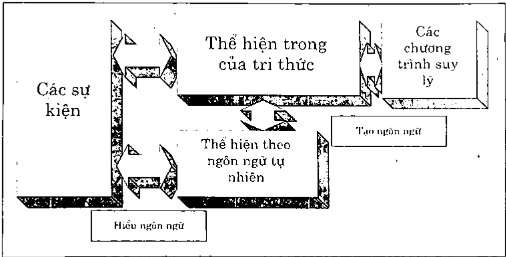

Hình 6-1. Diễn đạt trị thức qua ngôn ngữ tự nhiên.

<!-- page: 188 -->

## Thi du

Câu "Mhu là con mèo". có thể thế hiện lại dưới dạng mẻo (Miu).

Câu "Mèo có duôi".水果 có-duôi (mèo), dùng suy diện rôi thế hiện, thu được có-duôi (Mù), ứng với cấu Mù có duôi.

\- Các ménh để được dùng để thế hiện trị thức về sự kiện và các suy điện. Việc biểu diễn các râu theo logie ménh để là phương pháp tự nhiên trước khi bất dấu giải bài toán bằng các kỹ thuật đã gửi thiệu trong chương trước.

Sau dây là các kết quả tập trung vào logie, các phương pháp hiệu quả để suy diễn tri thừme mòi từ các tri thừc cù nhà suy diễn toán học. Thi dụ như chủng minh định lý, suy diễn toàn học cho phép dưa ra một cấu đúng sau khi suy diễn một loạt cấu đã biết. Một số hình thừc thể hiện tri thừc khác như khung, scripts, phụ thuộc khái niệm, mạng ngũ nghĩa... sẽ được trình bày chỉ tiết trong các chương khác.

## II. THÊ HIỆN CÁC SỰ KIỆN ĐƠN GIẢN BẰNG LOGIC

Logic là lĩnh vực liên quan đến sự đúng đán của các ménh để và đến việc quyết định các điều kiện cho phép từ một tập các ménh để đúng suy ra các ménh để khác. Một vai loại logic hình thức có thể được kế ra như logic ménh để, logic vi tử, logic bậc hai, logic da trị, logic hình thải... Logic ứng dụng gồm logic thời gian, logic không đơn điều, logic mò, logic xác suất...

## Dình nghĩa. 6-1 : Logic ménh dê (Propositional logic)

Logic mên h đề là logic so cấp nhất, xử lý các menses đế.

Logic mên h dê duế G. Bool phát triển vào cuối thế ki trước. Các mên h dê do logic mên h dê xu lý có tính đúng đân, các hàm liên kết của nó, và câu hỏi về cách thiết lập su đúng đân của các câu đã liên kết với các mên h dê đúng.

## Thí dụ

Các ménh dê nhut "ngua chạy nhanh hơn chó", "số 5 là số nguyên"...

Các liên kết dùng trong logic mènh đế, cũng như trong các logic tổng quát khác, gồm NOT, AND và OR. Chỉ với khả năng này, có thể mô tả logic mènh để một cách hình thức. Như một ngôn ngữ hình thức, logic mènh để được xác định bằng bộ chữ và các luật văn phạm cho phép tạo các câu, hay gọi, là các công thức. Bộ chữ gồm

\- Tập hợp {p, q, r...} có các phần tử gọi là công thức nhỏ nhất;

• Các liên kết phủ định, và, hoặc, kéo theo, tương đương: và

• Các dấu cách ("").

<!-- page: 189 -->

Công thức trong ngôn ngữ được xác định dệ qui :

\- Mợi công thức nhỏ nhất là công thức;

\- Nếu A là công thức, thì phủ định A cũng là công thức;

\- Nếu A, B là công thức, thì Av B, A∧B, A→B, A↔B là công thức.

Thế giới các sự kiện có thể được mô tả dưới dạng các công thức tạo tốt, tục các cấu dùng về cui pháp theo một ngôn ngữ hình thức dựa trên logic. Công thức này được xây dựng từ các công thức nhỏ, có cứ pháp đúng, và các liên kết logic, lượng từ, phép toán mô thái...

Thi du

Chuyển các câu của ngôn ngữ tự nhiên sang logic mệnh để :

• · Câu "it is raining" được chuyên sang RAINING.

\- Câu "if it's raining then it isn't sunny" sang RAINING → not SUNNY.

\- Thí dụ khác "Toto is a man" sang TotoMAN, hay MAN(Toto);

Còn các câu cần đến lượng tử, như "tất cả mọi người đều sung suống" dùng logic vị tử, hay gọi là logic tân tử.

Dình nghĩa 6-2. Logic vị tử (Predicate logic)

Logic vị từ hay logic bậc một là mở rộng của logic ménh để, cho phép nhìn sâu hơn vào cấu trúc của ménh để. Nó diễn tả các câu với lượng từ "tôn tại", "với mọi" trong ngôn ngữ logic có các biến.

Giống như logic mệnh dễ, logici vị tử có các công thức thỏa mãn hay công thức đúng, có công thức sai, không chắc chắn. Tuy nhiên nó khác logic mệnh dễ ở chỗ tính đúng đản được xác định không bền, mà chỉ là nửa - xác định, như được giới thiệu trong các tài liệu năm 1932 của K. Godel và tài liệu năm 1935 của A. Church.

Cú pháp của logic vị tử bậc nhất theo BNF (Backus-Naur Form) như sau :

```txt
Câu ::= <Câu đơn giản> | <Câu đơn giản> <Liên kết> <Câu đơn giản> |
    ¬<Câu đơn giản> | <Lượng từ> <Biến>,... <Câu>
Câu đơn giản ::= <Vị tù> (<Term>) | <Term> = <Term>
Term ::= <Hàm> (<Term>) | <Hằng số> | <Biến>
Liên kết ::= ∧ | ∨ | ↔ | →
Lượng từ ::= ∀ | ∃
Hằng số ::= A | X₁ | Mỗ...
Biến ::= a | .x | ,s...
```

<!-- page: 190 -->

Vị lử ::= thêm | trước...

Hàm ::= cha của | theo ...

Tuy chưa được dễ dàng, việc xác định tính đúng đán của ménh để bảng logie ménh để tố ra thuán tiện. Dùng logie vị từ dám bảo cách suy lý tốt hơn, cho phép suy ra các câu mới từ các câu đã có.

Thi du

Có có sù tri thúc gồm các ménh dẻ sau

1. Marcus là thực thế sống

2. Marcus là dân Pompe

3. Nguòi Pompie là Roman

4. Cesar là ống chủ

5. Người Roman, hoặc theo Cesar. hoặc ghét ống ta.

6. Mơi người đều theo một ai đó.

7. Người ta chỉ giết chủ khí người ta không theo.

8. Marcus giết Cesar.

Các sự kiện này được thể hiện lại qua logie vị tử, ở dạng công thức xác định tốt:

1. Thực thể (Marcus)

2. Pompie (Marcus)

3. $\forall x$ Pompie(x) $\rightarrow$ Roman(x)

4. Chū (Cesar)

5. $\forall x\operatorname{Roman}(x)\to \operatorname{theo}(x,\operatorname{Cesar})\lor \operatorname{ghét}(x,\operatorname{Cesar}).$

Hoặc chất chẽ hơn, dùng phép "hoặc có loại trừ":

$\forall x \text{ Roman}(x) \rightarrow ((\text{theo}(x, \text{Cesar}) \lor \text{ghét}(x, \text{Cesar}) \land \neg (\text{theo}(x, \text{Cesar}) \land \text{ghét}(x, \text{Cesar}))$

6.  $\forall x \exists y \text{ theo}(x,y)$ ,

Trong câu này, cần lưu ý việc sử dụng lượng từ.

Câu này không thể là ∃y ∀x theo (x, y)

7. ∀x ∃y nguài(x) ∧ chǔ(y) ∧ giết(x,y) → \~theo(x,y)

Theo khía cạnh nào đó, câu này có thể gây ra nhập nhẳng, hiểu theo "người ta giết ông chủ mà người ta không theo"

<!-- page: 191 -->

## S. Giét (Marcus, Cesar)

Gua sù cán kiểm tra Marcus có theo Cesar không, có thể di xác định tính đúng đán của ménh dê "Marcus không theo Cesar", túc \~theo(Marcus, Cesar). Sau dây là dây các ménh dê cán phải xác định tính đúng đán, hay ở dây xem là cán phải chứng minh. Các kí hiệu "↓" dưới dây ngầm hiểu là "cán chứng minh" chữ không phải là "suy diễn".

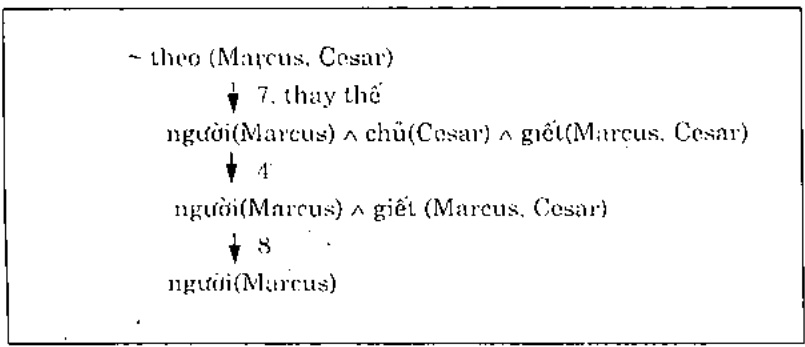

Hình 6-2. Suy điện lùi.

Việc suy diễn như trên là suy diễn lủi, kiểm tra từ dịch này sang dịch khác. Thủ tục tìm này có thể tiến hành trên độ thị AND/OR. Khi suy diễn người ta đến được người(Marcus) nhưng chưa thấy khớp với sự kiện nào trong cơ sở tri thức. Trong trường hợp này, có thể thêm mệnh đề :

9. Tất cả thực thể trong dây đều là người, tức ∀x thực thể(x) → người(x).

Khi đó việc chứng minh được hoàn tất.

Nhân việc xét thí dụ này, người ta cũng có nhận xét về việc dùng các câu của ngôn ngữ tự nhiên hay ngôn ngữ nhập nhẳng. Một mật việc thể hiện tri thức qua mệnh đề có nhiều hình thức da dạng; mật khác quá trình suy diễn cũng có thể hiểu mệnh đề dưới nhiều dạng tri thức khác nhau. Do vậy để dễ dàng suy diễn, cần thiết phải dùng các thông tin phụ di kèm với tri thức đã thu nhận được. Một yêu cầu đặt ra cho việc thể hiện tri thức là làm sao trong thể hiện cũng thấy được khả năng suy lý của tri thức.

Một vấn đề khác nửa là từ yêu cầu, như trên "Marcus có theo Cesar không?", việc chọn tự động sẽ xác định kiểm tra tính đúng đán của các câu

• theo(Marcus, Cesar), hoặc câu

\- \~theo(Marcus, Cesar).

Việc suy diễn như trên là lùi, có thể thay bằng suy diễn tiến.

<!-- page: 192 -->

## III. SỬ DỤNG CÁC HÀM TỈNH TOÁN TRONG THỂ HIỆN TRI THỨC

Các bản toán cần giải không chỉ đơn giản nhu thi dụ trên, mà đối khi cần tính toán hay đánh giá biểu thức tính toán. Cháng hạn cần xác định 2+3 lớn hơn 4, túc lớn-hơn (2+3, 4) và được kì hiệu là gt(2+3, 4). Đề đánh giá điều này, người ta cần nhiều trị thức hết kê như gt(1,0), gt(2,0), gt(2,1),... Hàm tính toán được giới thiệu nhằm làm đơn giản hóa trong việc thể hiện trị thức.

## Thí dụ

Xem lại cơ sở tri thức đã một lần được xét đến :

'1. Marcus là người, người(Marcus)

2. Marcus là người Pompie, Pompie(Marcus)

3. Marcus sinh năm 40, sinh(Marcus, 40)

4. Mơi người đều có thể chết

$\forall x\text{ nguồn}(x) \rightarrow \text{chết}(x)$.

5. Người Pompie chết khí núi lửa phun, vào nám 79

xày ra (nui lửa, 79) ∧ ∀x (Pompie(x) → sẽ chết(x, 79))

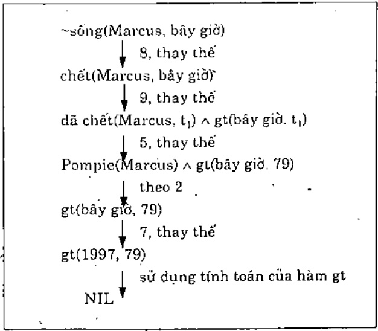

Hình 6-3. Suy diện -sống (Marcus, bảy giờ). NIL có nghĩa không còn gì phải chủng tố tiếp.

<!-- page: 193 -->

6. Không ai sông quá 150 luôi

$\forall x \forall t_1 \forall t_2 s\bar{e} \text{ch}\acute{e}t(x) \wedge \sinh(x, t_1) \wedge g(t_{2}-t_1, 150) \rightarrow \text{ch}\acute{e}t(x, t_2)$

7. Bây giò là 1997, bây giò = 1997

Või dich "Marcus còn sóng không?", dé xác định tỉnh đúng đản của "Marcus không còn sóng", có thể suy luận theo hai cách, dua vào sự kiện nguồn không sóng quả 150 tuổi, hay dua vào sự kiện xảy ra núi lúa vào năm 79. Đề suy luận, cần phải bổ sung thêm sự kiện vào cơ sở urí thức. Đó là các sự kiện phụ :

8. Sông có nghĩa là không chết, tức $\forall x \forall t$ sống (x, t) $\leftrightarrow$ \~ chết(x, t).

9. Ai đó đã chết thì sau thời điểm đó, vẫn bị coi là chết, tức

$$
\forall x \forall t _ {1} \forall t _ {2} \text {chét} (x, t _ {1}) \land g t (t _ {2}, t _ {1}) \rightarrow \text {chét} (x, t _ {2}).
$$

Qua thí dụ này, một kết luận đơn giản cũng cần qua nhiều bước chứng minh, trong đó áp dụng nhiều phép so sánh, so trùng khớp, sử dụng modus ponens. Nhắc lại ràng modus pononis là một luật trong logic hình thúc, cho biết nếu (A→B) là dùng và nếu A là dùng thì B là dùng.

Bài toán trên có thể sử dụng suy luận khác như sau :

```csv
~sống(Marcus, bảy giờ)
↓9
chết(Marcus, bảy giờ)
↓7, thay thế
sẽ chết(Marcus) ∧ sinh(Marcus, t₁) ∧ gt(bảy giờ-t₁, 150),
↓4, thay thế
người(Marcus) ∧ sinh(Marcus, t₁) ∧ gt(bảy giờ-t₁, 150)
↓1
sinh(Marcus, t₁) ∧ gt(bảy giờ-t₁, 150)
↓3
gt(bảy giờ-40, 150)
↓8, 3
gt(1997-40, 150)
↓thực hiện tính toán
gt(1957, 150)
↓NIL
```

Hình 6-4. Suy diên \~sông (Marcus, bảy giờ) theo cách thú hai.

<!-- page: 194 -->

Một luật khác là modus tollens, phát biểu nếu (A → B) là đúng và nếu B là sai thì A là sai.

Dình nghĩa. 6-3 : Modus tollens

Luật logic kháng định nếu biết A → B đúng và B sai thì có thể cho là A sai.

Việc suy diễn trên các logie không đơn giản, cần được hoàn thiện theo dạng chuẩn. Dế có lời giải hiệu quả cần xẹm xét cả suy diễn tiến lẫn suy diễn lùi.

## IV. VIỆC GIẢI BÀI TOÁN

Thông tin về bài toán đã được thể hiện ở dạng các mệnh để. Việc giải bài toán lúc này là tìm thuật toán gồm các thao tác đơn giản cho phép tìm ra đích bài toán, dựa trên các suy lý trên các mệnh để, các logic vị tử. Thuật toán hay thủ tục đơn giản là phần chứng, tức để chứng tổ mệnh để A là đúng, người ta chứng minh phủ định của A là sai, hay dẫn đến sự vô lý. Trước khi thực hiện thủ tục tự động, các mệnh để được chuyển sang dạng câu chuẩn.

## IV.1. Chuyển mệnh đề sang dạng câu

Thí dụ có ménh đề "tát cả người Roman biết Marcus, hoặc ghét Cesar, hoặc nghĩ ,ràng người ghét người khác là diên", được chuyển sang câu xác định tốt là :

$\forall x [(Roman(x) \land biết(x, Marcus)) \rightarrow (ghét(x, Cesar) \lor (\forall y (\exists z ghét(y, z)) \rightarrow nghī là diên(x, y))))]$

Câu trên không tiện lợi cho việc so sánh. Đề tạo điều kiện cho việc giải, nên dùng các câu không lông nhau, các lượng tử tách biệt với công thức để lượng từ không cần được đề ý đến. Dạng chuẩn OR có đủ thuộc tính này, cho phép biểu diễn lại câu trên :

\~Roman(x) ∨ \~biết(x,Marcus) ∨ ghét(x,Cesar) ∨ \~ghét(y,z) ∨ nghī là điên(x,y)

Việc chuyển sang dạng chuẩn này không phúc tạp, có các thuật toán, nên có thể giá thiết các câu xác định tốt đều được thể hiện theo dạng chuẩn. Việc chuyển câu ngôn ngữ tự nhiên, logic vị tử, sang dạng tiện cho giải bài toán gồm các bước :

Buóc 1. Khử các suy diễn, thay a → b bằng tương đương \~a v b

Do vây, câu trên được biểu diễn, không có suy diễn

$\forall x \sim (\text{Roman}(x) \land \text{biết}(x, \text{Marcus})) \lor (\text{ghét}(x, \text{Cesar}) \lor (\forall y \sim (\exists z \text{ ghét}(y, z)) \lor \text{nghí là diên}(x, y)))$

Buoc 2. Giảm phạm vi tác dụng của phù định "\~", thay \~(\~p) bằng p; sử dụng luật De Morgan

$$
\sim (a \vee b) = \sim a \wedge - b,
$$

<!-- page: 195 -->

$$
- (a \land b) = - a \lor - b.
$$

Khi có lượng tử, người ta sử dụng phép biến đổi :

$$
\sim \forall x P (x) = \exists x \sim P (x),
$$

$$
- \exists x P (x) = \forall x - P (x)
$$

Do vay, cản trên được thu gọn

$\forall x (\neg Roman(x) \vee \neg bhe(t(x, Marcus)) \vee (ghét(x, Cesar) \vee (\forall y \forall z \neg ghét(y, z) \vee nghì là diên(x, y)))$

Bước 3. Chuẩn hóa các biến, nhằm mối lượng từ chỉ gần với một biến dạy nhất. Vị biến là tên hình thức, thú tục này không ảnh hưởng đến giá trị thực của công thức xác định tốt.

Thi dụ $\forall x P(x) \vee \forall x Q(x)$ được chuyển thành $\forall x P(x) \vee \forall y Q(y)$.

Buốc 4. Chuyển các lượng tử sang trái công thức, không thay đổi thức tự quan hệ của nó. Diên này có thể được phép do không có xung đột giữa các tên biến. Do vậy, sau khi thực hiện bước này :

$\forall x \forall y \forall z (\sim Roman(x) \lor \sim biết(x, Marcus)) \lor (ghét(x, Cesar) \lor (\neg ghét(y, z) \lor nghí là diên(x, y)))$

Dạng này được gọi là dạng chuẩn Prenex. trong đó các lượng từ có tên là Prefix, hay tiền tố và phần còn lại là Matrix.

Bước 5. Loại bỏ các lượng từ tổn lại.

\- Một công thức có biến lượng từ tổn tại, mà có giá trị có thể được thay thể cho biến để công thức đúng, thì thay thế giá trị đó vào biến: hoặc có thể bỏ lượng từ bằng cách thay thế biến đó bằng hàm. Việc tham chiếu đến hàm sẽ cho kết quả của biến. Văn đề là không thật rõ cách sinh ra hàm đó, tên biến được thay bằng tên hàm mới, được bổ sung khi cần thiết phải có nó.

Thí dụ

∃x vua(x) được chuyển thành vua(S₁).

trong đó hàm S₁ cho giá trị là ông vua nào đó sẽ thỏa mãn.

\- Nếu lượng tử tồn tại trong phạm vi của lượng tử với mọi, thì giá trị thay thế cần phụ thuộc vào giá trị cụ thể được chọn của biến với mọi. Thị dụ ∀x ∃y cha(y, x) cho biết y phụ thuộc vào giá trị cụ thể của x; do vậy chuyển thành ∀x cha (S₂(x), x).

\- Các hàm $S_{1}$, $S_{2}$ là hàm Skolem, nếu không tham số, được gọi là hằng Skolem; quá trình khử lượng tử tồn tại là quá trình Skolem hóa.

<!-- page: 196 -->

Bước 6. Bô các viên tố của câu, lực bỏ di các lượng từ với mơi.

Thực hiện bước 6 với câu trên người ta thu được :

$$
\sim \text {Roman} (x) \vee \sim \text {biét} (x, \text {Marcus}) \vee \text {ghét} (x, (\text {Cesar}) \vee \sim \text {ghét} (y, z) \vee \text {nghì là đien} (x, y)
$$

Bước 7. Chuyển các thành phần trong công thức sao cho xếp sắp thành dạng chuẩn OR, từ OR của các thành phần chữa AND.

Bước 8. Gọi các thành phần trong câu chuẩn là một câu. Đề xác định tính đúng dẫn rùn toàn bộ, phải xét tính đúng dẫn của từng câu. Nếu phân xét đồng thời nhiều câu xác định tốt, có nhiều câu thành phân, khi liên hợp lại thành một tập phải lưu ý đến các câu xác định tốt ban dấu.

Bước 9. Chuẩn hóa từng phần các biến trong các câu, áp dụng

$$
\forall x P (x) \land Q (x) = \forall x P (x) \land \forall x Q (x).
$$

Tức là dù x cùng được tạo từ một câu xác định tốt, x trong P(x) không liên quan đến x trong Q(x): chuẩn hóa bước này quan trọng ở chỗ khi trong P(x) cần thay x bằng hàng số $x_{0}, x_{n}$ | x không ảnh hưởng đến các hàm Q(x).

## IV.2. Cơ sở của việc dùng logic vị từ dễ giải bài toán

Thủ tục giải là quá trình lập, từ hai câu tạo ra một câu bảng cách tương tác hai câu đầu. Thí dụ có hai câu

$$
\text {winter} \vee \text {summer. va }
$$

$$
\sim \text {winter v cold}
$$

Nhận xét thấy hai câu đều đúng. Chúng tuy độc lập nhưng là liên hợp do có chung winter. Tiến hành suy lý, người ta thu được :

\- Trong câu đầu, nếu winter=1, lúc winter là đúng, thì \~winter=0, vậy đề câu sau là đúng, phải có cold=1.

\- Trong câu sau, nếu \~winter=1 thì winter=0, do đó nhìn vào câu đầu, phải có summer=1.

Hai trường hợp ta xét, winter và \~winter là tất cả các khả năng, túc winter v \~winter=1, do đó hai suy diễn từ hai câu nhận được cold v summer=1. Về hình thức, trong hai câu kết hợp lại, có a v \~a thì có thể bỏ qua chúng. Việc liên kết này chưa thực hiện xong nếu chưa khử di a v \~a. Người ta có thuật toán để phát hiện trong liên hợp có xuất hiện đồng thời a và \~a không.

Trong logic menses để, việc liên hợp các menses để không phúc tập. Tuy nhiên, nhưng với logic vị từ thì khác, do có các biến. Đề chúng tổ tập các câu S là không thỏa mãn điều kiện, cần xét chỉ trên trường hợp riêng. Tập S là không thỏa mãn nếu và chi nếu tập con được thể hiện là không thỏa mãn. Chỉ tiết này được để ý đến để chỉ xét

<!-- page: 197 -->

dược một phần nhỏ của bài toán trong khoảng thời gian bị hạn chế. Phương pháp Robinson đưa ra năm 1961, được trình bày dưới đây, cố gắng giải bài toán với số bước ít nhất với ý tưởng là giữ nguyên sự tổng quát của bài toán cho đến khi cần thiết thay biến bằng các hàng phù hợp.

Các bước của thuật toán Robinson cho phép chứng minh ménh đề S, khi có tiến đề F, trong logic ménh đề :

Bước 1. Chuyển các ménh để của F thành dạng câu chuẩn.

Bước 2. Lấy phủ định của S. chuyển kết quả đó sung dạng câu, bổ sung nó vào tập các câu trong bước thử nhất.

Bước 3. Lập cho đến khi không thực hiện được nửa, hoặc đã thấy màu thuần:

3.1. Chọn hai câu.

3.2. Kết hợp, hay gọi là giải, hai cầu đó, thu được cấu lời giải. Lưu ý loại trừ các thành phần a v \~a .

3.3. Nếu câu lời giải là rỗng hay được gọi là NIL, tương ứng với việc xuất hiện màu thuần trong tập các câu, tức S được giải. Nguộc lại, thêm câu lời giải vào tập các câu dễ xét tiếp.

Trước khi có thể áp dụng các bước trên của thuật toán, cần chuyển các trị thức, dưới dạng các sự kiện, luật, thành các cấu độc lập, tạo thành tập S. Có thể tóm tất như sau :

```txt
Câu dạng p → r chuyển thành ~p ∨ r
Câu (s ∨ t) → q được chuyển thành hai câu : ~s ∨ q và ~t ∨ q.
```

## Hình 6-5. Nguyên tắc chuyên dạng câu.

Thí dụ

Có các tiên để $\{p, p \land q \to r, s \lor t \to q, t\}$, cần chứng minh $r$.

Trước tiên chuyển các câu sang dạng chuẩn, rối bổ sung cả phủ định của r, tức \~r vào các câu đó. Quá trình suy diễn, tức kết hợp hai câu với nhau như tron, hình.

<!-- page: 198 -->

NIL chủng tố không đi tiếp được, tức vỏ lý. Ngoài ra, nếu xét t và \~t, tất cả các câu đều phải dùng, nhưng ở đáy, không thể t và \~t cùng dùng. Do đó, \~r=0, hay r=1, tức là điều phải chủng minh.

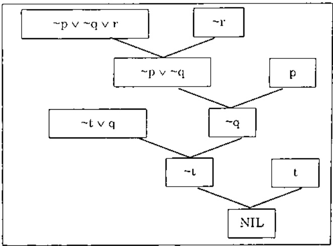

Hình 6-6. Từ các tiên để {p, p ∧ q → r, s ∨ t → q, t!, cần chúng minh r.

## IV.3. Thuật toán hợp nhất

Khi so sánh sự giống nhau, một thuật ngũ được dùng là literal.

Đinh nghĩa. 6-4 : Literal

Literal là công thức trong hệ thống logic, hoặc là nhỏ nhất (gọi là literal dương) hoặc là phù định của công thức nhỏ nhất (gọi là literal âm).

Trong logic mệnh đế, quá trình suy diễn để chứng minh được đưa về việc tìm hai literal không đồng thời đúng. Tùy theo các dạng của literal mà việc chứng tổ này có thuận lợi hay không. Chẳng hạn xét L và \~L. Nếu chứng là các biến đơn thì quá trình suy diễn không phúc tạp như khi chứng là một hàm, như người(x) và \~người(x). Tuy nhiên hàm này sẽ không sinh máu thuẫn nếu thay giá trị để thu được người(A) và \~người(B).

Đế chỉ ra ngay màu thuẩn trong quá trình giải, có thủ tục so sánh và phát hiện giá trị thay thể phù hợp. Thủ tục trình bày là dệ qui, so sánh hai danh sách gồm tên vị từ-tham số₁-tham số₂.

<!-- page: 199 -->

Thi du

So sánh hạn câu

• Chét Marcus Cesar, và

• Gét Marcus (chu của Roma).

Dầu tiên thống nhất hai tên hàm, xem chúng có khớp không. Nếu chúng như, nhau thì so sánh sang thành phần tiếp. Nguyên tắc so sánh không cho phép khớp các hàm với hàng số: biến so sánh được với các biến, hàng, hàm không chứa biến đó. Một vấn đề cần quan tâm là việc thay thế phải nhất quán với các trường hợp thay thế trước đó.

## Thí dụ

So sánh (P x x) và (P y z) đã có P=P, tiếp so sánh x và y, thay x bằng y (ki hiệu y|x), và x bằng z (z|x) thì không thể. Xem xét lại, sau khi y|x, dược (P y y) và (P y z), tiếp tục so sánh y và z, nếu thành công, thay z|y. Như vây, đãv các thay thể là (z|y)(y|x).

## Thi dụ

Các câu ghét(x,y) và ghét(Marcus, z), có các thay thế sau (Marcus|x, z|y). hay (Marcus|x, y|z), hay Marcus|x) (Cesar|y) (Cesar|z)...

Thuật toán sau đây so sánh hai xấu L$_{1}$ và L$_{2}$, cho kết quả là SAI khi không thấy giống nhau trong so sánh, cho NIL nếu không cần thực hiện thay thế nào, ngược lại thì cho ra đây các thay thế.

Thuật toán hợp nhất $U(L_{1}, L_{2})$

$Bước \ 1 . Nếu \ L_1 hay \ L_2 là phần tử đơn. tức phần tử nhỏ nhất, thực hiện :$

1.1. Nếu $L_1$ và $L_2$ như nhau, kết thúc lót, cho ra NIL.

1.2. Ngucoc lai nếu $L_1$ là biến thì người ta kiểm tra $L_1$. Nếu $L_1$ xuất hiện trong $L_2$ thì SAI, ngucoc lại $L_2 | L_1$.

1.3. Ngược lại, nếu  $L_{2}$  là biến, thực hiện : nếu  $L_{2}$  xuất hiện trong  $L_{1}$  thì SAI, ngược lại  $L_{1} \mid L_{2}$ ; ngược lại thì SAI.

Bước 2. Nếu độ dài của $L_1$ khác độ dài của $L_2$ thì SAI.

Bước 3. Cho SUBST là NIL; cuối thủ tục, thu được trong SUBST các thay thế dùng để thống nhất $L_1$ và $L_2$.

Bước 4. Cho i=1 cho đến i=số lượng các phần tử của L₁, thực hiện :

4.1. U(phân tử i của $L_1$, phân tử i của $L_2$), cho kết quả vào S.

4.2. Nếu S= SAI, cho kết quả chung là SAI.

<!-- page: 200 -->

. 4.3. Nõu S ∼ NII, thục hiện :

4.3.1. Dimg S cho phản còn lại của L₁ và L...

4.3.2. Thêm S vào SUBST.

Kết thúc thủ tục, cho hiện ra SUBST.

Trong thuật toán trên, lưu ý so sánh biến và biểu thức có biến. Ciả sử muốn so sánh (f x x) và (f g(x) g(x)). Nếu chấp nhận g(x) như thay thế được cho x, thu được đầy vỏ tận các thay thế.

## IV.4. Giải bài toán bằng logie vị tử

Đế giản với logie vị tử, thí dụ cho giả thiết F. cần chúng minh S. thực hiện các bước sau :

1. Chuyển các câu trong F sang dạng câu.

2. Lây \~S. chuyên sang dạng câu. Thêm câu này vào các câu đã có trong bước trên.

3. Lập lại cho đến khi xuất hiện màu thuần, hoặc không làm tiếp được, hoặc thấy khối lượng tính toán đã quá nhiều :

3.1. Chọn hai câu, gọi là các câu cha.

3.2. Tím câu dẫn suất, là hợp của tất cả các thành phần của câu cha với sự thay thể phù hợp, trừ trường hợp nếu có cập literal $T_1$ và $T_2$. $T_1$ nằm trong một câu. $T_2$ trong câu kia, mà $T_1$ và $T_2$ là màu thuần, tức $T_1$ và \~$T_2$ đồng nhất, thì cả $T_1$ và $T_2$ đều không xuất hiện trong câu dẫn suất. Các $T_1$, $T_2$ được gọi là các thành phần tốt.

3.3. Nếu câu kết quả là rỗng, thi màu thuần đã thấy: nếu không, thêm câu này vào tập các câu để xét tiếp.

Việc ghép hai câu cha được làm một cách hệ thống, cho đến khi đạt được kết quả. Kết quả của phương pháp giải ở dây là thấy được câu mãu thuẫn; vậy nên chọn được câu nào cảng khó đúng cảng tốt. Do vậy có thể tiến hành rất lâu, nên dùng các kỹ thuật, hay chiến lược thích hợp nhằm tăng tốc độ giải :

\- Ghép những câu chứa các thành phần tối. Có thể dùng phương pháp đánh chỉ số các câu để đánh giá được một câu là tốt hay không.

\- Không để các câu ít giả trị tham gia vào các bước giải. Đó là các câu lập thừa, tức các câu luôn đúng, hay các câu góp được trong các câu khác, nhiều khả năng đúng, chẳng hạn như p v q thì dễ đúng hơn p.

<!-- page: 201 -->

Thường thì tập trung giải vào ngay các câu liên quan đến câu cần chúng minh, túc là cổ gắng tìm máu thuẫn ở câu cần chúng minh; và làm trước với các câu có literal đơn, vì câu mối sẽ bột literal di, do cảng dễ tới dịch.

## Thí dụ

Bài toán cần chủng minh ghét (Marcus, Cesar). Giả sử phán chủng \~ghét (Marcus, Cesar). Thực hiện chuyển hóa như trong hình.

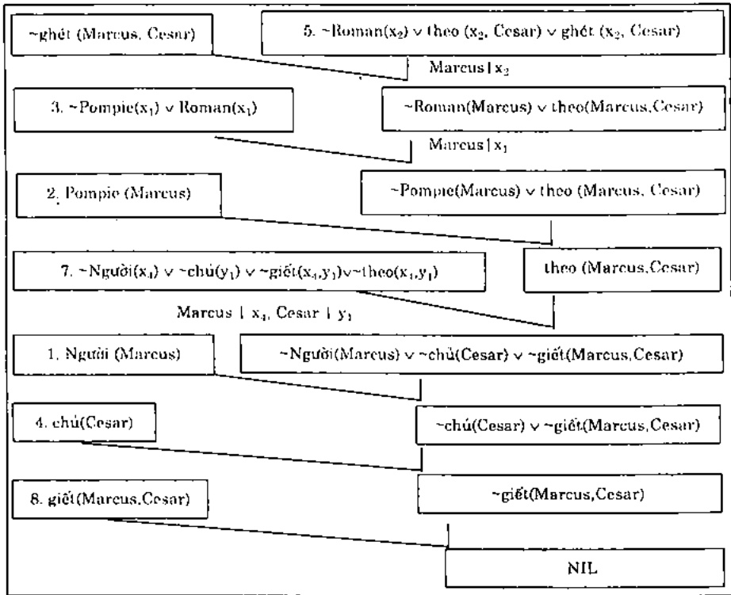

Hinh 6-7. Chúng minh Marcus ghét Cesar.

Bài toán dùng cơ sở tri thức đã giới thiệu trong thí dụ trước đây. Các ménh để được biểu diễn dưới dạng các câu chuẩn :

1. Nguòi (Marcus)

2. Pompie (Marcus)

3. \~Pompie(x₁) ∨ Roman(x₁)

4. Chǔ (Cesar)

<!-- page: 202 -->

5. \~Roman(x₂) ∨ theo (x₂, Cesar) ∨ ghét (x₂, Cesar).

6 Theo $(\mathbf{x}_3, f_1(\mathbf{x}_3))$.

7. \~ngùdī(x₄) v \~chǔ(y₁) v \~giēi(x₁,y₁) v \~theo(x₁,y₁)

8. Giét (Marcus, Cesar)

Bài toán được chứng minh bằng phản chứng.

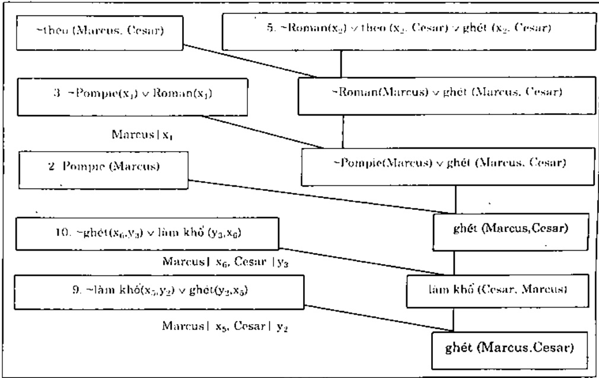

Hình 6-8. Tránh các suy luận xoay vòng.

Trong quá trình giải bài toán, nếu không có chiến thuật chọn các ménh đề tham gia vào suy diễn người ta có thể quay trở về một trạng thái cũ.

## Thí dụ

Bài toán được xét với cơ sở tri thức nếu trên, có bổ sung thêm :

9. Làm khổ(x,y) → ghét(y,x),            tức \~làm khổ(x₃,y₂) ∨ ghét(y₂,x₅).

10. Ghét(x,y) → làm khô (y,x), túc \~ghét(x₆,y₃) ∨ làm khô (y₃,x₆).

Yêu cầu giải theo(Marcus, Cesar). Bằng suy diễn phản chứng người ta thực hiện một loạt bước, rời không thu được điều gì mới cả ! Đó là hiện tượng cần phải tránh.

<!-- page: 203 -->

Một vài nhận xét bổ sung cho việc giải bài toán bảng logie vị từ :

Thứ nhất, lưu ý ràng trong các bước giải giốt thiệu trên, việc chuẩn hóa các biến là cản thiết để tránh nhập những.

Thí dụ

Có các tiên để "x là cha của y thì x không là nữ" và "x là mẹ của y thì x là nữ" và Âm có cha là Mỗ, mẹ là Mỗ. Biểu diễn qua logie vị tử:

1. Cha (x, y) → \~nu(x), uite \~cha(x, y) ∨ \~nu(x)

2. Mę (x, y) → nǚ (x), túc mę (x, y) ∨ nǚ(x)

3. Mę (Mó, Âm)

4. Cha (Mô, Âm)

Người la thực hiện các suy diễn

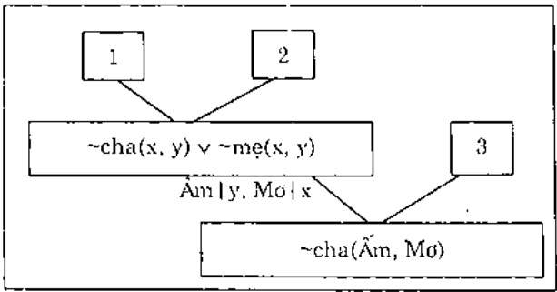

Hinh 6-9. Suy diên thừa.

Khẳng định này chẳng dưa đến cái gì cả. Lí do ở chỗ trong hai câu đầu đều có biến x, nên đã hạn chế việc dẫn đến màu thuẩn.

Thứ hai, nếu quan tâm đến hàm tính toán, hay quan hệ so sánh thì việc suy diễn sẽ hiệu quả hơn.

Thí dụ

Trước dây đã xem Marcus đã chết chưa ? Khi quan tâm đến nhận xét này, việc giải bài toán chú trọng vào hai cách tạo ra một câu mới :

\- Thay một giá trị bằng giá trị khác có giá trị bằng nhau.

\- Giám bót các vị từ tính toán : nếu vị từ có giá trị FALSE thì nó được bổ, vì trong câu OR thêm đoạn vFALSE không làm thay đổi giá trị của câu; nếu

<!-- page: 204 -->

nó có giá trị TRUE thì đã tạo ra câu luôn luôn đúng, không thể dẫn đến máu thuần được.

Các tiên để của bài toàn là :

1. Nguòi(Marcus)

2. Pompe(Marcus)

3. Sinh(Marcus, 40)

4. -Người($x_1$) v sẽ chết($x_1$)

5. Pompie(x₂) v chét(x₂, 79)

6. Nô ra (nún lúa, 79)

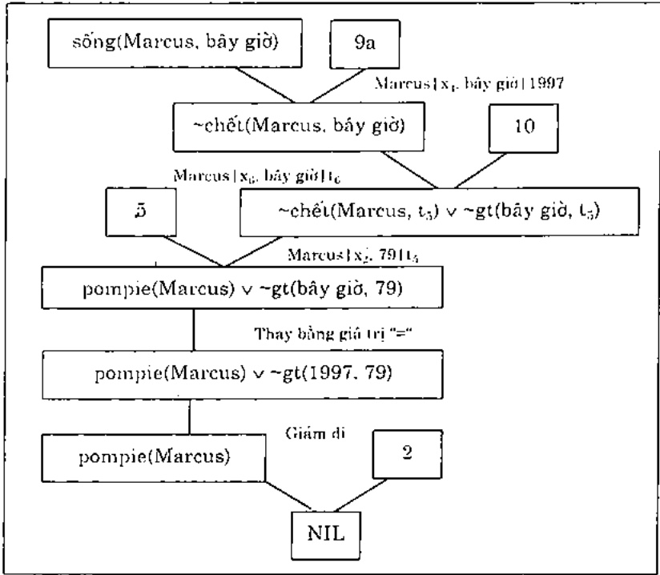

Hình 6-10. Giải bài toán với nhận xét bổ sung.

7. -sē chêt (x₃) v -sinh(x₃, t₁) v -gt(t₂-t₁, 150) v chêt(x₃, t₂)

8. Bây giờ (1997)

9. a/ -Sông(x₄, t₃) ∨ -chêt(x₁, t₀)

<!-- page: 205 -->

$$
\mathrm{b} / \text {Chét} (\mathrm{x} _ {5}, \mathrm{t} _ {1}) \vee \text {sông} (\mathrm{x} _ {5}, \mathrm{t} _ {1})
$$

$$
1 0, \text {se} \operatorname{ch} \acute {\mathrm{e}} (\mathrm{x} _ {i}, t _ {i}) \vee \neg \mathrm{gt} (t _ {i}, t _ {i}) \vee \operatorname{ch} \acute {\mathrm{e}} (\mathrm{x} _ {i}, t _ {i})
$$

Dích của bài toán là \~sống(Marcus, bảy giù). Phú định dịch là sống(Marcus, bảy giù) và người ta suy điện như trên hình vê.

## IV.5. Trả lời các câu hỏi

Trong các bước giải, cần thiết thử một vài thay thế, vi không phải thay thế nào cũng dua đến kết quả. Việc trả lời các cấu hỏi là quá trình suy diễn ra kết luận từ các sự kiện, nhưng phải căn cứ thêm vào khóa cạnh xã hội của ngôn ngữ.

Thi dụ

Cân xác định Marcus đã chết. có thể :

\- Xét câu đã chế (Marcus, ? ) rối thu được đã chế (Marcus, 79). Đây là trường hợp đến được đích, hoặc.

\- Dùng phân chủng, dẻ chủng tố ∃t chết (Marcus, t), thực hiện suy diện với \~∃t chết(Marcus, t). thì không di đến dịch được. Trường hợp này không đến đích được.

Ngoài ra, việc dưa về các câu xác định tốt, nếu không quan tâm đến ý nghĩa xã hội thì không thể hướng việc chứng minh theo đúng hướng. Khi chuyển sang dạng câu, phần nào thông tin thuận lợi cho việc giải bị mất di so với sự kiện ban đầu.

Thí dụ

$\forall x \text{ quan toa } (x) \land \sim\text{gian lân}(x) \rightarrow \text{tôt}(x), \text{ mang thông tin về cách xem ai đó là người tốt, thể nhưng khi chuyển sang dạng câu, được}$

\~quan tòa (x) v \~gian lân(x) v tốt(x), có khuynh hướng suy diễn dùng cho ai đó không là quan toả, bằng cách di tìm khía cạnh không gian lân và không tốt.

## V. KÊT LUẬN

Chương 6 giới thiệu việc dùng logic để giải bài toán trong trí tuệ nhân tạo. Một số nhận xét kết luận gồm :

\- Người ta sử dụng logic ménh dê, logic vị tử để thể hiện tri thức. Các hàm tính toán cũng được bao hàm trong logic.

\- Bài toán được chuyển sang dạng câu và được giải bằng các thuật toán mà đại diện là thuật toán dùng phần chứng do Robinson đưa ra.

\- Việc giải bài toán nhỏ logie vị từ cũng cần lưu tâm đến tri thức phụ như các tri thức xã hội.

<!-- page: 206 -->

# THÊ HIỆN TRI THỨC KHÔNG CHẮC CHẤN

Thế giới bao quanh con người có nhiều sự kiện không nhận giá trị dùng hay sai. Con người cũng dùng các sự kiện đó hàng ngày trong ngôn ngữ giao tiếp. Chương này dành cho suy diễn theo xác suất để xử lý các trì thức không chắc chắn.

## I. SUY DIÊN CÁC THÔNG TIN ĐẶC BIỆT

## I.1. Giới thiệu

Tuy logic vị tử và phương pháp giải bài toán bằng logic vị tử tố ra hiệu quả. nhưng không thể phù hợp đối với tất cả các bài toán. Mất khác trong nhiều lĩnh vực. Logic vị tử không phải là cách tốt nhất để thu được các thông tin cần biết.

Thi du

Trong một số câu của ngôn ngữ tự nhiên có các thông tin mà trong các chương trước người ta chưa có công cụ thể hiện.

\- "Ngày nóng" không hẩn đã liên quan đến nhiệt độ;

• "Tốc den, mất đen" không chỉ rõ được dữ liệu định lượng cụ thể;

\- "Nếu không xảy ra chuyên gì thì tất cả người lớn đều biết được" dôi hỏi có điều kiện trước, ngược lại ra sao chưa thể biết được;

• "Có nhiều tiền thì tốt" liên quan nhiều đến may rủi, chắc gì đã xảy ra; hay

\- "Tôi biết Toto nghĩ rằng Tutu thắng nhưng tôi nghĩ họ đang thua" cần phải có hệ thống xử lý điều "nghĩ ràng".

Việc xử lý các suy nghĩ cần có sự hỗ trợ của các sự kiện và thông tin ngâm định do các hoạt động cá nhân duy trì các suy nghĩ. Đề thực hiện công việc này, hệ suy lý có thể giữ lại các thông tin liệt kê ở trên theo những dạng cần được cấu trúc lại.

<!-- page: 207 -->

Người các hệ thống trị tuệ nhân tạo gồm các mệnh để đơn giản, còn các hệ thống gồm nhiều mệnh đề mang các trị thức màu thuần. Hiện tượng này là do bản thân thể giới thực mang nhiều màu thuần, và việc thu nhận các trị thức màu thuần là chỉ định của hệ thống.

## Thi du

Xàv ra vụ àn mà ba người tên là A, B và C có liên quan. Người ta thu thập được, các tri thửa ở dạng mạnh để sau :

1. A không liên quan đến tối ác, do khách sạn thông báo.

2. B được xem là ngoại phạm, do anh ruột của B kháng định B đang à tỉnh.

3. Č khai không can duy đến vụ án.

4. Trong số A, B và C, có người là phạm nhân.

Bôn thông tin này máu thuẩn, loại trừ nhau. Tuy nhiên đó là thực tế.

Do hiện trạng đa dạng của thể giới, người ta cũng không chắc chắn sử dụng các phương pháp tất định để giải một số bản toán. Tập mô cũng được dùng, với các phương pháp sau :

\- Logie không đơn diệu, cho phép thêm/bót các câu lệnh với cơ sở dữ liệu; điều này cho phép tin tưởng vào một câu mà không tin ở câu khác

\- Suy luận xác suất; các dữ liệu được xem là "có thể" chú không là "chắc chấn"

\- Logic mô cho phép thể hiện thuộc tỉnh mô hoặc liên tục của đối tượng; và

\- Sử dụng các khái niệm không gian độ tin cậy, cho phép thể hiện các mô hình lổng nhau của các suy nghi.

Việc thể hiện các trị thức là quá trình còn được nghiên cứu nhiều. Chương này chỉ đề cập suy diễn và suy diễn nhỏ xác suất thống kê.

## I.2. Suy diện đơn điệu

Có một số bài toán được giải với giá thiết rằng các sự kiện da dạng trong quá trình giải không thay đổi giá trị. Có nghĩa là một khi sự kiện được đặt trong bộ nhớ làm việc bởi người dùng hay bởi việc thực hiện luật, nó vẫn còn mãi.

Thí dụ

Người ta dùng các luật trong chẩn đoán hỏng học thiết bị diện tử :

Kháng định : Bán dẫn Q₁ hỏng

| Luật | IF | Bán dẫn $Q_{1}$ hỏng |
| --- | --- | --- |
|  | THEN | Thay bán dẫn $Q_{1}$ |

<!-- page: 208 -->

Kēi luân : Thay bản dẫn Q,

Khi cho một không định người ta cùng mạc nhiên công nhận ràng nó và các kết luận đều đúng trong thời gian làm việc. Các hệ thống cơ các sự kiện như là các không định không đối đã sử dụng suy lý đơn điện.

Dịnh nghĩa. 7-1 : Suy lý đơn diệu (Monotonic inference)

Phương pháp suy lý với giả thiết rằng một khi sử kiến dược kháng định, nổ không thể bị thay đổi trong quá trình suy lý.

## I.3. Suy diện không đơn điệu

Một vải hệ thống làm việc với các sự kiện có trạng thái thay đổi. Hơn nửa thông'un phụ thuộc logie vào sự kiện đó cũng thay đổi.

Thi du

Khàng định : Trời muta (sự kiện 1)

Luật : IF Trời mua

THÊN Mang áo mưa

Kết luận : Mang áo mưa (sự kiện 2)

Dĩ nhiên sau lúc trời mưa người ta không cần thiết mang áo mưa nửa. Tức là việc rút sự kiện 1 lại dẫn đến sự kiện 2 được rút. Các hệ thống xử lý trị thức loại này dùng suy lý không đơn diệu.

Định nghĩa. 7-2 : Suy lý không đơn diệu (Non-Monotonic reasoning)

Phương pháp suy lý cho phép thay đổi sự kiện đã cho. Nó cho phép rút lại sự kiện đã cho và tất cả các kết luận tạo nên từ sự kiện đó.

Rút lại một luật đơn trong bộ nhớ làm việc không khó. Tuy nhiên rút các luật khác có liên quan logic đến luật đó không đơn giản. Trong một xấu các suy diễn, việc, rút lại một khẳng định có thể kéo theo nhiều thay đổi khác.

Hệ thống trí tuệ nhân tạo như hệ chuyên gia suy lý không đơn diệu bằng cách liên kết mỗi sự kiện với hai thông tin về :

• Trạng thái của sự kiện,

\- Cách thức đạt được trạng thái đó,

Trạng thái của sự kiện là đúng/sai. Cái cách mà sự kiện được lập nên chính là phụ thuộc logic của sự kiện này vào các sự kiện khác. Nếu sự kiện này phụ thuộc vào sự kiện bị rút, thông tin tạo lập sự kiện này sẽ cho phép nó được rút. Đề thực hiện liên

<!-- page: 209 -->

kết này, người ta dùng hệ thống quản lý chân lý TMS như giới thiệu của Doyle năm 1979, và của De Kleer năm 1986.

Suy lý không đơn điệu là suy lý quan trọng của hệ thống trị tuệ nhân tạo dùng để lập kế hoạch hay thiết kế. Những quyết định sớm trong hệ thống này thường dễ trở nên lỗi thời, bị hủy do liên quan logie đến quyết định bị hủy sau này.

Vải bài toán yêu cầu cá hai loại suy diễn này. Giá sử phải di trong phòng tối xử lý phim, rời bạt công tắc đèn. Vấy là các phim bị hỏng. Thường thi thấy lỗi này, người ta lại tất ngay điện: cần phòng lại tối. Tuy nhiên phim không tốt lại được.

Thí dụ này cho thấy cả hai suy diền đều được dùng:

\- Khu thấy phòng tối, bất công tắc, rời tất công tắc. Dó là một dạng tuân theo suy diễn đơn diệu.

\- Giả sử tính từ lúc phim đã hồng, cho dù đã tất diện, không thay đổi được tính trạng của phim. Đó là người ta đã nghị theo suy diện không đơn diệu.

## I.4. Nhận xét

Các hệ thống truyền thống dựa vào logic vị từ là đơn diêu, theo nghĩa số các câu đúng cảng tăng. Câu đúng có thể thêm vào cho đến khi định lý được chứng minh, không dẫn đến điều ngược lại. Các hệ thống đơn diêu như vậy thuận lợi đối với hành động :

1. Khi thêm vào câu mới không kiểm tra nó có màu thuần với các câu cũ hay không;

2. Không cần thiết phải nhớ các kết luận được chứng minh, do vắng mặt nó không ảnh hưởng đến các câu khác. Tuy nhiên thể giới thực hoạt động với nhiều thông tin không đầy đủ, tỉnh trạng không ổn định, hay có thêm giả thiết khi có vấn đề phúc tạp.

Không phải tất cả các thông tin trong hệ thống đều có ích, nhưng không thể bổ chứng được. Nếu loại bổ thông tin này các phóng đoán sinh ra, nhu là suy luận mặc nhiên.

## Thí dụ

Người ta tăng hoa người quen, xuất phát từ suy nghĩ con người thích hoa, mà không nghĩ ràng một vải người dị ứng hoa. Do vậy khi thấy người quen hất hơi... thì suy nghĩ mặc nhiên "không phải người đó thích hoa" và các suy nghĩ định thực hiện tiếp theo bị loại bỏ theo. Thí dụ này là loại mặc định bình thường, là "lựa chọn có khả năng nhất". Khi có thể chọn trong nhiều khả năng, người ta chọn khả năng hay xảy ra nhất, như da số người thích hoa, da số mẻo có đuôi.

<!-- page: 210 -->

Trong suy luận mặc nhiên, yếu tố hoàn cảnh mà trong đó người ta đặt các đối tượng giữ vai trò quan trọng để quyết định thuộc tỉnh nào có trọng số lớn nhất. Chính xác hơn là mô tả tính toán của suy diễn mặc nhiên cần quan tâm đến thông tin X nào thiếu trong việc kết luận tính đúng của một mệnh để Y. Các cách suy diễn có thể là :

\- Suy diēn I : nếu X không biết thì kết luận ngay Y. Điều này quá đơn giản, ghi lại chỉ được các thông tin quá nhỏ, cần thiết suy luận tỉnh tế hơn.

\- Suy diên 2 : nếu X không thể chứng minh, kết luận Y. Tuy thể, việc có được "không thể chứng minh X" không đề, không tất định.

\- Suy diễn 3 : nếu X không thể chứng minh được trong khoảng thời gian nhất định thì kết luận Y. Trong suy diễn này, dù ràng có cách chứng minh X. nhưng không thể chỉ ra được.

Đôi khi các thông tin không đáp ứng được các yêu cầu. Hệ thống lót có thể tạo ra tri thức bổ sung trong quả trình giải, thí dụ như xẽ dịch dân đàn thời gian hợp, phòng hợp... cho nhóm các chuyên gia có thời gian biểu eo hợp. Đề thấy ngay màu thuẫn trong các câu, tránh mất thì giờ suy diễn lên tiếp, có thể thêm vào giá thiết để dấy nhanh quả trình.

Hệ thống suy diễn mặc nhiên đơn điều là cần thiết với các lý do sau :

• Thông tin không đầy đủ, cần thêm các suy luận:

• Thế giới thực thay đổi, được thể hiện qua cơ sở dữ liệu thay đổi được;

\- Có được giải pháp hoàn chỉnh với giá phải trả về giả thiết tạm thời và lời giải cục bộ.

Trong suy diễn đơn diêu, các câu được chứng minh có lúc cần thiết cho các chứng minh sau. Ngược lại với điều này có nghĩa là không dùng lại các kết luận trung gian trong cả quá trình chứng minh. Nếu có ý định giữ lại các kết luận thì cũng cần có thiết kế hệ thống đảm bảo không mất quá nhiều thời gian cho việc cập nhật toàn bộ cơ sở dữ liệu khi thêm kết luận mới này. Do vậy phải lưu trữ các chứng minh liên quan đến định lý, ít nhất là các câu lệnh mà chứng minh sử dụng. Trong hệ thống đơn diêu, việc này cần thiết do không soát lại các định lý đã từng chứng minh.

Thí dụ về hệ thống không đơn diệu là TMS do Doyle dua ra năm 1979.

Trên đây là các giới thiệu về các cách suy lý của con người và các ký thuật suy diễn đơn điệu, không đơn điệu dùng trong thiết kế hệ thống mô hình hóa suy lý của con người. Một số kết luận về suy diễn gồm :

\- Suy lý là quá trình suy diễn thông tin mới từ các thông tin đã biết.

\- Suy diễn là quá trình mô hình hóa suy lý của người dùng trong trí tuệ nhân tạo.

<!-- page: 211 -->

\- Môtơ suy diễn kết hợp thông tin trong bộ nhớ làm việc với trị thức chứa trong cơ sở trị thức đề rút ra kết luận.

\- Hai kỹ thuật suy diễn được dùng là suy diễn tiến và suy diễn lùi.

\- Suy diễn tiến làm việc với các thông tin có thể về bài toán để rút ra thông tin khác.

\- Suy diễn tiến là kỹ thuật suy diễn tốt đối với bài toán bất đầu từ rác dữ liệu， về bài toán.

\- Chiến lược giải quyết xung đột là cách chọn ra một luật để thực hiện trong số các luật cùng khả năng.

\- Suy diên lùi chúng minh đích bằng cách tìm các thông tin hỗ trợ.

\- Suy diễn lùi là kỹ thuật phù hợp với bài toán bất đầu từ đích hay giả thuyết nào đó.

• Xếp lịch các dịch cho phép điều khiển việc tìm theo suy diễn lủi.

\- Kỹ thuật tìm sâu và tìm rộng tuy đơn giản nhưng không thông minh đối với việc tìm trong cơ sở trị thức.

\- Tìm phù hợp dùng trì thức hỗ trợ.

\- Suy diễn đơn điệu giả sử các kháng định vẫn như vậy trong lúc xử lý bài toán.

\- Suy diễn không đơn diệu cho phép hủy cả sự kiện đã cho lẫn các sự kiện lphu thuộc logic vào sự kiện đó.

## II. SUY DIÊN THEO XÁC SUẤT VÀ THÔNG KÊ

Khi làm việc với cơ sở dữ liệu, rút ra các sự kiện mới thì trị chân lý của sự kiện được xác định, biết được nó đúng hay sai. Tuy vậy cũng có các sự kiện chỉ đúng đến mức độ "có thể đúng". Các tình huống như vậy có thể dùng suy luận xác suất, bởi các nguyên nhân sau :

• Thế giới hiện hiện hoàn toàn ngẫu nhiên, là biến động;

\- Thế giới đã xác định nhưng do không đủ dữ kiện, mà các chương trình cũng không truy nhập được các dữ kiện ấy;

• Thế giới toàn những việc ngẫu nhiên.

Hai trường hợp đầu, dùng suy luận xác suất là hợp lý; riêng trường hợp sau, liệu có cách nào tốt hơn không?

<!-- page: 212 -->

## II.1. Sự không chắc chắn và các quyết định hợp lý

Một trong các vấn đề liên quan đến logie của các tác nhân là các tác nhân hầu như không nhận hết giá trị thực trong môi trường của chủng. Sở dĩ nhu vây vì chủng hoạt động chỉ với một độ chắc chắn nào đó. Tính không chắc chắn cũng có thể này sinh khi mà hiểu biết của các tác nhân về các thuộc tính của môi trường là không đầy đủ và không chính xác. Hiện diện của tính không chắc chắn làm thay đổi cơ bản cách thức một tác nhân ra quyết định. Một tác nhân logie diễn hình có đích và khai thác kế hoạch để đến đích đó. Một tác nhân trong hoàn cảnh chắc chắn sẽ giải bài toán của nó mà không quan tâm đến tác nhân khác. Còn trong hoàn cảnh không chắc chắn, người ta hy vọng ở cả đích của tác nhân khác. Chắng hạn khi đã bị rót một chuyển bay, người ta đội đ chuyên bay khác với mong môi còn chỗ trống trong các chuyển bay đó.

Đế thực hiện các lựa chọn, tác nhân cần tham chiếu đến các dấu ra của các kế hoạch khác. Người ta còn sử dụng lý thuyết tiện dụng (utility theory) để thể hiện và suy lý trên các tham chiếu. Lý thuyết này cho ràng mỗi trạng thái có một mức độ tiện dụng đối với tác nhân, và do đó tác nhân có thể tham chiếu đến các trạng thái với độ tiện dụng cao nhất.

Cái mà người ta quan tâm nhiều chưa phải là tham chiếu hay lý thuyết tiện dụng, mà là tổ hợp các khả năng trong lý thuyết quyết định hợp lý, hay gọi ngắn gọn là lý thuyết quyết định. Lý thuyết quyết định = lý thuyết xác suất + lý thuyết tiện dụng.

Tư tưởng căn bản của lý thuyết quyết định là : một tác nhân là hợp lý nếu nó chọn hành động đề đạt được tiện nghi nhất so với các kết quả đầu ra có thể có của chính hành động đó. Đó cũng chính là nguyên lý tiện nghi cục đại MEU (Maximum Expected Utility). Các xác suất và các tiện dụng được kết hợp đề đánh giá hành động bằng cách đánh trọng số độ tiện nghi của đầu ra cụ thể theo xác suất mà nó xuất hiện.

## II.2. Kỹ thuật xử lý thể giới ngẫu nhiên

Các kết quả của lý thuyết xác suất dùng mô tả và xử lý các tri thức không chắc chắn tố ra có hiệu quả. Chẳng hạn trong chơi bài, tuy không nhìn được bài của người khác nhưng có thể dự đoán được phân nào.

## Thí dụ

Khả năng được chia quân A cơ tính theo xác suất có A là 0.5. Xác suất quân A đó là quân cơ là 0.25. Khi đó tính được xác suất được chia quân A cơ.

Việc xử lý thế giới ngẫu nhiên là lí thú và dồi hỏi có các phương pháp thích hợp. Phương pháp Bayes đáp ứng được nhu cầu này.

<!-- page: 213 -->

## Định nghĩa. 7-3 : Phương pháp Bayes (Bayesian Method)

Là các phương pháp suy lý xấp xi dựa trên lý thuyết xác suất.

Thông thường các phương pháp này dùng xác suất về giả thuyết h khi có sự kiện e theo công thức :

$$
\mathrm{p} (\mathrm{h} \mid \mathrm{e}) = \mathrm{p} (\mathrm{h} \wedge \mathrm{e}) / \mathrm{p} (\mathrm{e}).
$$

Xác suất của sự kiện e được ki hiệu là p(e). Công thức này không dùng trực tiếp để suy lý xếp xi được yi p(h ∧ e) là xác suất của h ya e đồng thời đúng. Do vậy công thức Bayes :

$$
\mathrm{p} (\mathrm{h} \wedge \mathrm{e}) = \mathrm{p} (\mathrm{h}) ^ {*} \mathrm{p} (\mathrm{e} | \mathrm{h}) / \mathrm{p} (\mathrm{e}).
$$

Công thức này có thể tổng quát hóa cho m giá thuvết h; và n sự kiện  $e_{k}$ .

$$
\mathrm{p} (\mathrm{h} _ {1} | \mathrm{e} _ {1}, \dots , \mathrm{e} _ {\mathrm{k}}) = \mathrm{p} (\mathrm{h} _ {\mathrm{i}}) ^ {*} \mathrm{p} (\mathrm{e} _ {1}, \dots , \mathrm{e} _ {\mathrm{k}} | \mathrm{h} _ {\mathrm{i}}) / \mathrm{p} (\mathrm{e} _ {1} \wedge \dots \wedge \mathrm{e} _ {\mathrm{k}})
$$

Do $p(e_1 \wedge \ldots \wedge e_k)$ cần được tính, người ta có thể làm đơn giản đi bằng các gia thiết sau :

\- Các giá thuyết loại trừ nhau,

\- Tập các giả thuyết là đầy đủ.

Khi đó công thức Bayes được viết lại :

$$
\mathrm{p} (\mathrm{h} _ {\mathrm{i}} \mid \mathrm{e} _ {1}, \dots \mathrm{e} _ {\mathrm{k}}) = \mathrm{p} (\mathrm{h} _ {\mathrm{i}}) ^ {*} \mathrm{p} (\mathrm{e} _ {1}, \dots \mathrm{e} _ {\mathrm{k}} \mid \mathrm{h} _ {\mathrm{i}}) / \Sigma \mathrm{p} (\mathrm{h} _ {\mathrm{j}}) ^ {*} \mathrm{p} (\mathrm{e} _ {1}, \dots \mathrm{e} _ {\mathrm{k}} \mid \mathrm{h} _ {\mathrm{j}})
$$

## II.3. Kỹ thuật xử lý thể giới tất định, không đủ thông tin

Thông thường việc giải các bài toán hoàn toàn tất định cần đến kỹ thuật xác suất, do tại mỗi bước của quá trình giải, không đủ thông tin cho phép rút ra được điều chắc chắn.

Đo vậy có thể dùng phương pháp may rủi để có thông tin xác suất, nhằm thu được lời giải gần đúng. Trong hệ thống dựa trên luật, đôi khi chỉ cần chọn luật đầu tiên gặp được, chú không câu nệ phương pháp chẹn; như vậy có thể gắn mức khả năng cho các luật $R_{j}$, hoặc tính theo thú tự uu tiên.

Trong các hệ thống xác suất, cần dùng phương pháp may rủi dẫn đất đối với trường hợp tất định mà không đủ thông tin. Thí dụ như là cấp thuốc cho người ốm, những thông số ngẫu nhiên có thể được quản lý theo luật suy diễn xác suất. Thế hiện thông tin may rủi nhu tập các sản xuất xác suất, hơn là thể hiện nhu tập các luật tất định kèm theo hàm may rủi riêng biệt. Công việc này dùng khí dẫn đất tìm kiếm luật. Việc thể hiện tốt có uu điểm là con người thường phát biểu và xử lý cả sự kiện tất định lẫn sự kiện có thể.

<!-- page: 214 -->

Trong phân trên, một số loại tri thức đã được nêu ra để thấy nhu cầu của loại logie khác với logie vị tử. Tuy vậy còn có thể bổ sung một số tri thức :

\- Việc mô tới "của hàng mò của vào chủ nhật" đã giải quyết, nhưng chưa giải quyết "hấu hết các của hàng mò của vào chủ nhật":

\- "Không ai sống quá 150 năm" và "hiễm thấy ai sống quá 150 năm",

• "Xe cứu hóa màu đỏ" và "xe cứu hóa thường màu đỏ".

Diểu này cho thấy ưu điểm của hệ thống dựa trên xác suất. Tuy vậy cũng còn vài vấn đề cần được tiếp tục nghiên cứu là :

1. Thể hiện xác suất như thể nào? Có thể kết hợp chúng với nhau không?

2. Có cách nào cho phép tách các sự kiện không độc lập cần được quản lý riêng, để không phải tính đến nhiều lần cùng một sự kiện?

3. Khả năng lan truyền sự thay đổi xác suất trong cả hệ thống.

Thí dụ

Có kéo theo A → B với xác suất $p_1$. B → C với xác suất $p_2$. Khi A thay đổi thì sự tin cây vào B cũng thay đổi, tiếp theo là sự tin cây vào C cũng thay đổi. Nhu xử lý với các trường hợp khác, vấn đề ở dây là đảm bảo làm sao để việc truyền các thông tin thay đổi nhỏ như vậy mà không gây tố kém trong hệ thống. Có thể tra cứu phương pháp đã dùng trong hệ thống TMS.

## II.4. Các trường hợp thuận lợi đối với suy luận xác suất và thông kê

Mặc dù có một số uu điểm, không phải lúc nào phương pháp suy luận theo xác suất và thống kê cũng được sử dụng. Người ta đề cập điều này để tránh sử dụng các suy luận này khi đã có phân tích khác tốt hơn, hay vấn đề không quá cần đến xác suất.

Khi suy lý thống kê là cần thiết cho quản tính ngầu nhiên của thể giới thực, hoặc thật sự thiếu thông tin, việc xử lý thống kê thực hiện trên một phần nhỏ ứng với các bước logic, chữ không cho toàn bộ thao tác ứng với cả cấu trúc của bài toán. Điều này có nghĩa các phep xử lý dụng chậm chỉ đến hệ thống luật xác suất, chữ không phải kho dữ liệu.

Cũng có nhận xét cho ràng kết luận thu được trong quá trình suy diễn theo xác suất và thống kê là không chính xác hơn được số liệu ban đầu. Bản thân các số liệu không quan tâm đến tính hoàn thiện của các phương pháp xử lý bên trong. Nếu số liệu mới dùng ở mức đánh giá thô, mà người ta sử dụng ngay phương pháp suy diễn theo xác suất và thống kê thì sẽ không chỉ tôn phí thời gian suy luận mà có khi còn bị lừa vì nhận được các kết luận không chính xác theo xác suất. Nhìn chung các kỹ thuật

<!-- page: 215 -->

suy luận theo xác suất và thống kê phù hợp với kỹ thuật chuyên về xác suất. hay để tìm lời giải bài toàn nhỏ hoặc một phần của bài toán. Về chỉ tiết, có thể tham khảo trong tài hiệu của Hunt, năm 1975.

## III. KÊT LUẬN

Chương này đã trình bày việc suy diễn đơn điệu và không đơn điệu đối với các sự kiện da dạng trong thế giới thực. Sau đó phương pháp Bayes được trình bày để suy lý xếp xi dựa vào lý thuyết xác suất.

Chương này đã giới thiệu suy diễn xác suất để giải quyết một phần các trị thức không chắc chắn, nhưng để xử lý các sự kiện không chắc chắn và không đầy đủ người ta cần có nhiều kỹ thuật khác.

<!-- page: 216 -->

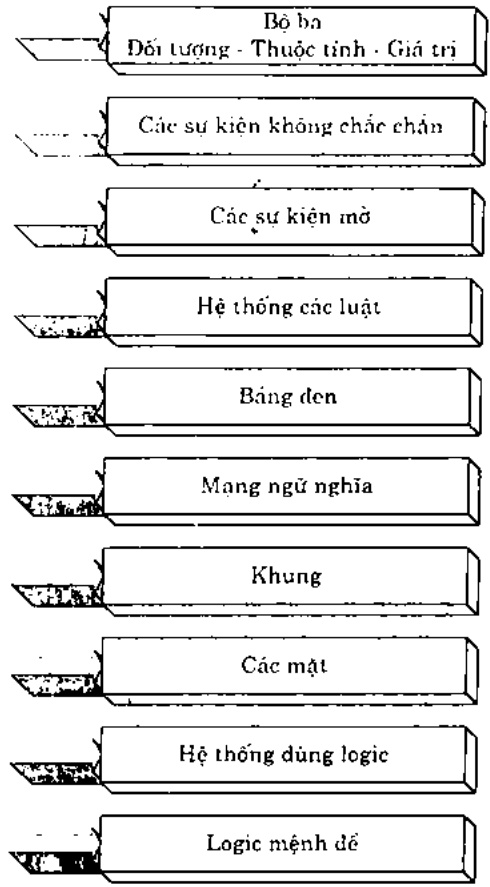

Một số kỹ thuật thể hiện tri thức

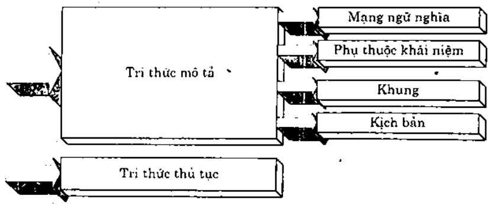

Người ta dùng phương pháp thể hiện trị thức theo kiểu mô tả và kiểu thủ tục

<!-- page: 217 -->

# BIÊU DIÊN CÂU TRÚC CỦA TRI THỨC

## I. GIỜI THIỆU

Các cách biểu diễn đã được giới thiệu trong các chương trước sử dụng cho các sự kiện đơn giản. Ưu điểm nhất của các loại biểu diễn đó là logie vị từ, có thể kết hợp được với các cơ chế suy diễn mạnh. Cồn đối với các đối tượng phúc tạp hơn, cần có các cách biểu diễn khác. Biểu diễn mới này dùng cho các đối tượng mang nhiều thuộc tỉnh, cho các quan hệ giữa các đối tượng. Một mô hình được quen dùng là lược độ các thực thể, tờ ra có hiệu quả với khối lượng đối tượng lớn. Các đối tượng không chỉ là các thực thể có cấu trúc và có thể da dạng hơn.

Hệ thống tốt cho phép thể hiện các trị thức phúc tạp, có cấu trúc là hệ thống mang bồn thuộc tính sau

1. Cần bằng trong thể hiện : khả năng thể hiện tất cả các loại tri thức, cả tri thức không cần thiết về lĩnh vực xem xét.

2. Cân bằng trong suy diễn : khả năng xử lý các cấu trúc được thể hiện theo cách như là suy diễn ra trì thức mới.

3. Hiêu quả trong suy diēn : khá năng kết hợp vào một cấu trúc tri thức các thông tin phụ, có thể dùng để tập trung chú ý của cơ chế theo đường huống có hy vọng nhất.

4. Hiêu quả thu nhập : khả năng dễ dàng thu được thông tin mới. Cách đơn giản nhất để lấy thêm thông tin là bổ sung trực tiếp vào cơ sở dữ liệu, cơ sở tri thức. Việc này do con người đảm nhiệm. Vậy nên có chương trình với khả năng tự động thu thập dữ liệu là lí tưởng.

Tri thức mô tả các đối tượng trong lĩnh vực, các thuộc tính của các đối tượng này và môi quan hệ giữa chúng, tức là tri thức có tính khái niệm hóa. Ngoài các thuộc tính trên, tri thức cần có các chỉ tiêu sau :

<!-- page: 218 -->

\- Đầy đủ. Chỉ tiêu này yêu cầu trí thục mô tả được việc khái niệm hóa.

\- Trong sáng. Tức là tính rõ ràng về khái niệm mà trị thức mô tả và tính rõ ràng trong thể hiện.

\- Modun. Tri thức được chia thành từng phản có thể cấp nhất độc lập, riêng biệt.

Một vải kỹ thuật được dùng trong việc biểu diễn có thể được chia thành hai loại. Loại thứ nhất theo phương pháp mô tả như logic vị tử, mà da số các trị thức được mô tả như tập hợp tỉnh của các sự kiện, kèm theo là các thủ tục trên các sự kiện đó. Loại thứ hai theo phương pháp thủ tục mà trí thức được xem như các thủ tục sử dụng nó. Mỗi phương pháp đều có ưu điểm và nhược điểm.

Uu điểm của phương pháp mô tả là

\- Mỗi sự kiện chỉ cần lưu trữ một lần, không chú ý đến số các cách khác nhau mà nó có thể dùng,

• Dễ bổ sung sự kiện mối vào hệ thống mà không cần thay đổi sự kiện và các thủ tục khác.

Còn với phương pháp thủ tục, chúng có ưu điểm

• Dễ dàng biết cách sử dụng,

\- Mô tả các sự kiện như suy diễn mặc định và tri thức xác suất. Phương pháp mô tả không dễ thế hiện loại sự kiện này.

\- Dễ thể hiện tri thức may rủi và làm cho nó trở nên hiệu quả.

Thực tế cho thấy hai phương pháp được con người dùng hỗn hợp, xen kẽ tùy thuộc nội dung của bài toán cần giải.

Các cấu trúc vừa nêu ra được áp dụng cho nhiều lĩnh vực và độc lập với hệ thống máy tính. Tuy vậy hầu hết các tri thức dùng cho việc phát triển hệ thống, cho phép hiểu được thông tin đưa vào hệ thống lại ở dạng ngôn ngữ tự nhiên. Chính vì vậy cần có các chương trình xử lý văn phạm, xử lý từ vựng của ngôn ngữ tự nhiên. Người ta đã kháng định ràng việc hiểu ngôn ngữ không dễ dàng, bởi nó mang quá nhiều tri thức, có cứ pháp và ngữ nghĩa.

Cấu trúc tri thúc di kèm với cấu trúc lưu trừ của dữ liệu. Vậy có thể cơi đó là cơ sở dữ liệu phúc tạp gồm các thông tin về lĩnh vực đặc biệt và tham chiếu đến các cấu trúc khác, ứng với các lĩnh vực và sự kiện. Phẩn hiển hiện của các đối tượng được mô tả theo lược đổ.

<!-- page: 219 -->

<table><tr><td colspan="3">Thí dụ</td></tr><tr><td>DOG</td><td>ISA</td><td>PET (vật nuôi được ua chuống),</td></tr><tr><td>PET</td><td>ISA</td><td>ANIMAL (con vật),</td></tr><tr><td>ANIMAL</td><td>ISA</td><td>Sinh vật sống.</td></tr></table>

## Dình nghĩa 8-1 : Lược dô (Schema)

Lưu đồ là cái hưởng đến tố chức hoạt động của các tác động đã qua hay các kinh nghiệm đã qua, mà luôn được hỗ trợ thực hiện trong các hoạt động trí tuệ nhân tạo.

Có vải dạng lược đô trong trí tuệ nhân tạo, là :

\- Khung (frame), thường dùng cho việc mô tả tập các thuộc tính của các đối tượng. Chẳng hạn người là mô tả cải ghế, bàn... như mô tả bình thường.

\- Kịch bản dùng để mô tả dãy các sự kiện. Chắng hạn mô tả các sự kiện xây ra với người vào một nhà hàng ăn.

\- Khuón mẫu (stereotype) dùng cho mô tả các đặc tính thường thấy d người.

\- Các mô hình luật (rule models) dùng mô tả các nét chung được chia sẻ trong một tập các luật của hệ sản xuất.

Hai cấu trúc đầu được trình bày trong chương này. Khuôn mẫu được giới thiệu như cơ sở của mô hình tạo dạng cho người sử dụng đặc biệt trong một hệ thống tương tác. Mô hình đó thích hợp cho việc sinh ra quá trình tương tác trong các ứng dụng đặc thù. Hệ thống dùng luật được minh họa rõ nhất trong hệ chuyên gia cần đến tương tác với người dùng.

Ngoài các quan tâm chung nhu trên, có thể còn có một vài vấn đề dáng được chú ý. Chúng được kể ra gồm :

i. Thuộc tính nào là cơ bản và có mặt trong hầu hết các vấn đề ? nếu có, chắc chấn phải có trong hầu hết các cơ chế đã được kê ra, và có dạng ra sao ?

ii. Tại mức nào tri thức được thể hiện; liệu có thể có tập sơ khai cho phép sinh ra các trị thức từ các tập sơ khai, và cách dùng các thành phần sơ khai ấy?

iii. Trong cơ sở dữ liệu lớn liệu có thể tách ra được một phần nhỏ các dữ liệu dùng cho mục đích nhỏ hơn?

## 1.1. Câu trúc tri thức về quan hệ

Các đối tượng phúc tạp được phân rã thành nhiều đối tượng đơn giản. Lớp phúc tạp cũng được phân rã, dựa trên hai quan hệ thông dụng đối với các đối tượng, đó là :

\- Quan hệ ISA, là quan hệ giữa các đối tượng phân cấp,

<!-- page: 220 -->

\- Quan hệ ISPART giữa các đối tượng tạo nên tập các thành phần, mối thành phần lại là tập các thành phần...

Thí dụ

Tay ISPART Thàn the,
Ngón tay ISPART Tay.

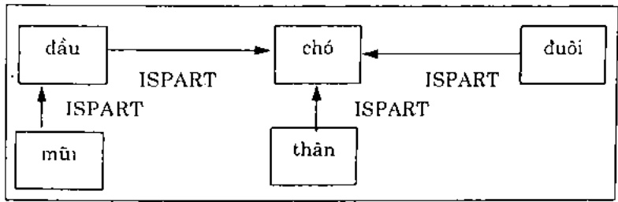

Hình 8-1. Quan hệ giữa các đối tượng.

Với nhiều lĩnh vực có quan hệ bao trùm, người ta dùng ENTITY. Chẳng hạn xem hình vẽ, nhận xét thấy toto là chó, chó là vật được ua chuộng. Do vậy, toto là vật được ua chuộng, và tri thức này sẽ được lưu trữ.

Tuy nhiên không phải tất cả các tri thức đều được lưu trữ, mà chỉ các tri thức lại mức đầu và các qui tắc suy diễn.

Thí dụ

Người ta có

$\forall x, \forall y, \forall z \text{ ISA}(x,y) \land \text{ISA}(y,z) \rightarrow \text{ISA}(x,z)$:

Vị từ ISA (toto, chó) được sử dụng.

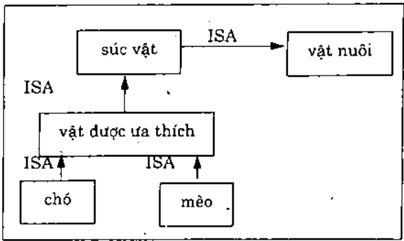

Hình 8-2. Thuộc tính kê thừa.

<!-- page: 221 -->

Thuộc tính bắc cấu của ISA cũng quan trọng; nhỏ thuộc tỉnh này mà có thể nhận được phát biển về thuộc tỉnh của đối tượng khác. Thủ tục suy diễn này gọi là thuộc tỉnh kế thừa. Việc suy diễn này cũng thuận lợi cho việc biểu diễn lại các trị thức.

## I.2. Chọn mức thể hiện

Cho dù hình thức thể hiện nào thì vẫn cần thiết trả lời cho câu hỏi "Thế giới thực được thể hiện ở mức nào?" hay "Các đối tượng số khai là như thể nào?" Có và cách thể hiện đáp ứng cho nhu cầu này.

Thí dụ

Sự kiện anh Chén quấy rầy chỉ Mơ được thể hiện lại qua câu :

## Quấy rầy (tác nhân(Chén), đối tượng(Mo))

Cách biểu diễn này thuận lợi cho câu hỏi "ai quáy rầy Mơ ?" nhưng giả sử cần biết "Chén có thấy Mơ không?", tuy rằng có sự kiện này nhưng không dễ suy ra được. Do vậy có thể bổ sung tri thức mới

$$
\text {Quay rây} (x, y) \rightarrow \text {Trông thấy} (x, y)
$$

Có thể viết lại thành :

## Trông thấy (tác nhân(Chén), đối tượng(Mo), trong thời gian(10 phút))

Về các trường hợp như thí dụ này, cần thiết xem xét tiếp các khóa cạnh sau :

\- Thứ nhất. Vấn đề đặt ra ở dây là dùng các term để diễn tả tri thức, chú không chỉ thể hiện những gì người ta nhận thấy. Do vậy phải đưa việc diễn tả tri thức về nhiều thành phần sơ khởi, dầu ràng đôi khi không cần thiết. Đế hiệu quả, giữa các sự kiện ở mức cao và trong phân tích người ta chỉ lưu trữ các sự kiện quan trọng.

\- Thú hai. Ván đề nửa là khi dùng cái thành phần số khởi dòi hôi lưu giữ nhiều thú của một đối tượng phúc tạp, do vậy có thể lăng phí vì phải đưa thêm vào nhiều khái niệm cơ bản mà đã được các sự kiện khác dua vào.

Thí dụ

Hành động = {hành động nhỏ}, diễn tả hiện tượng Xuân cấu Mơ bằng phụ thuộc quan niệm như trong hình.

<!-- page: 222 -->

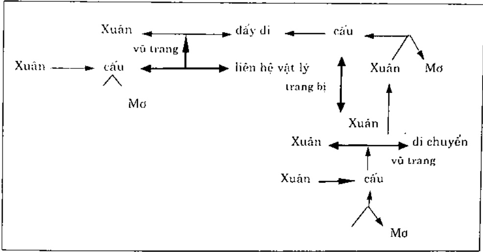

Hình 8-3. Phụ thuộc khái niệm "Xuân cấu Mơ".

\- Thù ba. Ván dẻ thủ ba liên quan đến hình dạng của các thành phần sơ khởi. Nếu chúng tồn tại, không thể không dùng cho cả các mức cao: nhưng nếu dùng thì phải qua quá nhiều mức trung gian.

Thí dụ

Thí dụ hay dùng cho vấn đề thủ ba này để cấp quan hệ mẹ, cha, con, con gái và có thể thêm anh, chi.

Giả sù Mân và Dào là anh chì em họ. Do đó có các khả năng

$$
\text {Mân} = \text {con gái (anh(mę(Dào)))}
$$

$$
\text {Mân} = \text {con gái (chi(mę(Đào)))}
$$

$$
\text {Mân} = \text {con gái (anh(cha(Dào)))}
$$

$$
\text {Mân} = \text {con gái (chí(cha(Dào)))}
$$

Do không có thêm thông tin khác, tốt hơn là dùng quan hệ "không sơ khởi" với tên "anh chỉ em họ". Một cách khác dựa vào việc thay đổi các sơ khởi, có cha mẹ. con, anh chỉ em ruột, trai, gái. Vậy

$$
\text {Mân} = \text {con(anh chî em(cha me(Dào))}
$$

Tuy nhiên các quan hệ mức thấp này có thể dẫn đến suy diễn không phù hợp, khi đó dôi hỏi phải chỉnh lý các sơ khởi này.

<!-- page: 223 -->

## Thi dụ

Có sự kiện Mỗ đập vỏ cái của số. Người ta không thể xác định được rằng Mỗ hành động theo một trong các dây các hoạt động sơ khởi như sau :

1. Dông đến vật cứng,

2. Nèm vật vào của số,

hay là

1. Nhật vật cứng,

2. Cảm vật đó, đánh mạnh vào của số.

Thẩm chí có thể Mỗ đã có hành động đơn lẻ như "Chân hay tay dẫn mạnh vào của số" hoặc "Dóng mạnh của đến nổi vô kính".

Điều này có nghĩa rằng chọn một trong các câu là không dễ dàng. Càng ở mức thấp, càng ít cần đến việc suy diễn xem một sự kiện có ảnh hưởng đến đâu, nhưng phải suy diễn để tạo cách thể hiện từ ngôn ngữ tư nhiên sang dạng khác. Điều này yêu cầu hệ thống xét riêng cho từng lĩnh vực cụ thể.

Việc kiểm tra sự tổn tại của tập các số khởi mức thấp cũng tương đương với việc xem có cách thể hiện duy nhất không ? nếu có thì hiệu có thể chuẩn hóa chủng được không ? và khí cần-thể hiện các đối tượng thì chọn thời gian và địa điểm nào để việc thể hiện đó sẽ chính xác hơn cả ?

## 1.3. Cấu trúc phù hợp với câu chuyện

Kịch bản là thuật ngữ chỉ việc mô tả lớp các sự kiện theo ngũ cảnh, các sự kiện. Giả sử có kịch bản mô tả một dãy các sự kiện diễn hình trong nhà hàng ăn, cho biết

"Xuán đến của hàng STEAK & ALE đêm hôm trước. Nó yêu cầu món thịt bò, trả hóa đơn và về".

Người tả thấy ngay câu trả lời là "có" cho câu hỏi "Xuân ăn tối hôm trước không ?". Tuy nhiên không có mệnh đề nào thông tin về Xuân ăn, nhưng thực ra tại nhà hàng, có lưu lại hóa đơn. Nếu có được tờ hóa đơn đó thì trả lời câu hỏi không khó. Do vậy để giải một bài toán nhỏ cũng cần có nhiều kịch bản, nhiều câu chuyên.

Những tiếp cận quan trọng để giải quyết vấn đề nếu ra này có thể liệt kê như sau

\- Người ta có thể đánh dấu các cấu trúc trực tiếp bằng lời có nội dung, chẳng hạn phải dùng động từ để xác định nghĩa chính của câu. Tuy nhiên, cách này đưa đến nhiều tình huống khác nhau; do vậy cần chỉ số hóa các cấu trúc.

\- Môi nội dung trong văn bản trở đến tất cả các cấu trúc có liên quan, chẳng hạn tên người và tên thức ăn (trong thí dụ này là thịt bò), do vậy cũng phải

<!-- page: 224 -->

tính đến tất cả các khả năng. Tiếp cần này đối với khối lượng lớn các tính toán.

\- Đình vị các phân tử chính của văn bản và dùng nó để chọn một cấu trúc thích hợp. Khi có các sự kiện khác thêm vào, việc lựa chọn đó còn được chính lý. Văn đề là không dễ dàng gì xác định được ngay phần tử chính, và cải nào là quan trọng đối với phần tử này.

Người than nhận xét ràng với cấu trúc cùng phục tập, cùng khó diễn tả theo dây có trình tự. Nhìn truy nhập đúng trong các trường hợp cụ thể, nên giải quyết các vấn đề sau :

1. Chọn cấu trúc phù hợp,

ii. Chú tiết phù hợp với hoàn cảnh

iii. Chọn cấu trúc tốt nhất nếu lúc dấu chọn chưa phù hợp,

iv. Biết khi nào không có cấu trúc phù hợp

v. Biết khi nào cần nhớ và tạo cấu trúc mới.

## II. THÊ HIỆN THEO PHƯƠNG PHÁP MÔ TẢ

Phân trên đã giới thiệu sơ lược về các cách thể hiện. Tiếp theo, trong phần này một số loạn thể hiện theo kiểu mô tả được giới thiệu, gồm có :

\- Mạng ngủ nghĩa, cho phép mô tả các sự kiện và các đối tượng.

\- Phụ thuộc khái niệm, có cấu trúc đặc biệt hơn, đảm bảo thể hiện quan hệ giữa các thành phần của một hành động;

\- Khung. cấu trúc tổng quát dùng cho thể hiện các cấu trúc phúc tạp; và

\- Kịch bản, đặc biệt hơn, dùng mô tả dãy các sự kiện.

Về các loại thể hiện trị thức theo kiểu mô tả này, có một vài nhận xét sạ :

Nhân xét 1. Các cấu trúc đó dùng để phân biệt các bài toán, không hắn là khác biệt nhau. Một khái niệm chung được chúng sử dụng là thực thể. Một thực thể được mô tả như tập các thuộc tính và các giá trị liên kết. Người ta mô tả các khuôn mẫu và cách thức điện dữ liệu vào các khuôn mẫu đó. Do vậy chúng thường được gọi là slot-and-filler.

Nhân xét 2. Các cấu trúc quan trọng đối với ngôn ngữ lập trình, chẳng hạn các cấu trúc có ảnh hưởng tới bộ nhớ liên kết, lưu trữ các bộ ba có thứ tự là <đối tượng>&lt;thuộc tính&gt;&lt;giá trị&gt;.

Có một loại cấu trúc khác gắn mỗi đối tượng với một danh sách gồm các cặp thuộc tỉnh (thuộc tính, giả trị). Lức đó việc tìm thông tin được đưa về xác định đối tượng và

<!-- page: 225 -->

các giá trị của thuộc tỉnh. Thị dụ ngôn ngữ LISP xác định thông tin theo loại cứu trước này.

Nhận xét 3. Nhiểu thuộc tỉnh sử dụng trong mô tả trị thức chung, có thuộc tính ngược. gần với các giá trị thực. Quan hệ ISA ngược với KIND-OF.

Nhân xét 4. Do các cấu trúc dùng để thiết kế cách thể hiện dữ liệu và tạo điều kiện sử dụng dữ liệu, nên trong quá trình giải các bài toán cần có thêm tập các suy diễn.

## II.1. Mạng ngữ nghĩa

Phân này chỉ nêu lên một số nét sơ lược về mạng ngũ nghĩa. Trong các phản sau, các nội dung về mạng ngũ nghĩa còn được trình bày chỉ tiết thêm.

## II.1.1. Thế hiện tri thức

Mạng ngữ nghĩa là một công cụ thể hiện thuận tiện các ngữ nghĩa tiếng Anh về ngôn ngữ học.

Thông tin được thể hiện như tập các nút, qua các đường nôi, hay gọi là cung, có nhân cho phép mô tả quan hệ giữa các nút.

Thi dụ

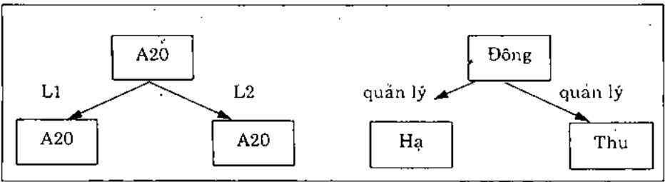

Hình 8-4. Mạng bình thường ở bên trái hình và mạng ngữ nghĩa. Các nhân ghi bằng ngôn ngữ tự nhiên gắn với các nút và các cung có tác dụng giải thích để hiểu rõ thêm. Do vậy cũng làm cho mạng ngữ nghĩa trở nên kém hình thức.

## II.1.2. Suy luận trên tri thức

Mang ngũ nghĩa mạnh ở chỗ chúng có khả năng chương trình hóa để giải bài toán. Nó được dùng đầu tiên để xác định quan hệ giữa các đối tượng bằng cách cho

<!-- page: 226 -->

hoạt động di theo đường nôi hai đối tượng đó. Quả trình này gọn la tìm kiếm, được giới thiệu vào năm 1968. Bằng cách này, hiệu có thể xác định được "hền hệ giữa Xuân và Mơ" trong thí dụ trước đáy về Xuân cấu Mơ?

Những ứng dụng khác nhau của mạng ngữ nghĩa sử dụng các thủ tục tìm trực tiếp đến câu hỏi riêng. Tuy ràng mạng có thể mô tả tất cả các thông tin nhưng việc xác định khả năng tìm kiếm phụ thuộc vào nội dung các nút và các cung nói. Một vấn đề vấp phải là khi đưa vào một đối tượng mới, vẫn chưa đảm bảo được rằng đã giải quyết cho các đối tượng tương tự, tức chưa đảm bảo được tính tổng quát của mạng ngữ nghĩa.

## Thí dụ

Có mạng ngữ nghĩa cho biết màu của ghế là sãm. Nó cho biết "màu tối" là thuộc tỉnh chung của các chiếc ghế.

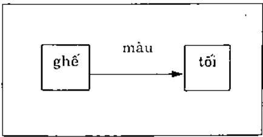

Hình 8-5. Thuộc tỉnh chung của cái ghế.

Người ta nhận xét thấy rằng nếu muốn rút ra được kết luận về màu xanh của nó thi không hẩn đã là đề dàng. Đề tránh gặp phải các câu hỏi trong các trường hợp tương tự, các cung nổi từ nút khái niệm thường dùng để mô tả các thuộc tỉnh của tất cả, hay hâu hết các biểu hiện của khái niệm đó.

## II.2. Phụ thuộc khái niệm

Định nghĩa 8-2 : Phụ thuộc khái niệm (Conceptual Dependency)
Phụ thuộc khái niệm, viết tất là CD, là lý thuyết về cách thể hiện các ngôn ngữ tự nhiên theo cách

(i) Tiện lợi suy diện từ các câu,

(ii) Độc lập với ngôn ngữ, tức là độc lập với cải thể hiện các câu.

<!-- page: 227 -->

## II.2.1. Thế hiện tri thức bằng CD

CD mô tả các câu thông qua các hàm số hay câu sơ khởi, cho phép tạo thành các câu của ngôn ngữ nào đó. Nó đảm bảo cả cấu trúc và tập chuyên dụng các phép sơ khởi. Các thành phần sơ khởi dùng cho việc mô tả thống tin đặc thù và thông tin cụ thể.

Thí dụ

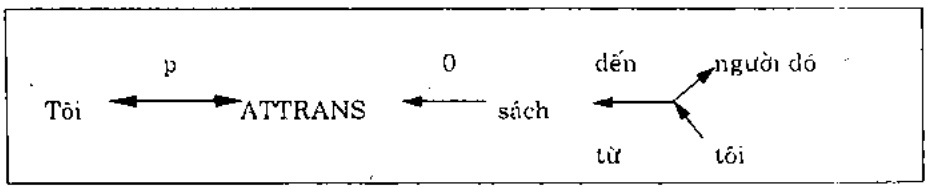

Hình 8-6. Thể hiện tri thức bằng CD đối với câu "tôi cho người đó cuốn sách"

Trong thí dụ này có nhóm các hành động sơ khởi, cho phép xây dựng các hành động ở mức cao hơn. Nhìn chung có các biểu diễn diễn hình liệt kê trong bảng sau :

| Ki hiệu | Ý nghĩa |
| --- | --- |
| Mũi tên | Dùng để chỉ hướng phụ thuộc. |
| Mũi tên kép, hay mũi tên dân | Dùng để chỉ liên kết hai chiều giữa hành động và tác nhân gây ra hành động |
| p (past) | Chỉ thời gian quá khú của hành động |
| o (object) | Chỉ quan hệ đó có kiểu đối tượng |
| R | Chỉ quan hệ nhận |
| ATRANS | Chuyển giao quan hệ trùu tượng, thí dụ "cho" |
| PTRANS | Chuyển vị trí vật lý của một đối tượng, thí dụ "đi" |
| PROPEL | Ứng dụng lực vật lý vào một đối tượng, thí dụ "dây" |
| MOVE | Chuyển động một phần cơ thể của người, thí dụ "dá" |
| GRASP | Túm lấy một đối tượng do tác nhân khác, thí dụ "ném" |
| INGEST | Tiêu hóa như động vật, thí dụ "ản" |

<!-- page: 228 -->

| EXPEL | Rút ra được từ đối tượng, thi dụ "kêu" |
| --- | --- |
| MTRANS | Chuyển giao thông tin trí tuệ, thi dụ "kê" |
| MBUILD | Xây dựng thông tin môi từ các cải cũ, thi dụ "quyết định" |
| SPEAK | Sinh ra âm thanh, thi dụ "nói" |
| ATTEND | Tập trung cơ quan cảm giác về vật gây kích thích, thi dụ "nghe" |

Hình 8-7. Các kí hiệu dùng trong mô tả phụ thuộc khái niệm.

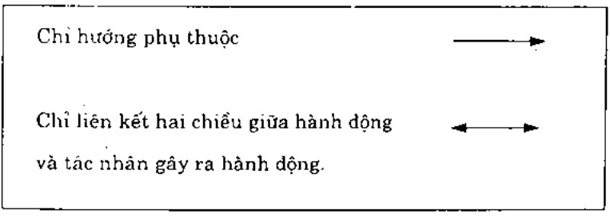

Hình 8-8. Mũi tên dùng trong CD.

Các biểu diễn trên tạo thành tập hợp thứ nhất của CD. Tập hợp thứ hai của CD dùng cho việc xây dựng các khối là tập các phụ thuộc được phép trong số các khái niệm mô tả câu. Có bốn phạm trừ khái niệm sơ khởi dùng để xây dựng các câu trúc, và chúng có thể là phần tử của câu trúc góp lớn khác :

• ACT Dùng để mô tả các hoạt động,

• PP Dùng để mô tả các đối tượng.

• AA Dùng để mô tả sự biến đổi các hoạt động, và

• A Dùng để mô tả các biến đổi.

Những phụ thuộc trong việc khái niệm hóa tương ứng với quan hệ ngũ nghĩa trong các khái niệm dem xét. Những phụ thuộc quan trọng nhất được giới thiệu qua các luật sau với các thí dụ minh hoạ.

Luật 1 mô tả quan hệ giữa một tác nhân và sự kiện. Đầy là phụ thuộc hai chiều vì không thể xem nó như một sơ khởi được.

<!-- page: 229 -->

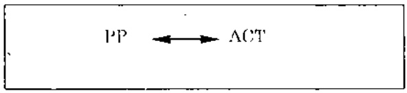

Hinh 8-9. Quan hệ giữa một tác nhân và sự kiện.

Thi dụ về cách dùng, trong đó "p" chỉ tình trạng quá khút.

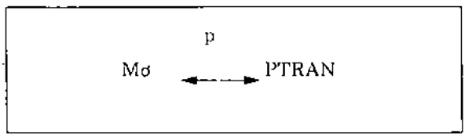

Hình 8-10. Phụ thuộc khái niệm "Mơ đã chạy".

Luật 2 mô tả quan hệ giữa PP và PA. PA dùng để mô tả cho PP. Nhểu mô tả trạng thái nhu là chiều cao được mô tả trong CD như vecto số.

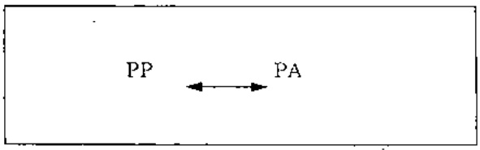

Hình 8-11. Quan hệ giữa PP và PA.

Thí dụ

Dùng CD diễn tá Mơ là cao :

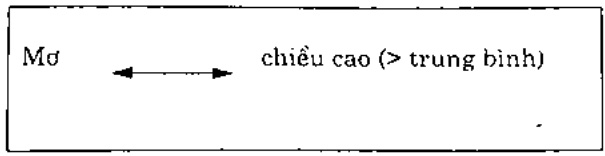

Hình 8-12. Phụ thuộc khái niệm "Mô là cao".

<!-- page: 230 -->

Luật 3 mô tả quan hệ giữa hai PP. một đối tượng thuộc về tập các đối tượng do đối tượng kua xác định.

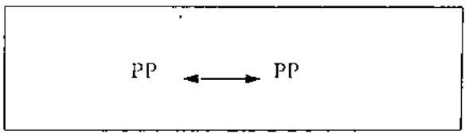

Hình 8-13. Quan hệ giữa hai PP.

Thí dụ

Dùng luật nay để diện tại Mơ là nhà buôn :

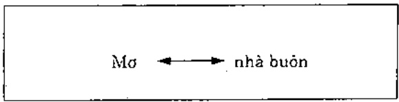

Hinh 8-14. Phụ thuộc khái niệm "Mơ là nhà buôn".

Luật 4 mô tả quan hệ giữa PP. và một thuộc tính đã được gán cho đối tượng đó. Hướng của mũi tên trở về phía đối tượng được mô tả.

Thi dụ

Cân điện tả bằng CD "Cô gái là xinh".

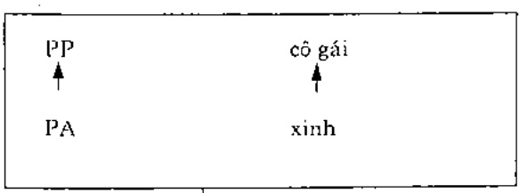

Hình 8-15. Quan hệ giữa các PP.

Luật 5 mô tả quan hệ giữa hai PP, một trong hai đối tượng đó đảm bảo một loại thông tin cụ thể về đối tượng kia. Ba dạng thông tin được dùng trong luật này là :

• Sự sở hữu, chẳng hạn "sở hữu bồi"

<!-- page: 231 -->

• Định vị. thống qua từ LOC,

• 1.000 b/c v/n ly

Hương many tên chỉ vé phía khải niệm được mô tả.

1]11 111

C'o thong: im "Con Moe cia Mo".

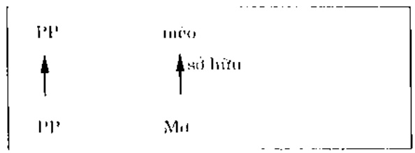

Hình 8-16. Phụ thuộc khái niệm để mô tả "Con Mèo là của Mơ".

Lượt 6 mó từ quan hệ giữa ACT và PP. PP là đối tượng của hoạt động ACT. Hương của minus tên trở về phía ACT vì ngữ cảnh của ACT chuyên dụng quyết định nghĩa của quan hệ đối tượng.

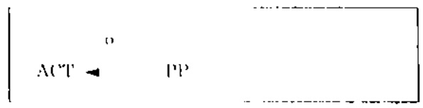

Hình 8-17. Quan hệ giữa ACT và PP.

## Tha du

Dùng (1) để mô tả việc Mơ dân xe, "O" chỉ quan hệ cho các đối tượng :

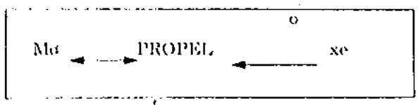

Hình 8-18. Phụ thuộc khai niệm cho thí dụ "Mô dùn xe".

<!-- page: 232 -->

Luật 7 mô tả quan hệ giữa một ACT với nguồn và dịch của hành động ACT.

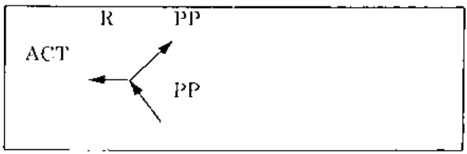

Hình 3-19. Quan hệ giữa một ACT với nguồn và dịch của hành động ACT.

Thí dụ

Anh Mồ đã lấy cuôn sách từ chỉ Mơ.

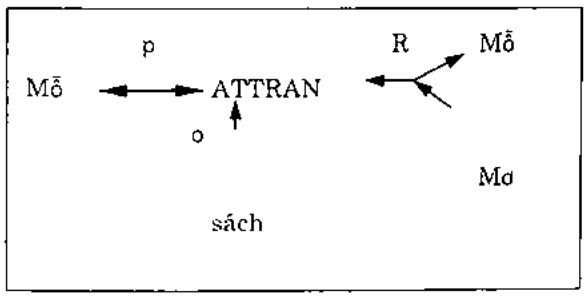

Hình S-20. Mỗ đã lấy cuốn sách từ chỉ Mo.

Luật 8 mô tả quan hệ giữa một ACT và công cụ thực hiện hành động đó. Công cụ này được khái niệm hóa đầy đủ, tức là cần có một ACT, chữ không chỉ là đối tượng vật lý.

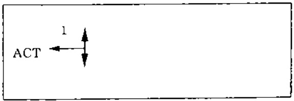

Hình 8-21. Quan hệ giữa một ACT và công cụ thực hiện hành động đó.

<!-- page: 233 -->

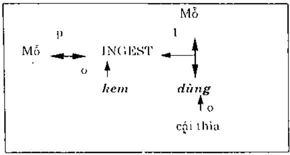

Hình 8-22. Phụ thuộc khái niệm "anh Mổ đã ăn kem".

Luật 9 mô tả quan hệ giữa ACT và nguồn của hoạt động. nơi thực hiện của hoạt động.

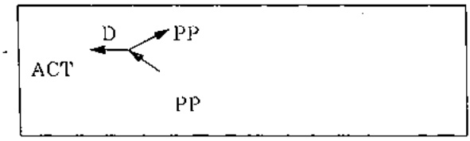

Hình 8-23. Quan hệ giữa ACT và nguồn của hoạt động.

Thirdy

Anh Mổ bón phân vào ruộng :

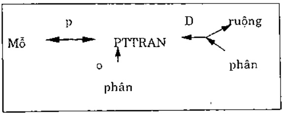

Hình 8-24. Phụ thuộc khái niệm "Mỗ bón phân vào ruộng".

<!-- page: 234 -->

Luật 10 mô tả quan hệ giữa một PP và trạng thái bất dấu, trạng thái kết thúc hoạt động.

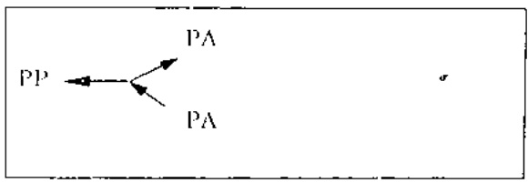

Hình 8-25. Quan hệ giữa một PP và các trạng thái.

Thí dụ

, Diên tài thông tin "Cáy lớn lên":

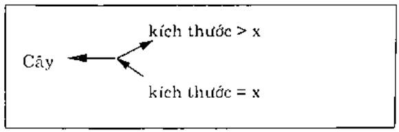

Hình 8-26. "Cây lôn lên" được mô tả bằng phụ thuộc khái niệm.

Luật 11 mô tả quản hệ giữa một sự khái niệm hóa và cái gãy ra việc khái niệm hóa ấy. Lưu ý các mũi tên cho biết sự phụ thuộc của việc khái niệm hóa vào hoạt động khác. Có hai dạng :

\- Luật 11a mô tả kết quả của một hoạt động, và

\- Luật 11b mô tả kết quả của việc thay đổi trạng thái.

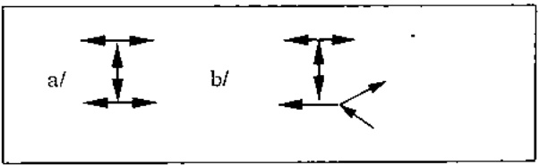

Hình 8-27. Sự khái niệm hóa và tác nhân gây ra việc khái niệm hóa.

<!-- page: 235 -->

Thí dụ

Mô đã bản vào con cò :

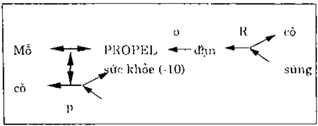

Hình 8-28. Phụ thuộc khái niệm "Mô đã bán vào con cò".

Luật 12 mô tả quan hệ giữa việc khái niệm hóa và thời gian xảy ra sự kiện được mô tả.

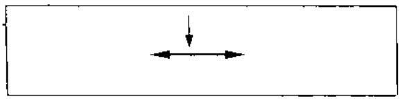

Hình 8-29. Quan hệ giữa việc khái niệm hóa và thời gian.

Thí dụ

Mô dâ chạy vào ngày hôm qua :

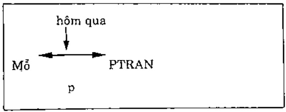

Hình 8-30. Phụ thuộc khái niệm "hôm qua Mô đã chạy".

<!-- page: 236 -->

Luật 13 mô tả quan hệ giữa việc khái niệm hóa và sự kiện khác cùng xáy ra tại thời điểm khái niệm hóa. Luật này cho phép CD khái thác mô hình của hệ thống xử lý thông tin mang tính người. Trong thí dụ này, "thấy" được thể hiện như việc chuyển thông tin giữa mất và hệ thống xử lý thị giác.

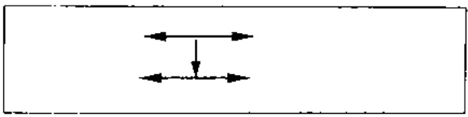

Hình 8-31. Quan hệ giữa việc khái niệm hóa và một việc khác cùng xảy ra tại thời điểm khái niệm hóa.

Thí dụ

Khi về nhà, tôi đã trông thấy con nhái :

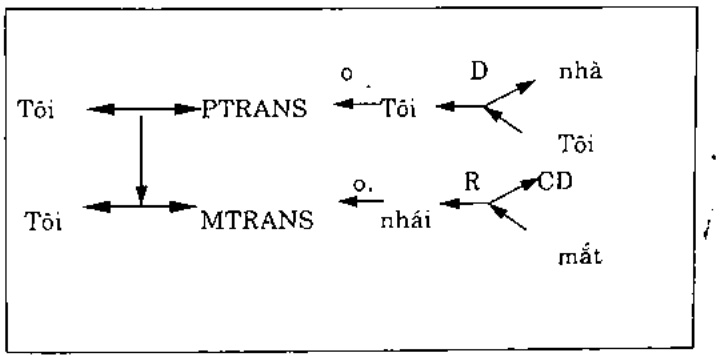

Hình 8-32. Phụ thuộc khái niệm "khi về nhà, tối đã trông thấy con nhái".

Luật 14 mô tả quan hệ giữa việc khái niệm hóa và nơi xảy ra việc này.

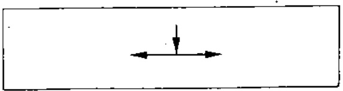

Hình 8-33. Quan hệ giữa việc khái niệm hóa và địa điểm.

<!-- page: 237 -->

## Thi du

Tôi nghe thấy.con nhái trong đóng củi :

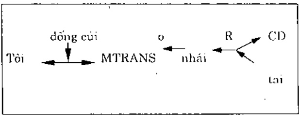

Hình 8-34. Phụ thuộc khái niệm "tời nghe thấy con nhái trong đóng gửi".

Việc khái niệm hóa thể hiện các sự kiện có thể được thay đổi theo nhiều cách để cung cấp thông tin theo thể hiện bình thường nhỏ các cấu và các động từ của ngôn ngữ. Người ta có thể dùng tham số thời gian; nhìn chung có các loại sau :

| Ki hiệu | Ý nghĩa |
| --- | --- |
| p | chỉ sự việc quá khử |
| f | chỉ sự việc tương lai |
| ι | chỉ sự việc chuyển giao |
| $t_n$ | chỉ thời điểm bắt đầu |
| $t_f$ | chỉ thời điểm kết thúc |
| k | chỉ sự tiếp tục |
| ? | chỉ sự nghỉ vấn |
| / | chỉ sự phủ định |
| nil | chỉ sự có mặt |
| c | chỉ điều kiện |

Hình 8-35. Các tham số thời gian được dùng trong phụ thuộc khái niệm.

<!-- page: 238 -->

Dùng CD để diễn tả cấu "vi ràng có thể hút thuốc gây chết người nên tới cai thuốc".

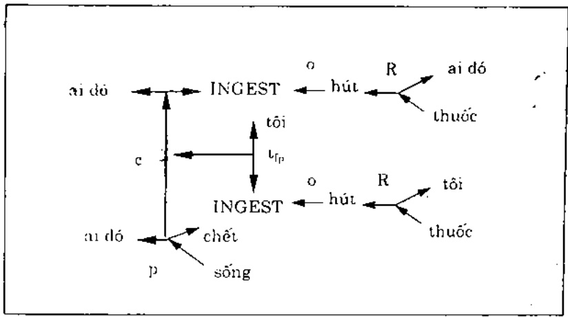

Hình 8-36. Thí dụ tổng hợp được biểu diễn qua phụ thuộc khái niệm.

Đường nhân quả cho thấy "hút có thể giết người". Dầu c cho biết việc hút có thể giết ai đó, chú không nhất thiết. Đường khác chỉ cho thấy "nó làm tôi thời hút". Thời điểm $t_{fp}$ cho biết việc hút đã bị ngừng, và việc kết thúc đã xảy ra trong quá khú.

## II.2.2. Suy luận tri thức theo phụ thuộc khái niệm

Có ba lý do cho thấy việc dùng CD trong thể hiện tri thức và suy luận là thuận tiện :

\- Khi trí thức không tách được thành các sơ khởi, các luật suy điện bị ít di so với thực tế. Do vậy nên tách nhỏ các trí thức để dễ xử lý.

\- Nhiêu suy diễn đã được bao hàm trong việc thể hiện tri thức.

\- Cấu trúc ban đầu dùng để thể hiện thông tin trong một câu có các khuôn mẫu cần được điện. Các khuôn mẫu này thường là nơi tập trung việc xử lý bằng chương trình.

Về từng li do trên, người ta thấy :

Thủ nhất. Thế hiện bằng các sơ khởi dễ mô tả các luật suy diễn hơn thể hiện ở các mức cao. Khi thể hiện tri thức theo các sơ khởi của CD, các luật được thể hiện chỉ một lần cho một hành động sơ khởi ACT, chữ không gần nhiều hành động cho cùng một ACT. Thí dụ các động từ cho, làm, hút thuốc... đều gần với một đối tượng. Khi

<!-- page: 239 -->

dùng động từ này, suy diễn hướng về nơi có đối tượng, hay gắn với đối tượng. Do vậy các suy diễn này được thiết lập một lần và gắn với số khởi ACT TRANS.

Thứ hai. Khi lưu trữ uni thúc, người ta thấy cần thiết lưu trữ không chỉ các luật mà cả sự suy diễn trên chúng. Vậy các suy diễn được lưu trữ như một phần của tri thúc, và có thể được dùng độc lập, không nhất thiết dùng đến các luật khác.

## Thí dụ

Dược biết Âm đã dọn Chén bằng cách véo mũi. Dùng CD để mô tả hiện tượng này. Qua thí dụ này người ta có các nhận xét sau :

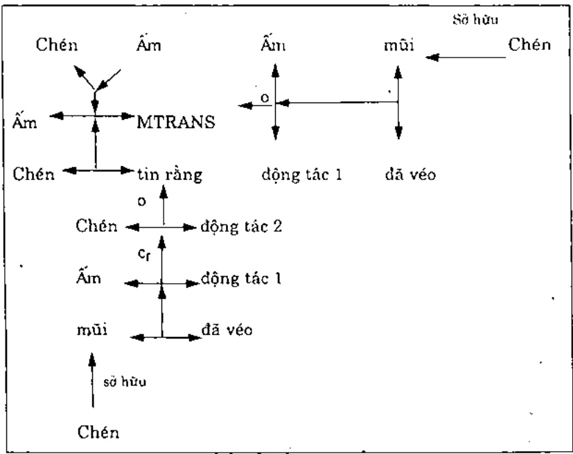

Hinh 8-37. Phụ thuộc khái niệm "Âm đã dọa Chén bằng cách véo mũi".

\- "Tin rǎng" được xèm như đơn vị đơn, thể hiện ACT sơ khởi và theo mô hình xử lý thông tin mang tính người.

\- Cho biết rằng Ám đã thông báo cho Chén biết nó sẽ làm việc gì đó với cái mũi của Chén.

\- Âm đã có hành động để Chén tin ràng nếu Chén làm điều gì khác, nó sẽ véo mũi Chén.

<!-- page: 240 -->

\- "Tân ràng" có thể được thể hiện trong CD như một chuyển giáo thông tin trí tuệ MTRANS của sự kiện vào trí nhớ của Chén. Các hành động "hành động 1". "hành động 2" là các cấu và chưa được xác định.

Thút ba. Chu phép tạo ra các thông tin "rổng". Thông tin này sẽ được diễn về sau, khi xuất hiện các sự kiện.

Tuy nhiên có một số nguyên nhân không dùng CD. Việc thể hiện tất cả theo các sơ khởi dôi khi không hiệu quá và không phải bao giờ cũng có mô hình thích hợp cho tất cả các sự kiện. Mặt khác do sử dụng mô hình mô tả, ngoài các sự kiện đã có không khởi yêu cầu thêm các tham số để đáp ứng với mô hình.

Việc nghiên cứu mô hình CD giúp cho việc mô tả các hành vi của hệ thống thể hiện trị thức thông qua các số khởi; không những dùng trong trí tuệ nhân tạo mà còn trong các hệ thống dựa trên các số khởi.

## II.3. Khung

## Dinh nghĩa 8-3 : Khung (Frame)

Khung là cách thể hiện tri thức theo kiểu nhóm các tri thức một cách có động vào các đối tượng, chẩn hạn như thực thể vật lý, khái niệm trừu tượng, hoàn cảnh và những đối tượng tượng tự.

Khung là cấu trúc thể hiện các tri thức thông qua các đối tượng, vị trí, hoàn cảnh và con người. Khung giúp phân tích các kinh nghiệm mối, diễn vào khuôn mẫu phù hợp. Mỗi khung có tên, định danh đối tượng nó mô tả, và một loạt các "khe" (slot). Mỗi khe, rãnh mang tên và có cái diện vào đó (filler). Một khe có thể được diện bằng :

• Các giá trị mô tả đối tượng, như các thuộc tính cỏ hữu,

\- Miền chấp nhận của các thuộc tính.

• Thuộc tính chấp nhận được, gọi là giá trị mắc định,

• Thủ tục, hoặc

• Con trở đến các khung khác,

Theo một nghĩa nào đó, cấu trúc này có thể được cơi như mạng ngũ nghĩa phúc tạp, nhưng có liên quan đến cấu trúc trong, phù hợp với các loại nhiệm vụ giải bài toán.

## II.3.1. Thế hiện tri thức theo khung

Cháng hạn cần thể hiện các đối tượng như bản, ghế... Khung dành cho các đối tượng này có các rảnh cần diện giá trị. Trước tiên các rãnh mang giá trị mặc định; nếu không diện được các giá trị khác, khung dùng các giá trị mặc định.

<!-- page: 241 -->

Thông tin về các thủ tục cùng có thể gần với rảnh.

\- Thú tục if-added cho phép mô tại thêm khi cần thiết, cùng với thời gian thêm vào;

• Thú tự if-needed, hay còn được gọn là "thiết lập", xác, định cách thúc cho phép thêm vào một giá trị.

Hệ thống được phép sử dụng nhiều khung; các khung liên quan dược nhóm lại, tạo thành "hệ thống các khung".

Thí dụ

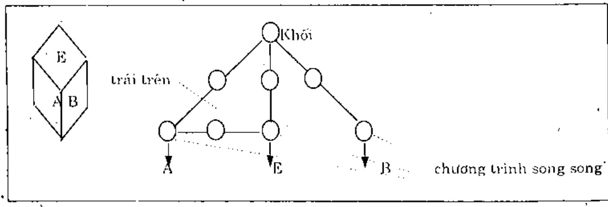

Hình 8-38. Mô tả mật lập phương theo Minsky.

Minski đã mô tả các mật của khối lập phương theo khái niệm khung. Các nút di kèm với các chương trình cho phép mô tả các ràng buộc về giả trị có thể đượcđiền vào rảnh. Trọng nhiều ứng dụng, quan trọng là khả năng mô tả một đối tượng theo nhiều cách nhìn khác nhau: khi đó cần công cụ như khung.

## Thí dụ

Có các hình lập phương với các mật có tên là A, B, C... Xoay hình lập phương chophép nhìn nó dưới các gốc khác nhau.

. Có ba khung, mỗi khung ứng với một gốc nhìn. Trong mô tả này một số chỉ tiết không quan trọng đã được bổ qua. Trong hình, các đường liên đi từ các rảnh dùng để mô tả các mật cụ thể, cho biết các mật nhìn thấy; còn đường gạch gạch cho biết các mật không nhìn thấy. Liên kết giữa các khung biểu lộ quan hệ giữa các cách nhìn mà khung thể hiện, Ngoài ra các khung còn được nổi qua các nút dùng chung, qua các rảnh diễn dữ liệu.

<!-- page: 242 -->

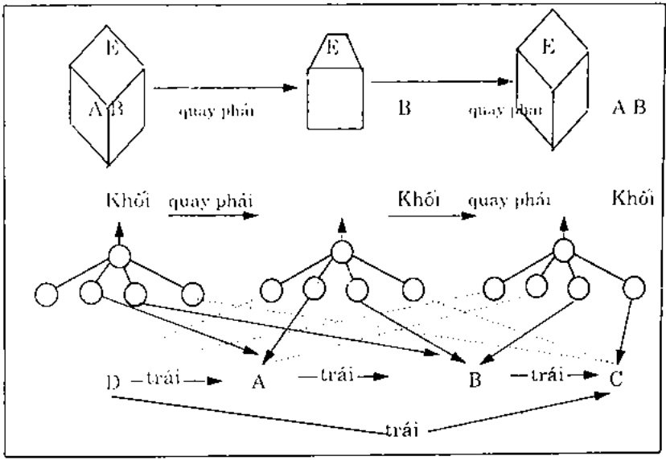

Hình 8-39. Khả năng mô tả hình lập phương theo nhiều cách nhìn khác nhau.

Các nút dùng chung dùng để mô tả một mặt của khối lập phương, thể hiện quan điểm độc lập của mặt; trong thi dụ chúng là các nút đơn. Nếu các mặt chữa thành phần phúc tạp thì thành phần này sẽ được thể hiện bằng cấu trúc theo yêu cầu, có thể là tập các khung khác. Do các rảnh trên khung có thể được diễn bằng cấu trúc khung khác, và vi cấu trúc đã cho có thể diện trọn trong nhiều rảnh, người ta không cần thiết dùng các bộ nhỏ thừa đối với các cách thể hiện chung.

## II.3.2. Suy luận trên tri thức kiểu khung

Các khung có ích cho phát triển những đối tượng đề suy luận và các sự kiện chưa được quan sát đầy đủ. Khung tố ra có ích trong các trường hợp :

\- Khung chứa thông tin về nhiều khóa cạnh của đối tượng hay hoàn cảnh mà nó mô tả. Thông tin này có thể được dùng như nó được quan sát hiển hiện. Thí dụ với khung "căn phòng", người ta có thể suy luận ít nhất có một của ra vào, dù rằng nó có của thải hay không. Điều này có thể xảy ra do "phòng" bao gồm mô tả một phòng và gồm cả một cái cửa.

\- Khung chứa các thuộcính, cần là đúng, của các đối tượng sẽ dùng để lắp đáy các rảnh. Do vậy việc kiến thiết một milieu tả về hoàn cảnh cụ thể dưa về việc kiến thiết milieu tả các thành phần của hoàn cảnh đó.

\- Các khung mô tả các thể hiện đặc trưng của các khái niệm. Khi mô tả một hoàn cảnh cụ thể bằng cách khớp với khung theo mọi cách, mà người ta thấy nó có đặc

<!-- page: 243 -->

điểm riêng thì cần ghi nhận ngay. Thị dụ cái bản thường có bốn chân, vấy cải nào ba chân sẻ được ghi nhận ngay.

Một khung cần dược định tên, trước hết để gần với mô tả đối tượng cụ thể và sau đó dùng cho việc mô tả các đối tượng khác. Năm 1975 Minsky giá sử ràng nếu có một khối lượng sự kiện nào đó dược dùng làm lựa chọn đầu tiên cho một khung thì khung này dược gần với hoàn cảnh cụ thể. Khung khí đó có vài ngân và dược gần giá trị. Chương trình phải tìm các giá trị thích hợp bằng cách kiểm tra hoàn cảnh hiện tại. Nếu giá trị thỏa mãn các hạn chế, chúng sẽ dược ghi vào các ngân. Nếu không tìm thấy giá trị nào thì cần chọn ra khung mức khác và hoàn cảnh cũng thay đổi. Do vậy việc chọn ra một giá trị phù hợp cũng dược xét với các trạng thái khác nhau.

Quá trình lấy giá trị đầu cho các khung trong hoàn cảnh cụ thể thường không thực sự đề dàng, mềm đẻo. Khi quá trình gặp khó khăn, không nhất thiết phải quay lại từ đầu, mà có thể tiến hành quy trình sau :

\- Chọn các phần của khung hiện tại gắn với một hoàn cảnh. Chọn các giá trị phù hợp nhất. Nếu khung hiện tại được chọn đã phù hợp thì tốt và dùng quá trình tìm giá trị.

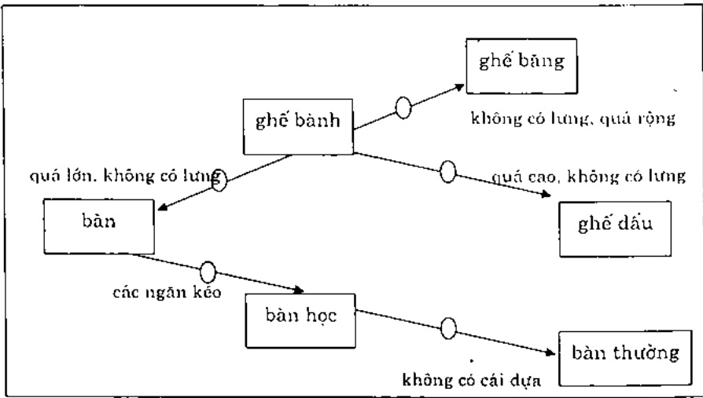

Hình 8-40. Các khung ứng với các lớp đối tượng khác nhau.

\- Sửa chữa các lôi sai trên khung hiện lại và tiếp tục sử dụng khung này. Thị dụ với cái ghẽ ba chân, ghi nhận như có đường bị che khuất hay đã gây. Cũng có những cách tổng quát để điện một cách may rủi các thông tin thiếu, nhưng

<!-- page: 244 -->

tốt hơn là thả thiếu những nét phù hợp hơn là dưa ra các thông tin không phù hợp. Chắng hạnチャ ngềng thả người một chân, hơn là người có dưới.

\- Lưu ý đến các liên kết được lưu trữ đặc biệt giữa các khung để đẻ xuất giả định một số hướng mới cần được khai thác. Thi dụ về các liên kết như trong hình về.

\- Duyên trên cấu trúc phân cấp, trong đó các khung có thể được sắp xếp, cháng hạn

$$
\text {con cho} \rightarrow \text {có vuí} \rightarrow \text {động vật.}
$$

cho đến khi thấy một khung dú tổng quát và không máu thuẩn với các sự kiện. Hoặc là dùng khung này nếu nó đủ đặc biệt, đảm bảo các tri thức yêu cầu hoặc là tạo khung mới. Chẳng hạn người ta xét đối tượng mới là con mèo theo khung cũ mô tả về con chó.

Nhìn chung các khung, như các mạng ngũ nghĩa, là cấu trúc tổng quát. Một lĩnh vực áp dụng cụ thể sẽ dùng cấu trúc tổng quát đó trên tập trì thức cụ thể đang dùng để xác định cho lĩnh vực ấy. Các thao tác chỉ tiết của hệ thống dựa trên khung sẽ thay đổi theo loại trị thức mà khung có và sẽ thay đổi theo loại suy diễn mà hệ thống sẽ được thực hiện.

## II.4. Kích bản

Khi muốn thực hiện một điều khẳng định độc lập, người ta có thể dùng mạng ngữ nghĩa như một cấu trúc tổng quát và có hiệu quả. Phương pháp phụ thuộc khái niệm xác định các sơ khởi cho phép xây dựng các thể hiện cá nhân cũng như xác định các quản hệ đặc biệt. Cấu trúc này sử dụng riêng cho từng bài toán. Cấu trúc khung cho, phép thể hiện các khia cạnh chung theo các điều kiện.

Nhung để thể hiện các trường hợp, các sự kiện riêng, người ta có thể dùng cấu trúc tổng quát với các thuộc tính riêng của từng lĩnh vực. Đó là cấu trúc gọi là kích bản (script).

## II.4.1. Thê hiện tri thức qua kích bản

## Đình nghĩa 8-4 : Kích bản (Script)

Kịch bản là cấu trúc mô tả quá trình rập khuôn của các sự kiện theo ngũ cảnh cụ thể. Nó bao gồm tập các rãnh; liên quan đến mỗi rãnh có thể là thông tin về loại giá trị có thể chữa hoặc là giá trị mặc định nếu không có thông tin khác.

Dình nghĩa kích bản tương tự như định nghĩa về khung; về chỉ tiết thì hai cấu trúc là như nhau. Vi vai trò đặc biệt của kích bán, người ta có thể có vài nhận xét, qua

<!-- page: 245 -->

thi dụ được xét là kịch bản "nhà hàng àn" trong tài hiệu năm 1977 của Schank. Trong thì dụ có các Gamma phân quan trọng sau :

\- Điều kiện vào : những điều kiện đã thỏa mãn trước khi các sự kiến mô tả trong kích bản có thể xảy ra.

\- Két quả : các điều kiện, có thể đúng sau khi các sự kiện mô tả trong kích bản xảy ra.

\- Props : ngân thể hiện các đối tượng cho các sự kiện mó tả trong kích bản. Các thể hiện của đối tượng này có thể được suy diễn dù ràng chúng không được nêu ra một cách tưởng minh.

\- Nhân vật : các ngân thể hiện được nêu trong các sự kiện của kích bản. Thế hiện nhân vật này có thể được suy diễn dù ràng không được nêu tường minh. Nếu các cả nhân đặc biệt không được nêu ra, họ có thể được bổ sung vào các ngân phù hợp.

\- Rãnh : các hình mẫu đặc biệt về các mẫu tổng quát hơn, được thể hiện bằng bằng kích bản cụ thể. Các rãnh khác nhau của cùng một kịch bản sẽ chung nhiều thành phần, nhưng không phải là tất cả.

\- Các cảnh : các dây thực sự của các sự kiện xảy ra. Các sự kiện được thế hiện theo dạng phụ thuộc khái niệm.

Thí dụ một câu chuyên về nhà hàng ăn được mô tả theo dạng kích bản :

<table><tr><td rowspan="2">Kịch bản : RESTAURANTTrack : capheProps :BànThực đơnF = Thực phẩmsèc/tiền mặtNhán vật :S khách hàngW phục vụ bànC dấu bếpM thu tiên</td><td>Cảnh 1 : vàoS PTRANS vào nhà hàngS ATTEND để mất vào bànS MBUIL chỗ để ngốiS PTRANS vào bànS MOVE S đến chỗ ngối</td></tr><tr><td>Cảnh 2 : Yêu cầu(thực đơn trên bàn)(W đưa thực đơn)(S hỏi về thực đơn)S PTRANS thực đơn đến SS MTRANS ra hiệu cho W</td></tr></table>

<!-- page: 246 -->

<table><tr><td rowspan="2">• O chǔ nhà hàngĐiều kiện vào :• S đôi• S có tiền</td><td>W PTRANS W đến bảnS MTRANS thực đơn cho WW PTRANS thực đơnW PTRANS W đến bảnW ATRANS thực đơn tối S(*) S MTRANS danh sách thực phẩm đến (D SS-MBUIL chọn thực phẩm FS MTRANS ra hiệu cho WW PTRANS W đến bànS MTRANS &quot;tối đợi F&quot; cho WW PTRANS W tối CW PTRANS (ATTRANS F) tối CC MTRANS &quot;không có F&quot; cho WW PTRANS W đến SW MTRANS &quot;không có F&quot; đến Shoặc quay lại (*) hoặc đến cảnh 4 &quot;Không trả tiến&quot;</td></tr><tr><td>Cảnh 3 : ĂnC&#x27;ATTRANS F cho WW ATTRANS F cho SS INGEST Fcó lụa chọn hoặc quay lại cảnh 2, hay quá cảnh 2 mộtchút, hoặc đến cảnh 4.</td></tr><tr><td>Kết quả :• S còn ít tiên hơn• O có nhiều tiên hơn• S không đôi• S thỏa mãn</td><td>Cảnh 4 : Ra vềS MTRANS đến W(W ATTRANS séc cho S)W MOVE (viết séc)W PTRANS W đến S .</td></tr></table>

<!-- page: 247 -->

|  | W ATTRANS sée cho MS ATTRANS tiến mặt cho M(không trả tiền)S PTRANS S ra khởi nhà hàng |
| --- | --- |

Hình 8-41. Kịch bản nhà hàng ăn theo thí dụ của Schank năm 1977.

Các kịch bản tổ ra tiện dụng vì trong thế giới thực con người thể hiện các sự kiện theo các mẫu da dạng. Các mẫu này tăng nhiều lên vì quan hệ nhân quá giữa các sự kiện. Các tác nhân sẽ thực hiện một hành động, rối sau đó chủng có thể thực hiện hành động khác nữa. Các sự kiện được miền tả trong một kịch bản, dưới dạng sâu nhân quả có thể đạt đến một kích thước lớn. Bất dấu xấu là tập các điều kiện vào, để kích hoạt các sự kiện có thể xảy ra. Cuối của xấu là tập các kết quả, có thể là các sự kiện cuối hay các dạng sự kiện có thể xảy ra. Tập các kết quả có thể được miền tả bằng kịch bản khác. Người ta liên kết một hành động và các hành động trước/sau nổ bằng các mối nổi hành động.

## II.4.2. Suy diễn trên tri thức kiểu kích bản

Nếu một kích bản cụ thể được xem là phù hợp với hoàn cảnh đã cho thì có thể thuận lợi cho việc đoán trước các thể hiện của các sự kiện chưa được kể ra tưởng minh. Kích bản dùng đề chỉ ra cách thức các sự kiện xảy ra tuần tự. Chắng hạn người ta sẽ biết liên kết giữa "thứ tự các miệng thịt một người án" và "việc ăn thịt của một người".

Trước khi áp dụng một kích bản cụ thể, người ta cần phải kích hoạt kích bản đó, cần chọn kích bản phù hợp với hoàn cảnh cụ thể. Có hai cách để kích hoạt một kích bản, phụ thuộc vào tầm quan trọng mà kích bán được dùng, gồm :

\- Xem luát qua các kích bản. Chúng được nếu ra ngắn gọn và có thể được xét tiếp nhưng không tập trung vào hoàn cảnh của nó. Có thể chỉ cần dùng một con trở đến kích bản, để khi cần thiết người ta có thể khai thác nó.

## Thí dụ

Trong kích bản khách sạn với hoàn cảnh chỉ Mơ di qua nhà hàng trên đường đến bảo tàng; cô ta thực sự thích triển lâm về hội họa. Người ta xem lượt các hoàn cảnh chú chưa cho kết luận gì về mỗi liên hệ giữa các sự kiện.

• Xem xét cán thân. Nên kích hoạt kịch bản đầy đủ và có lắp đầy các ngân của nó bằng các đối tượng cụ thể và con người trong hoàn cảnh hiện tại.

<!-- page: 248 -->

Dấu của kích bản, tức giả thiết của nó, vị trí, props, nhân vật và sự kiện, có thể được xem như tham số để kích hoạt. Đề phản khoảng thời gian cho kích bản, cần đảm bảo một hoàn cảnh có ít nhất hai thời điểm cho một kích bản, trước khi kích bản được kích hoạt.

Một khí một kích bản được kích hoạt, có một hoạt các cách có thể được dùng để diễn giản một hoàn cảnh cụ thể. Ba trong một số cách sử dụng kích bản được giới thiệu:

Thất nhất. Quan trọng nhất là khả năng đoàn các sự kiện, khi không quan sát rõ dược.

## Thí dụ

"Chén đã đi ra khói nhà hàng đêm trước. Nó đã gọi thịt bỏ. Khi trả tiền, nó thấy không còn tiên. Nó vội xã về nhà vi đã bắt đầu mưa". Với câu hỏi "Tối qua Chén có ăn tối?", người ta có nhận xét như sau :

• Câu trả lời là có, đủ rằng việc này không hiển hiện.

\- Bảng cách dùng kịch bản, việc hối/trả lời cho phép suy diễn ra ràng Chén có án, khi kịch bản nhà hàng được kích hoạt.

\- Tuy không có chức năng đoán các sự kiện không thấy được, nhưng kích bản cũng như khung hay cấu trúc thể hiện khác có thể kết luận thông qua các hoàn cảnh mẫu tương tự.

Thút hai. Một sử dụng quan trọng thứ hai của kích bản là đảm bảo cách kiến thiết một sự thể hiện hóa hợp, xuất phát từ tập các quan sát. Nhắc lại là một kích bản có thể được xem như xấu nhân quả, do vậy nó đảm bảo thông tin về cách mà các sự kiện hên hệ với nhau.

## Thí dụ

Hãy xem xét sự việc, hay câu chuyện "Chén đã di ăn trưa. Nó đã ngồi xuống một bản và gọi người phục vụ. Người ta mang cho nó thực đơn và nó đã yêu cầu bánh kẹp". Vậy "tại sao họ đưa Chén thực đơn ?".

Kịch bản đảm bảo hai khả năng trả lời :

\- Sở dĩ như vậy là vì Chén đã yêu cầu, do đi ngược để xét xem người phục vụ làm gì;

\- Họ dưa Chén thực đơn để Chén có thể quyết định nó muốn án gì: điều này có được do xét theo chiếu xuôi trong xấu nhân quả để tìm ra hành động của người phục vụ gây ra.

Thú ba, kích bản có ích trong việc tập trung chú y vào các sự kiện thông thường.

<!-- page: 249 -->

Thí dụ

Xét câu chuyện "Chén đã di đến của hàng. Nó được chỉ vào bản. Nó đã gọi địa mile xào lôn. Nó ngói đó và dơi lúc lâu. Nó bục mình ... và bổ đi". Người ta nhận thấy.

\- Phân quan trọng trong câu chuyện là vị trí tại đó nó xuất phát. Từ một xấu các sự kiện trong nhà hàng.

\- Chén không tức vì dà được chỉ vào bản, nhưng bùe mình vi phải dợt lâu. Có thể đoán được sự kiện liên quan đến thái độ của Chén.

\- Không suy diễn dược Chén đã trả tiền, nhưng suy được ràng nó đã trống thấy thực đơn, vì việc dọc đã xảy ra trước khi giám đoạn của chuyên

Thông qua các sự kiện thông thường, kịch bản giúp con người rút ra được những kết luận về sự kiện khác.

## III. THÊ HIỆN THEO THỦ TỤC

Các thể hiện trị thức trong phần trước là thể hiện theo cách tỉnh. Song song với thể hiện tỉnh về các sự kiện, người ta còn thể hiện một số thủ tục xử lý các sự kiện. Chẳng hạn các sự kiện với vài thủ tục nhỏ đã được mô tả trong logic vị tử. Một thủ tục hay một lời giải có thể dùng để tạo một loạt các sự kiện bổ sung. Loại thể hiện này thường được gọi là miêu tả.

Có cách khác cho phép mở rộng vai trò của các thủ tục này và đồng thời tạo ra phân trái ngược với phân tỉnh của các sự kiện là thể hiện trị thức thông qua thủ tục. Đó là thể hiện thủ tục.

Thí dụ

Các khởi được mô tả bằng tiếng Anh nhue sau :

(is $BI$ block).

(at B1 (location 100 1000).

(MANIPULATE B1)

(color-of B1 red).

Hệ thống SHRDLU, năm 1972, 1973 thể hiện sự hiểu biết của nó thông qua các câu kiến thiết bởi tập các thủ tục. Các thủ tục này cho phép xác định điều cần thực hiện để đáp ứng yêu cầu của các câu. Thủ tục viết bằng ngôn ngữ trí tuệ nhân tạo PLANNER. giới thiệu năm 1971, có đích là trạng thái mong muốn. Hệ PLANNER có cơ chế tìm ngược, xác định được đường di đến dịch.

<!-- page: 250 -->

Thí dụ

Câu tiếng Anh "a red cub which supports a pyramid" được hệ thống SHRDLU mô tả theo câu trước các pha như sau :

(GOAL (IS X, BLOCK))

(GOAL (COLOR-OF X, RED))

(GOAL (EQUI DIMENSIONAL $X_{1}$))

(GOAL (IS X₂ PYRAMID))

(GOAL (SUPPORT $X_{1}X_{2}$))

SHRDLU hiểu đối tượng theo các pha mô tả thủ tục định dạng đối tượng thỏa mãn các mô tả. Trước tiền người ta phát hiện một đối tượng thỏa mãn phân dấu, tức BLOCK, của thủ tục. Tiếp theo đối tượng này được kiểm tra xem có thỏa mãn phân sau, tức RED, của thủ tục không. Nếu thỏa mãn, thủ tục kiểm tra tiếp cho đến khi tất cả các thuộc tỉnh đã được thỏa mãn. Nếu thấy sai trong việc xác định, cơ chế quay lui của SHRDLU được gọi ra, và đối tượng khác được chọn để kiểm tra. Cách thể hiện này khác với các thể hiện mô tả ở chỗ nó dùng thủ tục để mô tả.

Rất ít hệ thống khai thác tri thức thủ tục mà không dùng đến dạng mô tả. Ngay như SHRDLU, được xem như đại diện của phương pháp thủ tục cũng dùng. Cũng vậy, không hệ thống nào chỉ dùng tri thức mô tả. mà không có thủ tục để xác định, thao tác những vấn đề mà nó hiểu. Do đó nhiều hệ thống dùng cả hai phương pháp. Việc kết hợp đó tạo thành cấu trúc dữ liệu hỗn hợp. Các kết hợp của các thủ tục với cấu trúc dữ liệu được gọi là việc gán giá trị có tỉnh thủ tục.

Thí dụ :

(Mo (ISA nguòi)

$$
(ng à y \sinh \quad (n ā m 1 9 6 6)
$$

(tháng 11)

(ngày 13))

(cao 170)

(tóc đen)

(tuôi NILL))

(a)

và (tuôi (TO ESTABLISH (SUBTRACT NOW (năm OF ngày sinh )))) (b)

Trong (a) có các ngăn mang giá trị mô tả cụ thể về một người. Thông tin mô tả đó có thể được phát triển thành "thông tin thủ tục" như là một cách để tính ra một giá trị tại ngăn. Côn (b) là thủ tục tính Tuổi.

<!-- page: 251 -->

Thực chất thể hiện thủ tục của thông tin là kế hoạch cho phép sử dụng thông tin đó. Do vậy việc cấu trúc, xây dựng thể hiện thủ tục tốt được xem như việc cấu trúc một loại kế hoạch. Chính vì điều này mà việc thể hiện thủ tục gần chặt với việc lập kế hoạch.

## Thi du

Ngôn ngữ bậc cao PLANNER cho phép người ta thế hiện trị thức thủ tục bằng cách giàu các chỉ tiết của phương pháp mà kế hoạch tiến hành.

Các ngôn ngữ bậc cao thường được dùng để mô tả tri thức thủ tục, ngôn ngữ cảng cao thi cầu lệnh càng nặng nê khi dịch, hay thông dịch. Thực tế cho thấy các thể hiện tri thức đã tụ thể hiện rất rõ như là được mô tả: trong khi đối với các cơ chế suy diễn thì thủ tục suy lý chỉ xuất hiện trong khi dịch. Vi vậy không có ranh giốt rõ rệt giữa hai dạng mô tả tri thức, mà tùy theo môi trường da dạng của tri thức và cách sử dụng tri thức mà xác định được loại thể hiện phù hợp.

## IV. KÊT LUẬN

Hai loại thể hiện tri thức được giới thiệu trong chương này là :

• Thê hiện theo phương pháp mô tả.

• Thế hiện thep phương pháp thủ tục.

Loại thể hiện theo phương pháp mô tả được xem là tri thức tỉnh, có trong sử kiện của thể giới. Côn loại thể hiện theo phương pháp thử tục nhằm vào các hành động thực hiện trên các sự kiện.

Phương pháp thể hiện trị thức mô tả được giới thiệu theo bản loại. Đó là mạng ngữ nghĩa. phụ thuộc khái niệm, khung và kịch bản.

<!-- page: 252 -->

# CÁC MẠNG NGỮ NGHĨA VÀ MÔ TẢ SỰ GIÔNG NHAU

Chutong nay xét đến vai trò của thể hiện trong trí tuệ nhân tạo của mạng ngữ nghĩa. Mạng ngữ nghĩa là cách thể hiện hay dùng trong trí tuệ nhân tạo, ở dấu cũng thấy. Ngoài ra chương nay còn xét đến việc mô tả sự giống nhau và khớp, là phương pháp quan trọng khi cần giải bài toán.

Thông qua các mình họa ta sẽ thấy cách chương trình mô tả và khớp thực hiện trên mô tả của mạng ngũ nghĩa. Việc này giúp ta giải các bài toán tương tự trong các thủ nghiệm trí tuệ nhân tạo. Ngoài ra phải còn giới thiệu cách làm việc trên các mô tả trừu tương của mạng ngũ nghĩa. Cả hai chương trình tương tự và chương trình trừu tương đều nhằm mục đích chúng tổ ràng việc mô tả đơn giản cũng với cách thể hiện phù hợp có thể dùng cho giải bài toán một cách dễ dàng.

Phương pháp mô tả sự giống nhau còn có tác dụng đối với các cách thể hiện không dùng mang ngữ nghĩa. Thực ra, nó hợp với tiếp cận dựa vào nét đặc trưng để định tên các đối tượng.

## I. MẠNG NGỮ NGHĨA

Dưới dây trình bày rõ thêm về cách thể hiện trí thức, ý nghĩa của các cách thể hiện tương đương, và tiêu chuẩn đánh giá một cách thể hiện. Ngoài ra phần này còn giới thiệu những tác dụng trực tiếp và gián tiếp của cách thể hiện dùng mạng ngữ nghĩa trong trí tuệ nhân tạo.

## I.1. Vai trò của thể hiện trong việc giải bài toán

Nói chung, thể hiện là tập các quy ước về cách mô tả một lớp các đối tượng. Mô tả dùng quy ước của thể hiện để mô tả đối tượng cụ thể.

Tìm ra thể hiện thích hợp là nội dung chính của việc giải bài toán hay việc thể hiện tốt là mẫu chất trong việc giải bài toán. Xét một thi dụ về câu chuyên dành cho trẻ em :

<!-- page: 253 -->

Bác nông dân, cáo, ngỗng và hạt thốc. Bắc nông dân muốn tự mang con cáo bạc, ngỗng bèo và ít lúa qua sông. Không may chiếc thuyền quá bé, chỉ có thể cho óng ta và một thứ qua sông. Trong hoàn cảnh thuận lợi, con cáo sẽ ăn thịt ngỗng, ngỗng sẽ ăn lúa. Do vậy ông ta chăng thế để cáo ở lại với ngỗng, và không thể để ngỗng ở lại với lúa. Làm sào báy giờ?

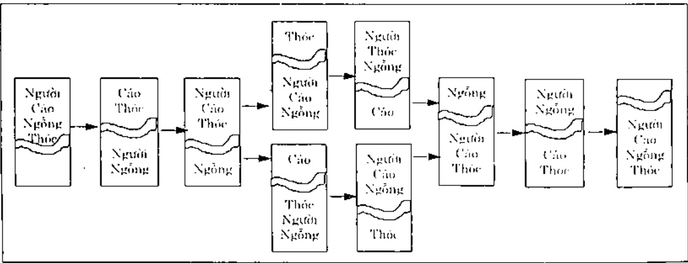

Hình 9-1. Phương án sang sông của người, con cáo, con ngỗng và hạt thốc.

Mô tả bằng ngôn ngữ chưa hắn là cách thể hiện tốt. Do phải tách ra những thông tin không thích hợp. Một giải pháp phù hợp để mô tả là dùng đô thị, hết kê các trạng thái từ đầu bài toán đến kết thúc.

Hai cách giải ứng với hai nhánh đồ thị. Mỗi là một trạng thái an toàn cho ngỗng và lúa. Dé có được đồ thị trên, cần tạo ra các nút. Do bác nông dân và ba đồ vật có hai khả năng, hoặc bên này hoặc bên kia sông, có tổng cộng 2$^{1}$=16 cách sắp xếp; trong đó có 10 nút đảm bảo an toàn cho lúa. ngỗng.

Người ta xét nút tại bước thú hai hay bước cuối cùng để thấy được việc tạo cung giữa các nút. tức tạo nên một xấu các trạng thái của thế hiện. Nút này liên kết với nút mới khi nút mới có hai điều kiện :

• Bắc nông dân sang sông,

\- Nhiêu nhất có thêm một độ vật sang sông.

Trong số 10 trạng thái an toàn, tổng cộng có 10\*9 cập hai nút có thứ tự. Tuy nhiên chí có 20 cập thỏa mãn điều kiện trên.

Qua thí dụ này, có thể thấy rằng đô thị cũng được xem là công cụ cho phép giải bài toán. Cách thể hiện tốt sẽ khiên cho việc giải dễ dàng hơn. Trong trì tuệ nhân tạo, thể hiện tốt được xem là tư tưởng quyền lực. Nó được nhân mạnh :

<!-- page: 254 -->

Nguyên tắc thể hiện (Representation principle)

Mở khi vấn đề được mô tả theo cách phụ hợp, vấn đề hậu như đã được giải

## I.2. Thể hiện hỗ trợ cho việc mô tả các ràng buộc

Một lý do mà cách thể hiện dùng nút và cung hồ trợ tốt cho bãi toàn "bác nông dân" là hiền thị được các đối tượng quan trọng và môi quan hệ giữa các đối tượng. Tuy không tả được máu của con cáo, độ béo của con ngống, cũng như bao nhiêu hạt thác, nhưng nổ đã mô tả được các trạng thái và khả năng chuyển các trạng thái.

Thế hiện này là tốt do nó lột tả được ràng buộc tự nhiên trong bài toán. Người ta nhận thấy ra ngay một số trạng thái có thể và các trạng thái không thể dùng được. Cách thể hiện này cho phép thấy rõ quyết định đúng hay sai trong trường hợp cụ thể, chẳng hạn việc chuyển trạng thái có thể được nếu có cung nổi, ngược lại không thể.

Những nhận xét trên luôn dùng để đánh giá các thể hiện. Dưới dây là danh sách những ưu diễn của cách thể hiện này, cùng với nhận xét vừa dưa ra :

\- Các thể hiện tốt làm cho các đối tượng và mới quan hệ trở nên rõ ràng. Người là có thể thấy ngay cản gì đang xảy ra.

\- Thẻ hiện này lột tả được các ràng buộc tự nhiên. Có thể diễn tả cách thức để một đối tượng hay một quan hệ ảnh hưởng lẫn nhau.

\- Thể hiện này gán các đối tượng và các quan hệ với nhau. Người ta thấy ngay cải mà minh cần.

\- Cách thể hiện này không để cập những chỉ tiết không quan trọng. Các chỉ tiết này tuy không có trong thể hiện nhưng có thể lấy ra khi cần thiết.

• Tính trong sáng : cho phép hiểu những gì đã nói.

• Tính toàn bộ : cho phép nói toàn bộ những gì cần.

• Tính ngắn gọn : chi nói gì cần thiết.

• Tỉnh nhanh : cho phép lưu trữ và tìm kiếm thông tin nhanh.

• Tính toán được : có thể tạo ra thể hiện bằng thủ tục.

## I.3. Nội dung của thể hiện

Qua thí dụ đơn giản đã trình bày, bảy giờ có thể xác định thể hiện là thể nào?

Dình nghĩa 9-1 : Thế hiện (Representation)

Là cái gồm bôn phân cơ bản :

<!-- page: 255 -->

\- Phần tu từ cho phép xác định ki hiệu nào được dùng trong từ diện của thế hiện,

\- Phân câu trüc mô tá các ràng buộc cho phép sắp xếp các ki hiệu.

\- Phần thủ tục xác định các thủ tục truy nhập, cho phép tạo ra mô tả, biến đổi chứng và sử dụng chứng để trả lời các câu hỏi.

\- Phân ngũ nghĩa để thiết lập cách liên hệ ý nghĩa với mô tả.

Theo định nghĩa này, thể hiện gồm bốn phần cơ bản là tư từ, cấu trúc, thủ tục và ngũ nghĩa.

Thí dụ

Đế giải bài toán "bắc nông dân", người ta đã dùng cách thể hiện với phần tư từ sắc định các nút và cung. Phần cấu trước thiết lập các nút ứng với cách sắp xếp qua sông của bắc nông dân. Phần thủ tục ứng với sự theo dõi của mỗi người trên đô thị

## I.4. Truyền đạt ý nghĩa trên mạng ngữ nghĩa

Theo quan điểm tu từ, mạng ngũ nghĩa gồm các nút ứng với các đối tượng, các liên kết ứng với quan hệ giữa các đối tượng, và nhân của liên kết dùng cho quan hệ cụ thể.

Theo quan điểm cấu trúc, các nút nổi nhau theo các củng có nhân. Trong số đồ các nút thường được kí hiệu bằng hình tròn, ellipse hay hình chữ nhật, các bên kết như các mũi tên trở từ nút này sang nút khác.

Theo cách nhìn của ngữ nghĩa, ý nghĩa của nút và cung nói tùy thuộc vào quy utóc của ứng dụng.

Theo quan điểm thủ tục, nhìn chung thủ tục trong mạng ngữ nghĩa hoặc là thủ tục cấu tạo, thủ tục dọc, thủ tục ghi, hay thủ tục xóa. Mạng ngữ nghĩa cần chức năng cấu tạo để tạo ra nút và các cung, chức năng dọc để trả lời các cấu hỏi về nút và các cung, chức năng ghi để thay đổi nút và cung, và chức năng xóa để hủy các nút và cung.

Có thể định nghĩa mạng ngữ nghĩa như một thể hiện mà :

\- Về tu từ, có các nút, cung và nhân cung dùng cho chương trình đặc biệt.

• Về mặt cấu trúc, cung nổi hai nút,

\- Về ngũ nghĩa, các nút và các cung ứng với các thực thể của ứng dụng đặc biệt.

Thủ tục cấu tạo dùng để :

• Tạo một nút,

<!-- page: 256 -->

\- Tạo cungヒên kết, cung có nhan và hai nuit được nói.
Thủ tục dọc thực hiện :

\- Sinh ra danh sách các cung đi ra từ một nút đã biết.

\- Sinh ra danh sách các cung đến một nút đã biết.

• Sinh ra nút dàu của cung dà cho.

• Sinh ra nuit cuối của cung đã cho.

• Sinh ra nhân cung của cung đã cho.

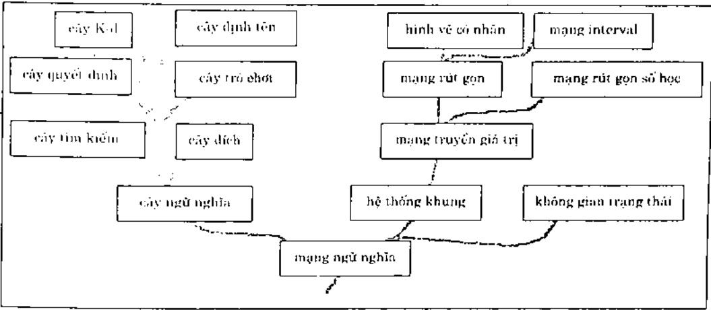

Hình 9-2. Hộ các thế hiện bằng mạng ngũ nghĩa.

Hình vẽ cho thấy họ của các thể hiện suất phát từ cách thể hiện bằng mạng ngũ nghĩa.

## I.5. Nghĩa của ngữ nghĩa

Có nhiều trường phải phát biểu về ý nghĩa của ngữ nghĩa và người ta cũng đã nghiên cứu nhiều về các đặc trưng có ý nghĩa của ngữ nghĩa. Duối dây là các ý kiến của một vài trường phải về ngữ nghĩa :

\- Ngữ nghĩa tương đương. Các ngữ nghĩa tương đương cho cải cách liên hệ giữa mô tả theo thể hiện này với mô tả của thể hiện khác.

\- Các ngữ nghĩa thủ tục. Trong chương trình thao tác trên các mô tả theo một cách thể hiện nào đó, thì ý nghĩa được xác định nhỏ cái mà chương trình làm.

<!-- page: 257 -->

\- Các ngữ nghĩa mô tả. Loại này giải thích việc mô tả có ý nghĩa để cảm nhận được hiểu biết.

Sau này cả ngũ nghĩa tương đương và ngũ nghĩa thủ tục dưa về ngũ nghĩa mô tả. Trong trường hợp ngũ nghĩa tương đương, các mô tả có ý nghĩa đo chứng tương đương với cải người ta nhận ra được. Đối với ngũ nghĩa thủ tục, các mô tả có ý nghĩa bởi vi chủng khiển các chương trình tạo ra hành vi để người ta nhận ra được.

## Tương đương lý thuyết khác với tương đương thực tế

Theo lý thuyết, các thể hiện dựa vào máy tính đều có thể làm như các thể hiện mà con người đã làm. Người ta cho ràng vì sử dụng các bit để phân bổ các trạng thái, mà máy tính có được chức năng nên tăng của việc thể hiện.

Tuy nhiên trên khóa cạnh thực hành, một vài thể hiện cho phép tập trung vào các đối tượng và các quan hệ để giúp con người giải một lớp các bài toán. Điều này có nghĩa không dùng một cách thể hiện để giải tất cả các loại bài toán được. Chính vì dùng phương pháp thể hiện riêng mà người ta có cách giải phù hợp hơn và mạnh hơn, đủ rằng nó cũng qua các bước thực hiện như lý thuyết đã vạch ra.

## II. PHƯƠNG PHÁP MÔ TẢ SỰ GIÔNG NHAU

Sau dây sẽ giới thiệu phương pháp mô tả sự giống nhau, dùng để định tên các đối tượng hai chiều. Tự tương cơ bản của phương pháp mô tả sự giống nhau là người ta có thể định tên một đối tượng ở lần mô tả đầu tiên rời tìm kiếm mô tả trùng・khớp trong thu viện các mô tả. Đối tượng cần tìm có thể đơn giản như các thực thể vật lý, chẳng hạn các khối, hay các cái hoàn toàn trừu tượng.

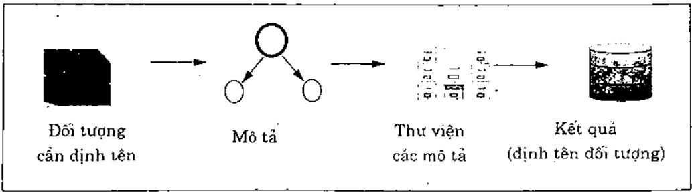

Hình 9-3. Quá trình mô tả sự giống nhau.

Phương pháp mô tả sự giống nhau cũng như các phương pháp khác, có thể đưa ra loại xác định cấu chính xác hơn ngôn ngữ bình thường, chẳng hạn tiếng Anh, và trong sáng như ngôn ngữ lập trình. Người ta có thể dùng thú ngôn ngữ mô tả nửa tiếng

<!-- page: 258 -->

Anh, mùa ngôn ngữ thủ tục, có thể gọi nổ một cách không hình thức là tiếng Anh thủ tục.

Phương pháp mô tả sự giống nhau trong tiếng Anh thú tục cho phép định tên một đối tượng theo các bước sau :

1. Mô tả đối tượng nhỏ một thể hiện thích hợp.

2. So sánh mô tả này với các thu viện mô tả cho đến khi có cái giống nhau hoặc thu viện đã cạn.

3. Nếu thấy cài nào giống thì cho ra kết quả, ngược lại cho ra thông báo thất bại.

Nhìn chung, tiếng Anh thủ tục cho phép người ta thể hiện vai cấu trúc chương trình như :

\- Lập trình từng bước, theo đường hướng đã vạch sẵn.

• Dùng các từ khóa như until, for each để thể hiện lập.

• Dùng if và otherwise để mô tả điều kiện.

• Cho phép nhiều thủ nghiệm.

Nhiều người lập trình dùng ki pháp của tiếng Anh thủ tục lúc thiết kế ban đầu. và họ dùng loại ngôn ngữ này để thuyết minh trong chương trình.

## Mô tả sự giống nhau thông qua việc định tên đối tượng theo đặc trung

Xác định tên đối tượng theo đặc trưng là một trong những ứng dụng đơn giản nhất của phương pháp mô tả sự giống nhau. Người ta định tên đối tượng theo các đặc trưng gồm đặc trưng ngoài và đặc trưng đánh giá. Đặc trưng ngoài cho thấy những đặc tính đơn giản của đối tượng như miền của đối tượng. Giá trị của đặc trưng ngoài là toa độ của điểm đặc trưng trong không gian các đặc trưng. Không gian đặc trưng có các chiều ứng với các đặc trưng của đối tượng. Đề định tên đối tượng chưa biết, người ta so sánh khoảng cách giữa đối tượng mới tới các đối tượng đã có tên. Tên đối tượng mới được xác định theo đối tượng gần nó nhất, theo độ dơ giữa các đối tượng trong không gian các đặc trưng.

## Thi dụ

Dịnh tên đối tượng X theo các đối tượng đã có trong một lớp các đối tượng.

<!-- page: 259 -->

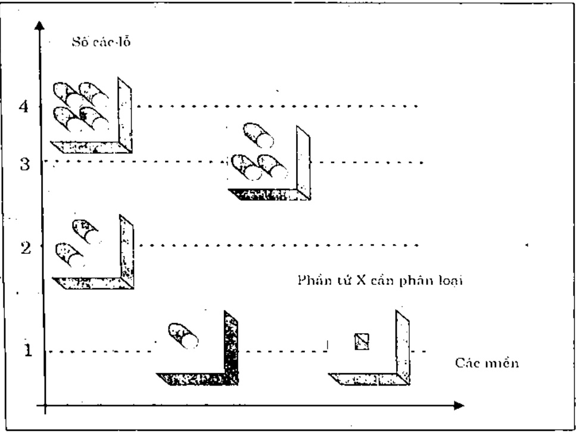

Hình 9-4. Xác định X thuộc lớp đối tượng một lỗ là thích hợp.

## III. PHƯƠNG PHÁP MÔ TẢ SỰ GIÔNG NHAU

Phương pháp mô tả sự giống nhau trong môi trường công nghiệp thể hiện các đối tượng trên mạng ngũ nghĩa. Chẳng hạn biết ràng A trở thành B, thì chi tiết C sẽ trở thành chi tiết X nào trong số các chi tiết 1, 2, ... 5 đã biết.

Một cách là mô tả các luật cho phép diễn giải cách A trở thành B, và cách C trở thành hình nào đó. Rối thì, người ta-khớp cái luật diễn giải cái cách A trở thành B với mỗi luật mô tả C trở thành một hình. Dọ vậy, cách mô tả và khớp có thể được dùng để giải bài toán về tượng tự.

<!-- page: 260 -->

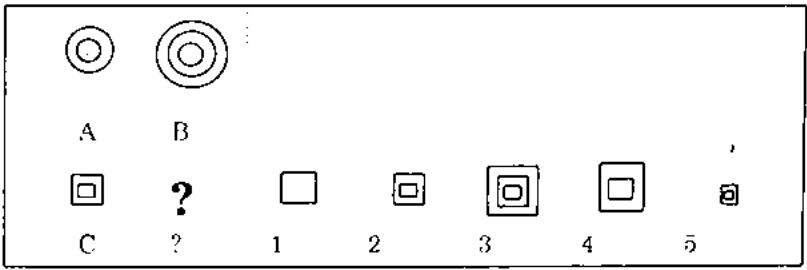

Hình 9-5. X được chọn trong số năm đối tượng.

Mẫu chốt để giải các vấn đề như vay là khả năng mô tả luật. Chương trình ANALOG giới thiệu ở đây khớp các mô tả luật với nhau và đo độ giống nhau của mô tả.

## III.1. Mô tả quan hệ và chuyển dạng các đối tượng

Người ta dùng các luật tương tự hình học để mô tả các quan hệ đối tượng và chuyển dạng các đối tượng. ANALOG dùng các luật có hai phần. Một phần mô tả các đối tượng được bố trí lúc ban đầu, và phần kia mô tả đối tượng lúc cuối. Nói về các đối tượng, chủng có thể ở phía trên, trái hay phải, hay bên trong của nhau. Môi đối tượng có thể cơ giãn, lấy đối xứng, quay hoặc được áp dụng tố hợp các phép đó.

Thí dụ

Đối tượng n ở trong m,

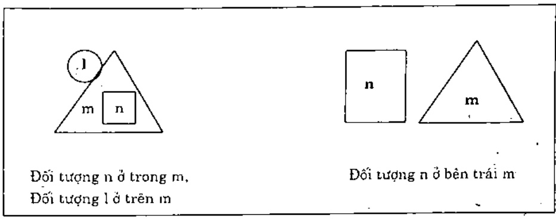

Đối tượng l ở trên m

Đối tượng n ở bên trái m

Hình 9-6. Vị trí tương đối giữa các đối tượng.

<!-- page: 261 -->

\- Nguồn ta có các hình đã có tên là m. n. 1. Các vị trí tương đối giữa các đối tượng này được thể hiện trong hình.

Dối tượng I bị hủy, không xuất hiện trong hình sau. Đối tượng n được lấy ra khởi đối tượng m và nà to. Hơi đối tượng này có quan hệ n ó bên trái của m.

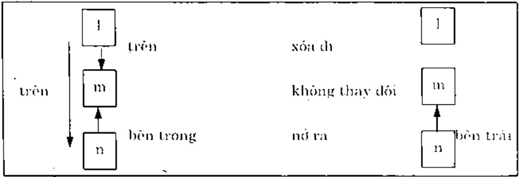

Hình 9-7. Mạng hình học thể hiện các liên kết.

Định nghĩa 9-2. Mạng hình học tương tự (Geometric Analog Net)
Một mạng hình học tương tự là mạng ngữ nghĩa mà :

\- Các nút được khí hiệu bằng ô chấm chấm hay đường liên, có dạng tròn, hình chữ nhật hay tam giác.

\- Liên kết mô tả các quan hệ giữa các đối tượng; có các loại quan hệ như bên

trong, phía trên, bên trái, phải của nhau.

\- Các liên kết khác mô tả cách các đối tượng được chuyển hóa. Các đối tượng, được thể hiện bằng các khí hiệu hình học. Các phép cho biết khả năng chuyển hóa các đối tượng gồm các phép thêm vào, bất đi, nó ra, co lại, quay, phản chiếu, và tổ hợp của các phép này.

Người ta có thể có cách xác định khác đối với các mạng hình học tương tự. Thay vì dùng mạng ngữ nghĩa, người ta cho biết tất cả các phần tử được mô tả trong khi xác định mạng ngữ nghĩa. Cách này có ưu điểm là tiết kiệm không gian, đồng thời tập trung chính xác vào cái người ta cần thêm để chuyển khải niệm tổng quát thành một thể hiện phù hợp với hoàn cảnh cụ thể. Việc chuyển khải niệm mạng ngữ nghĩa thành mạng hình học tương tự chỉ-doi hỏi miền tả về các ứng dụng riêng và các kí hiệu về nút. cung. và nhân sẽ được dùng.

ANALOG dùng ý tưởng đơn giản, như trong hình sau, để quyết định đối tượng này là trong đối tượng kia hay không, chú không chỉ xác định nó ở bên trái, hay trên.

<!-- page: 262 -->

Trước tiền nở xác định các đối tượng không chậm nhau. Rối nở kế một đường từ một hình ra xả: nếu đường này cất hình kia với số lé lần thi hình này nằm trong hình kia.

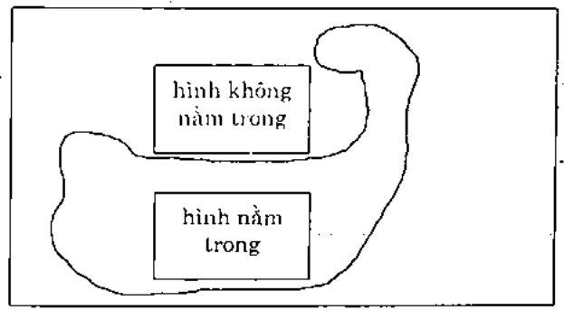

Hình 9-8. Xác định các hình bao nhậu.

ANALOG dùng thủ tục đơn giản để tính quan hệ không gian giữa hai đối tượng. Nó xác định trọng tâm của các đối tượng, rời tại tâm của một đối tượng kẻ hai đường vuông góc. Không gian được chia thành bốn phần, trong đó có phán chữa tâm của đối tượng kia. Người ta xác định được quan hệ trái của và trên, không cần thiết dùng quan hệ phải của hay dưới vì quan hệ là đối xứng.

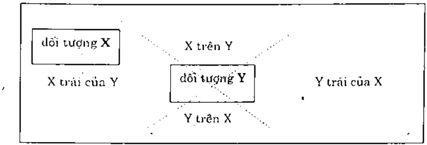

Hinh 9-9. Hai quan hệ "trên" và "trái".

ANALOG dùng thủ tục khớp để quyết định xem "một đối tượng trong hình có thể chuyển thành đối tượng trong hình khác bằng tổ hợp các phép biến đổi hình không ?". Thí dụ cho thấy các luật được tạo ra chỉ phụ thuộc vào quan hệ giữa hai đối tượng. Trong giải pháp này, không hình nào của các đối tượng bị chuyển đổi.

<!-- page: 263 -->

Theo luật A-sang-B thì đối tượng C thành đối tượng 3 là hợp lý, vì luật C-sang-3 khớp với luật A-sang-B nhất. Lúc đó người ta đã cho I tương ứng với x và m với y.

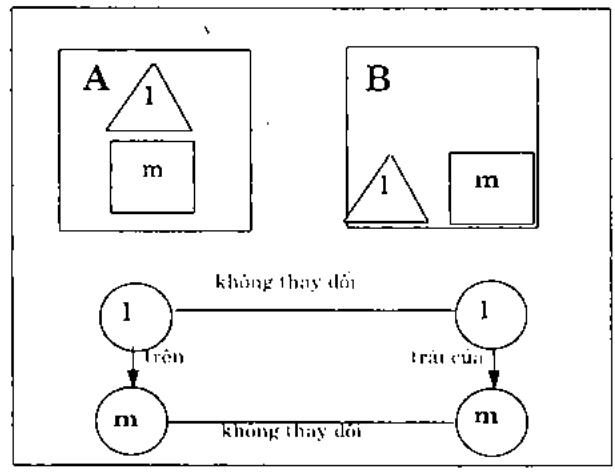

Hình 9-10. Mạng thể hiện quan hệ "trên" và "trái".

Đế giải bài toán xét hình C giống hình X nào, nguồn ta dùng hai hình cho hai đối tượng : hình tròn nhỏ, đậm cho đối tượng X và hình tròn to, rổng cho đối tượng Y.

Hình dưới cho thấy lời giải của bài toán được xác định chỉ bằng mối quan hệ. So sánh các mô tả luật cho thấy luật C-sang-3 là khớp nhất.

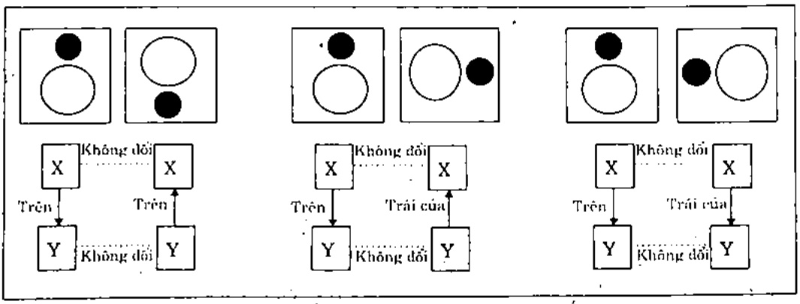

Hình 9-11. Môi quan hệ để giải bài toán "C giống X".

<!-- page: 264 -->

Tuy ràng việc sự giống nhau đã cho tương ứng l với x và m với y, châng có lý do để liên kết l với x hơn là với y. Khi di tử hình ban đầu đến hình cuối, người ta muốn hình chữ nhật ứng với hình chữ nhật, hình tròn với hình tròn... Nhung yêu cầu khớp một đối tương với đối tượng có dáng hình học tương tự không dùng để so sánh hai luật. Trong thí dụ, cầu trả lời thứ ba được chọn, cho dù A, B có dạng khác với C. Nhìn chung ANALOG cần thứ các khả năng liên kết các nút khi khớp các luật.

Liên kết 1-1 của các biến ngấm định ràng số các đối tượng chuyển từ hình ban đầu đến hình cuối trong hai luật phải bằng nhau. Số các thêm vào, bót di cần như nhau. Mợi ý định khớp hai luật mà số các phép xử lý này khác nhau chí di đến thất bại.

Nếu n đối tượng chuyển từ hình ban đầu về hình cuối trong mỗi luật dem ra so sánh thi có n! cách liên kết các biến đề tìm ra cách khớp tốt nhất. Trường hợp tổng quát, có n₁ đối tượng chuyển động, n₂ đối tượng thêm vào và n₃ đối tượng bị xóa. thi có n₁'n₂'n₃! khá năng liên kết. Trong thi dụ trên n₁=2, n₂=0, n₃=0, do vậy có hai cách liên kết :

\- Liên kết biến 1 với x, biến m với y,

\- Liên kết biến l với y, biến m với x.

ANALOG xử lý đối tượng qua phép biến đổi. Khi chỉ có một đối tượng thì không có quan hệ giữa các đối tượng mà chỉ có phép biến đổi hình.

Thí dụ

So sánh luật C-sang-1 với các luật khác, người ta thu được luật khớp nhất là luật A-sang-B.

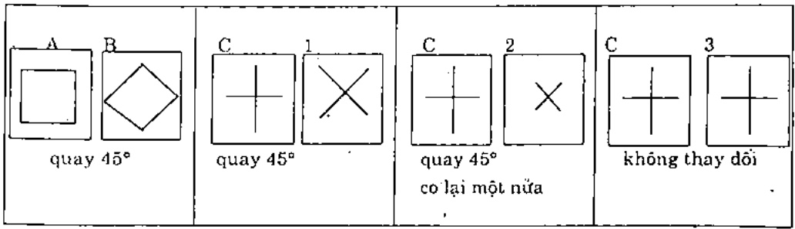

Hình 9-12. C-1 khớp nhất với A-B.

<!-- page: 265 -->

## III.2. Xếp hạng các luật

Người ta muốn biết ANALOG do sự giống nhau giữa hai luật như thế nào ? Trong - các thí dụ trên, giả sử không tìm thấy luật nào giống luật A-sang-B, nó cần xếp hạng được các luật không thật khớp. Một trong những cách để sắp xếp là đêm số các điểm tương tự trong hai luật.

Trong khi đêm các thêm tương tự, trọng số của mối quan hệ mô tả việc chuyển hóa đối tượng là thấp hơn trọng số của các mối quan hệ mô tả liên kết giữa các đối tượng. Theo kinh nghiệm, người ta dùng các trọng số cho các phép thao tác như trong bảng. Qua các con số này người ta có thể so sánh các phép với nhau.

Đế do độ giống nhau giữa hai luật, có thể dùng công thức :

Độ giống nhau = α.kich thutđe $S_{AB} \cap S_{CX}$ · β.kich thutđe $S_{AB} - S_{CX}$ · γ.kich thutđe $S_{CX}$, $S_{AB}$

Trong đó $S_{XY}$ là là tập các điểm trong luật X-sang-Y. Các $\alpha, \beta, \gamma$ là các trọng số. Nên $\alpha = 1, \beta = 0$, và $\gamma = 0$ thì công thức duta về tính các điểm chủng. Khi $\beta$ và $\gamma$ không cùng giá trị thì việc so sánh không đối xứng, tức là có thể luật A-sang-B giống luật C-sang-X hơn là luật C-sang-X giống luật A-saug-B.

| Không thay đổi | Co giân Quay | Co giân và quay | Phân chiếu | Co giân và chiếu Quay và chiếu |  |
| --- | --- | --- | --- | --- | --- |
| 0.5 | 0.4 | 0.3 | 0.2 | 0.1 | 0. |

Hình 9-13. Bảng trọng số liên hệ giữa một đối tượng và đối tượng khác có được do thực hiện phép chuyển hóa đối tượng ban đầu.

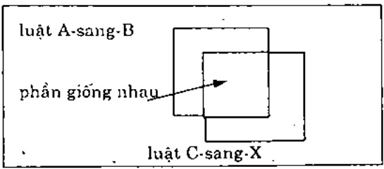

Hinh 9-14. Minh họa so sánh việc chuyển hóa luật.

<!-- page: 266 -->

## III.3. Nhập nhàng khi so sánh

Tất ea các đối tượng trong hình ban đầu và hình cuối có dáng đhequ khác nhau. Vấy nền người ta có nhiều cách khác nhau để xác định các luật mô tả chuyển hóa hình. Thế nhưng sự để đãi này để gây ra nhập những.

## Thi chú

Có hình A gồm hai hình bao nhau; một hình to và một hình nhỏ. Người ta không xác định được hình B do hình nào trong hai hình trong A tạo nên. Có thể hình B do lược bỏ hình nhỏ trong A, hoặc do lược bỏ hình to và nói rộng hình nhỏ.

Võ thuộc tế người ta không thể chu theo một cách giải thích mà không để ý đến các đối tượng hình học khác. Trong thí dụ, ANALOG có hai luật để tương ứng với hai cách quan niệm tạm giác dịch là tạm giác ban đầu nào. Nhìn chung, đối với mỗi cập hình ban đầu và hình dịch, có thể áp dụng nhiều luật: và đối với mỗi luật, có nhiều cách khớp các luật này với các luật khác.

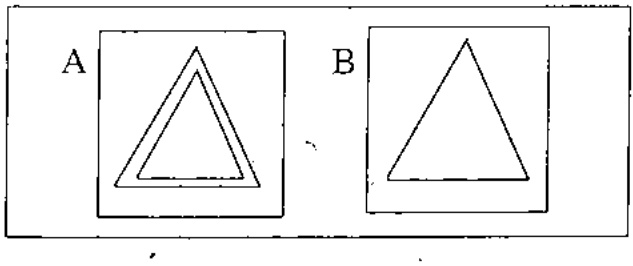

Hình 9-15. Không xác định được rõ luật chuyển hóa A-B.

Do vậy mà người ta đánh giá được vai trò của việc thể hiện hợp lý. Thế hiện tốt duta đến hiệu quả cao. Giá sử có luật A-sang-B. Đề xác định X trong C-sang-X có thể chọn X là hình 3 hoặc hình 4. Trong hai lời giải này C-sang-3 là khớp hơn. Câu trả lời C-sang-4 được chấp nhận khi không có hình 3.

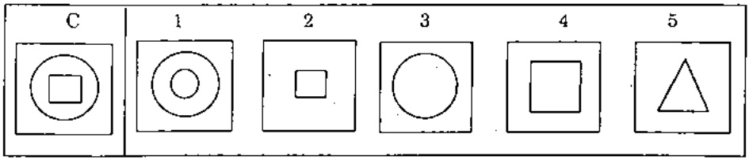

Hình 9-16. C-sang-3 là phù hợp hơn C-sang-4.

<!-- page: 267 -->

## IV. GHI NHẬN CÁC ĐỐI TUỔNG TRÙU TUỔNG

Phân này xét tiếp phương pháp mô tả sự giống nhâu và dùng mạng ngữ nghĩa để ghi lại đối tượng trừu tương trong các tỉnh tiết truyền.

## IV.1. Các trạng thái tỉnh thần và các sự kiện

Các tỉnh tiết truyền có thể được cơi như tổ hợp của các trạng thái tỉnh thần và các sự kiện. Đề miêu tả các tỉnh tiết trên mạng ngũ nghĩa người ta cần từ điện các loại nút và các nhân cung liên kết. Người ta xác định ba loại nút và ba nhân cung:

\- Các trạng thái town thần, khí hiệu là MS (mental state).

\- Các sự kiện dương, hay sự kiện có lợi, kí hiệu là "+"

\- Các sự kiện âm, hay sự kiện có hạn, kí hiệu là "-".

\- Nhân cung liên kết khởi động, kí hiệu bằng chủ 1 (initiate), có nghĩa trạng thái tỉnh thần hoặc sự kiện dưa đến sự kiện khác tại dấu kia của cung.

\- Nhân kết thúc, kĩ hiệu là t (terminate), với nghĩa ràng trạng thái tỉnh thần hay sự kiện làm kết thúc sự kiện tại dấu kia của cung.

\- Nhân tham chiều hai chiều, kí hiệu bằng chữ c (corefer).

Với ba loại nút, cung, trở đến ba loại nút, có 3\*3\*3=27 tổ hợp câu hình khác nhau. Trong số các khả năng này, chỉ có 15 tổ hợp được giải nghĩa rõ ràng một cách tự nhiên, được gọi là các phần cơ sở.

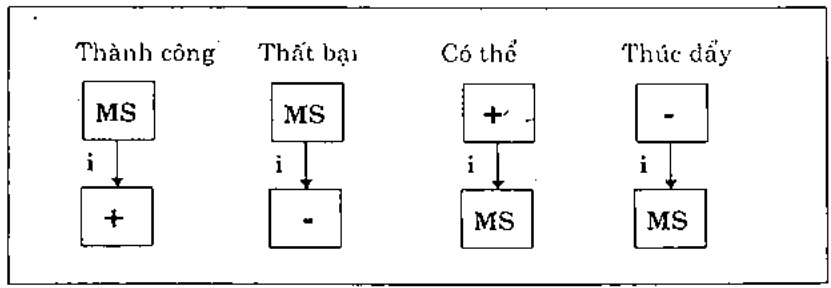

Hình 9-17. Bôn trong số các giải thích cơ sở với giải nghĩa là thành công, thất bại, có thể và thức đầy.

<!-- page: 268 -->

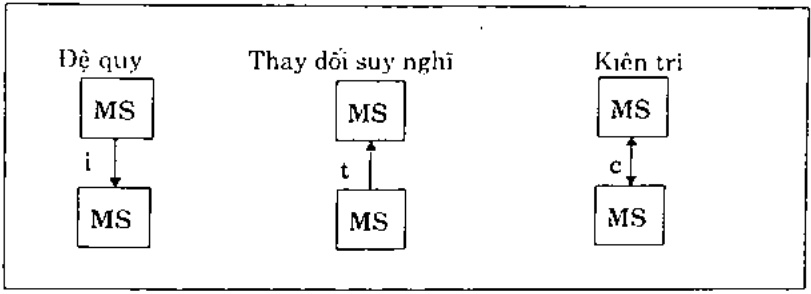

Hình 9-18. Các giải thích cơ sở về dệ quy, thay đổi suy nghĩ và kiến trị.

Có thế chỉ các sự kiện nổi nhau bằng cung kết thúc và cung hai chiều. Có làm phân cơ sở không chứa nút trạng thái tỉnh thần.

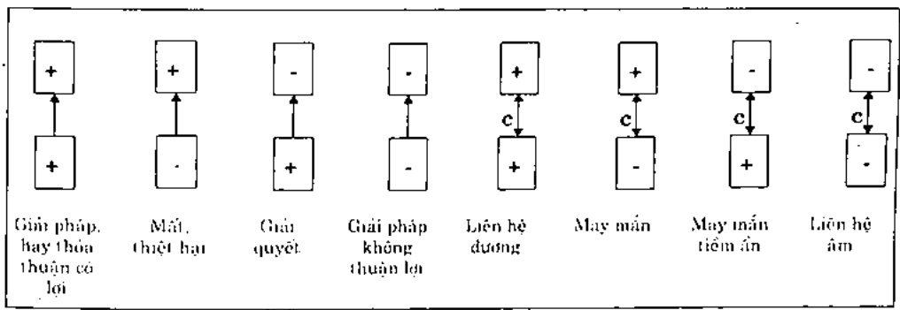

Hình 9-19. Các giải thích cơ sở không mang trạng thái tỉnh thần.

Khi miêu tả, các phần cơ sở thường trùng nhau, tạo thành một cái góp lớn, gọi là phần tổng hợp. Các phần cơ sở và phần tổng hợp tạo nên các phần trường tượng.

## Thí dụ

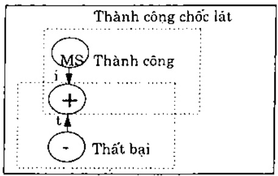

Hình 9-20. "Thành công chốc lất" được xem như tổng hợp của "thành công" và "thất bại". Các sự kiện có thể được kí hiệu bằng dấu tròn hoặc dấu vuông.

<!-- page: 269 -->

Hình về cho thấy phần tổng hợp, gồm phần thành công nổi với phần thất bại. Theo ngôn ngữ bình thường, việc này phụ là "may mân vỏ cầu": phần tổng hợp này được gọi là thành công chức lất.

Một thí dụ khác dưới dây cho thấy mối phần tử tổng hợp sự kiện có hạn, với đến trạng thải tính thân, rời sự kiện có lợi. Những phần tổng hợp này khác nhau và chủng xử lý các liên kết khác nhau và các phần có sở khác nhau.

\- Tổng hợp đầu tiên được tạo bởi sự thức đầy rở đến thành công có nghĩa thành công do phát minh.

\- Tổng hợp thứ hai xuất hiện tính hướng có lợi sáng có hạn, có nghĩa xuất hiện việc giải vấn đề. Hơn nua phần thành công biến mất và phần giải hiện rơ. Sự thức đầy rời kết thúc bảng sự kiện có lợi có nghĩa thành công may mắn

\- Tổng hợp thử ba là giải vấn đề có chú ý. Người ta thấy phân thành công lại hiện ra, kết hợp với hai phần khác. Sự thức đầy tiếp đến là thành công: việc này cần sự kiện có lợi để kết thúc việc thức đầy có nghĩa giải vấn đề có chủ ý.

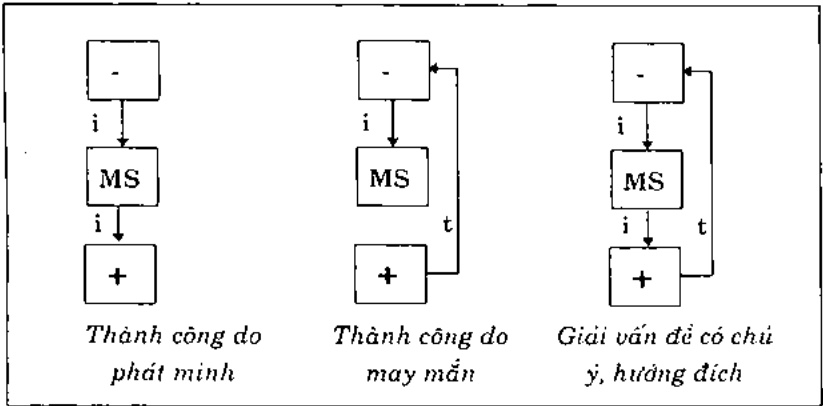

Hình 9-21. Ba trường hợp của việc tổng hợp sự kiện hai-tỉnh thần-sự kiện lợi.

Khi có nhiều người tham gia vào câu chuyện, bổ cục cần được phát triển. Thị dụ sau ứng với hoàn cảnh một người thành công do cơ hội và sự kiện có hại của người này có liên hệ với sự kiện có lợi của người kia. Như vậy có kết luận về sự trả đã.

## Thí dụ .

Hoàn cảnh một người thành công nhờ cơ hội và sự kiện có hại của người này có liên hệ với sự kiện có lợi của người kia được thể hiện trên mạng :

<!-- page: 270 -->

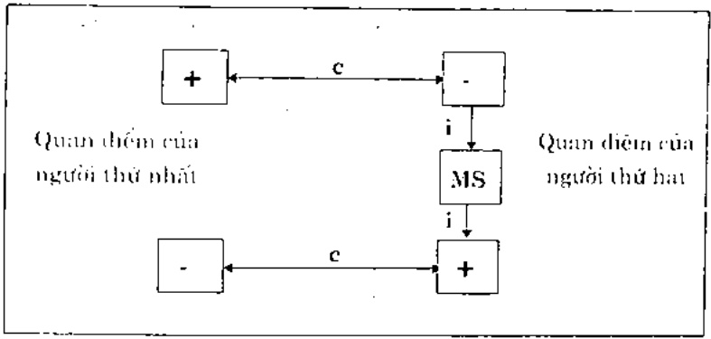

Hinh 9-22. Mình hoa về sự trả đua.

## IV.2. Tóm tắt câu chuyên trên mạng trừu tượng

Dế ghi lại các tỉnh tiết truyền, trước hết người ta mô tả tỉnh tiết cấu chuyện trên các nút, thể hiện trạng thái tỉnh thần và các sự kiện. Tiếp theo người ta khớp các nút và cung với danh mục các phần trường tương. Chắng hạn có cấu chuyện về Bát và Chén, "Bát và Chén cùng chung điều hành công ty. Bát cho rằng Chén hay lơ đăng, rời kháng định ràng Chénチャng có ích cho tài chính của công ty. Điều này làm Chén diện, rút lại cam kết làm việc chung, hy vọng rằng Bát sẽ thải vọng".

Trạng thái tỉnh thân của hai người được ghi phía của trên mạng ngữ nghĩa. Phát hiện của Bất về Chén là sự kiện có hại, dẫn đến trạng thái tỉnh thân về tài chính công ty. Một mật, việc Chén rút lui là sự kiện có lợi nếu xét theo sự phát triển của Bất và là sự kiện có hại theo sự phát triển của Chén. Mặt khác, đối với Chén thì quyết định đưa anh ta về trạng thái tỉnh thân để dẫn đến việc rút bó cam kết làm việc chung được cơi là sự kiện dương, có lợi. Nguộc lại phải cơi đó là sự kiện âm, có hại theo quan điểm của Bất.

Có sâu phân trùu tương, gọi là các phân mức cao. Trong thí dụ này, các phân mức cao liên quan với nhau, chia sẻ sự kiện hay trạng thái tỉnh thân.

Đế tóm tất tính tiết bằng mạng trường tượng, trước liên người tả mô tả mức cao trung tâm. Tiếp theo là việc mô tả các phần mức cao xung quanh, có liên quan đến mức cao chính. Bời vậy câu chuyện "Bất và Chén" được tóm tất "Chén.trả đùa Bất vị Bất đã qua giải vấn đề có chú ý xấu về Chén. Việc trả đùa làm cho Bất mất và là thỏa thuận có lợi cho Chén. Sự mất quay lại thành công của Bất, và thỏa thuận có lợi quay lại thành công trước đó của Chén."

<!-- page: 271 -->

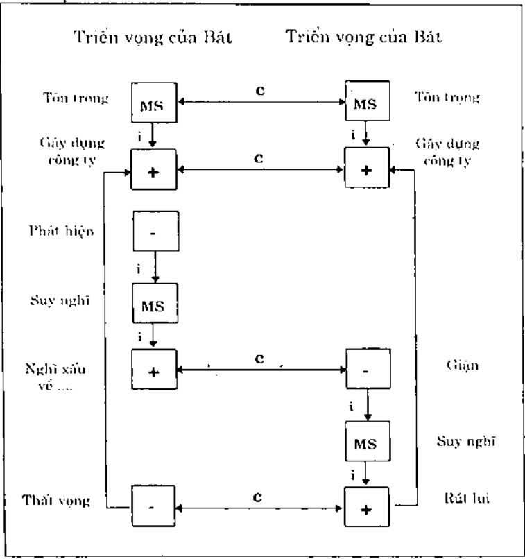

Hình 9-23. Trạng thái tỉnh thần của Bát và Chén.

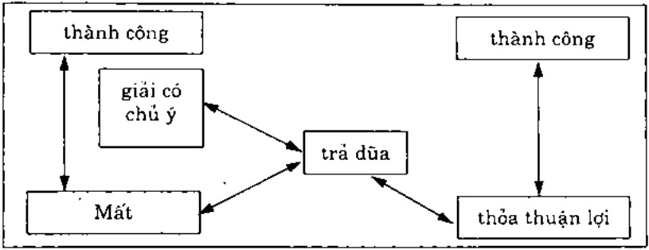

Hình 9-24. Mạng trừu tượng cho bài toán Bát và Chén.

Một câu chuyên phúc tập hơn dòi hỏi dùng mạng trừu tượng phúc tập hơn. Thí dụ "Quà của nhà hiển triết" trong tập truyền của O. Henry "Della và chống là Jim rất

<!-- page: 272 -->

Tuy nhiên vi lẻ Giảng sinh đến gần, họ muốn tàng nhau món quả dất bộ tốc đẹp và bán đi đẻ mua dảy deo cho chiée dòng hồ vàng của Jim , Jim bán chiée dòng hồ của mình đẻ mua cải lược đẹp tàng Della. Khi là sự việc, họ buôn đổi chút nhưng yếu nhau hơn."

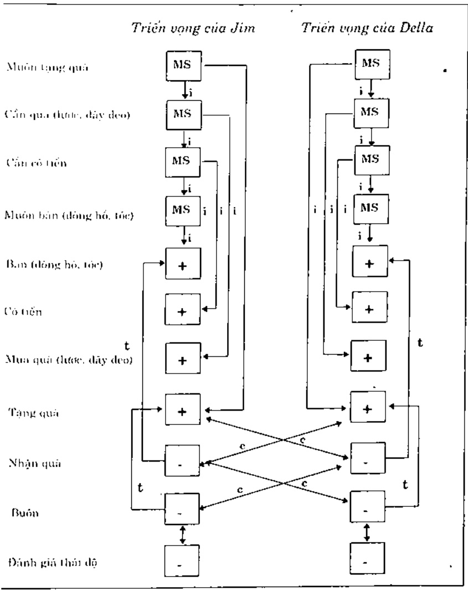

Hình 9-25. Các giai đoạn giải thích cho câu chuyên "Quà của nhà hiển t

<!-- page: 273 -->

## IV.3. Khả năng của công cụ trừu tượng

## IV.3.1. Khả năng trả lời câu hỏi

Công cụ trầu tượng cho phép trả lời một vài cầu hỏi bằng cách so sánh khớp. Sau díy là một số khả năng trả lời của nó :

\- Truyền kê về cải gì ? Dựa vào tên của phần trường trung tâm trong mạng trường tượng mức cao để trả lời. Chắng hạn chuyên về "Bất và Chén" kê sự trả dữ.

\- Kết quị ra sao ? Câu hỏi này được trả lời theo tên các phần trừu tượng nổi với các phần trừu tượng trước đó trong mạng trừu tượng mức cao, nhưng không nổi với các phần trừu tượng về sau. Chắng hạn trong thi dụ, câu trả lời là mất và thỏa thuận có lại.

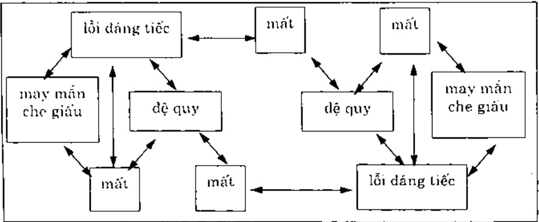

Hình 9-26. Mạng trừu tượng "Quà của nhà hiển triết" gồm các phần trừu tượng mức cao của câu chuyên. Các liên kết là các nổi kế tục nhau.

\- Câu chuyện có cần sự tóm lược nào đó không ? Người ta kiểm tra các phần trừu tượng phù hợp. Thi dụ trong "Bát và Chén" cần có đoạn giải vấn đề có chú ý.

\- Dựa vào đãu để biết câu chuyện này giống câu chuyện kia ? Câu trả lời là hết kê tên của phần trường tương nổi nhau ở mức cao nhất. trong cả hai mạng đều là mạng trường mức cao.

## IV.3.2. Hiên hiện các nội dung

Trong phần trên, người ta đã thấy mạng giải thích với các phần cơ sở, phần tổng hợp... tiện lợi để phân tích và tóm tất bằng cách dùng trạng thái tính thân, các sự

<!-- page: 274 -->

kiện, và các liên kết một cách hiển hiện. Người ta thấy tiêu chuẩn thế hiện tốt trước tiên là tính hiện rõ. Tuy không có một chỉ tiêu đánh giá nào, người ta thấy công cụ trường được coi như một thể hiện tốt khi nó cho phép dịch các vấn bản thành các nội dung gồm các phần trường tượng.

## V. GIẢI VẬN ĐỀ VÀ HIỆU TRI THỨC

Khi tiếp cận một lớp bài toán mới, dù tự giải hay dùng máy tính. người ta luôn bắt đầu bằng các câu hỏi về tri thức. Phân này đã trình bày một số vấn đề :

\- Loai tri thức nào được yêu cầu ? Có thể những tri thức quan trọng nhất là tri thức liên quan đến mô tả các đối tượng trừu tương hay đối tượng cụ thể. Ngoài ra tri thức về phương pháp giải bài toán cũng quan trọng.

\- Cách thức thể hiện tri thức ? Một vai tri thức phù hợp với mạng ngữ nghĩa. Cũng có tri thức thích hợp với các thủ tục... Có rất nhiều khả năng thể hiện tri thức cho bài toán.

\- Bao nhiêu trí thức thì đủ ? Một lý do yêu cầu số lượng tri thức là để phân bố tài nguyên. Một lý do khác là người ta muốn biết kích thước của bài toán, dù rằng kích thước bài toán đó lớn. Biết trước khó khăn còn tốt hơn là dự báo sai một cách không cần thiết. Nếu biết trước lượng tri thức thì người ta dự trù được công sức để giải bài toán phức tạp, để dễ dàng giải quyết nó hơn.

\- Trí thức cần thiết đến mức độ nào ? Hiền nhiên rất cần có tri thức. Đề thực hiện bài toán tương đương hình học, người ta cần biết bao nhiều hình và bao nhiều phép thao tác trên hình là đủ. Đề ghi các tóm tất, người ta cần có một thư viện các mô tả cơ bản và các chức năng tổng hợp trửu tượng.

## VI. KÊT LUẬN

Chương xét về mạng ngũ nghĩa và việc mô tả sự trùng khớp được kết luận với các nhận xét sau :

\- Một khi bài toán được miền tả với thế hiện phù hợp, bài toán này hầu như giải được.

• Thế hiện gồm phần tu từ, phần cấu trúc, phần thủ tục và phần ngũ nghĩa.

\- Có nhiều trường phải phát biểu về ngữ nghĩa. Tuy vậy, ý nghĩa luôn xuất phát từ nhận biết và cảm nhận của người.

\- Đình tên đối tượng dựa trên các khía cạnh miêu tả phương pháp mô tả và phương pháp khớp. Đối tượng chưa biết được định tên theo' đối tượng được lý tưởng hóa nếu các chỉ tiết về khía cạnh gần với các khía cạnh của đối tượng lý tưởng hơn cả.

<!-- page: 275 -->

\- Các luật tương tự hình học mô tả quan hệ giữa các đối tượng và chuyển hóa các đối tượng. Người ta giải bài toán tương tự hình học bằng cách xem luật não là giống hơn cả.

\- Tỉnh tiết truyền được xem như tổ hợp của các trạng thái tỉnh thân và các sự kiện.

\- Các mạng gồm các phần trường tương có thể dùng tom tất và trả lời câu hỏi.

\- Cảc thể hiện tốt làm đối tượng quan trọng và các quan hệ hiển hiện, hiện ra các ràng buộc tự nhiên, gắn các đối tượng và quan hệ với nhau.

Tuy chương này đã trình bày phương pháp so sánh sự giống nhau, nội dung dưa ra mối chỉ dùng ở các khái niệm bước đầu. Bời vậy nội dung này cần được xét thêm về các thể hiện trị thức và xử lý các trị thức đó.

<!-- page: 276 -->

# PHẦN II.

## Hệ thống giải bài toán

Phân này gồm hai chương, chương 10 và chương 11, nhằm giới thiệu một số bài toán tổng hợp cho phép xây dựng hệ thống trí tuệ nhân tạo. Một cơ chế trí tuệ nhân tạo là Perceptron cũng được trình bày.

Hai chuong có nhan dê là :

• Chương 10. Một số hệ thống giải bài toán

\- Chuong 11. Perceptron

<!-- page: 277 -->

# MỘT SỐ HỆ THÔNG GIẢI BÀI TOÁN

Các chương trước đã để cập các phương pháp giải. Đối với các bài toán không bình thường, cần phải kết hợp các phương pháp đã xét, tức là phải có chiến lược giải bài toán. Thông thường bài toán phức tạp được chia ra các bài toán con, sau đó phải có bước kết hợp để thu được bài toán ban dấu. Chương này trình bày cách thức một số hệ thống giải bài toán lớn theo kiến trúc vượt qua phạm vi kiến trúc đã xét.

## I. LẬP KÊ HOẠCH

## . I.1. Giới thiệu

Quá trình lập kê hoạch được thực hiện từng bước, thực hiện các dây phép toán. Thi dụ trong thuật toán A$^{*}$, phải qua các bước trong không gian bài toán, trong đó mỗi nút mô tả một trạng thái bài toán. Trong các bài toán phúc tạp, việc tách bài toán lớn ra các bài toán con không dễ dàng và việc kết hợp sau này cùng đời hồi một khối lượng tài nguyên dáng kê.

Đế thực hiện việc phân râ, có hai phương pháp.

Cách đầu tiên là khi chuyển một trạng thái bài toán sang trạng thái khác, không cần phải tính lại trạng thái toàn thể. Thay vì phần tích lại, chỉ xét đến một phần của trạng thái. Thị dụ việc di chuyển phòng không ảnh hưởng gì đến vị trí của hai của số. tương tự như trong bài toán về khung. Tuy nhiên, khó có thể thấy trạng thái của bài toán 8-ô thay đổi khi tiến hành một nước di, hoặc là có nhiều trạng thái cần ghi lại khi một thay đổi có ý nghĩa được thực hiện. Đối với các đối tượng có thay đổi trạng thái nhưng không được xét thì cơi như các đối tượng này không thay đổi.

Cách thú hai là việc chia bài toán thành nhiều bài toán con. Thuật toán AO đảm bảo làm được điều này. Tuy vậy thông thường khó chia được một cách hoàn hảo, mà chỉ thu được tập các bài toán nhỏ như là được phân rã. Chẳng hạn một bài toán

<!-- page: 278 -->

dược chia ra hai bài toán con, và mỗi bài toán con chỉ thực hiện đơn giản một số lượng tính toán theo các bước lặp.

Trong dòi sống hàng ngày, người ta có thể tính toán vải bước của thú tục giải bài toán trước khi khai thác bất kì bước thú tục nào. Thông thường bài toán này được gọi là "bải toán lạnh". Khi người ta giải bài toán trên máy tính, có sự phán biệt giữa lập kế hoạch và thực hiện. Việc lập kế hoạch được làm trước so với việc thực hiện, tuy nhiên không chỉ ra chỉnh xác ranh giới này được. Đối với bài toán 8-ô thi sự khác nhau về thời gian giữa hai công việc này không phải quan trọng. nhưng trong bài toán khác thi nhất thiết phải tôn trọng.

Đế cho việc đặt ra kế hoạch và thực tế xảy ra không khác xa nhau, người ta có thể thực hiện việc phòng đoán. Nguy cả làm như vậy cũng không đoán trùng, vấn khác nhau giữa cải xảy ra và cải ta mong nó xảy ra. Do vậy kết quả là cái thu được là gần giống cải thực và quá trình xử lý được thực hiện cho đến bước nào đó, khi phát hiện thấy sai khạc quả với cái dự đoán, thì bỏ đi và bắt đầu lại. Thuống thi người ta phát hiện thấy sự không đúng đ các bước sau: lúc đó có thể thay đổi nội dung các bước chú không nhất thiết làm lại từ đầu. Một số bước có thể được thêm vào như là bước phụ.

Nếu bài toán được phân rã một phân. thì bình thường người ta dùng kế hoạch con cho các phân tử được phân rã. Quan trọng là ghi lại thông tin về sự lập trong kế hoạch tổng thể, để nêu sự kiện không mong dội xảy ra ở khâu nào thì làm lại kế hoạch khâu đó.

Khó dụ đoán trước hoàn toàn bài toán ở mọi khóa cạnh của thể giới thực. Do vậy người ta luôn chuẩn bị để chấp nhận kê hoạch được lập không đúng. Khi tách ra các bài toán con, phải xem bài toán con là cục bộ, có thể chạy tốt hay không, và được phép dưa vào các tham số phụ. Tất cả công việc chuẩn bị trước được làm để giám độ phúc tạp của kê hoạch động, nhất là trong thể giới thực ta đang sống.

Mỗi bước của kế hoạch được gần với nguyên nhân để nó thực hiện, vì nếu nó thất bại thi để đàng dùng các kỹ thuật quay lui theo phụ thuộc trực tiếp, để xem cái gì trong phần còn lại của kế hoạch là phụ thuộc vào nó và tìm ra cái cần được thay đổi. Nếu quá trình lập kế hoạch theo cách xử lý ngược, di từ dịch thì để ghi lại thông tin phụ thuộc. Nếu lập theo xử lý tiến, tức là từ trạng thái ban dấu thì khó xác định các phụ thuộc cần thiết.

'Do vây trong da số các bài toán lập kế hoạch, hệ thống được thiết kế theo kiểu huống đích, trong đó quá trình tìm đi ngược từ đích về trạng thái dấu.

Một cách khác giải bài toán cho thể giới không đoán trước được là thực hiện các hành động ngay khi xác định; xem những gì xảy ra và tiếp tục quá trình từ đó. Dĩ nhiên cách này có mặt trái là khi hoạt động được chọn là không phù hợp thì phải chịu hậu quả.

<!-- page: 279 -->

## I.1.1. Mô tả thi dụ về thể giới các khối

Các kỹ thuật trình bày trước đây áp dụng rộng rãi cho lĩnh vực các nhiệm vụ. Đề phân biệt và so sánh các kỹ thuật, cần dưa ra thí dụ đủ phúc tạp người ta chọn thì dự về thế giới các khối có một số khối vuông, cùng kích thước, có thể xếp chống lên nhau. Có tay người máy, thao tác trên các khối. Các hành động kê ra gồm :

| Hành động | y nghĩa |
| --- | --- |
| lấy(a, b), hay UNSTACK (a,b) | Nhật một khối a từ vị trí của nó trên khối b. Cánh tay máy cần là rỗng và không có gì trên khối a. |
| đặt lên (a, b), hay STACK (a,b) | Đặt khối a lên b. Cánh tay máy cần phải giữ a, và mật trên của b là trống. |
| nhặt (a), hay PICKUP (a) | Nhật khối a từ bàn và nấm lấy. Cánh tay máy cần rỗng và không có gì trên a. |
| đặt (a), hay PUTDOWN (a) | Đặt khối a xuống bàn. Cánh tay cần giữ khối a. |

Hình 10-1. Các hành động của tay máy.

Lưu ý ràng trong thời gian làm việc, tay máy chỉ cảm được một khối tại mỗi thời điểm; vì tất cả các khối cùng kích thước nên chủng có thể xếp chống lên nhau và mỗi khối có thể có ít nhất một khối khác trực tiếp trên định nó. Đề xác định các điều kiện để một phép toán có thể thực hiện được và kết quả, xét các vị trí của các khối ưu impulse sau:

\- on(a,b)

Khối a trên b

\- trên bản (a), hay ONTABLE (a)

Khối a ở trên bàn

\- sạch (a), hay CLEAR (a)

Không có gì trên định của à

\- nấm(a), hay HOLDING (a)

Tay máy giữ khối a

• tay rông, hay ARMEMPTY

Cánh tay máy không giữ gì

Có các câu logie được thực hiện, thí dụ :

∃x nấm(x) → -tay rổng

$\forall x \text{ trên bản } (x) \rightarrow \neg \exists y : \text{on}(x,y)$

$\forall x (\neg \exists y \text{ on}(x, y)) \to \operatorname{sach}(x)$.

<!-- page: 280 -->

## 1.1.2. Các chức năng của hệ thống lập kế hoạch

Trong hệ thống giải bài toán dựa trên các kỹ thuật cơ bản trước đáy, người ta cần thiết thực hiện các chức năng sau :

1. Chọn luật tốt nhất để áp dụng, theo thông tin may rủi có thể,

2. Áp dụng luật đã chọn để tính trạng thái mối cho bài toán xuất hiện từ phạm vi ứng dụng của hệ thống sản xuất dựa trên luật.

3. Có khả năng nhận biết việc tìm thấy một lời giải.

4 Phát hiện được đường cụt để chúng có thể bị bó di và hệ thống chọn đường khác; trong các hệ thống phúc tạp hơn, ta có thể phải có kỹ thuật riêng cho từng nhiệm vụ, và

5. Nhận biết được lúc lời giải hầu hết đúng và áp dụng các kỹ thuật để làm nó đúng hoàn toàn.

Những điều này có thể được minh họa thông qua các ví dụ.

## I.1.3. Lập kê hoạch đơn giản bằng dãy các dịch

Một trong các kỹ thuật sớm nhất được phát triển để giải các dịch phúc hợp đồng thời cho phép tương tác người máy là dùng xếp chống dịch. Dây là tiếp cận gọi là "dây" dich (strip); người giải bài toán dùng cơ chế xếp chống để mô tả một dãy dich và các phép toán nhằm làm thỏa mãn dich. Hộ cũng liên hệ với cơ sở dữ liệu mô tả trạng thái hiện tại và tập các phép toán, như điều kiện tiên quyết, thêm, xóa (precondition, add, delete).

## Thí dụ

Trạng thái ban đầu của các khối là :

\- on(b, a) ∧ trên bàn(a) ∧ trên bàn(c) ∧ trên bàn(d)

• tay rổng

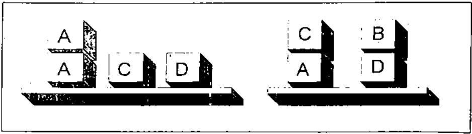

Hình 10-2. Cần chuyển các khối từ trạng thái bên trái về trạng thái bên phải.

<!-- page: 281 -->

Trạng thái dịch cần đạt được là :

$$
\bullet \quad \text {on} (\mathrm{c}, \mathrm{a}) \wedge \text {on} (\mathrm{b}, \mathrm{d}) \wedge \text {trên} \text {bàn} (\mathrm{a}) \wedge \text {trên} \text {bàn} (\mathrm{d})
$$

Khi bất đầu giải bài toán này, dãy các đích đơn giản là $on(c, a) \wedge on(b, d) \wedge trên \text{ bản}(a) \wedge trên \text{ bản}(d)$. Người ta tách bài toán này thành bốn bài toán con, mỗi bài ứng với một đích con. Hai bài toán con trên $bàn(a)$ và trên $bàn(d)$ đã đúng do trạng thái đầu.

Còn lại hai bài toán. Phụ thuộc và trát tự xét kỹ bài toán, có hai dãy các dịch được tạo ra...

Ngoài ra còn một vài vấn đề liên quan đến việc lập kế hoạch dáng quan tâm. như :

\- Lập kê hoạch phi tuyến dạng tập hợp đích,

\- Lập kê hoạch phân cấp.

\- Kê hoạch phi tuyến.

\- Lập kê hoạch với các ràng buộc.

## I.2. Các tiếp cận lập kế hoạch

Phân này trình bày hai tiếp cận khác biệt dùng cho việc lập kê hoạch hoạt động nhằm đạt được đích. Đó là :

\- Dùng các toán tử if-add-delete làm việc với tập các kháng định. Tiếp cần này được gọi là "dây".

\- Dùng logic giới thiệu các biến tính huống và các tiên để khung. Việc này qui về việc xét tập các mệnh để logic liên kết nhau.

Cá hai tiếp cận sẽ được trình bày dễ để so sánh; tuy vậy có thể nghiên cứu chúng, riêng rõ. Thí dụ minh họa trong phần này dùng bài toán thể giới các khối. Tiếp cận rõ ràng là "dãy" được trình bày trước; giới thiệu cách thức người ta sử dụng các chức năng như thiết lập, đe dọa để ngăn cần các hoạt động can thiệp, phá hủy công việc của nhau. Tiếp sau là các logic, yêu cầu sử dụng các tiên đề khung khi người ta muốn quản lý thể giới đa dạng.

## I.3. Lập kê hoạch nhỏ toán tử if-add-delete

Trong thể giới vật lý, lập kế hoạch là sự sắp xếp dãy các hoạt động, và đôi khi thay đổi các quan hệ giữa các đối tượng, dễ đạt được đích. Một cách thể hiện kế hoạch là bổ sung, loại bỏ các khẳng định phần ánh các chuyển động vật lý. Theo lập luận này, xóa on(A, C) và thêm vào on(A, B) có nghĩa chuyển đối tượng A từ C sang B.

<!-- page: 282 -->

Một cách tạo lập kê hoạch là tìm dãy các toán từ đi từ kháng định mô tả trạng thái đầu của thế giới đến kháng định mô tả dịch. Duổi dãy trình bày cách thực hiện việc tìm kiếm này.

## 1.3.1. Các toán tử xác định danh sách bổ sung và danh sách xóa

Thi dụ về tỉnh huống ban đầu và đích, trong đó khối A trên khối B, khối B trên khối C. Chính xác hơn là tỉnh huống ban đầu gồm các tiến để

on(A, C) on(C, bản)

on(D, B) on(B, bàn)

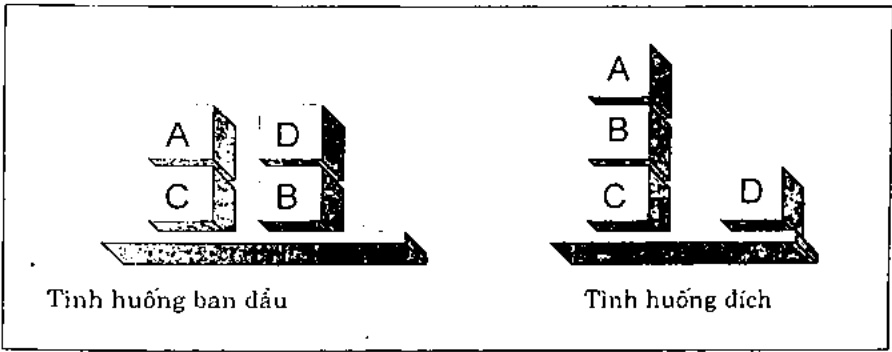

Hình 10-3. Các tỉnh huống ban đầu và tỉnh huống đích được phát biểu.

Thêm vào đó, người ta cần có cách diễn tả hai đối tượng không bị đề. Một cách hay dùng cho rằng đối tượng đó là tự do, sạch. Như vậy có khả năng đặt vật gì lên đối tượng X nếu X là sạch. Các tiền đề bổ sung vào các tiền đề trên :

sach(A)
sach(D)

Dich được mô tả :
on(A, B)
on(B, C)

Trong thí dụ cụ thể này, người ta còn giả sử ràng không di chuyển được đổi tượng X khi X không sạch, tức có đối tượng khác trên X.

Đế lập kê hoạch, người ta cần nấm được hoạt động sinh ra những gì khi chúng thực sự được triển khai. Một loại tiếp cận xác định mỗi hoạt động theo lúc nó được sử

<!-- page: 283 -->

dụng, theo việc nó làm dùng khẳng định nào, và khẳng định nào bị hủy. Việc xác định này với thể dùng luật if-add-delete, có dạng :

| IF | Khẳng định 1 |
| --- | --- |
| DELETE | Khẳng định 2 |
| ADD | Khẳng định 3 |

Theo ngữ cảnh của việc lập kế hoạch, một số thuật ngữ có thể được sử dụng khác di so với trước đây. Các luật if-add-delete được gọi là toán tử và điều kiện HF trong mỗi toán tử gọi là điều kiện tiên quyết. Sau đây là các toán tử mô tả hoạt động chuyên các khối :

Toán từ 1. Chuyển khối x từ khối y sang khối z

<table><tr><td rowspan="3">Il $^{a}$ </td><td>on(x, y)</td></tr><tr><td>sạch(x)</td></tr><tr><td>sạch(z)</td></tr><tr><td rowspan="2">Thêm</td><td>on(x, z)</td></tr><tr><td>sạch(y)</td></tr><tr><td rowspan="2">Xóa</td><td>on(x, y)</td></tr><tr><td>sạch(z)</td></tr></table>

Bây giờ giả sử dùng toán tử với các giả trị cụ thể của biến :

Toán tú 1. Chuyển khối A từ khối C sang khối D

<table><tr><td rowspan="3">IF</td><td>on(A, C)</td></tr><tr><td>sạch(A)</td></tr><tr><td>sạch(D)</td></tr><tr><td rowspan="2">Thêm</td><td>on(A, D)</td></tr><tr><td>sạch(C)</td></tr><tr><td rowspan="2">Xóa</td><td>on(A, C)</td></tr><tr><td>sạch(D)</td></tr></table>

Rối nếu người ta triển khai toán tử cho tỉnh hướng ban đầu của bài toán, thu được
on(A, C) on(C, bàn)
on(D, B) on(B, bàn)
sạch(A) sạch(D)
on(A, D) sạch(C)

<!-- page: 284 -->

Cần có thêm hai toán tử nửa để đến được đích là toán tử 2 và toán tử 3 :

Toán từ 2. Chuyển khối x từ khối xuống bản

<table><tr><td rowspan="2">IF</td><td>on(x, y)</td></tr><tr><td>sạch(x)</td></tr><tr><td rowspan="2">Thêm</td><td>on(x, bàn)</td></tr><tr><td>sạch(y)</td></tr><tr><td>Xóa</td><td>on(x, y)</td></tr></table>

Toán tử 3. Chuyên khối x từ bàn lên khối z

| IF | on(x, bàn) |
| --- | --- |
|  | sạch(x) |
|  | sạch(z) |
| Thêm | on(x, z) |
| Xóa | on(x, bàn) |
|  | sạch(z) |

## 1.3.2. Lập kế hoạch bằng cách tìm dãy thỏa mãn các toán tử

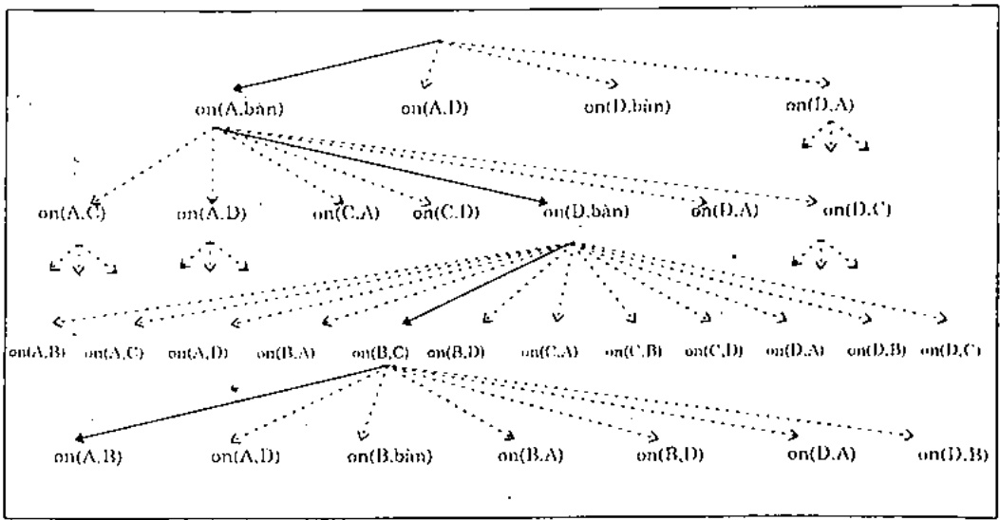

Hình 10-4. Kế hoạch sau bón bước di chuyên.

<!-- page: 285 -->

Một khi đã miêu tả bài toán, lập kế hoạch theo nghĩa não đó là đơn giản. Người tả chỉ cần dùng phương pháp tìm kiếm điểm phù hợp (breath first search) để đến dịch. Có nghĩa người tả thủ mọi cách, khi điều kiện tiên quyết đã có. Chẳng hạn dùng chiến lược này người tả đến được dịch sau bốn bước đi chuyển.

## 1.3.3. Suy diễn lùi để tiết kiểm công sức

Thông thường đích của bài toán cần giải được mô tả chỉ bằng một ít kháng định cần đạt được, còn mô tả các tỉnh hướng cần nhiều kháng định hơn. Do đó người ta muốn suy diễn lủi nhỏ các toán từ hơn là suy diễn tiến. Suy diễn lủi tìm một toán từ để khi thực hiện có phần "thêm" (ADD) khớp với dịch. Nho vay nếu phản tiện quyết của toán từ này không thỏa mặn, người ta suy diễn lủi nhỏ toán từ khác cho đến khi đến được các kháng định mô tả trong trạng thái đầu của bài toán.

## Thi dụ

Có lục nào đó bài toán cần khối A trên khối B, thể nhưng do nhằm nên dậu khối A trên khối C. Trong hình là trạng thái dầu và trạng thái dịch. Trạng thái đích chỉ có một khẳng định đơn. Khác nhau giữa hai trạng thái là có sự di chuyển khối A từ khối C sang khối B. Cụ thể khi thể hiện trị thức, người ta dùng "thiết lập" nổi kháng định on(A, B) trong danh sách thêm của toán tử được thực hiện sang khẳng định on(A, B) mô tả trong dịch.

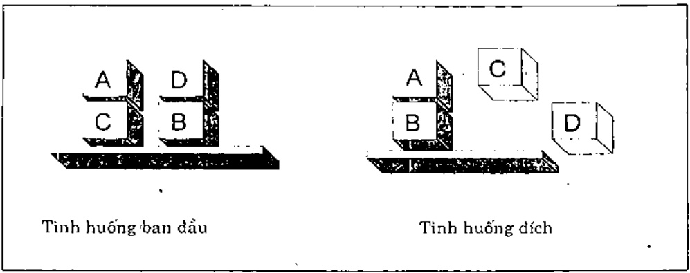

Hình 10-5. Cần đặt khối A lên khối B.

Đó là bước thứ nhất trong suy diễn. Việc di chuyển khối A từ khối C sang khối B không phải cách chọn duy nhất, vì có thể chuyển khối A từ C xuống bàn. Có nghĩa là nếu không chuyển khối A trực tiếp từ khối C, người ta chọn các khả năng khác nhỏ tìm kiếm điểm thích hợp.

<!-- page: 286 -->

Dị chuyển khối A từ khối C sang khối B là lựa chọn được xét, thì hai điều kiện unseen quyết cần được thỏa mãn là cả hai khối A và B phải sạch. không có khối não trên nó. Tại bước hai người ta thấy chỉ có chuyển khối D từ khối B xuống bản mới làm sạch B được. Do vậy thiết lập nổi kháng định sạch(B) trong danh sách thêm của toán từ 2 đến điều kiện tiền quyết sạch(B) của toán từ 1.

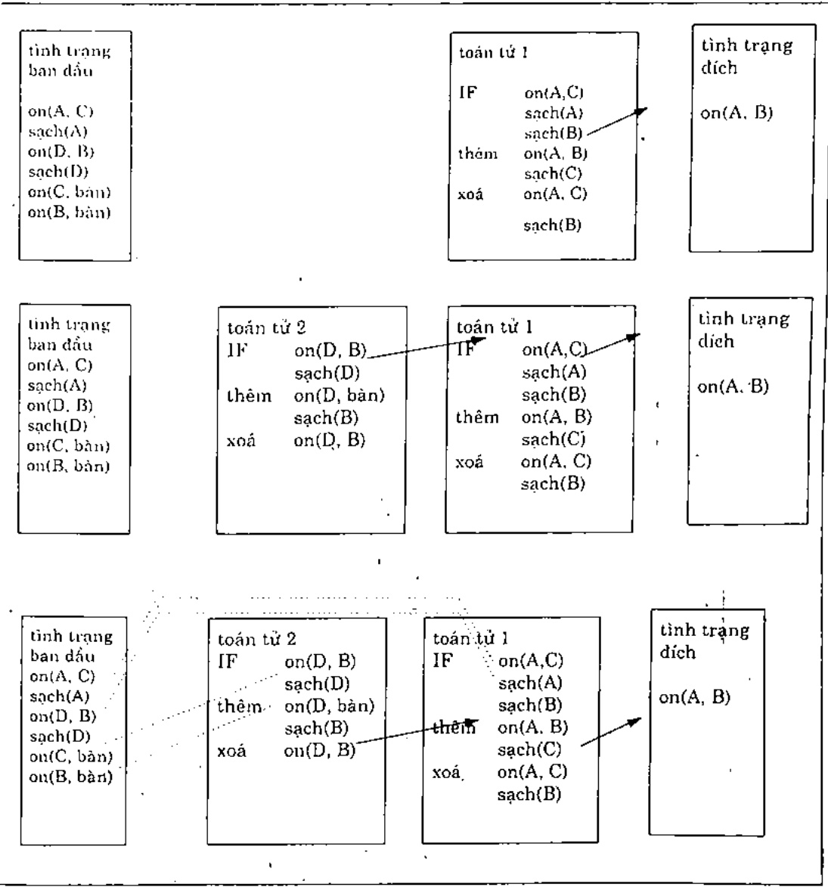

Hình 10-6. Dịch yêu cầu các dịch con.

<!-- page: 287 -->

Nhận xét ràng nôi thiết lập có nghĩa toán từ thiết lập một kháng định cần xuất hiện trước trong kế hoạch cuối cùng so với toán từ cần kháng định này. Tên của thiết lập không nhất thiết hiện ra bên phải, trước cải được thiết lập. Có thể có các toán từ khác giữa chủng, nhưng không một toán từ nào thêm hay xóa các kháng định được thiết lập.

Một khi B đã sạch, không cần thiết toán từ khác nửa, vì các điều kiện tiên quyết của cả hai toán từ đều thỏa mãn trong giá thiết của tỉnh hướng ban đầu. Cách này quan lý các điều kiện tiên quyết đối với nhiều lần suy diễn.

Nói chung, cũng xuất hiện con dưỡng có các lựa chọn dẫn đến kế hoạch không thực hiện được vì nó phá hồng tương tác giữa các toán tử.

Thi dụ

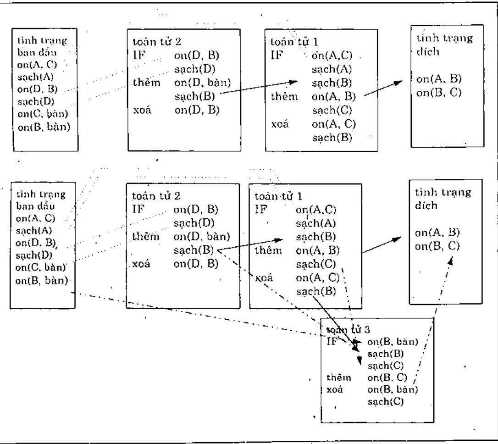

Hình 10-7. Kế hoạch chung không thực hiện được do thực hiện kê hoạch cực bộ.
'274

<!-- page: 288 -->

Một yêu cầu phức tạp hơn có dịch gồm hai kháng định on(A, B) và on(B, C), chữ không chỉ yêu cầu on(A, B) như trước, từ ba khối chống lên nhau: khối A đạt trên khối B và khối B trên khối C.

Nếu người ta chỉ quan tâm thực hiện kháng định thứ nhất, tục on(A, B) bằng cách đặt khối A lên khối B thì sẽ dẫn đến kế hoạch riêng như trong hình.

Trước tiền chuyển khối A lên khối B. Các lien kết cho biết các "thiết lập". Sau đó chuyển khối B lên khối C. Kế hoạch bị phá do toán từ 1 can thiệp vào các bên kết thiết lập giữa toán từ 2 và toán từ 3. Khẳng định sạch(B) do phản thêm toán từ 2 cung cấp cho tiền đề của toán từ 3 bị toán từ 1 yêu cầu xóa.

Khi thêm một kháng định do tiên để của một toán từ yếu câu, có thể người ta rút di kháng định đã thêm để thỏa mặn đích con khác. Do vậy, người ta phải tính đến vấn đề tổng thể mà sớm phát hiện các can thiệp có thể xảy ra, nhằm chấm đứt ngay các kế hoạch con không ích lợi.

## 1.3.4. Phát hiện các kế hoạch không hiện thực

Việc xác định hướng phát triển của bài toán cũng không khó, không nhất thiết dùng đến kiến thức về thế giới các khối. Người ta dùng đánh dấu thủ tự : khi tạo ra cung "thiết lập", cần kiểm tra xem có toán tử nào có thể làm hồng cung liên kết đó. Nếu có toán tử như vậy, tạo ra ràng buộc thủ tự để toán tử này không phá hủy liên kết.

Trong thí dụ vừa trình bày, về việc kháng định sạch(B). trong tiên để của toán từ 3 người ta thấy nếu toán từ 1 xảy ra sau toán từ 2 và trước toán từ 3 thì nó làm hóng liên kết "thiết lập". Do váy, toán từ 1 được coi là de dopa liên kết. Dế ngân chặn các đđa như thế, người ta dưa ra ràng buộc về thủ tự : toán từ de dopa cần xuất hiện trước cải thiết lập, hoặc sau cái được thiết lập, không được xuất hiện ở giữa. Chắng hạn trong thí dụ trên, toán từ 1 không được xuất hiện giữa toán từ 2 và toán từ 3.

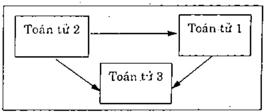

Hình 10-8. Mạng thủ tự, hay đồ thị trước.

<!-- page: 289 -->

Ràng buộc về thủ tự có thể được thể hiện qua độ thị trước, hay mạng thử tự. trong đó các cung trở từ toán từ được thực hiện trước sang toán từ thực hiện sau. Đế đáp ứng thi dụ trên, có độ thị trong hình vẽ.

Nếu phải thực hiện các toán tử để toán tử 1 không de dọa toán tử 3, theo nhận xét trên, phải có một trọng hai loại độ thị sau. Nhung sử dụng cả hai thì không phù hợp với độ thị vừa nêu, do sinh ra chu trình.

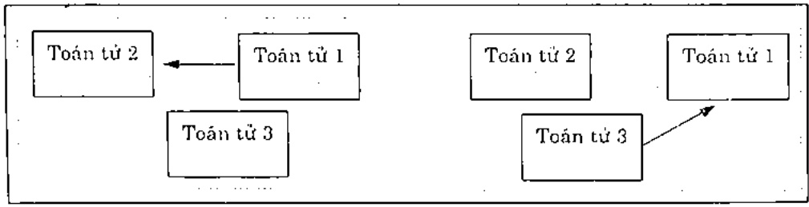

Hình 10-9. Toán từ 1 không xuất hiện giữa toán từ 2 và toán từ 3.

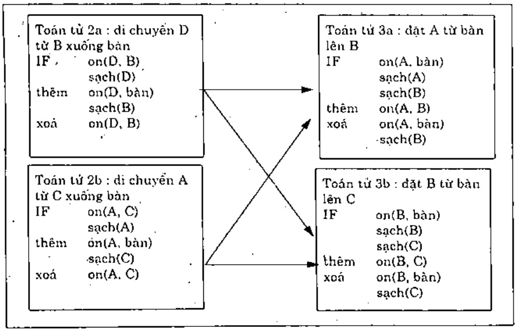

Hình 10-10. Xác định quan hệ "trước" giữa các toán tử.

Người ta có thể tránh các cung de dọa bằng cách xác định quan hệ trước đối với các toán tử 2a, 2b, 3a và 3b. Trồng độ thị "thêm", cung bắt buộc toán tử 3b trước toán

<!-- page: 290 -->

tú 3a ngán cún rác rón. Vệe ǎn định này không phá vỏ sự hợp lý của các cung chí thứ tụ.

Kế hoạch gọn thuộc dưới dây gọi là kế hoạch hoàn chỉnh do các dịch đã được kháng định, các tiên để được thỏa mặn, và các cung thủ tự không tạo ra chu trình. Một kế hoạch gọi là kế hoạch riêng là cái còn có chu trình trong đó thị thủ tự trước. Người ta nhận xét thấy kế hoạch hoàn chỉnh không hoàn toàn xác định thủ tự chính xác các bước. Khối A có thể được chuyển xuống bản trước khối D, hay ngưçe lại.

| Bước | Kế hoạch thịt nhất | Kế hoạch thịt nhi |
| --- | --- | --- |
| 1 | Chuyển A xuống bàn | Chuyển D xuống bàn |
| 2 | Chuyển D xuống bàn | Chuyển A xuống bàn |
| 3 | Khối B lên khối C | Khối B lên khối C |
| 4 | Khối A lên khối B | Khối A lên khối B |

Hinh 10-11. Hai kế hoạch chấp nhận được.

Dên dây có thể dùng thu tục sắp xếp để cho ra ít nhất một danh sách tuần tự. tạo ra kế hoạch tuyến tính, cho kế hoạch hoàn chỉnh.

Tóm lại thủ tục cho phép xây dựng một kế hoạch là thủ tục tìm kiếm mở rộng các kế hoạch riêng cho đến nó hoàn chỉnh. Các bước mở rộng kế hoạch riêng được tóm tất

1. Nếu kê hoạch có chu trình trước, thống bão sai.

2. Nêu kế hoạch đã hoàn chỉnh, thông báo thành công.

2.1. Nếu có toán tử $o_1$ de dọa nổi "thiết lập" giữa toán tử $o_1$ và $o_2$, thực hiện

\- Đặt cung trước từ $o_{1}$ sang $o_{1}$ và mở rộng kê hoạch.

\- Đặt cung trước từ $o_{2}$ sang $o_{1}$ và mở rộng kê hoạch.

2.2. Ngược lai, chọn một điều kiện tiên quyết chưa được thỏa mãn, thực hiện:

\- Tìm toán tử tôn tại cho phép thêm điều kiện tiên quyết, lập liên kết "thiết lập", và mở rộng kê hoạch.

\- Xem hiện trạng và thêm một toán từ cho phép điều kiện tiên quyết chưa được thỏa mãn và mở rộng kế hoạch.

<!-- page: 291 -->

## 1.3.5 Nghiên cứu hiện trạng riêng để giám công site

Cho dù dùng suy diên lǜi như bài toán vùa nêu, việc phân bố các khối bản dầu không phản không có ý nghĩa. Thụe chất không nhất thiết chuyển khối A xưởng bản trước khi chuyển nó lên khối B.

Phân này để cấp khả năng xem xét lại hiện trạng các khối để dùng các toán từ chỉ khu cần thiết. Gia sử có thêm khối E trên mật bản. Người ta cần chuyển khối A từ trong kho chữa các khối lên khối B, chất không từ mật bản như đã trình bày. Yêu cứu này cần có quyết định khác giữa hai hiện trạng đầy đủ của toán từ 1.

Toán tử 1. Hiện trạng đầy đủ thử nhất (đi chuyển khối A từ trên khối D lên khởi B)

1F on(A, D)
sạch(A)
sạch(B)

Thêm on(A, B)
sạch(D)

, Xóa on(A, D)
sạch(B)

Toán tử 1. Hiện trạng đầy đủ thứ hai (đi chuyển khối A từ trên khối E lên khối B)
IF on(A, E)
sạch(A)
sạch(B)
Thêm on(A, B)
sạch(E)
Xóa on(A, E)
sạch(B)

Người ta có thể hạn chế hiện trạng với các khối x, y, z đối với các toán tử có hiện trạng riêng :

Toán tú 1. Hiện trạng riống thú nhất (di chuyển khối A từ trên khối y, lên khối B)
IF on(A, y₁)
sạch(A)
sạch(B)

<!-- page: 292 -->

<table><tr><td rowspan="2">Thèm</td><td>on(A, B)</td></tr><tr><td>sạch( $y_1$ )</td></tr><tr><td rowspan="2">Xóa</td><td>on(A,  $y_1$ )</td></tr><tr><td>sạch(B)</td></tr></table>

Hơn cubic, có thể tạo được toán từ hiện trạng riêng khác từ toán từ này :

Toán tử 1. Hên trạng riêng thủ hai (đi chuyển khói A tư tròn khói C lên khói z$_{1}$)

<table><tr><td rowspan="3">IF</td><td>on(A, C)</td></tr><tr><td>sạch(A)</td></tr><tr><td>sạch(z1)</td></tr><tr><td rowspan="2">Thém</td><td>on(A, z1)</td></tr><tr><td>sạch(C)</td></tr><tr><td rowspan="2">Xóa</td><td>on(A, C)</td></tr><tr><td>sạch(z1)</td></tr></table>

Lưu ý rằng người ta không cần đặt ràng buộc trên  $y_{1}$  hay  $z_{1}$  để đảm bảo hai toán từ làm việc cùng, mà chỉ cần yêu cầu chúng gắn với cùng một khối. Ý nghĩa của xem xét hiện trạng riêng là trường hợp đặc biệt của nguyên tắc khẳng định ít nhất :

Định nghĩa 10-1 : Nguyên tắc kháng định ít nhất (Principle of least commitment)

Khi không chắc chắn về nào khẳng định là đúng, khẳng định cải ít xảy ra.

## I.4. Lập kê hoạch theo các biến tình huống

Theo logic bình thường, một mệnh để đã đúng thì không thể sai, vì không để cấp yếu tố thời gian. Do vậy với kế hoạch có các đối tượng lúc đúng, lúc sai thì dùng logic cũng không thuận lợi.

Giải pháp dung hòa cho tình trạng này là dùng dây các tình huống. mối hành động chuyển một tình huống sang tình huống khác. Như vậy, chẳng hạn on(A, B) theo tình huống ban đầu $s_i$; khi đặt khởi A xuống bàn, có tình huống $s_{i+1}$ mà -on(A, B) đúng. Do vậy tính đúng của on(A, B) có thể thay đổi từ tình huống này sang tình huống khác. Trong một tình huống không có yếu tố thời gian thì on(A, B) không thay đổi giá trị.

<!-- page: 293 -->

## 1.4.1. Việc tìm các dây toán từ cần đến các biến tính huống

Việc sử dụng các biến tính hướng trong công tác lập kế hoạch sở làm phức tạp hơn bình thường. Thay vì chuyển các khối từ nơi này sang chỗ khác, ở dây cần làm trồng các khối, tức làm sạch phía trên của khởi.

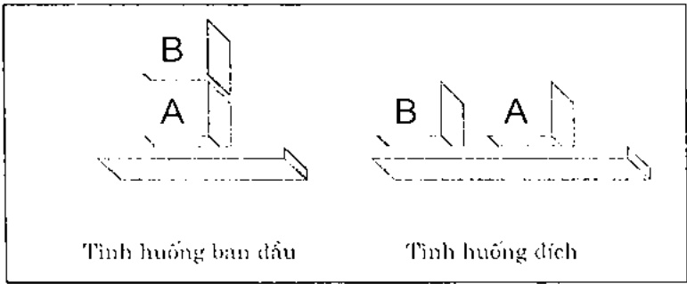

Hình 10-12. Yêu cầu đặt khối B xuống bản.

Rô ràng on(A, B) không đúng trong thế giới các khối, nhưng trong tỉnh hướng cụ thể giá trị nó thay đổi. Do đó không thể kháng định điều nào đó là luón đúng được. Hiện trạng trên hình được mô tả :

• Tỉnh huống dấu : on(B, A) ∧ on(A, bàn).

• Tỉnh huống đích : on(A, bản) ∧ on(B, bản).

Một cách khác tốt hơn là dùng tham số về tình huống : s₀ là tình huống đầu. S₁ cuối cùng. Tuy nhiên vì s₀ là đã biết, không thay đổi, có thế kí hiệu là S. Mỗ tả lại các tình huống trên :

• Tỉnh huống dầu : on(B, A, S) ∧ on(A, bàn, S).

\- Tỉnh huống đích ∃ $s_{f}$ [on(A, bàn, $s_{f}$) ∧ on(B, bàn, $s_{f}$)].

Tuống tượng có phép Cất thay đổi tình huống bằng cách đặt khối xuống bản. Phép này dùng tham số x, s$_{i}$ và dưa bài toán về tình huống $s_{i+1}$ mà où(A, bàn) là đúng. Do vậy giá trị của Cất là tình huống, nên Cất là hàm chú không phải là vị tử, do giá trị vị tử là giá trị logic.

$$
\forall s \forall x [ \neg o n (x, b a n, s) \rightarrow o n (x, b a n, C a t (x, s)) ]
$$

Người la bổ sung định nghĩa về một đối tượng không trên mặt bàn. Một đối tượng không trên mặt bàn là đối tượng trên đối tượng khác, trong khi đối tượng z này không phải là cái bàn. →là(z, bàn) :

<!-- page: 294 -->

Vs ∨V ∨z [on(y, z, s) ∧ là(z, bàn) → -on(y, bàn, s)]

Đế chuyển khối B suống mật bản, có các tiên đề :

\- on(B, A, S) ∧ on(A, bản, S)

• ∨s ∨x [-on(x, bản, s) → on(x, bản, Cát(x, s))]

• ∨s ∀y ∀z [on(y, z, s) ∧ ¬là(z, bàn) → -son(y, bàn, s)]

Biểu thức người ta cần, hay được gọi là định lý. là :

\- ∃ s₁ on(B. bàn, s₁)

Giải các m总部 để bằng phương pháp Robinson, người ta phù định đích, thu được  $\neg[3\ s_{f}\ on(B,\ bàn,\ s_{p})]$ , túc  $\forall s_{f} \neg[on(B,\ bàn,\ s_{p})]$ . Sau đó chuyển sang dạng cầu, dùng các biến không trùng, thu được :

1. on(B, A, S)

2. on(A, ban, S)

3. on(x, bàn, s\_{i}) v on(x, bàn, Cát(x, s\_{i}))

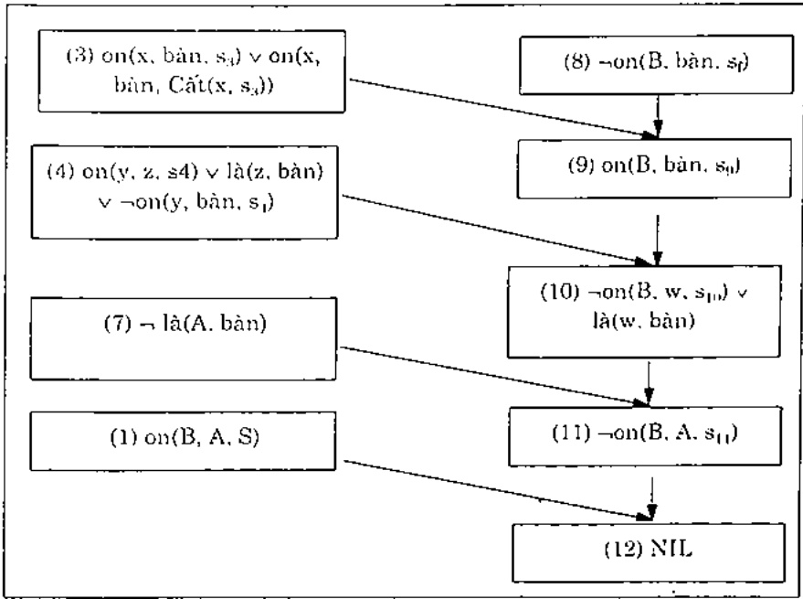

Hinh 10-13. Việc giải chúng tổ đặt được khối B xuống bản.

<!-- page: 295 -->

4. on(y, z, s₁) v là(z, bàn) v ¬on(y, bàn, s₁)

5.  $\mathrm{J}_{\mathrm{B}}(\mathrm{R}, \mathrm{A})$

6. -là(B, bàn)

7.  $\neg\mathrm{li}(\mathrm{A},\mathrm{b}\mathrm{i}\mathrm{n})$

S. -on(B, bản, s₁)

Lưu ý dùng kí hiệu "thay X bằng Y" được viết Y|X hay Y|X. Trước tiền dùng câu 3 và câu 8, và B|x, Cát(x, s\_{2})|s\_{1}, ta có on(B, bàn, s\_{9}). Cuối cùng thu được câu rỗng, NIL. Diểu này chỉ chủng tó ràng khối B có thể ở trên mật bản. Người ta chưa biết cách đế đến tỉnh hướng đó. Trì thúthe này ngâm có trong các phép thống nhất. Nhìn lại những gì đã làm, người ta thu được dây các thay thế :

$$
\text {C} \hat {\mathrm{it}} (1), s _ {0}) | s _ {1}, s _ {0} | s _ {3}, s _ {1 0} | s _ {9}, s _ {1 1} | s _ {1 0}, S | s _ {1 1}
$$

Theo dõi lịch sử các tỉnh hướng cũng không dễ dàng trong trường hợp nhiều toán tử. Do vậy người ta có thể dùng kỳ thuật của Green, với tư tưởng cơ bản là thêm các kháng định vào phủ định của kháng định dịch. Các sự kiện đưa thêm vào này, gọi là các term trả lời, khai thác phép hợp nhất thông thường để nhớ đường di của thông tin tỉnh hướng. Thay vi -on(B, bàn, $s_{p}$), người ta viết -on(B, bàn, $s_{p}$) v trả lời($s_{f}$). Do vậy các bước trên được viết lại :

(8)  $\neg\mathrm{on}(\mathrm{B},\mathrm{bàn},\mathrm{s}_{\mathrm{j}})\vee\mathrm{trá}\mathrm{lài}(\mathrm{s}_{\mathrm{j}})$

(9) on(B. bàn, $s_{ij}$) v trả lời(Cát(B. $s_{ij}$))

(10) -on(B, w, $s_{10}$) v là(w, bàn) v trả lời(Cát(B, $s_{10}$))

(11) $\neg$on(B. A. $s_{11}$) v tra lôi(Cát(B, $s_{11}$))

(12) uni lôi(Cát(B, S))

Lưu ý ràng Traí lời chỉ thêm một lần, không có loại phủ định. Traí lời không phải là có số của việc giải, mà chỉ là một cấu di kèm theo tỉnh huống trong quá trình giải. Hơn nửa, các tham số của trả lời là các yếu cấu thay đổi tỉnh huống trong khí giải.

Tuy nhiên trước đây người ta kết thúc việc giải khi thấy NIL, nay kết thúc khi chỉ thấy câu trả lời. Việc giải, hay chúng minh sự có mật của của literal đơn theo cách của Green, được tóm tất lại như sau :

1. Phú định định lý, chuyển nó sang dạng câu, thêm vào term trả lời.

2. Đặt danh sách các tiên để vào dạng cầu. Bổ sung cầu suy diễn được từ định lý và term trả lời.

3. Khi chua xuất hiện chỉ một minh câu trả lời và còn cập câu giải được, thực hiện :

<!-- page: 296 -->

a Tim cie ran gai duc.

e Giàu hàn cǎu dó.

\- Đơn kết quả vào danh sách các chịu.

\- Nếu sinh ra câu chỉ có câu trả lời, cho ra dây các toán từ trong các câu trả lời,nbu là trả lời cho bài toán. Nếu không có câu cần giai, thông báo ràng không thể tiếp tục giai.

Thù tục này có thể dùng để chủng minh định lý có nhiều literal.

## 1.4.2. Tiên để khung đối với bài toán khung

Báy giờ giá sử có bài toán như trước, tức có khối B trên khởi A, khối A trên bản, cần đặt B xuống bản, nhưng yêu cầu đích là "tình hướng đích là cả khối A và khối B đều trên bản".

$\exists s_{1}$  [on(B, bản,  $s_{1}$ ) ∧ on(A, bản,  $s_{1}$ )]

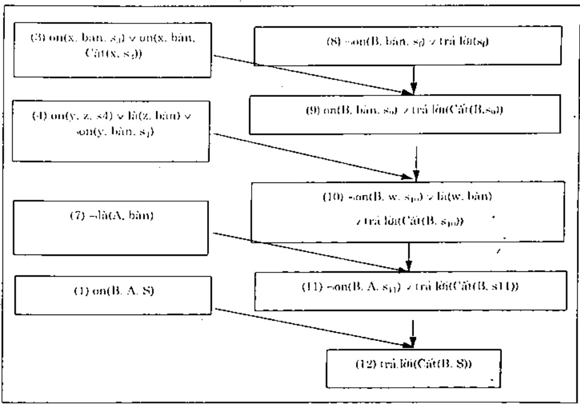

Hình 10-14. Muôn đề A, B cùng xuống bản, chỉ cần đặt B xuống là đủ.

<!-- page: 297 -->

Người ta thấy ngay việc cho B xuống bản là đủ. A đã trên bản từ trước. Dé chứng mmh ràng chỉ cho khối B xuống bản là đủ, dùng các bước của thủ tục trên. Dầu tiến phủ định dịch :

$\partial s_{1}$  [on(B, bản,  $s_{1}$ ) ∧ on(A, bản,  $s_{1}$ )]

$\forall s_{1} \left[ -s(\text{on}(B, \text{bàn}, s_{1}) \land \text{on}(A, \text{bàn}, s_{1})) \right]$

$Vs_{f}$  [ $-on(B, bàn, s_{f}) \vee -on(A, bàn, s_{f})$ ]

$\neg\mathrm{on}(\mathrm{B},\mathrm{b}\dot{\mathrm{i}}\mathrm{n},\mathrm{s}_{\mathrm{p}})\vee\neg\mathrm{on}(\mathrm{A},\mathrm{b}\dot{\mathrm{a}}\mathrm{n},\mathrm{s}_{\mathrm{p}})$

Biến thức này sẽ được bổ sung vào bày tiên để giả thiết :

1. on(B, A, S)

2. on(A, bàn, S)

3. on(x, bàn, s₄) v on(x, bàn, Cát(x, s₃))

4. on(y, z,  $s_{1}$ ) v là(z, bàn) v -on(y, bàn,  $s_{1}$ )

5. -li(B, A)

6.  $\neg\text{là}(\text{B}, \text{bàn})$

7.  $\neg\text{lã(A, bàn)}$

8.  $\neg\mathrm{on}(\mathrm{B},\mathrm{bàn},\mathrm{s}_{i})\vee\neg\mathrm{on}(\mathrm{A},\mathrm{bàn},\mathrm{s}_{i})$

Dến đáy người ta có thể giải câu 12 với câu 2. on(A, bàn, S). Điều này có thể dẫn đến sai làm do yêu cầu thay thế Cất(B, S) | S. Nhung S là tỉnh hướng chữ không phải là biến nên không thể thay thế được.

Thoạt tiên hạn chế này xem ra nhu không bình thường, vì nếu khối A lúc dấu đã trên bàn, nó vấn trên bàn khi khối B được đặt lên bàn. Tiên đề Cất cho biết cải gì xây ra về đối tượng đang di chuyển, chú không về các đối tượng khác. Nếu không có thêm trị thức nào thì không có cách nào để biết các giá trị vị từ nào là không thay đổi khi chuyển tính huống. Tỉnh trạng đưa đến khái niệm được gọi là vấn đề khung.

Đôi với đích khối A và khối B được đặt xuống bản, người ta cần cho quá trình chủng minh định lý biết các quan hệ đã có và đang được duy trì. Một cách thông thường là dùng các tiên để khung.

## Định nghĩa 10-2. Tiên dế khung (Frame Axioms)

Tiên để khung là mènh để nói về cách các vị từ tôn tại lâu hơn các toàn tử.

Thi du

Mô tả vị từ on lâu hơn toán tử Cất : nếu x trên y trước toán từ Cất thì x vẫn trên y, khi x không phải là đối tượng đặt trên bàn.

<!-- page: 298 -->

vs ∨x ∀y ∨z [on(y, z, s) ∧ -la(x, z) → on(x, y, Čát(z, s))]

Chuyển tiên để này sang dạng câu và dời các biến phù hợp

$$
\mathrm{on} (\mathrm{p}, \mathrm{q}, s _ {0}) \vee \mathrm{la} (\mathrm{p}, \mathrm{r}) \vee \mathrm{on} (\mathrm{p}, \mathrm{q}, \text {C} ^ {\prime} \mathrm{it} (\mathrm{r}, s _ {0})\tag{10}
$$

Trong chủng mình người ta đạt được (12):

$$
\mathrm{on} (\mathrm{A}, \text {ban, Cát(B,S)})\tag{12}
$$

Sử dụng thay thế A|p, bản|q, S|s, để giải ménh để 12 với ménh để 10, được

$$
- \text {on} (\mathrm{A}, \text {bân, S}) \vee \text {là} (\mathrm{A}, \mathrm{B})\tag{13}
$$

Giải ménh đế 13 với ménh đế 5, được ménh đế 14, sau đó giải với ménh đế 2 thu được NIL :

$$
- \text {on} (\mathrm{A}, \text {bàn}, \mathrm{S})\tag{14}
$$

$$
\mathrm{NIL}\tag{15}
$$

Nếu muốn, có thể dùng thủ tục Green để có các toán từ yêu cầu.

Nói chung tiếp cận vừa mô tả dời hối trang bị các tiên để khung và tiến để không-bằng-nhau. Người ta cần một tiên để không-bằng-nhau cho mỗi cấp đối tượng so sánh, và cần một tiên để khung cho hầu hết các cấp tiên để - vị tử.

## I.5. Kết luận về việc lập kế hoạch

\- Khi dùng tiếp cán "dãy" dịch đề lập kế hoạch, người ta quản lý các toán tử. có các điều kiện tiền quyết, danh sách thêm, danh sách xóa.

\- Lập kế hoạch có thể được xem như tìm dãy các toán từ dẫn đến tập các kháng định mong muốn.

\- Như các quá trình tìm kiếm, việc lập kế hoạch là tôn kém. Do đó cần phát hiện kế hoạch riêng mà không nhất thiết hoàn thiện. Điều này cũng có ích đề hạn chế cụ thể các biến khi cần thiết cụ thể hóa.

\- Khi dùng logic để lập kế hoạch, người ta dụng đến các toán từ diễn tả như quan hệ logic.

\- Dùng súy diēn logie dé tím dây các toán tử yêu cầu lưu vết các tỉnh huống. Phương pháp thông dụng là thông báo vị từ cùng với tham số tỉnh huống.

\- Một khi các tham số tình huống được dùng, cần có phương pháp lưu vết các vị tử có giá trị không thay đổi khi toán tử hoạt động. Sử dụng các tiên đề khung là một cách.

\- Khi không chắc chắn về điều nào là đúng, chọn điều ít khả năng xảy ra.

<!-- page: 299 -->

## II. TRÁ LỜI CÁC CÂU HỒI VÀ CÁC LỆNH

\- Phần này xeir khai nâng năm các trị thức dùng để dịch các câu hơi hoặc các lệnh tiếng Anh sang các lệnh của cơ sở dữ liệu quan hệ. Do vậy cấp tìm hiểu về xử lý ngôn ngữ tự nhiên.

Mục đích chính cần đạt được của công việc này là nêu lên thứ tự từ vựng thông thường và từ vựng chuyên dụng; chỉ cần vừa đủ cho các câu hỏi và các lệnh. Các câu hỏi và lệnh dùng để hỏi các cơ sở dữ liệu quan hệ. Tính chính quy về thứ tự các từ là nhỏ văn phạm cây chuyển tiếp ngữ nghĩa, là phát triển của văn phạm cây chuyển tiếp liên tục. Các văn phạm này thường tham chiếu đến văn phạm ATN (Augmented Transition Network), được giới thiệu vào năm 1970. Đối với các nhà ngôn ngữ học, các văn phạm ATN không thông dụng vì chứng được xác định riêng cho các chương trình máy tính không hạn chế; mà các nhà ngôn ngữ cơi các chương trình là thế hiện nghèo than đổi với trí thức ngôn ngữ.

Bình thí dụ minh họa, dưới dây sẽ trình bày cách thức các văn phạm cây chuyển tiếp ngũ nghĩa cho phép chương trình dịch các câu hỏi và lệnh tiếng Anh. Quá trình chuyển tiếp được biểu diễn qua ngôn ngũ của cơ sở dữ liệu.

Dutong nhiên người ta có đủ tri thức và công cụ hỗ trợ cho phép tìm kiếm theo ngôn ngữ tự nhiên trong cơ sở dữ liệu. Việc hiểu các văn bản tự do là khó, vậy nền càng muốn hiểu về ngôn ngữ tự nhiên thi cảng tăng độ phức tạp của bãi toán.

Tuy vay. kết thúc phân này người ta cũng có thế phát triển ở mức đơn giản một văn phạm mẫu và chuyển nó về cơ sở dữ hiệu.

## II.1. Các mạng chuyển tiếp ngữ nghĩa

Mạng chuyển tiếp ngữ nghĩa bước dấu dùng để nấm bắt các trị thức về trật tự các từ của tiếng Anh: sau này có thể dùng cho ngôn ngữ khác. Sau dây là văn phạm của mạng chuyển tiếp ngữ nghĩa.

## II.1.1. Tác dụng hướng dẫn của mạng chuyển tiếp ngũ nghĩa

Nhìn tổng quát một văn phạm như là thể hiện, gồm tập các quy utế ngữ pháp nấm bắt tri thức ngôn ngữ, như người ta biết ở trường tiểu học. Văn phạm mạng chuyển tiếp ngũ nghĩa gồm mạng câu và tập các mạng hỗ trợ như trong hình vẽ.

Có thể xem mạng như là sơ đó chỉ đường và các từ như là huống di. Dé kiểm tra một xấu các từ có tạo thành câu đúng hay không, người ta di theo dãy các liên kết từ nút bất đầu trong mạng câu đến nút cuối cùng, ứng với nút đậm trong hình vẽ. Các từ chỉ hướng di. Nếu xấu cụ thể cho phép ta đến được nút cuối thì xấu đó coi là chấp nhận được hoặc được ghi nhận bởi văn phạm mạng chuyển tiếp. Như vậy, dựa vào văn phạm mạng ngũ nghĩa có thể kết luận xấu các từ là câu đúng theo văn phạm này.

<!-- page: 300 -->

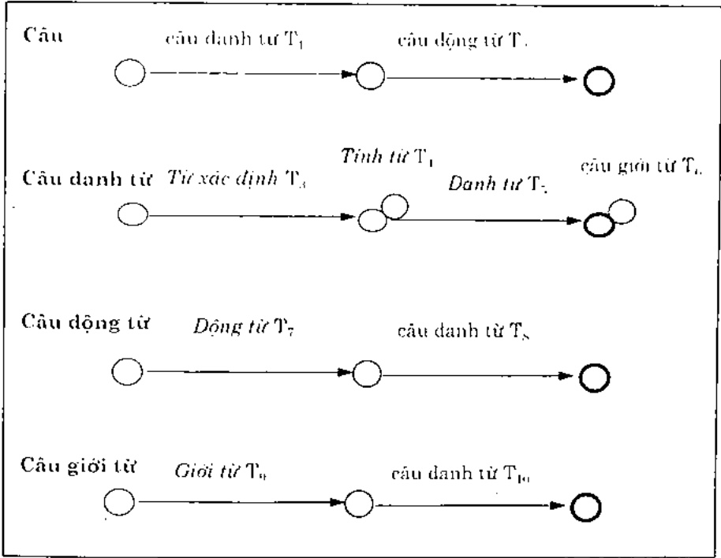

Hình 10-15. Mạng chuyển tiếp ngũ nghĩa.

## Thí dụ

Có câu "the big computer on the table", túc "chiếc máy tính lớn ở trên chiếc bàn". Xem mạng câu trong hình về: để di chuyên qua nó, cần qua các nhân cầu danh từ, có nghĩa cần đi hết mạng câu danh từ. Lúc đó cần di qua cái xác định, như quán từ "the" hay "a". rối tính từ như "big", "beautiful", rời danh từ như "computer". Môi lần người ta qua một liên kết, và các từ được ra khởi danh sách các từ cần được phân tích. Câu giới từ cho một câu chẳng hạn như "on the table".

Tất cả các tử trong câu được tính đến để duyệt qua, hết câu danh từ sang câu động tử. Sau đó việc phân tích kết thúc do đã đến nút có đánh dấu đậm.

## II.1.2. Thi du

Thi dụ xét câu "a powerful computer counted the long screwdrivers on the big table", túc "chiếc máy tính mạnh đã đếm những chiếu vận vít dài trên cái bàn lớn". Đề xác định câu này đúng, cần xem các tử có định ra đường di qua văn phạm. Trước tiên dụng phải nút nhân T$_{1}$, dưa ta đến câu danh tử, đến T$_{1}$.

<!-- page: 301 -->

\- Báy giờ sét "a": nô là một từ xác định.

\- Sau đó đến vị trí hoặc $T_1$ hoặc $T_2$. Theo quy uốc, theo $T_1$ thì có "powerful", dùng là tính tử.

\- Kiểm tra tiếp "computer", thủ không phát tính từ, chuyển sang danh từ và thành công. Khắng định được nó là danh từ. Chấm đặt cứu danh từ.

\- Kiểm tra câu giới tử, dùng $T_{10}$, thấy "counted" không phản giới tử, không dit tiếp được, quay trở lại mạng câu.

Hình tiếp theo trình bày những gì xảy ra theo lược đổ các hộp lỗng nhau. Theo quy uốc, lược đổ hộp lỗng nhau là lược đổ mà bên trong ứng với khoảng thời gian tạm thời. Do vậy, mạng câu danh từ cần được duyệt trong lúc phân tích câu vì hộp mơ tả việc duyệt câu năm trong hộp duyệt cả câu. Tương tự duyệt câu giới từ thì bị thất bại.

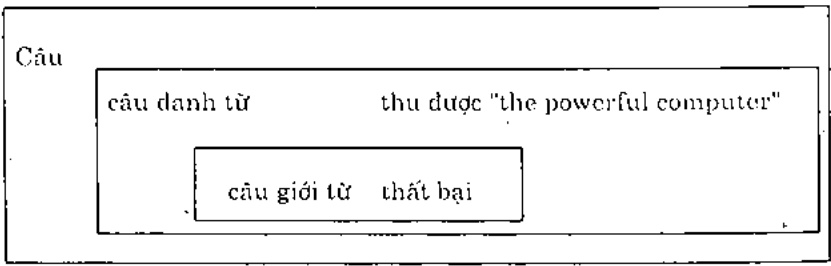

Hình 10-16. Lước đồ các hợp lông nhau.

\- Tiếp theo cần xem có thể chuyển sang câu động từ $T_{2}$ không ? Sau khi di qua liên kết có nhân $T_{7}$, liên kết $T_{8}$ cho biết cần duyệt câu danh từ khác.

\- Câu "the long screwdrivers" được xử lý bằng $T_{3}, T_{1}, T_{5}$.

\- Sau đó sang câu giới tử bằng liên kết $T_0$. Tiếp theo cần đến liên kết nhân $T_9$, $T_{10}$. Từ "on" là giới tử, "the big table" là câu danh tử.

<!-- page: 302 -->

Hình 10-18. Mô tả đối tượng.

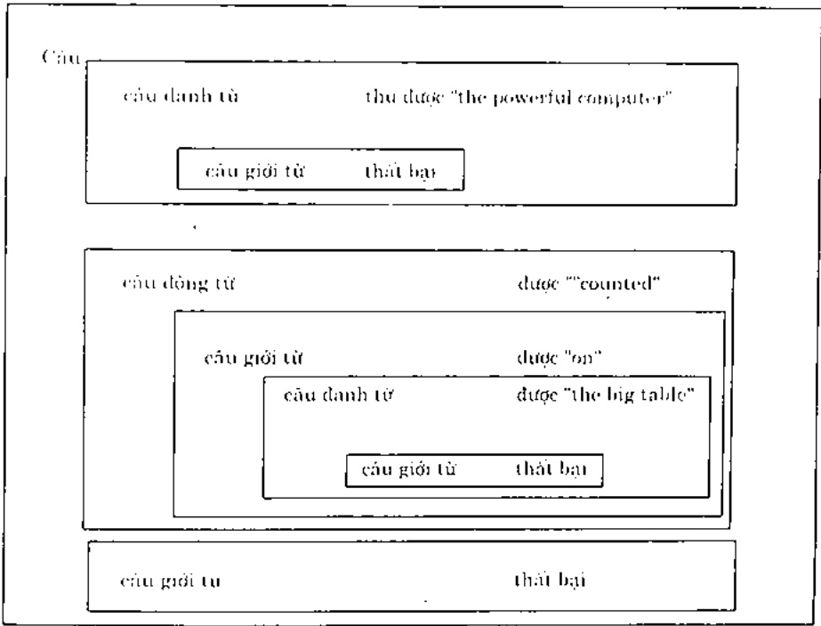

Hình 10-17: Phán tich cản "the powerful computer counted on the big table".

## II.2. Cây mạng ngữ nghĩa

Thi dụ cần chuyển các câu sau thành lệnh cho có số dữ liệu :

Count the long screwdriver

What is the location of the long red screwdrivers?

## II.2.1. Cơ sở dữ liệu quan hệ

Cơ số dữ liệu quan hệ gồm một hay nhiều bảng quan hệ. Bảng quan hệ có thể được gọi là bảng, có dòng hay bản ghi, cột hay thuộc tính, trường. Giả sử có bảng sau:

| Lớp | Màu | Kích thước | Trọng lượng | Nơi đế |
| --- | --- | --- | --- | --- |
| Kim | xanh | trung bình | nhẹ | bảng |
| Bùa | den | to | nặng | bảng |
| screwdriver | dó | đài | nhẹ | bàn |

<!-- page: 303 -->

Người ta có thể đặt các câu hỏi đối với cơ sở dữ hiệu thông qua ngôn ngữ hỏi. Điều kiện tìm dữ hiệu có thể theo chuẩn AND hay chuẩn OR. Chắng hạn tìm các đối tượng với điều kiện lớp = "screwdriver", kích thước = "long".

## II.2.2. Sử dụng dạng để tìm kiếm trong cơ sở dữ liệu

Một phương ăn hỏi cơ sở dữ liệu theo ngôn ngữ tự nghiên là sử dụng cây chuyển tiếp ngũ nghĩa để dịch câu tiếng Anh thành các lệnh trên cơ sở dữ hiệu. Một số bước thực hiện là :

1. Dùng câu hỏi hay lệnh để chọn dạng phù hợp với cơ sở dữ liệu.

2. Dùng câu hỏi hay lệnh thể hiện hay kết hợp các dạng được chọn.

3. Dùng các dạng hoàn chỉnh để tìm các bản ghi cơ sở dữ hiệu đã xác định theo cầu hỏi hay lệnh.

4. Dùng các đối tượng trong cơ sở dữ liệu tìm được để trả lời câu hỏi.

Thí dụ

Câu lệnh Count the long screwdriver có các dạng chính sau :

SELECT đối tượng WITH giá trị

Khi được cụ thể hóa các dạng như sau :

SELECT [SELECT tools WITH lớp = "screwdriver"] WITH kích thước = "long"
Cây cầu hỏi được diễn tả trong hình.

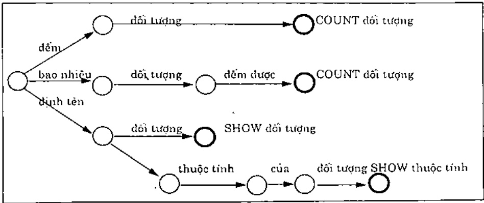

Hình 10-19. Cây câu hỏi.

<!-- page: 304 -->

## II.2.3. Chuyển các mạng ngũ nghĩa sang các cây ngũ nghĩa

Chuyển tư các mạng ngữ nghĩa sang các cây ngữ nghĩa sẻ đơn guảu hóa việc xây dựng van phạm. Một vải ý tưởng thể hiện trên mang chuyển tiếp của pháp vẫn chưa phân tất cơ những cải người ta mong muốn, trong việc xây dựng các hệ thống dùng câu tiếng Anh tìm kiếm dữ liệu của cơ sở dữ liệu. Thực ra, người ta tránh sự phúté tập của ngôn ngữ tự nhiên, đến chủng nào có thế hạn chế chi dùng các câu hỏi, các lệnh của cơ sở dữ liệu theo cách mô tả.

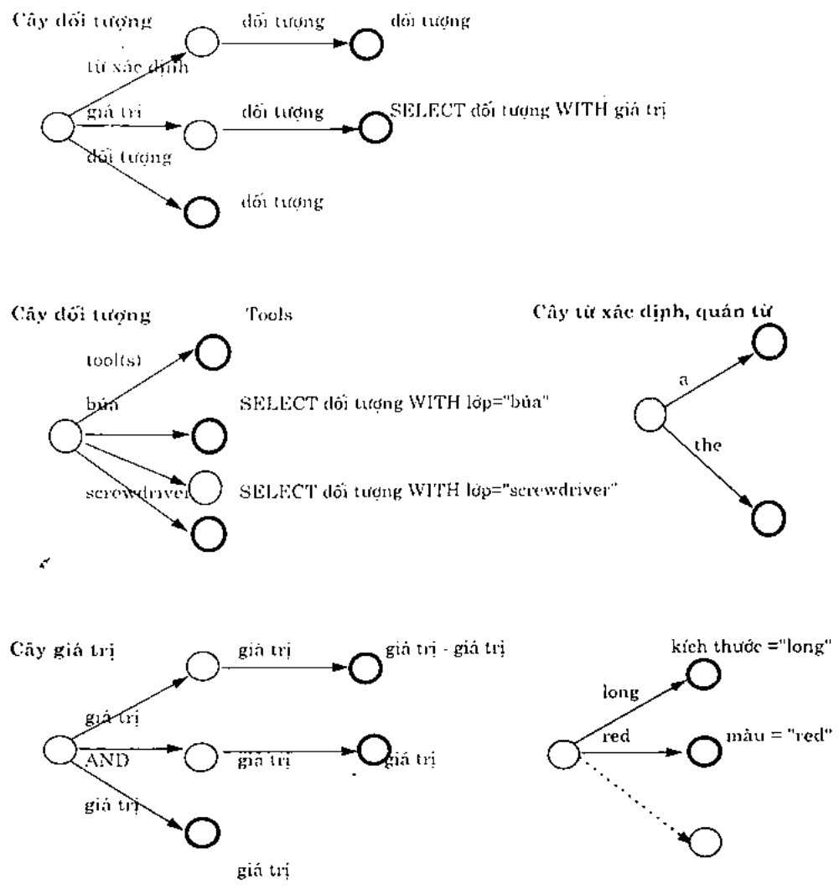

<!-- page: 305 -->

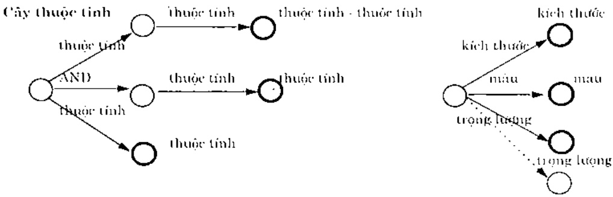

Hình 10-20. Cây chuyển tiếp ngũ nghĩa.

Các thay đổi duta đến van phạm cây chuyển tiếp ngũ nghĩa. Thị dụ về văn phạm này được nêu trong các hình. Các văn phạm cây chuyển tiếp ngũ nghĩa khác với văn phạm mạng chuyển tiếp ngũ nghĩa ở vàr điểm sau :

\- Cảc chuyển tiếp bên kết cần các từ đặc biệt. Thị dụ cần các từ "count". "tool(s)".

\- Một vài chuyển tiếp liên kết xác định câu về mặt ngữ nghĩa hơn là xác định về mặt cứ pháp. Chẳng hạn trên hình, các đối tượng, thuộc tỉnh chú trọng vào thực thể cơ sở dữ liệu, như cái văn vít. dài, hơn là chủ trọng vào thực thể ngôn ngữ như danh từ, tính từ. Do vậy, cá bên kết đối tượng và liên kết thuộc tính được coi là xác định chuyển tiếp một cách ngữ nghĩa, phản ánh thay đổi theo tên từ văn phạm cú pháp sang văn phạm ngữ nghĩa.

\- Không có nút với hai dấu vào. Tỉnh chất này là lý do để dùng văn phạm cây chuyển tiếp ngữ nghĩa thay vì dùng văn phạm mạng chuyển tiếp ngữ nghĩa.

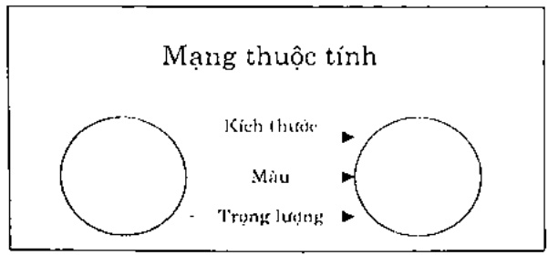

Hình 10-21. Trong mạng thuộc tỉnh, người ta lưu lại vết để biết đường di đến nút cuối cùng.

<!-- page: 306 -->

Khi thay đổi mạng sang cây xuất hiện tương ứng một-một giữa các đường và nút kết thúc. Một khi đến được nút kết thúc, không bao giờ phải hỏi về cách thức đạt được nút dò. Điều này cho phép người ta dễ quyết định lựa chọn dạng câu.

## Thi du

Khi mạng thuộc tính thay cho cây thuộc tính thi các liên kết tập trung về một nút. Như vây tại nút đó không thể biết cách đến được nút đó và đã qua các nút nào. Di nhiên nếu muốn thì cũng có thể dùng cơ chế phụ để lưu lại vết, nhưng phúc tập.

\- Khi cây được duyệt thành công, tên của nó được cơi là biến cây, và được gần với dạng đạt tại nút kết thúc. Do đó người ta có thể tham chiếu đến dạng như là cải gần với biến cây.

\- Các biến cây thay thế những cái đã được thiết lập trước. Chẳng hạn trên hình có hai biến cây gắn với nút : giả trị · giả trị. Khi cụ thể hóa dạng, các biến được thay bằng giả trị thực.

## II.2.4. Tiếp tục thí dụ

Đề xem cách thức các cây chuyển tiếp ngũ nghĩa làm việc với các dạng cụ thể, tiếp tục thí dụ "Count the long screwdriver". Phân tích của nó được mô tả trong sơ đồ các hộp lỏng nhau.

Tại điểm cuối cùng, người ta thấy nghĩa của từ "screwdriver" sẽ được tìm thấy trong quan hệ Công cụ của cơ sở dữ liệu. Sau khi duyệt các đối tượng mức thú hai đến nhánh giữa, các đối tượng biển cây được gắn với dạng cụ thể của dạng.

SELECT đối tượng WITH giá trị

SELECT [SELECT Tools WITH lôp ="screwdriver"] WITH kích thước ="long"

Nghĩa của từ "long" có được do dua dạng kích thước = "long" trên cây giá trị vào cơ, số dữ liệu.

Khi đã duyệt cây đổi tượng mức hai, quay lại cây đổi tượng ban đầu. Do cây các đối tượng ban đầu vừa gắn biến cây đối tượng với cái nó vừa gắn tại mức ngay dưới đó, người ta chú trọng vào cây câu hỏi với cùng phép gắn do cây các đối tượng mức hai thực hiện.

Giù thì đã kết thúc việc duyệt phân trên trong cây câu hỏi - lệnh. Việc cụ thể hóa dạng của nhánh trên tiếp tục, và cho kết quả như sau :

COUNT [SELECT [SELECT Tools WITH lôp ="screwdriver"]

$$
\text {WITH kích thước = "long"}
$$

<!-- page: 307 -->

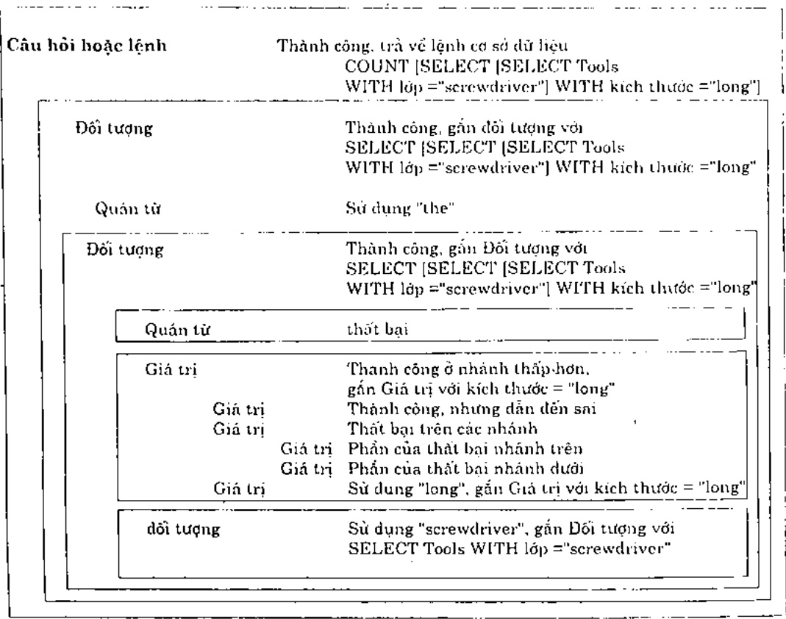

Hình 10-22. Các bước cây chuyển tiếp ngũ nghĩa làm việc với thí dụ cụ thể.

## II.2.5. Thay các vòng lặp bằng dệ qui

Các cây chuyển tiếp ngữ nghĩa không chữa vòng lập như các mạng chuyển tiếp ngữ nghĩa, chẳng hạn như vòng lập đối với tính từ hay câu giới từ. Nhở kỹ thuật trên cây, các vòng lập được thay bằng các cây dệ quy.

Thí dụ

Cân phân tích câu có "long red screwdriver". Sau khi xử lý tính từ "long", sang tính từ "red", cần lập lại cây giá trị. Lức này, sau khi thất bại tại hai nhánh trên, người ta thành công tại nhánh dưới. Trong hình vẽ minh họa cho thấy tổ hợp giá trị - giá trị quản lý hai từ giá trị liên nhau. Việc độ quy nhiều thu được dãy các giá trị dài hơn.

Cuối cùng, các thủ tục duyệt các cây chuyển tiếp ngũ nghĩa và duyệt các liên kết cây chuyển tiếp được giới thiệu như sau :

<!-- page: 308 -->

## Duyệt cây chuyển tiếp :

1. Xác định xem có thể đến được nút thành công mang vòng tròn dâm, di qua các liên kết cây con và từ không?

2. Nếu không thể đến được, thống báo thất bại.

3. Ngude lai :

\- Lấy dạng gần với vòng tròn dặm. Thay thể các biến bằng cách gần những cái được lập ra khi duyệt cây con.

• Gán tên cây cho dạng cụ thể.

• 'Thông báo thành công.

| Các giả trị | Thành công, gần Giá trị với kích thước="long", màu="red" |
| --- | --- |
| Giá trị | Sử dụng "long", gần Giá trị với kích thước="long" |
| Giá trị | Thành công tại nhánh thấp, gần Giá trị với màu = "red" |
|  | Giá trị Thành công, nhưng dẫn đến sai |
|  | Giá trị Phân của nhánh trên saiGiá trị Phân của nhánh dưới sai |
|  | Giá trị Sử dụng "red", gần Giá trị với màu = "red" |

Hình 10-23. Cây dệ quy ứng với vòng lập trong mạng chuyển tiếp.

## Duyêt liên kết :

1. Nếu liên kết là liên kết cây con, đánh dấu và ghi tên cây con; duyệt cây con. Nếu việc duyệt thành công, gắn tên cây con cho dạng cụ thể thấy tại nút kết thúc của cây con.

2. Nếu liên kết này là liên kết từ, từ tiếp theo trong câu phải là từ này. Từ này được dùng như liên kết được duyệt.

<!-- page: 309 -->

## II.3. Kết luận về trả lời các câu hỏi và các lệnh

\- Hiểu biết đáy đủ về ngôn ngữ tự nhiên được thể hiện qua các trạng thái của tri thức khoa học. Tuy nhiên có thể đến được các dịch trong một vai ngữ cảnh đặc biệt.

\- Một cách thể hiện câu hỏi và các lệnh theo ngữ cảnh truy nhập cơ sở dữ liệu là dùng các từ trong câu hỏi-lệnh để hướng dẫn duyệt tập các cấy hay mạng. Người ta thu thập thông tin khi di chuyển vị di chuyển này làm cụ thể các dạng tìm kiếm trong cơ sở dữ liệu.

\- Chuyển các mạng cứ pháp sang các cây cứ pháp loại trừ được các vòng lập và đơn giản hóa dạng. Chuyển từ cây cứ pháp sang cây ngũ nghĩa trên cơ sở dữ liệu chuyên dụng diễn tả các ràng buộc và đơn giản hóa cấu trừ của cây.

\- Một vài liên kết trong các cây chuyển tiếp ngủ nghĩa được duyệt theo các từ riêng. Liên kết khác cần duyệt cây con.

\- Khi thành công việc duyệt cây con, một dạng được cụ thể hóa, và dạng này trở thành giá trị gắn với tên cây con. Khi cây mức trên được duyệt thành công, một dạng được cụ thể hóa và dạng này dùng để truy nhập cơ sở dữ liệu.

## III. TỔ CHỨC HỆ THÔNG

Dã nhiều kỹ thuật đã được dùng để kiến thiết các chương trình trí tuệ nhân tạo. Trong các phân trước, việc thể hiện trí thức và thuật toán xử lý trí thức đã được xem xét. Tuy vậy không phải người ta đã giải quyết được nhiều bài toán. Một số bài toán khó đòi hỏi sự hợp tác của nhiều thủ tục và nhiều nguồn thông tin. Thoạt đầu, cách đơn giản để tổ hợp các nguồn khác nhau của trí thức và hệ đơn lẻ là viết các luật chứa tất cả các trí thức và cho phép hệ thống dùng tất cả luật này để tìm từ một hoàn cảnh đã cho đến trạng thái đích. Tuy nhiên cách này mắc một vài nhược điểm là :

\- Số luật tăng lên, gây khó khăn cho việc bổ sung một luật mới không liên quan đến luật đã có.

\- Tính hiệu quả bị mất, do việc sử dụng các luật tại mỗi bước trong quá trình giải. Điều này thường xảy ra khi một tập hợp các luật được dùng với nhau: chỉ khi chứng hoàn thành, các luật khác mỗi được xem xét.

\- Các kỹ thuật giải bài toán và thể hiện tri thức có thể tốt cho phần này, nhưng không tốt cho phần khác của bài toán.

<!-- page: 310 -->

Dó vay người ta tách tri thúc trong hệ thống lớn ra tập các modun tách biệt. Diêu này làm tang tính quan trọng của mỗi modun trong thiết kế của bất ki hệ thống lớn nào.

## III.1. Xếp lịch

Việc làm lịch đã được nghiên cứu để tách công việc ra thành các nhiệm vụ. Ý nghĩa của cơ chế lịch theo quan điểm tổ chức hệ thống là cho phép vải modun độc lập liên kết, liên hệ vòu nhau để hỗ trợ cho việc chọn một nhiệm vụ cụ thể và danh sách kiểm chủng nhiệm vụ.

Có nhiều cơ chế hỗ trợ cho việc chọn thời gian biểu trong lịch. Việc dùng lịch chung trong số các modun ngầm chỉ ra vai trò của hệ thống tổng thể. Hệ thống lớn có thể được tập trung trong những modun hữu dụng nhất.

## III.2. Tiếp cận Blackboard

Tiếp cận có vai trò quan trọng trong việc tổ chức các chương trình lớn về trí tuệ nhân tạo đầu tiên được phát hiện trong ngữ cảnh của đề án về hiểu tiếng nói. gọi là HEARSAY-II. Tư tưởng đơn giản, toàn hệ thống gồm một tập các modun độc lập, gọi là nguồn tri thức, chứa tri thức về lĩnh vực trong hệ thống và bảng đen. Bảng đen được dùng với nghĩa cơ sở dữ liệu dùng chung, mà tất cả các nguồn tri thức truy nhập đến. Trong hệ HEARSAY này, nguồn tri thức ứng với các mức của tri thức về tiếng nói, ngôn ngữ và các nhiệm vụ được xét.

Khi nguồn tri thức được kích hoạt, nó kiểm tra nội dung hiện tại của bảng đen và áp dụng tri thức của nó, hoặc là tạo một giả thuyết mới, và viết vào bảng đen hoặc là biến đổi một giả thuyết đã có. Một khi đã chạy, nguồn tri thức không ngắt cho đến khi dùng.

Các giá thiết trên bảng đen được xếp theo hai chiều, theo mức độ và theo thời gian. Các mức từ nhỏ, thấp như tiếng động cá nhân đến lớn, cao ứng với cả một cấu nói. Dịch của hệ thống là tạo một giải thuyết đơn cho phép diễn tả lời giải cho bài toán.

## III.3. Delta - Min

Một bài toán về cấu trúc dữ liệu dùng trong HEARSAY. II là dồi hỏi so sánh một tần suất sinh ra bái một hệ thống tri thức so với hệ thống tri thức khác. Điều này là cần thiết cho hệ thống, để chọn vùng làm việc tốt nhất sắp tối. Không có tri thức, không thể so sánh tốt được, do không có thông tin về những thứ khác. Phương pháp Δ-Min dầm bảo giải quyết vấn đề này cho vải loại nhiệm vụ.

Một vài nhận xét thấy lập lịch, bằng den. Δ-Mín như thành phần của một hệ thống. Cần phải liên kết chúng lại, sử dụng các đối tượng dùng chung, các thông báo.

<!-- page: 311 -->

Trong số ba hệ này, hệ lịch thể hiện qua nhiệm vụ. Một nhiệm vụ sở dùng trên lịch khi đủ điều kiện xuất hiện. Trong hệ thống bảng đen các đối tượng thể hiện qua các giả thuyết hay nhiệm vụ, khi mà bằng đen được kích hoạt. Giá quyết dùng khi không được khẳng định, bản ghi được kích hoạt khi được chọn khai thác. Trong A-Min đối tượng là trạng thái bài toán cho biết tập các giả thiết hiện tại về các thông số vào. Trong cả ba loại hệ thống, các quả trình riêng có thể tạo các đối tượng liên lạc, và gửi các ý kiến tối các đối tượng được tạo bởi các quả trình khác.

## IV. HỆ CHUYÊN GIA

## IV.1. Định nghĩa

## Dình nghĩa 10-3 : Hệ chuyên gia (Expert System)

Hệ chuyên gia là hệ thống trí tuệ nhân tạo có các hiệu quả của chuyên gia trong lĩnh vực rất hạn chế, nhà việc khai thác một hay nhiều cơ sở trí thức về lĩnh vực đó, đạt được ít ra là một phần trí thức con người.

Chức năng của hệ chuyên gia là dưa ra chiến lược suy luận mềm dẻo nhỏ moto suy diễn. Đặc trưng của hệ chuyên gia nằm trong vài khái niệm sau :

\- Quan trọng trong hệ chuyên gia là cơ sở tri thức. Cảng nhiều trị thức càng dễ suy diễn.

\- Tách biệt rõ tri thức và suy diễn. Do vậy các tri thức cần được thể hiện sáng sửa, giải thích được cách suy diễn và sử dụng các kết luận làm tri thức suy diễn tiếp.

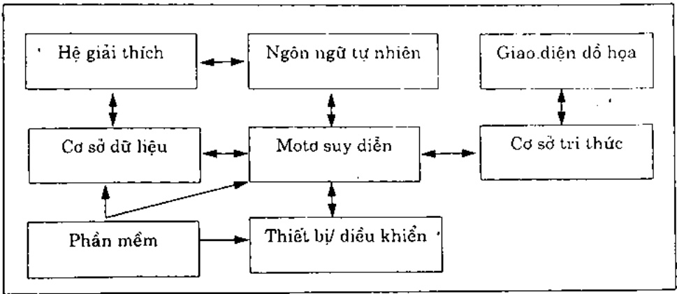

Hình 10-24. Các khối trong hệ chuyên gia.

<!-- page: 312 -->

\- Hệ chuyên gia thể hiện trị thức theo nhiều kiểu, cũng như có nhiều cách suy lý.

\- Nó có chu kì sống gồm các pha phát triển, đánh giá, báo trị và tiến hóa.

## IV.2. Lợi ích của hệ chuyên gia

Lợi ích của hệ chuyên gia có cả mật kỹ thuật và lý thuyết. Về kỹ thuật, hệ chuyên gia đã sử dụng hệ thống cơ sở trí thức một cách thành công. Về lý thuyết, lợi ích được kháng định qua các ứng dụng sau :

\- Khả năng đạt được lời giải nhanh hơn dùng thuật toán,

\- Cho phép giải thích đãy các suy lý. Tuy nhiên ích lợi này không hoàn toàn tối trong các trường hợp phúc tạp như trong hệ chuyên gia thể hệ hai,

\- Çho phép hình thức hóa, bảo quản, cập nhật tri thức trong cơ sở dữ liệu tri thức của tổ chức, xỉ nghiệp.

• Hệ chuyên gia là công cụ nhóm hợp nhiều chuyên gia về một vấn đề,

• Hệ chuyên gia có tính câu trúc của một hệ thống lớn.

• công cụ giúp chuẩn hóa công tác xử lý trị thức.

• Cho phép dễ phát triển hệ thống.

## IV.3. Một số loại hình của hệ chuyên gia

Ngoài các hệ chuyên gia vé y học, có các hệ thống dùng trong các công tác khác. Một vài hệ chuyên gia dược kể ra gồm :

• Công việc phân loại tự động,

• Diēn giải,

\- Chẩn đoán, dùng trong y học, trong dà tìm, sửa lỗi. Loại hệ thống này chiếm khoảng 60% tổng số các hệ thống ứng dụng.

• Công tắc lập kê hoạch, phân công,

\- Theo dõi các nhiệm vụ. Khi đó hệ chuyên gia có yếu tố thời gian mà kế hoạch công tác được thực hiện,

\- Tự động phân phối tài nguyên. Nó dùng kỹ thuật tối ưu, dự đoán kinh phí.

\- Hệ thống giúp nhận thức. Hệ chuyên gia loại này tạo các khái niệm, các đối tượng có theo các tiêu chuẩn, như thiết kế các thành phần trong mạch tổ hợp VLSI (Very Large Scale Integration).

<!-- page: 313 -->

## IV.4. Hệ chuyên gia và công nghiệp

Trước tiên hệ chuyên gia dùng trong lĩnh vực với ký thuật cao, rôi lan sử dụng trong các lĩnh vực khác. Nhiệm vụ của hệ chuyên gia trong công nghiệp rất da dạng, có thể chẩn đoán và bảo trì, điều khiển quả trình, giám sát tác nghiệp, hỗ trợ ra quyết định; hay đào tạo.

Hai loại để án thiết kế hệ chuyên gia. Thú nhất là các hệ chuyên gia của nhỏ, chúa khoảng 100 luật. Hệ thống này dễ làm, rẻ, cải đặt thuận tiện. Thú hai là hệ chuyên gia cổ lớn, với khoảng 1000 luật và đối tượng. Hệ này đất, hay sinh ra rủi ro, quyết định chậm.

Thí dụ ứng dụng của hệ chuyên gia như hệ thống điều khiển các hành vi. Nô là các hệ chuyên gia nhỏ cải trong hệ tự động và hoạt động trên hành vi đó, hoặc là hệ chuyên gia lớn hỗ trợ thao tác của con người, như ra quyết định, thao tác với lô cao. Trong xi nghiệp, hệ chuyên gia giúp :

\- Chẩn đoán tình huống, chính sách mua, marketing...

\- Quản lý tài nguyên, như nhân lực, tài chính...

• Theo dõi các điều khoản, chỉ trả, hợp đồng.

\- Chẩn đoán chất lượng.

## IV.5. Thu thập tri thức cho hệ chuyên gia

Văn để thu thập tri thức cho hệ chuyên gia là vấn đề chính trong liên kết hệ chuyên gia và môi trường. Thực tế cho thấy không có giải pháp kì diệu trong việc lấy tri thức cả.

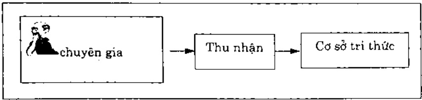

Hình 10-25. Thu thập tri thúc chuyên gia.

Các bước thu nhận tri thức có thể coi nhu nhà bộ thu nhận. Dựa vào tri thức và các giải thích người ta chuẩn hóa cấu trúc thu nhận được. Các mức xử lý tri thức gồm: trích ra tri thức, diễn giải, thể hiện tri thức.

Việc thu nhận trị thức gặp các khó khăn :

\- Khó khăn về kỹ thuật, về phương pháp truyền thông tin,

<!-- page: 314 -->

\- Tủy thuộc vào chuyên gia. Việc lấy trị thức thuận lợi khi chuyên gia rời, hoạt bất, không có ý định độc quyền trị thức.

\- Tủy theo lĩnh vực chuyên môn của chuyên gia. Có tri thức thuộc lĩnh vực khó kiểm tra sự đúng đán của nó.

Cùng phải nhìn nhận ràng việc xây dựng hệ chuyên gia chỉ làm lợi cho chuyên gia. Nó giúp chuyên gia sử dụng trị thức của mình thuận tiện, náng cao trị thức, phát minh thêm. Không có phương pháp tuyệt đối tốt trong việc thu nhận trị thức. Việc thu nhận phụ thuộc vào kinh nghiệm và khả năng của người lấy trị thức.

Một số ký thuật thông dụng được dùng khi thu nhận trị thức cho hệ chuyên gia :

• Phân tích tài hiệu.

\- Phòng vấn và phương pháp phụ lục (tạo dạng lại, giải thích, đối lại, tập trung).

• Quan sát trực tiếp,

• Phân tích của giao thúc,

• Đặt câu hỏi,

\- Phương pháp PCT (Personal Construct Theory),

\- Phân tích trí nhỏ,

• Quan sát di chuyển của mắt.

Một số công cụ và phần mềm lấy tri thức thu nhận tri thức được biết đến là TEIRESIAS theo tài liệu năm 1982 của Davis cho hệ thống MYCIN, MORE năm 1985 cho công tác chắn đoán, KOD theo Vogel năm 1988 trong phân tích xỉ nghiệp để chính xác hóa mô hình nhận biết của chuyên gia.

## V. TRÍ TUÊ NHÂN TẠO PHÂN TÁN

## V.1. Hệ thống trí tuệ nhân tạo phân tán

Hệ thống trí tuệ nhân tạo nhiều tác nhân, thành phần có thể hoạt động song song và được tổ chức trên nhiều trạm của hệ phân tán. Hệ thống trí tuệ nhân tạo song được thiết kế với suy luận cổ điện, sử dụng nhiều bộ xử lý nên tốc độ cao hơn hệ thống bình thường. Các ngôn ngữ MULTILISP, PROLOG cho phép thiết kế các quá trình tương tranh, được dùng cho hệ thống trí tuệ nhân tạo phân tán.

Các dạng tương tác giữa các thành phần bao gồm các hoạt động hợp tác/ tương tranh. liên lạc thường xuyên. Bài toán về hệ thống trí tuệ nhân tạo phần tán được xây

<!-- page: 315 -->

dụng trên các thành phần thông minh đã được liên kết với umau như hệ thống dây thần kinh.

## V.2. Hệ thống nhiều chuyên gia

Một hệ thống sử dụng nhiều chuyên gia cán đảm bảo liên lạc, qua thông báo hoặc qua các thông tin dùng chung. Dạng tương tác giữa các chuyên gia có thể là :

\- Cùng hợp tác. Hệ thống được chia cơ sở trí thức thành các modun, cho phép các chuyên gia truy nhập theo các công chức năng.

\- Khai thắc tương tranh. Lức này cần có cơ chế quản lý và chậm, xác định tính tương hợp của các kết luận, các điều khiển.

• Dùng dạng tương tác hỗn hợp của cả hai dạng trên.

## VI. CÁC MÔ HÌNH THẦN KINH

## VI.1. Lich sǔ

Mô hình thần kinh có các giai đoạn phát triển sau :

\- Making in mind do Newell, Simon, Minsky dua ra. Các nghiên cứu trong giai đoạn này là trí tuệ nhân tạo kí hiệu (symbolique), mô hình thân kinh của McCulloch. Pitts. Rosenblatt, trí tuệ nhân tạo liên kết.

• 1940 : Khái niệm về điều khiển học do McCulloch-Pitts dưa ra.

\- Những năm 50-60 có các kết quả về nhận dạng.

• 1969, Minsky-Papert nếu ra các hạn chế của nhận dạng tự động.

\- 1982 là thời-gian mạng thần kinh lại phát triển, nhỏ các kiến thức vật lý nổi ghép mạng.

• 1986 có các thành lưu về xử lý song song, phản tán.

\- Từ những năm 90 là giai đoạn hội tự công nghiệp và học thuật. Vào thời gian này đã có các vi mạch thần kinh.

## VI.2. Ý tương về hệ thân kinh

Xuất phát từ hệ thống các nondon thân kinh liên kết nhau rời truyền các điều khiển hoạt động, một loại hệ thống trí tuệ nhận tạo được thiết kế. Hệ thần kinh có nhiều đầu thông tin vào, qua các modun điều khiển rời di đến hoạt động cuối cùng.

Mang các modun nhu vây có thể được chia thành từng lớp.

<!-- page: 316 -->

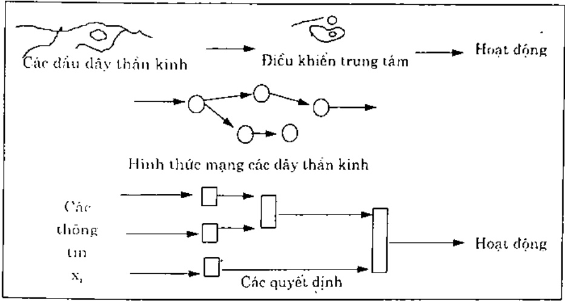

Hình 10-26. So sánh các hoạt động như mạng thân kinh.

## VI.3. Đặc trưng của các mô hình liên kết

Mô hình liên kết trí tuệ nhân tạo có đặc trưng là các mạng liên kết chặt chẽ các quá trình thực hiện hoạt động đơn giản song song. Các bộ vi xử lý cơ sở của các mô hình này được tố chức dưới dạng "máy noron". Hệ thống thu nhận thông tin qua các thể hiện, các thí dụ thực, nhỏ các chức năng sau :

• Tạo liên kết,

\- Thay đổi "trọng số thần kinh", thí dụ như thuật toán lưu trữ Boltzmann cho phép truyền các gradient của các lỗi sai trong quá trình nhận dạng tự động nhiều lớp.

\- Trong những công việc về nhận biết, liên kết, phân loại. Các công việc này thuộc lĩnh vực nhận đang, như nhận dạng tiếng nói, hình ánh, tín hiệu.

\- Các thuộc tỉnh chức năng phụ thuộc tùy theo chủng loại của mạng.

\- Phân biệt trị thức và công việc xử lý.

\- Trong các lĩnh vực có sự ngầm định tri thức và các chức năng. Việc suy diễn không thể tiến hành trong các lĩnh vực này.

<!-- page: 317 -->

## VII. KÊT LUẬN

Chương này đã trình bày một số khái niệm về :

\- Việc lập kế hoạch được giới thiệu thông qua thì dự về thể giới các khốt. Một số tiếp cận để lên kế hoạch như dây các dích, suy diễn logic...

\- Đặt và trả lời các câu hỏi trong cơ sở dữ liệu : Văn để này được dưa về việc xét mạng ngữ nghĩa biểu diễn văn phạm tiếng Anh thủ tục. Các mạng chuyển tiếp ngữ nghĩa, cây ngũ nghĩa được giới thiệu như công cụ giải quyết vấn đề này.

\- Việc lập lịch, tổ chức bằng đen, bài toán Delta-Min là thi dụ về các bài toán thuộc loại tổ chức hệ thống. Đối với các bài toán này, các thông tin phụ góp phần quan trong trong việc giải bài toán.

\- Một số nét về hệ chuyên gia : Nội dung sơ lược trong chương này chỉ là một vài đầu mục giới thiệu về hệ chuyên gia. Tuy nhiên các phép suy diễn trong hệ chuyên gia cũng đã được giới thiệu trong chương trước.

\- Nghiên cứu về hệ thống trí tuệ nhân tạo phân tán hay về các mô hình thần kính là các nội dung cần được trình bày chỉ tiết trong các tài hiệu khác. Cũng như các giới thiệu về hệ chuyên gia, giới thiệu ở dây môi chỉ là sơ lược.

<!-- page: 318 -->

# PERCEPTRON

Con nguồn luón có ý thức nhận biết thể giới thực xung quanh minh. Ngoài các giác quan trời phụ, con người còn nghiên cứu các phương tiện cho phép nhìn, nghe, sở, nẽm... các đối tượng của thể giới. Hai lĩnh vực nghiên cứu mạnh trong trí tuệ nhân tạo là nhìn và nghe, và xa hơn nửa là hiểu tiếng nói. Chương này sẽ dành để giới thiệu quả trình đã được thực hiện trong hai lĩnh vực nghiên cứu này thông qua cơ chế nhận thức tự động, gọi là máy nhận thức perceptron.

## I. KHÓ KHĂN CỦA PERCEPTRON

Perceptron phải dương dấu với công việc khó khăn, như giải các bài toán nhận thức, bao gồm cả nhận biết tiếng nói lấn phân tích hình ảnh.

Trước hết cần xác định rõ bài toán perceptron. Tại một mức, nếu người ta nhận thấy hiện diện của tín hiệu, như sóng âm cháng hạn, thi người ta thu nhận nó. Nhung với perceptron, dây chỉ là bước đầu; nó cần đến đích xa hơn là xác định tương ứng giữa các sóng âm với các tín hiệu. Đề sinh ra tín hiệu phù hợp, trước tiên perceptron phân chia các phạm trừ tín hiệu. Việc này dẫn đến yêu cầu diễn hình là các quá trình cần làm việc phân cấp.

Thí dụ

Đế phân tích âm thanh, người ta xác định các âm riêng lẻ, rời tập hợp thành các từ, rời tổ hợp thành cấu trúc câu có nghĩa. Việc phân tích hình ảnh cũng lần lượt như vậy. Người ta xác định các đường, xếp thành hình dạng đối tượng, rời tổ hợp thành các hình ảnh quen thuộc như nhà, sân...

Quá trình phân loại phân cấp tương ứng với cấu trúc phân cấp vốn có của thể giới thực mà ta đang cần nhận biết.

Không may là quá trình thực sự để cho ra các phân loại phân cấp của các tin hiệu nhận được là phúc tạp hơn quá trình vừa mô tả nhiều. Có nhiều nguyên nhân.

Dấu tiên cần thiết có tương tác giữa việc phản loại tại một mức và các mức trên hoặc mức dưới.

<!-- page: 319 -->

## Thí dụ

Bài toán về tiếng nói chuẩn giả sử thu được một phần tín hiệu, rời xác định được tổ hợp gồm các âm sau :

$$
\texttt {k a t s k a r s}
$$

Dây là tín hiệu âm tiếng Anh. Yêu cầu âm được tách thành các tử. Người ta có thể chọn một trong hai cách sau, tương ứng với hai nghĩa khác nhau :

• cat scares (con mèo de dọa)

• cats cares (chăm sóc mèo)

Không có trị thức phụ về cấu trúc của câu chứa các từ này thì không thể chọn đúng câu phát ra. Bời vì chúng có thể nằm trong hai câu tiếng Anh :

• The cat scares all the birds away (con mèo duôi các con chim bay di)

\- A cat's cares are few (việc chảm sóc con mèo còn ít).

Thí dụ

Phân biệt các đối tượng trong hình.

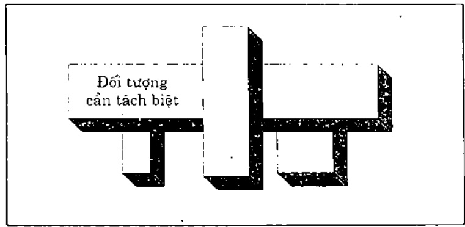

Hình 11-1. Yêu cầu tách các đối tượng.

Thí dụ về bài toán ảnh mẫu cũng tương tự; bài toán yêu cầu hiểu được hình ảnh. Hình vẽ cho thấy nhiều đường ngang đọc. Cần tách thành các đối tượng phân biệt. Giả sử di từ phía trái, người ta đánh nhân đối tượng A. Làm sao xác định được điểm cuối của đường ngang ? Không thể không quan tâm đến đối tượng thẳng đúng đang che đối tượng A.

<!-- page: 320 -->

Thứ hai lǜ khó khan trong việc hiểu về nhận thức. Khó khan này la sự liên hệ bản chất dải tồn tại trong bản thân đối tượng. Môi tín hiệu vào có nhiều thuộc tỉnh liên hệ nhau, cần được xử lý theo các kỹ thuật so sánh khớp.

## Thi du

Người ta cho hai nguồn khác nhau nói cùng một câu. Phân tích phố của hai câu sẻ khác nhau. Âm thanh phân bổ theo thời gian, cường độ... của hai câu cũng khác nhau. Cũng như có hai hình ảnh của một ngói nhà. Trọng hình cho thấy chúng khác nhau tương đối đủ rừng chủng mô tả cùng một đối tương.

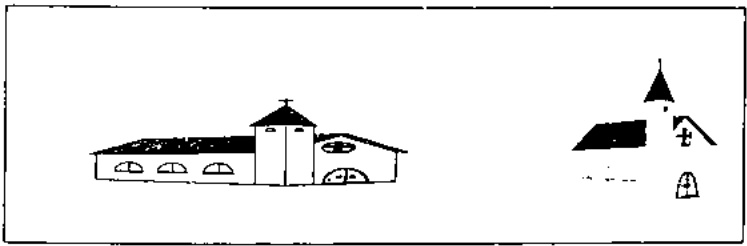

Hình 11-2. Hai hình khác nhau.

Thứ ba liên quan đến sự thật là thực tế không thể dồi hỏi các tín hiệu đến theo thời gian, hạn định 1. hự yêu cầu. Người ta có thể nói nhanh hay chậm, nhưng các tử đơn lại được nói với độ chính xác nào đó, không è à được. Nhịp trong câu nói không đúng có thể gây sai nghĩa, như đã thấy trong thí dụ trên.

## II. CÁC KỸ THUẬT GIẢI BÀI TOÁN NHẬN THỨC

Mặc dấu có những khó khăn, việc nghiên cứu hiểu tiếng nói và nhận dạng đối tượng cũng có nhiều tiến bộ. Đề thấy được các tiến bộ này, cần chia các quá trình hiểu biết theo các lĩnh vực đã được xem xét. Người ta ta chia các quá trình phân tích tiếng nói hay hình ảnh thành năm giai đoạn :

\- Số hóa. Việc số hóa phân chia các thông tin nhập vào thành các mẫu rời rạc. Trong nhận dạng tiếng nói, số hóa được thực hiện theo biên độ của tín hiệu trong khoảng nhất định, chẳng hạn 20.000 lần trong một giấy. Đối với hình ảnh, người ta chia một vùng trên ảnh thành một số cố định của phần tử, chẳng hạn 128 x 128 phần tử ảnh trên một inch vuông. Môi phần tử này được gọi là pixel.

Giá trị của mỗi pixel có thể hoặc là bit đơn, có tô đậm hoặc không. Vậy nên các điểm nhật hơn chỉ được tô một phần, hoặc điểm có màu sẽ mang trọng số của một màu cơ bản nào đó.

<!-- page: 321 -->

\- Làm trơn. Việc làm trơn giám di sự quá sai khác trong số các tín hiệu nhập vào. Bời vì thế giới thực hầu hết là liên tục, những điểm lạ trong dữ liệu nhập có thể do nhiều ngẫu nhiên.

\- Phân đoạn. Việc phân đoạn cả một dây tín hiệu cho phép nhìn nhận cai dây theo một số đoạn tín hiệu nhỏ. Điều này được thục hiện bằng cách nhóm lại các mẫu thu được sau khi số hóa, dễ được mẫu lớn hơn tương xứng với các thành phần logie của tín hiệu. Đối với việc nhận biết tiếng nói, các đoạn này ứng với cài mà người ta nghỉ về âm riêng lẻ. Các đoạn này được gọi là phone. Côn với việc nhận biết hình ảnh, các đoạn ứng với nét nào đó của đối tượng trong hình. Thường thì các đoạn gồm các đường rõ rệt.

\- Đánh nhân. Việc đánh nhân nhằm gần mỗi đoạn với một nhân để xác định được đoạn này tham gia dụng nên một đối tượng hoàn chỉnh hơn. Thí dụ gần nhân cho phone trong việc hiểu tiếng nói với chữ a, chữ s... Còn với nhận dạng hình ảnh, việc đánh nhân có nghĩa như "Đường này thể hiện bờ ngoài của hình". Việc đánh nhân để nhận biết khi nhìn chú không nhất thiết phải dùng để quyết định điều gì về đối tượng.

Do việc đánh nhân giúp nhận biết rõ hơn, có thể dùng nhiều nhân cho một đoạn để dùng trong các ngữ cảnh khác nhau, và cũng có thủ tục chọn trong số các đoạn để hạn chế việc chọn theo nhân của chúng.

\- Phân tích. Việc phân tích có nghĩa cho tất cả các đoạn có nhân vào để tạo nên một đối tượng phù hợp. Lức này cần đến việc tạo sinh đối tượng. Như vậy cần sử dụng trị thức về lĩnh vực chuyên môn. Cũng có các cách khác. Cái mà da số các thủ tục đều làm là xếp sắp sao cho các đoạn của đối tượng thỏa mãn các ràng buộc. Sở dĩ như vậy là vì trong quá trình phân tích tại mức cao, sử dụng các nhân do mức thấp hơn gần, thường có nhiều cách diễn giải khác nhau về vật dưa vào. Nhung khi các vật bên ngoài đã được công nhận, thì số các diễn giải để nhận biết tổng thể giảm di. Một nguyên nhân quan trọng của điều này là về hiện diện của hiệu ứng tổng thể trong tín hiệu. Trong nhận biết tiếng nói, ngữ diệu là cái cho thấy hiệu ứng tổng thể; trong nhận dạng hình ảnh thì đó là vật nhỏ như nguồn sáng.

Một kỹ thuật tổ hợp các quá trình này vào một hệ thống đơn là bảng đen, đã được giới thiệu sơ qua. Bảng đen cho người ta cách tốt nhất để tích hợp nhận dạng từ trên xuống với nhận dạng từ dưới lên. Cả hai cách nhận dạng này đều quan trọng trong các tỉnh hướng phúc tạp. Bảng đen cũng có thể tiến hành quá trình nhận biết từ điểm cụ thể về phía các vật lớn hơn và không rõ ràng. Các đoạn khởi đầu, dễ nhận biết được gọi là các đảo. Người ta dùng tiếp cận này bởi vi thông thường các tử chính trong câu thường được phát ra rõ ràng hơn các từ ít quan trọng khác.

<!-- page: 322 -->

## III. THỔA MẢN RẢNG BUỘC

Thông qua các thí dụ nhận biết các hình bảng cách cho thoa măn các ràng buộc, các nội dung sau đây sẽ cho thấy vai trò của perceptron.

## III.1. Các ràng buộc trong hình

Ngay khi phân tích bờ ngoài một hình đã phát sinh yêu cầu nhận thức với độ phúc tạp cao. Số các thiên giải gần cho các thành phần riêng lẻ của đối tượng đưa vào phân tích là không ít, và số các tổ hợp của các thành phần này cũng lớn. Tuy nhiên khi phân tích kĩ càng hơn thì nhiều tổ hợp không hợp lý bị loại bỏ. Các ràng buộc tự nhiên được dùng trong quả trình nhận biết để làm giảm độ phúc tạp từ cải lớn xây về cái sắp xếp được. Phân này sẽ trình bày một thí dụ về cách làm này trong perceptron.

Có hai bước quan trọng trong việc sử dụng các ràng buộc khi giải bài toán :

1. Phân tích lĩnh vực bài toán đề xác định được ràng buộc gồm những gì.

2. Giải giá trị bằng cách áp dụng thuật toán thỏa mãn ràng buộc. Các ràng buộc trong bước trên được dùng trong thuật toán này như điều kiện tìm kiếm.

Dế minh họa các bước trên, người ta dùng ý tương của Waltz dua ra năm 1975 cho các bài toán đánh nhân các đường vẽ.

Thí dụ

Người ta không rõ hình vẽ trong thí dụ là hình hộp nhỏ ở trên hình hộp lớn hay lỗ trống có dạng hình chữ nhật. Việc xác định rõ hình dạng đối tượng quan trọng đối với, con người cũng như đối với chương trình nhận dạng tự động perceptron.

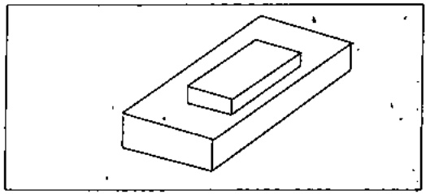

Hình 11-3. Cần đánh nhân các đường về đề nhận biết hình rõ hơn.

Có hình về được coi như dữ liệu nhập vào hoặc thu nhận được từ các mức thấp hơn. Bước tiếp theo của quá trình phân tích là xác định các đối tượng được hình về mô

<!-- page: 323 -->

tã. Dé làm được, cản định tên các đường trong hình, xem ứng với trường hợp nào trong số các khả năng sau :

\- Dương ngan, từ đường biến giữa các đối tượng, hay giữa đối tượng và mật sản.

\- Bò lòm, tức là bò giáp giữa hai mật cho phép tạo nén gòe nhọn khī người ta nhìn gòe này từ phía ngoài đối tượng.

\- Bò lôi, túc là bờ giáp giữa hai mặt cho phép tạo nên gốc từ khi người ta nhìn gốc này từ phía ngoài đối tượng.

Dối với các hình phúc tạp, các loại bỏ khác như nếp gây giữa các mật kế, bờ bóng giữa bóng của hình và mật sản. Tuy nhiên ở dây người ta xét ba loại đường như trên. Thực ra người ta chi xét các hình gồm các đình tam điện, được tạo nên bởi ba mật chụm lại.

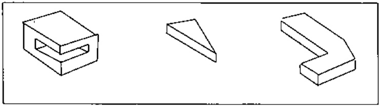

Hình 11-4. Các hình tam diện.

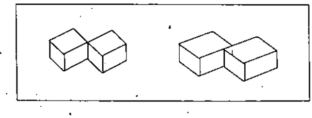

Hình 11-5. Các hình không phải là tam diện.

## III.2. Xác định các ràng buộc

Bài toán người ta cổ gắng giải là nhận dạng các đối tượng riêng lẻ trong một hình. Dé làm được điều này, người ta đánh nhân các đường trong hình để biết đường nào là

<!-- page: 324 -->

biên giữa các đối tượng. Ba loại đường trên được sử dụng. Đối với các đường biến, người ta cũng cần chỉ ra hướng, để biết phía nào của đường ứng với đối tượng và phía nào là sàn. Do vậy một đường có bốn nhân mới mô tả được chức năng này.

Các quy ước vỡ đánh nhân đường

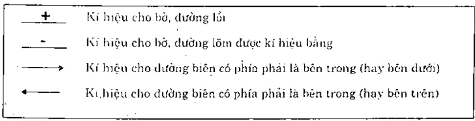

Hình 11-6. Các kí hiệu đánh nhân.

Giá sử có một hình có n đường thì với cách đánh bón loại nhân cho mối đường, có n' cách đánh nhân. Trong số các khá nâng này, cần chọn ra một phương án hợp lý. Các đường cần gặp đường khác tại định ứng với hai dấu mút. Đối với các hình tam diện, chỉ có bón cấu hình mô tả tất cả các dính có thể xảy ra. Bốn cấu hình này được giới thiệu trong hình dưới đây. Vị trí xoay của dính không có ý nghĩa, cũng như độ lớn của góc không được phân biệt rõ mà chỉ đánh giá góc nhận hay góc tù. Người là phân biệt góc bằng kí hiệu "ngà ba" hay "mũi tên".

Thí dụ

Hình về trên được đánh nhân.

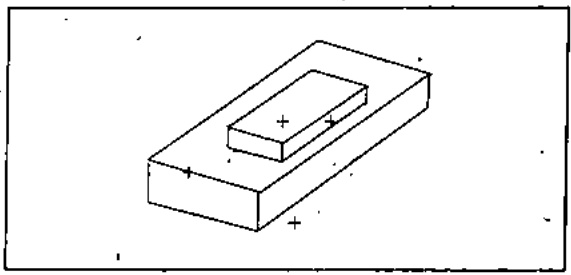

Hình 11-7. Đánh nhân hải hình hộp.

<!-- page: 325 -->

Nếu các ràng buộc về đường được gần thêm thông số về định đi cùng thì số các ràng buộc về đường phải quản lý sẽ giảm đi.

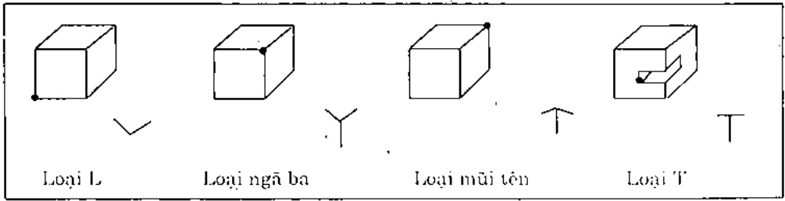

Hình 11-8. Bộn cứu hình của định hình tam điện. Chấm dạm là nơi quan sát.

Đế bất dấu tìm các ràng buộc về đình như thế, trước tiền người tại xet số cách cúc đại mà bốn loại đường có thể tố hợp với các đường khác tại một định. Do định L cần hai đường. mỗi đường có bốn nhân, có tổng cộng mươi sáu tổ hợp. Các loại ngã ba, mũi tên hay T cần có ba đường, vậy chúng tạo nên sáu mươi tư tổ hợp khác nhau cho mỗi loại. Vậy nên số tổng cộng các cách mà dinh tam điện có thể tạo nên là 208. Tuy nhiên sự thực thì chỉ một số ít các nhân này có mật trong đối tượng thực.

Đế thấy các định được tạo ra như thế nào, người ta có thể xét ba mật phẳng. Các mật phẳng không đối một trùng nhau, thì tạo nên tấm phân không gian. Mỗi phẫu ấy xem như một bất diện. Do cách tổ từng phân không gian ấy mà dùng tại phân không tổ người ta quan sát được cấu tạo của đình.

Không gian chật hep được bao bằng đường chấm chấm bị các mặt phẳng tại:dính A chia ra tám phân. Người ta đúng từ bảy phân mà quan sát phân được giới hạn bởi đường-liên. Các cấu hình và các nhân của dinh A được ghi nhận.

Thí dụ

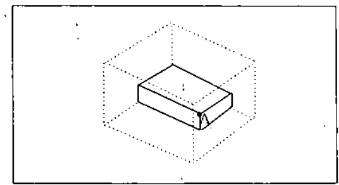

Hình 11-9. Tám phần không gian được chia từ điểm A.

<!-- page: 326 -->

Có bảy loại mô tả Nếu dùng bảy loại mô tả và loại bỏ các biến đòn do thay đổi độ lớn của gốc hoặc xoxy gốc thì chỉ còn lại bốn loại.

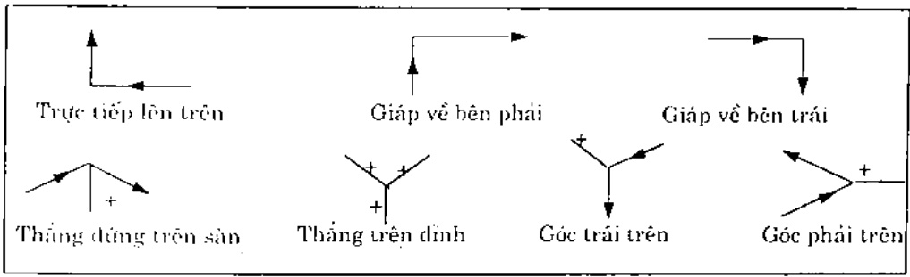

Hình 11-10. Cấu hình của dính A từ phía các phần không gian.

Nếu người ta tiếp tục quá trình này đối với việc tổ màu cả bảy hình bất diện. kết quả thu được sẽ là danh sách đầy đủ các định tam diện và các nhân. Số lượng 208 dính khác nhau chỉ là con số lý thuyết, thực ra chỉ có 18 trường hợp là có thể. Do đó người ta đã xác định được ràng buộc chất chế cho các cách đánh nhân các đường trong các hình thực.

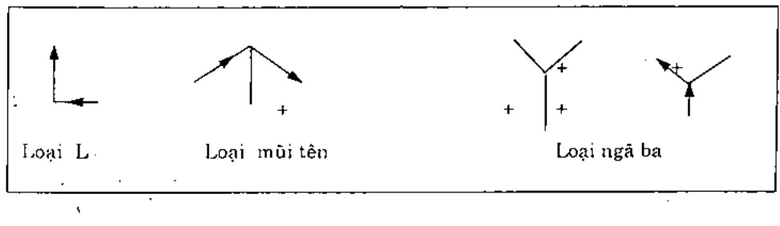

Hình 11-11. Các định của hình bất diện.

Dĩ nhiên tại điểm này người ta chỉ thấy các ràng buộc về cách đánh nhân đối với các dính tam điện. Các hình có các dính không thuộc loại dính tam điện sẽ có các dính ngoài 18 loại kể trên. Khi đó số các dính về lý thuyết cũng sẽ tăng so với 208 dính, và tỉ lệ các dính thực tế sẽ có so với các dính về lý thuyết còn nhỏ hơn tỉ lệ 18/208.

<!-- page: 327 -->

## III.3. Dùng các ràng buộc trong các bài toán phân tích

Phân trên vừa phân tích bài toán và áp dụng các ràng buộc trên các đối tượng của bài toán thuộc lĩnh vực nhận biết. Ngoài ra cần áp dụng các ràng buộc này cho bài toán phân tích đối tượng nhập vào một lĩnh vực. Vấn công việc này, người ta dùng một dạng thú tục thỏa mãn ràng buộc, hay còn được gọi là thuật toán Waltz, dưa ra năm 1975. Thủ tục dùng các ràng buộc ngay khi chúng được xác định, để số các nhân cần quản lý giảm đến tối thiểu.

Thủ tục sẽ chọn một dinh và tìm ra các nhân. Sạ đó nó di tiếp đến dinh kể bên để tìm ra nhân mà dính có thể nhận. Đường di tử dính thủ nhất sang dinh thủ hai chỉ có một nhân, và nhân này là bền vững đối với hai dính. Do vậy nếu bất kì việc đánh nhân nào tiến hành trên một trong hai dính này mà làm nhận đường không bền vững, tức là phải thay đổi so với dính kia thì cấu huỷ bổ nhân đó.

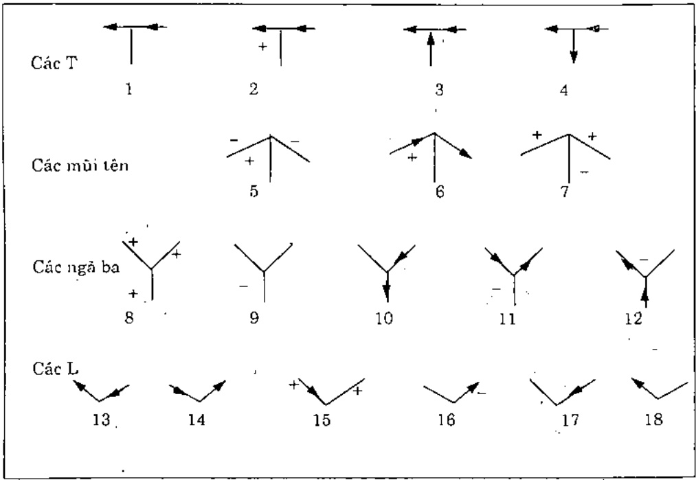

Hình 11-12. Mười tấm khả năng có được đối với các định tam diện.

<!-- page: 328 -->

Nếu có định khác kê một trong hai định này được đánh nhân, thì ràng buộc môi được tạo ra, truyền trở lại các định vừa được đánh nhân, để cho tập khả năng đánh nhân sẽ giám chỉ.

Qui trình này tiền hành cho đến khi tất cả các định được đánh nhân.

## Thí dụ

Có hình về. Bước thử nhất người ta đánh nhân các gò biến. Bước thử hai người ta bất dầu đánh nhân định tại dính số 1. Nhân dính duy nhất bên vùng với các nhân đường đã biết là 13. Tại dính 2, nhân bên vùng duy nhất là 6. Tại mỗi dính biến còn lại, chỉ có một nhân được chọn. Bước thử ba người ta loại trừ bót các nhân đường: cháng hạn nhìn đường nổi từ dính 2 với dính 7, người ta thấy đường này cần mang đầu "+" . Sở dĩ như vay là vị rõ ràng ràng đường này là bò lôi. Dựa vào kết luận này, trong số các nhân "ngà ba" 8-12 trong số 18 dính tam diện thực tế có thể xảy ra, người ta chọn loại ngà ba thứ 8. Vây dính 7 sẽ thuộc loại có ba gò lôi.

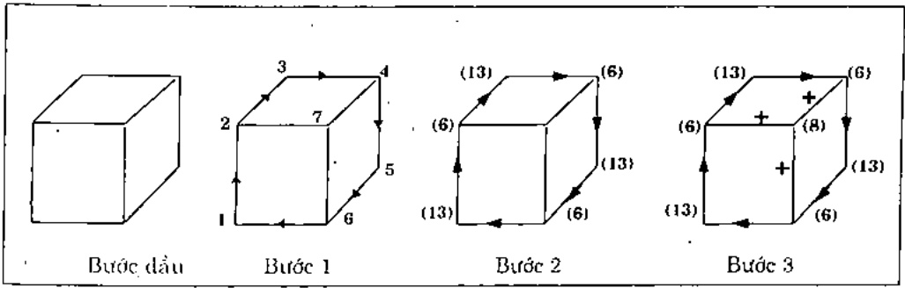

Hình 11-13. Các bước của thủ tục đánh nhân.

Thuật toán, hay thủ tục chi tiết được phát biểu như sau :

Bước 1. Tím các đường tại biên hay go của hình và đánh nhân chứng. Các đường này có thể tìm thấy được do không có dinh nào ở bên ngoài nó.

Buốc 2. Dánh số các định của hình được phân tích. Các số này sẽ tương ứng với trật tự duyệt các định trong quá trình đánh nhân. Đề đánh số, thực hiện các bước nhỏ sau :

2.1. Bất dấu tại đình bất ki trên biên. Vi các đường biên đã biết, các đình cần được ràng buộc nhiều hơn so với các định bên trong.

2.2. Đi chuyển từ đình này đọc theo biên đến định kê bên chưa có số và tiếp tục cho đến khi tất cả đình trên biên được đánh số.

<!-- page: 329 -->

2.3. Đánh số các dinh bên trong bảng cách di chuyển từ một dinh đã được đánh số đến dinh chua có số. Do luôn luôn đánh số các dinh kể tiếp của các dinh đã được đánh số, tỉnh được số các ràng buộc tối đa cần sử dụng.

Bước 3. Thảm mỗi định V theo trật tự và đánh nhân nó theo các bước nhỏ sau :

3.1. Dùng tập các định thực tế có được, nhự tập 18 định đã giới thiệu, gần cho V một danh sách các nhân mà V có thể nhận.

3.2. Xem có thể loại bỏ nhân nào trong số các nhân trong danh sách, nhà các ràng buộc cục bộ. Như vậy cần kiểm tra mỗi dính A kể dính V mà A đã được duyệt. Đối với mỗi khả năng đánh nhân V, cần xem xét các khả năng đánh nhân đường nổi AV, để loại bỏ bột các khả năng nhưng ít nhất vấn còn một khả năng đánh nhân V. Loại bỏ các khả năng không phù hợp trong danh sách khả năng của nhân dính V.

3.3. Dùng tập nhân vừa gắn với V để ràng buộc việc đánh nhân tại định kế với V. Đối với mỗi định A đã được thảm trong bước trước, thực hiện các bước nhỏ sau:

\- Loại bỏ các nhân của định A không bên vững với ít nhất một nhân của định V.

\- Nếu có nhân bị loại, cần truyền di ràng buộc bằng cách kiểm tra các đình kê với A và kiểm tra tính bền vững với tập nhân đã hạn chế gắn với đình A.

\- Tiếp tục truyền di các ràng buộc cho đến khi không còn định có nhân kể bên hoặc không còn thay đổi gì đối với tập nhân đã có.

Thủ tục này luôn tìm ra·nhãn đúng duy nhất, nếu có nhân. Nếu hình nhập nhẳng, thủ tục sẽ kết thúc với ít nhất một định được gắn nhiều nhân.

Thực sự thì thủ tục này được dùng cho lớp nhiều hình, trong đó có thể có nếp gây và đường bóng. Tuy nhiên thao tác của thủ tục vẫn như vậy, trừ phì kích thước của bảng các nhân của định là khác nhau. Thực tế tính hữu dụng của thủ tục là lớn khi tăng kích thước của lĩnh vực nhận thức; do vậy tỉ lệ giữa khả năng thực xảy ra so với các khả năng lý thuyết nhỏ di. Chương trình của Waltz dùng thông tin về hình bóng và sử dụng thông tin này để hiện ra các đường bóng khi có nguồn sáng, như cách thức khai thác các ràng buộc tổng thể.

## IV. KÊT LUẬN

Phân này đã liệt kê các khó khăn chính trong thiết kê các nhiệm vụ nhận thức. Người ta mô tả cách dùng thủ tục thỏa mãn ràng buộc như cách vượt qua các khó khăn này.

<!-- page: 330 -->

Một vải bài toán về nhận biết hình ảnh và tiếng nói tố ra quan trọng trong việc câu trước các-chương trình độc lập để giải một nhiệm vụ cụ thể. Mặt khác nó cũng đóng vai trò quan trọng trong lĩnh vực lớn hơn như là người máy. Trong các bài toán về người máy, các người máy thông minh cần giải quyết một số chức năng một cách độc lập. Việc nhận biết tự động trong bài toán người máy là cần thiết.

<!-- page: 331 -->

# PHÂN III.

# Học và nhận dạng quy luật

Nội dung học và nhận dạng quy luật được trình bày trong nhiều chương. Đại thể có thế chia ra hai loại học. Loại thứ nhất dựa trên ghép thông tin mới với các tri thức đã thu được từ trước, thường liên quan đến suy lý. Các nội dung nhỏ gồm có :

\- Học theo cách phân tích sự khác nhau. Phân nây sẽ giới thiệu cách dùng may rủi về quy nạp, nhu网点 các yếu cầu, loại bỏ liên kết, để phân tích các sự khác biệt trong dây các quan sát. Các may rủi về quy nạp cho phép dùng phương pháp trượt gần giống để học hình dáng của những cải vòm. Trong quá trình học, các yếu tố khích lệ giữa thấy giáo và học sinh giúp cho việc học trở nên dễ dàng hơn.

\- Học theo cách quản lý da mô hình. Phân này cho biết cách dùng các ví dụ thuận và nghịch để tạo nên không gian thể hệ, cho phép người ta quay trở về mức thấp là mức thành viên của một lớp. Tuy sử dụng cả hai loại thí dụ là thí dụ thuận và thí dụ nghịch, cũng có thể bò qua các thí dụ nghịch nếu người ta có thể giữ được vết của các mô tả.

\- Học bằng cách giải thích kinh nghiệm. Cách này cho thấy có thể học từ các kinh nghiệm đã qua. Qua thí dụ Maebeth, người ta thấy một loại học dựa trên diễn giải. Thí dụ này liên quan đến dạng và chức năng, cho phép học như định nghĩa từng chức năng, từ tri thức có trước đến các đối tượng khác, từ mô tả vật lý đến việc mô tả đối tượng cụ thể.

\- Học bằng cách chính lý các lỗi sai. Các thủ tục học bằng cách chính lý sai sót có thể sửa các trị thức đã thu luợm được từ trước bằng cách khai thác các lỗi của nó. Cụ thể, chương trình sửa trình thức dùng mô hình xác định. Chắng hạn người ta coi cải xã như cái chén. Chương trình này khẳng định cái xã không phải là cái chén, và cải chén cũng không dem trẹo lên được.

Loại học thú hai dựa trên việc đào sâu các quy luật hữu dụng từ các dữ liệu, đôi khi được coi là truy tìm trong cơ sở dữ liệu. Loại này được trình bày với các nội dung chi tiết nhu sau :

\- Học bằng cách ghi nhận các trường hợp. Cách này cho biết việc học bằng cách ghi lại các tỉnh huống, phòng khi cần xử lý thông tin tỉnh huống. Người ta

<!-- page: 332 -->

học về may rủi bền vững, cho biết cách tìm người lắng giếng gần nhất trong không gian đặc tính nhỏ cây KD.

\- Học bằng các xây dựng cây định tên. Phương pháp dụng cấy định tên được dùng rộng rãi nhất cho việc học. Phương pháp này kiểm tra và lắp ráp cây định tên. Cây định tên này có thể chuyển thành một tập các luật nhân quả dễ hiểu hơn.

\- Học bằng cách huấn luyện mạng thần kinh. Học theo phương pháp này cần biết cách thức các phần từ nondon được sắp xếp trong mạng có thể dùng vào việc nhận dạng các mẫu, và cách các mạng thần kinh có thể học thông qua cơ chế của thử tục truyền ngược.

\- Học bằng cách huấn luyện perceptron. Perceptron được coi như loại đặc biệt của mạng thần kinh. Người ta giới thiệu thủ tục hội tụ perceptron, đảm bảo tìm thấy tập các trọng số perceptron để giải bài toán đã cho.

\- Học bằng cách huấn luyện các mạng xấp xỉ. Nhỏ các mạng xấp xỉ và nội suy, con người có thể học. Các mạng này được coi như trường hợp đặc biệt của mạng thần kinh.

\- Học bằng cách mô phỏng sự tiến hóa. Người ta học cách tìm kiếm nhỏ các thủ tục phát triển theo tiến hóa tự nhiên. Các thủ tục này thường được gọi là thuật toán sinh, mang ý tưởng liên quan đến các vấn đề về cá thể, việc ghép đồi, giao nhau về nhiễm sắc thể, đốt biến gien, làm phù hợp và chọn lọc tự nhiên. Ngoài ra việc học này cho biết cách khối rời vào cục bộ địa phương là tăng số lượng phần từ thay vi tránh nó.

<!-- page: 333 -->

# HỌC BẰNG CÁCH PHÂN TÍCH SỰ KHÁC NHAU

Các khác nhau trong dây các quan sát được phân tích trong chương này. Theo cách này, người ta học các phép may rủi về quy nạp. Các may rủi này giúp ích cho các bước mô tả lớp theo các thí dụ thuận và thí dụ nghịch, và cho phép người ta học về cải vòm có hai giá dở. Trong số các may rủi cần thiết có may rủi liên kết các yêu cầu, liên kết cảm, dùng để học về lớp thông qua các thí dụ trượt gần giống, mà trượt này là các phân tử của lớp.

Người ra chương này cũng giới thiệu các điều kiện thích hợp, được cơ như thỏa thuận giữa thay giáo và học sinh để tiến hành việc học.

Bảng cách minh họa, người ta xét các chương trình học đơn giản với sự có mật của giáo viên hợp tác để thể hiện các thí dụ đã được chọn cần thận, hết thí dụ này đến thí dụ khác. Thủ tục này học những gì học được từ mỗi thí dụ, và quen di các thí dụ trước đó.

Nhú-vây, chương này cung cấp cho người ta những hiểu biết về may rủi quy nạp, hiểu biết về thỏa thuận cần thiết giữa giáo viên và học sinh. Người ta có thể dùng trì thức này để xây dựng chương trình học, và tự hướng mình thành người thay, người trò hiệu quả hơn.

## I. CÁC MAY RỦI QUY NẬP .

## · I.1. Thí dụ

Đình nghĩa 12-1 : Quy nạp (Induction heuristics)

Quy nạp xảy ra khi người ta dùng các thi dụ cụ thể đề đạt đến các kết luận tổng quát.

<!-- page: 334 -->

Thủ tục W trong phần này dùng phép may rải quy nạp, học nhận dạng cản vòm từ các vòm và dời tương không phần là vòm. Qua đó nguồn ta se thấy các tư tưởng về việc học mang tính nguồn cũng như việc học của máy.

Trong thì dụ đầu tiên trong hình, thủ tục W rút ra quy luật tổng quait để biết vòm là cản có hai viên gạch làm giá độ cho viên gạch nằm. Thị dụ này kháng định cản vòm, được gọi là thí dụ thuận. Thị dụ thứ hai có cấu hình khác, không phải vòm. Đỏ la thí dụ nghịch. Thù tục nhận thấy các liên kết hỗ trợ là khóa cạnh quan trọng trong khái niệm chung về vòm. Văn đề ở đây là thì dụ nghịch phải được chọn tốt, chữ không phải là thì dụ mở rộng ra từ thì dụ thuận, hay thì dụ nghịch khác.

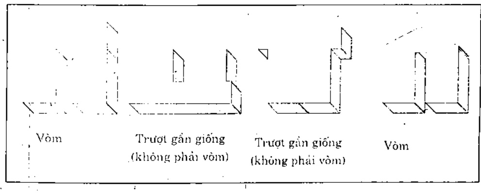

Hinh 12-1. Học về cản vòm.

Trong thí dụ thứ ba, hai viên gạch đúng sát nhau; thủ tục W cho ràng đó là thí dụ ughịch, không phải vòm. Không có điều gì khác làm so với vòm thứ nhất. Do vậy rút được khẳng định về hai viên gạch không được sát nhau. Đáy cũng là thí dụ tốt.

Giáo viên có thể hoặc không dưa tiếp thí dụ thứ tư, tùy theo phương pháp của từng người. Nếu dùng thí dụ này, thủ tục W nhận thấy viên gạch ngang là không nhất thiết. Thủ tục sẽ doán ràng chỉ cần vật gì đó trên hai viên gạch.

## I.2. Cải thiện mô hình nhỏ các trượt gần giống

Thủ tục W cần bất dấu từ phần tử đặc trưng của lớp các phận từ cần được học. Chẳng hạn thủ tục W xây dựng mô tả khối dấu. Sau đó mô tả này được làm rõ bằng các thông tin chỉ ra các liên kết quan trọng. Các mô tả bổ sung sẽ cùng có mô hình tiến hóa.

<!-- page: 335 -->

Một trượt gần giống là một thí dụ nghịch với một số ít lí do, không phải là phần tử trong lớp đối tượng đang xét.

## Thi du

So sánh hai hình để thấy được vau trò của giả dō. Mô tả đối tượng với một chút sai khác ấy được gọi là ưu Cot gần giống.

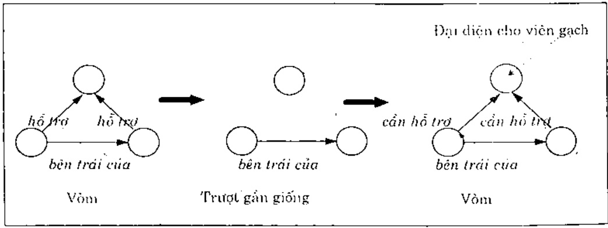

Hình 12-2. Cải thiện mô hình cải vòm,

Hình về cho thấy luật tạo các liên kết yêu cầu. So sánh hình trái và hình giữa, thấy thiếu cung "hỗ trợ". thủ tục rút ra kết luận cung này là cần thiết và thay đổi mô hình về cái vòm. Mô hình đã thay đổi này nhận thức cung "hỗ trợ" là cần thiết. Tuy nhiên có cung như "bên trái của" không vật cần thiết. Các liên kết không cần có thể không được thể hiện để khởi làm phân tán việc học.

Thủ tục W kết hợp hai thi dụ đầu thành thí dụ thứ ba có cung liên kết là "cần hỗ trợ". Theo cách này, trượt gần giống đã cung cấp thông tin cho phép may rủi về, liên kết yêu cầu. Sau khi thủ tục W dùng may rủi này, không một nhóm đối tượng nào được coi là vòm mà không có giá đỡ.

Lưu ý ràng trong thí dụ trượt gần giống, hai cung bị bỏ đi. Tuy rằng hai cung được xử lý tương tự nhỏ thủ tục W, có thể coi đó là hai sự khác nhau giữa các thí dụ, hoặc coi đó chỉ là một sự sai khác. Giáo viên thông qua thủ tục W có thể kết luận ràng hại sự khác nhau được xử lý bằng cùng một cách.

Còn việc so sánh sai khác đối với trường hợp hai viên gạch đã sát nhau : có hai sai khác vì hai cung "giáp nhau" hai bên vòm. Lức này thủ tục W kết luận rằng các cung này bị cấm, và chuyển các liên kết này thành liên kết nghieh cần để ý. Như vậy, thủ tục được gọi là đã dùng may rủi liên kết cấm.

<!-- page: 336 -->

Các phép may rủi hèn kết yêu cầu và may rủi hèn kết cần hoạt động vi các mô tả mang các thông tư cơ bán và việc số sánh các mô tả dam bao có được các kết luận phù hợp. Có các nguyênISTIC :

\- Ngàu ta khòng the hoc nếu không hiêu.

Các giáo viên tối giúp các học sinh có được các thể hiện trị thức cần thiết.

\- Người ta không thể học nếu không thể tách được điều nào la quan trọng. Giáo viên tốt giúp các học sinh có không chỉ các thi du thuận mà con các thi du nghịch và thi du truất gần giống.

Thí dụ

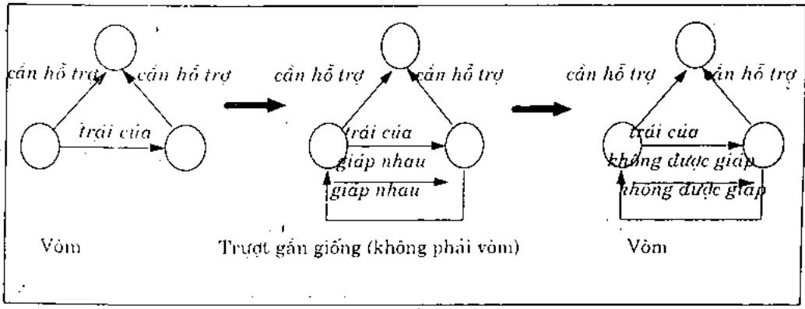

Hình 12-3. Các liên kết cảm.

## I.3. Cải thiện các mô hình nhỏ các thí dụ

Người tả thấy rằng các thí dụ trượt gần giống làm hạn chế mô hình, hạn chế khá nâng một đối tượng là cái vòm. Các thí dụ thuận nối lỏng mô hình, cho nhiều khá nâng đối tượng là cái vòm. Trong thí dụ sau, cấuhình sau cho thấy cái nêm được thay cho hòn gạch nằm ngang. Nếu đối tượng là cái vòm, thủ tục W cần.thay đổi mô hình dễ thể hiện được ràng buộc nói lỏng. Cung "là một" có thể được thay bằng cung cho lớp tổng quát hơn, là "cán-là". Do vậy, thủ tục W được gọi là đã dùng phép may rủi leo núi.

Dĩ nhiên việc dùng lớp đối tượng chung nhất như thay "gạch" bằng "khối" chỉ là một cách. Việc thay thế này thể hiện vị trí được bảo toàn, để ý đến tính tổng quát của thủ tục W, vi "gạch" hay "nêm" đều là da diện, đối tượng vật lý, đồ vật. Liên kết "cản là một" được phát triển ra sao còn tùy thuộc vào phát triển của thủ tục W.

<!-- page: 337 -->

Dôi khi không có cấy phân loại để trèo ! Chắng hạn nếu các viên gạch và các ném không rõ có là phân tử của lớp đối tượng chung bay không, phép may rút t cấy không dùng được. Lúc này thủ tục W tạo một lớp mối có cung "cán là một". do sử dụng may rút mở rộng tập.

Nếu cháng có dôi tương nào khác gạch và nêm, thủ tục W sẻ loại bỏ hoàn t cung "là một". Khi đó nó được xem như dùng may rủi loại bỏ liên kết.

Thí dụ

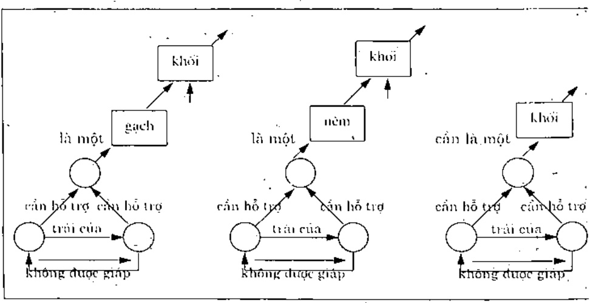

Hình 12-4. Thủ tục W sử dụng cây. Cái nêm thay cho hôn gạch nằm ngang..

Thú tục W cũng dùng may rủi loại bỏ liên kết khi liên kết trong mô hình tiến kliğng có trong thí dụ. Nếu thí dụ ban dấu có thông tin màu sắc đối với vàr khối và thí dụ khác lại không có, thủ tục W bổ qua thuộc tính màu, loại bỏ tất cả các th・chiều về màu ra khói mô hình tiến hóa.

Cuối cùng, thú tục W dùng các may rủi khác nếu có sai khác dùng đến con số. thí dụ dùng viên gạch 10 cm và thí dụ khác dùng viên 15 cm thí thủ tục W giả sử gạch có kích thước khoảng 10 - 15 cm. Lúc đó nó dùng may rủi khoảng đóng:

## 1.4. Đặc biệt hóa và tổng quát hóa

Các may rủi trượt gần giống dùng để đặc biệt hóa, còn các may rủi lifí dụ dùn lông quát hóa. Thú tục W dùng may rủi quy nạp. Các may rủi trượt gần giống, kết yêu cầu, liên kết cảm dùng để hạn chế mô hình; như các chức năng đặc biệt I. Các thí dụ thuận lông quát hóa mô hình, làm mô hình nói rộng hơn.

Một vải nhận xét kết luận :

<!-- page: 338 -->

\- Máy rủi liên kết yêu cầu được dùng khi mô hình uến hóa có một liên kết tại nơi mà thí dụ trượt gần giống không có. Liên kết mô hình được chuyển thành "cán phải...".

\- Mav rủi liên kết cẩm được dùng khi một thi dự trượt gần giống có một liên kết tại nơi mà mô hình tiến hóa không có. Loại "không được..." được thiết lập trong mô hình tiến hóa.

\- May rủi trèo cây được dùng khi một đối tượng trong mô hình tiến hóa ứng với đối tượng khác trong một thí dụ. Các liên kết "cán phải..." liên quan đến lớp phổ dụng nhất trong cây phản loại cho các đối tượng mô hình và đối tượng thí dụ.

\- Máy rủi mở rộng tập được dùng khi một đối tượng trong mô hình tiến hóa ứng với đối tượng khác trong một thí dụ và hai đối tượng này không liên hệ với nhau trên cây phân loại. Liên kết "cần là..." được trở đến lớp đối tượng mới bao gồm hợp các lớp đối tượng.

\- May rủi loại bổ liên kết được dùng khi các đối tượng là khác nhau trong mô hình tiến hóa. May rủi loại bổ lên kết cũng được dùng khi mô hình tiến hóa có liên kết không trong thí dụ. Liên kết này bị loại khôi mô hình.

\- May rủi khoảng đóng được dùng khi con số hay khoảng các giá trị trong mô hình tiến hóa ứng với con số trong thí dụ. Nếu mô hình dùng đến con số, sú này được thay bằng một khoảng từ con số thí dụ đến con số của mô hình. Nếu mô hình dùng khoảng giá trị, khoảng đó được nổi cho phù hợp với con số trong thí dụ.

Sau dây là thủ tục sử dụng các may rủi vừa nêu.

Đế đặc biệt hóa hay hạn chế mô hình, người ta thực hiện các bước :

1. Khóp mô hình tiến hóa với thí dụ để thiết lập sự tương ứng giữa các phần.

2. Quyết định xem có sai khác đơn lẻ, quan trọng nhất giữa mô hình tiến hóa và trượt gần giống hay không.

2.1. Nếu có sai khác đơn, quan trọng nhất, thì :

\- Nếu mô hình tiến hóa có liên kết không có trong trượt gần giống, dùng may rủi liên kết yếu câu.

\- Nếu trượt gần giống có liên kết không có trong mô hình tiến hóa, dùng may rủi loại bỏ liên kết.

2.2. Ngược lại, bổ qua thi dụ này.

Đế làm mô hình tổng quát hơn, người ta thực hiện các bước :

1. Kháp mô hình tiến hóa với thí dụ để thiết lập sự tương ứng giữa các phần.

<!-- page: 339 -->

2. Đối với mối sai khác, xác định loại sai khác :

2.1. Nếu liên kết trở đến một lớp trong mô hình tiến hóa khác với lớp được trở trong thí dụ, thi :

\- Nếu các lớp là phân của cây phân loại, dùng thử tục trên cây.

\- Nếu các lớp tạo thành một tập đã vết can, dùng may rủi loại bổ liên kết.

\- Nguge lai, dùng may rủi mỏ rộng tập.

2.2. Nếu liên kết không có trong thí dụ, dùng may rủi loại bó liên kết.

2.3. Nếu sai khác là sai khác về số, khoáng, dùng may rủi khoáng đóng.

2.4. Ngược lại, bổ qua sai khác này.

Trong thủ tục trên, phép đặc biệt hóa không thực hiện nếu không định ra được sai khác quan trọng nhất. Một cách định được sai khác quan trọng nhất là dùng thủ tục cho phép xếp ra tất cả các đối tượng theo loại sai khác và theo loại liên kết.

Cả tổng quát hóa lẫn đặc biệt hóa đều sử dụng phép khớp. Việc so sánh khác được tiến hành trong một thủ tục khớp các nút phù hợp.

## I.5. Một số nguyên tắc trong thủ tục học

Như các phần trên, thủ tục W dùng các thí dụ do giáo viên cung cấp theo trật tự cũng do giáo viên định ra. Người học phân tích mỗi thí dụ được giao và không bỏ sót, thí dụ nào.

Người học dùng thủ tục W theo cách :

1. Dùng mô tả của thí dụ đầu tiên, coi đó là thí dụ khối đầu.

2. Với các thi dụ tiếp theo, thực hiện :

\- Nếu thí dụ là trượt gần giống, dùng thủ tục đặc biệt hóa.

\- Nếu thí dụ là thí dụ thường, dùng thủ tục tổng quát hóa.

Thủ tục W không bao giờ học lại thi dụ đã qua. Về nguyên tắc, thủ tục này có thể không học, nhưng cũng cho biết lí do. Việc không học những điều không dáng học cũng là điều tốt. Có nguyên tắc sau :

Nguyên tắc đội và xem

Khi có nghi ngò về điều cần làm, không làm gì cả.

Cũng có thể điều này là quá bảo thủ vì chăng có gì tuyệt đối an toàn cả ! Tuy nhiên phải làm vậy là để tránh các khó khăn không dáng có. Theo nguyên tắc này, người học bỏ qua điều không cần thiết, chỉ chò dợi các các tình huống khác nhau dễ

<!-- page: 340 -->

học. Thủ tục W dùng nguyên tắc đoi và xem khi nó bò qua các thí dụ nghịch mà trong thí dụ này nó không định ra được sai khác đơn và quan trọng nhất.

Giáo viên trong thủ tục W có thể giúp thủ tục tránh khởi nhu cầu bỏ qua các thi du nghịch bằng cách đảm bảo rằng các thi du nghịch là trượt gần giống có ý tốt. Ngoài ra, giáo viên và học sinh có thể nhất trí về các loại khác nhau để quan niệm về quan trọng nhất của học sinh sẽ giống với quan niệm sau này của giáo viên. Thoai thuận giữa giáo viên và học sinh để tiện cho việc học được gọi là các điều kiện thuận lợi, cần được ngâm định hơn là phải nói rõ ra.

Cho dù có hỗ trợ của điều kiện thuận lợi, cũng có tỉnh huống mà mô hình không bền vững với một vài thí dụ, tuy mô hình là đúng đán. Chắng hạn chim cánh cụt là con chim, tuy là nó không bay được. Trong tỉnh huống này phải dùng nguyên tắc khác.

## Nguyên tắc không thay đổi

Khi một đối tượng hay tinh hướng được xen nhu thi dụ không khớp với mô hình tổng quát, hây tạo ra mô hình khác cho trường hợp đặc biệt này.

Do vay, nguyên tắc doci và xem cho ràng để tránh việc xây dựng mô hình, mà mô hình có thể sai, và nguyên tắc không thay đổi cho ràng tránh thay đổi mô hình cho dù nó sai, vì bắt mô hình tổng quát theo một hướng chỉ làm phá vô mô hình này.

Việc học cần được thực hiện theo từng bước nhỏ. Thủ tục W thực hiện được do nó sử dụng các trị thức nó có, cộng thêm trị thức nhỏ khi xử lý các thí dụ. Các giáo viên có kinh nghiệm hiểu rằng con người ta da phần là học theo từng bước nhỏ. Do vậy, nếu trình bày đàn trái ra nhiều kiến thức có thể làm người học lấn lộn và sai. Điều này cũng được phát biểu theo quy luật.

## Luật Martin

Người ta không thể học bất cứ điều gì, trừ phi người ta đã hiểu hầu hết về nó.

## II. ĐỊNH TÊN

Thủ tục W cho phép học các đối tượng, là cách thức định tên đối tượng. Phương pháp định tên ở dây dùng những kiến thức đã học được trong khi khớp các đối tượng chưa biết với các mô hình thích hợp.

## II.1. Các liên kết trong so sánh khớp

Một cách đề xác định đối tượng chưa biết có khớp với mô hình không là xem xét đối tượng này có tương thích với các liên kết của mô hình không. Bất kì liên kết với tên là "cần phải..." là cần có, và các liên kết "không được..." không được có trong đổi. Tượng chưa biết.

<!-- page: 341 -->

Danh giá khớp hình động hơn dời hỏi một thú tục cho phép định ra mức độ tương tự giữa đối tượng và mô hình. Đề cải đặt thú tục này, người ta cần chuyển các khár niệm trưa tương về sự tưởng tự giữa vật chưa biết với mô hình thành độ do cụ thể st U.Mt. Một cách đơn giản là dùng tính toán có trọng số đối với các liên kết tương ứng như trong thủ tục về sự tương tự hình học. Tuy nhiên cách này cũng không hay vì nổ đưa tất cả các thông tin về một con số vô trí vô giác

## II.2. Sắp xếp các mô hình

Cho có chế khớp đồ vật chưa biết với một mô hình, vấn đề la làm sào sáp xếp các mô hình này để thử nghiệm. Cỏ hai khả năng tố chức quản lý các mô hình là dùng danh sách các mô hình và các mạng tương tự.

Việc khớp vật chưa biết với các mô hình trong danh sách các mô hình được gọi là phương pháp mô tả và khớp đã được trình bày. Tuy nhiên cách này chỉ thích hợp khi số các mô hình là nhỏ.

Cách khác để sắp xếp các mô hình là sử dụng mạng tương tự. Hây tương tương một tập các mô hình được tổ chức thành mạng: các liên kết nối các cập mô hình tương tự. Giá sử cần định tên một đối tượng chưa biết. Có thể trong các lần thủ chưa phát hiện thấy mô hình nào khớp với đối tượng, nhưng đến mô hình nào mà có và khía cạnh tương tự thì theo các liên kết tương tự có thể tìm thấy mô hình thích hợp.

Rô ràng là các liên kết tương tự giữa các mô hình có thế không những chuyển tải tỉnh tương tự mà còn mô tả sự khác nhau như quy định theo đặc tả sau :

## Định nghĩa 12-2 : Mạng tương tự (Similar net)

Mang tương tự là thể hiện của mạng ngữ nghĩa, trong đó

• Các nút mô tả các mô hình.

\- Các cung nôi liên kết các mô hình tương tự.

\- Các cung được gần với các mô tả khác than.

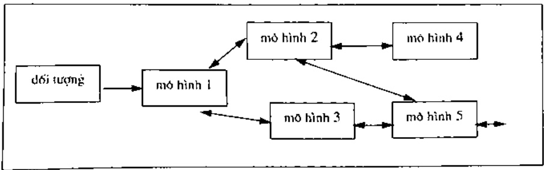

Hình 12-5. Mạng tương tự của các mô hình.

<!-- page: 342 -->

Trong thí dụ, việc dự chuyên không chỉ hướng về họ các thành phần giống nhau, mà còn về thành phần cụ thể giống đối tượng nhất, để để đến được thành công. Ngày cĩ bước dự đầu tiên mà khớp không thành công cũng không phải không có ích. Nó được gọi là thử nghiệm trí thức.

Cưới cùng lưu ý ràng thủ tục di chuyển trong mạng tương tự là thủ tục leo minus, vì bước chuyển đến nơi lắng giếng hầu như là khớp hơn so với đối tượng chưa biết.

## III. KÊT LUẬN

Về việc học bằng các phân tích sự khác nhau, hay các sai khác của cie đối tượng, có các nhân xét kết luận sau :

\- Một cách học là mô tả thí dụ ban đầu như là mô hình thứ nhất. Rối cải thiện mô hình này bằng cách sử dụng đầy các thí dụ.

\- Vài thí dụ là nghịch, là trượt gần giống. Các thí dụ này cho phép người ta trở về mô hình cốt lõi, tức cho phép người ta đặc biệt hóa các mô hình.

\- Liên kết yêu cầu và liên kết cắm là các may rủi đặc biệt hóa.

\- Vải thí dụ là các thí dụ thuận. Chủng cho phép tổng quát hóa.

\- Treo cây, mđ rộng tập, loại bó liên kết và khoảng đóng là các may rủi tổng quát hóa.

\- Người ta không thể học nếu không chỉ ra được điều quan trọng nhất. Các giáo viên tốt giúp người ta có được không chỉ các thí dụ thuận mà còn các thí dụ nghịch và trượt gần giống.

\- Người ta có thể tránh việc đoán trong khi học, vi đoán sai có thể di chệch hướng. Một cách để tránh phải đoán là tạo ra cải ngoại lệ khi một đối tượng hay ý tưởng không khớp với mô hình tổng quát. Có nguyên tắc hướng dẫn công việc này:

\- Luật Martin nói rằng người ta không thể học trừ khi đã hiểu hầu hết. Nguyên tắc khuyến người ta học từ từ từng phần nhỏ một.

<!-- page: 343 -->

# HỌC BẰNG CÁCH GIAI THÍCH KINH NGHIÊM

Phân này trình bày cách học từ kinh nghiệm thu được qua việc làm các bài tập. Cụ thể người ta học về thủ tục thực hiện với các nhân vật của Shakerpear, tên là Macbeth. Thủ tục này khớp mô tả bài tập với mô tả trước, rời truyền các giải thích từ các mô tả trước đến bài tập. Việc truyền này cho phép thủ tục xử lý các bài tập và xây dựng luật nhân quá, rời thực hiện việc học dựa trên giải thích.

Người ta sẻ thấy thủ tục này học về các nguyên nhân, về đặc tính yếu. Nó còn cho phép liên hệ dạng và chức năng. Khi cho định nghĩa chức năng của đối tượng như cái chén, thủ tục này dùng các trị thức về các đối tượng khác, cùng với mô tả vật lý của cải chén cụ thể dễtạo nên các mô tả vật lý cho phép định ra chiếc chén.

## I. HỌC VỀ LÝ DO KHIỂN CON NGƯỜI ĐÃ LÀM

## I.1. Giới thiệu

Các giáo viên thường cho trước các giả thiết và bài tập với hy vọng ràng các học sinh làm bài tập và phát hiện ra các nguyên tắc ứng dụng được cho các tỉnh hướng khác. Các học sinh cần tìm thấy sự tương ứng giữa giá thiết và bài tập, dùng các giả thiết để xử lý bài tập, khái quát hóa công việc của họ thành các nguyên tắc, rối lưu các nguyên tắc này để tìm khi cần. Loại dạy và học dùng nhiều trong quản lý, kinh tế, y học... cũng như giúp phát triển các trì thức chung về cuộc sống.

Trước hết hãy xét thí dụ như bài tập, tên là Macbeth.

## Thí dụ

Kế về tính tham lam có câu chuyện về nhà quý tộc yếu dưới và một bà tham lam. Nhà quý tộc đã cuối bà ta. Hây giải thích lí do mà nhà quý tộc muốn tró thành hoàng đế.

Truyên Macbeth kẻ về cỏ Macbeth, Duncan, và Macduff. Macbeth là quý tộc hiểm ác và cỏ Macbeth là phụ nữ đầy tham vọng, tham lam. Duncan là vua và

<!-- page: 344 -->

Macduff là nhà quý tộc. Cổ Macbeth thuyết phục Macbeth muốn trở thành vua vi có ta tham làm. Cổ ta có thể ảnh hưởng đến Macbeth vi họ đã cuối nhau và Macbeth yếu duôi. Macbeth giết vua Duncan bằng dao. Macbeth giết Duncan vi Macbeth muốn làm vua, vi Macbeth hiểm ác, và vi Duncan là vua. Rối có Macbeth tự tử. Cuối cùng thì Macduff nổi giện và giết Macbeth vi Macbeth giết vua và vi Macduff là hoàng thân.

Giả sử giáo viên đã kế truyền như đã cung cấp giả thiết, tiên đề. Học sinh cần thiết lập tương ứng nhà quý tộc với Macbeth và người phụ nữ với cò Macbeth. Tiếp theo họ cần ghí nhận bản tính của nhà quý tộc và của người đàn bà, là những thứ dưa đến ý muốn trở thành vua. Từ các tương ứng này, học sinh sẻ tạo nên loại luật nào đó cho rằng tính yếu duổi của nhà quý tộc và tính tham lam của bà vợ có thể làm cho nhà quý tộc muốn làm vua.

Chương trình tên là Macbeth có thể tạo các giải thích và học các luật mới.

## I.2. Cụ thể hóa vấn đề trừu tượng

Bước dấu tiên dùng các giả thiết là chuẩn bị mô tả phù hợp để thu được mô tả tốt. Với câu chuyên Macbeth đã cho, mạng ngũ nghĩa chuẩn có thể thể hiện các tính chất nào đó của con người, hành vi và các hành động tiếp theo của họ. Chắng hạn Macbeth và Duncan có thể được kí hiệu qua các nút, có liên kết nhỏ cung Giết.

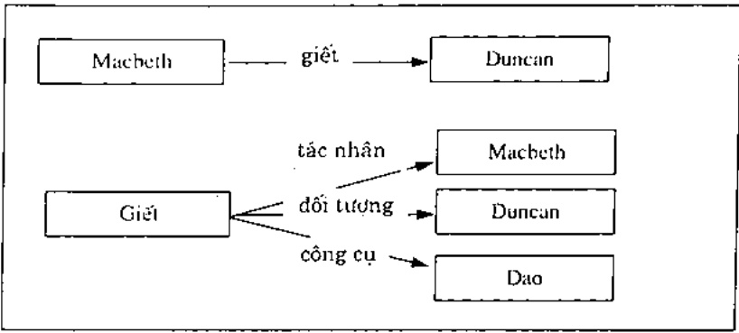

Hình 13-1. Ngũ nghĩa cho Macbeth.

Trong mạng thứ nhất chỉ gồm các liên kết chuẩn. Trong mạng thứ hai, liên kết được cụ thể hơn. Thông tin Macbeth giết vua bằng dao được mô tả rõ.

## Định nghĩa 13-1 : Cụ thể hóa (Particularity)

Việc xử lý các vấn đề trừu tượng và khó kê nhđưa về việc xử lý các vấn đề cụ thể và đề nói được gọi là cụ thể hóa.

<!-- page: 345 -->

Đo vay, việc nâng các liên kết thành trạng thái của nút mô tả được là một loại cụ thể hóa: khi đó các cung liên kết được gọi là liên kết cụ thể hóa. Nguồn ta có thể có các cung liên kết cụ thể hóa như trong hình và có thể bỏ bột các khuôn và các lên kết thừa.

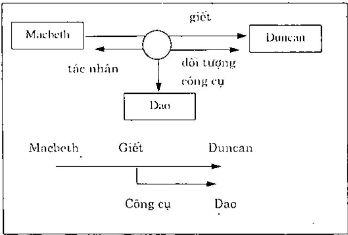

Hình 13-2. Các bên kết cụ thể hóa.

Có nhiều hèn kết kí hiệu cho hành động. Tương ứng có từ vựng dùng cho việc mô tả các liên kết. Từ vựng này cũng như từ vựng về khung các nhân vật đã được giới thiệu trong chương trước. Việc cụ thể hóa và việc dùng khung các nhân vật góp phần xác định ý nghĩa của câu chuyện.

## I.3. Giải bài toán bằng cách truyền giải thích

Với câu chuyên về tính tham lam, các cung chấm chấm mô tả quan hệ giải thích.

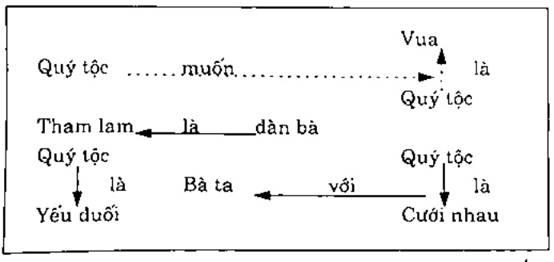

Hình 13-3. Các cung chấm chấm xác định quan hệ giải thích.

<!-- page: 346 -->

Làm sào dé biết được khá năng xảy ra một hành động hay một hành động tương tự? Hoặc hiệu có thể biết được lí do để có mối quan hệ hay một cản tương tự ? Cầu trải lời cho các vấn đề này tùy thuộc vào cung liên kết nhân qua trong tỉnh hướng đã cho. Cung nhân quả giống như cung định tên dùng trong kiểm chứng hay dự đoán. Người ta giả sử ràng hai tỉnh hướng tương tự theo khóa cạnh nào đó thì cũng la tương tự theo các khóa cạnh khác.

Đế thấy thủ tục Macbeth sử dụng các tiên để của câu chuyên về Macbeth và tính tham làm ra sao, người ta xây dựng các mạng ngữ nghĩa. Các cung liên kết nhân quai được ký hiệu bằng môn tên đậm hơn.

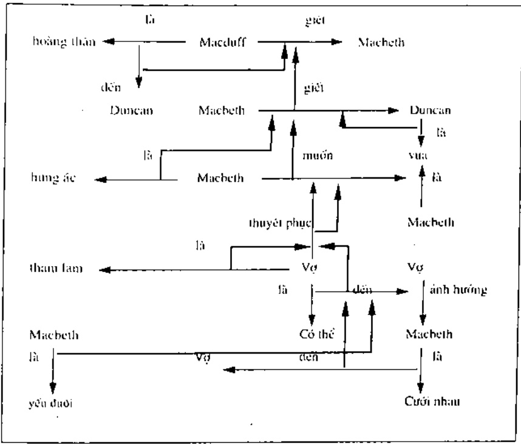

Hình 13-4. Các liên kết nhân quả được chỉ ra bằng đường đậm.

Thủ tục Macbeth tạo ra một mẫu giải thích gồm các liên kết nhân quả trong tiên đề và tất cả các liên kết gắn với liên kết nhân quả. Do vậy mẫu giải thích ghi lại tính tham làm, yếu dưới, cuối nhau để dẫn đến liên kết "muốn làm vua".

Thủ tục cần ghi nhận các đặc tính con người rời cho tương ứng với Macbeth và vợ ông ta.

<!-- page: 347 -->

Giả sử ràng sự tương tự trong các quan hệ nhân quá sẽ dẫn đến các tương tự trong các kết luận suy diễn từ các nguyên nhân này. Thủ tục giải thích liên kết "muối làm vua" trong mạng "tham lam" bằng cách truyền các mẫu giải thích từ mạng "Maebeth" sang mạng "tham lam". Một khi các giải thích được đặt với mạng, dây các liên kết nhân quá nổi các quan hệ đã biết với quan hệ "muối làm vua".

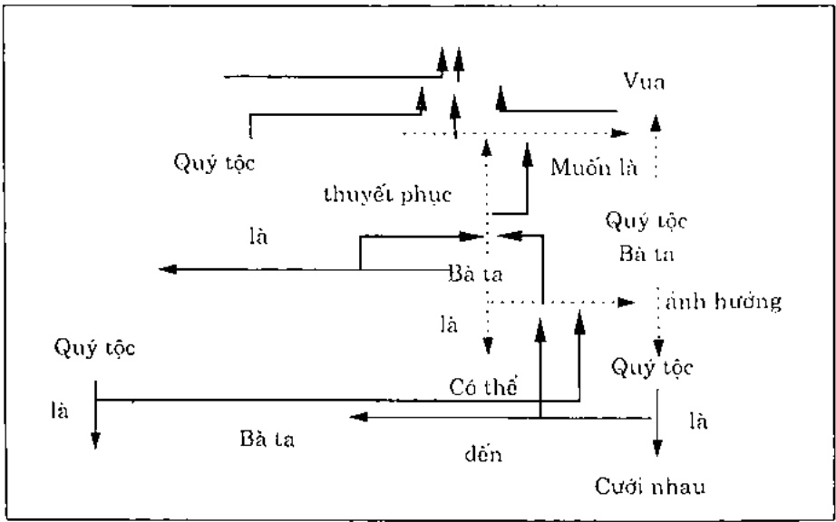

Hình 13-5. Mũi tên đậm chỉ quan hệ nhân quả.

Trong thí dụ đầu tiên chỉ có một tiền để. Với một tiền để đơn người ta không thể cung cấp toàn bộ các mẫu giải thích cần thiết. Do vậy thủ tục Macbeth nổi các mẫu giải thích với nhau. Trong thí dụ sau người ta không bảo rằng nhà quý tộc là yếu dưới nửa.

## Thí dụ

Kế về tính áp đảo, có một nhà quý tộc và một phụ nữ tham lam, hay áp đảo người khác. Hộ cuối nhau. Hây chỉ cho thấy nhà quý tộc nợ muốn làm vua.

Đó là tiên để thú nhất. Tiên để tiếp theo là câu chuyên về Mơ và Mỗ. Mơ là dàn bà, Mỗ là dàn ông. Mỗ cuối Mơ. Mỗ yêu vì anh ta một. Anh ta một môi do Mơ áp đảo.

<!-- page: 348 -->

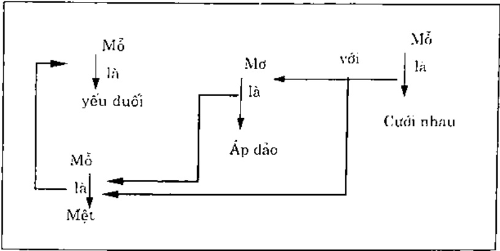

Hình 13-6. Tiên để chỉ ràng bản chất áp đảo của một người dẫn đến sự yếu dưới của bạn dồi.

Câu chuyện này có thể biểu diễn thông qua mạng. Sau đó thủ tục Macbeth hỗ trợ xử lý thông tin. Phẩn trên là câu chuyện về Mơ Mỗ, phân dưới là mạng Macbeth; hai mạng nổi nhau qua tính yếu dưới của quý tộc.

Khu tìm nguyên nhân của các liên kết, người ta thấy các mẫu giải thích rút ra từ các tiên để được dùng để hướng thủ tục Macbeth đến các nguyên nhân. Thay cho lời kết luận về các nội dung trình bày trênlà thủ tục Macbeth được giới thiệu dưới đáy :

Đế giải bài toán khi có các tiên để, thực hiện các bước sau :

1. Khốp bài tập với một tiền để bằng liên kết tương ứng với quan hệ hay một hành động được giải thích.

2. Truyền mẫu giải thích này từ tiên để sang bài tập.

3. Dò theo mẫu giải thích đã truyền. Hây xác định liên kết được giải thích này có được hỗ trợ bởi các liên kết đã có hay không ?

\- Néu có hỗ trợ, thông báo thành công.

\- Ngược lại, trong khi dùng các tiền để khác kiểm tra xem thủ tục có thể dùng đúng các liên kết cần thiết không ? có thất lạc không ? Nếu thủ tục có thể làm được thi thông báo thành công.

• Ngược lại, thông báo sai.

<!-- page: 349 -->

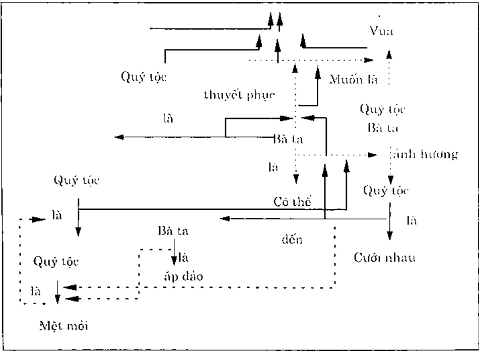

Hinh 13-7. Sử dụng cả hai tiên đô.

Thí dụ dùng hai tiên để của bài toán Macbeth và bài toán Mơ Mỗ. Bài toán Macbeth sử dụng đường dám, bài toán Mơ Mỗ sử dụng đường chấm chấm dám. Tiên đề đầu cho biết quý tộc muốn làm vua chỉ khi thiết lập được quý tộc yếu duối. Tiên đề sau cho biết quý tộc yếu do các phân tích tiếp theo.

## I.4. Các nguyên tắc giải bài toán tổng quát

Khi các mẫu giải thích được dùng để giải thích một quan hệ hay một hành động, chứng đảm bảo một cây AND cho phép nổi nhịp cầu qua khoảng cách giữa quan hệ/hành động chưa biết với quan hệ/hành động đã biết. Gốc cây AND ứng với quan hệ/hành động cần giải thích và lá cây ứng với quan hệ/hành động đã có; các nút ứng với các liên kết nối bởi quan hệ nhân quả trong các mẫu giải thích.

Nếu bài tập là một bài tập tốt, nói chung cây AND sẽ là cấu nói tốt, không chỉ trong một bài tập. Thử tục Macbeth dùng cây AND để khẳng định như một mô tả môi để dùng sau này.

<!-- page: 350 -->

Viec dùng cây AND trong thu lục Macbeth :

1 Tim cay AND tung với các mãu giải thích cho bài tập.

2. Dùng máy rủi quy nạp treo cây, tổng quát hóa các tác nhân và các đối tượng xuất hiện trong cây AND.

3. Xây dựng mơ tả môi bằng cách dùng các liên kết xuất hiện trong cây AND và tổng quát hóa các tác nhân và các đối tượng.

Do mô tả mới có thể cần một số trong các mẫu giản thích, việc này được gọi là thu thập lại. Thụt ngũ mang ý các trị thức được tập hợp theo cách mới, đó là tập hợp lại. Trong thí dụ đơn giản như Macbeth, tính tham, việc tập hợp lại tổng hợp từ tiến đế. Việc tập hợp được mình hoạt trong hình về sau. Các đường liên kết nhân quá được ki hiệu đạm. Hình về thu được như là hình về của thi dụ trước.

Nhân của Put gốc là THEN và nhân cho các nút lá là IF, và việc tập hợp lại có thể được cơ numerous các luật nhân quả trong hệ thống dựa trên luật.

Lượt muốn làm của

IF Quy tộc là yêu dưới

Quý lộc cuối bà ta

Bà ta là cham lam

THEN Quý tốc muốn làm vua

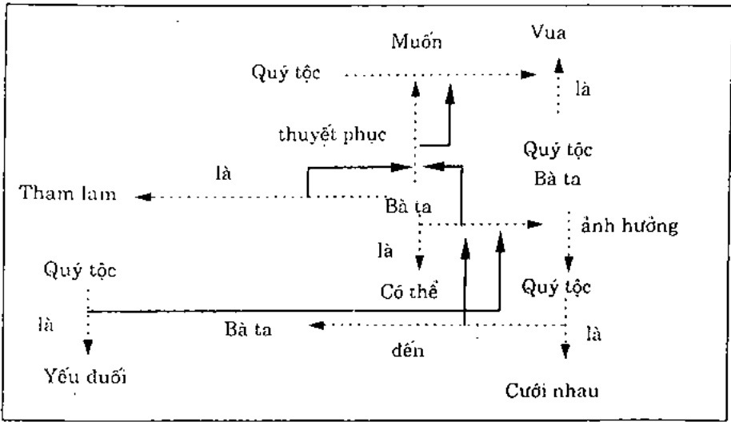

Hình 13-8. Tập hợp các biểu diễn trong một thí dụ.

<!-- page: 351 -->

Bơi vi việc tập hợp lại được thể hiện bằng cùng mạng ngũ nghĩa với các tiên để, chủng được xử lý bình thường như các tiên để trong thủ tục Macbeth. Vậy việc tập hợp lại có thể sinh ra tập hợp lại mối, như các tiên để đã cho.

Thủ tục Macbeth đã minh họa nguyên tắc giải thích. Theo quan điểm giải bài toán, công việc của thủ tục Macbeth đã guài thích cách thức một quan hệ/ hành động có thể được kiểm chứng hay đoàn ra dựa trên các tiến đề. Theo quan điểm của việc học, công việc này được xây dựng trên các giải thích của riêng nó, gom các tập hợp lại. Các quan điểm mang tính người và tuân theo :

## Nguyễn tắc giải thích

Nếu người ta muốn hiểu một khái niệm, cổ gảng giải thích nó với người khác.

## I.5. Xâu nhân quả thiết lập ngữ cảnh chung

Thủ tục Macbeth có thể dùng xấu nhân quả để thiết lập ngũ cảnh chung. Nó mô tả trên suy nghĩ đơn rằng thông qua câu chuyện về vợ chống Mơ Mổ, ràng ông chống có bà vợ áp đảo sẽ là yếu duổi! Nhưng sẽ ra sao nếu ông ta không cuối cổ ấy? Điều gì xảy ra nếu dàn ông bị áp chế nhiều hơn nửa?

Câu trả lời thông thường là tiền đề như trong truyền Mơ Mỗ chỉ được dùng trong ngữ cảnh đúng. Tuy nhiên thế nào là ngữ cảnh đúng ? Một cách là tìm các điểm tương tự giữa hai tỉnh hướng. Dương nhiên hai tình hướng tương tự nhau trong nhiều khía cạnh lại có thể khác nhau trong khía cạnh quan trọng. Vậy nền tình tương tự theo ngữ cảnh để kiểm chứng tương đương của hai tình hướng có thể là ngầm định, không hiện rõ trong mô tả của chúng.

Cũng có cách làm tăng độ tin tương với tiên đề là cứ áp nó vào thí dụ có cùng ngữ cảnh. Việc áp dụng cường ép này được thực hiện cho dù các liên kết nhân quả trong mẫu giải thích là mỏng manh và phụ thuộc vào chính tiên đề.

Cách này dua bài toán về khóa cạnh khác. Nếu hai tình huống có ngữ cảnh khác nhau, một ít các liên kết khớp thông qua liên kết nhân quả sẽ dẫn về kết luận chung. Nhu vây, khi nhiều liên kết khớp qua bên kết nhân quả đi về kết luận chung, người ta có thể cảng tin tưởng rằng các tình huống là tương tự theo nhánh quan trọng. Nếu chứng đã tương tự theo các nhánh quan trọng, cái nào đó là tiên để tốt cho tình huống này sẽ là tốt cho tình huống kia. Điều này được phát biểu thông qua nguyên tắc sau :

## Nguyên tắc Winston về cùng tiến hóa

Hai tính hướng cùng tiến hóa cảng lâu theo một đường, thi chứng càng tương tự nhau trong việc tiến hóa trên đường đó.

Thông qua bãi tập sau người ta sẽ thấy thủ tục Macbeth áp dụng nguyên tắc Winston ra sao.

<!-- page: 352 -->

## Thí dụ

Chuyên áp đảo và một kế ràng có nhà quy tốc và phụ nữ tham làm. Nhà quý tốc cuối có ta. Ông tư một vị bị bà ta áp đảo. Hây chỉ cho thấy ống ta muốn làm vua.

Bài tập nảy cùng như bài tập về tính áp đặt đá xét. Thị dụ này thêm thống tin về ông ta một và lí do của sự một đó.

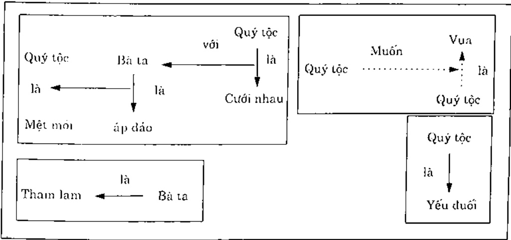

Hinh 13-9. Câu chuyên về áp đảo và mét.

Khi thủ tục Macbeth muốn chỉ ra ràng nhà quý tộc muốn làm vua, nó cần :

\- Dựa vào tiên để của bài tập về câu chuyện Macbeth. để thủ tục tìm lí do khiến ông ta một.

\- Thủ tục dùng tiên để của câu chuyện Mơ Mỗ.

\- Lúc này cả bài tập một-áp đảo và bài tập Mơ Mỗ đều có liên kết nhân quả gắn với bản chất "mệt" của dân ông và "tham lam" của dân bà. Do vậy mẫu giải thích từ bài tập Mơ Mỗ không đủ để làm cầu nổi trong bài tập một-áp đảo, nhưng cũng khớp được phân nào.

\- Ngữ cảnh của bài tập một áp đảo và Mơ Mổ là tương tự như ngữ cảnh chịu ảnh hưởng của các liên kết nhân quả. Nếu ngữ cảnh là khác nhau cơ bản thì đã không có các liên kết nhân quả khớp như vậy.

Tuy nhiên một cập herein kết khớp không thật quan trọng, nhưng có còn hơn không! Hơn nửa, nếu số các liên kết song song là lớn, người ta hy vọng các tình huống sẽ cùng tiến hóa.

<!-- page: 353 -->

Thủ tục Macbeth có thể dùng hệ quả may rủi của nguyên tắc Winston :

Cho tập các tiền đế, nên dùng một tiền đế với mẫu giải thích trùng với nhiều liên kết nhân quá nhất trong bài tập đó.

## 11. HỌC VỀ DẠNG VÀ CHỨC NĂNG

Thủ tục Macbeth cùng cho phép học để xem đối tượng nào giống với các mô tả chức năng và các mô tả của thí dụ cụ thể. Dưới đáy sẽ xét về thủ tục Macbeth dùng cho việc học dạng của chắc chén.

## II.1. Hồ trợ lẩn nhau của các thí dụ và các tiên để

Dữ xác định đối tượng là chiếc chén, trước hết mô tả các chức năng của những chiếc chén. Bằng ngôn ngữ tự nhiên, chiếc chén được xác định :

Mô tả chiếc chén

Chiếc chén là một đối tượng. Đối tượng này đúng được và đúng để nông.

Người với mô tả chức năng, mô tả chiếc chén cụ thể thiên về chất lượng vật lý. không như mô tả chức năng. Mô tả được ghi lại trong hình vẽ.

| Đối tượng | là | Chên |
| --- | --- | --- |
| Đối tượng | có | dây |
| Dây | là | phẳng |
| Đối tượng | có | mạt lâm |
| Đối tượng | làm từ | sú |
| Đối tượng | có | trang trí |
| Đối tượng | là | nhẹ |
| Đối tượng | có | tay cẩm |

Hình 13-10. Mô tả chiếc chén.

## Bài toán đối với một đối tượng cụ thể

Dáy là bài táp về đôi tượng màu sáng, làm từ sử. Đôi tượng này có trang trí, lôm, và nấm được. Dáy của đôi tượng phẳng. Hãy chứng tố đó là chiếc chén.

Các dòi hòi chúc nāng cūng trùng với các mô tả vật lý. Đế chúng tố được điều này, các tiên để liên quan đến mô tả chúc nāng của chiếc chén cần gắn với một chiếc chén cu thể. Cần có bốn tiên để :

<!-- page: 354 -->

i. Tiến để về đối tượng là bên vững.

n. Tiến dẻ về sự uống liên quan đến việc dụng được chất long và nâng lên được.

m. Tiến dẻ guai thích việc nâng lên được liên hệ ra sao với trọng lượng thấp và có tay cảm.

iv. Tún dê giải thích các vật dụng chất long liên quan đến thuộc tính lôm.

Tiếp theo người ta xét các dôi tượng chữa ít nhất một quan hệ không thích hợp với chế chén: các điều không thích dáng này thể hiện một phần của vật dụng khác :

## • Hon gạch

Hòn gạch là đối tượng vùng chắc, dây phẳng. Nó nặng.

## • Cái cốc

Cái cốc có thể dùng để uống vi nó chữa được chất lóng, nâng lên được. Cái cốc là xinh sản.

## • Cập sách

Cập sách nâng lên được vì có tay cẩm và nhẹ. Cập sách có ích vì nó dùng để đúng tài liệu.

## • Càt bát

Cải bất chúa chất lỏng vi nó lôm. Dùng bất chúa được xúp.

Với mô tả chức năng và các tiên để, thủ tục Macbeth thực hiện :

1. Trước hết, thủ tục tìm các tiên để để lộ ra ràng đối tượng trong bài tập là cản chén. Mô tả chức năng được dùng.

2. Thép theo, thủ tục xác định sự tương ứng giữa các phần của bài tập và các phần của mô tả chức năng.

3. Thủ tục cho hiện ra mẫu giải thích của mó tả chức năng trong bài tập. Di theo các liên kết nhân quả trong mẫu giải thích sẽ dẫn đến câu hỏi : đối tượng quan sát có vùng chắc không ? nó có dùng để uống không ?

4. Câu hỏi về tính vững chắc dùa thủ tục quay lại tìm kiếm trong tiên đế, và phát hiện thấy hôn gạch. Đối tượng có đáy phẳng, giống như hôn gạch, vững chắc.

5. Tiếp theo, tìm thấy cải cốc khi xử lý thông tin về sự uống. Thủ tục dùng tiên để cải cốc để dịch câu hỏi về sự uống thành câu hỏi về khả năng chúa chất lòng và nâng lên được.

<!-- page: 355 -->

6. Xét việc chữa được chất lòng, thủ tục dùng tiền để về cản bất. Thủ tục nhà lại ràng cản bất mang chất lòng và lôm, như đối tượng trong thí dụ.

7. Tiếp tục, thủ tục xét dôi hỏi về thuộc tỉnh nâng được và thấy cải cập. Thỉnh đề cho thấy cải cập là đối tượng nâng được nếu nó nhẹ và có tay cảm. Nhu vậy hoàn toàn giải thích được lí do nó có thể được dùng như cải chên.

8. Thù tục kết luận đối tượng trong bài tập là cái chén.

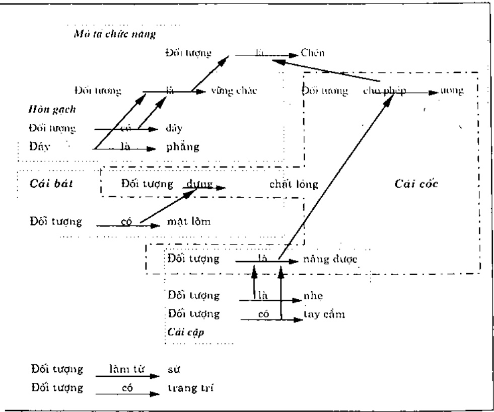

Hình 13-11. Các đối tượng cụ thể trong giống như cái chén.

Các bước được mô tả lại trên hình vẽ.

Tiếp theo là công việc tập hợp lại của thủ tục Macbeth. Nó xây dựng bộ suu tập để, những cái chén ra sao. Vi suu tập mới được dùng để định tên chú không chỉ đề n chứng hay dự đoán, người ta dùng thuật ngũ mô hình định tên hay chính xác là tập hợp lại.

<!-- page: 356 -->

Thứ tục Macbeth xây dựng mô hình chiếc chén như xây dựng các giai thích kiểm chứng, bằng cách trích ra cây AND từ các mãu guai thích. Mô hình thu được viết theo luật nhân quả như sau :

Mô hình chiế chén

IF Đôi tượng có đáy phẳng

Dói tượng là lõm

Dôi lượng nhẹ

Đối tượng có lay cảm

THEN Đối tượng là cái chén

Qua thi du nay, rô ràng việc học các dạng từ các chức năng cần một thi du vật lý và vài tiên để bổ sung cho mô tả chức nang. Các yếu cấu gồm có :

• Thi dụ vật lý là tiêu biểu: nếu không thì khó hiểu phải dùng tiền để nào.

\- Các tiền đề là tiêu biểu: nếu không không thể biết được thí dụ vật lý cần lộ ra khóa cạnh nào.

## II.2. Uu điểm của việc học dựa trên giải thích thuộc tính

Người việc tìm kiếm nhanh, việc học theo lời giải thích còn cho người ta nhiều kết quả khác. Thoạt nhìn thấy việc học dựa trên giải thích có về như không hơn việc đi theo các liên kết nhân quả, gom, các tri thức lại mà không dưa ra được điều gì mới. Vậy nền người ta thấy việc học này chỉ cho phép tăng tốc độ tìm kiếm, vi trước sau thì người ta cùng lần về được tiên đề.

Nhìn sâu hơn người ta thấy rằng việc học này cung cấp tri thức trong việc xử lý các tri thức không chính xác hay tri thức sai khi dùng các tiền để riêng lẻ để tạo ra các giải thích rộng hơn. Nguyên nhân là trong các thi dụ cụ thể, các tri thức là của giáo viên và cho phép dùng các may rủi xử lý các tiền để gặp phải và nhằm vào việc xác định dạng của đối tượng. Không có các thông tin may rủi này, chương trình chỉ làm việc với các tiên để sẵn có, vậy nên cháng dưa đến điều gì mới! Chương trình như vậy có thể suy lý con bò là cái chén, vì con bò cùng hội tụ các mô tả chức năng như cái chén.

## III. SO'SÁNH KHÓP

Thủ tục Macbeth không thể hành động được nếu không định được tên các đối tượng trong bài tập ứng với đối tượng trong tiên để. Trong thí dụ về tính tham, lam, thủ tục cần biết ràng nhà quý tộc ứng với Macbeth và người đàn bà ứng với cô

<!-- page: 357 -->

Macbeth. Phân dưới dày xét về thú tục khớp, cho phép thiết lập loạn tương ứng này với hiệu quả có lý.

## III.1. Vai trò của so sánh khớp

Trong các thi dự trên người ta đã dùng các tương ứng cho các cá nhân như sau :

| Truyền Macbeth | Truyền về tham lam | Phân vai |
| --- | --- | --- |
| Macbeth | Nhà quý tộc | Nạn nhân |
| Cô Macbeth | Phụ nữ | Hung ác |

Hình 13-12. Tương ứng giả câu chuyên và các cả nhân thực.

Tuy các tiền để không định rõ tên hung áe và nạn nhân, nhưng thủ tục cần khớp bằng cách phân tích cách để tất cả các cả nhận vào khít hai tính hướng.

Cách thấy ngay là cổ thu mối khả năng ghép dòi các cá nhân, ghi lại kết quả của các cách theo số các quan hệ được đặt phù hợp, và chọn cách ứng với kết quả lớn nhất.

Có hai vấn đề này sinh trong phương pháp này :

1. Thú nhất là số cách ghép dôi các cá nhân tăng lên theo tích của số các cá nhân. Truyền Macbeth có bôn nhân vật, thí dụ về tính tham làm có hai, vậy có tấm cập, không quá nhiều. Tuy nhiên dôi với bài toàn khác, có quá nhiều nhân vật. Việc gia tăng số cập so sánh là không chấp nhận được.

2. Thử hai là việc ngẫu nhiên lắp ghép các nhân vật có thể dua đến hướng xa lệch so với các tương tự có ích. Chắng hạn việc khớp trên bị phân tán bởi các ghép cập theo các thuộc tính màu tóc, sò thích...

Công việc khớp cần :

\- Nhám vào mục đích của việc so sảnh khớp. vậy cần bổ qua các thuộc tỉnh không quan trọng.

• Chi tiễn hành khớp các cả nhân cho thấy mục đích của việc khớp.

## III.2. Sử dụng biến trong so sánh khớp

Việc so sánh khớp hành động với ý tưởng khí liên hệ với việc quay lui trên luật. Hai ý tưởng để đưa việc khớp về việc quay lui là :

\- Người ta xử lý tiēn dè như là nguồn cung cấp cho các luật nhân quả.

<!-- page: 358 -->

\- Nguồn ta đúng bản tập như có số các kháng định.

Thí dụ dùng cầu chuyên Macbeth để tạo các luật nhân qua. Trọng mạng mô tả có năm lên kết được quản thích hàng một hay nhiều liên kết nhân qua. Các liên kết nhân qua gần năm liên kết dấu tiến này với các liên kết khác. Mỗi một liên kết trong năm lên kết quản thích này được chuyển thành luật nhân qua. Liên kết giữ thích ứng với phân kết luận, và các liên kết khác ứng với phân gia thiết. Mỗi cá nhân được cơi như một biến khớp

Luật 1. IF  $x_{1}$  là hoàng thân của  $x_{2}$ 
 $x_{1}$ \_class  $x_{2}$ 
THEN  $x_{1}$ \_class  $x_{3}$

Luật 2. IF x₁ là hung ác
x₁ muốn làm vua
x₂ là vua
THIEN x₂ giết, x₂

Luật 3. IF $x_{i}$ thuyết phục $x_{i}$ ham muốn làm vua THEN $x_{i}$ muốn làm vua

Luật 4. IF x₁ tham lam
x₁ có ảnh hưởng tới x₃
THEN x₄ thuyết phục x₃ muốn làm vua

Luật 5. IF x₃ yêu dưới
x₃ cuối x₁

$$
x _ {i}
$$

$$
x _ {i}
$$

Quai trình chuyển tên các cá nhân thành các biến khớp được gọi là biến số hóa. Bảng sau cho thấy các biến được dùng :

| Cá nhân | Biến |
| --- | --- |
| Macduff | $x_{1}$ |
| Duncan | $x_{2}$ |
| Macbeth | $x_{3}$ |
| Cô Macbeth | $x_{4}$ |

Hình 13-13. Sử dụng biến trong so sánh khớp.

<!-- page: 359 -->

Trong bài tập về tính tham lam, người ta có các khẳng định :

• Bà ta là tham lam

• Quý lộc thi yếu duôi

\- Nhà quý tộc đó cuối bà ta.

Või các kháng định này và năm luật, người ta có thể hôi như bản tập về Macbeth. "Nhà quý tộc muốn làm vua ?". Chỉ phần kết luận của luật 3 khớp với câu này, dua đến việc gần $x_{3}$ với "nhà quý tộc".

Từ biến xuất phát này, tiếp tục suy diễn quay lui để tìm các kháng định khớp với phân giả thiết của luật 3, khi đã thay biến bằng tên "x$_{1}$ thuyết phục nhà quy tộc muốn làm vua". Rất tiếc không có kháng định nào như vậy. Nhung lại có luật 4 có phần kết luận khớp được. Tiếp tục dùng đến luật 5. Băng thay thế cuối cùng là :

| Biến | Thay thế trong thi dụ về tỉnh tham | Ban dân trong chuyên về Macbeth |
| --- | --- | --- |
| $x_{4}$ | Nhà quý tộc | Macbeth |
| $x_{1}$ | Bà ta | Cô Macbeth |

Hình 13-14. Bảng kết quả thay thế.

Việc Macbeth ghép cập với nhà quý tộc và cỏ Macbeth với người dàn bà ấy như việc học trước đáy đã thấy.

Việc khớp góp phần giải bài toán tương tự. Theo cách khớp được tiến hành trong việc giải bài toán tương tự, người ta có thể thấy mỗi tiên đề ngầm mang các luật nhân quả. Cũng có nhiều chi tiết vô dụng liên quan đến các khía cạnh cụ thể. Công việc của thú tục Macheth là phát hiện và khai thác các luật suy diễn ngầm định.

## IV. KÊT LUẬN

Phân "học thông qua giải thích các kinh nghiệm" có các điểm chính sau :

\- Một cách học là giải thích từng chỉ tiết từ dãy nhân quả, từ tiên để để đến bài toán mới.

\- Nói chung, cụ thể hóa là cơi cái trùu tương như cái cụ thể. Cụ thể hóa liên kết là xem nó như nút để người ta có thể miêu tả nó. Cụ thể hóa và từ vựng trong khung giúp cho việc ghi lại câu chuyện rời dùng như tiên đế.

<!-- page: 360 -->

\- Thủ tục Macbeth dùng dây nhân quả trong cấu chuyên và các mô tả đối tượng để giải bài toán và tạo các nguyên tắc như luật.

• Thú tục Macbeth dùng quay lui theo ngũ cảnh chung.

\- Thủ tục Macbeth dùng so sánh khớp, đưa việc khớp về một loại quay lui.

\- Việc học dựa trên giải thích là đặc biệt thuận lợi cho giáo viên khi họ hướng dẫn học sinh về phía các tổ hợp tiến đề phù hợp. Khi không có sự hướng dẫn này, học sinh yếu có thể nhằm lẫn do dùng các điều sai ghép với nhau. Do vậy cách học này cũng giúp người ta tăng thêm tri thức.

<!-- page: 361 -->

# HỌC NHỒ SỬA CHỮA CÁC L ÔI SAI

Một thủ tục có thể sửa chữa các tru thức đã có bằng cích chính ly của lở méng Khả năng này cần thiết là vi muốn trở thành chuyên gia chương trimb của phải quản lý được một danh sich lớn lên không ngịng của các trường hợp nhận quả, và trong đó bao gồm cả tru thức không chính xác.

Thủ tục FIXIT trong phân này suy lý trên các quan điểm cho ràng lời sau cũng là các thảm dò tri thức và có giá trị chủ không phải là thứ bò di. FIXIT có lập các quan hệ đăng nghi ngờ có thể dẫn đến lôi sai, giai thích li do các sự kiện đó gây ra lôi sau, và sửa tri thức. Thủ tục đưa ra mô hình định tên cản xô là cát chén, rów phân tích các nguyên nhân dẫn đến sai làm đó.

## 1. CÔ LẬP CÁC QUAN HỆ NGHI NGỜ

Phân này giới thiệu cách dùng các lỗ; sai trong mô hình định tên. Ngoài ra nó chư phép học song song với sửa chữa lỗi.

## 1.1. Giới thiệu bài toán

Thủ tục Macebuth trong chương trước có thể dùng để định tên các cải chén, cải chén sâu lần chén sành. Thế nhưng nó cũng cho ràng các cải xô nhựa hay xô kim loại là cải chén, sai lâm này làm người ta phải để cấp các vấn đề sau :

\- Làm sao thủ tue nhận dạng sai được ? Biết được lí do này sẽ giúp người ta eo lấp các quan hệ nghi ngờ, tránh việc định tên sai.

\- Cách thức thủ tục dùng các tiên để dễ giải thích li do các quan hệ nghị ngò bị tách ra cũng giúp mô hình tránh được việc nhận dạng sai.

\- Cách thủ tục nào đã dùng các giải thích để sửa chữa mô hình để tránh bị lỗi khác?

<!-- page: 362 -->

## I.2. Sử dụng nhóm trượt gần giống

Nếu một chieść xô khác cái chén ả các cản thì nó được của như trượt gần giống của cài chén. Tuy nhiên còn có nhiều sai khác nữa giữa cản chén và cản xô dụng nước.

## Thi du

Người ta có cái chén sú và cái xó kim loại. Chúng là khái nhau do giao viên kháng định hoặc do người ta không định dùng cái xó để uống. Kim loại của xò màu xám, còn sử trắng. Phải chăng xó kim loại chúa nước, còn chén chúa cà phê.

Cháng hạn có thêm chiế chén thie cè và xó nhựa. Môi cài xó khác với cái chén theo cách khác nhàu. Điều quan trọng là có một số cách góp hai chiế chén dẻ chúng khác với hạn của xó. Thục tế chén có tay cảm, còn xó có quai treo.

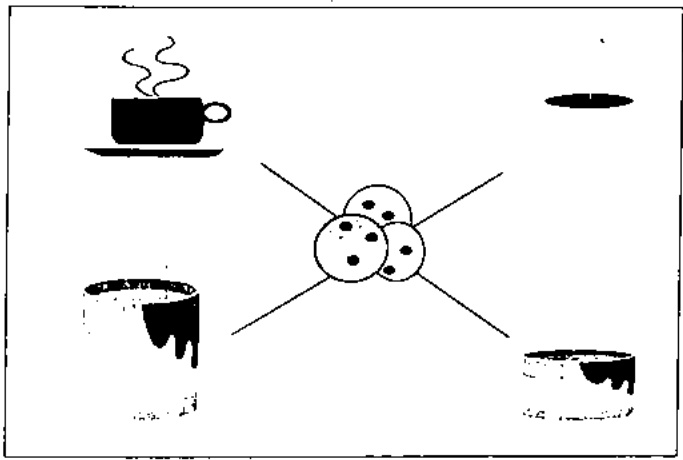

Hình 14-1. Nhóm trượt gần giống. Các quan hệ ứng với các chấm. Các quan hệ nghi ngờ trong vòng tròn dặm. Chứng bị coi là dáng nghi vi không hẩn là đúng, không hẩn là sai. Cồn cái nghi ngờ khác là sai hoàn toàn. không đúng.

Bời vi mô hình cho phép bốn đối tượng đều là cải chén, khi mô hình này được nhìn như luật nhân quả, các quan hệ giả thiết cần nằm trong phân giao của tất cả các tập quan hệ mô tả bốn đối tượng này. Tương tự, các quan hệ phân biệt các tỉnh hướng thành công với tình huống thất bại cần thuộc phân hợp của hai tập quan hệ con.

Các quan hệ trong tập thành công và tập thất bại đều là thành phần được xét để tạo nên sự giải thích, chủng được gọi là các quan hệ nghi ngờ. Có hai loại quan hệ nghi ngờ, loại dưa đến kết quả dùng được gọi quan hệ nghi ngờ thành công đúng, và loại kết thúc nhưng dưa đến đối tượng không dùng được gọi là quan hệ nghi ngờ

<!-- page: 363 -->

thành công sai. Các tỉnh hướng dùng để định tên các quan hệ nghị ngờ tạo none nhóm trượt gần giống.

Việc tách riêng các quan hệ nghi ngờ sẽ là đơn giản khi sử dụng các phép toán về tập hợp trên các quan hệ. Các quan hệ này được xếp theo loại thực sự thành công, tục có tác động đến phân tích và loại không thành công. Người ta có thể dùng thuật ngữ thành công đúng và thành công sai. Thủ tục FIXIT được phát biểu như sau.

Đế có lập các quan hệ nghi ngờ theo thú tục FIXIT, có các bước :

Đế có lập các quan hệ nghi ngô đúng, thực hiện :

1. Tím giao của các thành công thực, thu được ∩T.

2. Tîm hợp các thành công sai, gọi là ∪F.

3. Lập tập các quan hệ nghi ngờ dùng gồm tất cả các kháng định trong giao mà không có trong hợp, tức ∩T·∪F.

Đế có lập các quan hệ nghi ngờ sai, thực hiện :

1. Tîm giao của các thành công sai, thu được ∩F.

2. Tím hợp các thành công đúng, gọi là ∪T.

3. Lập tập các quan hệ nghi ngờ sai gồm tất cả các kháng định trong giao mà không có trong hợp, tức ∩F·∪T.

Nói chung sè có ít nhất là một quan hệ nghi ngờ. Cảng có nhiều thành công đúng và thành công sai thì cảng ít di các quan hệ nghi ngờ.

## I.3. Chỉnh lý chiến lược tìm kiếm

Trong thí dụ trên, quan hệ tay cảm có định chỉ dùng cho chén, chú không cho xô. Nếu thủ tục có cách nào tìm được quan hệ này trong mô hình thì mô hình nhận dạng dễ dàng hơn.

Do vậy, việc chính lý cây giải thích sẽ dưa quan hệ "tay cẩm cố định" vào luật của mô hình như điều kiện giả thiết.

Luật nhận dạng cái chén được cải biến như sau :

IF Đối tượng có đáy

Dáy phẳng

Đối tượng lỗm

Đối tượng nhẹ

Đối tượng có tay cẩm

<!-- page: 364 -->

## THEN Đối tượng là chiếc chén

Như vay các loại quan hệ nghi ngờ đóng góp vào việc chính lý chiến lược tìm kiếm tổng thể.

## II. ĐIỀU CHỈNH CÁC TRI THỨC

Thủ tục FIXIT, sẽ giải thích nguyên nhân một quan hệ cụ thể làm luật nhận dạng sau. Sau đó nó sẽ sửa chữa.

## II.1. Giải thích các quan hệ nghi ngờ có tác động

Théo cây AND để nhận dạng cái chén, người ta có thể di đến kết luận cái xố là cái chén. Quan hệ "tay râm cổ định" đã được sửa. Cần thêm hai quan hệ mới là "đối tượng cảm tay" và "đối tượng đúng".

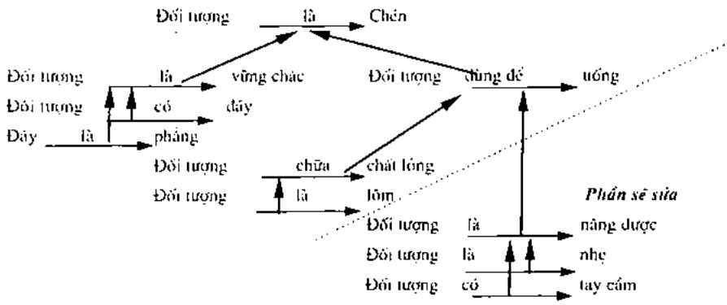

Hình 14-2. Cây AND của các mô hình trước khi sửa. Cả xô và chén đều được xem như cái chén. Vị trí của cây AND phía dưới cần được thay thể.

Mô hình cũ là quá tổng quát, vì không thể cho ràng đối tượng dùng để uống chỉ với thuộc tính "nâng được" và "chúa được chất lòng". Mô hình mới cho phép những cái chén được xác định đúng, tăng tính đặc thù để không lẫn với cái xó.

Đế hoàn thiện hơn, thủ tục FIXIT duyệt lai theo tìm kiếm rộng trong tất cả các quan hệ trên cây AND để tìm quan hệ cần thiết thay thế. Với mỗi quan hệ xét đến. FIXIT tìm các tiễn để gắn với quan hệ được xét với ít nhất một quan hệ nghi ngờ

<!-- page: 365 -->

dung. Nên tim được các tiền đẻ, thủ tục FIXIT thay thế phân cây AND bên dưới quan hệ đang xét. Do vậy cần giải thích quan hệ được tổ chức lại theo đường quan hệ môn.

Giải thực mới này sẽ ngắn bởi vì xấu các liên kết nhân quả cung cấp các tiền để mà cảng dài thì cảng ít data đến kết luận. Việc dua ra bên kết nhân quả cung cấp các tiền để chỉ là gần đúng, có thể không chắc chắn. Tổng buốc FIXIT hạn chế việc xem xét lại các tiền để thuộc loại sau :

\- Các tiên đề trong thủ tục Macbeth dùng để học mô hình. Nô luôn Ivy vọng không thay đổi mô hình, do vậy nó được xây dựng từ các tiên để nguyên bản. Các tiên đề này gồm tập đầu, vì nó nằm dấu xấu hén kết nhân qui nổi mô hình với các quan hệ nghi ngờ.

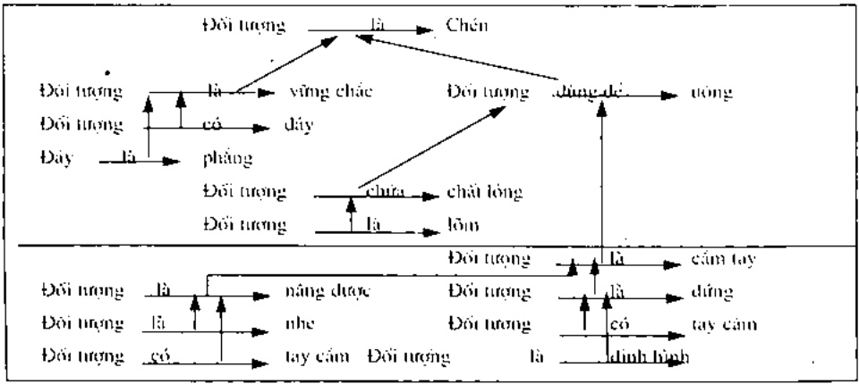

Hình 14-3. Mô bình AND sau khi được sửa. Phân cây dưới vạch chấm chấm đã thay đổi.

\- Các tiên để có chứa một trong các quan hệ nghi ngờ đã có tác động đến việc phân tích. Các quan hệ này còn được gọi là quan hệ nghi ngờ đúng. Các tiên để này chứa tập dưới.

Khi thủ tục FIXIT kiểm tra lại một quan hệ, nó tìm cách giải thích ràng quan hệ được dùng để tổ chức các loại tiên đề. không riêng một tiên đề trong tổ hợp tập dấu và dưới. trừ phi tiên để này được dùng để giải thích chính quan hệ đã xét trước đó. Tiên đề này được bổ qua để FIXIT có thể dùng giả thuyết ràng nó cho ra một giải thích không dùng, đưa đến hành vi sai của mô hình.

<!-- page: 366 -->

Trong thí du chén-xó, tập đầu mang mô ta chức nang của cár chén, cũng với tiên để về hoàn gạch, bất, cốc và cát cập. Tập dưới chúa tất cả các tiên để có quan hệ nghị ngò có tác động "tay cán có dinh". Giá sử quan hệ "tay cán có dinh" chỉ có trong tiên để về miệng, gần với hèn kết nhân quả "miếng bên trên". Vậy tập dưới chúa một ninh quan hệ "miếng bên trên".

Do vậy, khi FIXIT kiểm tra lại quan hệ "đối tượng là cải chén", nó dùng tiến để viên gạch, rốc, bất, cập và miệng. Nó không dùng mô tả chức năng của cải chén như thủ, tục Macbeth.

Lúc náv FIXIT kiểm tra lại các lôi dân đến diu vị các tập diu và dưới không nổi với quan hệ được kiểm tra lại là "đối tượng là cái chén" với quan hệ nghi ngờ là "tay cảm có dinh".

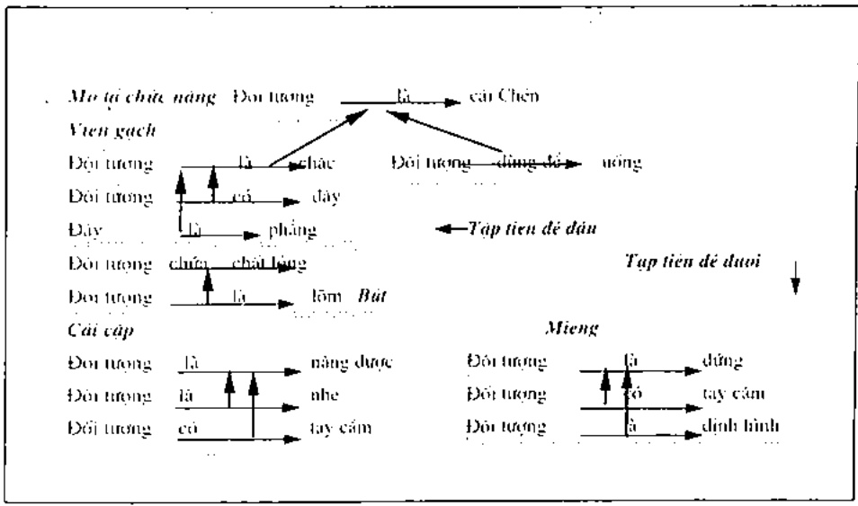

Hình 14-4. Kiểm tra lại thất bại vì các tập đầu và tập dưới không nổi với nhau. Chi những phần lộ ra của tiên để là được lưu ý.

Tương tự khi FIXIT kiểm tra lại quan hệ "dối tượng là vững chắc". nó dùng mô tả chức năng với tiên để về cốc, bất, cập và miệng, đã bỏ qua tiên để về viên gạch mà vẫn sai. Khi FIXIT kiểm tra lại quan hệ "dối tượng dùng để uống". nó dùng mô tả chức năng với tiên để về viên gạch, bất, cập và miệng, đã bỏ qua tiên để về cải cốc mà vẫn sai... Nhiểu tiên để được sử dụng.

<!-- page: 367 -->

## II.2. Hợp nhất các quan hệ nghi ngờ đúng

Một khi FIXIT kết luận ràng nhiều tiên để đã được xem, nó tăng số các tiên để trong tập dân, duôi.

Mở rộng tập dấu. Thủ tục FIXIT tìm các tiên để nổi các liên kết nhân quả về phía tiên để tập dấu. Đề số các tiên để nhớ vừa đủ, FIXIT chỉ mô rộng tập dấu và tập dưới. Tập dấu kế trên chỉ có một tiên để về cải miệng. FIXIT có thể bổ sung tiền để về cải điều; nó cảm được và có miệng.

Mở rộng tập cuối. Thú tục thấy việc kiểm tra lại thất bại tại quan hệ "đối tượng là cải chén" và tại mức kế là "đối tượng là chắc". Côn quan hệ "đối tượng dùng để uống" và "có tay cảm chắc" FIXIT dùng tiền để về cải điều. Không cần thiết mở rộng tập này.

Lưu ý rằng tiên để "cái-diếu" đã phát triển tập dưới, làm cấu nổi giữa mô hình cũ và quan hệ còn nghi ngờ "tay cẩm cổ định". Bảy giờ chỉ những cải chén là được định tên là chén: còn sở thi không. Chỉ phần lộ ra của tiên để được lưu ý.

Lưu ý ràng cây AND của mô hình được cấu trúc lại mà không suy lý tưởng mình về các nút và các nhánh sai. Cây AND này có thể được thể hiện như luật nhân qua đã giới thiệu.

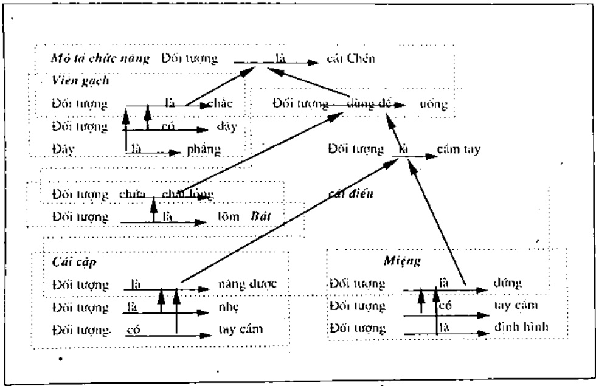

Hình 14-5. Cây mô hình sau khi sửa với sự giúp đô của các tiền đế.

<!-- page: 368 -->

Thủ tục FIXIT dùng lại khi luật được sửa đổi không khớp với các thành công sai. Việc xử lý các quan hệ nghi ngờ đúng của FIXIT được trình bày :

Cho tôi khi thấy thanh công sai, thực hiện :

1. Đôi với mối quan hệ trong cây mô hình, bắt đầu từ quan hè góc rời đi xuống, tìm ròng,

1.1. Tạo tập dấu gồm tất cả tiên để dùng để vận hành sai cây mô hình,

1.2. Tạo tập dưới gồm các tiền đế, trong đó một hay nhiều quan hệ nghi ngờ dùng gây ra quan hệ khác.

\- Cổ gảng tìm ra giải thích môi cho một quan hệ trong cây mô hình mà dùng tập :

tập đầu - các tiên để đã dùng để giải thích quan hệ trước đó + tập dưới

\- Nếu thấy một giải thích, thay thể phân mô hình nằm dưới quan hệ môi được giải thích lại.

2. Mở rộng một chất tập đầu và tập dưới với các tiền để khác. Các tiền để này nồi xấu nhân quả tìm thấy trong các tiền để đã có của tập.

## II.3. Giải thích các quan hệ nghi ngờ sai

Cây mô hình được sửa tiếp tục với bài toán chén-xô. Không cải xô nào được mô tả là có quan hệ "tay cảm cổ định". Thủ tục Macbeth đã cổ mô tả xô có tay cảm cổ định, cho dù cái xô có mô tả "tay treo".

Do vậy, thủ tục FIXIT dưa ra việc thu thập mô tả qua luật :

Cảm biến tay treo

IF Tay treo

## THEN Tay không cổ định

Khi đã có trị thức này, thủ tục như thủ tục Macbeth có thể khởi phải di chứng minh rằng một quan hệ là sai thông qua liên kết nhân quả. Như trước, chén vẫn là chén, và xô không được là chén; nhưng không phải có gắng chứng minh xô không có tay cầm có định. Sưu lập trị thức này được gọi là cắm biến.

Thủ tục FIXIT đưa ra cảm biến khi nó không đến được thành công sai bằng cách dùng các quan hệ nghi ngờ đúng. Đề tạo ra cảm biến. FIXIT kiểm tra theo tìm rộng trong số các quan hệ trên cây mô hình đã sửa. tìm các tiên dễ gắn phủ định của quan hệ được xét với quan hệ thành công sai. Giải thích thu được thiết lập nguyên nhân

<!-- page: 369 -->

quan hệ nghi ngò thành công sai sẻ khóa việc định tên. Giải thích này cho phép tạo nên cần biến mới.

Thoạt đầu, tập các tiên để được giới hạn thu gọn nhất :

\- Các tiên đề mà phủ định của quan hệ được xét gây ra bởi những thứ khác. Các tiên đề này ban đầu chúa tập đầu.

\- Các tiền để mà các quan hệ nghị ngề thành công sai là nguyên nhân của cái khác. Các tiền để này lúc dầu chúa tập dưới.

Tư tưởng là phát hiện một giải thích cho phủ định của quan hệ được xét. Quan hệ được xét này epsilon ít nhất một trong các quan hệ nghi ngờ thành công đúng. Nếu thủ tục FIXIT tìm thấy bộ các tiền để như vậy, nó tạo nên cần biến mới từ bộ các tiền đề này.

Thực tế việc kiểm tra lại theo cách tìm rộng của thủ tục FIXIT có giải thích quan hệ "tay cắm không có định", khi có quan hệ nghi ngờ sau là "tay treo". Lức này FIXIT dùng tiên để về cải cập. do "tay treo" nói với "tay cắm không có định" theo quan hệ nhân quá sau :

## Mô tả cái cập

Cái cập nâng được vì nó có tay cẩm và nó nhẹ. Tay cẩm không có định vì nó treo được. Cái cập có ích vì mang được quản áo.

Với tiên để này. FIXIT cần tạo ra cảm biến thích hợp.

Như trên, thủ tục FIXIT dùng ngay khi luật sửa đổi không còn khớp thành công sai, như các bước xử lý các quan hệ nghi ngờ thành công sai nhỏ thủ tục FIXIT.

Cho tôi khi thấy thành công sai, thực hiện :

1. Đôi với mỗi quan hệ trong cây mô hình, bắt đầu từ quan hệ gốc rời đi xuống, tìm rộng.

1.2. Tạo tập dấu gồm tất cả tiên để mà trong đó phủ định của quan hệ được gây ra bởi quan hệ khác.

1.2. Tạo tập đuôi gồm các tiên đế, trong đó một hay nhiều quan hệ nghi ngờ sai gây ra quan hệ khác.

\- Cổ găng tìm ra giải thích mới cho phủ định của quan hệ này trong cây mô hình, dùng tập :

## tập dâu + tập dưới

\- Nếu thấy một giải thích, tạo ra cảm biến mối.

2. Mở rộng một chút tập đầu và tập dưới với các tiên đề khác. Các tiên đề này nổi xấu nhân quả tìm thấy trong các tiên đề đã có của tập.

<!-- page: 370 -->

## II.4. Mô tả chi tiết hơn

Các thất bại cũng có thể giúp cho việc mô ta chi tiết hơn về bin toán. Nếu không có các quan hệ nghi ngờ trong nhóm trượt gần giống, vẩn có vai cách để chi Minh lý tính huống :

\- Dù ràng việc thiếu các quan hệ nghi ngờ cho thấy không có giải thích chung về lôi sai, có các giải thích khác mà mỗi giải thích là chung cho tập các thành công dùng hay thành công sai.

\- Giả sử một quan hệ nghi ngờ xảy ra trong một vải thành công đúng nhưng không phải tất cả. Hây xem quan hệ này có thể được dùng để giải thích lôi sai không ? nếu nó có thể, yêu cầu xem quan hệ thành công đúng đó đã bỏ qua các mô tả thành công đúng khác hay không ?

\- Việc thiếu các quan hệ nghi ngờ cho thấy tình hướng này cần được mô tả kĩ hơn, bổ sung các chi tiết để gộp với giải thích tường minh.

Nhiều giáo viên giới yêu cấu học sinh mô tả bài toán trước khi giải bài toán. Đóng vai trò như học sinh, thủ tục FIXIT dùng các mô tả, qua mô tả để biết các quan hệ lực đầu thì không thích hợp nhưng chứng minh được nghi ngờ và bài toán được nhìn trong bởi cảnh của các nhóm trượt gần giống.

## III. KÊT LUẬN

Các nhận xét kết luận đối với việc học nhỏ chính lý các lôi sai :

\- Đôi khi thủ tục học có thể mắc sai lâm. cần phải sửa chữa trí thức. Thủ tục Macbeth có thể học nhận dạng cải chén, nhưng lẫn cải xô với cải chén.

\- Thủ tục FIXIT dùng các nhóm trượt gần giống, gồm tập các thi dụ thuần và thí dụ nghịch, để cô lập các quan hệ nghi ngờ.

\- Việc sửa chữa trị thức dôi hỏi thủ tục FIXIT hoặc là giải thích các quan hệ nghi ngờ đúng, thay thế giải thích ban đầu, hoặc giải thích các quan hệ nghi ngờ sai, tạo ra cảm biến.

\- Dụ định đạt kết quả đế sửa chữa tri thức được đế xuất : các quan hệ nghi ngờ đúng không có trong mô tả, và dùng nhiều công sức để tạo ra các mô tả chi tiết hơn.

<!-- page: 371 -->

# HỌC NHỒ GHI NHÂN CÁC TRƯỜNG HỢP

Làm sao có thể xử lý các lĩnh vực của bài toán khi không thể xây dựng được mô hình tốt ? Chương này cho phép học về điều này, cu thế là học bằng các ghi lại các trường hợp, giữ các thông tin ở dạng nguyên thuy cho đến khí các thông tin này được xử lý. Trước hết có máy rủi kiến trị, cho phép dùng các đặc trưng đài quan sát được cho vật mới, chúa bao giờ thấy. Sau rối là các tìm người lăng giếng gần nhật trong không gian các đặc trưng nhỏ cây KD.

Chutong này dùng thí dụ về kích thước các khối gỗ, để ứng dụng trong điều khiển tay máy trong khoa học về người máy.

## 1. GHI NHẬN VÀ TİM KIỂM KINH NGHIỆM THÔ

Phân này giới thiệu phép may rủi kiến trì và học việc định loại bài toán cổ thể giải bằng cách ghi lại các trường hợp.

## I.1. Phép may rủi kiên trì

Người ta dùng phép may rủi kiện trị để đoán nhận thuộc tính của vật chưa biết theo các trường hợp ứng với các vật đã biết.

Thí dụ

Có tám khói gõ, mỗi thú có màu, kích thước riêng.

Giá sú người ta gặp khối mới, kích thước 1 x 4 cm và không rõ màu. Vấn đề là cần đoán màu theo các màu đã có của các khối tương tự về kích thước. Do vậy người ta dùng phép may rủi kiên trì.

<!-- page: 372 -->

## Dình nghĩa 15-1 : Phép may rủi kiến tri (Consistency heuristic)

Khi muốn đoán thuộc tỉnh của một vật mà không có gì ngoại các trường hợp đã biết, hãy tìm trường hợp tương tự nhất theo độ đo của các thuộc tỉnh chưa biết với thuộc tỉnh đã biết. Hải đoán thuộc tỉnh chưa biết như thuộc tỉnh đã biết.

Nếu dùng không gian kích thước và cho tương ứng các khởi với cie điểm trong không gian, việc tìm khởi tương tự thuận lợi hơn. Trong không gian người ta thấy vật chưa biết X gần với khởi màu da cam hơn cả.

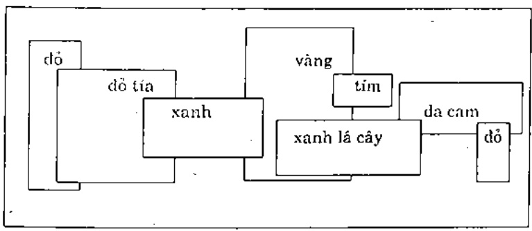

Hình 15-1. Tám khối gỗ có độ rộng, chiều cao và màu sắc khác nhau. Chúng tạo ra tập da dạng của các trường hợp: qua đó người ta có thế đoán màu của một khối bất ki khi biết kích thước của khối này.

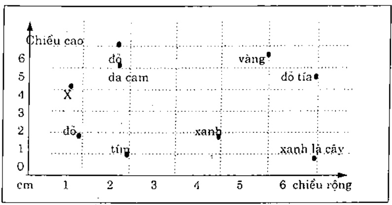

Hình 15-2. Khối X gần khối màu da cam hơn cả do so sánh về kích thước.

<!-- page: 373 -->

## I.2. Giải bài toán động nhỏ may rủi

Xét bài toàn đi chuyển tay người máy trong không gian theo đường định trước với vận tốc cũng ẩm định trước. Như vậy cần biết các góc nổi của tay máy có thể thay đổi ra sao, và mô men xoắn làm thay đổi góc nổi.

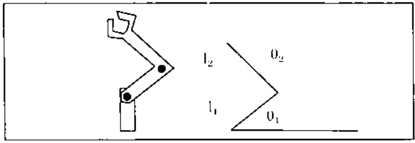

Hình 15-3. Tay máy nấm quả bóng. Cần ném bóng theo đường yêu cầu.

Việc liên hệ của các gốc nổi với vị trí vận hành thuộc bài toán động học. Nếu gọi gốc nổi là 0₁ và 0₂, độ dài đoạn là l₁ và l₂ của bộ vận hành hai chiếu, thi công thức về quan hệ giữa vị trí vận hành và gốc nổi là :

$$
\begin{array}{r l} \mathrm{x} & = \mathrm{l} _ {1} \cos \theta_ {1} + \mathrm{l} _ {2} \cos (\theta_ {1} + \theta_ {2}) \\ \mathrm{y} & = \mathrm{l} _ {1} \sin \theta_ {1} + \mathrm{l} _ {2} \sin (\theta_ {1} + \theta_ {2}) \end{array}
$$

Với cấu hình như trong hình vẽ, tính được :

$$
\begin{array}{l} \theta_ {1} = \tan^ {- 1} (y / x) \cdot \tan^ {- 1} (l _ {2} \sin x \theta_ {2} / (l _ {1} + l _ {2} \cos \theta_ {2})) \\ \theta_ {2} = \cos^ {- 1} [ (x ^ {2} + y ^ {2} - l _ {1} ^ {2} - l _ {2} ^ {2}) / (2. l _ {1} l _ {2}) ] \end{array}
$$

Chỉ nhìn vào công thức có thể người ta cho ràng dễ dàng di chuyển tay máy bằng cách di chuyển từng bộ phận của tay, thông qua các moto. Những các moto chi hiểu được tham số duy nhất là momen xoắn.

Đưa các chuyển động của khớp nổi về momen xoắn của moto cản đến bài toán động, phúc tạp. Từ các đẳng thức trên, bó qua lực hút và giả sú có liên kết trụ, trong không gian hai chiều người ta có :

$$
\begin{array}{r l} \tau_ {1} & = \ddot {\theta} _ {1} (l _ {1} + l _ {2} + m _ {2} l _ {1} l _ {2} \cos \theta_ {2} + (m _ {1} l _ {1} ^ {2} + m _ {2} l _ {2} ^ {2}) / 4 + m _ {2} l _ {1} ^ {2}) + \ddot {\theta} _ {2} (l _ {2} + m _ {2} l _ {2} ^ {2} / 4 + (m _ {2} l _ {1} l _ {2} \\ (\cos \theta_ {2}) / 2) & = \dot {\theta} _ {2} ^ {2} m _ {2} l _ {1} l _ {2} / 2 \sin \theta_ {2} - \dot {\theta} _ {1} \dot {\theta} _ {2} m _ {2} l _ {1} l _ {2} \sin \theta_ {2} \\ \tau_ {2} & = \ddot {\theta} _ {1} (l _ {2} + m _ {2} l _ {1} l _ {2} \cos \theta_ {2} + m _ {2} l _ {2} ^ {2} / 4) + \ddot {\theta} _ {2} ^ {2} (l _ {2} + (m _ {2} l _ {2} ^ {2} \sin \theta_ {2}) / 4) + \\ & + \dot {\theta} _ {1} ^ {2} (m _ {2} l _ {1} l _ {2} \sin \theta_ {2}) / 2 \end{array}
$$

Trong đó τ, là momen xoắn,  $\dot{\theta}$ , là vận tốc góc,  $\ddot{\theta}$ , là gia tốc góc, m, là trọng lượng. I, là độ dài, và I, là momen quán tính tại tâm điểm của vật.

<!-- page: 374 -->

Dàng thürc momen xoán dôi với không gian ba chieu phúc tạp vi có sáu khóp nôi ứng với việc ván hành tại một vị trí trong không gian theo hướng đã cho. Cùng như lài giải cho trường hợp hai khóp nôi, lòn giải cho thấy các momen xoán phụ thuộc vào gia tốc, bình phương ván tốc, và vị trí nôi :

• Vi có bình phương vận tốc, momen xoắn cân lực hưởng tâm.

• Vi có tích các vấn tốc, momen xoắn cần lực Corjo.

\- Vi có hệ số nhân như hàm của các gốc, các momen xoắn dồi hơi dùng, biến. dùng momen cắt của quản tính.

Dữ đáy mới chỉ xét về mật toán học đã thấy phúc tạp, cho nên với bài toán trong thể giới thực người ta cần giải-thích rõ cách quản lý để di chuyển cánh tay động vật. Có quá nhiều nhân tố với nhiều độ do và các độ chính xác khác nhau.

| $\tau_{1}$ | $\tau_{2}$ | $0_{1}$ | $0_{2}$ | $0_{1}$ | $0_{2}$ | $0_{1}^{2}$ | $0_{2}^{2}$ | $0_{1}0_{2}$ | $0_{1}^{2}$ | $0_{2}^{2}$ |
| --- | --- | --- | --- | --- | --- | --- | --- | --- | --- | --- |
|  |  |  |  |  |  |  |  |  |  |  |

Hình 15-4. Bảng tham số.

Cùng may là bài toán người lắng giếng gần nhất trong không gian đặc tính cùng với nhận xét, thực tế đảm báo một cách tiếp cận để điều khiển tay máy. Tường tương ràng có bằng lớn cho biết mômen xoắn, vị trí, tốc độ, tốc độ bình phương, và gia tốc như hình vẽ.

Thí dụ

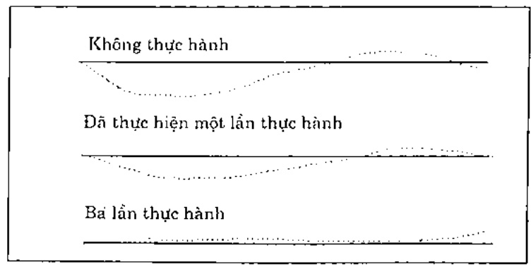

Hình 15-5. Tay máy cỏ di theo đường thắng. Đường dầu không nghiên cứu thực địa, còn hai đường sau di tốt hơn.

<!-- page: 375 -->

Bà duǒng chuyén dòng của tay mây ứng với các trường hợp không tra cùu và có tra cùu thông tin trong bảng khi cần di theo duǒng tháng.

Các dữ hiệu thu được do chuyển động bất kì của tay máy ứng với các điểm trong không gian đặc tính của tay máy. Dé xác định các thông số cho một chuyển động theo yêu cầu của cảnh tay, người ta có thể nội suy từ bảng các giá trị cũ. Dĩ nhiên cần dịch chuyển từng bước để xếp zi được các thông số này.

## II. NGUỔI LĂNG GIÊNG GẢN NHẬT

Việc tìm các đặc tính của một đối tượng mới dựa trên các đặc tính của các đối tượng đã biết, cũng như tìm xem một đối tượng thuộc vào tập các đối tượng đã biết nào được gọi là tìm người lắng giếng gần nhất.

Phân này giới thiệu hai cách tìm người láng giếng gần nhất. Một cản là tuần tự và cản kia là song song. Việc tìm được thực hiện theo cách so sánh các khoảng cách trong không gian độ đo. Giữa hai đổi tượng có khoảng cách và giữa đổi tượng cần định tên và một tập các đổi tượng đã biết cũng được xác định khoảng cách khi cần thiết. Tuy nhiên các thủ tục chi tiết chưa được giới thiệu trong phân này.

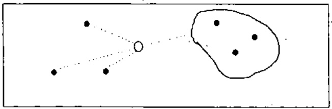

Hình 15-6. Khoáng các giữa các đối tượng và khoảng cách giữa đối tượng và một tập.

## II.1. Thủ tục tìm tuần tự

Thú tục tuần tự nhanh tìm người lắng giếng gần nhất theo thời gian logarit. Bài toán các khối gỗ tìm người lắng giếng gần nhất bằng cách tính khoảng cách trong không gian thể hiện các khối, giữa khối đang xét và các khối mẫu. Đối tượng lắng giếng gần nhất là đối tượng ứng với giá trị khoảng cảnh tối thiểu. Có n khối thì sẽ cần tỉnh n khoảng cách và n-1 phép so sánh.

<!-- page: 376 -->

Tuy nhiên có thể thực hiện chỉ logan thay vìn tính toán bang cách dùng cây quyết định. Nốt chung cây quyết định là dạng sụxếp các phép tính ma trong một bước phân tích mó tả được phép thứ phù nộp nhất.

Dình nghĩa 15-2 : Cây quyết định (Decision tree)

Cây quyết định là thể hiện như cây ngữ nghĩa, trong đó :

\- Môi nuit ứng với tập các trả lời chấp nhận được.

\- Môn nút không phải là là ứng với một phép thử. Phép thu này chia tập các trả lời ra các tập con ứng với các kết quả thu khác nhau.

\- Mở nhánh trở tập con các kết quả thử cụ thể đến một nút khác.

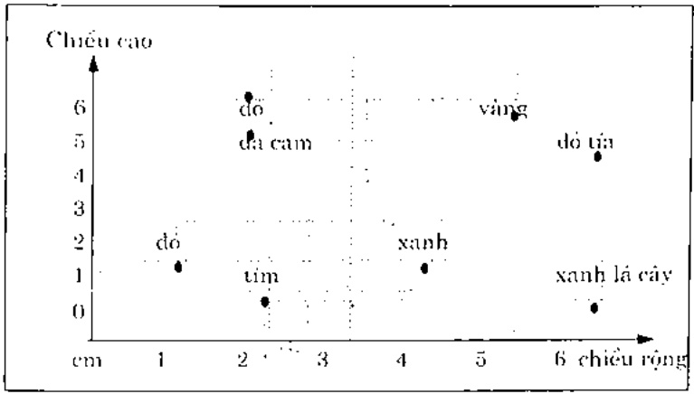

Hình 15-7. Tập các trường hợp được chia ngang, chia dọc cho đến khi mỗi tập chỉ có một trường hợp.

Đế dùng cây quyết định cho thí dụ định tên các khối, người ta chia ra các trường hợp trước khi tiến hành các tính toán tìm người láng giếng gần nhất. Không gian các khối được chia ra hai phần, bồn phần, tám phần... Mỗi phần, hay mỗi tập, chúa một phần tử. Khi đó người ta có cây KD. Thuật ngữ KD nhận mạnh ràng khoảng cách d tỉnh ương không gian độ do k chiếu.

Trong thí dụ trên, các đường chia không gian ra các phần dựa vào kích thước của các khối, chẳng hạn đường ngang giữa ứng với độ cao 3.5 cm, rời 1.5 cm và 5.5 cm. Đề xác định người lắng giềng gần nhất của X, người ta thấy độ cao của X lớn hơn 3.5, từ có độ cao trong khoảng gần với đổi tượng cao hơn là với đổi tượng thấp. Do vậy không

<!-- page: 377 -->

xiet đến các khởi đã được cơi là thấp. Đánh giá theo chiều rộng người ta sẻ thấy X gần với các khởi mong hơn. Do vậy không quan tâm đến các khởi cao và dày.

## Dịnh nghĩa 15-3 : Cây KD (KD tree)

Cây KD là cây quyết định mà :

\- Tàp các trả lời ứng với các điểm; mỗi điểm có thể là người lăng giống gần nhất của điểm đã biết.

\- Môi thử nghiệm xác định một toa độ, một ngưỡng, và một vùng trung lập không chiữa nút nào.

\- Môi thử nghiệm chia tập các điểm thành hai tập, sao cho hai bên ngưỡng đều có các điểm.

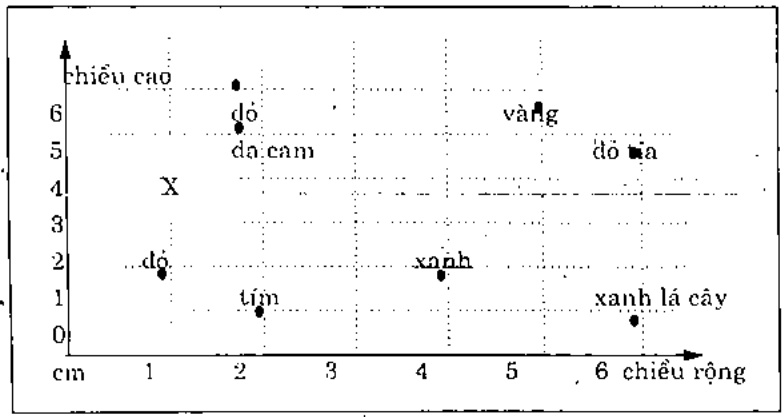

Hình 15-8. Đối tượng X xuống đến 2.00 cm mới thấy đối tượng của tập phía dưới, vi chiều cao X là 4 cm.

Do X rộng 1 cm nên đối tượng di sang 4.00 cm chuta gặp đối tượng nào. Đối tượng X di lên 2.00 cm chuta gặp đối tượng của phần nhỏ phía trên.

Cuối cùng người ta kết luận được người làng giếng gần nhất là dôi tượng màu da cam, cách 1.41 cm. Việc tìm kiếm khối gần dôi tương X nhất tựa nhu duyệt trên cây quyết định theo cách các dôi tương được chia thành các tập. Trên cây cũng cho thấy việc tìm kiếm chỉ thực hiện ba phép so sánh, không phụ thuộc vào kích thước của dôi tương X. Nếu người ta không may và dự đoán sai thì cần tìm kiếm nhiều hơn, thâm chỉ trên các tập đã bị bỏ qua trước đây.

<!-- page: 378 -->

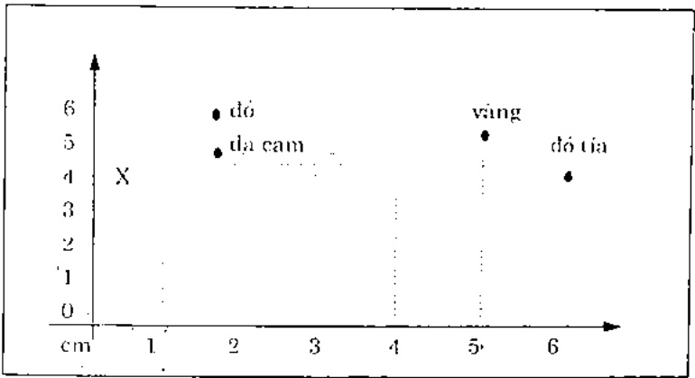

Hình 15-9. Phân không gian phía trên được chia làm hai phân nhỏ.

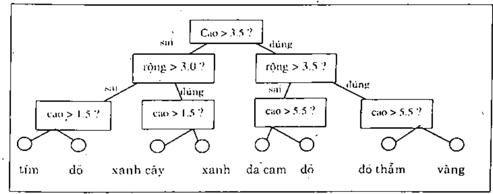

Hinh 15-10. Cây KD hoàn chỉnh xác định khối gần nhất.

Nói chung, cây quyết định có hai khả năng rẽ nhánh và độ sâu là đ thì sẽ có 2$^{d}$ lá. Nếu cần định tên n đối tượng, đ cần đủ lớn để 2$^{d}$ ≥ n. Điều này có nghĩa số các phép so sánh, ứng với độ sâu của cây sẽ là log$_{2}$n.

Sau dây là thủ tục cho phép chia các trường hợp thành các tập, tạo nên cây quyết định.

<!-- page: 379 -->

Dếchia các truong hợp thanh các tập, thục hiện : .

1. Nèn chu con một trường hợp, dùng quả trình chia.

2. Nêu dò la lân chia dầu tiên, chon trực tung để so sanh; nguốc lái chơn trực khác với trực vừa chơn trong lân chia trước.

3. Chỉ xem xét trực so sánh, tìm vị trí trung bình của hai đối tượng giữa. Gọi vị trí trung bình này là ngưỡng và xây dựng cây quyết định đế so sánh đối tượng chưa biết với ngưỡng. Đồng thần ghi nhà hai đối tượng giữa trên trực so sánh. Gọi các vị trí này là biến trên, dưới.

4. Chia các đối tượng thành hai phần, mỗi phần có một vị trí giữa.

5. Sử dụng thu tục đặcchia các đối tượng thành tập von, tao cấy quyết định cho mỗi tập này.

Một thủ tục tìm người láng giếng gần nhất chỉ chỗ các khả năng chọn lán trước đã di qua để có thể duyệt có tên chung là thủ tục KD.

Thủ tục KD tìm người lắng giếng gần nhất thực hiện :

Xác định số các phần tử trong tập đang xét.

1. Nếu chỉ có một phần tử, thông bảo kết thúc.

2. Ngược lại, so sánh đối tượng chưa biết với một ngưỡng hiện tại theo trực so sánh đang dùng. Kết quả cho ra các tập.

3. Dùng thu tục người lắng giếng gần nhất trên tập này.

4. Xác định khoáng cách đến người láng giếng gần nhất trong tập này, với biển của tập theo trục so sánh đang xét.

\- Nếu khoảng cách này không lớn hơn, thông báo về người lắng giềng gần nhất của tập này.

\- Ngược lại, kiểm tra trong tập khác với tập này. Dùng thu tục người lắng giếng gần nhất trong cả hai tập và cho ra hết quả.

## II.2. Tîm song song

Khi có máy tính cho phép nhiều quá trình song song, việc tìm kiếm thao các thủ tục trên thuận lợi hơn. Việc tính các khoảng cách trên các nhánh được thực hiện đồng thời. Phẩn cứng song song cho phép tìm người láng giếng gần nhất thanh hơn.

Các kết quả được so sánh để tìm ra khoáng cách tối thiểu đến đối tượng chưa biết. Một trong những cách là sử dụng bộ so sánh các kết quả. Kết quả của cập bộ xử lý này được so sánh với kết quả của cập khác. Giải pháp này cho phép tối ưu tổng thể các

<!-- page: 380 -->

bước tuân tụ. Trên các máy xử lý song song, thủ tục nguồn líng giếng gần nhất sẽ được thay đổi phù hợp.

## III. KÊT LUẬN

Các nhận xét kết luận về việc học theo cách ghi lại các trường hợp gồm :

\- Phép may rụi kiến trì dùng để định tên theo cách dùng các trường hợp đã nhớ như kho đặc tính của đối tượng chưa biết trước.

\- Các trường hợp được nhớ cho phép giải nhiều bài toán khó, gồm các bài toán điều khiển tay máy động.

\- Thải tục KD là thủ tục tuần tự nhanh cho phép tìm nguồn lắng giếng gần nhất theo thời gian logarit.

\- Máy song song có thể tìm người láng giếng gần nhất nhanh hơn thủ tục KD.

<!-- page: 381 -->

# HỌC THEO CÁCH QUẢN LÝ ĐA MÔ HÌNH

Viçe dùng không gian các thể hệ các thí dụ thuận và thí dụ nghịch giúp người ta biết các điều kiện để trở thành thành viên của một lớp. Thủ tục không gian thể hệ cho phép học nhanh chóng qua xấu các thí dụ. Người ta xét một số cỏ định các thuộc tính và một mô hình đặc trưng cho lớp gồm tổ hợp các giá trị về các thuộc tính này.

Các thí dụ sau này sẽ cho thấy cách lấy trị thức từ một cơ sở dữ hiệu về các thời quen của học sinh thỉnh thoảng có phản ứng do chán nán.

Phân này còn cung cấp khả năng dùng các lý thuyết da phương án thay cho nhu cầu biến các thí dụ nghịch thành các thí dụ nghịch gần giống.

## I. PHUONG PHAP KHÔNG GIAN CÁC THÊ HỆ

Khi học nhỏ việc phân tích sự khác nhau có thể thay đổi các mô hình. Tuy nhiên người ta phải tránh mắc sai làm khi thay đổi mô hình, chẳng hạn như mô hình được tạo ra không khác với mô hình đang xét. Ngoài ra còn tránh phải giải thích nhiều về mô hình và sự không chắc chắn khi thay đổi mô hình.

Phân sau đây sẽ học một cách khác để xử lý các thí dụ. Người ta tránh mắc các sai lâm khi thay đổi nhỏ theo dõi các giải thích khi còn đang dùng chủng.

## I.1. Không gian các thể hệ

Không gian các thể hệ gồm các mô hình chung nhất và đặc biệt nhất

Định nghĩa 16-1: Không gian thể hệ (Generation space)

Không gian thế hệ là một thể hiện cho phép người ta theo vết các thông tin hữu ích nhỏ đãy các thí dụ học, và không nhỏ bất hi thi dụ nào.

Mô tả không gian thể hệ gồm hai cây phụ; một cây chứa các nút nổi với các mô hình chung nhất và cây kia chứa các nút nổi với các mô hình đặc biệt nhất. Môi liên

<!-- page: 382 -->

kết giữa không gian thế hệ thể hiện phép toán hoặc đặc biệt hoặc tổng quát giữa các mô hình nổi với nút.

Không gian thể hệ là thể hiện, trong đó :

• Có cây đặc biệt và cây tổng quát.

• Môi nut nôi với một mô hình.

\- Môi nút trên cây tổng quát nôi với một mô hình kháp với tất cả các vấn đề.

\- Môi nút trên cây đặc biệt nổi với một mô hình khớp với một vấn đề.

\- Các liên kết giữa các nút và thế hiện quan hệ tổng quát hóa và đặc biệt hóa giữa các mô hình.

Dối với người theo dõi, việc "nội nút với mô hình" có nghĩa "sinh ra một mô hình của nút".

Tự tương chính trong việc học trong không gian thế hệ là sự đặc biệt hóa của mô hình tổng quát và sự tổng quát hóa của mô hình đặc biệt để rời dưa về một. Mô hình cuối cùng sẽ khớp với các thí dụ thuận và không khớp với các thí dụ nghịch. Giá sử quá trình học sẽ xác định được mô hình nhận biết đúng các đối tượng; các thi dụ thuán là thí dụ về đối tượng-tổng quát, phù hợp ngay với mô hình này, trong khi đó thi thí dụ nghịch là thí dụ về đối tượng cả biệt, không phù hợp với mô hình này, mà chỉ phù hợp với dạng riêng của mô hình. Vậy nên để biết cách thực hiện tổng quát hóa và đặc biệt hóa, trước tiến khảo cứu về các khái niệm trường tượng, rời sau sẽ xét các thí dụ.

Thí dụ

Đặc biệt hóa

mô tá chung

Tổng quát hóa

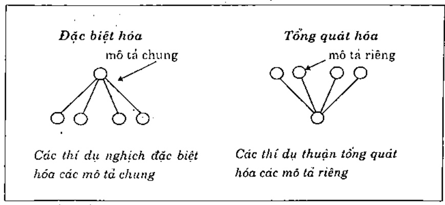

hóa các mô tả chung

Các thí dụ thuận tổng quát

hóa các mô tả riêng

Hinh 16-1. Đặc biệt hóa và tổng quát hóa.

<!-- page: 383 -->

Hình về minh hoa việc học trong không gian thế hệ. Các thí dụ thuận tổng quát hoa các mô hình riêng và lược bỏ các mô hình tổng quát. Các thí dụ nghịch đặc biệt hoa các mô hình chung và lược đi các mô hình riêng.

Trong hình cho thấy mô hình tổng quát nhất được đặc biệt hóa để các mô hình môi rút ra từ mô hình tổng quát nhất không khớp được với thí dụ nghịch sẻ gặp. Mở mô hình môi đã thay đổi một phần mô hình cũ. Đồng thời mô hình đặc biệt nhất được tổng quát hóa để các mô hình thu được từ nó đủ tổng quát và khớp được với thí dụ thuận sẻ gặp. Do vậy các mô hình tổng quát trở nên đặc biệt hơn để tránh khớp và các mô hình riồng trở nên tổng quát hơn để đề khớp.

## Các thi dự nghịch lược bổ các mô tả riêng

Những cây hợp lại từ mô hình tổng quát nhất và một mô hình riêng không nổi rộng mại mại. Nhiểu nhánh sẽ bị lược bỏ. Đề thấy li do, người ta xét những gì xảy ra với thí dụ nghịch. Mỗi khi thấy một mô hình riêng khớp với thí dụ nghịch, mô hình này cần bị bỏ đi. Nguyên nhân của việc này là các mô hình riêng thay đổi chỉ khi các thí dụ thuận động đến, và thí dụ thuận làm các mô hình riêng trở nôn tổng quát hơn. Không có gì khiên các mô hình riêng đặc biệt hơn nữa, từe mô hình riêng chỉ có thể tổng quát lên. Khi có mô hình riêng khớp một thí dụ nghịch, thì bắt kì mô hình riêng khác rút ra từ mô hình này cũng sẽ khớp với thí dụ nghịch.

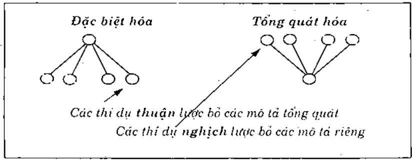

Hình 16-2. Các nút bị lược bỏ.

## Các thí dụ thuận lược bổ các mô tả tổng quát

Hoàn toàn đối xâyng với lập luận trên, mỗi khi thi dự thuận được dùng để tổng quát hón các mô hình riêng, người ta cần lược bỏ các mô hình tổng quát này để nó không còn khớp với thí dự thuận. Lí do là vì các mô hình tổng quát chỉ có thể đặc biệt hơn. Bời thế, nếu một mô hình chung đã không khớp một thi dự thuận thì bắt kì mô hình tổng quát khác rút ra từ nó cũng không khớp.

<!-- page: 384 -->

Khu dà có một mô hình tổng quát và một mô hình riêng. Không vân các thu dự khái nǜa vi người ta tin ràng dây là mô hình dùng. Tuy nhiên nay sinh hạn vân để sau :

\- Người ta đã thay đổi chút ít đổi vốn mô hình chung và mô hình riêng. Loại thay đổi dò là gì ? Mỗi khi mô hình chung được đặc biệt hóa, sự đặc biệt hóa cần là sự tổng quát hóa của một trong các mô hình riêng. Ngệu lợi, không một tố hợp thay đổi nào có thể dual sự đặc biệt hóa mới nhập vốn bài kĩ của được tạo nên bởi sự tổng quát hóa các mô hình riêng. Tương tự, mỗi khi mô hình riêng được tổng quát hóa, sự tổng quát hóa này cần là đặc biệt hóa của của một trong các mô hình tổng quát. Một sự tổng quát hóa mới không được tạo nên từ bất kĩ việc đặc biệt hóa các mô hình chung nào.

Các mẫu riêng và chung làm cho các mô hình riêng và, mô hình tổng quát chụm làm một.

Hình 16-3. Chụm hai mô hình.

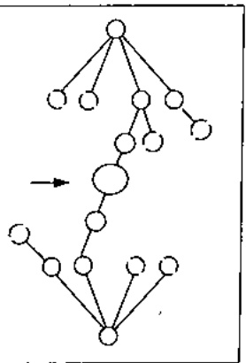

## Mỗi đặc biệt hóa cần là tổng quát hóa của mô hình nào đó.

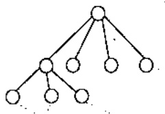

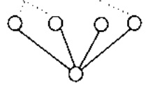

Hình 16-4. Minh họa nhận xét.

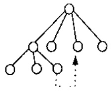

Không đặc biệt hóa nào có thể là đặc biệt hóa của mô hình tổng quát khác.

<!-- page: 385 -->

\- Môi khi mô hình chung được đặc biệt hóa, việc này không phải là đặc biệt hóa của mô hình tổng quát khác. Nguộc lại, người ta giữ mô hình riêng lại trong tập các mô hình chung.

## I.2. Việc tổng quát hóa và đặc biệt hóa

Việc tổng quát hóa và đặc biệt hóa hội tụ về không gian thể hệ. Tiếp theo việc xét các khải mệm chung là một số thí dụ cụ thể. Giá sử ràng có bắc sĩ y khoa điều trị bệnh nhân dị ứng. Việc học cho người ta biết điều kiện dị ứng là kết quả trực tiếp của một tổ hợp về địa điểm mà bệnh nhân ăn uống, thời gian trong ngày, khối lượng thực phẩm sử dụng...

Một mô hình riêng trong kho thực phẩm là một danh sách các giá trị của các thuộc tính đặc trưng cho tỉnh hướng như vị trí, bữa ăn, thời gian, giả bữa ăn. Chắng hạn "nhà hàng Sơn, ăn tối, vào thử năm, với bữa ăn đất". Khi có mô hình như vậy, cũng giá trị thuộc tỉnh được xác định người ta có thể khớp với tố hợp nhà hàng - bữa ăn - ngày - giả. Ngược lại, mô hình tổng quát nhất không xác định bất ki giá trị thuộc tính nào. Kí hiệu cho mô hình chung là danh sách [??.?,?.?,]. ứng với các giá trị thuộc tỉnh được phép.

Mô hình [nhà hàng Sơn, ?, ?. đất] khớp với bất kì tình huống có bệnh nhân ăn đất tại nhà hàng Sơn. Những mô hình như vậy nằm giữa mô hình hoàn toàn riêng và mô hình hoàn toàn tổng quát.

Tiếp theo, giả sử muốn tổng quát hóa mô hình này, chuyển [nhà hàng Sơn, ?, ?. đất] thành [nhà hàng Sơn, ?, ?. ?] bằng các thay giả trị cụ thể bằng cái chưa biết: hay đặc biệt hóa bằng cách chuyển [nhà hàng Sơn, ?. ?, đất] thành [nhà hàng Sơn, ăn tối, ?. đất].

Nếu bệnh nhân ăn ba bữa một ngày, bữa ăn hoặc đất hoặc rẻ, có ba elő án, sẽ có 3\*7\*2\*3 = 126 tổ hợp có thể sinh rỉa dị ứng. Tuy nhiên chỉ có một số tình huống gây ra dị ứng.

|  | Nơi ăn | Bữa ăn | Ngày | Giá | Phản ứng |
| --- | --- | --- | --- | --- | --- |
| 1 | Nhà hàng Sơn | Sáng | Thứ sáu | Rễ | Có |
| 2 | Bình dân | Trưa | Thứ sáu | Đất | Không |
| 3 | Nhà hàng Sơn | Trưa | Thứ bảy | Rễ | Có |
| 4 | Khách sạn | Sáng | Chủ nhật | Rễ | Không |
| 5 | Nhà hàng Sơn | Sáng | Chủ nhật | Đất | Không |

Hình 16-5. Các số liệu thông kê.

<!-- page: 386 -->

Thi dụ đầu tiên, ứng với dòng thú nhất, sinh ra không gian thế hệ, gồm có mô hình tổng quát nhất [7.2.2.] và các mô hình đặc biệt [nhà hàng Sơn, ăn sáng, thú sáu, rẻ] được xây dựng từ thí dụ thuận, tục là thí dụ ứng với việc "có phản ứng". Thi dụ này được cơ là thuận vị nó hợp với mô hình sẽ đạt đến sau này.

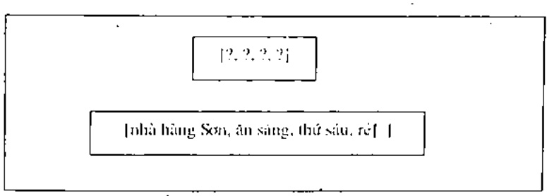

Hình 16-6. Thí dụ thuận.

Tiếp theo là thi dụ nghịch, đặc biệt hóa mô hình tổng quát nhất. Môi sự đặc biệt hóa cần thay đổi mô hình tổng quát nhất. Người ta thay ki hiệu "?" bằng giá trị tương ứng. Phương pháp này đảm bảo mỗi đặc biệt hóa là sự tổng quát hóa của mô hình đặc biệt nhất. Điều này đảm bảo việc đặc biệt hóa của các mô hình tổng quát mới có thể hội tụ về tổng quát hóa của mô hình riêng đã có.

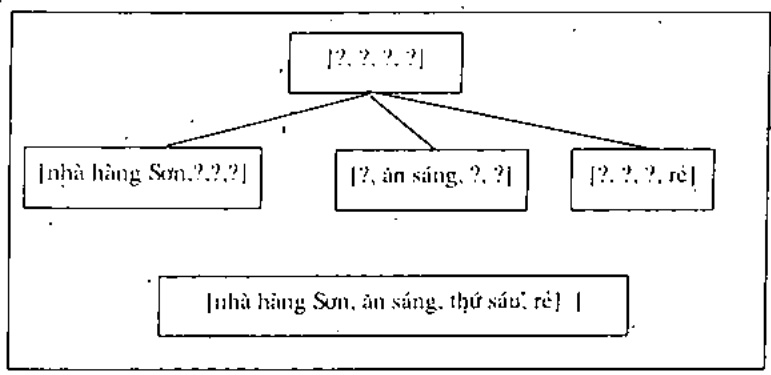

Hình 16-7. Với mẫu thí dụ nghịch [bình dân, ăn trưa, thứ sáu, đất], người ta thực hiện việc đặc biệt hóa mô hình chung. Mỗi đặc biệt hóa cần là tổng quát hóa của mô hình riêng.

Lưu ý rằng có ngoại lệ, đặc biệt hóa [?, ?, thứ sáu, ?] không xuất hiện trong không gian thế hệ vì nó khớp với thí dụ nghịch [bình dân, ăn trưa, thứ sáu, đất]. Nhìn chung

<!-- page: 387 -->

việc đặc biệt hóa mô tả chung nhất cần tránh khớp với thí dụ nghịch. Nếu không yêu cầu các đặc biệt hóa cần là tổng quát hóa của mô hình riêng thì có nhiều cách thực hiện việc đặc biệt hóa.

Thí dụ thứ ba là thi dụ thuận, dua đến việc tổng quát hóa mô hình đặc biệt nhất. Người ta xây dựng mô hình mới bằng cách so sánh mô hình đặc biệt nhất đã có với thi dụ này.

Tại nơi mô hình đặc biệt nhất khác với thí dụ thuần, thuộc tỉnh trong mô hình đặc biệt nhất được thay bằng dấu "?". Do vậy, mô hình đặc biệt nhất [nhà hàng Sơn, ăn sáng, thủ sâu, rẻ] khi so sánh với thí dụ thuần [nhà hàng Sơn, ăn tựta, thử bấy, rẻ], cho kết quả [nhà hàng Sơn, ?, ?. rẻ].

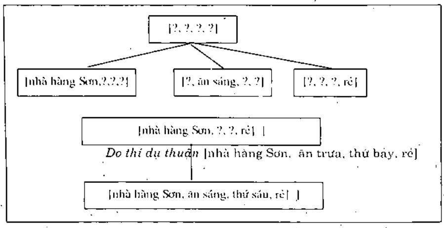

Hình 16-8. Thị dụ thuận khiển tổng quát hóa mô hình đặc biệt nhất. Mô hình mối là mô hình riêng tổng quát hơn, là đủ tổng quát để khớp cả hai thí dụ thuận đã phân tích. Một mô hình tổng quát bị luge bỏ.

Vậy nên mô hình đặc biệt nhất trước đó được thay thế bằng tổng quát hóa mới. Cái này không khác, trừ những thuộc tỉnh mà thi dụ thuận vừa rời khiển nó thay đổi.

Lưu ý rằng [nhà hàng Sơn, ăn trưa, thú bảy, rè] không thể khớp với mô hình chung [?, ăn sáng, ?, ?] lẫn bắt cứ mô hình khác có được do đặc biệt hóa mô hình chung này. Như vậy việc đặc biệt hóa mô hình chung không chứa [?, ăn sáng, ?, ?], hay nói cách khác là nhánh [?, ăn sáng, ?, ?] bị lược bỏ.

Thí dụ thứ tư là thí dụ nghịch, ứng với dòng [khách sạn, ăn sáng, chủ nhật, rễ, không], yêu cầu đặc biệt hóa bất kì mô hình riêng nào khớp với [khách sạn, ăn sáng, chủ nhật, rễ]. Việc đặc biệt hóa chỉ còn hai nhánh. Do [nhà hàng Sơn, ?, ?, ?] không

<!-- page: 388 -->

khóp, không cần phát triển nhánh này. Và do [?, ?, ?, rè] khớp, cần đặc biệt hóa nhánh này. Như lập luận trên, việc đặc biệt hóa này cần di theo hướng của việc tổng quát hóa mô hình riêng. Nhìn vào các thi du người ta thấy có một mô hình [nhà hàng Sơn, ?, ?, rè]. Chỉ có một cách đặc biệt hóa [?, ?, ?, rè] thành [nhà hàng Sơn, ?, ?, rè], tạo nên mô hình chung mới trùng với mô hình riêng duy nhất.

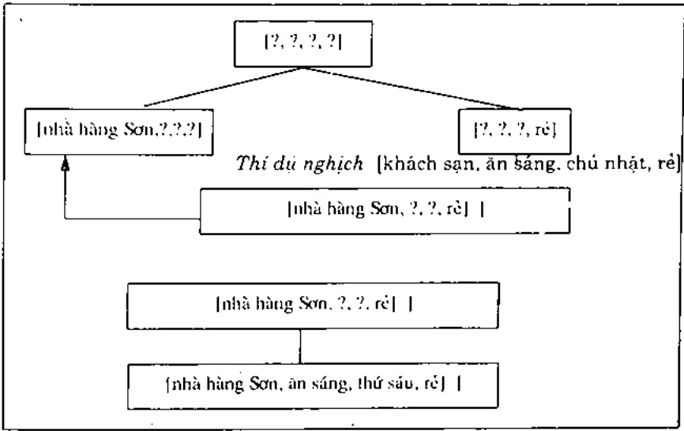

Hình 16-9. Thị dụ dương tạo nên việc tổng quát hóa mô hình riêng. Mô hình mới tổng quát hơn. đủ đề khớp với cả hai thí dụ thuận đã phân tích trước đây.

Thế nhưng mô hình đặc biệt mối [nhà hàng Sơn, ?, ?, rẻ] này cũng là mô hình chung đã có là [nhà hàng Sơn, ?, ?, ?], do đó nó bị loại vì chỉ các mô hình đặc biệt do dữ liệu yêu cầu mối được giữ lại. Với ràng buộc này, khi các mô hình chung và các mô hình riêng hội tụ người ta mối chắc ràng các thí dụ thuận và thí dụ nghịch không chấp nhận mô hình khác.

Lúc này còn hai mô hình :

• Mô hình tổng quát [nhà hàng Sơn. ?, ?. ?].

• Mô hình riêng [nhà hàng Sơn, ?, ?, rè].

Thi dụ cuối cùng là thí dụ nghịch, yêu cầu đặc biệt hóa [nhà hàng Sơn, ?, ?, ?]. Cách duy nhất là tạo mô hình môi nhu mô hình đặc biệt đang có. Việc học kết thúc, dùng ở kết luận "nhà hàng Sơn và thực phẩm rè gây dị ứng".

<!-- page: 389 -->

Mô hình môi là mô hình chung đặc biệt hơn, là giống mô hình riêng duy nhất. Vậy tập tổng quát và tập riêng đã hội tự, sinh ra mô hình duy nhất.

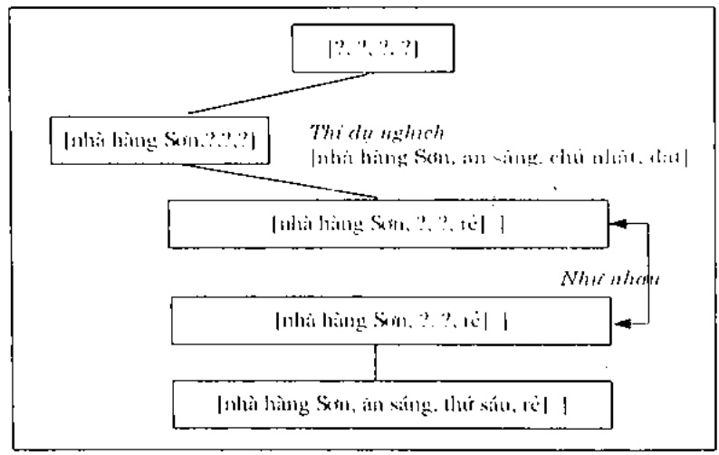

Hình 16-10. Thị dự nghịch khác yêu cầu đặc biệt hóa mô hình tổng-quát duy nhất còn lại. Mô hình mới này là mô hình tổng quát đặc biệt hơn. cũng như là mô hình đặc biệt duy nhất.

## II. THỦ TỤC KHÔNG GIAN THẾ HỆ

Thủ tục về không gian thể hệ xử lý các thí dụ thuận và thí dụ nghịch một cách đối xứng. Thủ tục cũng cho phép thực hiện nhiều thủ ngoài việc hội tụ về một mơ tả đơn.

## II.1. Thủ tục

Sau dây là thủ tục xử lý đối xúng các thí dụ thuận/nghịch. Đề học nhỏ các thí dụ thuận và các thí dụ nghịch trong không gian thể hệ, thủ tục thực hiện các bước sau :

Nếu thí dụ là thuận :

1. Tạo tất cả mô hình đặc biệt khớp với thí dụ thuận, đảm bảo :

• Các mô hình mới yêu cầu thay đổi chút ít.

• Mỗi mô hình riêng là đặc biệt hóa của mô hình chung nào độ.

\- Không một mô hình riêng nào là tổng quát hóa của mô hình đặc biệt khác.

<!-- page: 390 -->

2. Loại bỏ các mô hình chung không khớp được thi du thuần.

Nou thi du la nghich :

1. Tạo tật và mô hình tổng quát khớp với thí dụ nghịch, đảm bảo :

• Các mô hình mới yêu cầu thay đổi chut it.

\- Môi mô hình chung là tông quát hóa của mô hình riêng nào do.

\- Không một mô hình chung nao là đặc biệt hóa của mô hình chung khác.

2. Loai bò cac mô hình riêng khớp với thi dự nghích.

Rô ràng ràng thủ tục này cho phép nhiều lần đặc biệt hóa cũng như nhiều lần tổng quát hóa. Trong thí dụ về dị ứng, chutale có hơn một mô hình đặc biệt vi phương pháp sử dụng để tổng quát hóa các mô hình đặc biệt không sinh ra quá một mô hình tổng quát đối với mỗi thí dụ thuận. Các phương pháp tổng quát hóa khác không có đặc tỉnh này.

## II.2. Nhận dạng thí dụ

Thủ tục không gian thể hệ cho phép nhận đang thi dụ. Một khi một hay nhiều thi dụ nghịch đã được giải thích người ta có thể thấy chắc chắn ràng một số thi dụ không thể là các thi dụ thuận. Ngày sau khi xét thi dụ thuận và thi dụ nghịch đầu tiên trong bài toán "dị ứng" trên, chỉ xuất hiện ba mô hình chung. Nếu tố hợp các giá trị thuộc tỉnh không khớp bất kì mô hình nào, thì nó phải là thi dụ nghịch, vì không mô hình nào trọng ba mô hình này lại có thể tổng quát hơn.

Thí dụ

Người ta có thể chắc [bình dân, àn tối, thú tư, đất] không thể là thi dụ thuận. vì qua hai thí-dụ đầu người ta thu được ba mô hình [nhà hàng Sơn. ?, ?, ?.]. [?. án sáng. ?, ?] và [?, ?, ?; rê]. Bộ dữ liệu vừa nêu không khốp bất ki mô hình nào.

## III. KÊT LUẬN

. Vải nhận xét về việc học nhỏ quản lý các mô hình gồm :

\- Một cách học là quản lý tập các mô hình chung nhất và tập các mô hình riêng nhất trong không gian thể hệ. Sau đó người ta có thể dùng các thi dụ thuận và thí dụ nghịch đề di chuyển hai tập này gần nhau cho đến khi chúng hội tụ về một mô hình đúng.

\- Thủ tục không gian thể hệ có thể nhận dạng thí dụ trước khi tập tổng quát nhất và tập đặc biệt nhất hội tụ.

<!-- page: 391 -->

Thủ tục không gian thế hệ xử lý các thí dụ thuận và thí dụ nghịch đối xùng. Các thí dụ thuận tổng quát hóa tập riêng nhất và làm gọn tập tổng quát nhất. Các thí dụ nghịch đặc biệt hóa tập tổng quát nhất và thu gọn tập riêng nhất.

<!-- page: 392 -->

# HỌC BẰNG CÁCH XÂY DỰNG CÂY ĐỊNH TÊN

Chương này cung cấp cách tập hợp các thủ nghiệm thanh cây định tên. Cây định tên có thể được chuyên sang các luật nhân quả để đề nhận biết hơn.

Cây định tên là công cụ thông dụng trong việc học. Có hàng ngân cây cho các ứng dụng, từ y học đến điều khiển quá trình.

## I. TỪ DỮ LIỆU ĐẾN CẤY ĐỊNH TÊN

Các cây định tên sẽ được xây dựng thông qua việc tìm tính quy luật trong dữ liệu.

## I.1. Thị dụ về. thể giới thực thu gọn

Thí dụ'

Tường tượng có các dữ liệu về bài toán đánh giá độ râm nắng tại nơi nghi mát. Có người vui vì ngăm đen, nhưng cũng có người rất vi rộp da. Dữ liệu quan sát trên tấm người được ghi lại theo bảng sau đây.

Nếu có ba dữ liệu khác nhau về màu tốc. cản nặng, chiều cao và người ta có thể dùng thuốc hoặc không thì sẽ có 3\*3\*3\*2 = 54 tổ hợp. Một người mới được chọn thì xác suất khớp được với mẫu là 8/54 = 0.15. Xác suất này cao hơn thực tế do còn nhiều thuộc tỉnh và nhiều giá trị khác mà thuộc tỉnh có thể nhận.

Dơ vậy nếu sơ sánh các thuộc tính của đối tượng chưa biết với thuộc tỉnh của các đối tượng thống kê thì không chính xác. Một số nhận xét về việc giải bài toán này :

\- Người ta có thể xử lý dữ liệu như không gian các đặc tính, nhưng nếu người ta không rõ thuộc tính nào là quan trọng hơn thì cũng khó tìm thấy đổi tượng khớp nhất.

\- Có thể dùng không gian các thế hệ để cõ lập các thuộc tính liên quan và thuộc tính không liên quan. Tuy nhiên người ta thường không tìm thấy lí do thuyết phục đề tin được mô hình phân loại có thể được diễn tả như tổ hợp các giá trị

<!-- page: 393 -->

cua tập các thuộc tỉnh. Mặt khác cũng có thể các mẫu bị nhiều, không thực chính xác như thế gửi thực.

| Tên người | Màu tốc | Chiều cao | Cân nặng | Dùng thuốc? | Kết quả |
| --- | --- | --- | --- | --- | --- |
| Hoa | Đen | Tầm thuốc | Nhẹ | Không | Bị rám |
| Lan | Đen | Cao | Vừa phải | Có | Không |
| Xuân | Râm | Thấp | Vừa phải | Có | Không |
| Họ | Đen | Thấp | Vừa phải | Không | Bị rám |
| Thu | Bạc | Tầm thuốc | Nặng | Không | Bị rám |
| Đông | Râm | Cao | Nặng | Không | Không |
| Mơ | Râm | Tầm thuốc | Nặng | Không | Không |
| Đào | Đen | Thấp | Nhẹ | Có | Không |

Hình 17-1. Số liệu quan sát về hiện tượng rám nắng. Hoa, Hạ và Thu bị rám.

\- Người ta dùng thủ tục phân loại chính xác các mẫu. Khi thủ tục đã học mẫu với số lượng mẫu "khá dù", thủ tục có thể nhận ra đối tượng chưa biết:

Một cách phù hợp cho phép thể hiện các thủ tục thử nghiệm các thuộc tỉnh là sắp xếp các thủ nghiệm trên cây định tên. Do cây định tên thuộc loại cây quyết định, đặc tả của nó như đặc tả cây quyết định.

Định nghĩa 17-1: Cây định tên (Identification tree)

Cây định tên có thể hiện như cây quyết định, trong đó mỗi tập các kết luận được thiết lập ngầm định bởi một danh sách của lớp đã biết.

Cây định tên dùng để xác định người bị râm nắng với kiểm tra đầu tiên là màu tốc. Nếu thấy tốc den người ta kiểm tra có dùng thuốc không ? Ngược lại, nếu tốc bạc hay râm, người ta không cần kiểm tra. Nói chung việc chọn tiến hành loại kiểm tra nào là phụ thuộc vào kết quả của lần kiểm tra trước.

<!-- page: 394 -->

Thí dụ

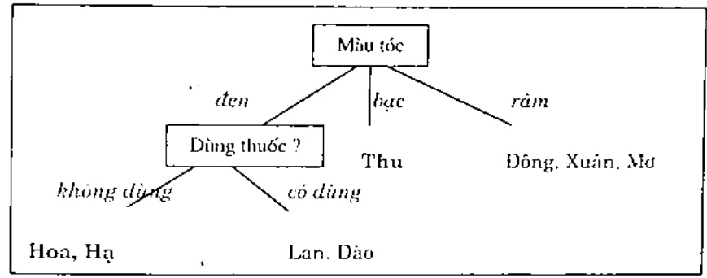

Hình 17-2. Cây định tên. Người có tên ghi đậm là người bị râm nắng.

Mở dôi tượng đưa vào định tên di xuống theo một nhánh cây, tùy theo các giá trị thuộc tính của nó. Cây định tên như hình vẽ có thể phân loại người trong cơ sở dữ liệu "râm nắng" vì mỗi người ứng với một nút lá trên cây định tên. Nút này dùng cho một hay nhiều người. Trong hình cho thấy người bị rám nắng được đánh dấu bằng tên în đậm hơn.

Người la có thể đưa ra một cây, có các nút lá ứng với mỗi người, không liên quan gì đến thuộc tỉnh râm nắng. Liệu nó được dùng để phản loại không ?

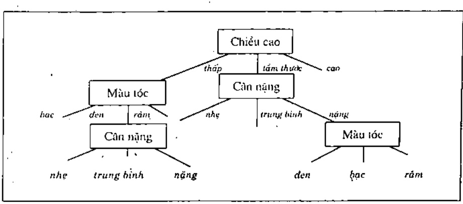

Hình 17-3. Cây tổng quát có nút lá ứng với mỗi người.

<!-- page: 395 -->

So sánh cây định tên và cây tổng quát này, người ta thấy cây thử nhất là cây định tên, có về liên quan đến sự rám nắng nhiều hơn cây thử hai. Cây định tên tố ra đã biết ràng màu tốc và phân lộ ra ánh nắng liên quan trực tiếp đến tỉnh rám nắng.

Làm sao người ta có thể chương trình hóa để đến được cùng một kết luận mà không cần biết trước màu tốc và việc dùng thuốc bên quan đến đặc tỉnh của da ? Một trong các giải đáp là phát biểu của Occam.

## Phát biểu Occam dùng cho các cây định tên

Thế giới vốn đơn giản. Do vậy cây định tên gồm các mẫu la cải thích hợp nhất để định tên các đối tượng chưa biết một cách chính xác.

Theo phát biểu này, do cây định tên đầu tiên nhỏ hơn cây sau nên nó phù hợp hơn.

## 1.2. Phân loại đối tượng theo các thuộc tính

Nếu như người ta tìm kiếm cây định tên nhỏ nhất khi cần có rất nhiều thủ nghiệm thì thực là không thực tế. Chính vi vậy mà cũng nên dùng lại ở thủ tục xây dựng những cây định tên nhỏ, dù rằng nó không phải là nhỏ nhất. Người ta chọn thủ nghiệm cho phép chia cơ sở dữ liệu các mẫu thành các tập con, trong đó nhiều mẫu cùng chung một loại. Đối với mỗi tập có nhiều loại mẫu, người ta dùng thử nghiệm khác để chia các đối tượng không đồng nhất thành các tập chỉ gồm đối tượng đồng nhất.

## Thí dụ

Cơ sở dữ liệu "rám náng" có thể được chia nhỏ theo bốn thủ nghiệm ứng với bốn thuộc tỉnh.

\- Thử nghiệm theo cân nặng là tối nhất nếu người ta đánh giá thủ nghiệm theo các tập đồng nhất, có cùng tính chất rám nắng. Sau khi dùng thử nghiệm này, những mẫu rám nắng nằm đều ở các tập.

\- Thử nghiệm theo chiều cao có về tốt hơn. Có hai người trong một tập đồng, nhất. Hai tập kia có lẫn cả người rám và không rám nắng.

\- Thủ nghiệm về việc dùng thuốc thu được ba đối tượng trong một tập đồng nhất gồm những người không rám nắng.

\- Thử nghiệm theo màu tốc là tốt nhất. Trong tập đồng nhất rám nắng có một người là Thu, và tập đồng nhất không rám nắng có ba người là Đông, Mơ và Xuân.

<!-- page: 396 -->

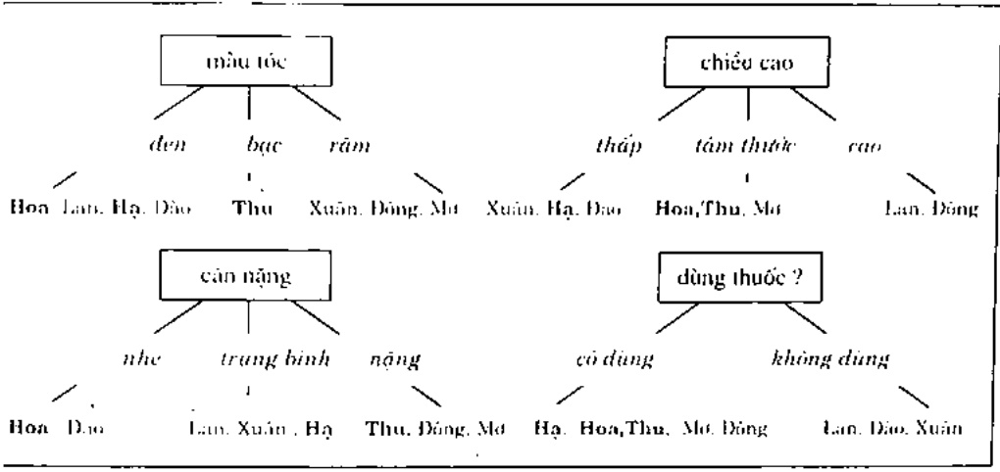

Hình 17-4. Bôn cách phân chia cơ sở dữ liệu theo hôn thuộc tính khác nhau.

Thèo các thủ nghiệm này người ta sử dụng trước tiến thủ nghiệm về màu tóc. Thứ nghiệm này có một tập không đồng nhất ứng với màu tóc. lẫn lợn người rám nắng và không rám nắng. Bốn người Hoa, Lan, Hạ và Đào được chia nhỏ ra.

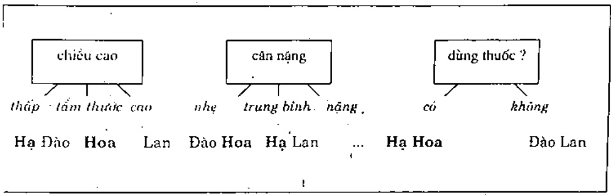

Hình 17-5. Ba cách phân chia tiếp theo đổi với bón người thuộc tập không đồng nhất.

Sau lân chia này người ta nhận thấy trong ba cách chia, cách chia theo việc dùng thuốc cho phép, tách bôn đối tượng thành hai tập đồng nhất.

## I.3. Độ lộn xộn của tập hợp

Đối với cơ sở dữ liệu thực, không phải bất kì thủ nghiệm nào cũng có thể cho ra tập đồng nhất. Với cơ sở dữ liệu này người ta cần do mức độ lộn xộn của dữ liệu, hay

<!-- page: 397 -->

dộ không đồng nhất trong các tập con dược sinh ra. Công thức do lý thuyết thông tin về độ lộn xòn trung bình :

$$
\sum_ {b} \frac {n b}{n _ {1}} \sum_ {i} - \frac {n b _ {1}}{n b} \log 2 \frac {n b _ {2}}{n b}
$$

Trong đó $n_b$ là số mẫu trong nhánh b. $n_t$ là tổng số các mẫu, và $n_{bc}$ là số mẫu trong nhánh b của lớp c.

Thực chất người ta quan tâm đến số các mẫu tại cuối nhánh. Yếu câu $n_{1}$, và $n_{2}$, là cao khi thử nghiệm sinh ra các tập không đồng nhất, và là thấp khi thử nghiệm sinh ra các tập hoàn toàn đồng nhất.

$$
\text {Dộ lộn xộn tỉnh bằng} \quad \sum_ {c} - \frac {n b _ {n}}{n b} \log 2 \frac {n b _ {n}}{n b}
$$

Dù công thức chưa cho thấy "sự lộn xộn", nhưng người ta dùng nó đẻ do thông tin. Đề thấy được các khía cạnh quan tâm, giả sử có một tập gồm các phần tự của hai lớp A và B. Nếu sở phần tử của hai lớp là cản bằng, thì độ lộn xộn là 1 và giá trị cực đại về độ lộn xộn được tính theo :

$$
- 1 / 2 \log_ {2} 1 / 2 - 1 / 2 \log_ {2} 1 / 2 = 1 / 2 + / 2 = 1
$$

Mặt khác nếu phân tử thuộc chỉ một trong A. B, độ lộn xộn là 0.

$$
- 1 \log_ {2} 1 \cdot 0 \log_ {2} 0 = 0
$$

Độ lộn xộn bằng 0 khi tập là hoàn toàn đồng nhất, và bằng 1 khi tập hoàn toàn không đồng nhất. Độ do sự lộn xộn có giá trị từ 0 đến 1.

Bảng công cụ này, người ta có thể tính được độ lộn xòn trung bình của các tập tại cuối các nhánh sau lần thủ nghiệm. ,

$$
\text {Dộ lọn xộn trung bình} = \sum_ {b} \frac {4 b}{m _ {c}} * \text {Dộ lọn xộn trong tập nhánh b}
$$

Trong thí dụ trước, thử nghiệm về màu tốc đã chia cơ sở dữ liệu thành ba phần. Tập tốc đen có hai người rám nắng và haj người không rám. Tập tốc bạc chỉ có một người rám nắng. Trong tập tốc râm, cả ba người không hệ rám. Độ lộn xây trung bình được tính, cho kết quả 0.5.

$$
4 / 8 (- 2 / 4 \log_ {2} 2 / 4 - 2 / 4 \log_ {2} 2 / 4) + 1 / 8 * 0 + 3 / 8 * 0 = 0. 5
$$

Thực hiện tính toán tương tự :

<!-- page: 398 -->

| Thứ nghiệm theo ... | Độ lộn xộn |
| --- | --- |
| Màu tốc | 0,50 |
| Ch长城 cao | 0,69 |
| Cân nang | 0,91 |
| Dùng thuốc | 0,61 |

Hình 17-6. Lựa chọn cách phân chia có sở dữ liệu theo độ do về sự lộn xón.

Do thử nghiệm theo màu toe gây ra ít lòn xòn nhất, người ta dùng nó làm thử nghiệm dầu tiên. Tương vị, sau khi làm thử nghiệm này người ta làm thử nghiệm về việc dùng thuốc, do tính toán :

| Thất nghiệm theo ... | Độ lộn xộn |
| --- | --- |
| Chiều cao | 0.5 |
| Cân nặng | 1.0 |
| Dùng thuốc | 0.0 |

Hình 17-7. Lựa chọn tiếp theo.

Vậy để tạo ra cây định tên, người ta dùng thủ tục SINH được trình bày như sau :

Thú tục SINH dùng cây định tên :

Cho đến khi mỗi nút lá được ghi tên các phần từ của tập mãu đồng nhất, thực hiện :

1. Chọn multit lá ứng với tập mẫu không đồng nhất.

2. Thay thế nứt này bằng nứt thử nghiệm cho phép chia tập không đồng nhất thành các tập không đồng nhất, dựa theo tính toán độ lộn xòn.

## II. CHUYÊN CÂY SANG LUẬT

Một khi đã đúng được cây định tên, nếu muốn chuyển các tri thức sang dạng luật thì cũng đơn giản. Người ta di theo các nhánh của cây, từ gốc đến các nút lá, lấy các thử nghiệm làm giả thiết và phân loại nút lá làn: kết luận.

<!-- page: 399 -->

## Thi dụ

Các trị thức trong thí dụ về rám nắng khi nghỉ mất ở phân trên được viết thành luật:

• IF Tóc den

Người đó dùng thuốc

THEN Không sao cả

• IF Người tốc đen

Không dùng thuốc

THEN Hộ bị rám nắng

• IF Người tốc bạc
THEN Bị rám nắng

• IF Người tốc râm
THEN Không sao cả

## II.1. Lược bổ giả thiết không cần thiết trong luật

Sau khi thu được các luật chuyển từ cây định tên, có thể bỏ đi các luật không cần thiết để đơn giản tập các luật. Người ta kiểm tra giả thiết nào có thể bỏ đi mã không thay đổi tác dụng của luật đối với mẫu.

Thí dụ

Xét luật dấu tiên trong các luật trên :

## IF Tóc đen

## Người đó dùng thuốc

## THEN Không sao cả

Giả thiết có hai phân. Nếu bỏ đi phân đầu, còn điều kiện về "dùng thuốc". Theo các mẫu, người dùng thuốc chỉ có Lan, Xuân và Dào. Không ai trái với phần kết luận cả, tức không ai bị rám nắng. Do vậy người ta bỏ phân giả thiết đầu, thu được:

## IF 'Người đó dùng thuốc

THEN Không sao cả

Đế suy lý dễ dàng người ta thường đưa ra bàng ngẫu nhiên. Sở dĩ gọi vậy vi kết quả tùy thuộc vào thuộc tính.

<!-- page: 400 -->

| Loại người | không sao | Bị rám |
| --- | --- | --- |
| Người có tốc đen | 2 | 0 |
| Người tốc không đen | 1 | 0 |

Hình 17-8. Bảng ngẫu nhiên theo loại tốc đối với những người dùng thuốc.

Trong bảng người ta thấy số người dùng thuốc có tốc đen, không đen và số người. bị rám nắng, không rám. Bảng cho thấy trị thức về màu của tốc không quyết định gì đến việc họ bị rám nắng.

Quay lại luật trên, nếu bỏ di phán giả thiết thứ hai "dùng thuốc", người ta thấy trong số bốn người tốc đen là Hoa, Lan, Hạ và Đào. có hai người dùng thuốc mà vấn bị rám nắng. Côn bảng ngâu nhiên cho biết :

| Dùng thuốc ? | không sao | Bị rám |
| --- | --- | --- |
| Có dùng | 2 | 0 |
| Không dùng | 0 | 2 |

Hình 17-9. Bảng ngẫu nhiên theo việc dùng thuốc đối với những người tốc đen.

Như vậy việc dùng thuốc có tác dụng đối với những người tốc đền. Các mẫu người tốc đen không rám nắng khi và chỉ khi họ dùng thuốc. Bời vậy ý định bỏ giả thiết này không thực hiện được.

·Thí dụ ,

Luật thú hai trong tập các luật

IF Nguài tóc đen

Không dùng thuốc

THEN họ bị rám nắng

Tương tự như thi dụ trên, người ta dự tính bổ đi giả thiết dấu trong hai giả thiết. Bảng ngẫu nhiên cho thấy :

<!-- page: 401 -->

| Loại người | không sao | Bị rám |
| --- | --- | --- |
| Người có tốc đen | 0 | 2 |
| Người tốc không đen | 2 | 1 |

Hình 17-10. Bảng ngẫu nhiên theo loại tốc đối với những người không dùng thuốc.

Như vậy giả thiết này là quan trọng. Thiếu nó người ta không thể đảm bảo việc, khớp để kết luận ràng không bị rám nắng. Nếu xét tiếp giả thiết còn lại, trong số bên người tốc đen có hai bị rám và hai không. Bằng ngẫu nhiên cho thấy :

| Dùng thuốc ? | khòng sao | Bị rám |
| --- | --- | --- |
| Có dùng | 2 | 0 |
| Không dùng | 0 | 2 |

Hình 17-11. Bảng ngẫu nhiên theo việc dùng thuốc đối với những người tốc đen.

Nội dung bảng cho thấy không thể bỏ đi giá thiết này. Luật này không cần đơn giản hơn.

Xét hai luật còn lại. Chúng có một giả thiết. Việc bỏ giả thiết di là không được. Các bảng ngẫu nhiên cũng cho các tri thức như vậy.

## II.2. Lược bổ luật thừa

Phân trên đã đơn giản hóa các luật riêng rẽ. Nhìn tổng thể; chủng cần được tính giản nửa. Các luật không cần thiết cần được bổ đi. Quả thắt có luật trong số bốn luật thu được sẽ bị bổ đi.

Thí dụ

Bôn luật thu được gồm có :

IF Nguòi tóc den

Không dùng thuốc

<!-- page: 402 -->

| IF | Người đó dùng thuốc |
| --- | --- |
| THEN | Không sao cả |
| IF | Người tốc râm |
| THEN | Không sao cả |

THEN Ho bị rám náng

\- IF Người đó dùng thuộc
THEN Không sao ca

• IF Người tốc bạc
THEN Bị râm nắng

• IF Người tờ râm
THEN Không sao ca

Hàu luật có kết luận "rám náng" và hai luật kháng định "không sao ca". Người ta có thể thay thế hai luật kháng định "rám náng" bằng một luật, gọi là luật mặc định. Luật mặc định là luật được dùng chỉ khi không có luật nào. Do có hai kết luận, có hai khí nâng của luật mặc định :

Chắc chắn chỉ dùng hai luật này là không thể được! Cả hai luật đều ứng với hai luật khác. Cần chọn luật mặc định là luật quét được kết luận chung trong tập mẫu, tức "không sao cả". Thị dụ này chọn :

• IF Người tốc bạc
THEN Bị rám nắng

• IF Không có luật nào
THEN Không sao cả

Một cách khác chọn luật mặc định không dựa vào số mẫu thu được. mà dựa vào số các giả thiết trong các luật, người ta có tập các luật sau :

<!-- page: 403 -->

## • IF Không có luật nào

## THEN Người đó bị rám náng

Tóm lại, dễ chuyển cấy định tên về tập các luật. thực hiện thủ tục tên là "cất" sau:

Dùng thải tục CAT cho phép tạo nên các luật từ cây định tên :

• Tạo môl luật từ mỗi nhành gốc - là của cậy định tên.

\- Đơn giản hóa mỗi luật bằng cách khử các giả thiết không có tác dụng đối với kết luận của luật.

\- Thay thế các luật có chung kết luận bằng luật mắc định. Luật nay được kích hoạt khi không có luật nào hoạt động. Khi có nhiều khả năng, dùng phép may rủi để chọn luật mắc định.

## II.3. Phép thử chính xác Fisher

Thí dụ có kết quả kí hiệu là R và thuộc tính kí hiệu là P. Sự kiện về hiện điện của R là R₁ và vấn mật là R₂. Với thuộc tính P cũng vậy, kí hiệu P₁, P₂ tương ứng là sự kiện có mật, vấn mật của P. Chắng hạn có bảng ngẫu nhiên :

|  | $R_{1}$ | $R_{2}$ |
| --- | --- | --- |
| $P_{1}$ | $h$ | $m$ |
| $P_{2}$ | $n$ | $q$ |

Hình 17-12. Bảng ngẫu nhiên của R và P.

Các giá trị bằng số m, n, k, q cho người ta biết khả năng P xác định R. Đề tiện quan sát, bằng này lấy các giá trị cụ thể :

|  | $R_{1}$ | $R_{2}$ |
| --- | --- | --- |
| $P_{1}$ | 1 | 0 |
| $P_{2}$ | 0 | 1 |

Hình 17-13. Bảng ngâu nhiên với giá trị cụ thể.

Nhìn sò qua, nếu người ta dùng bảng này để xác định xem có cần giữ lại giả thiết P trong một luật nào đó như các thí dụ phần trên, người ta để kết luận rằng P cần

<!-- page: 404 -->

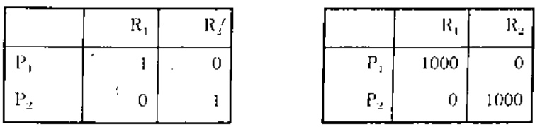

thiết được giữ lại để kháng định về R theo luật đó. Thế nhưng thay các giá trị trong bằng bảng các giá trị món :

|  | $R_{1}$ | $R_{2}$ |
| --- | --- | --- |
| $P_{1}$ | 999 | 0 |
| $P_{2}$ | 0 | 1 |

Hình 17-14. P can thiết để xác định R với khả năng là 1/1000.

P là cần nhưng chỉ là một trong nghìn trường hợp. Ngày cả trường hợp này có thể bị nghị là nhiều dữ liệu. Nếu giá trị trong bảng luôn giữ được tỉ lệ không đổi như hai bảng sau thu có thể rút ra được một số kết luận có ích.

|  | $R_{1}$ | $R_{2}$ |
| --- | --- | --- |
| $P_{1}$ | 1 | 0 |
| $P_{2}$ | 0 | 1 |

|  | $R_{1}$ | $R_{2}$ |
| --- | --- | --- |
| $P_{1}$ | 1000 | 0 |
| $P_{2}$ | 0 | 1000 |

Hình 17-15. Kết luận được gì, nếu tỉ lệ trong bảng ngẫu nhiên không thay đổi với các số hiệu thống kê.

Người ta có thể xác định chiến lược xem xét kích cổ của các dữ liệu nhập vào. Đề bảo toàn các kháng định, người ta thường tuân theo một số qui tắc sau :

\- Nếu các số là nhỏ thì nhiều khả năng lược bỏ giả thiết, hơn là xử lý nó.

\- Tương tự, nếu tỉ lệ k và m gần như là tỉ lệ n và q thì sự hiểu biết về P không ích lại, và lược bỏ giả thiết P.

\- Nếu số là lớn. và tỉ lệ k và m khác xa tỉ lệ n và q thì hiểu biết về P lộ rõ, cần giữ giả thiết này.

Đế loại suy lý này có cơ sở lý thuyết, có thể qua các bước phân tích đến thử nghiệm chính xác Fisher. Các bước này sẽ được giới thiệu dưới dây :

## Buốc thứ nhất

Dôi với bài toán đang xét, cần xác định sự phụ thuộc thống kê giữa kết quả R và thuộc tỉnh P. Nếu mà có sự phụ thuộc thống kê thì cũng không lần được rà đầu mối của phụ thuộc do có quá nhiều khả năng, tức là không hiểu được chính xác cải được thử nghiệm. Cũng may là sự độc lập thống kê chỉ có một dạng, đề xử lý hơn sự phụ

<!-- page: 405 -->

thuộc. Do vày sự phụ thuộc thống kê có thể thấy dược một cách giản tiếp. Thay vi tìm cách ehí ra kết qua R phụ thuộc vào thuộc tỉnh P, cần chủng tố ràng không xảy ra việc R không phụ thuộc vào P. Nơi cách khác, đích một là xác định xem các màu có ý nghĩa gị đối với tính độc lập của giá thiết.

## Bước thứ hai

Bước này tìm xác suất quản sát tổ hợp cụ thể m, n, k, q với giá thiết R độc lập với P. Can thiết ràng buộc xác suất này vì có nhiều thông số biến thiên của chưa cơ ràng・ buộc gì.

Cả sử có một số có định cíc mâu ứng với $P_{1}$ là $S_{P1} = k + m$, với $P_{2}$ là $S_{P2} = n + q$, với $R_{1}$ là $S_{R1} = k + n$. Dương nhiên các giá thiết này cũng ràng buộc $R_{2}$, có $S_{R2} = m + q$ bởi vì cần thiết có $S_{R1} + S_{R2} = S_{P1} + S_{P2}$

Các giả thiết này là tương đương với điều "các tổng lẻ trong bảng ngẫu nhiên là hàng số".

|  | $R_{1}$ | $R_{2}$ | Tổng lẻ |
| --- | --- | --- | --- |
| $P_{1}$ | k | m | $S_{P1}=k+m$ |
| $P_{2}$ | n | q - t | $S_{P2}=n+q$ |
| Tổng lẻ | $S_{B1}=k+n$ | $S_{B2}=m+q$ . | $S_{P1}+S_{P2}=S_{B1}+S_{B2}$ |

Hình 17-16. Bổ sung tổng lẻ vào bảng ngầu nhiên.

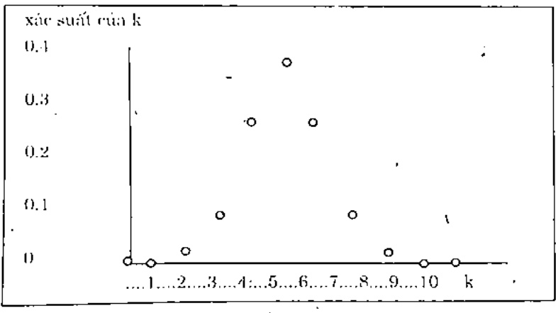

Hình 17-17. Xác suất xuất hiện k giá trị (R₁, P₁).

<!-- page: 406 -->

Sau khu đã có ràng buộc này, chỉ một trong bốn biến tự do nhận giá trị: các giá trị khác do tổng lẻ xác định.

Giải sử chọn giá trị k, số các mẫu với kết quả  $R_{1}$  và thuộc tính  $P_{1}$ . Xác suất cho giá trị k này khi có các tổng lệ :

$$
\mathrm{p} (\mathrm{k} \mid \mathrm{S} _ {\mathrm{P1}} \dots \mathrm{S} _ {\mathrm{P2}}, \mathrm{S} _ {\mathrm{R1}}, \mathrm{S} _ {\mathrm{R2}}) = [ (\mathrm{S} _ {\mathrm{P1}} / \mathrm{k}! / (\mathrm{S} _ {\mathrm{P1}} \cdot \mathrm{k})!) * (\mathrm{S} _ {\mathrm{P2}} / (\mathrm{S} _ {\mathrm{R1}} \cdot \mathrm{k})! / (\mathrm{S} _ {\mathrm{P2}} \cdot (\mathrm{S} _ {\mathrm{R1}} \cdot \mathrm{k})) ]) / [ (\mathrm{S} _ {\mathrm{P1}} + \mathrm{S} _ {\mathrm{P2}})! / \mathrm{S} _ {\mathrm{R1}}! / (\mathrm{S} _ {\mathrm{P1}} + \mathrm{S} _ {\mathrm{P2}} \cdot \mathrm{S} _ {\mathrm{R1}})! ]
$$

Trong công thức không cần thiết $S_{12}$ vì nó là giá trị dẫn suất.

Xác suất cún k thế hiện cả kết quả và thuộc tính, khi cho biết 10 mẫu có thuộc tính, 10 mẫu không có thuộc tính, 10 mẫu mô tả kết quả, 10 mẫu không mô tả thuộc tính. Tổng cộng có 20 mẫu. $S_{R1} = S_{R2} = S_{P1} = S_{P2} = 10$.

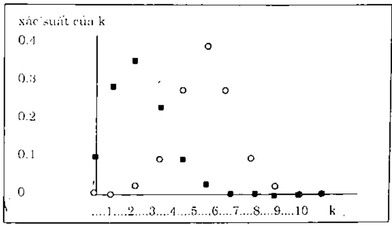

Hình 17-18. Thay đổi các giá trị về số các mẫu, cho tổng cộng 50 mẫu.

Trong 50 mẫu trong hình, 10 mẫu có thuộc tính, 40 mẫu không có thuộc tính, 10 mẫu thể hiện kết quả và 40 mẫu không thể hiện kết quả. Xác suất của k được chấm lại bằng các chấm vuông đậm hơn.

## Bước thú ba

Trong bước này lưu ý ràng xác suất của giá trị k cao hay thấp là nhỏ. Với thí dụ 20 mẫu, xác suất để k > 7 là 0.025, và xác suất để k <3 còn thấp hơn 0.025. Do vậy xác suất để k ở bên ngoại biên [3, 7] là nhỏ hơn 0.05, cho biết thuộc tính và kết quả là độc lập.

Nếu các giá trị có được của k ra ngoài đoạn giữa, tức đã cho sự độc lập, thì khi giá trị quan sát thực ra ngoài đoạn giữa sẽ không còn sự độc lập nửa. Chính xác hơn là

<!-- page: 407 -->

nếu nguồn ta cho ràng thuộc tỉnh và kết quả là độc lập mối khi giá trị quan sát của k ra bên ngoài đoạn giữa, thì xác suất về sau làm khi kết quả và thuộc tỉnh độc lập chỉ nhỏ hơn 0.05. Phát biểu cách khác là nếu k nằm ngoài đoạn giữa, nguồn ta có thể khẳng định ràng thuộc tỉnh và kết quả là phụ thuộc thống kê nhỏ hơn 0.05. Các nhà thống kê nói ràng giá trị quan sát có ý nghĩa tại mức 5% khi dùng thử nghiệm chính xác Fisher.

## Thi dụ

Bảng ngầu nhiên dưới dây là không chắc chắn khí đã cho sự độc lập. Khu nhìn bằng này, người ta sẽ giữ lại thuộc tỉnh P trong giả thiết của luật.

|  | $R_{1}$ | $R_{2}$ | Tổng lẻ |
| --- | --- | --- | --- |
| $P_{1}$ | 2 | 8 | 10 |
| $P_{2}$ | 8 | 2 | 10 |
| Tổng lẻ | 10 | 10 | 20 |

Hình 17-19. Các giá trị là không chắc chắn.

Mại khác, bằng tiếp theo là có lý, với độc lập đã cho. Theo đường, suy lý thống kê, người ta lược bỏ giả thiết cần đến thuộc tỉnh P.

|  | $R_{1}$ | $R_{2}$ | Tổng lẻ |
| --- | --- | --- | --- |
| $P_{1}$ | 4 | 6 | 10 |
| $P_{2}$ | 6 | 4 | 10 |
| Tổng lẻ | 10 | 10 | 20 |

Hình 17-20. Các giá trị có lý hơn.

Điều này không dáng ngạc nhiên vì khí dùng các thử nghiệm trên các giả thiết trong luật suy diện của thị dụ "rám nắng". người ta loại bỏ các giả thiết bởi không đủ

<!-- page: 408 -->

dữ hiệu để biết cái gì có ý nghĩa cho giá thiết về tỉnh độc lập. Mạt khác, khi có nhiều dữ liệu người la lập lại các giá thiết cần thiết cho suy lý.

Thí dụ

Xét xem cài gì xày ra khi bó di một phần của gia thiết của luật sau :

IF Tóc đen

Người đó dùng thuốc

THEN Không sao cả

Või dù hiệu nguyên thuy, bảng ngâu nhiên có dạng :

| Dùng thuốc ? | không sao | Bị râm |
| --- | --- | --- |
| Có dùng | 2 | 0 |
| Không dùng | 0 | 2 |

Hình 17-21. Bảng ngẫu nhiên.

Theo bảng náy, giá trị k chỉ có thể là 0. I hay 2 và nhiều khả năng là đoạn giữa bao trùm cả ba giá trị này. Không có giá trị k nào gây ra giá thuyết về sự độc lập là không chắc chắn cả.

Mặt khác, khi có 10 dữ liệu theo tỉ lệ như trước. thu được bảng ngẫu nhiên mới :

| Dùng thuốc ? | không sao | Bi rám |
| --- | --- | --- |
| Có dùng | 10 | 0 |
| Không dùng | 0 | 10 |

Hình 17.22. Bảng ngẫu nhiên.

Lúc này giá trị của k nhận từ 0-10. nhiều khả năng đoạn giữa là [3, 7]. Với k = 10, giả thuyết về tính độc lập là không chắc chắn.

<!-- page: 409 -->

## III. KÊT LUẬN

Cô năm nhận xét kết luận cho các nội dung liên quan đến xây dựng cây định tên :

\- Theo phát biểu Occam, thể giới là đơn giản. Do vậy, giải thích đơn giản nhất bao trùm các dữ liệu đường như là giải thích đúng.

\- Một cách nhận ra tỉnh hướng là dùng dây các thử nghiệm tạo nên cây định tên. Cách học ở dây là xây dựng cây định tên và giữ cây đơn giản theo phát biểu Occam.

\- Một cách xây dựng cây định tên là dùng công thức về sự lôn xôn do lý thuyết thông tin xác định. Nó cho phép xác định thứ nghiệm nào xuất hiện trong cây.

\- Một khi cây định tôn được tạo ra, người ta có thế chuyển nó sang tập đơn giản gồm các luật. Cách này làm trị thức dễ hiểu hơn. Dế chuyển hóa sang luật, người ta di đọc theo nhánh cây để tạo ra luật. rối đơn giản hóa các luật,

\- Đơn giản hóa các luật bằng cách loại bổ các giả thiết không cần thiết theo thủ nghiệm chính xác Fisher. Sau đó loại bổ các luật không cần thiết.

<!-- page: 410 -->

# HỌC BẰNG CÁCH HUẤN LUYỆN CÁC MẠNG THẦN KINH

Chương này trình bày cách dùng các phần tử giống như natron sắp xếp trong mạng để nhận dạng các mẫu và each học nhỏ mạng thân kinh thông qua thủ tục truyền ngược.

Do vậy, các nội dung sẽ được trình bày gồm :

\- Các thuộc tính dễ hiểu của các nondon và học về cách thức mô hình hóa các thuộc tính này trong mạng thân kính.

\- Học về cách thức của thủ tục truyền ngược thay đổi tác động của một nondon mô phỏng lên nondon khác để tăng cường hiệu quả chung.

\- Thi dụ mình họa về mạng thân kinh được mô phỏng được dạy để nhận dạng trong một nhóm người, ai là người quen, ai là ruột thịt.

## I. CÁC MẠNG THÂN KINH MÔ PHÒNG

Các nondon dược giới thiệu trong môi trường nhận thức, hoặc trong khung cảnh của tế bào, hoặc dược giới thiệu trong các hoạt động của khớp thân kinh. Liên quan đến nondon còn các phần tử quan trọng: đó là các liên kết giữa các nondon, dưỡng đi của nondon khi xử lý thông tin và mang thông báo từ nơi này đến nơi khác. Một số tài liệu về mạng thân kinh lại khai thác các ý tưởng công nghệ, mô tả các dưỡng truyền và các modun.

Tuy vay dé hiêu và làm theo các chức năng thần kinh, người ta tập trung vào một vài đặc tính biểu biểu của các nondon. Dưới dây sẽ giới thiệu về các đặc tính do và cách thức bất cháo c các mạng thần kinh tiến. Mạng thần kinh tiến còn được xét thêm trong các nội dung của perceptron và mạng xếp xi.

<!-- page: 411 -->

## 1.1. Các noron

Dà sõ noron gồm khớp thân kinh, thân tế bào, trục và nhiều dấu đáy thân kinh. Trục là phần lôi ra đế cho ra các tín hiệu đến các noron khác. Đầu đáy la phân lôi bao phù điện rộng, dễ nổi với trục của noron khác. Cảc dấu đáy tạo thành bùi nhạt cây. Trục tôn di các hướng.

Noron không có phản ứng gì nếu các tác động vào các dấu distances minus nổ đạt đến ngưỡng nhất định. Một khi ngưỡng đạt được, noron này cho ra phản ứng ở dạng xung từ thân tế bảo, theo trực đến các nhánh trực. Lắc này noron được gọn là cháy, được kích hoạt. Do noron hoặc cháy hoặc không thực hiện điều gì, nổ được ônếp vào loại thiết bị tất cả/ hoặc không.

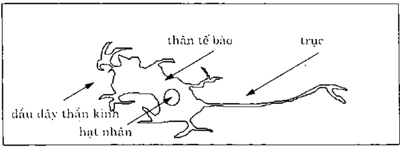

Hình 18-1. Một nondon bao gồm thân tế bào, trực, nhiều đầu dảy. Dấu dável nhận các thông tin vào từ các trực của các nondon khác thống qua khớp thân kinh kích động hay ức chế. Các nondon thực có thể có nhiều đầu dảy.

Các nondon ảnh hưởng đến các đầu đáy qua lôi nhớ gọn là khớp thân kinh. Việc mô phỏng tại một vài khớp thân kinh làm các nondon cháy, và ungăn cản sự cháy của các nondon khác. Nho vây việc học xảy ra tại lân cản các khớp thân kinh và người ta quan tâm đến mức độ khớp thân kinh chuyển các xung qua trực của nondon để kích hoạt hay ức chế nondon bên cạnh.

Nào của người có khoảng chủng 10$^{11}$ nondon. Số các khớp thân kinh còn nhiều hơn, chẳng hạn có nondon nhận thông tin vào từ 10$^{7}$ khớp thân kinh, và mỗi bộ não có chủng 10$^{16}$ khớp thân kinh.

## I.2. Các nởon mô phỏng

Các nondon mô phỏng gồm bộ cộng, nhân và giá trị ngưỡng.

<!-- page: 412 -->

Dời với nondon mô phỏng, các đầu vào từ các nondon khác được nhân với trọng số, với công lại với nhau. Tổng này được so sánh với giá trị ngưỡng. Nếu tổng quá ngưỡng, đầu ra là 1, ngược lại đầu ra là 0.

Mô phong mang thân kinh một cách diến hình gồm các noron mô phong. Noron mô phong được cơi như một nút nổi các nút khác thông qua lien kết ưục - khớp thân kinh · dầu dây. Môi herein kết được gắn với một trọng số. Chống như khớp thân kinh, trọng số này xác định bản chất và mức độ tác động của nút này đối với nút khác. Hơn nửa, tác động của một nút lên nút khác là tích của giá trị tác động với trọng số của hén kết. Do vậy trọng số dương lòn ứng với sự kích hoạt mạnh, còn trọng số âm nhỏ ứng với ức chế yếu.

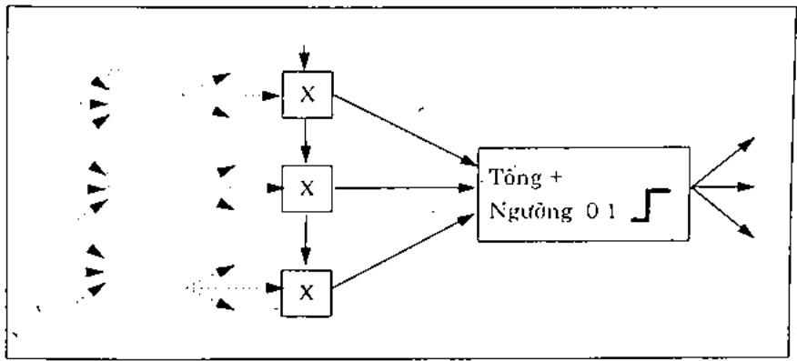

Hình 18-2. Một nondon mô phỏng. Các đầu vào từ các nondon khác được nhân với trọng số.

Mỗi nút dùng hàmí kích hoạt để tổ hợp các tác động tách biệt nhận được từ liên kết nhập vào thành một tác động chung. Một hàm kích hoạt đơn giản chuyển tổng các giá trị nhập vào qua một hàm ngưỡng để quyết định dấu ra của nút. Đầu rà của mỗi nút là 0 hay 1, tùy thuộc vào tổng các giá trị là dưới hay trên giá trị ngưỡng dùng trong hàm ngưỡng.

Nhụ thể người ta có thể hiểu được đích của việc mô hình hóa trong các nondon đơn giản này. Các trọng số mô hình hóa các thuộc tính khớp thần kinh: bộ cộng mô hình hóa khả năng tổ hợp các tác động của các đầu đây: và việc sọ sình với ngưỡng mô hình hóa đặc tính tất cả/ hay không như cơ chế hóa điện trong thân tế bào.

Tuy vay có nhiều tính chất của noron chuta được mô hình hóa. Một noron mô phỏng tiến hành cộng đơn thuần các giá trị. Noron thục có thể xử lý thông tin thông qua cơ chế dấu dây phúc tạp gồm đường truyền điện và mạch logic. Noron mô phỏng

<!-- page: 413 -->

chỉ số sánh giá trị tổng với ngưỡng, còn noron thực mã hóa thông tin nhỏ xung phức tạp gồm modun tán số và đòn kênh.

Đo vậy, mạng thân kinh mô phỏng cũng có các hoạt động không hạn như mạng thân kinh thực, thịm chí khó mô phỏng được mạng thân kinh thực. Tuy nhiên cũng có thế chấp nhận việc: xét mạng thân kinh thông qua mạng thân kinh mô phỏng như được thực hiện trọng phân này.

## 1.3. Dùng các mạng tiến như mạng ràng buộc số học

Một cách thủ công để thực hiện các tỉnh toán do mạng thân kinh yêu cầu là truyền các ràng buộc số học. Nhu vay cán một đặc tài thể hiện đổi với các noron trong mạng truyền ràng buộc ấy.

## Định nghĩa 18-1 : Mạng thân kinh (Neutral network)

Mạng thân kinh là thể hiện của mạng ràng buộc số học, mà :

\- Các khung phép toán từng với các rang buộc số học đề mô hình hóa các khớp thân kinh và nondon.

\- Các thủ tục truyền các mô phỏng thống qua các khớp thân kinh và noron.

Trong mạng thân kinh có các thủ tục. Cỏ thủ tục chuyển thông tin qua các nondon hay chuyển thông tin từ nondon này sang nondon khác. Việc xử lý thông tin tại khớp thân kinh được xác định nhiều sau :

1. Khi có một giá trị ghi vào ngăn nhập thông tin của khớp thân kinh, thi ghi tích của giá trị và trọng số của khớp thân kinh vào ngăn ra của khớp thân kinh.

2. Khu có giả trị ghi vào ngân ra của một khớp thân kinh, thì kiểm tra nondon tiếp theo.

2.1. Nếu các nondon nổi với nondon này đã có giá trị tại đầu ra, thì công các giá trị đầu ra lại, rời so sánh với ngưỡng và ghi giá trị vào đầu ra của nondon này.

2.2. Nguộc lại không làm gì.

## I.4. Nhận dạng tính quy luật nhỏ các mạng tiến

Các mạng tiến có thể nhận dạng tính quy luật của dữ liệu.

Thi du

Mạng có các trọng số cho phép nhận ra thuộc tính của hai người một trong một dám đông nhiều người. Một số cập là anh em, cập khác là quen nhau. Bên trong nút

<!-- page: 414 -->

là giá trị ngưỡng. Ngoại hai liên kết có trọng số -1.0, các lien kết khác có trong số là 1.0.

Hàn dǔ hēu nháp sìn xuát ra giá trị 1 để định tên một cập hai người được xom xét. Tất cả các bên kết nhập vào khái nhận giá trị 0 với người nây không thuộc cập được xét. Gia sử có sau người tên là Mán, Mài, Mo, Hoa. Hà và Hàn mà :

\- Hai người không là anh ccm thi quen nhau.

• Bu người dân, cùng như ba người sau, là anh cm.

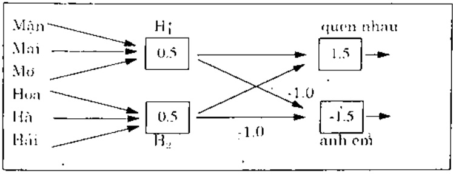

Hình 18-3. Mạng có trọng số.

Nút kế tiếp cácヒền kết nhập vào là nút bị giấu, vì các giát trị ra của nó không quan sát được. Các nút ra gắn với kết quả. Nút "quen nhau" nhận giá trị 1 khi có dữ liệu ứng với hai người quen nhau.

Quan sát mạng trọng hình, người ta thấy bất kì liên kết nào trong ba liên kết trở đến H₁ đều làm cháy H₁ vì ngưỡng của H₁ là 0.5 và trọng số của liên kết là 1.0. H₂ cũng vậy. Do đó H₁, H₂ được coi như công OR.

Nút "làm quen" chỉ cho, kết quả khi hai liên kết trở đến vượt quá ngưỡng 1.5. tức đồng thời cả H₁ và H₂ cho ra trọng số 1. để 1+1 =2.0 >1.5. Như vậy nút này được coin như công AND.

Nếu H$_{1}$, H$_{2}$ cùng cháy, hại liên kết đến nút "anh cm" có tổng là -2.0, không thể kích hoạt nút này. Do vậy, để nút này hoạt động khi và chỉ khi một trong hai nút H$_{1}$, H$_{2}$ cháy.

Thí dụ trên gồm các nút và hên kết rõ ràng. Thực tế mang nhiều, đối tượng, liên kết phúc tập hơn.

<!-- page: 415 -->

## II. LEO NÚI VÀ TRUYỀN NGUỘC

Một vải thủ tục đơn giản dùng kỳ thuật tìm kiếm leo nứ cho phép dùng các trọng sở của mạng thần kinh để học tự động.

## II.1. Thủ tục truyền ngược

Trong ngũ cãnh học nhờ mạng thân kinh, mỗi bước trong thú tục leo nữ của thiện trọng số một chất. Độ do định tính là độ do mức độ xử lý tốt của mạng đối với các dữ hiệu mẫu nhập vào.

Thủ tục leo nữđòn hơi có gâng tại mòn buốc di, chọn ra buốc tốt nhất trong các buốc di tiếp theo. Với ý tưởng này, sau mòn buốc trọng số được cản thiện. Các thanm số khác có thể được giữ nguyên.

Người ta có thể làm tốt hơn nếu môi trường tạo điều kiện để hàm trọng số là đủ trơn. Thực tế có thể triển hành các bước của thủ tục theo hướng đạt hiệu cao nhất tùy thuộc vào các thay đổi riêng phù hợp tại một bước. Khi dùng chiến lược nay, người ta đã di chuyển theo hướng đốc trong không gian trọng số, đã leo đốc, hay leo theo gradient.

Thủ tục truyền ngược là cách tương đối hiệu quả để tỉnh độ hiệu quả của thay đổi riêng. Thủ tục này gọn như vậy là vi nguồn ta thay đổi đồng thời các trọng số tại tầng cuối cùng, dùng các tính toán ấy để tỉnh các thay đổi đối với trọng số tại tầng giáp cuối, và đi ngược tối tầng đầu tiên.

Phân nây sẽ trình bày việc học nhỏ truyền ngược theo hai ngữ cinh :

1. Trong ngũ cảnh may rủi với thủ tục truyền ngõc được cơ như suy lý.

2. Theo ngũ cinh toán học với thủ tục nhằm kiểm chúng các giai thích may rút.

Tuy nhiên trước hết cần học về hai yêu cầu thay đổi mạng thân kinh để truyền, ngược và leo dốc.

## II.2. Thay đổi ngưỡng

Thủ tục văn giới thiệu xử lý hai giá trị là ngưỡng và trọng số. Người ta có thể gộp hai yêu cấu xử lý này để số các giá trị cần xử lý giám di. Một trong các cải biến là thay đổi ngưỡng tại nút. Chắng hạn ngưỡng T được thay đối về 0 khi bổ sung thêm đầu vào T với trọng số -1.0. Như vậy có sự chuyển vai trò giữa trọng số và ngưỡng.

Cụ thể hơn, một notion có ngưỡng bằng không là tương đương về tính toán với liên kết đặc biệt có đầu vào luôn là -1.0. Thị dụ trong hình cho thấy một giá trị ngưỡng khác không trở thành cung nổi với giá trị trọng số. Các trọng số tương đương với ngưỡng này có thể được thay đổi trong khi học, giống như các trọng số khác để việc học đơn giản hơn.

<!-- page: 416 -->

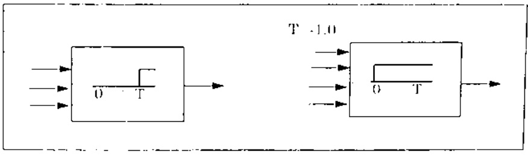

Hình 18-4. Cảc ngưỡng tương đương với các hôn kết, với giá trị trọng số bằng giả trị ngưỡng. Nơi thêm dấu vào -1.0.

## II.3. Hàm số ngưỡng trơn

Thực tế cho thấy hàm ngưỡng dạng bậc thang không tiện cho thủ tục leo đặc vi công việc này cần thực hiện trên hàm trơn đối với trọng số. Đặc tính tất cả hay không dùng trong đường bậc thang sẽ gây ra các dinh núi trong không gian trọng số. Do vậy các bước nhỏ có thể làm hong cả thủ tục.

Dùng hàm nén dẻ thay thế hàm bậc thang. Độ nghiêng của hàm S gần với 0 khi tổng các dấu vào hoặc rất âm bay rất dương. Độ nghiêng đạt 0,25 khi dấu vào là 0. Đo độ nghiêng của hàm S tuân theo công thức có dạng đơn giản, duồng S là hàm ngưỡng phổ dụng.

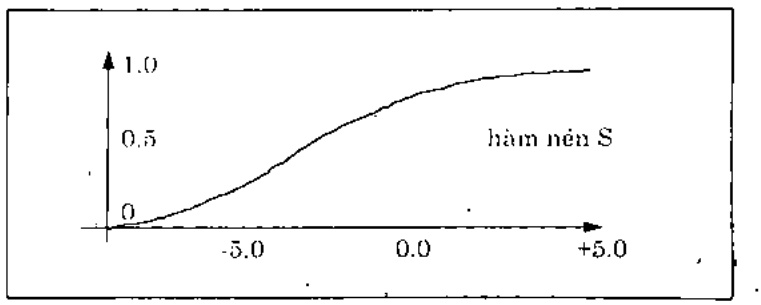

Hình 18-5. Hàm S nghiêng gần 0 khi tổng dấu vào hoặc rất âm hoặc rất dương.

Hàm ngưỡng bậc thang tổ ra trung thực đổi với nondon thực sự, nhưng hàm. S đảm bảo cho cùng hiệu quả khi nó được làm trơn thuận tiện cho việc leo đốc.

<!-- page: 417 -->

Đế dùng cách thay dở này, các dấu taxa của nondon ductic tỉnh. Ngườn ta chi thay dở phân ghi kôt qua, tùng với dòng chất đặm

Khi có giả trị ghi vào ngân, ra của một khớp thân kính, thi kwém tra noron tiếp theo.

1. Nên các noron nổi của noron này đã có giả trị tại đầu ra, thì công các giả trị đầu ra lại, rời chuyển tổng sang hàm nén S để xem kết quả này có lớn hơn 0 không ? và ghi giả trị vào đầu ra của noron này.

2. Ngước lai không làm Transit.

## II.4. Truyền ngược theo cách may rủi

Trong phần này, thủ tục truyền người được guán thích theo cách may rún với công cụ toán học. Cảc phần sau cũng có dịp để cấp vấn đề này một cách rõ hơn.

Ý tương tổng quaint để thực hiện sau việc truyền nguộc là thực hiện thay đổi rộng đối với trọng số cu thế w nếu việc thay đổi này dẫn đến việc giảm nhiều các sau sót quan sát được tại các nút ra. Đối với tổ hợp màu nhập vào, người ta dùng các ki hiệu cho các giả trị.

• Giá trị mong muốn d.

• One tri thuc o.

• Anh hướng eta trong số w lớn sai số là d-o.

Thay đổi lớn đối với w có nghĩa nếu thay đổi này có thể giảm nhiều sau sót tại đầu ra và nếu kích thước của việc giảm đó là quan trọng. Mặt khác nếu thay đổi đối với w không giảm bất, kì sại sót tại đầu ra một cách cơ bản, trọng số đó không được quan tâm nhiều.

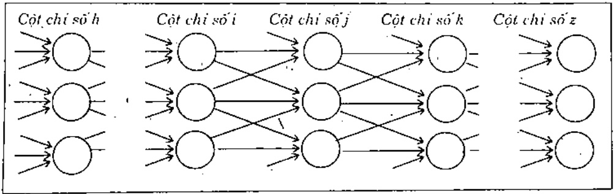

Hinh 18-6. Mạng thân kinh để huấn luyện.

<!-- page: 418 -->

Lưu ý rằng hậu hết các phép thực cần tính toán sự thay đổi đối với bất kì trọng số nào cũng là cần thiết cho nút gần nút dầu ra. Xem xét mạng trong hình vẽ. Một khi người ta thấy cách tính thay đổi trọng số điện hình $w_{i,k}$, giữa nút trong tầng i và một nút tầng j, thì các tính toán đổi hỏi này cũng dùng cho tính toán trọng số $w_{i,k}$ giữa các nút tầng j và các nút tầng k.

Mạng thân kinh có thể huấn luyện được. Mỗi liên kết đều có trọng số thay đổi được để cải thiện khả năng của mạng, nhằm cho ra các thông tin đúng đối với tổ hợp đầu vào trong tập đã được huấn luyện. Các liên kết thay thể ngưỡng không liệt kê ra dây.

Trước tiến có nhận xét rằng một thay đổi tại đầu vào nút j gây ra thay đổi tại đầu ra của nút j là do độ nghiêng của hàm ngưỡng. Khi đạt đến chỗ đốc nhất, một thay đổi tại đầu vào gây hiệu quả lớn nhất. Do vậy độ thay đổi w$_{1-2}$ phụ thuộc vào độ nghiêng của hàm ngưỡng tại nút j, với điều kiện là thay đổi đó là tự do chỉ ở nơi nó thực hiện điều thuận lợi.

Dộ nghêng của hàm nén S đã cho là o(1-o). Do đó dùng hàm này như hàm ngưỡng vừa nêu để có các thay đổi của $w_{i-n}$, tức là cho phép thay đổi $w_{i-j}$ ti lệ với $o_j(1-o_j)$.

Cùng với thay đổi về trọng số tại đầu vào của nút j. $w_{i \to j}$ còn phụ thuộc vào đầu ra tại nút j. Với điều kiện là thay đổi đó là tự do chỉ ở nơi nó thực hiện điều thuận lợi, người ta thu xếp. $w_{i \to j}$ để thay đổi có ý nghĩa chỉ khi đầu ra tại nút i là cao, tức là cho phép thay đổi $w_{i \to j}$ tỉ lệ với $o_{ij}$ là đầu ra tại nút i.

Nếu xem xét cách thức này thì hình như việc thay đổi trọng số $w_{i \to j}$ sẽ tỉ lệ với $o_i$, với $o_j(1 - o_j)$ và với nhân tố ảnh hưởng đến việc thay đổi đầu ra của nút j. Người ta dùng hệ số β để chỉ mức độ có lợi khi thay đổi giá trị đầu ra của một nút. Vậy việc thay đổi $w_{i \to j}$ tỉ lệ với $o_i * o_j(1 - o_j) * \beta_j$.

Đế thấy mức lợi thu được khi thay đổi dấu ra của nút j, trước tiên tương tương ràng-nút j chỉ nổi với một nút k của mức sau. Khi đó quá trình suy lý vừa thực hiện có thể được lập lại với thay đổi nhỏ :

\- Do việc thay đổi là tự do chỉ khí nó có thể làm lợi, việc thay đổi $o_j$ cần tỉ lệ với $o_k(1-o_k)$, là độ nghiêng của hàm ngưỡng tại nút $k$, và

\- Việc thay đổi $o_j$ cần tỉ lệ với $w_{i \to j}$ là trọng số trên liên kết nối nút j tới nút k.

Dỉ nhiên nút j được nối tối nhiều nút tại mức tiếp theo. Lợi chung đạt được do thay đổi $o_j$ cần là tổng các hiệu quả riêng. Các giá trị riêng đó liên quan tối trọng số $w_{i \to j}$, độ nghiềng $o_k (1 - o_k)$ và nhân tố $\beta_k$. Do vậy lợi của việc thay đổi đầu ra của nút j được tính như sau :

$$
\beta_ {j} = \sum_ {k} w _ {j}, x O k (1 - o k) \beta_ {k}
$$

<!-- page: 419 -->

Thay đổi  $w_{1,1}$  tí lệ với  $\beta_{k}$ . Thực tế thay đổi trọng số trong bất ki mức nào phụ thuộc vào tính toán mức độ có lợi  $\beta_{1}$ . Mức độ có lợi này lại phụ thuộc vào tính toán  $\beta_{k}$  gần với các nút dấu ra hơn.

Trước khi kết thúc phân tích này còn phải quan tâm vấn đề nữ là mức độ lợi có được do việc thay đổi giá trị của nút đầu ra. Giá trị này phụ thuộc vào giá trị tại nút đầu ra sai tối đầu. Nếu có sai khác giữa giá trị đầu ra mong muốn tại nút z là d, với giá trị thực  $o_{k}$  là nhỏ, thì việc thay đổi tại đầu ra của nút z là nhỏ theo. Vậy có kết luận :

$$
\beta_ {k} = \mathrm{d} _ {\varepsilon} \cdot \mathrm{o} _ {\varepsilon}
$$

Cuối cùng việc thay đổi trọng số sè phụ thuộc vào tham số tỉ lệ r. Tỉ lệ này lớn để việc học được nhanh hơn, nhưng không quá lên đến nổi làm thay đổi các giá trị đầu ra vượt quá xa giá trị mong muốn. Vấy cho phép thay đổi $w_{1}$, ti lệ với tham số r lấy theo kinh nghiệm.

Tập hợp các công thức, người ta thu được công thức truyền ngược sau :

$$
\Delta \mathrm{w} _ {\mathrm{i}, \mathrm{j}} = \mathrm{ro} _ {\mathrm{i}} \mathrm{o} _ {\mathrm{j}} (1 - \mathrm{o} _ {\mathrm{j}}) \beta_ {\mathrm{j}}.
$$

Trong đó :

$$
\beta_ {j} = \Sigma_ {k} w _ {1 \rightarrow j} o _ {k} (1 - o _ {k}) \beta_ {k}
$$

$$
\beta_ {z} = \mathrm{d} _ {z} \cdot \mathrm{o} _ {z}
$$

dối với các nút trên tầng bị che, hoặc
dối với các nút tại tầng đầu ra.

Một khi đã dưa ra thay đổi trọng số thích hợp theo tố hợp đầu vào, cần có lựa chọn quan trọng. Một số khuynh hướng mạng thần kinh thực hiện thay đổi có xem xét đầu vào mẫu. Khuynh hướng khác tăng thêm sự thay đổi do mẫu riêng để nghị và chỉ thay đổi thực sau khi tất cả các đầu vào mẫu được xem xét. Người ta cho rằng dây là cách phù hợp với quan điểm toán học về việc leo đốc.

## II.5. Công thức đạo hàm

Phân trước trình bày tham số may rủi dẫn đến các công thức truyền ngược. Phân này giới thiệu tham số toán học cho các công thức tương tự. Hai ý tưởng rút ra từ tính toán là :

1. Cho y là hàm trơn của các đối số x$_{i}$. Giá sử muối biết cách thay đổi giá trị đầu của các x$_{i}$ để giá trị y tăng nhanh. Vậy việc thay đổi mỗi giá trị x$_{i}$, cần tỉ lệ với đạo hàm riêng của y theo x$_{i}$. Tức là :

$$
\mathrm{x} _ {\mathrm{i}} \propto \partial \mathrm{y} / \partial \mathrm{x}
$$

Khi thực hiện thay đổi như vây, người ta đã lên đốc.

2. Giá sử y là hàm của các biến trung gian $x_i$, và $x_i$ lại là hàm của z. Người ta cần biết thay đổi của y so với z.

<!-- page: 420 -->

$$
\mathrm{dy} / \mathrm{dz} = \Sigma \bar {\partial} \mathrm{y} / \bar {\partial} \mathrm{x} _ {1} ^ {*} \mathrm{dx} _ {1} / \mathrm{dz} = \Sigma \mathrm{dx} _ {1} / \mathrm{dz} ^ {*} \bar {\partial} \mathrm{y} / \bar {\partial} \mathrm{x},
$$

Khi tinh cie dao ham, ngutai ta da dung dao ham ham hop.

Bài toán cho tập các trọng số cần cài thiện, cho tập mẫu các đã hiệu dấu vào và dấu ra ứng với các dấu vào này. Cần có cách do xem hiệu suất của các trọng số và cách cải thiện hiệu suất đó.

Cách chân phương để do hiệu suất muốn cải thiện là lấy mẫu dấu vào rời xét tổng của bình phương sai'số của mỗi dấu ra. Một khi đã làm như vậy cho mỗi mẫu, người ta lấy tổng các dấu vào mẫu và thêm dấu ám đối với các tính toán hiệu suất tại điểm 0

$$
\mathrm{P} = \cdot \quad \Sigma_ {s} \left(\Sigma_ {z} (\mathrm{d} _ {s z} - \mathrm{o} _ {s z}) ^ {2}\right)
$$

Trong đó P là hiệu suất do được, s là chỉ số theo các mẫu nhập vào, z là chỉ số theo các đầu ra,  $d_{sz}$  là đầu ra mong muốn cho mẫu s tại nút thứ z, và  $o_{sz}$  là đầu ra thực cho mẫu s tại nút thứ z. Lụu ý rằng việc bình phương sai số là thuận tiện hơn lấy giả trị tuyệt đối.

Độ do hiệu suất là hàm của trọng số. Do vậy có thể tăng hiệu quả của việc lên dốc bằng cách tính đạo hàm·riêng của hiệu suất đối với mỗi trọng số. Khi có đạo hàm riêng, có thể nâng hiệu suất nhanh hơn bằng cách thay đổi trọng số tỉ lệ với đạo hàm riêng.

Đầu tiên lưu ý rằng hiệu suất được cho như tổng trên các mẫu nhập vào. Như vậy có thể tính đạo hàm riêng của hiệu suất cho từng trọng số cụ thể bằng cách cộng thêm đạo hàm riêng của hiệu suất cho mỗi mẫu riêng rõ nhập vào. Do vậy có thể giảm chỉ số s, chỉ tập trung vào các mẫu nhập tại thời điểm, với gia thiết rằng mỗi trọng số sẽ được điều chỉnh bằng tổng các điều chỉnh rút ra được từ các mẫu. Lức đó đạo hàm riêng là $\partial P/\partial w_{i-1}$, trong đó $w_{i-1}$ là trọng số nổi các nút tầng thú i sang tầng thử j.

Tiếp theo là di tìm cách hiệu quả để tính đạo hàm riêng nêu trên. Việc tính toán nên thực hiện với các trọng số gần tầng đầu ra. Hiệu quả $w_{i \to j}$ so với hiệu suất P được thể hiện thông qua biến $o_j$. Người ta dùng đạo hàm hầm hợp :

$$
\partial \mathrm{P} / \partial \mathrm{w} _ {i - j} = \partial \mathrm{P} / \partial \mathrm{o} _ {j} ^ {*} \partial \mathrm{o} _ {j} / \partial \mathrm{w} _ {i - j} = \partial \mathrm{o} _ {j} / \partial \mathrm{w} _ {i - j} ^ {*} \partial \mathrm{P} / \partial \mathrm{o} _ {j}
$$

Tính  $\partial o_{j}/\partial w_{i\rightarrow j}$ : xác định  $o_{j}$  bằng cách cộng thêm tất cả dữ liệu nhập vào nút j và chuyển kết quả sang hàm-nguông. Vậy  $o_{j}=f(\Sigma_{i}o_{i}w_{i\rightarrow i})$ , trong đó là hàm nguông. Xử lý tổng này như biến trung-gian  $\Sigma_{i}o_{i}w_{i\rightarrow j}=\sigma_{j}$ , thu được:

$$
\partial \mathrm{o} _ {j} / \partial \mathrm{w} _ {i \rightarrow j} = \mathrm{df} \left(\sigma_ {j}\right) / \mathrm{d} \sigma_ {j} ^ {*} \partial \sigma_ {j} / \partial \mathrm{w} _ {i \rightarrow j} = \left(\mathrm{df} \left(\sigma_ {j}\right) / \mathrm{d} \sigma_ {j}\right) ^ {*} \mathrm{o} _ {i} = \mathrm{o} _ {i} ^ {*} \mathrm{df} \left(\sigma_ {j}\right) / \mathrm{d} \sigma_ {j}
$$

Thay thế kết quả này vào đăng thúc trên, thu được :

$$
\partial \mathrm{P} / \partial \mathrm{w} _ {\mathrm{i} \rightarrow \mathrm{j}} = \mathrm{o} _ {\mathrm{i}} ^ {*} \mathrm{df} (\sigma_ {\mathrm{j}}) / \mathrm{d} \sigma_ {\mathrm{j}} ^ {*} \partial \mathrm{P} / \partial \mathrm{o} _ {\mathrm{j}}
$$

<!-- page: 421 -->

Dạo hàm riêng  $\partial P/\partial o_{1}$  được xem như  $\partial P/\partial o_{k}$  tại tăng tiếp theo. Do hiệu quả của  $o_{1}$  lên P được thông qua các đầu ra của các nút tại tăng tiếp theo là  $o_{k}$ , người ta có thể dùng đạo hàm hàm hợp để tinh  $\partial P/\partial o_{1}$ .

$$
\partial \mathrm{P} / \hat {\mathrm{O}} _ {\mathrm{j}} = \Sigma_ {\mathrm{k}} \left(\partial \mathrm{P} / \hat {\mathrm{O}} _ {\mathrm{k}} ^ {*} \hat {\mathrm{O}} _ {\mathrm{k}} / \hat {\mathrm{O}} _ {\mathrm{j}}\right) = \Sigma_ {\mathrm{k}} \left(\hat {\mathrm{O}} _ {\mathrm{k}} / \hat {\mathrm{O}} _ {\mathrm{j}} ^ {*} \hat {\mathrm{O}} / \hat {\mathrm{O}} _ {\mathrm{k}}\right)
$$

\- Phân tử $o_k$ được xác định bằng cách bổ sung vào tất cả các dấu vào tại nút k và chuyển kết quả sang hàm ngưỡng. Vấy $o_k = f(\Sigma_i o_i w_{i-k})$. Dùng kí hiệu như trên, có

$$
\hat {\sigma} _ {k} / \hat {\sigma} _ {1} = \mathrm{df} \left(\sigma_ {k}\right) / \mathrm{d} \sigma_ {k} * \hat {\sigma} _ {k} / \hat {\sigma} _ {1} = \left(\mathrm{df} \left(\sigma_ {k}\right) / \mathrm{d} \sigma_ {k}\right) * w _ {i, k} ^ {\prime} = w _ {i - k} ^ {\prime} * \mathrm{df} \left(\sigma_ {k}\right) / \mathrm{d} \sigma_ {k}
$$

Thay thế kết quả này vào đăng thức trên, thu được :

$$
\partial \mathrm{P} / \partial \mathrm{o} _ {1} = \Sigma_ {\mathrm{k}} \left(\mathrm{w} _ {1 \rightarrow \mathrm{k}} \left(\mathrm{df} \left(\sigma_ {\mathrm{k}}\right) / \mathrm{d} \sigma_ {\mathrm{k}}\right) ^ {*} \left(\partial \mathrm{P} / \partial \mathrm{o} _ {\mathrm{k}}\right)\right)
$$

Tôm lại: có hải đăng thức quan trọng :

\- Đạo hàm riêng của hiệu suất đối với trọng số phụ thuộc yào đạo hàm riêng của hiệu suất đối với đầu ra.

\- Dạo hàm riêng của hiệu suất đối với một đầu ra phụ thuộc vào các đạo hàm riêng của hiệu suất đối với các đầu ra tại tầng kế tiếp.

Theo các kết quả này người ta kết luận được rằng đạo hàm riêng của P đối với bất kì trọng số tại tầng thứ i cần được tính theo cách đã dùng tại tầng bên phải tầng thứ j.

Đế đánh dấu tính toán này, cần xác định đạo hàm riêng của hiệu suất đối với mỗi dấu ra tại tầng cuối cùng.

$$
\partial \mathrm{P} / \partial \mathrm{o} _ {z} ^ {\prime} \doteq \partial (- (\mathrm{d} _ {z} \cdot \mathrm{o} _ {y}) ^ {2}) / \partial \mathrm{o}, = 2 (\mathrm{d} _ {z} \cdot \mathrm{o} _ {z} ^ {\prime})
$$

Còn lại là việc xử lý đạo hàm của hàm ngưỡng f theo đối số σ. tương ứng với tổng các đầu vào của một nút. Một cách tự nhiên, hàm f được chọn trực quan và dễ dùng :

$$
\mathrm{f} (\sigma) = 1 / (1 + \mathrm{e} ^ {\sigma}) \quad ,
$$

$$
\mathrm{df} (\sigma) / \mathrm{d} \sigma = \mathrm{d} [ 1 / (1 + \mathrm{e} ^ {- \sigma}) ] / \mathrm{d} \sigma = (1 + \mathrm{e} ^ {- \sigma}) ^ {2} \mathrm{e} ^ {- \sigma} = \mathrm{f} (\sigma) (1 - \mathrm{f} (\sigma)) = \mathrm{o} (1 - \mathrm{o})
$$

Thông thường đạo hàm này được biểu diễn theo đầu ra của mối nút o = f(σ) hơn là theo tổng của các dấu vào σ. Cách thể hiện đạo hàm này đúng là điều người ta cần bởi vi dịch của người ta là các đẳng thức thể hiện giá trị theo các giá trị bên phải của nó.

Cuối cùng'các thay đổi trọng số sẽ phụ thuộc vào tham số tỉ lệ r. Tham số này lớn nhưng không lớn quá.

Đến dây người ta đã có công thức truyền ngược. Đề dễ nhận thấy nó cũng như công thức đã nêu ra trọng phần trước, ∂P/ đo được thay bằng β và hệ số r lấy là 2.

$$
\Delta \mathbf {w} _ {\mathrm{j} \rightarrow \mathrm{j}} = \mathrm{r} \mathrm{o} _ {\mathrm{j}} \mathrm{o} _ {\mathrm{j}} (1 - \mathrm{o} _ {\mathrm{j}}) \beta_ {\mathrm{j}}.
$$

Trong đó :

$$
\beta_ {j} = \Sigma_ {k} w _ {i \rightarrow j} o _ {k} \left(1 - o _ {k}\right) \beta_ {k} \quad \text {dối với các nút trên tầng bị che, hoặc}
$$

<!-- page: 422 -->

$$
\beta_ {z} = \mathrm{d} _ {z} - \mathrm{o} _ {z},
$$

dói với các nút tại tầng đầu ra.

Một khi tính các thay đổi cho mỗi tổ hợp đầu vào, đạo hàm hàm hợp cho biết việc bổ sung các thay đổi trọng số do các tổ hợp đầu vào mẫu yêu cầu. Rối người ta có thể thay đổi thục sự các trọng số.

## II.6. Thủ tục truyền ngược

Người ta tỉnh dáng thức về việc truyền ng Dorc theo thủ tục, gọi là thủ tục truyền ng Dorc sau :

Việc truyền ngược để huấn luyện mạng thần kinh được thực hiện theo :

1. Chọn tham số tỉ lệ r.

2. Cho đến khi hiệu suất đã đạt yêu cầu, thực hiện :

2.1. Đối với mỗi mãu nhập vào, tiến hành :

• Tịnh đầu ra.

• Tỉnh β cho các nút tai tầng ra theo công thức $\beta_{z} = d_{\tau} \cdot o_{z}$.

• Tính β cho tất cả các nút khác theo.công thức $\beta_{j} = \Sigma_{k} w_{i \to j} o_{k}(1 - o_{k})\beta_{k}$.

• Tính các thay đổi trọng số cho tất cả các trọng số theo

$$
\Delta w _ {i \rightarrow j} = r o _ {i}. o _ {j} (1 - o _ {j}) \beta_ {j}
$$

2.2. Cập nhật trọng số cho tất cả mẫu nhập vào:

Do các thay đổi trọng số tỉ lệ với sai số đầu ra, các đầu ra sẽ tiêm cận với giá trị 1 và 0. Tuy nhiên chúng không đạt đến các giá trị đó. Do vậy hiệu suất thường thỏa mãn khi các đầu ra dùng 1 như giá trị dịch để huấn luyện thực sự cho các giá trị lớn hơn 0.9; còn tất cả các đầu ra dùng 0 cho các giá trị nhỏ hơn 0.1.

## III. CÁC TÍNH CHẤT CỦA TRUYÊN NGUỘC

Phần này trình bày hiệu suất của truyền ngược phụ thuộc chặt chẽ vào các lựa chọn về bản chất của bài toán cần giải.

## III.1. Việc huấn luyện dựa vào truyền ngược

Thay đổi các trọng số theo cách truyền ngược xét trên quan điểm tỉnh toán là hiệu quả vì số cực đại các phép cộng, nhân để hiệu chỉnh trọng số bất kì ứng với số liên kết với nút. Tuy nhiên việc thực hiện nhiều bước là không thực tế.

<!-- page: 423 -->

## Thí dụ

Mạng trong hình về tương tự như mạng trong phân trước. Giá sử chính xác có hai dầu vào trong mạng có giá trị 1 và các giá trị khác là 0. Mục đích của mạng này là xác định xem hai người trên là quen nhau. Hai người cần thấy quen nhau nếu giá trị ra lớn hơn 0.9, và không quen nếu giá trị ra nhỏ hơn 0.1. Ngược lại kết luận là nhập nhàng.

Bải toán cần hiệu chỉnh các trọng số trong mạng, bắt đầu từ tập các giá trị đấu cho đến khi các hiệu chính là vững chắc ứng với tri thức : (i) mọi người biết nhau, (ii) Mận. Mài và Mơ là anh em, và (iii) nhóm kia quen nhau gồm Hoa. Hà và Hải.

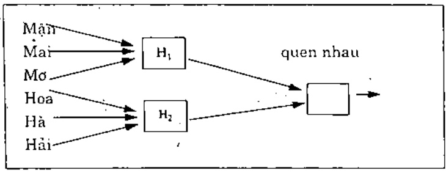

Hình 18-7. Bãi toán học về sự quen nhau. Học đề biết một người trong nhóm ba người dấu quen một người trong nhóm ba người sau.. Các liên kết thay thế ngưỡng không chỉ ra trong hình.

Dùng một bảng thể hiện tri thức bằng cách liệt kê đầu ra thích hợp trên cột Quen nếu quen nhau, và cột AnhEm. Cột Quen có 15 tố hợp đầu vào..

| Mân | Mai | Md | Hoa | Hà | Hải | Quen | AnhEm |
| --- | --- | --- | --- | --- | --- | --- | --- |
| 1 | 1 | 0 | 0 | 0 | 0 | 0 | 1 |
| 1 | 0 | 1 | 0 | 0 | 0 | 0 | 1 |
| 1.. | 0 | 0 | 1 | 0 | 0 | 1 | 0 |
| 1 | 0 | 0 | 0 | 1 | 0 | 1 | 0 |
| 1 | 0 | 0 | 0 | 0 | 1 | 1 | 0 |
| 0 | 1 | 1 | 0 | 0 | 0 | 0 | 1 |
| 0 | 1 | 0 | 1 | 0 | 0 | 1 | 0 |
| 0 | 1 | 0 | 0 | 1 | 0 | 1 | 0 |
| 0 | 1 | 0 | 0 | 0 | 1 | 1 | 0 |

<!-- page: 424 -->

| 0 | 0 | 1 | 1 | 0 | 0 | 1 | 0 |
| --- | --- | --- | --- | --- | --- | --- | --- |
| 0 | 0 | 1 | 0 | 1 | 0 | 1 | 0 |
| 0 | 0 | 1 | 0 | 0 | 1 | 1 | 0 |
| 0 | 0 | 0 | 1 | 1 | 0 | 0 | 1 |
| 0 | 0 | 0 | 1 | 0 | 1 | 0 | 1 |
| 0 | 0 | 0 | 0 | 1 | 1 | 0 | 1 |

Hình 18-8. Dữ liệu để học các kinh nghiệm bằng mạng thân kinh. Sầu cột ứng với tổ hợp dữ hiệu nhập vào. Hai cột cuối ứng với dấu ra.

Các mẫu dữ hiệu nhập vào đúng là những dữ liệu để thủ tục truyền ngược hiện. Giá sử giá trị của tham số tỉ lệ là 1.0. Ngoài ra, thủ tục truyền ngược có các trị đầu về ngưỡng và các trọng số cho trong cột đầu của bảng tiếp theo. Giá trị để 0.1, giá trị thủ hai là 0.2 và phần còn lại lên đến 1.1 với bước tăng là 0.1.

| Trọng số | Giá trị đầu | Sau nhiệm vụ thứ nhất |
| --- | --- | --- |
| $t_{H1}$ | 0.1 | 1.99 |
| $w_{Majn \to H1}$ | 0.2 | 4.65 |
| $w_{Mai \to H1}$ | 0.3 | 4.65 |
| $w_{Mo \to H1}$ | 0.4 | 4.65 |
| $t_{H2}$ | 0.5 | 2.28 |
| $w_{Hoa \to H2}$ | 0.6 | 5.28 |
| $w_{Ha \to H2}$ | 0.7 | 5.28 |
| $w_{Hai \to H2}$ | 0.8 | 5.28 |
| $t_{quen nhâu}$ | 0.9 | 9.07 |
| $w_{H1 \to quen nhâu}$ | 1.0 | 6.27 |
| $w_{H2 \to quen nhâu}$ | 1.1 | 6.12 |

Hình 18-9. Các thay đổi trọng số quan sát được khi huấn luyện mạng kinh. Thực ra cấp những người quen nhau được nhận ra. Các giá trị đầu thay đổi thông qua truyền ngược cho đến khi tất cả các đầu ra rời vào kh rộng 0.1 gần với 0.0 hay 1.0.

<!-- page: 425 -->

Các chọn lựa này là bước dấu kiến thiết cho việc sử dụng các số ngẫu nhiên làm các giả trị dấu. Trong thí dụ này, các mẫu là chuẩn chú chưa hoàn toàn ngẫu nhiên để tiện theo dõi sự thay đổi trọng số. Cơn khi dùng các số ngẫu nhiên, các kết quả thủ được với các số ngẫu nhiên cũng tương tự.

Khi tất cả các mẫu nhập vào cho giá trị đầu ra phù hợp, các ngưỡng và trọng số được cho trong cột thứ hai của bảng. Các ngưỡng và trọng số này là khác xa với những giá trị dùng trong thí dụ trước đây. Cách thức hoạt động của các ngưỡng và trọng số về "quen nhau" như đã xét trước đây. Bất ki dữ liệu nhập trong nhóm đầu tiên gồm ba người khiển đầu ra của H₁ gần 1; và dữ liệu nhập vào trong nhóm kia khiển đầu ra của H₂ gần 1. Nút "Quen nhau" gần 1 chỉ khi cả H₁ và H₂ gần 1.

Việc huấn luyện với mạng này thực hiện trong vai bước. Đồ thị đánh giá về sai số cũng cho thấy hiệu suất chấp nhận được khi đạt được 225 thay đổi trọng số. Các trọng số được thay đổi sau khi mỗi tập các mẫu nhập. Do vậy với 15 mẫu như trong thi dụ, cần có 225 \* 15 = 3375 lần xử lý mẫu nhập vào.

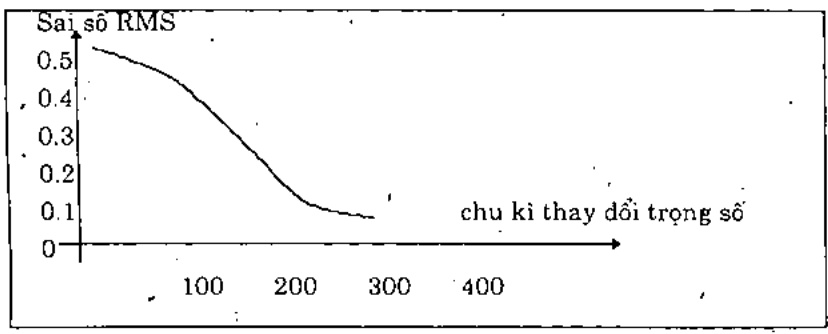

Hình 18-10. Các kết quả về kinh nghiệm học. Trục hoành ứng với số các truyền ngược được thực hiện khi học về "quen nhau". Trục tung là sai số RMS (Root Mean Square), đánh giá sơ sánh giữa giá trị sử dụng và giá trị chính xác.

## III.2. Sự không ổn định của truyền ngược

Khi tham số tỉ lệ thay đổi xảy ra các tác động gì ? Thủ tục truyền ngược có thể cho lời giải thỏa mãn sau khi thay đổi 225 trọng số. Lức đó giá trị của tham số tỉ lệ là 1.0. Như trên đô thị, tham số lấy giá trị 0.25 cũng cho lời giải thỏa mãn, nhưng cần thay đổi 900 trọng số. Tương tự, giá trị 0.5 cho lời giải thỏa mãn khi thay đổi 425 trọng số.

<!-- page: 426 -->

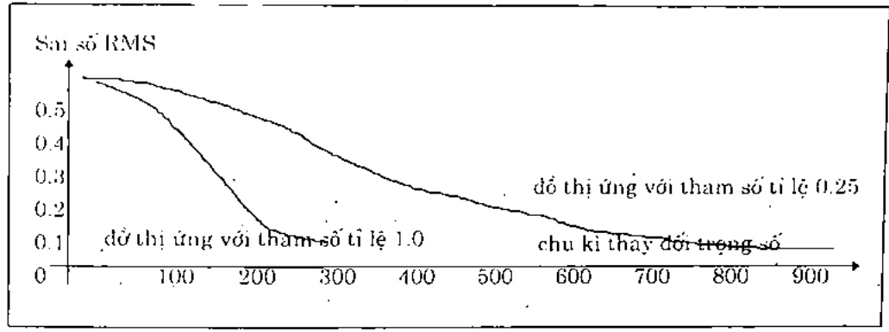

Hình 18-11. Hành vi của việc học có thể phụ thuộc dáng kể vào tham số tỉ lệ r.

Nếu tảng tỉ lệ đến 2.0 thì giảm được số các trọng số cần thay đổi mà vẫn có được lời giải thỏa mãn, nhưng hiệu suất kém đi. Nếu tảng tỉ lệ đến 4.0 hay 8.0 xuất hiện tính mặt ổn định. Sai số lúc tăng lúc giảm. Lý do của sự mất ổn định là các bước quá lớn, không phù hợp với độ đốc tính toán.

Đo vậy tham số tỉ lệ 1.0 là có lý hơn cả và các bước không lớn tối mức gây mất ổn định. Như vậy tỉ lệ này được lấy theo kinh nghiệm. Giá trị của tham số tỉ lệ tùy thuộc vào loạn bài toán được giải.

## III.3. Truyền ngược tiến hành theo từng giai đoạn

Giá sử thêm nút dầu ra khác. Người ta muốn ràng dầu ra của nút mối này là 1 khi tổ hợp dầu vào là hai anh em. Hơn nửa giả sử ràng nếu hai người không được gọi là quen nhau thì họ là anh em.

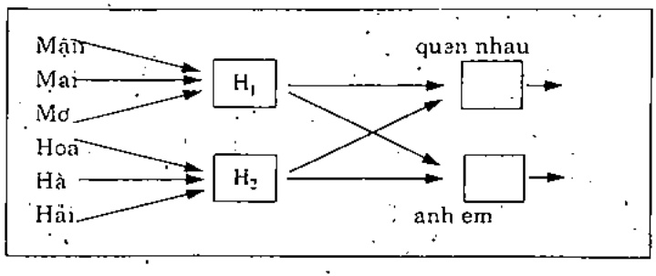

Hình 18-12. Yêu cầu học về "quen nhàu" và "anh em".

<!-- page: 427 -->

Người ta có thể dùng thủ tục truyền ngược với thông tin anh ơm bổ sung nay. Có thể bắt đầu với các trọng số có dược sau kinh nghiệm đầu tiên; người ta cần có trọng số mới cho ngưỡng của mút mới và các liên kết mới.

| Trọng số | Giá trị đầu | Sau nhiệm vụ thứ nhất | Sau nhiệm vụ thứ hai |
| --- | --- | --- | --- |
| $t_{H1}$ | 0.1 | 1.99 | 2.71 |
| $W_{Mân \to H1}$ | 0.2 | 4.65 | 6.02 |
| $W_{Mai \to H1}$ | 0.3 | 4.65 | 6.02 |
| $W_{Mo \to H1}$ | 0.4 | 4.65 | 6.02 |
| $t_{H2}$ | 0.5 | 2.28 | 2.89 |
| $W_{Boa \to H2}$ | 0.6 | 5.28 | 6.37 |
| $W_{Ha \to H2}$ | 0.7 | 5.28 | 6.37 |
| $W_{Hà \to H2}$ | 0.8 | 5.28 | 6.37 |
| $t_{quen nhau}$ | 0.9 | 9.07 | 10.29 |
| $W_{H1 \to quen nhau}$ | 1.0 | 6.27 | 7.04 |
| $W_{H2 \to quen nhau}$ | 1.1 | 6.12 | 6.97 |
| $t_{anh em}$ | 1.2 |  | -8.32 |
| $W_{H1 \to anh em}$ | 1.3 |  | -5.72 |
| $W_{H2 \to anh em}$ | 1.4 |  | -5.68 |

Hình 18-13. Các thay đổi trọng số trong huấn luyện mạng thần kinh. Dấu tiền chỉ quan hệ "quen nhau" được học. Sau đó trong giai doan hai, quan hệ "anh em" được học. Dấu gạch trong ô dữ liệu ứng với việc trọng số không được thể hiện. Ban đầu các giá trị ngẫu nhiên được thay đổi nhỏ truyền ngược cho tới khi các đầu ra rời vào khoảng rộng 0.1 quanh 0.0 hay 1.0.

Khi tất cả các mẫu đầu vào sản xuất giá trị đầu ra phù hợp, các trọng số và các ngưỡng nhu trong bảng; ứng với cột sau nhiệm vụ thất hai. Xem-phía phải trên độ thị, hiệu suất sẽ là chấp nhận được sau khi thay đổi thêm 175 trọng số, với giá trị tham số là 1.0. Tiếp theo, cần có nhiều bước để thu được kết quả, nhưng không cần nhiều nhu chỉnh lý trọng số để nhận dạng sự quen nhau: Con số giảm di này là do nhiều trọng số dùng để nhận ra sự quen nhau cũng là thích hợp cho việc nhận ra quan hệ anh em.

<!-- page: 428 -->

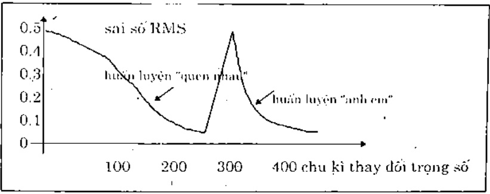

Hình 18-14. Kết quả của việc học theo các giai đoạn. Trước tiến mạng được dạy về sự quen nhau; sau đó nó được dạy về quan hệ anh cím. Cần bậc hai của sai số bình phương trung bình RMS thấy tại mút dầu ra phụ thuộc vào số truyền ngưỡng thực hiện trong lúc học về sự quen nhau.

## III.4. Học nhận dạng đồng thời nhiều khái niệm

Việc truyền ngược có thể huấn luyện mạng để học cách nhận dạng đồng thời nhiều khái niệm. Người ta có thể quản lý đồng thời tất cả các đầu vào. Một phương hướng giải quyết số lượng lớn các đầu vào là tổ chức xử lý song song.

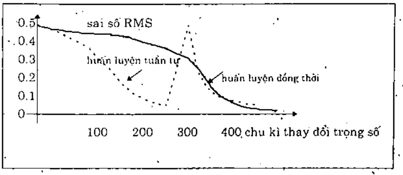

Hình 18-15. Đường huấn luyện tuần tự và đường huấn luyện đồng thời. Đường chấm chấm cho biết căn bậc hai của sai số bình phương trung bình tại các nút đầu ra khi học theo các giai đoạn. Đường liên cho biết căn bậc hai của sai số bình phương trung bình tại các nút đầu ra khi học đồng thời.

Thí dụ trong bài toán giới thiệu ở chương này, 425 thay đổi trọng số sản xuất được một tập các trọng số khả đã. Có 400 trong số 425 thay đổi trọng số là cần thiết cho việc

<!-- page: 429 -->

học. Nhìn chung, việc học đồng thời có thể nhanh hay chậm hơn việc học có tố chức. Nhanh hay chậm phụ thuộc vào bài toán và các trọng số ban đầu.

## III.5. Dự đoán nhỏ các mạng thần kinh

Mạng thân kinh có thể được huấn luyện để nhận biết quan hệ quen nhau và quan hệ anh em. Trong mỗi thí dụ, tập huấn luyện của các tổ hợp mẫu vào/ra gồm nhiều cập người. Do vậy, mạng thân kinh học trị thức thông qua các tổ hợp dữ hiệu để dự đoán đúng các đầu ra đối với các dữ liệu vào chưa biết. Việc này cũng tương tự như mạng thân kinh có thể nhận dạng sau khi được học các mẫu.

Vậy giả sử người ta chia các dữ liệu thành tập huấn luyện và tập thử nghiệm. Cho phép tập huấn luyện gồm các dữ liệu nguyên thuỷ, trừ một phần năm tố hợp vào/ra. Tập thử nghiệm gồm một phần năm mẫu. Do vậy dự trữ 20% dữ hiệu để thử nghiệm xem mạng thần kinh có thể tổng quát hóa từ các dữ liệu trong tập thử nghiệm không.

Thủ tục truyền ngược huấn luyện thành công mạng xử lý tất cả các tổ hợp mẫu vào/ ra trong tập huấn luyện sau khi có 225·trọng số thay đổi. Số thay đổi này ít hơn con số yêu cầu khi mạng này được huấn luyện theo tất cả các tổ hợp, bồi vì có một phần ba các tổ hợp được làm phù hợp:

Mạng huấn luyện này cũng xử lý thành công các tổ hợp trong tập thủ nghiệm như chỉ ra trong bảng sau. Các chỉ số d chỉ các giá trị mong muốn và o chỉ-giá trị quan sát được.

| Mân | Mai | Mo | Hoa | Hà | Hái | Quen$_{d}$ | Quen$_{o}$ | AnhEm$_{d}$ | AnhEm$_{o}$ |
| --- | --- | --- | --- | --- | --- | --- | --- | --- | --- |
| 1 | 0 | 0 | 0 | 0 | 1 | 1 | 0.92 | 0 | 0.06 |
| 0 | 0 | 1 | 1 | 0 | 0 | 1 | 0.92 | 0 | 0.06 |
| 0 | 0 | 0 | 0 | 1 | 1 | 0 | 0.09 | 1 | 0.91 |

Hình 18-16. Tạp thủ nghiệm.

## III.6. Trọng số thái quá là không thích hợp

Theo lẻ tự nhiên nếu mạng thần kinh hoạt động không phù hợp, người ta có thể sử dụng các trọng số được huấn luyện dễ cải thiện nó. Tuy nhiên phương pháp này là không thực tế vi các mạng thần kinh sẽ trở nên phúc tạp khi có quá nhiều trọng số.

<!-- page: 430 -->

## Thi du

Mạng thân kính trong các thí dụ trước được bổ sung nứt mới và 9 trọng số mới. Người ta cho ràng dùng mạng này để học bãi toàn trước đáy không khó khăn gì! thấm chí có thể nhanh hơn. Có thể nghĩ ràng thêm các trọng số không gây nặng nẻ và thủ tục truyền ngược dưa chủng về 0.

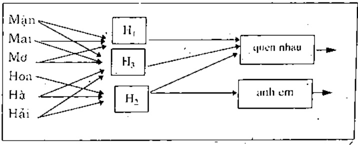

Hình 18-17. Mạng thân kinh khác giải bài toán quen biết - anh em. Mạng có quả nhiều trọng số và mô tả bài toán không phủ hợp.

Với các trọng số mới, thủ tục truyền ngược cần thay đổi 300 trọng số để xử lý tất cả các tổ hợp mẫu nhập vào. Do vậy việc thêm các trọng số mới trong tập thử nghiệm lộ ra các sai sót như liệt kê trong bằng sau :

| Mân | Mai | Mo | Hoa | Ha | Hái | Quen$_{cl}$ | Quen$_{o}$ | AnhEm$_{cl}$ | AnhEm$_{o}$ |
| --- | --- | --- | --- | --- | --- | --- | --- | --- | --- |
| 1 | 0 | 0 | 0 | 0' | 1 | 1 | 0.92' | 0 | 0.06 |
| 0' | 0. | 1 | 1 | 0 | 0 | 1 | 0.06? | 0 | 0.94? |
| 0 | 0 | 0 | 0 | 1 | 1 | 0 | 0.97? | 1 | 0.01? |

Hình 18-18. Sai sót thấy được trong bảng thực nghiệm.

Trong bài toán này người ta đã thêm các trọng số với hy vọng tăng tính mềm dẻo khi huấn luyện mạng thần kinh. Tuy nhiên thái quả đều không tốt. Hiện tượng quá mềm dẻo hay kém mềm dẻo được thể hiện trên hình vẽ.

<!-- page: 431 -->

## Thi du

Yêu cầu dưa các dinh dòng vào một số điểm và dùng các dinh này để giữ thanh gỗ mỏng theo đường lucion qua các điểm đánh dấu bằngチーム đạm hơn. Các vị trí nhạt hơn ứng với các dấu dinh đóng. Người ta có dùng chiếc thanh sắt uốn cong được để điều chỉnh hình dạng của thanh gỗ. Nếu thay thanh sắt bằng đáy thông thì quá quyền chuyển đến mức đầy thường trượt di kháp nơi!

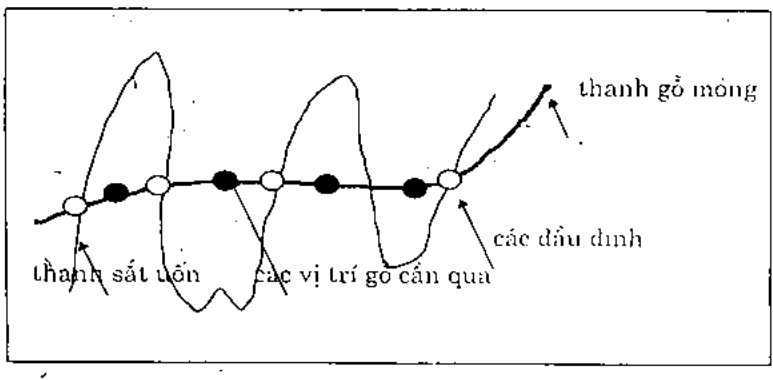

Hình 18-19. Quả mềm đẻ cũng là không phù hợp.

Chiếc dây thùng đóng vai trò của mạng thân kinh có nhiều trọng số huấn luyện. Mạng thân kinh nhiều trọng số có thể thuận lợi cho các mẫu vào/ra trong tập huấn luyện theo nhiều cách. Dây thùng có thể trượt lung tung. Mạng thân kinh phù hợp với dữ liệu theo kiểu dây thùng này được gọi là mạng thân kinh có biểu hiện trượt quá.

Người ta dùng phép may rủi để tránh hiện tương trượt quá này. Chắc chấn số các trọng số được huấn luyện ánh hưởng đến bất ki đầu ra cụ thể nào là nhỏ hơn số các mẫu huấn luyện. Đối với mạng quen nhau/ anh em trong thí dụ ở đầu chương, mỗi giá trị đầu ra được xác định bằng 11 trọng số huấn luyện và có 12 mẫu vào/ ra. Còn trong thí dụ phát triển vừa nêu, mỗi giả trị đầu ra được xác định bởi 19 trọng số huấn luyện, quá đến 50% so với số các mẫu huấn luyện. Việc trượt quá là không tránh được.

## III.7. Huân luyện trên mạng thân kinh

Người ta có thể có nhiều lựa chọn sau, khi đã quyết định giải bài toán bằng mạng thần kinh theo thủ tục truyền ngược. Các vấn đề người ta cần tự trả lời gồm :

\- Cách thể hiện thông tin theo thuật ngữ của mạng thần kinh ? Cách dùng các đầu vào của mạng thần kinh để diễn tả điều mong muốn ? Cách dùng các đầu ra của mạng thần kinh để xác định điều người ta muốn biết ?

<!-- page: 432 -->

\- Số lượng nởon trong mạng thân kinh ? Như vậy có bao nhiều dấu vào, dấu ra và bao nhiều tầng không hiện ra ?

\- Trong công thức truyền ngược, liệu xác định giá trị tham số tỉ lệ là bao nhiêu?

\- Nên chọn các huấn luyện tuần tự hay đồng thời trên mạng thân kinh?

Việc chọn không thích hợp làm hiệu suất giảm. Một mạng thần kinh nhỏ không thể học những gì nó muốn được. Cơn mạng lớn thì chậm, có thể gây ra trước quá. Tham số tỉ lệ nhỏ làm lăng phí thời gian, nhưng tỉ lệ lớn lại gây mất ổn định và không đoán trước được.

Việc chọn đúng tham số tùy thuộc vào bán chất của mẫu. Vế mặt toán học, có thể xem các mẫu như thể hiện của hàm ẩn, mỗi đầu vào ứng với một chiều. Nếu có nhiều đầu vào, tỉnh chất da chiều của hàm số sõ gây khó khăn cho khá nâng tương tương.

Cách lựa chọn tốt được rút kinh nghiệm từ các trường hợp tương tự. Việc triển khai thử nghiệm cũng tôn thời gian và công sức như nghệ thuật, mà không chỉ dựa vào tài liệu hướng dẫn.

<!-- page: 433 -->

## IV. KÊT LUẬN

Việc học thông qua huấn luyện trên mạng thân kinh lên quan đến các quá trình xử lý phân tán, song song. Tương lai của các nghiên cứu về mạng thân kinh đóng góp cho loại máy tính đặc biệt là máy tính thân kinh. Một số nét chính đã trình bày trong phần này gồm :

\- Các nondon thân kinh bao gồm khớp thân kinh, dấu dây thân kinh, trực, và , thân tế bào. Các nondon mô phỏng gồm các bộ cộng, nhân và các ngường.

\- Một each học, là huấn luyện mạng thần kinh mô phỏng để nhận ra tính quy luật của dữ liệu.

\- Thủ tục truyền ngược là thủ tục cho mạng thân kinh huấn luyện được. Việc truyền ngược được hiểu một cách may rủi hoặc theo cách phân tích toán học.

\- Đề có thể truyền ngược. cần thực hiện thào tác nhỏ là huyí các ngưỡng nondon khác không. Vậy nên cần chuyển các hàm ngưỡng từng bước về các hàm ngưỡng nén S.

\- Có thể dạy trên mạng thần kinh thông qua truyền ngược để nhận dạng vải khái niệm. Các khái niệm này có thể được dạy từng cải một, hay tất cả một lượt.

\- Cần thân trọng khi lựa chọn tham số tỉ lệ dùng trong việc truyền ngược. Tỉ lệ này nhỏ thì việc thực hiện chậm, nhưng nếu lớn thì gây rả mất ổn định.

\- Quá nhiều trọng số huấn luyện so với số các mẫu huấn luyện có thể làm trượt quá và hiệu suất thấp trên các dữ liệu thủ nghiệm.

<!-- page: 434 -->

# HỌC BẰNG CÁCH HUẤN LUYÊN PERCEPTRON

Tiếp theo việc dùng mạng thân kinh để học, người ta có thể dùng perceptron. Perceptron được cơi như dạng đặc biệt của mạng thân kinh, thuộc dạng đơn giản nhất là chỉ có một thành phần giống như nondon. Tuy nhiên vấn đề chính là perceptron giải quyết các ý đó lý thuyết.

Thí dụ trong chương này đúng perceptron học các bảng hiện số diện tử.

## I. PERCEPTRON VÀ HỌC PERCEPTRON

## I.1. Giới thiệu

Perceptron là các mạng được phát triển hay đặc biệt hóa theo mạng thần kinh bình thường, tuân theo các đặc tả được định nghĩa.

Đình nghĩa 19-1 : Perceptron

Perceptron là thể hiện của mạng thân kính, trong đó :

• Chi có một ndron.

• Đầu vào nhi phản : chỉ cổ tín hiệu ứng với 0, 1.

\- Các hộp logic có thể được đặt giữa các đầu vào của perceptron và các trọng số perceptron. Môi hộp logic có thể được xem như bảng cho ra giá trị 0 hay 1 đối với mỗi tổ hợp của 0, 1 xuất hiện tại đầu vào.

\- Đầu ra của perceptron là 0 hay 1 tùy theo tổng trọng số của các đầu ra có lớn hơn ngưỡng không.

Các đầu vào của perceptron trong hình thí dụ là 0 hay 1. Đầu ra do hộp logic sinh ra. Nếu, tổng của các đầu ra theo trọng số của hộp logic lớn hơn 0 thì đầu ra cuối cùng của perceptron là 1, và perceptron được gọi là "có" (YES), tức là một lớp đã được nhận dạng. Nguốc lại perceptron là "không" (NO).

<!-- page: 435 -->

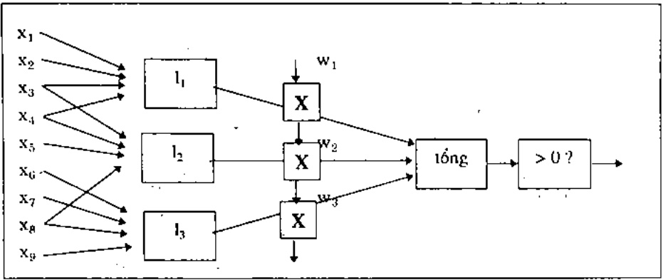

Hình 19-1. Một perceptron. Kí hiệu l, là các hộp logic, X là các hộp trọng số và w, là các trọng số.

Trong các nghiên cứu về mạng thần kinh nói chung, các ngưỡng khác không có thể được chuyển thành tổ hợp gồm các phần tử đặc biệt là đầu vào, trọng số, và ngưỡng không. Chương này cũng vậy; các ngưỡng khác không sẽ được chuyển đổi về ngưỡng bằng không khi giới hạn nhu cầu làm việc trên perceptron.

Giải thích theo toán học, giả sử đầu ra của hộp logic thứ i là 1, trọng số thứ i là 8, ngưỡng T. Khi đó đầu ra của cả perceptron là P, được tính theo công thức sau :

$$
\mathrm{P} = 1 \quad : \text {neu} \Sigma_ {\mathrm{i}} \mathrm{w} _ {1} ^ {*} \mathrm{l} _ {\mathrm{i}} > \mathrm{T}
$$

$$
\mathrm{P} = 0 \quad \text {trong truong hợp ngược lại.}
$$

Lưu ý rằng nếu một hộp logic được phép quan sát tất cả các đầu và b của perceptron thì không cần các hộp logic khác, hoặc không cần sự có mặt của bất kì trọng số nào, không cần hàm ngưỡng. Thay vào đó, các tổ hợp của đầu vào 0, 1 sẽ được, ghi lại trong hộp logic bền trong, tương ứng với đầu ra 0 hay 1.

Tuy nhiên nếu có n đầu vào và giả sử dùng hết các khả năng tổ hợp thì số các của vào trong bảng là 2$^{n}$. Quan hệ hàm mũ giữa số các của vào và số các đầu vào làm mất tính thực tế đối với bất kì hộp logic quan sát tất cả các đầu vào khi xử lý nhiều dữ liệu vào. Do vậy mỗi hộp logic của perceptron giả thiết chỉ quan sát một số nhỏ của các đầu vào, chẳng hạn các hộp logic trong perceptron trên hình vẽ quan sát tối đa bốn đầu vào.

Dình nghĩa 19-2 : Perceptron hạn chế bậc (Order limited perceptron)
Perceptron hạn chế bậc n nếu môi hộp logic chỉ quan sát n đầu vào hoặc ít hơn.

<!-- page: 436 -->

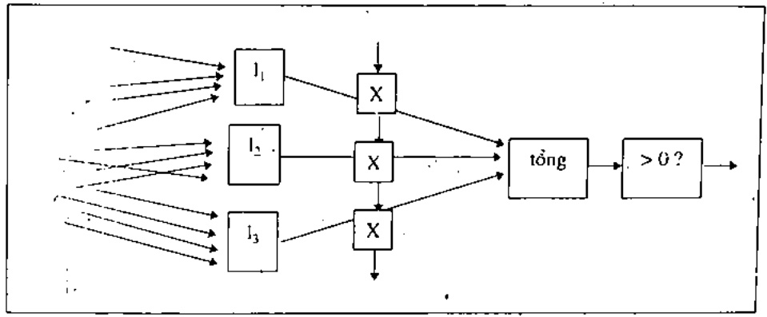

Hình 19-2. Một perceptron khác. Các đầu vào được bổ trí trên ma trận vuông đề nhận dạng các đối tượng hai chiều.

Một cách trực quan, các đầu vào của perceptron có thể được bổ trí trên ima trận gọi là lưới, thuần tiện cho mục đích nhận dạng của perceptron trên các mẫu hai chiều như các kite tự. Khi các đầu vào của perceptron được sắp xếp như vậy, người ta có thể hạn chế các đầu vào cho mỗi hộp logic theo cách khác.

\- Trong perceptron hạn chế theo dưỡng kính d, người ta giả thiết ràng các đầu vào được bổ trí trong lưới hình chữ nhật, và các đầu vào di tới hộp logic cần nằm trong lưới hình tròn dưỡng kính d.

Cùng có thể hạn chế bỏ qua hộp logic. Lúc này dấu vào di thẳng đến bộ nhân tương ứng.

\- Trong perceptron di thăng, mỗi hộp logic có một đầu vào và đầu ra luôn luôn nhu đầu vào này. Do vậy perceptron di thăng được xem như perceptron không có hộp logic. Dĩ nhiên khí không có hộp logic, người ta dễ theo dõi hơn.

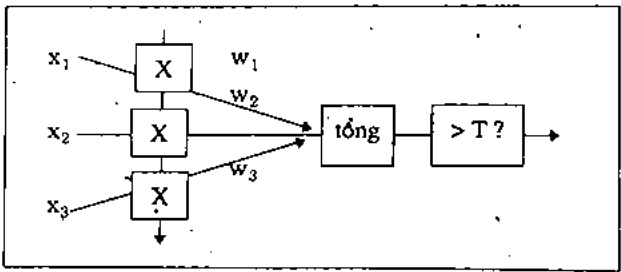

Hình 19-3. Perceptron di thẳng, không có hộp logic.

<!-- page: 437 -->

## I.2. Thủ tục hội tụ perceptron

Thủ tục nhân dạng tự động được người ta dùng cho phép nhận dạng đối tượng, hay nổi cách khác là sẽ hội tự nếu có lời giải trong không gian các lời giải. Các kết quả được perceptron sản xuất là tập các kết quả theo các trọng số đã có. Ban dấu có các trọng số là 0. Người ta tiến hành nhận thức học mẫu cùng một lúc trên các mẫu. Mỗi khi perceptron bị lỗi, thay đổi trọng số để giảm sai sót.

\- Khi perceptron cho kết quả "không", coi đó ứng với 0, và "có" ứng với 1. Người ta có thể làm cho lần sau perceptron nói "có" nhiều hơn nếu tăng các trọng số gắn với các hộp logic đã cho ra 1. Một cách đảm bảo tìm ra tập hoàn toàn đúng của các trọng số là tăng thêm 1 cho các trọng số như vậy.

\- Một cách đối xúng, nếu perceptron lại nói "có" lẻ ra phải nói "không", người ta giảm các trọng số gần với các hộp logic cho ra 1. Giá trị giảm di là 1.

\- Không trường hợp nào cần thay đổi trọng số gắn với các hộp logic cho ra 0.

Đế tăng cường tác dụng của ngưỡng huấn luyện, cần bổ sung giả trị đặc biệt, ảo, luôn lấy giả trị 1. Giá trị này gắn với hộp logic vừa cho qua giá trị vào đó. Do việc bổ sung này, perceptron có thể coi như có ngưỡng 0, và nó nói "có" khi tổng trọng số của các đầu ra của hộp logic lớn hơn 0.

Lưu ý rằng người ta có thể mô tả thủ tục huấn luyện perceptron chính xác hơn bằng cách dùng ngôn ngữ vecto. Các đầu ra của hộp logic và các trọng số được mô tả thông qua (l₁l₂...lₙ) và (w₁w₂...wₙ). Thêm 1 vào các trọng số gắn với hộp logic cho ra 1 tương đương với việc thêm vecto đầu ra của hộp logic vào vecto trọng số, như trình bày sau đây:

## Đế huân luyên perceptron:

Cho đến khi perceptron đạt được kết quả đúng đối với mỗi mẫu huấn luyện, đối với mỗi mẫu, thực hiện :

1. Khi perceptron cho ra hết quả sai,

\- Nếu perceptron nói "không" khi nó cần nói "có", thêm vectơ đầu ra của hộp logic vào vectơ trọng số.

\- Ngược lại trừ vectơ trọng số di một lượng là vectơ đầu ra hộp logic.

2. Nguộc lại không làm gì.

Thí dụ

Perceptron, trong hình vẽ sau được huấn luyện để thực hiện hàm OR logic.

Vi perceptron thuộc loại di thẳng, vecto đầu ra của hộp logic (l₁l₂l₃) như là vecto nhập vào (x₁x₂x₃). Do vậy các mẫu nhập vào và các đầu ra hộp logic tương ứng như nêu ra trong bảng.

<!-- page: 438 -->

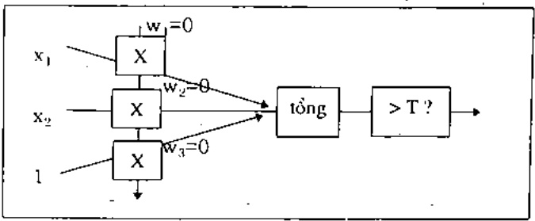

Hình 19-4. Perceptron di thẳng với hai đầu vào bình thường và một đầu vào thay ngưỡng. Đầu vào luôn là 1 và trọng số tương ứng giữ vai trò ngưỡng khác không.

Xem trong bảng thấy perceptron này đã học được logic OR sau bốn thay đổi.

\- Thay đổi đầu tiên xảy ra sau một lỗi trong mẫu thứ hai. Mẫu thứ nhất bổ qua lỗi này. Lức này vectơ trọng số (000) cho đầu ra 0 khi nó cần là 1. Khi vectơ đầu vào (011) được thêm vào vectơ trọng số, vectơ trọng số mới là (011).

\- Hai mẫu sau đều cho ra 1 ngay lần đầu. Vậy không phải thay đổi gì.

\- Lân duyệt thú hai, mẫu thứ nhất cho ra 1, lẻ ra là 0. Vậy vectơ đầu vào (001) dùng để trừ đi khởi vectơ trọng số (011), cho vectơ trọng số mối là (010).

| Mãu | $x_{1}=(l_{1})$ | $x_{2}=(l_{2})$ | $x_{3}=(l_{3})=1$ | Dấu ra mong muốn(hàm OR) |
| --- | --- | --- | --- | --- |
| 1' | 0 | 0 | 1 | 0 |
| 2 | 0 | 1 | 1 | 1 |
| 3 | 1 | 0 | 1 | 1 |
| 4 | 1 | 1 | 1 | 1 |

Hình 19-5. Các giá trị đầu ra của hộp logic.

\- Với sự thay đổi vừa thực hiện này, mẫu thứ ba cho ra 0 khi nó cần cho ra 1. Vậy vectơ đầu vào (101) được cộng vào vectơ trọng số (010). Vectơ trọng số mới là (111).

<!-- page: 439 -->

\- Trong lần duyệt thủ ba, mẫu đầu tiên cho ra sai. Nó cho ra 0, lẻ ra phải là 1. Trừ vectơ đầu vào (001) khởi vectơ trọng số (111), được vectơ trọng số mới là (110). Vectơ trọng số này hoạt động với tất cả các mẫu.

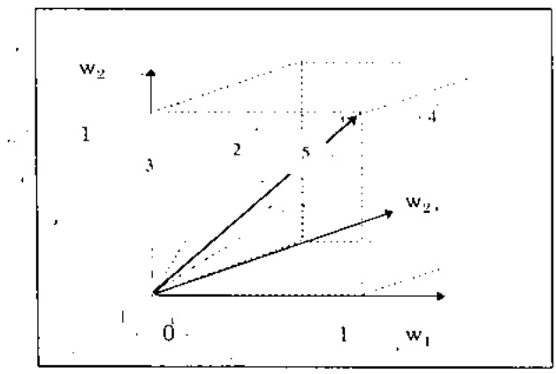

Hình 19-6. Khi perceptron học, vectơ trọng số thay đổi.

Đo chỉ có ba trọng số, hai trọng số nhập vào và một là ngưỡng, mỗi tổ hợp trọng số có thể được coi như vecto trọng số ba chiều. Nhìn chung vecto trọng số thay đổi khi học. Trong thí dụ này, góc giữa vecto trọng số đang xét và vecto trọng số cuối cùng luôn biến động.

## I.3. Mô tả hội tụ với hai trọng số bằng đại số

Giả sử perceptron chỉ có hai trọng số $w_1$ và $w_2$. Tổ hợp trọng số được xem như vecto hai chiều đơn giản, kí hiệu bằng chủ đảm w.

Bình thường vectơ trọng số được coi là thỏa mãn khi $\Sigma_{i}w_{i}^{*}l_{i}>0$ đối với các mẫu dương và ngược lại đối với các mãu âm. Đề đảm bảo perceptron hội tu về kết quả như thủ tục đã làm, giả sử có vectơ trọng số đặc biệt $w^{*}$, chua bao giờ cho ra tổng trong miền nhỏ quanh 0 rộng 2δ. Do vậy vectơ trọng số $w^{*}$ có hiệu suất tốt hơn một chút so với mức thỏa mãn, vì $\Sigma_{i}w_{i}^{*}l_{i}>\delta$ đối với các mãu dương, và $\Sigma_{i}w_{i}^{*}l_{i}<-\delta$ đối với các mãu âm.

Kí hiệu trọng số $w_1$ ban đầu nhận giá trị $w_{10}$. Sau lần thay đổi thứ n, $w_1$ có giá trị $w_{1n}$. Trọng số $w_2$ dùng ki hiệu tương tự. Khi thực hiện các thay đổi, các vectơ trọng số di chuyển về $w_1^*$ và $w_2^*$.

Sau đây là các ý tưởng chính của việc dùng đại số đẻ mô tả việc hội tụ. Xem xét góc giữa vecto w\* có các thành phần w₁\*, w₂\* và wₙ có các thành phần w₁ₙ, w₂ₙ. Góc

<!-- page: 440 -->

này sẽ nằm trong hình bao, co lại mỗi khi vecto trọng số thay đổi. Ngoài ra không còn thay đổi được hơn vì kích thước hình bao đã nhỏ không thể cơ thêm được. Quan sát này có nghĩa ràng về sau không còn mắc lỗi, bởi vì mỗi sai sót đều khiển thay đổi vecto trọng số, và khi ấy thay đổi làm cho hình bao co lại. Góc này là θ, thỏa mặn công thức :

$$
\cos \theta = \frac {w _ {1} * w _ {1 n} + w _ {2} * w _ {2 n}}{\sqrt {w _ {1} * ^ {2} + w _ {2} * ^ {2}} \sqrt {w _ {1 n} ^ {2} + w _ {2 n} ^ {2}}}
$$

Dùng những điều đã biết về sự thay đổi trọng số, có thể chứng minh được biểu thức này tỉ lệ với  $\delta n^{1/2}$ .

Chúng minh :

Trước hết lưu ý đến quan hệ giữa $w_{m}$ và $w_{i,n-1}$. Giả sử rằng perceptron mắc lỗi, nói "không" khi lẽ ra phải nói "có". Nó thực hiện điều đó khi $\Sigma_{i}w_{i,n-1} * l_i \leq 0$. Bất đẳng thức này dẫn đến việc thay đổi các trọng số :

$$
\begin{array}{l} \mathrm{w} _ {1 n} = \mathrm{w} _ {1, n - 1} + \mathrm{l} _ {1} \\ \vdots \\ \mathrm{w} _ {2 n} = \mathrm{w} _ {2, n - 1} + \mathrm{l} _ {2} \end{array}
$$

Phân tử số của biểu thức cosin được viết lại :

$$
\mathrm{w} _ {1} ^ {*} \mathrm{w} _ {1, n - 1} + \mathrm{w} _ {2} ^ {*} \mathrm{w} _ {2, n - 1} + \mathrm{w} _ {1} ^ {*} \mathrm{l} _ {1} + \mathrm{w} _ {2} ^ {*} \mathrm{l} _ {2},
$$

Giả sử $\mathbf{w}^{*}$ luôn cho kết quả đúng và ngoài vùng trống 2δ, người ta biết rằng $\mathbf{w}_{1}^{*}\mathbf{l}_{1} + \mathbf{w}_{2}^{*}\mathbf{l}_{2} > \delta$ khi perceptron nói "có". Do vậy tử số có ràng buộc sau :

$$
\mathrm{w} _ {1} ^ {*} \mathrm{w} _ {1 n} + \mathrm{w} _ {2} ^ {*} \mathrm{w} _ {2 n} > \mathrm{w} _ {1} ^ {*} \mathrm{w} _ {1, n - 1} + \mathrm{w} _ {2} ^ {*} \mathrm{w} _ {2, n - 1} + \delta
$$

Thay n-1 bằng n-2 để đánh giá tiếp :

$$
\mathrm{w} _ {1} ^ {*} \dot {\mathrm{w}} _ {1 n} + \mathrm{w} _ {2} ^ {*} \mathrm{w} _ {2 n} > \mathrm{w} _ {1} ^ {*} \mathrm{w} _ {1, n - 2} + \mathrm{w} _ {2} ^ {*} \mathrm{w} _ {2, n - 2} + 2 \delta
$$

Bảng cách thay ngược về $w_{10}$, đã lấy giá trị 0, thu được :

$$
\mathrm{w} _ {1} ^ {*} \mathrm{w} _ {1 n} + \mathrm{w} _ {2} ^ {*} \mathrm{w} _ {2 n} > n \delta
$$

Phân mãu số của biểu thức cosin :

Tập trung vào $w_{1n}^{2} + w_{2n}^{2}$. Thay $w_{in}$ bằng $w_{i,n-1} + l_i$ và suy luận tiếp, thu được :

$$
\begin{array}{l} \mathrm{w} _ {1 n} ^ {2} + \mathrm{w} _ {2 n} ^ {2} = (\mathrm{w} _ {1, n - 1} + \mathrm{l} _ {1}) ^ {2} + (\mathrm{w} _ {2, n - 1} + \mathrm{l} _ {2}) ^ {2} \\ = \mathrm{w} _ {1, n - 1} ^ {2} + \mathrm{w} _ {2, n - 1} ^ {2} + 2 (\mathrm{w} _ {1, n - 1} \mathrm{l} _ {1} + \mathrm{w} _ {2, n - 1} \mathrm{l} _ {2}) + \mathrm{l} _ {1} ^ {2} + \mathrm{l} _ {2} ^ {2} \end{array}
$$

Lưu ý $w_{1,n-1} l_1 + w_{2,n-1} l_2$ cần triệt tiêu hay âm, bồi vì đã giả thiết perceptron nói "không" khi cần nói "có" chỉ xảy ra khi $w_{1,n-1} l_1 + w_{2,n-1} l_2 \leq 0$. Cùng vậy, lưu ý $l_1^2 + l_2^2$ cần là 2 hay nhỏ hơn vì cả $l_1$ và $l_2$ chỉ là 0 hay-1. Do vậy có ràng buộc :

$$
\mathrm{w} _ {1 n} ^ {2} + \mathrm{w} _ {2 n} ^ {2} \leq \mathrm{w} _ {1, n, 1} ^ {2} + \mathrm{w} _ {2, n - 1} ^ {2} + 2
$$

<!-- page: 441 -->

Do  $w_{10}^{2} + w_{20}^{2} = 0$  nên :

$$
\mathrm{w} _ {1 \mathrm{n}} ^ {2} + \mathrm{w} _ {2 \mathrm{n}} ^ {2} \leq 2 \mathrm{n}
$$

Vậy nên phần mẫu số có ràng buộc sau :

$$
(\mathrm{w} _ {1} ^ {2} + \mathrm{w} _ {2} ^ {2}) ^ {1 / 2} (\mathrm{w} _ {1 n} ^ {2} + \mathrm{w} _ {2 n} ^ {2}) ^ {1 / 2} \leq (\mathrm{w} _ {1} ^ {2} + \mathrm{w} _ {2} ^ {2}) ^ {1 / 2} (2 n) ^ {1 / 2}
$$

Do vây :

$$
\cos \theta > n \delta / [ (w _ {1} ^ {2} + w _ {2} ^ {2}) ^ {1 / 2} (2 n) ^ {1 / 2} ]
$$

Viết lại ràng buộc này, người ta thu được :

$$
\cos \theta > \delta (\mathrm{n} / 2) ^ {1 / 2} / \left(\mathrm{w} _ {1} ^ {2} + \mathrm{w} _ {2} ^ {2}\right) ^ {1 / 2}
$$

Đó là điều phải chúng minh.

Theo bất đẳng thức này, người ta thấy rằng cosin của góc giữa $\mathbf{w}^{*}$ và $\mathbf{w}_{n}$ cần tăng sau mỗi thay đổi. Cosin tăng thì góc giảm, vậy $\mathbf{w}_{n}$ cần thích hợp với $\mathbf{w}^{*}$. Mặt khác vì cosin không lớn hơn 1 nên thủ tục perceptron cần phải ngùng việc thay đổi trọng số. Lúc này perceptron cần đạt hiệu suất hoàn hảo, bởi vì nếu nó mắc sai lâm thì thủ tục perceptron khẳng định thay đổi trọng số làm cosin tăng. Do vậy thủ tục hội tự perceptron cần cho ra tập các trọng số hoạt động với tất cả các thí dụ, với giả thiết tồn tại tập các trọng số.

Người ta đã xét trường hợp, sai khi perceptron đã nói "không" khi nó cần nói "có". Trường hợp ngược lại, nếu nó nói "có" khi cần nói "không" thì sao? Ràng buộc đối với trường hợp này cũng tương tự. Thực tế các thay đổi trọng số là âm chú không dương như trên.

$$
\mathrm{w} _ {1 \mathrm{n}} = \mathrm{w} _ {1, \mathrm{n-1}} - 1 _ {1}
$$

$$
\dot {\mathbf {w}} _ {2 n} = \mathbf {w} _ {2, n - 1} \cdot \mathbf {l} _ {2}
$$

Do vay tu so cua dang thuc dā xét có dang :

$$
\mathrm{w} _ {1} ^ {\prime \star} \mathrm{w} _ {1, n - 1} + \mathrm{w} _ {2} ^ {\star} \mathrm{w} _ {2, n - 1} \cdot \mathrm{w} _ {1} ^ {\star} \mathrm{l} _ {1} \cdot \mathrm{w} _ {2} ^ {\star} \mathrm{l} _ {2}
$$

Khi perceptron nói "không"; người ta biết $\mathbf{w}^{*}$ như là $w_{1}^{*}l_{1} + w_{2}^{*}l_{2} < -\delta$, hay

$$
\cdot \mathrm{w} _ {1} ^ {\star} \mathrm{l} _ {1} \cdot \mathrm{w} _ {2} ^ {\star} \mathrm{l} _ {2} > \delta
$$

Đưa về giá trị đầu, thu được '

$$
\mathrm{w} _ {1} ^ {*} \dot {\mathrm{w}} _ {1 n} + \mathrm{w} _ {2} ^ {*} \mathrm{w} _ {2 n} > n \delta
$$

Phân mãu số được đánh giả :

$$
\mathrm{w} _ {1 n} ^ {2} + \mathrm{w} _ {2 n} ^ {2} \leq \mathrm{w} _ {1, n - 1} ^ {2} + \mathrm{w} _ {2, n - 1} ^ {2} + 2
$$

Tương tự như lập luận trước, cuối cũng có kết quả như cũ :

$$
(w _ {1} ^ {2} + w _ {2} ^ {2}) ^ {1 / 2} (w _ {1 n} ^ {2} + w _ {2 n} ^ {2}) ^ {1 / 2} \leq (w _ {1} ^ {2} + w _ {2} ^ {2}) ^ {1 / 2} (2 n) ^ {1 / 2}
$$

<!-- page: 442 -->

## I.4. Trường hợp perceptron có nhiều trọng số

Người ta có thể dễ dàng xử lý perceptron nhiều trọng số dựa trên các kết quả về perceptron hai trọng số, thông qua các vecto và phép toán vecto.

Cho w là vectu trọng số và 1 là vecto các dấu ra của hộp logie. Sử dụng định nghĩa tích của hai vecto có thể viết wl thay cho $\Sigma_{i}w_{i}^{*}l_{i}$. Giá thiết chính dùng trong phân tích định lý hội tụ perceptron là : có vectu trọng số $w^{*}$ và dấu ra l, $w^{*}l > \delta$ khiến pê perceptron nói "có", và $w^{*}l < \delta$ khiến perceptron nói "không".

Cosm của góc giữa $\mathbf{w}^{*}$ và $\mathbf{w}_{n}$ bằng tịch của hai vecto chia cho độ dài của chúng, từ :

$$
\cos \theta = \mathbf {w} ^ {*} \mathbf {w} _ {\mathrm{n}} / (| | \mathbf {w} ^ {*} | |. | | \mathbf {w} _ {\mathrm{n}} | |)
$$

Bây giờ giả sử ràng lỗi xảy ra khi thay đổi là một tác động khiển perceptrơn nói "không" khi nó cần nói "có". Lỗi này xảy ra khi $w_{n-1}$ I ≤ 0, dưa đến việc thay đổi vectơ trọng số :

$$
\mathbf {w} _ {\mathrm{n}} = \mathbf {w} _ {\mathrm{n-1}} + 1
$$

Do vay phân lǜ sǒ cùa biểu thúc cosin là

$$
\mathbf {w} ^ {*}. \mathbf {w} _ {n} = \mathbf {w} ^ {*}. (\mathbf {w} _ {n - 1} + \mathbf {l}) = \mathbf {w} ^ {*}. \mathbf {w} _ {n - 1} + \mathbf {w} ^ {*}. \mathbf {l}
$$

Do w\* luôn cho kết quả đúng, người ta biết rằng w\*.1 > δ-khi perceptron được giả , thiết nói "có". Vậy nên có đánh giá :

$$
\mathbf {w} ^ {\star}. \mathbf {w} _ {n} > \mathbf {w} ^ {\star}. \mathbf {w} _ {n - 1} + \delta
$$

Lập lại các suy luận như vậy. có : $\mathbf{w}^{*}. \mathbf{w}_{n} > n\delta$.

Phân mãu só là ||w\*||. ||w\_n||. Lụi ã ||w\_n||², như tích của vecto, có :

$$
\mid \mid \mathbf {w} _ {n} \mid \mid^ {2} = \mathbf {w} _ {n}. \mathbf {w} _ {n} = (\mathbf {w} _ {n - 1} + 1). (\mathbf {w} _ {n - 1} ^ {\prime} + 1) = \mid \mid \mathbf {w} _ {n - 1} \mid \mid^ {2} + 2 \mathbf {w} _ {n - 1}, 1 + \mid \mid 1 \mid \mid^ {2}.
$$

Bời vì $w_{n+1}$ cần triệt tiểu do nguyên nhân gây ra thay đổi về trọng số là perceptron nói "không" khi cần nói "cổ". Vậy có ràng buộc :

$$
\left| \left| \mathbf {w} _ {n} \right| \right| ^ {2} \leq \left| \left| \mathbf {w} _ {n - 1} \right| \right| ^ {2} + \left| \left| 1 \right| \right| ^ {2}.
$$

. Lập lại các suy luân, có :

$$
\left| \left| \mathbf {w} _ {n} \right| \right| ^ {2} \leq n. \left| | 1 | \right| ^ {2}.
$$

Đo tất cả các phần.từ cửa 1 hoặc là 0, hoặc 1, ||1||² không lớn hơn số của các hộp. logic, kí hiệu là #1. Điều này có nghĩa phần mẫu số có ràng buộc sau :

$$
\mid \mid \mathbf {w} ^ {*} \mid \mid . \mid \mid \mathbf {w} _ {\mathrm{n}} \mid \mid \leq (\mathrm{n}) ^ {1 / 2}. (\# 1) ^ {1 / 2}
$$

Tổng hợp các ràng buộc về tử số và mẫu số của biểu thức cosin, thu được :

$$
\cos \theta > n ^ {1 / 2} \delta / (| | w ^ {*} | |. (\# ]) ^ {1 / 2})
$$

<!-- page: 443 -->

Nhìn vào đánh giá này, người ta thấy biến dưới của cosin của góc giữa  $w^{*}$  và  $w_{n}$  cần tăng sau mỗi thay đổi, và biến này tỉ lệ với  $n^{1/2}$ .

## II. KHẢ NĂNG CỦA PERCEPTRON

Thủ tục hội tự perceptron có thể học các trọng số dùng để xác định các con số trong bằng hiện số hóa. Tuy nhiên cũng cần thấy rằng perceptron có thể không thực hiện được những việc rất đơn giản.

## II.1. Học định dạng số nhỏ perceptron đi thẳng

Các con số 0..9 thường được hiện trên bảng số hóa. Người ta dùng tổ hợp của bảy thanh sáng để thể hiện.

Giả sử hệ thống hiện sáng có khả năng cho biết những thanh nào trong bảy thanh được hiện sáng. Nhỏ vậy khả năng này được dùng như đầu vào của perceptron di thắng. Trong hình cho thấy bảy thang cùng với một thanh luôn là 1 ứng với tấm dấu vào và tấm trọng số tương ứng có thể thay đổi được. Các dấu vào được cho trong bảng.

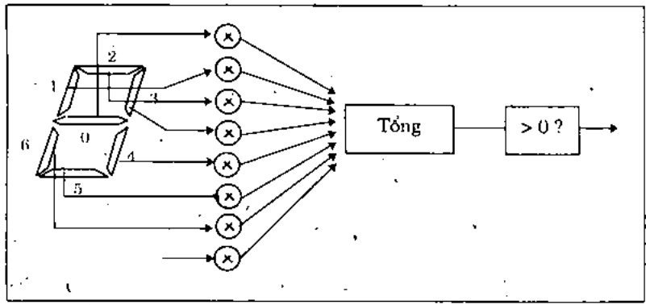

Hình 19-7. Bảy thanh và một giá trị luôn luôn là 1. Giá trị 1 này thay thế ngưỡng.

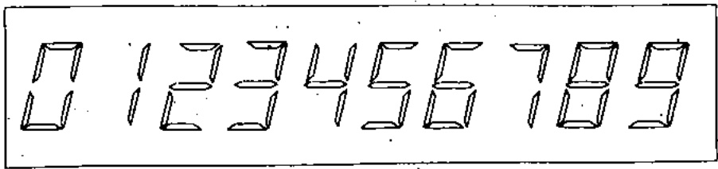

Hinh 19-8. Bảy doạn đủ để thể hiện muòi con số.

<!-- page: 444 -->

| $S\acute{o}$ | $x_0$ | $x_1$ | $x_2$ | $x_3$ | $x_4$ | $x_5$ | $x_6$ |
| --- | --- | --- | --- | --- | --- | --- | --- |
| 0 | 0 | 1 | 1 | 1 | 1 | 1 | 1 |
| 9 | 1 | 1 | 1 | 1 | 1 | 1 | 0 |
| 8 | 1 | 1 | 1 | 1 | 1 | 1 | 1 |
| 7 | 0 | 0 | 1 | 1 | 1 | 0 | 0 |
| 6 | 1 | 1 | 1 | 0 | 1 | 1 | 1 |
| 5 | 1 | 1 | 1 | 0 | 1 | 1 | 0 |
| 4 | 1 | 1 | 0 | 1 | 1 | 0' | 0 |
| 3 | 1 | 0 | 1 | 1 | 1' | 1 | 0 |
| 2 | 1 | 0 | 1 | 1 | 0 | 1 | 1 |
| 1 | 0 | 0 | 0 | 1 | 1 | 0 | 0 |

Hình 19-9. Các mẫu nhập vào.

Đế huấn luyện perceptron nhận dạng số xác định được 0, người ta cho nó biết rảng chỉ dòng dầu tiên cho ra 1. Và để huấn luyện xác định 1, người ta cho nó biết rảng chỉ dòng cuối cùng cho ra 1.

Cho dù số nào, thủ tục hội tụ perceptron thực hiện chu trình liên tục xét các mẫu, có điều chỉnh phù hợp với các trọng số mỗi khi có lỗi, cho đến khi không cần thay đổi trọng số nào nửa. Có thể xemí lại thí dụ minh hoạ về perceptron di thẳng đã được trình bày để dễ theo dõi cơ chế nhận dạng số trong thí dụ này.

Khi perceptron học xác định 0, hội tự nhanh, chỉ cần hai bước.

\- Trước hết vì perceptron lập tức nhận sai 0. Đó là mẫu đầu tiên trong lần duyệt đầu. Vecto 0 là (01111111) được thêm trọng số. Vecto trọng số khởi đầu toàn 0.

\- Tiếp theo, perceptron thất bại khi xác định số 9, tức mẫu thu hai, trong lần duyệt đầu.. Vectơ trọng số bị trừ di một lượng bằng vectơ nhập vào là (1111/101). Kết quả thu được là vectơ trọng số (-1 0000010) thỏa mãn, vì 0 được xác định và các số khác bị bổ qua. Kết quả này có nghĩa rằng cần quan sát chỉ hai thanh, thanh thú 0 và thanh thú 6 để xác định xem có thu được 0 hay không.

Khi perceptron học xác định 8, hội tự chậm hơn các số khác. Cần có 78 thay đổi để đạt được vectơ trọng số cuối cùng là (1 3 -2 2 2 6 -1 2 2 -10).

<!-- page: 445 -->

Do có nhiều hơn ba trọng số trong perceptron nhận dạng số, các thay đổi riెng trên vecto trọng số không thể chỉ ra hết. Nguộc lại, người ta có thể thấy những thú xảy ra theo độ dài của vecto trọng số và góc giữa vecto trọng số và giá trị cuối-cùng của nó.

## Thí dụ

Cho perceptron nhận dạng số 8. Người ta đã biết ràng cần phải thay đổi vectơ trọng số 78 lần. Đồ thị cho thấy các thay đổi vectơ trọng số và thay đổi của góc khi perceptron học nhận dạng con số này. Lưu ý ràng cả hai độ dài của vectơ trọng số tầng, còn góc giữa vectơ trọng số đang xét và giá trị vectơ trọng số cuối cùng giảm.

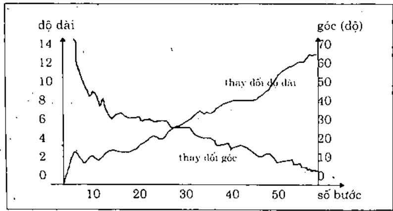

Hình 19-10. Thay đổi độ dài và thay đổi góc khi học số 8.

## II.2. Hội tụ nhanh của perceptron

Người ta nghĩ ràng sau mỗi lần thay đổi, perceptron được cải thiện dễ xử lý mẫu cụ thể nhưng cũng có thể gây khó khăn đổi với các mẫu khác. Bản khoản này có lý khi thấy cách thức vectơ trọng số thực sự thay đổi, lúc thì chuyển về hướng của lời giải cuối cùng, lúc thì ngược lại.

Lại nửa, các thay đổi cần luôn luôn giữ vectơ trọng số trong hình bao được xác định bởi ràng buộc cosin của góc giữa bất kì vectơ lời giải và vectơ trọng số đang thay đổi.

Đế biết hình bao co lại ra sao, giả sử không bổ trí nhận biết số 8 mà do gì đó mạch bảo người ta biết rằng có vecto trọng-độ cho phép nhận biết số 8 và độ dài vecto trọng số là 13.0. Người ta cũng được mạch rằng vecto trọng số cho -1 hay số nhỏ hơn đối với

<!-- page: 446 -->

các số khác. Do đó vùng tổng tự do xung quanh 0 cho vectơ trọng số này đảm bảo lân cản δ gần 1.

Lấy giá trị 13.0 cho ||w\*||, 0.99 cho δ, và 8 cho số các hợp logic thi biểu thức cosin được viết là

$$
\cos \theta > 0. 9 9 ^ {*} n ^ {1 / 2} / (1 3. 0 * 8 ^ {1 / 2})
$$

Ràng buộc này cho phép 1379 thay đổi với hình bao co lại như trong hình sau, trước khi sử dụng ràng buộc cosin nhỏ hơn 1.

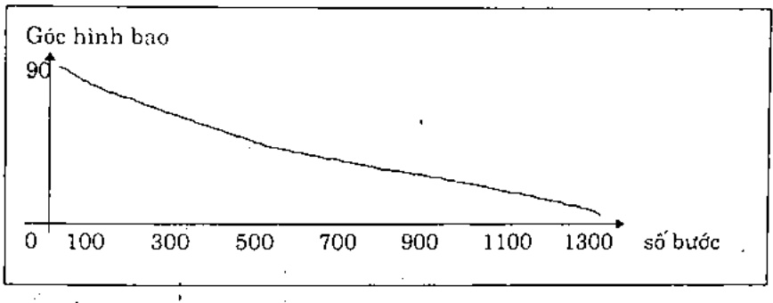

Hình 19-11. Hình bao co lại làm hạn chế góc giữa vecto trọng số và lời giải chưa biết với độ dài là 13, 8 là 0.99, tạm hộp logic.

Như vậy, người ta có thể hải lòng khi thấy vectơ trọng số được học chỉ sau 65 lần thay đổi. Tất nhiên người ta chưa thực sự hiểu được cách đến lời giải, vì cho dù biết sự tồn tại của vectơ trọng số thỏa mãn, người ta không biết vectơ này ra sao. Do vậy người ta không thể biết trước kích thước 8 cho vectơ đó.

## II.3. Hạn chế của perceptron

Mặc dù thủ tục hội tự perceptron dầm bảo thành công khi có lời giải, cần lưu ý các trường hợp perceptron không cho lời giải đối với các nhiệm vụ xem ra rất đơn giản. Trong số các nhiệm vụ giãn đơn mà perceptron không thể tiến hành là nhận biết sự liên thông.

## - Thí dụ

Có các đường liên và không liên. Perceptron cần thông báo hình thứ hai, ba là liên thông và hình thứ nhất, thứ tư không liên thông.

<!-- page: 447 -->

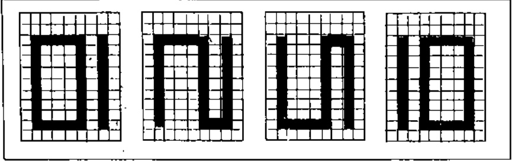

Hình 19-12. Bôn mẫu trực quan. Mẫu thứ hai và thứ ba là mẫu liên zhòng.

Nhắc lại perceptron duồng kính hạn chế là một loại mà các dấu vào di tới bất kì hộp logic cụ thể nào cũng nằm trong hình tròn duồng kính d. Xét perceptron duồng kính hạn chế, nhưng tổng quát như trong hình.

Giả sử perceptron này nhận dạng đúng sự liên thông. Nó cần cho ra 1 để thông báo mẫu nhận dạng là liên thông, khi tổng trọng số của các hộp logic lớn hơn 0 :

$$
\Sigma_ {i} w _ {i} ^ {*} l _ {i} > 0.
$$

Do perceptron có đường kính hạn chế, một và hợp logic chí quan sát phần trên của lưới hiện hình, hộp logic khác nhìn phần giữa, phần dưới. Nhử vậy có thể chia tổng các trọng số thành ba phần ứng với các phần của màn hiện hình.

$$
\Sigma_ {\text {phân   interim}} \dot {\mathbf {w}} _ {i} ^ {*} \mathbf {l} _ {i} + \Sigma_ {\text {phân   gün}} \mathbf {w} _ {i} ^ {*} \mathbf {l} _ {i} + \Sigma_ {\text {phân   duếj}} \mathbf {w} _ {i} ^ {*} \mathbf {l} _ {i} > 0
$$

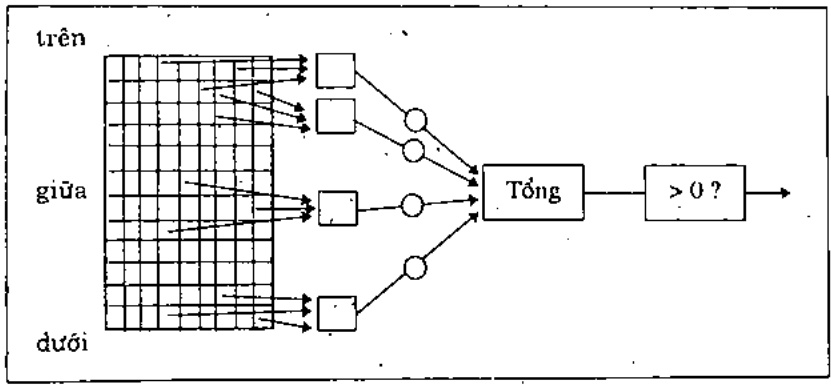

Hình 19-13. Perceptron hạn chế đường kính xem như màn hiện. Vải hộp logic nhìn phần trên, vải hộp logic nhìn phần dưới, vải hộp nhìn chỉ vào phần giữa.

<!-- page: 448 -->

Nhận xét thấy tổng ứng với phần giữa là không thay đổi đối với cả bón mẫu. Mặt khác tổng dưới cần tăng khi thay đổi tổng toàn thể từ âm sang dương cho trường hợp chuyển mẫu thú nhất sang mẫu thú hai. Việc tăng này là cần thiết vi hai tổng kia không thay đổi trong khi mẫu không liên thông thú nhất chuyển thành mẫu thú hai liên thông.

• Tương tự, tổng trên cũng tăng khi thay đổi tổng âm hay bằng 0 sang dương với mẫu thủ nhất chuyển sang mẫu thú ba. Hai tổng con kia không thay đổi.

Xét tiếp việc mẫu thứ nhất được chuyển sang mẫu thứ tư. Tổng ứng với phần dưới cần tăng đủ để dưa tổng toàn thể trở nên dương, bởi vì sự thay đổi quan sát được của các hợp logie dưới cũng như là quan sát khi chuyển mẫu thứ nhất sang mẫu thứ hai.

Tổng con trên cần phải tăng để tổng chung trở nên dương, do thay đổi này cũng giống như thay đổi từ mẫu thứ nhất sang mẫu thứ ba. Vậy tổng chung cần là dương, cho biết rằng mẫu không liên thông. Thế nhưng mẫu này là liên thông.

Tất cả là do giả thiết ban đầu là perceptron có thể nhận dạng được tính liên thông, nhưng thực tế nổ không nhận đúng với bốn mẫu dưa ra trong thí dụ. Nguyên nhân ở chỗ các hợp logic không quan sát được các phần khác của màn hiện hình ngoài phần của mình, và do thực tế về sự hạn chế đường kính của perceptron. Do đó giả thiết perceptron có thể nhận dạng được tính liên thông là sai.

## III. KÊT LUẬN

Các nghiên cứu về khả năng của perceptron được trình bày trong tài liệu của Marvin Minsky và Seymour A. Papert năm 1969. Qua một vai-giói thiệu ngắn về việc học thông qua huấn luyện perceptron, có một vai nhân xét kết luận sau :

\- Một perceptron là loại mạng một thần kinh đặc biệt chỉ có một noron. Ngoài các trong số, bộ nhân, bộ cộng và hàm ngưỡng bậc thang như mạng thần kinh, nó có thêm các hộp logic đặt giữa các dấu vào và bộ nhân.

\- Thủ tục hội tụ perceptron là thủ tục huấn luyện đảm bảo đến đích khi có thể huấn luyện thành công được.

\- Đại số cũng dùng để chứng minh việc đảm bảo thành công của thủ tục hội tự perceptron với hai trọng số. Đại số vecta giúp chứng minh trong trường hợp có nhiều trọng số.

\- 'Perceptron di thrăng có thể học xác định các con số dễ dàng nhưng cũng có công việc đơn giản mà nó phải chịu.

<!-- page: 449 -->

# HỌC BĂNG CÁCH HUÂN LUYỆN CÁC MẠNG XẤP XỈ

Các mạng xấp xỉ và nội suy được cơi như mạng thần kinh đặc biệt gồm hai tầng. Chúng cho phép huấn luyện hoặc bằng cách giải các phương trình tuyến tính hoặc bởi thực hiện leo đốc! Người ta có thể tổng quát hóa chúng để thực hiện công việc nhu các mạng nhiều mức.

Thí dụ minh họa cho loại huấn luyện này là cách học của các mạng xếp xỉ và nội suy, dựa trên kinh nghiệm dễ đoán thời kì nghi hè thuận lợi khi biết thời hạn nghi, nhiệt độ trung bình tại nơi nghi.

## I. CÁC MẠNG XẤP XỈ VÀ NỘI SUY

Các mạng thần kinh mô phỏng chấp nhận các giá trị nhập vào và cho ra các giá trị. Theo quan điểm toán học, mạng thần kinh đã thực hiện chức năng của một hàm. Người ta huấn luyện mạng thần kinh để thích hợp với các mẫu cho phép liên hệ các đầu vào cụ thể với các đầu ra mong muốn. Do vậy hàm do mạng thần kinh thực hiện thông, qua huấn luyện gần với hàm người ta mong muốn, là hàm sinh ra các tổ hợp vào/ ra. Như vậy mạng thần kinh đã huấn luyện được coi như hàm xấp xỉ. Nếu mạng thần kinh được huấn luyện tốt hơn để đảm bảo các đầu ra dùng chính xác so với đầu vào thi mạng thần kinh được coi như hàm nội suy.

Kiến thúc về mạng thần kinh cho phép cải đặt các hàm xáp xỉ và hàm nội suy. Trình bày tiếp theo dây đề cập vấn đề cần bao nhiều nondon trong mạng thần kinh nếu học theo quan điểm của xáp xỉ/nội suy. Ngoài rỉ người ta còn học nhỏ toán học cho bài toán về sinh học và các hàm ngưỡng trong nhiều mạng thần kinh mô phỏng.

## I.1. Nội suy dùng các hàm Gauss

Giả sử người ta có hộp đen với một vải đầu vào, $x_1$, $x_2$ ... $x_n$ và một đầu ra u. Nguòi ta muốn đoán các giá trị sắp tới của u khi cho cơ sở dữ liệu các tổ hợp vào/ ra. Cần xác định hàm $y(x_1, x_2, \ldots, x_n)$ có các tỉnh chất :

<!-- page: 450 -->

\- Giá trị y chính xác bằng đầu ra của hộp đen khi lấy các dữ liệu vào x, từ tổ hợp mẫu.

• Giá trị y là gần với đầu ra của hộp đen đối với các dữ liệu vào khác.

Đế học cách các mẫu xây dựng y, người ta có thể tham khảo trong các tài liệu toán học. Người ta biết ràng các giả thiết có lý dua người ta đến hàm nội suy là tổng có trọng số của các hàm f, khác :

$$
y (x _ {1}, x _ {2}, \dots x _ {n}) = \sum_ {i = 1} ^ {s} w _ {i} f _ {i} (x _ {1}, x _ {2}, \dots x _ {n})
$$

Dù ràng có nhiều dạng hàm $f_{n}$, các đối số chỉ ra ràng mỗi $f_{i}$ cần đạt giá trị cực đại hay cực tiểu khi các giá trị đầu vào $x_{1}, x_{2}, \ldots, x_{n}$ là gần với các giá trị đầu vào đã cho trong các mẫu vào/ ra. Vi các giá trị nhập xuất phát từ các giá trị đầu vào của mẫu thú i, giá trị của $f_{i}$ cần thay đổi.

Chính xác hơn giá sử xử lý $x_1, x_2, \ldots, x_n$ như các giá trị đầu vào, ứng với vecto x. Người ta xử lý các giá trị vào này như các toạ độ của vecto $c_i$, ứng với mẫu vào thứ i. Do vậy giá trị $f_i$ cần phụ thuộc vào độ khác nhau giữa x và $c_i$.

$$
\mathrm{f} _ {i} (\mathrm{x}) = \mathrm{g} _ {i} (\mid \mid \mathrm{x} - \mathrm{c} _ {i} \mid \mid)
$$

Do đó mỗi đầu vào mẫu c, là điểm tham chiếu, hay trung điểm được thiết lập bởi mẫu vào/ra thú i. Vì giá trị của mỗi f$_{i}$ phụ thuộc chỉ vào một trung điểm, mỗi f$_{i}$ có thể được gọi là đặc biệt hóa khi xử lý ảnh hưởng của mẫu thú i đối với các dự báo.

Văn dẻ đặt rạ là cần biết dạng của hàm gᵢ. Hàm Gauss là dạng phổ biến vi :

\- Hàm Gauss có tính chất toán học thuận tiện.

\- Dạng hàm Gauss có dạng như quả đổi, dễ điều khiển bằng tham số σ :

$$
\mathrm{g} _ {\mathrm{i}} \left(\left| \left| \mathrm{x} \cdot \mathrm{c} _ {\mathrm{i}} \right| \right|\right) = \mathrm{e} ^ {\mathrm{m}}, \text {trong do m} = - \left| \left| \mathrm{x} \cdot \mathrm{c} _ {\mathrm{i}} \right| \right| ^ {2} / (2 \sigma)
$$

Tham số σ thường được gọi là độ rộng Gauss vì với σ cảng lớn, đồ thị Gauss cảng cảng rộng ra. Tuy nhiên cách gọi này mang tính trực quan vì hàm Gauss không có biên nhất định.

<!-- page: 451 -->

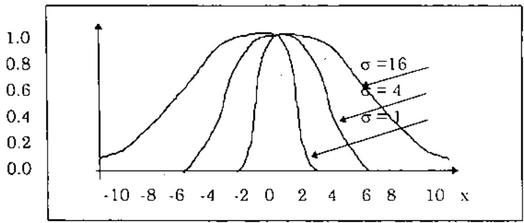

Hình 20-1. Các hàm Gauss với các giá trị tham số σ.

Dùng hàm này trong hàm nội suy, thu được :

$$
y (x) = \sum_ {i = 1} ^ {s} w. e ^ {- \frac {\| x - c _ {i} \| ^ {2}}{2 \sigma}}
$$

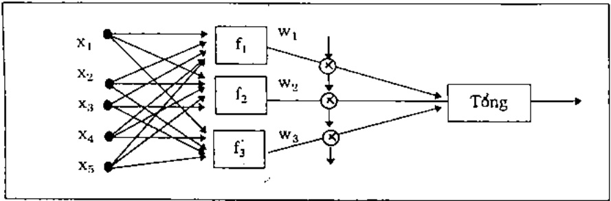

Hình 20-2. Một mạng nội suy. Mỗi nút tầng thú nhất ứng với một đầu vào mẫu cụ thể. Nút tầng hai bổ sung trọng số để tạo đầu ra.

Hàm nội suy này dẫn người ta trở lại các mạng thân kinh, vì hàm này có thể được tính nhỏ mạng hai tầng. Nút đơn tại tầng hai của mạng này tính tổng có trọng số của các đầu ra của các nút tầng thứ nhất, và mỗi nút của tầng thứ nhất tính hàm Gauss theo đầu vào mẫu. Các mạng đó được gọi là các mạng nội suy.

Một cách trực quan, nếu giá trị của σ làm các đối Gauss rất nhỏ thì chỉ một đối dùng cho giá trị đầu ra sinh ra từ mỗi đầu vào mẫu. Bồi vì độ cao của đối là 1, mỗi trọng số w, cần có giá trị gần như bằng giá trị đầu ra của mẫu vào/ra thứ i.

<!-- page: 452 -->

Thông thường các đổi Gauss có thể dùng cho giá trị đầu ra sinh ra từ vectơ dấu vào cụ thể. Các trọng số cũng dễ được tính toán sao cho giá trị đầu ra của mỗi mẫu thủ r chắc chắn là giá trị phù hợp.

Tóm tất lại, mạng nội suy là trường hợp đặc biệt của mạng thần kinh, tuần theo qui định sau :

Định nghĩa 20-1 : Mạng nội suy (Interpolation net)

Mạng nội suy là thể hiện của mạng thân kinh, trong đó :

• Chi có hai tầng của các nondon.

\- Môi nondon tại tầng thú nhất tính hàm Gauss của độ lệch giữa vectơ đầu vào hiện tại và vectơ mẫu nhập vào.

\- Môi noron tăng thú hai cộng các đầu vào với nhau.

\- Các trọng số giữa hai tầng được hiệu chính để mỗi đầu ra của noron tầng hai chính xác là đầu ra mong muốn đối với mỗi đầu vào mẫu.

## 1.2. Khả năng của mạng nội suy

Với đầy đủ các nút, các mạng có thể tiến hành nội suy hoàn hảo.

Thí dụ

Đế xét các hoạt động của mạng nội suy, người ta giới thiệu thí dụ lựa chọn thời điểm cho kì nghị hè. Giả sử chi phí cho kì di nghị là hàm số của khoảng thời gian nghị. Nhìn sơ qua các dữ liệu trong bảng người ta thấy ngay trong bốn lần nghị, kì nghị ngắn ngày là tốt, kì thú hai tốt nhất... theo điểm số từ 1 đến 10.

Giả sử cần dùng mạng để dự đoán điểm cho các kì nghi khác. Do đã có bốn mẫu nhưng chỉ có một biến là khoảng thời gian, mạng nội suy có bốn nút và một đầu vào.

| Mẫu | Khoảng thời gian | Cho điểm |
| --- | --- | --- |
| 1 | 4 | 5 |
| 2 | 7 | 9 |
| 3 | 9 | 2 |
| 4 | 12 | 6 |

Hình 20-3. Các phương án nghi hè và đánh giá theo điểm.

<!-- page: 453 -->

Või giá trị σ nhỏ, mỗi mẫu chỉ gây ảnh hưởng cực bộ, còn với σ lớn thì mỗi mẫu có ảnh hưởng toàn thể. Cho giá trị σ thì dễ dàng tính ra giá trị các trọng số để mạng nội suy đạt chỉnh xác kết quả cho tất cả các mẫu. Lí do là số các trọng số bằng số các tổ hợp vào/ra mẫu, và mỗi tổ hợp đảm bảo đẳng thức về các trọng số sau:

$$
\mathrm{y} _ {1} = \mathrm{w} _ {1} \mathrm{e} ^ {\mathrm{m} 1 1} + \mathrm{w} _ {2} \mathrm{e} ^ {\mathrm{m} 1 2} + \mathrm{w} _ {3} \mathrm{e} ^ {\mathrm{m} 1 3} + \mathrm{w} _ {4} \mathrm{e} ^ {\mathrm{m} 1 4}
$$

$$
\mathrm{y} _ {2} = \mathrm{w} _ {1} \mathrm{e} ^ {\mathrm{m} 2 1} + \mathrm{w} _ {2} \mathrm{e} ^ {\mathrm{m} 2 2} + \mathrm{w} _ {3} \mathrm{cm} _ {2, 1} + \mathrm{w} _ {4} \mathrm{cm} _ {2, 4}
$$

$$
\mathrm{y} _ {3} = \mathrm{w} _ {1} \mathrm{e} ^ {\mathrm{m} 3 1} + \mathrm{w} _ {2} \mathrm{e} ^ {\mathrm{m} 3 2} + \mathrm{w} _ {3} \mathrm{e} ^ {\mathrm{m} 3 3} + \mathrm{w} _ {1} \mathrm{e} ^ {\mathrm{m} 3 4}
$$

$$
\mathrm{y} _ {1} = \mathrm{w} _ {1} \mathrm{e} ^ {\mathrm{m} + 1} + \mathrm{w} _ {2} \mathrm{e} ^ {\mathrm{m} + 2} + \mathrm{w} _ {3} \mathrm{e} ^ {\mathrm{m} + 3} + \mathrm{w} _ {4} \mathrm{e} ^ {\mathrm{m} + 4}
$$

Trong đó  $m_{ij} = -1/(2\sigma)^{*}(x_i \cdot x_j)^2$

Mặc dù các đẳng thức này hơi phức tạp do có hàm mũ, với σ đã cho người ta có bốn phương trình tuyến tính, dễ dàng giải đối với trọng số $w_1$. Vậy người ta có thủ tục huấn luyện được trình bày như sau :

Muôn tạo ra mạng nội suy, thực hiện các bước :

1. Đối với mẫu đã cho, tạo nút trung điểm trên đầu vào mẫu. Sau đó xây dựng phương trình :

1.1. Tính khoảng cách giữa mẫu đầu vào và mỗi trung điểm của nút.

1.2. Tính hàm Gauss cho môi khoảng cách ấy.

1.3. Nhân hàm Gauss với trọng số của nút tương ứng.

1.4. Lập phương trình của đầu ra mãu và tổng các hàm Gauss có trọng số.

2. Giải các phương trình của trọng số.

Với dữ liệu như bảng trên, phương trình cho các nghiệm ứng với ba giá trị của σ nhu trong bảng tiếp theo.

| $\sigma$ | $w_{1}$ | $w_{2}$ | $w_{3}$ | $w_{4}$ |
| --- | --- | --- | --- | --- |
| 1 | 4.90 | 8.84 | 0.73 | 5.99 |
| 4 | 0.87 | 13.93 | -9.20 | 8.37 |
| 16 | -76.50 | 236.49 | -237.77 | 87.55 |

Hình 20-4. Các nghiệm ứng với các giá trị 0.

<!-- page: 454 -->

Từ giá trị σ và tập các trọng số có thể tính ra được tác giá trị đối với hàm nội suy và mạng tương ứng không những dùng cho các mẫu mà cho bất ki dấu vào nào. Trong hình là đồ thị minh họa hàm Gauss nội suy điểm đánh giá việc nghi ngoi với ba giá trị σ và các trọng số đã giải ra. Giá trị σ nhỏ thì các hàm nội suy lên xuống, chủng tố các mẫu ít có ảnh hưởng bên ngoài vùng lân cận cục bộ. Côn giá trị σ lớn thì mẫu có ảnh hưởng tổng thể hơn.

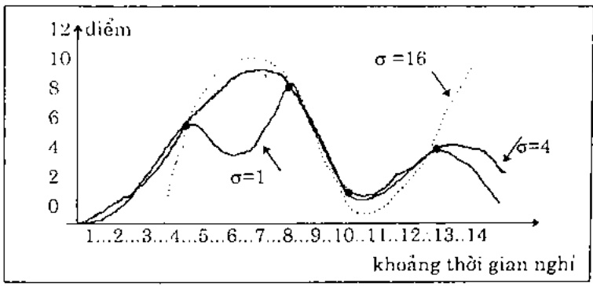

Hình 20-5. Hàm nội suy Gauss đối với ba giá trị σ.

Một số nhận xét về σ :

\- Với $\sigma = 1$ mỗi nút tính theo Gauss có độ yuân ra nhỏ. Các ượng số là dương và gần với điểm số của mẫu. Trường hợp này như người ta mong muốn.

\- Khi σ = 4 mỗi nút theo tính toán Gauss có độ vuron nhiều hơn, dùng cho tỉ lệ điểm tổng quát để điều chỉnh các giá trị về khoảng thời gian mãu. $\dot{w}_{3}$ là âm, làm hàm nội suy đi xuống điểm 2, ứng với khoảng thời gian 9 ngày.

\- Với $\sigma = 16$ mỗi nút theo Gauss vuon rộng nhất, liên quan đến sự phân cách giữa hai điểm mẫu. Các giá trị trọng số lớn, cả âm lẫn dương, là cần cho hàm nội suy. Các giá trị của hàm trùng với đánh giá điểm số mẫu ứng với các khoảng thời gian mẫu.

## 1.3. Mạng xấp xỉ đối với trường hợp nhiều mẫu

Khi có nhiều mẫu thì số các nút tăng lên, e rằng không giải quyết được. Giải pháp tự nhiên là xấp xỉ hàm chưa biết với một số nhỏ các nút có thể thể hiện được. Cũng có thể chọn ngẫu nhiên một ít nút làm nút trung tâm.

<!-- page: 455 -->

Nếu số nút ít hơn số mẫu, không có bộ các trọng số nào đáp ứng được tính đúng chính xác của các dấu ra ứng với các dấu vào mẫu. Dĩ nhiên người ta xây dựng các mạng ít nút hơn mẫu, gọi nó là mạng xếp xỉ thay vi mạng nội suy, và tìm các giả trị trọng số là giả trị xếp xỉ có lý.

## I.4. Huân luyện trọng số khi có nhiều mẫu

Khi có nhiều mẫu dấu vào người ta có thể sử dụng mạng xấp xỉ. Vấn đề dại ra là liệu có tồn tại tập các trọng số có giá trị xấp xỉ phù hợp với tất cả các mẫu dấu vào không? Một giải pháp là sử dụng leo đốc để tìm giá trị cực đại thông qua việc do hiệu suất của mạng xấp xỉ. Thủ tục leo đốc đã có dịp được trình bày trong các phần trước: ở dây chỉ nhắc lại.

Trước tiên do hiệu suất bằng tổng các sai số bình phương đối với các mẫu đầu vào. Giá sử giá trị thực của y đối với mẫu cụ thể là $y_k$, và giá trị mong dơi là $d_x$. Vậy đích của bài toán là cục đại hóa hàm P. Giá trị hàm này là 0 khi không có sai sót.

$$
\mathrm{P} = - \Sigma_ {\mathrm{u}} (\mathbf {y} _ {\mathrm{R}} \cdot \mathbf {d} _ {\mathrm{R}}) ^ {2}
$$

Tiếp theo, di tim đạo hàm riêng của P theo mỗi trọng số w\_i để các thay đổi trọng số có thể tỉ lệ với đạo hàm riêng này. Sử dụng đạo hàm hàm hợp và tính toán đại số, thu được công thức tính thay đổi trọng số $\Delta w_{i}$.

$$
\Delta \mathrm{w} _ {\mathrm{i}} = \mathrm{r} \Sigma_ {\mathrm{s}} \left(\mathrm{y} _ {\mathrm{s}} - \mathrm{d} _ {\mathrm{s}}\right) \mathrm{e} ^ {\mathrm{msi}}, \mathrm{m} _ {\mathrm{si}} = - 1 / (2 \sigma) ^ {*} | | \mathrm{x} _ {\mathrm{s}} - \mathrm{c} _ {\mathrm{i}} | | ^ {2}
$$

Hàng số r đủ lớn để hội tụ nhanh về lời giải thỏa mãn, nhưng không quá lớn kéo không ổn định. Với công thức này, thủ tục xây dựng mạng xấp xỉ được mô tả :

Tạo một mạng xấp xỉ gồm các bước sau :

1. Đôi với một ít mẫu, tạo mạng nội suy theo thú tục mạng nội suy.

2. Chọn hằng số r.

3. Cho tới khi hiệu suất là chấp nhận được, thực hiện :

3.1. Đối với tất cả đầu vào mãu :

• Tính các đầu ra.

• Tính  $\Delta w_{i}$  cho môi trọng số.

3.2. Cộng thêm các thay đổi trọng số đối với tất cả đầu vào mẫu, và thay đổi các trọng số.

Giả sử người ta chỉ có thể dự tính được nhiều nhất hai nút trong mạng đánh giá điểm, do vậy bắt buộc phải dùng mạng xấp xỉ thay vì dùng mạng nội suy. Giả sử người ta có các giá trị đầu cho mạng hai nút nhu mẫu, ứng với kì nghị 7 và 12 ngày.

<!-- page: 456 -->

Thực hiện liên độc có điều chỉnh các trọng số, trên cả bón mẫu. Sau khi điều chỉnh 100 lần, với hàng số tỉ lệ là 0.1 người ta thu được các kết quả tổng kết như trong bảng sau.

|  | $w_{1}$ | $w_{2}$ | $c_{1}$ | $c_{2}$ |
| --- | --- | --- | --- | --- |
| giá trị đầu | 8.75 | 5.61 | 7.00 | 12.00 |
| giá trị cuối | 7.33 | 4.47 | 7.00 | 12.00 |

Hình 20-6. Kết quả của việc điều chỉnh các trọng số.

Trọng số $w_1$ và $w_2$ hạ một chút để giảm sai sót cho kì nghi 9 ngày, nhưng chúng có và lôi đối với các kì nghi 7 hay 12 ngày.

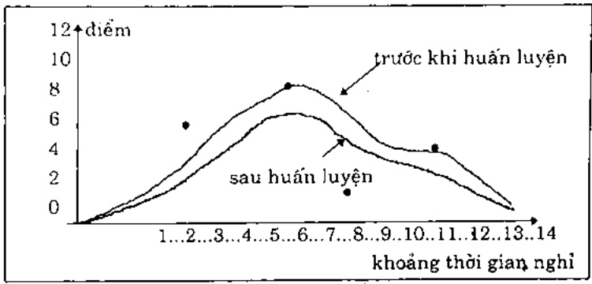

Hình 20-7. Khi ít nút hơn mẫu, hàm xấp xỉ không thể đạt được đầu ra mẫu đối với tất cả các đầu vào mẫu. Tuy nhiên việc leo đốc có thể sinh ra tập các trọng số có lý.

Từ phía toán học, người ta có công thức điều chỉnh cho thành phần thú j của trung điểm thú i :

$$
\Delta c _ {i j} = r \Sigma_ {s} \left[ \left(y _ {s} - d _ {s}\right) ^ {*} e ^ {m s i} * 1 / \sigma^ {*} \left(x _ {s j} \cdot c _ {i j}\right) \right], \text {trong do} m _ {s i} = - 1 / (2 \sigma) ^ {*} | | x _ {s} - c _ {i} | | ^ {s}
$$

<!-- page: 457 -->

Sau khi điều chỉnh 100 lần với hàng số tí lệ bằng 0.1, người ta thu được kết quả như trong bảng.

|  | $w_1$ | $w_2$ | $c_1$ | $c_2$ |
| --- | --- | --- | --- | --- |
| giá trị dầu | 8.75 | 5.61 | 7.00 | 12.00 |
| giá trị cuối | 9.13 | 8.06 | 6.00 | 13.72 |

Hình 20-8. Kết quả sau khi điều chỉnh 100 lần.

Đồ thị cho thấy việc điều chỉnh cả trọng số và trung điểm đảm bảo sự xếp xỉ tốt hơn là chỉ điều chỉnh một thú.

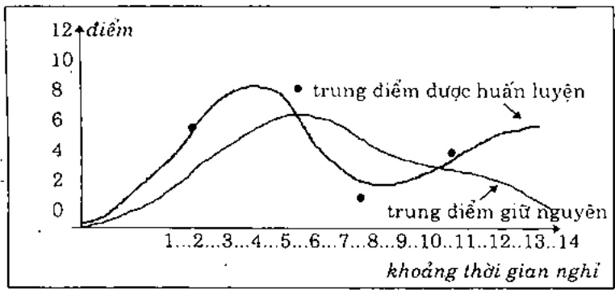

Hình 20-9. Khi có số nút ít hơn mẫu, hàm xấp xỉ không thể đạt được giá trị đầu ra mẫu cho tất cả các mẫu nhập vào. Điều chỉnh cả trọng số và trung điểm cho phép xấp xỉ tốt hơn là chỉ điều chỉnh một thú.

## I.5. Sử dụng thêm nhân tố trong mạng xấp xỉ

Về thí dụ đã xét, nếu thêm nhân tố nhiệt độ và giả thiết đánh giá điểm phụ thuộc vào khoảng thời gian và nhiệt độ theo bằng sau :

<!-- page: 458 -->

| Mẫu | Khoảng thời gian | Nhiệt độ | Cho điểm |
| --- | --- | --- | --- |
| 1 | 4 | 21 | 5 |
| 2 | 7 | 24 | 9 |
| 3 | 9 | 7 | 2 |
| 4 | 12 | 32 | 6 |

Hình 20-10. Dánh giá ki nghi theo các nhận tố khác.

Lúc này có bốn mẫu nhưng mỗi mẫu có hai đầu vào. Như vay có bài toán hai chiếu, tương xứng với mạng hai đầu vào là khoáng thời gian và nhiệt độ, cùng một đầu ra là đánh giá điểm.

Trèn đó thị là các đánh giá điểm dự đoán cho lần nghỉ với nhiệt độ trung bình là 23°C. Các biến thiên không bình thường đặc trung cho hàm xấp xỉ không dùng nhân tố nhiệt độ.

Nhụ vay người ta cần tin rằng độ vuon trái ra của các hàm Gauss là có lý theo các chiều. Đế tin chắc rằng độ trái ra này là chính xác trong các chiều. người ta nhân các số theo mỗi chiều với nhân tố điều chỉnh độ trái ra. Rối nhân tố này cũng được chính lý thống qua huấn luyện.

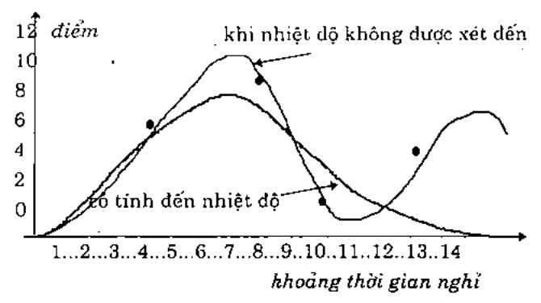

Hình 20-11. Hàm xấp xỉ có tính đến nhân tố nhiệt độ. Nhiệt độ trung bình của trường hợp này là 23 độ.

<!-- page: 459 -->

## I.6. Trả lời câu hỏi theo tiếp cận xấp xỉ nội suy

Tiếp cận xếp xỉ nội suy làm rõ câu hỏi về số lượng nondon dùng trong mạng thân kinh. Thực sự đối với nội suy người ta cần một nondon cho mỗi mẫu, cộng thêm một nondon để tổng cộng các dấu ra của các chuyên gia mẫu. Khi dùng xếp xỉ người ta có thể dùng số nondon ít hơn số mẫu.

Tuy nhiên không một chuyên gia mẫu và không nondon tổng nào tính được các bậc thang hay các hàm ngưỡng nén S đã trình bày trong phần trước.

## II. CẢI ĐẶT TRONG SINH HỌC.

Một khi cần thực hiện tính toán trên các mạng thần kinh, người ta có bản khoản liệu giải các bài toán sinh học có xảy ra váp váp không ? Một số mục nhỏ sau dây trao đổi về việc này.

## II.1. Thế hiện số thông qua các vị trí

Do các noron là thiết bị tất cả/ hoặc không, dấu ra của noron đơn không thể thể hiện nổi một số. trừ phi số đó là số 0 hay số 1. Có thể dùng măng một chiều gồm các noron để thể hiện số, hay bố trí một noron theo cách đơn giản trong một ma trận và nhớ vị trí ứng với con số muốn thể hiện.

Thí dụ

Có một máng các noron. Trong số 16 noron, cái thú bảy bất ứng với việc thể hiện con số 7.

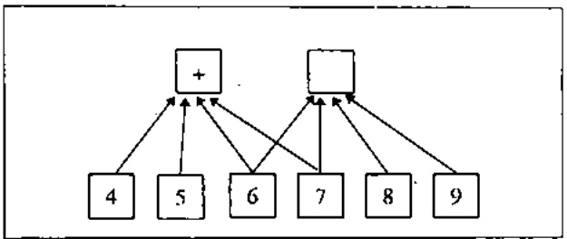

Hình 20-12. Môi vị trí thể hiện một số. Các nondon tính hàm Gauss xấp xỉ của khoảng cách từ trung điểm. Hai nondon trên tầng ứng với nondon thứ bảy.

## II.2. Các nondon sử dụng hàm Gauss

Cho một noron Gauss là noron tính tổng trọng số của các đầu vào với trọng số được xấp xi theo hàm Gauss. Khi mỗi số được thể hiện bằng một vị trí trong mắng.

<!-- page: 460 -->

một chiếu gồm các nondon, thì nondon Gauss có thể tính hàm Gauss xấp xi của các khoảng cách từ một số đến trung điểm. Cách này được minh họa trong hình vẽ, cho thấy một vài trọng số đến hai nondon được kích thích tùy theo số thế hiện tại tầng thứ nhất. Nếu nondon ứng với số 7 là bất, nondon Gauss liên quan sẽ được trả lời. Tuy nhiên nondon thử bày này cũng có ảnh hưởng đến nondon khác. Mức độ ảnh hưởng do các trọng số tỉ lệ quyết định này sẽ giảm dẫn theo khoảng cách, tỉ lệ với hàm Gauss của khoảng cách này.

## II.3. Tính hàm Gauss

Người ta có cơ chế để các nondon có thể tính hàm Gauss của khoảng cách giữa một số đến trung điểm theo một chiều của không gian độ do. Người ta có thể dùng cơ chế cho bất kì số nào trong các chiều khác, cho dù các nondon thực cần được hạn chế trong không gian ba chiều. Đề rõ hơn, cần đánh giá thuộc tỉnh quan trọng của hàm Gauss theo khoảng cách. Hàm Gauss là hàm phân tách được vi trong không gian n chiều hàm này có thể được biểu diễn theo n hàm Gauss một chiều :

$$
e ^ {- \frac {1}{2 \sigma} ((x - a) ^ {2} + \dots + (y - a)) ^ {2}} = e ^ {- \frac {1}{2 \sigma} (x - a) ^ {2}} + \dots + e ^ {- \frac {1}{2 \sigma} (y - a) ^ {2}}
$$

Do thuộc tỉnh này, các nhu cầu tính toán Gauss với không gian n chiều của khoảng cách dual về noron tích, cùng với cơ chế tính hàm Gauss của khoảng cách trong không gian một chiều.

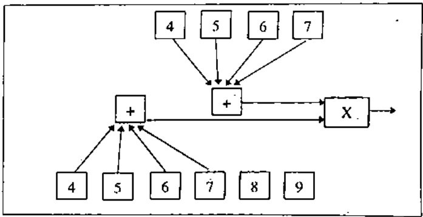

Hình 20-13. Khi có thêm noron nhân, hai mạng tính hàm Gauss theo khoảng cách một chiều từ các trung điểm có thể dùng đề tính các hàm Gauss của các khoảng cách nhiều chiều.

Do vậy cần có mạng xấp xỉ gồm noron Gauss và noron tích. Các cây đầu dây thần kinh của màn hiện trong con mất là một thí dụ. Các noron cho ra trả lời có trọng số

<!-- page: 461 -->

đối với trung điểm tối trường nhận thức nhỏ. Các bó dấu dây thần kinh có thể thực hiện việc nhân.

Còn vấn đề nửa là liệu các nondon có thực sự thực hiện hàm Gauss và phép nhân trong ngữ cảnh được mô hình hóa tốt bằng các mạng xếp xi hay không ? Hoặc có hay không cơ chế huấn luyện các mạng như vậy ?

## III. KÊT LUẬN

Kết luận về việc học nhỏ huấn luyện các mạng xấp xi gồm vài điểm sau :

\- Các mạng thần kinh có thể cơi như thiết bị thực hiện phép xấp xỉ và nội suy.

\- Một mạng nội suy là mạng thân kinh có một tầng ăn và một tầng đầu ra. Mỗi nút của tầng ăn được đặc biệt hóa cho một mẫu đầu vào, và nó tính hàm Gauss của khoảng cách giữa mẫu này đến đầu vào hiện tại. Các nút trên tầng đầu ra tính tổng theo trọng số.

\- Các mạng nội suy có thể nội suy hoàn hảo với một nút án ứng với một mẫu.

\- Một mạng xấp xỉ giống như mạng nội suy, nhưng mạng xấp xỉ có ít nút ẩn hơn các mẫu. Tuy nhiên, nó có thể xấp xỉ tốt cho các mẫu đầu vào với trọng số huấn luyện cụ thể. Các kết quả huấn luyện tùy thuộc vào trọng số ban đầu và lựa chọn trung điểm.

\- Các nhân tố không quan trọng có thể dùng để giải thích dữ hiệu cụ thể tốt hơn sử dụng mạng xấp xi.

\- Một vài mạng thần kinh thực có thể được dùng như các mạng xấp xỉ.

<!-- page: 462 -->

# HỌC BẰNG CÁCH MÔ PHỒNG SỰ TIÊN HÓA

Một trong những nghiên cứu được người ta quan tâm là các thủ tục mang ý tương về sự tiến hóa, thường được gọi là thuật toán sinh. Các thủ tục tìm kiếm sự tương tự cho các cá thể, ghép đôi, giao nhau về nhiễm sắc thể, đốt biến gien, làm phù hợp và chọn loc tự nhiên.

Việc lựa chọn tự nhiên thường đưa đến hậu quả xấu khi áp dụng các cơ chế chọn đơn giản. Đề cải thiện việc này, cần chia cơ chế chọn lọc theo tính da dạng trong các cá thể, cũng như hiệu suất cá nhân.

Thí dụ minh họa về xây dựng thuật toán sinh được trình bày qua việc tính số bột và đường đề làm bánh ngọt. Bài toán tối ưu này cũng giống các bài toán khác ở chỗ hiệu quả tổng thể phụ thuộc hoàn toàn vào các nhân tố điều khiển khác nhau như nhiệt độ, áp suất...

Phần sau đây sẽ bắt đầu từ một cơ chế dễ hiểu cần đến tính tiền hóa. Tiếp theo là các thủ tục thể hiện các tính chất tương tự.

## I. VAI TRÒ CỦA TÍNH PHÙ HỢP

Cơ thể sống gồm một hay nhiều tế bào và tuân theo luật sinh học. Thế nhưng có một vài tính chất di truyền và tiến hóa hình như có tác dụng bao trùm, hay gần bao quát toàn bộ các quy luật chung.

## .I.1. Vai trò di truyền của nhiệm sắc thể

Mỗi tế bào của thực vật cao cấp hay động vật gồm một nhân với các nhiễm sắc thể. Tận thể kĩ thú muời chín, các nhiễm sắc thể mối được xác nhận như nhân tố mang nét đặc trưng, thường được gọi là gen. Gen được chuyển giao khi phân chia tế bào và khi có sinh sản. Các gen xếp thành chuỗi đọc theo nhiễm sắc thể như xe ca trên đường.

Các nhiễm sắc thể thường có cập mà mỗi cha mẹ đóng góp một nhiễm sắc thể. Các cập được gọi là tương đồng nếu đối với mỗi gen trong cập nhiễm sắc thể thì có một gen

<!-- page: 463 -->

của cập kia có cùng mục dịch. Các tế bào mang các nhiễm sắc thể tương đồng và xếp thành cập được gọi là các tế bào đôi.

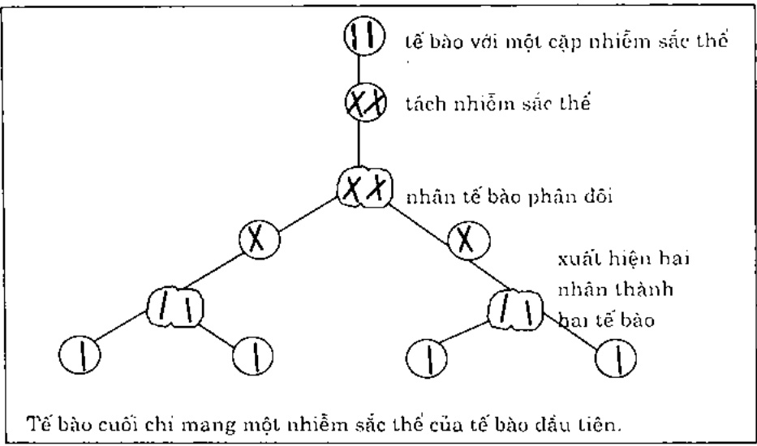

Hình 21-1. Quá trình phân chia tế bào.

Khi chuẩn bị ghép dôi, các nhiễm sắc thể tương đồng được gắn với nhau, nhân lên tạo thành cải có dạng như bốn sợi thường bệnh lại. Việc xoắn đó làm căng và dẫn đến việc phân chia và rời ra. Do vậy có hiện tương truyền của các nhiễm sắc thể. Sự truyền này được gọi là giao nhau.

Một khi xảy ra việc nhân bởi hay giao nhau, có hai tập hoàn chỉnh của các cấp nhiễm sắc thể giao nhau. Tập này được đơn lại ở đầu đối diện các nhân, ngay lúc nhân được chia để bắt đầu chia tế bào. Hai tế bào thu được có số nhiễm sắc thể bình thường, nhưng không được chuẩn vì các nhiễm sắc thể còn giao nhau.

Tiếp tục tế bào được chia nửa. Không giống như việc chia tế bào bình thường, ở đây các nhiễm sắc thể không gấp đôi. Thay vào đó, một nhiễm sắc thể cho mỗi cấp chia ra nằm trên hai tế bào mối. Các tế bào mối này, hoặc là trùng hoặc là tỉnh trùng được gọi là tế bào nửa vì không như tế bào đôi; nó thể hiện các nhiễm sắc thể không ghép đôi.

Việc ghép đôi cho ra trúng đôi, có thể sinh sản, khởi đầu của cá thể mối. Một xấu . phân chia tế bào là đơn giản. Các nhiễm sắc thể được sao lại, đơn lại và gắn với hai tế bào khác nhau, mà không giao nhau.

<!-- page: 464 -->

Chàng may qui trình sao chép nhiễm sắc thế không thuận lợi, cho ra gen khác. Không giống gen tương ứng của cha mẹ. Gen chưa có trước này được gọi là đột biến.

Nếu mục đích của gen không đột biến cho ra dạng enzym, thi gen đột biến cho enzym tốt hơn. Thông thường hoặc gen đột biến không cho enzym nào hoặc cho enzym với hoạt tính cao.

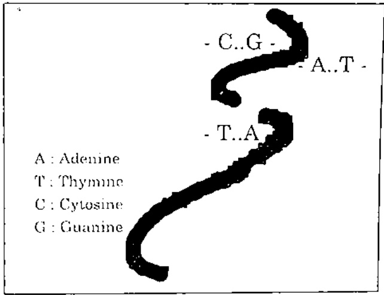

Hình 21-2. Một mẫu DNA (Deoxyribo Nuclear Axid). Thành phần quan trọng nhất của nhiễm sắc thể là DNA, cho phép điều khiển việc kể thừa sinh học của tất cả các cá thể sống.

Một dột biến tối trong một nhiễm sắc thể của cập đôi không phải là quá trình dị thường bởi vì nhiễm sắc thể tương đồng còn lại trong cập nói chung là bình thường. Thường là việc sinh sản yêu cầu một cha mẹ có nhiễm sắc thể sao ra để phân chia tế bào, với một tập ban đầu của các nhiễm sắc thể di đến một trong hai tế bào mới, và tập sao chép đến tế bào kia. Dĩ nhiên việc sinh sản cần cả hai cha mẹ. Mỗi một cho ra tập các nhiễm sắc thể để cập đối với tập kia, giao nhau và phân tách khi chuẩn bị phân chia tế bào.

## 1.2. Tính thích hợp

Charles Darwin trong tài liệu năm 1859 đưa ra nguyên tắc về tiến hóa thông qua chọn lọc tự nhiên. Sau này nguyên tắc ấy được nhiều nhà khoa học chấp nhận.

<!-- page: 465 -->

## Nguyên tắc Darwin

\- Môi cả thể có khuynh hướng chuyên đặc tính cho con châu.

\- Tuy nhiên tự nhiên sinh rạ các cá thể với đặc tính khác nhau.

\- Các cả thể thích hợp là các cả thể có các đặc tính thuận lợi nhất, có khuynh hưởng có nhiều con chau hơn. Vậy số các cả thể tập trung với loại có các đặc tính thích hợp.

\- Thời kì dài thay đổi phù hợp có thể được tích lũy và sinh ra màu mòn có các đặc tính phù hợp với loại sinh thái cụ thể.

Tuy nhiên người làm công tác di truyền hiểu các đặc tính nào được chuyên cho con cháu, và đặc tính nào biến đổi. Công hiện của Darwin là cho biết các nguyên tắc như nhau dùng cho nhiều dạng vật thể sống.

Theo quan điểm phân tử, lựa chọn tự nhiên sử dụng tính biến đổi do giao nhau và đột biến. Giao nhau tập hợp các gen đã có vào tổ hợp mới. Đột biến sinh ra gen mới mà trước đây chưa có.

## II. CÁC THUẬT TOÁN SINH

Dưới đây sẽ là cách mô phỏng một vài tính chất của di truyền và tiến hóa.

## II.1. Xử lý nhiều phép tính tương tự

Các thuật toán sinh cần đến hàng nghin phép xét tính tương tự.

Thí dụ

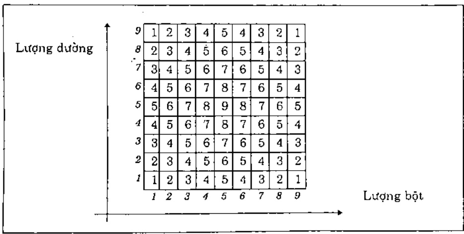

Hình 21-3. Bánh chất lượng cao ứng với lượng bột là năm kilo.

<!-- page: 466 -->

Có người làm bánh ngọt cổ gảng tối ưu lượng bột và dưỡng. Thực sự ông Bánh có tìm lời giải tối ưu trong không gian hai chiếu. Một trực không gian là số kilo bột cho mé bánh, và trực kia là lượng dưỡng.

Chất lượng của bánh xem như hàm của hai tham số này. Với thí dụ này, hàm chất lượng ứng với việc bánh nở mịn. Trường hợp này có 81 tổ hợp. Khi số các khải nang tăng lên, hoặc số chiều cũng tăng thì cách giải bài toán trở nên không thực tế.

Do vậy ông Bánh muốn tìm tố hợp tốt mà không phải thư tất cả các khả năng. Ćho rằng ông Bánh nghiên cứu trí tuệ nhân tạo, dùng phân dùng thuật toán sinh để tìm kiếm.

Trước tiến ông Bánh cần phát triển tính tương tự cho các cả thể, các nhiễm sắc thế, đột biến, giao nhau, tính thích hợp và chọn lọc tự nhiên. Ông Bánh xác định mỗi mẹ bánh là một cả thể. Các nhiễm sắc thể có hai gen, ứng với các số từ 1 đến 9. Gen dầu mô tả lượng bột, gen sau mô tả lượng đường. Do vậy ông Bánh theo các đặc tả sau

## Dinh nghĩa 21-1 : "Nhiêm sắc thể" (Chromosome)

Một nhiễm sắc thể là thể hiện, trong đó :

• Có danh sách các phản tử gọi là gen.

\- Nhiễm sắc thể xác định tính phù hợp chung do cơ chế não đó thể hiện. Cơ chế này dùng các gen của nhiễm sắc thể như một loại thiết kế.

Đời với người thiết kế, cần (i) Tạo nên nhiễm sắc thể với danh sách các phần tử. Người thiết kế được gọi là người thiết kế gen, và (ii) Tạo nên một nhiễm sắc thể bằng cách giao thoa một cặp nhiễm sắc thể đã có.

\- Đối với người thay đổi, thì đốt biến nhiễm sắc thể bằng cách thay đổi một trong các gen.

\- Đôi với người sử dụng, thì sinh ra một gen đặc biệt với nhiễm sắc thể đã cho.

Tiếp theo ông Bánh quyết định mỗi cả thể chỉ có một bản sao của một nhiễm sắc thể. Như vậy ông Bánh bắt chuốc theo mẫu hình của thực vật bậc thấp và các động vật mà nhiễm sắc thể không có phần tương đồng trừ khi ghép đôi.

Đế bất chuốc đột biến, nhiễm sắc thể, ông Bánh chọn ngẫu nhiên một trong hai gen của nhiễm sắc thể và thay đổi nó một cách ngẫu nhiên bằng cách thêm hay bột 1. nhưng vẫn trong vòng 1 đến 9. Hai nhiễm sắc thể có thể tiến hóa thông qua bốn lần đột biến để được cá thể có chất lượng tốt hơn.

## Thí dụ

Dùng cập số (x,y) để chi lượng bột x và lượng đường y làm bánh. Cập số này được coi như cập nhiễm sắc thể.

<!-- page: 467 -->

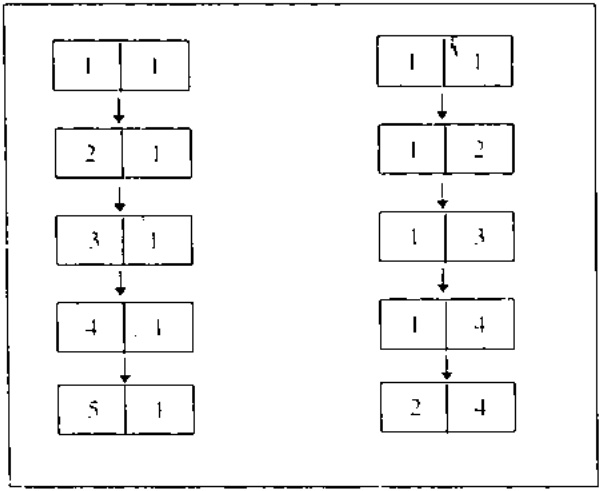

Hình 21-4. Hai nhiễm sắc thể qua dây các đột biến bằng cách thêm 1 vào gọn. Ban đầu xuất phát từ nhiễm sắc thể 1-1, chủng đến 5-1 và 2-4, có cùng chất lượng là 5.

Một cách chất chẽ, các cá thể ứng với me bánh là các thực thể hôn quan đến chất lượng. Các nhiễm sắc thể ứng với phần bột và dưỡng trong bánh xác định chất lượng bằng cách xác định các tỉnh chất của các cá thể. Tuy nhiên không cần thiết quản chủ trọng tối việc phân biệt các tính chất của cá thể do bản chất của nhiễm sắc thể xác định. Theo qui uốc này, các nhiễm sắc thể lấy một vài con số chất lượng, hơn là lấy cácçon số chất lượng bất kì.

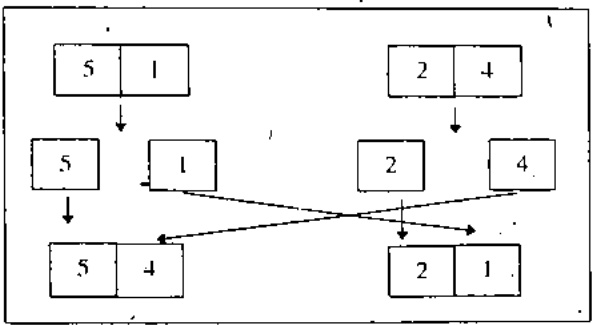

Hình 21-5. Hai nhiễm sắc thể giao nhau tạo ra cấp mới.

<!-- page: 468 -->

Bất chuốc sự giao thoa khi ghép dôi, ống Bánh cát dôi hai nhiễm sắc thể và nôi chứng lạt, mong ràng có tổ hợp may mán. Trọng thi dụ này, nhiễm sắc thể 5-4 là tốt vi nổ cách tổ hợp 5-5 có một Byđe để đạt được chất lượng tối đa là 9 cải bánh. Cạnh dó, nhiễm sắc thể 2-1 không tốt bằng, chỉ cho 2 cải bánh.

Dĩ nhiên chỉ với hai gen và chỉ cất nổi và nhìn chung có nhiều tố hợp giao thoa.

## II.2. Phương pháp tính sự phù hợp

Khú ống Bánh đã xác định được cách đột biến và giao nhau, ông ta cán xác định tiếp tính phù hợp và chọn lọc tự nhiên. Các lựa chọn này chưa quyết được ngay do còn nhiều phương án khác nhau.

Nói chung tinh phù hợp là xác suất mà các nhiễm sắc thể chuyển được sang thể hệ sau. Do vậy, cần có công thức biểu diễn tinh phù hợp của nhiễm sắc thể thứ i, $f_{i}$ theo chất lượng bánh $q_{i}$, $f_{i}$ nhận giá trị 0 đến 1, còn $q_{i}$ nhận giá trị 1 đến 9.

$$
f _ {i} = q _ {i} / \Sigma_ {j} q _ {j}
$$

Dùng công thức này có nghĩa có phương pháp chuẩn để tính toán sự phù hợp.

## Thí dụ

Giải sử có các phần tử, hay còn gọi là dân cư, gồm có bốn nhiễm sắc thể với các ký hiệu là 1-4, 3-1, 1-2 và 1-1. Dựa theo dữ liệu trên hình sau người ta có thể thu được chất lượng và tính phù hợp tương ứng.

Bảng sau cho thấy sự bên quan:

| Nhiễm sắc thể | Chất lượng | Phù hợp theo phương pháp chuẩn |
| --- | --- | --- |
| 1-4 | 4 | 0.40 |
| 3-1 | 3 | 0.30 |
| 1-2 | 2 | 0.20 |
| 1-1 | 1 | 0.10 |

Hình 21-6. Bảng cho biết tính phù hợp.

Tương tự theo sự phù hợp được thiết lập, ông Bánh bắt chuốc lựa chọn tự nhiên như sau :

<!-- page: 469 -->

Lựa chọn tự nhiên tổng quat gồm các công việc :

1. Tạo "dân sô" ban dân chi có nhiễm sắc thể.

2. Đốt biến một hoặc nhiều gen trong một hay nhiều nhiễm sắc thể hiện tại, cho ra một con mài với gen đốt biến.

3. Ghép đôi một hay nhiều cāp nhiệm sắc thể.

4. Thêm nhiễm sắc thể con và nhiễm sắc thể đột biến vào số dân hiện tại.

5. Tạo thể hệ mới bằng cách giữ các nhiễm sắc thể tốt nhất trong số dân hiện có, rời chọn ngầu nhiên các nhiễm sắc thể trong số dân. Khuynh hưởng chọn ngầu nhiên tùy thuộc vào định mức phù hợp.

## II.3. Một số qui định cần làm

Các thuật toán sinh thường dời hồi nhiều lựa chọn. Cho dù sau khi ông Bánh quyết định triển khai thuật toán sinh và dùng phương pháp chuẩn để tỉnh sự phù hợp, vấn còn một số quyết định cần làm :

\- Bao nhiêu nhiễm sắc thể trong số dân ? Nếu số này quá nhỏ thì các nhiễm sắc thể số sớm có các đặc tính như nhau và không thực hiện giao nhau được, ngược lại, nếu số đó quá lớn, thời gian tính toán sẽ lớn một cách không cần thiết.

\- Tỷ lệ đột biến là bao nhiêu ? Nếu tỉ lệ quá nhỏ thì sẽ chấm xuất hiện các đặc tính mới: nếu lớn quá thì mỗi thể hệ không liên hệ với thế hệ trước.

\- Việc ghép dôn được phép không ? Nếu được thì chọn ra bao nhiêu cập. và các điểm giao nhau được xác định ra sao ?

\- Một nhiễm sắc thể bất kì có thể hiện ra nhiều lần trong số dân không?

Nói dài thể, các hiểu biết về không gian tìm kiếm sẽ có ích để chuẩn bị câu trả lời tốt hơn.

## II.4. Đặc biệt hóa phương pháp tổng quát

Bài toán về bột làm bánh cần tìm hỗn hợp tới ưu của các thành phần khi có mối quan hệ giữa chất lượng bánh và các thành phần. Giả sử ông Bánh đặc biệt hóa phương pháp tổng quát để theo lựa chọn tự nhiên như sau :

• Ông Bánh bắt đầu bằng nhiễm sắc thể đơn 1-1.

\- Không nhiễm sắc thể nào được xuất hiện nhiều lần trong mỗi thể hệ.

\- Số cực đại của bôn nhiễm sắc thể sẽ truyền qua thể hệ sau.

<!-- page: 470 -->

\- Mẫu nhiễm sắc thể sống được là ứng cử viên truyền lại thế hệ sau, song song với bất kì nhiễm sắc thể mối được sinh ra.

\- Một gen được chọn ngầu nhiên từ môi nhiễm sắc thể sống sót, và đột biến được thực hiện một cách ngầu nhiên. Nếu phân đột biến là khác bất kì ứng cử viên đã có, phân đột biến được bỏ sung vào tập các ứng cử viên.

\- Không có hiện tương giao nhau.

\- Nhóm sắc thể với tư lệ cho sẻ sống đến thế hệ sau.

\- Nhiễm sắc thể sống sót từ một thể hệ sang thể hệ sau được chọn ngẫu nhiên từ các ứng cứu viên còn lại, tùy theo phương pháp chuẩn để tính sự phù hợp.

Giả sử ông Bình không chỉ dùng ở việc cho ra các bánh chất lượng cao mà còn muốn thuần thực thuật toán sinh. Ông ta cai thiện bánh nghìn lán. Nếu đủ kiện uri, ông Bình thấy tố hợp tốt tại thế hệ thứ mươi sáu. Trong số nghìn thực nghiệm, có tìm thể hệ sau khi xuất phát từ thế hệ 0 với nhiễm sắc thế 1-1 và chất lượng 1.

<table><tr><td>Thế hệ</td><td>Nhiễm sắc thể</td><td>Chất lượng</td><td>Nhận xét</td></tr><tr><td>0</td><td>1-1</td><td>1</td><td>Đột biến thuận lợi cho ra nhiễm sắc thể 1-2. Nhiễm sắc thể được thêm vào số dân, tạo thành hai phần tử.</td></tr><tr><td rowspan="2">1</td><td>1-2</td><td>2</td><td rowspan="2">Nhiễm sắc thể 1-1 đột biến thành 1-3, được thêm vào số dân, 1-1 đột biến thành 1-2 đã có. Vậy thể hệ sau có ba phần tử.</td></tr><tr><td>1-1</td><td>1</td></tr><tr><td rowspan="3">2</td><td>1-3</td><td>3</td><td rowspan="3">1-3 đột biến thành 1-4, 1-2 đột biến thành 2-2, 1-1 đột biến thành 2-1. Lần dấu tiên số dân quá số giới hạn là bốn.</td></tr><tr><td>1-2</td><td>2</td></tr><tr><td>1-1</td><td>1</td></tr><tr><td rowspan="6"></td><td>1-4</td><td>4</td><td rowspan="2">Do vậy phần tử tốt nhất cộng với ba phần tử khác được giữ lại trong số sâu nhiễm sắc thể.</td></tr><tr><td>2-2</td><td>3</td></tr><tr><td>1-3</td><td>3</td><td rowspan="4">Thu được bốn nhiễm sắc thể cho thể hệ ba khi dùng phương pháp phù hợp chuẩn.</td></tr><tr><td>2-1</td><td>2</td></tr><tr><td>1-2</td><td>2</td></tr><tr><td>1-1</td><td>1</td></tr><tr><td rowspan="4">3</td><td>1-4</td><td>4</td><td rowspan="4">Bây giờ đột biến tạo ra ba phần tử mới.</td></tr><tr><td>1-3</td><td>3</td></tr><tr><td>1-2</td><td>2</td></tr><tr><td>2-1</td><td>2</td></tr></table>

<!-- page: 471 -->

<table><tr><td rowspan="3"></td><td>2-4</td><td>5</td><td rowspan="3">Tổng cộng có bảy phân tử. Chơn ra hôn cho thế hệ sau.</td></tr><tr><td>2-3</td><td>4</td></tr><tr><td>3-1</td><td>3</td></tr><tr><td rowspan="4">1</td><td>2-4</td><td>5</td><td rowspan="4">Tất cả các nhiễm sắc thể đột biến và nhiễm sắc thể mới được chọn cho thế hệ sau.</td></tr><tr><td>1-4</td><td>4</td></tr><tr><td>1-3</td><td>3</td></tr><tr><td>2-1</td><td>2</td></tr><tr><td rowspan="4">5</td><td>2-5</td><td>6</td><td rowspan="4">Một lần nửa các nhiễm sắc thể đột biến, nhưng chỉ một trong các nhiễm sắc thể đã có sống sót sang thế hệ sau. Đỏ là nhiễm sắc thể 1-5.</td></tr><tr><td>1-5</td><td>5</td></tr><tr><td>2-3</td><td>4</td></tr><tr><td>2-2</td><td>3</td></tr><tr><td rowspan="4">6</td><td>3-5</td><td>7</td><td rowspan="4">Lần này 3-5 đột biến thành 4-5, và 3-2 đột biến thành 3-1. Hai nhiễm sắc thể khác là 1-5 và 1-4 đột biến sang nhau.</td></tr><tr><td>1-5</td><td>5</td></tr><tr><td>3-2</td><td>4</td></tr><tr><td>1-4</td><td>4</td></tr><tr><td rowspan="6"></td><td>4-5</td><td>8</td><td rowspan="6">Có bốn nhiễm sắc thể được chọn cho thế hệ sau.</td></tr><tr><td>3-5</td><td>7</td></tr><tr><td>1-5</td><td>5</td></tr><tr><td>3-2</td><td>4</td></tr><tr><td>1-4</td><td>4</td></tr><tr><td>3-1</td><td>3</td></tr><tr><td rowspan="4">7</td><td>4-5</td><td>8</td><td rowspan="4">Nhiễm sắc thể 4-5 đột biến thành 5-5, là nhiễm sắc thể tối ưu. Đền dây kết thúc quá trình thủ nghiệm. Thu được số dân gồm bốn nhiễm sắc thể.</td></tr><tr><td>1-5</td><td>5</td></tr><tr><td>1-4</td><td>4</td></tr><tr><td>3-1</td><td>3</td></tr><tr><td rowspan="4">8</td><td>5-5</td><td>9</td><td rowspan="4">Thực tế đế di thẳng trên vùng đối nhập nhỏ, không cần đến giao nhau.</td></tr><tr><td>4-5</td><td>8</td></tr><tr><td>2-4</td><td>6</td></tr><tr><td>2-1</td><td>2</td></tr></table>

Hình 21-7. Thu được tấm thể hệ sau nhiều lần thực nghiệm.

<!-- page: 472 -->

## II.5. Giao nhau trong không gian nhiều chiếu

Viếc giao nhau làm cho các thuật toán sinh tìm kiếm hiệu quả trong không gian nhiều chiều. Nếu ông Bánh muốn biết việc giao nhau dem lại lợi ích gì, ông ta có thể thực hiện:

• Ông Bánh chỉ xem xét các nhiễm sắc thể sống sót từ thể hệ trước.

\- Đối với mỗi nhiễm sắc thể như vậy, ông Bánh chọn ghép đôi trong số các nhiễm sắc thể sống sót. Lựa chọn ghép đôi được làm ngẫu nhiên, tuân theo phương pháp chuẩn để tính sự phù hợp.

\- Môi dôi dem ghép được giao nhau phần giữa, cho ra hai nhiễm sắc thể con, giao nhau. Nếu nhiễm sắc thể con khác với ứng cử viên đã ghi nhận, nhiễm sắc thể con này được thêm vào tập các ứng cử viên.

Dùng phương pháp giao nhau này. ông Bánh tìm thấy tố hợp tốt nhất cho thành phần làm bánh, thường ở thể hệ thứ 14. Như vậy về trung bình thể hệ này trước hai thể hệ so với phương pháp không dùng giao nhau.

Số dĩ việc giao nhau làm tăng tốc độ vì có thể thống nhất một cả thể có khả năng tại một chiều, chẳng hạn lượng bột, với cả thể tại chiều kia, tức chiều lượng đường. Nếu việc giao nhau mang gen bột tốt và gen đường tốt thì cả thể mối mang hai gen tốt.

Bời vì việc giao nhau cải thiện công việc, không gian tìm kiếm cần trang bị khả năng tìm lời giải tổng thể cũng như tìm lời giải trên mỗi chiều độc lập. Thực tế, việc giao nhau giảm kích thước cho không gian tìm kiếm.

## II.6. Trường hợp cần đến sự giao nhau

Giả sử có quan hệ giữa chất lượng bánh và thành phần được cho trong bảng phần trên, tạo thành các đường hào, có nhiều chất lượng 0. Trong hoàn cảnh như vậy, không thể tạo nên một xấu các đột biến đề đưa dân số nằm bên ngoại đường hào vào bên trong. Lý do là các nhiễm sắc thể trung gian chất lượng 0 tạo nên đường hào, và độ phù hợp là 0, và do vậy không có cơ hội sống sót qua thể hệ sau.

Trong lúc đó với hai cha mẹ tốt như nhiễm sắc thể 1-5 và 5-1 thì chỉ với việc ghép đôi đơn giản cũng có thể tạo nên con cháu xuyên qua hào. Không một trung gian 0-thích hợp cần sống sót. Thực tế cho thấy trong trường hợp có các đường hào, việc giao nhau có ích.

Không may cho ông Bánh là dân số tập trung trên trực lượng bột, lượng đường, và bốn chùm với nhiễm sắc thể 1-5 hay 5-1. Đột biến vào vùng hào thì không sống được. Đột biến để dưa nhiễm sắc thể về 1-1 có xu hướng chết trước khi đến một vị trí thuận lợi để giao nhau.

<!-- page: 473 -->

Khi ông Bánh thủ nghiệm nghìn lân để tìm thấy tối ưu khi xuất phát từ nhiễm sắc thể 1-1, ông ta thấy tổ hợp tốt nhất sau 150 thể hệ.

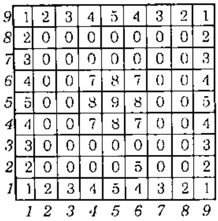

Hình 21-8. Hàm biểu diễn chất lượng bánh theo thành phần trong bột. Sự giác nhau giúp người ta nhảy qua vùng hảo 0.

## II.7. Phương pháp hạng chất lượng

Phương pháp chuẩn để quyết định sự phù hợp đảm bảo không cho phép người ta tác động đến lụa chọn bị ảnh hưởng. Một cách khác được dùng là phương pháp hạng không chỉ cho phép điều khiển hướng về nhiễm sắc thể tốt nhất mà còn loại bỏ các hướng đi dẫn đến các nhiễm sắc thể không tối.

Về cơ bản, phương pháp hạng bỏ qua việc do chất lượng ngoại trừ phép đo dùng để xếp hạng các ứng cử viên từ chất lượng cao đến chất lượng thấp hơn. Sự phù hợp của ứng cử viên chất lượng cao nhất trong số các ứng cử viên là giá trị p có định nào đó Nếu ứng cử viên tốt nhất là cái có hạng số 1 không được chọn. thì ứng cử viên tốt nhất tiếp theo có hạng là 2 được chọn với độ phù hợp p. Quả trình chọn này tiếp diễn cho đến khi một ứng cử viên được chọn hay chỉ còn có một. Thủ tục này được viết lại :

Chơn một ứng cử viên bằng phương pháp hạng :

1. Sắp xếp n cá thể theo chất lượng.

2. Cho phép xác suất chọn ứng cử viên thử i là p khi biết rằng i-1 ứng cử viên đầu tiên đã không được chọn. Trù ra ứng cử viên cuối cùng; nó được chọn nếu không ứng cử viên trước nào được chọn.

3. Dùng tính toán xác suất để chọn một ứng cử viên.

Thí dụ.

Giá sú p = 0.667. Người ta quan tâm đến nhiễm sắc thể 1-4, 3-1, 1-2 và 1-1, như đã dùng khi mô tả phương pháp chuẩn. nhưng trong ngữ cảnh có đường hào. Giá sú 460

<!-- page: 474 -->

bến nhiễm sắc thể này được tăng bởi 7-5, cho các bánh chất lượng 0 trong đường hảo. Bảng sau cho thấy độ phù hợp hạng của các nhiễm sắc thể, song song với độ phù hợp tính toán theo phương pháp chuẩn.

| Nhtime súc the | Chát luong | Hang | Độ phù hợp theo phương pháp chuẩn | Độ phù hợp theo phương pháp hung |
| --- | --- | --- | --- | --- |
| 1-4 | 4 | 1 | 0.40 | 0.667 |
| 3-1 | 3 | 2 | 0.30 | 0.222 |
| 1-2 | 2 | 3 | 0.20 | 0.074 |
| 1-1 | 1 | 4 | 0.10 | 0.025 |
| 7-5 | 0 | 5 | 0.00 | 0.012 |

Hình 21-9. Độ phù hợp hạng của nhiễm sắc thể, so sánh với độ phù hợp tính được theo phương pháp chuẩn.

Khi ông Bánh thủ nghiệm nghìn lấn và thấy lời giải tối ưu bằng phương pháp hạng. Bất dấu từ bộ 1-1, ông ta thấy tố hợp tốt nhất sâu 75 thể hệ. Do vậy phương pháp hạng đảm bảo cải thiện dáng kê. Trong khi đó, phương pháp chuẩn cần 155 thể hệ.

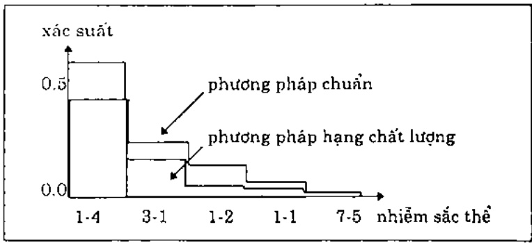

.Hinh 21-10. So sánh hai phương pháp.

Hình cho thấy tính phù hợp của năm nhiễm sắc thể được do theo cả hai phương pháp là phương pháp chuẩn và phương pháp hạng. Ngược với phương pháp chuẩn,

<!-- page: 475 -->

phương pháp hàng chỉ ra độ phù hợp khác 0 cho tất cả các nhiễm sắc thể, thâm chỉ cho một nhiễm sắc thể có chất lượng 0.

Không may là 75 thể hệ vấn là quá nhiều. Tất cả bốn nhiễm sắc thể vẩn có khuynh hướng chậm lại quanh hoặc nhiễm sắc thể 5-1 hoặc nhiễm sắc thể 1-5. Dĩ nhiên có thể làm đường hầm qua các đường hào chất lượng 0, bởi vi độ phù hợp nhỏ nhất của bất kì nhiễm sắc thể nào cũng được quyết định một cách giản tiếp theo hạng chất lượng. hơn là trực tiếp theo tỉ lệ chất lượng.

## III. ĐIỂM MẠNH CỦA ĐỐI TUỘNG ĐẶC BIỆT

Độ phù hợp như người ta đo ở trên đã bổ qua tỉnh khác nhau. Tính chất này có thể được cơi là mức độ gen khác nhau mà nhiễm sắc thể thể hiện. Như vậy các nhiễm sắc thể có khuynh hướng bị thanh toán nếu chúng có điểm số thấp hơn một chút so với nhiễm sắc thể sát với nhiễm sắc thể tốt nhất hiện tại. Cho đủ có số dân lớn, kết quả này là thống nhất.

Trên quy mô lớn, cá thể tưởng như không phù hợp lại sống khoẻ mạnh trong môi trường sinh thái. Chúng nằm ngoài tấm của các cá thể được coi là phù hợp.

## Nguyên tắc về tính khác nhau

Tính khác nhau cũng tốt như tính phù hợp.

Phân sau đây sẽ trình bày cách học tính khác nhau cũng được nhập vào độ do chung về sự phù hợp. Việc học trên các quan sát này tạo nên khung cảnh khác nhau về những cái cần xét bằng cực đại địa phương.

## III.1. Phương pháp không gian hạng

Phương pháp không gian hạng liên kết tỉnh phù hợp với hạng chất lượng và hạng khác nhau. Khi chọn các nhiễm sắc thể cho thể hệ, một cách do độ khác nhau có được. nhỏ nhiễm sắc thể ứng cử là tính tổng bình phương nghịch đảo khoảng cách giữa nhiễm sắc thể đó và nhiễm sắc thể khác đã được chọn. Vậy hạng khác nhau của nhiễm sắc thể được xác định bởi :

$$
\sum_ {i} \frac {1}{d _ {i} ^ {2}}
$$

Thí dụ

Văn xét tập sáu nhiễm sắc thể ứng cử gồm 5-1, 1-4, 3-1, 1-2, 1-1, và 7-5. Ứng cử viên có điểm số cao nhất là 5-1. Xếp hạng nằm nhiễm sắc thể còn lại theo chất lượng và nghịch đảo khoảng cách đến 5-1 thu được bảng sau :

<!-- page: 476 -->

| Nhiễm sắc thể | Điễm số | $1/d^{2}$ | Hạng khác nhau | Hạng chất lượng |
| --- | --- | --- | --- | --- |
| 1-4 | 4 | 0.040 | 1 | 1 |
| 3-1 | 3 | 0.250 | 5 | 2 |
| 1-2 | 2 | 0.059 | 3 | 3 |
| 1-1 | 1 | 0.062 | 4 | 4 |
| 7-5 | 0 | 0.050 | 2 | 5 |

Hình 21-11. Do độ khác nhau của các nhiễm sắc thể so với nhiễm sắc thể 5-1.

fốt cách đơn giản để kết hợp hạng theo chất lượng và hạng theo sự khác nhau hạng tổ hợp là xếp hạng mỗi nhiễm sắc thể theo tổng hạng chất lượng và hạng nhau của nó.

Chơn một ứng cử viên theo phương pháp không gian hàng được thực hiện theo các bước :

1. Sắp xếp n cá thể theo chất lượng.

2. Sắp xếp n cá thể theo tổng của hạng chất lượng và nghịch đảo bình phương khoảng cách đến các ứng cử viên đã có.

3. Dùng phương pháp hàng, nhưng sắp xếp trên tổng của hạng chất lượng và hạng khác nhau, thay vì chi trên hạng chất lượng.

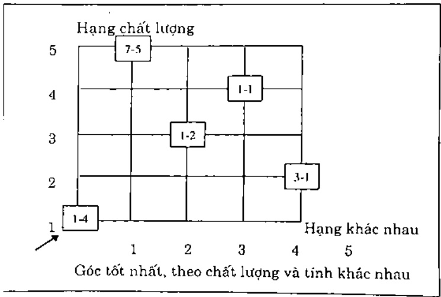

Hình 21-12. Không gian hạng cho phép so sánh hai nhiễm sắc thể theo cả chất lượng và sự khác nhau.

<!-- page: 477 -->

Hình về minh họa thủ tục trên. Với hạng khác nhau ứng với một trực và trực kia là hạng chất lượng, người ta có không gian hạng, và phương pháp dùng không gian này gọi là phương pháp không gian hạng. Vị trí tốt nhất trong không gian là nơi nhiễm sắc thể tốt cả về chất lượng và độ khác nhau.

Tiếp theo, với hạng kết hợp do việc dua vào yếu tố tác động của chất lượng và sự khác nhau, việc lựa chọn có thể được làm như trước. Ứng cử viên đầu tiên có độ phù hợp là p.

| Nhiễm sắc thể | Tổng hạng | Hạng kết hợp | Độ phù hợp |
| --- | --- | --- | --- |
| 1-4 | 2 | 1 | 0.667 |
| 3-1 | 7 | 4 | 0.025 |
| 1-2 | 6 | 2 | 0.222 |
| 1-1 | 8 | 5 | 0.012 |
| 7-5 | 7 | 3 | 0.074 |

Hình 21-13. Tính tổng hạng, hạng kết hợp và độ phù hợp.

Bảng trên cho tổng hạng, hạng kết hợp... Lưu ý ràng giữa 3-1 và 7-5 có hiện tượng trùng giá trị tổng hợp. Đế loại trừ hiện tượng này, người ta kiểm tra nhiễm sắc thể với hạng khác nhau tốt hơn để có hạng kết hợp tốt hơn.

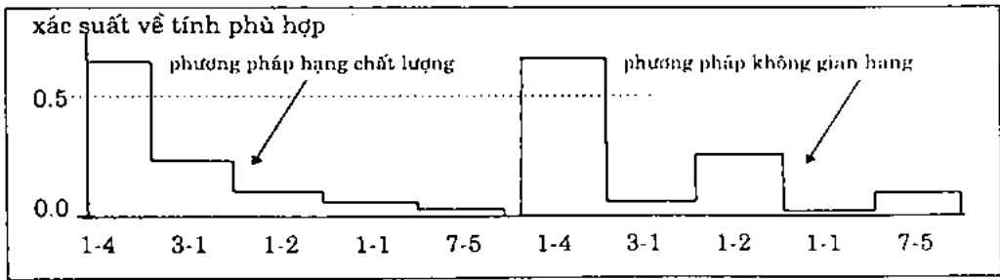

Hình 21-14. So sánh hai phương pháp trên vùng có đường hào về tính phù hợp của năm nhiễm sắc thể.

<!-- page: 478 -->

Trong hình là độ phù hợp đối với năm nhiễm sắc thế đo bằng phương pháp hạng chất lượng, dùng chất lượng trên vùng có đường hảo. Ngược với phương pháp chuẩn 'va phương pháp hạng là phương pháp không gian hạng, có tính đến sự khác nhau.

| Nhiểm sắc thể | $\sum_{i} \frac{1}{d_{i}^{2}}$ | Hạng khác nhau | Hạng chất lượng | Hạng tố hợp | Độ phù hợp |
| --- | --- | --- | --- | --- | --- |
| 3-1 | 0.327 | 4 | 1 | 4 | 0.037 |
| 1-2 | 0.309 | 3 | 2 | 3 | 0.074 |
| 1-1 | 0.173 | 2 | 3 | 2 | 0.222 |
| 7-5 | 0.077 | 1 | 4 | 1 | 0.667 |

Hình 21-15. Bảng tính toán thu được nhiễm sắc thể 7-5 có khả năng.

Giả sử nhiễm sắc thể có khả năng nhất, là nhiễm sắc thể 1-4. được chọn để nhập với nhiễm sắc thể 1-5 sang thể hệ sau. Hai nhiễm sắc thể nửa cũng được chọn. Dương nhiên cái được chọn tiếp sẽ cách xa 5-1 và 1-4. Như vậy thay vì do khoảng cách tối một nhiễm sắc thể được tham chiếu, người ta tính tổng nghịch đảo của binh phương khoảng cách giữa hai nhiễm sắc thể được tham chiếu là 5-1 và 1-4. Do vậy các tổng hạng như cũ nhưng sử dụng hạng khác nhau như nhân tố loại trừ hiện tượng trùng giá trị đã nói trên. Kết quả được trình bày trong bảng.

| Nhiễm sắc thể | $\sum_{i} \frac{1}{d,^{2}}$ | Hạng khác nhau | Hạng chất lượng | Hạng tố hợp | Độ phù hợp |
| --- | --- | --- | --- | --- | --- |
| 3-1 | 0.358 | 3 | 1 | 3 | 0.111 |
| 1-2 | 0.331 | 2 | 2 | 2 | 0.222 |
| 1-1 | 0.190 | 1 | 3 | 1 | 0.667 |

Hình 21-16. Tính toán thu được nhiễm sắc thể 1-1 là có khả năng.

<!-- page: 479 -->

Tiếp tục, giả sử nhiễm sắc thể có khả năng nhất, lần này là 7-5, được chọn đề nhập với 5-1 và 1-4 sang thể hệ mới. Khi đó các hạng cho thấy cách lựa chọn cuối cùng như bảng sau. Người ta loại trừ hiện tượng trùng tổng hạng bằng cách dùng hạng khác nhau. Lần này 1-1 là nhiễm sắc thể có khả năng nhất.

Hình dưới đây sẽ minh họa các tính toán vừa làm. Lưu ý ràng phương pháp không gian hạng có khuynh hướng dùng sự khác nhau như phương pháp chuẩn và như phương pháp hạng bình thường. Tuy nhiên phương pháp chuẩn không bao giờ chọn nhiễm sắc thể 7-5 và phương pháp hạng bình thường chọn 7-5 vào bước cuối chú không phải bước thú ba như phương pháp không gian hạng.

| 9 | 1 | 2 | 3 | 4 | 5 | 4 | 3 | 2 | 1 |
| --- | --- | --- | --- | --- | --- | --- | --- | --- | --- |
| 8 | 2 | 0 | 0 | 0 | 0 | 0 | 0 | 0 | 2 |
| 7 | 3 | 0 | 0 | 0 | 0 | 0 | 0 | 0 | 3 |
| 6 | 4 | 0 | 0 | 7 | 8 | 7 | 0 | 0 | 4 |
| 5 | 5 | 0 | 0 | 8 | 9 | 8 | 0 | 0 | 5 |
| 4 | 4 | 0 | 0 | 7 | 8 | 7 | 0 | 0 | 4 |
| 3 | 3 | 0 | 0 | 0 | 0 | 0 | 0 | 0 | 3 |
| 2 | 2 | 0 | 0 | 0 | 0 | 0 | 0 | 0 | 2 |
| 1 | 1 | 2 | 3 | 4 | 5 | 4 | 3 | 2 | 1 |
|  | 1 | 2 | 3 | 4 | 5 | 6 | 7 | 8 | 9 |

Hình 21-17. Dây ba lựa chọn nhiễm sắc thể có khả năng nhất trong số năm ứng cử viên. Dùng phương pháp không gian hạng thực hiện lựa chọn được mà vấn giữ sự khác nhau.

<!-- page: 480 -->

Nói tóm lại, nếu người ta giả sử nhiễm sắc thể có khả năng nhất được chọn tại mỗi điểm theo cách chọn tự động các nhiễm sắc thể có điểm số cao nhất thì 5-1, rời 1-4, 7-5 và 1-1 được chọn cho thể hệ sau. Khi chỉ kiểm tra theo chất lượng thì thủ tự là 5-1, 1-4, 3-1 và 1-2.

## III.2. Phương pháp không gian hạng đối với miền có đường hào

Nếu ông Bánh thử nghiệm nghìn lân để tìm giải pháp tối ưu bằng phương pháp không gian hạng, xuất phát từ nhiệm sắc thể 1-1 và p=0.66, ông ta thấy tổ hợp tốt nhất sau khoảng 15 thế hệ. Do vậy phương pháp không gian hạng đảm bảo cải thiện dáng kể trên bài toán có đường hảo. Về điểm này, phương pháp không gian hạng ưu điểm hơn phương pháp chuẩn và phương pháp hạng. Tổng kết lại người ta có :

| Dạng núi | Phương pháp chuẩn | Phương pháp hạng chải lượng | Phương pháp không gian hạng |
| --- | --- | --- | --- |
| Đổi | 14 | 12 | 12 |
| Đường hào | 155 | 75 | 15 |

Hình 21-18. Bảng so sánh trong trường hợp có đường hảo.

Trong số một nghìn lần thử nghiệm của ông Bánh theo phương pháp không gian hạng, người ta thu được tổ hợp tốt nhất sau đúng bày thể hệ, bất dấu từ thể hệ 0 và nhiễm sắc thể 1-1. Lúc này chất lượng là 1.

<table><tr><td>Thế hệ</td><td>Nhiễm sắc thể</td><td>Chất lượng</td><td>Nhận xét</td></tr><tr><td>0</td><td>1-1</td><td>1</td><td>Đột biến thuẩn lợi cho ra nhiễm sắc thể 2-1. Nhiễm sắc thể được thêm vào số dân, tạo thành hai phân tử.</td></tr><tr><td rowspan="2">1</td><td>2-1</td><td>2</td><td rowspan="2">Nhiễm sắc thể 1-1 đột biến thành 3-1, được thêm vào số dân. Việc giao nhau không thêm gì cho thể hệ này vì cả hai nhiễm sắc thể cùng có gen thú hai là 1.</td></tr><tr><td>1-1</td><td>1</td></tr><tr><td rowspan="3">2</td><td>3-1</td><td>3</td><td rowspan="3">Đột biến thu được 2-2 và 4-1. Việc giao nhau không thêm được gì. Ngoài các nhiễm sắc thể đã có và đột biến, nhiễm sắc thể 2-1 bị mất khi tạo thể hệ ba.</td></tr><tr><td>2-1</td><td>2</td></tr><tr><td>1-1</td><td>1</td></tr><tr><td>3</td><td>4-1</td><td>4</td><td>Đột biến cho ba nhiễm sắc thể mới 5-1, 1-2 và 2-3. Giao nhau của 2-2 và 4-1 cho nhiễm sắc thể 2-1 và</td></tr></table>

<!-- page: 481 -->

|  | 3-11-12-2 | 310 | 4-2. Tất cả đột biến và giao nhau còn lại đã có trong dân số. |
| --- | --- | --- | --- |
|  | 4-1 5-13-1 1-21-1 2-32-2 2-14-2 | 4 53 21 00 20 | Như vậy thể hệ sau có tổng cộng chín nhiễm sắc thể. |
| 4 | 5-13-11-22-3 | 5320 | Bây giờ 5-1 đột biến thành 6-1, 1-2 thành 2-2, 3-1 thành 3-2, và 2-3 thành 2-4. Các giao nhau đạt được năm nhiễm sắc thể mới, 2-1, 1-1, 5-2, 3-2 và 5-3. |
|  | 5-1 2-23-1 3-21-2 2-42-3 2-16-1 1-15-2 3-25-3 | 5 03 02 00 24 10 00 | Như vậy thể hệ sau được chọn từ mười ba phán tử. |
| 5 | 5-13-11-22-4 | 5320 | Cho thể hệ sau, có cải thiện đáng kể như việc ghép đôi 5-1 với 2-4, cho nhiễm sắc thể 5-4 trong thể hệ sau. |
| 6 | 5-41-43-11-2 | 8432 | Cuối cùng 5-4 đột biến thành 5-5 trong thể hệ cuối. |
| 7 | 5-51-41-25-2 | 9420 |  |

Hình 21-19. Quy trình tiến hóa theo phương pháp không gian hạng.

<!-- page: 482 -->

| 1 | 2 | 3 | 4 | 5 | 4 | 3 | 2 | 1 |
| --- | --- | --- | --- | --- | --- | --- | --- | --- |
| 2 | 0 | 0 | 0 | 0 | 0 | 0 | 0 | 2 |
| 3 | 0 | 0 | 0 | 0 | 0 | 0 | 0 | 3 |
| 4 | 0 | 0 | 7 | 8 | 7 | 0 | 0 | 4 |
| 5 | 0 | 0 | 8 | 9 | 8 | 0 | 0 | 5 |
| 4 | 0 | 0 | 7 | 8 | 7 | 0 | 0 | 4 |
| 3 | 0 | 0 | 0 | 0 | 0 | 0 | 0 | 3 |
| 2 | 0 | 0 | 0 | 0 | 0 | 0 | 0 | 2 |
| 1 | 2 | 3 | 4 | 5 | 4 | 3 | 2 | 1 |

| 1 | 2 | 3 | 4 | 5 | 4 | 3 | 2 | 1 |
| --- | --- | --- | --- | --- | --- | --- | --- | --- |
| 2 | 0 | 0 | 0 | 0 | 0 | 0 | 0 | 2 |
| 3 | 0 | 0 | 0 | 0 | 0 | 0 | 0 | 3 |
| 4 | 0 | 0 | 7 | 8 | 7 | 0 | 0 | 4 |
| 5 | 0 | 0 | 8 | 9 | 8 | 0 | 0 | 5 |
| 4 | 0 | 0 | 7 | 8 | 7 | 0 | 0 | 4 |
| 3 | 0 | 0 | 0 | 0 | 0 | 0 | 0 | 3 |
| 2 | 0 | 0 | 0 | 0 | 0 | 0 | 0 | 2 |
| 1 | 2 | 3 | 4 | 5 | 4 | 3 | 2 | 1 |

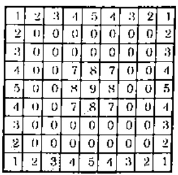

Hình dưới đây cho thấy trực quan về quá trình tiến hóa. Lưu ý ràng phương pháp không gian hạng có khuynh hướng giữ các nhiễm sắc thể. Bời vì có tính ngẫu nhiên trong việc chọn ứng cử viên, hiện tượng chịu dữ liệu vấn xây ra.

| 1 | 2 | 3 | 4 | 5 | 4 | 3 | 2 | 1 |
| --- | --- | --- | --- | --- | --- | --- | --- | --- |
| 2 | 0 | 0 | 0 | 0 | 0 | 0 | 0 | 2 |
| 3 | 0 | 0 | 0 | 0 | 0 | 0 | 0 | 3 |
| 4 | 0 | 0 | 7 | 8 | 7 | 0 | 0 | 4 |
| 5 | 0 | 0 | 8 | 9 | 8 | 0 | 0 | 5 |
| 4 | 0 | 0 | 7 | 8 | 7 | 0 | 0 | 4 |
| 4 | 0 | 0 | 0 | 0 | 0 | 0 | 0 | 3 |
| 2 | 0 | 0 | 0 | 0 | 0 | 0 | 0 | 2 |
| 1 | 2 | 3 | 4 | 5 | 4 | 3 | 2 | 1 |

| 1 | 2 | 3 | 4 | 5 | 4 | 3 | 2 | 1 |
| --- | --- | --- | --- | --- | --- | --- | --- | --- |
| 2 | 0 | 0 | 0 | 0 | 0 | 0 | 0 | 2 |
| 3 | 0 | 0 | 0 | 0 | 0 | 0 | 0 | 3 |
| 4 | 0 | 0 | 7 | 8 | 7 | 0 | 0 | 4 |
| 5 | 0 | 0 | 8 | 9 | 8 | 0 | 0 | 5 |
| 4 | 0 | 0 | 7 | 8 | 7 | 0 | 0 | 4 |
| 3 | 0 | 0 | 0 | 0 | 0 | 0 | 0 | 3 |
| 2 | 0 | 0 | 0 | 0 | 0 | 0 | 0 | 2 |
| 1 | 2 | 3 | 4 | 5 | 4 | 3 | 2 | 1 |

Hình 21-20. Điểm tối ưu tìm thấy tại thế hệ thú bày.

<!-- page: 483 -->

## III.3. Khắc phục cực đại địa phương

Hấu hết các tiếp cận tìm kiếm đều có các bấy cực đại địa phương. Cứng có các cơ chế thoát khởi bấy đó như quay lui và gia giảm kích thước các bước. Ngoài ra người ta có tiếp cận yêu cầu tìm kiếm song song với số lớn của các vị trí xuất phát ngẫu nhiên, với hy vọng ràng một trong các tìm kiếm ấy rời vào bấy cực đại địa phương đồng thời là cực đại tổng thể.

Ngược lại, newer thuật toán sinh xử lý tính khác nhau như một thành phần của tính phù hợp, thì một vài cả thể trong số dân có khuynh hướng quanh quản xung quanh cục đại địa phương theo chất lượng hay sự khác nhau. Khi có đủ cả thể để tạo thành cụm dân, sẽ có cách di đến cục đại tổng thể.

## Nguyên tắc chinh phục và dân số

Cục đại địa phương sẽ được nhân lên, không tránh được, khi người ta tìm kiếm cục đại toàn thể.

Như vậy, sử dụng tính khác nhau của các đối tượng sẽ tránh rơi vào cục đại địa phương trong bài toán tối ưu.

## IV. KÊT LUẬN

Có thể tham khảo về các thuật toán sinh trong tài liệu của Jim Antonisse, năm 1989. Một số vấn đề khác trong phần này có thể được thấy trong tài liệu của Michael de la Maza, Bruce Tidor, năm 1991...

Một số nhận xét cuối phần học bằng mô phỏng quá trình tiến hóa gồm các ý sau :

\- Một cách học là bất chuốc tiến hóa tự nhiên, dùng trì thức cho rằng đối tượng tự nhiên có xu hướng thích hợp nhất để hướng dẫn tìm kiếm.

\- Các nhiễm sắc thể xác định đặc tính di truyền. Thuật toán học dựa vào sự sinh sản, biến đổi sự tương tự dùng cho các nhiễm sắc thể thông qua trường hợp tương tự như đột biến và ghép dôi. Do vậy người ta tạo nên cá thể mới thích hợp hơn cha mẹ chúng.

\- Phương pháp chuẩn để xác định tính phù hợp đưa về việc do chất lượng. Phương pháp hạng liên kết tính phù hợp với hạng chất lượng. Do vậy phương pháp này ngân ngừa được việc dùng thang đo cụ thể khi do chất lượng, vì với một thang đo cụ thể có thể dẫn đến hiệu quả không tốt.

\- Phương pháp không gian hạng liên kết tính phù hợp với cá hạng chất lượng và hạng khác nhau. Do đó nó cải thiện cả cá thể rất phù hợp theo chất lượng, lẩn cá thể vừa phù hợp và khác với cá thể khác.

<!-- page: 484 -->

\- Tỉnh khác nhau cũng tốt như tính phù hợp. Khi tính khác nhau được quản lý, cục đại địa phương có thể được nhân lên, thay vi phải tìm cách tránh di. Nắm được tính thần này, phương pháp không gian hạng giải bài toán ré hơn phương pháp chuẩn và phương pháp hạng.

<!-- page: 485 -->

# KÊT LUẬN

Phân kết luận này chưa tổng kết toàn bộ các nội dung và giới thiệu các hướng phát triển của trí tuệ nhân tạo, mà mối chỉ liệt kê ba phân đã được lần lượt trình bày.

1. Thế hiện trị thức và giải các bài toán. Phán này nếu các loại thế hiện của trị thức được con người dùng, phân loại theo trị thức mô tả, trị thức thủ tục và trị thức khác. Cách thể hiện trị thức trên mạng ngữ nghĩa được trình bày rắn raie trong nhiều chương của phân này. Việc giải bùu toán được đế cập với các phương pháp giải và một số thuật toán. Phương pháp giải bằng logie được đế cập nhiều hơn cả.

2. Một số hệ thống trí tuệ nhân tạo. Phân này không nhiều nội dung như phần dấu hay phân sau. Nó chỉ đề cập một số bài toán lập kế hoạch, bảng đơn... và giới thiệu sở lược về hệ chuyên gia. Nội dung về nhận thức tự động perceptron được trình bày trong một chương.

3. Học và nhận dạng quy luật. Các nội dung về học tự động được trình bày sạt hai phần trên, với mục đích giới thiệu một số phương pháp huấn luyện máy học như con người. Hai loại phương pháp chính được phân biệt là :

\- Phương pháp học dựa trên các suy lý, căn cứ vào các trị thải của thu được từ trước. Bôn phương pháp được trình bày, dựa trên phân tích sự khác nhau, theo cách quản lý mô hình, theo kinh nghiệm, và theo cách chính lý sai sót.

\- Phương pháp phát hiện các quy luật trong các dữ hiệu. Có sáu phương pháp là ghi nhận các trường hợp, định tên, huấn luyện mạng thần kinh, perceptron, huấn luyện mạng xếp xỉ, và học theo cách mô phỏng sự tiến hoá.

Một số nội dung tuy đã được nhắc đến trong các chương nhưng chưa được trình bày chỉ tiết bởi lẻ kiến thức đó quá nhiều, chưa thể giới thiệu hết. Mặt khác trong khuôn khổ hạn hẹp của tài liệu giảng dạy, các nội dung đó sẽ được trình bày trong tài liệu khác. Đó là hệ chuyên gia, lý thuyết nhận dạng, xử lý ảnh, người máy, dịch tự động.

<!-- page: 486 -->

# Tài liệu tham khảo

1. Bạch Hưng Khang, Hoàng Kiểm

Trí tuệ nhân tạo : các phương pháp và ứng dụng. Ed. Nhà xuất bản Khoa học và Kỹ thuật, 1989.

2. Nguyên Thanh Thuy

Tri tuệ nhân tạo. Các phương pháp giải quyết vấn đề và kỹ thuật xử lý tri thức. Ed. Nhà xuất bán Giáo dục. 1996.

3. John Durkin
Expert Systems. Ed. Prentice Hall, 1994.

4. Kurt Sundermeyer
Knowledge Based Systems. Ed. Wissenschaftsverlag. 1991.

5. N. Nilson
Artificial Intelligence. Ed. McGrawhill, 1971.

6. Patrick Henry Winston
Artificial Intelligence, Ed. Addison Wesley, 1992.

7. Rich Elaine
Artificial Intelligence, Ed. McGrawhill, 1983.

8. Stuart Russell, Peter Norvig
Artificial Intelligence. A modern approach. Ed. Prentice Hall, 1995.

<!-- page: 487 -->

<small><span class="docvortex-page-footnote" data-block-type="page_footnote" style="color:#6b7280">TRÍ TUÊ NHÂN TẠO.</span></small>

<small><span class="docvortex-page-footnote" data-block-type="page_footnote" style="color:#6b7280">Sắp chữ diện tử tại Trung tâm Công nghệ thông tin, Bộ Giáo dục và Đào tạo. In 500 Confidence Index 85, Institute of Technology</span></small>

<small><span class="docvortex-page-footnote" data-block-type="page_footnote" style="color:#6b7280">In 500 cuon, khô 18 x 25 cm tại Công ti in khoa học kĩ thuật<br>Giấy Francisco xuất, b-income</span></small>

<small><span class="docvortex-page-footnote" data-block-type="page_footnote" style="color:#6b7280">Giấy phép xuất bản số 857/CXB-12</span></small>

<small><span class="docvortex-page-footnote" data-block-type="page_footnote" style="color:#6b7280">In xong và nộp lưu chiều tháng 12 năm 1997.</span></small>

<!-- page: 488 -->
