<!-- page: 1 -->

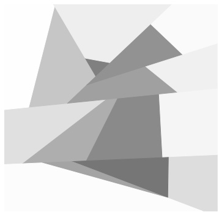

# Lecture Notes on Machine Learning

Miguel A. Carreira-Perpiñán ´ **Dept. of CSE, University of California, Merced**

**December 7, 2023**

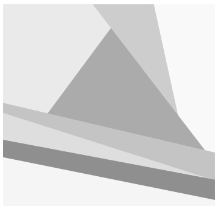

# 近道道

# 道 道 道

**These are notes for a one-semester undergraduate course on machine learning given by Prof.** Miguel A. Carreira-Perpiñán at the University of California, Merced. ´

**These notes may be used for educational, non-commercial purposes.**

©2015–2023 Miguel A. Carreira-Perpiñán ´

<!-- page: 2 -->

## 1 Introduction

## What is machine learning (ML)?

**• Data is being produced and stored continuously (“big data”):**

**– science: genomics, astronomy, materials science, particle accelerators. . .**

**– sensor networks: weather measurements, traffic. . .**

**– people: social networks, blogs, mobile phones, purchases, bank transactions. . .**

**• Data is not random; it contains structure that can be used to predict outcomes, or gain knowledge in some way.**

**Ex: patterns of Amazon purchases can be used to recommend items.**

**• It is more difficult to design algorithms for such tasks (compared to, say, sorting an array or calculating a payroll). Such algorithms need data.**

**Ex: construct a spam filter, using a collection of email messages labelled as spam/not spam.**

## • Explicit vs implicit programming:

Ex: write a program to sort an array of n numbers. A competent computer scientist can **think hard and devise a specific algorithm (say, Quicksort), understand why the algorithm will work and program it in a few lines. This is explicit programming.**

Ex: write a program to tell whether an image of m × n pixels contains a dog or not. Very **hard to write this as an explicit program, and it would not achieve a high classification rate because of the complex variability of dog images. Instead: define an objective function (say, classification error) and a classifier with adjustable parameters (say, a neural network) and adjust the parameters (train or optimize the neural network) so the objective is as best as possible on a training set of labeled images. Properly done, this will achieve a much better classification on images beyond the training ones, although we may not understand how the neural net works internally. This is implicit programming, and it is what ML does.**

**• Data mining: the application of ML methods to large databases.**

**• Ex of ML applications: fraud detection, medical diagnosis, speech or face recognition. . .**

**• ML is programming computers using data (past experience) to optimize a performance criterion.**

**• ML relies on:**

**– Statistics: making inferences from sample data.**

**– Numerical algorithms (linear algebra, optimization): optimize criteria, manipulate models.**

**– Computer sci.: data structures/programs/hardware that solve a ML problem efficiently.**

## • A model:

**– is a compressed version of a database;**

**– extracts knowledge from it;**

**– does not have perfect performance but is a useful approximation to the data.**

<!-- page: 3 -->

## Examples of ML problems

**• Supervised learning: labels provided.**

**– Classification (pattern recognition):**

**∗ Face recognition. Difficult because of the complex variability in the data: pose and illumination in a face image, occlusions, glasses/beard/make-up/etc.**

Training examples:

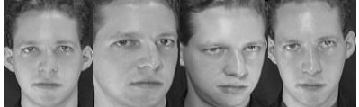

**Test images:**

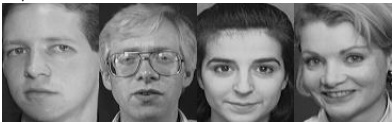

**∗ Optical character recognition: different styles, slant. . .** $0 1 2 3 4 5 6 7 8 9$

**∗ Medical diagnosis: often, variables are missing (tests are costly).**

**∗ Speech recognition, machine translation, biometrics. . .**

**∗ Credit scoring: classify customers into high- and low-risk, based on their income and savings, using data about past loans (whether they were paid or not).**

**– Regression: the labels to be predicted are continuous:**

**∗ Predict the price of a car from its mileage.**

**∗ Navigating a car: angle of the steering.**

**∗ Kinematics of a robot arm: predict workspace location from angles.**

if income $> \theta _ { 1 }$ and savings $> \theta _ { 2 }$ **then low-risk else high-risk**

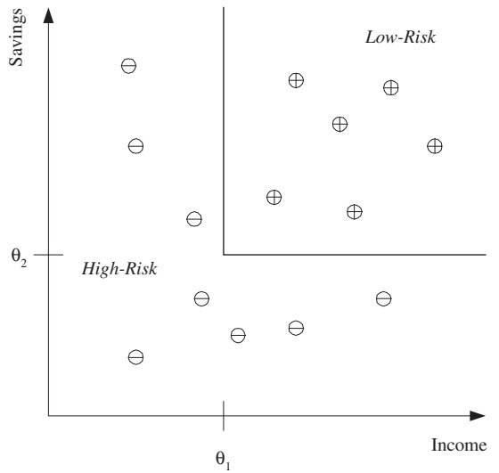

$$
y = w x + w _ {0}
$$

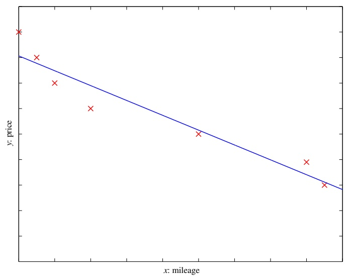

**• Unsupervised learning: no labels provided, only input data.**

**– Learning associations:**

**∗ Basket analysis: let** $p ( Y | X )   =$ **“probability that a customer who buys product X also buys product** $Y ^ { \prime \prime }$ **,** estimated from past purchases. If $p ( Y | X )$ is large (say 0.7), **associate** $\text{" }X\rightarrow Y \text{" }$ **.** When someone buys X, recommend them Y .

**– Clustering: group similar data points.**

**– Density estimation: where are data points likely to lie?**

**– Dimensionality reduction: data lies in a low-dimensional manifold.**

<!-- page: 4 -->

**– Feature selection: keep only useful features.**

**– Outlier/novelty detection.**

**• Semisupervised learning: labels provided for some points only.**

**• Reinforcement learning: find a sequence of actions (policy) that reaches a goal. No supervised output but delayed reward.**

**Ex: playing chess or a computer game, robot in a maze.**

<!-- page: 5 -->

# 2 Supervised learning: classification & regression

## Classification

## Binary classification (two classes)

**• We are given a training set of labeled examples (positive and negative) and want to learn a classifier that we can use to predict unseen examples, or to understand the data.**

**• Input representation: we need to decide what attributes (features) to use to describe the input patterns (examples, instances, data points). This implies ignoring other attributes as irrelevant.**

training set for a “family car”

Hypothesis class of rectangles

$$
\begin{array}{c} (p _ {1} \leq \text {price} \leq p _ {2}) \text {AND} (e _ {1} \leq \text {engine power} \leq e _ {2}) \\ \text {where} p _ {1}, p _ {2}, e _ {1}, e _ {2} \in \mathbb {R} \end{array}
$$

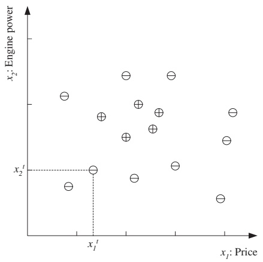

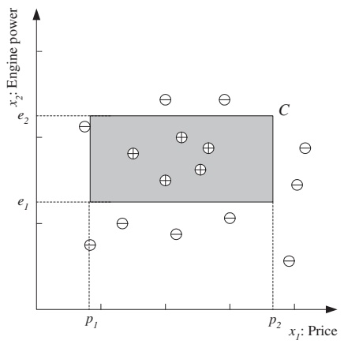

• Training set: $\mathcal { X }   =   \{ ( \mathbf { x } _ { n } , y _ { n } ) \} _ { n = 1 } ^ { N }$ where $\mathbf { x } _ { n }   \in   \mathbb { R } ^ { D }$ **is the nth input vector and** $y _ { n }   \in   \{ 0 , 1 \}$ **its class label.**

**• Classifier : a function h:** $\mathbb { R } ^ { D } \rightarrow \{ 0 , 1 \}$

**• Hypothesis (model) class H: the set of classifier functions we will use. Ideally, the true class distribution can be represented by a function in H (exactly, or with a small error).**

**• Having selected H, learning the classifier reduces to finding an optimal** $h \in \mathcal { H }$ **. We don’t know the true class regions, but we can approximate them by the empirical error :**

$$
E (h; \mathcal {X}) = \sum_ {n = 1} ^ {N} I (h (\mathbf {x} _ {n}) \neq y _ {n}) = \text {number of misclassified instances}
$$

**Multiclass classification (more than two classes)**

**• With K classes, we can code the label as an integer** $y   =   k   \in   \{ 1 , \ldots , K \}$ **, or as a one-of-K** (one-hot) binary vector $\mathbf { y } = ( y _ { 1 } , \ldots , y _ { K } ) ^ { T } \in \{ 0 , 1 \} ^ { K }$ **(containing a single 1 in position k).**

**• One approach for K-class classification: consider it as K two-class classification problems** $\left( \text{" one-vs-all " } \right)$ **, and minimize the total empirical error:**

$$
E (\{h _ {k} \} _ {k = 1} ^ {K}; \mathcal {X}) = \sum_ {n = 1} ^ {N} \sum_ {k = 1} ^ {K} I (h _ {k} (\mathbf {x} _ {n}) \neq y _ {n k})
$$

<!-- page: 6 -->

where $\mathbf { y } _ { n }$ is coded as one-of-K and $h _ { k }$ is the two-class classifier for problem k, i.e., $h _ { k } ( \mathbf { x } ) \in \{ 0 , 1 \}$

**• Ideally, for a given pattern x only one** $h _ { k } ( \mathbf { x } )$ **is one**. When no, or more than one, $h _ { k } ( \mathbf { x } )$ is one **then the classifier is in doubt and may reject the pattern.**

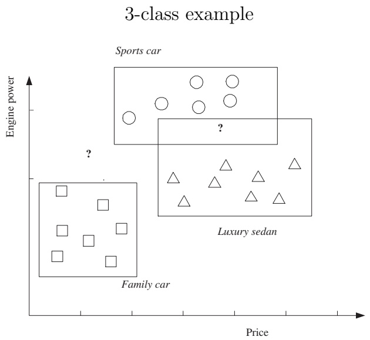

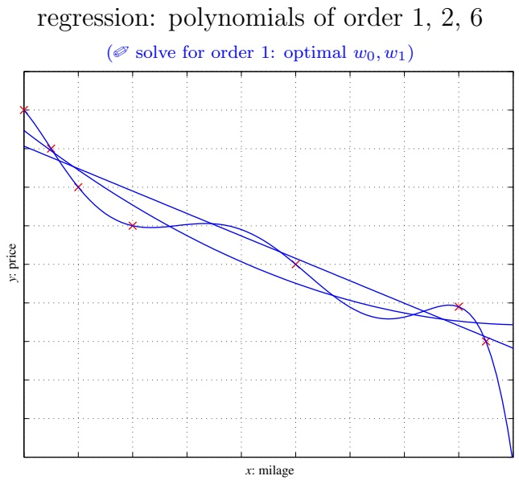

## Regression

• Training set $\mathcal { X } = \{ ( \mathbf { x } _ { n } , y _ { n } ) \} _ { n = 1 } ^ { N }$ 1 where the label for a pattern $\mathbf { x } _ { n } \in \mathbb { R } ^ { D }$ is a real value $y _ { n } \in \mathbb { R }$ In multivariate regression, $\mathbf { y } _ { n } \in \mathbb { R } ^ { d }$ **is a real vector.**

**• Regressor : a function h:** $\mathbb { R } ^ { D } \rightarrow \mathbb { R }$ **.** As before, we choose a hypothesis class $\mathcal { H }$ Ex: H= class of linear functions: $h ( \mathbf { x } ) = w _ { 0 } +$ w1x1 $+ \cdots + w _ { D } x _ { D } = \mathbf { w } ^ { T } \mathbf { x } + w _ { 0 }$

• Empirical error: $E ( h ; \mathcal { X } ) = \frac { 1 } { N } \sum _ { n = 1 } ^ { N } { ( y _ { n } - h ( \mathbf { x } _ { n } ) ) ^ { 2 } } =$ **sum of squared errors at each instance.**

**Other definitions of error possible, e.g. absolute error value instead of squared error (but harder to optimize).**

$\mathcal { Q }$ Find the optimal regression line for the case $D = 1 { \colon } h ( x ) = w _ { 1 } x + w _ { 0 }$

• Interpolation: we learn a function h that passes through each training pair $( \mathbf { x } _ { n } , y _ { n } ) { : } y _ { n } = h ( \mathbf { x } _ { n } )$ $n = 1 , \ldots , N$ **.** Not advisable if the data is noisy.

**Ex: polynomial interpolation (requires a polynomial of degree N − 1 with N points in general position).**

## Noise

**• Noise is any unwanted anomaly in the data. It can be due to:**

– Imprecision in recording the input attributes: $\mathbf { x } _ { n }$

– Errors in labeling the input vectors: $y _ { n }$

**– Attributes not considered that affect the label (hidden or latent attributes, may be unobservable).**

**• Noise makes learning harder.**

**• Should we keep the hypothesis class simple rather than complex? A simpler class:**

<!-- page: 7 -->

**– Is easier to use and to train (fewer parameters, faster).**

**– Is easier to explain or interpret.**

**– Has less variance in the learned model than for a complex class (less affected by single instances), but also has higher bias.**

**Given comparable empirical error, a simple model will generalize better than a complex one. (Occam’s razor : simpler explanations are more plausible; eliminate unnecessary complexity.) In the regression example, a line with low enough error may be preferable to a parabola with a slightly lower error.**

## Outlier (novelty, anomaly) detection

**• An outlier is an instance that is very different from the other instances in the sample. Reasons:**

**– Abnormal behaviour. Fraud in credit card transactions, intruder in network traffic, etc.**

**– Recording error. Faulty sensors, etc.**

**• Not usually cast as a two-class classification problem because there are typically few outliers and they don’t fit a consistent pattern that can be easily learned.**

**• Instead, “one-class classification”: fit a density** $p ( \mathbf { x } )$ **to non-outliers, then consider x as an outlier if** $p ( \mathbf { x } ) < \theta$ **for some threshold** $\theta > 0$ **(low-probability instance).**

**• We can also identify outliers as points that are far away from the training samples.**

## Estimation of missing values

**• For any given example x, the values of some features** $x _ { n } , \ldots , x _ { n }$ **may be missing.**

**• Strategies to deal with missing values in the training set:**

**– Discard examples having any missing values. Easy but throws away data.**

Fill in the missing values by estimating them (imputation). **Ex: mean imputation: impute feature d as its average value over the examples where it is present. Independent of the** present features in $\mathbf { x } _ { n }$

• Whether a feature is missing for $\mathbf { x } _ { n }$ may depend on the values of the other features at $\mathbf { x } _ { n }$ **Ex: in a census survey, rich people may wish not to give their salary.**

## Model selection and generalization

**• Machine learning problems (classification, regression and others) are typically ill-posed: the observed data is finite and does not uniquely determine the classification or regression function.**

**• In order to find a unique solution, and learn something useful, we must make assumptions (= inductive bias of the learning algorithm).**

**Ex: the use of a hypothesis class H; the use of the largest margin; the use of the least-squares objective function.**

**• We can always enlarge the class of functions that can be learned by using a larger hypothesis class H (higher capacity, or complexity of H).**

**Ex: a union of rectangles; a polynomial of order N.**

<!-- page: 8 -->

**• How to choose the right inductive bias, in particular the right hypothesis class H? This is the model selection problem.**

**• The goal of ML is not to replicate the training data, but to predict unseen data well, i.e., to generalize well.**

**• For best generalization, we should match the complexity of the hypothesis class H with the complexity of the function underlying the data:**

**– If H is less complex: underfitting. Ex: fitting a line to data generated from a cubic polynomial.**

**– If H is more complex: overfitting. Ex: fitting a cubic polynomial to data generated from a line.**

**• In summary, in ML algorithms there is a tradeoff between 3 factors:**

**– the complexity c(H) of the hypothesis class**

**– the amount of training data N**

**– the generalization error E**

**so that**

**– as N ↑, E ↓**

– as c(H) ↑, first E ↓ and then $E \uparrow$

**Cross-validation** Often used in practice to select among several hypothesis classes $\mathcal { H } _ { 1 } , \mathcal { H } _ { 2 } , \ldots$ Divide the available dataset into three disjoint parts (say, 1**each):**

**• Training set:**

– Used to train, i.e., to fit a hypothesis $h \in \mathcal { H } _ { i }$

**– Optimize parameters of h given the model structure and hyperparameters.**

**– Usually done with an optimization algorithm (the learning algorithm).**

**Ex: learn the weights of a neural net (with backpropagation); construct a k-nearest-neighbor classifier (by storing the training set).**

## • Validation set:

**– Used to minimize the generalization error.**

**– Optimize hyperparameters or model structure.**

– Usually done with a “grid search”. Ex: try all values of $H \in \{ 1 0 , 5 0 , 1 0 0 \}$ and $\lambda \in \{ 1 0 ^ { - 5 } , 1 0 ^ { - 3 } , 1 0 ^ { - 1 } \}$

**Ex: select the number of hidden units H, the architecture, the regularization parameter λ, or how long to train for a neural net; select k for a k-nearest-neighbor classifier.**

## • Test set:

**– Used to report the generalization error.**

**– We optimize nothing on it, we just evaluate the final model on it.**

**Then:**

1. For each class $\mathcal { H } _ { i } ,$ **fit its optimal hypothesis** $h _ { i }$ **using the training set.**

**2. Of all the optimal hypotheses, pick the one that is most accurate in the validation set. We can then train the selected one on the training and validation set together (useful if we have little data altogether).**

**3. Report its error in the test set.**

**Analogy: learning a subject. Training set: problems solved in class, validation set: exam problems, test set: professional-life problems.**

<!-- page: 9 -->

## Dimensions of a supervised ML algorithm

• We have a sample $\mathcal { X } = \{ ( \mathbf { x } _ { n } , y _ { n } ) \} _ { n = 1 } ^ { N }$ **(usually independent and identically distributed, “iid”) drawn from an unknown distribution.**

**• We want to learn a useful approximation to the underlying function that generated the data.**

**• We must choose:**

**1. A model** $h ( \mathbf { x } ; \Theta )$ **(hypothesis class) with parameters Θ. A particular value of Θ determines a particular hypothesis in the class. Ex: for linear models, Θ = slope w1 and intercept w**<strong>0</strong>**.**

**2. A loss function** $L ( \cdot , \cdot )$ **to compute the difference between the desired output (label)** $y _ { n }$ **and our prediction to it** $h ( \mathbf { x } _ { n } ; \Theta )$ **. Approximation error (loss):**

$$
E (\boldsymbol {\Theta}; \mathcal {X}) = \sum_ {n = 1} ^ {N} L (y _ {n}, h (\mathbf {x} _ {n}; \boldsymbol {\Theta})) = \text {sum of errors over instances}
$$

**Ex:** $0 / 1$ **loss for classification, squared error for regression.**

3. An optimization procedure (learning algorithm) to find parameters $\Theta ^ { * }$ **that minimize the error:**

$$
\Theta^ {*} = \underset {\Theta} {\arg \min} E (\Theta ; \mathcal {X})
$$

**Different ML algorithms differ in any of these choices.**

**• The model, loss and learning algorithm are chosen by the ML system designer so that:**

**– The model class is large enough to contain a good approximation to the underlying function that generated the data in X in a noisy form.**

**– The learning algorithm is efficient and accurate.**

**– We must have sufficient training data to pinpoint the right model.**

<!-- page: 10 -->

## 3 Bayesian decision theory

## Probability review: appendix A.

| Joint distribution: p(X=x, Y=y). |
| --- |
| Conditioning (product rule): p(Y=y \| X=x) = p(X=x, Y=y)/p(X=x). |
| Marginalizing (sum rule): p(X=x) = ∑y p(X=x, Y=y). |
| Bayes' theorem:(inverse probability) p(X=x \| Y=y) = p(Y=y \| X=x) p(X=x)/p(Y=y). |

**Probability theory (and Bayes’ rule) is the framework for making decisions under uncertainty. It can also be used to make rational decisions among multiple actions to minimize expected risk.**

## Classification

• Binary classification with random variables $\mathbf { x } \in \mathbb { R } ^ { D }$ (example) and $C \in \{ 0 , 1 \} { \mathrm { ~ ( l a b e l ) } }$

**– Joint probability** $p ( \mathbf { x } , C )$ **: how likely it is to observe an example x and a class label C.**

**– Prior probability** $p ( C )$ **: how likely it is to observe a class label C, regardless of x.**

$p ( C ) \geq 0$ and $p ( C = 1 ) + p ( C = 0 ) = 1$

**– Class likelihood** $p ( \mathbf { x } | C )$ **: how likely it is that, having observed an example with class label C, the example is at x.**

**This represents how the examples are distributed for each class. We need a model of x for each class.**

**– Posterior probability** $p ( C | \mathbf { x } )$ **: how likely it is that, having observed an example x, its class label is C.**

$$
p (C = 1 | \mathbf {x}) + p (C = 0 | \mathbf {x}) = 1.
$$

**This is what we need to classify x. We infer it from p(C) and** $p ( \mathbf { x } | C )$ **using Bayes’ rule.**

**– Evidence** $p ( \mathbf { x } ) ;$ **probability of observing an example x at all (regardless of its class).**

$$
\mathbf {x} \colon p (\mathbf {x}) = p (\mathbf {x} | C = 0) p (C = 0) + p (\mathbf {x} | C = 1) p (C = 1)
$$

– Bayes’ rule: posterior $= { \frac { \mathrm { p r i o r } \times \mathrm { l i k e l i h o o d } } { \mathrm { e v i d e n c e } } }$

$$
p (C | \mathbf {x}) = \frac {p (\mathbf {x} | C) p (C)}{p (\mathbf {x})} = \frac {p (\mathbf {x} | C) p (C)}{p (\mathbf {x} | C = 0) p (C = 0) + p (\mathbf {x} | C = 1) p (C = 1)}
$$

• Making a decision on a new example: given x, classify it as class 1 iff $p ( C = 1 | \mathbf { x } ) > p ( C = 0 | \mathbf { x } )$

**• Examples:**

– Gaussian classes in $\begin{array} { r } { \mathrm { 1 D } \colon p ( \mathbf { x } | C _ { k } ) = \frac { 1 } { \sqrt { 2 \pi } \sigma _ { k } } e ^ { - \frac { 1 } { 2 } \left( \frac { x - \mu _ { k } } { \sigma _ { k } } \right) ^ { 2 } } } \end{array}$

**– Exe 3.1: disease diagnosis based on a test.** Approx. as $\begin{array} { r } { p ( d = 1 | t = 1 ) \approx \stackrel { \sim } { p ( d = 1 ) } \frac { p ( t = 1 | d = 1 ) } { p ( t = 1 | d = 0 ) } } \end{array}$ **in terms of likelihood** ratio. How can we increase $p ( d = 1 | t \stackrel { \frown } { = } 1 ) ?$

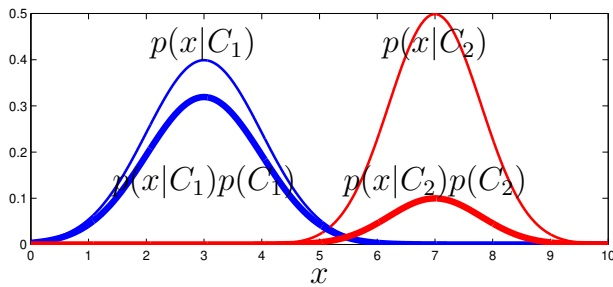

• K-class case: $C \in \{ 1 , \ldots , K \}$

– Prior probability: $p ( C _ { k } ) \geq 0 ,   k = 1 , \ldots , K$ , and $\begin{array} { r } { \sum _ { k = 1 } ^ { K } p ( C _ { k } ) = 1 } \end{array}$

(✐ p(C1|x) = ?)

– Class likelihood: $p ( \mathbf { x } | C _ { k } )$

– Bayes’ rule: $\begin{array} { r } { p ( C _ { k } | \mathbf { x } ) = \frac { p ( \mathbf { x } | C _ { k } ) p ( C _ { k } ) } { p ( \mathbf { x } ) } = \frac { p ( \mathbf { x } | C _ { k } ) p ( C _ { k } ) } { \sum _ { i = 1 } ^ { K } p ( \mathbf { x } | C _ { i } ) p ( C _ { i } ) } . } \end{array}$

– Choose as class arg $\operatorname* { m a x } _ { k = 1 , \ldots , K } p ( C _ { k } | \mathbf { x } )$

**• We learn the distributions** $p ( C )$ **and** $p ( \mathbf { x } | C )$ **for each class from data using an algorithm.**

• Naive Bayes classifier : a very simple classifier were we assume $p ( \mathbf { x } | C _ { k } ) = p ( x _ { 1 } | C _ { k } ) \cdots p ( x _ { D } | C _ { k } )$ for each class $k = 1 , \ldots , K , { \mathrm { i . e . } }$ **, within each class the features are independent from each other.**

<!-- page: 11 -->

## Losses and risks

**• Sometimes the decision of what class to choose for x based on** $p ( C _ { k } | \mathbf { x } )$ **has a cost that depends on the class. In that case, we should choose the class with lowest risk.**

**Ex: medical diagnosis, earthquake prediction.**

**• Define:**

$\lambda _ { i k } \colon$ **loss (cost) incurred for choosing class i when the input actually belongs to class k.**

– Expected risk for choosing class i: $R _ { i } ( \mathbf { x } ) = \sum _ { k = 1 } ^ { K } \lambda _ { i k }   p ( C _ { k } | \mathbf { x } ) .$

• Decision: we choose the class with minimum risk: arg $\operatorname* { m i n } _ { k = 1 , \ldots , K } R _ { k } ( \mathbf { x } )$

Ex: $C_{1} =  no cancer,   C_{2} =  cancer;   (\lambda_{ik}) = \begin{pmatrix} 0 1000 \\ 1 0 \end{pmatrix};   p(C_{1}|\mathbf{x}) = 0.8.   \text{1 } \text{2 } R_{1} = \text{?},   R_{2} = \text{? }$

**• Particular case: 0/1 loss.**

**– Correct decisions have no loss and all incorrect decisions are equally costly:**

$$
\lambda_ {i k} = 0 \text {if} i = k, 1 \text {if} i \neq k.
$$

$- \mathrm { T h e n } ^ { ? } R _ { i } ( \mathbf { x } ) = 1 - p ( C _ { i } | \mathbf { x } )$ **, hence to minimize the risk we pick the most probable class.**

**• Up to now we have considered K possible decisions given an input x (each of the K classes). When incorrect decisions (misclassifications) are costly, it may be useful to define an additional decision of reject or doubt (and then defer the decision to a human). For the** $0 / 1$ **loss:**

**– Define a cost** $\lambda _ { \mathrm { r e j e c t } , k } = \lambda \in ( 0 , 1 )$ **for rejecting an input that actually belongs to class k.**

– Risk of choosing class i: $\begin{array} { r } { R _ { i } ( \mathbf { x } ) = \sum _ { k = 1 } ^ { K } \lambda _ { i k } p ( C _ { k } | \mathbf { x } ) = 1 - p ( C _ { i } | \mathbf { x } ) } \end{array}$

Risk of rejecting: $\begin{array} { r } { R _ { \mathrm { r e j e c t } } ( \mathbf { x } ) = \sum _ { k = 1 } ^ { K } \lambda _ { \mathrm { r e j e c t } , k }   p ( C _ { k } | \mathbf { x } ) = \lambda . } \end{array}$

P**⇒ optimal decision rule (given by the minimal risk)?**: arg max $\{ p ( C _ { 1 } | \mathbf { x } ) , \ldots , p ( C _ { K } | \mathbf { x } ) , 1 - \lambda \}$ (so reject if max $\{ p ( C _ { 1 } | \mathbf { x } ) , \ldots , p ( C _ { K } | \mathbf { x } ) \} < 1 - \lambda )$

**– Extreme cases of λ:**

**∗ λ = 0: always reject (rejecting is less costly than a correct classification).**

**∗ λ = 1: never reject (rejecting is costlier than any misclassification).**

## Discriminant functions

**• Classification rule: choose arg max**<strong>k</strong>**=1,...,K g**<strong>k</strong>**(x) where we have a set of K discriminant functions** $g _ { 1 } , \ldots , g _ { K }$ **(not necessarily probability-based).**

**• Examples:**

– Risk based on Bayes’ classifier: $g _ { k } = - R _ { k }$

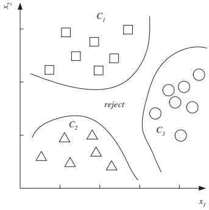

**– With the 0/1 loss:**

$$
g _ {k} (\mathbf {x}) = p (C _ {k} | \mathbf {x}), \text {or} ^ {?} g _ {k} (\mathbf {x}) = p (\mathbf {x} | C _ {k}) p (C _ {k}), \text {or} ^ {?} g _ {k} (\mathbf {x}) = \log p (\mathbf {x} | C _ {k}) + \log p (C _ {k}).
$$

**– Many others: SVMs, neural nets, etc.**

• They divide the feature space into K decision regions $\mathcal { R } _ { k }   =   \{ \mathbf { x } \mathbf { : } k   =   \arg \operatorname* { m a x } _ { i } g _ { i } ( \mathbf { x } ) \}$ $k =$ $1 , \ldots , K$ **.** The regions are separated by decision boundaries, where ties occur.

**• With two classes we can define a single discriminant?** $g ( \mathbf { x } ) = g _ { 1 } ( \mathbf { x } ) - g _ { 2 } ( \mathbf { x } )$ **and choose class 1** iff $g ( \mathbf { x } ) > 0$

<!-- page: 12 -->

Frequently Bought Together

This item: Introduction to Machine Learning (Adaptive Computation and Machine Learning series) by Ethem Alpaydin Hardcover \$49.99

An Introduction to Statistical Learning: with Applications in R (Springer Texts in Statistics) by Gareth James Hardcover \$61.97

The Elements of Statistical Learning: Data Mining, Inference, and Prediction, Second Edition (Springer ... by Trevor Hastie Hardcover \$62.82

## Association rules

**• Association rule: implication of the form** $X \to Y   ( X ;$ **antecedent, Y : consequent).**

**• Application: basket analysis (recommend product Y when a customer buys product X).**

• Define the following measures of the association rule $X \to Y ;$

$$
- \text {Support} = p (X, Y) = \frac {\# \text {purchases of} X \text {and} Y}{\# \text {purchases}}.
$$

**For the rule to be significant, the support should be large. High support means items X and Y are frequently bought together.**

$$
- \text {Confidence} = p (Y | X) = \frac {p (X , Y)}{p (X)} = \frac {\# \text {purchases of} X \text {and} Y}{\# \text {purchases of} X}.
$$

**For the rule to hold with enough confidence, should be** $\gg p ( Y )$ **and close to 1.**

**• Generalization to more than 2 items:** $X , Z \to Y$ **has confidence** $p ( Y | X , Z )$ **, etc.**

| purchase | items in basket |
| --- | --- |
| 1 | milk, bananas, chocolate |
| 2 | milk, chocolate |
| 3 | milk, bananas |
| 4 | chocolate |
| 5 | chocolate |
| 6 | milk, chocolate |

consider the following rules:

| association rule | support | confidence |
| --- | --- | --- |
| milk → bananas | 2/6 | 2/4 |
| bananas → milk | 2/6 | 2/2 |
| milk → chocolate | ? | ? |
| chocolate → milk etc. | ? | ? |

**• Given a database of purchases, we want to find all possible rules having enough support and confidence.**

## • Algorithm Apriori:

**1. Find itemsets with enough support (by finding frequent itemsets). We don’t need to enumerate all possible subsets of items: for** $( X , Y , Z )$ **to have enough support, all its subsets (X, Y ), (Y, Z), (X, Z) must have enough support?. Hence: start by finding frequent one-item sets (by doing a pass over the database). Then, inductively, from frequent k-item sets generate k + 1-item sets and check whether they have enough support (by doing a pass over the database).**

**2. Convert the found itemsets into rules with enough confidence (by splitting the itemset into antecedent and consequent). Again, we don’t need to enumerate all possible subsets: for** $\hat { X } \rightarrow \hat { Y } , Z$ **to have enough confidence,** $X , Y \to Z$ **must have enough confidence?. Hence: start by considering a single consequent and test the confidence for all possible single consequents (adding as a valid rule if it has enough confidence). Then, inductively, consider two consequents for the added rules; etc.**

**• A more general way to establish rules (which may include hidden variables) are graphical models.**

<!-- page: 13 -->

## Measuring classifier performance

## Binary classification problems (K = 2 classes)

\# misclassified patterns **• The most basic measure is the classification error (or accuracy) in %: # patterns**

**• It is often of interest to distinguish the different types of errors: confusing the positive class with the negative one, or vice versa.**

**Ex: voice authentication to log into a user account. A false positive (allowing an impostor) is much worse than a false negative (refusing a valid user).**

<table><tr><td></td><td colspan="3">Predicted class</td></tr><tr><td>True class</td><td>Positive</td><td>Negative</td><td>Total</td></tr><tr><td>Positive</td><td>tp: true positive</td><td>fn: false negative</td><td>p</td></tr><tr><td>Negative</td><td>fp: false positive</td><td>tn: true negative</td><td>n</td></tr><tr><td>Total</td><td> $p'$ </td><td> $n'$ </td><td>N</td></tr></table>

**• Having trained a classifier, we can control fn vs fp through a threshold** $\theta \in [ 0 , 1 ]$ **. Let** $C _ { 1 }$ **be the positive class and** $C _ { 2 }$ **the** negative class. If the classifier returns $p ( C _ { 1 } | \mathbf { x } )$ , let us choose the positive class if $p ( C _ { 1 } | \mathbf { x } ) > \theta$ (so $\theta = { \textstyle { \frac { 1 } { 2 } } }$ **gives the usual classifier):**

$-   \theta \approx 1$ **: almost always choose** $C _ { 2 } ,$ **nearly no false positives but nearly no true positives.**

**– Decreasing θ increases the number of true positives but risks introducing false positives.**

• ROC curve (“receiver operating curve”): the pair values (fp-rate,tp-rate) as a function of $\theta \in$ **[0, 1]. Properties:**

**– It is always increasing.**

**– An ideal classifier is at (0, 1) (top left corner).**

– Diagonal (fp-rate = tp-rate): random classifier, which outputs $p ( C _ { 1 } | \mathbf { x } )   =   u   \sim   U ( 0 , 1 ) ^ { ? }$ This is the worst we can do.

**– Any classifier that is below the diagonal can be improved by flipping its decision?**.

– For a dataset with N points, the ROC curve is really a set of N points $(fp-rate,tp-rate) ^{?}$ To construct it we don’t need to know the classifier, just its outputs $p ( C _ { 1 } | \mathbf { x } _ { n } ) \in [ 0 , 1 ]$ o n the points $\{ ( \mathbf { x } _ { n } , y _ { n } ) \} _ { n = 1 } ^ { N }$ of the dataset.

**• Area under the curve (AUC): reduces the ROC curve to a number. Ideal classifier: AUC = 1.**

**• ROC and AUC allow us to compare classifiers over different loss conditions, and choose a value of θ accordingly. Often, there is not a dominant classifier.**

(a) ROC curve; b) ROC curves for 3 classifiers

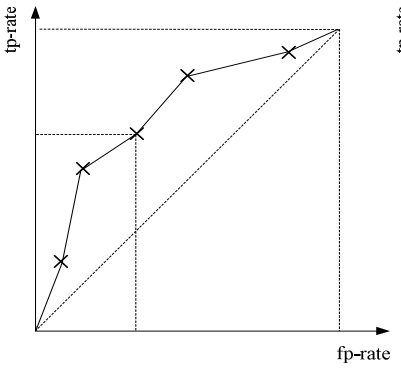

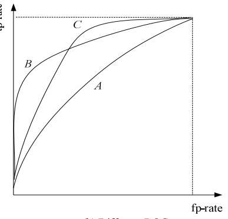

| Measure ∈ [0, 1] | Formula |
| --- | --- |
| error | $(fp + fn)/N$ |
| accuracy = 1- error | $(tp + tn)/N$ |
| tp-rate (hit rate) | $tp/p$ |
| fp-rate (false alarm rate) | $fp/n$ |
| precision | $tp/p'$ |
| recall = tp-rate | $tp/p$ |
| F-score | $\frac{precision \times recall}{(precision + recall)/2}$ |
| sensitivity = tp-rate | $tp/p$ |
| specificity = 1- fp-rate | $tn/n$ |

<!-- page: 14 -->

(a) Precision and recall

(c) Recall = 1

## Information retrieval

**We have a database of records (documents, images. . . ) and a query, for which some of the records are rel**evant (“positive”) and the rest are not $\left( ``negative''  \right)$ **A retrieval system returns K records for the query. Its performance is measured using a precision/recall curve:**

$$
\text {Precision:} \frac {\# \text {relevant retrieved records}}{\# \text {retrieved records}} \in [ 0, 1 ].
$$

$$
\text {Recall:} \frac {\# \text {relevant retrieved records}}{\# \text {relevant records}} \in [ 0, 1 ].
$$

**We can always achieve perfect recall by returning the entire database (but it will contain many irrelevant records).**

## K > 2 classes

**• Again, the most basic measure is the classification error.**

**• Confusion matrix :** $K \times K$ **matrix where entry** $( i , j )$ **contains the** number of instances of class $C _ { i }$ that are classified as $C _ { j }$

**• It allows us to identify which types of misclassification errors tend to occur, e.g. if there are two classes that are frequently confused. Ideal classifier: the confusion matrix is diagonal.**

**Precision & recall using Venn diagrams**

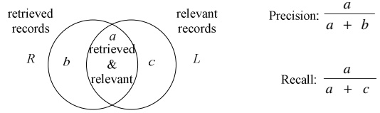

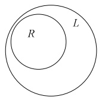

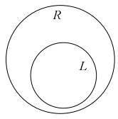

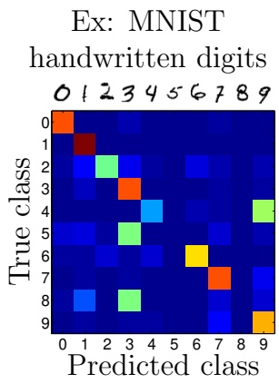

<!-- page: 15 -->

## 4 Univariate parametric methods

**• How to learn probability distributions from data (in order to use them to make decisions).**

**• We assume such distributions follow a particular parametric form (e.g. Gaussian), so we need to** estimate its parameters $( \mu ,   \sigma )$

| Joint distribution: p(X=x, Y=y). |
| --- |
| Conditioning (product rule): p(Y=y \| X=x) = p(X=x, Y=y)/p(X=x). |
| Marginalizing (sum rule): p(X=x) = ∑y p(X=x, Y=y). |
| Bayes' theorem:(inverse probability) p(X=x \| Y=y) = p(Y=y \| X=x) p(X=x)/p(Y=y). |
| X and Y are independent ⇔ p(X=x, Y=y) = p(X=x) p(Y=y). |

**• Several ways to learn them:**

**– by optimizing an objective function (e.g. maximum likelihood)**

**– by Bayesian estimation.**

**• This chapter: univariate case; next chapter: multivariate case.**

## Maximum likelihood estimation: parametric density estimation

• Problem: estimating a density $p ( x )$ . Assume an iid sample $\mathcal { X } = \{ x _ { n } \} _ { n = 1 } ^ { N }$ **drawn from a known probability density family** $p ( x ; \Theta )$ **with parameters Θ. We want to estimate Θ from X .**

• Log-likelihood of Θ given X : $\textstyle \mathcal { L } ( \mathbf { \Theta } ; \mathcal { X } ) = \operatorname { l o g } p ( \mathcal { X } ; \mathbf { \Theta } ) \stackrel { ? } { = } \operatorname { l o g } \prod _ { n = 1 } ^ { N } p ( x _ { n } ; \mathbf { \Theta } ) = \sum _ { n = 1 } ^ { N } \operatorname { l o g } p ( x _ { n } ; \mathbf { \Theta } ) .$

• Maximum likelihood estimate $( \mathit { M L E } ) \colon \mathbf { \Theta } _ { \mathrm { M L E } } = \arg \operatorname { m a x } _ { \mathbf { \Theta } } \mathcal { L } ( \mathbf { \Theta } ; \mathcal { X } )$

**• Examples:**

– Bernoulli: $\begin{array} { r } { \mathbf { \Theta } = \{ \theta \} ,   p ( x ; \theta ) = \theta ^ { x } ( 1 - \theta ) ^ { 1 - x } = \left\{ \begin{aligned} { } & { { } \theta , } & { \mathrm { i f ~ } x = 1 } \\ { } & { { } 1 - \theta , } & { \mathrm { i f ~ } x = 0 } \end{aligned} , ~ x \in \{ 0 , 1 \} , ~ \theta \in [ 0 , 1 ] . \right. } \end{array}$ **MLE?**: $\begin{array} { r } { \hat { \theta } = \frac { \# \mathrm { ~ o n e s } } { \# \mathrm { ~ t o s s e s } } = \frac { 1 } { N } \sum _ { n = 1 } ^ { N } x _ { n } } \end{array}$ **(sample average).**

– Gaussian: $\begin{array} { r } { \Theta = \{ \mu , \sigma ^ { 2 } \} ,   p ( x ; \mu , \sigma ^ { 2 } ) = \frac { 1 } { \sqrt { 2 \pi } \sigma } e ^ { - \frac { 1 } { 2 } \left( \frac { x - \mu } { \sigma } \right) ^ { 2 } } ,   x \in \mathbb { R } ,   \mu \in \mathbb { R } ,   \sigma \in \mathbb { R } ^ { + } . } \end{array}$ $\begin{array} { r } { \mathrm { M L E } ^ { ? } \mathrm { : ~ } \hat { \mu } = \frac { 1 } { N } \sum _ { n = 1 } ^ { N } x _ { n } } \end{array}$ (sample average), $\begin{array} { r } { \hat { \sigma } ^ { 2 } = \frac { 1 } { N } \sum _ { n = 1 } ^ { N } { ( x _ { n } - \hat { \mu } ) ^ { 2 } } } \end{array}$ **(**sample variance).

**For more complicated distributions, we usually need an algorithm to find the MLE.**

## The Bayes’ estimator: parametric density estimation

• **Consider the parameters Θ as random variables themselves (not as unknown numbers), and assume a prior distribution** $p ( \Theta )$ **over them (based on domain information): how likely it is for the parameters to take a value before having observed any data.**

• Posterior distribution $\begin{array} { r } { p ( \mathbf { \Theta } | \mathcal { X } ) = \frac { p ( \mathcal { X } | \mathbf { \Theta } ) p ( \mathbf { \Theta } ) } { p ( \mathcal { X } ) } = \frac { p ( \mathcal { X } | \mathbf { \Theta } ) p ( \mathbf { \Theta } ) } { \int p ( \mathcal { X } | \mathbf { \Theta } ^ { \prime } )   p ( \mathbf { \Theta } ^ { \prime } )   d \mathbf { \Theta } ^ { \prime } } ; } \end{array}$ **how likely it is for the parameters to take a value after having observed a sample X.**

• Resulting estimate for the probability at a new point $\textstyle x ^ { ? } { \colon }   p ( x | { \mathcal { X } } ) = \int p ( x | \mathbf { \Theta } )   p ( \mathbf { \Theta } | { \mathcal { X } } )   d \mathbf { \Theta }$ **. Hence, rather than using the prediction** R**of a single Θ value (“frequentist statistics”), we average the prediction of every parameter value Θ using its posterior distribution (“Bayesian statistics”).**

• **Approximations: reduce** $p ( \Theta | \mathcal { X } )$ **to a single point Θ.**

– Maximum a posteriori (MAP) estimate: $\mathbf { \Theta } _ { \mathrm { M A P } } = \operatorname { a r g } \operatorname { m a x } _ { \mathbf { \Theta } } p ( \mathbf { \Theta } | \mathcal { X } )$

**Particular case: if** $p ( \mathbf { \Theta } ) = { \mathrm { c o n s t a n t } }$ **, then** $p ( \mathbf { \Theta } | \mathcal { X } ) \propto p ( \mathcal { X } | \mathbf { \Theta } )$ **and MAP estimate = MLE.**

– Bayes’ estimator: $\begin{array} { r } { \mathbf { \Theta } _ { \mathrm { B a y e s } } = \operatorname { E } \left\{ \mathbf { \Theta } | \mathcal { X } \right\} = \int \mathbf { \Theta }   p ( \mathbf { \Theta } | \mathcal { X } )   d \mathbf { \Theta } . } \end{array}$

**Works well** $if $p ( \pmb { \Theta } | \mathcal { X } )$$ **is peaked around a single value.**

• Example: suppose $x _ { n } \sim \mathcal { N } ( \theta , \sigma ^ { 2 } )$ and $\theta \sim \mathcal { N } ( \mu _ { 0 } , \sigma _ { 0 } ^ { 2 } )$ where $\mu _ { 0 } , \sigma ^ { 2 } , \sigma _ { 0 } ^ { 2 }$ **are known. Then?**: $\begin{array} { r } { \mathrm { E } \left\{ \theta | \mathcal { X } \right\} = \frac { N / \sigma ^ { 2 } } { N / \sigma ^ { 2 } + 1 / \sigma _ { 0 } ^ { 2 } } \hat { \mu } + \frac { 1 / \sigma _ { 0 } ^ { 2 } } { N / \sigma ^ { 2 } + 1 / \sigma _ { 0 } ^ { 2 } } \mu _ { 0 } . } \end{array}$

• **Advantages and disadvantages of Bayesian learning:**

**✓ works well when the sample size N is small (if the prior is helpful).**

**✗ computationally harder (needs to compute, usually approximately, integrals or summations); needs to define a prior.**

<!-- page: 16 -->

## Maximum likelihood estimation: parametric classification

**• From ch. 3, for classes** $k = 1 , \ldots , K$ **, we use:**

$$
p (C _ {k} | x) = \frac {p (x | C _ {k}) p (C _ {k})}{p (x)} = \frac {p (x | C _ {k}) p (C _ {k})}{\sum_ {i = 1} ^ {K} p (x | C _ {i}) p (C _ {i})}
$$

discriminant function $g _ { k } ( x ) = p ( x | C _ { k } ) p ( C _ { k } )$

• Ex: assume $\begin{aligned} { x | C _ { k } \sim \mathcal { N } ( x ; \mu _ { k } , \sigma _ { k } ^ { 2 } ) } \\ \end{aligned}$ . Estimate the parameters from a data sample $\{ ( x _ { n } , y _ { n } ) \} _ { n = 1 } ^ { N }$ $- \; { \hat { p } } ( C _ { k } ) = \mathrm { p r o p o r t i o n }$ of $y _ { n }$ that are class k.

$- \; \hat { \mu } _ { k } ,   \hat { \sigma } _ { k } ^ { 2 } =$ **as the MLE above, separately for each class k.**

(a) Likelihoods

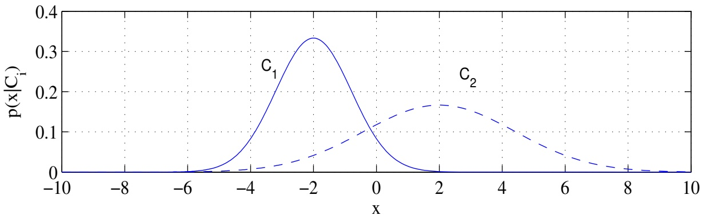

(b) Posteriors with equal priors

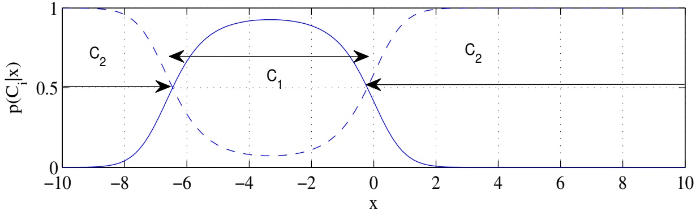

(c) Expected risks

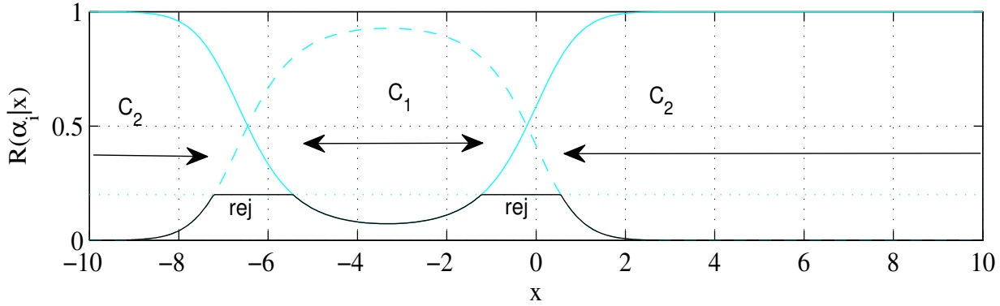

<!-- page: 17 -->

## Maximum likelihood estimation: parametric regression

**• Assume there exists an unknown function f that maps inputs x to outputs** $y = f(x)$ **, but that what we observe as output is a noisy version** $y   =   f ( x ) + \epsilon ,$ **where ǫ is an random error. We want to estimate f by a parametric function** $h ( x ; \Theta )$ **. In ch. 2 we saw the least-squares error was a good loss function to use for that purpose. We will now show that maximum likelihood estimation under Gaussian noise is equivalent to that.**

• Log-likelihood of Θ given a sample $\{ ( x _ { n } , y _ { n } ) \} _ { n = 1 } ^ { N }$ drawn iid from $p ( x , y )$

$$
\mathcal {L} (\boldsymbol {\Theta}; \mathcal {X}) = \log \prod_ {n = 1} ^ {N} p (x _ {n}, y _ {n}) \stackrel {?} {=} \sum_ {n = 1} ^ {N} \log p (y _ {n} | x _ {n}; \boldsymbol {\Theta}) + \text {constant}.
$$

• Assume an error $\epsilon \sim \mathcal { N } ( 0 , \sigma ^ { 2 } )$ , so $p ( y | x ) \sim \mathcal { N } ( h ( x ; \mathbf { \Theta } ) , \sigma ^ { 2 } )$ **. Then maximizing the log-likelihood is equivalent?**to minimizing $\begin{array} { r } { E ( \mathbf { \Theta } ; \mathcal { X } ) = \sum _ { n = 1 } ^ { N } { ( y _ { n } - h ( x _ { n } ; \mathbf { \Theta } ) ) ^ { 2 } } } \end{array}$ **, i.e., the least-squares error.**

**• Examples:**

**– Linear regression:** $h ( x ; w _ { 0 } , w _ { 1 } ) = w _ { 1 } x + w _ { 0 }$ **. LSQ estimate?**:

$$
\mathbf {w} = \mathbf {A} ^ {- 1} \mathbf {y}, \mathbf {A} = \left( \begin{array}{c c} 1 & \frac {1}{N} \sum_ {n = 1} ^ {N} x _ {n} \\ \frac {1}{N} \sum_ {n = 1} ^ {N} x _ {n} & \frac {1}{N} \sum_ {n = 1} ^ {N} x _ {n} ^ {2} \end{array} \right), \mathbf {w} = \binom{w _ {0}}{w _ {1}}, \mathbf {y} = \binom{\frac {1}{N} \sum_ {n = 1} ^ {N} y _ {n}}{\frac {1}{N} \sum_ {n = 1} ^ {N} y _ {n} x _ {n}}.
$$

– Polynomial regression: $h ( x ; w _ { 0 } , \ldots , w _ { k } ) = w _ { k } x ^ { k } + \cdots + w _ { 1 } x + w _ { 0 }$ **. The model is still linear** on the parameters. LSQ estimate also of the form $\mathbf { w } = \mathbf { A } ^ { - 1 } \mathbf { y }$

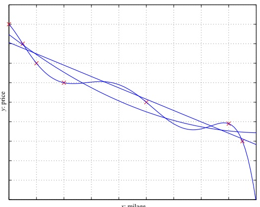

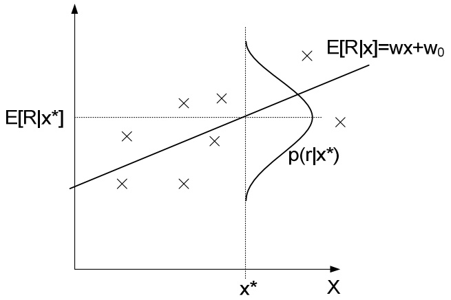

<!-- page: 18 -->

Cov(x1,x2)=0, Var(x1)>Var(x2)

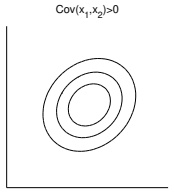

## 5 Multivariate parametric methods

• Sample $\mathcal { X } = \{ \mathbf { x } _ { n } \} _ { n = 1 } ^ { N }$ **where each example** $\mathbf { x } _ { n }$ **contains D features (continuous or discrete).**

**• We often write the sample (or dataset) as a matrix** $\mathbf { X } = \left( \mathbf { x } _ { 1 } , \ldots , \mathbf { x } _ { N } \right)$ **(examples = columns). Sometimes as its transpose (examples = rows).**

Review of important moments
For a sample:
  Mean vector: $\boldsymbol{\mu} = \frac{1}{N} \sum_{n=1}^{N} \mathbf{x}_n$.
  Covariance matrix: $\boldsymbol{\Sigma} = \frac{1}{N} \sum_{n=1}^{N} (\mathbf{x}_n - \boldsymbol{\mu})(\mathbf{x}_n - \boldsymbol{\mu})^T \stackrel{?}{=} \frac{1}{N} \sum_{n=1}^{N} \mathbf{x}_n \mathbf{x}_n^T - \boldsymbol{\mu} \boldsymbol{\mu}^T$.
  Symmetric of $D \times D$ with elements $\sigma_{ij}$, positive definite, diagonal = variances along each variable ($\sigma_{11} = \sigma_1^2, \ldots, \sigma_{DD} = \sigma_D^2$).
  Correlation matrix: $\text{corr}(X_i, X_j) = \frac{\sigma_{ij}}{\sigma_i \sigma_j} \in [-1, 1]$.
  If $\text{corr}(X_i, X_j) = 0$ (equivalently $\sigma_{ij} = 0$) then $X_i$ and $X_j$ are uncorrelated (but not necessarily independent).
  If $\text{corr}(X_i, X_j) = \pm 1$ then $X_i$ and $X_j$ are linearly related.
For a continuous distribution of the r.v. $\mathbf{x}$ (for a discrete distribution, replace $\int \to \Sigma$):
  Mean vector (expectation): $E\{\mathbf{x}\} = \int x p(\mathbf{x}) dx$.
  Covariance matrix: $\text{cov}\{\mathbf{x}\} = E\{(\mathbf{x} - E\{\mathbf{x}\})(\mathbf{x} - E\{\mathbf{x}\})^T\} \stackrel{?}{=} E\{\mathbf{x}\mathbf{x}^T\} - E\{\mathbf{x}\} E\{\mathbf{x}\}^T$.

## Review of the multivariate normal (Gaussian) distribution

- Density at $\mathbf{x} \in \mathbb{R}^D$: $p(\mathbf{x}) = |2\pi \boldsymbol{\Sigma}|^{-1/2} e^{-\frac{1}{2} (\mathbf{x} - \boldsymbol{\mu})^T \boldsymbol{\Sigma}^{-1} (\mathbf{x} - \boldsymbol{\mu})}$. E $\{\mathbf{x}\} = \boldsymbol{\mu}$ and cov $\{\mathbf{x}\} = \boldsymbol{\Sigma}$.
- Mahalanobis distance: $d_{\boldsymbol{\Sigma}}(\mathbf{x}, \mathbf{x}') = (\mathbf{x} - \mathbf{x}')^T \boldsymbol{\Sigma}^{-1} (\mathbf{x} - \mathbf{x}')$. $\boldsymbol{\Sigma} = \mathbf{I} \Rightarrow d_{\boldsymbol{\Sigma}}(\mathbf{x}, \mathbf{x}') = \| \mathbf{x} - \mathbf{x}'\|^2$ (Euclidean distance).
- Properties:
    - If $\boldsymbol{\Sigma}$ is diagonal $\Rightarrow$ the $D$ features are uncorrelated and independent: $p(\mathbf{x}) = p(x_1) \cdots p(x_D)$.
    - If $\mathbf{x}$ is Gaussian $\Rightarrow$ each marginal $p(x_i)$ and conditional distribution $p(x_i|x_j)$ is also Gaussian.
    - If $\mathbf{x} \sim \mathcal{N}_D(\boldsymbol{\mu}, \boldsymbol{\Sigma})$, $\mathbf{W}_{D \times K} \Rightarrow \mathbf{W}^T \mathbf{x} \sim \mathcal{N}_K(\mathbf{W}^T \boldsymbol{\mu}, \mathbf{W}^T \boldsymbol{\Sigma} \mathbf{W})$. A linear projection of a Gaussian is Gaussian.
- Widely used in practice because:
    - Its special mathematical properties simplify the calculations.
    - Many natural phenomena are approximately Gaussian.
    - Models well blobby distributions centered around a prototype vector $\boldsymbol{\mu}$ with a noise characterized by $\boldsymbol{\Sigma}$.
    It does make strong assumptions: symmetry, unimodality, non-heavy tails.

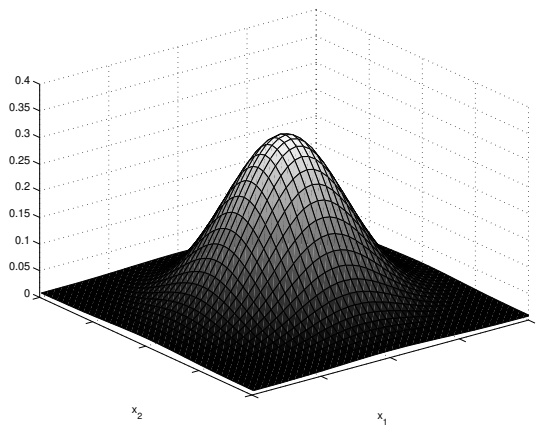

Cov(x1,x2)=0, Var(x1)=Var(x2)

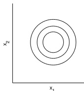

Cov(x1,x2)>0

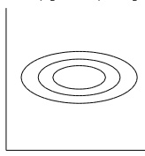

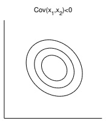

<!-- page: 19 -->

## Multivariate classification with Gaussian classes

Assume the class-conditional densities are Gaussian: $\mathbf { x } | C _ { k } \sim \mathcal { N } ( \pmb { \mu } _ { k } , \pmb { \Sigma } _ { k } )$ **. The maths carry over from the 1D case in a straightforward way:**

• $\mathrm { M L E ^ { ? } }$ : class proportions for $p ( C _ { k } )$ **; sample mean and sample covariance for** $\mu _ { k }$ **and** $\mathbf { \Sigma } _ { k } .$ **, resp.**

• Discriminant function $g _ { k } ( \mathbf { x } ) = \operatorname { l o g } p ( \mathbf { x } | C _ { k } ) + \operatorname { l o g } p ( C _ { k } ) \stackrel { ? } { = }$ **quadratic form on x.**

• Number of parameters per class $\scriptstyle k \; = \; 1 , \ldots , K : \; p ( C _ { k } ) : \; 1 ; \; \pmb { \mu } _ { k } : \; D ; \; \pmb { \Sigma } _ { k } : \; { \frac { D ( D + 1 ) } { 2 } } ? .$

**A lot of parameters for the covariances! Estimating them may need a large dataset.**

**Special cases, having fewer parameters:**

• Equal (“shared”) covariances: $\mathbf { \Sigma } _ { k } = \mathbf { \Sigma } \; \forall k$ **.** Total $\frac { D ( D { + } 1 ) } { 2 }$ parameters (instead of $K { \frac { D ( D + 1 ) } { 2 } } )$

–✐⇒ MLE for $\begin{array} { r } { \mathbf { \Sigma } = \sum _ { k = 1 } ^ { K } p ( C _ { k } ) \mathbf { \Sigma } _ { k } } \end{array}$ **, where Σ**<strong>k</strong> **= covariance matrix of class k.**

$\overset { ? } { \Rightarrow }$ **the discriminant** $g _ { k } ( \mathbf { x } )$ **becomes linear on x.**

– If, in addition, equal priors: $$p \big ( C _ { k } \big ) = \frac { 1 } { K }$ $\forall k ;$$ **Mahalanobis distance classifier** ⇒ assign x to the closest centroid $\mu _ { k }$ in Mahalanobis distance $( \mathbf { x } - \pmb { \mu } _ { k } ) ^ { T } \pmb { \Sigma } ^ { - 1 } ( \mathbf { x } - \pmb { \mu } _ { k } )$

• Equal, isotropic covariances: $\mathbf { \Sigma } _ { k } = \sigma ^ { 2 } \mathbf { I } \; \forall k$ **.** Total 1 parameter for all K covariances.

–✐⇒ MLE for $\begin{array} { r } { \sigma ^ { 2 } = \frac { 1 } { D } \sum _ { d = 1 } ^ { D } \sum _ { k = 1 } ^ { K } p ( C _ { k } ) \sigma _ { k d } ^ { 2 } , } \end{array}$ where $\sigma _ { k d } ^ { 2 } = d \mathrm { t h }$ diagonal element of $\boldsymbol { \Sigma } _ { k }$

**– If, in addition, equal priors: Euclidean distance classifier (“template matching”)**

$$
\stackrel {?} {\Rightarrow} g _ {k} (\mathbf {x}) = \left\| \mathbf {x} - \boldsymbol {\mu} _ {k} \right\| ^ {2} \Leftrightarrow g _ {k} (\mathbf {x}) = \boldsymbol {\mu} _ {k} ^ {T} \mathbf {x} - \frac {1}{2} \left\| \boldsymbol {\mu} _ {k} \right\| ^ {2}.
$$

If $\begin{array} { r } { \| \pmb { \mu } _ { k } \| ^ { 2 } = 1 \Rightarrow g _ { k } ( \mathbf { x } ) = \pmb { \mu } _ { k } ^ { T } \mathbf { x } \mathbf { : } } \end{array}$ **dot product classifier.**

• Diagonal covariances (not shared): $\mathbf { \Sigma } _ { k } = \mathrm { d i a g } \left( \sigma _ { k 1 } ^ { 2 } , \ldots , \sigma _ { k D } ^ { 2 } \right)$ **.** Total KD parameters. **This assumes the features are independent within each class, and gives a naive Bayes classifier.**

$- \stackrel { \mathcal { D } } { \Rightarrow } \mathrm { M L E }$ for $\sigma _ { k d } ^ { 2 } = d \mathrm { t h }$ **diagonal element of** $\mathbf { \Sigma } _ { k } = { \mathrm { v a r i a n c e } }$ **of class k for feature d.**

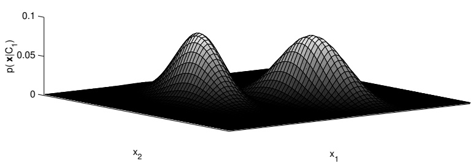

$\mathbf { \Sigma } _ { 1 } \neq \mathbf { \Sigma } _ { 2 } ,$ full

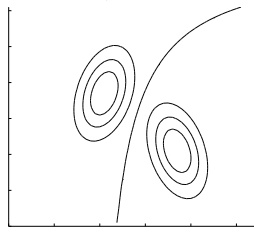

$$
\Sigma_ {1} = \Sigma_ {2},
$$

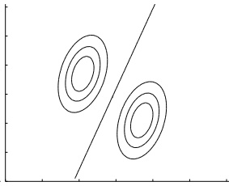

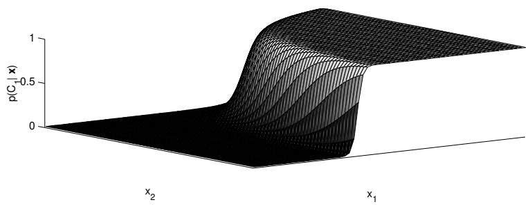

$\mathbf { \Sigma } _ { 1 } = \mathbf { \Sigma } _ { 2 }$ , diagonal

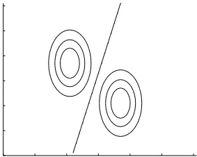

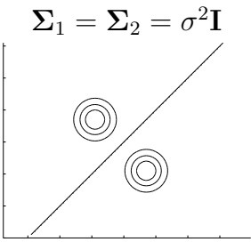

<!-- page: 20 -->

## Tuning complexity

**• Again a bias-variance dilemma:**

– Two few parameters $(e.g. $\mathbf { \Sigma } _ { 1 } = \mathbf { \Sigma } _ { 2 } = \sigma ^ { 2 } \mathbf { I } )$$ **: high bias.**

**– Too many parameters** $(e.g. $\pmb { \Sigma } _ { 1 } \neq \pmb { \Sigma } _ { 2 } ,$ full)$ **: high variance.**

**• We can use cross-validation, regularization, Bayesian priors on the covariances, etc.**

## Discrete features with Bernoulli distributions

• Assume that, in each class k, (1) the features are independent and (2) each feature $d = 1 , \ldots , D$ is Bernoulli with parameter $\theta _ { k d } ;$

$$
p (\mathbf {x} | C _ {k}) \stackrel {(1)} {=} \prod_ {d = 1} ^ {D} p (x _ {d} | C _ {k}) \stackrel {(2)} {=} \prod_ {d = 1} ^ {D} \theta_ {k d} ^ {x _ {d}} (1 - \theta_ {k d}) ^ {1 - x _ {d}} \qquad \mathbf {x} \in \{0, 1 \} ^ {D}.
$$

**– This is a naive Bayes classifier. Its discriminant** $g _ { k } ( \mathbf { x } )$ **is linear?(but x is binary).**

– MLE: class proportions for $p ( C _ { k } )$ ; sample mean for $\theta _ { k d }$

**• Works well with document categorization (e.g. classifying news reports into politics, sports and fashion) and spam filtering (classifying email messages into spam or non-spam). We typically represent a document as a bag of words vector x: given a predetermined dictionary of D words, x is a binary vector of dimension D where** $x _ { d } = 1$ **iff word d is in the document.**

## Multivariate regression

• Linear regression where $\mathbf { x } \in \mathbb { R } ^ { D } ;   y = f ( \mathbf { x } ) + \epsilon { \mathrm { ~ w i t h ~ } } f ( \mathbf { x } ) = w _ { D } x _ { D } + \cdots + w _ { 1 } x _ { 1 } + w _ { 0 } = \mathbf { w } ^ { T } \mathbf { x }$ (where we define $x _ { 0 } = 1 )$ **.**

**• The maths carry over from the 1D case in a straightforward way:**

**– Least-squares error (or equivalently maximum likelihood where ǫ is Gaussian with zero** mean and constant variance): $\begin{array} { r } { E ( \mathbf { \widetilde { w } } ) = \sum _ { n = 1 } ^ { N } { ( y _ { n } - \mathbf { w } ^ { T } \mathbf { x } _ { n } ) ^ { 2 } } } \end{array}$

**– The error E is quadratic on w. Equating the derivatives of E wrt w (the gradient) to 0 we obtain the normal equations (a linear system for w):**

$$
\frac {\partial E}{\partial \mathbf {w}} = - 2 \sum_ {n = 1} ^ {N} \left(y _ {n} - \mathbf {w} ^ {T} \mathbf {x} _ {n}\right) \mathbf {x} _ {n} = \mathbf {0} \Rightarrow \left(\sum_ {n = 1} ^ {N} \mathbf {x} _ {n} \mathbf {x} _ {n} ^ {T}\right) \mathbf {w} = \sum_ {n = 1} ^ {N} y _ {n} \mathbf {x} _ {n} \Rightarrow (\mathbf {X X} ^ {T}) \mathbf {w} = \mathbf {X y}
$$

where $\mathbf { X } _ { D \times N } = ( \mathbf { x } _ { 1 } , \ldots , \mathbf { x } _ { N } ) , \: \mathbf { w } _ { D \times 1 } = ( w _ { 0 } , \ldots , w _ { D } ) ^ { T } , \: \mathbf { y } _ { N \times 1 } = ( y _ { 1 } , \ldots , y _ { N } ) ^ { T } .$

**• Inspecting the resulting values of the model parameters can give insights into the data:**

– the sign of $w _ { d }$ tells us whether $x _ { d }$ has a positive or negative effect on $y ;$

**– the magnitude of** $w _ { d }$ **tells us how influential** $x _ { d }$ **is (if** $x _ { 1 } , \ldots , x _ { D }$ **all have the same range).**

• With multiple outputs $\mathbf { y }   =   ( y _ { 1 } , \ldots , y _ { D ^ { \prime } } ) ^ { T }$ , the linear regression $\mathbf { y }   =   \mathbf { f } ( \mathbf { x } ) + \mathbf { \epsilon }$ **is equivalently** defined as $D ^ { \prime }$ **independent single-output regressions.**

$\textstyle E ( \mathbf { W } ) = \sum _ { n = 1 } ^ { N } \| \mathbf { y } _ { n } - \mathbf { W } \mathbf { x } _ { n } \| ^ { 2 }$ **. Taking ∂E**∂W = 0 gives (XXT )W = XYT with $\mathbf { Y } _ { D ^ { \prime } \times N } = ( \mathbf { y } _ { 1 } , \ldots , \mathbf { y } _ { N } )$ and $\mathbf { W } _ { D ^ { \prime } \times D }$

**• We can fit a nonlinear function** $h ( \mathbf { x } )$ **similarly to a linear regression by defining additional,** nonlinear features such as $x_{2} = x^{2},   x_{3} = e^{x}$ **, etc. (just as happens with polynomial regression).** Then, using a linear model in the augmented space $\mathbf { x } \; = \; ( x , x ^ { 2 } , e ^ { x } ) ^ { T }$ **will correspond to a nonlinear model in the original space x. Radial basis function networks, kernel SVMs. . .**

<!-- page: 21 -->

## 6 Bias, variance and model selection

## Evaluating an estimator: bias and variance

**• Example: assume a Bernoulli distribution** $p ( x ; \theta )$ **with true** $\mathcal { X } _ { 1 } = 1 , 1 , 0 , 0 , 0 , 0 , 0 , 0 , 1 , 1 \rightarrow \hat { \theta } = 0 . 4$ parameter $\theta   =   0 . 3$ **We want to estimate θ from a sample** $\mathcal { X } _ { 2 } = 0 , 1 , 0 , 0 , 1 , 0 , 0 , 0 , 0 , 0 \rightarrow \hat { \theta } = 0 . 2$ $\{ x _ { 1 } , \ldots , x _ { N } \}$ of N iid tosses using $\begin{array} { r } { \hat { \theta } = \frac { 1 } { N } \sum _ { n = 1 } ^ { N } x _ { n } } \end{array}$ **as estimator.**

**Indeed,** $\hat { \theta }$ **is a r.v. with a certain average and variance (over all possible samples X ). We’d like its average to be close to θ and its variance to be small.**

Another ex: repeated measurements of your weight $x \in \mathbb { R }$ in a balance, assuming $x \sim \mathcal { N } ( \mu , \sigma ^ { 2 } )$ and an estimator $\begin{array} { r } { \hat { \mu } = \frac { 1 } { N } \sum _ { n = 1 } ^ { N } x _ { n } . } \end{array}$

**• Statistic** $\phi ( \mathcal { X } )$ **: any value that is calculated from a sample X (e.g. average, maximum. . . ). It is a** r.v. with an expectation (over samples) $\operatorname { E } _ { \mathcal { X } } \left\{ \phi ( \mathcal { X } ) \right\}$ and a variance $\operatorname { E } _ { \mathcal { X } } \left\{ ( \phi ( \mathcal { X } ) - \operatorname { E } _ { \mathcal { X } } \left\{ \phi ( \mathcal { X } ) \right\} ) ^ { 2 } \right\}$ **Ex.: if the sample X has N points x**<strong>1</strong>**, . . . , x**<strong>N</strong> **: E**<strong>X</strong> **{φ(X)} =**Z **φ(x**<strong>1</strong>**, . . . , x**<strong>N</strong> **) p(x**<strong>1</strong>**, . . . , x**<strong>N</strong> **) dx**<strong>1</strong> **. . . dx**<strong>N</strong>**iid=**Z **φ(x**<strong>1</strong>**, . . . , x**<strong>N</strong> **) p(x**<strong>1</strong>**) . . . p(x**<strong>N</strong> **) dx**<strong>1</strong> **. . . dx**<strong>N</strong> **.**

$\mathcal { X } = ( x _ { 1 } , \ldots , x _ { N } )$ **iid sample from** $p ( x ; \theta )$ **. Let** $\phi ( \mathcal { X } )$ **be an estimator for θ. How good is it?** mean square error of the estimator φ: error $( \phi , \theta ) = \operatorname { E } _ { \mathcal { X } } \left\{ ( \phi ( \mathcal { X } ) - \theta ) ^ { 2 } \right\}$

**• Bias of the estimator:** $b _ { \theta } ( \phi ) = \operatorname { E } _ { \mathcal { X } } \left\{ \phi ( \mathcal { X } ) \right\} - \theta .$ **. How much the expected value of the estimator over samples differs from the true parameter value. If** $b _ { \theta } ( \phi ) = 0$ **for all θ values: unbiased estimator.**

Ex: the sample average $\begin{array} { r } { \overline { { x } } = \frac { 1 } { N } \sum _ { n = 1 } ^ { N } } \end{array}$ xn is an unbiased estimator of the true mean $\mu ^ { ? } ,$ , regardless of the distribution $p ( x )$ **. The** sample variance $\textstyle \frac { 1 } { N } \sum _ { n = 1 } ^ { N } \overset { \kappa } { ( x _ { n } - \overline { { x } } ) ^ { 2 } }$ **is a** [**biased**](http://en.wikipedia.org/wiki/Variance#Sample_variance) **estimator of the true variance?**.

• Variance of the estimator: var $\{ \phi \}   =   \operatorname { E } _ { \mathcal { X } } \left\{ ( \phi ( \mathcal { X } ) - \operatorname { E } _ { \mathcal { X } } \left\{ \phi ( \mathcal { X } ) \right\} ) ^ { 2 } \right\}$ **. How much the estimator varies around its expected value from one sample to another.** variance

If var $\{ \phi \} \rightarrow 0$ as $N \to \infty ;$ consistent estimator. **Ex: the sample average is a consistent estimator of the true mean?**

**• Bias-variance decomposition:**

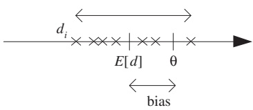

$$
\mathrm{error} (\phi , \theta) = \mathrm{E} _ {\mathcal {X}} \left\{(\phi - \theta) ^ {2} \right\} \stackrel {?} {=} \underbrace {\mathrm{E} _ {\mathcal {X}} \left\{(\phi - \mathrm{E} _ {\mathcal {X}} \{\phi \}) ^ {2} \right\}} _ {\text {variance}} + \underbrace {(\mathrm{E} _ {\mathcal {X}} \{\phi \} - \theta) ^ {2}} _ {\text {bias} ^ {2}} = \mathrm{var} \left\{\phi \right\} + b _ {\theta} ^ {2} (\phi).
$$

**We want estimators that have both low bias and low variance; this is difficult.**

• Ex: assume a Gaussian distribution $p ( x ; \mu , \sigma ^ { 2 } )$ . We want to estimate µ from a sample $\{ x _ { 1 } , \ldots , x _ { N } \}$ of N iid tosses using each of the following estimators: $\begin{array} { r } { \hat { \mu } = \frac { 1 } { N } \sum _ { n = 1 } ^ { N } x _ { n } ,   \hat { \mu } = 7 ,   \hat { \mu } = x _ { 1 } ,   \hat { \mu } = x _ { 1 } x _ { 2 } . } \end{array}$ $\mathcal { Q }$ **What is their bias, variance and error?**

**Illustration: estimate the bullseye location given the location of N shots at it.**

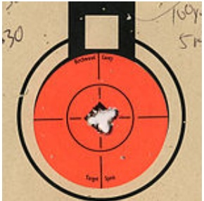

bias↓, var↓

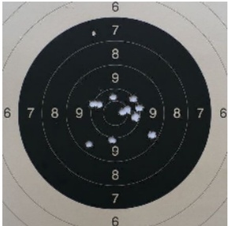

bias↓, var↑

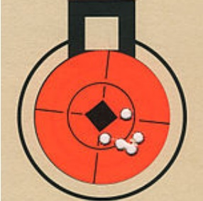

bias↑, var↓

all over the place outside the picture

bias↑, var↑

<!-- page: 22 -->

## Tuning model complexity: bias-variance dilemma

## The ideal regression function: the conditional mean $\operatorname { E } \left\{ y | x \right\}$

**• Consider the regression setting with a true, unknown regression function f and additive noise ǫ:** $y = f ( x ) + \epsilon$ . Given a sample $\mathcal { X } = \{ ( x _ { n } , y _ { n } ) \} _ { n = 1 } ^ { N }$ drawn iid from $p ( x , y )$ , we construct a regres**sion estimate** $h ( x )$ **. Then, for any h:**

$$
\text {Expected square error at} x \colon \mathrm{E} \left\{(y - h (x)) ^ {2} | x \right\} \stackrel {?} {=} \underbrace {\mathrm{E} \left\{(y - \mathrm{E} \{y | x \}) ^ {2} | x \right\}} _ {\text {noise}} + \underbrace {(\mathrm{E} \{y | x \} - h (x)) ^ {2}} _ {\text {squared error wrt E} \{y | x \}}.
$$

**The expectations are over the joint density p(x, y) for fixed x, or, equivalently?, over p(y|x).**

**– Noise term: variance of y given x. Equal to the variance of the noise ǫ added, independent of h or X . Can never be removed no matter which estimator we use.**

**– Squared error term: how much the estimate** $h ( x )$ **deviates (at each x) from the regression function** $\operatorname { E } \left\{ y | x \right\}$ **.** Depends on h and X . It is zero if $h(x) = \mathrm{E}\left\{ y | x \right\}$ for each x.

**The ideal?, optimal regression function is** $h(x) = f(x) = \mathrm{E}\left\{ y | x \right\}$ **(conditional mean of** $p ( y | x ) )$ **.**

## The bias-variance decomposition with the estimator of a curve f

**• Consider** $h ( x )$ **as an estimate (for each x) of the true** $f ( x )$ **. Bias-variance decomposition at x:**

$$
\mathrm{E} _ {\mathcal {X}} \left\{\left(\mathrm{E} \left\{y | x \right\} - h (x)\right) ^ {2} | x \right\} = \underbrace {\left(\mathrm{E} \left\{y | x \right\} - \mathrm{E} _ {\mathcal {X}} \left\{h (x) \right\}\right) ^ {2}} _ {\text {bias} ^ {2}} + \underbrace {\mathrm{E} _ {\mathcal {X}} \left\{\left(h (x) - \mathrm{E} _ {\mathcal {X}} \left\{h (x) \right\}\right) ^ {2} \right\}} _ {\text {variance}}.
$$

**The expectation** $\operatorname { E } _ { \mathcal { X } } \left\{ \cdot \right\}$ **is over samples X of size N drawn from** $p ( x , y )$ **.** The other expectations are over $p ( y | x )$

**– Bias: how much** $h ( x )$ **is wrong on average over different samples.**

**– Variance: how much h(x) fluctuates around its expected value as the sample varies.**

**We want both to be small. Ex: let** $h _ { m }$ **be the estimator using a sample** $\mathcal { X } _ { m }$ **:**

$- h _ { m } ( x ) = 2$ **∀x (constant fit): zero var, high bias (unless** $f ( x ) \approx 2 \; \forall x )$ **, high total error.**

$\begin{array} { r } { - \; h _ { m } ( x ) = \frac { 1 } { N } \sum _ { n = 1 } ^ { N } y _ { n } ^ { ( m ) } } \end{array}$ (average of sample $\mathcal { X } _ { m } )$ **: higher var, lower bias, lower total error.**

**– h**<strong>m</strong>**(x) = polynomial of degree k: if k ↑ then bias↓, var↑.**

**• Low bias requires sufficiently flexible models, but flexible models have high variance. As we increase complexity, bias decreases (better fit to data) and variance increases (fit varies more with data). The optimal model has the best trade-off between bias and variance.**

**– Underfitting: model class doesn’t contain the solution (it is not flexible enough) ⇒ bias.**

**– Overfitting: model class too general and also learns the noise ⇒ variance.**

**Also, the variance due to the sample decreases as the sample size increases.**

<!-- page: 23 -->

## Model selection procedures

**• Methods to find the model complexity that is best suited to the data.**

**• Cross-validation: the method most used in practice. We cannot calculate the bias and variance (since we don’t know the true function** $f )$ **, but we can estimate the total error.**

Given a dataset $\mathcal { X } ,$ divide it into 3 disjoint parts (by sampling at random without replacement from $\mathcal { X } )$ as training, validation and test sets: T , V and $\mathcal { T } ^ { \prime }$

**– Train candidate models of different complexities on** $\mathcal { T }$ **.** Ex: polynomials of degree $0 , 1 , \ldots , K$

**– Pick the trained model that gives lowest error on V. This is the final model.**

– Estimate the generalization error of the final model by its error on $\mathcal { T } ^ { \prime }$

**If X is small in sample size, use K-fold cross-validation, to make better use of the available data.**

**This works because, as the model complexity increases:**

**– the training error keeps decreasing;**

**– the validation error first decreases then increases (or stays about constant).**

**• Regularization: instead of minimizing just the error on the data, minimize error + penalty:**

$$
\min _ {h} \sum_ {n = 1} ^ {N} (y _ {n} - h (x _ {n})) ^ {2} + \lambda C (h)
$$

**where** $C ( h ) \geq 0$ **measures the model complexity and** $\lambda \geq 0$ **. Ex:**

Model selection criteria (AIC, BIC. . . ): C(h) ∝ number of parameters in h (model size). **λ is set to a certain constant depending on the criterion. We try multiple model sizes.**

Smoothness penalty: e.g. $\begin{array} { r } { C ( h ) = \sum _ { i = 0 } ^ { k } w _ { i } ^ { 2 } } \end{array}$ for polynomials of degree k, $\begin{array} { r } { h ( x ) = \sum _ { i = 0 } ^ { k } w _ { i } x ^ { i } } \end{array}$ P**λ is set by cross-validation. We try a single, relatively large model size.**

<!-- page: 24 -->

Task: regression problem in 1D using polynomials of degree $k = 0 , 1 , \ldots , K ;$ $\widetilde { p _ { k } ( x ; \{ a _ { i } \} _ { i = 0 } ^ { k } ) }   =   \widetilde { \sum } _ { i = 0 } ^ { k } a _ { i } x ^ { i }$ . Training, validation and test datasets picked at random from all available data points.

$$
\mathrm{RMSE} = \sqrt {\frac {1}{N} \sum_ {n = 1} ^ {N} (y _ {n} - p _ {k} (x _ {n})) ^ {2}}.
$$

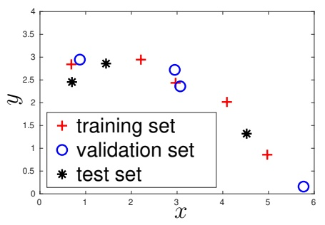

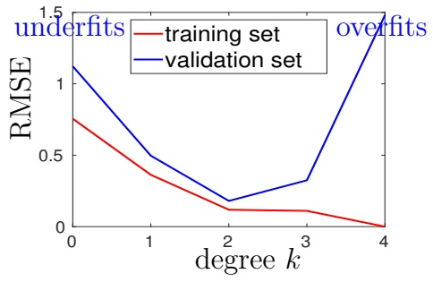

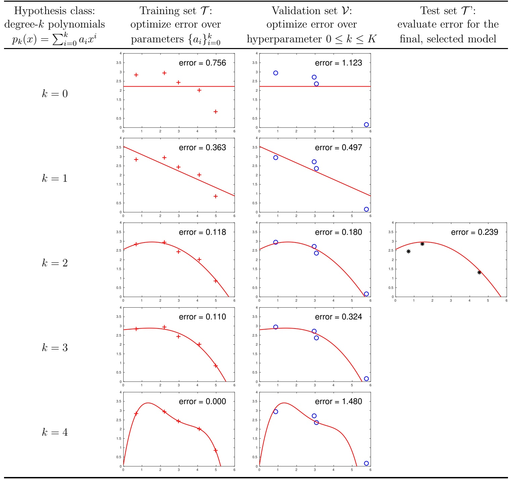

<!-- page: 25 -->

## 7 Nonparametric methods

## Parametric methods

**• Examples:**

– Linear function $f ( x ; \mathbf { \Theta } ) = w _ { 1 } x + w _ { 0 } ( \mathbf { \Theta } = \{ w _ { 0 } , w _ { 1 } \} )$

– Gaussian distribution $\begin{array} { r } { p ( x ; \mathbf { \Theta } ) = \frac { 1 } { \sqrt { 2 \pi } \sigma } e ^ { - \frac { 1 } { 2 } \left( \frac { x - \mu } { \sigma } \right) ^ { 2 } } ( \mathbf { \Theta } = \{ \mu , \sigma ^ { 2 } \} ) } \end{array}$

– Gaussian mixture $\begin{array} { r } { p ( \mathbf { x } ; \mathbf { \Theta } ) = \sum _ { k = 1 } ^ { K } p ( \mathbf { x } | k ) p ( k ) ( \mathbf { \Theta } = \{ \pi _ { k } , \pmb { \mu } _ { k } , \pmb { \Sigma } _ { k } \} _ { k = 1 } ^ { K } ) . } \end{array}$

**• Training is the process of choosing the best parameter values Θ from a given dataset.**

**• The size of the parameters is separate and smaller from the size of the training set N. The model “compresses” the dataset into the parameters Θ, and the complexity of the model doesn’t grow with N. Ex: a linear function** $f ( x ) = w _ { 1 } x + w _ { 0 }$ **has 2 parameters** $( w _ { 0 } , w _ { 1 } )$ **regardless of the size N of the training set.**

**• After training, we discard the dataset, and use only the parameters to apply the model to** future data. Ex: keep the 2 parameters $( w _ { 0 } , w _ { 1 } )$ of the learned linear function and discard the training set $\{ ( x _ { n } , y _ { n } ) \} _ { n = 1 } ^ { N }$

**• There are user parameters: number of components K, regularization parameter λ, etc.**

**• The hypothesis space is restricted: only models of a certain parametric form (linear, etc.).**

**• Small complexity at test time as a function of N: both memory and time are Θ(1).**

## Nonparametric methods

**• There is no training.**

**• The size of the model is given by the size of the dataset N, hence the complexity of the model can grow with N.**

**• We keep the training set, which we need to apply the model to future data.**

**• There are user parameters: number of neighbors k or kernel bandwidth h.**

**• The hypothesis space is less restricted (fewer assumptions). Often based on a smoothness assumption: similar instances have similar outputs, and the output for an instance is a local function of its neighboring instances. Essentially, the model behaves like a lookup table that we use to interpolate future instances.**

**• Large complexity at test time as a function of N: both memory and time are** $\Theta ( N )$ **, because we have to store all training instances and look through them to make predictions.**

**• They are particularly preferable to parametric methods with small training sets, where they give better models and are relatively efficient computationally.**

**• Also called instance-based or memory-based learning algorithms.**

**• Examples: kernel density estimate, nearest-neighbor classifier, running mean smoother, etc.**

<!-- page: 26 -->

## Nonparametric density estimation

• Given a sample $\mathcal { X }   =   \{ \mathbf { x } _ { n } \} _ { n = 1 } ^ { N }$ **drawn iid from an unknown density, we want to construct an estimator** $p ( \mathbf { x } )$ **of the density.**

**• Histogram (consider first** $x \in \mathbb { R } )$ **: split the real line into bins** $[ x _ { 0 } + m h , x _ { 0 } + ( m + 1 ) h ]$ **of width h for** $m \in \mathbb { Z }$ **, and count points in each bin:**

$$
p (x) = \frac {1}{N h} \text {(number of} x _ {n} \text {in the same bin as} x) \qquad x \in \mathbb {R}.
$$

– We need to select the bin width h and the origin $x _ { 0 }$

**–** $x _ { 0 }$ **has a small but annoying effect on the histogram (near bin boundaries).**

**– h controls the histogram smoothness: spiky if** $h \downarrow$ **and smooth if h ↑.**

$p ( x )$ **is discontinuous at bin boundaries.**

**– We don’t have to retain the training set once we have computed the counts.**

– They generalize to D dimensions, but are practically useful only for $D \lesssim 2$ **In D dimensions, it requires an exponential number of bins, most of which are empty.**

**• Kernel density estimate (Parzen windows): generalization of histograms to define smooth, multivariate density estimates. Place a kernel** $K ( \cdot )$ **on each data point and sum them:**

$$
p (\mathbf {x}) = \frac {1}{N h ^ {D}} \sum_ {n = 1} ^ {N} K \left(\frac {\mathbf {x} - \mathbf {x} _ {n}}{h}\right) \quad \mathbf {x} \in \mathbb {R} ^ {D} \quad \text {``sum of bumps''}.
$$

– K must satisfy $K ( \mathbf { x } ) \geq 0 \; \forall \mathbf { x } \in \mathbb { R } ^ { D }$ and $\begin{array} { r } { \int _ { \mathbb { R } } K ( \mathbf { x } )   d \mathbf { x } = 1 } \end{array}$ **.** Typic. K is Gaussian or uniform. **Gaussian: K** $\textstyle \overline { { \left( \frac { \mathbf { x } - \mathbf { x } _ { n } } { h } \right) } } = ( 2 \pi ) ^ { - D / 2 } \operatorname { e x p } \left( - \frac { 1 } { 2 } \| ( \mathbf { x } - \mathbf { x } _ { n } ) / h \| ^ { 2 } \right)$ . The uniform kernel gives a histogram without an origin $x _ { 0 } .$

**– Only parameter: the bandwidth** $h > 0$ **.** The KDE is spiky if $h \downarrow$ , smooth if $h \uparrow .$ **The KDE is not very sensitive to the choice of K.**

$p ( \mathbf { x } )$ **is continuous and differentiable if K is continuous and differentiable.**

**– In practice, can take** $K ( ( \mathbf { x } - \mathbf { x } _ { n } ) / h ) = 0 { \mathrm { ~ i f ~ } } \| \mathbf { x } - \mathbf { x } _ { n } \| > 3 h$ **to simplify the calculation.** We still need to find the samples $\mathbf { x } _ { n }$ that satisfy $\| \mathbf { x } - \mathbf { x } _ { n } \| \leq 3 h { \mathrm { ~ ( n e i g h b o r s ~ a t ~ d i s t a n c e } } \leq 3 h { \mathrm { ) } }$

– Also possible to define a different bandwidth $h _ { n }$ for each data point $\mathbf { x } _ { n } ~ ( \mathit { a d a p t i v e ~ K D E } )$

**– The KDE quality degrades as the dimension D increases (no matter how h is chosen). Could be improved by using a full covariance** $\mathbf { \Sigma } _ { n }$ **per point, but it is preferable to use a mixture with** $K < N$ **components.**

• k-nearest-neighbor density estimate: $p ( \mathbf { x } ) = \frac { k } { 2 N } \frac { 1 } { d _ { k } ( \mathbf { x } ) }$ for $\mathbf { x } \in \mathbb { R } ^ { D }$ **, where** $d _ { k } ( \mathbf { x } )   =   ( \mathrm { E u c l i d e a n } )$ **distance of x to its kth nearest sample in X.**

– Like using a KDE with an adaptive bandwidth $h = 2 d _ { k } ( \mathbf { x } )$

**Instead of fixing h and counting how many samples fall in the bin, we fix k and compute the bin size containing k samples.**

– Only parameter: the number of nearest neighbors $k \geq 1$

**– p(x) has a discontinuous derivative. It does not integrate to 1 so it is not a pdf.**

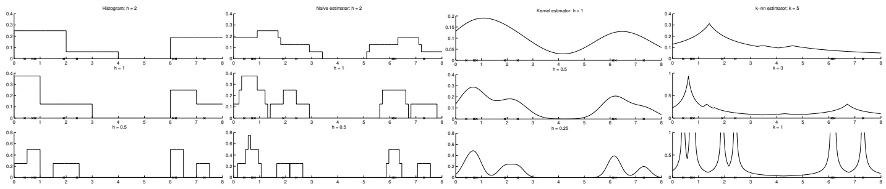

<!-- page: 27 -->

## Nonparametric classification

• Given $\{ ( \mathbf { x } _ { n } , y _ { n } ) \} _ { n = 1 } ^ { N }$ where $\mathbf { x } _ { n } \in \mathbb { R } ^ { D }$ **is a feature vector and** $y _ { n } \in \{ 1 , \ldots , K \}$ **a class label.**

**• Estimate the class-conditional densities** $p ( \mathbf { x } | C _ { k } )$ **with a KDE each. The resulting discriminant** function can be written (ignoring constant factors) $\mathrm { a s } ^ { ? }$

$$
g _ {k} (\mathbf {x}) = \sum_ {n = 1, y _ {n} = k} ^ {N} K \left(\frac {\mathbf {x} - \mathbf {x} _ {n}}{h}\right) \quad k = 1, \dots , K
$$

**so each data point** $\mathbf { x } _ { n }$ **votes only for its class, with a weight given by K(·) (instances closer to x have bigger weight).**

**• k-nearest-neighbor classifier : assigns x to the class k having most instances among the k nearest neighbors of x.**

**– Most common case:** $k = 1$ **, nearest-neighbor classifier. It defines a Voronoi tesselation in** $\mathbb { R } ^ { D }$

**It works with as few as one data point per class!**

**– k is chosen to be an odd number to minimize ties.**

**– Simple; good classification accuracy; but slow at test time. Condensed nearest-neighbor classifier: heuristic way to approximate the nearestneighbor classifier using a subset of the N data points (to reduce its space and time complexity).**

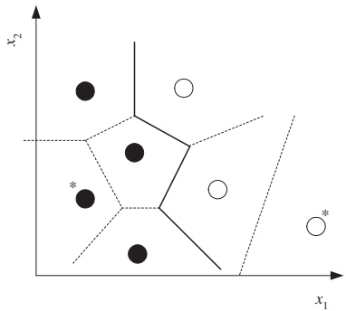

**✐ How does the k-nearest-neighbor classifier differ from the Euclidean distance classifier?**

## Nonparametric regression

• Consider a sample $\{ ( \mathbf { x } _ { n } , \mathbf { y } _ { n } ) \} _ { n = 1 } ^ { N }$ with $\mathbf { x } _ { n }   \in   \mathbb { R } ^ { D }$ and $\mathbf { y } _ { n }   \in   \mathbb { R } ^ { E }$ **drawn iid from an unknown** function plus noise $\mathbf { y } = \mathbf { f } ( \mathbf { x } ) + \mathbf { \epsilon }$

**We construct a smoother (nonparametric regression estimate)** $\mathbf { g } ( \mathbf { x } )$ **of** $\mathbf { f } ( \mathbf { x } )$ **.**

**• Kernel smoother : weighted average of the labels of instances near x (local average):**

$$
\mathbf {g} (\mathbf {x}) = \sum_ {n = 1} ^ {N} \frac {K \big ((\mathbf {x} - \mathbf {x} _ {n}) / h \big)}{\sum_ {n ^ {\prime} = 1} ^ {N} K \big ((\mathbf {x} - \mathbf {x} _ {n ^ {\prime}}) / h \big)} \mathbf {y} _ {n}.
$$

⇔ $\begin{array} { r } { \mathbf { \hat { y } } \left( \mathbf { x } \right) = \sum _ { n = 1 } ^ { N } w _ { n } ( \mathbf { x } )   \mathbf { y } _ { n } } \end{array}$ is a weighted average of $\{ \mathbf { y } _ { n } \} _ { n = 1 } ^ { N }$ Pwith weights satisfying w1 $\textstyle  _ { 1 } ( \mathbf { x } ) , \ldots , w _ { N } ( \mathbf { x } ) \geq 0 , \sum _ { n = 1 } ^ { N } w _ { n } ( \mathbf { x } ) = 1$ and $w _ { n } ( \mathbf { x } )$ is large if $\mathbf { x } _ { n }$ Pis near x and small otherwise

$\mathbf { g } ( \mathbf { x } )$ **can be seen as the conditional mean E** $\{ \mathbf { y } | \mathbf { x } \}$ **of a KDE** $p ( \mathbf { x } , \mathbf { y } )$ **constructed on the sample?**. **Also, as with KDEs:**

**– Regressogram: with an origin x**<strong>0</strong> **and bin width h, and discontinuous at boundaries.**

**– Running mean smoother: K = uniform kernel. No origin** $x _ { 0 }   ,$ **only bin width** $h ,$ **but still discontinuous at boundaries.**

**– Running median smoother: like the running mean but using the median instead; more robust to outliers and noise.**

**– k-nearest-neighbor smoother: fixes k instead of** $h ,$ **adapting to the density around x.**

**• Running-line smoother : we use the data points around x (as defined by h or k) to estimate a line rather than a constant, hence obtaining a local regression line.**

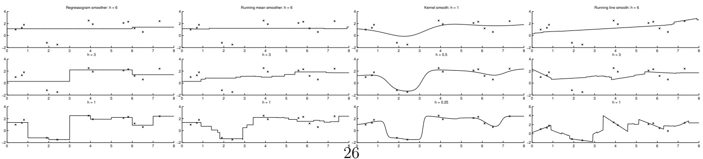

<!-- page: 28 -->

## How to choose the smoothing parameter

**• Smoothing parameter : number of neighbors k or kernel bandwidth h.**

**• It controls the complexity of the model:**

**– Too small: low bias, high variance.**

**The model is too rough (single instances have a large effect on the predictions).**

**– Too large: high bias, low variance.**

**The model is too smooth (single instances have a small effect on the predictions).**

## • How to choose it?

**– Regression or classification: cross-validation.**

**– Density estimation: by trial-and-error.**

**Some heuristic rules exist that can be used as ballpark estimates.**

<!-- page: 29 -->

## 8 Clustering

• Unsupervised problem: given a sample $\{ \mathbf { x } _ { n } \} _ { n = 1 } ^ { N } \subset \mathbb { R } ^ { D }$ **, partition it into groups such that points within each group are similar and groups are dissimilar (“hard partition”).**

Or, determine soft assignments $z _ { n k }$ of point $\mathbf { x } _ { n }$ to cluster k for $n = 1 , \ldots , N$ and $k = 1 , \ldots , K$ where $z _ { n k } \in [ 0 , 1 ]$ and $\textstyle \sum _ { k = 1 } ^ { K } z _ { n k } = 1$ **(“soft partition”).**

**• Useful to understand structure in the data, or as preprocessing for supervised learning (e.g. train a classifier for each cluster). Clustering does not need labels, which are usually costly to obtain.**

**• Examples:**

**– Customer segmentation: group customers according to demographic and transaction attributes, then provide different strategies for each segment.**

**– Image segmentation: partition pixels into meaningful objects in the image.** Represent each pixel $\mathbf { x } _ { n }$ by a feature vector, typically position & intensity $( i , j , I )$ or color $( i , j , L ^ { * } , u ^ { * } , v ^ { * } )$

## • Basic types:

**– Centroid-based: find a prototype (“centroid”) for each cluster.**

**– Probabilistic models: mixture densities, where each component models one cluster. Gaussian mixtures. Usually trained with the EM algorithm.**

**– Density-based: find regions of high density of data. Mean-shift clustering, level-set clustering, etc.**

Graph-based (or distance- or similarity-based): construct a graph with the data points as **vertices and edges weighted by distance values, and partition it. Hierarchical clustering, connected-components clustering, spectral clustering, etc.**

**• Ill-defined problem: what does “similar” mean, and how similar should points be to be in the same cluster? Hence, many different definitions of clustering and many different algorithms. This is typical of exploratory tasks, where we want to understand the structure of the data before committing to specific analyses. In practice, one should try different clustering algorithms.**

## Centroid-based clustering: k-means clustering

**• Two uses: clustering and vector quantization.**

**• User parameter: number of clusters K. Output: clusters and a centroid** $\pmb { \mu } _ { k } \in \mathbb { R } ^ { D }$ **per cluster.**

**• Objective function of centroids** $\pmb { \mu } _ { 1 } , \dots , \pmb { \mu } _ { K }$ and cluster assignments $\mathbf { Z } _ { N \times K }$

$$
\min E (\{\boldsymbol {\mu} _ {k} \} _ {k = 1} ^ {K}, \mathbf {Z}) = \sum_ {n = 1} ^ {N} \sum_ {k = 1} ^ {K} z _ {n k} \| \mathbf {x} _ {n} - \boldsymbol {\mu} _ {k} \| ^ {2} \quad \text {s.t.} \quad \mathbf {Z} \in \{0, 1 \} ^ {N K}, \mathbf {Z} \mathbf {1} = \mathbf {1}.
$$

**• No closed-form solution. This problem is NP-hard (runtime** $\geq$ **exponential on problem size). Instead, we do a local search with an iterative algorithm (alternating optimization):**

– Assignment step (over Z given $\{ \pmb { \mu } _ { k } \} _ { k = 1 } ^ { K } )$

for each $n = 1 , \ldots , N$ , assign $\mathbf { x } _ { n }$ to the cluster with the closest centroid to ${ \bf x } _ { n } ^ { \mathrm { ~ \scriptsize ~ ? ~ } }$

– Centroid step (over $\{ \pmb { \mu } _ { k } \} _ { k = 1 } ^ { K }$ **given Z):**

**for each** $\begin{array} { r } { k = 1 , \ldots , K ,   \pmb { \mu } _ { k } = \frac { \sum _ { n = 1 } ^ { N } z _ { n k } \mathbf { x } _ { n } } { \sum _ { n = 1 } ^ { N } z _ { n k } } } \end{array}$ **=** mean of the points currently assigned to cluster $k ^ { ? }$

<!-- page: 30 -->

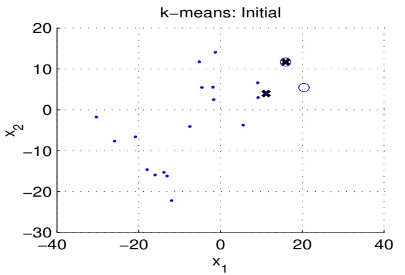

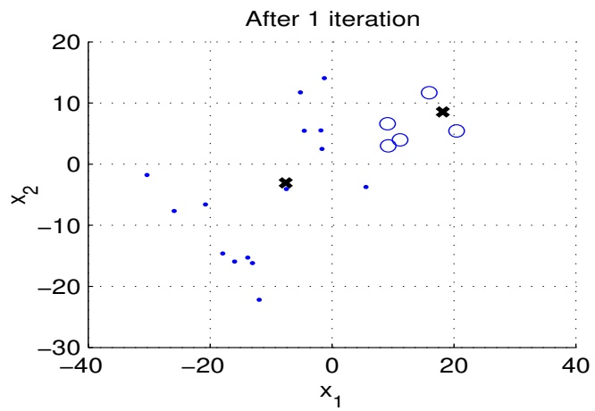

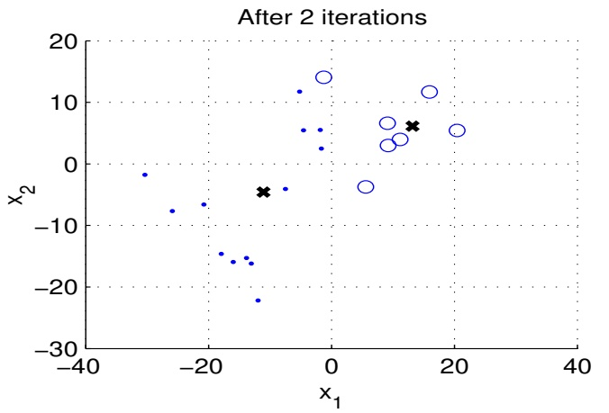

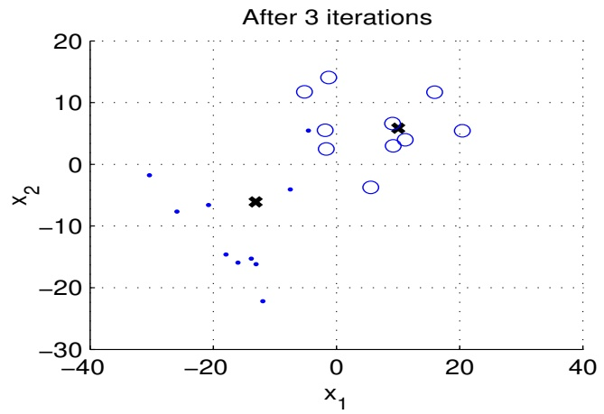

**• Each iteration (centroid + assignment step) reduces E or leaves it unchanged. After a finite number of iterations (there are at most** $N ^ { K }$ **clusterings), no more changes occur and we stop.**

**• The result depends on the initialization. We usually initialize Z by a random assignment of points to clusters, run k-means from several such random Z, and pick the best result.**

**• Vector quantization: compress a continuous space of dimension D, represented by a sample** $\mathcal { X } = \{ \mathbf { x } _ { n } \} _ { n = 1 } ^ { N }$ , into a finite set of reference vectors $\{ \pmb { \mu } _ { k } \} _ { k = 1 } ^ { K }$ **(codebook), with minimal distortion.**

**– Ex: color quantization. Represent 24-bit color images using only 256 colors with minimal distortion.**

– A new point $\mathbf { x } \in \mathbb { R } ^ { D }$ is quantized as $\mu _ { k ^ { * } }$ with $\begin{array} { r } { k ^ { * } = \arg \operatorname* { m i n } _ { k = 1 , \ldots , K } \| \mathbf { x } - \pmb { \mu } _ { k } \| . } \end{array}$ **This partitions the space into a Voronoi tessellation.**

– Lossy compression: encode $\mathbf { x } \in \mathbb { R } ^ { D }$ **(D floats) as an integer** $k \in \{ 1 , \ldots , K \} ( \lceil \operatorname { l o g } _ { 2 } K \rceil$ **bits). Also needs to store the codebook.**

**– We can learn the codebook with k-means. Better than uniform quantization, because it adapts to density variations in the data and does not require a codebook of size exponential on D. Usually K is larger than for clustering.**

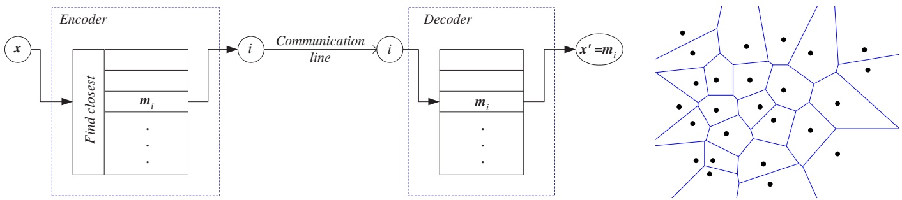

<!-- page: 31 -->

## Mixture densities and the EM algorithm

$p(\mathbf{x}; \boldsymbol{\Theta}) = \sum_{k=1}^{K} p(\mathbf{x} | k) p(k) \begin{cases} p(\mathbf{x} | k) \\ p(k) = \pi_k \end{cases}$ component densities • Mixture density with K components: mixture proportions.

• Ex: Gaussian mixture: $\mathbf { x } | k \sim \mathcal { N } ( \mathbf { x } ; \pmb { \mu } _ { k } , \pmb { \Sigma } _ { k } )$ **.** Mixture parameters: $\mathbf { \Theta } = \{ \pi _ { k } , \pmb { \mu } _ { k } , \pmb { \Sigma } _ { k } \} _ { k = 1 } ^ { K }$

• Maximum likelihood estimation of Gaussian mixture parameters: given a sample $\mathcal { X } = \{ \mathbf { x } _ { n } \} _ { n = 1 } ^ { N } \mathbf { : }$

$$
\max _ {\boldsymbol {\Theta}} \mathcal {L} (\boldsymbol {\Theta}; \mathcal {X}) = \sum_ {n = 1} ^ {N} \log p (\mathbf {x} _ {n}; \boldsymbol {\Theta}) = \sum_ {n = 1} ^ {N} \log \left(\sum_ {k = 1} ^ {K} p (\mathbf {x} | k) p (k)\right).
$$

**• L cannot be maximized in closed form over Θ; it needs an iterative optimization algorithm. Many such algorithms exist (such as gradient descent), but there is a specially convenient one for mixture models (and more generally, for maximum likelihood with missing data).**

**• Expectation-Maximization (EM) algorithm: for Gaussian mixtures:**

**– E step: given the current parameter values Θ, compute the posterior probability of com**ponent k given data point $\mathbf { x } _ { n }$ (for each $k = 1 , \ldots , K$ and $n = 1 , \ldots , N )$

$$
z _ {n k} = p (k | \mathbf {x} _ {n}; \boldsymbol {\Theta}) = \frac {p (\mathbf {x} _ {n} | k) p (k)}{p (\mathbf {x} _ {n} ; \boldsymbol {\Theta})} = \frac {\pi_ {k} \left| 2 \pi \boldsymbol {\Sigma} _ {k} \right| ^ {- 1 / 2} \exp \left(- \frac {1}{2} (\mathbf {x} _ {n} - \boldsymbol {\mu} _ {k}) ^ {T} \boldsymbol {\Sigma} _ {k} ^ {- 1} (\mathbf {x} _ {n} - \boldsymbol {\mu} _ {k})\right)}{\sum_ {k ^ {\prime} = 1} ^ {K} \pi_ {k ^ {\prime}} \left| 2 \pi \boldsymbol {\Sigma} _ {k ^ {\prime}} \right| ^ {- 1 / 2} \exp \left(- \frac {1}{2} (\mathbf {x} _ {n} - \boldsymbol {\mu} _ {k ^ {\prime}}) ^ {T} \boldsymbol {\Sigma} _ {k ^ {\prime}} ^ {- 1} (\mathbf {x} _ {n} - \boldsymbol {\mu} _ {k ^ {\prime}})\right)} \in (0, 1).
$$

– M step: given the posterior probabilities, estimate the parameters Θ: for $k = 1 , \ldots , K$

$$
\pi_ {k} = \frac {1}{N} \sum_ {n = 1} ^ {N} z _ {n k} \qquad \boldsymbol {\mu} _ {k} = \frac {\sum_ {n = 1} ^ {N} z _ {n k} \mathbf {x} _ {n}}{\sum_ {n = 1} ^ {N} z _ {n k}} \qquad \boldsymbol {\Sigma} _ {k} = \frac {\sum_ {n = 1} ^ {N} z _ {n k} (\mathbf {x} _ {n} - \boldsymbol {\mu} _ {k}) (\mathbf {x} _ {n} - \boldsymbol {\mu} _ {k}) ^ {T}}{\sum_ {n = 1} ^ {N} z _ {n k}}.
$$

**Similar to k-means, where the assignment and centroid steps correspond to the E and M steps.** But in EM the assignments are soft $( z _ { n k } \in [ 0 , 1 ] )$ , while in k-means they are hard $( z _ { n k } \in \{ 0 , 1 \} )$

**• If we knew which component** $\mathbf { x } _ { n }$ **came from for each** $n = 1 , \ldots , N$ **, we’d not need the E step: a single M step that estimates each component’s parameters on its set of points would suffice.** This was the case in classification (where $\mathbf { x } | C _ { k }$ is Gaussian): we were given $( \mathbf { x } _ { n } , y _ { n } )$

**• Each EM step increases L or leaves it unchanged, but it takes an infinite number of iterations to converge. In practice, we stop when the parameters don’t change much, or when the number of iterations reaches a limit.**

**• EM converges to a local optimum that depends on the initial value of Θ. Usually from k-means?**.

• User parameter: number of clusters K. Output: posterior probabilities $\{ p ( k | \mathbf { x } _ { n } ) \}$ and $\{ \boldsymbol { \pi } _ { k } , \boldsymbol { \mu } _ { k } , \boldsymbol { \Sigma } _ { k } \} _ { k = 1 } ^ { K }$

**• Parametric clustering: K clusters, assumed Gaussian.**

**• The fundamental advantage of Gaussian mixtures over k-means for clustering is that we can model the uncertainty in the assignments (particularly useful for points near cluster boundaries), and the clusters can be elliptical and have different proportions.**

|  | k-means | EM for Gaussian mixtures |
| --- | --- | --- |
| assignments $z_{nk}$ | hard | soft, $p(k\|\mathbf{x}_n)$ |
| probability model? | no | yes |
| number of iterations | finite | infinite |
| parameters | centroids $\{\boldsymbol{\mu}_k\}_{k=1}^K$ | $\{\pi_k, \boldsymbol{\mu}_k, \boldsymbol{\Sigma}_k\}_{k=1}^K$ |

<!-- page: 32 -->

## Density-based clustering: mean-shift clustering

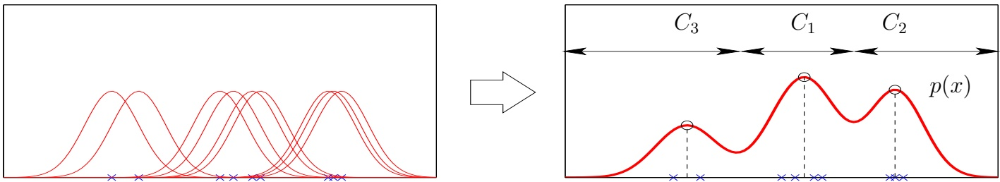

• Define a function $p ( \mathbf { x } )$ that represents the density of the dataset $\{ \mathbf { x } _ { n } \} _ { n = 1 } ^ { N } \subset \mathbb { R } ^ { D }$ **, then declare each mode (maximum) of p as a cluster representative and assign each** $\mathbf { x } _ { n }$ **to a mode via the mean-shift algorithm. Most useful with low-dimensional data, e.g. image segmentation (where** $\mathbf { x } _ { n } =$ **features of nth pixel).**

**• Kernel density estimate with bandwidth σ: a mixture having one component for each data point:**

$$
p (\mathbf {x}) = \sum_ {n = 1} ^ {N} p (\mathbf {x} | n) p (n) = \frac {1}{N \sigma^ {D}} \sum_ {n = 1} ^ {N} K \left(\frac {\mathbf {x} - \mathbf {x} _ {n}}{\sigma}\right) \qquad \mathbf {x} \in \mathbb {R} ^ {D}.
$$

Usually the kernel K is Gaussian: $\begin{array} { r } { K \left( \frac { \mathbf { x } - \mathbf { x } _ { n } } { \sigma } \right) = ( 2 \pi ) ^ { - D / 2 } \exp \left( - \frac { 1 } { 2 } \| \big ( \mathbf { x } - \mathbf { x } _ { n } \big ) / \sigma \| ^ { 2 } \right) } \end{array}$

**• Mean-shift algorithm: starting from an initial value of x, it iterates the following expression:**

$$
\mathbf {x} \leftarrow \sum_ {n = 1} ^ {N} p (n | \mathbf {x}) \mathbf {x} _ {n} \quad \text {where} \quad p (n | \mathbf {x}) = \frac {p (\mathbf {x} | n) p (n)}{p (\mathbf {x})} = \frac {\exp \left(- \frac {1}{2} \| (\mathbf {x} - \mathbf {x} _ {n}) / \sigma \| ^ {2}\right)}{\sum_ {n ^ {\prime} = 1} ^ {N} \exp \left(- \frac {1}{2} \| (\mathbf {x} - \mathbf {x} _ {n ^ {\prime}}) / \sigma \| ^ {2}\right)}.
$$

$\begin{array} { r } { \mathbf { \check { \Sigma } } _ { n = 1 } ^ { N } p ( n | \mathbf { x } ) \mathbf { x } _ { n } } \end{array}$ **can be understood as the weighted average of the N data points using as weights the posterior probabilities** $p ( n | \mathbf { x } )$ **. The mean-shift algorithm converges to a mode of** $p ( \mathbf { x } )$ **. Which one it converges to depends on the initialization. By running mean-shift starting** at a data point $\mathbf { x } _ { n }$ , we effectively assign $\mathbf { x } _ { n }$ to a mode. We repeat for all points $\mathbf { x } _ { 1 } , \ldots , \mathbf { x } _ { N }$

**• User parameter:** $\sigma ,$ **which determines the number of clusters** $( \sigma \downarrow : N$ **clusters, σ ↑: 1 cluster). Output: modes and clusters.**

**• Nonparametric clustering: no assumption on the shape of the clusters or their number.**

## Graph-based clustering: connected-components clustering

**• Define a distance** $d ( \mathbf { x } , \mathbf { y } )$ **for pairs of instances x, y:**

– Minkowski $( o r \; \ell _ { p } )$ distance $\begin{array} { r } { d ( \mathbf { x } , \mathbf { y } ) = \big ( \sum _ { d = 1 } ^ { D } | x _ { d } - y _ { d } | ^ { p } \big ) ^ { 1 / p } , \mathrm { i f } \mathbf { x } , \mathbf { y } \in \mathbb { R } ^ { D } } \end{array}$ **p** = 1: city-block distance; $p = 2 \colon$  **Euclidean distance.**

**– We may use distances without x and y being defined by explicit feature vectors. Number of words that two documents have in common; “edit” distance between strings (Exe. 6).**

**• Define a neighborhood graph with vertices = data points and edges** $\mathbf { x } _ { n } \sim \mathbf { x } _ { m }$ **if:**

– ǫ-ball graph: $d ( \mathbf { x } _ { n } , \mathbf { x } _ { m } ) \leq \epsilon .$

**– k-nearest-neighbor graph:** $\mathbf { x } _ { n }$ **and** $\mathbf { x } _ { m }$ **are among the k-nearest-neighbors of each other.**

**• Clusters = connected-components of the graph (which can be found by depth-first search).**

**• User parameter:** $\epsilon > 0$ **or** $k \in \mathbb { N }$ **.** The number of clusters depends on that $( \epsilon \downarrow :   N ,   \epsilon \uparrow :   1 )$

**• It can handle complex cluster shapes, but works only with non-overlapping clusters. Other algorithms are able to partition the graph more effectively even with overlapping clusters (e.g. spectral clustering).**

<!-- page: 33 -->

## Graph-based clustering: hierarchical clustering

**• Generates a nested sequence of clusterings.**

**• Agglomerative clustering: start with N clusters (= singleton points) and repeatedly merge pairs of clusters until there is only one cluster left containing all points.**

**Divisive clustering: start with one cluster containing all points and repeatedly divide it until we have N clusters (= singleton points).**

• We merge the two closest clusters $\mathcal { C } _ { i } , \mathcal { C } _ { j }$ according to a distance $\delta ( \mathcal { C } _ { i } , \mathcal { C } _ { j } )$ **between clusters:**

– Single-link clustering: $\delta ( \mathcal { C } _ { i } , \mathcal { C } _ { j } ) = \operatorname { m i n } _ { \mathbf { x } _ { n } \in \mathcal { C } _ { i } , \mathbf { x } _ { m } \in \mathcal { C } _ { j } } d ( \mathbf { x } _ { n } , \mathbf { x } _ { m } )$

**Tends to produce elongated clusters (“chaining” effect).**

Equivalent to Kruskal’s algorithm to find a minimum spanning tree of a weighted graph $G = ( V , E , w )$ where $V = \{ \mathbf { x } _ { n } \} _ { n = 1 } ^ { N }$ $\dot { E = V \times V }$ and $w _ { n m } = d ( \mathbf { x } _ { n } , \mathbf { x } _ { m } )$

– Complete-link clustering: $\delta ( \mathcal { C } _ { i } , \mathcal { C } _ { j } ) = \operatorname { m a x } _ { \mathbf { x } _ { n } \in \mathcal { C } _ { i } , \mathbf { x } _ { m } \in \mathcal { C } _ { j } } d ( \mathbf { x } _ { n } , \mathbf { x } _ { m } )$

**Tends to produce compact clusters.**

**• Result: dendrogram, a binary tree where leaves = instances** $\mathbf { x } _ { n }$ **and internal nodes = merges.** We can obtain a specific clustering from the tree by allowing only distances $d ( \mathbf { x } _ { n } , \mathbf { x } _ { m } )   \leq   \epsilon$ **(equivalent to connected-components for single-link clustering).**

**• User parameter: when to stop merging. Output: dendrogram and clusters.**

## How to choose the number of clusters or other user parameters

**• Typical user parameters:**

**– K: number of clusters (k-means, mixtures).**

$\sigma ,   \epsilon \cdot$ **“scale” in feature space (mean-shift, connected-components, hierarchical clustering).**

**– k: number of neighbors (connected-components).**

**• How to set K, σ, etc.? Don’t trust “automatic” algorithms that select all user parameters for you!**

**– Try several values (and several clustering algorithms) and explore the results:**

**∗ Plot the objective function (error, log-likelihood, etc.) vs K and look for an “elbow”.**

**∗ Project to 2D with PCA and inspect the result.**

**– In some applications, K may be fixed or known. Color quantization, medical image segmentation.**

<!-- page: 34 -->

## 9 Dimensionality reduction and feature selection

• If we want to train a classifier (or regressor) on a sample $\{ ( \mathbf { x } _ { n } , y _ { n } ) \} _ { n = 1 } ^ { N }$ **where the number of features D in x (the dimension of x) is large:**

**– Training will be slow.**

**– Learning a good classifier will require a large sample.**

• It is then convenient to transform each example $\mathbf { x } _ { n } \in \mathbb { R } ^ { D }$ into a new example $\mathbf { z } _ { n } = \mathbf { F } ( \mathbf { x } _ { n } ) \in \mathbb { R } ^ { L }$ having lower dimension $L < D$ **(as long as we don’t lose much information). This would work perfectly if the data points did lie on a manifold of dimension L contained in** $\mathbb { R } ^ { D }$

**• Two basic ways to do this:**

$$
\mathbf {x} = (x _ {1}, x _ {2}, x _ {3}, x _ {4}, x _ {5}) ^ {T} \Rightarrow \text {for} L = 2:
$$

- Feature selection: $\mathbf{F}(\mathbf{x}) =$ a subset of $x_1, \ldots, x_D$. $\rightarrow \mathbf{F}(\mathbf{x}) = \left( \begin{array}{c} x_2 \\ x_5 \end{array} \right)$.
It doesn't modify the features, it simply selects $L$ and discards the rest.
Ex: best-subset/forward/backward selection.
- Dimensionality reduction (DR): $\mathbf{F}(\mathbf{x}) =$ a l.c. or some other function of all the $x_1, \ldots, x_D$. $\rightarrow \mathbf{F}(\mathbf{x}) = \left( \begin{array}{c} 1x_1 + 3x_2 - 5x_3 + 5x_4 - 4x_5 \\ 2x_1 + 3x_2 - 1x_3 + 0x_4 + 2x_5 \end{array} \right)$.
It constructs $L$ new features and discards the original $D$ features.
Ex: PCA, LDA...

**• If reducing to** $L \leq 3$ **dimensions, can visualize the dataset and look for patterns (clusters, etc.).**

**• DR algorithms learn one or more of the following:**

– The dimensionality reduction or projection mapping F: $\mathbf { x } \in \mathbb { R } ^ { D } \rightarrow \mathbf { z } \in \mathbb { R } ^ { L }$

– The reconstruction mapping f: $\mathbf { z } \in \mathbb { R } ^ { L } \rightarrow \mathbf { x } \in \mathbb { R } ^ { D } .$

$$
\mathbb {R} ^ {D}
$$

– The latent projections $\mathbf { z } _ { 1 } = \mathbf { F } ( \mathbf { x } _ { 1 } ) , \ldots , \mathbf { z } _ { N } = \mathbf { F } ( \mathbf { x } _ { N } ) \subset \mathbb { R } ^ { L }$ **of the training points.**

Review of eigenvalues and eigenvectors
For a real symmetric matrix $\mathbf{A}$ of $D \times D$:
• Eigenvalues and eigenvectors of: $\mathbf{A}\mathbf{u} = \lambda\mathbf{u} \Rightarrow \left\{ \begin{array}{ll} \lambda \in \mathbb{R}: &amp; \text{eigenvalue} \\ \mathbf{u} \in \mathbb{R}^D: &amp; \text{eigenvector}. \end{array} \right.$
• A has $D$ eigenvalues $\lambda_1 \geq \cdots \geq \lambda_D$ and $D$ corresponding eigenvectors $\mathbf{u}_1, \ldots, \mathbf{u}_D$.
• Eigenvectors of different eigenvalues are orthogonal: $\mathbf{u}_i^T\mathbf{u}_j = 0$ if $i \neq j$.
• A is $\begin{cases} nonsingular: &amp; \text{all } \lambda \neq 0 \\ positive definite: &amp; \text{all } \lambda &gt; 0 \\ positive semidefinite: &amp; \text{all } \lambda \geq 0 \end{cases}$ ($\Leftrightarrow \mathbf{x}^T\mathbf{A}\mathbf{x} &gt; 0 \forall \mathbf{x} \neq \mathbf{0}$)
• Spectral theorem: A symmetric, real with normalized eigenvectors $\mathbf{u}_1, \ldots, \mathbf{u}_D \in \mathbb{R}^D$ associated with eigenvalues $\lambda_1 \geq \cdots \geq \lambda_D \in \mathbb{R} \Rightarrow \mathbf{A} = \mathbf{U}\boldsymbol{\Lambda}\mathbf{U}^T = \sum_{i=1}^{D} \lambda_i\mathbf{u}_i\mathbf{u}_i^T$ where $\mathbf{U} = (\mathbf{u}_1 \ldots \mathbf{u}_D)$ is orthogonal and $\boldsymbol{\Lambda} = \text{diag}(\lambda_1, \ldots, \lambda_D)$. In other words, a symmetric real matrix can be diagonalized in terms of its eigenvalues and eigenvectors.
• $\lambda_1 = \max_{\mathbf{x} \neq 0} \frac{\mathbf{x}^T\mathbf{A}\mathbf{x}}{\mathbf{x}^T\mathbf{x}}$ $\Leftrightarrow \max_{\mathbf{x}}\mathbf{x}^T\mathbf{A}\mathbf{x}$ s.t. $\|\mathbf{x}\| = 1$, achieved at $\mathbf{x} = \mathbf{u}_1$.
    $\lambda_2 = \max_{\mathbf{x} \neq 0} \frac{\mathbf{x}^T\mathbf{A}\mathbf{x}}{\mathbf{x}^T\mathbf{x}}$ s.t. $\mathbf{x}^T\mathbf{u}_1 = 0$ $\Leftrightarrow \max_{\mathbf{x}}\mathbf{x}^T\mathbf{A}\mathbf{x}$ s.t. $\|\mathbf{x}\| = 1$, $\mathbf{x}^T\mathbf{u}_1 = 0$, achieved at $\mathbf{x} = \mathbf{u}_2$. etc.
• Covariance matrix $\boldsymbol{\Sigma} = \frac{1}{N}\sum_{n=1}^{N} (\mathbf{x}_n - \boldsymbol{\mu})(\mathbf{x}_n - \boldsymbol{\mu})^T$ positive definite (unless zero variance along some dim.) Mahalanobis distance $(\mathbf{x} - \boldsymbol{\mu})^T\boldsymbol{\Sigma}^{-1}(\mathbf{x} - \boldsymbol{\mu}) = 1 \Rightarrow$ ellipsoid with axes $= \sqrt{\lambda_1}, \ldots, \sqrt{\lambda_D}$ (stdev along PCs).
• $\mathbf{w} \in \mathbb{R}^D$: var $\{\mathbf{w}^T\mathbf{x}_1, \ldots, \mathbf{w}^T\mathbf{x}_N\} = \mathbf{w}^T\boldsymbol{\Sigma}\mathbf{w}$. In general for $\boldsymbol{\mathbf{W}}_{D\times L}$: cov $\{\boldsymbol{\mathbf{W}}^T\boldsymbol{\mathbf{x}}_1, \ldots, \boldsymbol{\mathbf{W}}^T\boldsymbol{\mathbf{x}}_N\} = \boldsymbol{\mathbf{W}}^T\boldsymbol{\Sigma}\boldsymbol{\mathbf{W}}$.

<!-- page: 35 -->

## Feature selection: forward selection and the Lasso

• Problem: given a sample $\{ ( \mathbf { x } _ { n } , y _ { n } ) \} _ { n = 1 } ^ { N }$ with $\mathbf { x } _ { n }   \in   \mathbb { R } ^ { D }$ **, determine the best subset of the D features such that the number of selected features L is as small as possible and the classification accuracy (using a given classifier, e.g. a linear SVM) is as high as possible. Using all D features will always give the highest accuracy on the training set but not necessarily on the validation set.**

**• Useful when some features are unnecessary (e.g. irrelevant for classification or pure noise) or redundant (so we don’t need them all). Useful with** $\mathbf { e . g . }$ **microarray data. Not useful with e.g. image pixels.**

**• Best-subset selection: for each subset of features, train a classifier and evaluate it on a validation set. Pick the subset having highest accuracy and up to L features.**

**Combinatorial optimization:** $2 ^ { D }$ **possible subsets of D features?**. Ex: $D = 3 { \colon } \{ \varnothing , \{ x _ { 1 } \} , \{ x _ { 2 } \} , \{ x _ { 3 } \} , \{ x _ { 1 } , x _ { 2 } \} , \{ x _ { 1 } , x _ { 3 } \} , \{ x _ { 2 } , x _ { 3 } \} , \{ x _ { 1 } , x _ { 2 } , x _ { 3 } \} \}$ **Brute-force search only possible for small D ⇒ approximate search.**

**• Forward selection: starting with an empty subset** ${ \mathcal { F } } ,$ **sequentially add one new feature at a time. We add the feature** $d \in \{ 1 , \ldots , D \}$ **such that the classifier trained on** ${ \mathcal { F } } \cup \{ d \}$ **has highest classification accuracy in the validation set. Stop when the accuracy improves little, or when we reach L features. Backward selection: same thing but start with** $\mathcal { F } = \{ 1 , \ldots , D \}$ **and remove one feature at a time. It is a greedy algorithm that is not guaranteed to find an optimal subset, but gives good results.** It trains $\Theta ( L ^ { 2 } )$ **classifiers if we try up to L features, so it is convenient when we expect the optimal subset to contain few features.**

**• Lasso (for regression): min**<strong>w</strong> $\begin{array} { r } { \cdot \sum _ { n = 1 } ^ { N } \big ( y _ { n } - \mathbf { w } ^ { T } \mathbf { x } _ { n } ) ^ { 2 } + \lambda \big \| \mathbf { w } \big \| _ { 1 } } \end{array}$ (where $\lambda \geq 0$ is set by cross-validation) **The** $\ell _ { 1 }$ **norm** $\| \mathbf { w } \| _ { 1 } = | \underbrace { w _ { 1 } } _ { \cdot } | + \cdot \cdot \cdot + | w _ { D } |$ **makes many** $w _ { d }$ **be exactly zero if λ is large enough** (unlike the $\ell _ { 2 } ^ { 2 }$ norm $\left\| \mathbf { w } \right\| _ { 2 } ^ { 2 } = w _ { 1 } ^ { 2 } + \cdot \cdot \cdot + w _ { D } ^ { 2 }$ **, which makes most** $w _ { d }$ **small but none exactly zero).**

**• These feature selection algorithms are supervised: they use the labels** $y _ { n }$ **when training the classifier. The features selected depend on the classifier we use. There are also unsupervised algorithms.**

**Ex: forward selection on the Iris dataset (D = 4 features, K = 3 classes). Result: features {F4,F3}.**

<!-- page: 36 -->

## Dimensionality reduction: principal component analysis (PCA)

**• Aims at preserving most of the signal information.**

**Find a low-dimensional space such that when x is projected there, information loss is minimized.**

• Which direction $\mathbf { w } \in \mathbb { R } ^ { D }$ shows most variation? maxw $\mathbf { w } ^ { T } \Sigma \mathbf { \hat { } }$ w s.t. $\| \mathbf { w } \| = 1 \Rightarrow \mathbf { w } = { \mathbf { u } _ { 1 } } ^ { ? }$

• Unsupervised linear DR method: give**n** $\{ \mathbf { x } _ { n } \} _ { n = 1 } ^ { N } \subset \mathbb { R } ^ { D }$ **(with mean zero and covariance matrix Σ of** $D \times D )$ **, when reducing dimension to** $L < D$ **, PCA finds:**

– a linear projection mapping F: $\mathbf { x } \in \mathbb { R } ^ { D } \rightarrow \mathbf { W } ^ { T } \mathbf { x } \in \mathbb { R } ^ { L }$ **, and**

– a linear reconstruction mapping f: $\mathbf { z } \in \mathbb { R } ^ { L } \rightarrow \mathbf { W } \mathbf { z } \in \mathbb { R } ^ { D }$

**where** $\mathbf { W } _ { D \times L }$ **has orthonormal columns** $( \mathbf { W } ^ { T } \mathbf { W } = \mathbf { I } )$ **, that are optimal in two equivalent senses:**

**– Maximum projected variance: max**<strong>W</strong> **tr** $\left( \mathrm{cov} \left\{ \mathbf{W}^{T} \mathbf{x}_{1}, \ldots, \mathbf{W}^{T} \mathbf{x}_{N} \right\} \right) \stackrel{?}{=} \mathrm{tr} \left( \mathbf{W}^{T} \mathbf{\Sigma} \mathbf{W} \right)$

– Minimum reconstruction error : minW $\begin{array} { r } { \frac { 1 } { N } \sum _ { n = 1 } ^ { N } \left\| \mathbf { x } _ { n } - \mathbf { W } \mathbf { W } ^ { T } \mathbf { x } _ { n } \right\| ^ { 2 } \stackrel { ? } { = } - \operatorname { t r } \left( \mathbf { W } ^ { T } \mathbf { \Sigma } \mathbf { W } \right) } \end{array}$ **+constant.**

• The covariance in the latent space cov $\{ \mathbf { Z } \} \stackrel { ? } { = } \mathbf { W } ^ { T } \mathbf { \Sigma } \mathbf { W }$ **is diagonal?: uncorrelated projections.**

**• If the mean of the sample is** $\begin{array} { r } { \pmb { \mu } = \frac { 1 } { N } \sum _ { n = 1 } ^ { N } \mathbf { x } _ { n } \Rightarrow \mathbf { F } ( \mathbf { x } ) = \mathbf { W } ^ { T } ( \mathbf { x } - \pmb { \mu } ) \mathrm { ~ a n d ~ } \mathbf { f } ( \mathbf { z } ) = \mathbf { W } \mathbf { z } + \pmb { \mu } . } \end{array}$

• How to compute W, given Σ? Eigenproblem maxW tr $\left( \mathbf { W } ^ { T } \Sigma \mathbf { W } \right)$ s.t. $\mathbf { W } ^ { T } \mathbf { W } = \mathbf { I }$ **whose solution** is given by the spectral theorem. Decompose $\mathbf { \Sigma } = \mathbf { U } \mathbf { \dot { \Lambda } } \mathbf { U } ^ { T }$ with eigenvectors $\mathbf { U } = \left( \mathbf { u } _ { 1 } \ldots \mathbf { u } _ { D } \right)$ and eigenvalues $\mathbf { \Lambda } = \operatorname { d i a g } \left( \lambda _ { 1 } , \ldots , \lambda _ { D } \right)$ **,** sorted decreasingly. Then $\mathbf { W }   =   \mathbf { U } _ { 1 : L }   =   ( \mathbf { u } _ { 1 } , \ldots , \mathbf { u } _ { L } )$ **i.e., the eigenvectors associated with the largest L eigenvalues of the covariance matrix Σ.**

• Total variance of the data: $\lambda _ { 1 } + \cdots + \lambda _ { D } = \operatorname { t r } \left( \mathbf { \Sigma } \right) = \sigma _ { 1 } ^ { 2 } + \cdots + \sigma _ { D } ^ { 2 } .$

Variance “explained” by the latent space: $\lambda _ { 1 } + \cdots + \lambda _ { L } = \operatorname { t r } \left( \mathbf { W } ^ { T } \mathbf { \Sigma } \mathbf { W } \right)$

We can use the proportion $\scriptstyle { \frac { \lambda _ { 1 } + \cdots + \lambda _ { L } } { \lambda _ { 1 } + \cdots + \lambda _ { D } } } \; \in \; [ 0 , 1 ]$ **of explained variance to determine a good value** for L (e.g. 90% of the variance, which usually will be achieved with $L \ll D )$

**• In practice with high-dimensional data (e.g. images), a few principal components explain most of the variance if there are correlations among the features.**

**reduce the number of features** • Useful as a preprocessing step for classification/regression: **partly remove noise.**

**• Basic disadvantage: it fails with nonlinear manifolds.**

**• Related linear DR methods:**

**– Factor analysis: essentially, a probabilistic version of PCA.**

**– Canonical correlation analysis (CCA): projects two sets of features x, y onto a common latent space z.**

**• Related nonlinear DR methods: autoencoders (based on neural nets), etc.**

<!-- page: 37 -->

## Dimensionality reduction: linear discriminant analysis (LDA)

• Aims at preserving most of the signal information that is useful to discriminate among the classes. Find a low-dimensional space such that when x is projected there, classes are well separated.

• Supervised linear DR method: given $\{ ( \mathbf { x } _ { n } , y _ { n } ) \} _ { n = 1 } ^ { N }$ where $\mathbf { x } _ { n } \in \mathbb { R } ^ { D }$ **is a high-dimensional feature vector and** $y _ { n }   \in   \{ 1 , \ldots , K \}$ **a** class label, when reducing dimension to $L   <   D$ , LDA finds a linear projection mapping F: $\mathbf { x } \in \mathbb { R } ^ { D } \rightarrow \mathbf { W } ^ { T } \mathbf { x } \in \mathbb { R } ^ { L }$ **with** $\mathbf { W } _ { D \times L }$ **that is optimal in maximally separating the classes from each other while maximally compressing each class. Unlike PCA, LDA does not find a reconstruction mapping f:** $\mathbf { z } \in \mathbb { R } ^ { L } \rightarrow \mathbf { W } \mathbf { z } \in \mathbb { R } ^ { D }$ **.** It only finds the projection mapping F.

**• Define:**

– Number of points in class k: $N _ { k }$ **.** Mean of class k: $\begin{array} { r } { \pmb { \mu } _ { k } = \frac { 1 } { N _ { k } } \sum _ { y _ { n } = k } \mathbf { x } _ { n } } \end{array}$

– Within-class scatter matrix for class k: $\begin{array} { r } { \mathbf { S } _ { k } = \sum _ { y _ { n } = k } \big ( \mathbf { x } _ { n } - \pmb { \mu } _ { k } \big ) ( \mathbf { x } _ { n } - \pmb { \mu } _ { k } ) ^ { T } . } \end{array}$

– Total within-class scatter matrix $\begin{array} { r } { \mathbf { S } _ { W } = \sum _ { k = 1 } ^ { K } \mathbf { S } _ { k } } \end{array}$

– Between-class scatter matrix $\begin{array} { r } { \mathbf { S } _ { B } = \sum _ { k = 1 } ^ { K } N _ { k } ( \pmb { \mu } _ { k } - \pmb { \mu } ) ( \pmb { \mu } _ { k } - \pmb { \mu } ) ^ { T } } \end{array}$ where $\begin{array} { r } { \pmb { \mu } = \frac { 1 } { K } \sum _ { k = 1 } ^ { K } \pmb { \mu } _ { k } } \end{array}$

**• In the latent space, the between-class and within-class scatter matrices are** $\mathbf { W } ^ { T } \mathbf { S } _ { B } \mathbf { W }$ **and** $\mathbf { W } ^ { T } \mathbf { S } _ { W } \mathbf { W }$ (of $L \times L )$

**• Fisher discriminant: max** $J(\mathbf{W}) = \frac{\left| \mathbf{W}^{T} \mathbf{S}_{B} \mathbf{W} \right|}{\left| \mathbf{W}^{T} \mathbf{S}_{W} \mathbf{W} \right|} = \frac{ between-class scatter }{ within-class scatter }$ W

**• This is an eigenproblem whose solution is** $\mathbf { W } = ( \mathbf { u } _ { 1 } , \ldots , \mathbf { u } _ { L } ) =$ **e**igenvectors associated with the largest L eigenvalues of $\mathbf { S } _ { W } ^ { - 1 } \mathbf { S } _ { B }$

rank $\left( \mathbf { S } _ { B } \right) \overset { : } { \leq } K - 1 \Rightarrow \operatorname { r a n k } \left( \mathbf { S } _ { W } ^ { - 1 } \mathbf { S } _ { B } \right) \leq K - 1$ . So we can only use values of L that satisfy $1 \leq L \leq K - 1$ **S**W must be invertible (if it is not, apply PCA to the data and eliminate directions with zero variance).

<!-- page: 38 -->

## Dimensionality reduction: multidimensional scaling (MDS)

## True distances along earth surface

**• Aims at preserving distances or similarities.**

Place N points in a low-dimensional map (of dimension L) such that their distances are well preserved.

• Unsupervised DR method: given the matrix of squared Euclidean distances $d _ { n m } ^ { 2 } = \left\| \mathbf { x } _ { n } - \mathbf { x } _ { m } \right\| ^ { 2 }$ between N data points, MDS finds points $\mathbf { z } _ { 1 } , \ldots , \mathbf { z } _ { N } \in \mathbb { R } ^ { L }$ **that approximate those distances:**

$$
\min _ {\mathbf {Z}} \sum_ {n, m = 1} ^ {N} \left(d _ {n m} ^ {2} - \left\| \mathbf {z} _ {n} - \mathbf {z} _ {m} \right\| ^ {2}\right) ^ {2}.
$$

• MDS does not use as training data the actual feature vectors $\mathbf { x } _ { n } \; \in \; \mathbb { R } ^ { D }$ **, only the pairwise distances** $d _ { n m }$ **. Hence, it is applicable even when the “distances” are computed between objects that are not represented by features. Ex: perceptual distance between two different colors according to a subject.**

• If $d _ { n m } ^ { 2 } = \| \mathbf { x } _ { n } - \mathbf { x } _ { m } \| ^ { 2 }$ where $\mathbf { x } _ { n } \in \mathbb { R } ^ { D }$ and $D \geq L$ , then MDS is equivalent to PCA on $\{ \mathbf { x } _ { n } \} _ { n = 1 } ^ { N } .$

**• MDS does not produce a projection or reconstruction mapping, only the actual L-dimensional** projections $\mathbf { z } _ { 1 } , \ldots , \mathbf { z } _ { N } \in \mathbb { R } ^ { L }$ for the N training points $\mathbf { x } _ { 1 } , \ldots , \mathbf { x } _ { N } \in \mathbb { R } ^ { D }$

• How to learn a projection mapping F: $\mathbf { x } \in \mathbb { R } ^ { D } \rightarrow \mathbf { z } \in \mathbb { R } ^ { L }$ **with parameters Θ?**

**Direct fit: find the projections** $\mathbf { z } _ { 1 } , \ldots , \mathbf { z } _ { N }$ **by MDS and then solve a nonlinear regression**

**Parametric embedding: requires nonlinear optimization**

$$
\min _ {\boldsymbol {\Theta}} \sum_ {n = 1} ^ {N} \left(\mathbf {z} _ {n} - \mathbf {F} (\mathbf {x} _ {n}; \boldsymbol {\Theta})\right) ^ {2}
$$

$$
\min _ {\boldsymbol {\Theta}} \sum_ {n, m = 1} ^ {N} \left(d _ {n m} ^ {2} - \| \mathbf {F} (\mathbf {x} _ {n}; \boldsymbol {\Theta}) - \mathbf {F} (\mathbf {x} _ {m}; \boldsymbol {\Theta}) \| ^ {2}\right) ^ {2}.
$$

**• Generalizations of MDS:**

**– Spectral methods: Isomap, Locally Linear Embedding, Laplacian eigenmaps. . .**

**Require solving an eigenproblem.**

**Isomap: define d**<strong>nm</strong> **= geodesic distances (approximated by shortest paths in a nearest-neighbor graph of the sample).**

**– Nonlinear embeddings: elastic embedding, t-SNE. . .**

**Require solving a nonlinear optimization.**

<!-- page: 39 -->

<!-- page: 40 -->

## 10 Decision trees

**• Applicable to classification and regression.**

**• Can use continuous and discrete (categorical) features. x ∈** R **or x ∈ {red,green,blue}.**

**• Efficient at test time:**

**– An input instance follows a single root-leaf path in the tree, ignoring the rest of it.**

**– This path (and the whole tree) may not even use all the features in the training set.**

**• A decision tree is a model that (as long as it is not too big) can be interpreted by people (unlike black-box models such as neural nets):**

**– We can inspect the tree visually regardless of the dimensionality of the feature vector.**

**– We can track the root-leaf path followed by a particular input instance to understand how the tree made its decision.**

**– The tree can be transformed into a set of IF-THEN rules.**

**• Widely used in practice, sometimes preferred over more accurate but less interpretable models.**

**• They define class regions as a sequence of recursive splits.**

**• The decision tree consists of:**

**– Internal decision nodes, each having** $\geq 2$ **children. Decision node m selects one of its children based on a test (a split) applied to the input x.**

∗ Continuous feature $x _ { d } { : ~ } ^ { \zeta } \mathrm { g o }$ right if $x _ { d } > { s _ { m } } ^ { \prime \prime }$ for some $s _ { m } \in \mathbb { R }$

**∗ Discrete feature** $x _ { d } ;$ **n-way split for the n possible values of** $x _ { d }$ **.**

**– Leaves, each containing a value (class label or output value** $y )$ **. Instances** $\mathbf { x } _ { n }$ **falling in the** same leaf should have identical (or similar) output values $y _ { n }$

∗ Classification: class label $y \in \{ 1 , \ldots , K \}$ (or proportion of each class $\left[ p _ { 1 } , \ldots , p _ { K } \right)$

**∗ Regression: numeric value** $y \in \mathbb { R }$ **(average of the outputs for the leaf’s instances).**

**The predicted output for an instance x is obtained by following a path from the root to a leaf. In the best case (balanced tree) for binary trees, the path has length** $\log _ { 2 } L$ **if there are L leaves.**

• Having learned a tree, we discard the training set $\{ ( \mathbf { x } _ { n } , y _ { n } ) \} _ { n = 1 } ^ { N }$ **and keep only the tree nodes (and associated split and output values). The resulting tree may be considered:**

**– Nonparametric: if the tree is very big, having Θ(N) nodes if each leaf represents one (or a few) instances. Still, inference in the tree is much faster than, say, in kernel regression or k-nearest-neighbors classification (no need to scan the whole training set).**

**– Parametric: if the tree is much smaller than the training set N.**

**In practice, the size of the tree depends on the application.**

<!-- page: 41 -->

## Univariate trees

• The test at node m compares one feature with a threshold: $\text{" }x_{d}>s_{m} \text{" }$ for some $d \in \{ 1 , \ldots , D \}$ and $s _ { m }   \in   \mathbb { R }$ **.** This defines a binary split into two regions: $\{ \mathbf { x }   \in   \mathbb { R } ^ { D } \colon   x _ { d }   \leq   s _ { m } \}$ and $\{ \mathbf { x } \in$ $\mathbb { R } ^ { D } \colon   x _ { d } > s _ { m } \}$ . The overall tree defines box-shaped, axis-aligned regions in input space.

**Simplest and most often used. More complex tests exist, e.g.** $`` \mathbf{w}_{m}^{T}\mathbf{x} > s_{m}  ''$ **, which define oblique regions (multivariate trees).**

**• With discrete features, the number of children equals the number** $n _ { d }$ **of values the feature can** take, and the test selects the child corresponding to the value of $x _ { d } ( n \text { - } w a y s p l i t )$ Ex: $x _ { d } \in$ **{red, green, blue}** $\Rightarrow n _ { d } = 3$ **children.**

• Tree induction is learning the tree from a training set $\{ ( \mathbf { x } _ { n } , y _ { n } ) \} _ { n = 1 } ^ { N }$ **, i.e., determining its nodes and structure:**

– For each internal node, its test (feature $d \in \{ 1 , \ldots , D \}$ and threshold $s _ { m } )$

**– For each leaf, its output value y.**

**• For a given sample, many (sufficiently big) trees exist that code it with zero error. We want to find the smallest such tree. This is NP-hard so an approximate, greedy algorithm is used:**

Starting at the root with the entire training set, select a best split according to a purity **criterion:** $\big ( N _ { \mathrm { l e f t } } \phi _ { \mathrm { l e f t } } + N _ { \mathrm { r i g h t } } \phi _ { \mathrm { r i g h t } } \big ) / \big ( N _ { \mathrm { l e f t } } + N _ { \mathrm { r i g h t } } \big )$ **, where** $N _ { \bullet }$ **is the number of instances going to child •. Associate each child with the subset of instances that fall in it.**

**– Continue splitting each child (with its subset of the training set) recursively until each child is pure (hence a leaf) and no more splits are necessary.**

**– Prevent overfitting by either early stopping or pruning.**

**Ex. algorithms: CART, ID3, C4.5.**

<!-- page: 42 -->

## Classification trees

**• Purity criterion: a node is pure if it contains instances of the same class. Consider a node and all the training set instances that reach it, and call** $p _ { k }$ **the proportion of instances of class** k, for $k = 1 , \ldots , K$ (so $p _ { k } \geq 0$ **an**d $\textstyle \sum _ { k = 1 } ^ { K } p _ { k }   =   1 )$ . We can measure impurity as the entropy of $\mathbf { p } = ( p _ { 1 } , \ldots , p _ { K } ) { \mathrm { : ~ } } \phi ( \mathbf { p } ) =$ $\textstyle - \sum _ { k = 1 } ^ { K } p _ { k } \log _ { 2 } p _ { k }$ (where $0 \log _ { 2 } 0 \equiv 0 ^ { ? } )$ **This is maximum if** $\textstyle p _ { 1 }   =   \cdots   =   p _ { K }   =   { \frac { 1 } { K } }$ , and minimum $\left( \mathrm{``pure''} \right)$ if one $p _ { k }   =   1$ and the rest are $0 ^ { ? }$

**Other measures satisfying those conditions are possible:** Gini index $\phi ( \mathbf { p } ) \quad = \quad$ $\textstyle \sum _ { i \neq j } ^ { K } p _ { i } p _ { j } = \sum _ { i = 1 } ^ { K } p _ { i } ( \widetilde { 1 - p _ { i } } )$ , misclassification error $\phi ( \mathbf { p } ) = 1 - \operatorname* { m a x } ( p _ { 1 } , \ldots , p _ { K } )$

**• If a node is pure, i.e., all its instances are of the same class k, there is no need to split it. It becomes a leaf with output value k.**

**We can also store the proportions** $\mathbf { p } = ( p _ { 1 } , \ldots , p _ { K } )$ **in the node (e.g. to compute risks).**

**• If a node m is not pure, we split it. We evaluate** $( N _ { \mathrm { l e f t } } \phi _ { \mathrm { l e f t } } + N _ { \mathrm { r i g h t } } \phi _ { \mathrm { r i g h t } } ) / ( N _ { \mathrm { l e f t } } + N _ { \mathrm { r i g h t } } )$ **for all possible features** $d = 1 , \ldots , D$ **and all possible split thresholds** $s _ { m }$ **for each feature, and pick the split with minimum impurity.**

**– If the number of instances that reach node m is** $N _ { m }$ **, there are are** $N _ { m }   -   1$ **possible thresholds (the midpoints between consecutive values of** $x _ { d } ,$ **assuming we have sorted them).**

**– For discrete features, there is no threshold but an n-way split.**

## Regression trees

• Purity criterion: the squared error $\begin{array} { r } { E ( g ) = \sum _ { n \in \mathrm { n o d e } } { ( y _ { n } - g ) ^ { 2 } } } \end{array}$ (where $g \in \mathbb { R } )$ **is minimal when** g is the mean of the $y _ { n } \mathrm { v a l u e s ^ { ? } }$ **.** Then $\phi = E ( g )$ is the variance of the $y _ { n }$ values at a node. **If there is much noise or outliers, it is preferable to set g to the median of the** $y _ { n }$ **values.**

**• We consider a node to be pure if** $E \leq \theta$ **for a user threshold** $\theta > 0$ **. In that case, we do not split it. It becomes a leaf with output value g.**

**• If a node m is not pure, we split it. We evaluate all possible features** $d   =   1 , \ldots , D$ **and all** possible split thresholds $s _ { m }$ for each feature and pick the split with minimum impurity $( = \mathrm { s u m }$ **of the variances E of each of the children), as in the classification case.**

**• Rather than assigning a constant output value to a leaf, we can assign it a regression function (e.g. linear), as in a running-mean smoother.**

## Early stopping and pruning

**• Growing the tree until each leaf is pure will produce a large tree with high variance (sensitive to the training sample) that will overfit when there is noise.**

**How to learn smaller trees that generalize better to unseen data?**

• Early stopping: we stop splitting if the impurity is below a user threshold $\theta > 0$ **θ ↓ low bias, high variance, large tree; θ ↑ high bias, low variance, small tree.**

**• Pruning: we grow the tree in full until all leaves are pure and the training error is zero. Then, we find subtrees that cause overfitting and prune them.**

**Keep aside a subset from the training set (“pruning set”). For each possible subtree, try replacing it with a leaf node labeled with the training instances covered by the subtree. If the leaf node performs no worse than the subtree on the pruning set, we prune the subtree and keep the leaf node because the additional complexity of the subtree is not justified; otherwise, we keep the subtree.**

<!-- page: 43 -->

**• Pruning is slower than early stopping but it usually leads to trees that generalize better.**

**An intuitive reason why is as follows. In the greedy algorithm used to grow the tree, once we make a decision at a given node (to select a split) we never backtrack and try a different, maybe better, possibility.**

**Rule extraction from trees**

**• A decision tree does its own feature extraction: the final tree may not use all the D features.**

**• Features closer to the root may be more important globally.**

**• Path root leaf = conjunction of tests. This and the leaf’s output value give a rule.**

**• The set of extracted rules allows us to extract knowledge from the dataset.**

**R1: IF (age > 38.5) AND (years-in-job > 2.5) THEN y = 0.8**

**R2: IF (age > 38.5) AND (years-in-job ≤ 2.5) THEN y = 0.6**

**R3: IF (age ≤ 38.5) AND (job-type = ‘A’) THEN y = 0.4**

**R4: IF (age ≤ 38.5) AND (job-type = ‘B’) THEN y = 0.3**

**R5: IF (age ≤ 38.5) AND (job-type = ‘C’) THEN y = 0.2**

<!-- page: 44 -->

# 11 Ensemble models: combining multiple learners

**• By suitably combining multiple learners the accuracy can be improved (but it need not to).**

**– How to generate base learners that complement each other?**

**– How to combine their outputs for maximum accuracy?**

**• Ex: train an ensemble of L decision trees on L different subsets of the training set and define the ensemble output for a test instance as the majority vote (for classification) or the average (for regression) of the L trees.**

**• Ensembles of decision trees (random forest, boosted decision trees) are practically among the most accurate models in machine learning.**

**• Disadvantages:**

**– An ensemble of learners is computationally more costly in time and space than a single learner, both at training and test time.**

**– A decision tree is interpretable (as rules), but an ensemble of trees is hard to interpret.**

## Generating diverse learners

**• If the learners behave identically, i.e., the outputs of the learners are the same for any given input, their combination will be identical to any individual learner. The accuracy doesn’t improve and the computation is slower.**

**☞ Diversity: we need learners whose decisions differ and complement each other.**

**• If each learner is extremely accurate, or extremely inaccurate, the ensemble will barely improve the individual learners (if at all).**

**☞ Accuracy: the learners have to be sufficiently accurate, but not very accurate.**

**• Good ensembles need a careful interplay of accuracy and diversity. Having somewhat inaccurate base learners can be compensated by making them diverse and independent from each other.**

**• Although one can use any kind of models to construct ensembles, practically it is best to use base learners that are simple and unstable.**

## Mechanisms to generate diversity

**• Different models: each model (linear, neural net, decision tree. . . ) makes different assumptions about the data and lead to different classifiers.**

**• Different hyperparameters: within the same model (polynomials, neural nets, RBF networks. . . ), using different hyperparameters leads to different trained models. Ex: number of hidden units in multilayer perceptrons or of basis functions in RBF networks, k in k-nearest-neighbor classifiers, error threshold in decision trees, etc.**

**• Different optimization algorithm or initialization: for nonconvex problems (e.g. neural nets), each local optimum of the objective function corresponds to a different trained model. The local optimum found depends on the optimization algorithm used (gradient descent, alternating optimization, etc.) and on the initialization given to it.**

**• Different features: each learner can use a different (possibly random) subset of features from the whole feature vector. This also makes each learner faster, since it uses fewer features.**

<!-- page: 45 -->

**• Different training sets: each learner is trained on a different subset of the data. We can do this:**

**– In parallel, by drawing independent random subsets from the training set, as in bagging.**

**– Sequentially, by giving more emphasis to instances on which the preceding learners are not accurate, as in boosting or cascading.**

**– By making the subsets local, e.g. obtained by clustering.**

**– By defining the main task in terms of several subtasks to be implemented by the learners, as in error-correcting output codes.**

## Model combination schemes

**Given L trained models (learners), their outputs** $\mathbf { y } _ { 1 } , \ldots , \mathbf { y } _ { L }$ **for an input x can be combined:**

**• In parallel or multiexpert:**

Global approach (learner fusion): all learners generate an output and all these outputs are **combined. Ex: a fixed combination (voting, averaging) or a learned one (stacking).**

**– Local approach (learner selection): a “gating” model selects one learner as responsible to generate the final output. Ex: mixture of experts.**

**• In sequence or multistage: the learners are sorted (usually in increasing complexity) and we apply them in sequence to the input until one of them is confident. Ex: boosting, cascading.**

**In the case of K-class classification, each learner may have K outputs (for the discriminant of each class, or from a softmax). We can have each learner output a single class (the one with largest discriminant or softmax), or have the combination use all K outputs of all L learners.**

**Boosting or cascading**

## Voting and averaging

**• For discrete outputs (classification):**

**– Majority vote: the class with most votes wins.**

– Weighted vote with the posterior prob. $p _ { l } ( C _ { 1 } | \mathbf { x } ) , \ldots , p _ { l } ( C _ { K } | \mathbf { x } )$ from each learner $l = 1 , \ldots , L$

**• For continuous outputs (regression):**

– Average $\begin{array} { r } { \mathbf { y } = \frac { 1 } { L } \sum _ { l = 1 } ^ { L } \mathbf { y } _ { l } } \end{array}$ . Possibly weighted: $\begin{array} { r } { \mathbf { y } = \frac { 1 } { L } \sum _ { l = 1 } ^ { L } } \end{array}$ wlyl with $\Sigma _ { l = } ^ { L }$ 1 wl = 1 and $w _ { 1 } , \ldots , w _ { L } \in ( 0 , 1 )$

**– Median: more robust to outlying outputs.**

**• Bayesian model combination: in classification, the posterior prob. marginalized over all models** is $\textstyle p ( C _ { k } | \mathbf { x } ) = \sum _ { \operatorname { a l l \; m o d e l s } \; \mathcal { M } _ { i } } p ( C _ { k } | \mathbf { x } , \mathcal { M } _ { i } ) \: p ( \mathcal { M } _ { i } )$ **, which can be seen as weighted averaging using as weights the model prior probabilities. Simple voting corresponds to a uniform prior (all models equally likely).**

<!-- page: 46 -->

$$
\begin{array}{l} \hline \mathrm{E} _ {p (X, Y)} \left\{a X + b Y \right\} = a \mathrm{E} _ {p (X)} \left\{X \right\} + b \mathrm{E} _ {p (Y)} \left\{Y \right\}, a, b \in \mathbb {R}. \\ \operatorname{var} _ {p (X)} \left\{a X \right\} = a ^ {2} \operatorname{var} _ {p (X)} \left\{X \right\} \\ \operatorname{var} _ {p (X, Y)} \left\{X + Y \right\} = \operatorname{var} _ {p (X)} \left\{X \right\} + \operatorname{var} _ {p (Y)} \left\{Y \right\} + 2 \operatorname{cov} _ {p (X, Y)} \left\{X, Y \right\} \\ \hline \end{array}
$$

**Bias and variance Why (and when) does diversity help?**

• Consider L independent binary classifiers with success probability $$> { \frac { 1 } { 2 } }$ (i.e.$ **, better than random guessing) combined by taking a majority vote. One can prove the accuracy increases with L. Not necessarily true if they are not independent (e.g. if the L classifiers are equal the accuracy will not change).**

**• Consider L iid random variables** $y _ { 1 } , \ldots , y _ { L }$ **with expected value** $\operatorname { E } \left\{ y _ { l } \right\} = \mu$ **and variance** var $\{ y _ { l } \} = \sigma ^ { 2 }$ (expectations wrt $p ( y _ { l } ) )$ . Then, the average $\begin{array} { r } { \bar { y } = \frac { 1 } { L } \sum _ { l = 1 } ^ { L } y _ { l } } \end{array}$ **has the following moments** (expectations wrt $p ( y _ { 1 } , \ldots , y _ { L } ) ) { : }$

$$
\mathrm{E} \left\{y \right\} \stackrel {{\text {?}}} {{=}} \mathrm{E} \left\{\frac {1}{L} \sum_ {l = 1} ^ {L} y _ {l} \right\} = \frac {1}{L} \sum_ {l = 1} ^ {L} \mathrm{E} \left\{y _ {l} \right\} = \mu
$$

$$
\operatorname{var} \left\{y \right\} \stackrel {{\text {印}}} {{=}} \operatorname{var} \left\{\frac {1}{L} \sum_ {l = 1} ^ {L} y _ {l} \right\} = \frac {1}{L ^ {2}} \operatorname{var} \left\{\sum_ {l = 1} ^ {L} y _ {l} \right\} = \frac {1}{L ^ {2}} \sum_ {l = 1} ^ {L} \operatorname{var} \left\{y _ {l} \right\} = \frac {1}{L} \sigma^ {2}.
$$

**So the expected value (hence the bias) doesn’t change, but the variance (hence the mean squared error) decreases as L increases. If** $y _ { 1 } , \ldots , y _ { L }$ **are identically but not independently distributed:**

$$
\left\{y \right\} \stackrel {{\diamond}} {{=}} \frac {1}{L ^ {2}} \operatorname{var} \left\{\sum_ {l = 1} ^ {L} y _ {l} \right\} = \frac {1}{L ^ {2}} \left(\sum_ {l = 1} ^ {L} \operatorname{var} \left\{y _ {l} \right\} + 2 \sum_ {\substack {i, j = 1, i \neq j}} ^ {L} \operatorname{cov} \left\{y _ {i}, y _ {j} \right\}\right) = \frac {1}{L} \sigma^ {2} + \frac {2}{L ^ {2}} \sum_ {\substack {i, j = 1, i \neq j}} ^ {L} \sigma_ {i j}.
$$

$\mathrm { S o } ,$ **if the learners are positively correlated** $( \sigma _ { i j }   >   0 )$ **, the variance (and error) is larger than if they are independent. Hence, a well-designed ensemble combination will aim at reducing, if not completely eliminating, positive correlation between learners.**

**Further decrease in variance is possible with negatively correlated learners. However, it is impossible to have many learners that are both accurate and negatively correlated.**

**Voting or averaging over models with low bias and high variance produces an ensemble with low bias but lower variance, if the models are (somewhat) uncorrelated.**

## Bagging

**• Bootstrap: given a training set** $\mathcal { X } = \{ \mathbf { x } _ { 1 } , \ldots , \mathbf { x } _ { N } \}$ **containing N samples, the bootstrap generates** L subsets $\mathcal { X } _ { 1 } , \ldots , \mathcal { X } _ { L }$ of $\mathcal { X } .$ , each of size $N ,$ as follows: subset $\mathcal { X } _ { l }$ **is obtained by sampling at random with replacement N points from X .**

**– This means that some points** $\mathbf { x } _ { n }$ **will appear repeated multiple times in** $\mathcal { X } _ { l }$ **and some other** points $\mathbf { x } _ { n }$ will not appear in $\mathcal { X } _ { l }$ .

– The L subsets are partly different from each other. On average, each subset contains $\approx 6 3 \%$ of the training set. Proof: the probability we don’t pick instance $\mathbf { x } _ { n }$ **after N draws is** $\textstyle { \big ( } 1 - { \frac { 1 } { N } } { \big ) } ^ { N } \approx e ^ { - 1 } \approx 0 . 3 7$

**• Stable vs unstable learning algorithms:**

A learning algorithm is unstable if small changes in the training set cause a large difference **in the trained model, i.e., the training algorithm has large variance.**

Running a stable algorithm on resampled versions of the training set leads to learners **with high positive correlation, so little diversity. Using an unstable algorithm reduces this correlation and thus the ensemble has lower variance.**

**– Ex. of unstable algorithms: decision trees (the bigger the more unstable), neural nets.**

**– Ex. of stable algorithms: linear classifiers or regressors, nearest-neighbor classifier.**

<!-- page: 47 -->

**• Bagging (bootstrap aggregating): applicable to classification and regression.**

**– We generate L (partly different) subsets of the training set with the bootstrap. Also possible to have each subset be a sample (say 90%) of the training set without replacement.**

**– We train L learners, each on a different subset, using an unstable learning algorithm. Since the training sets are partly different, the resulting learners are diverse.**

The ensemble output is defined as the vote or average (or median) of the learners’ outputs. **✐ What kind of model results from averaging learners of the following type: polynomial; RBF network; logistic regression; tree; neural network; etc.?**

**• Random forest: a variation of bagging using decorrelated decision trees as base learners.**

**– As in bagging, each tree is trained on a bootstrap sample of the training set, and the ensemble output is defined as the vote or average (or median) of the learners’ outputs.**

In addition, the lth tree is constructed with a randomized CART algorithm, independently **of the other trees: at each node of the tree we use only a random subset of** $m \leq D$ **of the original D features. The tree is fully grown (no pruning) so that it has low bias.** Typically one sets $m = \lfloor { \sqrt { D } } \rfloor$ **for classification.**

**Random forests are among the best classifiers in practice, and simpler to train than boosting.**

(a) Function and data

(b) Order 1

(c) Order 3

(d) Order 5

<!-- page: 48 -->

## Boosting

**• Bagging generates complementary learners through random sampling and unstable learning algorithms. Boosting actively generates complementary learners by training the next learner on the mistakes of the previous learners.**

• Weak learner : a learner that has probability of error $< \frac { 1 } { 2 }$ (i.e., better than random guessing on binary classification). Ex: decision trees, decision stumps (tree grown to only 1 or 2 levels). **Strong learner : a learner that can have arbitrarily small probability of error. Ex: neural net.**

**• There are many versions of boosting, we focus on AdaBoost.M1, for classification (it can be applied to regression with some modifications):**

**– It combines L weak learners. They have high bias, but the decrease in variance in the ensemble compensates for that.**

Each learner $l = 1 , \ldots , L$ **is trained on the entire training set** $\mathcal { X } = \{ \mathbf { x } _ { 1 } , \ldots , \mathbf { x } _ { N } \}$ **, but each** point $\mathbf { x } _ { n }$ has an associated probability $p _ { n } ^ { ( l ) }$ **indicating how “important” it is for that learner.** The training algorithm must be able to use these probabilities $\mathbf { p } ^ { ( l ) }$ **together with the training set X. Otherwise, this can be** simulated by sampling a training set of size N from X according to $\stackrel { \leftrightarrow } { \mathbf { p } } ^ { ( l ) }$

– The first learner uses $\begin{array} { r } { p _ { n } ^ { 1 } = \frac { 1 } { N } } \end{array}$ **(all points equally important).**

– After training learner l on $( \mathcal { X } , \mathbf { p } ^ { ( l ) } )$ , let its error rate be $\epsilon _ { l } = \sum _ { n }$ misclassified by learner ${ } _ { l }   p _ { n } ^ { ( l ) } \in$ [0, 1]. We update the probabilities as follows: for each point $\mathbf { x } _ { n } ,   n = 1 , \ldots , \dot { N } ;$

$$
p _ {n} ^ {(l + 1)} = \left\{ \begin{array}{c l} \beta_ {l} p _ {n} ^ {(l)} & \text {if learner l correctly classifies} \mathbf {x} _ {n} \\ p _ {n} ^ {(l)} & \text {otherwise} \end{array} \right. \quad \text {where} \beta_ {l} = \frac {\epsilon_ {l}}{1 - \epsilon_ {l}} \in [ 0, 1)
$$

and then renormalize the probabilities so they sum 1: $\begin{array} { r } { p _ { n } ^ { ( l + 1 ) } = p _ { n } ^ { ( l + 1 ) } / \sum _ { n = 1 } ^ { N } p _ { n } ^ { ( l + 1 ) } } \end{array}$ P**This decreases the probability of a point if it is correctly classified, so the next learner focuses on the misclassified points. That is why learners are chosen to be weak. If they are strong (= very accurate), the next learner’s training set will emphasize a few points, many of which could be very noisy or outliers.**

**• After training, the ensemble output for a given instance is given by a weighted vote, where the weight of learner l is** $w _ { l } = \log \left( 1 / \beta _ { l } \right)$ **(instead of 1), so the weaker learners have a lower weight. Other variations of boosting make the overall decision by applying learners in sequence, as in cascading.**

**• Boosting usually achieves very good classification performance, although it does depend on the dataset and the type of learner used (it should be weak but not too weak). It is sensitive to noise and outliers.**

**A very successful application in computer vision: the Viola-Jones face detector. This is a cascade of AdaBoost ensembles of decision stumps, each trained on a large set of Haar features. It is robust and (with clever image-based operations) very fast for test images.**

**Cascading is similar to boosting, but the learners are trained sequentially. For example, in boosting the next learner could be trained on the residual error of the previous learner. Another way:**

**• When applied to an instance x, each learner gives an output (e.g. class label) and a confidence** (which can be defined as the largest posterior probability $p ( C _ { k } | \mathbf { x } ) )$

**• Learner l is trained on instances for which the previous learner is not confident enough.**

**• When applying the ensemble to a text instance, we apply the learners in sequence until one is confident enough. We use learner l only if the previous learners** $1 , \ldots , l - 1$ **are not confident enough on their outputs.**

**• The goal is to order the learners in increasing complexity, so the early learners are simple and classify the easy instances quickly.**

<!-- page: 49 -->

## Error-correcting output codes (ECOC)

• **An ensemble learning method for K-class classification.**

• **Idea: instead of solving the main classification task directly with one classifier, which may be difficult, create simpler classification subtasks which can be combined to get the main classifier.**

• Base learners: L binary classifiers with outputs in $\{ - 1 , + 1 \}$

• **Code matrix W of** $K \times L$ **with elements in** $\{ - 1 , + 1 \} ;$ **if** $w _ { k l } = - 1 ( + 1 )$ **then class k should be on the negative (positive) side of learner l. Hence, each learner tries to classify one subset of classes vs the rest (it partitions the K classes into two groups). Ex.:**

$$
\text {one - vs - all:} \quad \left( \begin{array}{c c c c} + 1 & - 1 & - 1 & - 1 \\ - 1 & + 1 & - 1 & - 1 \\ - 1 & - 1 & + 1 & - 1 \\ - 1 & - 1 & - 1 & + 1 \end{array} \right) \quad \text {one - vs - one:} \quad \left( \begin{array}{c c c c c c} + 1 & + 1 & + 1 & 0 & 0 & 0 \\ - 1 & 0 & 0 & + 1 & + 1 & 0 \\ 0 & - 1 & 0 & - 1 & 0 & + 1 \\ 0 & 0 & - 1 & 0 & - 1 & - 1 \end{array} \right) \quad \text {all possible} \quad \left( \begin{array}{c c c c c c} - 1 & - 1 & - 1 & - 1 & - 1 & - 1 \\ - 1 & - 1 & - 1 & + 1 & + 1 & + 1 \\ - 1 & + 1 & + 1 & - 1 & - 1 & + 1 \\ + 1 & - 1 & + 1 & - 1 & + 1 & - 1 \end{array} \right)
$$

• **Particular cases of the code matrix:**

**– One-vs-all: L = K and W has +1 along the diagonal and −1 in elsewhere.**

**– One-vs-one:** $L = K ( K - 1 ) / 2$ **and each column of W has one −1, one +1 and 0 elsewhere** $( `` 0 ^ { \circ }$ **means don’t care).**

**An ECOC code matrix has L between K (one-vs-all, fewest learners) and** $2 ^ { K - 1 } - 1$ **(all possible learners). Because negating a column gives the same learner; an a column of all −1s (or all +1s) is useless.**

• **The code matrix allows us to define a K-class classification problem in terms of several binary classification problems. We can use any binary classifier for the latter (decision trees, etc.).**

• **To classify a test input x, we apply the L classifiers to it and obtain a row vector y with L entries in** $\{ - 1 , + 1 \}$ **. Ideally, if the classifiers were perfect, this would equal the row of W corresponding to x’s class, but in practice some classifiers will classify x incorrectly. Then, we find the row** $\stackrel { - } { 1 }   \leq   k   \leq   K$ **in** W that is closest to y in Hamming distance, and output k as label (as in error-correcting codes). Equivalent $\mathrm { l y } ^ { \mathcal { O } } ,$ we can compute a weighted vote $\textstyle \sum _ { l = 1 } ^ { L } w _ { k l } y _ { l }$ for class k (where the weights $w _ { k l }$ **are the elements of W) and then pick the class with most votes.**

• **The point of ECOC is to introduce robustness against errors of the learners by making their codewords be farther from each other in Hamming distance (number of mismatching bits). This requires sufficiently many learners, and introduces redundancy.**

• **Given a value of L (the number of classifiers, with** $L   >   K )$ **s**elected by the user, we generate W so its rows are as different as **possible in Hamming distance (redundant codes so protection against errors), and its columns are as different as possible (so the learners are diverse).**

• **An ECOC can also be seen as an ensemble of classifiers where, to obtain each classifier, we manipulate the output targets (rather than the input features or the training set, which in ECOC are equal to the original training set for each classifier).**

• **Practically, the main benefit of ECOC seems to be in variance reduction.**

## Stacked generalization (stacking)

**• The combination of the learners’ outputs is itself learned, but on a validation set.**

**1. We train L learners using the training set (in whatever way that introduces diversity).**

**2. We apply these learners to a validation set. For each validation point** $\mathbf { x } _ { n }$ **, we obtain the outputs of the L learners** $( \mathbf { y } _ { 1 } , \ldots , \mathbf { y } _ { L } )$ **. For classification, the output of learner l could be the class label or the posterior probabilities (softmax). For regression, the output of learner l is its real-valued output vector.**

**3. We train a model f to predict the ground-truth output for a given instance** $\mathbf { x } _ { n }$ **from the learners’ outputs for that instance.**

**• If we choose** $f$ **to be a linear function, this produces a weighted average or vote, where the weights are learned on the validation set. But we can choose** $f$ **to be nonlinear.**

**• By training f on the validation set (rather than the training set where the learners were trained), it learns to correct for mistakes that the learners make.**

**• Whether it works better than a fixed, simple combination rule (such as majority vote or average) depends on the problem.**

<!-- page: 50 -->

## Fine-tuning an ensemble

**• Constructing an ensemble that does decrease the error requires some art in selecting the right number of learners and in making them be diverse and of the right accuracy.**

**• Typically, the resulting ensemble contains learners that are somewhat correlated with each other, or that are useless.**

**• It often helps to postprocess the ensemble by removing some learners (ensemble pruning), so we obtain a smaller ensemble (hence faster at test time) having about the same error.**

**• This is similar to feature selection and we can indeed apply feature selection algorithms. The most usual is forward selection: starting with an empty ensemble, we sequentially add one learner at a time, the one that gives highest accuracy when added to the previous ones.**

<!-- page: 51 -->

## 12 Linear discrimination

• Consider learning a classifier given a sample $\{ ( \mathbf { x } _ { n } , y _ { n } ) \} _ { n = 1 } ^ { N }$ where $\mathbf { x } _ { n } \in \mathbb { R } ^ { D }$ and $y _ { n } \in \{ 1 , \ldots , K \}$

**• Many classification methods work as follows:**

– Training time: learn a set of discriminant functions $\{ g _ { k } ( \mathbf { x } ) \} _ { k = 1 } ^ { K }$

– Test (inference) time: given a new instance x, choose $C _ { k } { \mathrm { ~ i f ~ } } k = \operatorname { a r g   m a x } _ { i = 1 , \ldots , K } \left\{ g _ { i } ( \mathbf { x } ) \right\}$

**• Two general approaches to learn discriminant functions:**

**– Generative approach: we learn** $p ( \mathbf { x } | C _ { k } )$ **and** $p ( C _ { k } )$ **for each class from the training data, and then use** $g _ { k } ( \mathbf { x } ) = p ( C _ { k } | \mathbf { x } ) \propto p ( \mathbf { x } | C _ { k } ) p ( C _ { k } )$ **(from Bayes’ rule) to predict a class. Hence,** besides learning the class boundaries (where $p ( C _ { i } | \mathbf { x } ) = p ( C _ { j } | \mathbf { x } )$ **for** $i \neq j )$ **, we model also the density of each class; hence, we can sample (generate points) from it.** Previous chapters, using parametric and nonparametric methods for $p ( \mathbf { x } | C _ { k } )$

Discriminative approach: we learn only the class boundaries, through discriminant func**tions** $g _ { k } ( \mathbf { x } ) , \; k   =   1 , \ldots , K$ **We don’t learn the class densities, and** $g _ { k } ( \mathbf { x } )$ **need not be modeled using probabilities. Hence, it requires assumptions only about the class boundaries but not about their densities. It solves a simpler problem. More effective in practice. This and future chapters, using linear and nonlinear discriminant functions.**

**• Define a parametric model** $g _ { k } ( \mathbf { x } ; \Theta _ { k } )$ **for each class discriminant. In linear discrimination, this** model is linear: $\begin{array} { r } { g _ { k } ( \mathbf { x } ; \mathbf { w } _ { k } ) = \sum _ { d = 1 } ^ { D } w _ { k d } x _ { d } + w _ { k 0 } = \mathbf { w } _ { k } ^ { T } \mathbf { x } } \end{array}$ (assuming an extra constant feature $x _ { 0 } = 1 )$

• Learning means finding parameter values $\{ \Theta _ { k } \} _ { k = 1 } ^ { K }$ **that optimize the quality of the separation.** In the parametric generative approach, learning means finding parameter values Θk $\Theta _ { k }$ **for each class** $p ( \mathbf { x } | C _ { k } ; \mathbf { \Theta } _ { k } )$ **that maximize the likelihood, separately for each class. This need not give a model that optimally separates the classes.**

**• Linear discriminants are less accurate than nonlinear ones, but simpler:**

**– Easier optimization problem (often convex, so unique solution).**

**– Faster to train, can scale to large datasets.**

**– Low space and time complexity at test time:** $\Theta ( D )$ **per class. To store** $\mathbf { w } _ { k }$ **and multiply times it.**

**– Interpretable: the output is a weighted sum of the features** $x _ { d }$ **(separable contributions):**

**∗ magnitude of** $w _ { k d } \cdot$ **importance of** $x _ { d }$ **in the decision;**

**∗ sign of** $w _ { k d } \colon$ **whether the effect of** $x _ { d }$ **is positive or negative.**

**– Accurate enough in many applications.**

**• In practice, try linear discrimination first, before trying nonlinear discrimination.**

## A simple generalization of the linear model

**• When a linear model (linear in terms of the features x) is not flexible enough, we can:**

**– Add higher-order terms as input features (feature augmentation).**

Ex: if $\mathbf { x } = ( x _ { 1 } , x _ { 2 } ) \in \mathbb { R } ^ { 2 }$ , we can define new variables $z _ { 1 } { = } 1 , z _ { 2 } { = } x _ { 1 } , z _ { 3 } { = } x _ { 2 } , z _ { 4 } { = } x _ { 1 } ^ { 2 } , z _ { 5 } { = } x _ { 2 } ^ { 2 } , z _ { 6 } { = } x _ { 1 } x _ { 2 }$ and take $\mathbf { z } = ( z _ { 1 } , z _ { 2 } , \overset { \cdot } { z } _ { 3 } , z _ { 4 } , \overset { \cdot } { z } _ { 5 } , z _ { 6 } ) \in \mathbb { R } ^ { 6 }$ as input feature vector. A linear function $\mathbf { w } ^ { T } \mathbf { z }$ in the 6D space of z corresponds to a nonlinear function in the 2D space of x.

– Write the discriminant as $\begin{array} { r } { g _ { i } ( \mathbf { x } ) = \sum _ { k = 1 } ^ { K } w _ { k }   \phi _ { i k } ( \mathbf { x } ) } \end{array}$ **where** $\phi _ { i k } ( \mathbf { x } )$ **are basis functions.**

Ex. of $\phi ( \mathbf { x } ) { : } x _ { 1 } ^ { \alpha _ { 1 } } \cdots x _ { D } ^ { \alpha _ { D } }$ , exp(− $\cdot ( ( \mathbf { x } - \pmb { \mu } ) / \sigma ) ^ { 2 } )$ **, sin(u**<strong>T</strong> **x), etc., for suitable, fixed values of** $\mathbf { \alpha } ,   \mathbf { \mu } ,   \mathbf { \sigma } ,   \mathbf { u } ,$ **etc.**

**The result is a model that is nonlinear on the features x but linear on the parameters w. Radial basis function (RBF) networks and kernel support vector machines (SVMs) exploit this. ch. 12–13**

<!-- page: 52 -->

## Geometry of the linear discriminant

## Two classes

• One discriminant function is sufficient: $g _ { 1 } ( \mathbf { x } ) - g _ { 2 } ( \mathbf { x } ) \stackrel { ? } { = } \mathbf { w } ^ { T } \mathbf { x } + w _ { 0 } = g ( \mathbf { x } )$ Testing: choose $C _ { 1 }$ if $g ( \mathbf { x } ) > 0$ and $C _ { 2 }$ if $g ( \mathbf { x } ) < 0 .$

**• This defines a hyperplane where w is the weight vector and** $w _ { 0 }$ **the threshold (or bias). It divides the input space** $\mathbb { R } ^ { D }$ into two half-spaces, the decision regions $\mathcal { R } _ { 1 }$ for $C _ { 1 }$ (positive side) and $\mathcal { R } _ { 2 }$ for $C _ { 2 }$ **(negative side). The hyperplane itself is the boundary or decision surface.**

**• The origin** $\mathbf { x } = \mathbf { 0 }$ **is on the** $\begin{cases} positive side  &  if   w_0 > 0 \\ boundary  &  if   w_0 = 0 \\ negative side  &  if   w_0 < 0.\end{cases}$

**• w is orthogonal to the hyperplane. Pf. Pick x, y on the hyperplane.**

• The signed distance from $\mathbf { x } \in \mathbb { R } ^ { D }$ **to the hyperplane is** $r = g ( \mathbf { x } ) / \| \mathbf { w } \|$ **.** w points towards $C _ { 1 }$ Pf. Write $\begin{array} { r } { \mathbf { x } = \mathbf { x } _ { p } + r \frac { \mathbf { w } } { \| \mathbf { w } \| } } \end{array}$ where xp = orthogonal projection of x on the hyperplane and compute $g ( \mathbf { x } )$ The signed distance of the origin to the hyperplane is $r _ { 0 } = w _ { 0 } / \| \mathbf { w } \|$

**• So w determines the orientation of the hyperplane and** $w _ { 0 }$ **its location wrt the origin.**

$K > 2$ **classes It is possible to optimize jointly all the discriminants (e.g. see later the softmax classifier), but a simpler, commonly used strategy is to construct a K-class classifier by “ensembling” several binary classifiers trained separately. Ex:**

• One-vs-all (or one-vs-rest): we use K discriminant functions $g _ { k } ( \mathbf { x } ) = \mathbf { w } _ { k } ^ { T } \mathbf { x } + w _ { k 0 }$

Training: $g _ { k }$ **is trained to classify the points of class** $C _ { k }$ **vs the points of all other classes. Training time: K binary classifiers each on the entire training set.**

– Testing: choose $C _ { k } { \mathrm { ~ i f ~ } } k   =   \arg \operatorname* { m a x } _ { i = 1 , \ldots , K } g _ { i } ( \mathbf { x } )$ , i.e., pick the class having the larger discriminant. Ideal case: $g _ { k } ( \mathbf { x } ) > 0$ and $g _ { i } ( \mathbf { x } ) < 0 \forall i \neq k .$ Test time: $\mathcal { O } ( D K )$

• One-vs-one (for each pair of classes): we use $K ( K - 1 ) / 2$ discriminants $g _ { i j } ( \mathbf { x } ) = \mathbf { w } _ { i j } ^ { T } \mathbf { x } + w _ { i j 0 } .$

– Training: $g_{ij} (i \neq j)$ is trained to classify the points of class $C _ { i }$ vs the points of class $C _ { j }$ (points from other classes are not used). Training time: $K ( K   -   1 ) / 2$ **binary classifiers each** on a portion of the training set $\left( \frac { 2 } { K } \right.$ if balanced classes). $\mathcal { Q }$ **Is this faster or slower than one-vs-all?**

– Testing: choose $\begin{array} { r } { C _ { k } \mathrm { ~ i f ~ } k = \arg \operatorname* { m a x } _ { i = 1 , \ldots , K } \sum _ { j \neq i } ^ { K } g _ { i j } ( \mathbf { x } ) } \end{array}$ **, i.e., pick the class having the larger** summed discriminant. Test time: $\mathcal { O } ( D K ^ { 2 } )$

**Also possible: for each class** $k ,$ **count the number of times** $g _ { k j } ( \mathbf { x } ) > 0$ **for** $j \neq k ,$ **and pick the class with most votes.**

**• All the above divide the input space** $\mathbb { R } ^ { D }$ into K convex decision regions $\mathcal { R } _ { 1 } , \ldots , \mathcal { R } _ { K } \: ( \operatorname { p o l y t o p e s } )$

<!-- page: 53 -->

Minimizing functions by (stochastic) gradient descent
- When the minimization problem $\min_{\mathbf{w} \in \mathbb{R}^D} E(\mathbf{w})$ cannot be solved in closed form (solution $\mathbf{w}^* = \text{some formula}$), we use iterative methods $(\mathbf{w}^{(0)} \to \mathbf{w}^{(1)} \to \cdots \to \mathbf{w}^{(\infty)} = \mathbf{w}^*)$. Many such methods exist (Newton's method, conjugate gradients...). One of the simplest ones, reasonably effective in many cases (although sometimes very slow), is gradient descent.
- Gradient descent (GD): repeatedly iterate $\mathbf{w} \leftarrow \mathbf{w} + \Delta \mathbf{w}$ with an update $\Delta \mathbf{w} = -\eta \nabla E(\mathbf{w})$. Elementwise for $d = 1, \ldots, D$: $w_d \leftarrow w_d + \Delta w_d$ where $\Delta w_d = -\eta \frac{\partial E}{\partial w_d}$.
- Gradient (vector of partial derivatives): $\nabla E(\mathbf{w}) = \left( \frac{\partial E}{\partial w_1}, \ldots, \frac{\partial E}{\partial w_D} \right)^T \in \mathbb{R}^D$.
- Step size or learning rate: $\eta &gt; 0$. Neither too small (slow convergence) not too large (oscillations or divergence).
- Initial weight vector $\mathbf{w}^{(0)}$: usually small random numbers. Ex: $w_d \sim \text{uniform}[-0.01, 0.01]$.
- Stop iterating:
* When $\nabla E(\mathbf{w}) \approx \mathbf{0}$ (since $\nabla E(\mathbf{w}^*) = \mathbf{0}$ at a minimizer $\mathbf{w}^*$ of $E$). This may overfit and may take many iterations.
* When the error on a validation set starts increasing (early stopping), which will happen before the training error is minimized. The model $\mathbf{w}$ generalizes better to unseen data.
- It will find a local minimizer (not necessarily global).
- Stochastic gradient descent (SGD): applicable when $E(\mathbf{w}) = \sum_{n=1}^{N} e(\mathbf{w}; \mathbf{x}_n)$, i.e., the total error is the sum of the error at each data point. We update $\mathbf{w}$ as soon as we process $\mathbf{x}_n$: repeatedly iterate $\mathbf{w} \leftarrow \mathbf{w} + \Delta \mathbf{w}$ with an update $\Delta \mathbf{w} = -\eta \nabla e(\mathbf{w}; \mathbf{x}_n)$.
- Epoch = one pass over the whole dataset $\{\mathbf{x}_1, \ldots, \mathbf{x}_N\}$. It corresponds to one “noisy” iteration of gradient descent: it need not always decrease $E(\mathbf{w})$ because it doesn’t use the correct gradient $\nabla E(\mathbf{w}) = \sum_{n=1}^{N} \nabla e(\mathbf{w}; \mathbf{x}_n)$.
- Much faster than (batch) gradient descent to get an approximate solution for $\mathbf{w}$ if $N$ is large (so there is redundancy in the dataset), or if data points come one at a time and we don’t store them (online learning). However, very slow convergence thereafter.
- The step size has to decrease slowly over epochs for convergence to occur.
One typically takes $\eta^{(t)} = \frac{\alpha}{\beta + t}$ at epoch $t$ sor suitable $\alpha, \beta &gt; 0$.
- Shuffling: in each epoch, process the $N$ points in a random order. Better than a fixed order.
- Minibatches: computing the update $\Delta \mathbf{w} = -\eta \sum_{n \in B} \nabla e(\mathbf{w}; \mathbf{x}_n)$ based on subsets $B$ of $1 &lt; |\mathcal{B}| &lt; N$ points works better than with $|\mathcal{B}| = 1$ (pure online learning) or $|\mathcal{B}| = N$ (pure batch learning). In practice $|\mathcal{B}| = 10$ to 1000 points typically. May need to adapt to GPU memory size.
- Ex: $E(\mathbf{w}) = \frac{1}{2} \sum_{n=1}^{N} (y_n - \mathbf{w}^T x_n)^2$ (least-squares error for linear regression). The updates:
GD: $\Delta \mathbf{w} = \eta \sum_{n=1}^{N} (y_n - \mathbf{w}^T x_n) x_n$ SGD: $\Delta \mathbf{w} = \eta (y_n - \mathbf{w}^T x_n) x_n$
have the form (ignoring $\eta$): “Error × Input” where Error = DesiredOutput – ActualOutput. This has the following effect:
- If Error = 0, don’t update $\mathbf{w}$, otherwise update $\mathbf{w}$ proportionally to Error.
- The update increases $\mathbf{w}$ if Error and Input have the same sign, else it decreases $\mathbf{w}$.
This results in correcting $\mathbf{w}$ so the error becomes smaller.

<!-- page: 54 -->

## Loss functions for classification

Ideally, one would use the $0 / 1$ **loss (number of misclassified instances). It is what one reports for a classifier (e.g. in an ROC curve or confusion matrix), as it is easy to understand. It is also robust to outliers. Unfortunately, it is not differentiable, and it is NP-hard to optimize with linear classifiers. In practice, one uses other loss functions which are differentiable, hence easier to optimize: cross-entropy,** $\ell _ { 2 }$ **loss (squared error), hinge loss. . . Each of these gives a somewhat different classifier.**

## Three important functions in machine learning

• Logistic (sigmoid) function: $\begin{array} { r } { \sigma ( t ) = \frac { 1 } { 1 + e ^ { - t } }   \in   ( 0 , 1 ) ,   t   \in   \mathbb { R } } \end{array}$ **. It satisfies** $\sigma ^ { \prime } ( t ) = \sigma ( t ) ( 1 - \sigma ( t ) ) \; \overline { { \sigma } }$ **.** It is a soft, differentiable step function.

• Logit function or log odds of θ: logit $\textstyle { \mathfrak { i } } ( \theta ) = \log \left( { \frac { \theta } { 1 - \theta } } \right)   \in   ( - \infty , \infty )$ **for** $\theta \in ( 0 , 1 )$ **.** It is the inverse of the logistic function.

• Softmax function: $\begin{array} { r } { \mathbf { S } ( \mathbf { t } ) = ( e ^ { t _ { 1 } } , \ldots , e ^ { t _ { K } } ) ^ { T } / \sum _ { k = 1 } ^ { K } e ^ { t _ { k } } \in ( 0 , 1 ) ^ { K } , \; \mathbf { t } \in \mathbb { R } ^ { K } } \end{array}$ . It satisfies $\begin{array} { r } { \sum _ { k = 1 } ^ { K } S _ { k } ( \mathbf { t } ) = 1 } \end{array}$ **;** it maps K real values $\left( ``Score'' \right)$ Pto a probability distribution in $\{ 1 , \ldots , K \} . \quad \mathrm { { ` S o f t } }$ **max: if** $t _ { k } \gg t _ { j } \; \forall j \neq k$ **then** $S _ { k } ( \mathbf { t } ) \approx 1 ,   S _ { j } ( \mathbf { t } ) \approx 0 \forall j \neq k$ **.** It is differentiable (unlike the max function). If $t _ { k } \geq t _ { j } \forall j \neq k$ then $\operatorname* { m a x } ( t _ { 1 } , \ldots , t _ { K } ) = t _ { k }$ and $\operatorname { a r g } \operatorname* { m a x } ( t _ { 1 } , \ldots , t _ { K } ) = k$

## Logistic regression

E**a classification method, not a regression method!**

## Two classes (logistic regression or logistic classifier)

• Given $\mathbf { x } \in \mathbb { R } ^ { D }$ , define posterior probability $\begin{array} { r } { p ( C _ { 1 } | \mathbf { x } ) = \sigma ( \mathbf { w } ^ { T } \mathbf { x } + w _ { 0 } ) = \frac { 1 } { 1 + \exp { ( - ( \mathbf { w } ^ { T } \mathbf { x } + w _ { 0 } ) ) } } \in ( 0 , 1 ) } \end{array}$ It transforms a discriminant value $g ( \mathbf { x } ) = \mathbf { w } ^ { T } \mathbf { x }   +   w _ { 0 } \in \mathbb { R }$ into a posterior probability in $( 0 , 1 )$ **.** It defines a parametric estimator for $p ( C _ { 1 } | \mathbf { x } )$ directly, without having a model for $p ( \mathbf { x } | C _ { 1 } ) , \thinspace p ( C _ { 1 } )$ and $p ( \mathbf { x } | C _ { 0 } ) , \thinspace p ( C _ { 0 } )$

• Testing: choose $\begin{array} { r } { C _ { 1 } \mathrm { ~ i f ~ } p ( C _ { 1 } | \mathbf { x } ) > \frac { 1 } { 2 } \Leftrightarrow \mathbf { w } ^ { T } \mathbf { x } + w _ { 0 } > 0 . } \end{array}$

• Training: we learn its parameters $\{ \mathbf { w } , w _ { 0 } \}$ from a training set $\{ ( \mathbf { x } _ { n } , y _ { n } ) \} _ { n = 1 } ^ { N } \subset \mathbb { R } ^ { D } \times \{ 0 , 1 \}$ **by optimizing a discriminative loss function, usually the cross-entropy.**

**• Another way to derive the logistic classifier: let us model the log-ratio of the class-conditional** densities as a linear function: log $\begin{array} { r } { \frac { p ( \mathbf { x } | C _ { 1 } ) } { p ( \mathbf { x } | C _ { 0 } ) } = \mathbf { w } ^ { T } \mathbf { x } + w _ { 0 } ^ { 0 } . } \end{array}$ This implies? $p ( C _ { 1 } | \mathbf { x } )   =   \sigma ( \mathbf { w } ^ { T } \mathbf { x } + w _ { 0 } )$ (where $\begin{array} { r } { w _ { 0 }   =   w _ { 0 } ^ { 0 } + \log \frac { p ( C _ { 1 } ) } { p ( C _ { 0 } ) } ) } \end{array}$ **. Note that, unlike in generative models, we don’t have a model of the class-conditional densities** $p ( \mathbf { x } | C _ { k } )$ **themselves; it is a discriminative approach.** A linear log-ratio does hold for Gaussian classes with shared covariance $( \mathbf { x } | C _ { k } \sim \mathcal { N } ( \pmb { \mu } _ { k } , \pmb { \Sigma } ) ) \; \boldsymbol { \mathscr { v } }$ **, but can also hold in other cases.**

**• Geometry of the logistic classifier: like the geometry of the linear discriminant (w determines the orientation of the decision boundary and** $w _ { 0 }$ **its location wrt the origin), and the magnitude of w and** $w _ { 0 }$ **determines how steep the logistic function becomes.**

## $K > 2$ classes (softmax linear classifier or multinomial or multiclass logistic regression)

• Given $\mathbf { x } \in \mathbb { R } ^ { D }$ , define posterior probabilities $p(C_k|\mathbf{x}) = \frac{\exp\left(\mathbf{w}_k^T\mathbf{x} + w_{k0}\right)}{\sum_{j=1}^K \exp\left(\mathbf{w}_j^T\mathbf{x} + w_{j0}\right)}$ for $k = 1 , \ldots , K$ **T**hey satisfy $p ( C _ { k } | \mathbf { x } ) \in ( 0 , 1 )$ and $\begin{array} { r } { \sum _ { k = 1 } ^ { K } p ( C _ { k } | \mathbf { x } ) = 1 } \end{array}$ **.** For $K = 2 .$ , softmax **≡ logistic function.** ✐ For $K \geq 2 ,$ we can use K − 1 parameters $\{ \mathbf { v } _ { k } , v _ { k 0 } \} _ { k = 1 } ^ { K - 1 }$ where $\mathbf { v } _ { k } - \mathbf { w } _ { k } - \mathbf { w } _ { K }$ and $v _ { k 0 } = w _ { k 0 } - w _ { K 0 }$

<!-- page: 55 -->

• Testing: $\mathrm { g i v e n } \; \mathbf { x } \in \mathbb { R } ^ { D }$ , compute $\begin{aligned} { ( \theta _ { 1 } , \ldots , \theta _ { K } ) = \operatorname { s o f t m a x } ( \mathbf { w } _ { 1 } ^ { T } \mathbf { x + } w _ { 1 0 } , \ldots , \mathbf { w } _ { K } ^ { T } \mathbf { x + } w _ { K 0 } ) } \\ \end{aligned}$ **and choose** $C _ { k } \operatorname { i f } k = \operatorname { a r g } \operatorname { m a x } _ { i = 1 , \ldots , K } \left\{ \theta _ { i } \right\}$ , or equivalently $\begin{array} { r } { \hat { \mathbf { \Phi } } ^ { \prime } , k = \arg \operatorname* { m a x } _ { i = 1 , \ldots , K } \left\{ \mathbf { w } _ { 1 } ^ { T } \mathbf { x } + w _ { 1 0 } , \ldots , \mathbf { w } _ { K } ^ { T } \mathbf { x } + w _ { K 0 } \right\} } \end{array}$

• Training: we learn its parameters $\{ \mathbf { w } _ { k } , w _ { k 0 } \} _ { k = 1 } ^ { K }$ from a training set $\{ ( \mathbf { x } _ { n } , y _ { n } ) \} _ { n = 1 } ^ { N } \; \subset \; \mathbb { R } ^ { D } \; \times$ $\{ 1 , \ldots , K \}$ **by minimizing the cross-entropy.**

**• The last layer of a neural net for classification is typically a softmax linear layer. With many classes (large K), it can take a lot of training and test time (ex: large language models).**

**Decision boundaries**

for K = 3 classes

**Linear discriminants**

$$
\mathbf {w} _ {k} ^ {T} \mathbf {x} + w _ {k 0}
$$

Posterior probabilities (softmax of linear discriminants)

## Learning logistic regression

**By maximum likelihood (cross-entropy)**

Two classes: $y _ { n } \in \{ 0 , 1 \}$

**• We model** $y _ { n } | \mathbf { x } _ { n }$ **as a Bernoulli distribution with parameter** $\theta _ { n } = p ( C _ { 1 } | \mathbf { x } _ { n } ) = \sigma ( \mathbf { w } ^ { T } \mathbf { x } _ { n }   +   w _ { 0 } )$ **and maximize the log-likelihood (see Bernoulli MLE):**

$$
\begin{array}{l} \max _ {\mathbf {w}, w _ {0}} \mathcal {L} \left(\mathbf {w}, w _ {0}; \{(x _ {n}, y _ {n}) \} _ {n = 1} ^ {N}\right) = \sum_ {n = 1} ^ {N} \log p (y _ {n} | x _ {n}; \mathbf {w}, w _ {0}) = \sum_ {n = 1} ^ {N} \log \left(\theta_ {n} ^ {y _ {n}} (1 - \theta_ {n}) ^ {1 - y _ {n}}\right) \Leftrightarrow \underset {\text {of sign}} {\text {change}} \\ \min _ {\mathbf {w}, w _ {0}} E \left(\mathbf {w}, w _ {0}; \{(x _ {n}, y _ {n}) \} _ {n = 1} ^ {N}\right) = - \sum_ {n = 1} ^ {N} (y _ {n} \log \theta_ {n} + (1 - y _ {n}) \log (1 - \theta_ {n})) \quad = c r o s s - e n t r o p y \\ \qquad = - \sum_ {n \in C _ {1}} ^ {N} \log \theta_ {n} - \sum_ {n \in C _ {0}} ^ {N} \log (1 - \theta_ {n}). \end{array}
$$

**This tries to make** $\theta _ { n } = 1 \Leftrightarrow y _ { n } = 1$ **for all n.**

**• No closed-form solution. We apply gradient descent and obtain:**

$$
\Delta \mathbf {w} = - \eta \frac {\partial E}{\partial \mathbf {w}} = \eta \sum_ {n = 1} ^ {N} (y _ {n} - \theta_ {n}) \mathbf {x} _ {n}, \quad \Delta w _ {0} = - \eta \frac {\partial E}{\partial w _ {0}} = \eta \sum_ {n = 1} ^ {N} (y _ {n} - \theta_ {n})
$$

where $\theta _ { n } = \sigma ( \mathbf { w } ^ { T } \mathbf { x } _ { n } + w _ { 0 } )$ **.** ✐ Pf. Use the chain rule and $\begin{array} { r } { \frac { d \sigma ( t ) } { d t } = \sigma ( t ) ( 1 - \sigma ( t ) ) } \end{array}$

**Newton’s method (suitably modified) is much more effective than gradient descent for this problem.**

• For better generalization, we can add a regularization term $\lambda \| \mathbf { w } \| ^ { 2 }$ and cross-validate $\lambda \geq 0$ Using instead $\lambda \| \mathbf { w } \| _ { 1 }$ **forces some weight values to exactly zero and achieves feature selection.**

• If the classes are linearly separable, as training proceeds $\| \mathbf { w } \| \to \infty$ and $\theta _ { n }   \to   y _ { n }   \in   \{ 0 , 1 \}$ **To prevent this, we can stop early (when the number of misclassifications is zero) or add a** regularization term $\lambda \| \mathbf { w } \| ^ { 2 }$ or $\lambda \| \mathbf { w } \| _ { 1 }$

<!-- page: 56 -->

## $K > 2$ classes: $y _ { n } \in \{ 1 , \ldots , K \}$

• As before, but we model $y _ { n } | \mathbf { x } _ { n }$ as a multinomial distribution with parameter $\theta _ { n k } = p ( C _ { k } | \mathbf { x } _ { n } ) =$ $\frac { \operatorname { e x p } { ( \mathbf { w } _ { k } ^ { T } \mathbf { x } _ { n } + } w _ { k 0 } ) } { \sum _ { j = 1 } ^ { K } \operatorname { e x p } { ( \mathbf { w } _ { j } ^ { T } \mathbf { x } _ { n } + } w _ { j 0 } ) }$ . The error function is again the cross-entropy (maximum likelihood with **a change of sign), where we represent the labels** $y _ { n }$ **as a 1-of-K encoding (a binary vector** $\mathbf { y } _ { n } \in \{ 0 , 1 \} ^ { K }$ **containing a single 1 in position k if** $\mathbf { y } _ { n }$ **corresponds to class k):**

$$
\text {cross - entropy:} \quad \min _ {\{\mathbf {w} _ {k}, w _ {k 0} \} _ {k = 1} ^ {K}} E \left(\{\mathbf {w} _ {k}, w _ {k 0} \} _ {k = 1} ^ {K}; \{(\mathbf {x} _ {n}, \mathbf {y} _ {n}) \} _ {n = 1} ^ {N}\right) = - \sum_ {n = 1} ^ {N} \sum_ {k = 1} ^ {K} y _ {n k} \log \theta_ {n k}.
$$

Say that for point n we have $y _ { n j } = 1 \; ( \mathrm { s o } \; y _ { n k } = 0 \; \mathrm { i f } \; k \neq j )$ . Then $\begin{array} { r } { - \sum _ { k = 1 } ^ { K } y _ { n k } \log \theta _ { n k } = - \log \theta _ { n j } } \end{array}$ and minimizing this pushes $\theta _ { n j }$ (the probability predicted for class j for point n) to be as close to 1 as possible. So the cross-entropy tries to match $\theta _ { n k }$ with $y _ { n k }$ for every $n = 1 , \ldots , N$ and $k   =   1 , \ldots , K$ . But we cannot modify $\theta _ { n k }$ directly, we modify it indirectly by modifying the parameters $\{ \mathbf { w } _ { k } , w _ { k 0 } \} _ { k = 1 } ^ { K }$ **,** which we can do via gradient descent on E.

Multinomial distribution:
• A die with $K$ faces, each with probability $\theta_k \in [0,1]$ for $k = 1, \ldots, K$ with $\sum_{k=1}^{K} \theta_k = 1$.
• $p(\mathbf{y}; \boldsymbol{\theta}) = \theta_1^{y_1} \cdots \theta_K^{y_K} = \begin{cases} \theta_1, &amp; y_1 = 1 \\ \ldots, &amp; y_K = 1 \end{cases}$ where $\mathbf{y} \in \{0,1\}^K$ has exactly one $y_k = 1$ and the rest are 0.
• For $K = 2$ it becomes the Bernoulli distribution (a coin with 2 sides).

## By least-squares regression

Two classes: $y _ { n } \in \{ 0 , 1 \}$

**• We define a least-squares regression problem min** $E ( \mathbf { \Theta } ) = \frac { 1 } { 2 } \sum _ { n = 1 } ^ { N } { ( y _ { n } - f ( \mathbf { x } _ { n } ; \mathbf { \Theta } ) ) ^ { 2 } }$ where: Θ

**– The labels** $\{ y _ { n } \}$ **are considered as real values (which happen to be either 0 or 1), and can** be seen as the desired posterior probabilities for the points $\{ \mathbf { x } _ { n } \}$

– The parametric function to be learned is $\begin{array} { r } { f ( \mathbf { x } ; \mathbf { w } , w _ { 0 } ) = \sigma ( \mathbf { w } ^ { T } \mathbf { x } + w _ { 0 } ) = \frac { 1 } { 1 + \exp { ( - ( \mathbf { w } ^ { T } \mathbf { x } + w _ { 0 } ) ) } } . } \end{array}$ $\mathcal { Q }$ Why not do least-squares regression to labels $\{ 0 , 1 \}$ directly on the function $\mathbf { w } ^ { T } \mathbf { x } + w _ { 0 } ?$

Hence, learning the classifier by regression means trying to estimate the desired posterior **probabilities with the function f (whose outputs are in [0, 1]).**

**• No closed-form solution. We apply gradient descent and obtain?**:

$$
\Delta \mathbf {w} = - \eta \frac {\partial E}{\partial \mathbf {w}} = \eta \sum_ {n = 1} ^ {N} (y _ {n} - \theta_ {n}) \theta_ {n} (1 - \theta_ {n}) \mathbf {x} _ {n}, \quad \Delta w _ {0} = - \eta \frac {\partial E}{\partial w _ {0}} = \eta \sum_ {n = 1} ^ {N} (y _ {n} - \theta_ {n}) \theta_ {n} (1 - \theta_ {n})
$$

where $\theta _ { n } = \sigma ( \mathbf { w } ^ { T } \mathbf { x } _ { n } + w _ { 0 } )$

• As before, if the classes are linearly separable, this would drive $\| \mathbf { w } \| \to \infty$ and $\theta _ { n } \to y _ { n } \in \{ 0 , 1 \}$ **Instead, we stop iterating similarly to before or add a regularization term.**

<!-- page: 57 -->

## 13 Multilayer perceptrons (artificial neural nets)

**• Parametric nonlinear function approximators f(x; Θ) for classification or regression.**

**• Originally inspired by neuronal circuits in the brain (McCullough-Pitts neurons, Rosenblatt’s perceptron, etc.), and by the brain’s ability to solve intelligent problems (visual and speech perception, navigation, planning, etc.).**

**Synapses between neurons = MLP weight parameters (which are modified during learning). Neuron firing = MLP unit nonlinearity. Neurons that feed into another neuron = receptive field.**

**• They are usually implemented in software in serial computers and more recently in parallel or distributed computers. There also exist VLSI implementations.**

Neuron

## The perceptron

• Linear perceptron: computes a linear function $\begin{array} { r } { y = \sum _ { d = 1 } ^ { D } w _ { d } x _ { d } + w _ { 0 }   \in   \mathbb { R } } \end{array}$ **of an input vector** $\mathbf { x } \in \mathbb { R } ^ { D }$ with weight vector $\mathbf { w } \in \mathbb { R } ^ { D } { \mathrm { ~ ( o r ~ } } y = \mathbf { w } ^ { T } \mathbf { x }$ Pwith $\bar { \mathbf { w } }   \in   \mathbb { R } ^ { D + 1 }$ **a**nd we augment x with a 0th component of value 1). To have K outputs: $\mathbf { y } = \mathbf { W } \mathbf { x }$ with $\mathbf { W } \in \mathbb { R } ^ { K \times ( D + 1 ) }$

**• For classification, we can use:**

– Two classes: $y = \sigma(\mathbf{w}^{T}\mathbf{x}) = \frac{1}{1 + \exp\left( - \mathbf{w}^{T}\mathbf{x} \right)} \in (0,1)$ **(logistic).**

$- \; K > 2$ classes: $y _ { k } = \frac { \exp \left( \mathbf { w } _ { k } ^ { T } \mathbf { x } \right) } { \sum _ { j = 1 } ^ { K } \exp \left( \mathbf { w } _ { j } ^ { T } \mathbf { x } \right) } \in ( 0 , 1 )$ , k = 1, . . . , K with $$\sum _ { k = 1 } ^ { K } y _ { k } = 1$ (softmax)$

<!-- page: 58 -->

## Training a perceptron

• Apply stochastic gradient descent: to minimize the error $\begin{array} { r } { E ( \mathbf { w } ) = \sum _ { n = 1 } ^ { N } e ( \mathbf { w } ; \mathbf { x } _ { n } , y _ { n } ) } \end{array}$ **, repeatedly** update the weights $\mathbf { w } \leftarrow \mathbf { w } + \mathbf { \Delta } \mathbf { w }$ with $\mathbf { \Delta w } = - \eta   \nabla e ( \mathbf { w } ; \mathbf { x } _ { n } , y _ { n } )$ Pand $n = 1 , \ldots , N$ **(one epoch).**

– Regression by least-squares error: $\begin{array} { r } { e ( \mathbf { w } ; \mathbf { x } _ { n } , y _ { n } ) = \frac { 1 } { 2 } ( y _ { n }   -   \mathbf { w } ^ { T } \mathbf { x } _ { n } ) ^ { 2 } \Rightarrow \Delta \mathbf { w } = \eta ( y _ { n }   -   \mathbf { w } ^ { T } \mathbf { x } _ { n } )   \mathbf { x } _ { n } . } \end{array}$

**– Classification by maximum likelihood, or equivalently cross-entropy:**

**∗ For two classes:** $y _ { n } \in \{ 0 , 1 \}$ **and** $e ( \mathbf { w } ; \mathbf { x } _ { n } , y _ { n } ) = - y _ { n } \log \theta _ { n } - ( 1 - y _ { n } ) \log \left( 1 - \theta _ { n } \right)$ **where** $\begin{array} { r } { \theta _ { n } = \sigma ( \mathbf { w } ^ { T } \mathbf { x } _ { n } ) \Rightarrow \Delta \mathbf { w } = \eta ( y _ { n } - \theta _ { n } )   \mathbf { x } _ { n } . } \end{array}$

∗ For $K > 2$ classes: $\mathbf { y } _ { n } \in \{ 0 , 1 \} ^ { K }$ coded as 1-of-K and $\begin{array} { r } { e ( \mathbf { w } ; \mathbf { x } _ { n } , \mathbf { y } _ { n } ) = - \sum _ { k = 1 } ^ { K } y _ { k n } \log \theta _ { k n } } \end{array}$ where $\begin{array} { r } { \theta _ { k n } = \frac { \exp { ( \mathbf { w } _ { k } ^ { T } \mathbf { x } _ { n } ) } } { \sum _ { j = 1 } ^ { K } \exp { ( \mathbf { w } _ { j } ^ { T } \mathbf { x } _ { n } ) } } \Rightarrow \Delta w _ { k d } = \eta ( y _ { k n } { - } \theta _ { k n } )   x _ { d n } } \end{array}$ for $d = 0 , \ldots , D$ and $k = 1 , \ldots , K$

**The original perceptron algorithm was a variation of stochastic gradient descent. For linearly separable problems, it converges in a finite (possibly large) number of iterations. For problems that are not linearly separable problems, it never converges.**

## Learning Boolean functions

• Boolean function: $\{ 0 , 1 \} ^ { D } \rightarrow \{ 0 , 1 \}$ **.** Maps a vector of D bits to a single bit (truth value).

**• Can be seen as a binary classification problem where the input instances are binary vectors.**

**• Since a perceptron can learn linearly separable problems, it can learn AND, OR but not XOR.**

## Multilayer perceptrons (MLPs)

**• Multilayer perceptron (or feedforward neural net): nested sequence of perceptrons, with an input** layer, an output layer and zero or more hidden layers: $\mathbf { x } { \xrightarrow { { \mathrm { p e r c e p t r o n s } } } } \cdot { \xrightarrow { { \mathrm { p e r c e p t r o n s } } } } \cdot \cdot \cdot { \xrightarrow { { \mathrm { p e r c e p t r o n s } } } } \mathbf { y }$

**• It can represent nonlinear discriminants (for classification) or functions (for regression).**

**• Architecture of the MLP: each layer has several units. Each unit h takes as input the output z** of the previous layer’s units and applies to it a linear function $\mathbf { W } _ { h } ^ { T } \mathbf { Z }$ (using a weight vector $\mathbf { w } _ { h }$ including a bias term) followed by a nonlinearity s(t): output of unit $h = s ( \mathbf { w } _ { h } ^ { T } \mathbf { z } )$

**• Typical nonlinearity functions s(t) used:**

– Logistic function: $\begin{array} { r } { s ( t ) = \frac { 1 } { 1 + e ^ { - t } } } \end{array}$ **(or softmax).**

– Hyperbolic tangent: $\begin{array} { r } { s ( t ) = \operatorname { t a n h } t = \frac { e ^ { t } - e ^ { - t } } { e ^ { t } + e ^ { - t } } } \end{array}$

– Rectified linear unit $\mathit { ( R e L U ) } \colon s ( t ) = \operatorname* { m a x } \left( 0 , t \right)$

**– Step function:** $s(t) = 0   if   t < 0$ **, else 1.**

– Identity function: $s ( t ) = t { \mathrm { ~ ( n o ~ n o n l i n e a r i t y ) } }$

<!-- page: 59 -->

**The output layer uses as nonlinearity:**

**– For regression: the identity (so the outputs can take any real value).**

**– For classification: the sigmoid and a single unit** $\left( K = 2  classes  \right)$ **, or the softmax and K units** $( K > 2$ **classes).**

**All nonlinearities (sigmoid, etc.) give rise to MLPs having a similar universal approximation ability, but some MLPs (e.g. with ReLU) are easier to optimize than others.**

**• If all the layers are linear** $( s ( t )   =   t$ **for all units in each layer) the MLP is overall a linear function, which is not useful, so we must have some nonlinear layers.**

• Ex: an MLP with one hidden layer having H units, with inputs $\mathbf { x }   \in   \mathbb { R } ^ { D }$ **and** outputs $\mathbf { y } \in \mathbb { R } ^ { D ^ { \prime } }$ **, where the hidden units are sigmoidal and the output units are linear (assuming** $x _ { 0 } = z _ { 0 } = 1 )$ **:**

$$
\left. \begin{array}{l} z _ {h} (\mathbf {x}) = \sigma (\mathbf {w} _ {h} ^ {T} \mathbf {x}), \quad h = 1, \dots , H \\ f _ {i} (\mathbf {x}) = \mathbf {v} _ {i} ^ {T} \mathbf {z} (\mathbf {x}), \quad i = 1, \dots , D ^ {\prime} \end{array} \right\} \Rightarrow f _ {i} (\mathbf {x}) = \sum_ {h = 0} ^ {H} v _ {i h}   \sigma \left(\sum_ {d = 0} ^ {D} w _ {h d} x _ {d}\right).
$$

**An MLP with a single nonlinear hidden layer. . . . . . solves the XOR problem**

## MLP as a universal approximator

**• Any Boolean function on D binary variables** $f { : ~ } x _ { 1 } , \ldots , x _ { D } { \in } \{ 0 , 1 \} { \to } \{ 0 , 1 \}$ **can be written** as a disjunction of conjunctions of literals (disjunctive normal form, DNF). Ex: x1 XOR $x _ { 2 } =$ $( x _ { 1 } \mathrm { A N D } \overline { { x _ { 2 } } } )$ **OR** $( \overline { { x _ { 1 } } } \mathrm { A N D } x _ { 2 } )$ **. This can be implemented by an MLP with one hidden layer: each conjunction (AND) is implemented by one hidden unit; the disjunction (OR) is implemented by the output unit.**

**This existence proof generates very large MLPs (up to** $2 ^ { D }$ **hidden units with D inputs). Practically, MLPs are much smaller.**

**• Universal approximation: any continuous function (satisfying mild assumptions) from** $\mathbb { R } ^ { D }$ **to** $\mathbb { R } ^ { D ^ { \prime } }$ **can be approximated by an MLP with a single hidden layer with an error as small as desired (by using sufficiently many hidden units).**

**Simple constructive proof for the case of two (not one) hidden layers: we can enclose every input instance (or region) with a set of hyperplanes using hidden units in the first layer. A hidden unit in the second layer ANDs them together to bound the region. We then set the weight of the connection from that hidden unit to the output unit equal to the desired function value. This gives a piecewise constant approximation to the function (by having a dedicated region for each training point, as in decision trees). Its accuracy may be increased by using more hidden units that define finer regions in input space.**

**• Many models are universal approximators (over a large class of target functions): neural nets, decision trees and forests, RBFs, polynomials, sines/cosines, piecewise constant functions, etc. They achieve this by having many “parts” and combining them in a suitable way. Good models should strike a good tradeoff between approximation accuracy and number of parameters with high-dimensional feature vectors.**

<!-- page: 60 -->

## Learning MLPs: the backpropagation algorithm

**The backpropagation algorithm is (stochastic) gradient descent applied to an MLP using a leastsquares or cross-entropy error function (more generally, to a neural net with any error function):**

**• The updates using stochastic gradient descent with a minibatch B to minimize an error func**tion $\begin{array} { r } { \tilde { E } \left( \mathbf { \Theta } ; \{ ( \mathbf { x } _ { n } , \bar { \mathbf { y } _ { n } } ) \} _ { n = 1 } ^ { N } \right)   =   \sum _ { n = 1 } ^ { N } e ( \mathbf { \Theta } ; \mathbf { x } _ { n } , \mathbf { y } _ { n } ) } \end{array}$ are of the form $\Theta   \leftarrow   \Theta + \Delta \Theta$ with $\Delta \Theta =$ $\begin{array} { r } { - \eta \sum _ { n \in \mathcal { B } } \nabla _ { \mathbf { \Theta } } e ( \mathbf { \Theta } ; \mathbf { x } _ { n } , \mathbf { y } _ { n } ) } \end{array}$ **, where the gradients are given below.** $\mathcal { B } = \{ 1 , \ldots , N \}$ **gives batch gradient descent.**

• Since the MLP consists of a nested sequence of functions (layers) $\mathbf { x } \xrightarrow { \mathbf { W } _ { 1 } } \mathbf { z } _ { 1 } \xrightarrow { \mathbf { W } _ { 2 } } \mathbf { z } _ { 2 } \cdots \xrightarrow { \mathbf { W } _ { K } } \mathbf { y } =$ $\mathbf { f } ( \mathbf { x } ; \Theta )$ with $\mathbf { \Theta } = \{ \mathbf { W } _ { 1 } , \ldots , \mathbf { W } _ { K } \}$ , each being a nonlinear perceptron, the gradient $\nabla _ { \Theta } e ( \Theta )$ **is computed with the chain rule, and can be interpreted as backpropagating the error at the output layer** $\mathbf { \check { y } } _ { n } - \mathbf { f } ( \mathbf { x } _ { n } ; \mathbf { \Theta } )$ **through the hidden layers back to the input.**

Ex: an MLP with one hidden layer having H units, with inputs $\mathbf { x } \in \mathbb { R } ^ { D }$ and outputs $\mathbf { y } \in \mathbb { R } ^ { D ^ { \prime } }$ **, where the hidden units are sigmoidal and the output units are linear. The gradient is as follows:**

• wrt second-layer weight $v _ { i h } \colon \frac { \partial E } { \partial v _ { i h } } = \frac { \partial E } { \partial f _ { i } } \frac { \partial f _ { i } } { \partial v _ { i h } } = \delta _ { i } \frac { \partial f _ { i } } { \partial v _ { i h } }$ **(as with a perceptron given fixed inputs zh) with “error”**

**∂E** • wrt first-layer weight $w _ { h d } \colon \frac { \partial E } { \partial w _ { h d } } = \sum _ { i = 1 } ^ { D ^ { \prime } } \frac { \partial E } { \partial f _ { i } } \frac { \partial f _ { i } } { \partial z _ { h } } \frac { \partial z _ { h } } { \partial w _ { h d } } = \sum _ { i = 1 } ^ { D ^ { \prime } } \delta _ { i } \frac { \partial f _ { i } } { \partial z _ { h } } \frac { \partial z _ { h } } { \partial w _ { h d } }$ δi = **∂f**<strong>i</strong>

**With more hidden layers, the gradient wrt each layer’s weights is computed recursively.** Note that $\frac { \partial e _ { n } } { \partial v _ { i h } }$ **is the same as for linear regression (squared error), or logistic regression or softmax (cross-entropy).?**

Regression We assume outputs y of dimension $D'.\ \boldsymbol{\Theta} = \{ \mathbf{W}, \mathbf{V} \}$ **. Least-squares error :**

$$
e (\mathbf {W}, \mathbf {V}; \mathbf {x} _ {n}, \mathbf {y} _ {n}) = e _ {n} (\mathbf {W}, \mathbf {V}) = \frac {1}{2} \| \mathbf {y} _ {n} - \mathbf {f} (\mathbf {x} _ {n}; \mathbf {W}, \mathbf {V}) \| ^ {2} = \frac {1}{2} \sum_ {i = 1} ^ {D ^ {\prime}} (y _ {i n} - f _ {i} (\mathbf {x} _ {n}; \mathbf {W}, \mathbf {V})) ^ {2}
$$

$$
\begin{array}{c} \frac {\partial e _ {n}}{\partial v _ {i h}} = \underbrace {- (y _ {i n} - f _ {i} (\mathbf {x} _ {n}))} _ {\partial e _ {n} / \partial f _ {i}} \underbrace {z _ {h n}} _ {\partial f _ {i} / \partial v _ {i h}} \\ \frac {\partial e _ {n}}{\partial w _ {h d}} = \left(\sum_ {i = 1} ^ {D ^ {\prime}} \underbrace {- (y _ {i n} - f _ {i} (\mathbf {x} _ {n}))} _ {\partial e _ {n} / \partial f _ {i}} \underbrace {v _ {i h}} _ {\partial f _ {i} / \partial z _ {h}}\right) \underbrace {\overbrace {z _ {h n} (1 - z _ {h n})} ^ {\sigma^ {\prime}} x _ {d n}} _ {\partial z _ {h} / \partial w _ {h d}}. \end{array}
$$

**Classification, two classes We need a single logistic output unit** $f ( \mathbf { x } _ { n } ) . \mathbf { \Theta } = \{ \mathbf { W } , \mathbf { v } \}$ **. Cross-entropy:**

$$
\begin{array}{c} e (\mathbf {W}, \mathbf {v}; \mathbf {x} _ {n}, \mathbf {y} _ {n}) = e _ {n} (\mathbf {W}, \mathbf {v}) = - y _ {n} \log \big (f (\mathbf {x} _ {n}; \mathbf {W}, \mathbf {v}) \big) - (1 - y _ {n}) \log \big (1 - f (\mathbf {x} _ {n}; \mathbf {W}, \mathbf {v}) \big), f (\mathbf {x} _ {n}) = \sigma \bigg (\sum_ {h = 0} ^ {H} v _ {i h} z _ {h n} \\ \frac {\partial e _ {n}}{\partial v _ {h}} = - (y _ {n} - f (\mathbf {x} _ {n})) z _ {h n} \qquad \frac {\partial e _ {n}}{\partial w _ {h d}} = - (y _ {n} - f (\mathbf {x} _ {n})) v _ {h} z _ {h n} (1 - z _ {h n}) x _ {d n}. \end{array}
$$

**Classification,** $K > 2$ **classes We need K softmax output units** $f _ { i } ( \mathbf { x } _ { n } ) , \; i   =   1 , \ldots , K$ **(one per class).** $\mathbf { \Theta } = \{ \mathbf { W } , \mathbf { V } \}$ **. Cross-entropy error :**

$$
\begin{array}{r l} & {e (\mathbf {W}, \mathbf {V}; \mathbf {x} _ {n}, \mathbf {y} _ {n}) = e _ {n} (\mathbf {W}, \mathbf {V}) = - \sum_ {i = 1} ^ {K} y _ {i n} \log \big (f _ {i} (\mathbf {x} _ {n}; \mathbf {W}, \mathbf {V}) \big), \quad f _ {i} (\mathbf {x} _ {n}) = \frac {\exp (o _ {i n})}{\sum_ {k = 1} ^ {K} \exp (o _ {k n})}, \quad o _ {i n} = \sum_ {h = 0} ^ {H} v _ {i h} z _ {h n}} \\ & {\frac {\partial e _ {n}}{\partial o _ {i}} = - (y _ {i n} - f _ {i} (\mathbf {x} _ {n})) \qquad \frac {\partial e _ {n}}{\partial v _ {i h}} = - (y _ {i n} - f _ {i} (\mathbf {x} _ {n})) \tilde {\xi} _ {9 9} \qquad \frac {\partial e _ {n}}{\partial w _ {h d}} = \left(\sum_ {i = 1} ^ {K} - (y _ {i n} - f _ {i} (\mathbf {x} _ {n})) v _ {i h}\right) z _ {h n} (1 - z _ {h n}) x _ {d n}.} \end{array}
$$

<!-- page: 61 -->

MLP with H = 2 hidden units after 100, 200 and 300 epochs

Error on training & validation sets

b) hidden unit outputs;

a) hyperplanes of hidden units in L1;

c) hidden unit outputs × weights in L2

## Training procedures

**Training neural nets in practice is tricky and requires some expertise and trial-and-error.**

**Improving convergence Training a neural net can be computationally very costly:**

• The dataset $\{ ( \mathbf { x } _ { n } , \mathbf { y } _ { n } ) \} _ { n = 1 } ^ { N }$ **and the number of weights can both be very large in practical problems.**

**• Gradient descent can converge very slowly in optimization problems with many parameters.**

• Vanishing gradients problem: there is one product $\sigma ^ { \prime } ( z )   =   \sigma ( z )   ( 1   -   \sigma ( z ) )$ **per layer. If the value of z is large, which will happen if the weights or inputs at that layer are large, then the** sigmoid saturates and $\sigma ^ { \prime } ( z ) \approx 0$ **, so the gradient becomes tiny, and it takes many iterations to make progress. This is particularly problematic with deep networks (having several layers of hidden units). Other nonlinearities have less of a problem, e.g. ReLU.**

**The following techniques are typically used to speed up the convergence:**

**• Initial weights: small random values (e.g. uniform in** $[ - 0 . 0 1 , 0 . 0 1 ] )$ **so as not to saturate the sigmoids.**

**• Normalizing the inputs so they have zero mean and unit variance speeds up the optimization (since we use a single step size η for all parameters).**

**• Momentum: we use an update (for any given weight w)** $\begin{array} { r } { \Delta w ^ { \mathrm { n e w } }   =   - \eta \frac { \partial E } { \partial w } + \alpha \Delta w ^ { \mathrm { o l d } } } \end{array}$ **w**here α **is generally taken between 0.5 and 1. This tends to smooth the trajectory of the iterates and reduce oscillations. It is a limited form of conjugate gradients.**

**• Rescaling the learning rate** $\eta _ { w }$ **for each weight w by using a diagonal approximation to the Hessian of the objective function** $E ( \mathbf { w } )$ **This helps to correct for the fact that weights in different layers, or subject to weight sharing, may have different effects on the output.**

**• It is also possible to use other optimization methods (modified Newton’s method, conjugate gradients, L-BFGS, etc.) but, for problems with large N and redundant samples, they don’t seem to improve significantly over SGD (with properly tuned learning rate, minibatch size and momentum term).**

<!-- page: 62 -->

## Overtraining

**• Model selection for the number of hidden units (hence weights): the bias-variance tradeoff applies as usual:**

**– Neural nets with many hidden units can achieve a very low training error but memorize the noise as well as the signal, hence overfit.**

**– Neural nets with few hidden units can have a large bias, hence underfit.**

**The number of hidden units can be estimated by cross-validation.**

**• More generally, one needs to select the overall architecture of the neural net (number of layers and of hidden units in each layer, connectivity between them, choice of nonlinearity, etc.). This is done by trial and error and can be very time-consuming.**

**• Early stopping: during the (stochastic) gradient descent optimization (with a given number of hidden units), we monitor the error on a validation set and stop training when the validation error doesn’t keep decreasing. This helps to prevent overfitting as well.**

**• Weight decay: we discourage weights from taking large values by adding to the objective function, or equivalently to the update, a penalty term:**

$$
E ^ {\prime} (\mathbf {w}) = E (\mathbf {w}) + \frac {\lambda}{2} \sum_ {i} w _ {i} ^ {2} \Longleftrightarrow \Delta w _ {i} = - \eta \left(\frac {\partial E}{\partial w _ {i}} + \lambda w _ {i}\right).
$$

**This has the effect of choosing networks with small weights as long as they have a low training error (depending on λ). Such networks are smoother and generalize better to unseen data. The value of λ is set by cross-validation.**

## Structuring the network

**• Depending on the application and data, some types of connectivity may be more effective than having all layers be fully-connected.**

**• Convolutional neural nets: useful with images or time series that have local structure (around a location in space or time, respectively). Each hidden unit receives input from a subset of the input layer’s units, corresponding to a spatial or temporal window in the input image or signal. Ex: in handwritten digit images, nearby pixels are correlated and give rise to local features such as edges, corners or T-junctions. A stroke or a digit can be seen as a combination of such primitive features.**

**• Weight sharing: the values of certain weights are constrained to be equal. For example, with convolutional neural nets, the weights in the window are the same for every hidden unit. This corresponds to using a filter that is homogenous in space or time, and helps to detect features regardless of their location in the input. Ex: edges at different locations and of different orientations.**

<!-- page: 63 -->

**• Convolutional neural nets with weight sharing have a much smaller number of weights, can be trained faster, and usually give better results than fully-connected networks.**

**• This process may be repeated in successive layers and make it possible for the network to learn a hierarchical representation of the data with each layer learning progressively more complex and abstract concepts.**

**Ex: pixels → edges in different orientations → corners, T-junctions, contour segments → parts → objects → classes of objects.**

**• With temporal data, as in speech recognition or machine translation, one may use time-delay neural nets or recurrent neural nets.**

Deep learning refers to neural networks having multiple layers that can learn hierarchical rep**resentations of complex data such as images. Properly trained on large, labeled datasets (using GPUs), they have achieved impressive results in recent years in difficult tasks such as object recognition, speech recognition, machine translation or game learning. This success is due to the ability of the network to learn nonlinear mappings in high-dimensional spaces, and to the fact that the network is learned end-to-end, i.e., all its weights are optimized with little human contribution (rather than e.g. having a preprocessing layer that is fixed by hand by an expert). Ex: instead of extracting preselected features from an image (e.g. SIFT features) or from the speech waveform (e.g. MFCCs), the first layer(s) of the net learn those features optimally.**

## Hints

**• Hints are properties of the target function that are known to us independent of the training data. They should be built into the neural net if possible, because they help to learn a good network, particularly when the training data is limited.**

**• Ex: invariance. The output of a classifier is often invariant to certain known transformations of the input:**

**– Object recognition in images: translation, rotation, scaling.**

**– Speech recognition: loudness, reverberation.**

**• Hints may be incorporated in different ways, such as:**

Virtual examples: generate multiple copies of every object to be recognized at different **locations, rotations and scales, and add them as training examples with the same label. This doesn’t change the optimization algorithm but it increases the training set size considerably.**

**– Preprocessing stage: the image could be centered, aligned and rescaled to a standard position/orientation/scale before being fed to the network.**

**– Putting hints into the network structure, as with convolutional nets and weight sharing.**

<!-- page: 64 -->

## Dimensionality reduction: autoencoders

• Autoencoder : an MLP that, given a training set $\{ \mathbf { x } _ { n } \} _ { n = 1 } ^ { N } \in \mathbb { R } ^ { D }$ without labels, tries to recon**struct its input (“labels”** $\mathbf { y } _ { n } = \mathbf { x } _ { n } )$ **, but has a bottleneck layer, whose number of hidden units H is smaller than the dimension D of the input x. Its output layer is linear and it is trained by least-squares error (effectively, it is a regression problem using as mapping f ◦ F):**

$$
\min _ {\mathbf {W} _ {1}, \mathbf {W} _ {2}} E (\mathbf {W} _ {1}, \mathbf {W} _ {2}) = \frac {1}{2} \sum_ {n = 1} ^ {N} \| \mathbf {x} _ {n} - \mathbf {f} (\mathbf {F} (\mathbf {x} _ {n}; \mathbf {W} _ {1}); \mathbf {W} _ {2}) \| ^ {2}
$$

where $\mathbf { F } \colon \mathbb { R } ^ { D } \to \mathbb { R } ^ { H }$ is the encoder network and f: $\mathbb { R } ^ { H } \rightarrow \mathbb { R } ^ { D }$ **the decoder network.**

This forces the overall network $\mathbf { f } ( \mathbf { F } ( \mathbf { x } ) )$ **to learn an optimal low-dimensional representation** $\mathbf { z } _ { n } = \mathbf { F } ( \mathbf { x } _ { n } ) \in \mathbb { R } ^ { H }$ of each instance $\mathbf { x } _ { n } \in \mathbb { R } ^ { D }$ **in the bottleneck (or “code”) layer. The codes (= outputs of the bottleneck hidden layer) are optimal for reconstructing the input instances.**

• If the hidden layers are all linear then the network becomes equivalent to $\mathrm { P C A ^ { ? } }$

**The hidden unit weights need not be the H leading eigenvectors of the data covariance matrix, but they span the same subspace. The JPEG image compression standard uses a linear encoder and decoder, but the weights of these are not learned from a dataset (as PCA would do); instead, they are fixed to the coefficients of the Discrete Cosine Transform.**

**If they are nonlinear (e.g. sigmoidal) then it learns a nonlinear dimensionality reduction.**

• If a neural network is trained for classification and has a bottleneck (a hidden layer with dimension smaller than the input), then the network will learn a low-dimensional representation in that hidden layer that is optimal for classification (similar to LDA if using linear layers).

<!-- page: 65 -->

## 14 Radial basis function networks

• Assume a dataset $\{ \mathbf { x } _ { n } , \mathbf { y } _ { n } \} _ { n = 1 } ^ { N }$ with $\mathbf { x } _ { n } \in \mathbb { R } ^ { D }$ and $\mathbf { y } _ { n } \in \mathbb { R } ^ { D ^ { \prime } }$ for regression or $y _ { n } \in \{ 1 , \ldots , K \}$ **for classification.**

**• Radial basis function (RBF) network:**

$$
\mathbf {f} (\mathbf {x}) = \sum_ {h = 1} ^ {H} \mathbf {w} _ {h} \phi_ {h} (\mathbf {x}) \qquad \phi_ {h} (\mathbf {x}) = \exp \left(- \frac {1}{2} \| \mathbf {x} - \boldsymbol {\mu} _ {h} \| ^ {2} / \sigma^ {2}\right)
$$

where $\{ \phi _ { h } ( \cdot ) \} _ { h = 1 } ^ { H }$ **are radial basis functions, typically (proportional to) Gaussians with centroids** $\{ \pmb { \mu } _ { h } \} _ { h = 1 } ^ { H } \subset \mathbb { R } ^ { D }$ and common width $\sigma ,$ and $\{ \mathbf { w } _ { h } \} _ { h = 1 } ^ { H }   \subset   \mathbb { R } ^ { D ^ { \prime } }$ are weights. We take $\phi _ { 1 } ( \mathbf { x } ) \equiv 1$ **if we want to use a bias.**

**It is also possible to use a separate width** $\sigma _ { h }$ **per RBF.**

**• They can be seen as a feedforward neural net with a single hidden layer of Gaussian units and an output layer of linear units. They are not usually constructed with more hidden layers, unlike MLPs.**

**• Two types of representation of information in neural nets: assume for simplicity that units output either 0 (not activated) or 1 (activated):**

– Distributed representation, as in sigmoidal MLPs: an input $\mathbf { x }   \in   \mathbb { R } ^ { D }$ **is encoded by the simultaneous activation of many hidden units.**

**Every hidden unit splits the space into two half-spaces, so x will activate half of the units on average.**

– Local representation, as in RBF nets: an input $\mathbf { x } \in \mathbb { R } ^ { D }$ **is encoded by the simultaneous activation of few hidden units.**

**Every unit splits the space into inside/outside a hypersphere, so x activates only a few units, unless the width σ is large.**

**Each unit is locally tuned to a small area of the input space called its receptive field, and the input space is paved with such units.**

**Neurons in the primary visual cortex respond only to highly localized stimuli in retinal position and angle of visual orientation.**

Distributed representation in the space of $( h _ { 1 } , h _ { 2 } )$

Local representation in the space of $( \boldsymbol { p } _ { 1 } , \boldsymbol { p } _ { 2 } , \boldsymbol { p } _ { 3 } )$ xa : (1.0, 0.0, 0.0) xb : (0.0, 0.0, 1.0) xc : (1.0, 1.0, 0.0)

<!-- page: 66 -->

**• Training for regression: we minimize the least-squares error**

$$
E \left(\{\mathbf {w} _ {h}, \boldsymbol {\mu} _ {h} \} _ {h = 1} ^ {H}, \sigma\right) = \frac {1}{2} \sum_ {n = 1} ^ {N} \| \mathbf {y} _ {n} - \mathbf {f} (\mathbf {x} _ {n}) \| ^ {2} + \lambda \sum_ {h = 1} ^ {H} \| \mathbf {w} _ {h} \| ^ {2}
$$

**where** $\lambda \geq 0$ **is a regularization user parameter which controls the smoothness of f. We can use** gradient descent, where the gradient is computed using the chain rule and is similar to that of **an MLP. However, RBF nets can be trained in an approximate but much simpler and faster way as follows:**

1. Set the centroids $\{ \pmb { \mu } _ { h } \} _ { h = 1 } ^ { H }$ in an unsupervised way using only the input points $\{ \mathbf { x } _ { n } \} _ { n = 1 } ^ { N } ,$ **usually by running K-means with H centroids, or by selecting H points at random. With a suitable value for** $\sigma ,$ **this effectively “covers” the training data with Gaussians.**

**2. Set the width σ by cross-validation (see below).**

**It is also possible to set σ to a rough value as follows. Having run k-means, we compute the distance from each centroid** $\mu _ { h }$ **to the farthest point x**<strong>n</strong> **in its cluster. We then set σ to the average such distance over the H centroids.**

3. Given the centroids and width, the values $\phi _ { h } ( \mathbf { x } _ { n } )$ **are** fixed, and the weights $\{ \mathbf { w } _ { h } \} _ { h = 1 } ^ { H }$ are **determined by optimizing E, which reduces to a simple linear regression. We solve the linear system✐ (recall the normal equations of chapter 5):**

$$
\left(\boldsymbol {\Phi} \boldsymbol {\Phi} ^ {T} + \lambda \mathbf {I}\right) \mathbf {W} = \boldsymbol {\Phi} \mathbf {Y} ^ {T} \quad \boldsymbol {\Phi} _ {H \times N} = \left(\phi_ {h} \left(\mathbf {x} _ {n}\right)\right) _ {h n}, \mathbf {W} _ {H \times D ^ {\prime}} = \left(\mathbf {w} _ {1}, \dots , \mathbf {w} _ {H}\right) ^ {T}, \mathbf {Y} _ {D ^ {\prime} \times N} = \left(\mathbf {y} _ {1}, \dots , \mathbf {y} _ {N}\right).
$$

**• Training for classification: we minimize the cross-entropy error**

$$
E \left(\{\mathbf {w} _ {h}, \boldsymbol {\mu} _ {h} \} _ {h = 1} ^ {H}, \sigma\right) = - \sum_ {n = 1} ^ {N} \sum_ {i = 1} ^ {K} y _ {i n} \log \theta_ {i n} + \lambda \sum_ {h = 1} ^ {H} \| \mathbf {w} _ {h} \| ^ {2}
$$

$$
\theta_ {i n} = \frac {\exp (f _ {i} (\mathbf {x} _ {n}))}{\sum_ {k = 1} ^ {K} \exp (f _ {k} (\mathbf {x} _ {n}))} \quad f _ {i} (\mathbf {x}) = \sum_ {h = 1} ^ {H} w _ {i h} \phi_ {h} (\mathbf {x}).
$$

**That is, we use an RBF net with H BFs and K outputs, which we pass through a softmax. This can either be optimized by gradient descent, or trained approximately as above (but the optimization over the weights cannot be solved by a linear system and requires gradient descent itself).**

**• Model selection: the complexity of a RBF net is controlled by:**

**– The number H of basis functions: H↓ high bias, low variance; H↑ low bias, high variance.**

**– The regularization parameter** $\lambda \geq 0 ;$ **the larger, the smoother the RBF net.** Numerically, we typically need $\lambda \gtrsim 1 0 ^ { - 7 }$ **to make the linear system sufficiently well conditioned.** ✐ What happens if $\lambda \rightarrow \infty ?$

**– The width σ (if not optimized over or set by hand): the larger, the smoother the RBF net. ✐ What happens if σ → ∞? And if σ → 0?**

**They are all set by cross-validation. We usually search over a range of values of H, log λ and log σ.**

**• Because they are localized, RBF nets may need many basis functions to achieve a desired accuracy.**

**• Universal approximation: any continuous function (satisfying mild assumptions) from** $\mathbb { R } ^ { D }$ **to** $\mathbb { R } ^ { D ^ { \prime } }$ can be approximated by a RBF net with an error as small as desired (by using sufficiently **many basis functions).**

<small>xn</small>

<small>D</small>

<small>Intuitive proof: we can enclose every input instance (or region) with a basis function having as centroid that instance and a small enough width so it has little overlap with other BFs. This way we “grid” the input space R with sufficiently many BFs, so that only one BF is active for a given instance . Finally, we set the weight of each BF to the desired function value. This gives an approximately piecewise constant approximation to the function (essentially equal to a nonparametric kernel smoother). Its accuracy may be increased by using more hidden units and placing a finer grid in the input.</small>

<!-- page: 67 -->

## Normalized basis functions

• **With Gaussian BFs, it is possible that** $\phi _ { h } ( \mathbf { x } ) = 0$ **for all** $h = 1 , \ldots , H$ **for some** $\mathbf { x } \in \mathbb { R } ^ { D }$ **. This happens if x is far enough (wrt σ) from each centroid.**

• **We can define the basis functions as normalized Gaussians:**

$$
\phi_ {h} (\mathbf {x}) = \frac {\exp \left(- \frac {1}{2} \| \mathbf {x} - \boldsymbol {\mu} _ {h} \| ^ {2} / \sigma^ {2}\right)}{\sum_ {j = 1} ^ {H} \exp \left(- \frac {1}{2} \| \mathbf {x} - \boldsymbol {\mu} _ {j} \| ^ {2} / \sigma^ {2}\right)} \quad \Longrightarrow \quad \phi_ {h} (\mathbf {x}) \in (0, 1) \text {and} \sum_ {h = 1} ^ {H} \phi_ {h} (\mathbf {x}) = 1.
$$

**Now, even if x is far (wrt σ) from each centroid, at least one BF will have a nonzero value.**

• $\phi _ { h } ( \mathbf { x } )$ **can be seen as the posterior probability** $p ( h | \mathbf { x } )$ **of BF h given input x assuming a Gaussian mixture model** $p ( \mathbf { x } )$ **, where component h has mean** $\mu _ { h }$ , and all components have the same proportion $\frac { 1 } { H }$ and the same, isotropic covariance matrix $\widehat { \mathbf { \Sigma } _ { h } } = \sigma ^ { 2 } \mathbf { I }$

• The nonparametric kernel smoother of chapter 7 using a Gaussian kernel of bandwidth $h > 0$

$$
\mathbf {g} (\mathbf {x}) = \sum_ {n = 1} ^ {N} \frac {K \big (\| (\mathbf {x} - \mathbf {x} _ {n}) / h \| \big)}{\sum_ {n ^ {\prime} = 1} ^ {N} K \big (\| (\mathbf {x} - \mathbf {x} _ {n ^ {\prime}}) / h \| \big)} \mathbf {y} _ {n}
$$

**is identical to a RBF network with the following special choices:**

**– it uses normalized BFs;**

**– it has** $H = N ~ \mathrm { B F s }$ **, one per input data point;**

**– the centroids are the input points:** $\pmb { \mu } _ { n } = \mathbf { x } _ { n } ;$

– the weights equal the output vectors: $\mathbf { w } _ { n } = \mathbf { y } _ { n }$

<!-- page: 68 -->

## 15 Kernel machines (support vector machines, SVMs)

**• Discriminant-based method: it models the classification boundary, not the classes themselves.**

**• It can produce linear classifiers (linear SVMs) or nonlinear classifiers (kernel SVMs).**

**• Very effective in practice with certain problems:**

**– It gives good generalization to test cases.**

**– The optimization problem is convex and has a unique solution (no local optima).**

**– It can be trained on reasonably large datasets. Large datasets require an approximate solution.**

**– Special kernels can be defined for many applications (where feature vectors are not naturally defined).**

**• It can be extended beyond classification to solve regression, dimensionality reduction, outlier detection and other problems.**

**The basic approach is the same in all cases: maximize the margin and penalize deviations, resulting in a convex quadratic program.**

**• We have seen several linear classifiers: logistic regression, Gaussian classes with common co-variance, now linear SVMs. . . They give different results because they have different inductive bias, i.e., make different assumptions (the objective function, etc.).**

## Binary classification, linearly separable case: optimal separating hyperplane

• Consider a dataset $\{ \mathbf { x } _ { n } , y _ { n } \} _ { n = 1 } ^ { N }$ where $\mathbf { x } _ { n } \in \mathbb { R } ^ { D }$ **and** $y _ { n } \in \{ - 1 , + 1 \}$ **, and a linear discriminant** function $g ( \mathbf { x } ) = \mathbf { w } ^ { T } \mathbf { x } + w _ { 0 } ,   \mathrm { i . e . }$ , a hyperplane, where $\mathbf { w } \in \mathbb { R } ^ { D }$ **and** $w _ { 0 } \in \mathbb { R }$ **. The classification rule induced by the discriminant is given by sgn** $\left( \mathbf { w } ^ { T } \mathbf { x } + w _ { 0 } \right) \in \{ - 1 , + 1 \}$

**• Assume the two classes are linearly separable, so there exist an infinite number of separating hyperplanes. Although they are all equally good on the training set, they differ with test data. Which one is best?**

**• We define the margin of a separating hyperplane as the distance to the hyperplane of the closest instance to it. We want to find the hyperplane having the largest margin.**

**• This has two advantages:**

**– It provides a unique solution to the separating hyperplane problem.**

**– It gives better classification performance on test data.**

**If noise perturbs slightly an instance x**<strong>n</strong>**, it will still be correctly classified if it is not too close to the boundary.**

**• Suppose we have** $( \mathbf { w } , w _ { 0 } )$ **such that sgn** $\left( \mathbf { w } ^ { T } \mathbf { x } _ { n } + w _ { 0 } \right)   =   y _ { n }$ **for** $n = 1 , \ldots , N$ **(always possible since the dataset is linearly separable). The signed distance of a point** $\mathbf { x } _ { n }$ **to the hyperplane is** $( \mathbf { w } ^ { T } \mathbf { x } _ { n } + w _ { 0 } ) / \| \mathbf { w } \| \in \mathbb { R }$ , so its absolute value is $y _ { n } ( \mathbf { w } ^ { T } \mathbf { x } _ { n } + w _ { 0 } ) / \| \mathbf { w } \| \geq 0$ (since $y _ { n } \in \{ - 1 , + 1 \} )$ Let ${ \bf x } _ { n ^ { * } }$ be the closest instance to the hyperplane and $\rho = y _ { n ^ { * } } ( \mathbf { w } ^ { T } \mathbf { x } _ { n ^ { * } }   +   w _ { 0 } ) / \| \mathbf { w } \| > 0$ its distance (the margin), i.e., $\begin{aligned} { y _ { n } ( \mathbf { w } ^ { T } \mathbf { x } _ { n } + w _ { 0 } ) / \| \mathbf { w } \| \geq } & { { } ~ \rho ~ \forall n = 1 , \ldots , N } \\ \end{aligned}$ **.** To make this distance as large as possible, we can maximize $\rho$ **s**ubject to $y _ { n } ( \mathbf { w } ^ { T } \mathbf { x } _ { n } + w _ { 0 } ) / \| \mathbf { w } \| \geq \rho \: \forall n = 1 , \ldots , N$ . But $y _ { n } ( \mathbf { w } ^ { T } \mathbf { x } _ { n } +$ $w _ { 0 } ) / \| \mathbf { w } \|$ **is** invariant to rescaling both w and $w _ { 0 }$ by a constant factor, so we arbitrarily fix this **factor by requiring** $\| \mathbf { w } \|   =   1 / \rho$ **(or, equivalently, by requiring** $y _ { n ^ { * } } ( { \bf w } ^ { T } { \bf x } _ { n ^ { * } }   +   w _ { 0 } )   =   1$ **for the instance** ${ \bf x } _ { n ^ { * } }$ **closest to the hyperplane). Then, since maximizing** $\rho$ **is the same as minimizing** $\textstyle 1 / 2 \rho ^ { 2 } = { \frac { 1 } { 2 } } \| \mathbf { w } \| ^ { 2 }$ **, we finally reach the following maximum margin optimization problem:**

**Primal QP:**

$$
\min _ {\mathbf {w} \in \mathbb {R} ^ {D}, w _ {0} \in \mathbb {R}} \frac {1}{2} \| \mathbf {w} \| ^ {2} \quad \text {s.t.} \quad y _ {n} (\mathbf {w} ^ {T} \mathbf {x} _ {n} + w _ {0}) \geq 1, n = 1, \dots , N.
$$

<!-- page: 69 -->

• This problem has a unique minimizer $( \mathbf { w } , w _ { 0 } )$ . The closest instances to each side of the hyper**plane satisfy?** $y _ { n } ( \mathbf { w } ^ { T } \mathbf { x } _ { n } + w _ { 0 } ) = 1 \Leftrightarrow \mathbf { w } ^ { T } \mathbf { x } _ { n } + w _ { 0 } = y _ { n }$ **and they are at a distance?** $\left[ \begin{array} { l } { 1 / \| \mathbf { w } \| } \end{array} \right.$ **from** the hyperplane. If the dataset is not linearly separable, then the $\mathrm { Q P }$ is infeasible: it has no solution for $\{ \mathbf { w } , w _ { 0 } \}$

• This is a constrained optimization problem, specifically a convex quadratic program $( Q P )$ , de**fined on** $D + 1$ **variables** $( \mathbf { w } , w _ { 0 } )$ **with N linear constraints and a quadratic objective function. Its solution can be found with different QP algorithms.**

**• Solving the primal problem, a QP on** $D + 1$ **variables, is equivalent to solving the following** dual problem, another convex $\mathrm { Q P }$ but on N variables $\mathbf { \alpha } = ( \alpha _ { 1 } , \ldots , \alpha _ { N } ) ^ { T }$ **and** $N + 1$ **constraints** $( \alpha _ { 1 } , \ldots , \alpha _ { N }$ **are the Lagrange multipliers of the N constraints in the primal QP):**

$$
\text {ual QP:} \min _ {\boldsymbol {\alpha} \in \mathbb {R} ^ {N}} \frac {1}{2} \sum_ {n, m} ^ {N} \left(y _ {n} y _ {m} (\mathbf {x} _ {n} ^ {T} \mathbf {x} _ {m})\right) \alpha_ {n} \alpha_ {m} - \sum_ {n = 1} ^ {N} \alpha_ {n} \quad \text {s.t.} \quad \sum_ {n = 1} ^ {N} y _ {n} \alpha_ {n} = 0, \quad \alpha_ {n} \geq 0, n = 1, \dots , N
$$

This can be solved in $\Theta ( N ^ { 3 } + N ^ { 2 } D )$ time and $\Theta ( N ^ { 2 } )$ **s**pace (because we need the dot products $\mathbf { x } _ { n } ^ { T } \mathbf { x } _ { m }$ for $n , m = 1 , \ldots , N )$ **T**he optimal $\pmb { \alpha } \in \mathbb { R } ^ { N }$ **has the property that** $\alpha _ { n } > 0$ **only for those** instances that lie on the margin (the closest ones to the hyperplane), $\mathit { i . e . , } \; y _ { n } ( \mathbf { w } ^ { T } \mathbf { x } _ { n } + w _ { 0 } ) = 1$ called the support vectors $( S V s )$ **.** For all other instances, which lie beyond the margin, $\alpha _ { n } = 0$ Each SV exerts a “force” $y _ { n } \alpha _ { n } \frac { \mathbf { w } } { \left\| \mathbf { w } \right\| }$ **on the margin hyperplane. The forces are balanced, keeping the hyperplanes in place.**

**• From the optimal** $\pmb { \alpha } \in \mathbb { R } ^ { N }$ **, we recover the solution** $( \mathbf { w } , w _ { 0 } )$ **as follows:**

$$
\mathbf {w} = \sum_ {n = 1} ^ {N} \alpha_ {n} y _ {n} \mathbf {x} _ {n} = \sum_ {n \in \mathrm{SVs}} ^ {N} \alpha_ {n} y _ {n} \mathbf {x} _ {n} \quad w _ {0} = y _ {n} - \mathbf {w} ^ {T} \mathbf {x} _ {n} \text {for any support vector} \mathbf {x} _ {n} ^ {?}
$$

**so the optimal weight vector can be written as a l.c. of the SVs. This allows kernelization later.**

**• The resulting, linear discriminant (the linear SVM ) is**

$$
g (\mathbf {x}) = \underbrace {\mathbf {w} ^ {T} \mathbf {x} + w _ {0}} _ {\text {faster}} = \sum_ {n = 1} ^ {N} \alpha_ {n} y _ {n} \mathbf {x} _ {n} ^ {T} \mathbf {x} + w _ {0} = \sum_ {n \in \mathrm{SVs}} ^ {N} \underbrace {\alpha_ {n} y _ {n} \mathbf {x} _ {n} ^ {T} \mathbf {x}} _ {\text {slower}} + w _ {0}.
$$

**• Properties of the support vectors:**

**– They are the instances that are closest to the boundary and thus the more difficult ones to classify.**

**– The number of SVs is usually much smaller than N, though this depends on the dimension D and the problem.**

**– Solving the problem using as training set just the SVs would give the same result. But, in practice, we don’t know which instances are** $\mathrm { S V s } ,$ **so we have to solve the** $\mathrm { Q P }$ **using the entire dataset.**

Linearly separable

Not linearly separable

Loss functions

$$
\xi_ {n}: (\mathrm{a}) \xi_ {n} = 0, (\mathrm{b}) \xi_ {n} = 0, (\mathrm{c}) 0 <   \xi_ {n} <   1, (\mathrm{d}) \xi_ {n} > 1;
$$

$$
\alpha_ {n} \colon (\mathrm{a}) \alpha_ {n} = 0, (\mathrm{b}) 0 <   \alpha_ {n} <   _ {6 8} ^ {C}, (\mathrm{c}) - (\mathrm{d}) \alpha_ {n} = C;
$$

**(b)–(d) are SVs (circled instances ⊕ ⊙, on or beyond the margin)**

<!-- page: 70 -->

## Binary classification, not linearly separable case: soft margin hyperplane

**• If the dataset is not linearly separable, we look for the hyperplane that incurs least classification error while having the largest margin. For each data point** $\mathbf { x } _ { n }$ **, we allow a deviation** $\xi _ { n } \geq 0$ **(a** slack variable) from the margin, but penalize such deviations proportionally to $C > 0 ;$

$$
\text {Primal QP:} \quad \min _ {\mathbf {w} \in \mathbb {R} ^ {D}, w _ {0} \in \mathbb {R}, \boldsymbol {\xi} \in \mathbb {R} ^ {N}} \frac {1}{2} \| \mathbf {w} \| ^ {2} + C \sum_ {n = 1} ^ {N} \xi_ {n} \quad \text {s.t.} \quad \left\{ \begin{array}{l} y _ {n} (\mathbf {w} ^ {T} \mathbf {x} _ {n} + w _ {0}) \geq 1 - \xi_ {n}, \\ \xi_ {n} \geq 0, n = 1, \ldots , N. \end{array} \right.
$$

$C > 0$ is a user parameter that controls the tradeoff between maximizing the margin $( 2 / \| \mathbf { w } \| ^ { 2 } )$ and minimizing the deviations or “soft error” $\bigl ( \textstyle \sum _ { n = 1 } ^ { N } \xi _ { n } \bigr )$

C ↑: tries to avoid every single error but reduces the margin so it can overfit. If the dataset is linearly separable, {w, w0} will separate the data for large enough $C ^ { ? }$ **.** If the dataset is not linearly separable, **finding the hyperplane with fewest misclassifications (0/1 loss) is NP-hard, and no value of C will find it in general.**

$C \downarrow :$ **enlarges the margin but ignores most errors so it can underfit.**

**If C → 0+ then? w = 0 and w**<strong>0</strong> **is the sign of the majority class; g(x) becomes independent of x.**

**Ex: • • •** • × × ×**. With C ↑: • • • •|**× × ×**. With C ↓: • • • | •** × × ×. [**LIBLINEAR**](https://www.csie.ntu.edu.tw/~cjlin/libsvm/#GUI) C is set by cross-validation. Typically, one chooses C on a log scale, e.g. $C \in \{ 1 0 ^ { - 6 } , 1 0 ^ { - 5 } , \ldots , 1 0 ^ { + 5 } , 1 0 ^ { + 6 } \}$ **applet**

**• This is again a convex QP on** $D + 1 + N$ **variables and its unique minimizer** $( \mathbf { w } , w _ { 0 } , \xi )$ **can be found with different QP algorithms. It is equivalent to solving the dual QP on N variables:**

$$
\text {al QP:} \min _ {\boldsymbol {\alpha} \in \mathbb {R} ^ {N}} \frac {1}{2} \sum_ {n, m} ^ {N} \left(y _ {n} y _ {m} (\mathbf {x} _ {n} ^ {T} \mathbf {x} _ {m})\right) \alpha_ {n} \alpha_ {m} - \sum_ {n = 1} ^ {N} \alpha_ {n} \quad \text {s.t.} \quad \sum_ {n = 1} ^ {N} y _ {n} \alpha_ {n} = 0, \qquad \begin{array}{l} C \geq \alpha_ {n} \geq 0, \\ n = 1, \ldots , N \end{array}
$$

**which differs from the dual QP of the linearly separable case in the extra** $\text{" } \alpha_{n} \leq C  \text{" }$ **constraints. The optimal** $\pmb { \alpha } \in \mathbb { R } ^ { N }$ **has the property that** $\alpha _ { n } > 0$ **only for those instances that lie on or within the margin or are misclassified, i.e.,** $y _ { n } ( \mathbf { w } ^ { T } \mathbf { x } _ { n } + w _ { 0 } ) \leq 1$ **, called the support vectors** $( S V s )$ **. For** all other instances, which lie beyond the margin, $\alpha _ { n } = 0$ . In summary, for each $\mathbf { x } _ { 1 } , \ldots , \mathbf { x } _ { N } \mathbf { : }$

| $y_{n}$ $g(\mathbf{x}_{n})$ | $\mathbf{x}_{n}$ correctly classified? | $\alpha_{n}$ | $\xi_{n}$ | is $\mathbf{x}_{n}$ a support vector? |
| --- | --- | --- | --- | --- |
| >1(0,1]0&lt;0 | yes, beyond the margin yes, within the margin on the boundary no | 0(0,C]C | 0(0,1)1≥1 | noyesyesyes |

**• From the optimal** $\pmb { \alpha } \in \mathbb { R } ^ { N }$ **, we recover the solution** $( \mathbf { w } , w _ { 0 } )$ **as before:**

$$
\mathbf {w} = \sum_ {n = 1} ^ {N} \alpha_ {n} y _ {n} \mathbf {x} _ {n} = \sum_ {n \in \mathrm{SVs}} ^ {N} \alpha_ {n} y _ {n} \mathbf {x} _ {n}
$$

$$
w _ {0} = y _ {n} - \mathbf {w} ^ {T} \mathbf {x} _ {n}
$$

$$
\mathbf {X} _ {n}
$$

$$
0 <   \alpha_ {n} <   C
$$

**• The resulting, linear discriminant (the linear SVM ) is**

$$
g (\mathbf {x}) = \mathbf {w} ^ {T} \mathbf {x} + w _ {0} = \sum_ {n = 1} ^ {N} \alpha_ {n} y _ {n} \mathbf {x} _ {n} ^ {T} \mathbf {x} + w _ {0} = \sum_ {n \in \mathrm{SVs}} ^ {N} \alpha_ {n} y _ {n} \mathbf {x} _ {n} ^ {T} \mathbf {x} + w _ {0}.
$$

**• The primal problem can be written equivalently but without constraints by eliminating** $\xi _ { n }$ **as:**

$$
\min _ {\mathbf {w} \in \mathbb {R} ^ {D}, w _ {0} \in \mathbb {R}} \frac {1}{2} \| \mathbf {w} \| ^ {2} + C \sum_ {n = 1} ^ {N} \left[ 1 - y _ {n} g (\mathbf {x} _ {n}) \right] _ {+} \quad \text {where} \quad g (\mathbf {x}) = \mathbf {w} ^ {T} \mathbf {x} + w _ {0}.
$$

**This defines the hinge loss, which penalizes errors linearly:**

$$
\left[ 1 - y _ {n} g (\mathbf {x} _ {n}) \right] _ {+} = \max \left(0, 1 - y _ {n} g (\mathbf {x} _ {n})\right) = \left\{ \begin{array}{l l} 0 & \text {if} y _ {n} g (\mathbf {x} _ {n}) \geq 1 \\ 1 - y _ {n} g (\mathbf {x} _ {n}) & \text {otherwise} \end{array} \right.
$$

and is more robust against outliers compared to the quadratic loss $( 1 - y _ { n } g ( \mathbf { x } _ { n } ) ) ^ { 2 }$

<!-- page: 71 -->

## Kernelization: kernel SVMs for nonlinear binary classification

**• We map the data points x to a higher-dimensional space. Learning a linear model in the new space corresponds to learning a nonlinear model in the original space.**

• Assume we map $\mathbf { x }   \in   \mathbb { R } ^ { D }   \to   \mathbf { z }   =   \phi ( \mathbf { x } )   =   ( \phi _ { 1 } , \ldots , \phi _ { K } ) ^ { T }   \in   \mathbb { R } ^ { K }$ **using K fixed basis functions where usually** $K \gg D$ **(or even** $K = \infty )$ **, and** $z _ { 1 } = \phi _ { 1 } ( \mathbf { x } ) \equiv 1$ **(so we don’t have to write a bias** term explicitly). The discriminant is now $\begin{array} { r } { g ( \mathbf { x } ) = \mathbf { w } ^ { T } \phi ( \mathbf { x } ) = \sum _ { i = 1 } ^ { K } w _ { i } \phi _ { i } ( \mathbf { x } ) } \end{array}$

• The primal and dual soft-margin QPs are as before but replacing $\mathbf { X } _ { n }$ with $\phi ( \mathbf { x } _ { n } )$

**Primal QP:**

$$
\min _ {\mathbf {w} \in \mathbb {R} ^ {K}, \boldsymbol {\xi} \in \mathbb {R} ^ {N}} \frac {1}{2} \| \mathbf {w} \| ^ {2} + C \sum_ {n = 1} ^ {N} \xi_ {n} \quad \text {s.t.} \quad y _ {n} (\mathbf {w} ^ {T} \boldsymbol {\phi} (\mathbf {x} _ {n})) \geq 1 - \xi_ {n}, \xi_ {n} \geq 0, n = 1, \dots , N
$$

**Dual QP:**

$$
\min _ {\boldsymbol {\alpha} \in \mathbb {R} ^ {N}} \frac {1}{2} \sum_ {n, m} ^ {N} \left(y _ {n} y _ {m} (\underbrace {\boldsymbol {\phi} (\mathbf {x} _ {n}) ^ {T} \boldsymbol {\phi} (\mathbf {x} _ {m})} _ {K (\mathbf {x} _ {n}, \mathbf {x} _ {m})})\right) \alpha_ {n} \alpha_ {m} - \sum_ {n = 1} ^ {N} \alpha_ {n} \quad \text {s.t.} \quad \sum_ {n = 1} ^ {N} y _ {n} \alpha_ {n} = 0, \quad \begin{array}{l} C \geq \alpha_ {n} \geq 0, \\ n = 1, \dots , N \end{array}
$$

Optimal solution: K(xn $\mathbf { \Psi } _ { \mathbf { w } } ^ { ( \alpha _ { m } ) } = \sum _ { n = 1 } ^ { N } \alpha _ { n } y _ { n } \phi ( \mathbf { x } _ { n } ) = \sum _ { n \in \mathrm { S V s } } ^ { N } \alpha _ { n } y _ { n } \phi ( \mathbf { x } _ { n } ) ,$

**Discriminant:**

$$
g (\mathbf {x}) = \mathbf {w} ^ {T} \boldsymbol {\phi} (\mathbf {x}) = \sum_ {n = 1} ^ {N} \alpha_ {n} y _ {n} \underbrace {\left(\boldsymbol {\phi} (\mathbf {x} _ {n}) ^ {T} \boldsymbol {\phi} (\mathbf {x})\right)} _ {K (\mathbf {x}, \mathbf {x})}.
$$

**• Kernelization: we replace the inner product** $\phi ( \mathbf { x } _ { n } ) ^ { T } \phi ( \mathbf { x } _ { m } )$ **between basis functions with a kernel function** $K ( \mathbf { x } _ { n } , \mathbf { x } _ { m } )$ **that operates on a pair of instances in the original input space. This saves the work of having to construct** $\phi ( \cdot )$ **, whose dimension can be very high or infinite, and taking** the dot product. All we need in practice is the kernel $K ( \cdot , \cdot )$ , not the basis functions $\phi ( \cdot )$

**• The resulting, nonlinear discriminant (the kernel SVM ) is**

$$
g (\mathbf {x}) = \underbrace {\mathbf {w} ^ {T} \phi (\mathbf {x})} _ {\text {requires} \mathbf {w}, \phi} = \sum_ {n = 1} ^ {N} \alpha_ {n} y _ {n} \phi (\mathbf {x} _ {n}) ^ {T} \phi (\mathbf {x}) = \sum_ {n = 1} ^ {N} \alpha_ {n} y _ {n} K (\mathbf {x} _ {n}, \mathbf {x}) = \sum_ {n \in \mathrm{SVs}} ^ {N} \underbrace {\alpha_ {n} y _ {n} K (\mathbf {x} _ {n} , \mathbf {x})} _ {\text {requires} K, \boldsymbol {\alpha}}.
$$

**Again, we can use the kernel** $K ( \cdot , \cdot )$ **directly and don’t need the basis functions.**

**• Many other algorithms that depend on dot products of input instances have been kernelized (hence made nonlinear) in the same way: PCA, LDA, etc.**

**• The fundamental object in a kernel SVM, which determines the resulting discriminant, is the kernel, and the** $N \times N$ **Gram matrix of dot products it defines on a training set of N points:** $\mathbf { K } = ( K ( \mathbf { x } _ { n } , \mathbf { x } _ { m } ) ) _ { n m } = ( \mathbf { \phi } ( \mathbf { x } _ { n } ) ^ { T } \mathbf { \phi } ( \mathbf { x } _ { m } ) ) _ { n m }$

**For this matrix and the dual QP to be well defined, the kernel** $K ( \cdot , \cdot )$ **must** be a symmetric positive definite function, i.e., it must satisfy $\begin{array} { r } { \mathbf { u } ^ { T } \mathbf { K } \mathbf { u } \geq 0 \forall \mathbf { u } \in \mathbb { R } ^ { N } , \mathbf { \mathring { u \neq 0 } } } \end{array}$

**• A kernel SVM can be seen as a basis function expansion (as in RBF networks), but the number of BFs is not set by the user (possibly by cross-validation); it is determined automatically during training, and each BF corresponds to one input instance that is a support vector.**

**• At test time, a kernel SVM works like a template classifier, by “comparing” the test pattern x** with the SVs (templates) by means of the kernel, and combining these comparisons into $g ( \mathbf { x } )$ **to compute the final discriminant. Ex: for MNIST handwritten digits with SVs** $0 . 9 \ldots$

$$
g (\mathbf {x}) = \sum_ {n \in \mathrm{SVs}} ^ {N} \alpha_ {n} y _ {n} K \left(\mathbf {x} _ {n}, \mathbf {x}\right) = \alpha_ {1} y _ {1} K (\boldsymbol {\theta}, \mathbf {x}) + \alpha_ {2} y _ {2} \underbrace {K (\boldsymbol {\varphi} , \mathbf {x})} _ {\text {how similar x is to u}} + \dots
$$

**Also true of RBF networks. Very different from neural nets, wh 70 ich learn nested functions of the input vector x.**

<!-- page: 72 -->

**Gaussian kernel of different widths**

(c) s2=0.25

(d) $s ^ { 2 }     =     0 . 1$

. circled instances ⊕, ⊙ are $\mathrm { S V s } ;   + ,$ · are non-SVs

## Kernels

**• Intuitively, the kernel function** $K ( \mathbf { x } , \mathbf { y } ) \geq 0$ **measures the similarity between two input points x, y, and determines the form of the discriminant** $g ( \mathbf { x } )$ **. Different kernels may be useful in different applications.**

• The most practically used kernels (and their hyperparameters) are, for $\mathbf { x } , \mathbf { y } \in \mathbb { R } ^ { D }$

– Polynomial kernel of degree q: $K ( \mathbf { x } , \mathbf { y } ) = ( \mathbf { x } ^ { T } \mathbf { y } + 1 ) ^ { q }$

Ex. for D = 2 and $q = 2 { \colon \thinspace } K ( \mathbf { x } , \mathbf { y } ) = ( x _ { 1 } y _ { 1 } + x _ { 2 } y _ { 2 } + 1 ) _ { = } ^ { 2 } \overset { } { = } 1 + \underline { { 2 x _ { 1 } y _ { 1 } } } + 2 x _ { 2 } y _ { 2 } + 2 x _ { 1 } \underline { { x _ { 2 } y _ { 1 } y _ { 2 } } } + x _ { 1 } ^ { 2 } y _ { 1 } ^ { 2 } + x _ { 2 } ^ { 2 } y _ { 2 } ^ { 2 } .$ **, which corresponds to the inner product of the basis function** $\begin{array} { r } { \phi ( \mathbf { x } ) = ( 1 , \sqrt { 2 } x _ { 1 } , \sqrt { 2 } x _ { 2 } , \sqrt { 2 } x _ { 1 } x _ { 2 } , x _ { 1 } ^ { 2 } , x _ { 2 } ^ { 2 } ) ^ { T } \in \mathbb { R } ^ { 6 } \; \mathcal { D } } \end{array}$ For $q = 1$ **we recover the linear kernel of the linear SVM.**

– Gaussian or RBF kernel of width σ: $\begin{array} { r } { K ( \mathbf { x } , \mathbf { y } ) = \exp \left( - \frac { 1 } { 2 } { \| \mathbf { x } - \mathbf { y } \| } ^ { 2 } / \sigma ^ { 2 } \right) } \end{array}$

– Sigmoidal (neural net) kernel of hyperparameters a, $b \in \mathbb { R } \colon K ( \mathbf { x } , \mathbf { y } ) = \operatorname { t a n h } { ( a \mathbf { x } ^ { T } \mathbf { y } + b ) }$

**• In addition to the kernel and its hyperparameters** $( q ,   \sigma ,   \mathrm { e t c . } )$ **, the user also has to select the C hyperparameter from the SVM. With kernel SVMs (nonlinear discriminants) this has the following effect:**

**– C ↑ tries to avoid any error by discouraging any positive** $\xi _ { n }$ **, which leads to a wiggly boundary in the original input space with a small margin, so it can overfit.**

**– C ↓ encourages a small** $\| \mathbf { w } \|$ **and hence a large margin, which leads to a smoother boundary in the original input space, but ignores most errors, so it can underfit.**

**• Likewise, a large q or small σ result in a more flexible boundary.**

**• The best values of the hyperparameters are found by cross-validation. Typically, we do a grid search, i.e., we select a set of values for each hyperparameter (say, C and σ), train an SVM for each combination of hyperparameter values** $( C , \sigma )$ **, and pick the SVM with the lowest error on the validation set.**

**• It is possible to define kernels for data where the instances are not represented in vector form. Ex: if x, y are documents using an unknown dictionary, we could define** $K ( \mathbf { x } , \mathbf { y } )$ **as the number of words they have in common.**

<!-- page: 73 -->

## Multiclass kernel machines

With $K > 2$ classes, there are two common ways to define the decision for a point $\mathbf { x } \in \mathbb { R } ^ { D }$ **:**

• One-vs-all: we use $K \mathrm { S V M s } g _ { k } ( \mathbf { x } ) , k = 1 , \ldots , K .$

**– Training: SVM** $g _ { k }$ **is trained to classify the training points of class** $C _ { k } { \mathrm { ~ ( l a b e l ~ } } { + } 1 { \mathrm { ) } }$ **vs the training points of all other classes (label −1).**

– Testing: choose $C _ { k } { \mathrm { ~ i f ~ } } k = \operatorname { a r g } \operatorname { m a x } _ { i = 1 , \ldots , K } g _ { i } ( \mathbf { x } )$

• One-vs-one: we use $K ( K - 1 ) / 2 { ~ \operatorname { S V M s } } g _ { i j } ( \mathbf { x } ) , ~ i , j = 1 , \ldots , K , ~ i \neq j .$

Training: SVM $g _ { i j }$ **is trained to classify the training points of class** $C _ { i } { \mathrm { ~ ( l a b e l ~ } } { \mathrm { + 1 ) } }$ **vs the training points of class** $C _ { j } \; ( \mathrm { l a b e l } \; { - 1 } )$ **; training points from other classes are not used.**

Testing: choose $\begin{array} { r } { C _ { k } \operatorname { i f } k = \arg \operatorname* { m a x } _ { i = 1 , \ldots , K } \sum _ { j \neq i } ^ { K } g _ { i j } ( \mathbf { x } ) } \end{array}$ **Also possible: for each class k, count** the number of times $g _ { k j } ( \mathbf { x } ) > 0$ for $j \neq k ,$ P and pick the class with most votes.

<!-- page: 74 -->

## Kernel machines for regression: support vector regression

• We are given a sample $\{ ( \mathbf { x } _ { n } , y _ { n } ) \} _ { n = 1 } ^ { N }$ with $\mathbf { x } _ { n } \in \mathbb { R } ^ { D }$ and $y _ { n } \in \mathbb { R }$

**The generalization to the case where** $\mathbf { y } _ { n }$ **has dimension** $D ^ { \prime } > 1$ **is straightforward.**

• We consider first linear regression: $f ( \mathbf { x } ) = \mathbf { w } ^ { T } \mathbf { x } + w _ { 0 }$

• Instead of the least-squares error $\begin{array} { l l } { ( y _ { n } - f ( \mathbf { x } _ { n } ) ) ^ { 2 } , } \\ \end{array}$ **in support vector regression we use the ǫ-sensitive loss function:**

$$
[ | y _ {n} - f (\mathbf {x} _ {n}) | - \epsilon ] _ {+} = \max \left(0, | y _ {n} - f (\mathbf {x} _ {n}) | - \epsilon\right) = \left\{ \begin{array}{l l} 0, & \text {if} | y _ {n} - f (\mathbf {x} _ {n}) | <   \epsilon \\ | y _ {n} - f (\mathbf {x} _ {n}) | - \epsilon , & \text {otherwise} \end{array} \right.
$$

**which means we tolerate errors up to** $\epsilon > 0$ **and that errors beyond ǫ have a linear penalty and not a quadratic one. This error function is more robust to noise and outliers; the estimated f will be less affected by them.**

• As with the soft-margin hyperplane, we introduce slack variables $\xi _ { n } ^ { + } ,   \xi _ { n } ^ { - }$ **to account for deviations (positive and negative) out of the ǫ-zone. We get the following, primal QP:**

$$
\min _ {\mathbf {w} \in \mathbb {R} ^ {D}, w _ {0} \in \mathbb {R}, \boldsymbol {\xi} ^ {+}, \boldsymbol {\xi} ^ {-} \in \mathbb {R} ^ {N}} \frac {1}{2} \| \mathbf {w} \| ^ {2} + C \sum_ {n = 1} ^ {N} \left(\xi_ {n} ^ {+} + \xi_ {n} ^ {-}\right) \quad \text {s.t.} \quad \left\{ \begin{array}{c} - \epsilon - \xi_ {n} ^ {-} \leq y _ {n} - \left(\mathbf {w} ^ {T} \mathbf {x} _ {n} + w _ {0}\right) \leq \epsilon + \xi_ {n} ^ {+} \\ \xi_ {n} ^ {+}, \xi_ {n} ^ {-} \geq 0, n = 1, \dots , N. \end{array} \right.
$$

• This is a convex $\mathrm { Q P }$ on $D + 1 + 2 N$ variables and its unique minimizer $( \mathbf { w } , w _ { 0 } , \mathbf { \xi } ^ { + } , \mathbf { \xi } ^ { - } )$ **can be found with different QP algorithms. It is equivalent to solving the dual QP on 2N variables:**

$$
\begin{array}{l} \min _ {\boldsymbol {\alpha} ^ {+}, \boldsymbol {\alpha} ^ {-} \in \mathbb {R} ^ {N}} \frac {1}{2} \sum_ {n, m} ^ {N} \left((\alpha_ {n} ^ {+} - \alpha_ {n} ^ {-}) (\alpha_ {m} ^ {+} - \alpha_ {m} ^ {-}) (\mathbf {x} _ {n} ^ {T} \mathbf {x} _ {m})\right) + \epsilon \sum_ {n = 1} ^ {N} (\alpha_ {n} ^ {+} + \alpha_ {n} ^ {-}) - \sum_ {n = 1} ^ {N} y _ {n} (\alpha_ {n} ^ {+} - \alpha_ {n} ^ {-}) \\ \quad \text {s.t.} \quad \sum_ {n = 1} ^ {N} (\alpha_ {n} ^ {+} - \alpha_ {n} ^ {-}) = 0, \quad C \geq \alpha_ {n} ^ {+}, \alpha_ {n} ^ {-} \geq 0, n = 1, \ldots , N. \end{array}
$$

**The optimal** $\pmb { \alpha } \in \mathbb { R } ^ { N }$ has the property that $\alpha _ { n } ^ { + } = \alpha _ { n } ^ { - } = 0$ **only for those instances that lie within the ǫ-tube; these are the instances** that are fitted with enough precision. The support vectors satisfy either $\alpha _ { n } ^ { + } > 0$ or $\alpha _ { n } ^ { - } > 0$ **. As a result, for each training point** $n = 1 , \ldots , N$ **we can have:**

$- \mathbf { \nabla } \alpha _ { n } ^ { + } = \alpha _ { n } ^ { - } = 0 { : } \mathbf { \nabla } \mathbf { x } _ { n }$ **is fitted within the ǫ-tube.**

– Either $\alpha _ { n } ^ { + }$ or $\alpha _ { n } ^ { - }$ **is in** $( 0 , C ) { : } \mathbf { x } _ { n }$ **is fitted on the boundary of the ǫ-tube.**

We use these instances to calculate w0, since they satisfy $\begin{array} { r } { y _ { n } = \mathbf { w } ^ { T } \mathbf { x } _ { n } + w _ { 0 } \pm \epsilon \mathrm { ~ i f ~ } \alpha _ { n } ^ { \mp } > 0 . } \end{array}$

$- \mathbf { \nabla } \alpha _ { n } ^ { + } = C { \mathrm { ~ o r ~ } } \alpha _ { n } ^ { - } = C { \mathrm { : ~ } } \mathbf { x } _ { n }$ **is fitted outside the ǫ-tube.**

• **From the optimal** $\pmb { \alpha } ^ { + } , \pmb { \alpha } ^ { - } \in \mathbb { R } ^ { N }$ , we recover the solution $( \mathbf { w } , w _ { 0 } )$

$$
\mathbf {w} = \sum_ {n = 1} ^ {N} (\alpha_ {n} ^ {+} - \alpha_ {n} ^ {-}) \mathbf {x} _ {n} \quad w _ {0} = y _ {n} \mp \epsilon - \mathbf {w} ^ {T} \mathbf {x} _ {n} \text {for any} n \text {with} \alpha_ {n} ^ {\pm} > 0.
$$

• **Hence, the fitted line can be written as a weighted sum of the support vectors:**

$$
f (\mathbf {x}) = \mathbf {w} ^ {T} \mathbf {x} + w _ {0} = \sum_ {n = 1} ^ {N} (\alpha_ {n} ^ {+} - \alpha_ {n} ^ {-}) (\mathbf {x} _ {n} ^ {T} \mathbf {x}) + w _ {0}.
$$

• Kernelization: we replace the dot products $\mathbf { x } _ { n } ^ { T } \mathbf { x } _ { m }$ (in the dual QP) or $\mathbf { x } _ { n } ^ { T } \mathbf { x }$ (in the regression line) with $K ( \mathbf { x } _ { n } , \mathbf { x } _ { m } )$ or $K ( \mathbf { x } _ { n } , \mathbf { x } )$ respectively, whe**re** $K ( \cdot , \cdot )$ **is a kernel (polynomial, Gaussian, etc.). This results in a nonlinear regression function.**

(a) α+n = α−n = 0, (b) α+n < C , (c) α+n = C

non-SVs ×, SVs on margin ⊗, SVs beyond margin ⊠.

<!-- page: 75 -->

Joint distribution: $p(X = x, Y = y)$.
Conditioning (product rule): $p(Y = y \mid X = x) = \frac{p(X = x, Y = y)}{p(X = x)}$.
Marginalizing (sum rule): $p(X = x) = \sum_{y} p(X = x, Y = y)$.
Bayes' theorem:
(inverse probability) $p(X = x \mid Y = y) = \frac{p(Y = y \mid X = x) \, p(X = x)}{p(Y = y)}$.

## 16 Graphical models

**A graphical model represents the joint probability P(all variables) of several random variables (ob served or hidden) in a visual way, via a graph that indicates their assumed interaction (or dependence structure) and has parametric models at the nodes. It is useful to represent uncertainty and to compute complex queries of the form P(some vars | some vars).**

**Like a database query on variables X = age, Y = salary, etc. To answer** $p ( \acute { X } = x , Y = y )$ **we count all records satisfying** $X = x$ **and** $Y = y$ **and divide by the total umber of records; to answer** $p ( X = x | Y = y )$ **we count all records satisfying** $X = x$ **among all that satisfy** $Y = y$ **and divide by the number of records satisfying** $Y = y ;$ **etc. But these are very simple probability estimates. With a graphical model we introduce parametric models (Bernoulli, Gaussian, etc.) and apply probability calculus to compute the result.**

## Directed graphical models (Bayesian / belief / probabilistic networks)

**• Represent the interaction between random variables through a directed acyclic graph (DAG):**

**– Each node represents one random variable X.**

**– A directed arc** $Y \to X$ **indicates that Y has a direct influence on X (possibly but not necessarily indicating causality).**

At node X, its probability distribution is conditional only on the nodes that point to $i t ,$ **and it has tunable parameters (e.g. a table of probabilities for discrete variables, a mean and covariance for Gaussian variables).**

Ex: if $X _ { 1 } \rightarrow X _ { 3 }$ and $X _ { 2 } \rightarrow X _ { 3 }$ over $( X _ { 1 } , \ldots , X _ { d } )$ , then we write $p ( X _ { 3 }$ |all $\operatorname { v a r i a b l e s } ) = p ( X _ { 3 } | X _ { 1 } , \ldots , X _ { d } )$ as $p ( X _ { 3 } | X _ { 1 } , X _ { 2 } )$

**• Types of independence of random variables: for all values of the variables involved,**

– X and Y are independent iff $p ( X , Y ) = p ( X )   p ( Y )$

**Equivalently?** $p ( X | Y ) = p ( X )$ **and** $p ( Y | X ) = p ( Y )$ **.** Knowing Y tells me nothing about X and vice versa.

– X and Y are conditionally independent given Z iff $p ( X , Y | Z ) = p ( X | Z )   p ( Y | Z )$

Equivalently? $p ( X | Y , Z ) = p ( X | Z )$ and $p ( Y | X , Z ) = p ( Y | Z )$

**• A graphical model represents a joint distribution by making conditional independence assump tions. Not all nodes are connected; typically, each node is connected to a few others only. The subgraphs containing these connections imply assumptions that the model makes about conditional independence among groups of variables. This allows inference over a set of variables to be decomposed into smaller sets of variables, each requiring local calculations.**

**• In this chapter, we focus on simple cases of graphical models with binary random variables, and illustrate how to do inference: computing P(some vars | some vars). This is an exercise in probability** calculus. Ex: for $X _ { 1 } , \ldots , X _ { 5 } { \colon \thinspace } p ( X _ { 3 } | X _ { 1 } , X _ { 4 } ) = p ( X _ { 1 } , X _ { 3 } , X _ { 4 } ) / ( X _ { 1 } , X _ { 4 } ) ;$ then $p ( X _ { 1 } , X _ { 3 } , X _ { 4 } ) = \textstyle \sum _ { X _ { 2 } , X _ { 5 } } p ( X _ { 1 } , . . . , X _ { 5 } ) ;$ **etc. There is more than one way to compute the result, some faster than others (if taking advantage of the form of the graphical model).**

## Example (two variables)

**Compact notation: p(R) means p** $( R = 1 ) ,   p ( \overline { { W } } | R )$ **means** $p ( W = 0 | R = 1 )$ **, etc., but only for the examples about R, S, W and C. Otherwise, X, Y or Z mean generic random variables.**

**Binary variables “rain” R, “wet grass” W (and later “cloudy weather” C, “sprinkler” S), graphical model with completely specified conditional distributions at each node (conditional probability tables (CPT)) giving** $p ( R )$ **and** $p ( W | R )$ **for all combinations of values of R and W. This specifies the joint distribution over all variables:** $p ( R , W ) = p ( R )   p ( W | R ) \forall R , W \in \{ 0 , 1 \}$ **. From this we can compute any specific distribution over groups of variables:**

“Rain causes wet $\mathrm { g r a s s } ^ { \prime \prime }$

**• ✐ p(R) = 0.6, p(W|R) = 0.1, p(W|R) = 0.8**

$$
P (R) = 0. 4
$$

• $\mathcal { Q }$ Marginal: $p ( W ) = \sum p ( R , W ) = p ( W | R )   p ( R ) + p ( W | \overline { { R } } )   p ( \overline { { R } } ) =$

$$
P (\overline {{R}}) = 0. 6
$$

$\mathcal { W } \mathrm { B a y e s } ^ { \prime }$ rule: $p ( R | \stackrel { R \; \in \; \{ 0 , \; 1 \} } { W ) = p ( W | R ) } p ( R ) / p ( \stackrel { W } { \overleftarrow { \mathcal { G } } } ) =$ **Inverts the dependencyto give a diagnosis.**

$$
P (W | R) = 0. 9
$$

$$
P (W | \overline {{R}}) = 0. 2
$$

$$
P (\overline {{W}} | R) = 0. 1
$$

$$
P (\overline {{W}} | \overline {{R}}) = 0. 8
$$

$p(\overline{R}), p(\overline{W}|R), p(\overline{W}|\overline{R})$ **can be derived from the values above, so they are not stored explicitly.**

<!-- page: 76 -->

## Example (three variables): canonical cases for conditional independence

**• By repeated application of the rule of conditional probability, we can write any joint distribution over d random variables without assumptions as follows (✐ What graphical model corresponds to this?)**

$$
p (X _ {1}, X _ {2}, \dots , X _ {d}) \stackrel {?} {=} p (X _ {1}) p (X _ {2} | X _ {1}) p (X _ {3} | X _ {1}, X _ {2}) \dots p (X _ {d} | X _ {1}, X _ {2}, \dots , X _ {d - 1}).
$$

**• In particular, consider 3 random variables X, Y and Z. Their joint distribution can always be written, without assumption, as** $p ( X , Y , Z ) = p ( X ) \thinspace p ( Y | X ) \thinspace p ( Z | X , Y )$ **(or any permutation of X, Y, Z). This can be restricted with assumptions given by conditional independencies, i.e., by removing** arrows from the full graphical model $\textcircled{x} \Rightarrow \textcircled{y} \Rightarrow \textcircled{z}$ **.** There are 3 canonical cases.

## Case 1: head-to-tail connection

$\widehat{X} \rightarrow \widehat{Y} \rightarrow \widehat{Z}$ **means**

$$
p (X, Y, Z) = p (X)   p (Y | X)   p (Z | Y).
$$

Note p(Z|Y ), not $p ( Z | X , Y ) ;$ we removed $X \to Z .$

**“Cloudy weather causes rain,** which in turn causes wet $\mathrm { g r a s s } ^ { \prime \prime }$

Typically, X is the cause of Y and Y is the cause of $Z .$

$$
P (C) = 0. 4
$$

**• Knowing Y tells Z everything, knowing also X adds nothing,** so X and Z are independent given $Y \colon p ( Z | X , Y ) = p ( Z | Y ) \; \mathcal { O }$

$$
P (R | C) = 0. 8
$$

$$
P (R | \overline {{C}}) = 0. 1
$$

$\mathcal{P} p(R) = 0.38, p(W) = 0.48, p(W|C) = 0.76, p(C|W) = 0.65$

$$
P (W | R) = 0. 9
$$

$$
P (W | \overline {{R}}) = 0. 2
$$

From now on, we omit values not stored explicitly.

## Case 2: tail-to-tail connection

$\textcircled{z} \longleftarrow \textcircled{x} \longrightarrow \textcircled{y}$ **means**

$$
p (X, Y, Z) = p (X)   p (Y | X)   p (Z | X).
$$

Note p(Z|X), not $p ( Z | X , Y ) ;$ we removed $Y \to Z .$

**Typically, X is the cause of Y and Z.**

**“Cloudy weather causes both rain and** makes us less likely to turn the sprinkler $\mathrm { o n } ^ { \prime \prime }$

**• Knowing X implies Y and Z are independent:**

$$
p (Y, Z | X) = p (Y | X) p (Z | X) \text { ↻ }
$$

**If we don’t know X then Y and Z are not neces**sarily independent: $p ( Y , Z ) \neq p ( Y )   p ( Z )$

$$
P (C) = 0. 5
$$

$$
P (S | C) = 0. 1
$$

$$
P (S | \overline {{C}}) = 0. 5
$$

$$
P (R | C) = 0. 8
$$

$$
P (R | \overline {{C}}) = 0. 1
$$

$$
p (C | R) = 0. 8 9, p (R | S) = 0. 2 2, p (R | \overline {{S}}) = 0. 5 5
$$

## Case 3: head-to-head connection

$\widehat{X} \rightarrow \widehat{Z} \leftarrow \widehat{Y}$ **means**

$$
p (X, Y, Z) = p (X)   p (Y)   p (Z | X, Y).
$$

Note p(Y ), not $p ( Y | X ) ;$ we removed $X \to Y .$

**Typically, Z has two independent causes X and Y .**

**“Wet grass is caused by rain and/or** by turning the sprinkler $\mathrm { o n } ^ { \prime \prime }$

**• If we don’t know Z then X and Y are independent:** $p ( X , Y ) = p ( X )   p ( Y )   \mathcal { O }$ **Knowing Z implies X and Y are not necessarily in**dependent: $p ( X , Y | Z ) \neq p ( X | Z ) \thinspace p ( Y | Z )$

$$
P (S) = 0. 2
$$

$\mathcal { O }   p ( W ) = \mathrm { 0 . 5 2 } ,   p ( W | S ) = \mathrm { 0 . 9 2 } ,   p ( S | W ) = \mathrm { 0 . 3 5 } ,$ $p(S|R,W)= 0.21 < p(S|W)= 0.35$ **(explaining away),** $p ( S | \overline { { R } } , W ) = { } > p ( S | W ) =$

$$
P (R) = 0. 4
$$

$$
P (W | R, S) = 0. 9 5
$$

$$
P (W | R, \overline {{S}}) = 0. 9 0
$$

$$
P (W | \overline {{R}}, S) = 0. 9 0
$$

$$
P (W | \overline {{R}}, \overline {{S}}) = 0. 1 0
$$

<!-- page: 77 -->

## A more general example

**• Joint distrib. without assumptions (requires 15 params.):** $p ( C , S , R , W ) = p ( C )   p ( S | C )   p ( R | C , S )   p ( W | C , S , R ) .$

**• Joint distrib. with assumptions (requires 9 params.):**

$$
p (C, S, R, W) = p (C)   p (S | C)   p (R | C)   p (W | S, R).
$$

$\begin{array} { r } { \mathcal { O } \; p ( W | C ) = \mathrm { , } \; p ( C | W ) = } \end{array}$ **(with more variables, the computations start to get very cumbersome)**

**A real-world example: QMR-DT, a Bayesian network for medical diagnosis, with binary variables for diseases (flu, asthma. . . ) and symptoms (fatigue, dyspnea, wheezing, fever, chest-pain. . . ), and directed arcs from each disease to the symptoms it causes.**

## Summary

**For d variables** $X _ { 1 } , X _ { 2 } , \ldots , X _ { d }$ **(binary, but this generalizes to discrete or continuous variables):**

• A node for a variable $X _ { i }$ of the form $p ( X _ { i } | \operatorname { p a r e n t s } ( X _ { i } ) )$ **needs a CPT with** $2 ^ { | \operatorname { p a r e n t s } ( X _ { i } ) | }$ **parameters, giving the probability of** $X _ { i } = 1$ **for every combination of the values of parents(X**<strong>i</strong>**).**

**• The general expression for a joint distribution without assumptions requires** $2 ^ { d }   -   1$ **parameters?**:

$$
p (X _ {1}, X _ {2}, \dots , X _ {d}) = p (X _ {1}) p (X _ {2} | X _ {1}) p (X _ {3} | X _ {1}, X _ {2}) \dots p (X _ {d} | X _ {1}, X _ {2}, \dots , X _ {d - 1})
$$

**which is computationally intractable unless d is very small. In a graphical model, we simplify it by applying conditional independence assumptions (based on domain knowledge):**

$$
p (X _ {1}, X _ {2}, \dots , X _ {d}) = \prod_ {i = 1} ^ {d} p (X _ {i} | \text {parents} (X _ {i}))
$$

which requires $2 ^ { | \operatorname { p a r e n t s } ( X _ { i } ) | }$ parameters at each node $X _ { i } ,$ **which is much smaller in total.**

**• In turn, this simplifies the computations required for:**

– Inference (testing): answering questions of the form $`` p(X_{1},X_{7}|X_{3},X_{5}) = ?$

**– Learning (training): learning the parameters at each node (tables of probability values).**

**• In graphical models, we need not specify explicitly some variables as “inputs” and others as “outputs” as in a supervised problem (e.g. classification). Having the trained graphical model (i.e., with known values for the conditional distribution table at each node), we can set the values of any subset of the random variables** $\mathcal { S } _ { \operatorname { o u t p u t s } } \subset \{ X _ { 1 } , \ldots , X _ { d } \}$ **(e.g. based on observed data) and do inference over any other subset** $\mathcal { S } _ { \operatorname { i n p u t s } } \subset \{ X _ { 1 } , \ldots , X _ { d } \}$ **(unobserved variables), i.e., compute** $p ( \mathcal { S } _ { \operatorname { o u t p u t s } } | \mathcal { S } _ { \operatorname { i n p u t s } } )$ **, where** $\mathcal { S } _ { \mathrm { o u t p u t s } } \cap \mathcal { S } _ { \mathrm { i n p u t s } } = \varnothing$ **The graphical model is a “probabilistic database”, a machine that can answer queries regarding the values of random variables. But rather than search for items in a database that satisfy the query, we use probability calculus to compute a probability.**

**• We can also have hidden variables, which are never observed, but which help in defining the dependency structure.**

**• Training, i.e., estimating the parameters of the graphical model given a dataset, is typically done by maximum likelihood.**

**• The computational complexity of training and inference depends on the type of graphical model:**

**– If the graph is a tree: exact inference takes polynomial time (junction-tree algorithm).**

Otherwise, exact inference is NP-hard and becomes intractable for large models. Then we **use approximate algorithms (belief propagation, variational methods, Markov chain Monte Carlo, etc.).**

<!-- page: 78 -->

## Generative models as graphical models

**• Generative model: a graphical model that represents the process we believe created the data.**

**• Convenient to design specific graphical models for supervised and unsupervised problems in machine learning (classification, regression, clustering, etc.).**

**• Ex: classification with inputs** $\mathbf { x } = ( x _ { 1 } , \ldots , x _ { D } )$ **and class labels C:**

– Generative model: $\textcircled{c} \rightarrow \textcircled{x}$ **means** $p ( C , \mathbf { x } )   =   p ( C )   p ( \mathbf { x } | C )$ **, or “first pick a class C by sampling from** $p ( C )$ **, then (given C) pick an instance x by sampling from** $p ( \mathbf { x } | C )$ **. This allows us to sample pairs** $( C , \mathbf { x } )$ **if we know the model for** $p ( \mathbf { x } | C )$ **(the class-conditional probability), and the model parameters** $( p ( C )$ **and** $p ( \mathbf { x } | C ) )$ **. Ex:** $p ( C ) = \pi _ { C } \in ( 0 , 1 )$ **and** $p ( \mathbf { x } | C ) = \mathcal { N } ( \pmb { \mu } _ { C } , \pmb { \Sigma } _ { C } )$ **, for continuous variables.**

– Bayes’ rule inverts the generative process to classify an instance x: $p ( C | \mathbf { x } ) = { \frac { p ( \mathbf { x } | C )   p ( C ) } { p ( \mathbf { x } ) } }$

**– If, in addition, we assume that** $\mathbf { x }   =   ( x _ { 1 } , \ldots , x _ { D } )$ **are** conditionally independent given $C ( \mathrm { i . e . }$ , we ignore pos**sible correlations between features for instances within the same class), then we achieve a simpler model, the** naive Bayes classifier : $p ( \mathbf { x } | C ) = p ( x _ { 1 } | C ) \cdots p ( x _ { D } | C )$

## Undirected graphical models (Markov random fields)

**• A different way to express graphically a probability distribution over d random variables, more convenient than directed graphical models if the influences between variables are symmetric. Ex: pixels on an image. Two neighboring pixels tend to have the same color, and the correlation goes both ways.**

**• The joint distribution is not defined using parents (which imply a directed graph), but using:**

**– Cliques (clique = set of nodes such that there is a link between every pair of nodes in the clique).**

**– Potential functions** $\psi _ { C } ( X _ { C } )$ **, where** $X _ { C }$ **is the set of variables in clique C.**

$$
X = (X _ {1}, \dots , X _ {d}) \colon \qquad p (X) = \frac {1}{Z} \prod_ {\text {all cliques} C} \psi_ {C} (X _ {C}) \qquad \qquad Z = \sum_ {X} \prod_ {\text {all cliques} C} \psi_ {C} (X _ {C}).
$$

The partition function Z is a normalization constant that ensures that $\textstyle \sum _ { X } p ( X ) = 1$

**• Ex: denoising an image Y . Consider an image** $X = \left( X _ { 1 } , \ldots , X _ { d } \right)$ **with d black or white pixels** $X _ { i } \in \{ 0 , 1 \}$ **, so X can take** $2 ^ { d }$ **different values. Connecting each pixel to its 4 neighboring pixels defines two types of cliques: single pixels** $X _ { i } ,$ **Xi**, and pairs of neighboring pixels $X _ { i } \sim X _ { j }$ **. Then:**

$$
p (X) = \frac {1}{Z} \left(\prod_ {i = 1} ^ {d} \psi_ {1} \left(X _ {i}\right)\right) \left(\prod_ {i \sim j} ^ {d} \psi_ {2} \left(X _ {i}, X _ {j}\right)\right) \quad \psi_ {1} \left(X _ {i}\right) = \underbrace {e ^ {- \left| Y _ {i} - X _ {i} \right|}} _ {\text {encourages} Y _ {i} = X _ {i}} \quad \psi_ {2} \left(X _ {i}, X _ {j}\right) = \underbrace {e ^ {- \alpha \left| X _ {i} - X _ {j} \right|}} _ {\text {encourages} X _ {i} = X _ {j}}
$$

**where** $Y _ { 1 } , \ldots , Y _ { d }$ **are the pixel values for an observed, noisy image Y and** $\alpha > 0$ **. Then,** $p ( X )$ **is high if X is close to Y (single-pixel cliques), and if X is smooth (neighboring pixels tend to have** the same value), as controlled by α. We can compute a denoised image as $\begin{array} { r } { X ^ { * } = \arg \operatorname* { m a x } _ { X } p ( X ) } \end{array}$ If $\alpha = 0$ then $X ^ { * } = Y$ (no denoising); if $\alpha \to \infty$ then $X ^ { * }$ **tends to a constant image.**

**In statistical mechanics, the Ising model for magnetic materials is similar to an MRF: pixel = atom with spin ∈ {↑, ↓}.**

<!-- page: 79 -->

## 17 Discrete Markov models and hidden Markov models

**• Up to now, we have regarded data points** $\mathbf { x } _ { 1 } , \ldots , \mathbf { x } _ { N }$ **as identically independently distributed** $( i i d )$ **: each** $\mathbf { x } _ { n }$ **is an independent sample from a (possibly unknown) distribution** $p ( \mathbf { x } ; \Theta )$ **with parameters Θ. Hence, the log-likelihood is simply a sum of the individual log-likelihood for each** data point: log $\begin{array} { r } { P ( \mathbf { x } _ { 1 } , \ldots , \mathbf { x } _ { N } ) = \sum _ { n = 1 } ^ { N } \log p ( \mathbf { x } _ { n } ; \mathbf { \Theta } ) } \end{array}$ **.** As a graphical model: $\overbrace{x_{1}}^{\infty} \overbrace{x_{2}}^{\infty} \cdots \overbrace{x_{N}}^{\infty}$

**• Now, we relax that assumption:** $\mathbf { x } _ { 1 } , \ldots , \mathbf { x } _ { N }$ **depend on each other. Ex: sampling from a Bernoulli coin is likely to generate something like X = 000110001111001 (iid samples) but not like X = 00000011111100011111110000 (not iid).**

**• Ex: temporal or spatial series (discrete or continuous):**

**– Temporal, continuous: tides, trajectory of a moving body, etc.**

**– Temporal, discrete:**

**∗ Letter or word sequences in English:** $\mathrm { t _ { \mathrm { { \mu } } } \rightarrow \mathrm { { } ^ { \prime } h ^ { \prime } } }$ **more likely than** $\mathrm { { ^ { \circ } x ^ { \prime } } }$ **. Because of grammar or phonological rules, only certain sequences are allowed, and some are more likely than others.**

**∗ Speech: sequence of sounds, each corresponding to a phoneme. Physical constraints of the vocal tract articulators (tongue, lips, etc.) mean their motion is smooth, and so is the acoustic speech they produce.**

**– Spatial, discrete: base pairs in a DNA sequence.**

## Discrete Markov processes (Markov chains)

• Consider a system that at any time is in one of a set of K distinct states $S _ { 1 } , S _ { 2 } , \ldots , S _ { K }$ Write the state at time $t = 1 , 2 , \ldots$ as a discrete random variable $x _ { t } \in \{ S _ { 1 } , S _ { 2 } , \ldots , S _ { K } \}$

**• In general, we can always write the probability of a sequence of states of length** $T$ **as:**

$$
p (x _ {1}, x _ {2}, \dots , x _ {T}) = p (x _ {1}) p (x _ {2} | x _ {1}) p (x _ {3} | x _ {1}, x _ {2}) \dots p (x _ {T} | x _ {1}, x _ {2}, \dots , x _ {T - 1}),
$$

that is, the state at time $t + 1$ depends on all the previous states since $t = 1$

$$
p (x _ {t + 1} = S _ {j} \mid x _ {t} = S _ {i}, x _ {t - 1} = S _ {k}, \dots) \quad \leftarrow \text {requires a CPT of} K ^ {T} \text {parameters.}
$$

**• First-order Markov model: assumes the state at time** $t + 1$ **depends only on the state at time t (it is conditionally independent of all other times given time t, or “the future is independent of the past given the present”):**

$$
p (x _ {t + 1} = S _ {j} \mid x _ {t} = S _ {i}, x _ {t - 1} = S _ {k}, \dots) = p (x _ {t + 1} = S _ {j} \mid x _ {t} = S _ {i}).
$$

Markov model of order m: the state at time $t + 1$ depends on the state at the previous m times $t , t - 1 , \ldots , t - m + 1 .$

**• Homogeneous Markov model: assumes the transition probability from** $S _ { i }$ **to** $S _ { j }$ **(for any pair of states** $\bar { S } _ { i } , \bar { S } _ { j } )$ **i**s independent of the time (so going from $S _ { i }$ **to** $S _ { j }$ **has the same probability no matter when it happens):**

$$
a _ {i j} \equiv p (x _ {t + 1} = S _ {j} \mid x _ {t} = S _ {i}) \quad \sum_ {j = 1} ^ {K} a _ {i j} = 1, i = 1, \dots , K, \quad a _ {i j} \in [ 0, 1 ], i, j = 1, \dots , K.
$$

**• Transition probability matrix** $\mathbf { A } = ( a _ { i j } )$ **of** $K \times K ;$ **contains nonnegative elements, rows sum 1.**

**• The first state in a sequence has its own initial distribution** $\pi$ **(a vector of** $K \times 1 )$ **:**

$$
\pi_ {i} \equiv p (x _ {1} = S _ {i}), \qquad \sum_ {i = 1} ^ {K} \pi_ {i} = 1, \qquad \pi_ {i} \in [ 0, 1 ], i = 1, \dots , K.
$$

Th b bilit f  i $x _ { 1 } , x _ { 2 } , \ldots , x _ { T }$ f l th $T$ i

$$
\begin{array}{l} \text {The probability of a given sequence $x_1, x_2, \ldots, x_T$ of length $T$ is:} \\ p (x _ {1}, \ldots , x _ {T}; \mathbf {A}, \boldsymbol {\pi}) = p (x _ {1})   p (x _ {2} | x _ {1}) \dots p (x _ {T} | x _ {T - 1}) = \pi_ {x _ {1}} a _ {x _ {1} x _ {2}} \dots a _ {x _ {T - 1} x _ {T}} = \pi_ {x _ {1}} \left(\prod_ {t = 2} ^ {T} a _ {x _ {t - 1} x _ {t}}\right). \end{array}
$$

<!-- page: 80 -->

**• A discrete Markov process can be seen as a stochastic automaton** with states (nodes) $S _ { 1 } , \ldots , S _ { K }$ , transition matrix (edges) $\mathbf { A } = ( a _ { i j } )$ and initial distribution $\pi = ( \pi _ { i } )$ **. Not to be confused with the graphical model!**

**• The sequence of states (each a random variable) can be seen as a** graphical model: $\boxed { \widehat { x _ { 1 } } \twoheadrightarrow \boxed { \widehat { x _ { 2 } } \twoheadrightarrow \cdots \twoheadrightarrow \boxed { \widehat { x _ { T } } } } }$

**• Sampling: given A and** π**, we can generate a sequence of states of length** $T$ **as follows: sample** $x _ { 1 }$ from $\pi ;$ sample $x _ { 2 }$ from $\mathbf { A } _ { x _ { 1 } \bullet } ; \ldots ;$ sample $x _ { T }$ from $\mathbf { A } _ { x _ { T - 1 } \bullet }$

• Training: given N observed sequences of length $T$ , we want to estimate the parameters $( \mathbf { A } , \pi )$ **This can be done by maximum likelihood:**

$$
\begin{array}{l} \max _ {\boldsymbol {\pi}, \mathbf {A}} \sum_ {n = 1} ^ {N} \log P (\text {sequence} n; \mathbf {A}, \boldsymbol {\pi}) \qquad \text {where} \qquad P (\text {sequence} n; \mathbf {A}, \boldsymbol {\pi}) = \pi_ {x _ {n 1}} \left(\prod_ {t = 2} ^ {T} a _ {x _ {n, t - 1} x _ {n t}}\right). \\ \text {The solution is?:} \pi_ {i} = \frac {\# \text {sequences starting with} S _ {i}}{\# \text {sequences}} \qquad a _ {i j} = \frac {\# \text {transitions from} S _ {i} \text {to} S _ {j}}{\# \text {transitions from} S _ {i}}. \end{array}
$$

**• Application: language models (e.g. sequences of English words), often as part of an HMM. Each state is a word from a vocabulary of size** $K \; ( > 1 0 ^ { 4 } \; \mathrm { u s u a l l y } )$ **. Sequences of** $m = 1 , 2 , 3   .   .$ **. words are called unigrams, bigrams, trigrams, etc.**

**• A discrete Markov model of order m can generate more and more realistic sequences as we increase** $m$ **. But this needs an** $( m + 1 ) \mathrm { { \text-- } w a y }$ **table with** $K ^ { m + 1 }$ **transition probabilities, which becomes quickly impractical in terms of memory size. Another problem is that sequences of length** $m + 1$ **which are possible but happen not to occur in the training data will receive a transition matrix value of zero. If that sequence appears at test time, the model will thus say it has probability zero and fail to recognize it. This is bound to occur with language models as m** $\gtrsim 2$ **, however large the training set. To prevent this, in practice one sets every zero value in the transition matrix (= unobserved sequence) to a small probability** $\epsilon > 0$ **(”smoothing”).**

## Hidden Markov models (HMMs)

**• At each time** $t = 1 , 2 , \ldots$ **. there are two random variables:**

– The state $x _ { t } ,$ which is unobserved (a hidden variable). It depends only on the previous time state, $x _ { t - 1 } \cdot$ **t**ransition probability $p ( x _ { t } | x _ { t - 1 } )$ **. By itself, this is a discrete Markov process with a transition matrix A and a vector** π **for the initial distribution** $p ( x _ { 1 } )$ **(the first state in the sequence).**

The observation $y _ { t } ,$ , which we do observe. It depends only on the current state, $x _ { t } ;$ observation (or emission) probability $p ( y _ { t } | x _ { t } )$ **. By itself, this is a generative classifier with a class-conditional distribution** $p ( y | x )$ **for each state. The observation** $y _ { t }$ **can be:**

∗ Discrete, i.e., symbols from a set (e.g. an alphabet). Then, $p ( y _ { t } | x _ { t } )$ **is a matrix B of probabilities for each pair (state,symbol).**

∗ Continuous and possibly multidimensional. Then, $p ( y _ { t } | x _ { t } )$ **is a continuous distribution,** e.g. a Gaussian $\mathcal { N } ( \pmb { \mu } _ { i } , \pmb { \Sigma } _ { i } )$ for state $S _ { i }$

**Hence, an observed sequence** $y _ { 1 } , \ldots , y _ { T }$ **results from two sources of randomness: randomly moving from state to state, and randomly emitting an observation at each state. Again, we assume these probabilities don’t change over time (homogenous HMM).**

<!-- page: 81 -->

**• Altogether, the HMM is characterized by 3 groups of parameters: the transition matrix A, the observation matrix B (assuming discrete observations), and the initial distribution** $\pi .$

An HMM for an observation sequence $y _ { 1 } , \ldots , y _ { T }$ (and unobserved state sequence $x _ { 1 } , \ldots , x _ { T } )$ **is a graphical model with one node per random vari**able $( y _ { t } { \mathrm { ~ o r ~ } } x _ { t } )$ . Each node contains the param**eters needed to generate its random variable:**

node $x _ { t }$ for $t > 1$ contains A (necessary to compute $p ( x _ { t } | x _ { t - 1 } ) )$ **, node** $y _ { t }$ **contains B (necessary** to compute $p ( y _ { t } | x _ { t } ) )$ , and node $x _ { 1 }$ contains $\pi$ (necessary to compute $p ( x _ { 1 } ) )$

**• It defines a joint probability of a given sequence of both observations and states (if they were observed):**

**• Application: automatic speech recognition (ASR). States = phonemes, observations = acoustic measurements (e.g. represented as 39-dimensional mel-frequency cepstral coefficients (MFCCs)).**

**What can we do with an HMM?**

• Sampling: given $( \mathbf { A } , \mathbf { B } , \mathbf { \pi } )$ we can generate a sequence of observations as follows: sample $x _ { 1 }$ from π and $y _ { 1 }$ **from** $\mathbf { B } _ { x _ { 1 } \bullet } ;$ **sample** $x _ { 2 }$ **from** $\mathbf { A } _ { x _ { 1 } }$ **•** and $y _ { 2 }$ from $\mathbf { B } _ { x _ { 2 } \bullet } ; \ldots ;$ sample $x _ { T }$ from $\mathbf { A } _ { x _ { T - 1 } \bullet }$ and $y _ { T }$ **from** $\mathbf { B } _ { x _ { T } \bullet }$ **.** Application: text synthesis and speech synthesis.

**• Evaluating the probability** $p ( Y ; \mathbf { A } , \mathbf { B } , \mathbf { \pi } )$ **of a given observation sequence** $Y = \left( y _ { 1 } , \ldots , y _ { T } \right)$ **. We** can compute this by marginalizing the joint distribution over all possible state sequences $X ;$ $\begin{array} { r } { p ( Y | \mathbf { A } , \mathbf { B } , \mathbf { \pi } )   =   \sum _ { X } p ( Y , X ; \mathbf { A } , \mathbf { B } , \mathbf { \pi } ) } \end{array}$ . Although there are $K ^ { T }$ **such sequences, this marginalization can be computed exactly in** $\Theta ( K ^ { 2 } T )$ **using the forward-backward algorithm (a dynamic programming algorithm).**

• Decoding: given a sequence of observations $Y = ( y _ { 1 } , \ldots , y _ { T } )$ **,** find the sequence of states $X =$ $( x _ { 1 } , \ldots , x _ { T } )$ that has highest probability $p ( X | Y ; \mathbf { A } , \mathbf { B } , \mathbf { \pi } )$ (many state sequences are possible, **but some are likelier than others to have generated the observation sequence Y ). Again, this can be done exactly in** $\Theta ( K ^ { 2 } T )$ **using the Viterbi algorithm (a dynamic programming algorithm). Application: ASR.**

• Training: given a training set of observation sequences, learn the HMM parameters $( \mathbf { A } , \mathbf { B } , \mathbf { \pi } )$ **that maximize the probability of generating those sequences. If the sequences are labeled (we** do have the state $x _ { t }$ as well as the observation $y _ { t }$ **for each t), training is easy: A,** π **can be trained separately from B. The former as in a discrete Markov model; the latter by training a classifier separately for each state on its corresponding observations** $\mathcal { Q }$ **. Ex: in ASR, a phonetician can (painstakingly) label the acoustic observations with their corresponding phonemes. If the sequences are not labeled (we only have the observations** $\{ y _ { t } \} )$ **, training can be solved with a form of the EM algorithm (the Baum-Welch algorithm). E step: compute “p(X|Y ; A, B,** π**)” for the current parameters (A, B,** π**). M step:** reestimate the parameters $( \mathbf { A } , \mathbf { B } , \mathbf { \pi } ) ,$ as in a discrete Markov process. $\mathcal { C }$

In an HMM, the state variables follow a first-order Markov process: $p ( x _ { t } | x _ { 1 } , \ldots , x _ { t - 1 } ) = p ( x _ { t } | x _ { t - 1 } )$ But the observed variables do not: $p ( y _ { t } | y _ { t - 1 } , \ldots , y _ { 1 } ) \neq p ( y _ { t } | y _ { t - 1 } )$ **.** In fact, $y _ { t }$ **depends (implicitly) on all previous observations. An HMM achieves this long-range dependency with fewer parameters than using a Markov process of order m.**

<!-- page: 82 -->

## Continuous states and observations: tracking (dynamical models)

• Both the states and the observations are continuous. We want to predict the state at time $t   +   1$ given the state $x _ { t }$ **and the observation** $y _ { t }$ **at time t.**

**• Many applications in control, computer vision, robotics, etc. Ex: predicting the trajectory of a guided missile, mobile robot, drone, pedestrian, 3D pose of a person, etc. State** $x _ { t } = 3 \mathrm { D }$ **spatial coordinates / velocity / orientation of robot, observation y**<strong>t</strong> **= sensor information (camera image, depth sensor, etc.).**

**• A Kalman filter (or linear dynamical system) is like an HMM, but:**

**– Transition prob.** $p ( x _ { t + 1 } | x _ { t } ) { : } x _ { t + 1 }$ **is a linear function of** $x _ { t }$ **plus zero-mean Gaussian noise.**

– Emission prob. $p ( y _ { t } | x _ { t } ) { : } y _ { t }$ is another linear function of $x _ { t }$ **plus zero-mean Gaussian noise.**

**Training can also be done with an EM algorithm.**

**• Extensions to nonlinear functions and/or nongaussian distributions: extended Kalman filter, particle filters.**

<!-- page: 83 -->

## 18 Reinforcement learning

**• How an autonomous agent that senses and acts in its environment can learn to choose optimal actions to achieve a goal. Ex.: board games (e.g. chess, backgammon), robot navigation (e.g. looking for the exit of a maze).**

**– Each time the agent performs an action, it may receive a reward (or penalty) to indicate how good the resulting state of the environment is.**

**– Often the reward is delayed.**

**At the end of the game (positive reward if we win, negative if we lose); or when (if) the robot reaches the exit.**

**– The task of the agent is to learn from this reward to choose sequences of actions that produce the greatest cumulative reward.**

**• As in other machine learning settings, the task is to learn a function, here a control policy π:** $\mathcal { S } \rightarrow \mathcal { A }$ **that maps states** $s \in S$ **to actions** $a \in \mathcal { A }$ **, but with the following differences:**

Delayed reward: we are not given pairs (state,action) to train the function, as in supervised **learning. Instead, we (may) have a reward when the agent executes an action. There is no such thing as the best move at any given time, what matters is the sequence of moves. Supervised learning is “learning with a teacher”. Reinforcement learning is “learning with a critic”. The critic doesn’t tell us what to do but only how well we have done in the past. Its feedback is scarce and when it comes, it comes late.**

**– Credit assignment problem: after taking several actions and getting the reward, which actions helped? So that we can record and recall them later on.**

**A reinforcement learning program learns to generate an internal value for the intermediate states and actions in terms of how good they are in leading us to the goal. Having learned this internal reward mechanism, the agent can just take local actions to maximize it.**

Exploration vs exploitation: the agent influences the distribution of training examples by **the actions it chooses. It should trade off exploration of unknown states and actions (to gain information) vs exploitation of states and actions that it has already learned will yield high reward (to maximize its cumulative reward).**

Partially observed states: practically, sensors provide only partial information about the **environment state (e.g. a camera doesn’t provide the robot location).**

**• Basic elements of a reinforcement learning problem:**

**– Agent: the decision maker (e.g. game player, robot). It has sensors to observe the environment (e.g. robot camera).**

**– Environment (e.g. board, maze). At any time t, the environment is in a certain state** $s _ { t }$ **that is one of a set of possible states S (e.g. board state, robot position). Often, there is an initial state and a goal state.**

**– A set A of possible actions** $a _ { t }$ **(e.g. legal chess movements, possible robot steps). The state changes after an action:** $s _ { t + 1 } = \delta ( s _ { t } , a _ { t } )$ **.** The solution requires a sequence of actions.

– Reward $r _ { t } = r ( s _ { t } , a _ { t } ) \in \mathbb { R }$ **: the feedback we receive, usually at the end of the game. It helps to learn the policy.**

**– Policy π:** ${ \mathcal { S } } \to { \mathcal { A } } ;$ **a control strategy for choosing actions that achieve a goal.**

<!-- page: 84 -->

**• The task of the agent: perform sequences of actions, observe their consequences and learn a control policy that, from any initial state, chooses actions that maximize the reward accumulated over time.**

## The learning task

**• There are several settings of the reinforcement learning problem. We may assume:**

**– that the agent’s actions are deterministic, or that they are nondeterministic;**

**– that the agent can predict the next state that will result from each action, or that it cannot;**

**– that the agent is trained by giving it examples of optimal action sequences, or that it must train itself by performing actions of its own choice.**

**We consider a simple setting: deterministic actions that satisfy the Markov property. At each discrete time step t:**

– The agent senses the current state $s _ { t }$ and performs an action $a _ { t }$ .

– The environment gives a reward $r _ { t } = r ( s _ { t } , a _ { t } )$ and a next state $s _ { t + 1 } = \delta ( s _ { t } , a _ { t } )$

**The functions r, δ are part of the environment and are not necessarily known to the agent; they depend only on the current state and action and not on the previous ones (Markov assumption).**

**• The task of the agent: learn a policy** $\pi \colon { \mathcal { S } } \to { \mathcal { A } }$ **for selecting its next action given the current** observed state $s _ { t } { : ~ } \pi ( s _ { t } ) = a _ { t }$ **. We seek a policy that produces the greatest cumulative reward over time:**

$$
V ^ {\pi} (s _ {t}) = r _ {t} + \gamma r _ {t + 1} + \gamma^ {2} r _ {t + 2} + \dots = \sum_ {i = 0} ^ {\infty} \gamma^ {i} r _ {t + i}
$$

i.e., the weighted sum of rewards obtained by starting at $s _ { t }$ and following the policy π: $a _ { i } = \pi ( s _ { i } )$ for $i \geq t .$ **. The constant** $0 \leq \gamma < 1$ **(discount rate) determines the relative value of delayed vs immediate rewards** $( \gamma = 0$ **considers only the most immediate reward). We take** $\gamma < 1$ **because, practically, we prefer rewards sooner rather than later (e.g. robot running on a battery).**

• Hence: learn a policy that maximizes $V ^ { \pi } ( s )$ for all states $$s \in \mathcal { S } \mathrm { : ~ } \pi ^ { * } = \arg \operatorname* { m a x } _ { \pi } V ^ { \pi } ( s )$ $\forall s \in \mathcal { S }$$ and $V ^ { * } ( s )$ is the value function of such an optimal policy $\pi ^ { * }$

**Ex.: grid world with GOAL state, squares = states, arrows = actions (γ = 0.9):**

## Q-learning

• Learning $\pi ^ { * } \colon { \mathcal { S } } \to { \mathcal { A } }$ **directly is difficult because we don’t have examples** $( s , a )$ **. Instead, we learn a numerical evaluation function** $Q ( s , a )$ **of states and actions, and derive π from it.**

• Define the Q function: $Q ( s , a ) = r ( s , a ) + \gamma V ^ { * } ( \delta ( s , a ) )$

<!-- page: 85 -->

• We want to find $\pi ^ { * } ( s ) \; = \; \arg \operatorname* { m a x } _ { a } Q ( s , a )$ **This can be done with the following iterative** algorithm. Noting that $\begin{array} { r } { V ^ { * } ( s ) = \operatorname* { m a x } _ { a ^ { \prime } } Q ( s , a ^ { \prime } ) } \end{array}$ **, we can write the following recursive expression** for $\begin{array} { r } { Q \mathrm { : ~ } Q ( s , a ) = r ( s , a ) + \gamma \operatorname* { m a x } _ { a ^ { \prime } } Q ( \delta ( s , a ) , a ^ { \prime } ) } \end{array}$ The algorithm starts with a table $\hat { Q } ( s , a ) = 0$ for every $( s , a )$ **, and repeatedly does the following:**

**– observe its current state s**

**– execute some action a**

– observe the new state $s ^ { \prime } = \delta ( s , a )$ and reward $r = r(s, a)$

– update the table entry $( s , a )$ like this: $\begin{array} { r } { \hat { Q } ( s , a ) \leftarrow r + \gamma \operatorname* { m a x } _ { a ^ { \prime } } \hat { Q } ( s ^ { \prime } , a ^ { \prime } ) } \end{array}$

• Each update of $\hat { Q } ( s , a )$ affects the old state s (not the new one $s ^ { \prime } )$

**• Assuming** $r ( s , a )$ **is bounded and every possible (state,action) pair is visited infinitely often,** one can prove: 1) the $\hat { Q }$ values never decrease, and are between 0 and their optimal values $Q ;$ 2) Q-learning converges to the correct $Q$ **function.**

**• Note the agent need not know the functions r and δ ahead of time (which is often not practical, e.g. for a mobile robot). It just needs to know their particular values as it takes actions, moves to new states and receives the corresponding rewards** $\left( \mathrm { i . e . } , \right.$ **it samples those functions).**

**In choosing new actions to apply, the agent has an exploration-exploitation tradeoff (repeat actions that seem currently good vs trying new ones). Commonly, one moves from pure exploration at the beginning towards exploitation as training proceeds.**

**If we have perfect knowledge of the functions r and** $\delta \mathrm { ( i . e . }$ **,** we can evaluate them for any $( s , a ) )$ **we can find the optimal policy more efficiently with a dynamic programming algorithm to solve** Bellman’s equation: $V ^ { * } ( s )   =   \operatorname { E } \left\{ r ( s , \pi ( s ) ) + \gamma   V ^ { * } ( \delta ( s , \pi ( s ) ) ) \right\}   \forall s   \in   \mathcal { S }$ **. This is convenient in some applications, e.g. factory automation and job scheduling problems.**

**Ex.: grid world from a particular current** $\hat { Q }$ **table, at state** $s _ { 1 }$ **, taking action** $a _ { \mathrm { R } }$ **and moving to state** $s _ { 2 }$ **. The update is:**

$$
\begin{array}{r l} \hat {Q} (s _ {1}, a _ {\mathrm{R}}) & \leftarrow r + \gamma \max _ {a ^ {\prime}} \hat {Q} (s _ {2}, a ^ {\prime}) \\ & = 0 + 0. 9 \max (6 6, 8 1, 1 0 0) \\ & = 9 0 \end{array}
$$

**Training consists of a series of episodes, each beginning at a random state and executing actions until reaching the goal state. The first update occurs when reaching the goal state and receiving a nonzero reward; in subsequent episodes, updates propagate backward, eventually filling the entire** $\hat { Q } ( \cdot , \cdot )$ **table.**

## Nondeterministic rewards and actions

• Instead of deterministic functions $r ( s , a )$ and $\delta ( s , a )$ , we have probability distributions $p ( r | s , a )$ and $P ( s ^ { \prime } | s , a )$ **(Markov assumption).**

**Ex.: roll of dice in backgammon, noisy sensors and effectors in robot navigation.**

**• Q-learning generalizes by using expectations wrt these distributions instead of deterministic functions:**

– Value of a policy: $\begin{array} { r } { V ^ { \pi } ( s _ { t } ) = \operatorname { E } \left\{ \sum _ { i = 0 } ^ { \infty } \gamma ^ { i }   r _ { t + i } \right\} } \end{array}$

<!-- page: 86 -->

– Optimal policy (as before): $\pi ^ { * } = \arg \operatorname { m a x } _ { \pi } V ^ { \pi } ( s ) \forall s \in \mathcal { S } .$

– Q function: $Q ( s , a ) \; = \; \operatorname { E } \left\{ r ( s , a ) + \gamma   V ^ { * } ( \delta ( s , a ) ) \right\} \; = \; \operatorname { E } \left\{ r ( s , a ) \right\}   +   \gamma \operatorname { E } \left\{ V ^ { * } ( \delta ( s , a ) ) \right\} \; = \;$ E $\begin{array} { r } { \{ r ( s , a ) \} + \gamma   \sum _ { s ^ { \prime } } P ( s ^ { \prime } | s , a )   V ^ { * } ( s ^ { \prime } ) . } \end{array}$

– Recursive expression for $\begin{array} { r } { Q \colon Q ( s , a ) = \operatorname { E } \left\{ r ( s , a ) \right\} + \gamma   \sum _ { s ^ { \prime } } P ( s ^ { \prime } | s , a )   \operatorname* { m a x } _ { a ^ { \prime } } Q ( s ^ { \prime } , a ^ { \prime } ) } \end{array}$

– Update fo**r** $\hat { Q }$ **a**t iteration k: $\begin{array} { r } { \hat { Q } _ { k } ( s , a ) \leftarrow ( 1 - \alpha _ { k } ) \hat { Q } _ { k - 1 } ( s , a ) + \alpha _ { k } \big ( r + \gamma   \operatorname* { m a x } _ { a ^ { \prime } } \hat { Q } _ { k - 1 } ( s ^ { \prime } , a ^ { \prime } ) \big ) } \end{array}$ where the step size $\alpha _ { k }$ **decreases towards zero as** $k \to \infty$ **for convergence to occur. This is similar to SGD compared to GD. Convergence is slow and may require many thousands of iterations.**

## Generalizing from examples

**• Using a table of states × actions to represent** $Q$ **has two limitations:**

**– In practice, there may be a large or infinite number of states and actions (e.g. turning the steering wheel by a continuous angle).**

Even if we could store the table, the previous Q-learning algorithm performs a kind of rote **learning: it simply stores seen (state,action) pairs and doesn’t generalize to unseen ones. Indeed, the convergence proof assumes every possible (state,action) pair is visited (infinitely often).**

• Instead, we can represent $Q ( s , a )$ with a function approximator, such as a neural net $Q ( s , a ; \mathbf { W } )$ with inputs $( s , a )$ **, weights W, and a single output corresponding to the value of** $Q ( s , a )$ **. Each** $\hat { Q } ( s , a )$ **update in the Q-learning algorithm provides one training example, which is used to update the weights via SGD.**

**A classic example: the 1995 TD-gammon program for playing backgammon (which has ≈** $1 0 ^ { 2 0 }$ **states and randomness because of the dice roll) used a neural net trained on 1.5 million self-generated games (playing against itself) and achieved master-level play.**

## Partially observable states

**• With a Markov decision process, we assume the agent can observe the state directly. In some applications, this is not possible (e.g. a mobile robot with a camera has a certain view of its environment but does not observe its location directly).**

**• This can be modeled using a Partially Observable Markov Decision Process** $( P O M D P )$ **, which uses** $P ( o | s , a )$ **to model an observation o given the current state s (unobserved) and action a,** rather than $P(s'|s,a) ( e.g.  o =  camera$ **image,** $s = \mathrm { 3 D }$ **location of the robot).**

**This is similar to the difference between a discrete (observable) Markov process and a hidden Markov model (HMM).**
