<!-- page: 1 -->

Lecture Notes for Machine Learning and Data Science Courses Information School, University of Washington

Ott Toomet

June 15, 2026

<!-- page: 2 -->

## Preface

This is a collection of notes made for INFO370, INFO371, IMT573 and IMT574 courses, taught at the Information School, University of Washington. It began as a collection of topics where I could not find another suitable material. Later I have also added some material where other good source exist, mainly to force me to think through how I present these topics, and to simplify the reading materials. The pdf is available at my [UW faculty page](https://faculty.washington.edu/otoomet/machineLearning.pdf).

I have chosen to collect related topics under the same sections, even if I do not teach them at the same time. For instance, conditional probability is in Section 1.4, even if I teach it either for Naive Bayes (Section 8.5) or Fairness (Section 13.3.3). I believe that this approach makes this textbook more flexible and allows to pick topics in a different order.

Check also out the [python companion](https://faculty.washington.edu/otoomet/machinelearning-py/) (preliminary) and [R companion](https://faculty.washington.edu/otoomet/machinelearning-R/) (even more preliminary).

The source of these notes is available at it’s [bitbucket repo](https://bitbucket.org/otoomet/lecturenotes/src/master/), feel free to leave feedback in it’s issue tracker.

The text is licensed as CC BY 4.0, the images have different copyrights, see the captions and the readme files in the corresponding folders in the [Bitbucket repo](https://bitbucket.org/otoomet/lecturenotes/src/master/).

I am grateful to Yuemin Cao and Chesie Yu for help with illustrations; and for William Wang for help with exercises.

<!-- page: 3 -->

## Contents

- Preface ii
- 0.1 How to use this book vi
- 0.2 Notation vii
- 1 Introduction to Statistics 1
- 1.1 Different Kind of Values 2
- 1.2 Data about data 9
- 1.3 Descriptive statistics 16
- 1.4 Basics of Probability Theory 36
- 1.5 Probability distributions 68
- 1.6 Statistical Inference 88
- 1.7 Lies, Damned Lies, and Statistics 114
- 2 Regression Models 123
- 2.1 Linear Regression 123
- 2.2 Logistic Regression 175
- 2.3 Linear probability model 187
- 3 Causality 189
- 3.1 Introduction 190
- 3.2 What is cause? 191
- 3.3 Causality with data: three explanations 192
- 3.4 Strategies for Causal Inference 197
- 3.5 Causal inference in linear regression framework 204
- 3.6 A Few Popular Estimators 211
- 3.7 Cognitive Illusions in Causal Inference 227
- 3.8 Causality and complex social problems 228
- 4 Predictive modeling and model goodness 231
- 4.1 Predictive modeling 231
- 4.2 Regression: predicting continuous values 231
- 4.3 Classification: predicting categorical values 232
- 4.4 Confusion matrix and related concepts 235
- 4.5 Overfitting and Validation 248
- 5 Linear Algebra 257
- 5.1 Why Linear Algebra in Machine Learning 257

<!-- page: 4 -->

- 5.2 Vectors and Vector Spaces 258
- 5.3 Matrices 270
- 5.4 Vector argument functions and vector valued functions 281
- 5.5 Inverse Matrix and Related Concepts 282
- 5.6 Application: wireframe images 287
- 5.7 Application: Linear Regression 290
- 6 Machine Learning Models 299
- 6.1 Trees and tree-based methods 299
- 6.2 Metric Distance: A Revisit 319
- 6.3 k-Nearest Neighbors 328
- 6.4 Support Vector Machines 332
- 6.5 Comparison and Review 334
- 7 Different Types of Data 337
- 7.1 Numeric Data 337
- 7.2 Images 337
- 8 Text as Data 345
- 8.1 Text Preprocessing 346
- 8.2 n-grams 347
- 8.3 Bag of Words and Document-Term-Matrix 347
- 8.4 TF-IDF 351
- 8.5 Naïve Bayes 353
- 8.6 Word embeddings 370
- 8.7 Transformers 377
- 9 Neural Networks 381
- 9.1 Feed-Forward Networks 382
- 9.2 Convolutional Neural Networks 391
- 10 Machine Learning Techniques 399
- 10.1 Loss Function and Non-Linear Optimization 399
- 10.2 Gradient descent and gradient ascent 401
- 10.3 Feature Selection and Regularization 416
- 11 Unsupervised Learning 423
- 11.1 Introduction 423
- 11.2 Cluster Analysis 424
- 11.3 Principal Component Analysis 436
- 11.4 Comparison of Clustering and PCA 449
- 12 Applications 453
- 12.1 Recommender Systems 453
- 12.2 Generating Content: Generative Adversarial Networks 458
- 13 Responsible Data Science 461

<!-- page: 5 -->

- 13.1 Explainable AI 461
- 13.2 Social inequality 462
- 13.3 Fairness and discrimination 463
- 13.4 Human Versus Algorithmic Decision-Making 470
- A Mathematics 471
- A.1 High-School Mathematics 471
- A.2 Matrix calculus 473
- B Datasets 477
- C Exercise Solutions 485
- C.1 Introduction to Statistics 485
- C.2 Regression models 500
- C.3 Causality 505
- C.4 Linear Algebra 506
- C.5 Predictive Modeling 509
- C.6 Machine Learning Models 512
- C.7 Text as data 515
- C.8 Neural networks 519
- C.9 Machine learning techniques 520
- C.10 Responsible data science 521
- List of Cheatsheets 523
- List of Examples 525
- List of Figures 529
- List of Tables 535
- List of Exercises 539
- Index 543
- References 552

<!-- page: 6 -->

## 0.1 How to use this book

If you are using this book as a pdf, I recommend to open the navigation bar on your pdf viewer. This will give you multiple handy navigation options, including Index where you can jump to most topics, List of figures, List of exercises, and more.

Figure 1: Viewing index with the navigation bar visible in the Firefox’s pdf viewer. The topic, discrete random variable, is highlighted. Index only finds the most relevant keywords, ordinary search may find too many irrelevant entries.

| PrefaceNotationIntroduction to StatisticsRegression ModelsCausalityPredictive modeling and model goodnessLinear AlgebraMachine Learning ModelsDifferent Types of DataText as DataNeural NetworksMachine Learning TechniquesUnsupervised LearningApplicationsResponsible Data ScienceMathematicsDatasetsExercise SolutionsList of CheatsheetsList of ExamplesList of FiguresList of TablesList of ExercisesIndexReferences | 540harden, 7, 78, 474heights, 19, 32, 475housing, 475Howell's height-weight, 115, 429, 476Hubble, 141iris, 78, 323, 428, 476males, 158, 307, 476marathon, 78, 477ncbirths, 113, 477Obama approval, 78, 477smokeban, 110, 478titanic, 20, 478treatment, 236, 479decision boundary, 250, 303decision tree, 299leaf, 302node, 301recursive binary splitting, 305degrees of freedom, 140dendrite, 376density plot, 26dependent variable, see outcome variabledesign matrix, 259, 291, 292dif-in-dif, see differences-in-differencesdifferences-in-differences, 221discrete random variable, 58distance metric, 200distributionsBernoulli, 70, 111binomial, 72 |
| --- | --- |

<!-- page: 7 -->

## 0.2 Notation

These notes contain a lot of mathematical notation. Here is a list of conventions and more common notation:

**Greek alphabet** Mathematical notation uses Greek alphabet extensively. Table 1 shows a complete list of it, both in upper and lower case form. Note that several upper case letters are identical with the corresponding Latin letters, and there are two ways to write certain lower case letters.

Table 1: Greek alphabet

| Letter | Lower case | Upper case |
| --- | --- | --- |
| Alpha | α | A |
| Beta | β | B |
| Gamma | γ | Γ |
| Delta | δ | ∆ |
| Epsilon | ϵ, ε | E |
| Zeta | ζ | Z |
| Eta | η | E |
| Theta | θ, ϑ | Θ |
| Iota | ι | I |
| Kappa | κ | K |
| Lambda | λ | Λ |
| Mu | µ | M |
| Nu | ν | N |
| Omicron | o | O |
| Pi | π | Π |
| Rho | ρ, ϱ | R |
| Sigma | σ | Σ |
| Tau | τ | T |
| Upsilon | υ | Y |
| Phi | ϕ, φ | Φ |
| Chi | χ | X |
| Psi | ψ | Ψ |
| Omega | ω | Ω |

**Numbers** We generally follow the following notation:

• number of observations (cases) is denoted by N.

• number of variables in a model is denoted by K.

• predicted or estimated values are denoted by “hat” ˆ, such as $\hat { y }$ for predicted $y$ and $\hat { \beta }$ for estimated value of $\beta .$

<!-- page: 8 -->

## Sets

• general sets are denoted by calligraphic letters like $\mathcal { S } ,   \mathcal { A } ,   \mathcal { Q }$

• number of elements in a set is denoted with the same symbol as norm, $| | S | |$

• Set of integers is denoted by $\mathbb { Z } ,$ set of pairs of integers is $\mathbb { Z } ^ { 2 }$ , and so on.

• Set of real numbers is denoted by R, pairs of real numbers are $\mathbb { R } ^ { 2 }$ , etc.

• Intervals are denoted by [a,b] for a closed interval from a to $b ,   ( a , b )$ for an open interval, and $[ a , b )$ and $( b , a ]$ for semi-open intervals.

## Scalars, vectors, matrices

• scalar values (just numbers) are denoted with ordinary latin and Greek letters, such as a and υ. Upper case letters denote integer constants (such as number of observations), lower case letters are both continuous values and integer indices. For instance, in case of $x _ { i } ,$ x may be a continuous variable while i is an integer index.

• vectors are denoted in bold lower-case letters, for instance x and ϵ.

• Matrices are written in sans-serif capital letters. For instance, A and I are matrices.

• unit matrix (identity matrix) is denoted by I, or $1 _ { n }$ in case we want to stress it is $n \times n$ identity matrix.

• vectors are just $n \times 1$ or $1 \times n$ matrices. We denote by x an $n \times 1$ column vector and $\overset { \rightharpoonup } { x ^ { \top } }$ an $1 \times n$ row vector. When defining a column vector, we often use notation like $\begin{pmatrix} 1 & 2 & 3 \end{pmatrix}^{\top}$ , a row vector transposed, do denote the column vector $\begin{pmatrix} 1 \\ 2 \\ 3 \end{pmatrix}$

• Norm of vector is denoted by $| | \cdot | | ,   \mathrm { e . g . } ~ | | \pmb { v } | |$

• We use dot, ·, to denote multiplication where it helps to understand the formulas. This applies to both scalar and matrix multiplication. So

$$
\lambda \boldsymbol {x} ^ {\top} \boldsymbol {y} \quad \lambda \boldsymbol {x} ^ {\top} \cdot \boldsymbol {y} \quad \lambda \cdot \boldsymbol {x} ^ {\top} \cdot \boldsymbol {y}\tag{0.2.1}
$$

are all equivalent and denote a product of three factors.

• We use ⊙ to denote elementwise product of matrices and vectors. For instance,

$$
\left( \begin{array}{c c} 1 & 2 \\ 3 & 4 \end{array} \right) \odot \left( \begin{array}{c c} 1 0 & 2 0 \\ 3 0 & 4 0 \end{array} \right) = \left( \begin{array}{c c} 1 0 & 4 0 \\ 9 0 & 1 6 0 \end{array} \right)\tag{0.2.2}
$$

• we use large dot, •, to denote “all indices at this dimension”. For instance $\mathsf { A } _ { \bullet 2 }$ means second column of matrix A while $\mathsf { A } _ { 2 \bullet }$ is its second row.

<!-- page: 9 -->

**Functions** We use notation $f : A \to B$ to denote a function that maps every element of set A to an element of set B. For instance, $f   :   \mathbb { R } ^ { n }   \to   \mathbb { R } ^ { m }$ is a function that maps elements from $\mathbb { R } ^ { n }$ to $\mathbb { R } ^ { m }$ , i.e. assigns a m-dimensional real vector to every ndimensional real vector. $g : \mathbb { R } \rightarrow$ R is the “traditional” function that computes a new real number from every other real number.

We use the following special functions in the text:

• log indicates natural log. 10-based or 2-based logs are denoted as $\log _ { 1 0 }$ and $\mathrm { l o g } _ { 2 }$

• indicator function 1(A):

$$
\mathbb {1} (A) = \left\{ \begin{array}{l l} 1 & \text {if A is true} \\ 0 & \text {otherwise.} \end{array} \right.\tag{0.2.3}
$$

For instance, $\mathbb { 1 } ( x > 0 )$ is 1 if x is positive, and zero otherwise.

Indicator function is almost trivial to compute on computer: for the example here, just a logical operation $\texttt { x } > \texttt { } 0$ will work in many programming language.

**Acronyms** Here is a list of common acronyms used in the text:

$c . d . f . :$ cumulative distribution function

• CI: confidence interval

• CLT: Central Limit Theorem $\mathrm { ( p ~ 8 3 ) }$

• GA: Gradient Ascent (p 401)

• i.i.d: independently identically distributed

• LN: log-normal distribution (p 78)

$p . d . f . :$ probability density function

$p . m . f . 1$ probability mass function

$R e L U ;$ rectified linear unit (p 389)

$R V \colon$ random variable (p 55)

<!-- page: 10 -->

<!-- page: 11 -->

## Chapter 1

## Introduction to Statistics

This chapter gives an overview of the statistical methods that we use later when discussing various machine learning topics. ML is statistics-heavy, most of the models we discuss below are essentially statistical models, and statistics is also the tool that allows us to understand and model data, and discuss the performance of the models.

Descriptive statistics is widely used to explore and summarize data. This includes computing means and variances, comparing certain interesting groups in data, analyzing data quality, and creating plots and tables. These methods are somewhat distinct from the formal and precise mathematical theory, mathematical statistics. Both branches of statistics are very important in data science. Much of “know your data”, and a large chunk of data visualizations and presentations can be counted as descriptive statistics; while machine learning is largely based on formal statistical models. We start with data description, thereafter continue with descriptive statis tics, and consider certain concepts of mathematical statistics afterward. The final section discusses the problems related to understanding statistical results.

## Contents

- 1.1 Different Kind of Values . . . . . . . . . . . . . . . . . . . . 2
- 1.1.1 Measure types: possible mathematical operations . . . 3
- 1.1.2 Values: Which Values Are the Possible . . . . . . . . 6
- 1.2 Data about data . . . . . . . . . . . . . . . . 9
- 1.2.1 Sampling: how is data collected . . . . . . . . . 9
- 1.2.2 Data Quality . . . . . . . . . . . . 14
- 1.3 Descriptive statistics . . . . . . . . . . . . 16
- 1.3.1 Central Tendency: what are the typical values . . . 17
- 1.3.2 Variability . . . . . . . . . . 19
- 1.3.3 Distribution . . . . . . . . . 25
- 1.3.4 Other descriptive measures . . . . . . 30
- 1.4 Basics of Probability Theory . . . . . . 36
- 1.4.1 Events and Sample Space . . . 36
- 1.4.2 Probability . . . 39
- 1.4.3 Conditional Probability and Bayes Theorem . . 44

<!-- page: 12 -->

- 1.4.4 Random Variable . . . . . . . . . . . . . . . . . . . . . . . 55
- 1.4.5 Expected Value and Variance . . . . . . . . . . . . . . . . . 58
- 1.4.6 Expected value and variance of functions of RV-s . . . . 63
- 1.5 Probability distributions . . . . . . . . . . . . . . . . . . 68
- 1.5.1 Discrete distributions . . . . . . . . . . . . . . . 68
- 1.5.2 Continuous distributions . . . . . . . . . . . . . 73
- 1.5.3 Popular continuous distributions . . . . . . . . 76
- 1.5.4 Central Limit Theorem . . . . . . . 83
- 1.6 Statistical Inference . . . . . . 88
- 1.6.1 Statistical Hypotheses and Hypothesis Testing . 88
- 1.6.2 Doing Statistical Inference . 96
- 1.6.3 Confidence interval for sample average 101
- 1.6.4 Comparing Distributions 108
- 1.7 Lies, Damned Lies, and Statistics 114
- 1.7.1 Statistical Fallacies 114
- 1.7.2 Misusing Statistics 121

There are broadly three reasons we use statistics in data science and machine learning:

• Descriptive statistics is a good way to summarize data. For instance, GDP per capita (2017, nominal) in Madagascar is \$450 and in Canada it is \$44,841 ([world-o-meter data](https://www.worldometers.info/gdp/gdp-per-capita/)). Despite all problems with reducing the complexity of an economy into a single index, in practice it is a very good proxy to describe life quality in various aspects in these places.

• Data is imprecise and we describe errors as random variables. This may include missings, measurement errors, computation errors, validity and reliability issues. This is one of the major motivations to use mathematical statistics for data analysis.

• The world is complex and unpredictable, and we model uncertain factors as random variables. This is the other reason mathematical statistics has done such strong inroads into econometrics and machine learning. It is also related to the previous problem, that of incomplete data—if we had better data, we would be able to predict the world better. But we have to live in this world, using data we have.

## 1.1 Different Kind of Values

Data contains values of different types. Here we discuss two potential ways to categorize the values: first, based on what kind of mathematical operations (comparison, addition, …) the particular data type permits; and second, based on the possible values data can take.

<!-- page: 13 -->

## 1.1.1 Measure types: possible mathematical operations

The values are often categorized to according to their measure level, namely nominal (only equality comparison possible), ordinal (greater/smaller comparison possible, but cannot compute difference), interval (can compute difference but not ratio), and ratio (can compute ratio too). Below we discuss these (and a few others) measures in more detail.

**Before nominal** Nominal measures are usually exemplified with unique labels. However, there are important classes of data where such labeling does not make much sense. This includes text and images. Labeling all texts or images uniquely means not to label category but the text or image itself, so a single different letter or a single different pixel will result in a different label. While we can do this, such labeling is usually not helpful. We may use such approach if we are looking at very short standard texts (say, a product review is “wonderful”), but otherwise almost all texts and images are unique, and labeling will not help us to do any useful analysis. We have to use different tools for, e.g. categorizing images or extract the sentiment of the texts.

**Nominal measures** In many cases we have a limited number of different categories (and we can always lump many small categories into “other”). Such categories often do not follow any inherent order, and hence are not comparable (in a sense as smaller/larger, better/worse, …). Examples include gender; name of the college attended; and membership of political parties. In such cases there are only limited number of mathematical operations possible:

• testing for equality: we can tell if two cases are equal

• mode: we can tell which category is the most common

We can also tell if one category is more common than another but we cannot tell which case “precedes” another in any meaningful sense.

**Ordinal measures** Another large set of values are categorical with an inherent order where it is possible to tell if one category is “larger” or “smaller” than the other (or maybe they are equal). Examples include various opinion questions like “do you support the government” with the answers ranging from 1 (not at all) to 5 (very much support); continuous values measured in intervals like income categories (0-10k, 10k-30k, 30k-60k, …).

With ordinal measures you can do all the operations that you can do with nominal measures, but now we can also compare the values: which case is “smaller” or “larger”. This, in turn, allows us to order the observations, and compute the median (the middle value), and other sample quantiles.

However, the difference of such values carries little meaning. Sometimes the categories carry a numeric label (like the opinion about governments performance) but the difference between these numbers may be hard to interpret. There is no guarantee that the difference in the feeling for strong and weak opponents (values 1 and 2) is similar as for strong and weak supporters (values 5 and 4).<sup>1</sup>

<small><span class="docvortex-page-footnote" data-block-type="page_footnote" style="color:#6b7280"><sup>1</sup>Although, strictly speaking, one cannot compute the differences, it is fairly common in practice</span></small>

<!-- page: 14 -->

Example 1.1: Numeric labels in World Value Survey

```txt
Ordinal measures are sometimes coded as numbers. World Value Survey is a large-scale opinion survey that focuses on work, family, religion and other values. In wave 6 (2010-2014) the question V4 asks how important is family in the respondents' life. The possible answers are
    1 very important
    2 rather important
    3 not very important
    4 not at all important
    -1 don't know
    -2 no answer
    -3 not applicable
So there are seven valid labels, all numeric. Out of these seven, three describe missing data. Only values 1,2,3,4 are ordinal; the negative codes for missing values do not have any inherent ordering!
```

**Interval measures** These are numeric values that are comparable like ordinal measures, but where also the differences are meaningful. The examples include temperature (in both degrees of C or F) and GPA.

In case of temperature we can, for instance, say that 2019 global temperature was 0.98C above the temperature of 1951-1980 base period, and that of 2001 was 0.54C above the same baseline.<sup>2</sup> Even more, these two figures, 0.98 and 0.54 are directly comparable, so we can say that the temperature anomaly in 2020 was 1.81 times larger. However, the temperature values are not comparable in the same way. The baseline temperature over this period was approximately 14C, and hence the corresponding values were 14.54 and 14.98C. Now it carries little meaning to say that the temperature in 2019 was 1.03 times larger than that of 2001. Celsius scale is based on the freezing point of water, and from the climate perspective, it is an arbitrary reference point.

With interval measures we can do all the operations as with ordinal ordinal measures, and one can also subtract and add two interval values. This allows to compute a number of common statistical measures like mean, standard deviation, and variance.

**Ratio measures** These are numerical quantities that have well-defined zero. This includes various physical measures like height or area, age, income (in money, not in income categories) and the like. In case of ratio measures one can claim that one house is “twice as large” as the other house, or that the tree is “three times older than me”. Note that while ratio measures require the existence of a well-defined zero, they do not require any objects actually to be of measure 0. For instance, in case of human height, height 0 is very well defined despite of no human ever being of zero height.

<small><span class="docvortex-page-footnote" data-block-type="page_footnote" style="color:#6b7280">when comparing different samples. For instance, one may find that the average support is 4.0 among those without college degree and 3.5 among the college graduates. Such averages are handy for a quick comparison of groups.</span></small>

<small><span class="docvortex-page-footnote" data-block-type="page_footnote" style="color:#6b7280"><sup>2</sup>NASA data</span></small>

<!-- page: 15 -->

A special ratio-related measure is percent. By definition, this is a proportion and hence requires a ratio-type measure. For instance, if elevation of Mount Adams is 3,743 m, and that of Mount Hood 3,429 m, then Adams is $( 3 { , } 7 4 3 - 3 { , } 4 2 9 ) / 3 { , } 4 2 9 =$ 1.092 times higher than Hood. This is 9.2% difference. Note that we have used Hood’s elevation as the base here, related to the expression “…higher than Hood”. Alternatively, we can also use Adams as the baseline: Hood is 3,429/3,743 = 0.9161 times higher, i.e. 8.389% shorter than Adams.

A measure closely related to percents is percentage points. This is difference between two values, expressed in percentages. For instance, ECB deposit interest rate at the end of 2008 was 2.00 percent and refinancing rate was 2.50 percent. The difference between these rates was 0.5 percentage point. One can also say that refinancing rate was 25% higher than deposit rate as percent measures are ratios. However, such percent-of-percent figures are rarely used as this is a perfect source of confusion.

Table 1.1 summarizes the measures and some of the related descriptive statistics.

Table 1.1: Quantitative measures and associated statistical operations

| measure | operations; statistics | plots | examples |
| --- | --- | --- | --- |
| nominal | equality, count categories; mode | (unordered) histogram | bicycle brands |
| ordinal | greater/smaller; median | (ordered) histogram | income categories |
| interval | add/subtract; mean, variance, standard deviation | histogram, density plot | temperature, IQ, GPA |
| ratio | divide; ratio, percentage |  | length, height, income |

Note: each following type measure allows to use all operations of the previous measure type, plus the ones listed.

One should also be aware that the boundaries between the measure types may not be quite clear cut. As soon as one uses numeric labels for a variable, one can do all mathematical operations with these data. The question is whether the result of such operations are useful. For instance, imagine financial data that contains a student status variable with two potential values student and not student. These are clearly nominal variables. But we can label “student” as 1 and “not student” as 2. These two numeric labels are as arbitrary as any other labels, but because they are numbers, we can still perform mathematical operations with these, e.g. compute the average. The result, most likely a number between 1 and 2, will not carry much meaning if applied to a particular person. However, it is a good descriptor of “studentness” of the dataset, i.e. what is the percentage of students or non-students in data. In a similar fashion, one can assign sequential numeric codes to ordinal measures, such as language skills, and compute the average or the standard deviation. This average by itself does not carry much meaning but is useful for comparing different samples.


## What is the coldest place in the universe?

By David Crookes about 5 hours ago REFERENCE The coldest place in the universe is a teeth-chattering -459.67 degrees Fahrenheit: over three times icier than the chilliest location on Earth.

Numbers are sometimes used in a way that does not correspond to their measure levels. The claim that the coldest place in Universe is “three times icier” than Earth depends on the temperature scale. In Fahrenheits, the temperature ratio is

(space/earth correspondingly). In Celsius scale it is

−272C/ − 93C ≈ 2.9 and the Kelvin scale, the scale closest to a ratio measure, gives 180K/1K = 180. All these ratios are correct, none of them is

<!-- page: 16 -->

Example 1.2: Passenger class in Titanic data

```txt
Titanic dataset (see Section B Titanic, page 483) labels passenger classes as “1”, “2” and “3” with “1” being the best, “highest” class. These are clearly ordered nominal categories, labeled as numbers.
However, if the dataset also contains a category for crew, e.g. classes “1”, “2”, “3” and “crew”, then the result would not be ordered any more because crew members and passengers do not have any inherent ordering. It is a partly ordered measure.
```

## Exercise 1.1: Of what measure type are these values?

```txt
Are these nominal, ordinal, interval, or ratio measures?
• Talent show result (e.g. first place, second place, 10th place...)
• Height in cm
• Height in feet, inches
• Colors by name
• Temperature in C
• IMDB movie ratings (on scale 1-10)
• Pain levels (no pain; mild pain, moderate pain; strong pain)
Solution on page 486.
```

## 1.1.2 Values: Which Values Are the Possible

While measures describe the nature of data from the mathematical operations’ point of view, they do not explain what kind of values are valid. You may encounter various invalid numbers when analyzing actual datasets, e.g. negative age, or percentage that is outside of [0, 100] range. It is important to see if the values are valid when working with a new dataset.

Here we describe a few common types of values, and what kind of problems you may encounter when working with that type data. Unfortunately, it is a non-exhaustive list, actual datasets contain an unimaginable number of different kinds of issues.

**Discrete labels** Typically, discrete labels must belong to a pre-determined set of discrete labels. These are often nominal measures but they do not have to be nominal.

Example: students’ major must belong to a set of all majors offered in the college. Now if you notice that there is someone who is majoring in “witchcraft” then something must be wrong with your data (or maybe with the college).

In practice, a common issue with discrete labels is that they are **not coded consistently**. Take the country names for instance. These are discrete labels that must belong to a list of countries. But what is the list of countries is fuzzy. For instance, the country often called “Congo” may be coded as “Congo”, “Democratic Republic of the Congo”, “DR Congo”, “DRC” or other ways. To make the matters worse, there is also a different country, called “Republic of Congo”.

<!-- page: 17 -->

Adding historical names to the mix will not make the picture any easier. For instance, the country what is now known as DR Congo was also called “Republic of Congo (Léopoldville)”before 1966. Unfortunately, it is not the same as “Republic of Congo”.

Now you probably see why even just comparing for equality may be quite complicated. If will get even harder if you take into account historical countries, not just historical country names. For instance, how should the country of birth coded for someone who was born in 1970 in what is now Eritrea, but what was then Ethiopia?<sup>3</sup> Such details show that besides just looking for labels, you may need to understand the politics and history of the relevant places.

Another common problem with discrete labels is **coding the missing values**. They may be entered as the dedicated missing code (NA or similar), but may also be written as empty strings, and labels like $\text{" NA " ,  " N/A " ,  " - " }$ , “unknown” and so on. In manually created datasets, you may find all of those.

Fortunately, while the common datasets may present all those problems, the issue tends not to be that big. Typically, most of country names are coded in a consistent way, and if you just overlook a few typos and inconsistencies, you’ll not make large mistakes.

**Counts** Counts must be non-negative integers. Any other value is clearly erroneous.

Example: number of children in a family. Values like -1 or 2.7 are clearly impossible. But before just throwing out such values you should consult the documentation. Negative numbers are often used to denote various types of missing values (See Example 1.1). In a different dataset, 2.7 children may mean a certain average value.

**Continuous positive measures** Certain values can only be non-negative. For instance, length or light intensity can take any fractional value but they must be non-negative.

In actual data, however, what exactly constitutes the length or light intensity may not be that simple. For instance, VIIRS night light data does complex processing to remove effects of sunlight, moonlight, lightning, fires, northern lights, snow reflections, drifting satellite orbits and instruments... (Elvidge et al., 2017). As a result, the light intensity values that the dataset includes can be negative.

Another common source of surprises is that many inherently continuous measures tend to be coded in a discrete way. For instance, age is continuous, but it is almost always coded in full years. Harden data (Section B Harden, page 479) is an exception where age is coded as years and days.

Some seemingly continuous measures tend to be “semi-discrete” in practice. For instance, you may want to analyze the percentage of college-educated friends people have. This seems like an inherently continuous measure–except that when we ask people, or scrape their social media pages, it turns out that people do not have that many friends. For someone with only three friends, there are only four possible values: 0, 1/3, 2/3 and 1. So the actual distribution is not continuous but contains such overlapping discrete values for different total number of friends.

<small><span class="docvortex-page-footnote" data-block-type="page_footnote" style="color:#6b7280"><sup>3</sup>Eritrea separated from Ethiopia in early 1990s.</span></small>

<!-- page: 18 -->

**Other limited values** There are a plethora of other possible limitations. Some figures must fall in a certain range, for instance unemployment rate, defined as fraction of workforce out of work, must be between 0 and 1 by construction. In a similar fashion, percentages typically must fall in the [0,100] interval. But not always–for instance, an airplane can fly at 105% design speed.

Cheatsheet 1.1: Different kinds of values

| Measures Actual data only allow for certain mathematical operations:Nominal (categorical): cannot compare, only test for equality. Example: college majors informatics, biology, economics. |
| --- |
| Ordinal can be ordered, difference cannot be computed. Example: language skills, coded as do not understand, can understand, can speak, can speak and write. |
| Interval can compute difference but does not have well-defined zero. Examples: temperature, year. |
| Ratio Have well-defined zero, can compute ratio. Examples: length, duration, age. |
| Possible values Actual data can only take certain values |
| Discrete labels may have to fit into a pre-determined set. Example: college majors mathematics, linguistics are possible, foobar is not. |
| Counts Counts must be non-negative integers. Example: family can have 0, 1, 2, ...children, but not 1.5. |
| Continuous positive certain values must be positive. Example: salary, age can be any positive number but cannot be -5. |

<!-- page: 19 -->

## 1.2 Data about data

Before we can even start with statistics, we need to discuss data, in particular the process of data collection. We normally want data to tell us something about the world, and this is asking quite a lot from data. Indeed–the data must tell us not about data themselves, but about the world. We need to know how are data and the world related.

## 1.2.1 Sampling: how is data collected

Typically, we analyze data in order to answer certain questions. It may be something very general, for instance do women earn as much as men when working in a similar job, or something very specific, such as will the customer X be interested in the new product? As it turns out, data alone is not sufficient to answer such questions. We also need to know how data is collected. Even more, if data are not collected in a suitable way, we cannot answer the question at all.

## Sample and Population

Datasets usually contain a sample of the population of interest. Typically we want to make conclusions about the latter based on the “sample”. It is not always the case though, and if the dataset is everything we are interested in, then the question of sampling is of minor importance. But often we are interested in something more than just the dataset (see Section 1.6 Statistical Inference, page 88 below). What kind of traits must be present in data for it to be possible to draw such conclusions?

Intuitively, we want enough data so that it covers all the important subgroups. By population we mean the whole set of cases we want to apply our results to.<sup>4</sup>In contrast, sample is the set of observations we have access to. For instance, based on a sample of 1000 voters, a consultant may want to make claims about the election outcome, determined by the population of all voters.

Why do we need to consider sampling and sampling designs?

• It is rarely possible to collect data on the complete population. Even if possible, it is typically much cheaper to collect and analyze a sample, and generalize the results to the population.

• Sometimes it is inherently impossible to measure everything. This includes cases where we are concerned about the future or about the past. For instance, we cannot have access to future weather information when analyzing weather patterns in a particular location.

Alternatively, as in case of destructive testing, the data collection itself may destroy the subject. If we learn how much data can be written to a hard drive before it fails, then we’ll destroy it in the process. We want to try this with a few drives only, and generalize the results to all drives.

<small><span class="docvortex-page-footnote" data-block-type="page_footnote" style="color:#6b7280"><sup>4</sup>Later, we talk about random variables instead of population, see Section 1.4.4 Random Variable, page 55 below.</span></small>

<!-- page: 20 -->

Other times we can collect the data about “everything” but we still want to generalize our results to even larger populations. For instance, we can easily collect grades of all students who take a particular course. Why we still might want to generalize? This depends on the exact question we are interested in:

If we are only interested in students of that particular course then we have the full population. We do not have to consider generalization issues. In this case the sample and the population are the same. Say, if the instructor is concerned that the grades are too low and considers curving those up, then grades in this course are all that matters.

If we are interested in “all” students in “similar” courses then our data only represents a sample. For instance, we may be concerned that the course may be too hard for students who haven’t taken a certain other background courses. Should these be introduced as pre-requisites? This concern is a generic one, also applying to the future students in similar courses. In this case, we need to generalize from the sample (students in this course) to the complete population (all students in similar courses).

## Sampling Process

Collecting a dataset—a sample—typically involves many steps, some of which are deliberate choices, and some of which are caused by external factors, such as access to data sources, funding, or convenience. It broadly contains the following steps:

1. Theoretical population. Who (or what) do we want our results to generalize to? This may be quite general populations like “all students in similar courses”, or “weather in Seattle”, or something much more specific, e.g. “all voters who will cast their vote in the next elections”.

2. Study population. What part of the theoretical population can we access? For instance, we can access current students, but not future or past students.

3. Sampling frame. What part of the population will be studied? This is the part of the population that is accessible from the practical point of view, i.e. we have information about their presence and location, and can realistically access them. It is often based on proxy information, for instance phone directory when surveying humans, or geographic location when counting wildlife. In the students’ example, this may by “students who are currently in class”.

4. Sample. What part of the population do you end up getting data for? This may be “students who were in class today and responded to the survey”.

Example 1.3: Predicting election results

Look at the sampling process when predicting election results.

1. The population of interest is all actual voters (those who will cast their vote, not all registered voters), and we are interested in finding their preferred candidates.

<!-- page: 21 -->

2. Study population is a list of voters we have records about, either their address, phone, or just the fact that they exist. If the analysts have access to all registered voters records, then the study population will almost overlap with the theoretical population. However, the overlap may still not be perfect, as between now and the election day, more people may register as voters, and some in our records may leave the records.

3. Sampling frame is a (potential) voter register with contact information. In the best case this is the actual voter register, but it may also be any other accessible proxy, e.g. phone directory, street maps, or lists of public places to visit.

4. Sample. This is taken from the sampling frame, the voters we were able to access and who did answer the questions about their (prospective) voting behavior.

Each step in the sampling process can introduce a corresponding error. Here is a brief discussion of the more common ones:

• External validity concerns the generalizability of study population to the theoretical population. For instance, are the results collected for current students also valid for future students?

• Coverage error are errors, resulting from non-perfect overlap between study population and sampling frame. If many voters do not have phone, we miss those voters.

• Sampling error arises from the fact that instead of the whole population, we only work with a small population. Sampling errors can be addressed by increasing the sample size, if feasible. If the sampling process is well known, the errors can also be quantified, and taken into account through confidence intervals (See Section 1.6.2 Doing Statistical Inference, page 96).

Descriptive analysis may shed light on some of the sampling problems. For instance, if you notice that there are fewer voters who prefer Liberals in your poll than what other data sources suggest, then it hints that your data collection may be problematic. But small issues may not be visible, and often you just do not know what a reasonable answer might be.

## Biased data

But what happens if the data is collected without enough attention to sampling? After all, this is a very common situation. When collecting “big data”, such as Wikipedia articles, restaurant reviews or Flickr images, we can hardly understand how is the data created and how does it relate to the “population”. What would “population” even mean in case of, e.g. English texts?

Such datasets that are collected in an unknown way may cause our results to be

<!-- page: 22 -->

wrong.<sup>5</sup> The problems may manifest in multiple ways. For instance, if we had an easier access to Liberal voters to Conservative voters, then we may get the election outcome forecast wrong. If our voice-to-text app was trained on mostly male voices, then we may discover that it makes more errors when transcribing a female voice. Such situations are often referred to as “biased data”,<sup>6</sup> and more recently it has been widely discussed from the ethical and discriminatory perspective.

Sampling bias is a combination of coverage error and external validity problems. Sampling bias can sometimes accounted for if we know the sources of these problems. But full extent of it is rarely known and hence the sampling bias is a common issue, and the results may lack external validity.

Note that the bias is a combination of both, external validity problems and coverage error. So even if we devise a way to sample Wikipedia texts with no coverage error, the question of external validity still remains. Is Wikipedia an unbiased representation of texts that we want to analyze?

Sometimes a non-representative dataset may be exactly what we want. For instance, we may want to provide our voice-to-text app enough both male and female voices to be trained on, so that it can work well with both voices. This does not depend on the gender distribution of the future users.

## Example 1.4: “Y’all” versus “you guys”

Imagine you want to analyze how much and in which situation people use “you guys” and how much “y’all” when referring to others. You will use Reddit data for this analysis, because this is what you can easily access.

1. What might be the population of interest? Are we interested in a certain geographic area, e.g. the U.S.? All English speakers? Native English speakers only? A particular age group? Does it also include future and past speakers?

This is something you need to specify. Best if you can do it before you begin the analysis, but you can also do it ex-post, based on what you can generalize your results to.

2. Study population will be the Reddit users. How are they related to the theoretical population? We may guess that certain age and education groups, language skills, professions and other traits are over-represented while other groups are scarcely present. But the details are not known.

Besides the obvious population groups like age and ethnic background, we know that some people are much more active on Reddit. How is the activity correlated with the usage of the expression?

An additional complication is caused by the medium–Reddit is a written medium, while “y’all” and “you guys” are primarily used in spoken language. How do written texts relate to spoken language expressions?

<small><span class="docvortex-page-footnote" data-block-type="page_footnote" style="color:#6b7280"><sup>5</sup>We should stress here that sampling is not the only problem that can lead to wrong results. There are many other ways to get analysis wrong.</span></small>

<small><span class="docvortex-page-footnote" data-block-type="page_footnote" style="color:#6b7280"><sup>6</sup>“Bias” is a somewhat unfortunate word here–it has many colloquial meanings; there is also a precise statistical concepts of bias. All this makes it sometimes hard to understand what does “bias” mean in a particular situation.</span></small>

<!-- page: 23 -->

And do not forget: our theoretical population is about humans. An unknown number of Reddit posts are written by bots or AI.

3. Sampling frame is all the Reddit users you can access with your web scraper.

4. Finally, your sample is whatever posts you finally download to your computer. You can sample a limited number of posts through the “new” feed across subreddits... But how exactly is this procedure related to all users? How is it even related to all “recent” posts?

What does your sample tell about the usage of these expressions? It gives some guidance, but as you are hardly able to answer any of the questions above, the exact relationship remains unclear.

Unfortunately, such problems are very common with big data. “Big” often means a lot of unclear data.

A specific set of problems is related causal inference. Using statistical analysis to estimate causal effects requires very specific data–a data that contains information about manipulations, not just observations. See more in Section 3.4.

## A few common sampling methods

This section discusses two simple and common sampling methods. Uniform sampling and clustered sampling.

**Uniform sampling** Uniform sampling is such a sampling where every item in your population has the same probability to be in the sample. For instance, if analyzing the students in Seattle, then every student has the same probability to be in the sample.

Uniform sampling is often referred to as “random sampling”, but the word “random” is imprecise. There are many ways to sample “randomly”, including clustered sampling (see below). Biased sampling may also be done randomly, just not uniformly randomly.

A big advantage of uniform sampling is that the related statistical inference is easier. It usually also leads to smaller sampling noise.

But uniform sampling may be more expensive than other ways to collect data. For instance, the most obvious way to achieve uniform sampling of students in a city is to compile a list of all students, and then randomly select students out of the list, and finally go and collect data about these students. This may be impractical.

**Clustered sampling** In case of the student example above, it may be more practical to first select certain schools, thereafter in each school to select a few classes, and finally in each class to select a number of students. Such approach is typically cheaper than to compile a list of all students and thereafter select individual students uniformly.

This is the idea of clustered sampling. It is a multi-stage process: first we select the large clusters (schools), thereafter we select small clusters (classes) and finally individuals (students). This example includes two-level clusters, but it may be more appropriate to include only one cluster level, or more than two levels.

<!-- page: 24 -->

Clustered sampling assumes that data is somehow clustered. If there are no obvious clusters, then you cannot do clustered sampling. Even if the clusters exist, it may not always be practical.

## 1.2.2 Data Quality

Previously we discussed sampling, how data was collected, and tried to answer that based on the documentation and theoretical considerations. But now we turn to data. Before we can start the actual analysis, we should understand if the data can be trusted. What are the main traits and the main problems there? Do simple results on these data make sense? What kind of information looks reasonable and what kind of variables cannot be trusted?

These are some of the important questions we may want to answer using descriptive methods. Some of the answers can also be obtained from the documentation, but unfortunately, well-documented datasets are a rare species. Moreover–even if highquality documentation exists, we cannot be sure that the data actually correspond to what is stated there. The latter may be outdated, or the way the variables are encoded may have been changed later, protocols may have been violated, and there may just be human errors. This is another reason why we may want to begin with descriptive analysis.

The initial analysis should address the following question:

• How is data collected? We cannot assess external validity of the results without knowing the sampling procedure. Ideally, the data represents the population under study well.

However, even if the authors were striving toward a particular sampling scheme, they may not have achieved this for various reasons. It is a common practice to test new data by calculating a selection of well-known results, e.g. relative population by region in case of a geographic dataset. In case of a representative dataset, these results should be close to what we already know from census or fromurces.

See more in Section 1.2.1 Sampling Process, page 10.

Which variables/information are in data and how are they encoded? A good starting point may be the data documentation. Well-documented and easy-to-understand datasets exist, but too often one has to rely just on looking at the numbers and doing guesswork based on the variable names. For instance, if age is coded as “17”, “28” and “66”, then we are reasonably confident that this means age in years. But what it means to have income marked as “17,000”, “0”, and “-500” is everyone’s guess. Good documentation requires a lot of work and is therefore often skipped, and you as the analyst will suffer as a result.

• Does the dataset contain information you need? If you are interested in the relationship between income and education, it is not enough to have a dataset that contains columns “income” and “education”. Both of the variables may be coded in a way that is not informative for our purpose. Imagine the case where

<!-- page: 25 -->

we want to say something about how income is related to college degree, but the dataset only tells if someone earns any wages or not.

• Missings and implausible entries. The variables interested may also suffer from many missing values, implausible entries. For instance, what should one do with a negative income? Or with negative age? And what to do with Japanese words in a vocabulary that is supposed to be a list of English words?

How are values coded? It may be obvious that if variable age values fall between 18 and 81 then it is age in years. But if variable sex has values 1 and 2, or maybe 1, 2, 9 instead? Unless there is suitable documentation, it may not be possible to deduce the meaning of these values with certainty. Text and images add their own questions–are the texts converted to lower case? How are country names coded? Does the word lists contain numbers? What is the format and size of images? Are they photos or line art? Are they black-and-white or color images?

• How are missing values coded? Do they use a dedicated marker? An empty string? A negative value? A plethora of dedicated markers, empty strings and implausible values? Does the dataset contain repeated observations? And are these different observations with similar values, or is one case repeated multiple times?

Understanding all such nuances is a substantial work, se of large datasets researchers usually try to stay within of data they know. But without knowing the answers to thions, we may not even be able to start the analysis.

Besides reading the documentation, the suitable techni here are just value frequency tables and minimum and maximum values. For discrete labels, the tables will give an idea which values are recorded in data, if there are any implausible values, and how frequent are those. Maximum and minimum achieve something similar for numeric values.

Example 1.5: How good is Global Shark Attack File?

Global Shark Attack File (GSAF, see Section B Global shark attack file, page 478) is a dataset of all known shark attacks on humans. It contains date and location of the attack, and information about the victim.

As an example, let’s look at variable Country. Although the dataset is not documented, it strongly suggests that it describes the country where the attack took place. Below is a small subset of the complete table (that contains 206 entries):

|  | Count |
| --- | --- |
| AFRICA | 1 |
| CEYLON (SRI LANKA) | 1 |
| Coast of AFRICA | 1 |
| SOUTH AFRICA | 585 |
| SRI LANKA | 14 |

<!-- page: 26 -->

Table 1.2: A few country names in GSAF data. Not all of these are countries, and some of the country names are written in different ways.

The small excerpt reveals two problems: first, Sri Lanka, the country, is written in two different ways, in one case using its historical name “Ceylon”. It is important to understand how exactly are geographic locations spelled in data, for instance the country we usually call “Korea” may be written as Korea; South Korea; Republic of Korea; Korea, Republic of and in many other ways.

Second, “Africa” and “Coast of Africa” are not countries at all. But the table also reveals that the number of questionable entries is fortunately small, in this example it is only three. Importantly, we also have a conceptual problem. Namely, as shark attacks tend to happen on sea, not on land, it may well be that it occurs outside of any jurisdiction.

Next, let’s analyze a numeric variable. We’ll pick “Year”. In these data, the maximum year is 3019 and the minimum year is 0. Neither of these figures is reasonable. In case of maximum, this is probably a data entry error (typing “3” instead of “2”). This is confirmed by the corresponding ”Date” that is 26-Mar-2019. The minimum, year ”0” is also suspicious. Let’s print a small sample of the corresponding dates:

Before 1962; No date (3 days after preceding incident) & prior to 19-Jul-1913; No date, Before Mar-1995; Before 1927; Before 1956

We can see that these are cases where date is uncertain so that the correct year is not known.

In case of an actual analysis with these data, one should perform a much more extensive descriptive analysis.

## 1.3 Descriptive statistics

This section discusses descriptive statistics. We assume that we have addressed the data coding and quality issues, and the averages and ranges that we calculate below are computed on valid values only.

Descriptive statistics is largely a data description. It serves multiple purposes, including to familiarize the analyst and the reader with the data, and to provide an easy overview of the traits in the data that are central for the analysis. In this sense it is a part of exploratory data analysis. The descriptive analysis should target the question we want to analyze. For instance, if we are interested in the relationship between education and income, then we should describe both education and income, and maybe also their relationship. Sex and geography are irrelevant–unless we also want to analyze those.

Here we focus on three traits in data: central tendency, such as average; variability, such as range and variance; and distributions in the form of histograms and quantiles. We also discuss inequality measures.

<!-- page: 27 -->

## 1.3.1 Central Tendency: what are the typical values

What are the “typical” values is one of the first things we want to know data. And sometimes we want to describe the “typical values” with just a single number. Average, median and mode are the most popular such numbers.

## Average

Average (mean)<sup>7</sup>is the most popular way to describe the location $(the \text{" center " )}$ of the data. Here we discuss arithmetic average, for N observations $x _ { 1 } { , \ldots , } x _ { N }$ it is defined as

$$
\bar {x} = \frac {1}{N} \sum_ {i = 1} ^ {N} x _ {i}.\tag{1.3.1}
$$

Average is very intuitive measure and humans have good innate abilities to estimate mean value by just looking at the sample (see Exercise 1.2).

Computing the average requires the values to be of an interval measure, otherwise the addition operation is not defined. However, it is also often sloppily applied to ordered measures when comparing distributions. In that case, the average is strictly speaking, not a central tendency measure but just a test statistic that we are comparing across distributions.

A major disadvantage of average is that it is sensitive to outliers and missing values. For instance, consider data 2.1, 2.2, 2.3. Its mean is $\bar { x } = 2 . 2$ . However, if due to a data entry error we mistakenly have 2.1, 2.2, 23 instead, the mean will be 9.1. If any data point is missing then mean cannot be computed at all. Average is not a robust statistic.

Average may correspond to a non-existing or even impossible case. For instance, we may find that an average family has 0.5 children. One cannot conclude from this number that industry should supply more kids’ “half-beds”. But in order to evaluate the demand for daycare or school places, this number is perfectly applicable.

Average is a good description for data that is fairly concentrated. For instance, if all employees have income between 40,000 and 60,000, the mean would describe all these salaries fairly well. But if our sample contains 100 people in poverty (income 10,000) and one billionaire (income 1,000,000,000), the average (9,900,000) is not very informative. One may wrongly assume that everyone in this sample has income around 10M, and hence poverty is not an issue.

Average is the sample analog of expected value. When talking about RV-s, we often denote the average of N realizations of a RV X as ${ \bar { X } } _ { N }$ . See more in Section 1.4.5 Expected Value, page 58.

## Exercise 1.2: Humans understand average well

Humans are very good with evaluating the averages. Look at the lines on the figure here and tell: what do


<small><span class="docvortex-page-footnote" data-block-type="page_footnote" style="color:#6b7280">7<sub>I</sub> prefer to use “average” instead of “mean”, but sometimes I use these interchangeably. This is because “mean” is often used to denote the expected value of a random variable (See Section 1.4.4 Random Variable, page 55) or of a distribution. “Average” is solely used to denote sample average.</span></small>

<!-- page: 28 -->

| you think, what is • the average line length? • the total length of all lines combined? |
| --- |
| Which task is easier in your opinion? Answer at page 486. |

## Median

Median is another popular measure to describe typical values. It is the “middle value”, a value where there is an equal number larger and smaller values in the data. For instance, in a dataset 1, 2, 3, 4, 10, median is 3 as there are two smaller and two larger values. If there is no such datapoint, e.g. in a sample 1, 2, 3, 4, the median can be defined in different ways, one encounters values 2, 2.5 and 3.

Median is much less sensitive to outliers than mean. If we take the example above where instead of 2.1, 2.2, 2.3 we observe 2.1, 2.2, 23 due to a data entry error, we can see that the error leaves median, 2.2, unchanged. Median is a robust statistic. Median is also less affected of missing values. For instance, consider the same data but now assume the last observation is not wrong but missing: 2.1, 2.2, NA. While we cannot say anything about the mean, we can still say that $2 . 1 \leq \mathit { m e d i a n } \leq 2 . 2 :$ if the missing value is larger than 2.2 then median is 2.2, if it is smaller than 2.1 then median is 2.1, and if it is somewhere in between, then the unknown value is also the median. We are not quite sure about the median value but in this example we can give fairly narrow bounds. Computing median involves just comparison and no addition as in case of mean. So it can be computed on ordered measures, interval properties are not needed.

Median describes well “typical” values in data but fails to capture information about “non-typical” values. For instance, in case of the poverty-billionaire example, the median income will be 10,000. The median person is in poverty. However, median does not provide any hint about the fact that we also have a billionaire in the sample. In a similar fashion, if we find that median household does not have any children, we cannot conclude that no household have any kids. In order to design family policies we have to incorporate other values than median.

## Mode

The third popular measure of data location is mode. Mode is just the most common data value. For instance, if data looks like 1, 2, 2, 3, 3, 3, the mode is 3. Computing mode only requires comparing equality, so mode is well defined even for nominal measures. However, mode may not work well for continuous values. In case of discrete outcomes, there is only a limited set of possible values, but in continuous case it is unlikely that many data points have exactly the same value. Computing mode for continuous variables typically includes some sort of smoothing, and thereafter finding the maxima of the smoothed values.

Many types of data are unimodal, i.e. they have a single mode, often around the middle of the values (given the data is ordered). Figure 1.21 gives examples of such data. Other types of data are bimodal or multimodal, i.e. they have two

<!-- page: 29 -->

or more different values that are most common. Normally one talks about bimodal distribution even if the two modes do not have the exact same frequency, but are clearly separated with less common values, see, e.g. Figure 1.2 left.

Example 1.6: Education and income in NLSY data: central tendency

```txt
Imagine you want to analyze the relationship between education and income. Dataset heights (see Section B Heights, page 479) contains income (yearly income in USD) and education (years of completed education). The table below displays their mean, median and mode:
```

|  | Mean | Median | Mode |
| --- | --- | --- | --- |
| Education (years) | 13.22 | 12 | 12 |
| Income ($1000) | 41.2 | 29.59 | 0 |

Table 1.3: Mean, median and mode of education and income. Dataset heights.

We can see that the median education is 12 years, corresponding to HS degree. So at least 50% of the sample does not have college degree. HS degree is also mode, the most common single type of education in these data. Finally, the average education is over 13 years, suggesting that the sample contains more people with long education than those with less than HS degree.

In case of income, we see that the most common value is zero–individuals have no income at all. However, as this is continuous data, we are not quite sure how to interpret it. In any case, it does not mean that it is more common not to have income, compared to have income. The percentage of 0-income persons is just 0.248, so roughly one quarter.

## Exercise 1.3: Mean, median, mode

<div class="docvortex-algorithm" style="white-space: pre-wrap; font-family:monospace;">
Consider data $\boldsymbol{x} = (1, 2, 3, 3, 3, 5, 5, 10)$. Compute
    1. mean
    2. median
    3. mode
Now assume that the first observation is missing: $\boldsymbol{x} = (NA, 2, 3, 3, 3, 5, 5, 10)$.
What can you tell about mean, median and mode?
    Solution on page 485.
</div>

## 1.3.2 Variability

While humans have very good intuitive idea of typical values such as average or median, our understanding of variability is not as good. We can understand the concept of range fairly well, but variance and standard deviation are much harder to grasp.

<!-- page: 30 -->

## Range

Range is perhaps the simplest measure of variability. As range, we mean both the smallest and the largest value in data.<sup>8</sup> Range is easy to understand and easy to compute. But it has two important downsides. First, range is very sensitive to outliers. Even more, range is outliers. By definition, range is the minimum and maximum value, and will always pick up any outliers there are in data. Second, range is oblivious about how is the rest of data distributed between these two extreme values. For instance, two data vectors $x _ { 1 } = ( 0 , 0 , 0 , 0 , 0 , 1 0 )$ and $x _ { 2 } = ( 0 , 2 , 4 , 6 , 8 , 1 0 )$ have identical range. The values are distributed very differently, in the first case “10” is clearly an outlier, while in the second case the datapoints are distributed in an uniform fashion over the whole range.

Range is one of the most important tools to test quality and encoding of numeric (or more generally, ordinal) data. As the numbers must be in a “reasonable range”, just by checking the range one can immediately tell if any of the values are not of a realistic value. For instance, in Titanic data, the age ranges from 0.17 to 80. Both of these values are realistic–it is perfectly feasible to have a two month old and a 80 year old passenger. Hence all other age values must be in this plausible range too. However, if we find the smallest age to be, for instance, −7, or the oldest person being of age 200, then something must be wrong. But what exactly is wrong needs a further analysis. It may be as simple as data entry error—for instance, in Example 1.5 above, we found that the largest year is in Shark Attack Data is 3019. It may also be our misunderstanding. Negative age values may have some sort of specific meaning, for instance −7 may be the investigator’s guess. We may also misunderstand the units of measurement, e.g. “200” may be age in months, not in years. One cannot tell without learning more.

## Sample variance

Variance is another widely used measure of variability in data. Sample variance is defined as the average squared deviation from sample mean:

$$
s ^ {2} = \frac {1}{N} \sum_ {i = 1} ^ {N} (x _ {i} - \bar {x}) ^ {2}\tag{1.3.2}
$$

where x¯ is the sample mean. So it is a certain average deviation, we may think of it as the “typical” squared deviation from the mean. It $\mathrm { i s } ,$ admittedly, not an intuitive measure, for intuitive understanding it is better to use standard deviation (see Section 1.3.2 Standard deviation, page 23). Sample variance does not have standard notation but $s ^ { 2 }$ is often used.

Variance has two advantages over just data range:

• Variance is much less sensitive to lone outliers. It is still somewhat sensitive though—the definition involves the deviation squared so large deviations have overly large influence—it also includes an average over all other data points. So

<small><span class="docvortex-page-footnote" data-block-type="page_footnote" style="color:#6b7280"><sup>8</sup>Range is often understood as the difference between the maximum and minimum value, max − min. However, in this book we understand it as both min and max value.</span></small>

<!-- page: 31 -->

Figure 1.1: Range is determined by outliers. Both of datasets A (red crosses) and B (black circles) have the same range. In case of A it is a good indicator of variability, but in case of $B ,$ it fails to indicate that most datapoinst are clustered near the center. Variance captures this fact better.

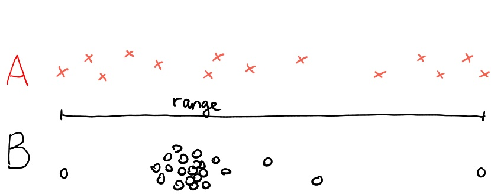

variance is “made” of all data, not just of the two most extreme observations. For instance, returning to the examples we presented regarding range above, $x _ { 1 } = ( 0 , 0 , 0 , 0 , 0 , 1 0 )$ and $x _ { 2 } = ( 0 , 2 , 4 , 6 , 8 , 1 0 )$ , we can compute the variance of the first sample $s _ { 1 } ^ { 2 } = 1 3 . 8 8 9$ and of the second sample $s _ { 2 } ^ { 2 } = 1 1 . 6 6 7$ . One can see that in the second sample, “typical” data points are closer to the average than in the first sample.

• Variance, in particular its analogue for random variables (see Section 1.4.5), is an extremely important theoretical concept. Many common statistical tests, including z-test and t-test, are based on variance.

Variance can be computed using definition (1.3.2) above. Let us compute variance of data vector (1, 2, 3). We do this in an explicit way by constructing a table for the auxiliary results (Table 1.4). The first column in the table just displays the data, average of which, x¯, is in the last row. The second column displays the deviation from the average, $x - { \bar { x } } ,$ and the last column displays the deviation squared. The average of the latter is variance, in this example $\stackrel { \rightharpoonup } { s ^ { 2 } } = \stackrel { \rightharpoonup } { 2 / 3 }$ . Note also that the middle column, $x - { \bar { x } } .$ , averages to 0. This is always true by the definition of mean, and explains why we want to compute average of the squared the deviations instead of the average of deviations.

Table 1.4: Computing variance. The last row displays the averages, the average of column x is just the sample average ${ \bar { x } } = 2 ,$ , and the average of the last column is the variance $s ^ { 2 }$ . Note that the average of the middle column $x - \bar { x } ~ i s ~ 0 ,$ this is always true through the definition of mean.

| x | x - x¯ | (x - x¯)<sup>2</sup> |
| --- | --- | --- |
| 1 | -1 | 1 |
| 2 | 0 | 0 |
| 3 | 1 | 1 |
| average 2 | 0 | 2/3 |

This approach, based on the definition (1.3.2) is easy enough when coding, but

<!-- page: 32 -->

when computing variance manually, then it is easier to use the shortcut formula

$$
s ^ {2} = \overline {{x ^ {2}}} - (\bar {x}) ^ {2}.\tag{1.3.3}
$$

This formula is equivalent to the definition (1.3.2) above. So variance can also be computed as the difference between mean of $x ^ { 2 }$ and the square of mean of x. For the example in Table 1.4, we see immediately that $( \bar { x } ) ^ { 2 }   =   4 ,   \overline { { x ^ { 2 } } }   =   ( 1 + 4 + 9 ) / 3   =   4 { \textstyle \frac { 2 } { 3 } }$ , and hence their difference is $s ^ { 2 }   =   2 / 3$ , the same number we found when using the definition (1.3.2).

## Proof 1: Where the shortcut formula is coming from

The shortcut formula can be derived from the definition of variance (1.3.2). We start by opening the parenthesis and re-arranging the terms:

$$
\frac {1}{N} \sum_ {i = 1} ^ {N} (x _ {i} - \bar {x}) ^ {2} = \frac {1}{N} \sum_ {i = 1} ^ {N} (x _ {i} ^ {2} - 2 x _ {i} \bar {x} + \bar {x} ^ {2}) =\tag{1.3.4}
$$

$$
= \frac {1}{N} \sum_ {i = 1} ^ {N} x _ {i} ^ {2} + \frac {1}{N} \sum_ {i = 1} ^ {N} (- 2 \bar {x} x _ {i} + \bar {x} ^ {2}) = \dots\tag{1.3.5}
$$

Here we already have the first term, ${ \overline { { x ^ { 2 } } } } ,$ Now we use the fact that x¯ does not depend on i and can be take out of the sum:

$$
\ldots = \overline {{x ^ {2}}} - 2 \bar {x} \frac {1}{N} \sum_ {i = 1} ^ {N} x _ {i} + \frac {1}{N} N \bar {x} ^ {2} = \ldots\tag{1.3.6}
$$

Here we have used the fact that as $\textstyle \sum _ { i = 1 } ^ { N } { \bar { x } } = N   { \bar { x } }$ And finally, using the definition of mean we have

$$
\begin{array}{r} \ldots = \overline {{x ^ {2}}} - 2 \bar {x} \bar {x} + \bar {x} ^ {2} = \\ = \overline {{x ^ {2}}} - \bar {x} ^ {2}. \end{array}\tag{1.3.7}
$$

This is the shortcut formula.

## Exercise 1.4: Properties of variance

Consider two sequences of data:

$$
\boldsymbol {x} _ {1} = (0, 0, 0, 4) \quad \text {and} \quad \boldsymbol {x} _ {2} = (0, 0, 0, 4 0)
$$

1. Compute variance of $x _ { 1 }$

2. Compute variance of $x _ { 2 }$

3. Compute variance of $( 0 , 0 , 0 , 4 \lambda )$ where $\lambda \in \mathbb { R }$ is an arbitrary number.

4. Consider an arbitrary sequence y that has variance $s _ { y } ^ { 2 } .$ What is variance of λy, a vector where every element is multiplied by $\lambda ?$

<!-- page: 33 -->

## 1.3. DESCRIPTIVE STATISTICS

The last point is extremely important when computing the variance of sample mean (see Section 1.6.2 Theoretical Confidence Intervals, page 99). Solution at page 487

It also appears that the results computed from (1.3.2) on a small sample tend to underestimate the variance of a larger sample of the same data. This can be easily understood when looking at a sample of a single observation only. Obviously, in this case $\bar { x } = x _ { 1 }$ and hence $( x _ { 1 } - \bar { x } ) ^ { 2 } = 0$ and we have the sample variance $s ^ { 2 } = 0$ . This is definitely an underestimate for anything besides constant values. The solution is to compute the corrected variance, often called population variance

$$
s ^ {2} = \frac {1}{N - 1} \sum_ {i = 1} ^ {N} (x _ {i} - \bar {x}) ^ {2}.\tag{1.3.8}
$$

The difference between (1.3.8) and (1.3.2) is just value $N - 1$ instead of N in the denominator. This inflates the sample variance estimator, and now the estimates are not too small even on small data. For instance, in our single observation example, this formula would give $0 / 0 .$ , an undefined value.

The two variance concepts, sample variance and population variance, are a source of a lot of confusion. The confusion is carried over to the software realm, e.g. the default function for variance in R and Pandas, var(), uses (1.3.8) while the same function in numpy uses (1.3.2). It is beyond the scope of this book to explain the difference between these two ways to compute variance. Fortunately, in anything resembling a respectable dataset, the difference is minimal. In this book we use the sample variance in the form of (1.3.2).

An additional source of confusion is caused by the theoretical concept corresponding to population variance that is also called variance (see Section 1.4.5). These concepts are related in a similar way as sample average and expected value, but unfortunately they share the same name.

## Standard deviation

There are two main disadvantages of variance: first, it is not an intuitive concept despite of its theoretical importance, and second, it is measured in squared units. For instance, if we are working with human age data, variance is measured in years squared. This is not a unit that we can understand. Fortunately, this problem is easy to ameliorate–we can just take square root of variance, that will be measured in the same units as data. This is called standard deviation or standard error. Standard deviation of human age is measured in years, and we understand years well. The difference between these two concepts is beyond the scope of this book. Here we use “standard deviation” primarily in the context where we talk about variability in data, and “standard error” when the variability describes uncertainty of our results. Standard deviation is denoted in various ways, in formulas often as s (as square root of sample variance $s ^ { 2 } )$ , in text and tables it is often written as std.dev (or std.err for

<!-- page: 34 -->

standard error). So we can define standard deviation as

$$
s = \sqrt {s ^ {2}} = \sqrt {\frac {1}{N} \sum_ {i = 1} ^ {N} (x _ {i} - \bar {x}) ^ {2}}.\tag{1.3.9}
$$

In a similar fashion as variance, standard deviation describes a certain average deviation from the mean. But unlike the variance, it is deviation from the mean, not squared deviation from the mean. We can call it as “typical deviation”.

Example 1.7: Education and income in NLSY data: variability

We continue the Example 1.6 above, and compute the range, variance and standard deviation of education and income in heights data (see page 479). The results are in the table below

|  | Min | Max | Var | Std.dev |
| --- | --- | --- | --- | --- |
| Education (years) | 1 | 20 | 6.76 | 2.60 |
| Income ($1000) | 0 | 343.83 | 3123.93 | 55.89 |

Table 1.5: Range, variance and standard deviation of education and income. Dataset heights.

We see that education ranges from 1 to 20 years. The latter corresponds to an advanced degree, but the former, just a single year of schooling for and adult, seems somewhat suspicious. More analysis is needed to tell if it is indeed a correct value. We also see that variance of education is 6.76 and its standard deviation is 2.6. The latter can be understood as the “typical” deviation from the average education value, 13.22 (see Example 1.6). But in any case, these figures are hard to interpret.

Income, on the other hand ranges between 0 and 344,000 (US dollars yearly). The maximum value is actually not the maximum income, the documentation reveals that this is the average income of the top-2% of incomes. This is referred to as top coding, and it is a common feature of datasets that include individual income.

It is hard to interpret the variances, but we can compare standard deviations with the mean. For education, std. deviation, 2.6, is much smaller than the corresponding average 13.22. But for income, this is the other way around– standard deviation is 56,000, more than the average 41,000. Below, we see that this is because these two variables describe rather different kind of features, with income inequality substantially larger than education inequality.

<!-- page: 35 -->

## 1.3.3 Distribution

Mean, range and variance and other descriptive figures give a few numbers that are useful in understanding both the typical and extreme data values. But sometimes we want to know more: which values are more common and less common? How common are values near the extremes? Are there a lot of large values? Below, we discuss the distribution of data that can answer all these questions. Distributions are often represented visually using histograms and density plots, but they can also be described with quantiles and other measures.

## Histogram

Histograms are just counts of data points in bins of different values. Typically the variable range is split into bins of similar width, and thereafter one counts how many observations fall into each bin. It is also common to present the histogram not as counts per bin, but as density, i.e. percentage of observations per unit width for each bin. The advantage of this is that the numeric values are approximately constant when changing the data size and number of bins.

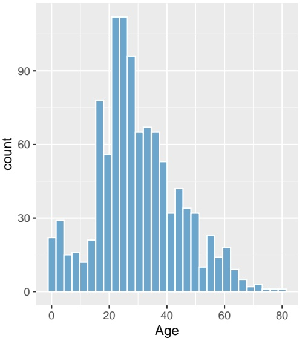

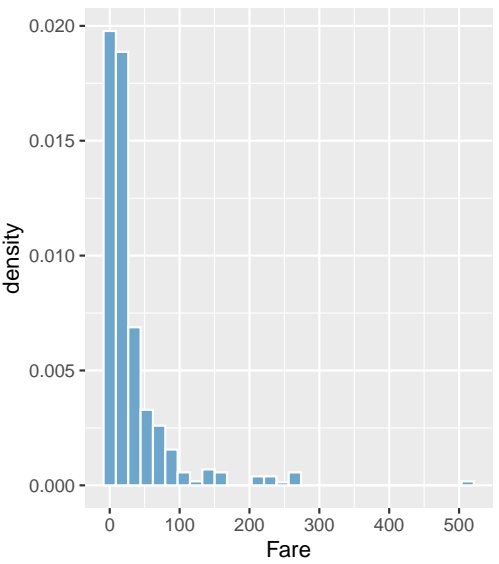

Figure 1.2: Histogram describing the age distribution of Titanic passengers (left panel) displayed as counts, and the distribution of fare they paid (right panel) as density. We can see that while age is approximately normal, fare is highly skewed.

In practice, a good choice of the number bins is often the square root of the number of data points, this will usually give a visually appealing plot.

Figure 1.2 depicts such histograms for age (left panel) and fare (right panel) of Titanic passengers (see Section B Titanic, page 483). We can immediately see that these two variables are distributed in a rather different way. Age is broadly normally

<!-- page: 36 -->

distributed (see Section 1.5.3 Normal distribution, page 76) while fare is extremely right-skewed: most people paid around 10£ but a few passengers paid much more (in fact, the highest fare paid was 512£). We can also see that the age distribution is bimodal: typical passengers were 20 to 40 years old, but we also see a peak among the very young travelers. These are probably children of the adult passengers.

Histograms allow us to quickly grasp several interesting features of the distribution, and in this sense they offer a much more detailed view than mean or variance. However, just by eyeballing the plots we may not be able to estimate certain relevant features of the distributions, e.g. we may not be able to tell if mean of one sample differs from the mean of another sample. Another problem with histograms is that partitioning data values into discrete bins may obscure or amplify certain discontinuities in the distributions.

An alternative is to display data as density plots (Figure 1.3). These are conceptually similar to histograms, just displayed as continuous curves, where the density value depends on the number of datapoints nearby. Density plots do not bin data and hence do not show related artifacts, but smoothing over nearby values may create other problems.

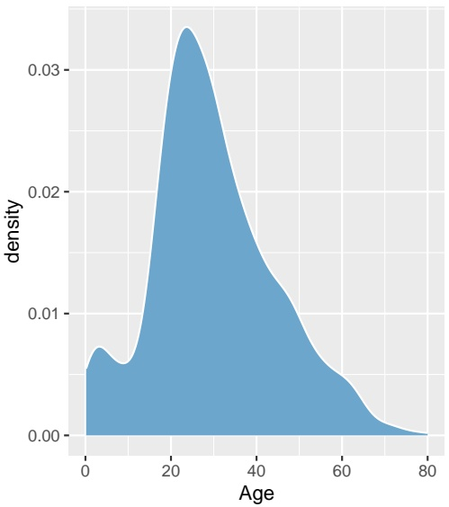

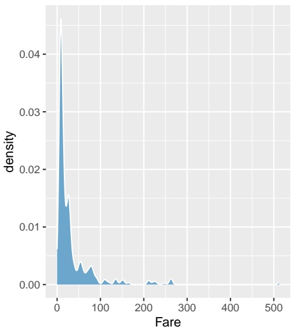

Figure 1.3: Age and fare distribution in Titanic data, displayed as density plots. It is exactly the same data as in Figure 1.2, just displayed differently.

Density plots are some times displayed vertically for different groups. Such plots are called violin plots. Figure 1.4 (left) shows one such plot, namely passengers’ age for different passenger classes. One can see that second and third class passengers are of broadly similar age, the second class passengers are just slightly older. However, first class passengers lack a peak at age range 20-30 alltogether, the most common age group for this class is 30-50 instead.

<!-- page: 37 -->

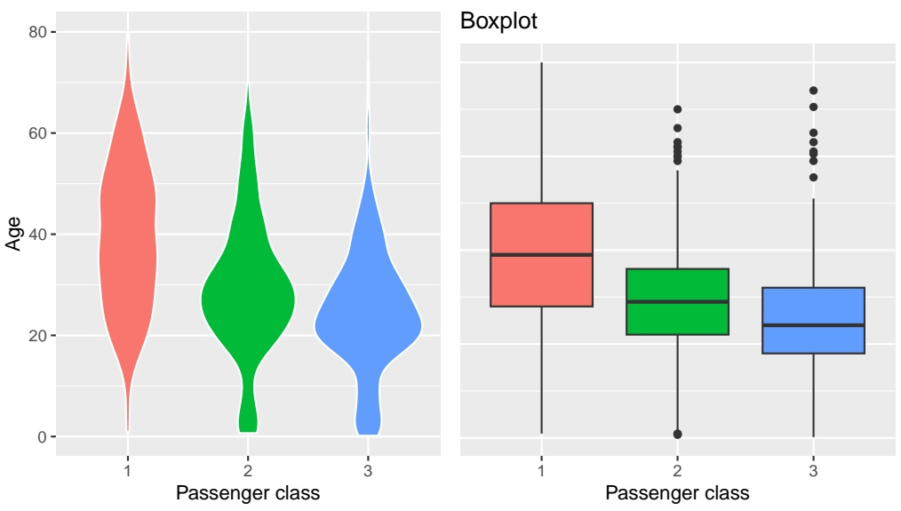

Figure 1.4: Titanic age distribution by passenger class. Violin plot (left) and boxplot (right).

A simplified version of violin plot is boxplot. Figure 1.4, right, shows the same information as the corresponding violin plot, just now in the form of a boxplot. The three boxes depict the three passenger classes.Boxes cover 50% of the observations, from the lower quartile to the upper quartile, the horizontal bar represents the sample median. The whiskers extend up to 1.5× the box height above and below from the box–up to the largest and smallest data point in this range. All cases that reach beyond the whiskers are called “outliers” and marked with separate dots. As you can see, the boxplot provides broadly the same information as the violin plot–2nd and 3rd class passenger age is distributed in a similar fashion, just 2nd class passengers are slightly older. But 1st class passengers are much more old, and their distribution spans a wider age range.

Example 1.8: Education and income in NLSY data: distribution

The figure below compares the distribution of income and education, based on NLSY data (dataset heights, see Section B Heights, page 479):

<!-- page: 38 -->

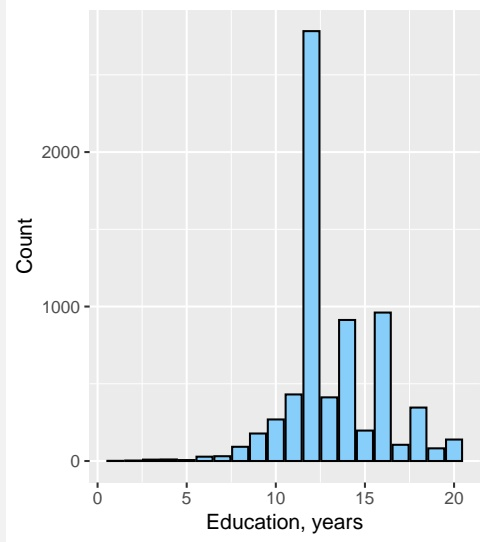

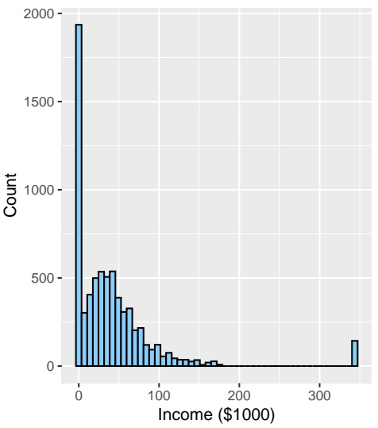

Figure 1.5: Histogram of education (left) and income (right) in heights data.

Education (left panel) shows a strong peak at 12, corresponding to the high school degree. Minor peaks are visible at 14 and 16 years, corresponding to the 2-year and 4-year college respectively. Income (right panel) has two prominent peaks: at zero, and at \$340,000. The former is true data, in the sense that there are indeed many people who do not earn any money. The latter, however, is an artifact of top coding, in reality there are people in this sample who earn much more than this, just their income is replaced by this number. When ignoring the peaks, the income distribution shows a hump with a thin but long right tail. Income is typically log-normally distributed, see Section 1.5.3 Log-normal distribution, page 78.

## Quantiles

A popular method to quantify certain aspects of distributions is by using quantiles. Quantile is relative location in data. For instance, 0.2-th quantile is such a number that 20% of observations are smaller than it, and 80% of observations are larger than it. This quantile is often denoted as $q _ { 0 . 2 }$ . There is a sibling measure of quantile, called percentile. These two are equivalent, 0.2-th quantile is exactly the same thing as 20th percentile. In order to compute $q _ { 0 . 2 }$ (20th percentile), we can first arrange data in an increasing order, and thereafter remove the first 20% of it. The smallest number that is left is the quantile value.

In practice we have to define it slightly differently to deal with cases where the quantile does not correspond to any particular data point:

<!-- page: 39 -->

## Definition 1.1: Sample quantile

τ -th quantile is a number $q _ { \tau } ,$ such that fraction τ of values is no larger than $q _ { \tau } ,$ and fraction 1 − τ of values are no smaller than $q _ { \tau }$

For example, consider sample (1, 1, 1, 2). Its 0.5th quantile $q _ { 0 . 5 }$ is 1: a half of the values (1 and 1) are no larger than 1; and the other half (1 and 2) are no smaller than 1.

However, this definition is still not unique. For instance, 0.5-th quantile of (1, 2) can be anything in the interval [1, 2]. Usually this does not matter in applications, but one must be aware of possible surprises, in particular if many data points take a small number of discrete values. Also, different software packages may define quantiles differently, or they allow you to choose between different definitions. In the case of this example you may find numbers like 1, 1.5 and 2, depending on what is exact definition is used.

Certain quantiles have common names:

• Median is 0.5-th quantile $q _ { 0 . 5 } \colon$ it is the middle value, i.e. a half of the sample is no larger than median, and the other half is no smaller than median.

• Tertiles (or terciles) are $1 / 3$ and $2 / 3 \cdot$ -th quantiles, $q _ { 1 / 3 }$ and $q _ { 2 / 3 }$

• quartiles are $1 / 4 ,   1 / 2$ and $3 / 4 \cdot$ -th quantiles

• quintiles are quantiles that split data into five parts (0.2, 0.4, 0.6, 0.8-th quantile).

Quantiles that are close to median are quite robust with respect to outliers, but extreme quantiles (such as $q _ { 0 . 0 1 }$ or $q _ { 0 . 9 9 9 } )$ may be very sensitive.

## Example 1.9: How to compute quantiles

<div class="docvortex-algorithm" style="white-space: pre-wrap; font-family:monospace;">
Consider data (1, -2, 3, 1). Let's compute median, lower quartile and upper tertile ($q_{0.25}$, $q_{0.5}$ and $q_{2/3}$). First, we want order the data—this will be (-2, 1, 1, 3). The figure below shows the ordered datapoints (above the line), and sample quantiles corresponding to the data points (below the line). The smallest and the largest point correspond to quantiles 0 and 1, and the other two, marked on the figure as the 0.333—the quantile ($q_{1/3}$) and 0.667—the quantile ($q_{2/3}$), split the interval [0, 1] into three equal parts.

Ordered datapoints -2
Quantiles 0
1
0.333
0.5
1
0.667
3
1

Figure 1.6: How to compute quantiles: order the data first, and then find the closest datapoints on both sides of the the desired quantile (or points that overlap with it).
Median, the 0.5th quantile, is the midpoint between the lower tertile ($q_{1/3} = 1$) and the upper tertile ($q_{2/3} = 1$). Hence the median must be 1.
</div>

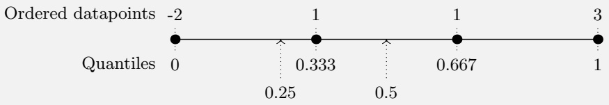

<!-- page: 40 -->

The lower quartile, 0.25th quantile, is between 0-th quantile $( q _ { 0 } = - 2 )$ and 0.333-th quantile $( q _ { 1 / 3 } = 1 )$ . Hence it can be any number between −2 and 1.

Finally, the upper tertile, 0.667-the quantile, is exactly determined by a data point $q _ { 2 / 3 } = 1$ . Hence it is 1.

Different software packages may define the default way to compute quantiles differently. For instance, both R’s and nympy’s quantile() function with default arguments results in 0.25, 1, 1; but when specifying “type 1” quantiles, it gives -2, 1, 1.

For large samples where the data points define a large number of fine-grained quantile values, such a detailed approach may not be necessary. But when a large number of points tend to cluster at a few values only, we still need such a detailed definition.

## Exercise 1.5: Compute sample quantiles

```txt
Consider data (1,2,3,1,2,1).
    1. Which quantiles are defined by the data points?
    2. Compute 0.5-th quantile (median)
    3.   0.8-th quantile (upper quintile)
    4.   0.333-th quantile (lower tertile)
Solution on page 487.
```

## Exercise 1.6: Robustness of quantiles

<div class="docvortex-algorithm" style="white-space: pre-wrap; font-family:monospace;">
Consider data $\boldsymbol{x} = (1, 1, 2, 1, 2, 1)$. However, due to a typo, you receive an erroneous data vector $\tilde{\boldsymbol{x}} = (1, 1, 2, 1, 21)$ instead.
1. Compute mean, median, and $q_{0.9}$ for both $\boldsymbol{x}$ and $\tilde{\boldsymbol{x}}$.
2. Which of these characteristics (mean, median, $q_{0.9}$) is less affected by the typo? Which one is the most affected one?
Solution on page 488.
</div>

## 1.3.4 Other descriptive measures

## Inequality

Another common feature we analyze in data is inequality. There are various ways to measure it, e.g. by Gini coefficient, the quintile share ratio, Pareto ratio, and many others.Note that inequality is well defined for ratio measures only, this is because when comparing inequality, we almost invariably think in relative terms when talking about inequality. For instance, we feel that \$100,000 difference in income describes very different inequality for two persons who earn \$50,000 and \$150,000, compared to

<!-- page: 41 -->

two persons earning \$1,050,000 and \$1,150,000. This is why we need ratio measures to discuss inequality.

A number of inequality measures also cannot handle negative and zero values: it is true that someone owning \$10 owns infinitely more in relative terms than someone with no money, but such ratios are typically not useful for any practical applications. We’d consider both persons extremely poor.

Below, we look at two measures–quintile share ratio and Pareto rule.

**Quintile share ratio** Quintile Share Ratio (QSR, also S80/S20) is a popular and simple inequality measure. It is the ratio of the total wealth owned by the wealthiest 20% to the total wealth owned by the poorest 20%. It can be computed as a sum of all values above the 0.8-th percentile, divided by the sum of values below 0.2-th percentile.

Obviously, we can compute QSR for all sorts of different variables, not just wealth. For instance, look at the house prices in Windsor, ON (see B). The distribution is shown in Figure 1.22, page 79. The average house in the dataset costs \$68,100, and all in all, we have data about 546 homes. The botton 20th percentile of the house values is \$47,000 and the top 20th percentile is \$87,000. The total value in the bottom quintile, the total price of all 107 homes with price below \$47,000 is \$4,145,400. The total value of the top quintile, the total value of 109 homes above \$87,000 is \$12,021,700. Hence the quintile share ratio

$$
Q S R = \frac {\$ 12,021,700}{\$ 4,145,400} \approx 2.9.\tag{1.3.10}
$$

For the house values example, QSR is well defined and easy to understand. This is because in normal housing market, all houses command a positive price. But certain distributions have a large number of zeros. If the distribution contains more than 20% of zero values, the total value in the bottom quintile is zero and QSR is infinite. It carries little information in such case. Unfortunately, zero values are very common in all kinds of income, wealth, and popularity data. For instance, those who do not work have no income. Those who do not own a home have zero housing wealth. Websites that are not accessed have zero number of hits. In that case one may compute QSR for the positive values only, but this approach ignores the presence of zeros in data.

The problem boils down to a conceptual issue–we want to use the inequality measure to describe life quality difference between different groups of people. But no income does not mean zero life quality, most of zero-income people are either drawing down their own savings, or so are supported by others. Income is only a proxy for life quality.

**Pareto ratio** Pareto ratio is another popular measure of inequality. It is often called 80/20 ratio after the observation that for many phenomena, 20% of the cases are responsible for 80% of the outcomes. This includes wealth inequality (“20% of the richest control 80% of the wealth”), but also computer code (“you spend 20% of time to get your code to work on 80% of tasks, and you spend 80% of your time on the last 20% of tasks...”).

The exact figure depends on the data distribution, and despite it being sometimes called 80/20 ratio, it is not usually the case that the top 20% controls 80% of all

<!-- page: 42 -->

outcomes. If this is indeed the case, i.e. if the richest 20% control 80% of total wealth, then we have a rather unequal distribution. For instance, in case of Windsor housing (see Section B Housing, page 480) wealth example above, the most expensive 43% of the houses contain 57% of the housing value instead (see Figure 1.7); but in case of research paper citations, the most cited 17.5% of papers capture roughly 82.5% of all citations. So among these datasets, housing values are much more equal than citations. See also Table 1.10 Pareto ratios for log-normal distribution, page 81 for related ratios for log-normal distribution.

Figure 1.7: Pareto rule states that the top x% of the population possesses as much as the bottom 100 − x% of the population. The pareto ratio is where the wealth share of the top population equals to the share of the bottom population (the blue diagonal line). In Windsor the most expensive 43% of houses cost in total as much as the cheapest 57% houses. Housing value inequality is low in this neighborhood. Windsor house price data.

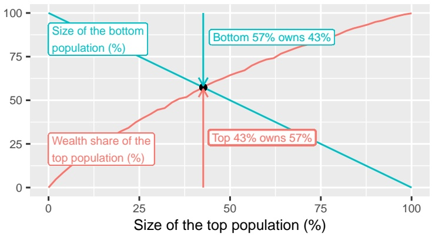

Note that by contruction, the top 50% will always own at least 50% of the total wealth.

Exercise 1.7: Compute inequality

```txt
Consider the following datasets:
  Five individuals whose wealth is (1, 1, 1, 1, 16)
  Ten individuals with wealth (1, 2, 3, 4, 5, 7, 8, 10, 70, 90).
For both cases, compute:
  Quintile share ratio;
  Pareto ratio.
  Solution on page 490.
```

Example 1.10: Education and income in NLSY data: inequality

<div class="docvortex-algorithm" style="white-space: pre-wrap; font-family:monospace;">
We can also compute the inequality in education and income, using heights data.
Starting with education, we can find that the 0.2th and 0.8th quantiles are 12 and 16 respectively. The “total years of education owned” by those in the lower 20% is 10258 and by the upper 20% is 12351. Hence
$QSR = \frac{10258}{12351} = 1.204$.
In case of income, we’ll find the 0.2th and 0.8th quantile to be 0 and 63 (in $1000), and the corresponding total income earned by the respective groups are 0 and 166,000. This indicates that we cannot compute a meaningful QSR: as the
</div>

<!-- page: 43 -->

lower-20% of the population does not earn any income, the QSR will be infinite. This is a common problem when computing income inequality: as there is a large population with no income, we need an inequality measure that can handle zeros. But we can compute both pareto ratios: for education, it is 47.2 and for income it is 30.2. The former means that the best-educated 47.2% of population “owns” 52.8% of total years of education. Although mathematically correct, this sounds weird as “owning” years of education is not how we usually think about education inequality. In case of income, we have that the richest 30.2% of population earns 69.8% of total income. This is a perfectly meaningful claim. ence, at east ase on areto ratio, income is more unequa t an e ucation. Hence, at least based on Pareto ratio, income is more unequal than education

## Cheatsheet 1.2: Descriptive Statistics

<div class="docvortex-algorithm" style="white-space: pre-wrap; font-family:monospace;">
Central tendency What are the “typical” values.
Mean (average) $\bar{x} = \frac{1}{N} \sum_{i} x_{i}$. Need interval measure. Easy and intuitive, good for aggregate data; sensitive to outliers, the value may not exist.
Median middle value: value where half of the sample is smaller than this, and another half is larger than this. Need ordinal measure. Less sensitive to outliers; less intuitive.
Mode most common value. Any measure will do. Intuitive for discrete values, needs assumptions for continuous values.
_______
Variability How are the values spread around.
Range minimum and maximum value. Need ordinal measure. Easy and intuitive; extremely sensitive to outliers.
Variance average squared deviation from mean: $s^{2} = \frac{1}{N} \sum_{i=1}^{N} (x_{i} - \bar{x})^{2}$. Very important theoretical measure; not intuitive, measured in squared units that are hard to interpret.
Standard deviation square root of variance. Measured in the same units as data; less desirable theoretical properties. Can be understood as the “typical deviation from average”.
_______
Distribution What values are more common and less common.
Histogram count and plot values in pre-determined bins:
</div>

<!-- page: 44 -->

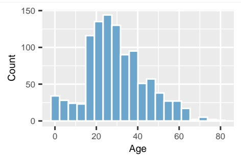

Density plot Compute and show density of data points

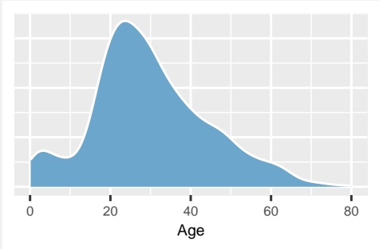

Violin plot Vertical density plot by group

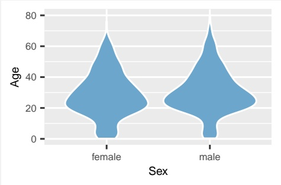

Boxplot Simplified vertical representation of density

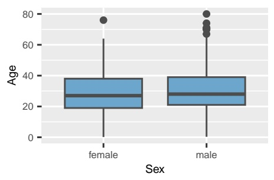

<!-- page: 45 -->

## 1.3. DESCRIPTIVE STATISTICS

**Quantile** 0.2-th quantile is such a number so that 20% of values are smaller than that, and 80% of values are larger than that.

## Inequality

**QSR** (quintile share ratio) is the ratio of total value of top 20% cases (top quintile) and the botton 20% of cases (bottom quintile). For instance, In total, the top 20% of jobs pay 8 times more than bottom 20% of jobs in total.

**Pareto ratio** x so that the largest x% of cases “owns” 100 − x% of total value. For instance, the richest 30% own 70% of all wealth.

<!-- page: 46 -->

## 1.4 Basics of Probability Theory

This section discusses probability theory, in particular the concepts of random variable, expected value and variance. We use these concepts extensively below when discussing statistical theory.

## 1.4.1 Events and Sample Space

Before we get into discussing the concepts in more details, we should make clear what are we analyzing. The two central concepts in probability theory are events and probability.

Event is something that may or may not take place, and where we typically do not know if it occurs. Sure, we can also talk about things that take place for sure (certain events) or that will never take place (impossible events), but we do not really need the concept of probability to analyze such cases. A few examples of events we may be interested in include


• Flip a coin. An event is get heads;

Flipping a coin is a popular way to create random outcomes–heads or tails. Historically, one side of the coin frequently represented the head of the monarch, the tail side depicted other symbols of power. Five roubles in gold, Nicholas II of Russia. By [Unwrecker](https://ru.wikipedia.org/wiki/%D0%A3%D1%87%D0%B0%D1%81%D1%82%D0%BD%D0%B8%D0%BA:Unwrecker), [CC BY-SA 3.0](https://creativecommons.org/licenses/by-sa/3.0/deed.en), via [Wikimedia Commons](https://commons.wikimedia.org/wiki/File:Russian_Empire-1899-Coin-5-Reverse.jpg)

• We play a dice game and roll two dice. We may be interested in an event get at least one six;

• We are going to pick up a friend at airport. We are concerned about the event flight arrives in time.

When talking about events in the probability theory sense, we are always thinking about some kind of stochastic phenomenon, or a stochastic experiment. Stochastic refers to phenomena that are not completely predictable, at least not in terms of the information and tools that we have at our disposal. For instance, your friend’s arrival time may be very well predictable if we know the exact position and speed of the airplane, the wait time at immigration, and whether all the luggage bands at the airport are working. But as we don’t have this information, we may just go to the airport in time and hope for the best. Arrival time is a stochastic process from our perspective.

All possible events together form sample space S. So sample space is a set of all kind of events that can occur in the phenomenon we are considering. Although the concept may feel trivial, it is extremely helpful when thinking about random outcomes. Here are a few examples:

• Toss a coin. There are only two options, heads and tails, so $\mathcal { S } = \{ H , T \}$

• Roll two dice. Each die can come up with sides 1 to 6, so the sample space is a set of tuples (ordered pairs)

$$
\mathcal {S} = \left\{ \begin{array}{c} (1, 1), (1, 2), \ldots , (1, 6) \\ (2, 1), (2, 2), \ldots , (2, 6) \\ \cdots \\ (6, 1), (6, 2), \ldots , (6, 6) \end{array} \right\}.
$$

<!-- page: 47 -->

Note that we distinguish (1, 6) and (6, 1), i.e. we distinguish between the first and second die: in the first event the first die comes out with one and the second with six, in the second event it is the way around. These two simple events make a compound event one and six (see below). If both dies are similar and hard to distinguish, then we may consider these two events to be a simple event instead.

• Flight delay. This can be any number, and we cannot really put a lower or upper limit on it in general, so we can consider the sample space to be

$$
\mathcal {S} = (- \infty , \infty)
$$

The first two of these examples are finite discrete sample spaces. The third one is a continuous sample space. Note also that the first two are not numeric: when tossing coins, we receive heads and tails, not numbers. When rolling two dice, we receive pairs of numbers, not numbers. (Or, to be even more precise, we receive pairs of sides with a certain dot patterns on them.) Finally, the third example, the flight delay, is numeric, but not just numeric as it also has a unit (say, minutes). This is because these events describe the physical world.

## Example 1.11: Monty Hall Problem

The concept of sample space allows us to analyze and understand certain problems that are otherwise hard to grasp. Monty Hall problem, a game in a TV-show hosted by TV-host Monty Hall, is the following:

You are in a room with three closed doors. You know that behind one of the doors is the price, and the other two doors are empty. The host knows where is the price but you do not know. You pick one door (but do not open it). Now the host opens one of the other two doors, one that is empty. You can either stay at your current door, or switch to the other closed door. Finally, the door you chose is opened, and if you picked the correct door, you’ll win the price.

Should you switch the door after the host opened an empty door?

To a big surprise for most of us, including trained mathematicians, it is worthwhile to switch. This will increase the chance of winning from 1/3 to 2/3. Why such a counter-intuitive result?

The problem is easy to assess when using the concept of sample space. Let’s label the doors 1, 2, and 3, and assume (without loss of generality) that the price is behind the door 1 (see the figure below). If you first pick door 1, the host will open either door 2 or 3, and importantly, you should stay where you are. However, because you don’t know where the price is, you pick the correct door only 1/3 of time; and hence 1/3 is your winning chance if you stay where you are. However, if you pick a wrong door, for instance 2, the host has only one option to open an empty door, namely 3. Now you should switch to door 1. You do not know if you initially picked an empty door, but just by chance this happens 2/3 of time. So the second strategy gives you a win in 2/3 of cases, the former strategy in 1/3 of cases.

<!-- page: 48 -->

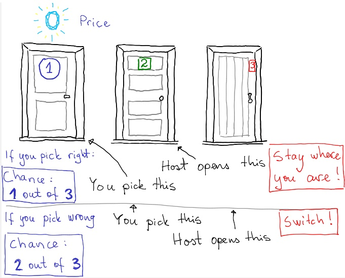

Figure 1.8: Monty Hall problem: you should stay at the door you picked if you picked the right one. But that happens only 1/3 of time. 2/3 of time you should switch.

It is important to understand the role of the host. The host is not acting randomly but instead she modifies the setup in a precise way. When you pick a door, there is 1/3 probability that the price is behind your door, and 2/3 chance that it is behind another door. When the host opens the other door, it is still 1/3 probability that the price is behind your door. But now all the rest of 2/3 probability is concentrated behind the other closed door. In order to make this point more clear, you can imagine a similar game with 100 doors. Again, you start by choosing one door and thereafter the host open 98 other doors so that only two doors remain closed. As your initial guess was correct only 1/100 of time, the price is most likely behind the other one.

It is often useful to distinguish between simple events and compound events. Simple events are such events that cannot be partitioned into anything simpler, while compound events can be partitioned. As an example, event of heads in a coin flip cannot be divided into anything more basic. It is a simple event. But get a six when rolling two dice can be any of (1, 6), (2, 6), (6, 6) or a number of other possibilities. It is a compound event. In a similar fashion, plane arrives in time may mean it arrived exactly in time, or in colloquial language it may also have arrived (exactly) 2 minutes early. In its colloquial meaning it is a compound event.

Such distinction is often very useful when we compute the corresponding probabilities. It is typically easier to compute probabilities of simple events than of compound events. For instance, consider an experiment: Flip two fair coins. What is the probability to get exactly one head? When working with simple events, the sample space $\mathcal { S }   =   \{ ( H , H ) , ( T , H ) , ( H , T ) , ( T , T ) \}$ . Importantly, as the coins are independent, all these four events are equally likely (with probability 1/4). Our compound event of interest, exactly one head, is made of two mutually exclusive simple events (H, T)

<!-- page: 49 -->

and (T, H). Hence the probability of this compound event is $1 / 2 .$

## Exercise 1.8: Rolling two dice

```txt
Take the example of rolling two dice. Compute the probability of the compound event get at least one six.
Hint: sketch the sample space in simple events. Are these events equally likely? Which simple events constitute the compound event of interest?
Solution on page 488.
```

An important type of events is mutually exclusive events. It is fairly easy to understand–events are mutually exclusive if they cannot occur at the same time. For instance, sides 1 and 2 cannot occur in the same experiment when rolling a single die. However event “an even side” and $^ { \circ } 2 ^ { \circ }$ can occur at the same time and hence these are not mutually exclusive events. All simple events are mutually exclusive.

Another important class of events is independent events. Intuitively, two events, X and Y , are independent if learning that X occurs does not tell us anything new about Y . For instance, flipping two coins consists of two independent events. The fact that the first coin shows heads does not tell you anything new about what happens with the second coin. However, if you roll a single dice, then events $X = a$ number less than four and $Y = a n$ even number are not independent. If X occurs then there is only one possible even number (2) out of three possible (1, 2, 3). Learning about X tells us something about Y .

## 1.4.2 Probability

Now we have discussed the events. But probability theory is concerned about probability of events. What is probability? It turns out that it is not quite obvious. There are at least two different answers.

The easiest answer to understand the concept is related to repeated events. Probability is “tendency” of the event to occur if we repeat the experiment many times. For instance, when tossing a fair coin 100 times, we will get around 50 heads, i.e. in average, we get heads in approximately 50% of cases. One can easily understand that the average percentage of heads gets close to the true probability if we increase the number of experiments.<sup>9</sup> This is concept is called frequentist probability.

But not all experiments can be repeated a large number of times. For instance, what would be a frequentist answer to the question “what is the probability that there will be a nuclear war with North Korea”? Do you really want to poke mister Kim Young Un 1000 times to see how many times a war breaks out? Even more, there are a plethora of common phenomena that can never be repeated. For instance, probability that it will be raining tomorrow. There is only one tomorrow, and in that tomorrow it will either be raining or not. What does the probability even mean here?

In such cases we have to resort to a definition like “tendency for the event to happen given the information we know”. In case of rain tomorrow, the “information we know” may be a weather model. Professional weather models typically contain many random processes, processes that are impractical or impossible to model precisely. But as we

<small><span class="docvortex-page-footnote" data-block-type="page_footnote" style="color:#6b7280"><sup>9</sup>See also Law of Large Numbers, Theorem 1 Law of large numbers, LLN, page 60.</span></small>

<!-- page: 50 -->

know the properties of these processes in the model, we can compute the probability of rain. This concept is related to propensity probability and Bayesian probability.

In everyday life we perform somewhat similar calculations. For instance, when deciding when to head to the airport to pick up your friend, you may have heard that today flights are an hour late. When you hear this, you may head to the airport a half an hour late because you “think” that it is “unlikely” the flight is delayed by less than 30 minutes. We do not perform explicit computations but just “feel” what is an appropriate estimate.

Probability is defined as a number between 0 and 1 (or 0 and 100%), where 0 means that the event will happen “almost never” and 1 means it will happen “almost certainly”. 10 All events in the sample space must must have a probability in the [0,1] interval. Mathematically, probability is defined as a function that assigns such numbers to each event in a sample space:

$$
\Pr : \mathcal {S} \to [ 0, 1 ]. \quad \text {where}\tag{1.4.1}
$$

We also require that probability of the complete sample space is 1 and that of empty set is 0–something will happen for sure:

$$
\Pr (\mathcal {S}) = 1 \quad \text {and} \quad \Pr (\emptyset) = 0.\tag{1.4.2}
$$

Besides of these fairly obvious requirements, there is one more, namely that probabilities of mutually exclusive events can be added. For instance, when rolling a die, the events “two” and “an odd number” are mutually exclusive–it is impossible that both of these occur at the same time. Hence the probability of “two or an odd number” is $1 / 6 + 1 / 2 = 2 / 3$ . Formally

$$
\Pr (A \cup B) = \Pr (A) + \Pr (B) \quad \text {if} \quad A \cap B = \emptyset .\tag{1.4.3}
$$

This is the mathematical definition of probability–what kind of values are consistent with the intuitive idea of probability. In applications we are usually concerned about measuring probability, calculating probabilites from data, and how the computed probabilities depend on various other parameters.

Example 1.12: Probabilities of four-sided dice

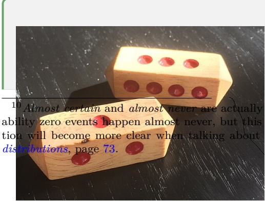

Figure 1.9: One possible form of 4-sided dice (Daldøs dice). Nø, [CC BY-SA 4.0](https://creativecommons.org/licenses/by-sa/4.0), via [Wikimedia Commons](https://commons.wikimedia.org/wiki/File:Dald%C3%B8s_dice.jpg)

Consider a 4-sided die with sides labeled as “1”, “2”, “3” and $^ { \circ } 4 ^ { \circ }$ , and the corresponding events mean these sides come up when rolling it. It is possible to assign probability 1/4 to

precise concepts in probability theory. The probdoes not mean they are impossible! This distinccontinuous distribution Section 1.5.2 Continuous

<!-- page: 51 -->

each of these events:

$$
\Pr (E) = \left\{ \begin{array}{l l} 1 / 4 & \text {if} \quad E = 1 \\ 1 / 4 & \text {if} \quad E = 2 \\ 1 / 4 & \text {if} \quad E = 3 \\ 1 / 4 & \text {if} \quad E = 4. \end{array} \right.
$$

This is consistent with the mathematical definition above and hence forms a valid probability: as two sides cannot come up at the same time, we can add these probabilites. For instance, probability of the compound event ${ { } ^ { \prime } } T ^ { \prime \prime }$ or ${ } ^ { \circ } \mathcal { D } ^ { \prime \prime }$ is $1 / 4 + 1 / 4   =   1 / 2$ Hence the probability of all four events–the complete sample space–is 1.

But it is also possible to assign the probabilities differently: for instance, $`` 1  ''$ has probility $1/2,   ``2,   1/4$ and $^ { 2 3 ^ { 5 } }$ and $^ { \circ } 4 ^ { \circ }$ both have $1 / 8 ;$

$$
\Pr (E) = \left\{ \begin{array}{l l} 1 / 2 & \text {if} \quad E = 1 \\ 1 / 4 & \text {if} \quad E = 2 \\ 1 / 8 & \text {if} \quad E = 3 \\ 1 / 8 & \text {if} \quad E = 4. \end{array} \right.
$$

This is also a valid probability.

Which one is the “correct” one? This depends on how does the dice look like. If all four sides are similar, it is a fair dice and each side is equally likely. The first probability function describes it better. But if the dice is biased, the second one may well be the correct one. The mathematical concept does not tell this, we need to collect data.

Machine learning is largely about computing conditional probabilities (see Section 1.4.3 Conditional Probability and Bayes Theorem, page 44), probabilities of certain outcomes, given the observable data. For instance, you may compute the probability that a house costs \$800,000, given it is located in a good neighborhood. Even the modern LLM-s are no different–the chatbot will compute probability of the next word in its response, given the previous word and the question you asked from it.

## Probability of independent events

Mathematically, events are independent if their joint probability can be factored into a product of two individual event probability. In case of two events:

$$
\Pr (X, Y) = \Pr (X) \cdot \Pr (Y).\tag{1.4.4}
$$

Take the example of two fair coins. Let $H _ { 1 } = t h e$ first coin shows heads and $H _ { 2 } =$ the second coin shows heads. In case of a fair coins, the probabilities are $\operatorname* { P r } ( H _ { 1 } ) =$

<!-- page: 52 -->

$\operatorname* { P r } ( H _ { 2 } ) = 1 / 2$ . Now the probability that we see two heads is

$$
\Pr (H _ {1}, H _ {2}) = \Pr (H _ {1}) \cdot \Pr (H _ {2}) = 1 / 4.\tag{1.4.5}
$$

Now let’s return to the die example at page 39. We roll a dies and have two events $X = a$ number less than four and $Y = a n$ even number. On a single die, the compound event–an even number less than four must be just number $^ { \circ } 2 ^ { \circ }$ , its probability is $1 / 6 .$ But when we multiply the corresponding probabilities $\operatorname* { P r } ( X ) = 1 / 2 { \mathrm { ~ a n d ~ } } \mathrm { P r } ( Y ) = 1 { \stackrel { \cdot } { / } } 2$ we get $1 / 4 .$ The numbers do not match because these two events are not independent.

In case of more than two events, the independence condition generalizes to

$$
\Pr (X _ {1}, X _ {2}, \dots , X _ {K}) = \prod_ {i = 1} ^ {K} \Pr (X _ {i}).\tag{1.4.6}
$$

See Section 1.4.4 Random Variable, page 55 for more about random variables.

Non-independent events (or more specifically, non-independent random variables) play an extremely important role in machine learning. After all, data only helps us to predict the outcome if learning data will tell us something new about the outcome. Data and outcome we want to predict must not be independent, otherwise the data is useless.

Example 1.13: Two non-independent coins


Figure 1.10: Two coins, taped together, are not independent.

It is easy to create coins that are not independent. Here are two coins, Danish 2 kroner (left) and 5 kroner (right), taped together. These coins have two sides, a spiral ornament S at left, and Queen Margrethe II initials M at right. Note that the coins are connected so that the coins face different sides up when the tape is not bent.

In an experiment of 50 flips, SS ap-

peared 8 times, MM 9 times, MS 15 times and SM 18 times. Hence the coins facing different side up is more likely.

## Cheatsheet 1.3: Events, Probability and Conditional Probability

**Event** A possible outcome in random experiment or phenomenon. Example: heads H is an event when flipping a coin.

**Sample space** Set of all possible events. Example: sample space for coin flip is {H, T}.

**Simple event** Event that cannot be divided into more basic events. Example: roll a die, event “1”.

**Compound event** Event that can be divided into simpler events. Example: roll

<!-- page: 53 -->

## 1.4. BASICS OF PROBABILITY THEORY

a die, get an even number.

**Mutually exclusive events** Events that cannot occur at the same time. Example: roll a die, ${ } ^ { \circ } T ^ { \prime \prime }$ and $^ { \circ } 2 ^ { \prime \prime }$ are mutually exclusive. Probability of one of the mutually exclusive events occuring is sum of their probabilities: $\mathrm{Pr}(A \cup B) =$ $\operatorname* { P r } ( A ) + \operatorname* { P r } ( B )$

**Independent events** Events where learning about one gives us no information about the others. Probability of both independent events A and B occuring is $\operatorname* { P r } ( A , B ) = \operatorname* { P r } ( A ) \cdot \operatorname* { P r } ( B )$

**Frequentist probability** tendency of an event to happen in a given percentage of trials. Example: toss coin 1000 times, you get H approximately 50% of times.

**Bayesian probability** best estimate given available information for how likely is something to happen. Example: what is the probability it is sunny tomorrow when I know it is raining today?

<!-- page: 54 -->

## 1.4.3 Conditional Probability and Bayes Theorem

**Prerequisites:** events, sample space

TBD: history

Bayes theorem is a rule about computing conditional probabilities–probabilities that something happens, given something else also happens. Conditional probabilities play a very important role in statistics and machine learning, in a sense all supervised learning is about computing conditional probabilities. For instance, if you are pre-dicting house prices based on house size, you are asking questions like “what is the probability that this house costs over \$500,000 given its size is 200 m<sup>2</sup>?”

Below, we’ll introduce conditional events first and conditional probability thereafter, in a similar fashion as we introduced events and probability in Sections 1.4.1 and 1.4.2.

## Conditional events, Venn diagram, and conditional probability

Let us start with a simple example: you roll a die and you get an even number. What is the probability that you got six? It is fairly obvious that the answer is 1/3: there are only three even numbers (2, 4, 6), they are all equally likely, and hence you get six in one third of the cases.

This example demonstrates all the basics about conditional events. We roll a die.Its full sample space consists of six events: 1, 2, . . . , 6. However, we also have a conditioning event, “even number”. It is a compound event containing simple events 0, 2, 4, 6, 8, . . . . The conditioning event “carves” (partitions) the sample space into two parts: one contains the feasible events (here the even numbers that are possible on die, i.e. 2, 4, 6) and the other partition contains infeasible events (here 1, 3, 5). Afterward, we work on the feasible partition only, e.g. we compute the probability of interest as one out of three feasible events.

This example is the essence of working with conditional events. We partition the sample space into two parts: the feasible partition (conditioning event), and the rest, the infeasible region. Thereafter we only consider what happens in the feasible region, the region of the conditioning event. The infeasible region can essentially be ignored. Below we introduce the idea more formally and provide more complex examples.

The conditioning of sample space is often illustrated using Venn Diagrams. Figure 1.11 displays one such Venn diagram. It is just a picture of sample space where we mark the set of events we are interested, and the set of events we are conditioning on. Figure 1.11 depicts the sample space S (the outer rectangle) and two events, A and B. In this figure we have to think of both events as compound events, consisting of single points as simple events. The events overlap to a certain extent, i.e. it is possible that both A and B occur. But they do not overlap perfectly, so if A occurs then it is not certain that B will occur and the way around. Finally, as the events do not occupy the full sample space, it is possible that neither will happen.

An example of such two events may be A = it is raining, and B = the class is canceled. Obviously, it is possible that neither of these two events happens (it is not raining and the class is not canceled), so these two events do not make a complete sample space. The “not raining and not canceled” is the white area, surrounding events A

<!-- page: 55 -->

Figure 1.11: Venn diagram. The events A and B overlap partially, so it is possible that only A occurs, only B occurs, and both A and B occur. As A and B do not sum to the whole sample space (there is a white “leftover area” in the sample space box), it is also possible that neither of these occur.

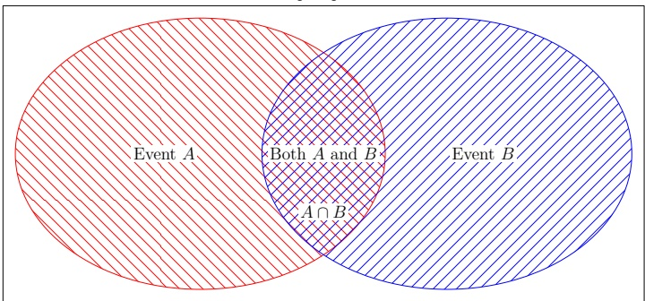

and B. Alternatively, it is also possible that only A happens (it is raining but the class takes place), only B happens (it is not raining but the class is canceled), and finally both of these may happen too.

However, in other type of examples not all four options may be possible. For instance, in case of coin toss, heads H and tails T are mutually exclusive events and hence it is not possible that both of these occur simultaneously. Even more, there are no more possible events in the sample space and hence either H or T occurs for sure.

TBD: Exercise: draw a Venn diagram of some sort of either complete event, mutually exclusive events, or maybe where the event of interest is part of the conditioning event.

Conditional probability is basically just probability, computed on the smaller, feasible partition of the sample space that was carved out by the conditioning event. We denote the conditional probability of event A happening given event B happens as $\operatorname* { P r } ( A | B )$ . For instance, in the house price/house size example, the question can be written as $\mathrm { P r } ( \mathit { p r i c e } > 5 0 0 \text {,} 0 0 0 | \mathit { s i z e } = 2 0 0 )$ .

Formally, we denote the probabilities related to the Venn diagram 1.11 as follows. First, Pr(A) is the probability that event A occurs and Pr(B) is the probability that event B occurs. These are called unconditional probabilities or just probabilities, as these are not related to any other event occuring. Next, we denote by $\operatorname* { P r } ( A , B ) \equiv$ $\operatorname* { P r } ( A \cap B )$ the probability that both A and B occurred. Normally we prefer the shorter notation $\operatorname* { P r } ( A , B )$ to denote joint events (this is also common in the literature), but sometimes we want to stress that this is an overlap of A and B and we write $\operatorname* { P r } ( A \cap B )$ . Finally, we denote the probability that A occurs conditional on B occurring as $\operatorname* { P r } ( A | B )$ ; and the opposite probability, that B occurs given that A happens, as $\operatorname* { P r } ( B | A )$ . In machine learning context, a major application of conditional probability is predictive modeling. Using statistical tools we are trying to answer the question: what is the probability of outcome Y given the data X?

## Example 1.14: Red and green, nice and bad

Consider the the following situation: Police is attempting to catch “Bad guys”. But whether someone is good or bad will be clear first after arrest and a costly investigation. But people are of different color, Red and Green, and the color is immediately visible. For some reason, however, there are more nice guys among

<!-- page: 56 -->

Reds and more bad guys among Greens. It can be depicted using the following Venn diagram:

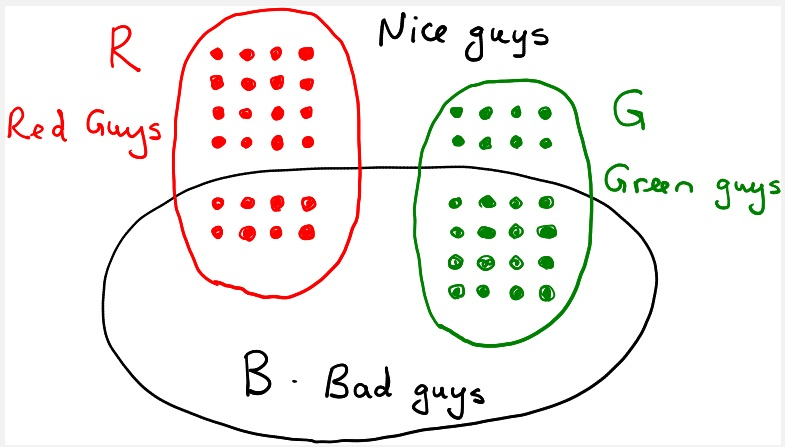

Figure 1.12: Venn diagram of three events: Red, Green, and Bad.

The diagram displays three events, Red R, Green G, and Bad B. There is also a fourth event, Nice, but as this is just the complement of Bad, we will not discuss it further. In this example, R and G are mutually exclusive, but events R and B have some overlap, and so have G and B. There are 24 reds and 24 greens, so (unconditional) probability to get a green is $\operatorname* { P r } ( G ) = 0 . 5$ . In a similar fashion, there are 24 Nice-s and 24 Bad-s, so the unconditional probability to find a Bad person is $\operatorname* { P r } ( B ) = 0 . 5$

What is the probability that a person whom the police detains is bad? This depends on how the police makes arrests:

Color-blind: arrest persons at random. As there are 24 nice guys and 24 bad guys, the probability that police arrests a bad guy is

$$
\Pr (B | A r r e s t) = \Pr (B) = \frac {2 4}{4 8} = \frac {1}{2}.
$$

Target greens: arrest greens only at random. As there are 8 good and 16 bad Greens, the probability of detaining a bad guy is

$$
\Pr (B | A r r e s t) = \Pr (B | G) = \frac {1 6}{2 4} = \frac {2}{3}.
$$

Target reds: arrest reds only at random. Now the probability to get a bad guy is just

$$
\Pr (B | A r r e s t) = \Pr (B | R) = \frac {8}{2 4} = \frac {1}{3}.
$$

In this example, the police may be tempted to target greens, no matter what is the wider impact to the society.

<!-- page: 57 -->

Exercise 1.9: First class survivors

| Class | Survived | Count |
| --- | --- | --- |
| 1 | 0 | 123 |
| 1 | 1 | 200 |
| 2 | 0 | 158 |
| 2 | 1 | 119 |
| 3 | 0 | 528 |
| 3 | 1 | 181 |

Next, let’s look at the following, somewhat more complex problem: Roll two dice. What is the probability to get at least one six, given one of the dice comes with an odd side up? Let’s call the event of interest, “at least one six”, A, and the conditioning event, “odd side up”, B. The corresponding sample space is shown in the Figure 1.13. In essence it is a Venn diagram, exactly as on the Figure 1.11. It is just a more complex one, and it is displayed as a table, not as surface areas. Every simple event in the bottom row and in the rightmost column in the table constitutes the event of interest A, we have colored these simple events pink. In a similar fashion, every odd row and odd column in the table corresponds to the conditioning event B, and we have marked it with blue. The table cells where A and B overlap, cells (1,6) and (5,6) and so on, are marked with purple. Intuitively, it is easy to see that the event we are interested are made of the 6 purple cells, and the conditioning event B is made of the 27 blue (and purple) cells. As all the cells (simple events) are equally likely, the probability of interest, denoted by Pr(A|B) is 6/27 ≈ 22.2%.

More formally, the conditioning event B partitions the sample space into two parts: one part corresponds to B and the other part corresponds to non-B (Figure 1.14). When conditioning on B, we are only interested in the left panel on the figure that depicts those cells that were pink on the previous figure. The non-B events (righthand panel) are irrelevant. So we can just divide the count of simple events of interest (blue cells) by the total number of feasible simple events (cells in the table, 27).

Note that conditioning is not necessarily related to timing. Events like “tomorrow will be raining given the forecast is sunny” and “the forecast is sunny given tomorrow will be raining” are both valid conditional events. This is despite of one of the events (forecast) taking place today and the other (the weather being rainy) will happen tomorrow.

Also, conditional probability is not the same as causal relationship. While house size is definitely part of factors that determine the house price, the conditioning event

<!-- page: 58 -->

|  | 1 | 2 | Die 23 | 4 | 5 | 6 |
| --- | --- | --- | --- | --- | --- | --- |
| 1 | (1,1) | (1,2) | (1,3) | (1,4) | (1,5) | (1,6) |
| 2 | (2,1) | (2,2) | (2,3) | (2,4) | (2,5) | (2,6) |
| Die 1 3 | (3,1) | (3,2) | (3,3) | (3,4) | (3,5) | (3,6) |
| 4 | (4,1) | (4,2) | (4,3) | (4,4) | (4,5) | (4,6) |
| 5 | (5,1) | (5,2) | (5,3) | (5,4) | (5,5) | (5,6) |
| 6 | (6,1) | (6,2) | (6,3) | (6,4) | (6,5) | (6,6) |

Figure 1.13: Roll two dice, get at least one six (event of interest, red), given that at least one die has an odd number (conditioning event, blue). This is Venn diagram for a discrete sample space.

<table><tr><td colspan="8">B occurs</td><td colspan="6">B does not occur</td></tr><tr><td rowspan="2"></td><td colspan="7">Die 2</td><td></td><td colspan="5">Die 2</td></tr><tr><td>1</td><td>2</td><td>3</td><td>4</td><td>5</td><td>6</td><td></td><td>1</td><td>2</td><td>3</td><td>4</td><td>5</td><td>6</td></tr><tr><td rowspan="6">Die 1</td><td>1</td><td>(1,1)</td><td>(1,2)</td><td>(1,3)</td><td>(1,4)</td><td>(1,5)</td><td>(1,6)</td><td>1</td><td></td><td></td><td></td><td></td><td></td></tr><tr><td>2</td><td>(2,1)</td><td></td><td>(2,3)</td><td></td><td>(2,5)</td><td></td><td>2</td><td>(2,2)</td><td></td><td>(2,4)</td><td></td><td>(2,6)</td></tr><tr><td>3</td><td>(3,1)</td><td>(3,2)</td><td>(3,3)</td><td>(3,4)</td><td>(3,5)</td><td>(3,6)</td><td>3</td><td></td><td></td><td></td><td></td><td></td></tr><tr><td>4</td><td>(4,1)</td><td></td><td>(4,3)</td><td></td><td>(4,5)</td><td></td><td>4</td><td>(4,2)</td><td></td><td>(4,4)</td><td></td><td>(4,6)</td></tr><tr><td>5</td><td>(5,1)</td><td>(5,2)</td><td>(5,3)</td><td>(5,4)</td><td>(5,5)</td><td>(5,6)</td><td>5</td><td></td><td></td><td></td><td></td><td></td></tr><tr><td>6</td><td>(6,1)</td><td></td><td>(6,3)</td><td></td><td>(6,5)</td><td></td><td>6</td><td>(6,2)</td><td></td><td>(6,4)</td><td></td><td>(6,6)</td></tr></table>

Figure 1.14: Partitioning the sample space into two subsets. The left side contains all simple events in B, the right side the simple events not in B.

is not always a cause. For instance, when computing probability that an email is spam given it contains the word “viagra”, we cannot say that the word “causes” email to be spam. Email is either spam or not, and spam emails are more likely to contain certain words than non-spam emails.

Let us now discuss $\operatorname* { P r } ( A | B )$ Intuitively, computing conditional probability involves conditioning, focusing on event B only. Essentially we now analyze a smaller sample space, $S _ { B }   =   \mathcal { S } \cap B ,$ the blue oval in Figure 1.11 or the blue/pink cells in Figure 1.14. This is equal to B as $B \subseteq { \mathcal { S } }$ . In this new smaller sample space, the event A transforms to $A _ { B } = A \cap B ,$ the red and blue overlap area in the Figure. In the new, conditioned-on-B-world, the probability of $B$ (or more precisely, $\operatorname* { P r } ( B | B ) )$ is one. We just ignore all events that do not involve B. One can intuitively see that $\operatorname* { P r } ( A | B )$ depends on the “size” of $A \cap B$ relative to the size of B. If all points inside of B and A are equally likely, we can find the conditional probability just by dividing the area of $A \cap B$ by the area of B. The events A and B do not have anything like $`` \mathrm{size''} 11$ but they have well-defined probability. Hence we compute the conditional probability as

$$
\Pr (A | B) = \frac {\Pr (A \cap B)}{\Pr (B)} \equiv \frac {\Pr (A , B)}{\Pr (B)}\tag{1.4.7}
$$

<small><span class="docvortex-page-footnote" data-block-type="page_footnote" style="color:#6b7280">“size"</span></small>

<small><span class="docvortex-page-footnote" data-block-type="page_footnote" style="color:#6b7280">11<sub>What</sub> corresponds to the intuitive concept of “size” is called measure in probability theory.</span></small>

<!-- page: 59 -->

Example 1.15: Gender and Titanic Survival

Consider the loss of RMS Titanic in 1912. She had 1309 passengers, 843 male and 466 female, out of whom 161 male and 339 female survived (see Section B Titanic, page 483). Let’s compute the survival probability, given the passenger was female. Intuitively, it is just the number of female survivors divided by the number of female passengers:

$$
\Pr (s u r v i v e d | f e m a l e) = \frac {\text {female survivors}}{\text {all females}} = \frac {3 3 9}{4 6 6} = 0. 7 2 7.
$$

This calculation is essentially an application of Bayes theorem. Consider the relevant events as a Venn diagram:

$$
\text {All passengers (1309)}
$$

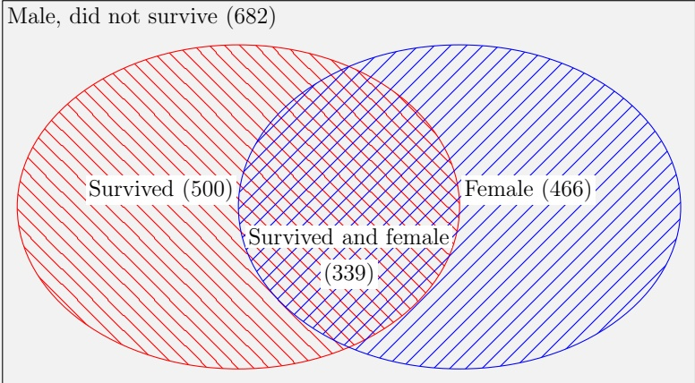

Figure 1.15: Gender distribution among Titanic passengers, displayed as a Venn diagram. Out of 1309 passengers, 466 were female, 500 survived, and 339 were both female and survived.

The sample space (the white box) is “made of” all 1309 passengers. Out of these passengers, 466 were female (blue on the figure), i.e. $\operatorname* { P r } ( { \it f e m a l e } ) = 4 6 6 / 1 3 0 9 =$ 0.356. 500 passengers survived (red on the figure), so $\operatorname* { P r } ( \mathit { s u r v i v e d } ) = 5 0 0 / 1 3 0 9 =$ 0.382. But there is also an overlap–the 339 females who survived (red/blue cross shaded in the figure). We can compute this probability (out of all passengers) as $\mathrm { P r } ( \mathit { s u r v i v e d } , \mathit { f e m a l e } )   =   3 3 9 / 1 3 0 9   =   0 . 2 5 9$ However, we are not interested in Pr(survived,female), probability that a random passenger was female and survived, but in the conditional probability Pr(survived|female), probability that a random female passenger survived. So we should divide the cross-shaded overlap area with the blue female area:

$$
\Pr (s u r v i v e d | f e m a l e) = \frac {3 3 9 / 1 3 0 9}{4 6 6 / 1 3 0 9} = \frac {3 3 9}{4 6 6} = 0. 7 2 7.
$$

This is the same result we got above.

<!-- page: 60 -->

Exercise 1.10: Titanic survival and gender

<div class="docvortex-algorithm" style="white-space: pre-wrap; font-family:monospace;">
Use the Titanic data in Example 1.15. Compute probability that a passenger is female, given she survived, $\operatorname{Pr}(\text{female}|\text{survived})$. Solution on page 488
</div>

## Exercise 1.11: A family has two children…

<div class="docvortex-algorithm" style="white-space: pre-wrap; font-family:monospace;">
(This problem is known as two daughter problem) Consider a family with two children. We know that one of these is a girl. What is the probability that the other one is also a girl? Assume gender of children is independent, and $\mathrm{Pr}(boy) = \mathrm{Pr}(girl) = 0.5$. Hint: what is the sample space and the conditioning event in this case? If thinking in terms of sample space in abstract terms is too hard then it is useful to imagine it in terms of a concrete number, e.g. 100 families that all have two children. How many of those belong to the groups of interest? Solution on page 488.
</div>

## Bayes theorem

So far we just compute the conditional probability based on the definition. Next, we’ll discuss Bayes theorem, the way how you can use conditioning on A to find the probability when conditioning on B.

Obviously, because the problem is symmetric–we can just swap A and B in (1.4.7) and have

$$
\Pr (B | A) = \frac {\Pr (B , A)}{\Pr (A)}.\tag{1.4.8}
$$

Note also that the probability that both events occur, $\operatorname* { P r } ( A , B ) = \operatorname* { P r } ( B , A )$ . So we can isolate $\operatorname* { P r } ( A , B )$ from (1.4.8) as

$$
\Pr (B, A) = \Pr (A, B) = \Pr (B | A) \cdot \Pr (A)\tag{1.4.9}
$$

and insert this into (1.4.7) to get

$$
\Pr (A | B) = \frac {\Pr (A , B)}{\Pr (B)} = \frac {\Pr (B | A) \cdot \Pr (A)}{\Pr (B)}.\tag{1.4.10}
$$

This relationship plays quite a big role when working with conditional probabilities– sometimes it is easy to compute $\operatorname* { P r } ( B | A )$ but not Pr(A|B), and (1.4.10) shows how we can get the latter from the former.

In practical applications, we often have “outcome” in place of event A and “data” in place of event “B”. In this context (1.4.10) shows what is the probability to get “outcome” given we have “data”. This is essentially a predictive modeling problem.

When the counts are given then computing conditional probability reduces to dividing of the two counts of interest. This was the case with the Titanic example (Example 1.15 above. But sometimes the probabilities are more easily available. Consider a diagnosis problem: a doctor meets a patient with certain symptoms, e.g.

<!-- page: 61 -->

runny nose, watery eyes, and cough. Does the patient have flu? This is a diagnosis problem, we can also state it as a prediction problem where our task is to find Pr(flu|symptoms). It is very much the problem the doctors face when encountering a patient. How can we calculate this probability? First, we can use (1.4.10) to express the diagnosis task as

$$
\Pr (\text {flu} | \text {symptoms}) = \frac {\Pr (\text {symptoms} | \text {flu}) \cdot \Pr (\text {flu})}{\Pr (\text {symptoms})}.\tag{1.4.11}
$$

What are the three probabilities we need to compute the diagnosis?

• Pr(symptoms|flu) is the probability to observe symptoms given someone has flu. This data probably exists in hospitals.

• Pr(flu) is probability that a patient has flu. This data is also likely to exist.

• Finally, Pr(symptoms) is probability that a patient has such symptoms, flu or no flu. This data is also likely to be present in medical records.

So given our doctor has access to medical data, she is now able to compute the diagnosis!

## Example 1.16: Probability of diagnosis

<div class="docvortex-algorithm" style="white-space: pre-wrap; font-family:monospace;">
Assume we learn from the medical records that:
- $\Pr(\text{symptoms}|\text{flu}) = 0.3$: $30\%$ of patients with flu have such symptoms.
- $\Pr(\text{flu}) = 0.2$: only $20\%$ of patients have flu. These data are also likely to exist.
- Finally, $\Pr(\text{symptoms}) = 0.1$. Such symptoms are observed on $10\%$ of patients.
Now the probability of flu is
$\Pr(\text{flu}|\text{symptoms}) = \frac{\Pr(\text{symptoms}|\text{flu}) \cdot \Pr(\text{flu})}{\Pr(\text{symptoms})} = \frac{0.3 \cdot 0.2}{0.1} = 0.6.$
So given such symptoms, it is $60\%$ likely that the patient has flu.
</div>

Let us take another look at (1.4.10). In essence it is an updating rule. The doctor begins the diagnosis with initial probability value Pr(flu). It is called prior probability or just prior, this is the probability of flu given the doctor hasn’t learned about any symptoms. This is the prediction based on no data. However, if we collect data (i.e. observe symptoms), then the prior will be updated by multiplying it with Pr(symptoms|flu). The product, Pr(flu|symptoms), the probability we are interested in, Pr(symptoms) is called posterior. So the essence of Bayesian theorem is to update the prior based on data–if we get new information (data), we should update our initial guess (prior) to posterior.

Bayesian theorem is foundation of Bayesian statistics–many everyday problems can be described as updating the initial guesses based on data. But what are priors, the initial guesses? If computed from earlier data, as in the flu example here, it is fairly straightforward value. But sometimes we do not have anything resembling earlier data, and we have to come up with “just a guess”. This is one of the more controversial sides of Bayesian statistics–we need a prior, and if we do not know much

<!-- page: 62 -->

about the problem, then we “just guess”. And guessing does not feel like a scientifically rigorous way of doing things.

## Exercise 1.12: First class given survived

What is the probability that a titanic passenger was traveling in first class given they survived, $\operatorname* { P r } ( C   =   1 | S   =   1 ) ?$ We know that the percentage of first class passengers who survived was 0.619, percentage of first class passengers was 0.247, and probability of survival was 0.382. Solution at page 489. See also Exercise 1.9.

The above example assume we know Pr(symptoms), also called normalizer.<sup>12</sup> This was a reasonable assumption in the diagnosis problem above, but it is not always the case. Consider (1.4.10) again, but now assume we do not know $\operatorname* { P r } ( B )$ . However, we can compute it if we know both of the following probabilities: the conditional probability of B given A happens, $\operatorname* { P r } ( B | A )$ , and the conditional probability of B given A does not happen, we denote it by $\operatorname* { P r } ( B | { \bar { A } } )$ . Now the normalizer can be computed as

$$
\Pr (B) = \Pr (B | A) \cdot \Pr (A) + \Pr (B | \bar {A}) \cdot \Pr (\bar {A}).\tag{1.4.12}
$$

This is essentially an application of expected value. It is intuitively a fairly obvious rule: B may happen both in case A happens, and in case A does not happen. These events happen with probability $\operatorname { P r } ( A )$ and $\operatorname* { P r } ( { \bar { A } } )$ The probability B will happen differs by these two cases, being $\operatorname* { P r } ( B | A )$ and $\operatorname* { P r } ( B | { \bar { A } } )$ correspondingly.

## Example 1.17: Do you have cancer?

Imagine you take a routine cancer test and it comes back positive. Do you really have cancer with all its awful consequences for the rest of your life? But tests, in particular the first cheap tests people frequently do, are far from perfect. Maybe the test is wrong?

Denote by $T = 1$ the event of test being positive and $C = 1$ one having cancer. Assume the test is fairly good at spotting true positives, $\operatorname* { P r } ( T = 1 | C = 1 ) = 0 . 9 9$ but it also reports a large number of false negatives, $\operatorname* { P r } ( T = 1 | C = 0 ) = 0 . 1 , { \mathrm { i . e . } }$ in 10% of cases where one does not have cancer, the test is still positive. Finally, assume cancer is rare, $\operatorname* { P r } ( C = 1 ) = 0 . 0 0 1$ and hence no-cancer is very common, $\operatorname* { P r } ( C = 0 ) = 0 . 9 9 9$ What is the probability that you actually have cancer given you have a positive test result, $\operatorname* { P r } ( C = 1 | T = 1 ) ?$

We use Bayes theorem (1.4.10) to invert the conditional probability:

$$
\Pr (C = 1 | T = 1) = \frac {\Pr (T = 1 | C = 1) \cdot \Pr (C = 1)}{\Pr (T = 1)}.
$$

From data above we know the two probabilities in the numerator, but we still

<small><span class="docvortex-page-footnote" data-block-type="page_footnote" style="color:#6b7280">”</span></small>

<small><span class="docvortex-page-footnote" data-block-type="page_footnote" style="color:#6b7280">12<sub>It</sub> is called “normalizer” because it “takes care of that the result will be a valid probability. See more in Section 8.5 Naïve Bayes, page 353.</span></small>

<!-- page: 63 -->

## 1.4. BASICS OF PROBABILITY THEORY

have to compute the denominator:

$$
\begin{array}{r l} \operatorname * {P r} (T = 1) & = \operatorname * {P r} (T = 1 | C = 1) \cdot \operatorname * {P r} (C = 1) + \operatorname * {P r} (T = 1 | C = 0) \cdot \operatorname * {P r} (C = 0) = \\ & = 0. 9 9 \cdot 0. 0 0 1 + 0. 1 \cdot 0. 9 9 9 = 0. 1 0 0 8 9. \end{array}
$$

Now we can just plug this number into the Bayes theorem above and we get

$$
\Pr (C = 1 | T = 1) = \frac {0 . 9 9 \cdot 0 . 0 0 1}{0 . 1 0 0 8 9} = 0. 0 0 9 8 1 3.
$$

So despite returning with a positive test, it is still less than 1% likely that you actually have cancer!

It is a somewhat counter-intuitive example, where the actual computations are not well-aligned with the intuitive understanding (positive result means cancer). To be more precise, it is not so much “counter-intuitive” as “non-intuitive” as our intuition usually cannot come up with anything reasonable, we just do not have enough experience with similar probability calculations.

Here it is fairly easy to see why the test is not very informative: because of the very large false positive rate, approximately 100 people out of 1000 get the positive result. This dwarfs to 1 person out of 1000 that actually has cancer. Hence most likely (99%) likely you have no reason to worry.

## Exercise 1.13: Two bags of M&M

There are two kind of m&m bags, A and B, and they are equally likely. The probability to get a red m&m in bag A is 2/3 and in bag B it is 1/3.

1. Dai-yu takes a candy from the bag and gets a red one. What is the probability that it is an A-bag?

2. Now she takes two two candies out of a bag, and both are red. What is the probability that this is a B-bag?

Assume that there are many candies in the bag, so the probability does not change when one is removed.

Solution on page 489

## Exercise 1.14: Smile or fight?

You are a caveman 100,000 years ago. You hear someone moving in darkness near your campfire. Is this your friendly neighbor, or a hungry lion? Should you wait and smile, or grab a burning stick and stand ready to fight?

Assume Pr(steps|neighbor) = 0.2 (neighbor is fairly quiet) and Pr(steps|lion) = 0.6 (lion is fairly noisy). Assume also that Pr(neighbor) = 0.9 (neighbor is around frequently) and Pr(lion) = 0.1 (there are not many lions). Compute the relevant probabilities, and answer the questions above.

Solution on page 490.

<!-- page: 64 -->

## Cheatsheet 1.4: Conditional probability

**Conditional event** one event happening given that the other event also happens. Example: roll a die, $\it { g e t } ^ { \mathrm { ~ d ~ } } 1 ^ { \prime \prime }$ given you get an odd number.

**Conditional probability** $\operatorname* { P r } ( A | B )$ probability that event A happens given that the event B happens. Example: roll a die, what is probability $of  " I "$ given you got an odd number?, denoted by bar symbol as $\operatorname* { P r } ( 1 | { \mathrm { o d d } }$ number)).

Remember: **conditioning event is after the bar symbol!**

**Bayes Theorem** $\begin{array} { r } { \operatorname* { P r } ( A | B ) = \frac { \operatorname* { P r } ( A , B ) } { \operatorname* { P r } ( B ) } = \frac { \operatorname* { P r } ( B | A ) \cdot \operatorname* { P r } ( A ) } { \operatorname* { P r } ( B ) } . } \end{array}$

<!-- page: 65 -->

## 1.4.4 Random Variable

Random variable (RV) is a central concept that connects probability theory to statistics. In particular, it makes numbers out of events so that one can use the mathe matical apparatus to analyze the random processes. The concept of RV is somewhat complex, so we start with the easy part—it is easy to remember what RV is not. First, random variable is not random; and second, random variable is not a variable.

But then what is RV? In essence, it is a rule that assigns a number to each event in the sample space S. Most of the events we care about occur to our physical world and are not numbers, but we need numbers to use the mathematical apparatus. So we need a RV that links the outcomes of the stochastic phenomenon we are analyzing with some sort of numbers.

RV-s are typically denoted by capital Latin letters, such as X or Z. Formally, a RV X is a function $X : { \mathcal { S } } \to$ R where S is the sample space of the phenomenon we are analyzing. For instance, if our experiment is flipping a coin, then its sample space is $\{ H , T \}$ , i.e. it contains the two possible events, heads and tails. We can assign zero to tails and one to heads, and define the RV X as

$$
X (E) = \left\{ \begin{array}{l} 0: \text {if the event} E = T \\ 1: \text {if} \quad E = H. \end{array} \right.\tag{1.4.13}
$$

Obviously, one can also define it in the opposite way $X ( H ) = 0$ and $X ( T ) = 1$ ; and in a myriad of other ways. For instance, if we want the expected value to be zero (see Section 1.4.5 for explanation), we can define $X ( T ) = - 1$ and $X ( H ) = 1$

Now when we actually conduct the experiment and toss the coin, we will receive either H or T. We use RV X to convert the realized outcome into a number and hence we get either 1 or 0. These are two possible observed values or realizations of the RV. Let’s repeat here: H and T are events. The corresponding numbers, 0 and 1, are realizations (observed values). While RV-s are traditionally denoted by upper case Latin letters, such as X or Y , their observed values (realizations) are denoted with the corresponding lower case letters, such as x and y. If we observe many realizations (e.g. toss the coin multiple times), we usually denote those using a subscript like $x _ { 1 } , x _ { 2 } , \ldots , x _ { N }$

## Definition 1.2: Random variable

So RV is not random. It is

• a random phenomenon or experiment with well-defined properties; and

• a rule how to assign numeric labels to the events in that phenomenon.

But the realizations of RV-s are random.

It is extremely important to be able to distinguish between a non-random RV and its random realizations! Part of the confusion arises from how the word “random” is used: random in the concept random phenomenon refers to the fact that this phenomenon can produce random realizations. However, the properties of the phenomenon are not random, they are fixed and well defined. But random in random outcomes refers to the fact that the outcomes are unpredictable, random.

<!-- page: 66 -->

Example 1.18: Random variable and realizations

We typically use RV-s to describe some kind of real world experiments or phenomena. For instance, you can describe a slot machine (the type here is called “one-armed bandit”) as a RV. When you play with it, the results are realizations.


| Attempt | Realization |
| --- | --- |
| 1 | lost $10 |
| 2 | lost $50 |
| 3 | lost $200 |
| 4 | won $25 |
| 5 | lost $500 |
| 6 | lost $30 |

This is the Random Variable. (Alf van Beem, [CC0](https://creativecommons.org/publicdomain/zero/1.0/deed.en), via [Wikimedia Commons](https://commons.wikimedia.org/wiki/File:Museum_Wilhelmsbau_Aristocrat_Olympic_fruit_machine.JPG))

This is a sample of realizations

You can use the (random) sample to say something about the (non-random) properties of the RV. For instance, you may look at the sample of previous results to answer the question: how much can I expect to win if I continue playing on this machine many times?

## Cheatsheet 1.5: Random variable and realization

## • Random variable (RV) is two things:

– a phenomenon or experiment with well-defined properties; and

– a rule how to assign numeric labels to the events in that phenomenon.

It is a rule, and it is not random.

**Realizations** are numbers, resulting in a random experiment when converting the outcomes (events) to numbers using a RV. These are random.

• A number of realizations together is a **sample**.

Different ways to define RV-s is related to questions about the physical world we are interested in. Take example of rolling two dice (see Section 1.4.1). For instance, if we are just interested in different outcomes, we can enumerate the combinations by

<!-- page: 67 -->

defining

$$
Y (E) = \left\{ \begin{array}{l} 1: \text {if} E = (1, 1) \\ 2: \text {if} E = (1, 2) \\ \dots \\ 3 6: \text {if} E = (6, 6). \end{array} \right.\tag{1.4.14}
$$

Now the RV will tell us if we got (1,5), (5,1) or (2,4). All these combinations correspond to different values. However, we may not be interested in the different combinations but instead in the sum of the points, whichever sides come up. Now we can define

$$
Z (E) = \left\{ \begin{array}{l} 2: \text {if} E = (1, 1) \\ 3: \text {if} E = (1, 2) \text {or} E = (2, 1) \\ 4: \text {if} E = (1, 3) \text {or} E = (2, 2) \text {or} E = (3, 1) \\ \dots \\ 1 2: \text {if} E = (6, 6). \end{array} \right.\tag{1.4.15}
$$

## Exercise 1.15: Rolling two dice

```txt
Take the example of two dice. Construct a random variable that answers the question: did we get any 6-s?
Solution on page 492.
```

The RV outcomes have, in general, different probabilities as they correspond to different events in the sample space. In case of the coin-toss RV X (in formula (1.4.13)), the value 0 corresponds only to event T and the value 1 to the event H. Both of these events have probability 0.5 if it is a fair coin, and hence the values 0 and 1 will also have equal probability. However, this is not the case for RV Z above that counts the points on two dice (formula (1.4.15)). Although all the simple events in the underlying experiment are equally likely, the RV values are not because those correspond to different compound events. Value 2 corresponds only to a single atomic event (1,1) and hence has probability 1/36. Value 3 corresponds to two atomic events, (1,2) and (2,1) and hence has probability 2/36. Probability of 4 is $3 / 3 6$ and so on.

**Exercise 1.16: Find** $\operatorname* { P r } ( Z = 6 )$

<div class="docvortex-algorithm" style="white-space: pre-wrap; font-family:monospace;">
Consider the RV $Z$ as defined above. Find $\Pr(Z = 6)$, the probability that rolling two dice will give you sum 6.
Hint: consider drawing a $6 \times 6$ table of faces and marking the sum of the dots in each table cell.
</div>

Obviously, when the sample space is discrete—there is only a limited number of different events—then there is also only a finite number of possible different RV values. We talk about discrete random variables. Discrete random variables can be presented as probability table. For instance, when tossing a fair coin and denoting heads by 1 (RV X on page 55) we can represent the values as a table:

<!-- page: 68 -->

| Value | Probability |
| --- | --- |
| 0 | 0.5 |
| 1 | 0.5 |

Such a table is very convenient when computing expectation, variance, and other properties of the RV.

**A few words about the notation.** The random variable, the process of flipping a coin and counting heads, or a slot machine and measuring your losses, is typically denoted by a capital letters like X, Y and Z. Individual realizations, the actual number of heads that we get when we roll the dice or how much money we lose when playing on a slot machine, are typically denoted with the corresponding lower case letters x, $y ,$ and z. As we typically consider samples of several individual outcomes, we denote those by subscripts $x _ { 1 } , x _ { 2 }$ , and so on. For instance, when talking about sample average, then $x _ { 1 }$ denotes the number of heads in the first $\mathrm { f l i p } , \; x _ { 2 }$ in the second flip etc. But in other situations the subscripts may mean different things. For instance, when talking about expected value (See Section 1.4.5 Expected Value, page 58), the subscripts may denote the different possible outcomes, the lines in the probability table. In the coin flip example, we may have $x _ { 1 } = 0$ for tails and $x _ { 2 } = 1$ for heads. In this case $\operatorname* { P r } ( X = x _ { 1 } )$ means $\operatorname* { P r } ( X = 0 )$ , the probability that the RV X realization is $x _ { 1 }$ , the probability to receive no heads when tossing a coin. The notation can be quite confusing, and one has to understand what exactly $x _ { i }$ means in each case.

In case of continuous sample space we have an infinite number of possible values and we talk about continuous random variables. For example, flight delay in minutes or temperature in degrees are continuous random variables (given we measure not just in minutes and degrees but also include the fractions). There are also different ways to define RV-s in case of continuous sample space like flight delay. The first and most obvious case is just to use the length of the delay d in minutes. Alternatively, if we are not interested in early arrivals, we may construct a different RV: what was the delay, given the flight was delayed?

$$
X = \max (0, d)\tag{1.4.16}
$$

where d is the delay in minutes.

## 1.4.5 Expected Value and Variance

## Expected Value

The section 1.3.1 above discusses mean as a way to characterize the central tendency in case of sample of data. Intuitively, one can easily see that as the sample grows, its mean will converge to the “true mean”. For instance, one can immediately understand that the “true mean” when tossing the coin should be 0.5. When thinking about “true mean” we intuitively have in mind a more general sample, the “population”, or perhaps a stochastic process, where the current data is sampled from. This population or stochastic process is essentially a RV and the “true mean” is a certain property of

<!-- page: 69 -->

this RV. The property is called expected value or expectation. It is usually denoted by capital “E”, e.g. E X means the expected value of random variable X. Its numeric value is often denoted by µ. Unfortunately it is also common to refer to the expected value as “mean”, e.g. when talking about distributions. So “mean” can refer to either sample mean or to the expected value of a RV. However, “average” is not used to denote the expected value.

For discrete RVs, expected value can be computed as the weighted average of possible outcome values where the weights are the corresponding probabilities:

$$
\mathbb {E} X = \sum_ {i} p _ {i} \cdot x _ {i}.\tag{1.4.17}
$$

Here i enumerates over all possible outcomes of X, denoted by $x _ { i } .$ So here $x _ { i }$ is not a realization but a possible outcome! See page 58 for comments on notation. Intuitively, expected value is close to sample average in case of large samples. If the sample size is large, like 1000, the corresponding probabilities are fairly close to how many times you expect to see the corresponding value (divided by 1000). See also Law of Large numbers below.

Consider the coin flip example where we assigned 1 to heads and 0 to tails, and both of these values have probability 0.5. The expected value of X is

$$
\mathbb {E} X = 0. 5 \cdot 0 + 0. 5 \cdot 1 = 0. 5.\tag{1.4.18}
$$

This is intuitively obvious: in average, we get heads half of the times.

## Example 1.19: Expectation of a 3-valued RV

Consider a more complex example. Take the RV Y with three possible outcomes, 1, 2, and 3:

$$
Y = \left\{ \begin{array}{l l} 0 & \text {with probability} \quad 0. 5 \\ 1 & \quad \quad \quad \quad \quad \quad \quad \quad \quad \quad \quad \quad \quad \quad \quad \quad \quad \quad \quad \quad \quad \quad \quad \quad \quad \quad \quad \quad \quad \quad \quad \quad \quad \quad \quad \quad \quad \quad \quad \quad \quad \quad \quad \quad \quad \quad \quad \quad \quad \quad \text {otherwise} \\ 2 & \quad \quad \quad \quad \quad \quad \quad \quad \quad \quad \quad \quad \quad \quad \quad \quad \quad \quad \quad \quad \quad \quad \quad \quad \quad \quad \quad \text {otherwise}. \end{array} \right.\tag{1.4.19}
$$

Its expected value is $\mathbb { E }   Y = 0 . 5 \cdot 0 + 0 . 2 5 \cdot 1 + 0 . 2 5 \cdot 2 = 0 . 7 5$

## Exercise 1.17: Expected value of die

Consider rolling a die as a RV D. Denote its values by $1 , 2 , \ldots , 6 .$ What is its expected value E D?

## Exercise 1.18: How many sixes do we get?

Consider an experiment of rolling two dice. We are interested in how many sixes did we get. The corresponding RV will look like

<!-- page: 70 -->

| # Sixes | Probability |
| --- | --- |
| 0 | 25/36 |
| 1 | 10/36 |
| 2 | 1/36 |

1. Show that these probabilities are correct.

2. Compute the expected value of this RV, the expected number of sixes when rolling two dice.

The weighted sum in the definition of the expected value (1.4.17) transforms to an integral in case of continuous RV-s, see Section 1.5.2 What are continuous RV-s, page 73 and equation (1.5.12) below.

Note that expected value is not a random variable, nor is it random in any other way. It is just a number.<sup>13</sup> As the expected value is just a number, its expectation, in turn, is just the same number. So when we sometimes need to compute expected value of expected value, we have $\operatorname { \mathbb { E } } ( \operatorname { \mathbb { E } } X ) = \operatorname { \mathbb { E } } X$

It is important to keep in mind that expectation is not sample mean and the way around. Expectation is a property of random variable, a precisely defined stochastic process. Sample mean is a property of sample. Even if expectation is sometimes called “mean”, it is important to realize that sample and RV have different properties. For instance, sample mean is random and it fluctuates depending on the exact realizations. But expectation is constant and does not change. Flipping a coin a few times may result in a different mean, but the expected number of heads is always 0.5. One can also compute mean for every sample but not every RV has expected value (see, e.g. Section 1.5.3 Pareto distribution, page 81 below).

It is intuitively fairly obvious that the average of a large sample is close to its expected value. This can be stated formally through Law of Large Numbers:

**Theorem 1** (Law of large numbers, LLN). 14 Let $x _ { 1 } , x _ { 2 } , \ldots , x _ { N }$ be independent realizations of a RV X. Assume the expected value E $X = \mu$ exists. Now the sample average converges to the expected value.

$$
\frac {1}{N} \sum_ {i = 1} ^ {N} x _ {i} \equiv \bar {X} _ {N} \xrightarrow {P} \mu .\tag{1.4.20}
$$

Here we use notation $\begin{array} { r } { \bar { X } _ { N } = 1 / N \sum _ { i } x _ { i } } \end{array}$ as the average of a sample of size N of the realizations of RV X.

<small><span class="docvortex-page-footnote" data-block-type="page_footnote" style="color:#6b7280">13<sub>If</sub> we want, we can imagine that numbers are degenerate RV-s where all realizations are the same, so these RV-s will have 100% probability on the only outcome. Obviously, the expected value of such a RV is the outcome value.</span></small>

<small><span class="docvortex-page-footnote" data-block-type="page_footnote" style="color:#6b7280">Pr(|XN − µ| > ϵ)</span></small>

<small><span class="docvortex-page-footnote" data-block-type="page_footnote" style="color:#6b7280">14Symbol P−→ means convergence in probability: as N grows, the probability ¯ gets arbitrarily small for every positive ϵ.</span></small>

<!-- page: 71 -->

Example 1.20: Sample average converging to expected value

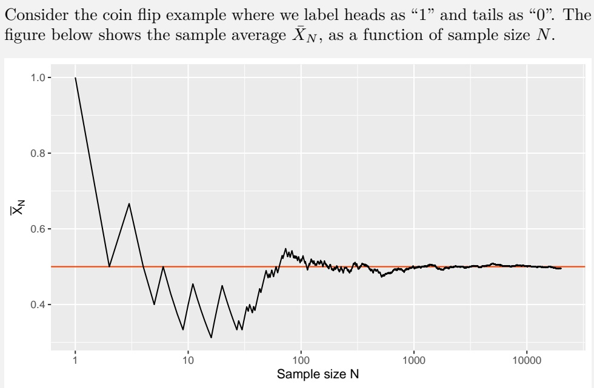

Figure 1.16: Sample average as a function of sample size N. The expected value 0.5 is marked by the red line.

Initially, the value fluctuates a lot, but as N increases, the fluctuations are smaller and smaller, and the average remains close to the expected value 0.5. This is LLN at work.

Exercise 1.19: Demonstrate Law of Large Numbers

Make similar figures on your computer:

• Replicate the image in Example 1.20.

• Use the rolling die experiment (Exercise 1.17) and make a similar figure.

## Variance

While expected value is similar to the sample average, variance is similar to the sample variance. Variance is a much less intuitive concept than expectation, in exactly the same way as sample variance is much less intuitive than sample mean. The naming convention is not helpful either: unlike expectation versus mean, both of these concepts are called “variance”. Usually, the context makes it clear whether we are talking about variance as the property of RV, or about the sample variance (is it a sample? is it a RV?). But where needed, we indicate the type of the concept by writing “variance of the RV” or “theoretical variance” when we talk about random variables, and “sample variance” when we talk about data.

<!-- page: 72 -->

Variance is typically denoted by Var , e.g. Var X is variance of the random variable X. Its numerical values are often denoted by $\sigma ^ { 2 }$ , stressing that its definition is related to squared deviations. As a bonus, when denoting variance by $\sigma ^ { 2 }$ we can denote the standard deviation by just σ.

Variance is one of the most important statistical concepts, most of the statistical inference is in fact based on variance in one way or another. It is defined in the same way as sample variancewhile replacing means with expectations. So variance of RV X is defined as

Sample variance is the average squared deviation from the mean in a dataset: $\begin{array} { r } { s ^ { 2 } = \frac { 1 } { N } \sum _ { i = 1 } ^ { N } ( x _ { i } - \bar { x } ) ^ { 2 } } \end{array}$ . See ∑Section 1.3.2 on page 20.

$$
\operatorname{Var} X = \mathbb {E} (X - \mathbb {E} X) ^ {2}.\tag{1.4.21}
$$

Let us explain what this means. First, E X in the parenthesis is the expected value of X. It is just a number, a constant. Next, $X - \mathbb { E } X$ is the deviation of X from its expected value. It is just X minus a number. As X is a RV, so is $X - \mathbb { E }   X$ . Third, $( X - \operatorname { \mathbb { E } } X ) ^ { 2 }$ is just a squared value of the deviation. As the deviation is a RV, so is its square. And finally, $\operatorname { \mathbb { E } } ( X   -   \operatorname { \mathbb { E } } X ) ^ { 2 }$ is the expected value of that RV. So variance can be computed in a similar fashion as expectations. Let us show how it works using the RV from Example 1.19. Above we computed $\mathbb { E }   Y = 0 . 7 5$ . Let us now compute its variance using the definition. The most straightforward approach is to extend the table above with additional columns that contain the auxiliary $\mathrm { R V { \scriptstyle - \mathrm { S } } }$ (Table 1.6). The first two columns represent the RV realizations y and the corresponding probabilities $\operatorname* { P r } ( Y =$ $y )$ , it is just definition of $Y .$ The third column is the deviation from the expected value, $Y - \mathbb { E } Y$ . The fourth column is the deviation squared. The variance is just the expected value of the fourth column. The probability values in the second column are not affected by the other operations–computing the deviation and squaring it. Hence the variance is $\mathbb { E } ( Y - \mathbb { E } \widehat { Y ) ^ { 2 } } = 0 . 5 \cdot 0 . 5 6 \widehat { 2 5 } + \widehat { 0 . 2 5 } \cdot 0 . 0 6 2 5 + 0 . 2 5 \cdot \widehat { 1 . 5 6 2 5 } = \widehat { 0 . 6 8 7 5 }$

Table 1.6: Computing variance of a discrete random variable. The easiest way to compute the variance of a RV by using the definition is to add columns for $Y - \mathbb { E } Y$ and $( Y - \operatorname { \mathbb { E } } Y ) ^ { 2 }$ in the table of RV values. Variance is simply the expected value of the last column, here 0.6875. See explanations in text.

| y<sub>i</sub> | Pr(Y = y<sub>i</sub>) | y<sub>i</sub> - EY | (y<sub>i</sub> - EY)<sup>2</sup> |
| --- | --- | --- | --- |
| 0 | 0.50 | -0.75 | 0.5625 |
| 1 | 0.25 | 0.25 | 0.0625 |
| 2 | 0.25 | 1.25 | 1.5625 |

In practice it is somewhat easier to use the shortcut formula

$$
\mathrm{Var}   X = \mathbb {E} \left(X ^ {2}\right) - (\mathbb {E}   X) ^ {2}.\tag{1.4.22}
$$

It is an analogue of the sample variance shortcut formula (1.3.3). This involves computing the expected value of $X ^ { 2 }$ . It is easy to show that this formula is equivalent to the definition of variance (1.4.21). Let us re-compute the variance we did above using this formula. First, we have to find E $X ^ { 2 }$ . This is E $X ^ { 2 } = 0 . 5   \cdot   0 ^ { 2 }   +   0 . 2 5   \cdot   1 ^ { 2 }   +   0 . 2 5   \cdot   2 ^ { 2 } \stackrel { \rightarrow } { = }$ $0 . 2 5 \pm 1 = 1 . 2 5$ . Hence the variance is Var $X   =   \mathbb { E }   X ^ { 2 }   -   ( \mathbb { E }   X ) ^ { 2 }   =   1 . 2 5   -   0 . 7 5 ^ { 2 }   =$ $1.25 - 0.5625 = 0.6875$ . This is the same number.

<!-- page: 73 -->

Exercise 1.20: Compute variance of a RV

<table><tr><td colspan="2">Consider a RV</td></tr><tr><td>x</td><td>Pr(X = x)</td></tr><tr><td>-1</td><td>0.25</td></tr><tr><td>0</td><td>0.50</td></tr><tr><td>1</td><td>0.25</td></tr></table>

Exercise 1.21: Variance of Bernoulli RV

<div class="docvortex-algorithm" style="white-space: pre-wrap; font-family:monospace;">
Bernoulli(p) RV (see Section 1.5.1 Bernoulli distribution, page 69) is a RV that can take values
$\begin{array}{cc}
x &amp; \Pr(X = x) \\
\hline 0 &amp; 1 - p \\
1 &amp; p
\end{array}$
Compute its variance using both the definition formula (1.4.21) and the shortcut formula (1.4.22).
Solution on page 493
</div>

## 1.4.6 Expected value and variance of functions of RV-s

Sometimes we want to compute not just the the expected value or variance of RV X, but of a certain function of X and Y , for instance E 2X, E[X + Y ] or Var e<sup>X</sup> . Below, we discuss two special cases: expected value and variance of a RV multiplied by a scalar, and of a sum of two RV-s. We show that how to generalize it to arbitrary sums of independent RV-s.

## Functions of RV-s

Before we discuss how, a brief explanation about what does a function of RV mean. It means performing the function on the values of the RV, while leaving the probabilities untouched. For instance, consider the RV, described in Table 1.6. We compute the following functions: 2 · Y and $\mathrm { e } ^ { Y }$ (see Table 1.7 below). The process involves in just computing the corresponding values $2 y _ { i }$ and e<sup>yi</sup>for all possible outcomes i. But the probabilities, $\operatorname* { P r } ( Y = y _ { i } )$ will remain unaffected. So the result will be a new RV with the original probabilities, but different values. Function of a RV is a RV.

The story is somewhat different when we combine different RV-s–in that case we need to manipulate probabilities too. Take again the example of flipping two coins and counting heads. Call the corresponding $\mathrm{RV-s~X_1}$ for the first coin and $X _ { 2 }$ for

<!-- page: 74 -->

Table 1.7: Functions of $R V – s$ . The table shows the RV Y , and values of the corresponding functions 2Y and $\mathrm { e } ^ { Y }$

| 1 | 2 | 3 | 4 |
| --- | --- | --- | --- |
| Y |  | 2Y | e<sup>Y</sup> |
| y<sub>i</sub> | Pr(Y = y) | 2y<sub>i</sub> | e<sup>yi</sup> |
| 0 | 0.50 | 0 | 1.0000 |
| 1 | 0.25 | 2 | 2.7183 |
| 2 | 0.25 | 4 | 7.3891 |

the second coin. Both of these can take values 0 and 1 with probability 0.5. But what are the possible values of $Z = X _ { 1 } + X _ { 2 } ?$ And what exactly does $X _ { 1 } + X _ { 2 }$ even mean? This means a) summing the possible realizations of $X _ { 1 }$ and $X _ { 2 } ,$ and b) finding the probabilities of these sums. In case of flipping two coins, the options are shown in Table 1.8. The table shows all possible combinations of $X _ { 1 }$ and $X _ { 2 }$ realizations (columns 1 and 3) and their corresponding sum z (column 5). Columns 2, 4, and 6 display the respective probabilities. As there are two lines that correspond to $z = 1$ we need to combine those two, and hence the final result will be

$$
Z = \left\{ \begin{array}{l l} 0 & \text {with probability 0.25} \\ 1 & \text {with probability 0.5} \\ 2 & \text {with probability 0.25}. \end{array} \right.\tag{1.4.23}
$$

Table 1.8: Sum of two independent RV-s: $Z = X _ { 1 } + X _ { 2 }$ The table shows how to compute the values and probabilities. As the final step, one needs to combine two rows of $Z = 1$ into a single one, with probability 0.5.

| 1 | 2 | 3 | 4 | 5 | 6 |
| --- | --- | --- | --- | --- | --- |
| x<sub>1</sub> | Pr(X<sub>1</sub> = x<sub>1</sub>) | x<sub>2</sub> | Pr(X<sub>2</sub> = x<sub>2</sub>) | z x<sub>1</sub> + x<sub>2</sub> | Pr(Z = z) Pr(X<sub>1</sub> = x<sub>1</sub>,X<sub>2</sub> = x<sub>2</sub>) |
| 0 | 0.5 | 01 | 0.50.5 | 01 | 0.250.25 |
| 1 | 0.5 | 01 | 0.50.5 | 12 | 0.250.25 |

Exercise 1.22: What makes $X _ { 1 }$ and $X _ { 2 }$ independent?

| The example in Table 1.8 assumes that X1 and X2 are independent. Where in the computations above is the independence assumption used? |
| --- |
| Solution on page 493. |
| Note that the result holds for dependent RV-s too, just the table will not be correct. |

<!-- page: 75 -->

**RV multiplied by a scalar** Expected value of a RV multiplied by a scalaris the original expected value multiplied by the same scalar. For instance, if we flip a coin and label heads as 1 and tails as 0, then the expected value is 0.5. If we multiply the RV by two, i.e. we label heads by 2 and tails by 0, then the expected value will be 1. In case of 2Y in Table 1.7 (column 3), we need to compute E[2Y ] = $0.5 \cdot 0 + 0.25 \cdot 2 + 0.25 \cdot 4 = 1.5$

We can state this as a theorem

**Theorem 2** (Expected value of RV multiplied by scalar).

$$
\mathbb {E} \lambda \cdot X = \lambda \cdot \mathbb {E} X.\tag{1.4.24}
$$

The proof is fairly obvious and is left as exercise.

But note that this only applies to multiplication by scalar. In general, $\mathbb { E }   f ( X ) \neq$ f(E X).

## Exercise 1.23: Prove theorem 2

```txt
1. Prove the theorem 2 for a general discrete RV.
2. Consider a discrete RV X. Compute Var λ X?
Hint: see Exercise 1.4.
Solution on page 493.
```

## Exercise 1.24: Show that E $\mathrm { e } ^ { X } \neq \mathrm { e } ^ { \mathbb { E }   X }$

Consider the RV Y in Table 1.7. Show that E $\mathrm { e } ^ { Y } \neq \mathrm { e } ^ { \mathbb { E }   Y }$ .

**Sum of two RV-s** As in case when multiplying the RV-s by a scalar, the outcome here is fairly intuitive. Imagine you flip two coins and label heads with 1 and tails with 0. What is the expected number when you add the values together? As both coins will have an expected value of 0.5, the sum of their outcomes will just be sum of these expected values, i.e. 1. We state the intuitive result here as a theorem, and prove it thereafter.

**Theorem 3** (Expected value of sum of RV-s). Expected value of sum of two $R V \text {-} s ,   X$ and Y is the sum of their corresponding expected values:

$$
\mathbb {E} [ X + Y ] = \mathbb {E}   X + \mathbb {E}   Y.\tag{1.4.25}
$$

## Proof 2: Proof of Theorem 3

Let X and Y be two discrete random variables where X has possible outcomes $x _ { 1 } , x _ { 2 } , \ldots , x _ { N }$ with the corresponding probabilities $p _ { 1 } , p _ { 2 } , \ldots , p _ { N } ;$ and Y has possible outcomes $y _ { 1 } , y _ { 2 } , \ldots , y _ { M }$ with the corresponding probabilities $q _ { 1 } , q _ { 2 } , \ldots , q _ { M } .$

<!-- page: 76 -->

By definition (1.4.17), the expected value of $X + Y$ is

$$
\mathbb {E} [ X + Y ] = \sum_ {i = 1} ^ {N} p _ {i} \left[ \sum_ {j = 1} ^ {M} q _ {j} (x _ {i} + y _ {j}) \right] =
$$

$$
= \sum_ {i = 1} ^ {N} p _ {i} \left[ x _ {i} \sum_ {j = 1} ^ {M} q _ {j} + \sum_ {j = 1} ^ {M} q _ {j} y _ {j} \right] =
$$

$$
= \sum_ {i = 1} ^ {N} p _ {i} x _ {i} + \sum p _ {i} \mathbb {E} Y = \mathbb {E} X + \mathbb {E} Y.\tag{1.4.26}
$$

The proof uses the following facts:

• as $q _ { j }$ is not related to i, we can sum just compute the $\textstyle \sum _ { j = 1 } ^ { M } q _ { j } = 1$ .

• $\textstyle \sum _ { j = 1 } ^ { M } q _ { j } y _ { j } = \operatorname { \mathbb { E } } Y$ by the definition of the expected value.

TBD: some sort of example, exercise

## Cheatsheet 1.6: Expected value, mean, variance

**Sample mean** (aka average) is just an average of the random realizations, the sample.Mean of $x _ { 1 } , x _ { 2 } , \ldots$ is often denoted by x¯.

Realization is the actual outcome you get in a random experiment, such as coin toss. See Section 1.4.4, page 55.

Example: toss coin 4 times and mark the heads as $`` 1 ''$ and tails as $\text{" }0 \text{" }.$ The realizations (sample) may be $0 , 0 , 1 , 0 .$ The sample mean $\bar { x } = 0 . 2 5$

Expected value (aka expectation, mean) is a property of random variable, the random process we are analyzing. It is not random, i.e. it is not related to sample. Expected value of RV X is denoted by E X, in discrete case it can be computed as

$$
\mathbb {E} X = \sum_ {i} p _ {i} \cdot x _ {i}
$$

where i counts the different possible outcomes and $p _ { i }$ is the corresponding probability.

For instance, if you toss a fair coin then the expected value E $X = 0 . 5 .$

Properties:

$$
- \mathbb {E} (\lambda X) = \lambda \mathbb {E} X
$$

$$
- \mathbb {E} (X + Y) = \mathbb {E} X + \mathbb {E} Y
$$

**Sample variance** (aka variance) is a standardized measure of variation in the sample. It is often denoted by $s ^ { 2 } ;$

$$
s ^ {2} = \frac {1}{N} \sum_ {i = 1} ^ {N} (x _ {i} - \bar {x}) ^ {2} = \bar {x ^ {2}} - (\bar {x}) ^ {2}
$$

<!-- page: 77 -->

where N is sample size. The first formula is the definition, the second one is easier to use.

Sample variance depends on the sample. For instance, the variance of the coin toss example above is 0.1875.

**Variance** (aka variance of RV) is a standard measure of variation of a RV. It is often denoted by $\sigma ^ { 2 } ;$

$$
\sigma^ {2} = \mathbb {E} \left(X - \mathbb {E} X\right) ^ {2} = \mathbb {E} X ^ {2} - (\mathbb {E} X) ^ {2}
$$

The first formula is the definition, the second one is easier to use.

It is a property of RV and does not depend on sample. For instance, the variance of the RV that describes tossing a fair coin is 0.25.

Properties:

$$
- \operatorname{Var} (\lambda X) = \lambda^ {2} \operatorname{Var} X
$$

$$
- \operatorname{Var} (X + Y) = \operatorname{Var} X + \operatorname{Var} Y \text {if} X \text {and} Y \text {independent.}
$$

Note that the word “variance” may mean both sample and RV variance. The word is the same but the concepts are different.

Law of Large Numbers tells that if sample gets large, sample mean and sample variance will be close to the corresponding expected value and variance.

<!-- page: 78 -->

## 1.5 Probability distributions

Applied work often involves describing the real world processes with RV-s, and using data–a sample of realizations–to describe their properties. Two of the most useful and most widely used properties are expected value and variance, discussed above in Section 1.4.5. But often we need more information, sometimes even the complete information about random variables. This is where distributions come into the play.

For RV-s, distributions describes the “frequency” of different values. In a similar fashion as we have pairs of concepts like expectation and mean to describe the RV and the sample, we can talk about distribution (in case of RV) and histogram (in case of sample). When the sample size gets large, the histogram becomes similar to the distribution, in a similar fashion as sample mean approaches the expected value. But note that in practice the word distribution means both, the property of RV-s and the sample histogram (in a similar fashion as “variance” means both RV and sample property).

In applied work, researchers typically use a selected “theoretical distributions”, RV with certain “nice” properties, such as normal distribution. If the distribution is well selected, the fact that actual data does not follow that distribution exactly is usually not a big concern (see examples on Figure 1.21).

We start with discrete RV-s where the corresponding function, probability mass function (p.m.f.), corresponds to the theoretical frequency of different values, and move to continuous RV-s thereafter where probability density function (p.d.f.) has a slightly different interpretation. Another popular measure, cumulative distribution function (c.d.f.) gives the probability that the observed values is less than its argument.

## 1.5.1 Discrete distributions

Let’s start with the coin flip example: flip two coins and count heads. The outcomes and their probabilities are in Table 1.9. This table essentially describes what is known

Table 1.9: Possible outcomes when flipping two coins, and the corresponding probabilities.

| x | Pr(X = x) |
| --- | --- |
| 0 | 0.25 |
| 1 | 0.5 |
| 2 | 0.25 |

as probability mass function (p.m.f.). p.m.f. is a function that assigns probability for each possible value of x:

$$
f (x) = \Pr (X = x)\tag{1.5.1}
$$

So we can, somewhat trivially, restate the table as p.m.f.:

$$
f (x) = \left\{ \begin{array}{l l} 0. 2 5 & \text {if} \quad x = 0 \\ 0. 5 & \text {if} \quad x = 1 \\ 0. 2 5 & \text {if} \quad x = 2 \end{array} \right.\tag{1.5.2}
$$

<!-- page: 79 -->

If you think this very much resembles the description of the corresponding RV, then you are right. p.m.f. contains the same information as the RV. They are equivalent.<sup>15</sup>

Exercise 1.25: Realization or possible value

<div class="docvortex-algorithm" style="white-space: pre-wrap; font-family:monospace;">
What does $x$ in Table 1.9 denote? Are those realizations or possible values? Answer on page 494.
</div>

In a general case, we need a table like the one above to describe p.m.f. However, there are numerous processes that generate p.m.f.-s with a well-knows structure, for instance flipping two coins results in a binomial distribution, more precisely in Binom(2, 0.5) (see Section 1.5.1 Binomial distribution Binom $( S , p )$ , page 71).

Another widely used function is cumulative distribution function (c.d.f.). It answers the question “what is the probability that the outcome is no larger than a given number”:

$$
F (x) = \Pr (X \leq x).\tag{1.5.3}
$$

If f is the p.m.f., one can easily compute the corresponding c.d.f. as

$$
F (x) = \sum_ {x ^ {\prime} \leq x} f (x ^ {\prime}).\tag{1.5.4}
$$

In the example case above we have

$$
F (x) = \left\{ \begin{array}{l l} 0 & \text {if} \quad x <   0 \\ 0. 2 5 & \text {if} \quad 0 \leq x <   1 \\ 0. 7 5 & \text {if} \quad 1 \leq x <   2 \\ 1 & \text {if} \quad x \geq 2 \end{array} \right.\tag{1.5.5}
$$

Exercise 1.26: Measure for c.d.f.

```txt
What kind of measure–nominal, ordinal, difference, or ratio–must X be for its c.d.f. to be well defined?
Answer on page 494.
```

## Bernoulli distribution

Bernoulli distribution is perhaps the simplest useful distribution. It describes a process that can result in two events: event E with probability p, and event non-E with probability 1 − p. Normally we denote E by 1 and non-E (Ē) by 0. An easy example is flipping a fair coin: with probability $p   =   0 . 5$ the event “heads” will occur, and with probability 1 − 0.5 the event “heads” will not occur. This is often written as Bernoulli(0.5) process. Figure 1.17 demonstrates the corresponding p.m.f..

Bernoulli RV is widely used in practice because many interesting questions can be described as the interesting event occurs versus it does not occur. For instance: does

<small><span class="docvortex-page-footnote" data-block-type="page_footnote" style="color:#6b7280">15<sub>This</sub> is a simplification–the distribution (p.m.f.) is only about numbers, while RV is also related to the sample space–the random experiment or a phenomenon. But if we are only interested in the numerical properties, then they are indeed equivalent.</span></small>

<!-- page: 80 -->

Figure 1.17: Bernoulli(0.5) p.m.f.. Event E (1) occurs with probability 0.5, and the event Ē (non-E, 0) also occurs with probability 0.5.

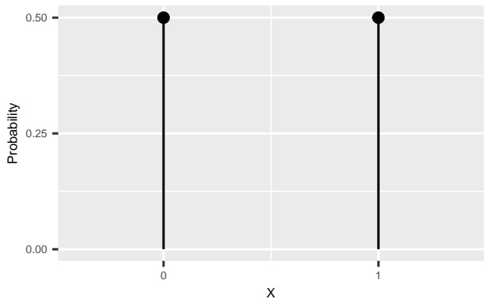

a patient have the illness or not? Will the customer buy the product or not? Does this image depict a cat or not? Many other processes are based on Bernoulli (e.g. Binomial), or partly based on Bernoulli process (e.g. zero-inflated distributions).

The expected value of Bernoulli is simple and intuitive but its variance is not. It is good to know how to compute it because it is so widely used in practice. This will be important below when computing standard errors for sample fraction in Section 1.6.3 z-test: is the sample mean equal to a given value?, page 103.

The expected value of Bernoulli process is very intuitive:

$$
\mathbb {E}   X = p \cdot 1 + (1 - p) \cdot 0 = p.\tag{1.5.6}
$$

Its variance is also simple although not intuitive (see Exercise 1.21). We can compute it from the variance formula (1.4.22):

$$
\mathrm{Var} X = \mathbb {E} X ^ {2} - (\mathbb {E} X) ^ {2} = p - p ^ {2} = p (1 - p).\tag{1.5.7}
$$

We used the fact that for Bernoulli distribution, $X ^ { 2 } = X$ as we only have values 0 and 1, and hence E $X ^ { 2 } = \operatorname { \mathbb { E } } X = p .$

## Example 1.21: Bernoulli distribution

Bernoulli distribution describes a plethora of very basic phenomena. For instance, a politician may be interested if the electorate will support a particular policy. A famous historical example was the South African referendum to end apartheid in 1992. It resulted in 1,924,186 “yes” votes (69%, to end the apartheid) and 875,619 “no” votes (31%, to preserve the system).

We can describe the individual voters as realizations of Bernoulli(0.69) RV, with sample size of approximately 2.8 million.

Note that reality was somewhat more complex–there were also 5,142 invalid votes. We can ignore this small number (0.18%) for crude calculations. But if we want to be precise, we have to specify that the Bernoulli process describes either “yes” and “non-yes” (including invalid votes), or “no” and “non-no” events. We can also describe the process using multinomial distribution, i.e. a discrete distribution with more than two possible outcomes.

<!-- page: 81 -->

## Exercise 1.27: Bernoulli distribution

| Which of the following problems can be described by Bernoulli distribution? |
| --- |
| 1. Who survived Titanic disaster? |
| 2. Who were admitted to an elite college? |
| 3. Which majors did students choose? |
| 4. How many years it took for students to graduate? |
| 5. Did they drop out? |
| 6. Were engineering students more likely to drop out? |
| Hint: some of the questions are vague, try to understand the relevant events. |
| Solution on page 494. |

## Binomial distribution Binom(S, p)

Binomial distribution is what you get if you repeat independent Bernoulli experiments S times and count successes. In these S experiments, you can get 0, 1, ... up to S successes. For instance, if you flip a coin twice, you can get 0, 1 or 2 heads. Obviously, this is equivalent to flipping two separate coins.

Binomial distribution is another most widely used distributions. It can be used to describe the questions like

• Out of 10 randomly selected candidates, how many are suitable for the job?

• What is the probability that at least one candidate is suitable?

• What is the probability that the weather is good in two of the selected three days?

• How likely it is that in the class of 70 students, we have 10 math majors? There are, obviously, many more similar applications.

Next, we’ll compute the corresponding probabilities. In case of two unbiased coins, the possible outcomes are HH, HT, TH and $T T$ . Importantly, they are all equally likely as the coins are unbiased and independent. So there are one way to get two heads, two ways to get one heads, and one way to get no heads:

| Heads | 0 | 1 | 2 |
| --- | --- | --- | --- |
| Chances | 1 | 2 | 1 |
| Probability | 0.25 | 0.5 | 0.25 |

In this case it is easy to see that there are “two chances”, i.e. two ways to get one heads: either the first coin comes up with heads and the other one with tails, or the way around. In case of unbiased coins, the probability of heads is $1 / 2 ,$ and the probability of tails is $1 / 2$ too. Hence the probability that the first coin shows heads and the other tails is $1 / 2 \cdot 1 / 2 = 1 / 4$ , and the same is true for the opposite case. So the probability to get one heads is $1 / 4 + 1 / 4 = 1 / 2$

But how can we compute the “chances” and “probabilities” in a more general case where we flip S biased coins? Denote the probability of heads for an individual coin as $p ,$ hence the probability of tails is $1 - p$ . We want to compute the probability to receive $n _ { h }$ heads and $n _ { t }$ tails, where $n _ { h } + n _ { t } = S .$

For any particular combination of heads and tails, the probability is just $p ^ { n _ { h } } \cdotp ( 1 -$ $p ) ^ { n _ { t } }$ . This is not the probability to $\mathrm { g e t } n _ { h }$ heads, this is the probability of an event

<!-- page: 82 -->

where for every single coin you have decided whether that coin shows heads or tails. For instance, it might be probability that the first coin shows H, the second coin $T ,$ the third one H again, and so on. In the two-coin example above, if $n _ { h } = 1$ , it can correspond to either HT or TH, but not to both of these! And if you have three coins, a penny, a dime and a quarter, then it might be the probability that both the penny and the dime show tails, but the quarter will show heads. The coins must be distinct, and the distinction must be decided before the experiment.

But we are interested in the total number of heads instead. So we need to take into account that to get a single heads, either the penny, the dime or the quarter can show heads while the other coins show tails. How many such combinations do we have? For three coins, it is 3. In a general case, where we are looking for n heads when flipping S coins, the answer is

$$
\binom{S}{n} = \frac {S !}{n ! (S - n) !}.\tag{1.5.8}
$$

(See Section A.1.3.) The notation ${ \binom { S } { n } }$ (or sometimes $C _ { n } ^ { S } )$ is called binomial coefficient,  combinations of n elements out of S. And hence the binomial probability

$$
\Pr (X = n) = \binom{S}{n} p ^ {n} (1 - p) ^ {S - n} = \frac {S !}{n ! (S - n) !} p ^ {n} (1 - p) ^ {S - n}.\tag{1.5.9}
$$

## Example 1.22: How many Spanish speakers?

Assume that 30% of students speak Spanish. What is the probability that a group of 10 randomly picked students contains three Spanish speakers? The answer is

$$
\Pr (X = 3) = \binom {1 0} {3} 0. 3 ^ {3} \left(1 - 0. 3\right) ^ {1 0 - 3} = \frac {1 0 !}{3 ! (1 0 - 3) !} 0. 3 ^ {3} \cdot 0. 7 ^ {7} = 0. 2 6 7.
$$

For binomial distribution to be applicable, two conditions must be fulfilled: first, each individual event must have the same Bernoulli(p) distribution; and second–the individual events must be independent. For instance, if everyone in the “Advanced Spanish” class speaks Spanish, then if you always pick one student from that class, and one from somewhere else on campus, the result will not be binomial. There is no way to get zero Spanish speakers into your sample. The distributions are not the same–the “Advanced Spanish” class student is not Bernoulli(0.3) but Bernoulli(1). But if you do not pick the students independently, but from a group of friends, then it is more common that you either get all Spanish speakers, or no Spanish speakers in your sample. This is because people with similar background tend to group together.<sup>16</sup>

<small><span class="docvortex-page-footnote" data-block-type="page_footnote" style="color:#6b7280">16<sub>Also</sub> described as “birds of feather flock together”. This applies to many different human traits, and is commonly called homophily.</span></small>

<!-- page: 83 -->

## Exercise 1.28: Weekly orders

You have a small internet shop where you sell your hand-made soaps all over the world. The probability to receive any orders in a given day is 0.5.

What is the expected number of days where you receive an order in a (5-day business) week?

• What is the probability to receive no orders in a given week?

• What is the probability to receive an order in all five days?

You find the you receive no orders in a week more frequently than what you expect–in 10% of weeks. What may cause the deviation from binomial distribution?

Solution on page 494.

## 1.5.2 Continuous distributions

## What are continuous RV-s

Many phenomena can have not just a limited set of values, but values that are everywhere in a continuous interval. For instance, flight delay, human height, or human income can be essentially every single number (within a reasonable range). Hence we cannot create a table of possible values like in Table 1.9. First, there are infinite number of possible values, and second, every particular value is extremely rare. How often it happens that your flight is delayed by exactly 54.321 minutes? Such phenomena are described by continuous random variables.

But we can still get close to the frequency tables and p.m.f. plots. The trick is to partition the sample space into “bins” and treat the bins as discrete values. The more data we have, the narrower bins we can create, and as a result we get smoother and smoother pictures. Figure 1.18 displays this process. On the two upper panels we have 25 realizations. The top-left plot puts the results into five separate bins. The tallest bins are in the middle with the corresponding counts being 9 and 12. All other counts are much smaller. On the top-right panel we repeat the process with 100 bins. Most of the bins are empty now, but we still see that the tallest bin contains three realizations.

The two lower panels repeat the process with 10,000 realizations. The bottom-left panel splits the values into four bins, and now the result is fairly symmetric around zero. Bottom-right panel uses 100 bins that display a fairly smooth bell-curve. Note that the bottom figures do not display counts but density—counts in each bin, divided by sample size N and by the width of the corresponding bins. We do this because density remain roughly the same if we use a large number of narrow bins instead of a small number of wide bins, or if we use a large sample instead of a small sample. A bin of a half of the original width will contain roughly a half of the cases of the original bin, but by dividing the count by 0.5 of the original width, we retain (roughly) equal frequency.

We can continue this process as we get more and more data. At the limit, the sample size goes to infinity and we are looking at infinitesimally narrow intervals. The result, how the density value of each infinitesimal bin depends on x, is called probability density function (p.d.f.). This is the RV counterpart of histogram, exactly

<!-- page: 84 -->

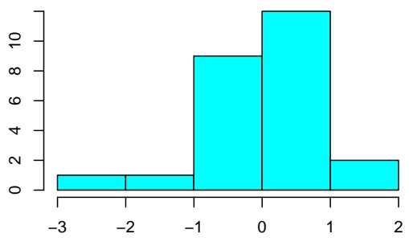

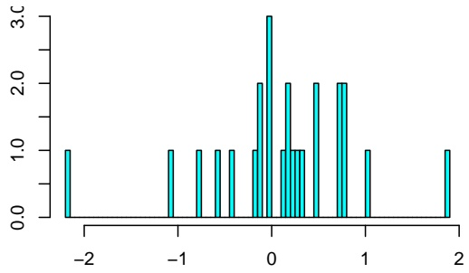

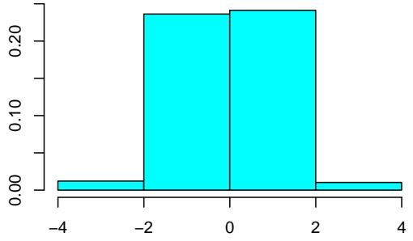

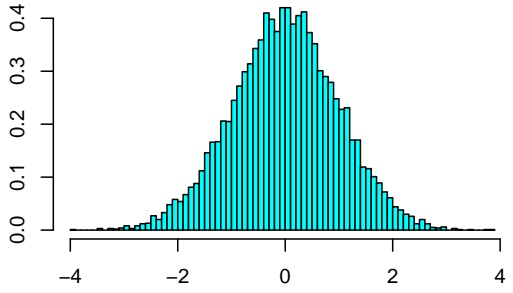

Figure 1.18: Moving from discrete to continuous values. All histograms display random normal realizations. On the left panels we partition the value range into a small number of intervals, and on the right panel into a large number intervals. We are effectively looking at a discrete distribution with that many possible values. The upper panel displays a sample of 25 random values, the lower panel 10,000 random values. The upper panel displays counts of values in each bin, the lower panel the relative frequency.

as expected value is the RV counterpart of the sample average. In a similar fashion as the sample average converges to the expected value as $N \rightarrow \infty$ , the histogram converges to the p.d.f. as sample size approaches to infinity.

p.d.f. is often denoted by f(x) and can be defined as

$$
f (x) = \lim _ {\mathrm{d} x \to 0} \frac {\Pr (X \in [ x , x + \mathrm{d} x))}{\mathrm{d} x}.\tag{1.5.10}
$$

p.d.f. can also be defined as integral: integral of p.d.f. over an interval is the probability that the value falls into this interval:

$$
f (x): P (x \in B) = \int_ {B} f (x)   \mathrm{d} x\tag{1.5.11}
$$

## Example 1.23: Standard uniform distribution

Standard uniform is a continuous distribution where all values between 0 and 1 are equally likely, and other values are impossible. Here is a sample of numbers that are uniformly distributed:

0.35246, 0.74205, 0.22743, 0.23644, 0.50441, 0.49287, 0.18817, 0.30947

<!-- page: 85 -->

## 1.5. PROBABILITY DISTRIBUTIONS

And here are histograms of three samples–of size 10, 100 and 1000.

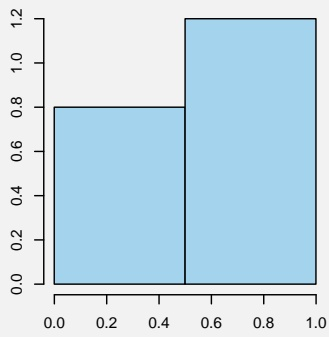

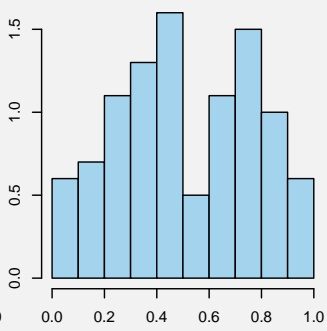

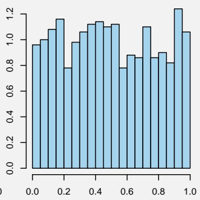

Figure 1.19: Histogram of standard uniform samples of 10 (left), 100 (middle), and 1000 (right) realizations.

What is the corresponding p.d.f.? As the uniform probability does not depend on x, the probability must just be equal to the interval width $\delta x .$ . Hence from (1.5.10), the p.d.f. is $f ( x ) = 1$ in the interval [0,1].

Expected value for continuous RV-s is defined essentially in the same way as in case of discrete $\mathrm { R V { \scriptstyle - } s } ,$ just we have to replace the sums with the integral:

$$
\mathbb {E}   X = \int_ {- \infty} ^ {\infty} f (x)   x   \mathrm{d} x.\tag{1.5.12}
$$

As in case of discrete RV, the expected values is a weighted average where the weights are the probabilities, expected value for continuous RV-s is a weighted average where weight is the corresponding p.d.f. Variance is defined in exactly the same way as for discrete RV-s

$$
\mathrm{Var} X = \mathbb {E} [ (X - \mathbb {E} X) ^ {2} ] = \mathbb {E} [ X ^ {2} ] - (\mathbb {E} [ X ]) ^ {2},\tag{1.5.13}
$$

just keep in mind that the expectation must now be calculated using the integral (1.5.12).

## Example 1.24: Expected value of uniform RV

Let’s calculate the expected value for standard uniform RV. Its p.d.f. is just $f ( x ) = 1$ in the [0,1] interval, so we can integrate it over the interval:

$$
\mathbb {E} X = \int_ {0} ^ {1} 1 x \mathrm{d} x = \left. \frac {1}{2} x ^ {2} \right| _ {0} ^ {1} = \frac {1}{2}.\tag{1.5.14}
$$

This is an intuitive result: if all values between 0 and 1 are equally likely, we get the average between these numbers.

<!-- page: 86 -->

## Exercise 1.29: Quantiles of standard uniform distribution

In case of continuous distributions, τ -th quantile $q _ { \tau }$ is defined as such a number that probability to get a realization smaller than $q _ { \tau }$ is $\tau$ . Formally, $q _ { \tau } : \operatorname* { P r } ( X \leq$ $q _ { \tau } ) = \tau$ For instance, 0.05th quantile is defined as such a number, so that you get a realization that is smaller than that number with probability 0.05 (5%).

Consider standard uniform distribution

$$
f (x) = \left\{ \begin{array}{l l} 1 & \text {if} \quad 0 \leq x \leq 1 \\ 0 & \text {otherwise} \end{array} \right.\tag{1.5.15}
$$

Find the theoretical quantiles $q _ { 0 . 0 2 5 }$ and $q _ { 0 . 9 7 5 }$ Solution at page 495

## 1.5.3 Popular continuous distributions

This section discusses a few commonly used continuous distributions.

## Normal distribution

Normal distribution is one of the most widely used continuous distribution. It describes quite well a plethora of phenomena where “average values are most common”. The examples include height of humans, temperature, agricultural yields, measurement errors and many others.

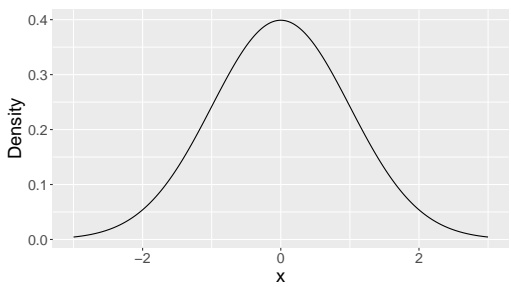

Figure 1.20: Standard normal $p . d . f .$

The p.d.f. of normal distribution is described by the well-known “bell curve”, a bell-shaped curve where the most common values are in the middle (Figure 1.20). The p.d.f. of the normal distribution is

$$
f (x) = \frac {1}{\sqrt {2 \pi} \sigma} \exp \left(- \frac {1}{2} \frac {(x - \mu) ^ {2}}{\sigma^ {2}}\right),\tag{1.5.16}
$$

where $\mu$ is mean of the distribution (the location of the central hump) and $\sigma$ is its standard deviation (width of the hump). Its expected value is

$$
\mathbb {E} X = \mu\tag{1.5.17}
$$

and its variance

$$
\mathrm{Var} X = \sigma^ {2}.\tag{1.5.18}
$$

Normally distributed RV-s are often denoted by $N ( \mu , \sigma ^ { 2 } )$ , for instance, if a RV X is normally distributed with expected value $\mu$ and variance $\sigma ^ { 2 }$ then it is written as $X \sim N ( \mu , \sigma ^ { 2 } )$

<!-- page: 87 -->

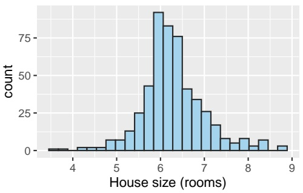

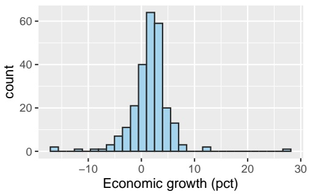

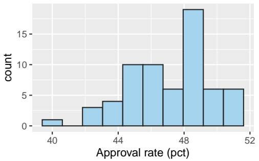

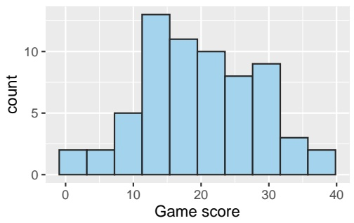

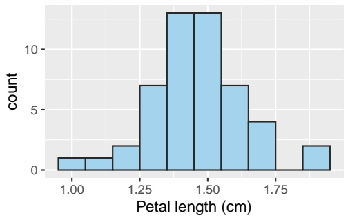

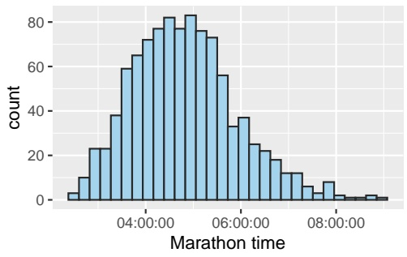

Figure 1.21: Examples of (approximately) normally distributed values. Clockwise, from top left: average house size across Boston neighborhoods (Boston housing data); Economic growth (pct) across countries (World Bank data); Game score of 65 games by the NBA basketball player James Harden (Basketball-reference.com data); Marathon finishing time (Marathon data); Petal lenght of setosa flowers (Iris data); Approval rate of the U.S. president Barack Obama (Obama approval data).

<!-- page: 88 -->

$p . d . f .$ is probability density function, see Section 1.5.2 page 73.

Figure 1.21 shows examples of approximately normally distributed values. A few other examples are human height (Figure 1.29), age of Titanic passengers (Figure 1.2, left) and education in years (Figure 1.5).

Why are so many apparently very different phonomena distributed normally? The answer is related to CLT–the sum of many independent RV-s tend to be normally distributed. All these pictures depict phenomena where the actual value is a result of many different processes. For instance, the average house size is related to the neighborhood age, the wealth of people living there, land price, availability of contruction materials, family size... A basketball players game score is a result of many many different opportunities, encounters with the opponent, and mistakes; and so on.

Another reason why normal distribution is very important is also related to CLT. Namely, a large number of statistical methods require computations that are similar to sample average–by CLT, the result will be approximately normally distributed. This makes normal distribution (and a few closely related distributions like t-distribution and $\chi ^ { 2 } .$ -distribution) extremely important for statistical inference (see more in Section 1.6.2 Theoretical Confidence Intervals, page 99).

Exercise 1.30: Normal p.d.f.

Use computer to make a plot of normal p.d.f. that is similar (in terms of the location and width of the hump) to a few histograms in Figure 1.21. Use the location (mean) and the width (variance) parameters!

Do this once by manually coding the normal p.d.f. (equation (1.5.16)), and once by using the dedicated normal density function.

Solution on page 495.

## Log-normal distribution

Normal distribution has wide range of applications, but there are important classes of phenomena that are rather different from normal. Examples include price (Figure 1.22) and income (Figure 2.13 at page 169). Intuitively, it is easy to understand that these two example cannot be normally distributed—both price and income cannot be negative, so there is a clear lower limit. Normal distribution does not have such a lower limit. Most income and price values tend to be close to “typical” values, there exist extremely rich people and super high prices. So in both cases we expect to see a right-skewed distribution with a long right tail.

It turns out that in case of price and income, if we take logarithm of these values, i.e. analyze log income instead of income, we get a distribution that looks quite close to normal. This is the idea of log-normal distribution: a RV is log-normally distributed if it’s logarithm is normally distributed. The p.d.f.of log-normal distribution (red line on Figure 1.22, left panel) resembles a normal curve, just it’s left side is compressed and the its right side stretched: this is because exponentiation compresses small numbers and stretches large numbers. It’s p.d.f. is given by

$$
f (x; \mu , \sigma) = \frac {1}{\sqrt {2 \pi} \sigma x} \mathrm{e} ^ {- \frac {1}{2} \frac {(\log x - \mu) ^ {2}}{\sigma^ {2}}}\tag{1.5.19}
$$

<!-- page: 89 -->

## 1.5. PROBABILITY DISTRIBUTIONS

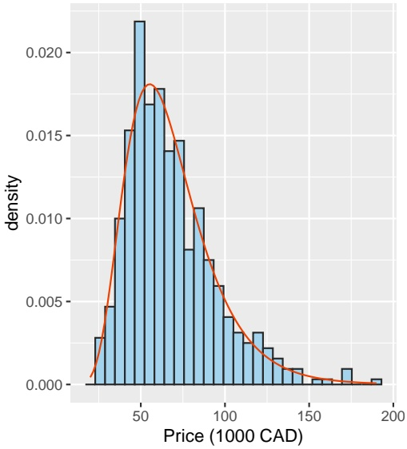

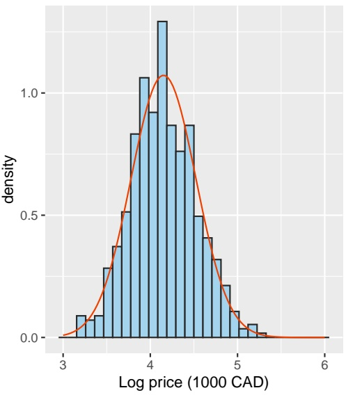

Figure 1.22: House prices in 1987 in Windsor, Canada. The left panel shows price histogram, the right panel log-price histogram. As the latter looks broadly normal, we conclude that the price distribution is approximately log-normal. The red lines show the best-fit smooth log-normal density (left) and normal density (right). Log-normal density can be imagined as a normal bell curve that is squeezed from left and stretched from right. Both red curves match data well.

where $\mu$ and $\sigma ^ { 2 }$ are mean and variance of the corresponding normal distribution (distribution of log X). Log-normally distributed RV-s are often denoted by $L N ( \mu , \sigma ^ { 2 } )$ If you are using computer to work with log-normal values, these two parameters may be called “scale” and “shape”.

The expected value and variance of log-normal are

$$
\mathbb {E} X = \mathrm{e} ^ {\mu + \frac {1}{2} \sigma^ {2}} \quad \operatorname{Var} X = \mathrm{e} ^ {2 \mu + \sigma^ {2}} (\mathrm{e} ^ {\sigma^ {2}} - 1).\tag{1.5.20}
$$

Figure 1.23 shows the $\mathrm { p . d . f . }$ for a few combinations of the parameters $\mu$ and $\sigma .$

Why do some phenomena follow log-normal instead of normal distribution? There are two partial explanations:

• Neither price nor income can be negative. Hence whatever distribution these two phenomena follow, it cannot contain negative values. But normal distribution stretches to negative values.

• It appears that the processes that create income and price are not additive but multiplicative: instead of a sum of many independent random processes, these phenomena seem to be better described as a product of independent positive random processes. Hence log values look like normal as logarithm transforms the product to a sum.

<!-- page: 90 -->

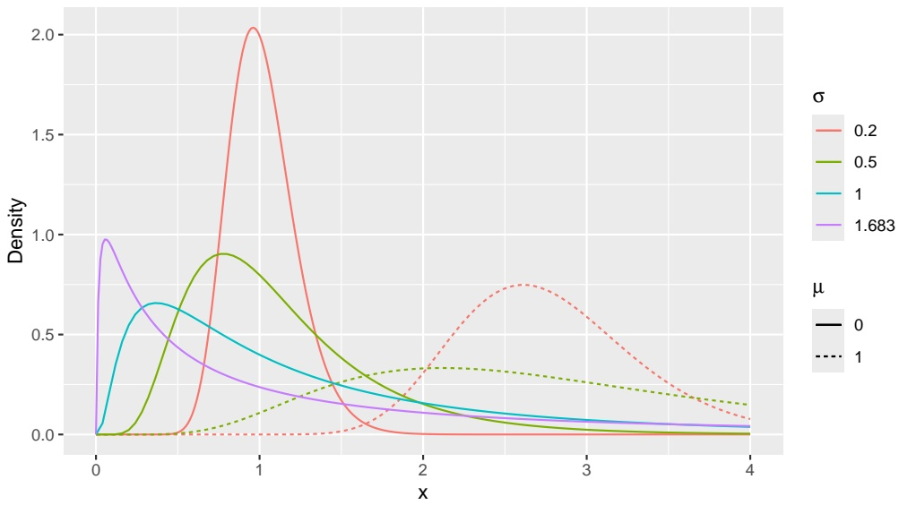

Figure 1.23: Example log-normal p.d.f.-s. σ changes the concentration of the distribution: small σ corresponds to a fairly concentrated values that are distributed in a rather normal fashion, large σ in turn describes a distribution with heavy right tail. $\mu$ changes scale, the example curves with $\mu = 1$ are of similar shape as the corresponding curves with $\mu = 0 ,$ just more stretched out. See Table 1.10 for the corresponding inequalities.

Pareto ratio: upper x% of population possesses $1 0 0 - x \%$ of all ressourse, e.g. upper 20% owns 80% of all wealth. See Section Section 1.3.4 Pareto ratio, page 31.

The parameter σ of log-normal distribution describes different degree of inequality: on Figure 1.22, typical houses cost \$50k, but some houses are over \$150k (CAD). This means the most expensive houses cost thrice as much as typical houses.17<sub>However</sub>, the inequality in house prices are not very large: the pareto ratio for this distribution tells that the most expensive 43% of houses in Windsor contain 57% of total housing value in that neighborhood. In this case $\sigma   =   0 . 3 7 2$ . Surprisingly, the UK income distribution in Figure 2.13 is more equal, the Pareto ratio is $4 7 . 2 / 5 2 . 8$ as $\sigma = 0 . 1 4 2$ But Titanic ticket prices are more unequal. Here $\sigma   =   0 . 9 0 9$ and 32.5% of passengers paid 67.5% of the total ticket revenue. A few more Pareto ratios are given in Table 1.10. We see that case of large σ, the right tail is very long and indicates the presence of super-wealthy: in case of $\sigma = 3 . 2 9$ the upper 5% of population owns 95% of the resources.

<small><span class="docvortex-page-footnote" data-block-type="page_footnote" style="color:#6b7280">17<sub>If</sub> looking at log-prices instead of prices, we can say that the most expensive houses cost approximately 5 (the unit is log \$1000 CAD) while typical houses cost 4 (log \$1000 CAD), i.e. 20% more. But this figure is not robust with respect of measurement units. If we measure the price not in thousands of dollars but in dollars, the most expensive house would be only 10% more expensive than the mean log-price.</span></small>

<small><span class="docvortex-page-footnote" data-block-type="page_footnote" style="color:#6b7280">This is because the price is ratio measure but log-price is only interval measure. In order to define inequality in this way we have to be able to compute ratios.</span></small>

<!-- page: 91 -->

Table 1.10: Log-normal Pareto ratios depending on σ. For instance, $if   \sigma   =   3.29$ then the upper 5% of population possesses 95% of total resources. See Figure 1.23 for the shape of the corresponding p.d.f.-s. The last column shows the corresponding QSR.

| σ | Top share (pct) | Owned wealth (pct) | QSR |
| --- | --- | --- | --- |
| 0.20 | 46.02 | 53.98 | 1.75 |
| 0.50 | 40.13 | 59.87 | 4.08 |
| 1.00 | 30.85 | 69.15 | 17.18 |
| 1.68 | 20.00 | 80.00 | 138.13 |
| 3.29 | 5.00 | 95.00 | 55124.26 |

## Pareto distribution

Log-normal distribution is a good approximation for individual income. But there are phenomena that are much more extreme. For instance, human influence, web site popularity, and size of cities tend to be distributed in a much more inequal manner. For such phenomena, Pareto distribution can be a better distribution than log-normal.

The p.d.f. of Pareto distribution is given by<sup>18</sup>

$$
f (x) = \alpha x _ {0} ^ {\alpha} x ^ {- \alpha - 1}, \quad x > x _ {0}.\tag{1.5.21}
$$

It has two parameters: “scale” $x _ { 0 }$ and “shape” α. As p.d.f. is proportional to x risen to power $- \alpha - 1$ , Pareto distribution is often called power law.

Figure 1.24 shows a few examples of the p.d.f. with different α using linear scale (left panel) and log-log scale (right panel). Shape controls the spread of the values– Pareto values drawn from a large α distribution are fairly concentrated (green line on the figure). When α gets smaller, the values are more and more spread and contain larger and larger outliers and the values display increasing inequality. Scale $x _ { 0 }$ determines the “beginning” of the distribution–there must be a minimal value, otherwise the p.d.f. will get to infinity at 0. On Figure 1.24, $x _ { 0 } = 1$ . The expected value of Pareto RV is

$$
\mathbb {E}   X = \frac {\alpha}{\alpha - 1} x _ {0}, \quad \alpha > 1.\tag{1.5.22}
$$

If $\alpha \leq 1$ then the expected value does not even exist–there are too many too large outliers, so that the sample mean will not converge, and the few richest persons in the sample control almost all the wealth.

The other parameter, $x _ { 0 }$ describes the cutoff point. Pareto distribution needs a cutoff, otherwise it would go to infinity at zero. Sometimes one uses a shifted version of Pareto where the cutoff is shifted to 0. This is called Pareto-II or Lomax distribution.

An interesting characteristic of Pareto distribution is the fact that the p.d.f. looks like a straight line in log-log scale. It is easy to see by taking logarithm of p.d.f. (1.5.21):

$$
\log f (x) = \log \left(\alpha x _ {0} ^ {\alpha}\right) - (\alpha + 1) \log x.\tag{1.5.23}
$$

<small><span class="docvortex-page-footnote" data-block-type="page_footnote" style="color:#6b7280">x0.</span></small>

<small><span class="docvortex-page-footnote" data-block-type="page_footnote" style="color:#6b7280">18<sub>Strictly</sub> speaking, this is Pareto-I distribution where values start from  It’s close sibling, Pareto-II (or Lomax) distribution shifts the starting point to 0. See below.</span></small>

<!-- page: 92 -->

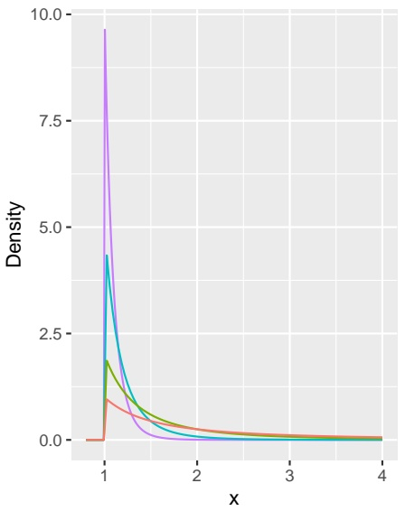

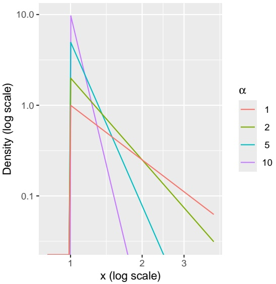

Figure 1.24: Pareto $p . d . f .$ for different shape parameter α. Linear scale $( l e t t )$ and the same distributions in log-log scale $( r i g h t )$ . These distributions may be hard to tell apart on linear scale, but on log-log scale all of them are just straight lines at different angle. All these examples have scale $x _ { 0 } = 1$ , the cutoff point on the left hand side.

One can immediately see that log $f ( x )$ is a linear function of log x because α and $x _ { 0 }$ are constants (see the right panel of Figure 1.24). This gives a good way to tell whether a distribution is more like log-normal or more like pareto: log-normal histogram tends to look like normal in density–log x scale. Pareto tends to look like a straight line in log density–log x scale.

As lines in log-log scale do not have any features, all places on the line always look the same, the distribution is sometimes called scale free distributions. In scalefree distribution, wherever you are the picture looks similar: most observations are much smaller, but there are always cases that are much larger. This may explain some of the frustration with career people have: however successful you are, there are always others who are much much more successful. And as you typically socialize with those who are at the comparable level, you do not even notice how far up in the career ladder you are. But you always see those who are much more successful than you–stars shine bright and are visible to everyone.

Table 1.11 shows Pareto Ratio and QSR for Pareto distribution for different shape α values.

Pareto ratio: top x pct owns 100 − x pct of wealth, see Section 1.3.4 Pareto ratio, page 31; QSR: quintile share ratio, see Section 1.3.4 Quintile share ratio, page 31.

## Exercise 1.31: Expected value of Pareto RV

Assume the scale $x _ { 0 } = 1$ Use the Pareto p.d.f. (1.5.21) and the definition of the expected value for continuous RV-s (1.5.12) to prove the expected value (1.5.22) Where is the requirement $\alpha > 1$ come from for the expected value to exist?

<!-- page: 93 -->

## 1.5. PROBABILITY DISTRIBUTIONS

<table><tr><td rowspan="2">α</td><td rowspan="2">Cutoff</td><td colspan="2">Pareto Ratio</td><td rowspan="2">QSR</td></tr><tr><td>Upper</td><td>Lower</td></tr><tr><td>3</td><td>1.325</td><td>43.0</td><td>57.0</td><td>2.47</td></tr><tr><td>2</td><td>1.618</td><td>38.2</td><td>61.8</td><td>4.24</td></tr><tr><td>1.5</td><td>2.148</td><td>31.8</td><td>68.2</td><td>8.16</td></tr><tr><td>1.2</td><td>3.506</td><td>22.2</td><td>77.8</td><td>20.95</td></tr><tr><td>1.1609</td><td>4.001</td><td>20.0</td><td>80.0</td><td>26.27</td></tr><tr><td>1.1</td><td>5.427</td><td>15.6</td><td>84.4</td><td>26.27</td></tr></table>

Table 1.11: Inequality in Pareto distribution. For instance, if shape $\alpha = 3 ,$ then wealthiest 43 pct of population, those who have more than the cutoff 1.325, control 57 pct of resources; the corresponding $Q S R = 2 . 4 7 .$ (Assuming scale $x _ { 0 } = 1 .$ .)

Solution on page 496.

## 1.5.4 Central Limit Theorem

Central Limit Theorem (CLT) plays an extremely important role in statistical inference. It is somewhat similar to Law or Large Numbers, but unlike LLN, our intuition does not help much with CLT. While LLN describes what happens to the sample average when sample size increases, CLT describes the shape of the sum of random variables, and tells that under certain assumptions, sum of $\mathrm { R V { \scriptstyle - } s }$ is approximately normally distributed. So if we add up (literally!) a lot of random numbers, the result will be normally distributed. Even more, its variance is proportional to the number of realizations we summed. We first explain and demonstrate CLT at work, and thereafter define it formally and discuss the assumptions behind it.

## Why sum tends to be normal

We use Pareto distribution with parameter $\alpha = 5$ (Section 1.5.3 Pareto distribution, page 81) to demonstrate how CLT works. Pareto(5) distribution (Figure 1.25 top left panel) does not resemble normal distribution much, it has its most common values near $x _ { 0 } = 1$ , and the larger values are increasingly less common. In this sense it is more similar to exponential distribution. However, when we start averaging these variables, we can see that the values near 1 become increasingly less likely, and the values near the average (1.25) tend to be more and more common. When averaging S = 100 Pareto(5) RV-s (bottom right panel), the result looks very much like a normal.

Before we explain why this happens, let’s make clear what exactly do these histograms depict. In the upper-left image we just generate R = 1000 random Paretos with shape $\alpha   =   5$ and scale $x _ { 0 }   =   1$ . The second panel $( S   =   2 )$ shows $R   =   1 0 0 0$ replications of average of two Paretos. First we generate two Pareto realizations and take the average of them. But computing average of two numbers would yield a single result only, and we cannot say much about the distribution based on just a single number. So we replicate this $R = 1 0 0 0$ times. In the third panel we generate $S = 3$

Expected value of Pareto(5) distribution is $\alpha / ( \alpha - 1 ) \stackrel { \frown } { = } 1 . 2 5 ,$ and variance $\begin{array} { r } { \frac { \alpha } { ( \alpha - 1 ) ^ { 2 } ( \alpha - 2 ) } = 0 . 1 0 4 2 . } \end{array}$ Section 1.5.3 Pareto distribution, page 81.

<!-- page: 94 -->

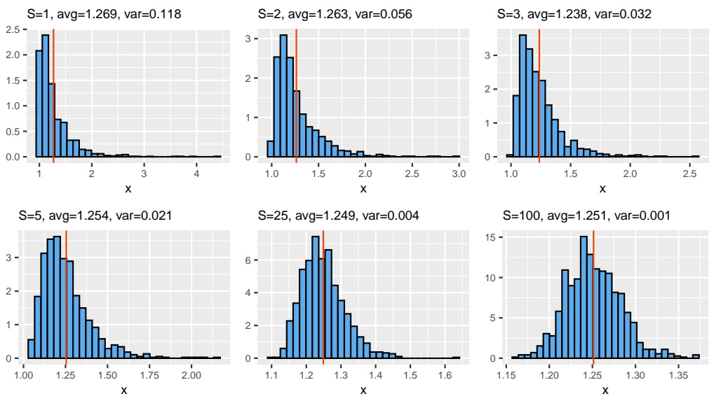

Figure 1.25: Histogram of means of Pareto(5) RV-s. The upper-left panel shows that of a single Pareto(5) RV (i.e. sample size $S   =   1 )$ while the bottom-right panel shows the histogram of means of S = 100 Pareto RV-s. The shape of the distribution is getting more and more normal as S increases. The orange line indicates the average of the sample of means. All figures depict the histogram of 1000 replications.

random Paretos, take average of those, and again, in order to see the distribution, we repeat this R = 1000 times. And so on, displaying averages of samples of S = 5, S = 25 and S = 100 random Pareto(5) realizations. In each case this is replicated R = 1000 times to make the distribution visible. CLT tells us that the distribution will look more-and-more like normal as we average over more and more realizations. This is what the sample size S means. The number of replications R is not related to CLT, we use a large R just to get sufficiently smooth histograms. Remember–the distribution is the property of a RV but histogram is a visualization of the sample. Average of RV-s is also a RV, and its properties are not related to the sample size.<sup>19</sup>

But why does the image turn more-and-more normal when we add more RV-s? One might intuitively think that adding Paretos will still result in a long-tailed distribution with maximum near 0. After all, values near 0 are the most likely ones? True, values near 0 are the most common ones, but that is not the whole story. If we want to take mean of two Paretos and still get close to 0, we need to get both of these numbers to be close to 0. But it is more likely to get one of these close to zero and the other not close to zero. The logic is exactly the same as in case of binomial distribution: when tossing two coins it is more likely to receive one heads and one tails, rather than receving two heads or two tails. So instead of our average of Pareto

<small><span class="docvortex-page-footnote" data-block-type="page_footnote" style="color:#6b7280">19<sub>Average</sub> is the result of two operations: addition, and multiplication by scalar. Those were discussed in context of RV-s above in Section 1.4.6 Functions of RV-s, page 63.</span></small>

<!-- page: 95 -->

pairs piling up at 0, it will pile up at a somewhat larger number. This is what we see on the $S = 2$ panel: the values near 0 are still fairly common, but now the peak at 0 is less prominent than in the first panel.

When averaging more than two RV-s, the same logic applies more-and-more. When computing the sum of 100 RV-s, then we can pretty much guarantee that we get a value somewhere in the middle—in average, we get an average number. Indeed, the chances to get a value near 0 for 100 times is very-very small. This is why we have more and more prominent hump in the middle of the plot–we have arrived to a distribution that is similar to normal.

**Formal definition of CLT and assumptions behind it** Now it is time to look at the formal definition of CLT. <sup>20</sup>

**Theorem 4** (Central Limit Theorem, CLT). If $X _ { 1 } , X _ { 2 } , \ldots , X _ { S }$ are independent and identically distributed random variables with expected value E X and variance Var X then, as the sample size $S \rightarrow \infty ,$ , the distribution of their average $\begin{array} { r } { \bar { X } _ { S } = \frac { 1 } { S } \sum _ { i = 1 } ^ { S } X _ { i } . } \end{array}$

a) is normally distributed $\bar { X } _ { s } \sim N ( \mu , \sigma ^ { 2 } )$ , with expected value $\mu$ and variance $\sigma ^ { 2 }$

b) The expected value of the sample mean, E $\bar { X } _ { S }$ , equals to $\mu = \mathbb { E }   X$

(Expected value of average is the same as expected value of individual RV.)

c) Variance of the sample mean, Var $\bar { X } _ { S _ { \perp } }$ , equals to $\begin{array} { r } { \sigma ^ { 2 } = \frac { 1 } { S } \cdot \operatorname { V a r } X } \end{array}$

(Variance is inversely proportional to the sample size.)

Let’s discuss individual claims in a more detail now.

The claim a) tells that the mean is normally distributed. For instance, if we take the example of $S = 5$ in Figure 1.25, CLT states that the distribution is approximately normal with mean $5 / 4   =   1 . 2 5$ and variance $0 . 1 0 4 2 / 5 \: \approx \: 0 . 0 2$ One can see that the distribution somewhat resembles normal, but as $S = 5$ is far from infinity, the distribution is also visibly different from normal distribution. But when we take $S   =   1 0 0$ (the bottom-right panel), then our eyes cannot tell that the result is not normally distributed.

The result b) tells us that we can average a large number of random values and the expected value will still be the same. For Pareto(5) RV, E $X = 1 . 2 5$ , and hence E $\bar { X } _ { 5 }   =   \bar { X } _ { 1 0 0 }   =   1 . 2 5$ . You can easily see that the sample averages, reported in the figure, are all approximately 1.25. This is handy when computing–we do not even have to compute!

But the result c) tells us something even more important: the larger the sample size S, the smaller the variance of its mean, Var X¯ . More precisely, variance of mean is inversely proportional to the sample size. For instance, for Pareto(5), Var $X = 5 / 4 8 \approx$ 0.1042. But for average of sample of five Pareto(5) values, Var $X = 5 / 4 8 / 5 \approx 0 . 0 2 0 8$ If we measure precision by standard deviation, the root of the variance, then the precision increases as the root of sample size. Four times larger sample gives us twice

<small><span class="docvortex-page-footnote" data-block-type="page_footnote" style="color:#6b7280">20<sub>Strictly</sub> speaking, only the result a) is part of the CLT. b) is law of large numbers, and c) is a direct result of definition of variance for independent random variables. We list here together for compactness.</span></small>

<!-- page: 96 -->

as precise results; if we want 10 times more precise results then we need a 100 times larger sample. This is illustrated in Figure 1.26. The original sample of 100 gives the distribution width 3. 2.25 times larger sample narrows this down to 2, but to get to width 1 we need a nine times larger sample. CLT tells that all these curves will resemble the normal distribution.

Figure 1.26: Standard deviation as a function of sample size. In case of sample size 100 (green curve), the resulting distribution has width 3. When we increase the sample size 2.25 times to 225, the width will be 1.5 times smaller. But three times narrower width requires a 9 times larger sample.

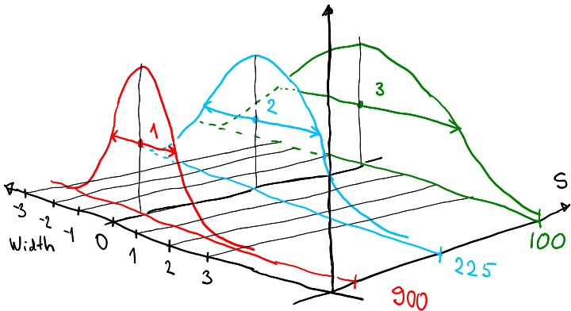

The result b) can be explained in a fairly intuitive manner. Imagine R airlines are flying to a destination, and each of these will do S flights a day, so there are R · S flights in total. Each flight is delayed by a random amount, this is the RV X. The overall average delay can be computed as just average over all $R \cdot S$ delays (realizations of X), whatever the airline. This is the analog of E X. Alternatively, we can compute the average delay for each airline (this is $\left| \bar { X } _ { S } \right\rangle$ and then average over the average delays (this is analogous to E $\bar { X } _ { S }$ . The analogy is not perfect, but it helps to see intuitively why E $\bar { X } _ { S } = \operatorname { \mathbb { E } } X$

Exercise 1.32: Replicate Figure 1.25 with Beta distribution

Beta distribution is a distribution with two shape parameters. Show that the average of $B e t a ( 0 . 5 , 0 . 5 )$ RV-s (where both shape parameters are 0.5) converge to normal: replicate the Figure 1.25 with beta distribution on your computer. Result on page 496.

You should be aware the CLT is not universally true–it relies on a few assumptions. In particular, it applies if

• The random variables $X _ { 1 } , \ldots , X _ { S }$ are independent. This matters for the argumentation we gave above: it must be less likely to get two small values, than one small and one large value. In case of correlated data this may not be true. For instance, when doing 1000 temperature measurements in a hot summer day we should not expect the result to reflect the yearly average temperature well. These values are highly correlated.

• Both expected value and variance of $X _ { i }$ must exist. Although in practice we do not encounter heavy-tailed distributions so often, it is good to know that long-tailed distributions we do encounter may converge at a much slower rate.

<!-- page: 97 -->

## 1.5. PROBABILITY DISTRIBUTIONS

So if we have so far worked only with well-behaved variables like number of children or log income, then it may come as an unpleasant surprise that our experience does not carry over to an analysis of city size or twitter tweets. The errors are much larger than expected.

**Why CLT is so important** There are two main reasons why CLT has such a central place in statistics. First, it tells us that when doing computations on large samples, we can use the properties of the normal distribution instead of a huge number of different tailor-made rules for Bernoullis, binomials and Paretos. This is what we usually use for confidence intervals, t-tables, and so on.

Second, it explains why many natural values, such as human height or temperature are approximately normally distributed. For instance, height is a sum of a large number of factors, some genetic, some environmental, some pulling us taller, other pushing us shorter. But when averaging over all those factors, the typical humans tend to be of about the average height. And when we see a different distribution, e.g. that of human wealth, this indicates that some of the assumptions behind CLT are violated. In case of wealth it is probably independence—the economy seems to work in the way that the rich get richer. Factors that influence wealth are not independent, the wealthy ones seem to be more prone to encounter the opportunities that are even more favorable to wealth accumulation.

<!-- page: 98 -->

## 1.6 Statistical Inference

This section discusses statistical inference. Inference refers to statistically sound conclusions based on data that can be generalized to the whole population. The statistical methods we discussed in Section 1.3 Descriptive statistics, page 16 are sound, but do not allow generalizations. Descriptive statistics describes data using statistical tools. For instance, we may find that in our sample, mothers who smoke give birth to smaller babies. If this is all we are interested in, we can stop here. But can our data tell something about another sample of mothers and babies? Or about all mothers and babies? Yes, the current sample can tell something about other samples, and about the whole population. Inferential statistics does exactly that.

If you think that using one dataset to tell something about the whole population is confusing then you are right. Statistical inference is much more complicated, and more error-prone than descriptive statistics. That’s why we denote much more space on it.

## 1.6.1 Statistical Hypotheses and Hypothesis Testing

In this section we introduce a lot of concepts: confidence intervals, confidence levels, significance levels, statistical hypothesis and hypothesis testing, and different types of errors. This section just introduces the concepts, how to actually compute the confidence intervals is discussed in Section 1.6.2 Doing Statistical Inference, page 96 and Section 1.6.3 z-test: is the sample mean equal to a given value?, page 103.

## Hypothesis testing and confidence level

Statistical inference is typically done through statistical hypotheses and hypothesis testing. Statistical hypotheses are claims about the world, claims that may or may not be compatible with data. If data contradict the claim, we reject the hypothesis, if data are compatible with the claim, we do not reject the hypothesis. Unlike many other fields, statistics normally does not give definite answers. For instance, while economists typically want to say that unemployment rate is “11.2 pct”, a statisticsbased answer will include a measure of uncertainty. A statistically correct answer may be “with 95% confidence we can say that unemployment rate is between 10.8 and 11.6 pct”.<sup>21</sup> Such answers are pretty much the only type of results that statistics can offer.

What does such a claim mean? There are two components here:

• We don’t know what exactly is the unemployment rate, but we are “reasonably certain” it belongs to the interval [10.8, 11.6].

• The “reasonably certain” means we are 95% certain.

As one can see, understanding such somewhat fuzzy claims requires a bit of statistical literacy.

<small><span class="docvortex-page-footnote" data-block-type="page_footnote" style="color:#6b7280">21<sub>You</sub> may have noticed that such interval-based claims are also quite common in sciences. Often (but not always) those originate from statistics-based methods.</span></small>

<!-- page: 99 -->

Intervals like [10.8, 11.6] are very commonly reported in statistical practice and hence they have a distinct name–confidence intervals. If we are 95% confident that the true value falls into this interval then we call it “95% confidence interval”. See Section 1.6.2 Doing Statistical Inference, page 96 for how to compute confidence intervals.

A statistical hypothesis, often denoted as H or $H _ { 0 }$ , is a claim, usually stated in a definitive manner. In the example above, a hypothesis might be $H _ { 0 } ;$ “unemployment rate is $1 1 . 2 \%$ , or perhaps instead $H _ { 1 }$ : “unemployment rate is more than $1 0 \%$ . The hypotheses can either be rejected (it means it is incompatible with data) or not rejected (if it is compatible with data). Note that hypotheses cannot be confirmed! Hypotheses can only be rejected or not rejected at certain confidence level. Confidence level means the probability that the rejection is the correct decision. It is based on data quality, sample size and other factors. In applications we typically look at confidence levels 95% or 99%. If a hypothesis is rejected, we can consider it “wrong”–given our data and methods was correct. If a hypothesis is not rejected, it is compatible with the data. It may be correct, or it may still be wrong if our dataset is too small or too noisy.

Hypotheses are often presented in pairs, where one is called null-hypothesis $H _ { 0 }$ and the other alternative hypothesis, often denoted by $H _ { 1 }$ or $H _ { A }$ . The null hypothesis is the original claim we are testing and potentially rejecting, $H _ { A }$ is the alternative that must be true when $H _ { 0 }$ is false. For instance, when analyzing mothers’ smoking habits and babies birth weight, $H _ { 0 }$ might be “smoking and non-smoking mothers give birth to babies of equal weight in average”. The alternative $H _ { A }$ in this case will be “Birth weight of babies, born to smoking and non-smoking mothers, differs in average”. Note that $H _ { A }$ does not claim that babies of either one or another group weigh more. If the weight is not equal, it must differ. If one wants to test if the weight differs in a certain way, that is a separate hypothesis. While certain sources always state $H _ { 0 }$ and $H _ { A }$ explicitly, other studies either only discuss $H _ { 0 }$ or leave the hypotheses implicit. In that case it is often obvious from question that is analyzed.

## Example 1.25: Rejecting and not rejecting a statistical hypothesis

<div class="docvortex-algorithm" style="white-space: pre-wrap; font-family:monospace;">
Assume we analyze unemployment data and conclude that with 95% confidence the true unemployment rate is between 10.8 and 11.6 pct with the best estimate being 11.2.

Now consider the government, that always prefers to paint a bit more rosy picture, claims that the rate is just 8.9%. We can treat this as a statistical hypothesis  $H_{0}: u = 8.9$  (where u means unemployment rate). The government's claim is clearly incompatible with our data (and model), after all, according to our analysis, we are 95% confident that the rate is at least 10.8%. So we can reject  $H_{0}$  and accept the alternative  $H_{A}: u \neq 8.9$ . But note that we were just 95% certain that  $u \in [10.8, 11.6]$  and hence we cannot reject it definitively, but only with 95% confidence.

However, the politically independent Central Bank has no incentive to make the figures any better than they are and publishes it's own analysis according to which  $u = 11.4\%$ . This can also be written as a statistical hypothesis  $H_{1}: u = 11.4$ . $^{a}$  What can we say about this? The number 11.4 fits squarely inside our confidence interval and hence the result is compatible with our data. So we
</div>

<!-- page: 100 -->

cannot reject $H _ { 1 }$ . But neither can we tell that it is correct–it is just compatible with data, maybe correct, maybe not correct.

<div class="docvortex-algorithm" style="white-space: pre-wrap; font-family:monospace;">
$^{a}$ Here we use  $H_{0}$  and  $H_{1}$  to denote different hypotheses.  $H_{1}$  here is not the alternative to  $H_{0}$, the alternative were  $H_{A}: u \neq 8.9$.
</div>

But what is a good hypothesis to test? There are many-many possibilities, which one should you choose? As a rule of thumb, we want to test a hypothesis that is related to the problem we are interested in, and that we can reject. The first point– hypothesis should be relevant–is obvious. The second point, however, is related to the fact that we can only reject hypotheses, not confirm them. And if we fail to reject one, then we essentially learn nothing. It is like hearing a Claim And Replying “Perhaps. What you say may be true but I don’t really know.” While technically correct, such an answer will not help us to learn much about the world. So a good hypothesis is a) relevant, and b) we can (possibly) reject it.

For instance, when returning to the unemployment example, assume that extended benefits are available if $u \; \geq \; 1 0 \%$ . Now it is obviously important to know if the government should provide the extended benefits. We can try to test it in a number of ways:

$H_{0} : u = 10\%$ . This hypothesis is problematic–if we reject it, we can say that unemployment is not $I \partial \% ,$ but we cannot tell if it is less or more. We still do not know if the benefits should be available.

$H_{1} \text{: } u \geq 10\%$ . Now if we reject it, we find that unemployment is below 10%. This is a valuable result: extended benefits should not be available.

**Exercise 1.33: Is this a good hypothesis?**

What about the hypothesis $H_{2} \text{: } u < 10\% ?$ Is it a good hypothesis?

Which hypotheses can be rejected depends on data quality—how much relevant information there is in data, and on the analysis—how well can we extract that information. The lower the data quality, the less can we tell, the fewer hypotheses can we reject. In the extreme case where the data contains no information (or we do not have any data), we cannot reject anything.

## Example 1.26: Unemployment example with bad data

Now imagine we only have access to inferior data and our results are much less precise. We are only able to conclude that unemployment must be in a range of [7, 14]%. Can we now reject $H _ { 0 } \; : \; u \; = \; 8 . 9$ (the Government’s claim) and $H _ { 1 } : u = 1 1 . 4$ (the Central Bank’s claim)? As both of these fit into our interval, we cannot reject either of them. Both claims are compatible with our low quality data. But we can still say that a scaremongerer who claims $u = 3 0$ is wrong. However, if we do not have any data, the only thing we can say is that $u \in [ 0 { , } 1 0 0 ]$ –this must be true by definition. Now even the scaremongerer can go unopposed, we just have no way to evaluate that claim.

Statistical hypotheses and hypotheses testing is closely related to the concepts of RV and sample. Namely, in statistical models we imagine that the world is the

<!-- page: 101 -->

RV and the statistical hypothesis is a claim about its properties. Now we use a sample and compute the corresponding property on the sample. If $H _ { 0 }$ is correct, the sample property should be close to what we claimed in $H _ { 0 }$ . How close exactly, can be computed from the properties of the RV, and the way the data was collected. For the model to work well we need all these three components to match:

• The RV must describe the real world well

• We must know the way the sample (data) is collected, and incorporate it into the model correctly.

• The hypothesis must be relevant and informative.

Example 1.27: Unemployment rate as RV

The RV that is used for data modeling is often not stated explicitly. Returning to the example of unemployment, we can imagine that every worker in the economy can be either unemployed or employed. Unemployment occurs with probability u and employment with 1 − u. If this is the model, then we are implicitly using Bernoulli RV (Bernoulli(u)).

Bernoulli RV: the event occurs with probability p and does not occur with probability 1 − p. See Section 1.5.1 Bernoulli distribution, page 69.

Now we can use Labor Force Survey—a sample of workforce—to compute $\tilde { u } ,$ the unemployment percentage in the sample. u, the unemployment rate in the whole economy, the property of the RV, will probably be fairly close.

But RV and data alone are not sufficient to evaluate the claim (to test the hypothesis). We need to know how are data collected. Was it through uniform random sampling? Or are, for instance, employed workers more likely to end up in the sample? Obviously, in the latter case we expect the sample proportion of employed workers to exceed that in the whole economy.

<!-- page: 102 -->

## Confidence level, significance level, and p-value

Significance level is the mirror image of confidence level. It is the probability that we reject $H _ { 0 }$ even if it is correct (called type-I error, see below). We normally want this number to be small. Significance level is frequently denoted by α and often chosen to be $\alpha = 0 . 0 5$

Significance level is not something computed from data. It is a choice that should be done before beginning the analysis: when are we willing to say that the hypothesis is not compatible with data and reject it? If our data and model suggest that $H _ { 0 }$ is only 1 percent likely, are we willing to reject it? What if it is 10% likely?

Hypothesis testing is typically done by computing a test statistic, such as z-value or F-value. If $H _ { 0 }$ is correct, the test statistic tends to have certain kind of values, often small values near zero. But if $H _ { 0 }$ is not correct, the test statistic will have other, “more extreme” values. But as we are working with random processes, such extreme values may also occur even if $H _ { 0 }$ is correct, just it is not that likely. This is the idea of p-value. p-value is probability that at a test statistic value that is at least as extreme than you see in data, is observed even if $H _ { 0 }$ is correct. If we want to reject $H _ { 0 }$ , we must have p-value smaller than the significance level, $p < \alpha$ . So p-value is about observing test statistic that is as extreme as what you see in data.

Sometimes people understand p-value as “the probability that $H _ { 0 }$ is correct”. This is not quite right. But for someone who are just getting into statistics, it is often a good enough definition of what p-value means. So if you cannot remember the correct definition, try to remember this, and be aware that “there was something more in $\mathrm { i t } ^ { 9 } .$ Let not the perfect be the enemy of good!

## Example 1.28: Significance and p-value

Imagine we are analyzing whether smoking is related to birth weight. We collect data about mothers’ smoking behavior and their babies’ birth weight. We choose $H _ { 0 } ;$ “mother’s smoking is not associated with birth weight”. We also have to decide a significance level, here $\alpha = 0 . 0 5$ is an appropriate choice. A suitable test statistic is z-value (see Section 1.6.2 Confidence interval for normally distributed values, page 99). z-statistic behaves in the way as described above—if $H _ { 0 }$ is correct, we expect to see mostly small values, and only rarely large values. We find, say, $z = 2 . 8$ From the z-value table below we find that the corresponding p-value is 0.005. This means that if $H _ { 0 }$ is correct—there is no relationship, the probability to see a z-value 2.8 or larger is just 0.005, once in 200 trials. As this probability is less than our chosen significance level $\alpha = 0 . 0 5$ $p < \alpha$ , we reject $H _ { 0 }$ and conclude that smoking and birth weight are related.

<table><tr><td></td><td> $\alpha$ </td><td> $z_{cr}$ </td></tr><tr><td rowspan="6">Table 1.12: Critical  $z$  values depending on the (two-tailed) significance level  $\alpha$ .</td><td>0.200</td><td>1.282</td></tr><tr><td>0.100</td><td>1.645</td></tr><tr><td>0.050</td><td>1.960</td></tr><tr><td>0.010</td><td>2.576</td></tr><tr><td>0.005</td><td>2.807</td></tr><tr><td>0.001</td><td>3.291</td></tr></table>

<!-- page: 103 -->

## 1.6. STATISTICAL INFERENCE

However, if we find $z   =   1 . 6 ,$ then the table suggests $p = 0 . 1$ instead. This means we have 10% probability to observe this large number even if $H _ { 0 }$ is correct. As now $p > \alpha$ we cannot reject $H _ { 0 } ,$ so we cannot conclude that smoking and birth weight are related.

It is important to choose significance level before the analysis. Otherwise one may inadvertently adjust the level up or down, depending on how the p-value turns out in data, and what is the desired outcome.

## Exercise 1.34: z-test

<div class="docvortex-algorithm" style="white-space: pre-wrap; font-family:monospace;">
You are a statistician in cosmetics industry. Your task is to evaluate the hydration of the new production run of hand cream. The specification tells the level must be $60\%$ but the actual level fluctuates from tube-to-tube. You open a number of cream tubes and measure the hydration level, you find the average value is $66\%$.  
1. Does this mean that this run produces cream above the target hydration value?  
2. What is a good $H_0$ to be tested?  
You also compute the $z$-value, this turns out to be 2.01.  
3. Can you reject $H_0$ at $1\%$ significance level? (Use the $z$-value table in Example 1.28.  
4. What does it mean if you can reject $H_0$ at one but not at another significance level?  
Solution on page 497.
</div>

## Type-I and Type-II errors

The statistical models can go wrong in multiple ways. We may use a RV that does not describe the actual world well. Or we may get the assumptions about data collection wrong. But even if everything with our model is good statistical models can still give wrong results. As these models deal with randomness, sometimes we may get wrong results just because of “bad luck”. Here we discuss such errors.

Remember–statistical models provide results through hypothesis testing. Usually $H _ { 0 }$ is chosen in a way that if it is rejected, this means there is something interesting going on. This can go wrong in two ways:

1. We reject $H _ { 0 }$ even if it is correct. These errors are called type-I errors or false positives. This typically means that we see an interesting effect even where there is nothing. We just see noise and think that there is something in there.

2. We fail to reject $H _ { 0 }$ even if it is incorrect. Such errors are called type-II errors or false negatives. This is the opposite–the effect we are looking at is drowned in noise.

The words “positive” and “negative” are commonly used in medicine, $\mathbf { e . g . }$ with COVID tests. Test being “positive” means the test indicates the patient has the

<!-- page: 104 -->

disease, negative test means no sign of the disease. But no test is perfect and sometimes a person who does not have COVID will receive a positive result. This is type-I error or false positive. In an analogous fashion, if the test fails to discover COVID (it comes back negative despite the patient having COVID) then we made a type-II error (false negative).

There is always a trade-off between type-I and type-II errors. If we pick very low confidence level (large significance level α), we immediately reject $H _ { 0 }$ as soon as it does not look quite right, even if the reason is just random noise in our data. There will be many type-I errors but few type-II errors. In contrary, if we pick a very high confidence level (small α), we often fail to reject $H _ { 0 }$ even if it is wrong. We do many type-II errors but few type-I errors. In the extreme case where significance level α is 0.0, we reject all $H _ { \mathrm { 0 ^ { - } S } , }$ and if $\alpha   =   1 . 0 ,$ we never reject anything. The optimal choice, obviously, is somewhere in between. How to balance false positives and false negatives depends on the associated costs. If false positives are cheap but false negatives expensive, we want to use a small significance leve α to avoid false negatives. It the opposite is the case, we set α to be large.

## Example 1.29: Type-I and type-II errors in doping tests

Doping tests are normally done by testing certain substances in athletes’ blood or urine. Nissen-Meyer et al. (2022) describe how canoeist Adam Seroczynski was tested positive for clenbuterol at 2008 Olympics in Beijing. The testing lab had found a minuscule quantity of the substance (0.4 ng/L) in his urine. His defense team argued that the substance originated from food, as it is commonly used in meat production. However, the International Olympic Committee (IOC) insisted that because the World Anti-Doping Association (WADA) guidelines do not specify any minimum allowed quantity, any amount of it constitutes a violation, and suspended Serczynski for two years. This is despite the fact that WADA guidelines only require the labs to be able to test quantities of 2 ng/L, so in many WADA-compliant labs, the measured level 0.4 ng/L would have remained undetected.

As the modern methods can find incredibly small quantities of substances, the results will be sensitive to random effects, such as consuming contaminated food or using certain cosmetics. Doping test is essentially a test for $H _ { 0 }$ : the body does not contain the banned substance. IOC interpretation of the test–there must be no measurable quantity of the substance–is equivalent to setting the critical test value (such as $z _ { c r } )$ to zero. This produces many false positives (type-1 errors)– “clean” athletes unfairly accused for using doping. But there will be fewer false negatives (type-2 errors), athletes who use doping but will pass the test.

To make the matters worse, the minimum detectable quantity differs from lab to lab, this leaves a lot of room for subjective evaluation, corruption and politics.

The authors conclude that WADA should establish minimum allowed levels of substances to increase transparency and trust, and to leave less room for subjective evaluation. The minimum levels should take into account of costs of type-1 and type-2 errors.

<!-- page: 105 -->

Exercise 1.35: Type-I and type-II errors

<div class="docvortex-algorithm" style="white-space: pre-wrap; font-family:monospace;">
Consider the following hypotheses:
- $H_0$ consuming three eggs a day does not provide adequate health benefits for an infant.
- $H_A$ Consuming three eggs a day provides adequate health benefits for an infant.
What would the type-I and type-II errors be in this circumstance? What concerns might you have from making a Type I error?
Solution on page 497
</div>

Cheatsheet 1.7: Summary of the concepts regarding statistical hypotheses

| The statistical inference section above introduced a large number of concepts.Here is a summary of the most important ones. |
| --- |
| Null hypothesisa claim about the world we want to test, usually by trying to “reject” it based on data. It is rejected if it is incompatible with data.Often denoted by $H_0$. |
| Confidence intervalis the interval where the true value most likely belongs. If we are 95% certain that the true value is between 10.6 and 11.8, then we say that “95% confidence interval is [10.6, 11.8]”. |
| Confidence levelis the probability that you do not falsely reject $H_0$, often chosen to be 95%. |
| Significance levelis the probability that you do falsely reject $H_0$. It is often chosen to be 5% and denoted by α. It equals to 100% – significance level. |
| Test statistica number computed from data. If $H_0$ is correct, then the test statistic value is typically small. But because of the randomness in data, we can sometimes encounter larger values. |
| p-valueprobability to find test statistic at least as extreme (as large) if $H_0$ is correct. This means if p-value is small, $H_0$ can be rejected.It is sometimes understood as “probability that $H_0$ is correct”, this is only “approximately right”. |
| Type-I errors(false positives) erroneously rejecting $H_0$. |
| Type-II errors(false negatives) erroneously not rejecting $H_0$. |

<!-- page: 106 -->

## 1.6.2 Doing Statistical Inference

In the previous section we talked a lot about confidence intervals, confidence levels, and p-values. But we did not discuss how can we actually compute those figures. The central task in this section is to do exactly that, namely to devise methods to compute the confidence intervals. We start with a somewhat trivial task, namely making statistical claims about individual random variable realizations. This helps us to build the necessary machinery for more complex problems later.

Consider a RV X. What would be a statistically sound claim about its realization $x ?$ Imagine X is the temperature tomorrow, and we do not know the actual value (realization) x before tomorrow. But we can still say something like “with 95% confidence the temperature tomorrow will be between 14 and 17 degrees”. How can we find the boundaries 14 and 17, and where is the 95% coming from?

## The Simulation Approach

Confidence level is the probability that rejecting H<sub>0</sub> is the correct decision. See Section 1.6.1 Hypothesis testing and confidence level, page 88, and Cheatsheet 1.7.

Let’s start with the “95%” first. This is the confidence level, the mirror image of significance level. We have to decide it before the analysis. In the current case, the confidence level means the probability that our prediction is correct, so in 95% of cases, the temperature will fall in the [14, 17] interval. This is the 95% confidence interval for our weather forecast. We can imagine an implicit $H _ { 0 } ;$ the temperature tomorrow we will be x degrees.

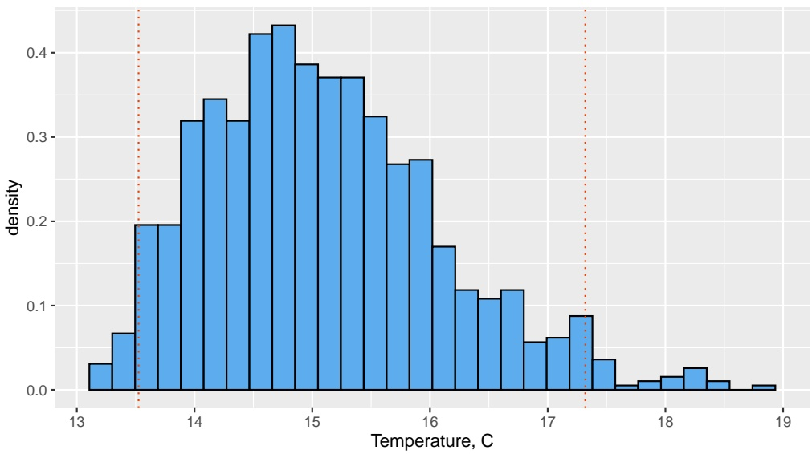

Figure 1.27: Temperature distribution from a hypothetical weather model. The expected value is 15.1, the central 95% confidence interval is between the dotted vertical red lines.

All these values are uniquely determined by the distribution of X. In case of

<!-- page: 107 -->

weather forecast, the distribution is originating from the weather model we are using. Such models include random components to account for the fact that we cannot predict weather perfectly. Assume we run the model 1000 times and receive 1000 temperature predictions as in Figure 1.27. The distribution in that example is somewhat right skewed, and individual predictions range between 13 and 19 degrees, with the expected value being 15.1. But other values than 15.1, such as 14 and 16 also look perfectly feasible. But which values do we consider feasible? For instance, 18 degrees seems to be unlikely, and even warmer weather seems even less plausible.

A common answer to this question is to look at the central 95% of the predictions. Central 95% of the observations means that we consider the leftmost (the coldest) 2.5% and the rightmost (the warmest) 2.5% predictions to be unlikely. Given 1000 predictions, we can just remove the 25 coldest and 25 warmest predictions, and we are left with the central 95% of the predictions.This is equivalent to preserving only values between the 0.025-th and 0.975-th sample quantiles. In case of this sample, the corresponding quantiles are 13.52 and 17.32 degrees (dotted vertical lines on the figure). This interval, [13.52, 17.32] is confidence interval (CI), more precisely 95% confidence interval for the predicted temperature. So 95% CI is the interval that contains the actual value with 95% probability, given that our weather model is correct. The values in this range are considered likely, and those outside this range are considered unlikely. So we may say that 16 degrees will be quite likely but 18 will be unlikely. We can reject H<sub>0</sub>: “temperature will be over $1 8 \mathrm { C } ^ { \prime \prime }$ at 5% significance level.

τ-th quantile is such a value that fraction τ of the sample is smaller than it, and fraction 1 − τ is larger than it. See Section 1.3.3 Quantiles, page 28.

As the 95% CI are only correct 95% of time, one may be tempted to improve on the type-I error and report 99% or 99.9% CI instead. This is fair, but unfortunately the result will be less informative. If I say that temperature tomorrow will be between -100C and +100C then I am correct 100% of time (well, at least on Earth). However, such a prediction has little practical value, such as to help us to decide what to wear tomorrow. This is the trade-off between providing precise estimates and avoiding errors. 95% is often a good choice, but sometimes one may use a much higher level. Claim that is sometimes incorrect is better than another one that is always correct but devoid of any usable information. Sometimes one can compute the optimal confidence level by considering the costs of type-I (false positives) and type-II (false negatives) errors, and choosing a confidence level that leads to the smallest overall loss.

But why did we select the central 95% interval as our confidence region? Why not leave out the largest 5% and pick the smallest value till 0.95-th quantile as the confidence region? Or the other way around? And what about picking both extremes and leaving a narrow 5% gap in the middle? There are a few reasons for this, some of those more theoretical, some more practical.

• First, we are usually interested in a confidence region that is as concentrated as possible: we want the 95% of possible outcomes to have a small error margin. The narrower my temperature forecast, the better idea you have what to wear tomorrow. The obvious choice is to pick the region on the histogram with highest chances and not to leave a gap in the middle where the values are most likely.

• Second, in typical applications the distribution is symmetric and unimodal (usu-

<!-- page: 108 -->

ally close to normal because of CLT). Both tails are thin and it makes sense to cut the 2.5% of observations in both tails if we want to get the most concentrated confidence region. But if it is not symmetric, we may actually choose a different percentages in different tails.

• But what about cutting off the top 5% of temperature predictions instead of the middle range? This is sometimes the desired approach. If you want to know what is the maximum likely temperature with 95% confidence, then you may look at one-tailed confidence interval. But this approach means we do not care about how cold the weather can be. This is related to one-tailed tests, the central CI is related to two-tailed tests. We do not discuss one-tailed tests in this book.

## Example 1.30: MH-370 flight: complex confidence region

The relevant region where the true value most likely belongs does not have to be an interval. Indeed, in more than one dimension, it cannot even be an interval! For instance, in case of a geographic location, it must be a region on map. Below is the most likely crash site of the flight MH-370, a complex confidence region, consisting of two separated arcs.

MH-370 was a scheduled flight on March 8, 2014 from Kuala Lumpur to Beijing. In less than an hour after take-off, the aircraft suddenly turned west, and all communication was lost. Satellite data indicates that it continued flying for several more hours before crashing into Indian Ocean. The exact crash site was never found.


Figure 1.28: Flight MH-370 most likely endpoint region. The bright red arcs denote the most likely crash site, based on satellite data; these are surrounded by a somewhat less likely region in medium red.

Pechristener, Furfur derivative work: CommonMarks, [CC BY-SA 3.0](https://creativecommons.org/licenses/by-sa/3.0), via [Wikimedia Commons](https://commons.wikimedia.org/wiki/File:Theoretical_Search_Area_MH370.v2.en.svg)

<!-- page: 109 -->

## 1.6. STATISTICAL INFERENCE

The figure above depicts the most likely crash location, based on satellite data. It must have ended its path near one of the bright red arcs, quite likely within the medium red area surrounding these arcs. These areas form what is essentially confidence region, a region where the value (here the crash location) most likely falls into. We cannot assign a meaningful confidence level to the region though because we do not understand enough what happened during the flight.

## Theoretical Confidence Intervals

Next, we discuss how to compute confidence intervals theoretically in certain important cases. In order to do it, we typically have to know the stochastic process that generates our data (the statistical model), and based on that we can often compute the theoretical quantiles. Sometimes this can be calculated easily like in case of uniform distribution, sometimes one has to consult tables, for instance in case of normal and t-distribution.

**Confidence interval for normally distributed values** For standard normal RV X ∼ N(0,1), the lower 2.5% quantile $q _ { 0 . 0 2 5 } = - 1$ .96 and the upper 2.5% quantile is $q _ { 0 . 9 7 5 } =$ 1.96 $( q _ { 1 - \alpha }   =   - q _ { \alpha }$ because standard normal is symmetric). It is just a property of normal distribution: for standard normal, 95% of cases are between value −1.96 and 1.96. It is the same figure as the critical $z _ { c r } ^ { 0 . 0 5 }   =   1 . 9 6$ in Table 1.12. This is how critical z values are determined–they are just standard normal quantiles.If X follows a general normal distribution, $X \sim N ( \mu , \sigma ^ { 2 } )$ , then the corresponding quantiles are

$X \sim N(0,1)$ means that RV X is normally distributed with expected value 0 and variance 1.

$$
q _ {0. 0 2 5} = \mu - 1. 9 6 \sigma \quad \text {and} \quad q _ {0. 9 7 5} = \mu + 1. 9 6 \sigma .\tag{1.6.1}
$$

$X \sim N ( \mu \mathrm { , } \sigma ^ { 2 } )$ means that RV Y is normally distributed with expected value $\mu$ and variance $\sigma ^ { 2 } ,$

It is basically the same $`` 1.96 ''$ , but now scaled by standard deviation and shifted to the location of the expected value $\mu .$ Nowadays, statistical software packages provide function to easily compute normal quantiles, but these can also be looked up in the tables, such as Table 1.12.

Example 1.31: Confidence intervals for human height

Look at sons’ height in [fathers’ and sons’ height data](https://bitbucket.org/otoomet/lecturenotes/raw/master/data/fatherson.csv.bz2). The distribution as a histogram is shown on the figure below, overlapped with the fitted normal density curve (red).

<!-- page: 110 -->

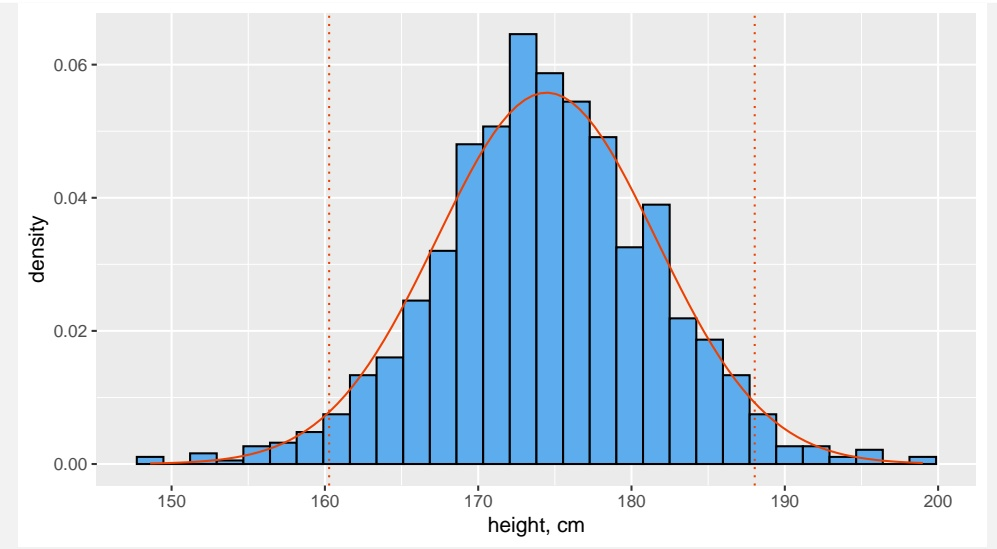

Figure 1.29: Distribution of son’s height in fathers-sons data. It is well approximated by normal distribution (red line) with mean $\mu = 1 7 4 . 5$ and standard deviation $\sigma = 7 . 2 .$ Human height, as well as other measures of adult animals, are often well approximated by normal distribution. Dotted vertical lines mark the 95% confidence interval.

As evident from the figure, most observations are concentrated around the mean 174.5 cm, roughly in the interval of 160–190cm. More precisely, the lower 2.5% observations are shorter than 160.3 and the upper 2.5% of observations are taller than 188 cm. This means that the middle 95% of the observations fall into the interval [160.3, 188]. This is the 95%-confidence interval (CI) for sons’ height. If data were exactly normally distributed with a similar mean and standard deviation, the corresponding theoretical quantiles were q<sub>0</sub>.025 = 174.5−1.96·7.2 = 160.4 and q<sub>0</sub>.975 = 174.5+1.96·7.2 = 188.5 As one can see, the deviations from the theoretical values are rather small. Normal distribution is a good approximation for human height.

## Exercise 1.36: Confidence intervals for normally distributed values

<div class="docvortex-algorithm" style="white-space: pre-wrap; font-family:monospace;">
Replicate Example 1.31 using
• Average number of rooms in Boston housing data (variable rm);
• Petal length of setosa flowers in iris data.
See Figure 1.21 for the respective histograms.
In each case
Compute the sample quantiles using 2.5 and 97.5 percentiles;
Compute the sample mean $\mu$ and standard deviation $s$;
Compute the theoretical CI using (1.6.1).
How close are the theoretical CI to the ones, based on the sample quantiles?
Answers on page 497
</div>

<!-- page: 111 -->

## 1.6.3 Confidence interval for sample average

Now we move to a more important task, namely finding the confidence interval for the sample average. Why is it a more important task? This is because here we cannot rely on sample quantiles–we need a different approach to compute the CI. This is also true for many statistical models, including regression models that we analyze below in Chapter 2 below.

Below, we first discuss how to compute CI for general sample average, and thereafter explain in more detail how to compute it for sample proportion–a specific average. Finally, we discuss z-test, an alternative to CI.

## General sample average

Above, in Section 1.6.2, we computed the CI using sample quantiles. But for the average, it cannot be done—each sample has a single average, and hence the quantiles are meaningless. We need a different approach. The most popular way of doing this is based on CLT.

Consider a RV X with expected value E X and variance Var X. We use this RV to model some kind of real world phenomenon, for instance sea level or income of a certain population group; and in this example E X will describe the average sea level and Var X its variability. These are the figures we want to know. See Section 1.6.3 below for another step-by-step example.

Now we collect data—a sample of size S of X. We can calculate its average (denote it by µ) and variance (denote it by $s ^ { 2 } )$ . From CLT and LLN we know that

a) sample average $\mu$ tends to be normally distributed;

b) the variance of its average is inversely proportional to sample size

$$
\mathrm{Var} \bar {X} = \frac {1}{S} s ^ {2}\tag{1.6.2}
$$

c) the average in large samples $\mu$ tends to be close to the expected value $\mathbb { E } X$

d) sample variance $s ^ { 2 }$ tends to be close to the RV variance Var $X .$ 22

If we put all these four facts together, we have that sample average is distributed $\mathrm { a s } ^ { 2 3 }$

$$
\bar {X} _ {S} \sim N \left(\mu , \frac {s ^ {2}}{S}\right).\tag{1.6.3}
$$

Its expected value is $\mu$ and its standard deviation is $s / \sqrt { S } . ^ { 2 4 }$ Accordingly, from (1.6.1), the 95% confidence intervals of a mean of normals is

$X \sim N ( \mu \mathrm { , } \sigma ^ { 2 } )$ means that RV X is normally distributed with expected value $\mu$ and variance $\sigma ^ { 2 ^ { \prime } }$

$$
\left[ \mu - 1. 9 6 \frac {s}{\sqrt {S}}, \mu + 1. 9 6 \frac {s}{\sqrt {S}} \right].\tag{1.6.4}
$$

<small><span class="docvortex-page-footnote" data-block-type="page_footnote" style="color:#6b7280">s2</span></small>

<small><span class="docvortex-page-footnote" data-block-type="page_footnote" style="color:#6b7280">X,</span></small>

<small><span class="docvortex-page-footnote" data-block-type="page_footnote" style="color:#6b7280">22<sub>Sample</sub> variance s<sup>2</sup>is close to Var  by Var X¯ we denote the variance of sample average.</span></small>

<small><span class="docvortex-page-footnote" data-block-type="page_footnote" style="color:#6b7280">¯S</span></small>

<small><span class="docvortex-page-footnote" data-block-type="page_footnote" style="color:#6b7280">RV,</span></small>

<small><span class="docvortex-page-footnote" data-block-type="page_footnote" style="color:#6b7280">23<sub>µ</sub> is the average of the given sample, the dataset of size S. It is a number, like 0.82 in the quality example below. X is a computed as an average of other is a realization of . S RV-s So µ X¯S See Section 1.4.6 Functions of RV page 63. -s,</span></small>

<small><span class="docvortex-page-footnote" data-block-type="page_footnote" style="color:#6b7280">24<sub>Again</sub>, this is a simplification.  is not the expected value but our best estimate for the expected µ value. We do not know the correct number so we have to estimate it from the sample.</span></small>

<!-- page: 112 -->

This is the same formula as (1.6.1), just now we use the fact that the standard deviation of sample mean is $s / { \sqrt { S } } .$ As we compute the CI for the sample average, we need to use its standard deviation instead of the sample standard deviation s.

## Example 1.32: Sample mean of sons’ height

Lets revisit Example 1.31–sons’ heigth, but this time we are not concerned of individual sons’ height, but the average heigth of four random sons. As a reminder, sons’ average height is 174.5 and it’s standard deviation is 7.2. A sample of 4 sons might look like (171.7, 177.3, 171.4, 180.1) with average height 175.12. If we take a similar sample 1000 times we get 1000 sample means, and we can plot the results on a similar histogram as in Example 1.31. Many samples are only needed to be able to compute many sample means, and to plot their distributions.<sup>a</sup>

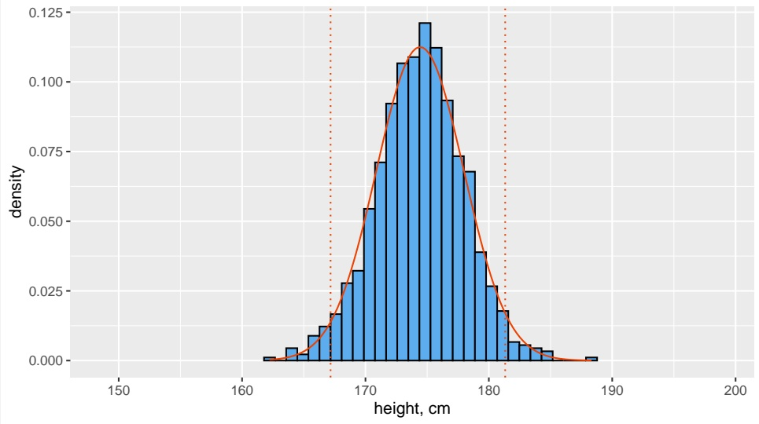

Figure 1.30: Distribution of mean height of four sons. The distribution of means are well approximated by normal distribution (red line) with mean $\mu = 1 7 4 . 4$ and standard deviation $\sigma   =   3 . 5$ Dotted vertical lines are the boundaries of the 95% confidence intervals.

The figure is plotted in a similar scale as Figure 1.29. It reveals that the result is well approximated with a normal density, however this time the spread is narrower. The sample of means has mean value $\mu _ { m }   =   1 7 4 . 4 ,$ almost exactly the same as the sample of individual heights $\mu = 1 7 4 . 5$ Its standard deviation $\sigma _ { m } = 3 . 5$ is only half of that for the heights, $\sigma = 7 . 2 .$ . This is to be expected as the standard deviation of a sample of four should be $1 / \sqrt { 4 } = 1 / 2$ of the standard deviation of individual values. Accordingly, both the quantile-based confidence intervals [167.2, 181.3] and theoretical confidence intervals [167.5, 181.4] are only half as wide.

<small><span class="docvortex-page-footnote" data-block-type="page_footnote" style="color:#6b7280">N→∞</span></small>

<small><span class="docvortex-page-footnote" data-block-type="page_footnote" style="color:#6b7280"><sup>a</sup>CLT says that distribution of average of independent random variables of all kinds tend to be normal if N → ∞. However, if X is normally distributed, the result is exactly normal even</span></small>

<!-- page: 113 -->

if N is small. So average of just four heights here will result in a distribution that is very close to normal.

## z-test: is the sample mean equal to a given value?

Above we discussed how to compute confidence intervals for a sample mean. The next task is to test if it is equal to a certain value. This is a very common problem in practice, for instance if we are interested in percentage of voter who will vote for a certain party, or percentage of products that pass the quality control.

To make the task more easy to follow, let’s work with the following example: imagine that you are working for a delivery firm. The management requires that in average, 90% of orders must be processed in 12 hours. If you process less, you need to improve your performance. If you process more, then there is room to cut costs. Today, your department processed only 82 orders in time, out of 100 in total. Does this mean your team is lagging behind? Or maybe it exceeds the expectations? Obviously, today your department was lagging behind, but maybe this is just an one-time blip? Let’s use the statistical testing methodology to answer this question.

Let’s use RV X to denote if the order is processed in time. It takes two values, $\text{" }0 \text{" }$ if the delivery was delayed, and $`` 1 ''$ if it was done in time. Now the requirement can be stated as $\mathbb { E }   X = 0 . 9 .$ This is a Bernoulli RV with $p = 0 . 9$ . This means that the expected value, the long-term average, should be 0.9. In any single day it may be more or less, depending on the exact nature of the orders. As the requirement is what we want to test, good $H _ { 0 }$ is $H _ { 0 } : p = 0 . 9$

So your in statistical terms, today your department produced a sample that contains of 100 numbers, 82 $^ { \alpha _ { 1 } }   ^ { \gamma _ { - } } \mathbf { S }$ and $1 8   `` 0  –  s .$ . These are the realizations of the RV X. We use this sample to test $H _ { 0 }$ . This can be done in a similar way as above in Section 1.6.3 General sample average, page 101—remember: sample proportion is just mean of a sample of ones and zeros. Below, we’ll do it in three ways: first by simulations, thereafter by applying CLT, and finally through z-test.

**Simulations** First, imagine that your department is exactly meeting the requirement: E X = 0.9. But orders arrive randomly and some are easier to fulfill than the others. What may you see when you look at a sample of 100 random orders? Obviously, if E $X = 0 . 9$ , then also the sample average $\bar { X } _ { 1 0 0 }$ should be close to 0.9. But how close do you think it may be? Can it be 0.8? Can it be 0.7? can it be 1.0? Obviously, it can be any number between 0 and 1–just because of bad luck, you may land with 100 orders that are extremely hard to fulfill. So more important question is–how often do such bad luck events happen?

Intuitively, we can simulate the process as follows:

1. Create a sample of S = 100 random Bernoulli(0.9) realizations;

2. Compute the average of the sample;

3. Repeat the previous two steps a large number R times;

4. Check how often do you get values that are “far off” from the expected 0.9. Perhaps the most unclear part here is how to determine if the result is “far off” from the $H _ { 0 }$ value 0.9. This can be approached in different way–for instance, how often it happens that you get a number 0.82 or less? Alternatively, you can ask how often it

<!-- page: 114 -->

happens that the number is “off” by at least 0.08? And finally, you can also directly ask about confidence intervals: into which range do 95% of such sample averages fall into?

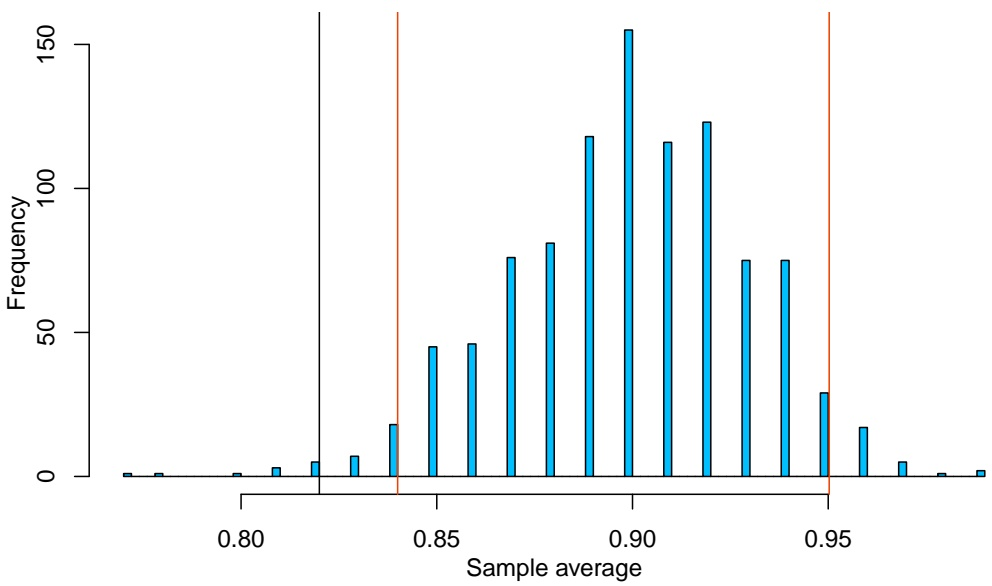

Figure 1.31: Histogram of 1000 simulated sample averages. The 95% CI (0.84, 0.95) are marked with orange vertical lines. The black line marks the value observed in data, 0.82.

Figure 1.31 displays results of 1000 such simulations. The histogram looks “hairy”, because in a sample of 100, there are only limited number of possible averages. For instance, 0.90 and 0.91 are possible, but 0.905 is not possible. The orange vertical lines mark the 95% confidence interval, here (0.84, 0.95). This answers the question “how far off” is the result “likely” to be from the “true” value 0.9. Based on these simulations, the values can be off by 0.06, in both direction.

In this example, the observed value 0.82 is outside of the CI. So we’ll reject it at 5% significance level. If your department’s actual performance is 90% as required, it is very unlikely (less than 1 in 20 cases) that you will see such a figure in data. We can conclude that it is unlikely that your department is up to the task to fulfill 90% orders in time.<sup>25</sup>

<small><span class="docvortex-page-footnote" data-block-type="page_footnote" style="color:#6b7280">25<sub>Before</sub> jumping to the conclusions, we should also ask if the statistical model is correct. It is hard to argue that Bernoulli RV is a good way to model data, the implicit assumption of independence— we created S independent Bernoulli realizations—may be problematic. If data is not independent, e.g. if problematic orders tend to arrive in groups, the confidence interval may be much wider. More complex statistical models are beyond the scope of this book. See also Section 1.7.1 Correct model of the stochastic process, page 120.</span></small>

<!-- page: 115 -->

## CLT instead of simulations

If you think that the histogram on Figure 1.31 resembles normal distribution, then you are right.By CLT, the average of large sample is normally distributed, and here the sample size 100 is large enough. Hence, instead of simulations, we can use the properties of normal distribution, the same approach that was discussed in Section 1.6.3 General sample average, page 101. Now let’s walk that approach over again, but this time using the quality control example above. Remember, sample average $\bar { X } _ { S }$ is normally distributed, with the expected value E $\bar { X } _ { S } = \operatorname { \mathbb { E } } X$ and variance Var $\begin{array} { r } { \tilde { \left[ \bar { X } _ { S } = \frac { \operatorname { V a r } X } { S } \right. } } \end{array}$ We also know that for normal distribution, the 95% CI stretches 1.96 times the standard deviation to both sides of the mean. (See above for the details.) Now we can use these ideas instead of simulations. Let’s do it step-by-step.

• To begin with, assume that $H _ { 0 }$ is correct. Hence E $\bar { X } _ { 1 0 0 } = \mathbb { E }   X = 0 . 9 .$

• We can compute Var X either by just computing the sample variance if we have a sample, or in this case we can also just use the Bernoulli variance (1.5.7):

$$
\mathrm{Var} X = p (1 - p) = 0. 0 9
$$

• From Var X, we can find variance of the sample mean

$$
\mathrm{Var} \bar {X} _ {S} = \frac {\mathrm{Var} X}{S} = 9 \times 1 0 ^ {- 4}
$$

• And from here, the standard deviation of the sample mean is

$$
\mathrm{sd} \bar {X} _ {S} = \sqrt {\mathrm{Var} \bar {X} _ {S}} = 0. 0 3
$$

• The CI width is

$$
1. 9 6 \cdot \mathrm{sd} \bar {X} _ {S} = 0. 0 5 8 8
$$

• And finally, the CI is

$$
[ \mathbb {E} \bar {X} _ {S} - 1. 9 6 \cdot \mathrm{sd} \bar {X} _ {S}, \mathbb {E} \bar {X} _ {S} + 1. 9 6 \cdot \mathrm{sd} \bar {X} _ {S} ] = (0. 8 4 1, 0. 9 5 9)
$$

The results are very similar to what we found above through simulations. This is the power of CLT: instead of running thousands of simulations, we just “know” what are the properties of the simulated experiments!

Let’s repeat what did we just do. Look at Figure 1.32. This is the analog of Figure 1.31, just this time drawn based on theoretical results, not on simulations. First, CLT tells us that the simulated averages are normally distributed, with mean 0.9 and variance $9 \times 1 0 ^ { - 4 }$ This is the pale blue hump that corresponds to the pale blue histogram in Figure 1.31. Second, we use the normal properties, that tell that 95% of realizations will in the interval $( \mu - 1 . 9 6 \sigma , \mu + 1 . 9 6 \sigma )$ . This is marked by the orange lines in both figures. The actual data, 0.82, is marked with a black line.

As you see, the figures are very similar, even the CI is almost the same. And the conclusion is the same–the actual data, 0.82, is “too far” away from 0.9, and hence it is unlikely that if $H _ { 0 }$ is correct, we see value 0.82. We reject $H _ { 0 }$ at 5% significance level and conclude that the department is not able to maintain the expected performance.

<!-- page: 116 -->

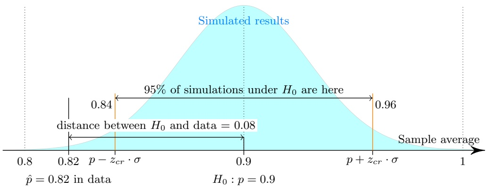

Figure 1.32: Simulated and actual data: the smoking ban example. All simulations (the gray hump) give results near 0, but the difference in actual data is much larger.

Exercise 1.37: Decision at 1% significance level

| Repeat the above, but now use 1% significance level instead of 5% as in the example. Compute the theoretical CI. Will your decision be different? |
| --- |
| Solution at page 497 |

Such tasks are very common in statistics: compute the expected value and variance of your measure, construct its CI, and check if it encompasses the value of interest. For many common models, the theoretical approach is easy and precise. For other kind of models, CLT may not apply and we may have to rely on simulations. It is also possible that even simulations are not good enough, such as in case of complex social processes. In such cases even the best results may be unreliable or just wrong.

## z-value instead of CI

Instead of computing the CI, we can look at the problem in a slightly different way. You claim that $H _ { 0 }   :   p   =   0 . 9$ . Obviously, if $H _ { 0 }$ is correct, then the value in actual data should be “rather similar”. But how similar is “rather similar”? The difference between the claim and data is 0.08. Is is similar? Is it too different? It is hard to tell, unless we know what is a good yardstick to measure the differences. It turns out that the best yardstick is standard deviation. This is fairly easy to see.We know that the CI can be expressed (from (1.6.1)) as

$$
\left[ \mu - z _ {c r} \sigma , \mu + z _ {c r} \sigma \right]\tag{1.6.5}
$$

where $\mu$ is the sample average (0.82 in the example). The value, stipulated by $H _ { 0 }$ (0.9 in the example) falls in the interval only if $| h _ { 0 } - \mu | < z _ { c r }   \sigma ,   \mathrm { o r }$ , if

$$
| z | <   z _ {c r} \quad \text {where} \quad z \equiv \frac {h _ {0} - \mu}{\sigma}\tag{1.6.6}
$$

This $z$ is called z-value. (Note: it is z-value, not critical z-value.)

<!-- page: 117 -->

In the numerator of (1.6.6) we have the distance between the claim $( h _ { 0 } )$ and the data $( \mu )$ . In the denominator we have standard deviation of the difference. Here the standard deviation of the difference is just the same as the standard deviation of the sample mean. This is because $h _ { 0 }$ is just a number and does not have any error. But in other cases, this may not be so. So z-value is essentially the difference between data $\mu$ and the hypothesis value $h _ { 0 } ,$ measured in standard deviations.

This is how z-test is typically done: compute the standardized difference between $h _ { 0 }$ and data by (1.6.6), and $if  \left| z \right| > 1.96$ , reject $H _ { 0 }$ . For the performance example we have

$$
z = \frac {| h _ {0} - \mu |}{\sigma} = \frac {| 0 . 9 - 0 . 8 2 |}{0 . 0 3} = \frac {0 . 0 8}{0 . 0 3} = 2. 6 6 7.\tag{1.6.7}
$$

So our claim $h _ { 0 }$ is at distance 2.667 from data, when using standard deviation as the measurement unit. As $2 . 6 6 7 > z _ { c r } ^ { 0 . 0 5 }$ , we conclude that it is “too far”, and hence we reject $H _ { 0 }$

In case of small sample, and certain assumptions about normality, z-value is usually replaced by t-value. t-value is computed in exactly the same way as (1.6.6), just its critical values are different. This is because of different underlying assumptions.<sup>26</sup> In practice, it makes little difference on respectable samples and we focus on z-value in this book.

## Exercise 1.38: z-value

<div class="docvortex-algorithm" style="white-space: pre-wrap; font-family:monospace;">
You are working with quality control at a food processing plant. Your employer is selling mangoes and requires those to weigh 200g, in average. You sample 4 random mangoes, and find that the average weight is 250g, while the sample standard deviation is 50g.
1. What is the  $H_{0}$  you want to test here?
2. How big is the standard deviation of your sample average?
3. Compute the z-value.
4. How big is the critical z-value at 5% significance level,  $z_{cr}^{0.05}$ ?
5. Can you reject the  $H_{0}$  at 5% significance level?
6. What is  $z_{cr}^{0.01}$ ?
7. How big a sample do you need to be able to reject  $H_{0}$  at 1% significance level, assuming the sample average will be the same?
Solution on page 498
</div>

## Cheatsheet 1.8: Testing sample average

**CI of sampe average** Consider sample of size $S$ with average $\mu$ and variance $s ^ { 2 }$ . The CI is

$$
\left[ \mu - z _ {c r} \frac {s}{\sqrt {S}}, \mu + z _ {c r} \frac {s}{\sqrt {S}} \right].
$$

Be aware that $\frac { s } { \sqrt { s } }$ is the standard deviation of the sample average.

<small><span class="docvortex-page-footnote" data-block-type="page_footnote" style="color:#6b7280">p − X¯S)</span></small>

<small><span class="docvortex-page-footnote" data-block-type="page_footnote" style="color:#6b7280">26t-test assumes the underlying feature (here the difference is normally distributed, but the sample size is finite. z-test assumes it is normally distributed with large sample size. Both assumptions have their merits and issues.</span></small>

<!-- page: 118 -->

z**-value** Alternative to CI:

$$
z = \frac {h _ {0} - \mu}{\sigma_ {a v g}}
$$

where $h _ { 0 }$ is the value specified by $H _ { 0 }$ and $\begin{array} { r } { \sigma _ { a v g } \; = \; \frac { s } { \sqrt { S } } } \end{array}$ is the standard deviation of the sample average.

z**-test** i) compute $z ; \mathrm { i i ) }$ reject $H _ { 0 } \mathrm { ~ i f ~ } z > z _ { c r } .$

t**-test** Similar to z-test, but the critical values $t _ { c r }$ are different because of different assumptions.

## 1.6.4 Comparing Distributions

One of the most common tasks that leverages statistical inference is to compare distribution of certain variables across different groups, datasets or time periods. For instance, can we say that police treats African-Americans differently than white Americans? We can easily compute how often either group is stopped by the police and compare those figures, but aren’t those numbers just a statistical blip, just random noise that may go the other way the next day?

In order to answer this and other similar questions we have to approach it through formal statistical hypothesis testing. We model the “treatment” as RV-s: police’s treatment of one group is one RV X and police’s treatment of the other group is another RV Y . We want to know if both groups are treated similarly, i.e if $X = Y$ But we do not have access to information about the underlying treatment, X and Y . What we can observe is just samples: how were members of one group and the other group treated. We have to work with these samples.

In practice, it is hard to test if two random variables are equal, if $X = Y$ . It is easier to test if certain characteristics, such as expected values, are equal. Hence we set our null hypothesis to be $H _ { 0 } \colon \operatorname { \mathbb { E } } X = \operatorname { \mathbb { E } } Y$ . This can be worded as “the police treats both groups in a similar manner, in average”. Next, we can look at data (samples of realizations) and see if we can reject the $H _ { 0 }$ . This can be done using t-test.

Obviously, if the RV-s are similar, then they should result in samples with similar average. This is often enough for applied work, e.g. if we are testing mean independence assumption (see Section 3.5.3 More about identifying assumptions: mean independence, page 207). The cases that are relevant for applications tend to have fairly similar distributions. However, be aware that this is just a necessary but not sufficient condition: RV-s may still differ even if both have similar expected value. For instance

$$
X = \left\{ \begin{array}{l} - 1 \quad \text {with probability} \quad 0. 5 \\ 1 \quad \text {with probability} \quad 0. 5 \end{array} \right. \quad \text {and} \quad Y = \left\{ \begin{array}{l} - 2 \quad \text {with probability} \quad 0. 5 \\ 2 \quad \text {with probability} \quad 0. 5 \end{array} \right.\tag{1.6.8}
$$

have both expected value $\mathbb { E }   X   =   \mathbb { E }   Y   =   0$ and hence they generate samples where mean tends to be 0. But they are obviously different.

<!-- page: 119 -->

## Comparing Proportions: Is Smoking Ban Associated with Less Smoking?

One simple but widely used average is sample proportion. Below, we look at the proportion of smokers in two samples.Smoking is a very simple RV–someone either is a smoker or not.<sup>27</sup> Hence smoking can be described with a Bernoulli RV, and the only parameter we need to compute is the proportion of smokers.

Sample proportions are rather important in the applied work. For instance, we may want to test what proportion of patients recovered depending on the care they got; whether workplaces that offer certain amenities have more female workers; or whether there are more years of major heatwaves in 21st century. All these questions can be analyzed in a similar manner as what we do below.

In the Western World, regulations about smoking have become increasingly restrictive over the recent decades. In particular, smoking is banned in many common indoor areas, such as restaurants or workplaces. SmokeBan data (see Section B) provides data for 10,000 workers who work either on a workplace with or without smoking ban, and who are either smokers or non-smokers. A simple analysis suggests that a smaller percentage of $N ^ { B }$ = 6098 on smoking-ban workplaces are smoking, compared to $N ^ { \mathcal { N } }   =   3 9 0 2$ who do not have such ban in their workplace. The corresponding smoking probabilities are 21.2 and 28.96, and the difference is 7.76 percentage points. As we have quite a large sample–10,000, it suggests that the effect is real, not just a random fluke in our sample. But is it really the case? Let us answer this question first by simulations, and thereafter by the stock t-test.

Our task is to compare two samples: workers on jobs where there is a workplace smoking ban, and other workers on jobs with no such ban. This is called unpaired data because there is no obvious correspondence between individuals across the samples. We can answer the question by testing $H _ { 0 } ;$ average percentage of smokers in both types of workplaces is the same.

First the statistical model and some notation. Let B denote the set of individuals who are working at smoking-ban workplaces, and $\mathcal { N }$ the set of workers at no-ban workplaces. Let $\left[ S ^ { B } \right.$ and $S ^ { \mathcal { N } }$ be the Bernoulli RV-s, denoting the smoking behavior of individuals $( `` 0 ''$ means not smoking and $`` 1 ''$ means smoking) for smoke-ban workplaces $( S ^ { \mathcal { B } } )$ and no–smoke ban workplaces $( S ^ { \mathcal { N } } )$ . We will test the hypothesis that the expected value of these RV-s is the same, $\dot { H } _ { 0 }   :   \mathbb { E }   S ^ { \mathcal { B } }   =   \mathbb { E }   S ^ { \mathcal { N } }$ , or equivalently, $H _ { 0 } : \widehat { \mathbb { E }   S ^ { \mathcal { B } } } - \mathbb { E }   S ^ { \mathcal { N } } = 0$ . Define sample averages

$$
\bar {S} ^ {\mathcal {B}} = \frac {1}{| | \mathcal {B} | |} \sum_ {i \in \mathcal {B}} S _ {i} ^ {\mathcal {B}} \quad \text {and} \quad \bar {S} ^ {\mathcal {N}} = \frac {1}{| | \mathcal {N} | |} \sum_ {i \in \mathcal {N}} S _ {i} ^ {\mathcal {N}}\tag{1.6.9}
$$

for smoking-ban and the no–smoking ban workplaces.If $H _ { 0 }$ holds, then $\mathbb { E }   S ^ { \mathcal { B } }   =$ E $S ^ { \mathcal { N } }   \equiv   \mathbb { E }   S$ where E S is the expected value of overall smoking at all workplaces. We can approximate the latter by sample mean as

$$
\bar {S} = \frac {1}{N} \sum_ {i} S _ {i}\tag{1.6.10}
$$

||B|| denotes the number of workes in the smoke-ban workplaces (number of elements in the set B).

Remember: even if expected values are the same E $S _ { \mathcal { B } } = \mathbb { E }   S _ { \mathcal { N } }$ , the sample averages $\bar { S } _ { B }$ and $\bar { S } _ { \mathcal { N } }$ may differ. See Theorem 1, Law of large numbers on page 60.

<small><span class="docvortex-page-footnote" data-block-type="page_footnote" style="color:#6b7280">27<sub>The</sub> real world, obviously, is more complicated. One may be either casual or heavy smoker, or maybe just recently quit smoking, and there are many other possibilities. But in these data, there are only two options: smoking or not smoking.</span></small>

<!-- page: 120 -->

where the sum is taken over the whole dataset, i.e. over both smoke-ban and noban workplaces. In SmokeBan dataset the overall smoking propensity is $\bar { S }   =   2 4 . 2 3$ percent.

We model smoking by Bernoulli(S¯) distribution: it is a discrete RV with only two outcomes (smoker or non-smoker), where “smoker” occurs with probability ${ \bar { S } } .$ This is the best we can do with current data as smoker/non-smoker is the only piece of information we have for smoking. We do not know how much someone smokes and how important is smoking for them.

First let’s simulate the results. We can create a synthetic dataset by creating 3902 random workers on non smoking-ban workplaces and 6098 workers on smoking-ban workplaces, both using the Bernoulli(0.2423) process. We stress again that we use exactly the same probability for smoking-ban and no-ban workplaces as this is what our $H _ { 0 }$ claims. Thereafter we compute the average smoking tendency among our synthetic workers for both types of workplaces. As both sets of workers were created through an identical process, the difference can only be attributed to the random noise. Finally, we repeat the simulations many times, and see how often we get a difference that is at least as large as we see in data, 7.76 percentage points. If such big difference is rare enough (say, it occurs less often than in 5% of cases), we can reject $H _ { 0 }$ at the corresponding significance level (5% level in this example).

Table 1.13: Simulated smoking habits (percent of smokers) at smoking-ban/no-smoking-ban workplaces for 5 random simulations. The difference in data is 7.76 percent. We can see that simulated differences in these 5 examples are much smaller than what is visible in the data (in absolute value).

|  | Ban (pct) | Non-ban (pct) | difference (pct pt) |
| --- | --- | --- | --- |
| 1 | 24.22 | 23.96 | 0.26 |
| 2 | 24.71 | 24.66 | 0.04 |
| 3 | 24.88 | 25.30 | -0.42 |
| 4 | 23.27 | 24.93 | -1.66 |
| 5 | 23.32 | 24.22 | -0.90 |

Table 1.13 shows five example simulations. In all cases the the simulated difference is much smaller than the actual difference 7.76 percentage points. This supports our intuition, telling that the sample is large enough to distinguish a 7-percentage point difference. But this was only 5 simulations. Do the results still hold if we run more trials? Indeed they hold. Figure 1.33 shows a histogram of 10,000 such simulations. The maximum value obtained in these simulations is 3.32 (in absolute value), well below the observed 7.76, and the 95% of the results are in the interval [−1.69, 1.74]. For the reference, we also record that the average difference over all simulations is 0.002 and its standard deviation is 0.874. We can conclude that chances to observe such a value under $H _ { 0 }$ are extremely low, less than 1 in 10,000. Hence we can reject $H _ { 0 }$ at 5% confidence level (we could also reject it at 0.01% confidence level). This suggests that $H _ { 0 }$ is not correct. But note that, strictly speaking, we cannot claim it is incorrect, based on these data we can only say that it is extremely unlikely.

This is about as far as we can get through statistical methods. We can say that a

<!-- page: 121 -->

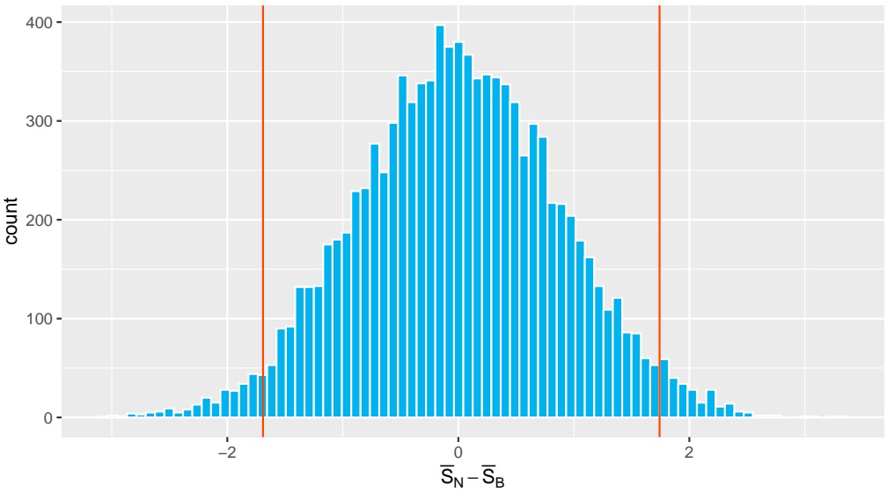

Figure 1.33: Histogram of 10,000 simulation runs. One can see that the most common values are close to ${ \it 0 } ,$ values above 3 are extremely rare. Orange vertical lines mark the 95% confidence intervals. The maximum observed value in these simulations is 3.32 (in absolute value), well below 7.76 in data. We conclude that encountering such a big difference under $H _ { 0 }$ is extremely rare. Hence we reject $H _ { 0 }$

hypothesis is “unlikely” at a given significance level, but we cannot say it is “wrong”.

Although the simulation approach we did above is intuitive, it is often too complex. Fortunately we can replace it with a simple formula. This can be done through the following steps:

• First, note the differences in Figure 1.33 are approximately normally distributed. This is a direct result of Central Limit Theorem, and the fact that sum (or difference) of two normal RV-s is normal:

•Both $\bar { S } ^ { B }$ and $\bar { S } ^ { N }$ are averages of i.i.d random values, and hence, because of CLT, they are both approximately normally distributed under $H _ { 0 }$ as

$$
\bar {S} ^ {\mathcal {B}} \sim N \left(\mathbb {E} S, \frac {\operatorname{Var} S}{| | \mathcal {B} | |}\right) \quad \text {and} \quad \bar {S} ^ {\mathcal {N}} \sim N \left(\mathbb {E} S, \frac {\operatorname{Var} S}{| | \mathcal {N} | |}\right).
$$

See Section 1.5.4 Central Limit Theorem, page 83.

(1.6.11)

We do not know the expected value E S and variance Var S but we can approximate these with the sample average $\bar { S } = 0 . 2 4 2 3$ and sample variance $s _ { S } ^ { 2 } = 0 . 1 8 4$

$X \sim N ( \mu , \sigma ^ { 2 } )$ means $X$ is a normal random variable with expected value $\mu$ and variance $\sigma ^ { 2 }$

• Finally, the difference $d   =   \bar { S } ^ { \mathcal { B } } - \bar { S } ^ { \mathcal { N } }$ is difference of two independent normals with equal expected value, and hence normally distributed with mean 0 and variance

$$
\sigma_ {d} ^ {2} = \frac {\sigma^ {2}}{N ^ {\mathcal {B}}} + \frac {\sigma^ {2}}{N ^ {\mathcal {N}}}\tag{1.6.12}
$$

<!-- page: 122 -->

(we do not discuss how this is derived.)

When we plug the numbers in, we get the variance

$$
\begin{array}{r l} \sigma_ {d} ^ {2} = \frac {\sigma^ {2}}{N ^ {\mathcal {B}}} + \frac {\sigma^ {2}}{N ^ {\mathcal {N}}} = s _ {S} ^ {2} = \left(\frac {1}{N ^ {\mathcal {B}}} + \frac {1}{N ^ {\mathcal {N}}}\right) = \\ = 0. 1 8 4 \left(\frac {1}{6 0 9 8} + \frac {1}{3 9 0 2}\right) = 7. 7 2 \times 1 0 ^ {- 5} \end{array}\tag{1.6.13}
$$

or the standard deviation

$$
\sigma_ {d} = 0. 0 0 8 7 8 \quad \text {or} \quad 0. 8 7 8 \quad \text {percentage points}.\tag{1.6.14}
$$

$\mathrm { S o }$ we can compute the CI of d under $H _ { 0 }$ using (1.6.1):

$z _ { c r }$ is the critical z-value, for 95% it is 1.96. See Table 1.12 and related text.

$$
\begin{array}{r l} (- z _ {c r} \sigma_ {d}, z _ {c r} \sigma_ {d}) & = (- 1. 9 6 \cdot 0. 8 7 8, - 1. 9 6 \cdot 0. 8 7 8) = \\ & = (- 1. 7 2 2, 1. 7 2 2) \quad \text {(pct points)}. \end{array}\tag{1.6.15}
$$

This is very similar to the interval we received above through simulations.

The observed difference is way outside of this range, so we can reject $H _ { 0 }$ at significance level of 0.05.

As we can see, both approaches resulted in very similar confidence intervals and in the exact same conclusion. This is to be expected: one approach used explicit simulations to come to the conclusion, the other approach implicitly did the same. Just instead of computing all the random numbers, we used the theoretical results from CLT and normal distribution.

Finally, although we can reject $H _ { 0 } ;$ smoking behavior does not differ with the smoking ban, we cannot tell that smoking ban “causes” workers to smoke less. It is possible that the observed effect is due to reverse causality (few smokers at workplace make it feasible to introduce the ban) or confounding factors are possible (see more in chapter 3 Causality, page 189). Our conclusion is pure correlational: smoking ban and smoking are “associated”.

Example 1.33: Smoking and birth weight

The previous example was about sample proportion, the percentage of smoker in different workplaces. The same approach can also be used to compare continuous values. Here we compare the birth weight of babies, 126 born to smoking and 873 to non-smoking mothers, using North Carolina births’ data. The figure (left) displays the weight birth weight distribution for both types of mothers.

<!-- page: 123 -->

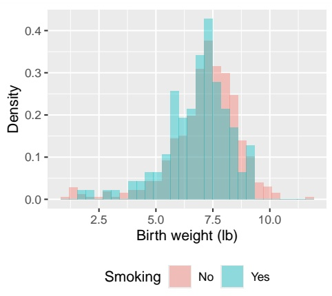

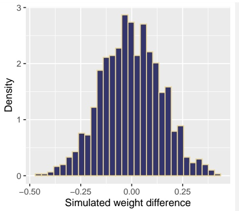

Figure 1.34: Babies’ birth weight depending on whether their mom is a smoker or not $( I e t t ) ;$ simulated mean difference between these two samples, assuming the average weights are the same (right).

In average, the babies of smoking mothers weight 6.829 lb, and for non-smoking motheres 7.144 lb, and the average difference between these two groups is 0.316 lb. The corresponding standard deviations are 1.386 and 1.519.

We are interested if smoking is associated with birth weight. Hence we choose $H _ { 0 } : \bar { w } _ { S } = \bar { w } _ { N } ,$ i.e. the average birth weight of babies, born to smoking and non-smoking mothers, is the same. If we can reject $H _ { 0 } .$ , then the answer will be “yes”. Equivalently, we can write that $H _ { 0 } : \bar { w } _ { S } - \bar { w } _ { N } = 0$

The figure shows that the weights are approximately normally distributed. Hence we can simulate “smoking babies” as N (6.829, 1.386) and “non-smoking” babies as $N ( 7 . 1 4 4 , 1 . 5 1 9 )$ . We simulate these two groups 1000 times and each time compute the difference between the average simulated weights. The distribution of the difference displayed on the right panel. 95% of the simulated differences are in the interval $[ - 0 . 2 8 9 , 0 . 2 8 7 ]$ Based on these simulations, we can reject $H _ { 0 }$ at 5% level: the observed difference 0.316 lb does not fit into the CI, and hence the two groups differ by weight in average.

Instead of simulations, we can use the formula for variance of the mean (1.6.12) We get

$$
\sigma_ {d} ^ {2} = \frac {\sigma_ {S} ^ {2}}{N _ {S}} + \frac {\sigma_ {N} ^ {2}}{N _ {N}} = \frac {1 . 9 2 1}{1 2 6} + \frac {2 . 3 0 6}{8 7 3} = 0. 0 1 8
$$

or

$$
\sigma_ {d} = 0. 1 3 4.
$$

The corresponding CI are

$$
[ - 1. 9 6 \sigma_ {d}, 1. 9 6 \sigma_ {d} ] = [ - 0. 2 6 2, 0. 2 6 2 ].
$$

The result is very similar to the simulations.

TBD: Exercise: repeat, compute can you reject it on 99% level?

<!-- page: 124 -->

## 1.7 Lies, Damned Lies, and Statistics

Statistics is often colloquially accused of being unreliable, and sometime one can hear claims that “anything can be proven with statistics”. There are obviously many reasons for such unfavorable image for statistics. One broad category of problems is related to the fact that humans are just not good at understanding uncertainty. There are a number of fallacies related to probability and statistics, such as Prosecutors fallacy many people, including those who are highly educated in mathematics, will get trapped into.

But the fact that humans are not good in understanding uncertainty has not gone unnoticed by those who are interested in pushing their own agenda while disregarding the truth. Statistics has been widely misused by various players in order to “prove” the claims behind their ambitions.

## 1.7.1 Statistical Fallacies

## Statistical language is heavy

Statistics works with uncertainty. Even more, most of the statistical results are uncertain. A typical result of statistical analysis reads like “it is more than 95% certain that the average difference between Reds and Greens is at least 1”. Such language is hard to understand and requires both statistical literacy and willingness to think for a second. Both of these are often in short supply, and the audience may prefer a simpler message “Greens are better than Reds” instead. Compare the statistical language above with other type of results, e.g. India-Iran soccer game ended with 2:1. In the former case statistics cannot predict precise results, while in the latter sentence tells something that is almost trivial to understand. As a result, statistical claims are often simplified into “everyday” language in a wrong way. For instance, the “layman’s version” of the claim above may be “the difference between Reds and Greens is 1”. This may be incorrect.

Example 1.34: Male and female height

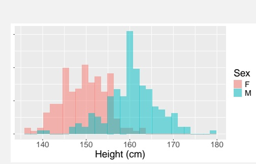

The figure here displays the distribution of male versus female height (for 18 and older) in Howell’s heightweight data. You can see that the tall persons tend to be male while the short ones tend to be female (the average heights are 160.4 and 149.5 respectively). How would you describe these differences?

The common claim is that “men are taller than women”. It is not wrong, but it is imprecise–there are

plenty of women who are taller than many men. The same is true for “in average, men are taller than women”—if the distributions differ, then we cannot tell if most men are taller than most women.

<!-- page: 125 -->

The statistically sound description of the intuitive idea is that “distribution of male height has first-order stochastic dominance over that of females”. Unfortunately, this vocabulary is comprehensive to only a few.

## Probability versus plausibility

Tversky and Kahneman describe an experiment where people are told some information about an imaginary person, and later asked what is the person doing now, years later:

Imagine a woman named Linda, thirty-one years old, single, outspoken, and very bright. In college she majored in philosophy. While a student she was deeply concerned with discrimination and social justice and participated in antinuclear demonstrations.

What do you think, what is Linda doing now? Please assess how likely are these options from 1 (very unlikely) to 5 (very likely):

a) Linda is active in the feminist movement

b) Linda is a bank teller

c) Linda is a bank teller and is active in the feminist movement.

Please evaluate the probability before you continue reading!

Kahneman and Tversky showed that people tend to consider the first option the most likely, and the second option the least likely. Linda’s description just seems to fit well with someone who is feminist, and does not seem to fit too well to someone who is bank teller. But this is not the same as how likely it is. First, there are quite a few bank teller jobs, and there may well be many more bank tellers than active feminists. But more importantly: by construction, being bank teller must be at least as likely as being a bank teller and feminist. Feminist and bank teller are not perfectly related events, and hence there are bank tellers who are not feminists. If Linda is a teller and feminist, she is also a teller.

Kahneman and Tversky found that adding more details and explanations to a story makes it considered more plausible, even if these details make it less probable. Which story sounds more plausible: the president fires the attorney general, or the president fires the attorney general because the latter wanted to investigate the president’s private businesses? The second explanation, although less probable, sounds more plausible and will be remembered more easily.

## Our intuition fails when working with probability

Human intuition is not well suited to understand probabilities. Our brains and eyes are super good in doing image recognition and motion detection–related tasks. We are also pretty good at estimating distances, time, and average values. But in computing simple probabilities we are mediocre at best and often hopelessly wrong. One such example was given in Example 1.17, the case with positive cancer test result. Without specific experience, people are almost completely clueless to evaluate the probability.

<!-- page: 126 -->

Even the simple concept of sample space and possible events may take quite a bit of training to understand.For instance, most people cannot understand why the solution of the two daughter problem is $1 / 3$ . With a slight modification of the problem we can get even more crazy and counter-intuitive results. Although the problem is not hard, our intuition fails completely, and even when the solution is explained to us step-by-step, we have hard time understanding what is going on.

## Example 1.35: Two daughter problem: the girl has a name

<div class="docvortex-algorithm" style="white-space: pre-wrap; font-family:monospace;">
Before considering this example, make sure you understand the two daughter problem as described in Exercise 1.11. This example assumes you are well familiar with the problem and understand the solution.
Consider a slightly different problem:
A family has two children. One of them is a girl, called Hina.
What is the probability that the other child is a girl too?
The modified problem sounds almost the same as the original problem, except a piece of irrelevant information, the name. However, it turns out that now we were provided different information and the answer is 1/2, not 1/3. How came??? Before we continue with the solution, let us introduce some notation. Denote a girl not called Hina by $\bar{H}$, a girl called Hina by $H$, and a boy by $B$. Also, denote the probability that a girl is called “Hina” as $p_H$. More specifically, assume that the probability that the first girl is called Hina is $p_H$. As parents do not call both of their children with the same name, the second girl will be called Hina with probability $p_H$ only if the first one was called something else. If the first girl is called Hina, the second one is never called Hina. (This rule is not central for the solution, and we might assume the name of the second child is independent of that of the first child.)
The table below displays the relevant events, and as the events are not equally likely, it also displays the corresponding probabilities. For instance, probability of $(\bar{H}, \bar{H})$ is a product of $\frac{1}{4}$ (the family has two girls), $(1 - p_H)$ (the first one is not called Hina) and $(1 - p_H)$ (the second one is not called Hina). But probability of $(H, \bar{H})$ is $\frac{1}{4} p_H$ because if the first girl is called Hina, the second one is given a different name for sure. The last column shows the corresponding event in the original two daughter problem context. One can check that the probabilities sum to unity, and the probabilities for each of the events in the original problem sum to $\frac{1}{4}$.
</div>

<!-- page: 127 -->

| Event | Probability | TD Event |
| --- | --- | --- |
| a) H¯,H¯ | 14(1 - pH)(1 - pH) | G,G |
| b) H¯,H | 14(1 - pH)pH | G,G |
| c) H¯,B | 14(1 - pH) | G,B |
| d) H,H¯ | 14pH | G,G |
| e) H,H | 0 | G,G |
| f) H,B | 14pH | G,B |
| g) B,H¯ | 14(1 - pH) | B,G |
| h) B,H | 14pH | B,G |
| i) B,B | 14 | B,B |

The events that correspond to the conditioning information—the family has a girl called Hina—are marked blue and we only consider these events below. The probability of interest (G, G)—the family has two girls—is made of the two events, (H, H ¯ ) and (H, H¯ ), out of four possible events (H, H ¯ ), (H, H¯ ), (H, B) and (B, H) and hence the probability

$$
p _ {G, G} = \frac {(1 - p _ {H}) p _ {H} + p _ {H}}{(1 - p _ {H}) p _ {H} + 3 p _ {H}}.
$$

It is easy to see that this probability depends on $p .$ In particular, when $p _ { H } = 1$ then the answer is $1 / 3 ,$ but in a realistic case where p<sub>H</sub> is small, it converges to 1/2. For instance, if $: p _ { H } = 0 . 0 1$ , the answer is 0.4987, effectively 1/2.

How on earth can we get a totally different answer by just giving the girl a name? After all, we know that all children have names, and Hina is as good as any other name…?

The crucial difference here is that there are two simple events of interest: H,H¯ and H,H¯ . Both of those correspond to G,G in the original problem. But now we distinguish between Hina and all other daughters. Even more, the probability of both events is fairly similar (given p<sub>H</sub> is small): $1 / 4 ( 1 - p _ { H } ) p _ { H } \approx 1 / 4 p _ { H }$ . This explains the fundamental difference in this case: a family with two daughters has twice as high chance that one of them is called Hina! If a family has a daughter with a name, this is not a rare event. A family with two daughters does not have twice the chance that one of them has a name. If the daughter is called Hina, this is a rare event and having two daughters approximately doubles the chance that one of them has that name. Hence two-daughter families have twice the chance to remain in the sample after conditioning on the name. Our conditional sample space now looks different than in case the name was not considered.

<!-- page: 128 -->

## Exercise 1.39: Make a numeric example

Humans tend to be able to understand numeric examples better than just probabilities. Imagine you are living in a town where there are 400 families with two children. Assume further that the probability that a girl is called Hina is 0.1 (you can try 0.01 too, but then you need 40,000 families to get nice numbers). Replicate the calculations in Example 1.35 above (in particular the table) using these numbers–replace the probabilities with the (expected) counts of the corresponding families.

How many 2-children families in the town have a child called Hina? How many of them have two daughters? What is the corresponding probability?

Solution on page 498

Contrast this problem with another one: you observe a runner in a park going behind a bush. Can you estimate where and when will she re-appear? This is an easy task to our brain. Unless the runner turns or does other unexpected moves, we are fairly good at estimating where and when we can see her again—although from the mathematical point of view, this is an incredibly more complex exercise than two daughters problem.

## Incomplete/Missing Data

We seldom enjoy working with high-quality data that describes the problem we are interested in very well. Data is often collected for another purpose, omits or underrepresents certain population groups (non-homogeneous or unknown sampling), and only contains proxies for what we want to know (low or unknown validity). It is easy to come to wrong conclusions when ignoring these issues.

Sometimes the analysts forget to include the features that are not in data when they do the model or interpret the results. This is often a problem when the origin of the dataset is unclear, or the analysts simply do not think on the full picture. For instance, in order to analyze the efficacy of tourniquet to save life in case of severe injuries, a study looked at its usage in Iraq war.

The data, collected by hospitals, contained information about injuries, treatment (using tourniquet or not), and whether the injured soldiers survived. The authors did not found any difference related to tourniquet usage. But what was missing in the analysis? When using hospital data, they were only able to include information on soldiers who reached hospitals. Those who died before reaching the hospital were not included. Hence, even if tourniquet has no effect on those who reach hospital, we cannot conclude that this is true for the first stage, between the battlefield and the hospital.

In order to understand the limitations, it is crucial that data is well documented, in particular the way it is collected. Perhaps most importantly, we need to understand what a case in the dataset represents, and what is the context. In the tourniquet example, we must know that these are injured soldiers in field hospitals during a war. Without such knowledge, we cannot tell if the battlefield deaths are included in the sample, or even that we are working with soldiers in the first place. Unfortunately, such comprehensive documentation is often missing in case of many popular machine

<!-- page: 129 -->

learning datasets. Make no mistake–these are still wonderful tools for learning the methods, but you should not make policy recommendations based on undocumented data.

## Exercise 1.40: Damage in Allied bombers

You are a statistician, attached to the Allied air force during the WW2. Your task is analyze the damage, done by German anti-aircraft fire to the bombers that return from missions over the continent. Based on the damage pattern you will make recommendations about where to place armor on the airplanes. As armor is heavy, one cannot just armor the whole airplane, but it is feasible to put armor on certain vulnerable places. Your analysis reveals that the planes tend to have a lot of damage in wings and in the fuselage. You don’t see many damaged engines and cockpits.


Figure 1.35: Hypothetical damage in allied bombers. Red dots denote damage in any of the thousands of bombers, aggregated onto a single airframe. [Original image:](https://commons.wikimedia.org/wiki/File:Boeing_B-17G.png) Emoscopes [CC BY-SA](https://creativecommons.org/licenses/by-sa/2.5).

What is your recommendation: which parts of the airplanes should be armored? Solution on page 499.

## Ecological fallacy

In applied research and analysis, it is common to use group averages as proxies for individual characteristics. However, this approach has clear limitations people (including researchers) are sometimes not aware of.

For instance, imagine we analyze the relationship between crime and wealth. Police reports crime rate by neighborhoods, and if we do not have data about the wealth of criminals, we may use average wealth across neighborhoods as a convenient proxy.

Suppose we find that there is more crime in poorer neighborhoods. It is tempting to conclude that the poor are more likely to become criminals. However, we cannot do this based on these data!

<!-- page: 130 -->

There are several problems with this conclusion. The fact that there are more criminals in poor neighborhoods does not mean that criminals are poor as well. The average data does not let us to investigate who are the criminals. Such conclusion is ecological fallacy, the tendency to assume that all group members share similar characteristics to the group averages. Perhaps these are the richest people in the poor neighborhoods instead? As long as the subgroup of interest (here criminals) is small and selective, we cannot assume that what is true for the average is also true for the small subgroup.

There are other problems with this conclusion too, for instance, it is not obvious that criminals commit their misdeeds in the neighborhood they live in.

## Wrong Assumptions/Wrong Models

As in any other analysis, not just our data but also our models must be correct to produce correct results.

**Correct model of the stochastic process** In order to come up with correct results, all your model must be a good description of how the process of interest works, and how data is collected. Take the example of delivery department that needs to ship 90% of orders in time (see Section 1.6.3 z-test: is the sample mean equal to a given value?, page 103). We used a statistical model to conclude that your department is not performing as expected. But what might have been wrong there?

• First, and perhaps most importantly, the statistical model may be wrong. In particular, the cases may be correlated. There may be some kind of seasonal effects regarding what kind of orders are coming in. Also the department may have correlated problems, for instance because a workers is sick.

• Second, we need to ask how is data about shipment timing collected. Is it reliable? Is there an unambiguous “shipping time”? Are all shipments actually recorded? How are time zones treated?

**Correlation and causation** A common fallacy is to forget about confounding factors and claim causality when just observing correlation. For instance, when observing that taller children are smarter, one might conclude that height somehow causes cognitive skills. However, the reason may just be that taller kids are older (and we know that skills develop rapidly as children grow). See more in Section 3.3 Causality with data: three explanations, page 192.

**Too imprecise questions** Sometimes a bad answer starts with a vague question. Both our language and our thoughts tend to be imprecise, and we may not realize that a question cannot be answered, or can be answered in many different ways.


Raja Ampat islands in Indonesia have some of the most beautiful beaches on this planet, but some of those are also frequently visited by sharks. Does this make Indonesia dangerous? l d d k , CC BY-SA 4

Consider a question: which country is more dangerous in terms of shark attacks– China or Indonesia? What would be the answer to this question? Just count of shark attacks in those countries? But populations differ, so perhaps number of attacks per person? Or perhaps the number of attacks per swimmer, as the inland population may not matter much in terms of sharks? But both of these countries contain a large

<!-- page: 131 -->

number of different beaches, some which virtually never see any sharks? So do we want to compute a probability to be attacked on an “average” beach if you swim there? Is this number useful for anything?

Note that if policymakers consider installing shark nets or banning swimming on certain beaches, they need information about particular beaches, not country averages.

**Just Errors** Finally, it is also possible that statistical analysis contains just computational errors or other similar errors. If the methods are feasible and well-known, these are easy to correct.

## 1.7.2 Misusing Statistics

## Misleading Presentation

Another common issue is to present correct results in a misleading manner. This often includes mixing everyday language where words typically have more vague meaning, and statistical or logical language where the words have slightly different meaning. As an example, one may claim that certain food makes it “twice more likely” to get cancer, and the difference is “highly significant”. However, even if both claims are true, this alone does not give enough information for policymakers. We need somewhat different information: given someone eats this food, how much more likely it will be, in absolute terms (percentage points), to get cancer? For instance, if the cancer rate grows by 1 percentage point, from 1% to 2%, this will amount to 1% of those who eat the food. But twice as large may also mean an increase from 0.0001% to 0.0002%, and increase of 0.0001 pct points, or one in million. In the latter case the problem is much less urgent, and there are probably much easier ways to improve public health. The problem here is that the words “twice as likely” and “significant” in everyday language suggest the presence of an important effect. But this may not be true if we interpret these words in the strict statistical sense.

This kind of misleading presentation is sometimes related to lack of statistical literacy, but sometimes it is also a deliberate strategy to advance a specific agenda.

Exercise 1.41: How to multiply wealth of all Icelanders

Misleading presentation in sometimes deliberately used in politics. Imagine a politician running for an office in Iceland with a slogan Vote for me! I’ll double the wealth of all Icelanders! How can she fulfill her campaign promise if elected? What exactly is misleading in this claim? For reference, the population of Iceland is 360,000 and its total wealth is \$38 billion.

## Example 1.36: Are hospitals unsafe during the weekends?

Freemantle et al. (2016) show, based on UK data, that those who are admitted to hospitals over weekend have more serious conditions and are more likely to die within 30 days of the hospital admission. The excess death rate, associated with Saturday admissions is approximately 10%, and that for the Sunday admissions

<!-- page: 132 -->

is 15%. They also show that those who are admitted during weekends have higher predicted mortality risk to begin with, and discuss the implications on hospital staffing and weekend schedules. They are very open that their study is observational and cannot tell much about causality.

However, in March 2015 the UK Conservatives made “truly seven day NHS”<sup>a</sup> to a political slogan (Godlee, 2016). In particular, the health secretary Jeremy Hunt claimed that these extra deaths are caused by poor staffing over the weekends. He also managed to upset doctors with muddled claims about pay (Craven, 2015). As a result of these political games, a poll in 2016 found that 53% of patients believe that hospitals are unsafe at weekends (Iacobucci, 2016).

These claims are far removed from the original study. The authors never claimed that hospitals are “unsafe”, in case of a serious condition one should still get help at a hospital, even during the weekends.

<small><span class="docvortex-page-footnote" data-block-type="page_footnote" style="color:#6b7280"><sup>a</sup>NHS–National Health Service, the British health care system.</span></small>

<!-- page: 133 -->

## Chapter 2

## Regression Models

This chapter discusses regression models, in particular linear and logistic regression. These are perhaps the most important models for both inferential and predictive modeling, both on their own but also as components of more complex models.

## Contents

- 2.1 Linear Regression 123
- 2.1.1 The Problem: Why We Want Linear Regression 123
- 2.1.2 Simple Regression 125
- 2.1.3 Interpreting regression results 134
- 2.1.4 Formal Definition of Linear Regression 141
- 2.1.5 Model evaluation: MSE, RMSE, $R^2$ 143
- 2.1.6 Multiple Regression 150
- 2.1.7 Categorical Variables 156
- 2.1.8 Interactions effects 161
- 2.1.9 Feature Transformation 168
- 2.1.10 Theoretical considerations 173
- 2.2 Logistic Regression 175
- 2.2.1 What Is Logistic Regression And What Is It Good For? 175
- 2.2.2 Interpreting logistic regression results 181
- 2.2.3 Solving logistic regression model 187
- 2.3 Linear probability model 187

## 2.1 Linear Regression

## 2.1.1 The Problem: Why We Want Linear Regression

In both research and applied analysis we are often interested in relationships—are larger values of x associated with larger or smaller values of y? Or maybe we already know that the relationship exists but we may want to quantify it—by how much are y larger for those cases where x values are larger by one unit?

<!-- page: 134 -->

As a example, let’s analyze the length and width of iris sepals (from the well-known [iris data](https://bitbucket.org/otoomet/lecturenotes/raw/master/data/iris.csv.bz2)).<sup>1</sup> Figure 2.1 (right panel) displays the length and width of of the sepals for the iris species setosa. We see an upward trending point cloud where each point denotes a setosa flower. The fact that it trends upward is no surprise—we expect that the longer leaves are also wider. However, the exact form of the relationship may not be obvious—how much wider are falls that are 10mm longer? And does the same relationship hold for different fall lengths? Do very long leaves get wider at an increasing pace and become more rounded? Or perhaps the way around–very long leaves are more elongated? And sometimes we do not have any particular reason to expect an increasing or decreasing relationship. But we can always plot data like here and check what kind of relationship do we see.


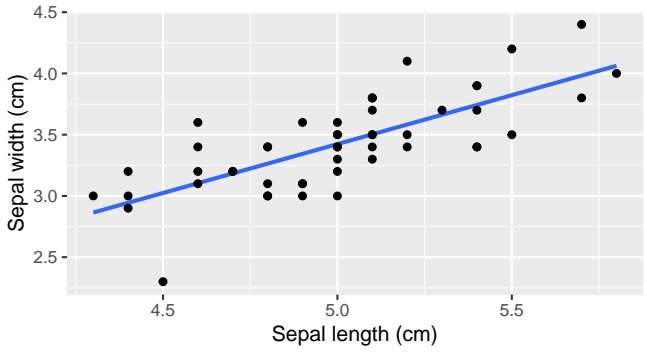

Figure 2.1: Flower of iris setosa (left). Sepals are the big purple falls spreading downward, petals are thinner and grow upward. The right panel displays the relationship between the width and length of sepals. Not surprisingly, longer petals tend to be wider. The blue trend line is computed using linear regression.

Original image by Denis Anasimov, [wikimedia commons](https://commons.wikimedia.org/wiki/File:Irissetosa1.jpg).

More formally, we sometimes want to test if two variables are related. And if they are, then how strong is the relationship? For instance, are variables x and y more closely related than x and z? Another time we may know the value of one variable and want to use this knowledge to predict the value of another one. For instance, what is “typical” width of setosa sepals that are 5cm long? What is the “typical” price of a house that is 200 m<sup>2</sup>large? But there are many ways how two variables can be related. Figure 2.2 shows a few different options. Which of these curves is “correct”? Which of these is “better”?

Obviously, there is no general answer to the “correct” and to the “better” question. It depends on the process, data and the problem. But we want to construct a tool that can be used to answer the following questions:

• are these two variables related? Yes or no?

<small><span class="docvortex-page-footnote" data-block-type="page_footnote" style="color:#6b7280"><sup>1</sup>Iris flower dataset was introduced by Ronald Fisher in 1936. It contains measurements for 150 flowers of species setosa, versicolor and virginica. It is one of the most widely used statistical dataset. ([Wikipedia entry](https://en.wikipedia.org/wiki/Iris_flower_data_set))</span></small>

<!-- page: 135 -->

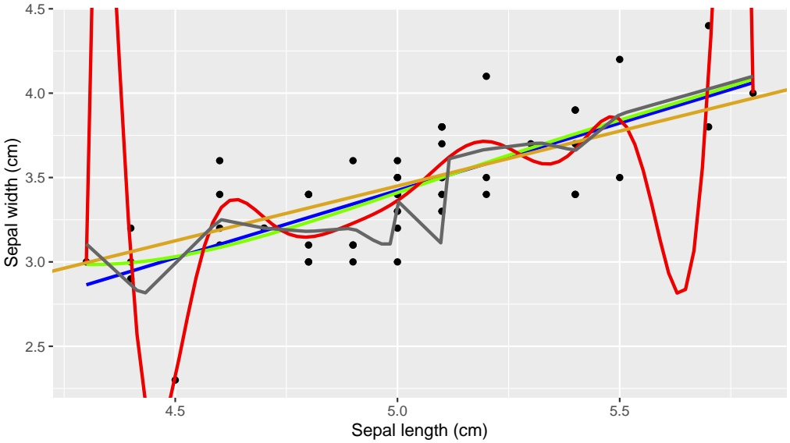

Figure 2.2: The same data as in Figure 2.1, right panel. Besides the original trend line (dark blue), this figure indicates a number of other possible relationships. Which one of these is better? Just by looking at the figure, we can say that the red line looks too wobbly while we may not like the kinks of the gray line. But the blue, green, and yellow line look fairly similar. In typical problems we prefer the simplest option with certain favorable properties, here the original regression line (blue).

• how strong is the relationship? For many real world problems, such as prediction, it is not just enough to say that there is a relationship, we need a numeric value.

• is the number statistically significant? Maybe it is just a random blip that the numbers look related?

• how does the relationship in one dataset compare to that in the other dataset? Is it stronger or weaker?

• and finally, we want the tool to be intuitive and easy to use.

We stress here that in order to answer the questions above we need a mathematical tool. Just eyeballing the data and deciding which curve is the “best” is not precise enough and does not scale (but it is a very important starting point!). The tool should have clear mathematical formulation and clear mathematical assumptions so we can judge in each case if it is appropriate to use it. It should also be flexible, allowing various tweaks to be incorporated to address problems of different flavor. And finally, it should be simple to implement and use on computer.

## 2.1.2 Simple Regression

TBD: History

<!-- page: 136 -->

## Introduction

Linear regression is perhaps the most popular tool to answer these questions. It checks all the boxes in the list above, offering both yes/no-style answers and quantitative answers. It is also simple, intuitive, and easy to use.

Linear regression is a statistical model. Here model means a specification how the “outcome variable” y is related to the “explanatory variable” x. A model is a necessary tool if we want to “ask data” about the true relationship. In typical applications we consider here, we need a statistical model, a model that contains both a deterministic and a stochastic part. The deterministic part is what we are typically interested in, the part of the relationship we can reliably describe and use for inference and prediction. The stochastic part is rarely used beyond evaluating model’s performance, but it is a necessary component that takes care of the stochastic nature of data. In many-many common applications we simply cannot reliably predict the outcome based on the information we have. The stochastic component of the model helps to handle such unreliability in a consistent and precise manner.

In regression models we describe the value of the outcome variable y using the explanatory variable x. In Figure 2.1 above we treated that data in a way that sepal length is the explanatory variable and sepal width is the outcome variable. Sometimes, but not here, we can interpret it in a causal sense, i.e. the regression model tells us what happens to the outcome if we manipulate the explanatory variable in a certain manner (e.g. make a leaf 1cm longer). There are many other way to call these variables, e.g. endogenous variable, dependent variable, target, or just “y” for the outcome, and exogenous variables, independent variables, features, predictors, or just “x” for x. See Cheatsheet 2.1 on page 133.

Hence linear regression treats data in a fundamentally asymmetric way—data is partitioned into explanatory variables and the endogenous variable. Sometimes this is a natural approach, for instance if our task is to predict salary (y) based on education (x), or if we are interested how drug dosis (x) affects the patients’ health (y). In other cases, it may be less relevant. For instance, it is not obvious why we should treat width and length of leaves in an asymmetric manner.<sup>2</sup>

Despite of being an old (over 200 years) method, it is still immensely popular, and it is hard to see it being replaced any time soon. Linear regression is definitely not everything a data scientist should know, there are just too many problems (for instance, natural language processing or image analysis) that cannot be tackled with linear regression. But linear regression wins in terms of simplicity and interpretability. It is also a handy benchmark and a building block for more complex statistical models, such as neural networks.

## Setup

Consider the tiny dataset in Figure 2.3. It describes a data frame (left) with three rows, labeled by i = 1, 2, 3 and two columns, x and y. The figure at right shows the

<small><span class="docvortex-page-footnote" data-block-type="page_footnote" style="color:#6b7280"><sup>2</sup>Such asymmetric treatment of data is common to a large class of models, commonly called supervised learning methods in machine learning literature. Certain other methods (unsupervised learning), such as clustering or principal component analysis, do treat all data in a similar manner.</span></small>

<!-- page: 137 -->

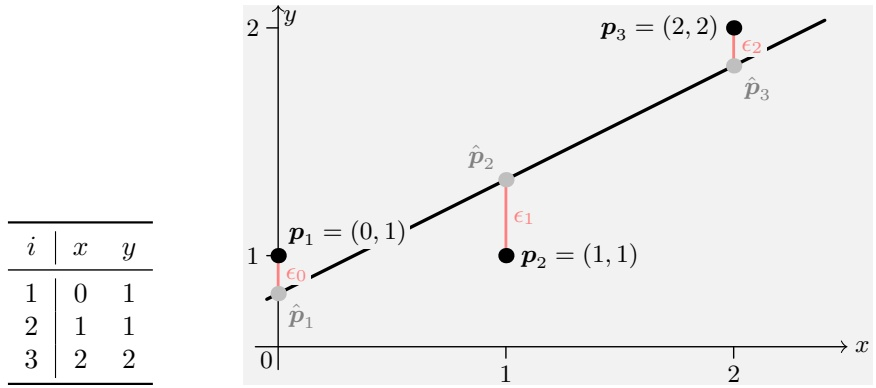

Figure 2.3: A tiny dataset (left). At right, a plot of these same data with the corresponding regression line (the dark diagonal line).

data points (in black), labeled as $p _ { i }$ (i.e. $\mathbf { p } _ { 1 }$ corresponds to the data point in the first row and so on).

Linear regression models the relationship between the outcome variable y and the explanatory variable x using a linear function. For these data, it is

$$
y = \frac {5}{6} + \frac {1}{2} \cdot x.\tag{2.1.1}
$$

This is the dark diagonal line in the figure (the regression line). It is as a linear function with intercept $5 / 6 .$ , and slope $1 / 6$ . The intercept is often denoted by $\beta _ { 0 } ,$ hence here $\beta _ { 0 } = { \textstyle { \frac { 5 } { 6 } } }$ and slope is often denoted by $\beta _ { 1 }$ , so here $\beta _ { 1 } = { \textstyle { \frac { 1 } { 2 } } }$ . (see Section 2.1.4 below how $\beta _ { 0 }$ and $\beta _ { 1 }$ are defined.)

But this model has a problem–the regression line misses all the data points! For instance, inserting $x _ { 1 }   =   0$ into (2.1.1), we find $\hat { y } _ { 1 }   =   5 / 6$ while $y _ { 1 }   =   1$ instead. So the first predicted point $\hat { \pmb { p } } _ { 1 }$ (marked gray) is below the true value $\pmb { p } _ { 1 }$ (in black), the second point is predicted too high, and so on. While the line captures the overall increasing trend in these data, it misses the actual data. Even more–there is no way for the regression line to capture all data points because they are not aligned. So if we want to model data, not the trend line, we need to adjust the model somehow. In case of linear regression we add an additional term, ϵ, to (2.1.1):

$$
y _ {i} = \frac {5}{6} + \frac {1}{2} \cdot x _ {i} + \epsilon_ {i}.\tag{2.1.2}
$$

ϵ is usually called the error term (also disturbance term or noise term, see Cheatsheet 2.1 Prediction, page 133 for summary of the terms). This takes into account the fact that the linear model, the black regression line, misses data. The ϵ-s are marked as red vertical lines in the figure, spanning the difference between the gray predicted values $\hat { \pmb { p } } _ { i }$ and the black actual values $p _ { i }$ . So the error terms ϵ are just terms that take care of the difference between the computed values and the actual values. In practice, it is almost never possible to capture the actual y values precisely, and hence we need some kind of tools to account for the discrepancy. Disturbance terms are such tools.

<!-- page: 138 -->

Index i indicates individual observations, typically rows in the data frame. (2.1.2) is just a shorthand notation for three equations

$$
y _ {1} = \frac {5}{6} + \frac {1}{2} \cdot x _ {1} + \epsilon_ {1}
$$

$$
y _ {2} = \frac {5}{6} + \frac {1}{2} \cdot x _ {2} + \epsilon_ {2}\tag{2.1.3}
$$

$$
y _ {3} = \frac {5}{6} + \frac {1}{2} \cdot x _ {3} + \epsilon_ {3}.
$$

Note that x, y and ϵ have index i but $\beta _ { 0 }$ and $\beta _ { 1 }$ do not—it indicates that each row i has a different value for $y ,   x$ and $\epsilon ,$ but they all share the same parameters (aka coefficients or betas) $\beta _ { 0 }$ and $\beta _ { 1 }$ . Coefficients are a property of the model, not a property of individual observations.

On these simple data we know that $\beta _ { 0 } \: = \: { \textstyle { \frac { 5 } { 6 } } }$ and $\beta _ { 1 }   =   { \textstyle { \frac { 1 } { 2 } } }$ . But in practice, we usually do not know it, and then we write instead

Simple regression model

$$
y _ {i} = \beta_ {0} + \beta_ {1} \cdot x _ {i} + \epsilon_ {i}.\tag{2.1.4}
$$

This is how the linear regression model is most often defined.

## Exercise 2.1: Compute ϵ

<div class="docvortex-algorithm" style="white-space: pre-wrap; font-family:monospace;">
Use the 3-line dataset and the parameter values $\beta_0 = 5/6$ and $\beta_1 = 1/2$ as above. Compute $\epsilon_1, \epsilon_2$ and $\epsilon_3$. Solution on page 500.
</div>

Let us demonstrate linear regression using Iris data, the same dataset that was used in Figure 2.1. Let’s pick sepal width as the outcome y and sepal length as the explanatory variable $x ,$ as in Figure 2.1. Table 2.1 displays the first few lines of the data. Data is all we know–we only know x and $y$ values. We have also picked the model–linear regression in the form (2.1.4). In the situation where we typically use linear regression (and other statistical models) we usually do not know the “correct” values of $\beta _ { 0 }$ and $\beta _ { 1 }$ . But we know our data, i.e. all the explanatory and outcome variable pairs $( y _ { i } , x _ { i } )$ for $i = 1 \dots N$ . Hence our first task is to find $\beta _ { 0 }$ and $\beta _ { 1 }$ before we can use the model for anything else.

Now we can put (2.1.4) in a more specific form as

$$
\text {Sepal width} _ {i} = \beta_ {0} + \beta_ {1} \cdot \text {Sepal length} _ {i} + \epsilon_ {i}.\tag{2.1.5}
$$

Next, we need to estimate (or $\hbar t )$ the model–find the “best” values of $\beta _ { 0 }$ and $\beta _ { 1 }$ The solution here is $\hat { \beta } _ { 0 } = - 0 . 5 6 9$ and $\hat { \beta } _ { 1 } = 0 . 7 9 9$ . The “hat” on top of $\hat { \beta }$ stresses that these are not “true” values but our estimates based on data. So we can rewrite the

<!-- page: 139 -->

Table 2.1: Example cases from Iris dataset

| Sepal length | Sepal width |
| --- | --- |
| 5.1 | 3.5 |
| 4.9 | 3.0 |
| 4.7 | 3.2 |
| 4.6 | 3.1 |
| 5.0 | 3.6 |

definition (2.1.4) for the first few observations in the data as

$$
\begin{array}{r l} & 3. 5 = - 0. 5 6 9 + 0. 7 9 9 \cdot 5. 1 + e _ {1} \\ & 3 = - 0. 5 6 9 + 0. 7 9 9 \cdot 4. 9 + e _ {2} \\ & 3. 2 = - 0. 5 6 9 + 0. 7 9 9 \cdot 4. 7 + e _ {3} \\ & \dots \end{array}\tag{2.1.6}
$$

We have replaced ϵ by e to stress that we don’t know the correct ϵ, but we can compute e from (2.1.6).

Sometimes we are interested in the parameter values itself as these may carry interesting meaning (see more in Section 2.1.3 Interpretation, page 134). In other cases we do not care much about the betas, but want to use those to predict other relevant outcomes, such as y values (see more in Section 2.1.2 Prediction, page 130).

Example 2.1: How fast does the universe expand?

By early 20th century, it was clear that certain nebuale in sky are outside of our Milky Way galaxy and astronomers attempted to use those to determine the Solar motion in space. By late 1920s, there was already data for both velocity and distance for 24 “extragalactic nebuale”, i.e. galaxies. In 1929, Edwin Hubble published a paper where he plotted velocity versus distance for those 24 objects (Hubble, 1929).

<!-- page: 140 -->

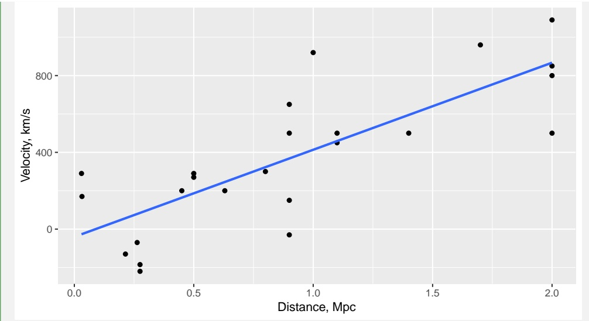

Figure 2.4: The original Hubble diagram. Hubble estimated the slope to be approximately 500 $\mathrm { k m   s ^ { - 1 }   \tilde { M p c } ^ { - 1 } }$ Despite the less-than-impressive data, and the fact that he badly overestimated the slope, it is considered one of the most important cosmological discoveries of all time.

On the figure, the more distant galaxies are clearly moving faster away from us. This suggests that the universe is expanding. The expansion rate can be estimated from the same data using linear regression

$$
v e l o c i t y _ {i} = \beta_ {0} + \beta_ {1} \cdot d i s t a n c e _ {i} + \epsilon_ {i}.\tag{2.1.7}
$$

The estimation results are $\hat { \beta } _ { 0 } = - 4 0 . 4$ and $\hat { \beta } _ { 1 } = 4 5 3 . 9$ The estimated value of $\hat { \beta } _ { 1 }$ indicates that 1 Mpc<sup>a</sup> more distant galaxies move 453.9 km/sec faster away from us (see Section Section 2.1.3 Interpretation, page 134). The expansion rate $\beta _ { 1 }$ is nowadays called “Hubble constant” and its modern estimate is approximately 72 km $\mathrm { s ^ { - 1 } \hat { M p c } ^ { - 1 } }$ We can reverse this rate and ask “how long time it takes for a galaxy, moving 454 km/sec, to reach to a distance of $1   \mathrm { M p c } = 3 . 0 9 \times 1 0 ^ { 1 9 }$ km? This gives us roughly 2 billion years, the number of years since the Big Bang (modern estimates are 13.8 billion years). This was an important piece of evidence supporting the idea that the universe is young.

<small><span class="docvortex-page-footnote" data-block-type="page_footnote" style="color:#6b7280">pc = 3.09 ×</span></small>

<small><span class="docvortex-page-footnote" data-block-type="page_footnote" style="color:#6b7280">1′′</span></small>

<small><span class="docvortex-page-footnote" data-block-type="page_footnote" style="color:#6b7280">aparsec ( 1013 km or 3.26 light years) is a distance where the Earth orbit’s radius is visible as arc. The closest stars are 1.3pc away from us, Milky Way disk is 50,000pc in diameter. Mpc = 1 000 000 parsec.</span></small>

<small><span class="docvortex-page-footnote" data-block-type="page_footnote" style="color:#6b7280">Prediction</span></small>

<small><span class="docvortex-page-footnote" data-block-type="page_footnote" style="color:#6b7280">Prerequisites: Section 1.4.5 Expectation, expectation as a linear operator</span></small>

<small><span class="docvortex-page-footnote" data-block-type="page_footnote" style="color:#6b7280">Imagine we have somehow figured out the “right” values of and . Now we can β0 β1</span></small>

<!-- page: 141 -->

immediately use the model for predicting the results. This amounts to answering the questions like “what will be the outcome value $y$ that corresponds to the explanatory variable value x? Let’s look at the model definition (2.1.4)again. We somehow know the values of $\beta _ { 0 }$ and $\beta _ { 1 }$ (we just figured these out). We also know $x _ { i } ,   i = 1 \dots N$ (this is our data). But we don’t know $\epsilon _ { i } ,$ as that is an unobserved stochastic error. True, we can compute it as in Exercise 2.1, but this is only possible in case we know $y .$ But as we try to predict $y ,$ then we probably don’t know it to begin with... So we cannot compute the predicted $y .$

(2.1.4): $y_{i} = \beta_{0} + x_{i}\cdot \beta_{1} + \epsilon_{i}$

Instead, what we can do is to compute it’s expectated value E y instead. Let’s take expected value of (2.1.4):

$$
\mathbb {E} y = \mathbb {E} [ \beta_ {0} + \beta_ {1} \cdot x + \epsilon ] = \mathbb {E} [ \beta_ {0} + \beta_ {1} \cdot x ] + \mathbb {E} \epsilon .\tag{2.1.8}
$$

As $\beta _ { 0 } ,   \beta _ { 1 }$ and x are known values, their expectations are just these values. We just have to find $\mathbb { E } \epsilon$ . Normally we just use an assumption

$$
\mathbb {E} \epsilon = 0.\tag{2.1.9}
$$

(see Section 2.1.10 Assumptions in OLS Models.) It means that it’s expectation is exactly zero, and hence it’s mean in a finite sample (like our data) tends also to be close to zero. This may sound like a strong assumption but it is actually pretty harmless in most cases. If we assume something else, say E $\epsilon = a$ for some constant $a ,$ this would amount of shifting y values up by a. But we already have the intercept term, $\beta _ { 0 }$ that plays a similar role and shifts y values up and down. As a result, the $\beta _ { 0 }$ would decrease by amount $a ,$ so that $\beta _ { 0 } + a$ will remain constant. Our predictions would not change.<sup>3</sup>

Note that typically we predict E y, the expected value of $y .$ We may instead predict something else, e.g. median or other quantiles of $y ,$ it’s minimum value, or probability that y is positive. Such predictions may need different assumptions instead of (2.1.9).

With these assumptions in place, we can just write our predictions as

$$
\hat {y} (x) = \mathbb {E} y = \beta_ {0} + \beta_ {1} \cdot x.\tag{2.1.10}
$$

(One often uses “hat” like in $\hat { y }$ to denote estimated or predicted values for $y . )$ It may be written in different forms, for instance

$$
\hat {y} (x _ {i}) \quad \text {or} \quad \hat {y} _ {i} \quad \text {or} \quad \hat {y} (x _ {i}; \beta_ {0}, \beta_ {1})\tag{2.1.11}
$$

where the first form makes the dependency on x explicit, the second form uses index i for a short-hand notation, and the third version also indicates that the prediction depends on the model parameters $\beta _ { 0 }$ and $\beta _ { 1 }$ . Note that $\hat { y }$ is a linear function in x—this is why linear regression is called linear regression. Hence $\hat { y }$ will be a line on the x-y plane.

<small><span class="docvortex-page-footnote" data-block-type="page_footnote" style="color:#6b7280"><sup>3</sup>Here we assume that the model in fact includes the constant term. If this is not the case, the assumption may have major implications. See</span></small>

<small><span class="docvortex-page-footnote" data-block-type="page_footnote" style="color:#6b7280">TBD: reference to the example</span></small>

<!-- page: 142 -->


Example 2.2: Predicted Velocity of Galaxies

NGC 4736, a galaxy in Canes Venatici. The modern estimate of its distance is 4.9 Mpc, almost 10 times more than at Hubble’s time. R Jay Gabany (Blackbird Obs.), [CC BY-SA 3.0](https://creativecommons.org/licenses/by-sa/3), via Wikimedia Commons.

Let us use the results from Example 2.1 to predict the speed of galaxies in the Hubble data. We found that the model estimates are $\beta _ { 0 } = - 4 0$ and $\beta _ { 1 } = 4 5 4$ We focus on three galaxies: NGC 4736 $( R = 0 . 5 )$ , NGC 1068 $( R = 1 . 0 )$ and NGC 4472 $( R = 2 . 0   \mathrm { M p c } )$ Using the estimated $\beta \mathrm { - } \mathrm { S } _ { 1 }$ we can find the predicted speed from (2.1.10) as 186.5, 413.4 and 876.3 km $\mathrm { s } ^ { - 1 }$

The figure below shows the measured velocity in data (black) and the predictions (light blue).

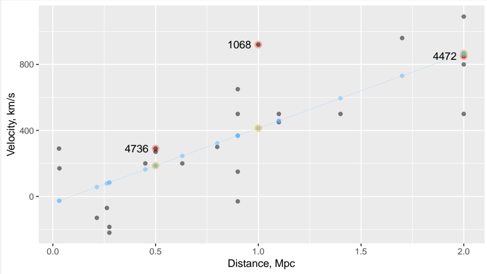

Figure 2.5: Hubble data. The black dots represent the actual distance-velocity combinations of galaxies as known to Hubble in 1929. Light blue dots are the predicted velocities, corresponding to the model in Example 2.1. NGC 4736, 1068 and 4472 are marked with orange/yellow halo.

All the predicted values are on a straight line because (2.1.10) represents a linear function. We can see that the prediction error (residual) for NGC 1068 is rather large, but in case of NGC 4472 we have predicted almost exactly the correct value.

When we know the true value y (for instance, on training data), we can also compute the prediction errors, typically called residual terms, deviations, or residual errors:<sup>4</sup>

$$
e = y - \hat {y} = y - (\beta_ {0} + \beta_ {1} \cdot x).\tag{2.1.12}
$$

<small><span class="docvortex-page-footnote" data-block-type="page_footnote" style="color:#6b7280"><sup>4</sup>There is an important conceptual difference between residuals e and disturbance terms ϵ (but fortunately it does not matter much in practice). Namely, if we know the correct values of β<sub>0</sub>, β <sub>1</sub> and y, then we can actually recover the disturbance ϵ. However, when β-s are estimated from data (as they almost always are), similar exercise will give us the residual e instead.</span></small>

<!-- page: 143 -->

## Exercise 2.2: Predict using linear regression

Consider the demo dataset on page 127. The parameter estimates are $\beta _ { 0 } = { \textstyle { \frac { 5 } { 6 } } }$ and $\beta _ { 1 } = { \textstyle { \frac { 1 } { 2 } } }$ Compute the predicted values ŷ1, ŷ2 and $\hat { y } _ { 3 }$ Solution on page 500.

Demo dataset:

Obviously, the better the model, the smaller are the residual terms. But in general we face trade-offs–we cannot make residual error for one observation smaller without making it larger for another observation at the same time. But errors do not necessarily mean the model is imperfect. The errors in Hubble estimate originate from three sources: incorrect speed measurements; incorrect distance measurements; and the fact that galaxies are not just fixed to the expanding space but are also moving relative to their co-moving space. None of these problems makes Hubble’s model bad. It still captures the expansion factor, and it had been fairly close to the modern estimates if astronomers in 1920-s had had access to the modern methods for distance estimation. After all, Hubble’s greates achievement was not to accurately predict the velocity of “extragalactic nebulae” but to realize that the universe is expanding. The error terms played only a minor role in that discovery.

| i | x | y |
| --- | --- | --- |
| 1 | 0 | 1 |
| 2 | 1 | 1 |
| 3 | 2 | 2 |

## Cheatsheet 2.1: Simple Regression: Definition

## Model

$$
y _ {i} = \beta_ {0} + \beta_ {1} \cdot x _ {i} + \epsilon_ {i}
$$

• y: outcome (also target, endogenous variable, left-hand variable, y)

• β<sub>0</sub>, β<sub>1</sub>: parameters (also coefficients, betas)

• β<sub>0</sub>: intercept (also constant)

• $\beta _ { 1 } ;$ slope (also effect)

x: explanatory variable (also feature, exogeneous variable, right-hand variable, feature, predictor, attribute, x). This is your data.

• ϵ: error term (also disturbance term)

• i counts observations (also cases)

The deterministic part of the model $y _ { i } = \beta _ { 0 } + \beta _ { 1 } \cdot x _ { i }$ is linear in x, i.e. depicts a straight line on x-y plane. The error terms takes care of the fact that the data points may be off that line.

**Prediction** When we know $\beta _ { 0 } ,   \beta _ { 1 }$ and x, we predict y as

$$
\hat {y} _ {i} = \beta_ {0} + \beta_ {1} \cdot x _ {i}.
$$

The statistical problem is to find a good combination of $\beta _ { 0 }$ and $\beta _ { 1 }$ so that the prediction line fits the existing data well.

<!-- page: 144 -->

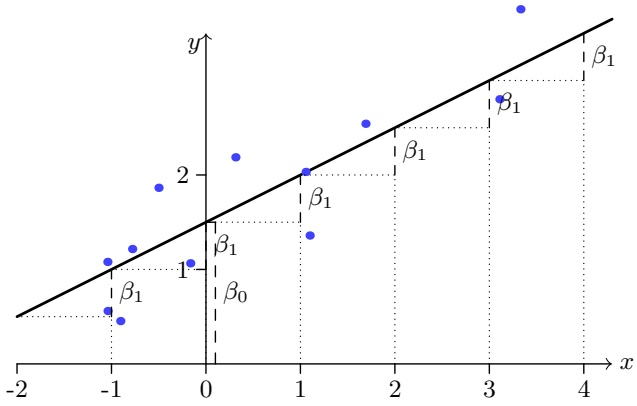

Figure 2.6: Interpretation of regression coefficients. The blue dots represent the data points and the thick line is the regression line. Intercept $\beta _ { 0 }$ represents the vertical intercept of the thick regression line, $i . e .$ the predicted $y$ value at the point where $x   =   0$ . Slope $\beta _ { 1 }$ corresponds to the “climb” of the line when x increases by one unit. This figure is made using random data.

## 2.1.3 Interpreting regression results

## Interpretation

One of the big advantages of linear regression is its interpretability. There are other interpretable models, such as logistic regression, but none can compete with linear regression in terms of ease and simplicity. In many situations we are less interested in the predicted values and more interested in understanding the underlying process, and in such cases linear regression is often the obvious choice.

(2.1.10):

To interpret a model means to “understand” the parameter values and being able to tell a story what do these values mean. Simple regression has two parameters, intercept $\beta _ { 0 }$ and slope $\beta _ { 1 }$ . The meaning of these parameters can easily be understood when analyzing the predicted values.From (2.1.10) we see that if $[ x = 0 ,$ the predicted $\hat { y } ( 0 )   =   \beta _ { 0 }$ Hence intercept indicates the expected (predicted) value of $y$ if $x   =   0$ (See Figure 2.6). To understand what does slope, $\beta _ { 1 }$ , describe, we can compute the difference

$$
\hat {y} (x) = \beta_ {0} + \beta_ {1} \cdot x.
$$

$$
\hat {y} (x + 1) - \hat {y} (x) = [ \beta_ {0} + \beta_ {1} \cdot (x + 1) ] - [ \beta_ {0} + \beta_ {1} \cdot x ] = \beta_ {1}.\tag{2.1.13}
$$

Hence slope tells us how much larger is the prediction $\hat { y }$ when x larger by 1 unit.

<!-- page: 145 -->

Example 2.3: Unemployment versus GDP growth

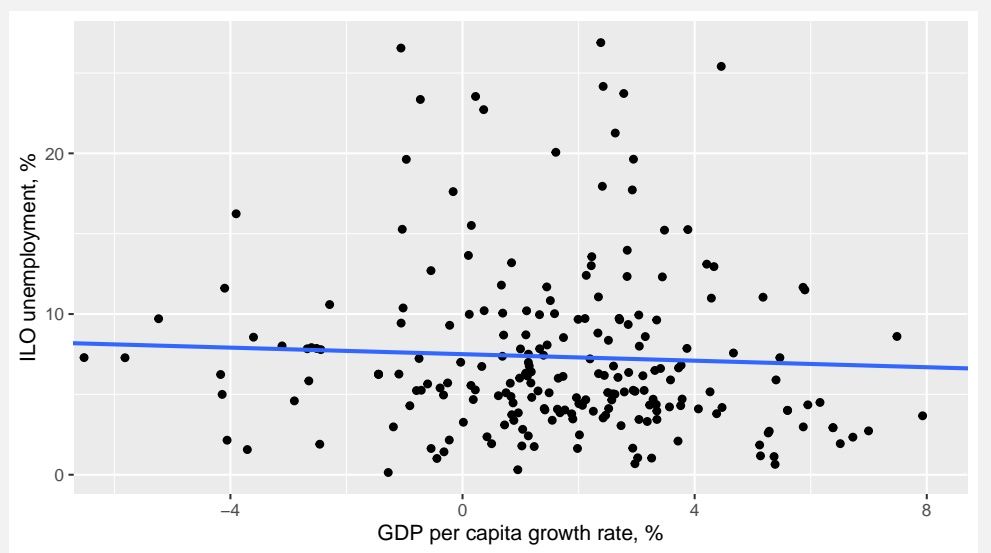

Figure 2.7: Relationship between unemployment and GDP growth across countries in 2016, and the corresponding regression line. World Bank data.

Figure 2.7 shows the relationship across countries between unemployment and GDP growth where unemployment is measured as percentage of labor force, and GDP growth is measured in percentages. We can model the relationship as

$$
\text {unemployment}_i = \beta_0 + \beta_1 \cdot \text {GDP growth}_i + \epsilon_i\tag{2.1.14}
$$

where i denotes different countries. The corresponding linear regression estimates are $\hat { \beta } _ { 0 } = 7 . 5$ and $\hat { \beta } _ { 1 } = - 0 . 1$ . Here “intercept” means that expected unemployment for a zero-growth country is 7.5 percent. For each additional percent of growth, that number falls by 0.1 pct points. For instance, if economic growth is 2%, the model predicts the unemployment rate to be 7.4%. The estimate for growth seems surprisingly small (and is not statistically significant), but remember the data describes a cross-section of countries in 2016, a period of rather robust growth, and not relationship over time for an individual economy.

Note that linear regression (nor any other statistical model) does not allow to make causal claims. The growth estimate -0.1 cannot be interpreted that more growth causes less unemployment, at least not based on this data.

## Exercise 2.3: Income and education

You estimate the relationship between income and education in the form

$$
i n c o m e _ {i} = \beta_ {0} + \beta_ {1} \cdot e d u c a t i o n _ {i} + \epsilon_ {i}
$$

where education is measured in years and income in dollars. You find $\beta _ { 0 } = 1 0 0 0 ,$

<!-- page: 146 -->

<div class="docvortex-algorithm" style="white-space: pre-wrap; font-family:monospace;">
$\beta_{1} = 5000$ . What does $\beta_0$ tell you? Is it an interesting number? What does $\beta_{1}$ tell? Solution on page 500.
</div>

## Exercise 2.4: Weight and height

<div class="docvortex-algorithm" style="white-space: pre-wrap; font-family:monospace;">
You are analyzing the relationship between the weight and height of teenagers using the model
$weight_{i} = \beta_{0} + \beta_{1} \cdot height_{i} + \epsilon_{i}$
where weight is measured in kilograms and height in centimeters. You find $\beta_{0} = -75$, $\beta_{2} = 0.7$. What does $\beta_{0}$ tell you? Is it an interesting number? What does $\beta_{1}$ tell?
Solution on page 500.
</div>

Note that while these interpretations are always correct from the mathematical perspective, they may sometimes carry little real world meaning. For instance, the regression line in Figure 2.1 is given by parameters $\beta _ { 0 }   =   - 0 . 5 6 9$ and $\beta _ { 1 }   =   0 . 7 9 9$ The intercept means that zero-length sepals are −0.569 cm wide. This does not make any sense, but as none of our flowers have sepal length less than 4cm, it does no harm when we use our model for the actual 4-6cm long flowers. But extrapolation for small flowers may be very misleading as this example suggests. The slope parameter $\beta _ { 1 }$ means that for each unit (i.e. centimeter) sepals are longer, they are 0.799 units (i.e. centimeters) wider in average. This number is reasonable and tells us something about the shape of the flowers.

Exercise 2.5: How is sons’ height related to fathers’ height?

| Father | Son |
| --- | --- |
| 167.4 | 169.5 |
| 180.2 | 187.5 |
| 178.9 | 171.5 |
| 164.1 | 176.3 |

<!-- page: 147 -->

## Correlation and causation

One has to keep in mind that regression coefficients cannot be interpreted causally. The regression parameter that connects sepal width and length cannot be interpreted as for every centimeter the sepal grows in length, it grows 0.799 centimeters in width. Linear regression<sup>5</sup> only computes the average relationship: in our data, longer leafs are also wider. Data alone do not tell why. These traps are sometimes easy to avoid. For instance, the results of Exercise 2.5 would read that “if fathers grow by 1cm then sons grow by 0.5cm”. This is obviously nonsense–even if you were able to make someone’s father taller, this will in not affect the height of their children...

But other times a causal interpretation sounds perfectly natural. Interpretations like “if we increase schooling by one year then income will grow by 6 percent” or “if 1 pct point more people wear masks the infection rate will fall by 1.2 pct” sound perfectly plausible claims. The problem is that the common datasets do not tell if such an interpretation is correct or misleading. Humans easily slip into semi-causal interpretation, and the fact that the correct language sounds clumsy and non-natural does not help here. Humans are also prone to interpret relationships causally even when explicitly stated that this may not be true. It is better to re-phrase the two previous examples as “those who attended school for one more year earn 6 pct more income” and “regions where 1 pct point more people wear masks see 1.2 pct lower infection rate”.

The causality-agnostic language also has a special phrase, associated with, to denote the correlational relationship like what is computed in linear regression. So our sepal results may be phrased as 1 cm longer leafs are associated with 0.799 centimeters more width and we can say that “one year more of schooling is associated with 6 pct higher income”.

## Interpreting the regression table

The statistical software we use for linear regression typically outputs not just coefficient values but a complete table of results. Table 2.2 shows an example of such a table, computed for the setosa sepal length–sepal width regression

$$
S e p a l W i d t h _ {i} = \beta_ {0} + S e p a l L e n g t h _ {i} + \epsilon_ {i}\tag{2.1.15}
$$

(See Figure 2.1).

Typical software output uses the variable names to label the estimates instead of $\beta _ { 0 }$ and $\beta _ { 1 }$ . Here $\beta _ { 0 }$ is called “intercept” and $\beta _ { 1 }$ is “sepal length” as this is the variable that $\beta _ { 1 }$ is multiplied by. The column “Estimate” presents the same estimated coefficients we discussed above. Here we discuss the other columns in this table. As it turns out, all these columns are very important.

Next column in the table is labelled “Std. Error”. This is the standard error of the estimate. As the points do not line up exactly, we need to include certain randomness in the model (this is term ϵ in (2.1.4)). Intuitively, depending which data points we

<small><span class="docvortex-page-footnote" data-block-type="page_footnote" style="color:#6b7280"><sup>5</sup>This issue is not specific to linear regression only but it is a common problem with all statistical models. In order to establish causality based on statistical analysis, we need very specific information that is typically not present in what we call “data”. See more in Chapter 3.</span></small>

<!-- page: 148 -->

Table 2.2: Software output table from sepal length–sepal width regression. Different software package may provide slightly different output, but the main information is very much the same.

|  | Estimate | Std. Error | t-value | Pr(>\|t\|) |
| --- | --- | --- | --- | --- |
| Intercept | -0.569 | 0.522 | -1.091 | 0.281 |
| Sepal length | 0.799 | 0.104 | 7.681 | 0.000 |

sample, our regression coefficients will be slightly larger or slightly smaller. Under mild assumptions, these coefficients follow t-distribution and this column provides their standard error. You can imagine that we collect different setosa flowers manymany times. Each time we get a slightly different sample, and hence we get slightly different estimated values. Standard error describes the variability of the estimates obtained in this way. But in practice we do not want to do many samples (usually we even cannot do it), so “Std. Error” is computed using the mathematical properties and underlying assumptions instead.

In this table we can see that the intercept’s standard error is 0.522 while the sepal length coefficient’s error is 0.104. Hence the latter is much more precisely determined by our data than the former.

The next column is labelled “t-value”. t-values are conceptually very similar to z-values, just based on slightly different assumptions and hence the corresponding critical values are slightly different (see Section 1.6.3). Each coefficient has its own t-value , computed as:

$$
t = \frac {\mathrm{Estimate}}{\mathrm{Std. Error}}.\tag{2.1.16}
$$

It is testing hypothesis: $H _ { 0 }   :   \mathrm { E s t i m a t e }   =   0 ,$ , here it means testing the claim that sepal length and sepal width are not related. But just because randomness in data, we always see some kind of relationship. One can show that if $H _ { 0 }$ is correct and certain assumptions hold, then t value as defined here is t-distributed (that’s why it is called t-value) and large t values are unlikely under $H _ { 0 }$ . In the table the intercept’s t-value is -1.091 and that for sepal length is 7.681. Hence it is much more likely to see such intercept value than such “sepal length” value just by random chance. We can compare t values here with the critical t values from the t-value table. For instance, for two-tailed test at 5% significance level at 50 degrees of freedom<sup>6</sup>the critical value is $t _ { c r } = 2 . 0 1$ . Remember, the corresponding critical z-value is 1.96, a slightly smaller number (see Table 1.12).

Finally, the last column $``Pr(>| t |) ''$ is p-value, how likely it is to get such a t-value if $H _ { 0 }$ is correct. It is essentially the significance number we get if we use a t-table to look up the t-value of the previous column. The probabilities are 0.281 and 0, so just by playing with random data, we can get an intercept of similar size in more than

<small><span class="docvortex-page-footnote" data-block-type="page_footnote" style="color:#6b7280"><sup>6</sup>Degrees of freedom for linear regression model is number of observations minus the number of parameters to be estimated, here 50 − 2 = 48.</span></small>

<!-- page: 149 -->

25% of cases. However, the chances of getting similar value for sepal length coefficient are much smaller and essentially 0.

Example 2.4: Interpreting Regression Table

Consider the Hubble dataset of 24 observations. When we estimate the model

$$
\mathrm{velocity} _ {i} = \beta_ {0} + \beta_ {1} \cdot \mathrm{Distance} _ {i} + \epsilon_ {i}
$$

we get the results:

|  | Estimate | Std. Error | t value | Pr(>\|t\|) |
| --- | --- | --- | --- | --- |
| Intercept | -40.436 | 83.448 | -0.485 | 0.633 |
| Distance | 453.860 | 75.246 | 6.032 | 0.000 |

(see Example 2.1).

We can compute t-values by dividing estimates and standard deviations as

$$
\text {Intercept:} \quad - 4 0. 4 3 6 / 8 3. 4 4 8 = - 0. 4 8 5
$$

$$
\mathrm{Distance:} 4 5 3. 8 6 / 7 5. 2 4 6 = 6. 0 3 2.
$$

These numbers are exactly the same as in the table above, so usually there is little need to compute t-values.

We can find the p-values t-value table. First, we need to find the degrees of freedom. It is the number of observations minus the number of estimated parameters, $df = 24 - 2 = 22.$ . As the table does not have an entry for $d f = 2 2$ we pick the closest value, $d f = 2 0$ (2nd line). The t-value of the intercept, 0.485,<sup>a</sup> is smaller than any value in that row. In particular, it is smaller than 1.33, the critical t-value that corresponds to the significance level of 20%. Hence we can conclude that even if the true intercept is 0, there is more than 20% probability to see that big value (-40.436 just by chance. This is considered too large, and hence we cannot reject $H _ { 0 } : \beta _ { 0 } = 0 .$ Intercept is not statistically significant.

However, the t-value of Distance is 6.032. This, in turn, is larger than any number in that row. In particular, it is larger than 3.85, the critical value that corresponds to the significance level 0.1%. We can conclude that if the true parameter is 0, there are very small probability to see such large β value as 453.86 just by chance. We cannot say how large is the probability exactly based on the table alone, but we can say it is less than 0.1%. In most circumstance such a level is considered more than enough to reject $H _ { 0 } : \beta _ { 1 } = 0$ and hence $\beta _ { 1 }$ is statistically significant.

Nowadays, statistical software typically also provides p-values. The output may also be accompanied with additional information, such as significance markers or confidence intervals.

<small><span class="docvortex-page-footnote" data-block-type="page_footnote" style="color:#6b7280"><sup>a</sup>Remember: the sign of t-value does not play a role when computing the p-value. It just shows the sign of the corresponding coefficient.</span></small>

<!-- page: 150 -->

## Exercise 2.6: Interpreting regression table

<div class="docvortex-algorithm" style="white-space: pre-wrap; font-family:monospace;">
1. You estimate a linear regression model and find that $\beta = 4$ while its standard error is 1.6. Compute $t$ value.  
2. Is your estimate statistically significant at $5\%$ level? (You can use critical $z$-values instead of $t$-values, see Table 1.12.)  
3. Is it significant at $1\%$ level?  
4. What does it mean in regression context: $\beta$ is significant at $5\%$ level? Solution on page 500.
</div>

## Cheatsheet 2.2: Simple Regression: Interpretation

<div class="docvortex-algorithm" style="white-space: pre-wrap; font-family:monospace;">
Interpreting coefficients
    Intercept $\beta_0$: the $y$ value at $x = 0$ (in average)
    Slope $\beta_1$: the cases where $x$ is larger by one unit have $y$ larger by $\beta_1$ units (in average).
It is not correct to say that if we increase $x$ by one unit, $y$ will increase by $\beta_1$ units. This claim implies causality but normally we cannot establish causality.

Interpreting regression table Consider Hubble regression
$velocity_i = \beta_0 + distance_i \cdot \beta_1 + \epsilon_i$.

Software regression output looks something like this:

            Estimate Std. Error t-value Pr(&gt;|t|)
        Intercept -40.436 83.448 -0.485 0.633
        Distance 453.860 75.246 6.032 0.000

first column (no name here): parameter names. Intercept is $\beta_0$ and the name of the $x$-variable, slope $\beta_1$ of which is presented.
Estimate estimated value of the parameter
Std. Error estimated standard error of the parameter
$t\text{-value } t = \frac{\text{Estimate}}{\text{Std. Error}}, t\text{-value for testing } H_0 : Estimate = 0$.
Pr(&gt;|t|) p-value of the t-test, the probability that we observe estimate of such size if $H_0$ is correct.
Interpretation:
    Intercept: galaxies at distance 0 Mpc move at speed -40 km/sec.
    Slope: Galaxies that are 1 Mpc further away move 454 km/sec faster.
</div>

<!-- page: 151 -->

## 2.1.4 Formal Definition of Linear Regression

Now we have done all the preparatory work to define the linear regression model.

Let us revisit the definition of residual term (2.1.12). We noted above (see Section 2.1.2 Prediction) that better models tend to have lower prediction errors, but we cannot drive all of them down to zero at the same time. Instead, we somehow have to address the trade-offs we face. In case of linear regression, we define the “best” model as the one that minimizes the sum of squared residuals. This is why linear regression is often called “least squares”–the word “least” refers to minimization and “squares” refers to the fact that we minimize squared errors.

We can minimize the sum of squared errors (SSE) by selecting good values for $\beta _ { 0 }$ and $\beta _ { 1 }$ . This gives us an informal definition of linear regression: it is the linear model (2.1.4) where parameters $\beta _ { 0 }$ and $\beta _ { 1 }$ are chosen in a way that the models residual sum of squares, SSE, is minimized.

Formally, we can write the sum of squared errors as

$$
\begin{array}{r l} S S E (\beta_ {0}, \beta_ {1}) & = \sum_ {i = 1} ^ {N} e _ {i} ^ {2} = \\ & = \sum_ {i = 1} ^ {N} (y _ {i} - \hat {y} _ {i}) ^ {2} = \\ & = \sum_ {i = 1} ^ {n} [ y _ {i} - (\beta_ {0} + \beta_ {1} \cdot x _ {i}) ] ^ {2}. \end{array}\tag{2.1.17}
$$

Here we write SSE as ${ S S E } ( \beta _ { 0 } , \beta _ { 1 } )$ to stress that it’s value depends on $\beta \mathrm { - S } .$ . The first line of (2.1.17) is the definition of SSE. Note that we minimize $\overline { { \sum _ { i } e _ { i } ^ { 2 } } }$ , not $\sum _ { i } \epsilon _ { i } ^ { 2 }$ . This means that we do not know the true values of $e _ { \gamma }$ P but for whatever $\beta _ { 0 }$ and $\beta _ { 1 }$ we pick, we can always compute $e .$ The others two expressions follow from the definition of residuals and from the definition of predicted value. The “correct”, i.e. optimal $\beta _ { 1 }$ -s are those that minimize ${ S S E } ( \beta _ { 0 } , \beta _ { 1 } )$ , formally written as

$$
(\hat {\beta} _ {0}, \hat {\beta} _ {1}) = \arg \min _ {(\beta_ {0}, \beta_ {1})} \sum_ {i = 1} ^ {N} e _ {i} ^ {2} = \arg \min _ {(\beta_ {0}, \beta_ {1})} \sum_ {i = 1} ^ {n} [ y _ {i} - (\beta_ {0} + \beta_ {1} \cdot x _ {i}) ] ^ {2}.\tag{2.1.18}
$$

Here we denote the optimal values for $\beta _ { 0 }$ and $\beta _ { 1 }$ by $\hat { \beta } _ { 0 }$ and $\hat { \beta } _ { 1 }$ . This can be understood as we play around with $\beta _ { 0 }$ and $\beta _ { 1 }$ until we have achieved the smallest possible SSE, and then we call the corresponding values $\hat { \beta } _ { 0 }$ and $\hat { \beta } _ { 1 }$ . Note that these values are our estimates, not necessarily the “true” values of $\beta _ { 0 }$ and $\beta _ { 1 }$ (and we follow habit by denote estimated balue of $\beta$ by $\hat { \beta } )$ . The true values are unknown, the estimates are the best we can do based on data. In case of simple regression, one can get fairly far with computing SSE manually by just trying different $\beta$ values. Alternatively,

<small><span class="docvortex-page-footnote" data-block-type="page_footnote" style="color:#6b7280"><sup>7</sup>The term “linear regression” and “linear least squares” are usually treated as synonyms. However, we do not necessarily have to minimize sum of squared errors. We may choose to minimize other functions of the residual terms, for instance sum of absolute values of the errors. The result is still linear, and still has the property of regression to mean (Galton, 1886), but it is usually called “median regression”, not linear regression.</span></small>

<!-- page: 152 -->

In this example we have $S S E   =   1 2 7 . 9 1$ much more than 3.159 we $\mathrm { { 8 e t } }$ when picking optimal values for $\beta _ { 0 }$ and $\beta _ { 1 }$ . See Example 2.6.

one can rely on non-linear optimization (see Section 10.2 Gradient Ascent). Linear regression turns out to be even simpler, as here we can solve the best β-s analytically (see Section 5.7 Solving Linear Regression Models). This is the only statistical model where it is possible and no doubt, this has also contributed to its popularity.

Example 2.5: SSE for the iris sepals regression

Let’s compute a few SSE values for setosa sepals, for the same data we used in Figure 2.1. Pick first $\beta _ { 0 } = 0$ and $\beta _ { 1 } = 1$ , i.e. we assert that in average sepals are as wide as they are long. Table 2.3 shows the relevant calculations. The first 4 rows show the first four lines of data. The two first columns are data, sepal length and sepal width. The third column, $\hat { y }$ is the predicted width, and given our choice of $\beta { \scriptstyle - \mathrm { S } } ,$ it is exactly equal to sepal length. The fourth column, $e = \hat { y }   -   S e p a l$ width is the residual. As we are predicting way too large width, the residuals are all positive. The final column, $e ^ { 2 } ,$ , contains the squared values of the corresponding residuals. The last row is the sum of the corresponding columns. Here we are only interested in the last number, the sum of squared errors.

Table 2.3: Computing SSE for setosa data. Sepal length and Sepal width are the actual datapoints. ŷ is the predicted width, given $\beta _ { 0 } = 0$ and $\beta _ { 1 } = 1 .$ e is the corresponding deviance and $e ^ { 2 }$ is squared deviance, “squared error”. The last line gives the sum of all rows.

|  | Sepal length | Sepal width | yˆ | e | e<sup>2</sup> |
| --- | --- | --- | --- | --- | --- |
| 1 | 5.10 | 3.50 | 5.10 | 1.60 | 2.56 |
| 2 | 4.90 | 3.00 | 4.90 | 1.90 | 3.61 |
| 3 | 4.70 | 3.20 | 4.70 | 1.50 | 2.25 |
| 4 | 4.60 | 3.10 | 4.60 | 1.50 | 2.25 |
| … | … | … | … | … |  |
| sum | 250.30 | 171.40 | 250.30 | 78.90 | 127.91 |

<!-- page: 153 -->

(1.3.2): $s^2 = \frac{1}{N} \sum_{i=1}^{N} (x_i - \bar{x}_i)^2$.

## 2.1.5 Model evaluation: MSE, RMSE, $R ^ { 2 }$

One of the first tasks after estimating the model is to understand how good a job does it do. Is this model actually better than just predicting the average value for everyone? Just how much better is the model? A natural answer to this comes from the least squares model definition: how big is it’s SSE?

But SSE alone is not a good answer. There are several problems when using just SSE as a model goodness indicator:

• SSE grows as we add more datapoints to the model. So a large value of SSE may either mean that the model does not describe the data well, or that we just have a lot of data.

• SSE is measured in squared units, so for instance if $y$ is measured in dollars, MSE will be in dollars-squared. This is hard to interpret.

• It is also hard to compare models on different kind of data. If units of measurement are different, then SSE will also be different even on the same dataset. And sometimes the units are inherently different. For instance, income and temperature cannot be measured in the same units, and hence we cannot tell which one is modeled better–at least not based on SSE alone.

Fortunately, all three issues have fairly simple solutions.

In order to fix the first issue–SSE grows with dataset size–we can use not sum of squared errors but mean squared error (MSE) instead. MSE is just average of SSE over datapoints:

$$
M S E = \frac {1}{N} \sum_ {i = 1} ^ {N} e _ {i} ^ {2} = \frac {1}{N} \sum_ {i = 1} ^ {N} (y _ {i} - \hat {y} _ {i}) ^ {2}.\tag{2.1.19}
$$

You may notice that the formula for MSE resembles that of sample variance (1.3.2), just instead of the average value ${ \bar { y } } ,$ we use the predicted value $\hat { y } _ { i }$ to compute the deviations.

The solution to the second problem is easy too: instead of MSE, we can use its square root, called root-mean-squared-error (RMSE):

$$
R M S E = \sqrt {M S E}.\tag{2.1.20}
$$

RMSE is measured in the same units as $y$ and hence easily interpretable. If MSE resembles variance, its square root resembles standard deviation and we can say something like “typically, our predictions are off by RMSE”. The wording—“typically...”—is deliberately vague. As you can see from (2.1.19) and (2.1.20), RMSE is a sort of average prediction error. However, we do not call it “average” because people may then think we are talking about the arithmetic average. But it is not the arithmetic average. Obviously, both MSE and RMSE can also be used to define linear regression in analogous fashion as SSE in (2.1.18). A set of betas that minimizes SSE, will also minimise MSE and RMSE.

<!-- page: 154 -->

Exercise 2.7: RMSE and standard deviation

```latex
Consider the following dataset:
$\begin{array}{c|cc}
\hline x & y & \hat{y} \\
\hline 1 & 1 & 1.5 \\
2 & 3 & 2.0 \\
3 & 2 & 2.5 \\
\hline
\end{array}$
Here $\hat{y}$ is predicted using a linear model $\hat{y} = 1 + 0.5 \cdot x$. Compute
1. variance (sample variance) of $y$, $s_y^2$
2. standard deviation $s_y$
3. MSE
4. RMSE
5. Explain the difference between $s_y^2$ and MSE.
Solution on page 501
```

The solution to the last issue is a little bit more involved but it leads us to the well known $R ^ { 2 }$ , perhaps the most popular measure of goodness in regression models. We start with the observation that SSE, the sum of errors “left over” by the model, does not tell much about the model’s performance unless we know how spread-out are the observations (y-s) to begin with. So we define total sum of squares (TSS)

$$
T S S = \sum_ {i = 1} ^ {N} (y _ {i} - \bar {y}) ^ {2}\tag{2.1.21}
$$

where $\bar { y }$ is the average of $y .$ Note the difference between TSS and SSE as defined in (2.1.17): while SSE computes the error terms as the difference between the true y<sub>i</sub> and the model prediction $\hat { y } _ { i } ,$ TSS computes it as the difference between $y _ { i }$ and the average, ȳ. So TSS is a convenient measure of the total spread in the data. It is very much equivalent to variance (1.3.2), just multiplied by N.

This gives us a measure of model goodness: if the “leftover variance” SSE/TSS is small, the model “explains away” most of the variation in the data. For instance, if $\mathit { S S E / T S S } \; = \; 0 . 2 ,$ , the model only “leaves behind” 20% of the original variation. Traditionally, one looks at the reverted version of this measure: $R ^ { 2 }$ is defined as

$$
R ^ {2} = 1 - \frac {S S E}{T S S}.\tag{2.1.22}
$$

In this hypothetical example $R ^ { 2 } = 0 . 8 ,$ and the model explains 80% of the variation in data. Let’s think a second what this means. In one extreme case where our model is completely useless, and our predictions are no better than just predicting the mean value for every data point, we have $\mathit { S S E } = \mathit { T S S }$ and hence $\dot { R ^ { 2 } = 0 }$ . In another extreme case where our model is able to predict every single observation exactly, we do hot have any prediction errors and hence $\mathit { S S E } = 0$ and hence $R ^ { 2 } = 1$ . So $\hat { R ^ { 2 } }$ gives us a convenient and easy-to-interpret measure of prediction goodness: which percentage of the total variation is explained by the model. Small $\bar { R } ^ { 2 }$ indicate the model is not good (from the predictive perspective) and high $R ^ { 2 }$ shows that it predicts well.

<!-- page: 155 -->

## 2.1. LINEAR REGRESSION

Unfortunately, the squared deviations SSE and TSS that $R ^ { 2 }$ is based on is not easy to visualize, but one can construct a similar measure based on range to make it more intuitive (Figure 2.8). In this example, the “total range” in data (call it TR) is 4 and the “error range” ER is 3. We can define a range-based $R ^ { 2 }$ as $R _ { r } ^ { 2 } = 1 - 3 / \dot { 4 } = 0 . 2 5$

A similar measure as $R ^ { 2 } ,$ but based on range. The four data points $x _ { 1 } – x _ { 4 }$ (colored) have total range, the vertical difference between the topmost and the lowermost data point, TR = 4. However, the corresponding residuals, $e _ { 1 } { - } e _ { 4 }$ have range $( { } ^ { \epsilon \epsilon } e r -$ ror range”) of $E R ~ = ~ 3$ only. Hence the model decreases the range in data from 4 to 3 and $R_{r}^{2} = 1 - 3/4 = 0.25$ But note that this measure is not the $\text{" } true \text{" } R^{2}$ because it is defined based on range, not based on variance. This is why it is denoted by $R _ { r _ { 1 } } ^ { 2 }$ , not $R ^ { 2 }$

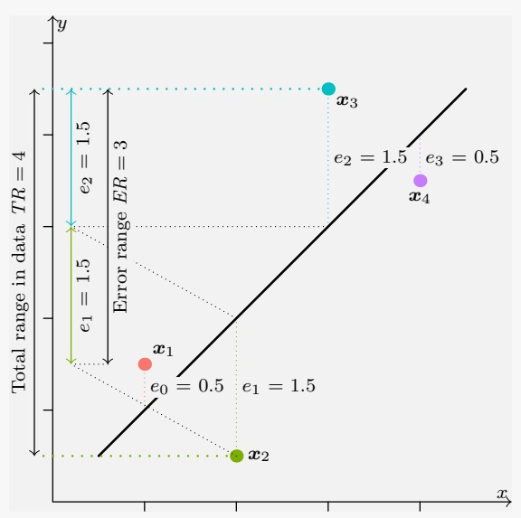

Figure 2.8: Range-based construction of $R ^ { 2 }$

## Example 2.6: $R ^ { 2 }$ for setosa sepals regression

We follow up Example 2.5 and compute $R ^ { 2 }$ of the corresponding regression. However, instead of picking arbitrary parameter values (0 and 1 in Example 2.5), we compute the regression estimates. These are $\beta _ { 0 } = - 0 . 5 6 9$ and $\beta _ { 1 } = 0 . 7 9 9$ (see page 2.1.2 Section 2.1.2). First we present a similar table to compute deviations and SSE as in Example 2.5:

Table 2.4: Computing $R ^ { 2 }$ for setosa data. The table is analogous to the table in Example 2.5, just this time using the actual regression coefficient values instead of 0 and 1.

|  | Sepal length | Sepal width | yˆ | e | e<sup>2</sup> |
| --- | --- | --- | --- | --- | --- |
| 1 | 5.10 | 3.50 | 3.50 | 0.00 | 0.00 |
| 2 | 4.90 | 3.00 | 3.34 | 0.34 | 0.12 |
| 3 | 4.70 | 3.20 | 3.18 | -0.02 | 0.00 |
| 4 | 4.60 | 3.10 | 3.10 | 0.00 | 0.00 |
| … | … | … | … | … |  |
| sum | 250.30 | 171.40 | 171.40 | 0.00 | 3.16 |

<!-- page: 156 -->

<div class="docvortex-algorithm" style="white-space: pre-wrap; font-family:monospace;">
As we have picked the regression estimates for $\beta_0$ and $\beta_{1}$ now, the deviations $e$ are small, and we see both positive and negative values now. The table shows that $SSE = 3.159$, a much smaller value than 127.91 we got in the previous example. In order to compute $R^2$, we also need TSS (2.1.21):  
$TSE = \sum_{i} \left( \text{Sepal width}_i - \overline{\text{Sepal width}} \right)^2 \tag{2.1.23}$  
where $\overline{\text{Sepal width}}$ is the average value of sepal width. Plugging in the data, we find $TSS = 7.041$, and hence  
$R^2 = 1 - \frac{3.159}{7.041} = 0.551 \tag{2.1.24}$  
In this example the simple regression model explains 55.1 percent of the total variation.
</div>

## Exercise 2.8: Compute TSS, SSE, $R ^ { 2 }$

<div class="docvortex-algorithm" style="white-space: pre-wrap; font-family:monospace;">
Consider data $\boldsymbol{x} = (0,0,2,2)$ and $\boldsymbol{y} = (1,-1,3,1)$. When you fit the regression line $y_i = \beta_0 + \beta_1x_i + \epsilon_i$, you find that $\beta_0 = 0$ and $\beta_1 = 1$.
    Compute i) TSS;ii) SSE;iii) $R^2$.
    Solution on page 501
</div>

$R ^ { 2 }$ is not an universal measure. It is computed from prediction errors e and hence it focuses on prediction. If our task is to predict, we should strive to get as high $R ^ { 2 }$ as possible. But if our primary focus is inference, interpretation of $\beta { \scriptstyle - \mathrm { S } _ { \gamma } }$ the high $\bar { R } ^ { 2 }$ value is of less importance. For instance, in the Hubble regression, the most important result is that $\beta _ { 1 } > 0$ –the universe is expanding. The errors are related to the measurement errors and to the fact that galaxies are also moving in space, not just with space. $R ^ { 2 }$ describes the ratio of these factors–expansion of universe, measurement errors, and the proper motion of galaxies; and this is much less interesting than the fact that the universe is expanding.

Different type of data lead to different $R ^ { 2 }$ values. In social sciences, it is common to observe $R ^ { 2 ^ { \vec { } } }$ in a range of $0 . 2 \ldots 0 . 3$ for ordinary regressions–this just means that human behavior is hard to predict. Accessible data just do not have the information needed to tell what humans are up to, something that everyone who has lived together with a partner has probably noticed ,. If we are interested in changes over time, we often find $R ^ { 2 }$ less than 0.05, and in contrary, if we are predicting future behavior based on the current behavior, $R ^ { 2 }$ may exceed 0.9.

Finally, note that when defining SSE, TSS and $R ^ { 2 }$ we did not make use of the fact that we are working with linear regression. In fact, all these measures are well defined for all supervised learning models with continuous outcomes. This includes nearest neighbors, trees and related methods, and neural networks, as long as the variable of interest is continuous.

Which of these measures–RMSE, $R ^ { 2 } , \; \beta \mathrm { - s }$ or t-values should one focus on when evaluating a regression model? It depends:

<!-- page: 157 -->

$\beta { \scriptstyle - \mathrm { S } _ { \gamma } }$ in particular the slop parameter $\beta _ { 1 }$ , tell us something about how x and y are related. For instance, if we analyze income and education, then it may tell that an additional year of education is associated with \$8,000 more of yearly income. But it tells little about how good is the model, or if this figure is reliable.

• t-values focus on the reliability part. High t-values mean that the association between x and y is not just a random blip, but is indeed there in the dataset. However, it is just about the statistical reliability, not the size of the association.

$R ^ { 2 }$ describes the overall model goodness from prediction perspective. High $R ^ { 2 }$ (close to 1) means that the model can capture most of the variability in data, low $R ^ { 2 }$ (close to 0) means that there is a lot of variation that the model does not capture. This is important for predictive modeling, but if our task is just to compute $\beta ,$ then it matters much less.

• RMSE describes the prediction errors. It is silent about the overall model performance, it also does not tell anything about the association between x and y. It just gives and estimate how much off are predictions made by this model.

So typically $\beta { - } s$ and t-values are more important for inferential modeling, and $R ^ { 2 }$ and RMSE for predictive modeling. We should add here that even if all four values look reasonable, the model may still be off–this is just a part of the diagnostics one ought to do when using linear regression.

## Example 2.7: $R ^ { 2 }$ of Hubble diagram: 100 years later

When Hubble published paper in 1929, the cosmological data was very primitive from the 21st century viewpoint. We can replicate his results on modern data and compare the models. The figure below compares the original Hubble diagram (left) with the one that is based on modern data (right). Already a visual inspection suggests that the modern data is better alinged with a line.

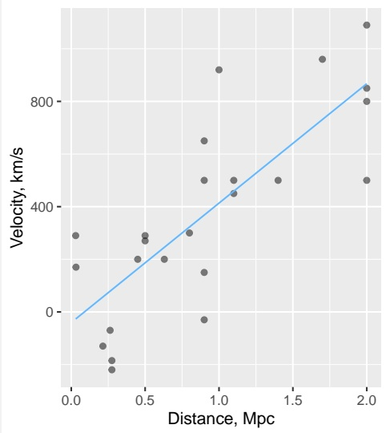

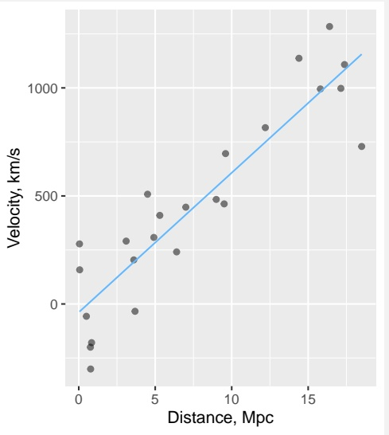

<!-- page: 158 -->

Figure 2.9: The original (1929) Hubble diagram (left) and its replication using the modern data for the same galaxies (right). A visual inspection suggests that a line fits the modern data better than the original data. One can also see that the modern distance estimates are up to 10 times larger than the original ones, the speed estimates have not changed that much.

Linear regression results for both data are in the table below:

|  | Original | Modern |
| --- | --- | --- |
| Intercept | -40.44 | -38.66 |
| Distance | 453.86 | 64.57 |
| R<sup>2</sup> | 0.62 | 0.82 |

We can see that the same model using modern data provides noticeably better $R ^ { 2 }$ by explaining 82% of variation instead of 62% in case of the original data. But is it a better model? Do we want to improve $R ^ { 2 }$ even more?

These questions are a bit vague, but one may argue that the model is the same, just in the modern case we have better data (smaller measurement errors). So $R ^ { 2 }$ here is more of a data quality measure than the model goodness measure. But can we improve $R ^ { 2 }$ even more? Before improving it, we should understand why is the measured $R ^ { 2 } < 1$ in the first place. As space is expanding uniformly (as far as we know), the fact that galaxies are not aligned perfectly with the line is due to two factors: measurement errors, and motion of galaxies in space (called proper motion). We would like to improve measurement precision, but extending the model to take into account the proper motion would require modeling the proper motion of galaxies, something that has little to do with the overall expansion. After all, this model is made to show that the universe is expanding, and less than perfect $R ^ { 2 }$ is not obscuring this message. Here a large $R ^ { \tilde { 2 } }$ is a nice-to-have feature, but not an essential one.

## Cheatsheet 2.3: SSE and related terms

There are many acronyms related to sum of squared errors:

SSE: Sum of squared errors $\begin{array} { r } { \mathit { S S E } = \sum _ { i } e _ { i } ^ { 2 } = \sum _ { i } ( y _ { i } - \hat { y } _ { i } ) ^ { 2 } } \end{array}$

MSE: Mean squared error $\begin{array} { r } { \mathit { M S E } = \frac { 1 } { N } \mathit { S S E } } \end{array}$

• RMSE: Root mean squared error $\mathit { R M S E } = \sqrt { M S E }$

• TSS: Total sum of squares $\begin{array} { r } { \mathrm { T S S } = \sum _ { i = 1 } ^ { N } ( y _ { i } - \bar { y } ) ^ { 2 } } \end{array}$

• $R ^ { 2 } ;$ how much of total variation in data does the model explain (between 0 and 1): $R ^ { 2 } = 1 - \mathit { S S E } / \mathit { T S S }$

<!-- page: 159 -->

## 2.1. LINEAR REGRESSION

## Cheatsheet 2.4: Model goodness measures

Different measures tell different things about the model:

• $R ^ { 2 } ;$ large $R ^ { 2 }$ means that model explains most of the variation in data.

RMSE, root mean squared error is the “typical prediction error”, measured in the same units as y.

β shows how “strongly” are x and y related–how many units of y corresponds to one unit of x. It depends on the units of measurement.

p-values (also z and t values) show how likely it is that x and y are not related.<sup>a</sup>

<small><span class="docvortex-page-footnote" data-block-type="page_footnote" style="color:#6b7280"><sup>a</sup>More precisely: what is the probability to see that large z value if there is not relationship between x and y.</span></small>

<!-- page: 160 -->

## 2.1.6 Multiple Regression

**Prerequisites:** Section 2.1.2 Simple Regression, page 125

## What is Multiple Regression

In case of simple regression we are concerned with how a single explanatory variable x is associated with outcome y. But often we are interested in more than a single explanatory variable. For instance, in order to predict income, we may want to include education, but also age, gender and place of residence (rural or urban). So we do not have just a single explanatory variable x but more than one of those. This is the idea of multiple regression.

Technically, multiple regression is very similar to simple regression, just we allow several explanatory variables to influence the outcome y at the same time. Say we are interested in the effect of K explanatory variables. Now instead of (2.1.4)we write

(2.1.4): $y _ { i } = \beta _ { 0 } + x _ { i } \cdot \beta _ { 1 } + \epsilon _ { i }$

$$
y _ {i} = \beta_ {0} + \beta_ {1} \cdot x _ {1 i} + \beta_ {2} \cdot x _ {2 i} + \dots + \beta_ {K} \cdot x _ {K i} + \epsilon_ {i}.\tag{2.1.25}
$$

For instance, in the income–education example above, we may have $K   =   4 { : ~ }   x _ { 1 }$ is education, x<sub>2</sub> is age, x<sub>3</sub> is gender, and $x _ { 4 }$ is place of residence. The outcome y is income. Exactly as in case of simple regression, we call $y$ the outcome variable, $x _ { k }$ are explanatory variables and ϵ is the error term. The unknown parameters $\beta _ { k }$ are sometimes called slopes but more often just “betas”. And finally, index i stresses that each observation i has a different value for $y ,   x _ { 1 } ,   x _ { 2 } ,   . . . ,   x _ { K }$ and $\epsilon _ { \gamma }$ but they all share the same parameters $\beta _ { 0 } \ldots \beta _ { K }$ .In a similar fashion we also generalize the expression for prediction (2.1.10) to multivariate case

$$
\hat {y} (x) = \beta_ {0} + \beta_ {1} \cdot x _ {1} + \beta_ {2} \cdot x _ {2} + \dots .\tag{2.1.26}
$$

While in case of the simple regression the predicted values form a line on $x - y$ plane, in multiple regression case it forms a K-dimensional hyperplane in $K + 1$ dimensional x and y-space.

## Example 2.8: How is income related to education and literacy?

Let’s analyze the relationship between income, education and illiteracy by U.S. states (R dataset state.x77, see also the example in Section 5.2.1). A sample of the data looks like

| Income | HS Grad | Illiteracy |
| --- | --- | --- |
| 4530.00 | 58.10 | 1.80 |
| 4701.00 | 47.80 | 1.40 |
| 3875.00 | 38.50 | 1.80 |
| 4864.00 | 63.50 | 0.60 |

where income is in 1977 dollars, HS Grad is high-school graduation rate (pct), and Illiteracy is illiteracy rate (pct of population). We estimate multiple regression model

$$
\mathrm{Income} _ {s} = \beta_ {0} + \beta_ {1} \cdot H S G r a d _ {s} + \beta_ {2} \cdot I l l i t e r a c y _ {s} + \epsilon_ {s}
$$

<!-- page: 161 -->

## 2.1. LINEAR REGRESSION

where s are states. The estimates are $\beta _ { 0 } = 2 1 3 1 . 3 3 ,   \beta _ { 1 } = 4 4 . 5 5$ and $\beta _ { 2 } = - 5 2 . 6 4 .$ Note that the estimates are not the same as when estimating two separate simple regression models. For instance, a model

$$
\mathrm{Income} _ {s} = \beta_ {0} + \beta_ {1} \cdot H S G r a d _ {s} + \epsilon_ {s}
$$

would lead to estimates $\beta _ { 0 } = 1 9 3 1 . 1$ and $\beta _ { 1 } = 4 7 . 1 6$ instead. See the page 152 below for the explanations related to direct and indirect effects.

Example 2.8 can also be visualized as that only contains two explanatory variables $( K = 2 )$ and hence the prediction hyperplane is a 2-D plane in 3-D space (Figure 2.10). The image depicts two of the explanatory variables, HS Grad and Illiteracy on the horizontal plane, and income on the vertical axis. The gray plane represents the model-predicted values—the regression plane. In a similar fashion as the linear model in two dimensions represents a line, in three dimensions it represents a plane ${ \hat { y } } =$ $\beta _ { 0 } \cdot \mathit { H S G r a d } + \beta _ { 2 } \cdot \mathit { I l l i t e r a c y }$ The figure indicates that the plane is sloping upward toward higher HS graduation rate, the slope along the illiteracy axis is almost invisible. The large blue and yellow dots represent the actual income values with those below the regression plane barely visible, small dots are the corresponding model-predicted values. The vertical lines that connect the small dots of predicted values with large dots of actual values are the residual errors.

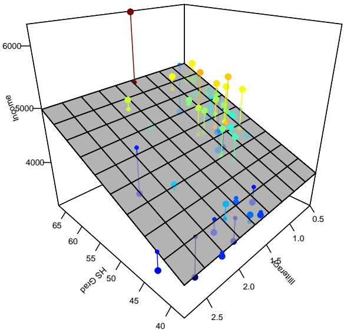

Figure 2.10: Regression plane with two explanatory variables (HS Grad and Illiteracy). The gray plane represents the 2-D regression plane, the large dots are the actual income values, the small dots are the predicted values on the regression plane, and the vertical lines that connect those values are the corresponding residual errors. Colors correspond to the actual income values.

<!-- page: 162 -->

We can see that the regression plane splits the data points in space through the middle with roughly a half of the actual points above it and another half below it. This is similar to the 2-D picture (see e.g. Figure 2.1) where the line splits the point cloud on a plane in a similar fashion.

When incorporating three explanatory variables, the figure should contain a 3-D hyperplane in a 4-D hyperspace, but unfortunately neither our tools nor our brains can handle 4-D visualizations. In higher dimensions we can only visualize similar regression planes that represent a higher-dimensional model where some of the variables are held constant. However, such visualizations may be quite misleading.

## Interpreting multiple regression effects

Interpretation of multiple regression coefficients is conceptually similar to that of simple regression. However, multiple regression allows to eliminate indirect effects and look at only direct effects. Imagine we are interested of the effect of education on income.<sup>8</sup> We estimate a model of form

$$
\mathrm{Education} _ {i} = \beta_ {0} + \mathrm{Income} _ {i} \cdot \beta_ {1} + \epsilon_ {i}\tag{2.1.27}
$$

But education and income may be related through different mechanisms. One, and the most intuitive one is the “direct effect” where education directly influences the income (e.g. if the employer pays higher salary for those with diploma). The direct effect may also go the other way around, e.g. if income determines what level of education one can afford. Both of these are direct effects (Figure 2.11, left panel). But this is not the only way these two variables are related. For instance, education also influences one’s choice of where to live, e.g. in urban or rural area, and income differs by location. This is an indirect effect: education influences location, and location in turn influences income. The opposite causality is plausible as well where income determines where to live, and location determines the educational choice. It is the same indirect effect. When working with simple regression, we allow the location choice to change when education changes and hence what we measure is a sum of direct and indirect effect. (Obviously, there are more factors than just location choice that influence education and income, so it may be better to talk about indirect effects in plural.) This is manifested by the fact that we do not include any information about location in the model. The only explanatory variable is education.

But this is not the case of multiple regression where we estimate a model of a form

$$
\mathrm{Education} _ {i} = \beta_ {0} + \mathrm{Income} _ {i} \cdot \beta_ {1} + \mathrm{Location} _ {i} \cdot \beta_ {2} + \epsilon_ {i}.\tag{2.1.28}
$$

Here we include location as an additional explanatory variable and hence it cannot just change as education changes—now it is determined by data. As a result, the first indirect effect between Education and Urban/rural choice (Figure 2.11, right panel) is broken. Education is not allowed to influence the location choice in an arbitrary way inside the model—all influence is captured by data. What is left are two direct

<small><span class="docvortex-page-footnote" data-block-type="page_footnote" style="color:#6b7280"><sup>8</sup>As “effect” we mean association, all sorts of relationships, including the causal effect. When not doing causal inference we usually talk about just “effects”. When analyzing causal influence we talk about “causal effects”.</span></small>

<!-- page: 163 -->

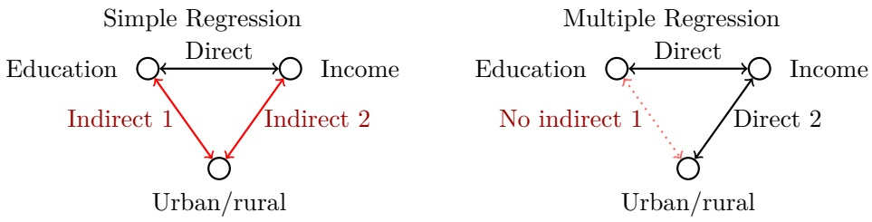

Figure 2.11: Analyzing the effect of education on income using simple regression $( I e f t )$ and multiple regression (right). Simple regression includes indirect effect, the red line from education over urbal/rural location to income. Multiple regression fixes the urban/rural choice through data and in this way breaks the line between education and location. Only direct effect (black line) is left. Two-way arrows stress that the causality may run in both directions across the links.

effects–from education to income, and from location choice to income (or the other way around as we cannot tell whether these factors cause income or income causes these factors). More realistically, there are always more variables we cannot control, so we just remove some of the indirect effects but still leave others in the model. This process, including explanatory variables that remove the respective indirect effects from the model, is called controlling for these variables. So in the example above we analyze the relationship between education and income, while controlling for geographic location.

Now back to interpreting the numerical values of $\beta { \scriptstyle - \mathrm { S } } .$ Multiple regression interpretation is fairly similar to that of simple regression. First, we immediately see from (2.1.25) that intercept corresponds to the expected outcome value given all explanatory variables have value 0. It often refers to an unrealistic, or even impossible case, e.g. income where age and education are 0. We rarely find the intercept to be an interesting parameter.

However, the other coefficients are typically interesting. As visible from (2.1.25), if $x _ { 1 }$ is larger by one unit, then predicted y is larger by $\beta _ { 1 }$ units, and if $x _ { 2 }$ is larger by one unit then y is larger by $\beta _ { 2 }$ units, and so on. However, note that for this to be true we have to keep all other x-s fixed while increasing $x _ { 1 }$ , or while increasing any particular x. So the interpretation is the following: $\beta _ { k }$ shows how many units larger y corresponds to one unit larger $x _ { k }$ (in average) while other explanatory variables remain at the same level.

Let’s return to the income-education-location example. In case of simple regression, the coefficient means “how much more will those workers earn who have one more year of education. We compare more and less educated workers, and compute the difference in their earnings. In case of multiple regression, the coefficient means “how much more will those workers earn who have one more year of education, given their place of residence is the same”. Hence we compare more and less educated workers in the same place, and compute the difference in their earnings. These are different questions and typically lead to different answers. In the simple regression case we include location choice as one potential way how more educated workers can increase their income. In multiple regression case we compare workers in the same

<!-- page: 164 -->

location and hence exclude that mechanism.

## Example 2.9: Income, education and literacy: interpretation

Example 2.8: regression model

Income $\mathbf { \mathit { s } } = \beta _ { 0 } + \beta _ { 1 } \cdot \mathbf { \mathit { H S G r a d } } _ { s }$ $+ \; \beta _ { 2 } \cdot \mathit { I l l i t e r a c y } _ { s } + \epsilon _ { s }$

using U.S. states’ data

Let’s now interpret the results of Example 2.8. The results were $\beta _ { 0 } = 2 1 3 1 . 3 ,$ $\beta _ { 1 } = 4 4 . 6$ and $\beta _ { 2 } = - 5 2 . 6$ The interpretation of intercept $\beta _ { 0 } ]$ —income in a hypothetical state with no high-school graduates but also no illiterates is \$2131.3—is not particularly interesting. But $\beta _ { 1 }$ tells us that in case of two states that have similar illiteracy levels, the one with 1 pct pt higher HS graduation rate has \$44.6 larger income. This is an interesting outcome. In a similar fashion, $\beta _ { 2 }$ tells that among two states with similar HS graduation rate, the state with 1 pct pt larger illiteracy has \$52.6 lower income. This is clearly relevant as well.

However, if we estimate a simple regression model that only contains HS Grad but no Illiteracy, then the estimated value is a bit larger, $\beta _ { 1 } = 4 7 . 2$ (see Example 2.8). The difference is related to indirect effects: states with high HS graduation rates tend to have low levels of illiteracy, and low illiteracy adds to the income. This is an indirect effect of HS graduation rate. This path is blocked when we control for illiteracy and hence we get a lower estimate for HS graduation rate.

Note that we are not talking about causality here. Low HS graduation rates tend to be associated with high illiteracy rates, but that does not mean that more easily accessible high schools would are causing illiteracy to be low.

When is it advantageous to use multiple regression? Direct effects, identified in multiple regression, are easier to interpret and it is easier to base policy implications on these. For instance, imagine that we conduct two simple regression analyses and find that better income is associated with better income, as does living in a certain geographic area. What should we recommend to do? Improve education, or build more homes in that region?<sup>9</sup>In both cases the message is clear but different. In multiple regression case we can actually disentangle these two effects and tell which one is more important. This is not possible by using just simple regression. But simple regression is more appropriate in other cases. For instance, if you want to know whether better educated individuals earn more then location does not matter. What you want is just the simple regression analysis.

## Exercise 2.9: Multiple regression: income, age and experience

```txt
You estimate a regression model in the form
    income_i = β_0 + β_age · age_i + β_experience · experience_i + ε_i
where experience is work experience in years. You find β_0 = -1000, β_age = -1000, β_experience = 10,000.
    Interpret all three coefficients.
    Explain why do we have β_age < 0, i.e. why does income falls in age?
```

<small><span class="docvortex-page-footnote" data-block-type="page_footnote" style="color:#6b7280"><sup>9</sup>Here we talk about causal effects. It is rare in practice that we can identify causal effects although these are usually what policymakers need to make decisions.</span></small>

<!-- page: 165 -->

## 2.1. LINEAR REGRESSION

3. What is the predicted income for someone who is 25 years old and has 5 years of work experience?

Solution on page 502.

## Formal Definition of Multiple Regression

From now on we follow vector-based formalism that makes notation, mathematics, and numerical computations substantially simpler. We stack all explanatory variables $x _ { i }$ into a vector x, a shortcut for $\pmb { x } = \left( x _ { 1 } , x _ { 2 } , \ldots , x _ { K } \right) ^ { \mathsf { T } }$ . Now the multiple regression definition 2.1.25 can be written as

$$
y _ {i} = \beta_ {0} + \boldsymbol {\beta} ^ {\top} \cdot \boldsymbol {x} _ {i} + \epsilon_ {i}.\tag{2.1.29}
$$

To simplify the notation further, the constant $^ { \circ } 1 ^ { \circ }$ is often included as the first (0-th) component of x and hence x is defined as $\begin{aligned} { \mathbf { \mathit { x } } = \left( 1 , x _ { 1 } , x _ { 2 } , \ldots , x _ { K } \right) ^ { \mathsf { T } } } \\ \end{aligned}$ . Note that, strictly speaking, it is not correct to refer x now as $\text{" }  data  \text{" }$ or “variables”, unless you are willing to refer to a constant as “data”. But this trick helps us to simplify notation even further, and we still call it somewhat sloppily “data”. So the regression model in it’s final vector form is written as

$$
y _ {i} = \boldsymbol {\beta} ^ {\top} \cdot \boldsymbol {x} _ {i} + \epsilon_ {i}.\tag{2.1.30}
$$

Note that whatever is the number of variables K, the vector form (2.1.30) remains the same. Vectors allow us to abstract away from $K ,$ both in notation and in computer code. Using vector notation we can write the predicted values analogously, as

$$
\hat {y} _ {i} = \hat {\boldsymbol {\beta}} ^ {\textsf {T}} \cdot \boldsymbol {x} _ {i}\tag{2.1.31}
$$

where $\hat { \beta }$ is the vector of estimated parameter values.

Now we can generalize the definition of simple regression (2.1.17) to multiple regression. We just use the multiple regression predictions (2.1.31) to define the sumof-squared-errors (SSE):

$$
\begin{array}{r l} S S E (\boldsymbol {\beta}) & = \sum_ {i = 1} ^ {N} e _ {i} ^ {2} = \\ & = \sum_ {i = 1} ^ {N} (y _ {i} - \hat {y} _ {i}) ^ {2} = \\ & = \sum_ {i = 1} ^ {n} (y _ {i} - \boldsymbol {x} _ {i} ^ {\top} \cdot \boldsymbol {\beta}) ^ {2}. \end{array}\tag{2.1.32}
$$

The notation we use stresses that SSE depends on the parameter vector $\beta .$ The solution $\hat { \beta }$ is just the parameter vector that minimizes $S S E ( \beta )$ :

$$
\hat {\boldsymbol {\beta}} = \arg \min _ {\boldsymbol {\beta}} S S E (\boldsymbol {\beta}).\tag{2.1.33}
$$

This minimization problem can be solved analytically, see Section 5.7, page 294.

TBD: multiple regression cheatsheet $\pmb { x } = \left( x _ { 1 } , x _ { 2 } , \ldots , x _ { K } \right) ^ { \mathsf { T } }$ is a shorthand for $\boldsymbol{x} = \begin{pmatrix} x_{1} \\ x_{2} \\ \vdots \\ x_{K} \end{pmatrix}$ . See

$\boldsymbol { \beta } ^ { \mathsf { T } } \cdot \boldsymbol { x } _ { i } =$ $\beta _ { 1 } x _ { i 1 } + \beta _ { 2 } x _ { i 2 } + \cdots + \beta _ { K } x _ { i K } ,$ see (5.3.31), page 279.

Section 5.3.1, page 273.

<!-- page: 166 -->

Interval measure: difference is defined; ratio measure: origin (zero) defined; nominal measure: only equality defined. See Section 1.1.1 page 3.

## 2.1.7 Categorical Variables

So far we have assumed that all our variables are numeric and hence the multiplication β · x is possible. But there are many types of data that are not numeric. For instance, gender is often recorded as dichotomous label “male” or “female”. Home type may be either “rental apartment”, “condo”, “single-family home” or “other”. And some variables, although coded as numbers, are not really numbers. For instance, family status may be coded as 1–single, 2–married, 3–divorced, etc. Such variables cannot be directly included into regression models, and even if done so (we can include the numerical categories for the marital status variable above), the results are probably wrong and misleading.The problem stems from the measure type–we can only do multiplication and addition with interval or ratio measures. But house type and family status are nominal measures, even if coded as numbers.

Consider the Males dataset (see page 481) that contains wages of 545 young men in 1980s. We are going to describe the wage as a function of marital status, and ethnicity. In the dataset we have marital status (variable married) coded as “yes” and “no” for married and non-married men respectively. Ethnicity (variable ethn) is coded as “black”, “hispanic”, and “other”. To give you better idea of the data, Table 2.5 left part shows a small sample of it. wage refers to log hourly wage.

We would like to estimate a regression model along the lines:

$$
\log w a g e _ {i} = \beta_ {0} + \beta_ {m} \cdot m a r r i e d _ {i} + \beta_ {e} \cdot e t h n _ {i} + \epsilon_ {i}\tag{2.1.34}
$$

However, we cannot use the existing variables in a model like this as both marital status and ethnicity are not numbers but categories. Hence we have to somehow convert these variables into numeric ones. The most popular approach to transfor categorical variables into numbers is by creating dummy variables (dummies). Dummies are called so because they are “dummy”, simple variables that can only take two values: 0 and 1.

Let’s start with married. This is a two-category variable with two possible values, “yes” and “no”. An obvious choice is to convert it to binary $0 / 1$ variable where $\text{" }0 \text{" }$ refers to “no” and $`` 1  ''$ refers to yes. Let’s call the variable m (Table 2.5 middle column).

Table 2.5: Sample of Males data (left), binary (dummy) variable m denoting status “married” (center). Dummies for three possible ethnic categories are in the rightmost three columns.

| wage | married | ethn | m | e<sub>b</sub> | e<sub>h</sub> | e<sub>o</sub> |
| --- | --- | --- | --- | --- | --- | --- |
| 1.20 | no | other | 0 | 0 | 0 | 1 |
| 1.52 | yes | other | 1 | 0 | 0 | 1 |
| 1.46 | no | black | 0 | 1 | 0 | 0 |
| 1.69 | yes | black | 1 | 1 | 0 | 0 |
| 1.12 | no | hisp | 0 | 0 | 1 | 0 |
| 2.22 | yes | hisp | 1 | 0 | 1 | 0 |

As m is numeric, we can use it directly in the regression model like

$$
\log w a g e _ {i} = \beta_ {0} + \beta_ {m} \cdot m _ {i} + \epsilon_ {i}.\tag{2.1.35}
$$

<!-- page: 167 -->

This amounts to fitting just $\beta _ { 0 }$ for non-married men (as their $m = 0 )$ and $\beta _ { 0 } + \beta _ { 1 }$ for the married men. If we do this, we get the following results:

|  | Estimate | Std. Error | t-value | Pr(>\|t\|) |
| --- | --- | --- | --- | --- |
| Intercept | 1.5524 | 0.0105 | 147.28 | 0.0000 |
| m | 0.2203 | 0.0159 | 13.85 | 0.0000 |

The basic interpretation of the result is the same as in case of ordinary regression (see Section 2.1.3):

• “Intercept” gives the average outcome value where all other explanatory variables are 0. In this case this means intercept corresponds to the average log-wage where $m = 0$ , i.e. average log-wage for those who are not married. Non-married men earn 1.55 log units in average.

$`` \mathrm{m} ''$ describes extra log wage of those who have one unit larger m. So men who have $m = 1$ have average log-income larger by 0.22 units compared to men with m = 0. Or in them plain language, married men earn more by 0.22 (in log terms), in total 1.77.

Interpretation can also be understood from the fact that we are fitting $\beta _ { 0 }$ for the unmarried and $\beta _ { 0 } + \beta _ { 1 }$ for the married men, hence $\beta _ { 0 }$ must describe the unmarried and $\beta _ { 1 }$ the difference between married and unmarried men.<sup>10</sup>

So we managed to include a categorical variable into our model. The interpretation tells us how much do the corresponding categories’ outcome differ, in average. It was rather easy in case of two categories.

## Exercise 2.10: Do union members earn more?

The Males data also includes union membership (either “yes” or “no”). We can create analogous dummy $u = 1$ for union members and 0 for non-members. When running a simple regression

$$
\log (w a g e _ {i}) = \beta_ {0} + \beta_ {1} \cdot u _ {i} + \epsilon_ {i}\tag{2.1.36}
$$

we get the following results:

|  | Estimate | Std. Error | t-value | Pr(>\|t\|) |
| --- | --- | --- | --- | --- |
| Intercept | 1.605 | 0.009 | 174.87 | 0.000 |
| u | 0.179 | 0.019 | 9.65 | 0.000 |

Use this table to answer the following questions:

1. What is the log-wage for non-union members? (in average)

2. What is the log-wage for union members? (in average)?

<small><span class="docvortex-page-footnote" data-block-type="page_footnote" style="color:#6b7280">β1</span></small>

<small><span class="docvortex-page-footnote" data-block-type="page_footnote" style="color:#6b7280">1</span></small>

<small><span class="docvortex-page-footnote" data-block-type="page_footnote" style="color:#6b7280">β0</span></small>

<small><span class="docvortex-page-footnote" data-block-type="page_footnote" style="color:#6b7280">10<sub>While</sub> this is the most common way of introducing dummies, there are other options. For instance, it is possible to specify the model in a way that is the average wage for unmarried and is that for the married men. Different specifications are suited for different questions. For instance, the original specification where β captures the difference between married and non-married men is well suited to answer “Do married men earn more”?</span></small>

<!-- page: 168 -->

The variable married has only two categories and hence we managed to transform it into a single dummy m. But how to handle ethn that has three possible nominal values? In this case we need to create two dummies. In order to understand the process better, let’s start by creating three dummies, $e _ { b } , \; e _ { h }$ and $e _ { o }$ in a way that if ethn = black then $e _ { b } = 1 ,   e _ { h } = 0$ and $e _ { o } = 0 ;$ if ethn = hisp then $e _ { b } = 0 ,   e _ { h } = 1$ and $e _ { o } = 0 ;$ and if ethn = other then $e _ { 0 } = 1$ and the other two e-dummies are both 0. So we have converted one column with three different values into three columns with two values each. (This is sometimes called one-hot encoding.) The resulting dummies are given in Table 2.5 in the three rightmost columns. Intuitively, one might now want to estimate a model as

$$
\log (w a g e _ {i}) = \beta_ {0} + \beta_ {b} \cdot e _ {b i} + \beta_ {h} \cdot e _ {h i} + \beta_ {o} \cdot e _ {o i} + \epsilon_ {i}\tag{2.1.37}
$$

but this will not work. To see why, let’s look what are the coefficients describing. For blacks, the estimated log wage would be $\beta _ { 0 } + \beta _ { b } ,$ , for hispanics $\beta _ { 0 } + \beta _ { h }$ and for others it will be $\beta _ { 0 } + \beta _ { o } .$ We have four $\beta { - } s$ but only three groups, and hence we cannot determine all four β-s at the same time. For instance, if we add 1 to $\beta _ { 0 }$ while subtracting 1 from $\beta _ { b } ,   \beta _ { h }$ and $\beta _ { o }$ at the same time, the predictions will remain exactly the same. We cannot identify all $\beta { - } s$

As a solution, it is customary to measure the values with respect to a selected category, called reference category. This means we set one of the $\beta \mathrm { - } \mathrm { S } _ { 2 }$ for instance $\beta _ { b } ,$ to 0.000 and now we can measure all other categories with respect to this one. Statistical software typically picks the alphabetically first category as the reference category, that’s why we pick $\beta _ { b }$ . As its value is pre-determined, it is typically left out of the regression output tables (hence also called $l e \hbar \cdot$ -out category). But sometimes you may also see it listed with value 0.000.

So instead of (2.1.37) we estimate the model

$$
\log (w a g e _ {i}) = \beta_ {0} + \beta_ {h} \cdot e _ {h i} + \beta_ {o} \cdot e _ {o i} + \epsilon_ {i}.\tag{2.1.38}
$$

The estimation results are below:

|  | Estimate | Std. Error | t-value | Pr(>\|t\|) |
| --- | --- | --- | --- | --- |
| Intercept | 1.5231 | 0.0236 | 64.46 | 0.0000 |
| e<sub>h</sub> | 0.0983 | 0.0312 | 3.15 | 0.0016 |
| e<sub>o</sub> | 0.1521 | 0.0254 | 5.98 | 0.0000 |

The multi-category dummies are slightly harder to interpret, although the basics are the same:

• “Intercept” describes the log-wage in case where all explanatory variables are zero. Here we have just two explanatory variables, $e _ { h }$ and $e _ { o }$ as we left $e _ { b }$ out as reference. Because of how the dummies are constructed, if both $e _ { h } = 0$ and $e _ { o }   =   0$ , we must have $e _ { b } = 1$ . This means when all explanatory variables are

<!-- page: 169 -->

zero, we are looking at the reference category, blacks (as e<sub>b</sub> is not included in the model, it does not count as an explanatory variable). Hence Intercept describes the outcome for the reference category! In principle we could add an extra line to the table:

|  | Estimate | Std. Error | t-value | Pr(>\|t\|) |
| --- | --- | --- | --- | --- |
| $e_b$ | 0.0000 | 0.0000 | 0.0000 | 0.0000 |

i.e. we can imagine the dummy for the reference category is included in the table, just its value is exactly zero. This is sometimes done, in fact, to make the reference category more explicit.

• The other dummies have the ordinary meaning. $e _ { h }$ describes additional salary for men who have $e _ { h } \: = \: 1$ instead of $e _ { h }   =   0$ while keeping $e _ { o }$ constant, i.e it describes the extra salary for hispanics compared to blacks (remember: if $e _ { h } = 1$ then $e _ { b }$ must be 0). The interpretation for $e _ { o }$ is similar.

In summary, in case of multi-category dummies, intercept describes the reference category and estimates for the other dummies describe the difference between the corresponding groups and the reference group. It is crucial to know what is the reference category in order to understand the results. Note that we can describe twocategory dummies in exactly the same way: we create two categories (married and non-married) and left the non-married out as the reference category.

## Exercise 2.11: Diamonds’ price depending on cut

<div class="docvortex-algorithm" style="white-space: pre-wrap; font-family:monospace;">
You are estimating the price of diamonds depending on their cut. There are three different cuts: “fair”, “good”, and “perfect”. Your estimates are  $\beta_{good} = 1000$ ,  $\beta_{perfect} = 2500$ .
1. Which one is reference category?
2. How much more expensive are good diamonds compared to fair diamonds, if they are otherwise similar?
3. How much more expensive are perfect diamonds compared to good diamonds?
Solution on page 502
</div>

## Exercise 2.12: Interpret multi-category dummies

The Males dataset also includes a variable residence that describes the geographic location. These are rural area, north east, northern central and south. When estimating the model where we explain the log wage with the geographic location, we get the following results:

<!-- page: 170 -->

|  | Estimate | Std. Error | t-value | Pr(>\|t\|) |
| --- | --- | --- | --- | --- |
| Intercept | 1.584 | 0.057 | 27.6 | 0.000 |
| north east | 0.164 | 0.061 | 2.7 | 0.007 |
| nothern central | 0.047 | 0.060 | 0.8 | 0.431 |
| south | 0.032 | 0.059 | 0.5 | 0.591 |

Exercise 2.13: Why a single race only?

<div class="docvortex-algorithm" style="white-space: pre-wrap; font-family:monospace;">
Consider the example with income and ethnicity above. We repeatedly stressed that the ethnicity dummies are mutually exclusive, e.g. if $e_h = 1$ then $e_b$ must be 0. Why this? Why cannot we allow multi-racial individuals?
Answer on page 503
</div>

## Cheatsheet 2.5: Categorical variables in linear regression

<div class="docvortex-algorithm" style="white-space: pre-wrap; font-family:monospace;">
Introducing and interpreting categorical variables in linear regression goes like this:
1. Convert categorical variables to dummies. You need one dummy for each category, e.g. in case of 10 cities you get 10 different dummies. The dummies are coded are mutually exclusive, for each observation one and only one dummy has value “1” while all others have value “0”.
2. Leave one dummy out as the reference category.
3. Interpretation:
Intercept: predicted value for the reference category
$\beta_{c}$: predicted difference between the category $c$ and the reference category.
Always report what is your reference category!
</div>

<!-- page: 171 -->

## 2.1.8 Interactions effects

Interaction effects (also cross-effects) is a way to build regression models that do not just handle variables independently, but allow different outcomes for certain joint combinations of variables. This is one of the most widely used methods to add flexibility to regression models.

## Artificial example

Let’s look at an artificial example.<sup>11</sup> Consider an analysis where we are interested in income as a function of cognitive skills and social skills.<sup>12</sup> Assume we have collected data on personal income, performed a test for cognitive skills (such as IQ test), and assessed the social skills too. Let us measure both skills in a binary fashion: low (0) and high (1). Take a look at the four individuals $( a , \; b , \; c ,$ and d) in Table 2.6.

Table 2.6: Example skill-income data.

| 1 | 2 | 3 | 4 | 5 | 6 |
| --- | --- | --- | --- | --- | --- |
| id | Annual income, $ | Social | Skills Cognitive | Interaction Social × Cognitive | Captured by |
| a | 40,000 | 0 | 0 | 0 | β<sub>0</sub> |
| b | 60,000 | 0 | 1 | 0 | β<sub>0</sub> + β<sub>c</sub> |
| c | 50,000 | 1 | 0 | 0 | β<sub>0</sub> + β<sub>s</sub> |
| d | 100,000 | 1 | 1 | 1 | β<sub>0</sub> + β<sub>s</sub> + β<sub>c</sub> + β<sub>sc</sub> |

We focus on the first four columns for now. The baseline individual $a ,$ the one with low social and low cognitive skills, earns \$40,000 a year. The next one, individual $b ,$ has low social skills but high cognitive skills and makes \$60,000, i.e. \$20,000 more than individual a. This suggest that the effect of cognitive skills is \$20,000. No surprise, cognitive skills are valuable. However, when we compare individuals c and $d ,$ we see that adding cognitive skills for someone who already has high level of social skills improves her income by \$50,000. Cognitive skills are even more valuable for someone who has more social skills.

This effect cannot be captured by the baseline multiple regression model (2.1.25). If we were to estimate the data using a model like

$$
\mathrm{income}_i = \beta_0 + \beta_s \cdot \text{social skills}_i + \beta_c \cdot \text{cognitive skills}_i + \epsilon_i,\tag{2.1.39}
$$

we will interpret $\beta _ { c }$ as the effect of cognitive skills, no matter what is the level of social skills. If we run such a linear regression on these data, we get $\beta _ { s } = \S 2 5 0 0 0$ and $\beta _ { c } = \S 3 5 0 0 0$ . The latter figure corresponds to the average effect of cognitive skills for

<small><span class="docvortex-page-footnote" data-block-type="page_footnote" style="color:#6b7280">11<sub>See</sub> Deming (2017).</span></small>

<small><span class="docvortex-page-footnote" data-block-type="page_footnote" style="color:#6b7280">s,</span></small>

<small><span class="docvortex-page-footnote" data-block-type="page_footnote" style="color:#6b7280">12<sub>Cognitive</sub> skills are skills that required for conscious mental work, such as reading, learning, math. These can be measured with standard test such as IQ or AFQT. Social skills are skills we use in human communication and persuasion, and include a plethora of small-scale behavioral habits that are hard to assess and train consciously.</span></small>

<small><span class="docvortex-page-footnote" data-block-type="page_footnote" style="color:#6b7280">TBD: find a few good papers.</span></small>

<!-- page: 172 -->

low- and high social-skilled individuals (i.e. the average of 20 and 50). But what if we want to capture the fact that higher social skills are related to a larger effect of cognitive skills?

This can be done by amendending the model (2.1.39) with an interaction term, $\beta _ { s c }$ · social skills × cognitive skills. From practical perspective, the interaction term is equivalent to creating a new variable, social skills × cognitive skills (see column 5 in Table 2.6), and adding it into the regression model as just another feature. Modern software typically has handy shortcuts for this operation, so usually you do not need to create such additional variables explicitly. So the corresponding linear regression model with an interaction effect will look like

$$
\begin{array}{r l} \text {income} _ {i} = & \beta_ {0} + \beta_ {s} \cdot \text {social skills} _ {i} + \beta_ {c} \cdot \text {cognitive skills} _ {i} + \\ & + \beta_ {s c} \cdot \text {social skills} _ {i} \times \text {cognitive skills} _ {i} + \epsilon_ {i}. \end{array}\tag{2.1.40}
$$

When we estimate this regression model, we get $\beta _ { 0 }   =   \$ 4 0 0 0 0 , \; \beta _ { s }   =   \$ 1 0 0 0 0 , \; \beta _ { c }   =$ \$20000 and $\beta _ { s c } = \S 3 0 0 0 0$

Unfortunately, interaction effects make regression models harder to interpret. The basic interpretation remains the same: $\beta$ tells how much larger is the expected outcome for those who have the variable’s value larger by one unit. However, now the variable values are not independent any more. We cannot have social skills × cognitive skills = 1 if the person has social skills = 0. So we cannot just conclude that “those with high social skills earn 10000 more than those with low social skills” as $\beta _ { 1 }$ suggests. Now the effect size depends on the level of cognitive skills.

## Interpreting the Interaction Effects

In order to interpret the results, let us start by predicting the income for everyone in data. As even experienced researchers get confused by the interaction effects, it is helpful to write down the table of dummies for each four individuals (Table 2.6, columns 3-5). Importantly, we have also marked the interaction effect here (column 5). Each of the dummy columns corresponds to one variable in the regression model (2.1.40) and hence to the respective $\beta .$

Consider the first individual a who has both low social and low cognitive skills. She has all the explanatory variables equal to $0 ,$ so her predicted income will just be $y _ { a } = \beta _ { 0 } = \S 4 0 0 0 0$ (see the last column in the table). Next, for the individual b who has low social skills but high cognitive skills, we have $y _ { b }   =   \beta _ { 0 }   +   \beta _ { c }   =   \delta 6 0 0 0 0$ as b has cognitive skills dummy equal to unity. Individual c has low cognitive skills but high social skills and hence her income is $y _ { c } = \beta _ { 0 } + \beta _ { s } = \S 5 0 0 0 0$ . Finally, d has both high social and high cognitive skills, and hence her social × cognitive = 1 as well. Her income is accordingly $y _ { c } = \beta _ { 0 } + \beta _ { s } + \beta _ { c } + \beta _ { s c } = \$ 1 0 0 0 0 0$ . The summary of modeled effects are in the last column in Table 2.6.

In order to interpret the interaction effect $\beta _ { s c } ,$ we compute the income differences. Individuals b and a have low social skills and their income difference is only due to the effect of cognitive skills $\beta _ { c }   =   \S 2 0 0 0 0$ . Individuals $c$ and $d$ have high social skills and their income difference is captured by sum of two coefficients, $\beta _ { c } + \beta _ { s c } =$ \$50000 as individual d has both cognitive skills and the interaction effect non-zero.

<!-- page: 173 -->

So in conclusion, we can interpret the interaction effect $\beta _ { s c }$ as the additional effect of cognitive skills for those individuals who have high social skills.

Sometimes it is worthwhile to present the effect in a graphical form (Figure 2.12). The figure depicts two lines: the blue line describes the relationship between cognitive skills and income for low–social skill individuals, and the red line depicts the relationship for high–social skill individuals. Red line is steeper than the blue line, indicating that high–social skill individuals gain more from cognitive skills. If there were no interaction effects, the high–social skilled individuals would be represented just by an upward shift of the blue line (marked by dots). However, because high skills in both dimensions complement each other, the red line is steeper, and the “extra steepness” is captured by $\beta _ { s c }$

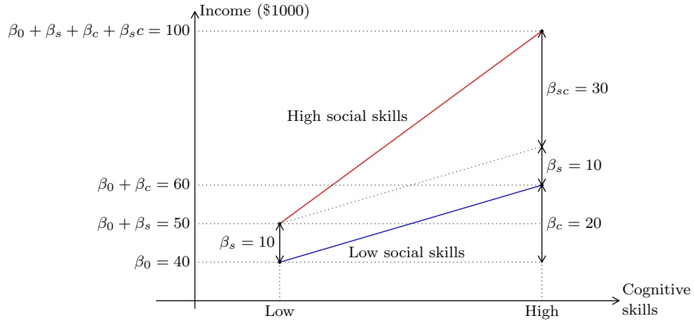

Figure 2.12: Interpretation of interaction effects. The blue line depicts the relationship between income and social skills for low-social-skill individuals, and red line that for the high-social-skills individuals.

Interaction effects are a popular way to add flexibility to the linear regression and other similar models. The result is not linear any more in the original features (social×cognitive is not a linear term!) but it is still a linear function in the extended feature set where social×cognitive forms a separate feature. But the added flexibility comes with a cost—more complex interpretation. While the model (2.1.40) is not hard to interpret, we have lost the beauty of the original model: $\beta _ { 1 }$ and $\beta _ { 2 }$ are not the universal effects of social and cognitive skills any more. The effect of one factor depends on the level of another factor.<sup>13</sup>

One can easily extend the interaction effects to multi-category variables, and to continuous variables. It is also easy to introduce 3-way interactions but those are substantially more demanding to interpret. However, if we are only interested in prediction then interpretation is not a major concern.

<small><span class="docvortex-page-footnote" data-block-type="page_footnote" style="color:#6b7280">13<sub>In</sub> certain literature, in particular in psychology, the sentence is often phrased as “the effect of one variable is moderated by another one”.</span></small>

<!-- page: 174 -->

Example 2.10: Importance of social skills

<div class="docvortex-algorithm" style="white-space: pre-wrap; font-family:monospace;">
Deming (2017) analyzes the effect of cognitive and social skills on wage. He uses NLSY data$^{a}$ to establish cognitive skills, and workplace occupational requirements to associate jobs with social skills. Both skills variables are standardized, i.e. their average value is zero. He uses a linear regression model of the form

log wage$_{i}$ = $\beta_{0}$ + $\beta_{1}$ · cognitive skills$_{i}$ + $\beta_{2}$ · social skills$_{i}$ +
+ $\beta_{3}$ · cognitive skills$_{i}$ × social skills$_{i}$ + $\beta_{4}$ · $X_{i}$ + $\epsilon_{i}$ (2.1.41)

where $X$ are the other individual characteristics besides of the skills. His results are

variable effect std.error
cognitive skills 0.206*** 0.007
social skills 0.049*** 0.006
cognitive×social 0.019*** 0.006
$R^{2}$ 0.344

where *** means the estimate is significant at 1% confidence level. These outcomes have the following interpretation (see Section 2.1.6 on page 152):
• One unit larger cognitive skills$^{b}$ are related to 0.206 units larger log income (i.e. e$^{0.206}$ = 1.220 times larger wage, see log-transformation) for those with social skills equal to zero (i.e. average social skills).
• One unit larger social skills are associated with 0.049 units larger log wage (i.e. e$^{0.049}$ = 1.05 times larger wage) for those with cognitive skills zero (i.e. average cognitive skills).
• There is an additional log wage premium 0.019 (i.e. e$^{0.019}$ = 1.019 times larger wage) for workers with both social and cognitive skills one unit above the mean. If both skills are two units above the mean, the log-premium is four times as large and the wage is e$^{4.0.019}$ = e$^{0.076}$ = 1.079 times larger.
This is the central results of the study: cognitive skills are more valuable for workers with high social skills. Equivalently, this can be put in the other way around: social skills are more valuable for workers with high cognitive skills.

$^{a}$National Longitudinal Survey of Youth
$^{b}$“Unit” in case of standardized features is their standard deviation.
</div>

## Exercise 2.14: Global warming and polar warming

<div class="docvortex-algorithm" style="white-space: pre-wrap; font-family:monospace;">
You are analyzing the temperature over time globally and in the Northern polar areas. You look at two time periods, 1990-s and 2020-s, and two regions, globe and north polar areas. You use a regression model in the form: $T_{i} = \beta_{0} + \beta_{1} \cdot t_{2020i} + \beta_{2} \cdot North_{i} + \beta_{3} \cdot t_{2020i} \times North_{i} + \epsilon_{i},$ where $T$ is the temperature anomaly, $t_{2020}$ denotes if the observation is taken in
</div>

<!-- page: 175 -->

1990-s (0) or 2020-s (1), and North denotes if it is global temperature $( N o r t h = 0 )$ or North polar temperature North = 1.

You’ll get the following results:

• $\beta _ { 0 } = - 0 . 1$

• $\beta _ { 1 } = 0 . 5$

• $\beta _ { 2 } = - 0 . 3$

• $\beta _ { 3 } = 0 . 4 .$

All these coefficients are statistically significant.

Before you compute any predictions, tell if the north polar areas are warming faster than the rest of the world.

• Predict temperature in both regions in 1990s and in 2020s.

Sketch a figure, similar to 2.12 where you show the temperature over time using two lines, one for the globe and one for the northern polar areas.

Sketch a similar figure, but now show the temperature anomaly as a function of two regions using two lines, one for 1990s, one for 2020s.

Solution on page 503.

## When to use interactions?

When do we want to include interaction effects to the model? And what kind of interaction effects? This is something we have to decide, as the number of possible interaction effects will easily get out of hand. For instance, in case of three explanatory variables, $x _ { 1 } ,$ x<sub>2</sub> and $x _ { 3 }$ , the model with full interaction effects will be

$$
\begin{array}{r} y _ {i} = \beta_ {0} + \beta_ {1} x _ {1} + \beta_ {2} x _ {2} + \beta_ {3} x _ {3} + \\ + \beta_ {1 2} x _ {1} x _ {2} + \beta_ {2 3} x _ {2} x _ {3} + \beta_ {3 1} x _ {3} x _ {1} + \\ + \beta_ {1 2 3} x _ {1} x _ {2} x _ {3} + \epsilon_ {i}. \end{array}\tag{2.1.42}
$$

Note that this also includes a 3-way interaction effect $\beta _ { 1 2 3 }   x _ { 1 }   x _ { 2 }   x _ { 3 }$ Interpreting such a model is rather complicated, it also has more stringent data requirements than a model without any interaction effects. So we cannot just include all kinds of interaction effects in all models.

There are a few good reasons to include these effects.

First, it may help to in terms of allowing the effect of interest to be more flexible. As the artificial example above shows, we may want to allow the effect of cognitive skills to depend on the level of social skills. Interaction effects is one convenient way of achieving this.

This usually only makes sense for the effect of interest, not for other variables. For instance, we might also include age and education interaction in the same model, but that would make the model more complicated, without necessarily given us any more insight. After all, we are interested in cognitive and social skills, not age and education. However, we might also include an interaction term between cognitive skills and age–this will add even more flexibility, and allow the skills to have different effect at different age. In contrary, interaction between skills and education may be hard to interpret as education is very closely related to skills anyway.

<!-- page: 176 -->

Another reason to include interaction effects is related to predictive modeling. In predictive modeling, we are typically not interested in interpretation, and hence the model complexity is not of major concern. However, when we introduce too much flexibility to the model, then we may run into overfitting (see Section 4.5 Overfitting and Validation, page 248). So even in that case it is better not to introduce too many interaction effects. One can use standard model selection tools, such as forward selection, to assess whether the particular terms are worth including into the model.

So in case of inferential modeling, one typically only includes interactions of the effect of interest, and a few other variables where we either expect to see a strong relationship, or which’ relationship we are particularly interested. Here are a few potential examples:

• Effect of a vaccine: we may want to know how does effect of this drug depends on other medications the patients are taking. Such side effects may be critical in determining the cure. Hence we may include multiple interaction effect in the form

$$
\begin{array}{r l} & {\dots + \beta_ {v} \times \text {vaccine} + \beta_ {i} \times \text {ibuprofen} + \beta_ {a} \times \text {antidepressant} +} \\ & {\qquad + \beta_ {v i} \times \text {vaccine} \times \text {ibuprofen} + \beta_ {v a} \times \text {vaccine} \times \text {antidepressant} + \dots} \end{array}
$$

We may include an interaction effect gender, but only if we have good reasons to believe that male and female bodies may react differently to the particular vaccine (e.g. because it affects certain hormones). We probably do not want to include interactions with time if there is little reason to think that the effect will change from year-to-year.

Effect of free-trade agreement on businesses. We may want to allow the effect to depend on the business sector as, e.g. firms in easily tradable manufacturing goods sector may face different opportunities than much less tradable service sector. We may also want to include interaction with time, as the new developments, spurred by the agreement, may take several years to materialize. However, gender of the CEO is probably irrelevant (unless this is our research question), so we do not want to include the corresponding interaction effect.

## TBD: Examples from the literature

Finally, interaction effects are not the only way to introduce more flexibility to the model–instead of differences, captured by the interaction effect, one may estimate the levels for all groups separately. We do not discuss this approach in this book.

## Interaction Effects and Intersectionality

Interaction effects is the linear regression way to assess intersectionality. The concept of intersectionality refers to the fact that many important experiences by individuals who belong to multiple groups cannot be described as only a sum of experiences by members of one and only one of those groups. The concept of intersectionality is typically used in context of discrimination. For instance, it may not be correct to describe the experience of a black women as a sum of experience of black (men) and

<!-- page: 177 -->

(white) women. A workplace that treats black men equally to white men, and white woman equally to white men, may still treat black women in a unfair fashion: the trait of being black and the trait of being woman “intersect”.

We can transform this example into a regression model. Assume “treatment” here means wage the workers of the particular group receive (we can as well use use other “treatments”, such as promotion, hiring, or harassment). We can write a linear regression model for wage as

$$
w _ {i} = \beta_ {0} + \beta_ {r} \cdot r a c e _ {i} + \beta_ {s} \cdot s e x _ {i} + \epsilon_ {i}\tag{2.1.43}
$$

where $w _ { i }$ is wage of individual i. If we model income in this way, the “treatment” (i.e. wage) is just sum of the treatment of the corresponding race parameter $\beta _ { r }$ and sex parameter $\beta _ { s }$ . There is no intersectionality. However, if we add the interaction effect

$$
w _ {i} = \beta_ {0} + \beta_ {r} \cdot r a c e _ {i} + \beta_ {s} \cdot s e x _ {i} + \beta_ {r s} \cdot r a c e _ {i} \times s e x _ {i} + \epsilon_ {i}\tag{2.1.44}
$$

then the treatment is “made $\mathrm { o f } ^ { \flat \flat }$ three components: treatment of the corresponding race group, the corresponding gender, and the “intesectional effect” $\beta _ { r s }$ . The members of particular race and gender may receive wage that differs from the sum of just race effect and just gender effect.

Note also that in linear regression we are always working with average values, e.g. looking for average salaries of whites and non-whites, and of men and women. Such aggregated approach has certain parallels with group prejudices. It is easy to look at, say, $\beta _ { s }$ only, and claim that this number describes all women. This is not correct, the number describes the difference between male average and female average for all man and women in this sample. Also, it is important to understand that models (2.1.43) and (2.1.44) only address the size of male-female difference, not its cause.

<!-- page: 178 -->

## 2.1.9 Feature Transformation

**Prerequisites:** Log-normal distribution, page 78

**Standardization** TBD: standardized features

**Log-transformation** Many types of data, such as income or price, have a well-defined lower bound but no obvious upper bound. The corresponding distributions tend not to look normal but are more similar to log-normal (Figure 2.13) and hence violate the assumptions we need to compute standard errors (see Section 2.1.10, page 173). An obvious remedy is to analyze log-income instead of income and in empirical literature income analysis is almost universally done in log form. In such case, transforming your outcome variable into log outcome has two main advantages, one theoretical and one data-driven.

1. If distribution of log-income is more similar to normal, the issue of violating the normality assumption is likely small. This is the theoretical advantage.

2. Second advantage is data driven, and is typically correct in this type of data. Namely, log transformation improves the predictive power of the model (increases $R ^ { 2 } )$ , often by a substantial amount. This, in turn, is related to the fact that this type of data is often created not by additive processes but by multiplicative processes (see below).

Let’s analyze the effect of log-transform in context of simple regression. When transforming the outcome to log y, we can write the model as

$$
\log y _ {i} = \beta_ {0} + \beta_ {1} \cdot x _ {i} + \epsilon_ {i}.\tag{2.1.45}
$$

Taking exponent of both sides we can transform it back to non-log form:

$$
y _ {i} = \mathrm{e} ^ {\beta_ {0}} \cdot \mathrm{e} ^ {\beta_ {1} \cdot x _ {i}} \cdot \mathrm{e} ^ {\epsilon_ {i}}.\tag{2.1.46}
$$

This is not a linear model but a multiplicative model: $y$ is not a sum but a product of three different terms:

1. $\mathrm { e } ^ { \beta _ { 0 } }$ is the value of y in case both x = 0 and ϵ = 0. This is the analogue of intercept.

2. $\mathrm { e } ^ { \beta _ { 1 } }$ describes the relationship between y and one unit larger x: the cases that have one unit larger x have outcome y larger by $\mathrm { e } ^ { \beta _ { 1 } }$ times.

3. and finally, $\mathbf { e } ^ { \epsilon _ { i } }$ is the (multiplicative!) error term.

The second advantage, in other words, is an empirical regularity: it appears that fat-tailed outcome can typically be better explained by multiplicative models instead of additive models.

Finally, we also discuss the interpretation. The basic interpretation of the model is always the same but as our outcome now is log y, we now have that one unit larger

<!-- page: 179 -->

## 2.1. LINEAR REGRESSION

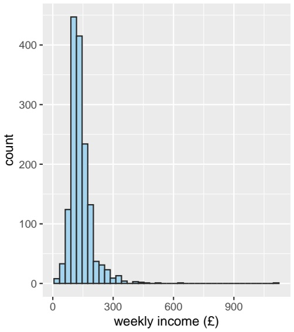

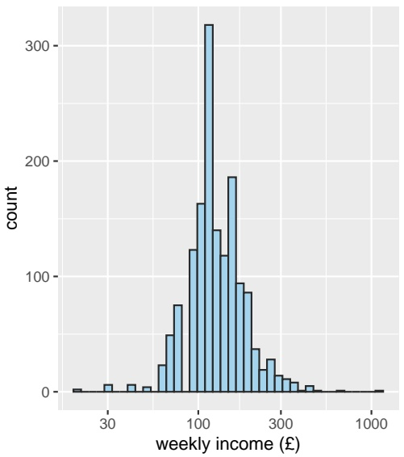

Figure 2.13: Distribution of UK household income in early 1980-s. Income distribution (left panel) does not look normal, it has a long thin tail of high-income households reaching up to weekly income 1000£. Log income (right panel) is fairly close to normal as logarithm spreads low-income observations out and squeezes the high-income ones closer together. Ecdat package data.

x corresponds to $\beta _ { 1 }$ units larger log y (not y!). When transforming the model back into non-log form (outcome is y, not log y), we can restate the interpretation as one unit larger x is associated with $\mathrm { e } ^ { \beta _ { 1 } }$ times larger y. If $\beta _ { 1 }$ is small, then $\mathrm { e } ^ { \beta _ { 1 } } \approx 1 + \beta _ { 1 }$ and we can say that it describes how many percent larger y we tend to observe when x is larger by one unit.<sup>14</sup> For instance, if $\beta = 0.1,   \mathrm{e}^{\beta} = 1.105 \approx 1.1$ . Remember, this is a multiplicative effect and hence we can say that one unit larger x is associated with 10 percent larger y.

Example 2.11: How does income depend on age?

Let us use the same UK budget dataset as in Figure 2.13 above. The data include age of the household head (between 19 and 60). We convert this to four age categories (-29, 30-39, 40-49, 50-) and estimate the regression model in the form

$$
\log y _ {i} = \beta_ {0} + \boldsymbol {\beta} ^ {\top} \boldsymbol {a} _ {i} + \epsilon_ {i}
$$

where a is a vector of the corresponding age category dummies. The results are

<small><span class="docvortex-page-footnote" data-block-type="page_footnote" style="color:#6b7280">10β≠1+β</span></small>

<small><span class="docvortex-page-footnote" data-block-type="page_footnote" style="color:#6b7280">14<sub>Note</sub> that this interpretation does not hold if one uses decimal logarithm instead of natural logarithm because 10 ̸≈ 1 + β even if β is small.</span></small>

<!-- page: 180 -->

|  | Estimate | Std. Error | t-value | Pr(>\|t\|) |
| --- | --- | --- | --- | --- |
| Intercept | 4.669 | 0.018 | 258.26 | 0.000 |
| 30-39 | 0.213 | 0.022 | 9.49 | 0.000 |
| 40-49 | 0.297 | 0.028 | 10.69 | 0.000 |
| 50- | 0.174 | 0.046 | 3.79 | 0.000 |

• The reference category is the “-29”, the one that is missing in the table.

Intercept indicates that the expected log-income for households in the reference category is 4.669.

30-39 indicates that houselds where the head is 30-39 years old earn 0.213 more in log-units (in average). This means they earn $\mathrm{e}^{0.213} = 1.237$ times more, or 23.7 percent more than the reference category.

Analogously, $4 0 - 4 9$ year old households earn 0.297 more in log-units, i.e. $\mathrm{e}^{0.297} = 1.345$ times more, or 34.5 percent more than the reference category.

Finally, the over-50 households earn more than the reference category but less than the middle-aged households.

$R ^ { 2 }$ of the model is 0.082. For comparison, $R ^ { 2 }$ of linear model, without logtransforming income, is 0.063, indicating that log-transform improves the model. This is not an impressive number, but realistically, we should not expect to be able to predict household income well based just age of its head.

## Exercise 2.15: Wheat yield and $\mathbf { C O _ { 2 } }$

<div class="docvortex-algorithm" style="white-space: pre-wrap; font-family:monospace;">
You are an agricultural researcher analyzing the effect of $\mathrm{CO}_{2}$ concentration on the wheat yields. You estimate a linear regression model in the form
$\log y_{i} = \beta_{0} + \beta_{1} \cdot c_{i} + \beta_{2} \cdot T_{i} + \beta_{3} \cdot w_{i} + \epsilon_{i}$
where $y_{i}$ is the yield, $c_{i}$ is the $\mathrm{CO}_{2}$ concentration, $T$ is the temperature and $w$ is the amount of water in the experiment $i$. You find $\beta_{1} = 0.007$.
    1. How do you interpret $\beta_{1}$?
    2. Based on your experiment, can you say that global warming will improve wheat yields?
Solution at page 503
</div>

**Log-log transformation** In certain type of data, it may be advantageous to logtransform not just y but also x and hence to look at the model

$$
\log y _ {i} = \beta_ {0} + \beta_ {1} \log x _ {i} + \epsilon_ {i}.\tag{2.1.47}
$$

<!-- page: 181 -->

The standard interpretation sounds like “log y is larger by $\beta _ { 1 }$ units in observations that have log x larger by one unit”. In order to find the interpretation of $\beta _ { 1 }$ , we can again take exponent of both sides. We get

$$
y _ {i} = \mathrm{e} ^ {\beta_ {0}} \cdot x _ {i} ^ {\beta_ {1}} \cdot \mathrm{e} ^ {\epsilon_ {i}}.\tag{2.1.48}
$$

This models suggests it is worthwhile to look at a case where x is larger by a certain proportion, say by α percent. In that case y will be larger $( 1 + \alpha ) ^ { \bar { \beta } _ { 1 } }$ times. If we choose a small α (for example, 1 percent, i.e. $\alpha = 0 . 0 1 )$ , this is approximately equal to $( 1 + \alpha ) ^ { \beta _ { 1 } } \approx \dot { 1 + \alpha \beta }$ . Hence we can interpret it as how many percent is y larger when x is larger by one percent. This figure is often called elasticity. Compare the interpretation of log-transformed and log-log transformed data. In the former case we find percentage increase per unit increase in x, in the latter percentage increase per one percent increase in x. Cheatseet 2.6 summarizes the interpretation of the regression coefficients. As multiple regression model can include both log-transformed and not log transformed predictors, different model estimates may have to be interpreted in different ways.

## Example 2.12: Linear, log-linear, and log-log transformations

We use linear regression to analyze the relationship between price and mass of diamonds (data from R pacakge ggplot2). Figure 2.14 shows the relationship for no transformation, log-transformation, and log-log transformation. Just a visual impression suggests that the latter fits best to a line.

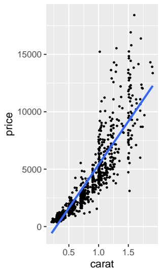

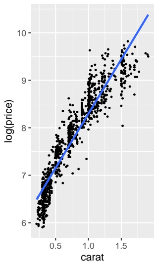

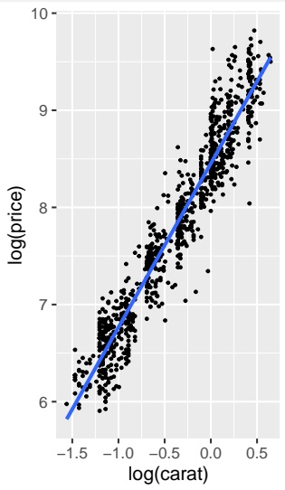

Figure 2.14: Diamond mass (carat=0.2 gram) and price data, including the corresponding regression lines. Left panel shows the linear model in price and carat. One can see that the line does not capture the convex pattern in data. Middle panel shows a model that is linear in log price and carat. Now the data pattern in concave and again the line fails to capture it well. On the right panel we log-transform both variables, and the result looks very good visually.

<!-- page: 182 -->

Next we analyze how do the corresponding linear regression models look like:

Table 2.7: Results of three different regression models: linear-linear, log-linear, and log-log.

<table><tr><td>.</td><td>object.</td><td>..</td><td>..</td></tr><tr><td rowspan="2">Intercept</td><td>-2168.681***</td><td>6.009***</td><td>8.453***</td></tr><tr><td>103.405</td><td>0.023</td><td>0.011</td></tr><tr><td rowspan="2">carat</td><td>7556.126***</td><td>2.289***</td><td></td></tr><tr><td>121.275</td><td>0.027</td><td></td></tr><tr><td rowspan="2">log(carat)</td><td></td><td></td><td>1.687***</td></tr><tr><td></td><td></td><td>0.016</td></tr><tr><td># obs</td><td>953</td><td>953</td><td>953</td></tr><tr><td>R2</td><td>0.8032</td><td>0.8796</td><td>0.9224</td></tr></table>

## TBD: other kind of feature engineering

Cheatsheet 2.6: Log transformations in linear regression

| The table below summariz els. | es interpretation of linear, log-linear and log-log mod- |
| --- | --- |
| Type | Interpretation of β<sub>1</sub> |
| linear-linear (y ∼ x) | one unit larger x is associated with β<sub>1</sub> unit larger y |
| log-linear (logy ∼ x) | one unit larger x is associated with β<sub>1</sub> pct larger y (only holds for small β<sub>1</sub> values) |
| linear-log (y ∼ logx) | one pct larger x is associated with β<sub>1</sub>/100 units larger y (only holds for small β<sub>1</sub> values) |
| log-log (logy ∼ logx) | one pct larger x is associated with β<sub>1</sub> pct larger y |

<!-- page: 183 -->

**Non-linear regression** Linear regression assumes a linear relationship between y and and extended features, not necessarily between y and x.

TBD: What it is and why OLS is called linear

TBD: Polynomial regression

## 2.1.10 Theoretical considerations

## Assumptions in OLS Models

Linear regression is not universally correct. In order for the coefficients to be inter pretable, the standard errors and t-values to be correct, and predictions to be reliable we need a number of assumptions. Fortunately, as we defined the model in a rather rigorous way, we also have precise assumptions. This is fortunately, because we can now analyze each particular model, dataset, and process we are modeling, and analyze how likely it is that the assumptions are satisfied, and what happens if they are not.

Here we list just the most relevant assumptions we use in these notes:

1. **The model is correctly specified**. This means that the process we are analyzing is actually well described by a linear relationship, and not with something else, e.g. a curve. This is obviously important in order to talk about “correct” β-s, if the model is wrong to begin with then there is not such thing as correct β-s. This is typically not a problem for noisy data (human behavior–related data tends to be noisy), and it is also good fit for many other type of relationships. But not for every relationship. If the underlying process is not well approximated with a linear model, then the regression estimates describe some sort of average relationship, which may or may not be good for our purpose.

2. **Mean-zero error term** E $\epsilon = 0$ . This is effectively normalization. It is almost always a harmless assumption, unless we are interested in the exact value of the intercept. But as we rarely are, so this assumption is rarely a problem.

3. **Normal errors** $\epsilon \sim N ( 0 , \sigma ^ { 2 } )$ . Normally distributed errors are needed for correct t-values. However, if the normality is not violated too much then we can still rely on the z-values in large samples through central limit theorem. But if deviations from normality are large, then the errors can be misleading even in large samples. Large deviations usually mean some sort of fat-tailed distributions, e.g. when analyzing a sample with many large outliers. Often a remedy is to take a log of the original variable.

4. **Independent error terms**. Error term of one observation must not influence the error of another observation. If it does, our standard errors may be very misleading. This is typically a problem in two types of data:

(a) temporally or spatially related data, e.g. time series or geographic data. Stock price yesterday influences stock prices today, and house prices in a neighboring town influence house prices in this town.

(b) clustered data, i.e. in stratified samples. For instance, drug use by high school students is not independent but affected by their peers, many of whom also attend the same schools.

<!-- page: 184 -->

These problems can be corrected through fairly straightforward methods, but you have to choose an correction method that is appropriate to the nature of the data.

5. **Explanatory variables and error term are independent**: x ⊥⊥ ϵ. (note: the previous assumption was about error terms of different observations, this is about x and ϵ of the same observation.) This is needed to get correct estimates of $\beta .$ It is fairly harmless if we are only interested in association (i.e. non-causal relationship)–we just report that those who have more education also earn more. However, this is the crucial problem for causal inference, i.e. if we want to tell how much will someone’s income improve if she were to take a college degree.

One should test the assumptions as needed when working with linear regression models. What and how do you test depends on the nature of the problem and data as some of the violations may be harmless.

<!-- page: 185 -->

## 2.2 Logistic Regression

The previous section introduced linear regression, one of the central workhorses for inferential analysis. The main requirement for the linear regression is that the outcome variable, y, is continuous, or at least close to continuous. This was the case with both galaxies and income.

However, for a large class of problems, this is not the true. For instance, the question whether someone survived the shipwreck, whether a tweet will be retweeted, and whether an oil drill gets stuck in the drillhole cannot be described with continuous outcome. The passenger either survived or not, and a tweet was retweeted or not. Even if we describe these outcomes with numbers (e.g. survival as “1” and death as $`` 0 ''  )$ , the result is not a continuous problem. We need different tools for this type of tasks.

## 2.2.1 What Is Logistic Regression And What Is It Good For?

Consider policymakers during economically challenging times. Unemployment is large and work is nowhere to be found. Government is spending lot of money on benefits and the voices that are concerned about the effect on workers’ motivation and governments coffers are growing in strength. But actually–it is not just that work is nowhere to be found. There are plenty of jobs available. But unfortunately those jobs require different skills, skills that most unemployed do not possess. So government comes up with idea to upskill the unemployed instead of just paying benefits. It announces a subsidized training program where all unemployed are welcome to participate. But who will actually end up joining this program?

Table 2.8: An example of “Treatment” data. treat is treatment, “T” mean the person participated and ${ } ^ { \circ }   F ^ { \prime \prime }$ means they did not participate in a training program. re denotes real income (in USD) and u unemployment in years 1974-1978.

| treat | age | educ | ethn | married | re74 | re75 | re78 | u74 | u75 |
| --- | --- | --- | --- | --- | --- | --- | --- | --- | --- |
| F | 31 | 12 | other | T | 13715 | 12532 | 14777 | F | F |
| F | 21 | 12 | other | T | 11756 | 10742 | 6650 | F | F |
| F | 27 | 14 | other | T | 23511 | 22558 | 23531 | F | F |
| F | 34 | 12 | black | T | 15674 | 15755 | 17733 | F | F |
| F | 52 | 8 | other | T | 5290 | 0 | 6798 | T | F |

Let us analyze this question using [“Treatment”](https://bitbucket.org/otoomet/lecturenotes/raw/289c668c21d210df3825323a238ae26813511864/data/treatment.csv.bz2) dataset (R package Ecdat). The dataset describes various labor market–relevant variables, such as education, income and unemployment, but for now, let’s focus only on age (see Table 2.8 for an example). Are the participants more likely young or old? Figure 2.15 displays the relationship between participation and age. The graph looks a bit weird, this is because there are only two possible values for participation–either 1 (participated) or 0 (did not participate), and only integer values for age. In order to avoid too much overlap, we have knocked the points a bit off from their true location so we get a small point cloud for each age and participation combination. The figure reveals that most

<!-- page: 186 -->

participants (Participation = 1) are young. It is hard to see the age distribution of non-participants–the black dots overlap quite a bit, but it seems the most common age range in this dataset is 20-30.

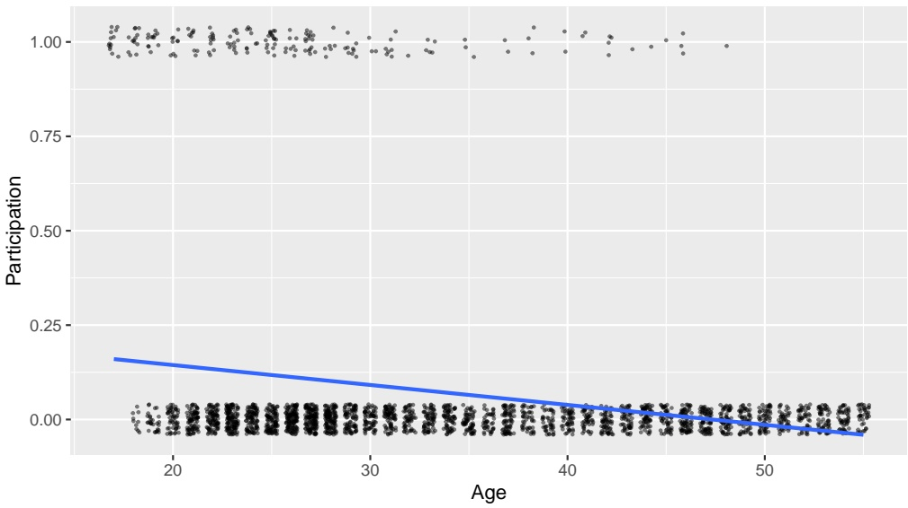

Figure 2.15: Participation as a function of age. Treatment data. In order to avoid overlap on the plot, the points are moved slightly off from their true location. The blue line is the linear trend line.

The model also displays trend line (regression line, blue). But unlike in case of Hubble diagram (Figure 2.9) where the dots were aligned with the regression line, more-or-less, the line here seems to miss the dots almost completely. Why does linear regression behave so miserably?

The main culprit is the fact that the outcome is a binary variable. Treatment status can only be “0” or “1” and nothing in between. But a line cannot touch just one or another of these values, a line also connects everything in between. So we necessarily see values like “0.1” and “0.5”, numbers that do not make any sense in terms of treatment. The way to overcome this problem is to interpret the outcome not as the treatment value, but probability that the individual is treated. So a value “0.5” would mean fifty-fifty probability that someone is treated while “0.99” would mean that the person almost certainly participated. Taking this view, the trend line suggests that the probability for a 20-year old to participate is approximately 15%, but for a 40-year old the probability is more like 5%.

In fact, this approach is widely used and a linear regression model that describes probability is called linear probability model (LPM, see Section 2.3). But LPM-s also have another problem. You can see that the line falls below zero around age 46. Should we interpret it as the 50-year olds have a negative probability to participate? That is obviously nonsense. In a similar fashion, the line will exceed probability 1

<!-- page: 187 -->

somewhere (the age where this happens will be negative in this case, so it is not a problem here). We can obviously hack the model in a way that we set probability to zero if the predicted probability is negative. But what should we do with the 48-year old participant then (the oldest participant in Figure 2.15 is 48 years old)? If the participation probability at that age is zero then we should not see even a single participant in that age category. But we see a few, so we need to set the probability not to zero but to a small positive number... If you are still with me then you probably agree that making linear regression to work with probabilities needs a lot of hacking, and the model is not a nice and intuitive any more. So we need another model that a) models probability Pr(outcome = 1), not the value of outcome; and b) ensures that the probability is in [0,1] interval.

There is a wide range of applications with binary outcomes where can such a model is handy. For instance, if someone attends college, gets a job, defaults a loan, that an email is spam, or that an image depicts a cat are all binary-outcome questions. And linear regression is not well suited to answer such questions.

Logistic regression (aka logit) is the most popular model designed for exactly this type of tasks, the tasks with binary outcome. “Binary outcome” means these questions can only have two answers–”0” or “1”, “true” or “false”, “cat” or “not a cat”. This makes it distinct from linear regression that is designed to measure continuous outcomes, i.e. outcomes that can take all sorts of numeric values. Whether the outcome is numeric or something else plays almost no role for logistic regression, we can always transform two possible outcomes into “0” and “1”. This is what we did with with treated and non-treated above.

## Exercise 2.16: Linear or logistic regression?

```txt
Would you use logistic or linear regression to analyze these questions:
1. How long will cancer patients survive after treatment?
2. How good is students' GPA?
3. Who gets admitted to an elite school?
4. Will the tweet be retweeted?
5. How many people will read the tweet?
6. Who survived a shipwreck?
Solution on page 504
```

Mathematically, it is essentially a transformation of linear regression model that is interpreted as probability. The transformation is done using logistic function (aka sigmoid function)

$$
\Lambda (\eta) = \frac {\mathrm{e} ^ {\eta}}{\mathrm{e} ^ {\eta} + 1} = \frac {1}{1 + \mathrm{e} ^ {- \eta}}.\tag{2.2.1}
$$

Here one can understand η as the “output” of linear regression, and $\Lambda ( \eta )$ is logistic transformation of η, (see Figure 2.16). It has two properties that make it a perfect fit for probability modeling:

• It is monotonically increasing, i.e. a larger η always corresponds to a larger Λ(η). This makes it a good choice to model the fact that we typically see smooth transitions in data, such as older workers are less likely to participate as in Figure 2.15.

<!-- page: 188 -->

• Its values are strictly in the interval (0,1). So these are directly interpretable as probabilities and we do not need any further hacks.

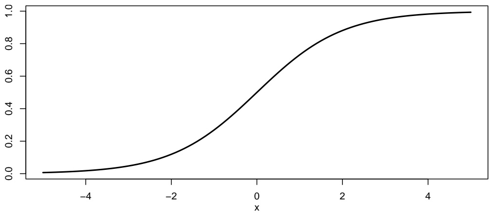

Figure 2.16: Logistic function (logistic transformation). While the input variable η can have any value in (−∞, ∞), $\Lambda ( \eta )$ is limited to interval (0,1). This is what makes it suitable for modeling probability.

$\mathbf { \beta } ^ { ^ \mathsf { T } } \cdot \mathbf { x } = \beta _ { 0 } + \beta _ { 1 } \cdot x _ { 1 } + \ldots \beta _ { K } \cdot x _ { K }$ See Section 5.3.2 Vector multiplication as matrix product, page 279 and Section 2.1.6 Formal Definition of Multiple Regression, page 155.

More specifically, η in the logistic regression formula (2.2.1) is not called “linear regression output” but link, linear predictor or linear index. But it is calculated in exactly the same way as the predicted value for linear regression: $\eta _ { i } = \beta _ { 0 } + \beta _ { 1 } \cdot x _ { i }$ in case of a single explanatory variable, or in vectorized form as $\theta _ { i } = \beta ^ { ^ { \intercal } } \cdot x _ { i }$ in case of multiple explanatory variables. So we can write the logistic probability in a slightly longer form as

$$
\Lambda (\boldsymbol {x}) = \frac {1}{1 + \mathrm{e} ^ {- \boldsymbol {\beta} ^ {\top} \cdot \boldsymbol {x} _ {i}}}.\tag{2.2.2}
$$

This is the expression for the probability that the outcome is $^ { \circ } 1 ^ { \circ }$ for given values of x. For completeness, we state it once again:

Logistic regression model

$$
\Pr (Y = 1 | \boldsymbol {x}) = \frac {1}{1 + \mathrm{e} ^ {- \boldsymbol {\beta} ^ {\top} \cdot \boldsymbol {x}}}.\tag{2.2.3}
$$

This must be understood as the rule to compute the probability that the outcome $Y   =   1$ if the value of the explanatory variable is x. Exactly as in case of linear regression, we have to find such parameter vector $\beta$ that gives the “best” fit with data.

(2.1.4): $y _ { i } = \beta _ { 0 } + x _ { i } \cdot \beta _ { 1 } + \epsilon _ { i }$

Note another important difference between logistic and linear regression models. Namely, the logistic regression (2.2.3) does not contain an error term while the linear regression (2.1.4) does. This is because in case of linear regression we are modeling

<!-- page: 189 -->

outcome value, and we need an error term to take into account the fact that the modeled and actual values almost always differ. But in case of logistic regression, we model probability, which means that the event may happen or not happen. Probability describes a process that is already stochastic, so we do not need an additional error term.

Let us demonstrate these calculations using treatment data above (Figure 2.15). But before we can even calculate anything, we have to specify which event are we modeling—are we modeling probability of treatment or non-treatment? In this case it seems more natural to model probability of treatment, $\operatorname* { P r } ( T = 1 )$ instead of $\operatorname* { P r } ( T =$ 0). It is often useful to model probability of the “rare” events, or probability of “interventions”. Treatment checks both boxes here as only $\sim   7 \%$ of cases in data are treated, and treatment is more “active” process than non-treatment. But both approaches are equally valid, one has to make a decision and stick with that.

As we look at how the treatment probability depends on age, we have a single explanatory variable $x ,$ namely age, and we can write

$$
\begin{array}{c} \eta_ {i} = \beta_ {0} + \beta_ {1} \cdot a g e _ {i} \\ \Pr (T _ {i} = 1) = \frac {1}{1 + \mathrm{e} ^ {- \eta_ {i}}} = \frac {1}{1 + \mathrm{e} ^ {- \beta_ {0} - \beta_ {1} \cdot a g e _ {i}}}. \end{array}\tag{2.2.4}
$$

In order to actually calculate the probability of treatment, we have to pick $\beta _ { 0 }$ and $\beta _ { 1 }$ values.

For instance, let’s just guess that the values 0 and −0.1 for $\beta _ { 0 }$ and $\beta _ { 1 }$ respectively, and compute the participation probability for a 30-year old person. We have

$$
\Pr (T = 1 | a g e = 3 0) = \frac {1}{1 + \mathrm{e} ^ {- \beta_ {0} - \beta_ {1} \cdot a g e}} = \frac {1}{1 + \mathrm{e} ^ {- 0 + 0 . 1 \cdot 3 0}} = \frac {1}{1 + \mathrm{e} ^ {3}} \approx 0. 0 4 7.\tag{2.2.5}
$$

So our model, given the choice of parameters, predicts that rougly 5% of 30-year olds will participate. The actual number in data is 0.043. Figure 2.17 shows how the modeled participation probability depends on age for three different sets of parameters. The figure suggests that out of the three combinations displayed there, the one we calculated above $( 0 , - 0 . 1 )$ (blue curve) is close to actual data. The red curve (0, 0.05) gets age dependency completely wrong, and the green curve $( 0 , -   0 . 0 5 )$ suggests participation probabilities that are too high. But it is hard to select good combination of parameters just by visual inspection even for this simple case with a single explanatory variable only. The best set of parameters for logistic regression is usually computed using Maximum Likelihood method (see Section 2.2.3 Solving logistic regression model, page 187). The corresponding probability is shown by the dashed black curve.

When we compute the best possible coefficients (the dashed black line in Figure 2.17), we get the following results:

The results table, as provided by common software packages, looks rather similar to the linear regression table (see Table 2.2). We see similar columns for estimates, standard error, z-value and p-value (obviously, different software packages provide somewhat different output). The meaning of the parameters is rather similar to that of linear regression with two main differences: first, the interpretation of logistic

<!-- page: 190 -->

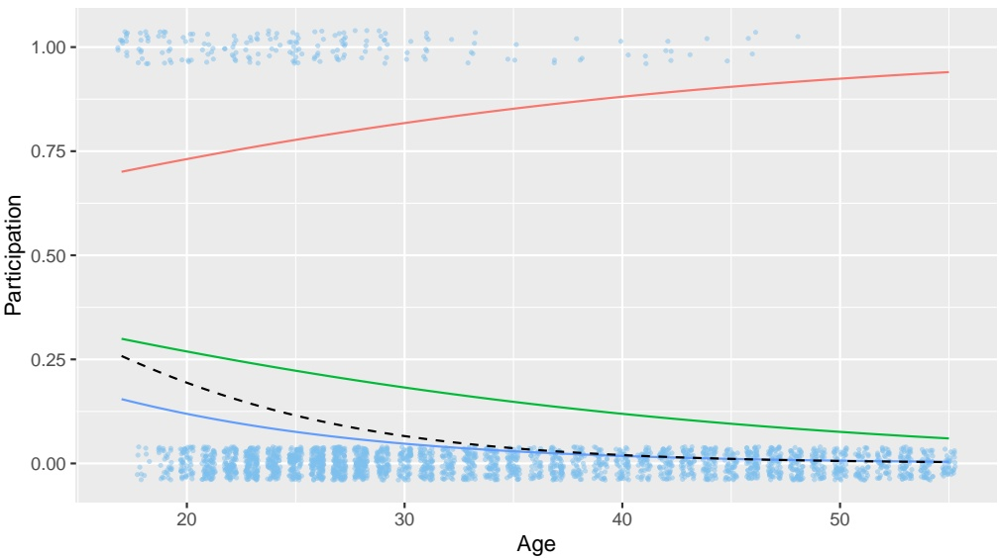

Figure 2.17: The same participation data as in Figure 2.15. The lines depic parameter combinations $( \beta _ { 0 } , \beta _ { 1 } )   =   ( 0 , 0 . 0 5 )$ (red), (0, −0.05) (green) and (0, −0.1) (blue), the black dashed line is the Maximum Likelihood estimate (1.034, −0.123). The red line clearly misses the data, green line captures the pattern of falling participation in age, while the blue line seems to fit well and also capture the fact that partiticpation rate is very low for over 40 year olds.

|  | Estimate | Std. Error | z value | Pr(>\|z\|) |
| --- | --- | --- | --- | --- |
| Intercept | 1.0343 | 0.3300 | 3.13 | 0.0017 |
| age | -0.1229 | 0.0122 | -10.05 | 0.0000 |

coefficients is quite different from that of the linear regression coefficients, so it is explained in the next section (Section 2.2.2 Interpreting logistic regression results, page 181).

See Section 2.1.3 Interpreting the regression table, page 137 above for how to interpret linear regression table.z values are t values where $d f = \infty$ . See Section 1.6.2.

Second, instead of t-values, logistic regression estimates are typically reported with z-values.From practical standpoint, these are fairly similar. Just instead of critical t value, we are concerned with critical z-values. In a similar fashion, z-value measures distance between the estimated coefficient and $H _ { 0 }$ value, and in exactly the same way, the software normally assumes $H _ { 0 }   :   \beta   =   0 .$ The difference between z and t values is primarily in the assumptions. In case of linear regression, for the t values to be correct, the error term ϵ must be normally distributed. In logistic regression, for z values to be correct, the sample size must be large.

<!-- page: 191 -->

Exercise 2.17: Which values are statistically significant?

|  | Coef | Std.err | z |
| --- | --- | --- | --- |
| Education | 0.120 | 0.03 | 4.00 |
| Big city | 0.150 | 0.10 | 1.50 |
| Age | 0.002 | 0.10 | 0.02 |

## 2.2.2 Interpreting logistic regression results

**Prerequisites:** Section 2.1.3 Interpretation, page 134, Section 2.1.6 Interpreting multiple regression effects, page 152.

Logistic regression is in many ways similar to linear regression, including by being an interpretable model. Unfortunately, interpretation of logistic regression results is more complicated than in case of linear regression. There are two related reasons for that. First, logistic regression is a non-linear model, and hence the slope depends on the values of the explanatory variables (see Figure 2.18). And second, because the slope depends on the explanatory variables, we cannot just interpret the parameters $\beta _ { 0 }$ and $\beta _ { 1 }$ directly in terms of probability.

There are two popular ways to overcome these limitations: marginal effects and odds ratios.

## Marginal effects

Marginal effect (ME) is slope of the logistic function on the figure where we have probability on the y-axis and the explanatory variable x (not the link function η) on the x-axis. Marginal effect answers the same question as slope $\beta _ { 1 }$ in case of linear regression: How much more likely is the outcome if x is larger by one unit. In the example above, ME will answer the question How much more likely is that someone will participate given she is one year older. In case of multiple logistic regression we should also the add the phrase given all other explanatory variables are the same. So, in this sense marginal effects are very similar to linear regression coefficients. However, there are two major differences, both of these related to the fact that we now have a non-linear model:

• Marginal effects must be calculated from $\beta \mathrm { - } \mathrm { S } _ { 1 }$ and the calculation is not obvious. Fortunately, modern software will do it with a simple function call.

<!-- page: 192 -->

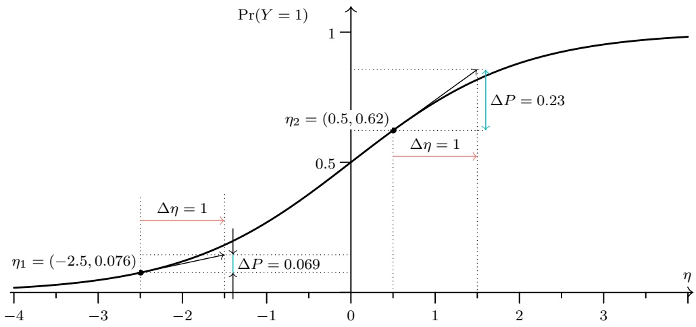

Figure 2.18: Interpretation of logistic regression results. How much larger is $\operatorname* { P r } ( Y = 1 )$ when $\eta$ is larger by one unit, depends on the η value. In this example figure, the probability grows at rate 0.069 per unit of η at $\eta_{1} = - 2.5;$ it grows at rate 0.23 per unit of η at $\eta _ { 2 } = 0 . 5$

• Marginal effects depend on the values of $x .$ So different observations with different x values will have different marginal effects. Hence we must always decide what kind of cases we are interested in. The effect differs case-by-case.

As marginal effect is just slope, we can compute it by taking the derivative of the logistic probability. For instance, in order to compute the marginal effect of age in the example above, we take derivative of the treatment probability (2.2.4):

$$
\frac {\partial}{\partial a g e} \frac {1}{1 + \mathrm{e} ^ {- \eta}} = - \frac {\mathrm{e} ^ {- \eta}}{(1 + \mathrm{e} ^ {- \eta}) ^ {2}} \beta_ {1}\tag{2.2.6}
$$

where $\eta   =   \beta _ { 0 } + \beta _ { 1 } \cdot   a g e$ This is straightforward to compute, but normally we let statistical software do the work.

Figure 2.18 demonstrates the meaning of marginal effects. The thick black curve is the logistic curve as a function of the link $\eta .$ Its slope differs at different points, here we have marked $\eta _ { 1 } = - 2 . 5$ where the slope is 0.069, and $\eta = 0 . 5$ where the slope is 0.23. These numbers—0.069 and 0.23—are the marginal effects $o f \; \eta .$ But we are interested in marginal effect of age instead–how much more likely it is to participate for those who are one year older. Now we have to take into account that η depends on x as $\eta = \beta _ { 0 } + \beta _ { 1 } x$ . Hence one unit larger x means $\beta _ { 1 }$ units larger η and hence the marginal effect of x is just the marginal effect of $\eta ,$ multiplied by $\beta _ { 1 }$

As marginal effects depend on x, we cannot just provide marginal effects that apply universally. Obviously, in case η is very small or very large, the effect will also be very small, while the η values near 0 are associated with larger effects. Typically, one of these three options is reported: a) marginal effect at the mean x value; b) compute all individual marginal effects and takes the average; or $\mathrm { c ) }$ marginal effect for certain specific interesting cases. Example of marginal effect output is in the table below:

<!-- page: 193 -->

| factor | AME | SE | z | p | lower | upper |
| --- | --- | --- | --- | --- | --- | --- |
| age | -0.0075 | 0.0008 | -9.1811 | 0.0000 | -0.0090 | -0.0059 |

The basics of this table are quite similar to that of the logistic coefficients table above. AME is average marginal effect, software computes the marginal effects for every individual in these data and takes the average. SE stands for the standard error of AME, z and p are the corresponding z and p values, and the two last columns are CI for AME.

AME is directly interpretable in a similar fashion like the β-s in linear regression. The number −0.0075 means that:

One year older individuals are 0.0075 less likely to participate in average.

This can be phrased somewhat better using percentage points:

One year older individuals are 0.75 percentage points less likely to participate in average.

And as explained above, if we are working with multiple logistic regression, we should add “... if all other explanatory variables are the same” to the sentence above.

## Exercise 2.18: Job training for the unemployed

```txt
You analyze effect of job training for the unemployed using logistic regression. You estimate the model in a form
Pr(gets a job_i) = Λ(β_0 + β_edu · edu_i + β_part · participated_i)
where gets a job is a dummy indicator if person i found a job, edu is education in years, and participated is a dummy indicator telling if the person participated in the training program.
    1. You find the coefficients to be β_0 = -3, β_edu = 3.2 and β_part = 1. Interpret the coefficients.
    2. You compute marginal effects and find ME_edu = 0.07, ME_part = 0.08. Interpret the marginal effects.
    3. Can you conclude that participating in the job training program improves your chances to get a job?
    4. Do your result mean that those who got a job tend to have better education?
Solution on page 504.
```

## Odds ratios

Another popular way to interpret logistic regression results is through odds ratios. Odds ratio (sometimes called just odds) is simply the ratio of size of the one group to the other. In the example above, it will be the number of participants over the number of non-participants:

<!-- page: 194 -->

$$
r = \frac {N _ {y = 1}}{N _ {y = 0}} = \frac {1 8 5}{2 4 9 0} = 0. 0 7 4.\tag{2.2.7}
$$

So the odds of participation over non-participation is 0.074. Perhaps it is better to say it the way around–odds of non-participation over participation are 13.5. Note that odds ratio is not the percentage of participants in the whole sample, it is the ratio of participants to non-participants!

Odds ratios are a popular way to describe the chances of certain kind of events, such winning chances in horse races. But unfortunately, these ratios are not widely used, so people often do not understand those well.

It turns out that logit coefficients are directly interpretable as effects on logarithms of odds ratios, log-odds. When working with logistic regression, we are modeling probability. Hence we define the odds not as the ratio of counts but as the ratio of probabilities. In the participation example, it will be probability of participation over the probability of non-participation,

$$
r = \frac {\Pr (Y = 1 | \boldsymbol {x})}{\Pr (Y = 0 | \boldsymbol {x})}.\tag{2.2.8}
$$

Again, note that this is the probability of participation divided by probability of non-participation, it is not just a probability.

## Exercise 2.19: Odds and probabilities

<div class="docvortex-algorithm" style="white-space: pre-wrap; font-family:monospace;">
1. Probability of winning (versus losing) is $50\%$. How big are odds of winning?
2. Probability of surviving is 5/6. What are odds of surviving?
3. Odds of seeing the solar eclipse are 1-to-2. What is the probability of seeing it?
Solution on page 505
</div>

From (2.2.3) we can express $\mathrm { e } ^ { { \boldsymbol { \beta } } ^ { \mathsf { T } } \cdot { \boldsymbol { x } } _ { i } }$ as

$$
\mathrm{e} ^ {\boldsymbol {\beta} ^ {\top} \cdot \boldsymbol {x} _ {i}} = \frac {\operatorname* {P r} (Y = 1 | \boldsymbol {x})}{1 - \operatorname* {P r} (Y = 1 | \boldsymbol {x})} = \frac {\operatorname* {P r} (Y = 1 | \boldsymbol {x})}{\operatorname* {P r} (Y = 0 | \boldsymbol {x})}.\tag{2.2.9}
$$

This is exactly the odds ratio.

## Exercise 2.20: Prove (2.2.9)

```txt
Use the logistic regression definition (2.2.3) to derive (2.2.9). Solution on page 505
```

We can use this approach to interpret the logit results in terms of odds ratios. Consider two vectors of explanatory variables, $x _ { 1 }$ and $x _ { 2 }$ . The latter is otherwise equal to the former, except one of $x _ { 2 }$ components, x<sub>2i</sub>, is larger by one unit compared to $x _ { 1 i }$ . So while $\begin{aligned} { \mathbf { \mathit { x } } _ { 1 } = ( 1 , x _ { 1 1 } , x _ { 1 2 } , \ldots , x _ { 1 i } , \ldots , x _ { 1 K } ) } \\ \end{aligned}$ , the $\pmb { x } _ { 2 } = ( 1 , x _ { 1 1 } , x _ { 1 2 } , \dots , ( x _ { 1 i } +$

<!-- page: 195 -->

<div class="docvortex-algorithm" style="white-space: pre-wrap; font-family:monospace;">
Here I list the main differences between linear versus logistic regression:

Model Linear regression models the outcome value:
$y_i = \beta_0 + \beta_1 x_i + \epsilon_i$

Logistic regression models the outcome probability:
$\Pr(y_i = 1) = \Lambda(\beta_0 + \beta_1 x_i)$

Here $x_i$ is the predictor, $y_i$ is outcome, and $\beta$-s are unknown parameters to be estimated; $\Lambda(x) = 1/(1 + \exp(-x))$ is the logistic function (sigmoid function).

Usage Linear regression can be used where the outcome $y$ is continuous variable (e.g. height, income, duration).

Logistic regression can be used where outcome is binary variable (e.g. found a job, survived shipwreck, earthquake occurs).

Interpretation Linear regression: $\beta_1$ means one unit larger $x$ is associated with $\beta_1$ unit larger $y$ (if other predictors the same).

Logistic regression: cannot easily interpret $\beta_1$ as this is a non-linear model. Need to compute marginal effects (or odds ratios instead).
</div>

$1 ) , \ldots , x _ { 1 K } )$ . Hence the odds ratio for case $x _ { 2 }$ is

$$
\begin{array}{r l} \frac {\operatorname* {P r} (Y = 1 | \boldsymbol {x} _ {2})}{\operatorname* {P r} (Y = 0 | \boldsymbol {x} _ {2})} & = \mathrm{e} ^ {\beta_ {0} + \beta_ {1} x _ {1 1} + \beta_ {2} x _ {1 2} + \dots + \beta_ {i} (x _ {1 i} + 1) + \dots + \beta_ {K} x _ {1 K}} = \\ & = \mathrm{e} ^ {\beta_ {0} + \beta_ {1} x _ {1 1} + \beta_ {2} x _ {1 2} + \dots + \beta_ {i} x _ {1 i} + \dots + \beta_ {K} x _ {1 K}} \mathrm{e} ^ {\beta_ {i}} = \frac {\operatorname* {P r} (Y = 1 | \boldsymbol {x} _ {1})}{\operatorname* {P r} (Y = 0 | \boldsymbol {x} _ {1})} \mathrm{e} ^ {\beta_ {i}}. \end{array}\tag{2.2.10}
$$

So $\mathrm { e } ^ { \beta }$ describes the multiplicative effect on odds ratio: if x is larger by one unit, the odds ratio is larger by $\mathrm { e } ^ { \beta }$ units.

For instance, the age effect in the model (2.2.4) above is -0.123. Hence the effect on odds ratio is

$$
\mathrm{e} ^ {- 0. 1 2 3} = 0. 8 8 4.
$$

This means that participation odds for an one year older individual are 0.88 times larger. Or alternatively, one year older individuals have 12% lower odds to participate. Note that unlike in case of marginal effects, this number– 12%–is measured in percentages (of the baseline rate), not percentage points.

Odds ratios have two advantages over marginal effects: they are easier to compute (you only need to take exponent) and they are stable–odds ratios are constant and independent of personal characteristics. This contrasts to marginal effects that depend on the other parameters. But as odds ratios are harder to understand, and because nowadays the software to compute marginal effects is easily available, the odds ratios are used less often.

TBD: Logit prediction

## Cheatsheet 2.7: Linear regression vs logistic regression

<!-- page: 196 -->

**Prediction** Linear regression: predict outcome value

$$
\hat {y} _ {i} = \hat {\beta} _ {0} + \hat {\beta} _ {1} x _ {i}
$$

Logistic regression: predict outcome probability

$$
\widehat {\mathrm{Pr}} (y _ {i} = 1) = \Lambda (\hat {\beta} _ {0} + \hat {\beta} _ {1} x _ {i})
$$

$$
\hat {y} _ {i} = \left\{ \begin{array}{l l} 1 & \text {if} \quad \widehat {\mathrm{Pr}} (y _ {i} = 1) > 0. 5 \\ 0 & \text {if} \quad \widehat {\mathrm{Pr}} (y _ {i} = 1) <   0. 5 \end{array} \right.
$$

Predict outcome category (classification/categorization):

<!-- page: 197 -->

## 2.2.3 Solving logistic regression model

TBD: Talk about loglik function

## 2.3 Linear probability model

<!-- page: 198 -->

<!-- page: 199 -->

## Chapter 3

## Causality

Humans want to manipulate their environment. We want to avoid going hungry, we want to cure illness and we want to achieve a successful career. And we know well what to do in order to achieve these goals—just eat, take a drug, and maybe go and study economics. But how did we learn that eating and studying help to achieve these goals? The relationship between eating and hunger is probably implanted in our brains—after all, only those animals that figured it out were able to survive and breed. But knowledge about drugs and illnesses, or economics and career, is based on data, experiments and theoretical considerations. This chapter discusses the ways one can obtain such knowledge from data. As we will see, the knowledge about how two variables (e.g. your college major and future success) are associated is not enough to tell how manipulating one of these (e.g. choosing to major in economics) is associated with changes in the other (e.g. making a more successful career). We need to know more to answer this question.

## Contents

- 3.1 Introduction 190
- 3.2 What is cause? 191
- 3.2.1 Sufficiency and Necessity 191
- 3.2.2 Measuring the Amount of Cause and Effect 191
- 3.3 Causality with data: three explanations 192
- 3.4 Strategies for Causal Inference 197
- 3.4.1 We Know Which Model is Feasible 198
- 3.4.2 Randomized Controlled Trials 199
- 3.4.3 Natural Experiments 201
- 3.4.4 Case-Control Study 203
- 3.4.5 Controlling for Confounding Factors 203
- 3.4.6 Explicit Modeling of Selection Process 203
- 3.5 Causal inference in linear regression framework 204
- 3.5.1 Linear model for a causal process 204
- 3.5.2 Counterfactual and Identifying Assumption 204
- 3.5.3 More about identifying assumptions: mean independence 207

<!-- page: 200 -->

- 3.6 A Few Popular Estimators 211
- 3.6.1 Cross-Sectional Estimator 211
- 3.6.2 Before-after estimator 215
- 3.6.3 Differences-in-differences estimator 218
- 3.6.4 Comparing CS, BA and DiD estimators 225
- 3.7 Cognitive Illusions in Causal Inference 227
- 3.8 Causality and complex social problems 228
- 3.8.1 Effect of bike helmet laws 228

## 3.1 Introduction

Causal inference means using data to gather just this kind of knowledge, knowledge that helps us to manipulate the world in our liking. We use such knowledge extensively in our everyday lives, both instinctively (you pull your hand away from hot pan when you get burned) and deliberately (you flip the switch to turn on lights). Such act can only be successful if we know that touching hot surfaces causes burns, and flipping the switch causes the lamp to turn on. In these two example we know and understand the process very well, or at least well enough to successfully employ it. But there are many important situations where we do not understanding the results of our acts well, or where our understanding is just wrong.

It also turns out that causality is more complex than just flipping a switch. Sometimes the cause is just a binary on-off event, such as a switch, or dropping a glass so it breaks. Other times there the cause can come in different quantity, dose, for example when we are interested in the amount of training airline pilots receive. Sometimes we want to measure the size of the outcome, for instance when we are interested in the effect of college education on salary. In other cases the size of outcome carries little meaning (in case of breaking a glass it matters little how many pieces it breaks into) but we may be interested in the probability of the outcome–how likely it is that the glass breaks in the first place, and how does it depend on the dose of the cause. Sometimes the cause is not a single event but multiple events linked in chains. For instance, in case of plane crash this may include weak training of pilots, combined with management’s reluctance to address technical problems, and a bad weather on landing.

In this section we are mainly concerned with dose of a single cause embedded in such chains. For instance, how much less likely are airplane crashes if pilots have x% more training? In this example, we are not just interested in “pilot training” but in certain doses of pilot training. The question itself is often clear and well defined and can in principle be answered from data. However, as it turns out, the data with necessary structure is extremely rare. The best answers come from randomized experiments, but these are often expensive, unethical, or just impossible. Airplane accidents are a good example of important causal questions where we cannot conduct experiments.

Because suitable experimental data is hard to find, we have to resort on other sources of information. Unfortunately, this leads to both more complex econometric methods, and less reliable answers.

<!-- page: 201 -->

## 3.2 What is cause?

People normally have a pretty good intuitive understanding of what is cause. Two events A and B are causally related if the latter at least partly depends on the former. The dependency can be understood that if your remove the cause A, then B will not occur, or even if it occurs, it will be somewhat different. The cause A also has to precede the effect B in time, at least in the physical world. But the intuitive understanding is in many ways limited and does not cover several different ways how one event may influence another.

## 3.2.1 Sufficiency and Necessity

The intuitive concept of causality applies well if A is both necessary and sufficient for B to occur.

But if this is not the case then the concept of cause get murkier. For instance, in 2000 the supersonic airliner Concorde crashed because another airplane (Continental DC-10) dropped a large piece of metal on the runway. The accelerating Concorde run over the debris a few minutes later. This caused it’s tire to rupture, a piece of rubber hit the wing and broke the fuel tank there. What was the cause of the accident? Improper maintenance of DC-10 or a dangerous design of Concorde? Planes should not leave debris on runway, no doubt. But airliners should also be able survive tire ruptures (this was not the first time Concorde’s tire broke at high speed). Both of these factors were necessary but individually they were not sufficient for the crash. Such factors are often referred to as contributing causes. In a similar fashion, when counting the death from a certain disease, how should one count a case where someone had more than one medical condition, including the disease of interest? For instance, would someone who dies of lung malfunctioning while having both heart attack and acute COVID-19, count as COVID-19 death? The person might have survived a single condition, either just heart attack or just COVID-19.

Alternatively, an event may be sufficient but not necessary. If two kids are throwing rocks to a window almost instantaneously, the first rock will break the glass and the second one will just go through the already broken pane. Will the second rock still be the cause? After all, when we say that only the first rock is the cause, then when we remove the cause, the outcome will still be the same—a broken window. So should we blame the second child as much as we blame the first one?

## 3.2.2 Measuring the Amount of Cause and Effect

In many cases the cause is just a binary “it is there/it is not there” quantity. Dropping an unboiled egg on floor causes it to break. We can say that one unit of cause (dropping the egg) causes one unit of outcome (smashed egg). Here the concept of quantity and quantitative effect is rather useless. We can just say that “egg will break if you drop it”, simple words that everyone will understand.

In other cases the quantity carries an important meaning. For instance, a vaccine is made of a number of different ingredients, the most important of which is called the “active ingredient”. This is the substance that actually helps to fight the infection. For instance, the Pfizer coronavirus vaccine contains 30 µg of viral RNA, the substance

<!-- page: 202 -->

that actually makes body to build up resistance. As this amount would be a barely visible grain, the vaccines normally contain a lot of “fillers”, such as salts, sugar, and water. However, from the medical viewpoint the important question is how much less likely it will be to contract the disease if one takes x µg of the active ingredient? This question involves two quantitites: the quantity of the active ingredient, dose of treatment, here measured in µg; and quantity of the effect, here measured in terms of probability difference. In this case we expect to see a negative relationship: more micrograms of the active ingredient will make it less likely to contract the disease. Unfortunately, the language is now more complicated than before.

Sometimes we are only interested in quantity of the outcome but not in the dose of the cause. E.g. we may ask how much more (or less) likely are hurricanes now because of global warming? In this case we take the dose of global warming as given and only ask how it affects the probability of hurricanes. For instance, a valid answer might be “10 percent”, i.e. the hurricanes are 10% more likely now than in the past due to global warming.

Such questions get harder to understand if we add the uncertainty measures because we rarely know the exact answers. Instead of a simple “10%”, one may now give the confidence intervals: we are 95% certain that global warming has increased the probability of hurricanes between 5 and 15%. Note that this claim contains two unrelated probability measures: confidence of our results (95%), and the probability of hurricanes (growth between 5 and 15%). Such double use of probability needs some probability literacy, and even for the literate it needs a second or two to understand the sentence. This is the language of science, this is very much the only type of results science can produce, but complexity of claims like this has contributed to the wide-spread skepticism of global warming and scientific results in general. (See more in Section 1.7.1 Statistical language is heavy, page 114.)

## 3.3 Causality with data: three explanations

Let us now leave (fortunately) rare hurricanes and air disasters aside and return to situations where we can collect “data”, i.e. we observe a multitude of similar cases where we measure various factors. For example, assume we collect data about patients’ vaccination status (whether they got flu shot) and health (whether they got flu) in a large hospital. The data may look like in Table 3.1. We are interested in the effect of treatment (here flu shot) on outcome (here getting sick with flu). This example only contains four observations but we can imagine a similar dataset of thousands of lines. Here we are interested in the flu shot as a binary on-off event, either someone got it, or did not get it. We are not interested in the dose (the amount of the active substance), timing or type of the flu shot. In a similar fashion, we record outcome as a binary variable: flu or no flu. We do not measure severity of the illness, and we do not distinguish between different strains of the virus. But in the population, we do not just look at the binary flu or no-flu event, but compute the probability to get flu.

Whatever the size of the table, for our purpose it can be summarized in just two numbers: average flu for those who got flu shot (0 according in Table 3.1) and for

<!-- page: 203 -->

| Id | Flu shot S | Flu F |
| --- | --- | --- |
| 1 | 0 | 1 |
| 2 | 0 | 0 |
| 3 | 1 | 0 |
| 4 | 1 | 0 |

Table 3.1: Example flu shot data. Id is the patient id, Flu shot is a dummy variable denoting whether the person got $( S = 1 )$ or did not get $( S = 0 )$ a flu shot, and Flu denotes whether they got flu $( F = 1 )$ or not $( F = 0 )$ . The table shows four observations only, but there can be many more.

those who did not got flu shot (0.5 in the table). Formally, we can write

$$
\mathbb {E} [ F | S = 0 ] = 0. 5 \quad \text {and} \quad \mathbb {E} [ F | S = 1 ] = 0. 0.\tag{3.3.1}
$$

If we compute the difference between these two groups we get

$$
\mathbb {E} [ F | S = 1 ] - \mathbb {E} [ F | S = 0 ] = - 0. 5\tag{3.3.2}
$$

Those who got the flu shot are 50 percentage points less likely to contract flu, at least in average based on these data.As this problem is framed, the data tends to make people to believe that flu shots are indeed effective. If we want to generalize from these 4 observations alone, we measure the difference in the flu rate for the no-flu shot group and the flu shot group. In this example it is 50 percentage points, so one may want to conclude that flu shots make the flu risk 50 percentage points lower.

However, this conclusion is premature. This empirical regularity–flu shot is associated with 50 pct points lower probability to get flu–can be explained in three fundamentally different ways, each involving very different reasoning and very different implications.

Note the specific choice of words—associated with. This is a common way to say what the data tells while avoiding any misleading causal claims. It literally means that those with flu shot have lower probability to contract flu. That is all it means. In particular, it does not mean that the lower probability is because of the flu shot. It does not mean that expanding the flu shot program to more people would lower the incidence rate. It does not mean that if you get flu shot then you will be less likely to get flu. (See also Section 2.1.3 Correlation and causation, page 137.) Choosing an appropriate vocabulary, and being able to understand and correct the common misconceptions is extremely important when working with causal inference.

Next, we discuss the three possible ways to explain data in Table 3.1.

Model 1: Flu shot causes (no) flu To start with, it is possible that flu shot has a direct impact on the flu, in particular on the probability to get flu. Schematically, we can write it as a causal diagram

$$
\text {Flu shot} \bullet \longrightarrow \bullet \text {Flu}
$$

<!-- page: 204 -->

Empirical observations may show that those who got flu shot are less likely to contract flu. Such a regularity is easy to measure in widely available datasets. Unfortunately, it does not mean that flu shot is effective–it does not mean that if more people will get flu shot, then less people will get sick. Neither does it mean that if you get flu shot then you are less likely to get flu. In order to address these claims, we need very specific data that, unfortunately, is much harder to collect.

Yuemin Cao, [CC0 1.0](https://creativecommons.org/publicdomain/zero/1.0/?ref=chooser-v1)

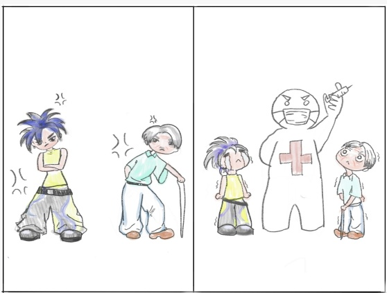

Figure 3.1: Does flu shot help to avoid flu?

The example data above suggests that if this causal interpretation is correct, flu shot is highly effective by lowering the flu probability by 50pct points. Hence the policymakers should encourage more people to get a flu shot.

This is the easy-to-understand explanation we discussed above, and it is something people intuitively tend to assume if the problem is framed as above. While not necessarily true, this is definitely a strong candidate explanation for the effect we see in these data.

**Model 2: Flu causes (no) flu shot** Alternatively, the exact same data can be generated if it is flu instead that has an effect on flu shot. For instance, people who do not feel well may avoid flu shot because they do not want to go out to get it. So these are primarily the healthy ones who will get it. The causal diagram will run the opposite way:

## Flu shot Flu

The result, in terms of data, will look exactly the same as in Table 3.1. The example explanation above—only healthy people will go out to get the shot—is often referred as self-selection, the case where people select into treatment depending on the outcome. In our example, the flu shot may be completely worthless but now these are mostly healthy people who get it (self-select into treatment). Accordingly, if you interpret the results through the first causal model, the wrong model, you conclude that the flushot is highly effective. Hence in the current example, self-selection biases the estimate upward—makes flu shot to look more effective than it actually is. If the upward bias

<small><span class="docvortex-page-footnote" data-block-type="page_footnote" style="color:#6b7280"><sup>1</sup>The upward or downward are a little ambiguos and depend on how exactly do we measure the effect. If we measure the effect on probability to contract the disease, then we’d like to see negative</span></small>

<!-- page: 205 -->

is large enough, then even a harmful treatment may appear effective. And this is not just a question for academic research but of immediate policy relevance. If flu shot is worthless, there is no reason to recommend it to more people. If it is harmful, we should abolish the program completely!

What is the reason we may get a completely wrong result? The problem here is neither data collection nor analysis but the causal model. If we use Model 1 to analyze data that is generated by Model 2, we get wrong results.

Exercise 3.1: Self-selection and downward bias

The above example described a mechanism (sick people avoid going out) that causes the flu shot to seem more effective that it actually is (upward bias). Give an example of a mechanism that causes downward bias through self-selection–a way for the flu shot to seem less effective than it actually is. Solution on page 505.

**Model 3: A third factor causes both flu and flu shot** As a third possibility, there may be other factors that explain why some people get flu shot and do not get flu. For instance, those who are more concerned about their health may take flu shot, but they also wash hands, wear clothing appropriate to weather, exercise, and have a more healthy diet. As a result they do not get flu even if the flu shot itself is worthless. The causal diagram will look like

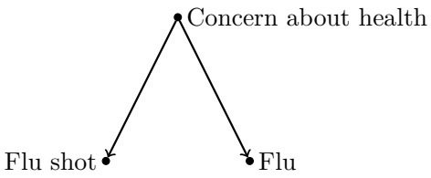

This is another example of self-selection where people who are less likely to get flu self-select into treatment, and those who are more likely to contract it will select into no-treatment. As a result, the estimated effect will be upward biased.

What distinguishes model 3 from model 2 is the fact that here the self-selection is not based on outcome but on confounding factors, other factors that explain whether someone takes flu shot. If we can incorporate confounding factors into the model, we can eliminate the problem. But when working with complex questions, such as human behavior, we rarely have information about all the relevant factors. In the example above, while data about flu and flu shots may be abundant in medical records, information on general health behavior (such as how often someone washes hands) is fragmentary at best, and usually completely missing.

If Model 3 turns out to be the correct causal model then there is again little reason to suggest that more people should get a flu shot. The health authorities should instead recommend washing hands and eating more vegetables.

<small><span class="docvortex-page-footnote" data-block-type="page_footnote" style="color:#6b7280">values (more vaccine–less disease), and we may talk about downward bias instead. Here we use the concept upward bias to denote an effect that seems stronger than it acutally is, whatever its sign.</span></small>

<!-- page: 206 -->

Exercise 3.2: Counfounding factors and downward bias

| The example above, again, argued that confounding factors (concern about one’s health) can cause an upward bias–flue shot seeming more effective than it actually is. Can you come up with different confounding factors, ones that can make flu shot seem less effective than it actually is? Can you tell which of these processes are more likely?Solution on page 505. |
| --- |

So the exact same dataset gives us different results, depending on which causal model we use. Unfortunately, typical data, such as in Table 3.1, does not provide any guidance on which causal model is correct. Even more, in complex cases (and human behavior is complex) they can all be correct at the same time and influence our results together in different ways. Data in the table is not enough to provide causal explanation. There are a number of strategies one may follow to establish causality. Randomized Controlled Trials are considered the best option, followed by natural experiments, case-control studies, and other methods.

Exercise 3.3: Does smoking cause lung cancer?

```txt
Lung cancer was historically a very rare disease. However, by 1960-s, it had become the most common cancer type in the West, and it was clearly correlated with smoking. But does smoking cause cancer?
Explain the correlation between smoking and cancer using all three causal models: smoking causes cancer, cancer causes smoking, and confounding factors cause both smoking and cancer.
Solution: see Example 3.1 below.
```

Example 3.1: Smoking and lung cancer

```txt
By 1960s, cigarettes were the dominant way of consuming tobacco and one could easily see that the rapid growth of tobacco smoking was accompanied with an explosive growth of lung cancer with a roughly 20-year lag. But a lot else had also changed by 1960, including urbanization, transportation and the chemical environment in our homes. So the correlation was not a proof of smoking being harmful.
```

<!-- page: 207 -->

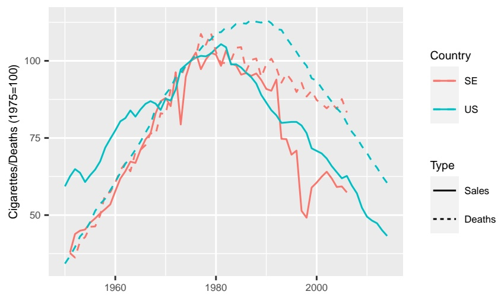

Figure 3.2: Time trends of smoking and lung cancer in Sweden (red) and the U.S. (blue), 1975=100. Solid lines depict the cigarette sales, and dashed lines are age-normalized death rates in lung cancer. We can see cigarette sales in both countries peaking around 1980. This is followed by a fall in death rate somewhat later.

Source: [International Smoking Statistics](http://www.pnlee.co.uk/ISS.htm), [WHO Cancer Mortality Database](https://www-dep.iarc.fr/WHOdb/WHOdb.htm).

Already back then, there were many doctors who suggested that smoking causes cancer. In particular, they argued that tars and nicotine in the tobacco smoke disturbs the growth-control mechanism in lung cells. Thus they argued that the first causal model is the correct one.

But doctors’ opinion is a weak argument. Doctors have got it wrong many times, for instance, even in late 19th century many doctors insisted that scurvy is caused by tainted food, “damp air”, salty meat and various other factors, despite that already in 16th century it had become evident that fresh food and citrus fruits will rapidly cure the disease. Not suprisingly, the tobacco industry insisted that the explanation is “smoking gene”. They argued that smoking itself is harmless, but people who smoke tend to have “smoking gene”, certain set of genes that makes them likely to smoke, but also likely to get cancer. This is the third model with smoking gene being the confounding factor.

Finally, it is also possible that cancer causes smoking: in particular, cancer in very early stages, before it is diagnosed, or before it even can be diagnosed, makes people to itch for a cigarette. This is model 2, the reverse causality explanation.

## 3.4 Strategies for Causal Inference

The previous section explained why do we need to know which causal model is the correct one in order to establish the causal effect from data. We also explained that data alone is not enough to decide which model is correct, we also need knowledge of the possible selection mechanisms. This section discusses a few ways to acquire such knowledge.

<!-- page: 208 -->

## 3.4.1 We Know Which Model is Feasible

Sometimes it is possible to eliminate one or two explanations based on different type of information. Often we know that the decision to take or not to take treatment preceded the outcome in time, and hence Model 2 is infeasible. We may also know plausible physical or physiological mechanisms that can carry influence from treatment to outcome while there are no plausible confounding factors.

Unfortunately, in many important applications this is not true. In case of social processes and human behavior, one can often provide multiple plausible explanations supporting all three causal models.

Example 3.2: Do parachutes help to survive a “gravitational challenge”?

```txt
Smith and Pell (2003) take an absurd example and discuss the effect of parachutes on survival for jumping from aircraft. As explained above, we have three possible causal models:
1. Parachutes cause survival. This is the obvious explanation no-one (except Smith and Pell, 2003) can argue with. There is also plenty of medical evidence about how our bodies react to rapid acceleration.
2. Survival causes parachute use. Here we can eliminate this potential mechanism because the decision to use or not to use parachute must have preceded survival–parachutists were alive when leaving the airplane. Hence causality cannot flow this way.
3. A third factor can cause both parachute use and survival. Although in principle this is possible, it is hard to come up with any plausible mechanism that might cause such and observed link (Smith and Pell (2003) suggest this is mental health).
So in this case we are able to eliminate both model 2 and model 3, and hence model 1 must be correct. Note that the elimination was not based on data (a table of observations of parachute use and survival) but on more general knowledge about parachutes, decisions, and how our bodies work.
```

<!-- page: 209 -->

## 3.4.2 Randomized Controlled Trials

Randomized Controlled Trials (RCT)-s are considered the “gold standard” of causal inference. The idea of RCT is to randomly assign individuals into treatment group and control group. Taking the flu shot example from above, all members of the treatment group receive the flu shot, while none of the control group members will get it. Most importantly, RCT assigns treatment through a random mechanism. This means that treatment status depends on a random event, such as a random number generated by computer, and hence it cannot depend on the outcome (as stipulated by model 2) or by confounding factors (as suggested by model 3). Hence we can immediately eliminate models 2 and 3. Only model 1 will remain as a feasible explanation.

For instance, we can imagine conducting a RCT regarding the flu shot efficiency. We need a large number of participants who are willing to give their explicit consent to join the experiment. Next, we randomize all participants into the treatment and control group. If possible, the trials are double-blind, i.e. neither the volunteer who receives a shot, nor the nurse who administers it knows whether the syringe contains placebo or vaccine (syringes may be labeled, and the information about what each label contains is not released before the experiment is over). Those who receive the actual vaccine will form the treatment group and those who received placebo will form the control group. Placebo may be a similar injection as the vaccine, just without the active substance (the injection is mainly water, salt, and other unrelated substances). Later one collects the participants’ health information through the flu season, and when this is done, the treatment/control group information is released. Now we can analyze whether the flu shot was effective.

So the idea of RCT-s is very simple and the results are convincing. Unfortunately, RCT-s are not without their downsides.

Most importantly, there are many questions where conducting RCT-s would be unethical, illegal, too expensive, or completely infeasible. For instance, it may be considered illegal to pay different workers different wage for similar work, even if it allows us to get valuable information about how work motivation depends on income. Alternatively, if we want to analyze how does tax rate influence macroeconomic performance then we have to randomize the countries into low-tax and high-tax regime, and to ensure the governments are conforming with this protocol for over a decade or more. This is clearly impossible.

• Humans may react to the fact that they are in either treatment or control group. In simple medical experiment this can be addressed by placebos, but and in many cases we cannot design a convincing placebo. For instance, when analyzing the effect of content of education, it is impossible to design a “placebo education” program in a way that the participants do not understand if they are taught “real knowledge” or “placebo knowledge”.

• RCT-s may also be infeasible if cases of interest are rare and the delay in creating a suitable sample may be unacceptable. A similar situation may occur even while the cases are fairly common but the set-up is considered too high-risk (such as suicide attempts). In such cases we want to act immediately and not follow the data collection protocol.

• Randomization attempts to ensure that the treatment and control groups are similar in all respects, except that the former group receives treatment. How-

<!-- page: 210 -->

| Bonten et al. (2015) analyze the efficacy of polysaccharide conjugate vaccine against pneumococcal pneumonia (effect of a specific vaccine on a particular type of pneumonia). This is a good example how a relatively straightforward RCT application—to determine the efficacy of a new drug—is quite hard to conduct in practice.The authors enrolled 84,496 elderly (65 year old or older) into the study. The participants must have had no previous pneumococcal vaccinations and no immuno-compromising conditions. The randomization was done by randomizing syringes in the shipment box with either vaccine or placebo. No participant (including medical workers) knew the randomization status. The final sample included 42,240 vaccinated persons and 42,256 placebos. The pneumonia data was collected 2008-2013 in different medical centers. Participants who received other related vaccines, or developed other diseases, such as lung cancer, were excluded from the analysis. The participants were followed by home visit for the next two years to detect any side effects.Pneumonia was suspected in 3232 cases, out of which the analysts detected 89 relevant pneumonia cases among the vaccinated and 178 among the placebo group. There were too few pneumonia-related deaths to make any conclusions if the vaccine helps to prevent deaths, the study did not find any evidence about adverse effects like chronic medical conditions. |
| --- |

Example 3.3: RCT—how to determine the effect of pneumonia vaccine

ever, because of the random nature of randomization, this may not be true in small samples.

• It is hard to experiment with humans who may drop out of study and otherwise violate the assigned protocols.

• RCT analysis assumes the treatment is pre-determined and does not depend on outcome. But it many applications, such as psychotherapy, the standard practice is to adjust treatment depending on the outcome.

The main difficulty for the study was the small number of relevant pneumonia cases that necessitated both the enormous sample and a long study period.

<!-- page: 211 -->

## 3.4.3 Natural Experiments

Data generated by RCT-s can establish causality because we know that in that case the models Y → X and Z → X are not possible. Sometimes either nature or human activities provides a situation where the same applies. Such situtions are called natural experiments or quasi-experiments. Sometimes a natural experiment happens in a context where RCT is not possible, such situations are especially valuable from the research perspective.

Below we list a few examples:

Resettlement of Karelians in Finland at the end of WW2. In WW2, Soviet Union captured a large swath of Finnish territory. The Finnish inhabitants, mostly farmers, were rapidly resettled in various places in Finland where land was available. This created essentially a random experiment where the population of various villages was increased in a rapid and random manner.

WW2 German missiles destroying city blocks in London. The precision of Nazi V2 missiles was good enough to hit London, but inside of the city, they exploded essentially in random locations. This creates an experiment where certain city blocks were randomly destroyed. How does such destruction affect urban development?

• Collapse of bridge. This is an abrupt change in commuting options.

Opening a new college that attracts new type of students. This allows to analyze the effect of college education on this group of students. Obviously, the new college causes the new students to attend, not the other way around. We may also be able to eliminate confounding factors if the opening did not coincide with a sudden improvement of economic fortunes of the same group.

• Curriculum changes from one year to another. This is analogous to the previous example. Curriculum change causes students to change the subjects they learn, not the other way around.

Correia et al. (2020) analyze the effect of 1918 influenza pandemic on regional mortality and post-epidemic economic development. See Example 3.4. They use the fact that cities and states in the US implemented the interventions–closing businesses, banning gatherings and promoting hygiene–at different point of time. The authors argue that timing of these measures is as good as random, i.e. not related to the unobserved mortality and economic trends in any systematic way so we can consider this as an experiment.

Example 3.4: Do more extensive public health measures during pandemic help economy? Correia et al. (2020)

The 1918 flu epidemic was perhaps the largest pandemic in the 20th century, killing approximately 50 million people in slightly over a year.<sup>a</sup>In the US, the public health response was largely left to the individual cities to decide, and typically included school closures, public gathering bans, and isolation and quarantine, and may also contained altered work schedules, business closures, face mask ordinances and other measures (Markel et al., 2007). What makes the response to a natural experiment is the fact that cities implemented these responses (non-pharmaceutical interventions, NPI-s) in different time.

<!-- page: 212 -->

Correia et al. (2020). analyze two relationships:

1. How does 1918 flu mortality influence the subsequent economic recovery and development?

2. How do NPI-s, implemented during the pandemic, influence economy? Note that NPI-s have potentially two effects: first through their effect on mortality, and second through direct influence on economy of certain NPI-s, such as bans on public gatherings or businesses closures.

As natural experiment is not a RCT, we do not have well-defined control and treatment groups. Instead, we have a number of cities that implemented different NPI-s at different point of time. As the study analyses economic recovery after the pandemic, the causality cannot go from economy to pandemic. Model 2 is eliminated. Regarding model 3 the authors argue that mortality was not related to economic shocks. Hence there were no hidden confounding factors that determined both mortality and the economic development later. The only effect from mortality to economy was the direct effect: mortality influenced behavior, economic decisions, and hence economic growth. This leaves only model 1, the direct causal effect, to explain the findings regarding the question 1.

For the second question, authors employ the variation of type and timing of NPI-s. In a similar fashion, they argue that “variation across cities is unrelated to economic fundamentals”, i.e. there were no hidden confounders that determined both timing of NPI-s and economic recovery later. The only effect from NPI-s was through their influence on mortality, morbidity, human behavior and hence economy (model 1). These two arguments form the identifying assumptions for the models.

Formally, they estimate models of the form (see more in Section Section 3.5 Causal inference in linear regression framework, page 204)

$$
\begin{array}{l} y _ {s t} = \alpha_ {s} + \tau_ {t} + \beta_ {t} \cdot M _ {s, 1 9 1 8} + \boldsymbol {X} _ {s} \cdot \gamma_ {t} + \epsilon_ {s t} ^ {M} \quad t \neq 1 9 1 8 \\ y _ {s t} = \alpha_ {s} + \tau_ {t} + \beta_ {t} \cdot N P I _ {s, 1 9 1 8} + \boldsymbol {X} _ {s} \cdot \gamma_ {t} + \epsilon_ {s t} ^ {N P I} \quad t \neq 1 9 1 8 \end{array}\tag{3.4.1}
$$

where y is an economic development indicator for city s in year t, α and τ are constants, M is mortality, and X are all other city-specific covariates. Formally, the identifying assumptions are

$$
M _ {1 9 1 8} \perp \llcorner \epsilon^ {M} \quad \text {and} \quad N P I _ {1 9 1 8} \perp \llcorner \epsilon^ {M},\tag{3.4.2}
$$

The former assumes there were no confounding factors between economic outcomes and mortality, and the latter assumes no confounding factors between economic outcomes and NPI.

The authors find substantial effects in both models. Increased mortality has substantial negative economic effects, including fall in employment, manufacturing output, bank assets and investments in durable goods. In contrary, earlier and more forceful public health interventions do not lead to worse economic outcomes but the way around, more employment, output and assets.

<small><span class="docvortex-page-footnote" data-block-type="page_footnote" style="color:#6b7280"><sup>a</sup>In comparison, the First World War that ended in the same year killed approximately 10 million in over four years.</span></small>

<!-- page: 213 -->

## 3.4.4 Case-Control Study

In many contexts where it is not possible to conduct a RCT, one may compare different cases with different outcomes, and see if there are more “treated” cases in one group. For instance, one can compare patients with diagnosed lung cancer and patients with no cancer in a certain age group, and compare the percentage of smokers in these groups.

Unlike RCT, case-control studies cannot unambiguously establish causality. They are similar to other observational studies that establish correlation, but in order to eliminate other causal models we still need additional information.

## Example 3.5: Flu Vaccine Efficacy: a Case-Control Study

Ferdinands et al. (2014) conduct a case-control study to analyze influenza vaccine efficacy for children. They enroll 216 children (6 month to 17 year olds) who are admitted in intensive care units with acute respiratory problems in selected hospitals. 44 of these children are diagnosed flu and 172 are not. Those with flu are “cases” while those without flu are “controls”. As both groups are selected from children who are in a similar situation, admitted into intensive care with respiratory problems, they are broadly similar.

The authors analyze what proportion of cases and controls have been vaccinated against influenza, and find that complete flu vaccination is much less prevalent among cases (odds ratio 0.26). They conclude that vaccination is “associated with a three-quarters reduction in the risk of life-threatening influenza illness in children”.

The study shows convincingly that vaccination is associated with less flu among seriously ill children. However, they cannot eliminate reverse causality and confounding factors, such as healthy lifestyle. See Section 3.3 Causality with data: three explanations, page 192.

## 3.4.5 Controlling for Confounding Factors

One of the most obvious solution is to explicitly control for all available confounding factors. Unfortunately, all relevant information is rarely present.

But there are examples where researchers can access complete relevant information. Consider college admission. The procedures differ, but in some colleges students are admitted based on limited information only. This may include test score (e.g. SAT test), high school GPA, and essay that is graded from 1 to 5. Importantly, we know that these three variables is everything that decides college admission, and the re searchers may get access to these data. If the is the case then they will be able to completely control for confounding factors.

## 3.4.6 Explicit Modeling of Selection Process

Sometimes we can model the selection process based on theoretical considerations.

TBD: Heckman’s method.

<!-- page: 214 -->

## 3.5 Causal inference in linear regression framework

**Prerequisites:** Section 2.1.2 Simple Regression, page 125, Section 3.3 Causality with data: three explanations, page 192, Section 3.4 Strategies for Causal Inference, page 197

This section discusses some of the causality aspects more formally in a linear regression framework. Linear regression is just a simple and popular framework but the central ideas here carry over to all other statistical models. In particular, the fundamental problem, “curse of counterfactual”, is always there, no matter which model we are using. A formal statistical presentation is useful because this helps to identify the exact technical requirements for the data. Thereafter we can analyze how each particular dataset is collected and discuss whether these requirements are satisfied.

## 3.5.1 Linear model for a causal process

Many important causal questions, for instance

• does the drug cure illness?

• how will college degree affect my income?

• does the advertisement work?

can be written as linear regression problems in the form

$$
y _ {i} = \beta_ {0} + \beta_ {1} T _ {i} + \epsilon_ {i}\tag{3.5.1}
$$

where $y$ is the outcome (illness, income, or whether someone buys the product), $T$ is treatment, the indicator whether the person attended a college, took the drug, or was shown the advertisement. $\beta _ { 0 }$ and $\beta _ { 1 }$ are parameters we want to calculate. Here we discuss the case where $T$ can be measured as a binary $0 / 1$ indicator variable (for instance, whether the person took the drug or received placebo instead). The central parameter of interest in $(3.5.1)$ is $\beta _ { 1 }$ . This tells us how much larger (or smaller) y would be if $T = 1$ instead of $T = 0$ . This is exactly the causal effect we are interested in, the effect we can use for policy design. The disturbance term ϵ captures the individual-specific effects, $\mathbf { e . g . }$ individual responsiveness to drugs and illnesses, or learning ability. These individual specific effects do not depend on $T .$

Below we also use notation $y ( T )$ , stressing that the outcome $y$ depends on treatment T. So $y ( 0 )$ is outcome when not treated and $y ( 1 )$ when treated.

## 3.5.2 Counterfactual and Identifying Assumption

(2.1.4): $y _ { i } = \beta _ { 0 } + x _ { i } \cdot \beta _ { 1 } + \epsilon _ { i }$

Let us start with (3.5.1). Why does $\beta _ { 1 }$ answer the causal question here? What is the difference between (2.1.4) and (3.5.1)? Why did we warn when introducing (2.1.4) that the $\beta _ { 1 }$ cannot be interpreted causally and why don’t we do it here? After all, both models are almost the same! In fact, the difference is not in the models as written above. The models are the same. The difference is in what are we analyzing, (3.5.1) analyzes data with a valid counterfactual, while (2.1.4) does not. Below we discuss it in more detail, taking the relationship between education and income as an example.

<!-- page: 215 -->

Figure 3.3 shows both of these cases. It depicts education and pay for two persons: Xuande and Zhang Fei.The left panel shows the causal effect: it is the additional income for the same person, here Xuande, given he has college degree, compared to the case where he does not have the degree. So if we give Xuande more education, he will receive more pay. This manipulation–giving him more education–is depicted by a solid arrow, and the effect–more pay–by a dashed arrow. I stress here that causality is about manipulations, causal effect is the answer to exactly such questions: what will happen if we manipulate Xuande’s education? This case corresponds to (3.5.1), it is also the essence of of the causal Model 1.

The right panel shows the other case, the case that answers the question of correlation or “association”, but not the causal effect. Instead of using data about Xuande in two states, with and without college degree, we have data about two different persons. One of them is Xuande without the degree and the other one is Zhang Fei with the degree. We see that besides of having more education, Zhang Fei is also paid better. The differences are denoted by dotted lines, not arrows, as here we do not manipulate anything. Based on this figure alone we do not know if Xuande will receive a similar pay if we could manipulate his education to be similar to what Zhang Fei has.<sup>2</sup> This corresponds to the case of (2.1.4). Unless we know more, we cannot tell which causal model is behind these data. So the difference between (3.5.1) and (2.1.4) is not in the model itself, but in the types of data we are analyzing: is the data based on such manipulations or not?

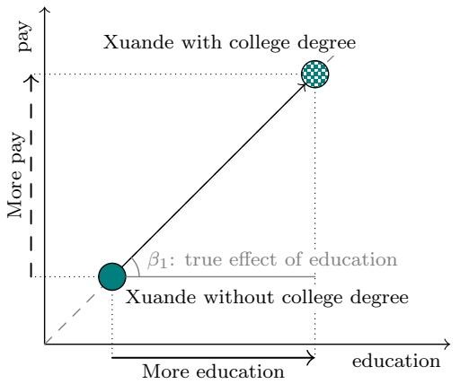

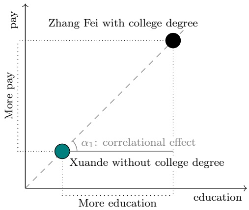

Figure 3.3: Causal versus correlational data. The left panel answers the causal question: what will happen to Xuande, if he gets more education? The corresponding shifts are denoted by arrows. The right panel compares the education and pay of two different persons, Xuande and Zhang Fei, their differences are denoted by dotted lines. The left figure is based on the causal Model 1. The right image can be based on any causal model, and unless we know more, we cannot tell what will be Xuande’s pay if he would obtain a similar education as Zhang Fei.

Next, let’s look at (3.5.1) more formally. In this case we know that data is gener-

<small><span class="docvortex-page-footnote" data-block-type="page_footnote" style="color:#6b7280">β1</span></small>

<small><span class="docvortex-page-footnote" data-block-type="page_footnote" style="color:#6b7280">α1</span></small>

<small><span class="docvortex-page-footnote" data-block-type="page_footnote" style="color:#6b7280">1</span></small>

<small><span class="docvortex-page-footnote" data-block-type="page_footnote" style="color:#6b7280">α1</span></small>

<small><span class="docvortex-page-footnote" data-block-type="page_footnote" style="color:#6b7280"><sup>2</sup>Here I denote the causal effect by and the correlation by , however, in the regression models we usually do not make such distinction in notation. On these figures I have made β and to be equal, but it does not to be so.</span></small>

<!-- page: 216 -->

ated by Model 1. We can just use $T = 0$ and $T = 1$ in order to compute the outcome when not treated and when treated. So the outcome of individual i is

$$
y _ {i} = \left\{ \begin{array}{l} \beta_ {0} + \epsilon_ {i} \quad \text {if not treated; denote this by} y _ {i} (0) \\ \beta_ {0} + \beta_ {1} + \epsilon_ {i} \quad \text {if treated; denote this by} y _ {i} (1). \end{array} \right.\tag{3.5.2}
$$

Hence we have defined the outcome $y _ { i }$ as a function of the treatment status $T ,$ denoted by $y _ { i } ( T )$ . Importantly, the disturbance term $\epsilon _ { i }$ is the same for both $T _ { i } = 0$ and $T _ { i } = 1$ The disturbance term must not depend on treatment.<sup>3</sup>

How can we compute $\beta _ { 1 } ?$ From (3.5.2) we see immediately that $\beta _ { 1 } = y _ { i } ( 1 )   -   y _ { i } ( 0 )$ i.e. the effect is just the difference between the outcome when treated, $y _ { i } ( 1 )$ , and when non-treated, $y _ { i } ( 0 )$ , and this is true for every single individual i. This sounds almost like a trivial thing to compute. And indeed, it were trivial if only we could measure both $y _ { i } ( 1 )$ and $y _ { i } ( 0 )$ . But unfortunately we can never, never ever, observe $y _ { i } ( 1 )$ and $y _ { i } ( 0 )$ at the same time. Someone (or something) is either treated or not treated. Nothing can be in two treatment states at the same time. $\cdot ^ { 4 }$ In our observed world the treatment status is either $T _ { i } = 0$ and only $T _ { i } = 0 , \mathrm { o r } T _ { i } = 1$ and only $T _ { i } = 1$ . The corresponding outcome is called actual outcome, and the other, the one we cannot observe, is counterfactual outcome (or just counterfactual). The actual outcome is easy to handle: this is what you observe. Just measure it. All the trouble with causal inference is to come up with a suitable proxy for the counterfactual. We stress here that the only way to “measure” counterfactual is to find a good proxy. It is fundamentally impossible to measure the counterfactual value. This is the “curse of counterfactual”. Unfortunately, it is impossible to observe data that corresponds to the left panel of Figure 3.3. We are stuck with the correlational right panel.

## Example 3.6: Former outcome as counterfactual

It may be tempting to use pre-treatment observations as proxies for post-treatment counterfactuals. This may or may not be correct but in any case, it requires additional justification.

For instance, returning to the question of effect of college degree on income, we might consider taking pre-college income as counterfactual for post-college income. Obviously, this is absurd. At the time students start college they are fresh high school graduates with little to no work experience and often with no job. Had they not attended college, they would be working in most cases by now, and have 4 years of work experience. A 18-year old person without work experience will not form a valid proxy for a 23-year old with 4 years of experience.

See more in Section 3.6.2 Before-after estimator, page 215.

As counterfactual is not observed, it is hard to say anything about it based on data, or at least based on data alone. Coming up with a convincing counterfactual

<small><span class="docvortex-page-footnote" data-block-type="page_footnote" style="color:#6b7280">T,</span></small>

<small><span class="docvortex-page-footnote" data-block-type="page_footnote" style="color:#6b7280"><sup>3</sup>Here it is actually a rather harmless assumption because we know the correct causal model. If, in fact, ϵ does depend on  then the change of the disturbance term will just be a part of the treatment effect. But it is a major problem if we do not know the model.</span></small>

<small><span class="docvortex-page-footnote" data-block-type="page_footnote" style="color:#6b7280"><sup>4</sup>We stay in the macroscopic world and do not discuss quantum superposition, Schrödinger’s cat and related topics here.</span></small>

<!-- page: 217 -->

always includes certain assumptions, usually referred to as identifying assumptions or counterfactual assumptions. For instance, such an assumption may state that in average, the treatment group outcome would be the same as the control group outcome, if the members of the treatment group had not received treatment. In practice, these assumptions must always be backed up with knowledge about the data– not by data but about data, knowledge about how the data has been generated. The assumption we just cited seems credible if we performed a randomized controlled trial (RCT). After all, randomization is done for this exact purpose, to make the treatment and control group look exactly the same in all known and unknown dimensions. However, it will not be credible at all if we are comparing salaries of college graduates and non–graduates. College graduates and non–graduates differ in many aspects, not just by the fact that one group has spent several years of their life as students. Note that the knowledge about selection process is not usually called data. Just obtaining more “data”, i.e. observations about treated and non-treated outcomes, does not allow us to make more credible conclusions about the causal effect. We need both data and knowledge about the selection process. If we are lucky then the latter will allow us to come up with convincing identifying assumptions.

## 3.5.3 More about identifying assumptions: mean independence

## Prerequisites: Section 1.4.5 Expected Value, page 58

What happens if the identifying assumptions are wrong? It turns out that this is similar to using a wrong causal model.

Take the linear regression model (3.5.1) as the point of departure. For simplicity, that model only contains a single explanatory variable, the treatment status $T ,$ but one can easily add more. Data we collect consists of tuples in the form $( T , y )$ , i.e. every case is a pair of two numbers, the treatment status and the corresponding outcome. How can we estimate $\beta _ { 1 } ?$ Intuitively, in a large sample, the average outcome for the treated, ${ \bar { y } } ( 1 )$ , and for the untreated, ${ \bar { y } } ( 0 )$ , should tell us something about the effect. In particular, we are tempted to interpret their difference $\bar { y } ( 1 ) - \bar { y } ( 0 )$ as the treatment effect. (We talk about large samples in order to avoid issues with sampling noise, those issues are not related to causality.)

(3.5.1): $y _ { i } = \beta _ { 0 } + \beta _ { 1 } T _ { i } + \epsilon _ { i }$

The intuitive concept of “average over a large sample” corresponds to the mathematical concept of expected value, so we can replace the large sample average with the corresponding expected value. We denote the expected values by $\mathbb { E } [ y | T = 1 ]$ (for the treated) and $\mathbb { E } [ y | T = 0 ]$ (for the non-treated). Next, we can use model (3.5.1) to compute these values as

$$
\mathbb {E} [ y | T = 1 ] = \mathbb {E} [ \beta_ {0} + \beta_ {1} T + \epsilon | T = 1 ] = \beta_ {0} + \beta_ {1} + \mathbb {E} [ \epsilon | T = 1 ]\tag{3.5.3}
$$

and

$$
\mathbb {E} [ y | T = 0 ] = \mathbb {E} [ \beta_ {0} + \beta_ {1} T + \epsilon | T = 0 ] = \beta_ {0} + \mathbb {E} [ \epsilon | T = 0 ].\tag{3.5.4}
$$

We used the following facts when calculating the results above: expected value of constants $\beta _ { 0 }$ and $\beta _ { 0 }$ are just these two constants, and $\beta _ { 1 }$ drops out from the second equation because in that case it is multiplied by $T   =   0$ . But the last terms, the

<!-- page: 218 -->

conditional expectations of $\epsilon _ { \gamma }$ are critical. $\mathbb { E } [ \epsilon | T   =   1 ]$ is the expected value of the error term for the treated individuals, $\mathbb { E } [ \epsilon | T   =   0 ]$ is the same for the non-treated individuals. In general, these two differ, i.e. $\mathbb { E } [ \epsilon | T = 1 ] \neq \mathbb { E } [ \epsilon | T = 0 ]$

When we now compute the difference between the two expected values (3.5.3) and (3.5.4), we get

$$
\mathbb {E} [ y | T = 1 ] - \mathbb {E} [ y | T = 0 ] = \beta_ {1} + \mathbb {E} [ \epsilon | T = 1 ] - \mathbb {E} [ \epsilon | T = 0 ].\tag{3.5.5}
$$

Obviously, this equals to the correct value $\beta _ { 1 }$ only if

$$
\mathbb {E} [ \epsilon | T = 1 ] = \mathbb {E} [ \epsilon | T = 0 ]. ^ {5}\tag{3.5.6}
$$

This condition is known as mean independence assumption, often denoted by $\mathbb { E } \epsilon$ ⊥⊥ $T .$ This is the technical way to state the identifying assumption for cross-sectional estimator.

Figure 3.4 explains the role of mean independence and how it affects the effect estimation. It displays the outcomes for four people, Xuande (blue), Guan Yu (black), Zhang Fei (green) and Cao Cao (red). The top left panel displays the causal effect we are interested in—what will be the outcome of Guan Yu and Xuande if they were treated $( T = 1 )$ instead of non-treated $( T = 0 )$ . We measure the effect as the difference between the average of the counterfactual outcomes, $\mathbb { E } [ y | T   =   1 ]$ (dotted circles) and the average actual outcome, $\mathbb { E } [ y | T   =   0 ]$ (solid circles). The observed average $\mathbb { E } [ y | T = 0 ]$ is marked with a solid gray circle and the counterfactual average $\mathbb { E } [ y | T = 1 ]$ is the dotted gray circle. The difference is the causal effect $\beta _ { 1 }$ . Note that both the actual and the counterfactual outcome of Guan Yu and Xuande differ, this is because Xuande has positive ϵ and Guan Yu has negative ϵ. But importantly, their respective ϵ is the same in both treated and non-treated state.

However, we cannot use the top-left panel to measure $\beta _ { 1 }$ because the counterfactual outcome (dotted circles) cannot be observed. What we can do instead is displayed on top-right panel. We compare two untreated persons (Xuande and Guan Yu) with two treated persons (Zhang Fei and Cao Cao). As before, we compute the effect as the difference between average outcome of the treated $( \mathbb { E } [ y | T = 1 ] )$ and the untreated $( \mathbb { E } [ y | T = 0 ] )$ . All four people in our sample have different $\epsilon _ { \gamma }$ but what is important–both the untreated and the treated have average $\mathbb { E } \epsilon = 0$ . Hence the average of treated Zhang Fei and Cao Cao (gray circle at $T = 1 )$ is the same as the average of counterfactuals for untreated Xuande and Guan Yu (light gray circles at $T = 1 )$ Hence the difference between the average for the treated and for the untreated, $\alpha _ { 1 }$ , is equal to the correct causal effect $\beta _ { 1 }$ . The mean independence assumption is satisfied.

Finally, the bottom panel shows the case where the mean independence assumption is violated. The average value of the error term for untreated Xuande and Guan $\mathrm { Y u } .$ $\mathbb { E } [ \epsilon | T = 0 ] = 0 ,$ , but for treated Zhang Fei and Cao Cao $\mathbb { E } [ \epsilon | T = 1 ] < 0$ as both of these ϵ-s are negative. Hence the average for the treated group (dark gray circle) is below the average of the counterfactuals (middle light-gray circle), and the measured difference $\alpha _ { 1 }$ is less than the true causal effect $\beta _ { 1 }$

<small><span class="docvortex-page-footnote" data-block-type="page_footnote" style="color:#6b7280">yi 1</span></small>

<small><span class="docvortex-page-footnote" data-block-type="page_footnote" style="color:#6b7280">yi 0</span></small>

<small><span class="docvortex-page-footnote" data-block-type="page_footnote" style="color:#6b7280"><sup>5</sup>There is an important difference regarding ϵ here, and in (3.5.2). In the latter we assume that we have access to both ( ) and ( ) for the same cases, i.e. we know the counterfactual value. This is not the case here, and hence we need the assumption (3.5.6).</span></small>

<!-- page: 219 -->

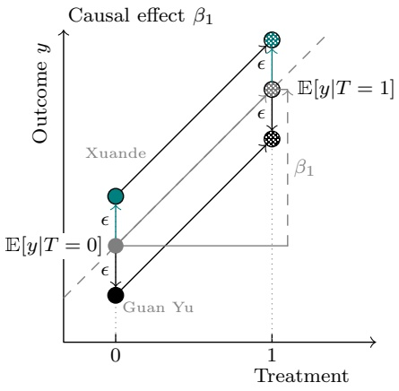

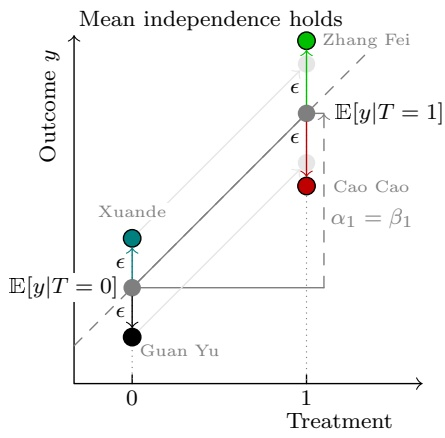

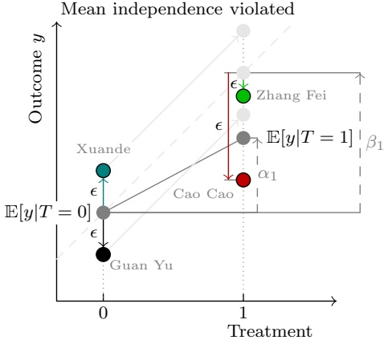

Figure 3.4: The role of mean independence assumption. The top-left panel shows the true causal effect $\beta _ { 1 }   =   \mathbb { E } [ y | T   =   1 ]   -   \mathbb { E } [ y | T   =   0 ]$ for two persons—Xuande and Guan $Y   u .$ On the top-right panel, the mean independence assumption holds, and the treated group forms a valid counterfactual for the non-treated group. The measured correlational relationship $\alpha _ { 1 }$ equals to the true causal effect $\beta _ { 1 }$ . At the bottom panel, the assumption is violated, $\mathbb { E } [ \epsilon | T = 0 ] = 0$ while $\mathbb { E } [ \epsilon | T = 1 ] < 0$ , and the correlation effect $\alpha _ { 1 }$ underestimates the causal effect. Explanations in text.

<!-- page: 220 -->

How is the mean independence assumption related to causal models? It turns out that if mean independence assumption is equivalent to causal Model 1, but we do not prove it in this book.

Besides of the technical assumptions—which causal model is behind the data, the identifying assumptions always have the intuitive side–what do these technical requirements mean in terms of data, and what do they mean in terms of institutions. For instance, imagine a randomized medical experiment to test a new drug, where the participants are randomized into the treatment group (they receive the drug) and control group (they receive placebo).

• In terms of data, we expect all control and treatment group individuals to be similar to each other in terms of all characteristics, including age and pre-existing conditions. This is because they were assigned to groups by random. If we have additional information about the participants then we can test this–do all the observable variables, e.g. age, gender, family status, education, and so forth, look similar between the groups? If yes then this convinces us that the characteristics we do not know (e.g. sleep behavior and type of diet) may also be similar.

• In terms of institutions we have to ask if researchers were able to correctly follow the randomization. Maybe someone involved in the experiment told the participants what they get and let them choose? Maybe the participants signed up into multiple similar experiments in the hope that at least in one of those they will get the “real thing”? Maybe they found each other through social media and split and shared their pills so that everyone at least “got something”? For the results to be convincing we need to know that nothing similar happened. However, we cannot easily test this based on data.

So (3.5.6) states the technical side of the identifying assumption. If possible, then one should always test the data side. The institutional side cannot typically be tested on data, but on either our general knowledge, or knowledge about the specific situation related to these data. It is the researchers’ responsibility to know and explain the relevant institutions.

## Example 3.7: Expected value of unobserved characteristics

Take again the example of college degree and income. The unobserved factors ϵ that influence wage may include socio-economic background, cognitive and non-cognitive skills, health, geographic location (such as country and rural/urban location) and so on. So $\mathbb { E } [ \epsilon | T   =   1 ]$ is the expected value of such factors for college graduates and $\mathbb { E } [ \epsilon | T = 0 ]$ is the expected value of the same factors for those who did not attend college.

We know that college graduates tend to have higher socio-economic status, they are more likely urban and living in high-income regions, and they possess more cognitive skills. Both higher-status background and innate skills help to get well-paid jobs later in life too. So there are a lot of observable characteristics that differ between these groups. So it is hard to argue that all other factors are similar. Hence most likely $\mathbb { E } [ \epsilon | T = 1 ] \neq \mathbb { E } [ \epsilon | T = 0 ]$ , the mean independence assumption is violated. We can still compare the income of graduates and non-

<!-- page: 221 -->

graduates, but we cannot interpret the result as the causal effect of college degree.

## 3.6 A Few Popular Estimators

**Prerequisites:** Section 2.1.2 Simple Regression, page 125, Section 2.1.8 Interactions effects, page 161

There are many ways to estimate causal effect $\beta _ { 1 }$ . Here we introduce a few simple and popular methods: cross-sectional estimator, before-after estimator, and differences-in-differences estimator. While the two former methods are simple and popular in media, the latter one is based on slightly more credible assumptions, and is often used in research. These are all based on fixed effects approach and assume that certain values or trends are invariant.

## 3.6.1 Cross-Sectional Estimator

TBD: just difference in means versus OLS

The idea with cross-sectional estimator is very simple: we assume that the difference between treated and non-treated outcomes is due to the treatment, and only due to the treatment, at least in average. If this is the case then untreated cases (controls) form a valid counterfactual, and we get correct estimates by just computing the average difference between the treated and the controls. Formally, we assume $\mathbb { E } [ \epsilon | T = 1 ] = \mathbb { E } [ \epsilon | T = 0 ]$ and hence the effect of interest is

$$
\beta_ {1} = \mathbb {E} [ y | T = 1 ] - \mathbb {E} [ y | T = 0 ]\tag{3.6.1}
$$

(see (3.5.5)). As discussed above, this assumption seems a credible one in case of RCT s, and a lot less credible where different type of people can freely decide whether to get treatment. For instance, it is extremely hard to justify that college graduates and non–graduates are similar in every way except graduation. We have many good reasons to think that ϵ and T are systematically related.

## Example 3.8: Cross-sectional estimator of college effect is biased

Let us continue Exampe 3.7. The arguments there suggest that college graduates are drawn from more favorable ends of distribution of ϵ and hence $T$ is positively correlated with ϵ. This means $\mathbb { E } [ \epsilon | T = 1 ] > \mathbb { E } [ \epsilon | T = 0 ]$ As a result the estimator (3.5.5) is upward biased:

$$
\mathbb {E} [ y | T = 1 ] - \mathbb {E} [ y | T = 0 ] = \beta_ {1} + \mathbb {E} [ \epsilon | T = 1 ] - \mathbb {E} [ \epsilon | T = 0 ] > \beta_ {1}\tag{3.6.2}
$$

The bad news is that we don’t know by how much is the estimate biased, and based on data alone we cannot tell. Here “data” means a table of college graduation status and income for a large number of individuals. Education is one of the many unfortunate examples where it is hard to find plausible information to break the curse of counterfactual and actually compute the effect.

<!-- page: 222 -->

The intuitive side of the assumption was already stated above but we repeat it here: for the cross-sectional estimator to be valid, the average unobserved characteristics of the treated and the controls must be similar. If this is the case, then controls make valid counterfactuals for the treated as they are otherwise similar, except that they received the treatment.

## Example 3.9: COVID-19 stay-at-home orders in Nordic countries

Nordic countries<sup>a</sup> are small but highly developed countries in Northern Europe. They are rather similar in terms of their institutions, featuring extensive social safety net, high taxes, effective governance and little corruption. The population of Denmark, Finland and Norway is approximately 5 million, that of Sweden is 10 million. During the COVID-19 pandemic in 2020, most European countries issued stay-at-home orders, banned public gatherings and closed non-essential businesses. However, almost nothing was done in Sweden where only gatherings of more than 500 were forbidden, and face masks remained rare.

This suggest that we can estimate the effect of COVID-19 measures by using a cross-sectional estimator where we compare Sweden to other Nordic countries. As Swedish policy was clearly exceptional, we can define it as treatment. So in this case treatment means “not introducing stay-at-home orders”. Non-treatment would then be what other countries did, namely to issue such orders.

We focus here on the first wave of COVID in April 2020 using Scandinavian COVID data (see Section B COVID in Scandinavia, page 477). The figure below shows the daily number of new deaths in all these three countries.

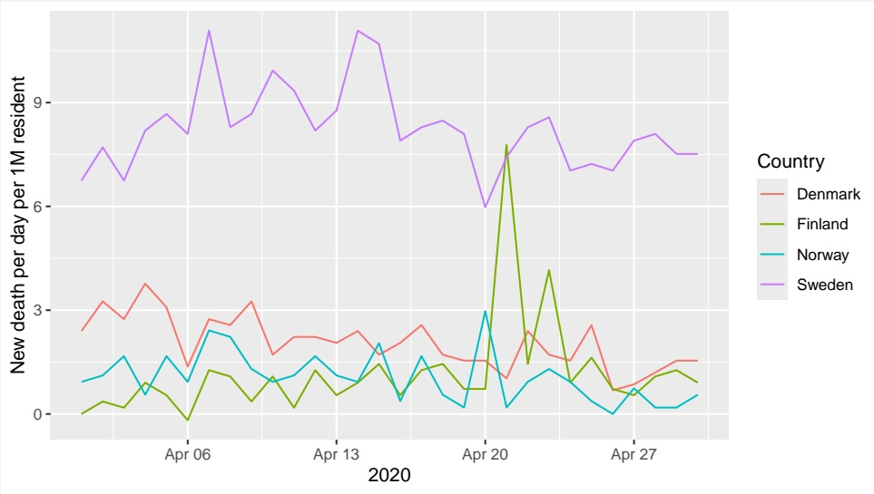

The figure clearly indicates that the death rate per million residents was much higher in Sweden fluctuating between 6 and 9 over this period. In the comparison countries, it stayed below 3 for most of the time, with the exception of a short peak in Finland.

<!-- page: 223 -->

The CS estimate of the effect is just the difference between the corresponding average values. The average death rate in Sweden is 8.25, in other Nordic countries it is 1.43 and hence their difference, the effect, is 6.82 (deaths per day per million residents).

<div class="docvortex-algorithm" style="white-space: pre-wrap; font-family:monospace;">
$^{a}$ Here we consider Finland, Denmark, Norway and Sweden.
</div>

In practice, it is often useful to use linear regression in the form of (3.5.1) instead of just comparing the group averages (as in (3.6.1)). Linear regression approach has two advantages:

We can easily include other covariates, e.g. demographic variables such as age distribution in case of COVID death rate. This allows to take into account that the treatment and control group may differ along certain ways we can observe (e.g. patients may be of different age). Adding more covariates when just comparing means can be done only in a very limited fashion. One has to split data not just along the treatment/control group but also along other covariates, and we will rapidly run into the curse of dimensionality.

• Linear regression software provides the confidence intervals and statistical significance figures with no additional work. True, we can get the same result when performing t-test on the treatment and control samples directly, so this is just a minor convenience.

## Example 3.10: COVID-19 stay-at-home orders in Nordic countries: regression approach

Here we replicate the results of Example 3.9 with linear regression. As we define the treatment to be “no lockdowns”, it is equivalent to being “Sweden”, so we can write the model (based on (3.5.1)) as

$$
d e a t h s _ {i} = \beta_ {0} + \beta_ {1}   S w e d e n _ {i} + \epsilon_ {i}.\tag{3.6.3}
$$

The dummy Sweden<sub>i</sub> must be understood as for every observation we use a 0/1 dummy that tells if this is an observation about Sweden. The results are in the table below:

|  | Estimate | Std. Error | t-value | Pr(>\|t\|) |
| --- | --- | --- | --- | --- |
| Intercept | 1.432 | 0.121 | 11.845 | 0.000 |
| Sweden | 6.820 | 0.242 | 28.210 | 0.000 |

The results must be interpreted as follows: Intercept is the average daily death rate in case Sweden = 0, i.e. the death rate outside Sweden (compare with the results in Example 3.9). Sweden is the effect of treatment, i.e. not introducing lockdowns. As the table indicates, the effect is very large compared to the intercept (6.82 versus 1.432) and highly significant. So the model suggests that the “no-lockdown” treatment resulted 5.8-fold increase in death rate. This seems like a very large effect.

Can we conclude that lockdowns elsewhere were a very good idea? Not so fast. First, is the identifying assumption credible? In this case it is E[ϵ|Sweden = 1] =

<!-- page: 224 -->

E[ϵ|Sweden = 0], i.e. the omitted variables for Sweden are similar to those in the other Nordic countries (in average). While there are good reasons to believe that Sweden is somewhat different from its Nordic neighbors, it is hard to believe the difference in death rate should be that big. After all, the standard deviation of the error term is just 1.14<sup>a</sup>. This is much smaller than the effect 6.82. So even if the mean independence assumption may not be completly correct, it seems that any bias here is dwarfed by the effect size.

But before we offer any policy conclusions, note two caveats. First, we are talking about a large difference in a small rate (a few cases per million). Maybe it does not matter that much. And second, we do not know what did Sweden benefit from this policy. Did its economy perform better? Did the population maintained better mental health? We cannot give solid policy advice before answering those questions too.

<small><span class="docvortex-page-footnote" data-block-type="page_footnote" style="color:#6b7280"><sup>a</sup>Software packages typically report the estimated standard error of the residuals.</span></small>

<small><span class="docvortex-page-footnote" data-block-type="page_footnote" style="color:#6b7280">Exercise 3.4: Job search help–cross-sectional estimator</span></small>

<small><span class="docvortex-page-footnote" data-block-type="page_footnote" style="color:#6b7280">A college introduces workshops for resume writing and job search for graduating seniors. The attendance is voluntary. The results are the following: Student ID Attended Had job before Got job later 1 0 0 0 0 0 0 0 1 0 0 5 1 1 1 6 1 0 1 Here attended means if the student attended the workshop, had job before means they had already secured a job, and got job later means they found a job after the workshop. 1. You want to compute the CS estimator of the effect. Which students will you include? 2. Which of the two job columns will you use? 3. Compute the effect. 4. What are the identifying assumptions? Do you think these are satisfied? 5. Provide a plausible explanation why the measured effect may be too small (downward biased). Solution on page ??.</span></small>

<!-- page: 225 -->

## 3.6.2 Before-after estimator

Before-after estimator (BA) is similar to cross-sectional estimator, but instead of comparing two different groups at the same time (the treated and the non-treated), we only look at the same group (treatment group) and compare their outcomes before and after the treatment. If the disturbance term does not change over time (in average) then the difference is the causal effect.

While the main approach remains very similar to CS estimator, it is useful to introduce slightly different notation. Assume there are two time periods: $t = 0$ is time before treatment, and $t = 1$ is time after treatment. The corresponding treatment indicator for individual i is $T _ { i t }$ with $T _ { i 0 }   =   0$ before treatment, and $T _ { i 1 }   =   1$ after treatment. So we may write

$$
y _ {i t} = \beta_ {0} + \beta_ {1} T _ {i t} + \epsilon_ {i t}\tag{3.6.4}
$$

Here $y _ { i t }$ is the outcome of individual i at time t, and two indices for $\epsilon _ { i t }$ indicates that the error term may be different for period 0 and period 1. Because treatment occurs after period 0 and before period 1, we have $T _ { i 0 } = 0$ and $T _ { i 1 } = 1$ for all individuals i. The expected outcome after the treatment, $\mathbb { E } [ y | t = 1 ]$ , is now

$$
\mathbb {E} [ y | t = 1 ] = \mathbb {E} [ y | T = 1 ] = \beta_ {0} + \beta_ {1} + \mathbb {E} [ \epsilon | t = 1 ]\tag{3.6.5}
$$

where we use the fact that $``after'',$ at $t = 1$ , everyone is treated, i.e. $T = 1$ . In a similar fashion, the expected outcome before the treatment is

$$
\mathbb {E} [ y | t = 0 ] = \mathbb {E} [ y | T = 0 ] = \beta_ {0} + \mathbb {E} [ \epsilon | t = 0 ]\tag{3.6.6}
$$

and the estimated effect

$$
\mathbb {E} [ y | T = 1 ] - \mathbb {E} [ y | T = 0 ] = \beta_ {1} + \mathbb {E} [ \epsilon | t = 1 ] - \mathbb {E} [ \epsilon | t = 0 ].\tag{3.6.7}
$$

This captures the correct value, the causal effect $\beta _ { 1 }$ , only if $\mathbb { E } [ \epsilon | t = 1 ] - \mathbb { E } [ \epsilon | t =$ $0 ] = 0$ . To put it in words, this means that the expected disturbance term before and after treatment is similar. Or more plainly—there is no unobserved trend. This is the identifying assumption for the before-after estimator. The requirement is pretty obvious—the BA estimator is just the outcome difference over time, and this is the causal effect only if there is no other time differences interfering with the effect. For instance, if we are using before-after estimator to assess the effect of college degree, we have to assume that if a person had not attended college, her income would have stayed the same. (Note: we only look at those who attended college in this estimator.) This is a completely unrealistic assumption, similar to the claim that high-school students and young workers without college degree in their mid-20s would earn exactly the same. Effect of college attendance is an unfortunate example where it is very hard to find data and institutions that enable causal inference. But at the same time it is also a number that both high-school graduates and policymakers would like to know. However, in other cases before-after estimator may be justified.

<!-- page: 226 -->

Example 3.11: President’s approval: before and after September 11th

September 11th terror attacks were a major shock for the U.S. society, and the effect was immediately reflected in the president’s approval ratings. The figure below depicts the Presidents (G. W. Bush) approval rating from July till November, 2001. The dashed vertical line is the September 11th terror attacks. Tremendous support to president is immediately obvious from the huge increase in the approval rate.

TBD: Explain data, data source, also in the repo

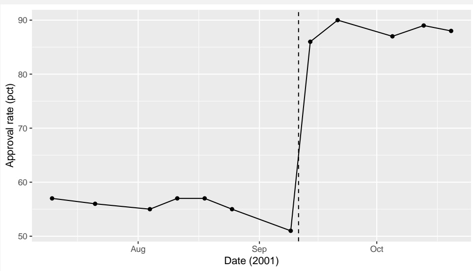

Figure 3.5: U.S. President G. W. Bush approval rating through summer and fall 2001. The dashed vertical line corresponds to September 11 terrorist attacs.

The president’s approval rate was hovering around 55% in August and early September, and between 85 and 90% in late September and October. The Sept 7-10 polls indicated that 51% of the respondents approved his performance but just a week later, September 14-15, it was at 86%. The sharp jump corresponds exactly to the terror attacks, and is missing anywhere else in this data.

G. W. Bush’s average approval rate from early July till early September was 55.4% and from mid-September till end of October it was 88%. The difference, 32.6 pct points, is the BA estimate of the effect.

Instead of period means, we can also just look at the last pre-attack poll (support 51%) and the first post-attack poll (support 86%). Using this approach the effect is 35 pct points.

Note that the identifying assumption—no trends besides the effect of treatment— seems to be violated here as the approval rate seems to be heading downhill through the summer. But we consider this to be a minor issue as the 9/11 effect clearly dwarfs the trend.

<!-- page: 227 -->

But this analysis has another important problem. Namely applicability. The analysis seems convincing and interesting, however, the result (35 pct points) can hardly be used for any policy-relevant decisions. This is the opposite to the case of college attendance: we can answer the question, but unfortunately it is not particularly relevant question.

In a fashion, similar to what we did in case of cross-sectional estimator, we can also use linear regression to compute the BA estimate. This can be done by using (3.6.4), typically one also has to create the auxiliary treatment indicator T based on time of the observations.

Example 3.12: Presidents approval: before and after September 11th, the regression approach

Let us revisit the George W. Bush’s approval ratings in 2001. First we compute the treatment indicator T. Here treatment is related to time, $T   =   \mathbb { 1 } ( d a t e   >$ 2001-09-11), i.e. it equals to one for all observations after September 11th, and to zero for all observations before that date. However, in order to stress the fact that the treatment is related to observation after the event (and in order to distinguish between treatment group and post-even observations for differencesin-differences estimator), we label it $A f t e r$ instead. Thereafter we use (3.6.4) as the regression model. The complete data including $A f t e r ,$ 12 observations, is in the table below:

Table 3.2: G.W.Bush approval ratings through the first fall of his presidency. The last column, After, is the post September-11 indicator.

| date | Approval, pct | After |
| --- | --- | --- |
| 2001-07-10 | 57 | 0 |
| 2001-07-21 | 56 | 0 |
| 2001-08-04 | 55 | 0 |
| 2001-08-11 | 57 | 0 |
| 2001-08-18 | 57 | 0 |
| 2001-08-25 | 55 | 0 |
| 2001-09-09 | 51 | 0 |
| 2001-09-14 | 86 | 1 |
| 2001-09-21 | 90 | 1 |
| 2001-10-05 | 87 | 1 |
| 2001-10-13 | 89 | 1 |
| 2001-10-20 | 88 | 1 |

Now we adapt model (3.6.4). We use After in place of T and drop the index i as the data is just about a single person, so we have

$$
y _ {t} = \beta_ {0} + \beta_ {1} \cdot A f t e r _ {t} + \epsilon_ {t}.\tag{3.6.8}
$$

When we estimate this model, we get the following results:

<!-- page: 228 -->

| . | object | .. |
| --- | --- | --- |
| Intercept | 55.429 | 0.734*** |
| After | 32.571 | 1.137*** |
| # obs | 12 |  |
| $R^2$ | 0.9880 |  |

Table 3.3: DiD regression estimate for the effect of 9/11 terror attacks on presidents approval rating. Standard errors in italics.

The model shows that before the attacks, the approval rate was $\beta_{0} = 55.429\%,$ and after the attacks it was larger by $\beta _ { 1 }   =   3 2 . 5 7 1$ pct points. This is the BA estimate, it is easy to see that it has extremely large t value. The approval level after the attacks is predicted to be $\beta_{0} + \beta_{1} = 88\%$ These are exactly the same numbers we have in Example 3.11.

Note that credibility of the estimator, the credibility of the identifying assumption, relies on our knowledge of the events through the last decades of 20th and the first decades of 21st century. We know that no other president has seen such a boost in the approval rate, and there has been no unexpected events comparable to September 11th attacks.

## Exercise 3.5: Job search help–before-after estimator

| Use the same college job search workshop data as in Exercise 3.4. This time you want to use BA estimator. |
| --- |
| 1. Which students will you include in your sample? |
| 2. Which of the two job columns will you use? |
| 3. Compute the effect. |
| 4. What are the identifying assumptions? Do you think these are satisfied? |
| 5. Provide a plausible explanation why the measured effect may be too large (upward biased). |
| Solution on page ??. |

## 3.6.3 Differences-in-differences estimator

Differences-in-differences (also diff-in-diff or DiD) estimator combines the cross-sectional and before-after estimators. The former is biased if the treatment and control groups differ in a way we do not take into account (i.e. $\mathbb { E } [ \epsilon | T = 0 ] \neq \mathbb { E } [ \epsilon | T = 1 ] )$ , and the latter if there is an uncontrolled trend in the treated group (i.e. $\mathbb { E } [ \epsilon | t = 0 ] \neq \mathbb { E } [ \epsilon | t = 1 ] )$ DiD compares the time trend for the treated group and the non-treated group. Equivalently, Did compares the differences before and after the treatment for the treated and non-treated group. This relaxes the assumptions behind the cross-sectional and before-after estimators and replaces these with a different identifying assumption: time trends for the treated and non-treated groups are the same. However, we pay

<!-- page: 229 -->

for the more relaxed assumptions with more stringent data requirement: now we need four data points, two for treated and for non-treated, one before and one after the treatment for each.

Let us first take a hypothetical example. Imagine there is a federal country that contains a number of provinces. In year 2015 certain provinces decided to substantially boost the public education by investing in schools, teachers and outreach. We consider these additional investments to be treatment $T ,$ so some provinces were in the treatment group $T = 1$ while the others that did not invest are in the control group $T = 0$ . According to survey data from 2014, before the treatment began, the average schooling level in the treatment provinces $\bar { y } ( T = 1 , t = 2 0 1 4 ) = 9$ years and in control provinces $\bar { y } ( T = 0 , t = 2 0 1 4 ) = 8$ years. Another survey, from 2020, five years into the treatment, found that $\bar { y } ( T = 1 , t = 2 0 2 0 ) = 1 1$ and $\bar { y } ( T = 0 , t = 2 0 2 0 ) = 9$ (See Figure 3.6.)

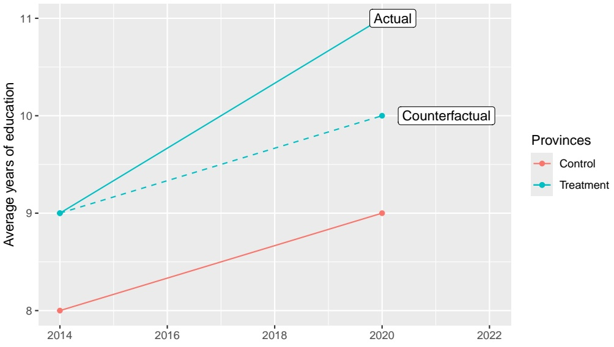

Figure 3.6: Hypothetical education data. Both the levels and trends differ for the treatment and control provinces. Dashed line denotes the counterfactual assumption, the difference between the actual and counterfactual value is the DiD estimate, here 1 year of extra schooling.

We can immediately see that the data does not support the CS and BA identifying assumptions. As the treatment and control groups differ already in 2014, before the treatment even begins, it is hard to argue that they would be the in 2020 if no-one had introduced the extra investment. In a similar fashion, in case of BA estimator, the assumption that without such an investment, the education level of 2020 would be the same as in 2014 for the treatment provinces is not convincing. After all, in control provinces the level is increasing with no treatment whatsoever! What DiD method assumes is that the trend difference is due to treatment. So without the treatment, the treatment provinces would have followed the dashed trajectory on the

<!-- page: 230 -->

figure, leading $\mathrm { u p }$ to the counterfactual of 10 years by 2020. However, as the actual outcome was 11 years, the difference, 1 year of extra schooling, is the DiD effect. On the figure, this is the difference between the actual and counterfactual outcome.

Table 3.4: Four datapoints for DiD estimator

<table><tr><td>Time</td><td>Control (T=0)</td><td>Treatment (T=1)</td><td>Difference</td></tr><tr><td>Before (t=0)</td><td>a</td><td>b</td><td>b-a</td></tr><tr><td>After (t=1)</td><td>c</td><td>d</td><td>d-c</td></tr><tr><td>Trend</td><td>c-a</td><td>d-b</td><td></td></tr><tr><td>Difference in trend</td><td colspan="2">(d-b)-(c-a)</td><td>(d-c)-(b-a)</td></tr></table>

Let us now look at this idea more formally. We have two groups, control $( T = 0 )$ and treatment $( T = 1 )$ and two time periods: before $( t = 0 )$ and after $( t = 1 )$ . Denote the outcome in these four data points as a (control before), b (treatment before), c (control after) and d (treatment after) (See Table 3.4). So a and b are measured before anyone was treated, and the $b - a$ indicates the difference between the treatment and control group before the treatment even begins.

The values c and d describe the control and treatment group outcomes after treatment, at $t = 1$ . Their difference, $d   - c ,$ is caused both by the treatment, and by other, unobserved, differences. In case of DiD estimator, we assume that the unobserved difference after the treatment equals to that before treatment, $b - a { \mathrm { - t h i s } }$ is the identifying assumption. Hence the difference between post-treatment difference $d - c$ and the pre-treatment difference $b - a$ is the treatment effect:

$$
\beta = \text {pre - treatment difference - post - treatment difference} = (d - c) - (b - a).\tag{3.6.9}
$$

Such “double difference” way of computing the effect is why the method is called “differences-in-differences”, or “double-differences” estimator.

Alternatively, we can look at the difference over time. The values in the column control, a and $c ,$ describe the control group outcomes before and after the treatment. In case of before-after estimator they should be equal<sup>6</sup> but now we allow a time trend $c - a$ . The next column, Treatment, shows the outcomes for the treatment group where the time trend is $d   -   b .$ This time trend is caused by both treatment and other, unobserved factors. But we assume that the unobserved trends for the control and treatment group are the same, $c - a .$ . Hence the difference what is left over when we subtract the control group time trend from the treatment group time trend is the treatment effect:

β = treatment group trend − control group trend =

$$
= (d - b) - (c - a) = (d - c) - (b - a).\tag{3.6.10}
$$

<small><span class="docvortex-page-footnote" data-block-type="page_footnote" style="color:#6b7280">, = )</span></small>

<small><span class="docvortex-page-footnote" data-block-type="page_footnote" style="color:#6b7280">(0| = 0 t = 0)</span></small>

<small><span class="docvortex-page-footnote" data-block-type="page_footnote" style="color:#6b7280">(0| =</span></small>

<small><span class="docvortex-page-footnote" data-block-type="page_footnote" style="color:#6b7280"><sup>6</sup>As above, as no-one in the control group is ever treated, both Y T ,  and Y T 1 t 1 are observable so no counterfactual assumption is needed here.</span></small>

<!-- page: 231 -->

As both of these approaches gave us the same estimate, we can conclude that both assumptions are equivalent. So the identifying assumption for the DiD model can be summarized as:

Unobserved differences between the treatment and control groups are similar before and after treatment (in average)

or

Unobserved time trends for the treatment and control groups are the same.

## Example 3.13: COVID-19 Epidemic and Presidents Approval

Political leaders often enjoy a strong support during the time of crisis. Did the same also apply to the US president Donald Trump in spring 2020, during the COVID-19 epidemic? Let’s answer this question with polling data. But as presidents’ rating ebbs and flows over time, we compare Trump with Barack Obama using differences-in-differences approach. As spring 2020 was Trump’s fourth year in office, we compare his approval trend with that of Barack Obama in 2016, fourth year of Obama’s second term in office. The identifying assumption here is that the approval rate trends for Trump in 2020 were similar to those of Obama in 2016, had the COVID epidemic not happened.

A sample of the data is in the table below:

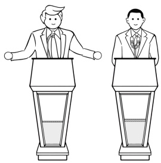

Elected leaders care about their approval ratings. The numbers are regularly provided by polls. Chesie Yu, [CC BY-NC-SA 4.0](https://creativecommons.org/licenses/by-nc-sa/4.0/?ref=chooser-v1)

Table 3.5: An excerpt of approval ratings data for presidents Obama and Trump during their fourth year in office. Polling data from [RealClearPolitics](https://www.realclearpolitics.com/). The displayed period, from mid-January to mid-April centers on mid-March, the weeks in 2020 where the world, including the US, rapidly realized the magnitude of the unfolding health crisis.

| poll | date | approve | president |
| --- | --- | --- | --- |
| The Economist/YouGov | 2016-01-17 | 43 | Obama |
| Bloomberg | 2016-03-21 | 50 | Obama |
| NBC News/Wall St. Jrnl | 2016-05-17 | 51 | Obama |
| ABC News/Wash Post | 2020-01-22 | 47 | Trump |
| Economist/YouGov | 2020-02-10 | 45 | Trump |
| Reuters/Ipsos | 2020-04-13 | 46 | Trump |

We choose a single day, March 15th as the day of “treatment”. By March 15th 2020 the coronavirus epidemic had become the leading issue in US media and politics. The number of infected and dead was increasing rapidly and within a week California ordered the first state-wide lockdown. Hence “before” are polls conducted before March 15th, and “after” are later polls. The treatment group is made of Trump, as the pandemic occured on his watch. Obama did not experience anything similar in 2016 and hence he forms the control group. When we compute the group/time period averages, we get an analogue to the Table 3.4:

## Table 3.6: The effect of COVID-19 pandemic on president’s approval rate

<!-- page: 232 -->

<table><tr><td rowspan="2">Time</td><td colspan="2">Approval rate (pct)</td><td rowspan="2">Difference (pct pt)(Trump - Obama)</td></tr><tr><td>Control(Obama)</td><td>Treatment(Trump)</td></tr><tr><td>Before (before March 15)</td><td>45.9</td><td>45.1</td><td>-0.86</td></tr><tr><td>After (after March 15)</td><td>48.1</td><td>46</td><td>-2.11</td></tr><tr><td>Trend (After-Before), pct pt</td><td>2.21</td><td>0.96</td><td>-1.25</td></tr></table>

We can see that the average approval rate for both presidents between mid-January and mid-March was fairly similar around 45% while Obama was enjoying a small lead of 0.86 pct. However, by end of March–early April Obama’s lead had increased to 2.11 pct points. The difference of these two figures is the effect estimate, −2.15 pct points. Alternatively, we can look at the growth of the popularity of both presidents over the same time period. During this time, Obama gained 2.21 pct points of approval while Trump 0.96 pct points. By construction, the difference is exactly the same number, −1.25.

We may depict this estimator graphically by plotting two lines, one <u>for Obama and one for Trump, for two time points, “before” and “after”:</u>

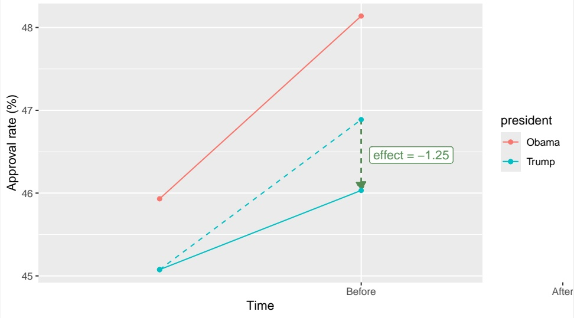

Figure 3.7: Presidents’ average approval rate before and after March 15th of their 4th year in office. We can see that Obama’s approval increased by more than two percentage points over this period while that of Trump grow by slightly less than one point. The dashed blue line depicts the counterfactual–the path of Trump approval rate, if it had been similar to that of the Obama’s. The difference between the counterfactual and the actual approval (green dashed line), −1.25 points, is the effect.

This analysis suggests the epidemic was actually hurting the president’s standing. Do we believe the result is correct? It is certainly plausible–unlike Korean president Jae In Moon for instance, Trump was not a leading figure in driving the nation’s response to the virus. However, our belief should fundamentally depend on whether we believe in the identifying assumption: without the virus, Trump’s

<!-- page: 233 -->

approval in 2020 had followed a similar trend as that of Obama in 2016.

Table 3.4 treats the data as if we have just a single observation in each 4 cells of the table. But we may have more data, and we may have additional variables we may want to control for, for instance political preferences, age, place of residence, and other characteristics of the respondents. In this case we can use linear (or other type) regression instead of the tabulation. As in the examples with presidents’ approval, we may observe multiple polls for both before and after period. Linear regression can easily capture the trend with a term $\beta _ { 1 }$ · after, and difference between the treatment and control groups by $\beta _ { 2 }$ · treatment. However, if we use these two terms only, we assume the trends are equal for both groups and hence by construction the effect is zero. So we also need an interaction term of the form $\beta _ { 3 } \cdot \mathrm { a f t e r } \times$ treatment (see Section 2.1.8) to allow the trends between the groups. So the regression model will look like

$$
y _ {i t} = \beta_ {0} + \beta_ {1} \cdot \text {after} _ {i t} + \beta_ {2} \cdot \text {treatment} _ {i t} + \beta_ {3} \cdot \text {after} _ {i t} \times \text {treatment} _ {i t} + \epsilon_ {i t}.\tag{3.6.11}
$$

Here $\beta _ { 0 }$ captures the baseline effect, the average outcome for the control group before treatment; $\beta _ { 1 }$ captures the difference in the baseline trend, the outcome growth for the control group from “before” to “after”; β<sub>2</sub> captures the baseline difference between treatment and control groups (before treatment); and finally, $\beta _ { 3 }$ is the estimated difference in time trends for the treatment and control group. The last figure, $\beta _ { 3 }$ , is exactly the DiD estimate we are looking for. Hence, in order to estimate DiD using linear regression, you have to include:

a) intercept $\beta _ { 0 }$ ,

b) a term for after-treatment time period: $\beta _ { 1 }$ · after,

c) a term for the treatment group: $\beta _ { 2 }$ · treatment,

d) an interaction effect for treatment group after the treatment: $\beta _ { 3 }$ · after × treatment.

The latter is the estimate of interest. We may add additional controls as needed.

Example 3.14: President’s approval rating: the regression approach

Let’s return to the example of Obama’s and Trump’s approval rating. We select the time period from mid-January to mid-April of the fourth year of their presidency, as in Example 3.13. If fact, our dataset contains 149 polls for this period (See Table 3.5), so we have many observations for each table cell. We estimate the following model:

$$
y _ {i t} = \beta_ {0} + \beta_ {1} \cdot \text {after} _ {i t} + \beta_ {2} \cdot \text {Trump} _ {i t} + \beta_ {3} \cdot \text {after} _ {i t} \times \text {Trump} _ {i t} + \epsilon_ {i t}.\tag{3.6.12}
$$

We get the following results:

| . | object | .. |
| --- | --- | --- |
| Intercept | 45.931 | 0.433*** |
| after | 2.208 | 0.582*** |
| president Trump | -0.856 | 0.539 |
| after×president Trump | -1.251 | 0.785 |
| # obs | 149 |  |
| R<sup>2</sup> | 0.2065 |  |

<!-- page: 234 -->

Table 3.7: DiD regression estimate for the effect of COVID-19 epidemic on the US president’s approval rating. Standard errors in italics.

As expected, the regression approach gave us exactly the same numbers, including the main effect, after×Trump= −1.25, as the table-based approach. Unless we introduce additional controls, linear regression just compares the averages. But unlike the table above, we now also have standard errors. These suggest that after, the spring-2016 trend for Obama, is indeed statistically significant. However, none of the Trump-related effects is statistically significant. The polling average for Trump is a little bit less than that for Obama, and his polling numbers have been lagging even more over the spring, but both effects are small and may well be a sampling noise. Hence, we can conclude that the epidemic did not give Trump any noticeably boost, and may instead have hurt him slightly.

To recap, let’s list here all the predicted values:

• The baseline approval rate, for Obama, before mid-March, was $\beta_{0}=45.93\%$

• For Trump, the approval rate was slightly lower, $\beta_{0}+\beta_{2}=45.075\%.$

After mid-March, Obama experienced a mild increase of $\beta _ { 1 }   =   2 . 2 0 8$ pct points.

After mid-March, Trump’s growth was somewhat smaller than Obama’s, $\beta _ { 1 } + \beta _ { 3 } = 0 . 9 5 7$ pct points, leading the average approval rate to $\beta _ { 0 } + \beta _ { 1 } +$ $\beta_{2}+\beta_{3}=46.032\%.$

The main effect of interest here, the difference in springtime growth, is $\beta _ { 3 } = - 1 . 2 5 1$ pct points. However, it is not statistically significant.

DiD estimators are sometimes used in a less formal context. Figure 3.8, taken from of England (2019, p 14), compares the 2009 recession and the following recovery with “previous recessions”. One can see that while the previous recessions were followed by a substantial investment growth, this has not been the case since the Great Recession. After the Brexit referendum decision was made in 2015 (marked as the EU Referendum Act on the figure), the investment level has remained essentially flat. The authors conclude that “weak investment appears to primarily reflect Brexit and associated uncertainty”, a conclusion that also receives support from investor surveys.

## Exercise 3.6: Job search help–dif-in-dif estimator

Use the same college job search workshop data as in Exercise 3.6. Now use DiD estimator.

1. Which students will you include in your sample?

2. Which of the two job columns will you use?

3. Compute the effect.

4. What are the identifying assumptions? Do you think these are satisfied?

5. Provide a plausible explanation why the measured effect may be too large (upward biased).

Solution on page **??**.

<!-- page: 235 -->

Business investment after previous recessions(a)

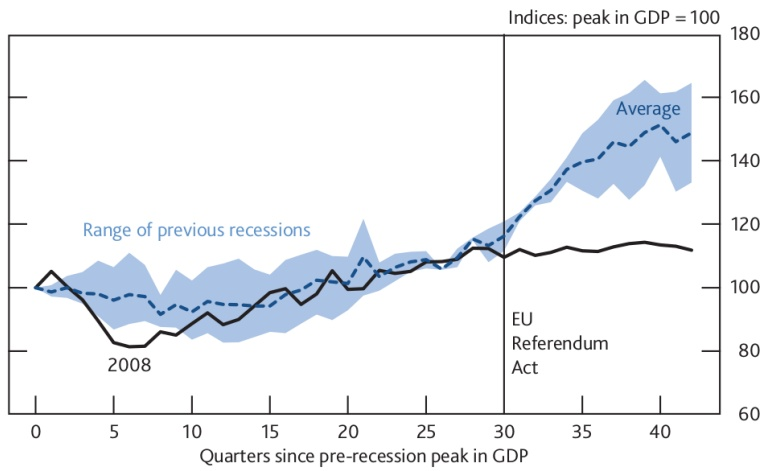

Figure 3.8: Effect on Brexit referendum on the business investments in UK: an example of graphical DiD approach.

Sources: ONS and Bank calculations.

(a) Chained-volume measure. Recessions are defined as at least two consecutive quarters of negative GDP growth. Previous recessions include those beginning in 1973, 1975, 1980 and 1990. A recovery ends if a second recession occurs in the period shown.

## 3.6.4 Comparing CS, BA and DiD estimators

TBD: comparison, including figures that contain the corresponding counterfactuals.

## Cheatsheet 3.1: OLS Estimators for causal inference

• T: treatment

• t: time

• ȳ: average outcome

**Cross-sectional (CS) estimator**

• **Control group**: other subjects

**Identifying assumption**: the treatment group, if untreated, is similar to the control group (no unknown group differences)

• **Group average estimator**:

$$
\beta_ {T} = \bar {y} (T = 1) - \bar {y} (T = 0)
$$

• **Regression model**:

$$
y _ {i} = \beta_ {0} + \beta_ {T} \cdot T _ {i} + \epsilon_ {i}
$$

**Before-after (BA) estomator**

• **Control group**: the same subjects before treatment

<!-- page: 236 -->

**Identifying assumption**: the subjects, if left untreated, are similar to what they were before treatment (no unknown time trend)

• **Group average estimator**:

$$
\beta_ {T} = \bar {y} (t = 1) - \bar {y} (t = 0)
$$

• **Regression model**:

$$
y _ {i t} = \beta_ {0} + \beta_ {T} \cdot A f t e r _ {i t} + \epsilon_ {i t}
$$

## Differences-in-differences (DiD) estimator

**Control group**: the same subjects, but applying the time trend of the control group.

**Identifying assumption**: the subjects, if left untreated, show similar trend as the control group subjects

• **Group average estimator**:

$$
\begin{array}{l} \beta_ {T} = \bar {y} (T = 1, t = 1) - \\ \qquad \qquad \qquad - \left[ \bar {y} (T = 1, t = 0) + \left(\bar {y} (T = 0, t = 1) - \bar {y} (T = 0, t = 0)\right) \right] \end{array}
$$

## • Regression model:

$$
y _ {i t} = \beta_ {0} + \beta_ {1} \cdot A f t e r _ {i t} + \beta_ {2} \cdot T r e a t m e n t _ {i t} + \beta_ {T} \cdot A f t e r _ {i t} \times T r e a t m e n t _ {i t} + \epsilon_ {i t}
$$

<!-- page: 237 -->

## 3.7 Cognitive Illusions in Causal Inference

Humans brains are developed to serve us well in typical everyday situations we encountered through the past hundreds of thousands of years. However, accurately establishing causality based on observational or experimental data has apparently not been an important survival task for our ancestors. This manifests in cognitive biases related to causal inference.

Consider a binary treatment-binary outcome data, such as the flu shot–flu example in Section 3.3. This data can always be displayed as a four-cell contingency table (Table 3.8). It depicts four potential outcomes, for instance a denotes the count of cases where both the treatment and outcome are absent. This is typical data humans observe, it is much more rare to be able to directly manipulate the treatment in order to conduct something that resembles a RCT. Evolution has taught us to deduce causality from such case counts.

Table 3.8: Four potential outcomes in binary treatment/binary outcome data. “0” and “1” denote presence and absence of treatment and outcome, the letters in cells are the corresponding case counts.

<table><tr><td rowspan="2">Treatment</td><td colspan="2">Outcome</td></tr><tr><td>0</td><td>1</td></tr><tr><td>0</td><td>a</td><td>b</td></tr><tr><td>1</td><td>c</td><td>d</td></tr></table>

We are inclined to believe “treatment” causes “outcome” if we see many cases in cells a and d while c and b remain relatively empty, and there are no obvious confounding factors. It should be clear to the reader by now that such data alone is not enough to establish causality. However, very often this is all we have, and we have to use such information to successfully live in the environment we live in. Remember–we are talking about a time frame of hundreds of thousands of years, most of which our ancestors spent as hunter-gatherers in African savannas.

It turns out that humans are more likely to believe treatment causes outcome (Matute et al., 2015) if

1. The outcome is very likely, say, 75% or more. This is called outcome-density bias.

2. The treatment is very likely (cause-density bias).

Both biases are related to the cell d in the table being well populated compared to the other cells, and hence reinforce each other. People are likely to believe in bogus causal relationship if both treatment and outcome are very likely, for instance when they take a homeopathic pill every few hours while the ailment goes away rapidly. A simple remedy to counter this bias is to recommend people to lower the frequency of treatment. It makes the d-cell case count smaller and hence the bias will be less strong.

<!-- page: 238 -->

## 3.8 Causality and complex social problems

Sometimes the causal chains are much more complex and harder to predict than is apparent when someone first encounters the problem. This is often the case if the question are related to humans and social problems. Below we walk through an example, namely usage of mandatory bicycle helmet laws.

## 3.8.1 Effect of bike helmet laws

It is well established that bicycle helmets substantially reduce head injuries during certain type of crashes. Is this evidence enough to justify mandatory helmet laws (MHL-s)? It turns out we need much more evidence.

The fact that helmets help to prevent head injuries is best established through mechanical experiments where model heads, with and without helmet, are dropped to hard surface. One can find information for both about frontal impact (Cripton et al., 2014) and for oblique impact (Mills and Gilchrist, 2008). In such experiments the researchers have full control over the environment, such as impact speed, type of helmet, hair and skin properties and so on, and in this sense they answer the exact question they are designed for very well. The question in the above-cited papers is about head injury when hitting hard surface at given speed.

Obviously, head injury is not a random process that only depends on the presence of helmet—there are many more decisions involved. For a start, one has to decide whether to cycle or not. Thereafter one chooses the route, speed, and makes other decisions about biking like distance from curb, whether to pass someone, etc. Also the other road users choose their behavior, such as motorists must decide speed and distance when passing a cyclist. So there are many reasons to believe that such studies do not give the complete picture.

1. Typical crashes occur at different angles and surfaces, and not necessarily in conditions similar to that of the laboratory environment. But as the experiments get better, we can assume the laboratory models get increasingly close to the real cases.

2. in certain circumstances the helmet may get stuck and hurt the wearer more than would be the case without helmet (rotational injuries). So far, the non-experimental evidence from actual accidents tends to indicate that helmets help to prevent head injuries by a substantial degree (Amoros et al., 2012), so the cases where helmets hurt are probably rare in practice. However, we are outside of controlled experiment realm now.

3. cyclists may act differently depending on whether they wear or do not wear helmets. In particular, wearing helmet can lead to more risky behavior (risk compensation). Fyhri et al. (2018) does not find any effect of wearing helmet on cyclists’ speed in a field experiment. However, the study was limited in terms of number of participants (31) and situations encountered on the road. More research is needed here but it is much harder to simulate realistic situations here.

<!-- page: 239 -->

4. MHL-s may discourage cycling. As crashes are rare, the net health effect may be negative if, in order to avoid rare crashes, people avoid the healthy exercise in the first place. However, we may debate if authorities should strive toward fewer crashes, or more healthy population.

The discouragement may occur through several mechanisms:

(a) helmets are considered inconvenient, either to wear, or to carry around

(b) the authorities are using scaring tactics to make the point for helmets. This may make people afraid of biking in first place instead of choosing helmets.

(c) helmet requirement makes bike shares less harder to implement.

These effects are very hard to pinpoint in experiments.

5. If MHL discourages cycling, it also makes cycling less safe through following mechanisms:

(a) “safety in numbers”: the less bikes there are on street, the less the motorists expect to encounter them, the less prepared they are to notice cyclists in traffic and hence the more likely are the accidents.

(b) some people may choose driving over cycling increasing the amount of motorized traffic.

(c) fewer cyclists also means less political will to invest in cycling infrastructure.

6. helmets may also cause drivers to behave differently and behave more (or less) risky with respect to cyclists. For instance, Walker (2007) finds that cars passed cyclists with helmets significantly closer in average.

Note that despite of the large number of potential mechanisms, the net effect may be dominated by just one or two major ones while all the others are of very little importance. The problem is that we don’t know how strong are each of these effects, and hence the policy will remain largely uninformed.

<!-- page: 240 -->

<!-- page: 241 -->

# Predictive modeling and model goodness

- Contents
- 4.1 Predictive modeling ..... 231
- 4.2 Regression: predicting continuous values ..... 231
- 4.3 Classification: predicting categorical values ..... 232
- 4.3.1 What are we predicting? ..... 232
- 4.3.2 Decision boundary ..... 233
- 4.3.3 Classification: model goodness measures ..... 234
- 4.4 Confusion matrix and related concepts ..... 235
- 4.4.1 Confusion matrix ..... 235
- 4.4.2 ROC curve ..... 242
- 4.4.3 Limitations of the confusion matrix approach ..... 246
- 4.5 Overfitting and Validation ..... 248
- 4.5.1 What is overfitting ..... 248
- 4.5.2 Validation: which model is the best ..... 253
- 4.5.3 Cross-validation ..... 255
- 4.5.4 Training-validation-testing approach ..... 255

## 4.1 Predictive modeling

TBD: explain predictive modeling

## 4.2 Regression: predicting continuous values

TBD: discuss predicting continuous values

<!-- page: 242 -->

## 4.3 Classification: predicting categorical values

This section discusses the specific issues when we do classification–predict categorical values.

## 4.3.1 What are we predicting?

In case of linear regression, and in case of other models for continuous values, the outcome is exactly what you want to predict. However, in case of classification, you can predict two separate things: first the category, and second–probability of the category.

In case of classification you are often primarily interested in the outcome category. But the corresponding probabilities will give us additional information, in particular, how confident is the model when predicting one or another outcome. Also, the models typically compute the probabilities first, and thereafter convert the probabilities to categories, normally by picking the category that has the largest predicted probability.

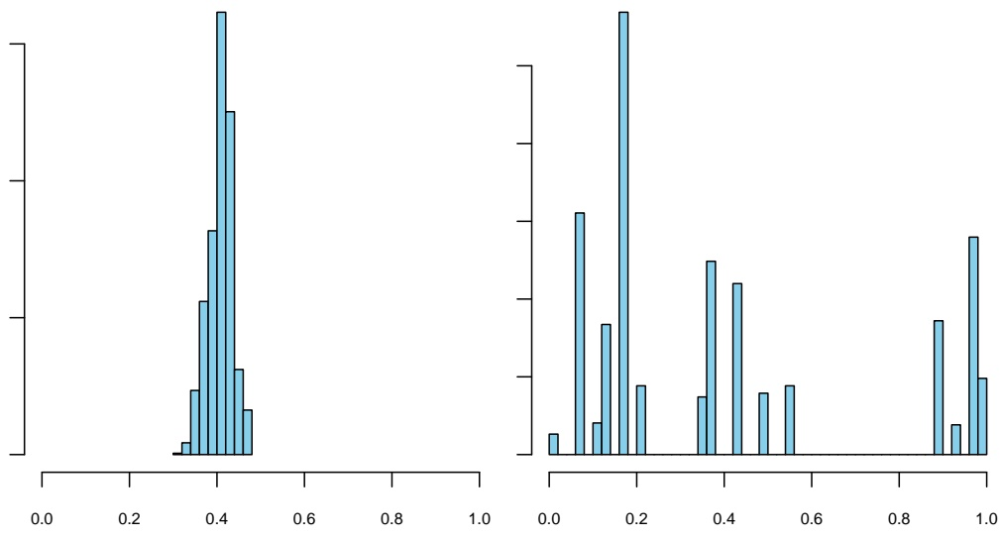

Figure 4.1: Predicted probabilities of Titanic survival using logistic regression. The left panel only uses age (as a linear term), the right panel includes age groups, sex, passenger class, and their complete interactions. The second model results in much more confident predictions.

Figure 4.1 shows the predicted survival probabilities in Titanic data. For a refresher, the average survival probability in these data is 40.8%.<sup>1</sup> The left panel only uses age (as a linear term) as the explanatory variable. As you can see, the predictions tend to be between 0.35 and 0.45. This means that the model has little idea

<small><span class="docvortex-page-footnote" data-block-type="page_footnote" style="color:#6b7280">1<sub>I</sub> have removed observations with missing age as I am using age as a predictor, so you may find a different figure if you look at the complete dataset.</span></small>

<!-- page: 243 -->

about what is going on, and predicts the values close to the average. The right panel, however, also include the passenger class, age groups, and their three-way interaction effects. The results are now split into two groups: the largest one with survival probabilities between 0 and 0.2, a middle one between 0.4 and 0.6, and the last group between 0.8 and 1.0. The model is fairly confident in its predictions for the first and the third group, but for the middle group it has little idea if these passengers survived.

Do we always want to model to be more confident? Not necessarily–we prefer confident and correct predictions while confident and wrong is the worst the model can do. This is a motivation for likelihood, that can be informally written as

$$
\begin{array}{c} \Pr (\text {Survival probability for those who survived}) \times \\ \qquad \qquad \qquad \times \Pr (\text {Drowning probability for those who drowned}) \end{array}\tag{4.3.1}
$$

If survival probability is large and person survived, likelihood will be large. But if the person died, the corresponding drowning probability is small and likelihood will be small. Likelihood is one of the central ways to evaluate statistical models.

## Exercise 4.1: Titanic survival probability

```txt
Replicate the histograms in Figure 4.1 on computer. The histogram at left only contains age as a linear term, the histogram at right contains age groups, passenger class, sex, and their interactions. You probably cannot get the exact same histogram, but you should get a somewhat similar one.
Which group of passengers belong to each of the three categories?
```

## 4.3.2 Decision boundary

A very useful way to understand how classification models work are decision boundary plots. When talking about decision boundary, the “decision” refers to predicted category, and “boundary” refers to the boundary where the decision changes. It can be easily illustrated in case of 2-D models, models that contain two continuous explanatory variables. Below a few examples using Yin-Yang data (Section B Yin-Yang, page 483). This dataset contains two predictors, x, and y, and one outcome variable c ∈ {0, 1}. The task is to determine the color c based on location on the plane, (x, y).

Figure 4.2 shows the the decisions (values of c) at different location on the plane. At the left panel, the small dots are the actual data points used to fit the model, and the model in turn is used to predict the color on a 5 × 5 grid (large pale dots). You can see that those broadly capture the data pattern. At right, the predictions are done on a 40 × 40 grid and instead of large dots, the plane is filled with rectangular tiles. The decision boundary is the boundary between the blue and red areas in the figure.

Exercise 4.2: Decision boundary for other data dimensions

<div class="docvortex-algorithm" style="white-space: pre-wrap; font-family:monospace;">
The above example uses 2-D data $((x,y)$-plane). How would decision boundary look like if the data only contains a single feature (e.g. $x$)? contains three features (e.g. $x$, $y$, and $z$)?
</div>

<!-- page: 244 -->

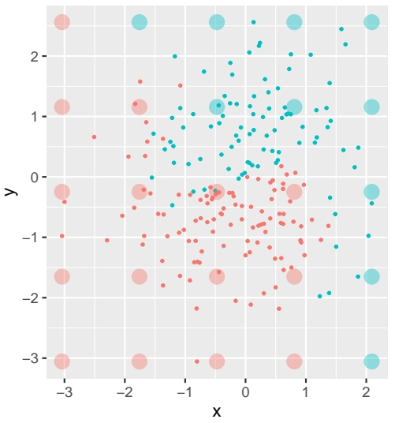

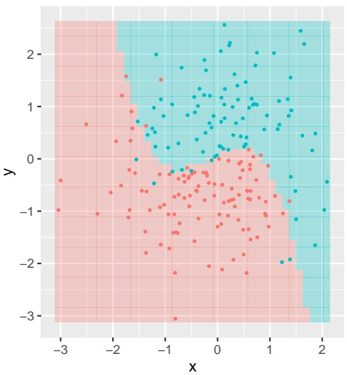

Figure 4.2: Decision boundary using Yin-Yang data. At left, the color (red or blue), is predicted on a $5 \times 5$ grid, and the results are plotted as the large dots. At right, a 40 × 40 grid fills the whole image. The Decision boundary is the boundary between the red and blue areas.

The boundary look different for different models. For instance, for logistic regression with linear terms only it is a straight line and for k-NN if may be rather complex (Figure 4.6). It also does not have to be a single boundary, it is perfectly possible that the feature space is split into multiple “islands” and “lakes” of different color (see, for instance, Figure 4.7).

TBD: finish decision boundary

## 4.3.3 Classification: model goodness measures

We discussed model evaluation in the context of linear regression above in Section 2.1.5, including how figures like RMSE and $R ^ { 2 }$ describe different sides of the model performance. Here we focus on evaluating categorization.

It turns out that RMSE and $R ^ { 2 }$ are not appropriate indicators for model goodness in case of categorization. In case of continuous outcomes, such as income or light intensity, a good model will be the one that predicts values very close to the true observed ones. Hence the measure should be based on the difference between the predicted and actual value, $\hat { y } _ { i }   -   y _ { i }$ . But this approach does not really work for categorization for several reasons:

Nominal measures: can only be compared as equal/not equal; ordinal measures: can only be compared as equal, larger, smaller. See see Section 1.1.1.

1.First, categories are nominal or ordinal measures and hence the difference $\hat { y } _ { i }   -   y _ { i }$ is typically not defined. For instance, when predicting treatment status then the whole concept treated − nontreated does not make much sense.

<!-- page: 245 -->

2. Second, our predictions can be wrong in two ways: either we predict 1 instead of 0 (type-1 errors or false positives) or 0 instead of 1 (type-2 errors or false negatives). These errors can have different real-world consequences, but neither RMSE nor $R ^ { 2 }$ distinguishes between these types of errors. There are more possible errors if we have more categories.

3. Finally, even if we define the difference $\hat { y } _ { i } - y _ { i } , \; \mathrm { e . g . }$ as 0 if our prediction is correct and 1 if it is not correct, we have lost all information about how “far” off the prediction was from the correct one.

Solutions to the first two issues are based on confusion matrix. In order to address the third issues, we have to look not just the predicted categories but the predicted probabilities of the categories.

## 4.4 Confusion matrix and related concepts

Confusion matrix is a popular way to assess the performance of categorical models. Instead of attempting to measure distance between the predicted and the true values, we just tabulate and count all types classification errors. This simple approach allows to avoid the first and second problem listed above.

## 4.4.1 Confusion matrix

Confusion matrix is in essence just a cross-tabulation of the actual and predicted classes. It is a central tool that many categorization-related goodness measures are based on. Here we discuss confusion matrix in case of two categories only but it easily generalizes to a larger number of classes.

Let’s start with an example. Imagine we work in a hospital and have ten patients who all do a medical test. This is a quick test that shows if the patient has a certain condition, such as asthma. As is the tradition in medicine, we call the test “positive” (+) if the patient has asthma, and “negative” (−), if they have not. But the test is imprecise, and only over time we will learn the actual condition. The actual and test values of all patients are in Table 4.1 (left panel). The last column in the table, Type, shows the correctness of the test results: $T P$ (true positives) are patients who had asthma and were tested positive, TN are patients who do not have asthma and were tested negative. These are the correct results. But in a number of cases, the test was wrong: FN (false negatives) are asthma cases that were tested negative and $F P$ are the opposite, healthy patients who were tested positive. As the test can only have two possible outcomes, positive and negative, these four types are the only possible types.

The right panel shows a summary table of the table at left, just the counts of all four possible types. In these data we have two true negatives, three false negatives, one false positive and four true positives. This is the idea of a confusion matrix. Next, let’s discuss it in a more formal fashion.

Assume we have T cases in total that belong to two categories: P positives denoted by $\text{" }+ \text{" }$ , and $N$ negatives denoted by $^ { 2 } - ^ { \prime } )$ This can be a similar medical diagnosis

<!-- page: 246 -->

Table 4.1: Example diagnosis data (left) and the corresponding confusion matrix (right).

| Case# | Actua | l Test | Type |
| --- | --- | --- | --- |
| 1 | + | + | TP |
| 2 | - | - | TN |
| 3 | + | - | FN |
| 4 | - | - | TN |
| 5 | - | + | FP |
| 6 | + | + | TP |
| 7 | + | - | FN |
| 8 | + | - | FN |
| 9 | + | + | TP |
| 10 | + | + | TP |

<table><tr><td rowspan="2">Test</td><td colspan="3">Actual</td></tr><tr><td>-</td><td>+</td><td>Total</td></tr><tr><td>-</td><td>2</td><td>3</td><td>5</td></tr><tr><td>+</td><td>1</td><td>4</td><td>5</td></tr><tr><td>Total</td><td>3</td><td>7</td><td>10</td></tr></table>

problem as in the example above, but may also be something completely different. For instance, in case of weather forecast, we can label rain as positive and dry weather as negative. These are the “actual categories”, determined either through expensive testing or diagnosis, or maybe the correct results will be apparent over time (as in case of weather forecast). In any case, we know that the actual categories are correct. Now we use a medical test or a machine learning model to predict the category for each case. We would like the model to be able to predict every single case correctly as positive or negative but most models are not that good. Let’s say that in total, the model predicts $\hat { P }$ cases as positive and $\hat { N }$ cases as negative. For an overview, we create a similar $2 \times 2$ cross-table as above, where we present the counts for actual and predicted classes (Table 4.2). The table indicates how many actual positive cases were predicted as positive, how many as negative, and so on. This is the confusion matrix.

Table 4.2: Confusion matrix for two categories, labeled here as $a _ { \underline { { \phantom { \cdot } } } \underline { { \phantom { \cdot } } } } ,$ and $\text{" }+ \text{" }.$ The table entries are counts: TP, true positives, refers to positive cases that were also predicted to be positive, P is the number of actual positive cases. See explanations in the text.

<table><tr><td rowspan="2">Predicted</td><td colspan="3">Actual</td></tr><tr><td>-</td><td>+</td><td>Total</td></tr><tr><td>-</td><td>TN</td><td>FN</td><td> $\hat{N}$ </td></tr><tr><td>+</td><td>FP</td><td>TP</td><td> $\hat{P}$ </td></tr><tr><td>Total</td><td>N</td><td>P</td><td>T</td></tr></table>

In case of two categories, the core of confusion matrix contains four cells:

• True positives (TP) are cases that are actually positive, and are correctly pre-dicted as positive. We like TP to be large.

• True negatives (TN) are actually negative and are predicted as negative. We

<!-- page: 247 -->

like TN to be large.

• False positives $( F P ) ,$ , also type-I errors, are cases that are actually negative but were incorrectly predicted as positive. We would like $F P$ to be zero.

• False negatives (FN), also type-II errors, are cases that are actually positive but were predicted as negative. We would like FN to be zero.

In case of confusion matrix, these concepts often refer to the corresponding counts, e.g. FP is the number of cases we incorrectly predict as positive. However, these may also refer to probabilities or percentages, e.g. FP may be a probability that we predict a case incorrectly as positive, or percentage of such cases. Obviously, a good model has high values of $T P$ and TN while the counts of $F P$ and FN are small. Table 4.2 also includes one-way counts: $P$ is the number of actual positives, N is the number of actual negatives, $\hat { P }$ is the number of predicted positives and $\hat { N }$ is that of predicted negatives. Finally, T denotes the total number of cases.

## Example 4.1: Confusion Matrix

<table><tr><td rowspan="2">Predicted</td><td colspan="3">Actual</td></tr><tr><td>Non-Participants</td><td>Participants</td><td>Total</td></tr><tr><td>Non-Participants</td><td>2452</td><td>89</td><td>2541</td></tr><tr><td>Participants</td><td>38</td><td>96</td><td>134</td></tr><tr><td>Total</td><td>2490</td><td>185</td><td>2675</td></tr></table>

<!-- page: 248 -->

Although a 2 × 2 table seems simple, confusion matrix is actually surprisingly confusing. So no wonder it is called confusion matrix ,. It is partly related to the notation and language. In particular, true positives refer to cases that are actually positive, and are predicted as positive; not to the “ground truth”, the cases that are actually positive as one may think. This is why we introduce the “actual” status here, to distinguish between the actual positives P and “true” positives TP. In addition, N typically denotes the total number of cases, not just the number of actual negatives. Here we denote the total number of cases by T.

Moreover, you can see the confusion matrix defined in slightly different way in the literature, e.g. putting actual values in rows and predictions in columns, and putting positives first and negatives second. So each time you see a confusion matrix in the literature, you need to understand how exactly it is defined. All these definitions are correct, but mixing them up is wrong! Here we consistently use the definition above: actual values in columns, predicted values in rows; negatives first and positives second.

Exercise 4.3: Compute the confusion matrix

| case: | 1 | 2 | 3 | 4 | 5 | 6 | 7 | 8 | 9 | 10 |
| --- | --- | --- | --- | --- | --- | --- | --- | --- | --- | --- |
| Actual | 1 | 0 | 0 | 1 | 1 | 0 | 0 | 0 | 1 | 0 |
| Expert | 0 | 0 | 0 | 1 | 0 | 0 | 1 | 0 | 1 | 1 |

Solution on page 509.

## Exercise 4.4: Confusion matrix for the naive model

Consider the data in Example 4.1. Consider a naive model that predicts all observations to the majority category–to the category that is more common (non-participants in that case). How will the corresponding confusion matrix look like, if you consider the participants as positives?

Solution on page 510.

Based on the confusion matrix entries, we define a number of model goodness measures:

• Accuracy: percentage of correct answers

$$
\text {Accuracy} = \frac {T P + T N}{T}
$$

Accuracy is an easy and intuitive summary measure: what percentage of our predictions turn out to be correct. However, it is not very informative in case of

<!-- page: 249 -->

very imbalanced categories as even a naive model that always predicts the most common class can achieve high accuracy (see Exercise 4.4 and Example 4.2).

Another problem with accuracy is that it weighs both false negatives and false positives equally. But sometimes these errors have quite different costs.

• Recall is the percentage of actual positives that are correctly identified as positives. You can try to remember it as how well does the model “recall” the actual positives. It is defined as

$$
\mathrm{Recall} = \frac {T P}{P} = \frac {T P}{T P + F N}.
$$

If our main concern is to capture all positives, recall may be a good measure. It is sensitive to false negatives, the incorrectly categorized positives, because the denominator includes FN . However, it is easy to fool: if we predict every case to be positive, then we get Recall = 1 but the model is hardly of any use.

• Precision is a sort of mirror image of recall: percentage of predicted positives that turn out to be correct.

$$
\text {Precision} = \frac {T P}{\hat {P}} = \frac {T P}{T P + F P}.
$$

Try to remember it as “how precise” are the predicted positives. Precision is sensitive to false positives, so it may be a good measure if avoiding false positives is an important concern. As the other measures, this can also be fooled easily: if we ensure that only the most likely cases are labelled as positive, we can ensure that precision is high.

• F score is an attempt to find a balance between recall and precision. It is just the harmonic mean of these two measures

$$
F = \frac {2}{\frac {1}{\text {Precision}} + \frac {1}{\text {Recall}}}.
$$

F-score cannot be easily fooled–if you predict everything positive to get a high recall, then the precision is low and hence F-score is low too. And the other way around–high precision and low recall will still result in a low F-score.

Exercise 4.5: Compute F-score

Harmonic mean may be somewhat un-intuitive. Consider models where i) precision = 0.5 and recall = 0.5; ii) P = 0.3 and R = 0.7; iii) P = 0.2 and R = 0.8; iv) P = 0.1 and R = 0.9; v) P = 0 and R = 0 In each case compute F-score. Solution on page 510.

<!-- page: 250 -->

## Example 4.2: Accuracy, Precision, Recall, F-score

Consider the confusion matrix in 4.1. From the matrix we can compute all four model performance measures:

$$
\text {Accuracy} \quad A = \frac {T P + T N}{T} = \frac {9 6 + 2 4 5 2}{2 6 7 5} = 0. 9 5 3\tag{4.4.1}
$$

$$
\text {Recall} \quad R = \frac {T P}{P} = \frac {9 6}{1 8 5} = 0. 5 1 9\tag{4.4.2}
$$

Precision

$$
P = \frac {T P}{\hat {P}} = \frac {9 6}{1 3 4} = 0. 7 1 6\tag{4.4.3}
$$

$$
F \text {-score} \quad F = \frac {2}{\frac {1}{\text {Precision}} + \frac {1}{\text {Recall}}} = \frac {2}{\frac {1}{0 . 7 1 6} + \frac {1}{0 . 5 1 9}} = 0. 6 0 2\tag{4.4.4}
$$

So our model is highly accurate but not impressive in terms of recall and precision. This is because the groups are of very different size: only 185 (6.9 percent) of individuals participated in the program, and hence if we would predict “non-participant” for everyone, we would still get accuracy 93.1 percent. So despite of the impressive accuracy, the model does not do actually much better than a naive guess. $R = 0 . 5 1 9$ tells that we only catch slightly over 50% of the participants correctly, and $P = 0 . 7 1 6$ shows that only around 70% of predicted participants are correct. Finally, F-score is predictably between R and $P .$

## Exercise 4.6: Accuracy, Precision, Recall

Look at categorizing cases into two color categories: Red and Yellow. Consider the confusion matrix:

<table><tr><td rowspan="2">Predicted</td><td colspan="2">Actual</td></tr><tr><td>Red</td><td>Yellow</td></tr><tr><td>Red</td><td>10</td><td>10</td></tr><tr><td>Yellow</td><td>20</td><td>60</td></tr></table>

Assuming Yellow is the positive, compute A, P, R and F-score.

Solution on page 510.

These model goodness measures have multiple names, and they are closely related to other similar measures. A number of examples are listed here:

• Accuracy–based measures

**Misclassification rate** is just the opposite of accuracy:

$$
\text {Misclassification rate} = 1 - A\tag{4.4.5}
$$

• Recall–based measures that focus on the actual categories:

<!-- page: 251 -->

**True positive rate** and **sensitivity** are just another names for recall.

**specificity** is recall for negative outcomes:

$$
\text {Specificity} = \frac {T N}{N} = \frac {T N}{T N + F P}\tag{4.4.6}
$$

**False positive rate** measures the percentage of negatives that is falsely categorized as positives. It is also 1 minus specificity:

$$
F P R = 1 - \text {specificity} = \frac {F P}{N} = \frac {F P}{T N + F P}\tag{4.4.7}
$$

**False negative rate** is the opposite of FPR, it measures the percentage of positives that are falsely categorized as negatives:

$$
F N R = \frac {F N}{P} = \frac {F N}{T P + F N} = 1 - R e c a l l\tag{4.4.8}
$$

• Precision-based measures focus on the predicted categories:

**Positive Predictive Value (PPV)** is the same as precision.

**Negative Predictive Value (NPV)** is the same as precision for negative outcomes:

$$
N P V = \frac {T N}{T N + F N} = \frac {T N}{\hat {N}}.\tag{4.4.9}
$$

Note that for each model we can only compute a single accuracy measure but two P and R measures: one for positive and one for negative cases (and even more if we have more than two categories). It is often clear from the problem which cases we should analyze and which measures we should focus. For instance, in case of medical diagnosis, the “positive” typically means the illness, and we may be concerned about catching as many cases as possible (we need a high recall). Alternatively, if the treatment is expensive and potentially harmful, we may be interested to ensure all cases we identify are actually correct (we look for high precision).

## Exercise 4.7: Flipping positives and negatives

Consider the treatment data in Example 4.1 (the same as in Exercise 4.4).

a) Assume participants are positives. Construct the confusion matrix and compute accuracy, precision and recall.

b) Assume non-participants are positives. Construct the confusion matrix and compute accuracy, precision and recall.

c) What do you think, which of these options is better?

Solution on page 510.

<!-- page: 252 -->

Exercise 4.8: COVID test sensitivity

| Ferté et al. (2021) analyze specificity and sensitivity of rapid covid tests (Abbott Panbio SARS-CoV-2 Ag rapid test) on students at Bordeaux University. They find specificity to be 100% and sensitivity 63.5% in the overall population, in the asymptomatic group the numbers are 100% and 35%.Construct example confusion matrices that have corresponding sensitivity and specificity. What do you think about the quality of the test?Solution on page 511. |
| --- |

## 4.4.2 ROC curve

Categorization models normally do not just predict the class, but the probability that the observation belongs to each class. It is customary to take probability 0.5 as the threshold between the categories. If the predicted probability is less than the threshold, it belongs to one, if it is above the threshold, it belongs to the other category. Say, probability 0.25 corresponds to “spam” and 0.6 to “no-spam” category.

While value 0.5 is intuitive and exactly in the middle of the range, we do not have to pick this value. If different type errors are associated with different costs, we may be much more willing to err in one side than another and pick a threshold noticeably different from 0.5. For instance, a judge may consider 0.9 as a too low confidence to sentence someone for a felony, because such decision, if wrong, will have serious consequences for the defendant. Obviously, our predictions change if we pick a different threshold, and different models may show different behavior here. ROC curve (receiver operating characteristics) is a way to make the type-I/type-II error trade-off explicit, and help the user to choose between different models and thresholds.

ROC curve is also based on confusion matrix related concepts, true positive rate, TPR, (i.e. recall) and false positive rate, FPR, defined as

$$
\text {False positive rate} = \frac {F P}{N}.
$$

While TPR measures the percentage actual positives that are identified correctly, FPR measures the percentage of actual negatives, incorrectly identified as positives. Obviously, we want out model to show high TPR (ideally 1) and low FPR (ideally 0).

ROC curve makes these tradeoffs explicit. It plots TPR against FPR for different thresholds. A typical ROC curve is shown in Figure 4.3. The figure shows to models, linear probability model and logistic regression, addressing labor market training participation as a function of age, experience unemployment, and other individual characteristics. Typically all models offer two extreme choices: FPR = TPR = 0 and $\mathrm { F P R } = \mathrm { T P R } = 1$ . The first corresponds to the case where all observations are predicted to be negative, the other to the cases where these are predicted to be positive. (Here it is not the case for LPM as the predicted probabilities may be outside [0,1] interval.) Obviously, we are interested in the cases in the middle where FPR is low but TPR approaches to one. The figure suggests that logistic regression clearly outperforms LPM at low FPR values. For instance, if FPR = 0.1, TPR for LPM is approximately 0.9, but for logit 0.95.

<!-- page: 253 -->

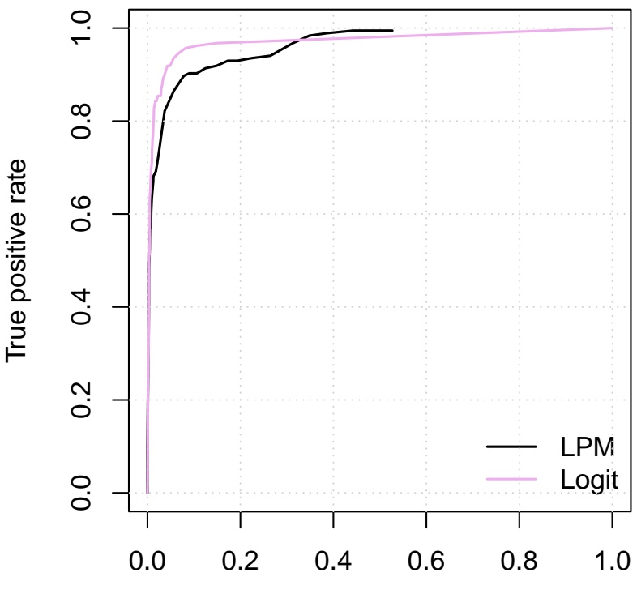

False positive rate

Figure 4.3: Example ROC curve for linear probability model (black) and logistic regression (pink). The figure suggest that in most cases logit outperforms LPM as it is able to achieve higher TPR over TPR range 0 to 0.3.

Example 4.3: Computing ROC curve

Let’s look at a case where we have two classes: “0” (negative) and $^ { \circ } 1 ^ { \prime \prime }$ (positive). We are working with four cases only. We run our model and the algorithm predicts the following probabilities:

| case | Pr(positive) | true value |
| --- | --- | --- |
| 1 | 0.3 | 0 |
| 2 | 0.4 | 1 |
| 3 | 0.6 | 0 |
| 4 | 0.7 | 1 |

Denote the probability threshold value by θ, i.e. if Pr(positive) > θ, we predict the case to be positive, otherwise it is assigned to the negative category. If we pick $\theta = 0 . 5 ,$ our algorithm predicts the cases 3,4 to be positive and 1,2 to be negative. This is the most intuitive approach, but may not be the best if type-I/type-II errors have very different price.

<!-- page: 254 -->

ROC curve is what makes these tradeoffs explicit. Let’s start with an extreme threshold, $\theta = 0$ . Now the algorithm predicts everything to be positive<sup>a</sup> and the confusion matrix will look like

<table><tr><td rowspan="2" colspan="2"></td><td colspan="2">Predicted</td></tr><tr><td>1</td><td>0</td></tr><tr><td rowspan="2">Actual</td><td>1</td><td>2</td><td>0</td></tr><tr><td>0</td><td>2</td><td>0</td></tr></table>

Note that here $P = 2$ and $N = 2 .$ Obviously, we get all the actual positives, but we get all actual negatives wrong. This corresponds to the true positive and false positive rates

$$
\mathrm{TPR} = \frac {T P}{P} = \frac {2}{2} = 1 \quad \mathrm{FPR} = \frac {F P}{N} = \frac {2}{2} = 1\tag{4.4.10}
$$

and will give us a data point on the ROC curve:

PR

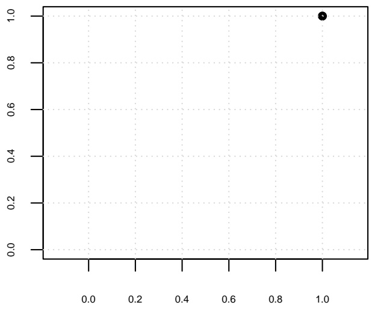

FPR

On the other extreme, we can take threshold $\theta = 1$ Now none of the cases is predicted positive and the confusion matrix will be

<table><tr><td rowspan="2" colspan="2"></td><td colspan="2">Predicted</td></tr><tr><td>1</td><td>0</td></tr><tr><td rowspan="2">Actual</td><td>1</td><td>0</td><td>2</td></tr><tr><td>0</td><td>0</td><td>2</td></tr></table>

<!-- page: 255 -->

All the negatives are correct but all positives are wrong, and the true positive and false positive rates are accordingly

$$
\mathrm{TPR} = \frac {2}{2} = 0 \qquad \mathrm{FPR} = \frac {2}{2} = 0.\tag{4.4.11}
$$

This will correspond to the lower-left corner of the ROC curve:

PR

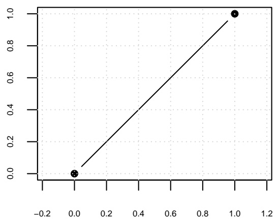

FPR

Note that now the ROC curve is already a curve, not just a single point. Such two extreme cases are always possible with a naive model that predicts either all cases positive or negative, and hence do not tell us much about the underlying model.

As a third example, take the threshold $\theta = 0 . 5$ and hence cases 1 and 2 will be predicted negative and cases $^ { 3 , }$ 4 positive. The confusion matrix is

<table><tr><td rowspan="2" colspan="2"></td><td colspan="2">Predicted</td></tr><tr><td>1</td><td>0</td></tr><tr><td rowspan="2">Actual</td><td>1</td><td>1</td><td>1</td></tr><tr><td>0</td><td>1</td><td>1</td></tr></table>

Now half of the predictions are correct and a half are wrong:

$$
\mathrm{TPR} = \frac {1}{2} = 0. 5 \qquad \mathrm{FPR} = \frac {1}{2} = 0. 5.\tag{4.4.12}
$$

We get a another point in the middle of the same ROC curve:

<!-- page: 256 -->

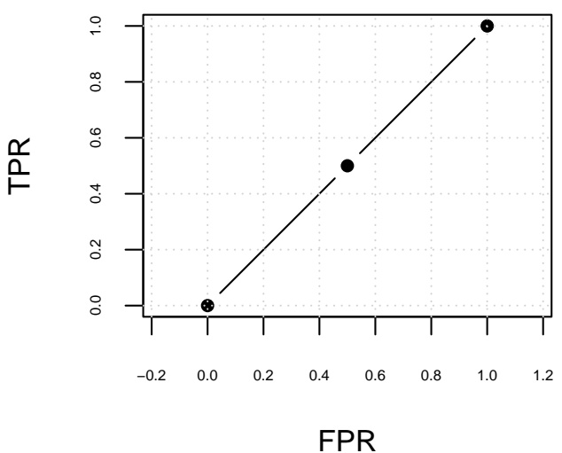

As above, we got a point on the same line that denotes random outcomes. This indicates that our model performs exactly as good as a naive model that randomly predicts half of the cases negative and the other half positive.

<sup>a</sup>It predicts literally everything to be positive only for such models, like logistic regression, where predicted probabilities are in the interval (0,1). This may not be the case for e.g. k-NN (predicted probability may be 0) or for LPM (predicted probability may be negative).

## 4.4.3 Limitations of the confusion matrix approach

While confusion matrix offers us a large number of intuitive indicators for the model performance, it is oblivious about the confidence of our estimators. As long as the predictions do not change, the increased confidence in the predictions is not reflected in the results. This makes it hard to compare models on small datasets as small changes in categorization results may obscure more imporant underlying confidence effects.

Cheatsheet 4.1: Confusion matrix and related measures

<!-- page: 257 -->

|  | P | redict | ed |
| --- | --- | --- | --- |
| Actual | - | + | Total |
| - | TN | FP | N |
| + | FN | TP | P |
| Total | Nˆ | Pˆ | T |

where

T P true positives

T N true negatives

$P$ actual positives

F P false positives

F N false negatives

$N$ actual negatives

$\hat { P }$ predicted negatives

$\hat { N }$ predicted negatives

$T$ total cases

Model goodness measures:

**Accuracy** percentage of correct predictions $\begin{array} { r } { A = \frac { T N + T P } { T } } \end{array}$

**Precision** percentage of predicted positives that are correct $\begin{array} { r } { P r = \frac { T \hat { P } + F \hat { P } } { \hat { P } } } \end{array}$

**Recall** percentage of actual positives detected $\begin{array} { r } { R = \frac { T P + F N } { P } } \end{array}$

F**-score** balanced mean of $P r$ and R: $\begin{array} { r } { F = \frac { 2 } { \frac { 1 } { P r } + \frac { 1 } { R } } } \end{array}$

**True positive rate** same as recall

**False positive rate** percentage of negatives that are predicted incorrectly as positives $\mathit { F P R } = \overleftarrow { \frac { F P } { N } }$

<!-- page: 258 -->

## 4.5 Overfitting and Validation

**Prerequisites:** Section 2.1 Linear Regression, page 123

## 4.5.1 What is overfitting

When working with machine learning models, we typically start with the “learning” part, i.e. model training. Training makes the model to “learn” patterns in data (typically by computing certain parameters) and later we can use the same patterns for predictions. But model can only learn about patterns it actually sees, i.e. patterns that are there in data we are using for training (called training data). Later, when we use the model for making predictions, we typically want to make predictions for values that are not in training data. This is the typical workflow for supervised learning.

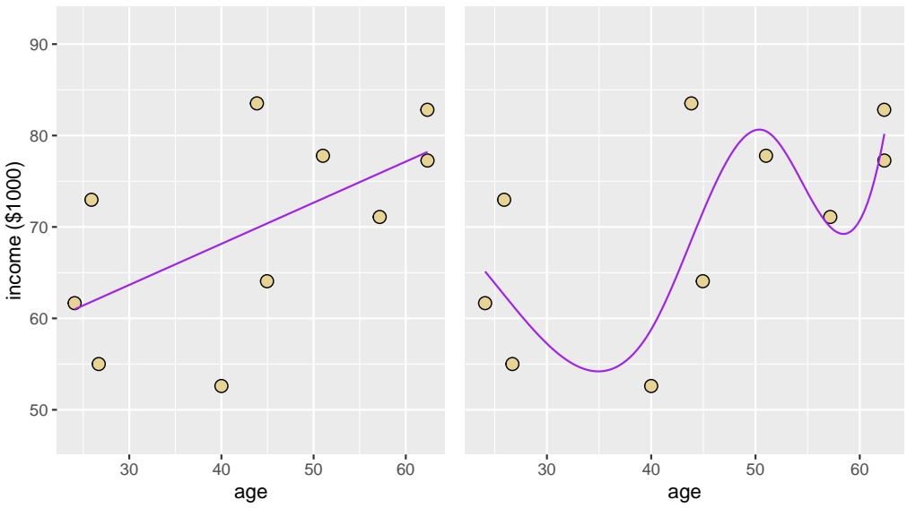

Figure 4.4: Two possible patterns to explain the same data

However, it turns out that powerful and flexible models may learn patterns that are not useful. Consider Figure 4.4. It depicts a fictional income-age relationship of N = 10 individuals, depicted as golden dots. The left and the right hand panels show two possible patterns–a simple linear trend (linear regression) at left, and a more complex wavy pattern at right. Which of these patterns is the “correct” representation of data? Just visual inspection suggests that a line may be good enough, but the complex curve at right is definitely getting closer to the dots. But be careful here. We do not want to capture data (patterns in this particular sample). What we want to do is to use data to learn the patterns in the underlying RV where the data is sampled from. In this case, we are not very much interested in the relationship in

<!-- page: 259 -->

this sample (you can see it on the figure anyway) but in this society where the data is coming from.

The problem is that the flexible curve may be too much taylor-made for this particular sample. It captures not so much the trends in the underlying RV but those in this particular sample. When we get another sample then a too closely targeted pattern may not hold any more. This typically leads to plummeting performance when predicting new data points. The model performs unrealistically well on training data, but on everything else it is mediocre at best.

This is often not a major concern as many simple models, such as linear and logistic regression. After all, it is hard to argue that the line at left on Figure 4.4 is capturing data too well. But if some regions of data space are not well represented in training data, then more flexible models may produce estimations that are wildly off. A less flexible model may, in contrast, still provide meaningful predictions. This phenomenon is referred as overfitting.<sup>2</sup>

Overfitting is a pervasive problem in most ML models, and more so in more flexible model. As linear regression is rather rigid (we describe the relationship as a hyperplane), it is less of a problem here, but that does not mean regression models are immune to overfitting. Below we provide two artificial examples of overfitting in linear regression context.

Consider the example in Figure 4.5. The left panel shows a fictitious dataset that represents how income depends on age. We can see an upward trending relationship. The right panel shows a number of different polynomial regression models, and their corresponding predictions using the same data. All models contain polynomials of age in the form<sup>3</sup>

$$
y _ {i} = \beta_ {0} + \beta_ {1} \cdot \mathrm{age} _ {i} + \beta_ {2} \cdot \mathrm{age} _ {i} ^ {2} + \beta_ {3} \cdot \mathrm{age} _ {i} ^ {3} + \dots + \epsilon_ {i}.\tag{4.5.1}
$$

The first model, of degree 0, contains just the constant term $\beta _ { 0 } ,$ essentially assuming that income is independent of age. Degree 1 is the linear model $y _ { i } = \beta _ { 0 }   +   \beta _ { 1 }   \cdot   \mathrm { a g e } _ { i }   +   \epsilon _ { i } ,$ degree 2 is a quadratic relationship $y _ { i } = \beta _ { 0 } + \beta _ { 1 } \cdot \mathrm { a g e } _ { i } + \beta _ { 2 } \cdot \mathrm { a g e } _ { i } ^ { 2 } + \epsilon _ { i }$ , and so on. The higher the polynomial degree, the more flexible the model—the more complex curves it can represent. This is because higher degree models contain more base functions, and by combining more functions we are able to approximate data better.

Which model is the best one? Just by looking at the image, one may suggest that degree 0 (horizontal red line) is too inflexible, data seem to follow an increasing trend and a constant does not capture it. Both linear and quadratic model (degree 1 and 2) both capture the trend well. The linear (degree 1) model obviously shows a constant trend while the quadratic model also captures the steady increase of trend after age 35. The 4th-degree polynomial seems somewhat too wobbly, and the 7th-degree model fluctuates even more. The most flexible model displayed here, the 9th-degree polynomial, has gone completely wild and jumps up and down way outside of what fits to the image the image. But despite of its wild behavior, it manages to capture all

<small><span class="docvortex-page-footnote" data-block-type="page_footnote" style="color:#6b7280"><sup>2</sup>In a high-dimensional feature space the datapoints are always sparse, and there are always large uncovered regions.</span></small>

<small><span class="docvortex-page-footnote" data-block-type="page_footnote" style="color:#6b7280"><sup>3</sup>These example models are created using orthogonal polynomials, not just powers of age. In case of ordinary polynomials, high-order age terms will introduce a lot of multicollinearity and the numeric precision of calculations will be insufficient. These issues are not related to overfitting.</span></small>

<!-- page: 260 -->

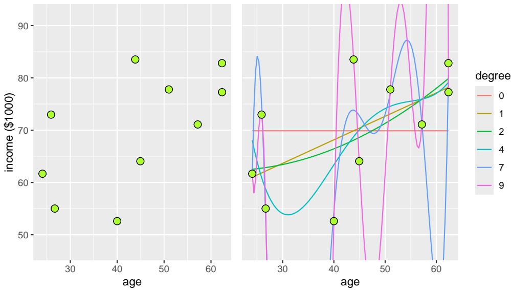

Figure 4.5: Artificial age-income data. Left panel shows just the data points, the right panel displays the same data and a number of polynomial regression models with various polynomial degrees.

data points exactly! This is a general pattern—the higher degree, the closer the model to the actual data points. This can be confirmed by computing the corresponding $R M S E \textbar$ or $R ^ { 2 } – \mathbf { S } { : }$

| degree | 0 | 1 | 2 | 4 | 7 | 9 |
| --- | --- | --- | --- | --- | --- | --- |
| RMSE | 10.50 | 8.43 | 8.31 | 7.87 | 4.50 | 0.00 |
| R<sup>2</sup> | 0.10 | 0.42 | 0.44 | 0.49 | 0.83 | 1.00 |

This is easy to understand intuitively: a more flexible model is more able to fit the actual data points. You can imagine the polynomial degree as some sort of inverse “rigidity”, where higher degree means more flexible line. 9th-degree polynomial can fit 10 data points perfectly. But the price is paid in the gaps between data points. There is nothing that limits the model’s wobbles in those gaps, and hence flexible models can jump wildly. (In case of less flexible models, it is the “rigidity” of the curve that does not let it to jump too much.) But what matters more—the better precision at the data points where we know the answer, or unrealistic behaviour between those data points? And why do we claim that the behaviour inbetween the known data points is unrealistic if we, per definition, do not know what is going on in those regions? Note that often we are interested in model performance exactly in the gaps—after all, there is little need to make predictions where we already know the answer.

But in order to formally evaluate the effect of the apparent misbehavior between data points, we have to know more. In case of this example, the 9th-degree model predictions for a $5 7 - y$ ear old seem completely out of touch with the reality, suggesting

<!-- page: 261 -->

the income at that age is deep in negative territory. Nothing we know about human lifecycle suggests this is the case. A simple linear (degree-1) model feels much more appropriate here, suggesting income around \$75,000. But in other applications we may want to trust the more flexible model instead. And often we just have no idea what to expect. How can we still get a good idea of which models is the best?

Example 4.4: Overfitting and decision boundary

Consider a two-dimensional example in Figure 4.6. The figure depicts a categorization problem where the coordinate pairs (x<sub>1</sub>, x<sub>2</sub>) are classified as red or blue. The dots are the observations we know, they seem to indicate that the lower left of the figure is red-dominated, and the upper right part is blue-dominated. The decision boundary between these two areas follows a wavy pattern. It is constructed as a sine wave (marked by black line) with added noise.

The pale red and blue background are our predictions–the model predicts that all dots in the red region are red and blue region are blue. The left panel does the prediction using a logistic regression. This results in a simple linear decision boundary. This seems to be a too rigid approach, it does not capture the blue and red waves that is clearly systematic and not just random noise, and that trespasses over the decision boundary line.The right panel uses single nearest neighbor to predict the colors. It results in a complex boundary that carves out every single red and blue dot. This seems to be a too complex boundary and suggests we are overfitting.

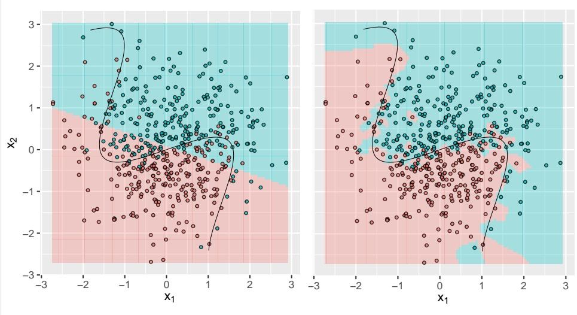

Nearest neighbors: each dot is predicted to be of the color as the nearest known colored dot. See more in Section 6.3 k-Nearest Neighbors, page 328.

Figure 4.6: Categorization task with blue and red dots. Logistic regression (left panel) does not capture the red and blue waves extending into the other color area. This is underfitting. Nearest neigbhbors (with k = 1) carves out a separate space for every single dot. This is overfitting.

<!-- page: 262 -->

Example 4.5: Complex decision boundary

Complex decision boundary is not the same as overfitting. Here is an example of sea versus land categorization. The blue and red dots appear in a fairly random fashion on the top left image. The top right picture displays the underlying geography of the Phillipine islands. The single nearest neighbor (bottom left) captures the actual shape of islands much better than 13-NN (bottom right).

Single Nearest Neighbor

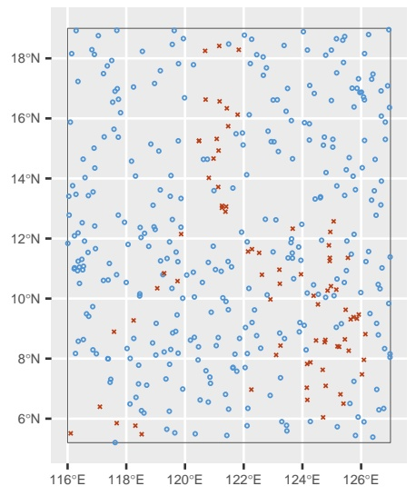

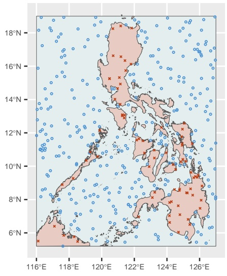

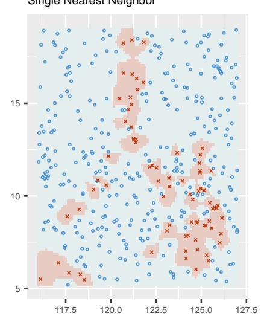

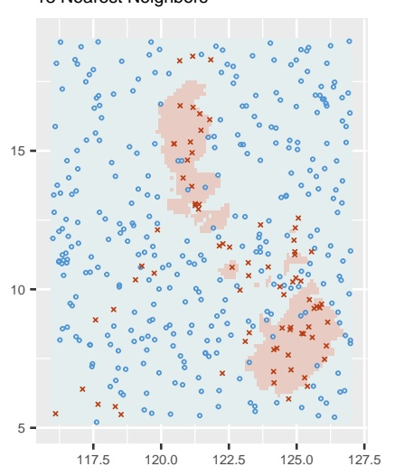

Figure 4.7: A complex decision boundary (1-NN) captures the actual shoreline better than a simple one (13-NN). The respective validation accuracies are 0.93 and 0.89. Philippine archipelago.

The more complex decision boundary is better here because the dot color is not random. What makes the blue and red dots to look random is not a noise or

<!-- page: 263 -->

measurement errors, but the fact that the coastline–the decision boundary–is, in fact, very complicated.

## 4.5.2 Validation: which model is the best

A look at the Figure 4.5 gives a hint about how to assess the model goodnes—if we just had an additional data point that is in the middle of the observed values, say at age 45, then we could compute all models’ predictions at that age, and compare that with the actual value. But we do not have any more data. What should we do?

Fortunately, there is a very easy solution to this problem. We just split the data into two parts—training data, the one we will actually use for fitting the model, and validation data, the part of the data we use later to compute the predictions in the gaps.<sup>4</sup> From the model’s persepective, validation data is exactly the additional data point—this is a data point the model hasn’t seen, and hence the model has not had a chance to squeeze a wobbly line through those datapoints. The split of data into training and validation sets is typically done randomly, and validation data is often chosen to be 20% of the original size. This leaves most of the data, 80%, for training.

For instance, we can keep ages 26.7 and 57.2 as validation data and use everything else for training (Figure 4.8). The figure shows the same data as Figure 4.5, but now indicating training observations as green dots and validation observatiosn as red dots. Because we now only have 8 training data points instead of 10, we can only fit polynomial regressions up to degree 7, and now 7th-degree curve perfectly fits all green training data points. However, a simple visual inspection suggests that the 7th-degree curve at red validation points is much farther off compared to the other, lower-order polynomials.

The prediction errors for both validation age, and RMSE are shown in Table 4.3. We can see that the linear model (1st-degree polynomial) achieves the best results— the lowest RMSE—here. The 7th-degree model that is able to fit all training data perfectly, produces enormous error at age 60. The constant, 0-degree model appears to be to rigid and worse in terms of RMSE. This is called underfitting, a situation where the model is too rigid and would gain from more flexibility. Models of degree 2 and more are overfitting–they follow the training data too well, while the performance on validation data suffers. This is overfitting, a situtation where less flexibility would be better. Such a patter–the performance initially improves with added flexibility, and thereafter deteriorates, is very common in practice. On one side, we are underfitting, on the other side overfitting. The best place is in the middle where the validation performance achieves its maximum.

Figure 4.9 offers another look at the same results. The left panel displays two RMSE-s, one for 8 training data points (red) and another for two validation data points (blue). Here we have selected a different pair of observations for validation than in Table 4.3, and the results are somewhat different. But in a similar fashion as in the table, the 0-th degree polynomial is worse than the 1st degree polynomial for

<small><span class="docvortex-page-footnote" data-block-type="page_footnote" style="color:#6b7280"><sup>4</sup>Here we refer to the part that is used for model tuning as validation data. It is very common to call it testing data instead. However, because of conceptual similarity with cross-validation (see Section 4.5.3 Cross-validation, page 255), we call it validation data here. We reserve testing data to denote a different concept (see Section 4.5.4 Training-validation-testing approach, page 255).</span></small>

<!-- page: 264 -->

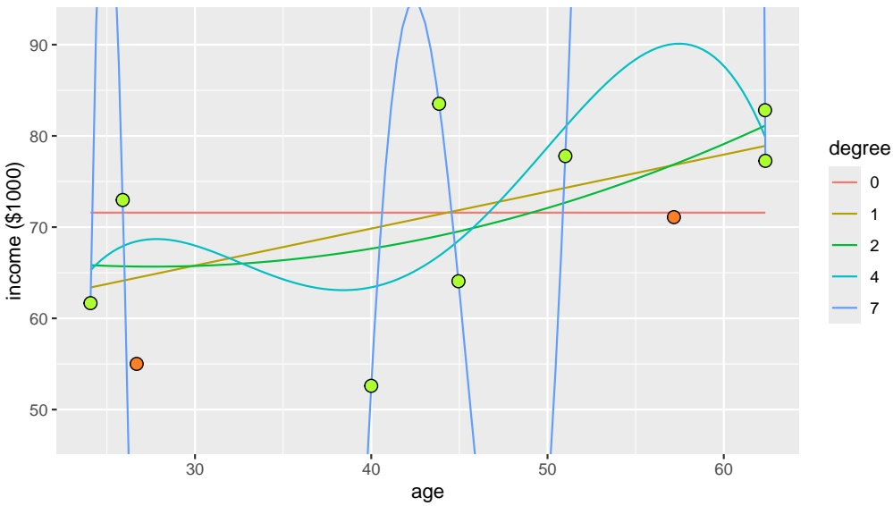

Figure 4.8: The same artificial age-income data as on Figure 4.5. The training data points are denoted with green, validation points with red. The polynominal regression curves up to degree 7 are fitted through the data training data. One can see the 7-th degree polynomial that fits all training data perfectly, predicts values that are far off from the actual validation values.

validation data, while all higher degrees are worse. On training data, however, larger degree always gives better prediction, as manifested by the steadily falling training RMSE curve.

Obviously, the results differ if we choose different two observations for validation. The right panel of Figure 4.9 shows a set of such curves with five different choices of validation observations. The overall picture is broadly similar–at small degree, the validation RMSE tends to be small, and it rapidly grows at a larger degree. But details differ–sometimes it is degree 0, sometimes 1, and twice degree 4 that gives the best validation RMSE. This is one of the problem with trainin/validation approach, and one of the reasons why cross-validation (see below) is preferred.

## Exercise 4.9: $R ^ { 2 }$ of naive model on validation data

<div class="docvortex-algorithm" style="white-space: pre-wrap; font-family:monospace;">
Consider a “naive” linear regression model on the form:
$y_i = \beta_0 + \epsilon_i.$
You estimate it on the training data and compute $R^2$ on validation data. Is it possible that you get validation $R^2 &gt; 0$?
</div>

<!-- page: 265 -->

Table 4.3: Prediction errors from polynomial regression on validation data as shown in Figure 4.8. The linear model (1st-degree polynomial) achieves the smallest RMSE on validation data.

<table><tr><td rowspan="2">degree</td><td colspan="2">Error at age</td><td rowspan="2">RMSE</td></tr><tr><td>26.7</td><td>57.2</td></tr><tr><td>0</td><td>16.58</td><td>0.49</td><td>11.73</td></tr><tr><td>1</td><td>9.44</td><td>5.71</td><td>7.80</td></tr><tr><td>2</td><td>10.67</td><td>5.77</td><td>8.58</td></tr><tr><td>4</td><td>13.43</td><td>18.99</td><td>16.45</td></tr><tr><td>7</td><td>-54.23</td><td>491.95</td><td>349.97</td></tr></table>

## 4.5.3 Cross-validation

TBD: figure

## 4.5.4 Training-validation-testing approach

The idea with training-validation split is to separate model fitting from model validation, and to use the latter step to improve the model. However, this essentially amounts to fitting in two steps on the complete dataset, and we are still prone to overfitting.

A possible solution is to do a three-fold split: to split data into training, validation, and testing chunks.

The training chunk is used for training individual models. This is what is normally called “training”, and typically involves computing a number of model parameters.

Validation chunk is used to select between different trained models. This is essentially training as well, but now we are not training model parameters, but instead hyperparameters by checking which models performs best. Hyperparameters are conceptually similar to the parameters, just traditionally not called like that. For instance, in case of linear regression, the parameter vector $\beta$ is called “parameters”. But which features to include in the model is not called a parameter. We can call this a hyperparameter instead.

Finally, there is also a dedicated testing (hold-out) chunk. This is only used when all the model fitting and testing is done. It will indicate what is the final model performance on unseen dataset. After this figure has been revealed, one should not go back to model tuning. In actual applications, testing data is sometimes separated physically and organizationally from the main work. It may set up in a way that the research group does not even have access to that data. Instead, they submit their final model to a separate organizational entity who then computes the final performance on the testing data.

<!-- page: 266 -->

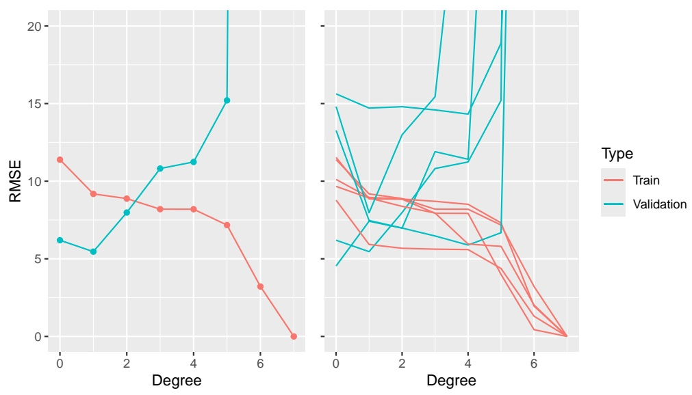

Figure 4.9: Training and Validation RMSE. Left panel displays a single training-validation split, right panel displays five different splits. Higher polynomial degree will always result in a lower RMSE when computed on training data (red), but on validation data it first falls a little bit and thereafter rapidly increases when the model gets too “wobbly” at higher degrees.

<!-- page: 267 -->

## Chapter 5

## Linear Algebra

In these notes we use vectors and matrices for two main purposes: to hold data, and to simplify algebra—linear algebra (LA) formalism tremendously simplifies algebra and computations for certain types of tasks.

This section covers the basic LA concepts we need. As our usage of LA is heavily matrix-oriented, we cover vectors only superficially. Later we typically assume that vectors are just special matrices with only a single column (or a single row). In a similar fashion we do not use inner and outer product concepts, we treat both these products as just matrix products between row- or column matrices.

## Contents

| 5.1 | Why Linear Algebra in Machine Learning | 257 |
| --- | --- | --- |
| 5.2 | Vectors and Vector Spaces | 258 |
|  | 5.2.1 Vectors | 259 |
|  | 5.2.2 Norm and Distance | 265 |
| 5.3 | Matrices | 270 |
|  | 5.3.1 What are matrices | 270 |
|  | 5.3.2 Matrix operations | 273 |
| 5.4 | Vector argument functions and vector valued functions | 281 |
| 5.5 | Inverse Matrix and Related Concepts | 282 |
|  | 5.5.1 Matrix Rank | 282 |
|  | 5.5.2 Inverse Matrix | 283 |
|  | 5.5.3 Eigenvalues | 285 |
|  | 5.5.4 Condition number | 286 |
| 5.6 | Application: wireframe images | 287 |
| 5.7 | Application: Linear Regression | 290 |

## 5.1 Why Linear Algebra in Machine Learning

The concepts “vector” and “matrix” have (at least) two related meanings. One is a type of data storage, for data that is arranged in one dimension (vector) or in two

<!-- page: 268 -->

dimensions (matrix or data frame). The other meaning is vectors and matrices in mathematical, in linear algebra sense. These are numbers, stored in an 1-D or 2-D structure, exactly like the storage structures. However, linear algebra defines a large number of certain mathematical operations on these structures. Here we are interested in the mathematical properties of these objects, but both types are closely related, for instance, many popular computer libraries that support vectors and matrices also implement the corresponding mathematical operations.

As it turns out, a large number of operations we do with ordinary numbers, such as addition, multiplication and inverse generalize easily to matrices as matrix addition, matrix multiplication, and inverse matrix. More importantly, many statistical<sup>1</sup> problems generalize from univariate to multivariate versions using exactly these operations (and we stress that machine learning is in many ways a branch of statistics). For instance, instead of univariate normal distribution, we can use multivariate normal to describe distribution of correlated values. This allows us to handle multivariate problems in a dimension-agnostic way, just deriving, writing, and coding formulas for general N-dimensional case.

For instance, the way to solve linear regression models in any dimensions can be written as

$$
\hat {\boldsymbol {\beta}} = \left(\mathsf {X} ^ {\top} \cdot \mathsf {X}\right) ^ {- 1} \cdot \mathsf {X} ^ {\top} \cdot \boldsymbol {y}.\tag{5.1.1}
$$

Even if one does not know what do these symbols and operations mean, one can see that the formula is rather simple. As efficient software implementations of matrix operations are widely available, this formula can almost literally converted into computer code.

As linear algebra is ubiquitous in science and engineering, there exist dedicated well-optimized libraries, and even dedicated hardware to speed up certain linear algebra processes. For instance, ordinary graphics cards with thousand of simple computing cores, originally designed for computer games, are optimized for matrix multiplication because this is how one rotates 3-D scenery. This makes linear algebra a method of choice when implementing and using related methods.

Linear algebra is also the method of choice when presenting statistical methods. Every source, besides the very beginner-oriented texts uses linear algebra, and assumes the reader is familiar enough with the basic concepts. In this sense it is a central component of machine learning language.

Below we walk through the basics of vectors and matrices with the focus on matrix multiplication, inverse matrix, and metric distance.

## 5.2 Vectors and Vector Spaces

This section briefly introduces vectors, vector spaces, and a few related concepts (in particular norm and distance) in a non-matrix way. Although later we rely heavily on matrix notations, the concepts in this section do not require matrix formalism.

<small><span class="docvortex-page-footnote" data-block-type="page_footnote" style="color:#6b7280"><sup>1</sup>Here we are mainly concerned with statistics, but the same is also true for many physics and engineering problems.</span></small>

<!-- page: 269 -->

## 5.2.1 Vectors

## What Are Vectors

Vectors are ordered collections of elements, for our purpose they are just sequences of numbers. Normally we denote vectors by bold lower case letters, so an example vector is $\pmb { x } = ( 1 , 2 , 3 )$ . Here the vector x contains three elements (also called components), 1, 2, and 3, in this order. Order matters, $( 1 , 2 , 3 )   \neq   ( 2 , 1 , 3 )$ We denote vector components with the same letter as the vector itself, just not in bold, and supplied with the element index. For instance, given the vector x above, we have $x _ { 1 } = 1$ and $x _ { 3 } = 3$ . We can also use symbols to denote vector elements so another vector example is $\pmb { \beta } = ( \beta _ { 1 } , \beta _ { 2 } , \beta _ { 3 } )$ . Here we only work with numeric vectors, i.e. with vectors where all elements are numbers. But the components do not have to be numeric, they may be all kind of objects, including letters, texts, images, functions and other vectors.

An important property of vector is its number of elements, called dimension.<sup>2</sup> Our example vectors x and $\beta$ are 3-dimensional. 3-D vectors are widely used to describe coordinates in our 3-space, e.g. in 3-D computer games. But our vectors can be of any (positive) dimension, including 1-dimensional (just single objects like individual numbers). They may also have very high dimensionality, for instance color images can be stored as vectors of millions of elements. In theoretical applications we can also work with infinite-dimensional vectors.

From our perspective, one of the most important roles of vectors is to hold data. For instance, consider the dataset about 50 U.S. States (R dataset state.x77). A few first observations of it look like:

| Population | Income | Illiteracy | Life Exp | Murder | HS Grad | Frost | Area |
| --- | --- | --- | --- | --- | --- | --- | --- |
| 3615 | 3624 | 2.1 | 69.05 | 15.1 | 41.3 | 20 | 50708 |
| 365 | 6315 | 1.5 | 69.31 | 11.3 | 66.7 | 152 | 566432 |
| 2212 | 4530 | 1.8 | 70.55 | 7.8 | 58.1 | 15 | 113417 |
| 2110 | 3378 | 1.9 | 70.66 | 10.1 | 39.9 | 65 | 51945 |

We can describe the data points (observations) of this dataset as

$$
\boldsymbol {x} _ {1} = (3 6 1 5, 3 6 2 4, 2. 1, 6 9. 0 5, 1 5. 1, 4 1. 3, 2 0, 5. 0 7 0 8 \times 1 0 ^ {4})
$$

$$
\boldsymbol {x} _ {2} = (3 6 5, 6 3 1 5, 1. 5, 6 9. 3 1, 1 1. 3, 6 6. 7, 1 5 2, 5. 6 6 4 3 2 \times 1 0 ^ {5})\tag{5.2.1}
$$

$$
\boldsymbol {x} _ {3} = (2 2 1 2, 4 5 3 0, 1. 8, 7 0. 5 5, 7. 8, 5 8. 1, 1 5, 1. 1 3 4 1 7 \times 1 0 ^ {5}).
$$

When stacking these data vectors horizontally on top of each other, we get a data matrix (design matrix). Alternatively, we can look at individual variables as vectors,

<small><span class="docvortex-page-footnote" data-block-type="page_footnote" style="color:#6b7280"><sup>2</sup>We encounter the concept dimension in two different meanings. Here it is the dimension of the underlying vector space, or the number of elements in the vector. But often one refers to all vectors as 1-D objects, contrary to matrices that are 2-D objects. This is because vectors are like a 1-D string of numbers and have only a single length, while matrices resemble 2-D rectangle of numbers and have both length and width. One has to understand which is meant by dimension a particular case.</span></small>

<!-- page: 270 -->

## Exercise 5.1: Vector dimension

in that case we have

$$
\begin{array}{l} \boldsymbol {v} _ {1} = (3 6 1 5, 3 6 5, 2 2 1 2, 2 1 1 0, 2 1 1 9 8, \ldots) \\ \boldsymbol {v} _ {2} = (3 6 2 4, 6 3 1 5, 4 5 3 0, 3 3 7 8, 5 1 1 4, \ldots) \\ \boldsymbol {v} _ {3} = (2. 1, 1. 5, 1. 8, 1. 9, 1. 1, \ldots) \\ \ldots \end{array}\tag{5.2.2}
$$

Another comment about the notation: here we are using subscript index not to refer to individual components, but to refer to different vectors. If we refer to an individual component, we can add another index, e.g. $v _ { 1 1 } = 3 6 1 5$ and $x _ { 2 3 } = 1 . 5$ in the example above. So the first component refers to the vector, and the last one to the component. Note that we denote components (just numbers) with ordinary font while vectors with index are in bold! However, there is a variety of notation used in the literature.

What is dimension of vectors $x _ { i }$ in (5.2.1) and $v _ { i }$ in (5.2.2)?

## Vector Addition and Scalar Multiplication

If we use vectors just to store data, we may not really need to do any computations with these. Most of the linear algebra is based on two simple operations: addition and multiplication by scalar. With scalar we mean here a single number that is not a vector. We denote sum of two vectors by $x + y ,$ and multiplication by scalar α as αx.

When talking about addition and scalar multiplication, we normally mean just the ordinary mathematical operations. But these do not have to be the common addition and multiplication, these can be all kind of operations as long as they satisfy a few axioms, including

1. there is a special element, null vector 0, so that $\pmb { x } + \pmb { 0 } = \pmb { x }$ for all x.

2. multiplying any vector with scalar 0 will result in null vector: 0x = 0 for all x.

3. multiplying any vector with scalar 1 will retain the original vector: 1x = x for all x.

4. the operations follow certain distributive laws: $\alpha ( { \pmb x } + { \pmb y } ) = \alpha { \pmb x } + \alpha { \pmb y } .$

For the vector operations we look here, scalar multiplication is performed by multiplying all vector components by the scalar:

$$
\alpha \boldsymbol {x} = \alpha (x _ {1}, x _ {2}, \dots , x _ {K}) = (\alpha x _ {1}, \alpha x _ {2}, \dots , \alpha x _ {K}).\tag{5.2.3}
$$

In a similar fashion, vector addition is performed by adding the corresponding components of the vectors:

$$
\begin{array}{r l} \boldsymbol {x} + \boldsymbol {y} & = (x _ {1}, x _ {2}, \ldots , x _ {K}) + (y _ {1}, y _ {2}, \ldots , y _ {K}) = \\ & \qquad = (x _ {1} + y _ {1}, x _ {2} + y _ {2}, \ldots , x _ {K} + y _ {K}). \end{array}\tag{5.2.4}
$$

As is obvious from this definition, the vectors must have same dimension (here K) to be possible to add those.

<!-- page: 271 -->

Example 5.1: Graphical way to add vectors

Consider two vectors, $\pmb { x } = ( - 1 , 3 )$ and $\pmb { y } = ( 5 , - 2 )$ Let’s compute $z = 2 { \pmb x } + 3 { \pmb y } .$ When we just multiply and sum the components we get

$$
\boldsymbol {c} = 2 \cdot (- 1, 3) + 3 \cdot (5, - 2) = (1 3, 0).
$$

This operation can be represented graphically as

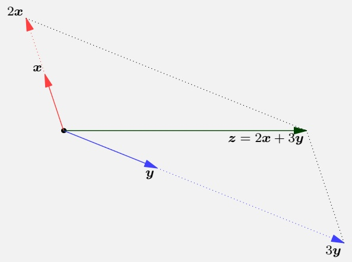

The solid red and blue arrows depict the original vectors x and $y ,$ the corresponding dotted arrows are 2x and 3y, and long green solid arrow is their sum $z = 2 x + 3 y .$

## Exercise 5.2: What is the capital of France?

Word embeddings (see Section 8.6 Word embeddings, page 370) is a way to describe words as numeric low-dimensional vectors (typically 100-300 dimensions).<sup>a</sup> So in 100-component example the embedding for word Berlin (see below in the table) looks like $\pmb { e } ( B e r l i n ) = ( - 0 . 5 6 2 , 0 . 6 3 0 , - 0 . 4 5 3 , - 0 . 2 9 9 , - 0 . 0 0 6 , \dots )$ . All these numbers correspond to different components, but unfortunately the components are not interpetable in general. Embeddings are computed based on words’ co-occurrence in texts. As similar words tend to occur in similar contexts, they tend to have similar embedding vectors. More interestingly, one can also do certain mathematical operations with embedding vectors. For instance, it is well known that $e ( \mathrm { k i n g } ) - e ( \mathrm { m a n } ) + e ( \mathrm { w o m a n } ) \approx e ( \mathrm { q u e e n } )$ where e(word) is the embedding vector of word.

Below is the first five components (out of 100) for Berlin, Germany, France, and $P a r i s ^ { b }$ (the rest of 95 components are not shown).

<!-- page: 272 -->

<div class="docvortex-algorithm" style="white-space: pre-wrap; font-family:monospace;">
word 1 2 3 4 5
Berlin -0.562 0.630 -0.453 -0.299 -0.006
Germany 0.194 0.507 0.287 0.132 -0.281
France 0.605 -0.678 -0.436 -0.019 -0.291
Paris -0.074 -0.855 -0.689 -0.057 -0.139

Compute e(Berlin) - e(Germany) + e(France) and check how close do you get to e(Paris).

$^{a}$ While a 100-D vector may not sound like low-dimensional, typical vocabularies contain between 10,000 and one million different words. Using one-hot encoding would result in the corresponding number of dimensions, so a few hundred components is much less than that.
$^{b}$ The data, glove.twitter.27B.100d.txt), based on 2 billion tweets, can be downloaded from Stanford NLP project website.
</div>

All vectors that can be formed from certain elementary vectors using these two operations form a vector space. X. For our purpose it is simply a set of all relevant vectors. For a set to be valid vector space, it must be closed with respect to these operations. This means that whatever elements of X and real numbers we take, all their sums and products must also be in X. Formally,

<div class="docvortex-algorithm" style="white-space: pre-wrap; font-family:monospace;">
- if $\boldsymbol{x} \in X, \boldsymbol{y} \in X$ and $\boldsymbol{z} = \boldsymbol{x} + \boldsymbol{y}$, then $\boldsymbol{z} \in X$.
</div>

• if $x \in X$ and z = αx, then $z \in X$ for each $\alpha \in \mathbb { R } .$

An intuitive and easy-to-understand example of vector space is $\mathbb { R } ^ { 2 }$ . In $\mathbb { R } ^ { 2 }$ vectors are just pairs of real numbers, addition is defined as adding the corresponding components of vectors, and scalar multiplication is defined as multiplying all vector components with the scalar. In this case the scalar multiplication is equivalent to stretching (or squeezing) the vectors while retaining their direction, and vector addition is equivalent to parallel shift of one vector to the “end” of the other one. As a special case, negative of the vector x, −x, is just the original vector pointing in the opposite way.

Example 5.2: Application of 2-D vector space $\mathbb { Z } ^ { 2 }$

<div class="docvortex-algorithm" style="white-space: pre-wrap; font-family:monospace;">
Imagine you are designing a 2-D computer game. We can choose the coordinates in different way, a natural choice is to take the origin $(0,0)$ to be the bottom-left corner of the screen, and count the horizontal coordinates right, and vertical coordinates up. We also specify the vectors as (horizontal, vertical), or $(x,y)$. As the objects on our screen can only be at certain pixels, we are only interested in integer coordinates, so $x,y\in \mathbb{Z}$ where $\mathbb{Z}$ is the set of all integers, or $(x,y)\in \mathbb{Z}^2$ where $\mathbb{Z}^2$ is the set of all pairs of integers. Your player is located at coordinates $\boldsymbol{p} = (194,33)$. She shoots an arrow upward that moves 10 vertical pixels per frame. Where is the arrow after 10 frames? We can write the arrow's 2-D speed vector as $\boldsymbol{v} = (0,10)$. $v_{1} = 0$ as the arrow does not move horizontally at all, and $v_{2} = 10$ means that it moves up by 10 pixels in one time unit (here the rendering frame). In 10 frames the arrow moves
</div>

<!-- page: 273 -->

$1 0 \pmb { v }   =   ( 0 , 1 0 0 )$ and hence is located at ${ \pmb p } + 1 0 { \pmb v }   =   ( 1 9 4 , 1 3 3 )$ The location at arbitrary frame $t > 0$ can be written as $\boldsymbol { a } ( t ) = \boldsymbol { p } + t \cdot \boldsymbol { v } .$ Here a, p, and v are vectors, locations on screen, and speed on screen respectively; and t is scalar, the frame count from the moment arrow was released.

<div class="docvortex-algorithm" style="white-space: pre-wrap; font-family:monospace;">
$^{a}$ Alghouth horizontal, vertical may sound an obvious and trivial choice, it conflicts with the traditional way of displaying matrix indices, namely vertical, horizontal. Even more, vertical elements are traditionally counted from top-left corner down.
</div>

One can also easily visualyze and understand the 3-D vector space $\mathbb { R } ^ { 3 }$ . Higherdimensional spaces $\mathbb { R } ^ { \mathring { K } }$ are still straightforward, but cannot be visualized.

## Vector Space: Base and Linear Independence

The definition of vector space above–closedness with respect to scalar multiplication and vector addition–suggests that all vectors we can form from certain base vectors using only vector addition and scalar multiplication form a vector space. So if the base vectors are a and b, the vector space is a set of all possible vectors

$$
\boldsymbol {c} = \boldsymbol {\alpha} \cdot \boldsymbol {a} + \boldsymbol {\beta} \cdot \boldsymbol {b} \quad \alpha , \boldsymbol {\beta} \in \mathbb {R}\tag{5.2.5}
$$

Figure 5.1 depicts on such example. Two base vectors a (red) and b (blue) can be used to compose c and d. See also Exercise 5.15 about how to compute the corresponding α and $\beta .$ Such constructs, sums of vectors, multiplied by scalars, are called linear combinations. So vector space is made of all possible linear combinations of the base vectors.

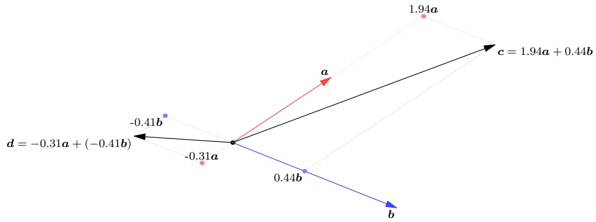

Figure 5.1: Vector space: all vectors on a plane can be computed as a linear combination of two base vectors, here a (red) and b (blue). The dotted red and blue arrows show which linear combinations are needed to create vectors c and d (black).

The figure shows only two base vectors. We can easily add another one but it turns out to be unnecessary–on the plane depicted on Figure 5.1, two base vectors are sufficient. However, removing either a or b will collapse the plane: there is no way to cover a plane using a single vector only. This property of a vector space–how many base vectors are needed to cover the space–is called dimension of vector space.

<!-- page: 274 -->

Obviously, a single base vector can only cover a line. We can multiply b with any number but the result will always stay in the line defined by b. So vector space made of a single base vector, 1-dimensional space, is a line. In an analogous fashion, every linear combination of vector a and b will stay on their plane, there is no way to describe a point outside of the plane using only these two vectors. We need a third one that points out of the plane. That would result in a 3-D vector space. These examples are easy to visualize and understand as our space is 3-D. Mathematically we can easily describe higher dimensional spaces but our imagination fails as soon as we move from three to four dimensions. But even when we cannot imagine highdimensional space, it serves as an useful tool when working with high-dimensional vectors.

Base vectors and the dimension of vector space are closely related to linear independence. A set of vectors is linearly independent if one cannot compute one of these vectors from the others (by using only scalar multiplication and vector addition). Formally, we say that vectors $\pmb { a } _ { 1 } ,   \pmb { a } _ { 2 } ,   . . . ,   \pmb { a } _ { n }$ are linearly independent if and only if

$$
\begin{array}{c} \alpha_ {1} \boldsymbol {a} _ {1} + \alpha_ {2} \boldsymbol {a} _ {1} + \dots + \alpha_ {K} \boldsymbol {a} _ {K} = 0 \\ \Updownarrow \\ \alpha_ {1} = \alpha_ {2} = \dots = \alpha_ {K} = 0 \end{array}\tag{5.2.6}
$$

It is easy to see that this formal definition is equivalent to the informal claim above. We can easily express one vector in (5.2.6), for instance $\mathbf { a } _ { 1 }$ , using other vectors as

$$
\boldsymbol {a} _ {1} = \frac {\alpha_ {2}}{\alpha_ {1}} \boldsymbol {a} _ {2} + \frac {\alpha_ {3}}{\alpha_ {1}} \boldsymbol {a} _ {3} + \dots + \frac {\alpha_ {K}}{\alpha_ {1}} \boldsymbol {a} _ {K}.\tag{5.2.7}
$$

But this is only possible if $\alpha _ { 1 } \neq 0 .$ . Hence for us to be able to express at least a single vector in this way, we need at least one α to be non-zero. And by definition, this means our vectors are not linearly independent. In that case it is often said they are linearly dependent.

## Example 5.3: Are these vectors linearly independent?

Let us test if vectors ${ \binom { 1 } { 2 } } ,   { \binom { 3 } { 4 } } ,   { \binom { 5 } { 6 } }$ are linearly independent. We can express one vector as a linear combination of others

$$
\binom{1}{2} = 2 \cdot \binom{3}{4} - \binom{5}{6},
$$

or alternatively write

$$
\binom{1}{2} - 2 \cdot \binom{3}{4} + \binom{5}{6} = \binom{0}{0}.\tag{5.2.8}
$$

Hence these vectors are not linearly independent.

<!-- page: 275 -->

Exercise 5.3: Are these vectors linearly independent?

<table><tr><td>Are vectors</td><td>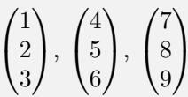</td><td>linearly independent?</td></tr></table>

## 5.2.2 Norm and Distance

Many machine learning methods need to compute distance between data points. For instance, nearest-neighbors method (see Section 6.3 k-Nearest Neighbors, page 328) is concerned with the “closest” data points to the one we want to analyze, while clustering methods (see Section 11.2 Cluster Analysis, page 424) make clusters out of observations that are “close”. As we data points are described as vectors, all such methods need to compute distance between vectors. We first discuss a generalization of vector length,<sup>3</sup>called norm. Thereafter we define distance between two vectors by just computing the norm of their difference.

## Norm

Let us start with the ordinary geometry. Take the example of a 2-dimensional vector on plane. If the vector is given as (1, 1), what is its length? The answer is ${ \sqrt { 2 } } ~ \approx ~ 1 . 4 1 4$ (see Figure 5.2). The length of the diagonal of a square with unit length sides is 1.414. More generally, we can use the Pythagorean theorem and write the length of vector $( x _ { 1 } , x _ { 2 } )$ as $\sqrt { x _ { 1 } ^ { 2 } + x _ { 2 } ^ { 2 } }$ . This formula can pbe generalized to a 3-D space $\mathbb { R } ^ { 3 }$ , the length of 3-vector $\pmb { x } = ( x _ { 1 } , x _ { 2 } , x _ { 3 } )$ is

$$
\sqrt {x _ {1} ^ {2} + x _ {2} ^ {2} + x _ {3} ^ {2}}.\tag{5.2.9}
$$

This is our most obvious understanding of length in 3-space. For instance, the box with side lengths <u>of 1, 2 and</u> 2 has diagonal of length ${ \sqrt { 1 ^ { 2 } + 2 ^ { 2 } + 2 ^ { 2 } } } \; = \; 3 .$ We can generalize the same concept of length further into K-dimensional space $\mathbb { R } ^ { K ^ { \vec { } } }$ as

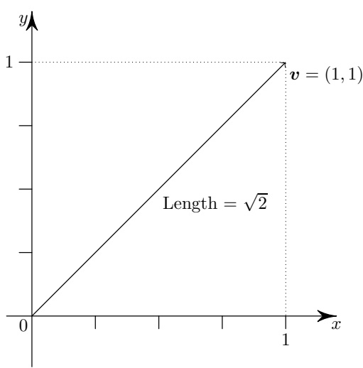

Figure 5.2: Vector v has both components, $v _ { x }$ and $v _ { y }$ equal to one. From Pythagorean theorem, its length is ${ \sqrt { 2 } } .$ Generalized “length” of a vector is called norm and denoted by ||v||, in this case $| | \pmb { v } | | = \sqrt { 2 }$

$$
\sqrt {\sum_ {i = 1} ^ {K} x _ {i} ^ {2}}
$$

(5.2.10)

<small><span class="docvortex-page-footnote" data-block-type="page_footnote" style="color:#6b7280"><sup>3</sup>As length, here we mean length as length in space, not the number of components (we call the latter the vector’s dimension).</span></small>

<!-- page: 276 -->

but unfortunately our imagination does not keep up when we move beyond three dimensions.

This “obvious” concept of length is called Euclidean length or Euclidean norm. We intuitively think in Euclidean terms as this is how the 3-D space we live in is “made”. However, there are many other ways to define length, and sometimes the conventional approach is not the best one. Those more general concepts of length are called “norm”, this is why we call the Euclidean length Euclidean norm.

Norm of vector x is typically denoted by || · ||. It is a generalization of the concept of length: it is a function that assigns a non-negative real number to every vector. So we can sloppily say that norm is a function, that makes a number out of a vector. But one cannot just assign an arbitrary number to each vector. Valid norm must satisfy three conditions:

<div class="docvortex-algorithm" style="white-space: pre-wrap; font-family:monospace;">
Vector norm is a function $||\cdot ||$ that assigns a real number to each vector such that: 1. $||\boldsymbol{x}|| \geq 0$; $||\boldsymbol{x}|| = 0$ if and only if $\boldsymbol{x} = \boldsymbol{0}$: norm must be positive, only null-vector has zero norm. 2. $||\boldsymbol{x} + \boldsymbol{y}|| \leq ||\boldsymbol{x}|| + ||\boldsymbol{y}||$ (triangle inequality): the direct way is the shortest way. 3. $||\alpha \boldsymbol{x}|| = |\alpha| \cdot ||\boldsymbol{x}||$ (multiplication be scalar).
</div>

In machine learning applications we are often much sloppier, and use measures of “length” that are not valid metric norms. For instance, if our task is to rank texts based on the similarity of the words they use, then we can easily violate the assump tion 1 (see more in Section 6.2.2 Cosine similarity and angular distance, page 325).

## $L _ { p }$ norm

A rather straightforward generalization of Euclidean norm is $L _ { p }$ norm, also called Minkowski norm. It is defined by replacing “2” in the formula for Euclidean norm by a positive parameter p, and the norm is often denoted by adding a small p-subscript to the norm symbol:

$$
| | \boldsymbol {x} | | _ {p} = \left[ \sum_ {i = 1} ^ {K} | x _ {i} | ^ {p} \right] ^ {1 / p}, \qquad p > 0.\tag{5.2.11}
$$

<!-- page: 277 -->

**Example 5.4:** $L _ { 3 }$ **norm of vector** (1,1)

Let us compute $L _ { 3 }$ norm of $\pmb { v }   =   ( 1 { , } 1 )$ depicted in Figure 5.2. Remember, its Euclidean, $L _ { 2 }$ , norm is ${ \sqrt { 2 } } \approx 1 . 4 1 4 .$ . Its $L _ { 3 }$ norm is

$$
| | \boldsymbol {v} | | _ {3} = \left[ \sum_ {i = 1} ^ {K} | x _ {i} | ^ {3} \right] ^ {1 / 3} = (| 1 | ^ {3} + | 1 | ^ {3}) ^ {1 / 3} = \sqrt [ 3 ]{2} \approx 1. 2 6.
$$

Obviously, in terms of $L _ { p }$ norms, Euclidean norm is just $L _ { 2 }$ norm. There are two other interesting and popular special cases: Manhattan norm and Chessboard norm.

**Manhattan norm** (also taxicab norm) is $L _ { 1 }$ norm, defined as

$$
| | \boldsymbol {x} | | _ {1} = \sum_ {i = 1} ^ {K} | x _ {i} |.\tag{5.2.12}
$$

So Manhattan norm is the sum of absolute values of the vector components, or from the geometric viewpoint it is just the sum of the vector’s “sides”.

**Example 5.5: Manhattan norm of vector** (1,1)

The Manhattan norm on the same (1,1) vector that we analyzed above is

$$
| | \boldsymbol {v} | | _ {1} = \left[ \sum_ {i = 1} ^ {K} | x _ {i} | ^ {1} \right] ^ {1 / 1} = (| 1 | ^ {1} + | 1 | ^ {1}) ^ {1 / 1} = 1 + 1 = 2
$$

It is easy to see why Manhattan norm is useful, and why is it called taxicab norm. Imagine you are taking cab in a city where streets are laid out in a rectangular grid, for instance in Manhattan. If your destination is 10 blocks east and 10 blocks north, then the cab driver has to drive at least 20 blocks, not matter which route she chooses. The “Manhattan-length” of your 10-block-by-10-block ride is 20 blocks. You can also imagine that the driver will not be impressed if you tell her that you are only willing to pay for a 14 blocks trip because that is the “correct” Euclidean distance.

**Chessboard norm** also Chebyshev norm is $L _ { \infty }$ norm. It can be computed as

$$
| | \boldsymbol {x} | | _ {\infty} = \lim _ {p \to \infty} \left[ \sum_ {i = 1} ^ {K} | x _ {i} | ^ {p} \right] ^ {1 / p} = \max _ {i} | x _ {i} |.\tag{5.2.13}
$$

Although we cannot directly compute $L _ { \infty }$ distance by substituting infinity in the $L _ { p }$ formula (5.2.11), the fact that it amounts to maximum individual component is intuitively fairly obvious to understand. Namely, when we take numbers to p-th power as in $| x _ { i } | ^ { p } ,$ , the larger numbers “gain” more from this operation if $p$ is large. At the limit where $p \to \infty$ , all other components are negligible next to the largest one.

<!-- page: 278 -->

Definition 5.1, point 3: ||αx|| = |α| · ||x||

The name chessboard norm refers to the fact that in chess, it measures the number of moves king needs in order to move to the given number of squares in each direction (Figure 5.3).

**Normalized vectors** Sometimes we want to transform vectors into “length-one” vectors (unit vectors) while preserving their “direction”. For instance, it make computing cosine similarity much easier (see Section 6.2.2 Cosine similarity and angular distance, page 325). Such vectors are called normalized vectors.<sup>4</sup> Normalization is technically very easy, you just need to divide the vector by its norm:

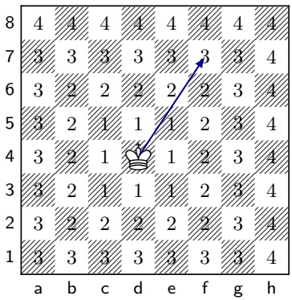

Figure 5.3: In chess, king can move one field in every direction. The numbers on the chessboard denote the number of moves king at d4 needs to reach that position. For instance, it needs three moves to get to to f7, and hence the vector from d4 to f7 has chessboard norm 3.

$$
\boldsymbol {u} = \frac {v}{| | \boldsymbol {v} | |}.\tag{5.2.14}
$$

The resulting vector u has norm 1 because of the scalar multiplication property of the norm (see Definition 5.1, point 3).

## Exercise 5.4: Normalize vectors

Normalize the following vectors:

1. vector (1,1) using Euclidean norm

2. (1,1) using Manhattan norm

3. (1,1) using Chessboard norm

4. (1, 2, 2) using Euclidean norm

5. (3, 2, 0, 2, 0, 2, 0, 2) using Euclidean norm

Solution on page 506

## Metric distance

Closely related to norm is metric distance. We can always define distance between vectors x and y as

$$
d (\boldsymbol {x}, \boldsymbol {y}) = | | \boldsymbol {x} - \boldsymbol {y} | |.\tag{5.2.15}
$$

So a “distance” between two vectors is the “length” of their difference. For suitable “nice” metrics we can also define the opposite

$$
\| \boldsymbol {x} \| = d (\boldsymbol {x}, \boldsymbol {0}).\tag{5.2.16}
$$

<small><span class="docvortex-page-footnote" data-block-type="page_footnote" style="color:#6b7280"><sup>4</sup>This is fairly similar to feature normalization, see Section 6.2.1 Feature normalization, page 320. However, they are not exactly the same.</span></small>

<!-- page: 279 -->

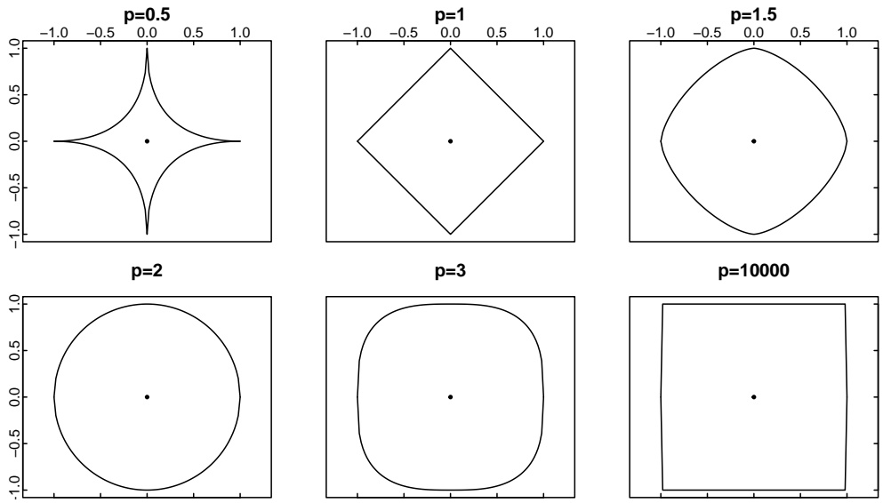

Figure 5.4: Unit circles – points sets of distance 1 from the origin (0,0) (the central dot) in different 2-D $L _ { p }$ spaces. I $f   p < 2 ,$ the circle looks more like a star, with the Manhattan distance, $p = 1$ , being diamond-shaped. $\mathit { I f }   p > 2 ,$ , the circles are more and more box-shaped.

This is possible with $L _ { p }$ norm but not with certain other similarity measures, such as cosine similarity where one cannot define distance from null-vector, $d ( { \pmb x } , { \pmb 0 } )$ , in a consistent manner.

In order for a distance measure $d ( \cdot , \cdot )$ to be a proper metric distance, it has to have these three properties:

1. $d ( { \pmb x } , { \pmb y } ) = 0$ if and only if $x = y$ (identity of indiscernibles). Zero distance means the vectors are equal.

2. $d ( { \pmb x } , { \pmb y } ) = d ( { \pmb y } , { \pmb x } )$ (symmetry). Distance is the same, whichever way you measure it.

3. $d ( { \pmb x } , z ) \leq d ( { \pmb x } , { \pmb y } ) + d ( { \pmb y } , z )$ (triangle inequality). There is no shorter way than the direct route.

Among the distance measure we encounter in these notes, $L _ { p }$ is a proper metric distance but cosine similarity is not.

We illustrate $L _ { p }$ distances by the corresponding unit circles (Figure 5.4). Unit circle is a set of points that are at distance 1 from the origin. In case of Euclidean metric, the unit circle is the familiar circle with radius 1, centered at the origin. In case of the other metrics, the unit circles look different. Some of these have practical applications, for instance walksheds in neighborhoods with grid-like street layout are $L _ { 1 }$ circles.

<!-- page: 280 -->

## 5.3 Matrices

## 5.3.1 What are matrices

Matrices are some of the central objects in linear algebra. You may imagine matrices as rectangles of numbers, in many ways similar to data frames, that can be indexed based on their rows and columns. As is the case with vectors, the concept “matrix” means two different things, one is data storage on computer, and the other is a mathematical object that has certain mathematical properties.

Here are two examples of matrices:

$$
\mathsf {A} = \left( \begin{array}{c c c} 1 & 2 & 3 \\ 4 & 5 & 6 \\ 0 & 0 & 1 \end{array} \right) \qquad \mathsf {B} = \left( \begin{array}{c} 1 \\ 1 \\ 1 \end{array} \right).\tag{5.3.1}
$$

There is no universal way to denote matrices, here we follow one common tradition and use upper case letters in upright sans-serif font like X or Σ. Unlike vectors, we do not use bold symbols for matrices. Stacking numbers into rectangles is not of much interest by itself, but it turns out that these rectangles—matrices—make it possible to represent various kinds of data and related operations in a much simpler and more efficient manner.<sup>5</sup> This is the main reason why linear algebra is ubiquitous in statistics and sciences.

The first matrix A has 3 rows and 3 columns, the second matrix B has 3 rows but only a single column. This is matrix dimension. Matrix dimension is normally denoted by rows×columns and hence matrix A is of dimension 3×3 and B is of 3×1. But confusingly, dimension also means another closely related concept. Namely, sometimes we say that matrices are 2-dimensional while vectors are 1-dimensional objects. This “object dimension” is not to be confused with matrix dimension. Dimension of A is $3 \times 3$ while at the same time A is a 2-D object... Normally it is clear from the context what kind of dimension we are talking about.

The individual numbers<sup>6</sup>the matrices are made of are called matrix elements or matrix components. These are often denoted by the corresponding lower case letter, supplemented with two indices, one for row and the other for column—by convention, matrix elements are indexed first by row and thereafter by column.<sup>7</sup> For instance, the matrix A above can be written in more abstract form as

$$
\mathsf {A} = \left( \begin{array}{c c c} a _ {1 1} & a _ {1 2} & a _ {1 3} \\ a _ {2 1} & a _ {2 2} & a _ {2 3} \\ a _ {3 1} & a _ {3 2} & a _ {3 3} \end{array} \right)\tag{5.3.2}
$$

<small><span class="docvortex-page-footnote" data-block-type="page_footnote" style="color:#6b7280"><sup>5</sup>Matrices can be generalized into objects that have 3 or more dimensions, called tensors. These are widely used in physics, but also in advanced ML methods, such as neural networks. Modern software, such as tensorflow library relies heavily on tensor operations and can employ dedicated hardware, such as GPU or tensor processing unit (TPU) for speeding up tensor operations. We do not cover tensors in these notes.</span></small>

<small><span class="docvortex-page-footnote" data-block-type="page_footnote" style="color:#6b7280"><sup>6</sup>In these notes we only consider numeric matrices. But matrix elements do not have to be just numbers.</span></small>

<small><span class="docvortex-page-footnote" data-block-type="page_footnote" style="color:#6b7280"><sup>7</sup>Note that this tradition–rows first and columns second–contradicts with the most common 2-D image data representation: horizontal first and vertical second. This is a frequent source of confusing errors when describing graphical data in matrix form.</span></small>

<!-- page: 281 -->

where the $a _ { 1 1 }$ , the element in the first row and the first column is $1 ,   a _ { 1 2 } ,$ the element in the first row and the second column is $2 ,$ and so on. Sometimes matrix is written by the corresponding elements as $\mathsf { A } = \{ a _ { i j } \}$ where $i = 1 \dots N$ and $j = 1 \ldots M .$ . This must be understood as we take all the individual elements (numbers) $a _ { i j }$ and arrange those into the matrix.

A central role of matrices in machine learning contexts is to hold and manipulate data. For instance, the US States data on page 259 is technically a data frame, but could as well be a matrix. Holding data in matrix form makes it possible to use linear algebra methods, and as we discussed above, this is an excellent option when we are doing multivariate statistics.

A note about matrices and data frames. Both structures look similar, they are both rectangles of data. But while matrices are linear algebra objects, data frames are not. Data frames are a convenient way to store and display heterogeneous data, data where columns can be of different type, not necessarily numbers. Matrices are rectangles of only numbers (as far as these notes are concerned). While matrices in the abstract sense are not related to storage concerns, the computer implementations are. They are normally stored in a different way than data frames to facilitate operations as blocks, while data frames are often designed for easy acces by columns in mind.

## Matrix Components

Certain combinations of matrix elements have their own names. As these are widely used when discussing matrices, we introduce the most important ones here.

Matrix diagonal (also main diagonal) are the elements in the form $a _ { i i }$ . Consider matrix A in (5.3.3). Its main diagonal, $( a _ { 1 1 } , a _ { 2 2 } , a _ { 3 3 } )$ , is left white. We usually talk about diagonal in case of square matrices only, but note that it is also defined for non-square matrices. All elements above the main diagonal, i.e. elements $a _ { i j }$ where $i < j$ , are called upper triangle (red in (5.3.3)) and below the diagonal, i.e. elements $a _ { i j }$ where $i > j ,$ , are lower triangle (blue in (5.3.3)).

$$
\mathsf {A} = \left( \begin{array}{c c c} a _ {1 1} & a _ {1 2} & a _ {1 3} \\ \framebox {a _ {2 1}} & a _ {2 2} & a _ {2 3} \\ a _ {3 1} & a _ {3 2} & a _ {3 3} \end{array} \right) \qquad \mathsf {B} = \left( \begin{array}{c} b _ {1 1} \\ \framebox {b _ {2 1}} \\ b _ {3 1} \end{array} \right) \qquad \mathsf {C} = \left( \begin{array}{c c c} c _ {1 1} & c _ {1 2} & c _ {1 3} \\ \framebox {c _ {2 1}} & c _ {2 2} & c _ {2 3} \end{array} \right).\tag{5.3.3}
$$

## Special matrices

There are a number of matrices of special form that are important enough to have a special name. It is important to know a few of those that are used most frequently in the literature.

**Square matrix** is a matrix with equal number of rows and columns. The matrix A in 5.3.3 is a square matrix while B and C are not.

<!-- page: 282 -->

**Symmetric matrix** is a matrix where the upper and lower triangle are identical (but mirrored). For instance

$$
\left( \begin{array}{c c c} 1 & 2 & 3 \\ 2 & 4 & 9 \\ 3 & 9 & 1 6 \end{array} \right)\tag{5.3.4}
$$

is a symmetric matrix but

$$
\left( \begin{array}{c c c} 1 & 2 & 3 \\ 2 & 4 & 9 \\ 9 & 3 & 1 6 \end{array} \right)\tag{5.3.5}
$$

is not.

Formally, A is a symmetric matrix if $a _ { i j } = a _ { j i }$ for all $i , j$ . Obviously, only square matrices can be symmetric.

**Diagonal matrix** is a matrix where all elements outside of the main diagonal are zeros. Here is an example of two diagonal matrices:

$$
\mathsf {A} = \left( \begin{array}{c c c} 1 & 0 & 0 \\ 0 & 2 & 0 \\ 0 & 0 & 3 \end{array} \right) \qquad \mathsf {B} = \left( \begin{array}{c c c} b _ {1 1} & 0 & 0 \\ 0 & b _ {2 2} & 0 \end{array} \right).\tag{5.3.6}
$$

Diagonal matrix does not have to be square matrix, as B in the example above shows. But in practice, “diagonal” or “non-diagona” matrix almost always refers to a square matrix (as matrix A above).

All square diagonal matrices are symmetric.

**Unit matrix** (aka identity matrix). This is a diagonal square matrix where there are ones on the main diagonal and zeros elsewhere. It is conventionally denoted by I, or $| _ { n }$ for $n \times n$ identity matrix in cases where the dimension is not obvious from the context. Here are two examples:

$$
\mathrm{I} _ {2} = \left( \begin{array}{c c} 1 & 0 \\ 0 & 1 \end{array} \right) \quad \mathrm{I} _ {4} = \left( \begin{array}{c c c c} 1 & 0 & 0 & 0 \\ 0 & 1 & 0 & 0 \\ 0 & 0 & 1 & 0 \\ 0 & 0 & 0 & 1 \end{array} \right)
$$

The importance of unit matrix is related to it’s properties in matrix multiplication where it is the neutral element, exactly like number one is the neutral element when multiplying numbers. Matrix-multiplying every compatible matrix A with the unit matrix I results

$$
\mathsf {I} \cdot \mathsf {A} = \mathsf {A} \cdot \mathsf {I} = \mathsf {A}\tag{5.3.7}
$$

(see more in Section 5.3.2 below). In particular, this means $\mathsf { I } \cdot \mathsf { I } = \mathsf { I } .$

<!-- page: 283 -->

## Vectors as matrices

When working with matrices it is common to treat vectors just as a special kind of matrices, 2-dimensional objects where one dimension is equal to 1. So unlike $\alpha _ { \mathrm { t r u e } } ,$ vectors, vectors-as-matrices have additional properties, namely number of rows and number of columns. Despite treating vectors as matrices, they are still typically denoted by lower case letters in slanted bold font. We follow this habit here.

Vector-as-matrix approach gives us two types of vectors: column vectors are of shape $N \times 1$ and row vectors are of $1 \times N$ . For instance, $\boldsymbol{a} = \begin{pmatrix} 1 \\ 2 \end{pmatrix}$ and $\boldsymbol{b} = \begin{pmatrix} 3 \\ 4 \\ 5 \end{pmatrix}$ are column vectors while $\boldsymbol{c} = \begin{pmatrix} -1 & -2 \end{pmatrix}$ and $\boldsymbol{d} = \begin{pmatrix} -1 & 0 & 1 \end{pmatrix}$ are row vectors. Normally,    if no extra explanation is given, the vectors are assumed to be column vectors. So if we talk about vector x, we mean a column vector, unless we explicitly state that it is a row vector. Its transpose (see below) however, $\boldsymbol { x } ^ { \top }$ , is a row vector. In order to save space, it is also customary to use row vectors and transposition operator to denote column vector. For instance, to denote a column vector $z = \begin{pmatrix} 1 \\ 2 \\ 3 \\ 4 \end{pmatrix}$ we often write $z = \begin{pmatrix} 1 & 2 & 3 & 4 \end{pmatrix}^{\mathsf{T}}$ , or alternatively, we can write that $z ^ { ^ { \intercal } } = \left( \begin{matrix} { 1 } & { 2 } & { 3 } & { 4 } \\ \end{matrix} \right)$ . Both of    these ways of writing mean that z is a column vector of these four numbers.

## 5.3.2 Matrix operations

## Matrix Transposition

A widely used operation, matrix transposition is “mirroring” matrix on its main diagonal. We denote transposed matrix by superscript in these notes.<sup>8</sup> The transposes of the matrices above in (5.3.3) are

$$
\mathsf {A} ^ {\top} = \left( \begin{array}{c c c} a _ {1 1} & a _ {2 1} & a _ {3 1} \\ a _ {1 2} & a _ {2 2} & a _ {3 2} \\ a _ {1 3} & a _ {2 3} & a _ {3 3} \end{array} \right) \qquad \mathsf {B} ^ {\top} = \left( \begin{array}{c c c} b _ {1 1} & b _ {2 1} & b _ {3 1} \end{array} \right) \qquad \mathsf {C} ^ {\top} = \left( \begin{array}{c c} c _ {1 1} & c _ {2 1} \\ c _ {1 2} & c _ {2 2} \\ c _ {1 3} & c _ {2 3} \end{array} \right).\tag{5.3.8}
$$

Note that transposition swaps the number of rows and columns.

Formally, if $\mathsf { A } = \{ a _ { i j } \}$ where $i = 1 \dots N$ and $j = 1 \ldots M$ , then $\mathsf { A } ^ { \mathsf { T } } = \{ a _ { j i } \}$

It is easy to see that the transpose of a symmetric matrix is identical to the matrix itself.

## Scalar Multiplication

Matrix multiplication by a scalar (a number) is defined exactly as in case of vectors, by multiplying every matrix element with that scalar. If $\mathsf { I A } = \{ a _ { i j } \}$ , then $\lambda \mathsf { A } = \{ \lambda a _ { i j } \}$

<small><span class="docvortex-page-footnote" data-block-type="page_footnote" style="color:#6b7280">′.</span></small>

<small><span class="docvortex-page-footnote" data-block-type="page_footnote" style="color:#6b7280"><sup>8</sup>The other widely used notation for matrix transposition is apostrophe like A</span></small>

<!-- page: 284 -->

For instance,

$$
3 \left( \begin{array}{c c c} 1 & 2 & 3 \\ 3 & 2 & 1 \end{array} \right) = \left( \begin{array}{c c c} 3 & 6 & 9 \\ 9 & 6 & 3 \end{array} \right) \qquad - 1 \left( \begin{array}{c} 0 \\ 1 0 \\ 2 0 \end{array} \right) = \left( \begin{array}{c} 0 \\ - 1 0 \\ - 2 0 \end{array} \right).\tag{5.3.9}
$$

It is common to denote scalar multiplication either by dot like $\lambda \cdot \mathsf { A } ,$ or by just λA. We’ll use both notations in these notes.

## Matrix Addition (and Subtraction)

Matrix addition is defined as elementwise operations: if $\mathsf { A }   =   \{ a _ { i j } \}$ and $\mathsf { B }   =   \{ b _ { i j } \}$ then $\mathsf { A } + \mathsf { B } = \{ a _ { i j } + b _ { i j } \}$ . For instance,

$$
\left( \begin{array}{c c c} 1 & 2 & 3 \\ 4 & 5 & 6 \\ 7 & 8 & 9 \end{array} \right) + \left( \begin{array}{c c c} 3 & 2 & 1 \\ 4 & 3 & 2 \\ 5 & 4 & 3 \end{array} \right) = \left( \begin{array}{c c c} 4 & 4 & 4 \\ 8 & 8 & 8 \\ 1 2 & 1 2 & 1 2 \end{array} \right)\tag{5.3.10}
$$

and

$$
\left( \begin{array}{c c c} 1 & 0 & - 1 \end{array} \right) - \left( \begin{array}{c c c} 2 & 1 & 0 \end{array} \right) = \left( \begin{array}{c c c} - 1 & - 1 & - 1 \end{array} \right).\tag{5.3.11}
$$

Obviously, only matrices with similar dimensions can be added and subtracted.

## Matrix Multiplication

Matrix multiplication is among the most important matrix operations, and one of the prime tools for data manipulation. Matrix product can be done manually, and although we almost always use computers in practice, it is important to have the basic understanding of it. In particular, understanding how matrix dimensions play in multiplications, and being able to compute simple products manually are invaluable skills for both coding, debugging, and devising easier and faster ways to solve data problems.

Matrix product is defined in a way that we take a row from the first matrix, column from the second matrix, multiply the corresponding elements, and sum these products. This will be the element of the product matrix at the row (the row number) that was taken from the first matrix, and column (the column number) that was taken from the second matrix. This process must be repeated for every row in the first and for every column in the second matrix. Note that for this to be possible, the number of columns in the first matrix must equal to the number of rows in the second matrix. If this is not the case, the matrices cannot be multiplied.

This definition can be understood as a visual rule: all rows of the first matrix must be multiplied by all columns of the second matrix. Lets multiply $\mathsf { C } = \mathsf { A } \cdot \mathsf { B } =$ $\begin{pmatrix}1 & 2 \\3 & 4\end{pmatrix}\cdot\begin{pmatrix}1 & 2 \\2 & 1\end{pmatrix}$ . You can imagine a process like this, where rows of A are denoted

<!-- page: 285 -->

with blue and columns of B with pink:

$$
\left( \begin{array}{c c} c _ {1 1} & \cdot \\ \cdot & \cdot \end{array} \right) = \left( \begin{array}{c c} 1 & 2 \\ \cdot & \cdot \end{array} \right) \cdot \left( \begin{array}{c c} 4 & \cdot \\ 2 & \cdot \end{array} \right) = 1 \cdot 4 + 2 \cdot 2 = 8\tag{5.3.12}
$$

$$
\left( \begin{array}{c c} \cdot & c _ {1 2} \\ \cdot & \cdot \end{array} \right) = \left( \begin{array}{c c} 1 & 2 \\ \cdot & \cdot \end{array} \right) \cdot \left( \begin{array}{c c} \cdot & 3 \\ \cdot & 1 \end{array} \right) = 1 \cdot 3 + 2 \cdot 1 = 5\tag{5.3.13}
$$

$$
\left( \begin{array}{c c} \cdot & \cdot \\ c _ {2 1} & \cdot \end{array} \right) = \left( \begin{array}{c c} \cdot & \cdot \\ 3 & 4 \end{array} \right) \cdot \left( \begin{array}{c c} 4 & \cdot \\ 2 & \cdot \end{array} \right) = 3 \cdot 4 + 4 \cdot 2 = 2 0\tag{5.3.14}
$$

$$
\left( \begin{array}{c c} \cdot & \cdot \\ \cdot & c _ {2 2} \end{array} \right) = \left( \begin{array}{c c} \cdot & \cdot \\ 3 & 4 \end{array} \right) \cdot \left( \begin{array}{c c} \cdot & 3 \\ \cdot & 1 \end{array} \right) = 3 \cdot 3 + 4 \cdot 1 = 1 3.\tag{5.3.15}
$$

and hence $\mathsf{C} = \begin{pmatrix} 8 & 5 \\ 20 & 13 \end{pmatrix}$ . Note how $c _ { 1 1 }$ is calculated from the first row of A and the first column of $\vec { \mathrm { B } } ,   \boldsymbol { c } _ { 1 2 }$ from the first row of A and the second column of B, and so on. In general, $c _ { i j }$ is “made” of i-th row of A and j-th column of B.

More formally, let A be $N \times K$ matrix and B be $K \times M$ matrix. We define the product as

$$
\mathrm{C} = \mathrm{A} \cdot \mathrm{B}\tag{5.3.16}
$$

where $c _ { i j }$ , the element of $\mathsf { C }$ at the row i and column $j ,$ is defined as

$$
c _ {i j} = \sum_ {k = 1} ^ {K} a _ {i k} b _ {k j}.\tag{5.3.17}
$$

C dimensions are determined by the number of rows in A and number of columns in B, hence C is $N \times M$

Let’s repeat the example from above using the formal rule. We have $\mathsf { C } = \mathsf { A } \cdot \mathsf { B } =$ $\begin{pmatrix}1 & 2 \\3 & 4\end{pmatrix}\cdot\begin{pmatrix}4 & 3 \\2 & 1\end{pmatrix}$ . Here $N = K = M = 2$ , hence the product will be a $2 \times 2$ matrix. We can take the definition directly and compute $c _ { 1 1 }$ :

$$
c _ {1 1} = \sum_ {k = 1} ^ {2} a _ {1 k} b _ {k 1} = 1 \cdot 4 + 2 \cdot 2 = 8.\tag{5.3.18}
$$

Analogously we can do all the other elements:

$$
c _ {1 2} = \sum_ {k = 1} ^ {2} a _ {1 k} b _ {k 2} = 1 \cdot 3 + 2 \cdot 1 = 5\tag{5.3.19}
$$

$$
c _ {2 1} = \sum_ {k = 1} ^ {2} a _ {2 k} b _ {k 1} = 3 \cdot 4 + 4 \cdot 2 = 2 0\tag{5.3.20}
$$

$$
c _ {2 2} = \sum_ {k = 1} ^ {2} a _ {2 k} b _ {k 2} = 3 \cdot 3 + 4 \cdot 1 = 1 3\tag{5.3.21}
$$

(5.3.22)

<!-- page: 286 -->

and hence, as above, $\mathsf{C} = \begin{pmatrix} 8 & 5 \\ 20 & 13 \end{pmatrix}$ . In practice, when multiplying matrices manually, it is easier to follow the visual rule we described above.

## Exercise 5.5: Multiply square matrices

Multiply the following matrices:

$$
a) \left( \begin{array}{c c} 1 & 2 \\ 2 & 1 \end{array} \right) \cdot \left( \begin{array}{c c} 6 & 3 \\ 3 & 6 \end{array} \right)
$$

$$
b) \left( \begin{array}{c c} 1 4 & - 2 \\ 3 8 & 0. 5 \end{array} \right) \cdot \left( \begin{array}{c c} 1 & 0 \\ 0 & 1 \end{array} \right)
$$

$$
c) \left( \begin{array}{c c} 1 & 1 \\ 1 & 1 \end{array} \right) \cdot \left( \begin{array}{c c} 1 & - 1 \\ - 1 & 1 \end{array} \right)
$$

$$
d) \left( \begin{array}{c c} 1 & 1 \\ 1 & 1 \end{array} \right) \cdot \left( \begin{array}{c c} 1 & 0 \\ 1 & 1 \end{array} \right)
$$

Solution on page 506

## Example 5.6: Product of non-square matrices

Multiply the following non-quadratic matrices: $\mathsf{C}   =   \begin{pmatrix} -1 & 1 \\ 1 & -1 \\ -1 & 1 \end{pmatrix} \cdot \begin{pmatrix} 1 \\ 2 \end{pmatrix}$ First, note the first matrix has 3 rows and the second has 1 column, hence the result will be a $3 \times 1$ matrix. Use the visual rule:

$$
\left( \begin{array}{c} c _ {1 1} \\ . \\ . \end{array} \right) = \left( \begin{array}{c c} - 1 & 1 \\ . & . \\ . & . \end{array} \right) \cdot \binom{1}{2} = - 1 \cdot 1 + 1 \cdot 2 = 1
$$

$$
\left( \begin{array}{c} \cdot \\ c _ {2 1} \\ \cdot \end{array} \right) = \left( \begin{array}{c c} \cdot & \cdot \\ 1 & - 1 \\ \cdot & \cdot \end{array} \right) \cdot \binom{1}{2} = 1 \cdot 1 - 1 \cdot 2 = - 1\tag{5.3.23}
$$

$$
\left( \begin{array}{c} \cdot \\ \cdot \\ c _ {3 1} \end{array} \right) = \left( \begin{array}{c c} \cdot & \cdot \\ \cdot & \cdot \\ - 1 & 1 \end{array} \right) \cdot \binom{1}{2} = - 1 \cdot 1 + 1 \cdot 2 = 1
$$

and hence the answer is $\begin{pmatrix} 1 \\ -1 \\ 1 \end{pmatrix}$

## Exercise 5.6: Multiply non-square matrices

Multiply the following matrices:

$$
a) \left( \begin{array}{c c} 1 & 2 \\ - 1 & 2 \end{array} \right) \left( \begin{array}{c c c} 0 & 1 & 0 \\ 1 & 0 & 1 \end{array} \right)
$$

$$
b) \left( \begin{array}{c c c c} 0 & 0 & 1 & 1 \\ 1 & 1 & 0 & 0 \end{array} \right) \left( \begin{array}{c c c c} 1 & - 2 & 3 & - 4 \end{array} \right) ^ {\top}
$$

$$
c) \left( \begin{array}{c c c c} 1 & - 2 & 3 & - 4 \end{array} \right) \left( \begin{array}{c c c c} 0 & 0 & 1 & 1 \\ 1 & 1 & 0 & 0 \end{array} \right) \quad d) \left( \begin{array}{c c c} 2 & 0 & 1 \\ 0 & 4 & 1 \end{array} \right) \left( \begin{array}{c c c} - 1 & 0 & 1 \end{array} \right) ^ {\top}
$$

<!-- page: 287 -->

## 5.3. MATRICES

```txt
Solution on page 507
```

## Exercise 5.7: Dimension of matrix product

<div class="docvortex-algorithm" style="white-space: pre-wrap; font-family:monospace;">
Consider two matrices, A with dimension $227 \times 796$ and B with dimension $796 \times 7$. Can we compute the product $\mathbf{A} \cdot \mathbf{B}$? What is the dimension of it? Solution on page 277.
</div>

## Exercise 5.8: Which matrix products are possible?

<div class="docvortex-algorithm" style="white-space: pre-wrap; font-family:monospace;">
Consider two matrices, A with dimension $227 \times 796$ and B with dimension $7 \times 796$. Which of the following products is possible?

$\begin{array}{ccc}
A \cdot B &amp; B \cdot A \\
A^{\text{T}} \cdot B &amp; B^{\text{T}} \cdot A \\
A \cdot B^{\text{T}} &amp; B \cdot A^{\text{T}} \\
A^{\text{T}} \cdot B^{\text{T}} &amp; B^{\text{T}} \cdot A^{\text{T}}
\end{array}$

What is their dimension?
Solution on page 507.
</div>

## Properties of Matrix Product

Matrix product has a number of useful properties, several of which it shares with product of real numbers. Most of these can be proven by following the definition of the corresponding operations.

## Multiplication by scalar

$$
(\lambda \mathsf {A}) \cdot \mathsf {B} = \mathsf {A} \cdot (\lambda \mathsf {B}) = \lambda (\mathsf {A} \cdot \mathsf {B}).\tag{5.3.24}
$$

In case of numbers, this is analogous to the fact that the product does not depend on the order of factors.

## Associative property

$$
\mathrm{A} \cdot (\mathrm{B} \cdot \mathrm{C}) = (\mathrm{A} \cdot \mathrm{B}) \cdot \mathrm{C}\tag{5.3.25}
$$

given the corresponding products exist. This property is shared with ordinary numbers.

## Exercise 5.9: Test the associative property

```latex
Compute the products
\[\left[\begin{pmatrix}1 & 2 & 3 \\ 1 & 2 & 3 \end{pmatrix} \cdot \begin{pmatrix} -1 & 1 \\ 1 & -1 \\ -1 & 1 \end{pmatrix}\right] \cdot \begin{pmatrix}0 & 1 & 0 \\ 1 & 0 & 1 \end{pmatrix}\]
```

<!-- page: 288 -->

and

$$
\left( \begin{array}{c c c} 1 & 2 & 3 \\ 1 & 2 & 3 \end{array} \right) \cdot \left[ \left( \begin{array}{c c} - 1 & 1 \\ 1 & - 1 \\ - 1 & 1 \end{array} \right) \cdot \left( \begin{array}{c c c} 0 & 1 & 0 \\ 1 & 0 & 1 \end{array} \right) \right]
$$

Are they equal? Solution on page 507

**Distributive property** For matrices A, B, C we have

$$
\mathrm{A} \cdot (\mathrm{B} + \mathrm{C}) = \mathrm{A} \cdot \mathrm{B} + \mathrm{A} \cdot \mathrm{C}.\tag{5.3.26}
$$

This is also the behavior of ordinary numbers.

**Non-commutative** Unlike numbers, matrix product is not commutative:

$$
\mathrm{A} \cdot \mathrm{B} \neq \mathrm{B} \cdot \mathrm{A}.\tag{5.3.27}
$$

There are many special cases though where the matrix product is commutative. For instance, multiplication by null matrix, and by unit matrix are commutative. Also multiplication by 1 × 1 matrix, essentially just a number, is commutative.

As matrix product is non-commutative, we have to distinguish left-multiplication (pre-multiplication) and right-multiplication (post-multiplication). For instance, in the expression A · B, B is pre-multiplied by A and A is post-multiplied by B. As the product is not commutative, we have to preserve the multiplication type when doing algebra.

## Example 5.7: Matrix product is not commutative

Consider matrices

$$
\mathsf {A} = \left( \begin{array}{c c} 0 & 1 \\ 1 & 0 \end{array} \right) \quad \text {and} \quad \mathsf {B} = \left( \begin{array}{c c} 2 & 0 \\ 0 & - 1 \end{array} \right).
$$

The products are

$$
\mathsf {A} \cdot \mathsf {B} = \left( \begin{array}{c c} 0 & - 1 \\ 2 & 0 \end{array} \right) \quad \text {and} \quad \mathsf {B} \cdot \mathsf {A} = \left( \begin{array}{c c} 0 & 2 \\ - 1 & 0 \end{array} \right).
$$

These are, obviously, not equal, here we have ${ \mathsf { A } } \cdot { \mathsf { B } } = \left( { \mathsf { B } } \cdot { \mathsf { A } } \right) ^ { \mathsf { T } }$ This is, however, not always the case.

**Transpose of product** Transpose of matrix product

$$
(\mathsf {A} \cdot \mathsf {B}) ^ {\mathsf {T}} = \mathsf {B} ^ {\mathsf {T}} \cdot \mathsf {A} ^ {\mathsf {T}}.\tag{5.3.28}
$$

So a product can be transposed by a) transposing the factors; and b) switching their order.

This property has no real analogue with numbers as transposition of numbers carries little meaning.

<!-- page: 289 -->

Example 5.8: Transpose of matrix product

Lets take $\mathsf { A } = \left( \begin{matrix} { 3 } & { 2 } & { 1 } \\ \end{matrix} \right)$ and $\mathbf{B} = \begin{pmatrix} 1 \\ 2 \\ 3 \end{pmatrix}$ Compute $\left( \mathsf { A } \cdot \mathsf { B } \right) ^ { \mathsf { T } }$ First, lets compute the product and transpose it:

$$
\mathrm{A} \cdot \mathrm{B} = \left( \begin{array}{c c c} 3 & 2 & 1 \end{array} \right) \cdot \left( \begin{array}{c} 1 \\ 2 \\ 3 \end{array} \right) = 3 \cdot 1 + 2 \cdot 2 + 1 \cdot 3 = 1 0.\tag{5.3.29}
$$

As this is just a number, it’s transpose is 10 as well. By using the transposition formula, we have

$$
\mathsf {B} ^ {\mathsf {T}} \cdot \mathsf {A} ^ {\mathsf {T}} = \left( \begin{array}{c c c} 1 & 2 & 3 \end{array} \right) \cdot \left( \begin{array}{c} 3 \\ 2 \\ 1 \end{array} \right) = 1 \cdot 3 + 2 \cdot 2 + 3 \cdot 1 = 1 0.\tag{5.3.30}
$$

Note that the products B · A and $\boldsymbol { \mathrm { A } } ^ { \mathsf { T } } \cdot \boldsymbol { \mathrm { B } } ^ { \mathsf { T } }$ would result in a $3 \times 3$ matrix instead.

## Exercise 5.10: Explain why Example 5.7 works

(5.3.28) shows that when we swap the order of factors in the matrix product, we have to first transpose both factors, and then transpose the result:

$$
\mathsf {A} \cdot \mathsf {B} = \left(\mathsf {B} ^ {\mathsf {T}} \cdot \mathsf {A} ^ {\mathsf {T}}\right) ^ {\mathsf {T}}.
$$

Explain why in Example 5.7 we do not have to transpose the factors, i.e. why

$$
\mathsf {A} \cdot \mathsf {B} = \left(\mathsf {B} \cdot \mathsf {A}\right) ^ {\top}.
$$

## Vector multiplication as matrix product

There are two ways to multiply vectors: inner (dot) product and outer product.<sup>9</sup> When treating vectors as matrices, we have two types of vectors instead — column vectors and row vectors — and we can treat both types of multiplication as just the matrix product of different types of vectors. Namely, product of a row vector and column vector is equivalent to inner product, while column vector multiplied by row vector is will give the outer product.

$$
\text {Let} \boldsymbol {a} = \left( \begin{array}{c c c c} a _ {1} & a _ {2} & \dots & a _ {N} \end{array} \right) ^ {\top} \text {and} \boldsymbol {b} = \left( \begin{array}{c c c c} b _ {1} & b _ {2} & \dots & a _ {N} \end{array} \right) ^ {\top}. \text {Now}
$$

$$
\boldsymbol {a} ^ {\top} \cdot \boldsymbol {b} = \boldsymbol {b} ^ {\top} \cdot \boldsymbol {a} = a _ {1} b _ {1} + a _ {2} b _ {2} + \dots + a _ {N} b _ {N}\tag{5.3.31}
$$

<small><span class="docvortex-page-footnote" data-block-type="page_footnote" style="color:#6b7280"><sup>9</sup>In 3-D space, there is also directional vector product. We do not discuss it in this book.</span></small>

<!-- page: 290 -->

is the inner product of a and b while

$$
\boldsymbol {a} \cdot \boldsymbol {b} ^ {\top} = \left(\boldsymbol {b} \cdot \boldsymbol {a} ^ {\top}\right) ^ {\top} = \left( \begin{array}{c c c c} a _ {1} b _ {1} & a _ {1} b _ {2} & \dots & a _ {1} b _ {N} \\ a _ {2} b _ {1} & a _ {2} b _ {2} & \dots & a _ {2} b _ {N} \\ \vdots & \vdots & \ddots & \vdots \\ a _ {N} b _ {1} & a _ {N} b _ {2} & \dots & a _ {N} b _ {N} \end{array} \right).\tag{5.3.32}
$$

is their outer product. It is useful to keep in mind that $\boldsymbol { a } ^ { \top } \cdot \boldsymbol { b }$ (row times column) is just a single number but $\boldsymbol { a } \cdot \boldsymbol { b } ^ { \mathsf { T } }$ (column times row) is a $N \times N$ matrix.

## Example 5.9: Inner and outer product

Let’s multiply length-3 vectors of ones: $\pmb { a } = \pmb { b } = \pmb { 1 } _ { 3 }$ Their inner product is

$$
\boldsymbol {a} ^ {\top} \cdot \boldsymbol {b} = \left( \begin{array}{c c c} 1 & 1 & 1 \end{array} \right) \cdot \left( \begin{array}{c} 1 \\ 1 \\ 1 \end{array} \right) = 1 \cdot 1 + 1 \cdot 1 + 1 \cdot 1 = 3,\tag{5.3.33}
$$

just a number. The outer product is

$$
\boldsymbol {a} \cdot \boldsymbol {b} ^ {\mathrm{T}} = \left( \begin{array}{c} 1 \\ 1 \\ 1 \end{array} \right) \cdot \left( \begin{array}{c c c} 1 & 1 & 1 \end{array} \right) = \left( \begin{array}{c c c} 1 & 1 & 1 \\ 1 & 1 & 1 \\ 1 & 1 & 1 \end{array} \right),\tag{5.3.34}
$$

a $3 \times 3$ matrix.

Eu<u>clidean norm of a</u> vector is $\sqrt { v _ { 1 } ^ { 2 } + v _ { 2 } ^ { 2 } + v _ { 3 } ^ { 2 } + \ldots } ,$ see Section 5.2.2 Norm, page 265.

## Exercise 5.11: Norm using inner product

Use inner product to compute Euclidean norm of vectors (3, 4) and (1, 1, 1, 3, 2) Solution on page 508.

## Other Matrix Operations

**Trace of Matrix** For a square matrix, its trace is the sum of its diagonal elements:

$$
\mathrm{Tr}   \mathsf {A} = \sum_ {i = 1} ^ {N} a _ {i i}.\tag{5.3.35}
$$

**Example 5.10: Matrix trace**

$$
\operatorname{Tr} \left( \begin{array}{c c c} 1 & 2 & 3 \\ 4 & 5 & 6 \\ 7 & 8 & 9 \end{array} \right) = 1 + 5 + 9 = 1 5.\tag{5.3.36}
$$

**Determinant** TBD: determinant

<!-- page: 291 -->

## 5.4 Vector argument functions and vector valued functions

When talking about functions, we tend to think about functions that map real numbers to real numbers: $\mathbb { R } \to \mathbb { R }$ (“tell me a number, I’ll tell you another number”). But functions do not have to map number to numbers, they can also map a $K -$ dimensional real vector to a number: $\mathbb { R } ^ { K } \rightarrow$ R (vector-argument function: “tell me a vector, I’ll tell you a number”), or a k-dimensional vector to another M-dimensional vector: $\mathbb { R } ^ { K } \rightarrow \stackrel { v } { \mathbb { R } ^ { M } }$ (vector-valued function). Below, we call all such functions “vector functions”. An example of a vector function might be

$$
g (\boldsymbol {v}) = v _ {1} + v _ {2}.\tag{5.4.1}
$$

It is a vector function as it has a vector argument v, and it computes the sum of the two first components of the vector as a scalar. Vector functions are very much like functions of real numbers, in fact you can imagine those as functions of several real numbers (vector components) and write instead as $g ( v _ { 1 } , v _ { 2 } ) = v _ { 1 } + v _ { 2 }$

In statistical models though, we are usually using functions that can be expressed in terms of vector operations, without the need to extract the individual components. The advantage of such functions is that they are dimension-independent, they work equally well with arguments of any dimension. Here is an example of such a function:

$$
h (\boldsymbol {v}) = \boldsymbol {v} ^ {\top} \cdot \boldsymbol {v}.\tag{5.4.2}
$$

This function computes the inner product of its argument (assuming it is a column vector). Here is another example:

$$
f (\boldsymbol {x}) = \mathrm{e} ^ {- \boldsymbol {x} ^ {\textsf {T}} \cdot \boldsymbol {x}}\tag{5.4.3}
$$

A fairly important set of vector-argument functions are quadratic forms that can be expressed $\overset { - } { \mathrm { a s } ^ { 1 0 } }$

$$
f (\boldsymbol {x}; \mathsf {A}) = \boldsymbol {x} ^ {\top} \cdot \mathsf {A} \cdot \boldsymbol {x},\tag{5.4.4}
$$

where x is a $K \times 1$ column vector and A is a $K \times K$ matrix. This is a vectoranalogue of a quadratic function $y = a x ^ { 2 }$ . Sometimes we encounter quadratic forms in exponential form

$$
f (\boldsymbol {x}; \mathsf {A}) = \mathrm{e} ^ {- \boldsymbol {x} ^ {\top} \cdot \mathsf {A} \cdot \boldsymbol {x}},\tag{5.4.5}
$$

the 1-D analogue would be $y = \mathrm{e}^{-ax^{2}}$

## Exercise 5.12: Compute quadratic forms

<small><span class="docvortex-page-footnote" data-block-type="page_footnote" style="color:#6b7280">Compute f(x; A) = x · A · x where f(x; A) = x · A · x</span></small>

<small><span class="docvortex-page-footnote" data-block-type="page_footnote" style="color:#6b7280">A,</span></small>

<small><span class="docvortex-page-footnote" data-block-type="page_footnote" style="color:#6b7280">10<sub>Note</sub> that the argument A is separated by a semicolon, not comma. This usually means that while the result depends both on x and  we normally only discuss the dependency on x and treat A as constant, or “just a parameter”.</span></small>

<!-- page: 292 -->

$$
1. \boldsymbol {x} = \left( \begin{array}{c c} 1 & - 1 \end{array} \right) ^ {\top} \text {and} \mathsf {A} = \left( \begin{array}{c c} 1 & 0 \\ 0 & 1 \end{array} \right)
$$

$$
2. \boldsymbol {x} = \left( \begin{array}{c c} 1 & - 1 \end{array} \right) ^ {\top} \text {and} \mathsf {A} = \left( \begin{array}{c c} 1 & - 2 \\ - 2 & 4 \end{array} \right)
$$

$$
3. \boldsymbol {x} = \left( \begin{array}{c c} x _ {1} & x _ {2} \end{array} \right) ^ {\top} \text {and} \mathsf {A} = \left( \begin{array}{c c} 1 & - 2 \\ - 2 & 4 \end{array} \right)
$$

$$
4. \boldsymbol {x} = \left( \begin{array}{c c} x _ {1} & x _ {2} \end{array} \right) ^ {\top} \text {and} \mathsf {A} = \left( \begin{array}{c c} a _ {1 1} & a _ {1 2} \\ a _ {2 1} & a _ {2 2} \end{array} \right)
$$

5. Define such a function on computer, and use that to compute the quadratic forms 2 and 3.

## Exercise 5.13: Compute matrix expressions

<div class="docvortex-algorithm" style="white-space: pre-wrap; font-family:monospace;">
1. Compute
    $\begin{pmatrix} 2 &amp; -1 \\ 1 &amp; -2 \end{pmatrix} \cdot \boldsymbol{x}$
    where $\boldsymbol{x}_0 = (1,1)^\top$.
2. Compute
    $\begin{pmatrix} 0 &amp; 1 &amp; 2 \\ 0 &amp; -1 &amp; 2 \\ 3 &amp; 1 &amp; -2 \end{pmatrix} \cdot \boldsymbol{x}$,
    where $\boldsymbol{x}_0 = (1,0,-1)^\top$.
Solution on page 508
</div>

## 5.5 Inverse Matrix and Related Concepts

## 5.5.1 Matrix Rank

**Column space** vector space, generated by the column vectors of the matrix

**Column rank** dimension of the column space

**Row space** vector space, generated by the column vectors of the matrix

**Row rank** dimension of the row space

**Full column rank** column rank equals to the number of columns

**Full rank** rank equals to the smallest of either number of rows or number of columns

**Theorem 5** (Matrix rank). Row and column rank are equal (and are called matrix rank)

<!-- page: 293 -->

Determinant is a scalar function of matrix elements

• Useful descriptor of matrix properties in many contexts

• For $2 \times 2$ matrix $\mathsf { A } = \left[ \begin{matrix} { a _ { 1 1 } } & { a _ { 1 2 } } \\ { a _ { 2 1 } } & { a _ { 2 2 } } \\ \end{matrix} \right]$

$$
\det \mathsf {A} \equiv | \mathsf {A} | = a _ {1 1} a _ {2 2} - a _ {1 2} a _ {2 1}
$$

• for $3 \times 3$ matrix $\mathsf { B } = \left[ \begin{matrix} { b _ { 1 1 } } & { b _ { 1 2 } } & { b _ { 1 3 } } \\ { b _ { 2 1 } } & { b _ { 2 2 } } & { b _ { 2 3 } } \\ { b _ { 3 1 } } & { b _ { 3 2 } } & { b _ { 3 3 } } \\ \end{matrix} \right]$

$$
\begin{array}{r l} \det \mathsf {B} \equiv | \mathsf {B} | = & b _ {1 1} b _ {2 2} b _ {3 3} + b _ {1 2} b _ {2 3} b _ {3 1} + b _ {2 1} b _ {3 2} b _ {1 3} - \\ & - b _ {3 1} b _ {2 2} b _ {1 3} - b _ {2 1} b _ {1 2} b _ {3 3} - b _ {1 1} b _ {2 3} b _ {3 2} \end{array}
$$

One of the most widely used property of determinant is that is is an easy way to compute if the matrix is full rank or not.

**Theorem 6.** determinant is non-zero ⇔ matrix is full rank

Easy to see for a diagonal matrix

• A: square matrix

## 5.5.2 Inverse Matrix

Inverse matrix is a matrix analogue to inverse of a number. We define that scalar b is the inverse of a if $a \cdot b = 1$ , or equivalently $b = 1 / a$ .We follow exactly the same approach with matrices and define B is inverse A if and only if

$$
\mathsf {B} \cdot \mathsf {A} = \mathsf {I}\tag{5.5.1}
$$

where I is the unit matrix. Inverse matrix is normally denoted by $\mathsf { A } ^ { - 1 }$ , not $1 / \mathsf { A }$ Here are a few simple but important properties of inverse matrix:

Unit matrix has ones on the main diagonal and zeros elsewhere, e.g. $\mathsf{I}_{2} = \begin{pmatrix} 1 & 0 \\ 0 & 1 \end{pmatrix}$ . See Section 5.3.1 Unit matrix, page 272.

• Inverse matrix only exists for square matrices.

• Not every square matrix has an inverse.

$\mathsf { A } ^ { - 1 } \cdot \mathsf { A } = \mathsf { A } \cdot \mathsf { A } ^ { - 1 } = \mathsf { I } ;$ multiplying matrix by its inverse is commutative.

• If A is of dimension $n \times n$ then $\mathsf { A } ^ { - 1 }$ is also of dimension $n \times n .$

$\mathsf { A } ^ { - 1 }$ is unique: if A has an inverse then it has only a single inverse.

While we are quite good to spot and evaluate inverses of numbers, the inverse matrices are typically non-intuitive–you cannot tell if it is inverse of a given matrix

<!-- page: 294 -->

(except in a very few special cases). The formula to compute inverse of $2 \times 2$ matrix is rather straightforward and is sometimes useful:

Inverse of

$$
\mathsf {A} = \left[ \begin{array}{c c} a _ {1 1} & a _ {1 2} \\ a _ {2 1} & a _ {2 2} \end{array} \right] \quad \text {is} \quad \mathsf {A} ^ {- 1} = \frac {1}{| \mathsf {A} |} \left[ \begin{array}{c c} a _ {2 2} & - a _ {1 2} \\ - a _ {2 1} & a _ {1 1} \end{array} \right],\tag{5.5.2}
$$

where $| \mathsf { A } |   =   a _ { 1 1 } a _ { 2 2 }   -   a _ { 1 2 } a _ { 2 1 }$ is determinant of A. One can also provide a similar formula for general $3 \times 3$ matrices, but that is probably too complex to be ever useful. We invert matrices almost exclusively on computer using numerical calculations.

To give you a taste, here are a few example inverse matrices:

$$
\begin{array}{c} \left[ \begin{array}{c c} 1 & 2 \\ 3 & 4 \end{array} \right] ^ {- 1} = \left[ \begin{array}{c c} - 2 & 1 \\ 1. 5 & - 0. 5 \end{array} \right] \\ \left[ \begin{array}{c c} 0 & 1 \\ 1 & 0 \end{array} \right] ^ {- 1} = \left[ \begin{array}{c c} 0 & 1 \\ 1 & 0 \end{array} \right] \quad (i d e m p o t e n t m a t r i x) \\ \left[ \begin{array}{c c} 1 & 1 0 0 0 \\ 1 0 0 & 1 0 \end{array} \right] ^ {- 1} = \left[ \begin{array}{c c} - 0. 0 0 0 1 0 0 0 1 & 0. 0 1 0 0 0 1 \\ 0. 0 0 1 0 0 0 1 & - 0. 0 0 0 0 1 0 0 0 1 \end{array} \right] \\ \left[ \begin{array}{c c} 1 & 2 \\ 2 & 4 \end{array} \right] ^ {- 1} \quad \text {does not exist (singular matrix)} \end{array}\tag{5.5.3}
$$

## Exercise 5.14: Matrix inverse

Show that

$$
\left[ \begin{array}{c c} 1 & 2 \\ 3 & 4 \end{array} \right] ^ {- 1} = \left[ \begin{array}{c c} - 2 & 1 \\ 1. 5 & - 0. 5 \end{array} \right]
$$

Hint: follow the definition of matrix inverse, and matrix product. Solution on page 508.

Matrix inverse has many very important applications, and hence there is a dedicated word for matrices that have inverse:

## Definition 5.2: Singular matrix

Matrix which inverse exists is is called non-singular. If the inverse does not exist, matrix is singular.

Matrix inversion is a computationally demanding and imprecise operation. It is slow, inverting matrices with thousand of rows and columns can easily take a second. Second, it is imprecise. From (5.5.2) one can see that the result is a somewhat reshuffled matrix, divided by the determinant. However, the determinant is computed by subtracting products of elements from each other. This operation–subtracting large numbers where their difference is small–is causing loss of precision in matrix inversion. Large near-singular matrices are particularly error prone. This has important implication for machine learning applications. Namely, if the model contains a large number of parameters and some of those are not well determined then the optimizer

<!-- page: 295 -->

may start to misbehave because of loss of numeric precision. It results in slow training and mediocre performance of the trained models.

## Theorem 7. Matrix is non-singular ⇔ it is full rank

Hence non-singular matrix

• has non-zero determinant

• is full-rank

• does not contain linearly dependent columns or rows (whichever is smaller)

• How does the size of ϵ affect the precision?

**Exercise 5.15: Find base vector multiplier for a given vector**

<div class="docvortex-algorithm" style="white-space: pre-wrap; font-family:monospace;">
Equation (5.2.5) shows how all vectors in the vector space can be made of base vectors:
$\boldsymbol{c} = \alpha \cdot \boldsymbol{a} + \beta \cdot \boldsymbol{b} \quad \alpha, \beta \in \mathbb{R}.$
Given vector $\boldsymbol{c}$ and the base vectors $\boldsymbol{a}$ and $\boldsymbol{b}$ and, compute the multipliers $\alpha$ and $\beta$.
Hint: attempt to transform (5.2.5) in such a way that vectors $\boldsymbol{a}$ and $\boldsymbol{b}$ are combined in a matrix and $\alpha$ and $\beta$ in a vector, and use matrix multiplication instead of addition. Note also that we are in a 2-D space and hence all vectors only have two components.
</div>

## 5.5.3 Eigenvalues

TBD: eigenvalue decomposition

Characteristic roots (eigenvalues) are solutions (λ) of the equation

$$
\mathsf {A} \boldsymbol {c} = \lambda \boldsymbol {c}
$$

Characteristic vectors (eigenvectors) are corresponding c-s.

Intuition:

• Multiplication by A does not change c

• Only scales by λ.

Rewrite:

$$
(\mathrm{A} - \lambda \mathrm{l}) \boldsymbol {c} = \boldsymbol {0}
$$

⇒ A − λI must be singular $\Rightarrow \left| \mathsf{A} - \lambda \mathsf{I} \right| = 0$

Matrix:

$$
\mathrm{A} = \left( \begin{array}{c c} 3 0 & 2 8 \\ 2 8 & 3 0 \end{array} \right)
$$

<!-- page: 296 -->

Solve for eigenvalues (using the det $\mathsf { A } = 0$ condition $| \mathsf { A } - \lambda \mathsf { I } | = 0 )$ :

$$
| \mathsf {A} | = (3 0 - \lambda) (3 0 - \lambda) - 2 8 ^ {2} = 0
$$

The solution:

$$
\lambda_ {1} = 5 8 \quad \lambda_ {2} = 2
$$

The corresponding eigenvectors:

$$
\left( \begin{array}{c c} 3 0 & 2 8 \\ 2 8 & 3 0 \end{array} \right) \binom{x}{y} = \lambda \binom{x}{y}
$$

and we have

$$
\boldsymbol {c} _ {1} = \binom{1 / \sqrt {2}}{1 / \sqrt {2}} \qquad \boldsymbol {c} _ {2} = \binom{- 1 / \sqrt {2}}{1 / \sqrt {2}}
$$

Find eigenvalues, eigenvectors of the unit matrix

$$
I = \left( \begin{array}{c c} 1 & 0 \\ 0 & 1 \end{array} \right)
$$

## 5.5.4 Condition number

While matrix rank is a very convenient mathematical concept—matrix either is full rank or it is not—this is not as clear cut in practice. The problem arises from imprecise data and numerical errors, and all matrix manipulation methods give numerical errors, the larger the matrix, the larger the errors. This means, in practice, that we cannot rely on simple yes/no answer to the full rank question. We need another measure, a continuous measure that tells us how close we are to singularity. Condition number offers such a measure.

Condition number is defined as ratio of the largest and smallest eigenvalues (in absolute value):

$$
\kappa \equiv \frac {| \lambda | _ {\mathrm{max}}}{| \lambda | _ {\mathrm{min}}}\tag{5.5.4}
$$

where $\lambda - s$ are the eigenvalues, |λ|-s are the absolute values of eigenvalues (moduli in case of complex eigenvalues), and $| \lambda | _ { \mathrm { m a x } }$ and $| \lambda | _ { \mathrm { m i n } }$ are the largest and the smallest eigenvalue in terms of the absolute value.<sup>11</sup> We know that singular matrices have (at least) one eigenvalue equal to zero, and hence the condition number is infinite (unless it is a zero matrix). On the other hand, if all the eigenvalues are equal, $\kappa = 1$ . So κ constitutes a continuous measure of “how close to singularity” a matrix is.

<small><span class="docvortex-page-footnote" data-block-type="page_footnote" style="color:#6b7280">11<sub>Greene</sub> (2003) defines condition number as square root of this expression. This is more convenient in practice as one has to work with smaller values.</span></small>

<!-- page: 297 -->

## Example 5.11: Condition numbers

As all eigenvalues of the unit matrix

$$
I = \left( \begin{array}{c c c c} 1 & 0 & \dots & 0 \\ 0 & 1 & \dots & 0 \\ \vdots & \vdots & \ddots & \vdots \\ 0 & 0 & \dots & 1 \end{array} \right)
$$

are equal to 1, its condition number is 1 as well.

The singular matrix

$$
\left( \begin{array}{c c c} 1 & 2 & 3 \\ 4 & 5 & 6 \\ 7 & 8 & 9 \end{array} \right)
$$

has eigenvalues 16.12, −1.117 and 0. As 0 is the smallest of those (in absolute value), the condition number $\kappa = 1 6 . 1 2 / 0$ is infinite.

## 5.6 Application: wireframe images

Matrices are complex structures that are often hard to understand intuitively. But there are exceptions. One of these is matrix representation of images. Here we only discuss line art images (wireframe images), photos (bitmap images) are discussed below in Section 7.2 Images, page 337.

Let’s make an image of b, the runic letter for “b”. The line art images can be represented in vertices, the “corners” of images, that are connected to other vertices. Let’s put the bottom of b at the origin and call that point A. Let us also make the letter’s height equal to two. The vertex coordinates may be

| name | x | y | explanation |
| --- | --- | --- | --- |
| A | 0 | 0 | bottom |
| B | 0 | 2 | top |
| C | 0.6 | 1.5 | upper triangle |
| D | 0 | 1 | middle |
| E | 0.6 | 0.5 | lower triangle |
| A | 0 | 0 | back to bottom |

The actual data is the columns x and y. We can combine these into a matrix (call it B):

$$
\mathrm{B} = \left( \begin{array}{c c} 0 & 0 \\ 0 & 2 \\ 0. 6 & 1. 5 \\ 0 & 1 \\ 0. 6 & 0. 5 \\ 0 & 0 \end{array} \right).\tag{5.6.1}
$$

<!-- page: 298 -->

We can plot these vertices, and connect them by lines (Figure 5.5). This is a convenient way to represent wireframe images. For more complex images we may add additional data, e.g. color of the vertices, and a list of vertice pairs that are connected (this is called edgelist). This image representation format can be easily generalized to higher dimensions, e.g. for 3-D objects.

Figure 5.5: Wireframe image of the b-rune defined by matrix B in (5.6.1). All vertices are plotted and thereafter sequentially connected.

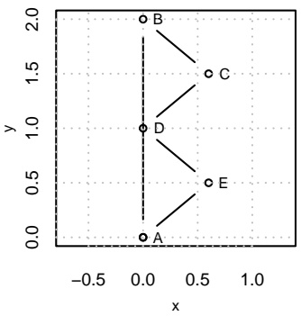

Next, we use matrix operations to modify these images.

**Image Rotation Prerequisites:** Section 5.3.2 Matrix Multiplication, page 274, Basic trigonometrics

Many common image operations can be represented by linear transformations– matrix multiplication. This includes image rotation, tilting (shear), stretching, and projection on lower-dimensional hyperplanes. Below, we’ll focus on 2D case, but it can be easily generalized to 3D operations. 3D image transformations are very common in computer games–this is how the scenery changes when you move, and this is the reason why graphics cards became so good at matrix operations.

As a starting point, the image should be described as a vertex matrix, as we did above. Images can be rotated by multiplying the vertex matrix by the rotation matrix. We define 2-D rotation matrix as

$$
\mathsf {R} (\alpha) = \left( \begin{array}{c c} \cos \alpha & - \sin \alpha \\ \sin \alpha & \cos \alpha \end{array} \right).\tag{5.6.2}
$$

This matrix will rotate the image (as defined above) clockwise by angle α if post-multiplied by $\mathsf { R } ( \alpha ) { : } ^ { 1 2 }$

$$
\mathsf {B} ^ {\alpha} = \mathsf {B} \cdot \mathsf {R} (\alpha),\tag{5.6.3}
$$

where $\mathsf { B } ^ { \alpha }$ is the vertex matrix, rotated by α. Rotated vertex matrix is in many ways the same as the original–it will contain the same number of vertices that should be

<small><span class="docvortex-page-footnote" data-block-type="page_footnote" style="color:#6b7280">T α TT B = R(α) · B .</span></small>

<small><span class="docvortex-page-footnote" data-block-type="page_footnote" style="color:#6b7280">12<sub>We</sub> defined the image by stacking the x and y coordinates of vertices in columns. Alternatively, x and y can be stacked in rows. This is equivalent to transposing the image data matrix (B in (5.6.1)) as defined here. Accordingly, the corresponding formula will look like transpose of (5.6.3):</span></small>

<!-- page: 299 -->

connected in the same way. If the vertices possess certain attributes, like color, those attributes are unchanged. Note that the 2-D rotation matrix must be a $2 \times 2$ square matrix: two rows are needed to be compatible with 2-column data matrices, and two columns ensure that rotated data still has two columns, one for (rotated) x and one for y.

Let’s rotate the vertices of b-rune, defined above, by $3 0 ^ { \circ }$ . The corresponding rotation matrix will look like

$$
\mathsf {R} (3 0 ^ {\circ}) = \left( \begin{array}{c c} \cos 3 0 ^ {\circ} & - \sin 3 0 ^ {\circ} \\ \sin 3 0 ^ {\circ} & \cos 3 0 ^ {\circ} \end{array} \right) = \left( \begin{array}{c c} 0. 8 6 6 & - 0. 5 \\ 0. 5 & 0. 8 6 6 \end{array} \right)\tag{5.6.4}
$$

and the rotated vertices are

$$
\mathrm{B} ^ {3 0} = \mathrm{B} \cdot \mathrm{R} (3 0 ^ {\circ}) = \left( \begin{array}{c c} 0 & 0 \\ 0 & 2 \\ 0. 6 & 1. 5 \\ 0 & 1 \\ 0. 6 & 0. 5 \\ 0 & 0 \end{array} \right) \cdot \left( \begin{array}{c c} 0. 8 6 6 & - 0. 5 \\ 0. 5 & 0. 8 6 6 \end{array} \right) = \left( \begin{array}{c c} 0. 0 0 & 0. 0 0 \\ 1. 0 0 & 1. 7 3 \\ 1. 2 7 & 1. 0 0 \\ 0. 5 0 & 0. 8 7 \\ 0. 7 7 & 0. 1 3 \\ 0. 0 0 & 0. 0 0 \end{array} \right).\tag{5.6.5}
$$

The rotated matrix is given in Figure 5.6. Note that the vertex metadata is not affected by rotation. Here these are just vertex labels and the connection rule–we just connect all vertices to the next vertex.

Figure 5.6: The same object as in Figure 5.5 but rotated 30 degrees by multiplication with the corresponding rotation matrix. The rotated vertices are given as $\mathrm { { ^ { \circ } B ^ { 3 0 } } }$ in (5.6.5).

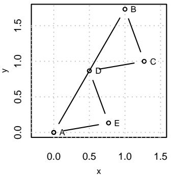

Exercise 5.16: Inverse of rotation matrix

Intuitively, the inverse of a rotation matrix $\mathsf { R } ( \alpha ) ,   \mathsf { R } ( \alpha ) ^ { - 1 }$ must be rotation in the opposite direction by a similar amount, i.e. $\mathsf { R } ( - \alpha )$ Show that for 2-D rotation matrices this is indeed the case, i.e. $\mathsf { R } ( \alpha ) \cdot \mathsf { R } ( - \alpha ) = \mathsf { I }$ Solution on page 509.

It is easy to generalize the rotation matrix into higher dimensions. In the 3-D space, we can rotate the object around each of the three axes, $x ,   y ,$ and $z ,$ and hence

<!-- page: 300 -->

we have three rotation matrices. For right-handed coordinate system these are

$$
\begin{array}{l} \mathsf {R} ^ {x y} (\alpha) = \left( \begin{array}{c c c} \cos \alpha & - \sin \alpha & 0 \\ \sin \alpha & \cos \alpha & 0 \\ 0 & 0 & 1 \end{array} \right) \quad \mathsf {R} ^ {z x} (\alpha) = \left( \begin{array}{c c c} \cos \alpha & 0 & \sin \alpha \\ 0 & 1 & 0 \\ - \sin \alpha & 0 & \cos \alpha \end{array} \right) \\ \qquad \text {and} \quad \mathsf {R} ^ {y z} (\alpha) = \left( \begin{array}{c c c} 1 & 0 & 0 \\ 0 & \cos \alpha & - \sin \alpha \\ 0 & \sin \alpha & \cos \alpha \end{array} \right). \end{array}\tag{5.6.6}
$$

Arbitrary rotations in space can be achieved by sequential application of these matrices. Our ability to imagine stops with three dimensions, but it is easy to continue into even higher dimensions. However, to display three or higher dimensional objects, we have to project these on a 2-D plane.

**Projection** Projection (more specifically parallel projection) can be defined as removing some of the coordinates, e.g. dropping z and keeping only x and y to make a 2-D projection of a 3-D object. If we want to project the object onto another plane besides the $x - y$ plane, we may start by rotating it first. As dropping a coordinate is equivalent of deleting the corresponding column, the projection matrix is similar to rotation matrix with the dropped column removed.

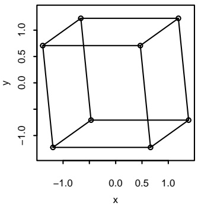

Figure 5.7: 2-D projection of a 3-D cube.

Figure 5.7 shows a 2-D projection of such a 3-D cube. This image is easy to understand. But we can make two-dimensional projections not just 3-D spatial objects—we can go into higher dimensions. Figure 5.8 shows a similar image of 4-D cube, tesseract. This is impossible to understand as out brain has virtually no experience with 4-D objects.

## 5.7 Application: Linear Regression

In both theoretical and practical applications the regression models are often pre-sented in matrix form. It may make the presentation more clear, but more importantly, storing and handling data in a matrix form tremendously simplifies solving the multiple regression model, both analytically and on computer. In matrix form

<!-- page: 301 -->

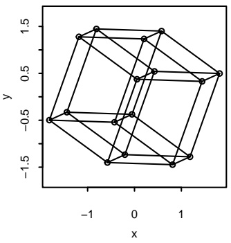

Figure 5.8: 2-D projection of a 4-D tesseract

there is no real difference between simple and multiple regression, neither in the way it is presented nor how it is solved by computer.

Let’s look again at the linear regression model in vector form, (2.1.30):

$$
y _ {i} = \boldsymbol {x} _ {i} ^ {\top} \cdot \boldsymbol {\beta} + \epsilon_ {i}
$$

or, more explicitly,

$$
y _ {i} = \left( \begin{array}{c c c c c} 1 & x _ {1} ^ {i} & x _ {2} ^ {i} & \dots & x _ {K} ^ {i} \end{array} \right) \cdot \left( \begin{array}{c} \beta_ {0} \\ \beta_ {1} \\ \beta_ {2} \\ \vdots \\ \beta_ {K} \end{array} \right) + \epsilon_ {i} \quad \text {for} \quad i = 1 \dots N\tag{5.7.1}
$$

(Remember that the first component of the x is normally taken to be number 1 corresponding to the intercept $\beta _ { 0 } ,$ see Section 2.1.6 on page 155). Note we assume we have N observations indexed by i and K + 1 unknown parameters $\beta _ { 0 } , \beta _ { 1 } , \ldots \beta _ { K }$ Alternatively we may say we have a single unknown parameter vector $\beta$ $K   +   1$ scalar parameters correspond to K explanatory variables and the constant.

Note that the first term of the matrix product in (5.7.1) is just a row vector of the data for the first observation. Hence we can take all the N rows corresponding to each observation in the data, and arrange these underneath each other like this:

$$
\underbrace {\left( \begin{array}{c} y _ {1} \\ y _ {2} \\ \vdots \\ y _ {N} \end{array} \right)} _ {N \times 1} = \underbrace {\left( \begin{array}{c c c c c} 1 & x _ {1} ^ {1} & x _ {2} ^ {1} & \ldots & x _ {K} ^ {1} \\ 1 & x _ {1} ^ {2} & x _ {2} ^ {2} & \ldots & x _ {K} ^ {2} \\ \vdots & \vdots & \vdots & \ddots & \vdots \\ 1 & x _ {1} ^ {N} & x _ {2} ^ {N} & \ldots & x _ {K} ^ {N} \end{array} \right)} _ {N \times (K + 1)} \cdot \underbrace {\left( \begin{array}{c} \beta_ {0} \\ \beta_ {1} \\ \beta_ {2} \\ \vdots \\ \beta_ {K} \end{array} \right)} _ {(K + 1) \times 1} + \underbrace {\left( \begin{array}{c} \epsilon_ {1} \\ \epsilon_ {2} \\ \vdots \\ \epsilon_ {N} \end{array} \right)} _ {N \times 1}.\tag{5.7.2}
$$

This is the matrix form. It can be written in a more compact manner as

$$
\boldsymbol {y} = \mathrm{X} \boldsymbol {\beta} + \epsilon\tag{5.7.3}
$$

<!-- page: 302 -->

where y is typically called outcome vector, X is design matrix, $\beta$ is the same parameter vector as in case of vector-form formula (2.1.30), end ϵ is disturbance vector.

A few comments may be helpful:

• X is the design matrix, the matrix that incorporates all data we use in the model, already converted into the numeric form and potentially also normalized, re-scaled, log-transformed and so on. If interaction effects are included in the model, they must have been incorporated in X. So it is in a way a data matrix, but it is usually not a matrix of unmodified original data.

• we have the design matrix X not transposed in the matrix notation, unlike in the vector form where $\overline { { \boldsymbol { x } } } _ { i } ^ { \intercal }$ is transposed. This is because we arrange the data for one observation horizontally in the design matrix and we normally denote horizontal vectors with transposition sign.

Exercise 5.17: Matrix form

Show that (5.7.2) and (5.7.1) are equivalent. Solution on page 511

In a similar fashion, we can stack all the prediction vectors in (2.1.31) as

(2.1.31): $\hat { y } _ { i } = \hat { \boldsymbol { \beta } } ^ { \mathsf { T } } \cdot \boldsymbol { x } _ { i }$

$$
\underbrace {\left( \begin{array}{c} \hat {y} _ {1} \\ \hat {y} _ {2} \\ \vdots \\ \hat {y} _ {N} \end{array} \right)} _ {N \times 1} = \underbrace {\left( \begin{array}{c c c c c} 1 & x _ {1} ^ {1} & x _ {2} ^ {1} & \ldots & x _ {K} ^ {1} \\ 1 & x _ {1} ^ {2} & x _ {2} ^ {2} & \ldots & x _ {K} ^ {2} \\ \vdots & \vdots & \vdots & \ddots & \vdots \\ 1 & x _ {1} ^ {N} & x _ {2} ^ {N} & \ldots & x _ {K} ^ {N} \end{array} \right)} _ {N \times (K + 1)} \cdot \underbrace {\left( \begin{array}{c} \beta_ {0} \\ \beta_ {1} \\ \beta_ {2} \\ \vdots \\ \beta_ {K} \end{array} \right)} _ {(K + 1) \times 1}\tag{5.7.4}
$$

and when writing this in the matrix form we get just

$$
\hat {\boldsymbol {y}} = \mathrm{X} \boldsymbol {\beta}.\tag{5.7.5}
$$

We can further compute the disturbance terms vector as

$$
\boldsymbol {e} = \boldsymbol {y} - \boldsymbol {X} \boldsymbol {\beta}\tag{5.7.6}
$$

and SSEas

SSE: sum of squared errors, see Cheatsheet 2.3, page 148

$$
S S E (\boldsymbol {\beta}) = \boldsymbol {e} ^ {\top} \cdot \boldsymbol {e} = (\boldsymbol {y} - \mathrm{X} \boldsymbol {\beta}) ^ {\top} \cdot (\boldsymbol {y} - \mathrm{X} \boldsymbol {\beta}).\tag{5.7.7}
$$

Remember: $e ^ { ^ { \scriptstyle \intercal } } \cdot e = e _ { 1 } ^ { 2 } + e _ { 2 } ^ { 2 } + \cdots + e _ { K } ^ { 2 } ,$ see Section 5.3.2 Vector multiplication as matrix product, page 279.

In order to use the matrix approach, we have to transform data into matrix form— create the design matrix. Design matrix is our final data in a numeric matrix form. It is “final” in the sense that it only contains the data that is actually used in the model, and it must be in a form that can be directly plugged into the formulas. In particular, this means all the non-numeric features must have been transformed to numeric ones; if feature normalization is desired this must be done and so forth. Not all models gain from construction of the design matrix, and there are models that contain more

<!-- page: 303 -->

than one design matrix. But design matrix is the primary form of feeding data into linear regression and many other models.

Broadly, creating the design matrix proceeds through the following steps:

1. select only the relevant explanatory variables (i.e. no outcome variable) from your original data. Add information from different datasets if needed.

2. convert all these variables into a desired numeric form. This may include converting non-numeric variables into numeric (e.g. instead of gender $\in   \{ M { , } F \}$ we may use female $\in \{ 0 , 1 \} )$ . It also includes converting numbers into another form if needed, e.g. continuous age into age groups or income into log income.

3. You may have to add additional columns, in particular constant–a column of number ones–as this is not normally included in your data; interaction effects, and other engineered features.

4. stack the observations on top of each other as a matrix. The result looks much like a data frame but it must be a matrix in the mathematical sense of the word.

Example 5.12: Convert data to design matrix

| name | age | position | salary |
| --- | --- | --- | --- |
| Liu Bei | 28 | manager | 77,000 |
| Sun Ren | 23 | employee | 55,000 |
| Thorgerd Egilsdóttir | 26 | employee | 66,000 |
| Freydís Eiríksdóttir | 30 | senior manager | 123,000 |

We want to describe salary as a function of position and age using a linear model

$$
\mathrm{salary} _ {i} = \beta_ {0} + \beta_ {a} \cdot \mathrm{age} _ {i} + \beta_ {m} \cdot \mathrm{manager} _ {i} + \epsilon_ {i}.\tag{5.7.8}
$$

Hence we want to estimate the effect of $K = 2$ variables (age and manager status) using N = 4 observations. We need to learn $K + 1 = 3$ unknown parameters.

Before moving any further we have to decide how to code the variables. While we can keep age as it is–it is already a numeric variable–we have to change position to a numeric form. We may just convert it into a dummy manager = 1(person is manager) and the modified data will now be

| name | age | manager | salary |
| --- | --- | --- | --- |
| Liu Bei | 28 | 1 | 77,000 |
| Sun Ren | 23 | 0 | 55,000 |
| Thorgerd Egilsdóttir | 26 | 0 | 66,000 |
| Freydís Eiríksdóttir | 30 | 1 | 123,000 |

In vector form the same equation would look

$$
\text {salary} _ {i} = \left( \begin{array}{c c c} 1 & \text {age} _ {i} & \text {manager} _ {i} \end{array} \right) \cdot \left( \begin{array}{c} \beta_ {0} \\ \beta_ {a} \\ \beta_ {m} \end{array} \right) + \epsilon_ {i}\tag{5.7.9}
$$

<!-- page: 304 -->

where $i \in \{ 1 , 2 , 3 , 4 \}$ .

The corresponding design matrix will look like

$$
\mathsf {X} = \left[ \begin{array}{c c c} 1 & 2 8 & 1 \\ 1 & 2 3 & 0 \\ 1 & 2 6 & 0 \\ 1 & 3 0 & 1 \end{array} \right]\tag{5.7.10}
$$

The first column, $x _ { 0 } ,$ is the constant. This is something normally needed in a linear model but not included in data, and here we add it to the design matrix. The second column is age, left unchanged. The third column is manager, equal to unity if the person is manager and zero otherwise. Note we have removed name as we don’t use this in our model, and salary as this is our outcome variable:

$$
\boldsymbol {y} = \left[ \begin{array}{c} 7 7, 0 0 0 \\ 5 5, 0 0 0 \\ 6 6, 0 0 0 \\ 1 2 3, 0 0 0 \end{array} \right].\tag{5.7.11}
$$

Now we can write the model (5.7.8) in matrix form as

$$
\left[ \begin{array}{c} 7 7, 0 0 0 \\ 5 5, 0 0 0 \\ 6 6, 0 0 0 \\ 1 2 3, 0 0 0 \end{array} \right] = \left[ \begin{array}{c c c} 1 & 2 8 & 1 \\ 1 & 2 3 & 0 \\ 1 & 2 6 & 0 \\ 1 & 3 0 & 1 \end{array} \right] \cdot \left[ \begin{array}{c} \beta_ {0} \\ \beta_ {a} \\ \beta_ {m} \end{array} \right] + \left[ \begin{array}{c} \epsilon_ {1} \\ \epsilon_ {2} \\ \epsilon_ {3} \\ \epsilon_ {4} \end{array} \right].\tag{5.7.12}
$$

This is the expression (5.7.2) written for these particular data. Now we can solve this for $\beta .$

## Solving the Linear Regression Model

**Prerequisites:** Matrix product (Section 5.3.2), matrix inverse (Section 5.5.2), Linear regression in matrix form (Section 5.7). Be able to follow matrix calculus rules but not necessarily understand all of it. You know what is gradient and it’s notation (Section 10.2.2 What is gradient, page 403).

Linear regression is the only statistical model where an analytic solution exists. Here we demonstrate how to derive the solution. The proof is easy for those who know matrix calculus. But before we get to the general matrix form, let’s find the solution of the scalar version of the linear regression model. This serves as a template that helps to understand the matrix version of the same problem.

We start with a model

$$
y _ {i} = \beta \cdot x _ {i} + \epsilon_ {i},\tag{5.7.13}
$$

i.e. a linear regression model that does not contain the intercept $\beta _ { 0 }$ . This is because we want to derive the solution formula using only scalar algebra, and this is only possible if we have a single unknown parameter (here labeled as just β).

<!-- page: 305 -->

We start with the definition of linearregression (2.1.18) as the parameter value that minimizes SSE. As the model here does not include intercept $\beta _ { 0 }$ , this is

$$
\hat {\beta} = \arg \min _ {\beta} S S E (\beta) = \arg \min _ {\beta} \sum_ {i = 1} ^ {n} (y _ {i} - \beta \cdot x _ {i}) ^ {2}.
$$

$$
\begin{array}{l} (2. 1. 1 8): \\ (\hat {\beta} _ {0}, \hat {\beta} _ {1}) = \arg \min _ {(\beta_ {0}, \beta_ {1})} \sum_ {i = 1} ^ {N} e _ {i} ^ {2} \end{array}\tag{5.7.14}
$$

As we typically do when computing a minimum of a function, we take a derivative of it w.r.t. $\beta$ and set it to 0:

$$
\frac {\partial}{\partial \beta} S S E (\beta) = - 2 \sum_ {i = 1} ^ {N} (y _ {i} - \beta \cdot x _ {i}) \cdot x _ {i}.\tag{5.7.15}
$$

When we set this to 0 then we get

$$
\begin{array}{r l} - 2 \sum_ {i = 1} ^ {N} (y _ {i} - \beta \cdot x _ {i}) \cdot x _ {i} = 0 & \Rightarrow \\ \sum_ {i = 1} ^ {N} (y _ {i} - \beta \cdot x _ {i}) \cdot x _ {i} = 0 & \Rightarrow \\ \sum_ {i = 1} ^ {N} y _ {i} \cdot x _ {i} - \sum_ {i = 1} ^ {N} \beta \cdot x _ {i} ^ {2} = 0 & \Rightarrow \\ \hat {\beta} = \frac {1}{\sum_ {i = 1} ^ {N} x _ {i} ^ {2}} \cdot \sum_ {i = 1} ^ {N} x _ {i} \cdot y _ {i}. \end{array}\tag{5.7.16}
$$

(The last line is derived using the fact that $\beta$ does not depend on i and hence it can be moved out of the sum sign.) So the optimal $\beta$ can be computed as a product of a) sum of $x _ { i } \cdot y _ { i }$ and b) inverse of sum of x2i .13 $x _ { i } ^ { 2 } .$

Now it is time to replicate the exact same approach in matrix form. We start our solution by writing the least squares conditions (2.1.32) and (2.1.33) in matrix form using the SSE definition (5.7.7):

$$
\begin{array}{r l} \hat {\boldsymbol {\beta}} & = \arg \min _ {\boldsymbol {\beta}} S S E (\boldsymbol {\beta}) = \\ & = \arg \min _ {\boldsymbol {\beta}} \boldsymbol {e} ^ {\top} \cdot \boldsymbol {e} = \\ & = \arg \min _ {\boldsymbol {\beta}} (\hat {\boldsymbol {y}} - \mathsf {X} \boldsymbol {\beta}) ^ {\top} (\hat {\boldsymbol {y}} - \mathsf {X} \boldsymbol {\beta}). \end{array}\tag{5.7.17}
$$

Remember: y· y = y<sup>2</sup>+ y2+ . . . . See Section 5.3.2 Vector multiplication as matrix product, page 279.

This is the matrix equivalent of (5.7.14).

Next, we proceed as we did above when finding a minimum of SSE: we take derivative of it with respect to $\beta .$ Note that while SSE is a scalar, $\beta$ is now a vector. Hence we need vector calculus rules to proceed. In particular, we have to

<small><span class="docvortex-page-footnote" data-block-type="page_footnote" style="color:#6b7280">∑ x2i</span></small>

<small><span class="docvortex-page-footnote" data-block-type="page_footnote" style="color:#6b7280">13<sub>Advanced</sub> pocket calculators in 1980-s allowed to compute regression coefficient using this method. In one memory register they stored and in another  and hence it was ∑ xi · yi, possible to estimate a scalar regression model using just two memory positions.</span></small>

<!-- page: 306 -->

keep track and preserve left- and right multiplication. In the scalar case (5.7.15) we just used the chain rule but let’s here open the parenthesis instead of introducing the matrix calculus chain rule. Opening the parenthesis is straightforward, but because matrix multiplication is not commutative, we have to keep track of left and right multiplication:

$$
\begin{array}{c} (\hat {\boldsymbol {y}} - \mathsf {X} \boldsymbol {\beta}) ^ {\top} (\hat {\boldsymbol {y}} - \mathsf {X} \boldsymbol {\beta}) = \\ = \boldsymbol {y} ^ {\top} \boldsymbol {y} - \boldsymbol {y} ^ {\top} \mathsf {X} \boldsymbol {\beta} - \boldsymbol {\beta} ^ {\top} \mathsf {X} ^ {\top} \boldsymbol {y} + \boldsymbol {\beta} ^ {\top} \mathsf {X} ^ {\top} \mathsf {X} \boldsymbol {\beta} = \\ = \boldsymbol {y} ^ {\top} \boldsymbol {y} - 2 \boldsymbol {y} ^ {\top} \mathsf {X} \boldsymbol {\beta} - \boldsymbol {\beta} ^ {\top} \mathsf {X} ^ {T} \mathsf {X} \boldsymbol {\beta}. \end{array}\tag{5.7.18}
$$

The last line uses the fact that $\boldsymbol { y } ^ { \mathsf { T } } \times \boldsymbol { \beta }$ is a scalar and hence $\boldsymbol { y } ^ { ^ { \intercal } } \times \boldsymbol { \beta } = \boldsymbol { \beta } ^ { ^ { \intercal } } \boldsymbol { \mathsf { X } } ^ { ^ { \intercal } } \boldsymbol { y } .$

In order to find the optimum, we again compute gradient of (5.7.18) and set it to zero. Just in case of matrices, the derivative is called gradient and instead of being equal to scalar (number) 0 it must equal to zero vector 0. As we are optimizing over a vector value $\beta$ now, we have to use the rules of matrix calculus. As SSE is a scalar, the result will just be a column vector.

The gradient can be computed as follows:

$$
\begin{array}{r l} \frac {\partial}{\partial \boldsymbol {\beta}} S S E (\boldsymbol {\beta}) & = \frac {\partial}{\partial \boldsymbol {\beta}} \left[ \boldsymbol {y} ^ {\textsf {T}} \boldsymbol {y} - 2 \boldsymbol {y} ^ {\textsf {T}} \times \boldsymbol {\beta} + \boldsymbol {\beta} ^ {\textsf {T}} \times^ {\textsf {T}} \times \boldsymbol {\beta} \right] = \\ & = - 2 \times^ {\textsf {T}} \boldsymbol {y} + \left(\times^ {\textsf {T}} \times + (\times^ {\textsf {T}} \times) ^ {\textsf {T}}\right) \boldsymbol {\beta} = \\ & = - 2 \times^ {\textsf {T}} \boldsymbol {y} + 2 \times^ {\textsf {T}} \times \boldsymbol {\beta} = - 2 \times^ {\textsf {T}} (\boldsymbol {y} - \times \boldsymbol {\beta}). \end{array}\tag{5.7.19}
$$

This is the matrix analogue of (5.7.15). We used the following considerations to compute the inidividual componentes:

• the first term, ${ \pmb y } ^ { \top } { \pmb y } ,$ does not depend on $\beta$ and hence we drop it.

• we use (A.2.4) for the term $\begin{array} { r } { \frac { \partial } { \partial \beta } ( \pmb { y } ^ { ^ { \scriptstyle \intercal } } \times \beta ) } \end{array}$ ;

$\begin{array} { r } { \frac { \partial } { \partial \beta } ( \beta ^ { ^ { \intercal } } { \sf X } ^ { ^ { \intercal } } { \sf X } \beta ) } \end{array}$ is computed using (A.2.11) with $X ^ { \top } X$ in place of A.

Using the optimality condition $\begin{array} { r } { \frac { \partial } { \partial \pmb { \beta } } \mathit { S S E } ( \pmb { \beta } ) = \pmb { 0 } } \end{array}$ we get

$$
- 2 \mathsf {X} ^ {\top} (\mathsf {X} \boldsymbol {\beta} - \boldsymbol {y}) = \mathbf {0} \qquad \text {or}\tag{5.7.20}
$$

$$
\mathsf {X} ^ {\top} \mathsf {X} \boldsymbol {\beta} = \mathsf {X} ^ {\top} \boldsymbol {y}\tag{5.7.21}
$$

By left-multiplying both sides by $( \mathsf { X } ^ { ^ { \mathsf { T } } } \mathsf { X } ) ^ { - 1 }$ , we get

$$
\hat {\boldsymbol {\beta}} = \left(\mathsf {X} ^ {\top} \mathsf {X}\right) ^ {- 1} \mathsf {X} ^ {\top} \boldsymbol {y}.\tag{5.7.22}
$$

$$
\begin{array}{l} \hat {\beta} _ {1} = \frac {1}{\sum_ {i = 1} ^ {N} x _ {i} ^ {2}} \cdot \sum_ {i = 1} ^ {N} x _ {i} \cdot y _ {i}. \end{array} \tag {5.7.16}
$$

This is the matrix analogue of (5.7.16). Note that the matrix formula uses matrix products instead of sums of products, and that the term $\frac { 1 } { \sum _ { i = 1 } ^ { N } x _ { i } ^ { 2 } }$ has been replaced by its matrix analogue $\left( X ^ { \top } X \right) ^ { - 1 }$

<!-- page: 307 -->

So we derived a simple analytic solution to the linear regression problem. It is the only statistical model where we do not have to rely on non-linear optimization but can just plug the numbers (matrices) into a formula and get the result right $\mathrm { { a w a y . ^ { 1 4 } } }$ The solution involves three matrix multiplications (cheap operations) and one matrix inverse (expensive operation). In practice, the analytic solution is the preferred way only if the dimension of $X ^ { T } X$ is small, i.e. we have no more than thousands of variables. If we have more variables then gradient descent (see Section 10.2 Gradient descent and gradient ascent, page 401) may be faster as that approach only requires repeated computation of gradient (5.7.19) but not the expensive inverse $\left( X ^ { \top } X \right) ^ { - 1 }$

Note that in order for the solution to exist, the inverse $\left( \mathsf { X } ^ { \top } \mathsf { X } \right) ^ { - 1 }$ must exist. In particular this means that X must be full rank.

<small><span class="docvortex-page-footnote" data-block-type="page_footnote" style="color:#6b7280">K  K</span></small>

<small><span class="docvortex-page-footnote" data-block-type="page_footnote" style="color:#6b7280">T</span></small>

<small><span class="docvortex-page-footnote" data-block-type="page_footnote" style="color:#6b7280">14<sub>Alghough</sub> the formula is very simple, the actual computations may be quite complicated and imprecise. In particular, inverting the × matrix X · X may be time-consuming and imprecise if the number of variables K is large. However, normally we leave these tasks for dedicated libraries.</span></small>

<!-- page: 308 -->

<!-- page: 309 -->

## Chapter 6

## Machine Learning Models

This chapter discusses several supervised learning methods and some mathematical tools that are used in some of these models.

## Contents

- 6.1 Trees and tree-based methods 299
- 6.1.1 Decision trees: introduction 300
- 6.1.2 How trees work: two examples 303
- 6.1.3 Building trees: recursive binary splitting 305
- 6.1.4 Information and Entropy 309
- 6.1.5 Finding the best split 311
- 6.1.6 Regularizing Trees 313
- 6.1.7 Downsides of trees 314
- 6.1.8 Ensemble Methods 314
- 6.2 Metric Distance: A Revisit 319
- 6.2.1 Data-Driven Metrics 319
- 6.2.2 Cosine similarity and angular distance 325
- 6.3 k-Nearest Neighbors 328
- 6.3.1 Introductory Example 329
- 6.3.2 What is Distance 330
- 6.3.3 Instance-based learning 331
- 6.4 Support Vector Machines 332
- 6.5 Comparison and Review 334

## 6.1 Trees and tree-based methods

Decision trees is a popular method for predictive modeling, both for regression and categorization problems. Trees are easy to implement and easy understand. Trees is one of the most explainable machine learning method, a method where it is possible

<!-- page: 310 -->

to explain someone how and why certain decisions were made. Our mental decisionmaking is often based on tree-like way of thinking.

Trees are also a popular way to “grow forests”, a large collection different treebased methods combined into a single ensemble method.

First, we describe what exactly are the decision trees and what are the main related concepts. Afterwards we look at algorithms to create trees; and finally treebased ensemble methods (forests).

## 6.1.1 Decision trees: introduction

A popular implementation of tree is the “animal game”, a children game where one player thinks an animal, and the other player have to guess it by asking questions regarding the animal. But the questions must be worded in a way that the answer is always “yes” or “no” (Figure 6.1). Based on the answers, the player who is guessing can narrow down the set of possible animals until it contains just the correct one. One can write down the questions and yes-no answers, although no-one does it in this game. The result will look like a tree, or more precisely like a single path from the trunk (the first question) till a leaf (the answer). The other branches—questions not asked—will remain incomplete. Note that the tree is depicted “upside-down”, decision trees are traditionally depicted with the trunk at top and branches leading downward.

Animal game. It is a simple example of a decision tree where one player has to think an animal (here “Unicorn”) and the other has to guess it by mentally creating an incomplete decision tree. The unconnected branches mark parts of the tree that the decision-making process did not reach, and hence they are not built.

Yuemin Cao, [CC0 1.0](https://creativecommons.org/publicdomain/zero/1.0/?ref=chooser-v1)

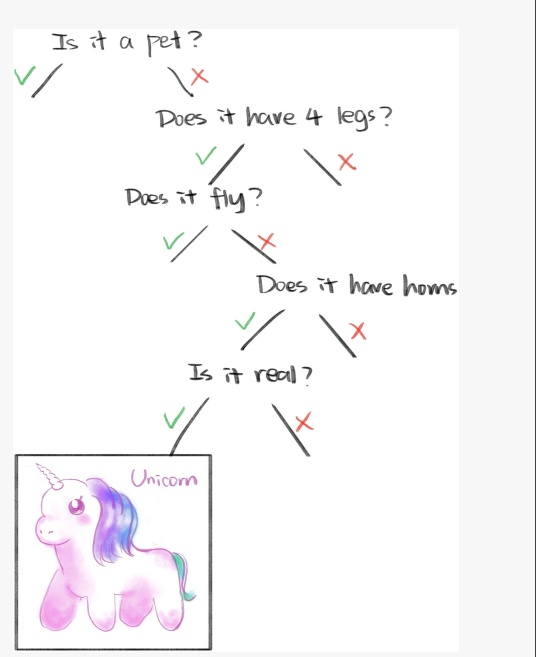

Figure 6.1: Animal game as a decision tree

However, the decision trees in this game are based on our pre-existing knowledge,

<!-- page: 311 -->

not on any data. They are also created on-the-fly, depending on the answers to the previous questions. As a result, they may be quite inefficient. Further below we discuss how to build decision trees based on data and how to do it in an efficient manner.

Figure 6.2 demonstrates a decision tree that is built on data. It describes survival rate on Titanic, based on three variables–sex (male or female), passenger class (1st, 2nd or 3rd), and age. This example demonstrates all the basic concepts of decision trees (although the exact details may differ).

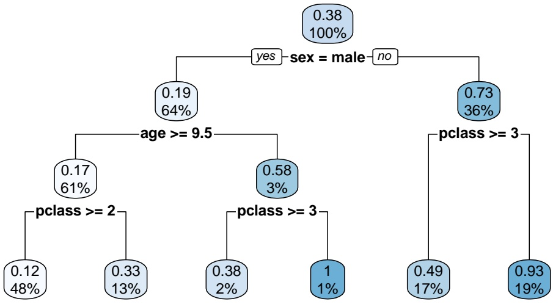

Figure 6.2: Decision tree to predict Titanic survival. We start at the topmost root node (survival rate 0.38 for 100% of the cases). The first decision is based on “sex”: if it is male, we move to the left branch (survival rate 0.19 for 64% of cases), if not male, then to the right branch (survival rate 0.73 for 36% of cases). The next decision is based on “age” for men, and on “pclass” for women. Finally we reach a leaf node, e.g. for the 1st and 2nd class women (the rightmost leaf) it tells that their survival rate was 0.93.

• The tree consists of nodes, branches, and leafs. Nodes are points where the tree makes decision based on values in data. In the figure they are depicted as blue ovals with two numbers inside–the survival rate, and percentage of the total observations.

• The tree starts with the trunk node (at top). In Figure 6.2, it contains the full (100%) dataset with the average survival rate of 0.38 (printed inside the blue node, and also reflected in the blueness of it). Each node involves a decision, printed underneath the blue node. The first decision is about gender. If the corresponding individual is male, we take the left branch, if not male, then the right branch. Each node has a single question with only two possible answers: “yes” (left) and “no” (right).

<!-- page: 312 -->

• Branches lead to new nodes (new questions) or leafs. These are points where we do not ask any more questions but output the predicted value instead. In this figure, these are the survival rates (first numbers inside of the node). However, these may also be predicted categories, probabilities of the predicted categories, counts in the dataset, or all the above.

There is a number of reasons why decision trees are popular:

• Trees are easy to understand, also be those who have no formal training in machine learning methods. They are explainable.

• They reflect logic of human decision-making.

• Trees can be built with arbitrary complexity, they can be made very simple (trunk and two branches), or extremely complex.

• There are well-established methods how to simplify too complex trees (pruning) in order to avoid overfitting.

• Trees can be used both for both regression and classification tasks. There are little conceptual differences between trees built for these two outcomes. Classification trees can handle any number of categories with no additional tricks.

• It is easy to modify the tree growing process in different ways. This makes it easy to grow many different trees based on the same data and in this way to create ensemble methods.

Here is a list of the downsides of decision trees:

• While decision trees are easy to explain, they may be hard to interpret. It may be easy to explain how a decision was made, but hard to understand what does this tell about the problem, and why the decision is done in this way and not another way.

Decision trees may be rather unstable, small variations in data may lead to totally different trees. This makes is harder to understand and interpret trees, even if the predictions remain similar. For comparison, think about linear regression– small changes in data will affect the regression line just a little bit.

Unlike the animal game example above, typical decision trees are “made of data” using one of the available algorithms. The popular recursive binary splitting (see Section 6.1.3 Building trees: recursive binary splitting, page 305) works broadly in this way:

• Pick a feature and split your data into two parts depending on if the value of the feature is smaller or larger than a certain threshold.

• Now take these two parts, and repeat the process.

• When it is time to stop, for instance, when there is too few cases left in the subset, then predict the result as the mean value (in case of regression) or as the majority category (in case of the classification).

• Each time, when deciding how to split your data, choose such a split that minimizes the total variance.

<!-- page: 313 -->

## 6.1.2 How trees work: two examples

Let’s begin with a simple classification task (Figure 6.3). The left panel displays a dataset, a plane with red and blue dots, overlied with the decision boundary of a simple tree. The tree is categorizing the regions according to the dominant color of the dots. The right panel displays the corresponding decision tree. The first question the tree asks–the condition at the the root node—is if $x _ { 2 } < 0 . 1 4$ , i.e. if the point lies below the horizontal line approximately in the middle of the figure (orange horizontal dotted line). All 100 training observations are going through that test. If the condition is true (this is the case for 51 observations), then we move to the next node left of the root. That node does not do any further tests but classifies the result as red (labeled as $\text{" }0 \text{" }$ at right) as 38 out of the 51 observations there are red. This is a leaf node. But if $x _ { 2 } \geq 0 . 1 4$ , the we move to right of the root node to the first node there. This tests if $x _ { 1 } < - 0 . 4 7$ . The condition corresponds to the orange vertical dotted line. If true, we are at left of this line (and we are also above the $x _ { 2 } = 0 . 1 4 \; \mathrm { l i n e } ,$ and we again categorize the data points as red as 9 out of 16 observations here are red. However, if $x _ { 1 } \geq - 0 . 4 7$ (top-righ region), then the predicted category is blue (category “1”).

See Section 4.3.2 Decision boundary, page 233 for more about decision boundary.

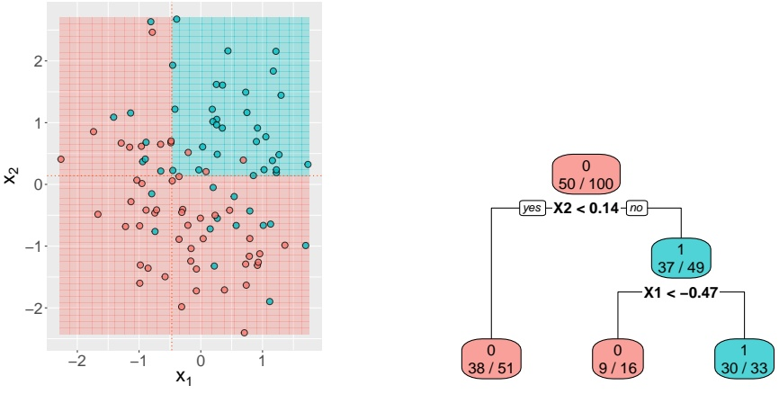

Figure 6.3: A simple decision tree solving a 2-D classification task. The decision boundary plot (left) and the corresponding decision tree. Dotted orange lines denote the node conditions.

The tree splits the feature space into three rectangles (the three leafs in the right panel). Two of these leafs predict red, one predicts blue. Because the conditions are testing ${ \mathrm { ~ i f ~ } } x _ { 1 }$ and $x _ { 2 }$ are below or above certain thresholds, the decision boundary is made of either vertical or horizontal line segments. Hence the corresponding decision regions are rectangles. One can easily see that if we add a third feature to the data, the rectangles will transform into 3-D boxes, and in case of more dimensions, these will be hyperrectangles of the corresponding dimension. Such behavior–decision boundary, made up of recangles–is a feature of decision trees.

The second example considers an 1-D regression task. We use Boston Housing data to predict the median house values across neighborhoods, based on the average

<!-- page: 314 -->

number of rooms. The left panel of Figure 6.4 shows data (gray circles) and predicted values (red line), and the right panel shows the corresponding regression tree. As we can see, the tree splits the data into four leafs, with the corresponding predicted values

$$
\widehat {m e d v} = \left\{ \begin{array}{l l} 1 9 & \text {if} \quad r m <   6. 5 \\ 2 5 & \text {if} \quad 6. 5 \leq r m <   6. 9 \\ 3 2 & \text {if} \quad 6. 9 \leq r m <   7. 4 \\ 4 5 & \text {if} \quad r m \geq 7. 4. \end{array} \right.
$$

On the figure, each leaf corresponds to a horizontal stretch of the blue prediction line, the decision boundaries between leafs are depicted as dotted vertical lines. As the feature space is just 1-D, the decision boundaries are individual points, rm values 6.5, 6.9 and 7.4, marked with the dotted lines.

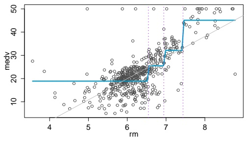

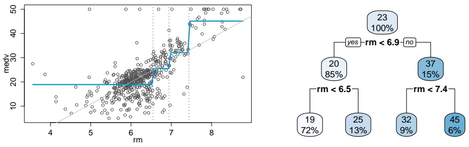

Figure 6.4: Regression tree solving an 1-D problem. Predicting house values based on number of rooms, Boston Housing data. On these data, the tree achieves $\mathit { R M S E } = 5 . 9 3$ , while linear regression (gray line) has RMSE = 6.60.

## Exercise 6.1: Trees and decision boundaries

You are classifying data points into red crosses and green circles. You are using decision trees. You have two numeric features y and y that range between 0 and 10.

1. Consider the tree at right $( T$ means the condition is true and $F$ means it is false). Sketch the decision boundary on x-y axes.

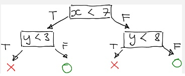

<!-- page: 315 -->

2. Consider the following decision boundary at right. Sketch a possible decision tree that creates such a boundary.

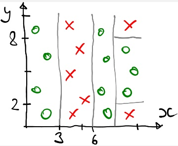

Solution on page 512.

Exercise 6.2: Decision boundary with 3 features

```txt
You have a dataset with 3 continuous features, the target has two possible categories. How will the decision boundary look like if youre using
1. Classification trees
2. k-NN
3. Logistic regression
Solution on page 513
```

## 6.1.3 Building trees: recursive binary splitting

So far we just analyzed the existing trees and did not discuss how they were constructed. Now it is time to discuss how to make trees. In the broad terms, the algorithm tries to split the data in various ways, and picks the best way it finds. But in case of anything resembling a reasonable datasets, there are too many possible ways to split data, and hence we need a simpler option. Below, we discuss recursive binary splitting, one of the most popular algorithms to build trees. We discuss a categorization example here, but the regression case will be mostly similar.

To put it simple, trees split the feature space into rectangular blocks (leafs), and in each leaf, they predict the majority outcome. We would like to find the best possible way to slice the feature space–to create as pure leafs as possible. Unfortunately, there are just too many possible ways to split a high-dimensional dataset, so we cannot find the best solution. We need a simpler way instead.

The most popular, and feasible, algorithm is called recursive binary splitting. The idea of it is fairly simple. You split your dataset into two halves (these do not have to be of equal size). Thereafter you treat the two halves as two different datasets, and just continue splitting until some sort of stopping condition is reached (Figure 6.5). You probably need multiple stopping criteria, such as reaching a pure leaf (a leaf with only one category of outcomes), or if the leaf is considered too small. Obviously, you should not just split the data in an arbitrary manner but find the best available split (see Section 6.1.5 Finding the best split, page 311).

Assume we are categorizing N cases into C different categories, using K features. So the design matrix X is $N \times K$ and the outcome vector y is $N \times 1$ Here we

<!-- page: 316 -->

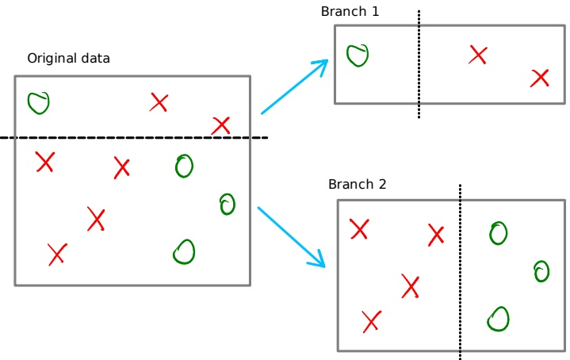

Figure 6.5: Recursive binary split. Binary refers to the fact that the algorithm always splits the original data (left) into two subsets “Branch $I ^ { \prime \prime }$ and “Branch $2 ^ { \prime \prime }$ (right). Thereafter, both of these subsets are treated as new datasets, and split again. The process can be repeated many times until some kind of stopping condition is reached. This is why it is called recursive.

discuss numeric features only, but trees can handle categorical features in a fairly straightforward manner too. The classification tree splits the K-dimensional feature space into M rectangular regions (leaves) $\mathcal { R } _ { m } ,   m   =   1 { , } 2 , \ldots { , } M$ , and on each region it predicts $\hat { y } ( m )$ , one particular class (normally the one that is in majority in that region)

$$
\hat {y} (m) = \arg \max _ {c = \mathcal {C}} \sum_ {i: x _ {i} \in \mathcal {R} _ {m}} \mathbb {1} (y _ {i} = c)
$$

Here $\hat { y } _ { m }$ is the predicted value for region $m ,$ and $y _ { i }$ is the category of observation i and $\mathcal { C }$ is the set of possible categories.

For instance, the tree in Figure 6.3 has a 2-D features space (consisting of $x _ { 1 }$ and x2), and the design matrix X is of dimension $1 0 0 \times 2 .$ , and there are two classes $\mathcal { C } = \{ \mathit { r e d } , \mathit { b l u e } \}$ . The tree has three leafs (right panel), corresponding the rectangular regions on the decision boundary plot. And in each of these regions, the tree picks the majority category as the predicted value (this is the background color on the decision boundary plot).

The basic idea of the algorithm is as follows:

• Check the stopping conditions: do we have too few datapoints left? Do we have all y values the same? If yes, stop here.

Find the best attribute $k ^ { * }$ out of the $K ^ { j }$ that are available (see Section 6.1.5 Finding the best split, page 311 below). Note that after performing a few splits, the number of available attributes $K ^ { j }$ may be less than the original number of features $K .$

• Split dataset into two, “left” and “right”, partitions, based on whether the condition is true or not for each observation. Depending on the data and condition,

<!-- page: 317 -->

both partitions now contain less variation in the attribute $k ^ { * }$ . In case there is no variation left, one should not consider that attribute for splitting any more. It has become “inactive”.

• Repeat the above with both left and right partition.

Before we can describe it more formally, we need some more notation. Data D consists both of the design matrix X and the outcome vector y: ${ \mathcal { D } } \; = \; ( { \mathsf { X } } , { \pmb { y } } )$ Let’s denote by $x _ { i k }$ the elements of X for observation $i ,$ and by $y _ { i }$ the corresponding outcomes.

$$
\mathcal {D} = (X, \boldsymbol {y}) = \left(\left( \begin{array}{c} \boldsymbol {x} _ {1 \bullet} ^ {\prime} \\ \boldsymbol {x} _ {2 \bullet} ^ {\prime} \\ \vdots \\ \boldsymbol {x} _ {N \bullet} ^ {\prime} \end{array} \right), \left( \begin{array}{c} y _ {1} \\ y _ {2} \\ \vdots \\ y _ {N} \end{array} \right)\right) = \left(\left(\boldsymbol {x} _ {\bullet 1}, \boldsymbol {x} _ {\bullet 2}, \dots , \boldsymbol {x} _ {\bullet K}\right), \left( \begin{array}{c} y _ {1} \\ y _ {2} \\ \vdots \\ y _ {N} \end{array} \right)\right)\tag{6.1.1}
$$

K attributes of length $N ,$ a single endogeneous variable y of length $N$ Now the algorithm more formally. It receives data D as an input.

• Do we have a pure leaf: $y _ { i } = y ^ { * } \quad \forall i \in { 1 \ldots N ? }$ If yes, stop and predict the $y ^ { * }$

• Do we have to few observations for splitting: $N   <   \underline { { \mathrm { N } } } ?$ If yes, stop here and predict the majority category, or maybe the probability of belonging to the majority category.

• Split both the design matrix and the outcome vector into $``left''$ and “right” part based on condition

$$
\mathcal {D} ^ {L} = \{\mathcal {D} _ {i}: x _ {i} ^ {k ^ {*}} <   \theta^ {k ^ {*}} \}\tag{6.1.2}
$$

Here is the recursive binary splitting, written as a pseudo-code algorithm, assume binary features $x _ { i j } \in \{ 0 , 1 \}$

<div class="docvortex-algorithm" style="white-space: pre-wrap; font-family:monospace;">
function growTree((X, y))
    let N = number of cases in X
    if $y_i = 0$ for all $i = 1,2,\ldots,N$:
        return leaf(0)
    if $y_i = 1$ for all $i = 1,2,\ldots,N$:
        return leaf(1)
    let j = bestAttribute((X, y))
        # the best way to split (X, y) into two parts
        # one corresponding to $x_j = 0$, the other to $x_j = 1$
    let D = X_{-j}
        # remove feature j from data
    return node(j, growTree((D_i, y_i) for i : x_{ij} = 0),
        growTree((D_i, y_i) for i : x_{ij} = 1))
</div>

Example 6.1: Splitting data for decision trees: income and education

Here we use [males dataset](https://bitbucket.org/otoomet/lecturenotes/raw/master/data/males.csv.bz2) about personal characteristics and income. An example of the relevant variables in the dataset look like

<!-- page: 318 -->

| school | union | ethn | maried | residence | wage |
| --- | --- | --- | --- | --- | --- |
| 12 | no | other | no | nothern_central | 1.30 |
| 12 | no | other | no | nothern_central | 1.57 |
| 9 | no | other | yes |  | 1.98 |
| 10 | no | other | yes | south | 1.23 |

It contains 4360 observations in total. The task is to predict the wage (the log hourly wage), based on the other variables; hence we are talking about a regression problem. We make the trees shallow (maximum depth 2) in order to make them easy to understand.

If we only include the variable school (years of schooling), then we get the tree at right. The root node asks if school < 12, i.e. if the person has not graduated from high school. If true, the predicted salary will be \$1.5 per hour. If not, the right branch now asks if school < 14, i.e. if the person has taken some college education, but not even graduated from a 2-year college.

The RMSE of the model is 0.512.

Next, we also include variable residence. The corresponding tree is visible at right. Perhaps surprisingly, the tree turns out to be exactly the same! Obviously, the RMSE of the model is 0.512, exactly the same value.

This is because for the first three splits (the three nodes visible on the figure) it turns out that school gives better splits than residence. More information is available, but it turns out not to be that useful.

Finally, we include all available variables. Now the tree turns out slightly different–the root node still asks about schooling, but both second-level nodes now test the marital status instead (and assign lower wage to non-married people). The splitting algorithm decides that this is more useful than to test schooling again, and indeed, RMSE is now slightly smaller, 0.507.

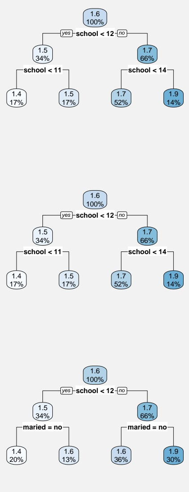

<!-- page: 319 -->

This example shows how trees work–they use the best information available (or at least what the recursive splitting thinks is the best information available). In the example above, the best information turns out to be embedded in the school variable. Even what is left in this variable after using some of this information (asking if someone has HS degree) is more useful than what is in residence. But maried turns out to be more useful than the “depleted” school variable.

So far we discussed only binary splitting–the tests the nodes two always have only have two possible answers (True or False). This turns out to be not really a limitation, because we can always describe a multi-branch node as a series of twobranch nodes. For instance, if gender is coded as “male”, “female” and “not specified”, we could make a node that leads to three branches, one for each possible gender values. However, we can can also make two two-branch nodes instead, the first of these may distinguish between “male” and “not male”, and the second one between “female” and “not female”. Down the line, we’ll have three branches that lead to further conditions (or leafs) in both cases. This approach has the advantage that the corresponding algorithms are simpler.

## 6.1.4 Information and Entropy

Entropy is a measure of information in a RV. It is sometime called Shannon entropy to distinguish it from a concept of similar name in thermodynamics. Entropy tells how much information do we gain when we learn about the outcome. It can take either value 0 or a positive number. “0” means we do do not get any new information— everything was already known in advance; the RV did not contain any randomness at all.<sup>1</sup> Positive entropy, however, means that there is a certain amount of uncertainty in the result, and learning about the outcome helps to clarify this. The larger the entropy, the more uncertain is the outcome and the more information we gain when we learn about it. As an example, consider two “random” events: the sun will rise tomorrow, and the sun will shine tomorrow. The first of these is essentially a certain event, so when we see sunrise the following day we’ll learn nothing. Entropy of this RV is 0. The second one, however, depends on the random weather, and hence we learn something when we experience either sun or rain in the following day.

In discrete case where the RV X can take values $k = 1 , 2 , \ldots K$ , entropy is defined as negative expected value of log probability of possible outcomes:

$$
\mathbb {H} (X) = - \mathbb {E} \log \Pr (X = x _ {k}) = - \sum_ {k = 1} ^ {K} \Pr (X = x _ {k}) \cdot \log_ {2} \Pr (X = k).\tag{6.1.3}
$$

When using binary logarithm, the entropy is measured in bits. When using natural logarithms, the units are called nats. It is easy to see that 1 nat $\mathrm { { } \mathfrak { t } } = \log _ { 2 } \mathrm { { e } } = 1 . 4 4 3$ bits. We use binary logarithms in this text but some authors prefer natural logarithms.

Note that for zero-probability states, 0 log 0 is undefined. However, as the corresponding lim $\mathrm { 1 } _ { x \to 0 }$ x log $x = 0$ (see (A.1.3) in Section A.1.1) the contribution to entropy is 0. This means that when we expand our sample space with additional zeroprobability events, the entropy value is not affected. When we are aware of additional

<small><span class="docvortex-page-footnote" data-block-type="page_footnote" style="color:#6b7280"><sup>1</sup>An example of such a “non-random” RV (degenerate RV) is get value 0 with 100% of probability.</span></small>

<!-- page: 320 -->

kind of events that almost never happen will not affect the amount of information we can gain. Only events with positive probability matter in terms of information.

Example 6.2: Entropy of uniform distribution

In order to have an intuitive understanding about what entropy measures, let us analyze entropy of discrete uniform distribution. In case of $K$ potential outcome states with equal probability $1 / K$ , (6.1.3) gives:

$$
\mathbb {H} (X) = - K \left(\frac {1}{K} \cdot \log_ {2} \frac {1}{K}\right) = \log_ {2} K.\tag{6.1.4}
$$

So entropy is just logarithm of the number of states. Figure 6.6 displays such an example. We have 8 possible states, $A – H .$ , some of which have probability 0 (white on figure) while the others are equally likely. The first row depicts the case where all the probability mass in concentrated in the state A with $\operatorname* { P r } ( A ) = 1$ while every other state $S$ has $\operatorname* { P r } ( S ) = 0 .$ Here we cannot gain any information as we know in advance that A happens for sure. This is reflected by the corresponding $\mathbb { H } = 0 .$ However, the next state already contains some uncertainty: we don’t know if A or $B$ will happen, both are equally likely. When we learn about which event happened, we gain log $_ 2   2   =   1$ bit of information. Further down in the table, there are more possible states and hence more uncertainty, and we gain more information when we learn about the outcome.

<!-- page: 321 -->

$$
\begin{array}{c c c c c c c c c c} & A & B & C & D & E & F & G & H \\ 1 & P = 1 & & & & & & & & \mathbb {H} = 0 \\ 2 & P = 0. 5 & P = 0. 5 & & & & & & & \mathbb {H} = 1 \\ 3 & P = 0. 3 3 3 & P = 0. 3 3 3 & P = 0. 3 3 3 & & & & & & \mathbb {H} = 1. 5 8 \\ 4 & P = 0. 2 5 & P = 0. 2 5 & P = 0. 2 5 & P = 0. 2 5 & & & & & \mathbb {H} = 2 \\ 5 & P = 0. 2 & P = 0. 2 & P = 0. 2 & P = 0. 2 & P = 0. 2 & & & & \mathbb {H} = 2. 3 2 \\ 6 & P = 0. 1 6 7 & P = 0. 1 6 7 & P = 0. 1 6 7 & P = 0. 1 6 7 & P = 0. 1 6 7 & P = 0. 1 6 7 & & & \mathbb {H} = 2. 5 8 \\ 7 & P = 0. 1 4 3 & P = 0. 1 4 3 & P = 0. 1 4 3 & P = 0. 1 4 3 & P = 0. 1 4 3 & P = 0. 1 4 3 & P = 0. 1 4 3 & \\ \mathbf {8} & P = 0. 1 2 5 & P = 0. 1 2 5 & P = 0. 1 2 5 & P = 0. 1 2 5 & P = 0. 1 2 5 & P = 0. 1 2 5 & P = 0. 1 2 5 & \mathbb {H} = \mathbf {3} \end{array}
$$

Figure 6.6: Entropy in case of different probability over states. Different shades of gray denote different probability, uniformly spread over 8 states A–H. The rightmost column is the corresponding entropy.

## Exercise 6.3: Entropy of Bernoulli random variable

Look at a Bernoulli process with parameter p. Compute it’s entropy as a function of p. Explain the intuition behind how the result depends on p. Hint: consider making a plot on computer.

## 6.1.5 Finding the best split

In order to come up with good predictions (leaves), the leaves should be as “pure” as possible. In regression problems, it usually means that the leaves should have small variance (or RMSE).

Minimize quadratic loss inside of regions:

$$
\hat {y} _ {j} = \arg \min _ {\hat {y}} \sum_ {i: \boldsymbol {x} _ {i} \in R _ {j}} \left(\hat {y} - y _ {i}\right) ^ {2}
$$

<!-- page: 322 -->

First split in 1 dimension:

$$
s _ {1} = \arg \min _ {s} \left[ \min _ {\hat {y} _ {1}} \sum_ {i: x _ {i} <   s} (\hat {y} - y _ {i}) ^ {2} + \min _ {\hat {y} _ {2}} \sum_ {i: x _ {i} \geq s} (\hat {y} - y _ {i}) ^ {2} \right]
$$

n-th split among d dimensions: choose, $s ,$ d to minimize

$$
\min _ {\hat {y} _ {1}} \sum_ {i: x _ {i d} <   s} (\hat {y} - y _ {i}) ^ {2} + \min _ {\hat {y} _ {2}} \sum_ {i: x _ {i d} \geq s} (\hat {y} - y _ {i}) ^ {2}
$$

Establishing leaf purity for categorization tasks is a little more complex. There are several methods to compute the leaf purity, below we discuss entropy-based purity.

Entropy: a measure of information in distribution. See Section 6.1.4 Information and Entropy, page 309.

Consider the same data as in Figure 6.5 (Figure 6.7). The left side of the figure depicts the same split as in Figure Figure 6.5 above. In one of the branches we have one circle and two crosses, the other has three circles and four crosses. The right-hand side depicts another possible split: in the first branch we have a single circle and five crosses, and the other branch as one cross and three circles. Which of these splits is more useful?

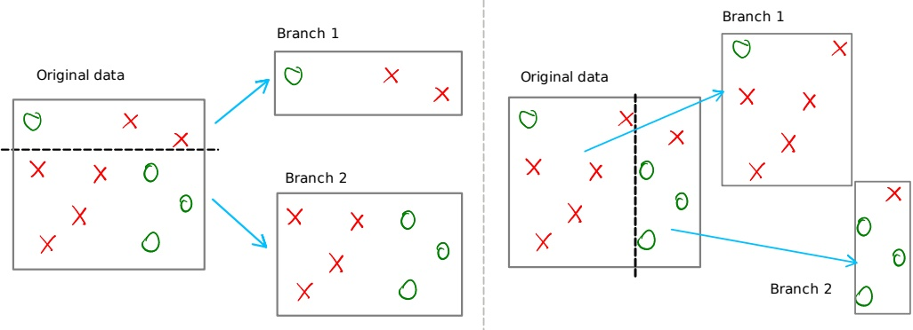

Figure 6.7: Comparing two possible splits of the same data. The entropy of the original node (6 crosses, 4 circles) is 0.971. The split at left results in entropy 0.965 and hence the gain is 0.006. The split at right gives a much larger entropy gain, see Exercise 6.4.

In this figure, it is fairly obvious that the right-hand split is better: both leaves are now fairly pure (83% and 75% respectively), while the left-hand split results in leaves with 67% and 63\$ of purity. However, such intuitive purity measure does not generalize well to more complex cases, including more than two categories. Instead, we should compute entropy gain of both of these splits.

As a reminder, information is defined as

$$
\begin{array}{l} \text {(6.1.3):} \\ \mathbb {H} (x) = - \sum_ {x} \Pr (x) \log_ {2} (\Pr (x)) \end{array}
$$

$$
\mathbb {I} (x) = - \log_ {2} \operatorname * {P r} (x),\tag{6.1.5}
$$

and entropy is defined in (6.1.3). In order to compute the entropy gain, we first need to find the entropy in the original data. It consists of 10 data points, 4 of which are

<!-- page: 323 -->

circles and 6 of which are crosses. Hence entropy is

$$
\begin{array}{r l} \mathbb {H} _ {0} = - \operatorname * {P r} (c i r c l e) \log_ {2} \operatorname * {P r} (c i r c l e) - \operatorname * {P r} (c r o s s) \log_ {2} \operatorname * {P r} (c r o s s) = \\ & = - 0. 4 \cdot \log_ {2} (0. 4) - 0. 6 \log_ {2} (0. 6) \approx 0. 9 7 1. \end{array}\tag{6.1.6}
$$

The first possible split consists of two branches: the first one of size 3 with one circle and two crosses; and the other one of size 7 with three circles and four crosses. Their corresponding entropies are

$$
\begin{array}{l} \mathbb {H} _ {1} = - 1 / 3 \cdot \log_ {2} (1 / 3) - 2 / 3 \log_ {2} (2 / 3) \approx 0. 9 1 8 \\ \mathbb {H} _ {2} = - 3 / 7 \cdot \log_ {2} (3 / 7) - 4 / 7 \log_ {2} (4 / 7) \approx 0. 9 8 5. \end{array}\tag{6.1.7}
$$

The final entropy would be weighted average over these two values, where weights are the corresponding branch sizes:

$$
\mathbb {H} _ {l e f t} = 3 / 1 0 \cdot \mathbb {H} _ {1} + 7 / 1 0 \cdot \mathbb {H} _ {2} \approx 0. 9 6 5.\tag{6.1.8}
$$

Hence the split decreased entropy from 0.971 to 0.965, a gain of 0.006.

Exercise 6.4: Compute entropy gain

Compute the entropy gain at the right split of Figure 6.7. Solution on page 514

## 6.1.6 Regularizing Trees

Decision trees are easy to overfit. This manifests in trees that are too deep and too complex. Such trees can easily achieve 100% accuracy on training data. There are three common solutions for overfitting.

1. Limit the tree growth by setting the maximum depth. This is perhaps the simplest and most straightforward way to avoid overfitting–it only allows the tree to grow until it reaches a given depth. Besides depth, one may want to set minimum number of data points to be split, minimum leaf size, or other parameters. Setting such limits is simple and may improve computation speed. However, the resulting trees may turn out to be less efficient, as some potentially useful branches will not be considered. See Figure 6.8 for an example how setting maximum depth may cause either underfitting or overfitting.

2. Stop growing trees if split not significant. This requires a certain threshold value, in terms of MSE or entropy improvement, so when the best split will not improve the overall goodness of the model by at least this much, the tree will stop.

This approach is too shortsighted though, as a mediocre split now may make it possible to achieve a very good split later.

3. Pruning is a more far-sighted (albeit more complex) alternative to decisions based on split significance. The idea of complexity pruning is similar to lasso

<!-- page: 324 -->

regression, instead of minimizing MSE of the tree, we choose the loss function that penalizes the number of terminal nodes T :

$$
L (\lambda) = \sum_ {m = 1} ^ {| | \mathcal {T} | |} \sum_ {i: i \in \mathcal {R} _ {m}} (y _ {i} - \hat {y} _ {i}) ^ {2} + \alpha | | \mathcal {T} | |\tag{6.1.9}
$$

Thereafter we can build large trees for different α and cross-validate for the best α.

## 6.1.7 Downsides of trees

Trees are powerful and flexible models but they are not a solution for every problem.

Above we discussed that binary splitting is not really a limitation. But traditionally, trees are built with very simple conditions only: these only involve a single feature, and only greater-than/less-than comparisons, such as $x _ { 1 } \: > \: 1 . 5$ or $s e x = = f _ { } { e m a l e }$ . One can imagine that more complex conditions, such as $x _ { 1 } + x _ { 2 } > 0$ may occasionally be a good choice, but that is not done in decision trees. This turns out to be a real limitation and it means that decision boundaries for diagonal regions are complex patterns of horizontal and vertical lines (see Figure 6.9). As a result, trees are better in capturing vertical than diagonal structures. This also means that trees, and their performance, depends on how data is rotated. Trees are not rotationinvariant.

• Trees are unstable

• Capturing certain patterns requires overly complex trees

## 6.1.8 Ensemble Methods

So far we discussed just trees–decision-making based on a single decision tree. However, it turns out one can get better estimators when combining multiple trees into “forests”. In this way we build ensemble methods. The idea of ensemble methods is very simple: instead on relying on a single model, we use a number of models and see what do they all predict. If they agree, this is good news. If they disagree, we just pick the solution that most of the models agree on (we do “majority voting”). In case of regression outcome we just aggregate the predictions of different models.

While ensemble methods are often based on various kinds of trees, one can do ensembles of other types of models as well, e.g. by combining different neural network models, different data sources, or different pre-processing. A major reason why ensemble methods work well with threes is that trees are typically created by the greedy splitting algorithm. As this is suboptimal (it is shortsighted), it leaves a lot of potential information behind. Ensemble methods introduce more variation in how the trees are built, and in this way help to gain some of that information back.

<!-- page: 325 -->

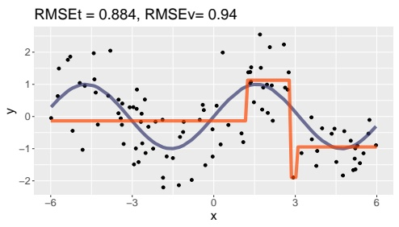

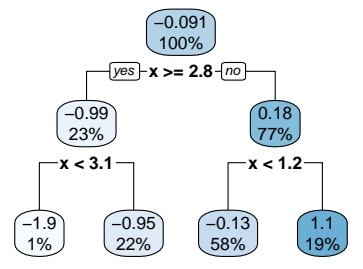

RMSEt = 0.611, RMSEv= 0.86

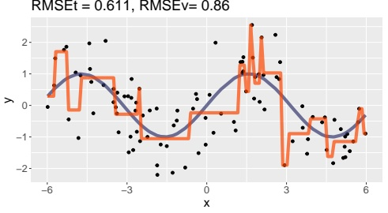

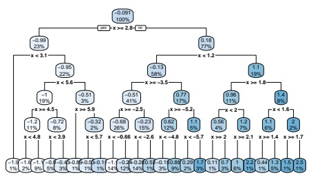

RMSEt = 0.237, RMSEv= 1.03

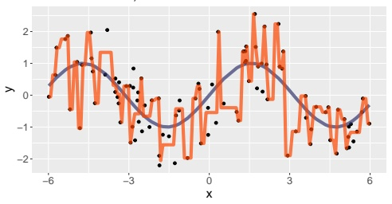

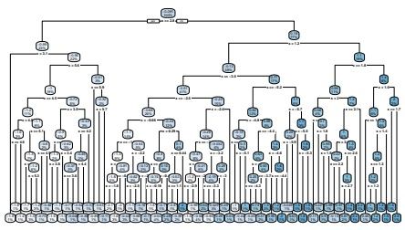

Figure 6.8: Overfitting in regression trees. The true relationship is marked with the purple wavy curve, observed values with black dots. The upper panel fits a tree of depth 2. This clearly underfits and cannot capture the wavy pattern in data. The middle panel displays a tree of depth 5. This seems about right–the tree clearly gets the main pattern but does not jump to grab every single datapoint. The lower panel shows a tree of depth 8. This one clearly overfits and attempts to catch individual datapoints. Right-hand side depicts the corresponding tree structure.

The depth-5 model has the lowest RMSE on validation data, 0.86, the deepest tree achieves the lowest RMSE on training data (0.24), but that is deceiving–that tree overfits.

<!-- page: 326 -->

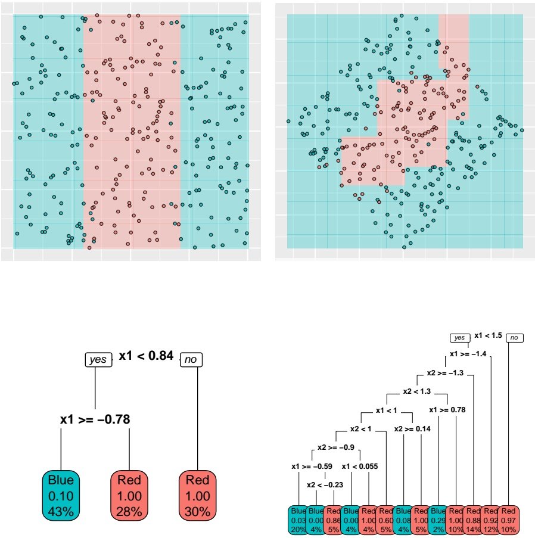

Figure 6.9: Decision trees are sensitive to data rotation. At left, a very simple tree can easily capture the pattern with accuracy 0.957 (on training data). At right, 45◦tilted data has accuracy 0.928 using a more complex tree. The actual tree structures are displayed below.

## Bagging

Bagging (bootstrap aggregating) is basically averaging predictions from a large number of bootstrapped samples (random samples taken from the training data). The basic reason why bagging works is as follows: as our data is a random sample for the population, the trees (or other models) built based on it are random too and hence predict random results. But we can make random results to be more stable if we average a large number of them.

If we have B training sets, we can build B different trees, one for each training set, and get B different predictors $\hat { y } ^ { 1 } , \hat { y } ^ { 2 } , \ldots , \hat { y } ^ { B }$ . The final predictor is just the average of these, $\begin{array} { r } { \hat { y } = \frac { 1 } { B } \sum _ { i } \hat { y } ^ { i } } \end{array}$ (or the majority category in case of classification). However, as we

<!-- page: 327 -->

normally only have a single training set, we can rely on bootstrapping to build more training sets. In case of bagging there is no need to prune the trees, the aggregation functions as regularization.

The number of trees, B, is a hyperparameter that should be tuned, a good value may be around 100.

## Random Forests

The downside with bagging is that it tends to rely on the same main features for all trees and hence gets too little variation in the model. Random forests solve this issue by adding random feature selection. Each time the bagging algorithm considers a split, it only considers $K ^ { \prime }$ features to use for splitting, instead of the full set of K features. This forces the individual trees to use different features. In practice, random forests are typically more precise method than bagging.

Random forests have two hyperparameters (in addition to the individual tree parameters): number of trees, and number of features $K ^ { \prime }$ to include into individual splits. A good choice tends to be $K ^ { \prime } = { \sqrt { K } }$ where K is the original number of features in the data. In case of $K \approx 1 0 0 0$ features in the original data, each split is done on a subset of $K ^ { \prime } \approx 3 0$ features only. This leaves the majority of features out, and forces the trees to use information that may otherwise not be used.

## Boosting

Boosting methods are in many ways similar to bagging and random forests. Below we describe AdaBoost, one of the most popular boosting algorithms.

Imagine a two-class categorization task where the categories are $`` - 1 ''$ and $`` 1 '' .$ We can create different models (e.g. different types of trees like in case of bagging or random forest) that produce predictions $\hat { y } \in \{ - 1 , 1 \}$ . For each of the model we can compute the error rate

$$
e ^ {m} = \frac {1}{N} \sum_ {i = 1} ^ {N} \mathbb {1} (\hat {y} _ {i} ^ {m} \neq y _ {i})\tag{6.1.10}
$$

where m denotes the model that predicts outcome $\hat { y } _ { i } ^ { m }$ for observation i. Some of these are weak classifiers where the error rate is not much above that of a random guess, while others work much better.

Next, we combine all these predictions together not by majority voting but by a weighted sum:

$$
\hat {y} _ {i} = \mathrm{sign} \left(\sum_ {m = 1} ^ {M} \alpha_ {m} \hat {y} _ {i} ^ {m}\right).\tag{6.1.11}
$$

Importantly, $\alpha _ { m }$ are model weights. Initially we can start by weighting all models in an equal fashion, but afterwards we want to give much more weight to good classifiers than to weak classifiers.

Algorithm:

1. build a simple tree

• may just be a stump

<!-- page: 328 -->

2. predict

3. you get correct and incorrect results

4. compute weights:

(a) weights for this tree: better accuracy, higher weights

(b) weights for each observation: wrong get more weight by α.

5. repeat many times

6. your prediction is the weighted average of all trees.

Unfortunately, as is the case with other models, ensemble improve prediction accuracy at the expense of interpretability. We cannot present a bagging or random forest model as a decision tree any more.

<!-- page: 329 -->

Table 6.1: Recent house sales

| id | price ($ 1000) | m<sup>2</sup> | crime (per 1000) |
| --- | --- | --- | --- |
| a | 800 | 200 | 2 |
| b | 1500 | 400 | 1 |
| c | ? | 200 | 1 |

## 6.2 Metric Distance: A Revisit

TBD: merge with kNN?

Section 5.2.2 Metric distance, page 268 introduced the concept of metric. We mainly discussed Euclidean and other $L _ { p } \cdot$ -related metrics. However, in machine learning applications it is often useful to let data decide the way we measure distance. This gives rise to various data-based transformations, including feature normalization and Mahalanobis distance.

Many ML applications also permit violating the strict assumptions behind the distance metric. We may not be particularly concerned whether triangle inequality holds, or whether distance is zero only for identical vectors. Instead, we want a simple and good enough method to rank data vectors. This is why we can use the popular cosine similarity measure that is not a distance in the sense as metric distance. Below we discuss both cosine similarity and a number of other popular approaches.

## 6.2.1 Data-Driven Metrics

Imagine you are using the nearest neighbors method to predict house prices. Your dataset contains two training examples (a and b) and you want to predict the price of c (See Table 6.1). Nearest neighbors (see Section 6.3 k-Nearest Neighbors, page 328) predicts the house c to have the same price as the most “similar” house among the training examples a and b.

But which house is more similar? Clearly, house a is of the same size while b is in a similar neighborhood. Obviously, we can choose a distance metric and compute distance. For instance, the Euclidean distance $d _ { E } ( { \pmb c } , { \pmb a } ) = 1$ and $d _ { E } ( \pmb { c } , \pmb { b } ) = 2 0 0$ and hence house c is more similar to house a than to house b. But does this way of measuring similarity make sense? If we measure house size in $\mathrm { k m } ^ { 2 }$ and crime rate per million instead of per 1000 residents, we would come to the opposite conclusion. So our similarity ranking depends on the measurement units. This looks like a false start to begin with.

We can identify two separate issues here:

1. Ranking according to Euclidean metric (as well as other $L _ { p }$ metrics) is not robust with respect to measurement units.

2. We don’t know how we should weight difference in size relative to the difference in crime rate.

The first problem is actually a specific manifestation of the second problem. If we

<!-- page: 330 -->

were able to address the weighting, the first problem would also vanish, as the weights would presumably make the ranking unit-invariant.

One way to address this problem is to use a metric that is derived from data. There are several popular approaches, all of these use measurement units that are derived from certain variation in data. However, despite that these distance metrics are “data driven”, they are not necessarily more correct than other units. Sometimes the preferred metric can be deduced from the nature of the problem, but other times one has just to experiment and find the best approach.

TBD: Example with an island

## Feature normalization

Perhaps the most popular such data-driven metric is feature normalization: transforming the features into mean-zero and variance-one features. This would constitute an answer to the house-price-problem above along these lines: “we think that customers value one standard deviation difference in house size about the same as one standard deviation difference in the neighborhood crime rate”.

Technically, normalized features can be computed like this. Consider a feature vector of length N, $\boldsymbol { x }   =   ( x _ { 1 } , x _ { 2 } , \ldots , x _ { N } )$ . It can be transformed into the normalized vector x˜ by first subtracting its average and thereafter dividing it by standard devitation:

$$
\tilde {\boldsymbol {x}} = \frac {\boldsymbol {x} - \bar {x}}{\mathrm{sd} \boldsymbol {x}}\tag{6.2.1}
$$

where $\begin{array} { r } { \bar { x }   =   \frac { 1 } { N } \sum _ { i = 1 } ^ { N } x _ { i } } \end{array}$ is the average value of x and sd $\begin{array} { r } { x   =   \sqrt { \frac { 1 } { N } \sum _ { i = 1 } ^ { N } ( x _ { i } - \bar { x } ) ^ { 2 } } . } \end{array}$ is the standard deviation of x. The normalized vector x˜ has mean zero and standard deviation 1. Note that normalization is done for each feature vector independently, the other features do not play any role here but we must know the values for all observations for that vector to compute x¯ and sd x. The result, obviously, does not depend on the units any more because sd x in (6.2.1) is measured in the same units as x. Effectively we introduced a new unit of measurement, the standard deviation of x.

## Example 6.3: Data normalization

Consider the matrix X below. It contains three columns, $x _ { 1 } , \; x _ { 2 }$ and $x _ { 3 }$ , and three rows a, b and c. The first two columns have similar spread (2) but different means (2 and 12 respectively), while the third column also has a different scale.

|  | x<sub>1</sub> | x<sub>2</sub> | x<sub>3</sub> |
| --- | --- | --- | --- |
| a | 1 | 11 | 10 |
| b | 2 | 12 | 20 |
| c | 3 | 13 | 30 |
| mean x¯j | 2 | 12 | 20 |
| std.dev x<sub>j</sub> | 1 | 1 | 10 |

The table also lists the mean value for all columns $\bar { \boldsymbol { x } } _ { j }$ for $j = 1 , 2 , 3$ , and (sample size corrected) standard deviations. When normalizing data, we simply subtract

<!-- page: 331 -->

the corresponding mean from each variable in data (i.e. $^ { \circ } 2 ^ { \circ }$ from values of $x _ { 1 } ,$ $`` 12  ''$ from $x _ { 2 }$ etc), and divide the resulting differences by the corresponding standard deviation (i.e. $^ { \circ } 1 ^ { \circ }$ for $x _ { 1 }$ and $x _ { 2 } .$ and $`` 10 ''$ from x<sub>3</sub>). We get

|  | <sup>x</sup>˜1 | <sup>x</sup>˜2 | <sup>x</sup>˜3 |
| --- | --- | --- | --- |
| 1 | -1 | -1 | -1 |
| 2 | 0 | 0 | 0 |
| 3 | 1 | 1 | 1 |

One can see that all three variables are now equal—they are all $( - 1 , 0 , 1 )$ This is rather intuitive: they all have one observation in the middle, and two other at each side and equally far from it.

Figure 6.10 shows a graphical comparison of normalized and non-normalized features. The left panel depicts the data points in the original feature space where spread of $x _ { 2 }$ is much larger than spread of $x _ { 1 }$ . The dotted circle denotes a set of equidistant points from the dark blue point in its center (using Euclidean distance in $\mathbb { R } ^ { 2 } )$ . One can see that the circle encompasses the green dot but not the yellow dot–hence the green dot is closer to the dark blue dot than the yellow dot. On the right panel we see the normalized version of the same data. The visual impression confirms that both features are now spread roughly equally. The solid circle depicts a set of equidistant points from the dark blue dot in this feature space, the yellow dot is now closer to the dark blue dot than to the green dot. Feature normalization reverses the distance ranking. Both panels also show the circles in the other feature space, those are now transformed to ellipses.

Figure 6.11 gives a similar example using Boston housing data. Both the left and the right panel depict the same data, neighborhood crime rate versus the average number of rooms. On the left panel we use the original features while on the right panel we use the normalized features. Unlike in Figure 6.10, we do not force equal aspect ratio here and hence both panels look exactly the same, only the values on the axes differ. The Euclidean distances differ too. For instance, the Euclidean distance between the green and the orange dot is 1.349, and between the green and the blue dot 5.666 in the original features (left panel). These distances are 1.92 and 0.666 in normalized features (right panel). Hence the closest colored neighbor to the green dot is orange in the original features and blue in the normalized features.

From the technical point of view, normalization is a good option if the features are roughly independent, and their distribution is roughly symmetric and does not have fat tails. This assures that the variance is stable and the mean is in the middle of the observations.

More conceptually, normalization is justified in such cases where standard deviation is a relevant scale unit. In case of the house price example above, this is true if people consider both house size and neighborhood security a relevant measure, and standard deviation of the respective variables is a good proxy for how people value these two factors. However, if the customers never care about crime, except for the worst few neighborhoods, feature normalization may not be a good approach.

Another common reason to use feature normalization is to transform values that

<!-- page: 332 -->

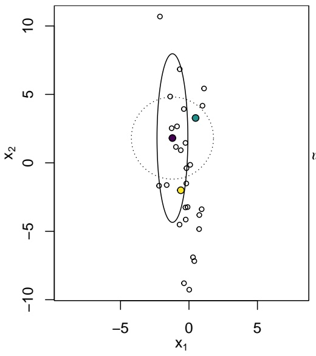

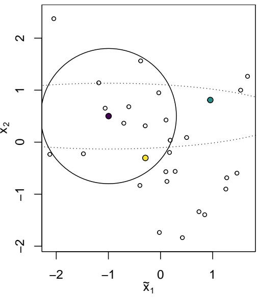

Figure 6.10: Non-normalized features (left) and normalized features $( r i g h t )$ Dark blue, green and yellow mark the same three datapoints on both images. The dotted line depicts a circle in the original feature space, the solid line is a circle in the normalized feature space. Note how the relative distance between dark blue and green, and dark blue and yellow dots differ in the original and in the normalized features.

are measured in arbitrary and hard-to-understand units into more easily understandable (and comparable) ones. For instance, we may survey the support for a government policy on a scale from 1 (very much against it) to 5 (very much in favor of it). One unit in this scale is hard to understand while a sentence like “those whose support is exceeds the average by one standard deviation…” carries more meaning.

Matrix condition number is the ratio of the largest and the smallest eigenvalue, $\begin{array} { r } { \kappa \equiv \frac { | \lambda | _ { \operatorname* { m a x } } } { | \lambda | _ { \operatorname* { m i n } } } } \end{array}$ See Section 5.5.4 Condition number, page 286.

There is one more technical reason why it is advisable to normalize features–if the design matrix contains columns of very different scale then its condition number will be high and hence the numeric properties may suffer.

**Min-max scaling** An easy alternative to normalization is min-max scaling. It is conceptually similar to normalization, just instead of dividing the centered values by the standard deviation, it sets minimum value to zero and divides the values by data range–the measurement unit is data range:

$$
\tilde {\boldsymbol {x}} = \frac {\boldsymbol {x} _ {i} - x _ {m i n}}{x _ {m a x} - x _ {m i n}}\tag{6.2.2}
$$

where $x _ { m i n }$ and $x _ { m a x }$ are the minimum and maximum values of x. In this example, all the features will be converted into the [0,1] interval, but we can shift and scale these into another interval instead, say [−0.5, 0.5]. Min-max scaling works well if the features are independent and have uniform-like distribution with no tails—all values end abruptly at the boundary. This ensures that the minima and maxima are stable.

<!-- page: 333 -->

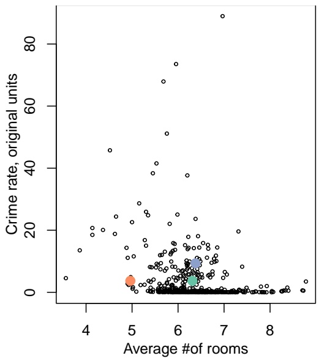

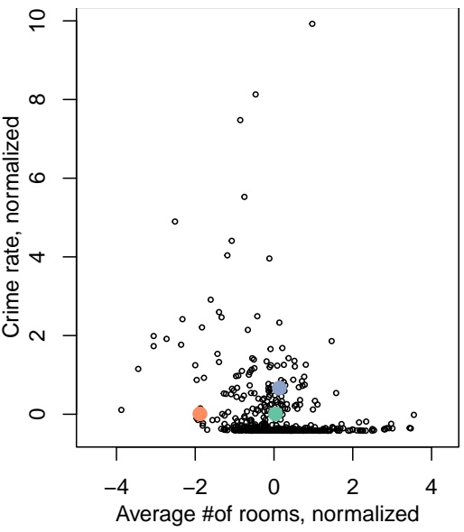

Figure 6.11: Boston housing data: neighborhood crime rate (crim) versus average number of rooms (rm). Non-normalized (left) versus normalized features (right). While the images look exactly the same, the Euclidean distance rankings are different: the nearest (colored) neighbor the green dot is the orange on the left panel, and the blue dot on the right panel.

As min-max scaling is very similar to feature normalization, its advantages and disadvantages are similar too.

**Mahalanobis distance Prerequisites:** Section 5.2.2 Norm and Distance, page 265, Eigenvalues and eigenvalue decomposition 5.5.3, feature normalization 6.2.1, covariation matrix.

This is a generalization of feature normalization in case where the features may be correlated. Consider Figure 6.12. Here the two features $x _ { 1 }$ and $x _ { 2 }$ do not just have a different variance, they are also clearly correlated. If we use feature normalization we discussed above, we will change the picture somewhat, but we cannot address the fact that the data points are clearly clustered around the diagonal line.

Mahalanobis transformation, in contrast, stretches and rotates the data in a way that is aligned with the axis of the data. In the left panel of Figure 6.12, the solid ellipse depicts the equidistant points from the central dark blue dot. The ellipse is elongated along the long axis of the correlated data, and compressed along its short axis. So Mahalanobis distance measures distance with respect to he extent of the point cloud in each particular direction, not just along the coordinate axes as is the case with feature normalization.

Mahalanobis distance can be done and understood easily using matrix notation and eigenvalue decomposition. Consider X to be a $N \times K$ data matrix and $x _ { i } ,$ • and $x _ { j \bullet }$ to be two rows (observations) from that data. The Mahalanobis distance between

xi• stresses that index “i” is the column index, the bullet • is a placeholder for columns. See Section 0.2 Scalars, vectors, matrices, page viii.

<!-- page: 334 -->

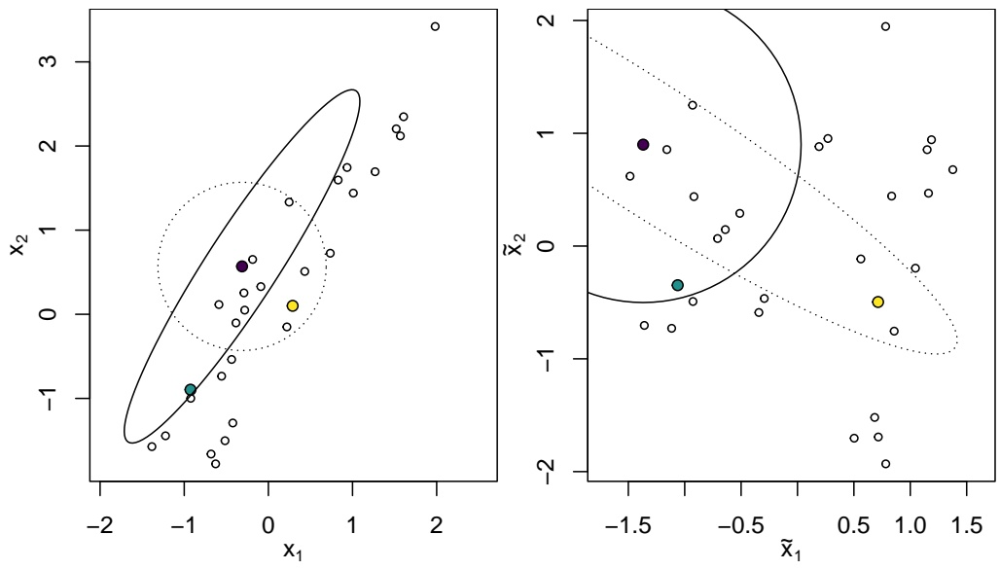

Figure 6.12: Original features $( l e f t )$ and Mahalanobis-transformed features $( r i g h t )$ The same three cases are marked with different colors on both images. The dotted line depicts a circle in the original feature space, the solid line is circle in Mahalanobis feature space.

observations $x _ { i \bullet }$ and $x _ { j \bullet }$ is defined as

$$
d _ {E} (\boldsymbol {x} _ {i \bullet}, \boldsymbol {x} _ {j \bullet}) = \sqrt {(\boldsymbol {x} _ {i \bullet} - \boldsymbol {x} _ {j \bullet}) ^ {\top} \Sigma^ {- 1} (\boldsymbol {x} _ {i \bullet} - \boldsymbol {x} _ {j \bullet})}\tag{6.2.3}
$$

where $\Sigma$ is the covariance matrix of X.

Mahalanobis distance is equivalent to transforming the data matrix into

$$
\tilde {\mathsf {X}} = \left(\mathsf {X} - \mathbf {1} _ {N} \cdot \bar {\boldsymbol {x}} ^ {\top}\right) \boldsymbol {\Sigma} ^ {- \frac {1}{2}}\tag{6.2.4}
$$

where $\bar { x }$ is the vector of column means, and accordingly, $\mathbf { 1 } _ { N } \cdot \bar { \boldsymbol { x } } ^ { \top }$ is the matrix of column means.

Mahalanobis transformation is essentially the same as transforming data to principal components (see Section 11.3) and Mahalanobis distance is Euclidean distance in such a rotated and stretched feature space. If the features are uncorrelated, Mahalanobis distance is equivalent to Euclidean distance in normalized data.

Mahalanobis distance is a good measure for data where the data variation is a meaningful distance measure, and not just along the features as in case of normalization, but also along the axes of variation in data.

## Example 6.4: Mahalanobis transformation of iris data

Figure 6.13 shows iris data, more specifically petal length and petal width (see page 480). The left panel shows data in the original features and the right

<!-- page: 335 -->

panel in Mahalanobis-transformed features. This is similar transformation as in Figure 6.12. The different species, denoted by different colors, are reasonably well separated on both figures. However, in the original coordinates (petal length and width, left panel) the data points form an elongated cloud where the different species cluster at different location. In transformed coordinates, the points are stretched out along the minor axis, increasing the distance between dots for similar species.

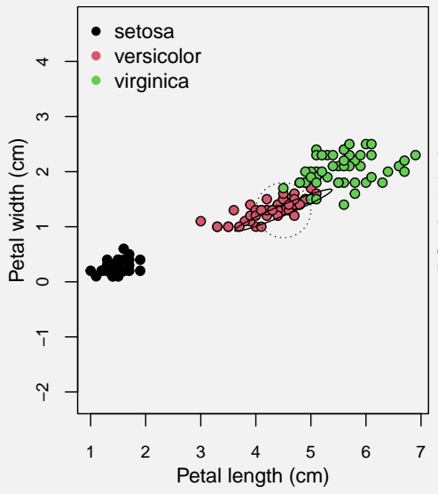

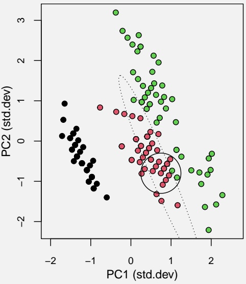

Figure 6.13: Iris data: petal width versus petal length in the original coordinates (left panel) and in the corresponding Mahalanobis-transformed coordinates (right panel).

In transformed coordinates the species do not form as tight clusters any more as in the original coordinates, making categorization more difficult. This fact is also visible from the example circles, the circle that centers on a red observation in Mahalanobis coordinates (solid line) includes two green points while the circle in the original coordinates (dotted line) includes only a single green dot. The circle in the original coordinates also captures more red data points. For k-NN to work well, it should be possible to draw circles around most datapoints that contain many dots of the correct color and only a few of other colors. This is easier in the original coordinates.

Note that here both features are originally measured in centimeters. Hence one of the major reason for data transformation, transforming measurements to similar units, does not hold here as both

## 6.2.2 Cosine similarity and angular distance

**Prerequisites:** Vector Norm 5.2.2

Sections 5.2.2 and 6.2.1 look at distance measures that are based on actual dis-

<!-- page: 336 -->


Galaxy M104. One of the stars, un-appealingly called as USNOA2 0750-07912008, seem much closer to the galaxy than the other one, TYC 5531-979-1. However, in the physical space, the galaxy is perhaps 10,000 times farther away than the stars, and hence the stars are much closer to each other than to M104. Our visual impression is based on angular distance. By Dylan O’Donnel, [CC0 1.0](https://creativecommons.org/publicdomain/zero/1.0/deed.en), via [Wikimedia Commons](https://commons.wikimedia.org/wiki/File:The_Sombrero_Galaxy_crop.jpg)

tance, the difference between the “endpoints” of the vectors. Different metrics mean defining the distancedifferently and possibly modifying the coordinate axes as well. But this is not always what we want to do. For instance, when looking at the stars in the sky, we may want to measure how far they seem from each other in the sky. This is not the physical distance, neither Euclidean or any other–stars that look close similar in sky may actually be quite far away from each other in space. What we may want instead is angular distance, how big is the angle that separates them in the sky.

Cosine similarity is one such measure. It is closely related to angular distance (in fact, it is just cosine of the angular distance). It is widely used when assessing similarity in features that are not numeric, such as when comparing texts.

Cosine similarity between vectors x and $\pmb { y }$ is defined as

$$
c (\boldsymbol {x}, \boldsymbol {y}) = \frac {\boldsymbol {x} ^ {\top} \cdot \boldsymbol {y}}{| | \boldsymbol {x} | | \cdot | | \boldsymbol {y} | |} \quad \boldsymbol {x} \neq \boldsymbol {0}, \boldsymbol {y} \neq \boldsymbol {0},\tag{6.2.5}
$$

where $| | { \pmb x } | | = { \sqrt { { \pmb x } ^ { \top } } }$ · x is the Euclidean norm (see Section 5.2.2 Norm, page 265). It is easy to see that $c ( { \pmb x } , { \pmb x } ) = 1$

It’s name, cosine similarity, originates from the fact that inner product of vectors equals to the product of their norms, multiplied by the cosine of the angle between them:

$$
\boldsymbol {x} ^ {\top} \cdot \boldsymbol {y} = | | \boldsymbol {x} | | \cdot | | \boldsymbol {y} | | \cdot \cos \phi ,\tag{6.2.6}
$$

where $\phi$ is the angle between vectors x and y. Hence cosine distance equals just to the cosine of the angle between the vectors. Note that it is solely the angle between the vectors. Cosine distance is agnostic to the length (norm) of the vectors (as long as this is positive). It is a measure in similarity in the direction the vectors point to, and not a measure of the length of the vectors. For instance, when analyzing texts using bag-of-words (see Section 8.3), this amounts to comparing word frequencies in the texts. The number of words (text size) is irrelevant. Such an approach may be very well suited when we try to understand the topic of the text while the texts itself may be of very different size.

<!-- page: 337 -->

The easiest way to understand cosine similarity is to analyze it on the $\mathbb { R } ^ { 2 }$ plane. Look at the vectors $x ^ { 1 }$ and $x ^ { 2 }$ (the figure at right). $\pmb { x } ^ { 1 } \; = \; ( 1 , 1 )$ and hence it points $4 5 ^ { \circ }$ upward. $\pmb { x } ^ { 2 } = ( 2 ,   - 1 )$ and accordingly points $2 7 ^ { \circ }$ downward, and hence the angle between the two vectors is $45+27=72^{\circ}$

Example 6.5: Cosine similarity in $\mathbb { R } ^ { 2 }$

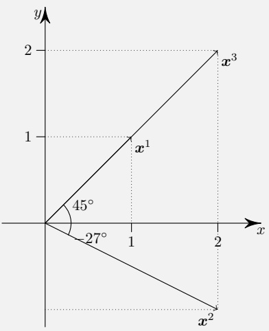

Figure 6.14: Angle between two vectors

Let’s calculate the cosine similarity of these two vectors. First, the Euclidean norms are

$$
\left| \left| \boldsymbol {x} ^ {1} \right| \right| = \left| \left| \binom{1}{1} \right| \right| = \sqrt {\binom{1}{1} ^ {\top} \cdot \binom{1}{1}} = \sqrt {1 + 1} \approx 1. 4 1 4\tag{6.2.7}
$$

$$
| | \boldsymbol {x} ^ {2} | | = \left| \left| \binom{2}{- 1} \right| \right| = \sqrt {\binom{2}{- 1} ^ {\top} \cdot \binom{2}{- 1}} = \sqrt {4 + 1} \approx 2. 2 3 6.
$$

New we can plug the numbers into the cosine similarity definition (6.2.5):

$$
c (\boldsymbol {x} ^ {1}, \boldsymbol {x} ^ {2}) = \frac {\boldsymbol {x} ^ {1 ^ {\top}} \cdot \boldsymbol {x} ^ {2}}{| | \boldsymbol {x} ^ {1} | | \cdot | | \boldsymbol {x} ^ {2} | |} \approx \frac {\binom{1}{1} ^ {\top} \cdot \binom{2}{- 1}}{1 . 4 1 4 \cdot 2 . 2 3 6} = \frac {2 - 1}{3 . 1 6 2} = 0. 3 1 6.\tag{6.2.8}
$$

We can easily check that 0.316 is cosine of $7 1 . 6 ^ { \circ }$ Hence the computed cosine similarity is equal to the cosine of the angle between $x ^ { 1 }$ and $x ^ { 2 }$ . (The difference is related to rounding errors.)

We can also compute the cosine similarity between $\pmb { x } ^ { 1 }$ and $\pmb { x } ^ { 3 }   =   ( 2 \mathrm { , } 2 )$ Its norm is

$$
| | \boldsymbol {x} ^ {3} | | = \left| \left| \binom{2}{2} \right| \right| = \sqrt {\binom{2}{2} ^ {\top} \cdot \binom{2}{2}} = \sqrt {4 + 4} = 2 \sqrt {2}.
$$

Plugging this norm into (6.2.5) we get:

$$
c (\boldsymbol {x} ^ {1}, \boldsymbol {x} ^ {3}) = \frac {\boldsymbol {x} ^ {1 ^ {\top}} \cdot \boldsymbol {x} ^ {3}}{| | \boldsymbol {x} ^ {1} | | \cdot | | \boldsymbol {x} ^ {3} | |} \approx \frac {\binom{1}{1} ^ {\top} \cdot \binom{2}{2}}{\sqrt {2} \cdot 2 \sqrt {2}} = \frac {2 + 2}{2 \cdot 2} = 1.
$$

<!-- page: 338 -->

```txt
These two vectors point to the same direction and hence they are “perfectly similar”.
```

Cosine similarity has a few very favorable properties, in particular it is easy to compute, involving just multiplications, additions, and one division. In case of sparse matrices, only non-zero components need to be considered. All this makes is very well suitable for analyzing high-dimensional data, such as words in texts.

Unlike the distance measures above, cosine similarity is not a metric distance–a larger value of cosine similarity mean more similar, not more distant data vectors. The maximum similarity, distance between identical vectors is 1 while the minimum similarity, distance between opposite vectors, is -1. This is sufficient to order vectors according to their similarity, and often this is all we need.

In case one needs a difference measure instead of similarity measure, one can use cosine distance $d _ { c o s } ( { \pmb x } , { \pmb y } )   =   1   -   c ( { \pmb x } , { \pmb y } )$ . Cosine distance is zero in case of vectors that point in the same direction, the maximal possible distance is 2 when two vectors point in exactly opposite direction. Another option is to use angular distance, defined as

$$
d _ {a} (\pmb {x}, \pmb {y}) = \frac {\cos^ {- 1} c (\pmb {x} , \pmb {y})}{\pi},\tag{6.2.9}
$$

instead of cosine distance. However, there is little gain from selecting a more computationally demanding metric if our task is just to rank vectors according to similarity.

## Exercise 6.5: Cosine similarity

<div class="docvortex-algorithm" style="white-space: pre-wrap; font-family:monospace;">
Consider vectors $\boldsymbol{x}^1 = (1, 2, 3)$, $\boldsymbol{x}^2 = (3, 2, 1)$ and $\boldsymbol{x}^3 = (1, 1, 1)$.
    Compute the (Euclidean) norms $||\boldsymbol{x}^1||$, $||\boldsymbol{x}^2||$ and $||\boldsymbol{x}^3||$.
    Compute the normalized vectors $\boldsymbol{x}^{n1} = \boldsymbol{x}^1 / ||\boldsymbol{x}^1||$, $\boldsymbol{x}^{n2} = \boldsymbol{x}^2 / ||\boldsymbol{x}^2||$ and $\boldsymbol{x}^{n3} = \boldsymbol{x}^3 / ||\boldsymbol{x}^3||$.
    Compute cosine similarity between $\boldsymbol{x}^1$ and $\boldsymbol{x}^2$, and between $\boldsymbol{x}^1$ and $\boldsymbol{x}^3$.
    Hint: use the normalized vectors to compute similarity.
Solution on page 514.
</div>

## Exercise 6.6: Cosine, angular distance are not proper metric distances

Show that neither cosine nor angular distance are proper metric distances (see Section 5.2.2 Norm and Distance, page 265).

## 6.3 k-Nearest Neighbors

## Prerequisites: Metric distance

Nearest neighbors is one of the simplest and most intuitive machine learning methods. We predict the value, or a class, of a new observation as the class of the most similar observation in the training data set.

<!-- page: 339 -->

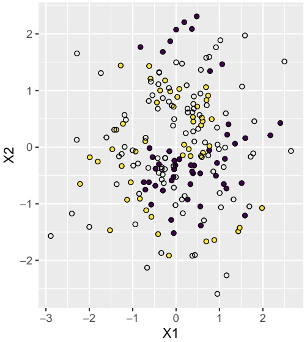

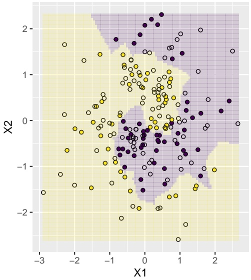

Figure 6.15: Example data: some of the datapoints are categorized into yellow and violet, but some are not (left panel). Intuitively, the empty circles should be classified according to a colored one nearby. This is the intuition of the nearest neighbor method. On the right panel, all the points that are closer to a violet one are painted violet and those that are closer to a yellow one are colored yellow. All the empty circles now lie in one of these areas of solid color and can be categorized either as yellow or violet.

## 6.3.1 Introductory Example

Imagine we have data as depicted on Figure 6.15, left panel. It contains yellow and violet training observations, and our task is to categorize the empty unknown data points into one of these color categories. Intuitively, it is reasonable to assume that points that are “close” on the image should have similar color. So if an empty circle is fairly close to a violet training observation and far from everything yellow, we should consider violet as a good prediction for the unknown class.

This intuitive approach is the basis for nearest neighbor classification: we just categorize an unknown data point into the category that corresponds to the category of its closest neighbor. This has been done on the right panel of Figure 6.15: it divides the figure into tiny squares (101 × 101 squares) and categorizes the center of each square into either yellow or violet by looking at it’s closest neighbor’s color. The squares that coincide with the unknown data will tell us how the model will categorize these data points.

This baseline approach is very sensitive to individual outliers in the data. If we have a violet point sitting deep inside the yellow territory, we would immediately think that everything in the close neighborhood of the outlier also belongs to the violet class. Nearest neigbhors does not allow for reasonable smoothing. Fortunately, a remedy here is very easy. Instead of using the category of the nearest neighbor

<!-- page: 340 -->

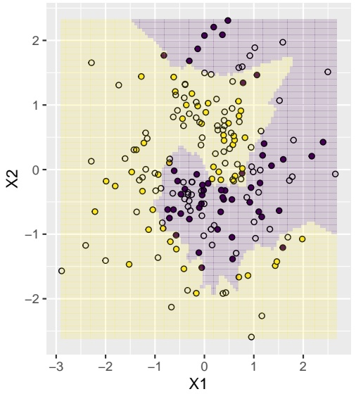

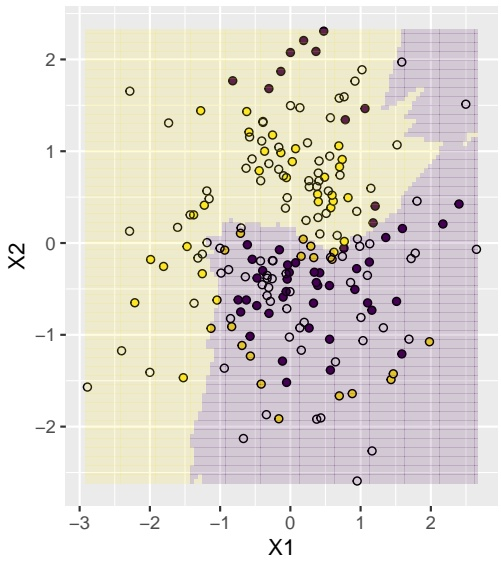

Figure 6.16: The same data points as in Figure 6.15, but now categorized based on 5 (left) and 25 (right) nearest neighbors. We can see that in the latter case, there are several groups of points that are embedded in the area of different color.

as the predicted class, we can smooth the picture somewhat by using, say, 5 nearest neighbors, and finding the category that is preferred in this group (often referred to as majority voting). If 3 out of the 5 closest neighbors are yellow and 2 are violet, we will pick yellow. This results in a noticeably smoother pictures (Figure 6.16 shows exactly the same data categorized using 5 and 25 nearest neighbors).

This is the essence of k-nearest neighbors (k-NN). In case of only two categories, k is ofter chosen to be an odd number in order to avoid ties in majority voting.

## 6.3.2 What is Distance

However, the simple and intuitive method is not without it’s issues. As soon as we leave the 1-dimensional world, it may not be clear any more which observations are closer to each other. The nice example in Figure 6.15 is somewhat deceiving, by making you to believe that what looks close on the image is also close in the data space. But take a simple example. Assume you are predicting house prices and you have data of recent sales like in Table 6.2, including the price (in \$1000), size (m<sup>2</sup>), and neighborhood crime rate (incidents per 1000 residents). Your task is to predict the price of the house c that is similar to a in terms of neighborhood crime rate, and similar to the house b in terms of size. Which one is more similar? Your prediction will be very different depending on which one you choose as the nearest neighbor. Obviously, there is no correct way to tell. We have to weight the different features somehow by using an appropriate distance metric.

Moreover, the previous example used simple numeric features, but this may not

<!-- page: 341 -->

Table 6.2: Recent house sales

| id | price ($ 1000) | m<sup>2</sup> | crime (per 1000) |
| --- | --- | --- | --- |
| a | 800 | 200 | 0.2 |
| b | 1500 | 400 | 0.1 |
| c | ? | 200 | 0.1 |

always be so. How can you tell which text is closer to another one? Which customer is more similar to a third one? In these cases we don’t even have numeric measures to start with, and our decisions about creating those add an additonal layer of assumptions to the model.

Obviously, one can always choose a pre-determined distance metric, either $\mathrm { E u } _ { - }$ clidean or another one. Even more, k-NN does not require the metric to be a valid metric in the sense of vector spaces, it is enough if it allows us to order the observations by “closeness” in a consistent way. This opens the option for cosine similarity (more about it later).

## 6.3.3 Instance-based learning

k-NN is somewhat different from many other machine learning models, such as linear regression, decision trees or neural networks in the sense of what does model training mean. In case of linear regression, training the model means computing the best coefficient vector $\beta .$ Neural networks are similar, just we call the parameters “weights” and “biases”. The case of trees is broadly similar, but the parameters are not just numbers, but lists of splitting variables and locations. In all these cases, “training” means computing the parameters or deciding the split locations, and the “trained model” is just set of such parameters. Normally the set of parameters is much smaller than the original data, e.g. we may have to compute 100 parameters out of 100,000 rows of data. In a way, model training is a way to compress data, this is hard work and you may notice that training complex models on large datasets is slow.

But this is not true for nearest neighbors. Plain k-NN does not compute any parameters or other model features. After all, predictions are made by finding the closest neighbors to the point of interest, and this cannot be done if we do not have access to the original data. So k-NN “learns” by just memorizing data. Obviously, just storing data is in no way a compression algorithm, and hence “trained” k-NN models are large, as large as the dataset (or more precisely, as large as the design matrix).

This is also a reason why k-NN models are not interpretable. It does not help to explain the relationship between variables, it is just a description: this point of interest is more similar to one outcome, another point of interest is more similar to another outcome. This is why we predict the outcomes to be different. But sometimes such a description may be enough to explain the outcome to others.

<!-- page: 342 -->

## 6.4 Support Vector Machines

Support Vector Machines (SVM-s) are simple models that can capture a complex decision boundary. Figure 6.17 shows dots of two colors, arranged in a yin-yang pattern. The linear decision boundary of logistic regression fails to capture the wavy boundary between the gold and purple dots (see Figure 4.6). SVM with liner kernel closely resembles the logistic regression. But SVM can represent it reasonably well, given one choose a more powerful kernel, in this figure both polynomial with degree 3 and radial kernel will do.

Note that it is, strictly speaking, not correct to say that logistic regression cannot capture such a complex boundary. It can, given we introduce suitable functions of the features, e.g. a series of polynomials or splines. However, this is not what common logistic regression implementation and applications do.

<!-- page: 343 -->

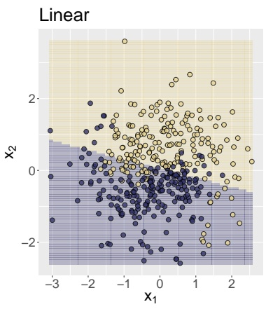

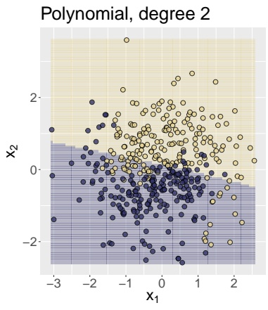

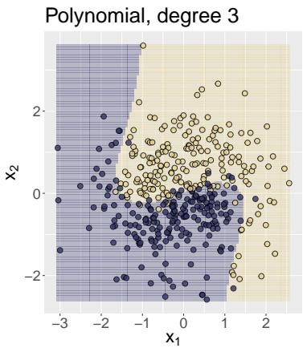

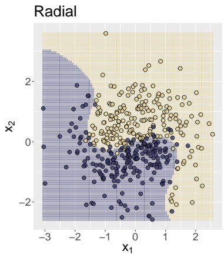

Figure 6.17: SVM decision boundary using different kernels. Linear kernel results in a pricture that is very similar to logistic regression (see Figure 4.6). In a similar fashion, quadratic kernel (top right) is unable to replicate the wavy pattern of color dots. But both 3rd degree polynomial and radial kernels can capture the main aspects of the decision boundary.

<!-- page: 344 -->

## 6.5 Comparison and Review

ML methods are powerful tools, but as with other tools, none of them is a universal jack-of-all trades. There are many considerations when picking a suitable models. Below we discuss a number of example cases.

**Interpretability** If interpretability—understanding what do the results mean—is a major goal, then linear or logistic regression will be the first choice. No other method can be understood in such a clean fashion.

**Explainability** In an analogous, if explainability—being able to explain someone why such decisions were made—is desired, one should start with decision trees. Decision trees can easily be explained to people with limited statistical literacy.

**Predictive performance** Typically, the models that offer the best predictive performance are k-NN, random forests and other ensemble methods, SVM-s, and neural networks. All of these have their strong and weak sides.

Neural networks are unmatched in their performance to identify complex patterns. They beat all other methods in image or speech recognition and text procesing. However, that does not mean that neural networks are always the way to go. First, they only help in cases where there actually is a complex patterns in data. Figure 6.18 shows an example with a complex pattern (left), where one might benefit from powerful and flexible models, such and random forests or neural networks. The RHS figure shows a simple gradient from bottom left to top right. Here just a logistic regression is adequate, and no more advanced model will do any better. There is just no information in data that logistic regression cannot use. Advanced models will perform equally well at best, and at worst just overfit.

Unfortunately, it may not be obvious if such patterns exist in data. In certain cases, e.g. in case of images, our brain can easily tell it, but in other kind of data it is almost impossible to know. Experience is your friend.

**Sensitivity to scale** Linear and logistic regression methods are not directly sensitive to data scale and rotation. Both of these contain the linear transformation $x ^ { \mathsf { T } } \cdot \beta .$ This transformation is all you need to rotate and re-scale data, so they are able to fit whatever direction or scale is needed. The same applies to more complex models that contain linear layers as their first step, such as feed-forward neural networks.

However, even if linear models are not directly sensitive to scale, the numerical properties of such models may suffer if the features are of very different scale. This manifests in numerical errors and slow convergence. Even more, ridge and lasso regression are sensitive to scale. This is because of the penalty term $\sum _ { k } | \beta _ { k } | ^ { p }$ that only contains the coefficients, not features $x _ { k }$ . Different scale of $x _ { k }$ Pwill affect the corresponding $\beta _ { k }$ and hence penalty.

Models that include any kind of “distance” or “nearest”, are sensitive to data scaling. This includes k-NN and clustering.

<!-- page: 345 -->

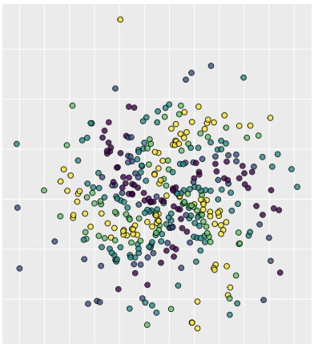

(a) Complex pattern

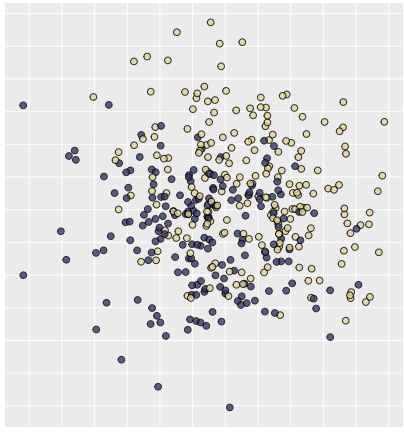

(b) Simple pattern

Figure 6.18: 2-D example of a complex pattern (left) and a simple pattern (right). While advanced models, such as neural networks, can pick up the spiral pattern at left, even a simple logistic regression is capable of identifying the left-right gradient at the right. No more advanced model can beat it here.

Trees are not directly affected by scale of data–the split can be done at the same place not matter of the scale. But as splits are always done along one feature, trees are sensitive to data rotation (see Figure 6.9).

**Computational and data considerations** While simple models on small datasets are computed almost instantaneously, training complex models on large dataset can easily take days. Even if that is desirable from performance perspective, the associated cost may render such models infeasible.

In a similar fashion, more flexible models typically require much more labeled training data to be able to learn to generalize correctly. Again, it may not be feasible to aquire enough labeled data of suitable quality. This is one of the reasons AI applications sometimes fail unexpectedly, when confronted with a dark-skinned face or female voice. The developers were just using training data that they were able to get, and that happened to be about white males.

<!-- page: 346 -->

<!-- page: 347 -->

# Different Types of Data

Introductory machine learning problems are often presented using well-behaved numericonly datasets. Here we look at some of the different data types and explain how to use these for ML models.

## Contents

- 7.1 Numeric Data 337
- 7.2 Images 337
- 7.2.1 Black-and-white images 338
- 7.2.2 Color images 340
- 7.2.3 Image transformations 340

## 7.1 Numeric Data

This is one of the most common forms of data, and in a way the easiest one to work with. Most machine learning and other analytical methods are designed for numerical data, even more, typical mathematical operations we want to do, such as multiplication and addition, can only be done using numeric data. However, numeric data is not just numbers. It can come in various forms, and not all forms of numeric data works with all methods.

## 7.2 Images

One of the distinct and valuable data source is images. Images are relatively straightforward to process and store as these are normally represented as pixel arrays where each array element represents one pixel on the image. In this section we only discuss bitmap images, wireframe images were discussed above in Section 5.6 Application: wireframe images, page 287. We also do not discuss the compressed image formats, such as jpeg or png that allow to compress and store such bitmaps in a more efficient way.

<!-- page: 348 -->

We start with black-and-white images, as these are stored in somewhat easier way, and talk about color images thereafter.

## 7.2.1 Black-and-white images

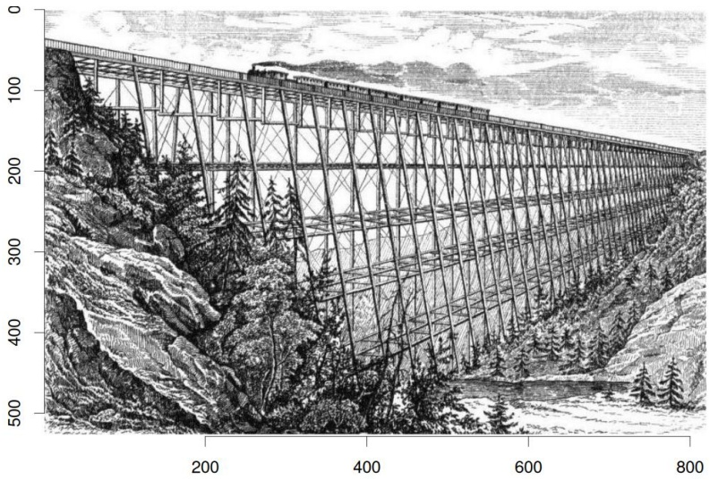

Figure 7.1: Lyman Trestle in Connecticut, around 1876 (from [Wikimedia Commons](https://commons.wikimedia.org/wiki/File:Lyman_viaduct_pacific_railway_1876.JPG)). It is stored in memory as 820 × 526 array of gray values. The axes depict the corresponding pixel coordinates.

Black-and-white images are normally stored as matrices of gray values. Figure 7.1 depicts one such grayscale image and Figure 7.2 shows a closer view on a 10 × 10 pixel detail, centered at the locomotive’s smokestack. The image is made of pixels, small squares of different shade of gray, these are made clearly visible in Figure 7.2. The numerical values of the shades of gray for each pixel is what is stored in the image matrix. The 10 × 10 matrix itself, it’s size corresponding to the image size, is shown in the lower panel. Here the uppermost line on the detail, where the shade transfers from light of the sky to dark gray of the smoke, corresponds to the first (uppermost) row of the matrix. The gray values range from 0.98 (light sky) to 0.43 (dark smoke in the top-right pixel). One can also see that the darkest areas of the smokestack are of value close to zero (the few lowermost lines) while the lightest points are of value 1.00 (the perfect white).

In practice, it is important to keep in mind that matrices are typically stored as rows-by-columns, while images (and plotting coordinates) are typically presented as width-by-height. Also, high values may correspond to either dark or low pixel intensity. The gray values are sometimes coded as real numbers in [0,1], and sometimes as integers from 1 to 255. All this is obviously software-specific, but causes quite a bit of confusion when working with images for the first time.

<!-- page: 349 -->

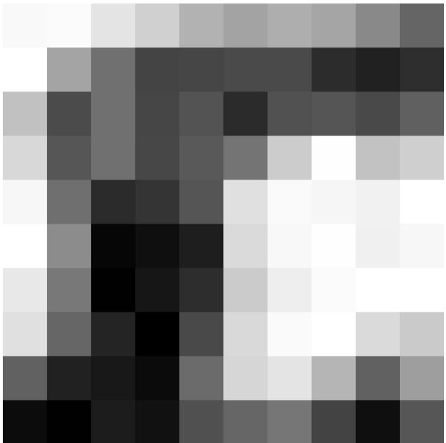

(a) Detail (locomotive’s smokestack) from Figure 7.1.

|  | 1 | 2 | 3 | 4 | 5 | 6 | 7 | 8 | 9 | 10 |
| --- | --- | --- | --- | --- | --- | --- | --- | --- | --- | --- |
| 1 | 0.98 | 0.98 | 0.90 | 0.82 | 0.71 | 0.66 | 0.70 | 0.67 | 0.56 | 0.43 |
| 2 | 1.00 | 0.66 | 0.47 | 0.31 | 0.31 | 0.33 | 0.33 | 0.22 | 0.17 | 0.22 |
| 3 | 0.77 | 0.33 | 0.47 | 0.31 | 0.36 | 0.21 | 0.35 | 0.37 | 0.32 | 0.41 |
| 4 | 0.85 | 0.37 | 0.47 | 0.31 | 0.38 | 0.48 | 0.81 | 1.00 | 0.77 | 0.82 |
| 5 | 0.97 | 0.46 | 0.21 | 0.24 | 0.37 | 0.89 | 0.98 | 0.96 | 0.95 | 1.00 |
| 6 | 1.00 | 0.57 | 0.07 | 0.11 | 0.16 | 0.86 | 0.97 | 1.00 | 0.95 | 0.97 |
| 7 | 0.91 | 0.50 | 0.05 | 0.13 | 0.22 | 0.81 | 0.94 | 0.98 | 1.00 | 1.00 |
| 8 | 0.89 | 0.43 | 0.18 | 0.05 | 0.32 | 0.86 | 0.98 | 1.00 | 0.86 | 0.80 |
| 9 | 0.41 | 0.17 | 0.14 | 0.09 | 0.45 | 0.85 | 0.90 | 0.73 | 0.41 | 0.64 |
| 10 | 0.09 | 0.05 | 0.16 | 0.11 | 0.35 | 0.43 | 0.49 | 0.30 | 0.11 | 0.37 |

(b) The gray level values corresponding to the detail in the upper panel. The high values (near 1.0) correspond to white and low values (near 0.0) correspond to black. One can see that the darkest details of the smokestack are of value 0.05 and the lighest sky is of value 1.00.

Figure 7.2: Detail from image 7.1, and the corresponding gray values.

<!-- page: 350 -->

## 7.2.2 Color images

Color images are constructed in broadly similar way as black-and-white images, just these contain three separate layers for different colors, normally red, green and blue.

Figure 7.3 shows such a color image. The top panel is the original high-res image (at left) and a [low resolution](https://bitbucket.org/otoomet/lecturenotes/raw/master/img/flag-of-scotland-pixelized.png) $\left( 5 \times 8 -pixels  \right)$ version of it to facilitate the display of data matrices. The lower panels depict the three color channels, R, G, and B. Small numbers close to $\text{" }0 \text{" }$ indicate little intensity (black), and high values close to $^ { \circ } 1 ^ { \circ }$ indicate high intensity (either red, green or blue, depending on the channel). For instance, the columns 4 and 5 in the first row of the R channel have values 0.00 indicating that these two pixels contain no red. The same pixels have value 0.37 in G and 0.72 in B channel, indicating that the flag’s blue contains about $1 / 3$ green and the 2/3 blue, “pure blue” that is produced by the computer screen. The middle pixels (row 3 and column 5) however are of value 1.00 in all channels. This means that pixel is “pure white”, displaying the maximum color intensity in all channels.

Such 3-channel layout of images is very common for color images, for instance all jpeg images are made of three channels. When working with image data in memory, then all these layers are put “on top of each other”. So the Scottish flag may be stored as a $5 \times 8 \times 3$ or a $8 \times 5 \times 3$ array, a tensor.

Other images, such as some png-s also contain a fourth layer, representing transparency. In fact, the [original png image](https://bitbucket.org/otoomet/lecturenotes/raw/master/img/flag-of-scotland-pixelized.png) contains such a transparency layer. But as the image is completely oblique, the fourth layer has all pixels marked as $\text{" }1.0 \text{" }.$ There may be even more layers, e.g. one that indicates the pixel’s distance (depth), but that is not common.

## 7.2.3 Image transformations

## Transforming Bitmap Images into Coordinate Matrix Form

Wireframe image data we discussed above contain vertex coordinates, while color, a vertex attribute, is a secondary consideration. In contrast, bitmaps images only contain the color values in a regular grid but do not explicitly contain the pixel co-ordinates. In this sense wireframe images are similar to sparse matrices and bitmaps to dense matrices. So in order to rotate a bitmap as matrix, we first have to create it’s coordinate matrix. This can be done by creating an $( x , y )$ coordinate pair for each pixel so that the pixels can be described by a triple (x, y, value). As the pixels are arranged in the matrix in a regular matrix, x and y correspond to either matrix columns and rows, or the way around, depending on the software. Are vertex coordinates and colors will be treated differently, we put the image information into two matrices: a $N \times 2$ coordinate matrix $X ,$ and a $N \times 1$ pixel gray value matrix G. Note that N is not the height but height × width of the image because each row in these matrices correspond to a single pixel, not to a single row. For instance, the image

<!-- page: 351 -->


(a) Original image


(b) 5 × 8 pixel version

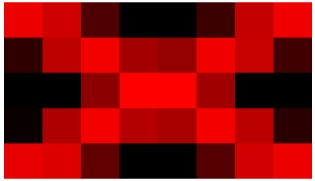

(c) Red channel

|  | 1 | 2 | 3 | 4 | 5 | 6 | 7 | 8 |
| --- | --- | --- | --- | --- | --- | --- | --- | --- |
| 1 | 0.93 | 0.81 | 0.31 | 0.00 | 0.00 | 0.23 | 0.77 | 0.95 |
| 2 | 0.18 | 0.74 | 0.95 | 0.64 | 0.58 | 0.95 | 0.78 | 0.25 |
| 3 | 0.00 | 0.00 | 0.55 | 0.99 | 1.00 | 0.63 | 0.00 | 0.00 |
| 4 | 0.04 | 0.68 | 0.96 | 0.71 | 0.66 | 0.96 | 0.73 | 0.16 |
| 5 | 0.90 | 0.86 | 0.38 | 0.00 | 0.00 | 0.33 | 0.82 | 0.93 |

(d) R pixel intensities

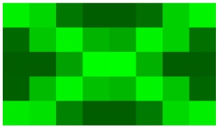

|  | 1 | 2 | 3 | 4 | 5 | 6 | 7 | 8 |
| --- | --- | --- | --- | --- | --- | --- | --- | --- |
| 1 | 0.95 | 0.84 | 0.47 | 0.37 | 0.37 | 0.43 | 0.81 | 0.96 |
| 2 | 0.41 | 0.78 | 0.96 | 0.71 | 0.66 | 0.96 | 0.82 | 0.44 |
| 3 | 0.37 | 0.37 | 0.63 | 1.00 | 1.00 | 0.69 | 0.37 | 0.37 |
| 4 | 0.38 | 0.73 | 0.96 | 0.75 | 0.72 | 0.96 | 0.77 | 0.40 |
| 5 | 0.92 | 0.88 | 0.51 | 0.37 | 0.37 | 0.48 | 0.85 | 0.94 |

(e) Green channel

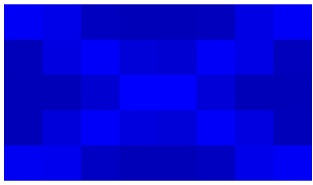

(g) Blue channel

(f) G pixel intensities

|  | 1 | 2 | 3 | 4 | 5 | 6 | 7 | 8 |
| --- | --- | --- | --- | --- | --- | --- | --- | --- |
| 1 | 0.97 | 0.91 | 0.75 | 0.72 | 0.72 | 0.74 | 0.90 | 0.98 |
| 2 | 0.73 | 0.88 | 0.98 | 0.85 | 0.83 | 0.98 | 0.90 | 0.74 |
| 3 | 0.72 | 0.72 | 0.82 | 1.00 | 1.00 | 0.84 | 0.72 | 0.72 |
| 4 | 0.73 | 0.86 | 0.98 | 0.87 | 0.85 | 0.98 | 0.88 | 0.73 |
| 5 | 0.95 | 0.94 | 0.77 | 0.72 | 0.72 | 0.76 | 0.92 | 0.96 |

(h) B pixel intensities

Figure 7.3: Flag of Scotland. The upper left picture shows the original flag, the upper right picture shows the same image in low-resolution for better display of data. The lower panels depict the corresponding color channels, R, G and B; images at left and the pixel intensities at right. The pixel intensities are close to ${ } ^ { \circ } T ^ { \prime \prime }$ in the white cross as the white color is made of all three color channels at full intensity. However, the blue areas have little red (values close to 0) color, some green (values around 0.37), while blue channel remains at high intensity (values 0.72). So in blue, the flag has low contrast.

<!-- page: 352 -->

detail from figure 7.2 will be stored in two matrices,

$$
\mathrm{X} = \left( \begin{array}{c c} 1 & 1 \\ 2 & 1 \\ 3 & 1 \\ \vdots \\ 1 & 2 \\ 2 & 2 \\ 3 & 2 \\ \vdots \end{array} \right) \quad \text {and} \quad \mathrm{G} = \left( \begin{array}{c} 0. 9 8 \\ 0. 9 8 \\ 0. 9 0 \\ \vdots \\ 1. 0 0 \\ 0. 6 6 \\ 0. 4 7 \\ \vdots \end{array} \right).\tag{7.2.1}
$$

The first column of X denotes the horizontal position, the column of the original image matrix, and it runs from 1 to the image width for each row. The second column is the vertical position, the image row, it is 1 for each pixel in the first row, 2 for each pixel in the second row and so forth. G contains the same gray values as the data matrix in Figure 7.2. The pixel coordinates X are conceptually the same as vertex coordinates for wireframe images, just we are not connecting vertices by lines but instead we use the gray value as the vertex color. The gray values will not change with rotation, just the pixels must be plotted in a different place as the image rotates.

Accordingly the image rotation will consist of two steps:

1. rotate (or otherwise transform) the coordinates X into $\mathsf { X } ^ { \prime } ,$ and

2. paint a dot at coordinates $( x _ { i 1 } ^ { \prime } , x _ { i 2 } ^ { \prime } )$ with the gray value $G _ { i }$

Figure 7.4 illustrates this approach with the original image rotated 10 degrees counterclockwise:

## Projecting bitmap images

As we can rotate bitmap images, we can also project these on 1-D line. Figure 7.5 depicts an image of a page of text that is rotated by 24 degrees. Suppose we want to detect it’s degree of rotation for further processing. One approach is to rotate the image and project the result onto the vertical axis. If the angle is correct, we should see a clear pattern of dark (text lines) and white (interline gaps). If the angle is wrong, the gaps will be unclear.

We can proceed in a similar fashion as above. First we translate the image into the regular grid coordinate matrix X and the gray intensity levels G, and thereafter we project X onto the vertical line (by dicarding the first coordinate component). Thereafter we can either plot the density on the margin, or better, compute the sum of gray levels in narrow intervals.

<!-- page: 353 -->

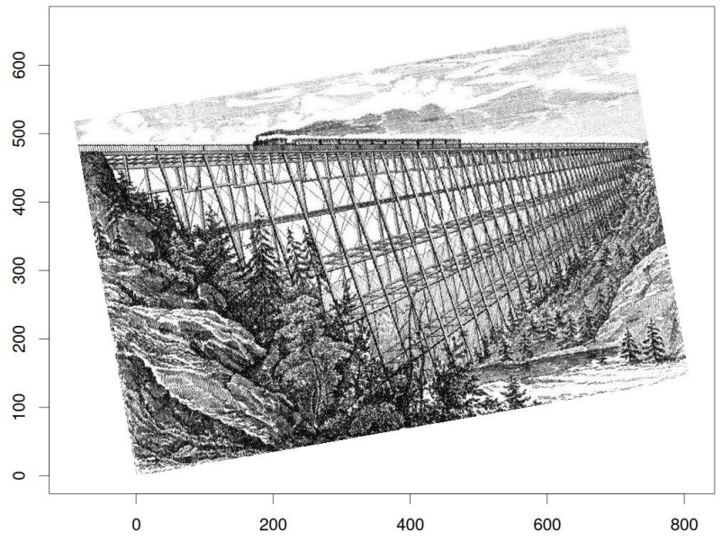

Figure 7.4: The same image rotated 10 degrees.

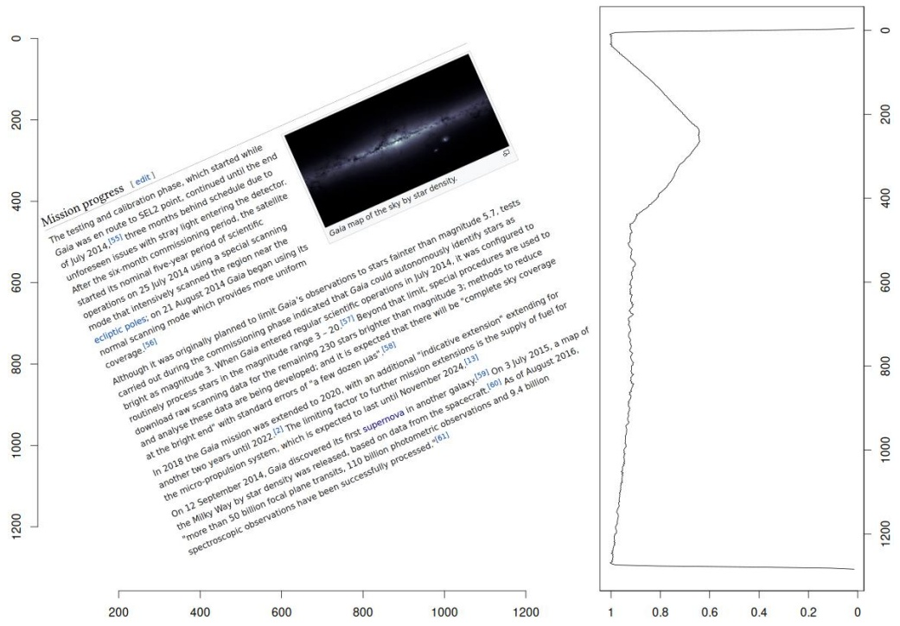

Figure 7.5: Image of a text page (left panel). It is rotated 24 degrees counterclockwise. Right panel depicts the gray value density along the vertical axis. The galaxy image in the form of a triangular dip, centered at row 200, is clearly visible. However, the text lines cannot be distinguished in the plot.

<!-- page: 354 -->

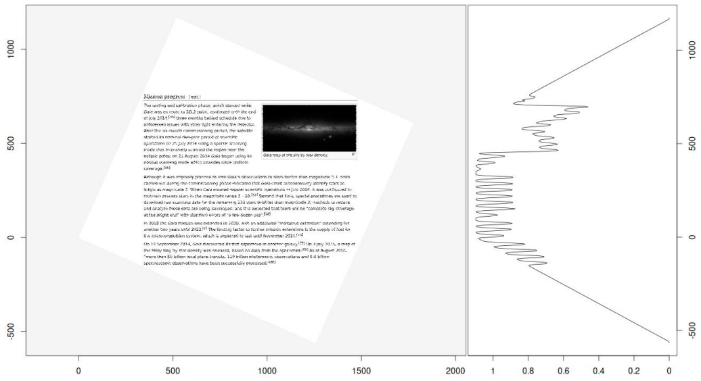

Figure 7.6: The same image as in Figure 7.5 but now rotated into correct position (left panel). The image is now visible as the rectangular dip with vertical sides. Now also the text lines are represented by a regular wavy pattern of lighter and darker stripes. Smooth slopes on both sides of the true image are related to the tilted white background embedded in the image.

<!-- page: 355 -->

## Chapter 8

## Text as Data

As literate humans, we produce and read quite a lot of written text (we do not discuss voice here). So text is data and it contains a lot of information. But to process text on computer poses a number of challenges. To start with, text is non-numeric, and unlike images where we can easily see the pixel color values that are arranged in neat rows and columns, it is not obvious what might be the features in case of text.

Below, we discuss one simple way of using text, document-term-matrix (DTM). DTM can be done in different way, e.g. just by counting the occurrence of different words, or by calculating term-frequency-inverse-document-frequency (TF-IDF). But before we get to text itself, we have to talk about pre-processing, such as tokenization and stemming because raw text is often not the best choice for processing.

## Contents

- 8.1 Text Preprocessing 346
- 8.1.1 Tokenization 346
- 8.1.2 Stemming 346
- 8.1.3 Lemmatization 346
- 8.1.4 Stopwords and Other Simplification 347
- 8.2 n-grams 347
- 8.3 Bag of Words and Document-Term-Matrix 347
- 8.4 TF-IDF 351
- 8.5 Naïve Bayes 353
- 8.5.1 Bayesian Classifier 353
- 8.5.2 Smoothing 356
- 8.5.3 Naive Bayes Classifier 358
- 8.6 Word embeddings 370
- 8.6.1 Term co-occurrence matrix 370
- 8.6.2 Simple embeddings: long vectors 373
- 8.6.3 Short embedding vectors: word2vec and GloVe 374
- 8.7 Transformers 377

<!-- page: 356 -->

## 8.1 Preprocessing: Tokenization, Stemming, and Lemmatization

Text processing typically starts with simple methods to simplify the text by removing various features that are not relevant for current task. For instance, we may consider case of the word irrelevant, and we may want to consider different grammatical forms of the same word, e.g. speaking and speaks to be the same. This may be a good choice when we are doing topic modeling. But case may be very important for other task, e.g. when we want to extract proper names.

## 8.1.1 Tokenization

Text is normally analyzed at word level. This means we have to split it into words. This is relatively easy with English and other European languages where space and certain punctuation symbols are reliable word boundary markers. But other languages may not contain similar markers and hence the process is much more complex.

Even in English, we have a number of corner cases. For instance, what should we do with don’t? Should we retain it as “don’t”, convert it to “do not”, or just remove the apostrophe and make it into “dont”? In contrary, what about names like Kuala Lumpur? Should it be retained as a single word containing space, or split into two words? We have to make such decisions depending on the task at hand. As the result may deviate from what we commonly call “words”, this process is usually called tokenization instead, and the results are tokens, not “words”.

But we do not have to use words. We may break written text down to individual characters, character pairs, or syllables instead. The smaller units may be useful where we have to guess the meaning of words from how they are written, from prefixes and suffixes they contain, or if they contain syllables that also occur in other, known words.

TBD: names to ethnic background

## 8.1.2 Stemming

Stemming is a process where common prefixes and suffixes are removed from the words. For instance, when encountering the word studying, we may remove the suffix -ing leaving the stem study. More advanced stemming algorithms may leave only the part of stem that never changes, in this example, this would be stud. Note also that the never-changing-part of a word may differ between written and spoken language, or be completely missing (like in case of go and went).

Stemming helps us to see the common stems of related words, and we can for instance build a search engine that finds both study and studying when the user enters either of them. This is often what the users want when they search.

## 8.1.3 Lemmatization

However, stemming is a simplistic method that often fail to produce consistent stems for closely related words. For instance, a simple stemming algorithm may turn word

<!-- page: 357 -->

studying into stem study, but the word studies will produce studi. As these stems are not identical, the search engine may not understand that the corresponding words are similar.

Lemmatization is a method that is in principle similar to stemming, but instead of just removing the standard suffixes, it uses morphological analysis of words to deduce the lemma, the standard base form of all the related words. Lemma is the standard form of words that is listed in dictionary. In the example above, the lemma of both study and studies is study. Needless to say, lemmatization is much more complex to implement than stemming and needs some sort of dictionary lookup.

## 8.1.4 Stopwords and Other Simplification

We often want to start by simplifying text. Typically one converts all words to lower case, removes punctuation, perhaps normalizes the grammatical constructs, and removes stopwords, common words like and, not, but that carry little information.

Obviously, whether capitalization, punctuation and stopwords are just a noise or actually helpful depends on the task. If you are predicting the topic of a news article, the common stopwords carry little information. However, when deducing authorship of a text, the subtle differences in stopword usage or the exact grammatical form of words used may turn out to be quite important.

## 8.2 n-grams

n-grams are just ordered sequences of n words (or other objects, such as letters or sentences). For instance, in case of document “The waiter opened the gate a little and looked out”, we can create the following bigrams (2-grams): (the, waiter), (waiter, opened), (opened, the), (the, gate), (gate, a), (a, little), (little, and), (and, looked), (looked, out). n-grams can be used in a similar fashion as tokens, their main advantage is that they preserve the order of the words. For instance, it is harder to deduce meaning of two tokens (unigrams) “do” and “not”, while a bigram (do, not) is has much more distinct meaning.

However, texts contain many more different n-grams than unigrams, and hence working with n-grams typically needs more resources and training data.

## 8.3 Bag of Words and Document-Term-Matrix

## Prerequisites: Metric distance, vector norm 5.2.2, cosine similarity 6.2.2.

Statistical methods only work on numerical data, so before we can apply any common ML method on text we have to convert it into a numeric representation. Bag of words (BOW) is a simple and popular approach to transform texts into a numeric vector form, in essence just a frequency table of words in the text. An essential property of BOW is that it does not preserve the order of words. One can imagine throwing all the words into a bag, so for each document it will just contain the counts of the words but not their order. We obviously lose a lot of information

<!-- page: 358 -->

by such “bagging”, sometimes it is useful, sometimes it is undesirable. Normally we work on many documents which may be short (like tweets) or long (like books). We can construct a BOW for each of these and stack them into a matrix, called Document-Term-Matrix (DTM).

DTM can be constructed in different ways, here we explain how to create it based on word counts (or more precisely, token counts), but one can choose to remember just the presence of words, not their counts. One can also construct bag-of-characters or bag-of-bigrams instead of bag-of-words.

In this form we represent documents as vectors of word counts in the vocabulary: first we collect all words in all the documents we analyze. This collection is called vocabulary. Say there are V words in the vocabulary. Now we can represent each document as a vector of length V , $\pmb { x } = \left( x _ { 1 } , x _ { 2 } , \ldots , x _ { V } \right) ^ { \mathsf { T } }$ , where each component $x _ { j }$ equals to the count of that word j in the text. If the word is not present, we set $x _ { j } = 0$

BOW-s are numeric vectors we can use for various mathematical operations. For instance, we can compute both Euclidean distance or cosine similarity between BOW-s. When stacking BOW-s horizontally underneath each other, we get a DTM, essentially a design matrix where features are the words, and feature values are the word counts in each document (observation).

## Example 8.1: DTM of Laozi quotes

Let us create a DTM of two Laozi quotes: “Knowing others is wisdom, knowing yourself is Enlightenment”, and “Mastering others is strength. Mastering yourself is true power”.

These quotes together form vocabulary of size 10 (in alphabetical order) enlightenment, is, knowing, mastering, others, power, strength, true, wisdom, yourself. The first quote only contains words enlightenment, is, knowing, others, wisdom, yourself and hence the corresponding BOW is $\pmb { x _ { 1 } } = \left( 1 , 2 , 2 , 0 , 1 , 0 , 0 , 0 , 1 , 1 \right) ^ { \intercal }$ We must keep the word counts in a consistent order, normally in the same order as the words are in the vocabulary. The number $^ { \circ } 1 ^ { \circ }$ in the first position indicates that the word enlightenment is present 1 times, but for instance the words $i s ,$ knowing are there two times, and words mastering, power, strength, true are not present at all. The second quote contains enlightenment, is, knowing, others, wisdom, yourself and hence its BOW is $\begin{aligned} { \mathbf { \boldsymbol { x } _ { 2 } } = \left( 0 , 2 , 0 , 2 , 1 , 1 , 1 , 1 , 0 , 1 \right) ^ { \mathsf { T } } } \\ \end{aligned}$ . The vocabulary and both BOW-s are shown in the table below.

Table 8.1: Two BOW-s $\scriptstyle { \boldsymbol { x } } _ { 1 }$ and $\scriptstyle { \boldsymbol { x } } _ { 2 } ,$ corresponding to the two Laozi quotes in the text. Both BOW-s, stacked horizontally underneath each other as in this table, form a numeric DTM that can be used in various machine learning models.

<!-- page: 359 -->

<table><tr><td rowspan="10"> $x_{2}$ </td><td> $x_{1}$ </td><td>enlightenment</td></tr><tr><td>0 1 2</td><td>is</td></tr><tr><td>2 2 0</td><td>knowing</td></tr><tr><td>0 2 0</td><td>mastering</td></tr><tr><td>2 0 1</td><td>others</td></tr><tr><td>1 0 1</td><td>power</td></tr><tr><td>1 0 1</td><td>strength</td></tr><tr><td>1 0 0</td><td>true</td></tr><tr><td>1 0 1</td><td>wisdom</td></tr><tr><td>1 1</td><td>yourself</td></tr></table>

Now compute the Euclidean distance and cosine similarity between these two quotes. For the Euclidean distance we need their difference $x_{1} - x_{2} =$ $\left( 1 , 0 , 2 , - 2 , 0 , - 1 , - 1 , - 1 , 1 , 0 \right) ^ { ^ { \mathsf { T } } }$ and hence $d_{e}(\boldsymbol{x}_{1},\boldsymbol{x}_{2})=\sqrt{\left(\boldsymbol{x}_{1}-\boldsymbol{x}_{2}\right)^{\intercal}\cdot\left(\boldsymbol{x}_{1}-\boldsymbol{x}_{2}\right)}=$ ${ \sqrt { 1 3 } } \; = \; 3 . 6 0 6$ p For cosine similarity, we need to compute the inner product $\pmb { x } _ { 1 } ^ { \mathsf { T } } \cdot \pmb { x } _ { 2 } = 6$ and both norms, $| | \pmb { x } _ { 1 } | | = \sqrt { 1 2 } = 3 . 4 6 4$ and $| | { \pmb x } _ { 2 } | | = \sqrt { 1 3 } = 3 . 6 0 6$ , and hence $c ( { \pmb x } _ { 1 } , { \pmb x } _ { 2 } ) = 6 / ( \sqrt { 1 2 } \cdot \sqrt { 1 3 } ) = 0 . 4 8$ . In some applications we may also want to remove the stopword is.

The advantage of DTM is it’s simiplicity. Creating a BOW for given task requires no training data and can be done fast and cheap. Sparseness of typical DTM helps to increase the algorithm speed and decrease the memory requirements, as typical vocabularies contain 10,000 to 100,000 words while most of the documents do not contain most of the words. Hence the DTM-s are in practice mostly filled with zeros, and we can use sparse matrices as the underlying data structures.

DTM-s have two major disadvantages. First, they are large. Typical word-based DTM-s contain 10,000–100,000 words, and hence every document, even just a tweet of a single word, contains this many numbers (almost all of them zeros). This may make large DTM-s slow and sluggish.<sup>1</sup> Second, by construction, DTM-s do not store the order of words. Whatever the order of words, the data looks identical. A potential way to address this issue is to use a bag of bigrams instead of BOW. As bigrams retain the order of words, such a bag will contain much of the information of the original word order. However, as there are many more bigrams compared to words, the dimensionality problem will get worse.

A potential solution to the dimensionality problem stems from the typical word distribution in natural languages. While there is a core of very frequent words, most of the words in a vocabulary are rare. Note that in practice there is always a large number of rare words. If we increase the sample size (the number or size of documents), we sample a larger number of formerly rare words so those are not rare in our BOW any more. But in actual applications, larger documents will always contain many even less common words, words in different languages, misspellings, names and acronyms, so the problem of a large number of infrequent words does not go away by just adding more data. But often we can just disregard such words–seeing a word only a few times is arguably too little to make any inference about it’s role for language models. Hence a common strategy is to exclude all words that are less frequent than

<small><span class="docvortex-page-footnote" data-block-type="page_footnote" style="color:#6b7280"><sup>1</sup>This sounds like contradicting the praise of simplicity and sparsity in the previous paragraph, but it is not. Sparsity often helps, but it is not a cure against all inefficiencies. Small dense matrices are still much more efficient than large sparse matrices.</span></small>

<!-- page: 360 -->

a given threshold.

<!-- page: 361 -->

## 8.4 TF-IDF

As DTM is effectively a numeric design matrix, we can use it with a plethora of traditional ML methods. For instance, we may categorize texts using k-NN and cosine similarity. Unfortunately, this measure may not perform very well in practice. First, often the words that are common in both texts are popular ones that carry little distinctive power. Even if we remove obvious stopwords, there are still many common words that occur repeatedly in most of the texts. Second, less popular words tend to be used in a “bursty” way, so if one word is already used in a document, it will be very likely used again. Just word counts will put too much weight on a few words that are used many times in the texts. As a remedy, one may use term-frequency inverse document frequency (TF-IDF) transformation. There are many different specific definitions of TF-IDF in the literature, here we follow the approach of Murphy (2012, p 482).

First, we transform the word counts into tf form as

$$
\operatorname{tf} (x _ {i j}) = \log (1 + x _ {i j})\tag{8.4.1}
$$

where $x _ { i j }$ is the count of word $j$ for the text i. This transformation suppresses large counts of single words, but is still more informative than just binary contains/does not contain features. By adding 1 to $x _ { i j }$ we ensure TF of a missing word is zero, and TF for every word present in document is positive.

Second, for each word $j$ in the vocabulary, we define idf as logarithm of the inverse of number of documents that contain the word $j .$ Normally we adjust the inverse a bit, e.g. we take inverse of 1 plus the number of documents in order to avoid cases where a vocabulary word is not found in any document.<sup>2</sup> Formally, we may define idf as

$$
\operatorname{idf} (j) = \log \frac {N}{1 + \sum_ {i = 1} ^ {N} \mathbb {1} (x _ {i j} > 0)}.\tag{8.4.2}
$$

$\mathbb { 1 } ( x _ { i j }   >   0 )$ is the indicator function that equal to one if the document i contains word $j ,$ and hence $\textstyle \sum _ { i = 1 } ^ { N } \mathbb { 1 } ( x _ { i j } > 0 )$ is the count of documents that contain the word $j .$ P We also use the total number of documents N as numerator. This is a form of normalization where the words that are present in all documents will have the fraction of $N / ( 1 + N ) { \stackrel { < } { \approx } } 1$ and hence its logarithm idf $$\lessapprox 0 .$$ In the opposite end, IDF for a word that is found in none of the documents is log N and for a word in a single document only, $\mathrm { i d f } = \log N / 2$ . Hence idf assigns to words that are present in many documents low weight, and words that are present in only a few documents high weight. Note that idf assigns a single value for each word across all documents. IDF is a word-specific value while TF-vectors are different for each BOW.

Finally, the TF-IDF transformation for word $j$ is defined as

$$
\mathrm{tf-idf} (x _ {i j}) = \mathrm{tf} (x _ {i j}) \cdot \mathrm{idf} (j) \quad j \in 1 \dots K.\tag{8.4.3}
$$

Note that TF-IDF is not made of single document alone–it is a transformation of the complete DTM X. While each single BOW (a row in the original data matrix

<small><span class="docvortex-page-footnote" data-block-type="page_footnote" style="color:#6b7280"><sup>2</sup>There may be several reasons that a word that is in no document finds its way to the vocabulary. For instance, one may use a standard vocabulary, derived from other documents. Also, training data typically contains words that are in no validation document.</span></small>

<!-- page: 362 -->

X) has been transformed into a row of TF-IDF matrix $\tilde { X } ,$ the transformation needs information about how common are the words across all documents. In some ways it is similar to feature normalization.

Example 8.2: TF-IDF of Laozi quotes

Let us TF-IDF transform the DTM of the Laozi quotes, Knowing others is wisdom, knowing yourself is Enlightenment and Mastering others is strength. Mastering yourself is true power, presented in Table 8.1. Table 8.2 shows the results. The columns (features) are the $V = 1 0$ vocabulary words and two first lines represent the DTM as in Table 8.1. The following two lines, $\mathrm { t f _ { 1 } }$ and $\mathrm { t f _ { 2 } }$ show the corresponding tf-terms, essentially just log-transforms of the DTM. The row $i d f$ is the IDF term. It is log $2 / ( 1 + 2 ) \approx - 0 . 4 1$ for words that are in both documents and log $2 / ( 1 + 1 )   =   0$ for words that are in a single document only. Although we do not have any such example, it would be log $2   =   0 . 6 9$ for words that are in none of the quotes. Finally, the last rows $\mathrm{t} \mathrm{f} \mathrm{-i} \mathrm{df}_{1}$ and $\mathrm{t} \mathrm{f} \mathrm{-i} \mathrm{df}_{2}$ are just the corresponding $tf -terms$ multiplied by $i d f .$ These two rows form the TF-IDF-transformed data matrix $\tilde { X } .$

Table 8.2: Example vocabulary, bag-of-word vectors, and $TF - IDF$ transformation for quotes: “Knowing others is wisdom, knowing yourself is Enlightenment” and “Mastering others is strength. Mastering yourself is true power”.

|  | t n e m e<sup>n</sup> hlitgen | i<sup>s</sup> | g kionnw | g i<sup>n</sup> <sup>tesar</sup>m | htseor | eorpw | h ttgesnr | teur | diosmw | f lesoruy |
| --- | --- | --- | --- | --- | --- | --- | --- | --- | --- | --- |
| x1 | 1.00 | 2.00 | 2.00 | 0.00 | 1.00 | 0.00 | 0.00 | 0.00 | 1.00 | 1.00 |
| x2 | 0.00 | 2.00 | 0.00 | 2.00 | 1.00 | 1.00 | 1.00 | 1.00 | 0.00 | 1.00 |
| tf<sub>1</sub> | 0.69 | 1.10 | 1.10 | 0.00 | 0.69 | 0.00 | 0.00 | 0.00 | 0.69 | 0.69 |
| tf<sub>2</sub> | 0.00 | 1.10 | 0.00 | 1.10 | 0.69 | 0.69 | 0.69 | 0.69 | 0.00 | 0.69 |
| idf | 0.00 | -0.41 | 0.00 | 0.00 | -0.41 | 0.00 | 0.00 | 0.00 | 0.00 | -0.41 |
| tf-idf<sub>1</sub> | 0.00 | -0.45 | 0.00 | 0.00 | -0.28 | 0.00 | 0.00 | 0.00 | 0.00 | -0.28 |
| tf-idf<sub>2</sub> | 0.00 | -0.45 | 0.00 | 0.00 | -0.28 | 0.00 | 0.00 | 0.00 | 0.00 | -0.28 |

The TF-IDF-transformed data $\tilde { X }$ is a similar numeric data matrix like DTM and can be used in different ML models as any other numeric data. It gives sometimes quite a substantial improvement in the modeling accuracy. It is also easy and fast to perform, involving just a few operations that can be easily vectorized.

<!-- page: 363 -->

## 8.5 Naïve Bayes

Naive Bayes is a classification method that is based on very simplistic (naive) independence assumption, and on the Bayes theorem. The independence assumption is unrealistic in many cases, but tremendously simplifies the computations and makes it able to handle high-dimensional cases. It turns out this tradeoff–computational simplicity against unrealistic assumptions–pays off in many types of problems.

Before we get into Naive Bayes, we’ll talk about conditional probability, Bayes theorem, and implement a Bayes Theorem–based spam filter that uses a single word only.

## 8.5.1 A Single Word–Based Bayesian Classifier

**Prerequisites:** Section 1.4.3 Conditional Probability and Bayes Theorem, page 44

Imagine you open your mailbox and see the following email:

I have very urgent and confidential business proposition for you. On 26th December 2004 an Oil Consultant/Contractor with the Myanmar National Petroleum Corporation, Mr. A Y Mustafa …

Mr. A Y Mustafa died from an automobile crash …

I am looking for a foreigner who will stand in as the next of kin to Mr. Mustafa …

Yours truly,


Mr. M. Lwin

In the email it is explained how you can get \$4 million in a few days if you agree with Mr. Lwin’s “proposition”. This would make your day! (Or maybe even your life?)

Many emails turn out to be spam. Chesie Yu, [CC BY-NC-SA 4.0](https://creativecommons.org/licenses/by-nc-sa/4.0/?ref=chooser-v1)

But before you hit the reply button, maybe you should check if this email is spam instead? After all, the phrase “confidential business proposition” may catch your eyes as somewhat weird. Will these words help us to build a spam filter? Our final task is to build such a spam filter based on the Naive Bayes model, but before we get there, let’s build a Bayesian spam filter based on a single phrase only.

We can never be 100% certain about the correct category in common applications, so instead of directly modeling a spam/non-spam decision, we model the probability that an email that contains the phrase “confidential business proposition” (CBP) is spam. Formally, we are interested in the conditional probability

$$
\Pr (S | C B P)\tag{8.5.1}
$$

where S is the spam status (S = 1 for spam and S = 0 for no spam), and $C B P$ is the $C B P$ status $\left( \mathit{CBP} = 1 \right.$ if the email contains the phrase and $CBP = 0$ if it does not).

## Exercise 8.1: Spam given a word

<div class="docvortex-algorithm" style="white-space: pre-wrap; font-family:monospace;">
Let $W = 1$ means email contains the word $W$ and $S = 1$ means email is spam. 1. What does $\Pr(S = 0 | W = 1)$ mean? 2. You have labeled data about emails. How can you compute the probability
</div>

<!-- page: 364 -->

above? Solution on page 515

As both S and CBP can have two values, we have for four probabilities in total:

$$
\begin{array}{l l} \operatorname * {P r} (S = 0 | C B P = 0) & \quad \operatorname * {P r} (S = 0 | C B P = 1) \\ \operatorname * {P r} (S = 1 | C B P = 0) & \quad \operatorname * {P r} (S = 1 | C B P = 1). \end{array}\tag{8.5.2}
$$

The first row represents the probabilities that the email is not spam $( S = 0 )$ while not containing the phrase $\left( { \it C B P } = 0 \right)$ and while containing the phrase $\left( { \mathit { C B P } } = 1 \right)$ In the second row we have the corresponding probabilities for spam $( S = 1 )$ Exactly as in the upper row, the first probability refers to the case where the email is spam while not containing the phrase, while the second probability represents the case that an email that contains the phrase is spam. Obviously, as every email is either spam or non-spam, the corresponding probabilities must sum to unity: for emails without the phrase $\operatorname* { P r } ( S = 0 | { \mathit { C B P } } = 0 ) + \operatorname* { P r } ( S = 1 | { \mathit { C B P } } = 0 ) = 1$ and the same for emails with the phrase, $\operatorname* { P r } ( S = 0 | { \mathit { C B P } } = 1 ) + \operatorname* { P r } ( S = 1 | { \mathit { C B P } } = 1 ) = 1$ . For simplicity, we often use the shorter notation (8.5.1) to represent all four probabilities.

Next, we can use Bayes theorem (1.4.10) to express the probabilities in (8.5.1):

$$
\Pr (S | C B P) = \frac {\Pr (C B P | S) \cdot \Pr (S)}{\Pr (C B P)}.\tag{8.5.3}
$$

As above, $C B P$ represent the phrase status (email does contain or does not contain $C B P )$ and S represents the spam status (email is spam or not spam), so (8.5.3) actually represents four different probabilities, exactly as does (8.5.1) above. To fix the ideas, let’s focus on $\operatorname* { P r } ( S = 1 | { \mathit { C B P } } = 1 )$ , the probability that an email containing “confidential business proposal” is spam. This version of (8.5.3) is

$$
\Pr (S = 1 | C B P = 1) = \frac {\Pr (C B P = 1 | S = 1) \cdot \Pr (S = 1)}{\Pr (C B P = 1)}.\tag{8.5.4}
$$

Let us now go over of all the probabilities on the right-hand-side of (8.5.4).

$\operatorname* { P r } ( S = 1 )$ is the prior, the unconditional probability of the email being spam. It is just the percentage of spam emails in our data. Note that while computing the spam percentage is simple, it requires a training dataset, a manually labeled set of emails.

$\operatorname* { P r } ( { \mathit { C B P } } = 1 | S = 1 )$ is the percentage of spam emails that contain the phrase. This is the main source of information that includes both spam and content data and allows us to improve our predictions. It is straightforward to calculate this probability by simply selecting all the spam emails and computing the percentage that contain “confidential business proposal”.

• Finally, the normalizer $\operatorname* { P r } ( C B P )$ is just the unconditional probability that emails contain the phrase, be they spam or not. This is the simplest probability to compute, we don’t even need labeled training data.

<!-- page: 365 -->

So all these probabilities can be computed easily if we have training data, a dataset of suitable size where the emails are already labeled into spam and no-spam ones. The rest is essentially just tabulating, and using the Bayes theorem as the final step.

Example 8.3: Bayesian spam filter based on a single word

Assume you have labeled training data of 1000 emails, 400 of these are spam and 600 are not spam. We focus on a single word, “viagra” in these emails. Denote the “viagra” status by $V = \mathbb { I }$ (email contains “viagra”). The table below shows the counts of all types of emails:

|  | V = 0 | V = 1 | Total |
| --- | --- | --- | --- |
| S = 0 | 500 | 100 | 600 |
| S = 1 | 150 | 250 | 400 |
| Total | 650 | 350 | 1000 |

Based on this table, let us compute $\operatorname* { P r } ( S   =   1 | V   =   1 )$ the probability that an email is spam, given it contains “viagra”. When using (8.5.4), we first have to find the following probabilities:

$\operatorname* { P r } ( V = 1 | S = 1 )$ probability of $`` \mathrm{viagra}  ''$ in spam emails. From the table we can see that it is $250/400=5/8=0.625.$

• The prior, $\operatorname* { P r } ( S   =   1 )$ the proportion of spam emails. It is $400/1000 =$ $2 / 5 = 0 . 4 .$

The normalizer, $\operatorname* { P r } ( V = 1 )$ the probability to see “viagra” in emails. It is $350/1000=7/\dot{2}0=\dot{0}.35.$

Based on these numbers we can easily compute

$$
\begin{array}{r l} \operatorname * {P r} (S = 1 | V = 1) & = \frac {\operatorname* {P r} (V = 1 | S = 1) \cdot \operatorname* {P r} (S = 1)}{\operatorname* {P r} (V = 1)} = \\ & = \frac {\frac {5}{8} \cdot \frac {2}{5}}{\frac {7}{2 0}} = \frac {5}{7} \approx 0. 7 1 4. \end{array}\tag{8.5.5}
$$

The Bayesian update based on a single word made the final probability 0.714, close to 2-fold increase over the prior $\operatorname* { P r } ( S ) = 0 . 4 .$ Such substantial improvement was only possible because in this example data the word “viagra” is very common in spam emails. If a word is rare, it can only identify a small number of spam emails. If it is rare but very spam-specific, it gives us large precision but the recall will remain low as most of the spam emails are left unidentified.

<!-- page: 366 -->

Exercise 8.2: Probability of spam given no “viagra”

<div class="docvortex-algorithm" style="white-space: pre-wrap; font-family:monospace;">
Use the data as in the Example 8.3. Compute the probability $\Pr(S = 0|V = 0)$, probability that the email is not spam if it does not contain "viagra". How much larger is the posterior compared to the prior? Solution on page 515.
</div>

Exercise 8.3: Spam filter with “free” and “dollar”

| Text | Spam |
| --- | --- |
| First month free! | 1 |
| Free trial coupon, worth $25 | 1 |
| $100 off! | 1 |
| Application deadline | 0 |
| Campus free food | 0 |
| Off-trail running | 0 |

## 8.5.2 Smoothing: how to compute probabilities with too few data

In the examples above we did not talk much about how to compute the probabilities, such as $\operatorname* { P r } ( W = 1 | S = 1 )$ . Intuitively, one may want just to use the proportion of documents where the word is present (as we did above):

$$
\Pr (W = 1 | S = 1) = \frac {N _ {W = 1 \mid S = 1}}{N _ {S = 1}}\tag{8.5.6}
$$

where $N _ { W = 1 | S = 1 }$ is the count of spam-emails where the word is present, and $N _ { S = 1 }$ is the total number of spam emails. This intuitive approach is justified if the counts are large. But if we observe just a few cases of the word, these probabilities may be far from the truth. A common manifestation of this problem is the case where we observe only a single instance of the word. Obviously, this means it only belongs to a single class, say spam. Now every new email that contains that word will have probability (from (8.5.4))

$$
\Pr (S = 1 | W = 1) = \frac {\Pr (W = 1 | S = 1) \cdot \Pr (S = 1)}{\Pr (W = 1)} = \frac {\frac {1}{N _ {S = 1}} \cdot \frac {N _ {S = 1}}{N}}{\frac {1}{N}} = 1\tag{8.5.7}
$$

<!-- page: 367 -->

where we denote the total number of emails by N, and spam emails by $N _ { S = 1 }$ . In a similar fashion, the probability that the email containing the word is non-spam is

$$
\Pr (S = 0 | W = 1) = \frac {\Pr (W = 1 | S = 0) \cdot \Pr (S = 0)}{\Pr (W = 1)} = \frac {\frac {0}{N _ {S = 0}} \cdot \frac {N _ {S = 0}}{N}}{\frac {1}{N}} = 0\tag{8.5.8}
$$

where $N _ { S = 0 }$ is the number of non-spam emails. For instance, imagine we have seen the word $`` \mathrm{viagra}  ''$ just once, in a spam email. Hence every new email that contains this word will be categorized as spam because $\operatorname* { P r } ( { \it v i a g r a } = 1 | S = 0 ) = 0$ . No buts, no ifs.

But typically it is not just a single word that occurs in our corpus only once. Imagine the word “conference” also appears only once, in a valid email. So now we categorize every message containing “conference” unambiguously as valid, and every message containing the word “viagra” as spam. But what should we do with an email that contains both “viagra” and “conference”? One word will unambiguosly say it is spam, and the other word will say it is valid.

Obviously, it is problematic to rely on a single rare value for categorization. Rare words are, by definition, rare, and hence may occur in one or another category just by chance. The problem arises because we are drawing too strong conclusions from too little data. Clearly, a single “viagra” and a single “conference” is not enough to claim we have 100% certainty to categorize the email. As this certainty originates from the probability calculation (8.5.6), that approach must be incomplete. Intuitively, it is easy to see what is wrong with that formula—it does not take into account the sample size. If we find 0 valid ones out of total $N = 1$ emails that contain “viagra” then (8.5.6) will in the corresponding probability being 0. If we find 0 valid emails out of $N = 1 0 0 0$ such emails then (8.5.6) will still result in probability 0. But in the latter case we clearly have much more reliable result.

A popular solution to this problem is called smoothing. Smoothing is equivalent to Bayesian estimation<sup>3</sup> of the probabilities. Instead of taking the strictly frequentist approach $( 8 . 5 . 6 ) , ^ { 4 }$ we should take a Bayesian approach where we include a prior for the probability of interest. A Bayesian prior (beta-prior) is equivalent to adding a small positive number to the counts.

Take the spam example. Let’s the prior for $\operatorname* { P r } ( W   =   1 | S   =   1 )   =   0 . 5 ,$ i.e. we assume the word W is equally likely to be present or absent in spam emails. We can assume that for every word we analyze, we have two additional spam emails: one that contains the word, and one that does not contains the word. Hence we have seen $N _ { W = 1 | S = 1 } + 1$ spam emails with the word, out of $N _ { S } + 2$ in total, and instead of $(8.5.6)$ we have the probability is accordingly

$$
\Pr (W = 1 | S = 1) = \frac {N _ {W = 1 | S = 1} + 1}{N _ {S = 1} + 2}.\tag{8.5.9}
$$

<small><span class="docvortex-page-footnote" data-block-type="page_footnote" style="color:#6b7280"><sup>3</sup>“Bayesian” here refers to Bayesian statistics, not to the Naive Bayes estimator. Naive Bayes is based on Bayesian theorem but Bayesian statistics includes much more than this method.</span></small>

<small><span class="docvortex-page-footnote" data-block-type="page_footnote" style="color:#6b7280"><sup>4</sup>This claim is a bit misleading. While frequentists may be happy with (8.5.6), they are not happy with how we use this probability afterwards. In particular, ignoring uncertainty of computed values is not a correct way of doing frequentist statistics.</span></small>

<!-- page: 368 -->

Now if none of the spam emails contained the word “deadline”, then we have

$$
\Pr (d e a d l i n e = 1 | S = 1) = \frac {1}{N _ {S = 1} + 2} > 0.\tag{8.5.10}
$$

This is not zero, and the hence we cannot say that every single mention of “deadline” unambiguously shows that it is a valid email.

But we do not have to assume we have seen exactly one email that contains and does not contain the word. We can instead assume we have seen α emails where $\alpha > 0$ does not have to be an integer. So we generalize (8.5.9) as

$$
\Pr (W = 1 | S = 1) = \frac {N _ {W = 1 | S = 1} + \alpha}{N _ {S = 1} + 2 \alpha}.\tag{8.5.11}
$$

Now in case we have not seen the word in spam, the corresponding probability will not be 0, but $\alpha / ( N _ { S = 1 } + 2 \alpha )$ instead. α describes our confidence in the prior, small α mean little confidence and large α means a lot of confidence. Obviously, the more observations we collect (the larger N), the less α matters and the result is close to the pure frequentist probability $N _ { W = 1 | S = 1 } / N _ { S }$ . Data overrides the prior. But it is never exactly 0 and hence does not corrupt the estimator. Note that the term 2α in denominator that takes into account that our prior was $1 / 2 ;$ if we haven’t seen any example from spam, i.e. $N _ { S = 1 } = 0$ , then $\operatorname* { P r } ( W = 1 | S = 1 ) = \alpha / ( 2 \alpha ) = 1 / 2 ,$ i.e. the prior. As the denominator in (8.5.11) is typically large (in thousands), the term 2α in denominator plays a little role. The term that matters is α in the numerator.

Finally, we do not have to use prior $1 / 2 ,$ one can use different priors for different words and classes, and also have priors for categories. See Murphy (2012, p. 87) for more information.

TBD: NB smoothing exercise

## 8.5.3 Naive Bayes Classifier

**Prerequisites:** Bayes theorem, independent events: Section 1.4.3 Conditional Probability and Bayes Theorem, page 44

Obviously we should not base our spam filter just on a single word. It would not catch much spam, and it may remove good emails that for some reason contain a similar expression. A much better approach would be to look at many words, potentially at all the words we have learned in the training data. But let’s start with adding another phrase, lottery winner (LW), to our spam filter. So now our model contains two indicators, $C B P$ and $L W$ , both of which can be 0 or 1, and the probability for spam can now be expressed as

$$
\Pr (S = 1 | C B P, L W) = \frac {\Pr (C B P , L W | S = 1) \cdot \Pr (S = 1)}{\Pr (C B P , L W)}.\tag{8.5.12}
$$

Here we have simplified the notation a little bit:

• The prior, $\operatorname* { P r } ( S = 1 )$ , is unchanged. This is just the unconditional probability that an email is spam.

<!-- page: 369 -->

$\operatorname* { P r } ( { \mathit { C B P } } , L W | S = 1 )$ can be any of these four probabilities, depending on which phrases the email contains:

1. $\operatorname* { P r } ( { \mathit { C B P } } = 0 , L W = 0 | S = 1 )$ : probability that a spam email does contain neither “confidential business proposition” nor “lottery winner”.

2. $\operatorname* { P r } ( { \it C B P }   =   0 , { \it L W }   =   1 | { \it S }   =   1 )$ : probability that a spam email does not contain “confidential business proposition” but contains “lottery winner”.

3. $\operatorname* { P r } ( { \it C B P }   =   1 , L W   =   0 | S   =   1 ) ;$ probability that a spam email contains “confidential business proposition” but does not contain “lottery winner”.

4. $\operatorname* { P r } ( { \it C B P }   =   1 , { \it L W }   =   1 | { \it S }   =   1 )$ : probability that a spam email contains both “confidential business proposition” and “lottery winner”.

• Similar reasoning also applies to the normalizer $\operatorname* { P r } ( { \it C B P } , { \it L W } )$ We have to pick one of the four possible normalizers depending on which of these expression occur in the email.

• And finally, the question of interest itself, $\operatorname* { P r } ( S = 1 | { \it C B P } , L W )$ , also contains four possibilities: it is the probability that the email is spam, given it contains or does not contain any combination of “confidential business proposition” and “lottery winner”.

So in order to use the Bayesian approach with two phrases, we need 9 probabilities in all: one for the prior, four for the conditional probabilities, and four for the normalizers. All these should be computed from the labeled training data. This is straightforward to do, given we have a labeled training data set of a suitable size.

Example 8.4: Bayesian spam filter with two phrases

<table><tr><td colspan="6">Assume we have data about 1000 emails that may or may not contain phrases confidential business proposition (CBP) and lottery winner (LW). We count the spam/non-spam emails that contain or do not contain either of these phrases and get:</td></tr><tr><td rowspan="2"></td><td>CBP = 0</td><td>CBP = 0</td><td>CBP = 1</td><td>CBP = 1</td><td></td></tr><tr><td>LW = 0</td><td>LW = 1</td><td>LW = 0</td><td>LW = 1</td><td>Total</td></tr><tr><td>S = 0</td><td>400</td><td>100</td><td>60</td><td>40</td><td>600</td></tr><tr><td>S = 1</td><td>50</td><td>100</td><td>140</td><td>110</td><td>400</td></tr><tr><td>Total</td><td>450</td><td>200</td><td>200</td><td>150</td><td>1000</td></tr></table>

<!-- page: 370 -->

From the table, we can find that

$$
\begin{array}{c} \Pr (C B P = 1, L W = 0 | S = 1) = 6 0 / 6 0 0 = 1 / 1 0 \\ \Pr (S = 1) = 6 0 0 / 1 0 0 0 = 3 / 5 \\ \Pr (C B P = 1, L W = 0) = 2 0 0 / 1 0 0 0 = 2 / 1 0 \end{array}
$$

Hence the probability of interest

$$
\Pr (S = 1 | C B P = 1, L W = 0) = \frac {\frac {1}{1 0} \cdot \frac {3}{5}}{\frac {2}{1 0}} = 3 / 1 0 = 0. 3
$$

Again, this can be calculated directly as $6 0 / 2 0 0$ but that approach will not work for Naive Bayes below.

But unfortunately the story does not stop here. If we use three phrases instead of two (e.g. we add “million dollars”, we have 8 combinations for both the conditional probability and for the normalizer: one set of four where “million dollars” is present and another set of four where it is absent. In case of four phrases we have 16 combinations, and so on. It is easy to see that when we analyze $K$ phrases or words, we have $2 ^ { K }$ different combinations. In case of a realistic text, K may easily exceed 10,000. So a complete Bayesian approach will involve $\sim 2 ^ { 1 0 , 0 0 \dot { 0 } }$ different combinations. This is infeasible to $\dot { \mathrm { d o . } ^ { 5 } }$ We run into the curse of dimensionality.

In case of independent events, the joint probability is the product of their individual probabilities: $\operatorname* { P r } ( A , B ) = \operatorname* { P r } ( { \bar { A } } ) \cdot \operatorname* { P r } ( B )$ See Section 1.4.2 Probability of independent events, page 41.

But it is easy to avoid the curse of dimensionality by introducing additional assumptions. The most popular one, and the one that is the basis of the Naive Bayes method, assumes that the presence of words in data is independent, given the email is spam or no spam. So in case of our two phrases we can write the conditional probability as

$$
\Pr (C B P, L W | S = 1) = \Pr (C B P | S = 1) \cdot \Pr (L W | S = 1)\tag{8.5.13}
$$

for spam emails and

$$
\Pr (C B P, L W | S = 0) = \Pr (C B P | S = 0) \cdot \Pr (L W | S = 0)\tag{8.5.14}
$$

for valid emails. As explained above, this formula represents four different probabilities for all four different combinations of presence of these two phrases in spam emails. To fix the ideas, let’s look at $\operatorname* { P r } ( { \it C B P } = 1 , { \it L W } \; = \; 1 | S \; = \; 1 )$ , i.e. probability that a spam emails contains both these phrases. The assumption means that if e.g $\operatorname* { P r } ( { \it C B P } = 1 | { \it S } = 1 ) = 0 . 1$ and $\operatorname* { P r } ( L W = 1 | S = 1 ) = 0 . 1$ , then $\operatorname* { P r } ( C B P   =   1 , \dot { L } W   =   1 | S   =   1 )   =   0 . 0 1$ If 10% of spam emails contain CBP and 10% of spam emails contain LW, then 1% of spam emails contain both phrases. Our

<small><span class="docvortex-page-footnote" data-block-type="page_footnote" style="color:#6b7280">10 000</span></small>

<small><span class="docvortex-page-footnote" data-block-type="page_footnote" style="color:#6b7280">18 54</span></small>

<small><span class="docvortex-page-footnote" data-block-type="page_footnote" style="color:#6b7280">,90 300</span></small>

<small><span class="docvortex-page-footnote" data-block-type="page_footnote" style="color:#6b7280"><sup>5</sup>It is often not appreciated just how incredibly big are these numbers. For comparison the age of Universe is approximately 10 ≈ 2 seconds, and the visible universe contains ∼ 10 ≈ 2 elementary particles. 2, is just way way beyond of what fits into our universe, so there is no way we can ever collect and analyze this much data. (As before, we do not talk about quantum computing).</span></small>

<!-- page: 371 -->

assumption claims that this is true for spam emails, and that it is also true for non-spam emails, but not necessarily for all emails when we combine both spam and valid ones. This is what the conditioning on spam status S does in (8.5.13).

Let’s first look at the good news. Where we formerly had to calculate four different probabilities, one for each combination of $C B P$ and $L W ,$ now we only need two: one for $C B P$ and one for LW. And even better, when we add another feature, we only need one additional probability. So in case of 10,000-word vocabulary, we only need 10,000 different probabilities. This is fast and trivially fits into the computer memory. So we have circumvented the curse of dimensionality in case of the conditional probability in (8.5.12). The normalizer still has too many combinations but we’ll discuss what to do with it below.

But what does this assumption mean and why is it called “naive”? Independence of random variables means that realization of one RV does not contain information about realizations of the other one. If we learn about the first phrase, “confidential business proposition”, this does not tell us anything about the presence of the other phrase, “lottery winner” in case we are just looking at the spam emails. So the method ignores the fact that the words may be correlated, and not just correlated but the correlation may carry different meaning than the individual words. For instance, when tokenizing “New York” into individual words, we treat the resulting “new” and “york” as separate independent identities. The model does not understand that “New York” carries a distinct meaning, very different from what these two single words carry. These are the bad news, and this is why the approach is called “naive”. But here the good news outweigh the bad ones, as we now have a model that can actually be computed.

Let us now build a full two-class Naive Bayes model. Assume we have a vocabulary of size K of words $W _ { 1 } , W _ { 2 } , \ldots , W _ { K }$ where $W _ { i }$ denotes the presence $( { \mathrm { i f ~ } } W _ { i }   =   1 )$ or absence $( { \mathrm { i f ~ } } W _ { i }   =   0 )$ of word i in the document. We are looking for a category S where $S   \in   \{ 0 { , } 1 \}$ denotes whether the document is spam or not. We can write the independence (naive) assumption as

$$
W _ {i} \perp W _ {j} | S.\tag{8.5.15}
$$

This assumption means we describe the words as picked randomly from different distributions, one for $S = 0$ and one for $S = 1$ . As we discussed above, the assumption is unrealistic as it ignores the relationship between words but it resolves the curse of dimensionality problem. In fact, the Naive Bayes method scales surprisingly well.

Remember that by definition of independent events their joint probability is equal to the product of individual probabilities. For two words we have $\operatorname* { P r } ( W _ { 1 } , W _ { 2 } ) \: = \:$ $\operatorname* { P r } ( W _ { 1 } ) \cdot \operatorname* { P r } ( W _ { 2 } )$ (see 1.4.4). The same applies for more than two probabilities, $\textstyle \operatorname* { P r } ( W _ { 1 } , W _ { 2 } , \ldots , W _ { K } ) = \prod _ { j = 1 } ^ { K } \operatorname* { P r } ( W _ { j } )$ (see $(1.4.6))$ . It also applies for conditionally in-Qdependent probabilities as conditional probabilities are just word probabilities either in spam or non-spam category, so we can write

$$
\Pr (W _ {1}, W _ {2}, \dots , W _ {K} | S) = \prod_ {j = 1} \Pr (W _ {j} | S).\tag{8.5.16}
$$

This is the conditional probability we need in the Bayesian approach if we include all K words, and above we discussed that when using the independence assumption,

<!-- page: 372 -->

we only have to find 2K probabilities from the training data, $\operatorname* { P r } ( W _ { j }   =   1 | S )$ and $\operatorname* { P r } ( W _ { j } = 0 | S )$ for $j = 1 { , \ldots , } K$ , in order to compute the joint probability.

Let us now solve the spam email problem by using the independence assumption (8.5.16). We want to estimate $\operatorname* { P r } ( S   =   1 | W _ { 1 } , W _ { 2 } , \ldots W _ { K } )$ , the probability of email being spam, given the words it contains or does not contain. We start by expressing this probability through Bayes theorem:

$$
\Pr (S = 1 | W _ {1}, W _ {2}, \dots , W _ {K}) = \frac {\Pr (W _ {1} , W _ {2} , \dots , W _ {K} | S = 1) \cdot \Pr (S = 1)}{\Pr (W _ {1} , W _ {2} , \dots , W _ {K})} =
$$

= (here we use the independence assumption (8.5.16)) =

$$
\begin{array}{c} = \frac {\Pr (W _ {1} | S = 1) \cdot \Pr (W _ {2} | S = 1) \cdot \cdots \cdot \Pr (W _ {K} | S = 1) \cdot \Pr (S = 1)}{\Pr (W _ {1} , W _ {2} , \ldots , W _ {K})} = \\ = \frac {\Pr (S = 1) \cdot \prod_ {j = 1} ^ {K} \Pr (W _ {j} | S = 1)}{\Pr (W _ {1} , W _ {2} , \ldots , W _ {K})}. \end{array}\tag{8.5.17}
$$

Now the numerator is factorized into a product of $K + 1$ factors in the form of $\operatorname* { P r } ( W _ { k } | S )$ and $\operatorname* { P r } ( S   =   1 )$ . These are just K conditional probabilities in the form probability the word k exists/does not exist in spam emails. So we need just K numbers, as probability of absence of the word is just 1 − probability of presence of it. These conditional probabilities can easily be calculated based on word counts in spam/non-spam documents.

But this only solves one part of our problem: the normalizer $\operatorname* { P r } ( W _ { 1 } , W _ { 2 } , \ldots , W _ { K } )$ is still there, and it is still intractable.<sup>6</sup> But fortunately we can eliminate the normalizer in a simple way. Let’s also compute the probability that the email is not spam. Using the same approach as in (8.5.17), we get

$$
\Pr (S = 0 | W _ {1}, W _ {2}, \dots , W _ {K}) = \frac {\Pr (S = 0) \cdot \prod_ {j = 1} ^ {K} \Pr (W _ {j} | S = 0)}{\Pr (W _ {1} , W _ {2} , \dots , W _ {K})}.\tag{8.5.18}
$$

As above, we have a numerator, a product of K word frequencies in non-spam emails and the prior $\operatorname* { P r } ( S = 0 )$ , and an intractable normalizer in the denominator. But note that these two expressions, (8.5.17) and (8.5.18), contain exactly the same normalizer. Even more, as the normalizer is a probability, it must be positive (between zero and one). So we can just leave the normalizer out and still compare these probabilities! However, if we leave the normalizer out in expressions (8.5.17) and (8.5.18) then the results are not probabilites any more. These are now called likelihoods. Likelihoods are not valid probabilities, in particular, they do not sum to unity, and they may exceed 1. So we cannot interpret the results as probabilities but we can still say that the largest likelihood corresponds to the largest probability. If likelihood for spam is

<small><span class="docvortex-page-footnote" data-block-type="page_footnote" style="color:#6b7280">i j | ,</span></small>

<small><span class="docvortex-page-footnote" data-block-type="page_footnote" style="color:#6b7280">Wi ⊥⊥ Wj .</span></small>

<small><span class="docvortex-page-footnote" data-block-type="page_footnote" style="color:#6b7280"><sup>6</sup>Note that we assume independence of conditional distribution W ⊥⊥ W S not independence of unconditional distribution which would be written  The former means that words are independent in each class, spam and non-spam; the latter means that the words are independent when combining both classes. The latter is not a result of the former.</span></small>

<!-- page: 373 -->

larger, we call this email spam, if the likelihood for non-spam is larger we say it is non-spam.

TBD: exercise about likelihood, log likelihood, probability

So we can now follow these steps to predict whether the email is spam. All of it can be done on training data.

1. Compute the priors $\operatorname* { P r } ( S = 0 )$ and $\operatorname* { P r } ( S = 1 )$

2. For each word W in the vocabulary, compute the conditional probabilities $\operatorname* { P r } ( W = 1 | S = 1 )$ and $\operatorname* { P r } ( W = 1 | S = 0 )$

3. Compute the numerators (likelihoods) of the naive Bayes formula (8.5.18)

$$
\mathcal {L} (S = 1 | W _ {1}, W _ {2}, \dots , W _ {K}) = \Pr (S = 1) \cdot \prod_ {j = 1} ^ {K} \Pr (W _ {j} | S = 1)
$$

and

$$
\mathcal {L} (S = 0 | W _ {1}, W _ {2}, \dots , W _ {K}) = \Pr (S = 0) \cdot \prod_ {j = 1} ^ {K} \Pr (W _ {j} | S = 0)\tag{8.5.19}
$$

where $\mathcal { L } ( \cdot )$ denotes the corresponding likelihood.

4. Which likelihood is larger, $\mathcal { L } ( S = 1 | \boldsymbol { W } )$ or $\mathcal { L } ( S = 0 | \boldsymbol { W } ) ?$ (W denotes a vector of all vocabulary words, $\mathbf { W } = ( W _ { 1 } , W _ { 2 } , \ldots , W _ { K } ) ^ { ^ \mathsf { T } } . )$ This is the prediction. If likelihood for spam is larger we have a spam email, if non-spam likelihood is larger, it is not a spam.

In this example we only consider the presence of words $\operatorname* { P r } ( W _ { j } = 1 | S = 1 )$ , but one may also add information about absence of words $\Pr(W_j = 0|S = 1) = 1 - \Pr(W_j =$ $1 | S = 1 )$ . Obviously, these probabilities differ for spam and non-spam cases.

In practice, it is better to work with logarithms of likelihoods (log-likelihoods) instead of the likelihoods as the latter typically contain too small numbers. The corresponding log-likelihoods are

$$
\begin{array}{l} \ell (S = 1 | \boldsymbol {W}) \equiv \log \mathcal {L} (S = 1 | \boldsymbol {W}) = \log \Pr (S = 1) + \sum_ {j = 1} ^ {K} \log \Pr (W _ {j} | S = 1) \\ \ell (S = 0 | \boldsymbol {W}) \equiv \log \mathcal {L} (S = 0 | \boldsymbol {W}) = \log \Pr (S = 0) + \sum_ {j = 1} ^ {K} \log \Pr (W _ {j} | S = 0). \end{array}\tag{8.5.20}
$$

The probability $\operatorname* { P r } ( W _ { j } | S = 1 )$ in the sum above denotes two probabilities: $\operatorname* { P r } ( W _ { j } =$ $1 | S = 1 )$ and $\operatorname* { P r } ( W _ { j } = 0 | S = 1 )$ and we have to pick the one that corresponds to the message, the former if the word is there and the latter if it is not there. However, it is often easier to just look at the presence of words and ignore the information contained

<!-- page: 374 -->

in their absence. In that case (8.5.20) transforms to

$$
\ell (S = 1 | \boldsymbol {W}) = \log \Pr (S = 1) + \sum_ {j = 1} ^ {K} \log \Pr (W _ {j} = 1 | S = 1) \cdot \mathbb {1} (W _ {j} = 1)\tag{8.5.21}
$$

$$
\ell (S = 0 | \boldsymbol {W}) = \log \Pr (S = 0) + \sum_ {j = 1} ^ {K} \log \Pr (W _ {j} = 1 | S = 0) \cdot \mathbb {1} (W _ {j} = 1)
$$

where $\mathbb { 1 } ( W _ { j } = 1 )$ is the indicator function. So we only include the log-probabilities for words that are actually present in the message. We follow this approach below.

Normally the prediction will be the category that corresponds to the largest probability, and the category with the largest probability is the one with the largest log-likelihood. So we can write both equations in (8.5.20) as

$$
\hat {S} = \arg \max _ {S} \ell (S) = \log \Pr (S) + \sum_ {j = 1} ^ {K} \log \Pr (W _ {j} = 1 | S) \cdot \mathbb {1} (W _ {j} = 1)\tag{8.5.22}
$$

where $\hat { S }$ means the predicted category.

Let us repeat the algorithm above for log-likelihood. To compute Naive Bayes, we need:

1. Compute the log prior probabilities log $\operatorname* { P r } ( S = 0 )$ and log $\operatorname* { P r } ( S = 1 )$ This amounts to two probabilities.

2. For each word W in the vocabulary, compute the log conditional probabilities log $\operatorname* { P r } ( W = 1 | S = 1 )$ and log $\operatorname* { P r } ( W = 1 | S = 0 )$

This is two probabilities for each word, or 2 · K probabilities in total.

3. Compute the Naive Bayes log-likelihoods (8.5.20)

$$
\ell (S = 1 | \boldsymbol {W}) = \log \Pr (S = 1) + \sum_ {j = 1} ^ {K} \log \Pr (W _ {j} = 1 | S = 1) \cdot \mathbb {1} (W _ {j} = 1)
$$

and

$$
\ell (S = 0 | \boldsymbol {W}) = \log \Pr (S = 0) + \sum_ {j = 1} ^ {K} \log \Pr (W _ {j} | S = 0) \cdot \mathbb {1} (W _ {j} = 1)\tag{8.5.23}
$$

where $\ell ( \cdot )$ denotes the corresponding log-likelihood.

4. Which log-likelihood is larger, $\ell ( S = 1 | \pmb { W } ) { \mathrm { ~ o r ~ } } \ell ( S = 0 | \pmb { W } ) ?$ This is the prediction.

In case of typical texts where the vocabulary size is $\sim 1 0 { , } 0 0 0$ we have to compute tens of thousand of log-probabilities. This is an easy task for modern computers given we have suitable training data.

<!-- page: 375 -->

Example 8.5: Email classification

Assume we have categorized the following emails as spam/no-spam: 1. viagra is good in life: spam 2. life is good: no spam 3. viagra in life: no spam

Hence the training data tells us that the unconditional probability of spam $\operatorname* { P r } ( S = 1 ) = 1 / 3$ and the unconditional probability of non-spam Pr $( S = 0 ) = 2 / 3 .$ These three emails contain vocabulary (in alphabetical order) “good”, “in”, $\text{" }_{\dot{ I } S} \text{" },$ “life”, “viagra”; and the corresponding document-term-matrix (see Section 8.3) is in table below:

|  | d o g<sup>o</sup> | i<sup>n</sup> | i<sup>s</sup> | e <sup>f</sup>l<sub>i</sub> | a g<sup>r</sup> a iv |
| --- | --- | --- | --- | --- | --- |
| x<sub>1</sub> | 1.0 | 1.0 | 1.0 | 1.0 | 1.0 |
| x<sub>2</sub> | 1.0 | 0.0 | 1.0 | 1.0 | 0.0 |
| x<sub>3</sub> | 0.0 | 1.0 | 0.0 | 1.0 | 1.0 |
| N<sub>W</sub> | 2.0 | 2.0 | 2.0 | 3.0 | 2.0 |
| Pr(W = 1\|S = 1) | 1.0 | 1.0 | 1.0 | 1.0 | 1.0 |
| Pr(W = 1\|S = 0) | 0.5 | 0.5 | 0.5 | 1.0 | 0.5 |

Table 8.3: DTM of the three example emails (rows x1, x2 and $\scriptstyle { \boldsymbol { x } } _ { 3 } )$ the corresponding word counts $( N _ { W } )$ , and conditional probabilities of word in spam $( \operatorname* { P r } ( W = 1 | S = 1 ) )$ and no-spam $\left[ \left( \operatorname* { P r } ( W = 1 | S = 0 ) \right) \right.$ emails.

Now we receive a new email: “no viagra no $\mathrm { l i f e } .$ We want to categorize it based on our training data above. We convert it into BOW representation using the existing vocabulary:

|  | good | in | is | life | viagra |
| --- | --- | --- | --- | --- | --- |
| $\boldsymbol{x}_{4}$ | 0 | 0 | 0 | 1 | 1 |

Table 8.4: The new email as BOW. Note that the word “no” is missing in the training vocabulary. We ignore it here as we have no way of telling what would the corresponding probabilities be.

These tables together are sufficient to compute the likelihoods. We also only analyze the presence of words $\mathrm { ( P r ( } W = 1 | \bar { S ) }$ for $``  \mathrm{l i f e}  ''$ and “viagra”) and leave out the word absence–related information $\mathrm { ( P r ( } W   =   0 | S \mathrm { ) }$ for “good”, $``  \mathrm{im}  ''$ and $\mathrm { { ^ { \langle \langle } i s ^ { \rangle \rangle } } } )$ Although we normally prefer log-likelihood, let’s first do the likelihoods. The likelihood for spam is:

$$
\mathcal {L} (S = 1 | \boldsymbol {x} _ {4}) =
$$

$$
= \Pr (S = 1) \times \Pr (\text {life} = 1 | S = 1) \times \Pr (\text {viagra} = 1 | S = 1) =\tag{8.5.24}
$$

<!-- page: 376 -->

There are only two known words present in the new message, hence we have only three tersm in (8.5.24): the prior $\operatorname* { P r } ( S = 1 )$ and the conditional probabilities for each of these words. Next we compute the likelihood for non spam:

$$
\begin{array}{r l} & {\mathcal {L} (S = 0 | \pmb {x} _ {4}) =} \\ & {\qquad = \operatorname * {P r} (S = 0) \times \operatorname * {P r} (\mathrm{life} = 1 | S = 0) \times \operatorname * {P r} (\mathrm{viagra} = 1 | S = 0) =} \\ & {\qquad \qquad = 0. 6 6 7 \times 1 \times 0. 5 = 0. 3 3 3.} \end{array}\tag{8.5.25}
$$

Our method gives a tie as both likelihoods are $1 / 3 .$

We can repeat the exercise with log-likelihood, this is the method we normally use. First we compute log likelihood for spam:

$$
\begin{array}{r l} \ell (S = 1 | \boldsymbol {x} _ {4}) = & \\ = \log \Pr (S = 1) + \log \Pr (\text {life} = 1 | S = 1) + \log \Pr (\text {viagra} = 1 | S = 1) = & \\ = - 1. 0 9 9 + 0 + 0 = - 1. 0 9 9, \quad (8. \end{array}\tag{8.5.26}
$$

and the likelihood for no spam:

$$
\begin{array}{r l} \ell (S = 0 | \boldsymbol {x} _ {4}) = & \\ = \log \Pr (S = 0) + \log \Pr (\text {life} = 1 | S = 0) + \log \Pr (\text {viagra} = 1 | S = 0) = & \\ = - 0. 4 0 5 0 - 0. 6 9 3 = - 1. 0 9 9. \end{array} \tag {8.5}\tag{8.5.27}
$$

The conclusion is the same as in case of likelihoods, it is a no surprise as we are just looking at the logs of the same numbers.

## Exercise 8.4: Categorize using Naive Bayes

Use the training data in Example 8.5, and categorize the sentence “life is life”. Solution on page 516.

There is an additional advantage of using log-likelihood instead of likelihood. Namely, the log-likelihood in (8.5.22) can be computed using a matrix product. The log-likelihood for a single email can be expressed as

$$
\ell (S = 1) = \log \Pr (S = 1) + \sum_ {j = 1} ^ {K} \mathbb {1} (W _ {j} = 1) \cdot \log \Pr (W _ {j} = 1 | S = 1).\tag{8.5.28}
$$

Denote by W the vector of presence (1)/absence (0) of each word in the vocabulary, and by log $P _ { S }$ the vector of log probabilities log $\operatorname* { P r } ( \widetilde { W } = 1 | S = 1 )$ . Now we can write the log-likelihood as

$$
\ell (S) = \log \Pr (S = 1) + \boldsymbol {W} ^ {\top} \cdot \log \boldsymbol {P} _ {S}.\tag{8.5.29}
$$

Here we compute the likelihood using a single addition and a vector product. But note that it is only the vector W that depends on the email, the word log-probabilities

<!-- page: 377 -->

log $P _ { S }$ do not. Hence we can compute all log-likelihoods by a single matrix product

$$
\ell (\boldsymbol {S} = \mathbf {1}) = \log \Pr (S = 1) + \mathsf {W} \cdot \log \boldsymbol {P} _ {S}\tag{8.5.30}
$$

where W is just the document-term matrix.

It is very easy to generalize Naive Bayes to more than two classes–you just need to compute the log-likelihoods for each class, and then to pick the class with the largest log-likelihood.

## Smoothing

Naive Bayes almost always requires smoothing. In typical applications there are many rare words that only occur in one or another class. Let’s imagine “viagra” only occurs in a spam email, and “deadline” only in a valid email. If we calculate the word probabilities without smoothing using (8.5.6), then we have have Pr(viagra = $1 | S = 1 ) > 0$ and $\operatorname* { P r } ( { \it v i a g r a }   =   1 | S   =   0 )   =   0 ,$ and $\operatorname* { P r } ( \mathit { d e a d l i n e } = 1 | S = 1 ) = 0$ and $\operatorname* { P r } ( \mathit { d e a d l i n e } = 1 | S = 0 ) > 0 .$ Now whenever you encounter a document that contains “viagra”, we have $\mathcal { L } ( S   =   0 )   =   0$ (see (8.5.19)) and hence it will be unambiguously categorized as spam; the opposite is true for “deadline”. The other words in the text play no role because zero remains zero even when multiplied by many other positive probabilities. But intuitively, how can we base our prediction on a single observation of a single word, while ignoring everything else in the message, and claim we are 100% certain in our conclusion? Note that replacing likelihood by log-likelihood only shifts the problem from zero-likelihood to minus-infinity-log-likelihood and does not offer any solution.

Additionally, the NB classifier fails completely if the text to be categorized contains two rare words, each pointing to a different class, like both “viagra” and “deadline” in the example above. In that case all likelihoods will be zero and the prediction will either be arbitrary, or undefined. Note that more data is not a solution to the rare word problem: with more data, one also includes words that are increasingly rare, so we always have many-many words that are represented just 1-2 times in the corpus.

Smoothing addresses both of these issues by effectively replaing zero probability with a small positive number. In practical applications, the smoothing parameter α (see (8.5.11)) is a hyperparameter that should be tuned using cross-validation or another similar approach. A good value for α tends to be small, typically much smaller than 1.

Example 8.6: Email classification with smoothing

<table><tr><td colspan="2">good</td><td>in</td><td>is</td><td>life</td><td>viagra</td></tr><tr><td> $x_1$ </td><td>1.00</td><td>1.00</td><td>1.00</td><td>1.00</td><td>1.00</td></tr><tr><td> $x_2$ </td><td>1.00</td><td>0.00</td><td>1.00</td><td>1.00</td><td>0.00</td></tr><tr><td> $x_3$ </td><td>0.00</td><td>1.00</td><td>0.00</td><td>1.00</td><td>1.00</td></tr></table>

<!-- page: 378 -->

Table 8.5: DTM of the three example emails from example 8.5. The first row (the first email) is spam, the following two are not spam.

However, now we have to adjust the way we compute the probability by using 8.5.11. For good we get

$$
\Pr (g o o d = 0 | S = 0) = \frac {1 + \alpha}{2 + 2 \alpha} = 1. 2 / 2. 4 = 0. 5
$$

$$
\Pr (g o o d = 1 | S = 0) = \frac {1 + \alpha}{2 + 2 \alpha} = 1. 2 / 2. 4 = 0. 5
$$

$$
\Pr (g o o d = 0 | S = 1) = \frac {0 + \alpha}{1 + 2 \alpha} = 0. 2 / 1. 4 \approx 0. 1 4 3\tag{8.5.31}
$$

$$
\Pr (g o o d = 1 | S = 1) = \frac {1 + \alpha}{1 + 2 \alpha} = 1. 2 / 1. 4 \approx 0. 8 5 7.
$$

Remember that in the case of no smoothing in example 8.5 the probabilities were $\operatorname* { P r } ( g o o d   =   1 | S   =   0 )   =   0 . 5$ and $\operatorname* { P r } ( g o o d   =   1 | S   =   0 )   =   0 . 5$ Now the former, 0.5, remains unchanged while the latter is moved away from the original extreme value 0. It is easy to see that this type of smoothing moves the calculated probabilities toward 0.5, the prior, the uninformative “middle ground”.<sup>a</sup> The fewer observations we have, the larger is the shift. This process makes intuitively sense: the fewer observations we have the less certain we are in the calculated probabilities, and the more we are willing to admit that we don’t really know what do these words mean. “We don’t know” is a way to say that we should pick probabilities close to 0.5.

It is also easy to see why did we write 2α in the denumerator. One α applies to the presence, and another to the absence of the word. This ensures that the probability of presence and absence of the word sum to unity.

The next table shows the smoothed probabilities:

| $\Pr(W = 1\|S = 0)$ | 0.50 | 0.50 | 0.50 | 0.92 | 0.50 |
| --- | --- | --- | --- | --- | --- |
| $\Pr(W = 1\|S = 1)$ | 0.86 | 0.86 | 0.86 | 0.86 | 0.86 |

Table 8.6: Smoothed probabilites for the DTM above for $\alpha = 0 . 2$

Now we continue the process in exactly the same way as earlier, just using the smoothed probabilites instead of the original ones.

<small><span class="docvortex-page-footnote" data-block-type="page_footnote" style="color:#6b7280"><sup>a</sup>You can see this by taking a very large α value, say 100.</span></small>

<small><span class="docvortex-page-footnote" data-block-type="page_footnote" style="color:#6b7280">Interpretation</span></small>

Naive Bayes is one of the few models that are to a certain extent interpretable–you can tell which word contributes toward the likelihood of the text being of a certain category. Here the basics of how to compute it.

<!-- page: 379 -->

Take an arbitrary email that does not contain a word, say $\text{" 50\% of " }$ (this is more of an expression than a word but the point remains). How would your estimated likelihood of spam change if someone would add that word to the email?

Consider again the log-likelihood of a single email, (8.5.28). Obviously, because it does not contain “50% off”, the corresponding indicator $W _ { j } = 0$ and hence the sum does not contain the corresponding log-probability, log $\operatorname* { P r } ( \mathring { W } _ { j } = 1 | S = 1 )$ . But when you include that word in the email, this log probability will be added. $\ell ( S = 1 )$ will increase by exactly this much. The same logic applies to log-likelihood of non–spam, $\ell ( S = 0 )$ will increase by log $\operatorname* { P r } ( W _ { j } = 1 | S = 0 )$

TBD: mention, link to log-odds

But in order to decide if an email is spam or not, it is not enough to just look at log-likelihood of spam or non-spam. What matters is the difference between these two log-likelihoods, $\ell ( S = 1 ) - \ell ( S = 0 )$ This difference grows by log $\operatorname* { P r } ( W _ { j } = 1 | S =$ $1 ) -   \log \operatorname* { P r } ( W _ { j }   =   1 | S   =   0 )$ . Accordingly, the words that contribute most to the confidence that the email is spam are the words where this difference is the largest, and the way around.

If you use Naive Bayes, you need to compute these two log probabilities anyway, and in order to analyze the most important words, you just need to compute the difference between log-probabilities for all words and find those with the largest (or smallest) difference.

TBD: NB interpretation example

## Exercise 8.5: Odds and importance of individual words

```txt
Consider an email that contains a single word “deadline”. You have already calculated the relevant probabilities from training data:
    Pr(S = 0) = 0.7      Pr(deadline = 1|S = 0) = 0.1
    Pr(S = 1) = 0.3      Pr(deadline = 1|S = 1) = 0.001.
Compute:
    log-likelihood that the email is spam and that it is non-spam.
    log-odds that the email is spam (see Section Section 2.2.2 Odds ratios, page 183) and Exercise 2.19).
    odds ratio that the email is spam
    probability that the email is spam
Now let’s add the word “lottery” to the email, so now it contains two words “deadline” and “lottery”. The corresponding probabilities are
    Pr(lottery = 1|S = 0) = 0.005      Pr(lottery = 1|S = 1) = 0.2.
Compute
    log-likelihood that the email is spam/non-spam.
    probability that the email is spam.
    how much did the log-odds change by introducing the new word? What kind of words will ad most to your confidence that the email is spam?
Solution on page 517
```

<!-- page: 380 -->

## 8.6 Word embeddings

In Section 8.3 we introduced bag of words (BOW), a way to encode text as vectors. BOW is essentially a sum of one-hot-encoded word vectors. These vectors are based on the vocabulary, a list of all tokens in the text, typically arrange in an alphabetical order. But such one-hot encoded vectors have a few downsides: first, their dimension is very large (typically in tens of thousands), and second–they do not convey any information about the meaning of the words. For instance, if you compare the onehot representations of “man”, “bro” and “dude”, then there is no way to tell that these words refer to closely related concepts. All these are long vectors of zeros, with a single “1” in an apparently random location.

Word embeddings is a method to address these two shortcomings. Typical word embeddings are vectors of about 100 components for each word, and similarity of the embedding vectors means that the underlying concepts are similar too. The idea of embeddings is that the word vectors are not based on some kind of arbitrary encoding (and alphabetical order is arbitrary when talking about word meaning), but are based on the context, other words that are located nearby. Hence the words that are used in a similar context will have similar embeddings.

Below, we discuss a few ways to construct word embeddings. We start with long embeddings that only address the concept similarity but leave us with similar long vectors like one-hot encoding. Thereafter we discuss the two popular approaches: word2vec and glove.

## 8.6.1 Term co-occurrence matrix

Embeddings are based on term co-occurrence matrices (TCM-s). This is essentially a set of frequency tables, where for every term (word) in the document, we count how many times any other word occurs in the same context.

In order to compute TCM, one has to decide what context to analyze. In the broad sense, context means the other words that occur near the given word. But this is a too vague definition, so if you actually want to compute it, you must define it in a precise manner. For instance, context may be three words before and three words after the current word, all weighted equally. Alternatively, we may define it as the five preceding words, weighted inversely to the distance from the current word. There are many other options.

Denote the TCM as X where the elements, $x _ { i j }$ denote how many times the term j occurs in the context of term i. If the context is symmetric (we are including both the preceding and trailing words with similar weight), then TCM is symmetric too: $x _ { i j }   =   x _ { j i }$ As an example, consider the sentence “the cat plays cat games” (Table 8.7, left). Let’s look at the symmetric context of length 1–one word before and one word after the current token. Now the context of “the” is (cat) and the context of “cat” is (the, plays). “the” occurs once in the context of “cat” and the way around. The word “cat” is present twice in this document, once with context $( t h e , p l a y s )$ and in the other time in context (plays, games). So the complete context of “cat” is (the, 2 × plays, games). The word “plays” has the context of two cat-s, and finellly, “games” just has cat. The TCM is symmetric.

<!-- page: 381 -->

## 8.6. WORD EMBEDDINGS

The right panel shows the same embeddings, but now with an asymmetric context– just a single word at left. Now “the” has empty context, while “cat” is preceded both with “the” and “plays”. The TCM is asymmetric.

Table 8.7: Long embeddings of the sentence “the cat plays cat games”. At left, the context is one word before and one word after the current word. At right, it is just one word before the current word. All words in the context are weighted equally.

|  | the | cat | plays | games |
| --- | --- | --- | --- | --- |
| the | 0 | 1 | 0 | 0 |
| cat | 1 | 0 | 2 | 1 |
| plays | 0 | 2 | 0 | 0 |
| games | 0 | 1 | 0 | 0 |

Exercise 8.6: Long embeddings: rows or columns?

When using this definition: xi denotes how many times the term j occurs in the context of term i, will the embeddings be the rows or the columns of TCM? Solution at page 518

## Example 8.7: TCM of Laozi quotes

|  | enlightenment | is | knowing | mastering | others | power | strength | true | wisdom | yourself |
| --- | --- | --- | --- | --- | --- | --- | --- | --- | --- | --- |
| enlightenment | 1 | 0 | 0 | 0 | 0 | 0 | 0 | 0 | 0 | 0 |
| is | 0 | 1 | 0 | 0 | 0 | 0 | 0 | 0 | 0 | 0 |
| knowing | 0 | 0 | 1 | 0 | 0 | 0 | 0 | 0 | 0 | 0 |
| mastering | 0 | 0 | 0 | 1 | 0 | 0 | 0 | 0 | 0 | 0 |
| others | 0 | 0 | 0 | 0 | 1 | 0 | 0 | 0 | 0 | 0 |
| power | 0 | 0 | 0 | 0 | 0 | 1 | 0 | 0 | 0 | 0 |
| strength | 0 | 0 | 0 | 0 | 0 | 0 | 1 | 0 | 0 | 0 |
| true | 0 | 0 | 0 | 0 | 0 | 0 | 0 | 1 | 0 | 0 |
| wisdom | 0 | 0 | 0 | 0 | 0 | 0 | 0 | 0 | 1 | 0 |
| yourself | 0 | 0 | 0 | 0 | 0 | 0 | 0 | 0 | 0 | 1 |

Note that this is just a table of the long vectors of all vocabulary words, it is not

<!-- page: 382 -->

the encoded text. The encoded text using these vectors, the first quote, is

|  | t n e m e<sup>n</sup> hlitgen | i<sup>s</sup> | g kionnw | g i<sup>n</sup> <sup>tesar</sup>m | htseor | eorpw | h ttgesnr | teur | diosmw | f lesoruy |
| --- | --- | --- | --- | --- | --- | --- | --- | --- | --- | --- |
| knowing | 0 | 0 | 1 | 0 | 0 | 0 | 0 | 0 | 0 | 0 |
| others | 0 | 0 | 0 | 0 | 1 | 0 | 0 | 0 | 0 | 0 |
| is | 0 | 1 | 0 | 0 | 0 | 0 | 0 | 0 | 0 | 0 |
| wisdom | 0 | 0 | 0 | 0 | 0 | 0 | 0 | 0 | 1 | 0 |
| knowing | 0 | 0 | 1 | 0 | 0 | 0 | 0 | 0 | 0 | 0 |
| yourself | 0 | 0 | 0 | 0 | 0 | 0 | 0 | 0 | 0 | 1 |
| is | 0 | 1 | 0 | 0 | 0 | 0 | 0 | 0 | 0 | 0 |
| enlightenment | 1 | 0 | 0 | 0 | 0 | 0 | 0 | 0 | 0 | 0 |

Here we chose to put the words in the quote in successive rows, the columns correspond to the vocabulary entries.

Let’s choose a simple symmetric context, one word before and one word after the current term. The word $``  \mathbf{i} \mathbf{S} ''$ is included twice in the first quote. The first $``  \mathbf{i}\mathbf{S} ''$ is associated with context $c _ { 1 } = ( { \it o t h e r s } ,$ wisdom), and the second one with $\pmb { c } _ { 2 } = ( y o u r s e l f$ , enlightenment). The BOW of the first context $\mathbf { c } _ { 1 }$ is

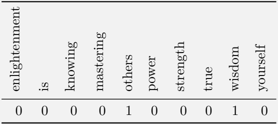

and for the second context, $\mathbf { c } _ { 2 }$ is

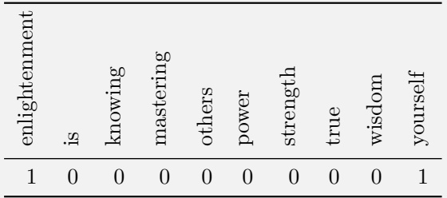

The combined context vector for the first quote is just a sum of these two, $c =$ $c _ { 1 } + c _ { 2 }$ (ignoring the component names):

| 1 | 0 | 0 | 0 | 1 | 0 | 0 | 0 | 1 | 1 |
| --- | --- | --- | --- | --- | --- | --- | --- | --- | --- |

<!-- page: 383 -->

We can compute the context vector for the other quote in an analogous fashion. When repeating the process for all words for both quotes, we get the complete TCM:

|  | t n e m e<sup>n</sup> hlitgen | i<sup>s</sup> | g kionnw | g i<sup>n</sup> <sup>tesar</sup>m | htseor | eorpw | h ttgesnr | teur | diosmw | f lesoruy |
| --- | --- | --- | --- | --- | --- | --- | --- | --- | --- | --- |
| enlightenment | 0 | 1 | 0 | 0 | 0 | 0 | 0 | 0 | 0 | 0 |
| is | 1 | 0 | 0 | 0 | 2 | 0 | 1 | 1 | 1 | 2 |
| knowing | 0 | 0 | 0 | 0 | 1 | 0 | 0 | 0 | 1 | 1 |
| mastering | 0 | 0 | 0 | 0 | 1 | 0 | 1 | 0 | 0 | 1 |
| others | 0 | 2 | 1 | 1 | 0 | 0 | 0 | 0 | 0 | 0 |
| power | 0 | 0 | 0 | 0 | 0 | 0 | 0 | 1 | 0 | 0 |
| strength | 0 | 1 | 0 | 1 | 0 | 0 | 0 | 0 | 0 | 0 |
| true | 0 | 1 | 0 | 0 | 0 | 1 | 0 | 0 | 0 | 0 |
| wisdom | 0 | 1 | 1 | 0 | 0 | 0 | 0 | 0 | 0 | 0 |
| yourself | 0 | 2 | 1 | 1 | 0 | 0 | 0 | 0 | 0 | 0 |

## 8.6.2 Simple embeddings: long vectors

## TBD: Align this with the previous section

The simplest and the most intuitive way of constructing word embeddings is to use the bag-of-words of the context of the words as their embeddings. This proceeds broadly in the following manner:

1. Construct the vocabulary. All common considerations hold here, e.g. it may contain all tokens, or only tokens that are frequent enough, and one may choose to keep or remove numbers.

2. For each word (token) in the text, find its context, the closest words around it. Note that we talk about each individual occurrence in the text, i.e. for a particular token, we have as many contexts as many times it occurs in the text.

3. Construct bag-of-words of the context. Again, there is a multitude of options, e.g. one may just look for presence of the words in the context, or one may count these words (and weight by distance).

4. Aggregate the bag-of-words for all similar tokens. Again, there are multitude of ways, e.g. one can just add them (as vectors). These aggregated BOW-s are essentially embeddings.

5. Finally, in order to make the embeddings comparable, we need to normalize those somehow–remove the differences caused by the fact that some words are used more frequently in more different context. Usually it is achieved by setting their Euclidean norm to 1.

<!-- page: 384 -->

<div class="docvortex-algorithm" style="white-space: pre-wrap; font-family:monospace;">
Let's transform the TCM entry for "is" to the corresponding normalized embeddings vector. As a reminder, the TCM entry was (see Example 8.7): $\boldsymbol{c} = (1,0,0,0,2,0,1,1,1,2)$. This vector has Euclidean norm $||\boldsymbol{c}|| = 3.46$, and hence the normalized embedding vector for is is
$||\boldsymbol{e}|| = \boldsymbol{c}/||\boldsymbol{c}|| = (0.29,0,0,0,0.58,0,0.29,0.29,0.29,0.58)$.
</div>

It is fairly obvious that if certain words tend to be used in a similar context, then their embeddings, computed in this manner, will also be similar. The more different are the contexts, the more different are the embeddings too.

However, such embeddings have downsides. First, it is obvious that the dimension of the embeddigs is the same as the vocabulary size, and hence the vectors are long. Second, and more importantly, such tables suffer from the fact that the most frequent words will have disproportionate impact of the vectors. The most frequent words like the, and and to may occur thousands of times in the contexts, but they carry little information about the words’ usage. So we’ll discuss the other methods to compute the embeddings below.

## Example 8.8: Long embedding vector of Laozi quotes

Euclidean norm $| | \boldsymbol { v } | | = \sqrt { \sum _ { i } v _ { i } ^ { 2 } } .$ See Section 5.2.2 Norm, page 265.

## Exercise 8.7: Laozi embeddings with asymmetric context

Consider the same Laozi quotes as in Example 8.7. Compute the relevant (normalized) word embeddings, but now take the following context: the preceding word with weight “1”, and the word before that with weight “0.5”.

Answer at page 518

## 8.6.3 Short embedding vectors: word2vec and GloVe

Creating long embeddings vectors, frequency tables as we did above, is easy and intuitive, but unfortunately the results are less than perfect. First, such embedding vectors are long, as long as the size of the input vocabulary. But more importantly– the vectors are much more dependent on the more frequent context words, rare words that are very important for the context may be almost ignored when calculating the resulting similarity. In practice, one computes the embeddings in a different way. The most popular approaches are word2vec and GloVe.

<!-- page: 385 -->

**GloVe** GloVe (Pennington et al., 2014) is computed from TCM in a somewhat similar way as the long embedding vectors (see Section 8.6.2 Simple embeddings: long vectors, page 373).

TCM: term-co-occurrence matrix counts the number of times one word occurs in the context of the other word. See Section 8.6.1 Term co-occurrence matrix, page 370.

Let X be the TCM where $x _ { i j }$ denotes how many times the word j occurs in the context of word i. Denote by $\textstyle x _ { i } = \sum _ { j } x _ { i j }$ the number of times any word appears in Pthe context of i. The probability that the word j appears in the context of the word i can now be written as $P _ { i j } = \operatorname* { P r } ( j | i ) = x _ { i j } / x _ { i }$ . The authors motivate their approach with the fact that context tells us something about the property of the words. For instance, in the context of solid, the word ice is almost 10 times more common than steam, but this ratio is flipped in the context of $g a s$ (Table $8 . 8 ) . ^ { 7 }$ But in a context of a word that is related to both (e.g. water) or neither (e.g. fashion), both ice and steam appear with a fairly equal frequency.

Table 8.8: Context tells something about the word properties. The word ice appears almost 10 times more frequently in the context of the word solid than in the context of gas, the opposite is true for steam. Water and fashion occur equally frequently with both ice and steam.

|  | j = solid | j = gas | j = water | j = fashion |
| --- | --- | --- | --- | --- |
| Pr(j\|ice) | 1.9 · 10<sup>-4</sup> | 6.6 · 10<sup>-5</sup> | 3.0 · 10<sup>-3</sup> | 1.7 · 10<sup>-5</sup> |
| Pr(j\|steam) | 2.2 · 10<sup>-5</sup> | 7.8 · 10<sup>-4</sup> | 2.2 · 10<sup>-3</sup> | 1.8 · 10<sup>-5</sup> |
| Pr(j\|ice)/Pr(j,steam) | 8.9 | 0.085 | 1.36 | 0.96 |

We can express the relationship $P _ { i k } / P _ { j k }$ in a general form as

$$
\frac {P _ {i k}}{P _ {j k}} = F (\pmb {w} _ {i}, \pmb {w} _ {j}, \tilde {\pmb {w}} _ {k})\tag{8.6.1}
$$

where w are word vectors and $\tilde { w } _ { k }$ is the context vector. If we want to put a linear structure on the word vectors, we may express $F$ using the difference between $w _ { i }$ and $w _ { j } \colon$

$$
\frac {P _ {i k}}{P _ {j k}} = F (\boldsymbol {w} _ {i} - \boldsymbol {w} _ {j}, \tilde {\boldsymbol {w}} _ {k}).\tag{8.6.2}
$$

Next, we can simplify the function to $F : \mathbb { R } \rightarrow$ R because the right-hand side is scalar:

$$
\frac {P _ {i k}}{P _ {j k}} = F \bigl ((\boldsymbol {w} _ {i} - \boldsymbol {w} _ {j}) ^ {\top} \cdot \tilde {\boldsymbol {w}} _ {k} \bigr).\tag{8.6.3}
$$

This will also help to preserve the linear structure.

Next, note that in TCM, the distinction between the word and its context is arbitrary, hence the should be able to swap word and the context w ↔ w˜ given we also transpose the TCM $\mathsf { X } \leftrightarrow \mathsf { X } ^ { \mathsf { T } }$ . One way to achieve this is to write (8.6.3) as

$$
\frac {P _ {i k}}{P _ {j k}} = F \bigl (\left(\boldsymbol {w} _ {i} - \boldsymbol {w} _ {j}\right) ^ {\top} \cdot \tilde {\boldsymbol {w}} _ {k} \bigr) = \frac {F (\boldsymbol {w} _ {i} ^ {\top} \tilde {\boldsymbol {w}} _ {k})}{F (\boldsymbol {w} _ {j} ^ {\top} \tilde {\boldsymbol {w}} _ {k})}\tag{8.6.4}
$$

<small><span class="docvortex-page-footnote" data-block-type="page_footnote" style="color:#6b7280"><sup>7</sup>Table 1 in Pennington et al. (2014)</span></small>

<!-- page: 386 -->

which gives

$$
F (\boldsymbol {w} _ {i} ^ {\intercal} \tilde {\boldsymbol {w}} _ {k}) = P _ {i k} = \frac {x _ {i k}}{x _ {i}}\tag{8.6.5}
$$

and

$$
\boldsymbol {w} _ {i} ^ {\top} \cdot \tilde {\boldsymbol {w}} _ {k} = \log x _ {i k} - \log x _ {i}.\tag{8.6.6}
$$

We can make it symmetric by

$$
\boldsymbol {w} _ {i} ^ {\top} \cdot \tilde {\boldsymbol {w}} _ {k} + b _ {i} + \tilde {b} _ {k}.\tag{8.6.7}
$$

where $b _ { i }$ is the word-related bias and $b _ { k }$ is the context-related bias.

In order to avoid overweighting rare word co-occurrences, we can add a monotonic weighting function<sup>8</sup> $\  ^ { \mathrm { ~ \scriptsize ~  ~ } } f ( x _ { i j } )$ and solve the following weighted least squares problem:

$$
J = \sum_ {i, j = 1} ^ {V} f (x _ {i j}) (\boldsymbol {w} _ {i} ^ {\intercal} \cdot \tilde {\boldsymbol {w}} _ {k} + b _ {i} + \tilde {b} _ {k} - \log x _ {i j}) ^ {2}.\tag{8.6.8}
$$

The authors suggest weighting function

$$
f (x) = \left\{ \begin{array}{l l} (x / x _ {m a x}) ^ {\alpha} & \text {if} x <   x _ {m a x} \\ 1 & \text {otherwise.} \end{array} \right.\tag{8.6.9}
$$

They use $x _ { m a x } = 1 0 0$ and $\alpha = 3 / 4$

TBD: example with actual probabilities

Table 8.9 shows the most similar words for a selection of words, and the corresponding cosine similarities underneath. These are computed from the small Common Crawl dataset, an internet scraping project from $2 0 1 2 . ^ { \mathrm { \hat { 9 } } }$ The similar words are often strikingly obvious. For instance, for common words like woman and hiking, the most similar words are of no suprise. The word embeddings also recognize geopgraphy–the Thailand–related words are all from South-east Asia, and the most similar of these, Bangkok, is the Thai capital. Embeddings also recognize local geography: Bainbridge is a small island outside Seattle, of the closest tokens Bremerton, Poulsbo, and Bellevue are cities nearby, Kitsap is the county where the island is located, and Vashon is another nearby island. Further down are numbers and weekdays, not only are the other numbers and weekdays the most similar ones, but they are also broadly in correct order. It can also relate top US-politicians (Hillary Clinton was the U.S. foreign secretary) to other politicians, Russian women names to other Russian women names, and smileys to smileys.

A slightly different result, based on the larger Common Crawl, is is presented in Figure 8.1. The upper panel represents the word “trade” and the lower panel the word “regime”. As one can see, “China” was the most common country that was mentioned in the same context as “trade”. The lower panel shows that “regime” is

<small><span class="docvortex-page-footnote" data-block-type="page_footnote" style="color:#6b7280"><sup>8</sup>Near 0, the weighting function must go to 0 faster than log goes to inf ty.</span></small>

<small><span class="docvortex-page-footnote" data-block-type="page_footnote" style="color:#6b7280"><sup>9</sup>There are two Common Crawl datasets: the [smaller one](https://nlp.stanford.edu/data/glove.42B.300d.zip) includes 42B tokens, the embeddings matrix’ (uncased) size is 1.9M. The [larger one](https://nlp.stanford.edu/data/glove.840B.300d.zip) contains 840B tokens, the embedding matrix’ (cased) size is 2.03GB. See more at [https://nlp.stanford.edu/projects/glove/](https://nlp.stanford.edu/projects/glove/).</span></small>

<!-- page: 387 -->

| Word | Mos | t similar words | and the cor | responding | cosine simila | rity |
| --- | --- | --- | --- | --- | --- | --- |
| woman | man0.80 | girl0.76 | women0.71 | she0.70 | lady0.69 | mother0.68 |
| hiking | biking0.79 | backpacking0.75 | trekking0.72 | camping0.71 | climbing0.70 | kayaking0.69 |
| thailand | bangkok0.75 | cambodia0.72 | malaysia0.70 | laos0.69 | asia0.67 | singapore0.67 |
| bainbridge | bremerton0.59 | poulsbo0.57 | kitsap0.51 | bellevue0.50 | vashon0.50 | marietta0.50 |
| tuesday | wednesday0.98 | thursday0.98 | monday0.97 | friday0.94 | saturday0.86 | sunday0.85 |
| seven | eight0.94 | nine0.94 | six0.94 | five0.94 | four0.91 | three0.89 |
| clinton | hillary0.82 | obama0.79 | barack0.76 | mccain0.75 | bush0.75 | biden0.69 |
| olga | maria0.57 | elena0.57 | irina0.56 | tatiana0.56 | kurylenko0.55 | alexandra0.53 |
| :) | ;)0.94 | :-)0.93 | :d0.91 | =)0.88 | ;-)0.85 | !!0.84 |

Table 8.9: A selection of words and the corresponding similarities from Common Crawl data (42B token, 300D vectors).

mainly associated with Iran, but also with Libya and Syria, reflecting the Arab Spring events of 2011.

Obviously, the embeddings reflect the texts they are based on, and include all the representation problems and biases that we see in actual data.

TBD: word2vec

TBD: Converting text to features. BOW/embeddings + n-grams + part-of-speech + other kind of features

## 8.7 Transformers

Transformers (Vaswani et al., 2017) are one of the central tools for text modeling in the modern LLM-s. Text is normally modeled as a sequence of tokens, where transformers predict the probability of next token, given the previous tokens and the context.

**Sequence modeling** Denote token i with $x _ { i } \in \mathcal { V }$ where V is the vocabulary. Typically we also want to assign each text a category (or context) c. This may be something with text type (e.g. an work email or a novel), or it may describe the user’s previous interaction with the LLM. Now document belonging to the category c is a sequence of tokens

$$
(\boldsymbol {x}, c) = (\boldsymbol {x} _ {1}, \boldsymbol {x} _ {2}, \dots , \boldsymbol {x} _ {L})\tag{8.7.1}
$$

<!-- page: 388 -->

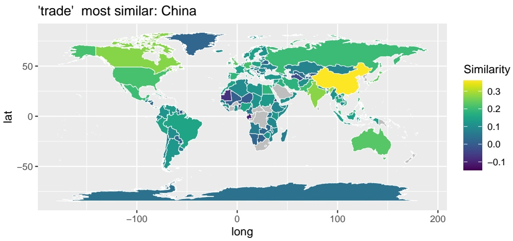

'regime' most similar: Iran

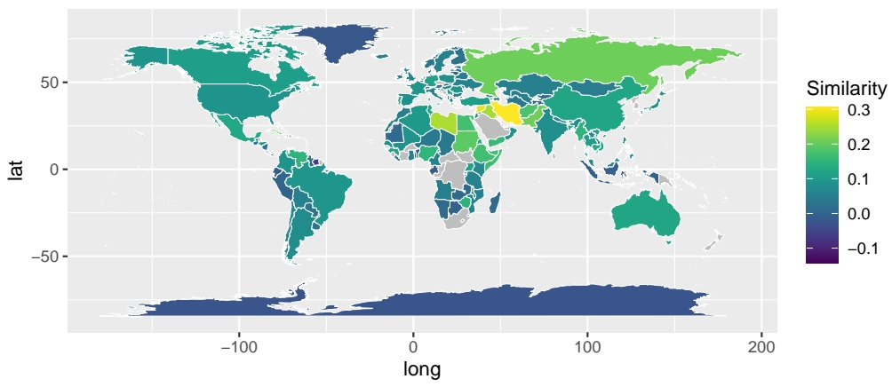

Figure 8.1: Similarity between words “trade” (top), “regime” (bottom), and the country names. Multi-word country names, such as “Saudi Arabia” cannot be used here, so these countries are left gray.

<!-- page: 389 -->

Generative models’ task is to model such sequences–what kind of sequences are the most likely ones given the current context c while classification models compute $\operatorname* { P r } ( c | { \pmb x } )$ . But both applications are relying on good models of $( x , c )$

In applications, the token sequence is converted to embeddings $e _ { i }   =   e _ { t i } + e _ { p i }$ where the embedding of token i is a sum of two components, the token embedding $e _ { t i }$ and the positional embedding $e _ { p i }$ . The embeddings are d-dimensional real vectors, $e \in \mathbb { R } ^ { d }$ . So sequence of tokens is replaced by a sequence of embeddings. Tranformers may either learn the embeddings themselves from training data, or use hard-coded embeddings, learned by someone else.

Traditional sequence-to-sequence models describe the probability of next token as a function of the previous token, history, and context:

$$
\Pr (\boldsymbol {x} _ {i} | \boldsymbol {x} _ {1}, \boldsymbol {x} _ {2}, \dots , \boldsymbol {x} _ {i - 1}) = g (\boldsymbol {x} _ {i - 1}, \boldsymbol {h} _ {i}, \boldsymbol {c})\tag{8.7.2}
$$

where $h _ { i }$ is the i-th tokens latent history vector, computed sequentially from the previous history vector $h _ { i - 1 }$ and the current token x<sub>i</sub>: $\boldsymbol{h}_{i} = f(\boldsymbol{h}_{i - 1}, \boldsymbol{x}_{i})$ ; and c is the context vector, common for the whole document. Transformers replace c with token-specific context $\mathbf { c } _ { i } \mathbf { : }$

$$
\Pr (\boldsymbol {x} _ {i} | \boldsymbol {x} _ {1}, \boldsymbol {x} _ {2}, \dots , \boldsymbol {x} _ {i - 1}) = g (\boldsymbol {x} _ {i - 1}, \boldsymbol {h} _ {i}, \boldsymbol {c} _ {i}).\tag{8.7.3}
$$

The main difference is that the context $c _ { i }$ is computed from all other tokens, not just from the previous history. This is the main difference between transformers and sequential models, like RNN-s.

**Attention** The context is computed using attention mechanism. The embedding of token $i ,   e _ { i }$ is transformed to $d _ { a }$ -dimensional query:

$$
\boldsymbol {q} _ {i} = \mathsf {W} _ {q} \boldsymbol {e} _ {i} + \boldsymbol {b} _ {q}, \quad \boldsymbol {q} _ {i} \in \mathbb {R} ^ {d _ {a}},\tag{8.7.4}
$$

where $\mathsf { W } _ { q } \in \mathbb { R } ^ { d _ { a } \times d }$ are (learned) query weights. The importance of the other context tokens is based on similarity between the query and keys

$$
\boldsymbol {k} _ {j} = \mathsf {W} _ {k} \boldsymbol {e} _ {j} + \boldsymbol {b} _ {k}, \quad \boldsymbol {k} _ {j} \in \mathbb {R} ^ {d _ {a}}\tag{8.7.5}
$$

where $\mathsf { W } _ { k }   \in   \mathbb { R } ^ { d _ { a } \times d }$ is a conversion matrix to be learned. Based on the similarity (e.g. scaled inner product $s ( \pmb { u } , \pmb { v } ) = \pmb { u } ^ { ^ { \scriptstyle \intercal } } \pmb { v } / \sqrt { d } )$ between the query and the keys, one computes the shares of each context token as Attention of token i to token $j ,   \alpha _ { i j }$ , in turn, is computed from similarity between all words:

$$
\alpha_ {i j} = \frac {\mathrm{e} ^ {s (\pmb {q} _ {i} , \pmb {k} _ {j})}}{\sum_ {k} \mathrm{e} ^ {s (\pmb {q} _ {i} , \pmb {k} _ {k})}}.\tag{8.7.6}
$$

Hence $\textstyle \sum _ { j } \alpha _ { i j } = 1$ . Attention imposes a limitation on transformers: as the attention Pmust be calculated between all tokens, but the maximum number of tokens cannot be arbitrarily large. Attention is an $\mathcal { O } ( n ^ { 2 } )$ task where n is the attention window size, often $n = 5 1 2$

<!-- page: 390 -->

Finally, each token is associated with value

$$
\boldsymbol {v} _ {j} = \mathsf {W} _ {v} \boldsymbol {e} _ {j} + \boldsymbol {b} _ {v}, \quad \boldsymbol {v} _ {j} \in \mathbb {R} ^ {d _ {o u t}}.\tag{8.7.7}
$$

The attention mechanism returns values, weighted by attention:

$$
\tilde {\boldsymbol {v}} _ {i} = \sum_ {j} \alpha_ {i j} \boldsymbol {v} _ {j}\tag{8.7.8}
$$

The attention-weighte values $\tilde { v }$ are further fed to a linear neural network block, that finally computes the next token probabilities.

Ghojogh and Ghodsi give a somewhat intuitive and somewhat technical overview of what are transformers, Phuong and Hutter (2022) provide a technical overview of how they work.

<!-- page: 391 -->

# Chapter 9

## Neural Networks

## Contents

- 9.1 Feed-Forward Networks 382
- 9.1.1 Biological Origins 382
- 9.1.2 Perceptron 382
- 9.1.3 Multi-layer perceptrons 387
- 9.1.4 Activation 389
- 9.2 Convolutional Neural Networks 391
- 9.2.1 Convolutions and convolutional filters 391
- 9.2.2 From convolutional layers to convolutional networks 395
- 9.2.3 Padding, Pooling, and Strides 397

Neural networks are one of the fastest developing classes of machine learning models. These have achieved tremendous progress in a variety of fields, in particular image and natural language processing. Modern neural networks can recognize images, faces, fingerprints, can convert pictures to text and text to pictures, understand spoken language and answer question.

While they are definitely exciting methods, these are also some of the most demanding ones with the number of trainable parameters in millions or even billions.<sup>1</sup> This makes training and using such models slow and demanding, not only do such models require a lot of computing ressources, they are also complicated to train. One also needs a large amount of training data which may be challenging to obtain. Another major downside of neural networks is lack of interpretability. As ML models are increasingly employed as decision-making aides, there is an increasing interest for model transparency. Neural networks and other complex models are essentially black boxes even for data scientists who train them.

We start the discussion with fee-forward neural networks, and introduce convolutional networks, the ones used for image processing, thereafter.

<small><span class="docvortex-page-footnote" data-block-type="page_footnote" style="color:#6b7280"><sup>1</sup>The largest language model as of 2021, Switch-C, contains 1.57 · 10<sup>12</sup> parameters.</span></small>

<!-- page: 392 -->

## 9.1 Feed-Forward Networks

## 9.1.1 Biological Origins

Humans have been interested in how brain works since ancient times. The first step in solving the puzzle was understanding the basic working mechanisms of neurons, the brain cells (Figure 9.1). In a very simplistic view, each neuron receives signals from other neurons through its dendrites, and outputs a signal to the dendrites of other neurons through its axon. Normally the axon is quiet and does not send any signal, but if large enough number of the neuron’s input dendrites become active, then the neuron “fires”, i.e. sends a signal through its axon to another neuron.

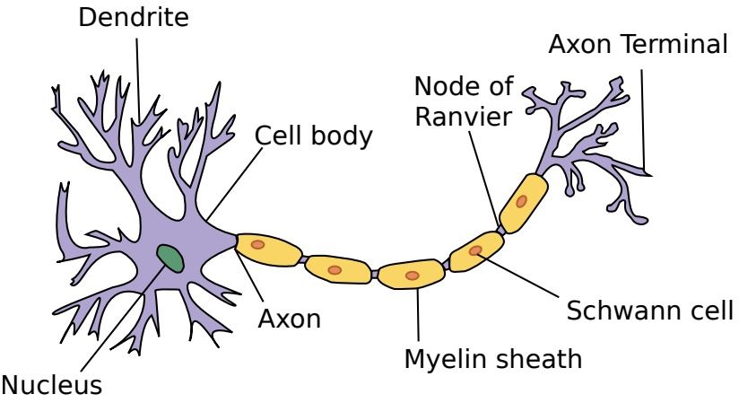

Figure 9.1: Schematic look of neuron. The cell has a long “tail”, axon, that is connected to the dendrites of other neurons. If a neuron receives enough electrical signals to it’s dendrites, if will $\text{" } \mathit{div} \text{" },$ i.e. send a signal out of its axon. By Dhp1080, [CC BY-SA 3.0](https://creativecommons.org/licenses/by-sa/3.0/deed.en), from [Wikimedia Commons](https://commons.wikimedia.org/w/index.php?curid=1474927)

Next, we model this simple neuron using mathematical tools and create an artificial neuron. These artificial neurons are the fundamental building blocks of all computational neural networks. The simplest networks, made of such artificial neurons, are called perceptrons. We start by introducing and-perceptron and or-perceptron, both are essentially made of a single neuron. Thereafter we move to more complex perceptrons with hidden layers.

## 9.1.2 Perceptron

Perceptron (feed-forward neural network) is a simple neural network that can be built using such artificial neurons. Perceptrons can perform various prediction tasks but cannot compete with more specialized networks, such as convolutional networks for image processing or LSTM blocks for natural language processing. However, the more specialized models almost always contain embedded perceptrons–feed-forward layers.

<!-- page: 393 -->

**AND and OR Perceptron** Imagine we have a neuron that gets two inputs $( \mathbf { e . g . }$ from other neurons) and outputs a signal only if both of these inputs are $`` \mathrm{high''}$ . We can model the neuron activity by the following way:

1. Label the inputs $x _ { 1 }$ and $x _ { 2 }$ . These are the signals it receives through “dendrites”, and these can be either $\text{" 0 " }( low )  \text{" 1 " }$ (high).

2. Let the neuron add both signals $x _ { 1 }$ and $x _ { 2 }$ . We are a little more general here and compute the weighted sum $z = w _ { 1 } x _ { 1 } + w _ { 2 } x _ { 2 }$ where $w _ { 1 }$ and $w _ { 2 }$ are weights, so the neuron can assign different importance to different signals.

3. Let the neuron fire (output 1) $if $z > \bar { z }$$ where z¯ is a threshold, otherwise it will be quiet (output 0). So we can write output $y = \mathbb { 1 } ( z > \bar { z } )$

Such a process activates the neuron if the input values are large enough (given w1 and $w _ { 2 }$ are positive), and it outputs 1 when active. We can write it formally as

$$
y = \mathbb {1} (w _ {1} x _ {1} + w _ {2} x _ {2} > \bar {z}).\tag{9.1.1}
$$

Figure 9.2 depicts this perceptron as a simple neural network. The figure indicates some of the most important components of neural networks. The inputs are entering through input layer. The input nodes do not really do any operations, these are simply the feature vectors that are fed into the model. In this example we only have two inputs, but in complex networks, such as image processing, the input layer may contain millions of nodes corresponding to the input pixels.

In this example, input layer feeds its data directly to the output layer. Output layer contains a single node (neuron) that does two operations: first the linear transformation $z = w _ { 1 } x _ { 1 } + w _ { 2 } x _ { 2 }$ and thereafter activation $y = \mathbb { 1 } ( z > \bar { z } )$ $w _ { 1 }$ and $w _ { 2 }$ are typically called weights and z¯ is called bias. Both of these operations are done almost universally by all nodes (except input nodes) in all networks. However, in practice it is rare to use the step function (indicator function) for activation. The most popular function in practice is ReLU, see Section 9.1.4 Activation, page 389.

This simple perceptron can perform logical AND and OR operations when choosing the weights and the bias accordingly. AND and OR operations are binary logical operations that take two inputs $x _ { 1 }$ and $x _ { 2 }$ , both of which may only have two values, 1 or 0, and always return either 1 or 0, depending on the inputs (see Table 9.1). Logical AND is 1 only if both inputs are 1, logical OR is 1 if any of the inputs is 1, and logical XOR (exclusive or) is 1 if exactly one of the inputs is one. This table can be understood as a dataset where we observe two features (inputs) $x _ { 1 }$ and $x _ { 2 }$ and predict any of the outputs AND, OR or XOR. Unlike traditional datasets, this small table is comprehensive data, i.e. there are no more possible combinations of inputs, and the outputs are always exactly the same given inputs. No stochastic noise is possible here.

In order to perform the listed operations, we need to find suitable parameters, a triple of numbers $( w _ { 1 } , w _ { 2 } , \bar { z } )$ . A possible solution for AND-perceptron is to choose $w _ { 1 } = w _ { 2 } = 1$ and $\bar { z } = 1 . 5$ . For instance, if $x _ { 1 } = 1$ and $x _ { 2 } = 0$ , then $z = 1 \cdot x _ { 1 } + 1 \cdot x _ { 2 } =$ $1 \; < \; \bar { z }$ and hence $y   =   0$ . However, if both $x _ { 1 }   =   x _ { 2 }   =   1$ , then $z   =   2   >   \bar { z }$ and so $y   =   1$ Obviously, there are infinitly many possible solutions, for example, when keeping $w _ { 1 } = w _ { 2 } = 1$ , every $\bar { z } \in [ 1 { , } 2 )$ will produce correct results.

<!-- page: 394 -->

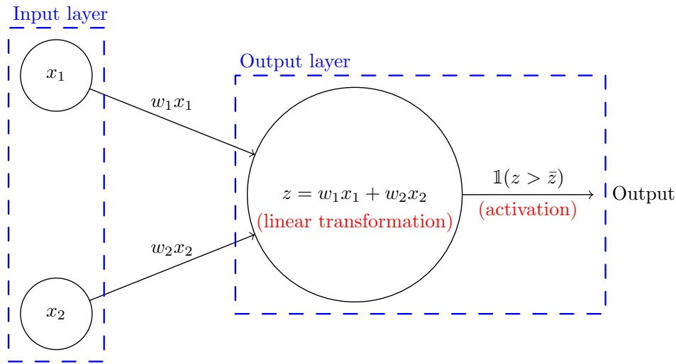

Figure 9.2: AND-Perceptron. The inputs $x _ { 1 }$ and $x _ { 2 }$ form the input layer, the single computing node forms the output layer. While the input layer only provides output to the node, the output node itself performs two operations: linear transformation $z = w _ { 1 } x _ { 1 } + w _ { 2 } x _ { 2 } ,$ and activation, $y = \mathbb { 1 } ( z > \bar { z } )$

Table 9.1: AND, OR and XOR operations

<table><tr><td colspan="2">inputs</td><td colspan="3">outputs</td></tr><tr><td> $x_1$ </td><td> $x_2$ </td><td>AND</td><td>OR</td><td>XOR</td></tr><tr><td>0</td><td>0</td><td>0</td><td>0</td><td>0</td></tr><tr><td>0</td><td>1</td><td>0</td><td>1</td><td>1</td></tr><tr><td>1</td><td>0</td><td>0</td><td>1</td><td>1</td></tr><tr><td>1</td><td>1</td><td>1</td><td>1</td><td>0</td></tr></table>

Exercise 9.1: OR-perceptron

Use the same perceptron model as in Figure 9.2. Construct OR-perceptron: find a suitable set of $( w _ { 1 } , w _ { 2 } , \bar { z } )$ that performs OR-operation. Solution on page 519.

The neural networks and network operations are normally presented in vector form (and very often in matrix or even tensor form). In these examples, the input layer is feeding a vector $\pmb { x } = \left( x _ { 1 } , x _ { 2 } \right) ^ { \mathsf { T } }$ to the output layer, and output layer is performing and operation

$$
y = \mathbb {1} (\boldsymbol {x} ^ {\top} \cdot \boldsymbol {w} > \bar {z})\tag{9.1.2}
$$

where $\boldsymbol { w } = \left( w _ { 1 } , w _ { 2 } \right) ^ { \mathsf { T } }$ is the single neuron’s vector of weights.

**XOR-perceptron and hidden layers** Can we use the same perceptron structure to perform XOR-operation? For XOR-perceptron, using the same model, we need values

<!-- page: 395 -->

$\pmb { w } = ( w _ { 1 } , w _ { 2 } )$ and z¯ that represent the XOR column in Table 9.1. Using the vector notation (9.1.2), we can write four equations, one for each row of data in the table:

$$
\begin{array}{c c} \left( \begin{array}{c c} 0 & 0 \end{array} \right) \cdot \binom{w _ {1}}{w _ {2}} = 0 <   \bar {z} & \quad \left( \begin{array}{c c} 1 & 0 \end{array} \right) \cdot \binom{w _ {1}}{w _ {2}} = w _ {1} > \bar {z} \\ \left( \begin{array}{c c} 0 & 1 \end{array} \right) \cdot \binom{w _ {1}}{w _ {2}} = w _ {2} > \bar {z} & \quad \left( \begin{array}{c c} 1 & 1 \end{array} \right) \cdot \binom{w _ {1}}{w _ {2}} = w _ {1} + w _ {2} <   \bar {z}. \end{array}\tag{9.1.3}
$$

The first expression shows us that z¯ is positive; the second and third equation show that both $w _ { 1 }$ and $w _ { 2 }$ are larger than z¯; but the fourth equation, corresponding the $x _ { 1 } = 1$ and $x _ { 2 } = 1$ case contradicts the previous results by requiring that $w _ { 1 }   +   w _ { 2 } < \bar { z }$ Hence $X O R$ -perceptron, using the model of Figure 9.2, is not possible.

A solution is to use a more complex network by introducing a hidden layer between the input and output layers (Figure 9.3). Now instead of connecting inputs x to the output node $y ,$ we connect inputs to hidden layer nodes. In XOR-perceptron, the hidden layer contains two nodes, $h _ { 1 }$ and $h _ { 2 }$ . Both of these nodes work in a similar fashion as the output node in the AND-perceptron: they read inputs, perform a linear transformation in the form $\chi   =   x ^ { \top } w$ , and activation in the form $h   =   \mathbb { 1 } ( \chi   >   b _ { h } )$ However, their outputs h are not the network final outputs, but are instead fed to the output layer as inputs. The output layer works exactly the same way as in case of AND-preceptrons above, just it takes its inputs not from the input layer but from the hidden layer.

Why is hidden layer called “hidden”? This is because we cannot observe these values in our data. Both inputs x and outputs y are observable in labeled training data. But we usually have no information about the “correct” values of the hidden layer values. Even more, there may be no such thing as hidden layers in the actual data generating process, our hidden layer nodes are just convenient mathematical tools that do not correspond to anything in reality. However, in certain cases hidden layers may represent concepts that are interpretable. For instance, one has found that in image processing tasks, some layers and nodes tend to recognize lines, arcs, bright regions on the image, and similar basic image features.

Let us now finish the XOR perceptron. There are many ways to set the parameters in a way that our network performs XOR operation. One particular way is to notice that $x _ { 1 }$ XOR $x _ { 2 } = ( x _ { 1 } \mathit { O R } x _ { 2 } ) - ( x _ { 1 } \mathit { A N D } x _ { 2 } )$ . Can we somehow, using the network in Figure 9.3, perform this subtraction? Yes we can. We can take the input nodes $x _ { 1 } , \; x _ { 2 }$ and the hidden layer node $h _ { 1 }$ and convert these into an $A N D \cdot$ perceptron by setting $\pmb { w } _ { h 1 } = \left( \begin{matrix} { 1 } & { 1 } \\ \end{matrix} \right) ^ { \intercal }$ and $b _ { h 1 } = 1 . 5$ . Thereafter we can take $x _ { 1 } ,   x _ { 2 }$ , and the second hidden layer node $h _ { 2 }$ and make an OR-perceptron by setting $\pmb { w } _ { h 2 }   =   \left( \begin{matrix} { 1 } & { 1 } \end{matrix} \right) ^ { \intercal }$ and $b _ { h 1 } = 0 . 5$ . And finally we can make the output layer node $y$ to subtract AND from OR by setting $\pmb { w } _ { \it { y } }   =   \left( \begin{matrix} { - 1 } & { 1 } \end{matrix} \right) ^ { \tt T }$ . The activation process must leave both values $`` 1''$ and $\text{" }0 \text{" }$ unchanged, so we can pick $b _ { y } = 0 . 5$

TBD: figure of $\text{" } \text{" } \text{" } \text{" } \text{" } \text{" }$ in perceptron

Table 9.2 lists all the parameters for the perceptron in Figure 9.3. All in all we have 9 parameters. Obviously there is an infinite number of possibilities to choose the parameters, e.g. if we multiply all the weights and biases by a (positive) constant, the results are unaffected. We can also swap the role of $h _ { 1 }$ and $h _ { 2 }$ , and introduce

<!-- page: 396 -->

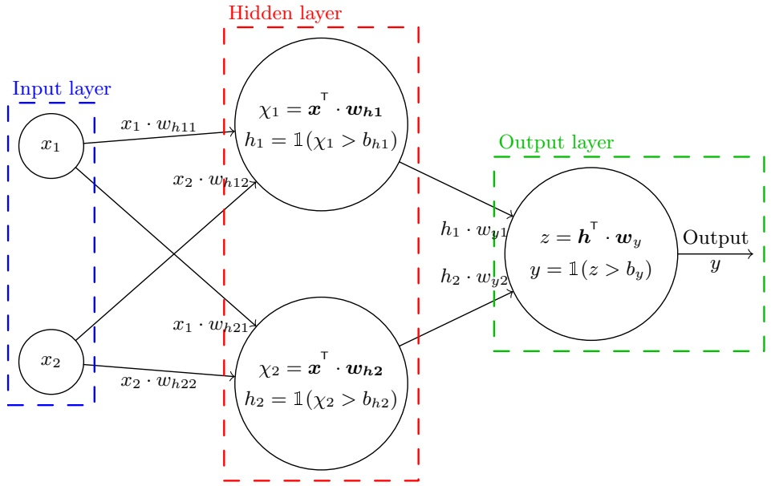

Figure 9.3: XOR Perceptron. The inputs $x _ { 1 }$ and $x _ { 2 }$ form the input layer, but now both input layer nodes are connected to both hidden layer nodes $h _ { 1 }$ and $h _ { 2 } ,$ and not to the output layer. Both hidden layer nodes perform linear transformation and activation, using different weights $w _ { h }$ and biases $b _ { h }$ . The single output layer node behaves exactly like in case of AND-perceptron, just it gets its inputs from the hidden layer, not from the input layer.

many other changes without affecting the predictions of our network. Although such flexibility may seem advantageous, it also suggests that neural networks are prone to overfitting and should normally be used with some form of regularization. It is also obvious that XOR binary logical operation does not have anything like “hidden layer”. There is no way to measure the “true values” of $\chi _ { 1 }$ and $\chi _ { 2 }$ , these values are just a trick to make the perceptron to perform XOR. So at least in this perceptron, the hidden values remain “hidden”–or you may say the they do not even “exist” in the real world.

Table 9.2: XOR-perceptron parameters

| node | weights | bias |
| --- | --- | --- |
| h<sub>1</sub> | 1,1 | 1.5 |
| h<sub>2</sub> | 1,1 | 0.5 |
| y | -1,1 | 0.5 |

## Exercise 9.2: Use the perceptron for XOR

Show that the perceptron with parameters as given in Table 9.2 can perform XOR. In particular, show that 0 $X O R \; 1 = 1$

Hint: set $x_{1} = 0,   x_{1} = 1$ , and compute all the hidden values $\chi _ { 1 } , \: h _ { 1 } , \: \chi _ { 2 } , \: h _ { 2 }$

<!-- page: 397 -->

and z. Do you get $y = 1 ?$

Computations the network nodes do are usually written (and coded) in matrix (or tensor) form. We can explain this by re-visiting the hidden layer of XOR perceptron example. The first hidden node $\chi _ { 1 }$ does the linear transform $\chi _ { 1 } = \boldsymbol { x } ^ { \intercal } \cdot \boldsymbol { w } _ { h 1 }$ and the second hidden node $\chi _ { 2 } = \boldsymbol { x } ^ { \intercal } \cdot \boldsymbol { w } _ { h 2 }$ . We can combine these two transformations into

$$
\binom{\chi_ {1}}{\chi_ {2}} = \binom{\boldsymbol {w} _ {h 1} ^ {\top} \cdot \boldsymbol {x} + b _ {h 1}}{\boldsymbol {w} _ {h 2} ^ {\top} \cdot \boldsymbol {x} + b _ {h 1}}.\tag{9.1.4}
$$

And simplify this into a matrix form

$$
\boldsymbol {\chi} = \mathsf {W} _ {h} \cdot \boldsymbol {x} + \boldsymbol {b} _ {h}.\tag{9.1.5}
$$

Here $x$ is the vector of linear terms inside of the hidden layer nodes, $\mathbb { W } _ { h }$ is matrix of hidden layer weights, where rows are the nodes and columns are the elements that correspond to the input vector. Finally, $b _ { h }$ is a vector of hidden layer biases.

## 9.1.3 Multi-layer perceptrons

The XOR-perceptron above (Figure 9.3) is an example of a multi-layer perceptron. Multi-layer perceptrons are neural networks, made of the same building blocks as XOR-perceptron. Figure 9.4 shows a larger similar perceptron. Unlike the XOR-perceptron, this network has an input layer with four nodes. This means it uses four features for predictions. It has two outcomes $y _ { 1 }$ and $y _ { 2 } ,$ so it predicts two values at the same time. Two outcome nodes is a common feature for binary classification– one node predicts the probability of the first outcome, and the other node that of the second outcome. The middle of the network is made of two hidden layers, the first layer with five and the second layer with four nodes. This network is densely connected: all nodes of a given layer get inputs from all nodes of the previous layer, and send their output to all nodes of the following layer.

Each node in the network works in a similar way as in the XOR-perceptron. Now the mathematical details.

• The input layer nodes do not really do anything–they are just the input features, four in this example. In this example, the network takes in an $N \times 4$ design matrix $\mathsf { X }$ (or a data frame if you wish) with four columns and an unspecified number of rows, N. Although doing “nothing”, you still need to write some code here, to ensure that right data goes to right place, to check it’s size, and so on.

• The first hidden layer performs linear transformation in the same way as in the XOR-perceptron. For instance, the node $h _ { 1 1 }$ computes the linear transform

$$
\chi_ {1} ^ {1} = x _ {1} w _ {1 1} ^ {h 1} + x _ {2} w _ {1 2} ^ {h 1} + x _ {3} w _ {1 3} ^ {h 1} + x _ {4} w _ {1 4} ^ {h 1} + b _ {1} ^ {h 1} = \boldsymbol {x} ^ {\top} \cdot \boldsymbol {w} _ {1} ^ {h 1} + b _ {1} ^ {h 1}.
$$

Here $\pmb { w } _ { 1 } ^ { h 1 } \; = \; ( w _ { 1 2 } ^ { h 1 } , w _ { 1 2 } ^ { h 1 } , w _ { 1 3 } ^ { h 1 } , w _ { 1 4 } ^ { h 1 } )$ is the weight vector for the node $h _ { 1 } ^ { 1 }$ , and $\boldsymbol{x} = (x_{1}, x_{2}, x_{3}, x_{4})$ is the input vector. This operation is exactly the same as linear regression, and it results in a single number.

<!-- page: 398 -->

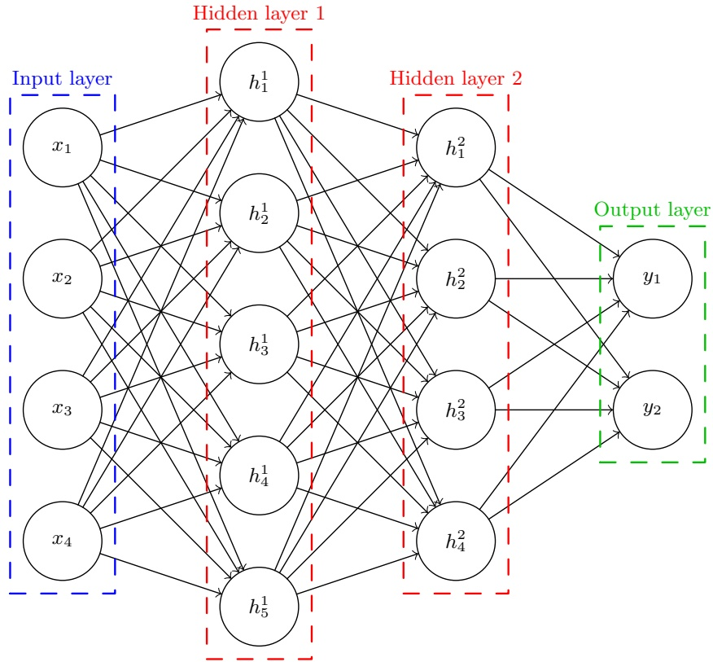

Figure 9.4: Multi-layer perceptron: this is a dense network with four inputs, two outputs, and with two hidden layers, the first one with five and the second one with four nodes. It is a dense network in a sense that all nodes in the previous layer are connected to all nodes in the following layer.

As in linear regression, you want to stack input vectors into a design matrix and write the operation instead as $\pmb { \chi } _ { 1 } ^ { 1 } = \pmb { \mathsf { X } } \cdot \pmb { w } _ { 1 } ^ { h 1 } + b _ { 1 } ^ { h 1 }$ . Here $\theta _ { 1 } ^ { 1 }$ is a vector–one number for each row of the input data.

• The hidden layer contains not a single node, but five nodes. Together, these operations look like

$$
\begin{array}{c} \chi_ {1} ^ {1} = \mathsf {X} \cdot \boldsymbol {w} _ {1} ^ {h 1} + b _ {1} ^ {h 1} \\ \chi_ {2} ^ {1} = \mathsf {X} \cdot \boldsymbol {w} _ {2} ^ {h 1} + b _ {2} ^ {h 1} \\ \dots \\ \chi_ {5} ^ {1} = \mathsf {X} \cdot \boldsymbol {w} _ {5} ^ {h 1} + b _ {5} ^ {h 1} \end{array}\tag{9.1.6}
$$

Instead of writing (and coding) a stack of vector operations, it is useful to stack

<!-- page: 399 -->

all the hidden layer weights $w _ { i } ^ { 1 }$ into a weight matrix $\mathbb { W } ^ { h 1 }$

$$
\mathrm{W} ^ {h 1} = \left( \begin{array}{c c c c} \boldsymbol {w} _ {1} ^ {h 1} & \boldsymbol {w} _ {2} ^ {h 1} & \dots & \boldsymbol {w} _ {5} ^ {h 1} \end{array} \right) = \left( \begin{array}{c c c c} w _ {1 1} ^ {h 1} & w _ {2 1} ^ {h 1} & \dots & w _ {5 1} ^ {h 1} \\ w _ {1 2} ^ {h 1} & w _ {2 2} ^ {h 1} & \dots & w _ {5 2} ^ {h 1} \\ & \vdots & & \\ w _ {1 4} ^ {h 1} & w _ {2 4} ^ {h 1} & \dots & w _ {5 4} ^ {h 1} \end{array} \right).\tag{9.1.7}
$$

Note that W is $\mathrm { ~ a ~ } 4 \times 5$ matrix in this example–we chose to stack the column vectors vertically next to each other. We could have chosen to do it differently, but this approach saves us from one transposition sign below $\textcircled{e} ^ { 2 }$ We can also stack the hidden layer biases into a vector

$$
\boldsymbol {b} ^ {h 1} = \left( \begin{array}{c c c c} b _ {1} ^ {h 1} & b _ {2} ^ {h 1} & \dots & b _ {5} ^ {h 1} \end{array} \right) ^ {\top}.\tag{9.1.8}
$$

the hidden layer outcomes into a matrix

So instead of (9.1.6), we can now write

$$
\boldsymbol {\chi} ^ {1} = \boldsymbol {X} \cdot \boldsymbol {W} ^ {h 1} + \boldsymbol {b} ^ {h 1 ^ {\top}}.\tag{9.1.9}
$$

This is the most effective way to write (and code) a fully connected network layer.

• After linear transformation it performs a non-linear activation $f ( \chi _ { 1 } ^ { 1 } )$ (see below).

## 9.1.4 Activation

Above we explained that all nodes do both the linear operations (that can be expressed in matrix form), and activation. There are several popular activation functions, below we discuss a few of these.

**ReLU** (rectified linear unit) is perhaps the most popular activation function for neural networks (except in the output layer). It is essentially a line with a kink at 0, and defined as

$$
\mathrm{ReLU} (x) = \max (x, 0) = \left\{ \begin{array}{l l} 0 & x <   0 \\ x & x \geq 0 \end{array} \right.\tag{9.1.10}
$$

It has the advantage of being simple and being piecewise linear, and hence easy to compute. It’s derivative is either 0 or 1, although is not differentiable at 0. It seems to matter little in practice, although most theoretical optimization literature seem to focus only on differentiable (Lipschitz continuous) functions (see Bottou et al., 2018).

The downside of ReLU is that it is constant on the whole negative domain. Hence the gradient is just zero on a whole range of parameter values and training performance may suffer.

<small><span class="docvortex-page-footnote" data-block-type="page_footnote" style="color:#6b7280"><sup>2</sup>This also corresponds to how sklearn weight matrices are built. TBD: double-check this.</span></small>

<!-- page: 400 -->

**Leaky ReLU** is a version of relu where the function value is not identically zero at the negative domain, just it has a small slope there (see Figure 9.5)

$$
\mathrm{ReLU} (x) = \max (x, 0) = \left\{ \begin{array}{l l} \alpha \cdot x & x <   0 \\ x & x \geq 0 \end{array} . \right.\tag{9.1.11}
$$

$0 < \alpha < 1$ is a hyperparameter that must be specified, not trained.

Leaky ReLU is used in contexts where one needs non-zero gradient in the negative domain.

**Softmax or Logistic** (multinomial logit) is defined as logistic transformation of input vector x. It’s i-th component is

$$
\Lambda (\boldsymbol {x}) _ {i} = \frac {\mathrm{e} ^ {x _ {i}}}{\sum_ {j} \mathrm{e} ^ {x _ {j}}}\tag{9.1.12}
$$

Its one-dimensional version is the same as logistic function , and is often called sigmoid function in ML literature. It is often denoted by $\sigma ( x )$ . See Figure 9.5

Softmax has a very useful property: namely, whatever the value of $x _ { i } , \mathrm { e } ^ { x _ { i } }$ is always positive. And hence $\sum _ { j } \mathrm { e } ^ { x _ { j } }$ is always positive, and hence the components of $\Lambda ( x )$ sum Pto unity. So softmax is a transformation that converts all kind of inputs into valid probabilites, this is why it is the most popular output layer activation function for categorization problems. Whatever comes to the output layer, it always outputs a valid probability vector.

Example 9.1: Softmax outputs

<table><tr><td colspan="3">Inputs  $x_i$ </td><td colspan="3">Exponents  $e^{x_i}$ </td><td> $\sum_i e^{x_i}$ </td><td colspan="3">Probabilities  $\frac{e^{x_i}}{\sum_i e^{x_i}}$ </td></tr><tr><td>0.10</td><td>0.20</td><td>0.30</td><td>1.11</td><td>1.22</td><td>1.35</td><td>3.68</td><td>0.30</td><td>0.33</td><td>0.37</td></tr><tr><td>1.00</td><td>2.00</td><td>3.00</td><td>2.72</td><td>7.39</td><td>20.09</td><td>30.19</td><td>0.09</td><td>0.24</td><td>0.67</td></tr><tr><td>0.10</td><td>-0.10</td><td>3.00</td><td>1.11</td><td>0.90</td><td>20.09</td><td>22.10</td><td>0.05</td><td>0.04</td><td>0.91</td></tr></table>

## Exercise 9.3: Softmax property

a) Compute softmax (1 ,2 ,3 ) and softmax (4 ,5 ,6 ).

b) Prove that

$$
s o f t m a x (\boldsymbol {x}) = s o f t m a x (\lambda + \boldsymbol {x})\tag{9.1.13}
$$

<!-- page: 401 -->

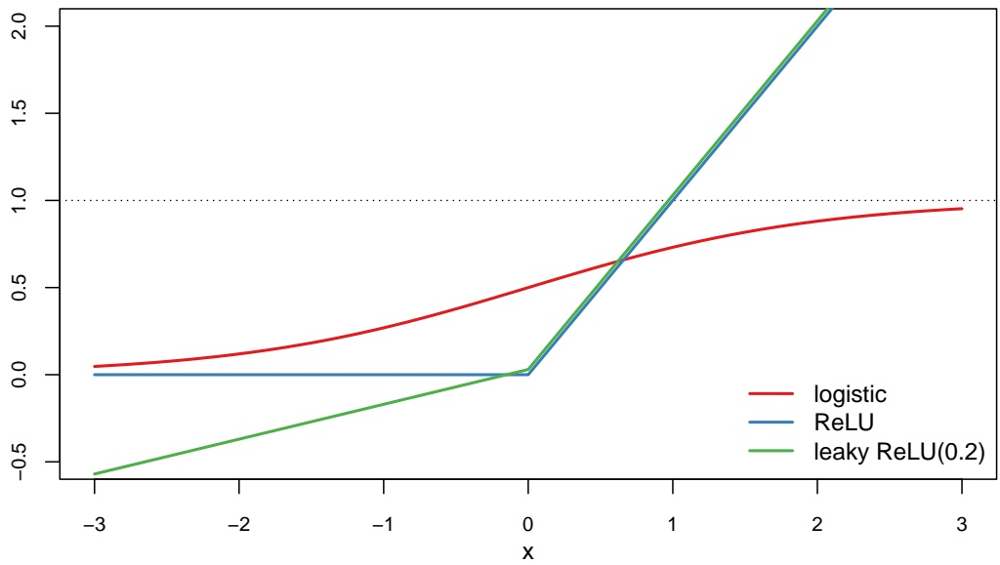

Figure 9.5: A few popular activation functions for neural networks. Leaky ReLU with $\alpha = 0 . 2$ is shifted slightly up for clarity.

| where $\boldsymbol{x}$ is the vector of inputs, and $\lambda \in \mathbb{R}$. |
| --- |
| Solution on page 519 |

**No activation** Finally, one can also leave activation out (use identity function as the activation function). This is useful for regression models. In fact, neural network with no hidden layers and identity activation is equivalent to linear regression.

TBD: multiple outputs

TBD: outputs: prediction vs regression

## 9.2 Convolutional Neural Networks

Convolutional neural networks are networks that incorporate convolutions, certain kind of weighted sums over spatially arranged data. Convolutional filters are wellknown methods to manipulate and enhance images or other signals, and have been widely used long before the neural networks became popular.

In the following sections, we explain what are convolutions, how they can be used to detect image elements, and how they can be incorporated into neural networks.

## 9.2.1 Convolutions and convolutional filters

Convolution is essentially a weighted sum or average over certain spatial region of the data. It is a function of two sources of information–data and weights. Spatial in

<!-- page: 402 -->

this context means not necessarily space, but all other kind of arrangements where it makes sense to talk about distance between data points. This includes images where we can talk about neighboring pixels, or pixels that are farther apart, or time series, where we can talk about observations that are taken in next day, versus two days ago.

For instance, a convolution of series of daily temperatures $T _ { t }$ may involve sum of temperature T of the given day t, plus two days before and after that day. The weights may be larger for the given day and smaller for the other days, for instance $w _ { - 2 } = w _ { 2 } = 0 . 2 5 , \: w _ { - 1 } = w _ { 1 } = 0 . 5$ and $w _ { 0 } = 1$ . Here the index for weights denotes how many days off we are from the central day of interest. Convolution is often denoted by ∗, and for the daily temperatures we may write the convolution as $T * w .$ As we can choose an arbitrary day t as the day of interest, the result depends on t and we write $( T * w ) ( t )$

$$
(T * w) (t) = w _ {- 1} T _ {t - 2} + w _ {- 1} T _ {t - 1} + w _ {0} T _ {t} + w _ {1} T _ {t + 1} + w _ {2} T _ {t + 2}.\tag{9.2.1}
$$

The vector of weights $\pmb { w } = ( w _ { - 2 } , w _ { - 1 } , w _ { 0 } , w _ { 1 } , w _ { 2 } )$ is called kernel or filter. Note that as we approach the $`` \mathrm{e d g e  ''}$ of our data, we cannot compute the convolution any more: for instance, for the last data point we do not know the values of $T _ { t + 1 }$ and $T _ { t + 2 } . ~ \mathrm { S o }$ convolution either “loses” some data at the edge, or alternatively, the “over-the-edge” data must be filled in (padded) somehow (see Section 9.2.3 Padding, page 397 below).

## Example 9.2: 1-D convolution

Imagine we are measuring temperature on Pluto. But it is far away and we only get time at the expensive telescope once a month to do the measurements. We measure the temperature in five consecutive months and get $T _ { 1 } = 4 0 K$ (-233C), $T_{2}=44K,T_{3}=44K,T_{4}=52K$ , and $T _ { 5 } = 4 4 K$ . As our measurements are imprecise, we may want to smooth the individual observations over time (compute moving average). But we also want to put more weight on the current month’s measurement and less weight on the neighboring months, as the measured differences may reflect true processes on Pluto. So we choose weights $w _ { - 1 } = 0 . 2 5$ , $w _ { 0 } = 0 . 5 ,$ , and $w _ { 1 } = 0 . 2 5$ The convoluted (averaged) temperatures are:

$$
(T * w) (2) = w _ {- 1} T _ {1} + w _ {0} T _ {2} + w _ {1} T _ {3} = 4 3 \mathrm{K}
$$

$$
(T * w) (3) = w _ {- 1} T _ {2} + w _ {0} T _ {3} + w _ {1} T _ {4} = 4 5 \mathrm{K}
$$

$$
(T * w) (4) = w _ {- 1} T _ {3} + w _ {0} T _ {4} + w _ {1} T _ {5} = 4 8 \mathrm{K}.
$$

In this way we can use convolutions for smoothing noisy observations. This is also why we want the weight to sum to unity in this case–we do not want our smoothed temperature values to be systematically biased.

For 2-D case, convolutions are defined in a similar fashion. For instance, we may convolve surface temperature over certain geographic area by averaging measurements in this area while giving more distant measurements lower weight. The main difference

<!-- page: 403 -->

between 1-D and 2-D case is that now we need a 2-D weight structure. So instead of a simple sum, now we need a double sum

$$
(T * \mathsf {W}) (k, l) = \sum_ {i} \sum_ {j} w _ {i j} T _ {k + i, l + j},\tag{9.2.2}
$$

where the weight matrix $\mathsf { W } = \{ w _ { i j } \}$ . For instance, when doing a similar temperature measurements, but now over a rectangular grid, we may set the weight matrix to

$$
W = \left( \begin{array}{c c c} \frac {1}{1 6} & \frac {2}{1 6} & \frac {1}{1 6} \\ \frac {2}{1 6} & \frac {4}{1 6} & \frac {2}{1 6} \\ \frac {1}{1 6} & \frac {2}{1 6} & \frac {1}{1 6} \end{array} \right).\tag{9.2.3}
$$

As in case of time series smoothing, we chose the weights to sum to unity in order to avoid systematic bias in temperature. But in other applications, the weights do not have to sum to one. We also do not have to choose a $3 \times 3$ kernel, it may be of any dimension, including even numbers like $2 \times 2$ or $4 \times 4 ,$ or we can use non-square kernesl, such as $2 \times 3$

In neural networks, 2-D convolutions are one of the main workhorses for image processing. Let us demonstrate 2-D convolution by constructing a filter that detects vertical edges in images. We pick a very simple 3 × 4 image, that include a $2 \times 2$ black box in the top-right corner (see Figure 9.6 left). For simplicity, the image only has two possible pixel values, 0 (white) and 1 (black). We choose a $2 \times 2$ kernel with weights as

$$
W = \left( \begin{array}{c c} - 1 & 1 \\ - 1 & 1 \end{array} \right).\tag{9.2.4}
$$

One can easily imagine convolutions as moving this kernel window over the image, pixel-by-pixel. At each location one has to multiply the pixel values with the corresponding kernel weights and add the results.

The image has one vertical edge in the upper-middle of the image, the one that separates the black and white area. We start moving the filter across the image from the top-left corner (green frame). This results in zero value, as all the pixel values are 0, and multiplying those with the corresponding filter values does not change the matters. Next, we move the kernel window right by one pixel (red frame). In that position the negative filter weights overlap with 0-values pixels while positive weights overlap with 1-value pixels. As a result, the filter returns 2. Finally, in the rightmost position (blue frame), both positive and negative weights overlap with equal pixel values (1) and hence the output is again 0. The filter only “fires” if there is a vertical edge on the image. The figure only depicts convolution along the upper row of the image. If we lower the filter down by one pixel, then the all-zero lowermost row does not contribute to the output, and we get values 0, 1, and 0. The filter still “fires” for the vertical edge in the middle, but now it fires only “partially” because the vertical edge is only partially in the filter’s window.

The result of moving over the image (ther “Result” box in the figure) is a new image where brightness corresponds tof “vertical edgeness” of the original image. In this example, the largest edgeness value is in the middle-upper position, the position

<!-- page: 404 -->

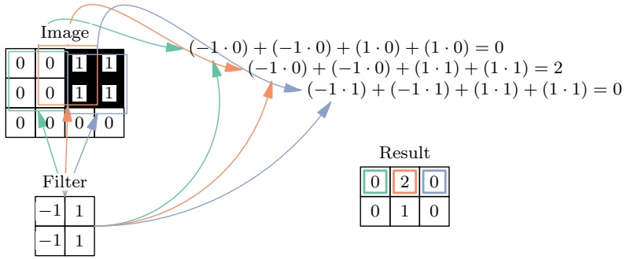

Figure 9.6: Vertical edge detection using 2D convolution filter. Moving the convolution filter across the image, the top-left corner (green frame) results in zero, as all the pixel values are 0. In the next position (red frame) the negative filter weights overlap with 0-values pixels while positive weights overlap with 1-value pixels. As a result, the filter returns 2. Finally, in the rightmost position (blue frame), both postive and negative weights overlap with equal pixel values (1) and hence the output is again 0. The filter only “fires” if there is a vertical edge on the image.

where the window exactly overlaps the vertical edge. Values 0 correspond to the case where the image does not contain any vertical edges, and value 1 corresponds to the case where the filter window only partially contains a vertical edge. Now if we want to know if any particular location contains a vertical edge, we have to see what are the values of the result layer in that location. Large value represent to a vertical edge.<sup>3</sup>

Example 9.3: Edges on image

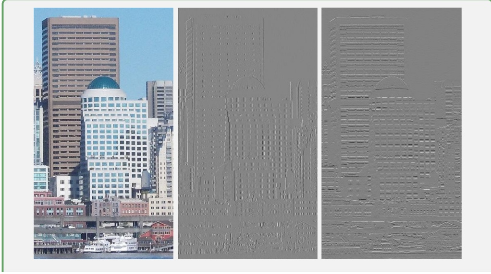

<sup>3</sup>Large positive values represent an edge between white pixels at left and black pixels at right. Large negative values correspond to the opposite case.

<!-- page: 405 -->

Figure 9.7: Edge detection: original image $( I e f t ) ,$ vertical edges (center), and horizontal edges (right). Unlike Figure 9.6, this is a color image, and the edge detection filters contains three similar layers, one for each color channel. The filters used are $\begin{pmatrix}-1 & 1 \\-1 & 1\end{pmatrix}$ for the vertical edges, and $\begin{pmatrix}-1 & -1 \\1 & 1\end{pmatrix}$ for the horizontal edges.

## Exercise 9.4: Corner detection with convolutions

<div class="docvortex-algorithm" style="white-space: pre-wrap; font-family:monospace;">
Consider image $\mathsf{M} = \begin{pmatrix} 0 &amp; 0 &amp; 1 &amp; 1 \\ 0 &amp; 1 &amp; 1 &amp; 1 \\ 0 &amp; 0 &amp; 1 &amp; 0 \\ 0 &amp; 0 &amp; 0 &amp; 0 \end{pmatrix}$ and filter $\mathsf{F} = \begin{pmatrix} -1 &amp; -1 \\ -1 &amp; 3 \end{pmatrix}$. What is the convolved image $\mathsf{M} * \mathsf{F}$? Explain where/which kind of corners does the filter detect. Solution on page 520.
</div>

## 9.2.2 From convolutional layers to convolutional networks

In the previous example, we just moved a single convolutional filter around over the image, and got another image where high pixel values denote “edginess” on the original image.

In case of convolutional networks, this process is embedded in a neural network, and we typically use more than just a single filter. Figure 9.8 shows what happens when using four filters (kernels) on a color image. At left, we see the three color channels (red, green, blue) of the image. The filter is currently locate at the lowerright corner of the image. But now it is not a $2 \times 2$ filter but $2   \times   2   \times   3$ filter instead–2×2 is its spatial dimension, and the last dimension encompasses all image channels. Note that in the spatial sense it is still a $2 \times 2$ filter. This is because the pixels in each channel are aligned—they have well-defined position with respect to each other. But the color channels are not aligned in this way, there is no inherent reason to say that the green channel is located underneath the red one, or the way around. Colors are unordered, non-spatial features. Hence we usually just talk about $2 \times 2$ filters, even if they encompass all the channels. But be aware that in reality they are of dimension $2 \times 2 \times 3$ and hence contain 12 weights, not 4 weights. Weights for the filter’s 3 layers wil differ, in general.

Each filter, when moved across the image, produces a new channel, the image convoluted with this particular kernel. These are shown at right on the figure. If the original image was of size $1 0 0 \times 1 0 0$ pixels, the convoluted image has $9 9 \times 9 9$ pixels, because we lose one pixel at the edge. But instead of a single convolutional filter, we use four filters in this example, labeled as “kernel $1 ^ { \flat } ,$ “kernel $2 ^ { \circ }$ and so on. Accordingly, the convolutional layer contains $4 \times 1 2 = 4 8$ weights, 12 weights for each kernel. Each of these kernels creates a convoluted image. These are the four black-and-white images at right on the figure. So the size of the final output of this convolutional layer is $9 9 \times 9 9 \times 4$ . These are depicted as black-and-white, because they are not interpretable as color channels. They may capture edges, or bright spots,

<!-- page: 406 -->

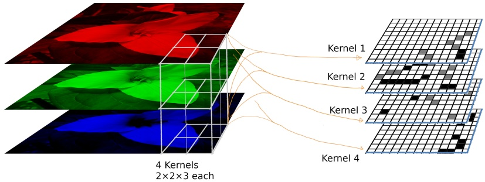

Figure 9.8: Color image and multiple filters (kernels). The input image contains three channels: red, green and blue (left). All kernels work on all layers, hence in some sense they are not $2 \times 2$ but $2 \times 2 \times 3$ kernels with 12 weights each. Each kernel, when moved across image, creates a new convoluted channel (right). In this example, we have four different kernels, so together they produce a 4-channel convolution image. The new channels do not represent colors but certain other properties of the image, hence here they are represented as black-and-white only. We can take these four channels as inputs for a second layer of convolutions.

or corners, or other details instead, depending on the what exactly the kernels are.

Also, while the dots on the resulting channels (black-and-white layers at righ on the Figure) have clear spatial position, this is not the case for ordering of the channels. There is no reason to think that, for instance, corners should be underneath edges or the way around. Hence one set of convolutional filters gave us a multi-channel convoluted image that is in some ways similar to the original image—its width and height have clear spatial meaning, but the channels are unordered. Hence we can add another set of convolutional filters that take the first convoluted image as input, and perform another set on convolutions on that image. The input image now has as many channels as how many filters we had in the first layer of convolutions, four in this example, and hence the second layer convolutional filters would be of size $2 \times 2 \times 4$ and contain 16 weight each.

It is possible to hand-craft all these filters. For instance, we can add a filter for horizontal edges, a filter for corners, a filter for diagonal lines and so on. However, in case of neural networks, we normally do not hand-craft the filters but let the networks learn what is a good combination of kernels. For example, the network may learn that many vertical edges are associated with buildings, while human face may be better visible when using curved lines. This is partly because hand-crafting filters is a rather laborious task, but more importantly—in typical image processing tasks we do not know what a good set of filters might be. It not hard to manuually design kernels that distinguish between lines and curves, but what kind of kernels can distinguish between cats and dogs? Instead, in typical image processing tasks we allow the network to learn a large number (e.g. 64) filters in multiple layers, so the network does not have to rely on just vertical edges, but can find various details that may allow to distinguish complex images.

Note that filters are not limited to $2 \times 2$ size, they may be a lot larger, and they do not have to be of square shape.

<!-- page: 407 -->

Above we discussed just convolutions—the linear part of the convolutional layers. The actual layers in neural networks also include activation. So a single convolutional filter in a convolutional layer outputs

$$
f (b + (\mathsf {T} * \mathsf {w}) (x, y))\tag{9.2.5}
$$

where T is the input image tensor $( 1 0 0 \times 1 0 0 \times 3$ in the example above), w is the tensor of weights $( 2 \times 2 \times 3$ in this example), x and y are pixel coordinates, b is bias, and $f ( \cdot )$ is the activation function. Hence a single convolutional filter in this example contains w $\times   h \times l + 1$ parameters, where w is the kernel width, h is kernel height and l is the number of layers. $\text{" }+1 \text{" }$ is because of the bias in the activation function. In the example above it is $2 \times 2 \times 3 + 1 = 1 3$ parameters for each filter, and $4 \times 1 3 = 5 2$ parameters for a convolutional layer.

## 9.2.3 Padding, Pooling, and Strides

**Pooling** After running the data through a convolutional filter, we have another matrix that tells how well did each place in the image correspond to what the filter captures. In the example in Figure 9.6 we can see that the edges of the image do not correspond to vertical edges, the lower-middle of the image corresponds somewhat, and top-middle corresponds the best. Often we are not interested in such a detailed knowledge. For instance, we may be interested in the location of the cleanest vertical edge while willing to ignore the other less-clean representation nearby.

In this case we may run the resulting data through a pooling layer. Popular max pooling finds the maximum value in a small area, e.g. in a $2 \times 2$ square on the layer. In this example, max pooling will result in value 2, indicating that there is a clear vertical edge somewhere in that region. It will however ignore 0-s and 1-s, so we do not learn that there is also places that do not represent vertical edges. If we are interested in the latter, we may choose average pooling instead. This will correspond to average “edgeness” of that region on the image.

**Padding** It is obvious from Figure 9.6 that the resulting layer is smaller than the original image layer. We have to fit the whole filter onto the image, and as soon as its dimension is more than 1, we have fewer points in the output than in the input. We can proceed in different ways:

• We can just accept that this is the case, and that the layers get smaller and smaller as the data proceeds through successive convolutional layers.

• Alternatively we can “pad” the layers with certain values, e.g. some pre-determined values, or values from nearby pixels. This is called padding.

**Strides** Finally, we do not have to move the convolution window by a single pixel each time. We may choose another step size, called stride. A large stride may be useful if the image is fuzzy, or if the features do not change rapidly from pixel to pixel. Large strides are a way to lower the resolution in the middle of the network. One may also choose different strides for horizontal/vertical movement.

<!-- page: 408 -->

Example 9.4: Distinguishing squares and circles

The task is to distinguish somewhat distorted squares, circles and crosses. The training data contains 4800 $3 2 \times 3 2$ pixel black-and-white images (see the figure below). The convolutional network used in this test is the following:

First, the optimizer runs for 50 epochs of batch size 16. This is followed by 5 epochs of batch size 80.

The only convolutional layer contains 160 4 × 4 convolutional filters (see the image below). The filters are of size 4 × 4 with strides 2. The activation function is leaky relu (with leak size 0.05) and dropout 0.2. It is combined by max pooling with pool size and strides 7.

The convolutional layer is followed by a dense layer 40 nodes. It is activated by leaky relu (leak 0.25) and its dropout is 0.8.

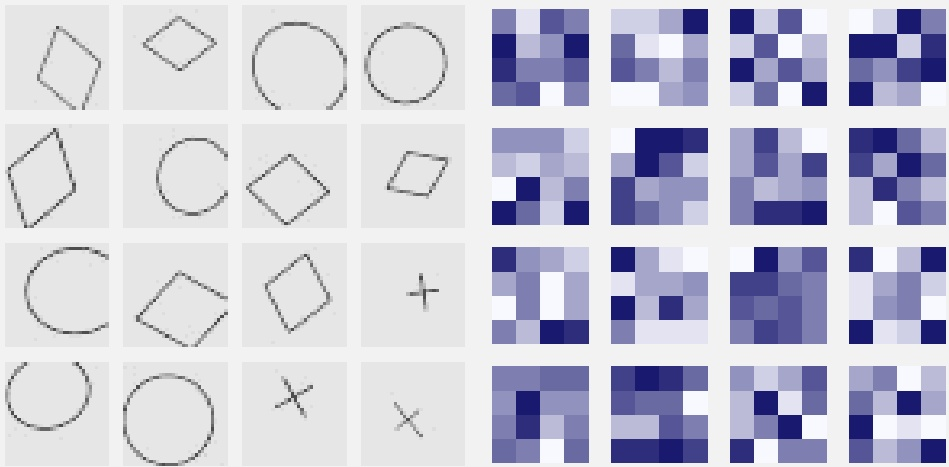

Figure 9.9: Example images of squares, circles and crosses (left). All of these are somewhat distorted, rotated and sometimes cropped. At right, a sample of the corresponding convolutional $4 \times 4$ filters.

As you can see, the filters may pick up certain line patterns, but it is not obvious how these are related to the images at left.

The confusion matrix on 1200 validation images is

| Predicted: | Circles | Crosses | Squares |
| --- | --- | --- | --- |
| Circles | 409 | 0 | 0 |
| Actual Crosses | 0 | 384 | 0 |
| Squares | 1 | 1 | 405 |

Validation accuracy is 0.9983.

<!-- page: 409 -->

# Machine Learning Techniques

## Contents

- 10.1 Loss Function and Non-Linear Optimization ..... 399
- 10.1.1 Loss Function ..... 400
- 10.2 Gradient descent and gradient ascent ..... 401
- 10.2.1 The idea ..... 401
- 10.2.2 What is gradient ..... 403
- 10.2.3 How to use gradient for hill climbing ..... 408
- 10.2.4 Problems with gradient ascent ..... 412
- 10.2.5 OLS Example ..... 413
- 10.3 Feature Selection and Regularization ..... 416
- 10.3.1 Why do we need to select features? ..... 416
- 10.3.2 Feature selection ..... 418
- 10.3.3 Regularization ..... 419

## 10.1 Loss Function and Non-Linear Optimization

Statistical problems typically require estimation of certain parameters (fitting the model) based on data. The parameters itself may be what we are interested, or these may be needed for predictions, hypothesis testing or for other tasks. For instance, linear regression has slopes $\beta ,$ decision trees have the splitting and stopping rules for each branch. More complex models, such as neural-network based image recognition models can contain hundreds of millions of parameters, and modern LLM-s may contain trillions.

If we go beyond the simplest cases, it is impossible to find the best parameter values manually. We need methods to do this on computer, to do it fast, and in a reliable fashion. Typically this proceeds through non-linear optimization, a technique where a certain function (called loss function or objective function) is minimized or

<!-- page: 410 -->

maximized by manipulating the parameters. The parameter value that results in the smallest loss value is the best parameter, the solution.<sup>1</sup>

Next we will look at some details of non-linear optimization. These notes will only give a brief overview of the methods in order to prepare you for applications.

## 10.1.1 Loss Function

A large class of statistical models involves a function, loss function, that describes how “bad” is the model. For instance, linear regression is defined through sum of squared errors as (see Section 5.7 Application: Linear Regression, page 290):

$$
S S E (\boldsymbol {\beta}) = \sum_ {i = 1} ^ {n} (y _ {i} - \hat {y} _ {i}) ^ {2} = \left(\boldsymbol {y} - \mathsf {X} \boldsymbol {\beta}\right) ^ {\top} (\boldsymbol {y} - \mathsf {X} \boldsymbol {\beta}).\tag{5.7.17}
$$

SSE is a measure of model “badness” and hence $S S E ( \beta )$ can be understood as the loss function. It depends on the parameter vector $\beta$ and hence we can manipulate $\beta$ to get larger or smaller losses. Non-linear optimization is a technique (more precisely, a set of many different techniques) that systematically manipulate the parameter in order to find the smallest loss.<sup>2</sup>

Why do we want the smallest loss? If we are interested in prediction, then SSE is one of the most obvious measures of the model predictive power (or rather lack of it as large SSE corresponds to low power). So in this case it is almost trivially true that small loss is equivalent to good model. If we are interested in inference, we may need additional assumptions regarding the “true” model and data.

Let us illustrate the loss function with a figure. Figure 10.1 shows the Hubble regression (see Example 2.1 on page 129). The regression is in a form

$$
v _ {i} = \beta_ {0} + \beta_ {1} R + \epsilon_ {i}\tag{10.1.1}
$$

where v is galaxy’s velocity and R its distance. So this model only has two parameters and hence it can be visualized. On one axis of the figure we display $\beta _ { 0 } ,$ on the other $\beta _ { 1 }$ and the vertical axis describes SSE. The loss function describes an elongated parabolic surface with minimum at $\pmb { \beta } ^ { * } = \left( - 4 0 . 4 , 4 5 3 . 9 \right)$ . This is the solution to the linear regression problem shown in Example 2.1 above.

Sometimes we want to maximize a function instead of minimizing it, in that case it is often referred to as objective function instead of loss function. More specifically, objective function is a general term, it is a function that should be either minimized or maximized (i.e. optimized) in order to find the solution. So loss function is also an objective function.

<small><span class="docvortex-page-footnote" data-block-type="page_footnote" style="color:#6b7280"><sup>1</sup>Not all models require such non-linear optimization. For instance, k-nearest neighbors do not cointain any parameters, and Naive Bayes parameters (conditional probabilities) can be computed directly from the data without any optimization.</span></small>

<small><span class="docvortex-page-footnote" data-block-type="page_footnote" style="color:#6b7280"><sup>2</sup>As a side note–we do not actually need non-linear optimization for linear regression. This is the only statistical model where we can do the optimization analytically, and directly compute the solution.</span></small>

<!-- page: 411 -->

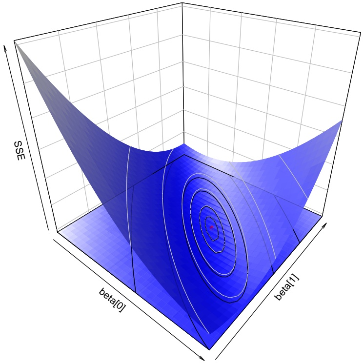

Figure 10.1: SSE as a function of β0 and $\beta _ { 1 }$

## 10.2 Gradient descent and gradient ascent

**Prerequisites:** Vectors and matrices, vector functions (Section 5.4 Vector argument functions and vector valued functions, page 281), gradient (Section 10.2.2 What is gradient, page 403).

Gradient descent (GD) and it’s mirror image gradient ascent (GA), is a popular method to find functions’ maxima and minima (collectively called optima). GD is widely used in various machine learning applications, it also serves as a basis for a large number of more complex optimization methods, such as Newton-Raphson.

Many machine learning methods compute the parameters by optimizing the loss function. This can be done easily only for very simple losses, practically only for linear regression. For all other methods we have to rely on numerical step-by-step approaches, such as GD.

## 10.2.1 The idea

Humans can easily spot the highest points on a graph with no additional tools. For instance, the function on Figure 10.2 clearly has three maxima, with the middle one being the tallest (global maximum). How do we see this? Humans understand the surface on the picture and make a mental 3-D model of it. And from the model we can immediately “see” where is the global maximum. This approach can be replicated on

<!-- page: 412 -->

computer too–one can calculate the function values over an x<sub>1</sub>-x<sub>2</sub> array, and just pick the maximum value there. Such approach, called grid search, is indeed quite widely used.

Humans can immediately see where is the maximum value on a graph. But this picture is deceiving, because it is only possible for 1-D and 2-D functions.

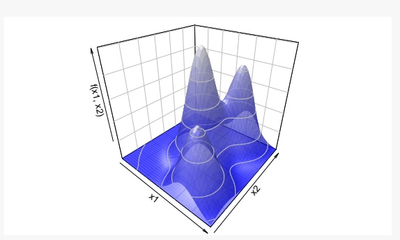

Figure 10.2: 2-D function with multiple maxima

But unfortunately, grid search is very limited, both for computers and for humans. Most importantly, humans can “see” the maximum for only 1-D or 2-D functions. Add another dimension to the problem, and we cannot visualize the function any more. And hence we cannot spot the maximum either. For computers, the problem with grid search is less severe, but still severe enough. Computers can compute the values over a grid of arbitrary dimension, but it will be exponentially slower. For instance, the function values in Figure 10.2 are currently calculated on a 2-D 47 × 47 grid containing 47<sup>2</sup> = 2209 individual values. If the function included three different x-s instead of two, the grid were to contain $4 7 ^ { 3 }   =   1 0 3 { , } 8 2 3$ grid points. Add a few more dimensions and such a grid will be infeasible to compute. We need a different approach.

In fact, humans cannot always see where is the highest point even on a 2-D surface. An example of such case are “whiteout” conditions, thick fog on snow that is fairly common in mountains. Although the weather is not dark, it is impossible to see further than a few steps ahead of you because both snow and sky just white. But even in such conditions, it is fairly easy to walk to the top of the mountain–you just walk up, toward the steepest ascent, until the surface flattens out. Now you have reached the top. This is exactly the idea of gradient ascent.

The idea of gradient ascent is the same. If you want to maximize a function f(β) you just compute the gradient (this is the direction of the steepest ascent), and take a step in that direction. Thereafter you re-compute the gradient (find which way to go next–which is the new steepest direction uphill), and take the next step. You’ll stop when gradient is close to zero (the ground flattens out). A step-by-step algorithm might look like:

1. Start somewhere (the initial parameter x<sub>0</sub>)

2. Find in which way the ground rises (calculate gradient ∇f(x)).

<!-- page: 413 -->

Figure 10.3: Hiker setting up the tent in whiteout conditions. While the immediate surroundings are easily visible, it is impossible to understand whether the ground is going up or down in the background. OT at Sahale Arm, North Cascades $N a -$ tional Park, 2019.


3. Make a step in that direction (compute $\pmb { \beta } _ { 1 } = \pmb { x } _ { 0 } + \lambda \cdot \nabla f ( \pmb { x } ) )$

4. Repeat 2-4 until the ground flattens out (until gradient is close to 0).

Figure 10.4 shows an example of the algorithm at work, using the same three-peaked function of Figure 10.2. But before we discuss the algoritm any further, let’s explain what is gradient.

Figure 10.4: The idea of gradient ascent. Start somewhere (at the initial point $\pmb { x } _ { 0 } )$ . Compute the gradient and take a step in that direction. This will lead you to the next parameter value x1. Repeat the procedulre until the gradient gets close to 0. This is the maximum x∗.

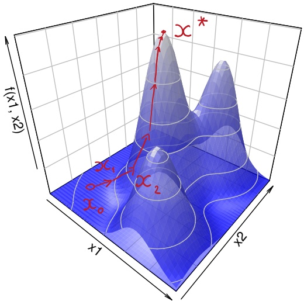

## 10.2.2 What is gradient

**Prerequisites:** Calculus, and a basic understanding of multivariate calculus

## Gradient is a vector of derivatives

Gradient is generalization of derivative for functions on R<sup>n</sup>. While the derivative describes the slope of the function in 1-dimensional case, gradient indicates both the slopes (along different axes) and the direction of the steepest ascent for functions of

<!-- page: 414 -->

n variables (functions on R<sup>n</sup>). Below, we only look at the scalar functions $\mathbb { R } ^ { n } \to \mathbb { R }$ i.e. the function take an n-dimensional input but return a scalar value.

Perhaps the easiest way to understand this is to imagine a hilly landscape. Elevation is a function $\mathbb { R } ^ { 2 } \rightarrow \mathbb { R } ;$ from two inputs (geographic coordinates) to a single number (elevation). Gradient tells at which rate the ground rises, and which in which direction is the steepest uphill.

Let us take a simple example

$\pmb { x } = \left( x _ { 1 } , x _ { 2 } \right) ^ { \mathsf { T } }$ means x is a column vector $\boldsymbol{x} = \begin{pmatrix} x_{1} \\ x_{2} \end{pmatrix}$

Figure 10.5: $f(x_{1},x_{2}) =$ $\mathrm{e}^{- \left( 3x_{1}^{2} + x_{2}^{2} \right)}$ as function of $x _ { 1 }$ and $x _ { 2 } .$ . The level sets, contours of equal values, are marked both on the surface and at the bottom of the figure box.

$$
f (\pmb {x}) \equiv f (x _ {1}, x _ {2}) = \mathrm{e} ^ {- (3 x _ {1} ^ {2} + x _ {2} ^ {2})}\tag{10.2.1}
$$

where x is the 2-dimensional input vector $\left( x _ { 1 } , x _ { 2 } \right) ^ { \mathsf { T } }$ Two-parameter functions can easily be visualized as surfaces, $f ( x )$ is depicted in Figure 10.5.

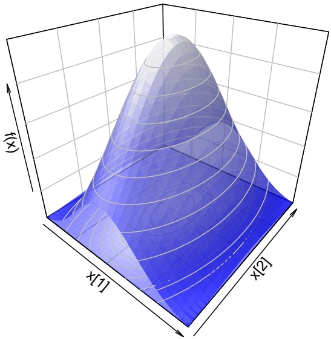

For this function, the partial derivatives are

$$
\frac {\partial}{\partial x _ {1}} f (\pmb {x}) = - 6 x _ {1} \mathrm{e} ^ {- (3 x _ {1} ^ {2} + x _ {2} ^ {2})}\tag{10.2.2}
$$

$$
\frac {\partial}{\partial x _ {2}} f (\pmb {x}) = - 2 x _ {2} \mathrm{e} ^ {- (3 x _ {1} ^ {2} + x _ {2} ^ {2})}.\tag{10.2.3}
$$

In a way, gradient, commonly denoted by $\nabla f ( { \pmb x } )$ or sometimes $\partial f ( { \pmb x } ) / \partial { \pmb x }$ , is just a compact way to write this in vector form:

$$
\nabla f (\boldsymbol {x}) = \binom{- 6 x _ {1} \mathrm{e} ^ {- (3 x _ {1} ^ {2} + x _ {2} ^ {2})}}{- 2 x _ {2} \mathrm{e} ^ {- (3 x _ {1} ^ {2} + x _ {2} ^ {2})}}.\tag{10.2.4}
$$

This is a $2 \times 1$ vector. So gradient is just a habit to stack the partial derivatives into a vector.

<!-- page: 415 -->

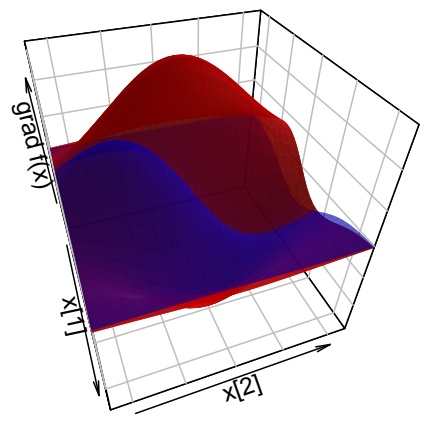

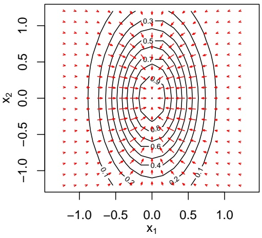

Figure 10.6: Two ways to visualize gradient. Gradient of $f ( x )$ , depicted as two surfaces (left panel). The red surface corresponds to $\begin{array} { r } { \frac { \partial } { \partial x _ { 1 } } f ( \pmb { x } ) = - 6 x _ { 1 } ^ { 2 } \mathrm { e } ^ { - ( 3 x _ { 1 } ^ { 2 } + x _ { 2 } ^ { 2 } ) } } \end{array}$ , the blue surface to $\begin{array} { r } { \frac { \partial } { \partial x _ { 2 } } f ( \pmb { x } ) = - 2 x _ { 2 } ^ { 2 } \mathrm { e } ^ { - ( 3 x _ { 1 } ^ { 2 } + x _ { 2 } ^ { 2 } ) } } \end{array}$ . The right panel depicts the gradient as arrows and the levels (contours) of the function. The length of the arrows is proportional to the gradient length, their direction is equal to the gradient direction. One can easily see that the norm of gradient is proportional to the steepness of the function surface, and gradient points to the direction of the steepest climb.

Compared to the function itself, the gradient is harder to visualize as here it has two values (it’s range is in $\mathbb { R } ^ { 2 } )$ . Figure 10.6 shows two options for visualizing $\nabla f ( { \pmb x } )$ In case of functions of n-dimensional arguments, $\mathbb { R } ^ { n } \to \mathbb { R }$ , we have n partial derivatives $\begin{array} { r } { \frac { \partial } { \partial x _ { 1 } } f ( \pmb { x } ) ,   \frac { \partial } { \partial x _ { 2 } } f ( \pmb { x } ) ,   . . . \frac { \partial } { \partial x _ { n } } f ( \pmb { x } ) } \end{array}$ and we stack these into the gradient as

$$
\nabla f (\boldsymbol {x}) = \left( \begin{array}{c} \frac {\partial}{\partial x _ {1}} f (\boldsymbol {x}) \\ \frac {\partial}{\partial x _ {2}} f (\boldsymbol {x}) \\ \dots \\ \frac {\partial}{\partial x _ {n}} f (\boldsymbol {x}) \end{array} \right)\tag{10.2.5}
$$

so the gradient is $n \times 1$ vector. Note that gradient is a function too, although not a scalar valued one but a vector valued function $\mathbb { R } ^ { n }   \rightarrow   \mathbb { R } ^ { n }$ : it associates each ndimensional argument value x to a n-dimensional vector $\nabla f ( { \pmb x } )$ . This is analogous with the derivative in one-dimensional case $\mathbb { R } \to \mathbb { R }$ , that one is also an one-dimensional function R → R. Unfortunately, it is almost impossible to visualize gradient beyond two dimensions.

While gradient itself is a function, when we calculate its value for any particular argument of x, the result will be a vector (not function). This is exactly the same as the ordinary derivative–it is a function, but when calculated at a particular x value it is a number. A function’s value is not a function.

As an example, let’s take the function $f ( x )$ we defined above and let’s calculate

<!-- page: 416 -->

it’s value, and it’s gradient’s value at $\pmb { x } = ( 0 . 5 , 1 ) ^ { \prime }$

$$
f (\boldsymbol {x}) | _ {\boldsymbol {x} = (0. 5, 1) ^ {\top}} = \mathrm{e} ^ {- (3 \cdot 0. 5 ^ {2} + 1 ^ {2})} = \mathrm{e} ^ {- 1. 7 5} \approx 0. 1 7 4.\tag{10.2.6}
$$

One rarely uses such a long notation, almost all texts write it as $f ( ( 0 . 5 , 1 ) ^ { \mathsf { T } } )$ , or just $f ( 0 . 5 , 1 )$ instead. Gradient works in a very similar way. It’s value at $\left( 0 . 5 , 1 \right) ^ { \mathsf { T } }$ can be written as

$$
\nabla g (\boldsymbol {x}) | _ {\boldsymbol {x} = (0. 5, 1) ^ {\top}} = \binom{- 6 x _ {1} \mathrm{e} ^ {- (3 x _ {1} ^ {2} + x _ {2} ^ {2})}}{- 2 x _ {2} \mathrm{e} ^ {- (3 x _ {1} ^ {2} + x _ {2} ^ {2})}} _ {\boldsymbol {x} = (0. 5, 1) ^ {\top}} \approx \binom{- 0. 5 2 1}{- 0. 3 4 8}.\tag{10.2.7}
$$

As before, this value is often written in shorter but imprecise way as

$$
\nabla f \binom{0. 5}{1}.\tag{10.2.8}
$$

It is imprecise because $f \left( \begin{matrix} { 0 . 5 } \\ { 1 } \end{matrix} \right)$ is a constant, 0.174, and gradient of a constant is always 0. So this notation must be understood that first you compute the gradient of $f ( \cdot )$ (this is a vector function), and thereafter you compute gradients value at $\left( 0 . 5 , 1 \right) ^ { \mathsf { T } }$

However, it appears gradient is much more than a handy way to write a number of derivatives in a compact form. It naturally generalizes a number of properties of 1-dimensional derivatives.

## Exercise 10.1: Compute gradient

Consider a function $f : \mathbb { R } ^ { 2 } \rightarrow \mathbb { R } ,   f ( { \pmb x } ) = \mathrm { e } ^ { - { \pmb x } ^ { \intercal } \cdot { \pmb x } }$ where $\pmb { x } ^ { \intercal } = ( x _ { 1 } , x _ { 2 } )$

1. Express this function without vector notation, as $f ( x _ { 1 } , x _ { 2 } )$

2. Compute its gradient (as a function $\nabla f : \mathbb { R } ^ { 2 } \rightarrow \mathbb { R } ^ { 2 } )$ Try to convert the gradient back to a vector function, as $\nabla f ( { \pmb x } )$ not as $\nabla f ( x _ { 1 } , x _ { 2 } )$ (This is useful for coding.)

3. Compute the gradient value at $\boldsymbol{x}_{1}=(0,1)^{^{\mathsf{T}}}, \boldsymbol{x}_{2}=(1,0)^{^{\mathsf{T}}}$ and $\pmb { x } _ { 3 } = \left( 1 , 1 \right) ^ { \mathsf { T } }$

4. Sketch these thee gradient values on a figure, similar to Figure 10.6, at right.

Solution on page 520.

## Gradient and Direction of Steepest Ascent

As components of gradient are just ordinary partial derivatives, each component indicates the slope of the function along that axis: how much will the function value grow if we move along the axis, while keeping the location on the other axes constant. If one component is large and another is small, we have a steep hill in the first direction while it is pretty flat along the other axis.

Let’s look at linear functions, simple even surfaces with no curvature whatsoever. A linear function may look something like the planes depicted on Figure 10.7. If the

<!-- page: 417 -->

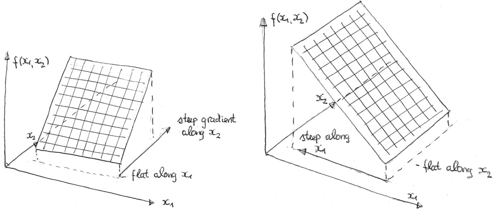

Figure 10.7: A linear function increasing along x2 while constant along $x _ { 1 } ~ ( l e f t ) ;$ and another falling in x1 while constant along $x _ { 2 }$ . The arrows show the direction of the steepest ascent.

Figure 10.8: A linear function that is increasing both −x1 and x2. The direction of steepest climb is somewhere between these two gradient components.

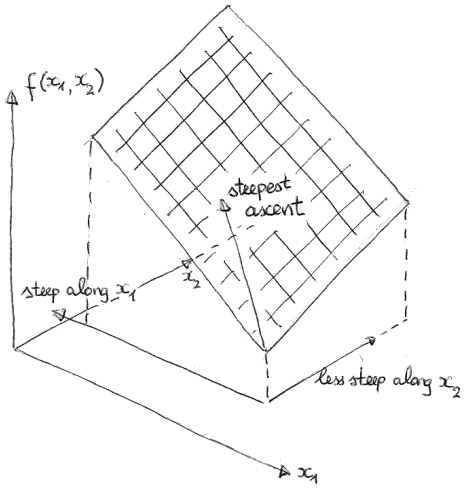

surface is rising rapidly along x<sub>2</sub> while staying constant along $x _ { 1 } ,$ the direction of fastest climb is just along $x _ { 2 }$ (shown on the left panel). Analogously, if the function grows along $x _ { 1 }$ while staying flat along $x _ { 2 } .$ , we have to move along x<sub>1</sub>. This is depicted on the right panel–but note that here the first gradient component $\partial f ( \pmb { x } ) / \partial x _ { 1 }   <   0$ and hence we have to move toward smaller values of $x _ { 1 }$ if we want to climb uphill. Obviously, if none of the gradient components are zero, we have to move somewhere in-between of these two directions. This is shown on Figure 10.8. It is also intuitive that the “somewhere in-between” should be closer to the steeper gradient than to the smaller gradient component.

## Proof 3: Gradient points to the direction of the steepest ascent

Let’s choose a point $( x _ { 1 } , x _ { 2 } )$ where the function’s value is $f ( x _ { 1 } , x _ { 2 } )$ . Now move

<!-- page: 418 -->

away from this point by $( \Delta x _ { 1 } , \Delta x _ { 2 } )$ This causes the function to grow by

$$
\Delta f \equiv f (x _ {1} + \Delta x _ {1}, x _ {2} + \Delta x _ {2}) - f (x _ {1}, x _ {2}) \approx g _ {1} \cdot \Delta x _ {1} + g _ {2} \cdot \Delta x _ {2}\tag{10.2.9}
$$

where $g _ { 1 }$ and $g _ { 2 }$ are the corresponding gradient components, calculated at $( x _ { 1 } , x _ { 2 } )$ Assume w<u>e move</u> by the step length 1, i.e. $\Delta x _ { 1 } ^ { 2 } + \Delta x _ { 2 } ^ { 2 }   =   1$ or alternatively $\Delta x _ { 2 } = \sqrt { 1 - \Delta x _ { 1 } ^ { 2 } }$ Hence the growth $\Delta f ( 1 0 . 2 . 9 )$ can be written as

$$
\Delta f \approx g _ {1} \cdot \Delta x _ {1} + g _ {2} \cdot \sqrt {1 - \Delta x _ {1} ^ {2}}.\tag{10.2.10}
$$

Which $\Delta x _ { 1 }$ results in the largest value of $\Delta f ?$ The optimality condition gives us

$$
\frac {\partial}{\partial \Delta x _ {1}} \Delta f = g _ {1} + g _ {2} \frac {- 2 \Delta x _ {1}}{2 \sqrt {1 - \Delta x _ {1} ^ {2}}} = g _ {1} - g _ {2} \frac {\Delta x _ {1}}{\Delta x _ {2}} = 0\tag{10.2.11}
$$

(here we used the fact that $\sqrt { 1 - \Delta x _ { 1 } ^ { 2 } } = \Delta x _ { 2 } )$ The solution is

$$
\frac {\Delta x _ {1}}{\Delta x _ {2}} = \frac {g _ {1}}{g _ {2}}.\tag{10.2.12}
$$

In other words, this means that the direction vector $( \Delta _ { x 1 } , \Delta x _ { 2 } )$ must be parallel to the gradient vector $( g _ { 1 } , g _ { 2 } )$

## 10.2.3 How to use gradient for hill climbing

The idea of gradient ascent is the same as when climbing a hill in the whiteout conditions. The ground is white, the sky is white, and you cannot see which way is up, which way down. How will you get to the top of the hill? Using gradient ascent! You start wherever you are (this is the initial parameter $x ^ { 0 }$ below). You feel which way the ground is rising (this is the gradient). Now you take a careful step in that direction. You are at a new location (this is your parameter vector $\pmb { x } ^ { 1 } )$ . You repeat the process until you have reached flat ground. This is the hilltop.

In practice, it is very common to climb downhill (find the minimum) instead of uphill. This is done in almost exactly the same way, except that you take the step down–in the opposite direction of the gradient.

More formally, the algorithm is as follows (see Figure 10.9):

1. Start with an initial guess $x ^ { 0 }$ of the location of the maximum.

Note: I use superscript 0 the initial vector, it’s components are denoted by subscripts, e.g. in the two-dimensional case $\dot { \pmb { x } ^ { 0 } } = \bar { ( x _ { 1 } ^ { 0 } , x _ { 2 } ^ { 0 } ) } ^ { \top }$

2. Compute the gradient $\nabla f ( \pmb { x } ^ { \mathbf { 0 } } )$

3. Take a step in the direction of the gradient (or in the opposite direction if going downhill). This leads to a new location $\stackrel { \cdot } { \pmb { x } ^ { 1 } = \pmb { x } ^ { 0 } } + \boldsymbol { R } \cdotp \nabla f ( \pmb { x } ^ { \pmb { 0 } } )$ . Scalar R, learning rate, determines the length of the step. As the gradient is pointing uphill, the function value at $x ^ { 1 }$ is larger than at $x ^ { 0 }$

<!-- page: 419 -->

Figure 10.9: One step of Gradient Ascent: the general idea. We start from an initial guess $\pmb { x } ^ { 0 }$ and take a step along the gradient. This moves us uphill to $\pmb { x } ^ { 1 }$ The function $f ( x )$ is depicted by the surface overlied by (rather circular) level sets.

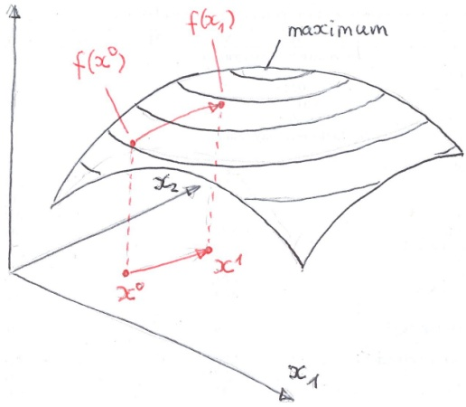

4. Repeat the process choosing $x ^ { 1 }$ as the starting point. This gives you the next approximation $x ^ { 2 }$

5. Repeat until gradient is close to zero and the function value does not improve any more.

**Example 10.1: A single step of gradient ascent: a numerical example**

Let’s use the same function (10.2.1) as in Section 10.2.2:

$$
f (\boldsymbol {x}) = \mathrm{e} ^ {- \boldsymbol {x} ^ {\top} \mathsf {A} \boldsymbol {x}} = \mathrm{e} ^ {- (3 x _ {1} ^ {2} + x _ {2} ^ {2})},
$$

given $\mathsf { A }   =   \begin{pmatrix} 3 & 0 \\ 0 & 1 \end{pmatrix}$ It is visualized on Figure 10.5, its gradient (visualized in Figure 10.6) is given by (10.2.4):

$$
\nabla f (\boldsymbol {x}) = \binom{- 6 x _ {1} \mathrm{e} ^ {- (3 x _ {1} ^ {2} + x _ {2} ^ {2})}}{- 2 x _ {2} \mathrm{e} ^ {- (3 x _ {1} ^ {2} + x _ {2} ^ {2})}} = - 2 \boldsymbol {x} f (\boldsymbol {x}).
$$

Now the algorithm.

1. Pick a starting point. We know that its maximum is at $( 0 { , } 0 )$ , so let’s pick another location–otherwise there is nothing to calculate. Let’s pick $\bar { \pmb { x } } ^ { 0 }   =   \left( 0 . 5 , 1 \right) ^ { \mathsf { T } }$ as in Section 10.2.2. The function value at that point is 0.174.

2. Above (see (10.2.7)), we found that its gradient is

$$
\left. \nabla g (\boldsymbol {x}) \right| _ {\boldsymbol {x} = (0. 5, 1) ^ {\top}} \approx \binom{- 0. 5 2 1}{- 0. 3 4 8}
$$

3. Now take a step from $x ^ { 0 }$ in the direction of the gradient. But first we have to decide how long the step should be–to choose the learning rate R. Let’s

<!-- page: 420 -->

pick R = 1. Now we have

$$
\begin{array}{r l} \boldsymbol {x} ^ {1} = \boldsymbol {x} ^ {0} + R \cdot \nabla f (\boldsymbol {x} ^ {1}) = & \\ = (0. 5, 1) ^ {\top} + 1 \cdot (- 0. 5 2 1, - 0. 3 4 8) ^ {\top} = (- 0. 0 2 1, 0. 0. 6 5 2) ^ {\top} \end{array}\tag{10.2.13}
$$

The new function value is $f((-0.021,-0.652)^{^{\top}})=0.652$ Indeed, we moved uphill.

4. Now we can repeat the process by taking $x ^ { 1 }$ instead of $x ^ { 0 }$ , computing the gradient, taking the next step, and continuing until we reach a flat point– the maximum.

Figure 10.10: One step of Gradient Ascent for $f(\boldsymbol{x}) = \mathrm{e}^{-(3x_1^2 + x_2^2)}$ . At the initial point $\pmb { x } ^ { 0 } = \left( 0 . 5 , 1 \right) ^ { \mathsf { T } }$ , the gradient $\left( - 0 . 5 2 1 , - 0 . 3 4 8 ) \right) ^ { \mathsf { T } }$ points bottom-left. We move in that direction by the amount (learning rate) $R = 1$ This leads us to $\left( - 0 . 0 2 1 , 0 . 6 5 2 \right) ^ { \mathsf { T } }$ , our next approximation for the maximum.

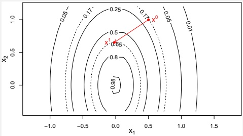

This particular example is illustrated on Figure 10.10 by a contour plot. At $x ^ { 0 }$ the gradient points toward bottom-left.

Now let’s describe the algorithm in more detail for the general n dimensional case.

1. Pick an initial value of the parameter $\pmb { x } ^ { 0 } = ( x _ { 1 } ^ { 0 } , x _ { 2 } ^ { 0 } , \dots , x _ { n } ^ { 0 } ) ^ { \prime }$ . It is always good idea to choose parameters as close to the actual maximum as you can as this may have a huge impact on speed, and the algorithm can even fail to find the optimum if you happen to pick an unfortunate starting point. Often though you have little guidance about how to choose good starting values, and random numbers are frequently used to initialize the parameters of more complex models.

2. Compute the gradient of your objective function $\nabla f ( x )$ at ${ \pmb x } = { \pmb x } ^ { 0 }$ . You want to have the gradient calculated, coded, and thereafter calculated. But computing and coding the gradient may be quite complicated, and often people resort on numeric gradients. Those are typically slower and less precise, but may be preferable if the calculations and coding takes too much time otherwise. It is also possible to use software that can automatically compute gradient using compute graphs.

3. Take a step from $x ^ { 0 }$ in the gradient direction. The step should be neither too long (you may overshoot and land on the other side of the hill) nor too short (it takes very long time to find the maximum). So we employ the learning rate R and take the step of length $R \cdot \nabla f ( { \pmb x } ) | _ { { \pmb x } = { \pmb x } ^ { 0 } }$ . This will land you in a new place

<!-- page: 421 -->

we call $x ^ { 1 }$

$$
\boldsymbol {x} ^ {1} = \boldsymbol {x} ^ {0} + R \cdot \nabla f (\boldsymbol {x}) | _ {\boldsymbol {x} = \boldsymbol {x} ^ {0}}\tag{10.2.14}
$$

This is our new best bet for the location of maximum. It is probably far from the actual maximum, but unless your learning rate is too large (or the function is constant at ${ \pmb x } ^ { 0 } )$ , it is a better place than $x ^ { 0 }$

Note: This is the only difference between GA and GD algorithms. If we want to move downhill, we have to take a step to the direction of the steepest descent, i.e. a step to the opposite to the gradient, and hence the updating rule is $\pmb { x } ^ { 1 } = \pmb { x } ^ { 0 } - R \cdot \nabla f ( \pmb { x } ) | _ { \pmb { x } = \pmb { x } ^ { 0 } }$

Choice of a good R value is important. This is a hyperparameter of your model. Unlike many other hyperparameters, such as choice of k for k-nearest neighbors, this one should not affect your final results, just the speed of convergence, and it may determine if your model will converge in the first place. But in complex models with many local optima, different learning rate may lead to a different solution.

4. Are we in the correct place? You recognize the top of the mountain by the fact that the ground is flat there–and flat means the gradient is very small. Say, $| | \nabla f ( \pmb { x } ^ { 1 } ) | |   <   \epsilon ^ { g } ,$ where $| | \cdot | |$ is norm (length) of the vector, and $\epsilon ^ { g }$ is a small number, say $1 0 ^ { - 6 }$ . Small gradient indicates that the function is flat at that point, and hence we are likely at a maximum or minimum.

Such conditions are called stopping criteria. In practice, you always need an additional, bail-out criterion: stop if the process has been repeated too many times already. This is because we too often choose too small learning rate, run into numerical problems, or have coding errors.

5. If we are in correct place, stop here. If not, set $\pmb { x } ^ { 0 } \gets \pmb { x } ^ { 1 }$ and repeat from step 2.

Finally, another note about Gradient Ascent and Gradient Descent. The GD algorithm is almost exactly the same as GA. The only exception is that you have to take the step toward steepest descent, not steepest ascent. There are two easy ways to turn the GA problem into a GD problem or the way around:

1. flip the sign of your objective function: instead of minimizing $f ( x )$ , maximize $- f ( x )$

2. use negative learning rate R–this will also reverse the step in (10.2.14).

<!-- page: 422 -->

## 10.2.4 Problems with gradient ascent

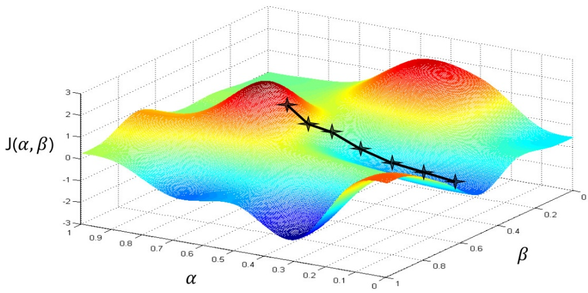

Convexity Function f(x) is convex iff:

$$
\forall \boldsymbol {x} _ {1}, \boldsymbol {x} _ {2}, \quad t \in (0, 1)
$$

$$
\begin{array}{r l} f (t \boldsymbol {x} _ {1} + (1 - t) \boldsymbol {x} _ {2}) <   & \\ & <   t f (\boldsymbol {x} _ {1}) + (1 - t) f (\boldsymbol {x} _ {2}) \end{array}
$$

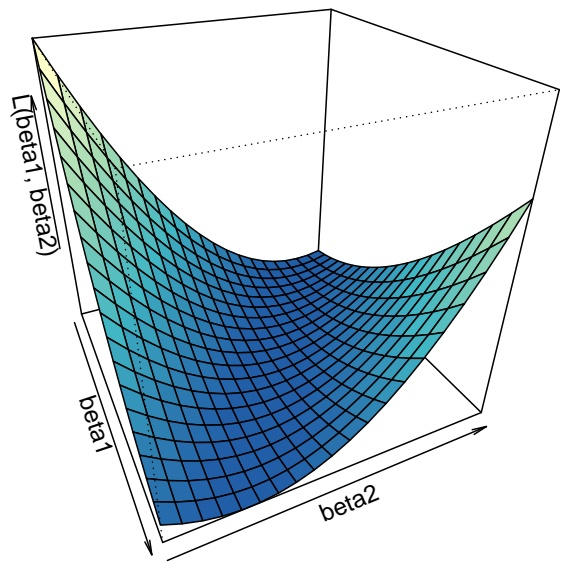

<!-- page: 423 -->

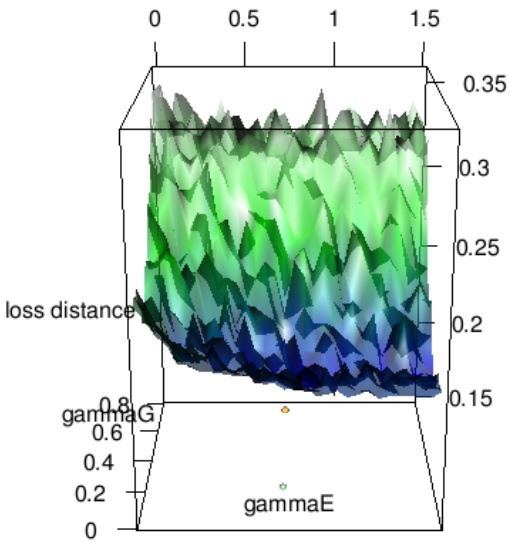

Noisy Objective Function

## 10.2.5 OLS Example

Linear Regression “Least Squares” means

$$
\min _ {\boldsymbol {\beta}} L (\boldsymbol {\beta}) = \sum_ {i} \left(\hat {y} _ {i} - y _ {i}\right) ^ {2}
$$

where

$$
\hat {y} _ {i} = \hat {\boldsymbol {\beta}} ^ {\prime} \boldsymbol {x} _ {i}
$$

• find $\beta$ that minimizes $L ( \beta )$

– $L$ is “loss function” (objective function, cost function) – how?

Example: Predict September Arctic Sea Ice by March Extent Trial-and-Error Exercise

(Grid Search)

• OLS model $y _ { i } = \beta x _ { i } + \epsilon _ { i }$

• Use the data at right

• Find the optimal $\beta$

– Calculate L(0), L(0.5), L(1), L(1.5), L(2).

<!-- page: 424 -->

• Plot $L ( \beta )$ versus $\beta$

data:

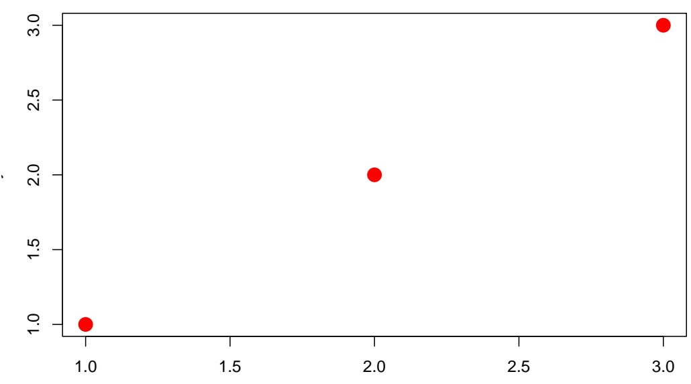

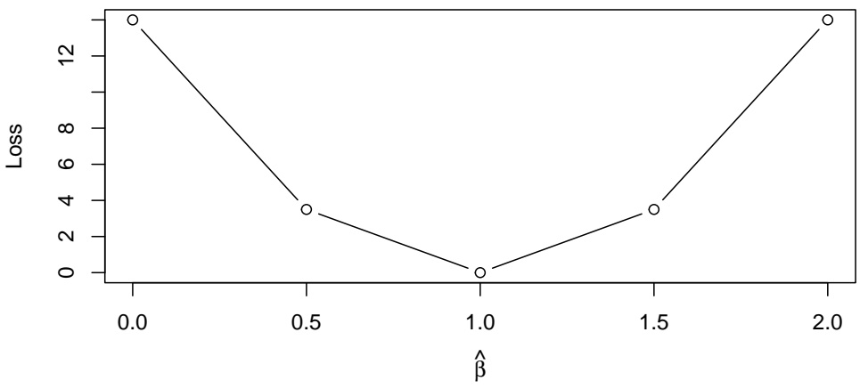

L(β)

<!-- page: 425 -->

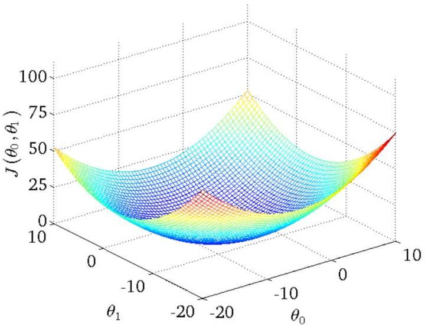

2D Case TBD: SGD

<!-- page: 426 -->

## 10.3 Feature Selection and Regularization

## 10.3.1 Why do we need to select features?

In applied analysis it is quite common to have datasets with a large number of features. But often we have little knowledge about their quality–some of those may be very useful, others may be completely useless, while a large number of features may be highly correlated. For instance, when using a large international survey data, such as World Value Survey, one may find the variable country is highly correlated with domestic language, with the language used to fill out the survey, religion, and the id of the interviewer. It may also be somewhat unexpectedly related to certain lifestyle questions, for instance, there are probably very few affirmative answers to the question “do you own a boat” in an arid landlocked area. Such closely correlated variables may cause various problems with data modeling. To name a few

• Large and unstable parameter values and large standard errors. This is mainly a problem for inferential modeling and may obscure the effects that you are interested in.

• Overfitting. This is how the same issue manifests in predictive modeling.

• Model does not converge, or converges into a sub-optimal solution. While linear regression (almost) always works well, more complex models are much more demanding in terms of data properties. Even if data look good globally, we may run into a trouble in a subset where the correlation is high.

In case of small well-documented datasets it may be possible to manually select the interesting features. But this approach does not scale to larger datasets where we have thousands of similar variables that we do not understand well. For instance, imagine analyzing urban movements using millions of cellphone calls, or doing sports analytics with thousands of datapoints about athletes’ movements. In such cases it is not obvious what to include or exclude in the model.

Feature selection is a method (or rather a set of different methods) that helps to include only the “best” features in the model. It is in some ways similar to regularization, a method that does not directly select features but manipulates the model parameters and may achieve a comparable effect.

Below is an artificial example with highly correlated features and a small number of cases (only 12). We generate one important feature x and 7 other highly correlated features:

$$
\begin{array}{l} \boldsymbol {x} _ {1} = \boldsymbol {x} + \boldsymbol {\epsilon} \\ \boldsymbol {x} _ {2} = \boldsymbol {x} + \boldsymbol {\epsilon} \\ \dots \end{array}
$$

where $\epsilon \sim _ { i . i . d } N ( 0 , 0 . 0 0 5 )$ . We generate the outcome y as ${ \pmb y }   =   x + u ,$ , where $u \sim$ $N ( 0 , 0 . 5 )$ . Thereafter we estimate a linear regression model in the form

$$
y _ {i} = \beta_ {0} + \beta_ {1} x _ {1 i} + \beta_ {2} x _ {2 i} + \dots + e _ {i}
$$

<!-- page: 427 -->

i.e. we model y using a number of highly correlated variables. Importantly, we keep the number of cases is very small. So all-in-all, the training data consists of 12 cases, 7 explanatory features and the intercept.

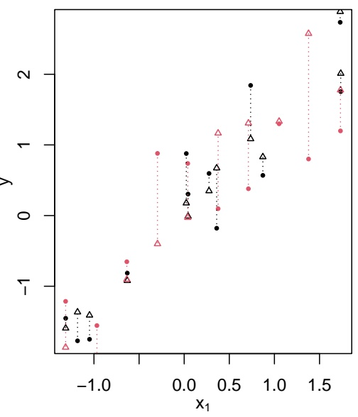

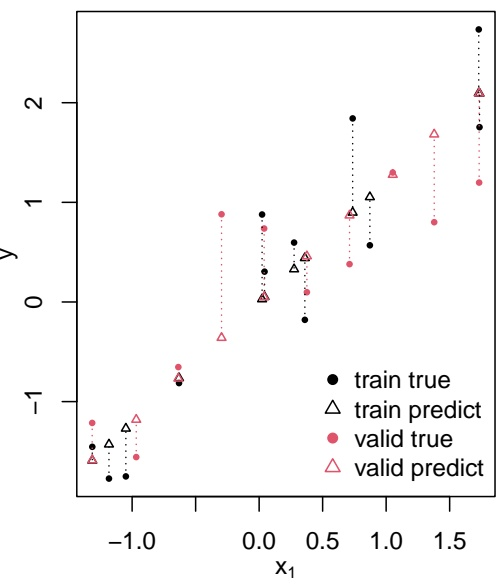

Figure 10.11: Ordinary linear regression (left panel) versus ridge regression (right panel). Solid dots represent data and empty triangles are predictions. Black is training and red is validation data. Linear regression make much more noisy predictions than regularized ridge regression. There are 6 other highly correlated features not visible in this figure.

Figure 10.11 shows the results. Solid black markers are the training data and red markers are the validation data; solid dots represent actual data and empty triangles are the corresponding predictions; the dotted lines between dots and triangles are the prediction errors. The left panel depicts the ordinary linear regression results. One can see that errors in training data are typically smaller than in the validation data (black dotted lines are shorter than the red dotted lines). The effect is larger for the validation data points that are far from the training data points. The fact that the model behaves much better on training data than on the validation data is also confirmed by the corresponding $R ^ { 2 }$ values, 0.899 and 0.087 respectively.

The right panel show results for a penalized ridge regression (see Section 10.3.3 Ridge regression, page 419). Ridge suppresses the noise from highly correlated variables and correctly finds that all predictors contain essentially the same information. Hence the predictions (triangles) form an almost perfect line on the figure. The corresponding $R ^ { 2 }$ values are 0.866 and 0.54, indicating that the ridge regression behaves much better on validation data. The unconstrained linear model captured mostly just noise, “straightjacketing” it with a penalty term forces it to focus on the signal instead.

<!-- page: 428 -->

## 10.3.2 Feature selection

This section discusses three ways to select the best combination of features.

## Best subset selection

The most obvious answer to the question of the “best” features is just to try all possible combinations, and pick the best one. Unfortunately, this approach rapidly gets computationally infeasible–if we have K features, we need to test $2 ^ { K }$ different models. Even more, such a huge search space may contain models that fit well the training and validation data just by chance, essentially causing overfitting.

## How to compare the models

## Forward selection

Assume you have a dataset with K features. You want to find the best combination of these features to predict y.

1. Create a baseline model $\mathcal { M } _ { 0 }$ that only contains the constant.

2. Loop $k = 0 , 1 , \ldots , K - 1$

(a) Take the model $\mathcal { M } _ { k }$ . Include one of the features that is not yet included to the model. Do this with all remaining $K - k$ features.

(b) Pick the best of the $K - k$ models you tried. This is your best k-feature model $\mathcal { M } _ { k }$

3. Now compare models $\mathcal { M } _ { 0 } , \mathcal { M } _ { 1 } , \ldots , \mathcal { M } _ { K }$ . Pick the best of these (see Section 10.3.2 How to compare the models, page 418). This is the best model by forward selection.

Below is the example using the same correlated data as in Section 10.3.1. The model $\mathcal { M } _ { 0 }$ contains only the constant:

$$
y _ {i} = \beta_ {0} + \epsilon_ {i}.\tag{10.3.1}
$$

The estimated $\beta _ { 0 }$ will be equal to the sample average $\bar { y } ^ { T }   =   0 . 2 2 6$ , where the superscript $T$ means that the average is computed on training data. Hence the model predicts the average value for every observation. It’s $R ^ { 2 }$ on validation data is -0.001. This forms our base model.

Next, we’ll add a single feature to the model and compute the corresponding (validation) $R ^ { 2 }$ . We’ll do it with every single feature, the best of these will give us the best one-feature model $\mathcal { M } _ { 1 }$

The best feature turns out to be $\# 2$ with the validation $R ^ { 2 } = 0 . 4 2 3 .$

Now we take all the leftover features, i.e. all features except $\# 2$ , and try all of those, one-by-one, to find our best 2-feature model. This turns out to be $\# 4$ with validation $R ^ { 2 } = 0 . 4 2 2$

We’ll continue this procedure–in the third round we’ll take all features except $\# 2$ and #4 and end up picking feature $\# 5$ with validation $R ^ { 2 } = 0 . 4 2 .$ , and so on.

<!-- page: 429 -->

orward selection: the best validading on the number of features in

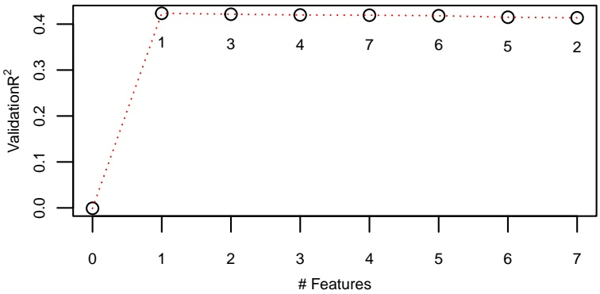

The validation $R ^ { 2 }$ of the best models depending on the number of features is shown in Figure 10.12. Here the overall best model contains a single feature only (plus the intercept). This is not surprising, as in the example all features contain essentially the same information

## Backward selection

## 10.3.3 Regularization

More complex models we use on large datasets are often very flexible. This flexibility may easily lead to enormous overfitting, and technical problems, such as lack of convergence.

Regularization is a simple way to force flexible models to be less flexible in order to improve their performance on unseen data. It can be done in various ways like

• by adding a penalty term to the objective function

• by using a Bayesian prior over the parameter values

• by terminating iterative optimization (such as stochastic gradient descent) early One can show that under certain assumptions, all these methods produce similar results.

## Ridge regression

The Problem

• We have many features

• All of them show some importance in our estimates – sort of

• How can we make the predictions more smooth?

• How can we remove the little-important features?

<!-- page: 430 -->

– Note: we don’t want to run the model on million subsets!

Penalized Least Squares Instead of minimizing

$$
\min _ {\boldsymbol {\beta}} (\boldsymbol {y} - \mathrm{X} \boldsymbol {\beta}) ^ {\prime} (\boldsymbol {y} - \mathrm{X} \boldsymbol {\beta})
$$

minimize

$$
\min _ {\boldsymbol {\beta}} (\boldsymbol {y} - \mathrm{X} \boldsymbol {\beta}) ^ {\prime} (\boldsymbol {y} - \mathrm{X} \boldsymbol {\beta}) + \lambda P (\boldsymbol {\beta})
$$

$P ( \beta )$ is the penalty term

• $\lambda$ is the penalty parameter (a hyperparameter)

– λ = 0 ⇒ we have OLS

Ridge Regression Ridge regression penalizes norm of $\beta$

• Penalty term:

$$
P = \boldsymbol {\beta} ^ {\prime} \mathsf {W} \boldsymbol {\beta} = | | \mathsf {W} ^ {1 / 2} \boldsymbol {\beta} | | _ {l _ {2}} ^ {2}
$$

• W are the weights

– takes care of input scale

– can put different weight on different features

– zero for the intercept

$$
W = \left( \begin{array}{c c c c} 0 & 0 & \dots & 0 \\ 0 & 1 & \dots & 0 \\ \vdots & \vdots & \ddots & \vdots \\ 0 & 0 & \dots & 1 \end{array} \right)\tag{10.3.2}
$$

Now in non-matrix form

$$
L (\boldsymbol {\beta}) = \lambda \sum_ {i = 1} ^ {n} \beta_ {j} ^ {2}
$$

Why Is Small $| | \beta | |$ Good?

• Ensures that similar X corresponds to similar $Y$

• Makes the linear model more similar to NN

Ridge: The Fine Print

• Why not penalize the intercept?

– because this is not really a parameter but the mean outcome level

• What about scaling features?

$\beta = 1$ if measured in millimeters, $\beta = 1 { , } 6 0 9 { , } 0 0 0$ in miles

– ⇒ standardize features!

<!-- page: 431 -->

$\cdots 0 \mathbf { T }$ use different weights

Centered Data

• Ridge Regression not invariant to scaling – standardize (and center) data

• We don’t want to penalize constant $\beta _ { 0 }$ – Solution should be invariant of y scale

• Estimate

$$
\beta_ {0} = \frac {1}{N} \sum_ {i} y _ {i}
$$

• Estimate $\beta _ { j } , j \geq 1$ by ridge regression without intercept

• If weights are equal, $W = 1$

Properties

• Ridge regression decreases parameter values

– Useful is highly correlated features in data

∗ $( \mathsf{X}' \mathsf{X} + \lambda \mathsf{W} )$ is not singular even if (X′X) is singular

– estimates of correlated predictors get more similar

∗ estimates of identical predictors equal

– Large coefficient values disregarded

– Decreases the random “bumpiness” of coefficients

• Coefficients remain non-zero

Coefficients vs λ

## Lasso regression

Lasso Regression Similar to Ridge but penalize $L _ { 1 }$ norm of $\beta ;$

$$
P (\boldsymbol {\beta}) = \sum_ {j = 1} ^ {p} | b _ {j} w _ {j} | = | | \mathsf {W} \boldsymbol {\beta} | | _ {l _ {1}}
$$

Note:

• You do not want to penalize intercept

Properties

• Non-linear model

<!-- page: 432 -->

– No closed form solution

– Use coordinate descent

• Pulls coefficients to (exactly!) zero (sparse solution)

– Picks one of the correlated features

In this way similar to best subset selection

Coefficients vs λ

Subset vs Ridge vs Lasso

Lasso vs Ridge

β-Module Penalties

Lasso vs Ridge As lasso gives sparse results, can be used for features selection Other Methods

• You can penalize different objective functions

$$
\max _ {\boldsymbol {\beta}} \mathcal {L} (\boldsymbol {\beta}) + \lambda P (\boldsymbol {\beta})
$$

• You can mix ridge and lasso (elastic net):

$$
\min _ {\boldsymbol {\beta}} (\boldsymbol {y} - \mathrm{X} \boldsymbol {\beta}) ^ {\prime} (\boldsymbol {y} - \mathrm{X} \boldsymbol {\beta}) + \lambda_ {2} | | \mathrm{W} ^ {1 / 2} \boldsymbol {\beta} ^ {\prime} | | _ {l _ {2}} ^ {2} + \lambda_ {1} | | \mathrm{W} \boldsymbol {\beta} ^ {\prime} | | _ {l _ {1}}
$$

Constrained optimization Lasso, Ridge equivalent to constrained optimization

$$
\min _ {\boldsymbol {\beta}} L (\boldsymbol {\beta}, \alpha , \mathsf {X})
$$

$$
\text {s.t.} \quad \lambda P (\boldsymbol {\beta}) \leq k
$$

• can work around local minima

• can avoid positive feedback loop

Data Augmentation Create new fake data with known category

• image classification: add shifted, rotated images

• add noise to data

Early stopping Stop gradient descent early, before reaching minimum

• Equivalent to regularization

• Easy and fast to do

<!-- page: 433 -->

# Chapter 11

## Unsupervised Learning

- Contents
- 11.1 Introduction ..... 423
- 11.2 Cluster Analysis ..... 424
- 11.2.1 Idea ..... 425
- 11.2.2 Cluster Analysis More Generally ..... 426
- 11.2.3 k-Means Clustering ..... 428
- 11.2.4 Hierarchical clustering ..... 432
- 11.2.5 Discriminant analysis ..... 432
- 11.3 Principal Component Analysis ..... 436
- 11.3.1 Motivation ..... 436
- 11.3.2 Principal Components: The Idea ..... 438
- 11.3.3 Explained Variance ..... 439
- 11.3.4 Data Rotation ..... 442
- 11.3.5 Principal Component Regression ..... 445
- 11.4 Comparison of Clustering and PCA ..... 449

## 11.1 Introduction

In the previous sections we were working with supervised learning. In case of supervised learning, our task is to predict outcome y based on features x. As we have labeled training data, we can tell the algorithm for each case how “far off” was the prediction from the true value. Later we use the trained model to do similar predictions on unlabeled data. As we have analyzed the prediction errors on training data, we have some confidence to assume the errors are similar on unknown data. Formally, our task is to estimate the function $f : X \to Y$ where X is the feature space and Y is the target space. A good result is such a function where the predicted value $\hat { y } = f ( x _ { i } )$ is close to the true value $y _ { i }$

<!-- page: 434 -->

Unsupervised learning is the case where we don’t know the “correct” labels y<sub>i</sub> and hence we cannot tell if our predictions are close or not to the true values. Even more, there is often no such things as true labels, cases can be categorized in many different ways and all of these may be correct in some sense.

Instead of trying to predict “correct” values that we do not know or that may even not exist, unsupervised learning is used to discover and exploit various traits in data. The common examples include:

• Cluster analysis: we group data into clusters, groups of cases that are reasonably similar to each other while being different from cases in other clusters. A small number of such clusters can thereafter be used as data simplification. We may use a single “representative” in each cluster instead of individual values and in this way to tremendously reduce the complexity of data.

For instance, the consumers can be categorized into a small number of clusters, and afterwards one may design a different marketing strategy for each cluster. It may be infeasible to have a large number of such strategies but unsupervised learning helps us to reduce the complexity to a manageable number.

• Principal component analysis: we analyze which kind of values tend to occur together in the data. This allows us to find certain combination of features, principal components, that carry most of the information. The principal components may give us novel insight into the problem, but it also allows to remove the less important traits and simplify the data in this way.

• Market basket analysis: as in PCA, we attempt to find values that tend to occur together. However, our task will be to construct claims like “consumers who bought x usually also buy y.

• Also usually not considered as unsupervised learning, various descriptive graphs and tables play a similar role. They help us to discover the traits in the data, their limits, and structure.

## 11.2 Cluster Analysis

**Prerequisites:** Metric distance, vector norm: Section 5.2.2 Norm and Distance, page 265

Cluster analysis is one of the most widely used unsupervised learning. It is a way to partition data points into a number of groups, “clusters”. We want the data in cluster to be similar in some sense while data in different clusters may differ. This typically serves as a tool for simplifying and understanding data, e.g. for designing a small number of manageable strategies, or just for understanding the main treats and processes we are encountering.

First we discuss the basic idea of cluster analysis and thereafter introduce perhaps the most popular clustering algorithm, k-means.

<!-- page: 435 -->

## 11.2.1 Idea

Cluster analysis attempts to find natural groupings in the data. As it is an unsupervised learning method, we do not normally provide it with any pre-defined grouping information. All this will be derived directly from data. This also applies to the number of clusters–we normally do not know what is the correct number. Even more, there may not be anything like the “correct number”, one can look at the data in different ways, just some of the approaches may be more insightful regarding the current problem. The key of deciding which observation goes to which cluster is similarity– observations in the same cluster should be more similar than observations in different clusters. There are many ways of deciding which cases are more similar, these are associated with different clustering methods.

Figure 11.1 displays and example 2-D dataset (left panel) and the result of the corresponding cluster analysis (right panel). This dataset is exceptionally well suited for cluster analysis, and we can immediately see that five clusters are just a right choise, with distance within clusters being very small compared to inter-cluster distance. Such luxury is usually not there, first data may not contain such well-defined clusters; and second, in higher dimensions one cannot visualize the data space in a similar fashion. We have to rely on mathematical methods when trying to analyze the value of the particular clusters.

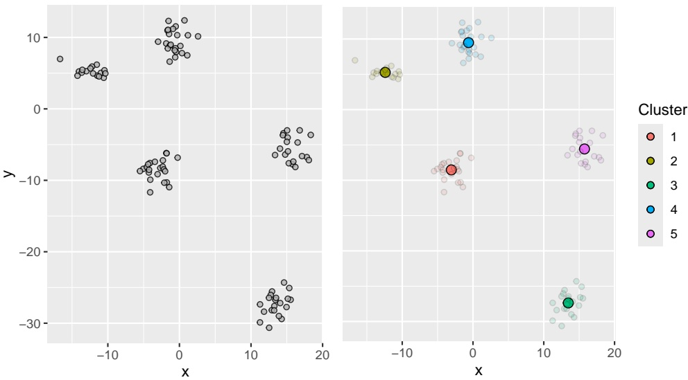

Figure 11.1: Original data (left) and cluster centers (right). This artificial dataset contains five clearly separated groups and hence it is exceptionally well suited for cluster analysis. The left panel shows the original data, the right panel the five cluster centers as computed by k-means. Colors denote which cluster each data point belongs to. Note that the ordering of clusters is different.

Clustering has many practical applications. Here are a few examples:

<!-- page: 436 -->

• Market segmentation. There are thousands of customers with many different interests and habits. But the marketing department cannot handle thousands of different strategies. We want to apply a small number of strategies only, and hence we need to partition customers into a small number of groups, “clusters”.

• Land use analysis in for urban planning. We want to compare land use of different cities, but the land is split into a tremendous number smaller lots, parks, streets, industrial areas, and so on. We may want to group cities into a small number of different “types” based on the land use.

• Biological classification. We combine similar organisms into “species”, similar species into “genera” and so on.

• Medical diagnosis. Different patients show a very large variety of symptoms. We may want to combine those symptoms into a small number of “types” (clusters). This allows to either prescribe a treatment, or maybe additional analyses for each cluster.

Sometimes we are interested in hierarchical clustering, i.e. not just clusters of data points but also of clusters of clusters.

All these examples are in some sense about simplifying and compressing data. Instead of looking at thousands of different individual cases, we replace this unfathomable diversity with a small number of different options (clusters). This may help to design a manageable number of strategies (like in case of marketing), or serve as a simplification for understanding the problem (as in case of biological classification).

## 11.2.2 Cluster Analysis More Generally

In order to split data into clusters we need four things: suitable data, distance metric, loss function, and an algorithm that can actually compute the clusters.

First, we obviously need data. In the Figure 11.1 aboce we imagine data as points on the 2-D x-y-plane, but in general these are in a high-dimensional space and cannot be easily visualized. Normally we imagine data in a form of a numeric design matrix but in certain cases it may also be in a different format. For instance, one can compute string distance between words, and in that case the data may be in the form of character strings.

Second, in order to measure similarity, we need something like distance metric (see Section 5.2.2 Metric distance, page 268). If the design matrix is numeric, we may rely on Euclidean or other $L _ { p }$ type metrics, but we may also carve out our own dedicated metric. For instance, when comparing portraits, we may want to design a metric that only looks at the faces and ignores the background. In case of more than a single feature, we also have to weight the features somehow, i.e. feature scaling matters (see Data-Driven Metrics in Section 6.2.1).

Third, we need a way to decide if a particular data point is a good fit for one or another cluster. We may do this by defining a per-cluster loss function L(C) where C is the cluster, a set of data points that belong to it. The loss function typically penalizes intra-cluster distance (dissimilarity) as we would prefer all member points to be close to each other (similar to each other).

Finally, we also want to compute the set set of clusters, not just the “badness” (loss) of the result. Hence we also need an algorithm that can find a good set of

<!-- page: 437 -->

clusters based on data, distance metric, and loss we selected above. The algorithm should consider different ways to put data into clusters $C _ { 1 } , C _ { 2 } , \ldots$ . and pick such an arrangement that produces minimal loss (it should minimize the loss function). Ideally it should find the smallest possible loss but if this is not feasible, a good enough solution may do. The algorithm should return the partition—which observations go to which cluster. Formally:

$$
\{C _ {1}, C _ {2}, \dots , C _ {K} \} = \arg \min _ {C _ {1}, C _ {2}, \dots , C _ {K}} \sum_ {k = 1} ^ {K} L (C _ {k}).
$$

Unfortunately, in typical problems there are way too many possibilities how to partition data into clusters, so it is in general not possible to find the best way. But there are many algorithms that work well enough.

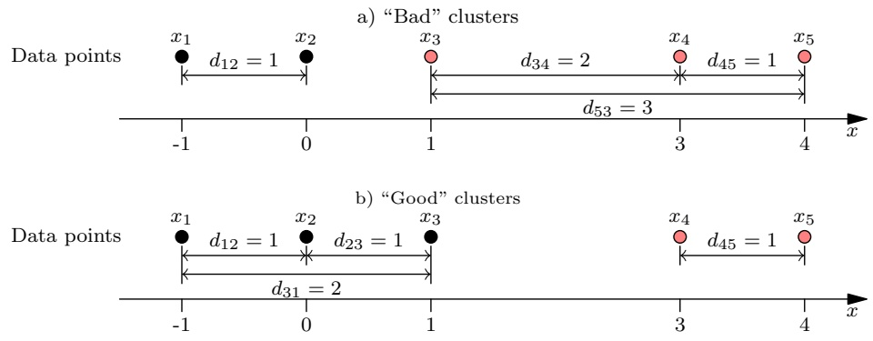

Figure 11.2: Two ways to partition data $x _ { 1 } , x _ { 2 } , \ldots , x _ { 5 }$ into clusters. The upper panel assigns $x _ { 3 }$ to the red cluster, and hence the intra-cluster distances in the red cluster are $1 , \; 2 ,$ and 3. This is more than in the good case (lower panel) where the black cluster contains intracluster distances 1, 1 and 2. A simple loss function that just adds the intra-cluster distances would prefer the good way over the bad way.

Figure 11.2 demonstrates two ways to partition five data points $x _ { 1 } , x _ { 2 } , \ldots { , } x _ { 5 }$ into two clusters in an 1-D case. These five dots are the data points. In 1-D case we can measure similarity as Euclidean distance, just as the (absolute value of the) difference between the data points. Third, we can compare the two clusters using a loss function. We can pick a loss function for cluster C as sum of intra-cluster squared distances:

$$
L (C) = \sum_ {i, j \in C} d _ {i j} ^ {2} = \sum_ {i, j \in C} | x _ {i} - x _ {j} | ^ {2}\tag{11.2.1}
$$

$( d _ { i j }$ is just distance between data points i and $j )$ . Now let’s compute the black and

<!-- page: 438 -->

red loss when partitioned in the “bad” way:

$$
\begin{array}{c} L (C _ {b l a c k}) = \sum_ {i, j \in \{1, 2 \}} d _ {i j} ^ {2} = d _ {1 2} ^ {2} + d _ {2 1} ^ {2} = 1 ^ {2} + 1 ^ {2} = 2 \\ L (C _ {r e d}) = \sum_ {i, j \in \{3, 4, 5 \}} d _ {i j} ^ {2} = d _ {3 4} ^ {2} + d _ {4 3} ^ {2} + d _ {4 5} ^ {2} + d _ {5 4} ^ {2} + d _ {5 3} ^ {2} + d _ {3 5} ^ {2} = \\ = 2 ^ {2} + 2 ^ {2} + 1 ^ {2} + 1 ^ {2} + 3 ^ {2} + 3 ^ {2} = 2 8 \end{array}\tag{11.2.2}
$$

(we defined the loss function in a way that we add both distance from i to $j$ and from $j$ to $i ,$ but we can drop one of these). We can conclude that the black cluster is pretty good (loss is 2) but the red cluster is worse (loss 28). The overal loss, $L ( \pmb { C } ) = L ( C _ { \mathit { b l a c k } } ) + L ( C _ { \mathit { r e d } } )$ , is 30. However, in the “good” case we have

$$
\begin{array}{c} L (C _ {b l a c k}) = \sum_ {i, j \in \{1, 2, 3 \}} d _ {i j} ^ {2} = d _ {1 2} ^ {2} + d _ {2 1} ^ {2} + d _ {2 3} ^ {2} + d _ {2 3} ^ {2} + d _ {3 1} ^ {2} + d _ {3 1} ^ {2} = \\ = 1 ^ {2} + 1 ^ {2} + 1 ^ {2} + 1 ^ {2} + 2 ^ {2} + 2 ^ {2} = 1 2 \\ L (C _ {r e d}) = \sum_ {i, j \in \{4, 5 \}} d _ {i j} ^ {2} = d _ {4 5} ^ {2} + d _ {5 4} ^ {2} = \\ = 1 ^ {2} + 1 ^ {2} = 2. \end{array}\tag{11.2.3}
$$

Now the red cluster is pretty good, and the black one is worse. But black cluster deteriorated less than the red cluster gained, and hence the overall loss improved from 30 to 14. It paid off to re-assign $x _ { 3 }$ from the red to the black cluster. The “good” partition results in smaller overall loss, and is accordingly a better way to split this data into clusters.

This example, to pick a loss function that computes sum of intra-cluster squared distances, is just one possible way to define clusters (this is the loss function that the popular k-means algorithm is based on). But there are very different ways to define clusters, e.g. based on maximum distance withing the cluster. In the 1-D case we analyzed, the distance metric does not play a role, but in more complex cases we always have to decide how to measure distance, and potentially we need experiment with different metrics to find the one that is best suited for the particular task.

## 11.2.3 k-Means Clustering

k-means is one of the simplest and most popular clustering algorithms. It is intuitive, fast, and always provides a solution, although the solution may sometimes be suboptimal. It is based on intra-cluster distance, similar to the example on Figure 11.2.

Now let’s take N-dimensional data points $\boldsymbol { x } _ { i } , i \in \{ 1 , \ldots ,   N \}$ Instead of just summing the squared distances as we did in in the example above, we now compute average of the squared distance as the loss function for cluster $C ;$

$$
L (C) = \frac {1}{| | C | |} \sum_ {i ^ {\prime}, i \in C} d _ {i j} ^ {2} = \frac {1}{| | C | |} \sum_ {i ^ {\prime}, i \in C} (\pmb {x} _ {i} - \pmb {x} _ {i ^ {\prime}}) ^ {\prime} (\pmb {x} _ {i} - \pmb {x} _ {i ^ {\prime}})
$$

<!-- page: 439 -->

where ||C|| is number of observations in the cluster (see Section 0.2, Sets). Hence the total loss

$$
\min _ {C _ {1}, C _ {2}, \dots C _ {k}} \sum_ {i = 1} ^ {k} \frac {1}{| | C _ {i} | |} \sum_ {j ^ {\prime}, j \in C _ {i}} (\boldsymbol {x} _ {j} - \boldsymbol {x} _ {j ^ {\prime}}) ^ {\prime} (\boldsymbol {x} _ {j} - \boldsymbol {x} _ {j ^ {\prime}})
$$

k-means partitions data into pre-speficied k clusters where cluster membership is mutually exclusive–each data point belongs to one and only one cluster. The cluster membership is determined based on the distance between the data point and cluster centers, and the algorithm repeatedly re-assigns the observations to the closest cluster, and thereafter re-computes the cluster centers. These two steps are computed repeatedly until it results in a stable partition–each observation belongs to its closest cluster. It may sound somewhat surprising that such a simple idea works very well, but in most cases it does.

Next, we explain the algorithm in more detail and provide an example.

## The k-means algorithm

1. Select the desired number of clusters, k. This must be decided before the algorithm starts.

2. Next, we need to find a centroid1for each of the k clusters. We can do this in various ways, for instance we can pick a random data point as the centroid for each of the clusters (just pay attention to that each cluster should get a different data vector as its centroid).

3. Now assign each actual data point to the cluster with the closest centroid. This immediately causes the cluster partition to clear up as more similar observations tend to fall into the same cluster. As a result we now know for each observation which cluster does it belong to.

Note that “closest” assumes we have decided for a distance metric, in case of k-means we normally use Euclidean distance.

4. Now we compute new cluster centroids by just averaging the data vector components for each cluster.

5. And now we just repeat from 3 until the partition converges, i.e. there are no more changes in the partition $\{ C _ { 1 } , C _ { 2 } , \ldots , C _ { K } \}$

The algorithm works surprisingly well and always produces a result. Figure 11.3 illustrates how the algorithm works in a simple case. However, sometimes the result may be suboptimal, so it is advisable to run the k-means algorithm several times with different random starting points.

TBD: k-means gets stuck, perhaps as an exercise

<small><span class="docvortex-page-footnote" data-block-type="page_footnote" style="color:#6b7280"><sup>1</sup>Centroid is similar to average or mean value, just in case of multi-dimensional objects (like data vectors) we call the average “centroid”. You can easily visualize it as the “middle point” of a point cloud.</span></small>

<!-- page: 440 -->

a

c

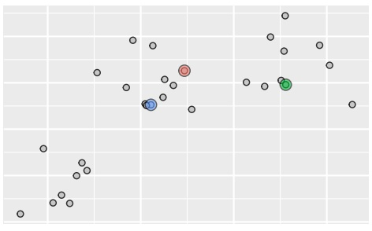

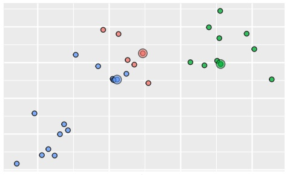

b

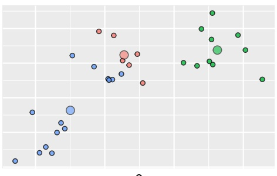

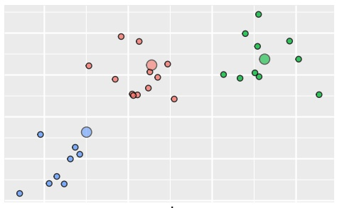

d

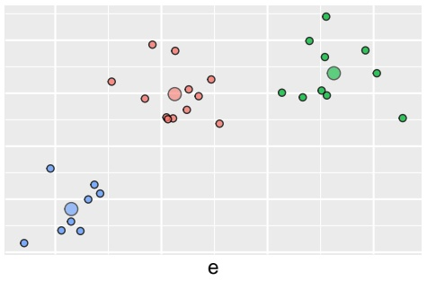

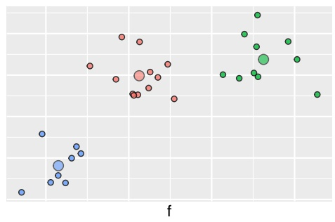

Figure 11.3: k-means algorithm at work. a) Data with no cluster information, the random data points are picked as cluster centers (denoted by color). b) All data points are allocated to the closest random cluster. Already at this stage, data starts to be separated into different clusters. c) Updated cluster centers: based on the previous image, the new cluster centers are centroids of the points that belong to the same cluster (have same color). d) Data point color updated according to the closest cluster center. Now all datapoints in the middle blob belong to a single cluster. e) One more update of cluster centers will position the red and blue cluster center in the middle of the respective clusters. f) Next update of clusters (colors) does not change anything. The process has converged.

<!-- page: 441 -->

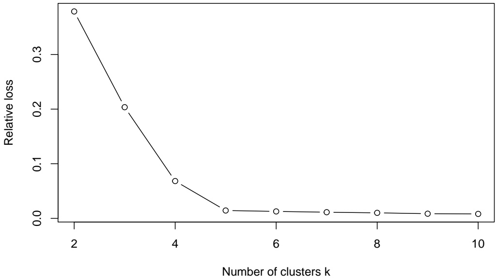

Figure 11.4: Elbow plot for the same data as used in Figure 11.1. The vertical axis denotes the relative loss, within-cluster loss as a percentage of total loss. On can see that at k = 5, the relative loss reaches essentially zero. This is the “elbow” of the plot and the best number of the clusters.

## Determining the number of clusters

k-means expects the user to provide the required number of clusters. This is easy in case we know enough about the underlying data structure, but sometimes we need more guidance from the algorithm itself. A popular way to find the “best” number of clusters is by using elbow plot. The idea of the elbow plot is the following: we allocate the data points to clusters by minimizing the sum of squared errors (or another loss function) within the clusters. In case we choose too few clusters, we have many mis-allocated points and hence the loss is large. But as soon as we pick the correct number of clusters, the loss should fall substantially. Increasing k even further will not substantially change the loss. So one expects to see a kink, the “elbow” on the plot at the correct value of k.

Figure 11.4 displays such a clear kink at k = 5. This is the same data as depicted on Figure 11.1. That artificial dataset is extremely well suited for cluster analysis. However, when we move to typical real datasets, the kinks may be much more vague, or completely missing. Figure 11.5 depicts a similar elbow plot for diamonds data. As the data (left panel) do not display any clear cluster structure, the relative loss on the elbow plot (right panel) keeps getting smaller even when we add clusters. The apparent kink at k = 3 does not correspond to any clearly distinct clusters (figures on the left panel). The clusters are probably not a useful way to think about this data.

<!-- page: 442 -->

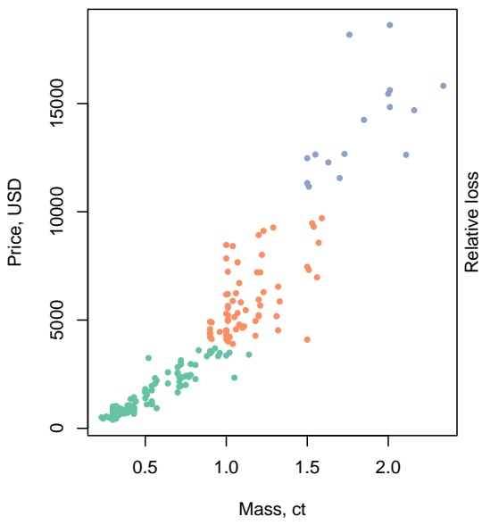

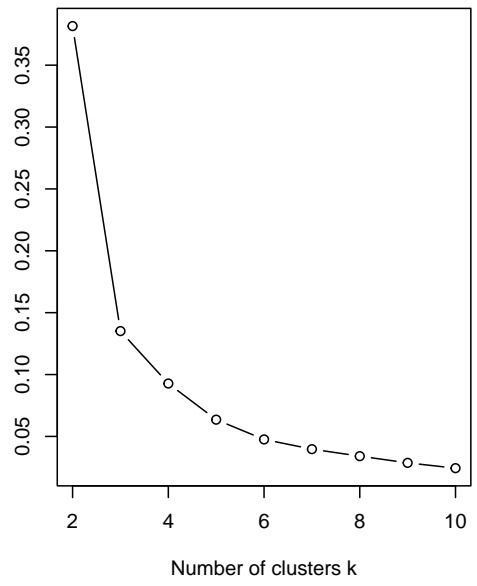

Figure 11.5: Elbow plot for diamonds data. The left panel depicts the diamonds data, the data points are colored according to the detected cluster id. The right panel shows the elbow plot, if anything it suggests k = 3 is the optimal number of clusters. However, as the left figure indicates, the detected clusters are rather indistinct. This data is not well suited for clustering.

## 11.2.4 Hierarchical clustering

k-means was an example of “top-down” clustering, where we started by splitting all data points into a given number of clusters. Hierarchical clustering contains methods that work from “bottom-up”, by connecting individual observations into pairs, and further into larger clusters. Such bottom-up methods are called agglomerative clustering, because they proceed by lumping more and more observations together into larger and larger clusters. The concept hiearchical, in turn, refers to the fact that the common agglomerative methods produce cluster hierarchy, smaller clusters inside larger clusters.

Next, we demonstrate hierarchical clustering using iris data (see Section Section B Iris, page 480). The left panel of Figure 11.7 shows a small subset of 10 observations. In order to visualize the results easily, we only use two features: sepal length and sepal width.

## 11.2.5 Discriminant analysis

The clustering algorithms we discussed above are based on proximity–some kind of distance between the data point and the other points in the dataset. Discriminant analysis takes quite a different point of departure: it builds certain mathematical models for different clusters, and afterwards checks which cluster does the particular

<!-- page: 443 -->

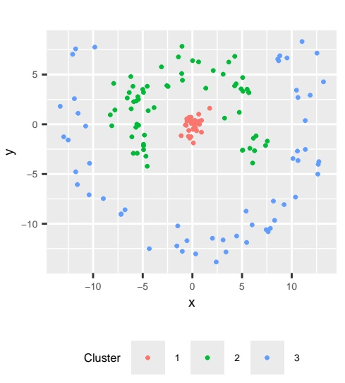

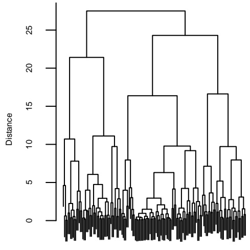

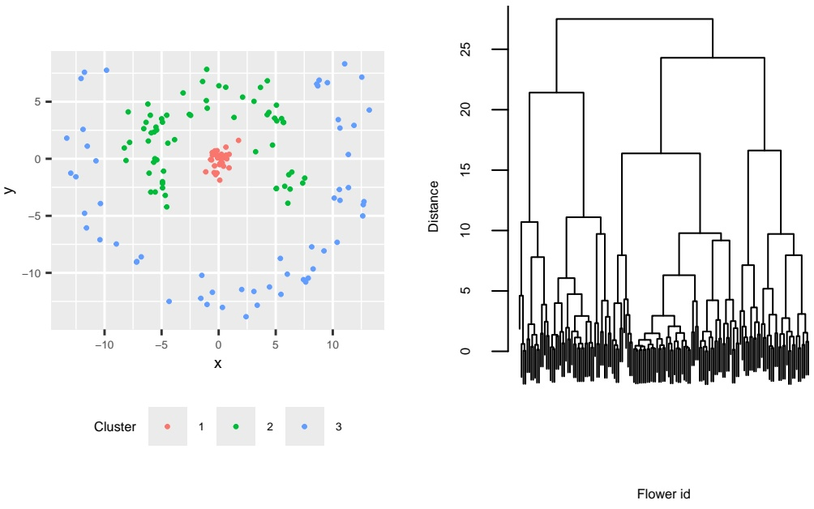

Figure 11.6: Sample data of concentric curved clusters.

datapoint resemble. However, in practice the difference may not be large, in any case the datapoints that are close in the feature space tend to be placed in the same cluster. Below we discuss a specific method, gaussian mixture models, and how to use it for discriminant analysis.

## Mixture models

Mixture models assume that the groups in data follow certain distributions, e.g. normal in case of gaussian mixtures.

Figure 11.8, left panel, shows the height histogram for 256 !Kung San adults, 136 females (red) and 120 males (blue). Typical males are noticeably taller than females, with the corresponding average heights being 160.9 and 150 cm. Individually, both genders follow roughly a normal distribution, but as the distributions do not overlap well, we see a resulting distribution (denoted by black bars on the Figure) that looks much more flat-topped than the normal curve.

This uses Howell’s height-weight data, see fullrefsec:howell-height-weight.

The right panel attempts to guess how do male and female distributions look when separated. The model is based on gaussian mixture, i.e. it is assumed that both sexes follow a normal distribution. The results are the red and blue normal curves, and the black overall density curve, the mixture of both male and female curves. The model estimates that the mean height of males is 158.3 with standard deviation 6.4, and the corresponding values for females are 147 and 3.7. For comparison, the corresponding male and female sample values are 160.9 and 6.1 for males, and 150 and 4.9 for females. As we can see, the two-component mixture identifies values rather well.

<!-- page: 444 -->

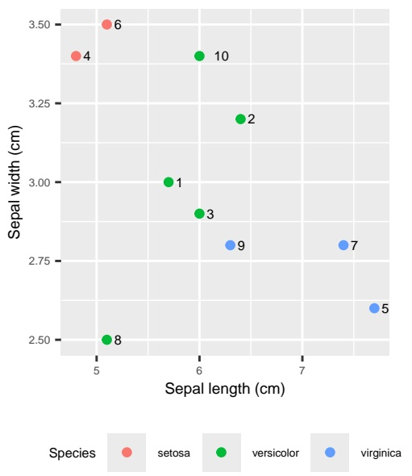

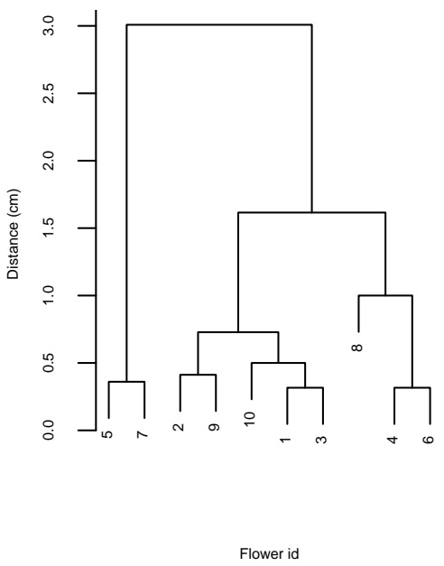

Figure 11.7: Sepal length and width of a sample of 10 iris flowers (left) and the corresponding dendrogram (right).

This is the idea of the mixture model: the population contains two groups with differently distributed values, but if we do not know which group a particular individual belongs to, we are left of “mixture” of both distributions, the black flat-topped curve. In case of discriminant analysis, the task is to find the correct group based on other data, here to tell gender based on height.

<!-- page: 445 -->

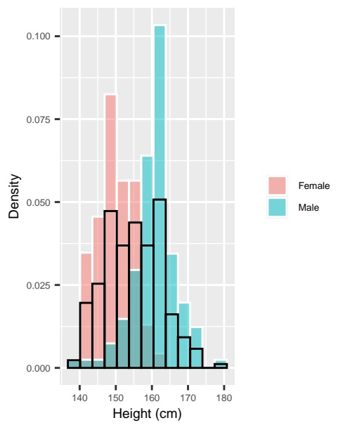

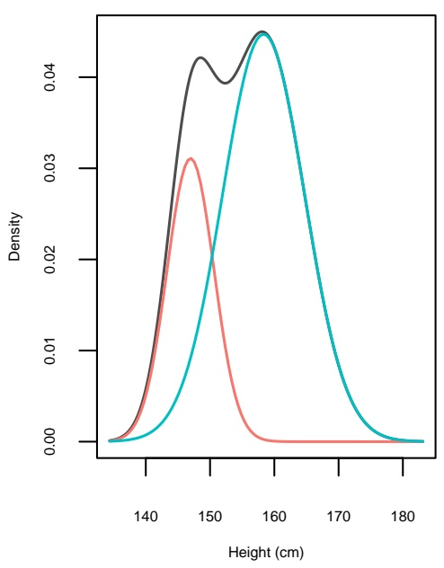

Figure 11.8: Left panel: histogram of height of 136 !Kung San women (red) and 120 men (blue). The black bars denote the overall density values. We can see that the overall height distribution is slightly bimodal.

Right panel: the corresponding estimated mixture density, consisting of two Gaussian components.

<!-- page: 446 -->

## 11.3 Principal Component Analysis

Principal Component Analysis (PCA) is a another popular method to find patterns in data. It is in some way similar to cluster analysis, but unlike the latter, PCA is not concerned about points located close in space, but rather about points placed near hyperplanes in hyperspace. It is used in a wide variety of applications, including exploring and analyzing correlated features, designing new features, and compressing data.

## 11.3.1 Motivation

There are several motivations that lead to more-or less similar concept of PCA. We list here three problems, the first more a social science problem, and two other more technical.

**1. How to measure vague concepts?** If we are interested in measures like income or age, the measurement is easy. Pretty much everyone knows their age and people have fairly good understanding what income is (even though they may not know their exact income, or may be unwilling to tell). But how liberal are you? Or how extrovert are you? The respondents may have an idea in both cases and may be willing to answer that they are “rather not liberal” or “fairly extrovert”. But now we are measuring their idea about their liberalism (called perceived liberalism) and not how liberal they actually are.

To overcome this problem, the surveys typically ask for a number of questions that we think are closely related to liberalism, instead of asking about liberalism directly. For instance, one may ask (with answers on e.g. 5-point Lickert scale):

1. Do you support gun rights?

2. Do you support free abortion?

3. Should the government take more care of the environment?

4. Is cross-border crime the most serious threat nowadays?

As people traditionally understand the concept “liberalism”, we may want to add the second and third answer with a positive weight, and the first and the fourth answer with a negative weight. But is this the correct approach? And what should the weights be? Is “liberalism” even a useful concept in these data, if the answers to these questions look almost random? Maybe we do not really have liberals and conservatives in the first place?

**2. How do we aggregate similar measures?** The second motivation is quite similar, just originate from the technical world. Imagine you have a number of similar measure–similar, but not precisely the same. For instance, you are working with natural disaster data and you want an estimate of the destructiveness of hurricanes. But FEMA<sup>2</sup> does not provide a single number of “destructiveness”. Instead, it lists a number of different costs:

• Total Individual Assistance (IA) - Applications Approved

• Total Individual and Households Program - Dollars Approved

<small><span class="docvortex-page-footnote" data-block-type="page_footnote" style="color:#6b7280"><sup>2</sup>The U.S. Federal Emergency Management Agency</span></small>

<!-- page: 447 -->

• Total Housing Assistance - Dollars Approved

• Total Other Needs Assistance - Dollars Approved

• Total Public Assistance Grants - Dollars Obligated

• Dollars obligated to emergency work

• Dollars obligated to permanent work

These numbers are clearly related to the destruction–more destruction probably means all these numbers are larger. But if I need a single number then which one should I take? Or should I take the average? But does average over number of applications, dollars approved and dollars obligated even make any sense?

**3. How to get rid of a lot of redundant data** Finally, there is a data compression problem. Imagine you are collecting cellphone data over time and geographic districts. For each district and each time period you record

• Total number of outgoing phone calls

• Total number of incoming phone calls

• Total number of text messages

• Total number of multimedia messages

• Total number of data connections

• Total seconds of outgoing phone calls

• Total GB of data transfer

• …

Obviously, all these numbers are highly correlated. A busy afternoon in a large city has all these figure up in millions while there is hardly anything in a tiny rural place in the middle of night. Do we really have to store and analyze all these numbers? Can we only keep one of these and drop the others? But which one? Or should we take average again? But does average over counts, seconds and GB-s even make sense?

All of these tasks are different sides of the same problem: we have a lot of correlated data and we are looking ways to simplify and understand it. While in social sciences the understanding–part has been traditionally in the focus, in technical fields it is more often simplification that we are looking for. But in all cases we are looking for fewer dimensions: in the first example we want to reduce four answers into a single liberalism measure, in the second example we try to reduce seven different cost measures to a “destructiveness” measure, and in the final example we may want to come up with 1-2 numbers that capture the “cellphone activity”.

There are many applications where one may want to collapse a large number of dimensions into a smaller more manageable numbers:

• Genome data: there is a tremendous numbers of parameters to measure genes

• Document and image classification: the algorithm may come up with hundreds of different categories, and we are just interested in a handful

• Product recommendation: as above, we may only be interested in a small number of product categories, not in thousands.

In a similar fashion, there are numerous reasons why we want fewer dimensions:

• To avoid curse of dimensionality: algorithms that work well on a small number of dimensions may get sluggish or fail completely as dimensionality grows. Even

<!-- page: 448 -->

models that can cope with high dimensionality may display unfavorable results, such as large standard errors and low power of statistical tests.

• In predictive modeling, overfitting becomes a more and more important problem as we include more and more features. Hence we want to keep the number of features in check and include only the most relevant ones.

• Visualization: it is hard to visualize anything with more than three dimensions.

• The same is true for interpretation–high-dimensional cases are hard to interpret.

• From computational perspective, we may prefer to keep fewer features to lower the memory and storage needs. It is effectively a way of data compression.

## 11.3.2 Principal Components: The Idea

The idea behind PCA is describind data as some sort of elongated cloud of points. The task is to find the axes along which data is elongated, and either interpret those, or rotate those in a way that they align with the coordinate axes.

The easiest way to get an intuitive understanding of this is to use 2-D highly correlated data. Figure 11.9 below shows a such synthetic dataset. In these data, x and y are highly correlated, one can imagine the image as the dots lying on the 30° line, with a small perturbations that push them little bit off that line (left panel). The right panel adds the principal components: these are the yellow and the purple tilted axes.

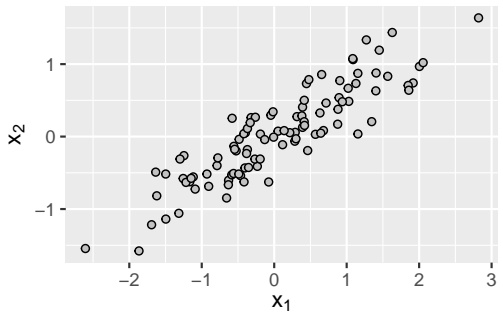

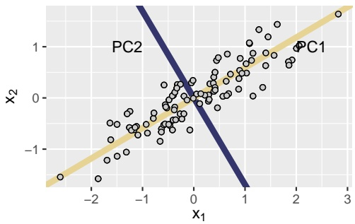

Figure 11.9: Highly correlated data that is perfectly suited for PCA. The left panel depicts only the datapoints, the right panel adds the principal components (PC1 is gold and PC2 is purple).

Already a quick look at the figure suggests that the red axis is much more important than the blue one—after all, the data is elongated along the red axis, the spread along the blue one is much smaller. This is indeed the case, and it is customary to order the axes (principal components) accirding to their importance. So further below we refer to the yellow axis as the first principal component (PC1) and the purple one

<!-- page: 449 -->

as the second principal componenet (PC2).

Table 11.1: Principal components of 2-D data (Figure 11.9).

|  | PC<sub>1</sub> | PC<sub>2</sub> |
| --- | --- | --- |
| x<sub>1</sub> | 0.861 | 0.509 |
| x<sub>2</sub> | 0.509 | -0.861 |

In numerical form, $P C _ { 1 }$ and $P C _ { 2 }$ are in Table 11.1. This table should be understood as a summary of two linear equations:

$$
P C _ {1} = - 0. 8 4 0 x _ {1} - 0. 5 4 2 x _ {2} \quad P C _ {2} = - 0. 5 4 2 x _ {1} + 0. 8 4 0 x _ {2},\tag{11.3.1}
$$

$\mathrm { o r } ,$ in matrix form,

$$
\binom{P C _ {1}}{P C _ {2}} = \left( \begin{array}{c c} - 0. 8 4 0 & - 0. 5 4 2 \\ - 0. 5 4 2 & 0. 8 4 0 \end{array} \right) \binom{x _ {1}}{x _ {2}}.\tag{11.3.2}
$$

These numbers are called factor loadings. Hence $P C _ { 1 }$ is somewhat more strongly related to $x _ { 1 }$ (factor loading $- 0 . 8 4 0 )$ than to $x _ { 2 }$ (factor $- 0 . 5 4 2 )$ . The negative signs of factor loadings for $P C _ { 1 }$ means that $P C _ { 1 }$ will be smaller if $x _ { 1 }$ and $x _ { 2 }$ are larger. $P C _ { 1 }$ “points” down-left on the figure. However, $P C _ { 2 }$ grows ${ \mathrm { ~ i f ~ } } x _ { 1 }$ gets smaller and $x _ { 2 }$ gets larger, hence it points up-left.

## 11.3.3 Explained Variance

The “importance” of components is normally defined by how much of variation in data do they explain. Figure 11.10 demonstrates how to understand variation and explained variation in data. The left panel shows three datapoints $d _ { 1 } ,   d _ { 2 }$ and $d _ { 3 }$ (light gray), and their centroid (black). The total variation is just sum of squared distances between the datapoints and the centroid. Here $V = e_{1}^{2} + \stackrel{\cdot}{e_{2}^{2}} + e_{3}^{2} = 4.30\stackrel{\cdot}{1^{2}} + 2^{2} + 2.915^{2} =$ 31 in these data. The right panel decomposes the distance into components that are parallel to $P C _ { 1 }$ (yellow); and those that are parallel to ${ P C } _ { 2 } \mathrm { ~ ( p u r p l e ) }$ . The variation, explained by $P C _ { 1 }$ , is just sum of the squared components that are parallel to it (yellow). In these data it is $V _ { 1 }   =   0 . 7 0 \bar { 7 } 1 ^ { 2 }   +   1 . 4 1 \bar { 4 } ^ { 2 }   +   2 . 8 2 8 ^ { 2 }   =   2 8$ Hence $P C _ { 1 }$ explains $28/31 \approx 90\%$ of the total variation. In an analogous fashion, $P C _ { 2 }$ explains $3 / 3 1 \approx 1 0 \%$ of the total variation.

As the principal components are orthogonal, so are the purple and yellow distance projection. Hence, by Pythagorean theorem, the square of the yellow $(PC_{1} -aligned)$ component, plus the square of the purple $( P C _ { 2 } \mathrm { { - a l i g n e d } ) }$ component equals to the distance e squared. This means the sum of explained variations by the principal components equals to the total variation in data. In practice, it is often convenient to work with explained variance ratio, the variation, explained by individual $\scriptstyle \mathrm { P C - S } .$ , as a percentage of the total variation.

<!-- page: 450 -->

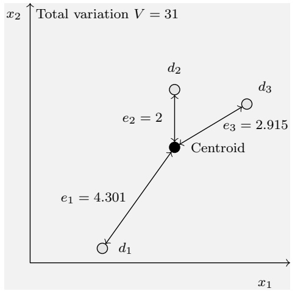

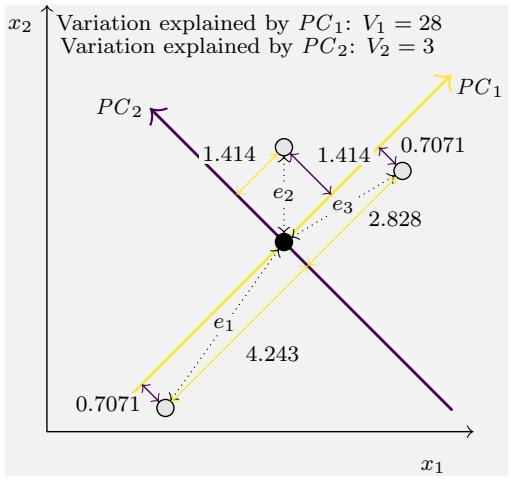

Figure 11.10: Explained variance. Left panel: gray circles are three datapoints $d _ { 1 } ,   d _ { 2 }$ and $d _ { 3 } ;$ and the dark circle is their centroid. The arrows $e _ { 1 } ,$ e2 and $e _ { 3 }$ are the distance between the datapoints and the centroid. The right panel shows the same distances, but not decomposed into the components that are parallel to $P C _ { 1 }$ (purple), and those that are parallel to $P C _ { 2 }$ (yellow).

Example 11.1: How big are emergencies

“Emergency” is a legal concept that opens doors for various government assistance. This may include additional firefighters or monetary assistance for the affected household. FEMA<sup>a</sup> publishes data about different emergencies. However, emergencies are of very different size, stretching from broken water mains to major hurricanes. And when we want to know the “scale” of emergency, then no clear number is published. Instead, the measures are $( \mathrm { i } )$ total individual assistance (IA) - applications approved;(ii) total individual and households program - dollars approved;(iii) total housing assistance - dollars approved;(iv) total other needs assistance - dollars approved;(v) total public assistance grants - dollars obligated;(vi) dollars obligated to emergency work;(vii) dollars obligated to permanent work. All these numbers describe the scale of the emergency in some sense, we expect all these numbers to big large for major disaster. Obviously, these numbers are highly correlated, here are two examples:

<!-- page: 451 -->

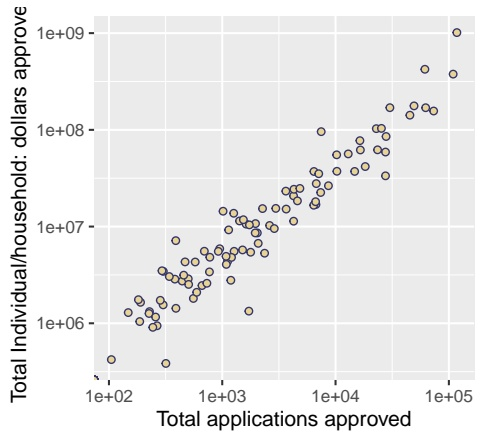

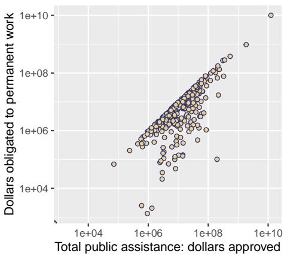

Figure 11.11: Published emergency measures are highly correlated. Dollars approved versus applications approved (left), and total public assistance versus dollars for permanent work (right). The sharp upper bound on the rhs figure shows that no more dollars are obligated than approved.

One way to find a single measure for “scale” of emergency is to do principal component analysis—it is quite likely that the first component will describe something akin a scale of the emergency. When we do this (on normalized data) then we get the following components (for simplicity we display the first four components only):

|  | PC1 | PC2 | PC3 | PC4 |
| --- | --- | --- | --- | --- |
| nApplications | 0.329 | -0.671 | 0.327 | -0.079 |
| indTotal | 0.396 | -0.179 | -0.181 | 0.360 |
| housing | 0.395 | -0.177 | -0.203 | 0.541 |
| other | 0.393 | -0.186 | -0.048 | -0.728 |
| pubTotal | 0.376 | 0.407 | 0.292 | 0.014 |
| emergency | 0.381 | 0.321 | -0.657 | -0.192 |
| permanent | 0.372 | 0.427 | 0.548 | 0.064 |

The first component, PC1, appears to contain all seven variables by a roughly equal amount, all the loadings are between 0.3 and 0.4. Hence the first PC is just a (weighted) sum of all these numbers. The next component, PC2, includes the four first components with negative sign and the last three with positive sign. Note that the last three variables are about “dollars obligated” while the previous numbers are about “dollars approved” (except the first one, the number of applications). Hence it captures the difference between approved and obligated dollars. In an intuitive way, we can write the PC-s as

$$
P C _ {1} = \text { Approved } + \text { Obligated } \quad P C _ {2} = \text { Obligated } - \text { Approved }
$$

We do not discuss the further components as those explain virtually no variation in data (see below).

<!-- page: 452 -->

Variance, proportion of variance, and the cumulative variance of the four first componenets are:

Table 11.2: Standard deviation, relative variance, and cumulative relative variance, explained by the PC-s.

|  | Std.dev | Rel.var | Cum.var |
| --- | --- | --- | --- |
| PC1 | 2.490 | 0.886 | 0.886 |
| PC2 | 0.840 | 0.101 | 0.987 |
| PC3 | 0.224 | 0.007 | 0.994 |
| PC4 | 0.156 | 0.003 | 0.997 |

The first component has standard deviation 2.490, and it explains 88.6% of total variation of data. The second component is much less important with standard deviation of 0.84, and it explains 10.1% of total variation. These first components together explain 98.7% of total variation in data. We can also display the relative variance as a barplot for all seven PC-s:

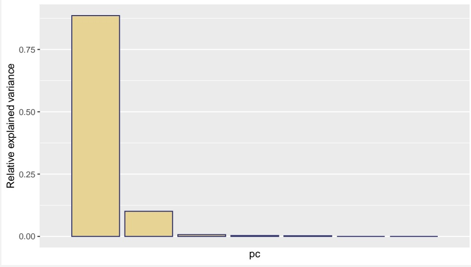

Figure 11.12: Proportion of variance, explained by $P C { \scriptstyle - } s .$ The figure suggests that in most applications, only the first two, or maybe even only the first PC is important.

The picture confirms the impression from Table 11.2–the first two PC-s are much more important than the other PC-s. In most applications we can probably safely ignore the PC-s 3-7, or even all the PC-s besides the first one.

<sup>a</sup>The U.S. Federal Emergency Management Agency

## 11.3.4 Data Rotation

<!-- page: 453 -->

| ## | PC1 | PC2 |
| --- | --- | --- |
| ## x1 | 0.8609556 | 0.5086802 |
| ## x2 | 0.5086802 | -0.8609556 |

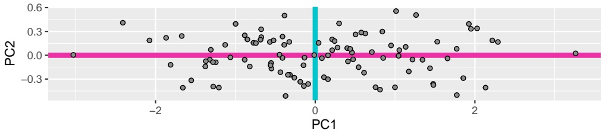

| variable | PC<sub>1</sub> | PC<sub>2</sub> |
| --- | --- | --- |
| individual applications approved | -0.203 | -0.200 |
| approved individual/hosehold total | -0.402 | -0.414 |
| approved housing assistance | -0.397 | -0.409 |
| approved other assistance | -0.353 | -0.365 |
| obligated to public assistance total | -0.426 | 0.427 |
| obligated to emergency work | -0.400 | 0.385 |
| obligated to permanent work | -0.413 | 0.393 |

<!-- page: 454 -->

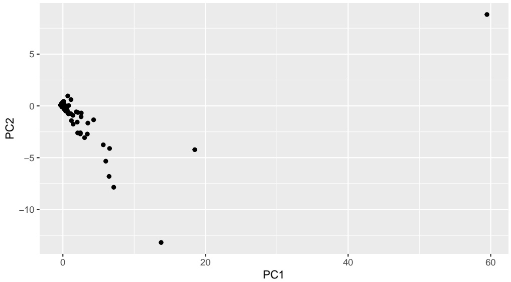

• Note: no distinction b/w x and $\mathrm { y }$

• Don’t attempt OLS...

Data:

$$
\mathsf {M} = \left( \begin{array}{c c} x & y \\ 1 & 2 \\ 2 & 1 \\ 3 & 4 \\ 4 & 3 \end{array} \right)
$$

Now

$$
\mathrm{M} ^ {\prime} \mathrm{M} = \left( \begin{array}{c c} 3 0 & 2 8 \\ 2 8 & 3 0 \end{array} \right)
$$

(Note: $\mathsf { M } e = \lambda e )$ Solve for eigenvalues:

$$
| \mathsf {M} ^ {\prime} \mathsf {M} | = (3 0 - \lambda) (3 0 - \lambda) - 2 8 ^ {2} = 0
$$

The solution:

$$
\lambda_ {1} = 5 8 \quad \lambda_ {2} = 2\tag{11.3.3}
$$

The corresponding eigenvectors:

$$
\left( \begin{array}{c c} 3 0 & 2 8 \\ 2 8 & 3 0 \end{array} \right) \binom{x}{y} = \lambda \binom{x}{y}\tag{11.3.4}
$$

and we have

$$
\boldsymbol {e} _ {1} = \binom{1 / \sqrt {2}}{1 / \sqrt {2}} \qquad \boldsymbol {e} _ {2} = \binom{- 1 / \sqrt {2}}{1 / \sqrt {2}}
$$

<!-- page: 455 -->

The eigenvector matrix

$$
\mathsf {E} = \left( \begin{array}{c c} 1 / \sqrt {2} & - 1 / \sqrt {2} \\ 1 / \sqrt {2} & 1 / \sqrt {2} \end{array} \right)
$$

Is a rotation matrix for angle cos $\phi = 1 / \sqrt { 2 }$ or $4 5 ^ { \circ }$

Rotated data:

$$
\mathsf {M E} = \left( \begin{array}{c c} x & y \\ 1 & 2 \\ 2 & 1 \\ 3 & 4 \\ 4 & 3 \end{array} \right) \left( \begin{array}{c c} 1 / \sqrt {2} & - 1 / \sqrt {2} \\ 1 / \sqrt {2} & 1 / \sqrt {2} \end{array} \right) = \left( \begin{array}{c c} 3 / \sqrt {2} & 1 / \sqrt {2} \\ 3 / \sqrt {2} & - 1 / \sqrt {2} \\ 7 / \sqrt {2} & 1 / \sqrt {2} \\ 7 / \sqrt {2} & - 1 / \sqrt {2} \end{array} \right)
$$

• Eigenvalue decomposition rotates data matrix

– Orthonormal eigenvectors are the new base

• The largest eigenvalue corresponds to the most important dimension

## 11.3.5 Principal Component Regression

One widely used application of PCA is in the regression analysis. One can use the principal components instead of the original variables. This may give two advantages:

• Sometimes the principal components have clear interpretation, and hence the resulting coefficients have more meaningful interpretation than when using the original variables.

• Often the less important principal components add little value to the regression, so we can ignore those and get a simpler model.

Note that PC regression may not give any gains if the components that describe little variance in data still describe a lot of variance in the target variable.

Example 11.2: Principal component regression with 2-D data

| Here we demonstrate principal component regression using 2-D data. Consider the data below: |
| --- |

<!-- page: 456 -->

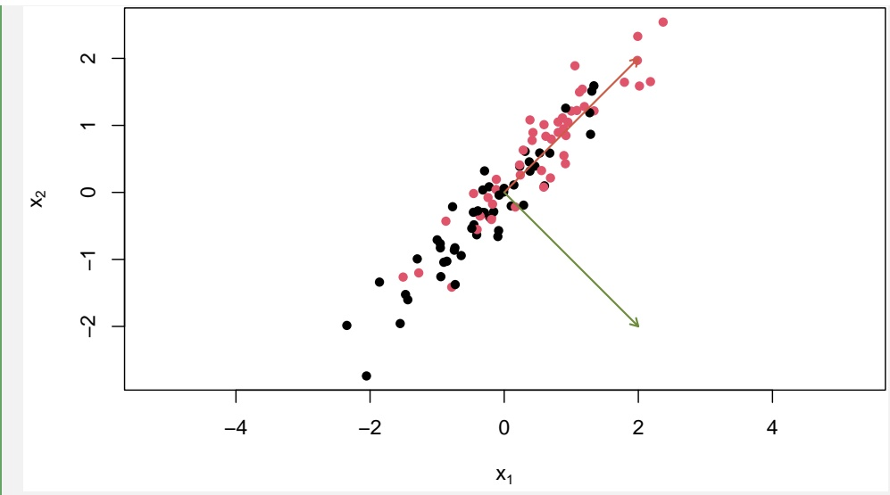

Figure 11.13: Narrow band of data points where color is associated with the bottomleft–top-right direction. This does not correspond exactly to any of the features $x _ { 1 }$ and $x _ { 2 } ,$ but instead to their linear combination (rotated data). The principal components are depicted as arrows, with PC1 (orange) describing the direction maximum variation, and PC2 (dark green) the perpendicular direction.

The data contains two numeric features, $x _ { 1 }$ and $x _ { 2 } ,$ and a color label, “black” or “red”. Our task is to predict the color based on $x _ { 1 }$ and $x _ { 2 }$

It is easy to see that red dots dominate in the top-right corner of the figure. We can use a simple logistic regression model

$$
\Pr (\text {color} _ {i} = \text {red}) = \Lambda (\beta_ {0} + \beta_ {1} x _ {1} + \beta_ {2} x _ {2}).\tag{11.3.5}
$$

The results are

|  | Estimate | Std. Error | z value | Pr(>\|z\|) |
| --- | --- | --- | --- | --- |
| (Intercept) | -0.1932 | 0.2289 | -0.84 | 0.3987 |
| x1 | 0.0747 | 0.7820 | 0.10 | 0.9239 |
| x2 | 1.0835 | 0.7532 | 1.44 | 0.1503 |

In a counterintuitive fashion, neither $x _ { 1 }$ nor $x _ { 2 }$ show much significance here while we can clearly see that the red dots are clustered in the top-right corner. Even more, the point estimate for $x _ { 2 }$ is negative although these are larger values that are associated with red color. The problem here is the fact that both features contain essentially the same information, and hence the design matrix is ill conditioned. The accuracy on training data, 0.71, is acceptable though for such a noisy image. We can cure the problem with principal component analysis. Doing PCA on the data matrix gives us

<!-- page: 457 -->

|  | PC1 | PC2 |
| --- | --- | --- |
| x1 | -0.71 | -0.71 |
| x2 | -0.71 | 0.71 |

Table 11.3: Principal components of data in Figure 11.13

Table 11.4: Proportion of variance explained by components in Table 11.3

As is evident from the tables, PC1 loads both $x _ { 1 }$ and $x _ { 2 }$ of equal amount and hence points to North-East, while PC2 contains a positive quantity of $x _ { 1 }$ and a negative quantity of $x _ { 2 } ,$ and hence points South-East (see Figure 11.13). As PC2 very little information (its contains only 2% of the total variance), we can drop PC2 and use a simpler model

$$
\Pr (\text {color} _ {i} = \text {red}) = \Lambda (\beta_ {0} + \beta_ {1} \cdot P C 1).\tag{11.3.6}
$$

The results are as follows:

|  | Estimate | Std. Error | z value | Pr(>\|z\|) |
| --- | --- | --- | --- | --- |
| (Intercept) | -0.0519 | 0.2251 | -0.23 | 0.8177 |
| PC1 | -0.8187 | 0.1998 | -4.10 | 0.0000 |

The results show that PC1 is now highly significant and of reasonable size. Accuracy on training data is the same, 0.71. But we got a simpler, model with more easily interpretable model.

## Example 11.3: How are conservative family values and identity related to willingness to do good for society?

<div class="docvortex-algorithm" style="white-space: pre-wrap; font-family:monospace;">
The worldview of people can be described with different dimensions, including family values (conservative versus liberal), and identity (global versus local), and many other. But how are these two value sets associated with the willingness to contribute to the society? Let's analyze this based on the World Value Survey, a large world-wide opinion survey.
We estimate a linear regression model in the form
contribute$_{i} = \alpha + \boldsymbol{\beta}^{\top} \cdot \text{globalist values}_{i} + \boldsymbol{\gamma}^{\top} \cdot \text{gender values}_{i} + \epsilon_{i}$ (11.3.7)
where $family\ values$ is a vector of family-values related opinion, and $democratic\ values$ is a vector of authoritarianism-democracy related viewpoints. The examples of family values include$^{a}$
doingGoodImportant It is important to do something for good of society.
trustUN how much confidence do you have in United Nations?
worldCitizen I see myself as a world citizen.
partOfNation I see myself as part of the nation.
maleLeaders men make better political leaders than women
maleExecutives men make better business executives than women
</div>

<!-- page: 458 -->

**collegeBoy** university education is more important for a boy than for a girl When we run such a regression, we get the results

|  | Estimate | Std. Error | t value | Pr(>\|t\|) |
| --- | --- | --- | --- | --- |
| (Intercept) | -1.7280 | 0.0239 | -72.24 | 0.0000 |
| trustUN | 0.0021 | 0.0048 | 0.44 | 0.6569 |
| worldCitizen | 0.1433 | 0.0053 | 26.81 | 0.0000 |
| partOfNation | 0.2503 | 0.0073 | 34.37 | 0.0000 |
| maleLeaders | 0.0772 | 0.0059 | 13.06 | 0.0000 |
| maleExecutives | 0.0342 | 0.0063 | 5.45 | 0.0000 |
| collegeBoy | -0.0767 | 0.0057 | -13.52 | 0.0000 |

The results suggest that those with stronger both global and national identity feel it more important to be good for society. The same is true for those who think men make better leaders, but not for those who believe higher education matters more for boys. The predictive power of the model is low with $R ^ { 2 } = 0 . 0 4 1$

Instead of estimating the effect of respones to individual questions, we cancombine the answers into principal components, and include those in the regression instead. The principal components are

|  | PC1 | PC2 | PC3 | PC4 | PC5 | PC6 |
| --- | --- | --- | --- | --- | --- | --- |
| trustUN | 0.06 | -0.43 | -0.82 | 0.37 | 0.04 | -0.01 |
| worldCitizen | 0.02 | -0.67 | 0.05 | -0.70 | 0.25 | 0.02 |
| partOfNation | -0.06 | -0.60 | 0.53 | 0.50 | -0.32 | -0.01 |
| maleLeaders | -0.59 | -0.01 | 0.06 | 0.16 | 0.50 | -0.61 |
| maleExecutives | -0.61 | -0.00 | -0.01 | 0.08 | 0.19 | 0.76 |
| collegeBoy | -0.52 | 0.00 | -0.21 | -0.31 | -0.74 | -0.21 |

The first two components are easy to interpret: P C1 loads strongly with all three variables that describe the conservative gender roles, hence a large P C1 value describes liberal gender values (as the loadings are negative). P C2 loads on the globalist/national feelings and describes someone who does not trust UN and does not feel any attachment neither to the world nor her nation.

The importance of the components is

|  | 1 | 2 | 3 | 4 | 5 | 6 |
| --- | --- | --- | --- | --- | --- | --- |
| variance | 2.01 | 1.29 | 0.96 | 0.78 | 0.58 | 0.37 |
| proportion | 0.34 | 0.22 | 0.16 | 0.13 | 0.10 | 0.06 |
| cumulative | 0.34 | 0.55 | 0.71 | 0.84 | 0.94 | 1.00 |

Let’s re-run the regression using the two first principal components only. Together these describe over 50% of the variance, and third component is also much harder to interpret. So we estimate a regression model

$$
\mathrm{contribute} _ {i} = \beta_ {0} + \beta_ {1} \cdot P C 1 _ {i} + \beta_ {2} \cdot P C 2 _ {i} + \epsilon_ {i}.\tag{11.3.8}
$$

The results are

<!-- page: 459 -->

|  | Estimate | Std. Error | t value | Pr(>\|t\|) |
| --- | --- | --- | --- | --- |
| (Intercept) | -2.4423 | 0.0046 | -531.80 | 0.0000 |
| PC1 | -0.0349 | 0.0032 | -10.79 | 0.0000 |
| PC2 | -0.1854 | 0.0040 | -45.87 | 0.0000 |

The results indicate that P C1—individuals who have more liberal viewpoints about the gender roles—are less likely to thing it is important to do something good for the society. But the effect of P C2 is much stronger—those who do not trust UN and do not feel belonging to a group do not think it is important to do good. The effect of the latter component is much stronget than that of the former, suggesting that feeling of attachment and identity is much more important factor in determining someone’s willingness to contribute to the public good. The model’s explanatory power is weak though, with $R ^ { 2 } = 0 . 0 3 1$

<sup>a</sup>WVS opinion questions usually state the claim in a very conservative fashion and allow the respondents either to agree or disagree with it. Here the answers are re-coded in a way that larger positive numbers always denote more support for the claim.

## 11.4 Comparison of Clustering and PCA

As methods of unsupervised learning, but cluster analysis and PCA share a number of traits. Both can be used to discover certain patterns in data, and given such patterns, to simplify, compress, and interpret the data.

But they also differ in a number of ways. In case of clustering, we are primarily interested in homogeneous subgroups. An example case is in Figure 11.14. The left panel of the figure contains 5 reasonably distinct group that we can capture using clustering methods, such as k-means. We can use this group information in several ways:

• If the clusters correspond to the structural properties of the data, this helps us to interpret and uderstand the it.

• We can also design different measures to address different groups. For instance, different patients may require different treatment even with similar diagnosis.

• We can compress the data by replacing individual observations with the corresponding cluster center. Note that this does not constitute a dimensionality reduction: cluster center vectors are still of the same dimension as individual data vectors.

• Sometimes the group membership itself is of interest: which cases go together? In case of principal components, our main task is to find a low-dimensional representation of data that contains most of the original information. This representation has a number of applications:

• Sometimes the reduction process itself reveals interesting properties of the data that can be interpreted.

• We can genuinely reduce the dimensionality of data by removing the (rotated) dimensions that carry little information. Unlike clustering, this process genuinely shrinks the data dimensionality. But the individual observations still remain distinct and are not replaced by certain average observations.

<!-- page: 460 -->

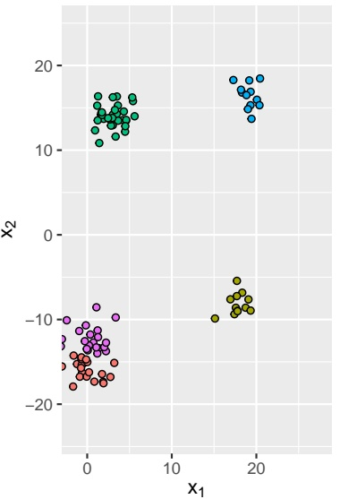

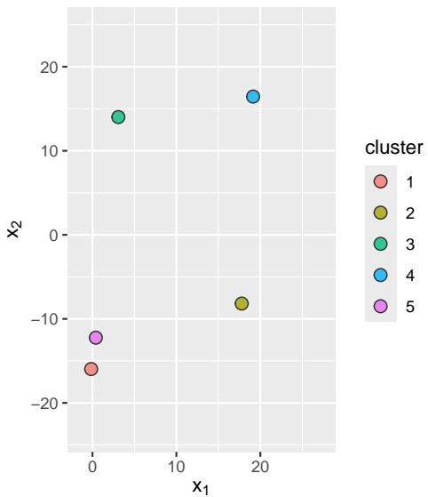

Figure 11.14: How cluster analysis treats data: homogenous subgroups (left panel) can be replaced by their corresponding cluster centers (right panel). In this way we can reduce the original 100-observation dataset to 5 different ”types”. These types can be either interpreted, one can design separate measures for each type, for instance marketing strategies in case of customer types, and one can also replace each observation with the cluster center in order to compress the data.

Lower-dimensional data is both easier to analyze and compress.

These methods also work well on different types of data. Cluster analysis is designed for data that contains well-separated relatively homogeneous ”blobs” while principal component analysis can handle datasets that form an elongated cloud.

<!-- page: 461 -->

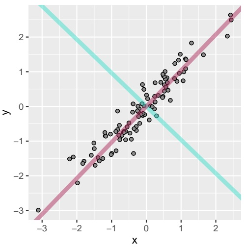

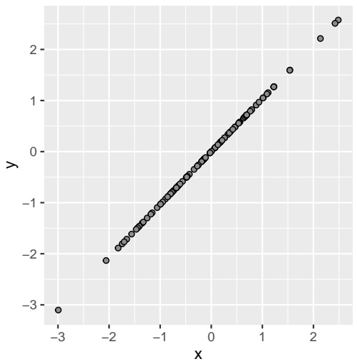

Figure 11.15: How PCA treats data: the dimension of maximum variance is treated as PC1 (red line, left panel) that carries most of the information. The other dimension (blue line) carries little information and is collapsed, resulting in rotated 1-D data (right panel). We may be interested in factor loadings, the relationship between the original features x1 and $x _ { 2 } .$ and the resulting principal components for interpretation and understanding. We may also prefer to analyze and store the reduced-dimensional data (right panel) instead of the original one.

<!-- page: 462 -->

<!-- page: 463 -->

# Applications

## Contents

- 12.1 Recommender Systems 453
- 12.1.1 Collaborative Filtering 454
- 12.1.2 Problems with recommender systems 456
- 12.2 Generating Content: Generative Adversarial Networks 458
- 12.2.1 Technical details 458

## 12.1 Recommender Systems

Recommender systems are in many ways similar to ordinary supervised ML methods. Their aim is to predict users’ “product rating” over different products, and recommend those with highest rating. The rating can be numeric, like in cases where users literally rate movies on 1-5 scale, or it may be a binary “rating”, e.g. the indicator if someone bought or did not buy a product.

However, recommenders also differ from the standard supervised models in several important aspects:

• In ordinary supervised models we base the estimates on some sort of universal user characteristics, such as age or education. Recommenders instead rely heavily on other ratings by the same users, so in a way the other ratings the user has done is the main information we have, often it is even the only information.

• Recommendation data is typically sparse. While we can collect common background information for most users and possible drop those cases where an important variable is missing, the users typically only rate a small minority of products. Hence we cannot rely on traditional methods, at least not without imputing the missing data.

<!-- page: 464 -->

## 12.1.1 Collaborative Filtering

The idea of collaborative filtering is the following: when predicting ratings by user i, we find a set of users who are “most similar” to the user i, and base our decision on their ratings. The “most similar” here means users who are similar in terms of how do they rate products, not in terms of the background characteristics like education and age. This approach is in many ways similar to k-NN or local regression, just that is adapted to sparse data where many datapoints must be imputed.

We start with a trivial example. Consider three fictional persons, $\mathcal { I } i ,$ Chen and Su rating two equally fictional movies, Under the Bed and The Monk. Movies are rated on numeric scale with $`` 1 ''$ denoting the lowest and $^ { 4 5 }$ the highest grade. Ratings given by these users are in Table 12.1.

Table 12.1: Two fictional movies rated by three fictional persons. Average is the users’ average rating over all movies they have rated.

<table><tr><td>Name</td><td>Movie</td><td>Rating</td><td>Average</td><td>Centered rating</td></tr><tr><td>Ji</td><td>Under the Bed</td><td>1</td><td rowspan="2">2.5</td><td>-1.5</td></tr><tr><td>Ji</td><td>The Monk</td><td>4</td><td>1.5</td></tr><tr><td>Chen</td><td>Under the Bed</td><td>3</td><td rowspan="2">2.0</td><td>1.0</td></tr><tr><td>Chen</td><td>The Monk</td><td>1</td><td>-1.0</td></tr><tr><td>Su</td><td>Under the Bed</td><td>4</td><td rowspan="2">2.5</td><td>1.5</td></tr><tr><td>Su</td><td>The Monk</td><td>1</td><td>-1.5</td></tr></table>

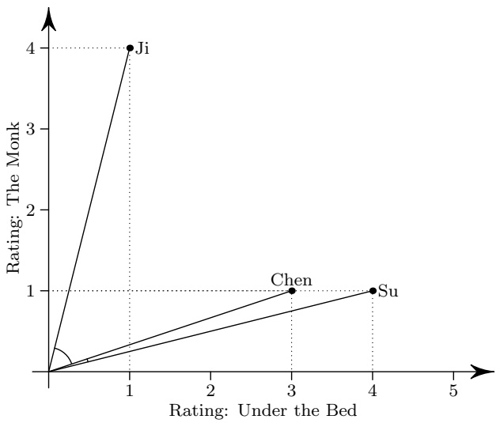

Figure 12.1: Two movies rated by three users, the same data as in Table 12.1 but now displayed graphically.

As this data is complete (all users rated all movies), we can easily depict the users in the 2-D rating space (Figure 12.1). The raters are depicted as vectors pointing from

<!-- page: 465 -->

the origin (0,0) to the corresponding ratings (Under the Bed rating on the horizontal axis and The Monk rating on the vertical axis). A quick visual inspection also tells that Chen and Su are more “similar” than, for instance, Chen and Ji. Based on this quick picture we may already say that if Su liked a third move very much, Chen may also like it. But we are less certain what will Ji think about it as his tastes seem to be different.

In practice it is better to use centered cosine similarity, (Figure 12.2), not Euclidean distance (our eyes implicitly measure Euclidean distance). The centered dis tance is computed by subtracting the user’s average rating from all of their ratings (column Centered rating in Table 12.1). The figure shows the angles between Chen and Ji, and Chen and Su. The angle between Ji and Chen, and between Ji and Su is 180°, while the angle between Chen and Su is 0. Hence according to this figure, Chen and Su are very similar, while Ji is their exact opposite. This leads to exactly the same conclusion in this case as the Euclidean distance—if Su likes a third movie, Chen may also like that one.

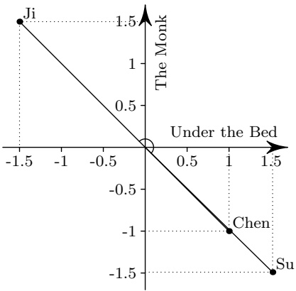

Figure 12.2: Two movies rated by three users, the same data as in Table 12.1, column Centered rating. The point for Su is shifted a little bit on the figure for clarity.

The centered data does not look particularly informative in the 2D case as all the vectors are aligned on the exact same NW-SE line. However, in a 3D or in a higher dimensional space this is not so any more. But even in the 2-D case we see Chen and Su ratings pointing in one direction and Ji’s rating pointing to the other direction. This tells us that Chen and Su are rather similar: both rate “Under the Bed” better than “The Monk”. But Ji thinks the other way around.

This example assumed all users have rated all movies. But what to do in a more realistic example where users only have rated a small fraction of products? An obvious choice is to replace the missing values with the users’ average values. This is where centered distance plays a very useful role—centered versions of such imputed values is zero, and 0-length components do not affect cosine similarity. So computed user similarity is less influenced by our imputations.

After computing the users’ similarity, the rest of the algorithm may proceed as follows:

<!-- page: 466 -->

1. Find the most similar users for any given user, for instance 10 most similar users.

2. Use the ratings of the most similar users to compute prediced rating for the given user. In case of multiple conflicting ratings for a single item, one may, for instance, predict average of these. Care must be taken for not to include the imputed values into the prediction.

3. Finally, the algorithm suggests the highest predicted values from the list computed above. This results in recommendations like “users who like this movie also liked that movie”.

## 12.1.2 Problems with recommender systems

While good recommenders are valuable both for customers and businesses, recommenders are not without their issues.

“Blind” recommendation algorithms may also suggest items that we consider harmful. There is a well-known but unconfirmed story about teen pregnancy that Target learned, based on her buying decisions, before her parents. As another, more recent example, in 2022 lawmakers accused Amazon for recommending food preservative that has been used for suicides (Jackson, 2022). From the algorithm’s viewpoint, it is perfectly valid thing to do–if someone is buying items that are helping to commit suicide, the algorithm happily recommends the related items too. But unlike the algorithms, we do not think in this way. It is also not immediately obvious how to address such issues–algorithms are good in picking up all kinds of patterns, including many patterns we are not aware of, and basing their decisions on all of these. First later will humans discover that some of the recommendations are dubious at best from the ethical standpoint.

Social media recommenders may build a network of other individuals, where connections are made of various common links, such as common friends, schools both persons have attended together, events they have both liked, and so on. As an upside it helps to find new friends, or re-connect with old acquaintances. But they may also attempt to reconnect people with their ex-s or abusers, and even worse, remind and reveal an abuser about your presence.

Some recommenders are easy to game. If recommendations are partly based on clicks or likes, then items that many users click on are recommended increasingly more, resulting in even more clicks on these links. This results in “clickbaits”, titles that look interesting although may not contain anything relevant. More advanced users can set up hundreds of bots that like each other’s stories and in this way fool the algorithm to think that this is something the other users want too. This is one way to spread misinformation over social media.

Recommenders have problems related to shifting human taste, e.g. after listening 10 songs of a certain genre, the recommender learns to suggest even more similar songs. However, the user gets bored of such music instead and looks for something different. Such shifts are very hard to model.

Lack of variety in recommendations also make echo chambers possible. If a user is for some reason interested in a certain type of information, the recommenders will start suggesting even more sources that offer just this kind of information. It may

<!-- page: 467 -->

effectively remove all alternative viewpoints from that user’s information sphere, and re-enforce the feeling that they represent the majority. This is a mechanism behind political polarization. In extreme cases, it may even breed weird cranky movements, such as Flat Earth movement.

<!-- page: 468 -->

## 12.2 Generating Content: Generative Adversarial Networks

**Prerequisites:** Section 9.2 Convolutional Neural Networks, page 391, Section 10.2 Gradient descent and gradient ascent, page 401

Generative Adversarial Networks (GAN-s, Goodfellow et al. (2014)) are models that create content according to certain patterns. The idea of GAN-s is the following: two networks (adversaries) are working together. One of them (discriminator) is fed actual examples, and its task is to distinguish between the actual examples and generated examples. The other network (generator) is creating new examples out of some random data, and its task is to “fool” the discriminator to think these are real examples. In the process, the networks are teaching each other, and they are getting better in both distinguishing the real and generated examples, and also in generating such examples.

The generator network is designed to produce examples based on some kind of random inputs. For instance, it may take a vector of random numbers as input, and transform these into an image through a series of dense and convolutional layers. Through the training process the network learns to adjust the weights and convolutional filters in such a way that the result resembles example images. Discriminator, in turn is just an image categorization tool, however, it needs to be good in categorizing the actual and generated details.

## 12.2.1 Technical details

In order to fix the ideas, let’s assume we are creating images. Each image can be represented by a vector $x \in X$ , where X is a set of all images the network can handle. For instance, X may be all possible 100 × 100 pixel images with three color layers, coded as color values in interval [0,1]. So X is a set of $1 0 0 \times 1 0 0 \times 3$ tensors where each element $x _ { i j k }   \in   [ 0 \mathrm { , } 1 ]$ . For simplicity, we still refer to x as vectors, a vector of tensors if you wish.

Denote the discriminator by D. In this context it is a function $D : X \to [ 0 { , } 1 ]$ , a function that takes in an image x and based on the image, it computes a number—the probability that the input is a real image, not a generated one.

Generator G is also a function $G : \mathbb { R } ^ { k } \to X$ , it takes in a g-dimensional vector of random numbers z and converts it to an image of type X (e.g. 100 × 100 pixels and three color channels). So $G ( z )$ is an image. We need to give generator some inputs even if these are random numbers, otherwise it will be able to only generate a single image. The inputs do not have to be just random numbers–a good choice is to include something like a “prompt”, a description of what image the user may want to get, or maybe some other kind of context, e.g. the text on the nearby pages if the task is to illustrate a book.

These two networks are “adversaries” with the opposite tasks: the discriminator attempts to compute probabilities in a way that probability of the real image being a real is one, and the probability that the generated image is real is zero:

$$
D (\boldsymbol {x}) = 1 \quad \text {and} \quad D (G (\boldsymbol {z})) = 0.\tag{12.2.1}
$$

<!-- page: 469 -->

## 12.2. GENERATING CONTENT: GENERATIVE ADVERSARIAL NETWORKS459

The generator, however, attempts to create such images that fool discriminator to think that they are real, it wants to achieve

$$
D (G (\boldsymbol {z})) = 1.\tag{12.2.2}
$$

Training adversarial networks proceeds in a broadly following fashion (Goodfellow et al., 2014). Below, we assume the training is performed using stochastic gradient ascent using batch size m.

## 1. First, train the discriminator:

(a) Sample m random inputs z and use generator G to create m artificial images based on these input vectors.

(b) Sample another minibatch of m real images x.

(c) Train discriminator by a single step of GA maximizing the objective function

$$
V _ {D} = \sum_ {i = 1} ^ {m} \big [ \log D (\boldsymbol {x} ^ {i}) + \log (1 - D (G (\boldsymbol {z} ^ {i}))). \big ]\tag{12.2.3}
$$

$V _ { D }$ obtains its maximum if all $D ( { \pmb x } ^ { i } ) = 1$ and all $D ( G ( \pmb { z } ^ { i } ) ) = 0$ , exactly what we want the discriminator to do.

## 2. Next, train the generator:

(a) Sample m new noise vectors z

(b) perform a single step of gradient descent by minimizing the objective function

$$
V _ {G} = \sum_ {i = 1} ^ {m} \log (1 - D (G (\boldsymbol {z} ^ {i}))).\tag{12.2.4}
$$

$V _ { G }$ obtains its minimum if $D ( G ( { \pmb z } ^ { i } ) )   =   1$ , exactly as needed by the discriminator.

## 3. Repeat the two steps above until convergence.

<!-- page: 470 -->

<!-- page: 471 -->

# Responsible Data Science

As artificial intelligence is used more and more widely in our everyday lives, we encounter more and more situations that leave the technical/statistical side of AI. In this chapter we discuss these question with focus on social and ethical issues.

## Contents

- 13.1 Explainable AI . 461
- 13.2 Social inequality . 462
- 13.2.1 Who Are Represented in Big Data? . 462
- 13.2.2 Big Data, Big Inequality? . 463
- 13.3 Fairness and discrimination . 463
- 13.3.1 Fairness versus efficiency . 463
- 13.3.2 Individual fairness and group fairness . 464
- 13.3.3 Fairness: Different Measures are Incompatible . 465
- 13.3.4 Models discriminating minorities . 468
- 13.4 Human Versus Algorithmic Decision-Making . 470

## 13.1 Explainable AI

A few simple statistical models can be explained fairly easily. For instance regression models are relatively easy to understand, but example-based k-NN and simpler decision trees are also not that complicated. However, many more advanced models, in particular neural networks, are essentially black boxes.

But humans often want explanations. Imagine a situation where the bank turns down your loan application. Why? Will you be happy with the clerk explaining that “I just pushed the button and this is what the computer told me...” If at the same time another, at least superficially similar customer who also happens to be of a different race got her load approved, then the situation may look quite troublesome for the bank. An explanation is urgently needed but what even constitutes a suitable explanation?

<!-- page: 472 -->

Liao et al. (2020) discuss the types of explanations that users of AI applications expect and need. They distinguish four broad types:

1. Global: explain the model. Explain the model using a global structure, e.g. weighting of features, as an approximate decision tree, or other decision rules.

2. Local: explain predictions for a particular instance. Which features of the particular case made the model predict what it predicts?

3. Counterfactual: how will prediction change when we change features? Which features should we change to get a certain prediction?

4. Example-based: provide examples of similar cases where the model provided similar predictions, and slightly different cases where the predictions were different.

Many users ask related questions in order to understand better the limitations of the model (What is permissible? How can I improve the training?) Another important application is to manipulate inputs in order to avoid undesirable outcomes. If the model predicts that the product will not be successful, then we want to know what should be changed to make it a success.

## 13.2 Social inequality

As any other tool, statistics and machine learning can be used for good and for evil. Ethical dilemmas are nothing new to us, but as technology opens new avenues, we sometimes have to ask the age-old questions in a totally new context. Even if we can do this, should we do it? And how should we proceed in delicate cases?

## 13.2.1 Who Are Represented in Big Data?

Statistical models are trained on data and hence reflect the properties of the underlying data. When collecting dedicated survey data, such as World Value Survey, the researchers usually spend quite a bit of effort to ensure that the data is representative, and carefully document the sampling methods and resulting sampling weights in case certain populations or geographic regions are over/underrepresented. See Section 1.2.1 Sampling Process.

Unfortunately, such steps are often left undocumented in case of Big Data. Even worse, it is often unclear what would the theoretical population and sample frame even be in many cases. For instance, large NLP models are typically trained with text downloaded from internet. However, what would be a good representative sample of text? We know that different people leave behind a different amount of text depending on their habits and iternet access. But should we strive to an equal representation of people? Text—language, is after all most cases produced as a part of communication between several persons. So perhaps it is appropriate that the loud voices are overrepresented in a text corpus? As internet is also extremely complicated, it would be difficult to compute the sampling weights.

<!-- page: 473 -->

So it is not surprising at all that complex models that are trained on complex real data will re-produce various unfavorable traits that we encounter in the real world. And if we do not want the model to reflect such views, then what kind of views do we want it to reflect? For instance, should we refer to a certain group of immigrants as undocumented or illegal? As people have different opinion about the appropriate language here, addressing this question is necessarily political (Bender et al., 2021).

## 13.2.2 Big Data, Big Inequality?

Boyd and Crawford (2012) discuss access to Big Data. Big Data is mainly collected by players in the internet industry, such as social media or online retail companies. These firms will have both the data and the resources for analysis, and they will decide who else have access to data. It probably leads to inequality in terms of research access where those with resources (prestigious universities and rich private research labs) will have access, and the other cannot easily participate in the relevant debate. Neither can they evaluate the quality of published big data–based research. The fact that the private gatekeepers do not follow similar transparency and public access requirements as the public sector data collectors will hamper analysis of topics that the data collectors find inconvenient.

## 13.3 Fairness and discrimination

Fairness is an intuitive but imprecise concept. As automated decision-making has become more widespread, this has also created more interest for fairness. At the same time, large-scale data collection has made it easier to assess such decisions. Not surprisingly, we can see that a vague concept like fairness is not easy to operationalize and hence we see many decisions that are “unfair” in one or another way.

## 13.3.1 Fairness versus efficiency

Let’s start with a simple motivating example. Consider a world, populated with two types of people, reds and greens. The color of a person is immediately obvious to everyone, in a similar manner like gender or immigrant background, and it is hard to hide it.<sup>1</sup> The people can also be divided into two groups based on their skills: high skilled and low skilled. For historical reasons, 2/3 of reds are high skilled while only 1/3 of the greens are high-skilled.

Imagine that you are a hiring manager in a big firm, and a job posting brought in 6 candidates, 3 reds and 3 greens. For this job, the only thing that matters are skills, the color is irrelevant. But unfortunately, unlike the color, skills are hard to observe and require costly tests and interviews to assess. You only have funds to interview 3 candidates. Which of these candidates will you test? Obviously, it would be most efficient to interview the red candidates only–we expect 2 of them to be

<small><span class="docvortex-page-footnote" data-block-type="page_footnote" style="color:#6b7280"><sup>1</sup>One may argue that neither of these characteristics are, in fact, immediately obvious. This is correct. But simple and easily available information about people, such as their name, skin color, or accent is enough to estimate these characteristics fairly well. Even more, what matters below is not how the individuals identify themselves, but how the evaluators identify them.</span></small>

<!-- page: 474 -->

high-skilled, while it is likely that only 1 green candidate is high-skilled. Even more, there is 30% chance that non of the greens is high-skilled! If you take this approach, you are discriminating the candidates based of an irrelevant trait, color. But if you decide to give everyone a chance and also interview greens, you are less likely to find a suitable candidate. What should you do? Is it acceptable to only focus on economic efficiency<sup>2</sup> or should you ensure that you treat candidates of both color in a similar manner?

This is an example of a trade-off between economic efficiency (at least in short term) and fairness. Fairness may come at cost. Your decision will probably be affected by your beliefs, the corporate policy, and legislation. In everyday lives we need to do similar decisions quite frequently, decisions that may hurt certain other people.

Exercise 13.1: Probability to find no suitable candidates

```txt
You are an HR manager. You have 6 applicants (3 red and 3 green) but you can only afford to interview 3 of them. Compute the probability that no high-skilled candidate is interviewed, as a function of number of greens you interview (you can only interview 0, 1, 2 or 3 greens).
Solution on page 521.
```

Below, we discuss a few selected aspects of fairness, and show that there is not just a trade-off between efficiency and fairness, but also between different concepts of fairness.

## 13.3.2 Individual fairness and group fairness

Unfortunately, we cannot just be “fair”. In everyday language, the word fairness is typically used in a rather vague way. Depending on the context, it can be understood as equal treatment, appropriate treatment, morally justified treatment, and in a myriad of other ways. But even these, more specific moral principles, are hard to define in a precise manner. Below, we focus on fairness in the equal treatment sense.

One of the central concepts in fairness discussion is individual fairness. It captures the idea that individuals who are similar from a particular task’s perspective should be treated similarly. For instance, two candidates on a job interview who are equally qualified for the respective job, should be treated in the same way. In particular, they should not receive different treatment because the job-irrelevant attributes, such as ethnic background.

Another related equal treatment–related concept is group fairness. It is conceptually somewhat similar, and requires that the relevant groups should be treated in a similar manner, at least in the statistical sense. In case of the job interview example above, we expect to see that a similar percentage of candidates from both groups will be hired, given they are equally qualified.

Although both individual and group fairness seem largely similar, they are not compatible–one cannot achieve both, unless in very specific circumstances (Kleinberg et al., 2016), see also Section 13.3.3 Fairness: Different Measures are Incompatible,

<small><span class="docvortex-page-footnote" data-block-type="page_footnote" style="color:#6b7280"><sup>2</sup>Situation where you choose to focus solely on economic efficiency and only interview reds is called statistical discrimination.</span></small>

<!-- page: 475 -->

page 465. We need to choose between these two (and potentially more) incompatible fairness definitions.

This is not the only problem when applying fairness. For instance, a central requirement of individual fairness–similar people are treated in a similar manner– requires us to decide which people are similar. In particular, why are certain traits, such as gender or race, treated as irrelevant while others, such as immigrant status are not? Such decisions rely on our common understanding on relevant traits and permissible discrimination, and hence it cannot be an absolute measure. Another problem is related to assessing the general equilibrium effect in the presence of multiple equilibria. Fleisher (2021) provides an example how affirmative action can, over time, result in the less qualified minority group to become similar to the majority group. But in sort-term, the example includes affirmative action and hence the groups are not treated in a similar manner. What is considered fair treatment depends on the time horizon and the equilibrium type we focus on–even if treated differently in the short run, the policy is similar in the long run.

## 13.3.3 Fairness: Different Measures are Incompatible

## Prerequisites: Conditional probability: Section 1.4.3 Bayes theorem, page 50

One of the problems with “unfair” treatment and “algorithmic bias” that attracted wide attention in recent years is related to algorithms that are used in the U.S. criminal justice system. Angwin et al. (2016) analyze Correctional Offender Management Profiling for Alternative Sanctions (COMPAS) algorithm, a profiling algorithm that is widely used to predict whether the defendant is likely to commit another crime if released. Their analysis turned up “significant racial disparities”. In particular, whites who were labeled as “high risk” by the algorithm did not re-offend in 23.5% of cases, while African-Americans who were labeled “high-risk” did-not re-offend in 44.9% of cases. To put it differently, substantially more African-Americans who did not re offend were mis-categorized into high-risk category, compared to the corresponding whites. Unfortunately, this label is not only of academic interest–the perceived riskiness of recidivism influences sentences, right to bail, probation and other measures that affect real lives. The proponents of the COMPAS score have countered the criticism by demonstrating that at given score,<sup>3</sup> both whites and African-Americans have similar probability to re-offend, and hence it is a fair measure.

The problem boils down to different concepts of fairness. Angwin et al. (2016) criticism centers on group fairness, i.e. requirement that similar groups of people, here defined by race, should be treated similarly (Jacobs and Wallach, 2021). So whites who do not re-offend should have the same mis-classification rate as blacks who do not re-offend. This is clearly violated with COMPAS score. However, its advocates rely on individual fairness, requirement that similar individuals to be treated equally: given they receive equal COMPAS score, the decision should be the same, independent of race and other personal characteristics. Unfortunately, these two concepts of fairness are not compatible (Kleinberg et al., 2016). Except in very specific cases, such as

<small><span class="docvortex-page-footnote" data-block-type="page_footnote" style="color:#6b7280"><sup>3</sup>COMPAS assigns each individual a risk score between 1 and 10, with 1 meaning “very unlikely to re-offend” and 10 meaining “very likely to re-offend”.</span></small>

<!-- page: 476 -->

when we can perfectly predict re-offenses, it is only possible to be fair either in one way or the other way, but not in both ways at the same time. Next, we provide a numerical example and explain the problem more in-depth.

Consider a world where there are people of two colors $C ,$ Greens and Reds. For every person, we are interested in their re-offending behavior R: they may either re-offend $( R = 1 )$ or not re-offend $( R = 0 )$ . Importantly, for whatever reason, there are more recidivists among Greens than among Reds, so $\operatorname* { P r } ( R = 1 | \mathit { G r e e n } ) > \operatorname* { P r } ( R =$ $1 | R e d )$ . We do not observe who is going to re-offend, but we can assess their recidivism probability using a test T. It has only two possible values: either $T = 0$ or T = 1.

Figure 13.1, left panel, displays a numeric example of such a world. It contains 48 Reds and 48 Greens, where only 12 Reds will re-offend, hence $\operatorname* { P r } ( R = 1 | R e d ) = 1 / 4$ But among Greens, 36 will re-offend, so $\operatorname* { P r } ( R = 1 | R e d ) = 3 / 4$

The figure also displays one such test $T _ { 1 }$ . The test is color-blind in the sense that

Pr(R = 1|T1) denotes two conditional probabilities: Pr(R = 1|T<sub>1</sub> = 0) (here 1/6) and Pr(R = 1|T<sub>1</sub> = 1) (here 5/6).

$$
\Pr (R = 1 | T _ {1}) = \Pr (R = 1 | T _ {1}, G r e e n) = \Pr (R = 1 | T _ {1}, R e d),\tag{13.3.1}
$$

i.e. it predicts the recidivism probability equally well for Reds and Greens. Assume that $T = 1$ suggests that the individual is likely to re-offend, and $T = 0$ suggests the opposite: $\operatorname* { P r } ( R   =   1 | T   =   1 )   >   0 . 5   >   \operatorname* { P r } ( R   =   1 | T   =   0 )$ . For instance, $T$ can be the number of previous crimes the defendants have committed, with $T = 0$ meaning no previous offenses and $T = 1$ means a previous criminal record.

The policymakers’ (judges’) task is to predict recidivism based on the test score $T _ { 1 }$ by computing probability $\operatorname* { P r } ( R = 1 | T )$ . In the example, $\operatorname* { P r } ( R = 1 | T = 0 ) = 1 / 6$ and hence if you pass the test, you will be considered unlikely to re-offend. However, those who fail the test will re-offend with probability $\operatorname* { P r } ( R = 1 | T = 1 ) = 5 / 6$ , so they are considered likely recidivists. Importantly, these figures do not depend on color, so the judges can use just the test result and have no reason to consider the color.

<table><tr><td rowspan="2"></td><td colspan="2"> $T_1 = 0$ </td><td colspan="2"> $T_1 = 1$ </td><td rowspan="2">FPR</td></tr><tr><td>35</td><td>5</td><td>1</td><td>7</td></tr><tr><td>R=0</td><td></td><td></td><td></td><td></td><td rowspan="3"> $\frac{1}{36}$   $\frac{7}{12}$ </td></tr><tr><td>R=1</td><td>7</td><td>1</td><td>5</td><td>35</td></tr><tr><td colspan="3"> $Pr(R=1|T_1)=\frac{1}{6}$ </td><td colspan="2"> $\frac{5}{6}$ </td></tr><tr><td rowspan="2"></td><td colspan="3"> $T_2 = 0$ </td><td> $T_2 = 1$ </td><td rowspan="5">FPR:  $\frac{1}{3}$ </td></tr><tr><td>24</td><td>8</td><td>12</td><td>4</td></tr><tr><td>R=0</td><td></td><td></td><td></td><td></td></tr><tr><td>R=1</td><td>4</td><td>12</td><td>8</td><td>24</td></tr><tr><td colspan="3"> $Pr(R=1|T_2)=\frac{1}{7}$ </td><td> $\frac{3}{5}$ </td><td> $\frac{2}{5}$   $\frac{6}{7}$ </td></tr></table>

Figure 13.1: Left panel: the test is color blind: $\operatorname* { P r } ( R   =   1 | T )$ does not depend on color. However, now greens’ FPR is almost three times that of reds.

Right panel: a test that ensures the FPR-s are equal. However, now color is an important predictor of $\operatorname* { P r } ( R = 1 | T )$

While the judges are tasked to evaluate recidivism probability given the test score, this is not the problem the defendants face. The defendants’ problem is to pass the test, given their recidivism probability and color. They are concerned about

<!-- page: 477 -->

$\operatorname* { P r } ( T   =   0 | R , C )$ The defendants’ problem is equivalent with FPR: the probability that a non-recidivist is categorized as a recidivist by mistake. And here $T _ { 1 }$ clearly fails in terms of color-blindnes: out of 36 non-recidivist Reds, one will fail the test and 35 will pass, while out of 12 non-recidivist Greens, only 5 will pass and 7 will fail! FPR for Reds is 3% while this for Greens is 58%!

$\begin{array} { r } { \mathit { F P R } = \frac { F P } { N } , \: \mathit { F N R } = \frac { F N } { P } } \end{array}$ . See more in Section 4.4.1 Confusion matrix, page 235.

The right panel of the figure shows another test, $T _ { 2 }$ . This one ensures colorblindness from the defendants’ point of view: $\operatorname* { P r } ( T = 0 | R , R e d ) = \operatorname* { P r } ( T = 0 | R ,$ Green). For instance, 12 out of 36 non-recidivist Reds will fail the test, giving $F P R = 1 / 3$ and 4 out of 12 non-recidivist Greens will fail it, resulting in exactly the same FPR. Unfortunately, now the model is not color-blind from the judges’ perspective any more. As you can see, out of the Reds who pass the test, 24 out of 28 are non-recidivists $( \operatorname* { P r } ( R   =   1 | T   =   0 , R e d )   =   1 / 7 )$ while only 8 out of 20 Greens will not re-offend $( \operatorname* { P r } ( R = 1 | T = 0 , \mathit { G r e e n } ) = 3 / 5 )$ . Hence the judges are inclined to predict that a Red who passed the test is not a recidivist while a Green who passed it is a recidivist. The numbers in the example are chosen in such a way that the test is useless–no matter the test score, Greens are predicted to be recidivists and Reds are not. So in this sense the test is biased.

So we have two tests–the one is fair from the judges’ perspective and the other from the defendants’ perspective. We can use Bayes’ theorem to express the defendants’ problem $\operatorname* { P r } ( T | R , C )$ through the judges problem $\operatorname* { P r } ( R | T , C )$

$$
\Pr (T | R, C) = \frac {\Pr (R | T , C) \cdot \Pr (T | C)}{\Pr (R | C)}\tag{13.3.2}
$$

It is obvious that even if $\operatorname* { P r } ( R | T , C )$ is color-blind, the value that matters for individuals, $\operatorname* { P r } ( T | R , C )$ is not–unless $\operatorname* { P r } ( T | C )$ and $\operatorname* { P r } ( R | C )$ exactly cancel out. This is because $\operatorname* { P r } ( R | C )$ is different for Reds and Greens $( 1 / 4$ and $3 / 4$ in the numeric example above). Hence a color-blind model that estimate the re-offending probability cannot provide similar FPR for both groups as long as the groups are not equal! Hence low-risk greens will always have larger chances to be mis-classified as recidivists. The reason for this is fairly intuitive–in case of Greens, the pool of those who pass the test $( T _ { 2 } = 0 )$ is “spoiled” by a large number of recidivists who accidentally get the test right. This makes the fact that someone passed $T _ { 2 }$ only a weak signal of non-recidivism. The only solution is to use a test, such as $T _ { 1 }$ , that Greens find much harder to pass.

## Exercise 13.2: Perfect test

Assume we have access to test $T _ { 3 }$ that can exactly tell who is recidivist and who is not, whatever their color. Show that the unfairness problem will now fall way using a) the numeric example; and b) the Bayes’ theorem.

The test $T _ { 1 }$ corresponds broadly to COMPAS model. The model uses a set of individual background variables $T$ to compute the re-offending probability, and finds that given the background, the probability does not depend on race. However, the FPR differs by race.

Obviously, in a real application we may find that our model is fair neither in one nor the other way but will give results somewhere in-between. It all depends on what

<!-- page: 478 -->

kind of information we have access to, and how it is correlated with recidivism.

There are three separate issues that give us this unfortunate result. The first problem is pure technical–the test is imperfect, in particular $\operatorname* { P r } ( R = 1 | T = 0 ) > 0 -$ we are unable to perfectly tell who is low-risk. Unfortunately, there is no reason to believe that we are ever able to design perfect tests.

The second problem is that the percentage of high-risk individuals depends on color. Why is it like this? Is it because of some sort of historical discrimination? Because of unequal access to education or other resources? Something else? It is unlikely that we are able to eliminate such inequalities in the future, but measures to improve the matters are definitely possible.

The final problem here is the fact that these two fairness concepts—individual fairness and group fairness—are incompatible. We use the same word, “fairness”, to denote somewhat different concepts, and intuitively we feel that both are important. But that does not make these two concepts compatible.

Part of the problem is that the group fairness concept is based on group labels that are irrelevant as predictors, even more, that are supposed to be irrelevant as predictors. If we believe that group labels should not be used for prediction, and they do not carry any information (as in the first example), then why do we want the fairness to be based on the “irrelevant” group labels? There are no good answers. It just feels “fair”.

But whatever is the fundamental problem, the policymakers are facing an inconvenient choice.

## 13.3.4 Models discriminating minorities

## Prerequisites: Section 2.1.8 Interactions effects, page 161

Consider a world with a wealthier majority group, Reds, and a poorer minority group Greens. Both groups are equally skilled, but unfortunately, the skills are hard to measure. However, there is various other characteristics of the job candidates that are easily accessible. One of these characteristics is the zip code, or more specifically–the average wealth in the zip code.

Why might the neighborhood wealth be a good measure of candidates’ skills? There may be multiple reasons. To name just a few–wealthier neighborhoods tend to have better schools; wealthier parents can afford more relevant extra-curricular activities; people in wealthier neighborhoods are less exposed to drugs and street crime. However, for some reason the correlation between skills and productivity is stronger for Reds than for Greens. Again, there may be various reasons. Reds may be an established ethnic group that has historically well sorted by wealth while Greens are recent immigrants who are living in neighborhoods where affordable homes were available. Or maybe greens are members of historically discriminated groups where redlining made it impossible to move to better neighborhoods. Or maybe they just value different amenities–proximity to the community of other Greens, ethnic shops and restaurants, or certain jobs.

An HR consultancy firm has built a model (Model A), based on the previous skill data and various features it was able to access, in particular wealth (Figure 13.2, left).

<!-- page: 479 -->

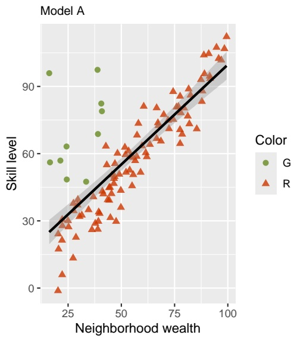

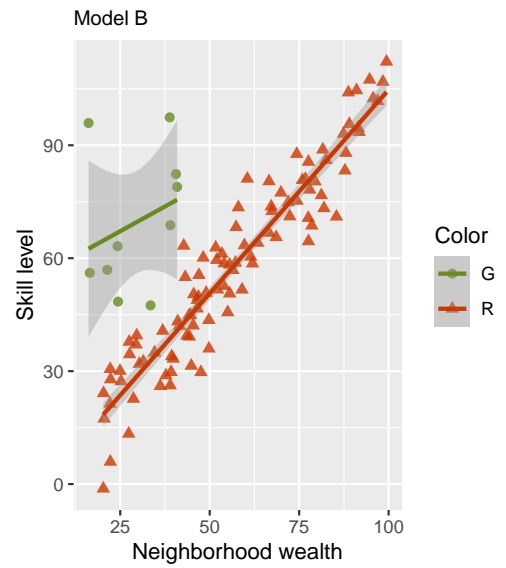

Figure 13.2: Relationship between skills and wealth. Greens (circles) have a much higher skills given their neighborhood wealth than reds (triangles). Because there are only few greens, Model A fails to take it into account, while model B has very noisy estimates.

The model they use is just a linear regression:

$$
\mathrm{skills} _ {i} = \beta_ {0} + \beta_ {1} \cdot \mathrm{wealth} _ {i} + \epsilon_ {i}.\tag{13.3.3}
$$

Its predictions are denoted by the upward sloping black line. The line broadly matches the pattern for the reds and shows that indeed, people from wealthier neighborhoods tend to be more skilled. But it clearly misses the greens–most of the greens tend to do much better than what the black line predicts.

The main problem here is that the model assumes that the relationship between productivity and wealth is identical for both groups. If this were the case, we were just favoring the wealthy candidates in a color-blind manner. But because the relationship differs, the “favoring–wealthy” approach is not color-blind any more. As the Figure shows, there are very productive green candidates but none of them lives even in a neighborhood of average wealth (in the Figure, the average is 54). The model does not take this into account.

A separate problem is that the Greens are a minority. There are just fewer of them, and hence such mistakes are hard to spot. The presence of greens still changes the model by pulling the left end of the black line upward a bit. But the effect is small. Moreover, even if we are able to identify the problem, we may be unable to correct it because the estimates will be too noisy.

The right panel (Model B) displays what happens if we use a more flexible model that allows for different slopes for different groups, by introducing an interaction effect

<!-- page: 480 -->

(see Section 2.1.8 Interactions effects, page 161):

$$
\mathrm{productivity} _ {i} = \beta_ {0} + \beta_ {1} \cdot \mathrm{wealth} _ {i} + \beta_ {2} \cdot \mathrm{wealth} _ {i} \times \mathrm{color} _ {i} + \epsilon_ {i}.\tag{13.3.4}
$$

This model predicts two separate values (separate lines), one for Reds and one for Greens. The average for Reds is fairly similar to the predictions (black line) in the previous model, but the line for greens now lies high above the red line. This captures the fact that in similar neighborhoods, Greens are much more skilled than Reds. We can also see that the error corridor for the green line is very wide because there are just not that many Greens.

Which model is better? No doubt, Model B provides more precise predictions; it is also more fair in the sense that it gives similarly skilled greens and reds a similar chance. But Model B also has a clear downside, namely it explicitly includes color. This seems like a big red flag, comparable of making the test dependent on the candidates’ color.

From a different angle, this is an extremely simple example where we can easily see the problem. But related issues also occur in much more complex cases, such as facial recognition or voice-to-text conversion. Unlike here, we cannot easily tell what are the relevant features in those cases, and if it turns out that the facial recognition model does not recognize women, then we cannot easily point to the underlying problem.

But be aware of that it is not just statistical models that can show different biases. Human decision-makers do can also be easily fooled by characteristics like wealth, by the first impression, or by certain other behavioral traits that different groups may use differently.

## 13.4 Human Versus Algorithmic Decision-Making

Algorithms are often criticized as “obscure”, in particular when the inner workings of those are not published. Sometimes it is claimed that we should not use algorithms at all as algorithms are no less biased than humans. However, such claims miss a few important points. While complex algorithms are always obscure, human mind is no more transparent. While we can publish the inner details of algorithms (although not necessarily understand these), this is not possible in case of human brains. We can also analyze the data, and access possible problems there, but again, this is not possible to do with humans.

Instead of discussing the “obscurity” and “biasedness”, we should ask if algorithms can do better decisions that the relevant humans. For instance, can judges make better decisions if they have access to an algorithmic result? (Kleinberg et al., 2018) show that this is indeed the case in case of NYC judges. The judges have to decide whether to jail or release arrested criminals, and the authors show that judges’ decision is much affected by seemingly random factors. They tend to keep too many low-risk defendants in jail while releasing too many high-risk defendants. Algorithm would achieve a similar crime reduction with 20-40% smaller jail rate, or alternatively, at a similar jail rate it had achieved 25-15% smaller crime rate.

<!-- page: 481 -->

## Appendix A

## Mathematics

These notes assume you are reasonably familiar with basic calculus and a few other mathematical concepts, such as logarithm. Below is a list of the most important rules with little explanations.

## Contents

- A.1 High-School Mathematics ..... 471
- A.1.1 Logarithm ..... 471
- A.1.2 Differentiation ..... 472
- A.1.3 Combinatorics ..... 473
- A.2 Matrix calculus ..... 473

## A.1 High-School Mathematics

## A.1.1 Logarithm

Definition: a is logarithm of x if $\mathrm { e } ^ { a } = x$ where $\mathrm { e } = 2 . 7 1 8 2 8 \ldots$ , and we write $a = \log x$ For instance, log $7 . 3 8 9 \approx 2$ as $\mathrm { e } ^ { 2 }$ ≈ 7.389.

Note: e-based logarithms as defined above are also called natural logarithms, and sometimes denoted by ln instead of log. Often the notation log is reserved for decimal logarithms, defined as $\log _ { 1 0 } x = a$ if $1 0 ^ { a } = x$ . Sometimes (in information theory for instance) we also use binary logarithms where l $\log _ { 2 } x = a \; { \mathrm { i f } } \; 2 ^ { a } = x$ . Notation differs in different fields and between different authors. In these notes, logarithm always means natural logarithm and is denoted by log. If needed, other logarithms are denoted by $\log _ { 1 0 }$ or $\mathrm { l o g } _ { 2 }$ by explicitly writing their base.

Properties

$$
\log x ^ {\alpha} = \alpha \log x \qquad \text {and} \qquad \log (x y) = \log x + \log y\tag{A.1.1}
$$

Logarithms of different base can easily be converted as

$$
\log_ {b} x = \frac {\log x}{\log b}\tag{A.1.2}
$$

<!-- page: 482 -->

## Limits involving logarithm

TBD: lim<sub>x</sub>→1 log x = x − 1 etc

TBD: lim $\scriptstyle \cdot \epsilon \rightarrow 0 ( 1 + \epsilon ) ^ { \alpha } = 1 + \alpha \epsilon$

$$
\lim _ {x \to 0} x \cdot \log x = 0\tag{A.1.3}
$$

## Proof 4

Write x log $x = ( \log x ) / ( 1 / x )$ and use L’Hospital’s rule.

## A.1.2 Differentiation

## Definition

Derivative in case of univariate function is defined as

$$
f ^ {\prime} (x) \equiv \frac {\mathrm{d} f (x)}{\mathrm{d} x} = \lim _ {\Delta x \to 0} \frac {f (x + \Delta x) - f (x)}{\Delta x}.\tag{A.1.4}
$$

The definition in case of multivariate calculus is defined in an analogous way. If we only change one variable at a time, we treat the others as contants, and essentially we are back at the univariate case. Just the result is called partial derivative now, and denoted with ∂ symbol:

$$
\frac {\partial f (x , y , z , \dots)}{\partial x} = \lim _ {\Delta x \to 0} \frac {f (x + \Delta x , y , z , \dots) - f (x , y , z , \dots)}{\Delta x}.\tag{A.1.5}
$$

## List of common differentiation rules

Here is a (non-exhaustive) list of the common rules for calculating the derivative of simple functions, and combinations of functions.

$$
\frac {\mathrm{d}}{\mathrm{d} x} x ^ {\alpha} = \alpha x ^ {\alpha - 1}\tag{A.1.6}
$$

$$
\frac {\mathrm{d}}{\mathrm{d} x} \log x = \frac {1}{x}\tag{A.1.7}
$$

$$
\frac {\mathrm{d}}{\mathrm{d} x} \log_ {b} x = \frac {1}{\log b} \frac {1}{x}\tag{A.1.8}
$$

A few general rules for differentiation:

$$
\frac {\mathrm{d}}{\mathrm{d} x} [ \lambda f (x) + \mu g (x) ] = \lambda f ^ {\prime} (x) + \mu g ^ {\prime} (x) \quad \text {differentiation is a linear operator}\tag{A.1.9}
$$

$$
\frac {\mathrm{d}}{\mathrm{d} x} f (g (x)) = f ^ {\prime} (g (x)) \cdot g ^ {\prime} (x) \quad \text {chain rule}\tag{A.1.10}
$$

$$
\frac {\mathrm{d}}{\mathrm{d} x} f (\lambda x) = \Lambda f ^ {\prime} (x) \quad \text {application of chain rule}\tag{A.1.11}
$$

<!-- page: 483 -->

## A.1.3 Combinatorics

## Binomial-coefficients

Binomial coefficients tell how many different possibilities are there to choose n objects out of S in total. For instance, out of S coins you want to choose n that show heads, how many different ways can you do it? This number is called binomial coefficient and denoted by

$$
\binom{S}{n} = \frac {S !}{n ! (S - n) !}\tag{A.1.12}
$$

For instance, if you want to pick three people out of a group of 10, then you can do it in

$$
\binom {1 0} {3} = \frac {1 0 !}{3 ! \cdot 7 !} = \frac {3 6 2 8 8 0 0}{6 \cdot 5 0 4 0} = 1 2 0
$$

different ways.

Here a brief explanation of the formula. There is S! ways to order the objects. If you pick n out of these, the order in which you pick those does not matter. For instance, (1, 4, 7), (4, 7, 1) and $( 7 , 4 , 1 )$ are equivalent, all these samples contain the exact same elements. Also the order of the $S - n$ leftover elements does not matter, and you can put them in $( S - n ) !$ way. Putting this all together–out of S! possible orders, $n ! \cdot ( S - n ) !$ are equivalent, and hence we get the formula (A.1.12).

## A.2 Matrix calculus

As linear algebra is the language of statistics, we may often want to do optimization in matrix form too. This requires matrix calculus. It is essentialy ordinary calculus, supplemented with a set of rules how to collect back into matrices all the resulting objects that arise when differentiating the individual matrix components.

Start simple. If we have a matrix, we can define it’s derivative with respect to a scalar just as a similar matrix where we have differentiated each component with respect to that scalar:

$$
\frac {\partial}{\partial \lambda} \left[ \begin{array}{c c c c} x _ {1 1} & x _ {1 2} & \dots & x _ {1 K} \\ x _ {2 1} & x _ {2 2} & \dots & x _ {2 K} \\ \vdots & \vdots & \ddots & \vdots \\ x _ {N 1} & x _ {N 2} & \dots & x _ {N K} \end{array} \right] = \left[ \begin{array}{c c c c} \frac {\partial \lambda}{\partial x _ {1 1}} & \frac {\partial \lambda}{\partial x _ {1 2}} & \dots & \frac {\partial \lambda}{\partial x _ {1 K}} \\ \frac {\partial \lambda}{\partial x _ {2 1}} & \frac {\partial \lambda}{\partial x _ {2 2}} & \dots & \frac {\partial \lambda}{\partial x _ {2 K}} \\ \vdots & \vdots & \ddots & \vdots \\ \frac {\partial \lambda}{\partial x _ {N 1}} & \frac {\partial \lambda}{\partial x _ {N 2}} & \dots & \frac {\partial \lambda}{\partial x _ {N K}} \end{array} \right].\tag{A.2.1}
$$

Essentially we take derivatives of each element of a collection (a collection we call matrix) and put these back into a similar collection. So little changes if we differentiate matrices with respect to a scalar.

Differentiation with respect to a vector requires additional rules, however. Let’s take the simplest case: differentiate a scalar function $f : \mathbb { R } ^ { K } \to \mathbb { R }$ with respect to a column vector: ${ \frac { \partial } { \partial x } } f ( x )$ . Note that as $f ( x )$ is a function of the vector x, it can instead be written as $f ( \hat { x } _ { 1 } , x _ { 2 } , \ldots , x _ { K } )$ if x has K components. It is also a scalar function,

<!-- page: 484 -->

i.e. it associates a single number with the input vector x. We define the derivative with respect to the column vector x as:

$$
\frac {\partial}{\partial \boldsymbol {x}} f (\boldsymbol {x}) = \left[ \begin{array}{c} \frac {\partial}{\partial x _ {1}} f (\boldsymbol {x}) \\ \frac {\partial}{\partial x _ {2}} f (\boldsymbol {x}) \\ \dots \\ \frac {\partial}{\partial x _ {K}} f (\boldsymbol {x}) \end{array} \right]\tag{A.2.2}
$$

and w.r.t. the row vector as

$$
\frac {\partial}{\partial \boldsymbol {x} ^ {\prime}} f (\boldsymbol {x}) = \left[ \begin{array}{c c c c} \frac {\partial}{\partial x _ {1}} f (\boldsymbol {x}) & \frac {\partial}{\partial x _ {2}} f (\boldsymbol {x}) & \dots & \frac {\partial}{\partial x _ {K}} f (\boldsymbol {x}) \end{array} \right].\tag{A.2.3}
$$

So we simply take the partial derivatives of the function with respect to all individual components of the vector, and stack the results in a vector of the same shape. So derivative of a scalar function with respect to a vector is a vector of similar shape. It’s not too bad so far.

This rule has a nice application. In case of both x and $\beta$ are $K \times 1$ column vectors, x ${ {  } } ^ { \top } { { \beta } } = { { \beta } } ^ { \top } { { x } } = \beta _ { 1 } x _ { 1 } + \beta _ { 2 } x _ { 2 } + \ldots + \beta _ { K } x _ { K }$ is a scalar. Hence

$$
\frac {\partial}{\partial \boldsymbol {x}} \boldsymbol {x} ^ {\intercal} \boldsymbol {\beta} = \frac {\partial}{\partial \boldsymbol {x}} \boldsymbol {\beta} ^ {\intercal} \boldsymbol {x} = \left[ \begin{array}{c} \frac {\partial}{\partial x _ {1}} (\beta_ {1} x _ {1} + \beta_ {2} x _ {2} + \ldots + \beta_ {K} x _ {K}) \\ \frac {\partial}{\partial x _ {2}} (\beta_ {1} x _ {1} + \beta_ {2} x _ {2} + \ldots + \beta_ {K} x _ {K}) \\ \vdots \\ \frac {\partial}{\partial x _ {K}} (\beta_ {1} x _ {1} + \beta_ {2} x _ {2} + \ldots + \beta_ {K} x _ {K}) \end{array} \right] = \boldsymbol {\beta}.\tag{A.2.4}
$$

This is very similar to the ordinary calculus where $\begin{array} { r } { \frac { \partial } { \partial x } x \cdot \beta = \beta . } \end{array}$

Things get more complex if we want to differentiate a vector function w.r.t a vector. Let’s stay with the cases that are easier to represent: derivative of a column vector function w.r.t a row vector, and the way around. A vector function is a function that associates a vector with each argument value. Let’s look at a function $\pmb { f } : \mathbb { R } ^ { K } \rightarrow \mathbb { R } ^ { N }$ , i.e. it associates a N-dimensional vector with each K-dimensional argument. The concept of vector function is simply a shorthand of writing

$$
\boldsymbol {f} (\boldsymbol {x}) = \left( \begin{array}{c} f _ {1} (\boldsymbol {x}) \\ f _ {2} (\boldsymbol {x}) \\ \dots \\ f _ {N} (\boldsymbol {x}) \end{array} \right)\tag{A.2.5}
$$

i.e. it is a suitably stacked collection of N scalar functions of a vector arguments, which in turn, can be written with no vector notation at all as

$$
\boldsymbol {f} (\boldsymbol {x}) = \left( \begin{array}{c} f _ {1} (x _ {1}, x _ {2}, \dots x _ {K}) \\ f _ {2} (x _ {1}, x _ {2}, \dots x _ {K}) \\ \dots \\ f _ {N} (x _ {1}, x _ {2}, \dots x _ {K}) \end{array} \right).\tag{A.2.6}
$$

<!-- page: 485 -->

Now we have to take a derivative of this stack of functions w.r.t the row vector $x ^ { \top }$ We just take each individual (vertical) component, differentiate it as in (A.2.3), and stack the resulting row vectors vertically. This gives us a matrix:

$$
\frac {\partial}{\partial \boldsymbol {x} ^ {\top}} \boldsymbol {f} (\boldsymbol {x}) \left[ \begin{array}{c c c c} \frac {\partial}{\partial x _ {1}} f _ {1} (\boldsymbol {x}) & \frac {\partial}{\partial x _ {2}} f _ {1} (\boldsymbol {x}) & \dots & \frac {\partial}{\partial x _ {K}} f _ {1} (\boldsymbol {x}) \\ \frac {\partial}{\partial x _ {1}} f _ {2} (\boldsymbol {x}) & \frac {\partial}{\partial x _ {2}} f _ {2} (\boldsymbol {x}) & \dots & \frac {\partial}{\partial x _ {K}} f _ {2} (\boldsymbol {x}) \\ \vdots & \vdots & \ddots & \vdots \\ \frac {\partial}{\partial x _ {1}} f _ {N} (\boldsymbol {x}) & \frac {\partial}{\partial x _ {2}} f _ {N} (\boldsymbol {x}) & \dots & \frac {\partial}{\partial x _ {K}} f _ {N} (\boldsymbol {x}) \end{array} \right].\tag{A.2.7}
$$

So the derivative of N-dimensional column vector w.r.t K dimensional row vector is a $N \times K$ matrix. This is a nice result that can be used in several applications. If A is a $N \times K$ matrix

$$
\frac {\partial \mathsf {A} \boldsymbol {x}}{\partial \boldsymbol {x} ^ {\prime}} = \mathsf {A} \qquad \text {and} \quad \frac {\partial \boldsymbol {x} ^ {\prime} \mathsf {A}}{\partial \boldsymbol {x}} = \mathsf {A}.\tag{A.2.8}
$$

(You simply have to write down the definition of $\mathsf { A } x$ , and use (A.2.3) to $\mathrm { 8 ^ { e t } }$ the result).

Additional useful results without proofs:

$$
\frac {\partial}{\partial \boldsymbol {x}} \boldsymbol {x} ^ {\top} = \left[ \begin{array}{c c c c} \frac {\partial x _ {1}}{\partial x _ {1}} & \frac {\partial x _ {1}}{\partial x _ {2}} & \dots & \frac {\partial x _ {1}}{\partial x _ {K}} \\ \frac {\partial x _ {2}}{\partial x _ {1}} & \frac {\partial x _ {2}}{\partial x _ {2}} & \dots & \frac {\partial x _ {2}}{\partial x _ {K}} \\ \vdots & \vdots & \ddots & \vdots \\ \frac {\partial x _ {K}}{\partial x _ {1}} & \frac {\partial x _ {K}}{\partial x _ {2}} & \dots & \frac {\partial x _ {K}}{\partial x _ {K}} \end{array} \right] = | \quad \frac {\partial}{\partial \boldsymbol {x} ^ {\top}} \boldsymbol {x} = |\tag{A.2.9}
$$

$$
\frac {\partial \mathsf {A} \boldsymbol {x}}{\partial \boldsymbol {x} ^ {\top}} = \mathsf {A}
$$

$$
\frac {\partial \boldsymbol {x} ^ {\top} \mathsf {A}}{\partial \boldsymbol {x}} = \mathsf {A}\tag{A.2.10}
$$

$$
\frac {\partial \boldsymbol {x} ^ {\top} \boldsymbol {x}}{\partial \boldsymbol {x}} = | \boldsymbol {x} + \boldsymbol {x} | = 2 \boldsymbol {x}
$$

$$
\frac {\partial \boldsymbol {x} ^ {\top} \mathsf {A} \boldsymbol {x}}{\partial \boldsymbol {x}} = (\mathsf {A} + \mathsf {A} ^ {\top}) \boldsymbol {x}.\tag{A.2.11}
$$

All these results can be proven by using the definition of matrix multiplication, and the differentiation wrt vector (A.2.2) and (A.2.3).

TBD: chain rule

TBD: $f ( x ) ^ { T } \cdot f ( x )$

<!-- page: 486 -->

<!-- page: 487 -->

## Appendix B

## Datasets

Datasets used in this book originate from various sources. Some are copied from R packages, others are scraped by me. R packages are typically used as-is (e.g. SmokeBan from AER package), but others are provided as CSV files in the [book’s repo](https://faculty.washington.edu/otoomet/machineLearning.pdf). This appendix gives a brief overview of these.

**Boston housing** This is a popular dataset for machine learning, available from various sources. Version here, [boston.csv.bz2](https://bitbucket.org/otoomet/lecturenotes/raw/master/data/boston.csv.bz2) is copied from R’s MASS package, but it is identical to other versions. It has 506 rows, 14 numeric variables and no missings. Each row contains data for one neighborhood (town/tract). The central variable is to be analyzed is typically medv, median value of single-family homes in that neighborhood. Variables:

**crim** per capita crime rate by town.

**zn** proportion of residential land zoned for lots over 25,000 sq.ft.

**indus** proportion of non-retail business acres per town.

**chas** Charles River dummy variable (= 1 if tract bounds river; 0 otherwise).

**nox** nitrogen oxides concentration (parts per 10 million).

**rm** average number of rooms per dwelling.

**age** proportion of owner-occupied units built prior to 1940.

**dis** weighted mean of distances to five Boston employment centres.

**rad** index of accessibility to radial highways.

**tax** full-value property-tax rate per \$10,000.

**ptratio** pupil-teacher ratio by town.

**black** $1 0 0 0 ( B _ { k } - 0 . 6 3 ) ^ { 2 }$ where $B _ { k }$ is the proportion of blacks by town.

**lstat** lower status population (percent)

**medv** median value of owner-occupied homes in \$1000s.

**COVID in Scandinavia** In repo as [covid-scandinavia.csv](https://bitbucket.org/otoomet/lecturenotes/raw/master/data/covid-scandinavia.csv.bz2).

Data about COVID counts and deaths in Scandinavian countries (Denmark, Finland, Norway, Sweden) between January 22, 2020 and Dec 31st, 2020. It is derived from data at [https://raw.githubusercontent.com/datasets/covid-19/master/data/time-series-19-covid-combined.csv](https://raw.githubusercontent.com/datasets/covid-19/master/data/time-series-19-covid-combined.csv).

<!-- page: 488 -->

Columns: **code2** two-letter country code **country** country name **state** (missing for these countries) **date** yyyy-mm-dd **type** deaths/confirmed cases **count** count (cumulative) **lockdown** the start date of the major lockdowns in that country **population** 2020 estimate, does not change **countPC** count divided by population **growth** growth in count from the previous date **growthPC** growth in per capita figures

**Global shark attack file** In repo as [gsaf5-2020.csv](https://bitbucket.org/otoomet/lecturenotes/raw/master/data/gsaf5-2020.csv.bz2). Global Shark Attack File version 5 (GSAF) is accessible through [Shark Research Institute](https://www.sharks.org/global-shark-attack-file) as a [google sheet](https://docs.google.com/spreadsheets/d/1rH3O8JQ1v6tt7swPNbE5B5-AtVr9OtjhhmwpEuBQFbc/edit#gid=1632639634) (as of September, 2023). The version here does include columns href, href formula, Injury, Name and pdf, but columns without names are names as using “V” and the column number. The version here contains 6462 observations and 19 columns.

The dataset is not documented and we are not sure how is it collected. The variables are listed below, but as there is no documentation, everyone may guess what they are. **Case Number Date Year Type Country Area Location V10 Fatal (Y/N) Species Case Number original order V24 Activity Age Time Investigator or Source Case Number V23**

GSAF must not be confused with [International Shark Attack File](https://www.floridamuseum.ufl.edu/shark-attacks/) (ISAF), compiled by Florida Museum. That file is available for research purposes only.

**Growth-unemployment** World Bank data about GDP growth and unemployment across countries. 266 entries. In repo as [growth-unemployment-2016.csv.bz2](https://bitbucket.org/otoomet/lecturenotes/raw/master/data/growth-unemployment-2016.csv.bz2) Columns:

<!-- page: 489 -->

**country** 3-letter acronym **growth** GDP growth, pct **unemployment** unemployment rate (pct)

**Harden** NBA basketball player James Harden 2021-2022 results. Harden is an NBA player, 196 cm tall and weighting 99 kg, born 1989. 2021-2022 season data from [Basketball-reference.com](https://www.basketball-reference.com/players/h/hardeja01/gamelog/2022). In repo as [harden-21-22.csv.bz2](https://bitbucket.org/otoomet/lecturenotes/raw/master/data/harden-21-22.csv.bz2) Columns: **Rk** rank (game id) G season game for Harden **Date** yyyy-mm-dd **Age** years-days **Tm** team **Opp** opponent **GS** games started (=1 as each row is one game) **MP** minutes played **FG** field goals **FGA** field goal attempts **FG%** field goal percentage scored **3P** 3-point field goals **3PA** 3-point attempts **3P% FT** free throw scores **FTA** free throw attempts **FT% ORB** offensive rebounds **DRB** defensive rebounds **TRB** total rebounds **AST** assists **STL** steals **BLK** blocks **TOV** turnovers **PF** personal fouls **PTS** points **GmSc** game score **+/-**

**Heights** The dataset is included in R package [modelr](https://cloud.r-project.org/web/packages/modelr/modelr.pdf). It is an extract from NLSY (National Logitudinal Survey of Youth) 2012 wave. It has 7006 observations and contains variables

**income** Yearly income. Uses top coding: the top two percent of values are averaged and that average is used for all values in the top range.

**height** Height, in inches

**weight** Weight, in pounds

**age** Age, in years, between 47 and 56

**marital** Marital status

<!-- page: 490 -->

**sex** Sex **education** Years of education **afqt** Percentile score on Armed Forces Qualification Test

**Housing** The dataset is included in R package [Ecdat](https://cran.r-project.org/web/packages/Ecdat/index.html). It lists 546 house sale prices in Windsor, Ontario from 1987. Variables: **price** sale price of a house **lotsize** the lot size of a property in square feet **bedrooms** number of bedrooms **bathrms** number of full bathrooms **stories** number of stories excluding basement **driveway** does the house has a driveway ? **recroom** does the house has a recreational room ? **fullbase** does the house has a full finished basement ? **gashw** does the house uses gas for hot water heating ? **airco** does the house has central air conditioning ? **garagepl** number of garage places **prefarea** is the house located in the preferred neighbourhood of the city ?

**Howell’s height-weight data** In repo as [howell-height-weight.csv.bz2](https://bitbucket.org/otoomet/lecturenotes/raw/master/data/howell-height-weight.csv.bz2). If contains age, sex, height and weight of 846 !Kung Sans. Downloaded from from [rethinking R package](https://github.com/rmcelreath/rethinking/blob/master/data/Howell2.csv), but originates from [University of Toronto datasets collection](https://tspace.library.utoronto.ca/handle/1807/10395). The original data is collected by Nancy Howell in 1960s. It contains a number of different samples, e.g. adults only, adult men only, kids only, some snowball sampling... So it is not a representative dataset. Variables: **age.at.death age alive** 1/0 **male** 1/0 **height** cm **weight** kg

**Iris** In repo as [iris.csv.bz2](https://bitbucket.org/otoomet/lecturenotes/raw/master/data/iris.csv.bz2). It is also an R built-in dataset, the version in repo is copied from there. It is collected by Ronal Fisher 1936 (see [Wikipedia](https://en.wikipedia.org/wiki/Iris_flower_data_set)). It contains sepal and petal measures of 150 iris flowers of species setosa, versicolor and virginica (50 of each). The variables are **Sepal.Length** : sepal length, in cm **Sepal.Width**

**Petal.Length Petal.Width Species** : setosa, versicolor, virginica

<!-- page: 491 -->


Figure B.1: Petals and sepals of iris missouriensis. In many flowers, petals are large, bright and colorful, while sepals smaller, green sepals’ primary function is to protect the bud. In case of iris, sepals are even larger and more colorful than petals.

**Males** [males.csv.bz2](https://bitbucket.org/otoomet/lecturenotes/raw/master/data/males.csv.bz2) originates from R package Ecdat. It is a subset of NSLY panel that contains 4360 observations for 545 young men in the U.S. from 1980 to 1987. The variables are: **nr** identifier **year** year **school** years of schooling **exper** years of experience (=age-6-school) **union** wage set by collective bargaining ? **ethn** a factor with levels (black, hisp, other) **maried** married ? **health** health problem ? **wage** log of hourly wage **industry** a factor with 12 levels **occupation** a factor with 9 levels **residence** a factor with levels (rural area, north east, northern central, south)

**Marathon** Marathon half-time and finishing time. A sample of 1000 cases, downloaded from [GitHub](https://raw.githubusercontent.com/jakevdp/marathon-data/master/marathon-data.csv). In repo as [marathon.csv.bz2](https://bitbucket.org/otoomet/lecturenotes/raw/master/data/marathon.csv.bz2) Columns: **age** years **gender** M/F **split** split time (hh:mm:ss) **final** finishing time (hh:mm:ss)

**NC births** Dataset about births in North Caroline. Can be downloaded from [Open-intro webpage](https://www.openintro.org/data/index.php?data=ncbirths) A random sample of 1000 cases from a 2004 pulicly release dataset about births (mothers and childern) in North Carolina. Variables: **fage** Father’s age in years. **mage** Mother’s age in years.

<!-- page: 492 -->

**mature** Maturity status of mother.

**weeks** Length of pregnancy in weeks.

**premie** Whether the birth was classified as premature (premie) or full-term.

**visits** Number of hospital visits during pregnancy.

**gained** Weight gained by mother during pregnancy in pounds.

**weight** Weight of the baby at birth in pounds.

**lowbirthweight** Whether baby was classified as low birthweight (low) or not (not low).

**gender** Gender of the baby, ‘female’ or ‘male’.

**habit** Status of the mother as a ‘nonsmoker’ or a ‘smoker’.

**marital** Whether mother is ‘married’ or ‘not married’ at birth.

**whitemom** Whether mom is ‘white’ or ‘not white’.

Data example:

| fage | mage | mature | weeks | premie | visits | marital | gained | weight |
| --- | --- | --- | --- | --- | --- | --- | --- | --- |
| 28 | 27 | younger mom | 40 | full term | 16 | married | 28 | 8.00 |
| 40 | 34 | younger mom | 37 | full term | 5 | married | 25 | 7.75 |
| 20 | 16 | younger mom | 37 | full term | 13 | not married | 52 | 6.94 |

**Obama approval** Approval rate of the U.S. president Barack Obama from mid-January till mid-May 2016. Data from [RealClearPolitics](https://www.realclearpolitics.com/). In repo as [obama-approval.csv](https://bitbucket.org/otoomet/lecturenotes/raw/master/data/obama-approval.csv) Columns: **poll** poll name **date** poll date range **sample** sample size **approve** approval rate, pct **disapprove** disapproval rate, pct **spread** approval - disapproval

**Smoke ban** Included in AER R package. A dataset of 10000 observations and 7

variables. It is a subset of 1991 National Health Survey.

**smoker** factor. Is the individual a current smoker?

**ban** factor. Is there a work area smoking ban?

**age** age in years.

**education** factor indicating highest education level attained: high school (hs) drop out, high school graduate, some college, college graduate, master’s degree (or higher).

**afam** factor. Is the individual African-American?

**hispanic** factor. Is the individual Hispanic?

**gender** factor indicating gender.

Data example:

<!-- page: 493 -->

| smoker | ban | age | education | afam | hispanic | gender |
| --- | --- | --- | --- | --- | --- | --- |
| no | no | 53 | hs | no | no | female |
| yes | yes | 29 | hs | no | yes | male |
| no | yes | 42 | some college | no | no | female |

**Titanic** In repo as [titanic.csv.bz2](https://bitbucket.org/otoomet/lecturenotes/raw/master/data/titanic.csv.bz2). List of RMS Titanic passengers, their name, age and some more data, and whether they survived the shipwreck. It was collected by the investigation committee, and contains most of the passengers on the boat. The dataset is available in various sources, e.g. at [kaggle](https://www.kaggle.com/datasets/vinicius150987/titanic3). The variables are **pclass** Passenger Class (1 = 1st; 2 = 2nd; 3 = 3rd) **survived** Survival (0 = No; 1 = Yes) **name** Name **sex** Sex **age** Age **sibsp** Number of Siblings/Spouses Aboard **parch** Number of Parents/Children Aboard **ticket** Ticket Number **fare** Passenger Fare **cabin** Cabin **embarked** Port of Embarkation (C = Cherbourg; Q = Queenstown; S = Southampton) **boat** Lifeboat (if survived) **body** Body number (if did not survive and body was recovered) **home.dest** The home/final destination of passenger

**Treatment** In repo as [treatment.csv.bz2](https://bitbucket.org/otoomet/lecturenotes/raw/master/data/treatment.csv.bz2) included from R package Ecdat. A U.S. dataset from 1974, used for evaluating treatment effect of training on earnings. **treat** treated (TRUE/FALSE) **age** age **educ** education in years **ethn** three categories: “other”, “black”, “hispanic” **married** married (TRUE/FALSE) **re74** real annual earnings in 1974 (pre-treatment) **re75** real annual earnings in 1975 (pre-treatment) **re78** real annual earnings in 1978 (post-treatment) **u74** unemployed in 1974 (TRUE/FALSE) **u75** unemployed in 1975 (TRUE/FALSE)

**Yin-Yang** In repo as [yin-yang.csv.bz2](https://bitbucket.org/otoomet/lecturenotes/raw/0aa7401775514f25d3553fd0685d9cf1c4e1d956/data/yin-yang.csv.bz2). A simple artificial dataset that contains points of two color in a Yin-Yang–resembling patter. **x, y** location on plane (approximately between −3 and 3) c color, 0/1 Figure B.2 shows an example of the dataset.

<!-- page: 494 -->

| x | y | c |
| --- | --- | --- |
| -1.628 | 0.584 | FALSE |
| 0.624 | -0.113 | FALSE |
| -0.688 | 1.743 | TRUE |

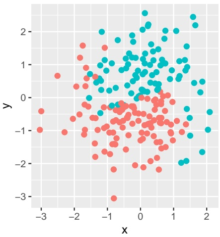

Figure B.2: Yin-Yang data example (left); colored by c (right)

<!-- page: 495 -->

## Appendix C

## Exercise Solutions

- Contents
- C.1 Introduction to Statistics ..... 485
- C.1.1 Basics of probability theory ..... 492
- C.2 Regression models ..... 500
- C.2.1 Linear regression ..... 500
- C.2.2 Logistic regression ..... 504
- C.3 Causality ..... 505
- C.4 Linear Algebra ..... 506
- C.5 Predictive Modeling ..... 509
- C.6 Machine Learning Models ..... 512
- C.6.1 Trees and tree-based methods ..... 512
- C.6.2 Metric distance: A revisit ..... 514
- C.7 Text as data ..... 515
- C.7.1 Naive Bayes ..... 515
- C.8 Neural networks ..... 519
- C.8.1 Feed-forward networks ..... 519
- C.8.2 Convolutional networks ..... 520
- C.9 Machine learning techniques ..... 520
- C.9.1 Gradient descent ..... 520
- C.10 Responsible data science ..... 521

## C.1 Introduction to Statistics

**Solution** (1.3). We have data x = (1, 2, 3, 3, 3, 5, 5, 10).

1. Mean is

$$
\bar {x} = (1 + 2 + 3 + 3 + 3 + 5 + 5 + 1 0) / 8 = 3 2 / 8 = 4
$$

<!-- page: 496 -->

2. Median is 3 as the “middle” of the data is between two “3”-s (there are three numbers smaller than 3 and three numbers larger than 3).

3. mode is 3 as this is the most frequent number.

If one data point is missing, we cannot compute mean. For median, we can tell that it must be between 3 and 5: if the missing data point is smaller than 3, the median is still 3. If it is larger than 5, there are 3 numbers no larger than 3 and 3 numbers no smaller than 5 in the data, and hence median is between 3 and 5 (potentially equal to either 3 or 5). So we have bounds on the median. The mode will be either 3 (if the missing value is not 5), or it is a bimodal dataset with modes both 3 and 5 (if the missing value is 5).

**Solution** (1.1). • Talent show result: this is clearly ordinal measure: we can say that first place is better than second, or 7th place is better than 8th; but the difference between 1st and 2nd, and 7th and 8th is undetermined. We can order the results, but their difference does not mean anything.

• Height in cm: this is ratio. Height differences are well defined and height has a well-defined zero.

• Height in feet, inches. This is ratio as well. It is measured in a different way than in case of cm, but it is height nevertheless with the same properties.

• Colors by name: this is a nominal measure. Colors do not have any inherent order, humans have invented many different orderings and all of those are equally valid.

• Temperature in C: this is an interval measure: temperature difference makes much sense (“today is 10 degrees warmer...”) but the zero is fairly arbitrary (“today is twice as warm” does not tell much).

• IMDB movie ratings: movie ratings are ordered measures. The order is well defined, but the difference does not carry much real meaning: the movies rated 7 and 7.5, and movies rates 9 and 9.5 may not differ by equal amount (whatever it means).

**Solution** (1.2). Average length is marked with the thick red line on top of the figure. As there are 15 lines, the combined length is 15 times longer than the average.

People almost always find the it very easy to estimate the average, the total length is much harder to evaluate. We are just built to be good with averages.

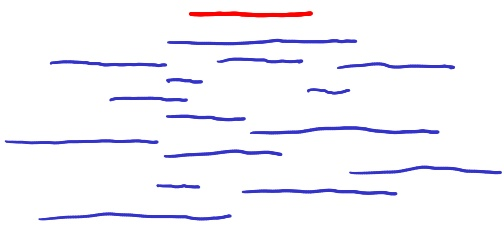

**Solution** (1.3). 1. The sequence contains eight values. Mean, the average, is

$$
\bar {x} = \frac {1}{8} (1 + 2 + 3 + 3 + 3 + 5 + 5 + 1 0) = \frac {3 2}{8} = 4.
$$

2. Median is the middle value. 8 elements do not have a middle value, but when put into an increasing order, both the $4 t h$ and 5th elements are “3”. Hence the median is 3.

<!-- page: 497 -->

3. Mode is the most common value, here the value ${ \it ^ { \mathrm { ~ 2 ~ } } } \mathcal { B } ^ { \it { \mathrm { ~ 3 ~ } } }$ is present three times. Hence ${ \it ^ { \mathrm { ~  ~ } } \mathrm { ~  ~ } } ^ { \it { \mathrm { ~  ~ } } }$ is also the mode.

When the first element is missing, then we cannot compute the mean. It can be any number, if the missing element is chosen accordingly. However, we can still put some limits on the mean, $i f$ we limit the feasible values of the first missing element somehow.

In order to compute the bounds on the median, we can compute it for two cases: first, if the missing element is small (smaller than any other in the sequence); and second, if it is large (larger than any other element). In the first case, it is positioned as the first element in the sequence (as it is displayed in an increasing order) and hence the median is “3”. In the latter case, it will be the last element in the sequence, that now looks as (2, 3, 3, 3, 5, 5, 10, NA). The true median value must be between these two extreme cases, and hence we can say that the median is between 3 and 5.

In case of mode, there are really only two possibilities: first, if the missing number $i s \quad  " 5 \text{" };$ , then we have a bi-modal sequence where both ${ } ^ { \alpha } \mathcal { B } ^ { \beta }$ and ${ { } ^ { \prime } } { { \tilde { \mathcal { D } } } } ^ { \prime \prime }$ are modes. In any other case, the sequence is unimodal with mode ${ } ^ { \alpha } { \mathcal { B } } .$

**Solution** (1.4). It is easier to use the shortcut formula (1.3.3).

1. For $x _ { 1 }$ we have the mean $\bar { x } _ { 1 } = 1$ and $\bar { x _ { 1 } ^ { 2 } } = 4$ . Hence variance is $4 - 1 ^ { 2 } = 3$

2. In an analogous fashion, for x2 we have $\bar { x } _ { 1 } = 1 0$ and $\bar { x _ { 1 } ^ { 2 } } = 4 0 0$ . Hence variance is $400-10^{2}=300$

3. In this case, the mean is $\bar { x } _ { 3 } = \lambda$ and $\bar { x _ { 3 } ^ { 2 } } = 4 \lambda ^ { 2 }$ . Hence the variance is $4 \lambda ^ { 2 }   -   \lambda ^ { 2 } =$ 3λ.

4. We know that

$$
s _ {y} ^ {2} = \bar {y ^ {2}} - (\bar {y}) ^ {2}.
$$

Hence

$$
s _ {\lambda y} ^ {2} = \overline {{(\lambda y) ^ {2}}} - (\overline {{\lambda y}}) ^ {2} = \lambda^ {2} \bar {y ^ {2}} - \lambda^ {2} (\bar {y}) ^ {2} = \lambda^ {2} s _ {y} ^ {2}.
$$

So $i f$ we multiply the sequence by a number, the variance will be multiplied by the number squared.

**Solution** (1.5). The ordered data looks like (1,1,1,2,2,3). The figure, analogous to Figure 1.6, is

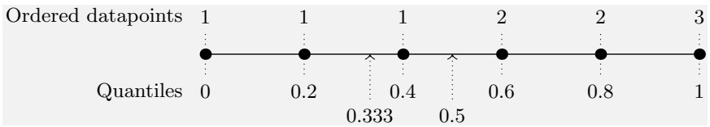

Figure C.1: Sample quantiles, defined by data points.

1. We have 6 data points. The min and max values define quantiles 0 and 1, and the other four points split the [0,1] interval into five sub-intervals. Hence the data defines: q<sub>0</sub>, q<sub>0.2</sub>, q<sub>0.4</sub>, q<sub>0.6</sub>, q<sub>0.8</sub> and $q _ { 1 }$ (see the Figure above).

2. The figure shows that median must be between 1 and 2; the upper quintile $q _ { 0 . 8 } = 2$ as that is determined by a data point. The lower tertile, $q _ { 1 / 3 }$ must be between 1 and 1, hence $q _ { 1 / 3 } = 1$

<!-- page: 498 -->

**Solution** (1.6). For $\pmb { x } = ( 1 , 1 , 2 , 1 , 2 , 1 )$ we have $\bar { x } = 8 / 6 \approx 1 . 3 3 3$ , median $q _ { 0 . 5 } = 1$ and $q _ { 0 . 9 } = 2$

For $\tilde { \pmb { x } } = ( 1 , 1 , 2 , 1 , 2 1 )$ we have $\bar { x } = 5 . 2$ , median $q _ { 0 . 5 } = 1$ and $q _ { 0 . 9 } \in [ 2 , 2 1 ]$

The typo left median unchanged, but affected mean quite a lot. $F o r ~ q _ { 0 . 9 }$ , the effect is large too–in the correct dataset it is 2, but the type made it not to be point-identified any more. We just know it belongs to the interval [2,21].

In general, median is much more robust (less affected by outlier and typos) than mean, the extreme quantiles like $q _ { 0 . 9 }$ may be quite sensitive though.

**Solution** (1.8). The sample space of the problem in simple events is

|  | 1 | 2 | Die 23 | 4 | 5 | 6 |
| --- | --- | --- | --- | --- | --- | --- |
| 1 | (1,1) | (1,2) | (1,3) | (1,4) | (1,5) | (1,6) |
| 2 | (2,1) | (2,2) | (2,3) | (2,4) | (2,5) | (2,6) |
| Die 1 3 | (3,1) | (3,2) | (3,3) | (3,4) | (3,5) | (3,6) |
| 4 | (4,1) | (4,2) | (4,3) | (4,4) | (4,5) | (4,6) |
| 5 | (5,1) | (5,2) | (5,3) | (5,4) | (5,5) | (5,6) |
| 6 | (6,1) | (6,2) | (6,3) | (6,4) | (6,5) | (6,6) |

where we have marked the simple events of interest that correspond to the compound event in blue. All these events are equally likely $( I / \mathcal { B } \delta )$ as the dies are independent and fair.

So the compound event of interest is made of 11 simple events, all of equal probability of 1/36, and hence its probability is 11/36.

**Solution** (1.9). 1. The conditioning event is traveling in the 1st class. From the table, we see that there were $200+123=323$ 1st class passengers, out of whom 200 survived. Hence Pr(survived|traveled in 1st class) = 200/323 = 0.619.

2. Now the conditioning event is survival. We have $2 0 0 { + } 1 1 9 { + } 1 8 1 = 5 0 0$ survivors, out of whom 200 traveled in the 1st class. Hence Pr(traveled in 1st class|survived) = $200/500=0.4$

**Solution** (1.10). From the definition of conditional probability

$$
\Pr (f e m a l e | s u r v i v e d) = \frac {\Pr (f e m a l e , s u r v i v e d)}{\Pr (s u r v i v e d)} = \frac {3 3 9 / 1 3 0 9}{5 0 0 / 1 3 0 9} = 6 7. 8 \%.
$$

It may be slightly confusing to understand what is “female given survived” as that does not align with the intuitive causal interpretation of the opposite question (survived given female). Survival will not make a given passenger more or less female.

But this is perfectly valid conditional probability, it describes the chances that a random survivor you pick is female.

**Solution** (1.11). We can denote the simple events regarding the gender as $( g _ { 1 } , g _ { 2 } )$ where $g _ { 1 }$ means the gender of the first child and g<sub>2</sub> the gender of the second child. The sample space contains 4 simple events: $( G , G ) , ( G , B ) , ( B , G ) , ( B , B )$ where G

<!-- page: 499 -->

and B denote that the corresponding child is a girl/boy. All these simple events are equally likely, and have probability $I / 4$

The event of interest, the other one is also a girl, corresponds to the event $( G , G )$ The conditioning event one of them is a girl removes the last option, (B, B) from considerations. Hence we are left with one event of interest out of 3 possible events, all $o f$ which have probability $I / 4$ . The conditional probability (from (1.4.7)) is

$$
p = \frac {1 / 4}{3 / 4} = \frac {1}{3}.
$$

Alternatively, we can think about 100 families with two children. 25 of them are $( G , G ) ,   \mathcal { D }$ are $( G , B ) ,   \mathcal { D } ^ { \prime }$ are $( B , G )$ and 25 are of $\text{" }type \text{" }(B,B)$ . Here 75 families fit the description of having a daughter, and $2 5 / 7 5 = 1 / 3$ of them have two daughters.

This is a problem where clear understanding of the concepts of events and sample space is extremely helpful.

**Solution** (1.12). First, note that conditional probability is not related to causality. The fact that someone survived did not make her more or less likely to have been in first class. We can imagine this is an answer to a question: “Take all Titanic survivors. Pick a random survivor. What is the probability she was in first class” $^ { \ast } \stackrel { \mathcal { O } } { \underset { \bullet } { } }$

This is a simple task employing Bayes theorem, where we have denoted $\operatorname* { P r } ( S =$ $1 | C = 1 ) = 0 . 6 1 9 ,   \operatorname* { P r } ( C = 1 ) = 0 . 2 4 7 ,$ , and $\operatorname* { P r } ( S = 1 ) = 0 . 3 8 2$ . Hence the probability of interest

$$
\Pr (C = 1 | S = 1) = \frac {\Pr (S = 1 | C = 1) \cdot \Pr (C = 1)}{\Pr (S = 1)} = \frac {0 . 6 1 9 \cdot 0 . 2 4 7}{\Pr (0 . 3 8 2)} = 0. 4 0 0.
$$

So 40% of survivors were first class passengers.

If one has access to the actual numbers, it is easy to check: there were 200 first class passengers among 500 survivors.

**Solution** (1.13). We have $\operatorname* { P r } ( A ) = 0 . 5$ because two types of bags are equally likely. We also know that $\operatorname* { P r } ( R e d | A ) = 2 / 3$ and $\operatorname* { P r } ( R e d | B ) = 1 / 3$

## 1. From Bayes theorem

$$
\Pr (A | R e d) = \frac {\Pr (R e d | A) \cdot \Pr (A)}{\Pr (R e d) .}
$$

We can compute

$$
\Pr (R e d) = \Pr (R e d | A) \cdot \Pr (A) + \Pr (R e d | B) \cdot \Pr (B) = 2 / 3 \cdot 1 / 2 + 1 / 3 \cdot 1 / 2 = 1 / 2.
$$

Plugging this into the expression above, we have

$$
\Pr (A | R e d) = \frac {2 / 3 \cdot 1 / 2}{1 / 2} = 2 / 3.
$$

So pulling a red candy out of the bag makes it more likely it is an $A { \operatorname { - } } b a g _ { i }$ , but it is by no means certain.

<!-- page: 500 -->

2. Now she pulls out two red candies. The solution is similar as above, just the event of interest is not Red, but Red, Red; and we have to adjust the probabilities accordingly. From Bayes’ theorem, we have

$$
\Pr (B | R e d, R e d) = \frac {\Pr (R e d , R e d | B) \cdot \Pr (B)}{\Pr (R e d , R e d)}.
$$

Now we need to compute

$$
\begin{array}{c} \operatorname * {P r} (R e d, R e d) = \operatorname * {P r} (R e d | A) \cdot \operatorname * {P r} (A) + \operatorname * {P r} (R e d, R e d | B) \cdot \operatorname * {P r} (B) = \\ \qquad \qquad \qquad = (2 / 3) ^ {2} \cdot 1 / 2 + (1 / 3) ^ {2} \cdot 1 / 2 = 5 / 1 8. \end{array}
$$

The probabilities of the compound event Red, Red, $( 2 / 3 ) ^ { 2 }$ for the bag A and $( 1 / 3 ) ^ { \bar { 2 } }$ for the bag B, assume that the events are independent. Here it means that removing one candy does not alter the probabilities of the remaining candies in the bag. This is (approximately) true if the bags are large.

Plugging this into the expression above, we have

$$
\Pr (A | R e d, R e d) = \frac {(1 / 3) ^ {2} \cdot 1 / 2}{5 / 1 8} = 1 / 5
$$

So when she pulls out two red $M \& M \text { - } s ,$ it is not that likely that it is an A-bag. But 20% is still probability we should not ignore.

**Solution** (1.14). We can use Bayes theorem to find

$$
\Pr (l i o n | s t e p s) = \frac {\Pr (s t e p s | l i o n) \cdot \Pr (l i o n)}{\Pr (s t e p s)}.\tag{C.1.1}
$$

Before we can do this, we need to compute Pr(steps). As $\mathrm { P r } ( \mathit { n e i g h b o r } ) = 0 . 9$ , we have that $\operatorname* { P r } ( \mathit { l i o n } ) = 0 . 1$ , and now

$$
\begin{array}{r l} \operatorname * {P r} (s t e p s) = \operatorname * {P r} (s t e p s | l i o n) \cdot \operatorname * {P r} (l i o n) + \operatorname * {P r} (s t e p s | n e i g h b o r) \cdot \operatorname * {P r} (n e i g h b o r) = \\ & = 0. 6 \cdot 0. 1 + 0. 2 \cdot 0. 9 = 0. 2 4. \end{array}\tag{C.1.2}
$$

Before we apply the Bayes’ theorem, it is instructive to think what does this number mean. You can imagine we have “1000 nights”, 100 of which are “lion nights”, nights where the hungry lion hunts. The rest, 900 nights, are “no-lion nights” where the neighbor may be walking around. Out of the 100 “lion-nights”, we hear steps 60 times, but in 900 “non-lion nights”, the steps are there in 180 nights. So all-in-all, we hear steps 240 times through these 1000 nights.

Plugging this into (C.1.1) above we get

$$
\Pr (l i o n | s t e p s) = \frac {0 . 6 \cdot 0 . 1}{0 . 2 4} = 0. 2 5.
$$

So the probability that the noise is made by lion is 25%. But should you smile or should you fight? I would probably grab a burning stick and be ready to fight–if it turns out my neighbor, it is embarrassing. But if I sit and smile, and a lion suddenly jumps out of the shadows, then it was my last smile.

**Solution** (1.7).

<!-- page: 501 -->

**Quintile share ratio** Computing QSR is straightforward:

1. The wealth values (1, 1, 1, 1, 16) are already in an increasing order. We have five people, hence the poorest quintile owns 1 and the wealthiest owns 16. So $\mathit { Q S R } = 1 6$

2. The wealth values (1, 2, 3, 4, 5, 7, 8, 10, 70, 90) are ordered. We have 10 people, so the lowest quintile consist of two poorest persons, and the top quintile consists of two ricest persons. The two poorest own $1   +   2   =   3 ,$ the two richest own $70+90=160$ . So $\mathit { Q S R } = 1 6 0 / 3 \approx 5 3$

**Pareto ratio** is harder to compute. We need to make a table that shows how much do own each different percentage of the wealthiest people.

1. The five person case has the total wealth $T   =   2 0 .$ The following table shows what are the population and wealth shares when we start picking the wealthiest people, one after another. For each number of the wealthiest people N, the table show their percentage (Top Share), the corresponding bottom share, the total wealth of the top share, and their wealth share.

| N | Top Share (%) | Bottom Share (%) | Wealth | Wealth Share (%) |
| --- | --- | --- | --- | --- |
| 1 | 20 | 80 | 16 | 16/20 = 0.8 |
| 2 | 40 | 60 | 16 + 1 = 17 | 17/20 = 0.85 |
| 3 | 60 | 40 | 16 + 1 + 1 = 18 | 18/20 = 0.9 |
| 4 | 80 | 20 | 16 + 1 + 1 + 1 = 19 | 19/20 = 0.95 |

Here clearly we hit the Pareto ratio with the single wealthiest person. They make 20% of the population and own 80% of the total wealth.

2. The 10-person case. Now the total wealth of (1, 2, 3, 4, 5, 7, 8, 10, 70, 90) is $T =$ 200: We need a similar table:

| N | Top Share (%) | Bottom Share (%) | Wealth | Wealth Share (%) |
| --- | --- | --- | --- | --- |
| 1 | 10 | 90 | 90 | 90/200 = 0.45 |
| 2 | 20 | 80 | 90 + 70 = 160 | 160/200 = 0.8 |
| 3 | 30 | 70 | 90 + 70 + 10 = 170 | 160/200 = 0.85 |
| … |  |  |  |  |

Here top-20%, the two wealthiest persons, make the Pareto ratio. Together they own 160 or 80% of the total wealth.

<!-- page: 502 -->

## C.1.1 Basics of probability theory

**Solution** (1.15). Let 0 correspond to the case where there were no $\delta { - } s$ on the dice, and 1 if there were at least on ${ \it O } .$ We can write the RV as

$$
X = \left\{ \begin{array}{l l} 1 & \text {if} \quad X \in \{(1, 6), (2, 6), (3, 6), (4, 6), (5, 6), (6, 6), \\ & (6, 5), (6, 4), (6, 3), (6, 2), (6, 1) \} \\ 0 & \text {otherwise} \end{array} \right.\tag{C.1.3}
$$

**Solution** (1.16). Here is the $6 \times 6$ table of all possible outcomes with sum 6 highlighted in blue:

Sum of two dies

|  | 1 | D2 | ie 23 | 4 | 5 | 6 |
| --- | --- | --- | --- | --- | --- | --- |
| 1 | 2 | 3 | 4 | 5 | 6 | 7 |
| 2 | 3 | 4 | 5 | 6 | 7 | 8 |
| 3 | 4 | 5 | 6 | 7 | 8 | 9 |
| Die 1 4 | 5 | 6 | 7 | 8 | 9 | 10 |
| 5 | 6 | 7 | 8 | 9 | 10 | 11 |
| 6 | 7 | 8 | 9 | 10 | 11 | 12 |

There are clearly 5 ways to get sum $\mathcal { O } ,$ hence the corresponding probability $\operatorname* { P r } ( Z =$ $6 ) = 5 / 3 6$

**Solution** (1.17). If the die is $f a i r ,$ all sides have probability $1 / 6$ . Hence the expected value

$$
\mathbb {E} D = \frac {1}{6} \cdot 1 + \frac {1}{6} \cdot 2 + \dots + \frac {1}{6} \cdot 6 + = \frac {1}{6} (1 + 2 + \dots + 6) = 3. 5
$$

**Solution** (1.18). 1. The easiest way to prove the probabilities is to present the sample space as $a ~ 6 \times 6$ table where we list the number of sixes:

|  | 1 | Di2 | e 23 | 4 | 5 | 6 |
| --- | --- | --- | --- | --- | --- | --- |
| 1 | 0 | 0 | 0 | 0 | 0 | 1 |
| 2 | 0 | 0 | 0 | 0 | 0 | 1 |
| Die 1 3 | 0 | 0 | 0 | 0 | 0 | 1 |
| 4 | 0 | 0 | 0 | 0 | 0 | 1 |
| 5 | 0 | 0 | 0 | 0 | 0 | 1 |
| 6 | 1 | 1 | 1 | 1 | 1 | 2 |

One can easily see that out of the 36 cases, in $\mathcal { 2 5 }$ we have no sixes, in $1 \mathit { 0 }$ cases we have a single six, and in one case we have two sixes.

2. Using the definition (1.4.17) we have

$$
\mathbb {E} X = 2 5 / 3 6 \cdot 0 + 1 0 / 3 6 \cdot 1 + 1 / 3 6 \cdot 2 = 1 2 / 3 6 = 1 / 3.
$$

<!-- page: 503 -->

**Solution** (1.20)**. a)** First we have to find the expected value: E $X = 0 . 2 5 \cdot ( - 1 ) + 0 . 5$ $0 + 0 . 2 5 \cdot 1 = 0$ . It is also immediately obvious as the values are symmetric around 0. Next, let us do a table, similar to Table 1.6:

| x | Pr(X = x) | X - EX | (X - EX)<sup>2</sup> |
| --- | --- | --- | --- |
| -1 | 0.25 | -1 | 1 |
| 0 | 0.50 | 0 | 0 |
| 1 | 0.25 | 1 | 1 |

Note that as $E X = 0$ , the columns 1 and 3 are the same. Variance, the expected value of the last column is Var $X = \mathbb { E } ( X - \mathbb { E }   X ) ^ { 2 } = 0 . 2 5 \cdot 1 + 0 . 2 5 \cdot 1 = 0 . 5 .$

**b)** We already know E X, so we have to ${ \it f i n d ~ \mathbb { E }   X ^ { 2 } \colon \mathbb { E }   X ^ { 2 }   =   0 . 2 5 \cdot ( - 1 ) ^ { 2 } + 0 . 5 }$ $0 ^ { 2 } + \dot { 0 } . 2 5 \cdot 1 ^ { 2 } = 0 . 5$ . The variance is Var $X = \operatorname { \mathbb { E } } X ^ { 2 } - ( \operatorname { \mathbb { E } } X ) ^ { 2 } = 0 . 5 - 0 = 0 . 5 .$

As the example demonstrates, in case of $\mathbb { E }   X = 0$ , the variance is equal to just E $X ^ { 2 }$

**Solution** (1.21). First let’s use the **variance definition** (1.4.21). Write a similar extended table as Table $1 . 4$ on page 21:

| 1 | 2 | 3 | 4 |  |
| --- | --- | --- | --- | --- |
| x | $\Pr(X = x)$ | $x - \mathbb{E}X$ | $(x - \mathbb{E}X)^2$ | $x^2$ |
| 0 | 1 - p | -p | $p^2$ |  |
| 1 | p | 1 - p | $(1 - p)^2$ |  |

From the first two columns we can immediately see that the expected value is

$$
\mathbb {E}   X = (1 - p) \cdot 0 + p \cdot 1 = p.
$$

Now we can compute the deviations −p and $1 - p$ in the 3rd column; and deviationssquared $p ^ { 2 }$ and $( 1 - p ) ^ { 2 }$ in the 4th column. Variance is the expected value of the last column:

$$
\mathrm{Var} X = (1 - p) \cdot p ^ {2} + p \cdot (1 - p) ^ {2} = p (1 - p).
$$

When using the **shortcut formula** (1.4.22), we first need to compute E $X ^ { 2 }$ . As the possible values are just 0 and 1, the squares of the values are the same, and hence E $X ^ { 2 } = p _ { z }$ the same number as E X. Now we have

$$
\operatorname{Var} X = \mathbb {E}   X ^ {2} - (\mathbb {E}   X) ^ {2} = p - p ^ {2} = p (1 - p).
$$

**Solution** (1.22). Independence assumption is used to compute the probabilities for Z realizations. For instance, in the first line in Table 1.8 we have $\operatorname* { P r } ( X _ { 1 } = 0 ) = 0 . 5$ and $\operatorname* { P r } ( X _ { 2 } = 0 ) = 0 . 5$ . In column 6 we conclude that $\operatorname* { P r } ( X _ { 1 } = 0 , X _ { 2 } = 0 ) = 0 . 2 5$ . This is correct only $\mathit { i f } \: X _ { 1 }$ and $X _ { 2 }$ are independent.

**Solution** (1.23). 1. The definition of expected value is (1.4.17) E $\begin{array} { r } { X = \sum _ { i } p _ { i } x _ { i } } \end{array}$ . By multiplying all values by λ we have

$$
\mathbb {E} \lambda X = \mathbb {E} X = \sum_ {i} p _ {i} \lambda x _ {i} = \lambda \sum_ {i} p _ {i} x _ {i} = \lambda \mathbb {E} X.
$$

<!-- page: 504 -->

2. The definition of variance (1.4.21) is Var $X = \operatorname { \mathbb { E } } ( X - \operatorname { \mathbb { E } } X ) ^ { 2 }$ . We need to use the definition of the expected value and Theorem 2:

$$
\begin{array}{r l} \operatorname{Var} \lambda X = \mathbb {E} (\lambda X - \mathbb {E} \lambda X) ^ {2} = \sum_ {i} p _ {i} (\lambda x _ {i} - \lambda \mathbb {E} X) ^ {2} = \\ & = \sum_ {i} p _ {i} \left(\lambda (x _ {i} - \mathbb {E} X)\right) ^ {2} = \sum_ {i} p _ {i} \lambda^ {2} (x _ {i} - \mathbb {E} X) ^ {2} = \end{array}
$$

$$
= \lambda^ {2} \mathrm{Var} X.
$$

So if you multiply a RV by λ, it variance will be multiplied by λ<sup>2</sup>.

**Solution** (1.25). x is possible value: this is a table over possible values and the corresponding probabilities. As realizations are random, we would have different tables each time we conduct the experiment.

**Solution** (1.26). X must be ordinal for the comparison in (1.5.3) to have a meaning.

**Solution** (1.27). 1. Who survived: events are “survived” and “died”, can describe by Bernoulli

2. Admitted: events are “admitted”, “rejected”, can use Bernoulli. But note that if we add a third option “waitlisted”, then it is either a multinomial process with three outcomes, or we need to look at events “admitted”, “not admitted”.

3. Majors: events are different majors, if there are more than two, then we cannot use Bernoulli

4. How many years: events is duration in years, this is a continuous variable. Cannot use Bernoulli.

5. “Did they drop out”: we can use Bernoulli with events “dropped out”, “did not drop out”.

6. Engineering students more likely…This is a question that cannot be answered for each student individually–there is a single answer for a sample, it requires comparing two types of students (engineering and non-engineering students). So it is not about just Bernoulli, it is about comparing two different Bernoullis.

**Solution** (1.28). Denote the sameple size S = 5 and probability to receive an order p = 0.5. This is a Binom(5, 0.5) distribution:

• Expected value is $S   p = 5 * 0 . 5 = 2 . 5$

$\operatorname* { P r } ( X = 0 ) = { \binom { 5 } { 0 } } p ^ { 0 } ( 1 - p ) ^ { 5 } = 0 . 5 ^ { 5 } = 0 . 0 3 1 2 5 .$ So roughly one week out of 30.

$\operatorname* { P r } ( X   =   5 )   =   { \binom { 5 } { 5 } } p ^ { 5 } ( 1   -   p ) ^ { 0 }   =   0 . 5 ^ { 5 }   =   0 . 0 3 1 2 5$ . The same outcome, because $p = 0 . 5 .$

• A likely reason is that shopping is seasonal–in some weeks (before certain holidays) people are shopping much more than in other times. Hence, even $\mathit { i f }   p = 0 . 5$ when averaged over a year, different weeks have actually different probabilities.

<!-- page: 505 -->

**Solution** (1.29). Standard uniform as specified in (1.5.15) has density 1 in the interval [0,1]. So all values between 0 and 1 are equally likely, and values outside of this interval are impossible. Hence the lower 2.5% quantile is the lowest 2.5% end of this interval, $q _ { 0 . 0 2 5 } = 0 . 0 2 5$ and upper 2.5% quantile is the top 2.5% of this interval, $q _ { 0 . 9 7 5 } = 0 . 9 7 5$

**Solution** (1.30). The distribution of rooms in Boston data is centered at $\sim 6 . 2$ and has standard deviation 0.7. Here is R code that plots the curve, the normal $p . d . f .$ is directly coded:

```r
sigma <- 0.7
mu <- 6.2
curve(
    1/sqrt(2*pi)/sigma*
    exp(-1/2*(x - mu)^2/sigma^2),
    3, 9, ylab = "Density")
```

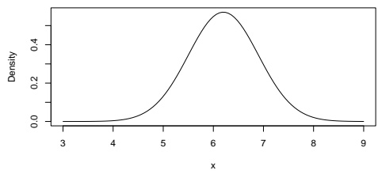

You can achieve this with the built-in function for normal density,

dnorm():

```txt
curve(dnorm(x, mu, sigma), 3, 9,
    ylab = "Density")
```


The economic growth is centered around 2 with standard deviation approximately 4. Here is the relevant python code using the pre-defined scipy.stats.norm():

```python
import numpy as np
import matplotlib.pyplot as plt
from scipy.stats import norm

mu = 2
sigma = 4
x = np.linspace(-15, 25, 100)
y = norm.pdf(x, loc = mu,
                     scale = sigma)
plt.plot(x, y)
plt.show()
```

<!-- page: 506 -->

S=3, avg=0.507, var=0.041

S=25, avg=0.502, var=0.005

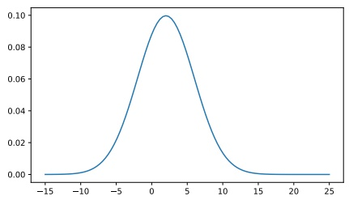

**Solution** (1.31). $\mathit { I f }   x _ { 0 } = 1$ , the Pareto $p . d . f .$ is (from (1.5.21)):

$$
f (x) = \alpha x ^ {- \alpha - 1}, \quad x > 1.
$$

From the definition of expected value (1.5.12),

$$
\begin{array}{c} \mathbb {E}   X = \int_ {1} ^ {\infty} \alpha x ^ {- \alpha - 1} x   \mathrm{d} x = \alpha \int_ {1} ^ {\infty} x ^ {- \alpha}   \mathrm{d} x = \\ \qquad \qquad = \alpha   \frac {x ^ {- \alpha + 1}}{- \alpha + 1} \bigg | _ {1} ^ {\infty} = \frac {\alpha}{\alpha - 1}   x ^ {- \alpha + 1} \big | _ {\infty} ^ {1} = \\ \qquad \qquad \qquad = \frac {\alpha}{\alpha - 1} [ 1 - 0 ] = \frac {\alpha}{\alpha - 1}. \end{array}
$$

The second row flips the sign of the denominator $- \alpha + 1$ to $\alpha - 1$ and at the same time swaps the limits of the integral.

The last row uses the fact that $\infty ^ { - \alpha + 1 } = 0$ , if and only if $\alpha > 1$ . This is where the condition for existence of the expected value originates–if $\alpha \leq 1$ , then this it not true, and the integral diverges.

**Solution** (1.32). The histogram of realizations $S = 1$ resembles a cup; $S = 2$ has a triangular distribution, but already from $S = 3$ onward the result looks fairly close to normal (R = 1000)

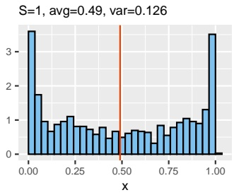

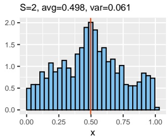

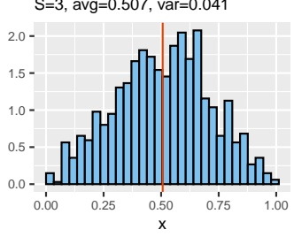

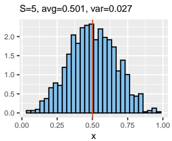

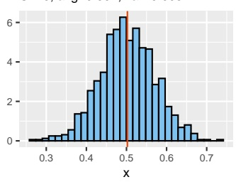

S=100, avg=0.499, var=0.001

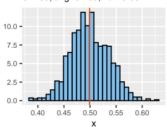

<!-- page: 507 -->

**Solution** (1.34). 1. No, it means that the average of the sample tubes had hydration level 66%. You do not know what is it in the other tubes–the overall value may still be 60% or even less. However, it is not very likely that it differs much from 66.

2. A suitable hypothesis here is just that the run corresponds to the specification: $H_{0}:h=60\%$ , where h is the hydration level. If we can reject $H _ { 0 }$ , then the run does not correspond to the specification.

3. The critical z values are $z _ { c r } ^ { 0 . 0 5 } = 1 . 9 6$ and $z _ { c r } ^ { 0 . 0 1 } = 2 . 5 8$ . The actual value 2.01 is larger than $z _ { c r } ^ { 0 . 0 5 }$ , hence can reject it at 5% level. But it is smaller than $z _ { c r } ^ { 0 . 0 1 }$ hence cannot reject at 1% level.

4. Rejecting $H _ { 0 }$ means it is not compatible with data. Or more precisely–if $H _ { 0 }$ : $h = 0 . 6$ is correct then it is unlikely that you will see the hydration value 0.66 in the sample. Rejecting it at significance 5% level means that 5% is considered $\text{" } unlickely \text{" }.$ Not rejecting it at 1% level means that 1% is considered “likely enough”.

**Solution** (1.35). Type-I error (false positive) is to reject $H _ { 0 }$ even if correct. In this example it would mean that while consuming three eggs is not enough, we falsely reject it and conclude that three eggs a day is adequate. Type-II error is the opposite–not rejecting $H _ { 0 }$ even if it is not correct. Here it would mean that we do not reject that three eggs is not adequate, even if it, in fact, is adequate.

The problem with false positives in this case is that we falsely conclude that a certain diet is adequate while in fact it is not, potentially leading to malnourishment.

**Solution** (1.36). Here are the results: lower and upper 2.5% percentiles, µ, s, and the theoretical C<u>I boundaries, computed using (1.6.1):</u>

|  | Quan | tiles |  |  | Theor | etical |
| --- | --- | --- | --- | --- | --- | --- |
| Dataset | Lower | Upper | µ | s | Lower | Upper |
| Boston | 4.97 | 7.97 | 6.28 | 0.70 | 4.91 | 7.66 |
| Setosa | 1.12 | 1.85 | 1.46 | 0.17 | 1.12 | 1.80 |

As you can see, the quantiles and theoretical value match fairly well, the largest discrepancy seems to be the upper 97.5 percentile for the house size. This is probably related to the fact that the house size has somewhat fatter right tail.

**Solution** (1.37). Section 1.6.3 General sample average, page 101 explains that 95% CI are

$$
\left[ \mu - 1. 9 6 \frac {s}{\sqrt {S}}, \mu + 1. 9 6 \frac {s}{\sqrt {S}} \right],
$$

a version of (1.6.1). The value $" I. 96 "$ is the 5% critical z value. In order to compute 99% CI, we need to replace 1.96 by the corresponding 1% critical value, 2.576 (from Table 1.12). So the CI boundaries are

$$
0. 9 - 2. 5 7 6 \cdot 0. 0 3 = 0. 8 2 3 \quad a n d \quad 0. 9 + 2. 5 7 6 \cdot 0. 0 3 = 0. 9 7 7.
$$

<!-- page: 508 -->

Data, 0.82, is outside even these boundaries (although just barely), hence we can conclude that even at $1 \%$ significance level, the department is not performing as expected.

**Solution** (1.38). Let X be the RV denoting weight of mangoes, and $x _ { 1 } , x _ { 2 } , x _ { 3 } , x _ { 4 }$ be the weights of the sample mangoes.

1. It makes sense to test the requirement: $H _ { 0 } : \bar { X } = 2 0 0$

Note that the hypothesis is about the average of the $R V ,   \bar { X }$ , not about the average of your sample, x¯. We are interested in all mangoes, not just the sampled four (we know those’ weights anyway).

2. From CLT: sd $\begin{array} { r } { \bar { X _ { 4 } } = \sqrt { \frac { 1 } { 4 } } \mathrm { s d }   X = 2 5 } \end{array}$

3. z-value is the distance between the $H _ { 0 }$ claim (here 200) and data (here 250), measured in the corresponding standard deviations. As the claim and data here are about expected value/average, we need standard deviation of the sample average (here 25). Hence

$$
z = \frac {\text {sample mean - claim} H _ {0}}{\text {std. of the sample mean}} = \frac {2 5 0 - 2 0 0}{2 5} = 2
$$

Note that we do not care about the sign of z, it is a measure of distance, and the sign has no meaning here. So $z = - 2$ and $z = 2$ are equivalent.

4. From Table 1.12: $z _ { c r } ^ { 0 . 0 5 } = 1 . 9 6$

5. We can reject $H _ { 0 }$ at $\alpha = 0 . 0 5$ significance level because $| z | > z _ { c r } ^ { 0 . 0 5 }$

6. From Table 1.12: $z _ { c r } ^ { 0 . 0 1 } = 2 . 5 7 6$ $A s \; | z | < z _ { c r } ^ { 0 . 0 1 }$ , we cannot reject $H _ { 0 }$ at $\alpha = 0 . 0 1$ level.

7. We need the z-value to be at least as big as $z _ { c r } ^ { 0 . 0 1 }$ . Denote the required average weight by $h _ { 0 } = 2 0 0$ , the sample average by $\bar { x } = 2 5 0$ , standard deviation of the sample average as $s _ { \bar { x } }$ and the standard deviation of the mangoes in the sample as $s _ { x } = 5 0$ . The required sample size matters because it affects $s _ { \bar { x } }$ :

$$
z _ {c r} ^ {0. 0 1} = z = \frac {h _ {0} - \bar {x}}{s _ {\bar {x}}} = \frac {h _ {0} - \bar {x}}{\frac {s _ {x}}{\sqrt {N}}} = \sqrt {N} \frac {h _ {0} - \bar {x}}{s _ {x}}
$$

and from here

$$
N = \left(\frac {z _ {c r} ^ {0 . 0 1} s _ {x}}{h _ {0} - \bar {x}}\right) ^ {2} = \left(\frac {2 . 5 7 6 \cdot 5 0}{2 0 0 - 2 5 0}\right) ^ {2} = 6. 6 3 6.
$$

So the sample size should be at least 7.

**Solution** (1.39). The relevant counts are:

<!-- page: 509 -->

## C.1. INTRODUCTION TO STATISTICS

| Event | Probability | TD event | Count |
| --- | --- | --- | --- |
| b) H¯,H | 14(1 -pH)pH | G,G | 9 |
| d) H,H¯ | 14pH | G,G | 10 |
| f) H,B | 14pH | G,B | 10 |
| h) B,H | 14pH | B,G | 10 |

## Explanations:

• b) H, H ¯ 9 families

There are 200 families with the first child being a girl.

Out of those, 180 will not call that child Hina

Out of those, 90 will have the second child a girl

Out of those, 9 will call the second child Hina

• d) H, H¯ 10 families

There are 200 families with the first child being a girl.

– Out of those, 20 will call that child Hina

– Out of those, 10 will have the second child a girl (and never called Hina)

• f) H, B 10 families

There are 200 families with the first child being a girl.

– Out of those, 20 will call that child Hina

Out of those, 10 will have the second child a boy

• h) is analogous

So in the town there will be 9 + 10 + 10 + 10 = 39 such families with a child called Hina; 9 + 10 of which have two girls. So the probability is 19/39 ≈ 0.487.

**Solution** (1.40). The naive answer would be to place armor at the most damaged parts of the airplanes. However, note that we face a missing data problem here: we can only observe the planes that manage to return to the base. We don’t know where were those planes hit that did not return.

However, we can still guess: as anti-aircraft fire is very imprecise, there is no reason to believe that engines and cockpits were spared. The fact that we do not see much damage in those parts hints that those are the weakest points. If engines or cockpit are hit, the plane won’t return. Hence you should recommend to armor those areas that are not damaged!

**Solution** (1.41). According to media, the net worth of Bill Gates is \$105 billion, almost three times the total wealth of Iceland. Hence an option would be to grant Bill Gates Iceland citizenship and in this way to make him an “Icelander”. This will make the average wealth of Icelanders to grow from \$95,000 to \$370,000 per person.

The problem is the meaning of the expression “all Icelanders”. People understand it intuitively that it applies to everyone (everyone individually), but here it is (most likely deliberately) used in a different sense, something like “everyone combined together”.

<!-- page: 510 -->

## C.2 Regression models

## C.2.1 Linear regression

**Solution** (2.1). From (2.1.3) we find easily that

$$
\epsilon_ {i} = y _ {i} - \frac {5}{6} - \frac {1}{2} x _ {i}.
$$

Hence

$$
\epsilon_ {1} = 1 - \frac {5}{6} - \frac {1}{2} 0 = \frac {1}{6}
$$

$$
\epsilon_ {2} = 1 - \frac {5}{6} - \frac {1}{2} 1 = - \frac {1}{3}
$$

$$
\epsilon_ {3} = 2 - \frac {5}{6} - \frac {1}{2} 2 = \frac {1}{6}.
$$

**Solution** (2.2).Using (2.1.10) we get

(2.1.10): ŷ(x) = β0 + β1 · x.

$$
\hat {y} _ {1} = \frac {5}{6} + \frac {1}{2} \cdot 0 = \frac {5}{6}
$$

$$
\hat {y} _ {2} = \frac {5}{6} + \frac {1}{2} \cdot 1 = 1 \frac {1}{3}
$$

$$
\hat {y} _ {3} = \frac {5}{6} + \frac {1}{2} \cdot 2 = 1 \frac {5}{6}.
$$

**Solution** (2.3). Intercept $\beta _ { 0 } ;$ if education is $\vartheta$ years, income is \$1000 (in average). This number is not interesting in developed economies, as almost no-one has no education at all. We are extrapolating to where there are no data.

Slope $\beta _ { 1 }$ : those with one year more of schooling earn \$5000 more. This is a very meaningful number.

Note that if data shows 0 years of education, it may also be related to data problems, $e . g .$ missings may be coded as 0-s. Se we may see a lots of zeros, even $i f$ everyone has at least a few years of schooling. If this is the case, then the $\beta _ { 0 }$ is no more interesting–it is just an average income for those with no data, assuming the linear relationship holds.

**Solution** (2.4). Intercept $\beta _ { 0 } ;$ if height is 0 cm, weight $i s ~ - 7 5$ kg (in average). This number is meaningless, as there are no zero-height humans.

Slope $\beta _ { 1 }$ : someone who is 1 cm taller, weights 0.7 kg more. This is a very meaningful number.

**Solution** (2.5). The interpretation of intercept $\beta _ { 0 } ;$ son’s of 0-height fathers are 86.1 cm tall (in average). Interpretation of $\beta _ { 1 } .$ : sons of fathers who are 1 cm taller are 0.51 cm taller themselves.

The $\beta _ { 0 }$ interpretation clearly does not make sense as there are no sons who are 0 cm tall. The second effect is a manifestation of regression to mean—sons of taller fathers are taller, but not as much as fathers themselves.

$$
\text {Solution (2.6).} \quad 1. t = \text {coefficient / std.error} = 4 / 1. 6 = 2. 5.
$$

<!-- page: 511 -->

2. 5% critical z-value is 1.96 (see Table 1.12.) It is significant as $2 . 5 > 1 . 9 6$

3. $N o ,$ it is not, as $2 . 5 < 2 . 5 7 6$ , the 1% critical z-value.

4. It means that $H _ { 0 }   :   \beta   =   0$ is unlikely (less likely than 5% or another chosen significance level), so we reject it. This means the true coefficient is likely not zero, so these two variables are related.

Note: all software presents the t $( o r \: z )$ and p values assuming your $H _ { 0 }$ is $\beta = 0$ This is usually what you want, but sometimes you may need other tests, e.g. $H _ { 0 } : \beta = 1$

**Solution** (2.7). 1. variance of y. Sample variance is $\begin{array} { r } { s _ { y } ^ { 2 } \; = \; \frac { 1 } { N } \sum _ { i } ( y _ { i }   -   \bar { y } ) ^ { 2 } } \end{array}$ , see PSection 1.3.2 Sample variance, page 20. Here the sample average $\bar { y } = 2$ , and hence

$$
s _ {y} ^ {2} = \frac {1}{3} \left[ (1 - 2) ^ {2} + (3 - 2) ^ {2} + (2 - 2) ^ {2} \right] = \frac {1}{3} \left[ 1 ^ {2} + 2 ^ {2} + 0 ^ {2} \right] = \frac {2}{3}
$$

2. Standard deviation is just a square root $o f$ variance (see Section 1.3.2 Standard deviation, page 23):

$$
s _ {y} = \sqrt {s _ {y} ^ {2}} \approx 0. 8 1 6.
$$

3. MSE is computed in a very similar fashion as $s _ { y } ^ { 2 } ,$ except you do not compute the deviation from the sample average, but the deviation from the predicted value: $\begin{array} { r } { \mathit { M S E } = \frac { 1 } { N } \sum _ { i } ( y _ { i } - \hat { y } _ { i } ) ^ { 2 } } \end{array}$

$$
\mathrm{MSE} = \frac {1}{3} \left[ (1 - 1. 5) ^ {2} + (3 - 2) ^ {2} + (2 - 2. 5) ^ {2} \right] = \frac {1}{3} \left[ 0. 5 ^ {2} + 1 ^ {2} + 0. 5 ^ {2} \right] = \frac {1 . 5}{3} = 0. 5
$$

4. Finally, RMSE is just the root of MSE: $\mathit { R M S E } = \sqrt { M S E } \approx 0 . 7 0 7$

5. MSE and $s _ { y } ^ { 2 }$ are very similar, just in one case we compute the deviations from the sample average, in the other case the deviations from the predicted values.

**Solution** (2.8). We have $\pmb { x } = ( 0 \mathrm { , } 0 \mathrm { , } 2 \mathrm { , } 2 )$ and $\pmb { y } = ( 1 , - 1 , 3 , 1 )$ , and the regression $c o e \mathit { f f } \mathit { t }$ cients $\beta _ { 0 } = 0$ and $\beta _ { 1 } = 1$ . Hence we can compute the predicted values ${ \hat { y } } = 0   +   1   \cdot   x = x _ { i }$ so $\hat { \boldsymbol { y } } = ( 0 \mathrm { , } 0 \mathrm { , } 2 \mathrm { , } 2 )$

Now the residuals are $\boldsymbol{e} = \boldsymbol{y} - \hat{\boldsymbol{y}} = (1, -1, 1, -1)$ . Hence $\begin{array} { r } { \mathit { S S E } = \sum _ { i } e _ { i } ^ { 2 } = 4 } \end{array}$ . The average y value is $\bar { y } = 1$ , and hence the deviations from mean are $( 0 , 2 , 2 , 0 )$ and hence $T S S = 8$ . Accordintly, $R ^ { 2 } = 1 - \mathit { S S E } / \mathtt { T S S } = 0 . 5$

Such calculations are often useful to do as a table:

| i | x<sub>i</sub> | y<sub>i</sub> | yˆ<sub>i</sub> | e<sub>i</sub> | e<sup>2</sup><sub>i</sub> | (y<sub>i</sub> - y¯) | (y<sub>i</sub> - y¯)<sup>2</sup> |
| --- | --- | --- | --- | --- | --- | --- | --- |
| 1 | 0 | 1 | 0 | 1 | 1 | 0 | 0 |
| 2 | 0 | -1 | 0 | -1 | 1 | 2 | 4 |
| 3 | 2 | 3 | 2 | 1 | 1 | 2 | 4 |
| 4 | 2 | 1 | 2 | -1 | 1SSE = 4 | 0 | 0TSS = 8 |

<!-- page: 512 -->

where $e _ { i } = y _ { i } - \hat { y } _ { i }$ and $\bar { y } = 1$

**Solution** $(2.9) 。  $\textit { 1. } \beta _ { 0 } \colon$$ income for 0-year olds with 0 experience. Not describing anything relevant. $\beta _ { a g e } .$ among two persons with equal work experience, those who are 1 year older earn \$1000 less. $\beta _ { e x p e r i e n c e } \colon$ among two persons of the same age, those who have one year more work experience earn \$10,000 more.

2. The claim in the question is somewhat misleading. Income does not necessarily fall in age, it falls in age if experience is kept constant, i.e. you grow older but do not work. So it means that of two persons of similar work experience, the one who is younger earns more.

3. Predicted income:

$$
\widehat {\text {income}} = \beta_ {0} + \beta_ {\text {age}} \cdot 2 5 + \beta_ {\text {experience}} \cdot 5 = - 1 0 0 0 - 1 0 0 0 \cdot 2 5 + 1 0, 0 0 0 \cdot 5 = 2 4, 0 0 0
$$

**Solution** (2.10). Before answering these questions we should refresh the interpretation of the coefficients (see Section 2.1.3).

1. Intercept corresponds to the predicted value where $u = 0$ . Hence the average log wage for non-union members is 1.605.

2. For union members $( u   =   1 )$ we have to add Intercept 1.605 and u estimate 0.179, the result is 0.178.

3. Finally, the difference is the estimate for u, 0.179. This can also be understood from the interpretation of $\beta { - } s ,$ it is the expected difference between the cases where $u = 1$ and $u = 0$

## Solution (2.11). $I . ~ \text { " } F a i r \text{" }$ is missing, hence that is the reference category

2. β measures the effect with respect to the reference, hence good diamonds are \$1000 more expensive than fair diamonds in average, given they are otherwise similar.

3. This is their difference, so “perfect” is \$1500 more expensive than “good” in average, given they are otherwise similar.

**Solution** (2.12). 1. Reference category is the category that does not have a dummy variable displayed in the results table. In this case it is rural area.

2. Predicted value for North Central is the sum of intercept and north central estimate: $1.584 + 0.047 = 1.631$

3. As rural areas is the reference category, the predicted log salary there is equal to the intercept 1.584.

4. This difference is captured by the south dummy. It is 0.032.

5. There is no variable that captures the difference between two categories where none of these is a reference category. But we can just compute the predictions in North East and South. Now when doing this you notice that both of those contain intercept that just cancels out. Hence what is left is the difference between the two dummies: log wages in North East are larger than those in south $by\;0.164-0.032=0.132$

<!-- page: 513 -->

**Solution** (2.13). This is because in the original data ethn only allows a single category (black, hispanic and other). It is definitely possible to describe multi-racial identity using dummies but in that case the multi-race cases must be included in the original categorical data somehow. For instance, one can introduce two categories: ethn<sub>1</sub> and ethn<sub>2</sub>. Now we can have both $e _ { b }   =   1$ and $e _ { h }   =   1$ for someone who responds ethn<sub>1</sub> = black and ethn<sub>2</sub> = hispanic.

**Solution** (2.14). 1. Yes, polar areas warm faster. You can see that because the interaction term $\beta _ { 3 }$ is positive and statistically significant. As both “north pole” and $\text{" }2020s \text{" }$ are positive values $(  " I "$ instead of $\text{" } \mathcal{O} \text{" } )$ , the positive sign of the interaction effect means faster growth in the polar areas.

2. Predicted temperatures:

$T _ { 1 9 9 0 , g l o b e } = \beta _ { 0 } = - 0 . 1$

$$
T _ {2 0 2 0, g l o b e} = \beta_ {0} + \beta_ {1} = 0. 4
$$

$T _ { 1 9 9 0 , \mathit { n o r t h } } = \beta _ { 0 } + \beta _ { 2 } = - 0 . 4$

$$
T _ {2 0 2 0, n o r t h} = \beta_ {0} + \beta_ {1} + \beta_ {2} + \beta_ {3} = 0. 5.
$$

3. The graphs are on Figure C.2. The $l e \hbar t$ panel shows temperature anomaly ∆T over time, with the solid blue line denoting globe, and the dashed red line the north polar areas. The right panel shows the temperature in these two regions with solid green line denoting 1990s, and the dashed pink line 2020s. The shortdashed lines show what would the north pole temperature been in 2020s, if the pole had followed the same trend as the rest of the globe. In both cases you can see the additional north pole warming by 0.4 degrees.

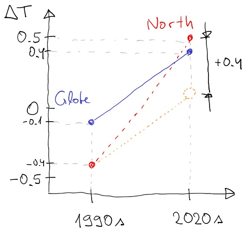

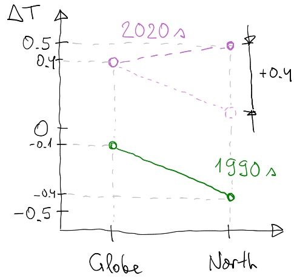

Figure C.2: The global and north polar temperature over time, presented in two ways.

TBD: 3-d figure of interaction effects.

**Solution** (2.15). 1. As $\beta _ { 1 }$ is small, we can use the approximation: experiments where ${ C O } _ { \mathcal { Z } }$ concentration is larger by one unit give 0.7% higher yield in average (given temperature and water are the same).

<!-- page: 514 -->

2. No: your experiment tells that yields improve given temperature and water remain the same. Global warming will increase temperature, it is doubtful that the amount of water will remain the same either.

## C.2.2 Logistic regression

**Solution** (2.16). 1. Shipwreck: logistic, as this has binary outcome (survived/did not survive)

2. Cancer patients: this is also survival, but not binary any more. Now we ask how long time, i.e. a number. So linear regression is more appropriate.

3. GPA: linear, as the outcome can have any value (between 0 and 5 or so).

4. Admission to school: logistic, as binary outcome (admitted/not admitted)

5. Retweeting: logistic as binary outcome (retweeted/not retweeted)

6. How many people read tweets: linear, as it can be any number (well, a count— non-negative number). Note: dedicated count data models may offer a better solution here. See more in Section 1.1.2 Counts, page 7.

**Solution** (2.17). The table reveals that the 5% critical z value is 1.96. Hence Education is statistically significant, but the other two variables are not. More precisely, they are statistically significantly different from zero at 5% significance level.

Remember: z-values, like t-values measure distance between the $H _ { 0 }$ value and what we find in data. A large z value means that data and $H _ { 0 }$ are rather different.

See Section 1.6.1 and Example 1.28.

**Solution** (2.18). 1. Logit coefficients cannot be easily interpreted. We need more information (and computations).

We can though say that as $\beta _ { e d u }$ and $\beta _ { p a r t }$ are positive, then both marginal effects are positive two. Hence more educated individuals, and those who participate, are more likely to get a job. But we cannot tell by how much.

2. Those with one year more of education are 7 pct pts more likely to get a job (in average), if they both participate/do not participate in a similar fashion.

Those who participate are 8 pct points more likely to get a job (in average), if they have similar education.

3. No. We find a positive association—participants tend to get jobs more likely than non-participants—but that does not tell us why they get jobs. Maybe just people who have certain personal characteristics do both training and get a job. For instance, those who are able to meet up at the training site 8 a.m. are also able to find a job. There are myriad of other possible explanations.

4. Correct. Better education and job are positively correlated, i.e. better educated people tend to have jobs, less educated tend not to have jobs. This is equivalent if phrased the other way around: those with jobs tend to be better educated,

<!-- page: 515 -->

those without jobs tend to be less well educated. Saying it in both ways implies positive correlation.

Note that these causality/correlation claims apply in pretty much the same way for linear regression and many other models too. See Section 3.3.

**Solution** (2.19). Use the definition of odds:

$$
r = \frac {p}{1 - p}\tag{C.2.1}
$$

where p is the relevant probability

1. $\mathit { I f }   p = 0 . 5$ , we have $r = 1$

2. if $p = 5 / 6 ,$ the formula above will give us $\textstyle { \frac { 5 / 6 } { 1 / 6 } } = 5$ . Often stated $as\ 5-to-1$

3. We need to express p from (C.2.1):

$$
p = \frac {r}{1 + r}\tag{C.2.2}
$$

Hence $p = 0 . 5 / 1 . 5 = 1 / 3$

**Solution** (2.20). The solution is just standard algebra. From (2.2.3) we have

$$
\begin{array}{c} 1 + \mathrm{e} ^ {- \boldsymbol {\beta} ^ {\mathsf {T}} \cdot \boldsymbol {x}} = \frac {1}{\operatorname* {P r} (Y = 1 | \boldsymbol {x})} \\ \mathrm{e} ^ {- \boldsymbol {\beta} ^ {\mathsf {T}} \cdot \boldsymbol {x}} = \frac {1}{\operatorname* {P r} (Y = 1 | \boldsymbol {x})} - 1 = \frac {1 - \operatorname* {P r} (Y = 1 | \boldsymbol {x})}{\operatorname* {P r} (Y = 1 | \boldsymbol {x})} \end{array}
$$

or

$$
\mathrm{e} ^ {\boldsymbol {\beta} ^ {\top} \cdot \boldsymbol {x}} = \frac {\operatorname* {P r} (Y = 1 | \boldsymbol {x})}{1 - \operatorname* {P r} (Y = 1 | \boldsymbol {x})}.
$$

## C.3 Causality

**Solution** (3.1). For a downward bias, we need a situation for those who have flu are more likely to get a flu shot. One may think along these lines: those who do not feel well get anxious about falling ill, and quickly get the shot. However, as they get it too late (they have already contracted $| f u \rangle$ , it does not help them. We see that flu shot is more often associated with $\begin{array} { r } { \beta u , } \end{array}$ but this is not because flu shot causes $\begin{array} { r } { \mathit { f l u } , } \end{array}$ but because falling ill “causes” flu shot.

**Solution** (3.2). The above example explained how concern about health can make people to both get flu shot and be less likely to contract flu. Here we need some kind of opposite process. One possibility is that people know something about how likely they are to get $\begin{array} { r } { \mathit { f l u } , } \end{array}$ and act upon it. For instance, those with fragile health or weak immune system may get the shot, while healthy people do not bother. So even if the shot is effective, we may not even see it in data, if the first group is still more likely to contract flu. But in any case, the observed effect size will be smaller.

This process seems more plausible, but both of these can be assessed through behavioral studies. But in any case, there are probably many other mechanisms that determine health behavior and morbidity.

<!-- page: 516 -->

## C.4 Linear Algebra

**Solution** (5.1). Dimension is just the number of components in the vector. Hence v<sub>i</sub> is of dimension 8. The table of data itself does not reveal how long are $x _ { i }   -   s ,$ but as the data is about “50 U.S. States”, its dimension must be 50.

**Solution** (5.2). We can compute individual components as $\pmb { e } ( \mathit { B e r l i n } ) _ { 1 }   -   \pmb { e } ( \mathit { G e r m a n y } ) _ { 1 }   +$ $e ( { \it F r a n c e } ) _ { 1 } = - 0 . 5 6 2 - 0 . 1 9 4 + 0 . 6 0 5 = - 0 . 1 5 1 , e ( { \it B e r l i n } ) _ { 2 } - e ( { \it G e r m a n y } ) _ { 2 } + e ( { \it F r a n c e } ) _ { 2 } = - 0 . 1 5 1 .$ $0.630 - 0.507 - 0.678 = -0.555,$ , and for the following 3 components we have −1.176, −0.450, and −0.016. So the vector

$$
\boldsymbol {e} (\text {Berlin}) - \boldsymbol {e} (\text {Germany}) + \boldsymbol {e} (\text {France}) = (- 0. 1 5 1, - 0. 5 5 5, - 1. 1 7 6, - 0. 4 5 0, - 0. 0 1 6)
$$

while

$$
\boldsymbol {e} (P a r i s) = (- 0. 0 7 4, - 0. 8 5 5, - 0. 6 8 9, - 0. 0 5 7, - 0. 1 3 9)
$$

As one can see, the result is not exact, but broadly agrees in terms of size and sign of the components, unlike any other word listed here.

**Solution** (5.3). As in case of Example 5.3, we can express

$$
\left( \begin{array}{c} 1 \\ 2 \\ 3 \end{array} \right) = 2 \cdot \left( \begin{array}{c} 4 \\ 5 \\ 6 \end{array} \right) - \left( \begin{array}{c} 7 \\ 8 \\ 9 \end{array} \right),\tag{C.4.1}
$$

or

$$
\left( \begin{array}{c} 1 \\ 2 \\ 3 \end{array} \right) - 2 \cdot \left( \begin{array}{c} 4 \\ 5 \\ 6 \end{array} \right) + \left( \begin{array}{c} 7 \\ 8 \\ 9 \end{array} \right) = \left( \begin{array}{c} 0 \\ 0 \\ 0 \end{array} \right).\tag{C.4.2}
$$

Hence these vectors are not linearly independent.

**Solution** $(5.4) .  $  専  I $$ . The Euclidean norm of the vector is ${ \sqrt { 1 ^ { 2 } + 1 ^ { 2 } } } = { \sqrt { 2 } }$ . Hence the normalized vector is

$$
\frac {(1 , 1)}{\sqrt {2}} = \left(\frac {1}{\sqrt {2}}, \frac {1}{\sqrt {2}}\right) = \frac {1}{\sqrt {2}} (1, 1)
$$

2. Manhattan norm of the vector is 2, hence the normalized version is (0.5, 0.5).

3. Chessboard norm of the vector is 1, hen<u>ce it is alre</u>ady normalized.

4. The Euclidean norm of the vector is $\sqrt{1^{2}+2^{2}+2^{2}}=3$ . Hence the normalized vector is $( 1 / 3 , 2 / 3 , 2 / 3 )$

5. The Euclidean norm of the vector is $\sqrt{3^{2}+2^{2}+0^{2}+2^{2}+0^{2}+2^{2}+0^{2}+2^{2}}=5$ Hence the normalized vector is $( 3 / 5 , 2 / 5 , 0 , 2 / 5 , 0 , 2 / 5 , 0 , 2 / 5 )$

**Solution** (5.5). Here is the solution of a) in more detail. We can write

$$
\left( \begin{array}{c c} 1 & 2 \\ 2 & 1 \end{array} \right) \cdot \left( \begin{array}{c c} 6 & 3 \\ 3 & 6 \end{array} \right) = \left( \begin{array}{c c} c _ {1 1} & c _ {1 2} \\ c _ {2 1} & c _ {2 2} \end{array} \right).
$$

<!-- page: 517 -->

From the visual rule, we find that

$$
\begin{array}{l} c _ {1 1} = 1 \cdot 6 + 2 \cdot 3 = 1 2 \\ c _ {1 2} = 1 \cdot 3 + 2 \cdot 6 = 1 5 \\ c _ {2 1} = 2 \cdot 6 + 1 \cdot 3 = 1 2 \\ c _ {2 2} = 2 \cdot 3 + 1 \cdot 6 = 1 2, \end{array}
$$

and hence

$$
\left( \begin{array}{c c} 1 & 2 \\ 2 & 1 \end{array} \right) \cdot \left( \begin{array}{c c} 6 & 3 \\ 3 & 6 \end{array} \right) = \left( \begin{array}{c c} 1 2 & 1 5 \\ 1 5 & 1 2 \end{array} \right).
$$

For the other questions, here are just the final answers:

$$
b) \left( \begin{array}{c c} 1 4 & - 2 \\ 3 8 & 0. 5 \end{array} \right) \qquad c) \left( \begin{array}{c c} 0 & 0 \\ 0 & 0 \end{array} \right) \qquad d) \left( \begin{array}{c c} 2 & 1 \\ 2 & 1 \end{array} \right)
$$

$b )$ is multiplication $b y$ the unit matrix, and $c )$ shows that product of non-zero matrices can be a zero matrix.

**Solution** (5.6).

$$
a) \left( \begin{array}{c c c} 2 & 1 & 2 \\ 2 & - 1 & 2 \end{array} \right) \quad b) \binom{- 1}{- 1} \quad d) \binom{- 1}{1}
$$

Note that $b )$ and $d )$ involve transposed matrices. $c )$ cannot be computed because dimensions do not match: the first factor has a single column but the second one has two rows.

**Solution.** 5.7 Remember the multiplication rule: lines from the first matrix, columns from the second matrix; the first one must have as many columns as the second one has rows.

• A has 796 columns and B has 796 rows. Hence we can multily these.

• The result is of dimension $227 \times 7  —  r$ umber of rows in the first matrix × number of columns in the second matrix.

**Solution.** 5.8 The number of columns of the first matrix must match number of rows in the second matrix. A has 796 columns and $\mathsf { B } ^ { \mathsf { T } }$ has 796 rows; B has 796 columns and $\mathsf { A } ^ { \top }$ has 796 rows. Hence $\mathbf { A } \cdot \mathbf { B } ^ { \mathsf { T } }$ and $\mathbf { B } \cdot \mathbf { A } ^ { \mathsf { T } }$ are possible.

The dimension of $\mathbf { A } \cdot \mathbf { B } ^ { \mathsf { T } }$ will be $2 2 7 \times 7 ,$ of $\mathsf { B } \cdot \mathsf { A } ^ { \mathsf { T } }$ will be $7 \times 2 2 7$

**Solution** (5.9). The first product:

$$
\left[ \left( \begin{array}{c c c} 1 & 2 & 3 \\ 1 & 2 & 3 \end{array} \right) \cdot \left( \begin{array}{c c} - 1 & 1 \\ 1 & - 1 \\ - 1 & 1 \end{array} \right) \right] \cdot \left( \begin{array}{c c c} 0 & 1 & 0 \\ 1 & 0 & 1 \end{array} \right) = \left( \begin{array}{c c} - 2 & 2 \\ - 2 & 2 \end{array} \right) \cdot \left( \begin{array}{c c c} 0 & 1 & 0 \\ 1 & 0 & 1 \end{array} \right) =
$$

$$
= \left( \begin{array}{c c c} 2 & - 2 & 2 \\ 2 & - 2 & 2 \end{array} \right)\tag{C.4.3}
$$

<!-- page: 518 -->

The second product:

$$
\begin{array}{r l} \left( \begin{array}{c c c} 1 & 2 & 3 \\ 1 & 2 & 3 \end{array} \right) \cdot \left[ \left( \begin{array}{c c} - 1 & 1 \\ 1 & - 1 \\ - 1 & 1 \end{array} \right) \cdot \left( \begin{array}{c c c} 0 & 1 & 0 \\ 1 & 0 & 1 \end{array} \right) \right] & = \left( \begin{array}{c c c} 1 & 2 & 3 \\ 1 & 2 & 3 \end{array} \right) \cdot \left( \begin{array}{c c c} 1 & - 1 & 1 \\ - 1 & 1 & - 1 \\ 1 & - 1 & 1 \end{array} \right) = \\ & = \left( \begin{array}{c c c} 2 & - 2 & 2 \\ 2 & - 2 & 2 \end{array} \right). \end{array} \tag {C}\tag{C.4.4}
$$

These are indeed equal.

**Solution** (5.11). Euclidean norm of a vector v is $\sqrt { v _ { 1 } ^ { 2 } + v _ { 2 } ^ { 2 } + v _ { 3 } ^ { 2 } + \ldots }$ From the definition of inner product (5.3.31), we can write it as $\sqrt { \pmb { v } ^ { \intercal } \cdot \pmb { v } }$ . Hence the solutions are

$$
| | (3, 4) | | = \sqrt {(3 , 4) \cdot \binom {3} {4}} = \sqrt {3 ^ {2} + 4 ^ {2}} = 5
$$

and

$$
| | (1, 1, 1, 3, 2) | | = \sqrt {(1 , 1 , 1 , 3 , 2) \cdot \left( \begin{array}{c} 1 \\ 1 \\ 1 \\ 3 \\ 2 \end{array} \right)} = \sqrt {1 ^ {2} + 1 ^ {2} + 1 ^ {2} + 3 ^ {2} + 2 ^ {2}} = 4.
$$

And advantage of this approach is that this can be easily coded in computer languages that support vectors and vector operations: you can convert $\sqrt { \pmb { v } ^ { \intercal } \cdot \pmb { v } }$ directly into computer code.

**Solution** (5.13). 1.

$$
\left( \begin{array}{c c} 2 & - 1 \\ 1 & - 2 \end{array} \right) \cdot \binom{1}{1} = \binom{1}{- 1}
$$

2.

$$
\left( \begin{array}{c c c} 0 & 1 & 2 \\ 0 & - 1 & 2 \\ 3 & 1 & - 2 \end{array} \right) \cdot \left( \begin{array}{c} 1 \\ 0 \\ - 1 \end{array} \right) = \left( \begin{array}{c} - 2 \\ - 2 \\ 1 \end{array} \right)
$$

**Solution** (5.14). Using the definition of matrix inverse we have to show that

$$
\left( \begin{array}{c c} 1 & 2 \\ 3 & 4 \end{array} \right) ^ {- 1} \cdot \left( \begin{array}{c c} - 2 & 1 \\ 1. 5 & - 0. 5 \end{array} \right) = \left( \begin{array}{c c} 1 & 0 \\ 0 & 1 \end{array} \right)
$$

Using the matrix multiplication rules we have

$$
\left( \begin{array}{c c} 1 & 2 \\ 3 & 4 \end{array} \right) ^ {- 1} \cdot \left( \begin{array}{c c} - 2 & 1 \\ 1. 5 & - 0. 5 \end{array} \right) = \left( \begin{array}{c c} 1 \cdot (- 2) + 2 \cdot 1. 5 & 1 \cdot 1 + 2 \cdot (- 0. 5) \\ 3 \cdot (- 2) + 4 \cdot 1. 5 & 3 \cdot 1 + 4 \cdot (- 0. 5) \end{array} \right) = \left( \begin{array}{c c} 1 & 0 \\ 0 & 1 \end{array} \right).
$$

This is a unit matrix, and hence these two matrices are each other inverse.

<!-- page: 519 -->

**Solution** (5.15). As we are in 2-D space, we can write (5.2.5) using components as

$$
\binom{c _ {1}}{c _ {2}} = \alpha \binom{a _ {1}}{a _ {2}} + \beta \binom{b _ {1}}{b _ {2.}}\tag{C.4.5}
$$

Note that this expression is equivalent to

$$
\binom{c _ {1}}{c _ {2}} = \left( \begin{array}{c c} a _ {1} & b _ {1} \\ a _ {2} & b _ {2}. \end{array} \right) \cdot \binom{\alpha}{\beta .}\tag{C.4.6}
$$

Hence $\left( \begin{matrix} { \alpha } \\ { \beta } \\ \end{matrix} \right)$ can be isolated using the inverse

$$
\binom{\alpha}{\beta} = \left( \begin{array}{c c} a _ {1} & b _ {1} \\ a _ {2} & b _ {2} \end{array} \right) ^ {- 1} \cdot \binom{c _ {1}}{c _ {2}}\tag{C.4.7}
$$

**Solution** (5.16). By the properties of trigonometric functions we have

$$
\mathsf {R} (- \alpha) = \left( \begin{array}{c c} \cos \alpha & \sin \alpha \\ - \sin \alpha & \cos \alpha \end{array} \right)
$$

and hence

$$
\begin{array}{c} \mathsf {R} (\alpha) \cdot \mathsf {R} (- \alpha) = \left( \begin{array}{c c} \cos \alpha & - \sin \alpha \\ \sin \alpha & \cos \alpha \end{array} \right) \cdot \left( \begin{array}{c c} \cos \alpha & \sin \alpha \\ - \sin \alpha & \cos \alpha \end{array} \right) = \\ = \left( \begin{array}{c c} \cos^ {2} \alpha + \sin^ {2} \alpha & \cos \alpha \sin \alpha - \sin \alpha \cos \alpha \\ \sin \alpha \cos \alpha - \cos \alpha \sin \alpha & \sin^ {2} \alpha + \cos^ {2} \alpha \end{array} \right) = \left( \begin{array}{c c} 1 & 0 \\ 0 & 1 \end{array} \right) \end{array}
$$

## C.5 Predictive Modeling

**Solution** (4.3). The data looks like:

| case: | 1 | 2 | 3 | 4 | 5 | 6 | 7 | 8 | 9 | 10 |
| --- | --- | --- | --- | --- | --- | --- | --- | --- | --- | --- |
| Actual | 1 | 0 | 0 | 1 | 1 | 0 | 0 | 0 | 1 | 0 |
| Expert | 0 | 0 | 0 | 1 | 0 | 0 | 1 | 0 | 1 | 1 |

Consider ${ } ^ { \circ } \mathcal { O } ^ { \prime \prime }$ to be negative and $^ { \backprime } I ^ { \prime \prime }$ to be positive. We have $T N = 4$ (cases $\begin{array} { r } { \mathcal { Z } , \mathcal { Z } , \mathcal { \theta } , } \end{array}$ 8) as both the actual value is ${ } ^ { \circ } \mathcal { O } ^ { \prime \prime }$ and the expert predicted “0”. $T P = 2$ (cases $\mathcal { A } , \mathcal { G } )$ as the actual value is ${ { } ^ { \prime } } T ^ { \prime \prime }$ and the expert predicted $\text{" }T \text{" }.$ $F P = 2$ (cases $\gamma , \; I \theta )$ as the expert predicted $" I "$ but the actual value was ${ } ^ { \cdot } \mathcal { O } ^ { \cdot \prime } .$ Finally, $F N = 2$ (cases $I , \; 5 )$ where the expert predicted ${ } ^ { \circ } \mathcal { O } ^ { \prime \prime }$ while the actual value was ${ } ^ { \cdot } \mathcal { O } ^ { \cdot \cdot } .$ Hence the confusion matrix is

|  |  | Actual |  |
| --- | --- | --- | --- |
| Predicted | 0 | 1 | Total |
| 0 | TN = 4 | FN = 2 | 6 |
| 1 | FP = 2 | TP = 2 | 4 |
| Total | 6 | 4 | 10 |

<!-- page: 520 -->

Note that the predicted values do not have to be related to any particular model. In terms of constructing the confusion matrix, expert opinion or even a random guess is perfectly valid.

**Solution** (4.4). Let’s take participants as positives. The actual data contains 2490 non-participants (the majority) and 185 participants. Hence the model predicts that everyone is a non-participant.

The confusion matrix will be:

<table><tr><td rowspan="2">Predicted</td><td colspan="3">Actual</td></tr><tr><td>Non-Participants</td><td>Participants</td><td>Total</td></tr><tr><td>Non-Participants</td><td>2490</td><td>185</td><td>2675</td></tr><tr><td>Participants</td><td>0</td><td>0</td><td>185</td></tr><tr><td>Total</td><td>2490</td><td>185</td><td>2675</td></tr></table>

As everyone is predicted to be a non-participant, the predicted participants’ column only contains zeros. We have $T N = N = 2 4 9 0$ , $F P = 0 ,$ $F N = P = 1 8 5$ and $T P = 0$

**Solution** (4.5). Simple computations tell that $F \; = \; 0 . 5 , 0 . 4 2 , 0 . 3 2 , 0 . 1 8$ and 0. In the latter you cannot, strictly speaking, compute F-score, but it is easy to see that lim $\imath _ { P \to 0 }   F = 0 \colon 1 / 0 \to \infty$ and

$$
\frac {2}{\frac {1}{P} + \frac {1}{R}} \rightarrow \frac {2}{\infty + 1} = 0 \quad a s \quad P \rightarrow 0\tag{C.5.1}
$$

**Solution** (4.6). We have

$$
T N = 1 0, T P = 6 0, F P = 2 0, F N = 1 0\tag{C.5.2}
$$

and $T = 1 0 0$ . Hence

$$
\begin{array}{l} A = \frac {T N + T P}{T} = \frac {7 0}{1 0 0} = 0. 7 \\ P = \frac {T P}{T P + F P} = \frac {6 0}{8 0} = 0. 7 5 \\ R = \frac {T P}{T P + F N} = \frac {6 0}{7 0} \approx 0. 8 6 \\ F = \frac {2}{\frac {1}{P} + \frac {1}{R}} = 0. 8 \end{array}\tag{C.5.3}
$$

**Solution** (4.7). a) If participants are positives, the confusion matrix is the same as in Example 4.1:

<table><tr><td rowspan="2">Actual</td><td colspan="3">Predicted</td></tr><tr><td>Non-Participants</td><td>Participants</td><td>Total</td></tr><tr><td>Non-Participants</td><td>2452</td><td>38</td><td>2490</td></tr><tr><td>Participants</td><td>89</td><td>96</td><td>185</td></tr><tr><td>Total</td><td>2541</td><td>134</td><td>2675</td></tr></table>

<!-- page: 521 -->

The model goodness measures are: Accuracy $=(2452{+}96)/2675=95.3\%$ , Precision = $96/134=71.6\%$ and $Recall = 96/185 = 51.9\%$

b) If participants are negatives, the confusion matrix’s rows and columns are swapped around:

<table><tr><td rowspan="2">Actual</td><td colspan="3">Predicted</td></tr><tr><td>Participants</td><td>Non-Participants</td><td>Total</td></tr><tr><td>Participants</td><td>96</td><td>89</td><td>185</td></tr><tr><td>Non-Participants</td><td>38</td><td>2452</td><td>2490</td></tr><tr><td>Total</td><td>134</td><td>2541</td><td>2675</td></tr></table>

Now Accuracy $= (2452 + 96) / 2675 = 95.3\%$ is the same, Precision = 2452/2541 = 96.5% and $Recall = 2452/2490 = 98.5\%.$

c) Accuracy does not depend on the choice of positives/negatives, it is only concerned about correct predictions, so here the choice does not matter. But in one case we get moderate precision and recall scores, in the other case those figures are very high. The moderate scores are appropriate if we are mainly interested in spotting the participants. The model is not very good at that. The high scores are good if we are mainly concerned in non-participants–that group is easy to find.

**Solution** (4.8). Specificity is the same as recall for negative outcomes, and sensitivity is the same as recall. Specificity 100% means we do not have any false positives, and sensitivity 63.5% means we capture 63.5% of the positive cases. We can, for instance, take 1000 actual negative cases and 1000 actual positive cases. Now all 1000 actual negatives will be predicted as negative $( { \it s p e c i f i c i t y } \; = \; 1 0 0 \% )$ , but only 635 of 1000 positives will be categorized as positive (sensitivity = 63.5%), see the left panel of the table below.

| All cases | Asymptotic cases |
| --- | --- |
| Predicted | Predicted |
| Negative Positive | Negative Positive |
| Actual Negative 1000 0 | 1000 0 |
| Positive 365 635 | 650 350 |

For asymptotic cases we still have 1000 true negatives and 0 false positives (specificity is still 100%) but now only 350 out of 1000 actual positives are categorized correctly (sensitivity is 35%).

The test seems to be of dubious quality if roughly 1/3 of all cases, and 2/3 of asymptotic cases slip through.

**Solution** (5.17). Let’s multiply X and β in (5.7.2) using the ordinary matrix multipli-

<!-- page: 522 -->

cation rules:

$$
\left( \begin{array}{c c c c c} 1 & x _ {1} ^ {1} & x _ {2} ^ {1} & \ldots & x _ {K} ^ {1} \\ 1 & x _ {1} ^ {2} & x _ {2} ^ {2} & \ldots & x _ {K} ^ {2} \\ \vdots & \vdots & \vdots & \ddots & \vdots \\ 1 & x _ {1} ^ {N} & x _ {2} ^ {N} & \ldots & x _ {K} ^ {N} \end{array} \right) \cdot \left( \begin{array}{c} \beta_ {0} \\ \beta_ {1} \\ \beta_ {2} \\ \vdots \\ \beta_ {K} \end{array} \right) = \left( \begin{array}{c c c c c} \beta_ {0} & \beta_ {1} x _ {1} ^ {1} & \beta_ {2} x _ {2} ^ {1} & \ldots & \beta_ {K} x _ {K} ^ {1} \\ \beta_ {0} & \beta_ {1} x _ {1} ^ {2} & \beta_ {2} x _ {2} ^ {2} & \ldots & \beta_ {K} x _ {K} ^ {2} \\ \vdots & \vdots & \vdots & \ddots & \vdots \\ \beta_ {0} & \beta_ {1} x _ {1} ^ {N} & \beta_ {2} x _ {2} ^ {N} & \ldots & \beta_ {K} x _ {K} ^ {N} \end{array} \right)\tag{C.5.4}
$$

and hence we can write (5.7.2) as

$$
\left( \begin{array}{c} y _ {1} \\ y _ {2} \\ \vdots \\ y _ {N} \end{array} \right) = \left( \begin{array}{c c c c c} \beta_ {0} & \beta_ {1} x _ {1} ^ {1} & \beta_ {2} x _ {2} ^ {1} & \dots & \beta_ {K} x _ {K} ^ {1} \\ \beta_ {0} & \beta_ {1} x _ {1} ^ {2} & \beta_ {2} x _ {2} ^ {2} & \dots & \beta_ {K} x _ {K} ^ {2} \\ \vdots & \vdots & \vdots & \ddots & \vdots \\ \beta_ {0} & \beta_ {1} x _ {1} ^ {N} & \beta_ {2} x _ {2} ^ {N} & \dots & \beta_ {K} x _ {K} ^ {N} \end{array} \right) + \left( \begin{array}{c} \epsilon_ {1} \\ \epsilon_ {2} \\ \vdots \\ \epsilon_ {N} \end{array} \right).\tag{C.5.5}
$$

Each line of this equation is equivalent to (5.7.1) after performing the matrix multi-plication there, and there are N lines. Hence (5.7.2) is equivalent to (5.7.1) for each $i = 1 \dots N$

## C.6 Machine Learning Models

## C.6.1 Trees and tree-based methods

**Solution** (6.1).

1. The decision boundary contains of four rectan-

gles:

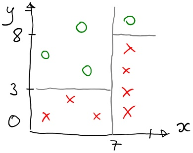

2. Here is one possible tree that creates similar boundary (T means the condition is true and F means it is false). There are also a number of possible options–you can pick any boundary as the root node and build a tree around that.

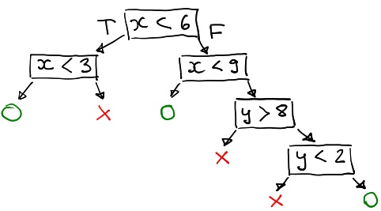

<!-- page: 523 -->

**Solution** (6.2). Decision boundaries (DB). The fact that the features are continous matters in a sense that the DB splits the features space into regions, otherwise it might carve out just the individual data points. The fact that target only has two categories matters only for the logistic regression–now it is a plane (in general hyperplane). In case of more than two categories, it consists of segments.

1. Trees: the boundary consists of vertical/horizontal planes, that carves out something like a “stacked boxes”-kind of decision boundary.

2. k-NN: it is a complex surface that separates regions where different categories dominate. It is made of pieces of flat surface (in case of 1-NN these are Voronoi surfaces), but there are many of those, so the surface will be quite complex.

3. The decision boundary in case of logistic regression is a plane (or hyperplane in more dimensions)–unless you also use feature engineering.

**Solution** (6.3). Bernoulli distribution has two states: the event happens with probability p and does not happen with probability $1 - p$ . Inserting this into the definition of entropy (6.1.3), we get

$$
\mathbb {H} (X) = - p \log_ {2} p - (1 - p) \log_ {2} (1 - p).\tag{C.6.1}
$$

The entropy as a function of p will look like

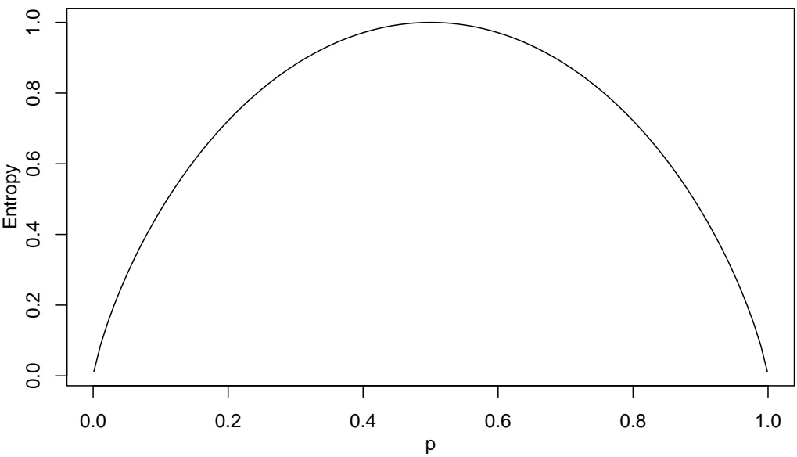

The entropy is 0 at both ends of the curve: we are (almost) certain the event either does not happen $( p = 0 )$ or happens $( p = 1 )$ , and hence there is no uncertainty. The largest uncertainty is in the middle where both outcomes are equally likely, and we can gain 1 bit of information.

<!-- page: 524 -->

**Solution** (6.4). The right split in Figure 6.7 contains two branches: the larger Branch 1 one contains one circle and 5 crosses, the smaller Branch $\mathcal { D }$ one contains a single cross and 3 circles. The best approach is to make a table for calculations:

<table><tr><td rowspan="3">Size</td><td colspan="2">Branch 1</td><td colspan="2">Branch 2</td></tr><tr><td colspan="2">6</td><td colspan="2">4</td></tr><tr><td>×</td><td>○</td><td>×</td><td>○</td></tr><tr><td>Count</td><td>5</td><td>1</td><td>1</td><td>3</td></tr><tr><td>Pr</td><td>0.833</td><td>0.167</td><td>0.25</td><td>0.75</td></tr><tr><td> $\log_2 Pr$ </td><td>-0.263</td><td>-2.585</td><td>-2</td><td>-0.415</td></tr><tr><td> $\Pr \cdot \log_2 Pr$ </td><td>-0.219</td><td>-0.431</td><td>-0.5</td><td>-0.311</td></tr><tr><td>Branch entropy</td><td colspan="2">0.65</td><td colspan="2">0.811</td></tr><tr><td>Total entropy</td><td colspan="4">0.715</td></tr></table>

As the original entropy was 0.971, the entropy gain is 0.256. This is much more than what we found for the left split of Figure 6.7.

## C.6.2 Metric distance: A revisit

**Solution** (6.5). We have $\pmb { x } ^ { 1 } = ( 1 . 0 0 0 ,   2 . 0 0 0 ,   3 . 0 0 0 )$ $\pmb { x } ^ { 2 }   =   ( 3 . 0 0 0 ,   2 . 0 0 0 ,   1 . 0 0 0 )$ and $\pmb { x } ^ { 3 } = ( 1 . 0 \dot { 0 } 0 , \dot { 1 } . 0 0 0 , 1 . 0 0 0 )$ . The norms are

$$
\begin{array}{l} | | \boldsymbol {x} ^ {1} | | = \sqrt {\boldsymbol {x} ^ {1 ^ {\top}} \boldsymbol {x} ^ {1}} = \sqrt {1 ^ {2} + 2 ^ {2} + 3 ^ {2}} = 3. 7 4 2 \\ | | \boldsymbol {x} ^ {2} | | = \sqrt {\boldsymbol {x} ^ {2 ^ {\top}} \boldsymbol {x} ^ {2}} = \sqrt {3 ^ {2} + 2 ^ {2} + 1 ^ {2}} = 3. 7 4 2 \\ | | \boldsymbol {x} ^ {3} | | = \sqrt {\boldsymbol {x} ^ {3 ^ {\top}} \boldsymbol {x} ^ {3}} = \sqrt {1 ^ {2} + 1 ^ {2} + 1 ^ {2}} = 1. 7 3 2. \end{array}\tag{C.6.2}
$$

Hence the normed versions are

$$
\boldsymbol {x} ^ {n 1} = \frac {\boldsymbol {x} ^ {1}}{| | \boldsymbol {x} ^ {1} | |} = \frac {(1 . 0 0 0 , 2 . 0 0 0 , 3 . 0 0 0)}{3 . 7 4 2} = (0. 2 6 7, 0. 5 3 5, 0. 8 0 2)
$$

$$
\boldsymbol {x} ^ {n 2} = \frac {\boldsymbol {x} ^ {2}}{| | \boldsymbol {x} ^ {2} | |} = \frac {(3 . 0 0 0 , 2 . 0 0 0 , 1 . 0 0 0)}{3 . 7 4 2} = (0. 8 0 2, 0. 5 3 5, 0. 2 6 7)\tag{C.6.3}
$$

$$
\boldsymbol {x} ^ {n 3} = \frac {\boldsymbol {x} ^ {3}}{| | \boldsymbol {x} ^ {3} | |} = \frac {(1 . 0 0 0 , 1 . 0 0 0 , 1 . 0 0 0)}{1 . 7 3 2} = (0. 5 7 7, 0. 5 7 7, 0. 5 7 7).
$$

Finally, the cosine similarity is just the inner product of the normed vectors:

$$
\begin{array}{l} c (\boldsymbol {x} ^ {1}, \boldsymbol {x} ^ {2}) = \boldsymbol {x} ^ {n 1 ^ {\top}} \cdot \boldsymbol {x} ^ {n 2} = (0. 2 6 7, 0. 5 3 5, 0. 8 0 2) ^ {\top} \cdot (0. 8 0 2, 0. 5 3 5, 0. 2 6 7) = 0. 7 1 4 \\ c (\boldsymbol {x} ^ {1}, \boldsymbol {x} ^ {3}) = \boldsymbol {x} ^ {n 1 ^ {\top}} \cdot \boldsymbol {x} ^ {n 3} = (0. 2 6 7, 0. 5 3 5, 0. 8 0 2) ^ {\top} \cdot (0. 5 7 7, 0. 5 7 7, 0. 5 7 7) = 0. 9 2 6 \end{array}\tag{C.6.4}
$$

<small><span class="docvortex-page-footnote" data-block-type="page_footnote" style="color:#6b7280">x1</span></small>

<small><span class="docvortex-page-footnote" data-block-type="page_footnote" style="color:#6b7280">x3</span></small>

<small><span class="docvortex-page-footnote" data-block-type="page_footnote" style="color:#6b7280">x2.</span></small>

<small><span class="docvortex-page-footnote" data-block-type="page_footnote" style="color:#6b7280">So x1is more similar to x3than to x2.</span></small>

<!-- page: 525 -->

**Solution** (6.6). Section 5.2.2 lists three properties of distance metric. The first one is

$$
d (\boldsymbol {x}, \boldsymbol {y}) = 0 \quad \Leftrightarrow \quad \boldsymbol {x} = \boldsymbol {y}.
$$

This property is not satisfied for cosine-related distances: $d _ { c o s } ( \pmb { x } , \pmb { y } ) = 0$ means cosine is 1 (or angle is 0), but this is true for all vectors that point to the same direction, not just for equal vectors.

Another issue arises from the fact that these distances are not defined for null vector, hence distance between null-vector and any other vector is undefined.

## C.7 Text as data

## C.7.1 Naive Bayes

**Solution** (8.1). 1. According to the standard conditional probability notation, it means that probability email is not spam $( S   =   0 )$ given it contains the word $( W = 1 )$

2. You can compute it directly: select all emails that contain the word, and among those find the percentage of those that are not spam. For instance, if there are 10 emails that contain the word and 3 of those are not spam, them $\operatorname* { P r } ( S   =$ $0 | W = 1 ) = 0 . 3$ . You can also use Bayes theorem but it is not necessary if we just look at a single word.

**Solution** (8.2). Re-write the Bayesian expression for the case of no-viagra-no-spam:

$$
\Pr (S = 0 | V = 0) = \frac {\Pr (V = 0 | S = 0) \cdot \Pr (S = 0)}{\Pr (V = 0)}\tag{C.7.1}
$$

Based on the table in Example 8.3, we can compute the necessary probabilities:

$\operatorname* { P r } ( V = 0 | S = 0 )$ , probability of no “viagra” in no-spam emails. From the table we can see that it is $5 0 0 / 6 0 0 = 5 / 6 \approx 0 . 8 3 3$

• The prior, $\operatorname* { P r } ( S   =   0 )$ , the proportion of legitimate emails. $\mathit { I t ~ i s ~ 6 0 0 / 1 0 0 0 } =$ $3 / 5 = 0 . 6$

• The normalizer, $\operatorname* { P r } ( V \; = \; 0 )$ , the probability not to see “viagra” in emails, $650/1000=13/20=0.65$

Inserting the values in (C.7.1), we get

$$
\begin{array}{r l} \Pr (S = 0 | V = 0) & = \frac {\Pr (V = 0 | S = 0) \cdot \Pr (S = 0)}{\Pr (V = 0)} = \\ & = \frac {\frac {5}{6} \cdot \frac {3}{5}}{\frac {1 3}{2 0}} = \frac {6 0}{7 8} = \frac {1 0}{1 3} \approx 0. 7 6 9. \end{array}\tag{C.7.2}
$$

Based on the information that the email contains no word $\text{" }vingra \text{" },$ we update the prior 0.6 to $\theta . 7 6 \theta , \approx 2 8 \% .$

<!-- page: 526 -->

Solution (8.3). First, it is instructive to create the DTM using these two words. Here it is attached to the dataset:

<table><tr><td rowspan="2">Text</td><td rowspan="2">Spam</td><td colspan="2">DTM</td></tr><tr><td>“free”</td><td>“$”</td></tr><tr><td>First month free!</td><td>1</td><td>1</td><td>0</td></tr><tr><td>Free trial coupon, worth $25</td><td>1</td><td>1</td><td>1</td></tr><tr><td>$100 off!</td><td>1</td><td>0</td><td>1</td></tr><tr><td>Application deadline</td><td>0</td><td>0</td><td>0</td></tr><tr><td>Campus free food</td><td>0</td><td>1</td><td>0</td></tr><tr><td>Off-trail running</td><td>0</td><td>0</td><td>0</td></tr></table>

We are interested in

$$
\Pr (S = 1 | f r e e = 1) \quad a n d \quad \Pr (S = 1 |   = 1)
$$

From the Bayes theorem, we can write the first probability as

$$
\Pr (S = 1 | f r e e = 1) = \frac {\Pr (f r e e = 1 | S = 1) \cdot \Pr (S = 1)}{\Pr (o f f = 1)}.\tag{C.7.3}
$$

We can compute the 3 required probabilities directly from the DTM and the spam indicator:

$$
\Pr (f r e e = 1 | S = 1) = 2 / 3 \quad \Pr (S = 1) = 1 / 2 \quad \Pr (f r e e = 1) = 1 / 2
$$

(can also do a table of counts as in Example 8.3). Plugging these numbers into (C.7.3), we get $\operatorname* { P r } ( S = 1 | \mathrm { f r e e } = 1 ) = 2 / 3$

For the dollar-sign we have

$$
\Pr (\$ = 1 | S = 1) = 2 / 3 \quad \Pr (S = 1) = 1 / 2 \quad \Pr (\$ = 1) = 1 / 2
$$

and accordingly $\operatorname* { P r } ( S = 1 | \mathfrak { F } = 1 ) = 1$

Both of these results can be easily checked through directly computing the probabilities: as two emails of of three that contain “free” are spam, the corresponding probability must be 2/3. We’ll categorize it as spam. All emails, containing the dollar-sign are spam, hence that probability must be 1, hence it is also categorized as spem.

As the first new email contains “free” and the next one “\$”, both will be categorized as spam.

**Solution** (8.4). We use the same training data as in Example 8.5 Naive Bayes Classifier, page 364 and hence all the probabilities are the same. The bow for the new email, “life is life”, is

|  | good | in | is | life | viagra |
| --- | --- | --- | --- | --- | --- |
| $\boldsymbol{x}_{4}$ | 0 | 0 | 1 | 1 | 0 |

<!-- page: 527 -->

The log-likelihood for spam is:

$$
\begin{array}{r l} \ell (S = 1 | \boldsymbol {x} _ {4}) = & \\ = \log \Pr (S = 1) + \log \Pr (i s = 1 | S = 1) + \log \Pr (l i f e = 1 | S = 1) = \\ & = - 1. 0 9 9 + 0 + 0 = - 1. 0 9 9 \end{array}\tag{C.7.4}
$$

and log-likelihood for non-spam is

$$
\begin{array}{r l} \ell (S = 0 | \boldsymbol {x} _ {4}) = & \\ = \log \Pr (S = 0) + \log \Pr (i s = 1 | S = 0) + \log \Pr (l i f e = 1 | S = 0) = & \\ = - 0. 4 0 5 - 0. 6 9 3 0 = - 1. 0 9 9. \end{array}\tag{C.7.5}
$$

As both log-likelihoods are the same, we have a tie as in Example 8.5. This is because the data here is essentially the same as in the example, we have swapped “viagra” for “is”, but $\text{" }i{S} \text{" }$ has exactly the same probabilities as “viagra” for both spam and non-spam.

**Solution** (8.5). 1. From (8.5.28) we can compute

$$
\begin{array}{l} \ell (S = 1 | d e a d l i n e) = \log 0. 3 + \log 0. 0 0 1 \approx - 8. 1 1 2 \\ \ell (S = 0 | d e a d l i n e) = \log 0. 7 + \log 0. 1 \approx - 2. 6 5 9 \end{array}
$$

2. Log odds:

$$
\ell (S = 1 | d e a d l i n e) - \ell (S = 0 | d e a d l i n e) \approx - 5. 4 5
$$

3. Odds ratio:

$$
R = \mathrm{e} ^ {\ell (S = 1 | d e a d l i n e) - \ell (S = 0 | d e a d l i n e)} = \frac {\Pr (S = 1 | d e a d l i n e)}{\Pr (S = 0 | d e a d l i n e)} \approx 0. 0 0 4 2 9
$$

4. Probability. Using the odds ration R and the fact that $\operatorname* { P r } ( S = 1 )   +   \operatorname* { P r } ( S = 0 ) = 1$ we get

$$
\Pr (S = 1 | d e a d l i n e) = \frac {R}{1 + R} \approx 0. 0 0 4 2 7
$$

5. Including “lottery”: the log-likelihoods

$$
\begin{array}{l} \ell (S = 1 | d e a d l i n e, l o t t e r y) = \log 0. 3 + \log 0. 0 0 1 + \log 0. 2 \approx - 9. 7 2 1 \\ \ell (S = 0 | d e a d l i n e, l o t t e r y) = \log 0. 7 + \log 0. 1 + \log 0. 0 0 5 \approx - 7. 9 5 8 \end{array}
$$

6. Probability of spam: you can compute the odds ratio as

$$
\begin{array}{r l} R = \mathrm{e} ^ {\ell (S = 1 | d e a d l i n e, l o t t e r y) - \ell (S = 0 | d e a d l i n e, l o t t e r y)} = & \\ = \frac {\Pr (S = 1 | d e a d l i n e , l o t t e r y)}{\Pr (S = 0 | d e a d l i n e , l o t t e r y)} \approx 0. 1 7 1 \end{array}
$$

<!-- page: 528 -->

and hence the probability is

$$
\Pr (S = 1 | d e a d l i n e, l o t t e r y) = \frac {R}{1 + R} \approx 0. 1 4 6
$$

So adding “lottery” to the email increased the probability of spam quite a bit, from a negligible amount to $\partial . I \not \llangle \delta .$

7. Log-odds increased by $\operatorname* { P r } ( \mathit { l o t t e r y } | S = 1 ) - \operatorname* { P r } ( \mathit { l o t t e r y } | S = 0 )$ . This is what drives the increase of the probability. The words where the difference is largest will add most to the confidence of spam and the other way around–where the difference is smallest (negative), will add most to the confidence it is not spam.

**Solution** (8.6). $x _ { i j }$ refers to word j in the context of word i. So it represents the embedding of the word i. According the standard matrix notations, we have rows first, columns second, hence the embeddings are in rows.

**Solution** (8.7). For a reminder: the quotes are

Knowing others is wisdom, knowing yourself is Enlightenment Mastering others is strength. Mastering yourself is true power

Here are the embeddings (without the code):

|  | t n e m <sub>l</sub>e<sub>inhgte</sub><sup>n</sup> | i<sup>s</sup> | kniowng | g m<sup>tasiern</sup> | htoers | power | tsrehntg | true | <sub>i</sub>w<sub>dso</sub><sup>m</sup> | y<sub>oulr</sub><sup>f</sup><sub>se</sub> |
| --- | --- | --- | --- | --- | --- | --- | --- | --- | --- | --- |
| enlightenment | 0.000 | 0.894 | 0.000 | 0.000 | 0.000 | 0.000 | 0.000 | 0.000 | 0.000 | 0.447 |
| is | 0.000 | 0.000 | 0.316 | 0.316 | 0.632 | 0.000 | 0.000 | 0.000 | 0.000 | 0.632 |
| knowing | 0.000 | 0.447 | 0.000 | 0.000 | 0.000 | 0.000 | 0.000 | 0.000 | 0.894 | 0.000 |
| mastering | 0.000 | 0.447 | 0.000 | 0.000 | 0.000 | 0.000 | 0.894 | 0.000 | 0.000 | 0.000 |
| others | 0.000 | 0.000 | 0.707 | 0.707 | 0.000 | 0.000 | 0.000 | 0.000 | 0.000 | 0.000 |
| power | 0.000 | 0.447 | 0.000 | 0.000 | 0.000 | 0.000 | 0.000 | 0.894 | 0.000 | 0.000 |
| strength | 0.000 | 0.894 | 0.000 | 0.000 | 0.447 | 0.000 | 0.000 | 0.000 | 0.000 | 0.000 |
| true | 0.000 | 0.894 | 0.000 | 0.000 | 0.000 | 0.000 | 0.000 | 0.000 | 0.000 | 0.447 |
| wisdom | 0.000 | 0.894 | 0.000 | 0.000 | 0.447 | 0.000 | 0.000 | 0.000 | 0.000 | 0.000 |
| yourself | 0.000 | 0.000 | 0.632 | 0.632 | 0.000 | 0.000 | 0.316 | 0.000 | 0.316 | 0.000 |

A few comments:

• The context of “enlightenment” contains two words: $\text{" }i{S} \text{" }$ and “yourself”. This is because there is only a single phrase, “…yourself is enlightenment”, where the word is used. Hence only these words appear in the embedding vector, with $\text{" }i{S} \text{" }$ being at distance one, and hence having twice the weight of “yourself”.

$\text{" }i{s} \text{" }$ context contains four words: “knowing” and “mastering” (with small weight) and “others” and “yourself” (with large weight). This is because the latter words immediately precede “is” while the former ones are at distance two.

• “enlightenment” and “power” do not appear in the context of any word as these are only used in the last position of the quotes. This also applies to “knowing” and to several other words.

<!-- page: 529 -->

• The less-then-intuitive component values ensure that the norm of all embedding vectors is $\text{" }T \text{" }.$

## C.8 Neural networks

## C.8.1 Feed-forward networks

**Solution** (9.1). An easy solution is $w _ { 1 } = w _ { 2 } = 1 , \: \bar { z } = 0 . 5$

**Solution** (9.2). From the Table 9.2 we have weights

$$
\boldsymbol {w} _ {h 1} = \binom{1}{1} \quad \boldsymbol {w} _ {h 2} = \binom{1}{1} \quad \boldsymbol {w} _ {y} = \binom{- 1}{1}\tag{C.8.1}
$$

and biases

$$
b _ {h 1} = 1. 5 \qquad b _ {h 2} = 0. 5 \qquad b _ {y} = 0. 5.\tag{C.8.2}
$$

We can compute the $h _ { 1 }$ node values:

$$
\chi_ {1} = \boldsymbol {x} ^ {\top} \cdot \boldsymbol {w} _ {\boldsymbol {h 1}} = \left( \begin{array}{c c} 0 & 1 \end{array} \right) \cdot \binom{1}{1} = 1 \quad a n d \quad h _ {1} = \mathbb {1} (\chi_ {1} > b _ {h 1}) = \mathbb {1} (1 > 1. 5) = 0.\tag{C.8.3}
$$

Analogously, for the second hidden node $h _ { 2 }$ we have

$$
\chi_ {2} = \boldsymbol {x} ^ {\top} \cdot \boldsymbol {w} _ {\boldsymbol {h 2}} = \left( \begin{array}{c c} 0 & 1 \end{array} \right) \cdot \binom{1}{1} = 1 \quad a n d \quad h _ {1} = \mathbb {1} (\chi_ {1} > b _ {h 1}) = \mathbb {1} (1 > 0. 5) = 1.\tag{C.8.4}
$$

So we have $\boldsymbol{h} = \left( h_{1}, h_{2} \right)^{\mathsf{T}} = \left( 0, 1 \right)^{\mathsf{T}}$ . Now we can perform a similar operation with the output layer:

$$
z = \boldsymbol {h} ^ {\top} \cdot \boldsymbol {w} _ {\boldsymbol {h 2}} = \left( \begin{array}{c c} 0 & 1 \end{array} \right) \cdot \binom{- 1}{1} = 1 \quad a n d \quad y = \mathbb {1} (z > b _ {y}) = \mathbb {1} (1 > 0. 5) = 1.\tag{C.8.5}
$$

So we have $0   X O R   1 = 1$

**Solution** (9.3). a) Remember the softmax definition (9.1.12):

$$
\Lambda (\boldsymbol {x}) _ {i} = \frac {\mathrm{e} ^ {x _ {i}}}{\sum_ {j} \mathrm{e} ^ {x _ {j}}}.
$$

Let’s do the solution in a table:

|  | 1 | 2 | 3 | 1 | 2 | 3 |
| --- | --- | --- | --- | --- | --- | --- |
| inputs x<sub>i</sub> | 1.00 | 2.00 | 3.00 | 4.00 | 5.00 | 6.00 |
| exponents e<sup>xi</sup> | 2.72 | 7.39 | 20.09 | 54.60 | 148.41 | 403.43 |
| Sums i exi |  | 30.19 |  |  | 606.44 |  |
| probabilitiPes eixeixi | 0.09 | 0.24 | 0.67 | 0.09 | 0.24 | 0.67 |

<!-- page: 530 -->

As visible here, both probabilities are exactly the same.

b) From the definition, it is clear that

$$
\Lambda (\lambda + \boldsymbol {x}) _ {i} = \frac {\mathrm{e} ^ {\lambda + x _ {i}}}{\sum_ {j} \mathrm{e} ^ {\lambda + x _ {j}}} = \frac {\mathrm{e} ^ {\lambda} \mathrm{e} ^ {x _ {i}}}{\sum_ {j} \mathrm{e} ^ {\lambda} \mathrm{e} ^ {x _ {j}}} = \frac {\mathrm{e} ^ {x _ {i}}}{\sum_ {j} \mathrm{e} ^ {x _ {j}}}\tag{C.8.6}
$$

as $\mathrm { e } ^ { \lambda }$ cancels out.

## C.8.2 Convolutional networks

**Solution** (9.4). At the first filter position, top-left of M, we have $0 \cdot ( - 1 ) + 0 \cdot ( - 1 ) + 0$ $( - 1 )   +   1   \cdot   3 = 3$ . For the second <u>position, we h</u>ave $0 \cdot ( - 1 ) + 1 \cdot ( - 1 ) + 1 \cdot ( - 1 ) + 1 \cdot 3 = 1$

and so on. The final result is $\left| \begin{array} { c c c } { { \it \Psi } } & { { \it \Psi } } & { { \it \Psi } } \\ { { \it \Psi } \overline { { { \it \Psi } } } } & { { \it \Psi } 1 } & { { \it \Psi } \overline { { { \it \Psi } } } } \\ { { \it \Psi } \overline { { { \it \Psi } } } } & { { \it \Psi } 1 } & { { \it \Psi } \overline { { { \it \Psi } } } } \\ { { \it \Psi } } & { { \it \Psi } \overline { { { \it \Psi } } } } & { { \it \Psi } \overline { { { \it \Psi } } } } \end{array} \right|$

We see the largest value $( \bar { \mathcal { B } } )$ at the top-left corner, and the smallest value $( - \mathcal { B } )$ at the middle-right position. The top-left position of the image reflect the filter: positive value at bottom-right and zeros around it. This is the shape that the filter is most sensitive for. Right-middle is a negative of the same pattern: zero at bottom-right and ones around it. This makes the filter to respond with the same value, just with a flipped sign.

## C.9 Machine learning techniques

## C.9.1 Gradient descent

**Solution** (10.1). 1. The only part of the function that is written using vector notation is $x ^ { \mathsf { T } } \cdot x$ . As here $\pmb { x } ^ { \intercal } = ( x _ { 1 } , x _ { 2 } )$ , then $\boldsymbol{x} = \begin{pmatrix} x_{1} \\ x_{2} \end{pmatrix}$ and hence

$$
\boldsymbol {x} ^ {\top} \cdot \boldsymbol {x} = \binom{x _ {1}}{x _ {2}} \cdot (x _ {1}, x _ {2}) = x _ {1} ^ {2} + x _ {2} ^ {2}.
$$

So you can write the function as $f(x_{1},x_{2}) = \mathrm{e}^{-(x_{1}^{2}+x_{2}^{2})}$

2. Gradient is a vector of partial derivatives:

$$
\begin{array}{l} \frac {\partial f (x _ {1} , x _ {2})}{\partial x _ {1}} = - 2 x _ {1} \mathrm{e} ^ {- (x _ {1} ^ {2} + x _ {2} ^ {2})} = - 2 x _ {1} f (x _ {1}, x _ {2}) \\ \frac {\partial f (x _ {1} , x _ {2})}{\partial x _ {2}} = - 2 x _ {2} \mathrm{e} ^ {- (x _ {1} ^ {2} + x _ {2} ^ {2})} = - 2 x _ {2} f (x _ {1}, x _ {2}). \end{array}
$$

The third term simplifies the expression of the derivative using the function definition. Gradient is just a vector of these two partial derivatives:

$$
\nabla f (x _ {1}, x _ {2}) = \binom{- 2 x _ {1} \mathrm{e} ^ {- (x _ {1} ^ {2} + x _ {2} ^ {2})}}{- 2 x _ {2} \mathrm{e} ^ {- (x _ {1} ^ {2} + x _ {2} ^ {2})}} = \binom{- 2 x _ {1} f (x _ {1}, x _ {2})}{- 2 x _ {2} f (x _ {1}, x _ {2})}.
$$

<!-- page: 531 -->

In the vector notation, this can be written as $\nabla f ( { \pmb x } ) = - 2 { \pmb x } f ( { \pmb x } )$ . It is a function $o f   x$

Compare this with the one-dimensional case: $\begin{array} { l } \frac { \partial } { \partial x } \mathrm { e } ^ { - x ^ { 2 } } = - 2 x \mathrm { e } ^ { - x ^ { 2 } } \end{array}$

3. Here the solution in vector notation. Vector notation is typically better for coding as it may tremendously simplify the code. For manual computation you may prefer notation with separate $x _ { 1 }$ and $x _ { 2 }$

$$
\begin{array}{r l} \nabla f ((0, 1) ^ {\mathsf {T}}) = - 2 (\mathbf {0}, \mathbf {1}) ^ {\mathsf {T}} \mathrm{e} ^ {- (0, 1) ^ {\mathsf {T}} \cdot (0, 1)} = - 2 \binom{0}{1} \mathrm{e} ^ {- \binom{0}{1} (0, 1)} = \\ = - 2 \binom{0}{1} \mathrm{e} ^ {- 1} = \binom{0}{- 2 \mathrm{e} ^ {- 1}} \approx \binom{0}{- 0. 7 3 6} \end{array}
$$

Analogously,

$$
\nabla f ((0, 1) ^ {\top}) = \binom{- 2 \mathrm{e} ^ {- 1}}{0} \approx \binom{- 0. 7 3 6}{0}
$$

and

$$
\begin{array}{r l} \nabla f ((1, 1) ^ {\mathsf {T}}) = - 2 (\mathbf {1}, \mathbf {1}) ^ {\mathsf {T}} \mathrm{e} ^ {- (1, 1) ^ {\mathsf {T}} \cdot (1, 1)} & = - 2 \binom{1}{1} \mathrm{e} ^ {- \binom{1}{1} (1, 1)} = \\ & = - 2 \binom{1}{1} \mathrm{e} ^ {- 1} = \binom{- 2 \mathrm{e} ^ {- 2}}{- 2 \mathrm{e} ^ {- 2}} \approx \binom{- 0. 2 7 1}{- 0. 2 7 1}. \end{array}
$$

4. The sketch might look something like this:

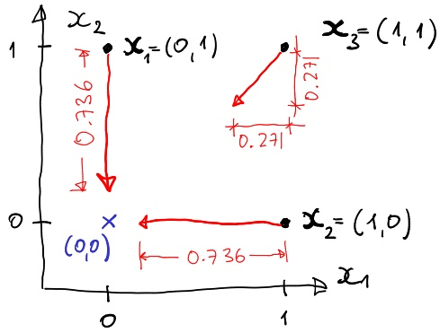

Figure C.3: Gradient vectors at (0,1), (1,0) and (1,1). All gradient vectors (think red arrows) point toward the origin, marked here with a blue cross (0, 0).

## C.10 Responsible data science

**Solution** (13.1). The probability that a red candidate is of low skill is $I / \mathcal { B } ,$ the probability that a green candidate is of low skill is ${ \mathcal { { L } } } / { \mathcal { { S } } } .$ Assuming the applicants’ skills are

<!-- page: 532 -->

independent, the probability that all G interviewed green candidates are of low skill is $( \stackrel { - } { 2 } / 3 ) ^ { G }$ ; the probability that all $3 - G$ interviewed red candidates are of low skill is $( \stackrel { \cdot } { 1 } \stackrel { \cdot } { 3 } \stackrel { \cdot } { ) ^ { 3 - G } }$ Hence the probability of not finding any high-skilled candidates when interviewing G greens is

$$
\left(\frac {2}{3}\right) ^ {G} \left(\frac {1}{3}\right) ^ {3 - G}.\tag{C.10.1}
$$

The numeric results are

| G | Probability |
| --- | --- |
| 0 | 0.04 |
| 1 | 0.07 |
| 2 | 0.15 |
| 3 | 0.30 |

This indicates that the managers have a strong motivation to interview only reds, or primarily reds.

<!-- page: 533 -->

## List of Cheatsheets

- 1.1 Different kinds of values . . . . . . . . . . . . . . . . . . . . . . . . . . . . 8
- 1.2 Descriptive Statistics . . . . . . . . . . . . . . . . . . . . . . . 33
- 1.3 Events, Probability and Conditional Probability . . . . . . . . . . . . . . . 42
- 1.4 Conditional probability . . . . . . . . . . . . . . . . . 54
- 1.5 Random variable and realization . . . . . . . . . . . . . . 56
- 1.6 Expected value, mean, variance . . . . . . . . . . . 66
- 1.7 Summary of the concepts regarding statistical hypotheses . . . . 95
- 1.8 Testing sample average . . . 107
- 2.1 Simple Regression: Definition . 133
- 2.2 Simple Regression: Interpretation 140
- 2.3 SSE and related terms 148
- 2.4 Model goodness measures 148
- 2.5 Categorical variables in linear regression 160
- 2.6 Log transformations in linear regression 172
- 2.7 Linear regression vs logistic regression 185
- 3.1 OLS Estimators for causal inference 225
- 4.1 Confusion matrix and related measures 246

<!-- page: 534 -->

<!-- page: 535 -->

## List of Examples

- 1.1 Numeric labels in World Value Survey 4
- 1.2 Passenger class in Titanic data 5
- 1.3 Predicting election results 10
- 1.4 "Y'all" versus "you guys" 12
- 1.5 How good is Global Shark Attack File? 15
- 1.6 Education and income in NLSY data: central tendency 19
- 1.7 Education and income in NLSY data: variability 24
- 1.8 Education and income in NLSY data: distribution 27
- 1.9 How to compute quantiles 29
- 1.10 Education and income in NLSY data: inequality 32
- 1.11 Monty Hall Problem 37
- 1.12 Probabilities of four-sided dice 40
- 1.13 Two non-independent coins 42
- 1.14 Red and green, nice and bad 45
- 1.15 Gender and Titanic Survival 48
- 1.16 Probability of diagnosis 51
- 1.17 Do you have cancer? 52
- 1.18 Random variable and realizations 55
- 1.19 Expectation of a 3-valued RV 59
- 1.20 Sample average converging to expected value 60
- 1.21 Bernoulli distribution 70
- 1.22 How many Spanish speakers? 72
- 1.23 Standard uniform distribution 74
- 1.24 Expected value of uniform RV 75
- 1.25 Rejecting and not rejecting a statistical hypothesis 89
- 1.26 Unemployment example with bad data 90
- 1.27 Unemployment rate as RV 91
- 1.28 Significance and $p$-value 92
- 1.29 Type-I and type-II errors in doping tests 94
- 1.30 MH-370 flight: complex confidence region 98
- 1.31 Confidence intervals for human height 99
- 1.32 Sample mean of sons' height 102
- 1.33 Smoking and birth weight 112
- 1.34 Male and female height 114
- 1.35 Two daughter problem: the girl has a name 116
- 1.36 Are hospitals unsafe during the weekends? 121

<!-- page: 536 -->

- 2.1 How fast does the universe expand? 129
- 2.2 Predicted Velocity of Galaxies 131
- 2.3 Unemployment versus GDP growth 134
- 2.4 Interpreting Regression Table 139
- 2.5 SSE for the iris sepals regression 142
- 2.6 $R^2$ for setosa sepals regression 145
- 2.7 $R^2$ of Hubble diagram: 100 years later 147
- 2.8 How is income related to education and literacy? 150
- 2.9 Income, education and literacy: interpretation 154
- 2.10 Importance of social skills 163
- 2.11 How does income depend on age? 169
- 2.12 Linear, log-linear, and log-log transformations 171
- 3.1 Smoking and lung cancer 196
- 3.2 Do parachutes help to survive a "gravitational challenge"? 198
- 3.3 RCT—how to determine the effect of pneumonia vaccine 200
- 3.4 Do more extensive public health measures during pandemic help economy? Correia et al. (2020) 201
- 3.5 Flu Vaccine Efficacy: a Case-Control Study 203
- 3.6 Former outcome as counterfactual 206
- 3.7 Expected value of unobserved characteristics 210
- 3.8 Cross-sectional estimator of college effect is biased 211
- 3.9 COVID-19 stay-at-home orders in Nordic countries 212
- 3.10 COVID-19 stay-at-home orders in Nordic countries: regression approach 213
- 3.11 President's approval: before and after September 11th 215
- 3.12 Presidents approval: before and after September 11th, the regression approach 217
- 3.13 COVID-19 Epidemic and Presidents Approval 221
- 3.14 President's approval rating: the regression approach 223
- 4.1 Confusion Matrix 237
- 4.2 Accuracy, Precision, Recall, $F$-score 239
- 4.3 Computing ROC curve 242
- 4.4 Overfitting and decision boundary 251
- 4.5 Complex decision boundary 251
- 5.1 Graphical way to add vectors 260
- 5.2 Application of 2-D vector space $\mathbb{Z}^2$ 262
- 5.3 Are these vectors linearly independent? 264
- 5.4 $L_3$ norm of vector (1,1) 266
- 5.5 Manhattan norm of vector (1,1) 267
- 5.6 Product of non-square matrices 276
- 5.7 Matrix product is not commutative 278
- 5.8 Transpose of matrix product 278
- 5.9 Inner and outer product 280
- 5.10 Matrix trace 280
- 5.11 Condition numbers 286
- 5.12 Convert data to design matrix 293
- 6.1 Splitting data for decision trees: income and education 307

<!-- page: 537 -->

- 6.2 Entropy of uniform distribution . 310
- 6.3 Data normalization . 320
- 6.4 Mahalanobis transformation of iris data . 324
- 6.5 Cosine similarity in $\mathbb{R}^2$ . 326
- 8.1 DTM of Laozi quotes . 348
- 8.2 TF-IDF of Laozi quotes . 352
- 8.3 Bayesian spam filter based on a single word . 355
- 8.4 Bayesian spam filter with two phrases . 359
- 8.5 Email classification . 364
- 8.6 Email classification with smoothing . 367
- 8.7 TCM of Laozi quotes . 371
- 8.8 Long embedding vector of Laozi quotes . 374
- 9.1 Softmax outputs . 390
- 9.2 1-D convolution . 392
- 9.3 Edges on image . 394
- 9.4 Distinguishing squares and circles . 397
- 10.1 A single step of gradient ascent: a numerical example . 409
- 11.1 How big are emergencies . 439
- 11.2 Principal component regression with 2-D data . 445
- 11.3 How are conservative family values and identity related to willingness to do good for society? . 447

<!-- page: 538 -->

<!-- page: 539 -->

## List of Figures

- 1 Viewing index . . . . . . . . . . . . . . . . . . . . . . . . . . . . . . . vi
- 1.1 Range is determined by outliers . . . . . . . . . . . . . . . . 21
- 1.2 Age and fare of Titanic passengers: histogram . . . . . . . . . . . . 25
- 1.3 Age and fare of Titanic passengers: density plot . . . . . . . . . 26
- 1.4 Titanic age by passenger class. Violin plot and boxplot . . . . . . 27
- 1.5 Histogram of education and income in heights data . . . . . . 28
- 1.6 How to compute quantiles . . . . . . . . . . . 29
- 1.7 Computing Pareto ratio . . . . . . . 32
- 1.8 Monty Hall Problem . . . . . . 38
- 1.9 4-sided dice . . . . . 40
- 1.10 Non-independent coins . . . . 42
- 1.11 Venn diagram . . . 45
- 1.12 Venn diagram of three event . . 46
- 1.13 At least one six, given one die has an odd number 48
- 1.14 Conditioning event partitions the sample space 48
- 1.15 Gender distribution of Titanic passengers 49
- 1.16 Sample average converges to expected value. 61
- 1.17 Bernoulli p.m.f. 70
- 1.18 Density plot: from discrete to continuous 74
- 1.19 Standard uniform density 75
- 1.20 Normal p.d.f. 76
- 1.21 Example of normally distributed values 77
- 1.22 Distribution of house prices 79
- 1.23 Log-normal distribution 80
- 1.24 Pareto distribution 82
- 1.25 CLT: How distributions converge to normal 84
- 1.26 Standard deviation as a function of sample size 86
- 1.27 Confidence intervals for temperature 96
- 1.28 Flight MH-370: most likely endpoint region 98
- 1.29 Human height is approximately normal 100
- 1.30 Distribution of mean of 4 observations 102
- 1.31 Histogram of 1000 simulated sample averages 104
- 1.32 Distance between simulated and actual data 106
- 1.33 Simulated difference in smoking habit across two types of workplaces 111
- 1.34 Birth weight and smoking habit 113

<!-- page: 540 -->

- 1.35 Hypothetical damage to allied bombers . . . . . . . . . . . . . . . . . . 119
- 2.1 Iris setosa . . . . . . . . . . . . . . . . . . . . 124
- 2.2 Many possible relationships . . . . . . . . . . . . . . . . . 125
- 2.3 Tiny linear regression example . . . . . . . . . . . . . . 127
- 2.4 Original Hubble diagram . . . . . . . . . . . . . . . 130
- 2.5 Original Hubble diagram . . . . . . . . . . . . 132
- 2.6 Interpretation of regression coefficients . . . . . . . . . . 134
- 2.7 Relationship between unemployment and GDP growth across countries in 2016, and the corresponding regression line. World Bank data. 135
- 2.8 Range-based construction of $R^2$ 145
- 2.9 Original versus modern Hubble diagram 148
- 2.10 Regression plane with two variables 151
- 2.11 Direct and indirect effects 153
- 2.12 Interpretation of interaction effects. The blue line depicts the relationship between income and social skills for low-social-skill individuals, and red line that for the high-social-skills individuals. 163
- 2.13 Distribution of UK household income in early 1980-s. Income distribution (left panel) does not look normal, it has a long thin tail of high-income households reaching up to weekly income 1000£. Log income (right panel) is fairly close to normal as logarithm spreads low-income observations out and squeezes the high-income ones closer together. Ecdat package data. 169
- 2.14 Diamond mass (carat=0.2 gram) and price data, including the corresponding regression lines. Left panel shows the linear model in price and carat. One can see that the line does not capture the convex pattern in data. Middle panel shows a model that is linear in log price and carat. Now the data pattern in concave and again the line fails to capture it well. On the right panel we log-transform both variables, and the result looks very good visually. 171
- 2.15 How participation depends on age 176
- 2.16 Logistic function 178
- 2.17 Participation as a function of age: logistic curves 180
- 2.18 Interpretation of logistic regression results 182
- 3.1 Does flu shot help to avoid flu? 194
- 3.2 Trends in smoking and lung cancer 197
- 3.3 Causal versus correlational regression 205
- 3.4 Mean independence 209
- 3.5 U.S. President G. W. Bush approval rating through summer and fall 2001. The dashed vertical line corresponds to September 11 terrorist attacks. 216
- 3.6 Hypothetical education data. Both the levels and trends differ for the treatment and control provinces. Dashed line denotes the counterfactual assumption, the difference between the actual and counterfactual value is the DiD estimate, here 1 year of extra schooling. 219

<!-- page: 541 -->

- 3.7 Presidents approval rating: differences-in-differences 222
- 3.8 DiD estimator in a graphical form 225
- 4.1 Predicted probabilities of Titanic survival 232
- 4.2 Decision boundary plot using 2-D Yin-Yang data 234
- 4.3 Example ROC curve for linear probability model (black) and logistic regression (pink). The figure suggest that in most cases logit outperforms LPM as it is able to achieve higher TPR over TPR range 0 to 0.3. 243
- 4.4 Two possible patterns to explain the same data 248
- 4.5 Artificial age-income data. Left panel shows just the data points, the right panel displays the same data and a number of polynomial regression models with various polynomial degrees. 250
- 4.6 Overfitting for categorization 251
- 4.7 Complex decision boundary that is not overfitting 252
- 4.8 Age-income data with some points left for validation 254
- 4.9 Training and validation RMSE 256
- 5.1 Vector space: all vectors on a plane can be computed as a linear combination of two base vectors, here $\boldsymbol{a}$ (red) and $\boldsymbol{b}$ (blue). The dotted red and blue arrows show which linear combinations are needed to create vectors $\boldsymbol{c}$ and $\boldsymbol{d}$ (black). 263
- 5.2 Vector $\boldsymbol{v}$ has both components, $v_x$ and $v_y$ equal to one. From Pythagorean theorem, its length is $\sqrt{2}$. Generalized “length” of a vector is called norm and denoted by $||\boldsymbol{v}||$, in this case $||\boldsymbol{v}|| = \sqrt{2}$. 265
- 5.3 King’s movement in chess 268
- 5.4 Unit circles – points sets of distance 1 from the origin (0,0) (the central dot) in different 2-D $L_p$ spaces. If $p < 2$, the circle looks more like a star, with the Manhattan distance, $p = 1$, being diamond-shaped. If $p > 2$, the circles are more and more box-shaped. 269
- 5.5 Wireframe image of the B-rune defined by matrix B in (5.6.1). All vertices are plotted and thereafter sequentially connected. 288
- 5.6 The same object as in Figure 5.5 but rotated 30 degrees by multiplication with the corresponding rotation matrix. The rotated vertices are given as $\mathsf{B}^{30}$ in (5.6.5). 289
- 5.7 2-D projection of a 3-D cube. 290
- 5.8 2-D projection of a 4-D tesseract 291
- 6.1 Animal game as a decision tree 300
- 6.2 Titanic survival as decision tree 301
- 6.3 Decision tree solving a 2-D task 303
- 6.4 Regression tree for 1-D task 304
- 6.5 Recursive binary split 306
- 6.6 Entropy and distribution 311
- 6.7 Comparing binary splits 312
- 6.8 Overfitting in 1-D regression tree 315
- 6.9 Decision trees and rotated data 316

<!-- page: 542 -->

- 6.10 Normalized and non-normalized features . 322
- 6.11 Boston housing data: neighborhood crime rate (crim) versus average number of rooms (rm). Non-normalized (left) versus normalized features (right). While the images look exactly the same, the Euclidean distance rankings are different: the nearest (colored) neighbor the green dot is the orange on the left panel, and the blue dot on the right panel. 323
- 6.12 Original features (left) and Mahalanobis-transformed features (right). The same three cases are marked with different colors on both images. The dotted line depicts a circle in the original feature space, the solid line is circle in Mahalanobis feature space. . 324
- 6.13 Mahalanobis transform of iris data . 325
- 6.14 Angle between two vectors . 327
- 6.15 Example data: some of the datapoints are categorized into yellow and violet, but some are not (left panel). Intuitively, the empty circles should be classified according to a colored one nearby. This is the intuition of the nearest neighbor method. On the right panel, all the points that are closer to a violet one are painted violet and those that are closer to a yellow one are colored yellow. All the empty circles now lie in one of these areas of solid color and can be categorized either as yellow or violet. . 329
- 6.16 The same data points as in Figure 6.15, but now categorized based on 5 (left) and 25 (right) nearest neighbors. We can see that in the latter case, there are several groups of points that are embedded in the area of different color. . 330
- 6.17 SVM Decision Boundary . 333
- 6.18 Complex and simple pattern . 335
- 7.1 Black-and-white image: Lyman trestle . 338
- 7.2 Pixels: detail of Lyman trestle . 339
- 7.3 Storing image data: flag of Scotland . 341
- 7.4 The same image rotated 10 degrees. . 343
- 7.5 Image of a text page (left panel). It is rotated 24 degrees counterclockwise. Right panel depicts the gray value density along the vertical axis. The galaxy image in the form of a triangular dip, centered at row 200, is clearly visible. However, the text lines cannot be distinguished in the plot. . 343
- 7.6 The same image as in Figure 7.5 but now rotated into correct position (left panel). The image is now visible as the rectangular dip with vertical sides. Now also the text lines are represented by a regular wavy pattern of lighter and darker stripes. Smooth slopes on both sides of the true image are related to the tilted white background embedded in the image. . 344
- 8.1 Word and country similarity . 378
- 9.1 Schematic look of neuron . 382

<!-- page: 543 -->

- 9.2 AND-Perceptron. The inputs $x_1$ and $x_2$ form the input layer, the single computing node forms the output layer. While the input layer only provides output to the node, the output node itself performs two operations: linear transformation $z = w_1x_1 + w_2x_2$, and activation, $y = \mathbb{1}(z > \bar{z})$. 384
- 9.3 XOR Perceptron. The inputs $x_1$ and $x_2$ form the input layer, but now both input layer nodes are connected to both hidden layer nodes $h_1$ and $h_2$, and not to the output layer. Both hidden layer nodes perform linear transformation and activation, using different weights $\boldsymbol{w}_h$ and biases $b_h$. The single output layer node behaves exactly like in case of AND-perceptron, just it gets its inputs from the hidden layer, not from the input layer. 386
- 9.4 Multi-layer perceptron 388
- 9.5 A few popular activation functions for neural networks. Leaky ReLU with $\alpha = 0.2$ is shifted slightly up for clarity. 391
- 9.6 Vertical edge detection with a convolutional filter 394
- 9.7 Edge detection with convolutions 394
- 9.8 Color image and multiple filters 396
- 9.9 Distinguishing squares and circles 398
- 10.1 SSE as a function of $\beta_0$ and $\beta_1$. 401
- 10.2 2-D function with multiple maxima 402
- 10.3 Hiker in whiteout conditions 403
- 10.4 Gradient ascent: the idea 403
- 10.5 Surface of the function $e^{-(3x_1^2 + x_2^2)}$. 404
- 10.6 Two ways to visualize gradient 405
- 10.7 Gradient and the direction of steepest ascent 407
- 10.8 Gradient and the direction of steepest ascent, an in-between case 407
- 10.9 A single step of gradient ascent: the general idea 409
- 10.10A single step of gradient ascent 410
- 10.11Linear versus ridge regression with highly correlated features 417
- 10.12Forward selection 419
- 11.1 5 distinct clusters and the cluster centers 425
- 11.2 Loss and partitioning 427
- 11.3 k-means algorithm at work 430
- 11.4 Elbow plot of 5 clusters 431
- 11.5 Elbow plot with now structural clusters in data 432
- 11.6 Agglomerative clustering on sample data 433
- 11.7 Agglomerative clustering of iris flowers 434
- 11.8 Male-female height data 435
- 11.9 PCA on 2-D data 438
- 11.10PCA: Explained variance 440
- 11.11Highly correlated variables 441
- 11.12Proportion of variance, explained by PC-s 442
- 11.13Principal component regression on 2-D data 446

<!-- page: 544 -->

- 11.14 How cluster analysis treats data . 450
- 11.15 How PCA treats data . 451
- 12.1 Two movies rated by three users, the same data as in Table 12.1 but now displayed graphically. . 454
- 12.2 Two movies rated by three users, the same data as in Table 12.1, column Centered rating. The point for Su is shifted a little bit on the figure for clarity. . 455
- 13.1 Fair test that gives unfair results . 466
- 13.2 Skills versus wealth: ignoring minorities . 469
- B.1 Petals and sepals of iris missouriensis . 481
- B.2 Yin-Yang data example (left); colored by c (right) . 484
- C.1 Sample quantiles solution . 487
- C.2 The global and north polar temperature over time, presented in two ways. . 503
- C.3 Sketch of gradient . 521

<!-- page: 545 -->

## List of Tables

- 1 Greek alphabet vii
- 1.1 Quantitative measures and associated statistical operations 5
- 1.2 Country names in GSAF data 15
- 1.3 Mean, median and mode of education and income. Dataset heights. 19
- 1.4 Computing variance 21
- 1.5 Range, variance and standard deviation of education and income. Dataset heights. 24
- 1.6 Computing variance of a discrete random variable 62
- 1.7 Functions of RV 64
- 1.8 Sum of two RV-s 64
- 1.9 Outcomes when flipping two coins 68
- 1.10 Pareto ratios for log-normal distribution 81
- 1.11 Inequality of Pareto distribution 83
- 1.12 Critical z-values 92
- 1.13 Simulated smoking data 110
- 2.1 Example cases from Iris dataset 129
- 2.2 Software output table from sepal length-sepal width regression. Different software package may provide slightly different output, but the main information is very much the same. 138
- 2.3 Computing SSE 142
- 2.4 Computing $R^2$ for setosa data. The table is analogous to the table in Example 2.5, just this time using the actual regression coefficient values instead of 0 and 1. 145
- 2.5 Sample of Males data (left), binary (dummy) variable m denoting status “married” (center). Dummies for three possible ethnic categories are in the rightmost three columns. 156
- 2.6 Example skill-income data. 161
- 2.7 Results of three different regression models: linear-linear, log-linear, and log-log. 172
- 2.8 An example of “Treatment” data 175
- 3.1 Example flu shot data. Id is the patient id, Flu shot is a dummy variable denoting whether the person got ($S = 1$) or did not get ($S = 0$) a flu shot, and Flu denotes whether they got flu ($F = 1$) or not ($F = 0$). The table shows four observations only, but there can be many more. 193

<!-- page: 546 -->

- 3.2 G.W.Bush approval ratings . . . . . . . . . . . . . . . . . . . . 217
- 3.3 DiD regression estimate for the effect of 9/11 terror attacks on presidents approval rating. Standard errors in italics. . . . . . . . . . . . . 218
- 3.4 Four datapoints for DiD estimator . . . . . . . . . . . . . . . . 220
- 3.5 An excerpt of approval ratings data for presidents Obama and Trump during their fourth year in office. Polling data from RealClearPolitics. The displayed period, from mid-January to mid-April centers on mid-March, the weeks in 2020 where the world, including the US, rapidly realized the magnitude of the unfolding health crisis. . . . . . . . . . 221
- 3.6 The effect of COVID-19 pandemic on president's approval rate . . . 221
- 3.7 DiD regression estimate for the effect of COVID-19 epidemic on the US president's approval rating. Standard errors in italics. . . . . . 223
- 3.8 Four potential outcomes in binary treatment/binary outcome data. "0" and "1" denote presence and absence of treatment and outcome, the letters in cells are the corresponding case counts. . . . . . . . . 227
- 4.1 Example confusion matrix . . . . . . . . . . . . . . . 236
- 4.2 Confusion matrix for two categories . . . . . . . . 236
- 4.3 Prediction errors from polynomial regression on validation data as shown in Figure 4.8. The linear model (1st-degree polynomial) achieves the smallest RMSE on validation data. 255
- 6.1 Recent house sales . . . . . . . . . . . . 319
- 6.2 Recent house sales . . . . . . . 331
- 8.1 Two BOW-s $\boldsymbol{x}_1$ and $\boldsymbol{x}_2$, corresponding to the two Laozi quotes in the text. Both BOW-s, stacked horizontally underneath each other as in this table, form a numeric DTM that can be used in various machine learning models. 348
- 8.2 Example vocabulary, bag-of-word vectors, and TF-IDF transformation for quotes: "Knowing others is wisdom, knowing yourself is Enlightenment" and "Mastering others is strength. Mastering yourself is true power". 352
- 8.3 DTM of the three example emails (rows $\boldsymbol{x}_1$, $\boldsymbol{x}_2$ and $\boldsymbol{x}_3$), the corresponding word counts ($N_W$), and conditional probabilities of word in spam ($\Pr(W = 1|S = 1)$) and no-spam ($\Pr(W = 1|S = 0)$) emails. 365
- 8.4 The new email as BOW. Note that the word "no" is missing in the training vocabulary. We ignore it here as we have no way of telling what would the corresponding probabilities be. 365
- 8.5 DTM of the three example emails from example 8.5. The first row (the first email) is spam, the following two are not spam. 367
- 8.6 Smoothed probabilites for the DTM above for $\alpha = 0.2$. 368
- 8.7 Two types of long embeddings 371
- 8.8 ice and steam in context of different words 375
- 8.9 GloVe most similar words 377
- 9.1 AND, OR and XOR operations 384

<!-- page: 547 -->

- 9.2 XOR-perceptron parameters ..... 386
- 11.1 Principal components of 2-D data ..... 439
- 11.2 Explained variance across PC-s ..... 442
- 11.3 Principal components of data in Figure 11.13 ..... 447
- 11.4 Proportion of variance explained by components in Table 11.3 ..... 447
- 12.1 Two fictional movies rated by three fictional persons. Average is the users' average rating over all movies they have rated. ..... 454

<!-- page: 548 -->

<!-- page: 549 -->

## List of Exercises

- 1.1 Of what measure type are these values? 6
- 1.2 Humans understand average well 17
- 1.3 Mean, median, mode 19
- 1.4 Properties of variance 22
- 1.5 Compute sample quantiles 30
- 1.6 Robustness of quantiles 30
- 1.7 Compute inequality 32
- 1.8 Rolling two dice 39
- 1.9 First class survivors 47
- 1.10 Titanic survival and gender 50
- 1.11 A family has two children... 50
- 1.12 First class given survived 52
- 1.13 Two bags of M&M 53
- 1.14 Smile or fight? 53
- 1.15 Rolling two dice 57
- 1.16 Find $\Pr(Z = 6)$ 57
- 1.17 Expected value of die 59
- 1.18 How many sixes do we get? 59
- 1.19 Demonstrate Law of Large Numbers 61
- 1.20 Compute variance of a RV 62
- 1.21 Variance of Bernoulli RV 63
- 1.22 What makes $X_1$ and $X_2$ independent? 64
- 1.23 Prove theorem 2 65
- 1.24 Show that $\mathbb{E}e^X\neq e^{\mathbb{E}X}$ 65
- 1.25 Realization or possible value 69
- 1.26 Measure for c.d.f. 69
- 1.27 Bernoulli distribution 70
- 1.28 Weekly orders 72
- 1.29 Quantiles of standard uniform distribution 75
- 1.30 Normal p.d.f. 78
- 1.31 Expected value of Pareto RV 82
- 1.32 Replicate Figure 1.25 with Beta distribution 86
- 1.33 Is this a good hypothesis? 90
- 1.34 z-test 93
- 1.35 Type-I and type-II errors 94
- 1.36 Confidence intervals for normally distributed values 100

<!-- page: 550 -->

- 1.37 Decision at 1% significance level . . . . . . . . . . . . . . . . . . . . . . . . . . . . . . . . . . . . . . . . . . . . . . . . . . . . . 105
- 1.38 z-value . . . . . . . . . . . . . . . . . . . . . . . . . . . . . . . . . . . . . 107
- 1.39 Make a numeric example . . . . . . . . . . . . . . . . . . . . . . . . . 117
- 1.40 Damage in Allied bombers . . . . . . . . . . . . . . . . 119
- 1.41 How to multiply wealth of all Icelanders . . . . . . . . . . . . 121
- 2.1 Compute $\epsilon$ 128
- 2.2 Predict using linear regression 132
- 2.3 Income and education 135
- 2.4 Weight and height 136
- 2.5 How is sons' height related to fathers' height? 136
- 2.6 Interpreting regression table 139
- 2.7 RMSE and standard deviation 143
- 2.8 Compute TSS, SSE, $R^2$ 146
- 2.9 Multiple regression: income, age and experience 154
- 2.10 Do union members earn more? 157
- 2.11 Diamonds' price depending on cut 159
- 2.12 Interpret multi-category dummies 159
- 2.13 Why a single race only? 160
- 2.14 Global warming and polar warming 164
- 2.15 Wheat yield and CO$_2$ 170
- 2.16 Linear or logistic regression? 177
- 2.17 Which values are statistically significant? 180
- 2.18 Job training for the unemployed 183
- 2.19 Odds and probabilities 184
- 2.20 Prove (2.2.9) 184
- 3.1 Self-selection and downward bias 195
- 3.2 Counfounding factors and downward bias 195
- 3.3 Does smoking cause lung cancer? 196
- 3.4 Job search help-cross-sectional estimator 214
- 3.5 Job search help-before-after estimator 218
- 3.6 Job search help-dif-in-dif estimator 224
- 4.1 Titanic survival probability 233
- 4.2 Decision boundary for other data dimensions 233
- 4.3 Compute the confusion matrix 238
- 4.4 Confusion matrix for the naive model 238
- 4.5 Compute F-score 239
- 4.6 Accuracy, Precision, Recall 240
- 4.7 Flipping positives and negatives 241
- 4.8 COVID test sensitivity 241
- 4.9 $R^2$ of naive model on validation data 254
- 5.1 Vector dimension 260
- 5.2 What is the capital of France? 261
- 5.3 Are these vectors linearly independent? 264
- 5.4 Normalize vectors 268
- 5.5 Multiply square matrices 276
- 5.6 Multiply non-square matrices 276

<!-- page: 551 -->

- 5.7 Dimension of matrix product . 277
- 5.8 Which matrix products are possible? . 277
- 5.9 Test the associative property . 277
- 5.10 Explain why Example 5.7 works . 279
- 5.11 Norm using inner product . 280
- 5.12 Compute quadratic forms . 281
- 5.13 Compute matrix expressions . 282
- 5.14 Matrix inverse . 284
- 5.15 Find base vector multiplier for a given vector . 285
- 5.16 Inverse of rotation matrix . 289
- 5.17 Matrix form . 292
- 6.1 Trees and decision boundaries . 304
- 6.2 Decision boundary with 3 features . 305
- 6.3 Entropy of Bernoulli random variable . 311
- 6.4 Compute entropy gain . 313
- 6.5 Cosine similarity . 328
- 6.6 Cosine, angular distance are not proper metric distances . 328
- 8.1 Spam given a word . 353
- 8.2 Probability of spam given no “viagra” . 355
- 8.3 Spam filter with “free” and “dollar” . 356
- 8.4 Categorize using Naive Bayes . 366
- 8.5 Odds and importance of individual words . 369
- 8.6 Long embeddings: rows or columns? . 371
- 8.7 Laozi embeddings with asymmetric context . 374
- 9.1 OR-perceptron . 383
- 9.2 Use the perceptron for XOR . 386
- 9.3 Softmax property . 390
- 9.4 Corner detection with convolutions . 395
- 10.1 Compute gradient . 406
- 13.1 Probability to find no suitable candidates . 464
- 13.2 Perfect test . 467

<!-- page: 552 -->

<!-- page: 553 -->

## Index

1(), see indicator function 80-20 rule, see pareto ratio

accuracy, **238** actual outcome, **206** AdaBoost, **317** agglomerative clustering, **432** alternative hypothesis, **89** and, **383** angular distance, 326, **328** associated with, **137**, **193** atomic event, 57 average, **17** axon, **382**

bag of words, **347**, 370 bagging, **316** Bayes theorem, 44, **50** before-after estimator, **215** biased data, **12** bimodal, **18** binary outcome, **177** binomial coefficient, **72**, **473** bit, **309** bootstrap, 316 boxplot, **27**

case-control study, **203** categorization naive model, 238, 239 causal diagram, **193** causal inference, **190** cause, **191** cause-density bias, **227** central limit theorem, 83, **85**, 98, 111 central tendency, 58 centroid, 429 Chebyshev norm, 267

chessboard norm, 267 CLT, see central limit theorem cluster analysis, **425** clustered sampling, **13** compound event, 37, **38**, 41 compute graph, 410 conditional expectation, 208 conditional probability, **45** confidence interval, 11, **89**, 95, **97** confidence level, 89, 95, 96 confidence region, 99 confounding factor, 227 confounding factors, **195** confusion matrix, **235** context, **370**, 373 continuous random variable, **58** contributing cause, **191** control for, **153** convolution, **391** filter, **392** kernel, **392** cosine similarity, 269, **326**, 455 counterfactual, **206** counterfactual assumption, see identifying assumption counterfactual outcome, see counterfactual covariance matrix, 324 coverage error, **11** cross-sectional estimator, **211** cumulative distribution function, **69** curse of dimensionality, 213

datasets Boston housing, **477** boston housing, 77 COVID in Scandinavia, 212, **477**

<!-- page: 554 -->

global shark attack file, 15, **478** growth-unemployment, 77, **478** harden, 7, 77, **479** heights, 19, 32, **479** housing, **480** Howell’s height-weight, 114, 433, **480** Hubble, 139 iris, 77, 324, 432, **480** males, 156, 307, **481** marathon, 77, **481** ncbirths, 112, **481** Obama approval, 77, **482** smokeban, 109, **482** titanic, 20, **483** treatment, 237, **483** yinyang, 233, **483** decision boundary, **233**, 251, 303 decision tree, **299** leaf, **302** node, **301** recursive binary splitting, **305** degrees of freedom, 138 dendrite, **382** density plot, **26** dependent variable, see outcome variable design matrix, 259, 292, **292** dif-in-dif, see differences-in-differences differences-in-differences, **218** discrete random variable, **57** distance metric, 330 distributions Bernoulli, **69**, 110 binomial, **71** log-normal, **78** multinomial, 70 normal, **76** Pareto, **81**, 83 uniform, **74** document-term-matrix, **348**, 365 dose, 190, **192** double-blind experiment, 199 DTM, 345, see document-term-matrix dummies, **156**, 160 ecological fallacy, **120** effect, **191**

elasticity, 171 elbow plot, **431** embeddings, see word embeddings endogenous variable, see outcome variable ensemble method, 300, **314** entropy, **309**, 312 Euclidean norm, **266**, 326, 373 event, **36** expectation, 17, 52, 55, **59**, 207 expected value, see expectation, 75 explainability, 302 explanatory variables, **126** external validity, **11**

F-score, **239** factor loading, **439** fairness, **464** false negative, **93**, **237** false positive, **93**, **237** false positive rate, **241**, 242 fat tails, 321 feature normalization, **320** feature normalization, 352 feature selection, **416** feed-forward neural network, 382 fixed effects, 211 forward selection, 166 frequentist probability, **39**

GAN, see generative adversarial network gaussiam mixture, 433 gaussian mixture model, 433 generative adversarial network, **458** GloVe, **375** gradient, **403**, 410 gradient ascent, **401**, 459 gradient descent, **401**, 411 grid search, 402 group fairness, **464**, 465

hidden layer, **385** hiearchical clustering, **432** hierarchical clustering, 426 histogram, **25** hyperparameters, **255** hyperplane, 150

<!-- page: 555 -->

## INDEX

identifying assumption, **207**, 208, 215, 218 independent events, **39**, 361 indicator function, **ix**, 351 individual fairness, **464**, 465 instance-based-learning, **331** intersectionality, **166** iris data, 124 k-means, 428, **428** k-nearest neighbors, 246, 328, **330** law of large numbers, 59, **60**, 67, 83 lemma, **347** lemmatization, **347** likelihood, 233, 362 linear regression polynomial regression, 249 linear independence, **264** linear probability model, **176**, 242 linear regression mean squared error, **143** prediction, **130** residual, 141 SSE, see sum of squared errors sum of squared errors, **141**, 143 total sum of squares, **144** Lipschitz continuity, 389 LLN, see law of large numbers log-likelihood, 363 log-odds, **184**, 369 logistic function, **177**, 390 logistic regression, **177** link, **178** logistic transformation, **177** logit, see logistic regression loss function, **400**, 401 L<sub>p</sub>-norm, **266** LPM, see linear probability model Mahalanobis distance, **323** majority voting, 314, 317, **330** manhattan norm, **267** marginal effect logistic regression, **181** matrix, **270** column, **270** component, see element

condition number, **286**, 322 diagonal, **271** diagonal matrix, **272** dimension, 270 eigenvalue decomposition, 323 element, 270 identity matrix, see unit matrix index, 270 inverse, **283** left-multiplication, **278** lower triangle, **271** multiplication, see product post-multiplication, see left-multiplication, see right-multiplication product, **274** right-multiplication, **278** rotation matrix, **288** row, **270** singular, **284** square, 271 square matrix, **271** symmetric matrix, **272** trace, **280** transposition, **273** unit matrix, viii, **272** upper triangle, **271** maximum likelihood, 179 mean, see average mean independence, 208 measure level, 3 interval, 3 nominal, 3, 3 ordinal, 3, 3, 20 ratio, 3 median, 3, **18**, 29 metric, 319 metric distance, 268 min-max scaling, **322** Minkowski norm, see Lp-norm mode, 3, **18** MSE, see mean squared error multi-layer perceptron, **387** multimodal, **18** mutually exclusive events, **39** naive bayes, **358**

<!-- page: 556 -->

nat, **309** natural experiment, **201** nearest neighbors, 319, **329** negative predictive value, **241** neural networks activation, **383** bias, **383** input layer, **383** perceptron, **382** weights, **383** neuron, **382** non-linear optimization, 399 norm, **265** normalizer, 52 NPV, see negative predictive value null hypothesis, **89**, 95 objective function, **400** observed value, **55** odds, see odds ratio odds ratio, **183** one-hot encoding, **158** one-tailed confidence interval, 98 one-tailed test, 98 optimization, **400** or, **383** outcome, **192** outcome variable, **126** outcome-density bias, **227** overfitting, **249** p-value, **92**, 95, 138 p.m.f., see probability mass function padding, **397** paired data, **109** pareto ratio, **31** PCA, see principal component analysis pdf, see probability density function penalty, 419 percent, 5 percentage point, 5, 183 percentile, **28** pixel, **338** pooling, **397** population, 9 population variance, **23** positive predictive value, **241**

posterior, **51** PPV, see positive predictive value precision, **239**, 355 principal component analysis, **436** prior, **51** probability, **39** probability density function, **73**, 78 probability mass function, **68** pruning, **313** QSR, see quintile share ratio quadratic form, **281** quantile, 3, **28**, 97 quartile, 27, **29** quasi-experiment, **201** quintile, **29** quintile share ratio, **31**, 81 R-squared, **144** R<sup>2</sup>, **144** random variable, 9, **55**, 96 continuous, **73** function, textbf63 randomized controlled trial, 207 see RCT, **199** range, **20** RCT, **199** realization, **55**, 96 recall, **239**, 355 recursive binary splitting, **305** regression coefficients, **128** cross-effect, see interaction effect deviation, **132** error term, **127**, 150 explanatory variable, **127**, 150 interaction effect, **161**, 223 interaction term, **162** intercept, 127, 134 log transform, **168** log-log transform, **170** multiple regression, **150** outcome variable, **127**, 150 parameters, **128** reference category, **158**, 160 regression line, 127

<!-- page: 557 -->

regression plane, **151** regression to mean, 500 residual, **132** slope, 127, 134 standardized features, 164, **168** regularization, 416 ReLU, **389** RMSE, see root mean squared error robust statistic, 17, 18 ROC curve, **242** root mean squared error, **143**, 250, 253 311 RV, see random variable sample, 9 sample space, **36** sample variance, **20** sampling error, **11** scalar, **260** self-selection, **194**, 195 sensitivity, **241** sigmoid function, **177**, **390** significance level, **92**, 95 simple event, 37, **38**, 117 softmax, **390** specificity, **241** SSE, 292 standard deviation, **23** standard error, **23** statistical discrimination, 464 statistical hypothesis, **89** statistical model, 126 stemming, **346** stochastic, **36** stopwords, **347**, 349 stride, **397** supervised learning, 126 support vector machine, **332** SVM, see support vector machine t-value, **107**, 138 TCM, see term co-occurrence matrix term co-occurrence matrix, **370** tertile, **29** tesseract, **290** test statistic, **92**, 95 TF-IDF, 345, **351**

token, **346** tokenization, **346** top coding, **24**, 28 training data, **248**, **253** treatment, **192** tree, see decision tree true negative, **236** true positive, **236** true positive rate, **241**, 242 two daughter problem, **50** two daughter problem, 116 two-tailed test, 98 type-I/type-II error, **93**, 95, 235, 237 underfitting, **253** uniform sampling, **13** unimodal, **18** unsupervised learning, 126 validation data, **253** variance, **20**, 23, **62** vector, **259** column vector, **273**, 279 component, see element dimension, **259** element, **259** inner product, 279 linear combination, **263** norm, **266**, 326 normalized, **268** outer product, 279 row vector, **273** row vector, 279 vector function, **281** vector space, **262** dimension, **264** vector-argument function, **281** vector-valued function, **281** Venn diagram, **44** violin plot, **26** vocabulary, 348, 365 word embeddings, 261, **370** World Value Survey, 4 xor, **383**

z-value, 92, **106**, 180

<!-- page: 558 -->

<!-- page: 559 -->

## Bibliography

Amoros, E., Chiron, M., Martin, J.-L., Thélot, B. and Laumon, B. (2012) Bicycle helmet wearing and the risk of head, face, and neck injury: a french case–control study based on a road trauma registry, Injury Prevention, **18**, 27–32.

Angwin, J., Larson, J., Mattu, S. and Kirchner, L. (2016) Machine bias: There’s software used across the country to predict future criminals. and it’s biased against blacks., ProPublica website, proPublica.

Bender, E. M., Gebru, T., McMillian-Major, A. and Shmitchell, S. (2021) On the dangers of stochastic parrots: Can language models be too big?, in Conference on Fairness, Accountability, and Trans-parency (FAccT ’21),, pp. 610–623.

Bonten, M. J., Huijts, S. M., Bolkenbaas, M., Webber, C., Patterson, S., Gault, S., van Werkhoven, C. H., van Deursen, A. M., Sanders, E. A., Verheij, T. J., Patton, M., McDonough, A., Moradoghli-Haftvani, A., Smith, H., Mellelieu, T., Pride, M. W., Crowther, G., Schmoele-Thoma, B., Scott, D. A., Jansen, K. U., Lobatto, R., Oosterman, B., Visser, N., Caspers, E., Smorenburg, A., Emini, E. A., Gruber, W. C. and Grobbee, D. E. (2015) Polysaccharide conjugate vaccine against pneumococcal pneumonia in adults, New England Journal of Medicine, **372**, 1114–1125, pMID: 25785969.

Bottou, L., Curtis, F. and Nocedal, J. (2018) Optimization methods for large-scale machine learning, SIAM Review, **60**, 223–311.

Boyd, D. and Crawford, K. (2012) Critical questions for big data, Information, Communication & Society, **15**, 662–679.

Correia, S., Luck, S. and Verner, E. (2020) Pandemics depress the economy, public health interventions do not: Evidence from the 1918 flu, Tech. rep., SSRN.

Craven, D. (2015) The statistical sins of jeremy hunt, BMJ, **351**.

Cripton, P. A., Dressler, D. M., Stuart, C. A., Dennison, C. R. and Richards, D. (2014) Bicycle helmets are highly effective at preventing head injury during head impact: Head-form accelerations and injury criteria for helmeted and unhelmeted impacts, Accident Analysis & Prevention, **70**, 1 – 7.

Deming, D. J. (2017) The growing importance of social skills in the labor market, Quarterly Journal of Economics.

<!-- page: 560 -->

Elvidge, C. D., Baugh, K., Zhizhin, M., Hsu, F. C. and Ghosh, T. (2017) Viirs nighttime lights, International Journal of Remote Sensing, 38, 5860–5879.

Ferdinands, J. M., Olsho, L. E. W., Agan, A. A., Bhat, N., Sullivan, R. M., Hall, M., Mourani, P. M., Thompson, M. and Randolph, A. G. (2014) Effectiveness of Influenza Vaccine Against Life-threatening RT-PCR-confirmed Influenza Illness in US Children, 2010–2012, The Journal of Infectious Diseases, 210, 674–683.

Ferté, T., Ramel, V., Cazanave, C., Lafon, M.-E., Bébéar, C., Malvy, D., Georges-Walryck, A. and Dehail, P. (2021) Accuracy of covid-19 rapid antigenic tests compared to rt-pcr in a student population: The studycov study., Journal of clinical virology : the official publication of the Pan American Society for Clinical Virology, 141, 104878.

Fleisher, W. (2021) What’s fair about individual fairness?, in Proceedings of the 2021 AAAI/ACM Conference on AI, Ethics, and Society, Association for Computing Machinery, New York, NY, USA, AIES ’21, p. 480–490.

Freemantle, N., Ray, D., McNulty, D., Rosser, D., Bennet, S., Keogh, B. E. and Pagano, D. (2016) Increased mortality associated with weekend hospital admission: a case for expanded seven day services?, BMJ, 352.

Fyhri, A., Sundfør, H., Weber, C. and Phillips, R. (2018) Risk compensation theory and bicycle helmets – results from an experiment of cycling speed and short-term effects of habituation, Transportation Research Part F: Traffic Psychology and Behaviour, 58, 329 – 338.

Galton, F. (1886) Regression towards mediocrity in hereditary stature., The Journal of the Anthropological Institute of Great Britain and Ireland, 15, 246–263.

Ghojogh, B. and Ghodsi, A. (????) Attention mechanish, transformers, bert and gpt: Tutorial and survey, to appear as a part of Ali Ghodsi’s material on deep learning.

Godlee, F. (2016) How jeremy hunt derailed clinician led progress towards a seven day nhs, BMJ, 352.

Goodfellow, I., Pouget-Abadie, J., Mirza, M., Xu, B., Warde-Farley, D., Ozair, S., Courville, A. and Bengio, Y. (2014) Generative adversarial nets, in Advances in Neural Information Processing Systems (Eds.) Z. Ghahramani, M. Welling, C. Cortes, N. Lawrence and K. Q. Weinberger, Curran Associates, Inc., vol. 27.

Greene, W. H. (2003) Econometric Analysis, Prentice Hall.

Hubble, E. (1929) A relation between distance and radial velocity among extragalactic nebulae, Proceedings of the National Academy of Sciences, 15, 168–173.

Iacobucci, G. (2016) Demonstrating junior doctors ask jeremy hunt to stop misusing statistics, BMJ, 352.

Jackson, S. (2022) A group of bipartisan lawmakers is grilling Amazon for its continued sale of a chemical compound used in suicides, Business Insider, February 22.

<!-- page: 561 -->

Jacobs, A. Z. and Wallach, H. (2021) Measurement and fairness, Proceedings of the 2021 ACM Conference on Fairness, Accountability, and Transparency.

Kleinberg, J., Lakkaraju, H., Leskovec, J., Ludwig, J. and Mullainathan, S. (2018) Human decisions and machine predictions, The Quarterly Journal of Economics, 133, 237–293.

Kleinberg, J., Mullainathan, S. and Raghavan, M. (2016) Inherent trade-offs in the fair determination of risk scores, Tech. rep., arXiv.

Liao, Q. V., Gruen, D. and Miller, S. (2020) Questioning the ai: Informing design practices for explainable ai user experiences, in Proceedings of the 2020 CHI Conference on Human Factors in Computing Systems, Association for Computing Machinery, New York, NY, USA, CHI ’20, p. 1–15.

Markel, H., Lipman, H. B., Navarro, J. A., Sloan, A., Michalsen, J. R., Stern, A. M. and Cetron, M. S. (2007) Nonpharmaceutical interventions implemented by US cities during the 1918-1919 influenza pandemic, JAMA, 298, 644–654.

Matute, H., Blanco, F., Yarritu, I., Díaz-Lago, M., Vadillo, M. A. and Barberia, I. (2015) Illusions of causality: how they bias our everyday thinking and how they could be reduced, Frontiers in psychology, 6, 1–14.

Mills, N. and Gilchrist, A. (2008) Oblique impact testing of bicycle helmets, International Journal of Impact Engineering, 35, 1075 – 1086.

Murphy, K. P. (2012) Machine Learning: A Probabilistic Perspective, MIT Press, Cambridge, MA.

Nissen-Meyer, J., Skotland, T. and Boye, E. (2022) Are doping tests in sports trustworthy?: Athletes suffer from insufficiently defined criteria for doping tests: Athletes suffer from insufficiently defined criteria for doping tests., EMBO reports, 23, e54431.

of England, B. (2019) Inflation report, february 2019, Tech. rep., Bank of England, London, UK.

Pennington, J., Socher, R. and Manning, C. D. (2014) Glove: Global vectors for word representation, in Empirical Methods in Natural Language Processing (EMNLP), pp. 1532–1543.

Phuong, M. and Hutter, M. (2022) Formal algorithms for transformers.

Smith, G. C. and Pell, J. P. (2003) Parachute use to prevent death and major trauma related to gravitational challenge: systematic review of randomised controlled trials., BMJ, 327, 1459–1461.

Vaswani, A., Shazeer, N., Parmar, N., Uszkoreit, J., Jones, L., Gomez, A. N., Kaiser, L. and Polosukhin, I. (2017) Attention is all you need, in Proceedings of the 31st International Conference on Neural Information Processing Systems, Curran Associates Inc., Red Hook, NY, USA, NIPS’17, p. 6000–6010.

<!-- page: 562 -->

Walker, I. (2007) Drivers overtaking bicyclists: Objective data on the effects of riding position, helmet use, vehicle type and apparent gender, Accident Analysis & Prevention, 39, 417 – 425.
