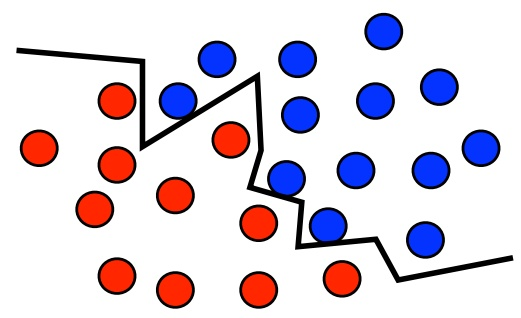
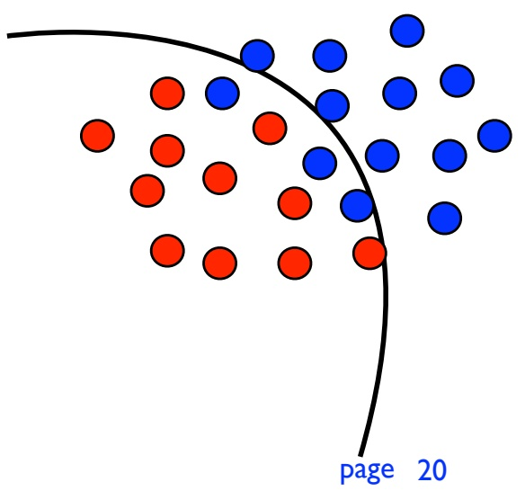

<!-- page: 1 -->

# Introduction to Machine Learning Lecture 1

Mehryar Mohri

Courant Institute and Google Research

[mohri@cims.nyu.edu](mailto:mohri@cims.nyu.edu)

<!-- page: 2 -->

## Introduction

<!-- page: 3 -->

## Logistics

Prerequisites: basics concepts needed in probability and statistics will be introduced.

Workload:

• 5 homework assignments.

• mid-term exam, final project.

Textbooks: recommended, not mandatory.

• no single textbook covering material presented.

• lecture slides available electronically.

Mailing list: join as soon as possible.

<!-- page: 4 -->

## Machine Learning

Definition: computational methods using experience to improve performance, e.g., to make accurate predictions.

Experience: data-driven task, thus statistics, probability.

Example: use height and weight to predict gender.

Computer science: need to design efficient and accurate algorithms, analysis of complexity, theoretical guarantees.

<!-- page: 5 -->

## Examples of Learning Tasks

Optical character recognition.

Text or document classification, spam detection.

Morphological analysis, part-of-speech tagging, statistical parsing.

Speech recognition, speech synthesis, speaker verification.

Image recognition, face recognition.

<!-- page: 6 -->

## Examples of Learning Tasks

Fraud detection (credit card, telephone), network intrusion.

Games (chess, backgammon).

Unassisted control of a vehicle (robots, navigation).

Medical diagnosis.

Recommendation systems, search engines, information extraction systems.

<!-- page: 7 -->

## Some Broad Areas of ML

Classification: assign a category to each object (OCR, text classification, speech recognition).

• note: infinite number of categories in difficult tasks.

Regression: predict a real value for each object (prices, stock values, economic variables, ratings).

• measure of success: closeness of predictions.

Ranking: order objects according to some criterion (relevant web pages returned by a search engine).

<!-- page: 8 -->

## Some Broad Areas of ML

Clustering: partition data into homogenous groups (analysis of very large data sets).

Dimensionality reduction: find lower-dimensional manifold preserving some properties of the data (computer vision).

Density estimation: learning probability distribution according to which data has been sampled (distribution typically selected out of pre-selected family).

<!-- page: 9 -->

## Objectives of Machine Learning

Algorithms: design of efficient, accurate, and general learning algorithms to

• deal with large-scale problems (|data| > 1-10M).

• make accurate predictions (unseen examples).

• handle a variety of different learning problems.

Theoretical questions

• what can be learned? Under what conditions?

• how well can it be learned computationally?

<!-- page: 10 -->

## This course

Algorithms: covers most key learning algorithms.

• nearest-neighbor algorithms.

• perceptron, Winnow, Halving, Weighted Majority.

• support vector machines, kernel methods.

• boosting, bagging.

## Applications:

• illustration of the use of algorithms.

• software and familiarization (assignments).

Theory: analysis and introduction to concepts.

<!-- page: 11 -->

## Topics

Basic notions of probability.

Bayesian inference.

Nearest-neighbor algorithms.

On-line learning with expert advice (Weighted Majority, Exponentiated Average).

On-line linear classification (Perceptron, Winnow).

Support Vector Machines (SVMs).

<!-- page: 12 -->

## Topics

Kernel methods.

Decision trees.

Ensemble methods (boosting, bagging).

Logistic regression.

Density estimation (ML, Maxent models)

Multi-class classification.

<!-- page: 13 -->

## Topics

Linear regression.

Kernel ridge regression, Lasso.

Neural networks.

Clustering.

Dimensionality reduction

Introduction to reinforcement learning.

Elements of learning theory.

<!-- page: 14 -->

## Definitions and Terminology

Example: an object or instance in data used.

Features: the set of attributes, often represented as a vector, associated to an example, e.g., height and weight for gender prediction.

Labels:

in classification, category associated to an object, e.g., positive or negative in binary classification.

• in regression, real-valued numbers.

<!-- page: 15 -->

## Definitions and Terminology

Training data: data used for training algorithm.

Test data: data exclusively used for testing algorithm.

Some standard learning scenarios:

• supervised learning: labeled training data.

• unsupervised learning: no labeled data.

semi-supervised learning: labeled training data + unlabeled data.

transductive learning: labeled training data + unlabeled test data.

<!-- page: 16 -->

## Example - SPAM Detection

Problem: classify each e-mail message as SPAM or non-SPAM (binary classification problem).

Data: large collection of SPAM and non-SPAM messages (labeled examples).

Features: define features for all examples (e.g., presence or absence of some sequences).

• critical step (should use prior knowledge).

Algorithm: choose type of algorithm adapted to the problem.

• typically requires choice of hypothesis set.

<!-- page: 17 -->

## Example - SPAM Detection

## Learning stages:

divide labeled collection into training and test data.

use training data and features to train machine learning algorithm.

predict labels of examples in test data to evaluate algorithm.

• algorithms may require choosing a parameter (number of rounds, learning parameter, trade--off parameter) validation set or cross-validation.

<!-- page: 18 -->

## Cross-Validation

Partition data into folds (typically, K $K   =   5$ or ).10

Train on all but th fold hypothesisk $h _ { \theta , k } ,   k   \in   [ 1 ,   K ]$

Compute -fold cross validation error:k

$$
\frac {1}{K} \sum_ {k = 1} ^ {K} \widehat {\mathrm{error}} (h _ {\theta , k}, \mathrm{fold} k).
$$

Choose value of minimizing CV error.θ

When $K   =   m$ (sample size) leave-one-out cross-validation and error.

<!-- page: 19 -->

## Importance of Features

## Features:

poor features, uncorrelated with labels, make learning very difficult for all algorithms.

good features, can be very effective; often knowledge of the task can help.

## Example:

| 00\|0\|00\|\|\|0 | 2 | \|\|000\|\|\|00\| | 0 |
| --- | --- | --- | --- |
| \|\|0\|0\|\|000\| | 1 | 0000\|\|000\|\| | 0 |
| 00\|0\|00\|\|\|0 | 2 | \|\|0\|000\|\|\|0\| | 1 |
| \|\|\|\|\|0\|\|\|\|\|00 | 0 | 00\|0\|0\|0\|00 | 4 |
| \|\|\|\|00\|00\|00 | 2 | \|\|0000\|\|\|00 | 0 |

<!-- page: 20 -->

## Generalization

Generalization: not memorization.

minimizing error on the training set in general does not guarantee good generalization.

too complex hypotheses could overfit training sample.

• how much complexity vs. training sample size?

