<!-- page: 1 -->

Introduction to Machine Learning Class Notes

Huy Nguyen PhD Student, Human-Computer Interaction Institute Carnegie Mellon University

<!-- page: 2 -->

## Contents

- Preface 3
- 1 MLE and MAP 4
- 1.1 MLE 4
- 1.2 Bayesian learning and MAP 5
- 2 Nonparametric models: KNN and kernel regression 7
- 2.1 Bayes decision rule 7
- 2.2 Classification 8
- 2.3 K-nearest neighbors 8
- 2.4 Local Kernel Regression 9
- 3 Linear Regression 11
- 3.1 Basic linear regression 11
- 3.2 Multivariate and general linear regression 12
- 3.3 Regularized least squares 13
- 3.3.1 Definition 13
- 3.3.2 Connection to MLE and MAP 14
- 4 Logistic Regression 16
- 4.1 Definition 16
- 4.2 Training logistic regression 17
- 5 Naive Bayes Classifier 20
- 5.1 Gaussian Bayes 20
- 5.2 Naive Bayes Classifier 21
- 5.3 Text classification: bag of words model 23
- 5.4 Generative vs Discriminative Classifier 23
- 6 Neural Networks and Deep Learning 25
- 6.1 Definition 25
- 6.2 Training a neural network 26
- 6.2.1 Gradient descent 26
- 6.2.2 Backpropagation 28
- 6.3 Convolutional neural networks 30
- 6.3.1 Convolutional Layer 31
- 6.3.2 Pooling layer 32
- 6.3.3 Fully Connected Layer 32

<!-- page: 3 -->

- 7 Support Vector Machine 33
- 7.1 Introduction 33
- 7.2 Primal form 34
- 7.2.1 Linearly separable case 34
- 7.2.2 Non linearly separable case 36
- 7.3 Dual representation 36
- 7.3.1 Linearly separable case 36
- 7.3.2 Transformation of inputs 38
- 7.3.3 Kernel tricks 40
- 7.3.4 Non linearly separable case 41
- 7.4 Other topics 41
- 7.4.1 Why do SVMs work? 41
- 7.4.2 Multi-class classification with SVM 41
- 8 Ensemble Methods and Boosting 42
- 8.1 Introduction 42
- 8.2 Mathematical details 45
- 8.2.1 What $\alpha_{t}$ <sub>t</sub>o choose for hypothesis $h_t$? 45
- 8.2.2 Show that training error converges to 0 46
- 9 Principal Component Analysis 49
- 9.1 Introduction 49
- 9.2 PCA algorithms 50
- 9.3 PCA applications 51
- 9.3.1 Eigenfaces 51
- 9.3.2 Image compression 53
- 9.4 Shortcomings 53
- 10 Hidden Markov Model 54
- 10.1 Introduction 54
- 10.2 Inference in HMM 55
- 10.2.1 What is $P(q_t = s_i)$? 56
- 10.2.2 What is $P(q_t = s_i \mid o_1o_2 \dots o_t)$? 57
- 10.2.3 What is $\arg\max_{q_1q_2 \dots q_t} P(q_1q_2 \dots q_t \mid o_1o_2 \dots o_t)$? 57
- 11 Reinforcement Learning 59
- 11.1 Markov decision process 59
- 11.2 Reinforcement learning - No action 60
- 11.2.1 Supervised RL 61
- 11.2.2 Certainty-Equivalence learning 62
- 11.2.3 Temporal difference learning 63
- 11.3 Reinforcement learning with action - Policy learning 64
- 12 Generalization and Model Selection 66
- 12.1 True risk vs Empirical risk 66
- 12.2 Model Selection 68

<!-- page: 4 -->

## Preface

This is the class notes I took for CMU’s [10701: Introduction to Machine Learning](http://www.cs.cmu.edu/~pradeepr/courses/701/2018-fall/) in Fall 2018. The goal of this document is to serve as a quick review of key points from each topic covered in the course. A more comprehensive note collection for beginners is available at [UPenn’s CIS520: Machine Learning](https://alliance.seas.upenn.edu/~cis520/dynamic/2018/wiki/index.php?n=Lectures.Lectures).

In this document, each chapter typically covers one machine learning methodology and contains the followings:

• Definition - definition of important concepts.

• Diving in the Math - mathematical proof for a statement / formula.

• Algorithm - the steps to perform a common routine / subroutine.

Intertwined with these components are transitional text (as I find them easier to review than bullet points), so the document as a whole ends up looking like a mini textbook. While there are already plenty of ML textbooks out there, I am still interested in writing up something that stays closest to the content taught by [Professor Ziv Bar-Joseph](https://www.cs.cmu.edu/~zivbj/) and [Pradeep Ravikumar](https://www.cs.cmu.edu/~pradeepr/). I would also like to take this opportunity to thank the two professors for their guidance.

<!-- page: 5 -->

# Chapter 1 MLE and MAP

## 1.1 MLE

## Definition 1: (Likelihood function and MLE)

Given n data points $x _ { 1 } , x _ { 2 } , \ldots , x _ { n }$ we can define the likelihood of the data given the model $\theta$ (usually a collection of parameters) as follows.

$$
\hat {P} (\text {dataset} \mid \theta) = \prod_ {k = 1} ^ {n} \hat {P} (x _ {k} \mid \theta).\tag{1.1}
$$

The maximum likelihood estimate (MLE) of $\theta$ is

$$
\hat {\theta} _ {M L E} = \arg \max _ {\theta} \hat {P} (\text {dataset} \mid \theta).\tag{1.2}
$$

To determine the values for the parameters in $\theta ,$ we maximize the probability of generating the observed samples. For example, let $\theta$ be the model of a coin flip (so $\theta = \{ P ( { \mathrm { H e a d } } ) = q \} )$ , then the best assignment (MLE) for $\theta$ in this case is $\begin{array} { r } { \hat { \theta } = \left\{ \hat { q } = \frac { \# \mathrm { \scriptsize ~ h e a d s } } { \# \mathrm { \scriptsize ~ s a m p l e s } } \right\} } \end{array}$

Diving in the Math 1 - MLE for binary variable For a binary random variable A with $P ( A = 1 ) = q ,$ we show that $\begin{array} { r } { \hat { q } = \frac { \# \mathrm { ~ 1 ~ } } { \# \mathrm { ~ s a m p l e s } } . } \end{array}$ Assume we observe n samples $x _ { 1 } , x _ { 2 } , \ldots , x _ { n }$ with $n _ { 1 }$ heads and $n _ { 2 }$ tails. Then, the likelihood function is

$$
P (D \mid \theta) = \prod_ {i = 1} ^ {n} P (x _ {i} \mid \theta) = q ^ {n _ {1}} (1 - q) ^ {n _ {2}}.
$$

We now find $\hat { q }$ that maximizes this likelihood function, i.e., $\hat { q } = \mathrm { a r g }$ max $q ^ { n _ { 1 } } ( 1 - q ) ^ { n _ { 2 } }$ q To do so, we set the derivative to 0:

$$
0 = \frac {\partial}{\partial q} q ^ {n _ {1}} (1 - q) ^ {n _ {2}} = n _ {1} q ^ {n _ {1} - 1} (1 - q) ^ {n _ {2}} - q ^ {n _ {1}} n _ {2} (1 - q) ^ {n _ {2} - 1},
$$

which is equivalent to

$$
q ^ {n _ {1} - 1} (1 - q) ^ {n _ {2} - 1} (n _ {1} (1 - q) - q n _ {2}) = 0,
$$

which yields

$$
n _ {1} (1 - q) - q n _ {2} = 0 \Leftrightarrow \boxed {q = \frac {n _ {1}}{n _ {1} + n _ {2}}}
$$

<!-- page: 6 -->

When working with products, probabilities of entire datasets often get too small. A possible solution is to use the log of probabilities, often termed log likelihood <sup>1</sup>:

$$
\log \hat {P} (\text {dataset} \mid M) = \log \prod_ {k = 1} ^ {n} \hat {P} (x _ {k} \mid M) = \sum_ {k = 1} ^ {n} \log \hat {P} (x _ {k} \mid M).\tag{1.3}
$$

In this case, the algorithm for MLE is as follows.

## Algorithm 1: (Finding the MLE)

Given n data points $x _ { 1 } , x _ { 2 } , \ldots , x _ { n }$ and a model θ represented by an expression for $P ( X \mid \theta )$ , perform the following steps:

1. Compute the log-likelihood

$$
L = \log \prod_ {i = 1} ^ {n} P (x _ {i} \mid \theta) = \sum_ {i = 1} ^ {n} \log P (x _ {i} \mid \theta).
$$

2. For each parameter $\gamma$ in $\theta ,$ find the solution(s) to the equation $\begin{array} { r } { \frac { \partial L } { \partial \gamma } = 0 } \end{array}$

3. The solution $\hat { \gamma }$ that satisfies $\frac { \partial ^ { 2 } L } { \partial \hat { \gamma } ^ { 2 } } \leq 0$ is the MLE of $\gamma .$

## 1.2 Bayesian learning and MAP

We first note the Bayes formula

$$
P (A \mid B) = \frac {P (B \mid A) P (A)}{P (B)} = \frac {P (B \mid A) P (A)}{\sum_ {A} P (B \mid A) P (A)}.\tag{1.4}
$$

In Bayesian learning, prior information is encoded as a distribution over possible values of parameters $P ( M )$ . Using (1.4), we get an updated posterior distribution over parameters. To derive the estimate of true parameter, we choose the value that maximizes posterior probability.

Definition 2: (MAP)

Given a dataset and a model M with prior $P ( M )$ the maximum a posteriori (MAP) estimate of M is

$$
\hat {\theta} _ {M A P} = \underset {\theta} {\arg \max} P (\theta \mid \text {dataset}) = \underset {\theta} {\arg \max} P (\text {dataset} \mid \theta) P (\theta).\tag{1.5}
$$

<small><span class="docvortex-page-footnote" data-block-type="page_footnote" style="color:#6b7280"><sup>1</sup>Note that because log t is monotonous on R, maximizing log t is the same as maximizing t.</span></small>

<!-- page: 7 -->

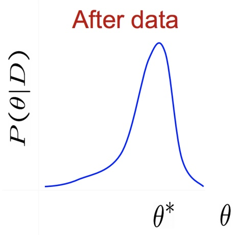

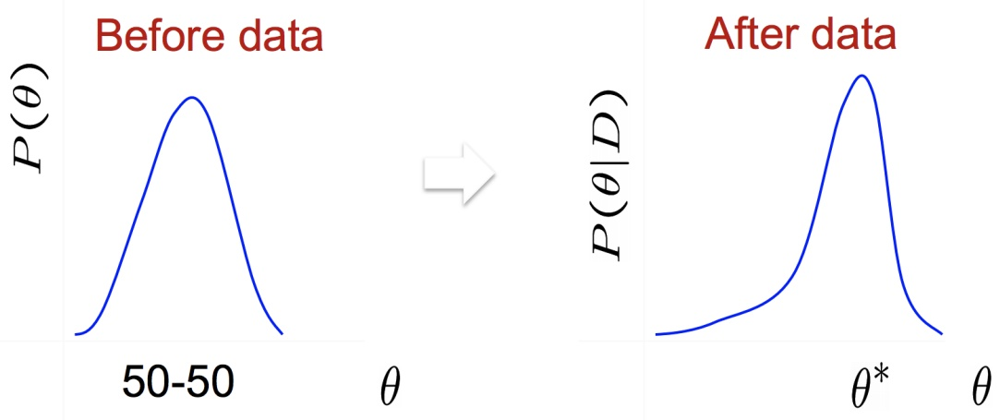

If we only have very few samples, MLE may not yield accurate results, so it is useful to take into account prior knowledge. When the number of samples gets large, the effect of prior knowledge will diminish.

Similar to MLE, we have the following algorithm for MAP.

## Algorithm 2: (Finding the MAP)

Given n data points $x _ { 1 } , x _ { 2 } , \ldots , x _ { n } ,$ a model $\theta$ represented by an expression for $P ( X \mid \theta )$ and the prior knowledge $P ( \theta )$ , perform the following steps:

1. Compute the log-likelihood

$$
L = \log P (\theta) \cdot \prod_ {i = 1} ^ {n} P (x _ {i} \mid \theta) = \log P (\theta) + \sum_ {i = 1} ^ {n} \log P (x _ {i} \mid \theta).
$$

2. For each parameter $\gamma$ in $\theta ,$ find the solution(s) to the equation $\begin{array} { r } { \frac { \partial L } { \partial \gamma } = 0 . } \end{array}$

3. The solution $\hat { \gamma }$ that satisfies $\frac { \partial ^ { 2 } L } { \partial \hat { \gamma } ^ { 2 } } \leq 0$ is the MAP of $\gamma$

<!-- page: 8 -->

## Chapter 2

# Nonparametric models: KNN and kernel regression

## 2.1 Bayes decision rule

Classification is the task of predicting a (discrete) output label given the input data. The performance of any classification algorithm depends on two factors: (1) the parameters are correct, and (2) the underlying assumption holds. The most optimal algorithm is called the Bayes decision rule.

Algorithm 3: (Bayes decision rule)

If we know the conditional probability $P ( x \mid y )$ and class prior $P ( y )$ , use (1.4) to compute

$$
P (y = i \mid x) = \frac {P (x \mid y = i) P (y = i)}{P (x)} \propto P (x \mid y = i) P (y = i) = q _ {i} (x)\tag{2.1}
$$

and $q _ { i } ( x )$ to select the appropriate class. Choose class 0 if $q _ { 0 } ( x ) > q _ { 1 } ( x )$ and 1 otherwise. In general choose the class $\hat { c } = \mathop { \operatorname { a r g   m a x } } _ { c } \{ q _ { c } ( x ) \}$ .

Because our decision is probabilistic, there is still chance for error. The Bayes error rate (risk) of the data distribution is the probability an instance is misclassified by the Bayes decision rule. For binary classification, the risk for sample x is

$$
R (x) = \min \{P (y = 0 \mid x), P (y = 1 \mid x) \}.\tag{2.2}
$$

In other words, if $P(y = 0 \mid x) > P(y = 1 \mid x)$ , then we would pick the label 0, and the risk is the probability that the actual label is 1, which is $P ( y = 1 \mid x )$ We can also compute the expected risk - the risk for the entire range of values of x:

$$
\begin{array}{r l} & E [ r (x) ] = \int_ {x} r (x) P (x) d x \\ & \qquad = \int_ {x} \min \{P (y = 0 \mid x), P (y = 1 \mid x) \} d x \\ & \qquad = P (y = 0) \int_ {L _ {1}} P (x \mid y = 0) d x + P (y = 1) \int_ {L _ {0}} P (x \mid y = 1) d x, \end{array}
$$

where $L _ { i }$ is the region over which the decision rule outputs label $i .$

The risk value we computed assumes that both errors (assigning instances of class 1 to 0 and vice versa) are equally harmful. In general, we can set the weight penalty $L _ { i , j } ( x )$ for assigning

<!-- page: 9 -->

instances of class i to class j. This gives us the concept of a loss function

$$
E [ L ] = L _ {0, 1} (x) P (y = 0) \int_ {L _ {1}} P (x \mid y = 0) d x + L _ {1, 0} (x) P (y = 1) \int_ {L _ {0}} P (x \mid y = 1) d x.\tag{2.3}
$$

## 2.2 Classification

There are roughly three types of classifiers:

1. Instance based classifiers: use observation directly (no models). Example: K nearest neighbor.

2. Generative: build a generative statistical model. Example: Naive Bayes.

3. Discriminative: directly estimate a decision rule/boundary. Example: decision tree.

The classification task itself contains several steps:

1. Feature transformation: e.g, how do we encode a picture?

2. Model / classifier specification: What type of classifier to use?

3. Model / classifier estimation (with regularization): How do we learn the parameters of our classifier? Do we have enough examples to learn a good model?

4. Feature selection: Do we really need all the features? Can we use a smaller number and still achieve the same (or better) results?

Classification is one of the key components of supervised learning, where we provide the algorithm with labels to some of the instances and the goal is to generalize so that a model / method can be used to determine the labels of the unobserved examples.

## 2.3 K-nearest neighbors

A simple yet surprisingly efficient algorithm is K nearest neighbors.

Algorithm 4: (K-nearest neighbors) Given n data points, a distance function d and a new point x to classify, select the class of x based on the majority vote in the K closest points.

Note that this requires the definition of a distance function or similarity measure between samples. We also need to determine K beforehand. Larger K means the resulting classifier is more ‘smooth’ (but smoothness is primarily dependent on the actual distribution of the data).

From a probabilistic view, KNN tries to approximate the Bayes decision rule on a subset of data. We compute $P(x \mid y),P(y)$ and P(x) for some small region around our sample, and the size of that region will be dependent on the distribution of the test sample.

<!-- page: 10 -->

<div class="docvortex-algorithm" style="white-space: pre-wrap; font-family:monospace;">
Diving in the Math 2 - Computing probabilities for KNN
Let $z$ be the new point we want to classify. Let $V$ be the volume of the $m$ dimensional ball $\mathcal{R}$ around $z$ containing the $K$ nearest neighbors for $z$ (where $m$ is the number of features). Also assume that the distribution in $R$ is uniform.
Consider the probability $P$ that a data point chosen at random is in $\mathcal{R}$. On one hand, because there are $K$ points in $\mathcal{R}$ out of a total of $N$ points, $P = \frac{K}{N}$. On the other hand, let $P(x) = q$ be the density at a point $x \in \mathcal{R}$ ($q$ is constant because $\mathcal{R}$ has uniform distribution). Then $P = \int_{x \in \mathcal{R}} P(x) dx = q V$. Hence we see that the marginal probability of $z$ is
$P(z) = q = \frac{P}{V} = \frac{K}{NV}.$
Similarly, the conditional probability of $z$ given a class $i$ is
$P(z \mid y = i) = \frac{K_i}{N_i V}.$
Finally, we compute the prior of class $i$:
$P(y = i) = \frac{N_i}{N}.$
Using Bayes formula:
$P(y = i \mid z) = \frac{P(z \mid y = i) P(y = i)}{P(z)} = \frac{K_i}{K}.$
Using the Bayes decision rule we will choose the class with the highest probability, which corresponds to the class with the highest $K_i$ - the number of samples in $K$.
</div>

## 2.4 Local Kernel Regression

Kernel regression is similar to KNN but used for regression. In particular, it focuses on a specific region of the input, as opposed to the global space (like linear regression does). For example, we can output the local average:

$$
\hat {f} (x) = \frac {\sum_ {i = 1} ^ {n} y _ {i} \cdot \mathbb {I} \left(\| x _ {i} - x \| \leq h\right)}{\sum_ {i = 1} ^ {n} \mathbb {I} \left(\| x _ {i} - x \| \leq h\right)},\tag{2.4}
$$

which can also be expressed in a form similar to linear regression:

$$
\hat {f} (x) = \sum_ {i = 1} ^ {n} w _ {i} y _ {i}, \quad w _ {i} = \frac {\mathbb {I} \left(\| x _ {i} - x \| \leq h\right)}{\mathbb {I} \left(\sum_ {j = 1} ^ {n} \| x _ {j} - x \| \leq h\right)}.
$$

Note that the ${ w _ { i } } ^ { \prime } \mathrm { S }$ here represent a hard boundary: if $X _ { i }$ is close to x then $w _ { i } = 1$ , else $w _ { i } = 0$ In the general case, w can be expressed using kernel functions.

<!-- page: 11 -->

Algorithm 5: (Nadaraya-Watson Kernel Regression)

Given n data points $\{ ( x _ { i } , y _ { i } ) \} _ { i = 1 } ^ { n }$ we can output the value at a new point x as

$$
\hat {f} (x) = \sum_ {i = 1} ^ {n} w _ {i} y _ {i}, \quad w _ {i} = \frac {K \left(\left| \frac {x - x _ {i}}{h} \right|\right)}{\sum_ {j = 1} ^ {n} K \left(\left| \frac {x - x _ {i}}{h} \right|\right)},\tag{2.5}
$$

where K is a kernel function. Some typical kernel functions include:

• Boxcar kernel: $K ( t ) = \mathbb { I } \left( t \leq 1 \right)$ .

Gaussian kernel: $K ( t ) = \frac { 1 } { \sqrt { 2 \pi } } \exp { \left( - \frac { t ^ { 2 } } { 2 } \right) } .$

The distance h in this case the called the kernel bandwidth. The choice of h should depend on the number of training data (determines variance) and smoothness of function (determines bias).

• Large bandwidth averages more data points so reduces noice (lower variance).

• Small bandwidth fits more accurately (lower bias).

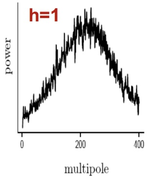

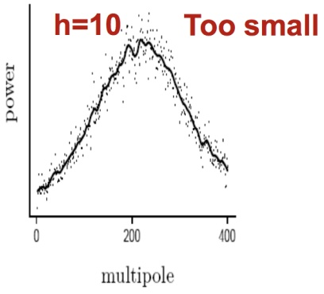

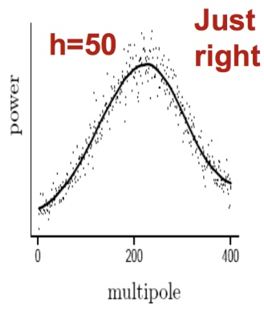

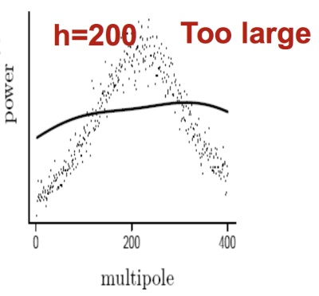

In general this is the bias-variance tradeoff. Bias represents how accurate the result is (lower bias = more accurate). Variance represents how sensitive the algorithm is to changes in the input (lower variance = less sensitive). Here a large bandwidth $( h   =   2 0 0 )$ yields low variance and high bias, while a small bandwidth $( h = 1 )$ yields high variance and low bias. In this case, $h = 5 0$ seems like the best middle ground.

<!-- page: 12 -->

# Chapter 3

# Linear Regression

## 3.1 Basic linear regression

Definition 3: (Linear Regression)

Given an input x we would like to compute an output y as

$$
y = w x + \epsilon ,
$$

where w is a parameter and  represents measurement of noise.

Our goal is to estimate w from training data of $( x _ { i } , y _ { i } )$ pairs. One way is to find the least square error (LSE)

$$
\hat {w} _ {L R} = \arg \min _ {w} \sum_ {i} (y _ {i} - w x _ {i}) ^ {2}\tag{3.1}
$$

which minimizes squared distance between measurements and predicted lines. LSE has a nice probabilistic interpretation (as we will see shortly, if $\epsilon \sim \mathcal { N } ( 0 , \sigma ^ { 2 } )$ then $\hat { w }$ is MLE of w). and is easy to compute. In particular, the solution to (3.1) is

$$
\hat {w} = \frac {\sum_ {i} x _ {i} y _ {i}}{\sum_ {i} x _ {i} ^ {2}}.\tag{3.2}
$$

Diving in the Math 3 - Solving linear regression using LSE We take the derivative w.r.t w and set to 0:

$$
0 = \frac {\partial}{\partial w} \sum_ {i} (y _ {i} - w x _ {i}) ^ {2} = - 2 \sum_ {i} x _ {i} (y _ {i} - w x _ {i}),
$$

which yields

$$
\sum_ {i} x _ {i} y _ {i} = \sum_ {i} w x _ {i} ^ {2} \Rightarrow \boxed {w = \frac {\sum_ {i} x _ {i} y _ {i}}{\sum_ {i} x _ {i} ^ {2}}}
$$

If the line does not pass through the origin, simply change the model to

$$
y = w _ {0} + w _ {1} x + \epsilon ,
$$

and following the same process gives

$$
w _ {0} = \frac {\sum_ {i} y _ {i} - w _ {1} x _ {i}}{n}, \quad w _ {1} = \frac {\sum_ {i} x _ {i} (y _ {i} - w _ {0})}{\sum_ {i} x _ {i} ^ {2}}.\tag{3.3}
$$

<!-- page: 13 -->

## 3.2 Multivariate and general linear regression

If we have several inputs, this becomes a multivariate regression problem:

$$
y = w _ {0} + w _ {1} x _ {1} + \dots + w _ {k} x _ {k} + \epsilon .
$$

However, not all functions can be approximated using the input values directly. In some cases we would like to use polynomial or other terms based on the input data. As long as the coefficients are linear, the equation is still a linear regression problem. For instance,

$$
y = w _ {0} x _ {1} + w _ {1} x _ {1} ^ {2} + \ldots + w _ {k} x _ {k} ^ {2} + \epsilon .
$$

Typical non-linear basis functions include:

• Polynomial $\phi _ { j } ( x ) = x ^ { j } ,$

• Gaussian $\begin{array} { r } { \phi _ { j } ( x ) = \frac { ( x - \mu _ { j } ) ^ { 2 } } { 2 \sigma _ { j } ^ { 2 } } } \end{array}$ ,

• Sigmoid $\begin{array} { r } { \phi _ { j } ( x ) = \frac { 1 } { 1 + \exp ( - s _ { j } x ) } } \end{array}$

Using this new notation, we formulate the general linear regression problem:

$$
y = \sum_ {j} w _ {j} \phi_ {j} (x),
$$

where $\phi _ { j } ( x )$ can either be $x _ { j }$ for multivariate regression or one of the non-linear bases we defined. Now assume the general case where we where have n data points

$( x ^ { ( 1 ) } , y ^ { ( 1 ) } ) , ( x ^ { ( 2 ) } , \bar { y ^ { ( 2 ) } } ) , \ldots , ( x ^ { ( n ) } , y ^ { ( n ) } )$ , and each data point has k features (recall that feature j of $x ^ { ( i ) }$ is denoted $x _ { j } ^ { ( i ) } )$ . Again using LSE to find the optimal solution, by defining

$$
\Phi = \left( \begin{array}{c c c c} \phi_ {0} (x ^ {(1)}) & \phi_ {1} (x ^ {(1)}) & \ldots & \phi_ {k} (x ^ {(1)}) \\ \phi_ {0} (x ^ {(2)}) & \phi_ {1} (x ^ {(2)}) & \ldots & \phi_ {k} (x ^ {(2)}) \\ \vdots & \vdots & \ldots & \vdots \\ \phi_ {0} (x ^ {(n)}) & \phi_ {1} (x ^ {(n)}) & \ldots & \phi_ {k} (x ^ {(n)}) \end{array} \right) = \left( \begin{array}{c} - \phi (x ^ {(1)}) ^ {T} - \\ - \phi (x ^ {(2)}) ^ {T} - \\ \ldots \\ - \phi (x ^ {(n)}) ^ {T} - \end{array} \right),\tag{3.4}
$$

we then get

$$
w = (\Phi^ {T} \Phi) ^ {- 1} \Phi^ {T} y.\tag{3.5}
$$

Diving in the Math 4 - LSE for general linear regression problem Our goal is to minimize the following loss function:

$$
J (w) = \sum_ {i} (y ^ {(i)} - \sum_ {j} w _ {j} \phi_ {j} (x ^ {(i)})) ^ {2} = \sum_ {i} (y ^ {(i)} - w ^ {T} \phi (x ^ {(i)})) ^ {2},
$$

where w and $\phi ( x ^ { ( i ) } )$ are vectors of dimension $k + 1$ and $y ^ { ( i ) }$ is a scalar. Setting the derivative w.r.t w to 0:

$$
0 = \frac {\partial}{\partial w} \sum_ {i} (y ^ {(i)} - w ^ {T} \phi (x ^ {(i)})) ^ {2} = 2 \sum_ {i} (y ^ {(i)} - w ^ {T} \phi (x ^ {(i)})) \phi (x ^ {(i)}) ^ {T},
$$

which yields

$$
\sum_ {i} y ^ {(i)} \phi (x ^ {(i)}) ^ {T} = w ^ {T} \sum_ {i} \phi (x ^ {(i)}) \phi (x ^ {(i)}) ^ {T}.
$$

Hence, defining Φ as in (3.4) would give us

$$
(\Phi^ {T} \Phi) w = \Phi^ {T} y \Rightarrow \boxed {w = (\Phi^ {T} \Phi) ^ {- 1} \Phi^ {T} y}
$$

<!-- page: 14 -->

To sum up, we have the following algorithm for the general linear regression problem.

<div class="docvortex-algorithm" style="white-space: pre-wrap; font-family:monospace;">
Algorithm 6: (General linear regression algorithm)
Input: Given n input data  $\{(x^{(i)}, y^{(i)})\}_{i=1}^{n}$  where  $x^{(i)}$  is  $1 \times m$  and  $y^{(i)}$  is scalar, as well as m basis functions  $\{\phi_{j}\}_{j=1}^{m}$ , we find
 $\hat{w} = \arg\min_{w} \sum_{i=1}^{n} (y^{(i)} - w^{T} \phi(x^{(i)}))^{2}$ 
by the following procedure:
1. Compute  $\Phi$  as in (3.4).
2. Output  $\hat{w} = (\Phi^{T}\Phi)^{-1}\Phi^{T}y$ .
</div>

## 3.3 Regularized least squares

## 3.3.1 Definition

In the previous chapter we see that a linear regression problem involves solving $( \Phi ^ { T } \Phi ) w = \Phi ^ { T } y$ for w. If $\Phi ^ { T } \Phi$ is invertible, we would get $w = ( \Phi ^ { T } \Phi ) ^ { - 1 } \Phi ^ { T } y$ as in (3.5). Now what if $\Phi ^ { T } \Phi$ is not invertible?

Recall that full rank matrices are invertible, and that

$$
\begin{array}{r l} \mathrm{rank} (\Phi^ {T} \Phi) & = \text {the number of non - zero eigenvalues of} \Phi^ {T} \Phi \\ & \leq \min (n, k) \text {since} \Phi \text {is} n \times k \end{array}
$$

In other words, $\Phi ^ { T } \Phi$ is not invertible if $n < k$ , i.e., there are more features than data point. More specifically, we have n equations and $k > n$ unknowns - this is an undetermined system of linear equations with many feasible solutions. In that case, the solution needs to be further constrained.

One way, for example, is Ridge Regression - using L2 norm as penalty to bias the solution to “small” values of w (so that small changes in input don’t translate to large changes in output):

$$
\begin{array}{r l} \hat {w} _ {R i d g e} & = \underset {w} {\arg \min} \sum_ {i = 1} ^ {n} (y _ {i} - x _ {i} w) ^ {2} + \lambda \| w \| _ {2} ^ {2} \\ & = \underset {w} {\arg \min} (\Phi w - y) ^ {T} (\Phi w - y) + \lambda \| w \| _ {2} ^ {2}, \quad \lambda \geq 0 \\ & = (\Phi^ {T} \Phi + \lambda I) ^ {- 1} \Phi^ {T} y. \end{array}\tag{3.6}
$$

We could also use Lasso Regression (L1 penalty)

$$
\hat {w} _ {L a s s o} = \arg \min _ {w} \sum_ {i = 1} ^ {n} (y _ {i} - x _ {i} w) ^ {2} + \lambda \left\| w \right\| _ {1},\tag{3.7}
$$

which biases towards many parameter values being zero - in other words, many inputs become irrelevant to prediction in high-dimensional settings. There is no closed form solution for (3.7), but it can be optimized by sub-gradient descent.

<!-- page: 15 -->

In general, we can phrase the problem as finding

$$
\hat {w} = \underset {w} {\arg \min} (\Phi w - y) ^ {T} (\Phi w - y) + \lambda \mathrm{pen} (w),\tag{3.8}
$$

where $\operatorname { p e n } ( w )$ is a penalty function. Here’s a visualization for different kinds of penalty functions:

Ridge Regression:

$$
\mathrm{pen} (\beta) = \| \beta \| _ {2} ^ {2}
$$

Lasso:

$$
\mathrm{pen} (\beta) = \| \beta \| _ {1}
$$

Ideally I0 penalty, but optimization becomes non-convex

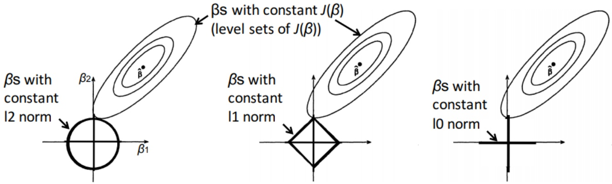

## 3.3.2 Connection to MLE and MAP

Consider a linear regression problem

$$
Y = \hat {f} (X) + \epsilon = X \hat {w} + \epsilon ,
$$

where the noise $\epsilon \sim \mathcal { N } ( 0 , \sigma ^ { 2 } I )$ , which implies $Y \sim \mathcal { N } ( X \hat { w } , \sigma ^ { 2 } I )$ . If $\Phi ^ { T } \Phi$ is invertible, then w can be determined exactly by MCLE:

$$
\begin{array}{c} \hat {w} _ {M C L E} = \underset {w} {\arg \max} \underbrace {P (\{y _ {i} \} _ {i = 1} ^ {n} \mid w , \sigma^ {2} , \{x _ {i} \} _ {i = 1} ^ {n})} _ {\text {Conditional log likelihood}} \\ = \underset {w} {\arg \min} \sum_ {i = 1} ^ {n} (x _ {i} w - y _ {i}) ^ {2} = \hat {w} _ {L R}, \end{array}\tag{3.9}
$$

where the last equality follows from (3.1). In other words, Least Square Estimate is the same as MCLE under a Gaussian model.

In case $\Phi ^ { T } \Phi$ is not invertible, we can encode the Ridge bias by letting $w   \sim   \mathcal { N } ( 0 , \tau ^ { 2 } I )$ and $P ( w ) \propto \exp ( - w ^ { T } w / 2 \tau ^ { 2 } )$ , which would yield

$$
\begin{array}{c} \hat {w} _ {M C A P} = \underset {w} {\arg \max} \underbrace {P (\{y _ {i} \} _ {i = 1} ^ {n} \mid w , \sigma^ {2} , \{x _ {i} \} _ {i = 1} ^ {n})} _ {\text {Conditional log likelihood}} + \underbrace {\log P (w)} _ {\text {log prior}} \\ = \underset {w} {\arg \min} \sum_ {i = 1} ^ {n} (x _ {i} w - y _ {i}) ^ {2} + \lambda \| w \| _ {2} ^ {2} = \hat {w} _ {R i d g e}, \end{array}\tag{3.10}
$$

where λ is constant in terms of $\sigma ^ { 2 }$ and $\tau ^ { 2 }$ , and the last equality follows from (3.6). In other words, Prior belief that w is Gaussian with mean 0 biases solution to “small” w.

<!-- page: 16 -->

Diving in the Math 5 - Ridge regression and MCAP Since we are given $P ( w )   \propto   \exp ( - w ^ { T } w / 2 \tau ^ { 2 } )$ , let $P ( w )   =   \exp ( - c   \| w \| _ { 2 } ^ { 2 } )$ where c is some constant, then − log $P ( w ) = c   \| w \| _ { 2 } ^ { 2 } ,$ so (3.10) is equivalent to finding

$$
\begin{array}{r l} & {\inf _ {w} \{\mathcal {L} (w) + c \| w \| _ {2} ^ {2} \}} \\ & {= \inf _ {w} \{\mathcal {L} (w) \} \quad \text {such that} \| w \| _ {2} ^ {2} \leq L (c),} \end{array}
$$

where $L ( c )$ is a bijective function of c. So adding $c \left\| w \right\| _ { 2 } ^ { 2 }$ is the same as the ridge regression constraint $\| w \| _ { 2 } ^ { 2 } \stackrel { \sim } { \leq } L$ for some constant L.

Similarly, we can encode the Lasso bias by letting $w _ { i } \sim \mathrm { L a p l a c e } ( 0 , t )$ (iid) and $P ( w _ { i } ) \propto$ $\exp ( - | w _ { i } | / t )$ , which would yield

$$
\begin{array}{c} \hat {w} _ {M C A P} = \underset {w} {\arg \max} \underbrace {P (\{y _ {i} \} _ {i = 1} ^ {n} \mid w , \sigma^ {2} , \{x _ {i} \} _ {i = 1} ^ {n})} _ {\text {Conditional log likelihood}} + \underbrace {\log P (w)} _ {\text {log prior}} \\ = \underset {w} {\arg \min} \sum_ {i = 1} ^ {n} (x _ {i} w - y _ {i}) ^ {2} + \lambda \| w \| _ {1} = \hat {w} _ {L a s s o}, \end{array}\tag{3.11}
$$

where λ is constant in terms of $\sigma ^ { 2 }$ and t, and the last equality follows from (3.7). In other words, Prior belief that w is Laplace with mean 0 biases solution to “sparse” w.

<!-- page: 17 -->

## Chapter 4

## Logistic Regression

## 4.1 Definition

We know that regression is for predicting real-valued output Y , while classification is for pre dicting (finite) discrete-valued Y . But is there a way to connect regression to classification? Can we predict the “probability” of a class label? The answer is generally yes, but we have to keep in mind the constraint that the probability value should lie in [0, 1].

Definition 4: (Logistic Regression)

Assume the following functional form for $P ( Y \mid X )$ :

$$
P (Y = 1 \mid X) = \frac {1}{1 + \exp (- (w _ {0} + \sum_ {i} w _ {i} X _ {i}))},\tag{4.1}
$$

$$
P (Y = 0 \mid X) = \frac {1}{1 + \exp (w _ {0} + \sum_ {i} w _ {i} X _ {i})}.\tag{4.2}
$$

In essence, logistic regression means applying the logistic function $\begin{array} { r } { \sigma ( z )   =   \frac { 1 } { 1 + \exp ( - z ) } } \end{array}$ to a linear function of the data. However, note that it is still a linear classifier.

Diving in the Math 6 - Logistic Regression as linear classifier Note that $P ( Y = 1 \mid X )$ can be rewritten as

$$
P (Y = 1 \mid X) = \frac {\exp (w _ {0} + \sum_ {i} w _ {i} X _ {i})}{1 + \exp (w _ {0} + \sum_ {i} w _ {i} X _ {i})}.
$$

We would assign label 1 if $P(Y = 1 \mid X) > P(Y = 0 \mid X)$ which is equivalent to

$$
\exp (w _ {0} + \sum_ {i} w _ {i} X _ {i}) > 1 \Leftrightarrow w _ {0} + \sum_ {i} w _ {i} X _ {i} > 0.
$$

Similarly, we would assign label 0 if $P(Y = 1 \mid X) < P(Y = 0 \mid X)$ which is equivalent to

$$
\exp (w _ {0} + \sum_ {i} w _ {i} X _ {i}) <   1 \Leftrightarrow w _ {0} + \sum_ {i} w _ {i} X _ {i} <   0.
$$

In other words, the decision boundary is the line $\textstyle w _ { 0 } + \sum _ { i } w _ { i } X _ { i }$ which is linear.

<!-- page: 18 -->

## 4.2 Training logistic regression

Given training data $\{ ( x _ { i } , y _ { i } ) \} _ { i = 1 } ^ { n }$ where the input has d features, we want to learn the parameters $w _ { 0 } , w _ { 1 } , \ldots , w _ { d }$ . We can do so by MCLE:

$$
\hat {w} _ {M C L E} = \arg \max _ {w} \prod_ {i = 1} ^ {n} P (y ^ {(i)} \mid x ^ {(i)}, w).\tag{4.3}
$$

Note the Discriminative philosophy: don’t waste effort learning $P ( X )$ , focus on $P ( Y \mid X ) { \text { - } } t h a t { \text { } } s$ all that matters for classification! Using (4.1) and (4.2), we can then compute the log-likelihood:

$$
\begin{array}{l} l (w) = \ln \left(\prod_ {i = 1} ^ {n} P (y ^ {(i)} \mid x ^ {(i)}, w)\right) \\ \qquad = \sum_ {i = 1} ^ {n} \left[ y ^ {(i)} (w _ {0} + \sum_ {j = 1} ^ {d} w _ {i} x _ {j} ^ {(i)}) - \ln (1 + \exp (w _ {0} + \sum_ {j = 1} ^ {d} w _ {i} x _ {j} ^ {(i)})) \right]. \end{array}\tag{4.4}
$$

There is no closed-form solution to maximize l(w), but we note that it is a concave function.

## Definition 5: (Concave function)

A function $l ( w )$ is called concave if the line joining two points $l ( w _ { 1 } ) , l ( w _ { 2 } )$ on the function does not lie above the function on the interval $[ w _ { 1 } , w _ { 2 } ]$

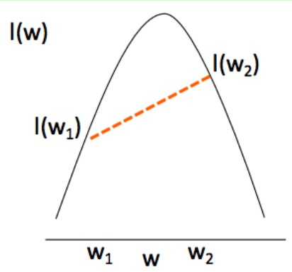

Equivalently, a function l(w) is concave on $[ w _ { 1 } , w _ { 2 } ]$ i f

$$
l (t x _ {1} + (1 - t) x _ {2}) \geq t l (x _ {1}) + (1 - t) l (x _ {2})
$$

for all $x _ { 1 } , x _ { 2 } \in [ w _ { 1 } , w _ { 2 } ]$ and $t \in [ 0 , 1 ]$ If the sign is reversed, l is a convex function.

<!-- page: 19 -->

<div class="docvortex-algorithm" style="white-space: pre-wrap; font-family:monospace;">
Diving in the Math 7 - Log likelihood of logistic regression is concave
For convenience we denote $x_0^{(i)} = 1$, so that $w_0 + \sum_{i=j}^d w_i x_j^{(i)} = w^T x^{(i)}$.
We first note the following lemmas:
    If $f$ is convex then $-f$ is concave and vice versa.
    A linear combination of $n$ convex (concave) functions $f_1, f_2, \ldots, f_n$ with nonnegative coefficients is convex (concave).
    Another property of twice differentiable convex function is that the second derivative is nonnegative. Using this property, we can see that $f(x) = \log(1 + \exp x)$ is convex.
    If $f$ and $g$ are both convex, twice differentiable and $g$ is non-decreasing, then $g \circ f$ is convex.
Now we rewrite $l(w)$ as follows:
    $l(w) = \sum_{i=1}^{n} y^{(i)} w^T x^{(i)} - \log(1 + \exp(w^T x^{(i)}))$
    $= \sum_{i=1}^{n} y^{(i)} w^T x^{(i)} - \sum_{i=1}^{n} \log(1 + \exp(w^T x^{(i)}))$
    $= \sum_{i=1}^{n} y^{(i)} f_i(w) - \sum_{i=1}^{n} g(f_i(w))$,
where $f_i(w) = w^T x^{(i)}$ and $g(z) = \log(1 + \exp z)$.
$f_i(w)$ is of the form $Ax + b$ where $A = x^{(i)}$ and $b = 0$, which means it's affine (i.e., both concave and convex). We also know that $g(z)$ is convex, and it's easy to see $g$ is non-decreasing. This means $g(f_i(w))$ is convex, or equivalently, $-g(f_i(w))$ is concave.
To sum up, we can express $l(w)$ as
    $l(w) = \underbrace{\sum_{i=1}^{n} y^{(i)} f_i(w)}_{\text{concave}} + \underbrace{\sum_{i=1}^{n} -g(f_i(w))}_{\text{concave}}$,
hence $l(w)$ is concave.

As such, it can be optimized by the gradient ascent algorithm.

Algorithm 7: (Gradient ascent algorithm)
Initialize: Pick $w$ at random.
Gradient:
    $\nabla_w E(w) = \left( \frac{\partial E(w)}{\partial w_0}, \frac{\partial E(w)}{\partial w_1}, \ldots, \frac{\partial E(w)}{\partial w_d} \right)$.
Update:
    $\Delta w = \eta \nabla_w E(w)$
    $w_t^{(t+1)} \leftarrow w_i^{(t)} + \eta \frac{\partial E(w)}{\partial w_i}$,
where $\eta &gt; 0$ is the learning rate.
</div>

<!-- page: 20 -->

In this case our likelihood function is specified in (4.4), so we have the following steps for training logistic regression:

## Algorithm 8: (Gradient ascent algorithm for logistic regression)

Initialize: Pick w at random and a learning rate η.

Update:

• Set an $\epsilon > 0$ and denote

$$
\hat {P} (y ^ {(i)} = 1 \mid x ^ {(i)}, w ^ {(t)}) = \frac {\exp (w _ {0} ^ {(t)} + \sum_ {j = 1} ^ {d} w _ {j} ^ {(t)} x _ {j} ^ {(i)})}{1 + \exp (w _ {0} ^ {(t)} + \sum_ {j = 1} ^ {d} w _ {j} ^ {(t)} x _ {j} ^ {(i)})}.
$$

• Iterate until $| w _ { 0 } ^ { ( t + 1 ) } - w _ { 0 } ^ { ( t ) } | < \epsilon ;$

$$
w _ {0} ^ {(t + 1)} \leftarrow w _ {0} ^ {(t)} + \eta \sum_ {i = 1} ^ {n} \left[ y ^ {(i)} - \hat {P} (y ^ {(i)} = 1 \mid x ^ {(i)}, w ^ {(t)}) \right].
$$

• For $k = 1 , \ldots , d ,$ iterate until $| w _ { k } ^ { ( t + 1 ) } - w _ { k } ^ { ( t ) } | < \epsilon ;$

$$
w _ {k} ^ {(t + 1)} \leftarrow w _ {k} ^ {(t)} + \eta \sum_ {i = 1} ^ {n} x _ {j} ^ {(i)} \left[ y ^ {(i)} - \hat {P} (y ^ {(i)} = 1 \mid x ^ {(i)}, w ^ {(t)}) \right].
$$

<!-- page: 21 -->

## Chapter 5

## Naive Bayes Classifier

## 5.1 Gaussian Bayes

Recall that the Bayes decision rule (2.1) is the optimal classifier, but requires having knowledge of $P(Y \mid X) = P(X \mid Y)P(Y)$ , which is difficult to compute. To tackle this problem, we consider appropriate models for the two terms: class probability $P ( Y )$ and class conditional distribution of features $P ( X \mid Y )$

Consider an example of X being continuous 1-dimensional and Y being binary. The class probability $P ( Y )$ then follows a Bernoulli distribution with parameter θ, i.e., $P ( Y   =   1 )   =   \theta$ We further assume the Gaussian class conditional density

$$
P (X = x \mid Y = i) = \frac {1}{\sqrt {2 \pi \sigma_ {y} ^ {2}}} \exp \left(- \frac {(x - \mu_ {i}) ^ {2}}{2 \sigma_ {i} ^ {2}}\right),\tag{5.1}
$$

where we note that the distribution would be different for each class (hence the notation $\mu _ { i } , \sigma _ { i } )$ In total there are 5 parameters: $\theta , \mu _ { 0 } , \mu _ { 1 } , \sigma _ { 0 } , \sigma _ { 1 }$ In case X is 2-dimensional, we would have

$$
P (X = x \mid Y = i) = \frac {1}{\sqrt {2 \pi | \Sigma_ {i} |}} \exp \left(- \frac {(x - \mu_ {i}) ^ {T} \Sigma_ {i} ^ {- 1} (x - \mu_ {i})}{2}\right),\tag{5.2}
$$

where $\Sigma _ { i }$ is a $2 \times 2$ covariance matrix. In total there are 11 parameters: $\theta ,   \mu _ { 0 } , \mu _ { 1 }$ (2-dimensional), $\Sigma _ { 0 } , \Sigma _ { 1 } ( 2 \times 2$ symmetric matrix).

Further note that the decision boundary in this case is

$$
\begin{array}{l} \frac {P (Y = 1 \mid X = x)}{P (Y = 0 \mid X = x)} = \frac {P (X = x \mid Y = 1) P (Y = 1)}{P (X = x \mid Y = 0) P (Y = 0)} \\ = \sqrt {\frac {| \Sigma_ {0} |}{| \Sigma_ {1} |}} \exp \left(- \frac {(x - \mu_ {1}) ^ {T} \Sigma_ {1} ^ {- 1} (x - \mu_ {1})}{2} + \frac {(x - \mu_ {0}) ^ {T} \Sigma_ {0} ^ {- 1} (x - \mu_ {0})}{2}\right) \cdot \frac {\theta}{1 - \theta}. \end{array}\tag{5.3}
$$

This implies a quadratic equation in x, but if $\Sigma _ { 1 } = \Sigma _ { 0 }$ the quadratic terms cancel out and the equation is linear.

The number of parameters we would need to learn for Gaussian Bayes in the general case, with k labels and d-dimensional inputs, is:

$P ( Y = i ) = p _ { i } { \mathrm { ~ f o r ~ } } 1 \leq i \leq k - 1 { \mathrm { : ~ } } k - 1 { \mathrm { ~ p a r a m e t e r s } } ,$ and

<!-- page: 22 -->

<div class="docvortex-algorithm" style="white-space: pre-wrap; font-family:monospace;">
Algorithm 9: (Naive Bayes Classifier for discrete features)
Given training data $\{(x^{(i)}, y^{(i)})\}_{i=1}^{n}$ where $x^{(i)} = (x_1^{(i)}, x_2^{(i)}, \ldots, x_d^{(i)})$, we compute the followings:
- Class prior: $\hat{P}(Y = y) = \frac{1}{n} \sum_{i=1}^{n} \mathbb{I}(y^{(i)} = y)$.
- Class joint distribution:
$\hat{P}(X_j = x_j, Y = y) = \frac{1}{n} \sum_{i=1}^{n} \mathbb{I}(x_j^{(i)} = x_j, y^{(i)} = y)$.
- Prediction for test data given input $x$:
$\hat{f}_{NB}(x) = \arg \max_y \hat{P}(y) \prod_{j=1}^d \frac{\hat{P}(x_j, y)}{\hat{P}(y)} = \arg \max_y \frac{\sum_{i=1}^{n} \mathbb{I}(x_j^{(i)} = x_j, y^{(i)} = y)}{\sum_{i=1}^{n} \mathbb{I}(y^{(i)} = y)}.$ (5.5)
</div>

<div class="docvortex-algorithm" style="white-space: pre-wrap; font-family:monospace;">
Definition 6: (Naive Bayes Classifier)
The Naive Bayes Classifier is the Bayes decision rule with an additional “naive” assumption that features are independent given the class label:
$P(X \mid Y) = P(X_1, X_2, \ldots, X_d \mid Y) = \prod_{i=1}^{d} P(X_i \mid Y).$  (5.4)
In this case, the output class of an input x is
 $\hat{f}_{NB}(x) = \arg\max_y P(x_1, \ldots, x_d \mid y)P(y) = \arg\max_y \prod_{i=1}^{d} P(x_i \mid y)P(y).$
</div>

• $P ( X = x \mid Y = i ) \sim \mathcal { N } ( \mu _ { i } , \Sigma _ { i } )$ : d parameters for $\mu _ { i }$ and $\frac { d ( d { + } 1 ) } { 2 }$ parameters for $\Sigma _ { i }$ ,

which result in $\begin{array} { r } { k d + \frac { k d ( d + 1 ) } { 2 } = O ( k d ^ { 2 } ) } \end{array}$ parameters.

If X is discrete, again with k labels and d-dimensional inputs, the number of parameters is:

$P ( Y = i ) = p _ { i }$ for $1 \leq i \leq k - 1 { \mathrm { : ~ } } k - 1$ parameters, and

$P ( X = x \mid Y = i )$ comes from a probability table with $2 ^ { d } - 1$ entries,

which result is $k ( 2 ^ { d } - 1 )$ parameters to learn.

Having too many parameters means we need a lot of training data to learn them. We therefore introduce an assumption that can significantly reduce the number of parameters.

## 5.2 Naive Bayes Classifier

Therefore, if the conditional assumption holds, Naive Bayes is the optimal classifier. Using this assumption, we can then formulate the Naive Bayes classifier algorithm, where the class priors and class conditional probabilities are estimated using MLE.

<!-- page: 23 -->

<div class="docvortex-algorithm" style="white-space: pre-wrap; font-family:monospace;">
Algorithm 10: (Naive Bayes Classifier for continuous features)
Given training data $\{(x_i, y_i)\}_{i=1}^n$ where $x^{(i)} = (x_1^{(i)}, x_2^{(i)}, \ldots, x_d^{(i)})$, we compute the followings:
- Class prior: $\hat{P}(Y = y) = \frac{1}{n} \sum_{i=1}^n \mathbb{I}\left(y^{(i)} = y\right)$.
- Class conditional distribution:
$\hat{\mu}_{jy} = \frac{1}{\sum_{i=1}^n \mathbb{I}(y^{(i)} = y)} \sum_{i=1}^n x_j^{(i)} \mathbb{I}\left(y^{(i)} = y\right)$,
$\hat{\sigma}_{jy}^2 = \frac{1}{\sum_{i=1}^n \mathbb{I}(y^{(i)} = y) - 1} \sum_{i=1}^n (x_j^{(i)} - \hat{\mu}_{jy})^2 \mathbb{I}\left(y^{(i)} = y\right)$,
$\hat{P}(X_j = x_j \mid Y = y) = \frac{1}{\hat{\sigma}_{jy}^2 \sqrt{2\pi}} \exp\left(-\frac{(x - \hat{\mu}_{jy})^2}{2\hat{\sigma}_{jy}^2}\right)$.
- Prediction for test data given input $x$:
$\hat{f}_{NB}(x) = \arg\max_y \hat{P}(y) \prod_{j=1}^d P(x_j \mid y).$
As we noted earlier, the number of parameters in the above algorithms is much fewer.
Diving in the Math 8 - Number of parameters in Naive Bayes
Consider input variable $X$ with discrete features $X_1, \ldots, X_d$ each taking one of $K$ values and output label $Y$ taking one of $M$ values. Further suppose that the label distribution is Bernoulli and the feature distribution conditioned on the label is multinomial.
Without naive Bayes assumption:
- $M - 1$ parameters $p_0, p_1, \ldots, p_{M-2}$ for label:
$P(Y = y) = \begin{cases} p_y &amp; \text{if } y &lt; M - 1 \\ 1 - \sum_{i=0}^{M-2} p_i &amp; \text{if } y = M - 1 \end{cases}$
- For each label $y$, the corresponding probability table has $K^n - 1$ parameters.
So the total number of parameters is $\boxed{M - 1 + M(K^n - 1) = M \cdot K^n - 1}$.
With naive Bayes assumption:
- $M - 1$ parameters $p_0, p_1, \ldots, p_{M-2}$ for labels, as mentioned above.
- For each $Y = y$ and $1 \leq i \leq n$, $X_i \mid Y$ comes from a categorical distribution so it has $K - 1$ parameters. So we need $Mn(K - 1)$ parameters for
$\{P(X_i = x_i \mid Y = y) \mid i = \overline{1..n}, x_i = \overline{1..K}, y = \overline{0..M - 1}\}$.
The total number of parameters is $\boxed{M - 1 + Mn(K - 1)}$. Therefore the number of parameters is reduced from exponential to linear with the Naive Bayes assumption.
</div>

<!-- page: 24 -->

We note two important issues in Naive Bayes. First, the conditional independence assumption does not always hold; nevertheless, this is still the most used classifier, especially when data is limited. Second, in practice we typically use MAP estimates for the probabilities instead of MLE since insufficient data may cause MLE to be zero. For instance, if we never see a training instance where $X _ { 1 } = a$ and $Y = b$ then, based on MLE, $\hat{P}(X_{1}=a \mid Y=b)=0$ . Consequently, no matter what the values $X _ { 2 } , \ldots , X _ { d }$ take, we see that

$$
\hat {P} (X _ {1} = a, X _ {2}, \dots , X _ {d} \mid Y) = \hat {P} (X _ {1} = a \mid Y) \prod_ {j = 2} ^ {d} \hat {P} (X _ {j} \mid Y) = 0.
$$

To resolve this issue, we can use a technique called smoothing and add m “virtual” data points.

Algorithm 11: (Naive Bayes Classifier for discrete features with smoothing) Given training data $\{ ( x _ { i } , y _ { i } ) \} _ { i = 1 } ^ { n }$ where $x ^ { ( i ) }   =   ( x _ { 1 } ^ { ( i ) } , x _ { 2 } ^ { ( i ) } , \ldots , x _ { d } ^ { ( i ) } )$ assume some prior distributions (typically uniform) $Q ( Y   =   b )$ and $Q ( X _ { j }   =   a , Y   =   b )$ We then compute the followings:

• Class prior: $\begin{array} { r } { \hat { P } ( Y = y ) = \frac { 1 } { n } \sum _ { i = 1 } ^ { n } \mathbb { I } \left( y ^ { ( i ) } = y \right) } \end{array}$ .

• Class conditional distribution:

$$
\hat {P} (X _ {j} = x _ {j} \mid Y = y) = \frac {\sum_ {i = 1} ^ {n} \mathbb {I} \left(x _ {j} ^ {(i)} = x _ {j} , y ^ {(i)} = y\right) + m Q (X _ {j} = x _ {j} , Y = y)}{\sum_ {i = 1} ^ {n} \mathbb {I} \left(y ^ {(i)} = y\right) + m Q (Y = y)}.
$$

• Prediction for test data given input x:

$$
\hat {f} _ {N B} (x) = \underset {y} {\arg \max} \hat {P} (y) \prod_ {j = 1} ^ {d} P (x _ {j} \mid y).\tag{5.7}
$$

## 5.3 Text classification: bag of words model

We present a case study of Naive Bayes Classifier: text classification. Given the input text as a string of words, we have to predict a category for it (i.e., what is the topic, is this a spam email). Using the bag of words approach, we construct the input features X as the count of how many times each word appears in the document. The dimension d of X is then the number of distinct words in the document, which can be very large, leading to a huge probability table for $P ( X \mid Y )$ (with $2 ^ { d } - 1$ entries). However, under the Naive Bayes assumption, $P ( X \mid Y )$ is simply a product of probability of each word raised to its count. It follows that

$$
\hat {f} _ {N B} (x) = \underset {y} {\arg \max} P (y) \prod_ {w = w _ {1}} ^ {w _ {k}} P (w \mid Y) ^ {\mathrm{count} (w)},\tag{5.8}
$$

where $w _ { 1 } , \ldots , w _ { k }$ are all the distinct words in the document. Note that here we assume the order of words in the document doesn’t matter, which sounds silly but often works very well.

## 5.4 Generative vs Discriminative Classifer

We first note the following comparison between Naive Bayes and Logistic Regression:

<!-- page: 25 -->


In other words, the two methods have representation equivalence - in particular, a linear decision boundary. However, keep in mind that:

• This is only true in the special case where we assume the feature variances are independent of class label (more specifically, $\Sigma _ { 1 } = \Sigma _ { 0 }$ in (5.3)).

• Logistic regression is a discriminative model and makes no assumption about $P ( X \mid Y )$ in learning. Instead, it assumes a sigmoid form for $P ( Y \mid X )$

• The two optimize different functions: MLE / MCLE vs MAP / MCAP and yield different solutions.

More generally, we outline the problem between a generative classifier (e.g., Naive Bayes) and a discriminative classifier (e.g., logistic regression).

| Generative | Discriminatve |
| --- | --- |
| Assume some prorability model for P(Y) and | Assume some functional form for P(Y \| X) |
| P(X \| Y). | or the decision boundary. |
| Estimate parameters of probability models | Estimate parameters of functional form di- |
| from training data. | rectly from training data. |

Table 5.1: Generative (model-based) vs Discriminative (model-free) classifier.

<!-- page: 26 -->

# Chapter 6

# Neural Networks and Deep Learning

## 6.1 Definition

Definition 7: (Neural network) Given a function f : X → Y such that:

• f can be non-linear

• X is vector of continuous / discrete variables

• Y is vector of continuous / discrete variables

A neural network is a way to represent f by a network of logistic / sigmoid unit.

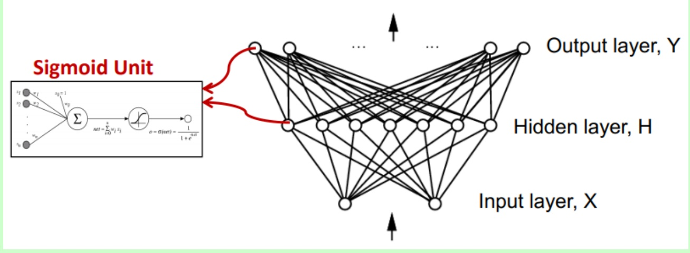

In its simplest form, a neural network has one input node and one output node

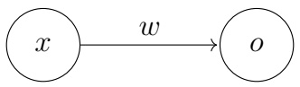

so it is equivalent to logistic regression

$$
o (x) = \sigma (w x) = \frac {1}{1 + e ^ {- w x}}.\tag{6.1}
$$

On the other hand, a neural network with one hidden layer

$$
\begin{array}{c} \text {x} \xrightarrow {w _ {0}} \text {o} _ {h} \xrightarrow {w _ {h}} \text {o} \end{array}
$$

<!-- page: 27 -->

would output

$$
o (x) = \sigma (w _ {0} + \sum_ {h} w _ {h} \underbrace {\sigma (w _ {0} ^ {h} + \sum_ {i} w _ {i} ^ {h} x _ {i})}).\tag{6.2}
$$

More generally, prediction in neural networks is done by starting from the input layer and, for each subsequent layer, computing the output of the sigmoid units (forward propagation).

## 6.2 Training a neural network

## 6.2.1 Gradient descent

Let’s treat a neural network as a function $Y = f _ { w } ( X ) + \epsilon$ where $f _ { w }$ is determined given w and $\epsilon \sim \mathcal { N } ( 0 , \sigma ^ { 2 } I )$ , so $Y \sim \mathcal { N } ( f _ { w } ( X ) , \sigma ^ { 2 } I )$ . One way to learn the weights is by MCLE:

$$
\begin{array}{r l} & {\widehat {w} _ {M C L E} = \underset {w} {\arg \max} \ln \left(\prod_ {l} P (y ^ {(l)} \mid x ^ {(l)}, w)\right)} \\ & {\qquad = \underset {w} {\arg \min} \sum_ {l} (y ^ {(l)} - \widehat {f} _ {w} (x ^ {(l)})) ^ {2}.} \end{array}
$$

In other words, the weights are trained to minimize sum of squared errors of predicted network outputs. We may also want to restrict the weights to small values, and this bias can be encoded in MCAP:

$$
\begin{array}{r} \widehat {w} _ {M C A P} = \underset {w} {\arg \max} \ln \left(P (w) \prod_ {l} P (y ^ {(l)} \mid x ^ {(l)}, w)\right) \\ = \underset {w} {\arg \min} c \sum_ {i} w _ {i} ^ {2} + \sum_ {l} (y ^ {(l)} - \widehat {f} _ {w} (x ^ {(l)})) ^ {2}, \end{array}
$$

where $P ( w )   \propto   \exp ( - w ^ { T } w / 2 \tau ^ { 2 } )$ (recall the connection between Ridge Regression and MCAP (3.10)). In other words, the weights are trained to minimize sum of squared errors of predicted network outputs plus weight magnitudes.

To perform the above optiminization, we introduce a routine called gradient descent.

<div class="docvortex-algorithm" style="white-space: pre-wrap; font-family:monospace;">
Algorithm 12: (Gradient descent algorithm)
Initialize: Pick w at random.
Gradient:
 $\nabla_{w}E(w)=\left(\frac{\partial E(w)}{\partial w_{0}},\frac{\partial E(w)}{\partial w_{1}},\ldots,\frac{\partial E(w)}{\partial w_{d}}\right).$ 
Update:
 $\Delta w = -\eta \nabla_{w} E(w)$ 
 $w_{t}^{(t+1)} \leftarrow w_{i}^{(t)} - \eta \frac{\partial E(w)}{\partial w_{i}},$ 
where  $\eta &gt; 0$  is the learning rate.
</div>

Suppose we feed the training data $\{ ( x ^ { ( l ) } , y ^ { ( l ) } ) \} _ { l = 1 } ^ { n }$ where $x ^ { ( l ) }$ is d-dimensional into a one-layer neural network with d input nodes $x _ { i }$ and one output node o. The gradient descent w.r.t every

<!-- page: 28 -->

output weight $w _ { i }$ is

$$
\frac {\partial E}{\partial w _ {i}} = \sum_ {l = 1} ^ {n} (o ^ {(l)} - y ^ {(l)}) o ^ {(l)} (1 - o ^ {(l)}) x _ {i} ^ {(l)}.\tag{6.3}
$$

Diving in the Math 9 - Gradient descent for weights at output layer

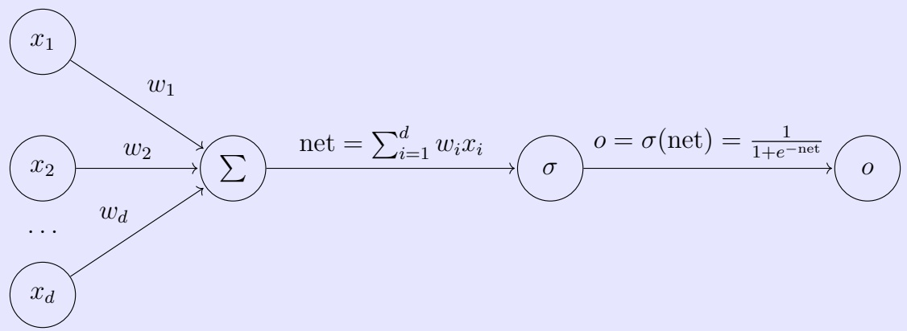

Note that $\begin{array} { r } { \sigma ( x ) = \frac { 1 } { 1 + e ^ { - x } } } \end{array}$ is the sigmoid function and $\begin{array} { r } { \frac { d } { d x } \sigma ( x ) = \sigma ( x ) ( 1 - \sigma ( x ) ) } \end{array}$ .

We have $\begin{array} { r } { E ( w ) = \frac { 1 } { 2 } \sum _ { l = 1 } ^ { n } ( y ^ { ( l ) } - o ^ { ( l ) } ) ^ { 2 } } \end{array}$ so

$$
\begin{array}{c} \frac {\partial E}{\partial w _ {i}} = \frac {1}{2} \sum_ {l = 1} ^ {n} \frac {\partial}{\partial w _ {i}} (y ^ {(l)} - o ^ {(l)}) ^ {2} = \frac {1}{2} \sum_ {l = 1} ^ {n} \frac {\partial (y ^ {(l)} - o ^ {(l)}) ^ {2}}{\partial o ^ {(l)}} \cdot \frac {\partial o ^ {(l)}}{\partial w _ {i}} \\ = \sum_ {l = 1} ^ {n} (o ^ {(l)} - y ^ {(l)}) \cdot \frac {\partial o ^ {(l)}}{\partial w _ {i}}. \end{array}
$$

Now note that

$$
\frac {\partial o ^ {(l)}}{\partial w _ {i}} = \frac {\partial o ^ {(l)}}{\partial \mathrm{net} ^ {(l)}} \cdot \frac {\partial \mathrm{net} ^ {(l)}}{\partial w _ {i}} = o ^ {(l)} (1 - o ^ {(l)}) x _ {i} ^ {(l)},
$$

so

$$
\boxed {\frac {\partial E}{\partial w _ {i}} = \sum_ {l = 1} ^ {n} (o ^ {(l)} - y ^ {(l)}) o ^ {(l)} (1 - o ^ {(l)}) x _ {i} ^ {(l)}.}
$$

For the hidden layers, consider $\frac { \partial E } { \partial w _ { h k } }$ where $w _ { h k }$ connects a node $o _ { h }$ from layer $L$ to $o _ { k }$ from layer $L + 1$ . Further assume that Γ is the set of all nodes at layer $L + 2$ . We then have the expression

$$
\frac {\partial E}{\partial w _ {h k}} = o _ {h} o _ {k} (1 - o _ {k}) \sum_ {\gamma \in \Gamma} \delta_ {\gamma} w _ {k \gamma},\tag{6.4}
$$

where $\begin{array} { r } { \delta _ { \gamma } = o _ { \gamma } ( 1 - o _ { \gamma } ) \frac { \partial E } { \partial o _ { \gamma } } } \end{array}$ . This means that we can first compute the gradients w.r.t the weights at the output layer, then propagate back to the weights at one previous layer, then two previous layers, and so on, until the input layer.

<!-- page: 29 -->

Diving in the Math 10 - Gradient descent for weights at hidden layers We would like to evaluate

$$
\frac {\partial E}{\partial w _ {h k}} = \frac {\partial E}{\partial o _ {k}} \cdot \frac {\partial o _ {k}}{\partial w _ {h k}}.
$$

Since $\begin{array} { r } { \frac { \partial o _ { k } } { \partial w _ { h k } } = o _ { k } ( 1 - o _ { k } ) o _ { h } } \end{array}$ , we can rewrite the above expression as

$$
\frac {\partial E}{\partial w _ {h k}} = o _ {h} o _ {k} (1 - o _ {k}) \frac {\partial E}{\partial o _ {k}} = o _ {h} \delta_ {k}.
$$

Now we consider

$$
\frac {\partial E}{\partial o _ {k}} = \sum_ {\gamma} \frac {\partial E}{\partial o _ {\gamma}} \cdot \frac {\partial o _ {\gamma}}{\partial o _ {k}} = \sum_ {\gamma} \frac {\partial E}{\partial o _ {\gamma}} o _ {\gamma} (1 - o _ {\gamma}) w _ {k \gamma} = \sum_ {\gamma} \delta_ {\gamma} w _ {k \gamma}.
$$

Hence

$$
\boxed {\frac {\partial E}{\partial w _ {h k}} = o _ {h} o _ {k} (1 - o _ {k}) \sum_ {\gamma} \delta_ {\gamma} w _ {k \gamma}.}
$$

## 6.2.2 Backpropagation

More generally, we can derive the backpropagation algorithm as in the next page. We also note the special properties of this algorithm:

• It computes gradient descent over the entire network weight vector. Training can take thousands of iterations, which is slow, but using network after training is very fast.

• It can easy generalize to arbitrary directed graphs.

• It will find a local, not necessarily global error minimum (because error function E is no longer convex in weights), but often works well in practice.

• It often includes a weight momentum α:

$$
\Delta w _ {i j} ^ {(n)} = \eta \delta_ {j} x _ {i j} + \alpha \Delta w _ {i j} ^ {(n - 1)}.
$$

The expressive capabilities of neural network are powerful:

• Every boolean function can be represented by a network with one hidden layer, but may require exponential (in number of inputs) hidden units.

• Every bounded continuous function can be approximated with arbitrarily small error, by a network with one hidden layer.

• Any function can be approximated to arbitrary accuracy by a network with two hidden layers.

However, neural network may still encounter the issue of overfitting, which can be avoided by MCAP, early stopping, or by regulating the number of hidden units, which essentially prevents overly complex models.

<!-- page: 30 -->

<div class="docvortex-algorithm" style="white-space: pre-wrap; font-family:monospace;">
Algorithm 13: (Backpropagation)
Denote the followings:
• $l$ is the index of the training example
• $y_k$ is target output (label) of output unit $k$
• $o_h, o_k$ are unit output (obtained by forward propagation) of output units $h, k$. If $i$ is input variable, $o_i = x_i$.
• $w_{ij}$ is the weight from node $i$ to node $j$ in the next layer.
Initialize all weights to small random numbers. Until satisfied, do
• For each training example, do
    Input the training example to the network and compute the network outputs, using forward propagation.
    For each output unit $k$, let
        $\delta_k^{(l)} \leftarrow o_k^{(l)}(1 - o_k^{(l)}) (y_k^{(l)} - o_k^{(l)})$.
    For each hidden unit $h$, let
        $\delta_h^{(l)} \leftarrow o_h^{(l)}(1 - o_h^{(l)}) \sum_{k \in K} w_{hk} \delta_k^{(l)}$,
        where $K$ is the set of output nodes.
    Update each network weight $w_{ij}$:
        $w_{ij} \leftarrow w_{ij} + \Delta w_{ik}^{(l)}$
    where $\Delta w_{ij}^{(l)} = -\eta \delta_j^{(l)} o_i^{(l)}$.
</div>

Unlike in logistic regression, the function $E ( w )$ in neural network is not convex in $w .$ Thus, gradient descent (and backpropagation) will find a local, not necessarily global minimum, but it often works well in practice.

Finally, we note the two ways in which backpropagation can be implemented in practice: Batch mode and Incremental mode (also called Stochastic Gradient Descent). Incremental mode is faster to compute and can approximate Batch mode arbitrary closely if $\eta$ is small enough.

| Batch mode | Gradient mode |
| --- | --- |
| Let E<sub>D</sub>(w) = 12 <sup>P</sup><sub>l</sub>∈D(y(l) - o(l))2. | Let El(w) = 12(y(l) - o(l))2. |
| Do until satisfied: | Do until satisfied: |
| 1. Compute the gradient ∇E<sub>D</sub>(w). | • For each training example l in D: |
| 2. w ← w - η∇E<sub>D</sub>(w). | 1. Compute the gradient ∇E<sub>l</sub>(w). 2. w ← w - η∇E<sub>l</sub>(w). |

Table 6.1: Batch mode vs Gradient mode

<!-- page: 31 -->

## 6.3 Convolutional neural networks

## Definition 8: (Deep architectures)

Deep architectures are composed of multiple levels of non-linear operations, such as neural nets with many hidden layers.

$$
\begin{array}{l} \text {Output layer} \\ \text {Hidden layers} \\ \text {Input layer} \end{array} \quad \begin{array}{l} y _ {i} = \tanh (\sum_ {j} W _ {i j} x _ {j} + W _ {i 0}) \\ y _ {i} = \sigma (\sum_ {j} W _ {i j} x _ {j} + W _ {i 0}) \\ = \frac {1}{1 + \exp [ - (\sum_ {j} W _ {i j} x _ {j} + W _ {i 0}) ]} \end{array}
$$

Deep learning methods aim at learning feature hierarchies, where features from the higher levels of the hierarchy are formed by lower level features. One such method is convoluational neural network, which, compared to standard feedforward neural network:

• have much fewer connections and parameters

• is easier to train

• has only slightly worse theoretically best performance.

First, we define the term convolution.

## Definition 9: (Convolution)

The convolution of two functions $f$ and g, denoted $f * g ,$ is defined as:

• If $f$ and $g$ are continuous:

$$
(f * g) (t) = \int_ {- \infty} ^ {\infty} f (\tau) g (t - \tau) d \tau = \int_ {- \infty} ^ {\infty} f (t - \tau) g (\tau) d \tau .\tag{6.5}
$$

• If $f$ and $g$ are discrete:

$$
(f * g) [ n ] = \sum_ {m = - \infty} ^ {\infty} f [ m ] g [ n - m ] = \sum_ {m = - \infty} ^ {\infty} f [ n - m ] g [ m ].\tag{6.6}
$$

• If discrete $g$ has support on $\{ - M , \ldots , M \}$ :

$$
(f * g) [ n ] = \sum_ {m = - M} ^ {M} f [ n - m ] g [ m ].\tag{6.7}
$$

Informally, the convolution gives a sense of how much two functions “overlap.” A simple convolutional neural network (CNN) is a sequence of layers, each of which transforms one volume of activations to another through a differentiable function. We use three main types of layers to build the network architectures: Convolutional Layer, Pooling Layer, and Fully Connected Layer

<!-- page: 32 -->

(exactly as seen in regular Neural Networks). Typically, CNNS are used for image classification in computer vision.

We now discuss the components of a CNN. The following text excerpts are from Chapter 10 of [Artificial Intelligence for Humans, Vol 3: Neural Networks and Deep Learning](https://www.heatonresearch.com/book/aifh-vol3-deep-neural.html) and [Stanford’s CS 231n](http://cs231n.github.io/convolutional-networks/).

## 6.3.1 Convolutional Layer

The primary purpose of a convolutional layer is to detect features such as edges, lines, blobs of color, and other visual elements. Each feature is represented by a filter; the more filters that we give to a convolutional layer, the more features it can detect.

More formally, a filter is a square 2D matrix that scans over the image. The convolutional layer, which is essentially a set of filters, acts as a smaller grid that sweeps left to right over each of row of the image. Each cell in a filter is a weight.

The sweeping phase (forward propagation) is done as follows. First, the input image may be padded with some layers of zero cells as need. The stride specifies the number of positions at which the convolutional filters will stop. The convolutional filters move to the right, advancing by the number of cells specified in the stride. Once the far right is reached, the convolutional filter moves back to the far left, then it moves down by the stride amount and continues to the right again. Hence, the number of steps in one sweeping phase is

$$
\text {Number of steps} = \frac {W - F + 2 P}{S} + 1,
$$

where W is the image size, F is the filter size, P is the padding and S is the stride.

We can use the same set of weights as the convolutional filter sweeps over the image. This process allows convolutional layers to share weights and greatly reduce the amount of processing needed. In this way, we can recognize the image in shift positions because the same convolutional filter sweeps across the entire image.

The input and output of a convolutional layer are both 3D boxes. For the input to a convolutional layer, the width and height of the box is equal to the width and height of the input image. The depth of the box is equal to the color depth of the image. For an RGB image, the depth is 3, equal to the components of red, green, and blue. If the input to the convolutional layer is another layer, then it will also be a 3D box; however, the dimensions of that 3D box will be dictated by the hyper-parameters of that layer. Like any other layer in the neural network, the size of the 3D box output by a convolutional layer is dictated by the hyper-parameters of the layer. The width and height of this box are both equal to the filter size. However, the depth is equal to the number of filters.

A visualization for the sweeping phase is in the Convolution Demo section at [Stanford’s CS 231n](http://cs231n.github.io/convolutional-networks/). In summary, the procedure taking place at the convolutional layer is as follows.

<!-- page: 33 -->

<div class="docvortex-algorithm" style="white-space: pre-wrap; font-family:monospace;">
Algorithm 14: (Convolutional layer's forward pass)
Accepts a 3D image of size $W_1 \times H_1 \times D_1$.
Requires four hyperparameters: number of filters $K$, spatial extent $F$, stride $S$, and amount of zero padding $P$.
Produces a 3D image of size $W_2 \times H_2 \times D_2$ where
\[W_2 = \frac{W_1 - F + 2P}{S} + 1; \quad H_2 = \frac{H_1 - F + 2P}{S} + 1; \quad D_2 = K.\tag{6.8}\]
With parameter sharing, it introduces $F \times F \times D_1$ weights per filter, for a total of $F \times F \times D_1 \times K$ weights and K biases. In the output volume, the $d$-th depth slice (of size $W_2 \times H_2$) is the result of performing a valid convolution of the $d$-th filter over the input volume with a stride of $S$, and then offset by $d$-th bias.
</div>

## 6.3.2 Pooling layer

Pooling layer downsamples an input 3D image to a new one with smaller widths and heights. Typically a pooling layer follows immediately after a convolutional layer. A typical choice for pooling is max-pooling, which, for every $f \times f$ region in the input image, outputs the maximum number in that region to the output image.

<div class="docvortex-algorithm" style="white-space: pre-wrap; font-family:monospace;">
Algorithm 15: (Pooling layer's forward pass)
Accepts a volume of size $W_1 \times H_1 \times D_1$.
Requires two hyperparameters: spatial extent $F$ and stride $S$, Produces a volume of size $W_2 \times H_2 \times D_2$ where:
\[W_2 = \frac{W_1 - F}{S} + 1; \quad H_2 = \frac{H_1 - F}{S} + 1; \quad D_2 = D_1. \tag{6.9}\]
Introduces zero parameters since it computes a fixed function of the input. For Pooling layers, it is not common to pad the input using zero-padding.
</div>

It is worth noting that there are only two commonly seen variations of the max pooling layer found in practice: A pooling layer with $F = 3 , S = 2$ (also called overlapping pooling), and more commonly $F = 2 , S = 2$

## 6.3.3 Fully Connected Layer

This is the same layer from a feedforward neural network, with two hyperparameters: neuron count and activation function. Every neuron in the the previous layer’s 3D image output is connected to each neuron in this layer through a weight value. A dot product of the input (flattened to 1D) and the weight vector is then passed to the activation function. Dense layers can employ many different kinds of activation functions, such as ReLU, sigmoid or tanh.

<!-- page: 34 -->

## Chapter 7

## Support Vector Machine

## 7.1 Introduction

Recall that a regression classifier with linear decision boundary would typically look like

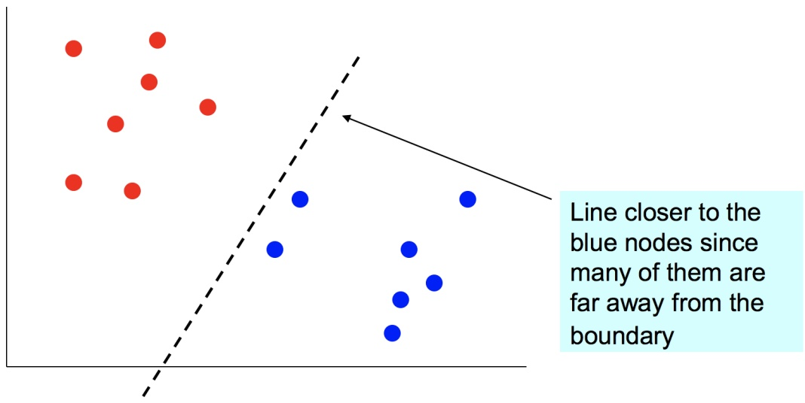

where the boundary is determined by taking into account all data points (e.g., linear regression (3.1)). In this case, the decision line is closer to the blue nodes since many of them are far off to the right. However, note that there could be many possible classifiers that have different boundaries but yield the same outcome:

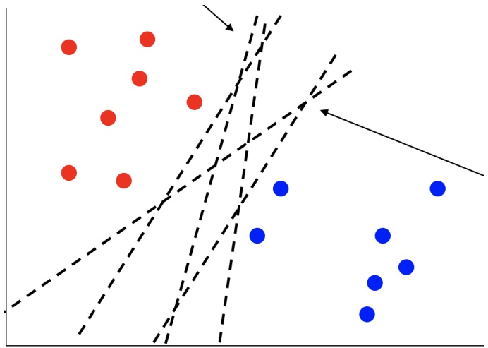

One way to decide on a single classifier is to find a max margin classifier: a boundary that leads to the largest margin from both sets of points. This also means that instead of fitting all points,

<!-- page: 35 -->

we may consider only the “boundary” points, and we want to learn a boundary that leads to the largest margin from points on both sides. These boundary points are called the support vectors.

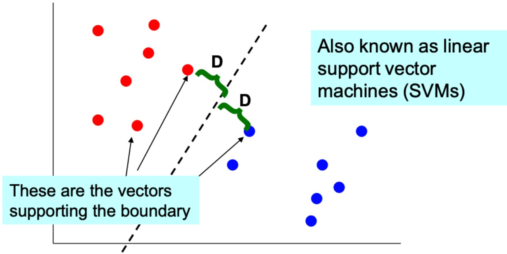

In particular, we would specify a max margin classifier based on parameters w and $b ,$ and then perform classification as follows

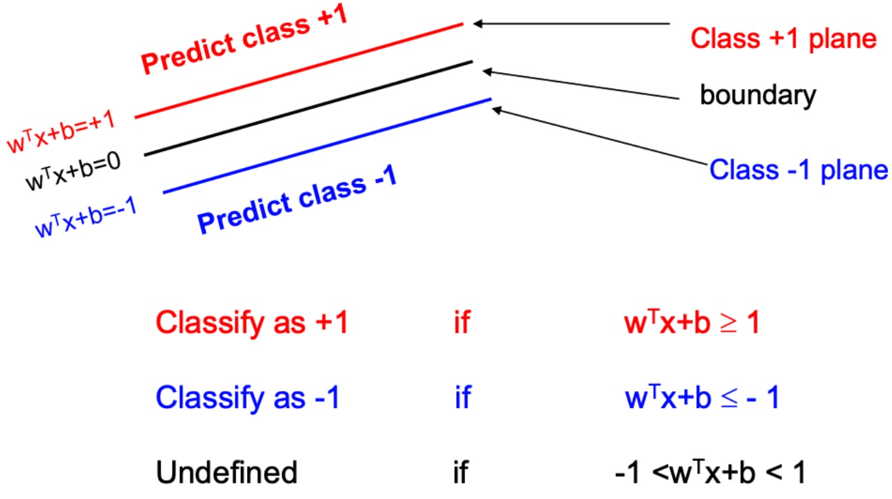

## 7.2 Primal form

## 7.2.1 Linearly separable case

Our goal, as previously mentioned, is to find the maximum margin. Let’s define the width of the margin by M, we can then see that

$$
M = \frac {2}{\sqrt {w ^ {T} w}}.\tag{7.1}
$$

<!-- page: 36 -->

Diving in the Math 11 - Computing margin M in terms of weight w and bias b First observe that the vector w is orthogonal to the +1 plane. To prove this, let u and v be any two points on the +1 plane then

$$
w ^ {T} u = w ^ {T} v = 1 - b \Rightarrow w ^ {T} (u - v) = 0.
$$

Similarly, $w$ is orthogonal to the −1 plane too. Hence, if $x ^ { + }$ is a point on the + plane and $x ^ { - }$ is the point closest to $x ^ { + }$ on the − plane, then the vector from $x ^ { + }$ to $x ^ { - }$ is parallel to w. In other words, $x ^ { + } = \lambda w + x ^ { - }$ for some λ. Now we have

$$
w ^ {T} x ^ {+} + b = 1
$$

$$
w ^ {T} (\lambda w + x ^ {-}) + b = 1
$$

$$
w ^ {T} x ^ {-} + \lambda w ^ {T} w = 1
$$

$$
\lambda = \frac {2}{w ^ {T} w}.
$$

Hence

$$
M = | x ^ {+} - x ^ {-} | = | \lambda w | = \lambda \sqrt {w ^ {T} w} = \frac {2}{w ^ {T} w} \sqrt {w ^ {T} w} = \frac {2}{\sqrt {w ^ {T} w}}.
$$

We can now search for the optimal parameters by finding a solution that:

1. Correctly classifies all points

2. Maximizes the margin (or equivalently minimizes $w ^ { T } w )$

Several optimization methods can be used: Gradient descent, simulated annealing, EM, etc. In this case, the problem also belongs to the category of quadratic programming (QP).

Definition 10: (Quadratic programming)

Quadratic programming solves the optimization problem

$$
\min _ {u} \frac {u ^ {T} R u}{2} + d ^ {T} u + c,
$$

where u is a vector, R is square matrix, d is vector and c is scalar. Furthermore, u is subject to n inequality constraint

$$
a _ {i 1} u _ {1} + a _ {i 2} u _ {2} + \dots \leq b _ {i}, \quad 1 \leq i \leq n,
$$

and k equivalency constraint

$$
a _ {j 1} u _ {1} + a _ {j 2} u _ {2} + \dots = b _ {n + j}, \quad 1 \leq j \leq k.
$$

More specifically, we can frame the margin maximization problem as a QP problem:

$$
\min _ {w} \frac {w ^ {T} w}{2}
$$

subject to n constraints if there are n samples x.

$w ^ { T } x + b \geq 1$ for all x in class +1,

$w ^ { T } x - b \leq - 1$ for all x in class −1,

<!-- page: 37 -->

## 7.2.2 Non linearly separable case

So far we have assumed that the data is linearly separable, i.e., there is a line $w ^ { T } x + b$ that perfectly separates the +1 and −1 class. But this is usually not the case in practice, as there can be noise and outliers. One way to address this is to penalize the number of misclassified points m, i.e.,

$$
\min _ {w} w ^ {T} w + C \cdot m,
$$

where $C$ is a regularization constant. However, this is hard to encode in a QP problem. Instead of minimizing the number of misclassified points we can minimize the distance between these points and their correct plane. In this case, the new optimization problem is

$$
\min _ {w} \frac {w ^ {T} w}{2} + C \sum_ {i = 1} ^ {n} \epsilon_ {i},
$$

subject to 2n constraints if there are n samples $x ^ { ( i ) }$ :

$w ^ { T } x ^ { ( i ) } + b \geq 1 - \epsilon _ { i }$ for all $x ^ { ( i ) }$ in class +1

$w ^ { T } x ^ { ( i ) } + b \leq - 1 + \epsilon _ { i }$ for all $x ^ { ( i ) }$ in class −1.

$\epsilon _ { i } \geq 0$ for all i.

In summary, we have two optimization problems for two cases:

| Separable case | Non-separable case |
| --- | --- |
| Find wTw mwin 2 subject to • iwn<sup>T</sup>cxla+ssb+≥1 1 for all x • xw<sup>T</sup>inx c+labss≤-1-1 for all | Find wTw <sup>n</sup> m<sub>w</sub>in 2 <sub>+</sub> C <sup>X</sup>i i=1 subject to • w<sup>T</sup>x+b ≥ 1-i <sup>for</sup> <sup>all</sup> x<sub>i</sub> in class +1 • w<sup>T</sup>x + b ≤ -1 +i <sup>for</sup> all x<sub>i</sub> in class -1 •i ≥ 0 for all i. |

Table 7.1: Optimization constraints for separable and non-separable case in primal SVM

## 7.3 Dual representation

## 7.3.1 Linearly separable case

Instead of solving the QPs in Table 7.1 directly, we will solve a dual formulation of the SVM optimization problem. The main reason for switching to this type of representation is that it would allow us to use a neat trick that will make our lives easier (and the run time faster).

Starting from the separable case, note that we can rephrase the constraints as

$$
(w ^ {T} x ^ {(i)} + b) y ^ {(i)} \geq 1\tag{7.2}
$$

for all $i ,$ where $y _ { i } -$ the class of $x _ { i } \textrm { - i s } \pm 1$ . We can then encoding this as part of our minimization problem using Lagrange multiplier.

<!-- page: 38 -->

Algorithm 16: (Lagrange multiplier method)

Consider a problem of finding

$$
\begin{array}{c} \underset {w} {\min} f (w) \\ \text {such that} h _ {i} (w) = 0, \quad i = 1, \ldots , l \end{array}
$$

In the Lagrange multiplier method, we can define the Lagrangian to be

$$
\mathcal {L} (w, \beta) = f (w) + \sum_ {i = 1} ^ {l} \beta_ {i} h _ {i} (w),
$$

where the $\beta _ { i } \mathrm { { } ^ { \flat } s }$ are called the Lagrange multipliers. We would then find and set ${ \mathcal { L } } ^ { \prime } \mathrm { s }$ partial derivatives to zero:

$$
\frac {\partial \mathcal {L}}{\partial w _ {i}} = 0; \quad \frac {\partial \mathcal {L}}{\partial \beta_ {i}} = 0,
$$

and solve for w and $\beta .$

More generally, consider the following primal optimization problem:

$$
\begin{array}{c} \underset {w} {\min} f (w) \\ \text {such that} g _ {i} (w) \leq 0, \quad i = 1, \ldots , k \\ h _ {i} (w) = 0, \quad i = 1, \ldots , l \end{array}
$$

To solve it, we start by defining the generalized Lagrangian:

$$
\mathcal {L} (w, \alpha , \beta) = f (w) + \sum_ {i = 1} ^ {k} \alpha_ {i} g _ {i} (w) + \sum_ {i = 1} ^ {l} \beta_ {i} h _ {i} (w)
$$

where the $\alpha _ { i } , \beta _ { i } { } ^ { \mathrm { , } } \mathrm { s }$ are the Lagrange multipliers.

Using the Lagrange multiplier, consider the quantity

$$
\theta_ {p} (w) = \max _ {\alpha , \beta : \alpha_ {i} \geq 0} \mathcal {L} (w, \alpha , \beta)
$$

then our minimization problem becomes

$$
\min _ {w} \theta_ {p} (w) = \min _ {w} \max _ {\alpha , \beta : \alpha_ {i} \geq 0} \mathcal {L} (w, \alpha , \beta).
$$

Specifically, our original problem is

$$
\begin{array}{c} \underset {w} {\min} \frac {w ^ {T} w}{2} \\ \text {such that} g _ {i} (w) = - y ^ {(i)} (w ^ {T} x ^ {(i)} + b) + 1 \leq 0. \end{array}
$$

which can be translated to

$$
\min _ {w} \max _ {\alpha} \underbrace {\frac {w ^ {T} w}{2} - \sum_ {i} \alpha_ {i} (y ^ {(i)} (w ^ {T} x ^ {(i)} + b) - 1)} _ {\mathcal {L} (w, \alpha)}\tag{7.3}
$$

<!-- page: 39 -->

where $\alpha _ { i } \geq 0$ for all i. Setting the derivative of L w.r.t w, α, b respectively we get:

$$
0 = \frac {\partial L}{\partial w} = w - \sum_ {i = 1} ^ {n} \alpha_ {i} y ^ {(i)} x ^ {(i)} \Rightarrow w = \sum_ {i = 1} ^ {n} \alpha_ {i} y ^ {(i)} x ^ {(i)}.\tag{7.4}
$$

$$
0 = \frac {\partial L}{\partial \alpha_ {i}} = - y ^ {(i)} (w ^ {T} x ^ {(i)} + b) - 1 \Rightarrow b = y ^ {(i)} - w ^ {T} x ^ {(i)} \text {for} i \text {where} \alpha_ {i} > 0.\tag{7.5}
$$

$$
0 = \frac {\partial L}{\partial b} = \sum_ {i = 1} ^ {n} \alpha_ {i} y ^ {(i)}.\tag{7.6}
$$

We mentioned earlier that the only data points of importance are the support vectors, which affect the margin. Originally, we need to find the points that touch the boundary of the margin $( \mathrm { i . e . , } w ^ { T } x + b = \pm 1 )$ . In this case, howerver, (7.4) gives us the support vectors directly, which are the points $( x ^ { ( i ) } , \dot { y } ^ { ( i ) } )$ where $\alpha _ { i } > 0$

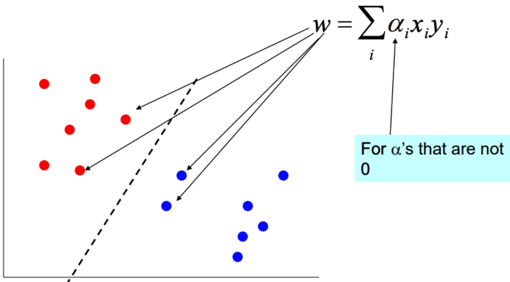

Substituting the above results back into (7.3), we get the equivalent problem of

$$
\max _ {\alpha} \sum_ {i} \alpha_ {i} - \frac {1}{2} \sum_ {i, j} \alpha_ {i} \alpha_ {i} y ^ {(i)} y ^ {(j)} (x ^ {(i)}) ^ {T} x ^ {(j)}\tag{7.7}
$$

where $\begin{array} { r } { \sum _ { i } \alpha _ { i } y ^ { ( i ) } = 0 } \end{array}$ and $\alpha _ { i } \geq 0$ for all i. After solving for α in this new problem, to evaluate a new sample x, we simply compute

$$
\hat {y} = \mathrm{sign} (w ^ {T} x + b) = \mathrm{sign} \left(\sum_ {i} \alpha_ {i} y _ {i} (x ^ {(i)}) ^ {T} x + b\right).\tag{7.8}
$$

Note that both the optimization function (7.7) and decision function (7.8) rely on the sum of dot products $( x ^ { ( j ) } ) ^ { T } x ^ { \bar { ( i ) } }$ , which can be expensive to compute.

## 7.3.2 Transformation of inputs

When the data is not linearly separable, the original input space (x) can be mapped to some higher-dimensional feature space $( \phi ( x ) )$ where the training set is separable. For instance, we can map $( x ) \rightarrow ( x , x ^ { 2 } )$ (from 1D to 2D) and $( x _ { 1 } , x _ { 2 } ) \rightarrow ( x _ { 1 } ^ { 2 } , x _ { 2 } ^ { 2 } , \sqrt { 2 } x _ { 1 } x _ { 2 } )$ (from 2D to 3D):

<!-- page: 40 -->

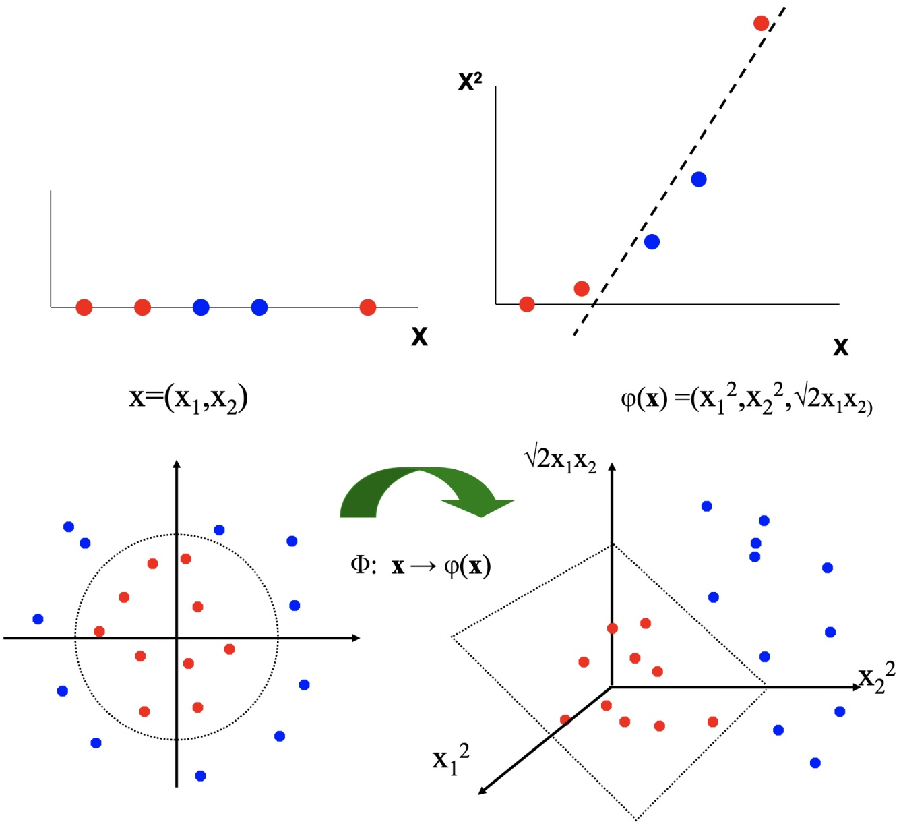

In general, if the data is mapped into sufficiently high dimension, then samples will be linearly separable. n data points can be separable in a space of $n - 1$ dimensions or more. However, this transformation poses two difficulties:

• High computation burden due to high-dimensionality.

• Many more parameters.

SVM solves these two issues by:

• Using dual formulation, which only assigns parameters to samples, not features (i.e., each $x ^ { ( i ) }$ has an associated $\alpha _ { i } )$

• Using kernel tricks for efficient computation.

<!-- page: 41 -->

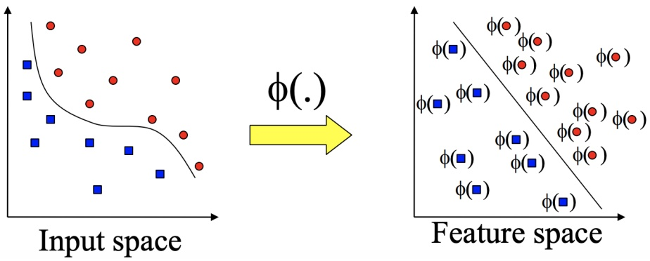

Note that if we have n data points with m dimensions then the number of parameters is m in primal form (i.e., the features of weight $w )$ and n in dual form (i.e., an $\alpha _ { i }$ for each $x ^ { ( i ) } )$ . At first glance, because n  m, the primal formation is at an advantage. However, note that in dual form we only care about the support vectors; in other words, the parameters are only those $\alpha _ { i }$ that are positive, and their number is usually a lot less than $n .$ Hence, the dual form is not worse than primal form in the original space. In the transformed space, as x increases in dimension, so does $w ,$ so the primal form requires more parameters, while the dual form generally also sees an increase in the number of support vectors, but not as much.

## 7.3.3 Kernel tricks

While working in higher dimensions is beneficial, it also increases our run time because of the dot product computation. However, there is a neat trick we can use.

Consider, for example, all quadratic terms for the features $x _ { 1 } , x _ { 2 } , \ldots , x _ { m } ;$

$$
\phi (x) = (1, \underbrace {\sqrt {2} x _ {1} , \dots , \sqrt {2} x _ {m}} _ {m + 1 \text {linear terms}}, \underbrace {x _ {1} ^ {2} , \dots , x _ {m} ^ {2}} _ {m \text {quadratic terms}}, \underbrace {\sqrt {2} x _ {1} x _ {2} , \dots , \sqrt {2} x _ {m - 1} x _ {m}} _ {m (m - 1) / 2 \text {pairwise terms}}) ^ {T}.\tag{7.9}
$$

The dot product operation would normally be

$$
\phi (x) ^ {T} \phi (z) = \sum_ {i} 2 x _ {i} z _ {i} + \sum_ {i} (x _ {i}) ^ {2} (z _ {i}) ^ {2} + \sum_ {i <   j} 2 x _ {i} x _ {j} z _ {i} z _ {j} + 1,
$$

which has $O ( m ^ { 2 } )$ operations. However, we can obtain dramatic savings by noting that

$$
\begin{array}{r l} (x \cdot z + 1) ^ {2} & = (x \cdot z) ^ {2} + 2 (x \cdot z) + 1 \\ & = (\sum_ {i} x _ {i} z _ {i}) ^ {2} + \sum_ {i} 2 x _ {i} z _ {i} + 1 \\ & = \sum_ {i} 2 x _ {i} z _ {i} + \sum_ {i} (x _ {i}) ^ {2} (z _ {i}) ^ {2} + \sum_ {i <   j} 2 x _ {i} x _ {j} z _ {i} z _ {j} + 1 \\ & = \phi (x) ^ {T} \phi (z). \end{array}
$$

In other words, to compute $\phi ( x ) ^ { T } \phi ( z )$ , we can simply compute $x \cdot z + 1$ (which only needs m operations) and then square it. Hence, we don’t need to work directly with the transformations $\phi ( x )$ to compute their dot products. The function $\phi$ in this case (7.9) is called a polynomial kernel (of degree 2).

The kernel trick works for higher order polynomials as well. In general, a polynomial of degree d can be computed by $( x \cdot z + 1 ) ^ { d }$ Beyond polynomials there are other very high dimensional basis functions that can be made practical by finding the right kernel function, such as Radial basis kernel function $\begin{array} { r } { K ( x , z ) = \exp \left( - \frac { ( x - z ) ^ { 2 } } { 2 \sigma ^ { 2 } } \right) } \end{array}$

<!-- page: 42 -->

## 7.3.4 Non linearly separable case

Using the Lagrange multiplier method on the optimization function for the primal form’s non linearly separable case (Table 7.1), we obtain our dual target function

$$
\max _ {\alpha} \sum_ {i} \alpha_ {i} - \frac {1}{2} \sum_ {i, j} \alpha_ {i} \alpha_ {j} y ^ {(i)} y ^ {(j)} (x ^ {(i)}) ^ {T} (x ^ {(j)})\tag{7.10}
$$

subject to $\begin{array} { r } { \sum _ { i } \alpha _ { i } y ^ { ( i ) } = 0 } \end{array}$ and $C > \alpha _ { i } \geq 0$ (so now the $\alpha _ { i } \mathrm { ^ { \prime } s }$ are bounded above by the regularization constant). To evaluate a new sample x, we similarly perform the computation as in (7.8). In summary, we have two optimization problems for two cases:

| Separable case | Non-separable case |
| --- | --- |
| Find$\max_{\alpha} \sum_{i} \alpha_{i} - \frac{1}{2} \sum_{i,j} \alpha_{i} \alpha_{i} y^{(i)} y^{(j)} (x^{(i)})^{T} x^{(j)}$where $\sum_{i} \alpha_{i} y^{(i)} = 0$ and $\alpha_{i} \geq 0$ for all $i$. | Find$\max_{\alpha} \sum_{i} \alpha_{i} - \frac{1}{2} \sum_{i,j} \alpha_{i} \alpha_{i} y^{(i)} y^{(j)} (x^{(i)})^{T} x^{(j)}$where $\sum_{i} \alpha_{i} y^{(i)} = 0$ and $C > \alpha_{i} \geq 0$ for all $i$. |

Table 7.2: Optimization constraints for separable and non-separable case in dual SVM.

## 7.4 Other topics

## 7.4.1 Why do SVMs work?

If we are using huge features spaces (with kernels) why are we not overfitting the data?

• Number of parameters remains the same (and most are set to 0).

• While we have a lot of input values, at the end we only care about the support vectors and these are usually a small group of samples.

• The minimization (or the maximizing of the margin) function acts as a sort of regularization term leading to reduced overfitting.

## 7.4.2 Multi-class classification with SVM

If we have data from more than two classes, most common solution is the one-versus-all approach:

• Create a classifer for each class against all other data.

• For a new point use all classifiers and compare the margin for all selected classes. The class with the largest margin is selected.

Note that this is not necessarily valid since this is not what we trained the SVM for, but often works well in practice.

<!-- page: 43 -->

## Chapter 8

# Ensemble Methods and Boosting

## 8.1 Introduction

Consider the simple (weak) learners (e.g., naive Bayes, logistic regression, decision tree) - those that don’t learn too well but still better than chance, i.e. error < 50% but not close to 0. They are good (low variance, usually don’t overfit) but also bad (high bias, can’t solve hard problems). Can we somehow improve them by combining them together? A simple approach is “bucket of models”:

• Input:

– Your top T favorite learners $L _ { 1 } , \ldots , L _ { T }$

– A dataset D

• Learning algorithm:

1. Use 10-fold cross validation to estimate the error of $L _ { 1 } , \ldots , L _ { T }$

2. Pick the best (lowest 10-CV error) learner $L ^ { * }$

3. Train $L ^ { * }$ on D and return its hypothesis $h ^ { * }$

This approach is simple and will give results not much worse than the best of the “base learners” but what if there’s not a single best learner? How do we come up with a method that combines multiple classifiers? One way is to perform voting (ensemble methods):

• Instead of learning a single (weak) classifier, learn many weak classifiers that are good at different parts of the input space.

• Output class: (Weighted) vote of each classifier

– Classifiers that are most “sure” will vote with more conviction

– Each classifier will be most “sure” about a particular part of the space

– On average, do better than single classifier!

The question, then, is how we can force classifiers to learn about different parts of the input space and weigh the votes of different classifiers? This leads us to the idea of boosting:

• Idea: given a weak learner, run it multiple times on (reweighted) training data, then let the learned classifiers vote.

• On each iteration t:

<!-- page: 44 -->

– weigh each training example by how incorrectly it was classified

– learn a hypothesis $h _ { t }$ and its strength $\alpha _ { t }$

• Final classifier: a linear combination of the votes of the different classifiers weighted by their strength

Note the notion of a weighted dataset - in particular, if $D ( i )$ be the weight of the i-th training example $( x ^ { ( i ) } , y ^ { ( i ) } )$ , then it counts as $D ( i )$ examples. From now, in all calculations, whenever used, the i-th training example counts as $D ( i )$ “examples”.

With this in mind, we can now define the full boosting algorithm (Shapire, 1998):

<div class="docvortex-algorithm" style="white-space: pre-wrap; font-family:monospace;">
Algorithm 17: (AdaBoost)
Given dataset $\{(x^{(1)}, y^{(1)}), \ldots, (x^{(m)}, y^{(m)})\}$ where $x^{(i)} \in X, y^{(i)} \in Y = \{\pm 1\}$.
Initialize $D_1(i) = \frac{1}{m}$.
For $t = 1, \ldots, T$:
    - Train weak learner using distribution $D_t$.
    - Get weak classifier $h_t : X \to \mathbb{R}$.
    - Compute the error $\epsilon_t = \sum_{i=1}^m D_t(t) \mathbb{I} \left( h_t(x^{(i)}) \neq y^{(i)} \right)$ and strength $\alpha_t = \frac{1}{2} \ln \left( \frac{1 - \epsilon_t}{\epsilon_t} \right)$.
    - Update
        $D_{t+1}(i) = \frac{D_t(i) \exp(-\alpha_t y^{(i)} h_t(x^{(i)})}{Z_t}$
    where
        $Z_t = \sum_{i=1}^m D_t(i) \exp(-\alpha_t y^{(i)} h_t(x^{(i)}))$
    is a normalization factor (chosen so that $\sum_{i=1}^m D_{t+1}(i) = 1$).
Output the final classifier $H(x) = \text{sign} \left( \sum_{t=1}^T \alpha_t h_t(x) \right)$.
</div>

An example is shown below.

<!-- page: 45 -->

Round 1

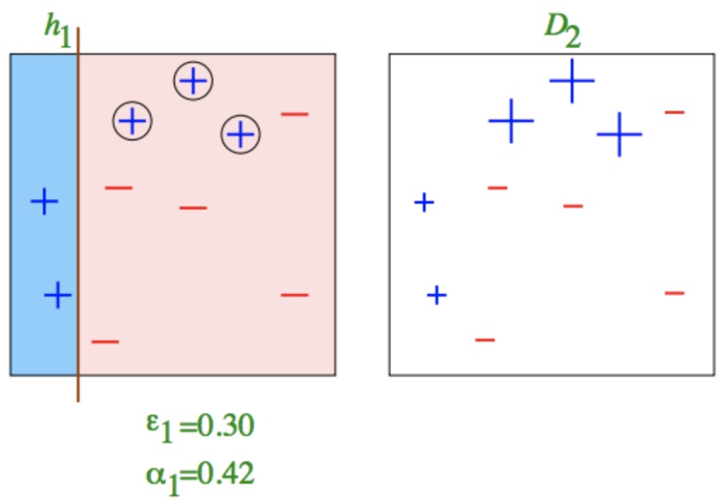

Round 2

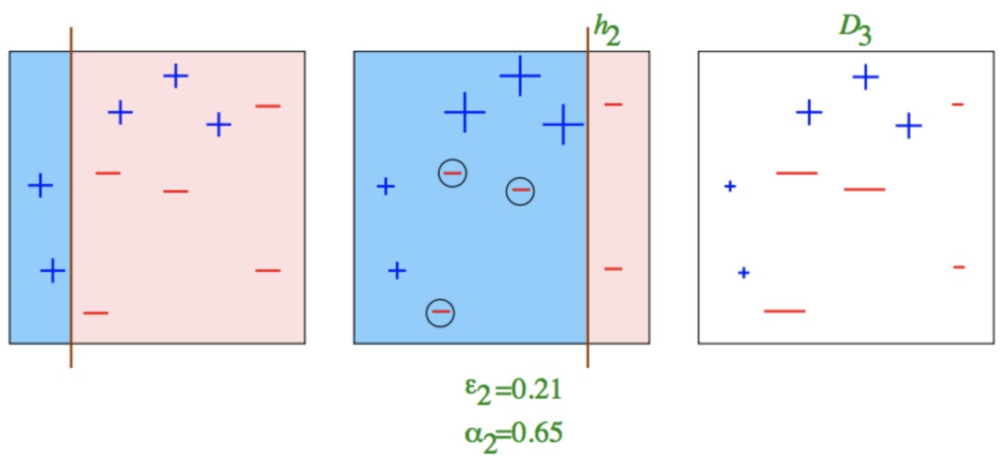

Round 3

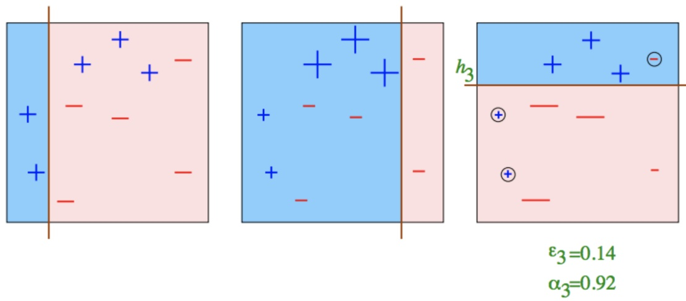

<!-- page: 46 -->

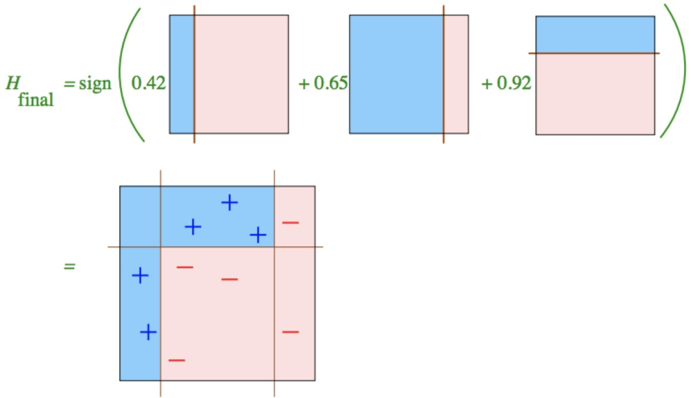

## 8.2 Mathematical details

We now examine at each of the above formulas to see how they were derived. First observe that:

$\epsilon _ { t }$ is the fraction of misclassified (weighted) samples in iteration t. Recall our earlier definition of a weak learner as one that has error $< 5 0 \%$ . Hence we always have $\epsilon _ { t } < 0 . 5$ and therefore $\begin{array} { r } { \alpha _ { t } = \frac { 1 } { 2 } \ln \left( \frac { 1 - \epsilon _ { t } } { \epsilon _ { t } } \right) > 0 } \end{array}$

• If sample i is classified correctly then $y ^ { ( i ) } h _ { t } ( x ^ { ( i ) } ) = 1$ so

$$
D _ {t} (i) \exp (- \alpha_ {t} y ^ {(i)} h _ {t} (x ^ {(i)})) = \frac {D _ {t} (i)}{\exp (\alpha_ {i})} <   D _ {t} (i),
$$

i.e., the weight of this sample decreases. On the other hand, if sample i is classified incorrectly, then its weight increases.

In other words, in each iteration the classifier will focus on a different set of points (more specifically, those that were misclassified in the previous iteration), and in the end, we hope that the combination of these classifiers (over all iterations) can classify all points correctly. This is the idea behind boosting. Now, to prove that it does work (i.e., the error converges to 0 after some number of iterations), we answer the following questions.

## 8.2.1 What $\alpha _ { t }$ to choose for hypothesis $h _ { t } ?$

Note that the training error of the final classifier H is bounded by

$$
\frac {1}{m} \sum_ {i = 1} ^ {m} \mathbb {I} \left(H (x ^ {(i)}) \neq y ^ {(i)}\right) \leq \frac {1}{m} \sum_ {i = 1} ^ {m} \exp (- y ^ {(i)} f (x ^ {(i)})) = \prod_ {t = 1} ^ {T} Z _ {t}\tag{8.1}
$$

where $\begin{array} { r } { f ( x ) = \sum _ { t = 1 } ^ { T } \alpha _ { t } h _ { t } ( x ) } \end{array}$ and $H ( x ) = \mathrm { s i g n } \left( f ( x ) \right)$

<!-- page: 47 -->

Diving in the Math 12 - Upper bound of final classifier’s training error To prove the first inequality, note that:

Each correctly classified sample i contributes 0 to the LHS and $\frac { 1 } { m e }$ to the RHS.

• Each incorrectly classified sample i contributes $\frac { 1 } { m }$ to the LHS and $\frac { e } { m }$ to the RHS. In other words, $\mathbb { I } \left( H ( x ^ { ( i ) } ) \neq y ^ { ( i ) } \right) \; < \; \exp ( - y ^ { ( i ) } f ( x ^ { ( i ) } ) )$ for all i, so $\textstyle \sum _ { i } \mathbb { I } \left( H ( x ^ { ( i ) } ) \neq y ^ { ( i ) } \right) \; <$ $\textstyle \sum _ { i } \exp ( - y ^ { ( i ) } f ( x ^ { ( i ) } ) )$ To prove the second inequality, note that the definition of $D _ { t }$ gives us

$$
\begin{array}{l} D _ {T + 1} (i) = D _ {T} (i) \cdot \frac {\exp (- \alpha_ {T} y ^ {(i)} h _ {T} (x ^ {(i)}))}{Z _ {T}} \\ \qquad = D _ {T - 1} (i) \cdot \frac {\exp (- \alpha_ {T - 1} y ^ {(i)} h _ {T - 1} (x ^ {(i)}))}{Z _ {T - 1}} \cdot \frac {\exp (- \alpha_ {T} y ^ {(i)} h _ {T} (x ^ {(i)}))}{Z _ {T}} \\ \qquad = \ldots \\ \qquad = \frac {\exp (- \sum_ {t} \alpha_ {t} y ^ {(i)} h _ {t} (x ^ {(i)}))}{m \prod_ {t} Z _ {t}} = \frac {\exp (- y ^ {(i)} f (x ^ {(i)}))}{m \prod_ {t} Z _ {t}}. \end{array}
$$

On the other hand, because we define the ${ Z _ { t } } ^ { \prime }$ s as normalization factors,

$$
1 = \sum_ {i = 1} ^ {m} D _ {T + 1} (i) = \frac {1}{m \prod_ {t} Z _ {t}} \sum_ {i = 1} ^ {m} \exp (- y ^ {(i)} h _ {t} (x ^ {(i)})),
$$

which leads to

$$
\frac {1}{m} \sum_ {i = 1} ^ {m} \exp (- y ^ {(i)} f (x ^ {(i)})) = \prod_ {t = 1} ^ {T} Z _ {t}.
$$

In other words, to guarantee low error, we just need to make sure its upper bound $\textstyle \prod _ { t } Z _ { t }$ is small. We can tighten this bound greedily by choosing $\alpha _ { t }$ on each iteration to minimize $Z _ { t }$ To do so, let’s define the error at iteration t as $\begin{array} { r } { \epsilon _ { t } = \sum _ { i } D _ { t } ( i ) \mathbb { I } \left( h _ { t } ( x ^ { ( i ) } ) \neq y ^ { ( i ) } \right) } \end{array}$ r

$$
Z _ {t} = \sum_ {t} D _ {t} (i) \exp (- \alpha_ {t} y ^ {(i)} h _ {t} (x ^ {(i)})) = (1 - \epsilon_ {t}) \exp (- \alpha_ {t}) + \epsilon_ {t} \exp (\alpha_ {t}).
$$

We can then choose $\alpha _ { t }$ that minimizes $Z _ { t }$ by solving $\begin{array} { r } { \frac { \partial Z _ { t } } { \partial \alpha _ { t } }   =   0 } \end{array}$ , which yields $\begin{array} { r } { \alpha _ { t }   =   \frac { 1 } { 2 } \ln \left( \frac { 1 - \epsilon _ { t } } { \epsilon _ { t } } \right) } \end{array}$ Further note that $\alpha _ { t }$ and $\epsilon _ { t }$ are negatively correlated, so intuitively $\alpha _ { t }$ is the “strength” of classifier $h _ { t }$ . Hence, we have shown how to minimize $\textstyle \prod _ { t } Z _ { t }$ , but how small can this minimum value be?

## 8.2.2 Show that training error converges to 0

We can further derive another upper bound for the training error:

$$
e r r (H) = \frac {1}{m} \sum_ {i = 1} ^ {m} \mathbb {I} \left(H (x ^ {(i)}) \neq y ^ {(i)}\right) \leq \prod_ {t = 1} ^ {T} Z _ {t} \leq \exp \left(- 2 \sum_ {t} \gamma_ {t} ^ {2}\right)\tag{8.2}
$$

where $\gamma _ { t } = \textstyle { \frac { 1 } { 2 } } - \epsilon _ { t }$

<!-- page: 48 -->

Diving in the Math 13 - Convergence of AdaBoost’s training error Note that

$$
\alpha_ {t} = \frac {1}{2} \ln \left(\frac {1 - \epsilon_ {t}}{\epsilon_ {t}}\right) \Rightarrow \exp (\alpha_ {t}) = \sqrt {\frac {1 - \epsilon_ {t}}{\epsilon_ {t}}},
$$

and also

$$
\epsilon_ {t} = \sum_ {y ^ {(i)} \neq h _ {t} (x ^ {(i)})} D _ {t} (i); \quad 1 - \epsilon_ {t} = \sum_ {y ^ {(i)} = h _ {t} (x ^ {(i)})} D _ {t} (i).
$$

We now have

$$
\begin{array}{r l} & Z _ {t} = \sum_ {i} D _ {t} (i) \exp (- \alpha_ {t} y ^ {(i)} h _ {t} (x ^ {(i)})) \\ & \quad = \sum_ {y ^ {(i)} \neq h _ {t} (x ^ {(i)})} D _ {t} (i) \exp (- \alpha_ {t} y ^ {(i)} h _ {t} (x ^ {(i)})) + \sum_ {y ^ {(i)} = h _ {t} (x ^ {(i)})} D _ {t} (i) \exp (- \alpha_ {t} y ^ {(i)} h _ {t} (x ^ {(i)})) \\ & \quad = \sum_ {y ^ {(i)} \neq h _ {t} (x ^ {(i)})} D _ {t} (i) \left(\sqrt {\frac {1 - \epsilon_ {t}}{\epsilon_ {t}}}\right) ^ {- y ^ {(i)} h _ {t} (x ^ {(i)})} + \sum_ {y ^ {(i)} = h _ {t} (x ^ {(i)})} D _ {t} (i) \left(\sqrt {\frac {1 - \epsilon_ {t}}{\epsilon_ {t}}}\right) ^ {- y ^ {(i)} h _ {t} (x ^ {(i)})} \\ & \quad = \sum_ {y ^ {(i)} \neq h _ {t} (x ^ {(i)})} D _ {t} (i) \left(\sqrt {\frac {1 - \epsilon_ {t}}{\epsilon_ {t}}}\right) + \sum_ {y ^ {(i)} = h _ {t} (x ^ {(i)})} D _ {t} (i) \left(\sqrt {\frac {\epsilon_ {t}}{1 - \epsilon_ {t}}}\right) \\ & \quad = \sqrt {\frac {1 - \epsilon_ {t}}{\epsilon_ {t}}} \cdot \left(\sum_ {y ^ {(i)} \neq h _ {t} (x ^ {(i)})} D _ {t} (i)\right) + \sqrt {\frac {\epsilon_ {t}}{1 - \epsilon_ {t}}} \cdot \left(\sum_ {y ^ {(i)} = h _ {t} (x ^ {(i)})} D _ {t} (i)\right) \\ & \quad = \sqrt {\frac {1 - \epsilon_ {t}}{\epsilon_ {t}}} \cdot \epsilon_ {t} + \sqrt {\frac {\epsilon_ {t}}{1 - \epsilon_ {t}}} \cdot (1 - \epsilon_ {t}) \\ & \quad = 2 \sqrt {\epsilon_ {t} (1 - \epsilon_ {t})}. \end{array}
$$

Furthermore, for any $x \in \mathbb { R } ,   1 - x \leq \exp ( - x )$ Substitute $x = 4 \gamma _ { t } ^ { 2 }$ we see that

$$
1 - 4 \gamma_ {t} ^ {2} \leq \exp (- 4 \gamma_ {t} ^ {2}) \Rightarrow \sqrt {1 - 4 \gamma_ {t} ^ {2}} \leq \exp (- 2 \gamma_ {t} ^ {2}).
$$

Now we have

$$
Z _ {t} = 2 \sqrt {\epsilon_ {t} (1 - \epsilon_ {t})} = \sqrt {1 - 4 \gamma_ {t} ^ {2}} \leq \exp (- 2 \gamma_ {t} ^ {2}),
$$

hence

$$
e r r (H) \leq \prod_ {t = 1} ^ {T} Z _ {t} \leq \prod_ {t = 1} ^ {T} \exp (- 2 \gamma_ {t} ^ {2}) = \exp (- 2 \sum_ {t} \gamma_ {t} ^ {2}).
$$

It then follows that, as the number of iterations $T$ increases, exp $\textstyle ( - 2 \sum _ { t = 1 } ^ { T } \gamma _ { t } ^ { 2 } )$ decreases exponentially, so the training error also approaches 0 exponentially fast.

<!-- page: 49 -->

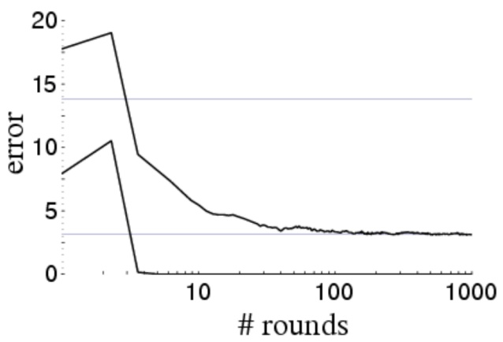

In practice, this also happens quite quickly. In fact, Schapire (1989) showed that in digit recognition, the testing error can still decrease even after the training error reaches $0 ^ { 1 }$ . Boosting is also robust to overfitting.

Some weak learners also have their own ensemble methods apart from AdaBoost. For example, an ensemble of decision tree is called a random forest. For each tree we select a subset of attributes (recommended subset size = square root of number of total attributes) and build the tree using only the selected attributes. An input sample is the classified using majority voting.

<small><span class="docvortex-page-footnote" data-block-type="page_footnote" style="color:#6b7280">0,</span></small>

<small><span class="docvortex-page-footnote" data-block-type="page_footnote" style="color:#6b7280">’</span></small>

<small><span class="docvortex-page-footnote" data-block-type="page_footnote" style="color:#6b7280">> ,</span></small>

<small><span class="docvortex-page-footnote" data-block-type="page_footnote" style="color:#6b7280">t.</span></small>

<small><span class="docvortex-page-footnote" data-block-type="page_footnote" style="color:#6b7280"><sup>1</sup>Note that the training error reported in this graph is the global training error where each input is weighed equally as usual. During the iterations of AdaBoost, however, we are concerned with the weighted errors  In this case, while the global training error is 0, the t s may still be 0 so there is room for improvement, and therefore the test error can still decrease.</span></small>

<!-- page: 50 -->

## Chapter 9

## Principal Component Analysis

## 9.1 Introduction

Suppose we are given data points in d-dimensional space and want to project them into a lower dimensional space while preserving as much information as possible (e.g., find best planar approximation to 3D data or 10<sup>4</sup>D data). In particular, choose an orthogonal projection that minimizes the squared error in reconstructing original data.

Like auto-encoding neural networks, PCA learns re-representation of input data that can best reconstruct it. However, PCA has some differences:

• The learned encoding is a linear function of inputs

• No local minimum problems when training

• Given d-dimensional data X, learns d-dimensional representation where:

– the dimensions are orthogonal

– The top k dimensions are the k-dimensional linear re-representation that minimizes reconstruction error (sum of squared errors)

In particular, PCA involves orthogonal projection of the data onto a lower-dimensional linear space that <u>equivalently</u>:

1. minimizes the mean squared distance between data points and projections

2. maximizes variance of projected data

PCA has the following properties:

• PCA vectors originate from the center of mass (usually we center the data as the first step)

• Principal component #1: points in the direction of the largest variance

• Each subsequent principal component:

– is orthogonal to the previous ones, and

– points in the directions of the largest variance of the residual subspace

<!-- page: 51 -->

## 9.2 PCA algorithms

Here we present 3 different algorithms for performing PCA.

Algorithm 18: (Sequential PCA) Given centered data $\{ x ^ { ( 1 ) } , x ^ { ( 2 ) } , \ldots , x ^ { ( m ) } \}$ compute the principal vectors:

$$
w _ {1} = \arg \max _ {\| w \| = 1} \frac {1}{m} \sum_ {i = 1} ^ {m} (w ^ {T} x ^ {(i)}) ^ {2}
$$

$$
w _ {2} = \arg \max _ {\| w \| = 1} \frac {1}{m} \sum_ {i = 1} ^ {m} (w ^ {T} (x ^ {(i)} - w _ {1} w _ {1} ^ {T} x ^ {(i)})) ^ {2}
$$

$$
w _ {k} = \arg \max _ {\| w \| = 1} \frac {1}{m} \sum_ {i = 1} ^ {m} (w ^ {T} (x ^ {(i)} - \sum_ {j = 1} ^ {k - 1} w _ {j} w _ {j} ^ {T} x ^ {(i)})) ^ {2}
$$

In the Sequential algorithm, to find $w _ { 1 }$ we maximize the variance of projection of $x .$ To find $w _ { 2 }$ , we maximize the variance of the projection in the residual subspace.

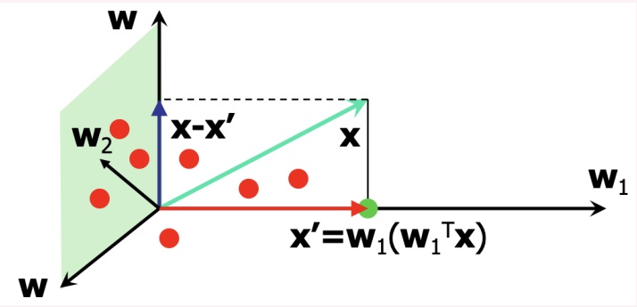

The Sequential algorithm is intuitive and gives a sense of what to look for in a principal vector. However, it is slow and not often used in practice unless we only care about the first principal vector.

<div class="docvortex-algorithm" style="white-space: pre-wrap; font-family:monospace;">
Algorithm 19: (Sample covariance matrix PCA)
Given data  $\{x^{(1)}, x^{(2)}, \ldots, x^{(m)}\}$ , compute covariance matrix

 $\Sigma = \frac{1}{m} \sum_{i=1}^{m} (x^{(i)} - \bar{x})(x^{(i)} - \bar{x})^T$ 
where  $\bar{x} = \frac{1}{m} \sum_{i=1}^{m} x^{(i)}$ . The principal vectors are the eigenvectors of  $\Sigma$ , and larger eigenvalues corresponds to more important eigenvectors.
</div>

While straightforward, the computation of Σ and its eigenvectors is computationally expensive. In practice, the most useful method is by singular value decomposition (SVD), which avoids explicitly computing Σ.

<!-- page: 52 -->

Algorithm 20: (SVD PCA)

Perform SVD of the centered data matrix $X = \left( x ^ { ( 1 ) } , \ldots , x ^ { ( m ) } \right)$ into

$$
X = U S V ^ {T}
$$

where U and V are orthonormal and S is a diagonal matrix. The columns of V are the eigenvectors and the diagonal values of S - which are square roots of the eigenvectors of $V \mathrm { ~ - ~ }$ denote the importance of each eigenvector in descending order. The top k principal vectors are the columns of $V ^ { T }$ are the leftmost k columns of V .

Formally, the SVD of a matrix A is just the decomposition of A into three other matrices, which we call $U ,   S$ , and V . The dimensions of these matrices are given as subscripts in the formula below:

$$
A _ {n \times m} = U _ {n \times n} S _ {n \times m} V _ {m \times m} ^ {T}.
$$

The columns of U are orthonormal eigenvectors of $A A ^ { T }$ . The columns of V are orthonormal eigenvectors of $A ^ { T } A$ . The matrix S is diagonal, with the square roots of the eigenvalues from U (or V ; the eigenvalues of $A ^ { T } A$ are the same as those of $| A A ^ { T } \rangle$ in descending order. These eigenvalues are called the singular values of A.

## 9.3 PCA applications

The main applications of PCA are:

• Data visualization - by reducing the number of dimensions to 2 or 3, we can plot the data points on a graph

• Noise reduction, e.g. eigenfaces

• Data compression

## 9.3.1 Eigenfaces

We want to identify specific person, based on facial image, robust to glasses, lighting, facial expression, $\mathrm { ~ \scriptsize ~ \cdots ~ } ( \mathrm { i . e . }$ , they are considered noise in this case). Each image is $2 5 6 \times 2 5 6$ pixels so each input x is 256<sup>2</sup> = 65536 dimensional.

Since the number of dimensions is too large, we cannot perform classification directly. Instead, we use PCA on the whole dataset to get “principal component” images (the eigenfaces), then classify based on projection weights onto these principal component images.

<!-- page: 53 -->

```txt
☐ Example data set: Images of faces
• Eigenface approach
[Turk & Pentland], [Sirovich & Kirby]
☐ Each face x is ...
• 256 × 256 values (luminance at location)
• x in R²⁵⁶ײ⁵⁶ (view as 64K dim vector)
☐ Form X = [x₁, ..., xₘ] centered data matrix
☐ Compute Σ = XXᵀ
☐ Problem: Σ is 64K × 64K ... HUGE!!!
(34 GB in memory)
```

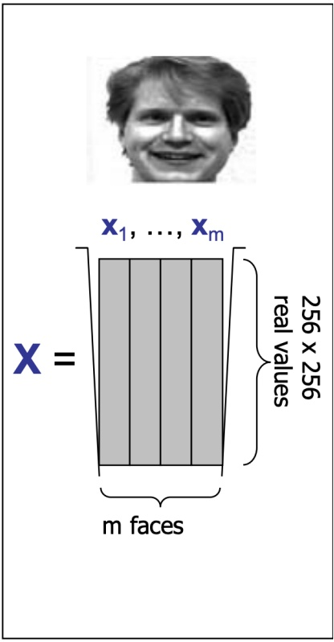

Suppose there are m instances each with dimension N (in this case $m = 5 0 , , N = 6 5 5 3 6 )$ . Given a $N \times N$ covariance matrix Σ, can compute:

• All N eigenvectors / eigenvalues in $O ( N ^ { 3 } )$

• First k eigenvectors / eigenvalues in $O ( k N ^ { 2 } )$

But this is expensive if $N = 6 5 5 3 6 .$ . However, there is a clever workaround, since we note that $m \ll 6 5 5 3 6$ . Specifically, we first compute the eigenvectors $v ^ { \prime } \mathrm { s }$ of $L   =   X ^ { T } X$ (which is much smaller, only $m \times m )$ , then for each v, Xv would be an eigenvector of $X ^ { T } X$

<div class="docvortex-algorithm" style="white-space: pre-wrap; font-family:monospace;">
Diving in the Math 14 - Proof of workaround for eigenfaces
We want to prove that if v is eigenvector of  $L = X^{T}X$  then Xv is eigenvector of  $\Sigma = XX^{T}$ . Based on the definition of eigenvector, there exists  $\gamma$  such that
$Lv = \gamma v$
$X^{T}Xv = \gamma v$
$X(X^{T}Xv) = X(\gamma v) = \gamma Xv$
$(XX^{T})Xv = \gamma(Xv)$
$\Sigma(Xv) = \gamma(Xv)$

Again, using the definition of eigenvector, we see that Xv is an eigenvector of  $\Sigma$, also with eigenvalue  $\gamma$.
</div>

In other words, we do not have to compute the eigenvalues of Σ directly from Σ, but through $L .$ This would reduce the runtime to $O ( N m ^ { 2 } ) + O ( k m ^ { 2 } )$ , where k is the specified number of eigenvectors (i.e., the number of dimensions we want to reduce to).

We can then reconstruct the faces using some of the top principal vector. As more eigenvectors are used, we get back more detailed faces but without noises such as lighting, glasses and facial expression. The below figures demonstrate we can reconstruct one particular face, starting from using only one principal vectors, then adding more and more. The circled face denotes the best approximation without noise.

<!-- page: 54 -->

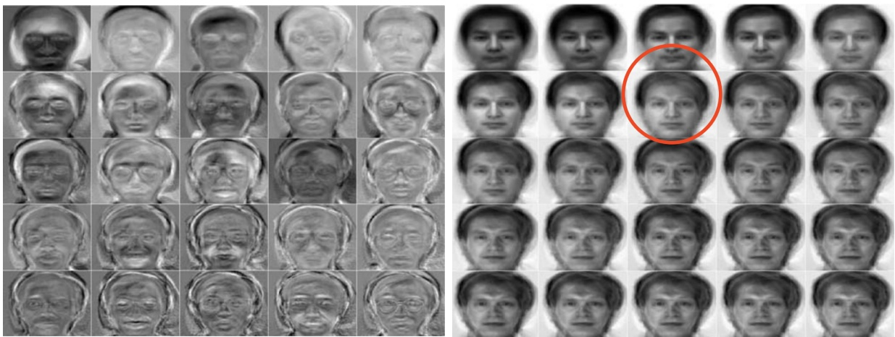

Note: this method is quite old. Nowadays we use deep neural network.

## 9.3.2 Image compression

To compress an image, we can divide it in patches (12 × 12 pixels on a grid), so each patch is a 144-D vector input. Using PCA on these inputs, reconstructing the patches, then putting them back together again will give us the compressed version. In some cases, using only 13 principal vectors can already reduce the relative error to 5% (i.e., most information is in the top principal vectors).

## 9.4 Shortcomings

PCA is unsupervised and doesn’t care about the labels. It maximizes the variance, independence of class. For example, in the plot below, if we want to reduce the dimension to 1 while preserving class separations, we would pick the green line. However, PCA would pick the magenta line instead.

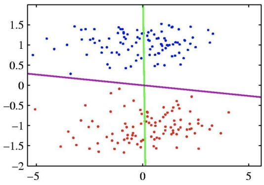

Furthermore, PCA can only capture linear relationships.

<!-- page: 55 -->

# Chapter 10

# Hidden Markov Model

## 10.1 Introduction

Definition 11: (Hidden Markov Model) A Hidden Markov Model consists of the followings:

• A set of states $\mathcal { S }   =   \{ s _ { 1 } , s _ { 2 } , \ldots , s _ { n } \}$ At each time t we are in exactly one of these states, denoted by $q _ { t }$

• A list $\pi _ { 1 } , \pi _ { 2 } , \ldots , \pi _ { n }$ where $\pi _ { i }$ is the probability that we start at state $i .$

A transition probability matrix $\mathcal { A } _ { j , i } \; = \; P ( q _ { t } \; = \; s _ { i } \; \mid \; q _ { t - 1 } \; = \; s _ { j } )$ which denotes the probability of transitioning from $s _ { j }$ to $\mathcal { S } _ { i } .$

• A set of possible outputs $\Sigma ,$ at each time t we emit a symbol $\sigma _ { t } \in \Sigma$ .

An emission probability matrix $\mathcal { B } _ { t , i } \: = \: P ( o _ { t } \: \mid \: s _ { i } )$ which denotes the probability of emitting symbol $\sigma _ { t }$ at state $\mathcal { S } _ { i } .$

For example, a two-state HMM may look like the followings:

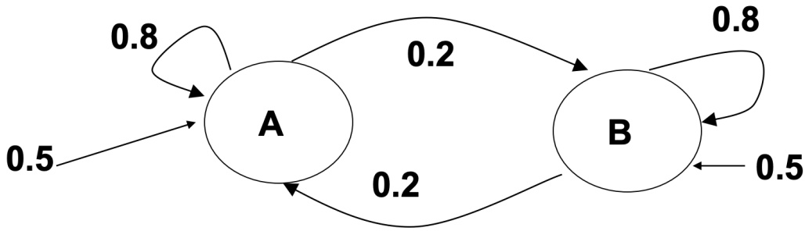

Figure 10.1: An example Hidden Markov Model with 2 states.

Note the Markov property from the above definition: given $q _ { t } , q _ { t + 1 }$ is conditionally independent on $q _ { t - 1 }$ or any earlier time point. In other words, knowing $q _ { t }$ is sufficient to infer about the state of $q _ { t + 1 }$

With n states and m output symbols, we can see that there are n starting parameters $\pi _ { i } , \; n ^ { 2 }$ transition probabilities $\mathcal { A } _ { j i } ,$ , and mn emission probabilities $\mathcal { B } _ { i k }$ , for a total of $n ^ { 2 } + m n + n =$ $O ( n ^ { 2 } + m n )$ parameters. We will discuss how to learn these parameters from data later on, but let’s first focus on the inference task. Assuming all of these parameters are already known, what kind of information can we infer?

<!-- page: 56 -->

## 10.2 Inference in HMM

There are three big questions that a learned HMM can answer:

1. What is $P ( q _ { t } = s _ { i } ) ?$ In other words, what is the probability that we end up in state $s _ { i }$ at time t, without observing any output?

2. What is $P ( q _ { t } \: = \: s _ { i } \: \mid \: o _ { 1 } o _ { 2 } \ldots o _ { t } ) ?$ In other words, given a sequence of output symbols $o _ { 1 } o _ { 2 } \ldots o _ { t } ,$ what is the probability that we end up in state $s _ { i }$ at time $t ?$

3. What is arg max $P ( q _ { 1 } q _ { 2 } \ldots q _ { t } \left| \begin{array} { c } { o _ { 1 } o _ { 2 } \ldots o _ { t } } \\ \end{array} \right) ?$ In other words, given a sequence of output q<sub>1</sub>q<sub>2</sub>...q<sub>t</sub> symbols $O _ { 1 } O _ { 2 } \cdot \cdot \cdot O _ { t }$ , what is the sequence of states $q _ { 1 } q _ { 2 } \cdots q _ { t }$ that is most likely to generate this output?

Before moving on, we show an example application of these questions. A popular technique of modeling student knowledge in Educational Data Mining is called Bayesian Knowledge Tracing. The high-level goal is: given data about the correctness of a student’s answers on a set of problems related to a certain skill, can we say whether the student has mastered this skill?

<!-- page: 57 -->

## Definition 12: (Bayesian Knowledge Tracing)

For each skill, BKT models student knowledge as a binary latent variable in an HMM which consists of the followings:

• Two states: $\mathcal { S } = \{ \mathtt { M a s t e r e d } , \mathtt { U n m a s t e r e d } \}$

$\pi _ { \mathrm { M a s t e r e d } } \colon$ the probability of the student starting at Mastered, i.e., knowing the skill beforehand.

$p _ { \mathrm { L e a r n } } .$ the probability of transitioning from Unmastered to Mastered. $p _ { \mathrm { F o r g e t } } .$ the probability of transitioning from Mastered to Unmastered.

Two possible outputs C (correct) and I (incorrect): whether student’s answer to a problem is correct or incorrect.

$p _ { \mathrm { G u e s s } }   =   p ( o _ { t }   =   \mathtt { C }   \left|   q _ { t }   =   \mathtt { U n m a s t e r e d } ) \right.$ the probability of getting a correct answer despite not mastering the skill, i.e., guessing.

• p ${ \tt _ { S l i p } }   =   p ( o _ { t }   =   { \tt I }   \mid   q _ { t }   =   { \tt M a s t e r e d } )$ the probability of getting an incorrect answer despite mastering the skill, i.e., slipping.

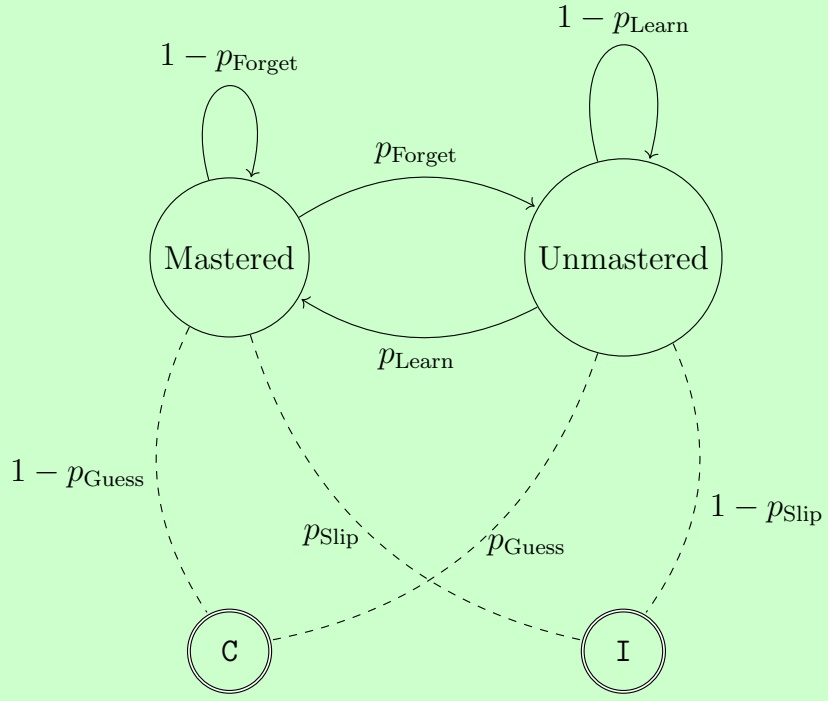

Using Inference $\# 2 .$ , we can ask questions like: if the student submits 5 answers and gets the first 3 correct but last 2 incorrect, what is the probability that she has mastered the skill? More formally, what is P(Mastered | CCCII)? Is this different from, for example, P(Mastered | IICCC) (getting first 2 incorrect but last 3 correct)?

## 10.2.1 What is $P ( q _ { t } = s _ { i } ) ?$

Since we don’t have observed data, the emission probabilities can be ignored. Instead, we simply rely on the priors and transition probabilities. For example, in Figure 10.1 we can compute $P ( q _ { 2 } = A )$ as

$$
\begin{array}{c} P (q _ {2} = A) = P (q _ {2} = A \mid q _ {1} = A) \cdot p (q _ {1} = A) + p (q _ {2} = A \mid q _ {1} = B) \cdot p (q _ {1} = B) \\ = \mathcal {A} _ {A A} \cdot \pi_ {A} + \mathcal {A} _ {B A} \cdot \pi_ {B}, \end{array}
$$

<!-- page: 58 -->

and then $P ( q _ { 3 } = B )$ as

$$
\begin{array}{c} P (q _ {3} = B) = P (q _ {3} = B \mid q _ {2} = A) \cdot p (q _ {2} = A) + P (q _ {3} = B \mid q _ {2} = B) \cdot p (q _ {2} = B) \\ = \mathcal {A} _ {A B} \cdot (\mathcal {A} _ {A A} \cdot \pi_ {A} + \mathcal {A} _ {B A} \cdot \pi_ {B}) + \mathcal {A} _ {B B} \cdot (\mathcal {A} _ {A B} \cdot \pi_ {A} + \mathcal {A} _ {B B} \cdot \pi_ {B}). \end{array}
$$

In general,

$$
P (q _ {t} = s _ {i}) = \sum_ {q _ {1}, q _ {2}, \dots , q _ {t - 1} \in \mathcal {S}} P (s _ {i} \mid q _ {1} q _ {2} \dots q _ {t - 1}) P (q _ {1} q _ {2} \dots q _ {t - 1}).\tag{10.1}
$$

However, this is too costly to compute, with runtime $O ( 2 ^ { n - 1 } )$ . Instead, an optimization trick is to use dynamic programming:

We perform two steps:

Base case: $P ( q _ { 1 } = s _ { i } ) = \pi _ { i }$

• Inductive case:

$$
P (q _ {t + 1} = s _ {i}) = \sum_ {j \in \mathcal {S}} P (q _ {t + 1} = s _ {i} \mid q _ {t} = s _ {j}) \cdot P (q _ {t} = s _ {j}) = \sum_ {j \in \mathcal {S}} \mathcal {A} _ {j i} \cdot P (q _ {t} = s _ {j}).\tag{10.2}
$$

## 10.2.2 What is $P ( q _ { t } = s _ { i } \mid o _ { 1 } o _ { 2 } \ldots o _ { t } )   { \bf ? }$

Using the chain rule, we first see that

$$
P (q _ {t} = s _ {i} \mid o _ {1} o _ {2} \dots o _ {t}) = \frac {P (q _ {t} = s _ {i} \land o _ {1} o _ {2} \dots o _ {t})}{P (o _ {1} o _ {2} \dots o _ {t})} = \frac {P (q _ {t} = s _ {i} \land o _ {1} o _ {2} \dots o _ {t})}{\sum_ {j \in \mathcal {S}} P (q _ {t} = s _ {j} \land o _ {1} o _ {2} \dots o _ {t})}\tag{10.3}
$$

This motivates us to define $\alpha _ { t } ( i ) = P ( q _ { t } = s _ { i } { \wedge } o _ { 1 } o _ { 2 } \ldots o _ { t } )$ . We can then compute $\alpha _ { t } ( i )$ as follows.

Algorithm 22: (Computing final state given observed output sequence) To compute $\alpha _ { t } ( i )$ , we perform two steps:

Base case: $\alpha _ { 1 } ( i ) = P ( q _ { 1 } = s _ { i } \wedge o _ { 1 } ) = P ( o _ { 1 } \mid q _ { 1 } = s _ { 1 } ) P ( q _ { 1 } = s _ { 1 } ) = \mathcal { B } _ { 1 , i } \cdot \pi _ { i } .$

• Inductive case:

$$
\alpha_ {t + 1} (i) = \sum_ {j \in \mathcal {S}} \alpha_ {t} (j) \cdot \mathcal {A} _ {j, i} \cdot \mathcal {B} _ {t + 1, i}.\tag{10.4}
$$

It follows that

$$
P (q _ {t} = s _ {i} \mid o _ {1} o _ {2} \dots o _ {t}) = \frac {\alpha_ {t} (i)}{\sum_ {j \in \mathcal {S}} \alpha_ {t} (j)}\tag{10.5}
$$

## 10.2.3 What is arg max $P ( q _ { 1 } q _ { 2 } \ldots q _ { t } \mid o _ { 1 } o _ { 2 } \ldots o _ { t } )   { \mathbf { ? } }$ q<sub>1</sub>q<sub>2</sub>...q<sub>t</sub>

Let

$$
\delta_ {t} (i) = \max _ {q _ {1}, \dots , q _ {t - 1} \in \mathcal {S}} P (q _ {1} \dots q _ {t - 1} \land q _ {t} = s _ {i} \land o _ {1} \dots o _ {t}).\tag{10.6}
$$

In other words, $\delta _ { t } ( i )$ is the probability of the most likely path from time 1 to t that produces output $o _ { 1 } \ldots o _ { t }$ and ends in $s _ { i }$ . We can then compute $\delta _ { t } ( i )$ as follows.

<!-- page: 59 -->

## Algorithm 23: (Viterbi Algorithm)

We perform two steps:

• Base case: $\delta _ { 1 } ( i ) = \pi _ { i } \cdot \mathcal { B } _ { 1 , i } .$

• Inductive case:

$$
\delta_ {t + 1} (i) = \max _ {j} \delta_ {t} (i) \cdot \mathcal {A} _ {j, i} \cdot \mathcal {B} _ {t + 1, i}.\tag{10.7}
$$

It follows that arg max $P ( q _ { 1 } q _ { 2 } \ldots q _ { t } \mid o _ { 1 } o _ { 2 } \ldots o _ { t } )$ is the path defined by arg max $\delta _ { t } ( j )$ q<sub>1</sub>q<sub>2</sub>...q<sub>t</sub> j

<!-- page: 60 -->

## Chapter 11

## Reinforcement Learning

## 11.1 Markov decision process

A Markov decision process is a set of nodes and edges where nodes represent states and edges represent transition. In this case, the transitions are only based on the previous state (same as in HMM). Unlike HMM, however:

• We know all the states, each state associated with a reward.

• We can have an influence on the transition.

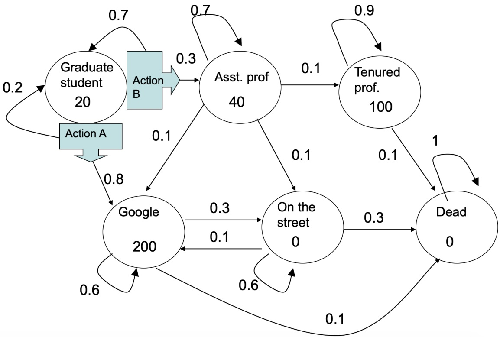

An obvious question for such models: what is the combined expected value for each state? What can we expect to earn over our lifetime if we become asst. prof $/ \mathrm { g o }$ to industry? Before we answer this quesiton, we need to define a model for future rewards. In particular, the value of a current award is higher than the value of future awards (inflation, confidence). This discounted reward model is specified using a parameter $0 < \gamma < 1$ . Therefore, if we let $r _ { t }$ be the reward at time $t ,$ then the total reward is

$$
\mathrm{Total} = \sum_ {t = 0} ^ {\infty} \gamma^ {t} r _ {t},\tag{11.1}
$$

<!-- page: 61 -->

which does converge because $\gamma \in ( 0 , 1 )$

Now, let’s define $J ^ { * } ( s _ { i } )$ as the expected discounted sum of rewards when starting at state ${ \mathcal { S } } _ { i } .$ It follows that

$$
J ^ {*} (s _ {i}) = r _ {i} + \gamma \sum_ {k = 1} ^ {n} p _ {i k} J ^ {*} (s _ {k}),\tag{11.2}
$$

where $p _ { i k }$ is the transition probability from $s _ { i }$ to $s _ { k }$ and the sum represents the expected pay for all possible transitions from $s _ { i }$

We have n equations like (11.2), one for each $s _ { i } ,$ so this is a linear system of equations and a closed form solution can be derived, but may be time consuming. It also doesn’t generalize to non-linear models. Alternatively, this problem can be solved in an iterative manner: define $J ^ { t } ( s _ { i } )$ as the expected discounted reward after t steps, then $J ^ { 1 } ( s _ { i } ) = r _ { i }$ and

$$
J ^ {t + 1} (s _ {i}) = r _ {i} + \gamma \sum_ {k} p _ {i k} J ^ {t} (s _ {k}).\tag{11.3}
$$

This can be computed via dynamic programming, and we can stop when max $| J ^ { t + 1 } ( s _ { i } )   -   J ^ { t } ( s _ { i } ) | <$  for some threshold $\epsilon ,$ which we know will happen because $J ^ { t } ( s _ { i } )$ converges.

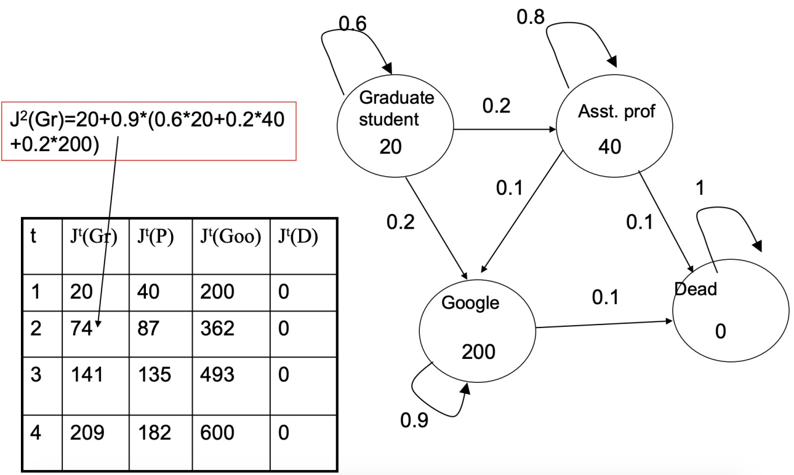

## 11.2 Reinforcement learning - No action

In reinforcement learning, we use the same Markov model with rewards and actions. But there are a few differences:

1. We do not assume we know the Markov model

<!-- page: 62 -->

2. We adapt to new observation (online vs offline)

In other words, we want to learn the expected reward but do not know the model, and in this case we do so by learning both the reward and model at the same time (e.g., game playing, robot interacting with environment). Unlike HMM, if we move to a state, we know which state that is $\left( \mathrm { i . e . } , \right.$ the states are observed); other than that, however, we don’t know the reward at that state or the transition probabilities.

## 11.2.1 Supervised RL

More formally, we define the scenario in reinforcement learning as follows: we are wandering the world, and at each time point we see a state and a reward. Our goal is to compute the sum of discounted rewards for each state $J ^ { \mathrm { e s t } } ( s _ { i } )$ . For example, given the following observations

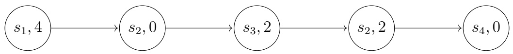

Discounted rewards: $\gamma { = } 0 . 9$

Lets compute the discounted rewards for each time point:

$$
t 1: 4 + 0. 9 ^ {*} 0 + 0. 9 ^ {2 *} 2 + 0. 9 ^ {3 *} 2 = 7. 1
$$

$$
t 2: 0 + 0. 9 ^ {*} 2 + 0. 9 ^ {2 *} 2
$$

$$
\mathrm{t3:} 2 + 0. 9 ^ {*} 2
$$

t4: 2 + 0

$$
= 2
$$

t5: 0

| State | Observations | Mean |
| --- | --- | --- |
| $S_1$ | 7.1 | 7.1 |
| $S_2$ | 3.4, 2 | 2.7 |
| $S_3$ | 3.8 | 3.8 |
| $S_4$ | 0 | 0 |

In general, we have the supervised learning algorithm for RL as follows.

Algorithm 24: (Supervised reinforcement learning)

Observe set of states and rewards $( s ( 0 ) , r ( 0 ) ) , ( s ( 1 ) , r ( 1 ) ) , \ldots , ( s ( T ) , r ( T ) )$

For $t = 0 , \ldots , T$ compute discounted sum

$$
J (t) = \sum_ {i = t} ^ {T} \gamma^ {i - t} r (i).
$$

Compute $J ^ { \mathrm { e s t } } ( s _ { i } )$ (mean of $J ( t )$ for t such that $s ( t ) = s _ { i } )$ :

$$
J ^ {\mathrm{est}} (s _ {i}) = \frac {\sum_ {t = 0} ^ {T} J (t) \mathbb {I} \left(s (t) = s _ {i}\right)}{\sum_ {t = 0} ^ {T} \mathbb {I} \left(s (t) = s _ {i}\right)}.
$$

Here we assume that we observe each state frequently enough and that we have many observations so that the final observations do not have a big impact on our prediction. Each update takes $O ( n )$ where $n$ is the number of states, since we are updating vectors containing entries for all states. Space is also $O ( n )$ . Convergence to $J ^ { * }$ can be proven, and the algorithm can be more efficient by ignoring states for which discounted factor $\gamma ^ { i }$ is very low already. Ho +1 ised learnin ach has t

However, the supervised learning approach has two problems:

<!-- page: 63 -->

• Takes a long time to converge, because we don’t try to learn the underlying MDP model, but just focus on $J ^ { \mathrm { e s t } }$

• Does not use all available data, we can learn transition probabilities as well.

In other words, we want to utilize the fact that there is an underlying model and the transitions are not completely random.

## 11.2.2 Certainty-Equivalence learning

<div class="docvortex-algorithm" style="white-space: pre-wrap; font-family:monospace;">
Algorithm 25: (Certainty-Equivalence (CE) learning)
We keep track of 3 vectors:
• Count(s): number of times we visited state s
• J(s): sum of rewards from state s
• Trans(i, j): number of time we transitioned from $s_i$ to $s_j$
When we visit state $s_i$, receive reward $r$ and move to state $s_j$ we do the following:
• Counts($s_i$) = Counts($s_i$) + 1
• J($s_i$) = J($s_i$) + r
• Trans(i, j) = Trans(i, j) + 1
At any time, we can estimate:
• Reward estimate $r^{est}(s) = J(s)/Counts(s)$
• Transition probability estimate
• $p^{est}(j \mid i) = Trans(i, j)/Counts(s_i)$
After learning the model, we can now have an estimate which we can solve for all states $s_i$:
$J^{\text{est}}(s_i) = r^{est}(s_i) + \gamma \sum_{j} p^{est}(s_j \mid s_i) J^{\text{est}}(s_i), \quad i = 1, \dots, n \tag{11.4}$
</div>

<!-- page: 64 -->

## Example: CE learning

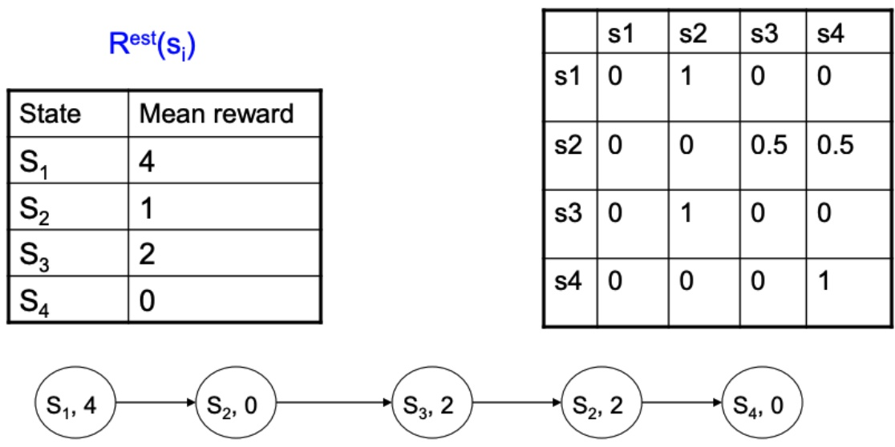

The runtime of CE comes from two steps: update $( O ( 1 ) )$ and solving MDP $( O ( n ^ { 3 } )$ using matrix inversion). The space is $O ( n ^ { 2 } )$ for transition probabilities.

To reduce runtime, we could use the “One backup” version, which updates $J ^ { \mathrm { e s t } } ( s _ { i } )$ for the current state $s _ { i }$ while learning the model, instead of solving n equations after learning like in (11.4). In this case, the runtime is only $O ( n )$ , and we can sill prove convergence to $J ^ { * }$ (but slower than CE). The space remains at $O ( n ^ { 2 } )$

## 11.2.3 Temporal difference learning

We now look at another algorithm with the same efficiency as one backup CE but requires much less space. In particular, we can ignore all the $r ^ { e s t }$ and $p ^ { e s t }$ and only focus on $J ^ { \mathrm { e s t } }$ with a new approximation rule.

<div class="docvortex-algorithm" style="white-space: pre-wrap; font-family:monospace;">
Algorithm 26: (Temporal difference (TD) learning)
We only maintain the $J^{\text{est}}$ array. Assume we have $J^{\text{est}}(s_1), \ldots, J^{\text{est}}(s_n)$. If we observe a transition from state $s_i$ to state $s_j$ and a reward $r$, we update using the following rule
$J^{\text{est}}(s_i) = (1 - \alpha) J^{\text{est}}(s_i) + \alpha (r + \gamma J^{\text{est}}(s_j))$, (11.5)
where $\alpha$ is a hyper-parameter to determine how much weight we place on the current observation (and can change during the algorithm, unlike $\gamma$).
</div>

As always, choosing a good $\alpha$ is an issue. Nevertheless, it can be proven that TD learning is guaranteed to converge if:

• All states are visited often.

$\textstyle \sum _ { t } \alpha _ { t } = \infty$

$\textstyle \sum _ { t } \alpha _ { t } ^ { 2 } < \infty$

<!-- page: 65 -->

For example, $\begin{array} { r } { \alpha _ { t } = \frac { C } { t } } \end{array}$ for some constant t would satisfy both requirements.

Now the runtime of TD is $O ( 1 )$ because there is only one update (11.5) at each iteration, and the space is $O ( n )$ because of the $J ^ { \mathrm { e s t } }$ array.

Here is a summary so far of the four reinforcement learning algorithms.

| Method | Time | Space |
| --- | --- | --- |
| Supervised learning | O(n) | O(n) |
| CE learning | O(n<sup>3</sup>) | O(n<sup>2</sup>) |
| One backup CE | O(n) | O(n<sup>2</sup>) |
| TD learning | O(1) | O(n) |

## 11.3 Reinforcement learning with action - Policy learning

So far we assumed that we cannot impact the outcome transition. In real world situations we often have a choice of actions we take (as we discussed for MDPs). How can we learn the best policy for such cases?

## Policy learning using CE : Example

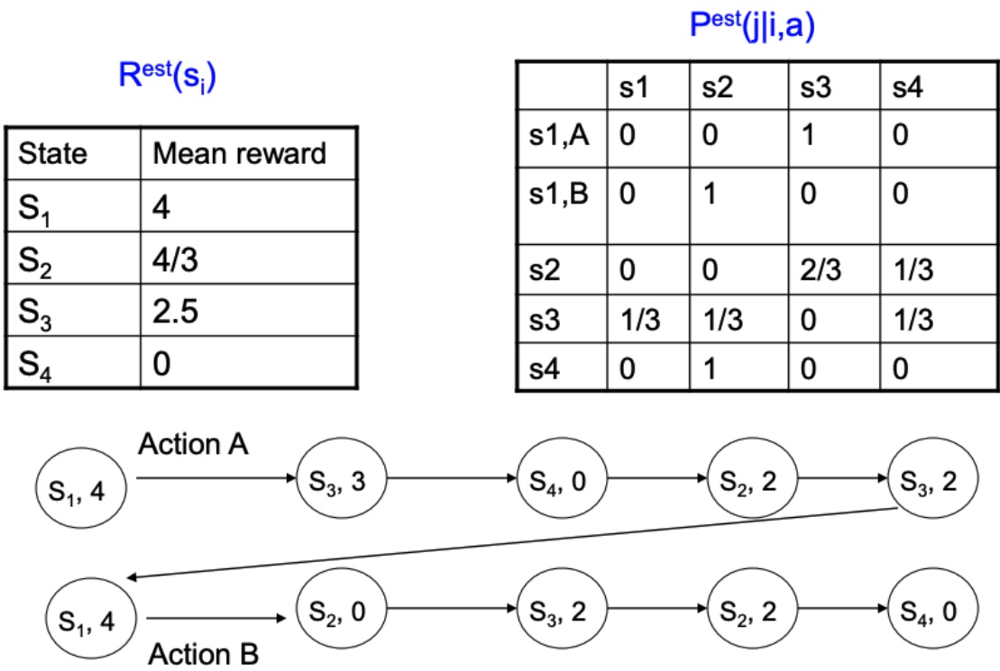

Note the difference in the $p ^ { e s t }$ table - while the columns are still the states (because we only transition from state to state), the rows are now (state, action) pair, because each action leads to a different transition. Our goal is to learn the action that leads to the most reward. In particular, we can update CE by setting

$$
J ^ {\mathrm{est}} (s _ {i}) = r ^ {e s t} (s _ {i}) + \max _ {a} \left(\gamma \sum_ {j} p ^ {e s t} (s _ {j} \mid s _ {i}, a) J ^ {\mathrm{est}} (s _ {j})\right).\tag{11.6}
$$

As mentioned above, we can also use TD learning for better efficiency. However, TD is model free, so in this context, we can adjust TD to learn policies by defining $Q ^ { * } ( s _ { i } , a ) = \mathrm { e x p e c t e d ~ s u m }$

<!-- page: 66 -->

of future (discounted) rewards if we start at state $s _ { i }$ and take action $a .$ Then, when we take a specific action a in state $s _ { i }$ and then transition to state $s _ { j }$ we can update

$$
Q ^ {e s t} (s _ {i}, a) = (1 - \alpha) Q ^ {e s t} (s _ {i}, a) + \alpha (r _ {i} + \gamma \max _ {a ^ {\prime}} Q ^ {e s t} (s _ {j}, a ^ {\prime})).\tag{11.7}
$$

Instead of the $J ^ { \mathrm { e s t } }$ vector we maintain the $Q ^ { e s t }$ matrix, which is a rather sparse n by m matrix (n states and m actions).

In practice, when choosing the next action, we may not necessarily pick the one that results in the highest expected sum of future rewards, because we are only sampling from the distribution of possible outcomes. We do not want to avoid potentially beneficial actions. Instead, we can take a more probabilistic approach

$$
p (a) = \frac {1}{Z} \exp \left(- \frac {Q ^ {e s t} (s _ {i} , a)}{f (t)}\right),\tag{11.8}
$$

where $Z$ is a normalizing constant and $f ( t )$ decreases as time t goes by, to represent that we are more confident in the learned model. We can initialize $\mathrm { Q }$ values to be high to increase the likelihood that we will explore more options. Finally, it can be shown that $\mathrm { Q }$ learning converges to optimal policy.

<!-- page: 67 -->

# Chapter 12

# Generalization and Model Selection

## 12.1 True risk vs Empirical risk

## Definition 13: (True risk)

True risk is the target performance measure. It is defined as is the probability of misclassification $P(f(X) \neq Y)$ in classification and mean squared error $E[(f(X) - Y)^2]$ in regression. More generally, it is the expected performance on a random test point (X, Y ).

While we want to minimize true risk, we do not know that the underlying distribution of X and Y is. What we do know are the samples $( X _ { i } , Y _ { i } )$ , which give us the empirical risk.

## Definition 14: (Empirical risk)

Empirical risk is the performance on training data. It is defined as proportion of misclassified examples $\textstyle \frac { 1 } { n } \sum _ { i = 1 } ^ { n } \mathbb { I } \left( \bar { f } ( X _ { i } ) \neq Y _ { i } \right)$ in classification and average squared error $\textstyle { \frac { 1 } { n } } \sum _ { i = 1 } ^ { n } ( f ( X _ { i } ) -$ $Y _ { i } ) ^ { 2 }$ in regression.

So we want to minimize the empirical risk and evaluate the true risk, but this may lead to overfitting (i.e., small training error but large generalization error). For instance, the following graph shows two classifiers for a binary classification problem (football player or not). While the classifier on the right has zero training error, we are much less inclined to believe that it captures the true distribution. Here it is more likely that football players simply have higher height and weight, which match better with the classifier on the left.

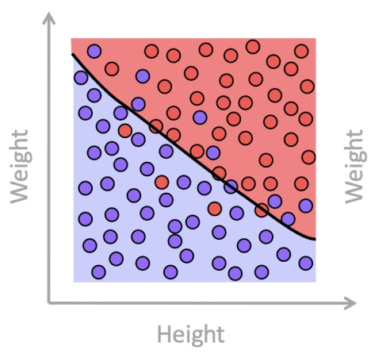

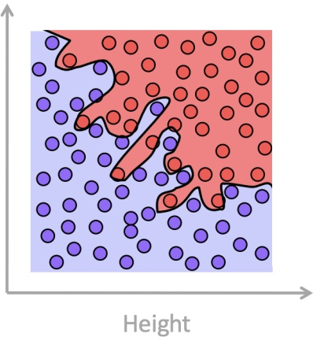

The question is: when should we not minimize the empirical risk completely? The following graph shows what the empirical risk and true risk may look like as we increase the model complexity. Initially both types of risk would decrease, but after some point (the Best Model

<!-- page: 68 -->

point), we started fitting the noise instead of the true data. In that case, the empirical risk can keep decreasing while the true risk increases.

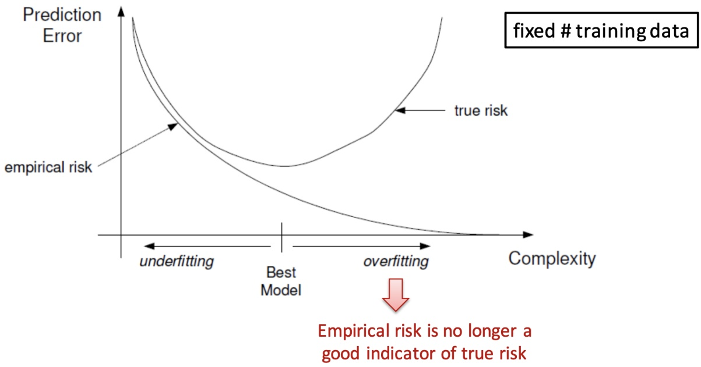

Again, we do not know how true risk in practice, which makes this a difficult problem. Can we estimate the true risk in a way better than just using the empirical risk? One way is to use structural risk minimization.

## Definition 15: (Structural risk minimization)

Penalize models using bound on deviation of true and empirical risk

$$
\hat {f} _ {n} = \underset {f \in \mathcal {F}} {\arg \min} \{\hat {R} _ {n} (f) + \lambda C (f) \},\tag{12.1}
$$

where $\lambda$ is a tuning parameter chosen by model selection, and $C ( f )$ is the bound on deviation from true risk a. In essence, instead of minimizing the unknown true risk directly, we try to minimize an upper bound (with high probability) on the true risk.

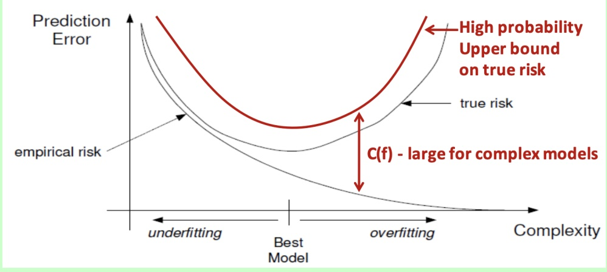

<sup>a</sup>We will discuss how to derive these later.

In other words, we penalize models based on prior information (bias) or information criteria (MDL, AIC, BIC). In ML there is a “no free lunch” theorem: given only the data, we cannot learn anything. We need some kind of prior information (inductive bias); for example, in using linear regression, our inductive bias is that the data can be fit by a line. The inductive bias in this case, also called Occam’s Razor, is to seek the simplest explanation (e.g., if a 10-degree

<!-- page: 69 -->

polynomial and 100-degree polynomial say roughly the same things, pick the former).

Inductive bias can also come from domain knowledge. For example, the function of oil spill contamination should be smooth (if one point is contaminated, the points around it should be as well), while the function of photon arrival is not. Therefore, even if we get the same data, the fit functions may look very different.

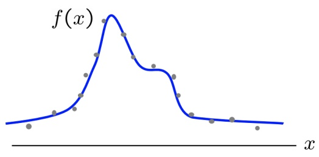

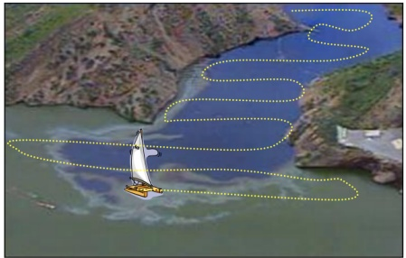

Oil Spill Contamination

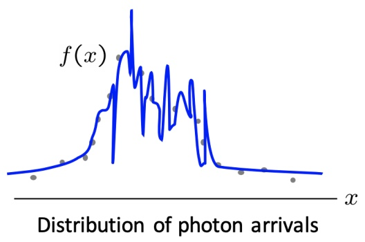


Compton Gamma-Ray Observatory Burst and Transient Source Experiment (BATSE)

An example of penalizing complex models using prior knowledge is regularized linear regression, which uses some norm of regression coefficients as the cost $C ( f )$ . An example of penalizing models based on information content is AIC $( C ( f )   =   \#$ parameters) or BIC $(C(f)   =$ $\#$ parameters × log n). AIC allows $\#$ parameters to be infinite as $\#$ of training data n becomes large, while BIC penalizes complex models more heavily.

## 12.2 Model Selection
