<!-- page: 1 -->

# An Introduction to Flow Matching and Diffusion Models

Peter Holderrieth and Ezra Erives

Website: [https://diffusion.csail.mit.edu/](https://diffusion.csail.mit.edu/)

- 1 Introduction 3
- 1.1 Overview 3
- 1.2 Course Structure 4
- 1.3 Generative Modeling As Sampling 4
- 2 Flow and Diffusion Models 7
- 2.1 Flow Models 7
- 2.2 Diffusion Models 10
- 3 Flow Matching 14
- 3.1 Conditional and Marginal Probability Path 14
- 3.2 Conditional and Marginal Vector Fields 16
- 3.3 Learning the Marginal Vector Field 19
- 4 Score Functions and Score Matching 25
- 4.1 Conditional and Marginal Score Functions 25
- 4.2 Sampling with SDEs 27
- 4.3 Score Matching 31
- 5 Guidance: How To Condition on a Prompt 34
- 5.1 Vanilla Guidance 34
- 5.2 Classifer-Free Guidance 35
- 6 Building Large-Scale Image or Video Generators 41
- 6.1 Neural Network Architectures 41
- 6.2 Working in Latent Space: (Variational) Autoencoders 46
- 6.3 Case Study: Stable Diffusion 3 and Meta Movie Gen 52
- 7 Discrete Diffusion Models: Building Language Models with Diffusion 54
- 7.1 Continuous-Time Markov chain (CTMC) models 54
- 7.2 Training CTMC models 59
- 8 References 66
- A A Reminder on Probability Theory 70
- A.1 Random vectors 70
- A.2 Conditional densities and expectations 70
- B A Proof of the Fokker-Planck equation 72

<!-- page: 2 -->

- C Existence and Uniqueness of Continuous-time Markov chains 74
- D Additional Perspectives on VAEs 77
- E A Guide to the Diffusion Model Literature 81

<!-- page: 3 -->

## 1 Introduction

Creating noise from data is easy; creating data from noise is generative modeling.

Song et al. [43]

## 1.1 Overview

In recent years, we all have witnessed a tremendous revolution in artificial intelligence (AI). Image generators like Nano Banana or Stable Diffusion 3 can generate photorealistic and artistic images across a diverse range of styles, video models like Meta’s VEO-3 can generate highly realistic movie clips, and large language models like ChatGPT can generate seemingly human-level responses to text prompts. At the heart of this revolution lies a new ability of AI systems: the ability to generate objects. While previous generations of AI systems were mainly used for prediction, these new AI system are creative: they dream or come up with new objects based on user-specified input. Such generative AI systems are at the core of this recent AI revolution.

The goal of this class is to teach you two of the most widely used generative AI algorithms: denoising diffusion models [45] and flow matching [25, 27, 1, 26]. These models are the backbone of the best image, audio, and video generation models (e.g., Nano Banana, FLUX, or VEO-3 ), and have most recently became the state-of-the-art in scientific applications such as protein structures (e.g., AlphaFold3 is a diffusion model). Without a doubt, understanding these models is truly an extremely useful skill to have.

All of these generative models generate objects by iteratively converting noise into data. This evolution from noise to data is facilitated by the simulation of ordinary or stochastic differential equations (ODEs/SDEs). Flow matching and denoising diffusion models are a family of techniques that allow us to construct, train, and simulate such ODEs/SDEs at large scale with deep neural networks. While these models are rather simple to implement, the technical nature of SDEs can make these models difficult to understand. In this course, we provide a self-contained introduction to the necessary mathematical toolbox regarding differential equations to enable you to systematically understand these models. We then explain step-by-step the modern stack of state-of-the-art image and video generators. Beyond being widely applicable, we believe that the theory behind flow and diffusion models is elegant in its own right. Therefore, most importantly, we hope that this course will be a lot of fun to you.

Remark 1 (Additional Resources)

While these lecture notes are self-contained, there are two additional resources that we encourage you to use:

1. Lecture recordings: These guide you through each section in a lecture format.

2. Labs: These guide you in implementing your own diffusion model from scratch. We highly recommend that you “get your hands dirty” and code.

You can find these on our course website: https:/ /diffusion.csail.mit.edu

<!-- page: 4 -->

## 1.2 Course Structure

We give a brief overview over of this document.

• Section 1, Generative Modeling as Sampling: We formalize what it means to “generate” an image, video, protein, etc. We will translate the problem of e.g., “how to generate an image of a dog?” into the more precise problem of sampling from a probability distribution.

• Section 2, Flow and Diffusion Models: We explain the machinery of generation. As you can guess by the name of this class, this machinery consists of simulating ordinary and stochastic differential equations. We provide an introduction to differential equations and explain how to use them to construct generative models.

• Section 3, Flow Matching: Next, we explain and derive flow matching, a simple and scalable algorithm lying at the core of all afore-mentioned large-scale generative models such as Stable Diffusion, Nano Banana, or SORA.

• Section 4, Score Matching: We study score functions and how they can be learnt via score matching. Not only is this the training algorithm for diffusion models, but it unlocks SDE sampling and guidance.

• Section 5, Guidance: We learn how to condition our samples on a prompt (e.g. “an image of a cat”) and how we can enforce adherence to such a prompt via classifier-free guidance.

• Section 6, Latent Spaces, Neural Network architectures: We discuss how one builds large-scale image and video generators such as Nano Banana. This includes common neural network architectures and how to build things in latent space. We also survey state-of-the-art models.

• Section 7 (Optional), Discrete Diffusion Models: We learn how to translate the principles of diffusion models from Euclidean space to discrete data such as language. This enables the construction of large language models using the principles of diffusion models.

Required background. Due to the technical nature of this subject, we recommend some base level of mathematical maturity, and in particular some familiarity with probability theory. For this reason, we included a brief reminder section on probability theory in Section A. Don’t worry if some of the concepts there are unfamiliar to you.

## 1.3 Generative Modeling As Sampling

Let’s begin by thinking about various data types, or data modalities, that we might encounter, and how we will go about representing them numerically:

1. Image: Consider images with H × W pixels where H describes the height and W the width of the image, each with three color channels (RGB). For every pixel and every color channel, we are given an intensity value in R. Therefore, an image can be represented by an element $z \in \mathbb { R } ^ { H \times W \times 3 }$

2. Video: A video is simply a series of images in time. If we have T time points or frames, a video would therefore be represented by an element $z \in \mathbb { R } ^ { T \times H \times W \times 3 }$

<!-- page: 5 -->

3. Molecular structure: A naive way would be to represent the structure of a molecule by a matrix $z = ( z ^ { 1 } , \ldots , z ^ { N } ) \in \mathbb { R } ^ { 3 \times N }$ where N is the number of atoms in the molecule and each $z ^ { i } \in \mathbb { R } ^ { 3 }$ describes the location of that atom. Of course, there are other, more sophisticated ways of representing such a molecule.

In all of the above examples, the object that we want to generate can be mathematically represented as a vector (potentially after flattening). Therefore, throughout this document, we will have:

Key Idea 1 (Objects as Vectors)

We identify the objects being generated as vectors $z \in \mathbb { R } ^ { d }$

A notable exception to the above is text data, which is typically modeled as a discrete object by language models (such as ChatGPT). While continuous data $z \in \mathbb { R } ^ { d }$ is our main focus, we also study text generation in Section 7.

Generation as Sampling. Let us define what it means to “generate” something. For example, let’s say we want to generate an image of a dog. Naturally, there are many possible images of dogs that we would be happy with. In particular, there is no one single “best” image of a dog. Rather, there is a spectrum of images that fit better or worse. In machine learning, it is common to realize this diversity of possible images as a probability distribution over the space of images. We call such a distribution a data distribution and denote it as $p _ { \mathrm { d a t a } }$ . Mathematically, one can think of $p _ { \mathrm { d a t a } }$ as a probability density, i.e. a function $p _ { \mathrm { d a t a } } : \mathbb { R } ^ { d } \to \mathbb { R } _ { \geq 0 }$ that assigns each possible object $z   \in   \mathbb { R } ^ { d }$ a likelihood $p _ { \mathrm { d a t a } } ( z )   \geq   0$ . In the example of dog images, this distribution would therefore give higher likelihood $p _ { \mathrm { d a t a } } ( z )$ to images z that look more like a dog. Therefore, how "good" an image/video/molecule fits - a rather subjective statement - is replaced by how "likely" it is under the data distribution $p _ { \mathrm { d a t a } }$ . With this, we can mathematically express the task of generation as sampling from the (unknown) distribution $p _ { \mathrm { d a t a } }$ :

Key Idea 2 (Generation as Sampling)

Generating an object z is modeled as sampling from the data distribution $z \sim p _ { \mathrm { d a t a } } .$

A generative model is a machine learning model that allows us to generate samples from $p _ { \mathrm { d a t a } }$ . In machine learning, we require data to train models. In generative modeling, we usually assume access to a finite number of examples sampled independently from $p _ { \mathrm { d a t a } } ,$ , which together serve as a proxy for the true distribution.

Key Idea 3 (Dataset)

A dataset consists of a finite number of samples $z _ { 1 } , \ldots , z _ { N } \sim p _ { \operatorname { d a t a } } .$

For images, we might construct a dataset by compiling publicly available images from the internet. For videos, we might similarly look to use YouTube. For protein structures, sources like the RCSB Protein Data Bank (PDB) provide hundreds of thousands of experimentally resolved structures. As the size of our dataset grows very large, it becomes an increasingly better representation of the underlying distribution $p _ { \mathrm { d a t a } }$

Guided/Conditional Generation. In many cases, we want to generate an object conditioned on some data y. For example, we might want to generate an image conditioned on $y = `` \mathrm { a }$ dog running down a hill covered with snow with mountains in the background”. We can rephrase this as sampling from a conditional distribution:

<!-- page: 6 -->

Key Idea 4 (Guided Generation)

Guided generation involves sampling from $z \sim p _ { \mathrm { d a t a } } ( \cdot | y )$ , where y is a conditioning variable.

We call $p _ { \mathrm { d a t a } } ( \cdot | y )$ the guided data distribution. The guided generative modeling task typically involves learning to condition on an arbitrary, rather than fixed, choice of $y .$ Using our previous example, we might alternatively want to condition on a different text prompt, such as $y = `` \mathrm { a }$ photorealistic image of a cat blowing out birthday candles”. We therefore seek a single model which may be conditioned on any such choice of $y .$ It turns out that techniques for unconditional generation are readily generalized to the conditional case. Therefore, for the first 3 sections, we will focus almost exclusively on the unconditional case (keeping in mind that conditional generation is what we’re building towards).

Generative Models. Abstractly speaking, a generative model is an algorithm that returns samples from $z \sim p _ { \mathrm { d a t a } }$ (or at least approximately). If $p _ { \mathrm { d a t a } }$ is the distribution of images of dogs, this algorithm would return random images of dogs. In this course, we will focus on the specific construction of generative models using flow or diffusion models as these represent the current state-of-the-art. However, it is important to keep in mind that many other generative models were developed (and maybe even more that will be discovered in the future).

## Summary 2 (Generation as Sampling)

We summarize the findings of this section:

1. In this work, we mainly consider the task of generating objects that are represented as vectors $z \in \mathbb { R } ^ { d }$ such as images, videos, and molecular structures.

2. Generation is the task of generating samples from a probability distribution $p _ { \mathrm { d a t a } }$ having access to a dataset of samples $z _ { 1 } , \ldots , z _ { N } \sim p _ { \operatorname { d a t a } }$ during training.

3. Guided generation assumes that we condition the distribution on a label y and we want to sample from $p _ { \mathrm { d a t a } } ( \cdot | y )$ having access to data set of pairs $( z _ { 1 } , y ) \dots , ( z _ { N } , y )$ during training.

4. Our goal is to construct a generative model, i.e. a model that returns samples from $p _ { \mathrm { d a t a } }$ after training.

<!-- page: 7 -->

## 2 Flow and Diffusion Models

In the previous section, we formalized generative modeling as sampling from a data distribution $p _ { \mathrm { d a t a } }$ . Further, we formalized our goal: To construct a generative model, i.e. an algorithm that returns samples $z \sim p _ { \mathrm { d a t a } }$ . In this section, we describe how a generative model can be built as the simulation of a suitably constructed differential equation. For example, flow matching and diffusion models involve simulating ordinary differential equations (ODEs) and stochastic differential equations (SDEs), respectively. The goal of this section is therefore to define and construct these generative models as they will be used throughout the remainder of the notes. Specifically, we first define ODEs and SDEs, and discuss their simulation. Second, we describe how to parameterize an ODE/SDE using a deep neural network. This leads to the definition of a flow and diffusion model and the fundamental algorithms to sample from such models. In later sections, we then explore how to train these models.

## 2.1 Flow Models

We start by defining ordinary differential equations (ODEs). A solution to an ODE is defined by a trajectory, i.e. a function of the form

$$
X: [ 0, 1 ] \to \mathbb {R} ^ {d}, \quad t \mapsto X _ {t},
$$

that maps from time t to some location in space $\mathbb { R } ^ { d }$ . Every ODE is defined by a vector field u, i.e. a function of the form

$$
u: \mathbb {R} ^ {d} \times [ 0, 1 ] \to \mathbb {R} ^ {d}, (x, t) \mapsto u _ {t} (x),
$$

i.e. for every time t and location x we get a vector $u _ { t } ( x ) \in \mathbb { R } ^ { d }$ specifying a velocity in space (see Figure 1). An ODE imposes a condition on a trajectory: we want a trajectory X that “follows along the lines” of the vector field $u _ { t } .$ , starting at the point $x _ { 0 }$ . We may formalize such a trajectory as being the solution to the equation:

$$
\frac {\mathrm{d}}{\mathrm{d} t} X _ {t} = u _ {t} (X _ {t})
$$

$$
\blacktriangleright \text {ODE}\tag{1a}
$$

$$
X _ {0} = x _ {0}
$$

$$
\blacktriangleright \text {initial conditions}\tag{1b}
$$

Equation (1a) requires that the derivative of $X _ { t }$ is specified by the direction given by $u _ { t }$ . Equation (1b) requires that we start at $x _ { 0 }$ at time $t = 0$ . We may now ask: if we start at $X _ { 0 } = x _ { 0 }$ at $t = 0$ , where are we at time t (what is $X _ { t } ) ?$ This question is answered by a function called the flow, which is a solution to the ODE

$$
\psi : \mathbb {R} ^ {d} \times [ 0, 1 ] \to \mathbb {R} ^ {d}, \quad (x _ {0}, t) \mapsto \psi_ {t} (x _ {0})\tag{2a}
$$

$$
\frac {\mathrm{d}}{\mathrm{d} t} \psi_ {t} (x _ {0}) = u _ {t} (\psi_ {t} (x _ {0}))
$$

$$
\blacktriangleright \text {flow ODE}\tag{2b}
$$

$$
\psi_ {0} (x _ {0}) = x _ {0}
$$

$$
\blacktriangleright \text {flow initial conditions}\tag{2c}
$$

For a given initial condition $X _ { 0 } = x _ { 0 } ,$ , a trajectory of the ODE is recovered via $X _ { t } = \psi _ { t } ( X _ { 0 } )$ Therefore, vector fields, ODEs, and flows are, intuitively, three descriptions of the same object: vector fields define ODEs whose solutions are flows. As with every equation, we should ask ourselves about an ODE: Does a solution exist and if

<!-- page: 8 -->

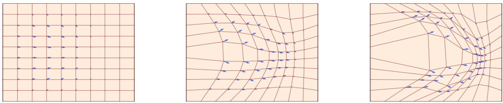

Figure 1: A flow $\psi _ { t } : \mathbb { R } ^ { d } \rightarrow \mathbb { R } ^ { d }$ (red square $\mathrm { g r i d ) }$ is defined by a velocity field $u _ { t } : \mathbb { R } ^ { d } \rightarrow \mathbb { R } ^ { d }$ (visualized with blue arrows) that prescribes its instantaneous movements at all locations (here, $d = 2 )$ We show three different times t. As one can see, a flow is a diffeomorphism that "warps" space. Figure from [26].

so, is it unique? A fundamental result in mathematics is $\mathfrak { n } _ { \mathrm { y e s l } } \mathfrak { n }$ to both, as long as we impose weak assumptions on ut:

## Theorem 3 (Flow existence and uniqueness)

If $u : \mathbb { R } ^ { d }   \times   [ 0 , 1 ] \to \mathbb { R } ^ { d }$ is continuously differentiable with a bounded derivative, then the ODE in (2) has a unique solution given by a flow $\psi _ { t }$ . In this case, $\psi _ { t }$ is a diffeomorphism for all t, i.e. $\psi _ { t }$ is continuously differentiable with a continuously differentiable inverse $\psi _ { t } ^ { - 1 }$

Note that the assumptions required for the existence and uniqueness of a flow are almost always fulfilled in machine learning, as we use neural networks to parameterize $u _ { t } ( x )$ and they always have bounded derivatives. Therefore, Theorem 3 should not be a concern for you but rather good news: flows exist and are unique solutions to ODEs in our cases of interest. A proof can be found in [32, 9].

## Example 4 (Linear Vector Fields)

Let us consider a simple example of a vector field $u _ { t } ( x )$ that is a simple linear function in $x ,$ i.e. $u _ { t } ( x ) = - \theta x$ for $\theta > 0$ . Then the function

$$
\psi_ {t} (x _ {0}) = \exp (- \theta t) x _ {0}\tag{3}
$$

defines a flow ψ solving the ODE in Equation (2). You can check this yourself by checking that $\psi _ { 0 } ( x _ { 0 } ) = x _ { 0 }$ and computing

$$
\frac {\mathrm{d}}{\mathrm{d} t} \psi_ {t} (x _ {0}) \stackrel {(3)} {=} \frac {\mathrm{d}}{\mathrm{d} t} \left(\exp (- \theta t) x _ {0}\right) \stackrel {(i)} {=} - \theta \exp (- \theta t) x _ {0} \stackrel {(3)} {=} - \theta \psi_ {t} (x _ {0}) = u _ {t} (\psi_ {t} (x _ {0})),
$$

where in (i) we used the chain rule. In Figure 3, we visualize a flow of this form converging to 0 exponentially.

Simulating an ODE. In general, it is not possible to compute the flow $\psi _ { t }$ explicitly if $u _ { t }$ is not as simple as in the previous example. In these cases, one uses numerical methods to simulate ODEs. Fortunately, this is a classical and well researched topic in numerical analysis, and a myriad of powerful methods exist [21]. One of the simplest

<!-- page: 9 -->

and most intuitive methods is the Euler method. In the Euler method, we initialize with $X _ { 0 } = x _ { 0 }$ and update via

$$
X _ {t + h} = X _ {t} + h u _ {t} (X _ {t}) \quad (t = 0, h, 2 h, 3 h, \dots , 1 - h)\tag{4}
$$

where $h = n ^ { - 1 } > 0$ is the step size and $n \in \mathbb { N }$ is the number of simulation steps. For this class, the Euler method will be good enough. To give you a taste of a more complex method, let us consider Heun’s method defined via the update rule

$$
\begin{array}{l l} X _ {t + h} ^ {\prime} = X _ {t} + h u _ {t} (X _ {t}) & \blacktriangleright \text {initial guess of new state (same as Euler step)} \\ X _ {t + h} = X _ {t} + \frac {h}{2} (u _ {t} (X _ {t}) + u _ {t + h} (X _ {t + h} ^ {\prime})) & \blacktriangleright \text {update with average u at current and guessed state} \end{array}
$$

Intuitively, Heun’s method is as follows: it takes a first guess $X _ { t + h } ^ { \prime }$ of what the next step could be but corrects the direction initially taken via an updated guess.

Flow models. We can now construct a generative model via an ODE by making the vector field a neural network vector field $u _ { t } ^ { \theta }$ . For now, we simply mean that $u _ { t } ^ { \theta }$ is a parameterized function $u _ { t } ^ { \theta } : \mathbb { R } ^ { d } \times [ 0 , 1 ] \to \mathbb { R } ^ { d }$ with parameters θ. Later, we will discuss particular choices of neural network architectures. Remember that our goal was to generate samples $z \sim p _ { \mathrm { d a t a } }$ from a distribution $p _ { \mathrm { d a t a } }$ . In particular, these samples must be random. Note though that an ODE itself is not random but fully deterministic. To inject some randomness, we simple make the initial condition $X _ { 0 }$ random. Specifically, we choose an initial distribution $p _ { \mathrm { i n i t } }$ . In most cases, we set $p _ { \mathrm { i n i t } } = \mathcal { N } ( 0 , I _ { d } )$ to be a simple standard Gaussian. Most importantly, whatever distribution you choose, it must be one that we can easily sample from at inference-time. A flow model is then described by the ODE

$$
\begin{array}{c} {X _ {0} \sim p _ {\mathrm{init}}} \\ {\frac {\mathrm{d}}{\mathrm{d} t} X _ {t} = u _ {t} ^ {\theta} (X _ {t})} \end{array}
$$

▶ random initialization

Our goal is to make the endpoint $X _ { 1 }$ of the trajectory have distribution $p _ { \mathrm { d a t a } }$ , i.e.

$$
X _ {1} \sim p _ {\mathrm{data}} \quad \Leftrightarrow \quad \psi_ {1} ^ {\theta} (X _ {0}) \sim p _ {\mathrm{data}}
$$

where $\psi _ { t } ^ { \theta }$ describes the flow induced by $u _ { t } ^ { \theta } .$ Note however: although it is called flow model, the neural network parameterizes the vector field, not the flow. In order to compute the flow, we need to simulate the ODE. In Algorithm 1, we summarize the procedure how to sample from a flow model.

Algorithm 1 Sampling from a Flow Model with Euler method
Require: Neural network vector field $u_t^\theta$, number of steps $n$
Set $t = 0$
Set step size $h = \frac{1}{n}$
Draw a sample $X_0 \sim p_{\text{init}}$
for $i = 1, \ldots, n$ do
    $X_{t+h} = X_t + hu_t^\theta(X_t)$
    Update $t \leftarrow t + h$
end for
return $X_1$

<!-- page: 10 -->

## 2.2 Diffusion Models

Stochastic differential equations (SDEs) extend the deterministic trajectories from ODEs with stochastic trajectories. A stochastic trajectory is commonly called a stochastic process $( X _ { t } ) _ { 0 \leq t \leq 1 }$ and is given by

$X _ { t }$ is a random variable for every $0 \leq t \leq 1$

$X : [ 0 , 1 ] \to \mathbb { R } ^ { d } , \quad t \mapsto X _ { t }$ is a random trajectory for every draw of X

In particular, when we simulate the same stochastic process twice, we might get different outcomes because the dynamics are designed to be random.

Brownian Motion. SDEs are constructed via a Brownian motion - a fundamental stochastic process that came out of the study physical diffusion processes. You can think of a Brownian motion as a continuous random walk.

Let us define it: A Brownian motion $W = ( W _ { t } ) _ { 0 \leq t \leq 1 }$ is a stochastic

process such that $W _ { 0 } = 0$ , the trajectories $t \mapsto W _ { t }$ are continuous, and the following two conditions hold:

1. Normal increments: $W _ { t } { - } W _ { s } \sim \mathcal { N } ( 0 , ( t { - } s ) I _ { d } )$ for all $0 \leq s <$ $t ,$ i.e. increments have a Gaussian distribution with variance increasing linearly in time $( I _ { d }$ is the identity matrix).

2. Independent increments: For any $0 \leq t _ { 0 } < t _ { 1 } < \cdots < t _ { n } =$ 1, the increments $W _ { t _ { 1 } } { - } W _ { t _ { 0 } } , \ldots , W _ { t _ { n } } { - } W _ { t _ { n - 1 } }$ are independent random variables.

Brownian motion is also called a Wiener process, which is why we denote it with a $\quad W  \quad .$ 1 We can easily simulate a Brownian motion approximately with step size $h > 0$ by setting $W _ { 0 } = 0$ and updating

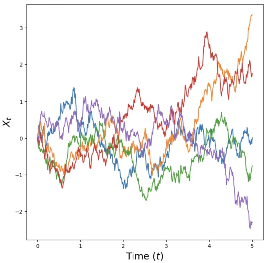

Figure 2: Sample trajectories of a Brownian motion $W _ { t }$ in dimension $d = 1$ simulated using Equation (5).

$$
W _ {t + h} = W _ {t} + \sqrt {h} \epsilon_ {t}, \quad \epsilon_ {t} \sim \mathcal {N} (0, I _ {d}) \quad (t = 0, h, 2 h, \dots , 1 - h)\tag{5}
$$

In Figure 2, we plot a few example trajectories of a Brownian mo-

tion. Brownian motion is as central to the study of stochastic processes as the Gaussian distribution is to the study of probability distributions. From finance to statistical physics to epidemiology, the study of Brownian motion has far reaching applications beyond machine learning. In finance, for example, Brownian motion is used to model the price of complex financial instruments. Also just as a mathematical construction, Brownian motion is fascinating: For example, while the paths of a Brownian motion are continuous (so that you could draw it without ever lifting a pen), they are infinitely long (so that you would never stop drawing).

From ODEs to SDEs. The idea of an SDE is to extend the deterministic dynamics of an ODE by adding stochastic dynamics driven by a Brownian motion. Because everything is stochastic, we may no longer take the derivative as

<small>1Norbert Wiener was a famous mathematician who taught at MIT. You can still see his portraits hanging at the MIT math department.</small>

<!-- page: 11 -->

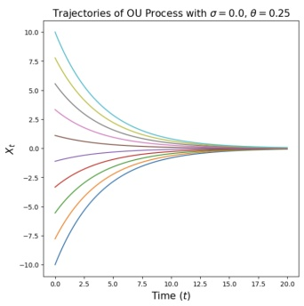

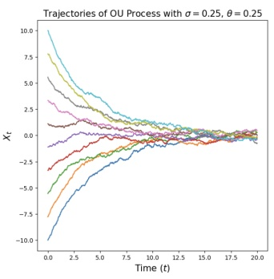

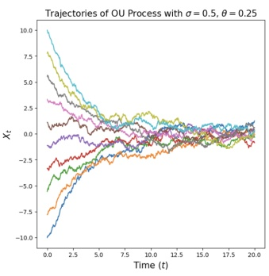

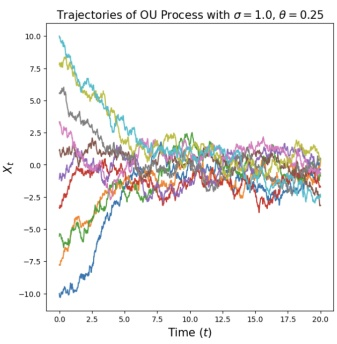

Figure 3: Illustration of Ornstein-Uhlenbeck processes (Equation (8)) in dimension $d = 1$ for $\theta = 0 . 2 5$ and various choices of σ (increasing from left to right). For $\sigma = 0 ,$ we recover a flow (smooth, deterministic trajectories) that converges to the origin as $t \to \infty$ . For $\sigma > 0$ we have random paths which converge towards the Gaussian $\begin{array} { r } { \mathcal { N } ( 0 , \frac { \sigma ^ { 2 } } { 2 \theta } ) } \end{array}$ as $t \to \infty$

in Equation (1a). Hence, we need to find an equivalent formulation of ODEs that does not use derivatives. For this, let us therefore rewrite trajectories $( X _ { t } ) _ { 0 \leq t \leq 1 }$ of an ODE as follows:

$$
\begin{array}{r l r l} & {\frac {\mathrm{d}}{\mathrm{d} t} X _ {t} = u _ {t} (X _ {t})} & & {\blacktriangleright \text {expression via derivatives}} \\ {\stackrel {(i)} {\Leftrightarrow}} & {\frac {1}{h}   (X _ {t + h} - X _ {t}) = u _ {t} (X _ {t}) + R _ {t} (h)} \\ & {\iff \quad X _ {t + h} = X _ {t} + h u _ {t} (X _ {t}) + h R _ {t} (h)} & & {\blacktriangleright \text {expression via infinitesimal updates}} \end{array}
$$

where $R _ { t } ( h )$ describes a negligible function for small $h ,$ i.e. such that lim $R _ { t } ( h ) = 0$ , and in (i) we simply use the h→0 definition of derivatives. The derivation above simply restates what we already know: A trajectory $( X _ { t } ) _ { 0 \leq t \leq 1 }$ of an ODE takes, at every timestep, a small step in the direction $u _ { t } ( X _ { t } )$ . We may now amend the last equation to make it stochastic: A trajectory $( X _ { t } ) _ { 0 \leq t \leq 1 }$ of an SDE takes, at every timestep, a small step in the direction $u _ { t } ( X _ { t } )$ plus some contribution from a Brownian motion:

$$
X _ {t + h} = X _ {t} + \underbrace {h u _ {t} (X _ {t})} _ {\text {deterministic}} + \sigma_ {t} \underbrace {(W _ {t + h} - W _ {t})} _ {\text {stochastic}} + \underbrace {h R _ {t} (h)} _ {\text {error term}}\tag{6}
$$

where $\sigma _ { t } \geq 0$ describes the diffusion coefficient and $R _ { t } ( h )$ describes a stochastic error term such that the standard deviation $\mathbb { E } [ \| R _ { t } ( h ) \| ^ { 2 } ] ^ { 1 / 2 }   \to   0$ goes to zero for $h \rightarrow 0$ The above describes a stochastic differential equation (SDE). It is common to denote it in the following symbolic notation:

$$
\mathrm{d} X _ {t} = u _ {t} (X _ {t}) \mathrm{d} t + \sigma_ {t} \mathrm{d} W _ {t}
$$

$$
\blacktriangleright \text {SDE}\tag{7a}
$$

$$
X _ {0} = x _ {0}
$$

$$
\blacktriangleright \text {initial condition}\tag{7b}
$$

However, always keep in mind that the $\text{" } \mathrm{d}X_{t}  \text{" }$ -notation above is a purely informal notation of Equation (6). Unfortunately, SDEs do not have a flow map $\phi _ { t }$ anymore. This is because the value $X _ { t }$ is not fully determined by $X _ { 0 } \sim p _ { \mathrm { i n i t } }$ anymore as the evolution itself is stochastic. Still, in the same way as for ODEs, we have:

<!-- page: 12 -->

## Theorem 5 (SDE Solution Existence and Uniqueness)

If $u : \mathbb { R } ^ { d } \times [ 0 , 1 ] \rightarrow \mathbb { R } ^ { d }$ is continuously differentiable with a bounded derivative and $\sigma _ { t }$ is continuous, then the SDE in (7) has a solution given by the unique stochastic process $( X _ { t } ) _ { 0 \leq t \leq 1 }$ satisfying Equation (6).

If this was a stochastic calculus class, we would spend several lectures proving this theorem and constructing SDEs with full mathematical rigor, i.e. constructing a Brownian motion from first principles and constructing the process $X _ { t }$ via stochastic integration. As we focus on machine learning in this class, we refer to [29] for a more technical treatment. Finally, note that every ODE is also an SDE - simply with a vanishing diffusion coefficient $\sigma _ { t }   =   0$ Therefore, for the remainder of this class, when we speak about SDEs, we consider ODEs as a special case.

## Example 6 (Ornstein-Uhlenbeck Process)

Let us consider a constant diffusion coefficient $\sigma _ { t } = \sigma \geq 0$ and a constant linear drift $u _ { t } ( x ) = - \theta x$ for $\theta > 0$ , yielding the SDE

$$
\mathrm{d} X _ {t} = - \theta X _ {t} \mathrm{d} t + \sigma \mathrm{d} W _ {t}.\tag{8}
$$

A solution $( X _ { t } ) _ { 0 \leq t \leq 1 }$ to the above SDE is known as an Ornstein-Uhlenbeck (OU) process. We visualize it in Figure 3. The vector field $- \theta x$ pushes the process back to its center 0 (since the drift always points in the direction opposite to the current position), while the diffusion coefficient σ always adds more noise. This process converges towards a Gaussian distribution $\mathcal { N } ( 0 , \sigma ^ { 2 } / ( 2 \theta ) )$ if we simulate it for $t \to \infty$ . Note that for $\sigma = 0$ , we have a flow with linear vector field that we have studied in Equation (3).

Simulating an SDE. If you struggle with the abstract definition of an SDE so far, then don’t worry about it. A more intuitive way of thinking about SDEs is given by answering the question: How might we simulate an SDE? The simplest such scheme is known as the Euler-Maruyama method, and is essentially to SDEs what the Euler method is to ODEs. Using the Euler-Maruyama method, we initialize $X _ { 0 } = x _ { 0 }$ and update iteratively via

$$
X _ {t + h} = X _ {t} + h u _ {t} (X _ {t}) + \sqrt {h} \sigma_ {t} \epsilon_ {t}, \quad \epsilon_ {t} \sim \mathcal {N} (0, I _ {d})\tag{9}
$$

where $h = n ^ { - 1 } > 0$ is a step size hyperparameter for $n \in \mathbb { N } .$ . In other words, to simulate using the Euler-Maruyama method, we take a small step in the direction of $u _ { t } ( X _ { t } )$ as well as add a little bit of Gaussian noise scaled by $\sqrt { h } \sigma _ { t }$ When simulating SDEs in this class (such as in the accompanying labs), we will usually stick to the Euler-Maruyama method.

Diffusion Models. We can now construct a generative model via an SDE in the same way as we did for ODEs. Remember that our goal was to convert a simple distribution $p _ { \mathrm { i n i t } }$ into a complex distribution $p _ { \mathrm { d a t a } }$ . Like for ODEs, the simulation of an SDE randomly initialized with $X _ { 0 } \sim p _ { \mathrm { i n i t } }$ is a natural choice for this transformation. To parameterize this SDE, we can simply parameterize its central ingredient - the vector field $u _ { t }$ - via a neural

<!-- page: 13 -->

Algorithm 2 Sampling from a Diffusion Model (Euler-Maruyama method)
Require: Neural network $u_t^\theta$, number of steps $n$, diffusion coefficient $\sigma_t$
Set $t = 0$
Set step size $h = \frac{1}{n}$
Draw a sample $X_0 \sim p_{\text{init}}$
for $i = 1, \ldots, n$ do
    Draw a sample $\epsilon \sim \mathcal{N}(0, I_d)$
    $X_{t+h} = X_t + hu_t^\theta(X_t) + \sigma_t \sqrt{h} \epsilon$
    Update $t \leftarrow t + h$
end for
return $X_1$

network $u _ { t } ^ { \theta }$ . A diffusion model is thus given by

$$
\begin{array}{c} {X _ {0} \sim p _ {\mathrm{init}}} \\ {\mathrm{d} X _ {t} = u _ {t} ^ {\theta} (X _ {t}) \mathrm{d} t + \sigma_ {t} \mathrm{d} W _ {t}} \end{array}
$$

In Algorithm 2, we describe the procedure by which to sample from a diffusion model with the Euler-Maruyama method. We summarize the results of this section as follows.

## Summary 7 (SDE generative model)

Throughout this document, a diffusion model consists of a neural network $u _ { t } ^ { \theta }$ with parameters θ that parameterize a vector field and a fixed diffusion coefficient $\sigma _ { t } ;$

Neural network: $u ^ { \theta } : \mathbb { R } ^ { d } \times [ 0 , 1 ] \to \mathbb { R } ^ { d } , ( x , t ) \mapsto u _ { t } ^ { \theta } ( x )$ with parameters θ

Fixed: $\sigma _ { t } : [ 0 , 1 ] \to [ 0 , \infty ) , t \mapsto \sigma _ { t }$

To obtain samples from our SDE model (i.e. generate objects), the procedure is as follows:

$$
X _ {0} \sim p _ {\mathrm{init}}
$$

▶ Initialize with simple distribution, e.g. a Gaussian

Simulation: $\mathrm { d } X _ { t } = u _ { t } ^ { \theta } ( X _ { t } ) \mathrm { d } t + \sigma _ { t } \mathrm { d } W _ { t }$

Goal: $X _ { 1 } \sim p _ { \mathrm { d a t a } }$

▶ Simulate SDE from 0 to 1

▶ Goal is to make $X _ { 1 }$ have distribution $p _ { \mathrm { d a t a } }$

A diffusion model with $\sigma _ { t } = 0$ is a flow model.

<!-- page: 14 -->

## 3 Flow Matching

In the previous section, we constructed flow and diffusion models as generative models parameterized by a neural network vector field $u _ { t } ^ { \theta } .$ However, we have not yet discussed how to train them, i.e. how to optimize the parameters θ such that generative model returns something sensible, e.g. a nice-looking image or exciting video. Next, we discuss flow matching [25, 1, 27], a algorithm to train $u _ { t } ^ { \theta }$ that is simple, scalable, and represents the current state-of-the-art.

In this section, we restrict ourselves to flow models, i.e. we have a neural network $u _ { t } ^ { \theta }$ and obtain samples from the generative model by simulating the ODE

$$
X _ {0} \sim p _ {\mathrm{init}}, \quad \mathrm{d} X _ {t} = u _ {t} ^ {\theta} (X _ {t}) \mathrm{d} t
$$

(Flow model)

(10)

and using the endpoints $X _ { 1 }$ fro $t = 1$ as samples. As we discussed, our goal is that $X _ { 1 }$ is distributed according to the data distribution $p _ { \mathrm { d a t a } } ,$ i.e. $X _ { 1 } \sim p _ { \mathrm { d a t a } }$ . Therefore, the question “how to train” the neural network is really the following question: How do we optimize θ such that simulating the flow model in Equation (10) results in samples from the data distribution $X _ { 1 } \sim p _ { \operatorname { d a t a } } ?$

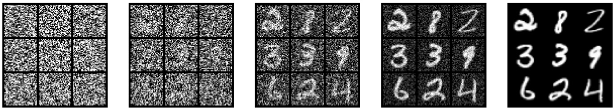

Figure 4: Gradual interpolation from noise to data via a Gaussian conditional probability path for a collection of images. Note that each image is a data point of dimension $d = 3 2 \times 3 2$ , so we are plotting individual samples from the probability path, while in Figure 5 we plot the distribution as a 2d histogram.

## 3.1 Conditional and Marginal Probability Path

The first step of flow matching is to specify a probability path. Intuitively, a probability path specifies a gradual interpolation between noise $p _ { \mathrm { i n i t } }$ and data $p _ { \mathrm { d a t a } }$ (see Figure 4). But why would we want that? Remember that our desired ODE trajectory fulfills $X _ { 0 } \sim p _ { \mathrm { i n i t } }$ for $t = 0$ and $X _ { 1 } \sim p _ { \mathrm { d a t a } }$ for $t = 1$ . But what about times $0 < t < 1$ in between start and end? It turns out that we have some freedom to choose what should happen in between and this is what is mathematically formalized in a probability path.

In the following, for a data point $z \in \mathbb { R } ^ { d }$ , we denote with $\delta _ { z }$ the Dirac delta “distribution”. This is the simplest distribution that one can imagine: sampling from $\delta _ { z }$ always returns z (i.e. it is deterministic). A conditional (interpolating) probability path is a set of distribution $p _ { t } ( x | z )$ over $\mathbb { R } ^ { d }$ such that:

$$
p _ {0} (\cdot | z) = p _ {\mathrm{init}}, \quad p _ {1} (\cdot | z) = \delta_ {z} \quad \text {for all} z \in \mathbb {R} ^ {d}.\tag{11}
$$

In other words, a conditional probability path gradually converts the initial distribution $p _ { \mathrm { i n i t } }$ into a single data point (see e.g. Figure 4). You can think of a probability path as a trajectory in the space of distributions.

<!-- page: 15 -->

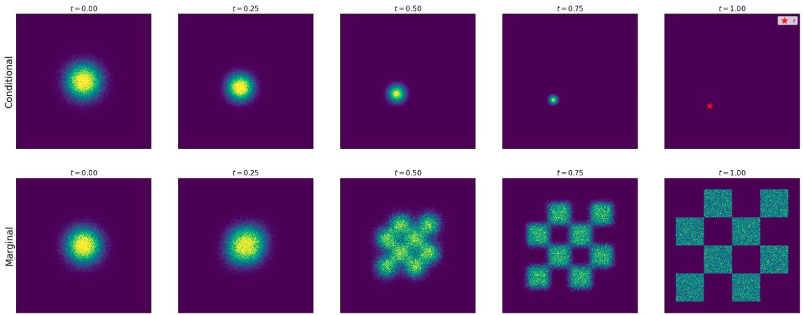

Figure 5: Illustration of a conditional (top) and marginal (bottom) probability path. Here, we plot a Gaussian probability path with $\alpha _ { t } = t , \beta _ { t } = 1 - t .$ The conditional probability path interpolates a Gaussian $p _ { \mathrm { i n i t } } = \mathcal { N } ( 0 , I _ { d } )$ and $p _ { \mathrm { d a t a } } = \delta _ { z }$ for single data point z. The marginal probability path interpolates a Gaussian and a data distribution $p _ { \mathrm { d a t a } }$ (Here, $p _ { \mathrm { d a t a } }$ is a toy distribution in dimension $d = 2$ represented by a chess board pattern.)

Every conditional probability path $p _ { t } ( x | z )$ induces a marginal probability path $p _ { t } ( x )$ defined as the distribution that we obtain by first sampling a data point $z \sim p _ { \mathrm { d a t a } }$ from the data distribution and then sampling from $p _ { t } ( \cdot | z )$

$$
z \sim p _ {\mathrm{data}}, \quad x \sim p _ {t} (\cdot | z) \quad \Rightarrow x \sim p _ {t}
$$

▶ sampling from marginal path

$$
p _ {t} (x) = \int p _ {t} (x | z) p _ {\mathrm{data}} (z) \mathrm{d} z\tag{12}
$$

$$
\blacktriangleright \text { density of marginal path }\tag{13}
$$

Note that we know how to sample from $p _ { t }$ but we don’t know the density values $p _ { t } ( x )$ as the integral is intractable $( \mathrm { i . e . }$ we can actually compute Equation (12) but not Equation (13)). Check for yourself that because of the conditions on $p _ { t } ( \cdot | z )$ in Equation (11), the marginal probability path $p _ { t }$ interpolates between $p _ { \mathrm { i n i t } }$ and $p _ { \mathrm { d a t a } } .$

$$
p _ {0} = p _ {\mathrm{init}} \quad \text {and} \quad p _ {1} = p _ {\mathrm{data}}.
$$

$$
\blacktriangleright \text {noise - data interpolation}\tag{14}
$$

The - by far - most important example of a probability path is the Gaussian probability path - hence, we strongly recommend reading the next example thoroughly.

## Example 8 (Gaussian Conditional Probability Path)

One particularly popular probability path is the Gaussian probability path. This is the probability path used by most state-of-the-art models. Let $\alpha _ { t } , \beta _ { t }$ be noise schedulers: two continuously differentiable, monotonic functions with $\alpha _ { 0 } = \beta _ { 1 } = 0$ and $\alpha _ { 1 } = \beta _ { 0 } = 1$ We then define the conditional probability path

$$
p _ {t} (\cdot | z) = \mathcal {N} (\alpha_ {t} z, \beta_ {t} ^ {2} I _ {d})
$$

$$
\blacktriangleright \text {Gaussian conditional path}\tag{15}
$$

<!-- page: 16 -->

which, by the conditions we imposed on $\alpha _ { t }$ and $\beta _ { t } .$ , fulfills

$$
p _ {0} (\cdot | z) = \mathcal {N} (\alpha_ {0} z, \beta_ {0} ^ {2} I _ {d}) = \mathcal {N} (0, I _ {d}), \quad \text {and} \quad p _ {1} (\cdot | z) = \mathcal {N} (\alpha_ {1} z, \beta_ {1} ^ {2} I _ {d}) = \delta_ {z},
$$

where we have used the fact that a normal distribution with zero variance and mean z is just $\delta _ { z }$ . Therefore, this choice of $p _ { t } ( x | z )$ fulfills Equation (11) for $p _ { \mathrm { i n i t } } = \mathcal { N } ( 0 , I _ { d } )$ and is therefore a valid conditional interpolating path. In Figure 4, we illustrate its application to an image. We can express sampling from the marginal path $p _ { t }$ as:

$$
z \sim p _ {\text {data}}, \epsilon \sim p _ {\text {init}} = \mathcal {N} (0, I _ {d}) \Rightarrow x = \alpha_ {t} z + \beta_ {t} \epsilon \sim p _ {t} \quad \blacktriangleright \text {sampling from marginal Gaussian path} \tag {16}
$$

Intuitively, the above procedure adds more noise for lower t until time $t = 0 .$ , at which point there is only noise. In Figure 5, we plot an example of such an interpolating path.

## 3.2 Conditional and Marginal Vector Fields

A probability path $( p _ { t } ) _ { 0 \leq t \leq 1 }$ specifies what distributions $X _ { t } \sim p _ { t }$ the points $X _ { t }$ along a trajectory should have. At this point, this is just what we “wish” to be the case. But how can we find a vector field such that the trajectories $X _ { t }$ follow the probability path? Flow matching explicitly constructs such a vector field - the “marginal vector field” - which we explain in this section.

For every data point $z \in \mathbb { R } ^ { d }$ , let $u _ { t } ^ { \mathrm { t a r g e t } } ( \cdot | z )$ denote a conditional vector field. This can be any vector field such that corresponding ODE yields the conditional probability path $p _ { t } ( \cdot | z )$ , i.e. such that it holds

$$
X _ {0} \sim p _ {\mathrm{init}}, \quad \frac {\mathrm{d}}{\mathrm{d} t} X _ {t} = u _ {t} ^ {\mathrm{target}} (X _ {t} | z) \quad \Rightarrow \quad X _ {t} \sim p _ {t} (\cdot | z) \quad (0 \leq t \leq 1).\tag{17}
$$

We can often find a conditional vector field $u _ { t } ^ { \mathrm { t a r g e t } } ( \cdot | z )$ analytically by hand (i.e. by just doing some algebra ourselves). We illustrate this by deriving a conditional vector field $u _ { t } ( x | z )$ for our running example of a Gaussian probability path in Example 10.

At first sight, a conditional vector field seems useless because all endpoints of the ODE $X _ { 1 }$ will collapse to $X _ { 1 }   =   z ,$ i.e. we are just re-generating known data points z. However, the conditional vector field serves as a building block for a vector field that generates actual samples from $p _ { \mathrm { d a t a } } .$

## Theorem 9 (Marginalization trick)

Let $u _ { t } ^ { \mathrm { t a r g e t } } ( x | z )$ be a conditional vector field (Equation (17)). Then the marginal vector field $u _ { t } ^ { \mathrm { t a r g e t } } ( x )$ defined as

$$
u _ {t} ^ {\mathrm{target}} (x) = \int u _ {t} ^ {\mathrm{target}} (x | z) \frac {p _ {t} (x | z) p _ {\mathrm{data}} (z)}{p _ {t} (x)} \mathrm{d} z,\tag{18}
$$

follows the marginal probability path, i.e.

$$
X _ {0} \sim p _ {\mathrm{init}}, \quad \frac {\mathrm{d}}{\mathrm{d} t} X _ {t} = u _ {t} ^ {\mathrm{target}} (X _ {t}) \quad \Rightarrow \quad X _ {t} \sim p _ {t} \quad (0 \leq t \leq 1).
$$

(19)

In particular, $X _ { 1 } \sim p _ { \mathrm { d a t a } }$ for this ODE, so that we might say ${ \bf \nabla } u _ { t } ^ { \tt t a r g e t }$ converts noise $p _ { \mathrm { i n i t } }$ into data $p _ { \mathrm { d a t a } } \$

<!-- page: 17 -->

Trajectories of Learned Marginal ODE

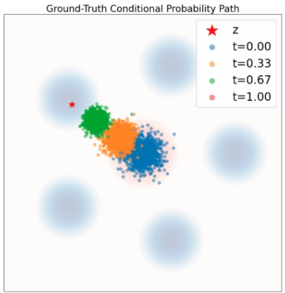

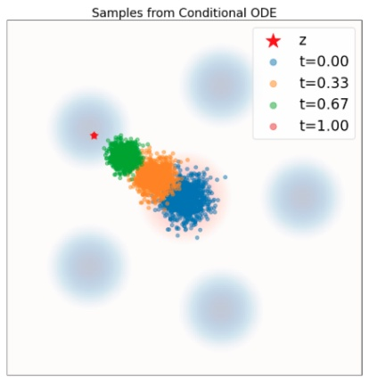

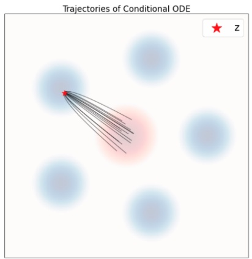

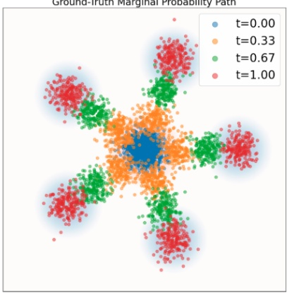

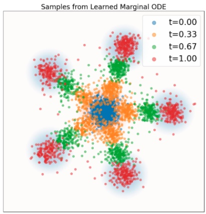

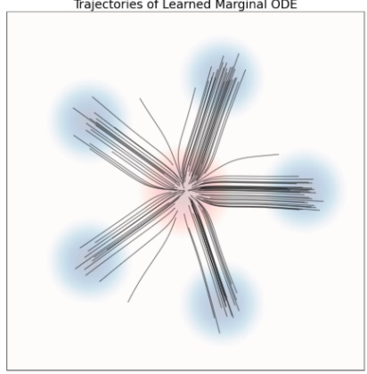

Figure 6: Illustration of Theorem 9. Simulating a probability path with ODEs. Data distribution $p _ { \mathrm { d a t a } }$ in blue background. Gaussian $p _ { \mathrm { i n i t } }$ in red background. Top row: Conditional probability path. Left: Ground truth samples from conditional path $p _ { t } ( \cdot | z )$ . Middle: ODE samples over time. Right: Trajectories by simulating ODE with $u _ { t } ^ { \mathrm { t a r g e t } } ( x | z )$ in Equation (20). Bottom row: Simulating a marginal probability path. Left: Ground truth samples from $p _ { t }$ . Middle: ODE samples over time. Right: Trajectories by simulating ODE with marginal vector field $u _ { t } ^ { \mathrm { f l o w } } ( x )$ . As one can see, the conditional vector field follows the conditional probability path and the marginal vector field follows the marginal probability path.

## Example 10 (Target ODE for Gaussian probability paths)

As before, let $\begin{aligned} { p _ { t } ( \cdot | z ) = \mathcal { N } ( \alpha _ { t } z , \beta _ { t } ^ { 2 } I _ { d } ) } \\ \end{aligned}$ for noise schedulers $\alpha _ { t } , \beta _ { t }$ (see Equation (15)). Let $\dot { \alpha } _ { t } = \partial _ { t } \alpha _ { t }$ and $\dot { \beta } _ { t } = \partial _ { t } \beta _ { t }$ denote respective time derivatives of $\alpha _ { t }$ and $\beta _ { t }$ . Here, we want to show that the conditional Gaussian vector field given by

$$
u _ {t} ^ {\text {target}} (x | z) = \left(\dot {\alpha} _ {t} - \frac {\dot {\beta} _ {t}}{\beta_ {t}} \alpha_ {t}\right) z + \frac {\dot {\beta} _ {t}}{\beta_ {t}} x\tag{20}
$$

is a valid conditional vector field model in the sense of Theorem 9: its ODE trajectories $X _ { t }$ satisfy $X _ { t } \sim$ $\begin{aligned} { p _ { t } ( \cdot | z ) = \mathcal { N } ( \alpha _ { t } z , \beta _ { t } ^ { 2 } I _ { d } ) } \\ \end{aligned}$ if $X _ { 0 } \sim \mathcal { N } ( 0 , I _ { d } )$ In Figure 6, we confirm this visually by comparing samples from the conditional probability path (ground truth) to samples from simulated ODE trajectories of this flow. As you can see, the distribution match. We will now prove this.

<!-- page: 18 -->

Proof. Let us construct a conditional flow model $\psi _ { t } ^ { \mathrm { t a r g e t } } ( x | z )$ first by defining

$$
\psi_ {t} ^ {\mathrm{target}} (x | z) = \alpha_ {t} z + \beta_ {t} x.\tag{21}
$$

If $X _ { t }$ is the ODE trajectory of $\psi _ { t } ^ { \mathrm { t a r g e t } } ( \cdot | z )$ with $X _ { 0 } \sim p _ { \mathrm { i n i t } } = \mathcal { N } ( 0 , I _ { d } )$ , then by definition

$$
X _ {t} = \psi_ {t} ^ {\mathrm{target}} (X _ {0} | z) = \alpha_ {t} z + \beta_ {t} X _ {0} \sim \mathcal {N} (\alpha_ {t} z, \beta^ {2} I _ {d}) = p _ {t} (\cdot | z).
$$

We conclude that the trajectories are distributed like the conditional probability path (i.e, Equation (17) is fulfilled). It remains to extract the vector field $u _ { t } ^ { \mathrm { t a r g e t } } ( x | z )$ from $\psi _ { t } ^ { \mathrm { t a r g e t } } ( x | z )$ By the definition of a flow (Equation (2b)), it holds

$$
\frac {\mathrm{d}}{\mathrm{d} t} \psi_ {t} ^ {\text {target}} (x | z) = u _ {t} ^ {\text {target}} (\psi_ {t} ^ {\text {target}} (x | z) | z) \quad \text {for all} x, z \in \mathbb {R} ^ {d}
$$

$$
\stackrel {(i)} {\Leftrightarrow} \quad \dot {\alpha} _ {t} z + \dot {\beta} _ {t} x = u _ {t} ^ {\text {target}} (\alpha_ {t} z + \beta_ {t} x | z) \quad \text {for all} x, z \in \mathbb {R} ^ {d}\tag{ii) ⇔}
$$

$$
\dot {\alpha} _ {t} z + \dot {\beta} _ {t} \left(\frac {x - \alpha_ {t} z}{\beta_ {t}}\right) = u _ {t} ^ {\mathrm{target}} (x | z) \quad \text {for all} x, z \in \mathbb {R} ^ {d}\tag{iii)
⇔}
$$

$$
\left(\dot {\alpha} _ {t} - \frac {\dot {\beta} _ {t}}{\beta_ {t}} \alpha_ {t}\right) z + \frac {\dot {\beta} _ {t}}{\beta_ {t}} x = u _ {t} ^ {\text {target}} (x | z) \quad \text {for all} x, z \in \mathbb {R} ^ {d}
$$

where in (i) we used the definition of $\psi _ { t } ^ { \mathrm { t a r g e t } } ( x | z )$ (Equation (21)), in (ii) we reparameterized $x \to ( x - \alpha _ { t } z ) / \beta _ { t }$ and in (iii) we just did some algebra. Note that the last equation is the conditional Gaussian vector field as we defined in Equation (20). This proves the statement.a □

aOne can also double check this by plugging it into the continuity equation introduced later in this section.

See Figure 6 for an illustration of Theorem 9. Let’s gain some intuition for the marginal vector field. Bayes rule from statistics says that the following term describes a posterior distribution

$$
\frac {p _ {t} (x \mid z) p _ {\mathrm{data}} (z)}{p _ {t} (x)} = \text {"posterior over data points z given noisy data x"}
$$

where $p _ { \mathrm { d a t a } } ( z )$ is the prior distribution. The marginal vector field then is simply a average: for every possible data point z it takes the velocity $u _ { t } ( x | z ) \textrm { - i.e. }$ . the direction that would bring us to z - and then weighs this velocity by how much we believe that x comes from z. Averaging over all data points, we obtain the marginal vector field.

The remainder of this section will make this intuition rigorous and prove Theorem 9. As the main mathematical tool, we will use the continuity equation, a fundamental equation in mathematics and physics. Define the divergence operator div as

$$
\mathrm{div} (v _ {t}) (x) = \sum_ {i = 1} ^ {d} \frac {\partial}{\partial x _ {i}} v _ {t} ^ {i} (x)\tag{22}
$$

where $v _ { t } ^ { i }$ is the i-th coordinate of $v _ { t }$ .

<!-- page: 19 -->

## Theorem 11 (Continuity Equation)

Let us consider an flow model with vector field $u _ { t } ^ { \mathrm { t a r g e t } }$ with $X _ { 0 } \sim p _ { \mathrm { i n i t } } = p _ { 0 }$ Then $X _ { t } \sim p _ { t }$ for all $0 \leq t \leq 1$ if and only if

$$
\partial_ {t} p _ {t} (x) = - \mathrm{div} (p _ {t} u _ {t} ^ {\text {target}}) (x) \quad \text {for all} x \in \mathbb {R} ^ {d}, 0 \leq t \leq 1,\tag{23}
$$

where $\begin{array} { r } { \partial _ { t } p _ { t } ( x ) = \frac { \mathrm { d } } { \mathrm { d } t } p _ { t } ( x ) } \end{array}$ denotes the time-derivative of $p _ { t } ( x )$ . Equation 23 is known as the continuity equation.

For the mathematically-inclined reader, we present a self-contained proof of the Continuity Equation in Section B. Before we move on, let us try and understand intuitively the continuity equation. The left-hand side $\partial _ { t } p _ { t } ( x )$ describes how much the probability $p _ { t } ( x )$ at x changes over time. Intuitively, the change should correspond to the net inflow of probability mass. For a flow model, a particle $X _ { t }$ follows along the vector field $u _ { t } ^ { \mathrm { t a r g e t } }$ . As you might recall from physics, the divergence measures a sort of net outflow from the vector field. Therefore, the negative divergence measures the net inflow. Scaling this by the total probability mass currently residing at $x ,$ we get that the net $- \mathrm { d i v } ( p _ { t } u _ { t } )$ measures the total inflow of probability mass. Since probability mass is conserved (always integrates to 1), the left-hand and right-hand side of the equation should be the same! We now proceed with a proof of the marginalization trick from Theorem 9.

Proof of Theorem 9. By Theorem 11, we have to show that the marginal vector field $u _ { t } ^ { \mathrm { t a r g e t } }$ , as defined as in Equation (18), satisfies the continuity equation. We can do this by direct calculation:

$$
\begin{array}{r l} \partial_ {t} p _ {t} (x) \stackrel {(i)} {=} \partial_ {t} \int p _ {t} (x | z) p _ {\mathrm{data}} (z) \mathrm{d} z = & \int \partial_ {t} p _ {t} (x | z) p _ {\mathrm{data}} (z) \mathrm{d} z \\ & \stackrel {(i i)} {=} \int - \mathrm{div} (p _ {t} (\cdot | z) u _ {t} ^ {\mathrm{target}} (\cdot | z)) (x) p _ {\mathrm{data}} (z) \mathrm{d} z \\ & \stackrel {(i i i)} {=} - \mathrm{div} \left(\int p _ {t} (x | z) u _ {t} ^ {\mathrm{target}} (x | z) p _ {\mathrm{data}} (z) \mathrm{d} z\right) \\ & \stackrel {(i v)} {=} - \mathrm{div} \left(p _ {t} (x) \int u _ {t} ^ {\mathrm{target}} (x | z) \frac {p _ {t} (x | z) p _ {\mathrm{data}} (z)}{p _ {t} (x)} \mathrm{d} z\right) (x) \\ & \stackrel {(v)} {=} - \mathrm{div} \left(p _ {t} u _ {t} ^ {\mathrm{target}}\right) (x), \end{array}
$$

where in (i) we used the definition of $p _ { t } ( x )$ in Equation (12), in (ii) we used the continuity equation for the conditional probability path $p _ { t } ( \cdot | z )$ , in (iii) we swapped the integral and divergence operator using Equation (22), in (iv) we multiplied and divided by $p _ { t } ( x )$ , and in (v) we used Equation (18). The beginning and end of the above chain of equations show that the continuity equation is fulfilled for $u _ { t } ^ { \mathrm { t a r g e t } }$ . By Theorem 11, this is enough to imply Equation (19), and we are done. □

## 3.3 Learning the Marginal Vector Field

Now, we are ready to describe the training algorithm. The goal of flow matching is to train the neural network $u _ { t } ^ { \theta }$ such that it equals the marginal vector field $u _ { t } ^ { \mathrm { t a r g e t } }$ . If this holds, we know that the endpoints $X _ { 1 } \sim p _ { \mathrm { d a t a } }$ have the desired distribution by Theorem 9. In the following, we denote by $\mathrm { U n i f } = \mathrm { U n i f } _ { [ 0 , 1 ] }$ the uniform distribution on the interval [0, 1], and by E the expected value of a random variable. An intuitive way of obtaining $u _ { t } ^ { \theta } \approx u _ { t } ^ { \mathrm { t a r g e t } }$ is to

<!-- page: 20 -->

use a mean-squared error, i.e. to use the flow matching loss defined as

$$
\mathcal {L} _ {\mathrm{FM}} (\theta) = \mathbb {E} _ {t \sim \mathrm{Unif}, x \sim p _ {t}} [ \| u _ {t} ^ {\theta} (x) - u _ {t} ^ {\mathrm{target}} (x) \| ^ {2} ]\tag{24}
$$

$$
\stackrel {(i)} {=} \mathbb {E} _ {t \sim \mathrm{Unif}, z \sim p _ {\mathrm{data}}, x \sim p _ {t} (\cdot | z)} [ \| u _ {t} ^ {\theta} (x) - u _ {t} ^ {\mathrm{target}} (x) \| ^ {2} ],\tag{25}
$$

where $\begin{array} { l } { p _ { t } ( x ) = \int p _ { t } ( x | z ) p _ { \operatorname { d a t a } } ( z ) \mathrm { d } z } \end{array}$ is the marginal probability path and in (i) we used the sampling procedure given by Equation (12). Intuitively, this loss says: First, draw a random time $t \in [ 0 , 1 ]$ . Second, draw a random point z from our data set, sample from $p _ { t } ( \cdot | z ) \; ( \mathrm { e . g . }$ , by adding some noise), and compute $u _ { t } ^ { \theta } ( x )$ . Finally, compute the meansquared error between the output of our neural network and the marginal vector field $u _ { t } ^ { \mathrm { t a r g e t } } ( x )$ . Unfortunately, we are not done here. While we do know the formula for $u _ { t } ^ { \mathrm { t a r g e t } }$ by Theorem 9, we cannot compute it efficiently as the integral is intractable. Instead, we will exploit the fact that the conditional velocity field $u _ { t } ^ { \mathrm { t a r g e t } } ( x | z )$ is tractable. To do so, let us define the conditional flow matching loss

$$
\mathcal {L} _ {\mathrm{CFM}} (\theta) = \mathbb {E} _ {t \sim \mathrm{Unif}, z \sim p _ {\mathrm{data}}, x \sim p _ {t} (\cdot | z)} [ \| u _ {t} ^ {\theta} (x) - u _ {t} ^ {\mathrm{target}} (x | z) \| ^ {2} ].\tag{26}
$$

Note the difference to Equation (24): we use the conditional vector field $u _ { t } ^ { \mathrm { t a r g e t } } ( x | z )$ instead of the marginal vector $u _ { t } ^ { \mathrm { t a r g e t } } ( x )$ . As we have an analytical formula for $u _ { t } ^ { \mathrm { t a r g e t } } ( x | z )$ , we can minimize the above loss easily. But wait, what sense does it make to regress against the conditional vector field if it’s the marginal vector field we care about? As it turns out, by explicitly regressing against the tractable, conditional vector field, we are implicitly regressing against the intractable, marginal vector field. The next result makes this intuition precise.

## Theorem 12

The marginal flow matching loss equals the conditional flow matching loss up to a constant. That is,

$$
\mathcal {L} _ {\mathrm{FM}} (\theta) = \mathcal {L} _ {\mathrm{CFM}} (\theta) + C,
$$

where C is independent of θ. Therefore, their gradients coincide:

$$
\nabla_ {\theta} \mathcal {L} _ {\mathrm{FM}} (\theta) = \nabla_ {\theta} \mathcal {L} _ {\mathrm{CFM}} (\theta).
$$

Hence, minimizing $\mathcal { L } _ { \mathrm { C F M } } ( \theta )$ with $\mathbf { e . g . }$ , stochastic gradient descent (SGD) is equivalent to minimizing $\mathcal { L } _ { \mathrm { F M } } ( \theta )$ in the same fashion. In particular, for the minimizer $\theta ^ { * }$ of $\mathcal { L } _ { \mathsf { C F M } } ( \theta )$ , it will hold that $u _ { t } ^ { \theta ^ { * } } = u _ { t } ^ { \tt t a r g e t }$ , i.e. the neural network will equal the marginal vector field (assuming an infinitely expressive parameterization).

Direct Proof. The proof works by expanding the mean-squared error into three components and removing constants:

$$
\begin{array}{r l} & {\mathcal {L} _ {\mathrm{FM}} (\theta) \stackrel {(i)} {=} \mathbb {E} _ {t \sim \mathrm{Unif}, x \sim p _ {t}} [ \| u _ {t} ^ {\theta} (x) - u _ {t} ^ {\mathrm{target}} (x) \| ^ {2} ]} \\ & {\qquad \stackrel {(i i)} {=} \mathbb {E} _ {t \sim \mathrm{Unif}, x \sim p _ {t}} [ \| u _ {t} ^ {\theta} (x) \| ^ {2} - 2 u _ {t} ^ {\theta} (x) ^ {T} u _ {t} ^ {\mathrm{target}} (x) + \| u _ {t} ^ {\mathrm{target}} (x) \| ^ {2} ]} \\ & \qquad \stackrel {(i i i)} {=} \mathbb {E} _ {t \sim \mathrm{Unif}, x \sim p _ {t}} \left[ \| u _ {t} ^ {\theta} (x) \| ^ {2} \right] - 2 \mathbb {E} _ {t \sim \mathrm{Unif}, x \sim p _ {t}} [ u _ {t} ^ {\theta} (x) ^ {T} u _ {t} ^ {\mathrm{target}} (x) ] + \underbrace {\mathbb {E} _ {t \sim \mathrm{Unif} _ {[ 0 , 1 ] , x \sim p _ {t}} [ \| u _ {t} ^ {\mathrm{target}} (x) \| ^ {2} ]} _ {=: C _ {1}}} \\ & {\qquad \stackrel {(i v)} {=} \mathbb {E} _ {t \sim \mathrm{Unif}, z \sim p _ {\mathrm{data}}, x \sim p _ {t} (\cdot | z)} [ \| u _ {t} ^ {\theta} (x) \| ^ {2} ] - 2 \mathbb {E} _ {t \sim \mathrm{Unif}, x \sim p _ {t}} [ u _ {t} ^ {\theta} (x) ^ {T} u _ {t} ^ {\mathrm{target}} (x) ] + C _ {1}} \end{array}
$$

<!-- page: 21 -->

where (i) holds by definition, in (ii) we used the formula $\| a   -   b \| ^ { 2 } = \| a \| ^ { 2 }   -   2 a ^ { T } b   +   \| b \| ^ { 2 }$ , in (iii) we define a constant $C _ { 1 }$ and in (iv) we used the sampling procedure of $p _ { t }$ given by Equation (12). Let us reexpress the second summand:

$$
\begin{array}{r l} \mathbb {E} _ {t \sim \mathrm{Unif}, x \sim p _ {t}} [ u _ {t} ^ {\theta} (x) ^ {T} u _ {t} ^ {\mathrm{target}} (x) ] & \stackrel {(i)} {=} \int_ {0} ^ {1} \int p _ {t} (x) u _ {t} ^ {\theta} (x) ^ {T} u _ {t} ^ {\mathrm{target}} (x)   \mathrm{d} x   \mathrm{d} t \\ & \stackrel {(i i)} {=} \int_ {0} ^ {1} \int p _ {t} (x) u _ {t} ^ {\theta} (x) ^ {T} \left[ \int u _ {t} ^ {\mathrm{target}} (x | z) \frac {p _ {t} (x | z) p _ {\mathrm{data}} (z)}{p _ {t} (x)} \mathrm{d} z \right] \mathrm{d} x   \mathrm{d} t \\ & \stackrel {(i i i)} {=} \int_ {0} ^ {1} \int \int u _ {t} ^ {\theta} (x) ^ {T} u _ {t} ^ {\mathrm{target}} (x | z) p _ {t} (x | z) p _ {\mathrm{data}} (z)   \mathrm{d} z   \mathrm{d} x   \mathrm{d} t \\ & \stackrel {(i v)} {=} \mathbb {E} _ {t \sim \mathrm{Unif}, z \sim p _ {\mathrm{data}}, x \sim p _ {t} (\cdot | z)} [ u _ {t} ^ {\theta} (x) ^ {T} u _ {t} ^ {\mathrm{target}} (x | z) ] \end{array}
$$

where in (i) we expressed the expected value as an integral, in (ii) we use Equation (18), in (iii) we use the fact that integrals are linear, in (iv) we express the integral as an expected value. Note that this was really the crucial step of the proof: The beginning of the equality used the marginal vector field $u _ { t } ^ { \mathrm { t a r g e t } } ( x )$ , while the end uses the conditional vector field $u _ { t } ^ { \mathrm { t a r g e t } } ( x | z )$ . We plug is into the equation for $\mathcal { L } _ { \mathrm { F M } }$ to get:

$$
\begin{array}{r l} & {\mathcal {L} _ {\mathrm{FM}} (\theta) \stackrel {(i)} {=} \mathbb {E} _ {t \sim \mathrm{Unif}, z \sim p _ {\mathrm{data}}, x \sim p _ {t} (\cdot | z)} [ \| u _ {t} ^ {\theta} (x) \| ^ {2} ] - 2 \mathbb {E} _ {t \sim \mathrm{Unif}, z \sim p _ {\mathrm{data}}, x \sim p _ {t} (\cdot | z)} [ u _ {t} ^ {\theta} (x) ^ {T} u _ {t} ^ {\mathrm{target}} (x | z) ] + C _ {1}} \\ & {\qquad \stackrel {(i i)} {=} \mathbb {E} _ {t \sim \mathrm{Unif}, z \sim p _ {\mathrm{data}}, x \sim p _ {t} (\cdot | z)} [ \| u _ {t} ^ {\theta} (x) \| ^ {2} - 2 u _ {t} ^ {\theta} (x) ^ {T} u _ {t} ^ {\mathrm{target}} (x | z) + \| u _ {t} ^ {\mathrm{target}} (x | z) \| ^ {2} - \| u _ {t} ^ {\mathrm{target}} (x | z) \| ^ {2} ] + C _ {1}} \\ & {\qquad \stackrel {(i i i)} {=} \mathbb {E} _ {t \sim \mathrm{Unif}, z \sim p _ {\mathrm{data}}, x \sim p _ {t} (\cdot | z)} [ \| u _ {t} ^ {\theta} (x) - u _ {t} ^ {\mathrm{target}} (x | z) \| ^ {2} ] + \underbrace {\mathbb {E} _ {t \sim \mathrm{Unif} , z \sim p _ {\mathrm{data}} , x \sim p _ {t} (\cdot | z)} [ - \| u _ {t} ^ {\mathrm{target}} (x | z) \| ^ {2} ]} _ {C _ {2}} + C _ {1}} \\ & {\qquad \stackrel {(i v)} {=} \mathcal {L} _ {\mathrm{CFM}} (\theta) + \underbrace {C _ {2} + C _ {1}} _ {=: C}} \end{array}
$$

where in (i) we plugged in the derived equation, in (ii) we added and subtracted the same value, in (iii) we used the formula $\| a - b \| ^ { 2 } = \| a \| ^ { 2 } - 2 a ^ { T } b + \| b \| ^ { 2 }$ again, and in (iv) we defined a constant in θ. This finishes the proof.

Therefore, flow matching training consists of minimizing the conditional flow matching loss. The training procedure is summarized in Algorithm 3 and visualized in Figure 7. Note that there are several striking features about this algorithm: First, we never actually simulate any ODE during training. People call this feature of the algorithm simulation-free. This makes training extremely cheap as you don’t have to roll out trajectories of the ODE during training (which takes a lot of steps). Second, the training is a simple regression objective - we are just regressing against $u _ { t } ^ { \mathrm { t a r g e t } } ( x | z )$ . So it is not too different from supervised learning after all. Finally, the algorithm is extremely simple - it is hard to think of a much simpler training objective. All of this makes flow matching an extremely appealing method for large-scale machine learning models. Once $u _ { t } ^ { \theta }$ has been trained, we may simulate the flow model

$$
\mathrm{d} X _ {t} = u _ {t} ^ {\theta} (X _ {t}) \mathrm{d} t, \qquad X _ {0} \sim p _ {\mathrm{init}}\tag{27}
$$

via e.g., Algorithm 1 to obtain samples $X _ { 1 } \sim p _ { \mathrm { d a t a } }$ . This whole pipeline is called flow matching in the literature [25, 27, 1, 26]. Let us now instantiate the conditional flow matching loss for Gaussian probability paths:

<!-- page: 22 -->

Algorithm 3 Flow Matching Training Procedure (for Gaussian CondOT path $p_t(x|z) = \mathcal{N}(tz, (1 - t)^2)$)
Require: A dataset of samples $z \sim p_{\text{data}}$, neural network $u_t^\theta$
for each mini-batch of data do
    Sample a data example $z$ from the dataset.
    Sample a random time $t \sim \text{Unif}_{[0,1]}$.
    Sample noise $\epsilon \sim \mathcal{N}(0, I_d)$
    Set
        $x = tz + (1 - t)\epsilon$ (General case: $x \sim p_t(\cdot | z)$)
    Compute loss
        $\mathcal{L}(\theta) = \|u_t^\theta(x) - (z - \epsilon)\|^2$ (General case: $= \|u_t^\theta(x) - u_t^{\text{target}}(x|z)\|^2$)
    Update $\theta \leftarrow \text{grad\_update}(\mathcal{L}(\theta))$.
end for

## Example 13 (Flow Matching for Gaussian Conditional Probability Paths)

Let us return to the example of Gaussian probability paths $\begin{array} { r } { p _ { t } ( \cdot | z ) = \mathcal { N } ( \alpha _ { t } z ; \beta _ { t } ^ { 2 } I _ { d } ) } \end{array}$ where we may sample from the conditional path via

$$
\epsilon \sim \mathcal {N} (0, I _ {d}) \Rightarrow x _ {t} = \alpha_ {t} z + \beta_ {t} \epsilon \sim \mathcal {N} (\alpha_ {t} z, \beta_ {t} ^ {2} I _ {d}) = p _ {t} (\cdot | z).\tag{28}
$$

As we derived in Equation (20), the conditional vector field $u _ { t } ^ { \mathrm { t a r g e t } } ( x | z )$ is given by

$$
u _ {t} ^ {\mathrm{target}} (x | z) = \left(\dot {\alpha} _ {t} - \frac {\dot {\beta} _ {t}}{\beta_ {t}} \alpha_ {t}\right) z + \frac {\dot {\beta} _ {t}}{\beta_ {t}} x,\tag{29}
$$

where $\dot { \alpha } _ { t } = \partial _ { t } \alpha _ { t }$ and $\dot { \beta } _ { t } = \partial _ { t } \beta _ { t }$ are the respective time derivatives. Plugging in this formula, the conditional flow matching loss reads

$$
\mathcal {L} _ {\mathrm{CFM}} (\theta) = \mathbb {E} _ {t \sim \mathrm{Unif}, z \sim p _ {\mathrm{data}}, x \sim \mathcal {N} (\alpha_ {t} z, \beta_ {t} ^ {2} I _ {d})} [ \| u _ {t} ^ {\theta} (x) - \left(\dot {\alpha} _ {t} - \frac {\dot {\beta} _ {t}}{\beta_ {t}} \alpha_ {t}\right) z - \frac {\dot {\beta} _ {t}}{\beta_ {t}} x \| ^ {2} ]\tag{30}
$$

$$
\stackrel {(i)} {=} \mathbb {E} _ {t \sim \mathrm{Unif}, z \sim p _ {\mathrm{data}}, \epsilon \sim \mathcal {N} (0, I _ {d})} [ \| u _ {t} ^ {\theta} (\alpha_ {t} z + \beta_ {t} \epsilon) - (\dot {\alpha} _ {t} z + \dot {\beta} _ {t} \epsilon) \| ^ {2} ]\tag{31}
$$

where in (i) we plugged in Equation (28) and replaced x by $\alpha _ { t } z + \beta _ { t } \epsilon$ Note the simplicity of $\mathcal { L } _ { \mathrm { C F M } } :$ We sample a data point z, sample some noise ϵ and then we take a mean squared error. Let us make this even more concrete for the special case of $\alpha _ { t } = t ,$ and $\beta _ { t } = 1 - t .$ The corresponding probability $p _ { t } ( x | z ) = \mathcal { N } ( t z , ( 1 - t ) ^ { 2 } )$ is sometimes referred to as the (Gaussian) CondOT probability path. Then we have $\dot { \alpha } _ { t } = 1 , \dot { \beta } _ { t } = - 1$ , so that

$$
\mathcal {L} _ {\mathrm{cfm}} (\theta) = \mathbb {E} _ {t \sim \mathrm{Unif}, z \sim p _ {\mathrm{data}}, \epsilon \sim \mathcal {N} (0, I _ {d})} [ \| u _ {t} ^ {\theta} (t z + (1 - t) \epsilon) - (z - \epsilon) \| ^ {2} ]
$$

Many famous state-of-the-art models have been trained using this simple yet effective procedure, e.g. Stable Diffusion 3, Meta’s Movie Gen Video, and probably many more proprietary models. In Figure 7, we visualize

<!-- page: 23 -->

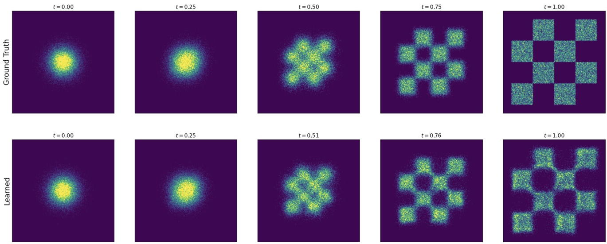

Figure 7: Illustration of Theorem 12 with a Gaussian CondOT probability path: simulating an ODE from a trained flow matching model. The data distribution is the chess board pattern (top right). Top row: Histogram from ground truth marginal probability path $p _ { t } ( x )$ . Bottom row: Histogram of samples from flow matching model. As one can see, the top row and bottom row match after training (up to training error). The model was trained using Algorithm 3.

it in a simple example and in Algorithm 3 we summarize the training procedure.

Let us summarize the results of this section.

## Summary 14 (Flow Matching)

Flow matching training consists of learning the marginal vector field $u _ { t } ^ { \tt t a r g e t }$ To construct it, we choose a conditional probability path $p _ { t } ( x | z )$ that fulfils $p _ { 0 } ( \cdot | z ) = p _ { \mathrm { i n i t } } ,   p _ { 1 } ( \cdot | z ) = \delta _ { z }$ Next, we find a conditional vector field $u _ { t } ^ { \mathrm { t a r g e t } } ( x | z )$ such that its corresponding flow $\psi _ { t } ^ { \mathrm { t a r g e t } } ( x | z )$ fulfills

$$
X _ {0} \sim p _ {\mathrm{init}} \quad \Rightarrow \quad X _ {t} = \psi_ {t} ^ {\mathrm{target}} (X _ {0} | z) \sim p _ {t} (\cdot | z),
$$

or, equivalently, that $u _ { t } ^ { \mathrm { t a r g e t } }$ satisfies the continuity equation. Then the marginal vector field defined by

$$
u _ {t} ^ {\mathrm{target}} (x) = \int u _ {t} ^ {\mathrm{target}} (x | z) \frac {p _ {t} (x | z) p _ {\mathrm{data}} (z)}{p _ {t} (x)} \mathrm{d} z,\tag{32}
$$

follows the marginal probability path, i.e.,

$$
X _ {0} \sim p _ {\mathrm{init}}, \quad \mathrm{d} X _ {t} = u _ {t} ^ {\mathrm{target}} (X _ {t}) \mathrm{d} t \Rightarrow X _ {t} \sim p _ {t} \quad (0 \leq t \leq 1).\tag{33}
$$

In particular, $X _ { 1 } \sim p _ { \mathrm { d a t a } }$ for this ODE, so that $u _ { t } ^ { \mathrm { t a r g e t } }$ "converts noise into data", as desired. To learn it, we minimize the conditional flow matching loss

$$
\mathcal {L} _ {\mathrm{CFM}} (\theta) = \mathbb {E} _ {t \sim \mathrm{Unif}, z \sim p _ {\mathrm{data}}, x \sim p _ {t} (\cdot | z)} [ \| u _ {t} ^ {\theta} (x) - u _ {t} ^ {\mathrm{target}} (x | z) \| ^ {2} ].\tag{34}
$$

<!-- page: 24 -->

The most widely used example is the Gaussian probability path. For this case, the formulas become:

$$
p _ {t} (x | z) = \mathcal {N} (x; \alpha_ {t} z, \beta_ {t} ^ {2} I _ {d})\tag{35}
$$

$$
u _ {t} ^ {\mathrm{flow}} (x | z) = \left(\dot {\alpha} _ {t} - \frac {\dot {\beta} _ {t}}{\beta_ {t}} \alpha_ {t}\right) z + \frac {\dot {\beta} _ {t}}{\beta_ {t}} x\tag{36}
$$

$$
\mathcal {L} _ {\mathrm{CFM}} (\theta) = \mathbb {E} _ {t \sim \mathrm{Unif}, z \sim p _ {\mathrm{data}}, \epsilon \sim \mathcal {N} (0, I _ {d})} [ \| u _ {t} ^ {\theta} (\alpha_ {t} z + \beta_ {t} \epsilon) - (\dot {\alpha} _ {t} z + \dot {\beta} _ {t} \epsilon) \| ^ {2} ]\tag{37}
$$

for noise schedulers $\alpha _ { t } , \beta _ { t } \in \mathbb { R } ,$ i.e. continuously differentiable, monotonic functions that we choose such that $\alpha _ { 0 } = \beta _ { 1 } = 0 \alpha _ { 1 } = \beta _ { 0 } = 1 ( \operatorname { e . g . } \alpha _ { t } = t , \beta _ { t } = 1 - t )$

<!-- page: 25 -->

## 4 Score Functions and Score Matching

In the last section, we showed how to train a flow model with flow matching. In this section, we discuss diffusion models and demonstrate how to train them using score matching.

## 4.1 Conditional and Marginal Score Functions

So far, the central object of interest for our investigation was a vector field $u _ { t } ( x )$ . Diffusion models [45, 44] take a different perspective focused on score functions. Therefore, in this section, we will rephrase what we have learned here in the language of score functions - providing a novel perspective. Let $q ( x )$ be an arbitrary probability distribution. Then the score function of $q$ is defined as ∇ log q(x), i.e. as the gradient of the log-likelihood of $q$ with respect to x. The score has an intuitive meaning: ∇ log q(x) is the direction of steepest ascent with respect to log-likelihood. This is illustrated in Figure 8.

r log q(x)

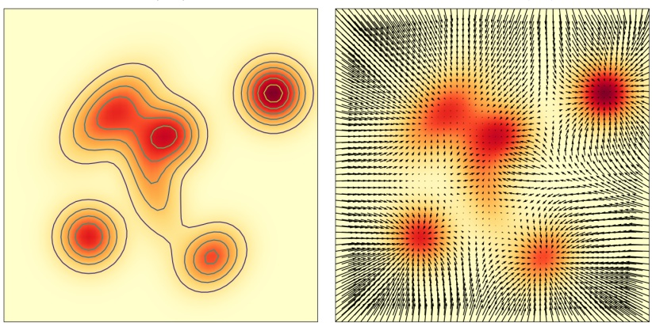

Figure 8: Illustration of score function $\nabla \log q ( x )$ plotted as black rows $( \mathrm { r i g h t } )$ of a general probability distribution q(x) (left).

Let us return to the setting of condi-

tional probability paths $p _ { t } ( x | z )$ and marginal probability paths $p _ { t } ( x )$ as in Section 3. Then we can equivalently define the conditional score function as $\nabla \operatorname { l o g } p _ { t } ( x | z )$ and the marginal score function as $\nabla \log p _ { t } ( x )$ . Similar to Equation (18), the marginal score can be expressed via the conditional score function $\nabla \operatorname { l o g } p _ { t } ( x | z )$ via

$$
\nabla \log p _ {t} (x) = \int \nabla \log p _ {t} (x | z) \frac {p _ {t} (x | z) p _ {\mathrm{data}} (z)}{p _ {t} (x)} \mathrm{d} z.\tag{38}
$$

Hence, the relation between the conditional and marginal score is analogous to the relation between the conditional and marginal vector field. Note that we can prove Equation (38) via

$$
\nabla \log p _ {t} (x) = \frac {\nabla p _ {t} (x)}{p _ {t} (x)} = \frac {\nabla \int p _ {t} (x | z) p _ {\mathrm{data}} (z) \mathrm{d} z}{p _ {t} (x)} = \frac {\int \nabla p _ {t} (x | z) p _ {\mathrm{data}} (z) \mathrm{d} z}{p _ {t} (x)} = \int \nabla \log p _ {t} (x | z) \frac {p _ {t} (x | z) p _ {\mathrm{data}} (z)}{p _ {t} (x)} \mathrm{d} z,\tag{39}
$$

where we have used the rule $\partial _ { y } \log y = 1 / y$ combined with the chain rule twice.

Example 15 (Score Function for Gaussian Probability Paths.)

For the Gaussian path $p _ { t } ( x | z ) = \mathcal { N } ( x ; \alpha _ { t } z , \beta _ { t } ^ { 2 } I _ { d } )$ , we can use the form of the Gaussian probability density (see Equation (97)) to get

$$
\nabla \log p _ {t} (x | z) = \nabla \log \mathcal {N} (x; \alpha_ {t} z, \beta_ {t} ^ {2} I _ {d}) = - \frac {x - \alpha_ {t} z}{\beta_ {t} ^ {2}}.\tag{40}
$$

<!-- page: 26 -->

Note that the score function for a Gaussian probability path is a linear function of x and z. The same is true for the conditional vector field $u _ { t } ( x | z )$ (see Equation (20)). It is thus possible to convert between the two, as the next proposition illustrates.

## Proposition 1 (Conversion Formula for Gaussian Probability Paths)

For the Gaussian probability path $\begin{aligned} { p _ { t } ( x | z ) = \mathcal { N } ( \alpha _ { t } z , \beta _ { t } ^ { 2 } I _ { d } ) } \\ \end{aligned}$ , the conditional (resp. marginal) vector field and the conditional (resp. marginal) score are related by the following identities

$$
u _ {t} ^ {\mathrm{target}} (x | z) = a _ {t} \nabla \log p _ {t} (x | z) + b _ {t} x, \quad a _ {t} = \left(\beta_ {t} ^ {2} \frac {\dot {\alpha} _ {t}}{\alpha_ {t}} - \dot {\beta} _ {t} \beta_ {t}\right), \quad b _ {t} = \frac {\dot {\alpha} _ {t}}{\alpha_ {t}}\tag{41}
$$

$$
u _ {t} ^ {\mathrm{target}} (x) = a _ {t} \nabla \log p _ {t} (x) + b _ {t} x.\tag{42}
$$

In particular, we note that the conditional (resp. marginal) vector field can be recovered from the conditional (resp. marginal) score, and vice versa.

Proof. For the conditional vector field and conditional score, we can derive:

$$
u _ {t} ^ {\text {target}} (x | z) = \left(\dot {\alpha} _ {t} - \frac {\dot {\beta} _ {t}}{\beta_ {t}} \alpha_ {t}\right) z + \frac {\dot {\beta} _ {t}}{\beta_ {t}} x \stackrel {(i)} {=} \left(\beta_ {t} ^ {2} \frac {\dot {\alpha} _ {t}}{\alpha_ {t}} - \dot {\beta} _ {t} \beta_ {t}\right) \left(\frac {\alpha_ {t} z - x}{\beta_ {t} ^ {2}}\right) + \frac {\dot {\alpha} _ {t}}{\alpha_ {t}} x = \left(\beta_ {t} ^ {2} \frac {\dot {\alpha} _ {t}}{\alpha_ {t}} - \dot {\beta} _ {t} \beta_ {t}\right) \nabla \log p _ {t} (x | z) + \frac {\dot {\alpha} _ {t}}{\alpha_ {t}} x
$$

where in (i) we just did some algebra. By taking integrals, the same identity holds for the marginal flow vector field and the marginal score function:

$$
\begin{array}{c} u ^ {\mathrm{target}} (x) = \int u _ {t} ^ {\mathrm{target}} (x | z) \frac {p _ {t} (x | z) p _ {\mathrm{data}} (z)}{p _ {t} (x)} \mathrm{d} z = \int [ a _ {t} \nabla \log p _ {t} (x | z) + b _ {t} x ] \frac {p _ {t} (x | z) p _ {\mathrm{data}} (z)}{p _ {t} (x)} \mathrm{d} z \\ \stackrel {(i)} {=} a _ {t} \nabla \log p _ {t} (x) + b _ {t} x \end{array}
$$

where in (i) we used Equation (38) and the fact that posterior density integrates to 1.

Proposition 1 is striking because it says that once we’ve learned $u _ { t } ^ { \mathrm { t a r g e t } }$ we’ve also learned the score function $\nabla \log p _ { t } ( x )$ , and vice versa. Therefore, many diffusion models learn the score function $\nabla \log p _ { t } ( x )$ instead via a neural network. We will discuss this in Section 4.3.

## Remark 16 (Reparameterization of the Score)

The reparameterization formula for Gaussian probability paths in Equation (41) is possible because both sides (conditional vector field and conditional score) are linear functions of x and z. Once we marginalize (marginal vector field and marginal score), both sides are just a linear reparameterization of the posterior mean $\mathbb { E } _ { z | x } \left[ z \right]$ It follows that any quantity that allows to recover $\mathbb { E } _ { z | x } \left[ z \right]$ can in turn be used to recover the unconditional vector field and score. Further, doing so might even be preferable from a numerical/training stability standpoint. One common choice is the posterior mean itself, often referred to as the denoiser. Formally, we define the conditional and marginal denoiser as

$$
D _ {t} (x | z) = z, \quad D _ {t} (x) = \int z \frac {p _ {t} (x | z) p _ {\mathrm{data}} (z)}{p _ {t} (x)} \mathrm{d} z \stackrel {(i)} {=} \frac {1}{\dot {\alpha} _ {t} \beta_ {t} - \alpha_ {t} \dot {\beta} _ {t}} (\beta_ {t} u _ {t} ^ {\mathrm{target}} (x _ {t}) - \dot {\beta} _ {t} x _ {t}).\tag{43}
$$

<!-- page: 27 -->

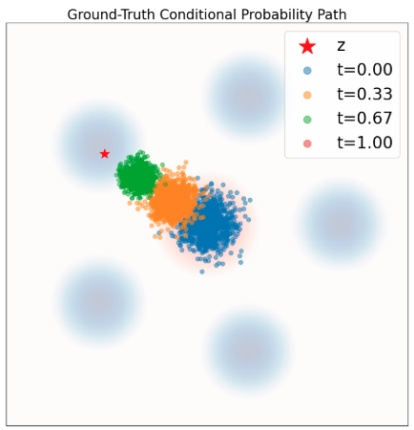

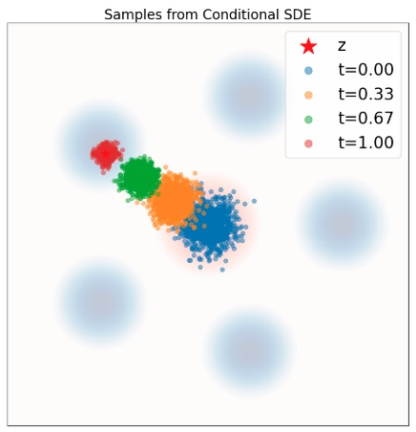

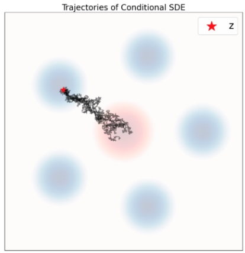

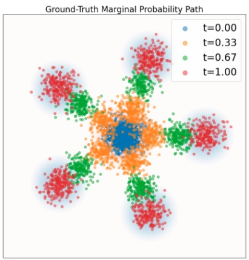

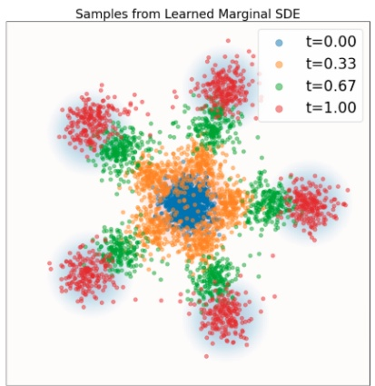

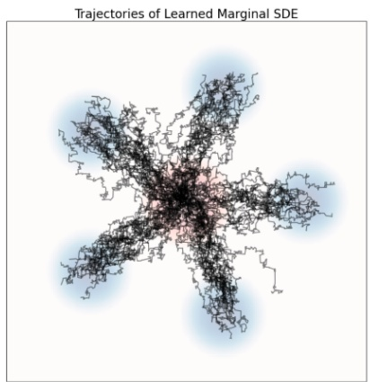

Figure 9: Illustration of Theorem 17. Simulating a probability path with SDEs. This repeats the plots from Figure 6 with SDE sampling using Equation (44). Data distribution $p _ { \mathrm { d a t a } }$ in blue background. Gaussian $p _ { \mathrm { i n i t } }$ in red background. Top row: Conditional path. Bottom row: Marginal probability path. As one can see, the SDE transports samples from $p _ { \mathrm { i n i t } }$ into samples from $\delta _ { z }$ (for the conditional path) and to $p _ { \mathrm { d a t a } }$ (for the marginal path).

Here, (i) follows from an equivalent derivation as in Proposition 1. The denoiser has a very intuitive interpretation: it is the expected value of clean data z given noisy data ${ x . } ^ { a }$ People often call such models denoising diffusion models as learning $D _ { t }$ and learning $u _ { t } ^ { \mathrm { t a r g e t } }$ are theoretically equivalent.

aFood for thought: will the denoiser always output a “clean” data point? Why or why not, and what might this depend on?

## 4.2 Sampling with SDEs

So far, we have demonstrated how one can construct a trajectory $X _ { t }$ of an ODE that follows a desired probability path $p _ { t }$ via a marginal vector field $u _ { t } ^ { \mathrm { t a r g e t } }$ . But this approach is constrained to flow models. What about diffusion models? Using score functions, let us now extend this result to SDEs.

## Theorem 17 (SDE Extension Trick)

Define the conditional and marginal vector fields $u _ { t } ^ { \mathrm { t a r g e t } } ( x | z )$ and $u _ { t } ^ { \mathrm { t a r g e t } } ( x )$ as before. Then, for any diffusion

<!-- page: 28 -->

coefficient $\sigma _ { t } \geq 0 .$ we may construct an SDE by adding stochastic dynamics to the dynamics of the original ODE as follows:

$$
\begin{array}{r l r} & & {X _ {0} \sim p _ {\mathrm{init}}, \qquad \mathrm{d} X _ {t} = u _ {t} ^ {\mathrm{target}} (X _ {t}) \mathrm{d} t + \frac {\sigma_ {t} ^ {2}}{2} \nabla \log p _ {t} (X _ {t}) \mathrm{d} t + \sigma_ {t} \mathrm{d} W _ {t}} \\ & & {= [ u _ {t} ^ {\mathrm{target}} (X _ {t}) + \frac {\sigma_ {t} ^ {2}}{2} \nabla \log p _ {t} (X _ {t}) ] \mathrm{d} t + \sigma_ {t} \mathrm{d} W _ {t}} \\ & \Rightarrow & {X _ {t} \sim p _ {t} \quad (0 \leq t \leq 1).} \end{array}\tag{44}
$$

(45)

In particular, $X _ { 1 } \sim p _ { \mathrm { d a t a } }$ for this SDE. We note that the stochastic dynamics are closely related to the Langevin dynamics, and can be thought of as injecting noise while preserving the marginal distribution $p _ { t }$ . We discuss Langevin dynamics briefly in Remark 20.

We illustrate the dynamics described in Theorem 17 in Figure 9. As one can see, the trajectories are now zigzagged, illustrating the stochastic nature of the SDE’s evolution. As Theorem 17 establishes however, the marginals $p _ { t }$ stay the same. Note that the above result is striking in that we can choose any diffusion coefficient $\sigma _ { t } \geq 0$ even after having trained the networks. In theory, Theorem 17 holds for any choice of $\sigma _ { t } .$ . However, in practice, we suffer from both training error (the neural network does not perfectly approximate the marginal vector field and score) and simulation error (e.g. for $\sigma _ { t } \gg 0 .$ , we would need to take prohibitively small step sizes in Algorithm 2). In practice, for a fixed trained model, there is then an optimal $\sigma _ { t } \geq 0$ which can be empirically determined [23, 1, 28].2

For Gaussian probability paths, we get the score function for free by having learned the marginal vector field.

## Example 18 (Gaussian SDE Extension Trick)

By Proposition 1, for Gaussian probability paths, we can express the SDE from Theorem 17 purely using score functions:

$$
\begin{array}{c} X _ {0} \sim p _ {\mathrm{init}}, \quad \mathrm{d} X _ {t} = \left[ \left(a _ {t} + \frac {\sigma_ {t} ^ {2}}{2}\right) \nabla \log p _ {t} (X _ {t}) + b _ {t} X _ {t} \right] \mathrm{d} t + \sigma_ {t} \mathrm{d} W _ {t} \\ \Rightarrow X _ {t} \sim p _ {t} \quad (0 \leq t \leq 1) \end{array}\tag{46}
$$

(47)

where $a _ { t } , b _ { t }$ are defined as in Proposition 1.

In the remainder of this section, we will prove Theorem 17 via the Fokker-Planck equation, which extends the continuity equation from ODEs to SDEs. To do so, let us first define the Laplacian operator $\Delta$ via

$$
\Delta w _ {t} (x) = \sum_ {i = 1} ^ {d} \frac {\partial^ {2}}{\partial x _ {i} ^ {2}} w _ {t} (x) = \mathrm{div} (\nabla w _ {t}) (x),\tag{48}
$$

for scalar field $w _ { t } : \mathbb { R } ^ { d } \rightarrow \mathbb { R }$

<small>2Again, we stress that the existence of a “best σt” is an artifact of imperfectly trained models and finite compute budgets rather than a theoretical statement about the dynamics in their continuous limit.</small>

<!-- page: 29 -->

## Theorem 19 (Fokker-Planck Equation)

Let $p _ { t }$ be a probability path and let us consider the SDE

$$
X _ {0} \sim p _ {\mathrm{init}}, \quad \mathrm{d} X _ {t} = u _ {t} (X _ {t}) \mathrm{d} t + \sigma_ {t} \mathrm{d} W _ {t}.
$$

Then $X _ { t }$ has distribution $p _ { t }$ for all $0 \leq t \leq 1$ if and only if the Fokker-Planck equation holds:

$$
\partial_ {t} p _ {t} (x) = - \mathrm{div} (p _ {t} u _ {t}) (x) + \frac {\sigma_ {t} ^ {2}}{2} \Delta p _ {t} (x) \quad \mathrm{forall} x \in \mathbb {R} ^ {d}, 0 \leq t \leq 1,\tag{49}
$$

A self-contained proof of the Fokker-Planck equation can be found in Section B. Note that Theorem 11 is recovered from the Fokker-Planck equation when $\sigma _ { t } = 0$ . The additional Laplacian term $\Delta p _ { t }$ might be hard to rationalize at first. Those familiar with physics will note that the same term also appears in the heat equation (which is in fact a special case of the Fokker-Planck equation). Heat diffuses through a medium. We also add a diffusion process (not a physical but a mathematical one) and hence we add this additional Laplacian term. Let us now use the Fokker-Planck equation to help us prove Theorem 17.

Proof of Theorem 17. By Theorem 19, we need to show that that the SDE defined in Equation (44) satisfies the Fokker-Planck equation for $p _ { t }$ . We can do this by direction calculation:

$$
\begin{array}{r l} & {\partial_ {t} p _ {t} (x) \stackrel {(i)} {=} - \mathrm{div} (p _ {t} u _ {t} ^ {\mathrm{target}}) (x)} \\ & {\qquad \stackrel {(i i)} {=} - \mathrm{div} (p _ {t} u _ {t} ^ {\mathrm{target}}) (x) - \frac {\sigma_ {t} ^ {2}}{2} \Delta p _ {t} (x) + \frac {\sigma_ {t} ^ {2}}{2} \Delta p _ {t} (x)} \\ & {\qquad \stackrel {(i i i)} {=} - \mathrm{div} (p _ {t} u _ {t} ^ {\mathrm{target}}) (x) - \mathrm{div} (\frac {\sigma_ {t} ^ {2}}{2} \nabla p _ {t}) (x) + \frac {\sigma_ {t} ^ {2}}{2} \Delta p _ {t} (x)} \\ & {\qquad \stackrel {(i v)} {=} - \mathrm{div} (p _ {t} u _ {t} ^ {\mathrm{target}}) (x) - \mathrm{div} (p _ {t} \left[ \frac {\sigma_ {t} ^ {2}}{2} \nabla \log p _ {t} \right]) (x) + \frac {\sigma_ {t} ^ {2}}{2} \Delta p _ {t} (x)} \\ & {\qquad \stackrel {(v)} {=} - \mathrm{div} \left(p _ {t} \left[ u _ {t} ^ {\mathrm{target}} + \frac {\sigma_ {t} ^ {2}}{2} \nabla \log p _ {t} \right]\right) (x) + \frac {\sigma_ {t} ^ {2}}{2} \Delta p _ {t} (x),} \end{array}
$$

where in (i) we used Theorem 11, in (ii) we added and subtracted the same term, in (iii) we used the definition of the Laplacian (Equation (48)), in (iv) we used that ∇ log $\begin{array} { r } { p _ { t }   =   \frac { \nabla p _ { t } } { p _ { t } } } \end{array}$ , and in (v) we used the linearity of the divergence operator. The above derivation shows that the SDE defined in Equation (44) satisfies the Fokker-Planck equation for $p _ { t } . ~ \mathrm { B y }$ Theorem 19, this implies $X _ { t } \sim p _ { t }$ for $0 \leq t \leq 1$ , as desired. □

## Remark 20 (Optional: Langevin Dynamics)

The above construction has a famous special case when the probability path is constant, i.e. $p _ { t } = p$ for a fixed distribution p. In this case, we set $u _ { t } ^ { \mathrm { t a r g e t } } = 0$ and obtain the SDE

$$
\mathrm{d} X _ {t} = \frac {\sigma_ {t} ^ {2}}{2} \nabla \log p (X _ {t}) \mathrm{d} t + \sigma_ {t} d W _ {t},\tag{50}
$$

which is commonly known as Langevin dynamics. The fact that $p _ { t }$ is constant implies that $\partial _ { t } p _ { t } ( x ) = 0$ . It follows immediately from Theorem 17 that these dynamics satisfy the Fokker-Planck equation for the static path

<!-- page: 30 -->

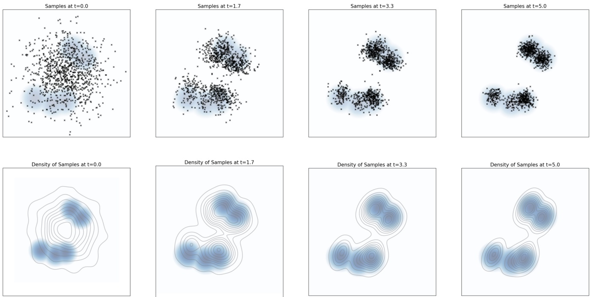

Figure 10: Top row: Particles evolving under the Langevin dynamics given by Equation (50), with $p ( x )$ taken to be a Gaussian mixture with 5 modes. Bottom row: A kernel density estimate of the same samples shown in the top row. As one can see, the distribution of samples converges to the equilibrium distribution p (blue background colour).

$p _ { t } = p$ in Theorem 17. Therefore, we may conclude that p is a stationary distribution of Langevin dynamics:

$$
X _ {0} \sim p \quad \Rightarrow \quad X _ {t} \sim p \quad (t \geq 0).
$$

As with many Markov processes, these dynamics converge to the stationary distribution p under rather general conditions. That is, if we instead we take $X _ { 0 } \sim p ^ { \prime } \neq p ,$ so that $X _ { t } \sim p _ { t } ^ { \prime } ,$ then under mild conditions $p _ { t } \to p .$ This fact makes Langevin dynamics extremely useful, and it accordingly serves as the basis for $\mathbf { e . g . }$ , molecular dynamics simulations, and many other Markov chain Monte Carlo (MCMC) methods across Bayesian statistics and the natural sciences. In particular, the Ornstein-Uhlenbeck processes are recovered as the special case of the Langevin dynamics when p is a Gaussian, and serve as the basis for initial formulations of diffusion models.

## Remark 21 (Optional: GLASS Flows, Stochastic evolution with ODEs)

The remarkable property of SDE sampling (compared to ODEs) is that the evolution becomes stochastic, i.e. the initial point $X _ { 0 }$ does not fully determine $X _ { t }$ for $t > 0 .$ Perhaps surprisingly, it is also possible to get the same stochastic transitions purely via ODEs via a simple sampling trick called GLASS Flows [20]. This allows to exploit the stochastic nature of SDEs (e.g. via search algorithms) while keeping the efficiency of ODEs.

<!-- page: 31 -->

## 4.3 Score Matching

It remains to show how we can learn the marginal score function ∇ log $p _ { t } ( x )$ . Of course, for Gaussian probability paths, we can simply transform $u _ { t } ^ { \mathrm { t a r g e t } } ( x )$ by Proposition 1. However, what about in general? It turns out that we can also learn marginal score functions directly. To approximate the marginal score ∇ log $p _ { t } ,$ we use a neural network that we call score network $s _ { t } ^ { \theta }   :   \mathbb { R } ^ { d }   \times   [ 0 , 1 ]   \to   \mathbb { R } ^ { d }$ . In the same way as before, we can design a score matching loss and a denoising score matching loss:

$$
\begin{array}{r l r l} \mathcal {L} _ {\mathrm{SM}} (\theta) = \mathbb {E} _ {t \sim \mathrm{Unif}, z \sim p _ {\mathrm{data}}, x \sim p _ {t} (\cdot | z)} \left[ \left\| s _ {t} ^ {\theta} (x) - \nabla \log p _ {t} (x) \right\| ^ {2} \right] & & \blacktriangleright \text {score matching loss} \\ \mathcal {L} _ {\mathrm{CSM}} (\theta) = \mathbb {E} _ {t \sim \mathrm{Unif}, z \sim p _ {\mathrm{data}}, x \sim p _ {t} (\cdot | z)} \left[ \left\| s _ {t} ^ {\theta} (x) - \nabla \log p _ {t} (x | z) \right\| ^ {2} \right] & & \blacktriangleright \text {conditional score matching loss} \end{array}
$$

where again the difference is using the marginal score ∇ log $p _ { t } ( x )$ vs. using the conditional score ∇ log $p _ { t } ( x | z )$ . As before, we ideally would want to minimize the score matching loss but can’t because we don’t know $\nabla \log p _ { t } ( x )$ But similarly as before, the denoising score matching loss is a tractable alternative:

## Theorem 22

The score matching loss equals the denoising score matching loss up to a constant:

$$
\mathcal {L} _ {\mathrm{SM}} (\theta) = \mathcal {L} _ {\mathrm{CSM}} (\theta) + C,
$$

where C is independent of parameters θ. Therefore, their gradients coincide:

$$
\nabla_ {\theta} \mathcal {L} _ {\mathrm{SM}} (\theta) = \nabla_ {\theta} \mathcal {L} _ {\mathrm{CSM}} (\theta).
$$

In particular, for the minimizer $\theta ^ { * }$ it will hold that $s _ { t } ^ { \theta ^ { * } } = \nabla \log p _ { t }$

Proof. Note that the formula for ∇ log $p _ { t }$ (Equation (38)) looks the same as the formula for $u _ { t } ^ { \mathrm { t a r g e t } }$ (Equation (18)). Therefore, the proof is identical to the proof of Theorem 12 replacing $u _ { t } ^ { \mathrm { t a r g e t } }$ with ∇ log pt. □

## Example 23 (Denoising Diffusion Models: Score Matching for Gaussian Probability Paths)

Let us instantiate the denoising score matching loss for the case of $\begin{array} { l } { p _ { t } ( x | z ) = \mathcal { N } ( \alpha _ { t } z , \beta _ { t } ^ { 2 } I _ { d } ) } \\ \end{array}$ As we derived in Equation (40), the conditional score $\nabla \operatorname { l o g } p _ { t } ( x | z )$ has the formula

$$
\nabla \log p _ {t} (x | z) = - \frac {x - \alpha_ {t} z}{\beta_ {t} ^ {2}}.\tag{51}
$$

<!-- page: 32 -->

Plugging in this formula, the conditional score matching loss becomes:

$\begin{array}{r}\mathcal{L}_{\mathrm{CSM}}(\theta) = \mathbb{E}_{t\sim \mathrm{Unif},z\sim p_{\mathrm{data}},x\sim p_{t}(\cdot |z)}\left[\left\| s_{t}^{\theta}(x) + \frac{x - \alpha_{t}z}{\beta_{t}^{2}}\right\|^{2}\right] \\ \stackrel {(i)}{=} \mathbb{E}_{t\sim \mathrm{Unif},z\sim p_{\mathrm{data}},\epsilon \sim \mathcal{N}(0,I_{d})}\left[\left\| s_{t}^{\theta}(\alpha_{t}z + \beta_{t}\epsilon) + \frac{\epsilon}{\beta_{t}}\right\|^{2}\right]\\ = \mathbb{E}_{t\sim \mathrm{Unif},z\sim p_{\mathrm{data}},\epsilon \sim \mathcal{N}(0,I_{d})}\left[\frac{1}{\beta_{t}^{2}}\left\|\beta_{t}s_{t}^{\theta}(\alpha_{t}z + \beta_{t}\epsilon) + \epsilon\right\|^{2}\right] \end{array}$

where in (i) we plugged in Equation (28) and replaced x by $\alpha _ { t } z + \beta _ { t } \epsilon$ Note that the network $s _ { t } ^ { \theta }$ essentially learns to predict the noise that was used to corrupt a data sample z. This explains why the above training loss is called denoising score matching. It was soon realized that the above loss is numerically unstable for $\beta _ { t } \approx 0$ close to zero (i.e. denoising score matching only works if you add a sufficient amount of noise). In some of the first works on denoising diffusion models (see Denoising Diffusion Probabilitic Models, [17]) it was therefore proprosed to drop the constant $\frac { 1 } { \beta _ { t } ^ { 2 } }$ in the loss and reparameterize $s _ { t } ^ { \theta }$ into a noise predictor network $\epsilon _ { t } ^ { \theta } : \mathbb { R } ^ { d } \times [ 0 , 1 ] \rightarrow \mathbb { R } ^ { d }$ via:

$$
- \beta_ {t} s _ {t} ^ {\theta} (x) = \epsilon_ {t} ^ {\theta} (x) \quad \Rightarrow \quad \mathcal {L} _ {\mathrm{DDPM}} (\theta) = \mathbb {E} _ {t \sim \mathrm{Unif}, z \sim p _ {\mathrm{data}}, \epsilon \sim \mathcal {N} (0, I _ {d})} \left[ \| \epsilon_ {t} ^ {\theta} (\alpha_ {t} z + \beta_ {t} \epsilon) - \epsilon \| ^ {2} \right]
$$

As before, the network $\epsilon _ { t } ^ { \theta }$ essentially learns to predict the noise that was used to corrupt a data sample z. In Algorithm 4, we summarize the training procedure.

Algorithm 4 Score Matching Training Procedure for Gaussian probability path
Require: A dataset of samples $z \sim p_{\text{data}}$, score network $s_t^\theta$ or noise predictor $\epsilon_t^\theta$
for each mini-batch of data do
    Sample a data example $z$ from the dataset.
    Sample a random time $t \sim \text{Unif}_{[0,1]}$.
    Sample noise $\epsilon \sim \mathcal{N}(0, I_d)$
    Set $x_t = \alpha_t z + \beta_t \epsilon$ (General case: $x_t \sim p_t(\cdot |z)$)
    Compute loss
    $\mathcal{L}(\theta) = \|s_t^\theta(x_t) + \frac{\epsilon}{\beta_t}\|^2$ (General case: $= \|s_t^\theta(x_t) - \nabla \log p_t(x_t|z)\|^2$)
    Alternatively: $\mathcal{L}(\theta) = \|e_t^\theta(x_t) - \epsilon\|^2$

    Update the model parameters $\theta$ via gradient descent on $\mathcal{L}(\theta)$.
end for
Let us summarize the results of this section:
Summary 24 (Score Functions, Score Matching, and Stochastic Sampling)
Let $p_t(x|z), p_t(x)$ be the conditional and marginal probability path. The conditional score function is given by $\nabla \log p_t(x|z)$ and the marginal score function is given by $\nabla \log p_t(x)$. For every diffusion coefficient $\sigma_t \geq 0$,

<!-- page: 33 -->

the trajectories of the following SDE follow the probability path:

$$
X _ {0} \sim p _ {\mathrm{init}}, \quad \mathrm{d} X _ {t} = \left[ u _ {t} ^ {\mathrm{target}} (X _ {t}) + \frac {\sigma_ {t} ^ {2}}{2} \nabla \log p _ {t} (X _ {t}) \right] \mathrm{d} t + \sigma_ {t} \mathrm{d} W _ {t}\tag{52}
$$

$$
\Rightarrow X _ {t} \sim p _ {t} \quad (0 \leq t \leq 1),\tag{53}
$$

where is $u _ { t } ^ { \mathrm { t a r g e t } } ( x )$ be the marginal vector field as before (see Equation (18)).

Score Matching. To learn the marginal score function ∇ log $p _ { t } ( x )$ , we can use a score network $s _ { t } ^ { \theta }$ and train it via denoising score matching

$$
\mathcal {L} _ {\mathrm{CSM}} (\theta) = \mathbb {E} _ {z \sim p _ {\mathrm{data}}, t \sim \mathrm{Unif}, x \sim p _ {t} (\cdot | z)} [ \| s _ {t} ^ {\theta} (x) - \nabla \log p _ {t} (x | z) \| ^ {2} ] \qquad \text {(denoising score matching loss)}\tag{54}
$$

Gaussian Probability Paths. For the - most important - case of a Gaussian probability path $p _ { t } ( x | z ) \; = \;$ $\mathcal { N } ( x ; \alpha _ { t } z , \beta _ { t } ^ { 2 } I _ { d } )$ , there is no need to train $s _ { t } ^ { \theta }$ and $u _ { t } ^ { \theta }$ separately as we can convert them via the formula:

$$
u _ {t} ^ {\theta} (x) = a _ {t} s _ {t} ^ {\theta} (x) + b _ {t} x, \quad a _ {t} = \left(\beta_ {t} ^ {2} \frac {\dot {\alpha} _ {t}}{\alpha_ {t}} - \dot {\beta} _ {t} \beta_ {t}\right), b _ {t} = \frac {\dot {\alpha} _ {t}}{\alpha_ {t}}
$$

After training, we can simulate the following SDE

$$
X _ {0} \sim p _ {\mathrm{init}}, \quad \mathrm{d} X _ {t} = \left[ \left(1 + \frac {\sigma_ {t} ^ {2}}{2 a _ {t}}\right) u _ {t} ^ {\theta} (X _ {t}) - \frac {\sigma_ {t} ^ {2} b _ {t}}{2 a _ {t}} X _ {t} \right] \mathrm{d} t + \sigma_ {t} \mathrm{d} W _ {t}\tag{55}
$$

$$
= \left[ \left(a _ {t} + \frac {\sigma_ {t} ^ {2}}{2}\right) s _ {t} ^ {\theta} (X _ {t}) + b _ {t} X _ {t} \right] \mathrm{d} t + \sigma_ {t} \mathrm{d} W _ {t}\tag{56}
$$

for any diffusion coefficient $\sigma _ { t } \geq 0$ to obtain approximate samples $X _ { 1 } \sim p _ { \mathrm { d a t a } }$ One can empirically find the optimal $\sigma _ { t } \geq 0$

<!-- page: 34 -->

## 5 Guidance: How To Condition on a Prompt

So far, the generative models we considered were unguided, e.g. an image model would simply generate some image. Mathematically speaking, this meant that our model returned samples from an unconditional data distribution $p _ { \mathrm { d a t a } } ( z )$ . However, in most cases, our goal is not to merely generate an arbitrary object, but to generate an object conditioned on some additional information. In other words, we want to guide the model to generate objects of a certain kind. For example, one might imagine a generative model for images which takes in a text prompt y, and then generates an image x that fits to the text prompt y. As discussed in Section 1, this means that we want to sample from $p _ { \mathrm { d a t a } } ( z | y )$ , that is, the guided data distribution conditioned on y. We are going to discuss this in this section.

## Remark 25 (Terminology)

To avoid a notation and terminology clash with the use of the word “conditional” to refer to conditioning on $z \sim p _ { \mathrm { d a t a } }$ (conditional probability path/vector field), we will make use of the term guided to refer specifically to conditioning on y such as a text prompt.

## 5.1 Vanilla Guidance

First, we discuss the “standard” way of how one would go about building a guided generative model. The short answer is as follows: We simply provide the input prompt y to the network during training and inference and do everything in the same way as before. We formalize this in the following. We think of a conditioning variable or prompt y to live in a space Y. When y corresponds to a text-prompt, for example, Y is the space of all texts. When y corresponds to some discrete class label, Y would be discrete. We pose no constraints on Y.

We define a guided diffusion model to consist of a guided vector field $u _ { t } ^ { \theta } ( \cdot | y )$ , parameterized by some neural network, and a time-dependent diffusion coefficient $\sigma _ { t }$ , together given by

Neural network: $\begin{array} { r } { u ^ { \theta } : \mathbb { R } ^ { d } \times \mathcal { Y } \times [ 0 , 1 ] \to \mathbb { R } ^ { d } , ( x , y , t ) \mapsto u _ { t } ^ { \theta } ( x | y ) } \end{array}$

Fixed:

$$
\sigma_ {t}: [ 0, 1 ] \to [ 0, \infty), t \mapsto \sigma_ {t}
$$

Notice the difference from summary 7: we are additionally guiding $u _ { t } ^ { \theta }$ with the input $y \in \mathcal { Y }$ . For any such $y \in \mathcal { Y }$ samples may then be generated from such a model as follows:

Initialization:

$$
X _ {0} \sim p _ {\mathrm{init}}
$$

▶ Initialize with simple distribution (such as a Gaussian)

Simulation:

$$
\mathrm{d} X _ {t} = u _ {t} ^ {\theta} (X _ {t} | y) \mathrm{d} t + \sigma_ {t} \mathrm{d} W _ {t}
$$

▶ Simulate SDE from t = 0 to t = 1.

Goal:

$$
X _ {1} \sim p _ {\mathrm{data}} (\cdot | y)
$$

▶ Goal is for $X _ { 1 }$ to be distributed like $p _ { \mathrm { d a t a } } ( \cdot | y )$

When $\sigma _ { t } = 0$ , we say that such a model is a guided flow model. In the following, we restrict ourselves to flow matching and flow models to make things more concise but everything applies similarly to the general case.

Next, we discuss: How would we train a guided flow model $u _ { t } ^ { \theta } ( x | y ) ?$ A simple trick might to fix our choice of $y ,$ and to take our data distribution as $p _ { \mathrm { d a t a } } ( x | y )$ . Then we have recovered the unguided generative problem as

<!-- page: 35 -->

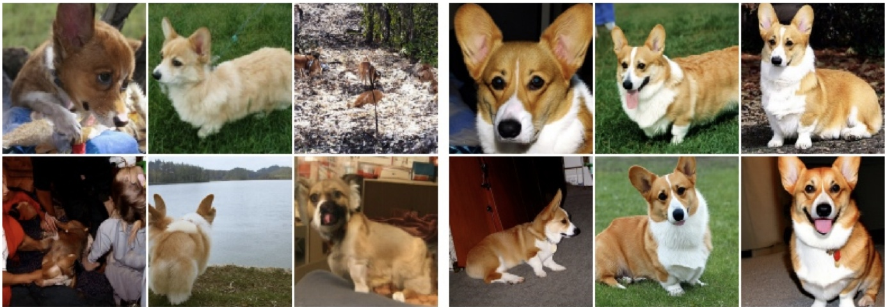

Figure 11: Image generation with prompt/class y =“corgi dog”. Left: samples generated with vanilla guidance - the images do not fit well to the prompt. Right: samples generated with classifier guidance and $w = 4$ . As shown, classifier-free guidance improves the adherence to the prompt. Figure taken from [18].

before, and we can accordingly construct a generative model using the conditional flow matching objective, viz.,

$$
\mathbb {E} _ {z \sim p _ {\mathrm{data}} (\cdot | y), x \sim p _ {t} (\cdot | z)} \| u _ {t} ^ {\theta} (x | y) - u _ {t} ^ {\mathrm{target}} (x | z) \| ^ {2}.\tag{57}
$$

Note that the label y does not affect the conditional probability path $p _ { t } ( \cdot | z )$ or the conditional vector field $u _ { t } ^ { \mathrm { t a r g e t } } ( x | z )$ (although in principle, we could make it dependent). Expanding the expectation over all such choices of $y ,$ we thus obtain a guided conditional flow matching objective

$$
\mathcal {L} _ {\mathrm{CFM}} ^ {\mathrm{guided}} (\theta) = \mathbb {E} _ {(z, y) \sim p _ {\mathrm{data}} (z, y), t \sim \mathrm{Unif} [ 0, 1 ], x \sim p _ {t} (\cdot | z)} \| u _ {t} ^ {\theta} (x | y) - u _ {t} ^ {\mathrm{target}} (x | z) \| ^ {2}.\tag{58}
$$

One of the main differences between the guided objective in Equation (58) and the unguided objective from Equation (26) is that here we are sampling $( z , y ) \sim p _ { \mathrm { d a t a } }$ rather than just $z \sim p _ { \mathrm { d a t a } }$ . The reason is that our data distribution is now, in principle, a joint distribution over e.g., both images z and text prompts y. In practice, this means that a PyTorch implementation of Equation (58) would involve a dataloader which returned batches of both z and y.

## 5.2 Classifer-Free Guidance

In theory, vanilla guidance should lead to a faithful generation procedure of $p _ { \mathrm { d a t a } } ( \cdot | y )$ However, it was soon empirically realized that images samples with this procedure did not fit well enough to the desired label y (see Figure 11). This can have a diversity of reasons: the model might underfit (i.e. we do not actually learn the true marginal vector field) or our data might be imperfect (e.g. text-image pairs from the world wide web have a lot of errors). Therefore, to truly generate samples that fit better to a prompt, we have to find a way to artificially reinforce the prompt variable y. The main technique for doing so is called classifier-free guidance that is widely used in the context of state-of-the-art diffusion models, and which we discuss next.

<!-- page: 36 -->

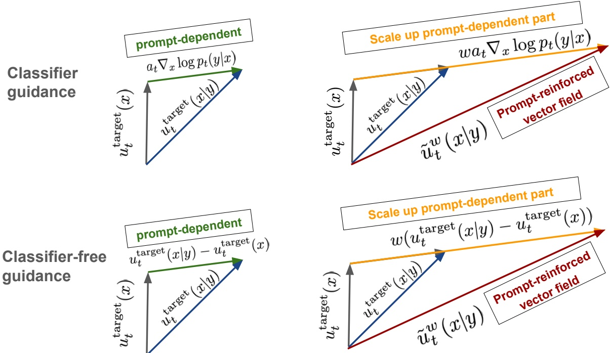

Figure 12: Illustration of classifier and classifier-free guidance. Classifier guidance decomposes the guided vector field $u _ { t } ^ { \mathrm { t a r g e t } } ( x | y )$ and the gradient of a classifier log $p _ { t } ( y | x )$ and scales up the classifier with guidance scale $w > 1$ Classifier-free guidance scales up the difference between both vector fields, thereby achieving the same effect but without having to train a separate classifier model.

Classifier Guidance. For simplicity, we will focus here on the case of Gaussian probability paths. Recall from Equation (15) that a Gaussian conditional probability path is given by $\begin{array} { l } { p _ { t } ( \cdot | z ) = \mathcal { N } ( \alpha _ { t } z , \beta _ { t } ^ { 2 } I _ { d } ) } \\ \end{array}$ where the noise schedulers $\alpha _ { t }$ and $\beta _ { t }$ are continuously differentiable, monotonic, and satisfy $\alpha _ { 0 } = \beta _ { 1 } = 0$ and $\alpha _ { 1 } = \beta _ { 0 } = 1$ . Further, recall that we can use Proposition 1 to rewrite the guided vector field $u _ { t } ^ { \mathrm { t a r g e t } } ( x | y )$ in the following form using the guided score function $\nabla \operatorname { l o g } p _ { t } ( x | y )$

$$
u _ {t} ^ {\mathrm{target}} (x | y) = a _ {t} \nabla \log p _ {t} (x | y) + b _ {t} x,\tag{59}
$$

Next, realize that $p _ { t } ( x | y )$ is a conditional density. Hence, we can use Bayes’ rule to rewrite the guided score as

$$
p _ {t} (x | y) = \frac {p _ {t} (x) p _ {t} (y | x)}{p _ {t} (y)}\tag{60}
$$

$$
\nabla \log p _ {t} (x | y) = \nabla \log \left(\frac {p _ {t} (x) p _ {t} (y | x)}{p _ {t} (y)}\right) = \nabla \log p _ {t} (x) + \nabla \log p _ {t} (y | x),\tag{61}
$$

where we used that the gradient ∇ is taken with respect to the variable $x ,$ so that ∇ log $p _ { t } ( y ) = 0$ . We may thus rewrite

$$
u _ {t} ^ {\mathrm{target}} (x | y) = b _ {t} x + a _ {t} (\nabla \log p _ {t} (x) + \nabla \log p _ {t} (y | x)) = u _ {t} ^ {\mathrm{target}} (x) + a _ {t} \nabla \log p _ {t} (y | x).
$$

Notice the shape of the above equation: The guided vector field $u _ { t } ^ { \mathrm { t a r g e t } } ( x | y )$ is a sum of the unguided vector field $u _ { t } ^ { \mathrm { t a r g e t } } ( x )$ plus a gradient of the likelihood $p _ { t } ( y | x )$ of the guidance variable y. As people observed that their image

<!-- page: 37 -->

x did not fit their prompt y well enough, it was a natural idea to scale up the contribution of the $\nabla \operatorname { l o g } p _ { t } ( y | x )$ term, yielding

$$
\tilde {u} _ {t} (x | y) = u _ {t} ^ {\mathrm{target}} (x) + w a _ {t} \nabla \log p _ {t} (y | x), \quad (\text {classifier guidance})\tag{62}
$$

where $w > 1$ is known as the guidance scale. How can we learn the term log $p _ { t } ( y | x ) ?$ Note that this can be considered as a sort of classifier of noised data (i.e. it gives the log-likelihoods of $y { \mathrm { ~ g i v e n ~ } } x )$ . So we can simply learn it via supervised learning. This leads to classifier guidance [11, 43] (see Figure 12 for an illustration). Classifier guidance was largely superseded by classifier-free guidance, which is why we will not discuss it further here. However, it forms the basis for the classifier-free guidance, as we will see next. Finally, note that this is a heuristic: for $w \neq 1 ,$ , it holds that $\tilde { u } _ { t } ( x | y ) \neq u _ { t } ^ { \mathrm { t a r g e t } } ( x | y )$ , i.e. therefore not the “true” guided vector field.

Classifier-Free Guidance. While classifier guidance is possible in principle, it comes with difficulties: The first thing is that we need to train a classifier alongside a flow/diffusion model - so we have 2 networks instead of 1. Further, if the y is high-dimensional, e.g. a text prompt and not just a class, then $p _ { t } ( y | x )$ might be very hard to learn and the gradient $\nabla \operatorname { l o g } p _ { t } ( y | x )$ hard to obtain. For this reason, classifier-free guidance [18] was introduced. Classifier-free guidance results in the theoretically equivalent effect as classifier guidance but without having to train a separate classifier.

To do so, we may again apply the equality

$$
\nabla \log p _ {t} (x | y) = \nabla \log p _ {t} (x) + \nabla \log p _ {t} (y | x)
$$

to obtain

$$
\begin{array}{r l} & {\tilde {u} _ {t} (x | y) = u _ {t} ^ {\mathrm{target}} (x) + w a _ {t} \nabla \log p _ {t} (y | x)} \\ & {\quad = u _ {t} ^ {\mathrm{target}} (x) + w a _ {t} (\nabla \log p _ {t} (x | y) - \nabla \log p _ {t} (x))} \\ & {\quad = u _ {t} ^ {\mathrm{target}} (x) - (w b _ {t} x + w a _ {t} \nabla \log p _ {t} (x)) + (w b _ {t} x + w a _ {t} \nabla \log p _ {t} (x | y))} \\ & {\quad = (1 - w) u _ {t} ^ {\mathrm{target}} (x) + w u _ {t} ^ {\mathrm{target}} (x | y).} \end{array}
$$

We may therefore express the scaled guided vector field $\tilde { u } _ { t } ( x | y )$ as the linear combination of the unguided vector field $u _ { t } ^ { \mathrm { t a r g e t } } ( x )$ with the guided vector field $u _ { t } ^ { \mathrm { t a r g e t } } ( x | y )$ . The idea might then to to train both an unguided $u _ { t } ^ { \mathrm { t a r g e t } } ( x )$ (using e.g., Equation (26)) as well as a guided $u _ { t } ^ { \mathrm { t a r g e t } } ( x | y )$ (using e.g., Equation (58)), and then combine them at inference time to obtain $\tilde { u } _ { t } ( x | y )$ . "But wait!", you might ask, "wouldn’t we need to train two models then !?". It turns out that we can train both in one model: we may augment our label set with a new, additional ∅ label that denotes the absence of conditioning. We can then treat $u _ { t } ^ { \mathrm { t a r g e t } } ( x ) = u _ { t } ^ { \mathrm { t a r g e t } } ( x | \varnothing )$ . With that, we do not need to train a separate model to reinforce the effect of a hypothetical classifier. This approach of training a conditional and unconditional model in one (and subsequently reinforcing the conditioning) is known as classifier-free guidance (CFG) [18] (see Figure 12 for an illustration).

Remark 26 (Derivation for general probability paths)

<!-- page: 38 -->

$$
\tilde {u} _ {t} (x | y) = (1 - w) u _ {t} ^ {\mathrm{target}} (x) + w u _ {t} ^ {\mathrm{target}} (x | y),
$$

is equally valid for any choice probability path, not just a Gaussian one. When $w = 1$ , it is straightforward to verify that $\tilde { u } _ { t } ( x | y )   =   u _ { t } ^ { \mathrm { t a r g e t } } ( x | y )$ Our derivation using Gaussian paths was simply to illustrate the intuition behind the construction, and in particular of amplifying the contribution of a hypothetical “classifier” ∇ log $p _ { t } ( y | x )$

Training and Classifier-Free Guidance. We must now amend the guided conditional flow matching objective from Equation (58) to account for the possibility of $y = \varnothing$ . The challenge is that when sampling $( z , y ) \sim p _ { \mathrm { d a t a } } ,$ we will never obtain $y = \varnothing$ . It follows that we must introduce the possibility of $y = \varnothing$ artificially. To do so, we will define some hyperparameter η to be the probability that we discard the original label $y ,$ and replace it with ${ \mathcal { Q } } .$ We thus arrive at our CFG conditional flow matching training objective

$$
\mathcal {L} _ {\mathrm{CFM}} ^ {\mathrm{CFG}} (\theta) = \mathbb {E} _ {\square} \| u _ {t} ^ {\theta} (x | y) - u _ {t} ^ {\mathrm{target}} (x | z) \| ^ {2}\tag{63}
$$

$$
\square = (z, y) \sim p _ {\mathrm{data}} (z, y), t \sim \operatorname{Unif} [ 0, 1 ], x \sim p _ {t} (\cdot | z), \text {replace} y = \varnothing \text {with prob.} \eta\tag{64}
$$

Algorithm 5 Classifier-free guidance training for Gaussian probability path $p_t(x|z) = \mathcal{N}(x; \alpha_t z, \beta_t^2 I_d)$

Require: Paired dataset $(z, y) \sim p_{\text{data}}$, neural network $u_t^\theta$
for each mini-batch of data do
    Sample a data example $(z, y)$ from the dataset.
    Sample a random time $t \sim \text{Unif}_{[0,1]}$.
    Sample noise $\epsilon \sim \mathcal{N}(0, I_d)$
    Set $x = \alpha_t z + \beta_t \epsilon$
    With probability $p$ drop label: $y \leftarrow \varnothing$
    Compute loss

$\mathcal{L}(\theta) = \|u_t^\theta(x|y) - (\dot{\alpha}_t z + \dot{\beta}_t \epsilon)\|^2$

Update the model parameters $\theta$ via gradient descent on $\mathcal{L}(\theta)$.
end for

We summarize our findings below.

Summary 27 (Classifier-Free Guidance for Flow Models)

Given the unguided marginal vector field  $u_{t}^{\mathrm{target}}(x|\varnothing)$ , the guided marginal vector field  $u_{t}^{\mathrm{target}}(x|y)$ , and a guidance scale w &gt; 1, we define the classifier-free guided vector field  $\tilde{u}_{t}(x|y)$  by

$\tilde{u}_{t}(x|y) = (1 - w)u_{t}^{\mathrm{target}}(x|\varnothing) + wu_{t}^{\mathrm{target}}(x|y).$  (65)

By approximating  $u_{t}^{\mathrm{target}}(x|\varnothing)$  and  $u_{t}^{\mathrm{target}}(x|y)$  using the same neural network, we may leverage the following

<!-- page: 39 -->

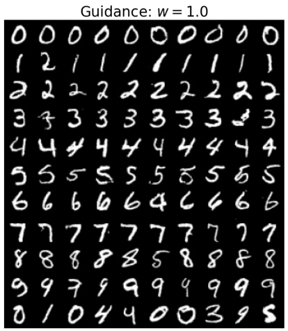

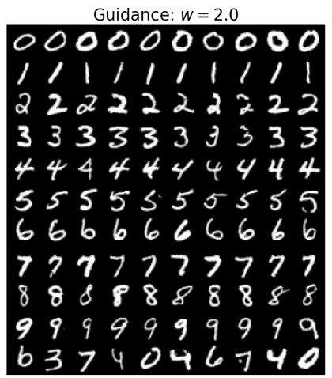

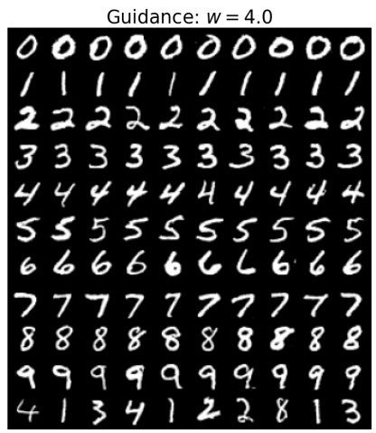

Figure 13: The effect of classifier-free guidance applied at various guidance scales for the MNIST dataset of handwritten digits. Left: Guidance scale set to $w = 1 . 0 .$ Middle: Guidance scale set to $w = 2 . 0$ . Right: Guidance scale set to $w = 4 . 0$ . You will generate a similar image yourself in the lab three!

classifier-free guidance CFM (CFG-CFM) objective, given by
$\mathcal{L}_{\mathrm{CFM}}^{\mathrm{CFG}}(\theta) = \mathbb{E}_{\square} \| u_t^\theta(x|y) - u_t^{\text{target}}(x|z)\|^2$ (66)
$\square = (z,y) \sim p_{\mathrm{data}}(z,y), t \sim \mathrm{Unif}[0,1], x \sim p_t(\cdot|z)$, replace $y = \varnothing$ with prob. $\eta$ (67)
In plain English, $\mathcal{L}_{\mathrm{CFM}}^{\mathrm{CFG}}$ might be approximated by
$(z,y) \sim p_{\mathrm{data}}(z,y)$ ▶ Sample $(z,y)$ from data distribution.
$t \sim \mathrm{Unif}[0,1)$ ▶ Sample $t$ uniformly on $[0,1)$.
$x \sim p_t(x|z)$ ▶ Sample $x$ from the conditional probability path $p_t(x|z)$.
with prob. $\eta, y \leftarrow \varnothing$ ▶ Replace $y$ with $\varnothing$ with probability $\eta$.
$\widehat{\mathcal{L}_{\mathrm{CFM}}^{\mathrm{CFG}}(\theta)} = \| u_t^\theta(x|y) - u_t^{\text{target}}(x|z)\|^2$ ▶ Regress model against conditional vector field.
At inference time, for a fixed choice of $y$, we may sample via
Initialization: $X_0 \sim p_{\mathrm{init}}(x)$ ▶ Initialize with simple distribution (such as a Gaussian)
Simulation: $\mathrm{d}X_t = \tilde{u}_t^\theta(X_t|y)\mathrm{d}t$ ▶ Simulate ODE from $t = 0$ to $t = 1$.
Samples: $X_1$ ▶ Goal is for $X_1$ to adhere to the guiding variable $y$.

Note that the distribution of $X _ { 1 }$ is not necessarily aligned with $X _ { 1 } \sim p _ { \operatorname { d a t a } } ( \cdot | y )$ anymore if we use a weight $w > 1$ However, empirically, this shows better alignment with conditioning. Classifier-free guidance is therefore a heuristic that is predominantly justified by its excellent empirical results. In fact, almost any image or video that you see that is AI-generated relied heavily on classifier-free guidance $w \geq 4 .$ In Figure 11, we illustrate class-based classifier-free guidance on 128x128 ImageNet, as in [18]. Similarly, in Figure 13, we visualize the affect of various guidance scales w when applying classifier-free guidance to sampling from the MNIST dataset of handwritten digits.

<!-- page: 40 -->

## Remark 28 (Guidance for Diffusion Models)

It is straight-forward to extend the discussion from flow models to diffusion models. One simply replaces $u _ { t } ^ { \theta } ( x | y )$ by $\tilde { u } _ { t } ^ { \theta } ( x | y )$ and samples using SDEs as discussed in Section 4.

<!-- page: 41 -->

## 6 Building Large-Scale Image or Video Generators

In the previous sections, we learned how to train a flow matching or diffusion model to sample from a distribution $p _ { \mathrm { d a t a } } ( x | y )$ This recipe is general and can be applied to a variety of different data types and applications. In this section, we examine in depth the particular cases of large-scale image and video generation, and including well-known models such as FLUX 2.0, Stable Diffusion 3, Nano Banana and VEO-3 or Meta Movie Gen Video. Finally, we’ll apply what we’ve learned so far in the lab to build our own version of such models from scratch! This section is broadly arranged as follows:

1. Neural network architectures: We first discuss how raw conditioning input, including the time $t ,$ and guidance variable $y _ { \mathrm { r a w } }$ (i.e., a discrete class label or raw text), is converted, or embedded into a vector-valued form digestible by the model $u _ { t } ^ { \theta } ( x | y )$ itself. Then we discuss popular architectural choices for $u _ { t } ^ { \theta } ( x | y )$ , including the U-Net and diffusion transformer.

2. Latent Space: We discuss variational autoencoders, which allow for generative modeling in a lower dimensional latent space, thereby enabling ultra high-resolution image generation.

3. Case Studies: Finally, we will examine in depth the two state-of-the-art image and video models mentioned above - Stable Diffusion and Meta MovieGen - to give you a taste of how things are done at scale.

## 6.1 Neural Network Architectures

Let us first turn our attention toward the design of scalable neural network architectures for flow and diffusion models targeting image-like modalities (e.g., images and videos). Specifically, we’ll explore how the task of the (guided) vector field $u _ { t } ^ { \theta } ( x | y )$ with parameters θ is implemented in practice. Note that the neural network must have 3 inputs: a vector $x \in \mathbb { R } ^ { d }$ , a conditioning variable $y \in \mathcal { Y }$ , and a time value $t \in [ 0 , 1 ]$ , as well as one output, a vector $u _ { t } ^ { \theta } ( x | y ) \in \mathbb { R } ^ { d }$ . For low-dimensional distributions (e.g. the toy distributions we have seen in previous sections), it is sufficient to parameterize $u _ { t } ^ { \theta } ( x | y )$ as a multi-layer perceptron (MLP), otherwise known as a fully connected neural network. That is, in this simple setting, a forward pass through $u _ { t } ^ { \theta } ( x | y )$ would involve concatenating our input x, y, and $t ,$ and passing them through an MLP. However, for complex, high-dimensional distributions, such as those over images, videos, and proteins, an MLP will likely not suffice, and it is common to use special, applicationspecific architectures. For the remainder of this subsection, we will consider the case of images (and by extension, videos). First, we’ll consider how the raw conditioning information - the time t and the conditioning variable y - are embedded into a vector-valued form digestible by the actual model. Second, we’ll consider two common architectural architectural choices for such a model: the U-Net [38, 17, 22, 11], and the diffusion transformer (DiT) [12, 30, 28].

## 6.1.1 Embedding the Conditioning Variables

Embedding Time. For simple toy models, concatenating the raw value of t to the input is sufficient to train a reasonably performant network. In practice, the scalar time is often embedded in a higher dimensional space using Fourier features, allowing the model to more faithfully capture high-frequency time dependence [46]. Explicitly,

<!-- page: 42 -->

the featurization is given by

$$
\mathrm{TimeEmb} (t) = \sqrt {\frac {2}{d}} \left[ \cos (2 \pi w _ {1} t) \quad \dots \quad \cos (2 \pi w _ {d / 2} t) \quad \sin (2 \pi w _ {1} t) \quad \dots \quad \sin (2 \pi w _ {d / 2} t) \right] ^ {T},\tag{68}
$$

where the frequencies $w _ { i }$ are set in the following way

$$
w _ {i} = w _ {\min} \left(\frac {w _ {\max}}{w _ {\min}}\right) ^ {\frac {i - 1}{d / 2 - 1}}, \quad i = 1, \dots , d / 2.\tag{69}
$$

This choice of TimeEmb is a standard choice but this exact form is not strictly necessary. Rather, the above is simply a convenient way of obtaining a normed embedding of dimension $d ,$ i.e. $\left\| \mathrm { T i m e E m b } ( t ) \right\|   =   1$ (because $\sin ^ { 2 } + \cos ^ { 2 } = 1 )$

Embedding Class Labels. When $y _ { \mathrm { r a w } }   \in   \mathcal { Y }   \triangleq   \{ 0 , \ldots , N \}$ is just a class label, then it is often easiest to simply learn a separate embedding vector for each of the $N + 1$ possible values of $y _ { \mathrm { r a w } }$ , and set $y$ to this embedding vector. One would consider the parameters of these embeddings to be included in the parameters of $u _ { t } ^ { \theta } ( x | y )$ , and would therefore learn these during training.

Embedding Textual Input When $y _ { \mathrm { r a w } }$ is a text-prompt, the situation is more complex, and approaches largely rely on frozen, pre-trained models. Such models are trained to embed a discrete text input into a continuous vector that captures the relevant information. One such model is known as CLIP (Contrastive Language-Image Pre training). CLIP is trained to learn a shared embedding space for both images and text-prompts, using a training loss designed to encourage image embeddings to be close to their corresponding prompts, while being farther from the embeddings of other images and prompts [34]. We might therefore take $\begin{array} { r } { y   =   \mathrm { C L I P } ( y _ { \mathrm { r a w } } )   \in   \mathbb { R } ^ { d _ { \mathrm { C L I P } } } } \end{array}$ to be the embedding produced by a frozen, pre-trained CLIP model. In certain cases, it may be undesirable to compress the entire sequence into a single representation. In this case, one might additionally consider embedding the prompt using a pre-trained transformer so as to obtain a sequence of embeddings. It is also common to combine multiple such pretrained embeddings when conditioning so as to simultaneously reap the benefits of each model [14, 33]. For our purposes, one can simply assume that after applying such a model the prompt embedding has shape

$$
\text {PromptEmbed} (y _ {\text {raw}}) \in \mathbb {R} ^ {S \times k}
$$

## 6.1.2 Diffusion Transformers

Before we dive into the specifics of these architectures, let us recall from the introduction that an image is simply a vector $x   \in   \mathbb { R } ^ { C _ { \mathrm { i m a g e } } \times H \times W }$ Here $C _ { \mathrm { i m a g e } }$ denotes the number of channels (an RGB image typically would have $C _ { \mathrm { i n p u t } } = 3$ color channels), and H and W respectively denote the height and width of the image in pixels. One particularly prominent architectural class are so-called diffusion transformers (DiTs), and their variants, which use the attention mechanism to construct the network [49, 30, 28]. There are different flavors of diffusion transformers. We explain here a generic design, and note though that specific instantiations of DiTs might differ depending on model and application. For the remainder of this section, we will use d to denote the hidden dimension, L to denote the number of transformer layers, and h to denote the number of heads per layer. Diffusion transformers are based on vision transformers (ViTs), whose main idea is essentially to divide up an image into patches, embed

<!-- page: 43 -->

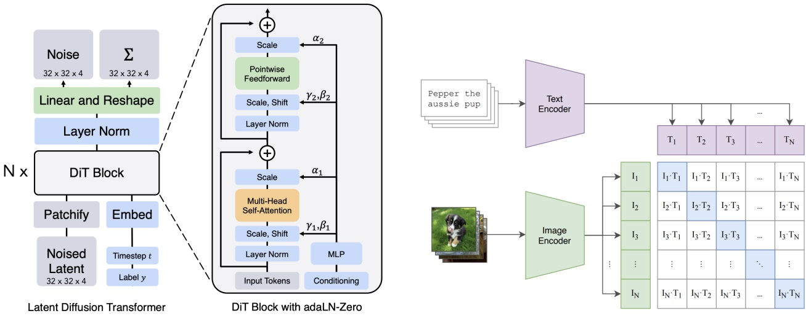

Figure 14: Left: An overview of the diffusion transformer architecture, taken from [30]. Right: A schematic of the contrastive CLIP loss, in which a shared image-text embedding space is learned, taken from [34].

the patches to obtain a sequence of tokens, and process the resulting tokens via standard attention [13]. A fina depatchification operation is applied at the end to recover an image of the correct shape. The initial patchification operation is simply a restructuring of the image tensor $x \in \mathbb { R } ^ { C \times H \times W }$

$$
\mathrm{Patchify} (x) \in \mathbb {R} ^ {N \times C ^ {\prime}}
$$

where $C ^ { \prime } = C P ^ { 2 } , N = ( H / P ) \cdot ( W / P )$ for P the patch size. Next, we apply a linear transformation to the output giving us the final patch embedding

$$
\operatorname{PatchEmb} (x) = \operatorname{Patchify} (x) W \in \mathbb {R} ^ {N \times d}
$$

where $W \in \mathbb { R } ^ { C ^ { \prime } \times d }$ is a learnable weight matrix. The inputs to the diffusion transformer are then the time embedding, the prompt embedding, and the patchified image tensor given by (see Section 6.1.1):

$$
\begin{array}{r} \tilde {t} = \mathrm{TimeEmb} (t) \in \mathbb {R} ^ {d} \\ \tilde {y} = \mathrm{PromptEmb} (y) \in \mathbb {R} ^ {S \times d} \\ \tilde {x} _ {0} = \mathrm{PatchEmb} (x) \in \mathbb {R} ^ {N \times d} \end{array}
$$

Note that all elements have now the desired hidden dimension of the transformer. The diffusion transformer then iteratively updates $\tilde { z } _ { i }$ via for $i = 0 , \cdots , L - 1$ via transformer layers in a DitBlock (see Remark 29 for details):

$$
\tilde {x} _ {i + 1} = \mathrm{DiTBlock} (\tilde {x} _ {i}, \tilde {t}, \tilde {y}) \in \mathbb {R} ^ {N \times d} \quad (i = 0, \dots , L - 1).\tag{70}
$$

<!-- page: 44 -->

where N is the number of layers. Finally, a final operation applies a depatchification operation which maps the DiT output back to the desired output shape:

$$
u = \text {Depatchify} (\tilde {x} _ {N} \tilde {W}) \in \mathbb {R} ^ {C \times H \times W},
$$

where $\tilde { W } \in \mathbb { R } ^ { d \times C ^ { \prime } }$ . The final tensor u then serves as the output of the model and the predicted velocity $u _ { t } ^ { \theta } ( x | y )$

## Remark 29 (DiT Block)

For completeness, we present a brief mathematical description of a single DiT layer. While we attempt to include enough detail to allow for a general understanding of the DiT model family, we remind the reader that these choose to emphasize key algorithmic choices rather than architectural details. Now, let $x \in \mathbb { R } ^ { N \times d }$ denote the current sequence of patch tokens (here $x = \tilde { x } _ { i } )$ , and let $y \in \mathbb { R } ^ { S \times d }$ denote the embedded guiding variable (here $y = \tilde { y } )$ Then, a typical DiT block updates x using (i) self-attention on patches, (ii) cross-attention to the prompt, and (iii) time conditioning via adaptive normalization (AdaLN).

Scaled Dot Product Attention. Given queries $Q \in \mathbb { R } ^ { N \times d _ { h } }$ , keys $K \in \mathbb { R } ^ { M \times d _ { h } }$ , and values $V \in \mathbb { R } ^ { M \times d _ { h } }$ ,

$$
\mathrm{Attn} (Q, K, V) = \mathrm{softmax} \bigg (\frac {Q K ^ {\top}}{\sqrt {d _ {h}}} \bigg) V \in \mathbb {R} ^ {N \times d _ {h}},
$$

where the softmax is applied row-wise.

Multi-Head Attention. Let h denote the number of heads and $\begin{array} { r } { d _ { h } = \frac { d } { h } } \end{array}$ the per-head dimension. For each head $h \in \{ 1 , \ldots , n _ { \mathrm { h e a d s } } \}$ , learn projection matrices $W _ { Q } ^ { ( h ) } , W _ { K } ^ { ( h ) } , W _ { V } ^ { ( h ) } \in \mathbb { R } ^ { k \times d _ { h } }$ . Define

$$
\mathrm{head} _ {h} (x, z) = \mathrm{Attn} \bigl (x W _ {Q} ^ {(h)}, z W _ {K} ^ {(h)}, z W _ {V} ^ {(h)} \bigr),
$$

where the source sequence z is either

$$
z = x \quad (\text {self - attention on patches}), \qquad z = y \quad (\text {cross - attention to the prompt}).
$$

Concatenate heads and apply an output projection $W _ { O } \in \mathbb { R } ^ { d \times d }$ :

$$
\text {MultiHeadattention} (x, z) = \operatorname{Concat} \bigl (\operatorname{head} _ {1} (x, z), \dots , \operatorname{head} _ {h} (x, z) \bigr) W _ {O} \in \mathbb {R} ^ {N \times d}.
$$

Time Conditioning via Adaptive Normalization. Let $\tilde { t } \in \mathbb { R } ^ { d }$ be the timestep embedding. A standard choice in DiTs is to use t˜ to produce per-channel scale/shift parameters that modulate normalized activations [31]. Concretely, let $g : \mathbb { R } ^ { d } \rightarrow \mathbb { R } ^ { 2 d }$ be an MLP and set

$$
(\gamma , \beta) = g (\tilde {t}),
$$

where $\gamma , \beta \in \mathbb { R } ^ { d }$ (or, depending on the implementation, separate $( \gamma , \beta )$ pairs for different sub-layers such as attention and MLP). Given a token matrix $x \in \mathbb { R } ^ { N \times d }$ and a normalization operator Norm(·) (e.g. LayerNorm),

<!-- page: 45 -->

define the modulated normalization

$$
\mathrm{AdaNorm} _ {\tilde {t}} (x) = \left(1 + \gamma\right) \odot \mathrm{Norm} (H) + \beta ,
$$

where $\odot$ denotes elementwise multiplication with broadcasting over the token dimension.

Putting It Together. The combined operation, and thus the DitBlock, is given by.

$$
\begin{array}{l} x \gets x + g _ {\mathrm{self}} (\tilde {t}) \odot \mathrm{MultiHeadattention} \big (\mathrm{AdaNorm} _ {\tilde {t}} (x), \mathrm{AdaNorm} _ {\tilde {t}} (x) \big) \\ x \gets x + g _ {\mathrm{cross}} (\tilde {t}) \mathrm{MultiHeadattention} \big (\mathrm{AdaNorm} _ {\tilde {t}} (x), y \big) \\ x \gets x + g _ {\mathrm{MLP}} (\tilde {t}) \mathrm{MLP} \big (\mathrm{AdaNorm} _ {\tilde {t}} (x) \big), \end{array}
$$

where the MLP is a position-wise feed-forward network, and the $g . .$ · are learnable gating parameters. The output $x \in \mathbb { R } ^ { N \times d }$ becomes the next-layer patch-token sequence (in our notation, $\tilde { x } _ { i + 1 } )$ Finally, we note that class-conditioned DiT’s, such as the one implemented in the lab, are typically simpler and eschew the cross attention layer in favor of a time and class-based AdaNorm conditioning.

## 6.1.3 U-Net

The U-Net architecture [38] is an alternative architecture to the DiT architecture and is a specific type of con volutional neural network. Originally designed for image segmentation, its crucial feature is that both its input and its output have the shape of images (possibly with a different number of channels). This makes it ideal for parameterizing a vector field $x \mapsto u _ { t } ^ { \theta } ( x | y )$ , as for fixed $y , t$ its input has the shape of an image and its output does, too. Accordingly, U-Nets have seen widespread use across much of the early literature on diffusion models [17, 22, 11]. A U-Net consists of a series of encoders $\mathcal { E } _ { i } ,$ and a corresponding sequence of decoders $\mathcal { D } _ { i } ,$ along with a latent processing block in between, which we shall refer to as a midcoder.3 For sake of example, let us walk through the path taken by an image $x _ { t }   \in   \mathbb { R } ^ { 3 \times 2 5 6 \times 2 5 6 }$ (we have taken $( C _ { \mathrm { i n p u t } } , H , W )   =   ( 3 , 2 5 6 , 2 5 6 ) )$ as it is processed by the U-Net:

$$
x _ {t} ^ {\text {input}} \in \mathbb {R} ^ {3 \times 2 5 6 \times 2 5 6} \quad \blacktriangleright \text {Input to the U - Net.}
$$

$$
x _ {t} ^ {\mathrm{latent}} = \mathcal {M} (x _ {t} ^ {\mathrm{latent}}) \in \mathbb {R} ^ {5 1 2 \times 3 2 \times 3 2}
$$

▶ Pass latent through midcoder.

$$
x _ {t} ^ {\mathrm{output}} = \mathcal {D} (x _ {t} ^ {\mathrm{latent}}) \in \mathbb {R} ^ {3 \times 2 5 6 \times 2 5 6}
$$

▶ Pass through decoders to obtain output.

Notice that as the input passes through the encoders, the number of channels in its representation increases, while the height and width of the images are decreased. Both the encoder and the decoder usually consist of a series of convolutional layers (with activation functions, pooling operations, etc. in between). Not shown above are two points: First, the input $x _ { t } ^ { \mathrm { i n p u t } } \in \mathbb { R } ^ { 3 \times 2 5 6 \times 2 5 6 }$ is often fed into an initial pre-encoding block to increase the number of channels before being fed into the first encoder block. Second, the encoders and decoders are often connected by residual connections. The complete picture is shown in Figure 15. At a high level, most U-Nets involve some

<small>3Midcoder is a completely non-standard term used here to refer to the bottom-most part of the U-Net stack, and in analogy with the encoder and decoder.</small>

<!-- page: 46 -->

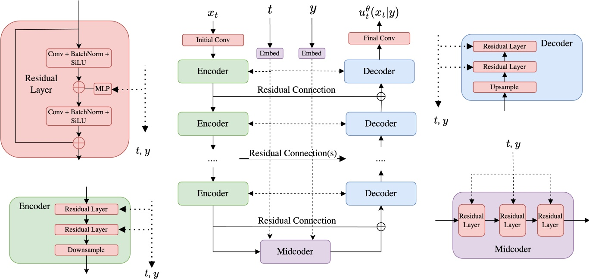

Figure 15: A simplified U-Net architecture (an architecture like this was used in lab 03 of the 2025 version of this course).

variant of what is described above. However, certain of the design choices described above may well differ from various implementations in practice. In particular, we opt above for a purely-convolutional architecture whereas it is common to include attention layers as well throughout the encoders and decoders. The U-Net derives its name from the “U”-like shape formed by its encoders and decoders (see Figure 15).

## 6.2 Working in Latent Space: (Variational) Autoencoders

Thus far, we have operated in the data space $\mathbb { R } ^ { d } ,$ . However, the cost of modeling directly within such a space quickly becomes prohibitively expensive as one scales to increasingly higher resolution images. For example, a $1 0 2 4 \times 1 0 2 4$ image with three RGB color channels corresponds to a total dimension of $d   =   H \cdot W \cdot 3   \approx   3 * 1 0 ^ { 6 } !$ Note that the dimension increases further for videos as everything scales with the number of frames T. As you can imagine, training over such a space quickly becomes infeasible. Unlike image classification, whose low-dimensional outputs allow for narrowing convolutional stacks, our flow-based modeling approach requires that our output $u _ { t } ^ { \theta } ( x ) \in \mathbb { R } ^ { d }$ be just as large as our input. The important question thus becomes: How can we model high-dimensional images within a reasonable memory and computation budget?

## 6.2.1 Standard Autoencoders

A natural answer to this question lies in compression: perhaps the actual space of images, for example, lies near a much lower-dimensional manifold of the high dimensional image space. More concretely, we might consider an encoder $\mu _ { \phi } : \mathbb { R } ^ { d } \rightarrow \mathbb { R } ^ { k }$ , together with some decoder $\mu _ { \theta } : \mathbb { R } ^ { k } \rightarrow \mathbb { R } ^ { d }$ , which together map raw images x $\in \mathbb { R } ^ { d }$ to and from latents $z \in \mathbb { R } ^ { k }$ , respectively. The dimension k is typically chosen to be much smaller than d. For images, in

<!-- page: 47 -->

which, for example, $d = 3 \times 1 0 2 4 \times 1 0 2 4$ , it is not uncommon to downsample to obtain e.g., $\textstyle k = 3 \times { \frac { 1 0 2 4 } { 1 6 } } \times { \frac { 1 0 2 4 } { 1 6 } }$ Together, $\mu _ { \phi }$ and $\mu _ { \theta }$ are referred to as an autoencoder. Ideally, $\mu _ { \phi }$ and $\mu _ { \theta }$ are chosen so as to achieve high reconstruction quality, or in other words, so that $\mu _ { \theta } ( \mu _ { \phi } ( x ) )$ resembles x on average. Accordingly, autoencoders are usually trained with the reconstruction loss

$$
\mathcal {L} _ {\mathrm{Recon}} (\phi , \theta) = \mathbb {E} _ {x \sim p _ {\mathrm{data}}} \left[ \| \mu_ {\theta} (\mu_ {\phi} (x)) - x \| ^ {2} \right].
$$

which measures the squared error between the original data point x and the reconstructed one $\mu _ { \theta } ( \mu _ { \phi } ( x ) )$

Amenability to Generative Modeling. Unfortunately, the reconstruction loss above is not enough to train a “good” autoencoder. Recall that our eventual goal is to train a generative model in the latent space, and targeting the latent distribution $p _ { \mathrm { l a t e n t } } ( z )$ given by $z = \mu _ { \phi } ( x ) , x \sim p _ { \mathrm { d a t a } }$ . A generative model for $p _ { \mathrm { d a t a } } ( x )$ is then realized by passing the output of our latent generative model through the decoder $\mu _ { \theta }$ . A subtle issue arises with autoencoders as we have currently formulated them in that we have little to no control over $p _ { \mathrm { l a t e n t } } ( z )$ , and thus essentially no guarantee that $p _ { \mathrm { l a t e n t } } ( z )$ is even well-behaved enough to be amenable to training such a generative model $( \mathrm { i . e . } ,$ nice, simple, Gaussian-like). While transforming our data in latent space might have compressed it, we might have transformed the data distribution $p _ { \mathrm { d a t a } }$ into a very hard-to-learn distribution $p _ { \mathrm { l a t e n t } }$ . Therefore, the question is: how can we make sure that the latent distribution $p _ { \mathrm { l a t e n t } }$ is still well-behaved and easy-to-learn? To allow for more explicit regularization of the latent distribution, we will now recast the concept of autoencoder in a more general probabilistic framework leading to the concept of a variational autoencoder.

## 6.2.2 Variational Autoencoders

A variational autoencoder (VAE) is obtained from our (deterministic) standard autoencoder formulation by relaxing the constraint that the encoder and decoder are deterministic functions. In particular, let us consider an encoder $q _ { \phi } ( z | x )$ with parameters $\phi ,$ and a decoder $p _ { \theta } ( x | z )$ with parameters θ. The most common choice is to take

$$
q _ {\phi} (z | x) = \mathcal {N} (z; \mu_ {\phi} (x), \mathrm{diag} (\sigma_ {\phi} ^ {2} (x))), \quad p _ {\theta} (x | z) = \mathcal {N} (x; \mu_ {\theta} (z), \sigma_ {\theta} ^ {2} (z) I _ {d})\tag{71}
$$

where $\mu _ { \phi } ( x ) \in \mathbb { R } ^ { k } , \; \sigma _ { \phi } ^ { 2 } ( x ) \in \mathbb { R } _ { \geq 0 } ^ { k } , \; \mu _ { \theta } ( z ) \in \mathbb { R } ^ { d }$ , and $\sigma _ { \theta } ^ { 2 } ( z )   \in   \mathbb { R } _ { \geq 0 }$ are parameterized as neural networks and diag denotes the diagonal matrix. To encode or decode a variable, we sample

$$
\begin{array}{l} z \sim q _ {\phi} (\cdot | x) \\ x \sim p _ {\theta} (\cdot | z) \end{array}
$$

(encode)

(decode)

Finally, we note that when $\sigma _ { \phi } ( x ) = 0$ and $\sigma _ { \theta } ( x ) = 0$ always, we recover a standard autoencoder. Let us examine what a reconstruction loss looks like. A natural objective is the following:

$$
\mathcal {L} _ {\mathrm{VAE-Recon}} (\phi , \theta) = - \mathbb {E} _ {x \sim p _ {\mathrm{data}} (x), z \sim q _ {\phi} (\cdot | x)} \left[ \log p _ {\theta} (x | z) \right]
$$

(72)

Note the two changes: Instead of a deterministic encoding, we now sample $z \sim q _ { \phi } ( z | x )$ Further, we now take the negative log-likelihood of x under decoding, i.e. the loss effectively asks: how likely would our original data point x be if we encoded and decoded it - and we take all possible decodings/encodings into account as things have become

<!-- page: 48 -->

random now. For the Gaussian case, this reconstruction loss becomes:

$$
\mathcal {L} _ {\mathrm{VAE-Recon}} (\phi , \theta) = \mathbb {E} _ {x \sim p _ {\mathrm{data}} (x), z \sim q _ {\phi} (z | x)} \left[ \frac {1}{2 \sigma_ {\theta} ^ {2} (z)} \| x - \mu_ {\theta} (z) \| ^ {2} + \frac {d}{2} \log \sigma_ {\theta} ^ {2} (z) \right] + \text {const}\tag{73}
$$

where we used the density of the normal distribution (see Equation (97)) Hence, the VAE reconstruction loss is not that different from the standard AE reconstruction loss, we simply have to take into account all possible encodings $z   \sim   q _ { \phi } ( \cdot | x )$ The second term depending on the decoder variance controls the tradeoff between reconstruction accuracy and predictive uncertainty. Many implementations, including that in the lab, fix $\sigma _ { \phi } ( x )$ and $\sigma _ { \theta } ( z )$ to learned scalar constants (that is, independent of x and z, respectively), thereby avoiding pathological behavior and numerical stability when learning variances. Therefore, the VAE reconstruction loss in this case then becomes basically the standard autoencoder reconstruction loss up to stochasticity in the encoding and constants:

$$
\mathcal {L} _ {\mathrm{VAE-Recon}} (\phi , \theta) = \mathbb {E} _ {x \sim p _ {\mathrm{data}} (x), z \sim q _ {\phi} (z | x)} \left[ \frac {1}{2 \sigma_ {\theta} ^ {2}} \| x - \mu_ {\theta} (z) \| ^ {2} \right] + \mathrm{const}\tag{74}
$$

Let us now revisit our goal: We want to create an encoding of our data distribution $p _ { \mathrm { d a t a } } ( x )$ such that after mapping it into a latent space, the distribution becomes “nice” or easy-to-learn. Toward this end, let us now introduce a prior distribution $p _ { \mathrm { p r i o r } } ( z )$ over latents z. For our purposes, we will take $p _ { \mathrm { p r i o r } }   =   \mathcal { N } ( 0 , I _ { k } )$ to be an isotropic Gaussian. This choice of prior distribution $p _ { \mathrm { p r i o r } }$ effectively represents the “ideal” case for what the latent distribution should look like. A normal distribution would be very easy to learn, and would therefore satisfy our goal of obtaining a “trainable” latent distribution. The big idea is thus to regularize our encoder so as to ensure that the encoded data distribution is as close as possible to the $p _ { \mathrm { p r i o r } } ,$ which we accomplish via the auxiliary loss

$$
\mathcal {L} _ {\mathrm{VAE-Prior}} (\phi) = \mathbb {E} _ {x \sim p _ {\mathrm{data}} (x)} \left[ D _ {\mathrm{KL}} (q _ {\phi} (\cdot | x) \parallel p _ {\mathrm{prior}}) \right],\tag{75}
$$

and where $D _ { K L }$ is the Kullback-Leibler (KL) divergence. The KL-divergence is a fundamental way of measuring how different two probability distributions are. Explaining it in detail would go beyond the scope of this work but we give a brief background in Remark 30 as a reminder for the reader. The loss $\mathcal { L } _ { \mathrm { V A E - P r i o r } }$ defined here now is very intuitive: We want that the encoding distributions looks like a Gaussian distribution for any data point x. If we do this for all $x ,$ it is natural to expect that then our latent distribution will look a Gaussian as well.

## Remark 30 (Background on KL-divergence)

For two probability densities $q , p ,$ the Kullback-Leibler divergence (KL-divergence) is defined as

$$
D _ {\mathrm{KL}} (q (x) \parallel p (x)) = \int q (x) \log \frac {q (x)}{p (x)} = \mathbb {E} _ {X \sim q} \left[ \log \frac {q (X)}{p (X)} \right].
$$

The KL divergence is a standard measure of dissimilarity between distributions. In particular, the KL divergence satisfies the following useful properties:

$$
D _ {\mathrm{KL}} (q (x) \parallel p (x)) \geq 0,\tag{76}
$$

$$
D _ {\mathrm{KL}} (q (x) \parallel p (x)) = 0 \quad \Leftrightarrow \quad q = p.\tag{77}
$$

i.e. it is always non-negative and it is zero if and only the two probability distributions coincide.

<!-- page: 49 -->

To define the loss function for a variational autoencoder, we can now combine both the reconstruction and the prior loss with a parameter weight $\beta \geq 0$ to VAE training objective given by

$$
\mathcal {L} _ {\mathrm{VAE}} (\phi , \theta) = \mathcal {L} _ {\mathrm{VAE-Recon}} (\phi , \theta) + \beta \mathcal {L} _ {\mathrm{VAE-Prior}} (\phi)\tag{78}
$$

$$
= - \mathbb {E} _ {x \sim p _ {\mathrm{data}} (x), z \sim q _ {\phi} (z | x)} \left[ \log p _ {\theta} (x \mid z) \right] + \beta \mathbb {E} _ {x \sim p _ {\mathrm{data}} (x)} \left[ D _ {K L} (q _ {\phi} (\cdot | x) | | p _ {\mathrm{prior}}) \right]\tag{79}
$$

where the first summand enforces that latent variables can be efficiently decoded back to data and the second summand enforces that our latent distribution is close to being a Gaussian. The parameter $\beta$ controls the strength of each. To make this loss more specific, let us derive the KL divergence for the Gaussian case:

## Example 31 (KL Divergence Between Isotropic Gaussians)

Let $q ( x ) = \mathcal { N } ( x ; \mu _ { q } , \mathrm { d i a g } ( \sigma _ { q } ^ { 2 } ) )$ and $p ( x ) = \mathcal { N } ( x ; \mu _ { p } , \operatorname { d i a g } ( \sigma _ { p } ^ { 2 } ) )$ be Gaussians with diagonal covariance matrices, with $\sigma _ { q } , \sigma _ { p } \in \mathbb { R } _ { \geq 0 } ^ { d } ,$ and where $x \in \mathbb { R } ^ { d }$ Then

$$
D _ {\mathrm{KL}} (q \parallel p) = \frac {1}{2} \left(\mathcal {K} \left(\frac {\sigma_ {q} ^ {2}}{\sigma_ {p} ^ {2}}\right) + \frac {\| \mu_ {q} - \mu_ {p} \| ^ {2}}{\sigma_ {p} ^ {2}}\right), \quad \text {where} \mathcal {K} (\alpha) = \sum_ {i = 1} ^ {d} \alpha_ {i} - \log \alpha_ {i} - 1.\tag{80}
$$

The expression above is intuitive: If the mean and variances coincide, that then $D _ { \mathrm { K L } } ( q \parallel p ) = 0$ . Further, it increases with the squared error $\| \mu _ { q } - \mu _ { p } \| ^ { 2 }$ between the mean vectors. Finally, the function $\mathcal { K } ( \alpha )$ has a unique minimum at $\alpha = 1$ so that $D _ { \mathrm { K L } } ( q \parallel p )$ is minimized when $\sigma _ { q } = \sigma _ { p }$

Proof. We do the proof for $d = 1$ (proof is analogous for $d > 1$ by summing up each dimension). Given the density of the normal distribution, we know that (see Equation (97)):

$$
\log q (x) = - \frac {1}{2} \log (2 \pi \sigma_ {q} ^ {2}) - \frac {1}{2 \sigma_ {q} ^ {2}} \| x - \mu_ {q} \| ^ {2}, \quad \log p (x) = - \frac {1}{2} \log (2 \pi \sigma_ {p} ^ {2}) - \frac {1}{2 \sigma_ {p} ^ {2}} \| x - \mu_ {p} \| ^ {2}
$$

Then

$$
D _ {\mathrm{KL}} (q \| p) = \mathbb {E} _ {x \sim q} \big [ \log q (x) - \log p (x) \big ] = \frac {1}{2} \log \frac {\sigma_ {p} ^ {2}}{\sigma_ {q} ^ {2}} + \frac {1}{2 \sigma_ {p} ^ {2}} \mathbb {E} _ {q} \big [ \| x - \mu_ {p} \| ^ {2} \big ] - \frac {1}{2 \sigma_ {q} ^ {2}} \mathbb {E} _ {q} \big [ \| x - \mu_ {q} \| ^ {2} \big ].\tag{81}
$$

For $\begin{array} { r } { \boldsymbol { x } \sim \mathcal { N } ( \mu _ { q } , \sigma _ { q } ^ { 2 } \boldsymbol { I } ) } \end{array}$ we have

$$
\mathbb {E} _ {q} \left[ \| x - \mu_ {q} \| ^ {2} \right] = \mathrm{tr} (\sigma_ {q} ^ {2} I) = \sigma_ {q} ^ {2}.
$$

Combining this with the fact that $x - \mu _ { p } = ( x - \mu _ { q } ) + ( \mu _ { q } - \mu _ { p } )$ , and $\mathbb { E } _ { q } [ x - \mu _ { q } ] = 0$ , we obtain

$$
\mathbb {E} _ {q} \big [ \| x - \mu_ {p} \| ^ {2} \big ] = \mathbb {E} _ {q} \big [ \| x - \mu_ {q} \| ^ {2} \big ] + \| \mu_ {q} - \mu_ {p} \| ^ {2} = \sigma_ {q} ^ {2} + \| \mu_ {q} - \mu_ {p} \| ^ {2}.
$$

Plugging these into Equation (81) yields (80).

Let us now assume a Gaussian shape of the encoder. Then we obtain:

$$
\mathcal {L} _ {\mathrm{VAE-Prior}} (\phi) = \mathbb {E} _ {x \sim p _ {\mathrm{data}} (x)} \left[ D _ {\mathrm{KL}} \left(q _ {\phi} (\cdot | x) \| \mathcal {N} \left(0, I _ {k}\right)\right) \right] = \mathbb {E} \left[ \frac {1}{2} \mathcal {K} \left(\sigma_ {\phi} ^ {2} (x)\right) + \frac {1}{2} \| \mu_ {\phi} (x) \| ^ {2} \right]\tag{82}
$$

This loss is intuitive: The mean $\mu _ { \phi } ( x )$ is penalized for being different from zero and the variance penalized for

<!-- page: 50 -->

being different from 1. As a total loss for the VAE, we obtain

$$
\begin{array}{l} \mathcal {L} _ {\mathrm{VAE}} (\phi , \theta) \\ = \mathcal {L} _ {\mathrm{VAE-Recon}} (\phi , \theta) + \beta \mathcal {L} _ {\mathrm{VAE-Prior}} (\phi) \\ = \mathbb {E} _ {x \sim p _ {\mathrm{data}} (x), z \sim q _ {\phi} (z | x)} \left[ \underbrace {\frac {1}{2 \sigma_ {\theta} ^ {2} (z)} \| x - \mu_ {\theta} (z) \| ^ {2}} _ {\text {recon. error}} + \underbrace {\frac {d}{2} \log \sigma_ {\theta} ^ {2} (z)} _ {\text {decoder confidence}} + \underbrace {\frac {\beta}{2} \mathcal {K} \left(\sigma_ {\phi} ^ {2} (x)\right)} _ {\text {make latent variance = 1}} + \underbrace {\frac {\beta}{2} \| \mu_ {\phi} (x) \| ^ {2}} _ {\text {make latent mean = 0}} \right] \end{array}\tag{83}
$$

The four terms of the above loss function are very intuitive: The first term is simply a reconstruction error. The second error describes the decoder’s uncertainty: smaller variance makes the decoder more “confident” but also penalizes reconstruction errors more strongly. Further, we want to make the latent variance 1 and the mean to be 0 - to enforce that the distribution in latent is close to being Gaussian.

Training a VAE. It remains to discuss how we would minimize the VAE loss $\mathcal { L } _ { \mathrm { V A E } } ( \phi , \theta )$ . The problem with the loss is that so far, the distribution we take the expected value over $( q _ { \phi } ( z | x ) )$ still depends on the parameter $\phi .$ However, we can apply the so-called reparameterization trick to rewrite it. Specifically, for

$$
q _ {\phi} (z | x) = \mathcal {N} (z; \mu_ {\phi} (x), \sigma_ {\phi} ^ {2} (x) I _ {k})
$$

we can obtain samples via

$$
\epsilon \sim \mathcal {N} (0, I _ {k}), \quad z = \mu_ {\phi} (x) + \sigma_ {\phi} (x) \epsilon \quad \Rightarrow \quad z \sim q _ {\phi} (\cdot | x)
$$

Note that in this equation, the only source of noise/stochasticity is from ϵ whose distribution is independent of $\phi .$ Therefore, we can rewrite the loss as:

$$
\mathcal {L} _ {\mathrm{VAE}} (\phi , \theta) = \mathbb {E} _ {x \sim p _ {\mathrm{data}} (x), \epsilon \sim \mathcal {N} (0, I _ {k})} \left[ \frac {1}{2 \sigma_ {\theta} ^ {2} (z)} \| x - \mu_ {\theta} (\mu_ {\phi} (x) + \sigma_ {\phi} (x) \epsilon) \| ^ {2} + \frac {d}{2} \log \sigma_ {\theta} ^ {2} (z) + \frac {\beta}{2} \mathcal {K} \left(\sigma_ {\phi} ^ {2} (x)\right) + \frac {\beta}{2} \| \mu_ {\phi} (x) \| ^ {2} \right]
$$

After reparameterization, the randomness comes only from $\epsilon \sim \mathcal { N } ( 0 , I _ { k } )$ , whose distribution does not depend on $\phi .$ Therefore, we can minimize this loss with the standard tools of deep learning. To simplify things even further, we can set $\sigma _ { \theta } ^ { 2 } ( z ) = \sigma ^ { 2 }$ constant everywhere again and obtain:

$$
\mathcal {L} _ {\mathrm{VAE}} (\phi , \theta) = \mathbb {E} _ {x \sim p _ {\mathrm{data}} (x), \epsilon \sim \mathcal {N} (0, I _ {k})} \left[ \frac {1}{2 \sigma^ {2}} \| x - \mu_ {\theta} (\mu_ {\phi} (x) + \sigma_ {\phi} (x) \epsilon) \| ^ {2} + \frac {\beta}{2} \mathcal {K} \left(\sigma_ {\phi} ^ {2} (x)\right) + \frac {\beta}{2} \| \mu_ {\phi} (x) \| ^ {2} \right]
$$

In Algorithm $6 ,$ we summarize the training procedure of the VAE.

Practical remarks. The construction we developed here show the principles of autoencoder design. Of course, in practice, people might add more loss terms or other constraints. Therefore, we finally add a practical remarks about autoencoders:

1. Choosing β (and KL warm-up). Large $\beta$ enforces latents closer to the prior but can hurt reconstructions and may trigger posterior collapse (the encoder ignores x and outputs $q _ { \phi } ( z | x )   \approx   \mathcal { N } ( 0 , I _ { k } ) )$ . A common stabilization is KL warm-up: start with $\beta   =   0$ and gradually increase it to a target value over the first epochs. However, in all modern autoencoders, the $\beta$ value is very small, i.e. $\beta < < 1$

<!-- page: 51 -->

Algorithm 6 β-VAE Training Procedure (Gaussian decoder with fixed variance $p_{\theta}(x|z) = \mathcal{N}(x; \mu_{\theta}(z), \tilde{\sigma}^2 I_d)$)
Require: Dataset of samples $x \sim p_{\text{data}}$, encoder networks $(\mu_{\phi}(x), \log \sigma_{\phi}^2(x))$, decoder network $\mu_{\theta}(z)$, latent dim $k$, constants $\beta \geq 0$, $\sigma^2 &gt; 0$
for each mini-batch $\{x_i\}_{i=1}^B$ do
    Encode each $x_i$: $\mu_i \leftarrow \mu_{\phi}(x_i)$, $\log \sigma_i^2 \leftarrow \log \sigma_{\phi}^2(x_i)$
    Sample noise $\epsilon_i \sim \mathcal{N}(0, I_k)$
    Reparametrize: $z_i \leftarrow \mu_i + \sigma_i \odot \epsilon_i$ (where $\sigma_i = \exp(\frac{1}{2} \log \sigma_i^2)$)
    Decode mean: $\hat{x}_i \leftarrow \mu_\theta(z_i)$
    Reconstruction loss:
        $\mathcal{L}_{\text{recon}} \leftarrow \frac{1}{B} \sum_{i=1}^{B} \frac{1}{2\tilde{\sigma}^2} \|x_i - \hat{x}_i\|^2$
    KL loss to the prior $p_{\text{prior}}(z) = \mathcal{N}(0, I_k)$:
        $\mathcal{L}_{\text{KL}} \leftarrow \frac{1}{B} \sum_{i=1}^{B} \frac{1}{2} \sum_{j=1}^{k} (\mu_{i,j}^2 + \sigma_{i,j}^2 - \log \sigma_{i,j}^2 - 1)$
    Total loss: $\mathcal{L} \leftarrow \mathcal{L}_{\text{recon}} + \beta \mathcal{L}_{\text{KL}}$
    Update $(\phi, \theta) \leftarrow \text{grad\_update}(\mathcal{L})$
end for

2. Decoder variance. Learning a Gaussian decoder variance $\sigma _ { \theta } ^ { 2 }$ can be numerically delicate and may lead to degenerate solutions unless regularized. For stability, many implementations fix $\begin{aligned} { p _ { \theta } ( x | z ) = \mathcal { N } ( x ; \mu _ { \theta } ( z ) , \sigma ^ { 2 } I _ { d } ) } \\ \end{aligned}$ with constant $\sigma ^ { 2 }$ , which makes the reconstruction term proportional to mean-squared error (up to constants).

3. Reconstruction losses beyond pixel MSE. For images, a pixelwise Gaussian likelihood (mean squared error) often yields overly smooth reconstructions. In practice, people add perceptual losses (feature-space losses using a pretrained network) to improve sharpness and semantic fidelity.

4. Adversarial and hybrid objectives. To further improve visual realism, one can combine the VAE objective with an adversarial loss (VAE-GAN style), using a discriminator on decoded samples. This typically sharpens outputs but introduces additional optimization instability and extra hyperparameters.

## Remark 32 (Working in Latent Space)

To train a latent generative model, we simply follow the existing training recipe, but work directly in the latent space. At training time, we draw samples from $q _ { \phi } ( z | x )$ with $x \sim p _ { \mathrm { d a t a } } ,$ and at inference time, we sample z from the latent diffusion or flow model, and then decode using $x   =   \mu _ { \mathrm { m e a n } } ( z )$ (note that we take the mean rather than a random sample to avoid noise-induced artifacts). Intuitively, a well-trained autoencoder can be thought of as filtering out high-frequency or otherwise semantically meaningless details, allowing the generative model to “focus” on important, perceptually relevant features [36]. At the time of the writing of this document, nearly all state-of-the-art approaches to image and video generation follow the so-called latent diffusion paradigm involving training a flow or diffusion model within the latent space of an autoencoder [36, 48]. However, it is important to note: one also needs to train the autoencoder before training the diffusion models. Crucially,

<!-- page: 52 -->

performance now depends also on how good the autoencoder compresses images into latent space and recovers aesthetically pleasing images.

We provide additional discussion on VAEs in Section D.

## 6.3 Case Study: Stable Diffusion 3 and Meta Movie Gen

We conclude this section by briefly examining two large-scale generative models: Stable Diffusion 3 for image generation and Meta’s Movie Gen Video for video generation [14, 33]. As you will see, these models use the techniques we have described in this work along with additional architectural enhancements to both scale and accommodate richly structured conditioning modalities, such as text-based input.

## 6.3.1 Stable Diffusion 3

Stable Diffusion is a series of state-of-the-art image generation models. These models were among the first to use large-scale latent diffusion models for image generation. If you have not done so, we highly recommend testing it for yourself online ([https://stability.ai/news/stable-diffusion-3](https://stability.ai/news/stable-diffusion-3)).

Stable Diffusion 3 uses the same conditional flow matching objective that we study in this work (see Algorithm 4).4 As outlined in their paper, they extensively tested various flow and diffusion alternatives and found flow matching to perform best. For training, it uses classifier-free guidance training (with dropping class labels) as outlined above. Further, Stable Diffusion 3 follows the approach outlined in Section 6.1 by training within the latent space of a pre-trained autoencoder. Training a good autoencoder was a big contribution of the first stable diffusion papers.

To enhance text conditioning, Stable Diffusion 3 makes use of both 3 different types of text embeddings (including CLIP embeddings as well as the sequential outputs produced by a pretrained instance of the encoder of Google’s T5-XXL [35], and similar to approaches taken in [3, 39]). Whereas CLIP embeddings provide a coarse, overarching embedding of the input text, the T5 embeddings provide a more granular level of context, allowing for the possibility of the model attending to particular elements of the conditioning text. To accommodate these sequential context embeddings, the authors then propose to extend the diffusion transformer to attend not just to patches of the image, but to the text embeddings as well, thereby extending the conditioning capacity from the class-based scheme originally proposed for DiT to sequential context embeddings. This proposed modified DiT is referred to as a multi-modal DiT (MM-DiT), and is depicted in Figure 16. Their final, largest model has 8 billion parameters. For sampling, they use 50 steps (i.e. they have to evaluate the network 50 times) using a Euler simulation scheme and a classifier-free guidance weight between 2.0-5.0.

## 6.3.2 Meta Movie Gen Video

Next, we discuss Meta’s video generator, Movie Gen Video ([https://ai.meta.com/research/movie-gen/](https://ai.meta.com/research/movie-gen/)). As the data are not images but videos, the data x lie in the space $\mathbb { R } ^ { T \times C \times H \times W }$ where T represents the new temporal dimension (i.e. the number of frames). As we shall see, many of the design choices made in this video setting can

<small>4In their work, they use a different convention to condition on the noise. But this is only notation and the algorithm is the same.</small>

<!-- page: 53 -->

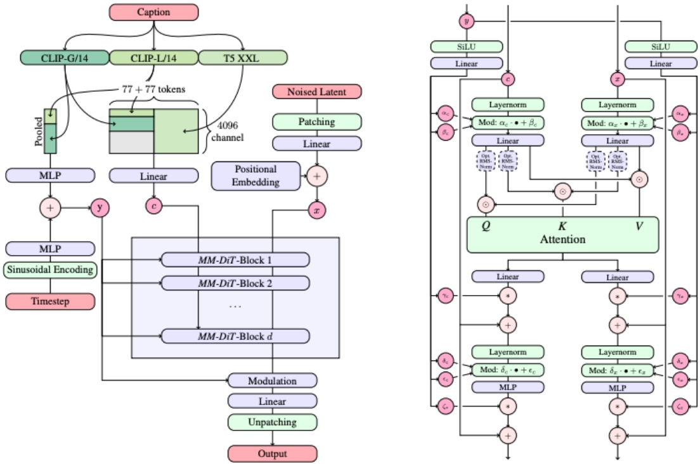

Figure 16: The architecture of the multi-modal diffusion transformer (MM-DiT) proposed in [14]. Figure also taken from [14].

be seen as adapting existing techniques (e.g., autoencoders, diffusion transformers, etc.) from the image setting to handle this extra temporal dimension.

Movie Gen Video utilizes the conditional flow matching objective with the same straight line schedulers $\alpha _ { t } =$ $t , \sigma _ { t } = 1 - t .$ Like Stable Diffusion 3, Movie Gen Video also operates in the latent space of frozen, pretrained autoencoder. Note that the autoencoder to reduce memory consumption is even more important for videos than for images - which is why most video generators right now are pretty limited in the length of the video they generate. Specifically, the authors propose to handle the added time dimension by introducing a temporal autoencoder (TAE) which maps a raw video $x _ { t } ^ { \prime }   \in   \mathbb { R } ^ { T ^ { \prime } \times 3 \times H \times W }$ to a latent $x _ { t }   \in   \mathbb { R } ^ { T \times C \times H \times W }$ , with $\scriptstyle { \frac { T ^ { \prime } } { T } }   =   { \frac { H ^ { \prime } } { H } }   =   { \frac { W ^ { \prime } } { W } }   =   8 [ 3 3 ]$ To accomodate long videos, a temporal tiling procedure is proposed by which the video is chopped up into pieces, each piece is encoder separately, and the latents are sticthed together [33]. The model itself - that is, $u _ { t } ^ { \theta } ( x _ { t } )$ - is given by a DiT-like backbone in which $x _ { t }$ is patchified along the time and space dimensions. The image patches are then passed through a transformer employing both self-attention among the image patches, and cross-attention with language model embeddings, similar to the MM-DiT employed by Stable Diffusion 3. For text conditioning, Movie Gen Video employs three types of text embeddings: UL2 embeddings, for granular, text-based reasoning [47], ByT5 embeddings, for attending to character-level details (for e.g., prompts explicitly requesting specific text to be present) [50], and MetaCLIP embeddings, trained in a shared text-image embedding space [24, 33]. Their final, largest model has 30 billion parameters. For a significantly more detailed and expansive treatment, we encourage the reader to check out the Movie Gen technical report itself [33].

<!-- page: 54 -->

## 7 Discrete Diffusion Models: Building Language Models with Diffusion

In previous sections, we explored flow and diffusion models as generative models over Euclidean space $\mathbb { R } ^ { d }$ that allow us to generate data points represented by vectors $z \in \mathbb { R } ^ { d }$ . However, not all data is naturally modeled as a point in Euclidean space $\mathbb { R } ^ { d }$ . Many data types, such as text or DNA, are more naturally viewed as elements of a discrete state space S. Most importantly, language consists of a sequence of discrete tokens that we want to model. How could we apply flow and diffusion models to such data types? It turns out that the principles that we have learned in previous sections extend to such data types as well. The resulting models are called discrete diffusion models in the machine learning literature [5, 16]. However, it is important to keep in mind that there is no mathematical diffusion process (SDEs don’t exist in discrete state spaces). Instead of having ODEs/SDEs, we use continuous-time Markov chains (CTMCs). In the following, we will explain CTMC models (see Section 7.1) and how to learn them (see Section 7.2) allowing us to build large language models (LLMs) using the principles of flow and diffusion models.

## 7.1 Continuous-Time Markov chain (CTMC) models

In this section, we explain continuous-time Markov chains (CTMCs). You can think of CTMCs as a discrete analogue of SDEs that we can use to build neural network models that generate discrete states. Further, we will introduce CTMC models, i.e. neural network models that allow to generate discrete sequences such as text using CTMCs.

Let us begin by characterizing our state space S. Let ${ \mathcal V } \: = \: \{ v _ { 1 } , \cdots , v _ { V } \}$ be our vocabulary. The state space is given by $S   =   \mathcal { V } ^ { d }$ where $d   \in   \mathbb { N }$ is sequence length and $V \in \mathbb { N }$ is the vocabulary size. For language, $\{ v _ { 1 } , \cdots , v _ { V } \}$ could enumerate our alphabet or a set of discrete tokens and S would represent the set of sequences (or sentences) of length $d .$ For DNA, $\{ v _ { 1 } , \cdots , v _ { V } \}$ could be all 4 DNA bases and S all DNA sequences of length d.

Next, let $X _ { t }$ be a stochastic process on $S ,$ i.e. a random trajectory $X : [ 0 , 1 ] \to S , t \mapsto X _ { t }$ in S. We require $X _ { t }$ to be a Markov process, i.e. a process that has no memory. Specifically, this means that the following condition holds

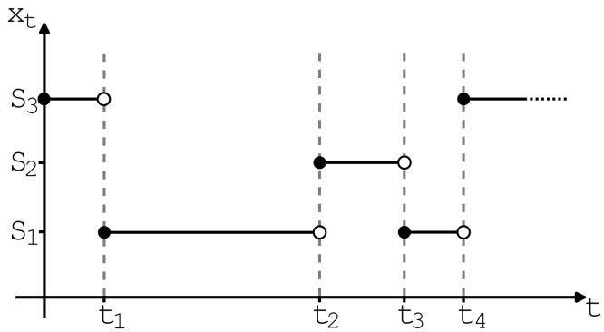

Figure 17: Illustration of a CTMC trajectory with state space $S   =   \{ S _ { 1 } , S _ { 2 } , S _ { 3 } \}$ (sequence length $d = 1 )$ . Figure adapted from [5].

$$
\underbrace {p (X _ {t + h} | X _ {t} , X _ {t _ {1}} , \cdots , X _ {t _ {k}})} \quad = \quad \underbrace {p (X _ {t + h} | X _ {t})} \quad \text {(for all} 0 <   h, 0 \leq t _ {1} <   t _ {2} <   \dots <   t _ {k} <   t\left. \right)
$$

In other words, the probabilities of future events only depend on the present - the past has no relevance for the future anymore. Note that ODE/SDEs - while not on discrete state spaces - are also Markov processes. Here, Xt is on a discrete space and therefore is called a Markov chain, specifically a Continuous-time Markov chain (CTMC). The quantity $p _ { t + h | t } ( X _ { t + h } | X _ { t } )$ are the transition probabilities and they fully determine the CTMC together with

<!-- page: 55 -->

the initial distribution $X _ { 0 } \sim p _ { 0 }$ of the Markov chain. Therefore, when we say CTMC, you can also just think of transition probabilities $p _ { t + h | t } ( X _ { t + h } | X _ { t } )$

Next, let us derive the analogue of a vector field in the discrete setting. As we are in a discrete setting, we can only jump (or switch) between states - we cannot go into a direction anymore like we did when specifying ODEs. Therefore, we define a rate matrix $Q _ { t } ( y | x )$ that effectively summarizes the rate of jumping (or switching) from state $x \in S$ to state $y \in S$ . Formally, a rate matrix $Q _ { t }$ is given by a bounded function (continuous in time)

$$
Q: S \times S \times [ 0, 1 ] \to \mathbb {R}, \quad (x, y, t) \mapsto Q _ {t} (y | x)\tag{84}
$$

where $Q _ { t } ( y | x )$ describes the rate of switching from x from y such that

$$
(1) \text {Outgoing rates are positives:} Q _ {t} (y | x) \geq 0 \quad \text {whenever} x \neq y\tag{85}
$$

$$
(2) \text {Rate staying equals negative outgoing rate:} Q _ {t} (x | x) = - \sum_ {y \neq x} Q _ {t} (y | x) \quad \text {for all} x\tag{86}
$$

The two conditions are intuitive: The first condition says that the rate of switching from x to a different state $y \neq x$ can only be non-negative (not switching just corresponds to $0   -   \mathrm { s o }$ it does not make sense to have a rate that is smaller than 0). The second condition says that the rate $Q _ { t } ( x | x )$ of staying at x should cancel out with the rate of leaving $x \mathrm { ~ - ~ } \mathrm { i t }$ is essentially a consistency condition saying that you have to either stay at x or leave (there is no third option). Note that these conditions imply in particular that $Q _ { t } ( x | x ) \leq 0$ . Hence, $Q _ { t } ( y | x )$ is a matrix whose diagonal entries are all non-positive while all off-diagonal entries are non-negative.

We can now define the analogue of a differential equation, i.e. a condition on a CTMC to “follow” the rate matrix. The idea is basically that the distribution or evolution of X should follow the rate matrix $Q _ { t }$ . In other words, we require that the transition probabilities fulfill

$$
\frac {\mathrm{d}}{\mathrm{d} h} p _ {t + h | t} (X _ {t + h} = y | X _ {t} = x) _ {| h = 0} = Q _ {t} (y | x) \quad \text {for all} x, y \in S, 0 \leq t\tag{87}
$$

The left-hand side is the infinitesimal rate of change of the probability of switching from $x$ to $y .$ We impose the condition that these probabilities should change as specified by the rate matrix. Let’s briefly check that it reasonable to request these conditions, i.e. we simply set $Q _ { t } ( y | x )$ as in Equation (87), would it be a valid rate matrix? For $h = 0$ , the probability of switching from x to y ̸= x is zero (as no time has passed), i.e. $p _ { t | t } ( y | x ) = 0$ for all $y \neq x$ . Therefore, we know that the derivative must be non-negative and $Q _ { t } ( y | x ) \geq 0$ whenever $y \neq x$ . This checks that the first condition in Equation (85) holds. Further, we know that

$$
\sum_ {y \neq x} Q _ {t} (y | x) = \sum_ {y \neq x} \frac {\mathrm{d}}{\mathrm{d} h} p (X _ {t + h} = y | X _ {t} = x) _ {| h = 0} = \frac {\mathrm{d}}{\mathrm{d} h} \sum_ {y \neq x} p (X _ {t + h} = y | X _ {t} = x) _ {| h = 0} = \frac {\mathrm{d}}{\mathrm{d} h} (1 - p (X _ {t + h} = x | X _ {t} = x))
$$

where we used that probabilities sum to 1. This shows Equation (86). This checks that every CTMC has at least one rate matrix satisfying Equation (87). But what if we $\mathtt { g O }$ backwards - what if we specify $Q _ { t }$ , is there a corresponding CTMC and if so, is it unique? This is indeed the case.

<!-- page: 56 -->

## Theorem 33 (CTMC existence and uniqueness)

For any rate matrix $Q _ { t }$ (bounded and continuous in time $t )$ , there is a unique Markov chain $X _ { t }$ (i.e. a unique set of transition probabilities $p _ { t + h | t } ( y | x ) )$ such that Equation (87) holds.

For the interested reader, we provide a self-contained proof in Section C . The key takeaway from this theorem is that for the purposes of machine learning, we can state a construct a rate matrix $Q_{t}   (e.g.$ via a neural network) and assume that there is a unique Markov chain that corresponds to $Q _ { t }$

## Example 34 (Two-state CTMC with equal jump rates)

Let $S = \{ a , b \}$ and consider a time-homogeneous $\operatorname { C T M C } { ( X _ { t } ) _ { t \geq 0 } }$ that switches between both states at a constant rate $\lambda > 0 ;$

$$
Q = \begin{array}{c c c} & a & b \\ \hline a & - \lambda & \lambda \\ b & \lambda & - \lambda \end{array} .
$$

Then the transition probabilities over a time increment $h \geq 0$ are also constant in time t and given by

$$
\left( \begin{array}{c c} p (X _ {t + h} = a | X _ {t} = a) & p (X _ {t + h} = a | X _ {t} = b) \\ p (X _ {t + h} = b | X _ {t} = a) & p (X _ {t + h} = b | X _ {t} = b) \end{array} \right) = \frac {1}{2} \left( \begin{array}{c c} 1 + e ^ {- 2 \lambda h} & 1 - e ^ {- 2 \lambda h} \\ 1 - e ^ {- 2 \lambda h} & 1 + e ^ {- 2 \lambda h} \end{array} \right).
$$

One can check by hand that Equation (87) holds, i.e. these transition probabilities indeed are the correct ones for that rate matrix. In fact, these rates are very intuitive: The chain keeps flipping with an instantaneous rate $\lambda .$ The exponential term $e ^ { - 2 \lambda h }$ captures how the memory of the initial state decays. As infinite time passes, i.e. for $h \to \infty$ , it holds that

$$
P (h) \rightarrow \left(\begin{array}{c c}\frac {1}{2}&\frac {1}{2}\\\frac {1}{2}&\frac {1}{2}\end{array}\right),
$$

so the chain forgets where it started and is in a or b with probability $1 / 2$ . This convergence is faster the higher the rate $\lambda > 0$ of switching.

Simulation of CTMC. Next, let us think about how one would go about simulating a trajectory of a CTMC. Let $h > 0$ be a step size and $p _ { \mathrm { i n i t } }$ be an initial distribution over $S ,$ e.g. $p _ { \mathrm { i n i t } } = \mathrm { U n i f } _ { S }$ is the uniform distribution over $S .$ Then we can simulate it iteratively by setting $X _ { 0 } \sim p _ { \mathrm { i n i t } }$ and setting

$$
X _ {t + h} \sim p _ {t + h | t} (\cdot | X _ {t})
$$

Now, this would work if we knew $p _ { t + h | t } ( \cdot | X _ { t } )$ . However, for all but the simplest CTMCs, we typically do not know the transition kernel in closed form and only have access to the rate matrix $Q _ { t }$ . Still, by Equation (87):

$$
p _ {t + h \mid t} (X _ {t + h} = y \mid X _ {t} = x) = p _ {t \mid t} (X _ {t} = y \mid X _ {t} = x) + h Q _ {t} (y \mid x) + R _ {t} (h) = 1 _ {y = x} + h Q _ {t} (y \mid x) + R _ {t} (h)
$$

where $R _ { t } ( h )$ is an error term that we can neglect for small h. Therefore, for small $h ,$ we can set

$$
p _ {t + h \mid t} (X _ {t + h} = y \mid X _ {t} = x) \approx 1 _ {y = x} + h Q _ {t} (y \mid x) =: \tilde {p} _ {t + h \mid t} (y \mid x)
$$

<!-- page: 57 -->

One can check that $\tilde { p } _ { t + h | t } ( y | x )$ is indeed a valid probability distribution for small h by the conditions we imposed on the rate matrix. Therefore, we can approximately sample the next point via

$$
X _ {t + h} \sim \tilde {p} _ {t + h | t} (\cdot | x) = (1 _ {y = x} + h Q _ {t} (y | x)) _ {y \in S}\tag{88}
$$

As the above is just a discrete distribution, we can sample from it easily via standard methods. This is a simple way to simulate a CTMC.

CTMC model. Next, let us define how we can a parameterize a CTMC in a neural network. A CTMC model (or discrete diffusion model) is given by an initial distribution $p _ { \mathrm { i n i t } }$ over $S$ and a neural network $Q _ { t } ^ { \theta }$ with parameters θ such that for every input $x \in S$ the model returns a single column of the rate matrix

$$
x \mapsto \{Q _ {t} ^ {\theta} (y | x) \} _ {y \in S}
$$

We want the model to return an entire column because we require it for simulation of the CTMC (Equation (88)), i.e. sampling the next state.

One complication with the above model is that the space $S$ can be very large. In particular, $| S | = V ^ { d }$ where V is our vocabulary size and d is the sequence length. This exponential growth makes it basically impossible to store an entire column of the rate matrix in memory - $\{ Q _ { t } ^ { \theta } ( y | x ) \} _ { y \in S }$ could never be represented in a computer. Therefore, we have to constrain the model. Specifically, almost all CTMC models are factorized (see Figure 18), which is effectively a sparsity constraint. Specifically, a factorized CTMC model is given by a CTMC model $Q _ { t } ^ { \theta }$ such that for all $y = ( y _ { 1 } , \cdots , y _ { d } ) , x = ( x _ { 1 } , \cdots , x _ { d } ) \in S = \mathcal { V } ^ { d }$ it holds

Qθt (y|x) = 0 whenever $y _ { i } \neq x _ { i }$ for more than one position i

We call all $y$ that differ from x in at most one token the neighbors $N ( x )$ of x. We can write such a factorized CTMC model as

$$
x \mapsto \{Q _ {t} ^ {\theta} (y | x) \} _ {y \in N (x)} = \left( \begin{array}{c c} Q _ {t} ^ {\theta} (v _ {1}, 1 | x) & \dots Q _ {t} ^ {\theta} (v _ {V}, 1 | x) \\ \dots \\ Q _ {t} ^ {\theta} (v _ {1}, d | x) & \dots Q _ {t} ^ {\theta} (v _ {V}, d | x) \end{array} \right)
$$

where $\begin{array} { r } { Q _ { t } ( y | x ) = Q _ { t } ^ { \theta } ( v _ { i } , j | x ) } \end{array}$ now gives the rate of going from $x = \left( x _ { 1 } , \cdots , x _ { d } \right)$ to the neighbor of x that we obtain swapping out the j-th element with $v _ { i } .$ , i.e. $y { = } ( x _ { 1 } , \cdots , x _ { j - 1 } , v _ { i } , x _ { j + 1 } , \cdots , x _ { d } )$ . Each row corresponds to a rate matrix per position $i = 1 , \cdots , d ,$ i.e. we require

$$
Q _ {t} ^ {\theta} (v, i | x) \geq 0 \text {if} v \neq x _ {i}, \quad Q _ {t} (x _ {i}, i | x) = - \sum_ {v \neq x _ {i}} Q _ {t} ^ {\theta} (v, i | x)
$$

We can enforce these conditions on the output of a neural network easily, e.g. one can use a transformer model on sequence length d with output dimension V . Note also that the factorized rate matrix makes the output shape $d \times V$ - this size increases linearly in the dimension (as opposed to exponentially).

Simulating a CTMC model. To sample from a CTMC model, we sample $X _ { 0 } \sim p _ { \mathrm { i n i t } }$ and perform an iteration where we sample the next state according to Equation (88). We present an algorithm in Algorithm 7. As shown

<!-- page: 58 -->

$$
\text {General Rate Matrix}
$$

$$
\text {Factorized Rate Matrix}
$$

Figure 18: Illustration of a factorized CTMC model. Factorized CTMCs have only non-zero rates $( Q _ { t } ( y | x ) \neq 0 )$ if the start and end point differ by only one dimension (here, d = 2). Figure taken from [26].

there, for factorized CTMC models, one can use a parallel per-token Euler approximation, where each token is updated independently during a small step $h > 0 .$ . This approximation agrees with the full CTMC Euler step up to first order in h, but allows for a $O ( h ^ { 2 } )$ probability of simultaneous updates to multiple tokens.

Algorithm 7 Sampling from a Factorized CTMC Model
Require: Rate network $Q_t^\theta$ (factorized), initial distribution $p_{\text{init}}$, number of steps $n$
Set $t \leftarrow 0$, step size $h \leftarrow \frac{1}{n}$
Draw a sample $X_0 \sim p_{\text{init}}$, where $X_0 = (X_0^{(1)}, \ldots, X_0^{(d)}) \in \mathcal{V}^d$
for $i = 1, \ldots, n$ do
    Compute factorized jump rates $\{q_j(v)\}_{j=1..d, v \in \mathcal{V}} \leftarrow Q_t^\theta(\cdot \mid X_t)$
    for $j = 1, \ldots, d$ (in parallel) do
        $x \leftarrow X_t^{(j)}$ {current token at position $j$}
        Define the per-position Euler transition probabilities $\tilde{p}_{j,t}(\cdot \mid X_t^{(j)} = x)$ by
        $\tilde{p}_{j,t}(v \mid x) = \begin{cases} h q_j(v), &amp; v \neq x, \\ 1 - h \sum_{v' \in \mathcal{V} \setminus \{x\}} q_j(v'), &amp; v = x. \end{cases}$
Sample $X_{t+h}^{(j)} \sim \texttt{CATEGORICAL}(\{\tilde{p}_{j,t}(v \mid x)\}_{v \in \mathcal{V}})$
end for
Set $t \leftarrow t + h$
end for
return $X_1$

<!-- page: 59 -->

## 7.2 Training CTMC models

We next discuss how to learn CTMC models. The principles are the same as for flow matching: (1) We construct a probability path interpolating between noise and data. (2) We derive a conditional rate matrix and marginal rate matrix. (3) We learn the marginal rate matrix in a simulation-free manner. We will explain this recipe now step-by-step.

In this section, the data distribution $p _ { \mathrm { d a t a } }$ is a distribution over S characterized by a probability mass function. Namely, $p _ { \mathrm { d a t a } } : S \to \mathbb { R } _ { \geq 0 } , z \mapsto p _ { \mathrm { d a t a } } ( z )$ with $\textstyle \sum _ { z \in S } p _ { \mathrm { d a t a } } ( z ) = 1$ . We do not know $p _ { \mathrm { d a t a } }$ but we access to samples $z \sim p _ { \mathrm { d a t a } }$ during training in form of a data set. For example, all texts on the world wide web. Our goal is to learn to generate samples $z \sim p _ { \mathrm { d a t a } }$ . Our goal is to train the CTMC model $Q _ { t } ^ { \theta }$ such that

$$
X _ {0} \sim p _ {\mathrm{init}}, \quad X _ {t} \mathrm{CTMCof} Q _ {t} ^ {\theta} \Rightarrow X _ {1} \sim p _ {\mathrm{data}}
$$

So as you might realize, this is no different from the Euclidean case $\mathbb { R } ^ { d }$ (see Sections 2 and 3), just that we use a CTMC model instead of a flow/diffusion model.

## 7.2.1 Conditional and Marginal Probability Path

We define $\delta _ { z } ( x )$ to be function such that $\delta _ { z } ( x )   =   0 \mathrm { ~ i f ~ } x   \neq   z$ and $\delta _ { z } ( x )   =   1$ if $x   =   z$ . A (discrete) conditional probability path is given by set of distributions $p _ { t } ( x | z )$ for $x , z \in S$ and $0 \leq t \leq 1$ such that

$$
p _ {0} (\cdot | z) = p _ {\mathrm{init}}, \quad p _ {1} (\cdot | z) = \delta_ {z}
$$

So similar to the Euclidean case, a discrete conditional probability path interpolates between a distribution that is independent of $z$ to a distribution that has all mass on $z , \mathrm { ~ A ~ }$ (discrete) marginal probability path is then given by

$$
p _ {t} (x) = \sum_ {z \in S} p _ {t} (x | z) p _ {\mathrm{data}} (z)
$$

One can easily check that the marginal probability path interpolates “noise” and data:

$$
p _ {0} = p _ {\mathrm{init}}, \quad p _ {1} = p _ {\mathrm{data}}\tag{89}
$$

## Example 35 (Factorized mixture path (independent noising per token))

Let $S = \mathcal { V } ^ { d }$ and let $\begin{array} { r } { p _ { \mathrm { i n i t } } ( x )   =   \prod _ { j = 1 } ^ { d } p _ { \mathrm { i n i t } } ^ { ( j ) } ( x _ { j } ) } \end{array}$ be a factorized initial distribution. Fix a scheduler $0 \leq \kappa _ { t } \leq 1$ such that $\kappa _ { 0 } = 0 , \kappa _ { 1 } = 1$ with $\begin{array} { r } { \frac { \mathrm { d } } { \mathrm { d } t } \dot { \kappa } _ { t } \geq 0 . } \end{array}$ Define the conditional path by

$$
p _ {t} (x | z) = \prod_ {j = 1} ^ {d} \left[ (1 - \kappa_ {t}) p _ {\mathrm{init}} ^ {(j)} (x _ {j}) + \kappa_ {t} \delta_ {z _ {j}} (x _ {j}) \right].
$$

<!-- page: 60 -->

Equivalently, one can sample $x \sim p _ { t } ( \cdot \mid z )$ by drawing i.i.d. masks $m _ { j } = 0 , 1$ and noise $\xi _ { j } \sim p _ { \mathrm { i n i t } } ^ { ( j ) }$ , then setting

$$
\begin{array}{l} m _ {j} \sim \mathrm{Bernoulli} (\kappa_ {t}), \quad \xi_ {j} \sim p _ {\mathrm{init}} ^ {(j)} \\ x _ {j} = m _ {j}   z _ {j} + (1 - m _ {j})   \xi_ {j}, \qquad j = 1, \dots , d \\ x = (x _ {1}, \dots , x _ {d}) \end{array}
$$

We call the above the factorized mixture path. The above procedure effectively “destroys” the j-th token independently for each position in the sequence with a probability $1 - \kappa _ { t } ,$ i.e. for $t   =   0 1   -   \kappa _ { t }   =   1$ and all information is destroyed and for $t = 1$ it holds that $1 - \kappa _ { t } = 0$ and no information is destroyed. Note that this is similar to the Gaussian probability path Example 8 in the sense that information is destroyed progressively with a speed determined by a scheduler $\kappa _ { t } .$ . However, it is also different from the Gaussian probability path as the factorized mixture path does not move/transports probability mass (there is no direction as we are in discrete space) - it simply fades in one distribution and fades out another.

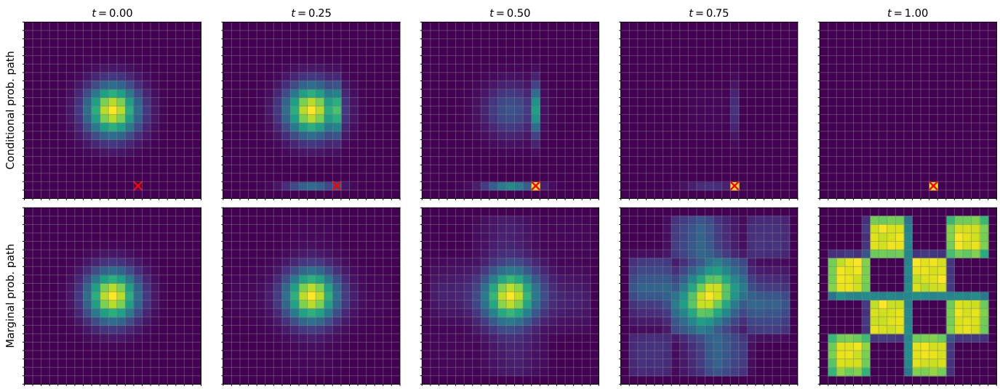

Figure 19: Illustration of a discrete probability path for $d = 2 .$ Top row: Conditional probability path interpolating between initial distribution and Dirac distribution. Bottom row: Interpolation between initial distribution and data distribution (here, chess board pattern). Note the similarity and differences to Figure $5 ;$ Here, the probability path is “teleported” (we downweigh the initial distribution and upweight the terminal distribution).

## 7.2.2 Conditional and Marginal Rate Matrix

As a next step, we will now construct the training target of discrete flow matching. First, we construct a conditional rate matrix - the analogue to the conditional vector field for flow matching. Let $Q _ { t } ^ { z } ( y | x )$ be a rate matrix for every data point $z \in S .$ . Then we call it a conditional rate matrix if

$$
X _ {0} \sim p _ {\mathrm{init}}, \quad X _ {t} \text {CTMC of} Q _ {t} ^ {z} \Rightarrow X _ {t} \sim p _ {t} (\cdot | z)
$$

<!-- page: 61 -->

In other words, the conditional rate matrix is such that its CTMC “follows” the conditional probability path. The conditional rate matrix serves as a building block to construct the marginal rate matrix that follows the marginal probability path:

## Theorem 36 (Discrete marginalization trick)

The marginal rate matrix defined by

$$
Q _ {t} (y | x) = \sum_ {z \in S} Q _ {t} ^ {z} (y | x) \frac {p _ {t} (x | z) p _ {\mathrm{data}} (z)}{p _ {t} (x)} = \sum_ {z \in S} Q _ {t} ^ {z} (y | x) p _ {1 | t} (z | x) \quad \text {where} p _ {1 | t} (z | x) := \frac {p _ {t} (x | z) p _ {\mathrm{data}} (z)}{p _ {t} (x)}\tag{90}
$$

is a valid rate matrix and fulfills the following condition:

$$
X _ {0} \sim p _ {\mathrm{init}}, \quad X _ {t} \text {CTMC of} Q _ {t} \Rightarrow X _ {t} \sim p _ {t}
$$

In particular, $X _ { 1 } \sim p _ { \mathrm { d a t a } }$ by Equation (89), i.e. the CTMC of the marginal rate matrix converts noise to data.

To prove this statement, we need a fundamental equation for CTMCs, the so-called Kolmogorov Forward equation:

## Proposition 2 (Kolmogorov Forward Equation)

Let $p _ { t }$ be a set of distributions on S for every $0 \leq t \leq 1$ . Further, let $X _ { t }$ be a CTMC with matrix $Q _ { t }$ and initial distribution $p _ { 0 }$ . Then $X _ { t } \sim p _ { t }$ for all $0 \leq t \leq 1$ if and only if the Kolmogorov Forward Equation (KFE) holds:

$$
\frac {\mathrm{d}}{\mathrm{d} t} p _ {t} (x) = \sum_ {y \in S} Q _ {t} (x | y) p _ {t} (y)
$$

Proof of KFE. To show that the KFE is necessary, assume that $p _ { t } ( x )$ are the true marginals of the CTMC, i.e. $X _ { t } \sim p _ { t }$ for every $0 \leq t \leq 1$ . Then we can compute:

$$
\begin{array}{l} \frac {\mathrm{d}}{\mathrm{d} t} p _ {t} (x) \stackrel {(i)} {=} \frac {\mathrm{d}}{\mathrm{d} h} _ {| h = 0} p _ {t + h} (x) \\ \stackrel {(i i)} {=} \frac {\mathrm{d}}{\mathrm{d} h} _ {| h = 0} \sum_ {y} p _ {t + h | t} (x | y) p _ {t} (y) \\ \stackrel {(i i i)} {=} \sum_ {y} \frac {\mathrm{d}}{\mathrm{d} h} _ {| h = 0} p _ {t + h | t} (x | y) p _ {t} (y) \\ \stackrel {(i v)} {=} \sum_ {y} Q _ {t} (x | y) p _ {t} (y) \end{array}
$$

where in (i) we simple use a time offset, in (ii) we use the definition of the transition probabilities, in (iii) we swap sum and derivative, and in (iv) we use the definition of the rate matrix (see Equation (87)).

Next, to show that the KFE is sufficient, we can rewrite the KFE in matrix form:

$$
\frac {\mathrm{d}}{\mathrm{d} t} p _ {t} = Q _ {t} p _ {t}
$$

where in this equation we consider $p _ { t } = ( p _ { t } ( x ) ) _ { x \in S }$ as a vector and $Q _ { t } = ( Q _ { t } ( y | x ) ) _ { x , y \in S }$ as a matrix. Note that the above is a linear ODE over vector space $\mathbb { R } ^ { S }$ . Its initial condition is fixed by $p _ { 0 }$ as stated in the theorem. Therefore,

<!-- page: 62 -->

if any other set of marginals $q _ { t }$ fulfills this equation, we know that by the uniqueness of ODEs (see Theorem 3) that we can conclude that $q _ { t } = p _ { t }$ . This shows that the KFE is also sufficient. □

Proof of Theorem 36. Using the KFE, it remains to show that marginal rate matrix defined as in the theorem (see Equation (90)) fulfills the KFE:

$$
\begin{array}{r l} & {\frac {\mathrm{d}}{\mathrm{d} t} p _ {t} (x) \stackrel {(i)} {=} \frac {\mathrm{d}}{\mathrm{d} t} \sum_ {z \in S} p _ {t} (x | z) p _ {\mathrm{data}} (z)} \\ & {\stackrel {(i i)} {=} \sum_ {z \in S} \frac {\mathrm{d}}{\mathrm{d} t} p _ {t} (x | z) p _ {\mathrm{data}} (z)} \\ & {\stackrel {(i i i)} {=} \sum_ {z \in S} \left[ \sum_ {y \in S} Q _ {t} ^ {z} (x | y) p _ {t} (y | z) \right] p _ {\mathrm{data}} (z)} \\ & {\stackrel {(i v)} {=} \sum_ {y \in S} p _ {t} (y) \left[ \sum_ {z \in S} Q _ {t} ^ {z} (x | y) \frac {p _ {t} (y | z) p _ {\mathrm{data}} (z)}{p _ {t} (y)} \right]} \\ & {\stackrel {(v)} {=} \sum_ {y \in S} p _ {t} (y) Q _ {t} (x | y)} \end{array}
$$

where (i) follows by the definition of the marginal probability path, in (ii) we swap the sum and the derivative, in (iii) we use the KFE on the conditional rate matrix, in (iv) we multiply and divide by $p _ { t } ( y )$ , and in (v) we use the definition of the marginal rate matrix $Q _ { t } ( y | x )$ . This shows that the KFE is fulfilled. The statement follows by Proposition 2. □

Let us now derive a concrete example of a conditional rate matrix for the factorized mixture path.

Example 37 (Conditional rate matrix for factorized mixture path)

Set $\begin{array} { r } { \frac { \mathrm { d } } { \mathrm { d } t } \kappa _ { t } = \dot { \kappa } _ { t } } \end{array}$ . The factorized mixture path has a factorized conditional rate matrix given by

$$
\begin{array}{c} Q _ {t} ^ {z} (y | x) = (Q _ {t} ^ {z} (v _ {i}, j | x _ {j})) _ {v _ {i}, j} \\ Q _ {t} ^ {z} (v _ {i}, j | x _ {j}) = \frac {\dot {\kappa} _ {t}}{1 - \kappa_ {t}} (\delta_ {z _ {j}} (v _ {i}) - \delta_ {x _ {j}} (v _ {i})) \\ = \frac {\dot {\kappa} _ {t}}{1 - \kappa_ {t}} \left\{ \begin{array}{l l} 0 & \text {if} x _ {j} = z _ {j} \\ 1 & \text {if} v _ {i} = z _ {j}, x _ {j} \neq z _ {j} \\ 0 & \text {if} v _ {i} \neq z _ {j}, x _ {j} \neq z _ {j} \\ - 1 & \text {if} v _ {i} = x _ {j}, x _ {j} \neq z _ {j} \end{array} \right. \end{array}
$$

Note that this is a very simple rate matrix: It only allows for jumps to $z ^ { j }   \mathrm { ~ - ~ }   \mathrm { i . e . }$ if any token $j$ is updated, it must jump to the token value of the terminal data point $z = ( z _ { 1 } , \cdots , z _ { d } )$ - and it only jumps to $z ^ { j } \mathrm { i f }$ we are not yet there.

Proof. We note that the factorized mixture path completely factorizes into independent components and so does the suggested conditional rate matrix. Therefore, we can without loss of generality assume that $d = 1$ . So

<!-- page: 63 -->

we just do the calculation per dimension. Then, we can derive:

$$
\begin{array}{l} \frac {\mathrm{d}}{\mathrm{d} t} p _ {t} (x | z) \stackrel {(i)} {=} \frac {\mathrm{d}}{\mathrm{d} t} \left[ (1 - \kappa_ {t}) p _ {\mathrm{init}} (x) + \kappa_ {t} \delta_ {z} (x) \right] \\ \stackrel {(i i)} {=} \dot {\kappa} _ {t} \delta_ {z} (x) - \dot {\kappa} _ {t} p _ {\mathrm{init}} (x) \\ \stackrel {(i i i)} {=} \frac {\dot {\kappa} _ {t}}{1 - \kappa_ {t}} (\delta_ {z} (x) - [ (1 - \kappa_ {t}) p _ {\mathrm{init}} (x) + \kappa_ {t} \delta_ {z} (x) ]) \\ \stackrel {(i v)} {=} \frac {\dot {\kappa} _ {t}}{1 - \kappa_ {t}} (\delta_ {z} (x) - p _ {t} (x | z)) \\ \stackrel {(v)} {=} \frac {\dot {\kappa} _ {t}}{1 - \kappa_ {t}} \delta_ {z} (x)   (1 - p _ {t} (x | z)) + \frac {\dot {\kappa} _ {t}}{1 - \kappa_ {t}} (\delta_ {z} (x) - 1) p _ {t} (x | z) \\ \stackrel {(v i)} {=} \sum_ {y \neq x} \frac {\dot {\kappa} _ {t}}{1 - \kappa_ {t}} \delta_ {z} (x) p _ {t} (y | z) + \frac {\dot {\kappa} _ {t}}{1 - \kappa_ {t}} (\delta_ {z} (x) - 1) p _ {t} (x | z) \\ \stackrel {(v i i)} {=} \sum_ {y \neq x} Q _ {t} ^ {z} (x | y) p _ {t} (y | z) + Q _ {t} ^ {z} (x | x) p _ {t} (x | z) \\ \stackrel {(v i i i)} {=} \sum_ {y \in S} Q _ {t} ^ {z} (x | y) p _ {t} (y | z) \end{array}
$$

where (i) uses the definition of the factorized mixture path for $d = 1 ,   ( i i )$ is obtained by taking derivatives and setting $\begin{array} { r } { \frac { \mathrm { d } } { \mathrm { d } t } \kappa _ { t } = \dot { \kappa } _ { t } } \end{array}$ (iii) follows by simple algebra, (iv) by the definition of the factorized mixture path, (v) by simple algebra, (vi) follows by the definition the fact that $\textstyle \sum _ { y \in S } p _ { t } ( y | z ) = 1$ , (vii) by the definition of the rate matrix, and (viii) by simple algebra. The above shows that the KFE is fulfilled and therefore the statement follows. □

## 7.2.3 Learning the Marginal Rate Matrix

In this section, we derive the fundamental algorithm for training CTMC models. By Theorem 36, training a CTMC model $Q _ { t } ^ { \theta } ( y | x )$ can be achieved by learning the marginal rate matrix.

In this section, we now restrict ourselves to the factorized mixture path (see Example 35) as this is the path most discrete diffusion/flow matching models use so far. In this case, the marginal rate matrix has a very intuitive shape:

Theorem 38 (Marginalization trick for factorized mixture path)

The marginal rate matrix of the factorized mixture path is factorized and has the form

$$
Q _ {t} (v _ {i}, j | x) = \frac {\dot {\kappa} _ {t}}{1 - \kappa_ {t}} (p _ {1 | t} (z _ {j} = v _ {i} | x) - \delta_ {x _ {j}} (v _ {i}))
$$

where $p _ { 1 | t } ( z _ { j } = v _ { i } | x )$ is the conditional probability of the j-th position (j-th token in the sequence) being equal to $v _ { i }$ given the full noisy sequence x.

Proof. The marginal rate matrix is given by

$$
Q _ {t} (y | x) = \sum_ {z \in S} Q _ {t} ^ {z} (y | x) p _ {1 | t} (z | x)\tag{91}
$$

<!-- page: 64 -->

Now, whenever y and x are not neighbors (differ by more than one token), $Q _ { t } ^ { z } ( y | x ) = 0$ for every z. Therefore, also $Q _ { t } ( y | x ) = 0$ in this case. This shows that marginal rate matrix factorizes as well. It then holds that

$$
Q _ {t} (v _ {i}, j | x) = \sum_ {z \in S} Q _ {t} ^ {z} (v _ {i}, j | x) p _ {1 | t} (z | x)\tag{92}
$$

$$
\stackrel {(i)} {=} \sum_ {z \in S} \frac {\dot {\kappa} _ {t}}{1 - \kappa_ {t}} (\delta_ {z _ {j}} (v _ {i}) - \delta_ {x _ {j}} (v _ {i})) p _ {1 | t} (z | x)\tag{93}
$$

$$
\stackrel {(i i)} {=} \frac {\dot {\kappa} _ {t}}{1 - \kappa_ {t}} \left(\sum_ {z \in S} \delta_ {z _ {j}} (v _ {i}) p _ {1 | t} (z | x) - \delta_ {x _ {j}} (v _ {i})\right)\tag{94}
$$

$$
\stackrel {(i i i)} {=} \frac {\dot {\kappa} _ {t}}{1 - \kappa_ {t}} \left(p _ {1 | t} (z _ {j} = v _ {i} | x) - \delta_ {x _ {j}} (v _ {i})\right)\tag{95}
$$

where (i) follows by the formula for the conditional rate matrix (see Example 37), (ii) follows by the fact that $\textstyle \sum _ { z \in S } p _ { 1 | t } ( z | x ) = 1$ , and (iii) follows by marginalization. This finishes the proof. □

The previous theorem is remarkable: The marginal rate matrix is effectively a reparameterization of the probabilities $p _ { 1 | t } ( z _ { j }   =   v _ { i } | x )$ . This is effectively nothing else than learning a classifier for each token position $j = 1 , \ldots , d .$ In other words, we can simply define a denoising probabilities network as

$$
p _ {1 | t} ^ {\theta}: \underbrace {x} _ {\text {network input}} \mapsto \underbrace {(p _ {1 | t} ^ {\theta} (z _ {j} = v _ {i} | x)) _ {j = 1 , \cdots , d , v _ {i} \in \mathcal {V}}} _ {\text {network output}}
$$

Note that the network output has shape $d \times V$ . One can obtain probabilities per token position via simple softmax layer. The network itself can be a standard sequence-to-sequence network, e.g. a transformer works (see Section 6.1.2).

As this is simply a classifier per position $j ,$ we can train such a network via the cross-entropy loss per $j = 1 , \cdots , d .$ This leads to the Discrete Flow Matching loss given by

$$
\mathcal {L} _ {\mathrm{DFM}} (\theta) = \mathbb {E} _ {z \sim p _ {\mathrm{data}}, t \sim \mathrm{Unif} _ {[ 0, 1 ]}, x \sim p _ {t} (\cdot | z)} \left[ \sum_ {j = 1} ^ {d} - \log p _ {1 | t} ^ {\theta} (z _ {j} | x) \right]
$$

This is remarkable: To train a generative model, all we need to do is to train a classifier model per position $j .$ In the same way as continuous flow matching reduced to simple regression (see Section 3), discrete flow matching and discrete diffusion models reduce to simple classification training. In Algorithm 8, we summarize the training algorithm. Post-training, we can sample via Algorithm 7.

## Example 39 (Masked Diffusion Language Model)

A specific case of the above method is masked diffusion language models (MDLMs). The idea of MDLMs is that we can extend the vocabulary of tokens $\mathcal { V } = \{ v _ { 1 } , \cdots , v _ { V } \}$ with a new token [mask] that indicates that this token is missing (or was masked). Specifically, we set $\mathcal { V } = \{ v _ { 1 } , \cdots , v _ { V } , [ \operatorname { m a s k } ] \}$ and the initial point is simply $\left[ \mathrm { m a s k } \right] ^ { d }$ , i.e. the sequence that is all-masked. Formally, this means setting $p _ { \mathrm { i n i t } } = \delta _ { [ \mathrm { m a s k } ] ^ { d } }$ in the above framework. The sampling procedure is illustrated in Figure 20.

<!-- page: 65 -->

Algorithm 8 Training factorized CTMC Model (Discrete Diffusion)
Require: Dataset of sequences $z \sim p_{\text{data}}$ with $z = (z_1, \ldots, z_d) \in \mathcal{V}^d$;
initial (noise) token marginals $p_{\text{init}}^{(j)}$ on $\mathcal{V}$; schedule $\kappa_t \in [0, 1]$;
posterior network $f_\theta$ returning per-position logits over $\mathcal{V}$; optimizer OPT
for each training iteration do
Sample a data point $z \sim p_{\text{data}}$
Sample time $t \sim \text{Unif}[0, 1]$ and compute $\kappa \leftarrow \kappa_t$
Sample a noisy state $x \sim p_t(\cdot \mid z)$ (factorized mixture path):
for $j = 1, \ldots, d$ (in parallel) do
Sample mask $m_j \sim \text{Bernoulli}(\kappa)$
Sample noise token $\xi_j \sim p_{\text{init}}^{(j)}$
Set $x_j \leftarrow m_j z_j + (1 - m_j) \xi_j$
end for
$x \leftarrow (x_1, \ldots, x_d)$
Predict terminal-token posteriors via logits from the network:
$\ell_j(\cdot) \leftarrow f_\theta(x, t)_j \Rightarrow p_{1|t}^\theta(v \mid x)_j = \text{Softmax}(\ell_j)(v)$
Discrete Flow Matching loss (token-wise NLL of $z$):
$\mathcal{L}_{\text{DFM}}(\theta) \leftarrow \sum_{j=1}^{d} \left[ -\log p_{1|t}^\theta(z_j \mid x)_j \right]$
Update parameters: $\theta \leftarrow \text{OPT.STEP}(\nabla_\theta \mathcal{L}_{\text{DFM}}(\theta))$
end for
$t = 0$
$t = 0.25$
$t = 0.75$
$t = 1$
$t = 0.25$
$t = 0.75$
$t = 1$

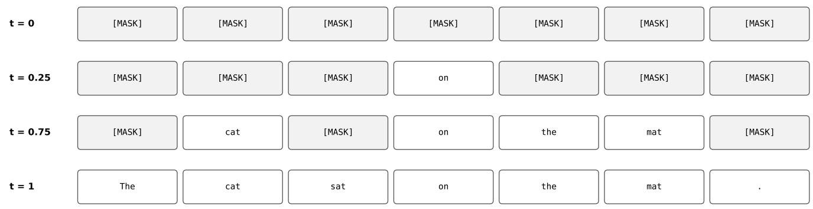

Figure 20: Illustration of the trajectory of a Masked Diffusion Language Model.

This completes now a full pipeline of training and sampling CTMC models that allows us to generate discrete sequences such as text. Current state-of-the-art discrete diffusion models [4] use the recipe described in this work, with neural networks (usually transformers) trained on web-scale data.

<!-- page: 66 -->

## Remark 40 (Generator Matching)

You may wonder why the principles of flow/diffusion models could be translated so seamlessly to discrete state spaces. As it turns out, the principles of flow matching are not unique to flows or even CTMCs. Rather, these are general learning principles for constructing generative models with Markov processes. This idea leads to the Generator Matching framework [19], a framework that extends and unifies both discrete and continuous flow and diffusion models into one. A generator is a generalization of a vector field $u _ { t }$ and a rate matrix $Q _ { t }$ Markov processes and generators can be built for any data modality and state spaces. For example, you can build models for smooth manifolds [8, 10] (e.g. geometric data), mixed state spaces (e.g. joint text and image generation) [6], and other Markov processes such as jump processes [19, 7].

## 8 References

[1] Michael S Albergo, Nicholas M Boffi, and Eric Vanden-Eijnden. “Stochastic interpolants: A unifying framework for flows and diffusions”. In: arXiv preprint arXiv:2303.08797 (2023).

[2] Brian DO Anderson. “Reverse-time diffusion equation models”. In: Stochastic Processes and their Applications 12.3 (1982), pp. 313–326.

[3] Yogesh Balaji et al. eDiff-I: Text-to-Image Diffusion Models with an Ensemble of Expert Denoisers. 2023. arXiv: [2211.01324 \[cs.CV\]](https://arxiv.org/abs/2211.01324). url: [https://arxiv.org/abs/2211.01324.](https://arxiv.org/abs/2211.01324)

[4] Tiwei Bie et al. “Llada2. 0: Scaling up diffusion language models to 100b”. In: arXiv preprint arXiv:2512.15745 (2025).

[5] Andrew Campbell et al. “A continuous time framework for discrete denoising models”. In: Advances in Neural Information Processing Systems 35 (2022), pp. 28266–28279.

[6] Andrew Campbell et al. “Generative flows on discrete state-spaces: Enabling multimodal flows with applications to protein co-design”. In: arXiv preprint arXiv:2402.04997 (2024).

[7] Andrew Campbell et al. “Trans-dimensional generative modeling via jump diffusion models”. In: Advances in Neural Information Processing Systems 36 (2023), pp. 42217–42257.

[8] Ricky TQ Chen and Yaron Lipman. “Flow matching on general geometries”. In: arXiv preprint arXiv:2302.03660 (2023).

[9] Earl A Coddington, Norman Levinson, and T Teichmann. Theory of ordinary differential equations. 1956.

[10] Valentin De Bortoli et al. “Riemannian score-based generative modelling”. In: Advances in neural information processing systems 35 (2022), pp. 2406–2422.

[11] Prafulla Dhariwal and Alex Nichol. Diffusion Models Beat GANs on Image Synthesis. 2021. arXiv: [2105.05233 \[cs.LG\]](https://arxiv.org/abs/2105.05233). url: [https://arxiv.org/abs/2105.05233](https://arxiv.org/abs/2105.05233).

[12] Alexey Dosovitskiy. “An image is worth 16x16 words: Transformers for image recognition at scale”. In: arXiv preprint arXiv:2010.11929 (2020).

[13] Alexey Dosovitskiy et al. An Image is Worth 16x16 Words: Transformers for Image Recognition at Scale. 2021. arXiv: [2010.11929 \[cs.CV\]](https://arxiv.org/abs/2010.11929). url: [https://arxiv.org/abs/2010.11929.](https://arxiv.org/abs/2010.11929)

<!-- page: 67 -->

[14] Patrick Esser et al. Scaling Rectified Flow Transformers for High-Resolution Image Synthesis. 2024. arXiv: [2403.03206 \[cs.CV\]](https://arxiv.org/abs/2403.03206). url: [https://arxiv.org/abs/2403.03206.](https://arxiv.org/abs/2403.03206)

[15] Lawrence C Evans. Partial differential equations. Vol. 19. American Mathematical Society, 2022.

[16] Itai Gat et al. “Discrete flow matching”. In: Advances in Neural Information Processing Systems 37 (2024), pp. 133345–133385.

[17] Jonathan Ho, Ajay Jain, and Pieter Abbeel. “Denoising diffusion probabilistic models”. In: Advances in neural information processing systems 33 (2020), pp. 6840–6851.

[18] Jonathan Ho and Tim Salimans. Classifier-Free Diffusion Guidance. 2022. arXiv: [2207.12598 \[cs.LG\].](https://arxiv.org/abs/2207.12598) url: [https://arxiv.org/abs/2207.12598](https://arxiv.org/abs/2207.12598).

[19] Peter Holderrieth et al. “Generator matching: Generative modeling with arbitrary markov processes”. In: arXiv preprint arXiv:2410.20587 (2024).

[20] Peter Holderrieth et al. “GLASS Flows: Transition Sampling for Alignment of Flow and Diffusion Models”. In: arXiv preprint arXiv:2509.25170 (2025).

[21] Arieh Iserles. A first course in the numerical analysis of differential equations. Cambridge university press, 2009.

[22] Alexia Jolicoeur-Martineau et al. “Adversarial score matching and improved sampling for image generation”. In: arXiv preprint arXiv:2009.05475 (2020).

[23] Tero Karras et al. “Elucidating the design space of diffusion-based generative models”. In: Advances in Neural Information Processing Systems 35 (2022), pp. 26565–26577.

[24] Samuel Lavoie et al. Modeling Caption Diversity in Contrastive Vision-Language Pretraining. 2024. arXiv: [2405.00740 \[cs.CV\]](https://arxiv.org/abs/2405.00740). url: [https://arxiv.org/abs/2405.00740.](https://arxiv.org/abs/2405.00740)

[25] Yaron Lipman et al. “Flow matching for generative modeling”. In: arXiv preprint arXiv:2210.02747 (2022).

[26] Yaron Lipman et al. “Flow Matching Guide and Code”. In: arXiv preprint arXiv:2412.06264 (2024).

[27] Xingchao Liu, Chengyue Gong, and Qiang Liu. “Flow straight and fast: Learning to generate and transfer data with rectified flow”. In: arXiv preprint arXiv:2209.03003 (2022).

[28] Nanye Ma et al. “Sit: Exploring flow and diffusion-based generative models with scalable interpolant transformers”. In: arXiv preprint arXiv:2401.08740 (2024).

[29] Xuerong Mao. Stochastic differential equations and applications. Elsevier, 2007.

[30] William Peebles and Saining Xie. Scalable Diffusion Models with Transformers. 2023. arXiv: [2212 . 09748 \[cs.CV\]](https://arxiv.org/abs/2212.09748). url: [https://arxiv.org/abs/2212.09748](https://arxiv.org/abs/2212.09748).

[31] Ethan Perez et al. “Film: Visual reasoning with a general conditioning layer”. In: Proceedings of the AAAI conference on artificial intelligence. Vol. 32. 1. 2018.

[32] Lawrence Perko. Differential equations and dynamical systems. Vol. 7. Springer Science & Business Media, 2013.

[33] Adam Polyak et al. Movie Gen: A Cast of Media Foundation Models. 2024. arXiv: [2410.13720 \[cs.CV\].](https://arxiv.org/abs/2410.13720) url: [https://arxiv.org/abs/2410.13720](https://arxiv.org/abs/2410.13720).

<!-- page: 68 -->

[34] Alec Radford et al. Learning Transferable Visual Models From Natural Language Supervision. 2021. arXiv: [2103.00020 \[cs.CV\]](https://arxiv.org/abs/2103.00020). url: [https://arxiv.org/abs/2103.00020.](https://arxiv.org/abs/2103.00020)

[35] Colin Raffel et al. Exploring the Limits of Transfer Learning with a Unified Text-to-Text Transformer. 2023. arXiv: [1910.10683 \[cs.LG\]](https://arxiv.org/abs/1910.10683). url: [https://arxiv.org/abs/1910.10683.](https://arxiv.org/abs/1910.10683)

[36] Robin Rombach et al. High-Resolution Image Synthesis with Latent Diffusion Models. 2022. arXiv: [2112.10752 \[cs.CV\]](https://arxiv.org/abs/2112.10752). url: [https://arxiv.org/abs/2112.10752](https://arxiv.org/abs/2112.10752).

[37] Robin Rombach et al. “High-resolution image synthesis with latent diffusion models”. In: Proceedings of the IEEE/CVF conference on computer vision and pattern recognition. 2022, pp. 10684–10695.

[38] Olaf Ronneberger, Philipp Fischer, and Thomas Brox. “U-net: Convolutional networks for biomedical image segmentation”. In: Medical image computing and computer-assisted intervention–MICCAI 2015: 18th international conference, Munich, Germany, October 5-9, 2015, proceedings, part III 18. Springer. 2015, pp. 234–241.

[39] Chitwan Saharia et al. Photorealistic Text-to-Image Diffusion Models with Deep Language Understanding. 2022. arXiv: [2205.11487 \[cs.CV\]](https://arxiv.org/abs/2205.11487). url: [https://arxiv.org/abs/2205.11487.](https://arxiv.org/abs/2205.11487)

[40] Simo Särkkä and Arno Solin. Applied stochastic differential equations. Vol. 10. Cambridge University Press, 2019.

[41] Jascha Sohl-Dickstein et al. “Deep unsupervised learning using nonequilibrium thermodynamics”. In: International conference on machine learning. PMLR. 2015, pp. 2256–2265.

[42] Yang Song and Stefano Ermon. “Generative modeling by estimating gradients of the data distribution”. In: Advances in neural information processing systems 32 (2019).

[43] Yang Song et al. Score-Based Generative Modeling through Stochastic Differential Equations. 2021. arXiv: [2011.13456 \[cs.LG\]](https://arxiv.org/abs/2011.13456). url: [https://arxiv.org/abs/2011.13456.](https://arxiv.org/abs/2011.13456)

[44] Yang Song et al. “Score-Based Generative Modeling through Stochastic Differential Equations”. In: International Conference on Learning Representations (ICLR). 2021.

[45] Yang Song et al. “Score-based generative modeling through stochastic differential equations”. In: arXiv preprint arXiv:2011.13456 (2020).

[46] Matthew Tancik et al. Fourier Features Let Networks Learn High Frequency Functions in Low Dimensional Domains. 2020. arXiv: [2006.10739 \[cs.CV\]](https://arxiv.org/abs/2006.10739). url: [https://arxiv.org/abs/2006.10739.](https://arxiv.org/abs/2006.10739)

[47] Yi Tay et al. UL2: Unifying Language Learning Paradigms. 2023. arXiv: [2205.05131 \[cs.CL\].](https://arxiv.org/abs/2205.05131) url: [https://arxiv.org/abs/2205.05131](https://arxiv.org/abs/2205.05131).

[48] Arash Vahdat, Karsten Kreis, and Jan Kautz. “Score-based generative modeling in latent space”. In: Advances in neural information processing systems 34 (2021), pp. 11287–11302.

[49] Ashish Vaswani et al. Attention Is All You Need. 2023. arXiv: [1706.03762 \[cs.CL\].](https://arxiv.org/abs/1706.03762) url: https://arxiv.org[abs/1706.03762](https://arxiv.org/abs/1706.03762).

[50] Linting Xue et al. ByT5: Towards a token-free future with pre-trained byte-to-byte models. 2022. arXiv: [2105. 13626 \[cs.CL\]](https://arxiv.org/abs/2105.13626). url: [https://arxiv.org/abs/2105.13626](https://arxiv.org/abs/2105.13626).

<!-- page: 69 -->

[51] Jingfeng Yao, Bin Yang, and Xinggang Wang. “Reconstruction vs. generation: Taming optimization dilemma in latent diffusion models”. In: Proceedings of the Computer Vision and Pattern Recognition Conference. 2025, pp. 15703–15712.

<!-- page: 70 -->

## A A Reminder on Probability Theory

We present a brief overview of basic concepts from probability theory. This section was partially taken from [26].

## A.1 Random vectors

Consider data in the d-dimensional Euclidean space $x   =   \left( x ^ { 1 } , \ldots , x ^ { d } \right)   \in   \mathbb { R } ^ { d }$ with the standard Euclidean inner product $\begin{array} { r } { \langle x , y \rangle   =   \sum _ { i = 1 } ^ { d } x ^ { i } y ^ { i } } \end{array}$ and norm $\| x \|   =   \sqrt { \langle x , x \rangle }$ We will consider random variables (RVs) $X   \in   \mathbb { R } ^ { d }$ with continuous probability density function (PDF), defined as a continuous function $p _ { X } : \mathbb { R } ^ { d } \to \mathbb { R } _ { \geq 0 }$ providing event A with probability

$$
\mathbb {P} (X \in A) = \int_ {A} p _ {X} (x) \mathrm{d} x,\tag{96}
$$

where $\textstyle \int p _ { X } ( x ) \mathrm { d } x   =   1$ . By convention, we omit the integration interval when integrating over the whole space $( \textstyle \int \equiv \int _ { \mathbb { R } ^ { d } } )$ . To keep notation concise, we will refer to the PDF $p _ { X _ { t } }$ of RV $X _ { t }$ as simply $p _ { t }$ . We will use the notation $X \sim p$ or $X \sim p ( X )$ to indicate that X is distributed according to $p .$ One common PDF in generative modeling is the d-dimensional isotropic Gaussian:

$$
\mathcal {N} (x; \mu , \sigma^ {2} I) = (2 \pi \sigma^ {2}) ^ {- \frac {d}{2}} \exp \left(- \frac {\| x - \mu \| _ {2} ^ {2}}{2 \sigma^ {2}}\right),\tag{97}
$$

where $\mu \in \mathbb { R } ^ { d }$ and $\sigma \in \mathbb { R } _ { > 0 }$ stand for the mean and the standard deviation of the distribution, respectively.

The expectation of a RV is the constant vector closest to X in the least-squares sense:

$$
\mathbb {E} \left[ X \right] = \underset {z \in \mathbb {R} ^ {d}} {\arg \min} \int \left\| x - z \right\| ^ {2} p _ {X} (x) \mathrm{d} x = \int x p _ {X} (x) \mathrm{d} x.\tag{98}
$$

One useful tool to compute the expectation of functions of RVs is the law of the unconscious statistician:

$$
\mathbb {E} \left[ f (X) \right] = \int f (x) p _ {X} (x) \mathrm{d} x.\tag{99}
$$

When necessary, we will indicate the random variables under expectation as $\mathbb { E } _ { X } f ( X )$

## A.2 Conditional densities and expectations

Given two random variables X, $Y \in \mathbb { R } ^ { d }$ , their joint PDF $p _ { X , Y } ( x , y )$ has marginals

$$
\int p _ {X, Y} (x, y) \mathrm{d} y = p _ {X} (x) \text {and} \int p _ {X, Y} (x, y) \mathrm{d} x = p _ {Y} (y).\tag{100}
$$

See Figure 21 for an illustration of the joint PDF of two RVs in R $( d = 1 )$ . The conditional PDF $p _ { X | Y }$ describes the PDF of the random variable X when conditioned on an event $Y = y$ with density $p _ { Y } ( y ) > 0 ;$

$$
p _ {X | Y} (x | y) := \frac {p _ {X , Y} (x , y)}{p _ {Y} (y)},\tag{101}
$$

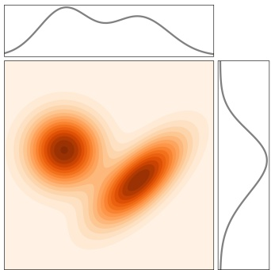

Figure 21: Joint PDF $p _ { X , Y }$ (in shades) and its marginals $p _ { X }$ and $p _ { Y }$ (in black lines). Figure from [26]

<!-- page: 71 -->

and similarly for the conditional PDF $p _ { Y | X }$ . Bayes’ rule expresses the conditional PDF $p _ { Y | X }$ with $p _ { X | Y }$ by

$$
p _ {Y \mid X} (y \mid x) = \frac {p _ {X \mid Y} (x \mid y) p _ {Y} (y)}{p _ {X} (x)},\tag{102}
$$

for $p _ { X } ( x ) > 0$

The conditional expectation $\mathbb { E } \left[ X | Y \right]$ is the best approximating function $g _ { \star } ( Y )$ to X in the least-squares sense:

$$
\begin{array}{l} g _ {\star} := \underset {g: \mathbb {R} ^ {d} \to \mathbb {R} ^ {d}} {\arg \min} \mathbb {E} \left[ \| X - g (Y) \| ^ {2} \right] = \underset {g: \mathbb {R} ^ {d} \to \mathbb {R} ^ {d}} {\arg \min} \int \| x - g (y) \| ^ {2} p _ {X, Y} (x, y) \mathrm{d} x \mathrm{d} y \\ = \underset {g: \mathbb {R} ^ {d} \to \mathbb {R} ^ {d}} {\arg \min} \int \left[ \int \| x - g (y) \| ^ {2} p _ {X | Y} (x | y) \mathrm{d} x \right] p _ {Y} (y) \mathrm{d} y. \end{array}\tag{103}
$$

For $y \in \mathbb { R } ^ { d }$ such that $p _ { Y } ( y ) > 0$ the conditional expectation function is therefore

$$
\mathbb {E} \left[ X | Y = y \right] := g _ {\star} (y) = \int x p _ {X | Y} (x | y) \mathrm{d} x,\tag{104}
$$

where the second equality follows from taking the minimizer of the inner brackets in Equation (103) for $Y = y$ similarly to Equation (98). Composing g⋆ with the random variable $Y ,$ we get

$$
\mathbb {E} \left[ X | Y \right] := g _ {\star} (Y),\tag{105}
$$

which is a random variable in $\mathbb { R } ^ { d }$ . Rather confusingly, both $\mathbb { E } \left[ X | Y = y \right]$ and $\mathbb { E } \left[ X | Y \right]$ are often called conditional expectation, but these are different objects. In particular, $\mathbb { E } \left[ X | Y = y \right]$ is a function $\mathbb { R } ^ { d } \rightarrow \mathbb { R } ^ { d }$ , while $\mathbb { E } \left[ X | Y \right]$ is a random variable assuming values in $\mathbb { R } ^ { d }$ . To disambiguate these two terms, our discussions will employ the notations introduced here.

The tower property is an useful property that helps simplify derivations involving conditional expectations of two RVs X and $Y ;$

$$
\mathbb {E} \left[ \mathbb {E} \left[ X | Y \right] \right] = \mathbb {E} \left[ X \right]\tag{106}
$$

Because $\mathbb { E } \left[ X | Y \right]$ is a RV, itself a function of the RV Y , the outer expectation computes the expectation of $\mathbb { E } \left[ X | Y \right]$ The tower property can be verified by using some of the definitions above:

$$
\begin{array}{c} \mathbb {E} \left[ \mathbb {E} \left[ X | Y \right] \right] = \int \left(\int x p _ {X | Y} (x | y) \mathrm{d} x\right) p _ {Y} (y) \mathrm{d} y \\ \stackrel {{(1 0 1)}} {{=}} \int \int x p _ {X, Y} (x, y) \mathrm{d} x \mathrm{d} y \\ \stackrel {{(1 0 0)}} {{=}} \int x p _ {X} (x) \mathrm{d} x = \mathbb {E} \left[ X \right]. \end{array}
$$

Finally, consider a helpful property involving two RVs $f ( X , Y )$ and $Y ,$ where X and Y are two arbitrary RVs. Then, by using the Law of the Unconscious Statistician with (104), we obtain the identity

$$
\mathbb {E} \left[ f (X, Y) | Y = y \right] = \int f (x, y) p _ {X | Y} (x | y) \mathrm{d} x.\tag{107}
$$

<!-- page: 72 -->

## B A Proof of the Fokker-Planck equation

In this section, we give here a self-contained proof of the Fokker-Planck equation which includes the continuity equation as a special case (Theorem 11). We stress that this section is not necessary to understand the remainder of this document and is mathematically more advanced. If you desire to understand where the Fokker-Planck equation comes from, then this section is for you.

## Theorem 41 (Fokker-Planck Equation)

Let $p _ { t }$ be a probability path with $p _ { 0 } = p _ { \mathrm { i n i t } }$ and let us consider the SDE

$$
X _ {0} \sim p _ {\mathrm{init}}, \quad \mathrm{d} X _ {t} = u _ {t} (X _ {t}) \mathrm{d} t + \sigma_ {t} \mathrm{d} W _ {t}.
$$

Then $X _ { t }$ has distribution $p _ { t }$ for all $0 \leq t \leq 1$ if and only if the Fokker-Planck equation holds:

$$
\partial_ {t} p _ {t} (x) = - \mathrm{div} (p _ {t} u _ {t}) (x) + \frac {\sigma_ {t} ^ {2}}{2} \Delta p _ {t} (x) \quad \text {for all} x \in \mathbb {R} ^ {d}, 0 \leq t \leq 1,\tag{108}
$$

We start by showing that the Fokker-Planck is a necessary condition, i.e. if $X _ { t } \sim p _ { t }$ , then the Fokker-Planck equation is fulfilled. The trick for the proof is to use test functions $f ,$ i.e. functions $f : \mathbb { R } ^ { d } \rightarrow \mathbb { R }$ that are infinitely differentiable ("smooth") and are only non-zero within a bounded domain (compact support). We use the fact that for arbitrary integrable functions $g _ { 1 } , g _ { 2 } : \mathbb { R } ^ { d } \rightarrow$ R it holds that

$$
g _ {1} (x) = g _ {2} (x) \text {for all} x \in \mathbb {R} ^ {d} \quad \Leftrightarrow \quad \int f (x) g _ {1} (x) \mathrm{d} x = \int f (x) g _ {2} (x) \mathrm{d} x \text {for all test functions} f\tag{109}
$$

In other words, we can express the pointwise equality as equality of taking integrals. The useful thing about test functions is that they are smooth, i.e. we can take gradients and higher-order derivatives. In particular, we can use integration by parts for arbitrary test functions $f _ { 1 } , f _ { 2 }$

$$
\int f _ {1} (x) \frac {\partial}{\partial x _ {i}} f _ {2} (x) \mathrm{d} x = - \int f _ {2} (x) \frac {\partial}{\partial x _ {i}} f _ {1} (x) \mathrm{d} x\tag{110}
$$

under the condition that $f _ { 1 } , f _ { 2 }$ and their product $f _ { 1 } \cdot f _ { 2 }$ is integrable. By using this together with the definition of the divergence and Laplacian (see Equation (22)), we get the identities:

$$
\int \nabla f _ {1} ^ {T} (x) f _ {2} (x) \mathrm{d} x = - \int f _ {1} (x) \mathrm{div} (f _ {2}) (x) \mathrm{d} x \quad (f _ {1}: \mathbb {R} ^ {d} \to \mathbb {R}, f _ {2}: \mathbb {R} ^ {d} \to \mathbb {R} ^ {d})\tag{111}
$$

$$
\int f _ {1} (x) \Delta f _ {2} (x) \mathrm{d} x = \int f _ {2} (x) \Delta f _ {1} (x) \mathrm{d} x \quad (f _ {1}: \mathbb {R} ^ {d} \to \mathbb {R}, f _ {2}: \mathbb {R} ^ {d} \to \mathbb {R})\tag{112}
$$

Now let’s proceed to the proof. We use the stochastic update of SDE trajectories as in Equation (6):

$$
X _ {t + h} = X _ {t} + h u _ {t} (X _ {t}) + \sigma_ {t} (W _ {t + h} - W _ {t}) + h R _ {t} (h)\tag{113}
$$

$$
\approx X _ {t} + h u _ {t} (X _ {t}) + \sigma_ {t} (W _ {t + h} - W _ {t})\tag{114}
$$

where for now we simply ignore the error term $R _ { t } ( h )$ for readability as we will take $h \rightarrow 0$ anyway. We can then

<!-- page: 73 -->

make the following calculation:

$$
\begin{array}{r l} f (X _ {t + h}) - f (X _ {t}) & \stackrel {(1 1 4)} {=} f (X _ {t} + h u _ {t} (X _ {t}) + \sigma_ {t} (W _ {t + h} - W _ {t})) - f (X _ {t}) \\ & \stackrel {(i)} {=} \nabla f (X _ {t}) ^ {T} \left(h u _ {t} (X _ {t}) + \sigma_ {t} (W _ {t + h} - W _ {t})\right) \\ & \quad + \frac {1}{2} \left(h u _ {t} (X _ {t}) + \sigma_ {t} (W _ {t + h} - W _ {t}))\right) ^ {T} \nabla^ {2} f (X _ {t}) \left(h u _ {t} (X _ {t}) + \sigma_ {t} (W _ {t + h} - W _ {t})\right) \\ & \stackrel {(i i)} {=} h \nabla f (X _ {t}) ^ {T} u _ {t} (X _ {t}) + \sigma_ {t} \nabla f (X _ {t}) ^ {T} (W _ {t + h} - W _ {t}) \\ & \quad + \frac {1}{2} h ^ {2} u _ {t} (X _ {t}) ^ {T} \nabla^ {2} f (X _ {t}) u _ {t} (X _ {t}) + h \sigma_ {t} u _ {t} (X _ {t}) ^ {T} \nabla^ {2} f (X _ {t}) (W _ {t + h} - W _ {t}) + \\ & \quad + \frac {1}{2} \sigma_ {t} ^ {2} (W _ {t + h} - W _ {t}) ^ {T} \nabla^ {2} f (X _ {t}) (W _ {t + h} - W _ {t}) \end{array}
$$

where in (i) we used a 2nd Taylor approximation of $f$ around $X _ { t }$ and in (ii) we used the fact that the Hessian $\nabla ^ { 2 } f$ is a symmetric matrix. Note that $\mathbb { E } [ W _ { t + h } - W _ { t } | X _ { t } ] = 0$ and $W _ { t + h } - W _ { t } | X _ { t } \sim \mathcal { N } ( 0 , h I _ { d } )$ . Therefore

$$
\begin{array}{r l} & {\mathbb {E} [ f (X _ {t + h}) - f (X _ {t}) | X _ {t} ]} \\ & {= h \nabla f (X _ {t}) ^ {T} u _ {t} (X _ {t}) + \frac {1}{2} h ^ {2} u _ {t} (X _ {t}) ^ {T} \nabla^ {2} f (X _ {t}) u _ {t} (X _ {t}) + \frac {h}{2} \sigma_ {t} ^ {2} \mathbb {E} _ {\epsilon_ {t} \sim \mathcal {N} (0, I _ {d})} [ \epsilon_ {t} ^ {T} \nabla^ {2} f (X _ {t}) \epsilon_ {t} ]} \\ & {\overset {(i)} {=} h \nabla f (X _ {t}) ^ {T} u _ {t} (X _ {t}) + \frac {1}{2} h ^ {2} u _ {t} (X _ {t}) ^ {T} \nabla^ {2} f (X _ {t}) u _ {t} (X _ {t}) + \frac {h}{2} \sigma_ {t} ^ {2} {\mathrm{trace}} (\nabla^ {2} f (X _ {t}))} \\ & {\overset {(i i)} {=} h \nabla f (X _ {t}) ^ {T} u _ {t} (X _ {t}) + \frac {1}{2} h ^ {2} u _ {t} (X _ {t}) ^ {T} \nabla^ {2} f (X _ {t}) u _ {t} (X _ {t}) + \frac {h}{2} \sigma_ {t} ^ {{2}} \Delta f (X _ {t})} \end{array}
$$

where in (i) we used the fact that $\begin{aligned} { \mathbb { E } _ { \epsilon _ { t } \sim \mathcal { N } ( 0 , I _ { d } ) } [ \epsilon _ { t } ^ { T } A \epsilon _ { t } ] = \operatorname { t r a c e } ( A ) } \\ \end{aligned}$ and in (ii) we used the definition of the Laplacian and the Hessian matrix. With this, we get that

$$
\begin{array}{l} \partial_ {t} \mathbb {E} [ f (X _ {t}) ] \\ = \lim _ {h \to 0} \frac {1}{h} \mathbb {E} [ f (X _ {t + h}) - f (X _ {t}) ] \\ = \lim _ {h \to 0} \frac {1}{h} \mathbb {E} [ \mathbb {E} [ f (X _ {t + h}) - f (X _ {t}) | X _ {t} ] ] \\ = \mathbb {E} [ \lim _ {h \to 0} \frac {1}{h} \left(h \nabla f (X _ {t}) ^ {T} u _ {t} (X _ {t}) + \frac {1}{2} h ^ {2} u _ {t} (X _ {t}) ^ {T} \nabla^ {2} f (X _ {t}) u _ {t} (X _ {t}) + \frac {h}{2} \sigma_ {t} ^ {2} \Delta f (X _ {t})\right) ] \\ = \mathbb {E} [ \nabla f (X _ {t}) ^ {T} u _ {t} (X _ {t}) + \frac {1}{2} \sigma_ {t} ^ {2} \Delta f (X _ {t}) ] \\ \stackrel {(i)} {=} \int \nabla f (x) ^ {T} u _ {t} (x) p _ {t} (x) \mathrm{d} x + \int \frac {1}{2} \sigma_ {t} ^ {2} \Delta f (x) p _ {t} (x) \mathrm{d} x \\ \stackrel {(i i)} {=} - \int f (x) \mathrm{div} (u _ {t} p _ {t}) (x) \mathrm{d} x + \int \frac {1}{2} \sigma_ {t} ^ {2} f (x) \Delta p _ {t} (x) \mathrm{d} x \\ = \int f (x) \left(- \mathrm{div} (u _ {t} p _ {t}) (x) + \frac {1}{2} \sigma_ {t} ^ {2} \Delta p _ {t} (x)\right) \mathrm{d} x \end{array}
$$

where in (i) we used the assumption that $p _ { t }$ as the distribution of $X _ { t }$ and in (ii) we used Equation (111) and Equation (112). Note that to use this, we require integrability of the product $p _ { t } ( x ) u _ { t } ( x )$ , i.e. such that

$$
\int p _ {t} (x) \| u _ {t} (x) \| \mathrm{d} x <   \infty
$$

<!-- page: 74 -->

Note that this condition almost always holds in machine learning (bounded data and functions because of numerical precision limits). Therefore, it holds that

$$
\partial_ {t} \mathbb {E} [ f (X _ {t}) ] = \int f (x) \left(- \mathrm{div} (p _ {t} u _ {t}) (x) + \frac {\sigma_ {t} ^ {2}}{2} \Delta p _ {t} (x)\right) \mathrm{d} x \quad (\text {for all} f \text {and} 0 \leq t \leq 1)\tag{115}
$$

$$
\stackrel {(i)} {\Leftrightarrow} \quad \partial_ {t} \int f (x) p _ {t} (x) \mathrm{d} x = \int f (x) \left(- \operatorname{div} (p _ {t} u _ {t}) (x) + \frac {\sigma_ {t} ^ {2}}{2} \Delta p _ {t} (x)\right) \mathrm{d} x \quad (\text {for all} f \text {and} 0 \leq t \leq 1)\tag{116}
$$

$$
\stackrel {(i i)} {\Leftrightarrow} \quad \int f (x) \partial_ {t} p _ {t} (x) \mathrm{d} x = \int f (x) \left(- \operatorname{div} (p _ {t} u _ {t}) (x) + \frac {\sigma_ {t} ^ {2}}{2} \Delta p _ {t} (x)\right) \mathrm{d} x \quad (\text {for all} f \text {and} 0 \leq t \leq 1)\tag{117}
$$

$$
\stackrel {(i i i)} {\Leftrightarrow} \quad \partial_ {t} p _ {t} (x) = - \operatorname{div} (p _ {t} u _ {t}) (x) + \frac {\sigma_ {t} ^ {2}}{2} \Delta p _ {t} (x) \quad (\text {for all} x \in \mathbb {R} ^ {d}, 0 \leq t \leq 1)\tag{118}
$$

where in (i) we used the assumption that $X _ { t } \sim p _ { t }$ , in (ii) we swapped the derivative with the integral and (iii) we used Equation (109) . This completes the proof that the Fokker-Planck equation is a necessary condition.

Finally, we explain why it is also a sufficient condition. The Fokker-Planck equation is a partial differential equation (PDE). More specifically, it is a so-called parabolic partial differential equation. Similar to Theorem $^ { 3 , }$ such differential equations have a unique solution given fixed initial conditions (see e.g. [15, Chapter 7]). Now, if Equation (108) holds for $p _ { t }$ , we just shown above that it must also hold for true distribution $q _ { t }$ of $X _ { t } ( \operatorname { i . e . } X _ { t } \sim q _ { t } )$ - in other words, both $p _ { t }$ and $q _ { t }$ are solutions to the parabolic PDE. Further, we know that the initial conditions are the same, i.e. $p _ { 0 } = q _ { 0 } = p _ { \mathrm { i n i t } }$ by construction of an interpolating probability path. Hence, by uniqueness of the solution of the differential equation, we know that $p _ { t } = q _ { t }$ for all $0 \leq t \leq 1$ - which means $X _ { t } \sim q _ { t } = p _ { t }$ and which is what we wanted to show.

## C Existence and Uniqueness of Continuous-time Markov chains

We prove Theorem 33 in this section.

Proof. Uniqueness: We need to show that there can be only one transition kernel $p _ { t ^ { \prime } | t } ( X _ { t ^ { \prime } }   =   y | X _ { t }   =   x )$ that satisfies Equation (87). As a first step, we realize that Equation (87) implies that

$$
\frac {\mathrm{d}}{\mathrm{d} t ^ {\prime}} p _ {t ^ {\prime} | t} (X _ {t ^ {\prime}} = y | X _ {t} = x)\tag{119}
$$

$$
= \frac {\mathrm{d}}{\mathrm{d} h} p _ {t ^ {\prime} + h | t} (X _ {t ^ {\prime} + h} = y | X _ {t} = x) _ {| h = 0}\tag{120}
$$

$$
= \frac {\mathrm{d}}{\mathrm{d} h} \left[ \sum_ {z \in S} p _ {t ^ {\prime} + h | t ^ {\prime}} (X _ {t ^ {\prime} + h} = y | X _ {t ^ {\prime}} = z) p _ {t ^ {\prime} | t} (X _ {t ^ {\prime}} = z | X _ {t} = x) \right] _ {| h = 0}\tag{121}
$$

$$
= \sum_ {z \in S} Q _ {t ^ {\prime}} (y | z) p _ {t ^ {\prime} | t} (X _ {t ^ {\prime}} = z | X _ {t} = x)\tag{122}
$$

For fixed $x , t ,$ one can consider $t ^ { \prime } \mapsto p _ { t ^ { \prime } | t } ( X _ { t ^ { \prime } } = y | X _ { t } = x )$ as a vector-valued function and the above is a linear ODE of that function (the Kolmgorov forward equation, in fact, see Proposition 2) with a known initial condition, i.e. $p _ { t | t } ( X _ { t } = y | X _ { t } = x ) = \delta _ { y } ( x )$ . As we know, every linear ODE has a unique solution (see Theorem 3), therefore $p _ { t ^ { \prime } | t } ( X _ { t ^ { \prime } } = y | X _ { t } = x )$ must also be unique.

<!-- page: 75 -->

Existence: Conversely, any linear ODE has a solution, i.e. we know that for every $x , t$ there is a $p _ { t ^ { \prime } | t } ( X _ { t ^ { \prime } } =$ y $| X _ { t } = x )$ such that

$$
p _ {t | t} (X _ {t} = y | X _ {t} = x) = \delta_ {y} (x)\tag{123}
$$

$$
\frac {\mathrm{d}}{\mathrm{d} t ^ {\prime}} p _ {t ^ {\prime} | t} (X _ {t ^ {\prime}} = y | X _ {t} = x) = \sum_ {z \in S} Q _ {t ^ {\prime}} (y | z) p _ {t ^ {\prime} | t} (X _ {t ^ {\prime}} = z | X _ {t} = x)\tag{124}
$$

For $t ^ { \prime }   =   t ,$ this implies Equation (87) in particular. It remains to show that $p _ { t ^ { \prime } | t } ( X _ { t ^ { \prime } }   =   y | X _ { t }   =   x )$ is a valid transition kernel in this case, i.e. the following 3 properties must hold:

$$
\sum_ {y \in S} p _ {t ^ {\prime} | t} (X _ {t ^ {\prime}} = y | X _ {t} = x) = 1\tag{125}
$$

$$
p _ {t ^ {\prime} | t} (X _ {t ^ {\prime}} = y | X _ {t} = x) \geq 0\tag{126}
$$

$$
\sum_ {z \in S} p _ {t _ {2} | t _ {1}} (X _ {t _ {2}} = y | X _ {t _ {1}} = z) p _ {t _ {1} | t _ {0}} (X _ {t _ {1}} = z | X _ {t _ {0}} = x) = p _ {t _ {2} | t _ {0}} (y | x)\tag{127}
$$

To the first property, one can observe that it holds for $t ^ { \prime } = t$ by Equation (123) and that

$$
\frac {\mathrm{d}}{\mathrm{d} t ^ {\prime}} \sum_ {y \in S} p _ {t ^ {\prime} | t} (X _ {t ^ {\prime}} = y | X _ {t} = x)\tag{128}
$$

$$
= \sum_ {y \in S} \frac {\mathrm{d}}{\mathrm{d} t ^ {\prime}} p _ {t ^ {\prime} | t} (X _ {t ^ {\prime}} = y | X _ {t} = x)\tag{129}
$$

$$
= \sum_ {z \in S} \left[ \sum_ {y \in S} Q _ {t ^ {\prime}} (y | z) \right] p _ {t ^ {\prime} | t} (X _ {t ^ {\prime}} = z | X _ {t} = x)\tag{130}
$$

(131)

where we used the fact that the columns of rate matrices sum to 0. To show the second property, note that it holds at time $t ^ { \prime } = t .$ . Further, whenever $p _ { t ^ { \prime } | t } ( X _ { t ^ { \prime } } = y | X _ { t } = x ) = 0$ , it must hold that

$$
\begin{array}{l} \frac {\mathrm{d}}{\mathrm{d} t ^ {\prime}} p _ {t ^ {\prime} | t} (X _ {t ^ {\prime}} = y | X _ {t} = x) = \sum_ {z \neq y} \underbrace {Q _ {t ^ {\prime}} (y | z)} _ {\geq 0} p _ {t ^ {\prime} | t} (X _ {t ^ {\prime}} = z | X _ {t} = x) \\ \quad \geq 0 \end{array}
$$

Therefore, whenever $p _ { t ^ { \prime } | t } ( X _ { t ^ { \prime } } = y | X _ { t } = x ) = 0$ , it can only increase. Therefore, $p _ { t ^ { \prime } | t } ( X _ { t ^ { \prime } } = y | X _ { t } = x )$ will never be negative.

To show the third property, define $q _ { t _ { 2 } | t _ { 0 } } ( y | x )$ to be

$$
q _ {t _ {2} | t _ {0}} (y | x) = \sum_ {z \in S} p _ {t _ {2} | t _ {1}} (X _ {t _ {2}} = y | X _ {t _ {1}} = z) p _ {t _ {1} | t _ {0}} (X _ {t _ {1}} = z | X _ {t _ {0}} = x)
$$

<!-- page: 76 -->

Then we know that

$$
q _ {t _ {2} = t _ {1} | t _ {0}} (y | x) = \sum_ {z \in S} \delta_ {y} (z) p _ {t _ {1} | t _ {0}} (X _ {t _ {1}} = z | X _ {t _ {0}} = x) = p _ {t _ {1} | t _ {0}} (X _ {t _ {1}} = y | X _ {t _ {0}} = x)
$$

and

$$
\begin{array}{l} \frac {\mathrm{d}}{\mathrm{d} t _ {2}} q _ {t _ {2} | t _ {0}} (y | x) = \sum_ {z \in S} \frac {\mathrm{d}}{\mathrm{d} t _ {2}} p _ {t _ {2} | t _ {1}} (X _ {t _ {2}} = y | X _ {t _ {1}} = z) p _ {t _ {1} | t _ {0}} (X _ {t _ {1}} = z | X _ {t _ {0}} = x) \\ \qquad = \sum_ {z \in S} \sum_ {\tilde {z} \in S} Q _ {t _ {2}} (y | \tilde {z}) p _ {t _ {2} | t _ {1}} (X _ {t _ {2}} = \tilde {z} | X _ {t _ {1}} = z) p _ {t _ {1} | t _ {0}} (X _ {t _ {1}} = z | X _ {t _ {0}} = x) \\ \qquad = \sum_ {\tilde {z} \in S} Q _ {t _ {2}} (y | \tilde {z}) \left[ \sum_ {z \in S} p _ {t _ {2} | t _ {1}} (X _ {t _ {2}} = \tilde {z} | X _ {t _ {1}} = z) p _ {t _ {1} | t _ {0}} (X _ {t _ {1}} = z | X _ {t _ {0}} = x) \right] \\ \qquad = \sum_ {\tilde {z} \in S} Q _ {t _ {2}} (y | \tilde {z}) q _ {t _ {2} | t _ {0}} (\tilde {z} | x) \end{array}
$$

This shows that $p _ { t _ { 2 } | t _ { 0 } } ( z | x )$ and $q _ { t _ { 2 } | t _ { 0 } } ( z | x )$ fulfill the same ODE. Hence, it must hold

$$
\sum_ {z \in S} p _ {t _ {2} | t _ {1}} (X _ {t _ {2}} = y | X _ {t _ {1}} = z) p _ {t _ {1} | t _ {0}} (X _ {t _ {1}} = z | X _ {t _ {0}} = x) = q _ {t _ {2} | t _ {0}} (y | x) = p _ {t _ {2} | t _ {0}} (y | x)
$$

This shows the third property. So $p _ { t ^ { \prime } | t } ( y | x )$ is indeed the transition kernel satisfying Equation (87). This finishes the proof. □

<!-- page: 77 -->

## D Additional Perspectives on VAEs

In this section, we expand on the treatment of VAEs presented in the main text and provide a variational derivation of the total VAE loss from Equation (83). As a first step, notice that both the encoder and decoder give rise to a joint distribution over both x and the latent z, viz.,

$$
\begin{array}{l} q _ {\phi} (x, z) = p _ {\mathrm{data}} (x) q _ {\phi} (\cdot | x) \\ p _ {\theta} (x, z) = p _ {\theta} (x | z) p _ {\mathrm{prior}} (z) \end{array}
$$

We might therefore conceptualize training the VAE as learning $\phi$ and $\theta$ so that the encoder and decoder joint distributions are reasonably similar. We can do this via the KL-divergence of the joint latent and data distribution:

$$
\begin{array}{r l} & D _ {\mathrm{KL}} (q _ {\phi} (x, z) \parallel p _ {\theta} (x, z)) = D _ {\mathrm{KL}} (p _ {\mathrm{data}} (x) q _ {\phi} (z \mid x) \parallel p _ {\theta} (x \mid z) p _ {\mathrm{prior}} (z)) \\ & \qquad = \mathbb {E} _ {\blacksquare} \left[ \log \left(\frac {p _ {\mathrm{data}} (x) q _ {\phi} (z \mid x)}{p _ {\theta} (x \mid z) p _ {\mathrm{prior}} (z)}\right) \right] \\ & \qquad = \mathbb {E} _ {\blacksquare} \left[ \log p _ {\mathrm{data}} (x) \right] + \mathbb {E} _ {\blacksquare} \left[ \log \left(\frac {q _ {\phi} (z \mid x)}{p _ {\mathrm{prior}} (z)}\right) \right] - \mathbb {E} _ {\blacksquare} \left[ \log p _ {\theta} (x \mid z) \right] \\ & \qquad \blacksquare = x \sim p _ {\mathrm{data}} (x)   z \sim q _ {\phi} (z | x). \end{array}\tag{132}
$$

Let us now examine each of the three remaining terms in turn. First, we find that

$$
\mathbb {E} _ {\blacksquare} \left[ \log p _ {\mathrm{data}} (x) \right] = \mathbb {E} _ {x \sim p _ {\mathrm{data}} (x)} \left[ \log p _ {\mathrm{data}} (x) \right] = C,\tag{133}
$$

for some constant C independent of $\phi$ and θ. Next, we find that

$$
\mathbb {E} _ {\blacksquare} \left[ \log \left(\frac {q _ {\phi} (z \mid x)}{p _ {\mathrm{prior}} (z)}\right) \right] = \mathbb {E} _ {x \sim p _ {\mathrm{data}} (x)} \left[ D _ {\mathrm{KL}} (q _ {\phi} (z \mid x) \parallel p _ {\mathrm{prior}} (z)) \right]\tag{134}
$$

encourages $q _ { \phi } ( z \mid x )$ to resemble the prior $p _ { \mathrm { p r i o r } } ( z )$ . Finally, we find that

$$
- \mathbb {E} _ {x \sim p _ {\mathrm{data}} (x) z \sim q _ {\phi} (z | x)} \left[ \log p _ {\theta} (x \mid z) \right]\tag{135}
$$

corresponds the average negative log-likelihood, and thus serves as to minimize the reconstruction loss. Ignoring the constant term, we combine the prior penalty and reconstruction terms to obtain that the VAE loss is actually simply the KL-divergence in joint data and latent space:

$$
\begin{array}{l} \mathcal {L} _ {\mathrm{VAE}} (\phi , \theta) = \underbrace {\mathbb {E} _ {x \sim p _ {\mathrm{data}} (x)} \left[ D _ {\mathrm{KL}} (q _ {\phi} (z \mid x) \| p _ {\mathrm{prior}} (z)) \right]} _ {\text {prior enforcement loss}} - \underbrace {\mathbb {E} _ {x \sim p _ {\mathrm{data}} (x) z \sim q _ {\phi} (z | x)} \left[ \log p _ {\theta} (x \mid z) \right]} _ {\text {reconstruction loss}} \\ = D _ {\mathrm{KL}} (q _ {\phi} (x, z) \| p _ {\theta} (x, z)) + \text {const} \end{array}\tag{136}
$$

(137)

Therefore, we can interpret the VAE as a KL-divergence in the joint space of latents and images.

VAEs as generative models. We now explain how one could interpret VAEs as generative models. We could generate a sample by setting $z   \sim   p _ { \mathrm { p r i o r } }   =   \mathcal { N } ( 0 , I _ { k } )$ and sampling $x   \sim   p _ { \theta } ( \cdot | z )$ from the decoder. The resulting

<!-- page: 78 -->

distribution that we would get is given by:

$$
p _ {\theta} (x) = \int_ {z} p _ {\theta} (x | z) p _ {\mathrm{prior}} (z) \mathrm{d} z
$$

We now want to demonstrate that the VAE learns to approximately sample from $p _ { \theta }$ . To show this, we need the following result:

## Proposition 3 (Chain rule)

Let $q ( x , z ) , p ( x , z )$ be distributions over two variables $x \in \mathbb { R } ^ { l _ { 1 } } , z \in \mathbb { R } ^ { l _ { 2 } }$ . Then, it holds that:

$$
D _ {\mathrm{KL}} (q (z, x) \parallel p (z, x)) = D _ {\mathrm{KL}} (q (x) \parallel p (x)) + \mathbb {E} _ {x \sim q} \left[ D _ {\mathrm{KL}} (q (z | x) \parallel p (z | x)) \right].
$$

In particular, as the second summand is non-negative due to Equation (76), we obtain the data-processing inequality

$$
D _ {\mathrm{KL}} (q (x) \parallel p (x)) \leq D _ {\mathrm{KL}} (q (z, x) \parallel p (z, x)).\tag{138}
$$

Proof.

$$
\begin{array}{r l} D _ {\mathrm{KL}} (q (z, x) \parallel p (z, x)) & = \mathbb {E} _ {q} \left[ \log \frac {q (z , x)}{p (z , x)} \right] \\ & = \mathbb {E} _ {(x, z) \sim q} \left[ \log \frac {q (z | x)}{p (z | x)} \frac {q (x)}{p (x)} \right] \\ & = \mathbb {E} _ {(x, z) \sim q} \left[ \log \frac {q (z | x)}{p (z | x)} \right] + \mathbb {E} _ {x \sim q} \left[ \log \frac {q (x)}{p (x)} \right] \\ & = D _ {\mathrm{KL}} (q (x) \parallel p (x)) + \mathbb {E} _ {x \sim q} \left[ D _ {\mathrm{KL}} (q (z | x) \parallel p (z | x)) \right] \end{array}
$$

where we have repeatedly applied the definition of KL divergence.

By Proposition 3, we can now show that

$$
\mathcal {L} _ {\mathrm{VAE}} (\phi , \theta) = D _ {\mathrm{KL}} (q _ {\phi} (x, z) \parallel p _ {\theta} (x, z)) + \mathrm{const} \geq D _ {\mathrm{KL}} (p _ {\mathrm{data}} (x) \parallel p _ {\theta} (x)) + \mathrm{const}\tag{139}
$$

where we used the fact the x-marginal of $q _ { \phi } ( x , z )$ is $p _ { \mathrm { d a t a } }$ . In other words, the VAE loss minimizes an upper bound on the KL-divergence between the data distribution $p _ { \mathrm { d a t a } }$ and the distribution generated by the VAE. Hence, we can look at VAEs as generative models in their own right. In the same way, we can show that

$$
\mathcal {L} _ {\mathrm{VAE}} (\phi , \theta) = D _ {\mathrm{KL}} (q _ {\phi} (x, z) \parallel p _ {\theta} (x, z)) + \mathrm{const} \geq D _ {\mathrm{KL}} (q _ {\phi} (z) \parallel p _ {\mathrm{prior}} (z)) + \mathrm{const}\tag{140}
$$

In other words, the VAE objective minimize an upper bound to the KL-divergence between latent distribution and the prior.

Why not stop at VAEs? Per the discussion above, VAEs can be realized as generative models in their own right, with the encoder simply existing to facilitate the training of a complementary decoder which transforms

<!-- page: 79 -->

a Gaussian into the desired data distribution. Samples could then be obtained by sampling $z \sim p _ { \mathrm { p r i o r } }$ and then $x \sim p _ { \theta } ( x | z )$ . Why then, we do insist on training a separate generative model within the learned latent space? The answer has to do with the so-called amortization gap between the left and right hand sides of both Equation (139) and Equation (140), corresponding precisely to the gap in the information processing inequality. This gap is zero if and only if $q _ { \phi } ( z | x )   =   p _ { \theta } ( z | x )$ , in which case the encoder represents the true posterior. Thus, while $\mathbf { e . g . }$ $D _ { \operatorname { K L } } ( q _ { \phi } ( x , z ) \| p _ { \theta } ( x , z ) )$ is minimized implies $D _ { \operatorname { K L } } ( q _ { \phi } ( z ) \| p _ { \operatorname { p r i o r } } ( z ) )$ is minimized (see Equation (140), a decrease in the former does not necessarily imply an equal decrease in the latter. Consequently, at the end of training, it is simultaneously true that both $D _ { \operatorname { K L } } ( q _ { \phi } ( x , z ) \parallel p _ { \theta } ( x , z ) )$ and the amortization gap

$$
D _ {\mathrm{KL}} (q _ {\phi} (x, z) \parallel p _ {\theta} (x, z)) - D _ {\mathrm{KL}} (q _ {\phi} (z) \parallel p _ {\mathrm{prior}} (z))\tag{141}
$$

are not completely minimized, so that $q _ { \phi } ( z ) \neq p _ { \operatorname { p r i o r } } ( z )$ . Finally, observe that during training, the decoder learns to reconstruct from $q _ { \phi } ( z )$ rather than $p _ { \mathrm { p r i o r } } ( z )$ , so that switching to reconstructing from $p _ { \mathrm { p r i o r } } ( z )$ during inference would amount to going out of distribution from training. In practice however, this mismatch is a feature rather than a bug. Practice has shown flow and diffusion models to be more capable models in general than the convolutional stacks used to implement the VAE decoder, so that it makes sense to farm off some of the generative complexity to the latent generative model. We return to this line of discussion later on in the discussion. Additionally, and beyond the scope of these notes, variational formulations of diffusion and flow models realize these modeling families as VAEs in their own right.

The evidence lower bound. Properly rearranged, the terms within Equation (132) can present various complementary perspectives. One is the so-called evidence lower bound, which we extract as follows. Observe that for fixed x

$$
\begin{array}{r l} \mathbb {E} _ {z \sim q _ {\phi} (z | x)} \left[ \log \left(\frac {q _ {\phi} (z \mid x)}{p _ {\theta} (x \mid z) p _ {\mathrm{prior}} (z)}\right) \right] & = \mathbb {E} _ {z \sim q _ {\phi} (z | x)} \left[ \log \left(\frac {q _ {\phi} (z \mid x)}{p _ {\theta} (z \mid x)}\right) \right] - \log p _ {\theta} (x) \\ & = D _ {\mathrm{KL}} (q _ {\phi} (z \mid x) \parallel p _ {\theta} (z \mid x)) - \log p _ {\theta} (x) \end{array}\tag{142}
$$

where the first equality is obtained from

$$
p _ {\theta} (z \mid x) = \frac {p _ {\theta} (x \mid z) p _ {\mathrm{prior}} (z)}{p _ {\theta} (x)}.
$$

We may thus rearrange Equation (142) to obtain

$$
\mathbb {E} _ {z \sim q _ {\phi} (z | x)} \left[ \log \left(\frac {p _ {\theta} (x \mid z) p _ {\mathrm{prior}} (z)}{q _ {\phi} (z \mid x)}\right) \right] + D _ {\mathrm{KL}} (q _ {\phi} (z \mid x) \parallel p _ {\theta} (z \mid x)) = \log p _ {\theta} (x),\tag{143}
$$

from which it follows that

$$
\underbrace {\mathbb {E} _ {z \sim q _ {\phi} (z | x)} \left[ \log \left(\frac {p _ {\theta} (x \mid z) p _ {\text {prior}} (z)}{q _ {\phi} (z \mid x)}\right) \right]} _ {\triangleq \operatorname{ELBO} (x; \phi , \theta)} \leq \underbrace {\log p _ {\theta} (x)} _ {\text {evidence}}.\tag{144}
$$

<!-- page: 80 -->

The left-hand side is therefore commonly referred to as the evidence lower bound, or ELBO. We may now rewrite $\mathcal { L } _ { \mathrm { V A E } }$ from Equation (136) in terms of the ELBO via

$$
\begin{array}{r l} & {\mathcal {L} _ {\mathrm{VAE}} = D _ {\mathrm{KL}} (q _ {\phi} (x, z) \parallel p _ {\theta} (x, z)) + \mathrm{const}} \\ & {\quad = \mathbb {E} _ {x \sim p _ {\mathrm{data}}} \mathbb {E} _ {z \sim q _ {\phi} (z | x)} \left[ \log \left(\frac {p _ {\mathrm{data}} (x) q _ {\phi} (z \mid x)}{p _ {\theta} (x \mid z) p _ {\mathrm{prior}} (z)}\right) \right] + \mathrm{const}} \\ & {\quad = \mathbb {E} _ {x \sim p _ {\mathrm{data}}} \left[ \log p _ {\mathrm{data}} (x) - \mathrm{ELBO} (x; \phi , \theta) \right] + \mathrm{const}} \\ & {\quad = - \mathbb {E} _ {x \sim p _ {\mathrm{data}}} \left[ \mathrm{ELBO} (x; \phi , \theta) \right] \underbrace {- H (p _ {\mathrm{data}}) + \mathrm{const}} _ {\mathrm{const}}} \\ & {\quad = - \mathbb {E} _ {x \sim p _ {\mathrm{data}}} \left[ \mathrm{ELBO} (x; \phi , \theta) \right] + \mathrm{const}} \end{array}\tag{145}
$$

so that the original VAE objective can be seen as simply trying to maximize the expected ELBO. Finally, let’s consider what occurs in the limit that we train our VAE perfectly.

Remark 42 (What Happens When $q _ { \phi } ( x , z ) \approx p _ { \theta } ( x , z ) ? )$

First, note that the sampling distribution used to train our latent generative model is given by the marginal

$$
q _ {\phi} (z) = \int_ {x} q _ {\phi} (z | x) p _ {\mathrm{data}} (x) \mathrm{d} x.
$$

If $q _ { \phi } ( x , z ) = p _ { \theta } ( x , z )$ , then in particular

$$
q _ {\phi} (z) = p _ {\theta} (z) = p _ {\mathrm{prior}} (z).
$$

Thus, $q _ { \phi } ( x , z ) \approx p _ { \theta } ( x , z )$ implies regularization of the latent sampling distribution. Second, $q _ { \phi } ( x , z ) \approx p _ { \theta } ( x , z )$ implies that the variational approximation $p _ { \theta } ( x \mid z ) \approx q _ { \phi } ( x \mid z )$ is good, and in turn implies low reconstruction error.

## Remark 43 (What’s Variational About $\mathsf { V A E s ? ) }$

Why can’t we simply take $q _ { \phi } ( \cdot | x )   =   p _ { \theta } ( \cdot | x )$ thereby guaranteeing $q _ { \phi } ( x , z )   =   p _ { \theta } ( x , z )   =   0 ?$ The reason is that while we know the likelihood $p _ { \theta } ( x \mid z )$ , the posterior

$$
p _ {\theta} (z \mid x) = \frac {p _ {\theta} (x \mid z) p _ {\mathrm{prior}} (z)}{p _ {\theta} (x)}
$$

is generally intractable, as we lack access to the likelihood $p _ { \theta } ( x )$ The presence of variational in VAE is thus due to the fact that $q _ { \phi } ( \cdot \mid x )$ serves as a substitute, or variational approximation, of the intractable posterior $p _ { \theta } ( \cdot \mid x )$

<!-- page: 81 -->

Reconstruction vs Generation. Given an encoder $q _ { \phi } ( z | x )$ , decoder $p _ { \theta } ( x | z )$ , and latent generative model $r _ { \psi }$ trained to sample from $q _ { \phi } ( z )$ , we may consider the following two generative models

$$
\begin{array}{r l r} & {r _ {\psi , \theta} ^ {\mathrm{recon}} (x _ {\mathrm{out}}) = \int_ {z, x _ {\mathrm{in}}} p _ {\theta} (x _ {\mathrm{out}} \mid z) q _ {\phi} (z \mid x _ {\mathrm{data}}) p _ {\mathrm{data}} (x _ {\mathrm{data}}) \mathrm{d} z \mathrm{d} x _ {\mathrm{in}}} & {\qquad \mathrm{(reconstruction~sampler)}} \\ & {r _ {\psi , \phi} ^ {\mathrm{gen}} (x _ {\mathrm{out}}) = \int_ {z _ {\mathrm{gen}}} p _ {\theta} (x _ {\mathrm{out}} | z _ {\mathrm{gen}}) r _ {\psi} (z _ {\mathrm{gen}}) \mathrm{d} z _ {\mathrm{gen}}} & {\qquad \mathrm{(generative~sampler)}} \end{array}
$$

In other words, the reconstruction sampler starts at $x _ { \mathrm { d a t a } }   \in   p _ { \mathrm { d a t a } }$ encodes to $z ,$ and decodes to $x _ { \mathrm { o u t } }$ , while the generative sampler starts from $z _ { \mathrm { g e n } }   \in   r _ { \psi }$ from the generative model, and then passes through the decoder. By computing the Fréchet inception distance of the two respective samplers’ distributions to $p _ { \mathrm { d a t a } } ,$ we obtain the reconstruction-FID (rFID) and generative-FID (gFID). One might also consider measuring the quality of the reconstruction sampler via the average distortion (root mean square error of reconstruction), although such a metric would not make sense for the generative sampler. As it turn out, there is a natural tension between the quality of the reconstruction sampler, and the quality of the generative sampler. Low rFID (a high quality reconstruction sampler) generally indicates low information loss in the latent, so that the latent distribution $q _ { \phi } ( z )$ largely resembles $p _ { \mathrm { d a t a } } ,$ , and so that the task of learning the latent generative model is likely more difficult, raising $\mathrm { g F I D }$ . Conversely, high rFID generally indicates high information loss, and an easier latent distribution $q _ { \phi } ( z )$ to learn, thereby lowering gFID. This phenomena is visualized in Figure 22.

The Division of Labor. The reconstruction-generative sampler tradeoff forces us to consider how information loss should be divided up between the autoencoder and the latent generative model $r _ { \psi }$ . Intuitively, $r _ { \psi }   ,$ via some learned vector field $u _ { t } ^ { \psi } ( z _ { t } )$ , transports a standard Gaussian to $q _ { \phi } ( z )   \approx   p _ { \mathrm { p r i o r } }$ , after which the decoder $p _ { \theta } ( x | z )$ transports $q _ { \phi } ( z )$ to $p _ { \mathrm { d a t a } } .$ Let us now (imprecisely) define the rate as the degree to which the latent distribution $q _ { \phi } ( z )$ matches the matches the $p _ { \mathrm { p r i o r } } ( z )$ , and by extension, the degree to which the task of generation is farmed off to the latent generative model.5 This division of labor can be visualized by plotting the Pareto frontier between rate and distortion, as shown in Figure 22. In particular, when the rate is high, the distortion is low, and vice versa, offering a second perspective on the preceding discussion of reconstruction versus generation sampler quality. We culminate our discussion in the following insight.

## Intuition 44 (The Division of Labor)

The key insight from Figure 22 is that an optimal division of labor exists at the “knee” of the Pareto frontier, at which point we obtain low rate (high compression!) without high distortion. In other words, such a point corresponds to a level of compression which simultaneously reduces the difficulty of training the underlying generative model while preserving reasonable reconstruction quality.

## E A Guide to the Diffusion Model Literature

There is a whole family of models around diffusion models and flow matching in the literature. When you read these papers, you will likely find a different (but equivalent) way of presenting the material from this class. This

<small>5We defer a more technical discussion of the rate to the next subsection.</small>

<!-- page: 82 -->

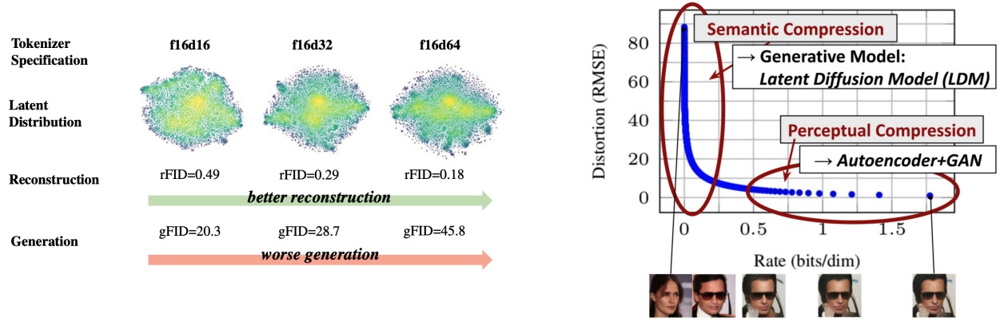

Figure 22: Right: The tradeoff between between $\mathrm { g F I D }$ and rFID, figure taken from [51]. Here, f denotes the downsampling factor, and d denotes the latent channel dimension. Right: Distortion (reconstruction quality) vs rate, taken from [17, 37]. We remark that this particular curve was generated using a DDPM (itself a type of VAE). While certain technical subtleties in the distortion and rate computations may differ from the imprecise definition presented in this text, the overall intuition remains the same.

makes it sometimes a little confusing to read these papers. For this reason, we want to give a brief overview over various frameworks and their differences and put them also in their historical context. This is not necessary to understand the remainder of this document but rather intended to be a support for you in case you read the literature.

Discrete time vs. continuous time. The first denoising diffusion model papers [41, 42, 17] did not use SDEs but constructed Markov chains in discrete time, i.e. with time steps $t = 0 , 1 , 2 , 3 , \ldots$ To this date, you will find a lot of works in the literature working with this discrete-time formulation. While this construction is appealing due to its simplicity, the disadvantage of the time-discrete approach is that it forces you to choose a time discretization before training. Further, the loss function needs to be approximated via an evidence lower bound (ELBO) - which is, as the name suggests, only a lower bound to the loss we actually want to minimize. Later, Song et al. [45] showed that these constructions were essentially an approximation of a time-continuous SDEs. Further, the ELBO loss becomes tight (i.e. it is not a lower bound anymore) in the continuous time case (e.g. note that Theorem 12 and Theorem 22 are equalities and not lower bounds - this would be different in the discrete time case). This made the SDE construction popular because it was considered mathematically "cleaner" and that one could control the simulation error via ODE/SDE samplers post training. It is important to note however that both models employ the same loss and are not fundamentally different.

"Forward process" vs probability paths. The first wave of denoising diffusion models [41, 42, 17, 45] did not use the term probability path but constructed a noising procedure of a data point $z \in \mathbb { R } ^ { d }$ via a so-called forward process. This is an SDE of the form

$$
\bar {X} _ {0} = z, \quad \mathrm{d} \bar {X} _ {t} = u _ {t} ^ {\mathrm{forw}} (\bar {X} _ {t}) \mathrm{d} t + \sigma_ {t} ^ {\mathrm{forw}} \mathrm{d} \bar {W} _ {t}\tag{146}
$$

<!-- page: 83 -->

The idea is that after drawing a data point $z \sim p _ { \mathrm { d a t a } }$ one simulates the forward process and thereby corrupts or "noises" the data. The forward process is designed such that for $t \to \infty$ its distribution converges to a Gaussian $\mathcal { N } ( 0 , I _ { d } )$ In other words, for $T \gg 0$ it holds that $\bar { X } _ { T } \; \sim \; \mathcal { N } ( 0 , I _ { d } )$ approximately. Note that this essentially corresponds to a probability path: the conditional distribution of $\bar{X}_{t}$ given $\bar { X } _ { 0 }   =   z$ is a conditional probability path $\bar { p } _ { t } ( \cdot | z )$ and the distribution of $\bar{X}_{t}$ marginalized over $z \sim p _ { \mathrm { d a t a } }$ corresponds to a marginal probability path $\bar { p } _ { t } . ^ { 6 }$ However, note that with this construction, we need to know the distribution of $X _ { t } | X _ { 0 } = z$ in closed form in order to train our models to avoid simulating the SDE. This essentially restrict the vector field $u _ { t } ^ { \mathrm { f o r w } }$ to ones such that we know the distribution $\bar { X } _ { t } | \bar { X } _ { 0 } = z$ in closed form. Therefore, throughout the diffusion model literature, vector fields in forward processes are always of the affine form, i.e. $u _ { t } ^ { \mathrm { f o r w } } ( x ) = a _ { t } x$ for some continuous function $a _ { t }$ . For this choice, we can use known formulas of the conditional distribution [40, 44, 23]:

$$
\bar {X} _ {t} | \bar {X} _ {0} = z \sim \mathcal {N} \left(\alpha_ {t} z, \beta_ {t} ^ {2} I\right), \quad \alpha_ {t} = \exp \left(\int_ {0} ^ {t} a _ {r} \mathrm{d} r\right), \quad \beta_ {t} ^ {2} = \alpha_ {t} ^ {2} \int_ {0} ^ {t} \frac {\left(\sigma_ {r} ^ {\mathrm{forw}}\right) ^ {2}}{\alpha_ {r} ^ {2}} d r
$$

Note that these are simply Gaussian probability paths. Therefore, one can say that a forward process is a specific way of constructing a (Gaussian) probability path. The term probability path was introduced by flow matching [25] to both simplify the construction and make it more general at the same time: First, the "forward process" of diffusion models is never actually simulated (only samples from $\bar { p } _ { t } ( \cdot | z )$ are drawn during training). Second, a forward process only converges for $t \to \infty$ (i.e. we will never arrive at $p _ { \mathrm { i n i t } }$ in finite time). Therefore, we choose to use probability paths in this document.

Time-Reversals vs Solving the Fokker-Planck equation. The original description of diffusion models did not construct the training target $u _ { t } ^ { \mathrm { t a r g e t } }$ or ∇ log pt via the Fokker-Planck equation (or Continuity equation) but via a time-reversal of the forward process [2]. A time-reversal $( X _ { t } ) _ { 0 \leq t \leq T }$ is an SDE with the same distribution over trajectories inverted in time, i.e.

$$
\mathbb {P} [ \bar {X} _ {t _ {1}} \in A _ {1}, \dots , \bar {X} _ {t _ {n}} \in A _ {n} ] = \mathbb {P} [ X _ {T - t _ {1}} \in A _ {1}, \dots , X _ {T - t _ {n}} \in A _ {n} ]\tag{147}
$$

$$
\text { for   all } 0 \leq t _ {1}, \dots , t _ {n} \leq T, \text { and } A _ {1}, \dots , A _ {n} \subset S\tag{148}
$$

As shown in Anderson [2], one can obtain a time-reversal satisfying the above condition by the SDE:

$$
\mathrm{d} X _ {t} = \left[ - u _ {t} (X _ {t}) + \sigma_ {t} ^ {2} \nabla \log p _ {t} (X _ {t}) \right] \mathrm{d} t + \sigma_ {t} \mathrm{d} W _ {t}, \quad u _ {t} (x) = u _ {T - t} ^ {\mathrm{forw}} (x), \sigma_ {t} = \bar {\sigma} _ {T - t}
$$

As $u _ { t } ( X _ { t } )   =   a _ { t } X _ { t }$ , the above corresponds to a specific instance of training target we derived in Proposition 1 (this is not immediately trivial as different time conventions are used. See e.g. [26] for a derivation). However, for the purposes of generative modeling, we often only use the final point $X _ { 1 }$ of the Markov process (e.g., as a generated image) and discard earlier time points. Therefore, whether a Markov process is a “true” time-reversal or follows along a probability path does not matter for many applications. Therefore, using a time-reversal is not necessary and often leads to suboptimal results, e.g. the probability flow ODE is often better [23, 28]. All ways of sampling from a diffusion models that are different from the time-reversal rely again on using the Fokker-Planck equation. We hope that this illustrates why nowadays many people construct the training targets directly via the

<small>p0(·|z) = pdata</small>

<small>6Note however that they use an inverted time convention: ¯ here.</small>

<!-- page: 84 -->

Fokker-Planck equation - as pioneered by [25, 27, 1] and done in this class.

Flow Matching [25] and Stochastic Interpolants [1]. The framework that we present is most closely related to the frameworks of flow matching and stochastic interpolants (SIs). As we learnt, flow matching restricts itself to flows. In fact, one of the key innovations of flow matching was to show that one does not need a construction via a forward process and SDEs but flow models alone can be trained in a scalable manner. Due to this restriction, you should keep in mind that sampling from a flow matching model will be deterministic (only the initial $X _ { 0 } \sim p _ { \mathrm { i n i t } }$ will be random). Stochastic interpolants included both the pure flow and the SDE extension via "Langevin dynamics" that we use here (see Theorem 17). Stochastic interpolants get their name from a interpolant function $I ( t , x , z )$ intended to interpolate between two distributions. In the terminology we use here, this corresponds to a different yet (mainly) equivalent way of constructing a conditional and marginal probability path. The advantage of flow matching and stochastic interpolants over diffusion models is both their simplicity and their generality: their training framework is very simple but at the same time they allow you to go from an arbitrary distribution $p _ { \mathrm { i n i t } }$ to an arbitrary distribution $p _ { \mathrm { d a t a } }$ - while denoising diffusion models only work for Gaussian initial distributions and Gaussian probability path. This opens up new possibilities for generative modeling that we will touch upon briefly later in this class.

## Summary 45 (Alternative Diffusion Formulations)

Alternative formulations for diffusion models that are popular in the literature often involve some combination of the following elements:

1. Discrete-time: Approximations of SDEs via discrete-time Markov chains are often used.

2. Inverted time convention: It is popular to use an inverted time convention where $t = 0$ corresponds to pdata (as opposed to here where t = 0 corresponds to $p _ { \mathrm { i n i t } } )$

3. Forward process: Forward processes (or noising processes) are ways of constructing (Gaussian) probability paths.

4. Training target via time-reversal: A training target can also be constructed via the time-reversal of SDEs. This is a specific instance of the construction presented here (with an inverted time convention).
