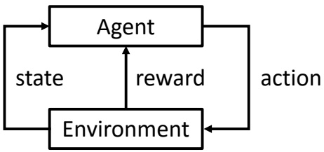
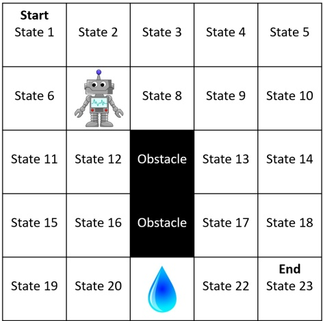
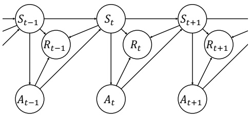
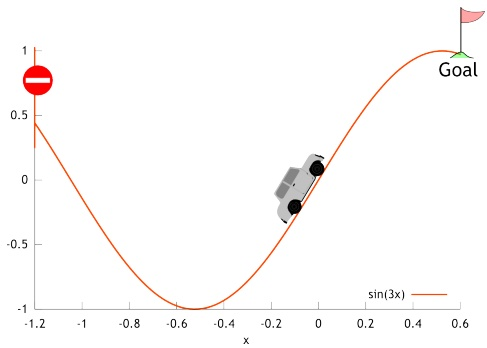
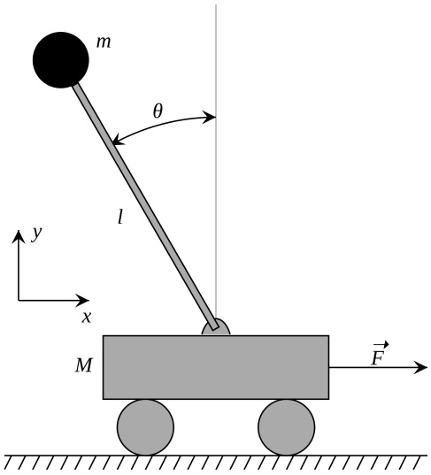
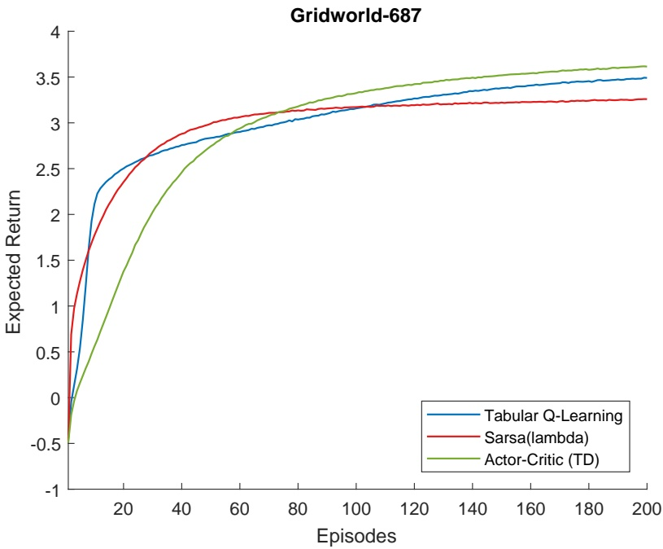
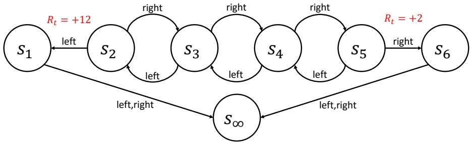
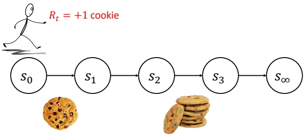
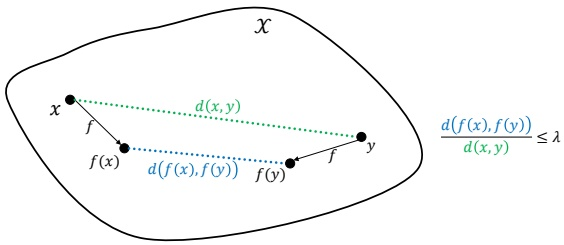
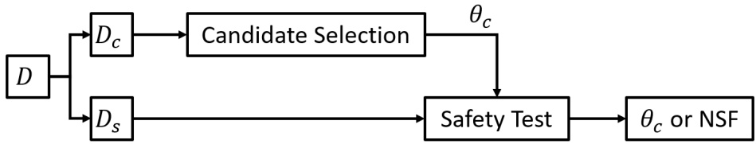

<!-- page: 1 -->

# COMPSCI 687: Reinforcement Learning Lectures Notes (Fall 2022)

Professor Bruno C. da Silva University of Massachusetts Amherst bsilva@cs.umass.edu

This document extends the notes initially prepared by Professor Philip S. Thomas University of Massachusetts Amherst pthomas@cs.umass.edu

## Table of Contents

- 1 Introduction 3
- 1.1 Notation 3
- 1.2 What is Reinforcement Learning (RL)? 4
- 1.3 687-Gridworld: A Simple Environment 6
- 1.4 Describing the Agent and Environment Mathematically 7
- 1.5 Creating MDPs 14
- 1.6 Planning and RL 15
- 1.7 Additional Terminology, Notation, and Assumptions 16
- 2 Black-Box Optimization for RL 22
- 2.1 Hello Environment! 22
- 2.2 Black-Box Optimization (BBO) for Policy Search 22
- 2.3 Evaluating RL Algorithms 28
- 3 Value Functions 28
- 3.1 State-Value Function 28
- 3.2 Action-Value Function 31
- 3.3 The Bellman Equation for $v^{\pi}$ 31
- 3.4 The Bellman Equation for $q^{\pi}$ 34
- 3.5 Optimal Value Functions 35
- 3.6 Bellman Optimality Equation for $v^{*}$ 37

<!-- page: 2 -->

- 4 Policy Iteration and Value Iteration 40
- 4.1 Policy Evaluation 40
- 4.2 Policy Improvement 43
- 4.3 Value Iteration 47
- 4.4 The Bellman Operator and Convergence of Value Iteration 49
- 5 Monte Carlo Methods 53
- 5.1 Monte Carlo Policy Evaluation 54
- 5.2 A Gradient-Based Monte Carlo Algorithm 59
- 6 Temporal Difference (TD) Learning 61
- 6.1 Function Approximation 65
- 6.2 Maximum Likelihood Model of an MDP versus Temporal Difference Learning 66
- 7 Sarsa: Using TD for Control 67
- 8 Q-Learning: Off-Policy TD-Control 70
- 9 High-Confidence Policy Improvement 73
- 9.1 Off-Policy Policy Evaluation 75
- 9.2 High-Confidence Off-Policy Evaluation (HCOPE) 78
- 9.3 High-Confidence Policy Improvement 79
- 10 $\mathrm{TD}(\lambda)$ 82
- 10.1 $\lambda$-Return Algorithm 87
- 11 Backwards View of $\mathrm{TD}(\lambda)$ 87
- 11.1 True Online Temporal Difference Learning 91
- 11.2 Sarsa($\lambda$) and Q($\lambda$) 91
- 11.3 Policy Gradient Algorithms 93
- 11.4 Policy Gradient Theorem 94
- 11.5 Proof of the Policy Gradient Theorem 95
- 11.6 REINFORCE 98
- 12 Natural Gradient 105
- 13 Other Topics 107
- 13.1 Hierarchical Reinforcement Learning 107
- 13.2 Experience Replay 107
- 13.3 Multi-Agent Reinforcement Learning 108
- 13.4 Reinforcement Learning Theory 108
- 13.5 Deep Reinforcement Learning 109

<!-- page: 3 -->

## 1 Introduction

This document contains notes related to what we cover in class. This is intended as a replacement for posting student notes each time the course is offered. This is not meant to be a standalone document like a textbook.

## 1.1 Notation

When possible, sets will be denoted by calligraphic capital letters $( \mathrm { e . g . } , \; { \mathcal { X } } )$ elements of sets by lowercase letters $( \mathrm { e . g . , } ~ x \in \mathcal { X } )$ , random variables by capital letters $( \mathrm { e . g . , } ~ X )$ , and functions by lowercase letters $( \mathrm { e . g . } ,   f )$ . This will not always be possible, so keep an eye out for exceptions.

We write $f   :   { \mathcal { X } }   \to   { \mathcal { Y } }$ to denote that $f$ is a function with domain $\mathcal { X }$ and range $\mathcal { Y } .$ . That is, it takes as input an element of the set X and produces as output an element of ${ \mathcal { Y } } .$ We write |X | to denote the cardinality of the set X—the number of elements in $\mathcal { X } ,$ and |x| to denote the absolute value of $x$ (thus the meaning of $| \cdot |$ depends on context).

We typically use capital letters for matrices $( \mathrm { e . g . } , A )$ and lowercase letters for vectors $( \mathrm { e . g . } , \; b )$ . We write $A ^ { \mathsf { T } }$ to denote the transpose of A. Vectors are assumed to be column vectors. Unless otherwise specified, ∥b∥ denotes the $l ^ { 2 } .$ -norm (Euclidean norm) of the vector v.

We write $\mathbb { N } _ { > 0 }$ to denote the natural numbers not including zero, and $\mathbb { N } { \geq } 0$ to denote the natural numbers including zero.

We write := to denote is defined to $b e .$ In lecture we may write $\triangleq$ rather than := since the triangle is easier to see when reading my (sometimes sloppy) handwriting.

If $f   :   \mathcal { X } \times \mathcal { Y }   \to   \mathcal { Z }$ for any sets ${ \mathcal { X } } , \; { \mathcal { Y } } ,$ and $\mathcal { Z } ,$ then we write $f ( \cdot , y )$ to denote a function, $g : { \mathcal { X } } \to { \mathcal { Z } }$ , such that $g ( x ) = f ( x , y )$ for all $x \in \mathcal { X }$

We denote sets using brackets, e.g., {1, 2, 3}, and sequences and tuples using parentheses, $\mathrm { e . g . , } ~ ( x _ { 1 } , x _ { 2 } , \dots )$

The notation that we use is not the same as that of the book or other sources (papers and books often use different notations, and there is no agreed-upon standard). Our notation is a mix between the notations of the first and second editions of Sutton and Barto’s book.

<!-- page: 4 -->

## 1.2 What is Reinforcement Learning (RL)?

Reinforcement learning is an area of machine learning, inspired by behaviorist psychology, concerned with how an agent can learn from interactions with an environment.

–Wikipedia, Sutton and Barto (1998), Phil



Figure 1: Agent-environment diagram. Examples of agents include a child, dog, robot, program, etc. Examples of environments include the world, lab, software environment, etc.

Evaluative Feedback: Rewards convey how “good” an agent’s actions are, not what the best actions would have been. If the agent was given instructive feedback (what action it should have taken) this would be a supervised learning problem, not a reinforcement learning problem.

Sequential: The entire sequence of actions must be optimized to maximize the “total” reward the agent obtains. This might require forgoing immediate rewards to obtain larger rewards later. Also, the way that the agent makes decisions (selects actions) changes the distribution of states that it sees. This means that RL problems aren’t provided as fixed data sets like in supervised learning, but instead as code or descriptions of the entire environment.

Question 1. If the agent-environment diagram describes a child learning to walk, what exactly is the “Agent” block? Is it the child’s brain, and its body is part of the environment? Is the agent the entire physical child? If the diagram describes a robot, are its sensors part of the environment or the agent?

Neuroscience and psychology ask how animals learn. They are the study of some examples of learning and intelligence. RL asks how we can make an agent that learns. It is the study of learning and intelligence in general (animal, computer, [match-boxes](https://en.wikipedia.org/wiki/Matchbox_Educable_Noughts_and_Crosses_Engine), purely theoretical, etc.). In this course we may discuss the relationship between RL and computational neuroscience in one lecture, but in general will not concern ourselves with how animals learn (other than, perhaps, for intuition and motivation).

<!-- page: 5 -->

There are many other fields that are similar and related to RL. Separate research fields often do not communicate much, resulting in different language and approaches. Other notable fields related to RL include [operations research](https://en.wikipedia.org/wiki/Operations_research) and control ([classical](https://en.wikipedia.org/wiki/Classical_control_theory), [adaptive](https://en.wikipedia.org/wiki/Adaptive_control), etc.). Although these fields are similar to RL, there are often subtle but impactful differences between the problems studied in these other fields and in RL. Examples include whether the dynamics of the environment are known to the agent a priori (they are not in RL), and whether the dynamics of the environment will be estimated by the agent (many, but not all, RL agents do not directly estimate the dynamics of the environment). There are also many less-impactful differences, like differences in notation (in control, the environment is called the plant, the agent the controller, the reward the (negative) cost, the state the feedback, etc.).

A common misconception is that RL is an alternative to supervised learning— that one might take a supervised learning problem and convert it into an RL problem in order to apply sophisticated RL methods. For example, one might treat the state as the input to a classifier, the action as a label, and the reward as −1 if the label is correct and 1 otherwise. Although this is technically possible and a valid use of RL, it should not be done. In a sense, RL should be a last resort—the tool that you use when supervised learning algorithms cannot solve the problem you are interested in. If you have labels for your data, do not discard them and convert the feedback from instructive feedback (telling the agent what label it should have given) to evaluative feedback (telling the agent if it was right or wrong). The RL methods will likely be far worse than standard supervised learning algorithms. However, if you have a sequential problem or a problem where only evaluative feedback is available (or both!), then you cannot apply supervised learning methods and you should use RL.

Question 2. [Puzzle] There are 100 pirates. They have 10,000 gold pieces. These pirates are ranked from most fearsome (1) to least fearsome (100). To divide the gold, the most fearsome pirate comes up with a method (e.g., split it evenly, or I get half and the second most fearsome gets the other half ). The pirates then vote on this plan. If 50% or more vote in favor of the plan, then that is how the gold is divided. If > 50% vote against the plan, the most fearsome pirate is thrown off the boat and the next most fearsome comes up with a plan, etc. The pirates are perfectly rational. You are the most fearsome pirate. How much of the gold can you get? How?

## pieces of gold. 951 , 9 You should be able to keep Answer 2.

If you solved the above puzzle, you very likely did so by first solving easier versions. What if there were only two pirates? What if there were three? This is

<!-- page: 6 -->

what we will do in this course. We will study and understand an easier version of the problem and then will build up to more complex and interesting cases over the semester.

## 1.3 687-Gridworld: A Simple Environment



Figure 2: 687-Gridworld, a simple example environment we will reference often.

State: Position of robot. The robot does not have a direction that it is facing.

Actions: Attempt Up, Attempt Down, Attempt Left, Attempt Right. We abbreviate these as: AU, AD, AL, AR.

Environment Dynamics: With probability 0.8 the robot moves in the specified direction. With probability 0.05 it gets confused and veers to the right from the intended direction—moves +90◦from where it attempted to move (that is, AU results in the robot moving right, AL results in the robot moving up, etc.). With probability 0.05 it gets confused and veers to the left—moves −90◦from where it attempted to move (that is, AU results in the robot moving left, AL results in the robot moving down, etc.). With probability 0.1 the robot temporarily breaks and does not move at all. If the movement defined by these dynamics would cause the agent to exit the grid (e.g., move up from state 2) or hit an obstacle (e.g., move right from state 12), then the agent does not move. The robot starts in state 1, and the process ends when the robot reaches state 23. The robot does not have a direction that it is facing, only a position indicated by the state number.

Rewards: The agent receives a reward of −10 for entering the state with the water and a reward of +10 for entering the goal state. Entering any other state results in a reward of zero. If the agent is in the state with the water (state

<!-- page: 7 -->

21) and stays in state 21 for any reason (hitting a wall, temporarily breaking), it counts as “entering” the water state again and results in an additional reward of −10. We use a reward discount parameter (the purpose of which is described later) of $\gamma = 0 . 9$

Number of States: Later we will describe a special state, $s _ { \infty } ,$ which is included in 687-Gridworld. As a result, 687-Gridworld actually has 24 states, not 23. That is, $| \mathcal { S } | = 2 4$ . We discuss this near the end of Section 1.4.

## 1.4 Describing the Agent and Environment Mathematically

In order to reason about learning, we will describe the environment (and soon the agent) using math. Of the many different mathematical models that can be used to describe the environment (POMDPs, DEC-POMDPs, SMDPs, etc.), we will initially focus on Markov decision processes (MDPs). Despite their apparent simplicity, we will see that they capture a wide range of real and interesting problems, including problems that might at first appear to be outside their scope (e.g., problems where the agent makes observations about the state using sensors that might be incomplete and noisy descriptions of the state). Also, a common misconception is that RL is only about MDPs. This is not the case: MDPs are just one way of formalizing the environment of an RL problem.

• An MDP is a mathematical specification of both the environment and what we want the agent to learn.

• Let $t \in \mathbb { N } _ { \geq 0 }$ be the time step (iteration of the agent-environment loop).

• Let $S _ { t }$ be the state of the environment at time t.

• Let $A _ { t }$ be the action taken by the agent at time t.

• Let $R _ { t } \in \mathbb { R }$ be the reward received by the agent at time t. That is, when the state of the environment is $S _ { t }$ , the agent takes action $A _ { t } ,$ and the environment transitions to state $S _ { t + 1 }$ , the agent receives the reward $R _ { t }$ This differs from some other sources wherein this reward is called $R _ { t + 1 }$

There are many definitions of MDPs used in the literature, which share common terms. In each case an MDP is a tuple. Four examples are:

1. $( \mathcal { S } , \mathcal { A } , p , R )$

2. $( \mathcal { S } , \mathcal { A } , p , R , \gamma )$

3. $( \mathcal { S } , \mathcal { A } , p , R , d _ { 0 } , \gamma )$

4. $( \mathcal { S } , \mathcal { A } , p , d _ { R } , d _ { 0 } , \gamma )$

<!-- page: 8 -->

We will discuss the differences between these definitions in a moment, but first let’s define each of the terms. Notice that the unique terms in these definitions are: $\mathcal { S } , \mathcal { A } , p , d _ { R } , R , d _ { 0 }$ , and $\gamma .$ We define each of these below:

$\mathcal { S }$ is the set of all possible states of the environment. The state at time t, $S _ { t } ,$ always takes values in S. For now we will assume that $| \mathcal { S } | < \infty$ —that the set of states is finite. We call S the “state set”.

$\mathcal { A }$ is the set of all possible actions the agent can take. The action at time $t ,   A _ { t }$ , always takes values in A. For now we will assume that $| \mathcal { A } | < \infty$

$p$ is called the transition function, and it describes how the state of the environment changes.

$$
p: \mathcal {S} \times \mathcal {A} \times \mathcal {S} \to [ 0, 1 ].\tag{1}
$$

For all $s \in \mathcal { S } ,   a \in \mathcal { A } ,   s ^ { \prime } \in \mathcal { S } ,$ , and $t \in \mathbb { N } _ { \geq 0 } \colon$

$$
p (s, a, s ^ {\prime}) := \Pr (S _ {t + 1} = s ^ {\prime} | S _ {t} = s, A _ {t} = a).\tag{2}
$$

Hereafter we suppress the sets when writing quantifiers (like ∃ and $\forall ) -$ these should be clear from context. We say that the transition function is deterministic if $p ( s , a , s ^ { \prime } ) \in \{ 0 , 1 \}$ for all $s , a ,$ and $s ^ { \prime }$ .

$d _ { R }$ describes how rewards are generated. Intuitively, it is a conditional distribution over $R _ { t }$ given $S _ { t } , A _ { t }$ , and $S _ { t + 1 }$ . That is, $R _ { t } \sim d _ { r } ( S _ { t } , A _ { t } , S _ { t + 1 } )$ For now we assume that the rewards are bounded—that $| R _ { t } |   \leq   R _ { \operatorname* { m a x } }$ always, for all $t \in \mathbb { N } _ { \geq 0 }$ and some constant $R _ { \operatorname* { m a x } } \in \mathbb { R } . ^ { 1 }$

• R is a function called the reward function, which is implicitly defined by $d _ { R }$ Other sources often define an MDP to contain R rather than $d _ { R } .$ . Formally

$$
R: \mathcal {S} \times \mathcal {A} \to \mathbb {R},\tag{3}
$$

and

$$
R (s, a) := \mathbf {E} \left[ R _ {t} | S _ {t} = s, A _ {t} = a \right],\tag{4}
$$

for all $s , a ,$ and t. Although the reward function, R, does not precisely define how the rewards, $R _ { t }$ , are generated (and thus a definition of an MDP with R in place of $d _ { R }$ would in a way be incomplete), it is often all that is necessary to reason about how an agent should act. Notice that R is a function despite being a capital letter. This is also due to a long history of this notation, and also because we will use r to denote a particular reward, e.g., when writing $( s , a , r , s ^ { \prime } , a ^ { \prime } )$ later.

$d _ { 0 }$ is the initial state distribution:

$$
d _ {0}: \mathcal {S} \to [ 0, 1 ],\tag{5}
$$

and for all s:

$$
d _ {0} (s) = \Pr (S _ {0} = s).\tag{6}
$$

<sup>1</sup>In the remainder of the course, we will very rarely use d<sub>R</sub>—typically we will work with $R .$

<!-- page: 9 -->

$\gamma \in [ 0 , 1 ]$ is a parameter called the reward discount parameter, and which we discuss later.

Recall now our earlier list of four common ways of defining an MDP. These different definitions vary in how precisely they define the environment. The definition $( \mathcal { S } , \mathcal { A } , p , R , \gamma )$ contains all of the terms necessary for us to reason about optimal behavior of an agent. The definition $( \mathcal { S } , \mathcal { A } , p , R )$ still actually includes $\gamma ,$ it just makes it implicit. That is, this definition assumes that $\gamma$ is still present, but doesn’t write it as one of the terms in the MDP definition. On the other extreme, the definition $( \mathcal { S } , \mathcal { A } , p , d _ { R } , d _ { 0 } , \gamma )$ fully specifies how the environment behaves.

This distinction is most clear when considering the inclusion of $d _ { R }$ rather than R. As we will see later, the expected rewards described by R are all that is needed to reason about what behavior is optimal. However, to fully characterize how rewards are generated in an environment, we must specify $d _ { R }$

Just as we have defined the environment mathematically, we now define the agent mathematically. A policy is a decision rule—a way that the agent can select actions. Formally, a policy, $\pi ,$ is a function:

$$
\pi : \mathcal {S} \times \mathcal {A} \to [ 0, 1 ],\tag{7}
$$

and for all $s \in \mathcal { S } ,   a \in \mathcal { A } ,$ and $t \in \mathbb { N } _ { \geq 0 }$ ,

$$
\pi (s, a) := \Pr (A _ {t} = a | S _ {t} = s).\tag{8}
$$

Thus, a policy is the conditional distribution over actions given the state. That is, π is not a distribution, but a collection of distributions over the action set—one per state. There are an infinite number of possible policies, but a finite number of deterministic policies (policies for which $\pi ( s , a ) \in \{ 0 , 1 \}$ for all s and $( a )$ . We denote the set of all policies by Π. Figure 3 presents an example of a policy for 687-Gridworld.

|  | AU | AD | AL | AR |
| --- | --- | --- | --- | --- |
| 1 | 0 | 0.1 | 0.3 | 0.6 |
| 2 | 0.8 | 0 | 0 | 0.2 |
| 3 | 0.1 | 0.1 | 0.5 | 0.3 |
| 4 | 0.25 | 0.25 | 0.25 | 0.25 |
| 5 | 0.25 | 0.25 | 0.5 | 0 |
| 6 | 0.2 | 0.3 | 0.5 | 0 |
| ... | ... | ... | ... | ... |

Figure 3: Example of a tabular policy. Each cell denotes the probability of the action (specified by the column) in each state (specified by the row). In this format, Π is the set of all $| \mathcal { S } | \times | \dot { \mathcal { A } } |$ matrices with non-negative entries and rows that all sum to one.

To summarize so far, the interaction between the agent and environment proceeds as follows (where $R _ { t } { \sim } d _ { R } ( S _ { t } , A _ { t } , S _ { t + 1 } )$ denotes that $R _ { t }$ is sampled

<!-- page: 10 -->

according to $d _ { R } )$

$$
S _ {0} \sim d _ {0}
$$

$$
A _ {0} \sim \pi (S _ {0}, \cdot)\tag{9}
$$

(10)

$$
S _ {1} \sim p (S _ {0}, A _ {0}, \cdot)\tag{11}
$$

$$
R _ {0} \sim d _ {R} (S _ {0}, A _ {0}, S _ {1})\tag{12}
$$

$$
A _ {1} \sim \pi (S _ {1}, \cdot)
$$

$$
S _ {2} \sim p (S _ {1}, A _ {1}, \cdot)\tag{13}
$$

(14)

(15)

In pseudocode:

<div class="docvortex-algorithm" style="white-space: pre-wrap; font-family:monospace;">
Algorithm 1: General flow of agent-environment interaction.
$S_0 \sim d_0$;
for $t = 0$ to $\infty$ do
    $A_t \sim \pi(S_t, \cdot)$;
    $S_{t+1} \sim p(S_t, A_t, \cdot)$;
    $R_t \sim d_R(S_t, A_t, S_{t+1})$;
</div>

The running of an MDP is also presented as a Bayesian network in Figure 4.



Figure 4: Bayesian network depicted the running of an MDP.

Notice that we have defined rewards so that $R _ { 0 }$ is the first reward, while Sutton and Barto (1998) define rewards such that $R _ { 1 }$ is the first reward. We do this because $S _ { 0 } ,   A _ { 0 } .$ , and $t = 0$ are the first state, action, and time, and so having $R _ { 1 }$ be the first reward would be inconsistent. Furthermore, this causes indices to align better later on. However, when comparing notes from the course to the book, be sure to account for this notational discrepancy.

Agent’s goal: Find a policy, $\pi ^ { \star }$ , called an optimal policy. Intuitively, an optimal policy maximizes the expected total amount of reward that the agent will obtain.

Objective function: J : Π → R, where for all $\pi \in \Pi$

$$
J (\pi) := \mathbf {E} \left[ \sum_ {t = 0} ^ {\infty} R _ {t} \bigg | \pi \right].\tag{16}
$$

<!-- page: 11 -->

Note: Later we will revise this definition—if you are skimming looking for the correct definition of $J ,$ it is in (18).

Note: Expectations and probabilities can be conditioned on events. A policy, $\pi ,$ is not an event. Conditioning on $\pi ,   \mathrm { e . g . }$ , when we wrote |π in the definition of J above, denotes that all actions (the distributions or values of which are not otherwise explicitly specified) are sampled according to π. That is, for all $t \in \mathbb { N } _ { \geq 0 } ,   A _ { t } \sim \pi ( S _ { t } , \cdot )$

Optimal Policy: An optimal policy, $\pi ^ { \star }$ , is any policy that satisfies:

$$
\pi^ {\star} \in \underset {\pi \in \Pi} {\arg \max} J (\pi).\tag{17}
$$

Note: Much later we will define an optimal policy in a different and more strict way.

Question 3. Is the optimal policy always unique when it exists?

and the resulting policy would also be optimal. 1 (or vice versa) in state any optimal policy could be modified my shifting probability from AD to AR, and so 1 ceeded), then AD and AR would both be equally “good” in state No. For example, in 687-Gridworld (if actions always suc- Answer 3.

Reward Discounting: If you could have one cookie today or two cookies on the last day of class, which would you pick? Many people pick one cookie today when actually presented with these options. This suggests that rewards that are obtained in the distant future are worth less to us than rewards in the near future. The reward discount parameter, $\gamma ,$ allows us to encode, within the objective function, this discounting of rewards based on how distant in the future they occur.

Recall that $\gamma \in [ 0 , 1 ]$ . We redefine the objective function, $J ,$ as:

$$
J (\pi) := \mathbf {E} \left[ \sum_ {t = 0} ^ {\infty} \gamma^ {t} R _ {t} \bigg | \pi \right],\tag{18}
$$

for all $\pi \in \Pi . ~ \mathrm { S o } ,   \gamma < 1$ means that rewards that occur later are worth less to the agent—the utility of a reward, $r ,$ t time steps in the future is $\gamma ^ { t } r$ . Including $\gamma$ also ensures that $J ( \pi )$ is bounded, and later we will see that smaller values of $\gamma$ make the MDP easier to solve (solving an MDP refers to finding or approximating an optimal policy).

To summarize, the agent’s goal is to find (or approximate) an optimal policy, $\pi ^ { \star }$ , as defined in (17), using the definition of $J$ that includes reward discounting— (18).

<!-- page: 12 -->

Question 4. What is an optimal policy for 687-Gridworld? Is it unique? How does the optimal action in state 20 change $i f$ we were to change the value of $\gamma \hat { e }$

Property 1 (Existence of an optimal policy). $\mathit { I f }   | \mathcal { S } | < \infty ,   | \mathcal { A } | < \infty ,   R _ { \mathit { m a x } } < \infty$ and γ < 1, then an optimal policy exists.<sup>2</sup> $\gamma < 1$

We will prove Property 1 later.

Question 5. What is an optimal policy for 687-Gridworld? Is it unique? How does the optimal action in state 20 change if we were to change the value of γ?

Question 6. Consider two MDPs that are identical, except for their initial state distributions, $d _ { 0 }$ . Let $\pi ^ { * }$ and $\mu ^ { * }$ be optimal policies for the first and second MDP, respectively. Let $s ^ { \star } \in \mathcal { S }$ be a state that has a non-zero probability of occurring when using $\pi ^ { * }$ on the first MDP and a non-zero probability of occurring when using $\mu ^ { * }$ on the second MDP. Consider a new policy, $\pi ^ { i }$ such that $\pi ^ { \prime } ( s , a ) = \pi ^ { \star } ( s , a )$ for all $s \in \mathcal { S } \setminus \{ s ^ { \star } \}$ and $a \in \mathcal { A }$ and $\pi ^ { \prime } ( s ^ { \star } , a )   =   \mu ^ { \star } ( s ^ { \star } , a )$ for all $a \in \mathcal { A }$ . Is $\pi ^ { \prime }$ an optimal policy for the first MDP?

without this reachability condition. 0 d independent of will present a different definition of an optimal policy that is completely, if every state is reachable under every policy. Later we 0 d distribution, of how the agent got to the state, and thus independent of the initial state possible in the future. In this way, optimal behavior in a state is independent s not impact what action it should take in state to get as much reward as s more formally. For now, notice that how the agent entered state ⋆ does Yes! Later we will have the mathematical tools to discuss this Answer 6.

Question 7. How many deterministic policies are there for an MDP with finite state and action sets?

<small><span class="docvortex-page-footnote" data-block-type="page_footnote" style="color:#6b7280"><sup>2</sup>We will actually prove a stronger result—we will define optimality in a different, and stronger way, and will prove that an optimal policy exists with respect to this (strictly) stronger definition of optimality. Furthermore, we will show that an optimal deterministic policy exists.</span></small>

<!-- page: 13 -->

|A| states, we see that there are |S| possible deterministic policies. the agent could deterministically select actions. Extending this to all of the total possible ways |A| × |A| as well. In these two states alone, there are A| possible actions to take. In the second, there are |A| first state, there are |A| Answer 7. |S| actions available. In the |A| . In each state, there are

Question 8. Consider an MDP with one state, $\mathcal { S } = \{ 1 \}$ and A = R. Let

$$
R _ {t} = \left\{ \begin{array}{l l} A _ {t} & \text {if} A _ {t} <   1 \\ 0 & \text {otherwise.} \end{array} \right.\tag{19}
$$

Let $\gamma < 1$ . In this case, what is the optimal policy?

the non-existence of optimal policies. can result in 1 shows how removing some of the assumptions from Property a < ∗ cannot be optimal either. So, no optimal policy exists. This example 1 it produces a larger reward. Hence this new action is better, and so any a the action − + (1 ∗ a ∗ a is larger than 2 / ) ∗ and also less than one, and so a be optimal if ≥ ∗ a . Now consider the case where 1 < ∗ . In this case, 1 a , and so any 5 . 0 , which gives a reward of 5 . 0 better with action ∗ cannot π∗ a . If 1 in state ≥ ∗ , then the reward is always zero. We can do 1 a (including stochastic). Let ∗ be the action chosen by an optimal policy policies, which should give intuition for why there are no optimal policies There is no optimal policy. Let us consider only deterministic Answer 8.

When we introduced 687-Gridworld, we said that the agent-environment interactions terminate when the agent reaches state 23, which we called the goal. This notion of a terminal state can be encoded using our definition of an MDP above. Specifically, we define a terminal state to be any state that may transition to a special state, $s _ { \infty }$ , called the terminal absorbing state. Once in $s _ { \infty } ,$ the agent can never leave $\left( s _ { \infty } \right.$ is absorbing)—the agent will forever continue to transition from $s _ { \infty }$ back into $s _ { \infty }$ . Transitioning from $s _ { \infty }$ to $s _ { \infty }$ always results in a reward of zero. Effectively, when the agent enters a terminal state the process ends. There are no more decisions to make (since all actions have the same outcome) or rewards to collect. Thus, an episode terminates when the agent enters $s _ { \infty } .$ . Notice that terminal states are optional—MDPs need not have any terminal states. Also, there may be states that only sometimes transition to $s _ { \infty } ,$ and we do not call these terminal states. Notice also that $s _ { \infty }$ is an element of S. Given how we have defined MDPs, this means that the agent does select actions in $s _ { \infty }$ . Lastly, although terminal states are defined, goal states are not defined—the notion of a goal in 687-Gridworld is simply for our own intuition.<sup>3</sup>

<small><span class="docvortex-page-footnote" data-block-type="page_footnote" style="color:#6b7280">s∞</span></small>

<small><span class="docvortex-page-footnote" data-block-type="page_footnote" style="color:#6b7280"><sup>3</sup>To make it clear that terminal states and should not be thought of as “goal” states,</span></small>

<!-- page: 14 -->

When the agent reaches $s _ { \infty } ,$ the current trial, called an episode ends and a new one begins. This means that t is reset to zero, the initial state, $S _ { 0 }$ , is sampled from $d _ { 0 } ,$ and the next episode begins (the agent selects $A _ { 0 } ,$ gets reward $R _ { 0 } .$ and transitions to state $S _ { 1 } )$ . The agent is notified that this has occurred, since this reset may change its behavior (e.g., it might clear some sort of short-term memory).

For 687-Gridworld, we assume that $s _ { \infty } \in \mathcal { S }$ and state 23 always transitions to $s _ { \infty }$ with a reward of zero. Hence, 687-Gridworld has 24 states.

## 1.5 Creating MDPs

You might be wondering: who defines $R _ { t } ?$ The answer to this differs depending on how you are trying to use RL. If you are using RL to solve a specific real-world problem, then it is up to you to define $R _ { t }$ to cause the agent to produce the behavior you want. It is well known that we as humans are bad at defining rewards that cause optimal behavior to be what we want. Often, you may find that you define rewards to produce the behavior you want, train an agent, think the agent is failing, and then realize that the agent has in a way outsmarted you by finding an unanticipated way to maximize the expected discounted return via behavior that you do not want.

Consider an example, where you want to give an RL agent (represented by the dog) rewards to get it to walk along the sidewalk to a door (which ends the episode) while avoiding a flowerbed: How would you assign rewards to states in order to get the dog to go to the door? Humans frequently assign rewards in a way that causes undesirable behavior for this example. One mistake is to give positive rewards for walking on the sidewalk—in that case the agent will learn to walk back and forth on the sidewalk gathering more and more rewards, rather than going to the door where the episode ends. In this case, optimal behavior is produced by putting negative rewards on the flowerbed, and a positive reward at the door.

This provides a general rule of thumb when designing rewards: give rewards for what you want the agent to achieve, not for how you think the agent should achieve it. Rewards that are given to help the agent quickly identify what behavior is optimal are related to something called shaping rewards, which we will discuss later. When done properly, shaping rewards can be designed such that they will not change the optimal policy. However, when we simply make up shaping rewards (like putting a positive constant on the sidewalk states in the above example), they often will change optimal behavior in an undesirable way.

Back to the earlier question: who defines $R _ { t } ?$ So far we have discussed how you can choose $R _ { t }$ when applying RL to a problem. Sometimes, people study RL to obtain insight into animal behavior. In this case, the rewards were produced by evolution. We will likely have a guest lecture by Andy Barto on this topic later in

<small><span class="docvortex-page-footnote" data-block-type="page_footnote" style="color:#6b7280">s∞</span></small>

<small><span class="docvortex-page-footnote" data-block-type="page_footnote" style="color:#6b7280">∞</span></small>

<small><span class="docvortex-page-footnote" data-block-type="page_footnote" style="color:#6b7280">picture an MDP with positive rewards everywhere and a terminal state. In this case, the terminal state is something that the agent should avoid, like a cliff. If the agent enters the terminal state, it cannot collect any more positive rewards, as it becomes stuck in s —in a sense it dies. In this case, and terminal states are certainly not “goals”.</span></small>

<!-- page: 15 -->


Figure 5: Agent-environment diagram. Examples of agents include a child, dog, robot, program, etc. Examples of environments include the world, lab, software environment, etc.

the semester. For now, a brief overview: In this animal/psychology/neuroscience setting rewards refer to something given to an agent that is rewarding, like food. This is translated in the animal’s brain into a reward signal. This reward signal could, for example, correspond to the firing of specific neurons or the release of a specific neurotransmitter. Using this terminology, our $R _ { t }$ corresponds to the reward signal in the animal’s brain rather than the reward (say, a cookie). Some function defines how reward signals are generated within the brain when an agent receives a reward, and this function was chosen (learned, if you’d like to call it that) by evolution. If you are familiar with the neurotransmitter dopamine, from this discussion it may sound like dopamine corresponds to $R _ { t }$ —later we will argue that dopamine does not correspond to $R _ { t }$ , but to errors when predicting statistics of the sum of rewards.

## 1.6 Planning and RL

Consider again the definition of RL. Notice the segment “learn from interactions with the environment.” If $p$ and R (or $d _ { R } )$ are known, then the agent does not need to interact with the environment. E.g., an agent solving 687-Gridworld can plan in its head, work out an optimal policy and execute this optimal policy from this start. This is not reinforcement learning—this is planning. More concretely, in planning problems $p$ and R are known, while in reinforcement learning problems at least $p$ (and usually $R )$ is not known by the agent. Instead, the agent must learn by interacting with the environment—taking different actions and seeing what happens. Most reinforcement learning algorithms will not estimate $p .$ The environment is often too complex to model well, and small errors in an estimate of $p$ compound over multiple time steps making plans built

<!-- page: 16 -->

from estimates of p unreliable. We will discuss this more later.

## 1.7 Additional Terminology, Notation, and Assumptions

• A history, $H _ { t } .$ , is a recording of what has happened up to time t in an episode:

$$
H _ {t} := (S _ {0}, A _ {0}, R _ {0}, S _ {1}, A _ {t}, R _ {1}, S _ {2}, \dots , S _ {t}, A _ {t}, R _ {t}).\tag{20}
$$

• A trajectory is the history of an entire episode: $H _ { \infty }$

• The return or discounted return of a trajectory is the discounted sum of rewards: $\begin{array} { r } { G : = \sum _ { t = 0 } ^ { \infty } \gamma ^ { t } R _ { t } } \end{array}$ . So, the objective, J, is the expected return or expected discounted return, and can be written as $J ( \pi ) : = \mathbf { E } [ G | \pi ]$

• The return from time t or discounted return from time $t ,   G _ { t }$ , is the discounted sum of rewards starting from time t:

$$
G _ {t} := \sum_ {k = 0} ^ {\infty} \gamma^ {k} R _ {t + k}.
$$

## 1.7.1 Example Domain: Mountain Car

Environments studied in RL are often called domains. One of the most common domains is mountain car, wherein the agent is driving a crude approximation of a car. The car is stuck in a valley, and the agent wants to get to the top of the hill in front of the car. However, the car does not have enough power to drive straight up the hill in front, and so it must learn to reverse up the hill behind it before accelerating forwards to climb the hill in front. A diagram of the mountain car environment is depicted in Figure 6.



Figure 6: Diagram of the mountain car domain.

• State: $s = ( x , v )$ , where $x \in \mathbb { R }$ is the position of the car and $v \in \mathbb { R }$ is the velocity.

<!-- page: 17 -->

• Actions: $a \in \{ { \tt r e v e r s e }$ , neutral, forward}. These actions are mapped to numerical values as follows: : $a \in \{ - 1 , 0 , 1 \}$

• Dynamics: The dynamics are deterministic—taking action a in state s always produces the same stat $\circ ,   s ^ { \prime } .$ . Thus, $p ( s , a , s ^ { \prime } ) \in \{ 0 , 1 \}$ . The dynamics are characterized by:

$$
v _ {t + 1} = v _ {t} + 0. 0 0 1 a _ {t} - 0. 0 0 2 5 \cos (3 x _ {t})\tag{21}
$$

$$
x _ {t + 1} = x _ {t} + v _ {t + 1}.\tag{22}
$$

After the next state, $s ^ { \prime } = [ x _ { t + 1 } , v _ { t + 1 } ]$ has been computed, the value of $x _ { t + 1 }$ is clipped so that it stays in the closed interval $[ - 1 . 2 , 0 . 5 ]$ . Similarly, the value $v _ { t + 1 }$ is clipped so that it stays in the closed interval $[ - 0 . 7 , 0 . 7 ]$ If $x _ { t + 1 }$ reaches the left bound (i.e., the car is at $x _ { t + 1 } = - 1 . 2 )$ , or if $x _ { t + 1 }$ reaches the right bound $( \mathrm { i . e . }$ , the car is at $x _ { t + 1 }   =   0 . 5 )$ , then the car’s velocity is reset to zero: $v _ { t + 1 } = 0$ . This simulates inelastic collisions with walls at −1.2 and 0.5.

• Terminal States: If $x _ { t }   =   0 . 5$ , then the state is terminal (it always transitions to $s _ { \infty } )$ .

• Rewards: $R _ { t } = - 1$ always, except when transitioning to $s _ { \infty }$ (from $s _ { \infty }$ or from a terminal state), in which case $R _ { t } = 0$

• Discount: $\gamma = 1 . 0 .$

• Initial State: $S _ { 0 } = ( X _ { 0 } , 0 )$ , where $X _ { 0 }$ is an initial position drawn uniformly at random from the interval $[ - 0 . 6 , - 0 . 4 ]$

Question 9. For this problem, what is an English description of the meaning behind a return? What is an episode? What is an optimal policy? How long can an episode be? What is the English meaning of $J ( \pi )  ?$

number of time steps for the agent to reach the goal expected is the ) π( J until it reaches the goal. There is no limit on how long an episode can be. some specific point is reached, at which point the car accelerates forward front of the car. An optimal policy reverses up the hill behind the car until of the valley and the agent driving it until it reaches the top of the hill in reach the goal. An episode corresponds to the car starting near the bottom The return is negative the number of time steps for the car to Answer 9.

<!-- page: 18 -->

## 1.7.2 Markov Property

A seemingly more general non-Markovian formulation for the transition function might be:

$$
p (h, s, a, s ^ {\prime}) := \operatorname * {P r} (S _ {t + 1} = s ^ {\prime} | H _ {t - 1} = h, S _ {t} = s, A _ {t} = a).\tag{23}
$$

The Markov assumption is the assumption that $S _ { t + 1 }$ is conditionally independent of $H _ { t - 1 }$ given $S _ { t }$ . That is, for all $h , s , a , s ^ { \prime } , t { : } ^ { 4 }$

$$
\Pr (S _ {t + 1} = s ^ {\prime} | H _ {t - 1} = h, S _ {t} = s, A _ {t} = a) = \Pr (S _ {t + 1} = s ^ {\prime} | S _ {t} = s, A _ {t} = a)\tag{24}
$$

Since we make this Markov assumption, $p$ as defined earlier completely captures the transition dynamics of the environment, and there is no need for the alternate definition in (23). The Markov assumption is sometimes referred to as the Markov property (for example one would usually say that a domain has the Markov property, not that the domain satisfies the Markov assumption). It can also be stated colloquially as: the future is independent of the past given the present.

We also assume that the rewards are Markovian $- R _ { t }$ is conditionally independent of $H _ { t - 1 }$ given $S _ { t }$ (since $A _ { t }$ depends only on $S _ { t } .$ , this is equivalent to assuming that $R _ { t }$ is conditionally independent of $H _ { t - 1 }$ given both $S _ { t }$ and $A _ { t } )$ While the previous Markov assumptions apply to the environment (and are inherent assumptions in the MDP formulation of the environment), we make an additional Markov assumption about the agent: the agent’s policy is Markovian. That is, $A _ { t }$ is conditionally independent of $H _ { t - 1 }$ given $S _ { t }$

Question 10. Can you give examples of Markovian and non-Markovian environments?

## Question 11. Is the Markov property a property of the problem being formulated as an $M D P$ or a property of the state representation used when formulating the problem?

To answer this second question, consider whether state transitions are Markovian in mountain car. It should be clear that they are as the domain has been described. What about if the state was $s = ( x )$ rather than $s = ( x , v ) ?$ You could deduce $v _ { t }$ from the previous state, $x _ { t - 1 }$ and current state, $x _ { t }$ , but that would require part of the history before $s _ { t }$ . Thus, using $s = ( x )$ mountain car is not Markovian. $\mathrm { S o }$ , the Markov property is really a property of the state representation, not the problem being formulated as an MDP.

Notice that one can always define a Markovian state representation. Let $S _ { t }$ be a non-Markovian state representation. Then $( S _ { t } , H _ { t - 1 } )$ is a Markovian state representation. That is, we can include the history within the states in order

<small><span class="docvortex-page-footnote" data-block-type="page_footnote" style="color:#6b7280">s"</span></small>

<small><span class="docvortex-page-footnote" data-block-type="page_footnote" style="color:#6b7280">s  S”.</span></small>

<small><span class="docvortex-page-footnote" data-block-type="page_footnote" style="color:#6b7280"><sup>4</sup>For brevity, hereafter we omit the sets that elements are in when it should be clear from context, e.g., we say “for all s rather than “for all ∈</span></small>

<!-- page: 19 -->

to enforce the Markov property. This is typically undesirable because the size of the state set grows exponentially with the maximum episode length (a term discussed more later). This trick of adding information into the state is called state augmentation.

There is often confusion about terminology surrounding states, state representations, and the Markov property. The state of an MDP (and every other similar formulation, like POMDPs, DEC-POMDPs, SMDPs, etc.) should always be defined so that the Markov property is satisfied. Later we will reason about state representations that are not Markovian, in order to model situations where the agent might only be able to make partial or noisy observations about the state of the environment.

## 1.7.3 Stationary vs. Nonstationary

We assume that the dynamics of the environment are stationary. This means that the dynamics of the environment do not change between episodes, and also that the transition function does not change within episodes. That is, $\operatorname* { P r } ( S _ { 0 } = s )$ is the same for all episodes, and also for all $s , a , t ,$ and i:

$$
\Pr (S _ {t + 1} = s ^ {\prime} | S _ {t} = s, A _ {t} = a) = \Pr (S _ {i + 1} = s ^ {\prime} | S _ {i} = s, A _ {i} = a).\tag{25}
$$

Importantly, here t and $i$ can be time steps from different episodes.

This is one of the assumptions that is most often not true for real problems. For example, when using RL to control a car, we might not account for how ware on the parts (e.g., tires) causes the dynamics of the car to change across drives. When using RL to optimize the selection of advertisements, the day of the week, time of day, and even season can have a large impact on how advertisements are received by people. Depending on how the problem is modeled as an RL problem, this may manifest as nonstationarity.

Although this assumption is almost always made, and is almost always false, we usually justify it by saying that some assumption of this sort is necessary. This assumption is what allows us to use data from the past to inform how we make decisions about the future. Without some assumption saying that the future resembles the past, we would be unable to leverage data to improve future decision making. Still, there exist weaker assumptions than requiring stationarity (e.g., a small amount of work focuses on how to handle a small finite number of jumps in system dynamics or slow and continuous shifts in dynamics).

We also assume that the rewards are stationary (that the distribution over rewards that result from taking action a in state s and transitioning to state $s ^ { \prime }$ does not depend on the time step or episode number). However, usually we assume that π is nonstationary. This is because learning corresponds to changing (ideally, improving) the policy both within an episode and across episodes. A stationary policy is sometimes called a fixed policy.

A common thought is that nonstationarity that be “fixed” by putting additional information into the state. While this does fix the issue for the transition function, $p ,$ it is simply pushing the problem into the initial state distribution, $d _ { 0 }$ As an example, consider the mountain car domain, but where the car’s power

<!-- page: 20 -->



Figure 7: Cart-Pole Domain.

decays over time due to wear and tear (e.g., the tread on the tires wearing off) We could put the current wear of the tires into the state. While this would make the transition function stationary, the initial state distribution is now necessarily non-stationary, since the initial wear on the tires must increase over episodes.

## 1.7.4 Cart-Pole Balancing

Also called pole balancing, cart-pole, and inverted pendulum.

This domain models a pole balancing on a cart, as depicted in Figure 7. The agent must learn to move the cart forwards and backwards to keep the pole from falling.

• State: $s = ( x , v , \theta , { \dot { \theta } } )$ , where x is the horizontal position of the cart, θ is the angle of the pole, and $\dot { \theta }$ is the angular velocity of the pole.

• Actions: $\mathcal { A } = \{ \mathrm { l e f t } , \mathrm { r i g h t } \}$

$R _ { t } = 1$ always.

$\gamma = 1 .$

$S _ { 0 } = ( 0 , 0 , 0 , 0 )$ always.

• Dynamics = physics of the system. See the work of Florian (2007) for the derivation of the correct dynamics. The domain was originally presented by Barto et al. (1983). However, this original work presents the dynamics

<!-- page: 21 -->

with gravity reversed—pulling the pole up rather than down. Andy says that they did use the correct direction for gravity in their code though.

• Episodes terminate after 20 seconds, or when the pole falls down (the absolute value of the angle is greater than or equal to $\pi / 1 5$ radians. Time is simulated with time steps of $\Delta t = 0 . 0 2$ seconds.

## Question 12. Is the optimal policy for cart-pole unique?

<div class="docvortex-algorithm" style="white-space: pre-wrap; font-family:monospace;">
Answer 12. No. An action might cause the pole to move away from vertical, but as long as it does not fall this is not penalized by the reward function.

Question 13. Is the state representation Markovian?

Answer 13. No. In order for the transition function to cause a transition to  $s^{\infty}$  offer twenty seconds, the state must encode the current time step.
</div>

## 1.7.5 Finite-Horizon MDPs

The horizon, $L ,$ of an MDP is the smallest integer such that

$$
\forall t \geq L, \Pr (S _ {t} = s _ {\infty}) = 1.\tag{26}
$$

If $L < \infty$ for all policies, then we say that the MDP is finite horizon. If $L = \infty$ then the domain may be indefinite horizon or infinite horizon. An MDP with indefinite horizon is one for which $L = \infty ,$ but where the agent will always enter $s _ { \infty }$ . One example of an indefinite horizon MDP is one where the agent transitions to $s _ { \infty }$ with probability 0.5 from every state. An infinite horizon MDP is an MDP where the agent may never enter $s _ { \infty }$

For the cart-pole domain, how can we implement within p that a transition to $s _ { \infty }$ must occur after 20 seconds? We achieve this by augmenting the state to include the current time. That is, the state is $( s , t )$ , where s is what we previously defined to be the state for cart-pole and t is the current time step. The transition function, p, increments t at each time step and causes transitions to $S _ { \infty }$ when t is incremented to $2 0 / \Delta t = 1 0 0 0$ . So, the state for cart-pole is really $s = ( x , v , \theta , \dot { \theta } , t )$ . Often the dependence on t is implicit—we write $s = ( x , v , \theta , \dot { \theta } )$ and say that the domain is finite horizon.

## 1.7.6 Partial Observability

For many problems of interest, the agent does not know the state—it only makes observations about the state. These observations may be noisy and/or incomplete. We will discuss this later in the course.

<!-- page: 22 -->

## 2 Black-Box Optimization for RL

## 2.1 Hello Environment!

In this lecture we will describe how you can create your first RL agent. Agents can be viewed as objects in an object-oriented programming language that have functions for getting an action from the agent, telling an agent about what states and rewards it obtains, and for telling the agent when a new episode has occurs. High level pseudocode for an agent interacting with an environment may look like:

```txt
Algorithm 2: Pseudocode for an agent interacting with an environment.
for episode = 0,1,2,... do
    s ~ d0;
    for t = 0 to ∞ do
        a = agent.getAction(s);
        s' ~ p(s,a,·);
        r ~ dR(s,a,s');
        agent.train(s,a,r,s');
        if s' == s∞ then
            break;          // Exit out of loop over time, t
            s = s';
    agent.newEpisode();
```

Here the agent has three functions. The first, getAction, which samples an action, $a ,$ given the current state s, and using the agent’s current policy. The second function, train, alerts the agent to the transition that just occurred, from s to $s ^ { \prime } ,$ due to action $a ,$ resulting in reward r. This function might update the agent’s current policy. The third function, newEpisode, alerts the agent that the episode has ended and it should prepare for the next episode. Notice that the agent object might have memory. This allows it to, for example, store the states, actions, and rewards from an entire episode during calls to train, and then update its policy when newEpisode is called using all of the data from the episode (or from multiple episodes).

Question 14. How might you create this agent object so that it improves its policy? This might be your last chance to think about this problem in your own creative way, before we corrupt your mind with the standard solutions used by the RL community.

## 2.2 Black-Box Optimization (BBO) for Policy Search

Black-box optimization (BBO) algorithms are generic optimization algorithms (i.e., not specific to RL) that solve problems of the form:

$$
\underset {x \in \mathbb {R} ^ {n}} {\arg \max} f (x),\tag{27}
$$

<!-- page: 23 -->

where $f : \mathbb { R } ^ { n } \to \mathbb { R }$ . Different BBO algorithms make different assumptions about $f ,$ like that it is smooth or bounded. Furthermore, different BBO algorithms make different assumptions about what information is known about $f .$ Some algorithm might assume that the optimization algorithm can compute f(x) for any $x   \in   \mathbb { R } ^ { n }$ , while others assume that the agent can compute the gradient, $\nabla f ( x )$ , at any point x. BBO algorithms are called black-box because they treat f as a black-box—they do not look “inside” of $f$ to leverage knowledge about its structure (or knowledge of an analytic form) in order to speed up the optimization process. For RL, this means that BBO algorithms will not leverage the knowledge that the environment can be modeled as an MDP.

Here, we will consider BBO algorithms that assume the estimates of $f ( x )$ can be produced for any $x \in \mathbb { R } ^ { n }$ , but that the precise value of $f ( x )$ is not known, and the gradient, $\nabla f ( x )$ , is also not known. Examples of BBO algorithms that can be used for problems of this sort include (first-choice) hill-climbing search, simulated annealing, and genetic algorithms (Russell et al., 2003). To apply these algorithms to RL, we will use them to optimize the objective function. That is, we will use them to solve the problem:

$$
\underset {\pi \in \Pi} {\arg \max} J (\pi).\tag{28}
$$

In order to apply these algorithms to the above problem, we must determine how we can estimate $J ( \pi )$ , and also how we can represent each policy, π, as a vector in $\mathbb { R } ^ { n }$

## 2.2.1 How to estimate the objective function?

We can estimate $J ( \pi )$ by running the policy π for N episodes and then averaging the observed returns. That is, we can use the following estimator, $\hat { J } ,$ of $J ;$

$$
\hat {J} (\pi) := \frac {1}{N} \sum_ {i = 1} ^ {N} G ^ {i}\tag{29}
$$

$$
= \frac {1}{n} \sum_ {i = 1} ^ {N} \sum_ {t = 0} ^ {\infty} \gamma^ {t} R _ {t} ^ {i},\tag{30}
$$

where $G ^ { i }$ denotes the return of the $i ^ { \mathrm { t h } }$ episode and $R _ { t } ^ { i }$ denotes the reward at time t during episode i. Hereafter, we will use superscripts on random variables to denote the episode during which they occurred (but will omit these superscripts when the relevant episode should be clear from context).

## 2.2.2 Parameterized Policies

Recall from Figure 3 that we can represent policies as $| \mathcal { S } | \times | \mathcal { A } |$ matrices with non-negative entries and rows that sum to one. When numbers are used to define a policy, such that using different numbers results in different policies, we refer to the numbers as policy parameters. Unlike other areas of machine

<!-- page: 24 -->

learning, often we will discuss different functions and/or distributions that can be parameterized in this way, and so it is important to refer to these parameters as policy parameters and not just parameters (unless it is exceedingly obvious which parameters we are referring to). We refer to the representation described in Figure 3 as a tabular policy, since the policy is stored in a table, with one entry per state-action pair. Notice that we can view this table as a vector by appending the rows or columns into a vector in $\mathbb { R } ^ { | \mathcal { S } | | \mathcal { A } | }$

Although this parameterization of the policy is simple, it requires constraints on the solution vectors that standard BBO algorithms are not designed to handle—they require the rows in the tabular policy to sum to one and the entries to always be positive. Although BBO algorithms might be adapted to work with this policy representation, it is usually easier to change how we represent the policy. That is, we want to store π as a $| \mathcal { S } | \times | \mathcal { A } |$ matrix, θ, that has no constraints on its entries. Furthermore, increasing $\theta ( s , a )$ (the entry in the s’th row and a’th column) should increase π $( s , a )$ . Notice that, using this notation, $\theta ( s , a )$ is a policy parameter for each $( s , a )$ pair.

One common way to achieve this is to use softmax action selection. Softmax action selection defines the policy in terms of $\theta ( s , a )$ as:

$$
\pi (s, a) := \frac {e ^ {\sigma \theta (s , a)}}{\sum_ {a ^ {\prime}} e ^ {\sigma \theta (s , a ^ {\prime})}},\tag{31}
$$

where $\sigma > 0$ is a hyperparameter that scales how differences in values of $\theta ( s , a )$ and $\theta ( s , a ^ { \prime } )$ change the probabilities of the actions a and $a ^ { \prime }$ . For now, assume that $\sigma = 1$ . To see that this is a valid definition of $\pi ,$ we must show that $\pi ( s , \cdot )$ is a probability distribution over A for all $s \in { \mathcal { S } } .$ . That is, $\textstyle \sum _ { a \in { \mathcal { A } } } \pi ( s , a ) = 1$ for all s and $\pi ( s , a ) \geq 0$ for all s and a. We now show these two properties. First, for all $s \in { \mathcal { S } } ;$

$$
\sum_ {a \in \mathcal {A}} \pi (s, a) = \sum_ {a \in \mathcal {A}} \frac {e ^ {\sigma \theta (s , a)}}{\sum_ {a ^ {\prime} \in \mathcal {A}} e ^ {\sigma \theta (s , a ^ {\prime})}}\tag{32}
$$

$$
= \frac {\sum_ {a \in \mathcal {A}} e ^ {\sigma \pi (s , a)}}{\sum_ {a ^ {\prime} \in \mathcal {A}} e ^ {\sigma \theta (s , a ^ {\prime})}}\tag{33}
$$

(34)

Second, for all s and $a , \; e ^ { \sigma \theta ( s , a ) }   >   0$ , and so all terms in the numerator and denominator of (31) are non-negative, and thus $\pi ( s , a )$ is non-negative.

This distribution is also known as the [Boltzman distribution](https://en.wikipedia.org/wiki/Boltzmann_distribution) or Gibbs distribution. A drawback of using this distribution is that it cannot exactly represent deterministic policies without letting $\theta ( s , a ) = \pm \infty$

We typically denote the parameters of a policy by θ, and we define a parameterized policy to be a function $\pi : \; { \mathcal { S } }   \times   { \mathcal { A } }   \times   \mathbb { R } ^ { n } \; \to \; [ 0 , 1 ]$ such that $\pi ( s , a , \theta ) = \operatorname* { P r } ( A _ { t } = a | S _ { t } = s , \theta )$ . Thus, changing the policy parameter vector θ results in the parameterized policy being a different policy. So, you might see

<!-- page: 25 -->

the equivalent definition of a tabular softmax policy:

$$
\pi (s, a, \theta) := \frac {e ^ {\sigma \theta_ {s , a}}}{\sum_ {a ^ {\prime}} e ^ {\sigma \theta_ {s , a ^ {\prime}}}}.\tag{35}
$$

Tabular softmax policies are just one way that the policy might be parameterized. In general, you should pick the policy parameterization (the way that policy parameter vectors map to stochastic policies) to be one that you think will work well for the problem you want to solve. This is more of an art than a science—it is something that you will learn from experience.

Now that we have represented the policy as a vector in $\mathbb { R } ^ { n }$ (with $n = | \mathcal { S } | | \mathcal { A } |$ when using a tabular softmax policy), we must redefine our objective function to be a function of policy parameter vectors rather than policies. That is, let

$$
J (\theta) := \mathbf {E} [ G | \theta ],\tag{36}
$$

where conditioning on $\theta$ denotes that $A _ { t } \sim \pi ( S _ { t } , \cdot , \theta )$ Often a policy parameterization will be used that cannot represent all policies. In these cases, the goal is to find the best policy that can be represented, i.e., the optimal policy parameter vector:

$$
\theta^ {\star} \in \underset {\theta \in \mathbb {R} ^ {n}} {\arg \max} J (\theta).\tag{37}
$$

Examples of other parameterized policies include deep neural networks, where the input to the network is the state, $\mathcal { S } _ { \gamma }$ and the network has one output per action. One can then use softmax action selection over the outputs of the network. If the actions are continuous, one might assume that the action, $A _ { t }$ should be normally distributed given $S _ { t } ,$ where the mean is parameterized by a neural network with parameters $\theta ,$ and the variance is a fixed constant (or another parameter of the policy parameter vector).

One might also choose to represent deterministic policies, where the input is a state and the output is the action that is always chosen in that state. For example, consider the problem of deciding how much insulin an insulin pump should inject prior to a person eating a meal. One common (and particularly simple) policy parameterization is:

$$
\text {injection size} = \frac {\text {current blood glucose - target blood glucose}}{\theta_ {1}} + \frac {\text {meal size}}{\theta_ {2}},\tag{38}
$$

where $\theta = [ \theta _ { 1 } , \theta _ { 2 } ] ^ { \intercal } \in \mathbb { R } ^ { 2 }$ is the policy parameter vector, the current blood glucose and meal size form the state, the target blood glucose is a constant value specified by a diabetologist, and the injection size is the action (Bastani, 2014). Notice that this representation results in a small number of policy parameters—far fewer than if we were to use a neural network. Similarly, many control problems can use policies parameterized using few parameters (Schaal et al., 2005) (see also [PID and PD controllers](https://en.wikipedia.org/wiki/PID_controller)).

We did not discuss linear function approximation during Lecture 7. We will discuss it during a future lecture. For those wanting to get ahead, here is a

<!-- page: 26 -->

brief description of linear function approximation. Another common policy representation (typically used when states are not discrete) is softmax action selection with linear function approximation. Later we will discuss linear function approximation in general and in more detail. Here we will consider a single specific use. Let $\phi : \mathcal { S } \rightarrow \mathbb { R } ^ { m }$ be a function that takes a state as input and returns a vector of features as output. Notice that $\phi ( s )$ can be a short vector even when S is continuous. For example, if $\mathcal { S } = \mathbb { R }$ , we could define $\phi ( s ) = [ s , s ^ { 2 } , s ^ { 3 } , . . . , s ^ { 1 } 0 ] ^ { \intercal }$ For now we define $\phi ( s )$ vector to be of length m because we use n to denote the total number of policy parameters. Later we may use n to denote the number of features when using linear function approximation to represent structures other than the policy (e.g., when we discuss linear temporal difference learning, we will use n to denote the number of features).

To use linear function approximation for softmax action selection, we store a different vector, $\theta _ { a }$ , for each action $a \in \mathcal { A }$ . We then compute $\theta ( s , a )$ from (31) as $\theta _ { a } ^ { \mathsf { T } } \phi ( s )$ , where $v ^ { \mathsf { T } }$ denotes the transpose of the vector v. That is,

$$
\theta (s, a) = \theta_ {a} ^ {\intercal} \phi (s)\tag{39}
$$

$$
= \theta_ {a} \cdot \phi (s)\tag{40}
$$

$$
= \sum_ {i = 1} ^ {m} \theta_ {a, i} \phi_ {i} (s),\tag{41}
$$

where $\theta _ { a , i }$ is the $i ^ { \mathrm { t h } }$ entry in the vector $\theta _ { a }$ and $\phi _ { i } ( s )$ is the $i ^ { \mathrm { t h } }$ entry in the vector $\phi ( s )$ . Hence, in softmax action selection using linear function approximation:

$$
\pi (s, a, \theta) = \frac {e ^ {\sigma \theta_ {a} ^ {\mathsf {T}} \phi (s)}}{\sum_ {a ^ {\prime} \in \mathcal {A}} e ^ {\sigma \theta_ {a ^ {\prime}} ^ {\mathsf {T}} \phi (s)}},\tag{42}
$$

where θ is one big vector containing $m | \mathcal { A } |$ parameters: one vector $\theta _ { a } \in \mathbb { R } ^ { m }$ for each of the $| \mathcal { A }$ actions. Although you might think of θ as being a matrix, I encourage you to think of θ as a vector (the matrix with all of the columns stacked into one big column)—this will simplify later math. Also, we refer to this as “linear” because $\theta _ { a } ^ { \mathsf { T } } \phi ( s )$ is linear in feature space, even though it may not be a linear function of s due to nonlinearities in ϕ.

The question remains: how should we define $\phi ?$ Which features allow the agent to represent a good policy? You can view a neural network as learning these features (the output of the second to last layer is $\phi ( s ) )$ . However, there are also known choices for $\phi ( s )$ that tend to result in strong performance (Konidaris et al., 2011b). We will discuss some of these in more detail later.

Selecting policy representations with small numbers of parameters often speeds up learning. This is because the space of policy parameter vectors that an algorithm must search is lower dimensional—when the problem is phrased as in (27), n is the number of policy parameters, and so fewer policy parameters results in a smaller search space. Thus, deep neural networks should usually be a last resort when selecting a policy representation, since they often have thousands, if not millions of policy parameters.

<!-- page: 27 -->



Figure 8: Example learning curve. The horizontal axis shows the number of episodes that the agent has been learning for, and the vertical axis shows the mean return. Here the “expected return” is averaged over many trials—many lifetimes of the agent. This plot was averaged over 100,000 trials. That is, 100,000 of each type of agent (Sarsa, Q-learning, and Actor-Critic) were created and trained from scratch for 200 episodes each. The discounted returns of these 100,000 agents on the 20th episode were averaged to create the points at the 20th episode mark on the horizontal axis. Standard error error-bars are included, but are too small to be seen. It is not uncommon for researchers to provide standard deviation error bars. Researchers also sometimes plot total time-steps on the horizontal axis (particularly when episode lengths vary significantly with policy performance), and cumulative reward (total reward since the first step of the first episode) on the vertical axis.

<!-- page: 28 -->

## 2.3 Evaluating RL Algorithms

There are many different ways that researchers report the performance of their algorithms. The most common method is for researchers to optimize all of the hyperparameters for all of the algorithms, and then plot learning curves for each algorithm, which show how quickly the agent learns when using each RL algorithm. The details of this process are not standardized across the community. An example of a learning curve is depicted in Figure 8.

There is no agreed upon standard for how the optimization of hyperparameters should be performed. Some researchers use grid searches and others random searches. Research on hyperparameter optimization suggests that you should at least use a random search (Bergstra and Bengio, 2012) rather than a grid search. You might consider using a BBO algorithm to optimize the hyperparameters of the algorithm. There is also no agreed upon objective for the hyperparameter optimization: some authors choose the hyperparameters that maximize the area under the learning curve (the sum of returns over a fixed number of episodes, averaged over several trials), while others optimize for the performance of the final policy after a fixed number of episodes.

Notice that this approach for reporting the performance of RL algorithms does not capture how difficult it is to find good hyperparameters for each algorithm. This problem is not new—there has been a push for many years now to report the sensitivity of algorithms to their hyperparameters, and increasingly many papers provide plots showing hyperparameter sensitivity. Notice also that some papers present similar looking plots, but report statistics other than expected return (Johns, 2010, Page 80).

## 3 Value Functions

So far we have described the problem we want to solve mathematically, and have described how BBO methods can be applied. These BBO algorithms do not leverage the assumed MDP structure of the environment. We will now present value functions, which are a tool that we will use to leverage the MDP structure of the environment. Notice that value function are not a complete agent on their own.

## 3.1 State-Value Function

The state-value function, $v ^ { \pi } : \mathcal { S } \to \mathbb { R }$ , is defined as follows, for all s:

$$
v ^ {\pi} (s) := \mathbf {E} \left[ \sum_ {k = 0} ^ {\infty} \gamma^ {k} R _ {t + k} \bigg | S _ {t} = s, \pi \right].\tag{43}
$$

Using the $G _ { t }$ notation we have the equivalent definition (you may provide this as the definition when asked):

$$
v ^ {\pi} (s) := \mathbf {E} \left[ G _ {t} | S _ {t} = s, \pi \right].\tag{44}
$$

<!-- page: 29 -->

In English, $v ^ { \pi } ( s )$ is the expected discounted return if the agent follows policy π from state s. Notice that this quantity depends on the policy, π. More informally, $v ^ { \pi } ( s )$ , is a measure of how “good” it is for the agent to be in state s when using policy π. We call $v ^ { \pi } ( s )$ the value of state s.

As an example, consider the MDP depicted in Figure 9. For this MDP:

$$
v ^ {\pi_ {1}} (s _ {1}) = 0\tag{45}
$$

$$
v ^ {\pi_ {1}} (s _ {2}) = 1 2 \gamma^ {0} = 1 2\tag{46}
$$

$$
v ^ {\pi_ {1}} (s _ {3}) = 0 \gamma^ {0} + 1 2 \gamma^ {1} = 6\tag{47}
$$

$$
v ^ {\pi_ {1}} (s _ {4}) = 0 \gamma^ {0} + 0 \gamma^ {1} + 1 2 \gamma^ {2} = 3\tag{48}
$$

$$
v ^ {\pi_ {1}} (s _ {5}) = 0 \gamma^ {0} + 0 \gamma^ {1} + 0 \gamma^ {2} + 1 2 \gamma^ {3} = 1. 5
$$

$$
v ^ {\pi_ {1}} (s _ {6}) = 0\tag{49}
$$

(50)

$$
v ^ {\pi_ {2}} (s _ {1}) = 0\tag{51}
$$

$$
v ^ {\pi_ {2}} (s _ {2}) = 0 \gamma^ {0} + 0 \gamma^ {1} + 0 \gamma^ {2} + 2 \gamma^ {3} = 1 / 4\tag{52}
$$

$$
v ^ {\pi_ {2}} (s _ {3}) = 0 \gamma^ {0} + 0 \gamma^ {1} + 2 \gamma^ {2} = 1 / 2\tag{53}
$$

$$
v ^ {\pi_ {2}} (s _ {4}) = 0 \gamma^ {0} + 2 \gamma^ {1} = 1\tag{54}
$$

$$
v ^ {\pi_ {2}} (s _ {5}) = 2 \gamma^ {0} = 2\tag{55}
$$

$$
v ^ {\pi_ {2}} (s _ {6}) = 0.\tag{56}
$$



Figure 9: A simple MDP that we will call the “chain” MDP. There are many “chain” MDPs used in the RL literature—this is not a standard one. In each state the agent can choose to move left (L) or right (R), and the transition function is deterministic in implementing these transitions. In states $s _ { 1 }$ and $s _ { 6 } ,$ both actions cause a transition to $s _ { \infty }$ . The rewards are always zero, except for when the agent transitions from $s _ { 2 }$ to ${ \mathcal { S } } _ { 1 }   .$ in which case the reward is +12, or when the agent transitions from $s _ { 5 }$ to $s _ { 6 } ,$ in which case the reward is +2. The initial state distribution is not specified. For simplicity, let $\gamma = 0 . 5$ . We will consider two policies for this MDP. The first, $\pi _ { 1 }$ , always selects the left action, while the second, $\pi _ { 2 } ,$ always selects the right action.

Notice that we use t on the right side of (43), even though it does not appear

<!-- page: 30 -->

on the left side. This is because the right side takes the same value for all t. We can show this as follows:

$$
v ^ {\pi} (s) := \mathbf {E} \left[ \sum_ {k = 0} ^ {\infty} \gamma^ {k} R _ {t + k} \Bigg | S _ {t} = s, \pi \right]\tag{57}
$$

$$
= \sum_ {k = 0} ^ {\infty} \gamma^ {k} \mathbf {E} \left[ R _ {t + k} | S _ {t} = s, \pi \right]\tag{58}
$$

$$
= \mathbf {E} [ R _ {t} | S _ {t} = s, \pi ] + \gamma \mathbf {E} [ R _ {t + 1} | S _ {t} = s, \pi ] + \gamma^ {2} \mathbf {E} [ R _ {t + 2} | S _ {t} = s, \pi ] + \dots\tag{59}
$$

$$
= \sum_ {a \in \mathcal {A}} \Pr (A _ {t} = a | S _ {t} = s, \pi) \mathbf {E} [ R _ {t} | S _ {t} = s, A _ {t} = a, \pi ]\tag{60}
$$

$$
+ \gamma \sum_ {a \in \mathcal {A}} \Pr (A _ {t} = a | S _ {t} = s, \pi) \sum_ {s ^ {\prime} \in \mathcal {S}} \Pr (S _ {t + 1} = s ^ {\prime} | S _ {t} = s, A _ {t} = a, \pi)\tag{61}
$$

$$
\times \sum_ {a ^ {\prime} \in \mathcal {A}} \Pr (A _ {t + 1} = a ^ {\prime} | S _ {t + 1} = s ^ {\prime}, S _ {t} = s, A _ {t} = a, \pi)\tag{62}
$$

$$
\times \mathbf {E} [ R _ {t + 1} | S _ {t + 1} = s ^ {\prime}, A _ {t + 1} = a ^ {\prime}, S _ {t} = s, A _ {t} = a, \pi ]\tag{63}
$$

(64)

$$
= \sum_ {a \in \mathcal {A}} \pi (s, a) R (s, a)\tag{65}
$$

$$
+ \gamma \sum_ {a \in \mathcal {A}} \pi (s, a) \sum_ {s ^ {\prime} \in \mathcal {S}} p (s, a, s ^ {\prime}) \sum_ {a ^ {\prime} \in \mathcal {A}} \pi (s ^ {\prime}, a ^ {\prime}) R (s ^ {\prime}, a ^ {\prime})\tag{66}
$$

$$
+ \gamma^ {2} \sum_ {a \in \mathcal {A}} \pi (s, a) \sum_ {s ^ {\prime} \in \mathcal {S}} p (s, a, s ^ {\prime}) \sum_ {a ^ {\prime} \in \mathcal {A}} \pi (s ^ {\prime}, a ^ {\prime}) \sum_ {s ^ {\prime \prime} \in \mathcal {S}} p (s ^ {\prime}, a ^ {\prime}, s ^ {\prime \prime}) \sum_ {a ^ {\prime \prime} \in \mathcal {A}} \pi (s ^ {\prime \prime}, a ^ {\prime \prime}) R (s ^ {\prime \prime}, a ^ {\prime \prime})\tag{67}
$$

(68)

where × denotes scalar multiplication split across two lines. Notice that t does not show up in any terms in the last expression, and so regardless of the value of $t ,   v ^ { \pi } ( s )$ takes the same value. Hence, the following definitions are equivalent (do not provide these when asked for the definition of the state value function):

$$
v ^ {\pi} (s) := \mathbf {E} \left[ \sum_ {k = 0} ^ {\infty} \gamma^ {k} R _ {t + k} \Bigg | S _ {t} = s, \pi \right]\tag{69}
$$

$$
v ^ {\pi} (s) := \mathbf {E} \left[ G | S _ {0} = s, \pi \right]\tag{70}
$$

$$
v ^ {\pi} (s) := \mathbf {E} \left[ \sum_ {t = 0} ^ {\infty} \gamma^ {t} R _ {t} \bigg | S _ {0} = s, \pi \right].\tag{71}
$$

<!-- page: 31 -->

## 3.2 Action-Value Function

The action-value function, also called the state-action value function or $Q .$ function, is defined as:

$$
q ^ {\pi}: \mathcal {S} \times \mathcal {A} \to \mathbb {R}\tag{72}
$$

$$
q ^ {\pi} (s, a) := \mathbf {E} [ G _ {t} | S _ {t} = s, A _ {t} = a, \pi ],\tag{73}
$$

for all s and $a .$ Recall that conditioning on π denotes that $A _ { t } \sim \pi ( S _ { t } , \cdot )$ for all times, $t ,$ where $A _ { t }$ has not otherwise been specified. Here $A _ { t }$ has been specified, and so conditioning on π only applies to time steps other than t. That is, $q ^ { \pi } ( s , a )$ is the expected discounted return if the agent takes action a in state s and follows the policy π thereafter. Equivalent definitions of $q ^ { \pi }$ are:

$$
q ^ {\pi} (s, a) := \mathbf {E} \left[ \sum_ {k = 0} ^ {\infty} \gamma^ {k} R _ {t + k} \Bigg | S _ {t} = s, A _ {t} = a, \pi \right]\tag{74}
$$

$$
q ^ {\pi} (s, a) := \mathbf {E} \left[ G | S _ {0} = s, A _ {0} = a, \pi \right]\tag{75}
$$

$$
q ^ {\pi} (s, a) := \mathbf {E} \left[ \sum_ {t = 0} ^ {\infty} \gamma^ {t} R _ {t} \bigg | S _ {0} = s, A _ {0} = a, \pi \right].\tag{76}
$$

For the chain MDP depicted in Figure 9:

$$
q ^ {\pi_ {1}} (s _ {1}, L) = 0\tag{77}
$$

$$
q ^ {\pi_ {1}} (s _ {1}, R) = 0\tag{78}
$$

$$
q ^ {\pi_ {1}} (s _ {2}, L) = 1 2 \gamma^ {0} = 1 2\tag{79}
$$

$$
q ^ {\pi_ {1}} (s _ {2}, R) = 0 \gamma^ {0} + 0 \gamma^ {1} + 1 2 \gamma^ {2} = 3\tag{80}
$$

$$
q ^ {\pi_ {1}} (s _ {3}, L) = 0 \gamma^ {0} + 1 2 \gamma^ {1} = 6\tag{81}
$$

$$
q ^ {\pi_ {1}} (s _ {3}, R) = 0 \gamma^ {0} + 0 \gamma^ {1} + 0 \gamma^ {2} + 1 2 \gamma^ {3} = 1. 5.\tag{82}
$$

Notice that $q ^ { \pi } ( s , a )$ and $v ^ { \pi } ( s )$ are both always zero if s is the terminal absorbing state. Also, take particular note of (80)—it shows a nuance of q-values that is often missed. That is, the agent begins in $s _ { 2 }$ and takes the action to go right. It then takes the action to go left, bringing it back to $s _ { 2 }$ . Now when it is again in $s _ { 2 }$ it takes the action to go left. In this sense, the q-function considers the behavior of an agent that is not following a fixed policy. For more on this topic, see the work of Bellemare et al. (2016) for further discussion of this “inconsistency”.

## 3.3 The Bellman Equation for $v ^ { \pi }$

The Bellman equation is a recursive expression for the value function—a sort of consistency condition that the value function satisfies. Specifically, the Bellman equation for the state-value function can be derived from the definition of the

<!-- page: 32 -->

state-value function:

$$
v ^ {\pi} (s) := \mathbf {E} \left[ \sum_ {k = 0} ^ {\infty} \gamma^ {k} R _ {t + k} \Bigg | S _ {t} = s, \pi \right]\tag{83}
$$

$$
= \mathbf {E} \left[ R _ {t} + \sum_ {k = 1} ^ {\infty} \gamma^ {k} R _ {t + k} \Bigg | S _ {t} = s, \pi \right]\tag{84}
$$

$$
= \mathbf {E} \left[ R _ {t} + \gamma \sum_ {k = 1} ^ {\infty} \gamma^ {k - 1} R _ {t + k} \Bigg | S _ {t} = s, \pi \right]\tag{85}
$$

$$
\stackrel {{(\mathrm{a})}} {{=}} \sum_ {a \in \mathcal {A}} \pi (s, a) R (s, a) + \mathbf {E} \left[ \gamma \sum_ {k = 0} ^ {\infty} \gamma^ {k} R _ {t + k + 1} \Bigg | S _ {t} = s, \pi \right]\tag{86}
$$

$$
\stackrel {\text {(b)}} {=} \sum_ {a \in \mathcal {A}} \pi (s, a) R (s, a) + \sum_ {a \in \mathcal {A}} \pi (s, a) \sum_ {s ^ {\prime} \in \mathcal {S}} p (s, a, s ^ {\prime})\tag{87}
$$

$$
\times \mathbf {E} \left[ \gamma \sum_ {k = 0} ^ {\infty} \gamma^ {k} R _ {t + k + 1} \Bigg | S _ {t} = s, A _ {t} = a, S _ {t + 1} = s ^ {\prime}, \pi \right]\tag{88}
$$

$$
\stackrel {\text {(c)}} {=} \sum_ {a \in \mathcal {A}} \pi (s, a) R (s, a) + \sum_ {a \in \mathcal {A}} \pi (s, a) \sum_ {s ^ {\prime} \in \mathcal {S}} p (s, a, s ^ {\prime})\tag{89}
$$

$$
\times \gamma \mathbf {E} \left[ \sum_ {k = 0} ^ {\infty} \gamma^ {k} R _ {t + k + 1} \Bigg | S _ {t + 1} = s ^ {\prime}, \pi \right]\tag{90}
$$

$$
\stackrel {\text {(d)}} {=} \sum_ {a \in \mathcal {A}} \pi (s, a) R (s, a) + \sum_ {a \in \mathcal {A}} \pi (s, a) \sum_ {s ^ {\prime} \in \mathcal {S}} p (s, a, s ^ {\prime}) \gamma v ^ {\pi} (s ^ {\prime})\tag{91}
$$

$$
= \sum_ {a \in \mathcal {A}} \pi (s, a) \sum_ {s ^ {\prime} \in \mathcal {S}} p (s, a, s ^ {\prime}) \left(R (s, a) + \gamma v ^ {\pi} (s ^ {\prime})\right),\tag{92}
$$

where $\times$ denotes scalar multiplication split across two lines, (a) comes from modifying the indexing of the sum to start at zero instead of one, but changes all uses of k within the sum to $k   +   1 ,   ( \mathbf { b } )$ comes from the law of total probability, which allows us to sum over $A _ { t }$ and $S _ { t + 1 } ,   ( \mathbf { c } )$ follows from the Markov property, and (d) comes from the definition of the state-value function (see (43)).

This final expression gives the Bellman equation for $v ^ { \pi }$ :

$$
v ^ {\pi} (s) = \sum_ {a \in \mathcal {A}} \pi (s, a) \sum_ {s ^ {\prime} \in \mathcal {S}} p (s, a, s ^ {\prime}) \left(R (s, a) + \gamma v ^ {\pi} (s ^ {\prime})\right).\tag{93}
$$

Another way to understand the Bellman equation for $v ^ { \pi }$ is to consider the

<!-- page: 33 -->

expansion:

$$
v ^ {\pi} (s) = \mathbf {E} \left[ R _ {t} + \gamma R _ {t + 1} + \gamma^ {2} R _ {t + 2} + \dots \big | S _ {t} = s, \pi \right]\tag{94}
$$

$$
= \mathbf {E} \left[ R _ {t} + \gamma \left(R _ {t + 1} + \gamma R _ {t + 2} + \dots\right) | S _ {t} = s, \pi \right]\tag{95}
$$

$$
= \mathbf {E} \left[ R _ {t} + \gamma v ^ {\pi} (S _ {t + 1}) | S _ {t} = s, \pi \right]\tag{96}
$$

$$
= \sum_ {a \in \mathcal {A}} \pi (s, a) \sum_ {s ^ {\prime} \in \mathcal {S}} p (s, a, s ^ {\prime}) \left(R (s, a) + \gamma v ^ {\pi} (s ^ {\prime})\right).\tag{97}
$$

Consider the “Cookie MDP” depicted in Figure 10, which was created for this course (it is not a standard domain). Clearly $v ^ { \pi } ( s _ { 3 } ) = 0$ . We can then compute $v ^ { \pi } ( s _ { 2 } )$ in two different ways. The first is to use the definition of the value function (and the property that state transitions are deterministic in this case):

$$
v ^ {\pi} (s _ {2}) = R _ {2} + \gamma R _ {3} = 1 0 + \gamma 0 = 1 0.\tag{98}
$$

The second approach is to use the Bellman equation (and the property that state transitions are deterministic in this case):

$$
v ^ {\pi} (s _ {2}) = R _ {2} + \gamma v ^ {\pi} (s _ {3}) = 1 0 + \gamma 0 = 1 0.\tag{99}
$$



𝑅𝑅<sub>𝑡𝑡</sub> = +1 cookie

𝑅𝑅<sub>𝑡𝑡</sub> = +10 cookies

Figure 10: The “Cookie $\mathrm { M D P ^ { \prime \prime } }$ . Under some policy, $\pi ,$ the agent always begins in $s _ { 0 }$ , and walks down the line of states. The agent receives a reward of +1 when transitioning from state $s _ { 0 }$ to $s _ { 1 }$ and a reward of +10 when transitioning from $s _ { 2 }$ to $s _ { 3 }$ . All other transitions result in a reward of zero.

Similarly, we can compute $v ^ { \pi } ( s _ { 1 } )$ using the definition of the value function or the Bellman equation:

$$
v ^ {\pi} (s _ {1}) = R _ {1} + \gamma R _ {2} + \gamma^ {2} R _ {3} = 0 + \gamma 1 0 + \gamma^ {2} 0 = \gamma 1 0.\tag{100}
$$

$$
v ^ {\pi} (s _ {1}) = R _ {1} + \gamma v ^ {\pi} (s _ {2}) = 0 + \gamma 1 0.\tag{101}
$$

We can also compute $v ^ { \pi } ( s _ { 0 } )$ both ways:

$$
v ^ {\pi} (s _ {0}) = R _ {0} + \gamma R _ {1} + \gamma^ {2} R _ {2} + \gamma^ {3} R _ {3} = 1 + \gamma 0 + \gamma^ {2} 1 0 + \gamma^ {3} 0 = 1 + \gamma^ {2} 1 0.\tag{102}
$$

$$
v ^ {\pi} (s _ {0}) = R _ {0} + \gamma v ^ {\pi} (s _ {1}) = 1 + \gamma \gamma 1 0 = 1 + \gamma^ {2} 1 0.\tag{103}
$$

<!-- page: 34 -->

Notice that already it is becoming easier to compute the value of states using the Bellman equation than it is to compute the values of states from the definition of the value function. This is because the Bellman equation only needs to look forward one time step into the future, while the definition of the value function must consider the entire sequence of states that will occur until the end of the episode. When considering larger problems, and particularly problems with stochastic policies, transition functions, and rewards, the Bellman equation will be increasingly useful, since computing state-values from the definition of the value function would require reasoning about every possible sequence of events that could occur from the occurrence of that state until the end of the episode.

For more intuition about the Bellman equation, imagine that the current state is s. We can view the Bellman equation as breaking the expected return that will occur into two parts: the reward that we will obtain during the next time step, and the value of the next state that we end up in. That is,

$$
v ^ {\pi} (s) = \mathbf {E} \left[ \underbrace {R (s , A _ {t})} _ {\text {immediate reward}} + \gamma \underbrace {v ^ {\pi} (S _ {t + 1})} _ {\text {value of next state}} \Bigg | S _ {t} = s, \pi \right].\tag{104}
$$

This should make intuitive sense, because the value of the next state is the expected discounted sum of rewards that we will obtain from the next state, and so summing the expected immediate reward and the expected discounted sum of rewards thereafter gives the expected discounted sum of rewards from the current state.

## 3.4 The Bellman Equation for $q ^ { \pi }$

While the Bellman equation for $v ^ { \pi }$ is a recurrent expression for $v ^ { \pi }$ , the Bellman equation for $q ^ { \pi }$ is a recurrent expression for $q ^ { \pi }$ . Specifically:

$$
q ^ {\pi} (s, a) = R (s, a) + \gamma \sum_ {s ^ {\prime} \in \mathcal {S}} p (s, a, s ^ {\prime}) \sum_ {a ^ {\prime} \in \mathcal {A}} \pi (s ^ {\prime}, a ^ {\prime}) q ^ {\pi} (s ^ {\prime}, a ^ {\prime}).\tag{105}
$$

Question 15. Can you derive the Bellman equation for $q ^ { \pi } ( s , a )$ from the definition of $q ^ { \pi } { } ^ { \mathcal { Q } }$

<!-- page: 35 -->

$$
\begin{array} { r l }&{ \text {Answer 15.} }\\&{ y ^ { \prime \sim } ( s , a ) : = \mathbb { E } \left[ \sum _ { k = 0 } ^ { \infty } \gamma _ { k } R _ { i + k } \right| S _ { i } = s , A _ { i } = a , \pi }\\&{ = \mathbb { E } [ R _ { i } | S _ { i } = s , A _ { i } = a , \pi ] + \gamma _ { k } \mathbb { E } \left[ \sum _ { k = 1 } ^ { \infty } \gamma _ { k } R _ { i + k } \right| S _ { i } = s , A _ { i } = a , \pi }\\&{ = \mathbb { E } [ R _ { i } | S _ { i } = s , A _ { i } = a , \pi ] + \gamma _ { k } \mathbb { E } \left[ \sum _ { k - 1 } ^ { \infty } \gamma _ { k } R _ { i + k } \right| S _ { i } = a , \pi }\\&{ = \mathbb { E } [ R _ { i } | S _ { i } = s , A _ { i } = a , \pi ] + \gamma _ { k } \mathbb { E } \left[ \sum _ { k = 1 } ^ { \infty } \gamma _ { k } R _ { i + k } \right| S _ { i } = a , \pi }\\&{ = \mathbb { E } [ R _ { i } | S _ { i } = s , A _ { i } = a , \pi ] + \gamma _ { k } \mathbb { E } \left[ \sum _ { k = 1 } ^ { s / e s } \gamma _ { k } R _ { i + k + 1 } \right| S _ { i } = s , A _ { i } = a , \pi . }\\&{ = \mathbb { E } [ S _ { i , a } + \gamma \sum _ { p = 0 } ^ { s / e s } p ( s , a , s ) \sum _ { v = s , i , a , v } ^ { a , v , v ^ {2}} ( s ^ {i}, a ^ {i}, s ^ {j}) . }\\& = R ( s , a ) + \gamma \sum _ { p = 0 } ^ { s / e s } p ( s , a , s ) \sum _ { v = s , i , a , v ^ {2}} ^ { a , v ^ {2} , v ^ {2} , v ^ {3} , v ^ {4} , v ^ {5} , v ^ {6} , v ^ {7} , v ^ {\mathrm{eq}} ) . }\\& = R ( s , a ) + \gamma \sum _ { p = 0 } ^ { s / e s } p ( s , a , s ) \sum _ { v = s , i , a , v ^ {2}} ^ { a , v ^ {2} , v ^ {3} , v ^ {4} , v ^ {5} , v ^ {6} , v ^ {\mathrm{eq}} ) . }\\& = R ( s , a ) + \gamma \sum _ { p = 0 } ^ { s / e s } p ( s , a , s ) \sum _ { v = s , i , a , v ^ {2}} ^ { a , v ^ {2} , v ^ {3} , v ^ {4} , v ^ {\mathrm{eq}} ) . }\\& = R ( s , a ) + \gamma \sum _ { p = 0 } ^ { s / e s } p ( s , a , s ) \sum _ { v = s , i , a , v ^ {2}} ^ { a , v ^ {2} , v ^ {3} , v ^ {\mathrm{eq}} ) . . . . . . . . . . . . . . . . . . . . . . . . . . . . . . . . . . . . . . . . . . . . . . . . . . . . . . . . . . . . . . . . . . . . . . . . . . . . . . . . . . . . . . . . . . . . . . . . . . . . .. ( 1 1 2 ) }\\&{ = x   \mathbb { E } \left[ \right. \sum _ { k = 0 } ^ { k = 0 } x _ { k } R _ { i + k + 1 }   |   S _ { i } = s , A _ { i } = a , v ^ {2}   |   S _ { i + 1 }   |   S _ { i } = s , A _ { i } = a , v ^ {2}   |   S _ { i + 1 }   |   S _ { i + 1 }   |   S _ { i } = a , v ^ {2}   |   S _ { i + 1 }   |   S _ { i + 1 }   |   S _ { i + 1 }   |   S _ { i + 1 }   |   S _ { i + 1 }   |   S _ { i + 1 }   |   S _ { i + 1 }   |   S _ { i + 1 }   |   S _ { i + 1 }   |   S _ { i + 1 }    |   S _ { i + 1 }   |   S _ { i + 1 }   |   S _ { i + 1 }   |   S _ { i + 1 }   |   S _ { i + 1 }   |   S _ { i + 1 }   |   S _ { i + 1 }   |   S _ { i + 1 }   |   S _ { i + 1 }   ! ( 1 1 2 ) }\\&{ = x   \mathbb { E } [ P ( t ) ] P ( t ) [ A t + 1 ] = d / d t ] | S t + 1 | = d / d t ] [ S t + 1 ] = d / d t ] [ V t ] [ V t ] [ V t ] [ V t ] [ V t ] [ V t ] [ V t ] [ V t ] [ V t ] [ V t ] [ V t ] [ V t ] [ V t ] [ V t ] [ V t ] [ V t ] [ V t ] [ V t ] [ V t ] [ V t ] [ V t ] [ V t ] [ V t ] [ V t ] [ V t ] [ W t ] [ W t ] [ W t ] [ W t ] [ W t ] [ W t ] [ W t ] [ W t ] [ W t ] [ W t ] [ W t ] [ W t ] [ W t ] [ W t ] [ W t ] [ W t ] [ W t ] [ W t ] [ W t ] [ W t ] [ W t ] [ W t ] [ W t ] [ W t ] [ W t ] [ Z w ] [ Z w ] [ Z w ] [ Z w ] [ Z w ] [ Z w ] [ Z w ] [ Z w ] [ Z w ] [ Z w ] [ Z w ] [ Z w ] [ Z w ] [ Z w ] [ Z w ] [ Z w ] [ Z w ] [ Z w ] [ Z w ] [ Z w ] [ Z w ] [ Z w ] [ Z w ] [ Z w ] [ Z w ] [ Zw] [ Zw] [ Zw] [ Zw] [ Zw] [ Zw] [ Zw] [ Zw] [ Zw] [ Zw] [ Zw] [ Zw] [ Zw] [ Zw] [ Zw] [ Zw] [ Zw] [ Zw] [ Zw] [ Zw] [ Zw] [ Zw] [ Zw] [ Zw] [ Zw] [ Zw]. }\\&{= x   \mathbb { E } P ( t ) P ( t ) P ( t ) P ( t ) P ( t ) P ( t ) P ( t ) P ( t ) P ( t ) P ( t ) P ( t ) P ( t ) P ( t ) P ( t ) P ( t ) P ( t ) P ( t ) P ( t ) P ( t ) P ( t ) P ( t ) P ( t ) P ( t ) P ( t ) P ( t ) P ( t) P (t) P (t) P (t) P (t) P (t) P (t) P (t) P (t) P (t) P (t) P (t) P (t) P (t) P (t) P (t) P (t) P (t) P (t) P (t) P (t) P (t) P (t) P (t) P (t) P (t) P (s, a) P (s, a) P (s, a) P (s, a) P (s, a) P (s, a) P (s, a) P (s, a) P (s, a) P (s, a) P (s, a) P (s, a) P (s, a) P (s, a) P (s, a) P (s, a) P (s, a) P (S T ) P (S T ) P (S T ) P (S T ) P (S T ) P (S T ) P (S T ) P (S T ) P (S T ) P (S T ) P (S T ) P (S T ) P (S T ) P (S T ) P (S T ) P (S T ) P (S T ) P (S T ) P (S T ) P (S T ) P (S T) P (S T) P (S T) P (S T) P (S T) P (S T) P (S T) P (S T) P (S T) P (S T) P (S T) P (S T) P (S T) P (S T) P (S T) P (S T)P( S T)\left[ \right. x_{i}, y_{i}, z_{i}, z_{i}, z_{i}, z_{i}, z_{i}, z_{i}, z_{i}, z_{i}, z_{i}, z_{i}, z_{i}, z_{i}, z_{i}, z_{i}, z_{i}, z_{i}, z_{i}, z_{i}, z_{i}, z_{i}, z_{i}, z_{i}, z_{i}, z_{i}, z_{i},z_{i},z_{i},z_{i},z_{i},z_{i},z_{i},z_{i},z_{i},z_{i},z_{i},z_{i},z_{i},z_{i},z_{i},z_{i},z_{i},z_{i},z_{i},z_{i},z_{i},z_{i},z_{i},z_{i},z_{i},z_{i}, z_{i},z_{i},z_{i},z_{i},z_{i},z_{i},z_{i},z_{i}.\nquad (\text{Answer:} }\end{array}
$$

## 3.5 Optimal Value Functions

The optimal value function, $v ^ { * }$ , is a function $v ^ { * } : { \mathcal { S } } \to$ R defined by:

$$
v ^ {*} (s) := \max _ {\pi \in \Pi} v ^ {\pi} (s).\tag{114}
$$

Notice that for each state $v ^ { * } \mathrm { ~ ` u s e s  }$ the policy, π, that maximizes $v ^ { \pi } ( s )$ . Thus, $v ^ { * }$ is not necessarily associated with a particular policy—v∗(s) can be the value function associated with different policies depending on which state, $s ,$ it is evaluated on.

Consider the relation $\geq$ for policies defined as:

$$
\pi \geq \pi^ {\prime} \text {if and only if} \forall s \in \mathcal {S}, v ^ {\pi} (s) \geq v ^ {\pi^ {\prime}} (s).\tag{115}
$$

Notice that this relation produces a [partial ordering](https://en.wikipedia.org/wiki/Partially_ordered_set) on the set of policies. This

<!-- page: 36 -->

is not a [total order](https://en.wikipedia.org/wiki/Total_order) on the set of policies because there can exist two policies, π and $\pi ^ { \prime } ,$ such that both $\pi \not \geq \pi ^ { \prime }$ and $\pi ^ { \prime } \not \geq \pi$

Question 16. Give an example MDP for which there exist policies π and $\pi ^ { j }$ such that $\pi \not \geq \pi ^ { \prime }$ and $\pi ^ { \prime } \not \geq \pi$

We now present a definition of an optimal policy that differs from our earlier definition. Specifically, an optimal policy, $\pi ^ { * }$ is any policy that is at least as good as all other policies. That is, $\pi ^ { * }$ is an optimal policy if and only if

$$
\forall \pi \in \Pi ,   \pi^ {*} \geq \pi.\tag{116}
$$

Particularly given that $\geq$ only produces a partial ordering, at this point it may not be clear than such an optimal policy exists.

Later we will prove that for all MDPs where $| \mathcal { S } | < \infty ,   | \mathcal { A } | < \infty ,   R _ { \operatorname* { m a x } } < \infty$ and $\gamma < 1$ , there exists at least one optimal policy, $\pi ^ { * }$ under this definition of an optimal policy. That is, Property 1 holds for this definition of an optimal policy as well as the definition of an optimal policy in (17). From the definition of $v ^ { * }$ in (114), it follows that $v ^ { * } = { v ^ { \pi } } ^ { * }$ for all optimal policies, $\pi ^ { * }$

We now have two different definitions of an optimal policy. Both definitions are standard in RL research. The definition presented in (17) is common in papers that focus on policy optimization, like BBO algorithms and algorithms that compute the gradient of $J ( \theta )$ (we will talk more about these policy gradient algorithms later). The definition presented in (116) is common in theoretical reinforcement learning papers and in papers that emphasize the use of value functions.

Question 17. Which definition of an optimal policy is stricter, the definition in (17) or the definition in (116)?

```txt
Answer 17. The definition in (116) is stricter. That is, every optimal policy according to (17), but every optimal policy according to (17) is not necessarily optimal according to (116). The difference between these two definitions stems from their requirements for states, s, that are not reachable (from any state in the support of the initial state distribution). The definition in (17) does not place any requirements on the behavior of an optimal policy for these unreachable states, while the definition in (116) requires an optimal policy to act to maximize the expected return if were to ever be placed in these unreachable states.
```

Also, notice that even when $\pi ^ { * }$ is not unique, the optimal value function, v<sup>∗</sup> is unique—all optimal policies share the same state-value function.

<!-- page: 37 -->

Just as we defined an optimal state-value function, we can define the optimal action-value function, $q ^ { * } : \mathcal { S } \times \mathcal { A } \to \mathbb { R }$ , where

$$
q ^ {*} (s, a) := \max _ {\pi \in \Pi} q ^ {\pi} (s, a).\tag{117}
$$

Also like the optimal state-value function, $q ^ { * } = { q ^ { \pi } } ^ { * }$ for all optimal policies, π.

Question 18. Given $v ^ { * }$ , can you compute $\pi^{*}\ if$ you do not know p and R?

<div class="docvortex-algorithm" style="white-space: pre-wrap; font-family:monospace;">
Answer 18. No. Any action in
arg max $\sum_{s^{\prime}}^{a\in A}p(s,a,s^{\prime})[R(s,a) + tv^{*}(s^{\prime})]$ (118)
is an optimal action in state s. Computing these actions requires knowledge of p and R.
</div>

Question 19. Given $q ^ { * }$ , can you compute $\pi ^ { * }$ if you do not know p and R?

<div class="docvortex-algorithm" style="white-space: pre-wrap; font-family:monospace;">
Answer 19. Yes. Any action in
arg max $y^*(s, a)$ (119)
is an optimal action in state s.
$a \in A$
</div>

## 3.6 Bellman Optimality Equation for $v ^ { * }$

The Bellman optimality equation for v<sup>∗</sup>is a recurrent expression for $v ^ { * }$ . We will show later that it holds for optimal policies, and only for optimal policies.

To try to get a recurrent expression for $v ^ { \pi }$ , we can imagine what would happen if there was an optimal policy $\pi ^ { * }$ , with value function $v ^ { * }$ . We can begin with the Bellman equation for this policy $\pi ^ { * }$ :

$$
v ^ {*} (s) = \sum_ {a \in \mathcal {A}} \pi^ {*} (s, a) \underbrace {\sum_ {s ^ {\prime} \in \mathcal {S}} p (s , a , s ^ {\prime}) [ R (s , a) + \gamma v ^ {*} (s ^ {\prime}) ]} _ {q ^ {*} (s, a)}.\tag{120}
$$

Notice that in state $s ,   \pi ^ { * }$ will pick the action that maximizes $q ^ { * } ( s , a )$ . So, we do not need to consider all possible actions, a—we only need to consider those that cause the $q ^ { * } ( s , a )$ term in (120) to be maximized. Thus,

$$
v ^ {*} (s) = \max _ {a \in \mathcal {A}} \underbrace {\sum_ {s ^ {\prime} \in \mathcal {S}} p (s , a , s ^ {\prime}) \left[ R (s , a) + \gamma v ^ {*} (s ^ {\prime}) \right]} _ {q ^ {*} (s, a)}.\tag{121}
$$

<!-- page: 38 -->

The above equation is the Bellman optimality equation for $v ^ { * }$ . We say that a policy, π, satisfies the Bellman optimality equation if for all states $s \in { \mathcal { S } } ;$

$$
v ^ {\pi} (s) = \max _ {a \in \mathcal {A}} \sum_ {s ^ {\prime} \in \mathcal {S}} p (s, a, s ^ {\prime}) \left[ R (s, a) + \gamma v ^ {\pi} (s ^ {\prime}) \right].\tag{122}
$$

A possible misconception is that we have “derived” the Bellman optimality equation formally. We have not—we have not established that there actually exists a policy $\pi ^ { * }$ such that ${ v ^ { \pi } } ^ { * } = v ^ { * }$ , a property that we used when introducing the Bellman optimality equation. Rather, one should view the Bellman optimality equation at this point as an equation that policies may, or may not satisfy. The Bellman optimality equation will be useful to us because we will establish that 1) if a policy π satisfies the Bellman optimality equation, then it is an optimal policy, and 2) if the state and action sets are finite, rewards are bounded, and $\gamma < 1$ , then there exists a policy π that satisfies the Bellman optimality equation. With these two results, we will have established the existence of an optimal policy, $\pi ^ { * }$

Once we have established these results, we will have that all optimal policies satisfy the Bellman optimality equation, there exists at least one optimal policy, and all optimal policies π have value functions $v ^ { \pi }$ that are equal to $v ^ { \star }$

Like the Bellman optimality equation for $v ^ { * }$ , we can define Bellman optimality equation for $q ^ { * }$ as:

$$
q ^ {*} (s, a) = \sum_ {s ^ {\prime} \in \mathcal {S}} p (s, a, s ^ {\prime}) \left[ R (s, a) + \gamma \max _ {a ^ {\prime} \in \mathcal {A}} q ^ {*} (s ^ {\prime}, a ^ {\prime}) \right].\tag{123}
$$

Question 20. Derive the Bellman optimality equation for $q ^ { * }$ starting with the Bellman equation for $q ^ { \pi ^ { * } }$

We now establish the first link in our line of reasoning that will allow us to establish the existence of an optimal policy:

Theorem 1. If a policy π satisfies the Bellman optimality equation, then π is an optimal policy.

Proof. By the assumption that π satisfies the Bellman optimality equation, we have that for all states s:

$$
v ^ {\pi} (s) = \max _ {a \in \mathcal {A}} \sum_ {s ^ {\prime} \in \mathcal {S}} p (s, a, s ^ {\prime}) [ R (s, a) + \gamma v ^ {\pi} (s ^ {\prime}) ].\tag{124}
$$

Applying the Bellman optimality equation again, this time for $v ^ { \pi } ( s ^ { \prime } )$ , we can expand the above equation:

$$
v ^ {\pi} (s) = \max _ {a \in \mathcal {A}} \sum_ {s ^ {\prime} \in \mathcal {S}} p (s, a, s ^ {\prime}) \left[ R (s, a) + \gamma \left(\max _ {a ^ {\prime} \in \mathcal {A}} \sum_ {s ^ {\prime \prime}} p \left(s ^ {\prime}, a ^ {\prime}, s ^ {\prime \prime}\right) \left(R \left(s ^ {\prime}, a ^ {\prime}\right) + \gamma v ^ {\pi} \left(s ^ {\prime \prime}\right)\right) \right. \right]\tag{125}
$$

<!-- page: 39 -->

We could continue this process, constantly replacing the final $v ^ { \pi }$ term using the Bellman optimality equation. If we could do this infinitely often, we would eliminate $\pi$ from the expression entirely. Consider what this expression would become if s corresponds to the state at time $t.\ R(s,a)$ is the first reward, and $R ( s ^ { \prime } , a ^ { \prime } )$ is the second reward (which is discounted by $\gamma )$ . We would eventually obtain an $R ( s ^ { \prime \prime } , a ^ { \prime \prime } )$ term, which would be discounted by $\gamma ^ { 2 }$ . The $p$ terms are capturing state transition dynamics. $\mathrm { S o } ,$ ignoring for a moment how actions are selected, this expression is the expected discounted sum of rewards. Now, when computing this expected discounted sum of rewards, which actions are being chosen? At each time, t, the action is chosen that maximizes the expected discounted sum of future rewards (given that in the future the actions are chosen to also maximize the discounted sum of future rewards).

Consider now any policy $\pi ^ { \prime }$ . What would happen if we replaced each ma $\mathbf { x } _ { a \in \mathcal { A } }$ with $\textstyle \sum _ { a \in { \mathcal { A } } } \pi ^ { \prime } ( s , a ) ?$ Would the expression become bigger or smaller? We argue that the expression could not become bigger. That is, for any policy $\pi ^ { \prime } ;$

$$
v ^ {\pi} (s) = \max _ {a \in \mathcal {A}} \sum_ {s ^ {\prime} \in \mathcal {S}} p (s, a, s ^ {\prime}) \left[ R (s, a) + \gamma \left(\max _ {a ^ {\prime} \in \mathcal {A}} \sum_ {s ^ {\prime \prime}} p (s ^ {\prime}, a ^ {\prime}, s ^ {\prime \prime}) (R (s ^ {\prime}, a ^ {\prime}) + \gamma \dots\right) \right]\tag{126}
$$

$$
\geq \sum_ {a \in \mathcal {A}} \pi^ {\prime} (s, a) \sum_ {s ^ {\prime} \in \mathcal {S}} p (s, a, s ^ {\prime}) \left[ R (s, a) + \gamma \left(\sum_ {a ^ {\prime} \in \mathcal {A}} \pi^ {\prime} (s ^ {\prime}, a ^ {\prime}) \sum_ {s ^ {\prime \prime}} p (s ^ {\prime}, a ^ {\prime}, s ^ {\prime \prime}) (R (s ^ {\prime}, a ^ {\prime}) + \gamma \dots\right) \right].\tag{127}
$$

If you do not see why this is true, consider any finite set $\mathcal { X } ,$ any distribution $\mu$ over the set $\chi ,$ , and any function $f : { \mathcal { X } } \to \mathbb { R }$ . Convince yourself that the following property holds:

$$
\max _ {x \in \mathcal {X}} f (x) \geq \sum_ {x \in \mathcal {X}} \mu (x) f (x).\tag{128}
$$

We have simply applied this property repeatedly, where $\mathcal { X }$ is A, $\mu$ is $\pi ( s , \cdot )$ , x is $a ,$ and $f$ is the remainder of the expression as a function of $a .$

Continuing the proof, given that the above holds for all policies $\pi ^ { \prime }$ , we have that for all states $s \in { \mathcal { S } }$ and all policies $\pi ^ { \prime } \in \Pi$

$$
v ^ {\pi} (s) = \max _ {a \in \mathcal {A}} \sum_ {s ^ {\prime} \in \mathcal {S}} p (s, a, s ^ {\prime}) \left[ R (s, a) + \gamma \left(\max _ {a ^ {\prime} \in \mathcal {A}} \sum_ {s ^ {\prime \prime}} p (s ^ {\prime}, a ^ {\prime}, s ^ {\prime \prime}) (R (s ^ {\prime}, a ^ {\prime}) + \gamma \dots\right) \right]\tag{129}
$$

$$
\geq \mathbf {E} [ G _ {t} | S _ {t} = s, \pi^ {\prime} ]\tag{130}
$$

$$
= v ^ {\pi^ {\prime}} (s).\tag{131}
$$

Hence, for all states $s \in S$ , and all policies $\pi ^ { \prime } \in \Pi ,   v ^ { \pi } ( s ) \geq v ^ { \pi ^ { \prime } } ( s )$ , i.e., for all policies $\pi ^ { \prime } \in \Pi$ , we have that $\pi \geq \pi ^ { \prime }$ , and hence $\pi$ is an optimal policy. □

<!-- page: 40 -->

Notice that this theorem has not established the existence of an optimal policy because we did not show that there exists a policy that satisfies the Bellman optimality equation.

## 4 Policy Iteration and Value Iteration

So far we have defined the problem that we would like to solve, discussed BBO algorithms, which ignore the MDP structure of the problem, and defined value functions that more sophisticated algorithms will use to leverage the MDP structure of the environment. In this section we will show how value functions can be used to efficiently solve for the optimal policies of finite MDPs when the transition function and reward function are known. That is, in this section we will present standard planning algorithms. We present these algorithms because the later RL algorithms (which do not require p and R to be known) are closely related to these algorithms (they can be viewed as stochastic approximations to these planning algorithms). We begin with the question of how the value function for a policy can be computed.

## 4.1 Policy Evaluation

Here we consider the question: given a policy, π, how can we efficiently compute $v ^ { \pi } { } ^ { ? }$ Notice that the Bellman equation provides us with |S| equations and |S| unknown variables, $\begin{array} { l } { v ^ { \pi } ( s _ { 1 } ) , v ^ { \pi } ( s _ { 2 } ) , \ldots , v ^ { \pi } ( s _ { | \mathcal { S } | } ) } \\ \end{array}$ . These equations are:

$$
v ^ {\pi} (s _ {1}) = \sum_ {a \in \mathcal {A}} \pi (s _ {1}, a) \sum_ {s ^ {\prime} \in \mathcal {S}} p (s _ {1}, a, s ^ {\prime}) \left(R (s _ {1}, a) + \gamma v ^ {\pi} (s ^ {\prime})\right)\tag{132}
$$

$$
v ^ {\pi} (s _ {2}) = \sum_ {a \in \mathcal {A}} \pi (s _ {2}, a) \sum_ {s ^ {\prime} \in \mathcal {S}} p (s _ {2}, a, s ^ {\prime}) \left(R (s _ {2}, a) + \gamma v ^ {\pi} (s ^ {\prime})\right)\tag{133}
$$

$$
v ^ {\pi} (s _ {| \mathcal {S} |}) = \sum_ {a \in \mathcal {A}} \pi (s _ {| \mathcal {S} |}, a) \sum_ {s ^ {\prime} \in \mathcal {S}} p (s _ {| \mathcal {S} |}, a, s ^ {\prime}) \left(R (s _ {| \mathcal {S} |}, a) + \gamma v ^ {\pi} (s ^ {\prime})\right).\tag{134}
$$

Notice that this is a system of linear equations for which we know there is a unique solution (the value function—we know this is unique because these equations were derived from the definition of the value function in (43), which is clearly unique). This system can be solved in $O ( | \mathcal { S } | ^ { 3 } )$ operations (in general this problem requires $\Omega ( | \mathcal { S } | ^ { 2 } )$ operations, and in Fall 2018 the algorithm with the best asymptotic runtime is that of Coppersmith and Winograd (1987), which requires $\bar { O ( } n ^ { 2 . 7 3 6 } )$ operations.).

An alternative approach is to use dynamic programming. Although not necessarily more efficient, this dynamic programming approach will later allow us to efficiently interleave steps of evaluating the current policy and then improving the

<!-- page: 41 -->

current policy. Here, when we talk about evaluating a policy or policy evaluation, we refer to estimating the state-value or action-value function associated with the policy. Later we will discuss a different form of policy evaluation wherein the goal is to estimate $J ( \pi )$ , not the entire value function, $v ^ { \pi }$

Let $v _ { 0 } , v _ { 1 } , v _ { 2 } , \ldots$ . denote a sequence of functions where each $v _ { i } : \mathcal { S } \rightarrow \mathbb { R }$ . Note that some people like to include hat symbols on estimators. In the notes we will continue by writing $v _ { i }$ to denote the $i ^ { \mathrm { { \dot { t } h } } }$ estimator of $v ^ { \pi }$ , but you are free in your assignments to write $\hat { v } _ { i }$ (as we are doing in lecture) in place of $v _ { i }$ . Intuitively, this sequence of functions represents the sequence of estimates of $v ^ { \pi }$ produced by an algorithm estimating $v ^ { \pi }$ in an incremental manner. This has been a point of confusion for students in the past, who did not recognize that $v _ { i }$ and $v ^ { \pi }$ are different. $\mathrm { S o } ,$ , to say it again, notice that $v _ { i }$ is our $i ^ { \mathrm { t h } }$ approximation of $v ^ { \pi }$ . It is not necessarily $v ^ { \pi }$ . Also, although we typically “know” $v _ { i }$ (we have an analytic form for it, or code to evaluate it), we often do not precisely know $v ^ { \pi }$ (if we did, we would have no need to approximate it!).

Consider the setting where $v _ { 0 }$ is chosen arbitrarily. One way to improve our estimate is to try to make the two sides of the Bellman equation equal. Recall that the Bellman equation for $v ^ { \pi }$ is:

$$
v ^ {\pi} (s) = \sum_ {a \in \mathcal {A}} \pi (s, a) \sum_ {s ^ {\prime} \in \mathcal {S}} p (s, a, s ^ {\prime}) \left(R (s, a) + \gamma v ^ {\pi} (s ^ {\prime})\right).\tag{135}
$$

We can therefore try to make the two sides of the Bellman equation equal with the following update:

$$
v _ {i + 1} (s) = \sum_ {a \in \mathcal {A}} \pi (s, a) \sum_ {s ^ {\prime} \in \mathcal {S}} p (s, a, s ^ {\prime}) \big (R (s, a) + \gamma v _ {i} (s ^ {\prime}) \big).\tag{136}
$$

Applying this update to compute $v _ { i + 1 } ( s )$ for ever state s given $v _ { i } ,$ is called a $f u l l$ backup. Applying the update to a compute $v _ { i + 1 } ( s )$ for a single state, $\mathcal { S } _ { \gamma }$ is called a backup.

To see why this is a dynamic programming approach, consider what this algorithm does if we stored $v _ { 0 } , v _ { 1 } , \ldots$ . as a matrix with $v _ { 0 }$ as the first column, $v _ { 1 }$ and the second column, etc. This update rule fills this matrix from the left to the right, where the values for entries depend on previously computed values for the previous column.

From our derivation of the Bellman equation, it should be clear that $v ^ { \pi }$ is a fixed point of this iterative procedure (that is, if $v _ { i } = v ^ { \pi }$ , then $v _ { i + 1 } = v ^ { \pi }$ as well). Less obviously, $v _ { i } \rightarrow v ^ { \pi }$ . We will not prove this property (this update is a stepping stone to the value iteration update that we present later, and we will focus on proving the convergence of the value iteration update).

Question 21. Consider a 4 × 4 gridworld where the agent starts in the top $\begin{array} { r } { l e f t , } \end{array}$ the bottom right state is terminal, rewards are always $- 1 ,   \gamma = 1$ , and state transitions are deterministic. Consider the policy that always chooses the action to move down, except when it is on the bottom row, at which

<!-- page: 42 -->

point it chooses the action to move right. Starting with $v _ { 0 } ( s ) = 0$ for all s, compute $v _ { 1 } , v _ { 2 } , \ldots , v _ { 7 }$

<table><tr><td rowspan="5" colspan="4">Answer 21.  $v_0 =$ </td><td>0</td><td>0</td><td>0</td><td>0</td><td rowspan="5" colspan="2"> $v_1 =$ </td><td>-1</td><td>-1</td><td>-1</td><td>-1</td><td rowspan="5"> $v_2 =$ </td></tr><tr><td>0</td><td>0</td><td>0</td><td>0</td><td>-1</td><td>-1</td><td>-1</td><td>-1</td></tr><tr><td>0</td><td>0</td><td>0</td><td>0</td><td>-1</td><td>-1</td><td>-1</td><td>-1</td></tr><tr><td>0</td><td>0</td><td>0</td><td>0</td><td>-1</td><td>-1</td><td>-1</td><td>-1</td></tr><tr><td>0</td><td>0</td><td>0</td><td>0</td><td>-1</td><td>-1</td><td>-1</td><td>-1</td></tr><tr><td> $-2$ </td><td>-2</td><td>-2</td><td>-2</td><td rowspan="4" colspan="4"> $v_3 =$ </td><td>-3</td><td>-3</td><td>-3</td><td>-3</td><td rowspan="4"></td><td rowspan="4"></td><td rowspan="4"></td></tr><tr><td>-2</td><td>-2</td><td>-2</td><td>-2</td><td>-3</td><td>-3</td><td>-3</td><td>-3</td></tr><tr><td>-2</td><td>-2</td><td>-2</td><td>-2</td><td>-3</td><td>-3</td><td>-3</td><td>-2</td></tr><tr><td>-2</td><td>-2</td><td>-2</td><td>-1</td><td>-3</td><td>-3</td><td>-2</td><td>-1</td></tr><tr><td rowspan="4" colspan="4"> $v_4 =$ </td><td>-4</td><td>-4</td><td>-4</td><td>-4</td><td rowspan="4" colspan="2"> $v_5 =$ </td><td>-5</td><td>-5</td><td>-5</td><td>-4</td><td rowspan="4"> $v_6 =$ </td></tr><tr><td>-4</td><td>-4</td><td>-4</td><td>-3</td><td>-5</td><td>-5</td><td>-4</td><td>-3</td></tr><tr><td>-4</td><td>-4</td><td>-3</td><td>-2</td><td>-5</td><td>-4</td><td>-3</td><td>-2</td></tr><tr><td>-4</td><td>-3</td><td>-2</td><td>-1</td><td>-4</td><td>-3</td><td>-2</td><td>-1</td></tr><tr><td>-6</td><td>-6</td><td>-5</td><td>-4</td><td rowspan="4" colspan="4"> $v_7 =$ </td><td>-7</td><td>-6</td><td>-5</td><td>-4</td><td rowspan="4" colspan="3">Allowing rewards</td></tr><tr><td>-6</td><td>-5</td><td>-4</td><td>-3</td><td>-6</td><td>-5</td><td>-4</td><td>-3</td></tr><tr><td>-5</td><td>-4</td><td>-3</td><td>-2</td><td>-5</td><td>-4</td><td>-3</td><td>-2</td></tr><tr><td>-4</td><td>-3</td><td>-2</td><td>-1</td><td>-4</td><td>-3</td><td>-2</td><td>-1</td></tr></table>

Notice that in Question 21 information appears to flow backwards across state transitions. Also notice that in this example the process has reached its fixed point after only seven iterations. In general, this policy evaluation algorithm is only guaranteed to converge in the limit, and so practical implementations might halt the process when all changes to the current state-value approximation are smaller than some predefined constant value.

The dynamic programming algorithm for policy evaluation that we have described thus far can be implemented by storing $2 | S |$ values—by storing $v _ { i }$ only until $v _ { i + 1 }$ has been computed. When a new estimate of $v ^ { \pi } ( s )$ has been computed, it is placed in $v _ { i + 1 } ( s )$ in order to not overwrite the value stored in $v _ { i } ( s )$ , which might be used when computing the next values for other states. An alternative inplace implementation keeps only a single table, performs individual state backups (rather than full backups) and stores updated state-value approximations directly in the same table from which they were computed. This variant has also been shown to converge, even if states are updated in any order or if some states are updated more frequently than others (as long as every state is updated infinitely often). Notice that in these in-place variants, the order that states are updated in matters. In Question 21, updating states from the bottom left to the top right can result in a single sweep of the state space being sufficient for the algorithm to reach its fixed point, while updating states from the top left to bottom right will take many sweeps before convergence.

<!-- page: 43 -->

## 4.2 Policy Improvement

Once we have estimated $v ^ { \pi }$ or $q ^ { \pi }$ for some initial policy, $\pi ,$ how can we find a new policy that is at least as good as $\pi ^ { \widehat { \prime } }$ Notice that if we have $v ^ { \pi }$ , we can easily compute $q ^ { \pi } ( s , a )$ for any $( s , a )$ by the equation $q ^ { \pi } ( s , a )   =$ $\begin{array} { r } { \sum _ { s ^ { \prime } \in \mathcal { S } } p ( s , a , s ^ { \prime } ) \big ( R ( s , a ) + \gamma v ^ { \pi } ( s ^ { \prime } ) \big ) } \end{array}$ . So, for now consider how we could find a policy $\pi ^ { \prime }$ that is always at least as good as $\pi \; \mathrm { i f }$ we have already computed $q ^ { \pi }$

Consider a greedy approach, where we define $\pi ^ { \prime }$ to be a deterministic policy that selects the action that maximizes $q ^ { \pi } ( s , \cdot )$ when in state s. That is, $\pi ^ { \prime } : \mathcal { S } \rightarrow \mathcal { A }$ is a deterministic policy defined such that

$$
\pi^ {\prime} (s) \in \underset {a \in \mathcal {A}} {\arg \max} q ^ {\pi} (s, a).\tag{137}
$$

This policy is the greedy policy with respect to $q ^ { \pi }$ . It is greedy because it optimizes for the immediate future without considering long-term ramifications. Recall that $q ^ { \pi } ( s , a )$ is the expected discounted return if the agent takes action a in state s and follows the policy $\pi$ thereafter. So, when $\pi ^ { \prime }$ chooses actions, $a ,$ that maximize $q ^ { \pi } ( s , a )$ , it not necessarily choosing actions that cause $q ^ { \pi ^ { \prime } } ( s , a )$ or $v ^ { \pi ^ { \prime } } ( s )$ to be maximized. It is choosing the actions that maximize the expected discounted return if the action is chosen at the current step, and then afterwards the policy π (not $\pi ^ { \prime } ! )$ is used. Can this greedy update to the policy, which only considers using $\pi ^ { \prime }$ to take a single action, cause $\pi ^ { \prime }$ to be worse than $\pi ^ { \mathfrak { g } }$

Perhaps surprisingly, the greedy policy with respect to $q ^ { \pi }$ is always at least as good as π, i.e., $\pi ^ { \prime } \geq \pi$ (recall the definition of $\geq$ for policies, presented in (115)). This result is described by the policy improvement theorem, Theorem 2.

Theorem 2 (Policy Improvement Theorem). For any policy $\pi , { \it ~ i f ~ } \pi ^ { \prime }$ is a deterministic policy such that $\forall s \in \mathcal { S }$ ,

$$
q ^ {\pi} (s, \pi^ {\prime} (s)) \geq v ^ {\pi} (s),\tag{138}
$$

then $\pi ^ { \prime } \geq \pi$

Proof.

$$
v ^ {\pi} (s) \leq q ^ {\pi} (s, \pi^ {\prime} (s))\tag{139}
$$

$$
= \mathbf {E} \left[ R _ {t} + \gamma v ^ {\pi} (S _ {t + 1}) | S _ {t} = s, \pi^ {\prime} \right]\tag{140}
$$

$$
\leq \mathbf {E} \left[ R _ {t} + \gamma q ^ {\pi} (S _ {t + 1}, \pi^ {\prime} (S _ {t + 1})) | S _ {t} = s, \pi^ {\prime} \right]\tag{141}
$$

$$
= \mathbf {E} \left[ R _ {t} + \gamma \mathbf {E} \left[ R _ {t + 1} + \gamma v ^ {\pi} (S _ {t + 2}) | S _ {t} = s, \pi^ {\prime} \right] | S _ {t} = s, \pi^ {\prime} \right]\tag{142}
$$

$$
= \mathbf {E} \left[ R _ {t} + \gamma R _ {t + 1} + \gamma^ {2} v ^ {\pi} (S _ {t + 2}) \big | S _ {t} = s, \pi^ {\prime} \right]\tag{143}
$$

$$
\leq \mathbf {E} \left[ R _ {t} + \gamma R _ {t + 1} + \gamma^ {2} R _ {t + 2} + \gamma^ {3} v ^ {\pi} (S _ {t + 3}) \big | S _ {t} = s, \pi^ {\prime} \right]\tag{144}
$$

$$
\leq \mathbf {E} \left[ R _ {t} + \gamma R _ {t + 1} + \gamma^ {2} R _ {t + 2} + \gamma^ {4} R _ {t + 3} + \dots \big | S _ {t} = s, \pi^ {\prime} \right]\tag{145}
$$

$$
= v ^ {\pi^ {\prime}} (s),\tag{146}
$$

(147)

<!-- page: 44 -->

where each step follows from the previous using mixtures of the definitions of value functions and the assumption within the theorem statement. Notice that (140) conditions on $\pi ^ { \prime } ,$ not $\pi .$ This is because the only action that this conditioning impacts is $A _ { t } \mathrm { {  —  } a l l }$ subsequent actions are captured by the $v ^ { \pi } ( S _ { t + 1 } )$ term, which uses the policy π. Notice also that the inner expectation in (142) does not condition on $S _ { t + 1 }$ taking a particular value, which one might expect given that it is an expansion of $\begin{aligned} { q ^ { \pi } ( S _ { t + 1 } , \pi ^ { \prime } ( S _ { t + 1 } ) ) } \\ \end{aligned}$ . This is because the state, $S _ { t + 1 }$ , that $\begin{aligned} { q ^ { \pi } ( S _ { t + 1 } , \pi ^ { \prime } ( S _ { t + 1 } ) ) } \\ \end{aligned}$ takes as its first argument is a random variable. So, the condition that one might expect in (142) when expanding $\begin{aligned} { q ^ { \pi } ( S _ { t + 1 } , \pi ^ { \prime } ( S _ { t + 1 } ) ) } \\ \end{aligned}$ is that $S _ { t + 1 } = S _ { t + 1 }$ . This condition is a tautology, and so it can be ignored.

The policy improvement theorem also holds for stochastic greedy policies, as described in Theorem 3, for which we do not provide a proof.

Theorem 3 (Policy Improvement Theorem for Stochastic Policies). For any policy $\pi , \textit { i f } \pi ^ { \prime }$ satisfies

$$
\sum_ {a \in \mathcal {A}} \pi^ {\prime} (s, a) q ^ {\pi} (s, a) \geq v ^ {\pi} (s),\tag{148}
$$

for all $s \in { \mathcal { S } }$ , then $\pi ^ { \prime } \geq \pi$

We now have the components to create our first planning algorithm, policy iteration. The policy iteration algorithm interleaves policy evaluation steps using the dynamic programming approach and policy improvement steps. This process is depicted in Figure 11, and presented using pseudocode in Algorithm 3.

$$
\pi_ {0} \xrightarrow {\text {policy evaluation}} v ^ {\pi_ {0}} \xrightarrow {\text {policy improvement}} \pi_ {1} \xrightarrow {\text {policy evaluation}} v ^ {\pi_ {1}} \xrightarrow {\text {policy improvement}} \pi_ {2} \xrightarrow {\text {policy evaluation}} v ^ {\pi_ {2}} \xrightarrow {\text {policy improvement}}
$$

Figure 11: Diagram of the policy iteration algorithm. It begins with an arbitrary policy, $\pi _ { 0 }   .$ , and evaluates it using the dynamic programming approach described previously to produce $v ^ { \pi _ { 0 } }$ . It then performs greedy policy improvement to select a new deterministic policy, $\pi _ { 1 }$ , that is at least as good as $\pi _ { 0 }$ . It then repeats this process, evaluating $\pi _ { 1 }$ , and using the resulting value function to obtain a new policy, $\pi _ { 2 } ,$ etc.

<!-- page: 45 -->

<div class="docvortex-algorithm" style="white-space: pre-wrap; font-family:monospace;">
Algorithm 3: Policy iteration. This pseudocode assumes that policies are deterministic.
Initialize $\pi_0$ arbitrarily;
for $i = 0$ to $\infty$ do
    /* Policy Evaluation */
    Initialize $v_0$ arbitrarily;
    for $k = 0$ to $\infty$ do
        For all $s \in \mathcal{S}$:
            $v_{k+1}(s) = \sum_{s' \in \mathcal{S}} p(s, \pi_i(s), s') (R(s, \pi_i(s)) + \gamma v_k(s'))$ (149)
        if $v_{k+1} = v_k$ then
            $v^{\pi_i} = v_k;$
            break;
    /* Check for Termination */
    if $\forall s \in \mathcal{S}, \pi_i(s) \in \arg\max_{a \in \mathcal{A}} \sum_{s' \in \mathcal{S}} p(s, a, s') (R(s, a) + \gamma v^{\pi_i}(s'))$
        then
            terminate;
    /* Policy Improvement */
    Compute $\pi_{i+1}$ such that for all $s$,
        $\pi_{i+1}(s) \in \arg\max_{a \in \mathcal{A}} \sum_{s' \in \mathcal{S}} p(s, a, s') (R(s, a) + \gamma v^{\pi_i}(s'))$, (150)
    with ties broken by selecting actions according to some strict total order on $\mathcal{A}$;
</div>

Notice that the number of deterministic policies for a finite MDP is finite. $\mathrm { S o } ,$ either policy iteration terminates after a finite number of iterations (if rewards are bounded and $\gamma < 1 )$ or some policy must occur at least twice (there is a cycle in the sequence of policies). We now show that there cannot be a cycle of policies, so we can conclude that policy iteration terminates after a finite number of iterations.

Theorem 4. It cannot occur that $\pi _ { j }   =   \pi _ { k } { \it ~ f o r ~ } j   \neq   k$ when using the policy iteration algorithm.

Proof. We assume without loss of generality that $j   <   k$ . We have from the policy improvement theorem that $\pi _ { j } \leq \pi _ { j + 1 } \leq \cdots \leq \pi _ { k }$ . Since $\pi _ { j } = \pi _ { k }$ , and thus $v ^ { \pi _ { j } } = v ^ { \pi _ { k } }$ , we therefore have that $v ^ { \pi _ { j } } = v ^ { \pi _ { j + 1 } } = v ^ { \pi _ { k } }$ . So (recall that the

<!-- page: 46 -->

policies are deterministic policies):

$$
v ^ {\pi_ {j}} (s) = v ^ {\pi_ {j + 1}} (s)\tag{151}
$$

$$
\stackrel {\text {(a)}} {=} R (s, \pi_ {j + 1} (s)) + \sum_ {s \in \mathcal {S}} p (s, \pi_ {j + 1} (s), s ^ {\prime}) \gamma v ^ {\pi_ {j + 1}} (s ^ {\prime})\tag{152}
$$

$$
\stackrel {\text {(b)}} {=} R (s, \pi_ {j + 1} (s)) + \sum_ {s \in \mathcal {S}} p (s, \pi_ {j + 1} (s), s ^ {\prime}) \gamma v ^ {\pi_ {j}} (s ^ {\prime})\tag{153}
$$

$$
\stackrel {(\mathbf {c})} {=} \max _ {a \in \mathcal {A}} R (s, a) + \sum_ {s \in \mathcal {S}} p (s, a, s ^ {\prime}) \gamma v ^ {\pi_ {j}} (s ^ {\prime}),\tag{154}
$$

where (a) comes from the Bellman equation, (b) holds because $v ^ { \pi _ { j } } = v ^ { \pi _ { j + 1 } }$ , and (c) holds by the definition of $\pi _ { j + 1 }$ . Furthermore, by the Bellman equation for $v ^ { \pi _ { j } }$ we have that:

$$
v ^ {\pi_ {j}} (s) = R (s, \pi_ {j} (s)) + \sum_ {s \in \mathcal {S}} p (s, \pi_ {j} (s), s ^ {\prime}) \gamma v ^ {\pi_ {j}} (s ^ {\prime}).\tag{155}
$$

For (155) and (154) to hold simultaneously, we have that

$$
\max _ {a \in \mathcal {A}} R (s, a) + \sum_ {s \in \mathcal {S}} p (s, a, s ^ {\prime}) \gamma v ^ {\pi_ {j}} (s ^ {\prime}) = R (s, \pi_ {j} (s)) + \sum_ {s \in \mathcal {S}} p (s, \pi_ {j} (s), s ^ {\prime}) \gamma v ^ {\pi_ {j}} (s ^ {\prime}),\tag{156}
$$

and hence that

$$
\pi_ {j} (s) \in \underset {a \in \mathcal {A}} {\arg \max} R (s, a) + \sum_ {s \in \mathcal {S}} p (s, a, s ^ {\prime}) \gamma v ^ {\pi_ {j}} (s ^ {\prime}).\tag{157}
$$

However, this means that the termination condition for policy iteration would have been satisfied with $\pi _ { j }$ □

Now that we know policy iteration terminates, consider what we know about the policy that it converges to. When this it terminates, we have that for all $s \in S$ ,

$$
v ^ {\pi_ {i + 1}} (s) \stackrel {\text {(a)}} {=} \sum_ {a \in \mathcal {A}} \pi_ {i + 1} (s, a) \sum_ {s ^ {\prime} \in \mathcal {S}} p (s, a, s ^ {\prime}) (R (s, a) + \gamma v ^ {\pi_ {i + 1}} (s ^ {\prime}))\tag{158}
$$

$$
\stackrel {\text {(b)}} {=} \sum_ {a \in \mathcal {A}} \pi_ {i + 1} (s, a) \sum_ {s ^ {\prime} \in \mathcal {S}} p (s, a, s ^ {\prime}) (R (s, a) + \gamma v ^ {\pi_ {i}} (s ^ {\prime}))\tag{159}
$$

$$
\stackrel {(c)} {=} \max _ {a \in \mathcal {A}} \sum_ {s ^ {\prime} \in \mathcal {S}} p (s, a, s ^ {\prime}) (R (s, a) + \gamma v ^ {\pi_ {i}} (s ^ {\prime}))\tag{160}
$$

$$
\stackrel {\text {(b)}} {=} \max _ {a \in \mathcal {A}} \sum_ {s ^ {\prime} \in \mathcal {S}} p (s, a, s ^ {\prime}) (R (s, a) + \gamma v ^ {\pi_ {i + 1}} (s ^ {\prime})),\tag{161}
$$

where (a) is the Bellman equation (and where we view $\pi_{i+1}$ 1 as a distribution rather than a mapping from states to actions), (b) both follow from the starting

<!-- page: 47 -->

assumption that the process has terminated, and so $\pi _ { i + 1 } = \pi _ { i } ,$ and (c) comes from the fact that $\pi _ { i + 1 }$ is greedy with respect to $v ^ { \pi _ { i } }$ . Since (161) is the Bellman optimality equation, $\pi _ { i + 1 }$ is an optimal policy—when policy iteration stops, the policy is optimal.

Notice also that the policy evaluation algorithm could terminate when $v ^ { \pi _ { i + 1 } } =$ $v ^ { \pi _ { i } }$ . Using this termination condition would not require $\pi _ { i + 1 }$ to break ties in any particular order and is equivalent, but makes the analysis of the final policy less straightforward.

## 4.3 Value Iteration

Notice that the policy iteration algorithm is not efficient. Even though policy evaluation using dynamic programming is guaranteed to converge to $v ^ { \pi }$ , it is not guaranteed to reach $v ^ { \pi }$ , except in the limit as the number of iterations of policy evaluation goes to infinity. Thus, each iteration of the outer loop in policy iteration (the loop over i), may require an infinite amount of computation. An obvious question is whether or not the policy evaluation algorithm can be stopped early—when $v _ { k + 1 } \neq v _ { k }$ , but perhaps after some fixed number of iterations $( \mathrm { i . e . }$ the loop over k goes from 0 to K, for some constant K).

If policy evaluation is stopped early, then the estimate of $v ^ { \pi _ { i } }$ will have error, and so the policy that is greedy with respect to the estimate of $v ^ { \pi _ { i } }$ may not be an improvement over the current policy. However, perhaps surprisingly, this process does still converge to an optimal policy. A particularly popular variant of this algorithm is value iteration, which uses $K   =   1  —   it$ performs a single iteration of policy evaluation between policy improvement steps. Importantly, each iteration of policy evaluation begins with the value function estimate used in the previous step (rather than a random initial value function. Pseudocode for value iteration is presented in Algorithm 4.

<!-- page: 48 -->

Algorithm 4: Value Iteration. This pseudocode is an inefficient implementation that we use as a stepping-stone to the common pseudocode.

\*/

(162)

<div class="docvortex-algorithm" style="white-space: pre-wrap; font-family:monospace;">
Initialize $\pi_0$ and $v_0$ arbitrarily;
for $i = 0$ to $\infty$ do
    /* Policy Evaluation
    For all $s \in \mathcal{S}$:
        $v_{i+1}(s) = \sum_{s' \in \mathcal{S}} p(s, \pi_i(s), s') (R(s, \pi_i(s)) + \gamma v_i(s'))$
    /* Check for Termination
    if $v_{i+1} = v_i$ then
        terminate;
    /* Policy Improvement
    Compute $\pi_{i+1}$ such that for all $s$,
        $\pi_{i+1}(s) \in \arg\max_{a \in \mathcal{A}} \sum_{s' \in \mathcal{S}} p(s, a, s') (R(s, a) + \gamma v_{i+1}(s'))$.
</div>

\*/

\*/

(163)

If we were to following the pseudocode in Algorithm 4, we would obtain the following sequence of policies and value functions:

v<sub>0</sub> : arbitrary

(164)

$$
\pi_ {0}: \text {arbitrary}\tag{165}
$$

$$
v _ {1}: \forall s, v _ {1} (s) = \sum_ {s ^ {\prime} \in \mathcal {S}} p (s, \pi_ {0} (s), s ^ {\prime}) \big (R (s, \pi_ {0} (s)) + \gamma v _ {0} (s ^ {\prime}) \big)\tag{166}
$$

$$
\pi_ {1}: \forall s, \pi_ {1} (s) \in \underset {a \in \mathcal {A}} {\arg \max} \sum_ {s ^ {\prime} \in \mathcal {S}} p (s, a, s ^ {\prime}) \big (R (s, a) + \gamma v _ {1} (s ^ {\prime}) \big)\tag{167}
$$

$$
v _ {2}: \forall s, v _ {2} (s) = \sum_ {s ^ {\prime} \in \mathcal {S}} p (s, \pi_ {1} (s), s ^ {\prime}) \big (R (s, \pi_ {1} (s)) + \gamma v _ {1} (s ^ {\prime}) \big)\tag{168}
$$

$$
\pi_ {2}: \forall s, \pi_ {2} (s) \in \underset {a \in \mathcal {A}} {\arg \max} \sum_ {s ^ {\prime} \in \mathcal {S}} p (s, a, s ^ {\prime}) \big (R (s, a) + \gamma v _ {2} (s ^ {\prime}) \big)\tag{169}
$$

$$
v _ {3}: \forall s, v _ {3} (s) = \sum_ {s ^ {\prime} \in \mathcal {S}} p (s, \pi_ {2} (s), s ^ {\prime}) \big (R (s, \pi_ {2} (s)) + \gamma v _ {2} (s ^ {\prime}) \big)\tag{170}
$$

$$
\pi_ {3}: \forall s, \pi_ {3} (s) \in \underset {a \in \mathcal {A}} {\arg \max} \sum_ {s ^ {\prime} \in \mathcal {S}} p (s, a, s ^ {\prime}) \big (R (s, a) + \gamma v _ {3} (s ^ {\prime}) \big)\tag{171}
$$

(172)

Notice the similarity between the updates to the policy and the value function estimate. When computing $v _ { 2 } ( s )$ we use $\pi _ { 1 } ( s )$ , which is the action, a, that maximizes the expression on the right side of (167). This expression is the same expression as that in the right side of (168). Thus, the expression for $v _ { 2 } ( s )$ can

<!-- page: 49 -->

be written as:

$$
v _ {2} (s) = \max _ {a \in \mathcal {A}} \sum_ {s ^ {\prime} \in \mathcal {S}} p (s, a, s ^ {\prime}) \big (R (s, a) + \gamma v _ {1} (s ^ {\prime}) \big).\tag{173}
$$

This same trend holds for $v _ { 3 }$ and $v _ { 2 }$ . In general, we can compute $v _ { i + 1 }$ directly from $v _ { i }$ without explicitly computing $\pi _ { i }$ . This results in the more efficient form for the value iteration algorithm:

$$
v _ {i + 1} (s) = \max _ {a \in \mathcal {A}} \sum_ {s ^ {\prime} \in \mathcal {S}} p (s, a, s ^ {\prime}) \big (R (s, a) + \gamma v _ {i} (s ^ {\prime}) \big).\tag{174}
$$

Notice that, while the policy evaluation algorithm is an iterative form for the Bellman equation, the value iteration update in (174) is an iterative form for the Bellman optimality equation. Pseudocode for the value iteration algorithm using this more efficient update is presented in Algorithm 5.

<div class="docvortex-algorithm" style="white-space: pre-wrap; font-family:monospace;">
Algorithm 5: Value Iteration.
Initialize $v_0$ arbitrarily;
for $i = 0$ to $\infty$ do
    /* Policy Evaluation */
    For all $s \in \mathcal{S}$:
        $v_{i+1}(s) = \max_{a \in \mathcal{A}} \sum_{s' \in \mathcal{S}} p(s, a, s') (R(s, a) + \gamma v_i(s'))$.
    /* Check for Termination */
    if $v_{i+1} = v_i$ then
        terminate;
</div>

## 4.4 The Bellman Operator and Convergence of Value Iteration

In this subsection we prove that value iteration converges to a single unique value function. We then argue that this result implies all of the claims that we previously stated we would prove later: a deterministic optimal policy exists for all finite MDPs with bounded rewards and $\gamma < 1$ , and the Bellman optimality equation only holds for $v ^ { \pi ^ { * } }$ , where $\pi ^ { * }$ is an optimal policy.

Before we present the main theorem of this subsection, we will establish additional notation. First notice that, for finite MDPs, we can view value function estimates as vectors in $\mathbb { R } ^ { | S | }$ , where each element in the vector corresponds to the value of one state. Also, recall that an operator is a function that takes elements of a space as input and produces elements of the same space as output. Let $\mathcal { T } : \mathbb { R } ^ { | \mathcal { S } | } \rightarrow \mathbb { R } ^ { | \mathcal { S } | }$ be an operator that we call the Bellman operator, which takes value function estimates as input and produces as output new value function estimates, and such that

$$
\mathcal {T} (v _ {i}) := v _ {i + 1},\tag{176}
$$

<!-- page: 50 -->

where the sequence of value function approximations, $v _ { 0 } , v _ { 1 } , \ldots ,$ is as defined by (174). That is,

$$
\mathcal {T} (v _ {i}) = \max _ {a \in \mathcal {A}} \sum_ {s ^ {\prime} \in \mathcal {S}} p (s, a, s ^ {\prime}) \big (R (s, a) + \gamma v _ {i} (s ^ {\prime}) \big).\tag{177}
$$

That is, the Bellman operator is the operator that encodes a single iteration of value iteration. We will abuse notation and omit parenthesis, writing $\mathcal { T } v _ { i } = v _ { i + 1 }$ and further assume that the order of operations prioritizes evaluation of the Bellman operator over evaluation of the value function approximation, so that $\mathcal { T } v ( s )$ denotes $\mathcal { T } ( v )$ evaluated at s.

An operator is a [contraction mapping](https://en.wikipedia.org/wiki/Contraction_mapping) if there exists a $\lambda \in [0,1)$ such that $\forall x \in \mathcal{X}, \forall y \in \mathcal{Y},   d(f(x), f(y)) \leq \lambda d(x, y)$ , where d is a [distance function](https://en.wikipedia.org/wiki/Metric_%28mathematics%29). Figure 12 presents a diagram that may assist in understanding the definition of apolicy policy policy policy policy policy contraction mapping.<sup>𝜋𝜋0</sup> 𝑣𝑣 0



Figure 12: Diagram to assist with interpreting the definition of a contraction mapping. Here x and $y$ denote two points in the space $\chi .$ The function, $f ,$ maps x to $f ( x )$ , and $y$ to $f ( y )$ . If f is a contraction mapping, then for every possible x and $y ,$ the distance between x and $y$ (the length of the green dotted line) must be greater than the distance between $f ( x )$ and $f ( y )$ (the length of the dotted blue line). Moreover, the ratio of these distances must be at most λ. For example, if $\lambda = 0 . 5$ , then every application of $f$ to two points, x and $y$ must at least halve the distance between x and $y .$

Question 22. If f is a contraction mapping, then is the sequence $x _ { i + 1 } =$ $f ( x _ { i } )$ guaranteed to converge? Is it guaranteed to converge to a unique point within $\mathcal { X } \mathcal { E }$

<!-- page: 51 -->

<div class="docvortex-algorithm" style="white-space: pre-wrap; font-family:monospace;">
Answer 22. Under certain conditions, this sequence will converge to a unique fixed-point within $\chi$. This should be uniquely clear, since if the process were to be started at any two points in $\chi$, the distance between the $i_{th}$ point in each sequence will decrease at a rate of $\lambda$ during each iteration. Furthermore, the fixed point must be unique, since otherwise defining $x$ to be one fixed point and $y$ to be the other fixed point would result in $d(f(x), f(y)) = d(x,y) \nleq \lambda d(x,y)$. This intuition is captured by the Ranch fixed point theorem, presented below.
</div>

As described in the answer to the above question, if f is a contraction mapping then it is guaranteed to converge to a unique fixed point. This intuition is formalized by the Banach fixed-point theorem:

Theorem 5 (Banach Fixed-Point Theorem). If f is a contraction mapping on a non-empty [complete](https://en.wikipedia.org/wiki/Complete_metric_space) [normed vector space](https://en.wikipedia.org/wiki/Normed_vector_space), then f has a unique fixed point, $x ^ { * }$ and the sequence defined by $x _ { k + 1 } = f ( x _ { k } )$ , with $x _ { 0 }$ chosen arbitrarily, converges to $x ^ { * }$ .

Proof. We do not provide a proof in this course. A proof can be found on [Wikipedia](https://en.wikipedia.org/wiki/Banach_fixed-point_theorem#Banach's_original_proof). □

We will apply the Banach fixed-point theorem where $f   \leftarrow   \mathcal { T } , \; x   \in   \mathbb { R } ^ { | \mathcal { S } | }$ and $\begin{array} { r } { d ( v , v ^ { \prime } ) : = \operatorname* { m a x } _ { s \in \mathcal { S } } | v ( s ) - v ^ { \prime } ( s ) | } \end{array}$ |. That is, we will consider the max norm, $\begin{array} { r } { \| v - v ^ { \prime } \| _ { \infty } = \operatorname* { m a x } _ { s \in \mathcal { S } } | v ( s ) - v ^ { \prime } ( s ) | } \end{array}$ . Recall that the max norm is the p-norm, with $p = \infty$ . In order to apply the Banach fixed-point theorem, first notice that $\mathbb { R } ^ { | S | }$ is complete under the max-norm.<sup>5</sup> We must also show that the Bellman operator is a contraction mapping—we show this in Theorem 6.

Theorem 6 (The Bellman operator is a contraction mapping). The Bellman operator is a contraction mapping on $\mathbb { R } ^ { | S | }$ with $\begin{array} { r } { d ( v , v ^ { \prime } ) : = \operatorname* { m a x } _ { s \in \mathcal { S } } | v ( s ) - v ^ { \prime } ( s ) | } \end{array}$ if $\gamma < 1$

Proof.

$$
\begin{array}{l} \| \mathcal {T} v - \mathcal {T} v ^ {\prime} \| _ {\infty} = \max _ {s \in \mathcal {S}} | \mathcal {T} v (s) - \mathcal {T} v ^ {\prime} (s) | \\ = \max _ {s \in \mathcal {S}} \left| \max _ {a \in \mathcal {A}} \sum_ {s ^ {\prime} \in \mathcal {S}} p (s, a, s ^ {\prime}) \big (R (s, a) + \gamma v (s ^ {\prime}) \big) - \max _ {a \in \mathcal {A}} \sum_ {s ^ {\prime} \in \mathcal {S}} p (s, a, s ^ {\prime}) \big (R (s, a) + \gamma v ^ {\prime} (s ^ {\prime}) \big) \right|, \end{array} \tag {178}\tag{179}
$$

by the definition of the Bellman operator. To continue, we derive a relevant property of arbitrary functions, $f : { \mathcal { X } } \to \mathbb { R }$ and $g : { \mathcal { X } } \to \mathbb { R }$ , for arbitrary sets, X . We begin with a simple expression and then list inequalities implied by the

<small><span class="docvortex-page-footnote" data-block-type="page_footnote" style="color:#6b7280">1 ≤  ≤ p ∞.</span></small>

<small><span class="docvortex-page-footnote" data-block-type="page_footnote" style="color:#6b7280">L</span></small>

<small><span class="docvortex-page-footnote" data-block-type="page_footnote" style="color:#6b7280"><sup>5</sup>This follows from the [Riesz-Fisher theorem](https://en.wikipedia.org/wiki/Riesz%E2%80%93Fischer_theorem#Completeness_of_Lp,_0_%3C_p_%E2%89%A4_%E2%88%9E), which implies that p space is complete for</span></small>

<!-- page: 52 -->

preceding inequalities to obtain the desired expression:

$$
\forall x, f (x) - g (x) \leq | f (x) - g (x) |\tag{180}
$$

$$
\forall x, f (x) \leq | f (x) - g (x) | + g (x)\tag{181}
$$

$$
\max _ {x \in \mathcal {X}} f (x) \leq \max _ {x \in \mathcal {X}} | f (x) - g (x) | + g (x)\tag{182}
$$

$$
\max _ {x \in \mathcal {X}} f (x) \leq \max _ {x \in \mathcal {X}} | f (x) - g (x) | + \max _ {x \in \mathcal {X}} g (x)\tag{183}
$$

$$
\max _ {x \in \mathcal {X}} f (x) - \max _ {x \in \mathcal {X}} g (x) \leq \max _ {x \in \mathcal {X}} | f (x) - g (x) |.\tag{184}
$$

If max<sub>x</sub>∈X f(x) − max<sub>x</sub>∈X g(x) ≥ 0, then it follows from (184) that

$$
\left| \max _ {x \in \mathcal {X}} f (x) - \max _ {x \in \mathcal {X}} g (x) \right| \leq \max _ {x \in \mathcal {X}} | f (x) - g (x) |.\tag{185}
$$

If ma $\begin{array} { r } { \operatorname { x } _ { x \in \mathcal { X } } f ( x ) - \operatorname* { m a x } _ { x \in \mathcal { X } } g ( x ) < 0 } \end{array}$ , then we have from (184) that:

$$
\max _ {x \in \mathcal {X}} g (x) - \max _ {x \in \mathcal {X}} f (x) \leq \max _ {x \in \mathcal {X}} | g (x) - f (x) |,\tag{186}
$$

which also implies (185), since ma $\operatorname { x } _ { x \in \mathcal { X } } g ( x ) { - } \operatorname { m a x } _ { x \in \mathcal { X } } f ( x ) { \geq } 0$ and $| f ( x ) -$ $|g(x)| = |g(x) - f(x)|$ |. Applying (185) to (179), we obtain:

$$
\| \mathcal {T} v - \mathcal {T} v ^ {\prime} \| \leq \max _ {s \in \mathcal {S}} \max _ {a \in \mathcal {A}} \left| \sum_ {s ^ {\prime} \in \mathcal {S}} p (s, a, s ^ {\prime}) \big (R (s, a) + \gamma v (s ^ {\prime}) \big) - \sum_ {s ^ {\prime} \in \mathcal {S}} p (s, a, s ^ {\prime}) \big (R (s, a) + \gamma v ^ {\prime} (s ^ {\prime}) \big) \right|\tag{187}
$$

$$
= \gamma \max _ {s \in \mathcal {S}} \max _ {a \in \mathcal {A}} \left| \sum_ {s ^ {\prime} \in \mathcal {S}} p (s, a, s ^ {\prime}) \bigl (v (s ^ {\prime}) - v ^ {\prime} (s ^ {\prime}) \bigr) \right|\tag{188}
$$

$$
\leq \gamma \max _ {s \in \mathcal {S}} \max _ {a \in \mathcal {A}} \sum_ {s ^ {\prime} \in \mathcal {S}} p (s, a, s ^ {\prime}) \left| \left(v (s ^ {\prime}) - v ^ {\prime} (s ^ {\prime})\right) \right|\tag{189}
$$

$$
\leq \gamma \max _ {s \in \mathcal {S}} \max _ {a \in \mathcal {A}} \max _ {s ^ {\prime} \in \mathcal {S}} \left| \left(v (s ^ {\prime}) - v ^ {\prime} (s ^ {\prime})\right) \right|\tag{190}
$$

$$
= \gamma \max _ {s ^ {\prime} \in \mathcal {S}} | v (s ^ {\prime}) - v ^ {\prime} (s ^ {\prime}) |\tag{191}
$$

$$
= \gamma \| v - v ^ {\prime} \| _ {\infty}.\tag{192}
$$

Thus, we have that the Bellman operator is a contraction mapping, and so by the Banach fixed point theorem it follows that the value iteration algorithm converges to a unique fixed point, which we denote here by $v ^ { \infty }$

Theorem 7. Value iteration converges to a unique fixed point $v ^ { \infty }$ for all MDPs with finite state and action sets, bounded rewards, and $\gamma < 1$

Proof. This follows from the Banach fixed point theorem (Theorem 5) and the fact that the Bellman operator (which encodes the value iteration update) is a contraction (Theorem 6). □

<!-- page: 53 -->

Although we do not provide a proof, policy iteration and value iteration both converge in a number of iterations that is polynomial in |S| and $| \mathcal { A } |$ . Notice also that the Bellman operator is a contract with parameter γ—as $\gamma$ approaches one the speed of convergence slows, while small values for $\gamma$ speed up convergence. This is intuitive because small $\gamma$ mean that events that occur in the distant future are of little importance, and so the value function will become accurate after fewer backups.

We can now establish that the existence of deterministic optimal policies:

Theorem 8. All MDPs with finite state and action sets, bounded rewards, and $\gamma < 1$ have at least one optimal policy.

Proof. By Theorem $7$ we have that value iteration converges to a unique fixed point $v ^ { \infty }$ . Consider any deterministic policy $\pi ^ { \infty }$ satisfying:

$$
\pi^ {\infty} (s) \in \underset {a \in \mathcal {A}} {\arg \max} \sum_ {s ^ {\prime} \in \mathcal {S}} p (s, a, s ^ {\prime}) (R (s, a) + \gamma v ^ {\infty} (s)).\tag{193}
$$

At least one such policy exists, since $\mathcal { A }$ is a finite set. Recall that value iteration corresponds to one iteration of policy iteration, but where policy evaluation only conducts a single full backup. This $\pi ^ { \infty }$ is the greedy policy with respect to $v ^ { \infty }$ Since $v ^ { \infty }$ is a fixed point of value iteration, performing one full backup of policy evaluation for $\pi ^ { \infty }$ results in $v ^ { \infty }$ again. This means that $v ^ { \infty }$ is a fixed-point of policy evaluation for $\pi ^ { \infty }$ . That is:

$$
v ^ {\infty} (s) = \sum_ {s ^ {\prime} \in \mathcal {S}} p (s, \pi^ {\infty} (s), s ^ {\prime}) (R (s, \pi^ {\infty} (s)) + \gamma v ^ {\infty} (s ^ {\prime})).\tag{194}
$$

As this is the Bellman equation, we have that $v ^ { \infty }$ is the state-value function for $\pi ^ { \infty }$ . Next, since $v ^ { \infty }$ is a fixed point of the value iteration algorithm, we have that for all $s \in S$

$$
v ^ {\infty} (s) = \max _ {a \in \mathcal {A}} \sum_ {s ^ {\prime} \in \mathcal {S}} p (s, a, s ^ {\prime}) (R (s, a) + \gamma v ^ {\infty} (s ^ {\prime})),\tag{195}
$$

which is the Bellman optimality equation. Since $v ^ { \infty }$ is the value function for $\pi ^ { \infty }$ , we therefore have that $\pi ^ { \infty }$ satisfies the Bellman optimality equation. We showed in Theorem 1 that any policy satisfying the Bellman optimality equation is an optimal policy, and so we have that $\pi ^ { \infty }$ is an optimal policy. □

## 5 Monte Carlo Methods

Monte Carlo algorithms, which have a [history worth reading about](https://en.wikipedia.org/wiki/Nicholas_Metropolis#Monte_Carlo_method), use randomness to solve problems that are deterministic in principle. A classical example is the estimation of $\pi .$ Consider the unit circle, drawn with its center at the bottom left corner of a unit square. The percent of the area inside the square that is also inside the circle is $\pi / 4$ . Hence, once can estimate π by throwing

<!-- page: 54 -->

darts at the unit square (such that the darts land with a uniform distribution over the square). An estimate of π is then given by:

$$
\pi \approx 4 \frac {\text {number of darts inside the unit square and the circle}}{\text {number of darts inside the unit square}}.\tag{196}
$$

In this example, the random dart throws are used to provide an (unbiased) estimate of the deterministic value, π.

## 5.1 Monte Carlo Policy Evaluation

Consider using a Monte Carlo approach to estimate the state-value function for a policy π. In this case, a “dart throw” corresponds to sampling history (running an episode) using the policy, π. More specifically, consider the task of estimating the value of a state, $s \in { \mathcal { S } }$ . If we generate a history, $H = ( S _ { 0 } , A _ { 0 } , R _ { 0 } , S _ { 1 } , A _ { 1 } , R _ { 1 } , \dots )$ starting from $S _ { 0 } = s ,$ how can we construct an unbiased estimator of $v ^ { \pi } ( s ) ?$

<div class="docvortex-algorithm" style="white-space: pre-wrap; font-family:monospace;">
Question 23. Which of the following three estimators of $v^{\pi}(s)$ is an unbiased estimator?
1. $\sum_{k=0}^{\infty} \gamma^{k} R_{k}$.
2. $\sum_{k=0}^{\infty} \gamma^{k} R_{t_{last}+k}$, where $t_{last}$ is the last time step where the state was $s$.
3. Other estimators that average the returns from each occurrence of $s$ within the history.
</div>

We can construct an unbiased estimator of $v ^ { \pi } ( s )$ by computing the discounted return starting from the first occurrence of s within a history sampled using the policy, π. If we were to compute the return from the last visit to the state, $s ,$ it would not necessarily produce an unbiased estimate. To see why, consider an MDP with a single state, $s _ { 0 } .$ , that self-transitions with probability 0.5, and transitions to $s _ { \infty }$ with probability 0.5. Let $\gamma = 1$ . Let the reward be +1 for self-transitions, and 0 for transitioning to $s _ { \infty } .$ The value of $s _ { 0 }$ in the example is 1, and the expected return from the first visit to $s _ { 0 }$ is 1. However, if we compute the expected return from the last visit to $s _ { 0 }$ , it is zero.

Next consider the expected return if we only consider returns from the second time that s is visited in each trajectory. By the Markov property, what happened prior to entering state s will not change the expected return, and so this remains an unbiased estimator of $v ^ { \pi } ( s )$ provided that we discard any episodes in which state s did not occur twice.

However, consider what happens if we average the expected return from every occurrence of s. This is not necessarily an unbiased estimator. Consider our example above. The expected value of the every-visit estimator can be computed as follows, where the $0 . 5 ^ { k }$ terms compute the probability that $S _ { k + 1 }$ is the first occurrence of $s _ { \infty }$ , and the values in parentheses after these terms

<!-- page: 55 -->

are the corresponding average return from all visits to s (that is, $\begin{array} { r l } { \frac { 1 } { k } \sum _ { i = 0 } ^ { k - 1 } i = } \end{array}$ $(k - 1)k / 2k = (k - 1) / 2)$

$$
0. 5 (0) + 0. 5 ^ {2} \left(\frac {1}{2}\right) + 0. 5 ^ {3} \left(\frac {2}{2}\right) + 0. 5 ^ {4} \left(\frac {3}{2}\right) + 0. 5 ^ {5} (2) + \dots + 0. 5 ^ {k} \left(\frac {k - 1}{2}\right) \dots\tag{197}
$$

$$
\begin{array}{l} = \sum_ {k = 1} ^ {\infty} 0. 5 ^ {k} \left(\frac {k - 1}{2}\right) \\ = 0. 5. \end{array}\tag{198}
$$

(199)

Since $v ^ { \pi } ( s ) = 1$ , this means that averaging the values from every visit provides a biased estimate (an estimate with expected value 0.5).

In summary, the expected discounted return is an unbiased estimator of $v ^ { \pi } ( s _ { t } )$ , where s<sub>t</sub> is the state the occurred at time t if we use the $k ^ { \mathrm { t h } }$ time that state s occurred, where episodes in which state s did not occur k times are discarded. This includes the first-visit special case, where $k = 1$ . It is not an unbiased estimator if we use the k-from-last occurrence of state ${ s _ { t } , } ^ { 6 }$ nor is it unbiased if we average the returns from multiple occurrences of state $s _ { t }$ (this includes the case where we consider every occurrence of state $s _ { t } )$

This suggests a simple algorithm for estimating $v ^ { \pi } ;$ generate many episodes of data, and for each state, average the discounted returns after it was visited for the first time in each episode. This algorithm is called First-Visit Monte Carlo, pseudocode for which is provided in Algorithm 6.

<div class="docvortex-algorithm" style="white-space: pre-wrap; font-family:monospace;">
Algorithm 6: First-Visit Monte Carlo
Input:
1) Policy, $\pi$, whose state-value function will be approximated
2) Initial state-value function estimate, $v$ (e.g., initialized to zero)

Returns($s$) ← an empty list, for all $s \in \mathcal{S}$. while true do
    Generate an episode using $\pi$;
    for each state, $s$, appearing in the episode do
        $t \leftarrow$ time of first occurrence of $s$ in the episode;
        $G \leftarrow \sum_{k=0}^{\infty} \gamma^{k} R_{t+k}$;
        Append $G$ to Returns($s$);
        $v(s) \leftarrow$ average(Returns($s$));
</div>

If every state is visited infinitely often, then (for any finite MDP with bounded rewards and $\gamma < 1 )$ the state-value function estimate, v, in First-Visit Monte Carlo converges almost surely to $v ^ { \pi }$ . The proof of this property stems from the Khitchine strong law of large numbers:

Property 2 (Khintchine Strong Law of Large Numbers). Let $\{ X _ { i } \} _ { i = 1 } ^ { \infty }$ be independent and identically distributed random variables. Then $( \textstyle \frac { 1 } { n } \sum _ { i = 1 } ^ { n } X _ { i } ) _ { n = 1 } ^ { \infty }$

<small><span class="docvortex-page-footnote" data-block-type="page_footnote" style="color:#6b7280">k  1</span></small>

<small><span class="docvortex-page-footnote" data-block-type="page_footnote" style="color:#6b7280"><sup>6</sup>This is an unbiased estimator of the expected return conditioned on the event that state st will occur precisely k (or − , depending on how you index) times before the episode ends.</span></small>

<!-- page: 56 -->

is a sequence of random variables that converges almost surely to $\mathbf { E } [ X _ { 1 } ]$ $i . e .$ , $\textstyle \frac { 1 } { n } \sum _ { i = 1 } ^ { n } X _ { i } \stackrel { a . s . } { \longrightarrow } \mathbf { E } [ X _ { 1 } ]$

Proof. See the work of Sen and Singer (1993, Theorem 2.3.13).

For a review of almost sure convergence, see [Wikipedia](https://en.wikipedia.org/wiki/Convergence_of_random_variables#Almost_sure_convergence). Another useful law of large numbers, which we will not use here, is the Kolmogorov trong law of large numbers:

Property 3 (Kolmogorov Strong Law of Large Numbers). Let $\{ X _ { i } \} _ { i = 1 } ^ { \infty }$ 1 be independent (not necessarily identically distributed) random variables. If all $X _ { i }$ have the same mean and bounded variance, then $( { \textstyle \frac { 1 } { n } } \sum _ { i = 1 } ^ { n } X _ { i } ) _ { n = 1 } ^ { \infty }$ is a sequence of random variables that converges almost surely to $\mathbf { E } [ X _ { 1 } ]$

Proof. See the work of Sen and Singer (1993, Theorem 2.3.10 with Proposition 2.3.10). □

To see that First-Visit Monte Carlo converges almost surely to $v ^ { \pi }$ , consider the sequence of estimates, $v _ { k } ( s )$ for a particular state, s. We have that $v _ { k } ( s )$ = $\textstyle { \frac { 1 } { k } } \sum _ { i = 1 } ^ { k } G _ { i }$ , where $G _ { i }$ is the $i ^ { \mathrm { t h } }$ return in Returns(s). Notice that $\mathbf { E } [ G _ { i } ] = v ^ { \pi } ( s )$ and that the $G _ { i }$ are i.i.d. because they are sampled from independent episodes. Hence, by Khintchine’s strong law of large numbers we have that $v _ { k } ( s ) \stackrel { \operatorname { a . s . } } { \longrightarrow } v ^ { \pi } ( s )$ Furthermore, because the number of states is finite, we have that this convergence is [uniform](https://en.wikipedia.org/wiki/Uniform_convergence), not just [pointwise](https://en.wikipedia.org/wiki/Pointwise_convergence). That is, not only does the value of each state converge almost surely to the correct value, but the entire value function estimate converges to the true state-value function.

Furthermore, $\textstyle \operatorname { V a r } ( v _ { k } ( s ) ) \propto \frac { 1 } { k }$ since (using the fact that $G _ { i }$ are i.i.d.):

$$
\mathrm{Var} (v _ {k} (s)) = \mathrm{Var} \left(\frac {1}{k} \sum_ {i = 1} ^ {k} G _ {i}\right)\tag{200}
$$

$$
= \frac {1}{k ^ {2}} \operatorname{Var} \left(\sum_ {i = 1} ^ {k} G _ {i}\right)\tag{201}
$$

$$
= \frac {1}{k ^ {2}} k \operatorname{Var} \left(G _ {i}\right)\tag{202}
$$

$$
= \frac {1}{k} \operatorname{Var} \left(G _ {i}\right).\tag{203}
$$

An alternative to First-Visit Monte Carlo is Every-Visit Monte Carlo, which uses the return from every visit to state s during an episode. Pseudocode for this algorithm is provided in Algorithm 7. Notice that the return estimates used by Every-Visit Monte Carlo are not all unbiased estimators of $v ^ { \pi } ( s )$ . Furthermore, these estimators are not all independent, since two returns computed from the same episode may be correlated. Hence, our argument using Khintchine’s strong law of large numbers does not apply, and we also cannot directly use Kolmogorov’s strong law, since the $G _ { i }$ will not be independent. However, it can be shown that if every state is visited infinitely often, then (for any finite MDP

<!-- page: 57 -->

with bounded rewards and $\gamma < 1 )$ the state-value approximation of Every-Visit Monte Carlo also converges almost surely to $v ^ { \pi }$

<div class="docvortex-algorithm" style="white-space: pre-wrap; font-family:monospace;">
Algorithm 7: Every-Visit Monte Carlo
Input:
1) Policy, $\pi$, whose state-value function will be approximated
2) Initial state-value function estimate, $v$ (e.g., initialized to zero)

Returns($s$) ← an empty list, for all $s \in \mathcal{S}$. while true do
    Generate an episode using $\pi$;
    for each state, $s$, appearing in the episode and each time, $t$, that it occurred do
        $G \leftarrow \sum_{k=0}^{\infty} \gamma^k R_{t+k}$;
        Append $G$ to Returns($s$);
        $v(s) \leftarrow \text{average}(Returns(s))$;
</div>

Notice that we can also use Monte Carlo methods to estimate action values. The idea is the same: our estimate, $\hat { q } ( s , a )$ will be the average return from the first time that action, a, was taken in state s in each episode. This raises a problem: what if the policy, π, never takes an action, $a ?$ If we are going to use Monte Carlo approximation to estimate $q ^ { \pi } ( s , a )$ within policy iteration, we need to compute the action-values for all actions, not just the actions that $\pi$ takes (this is particularly true because policy iteration typically uses deterministic policies). That $\mathrm { i s } ,$ we need to estimate the value of all actions at each state, not just the action that we currently favor.<sup>7</sup> One way to fix this problem is to use exploring starts: to randomize $S _ { 0 }$ and $A _ { 0 }$ such that every state-action pair has non-zero probability of being the initial state and action. Although effective, this is not always possible (some systems cannot be reset to arbitrary states—you can reset a chess board to a different state, but you cannot reset a student interacting with a tutoring system to a particular state). Another solution is to use a stochastic policy—to ensure that the policies being evaluated have non-zero probability for every action in every state.

Using these Monte Carlo evaluation algorithms we can create a Monte Carlo control algorithm. Recall that we refer to algorithms as control algorithms if they search for an optimal policy, and evaluation algorithms if they estimate the value function associated with a policy. In order to use Monte Carlo evaluation within the policy iteration algorithm, we must estimate $q ^ { \pi }$ rather than $v ^ { \pi }$ . This is because, now that we are assuming p and R are not known, we could not perform the greedy policy improvement step in Algorithm 3. However, if we estimate the action-value function we can: the greedy policy, $\pi _ { i + 1 }$ with respect

<small><span class="docvortex-page-footnote" data-block-type="page_footnote" style="color:#6b7280"><sup>7</sup>Interestingly, this problem comes up in more modern reinforcement learning results as well. For example, Silver et al. (2014) present the deterministic policy gradient theorem, which considers a deterministic policy, π, but requires estimates of the action-value function for actions that the deterministic policy will never take. The solution they propose is the same as one we use here: sampling using a stochastic policy.</span></small>

<!-- page: 58 -->

to the current policy, $\pi _ { i } ,$ satisfies the following for all $^ { s ; }$

$$
\pi_ {i + 1} (s) \in \underset {a \in \mathcal {A}} {\arg \max} q ^ {\pi_ {i}} (s, a).\tag{204}
$$

Unlike line 150 of Algorithm $^ { 3 , }$ this can be computed without knowledge of $p$ or R.

Policy iteration, using Monte Carlo evaluation instead of dynamic programming policy evaluation (and estimating $q ^ { \pi }$ instead of $v ^ { \pi } )$ , has the same properties as standard policy iteration if Monte Carlo evaluation is guaranteed to converge to $q ^ { \pi }$ (e.g., if using exploring starts).

This algorithm remains impractical because it calls for an infinite number of episodes to be run in order to compute one iteration (to evaluate a policy). We can create a Monte Carlo control algorithm similar to value iteration, which avoids this infinite number of episodes in the evaluation step by terminating evaluation after one episode. This algorithm accumulates returns over all episodes—it uses all past returns to evaluate the current policy, not just the returns generated by the current policy. Pseudocode for this algorithm is presented in Algorithm 8.

<div class="docvortex-algorithm" style="white-space: pre-wrap; font-family:monospace;">
Algorithm 8: Monte Carlo - Exploring Starts.
for all $s \in \mathcal{S}$ and $a \in \mathcal{A}$ do
    $q(s, a) \leftarrow$ arbitrary;
    $\pi(s) \leftarrow$ arbitrary;
    Returns($s, a$) $\leftarrow$ empty list;
for $i = 0$ to $\infty$ do
    Generate an episode using exploring starts and $\pi$;
    for each ($s, a$) appearing in the episode do
        $G \leftarrow$ return following the first occurrence of ($s, a$);
        Append $G$ to Returns($s, a$);
        $q(s, a) \leftarrow$ average(Returns($s, a$));
    for each $s$ in the episode do
        $\pi(s) \leftarrow \arg\max_{a \in \mathcal{A}} q(s, a)$;
</div>

Notice that this algorithm cannot converge to a sub-optimal policy. If it did, then q would converge to $q ^ { \pi }$ (by the convergence of first-visit Monte Carlo for policy evaluation), and π would be improved (if not, then π is a fixed-point of the Bellman operator, and so it is an optimal policy). Whether or not this algorithm converges (almost surely) to $q ^ { * }$ remains an open problem, though researchers have shown that it does converge to $q ^ { * }$ in restricted settings like if updates are performed synchronously to all state action pairs (Tsitsiklis, 2002) or for a class of MDPs called Optimal Policy Feed-Forward MDPs (Wang and Ross, 2020).

Notice also that we can avoid exploring starts by removing the exploring starts and changing line 11 to compute the greedy action, $a ^ { * } \gets \operatorname { a r g   m a x } _ { a \in \mathcal { A } } q ( s , a )$ (if more than one action is optimal, select one of the optimal actions arbitrarily),

<!-- page: 59 -->

and then defining the ϵ-greedy policy (a stochastic policy):

$$
\pi (s, a) = \left\{ \begin{array}{l l} 1 - \epsilon + \frac {\epsilon}{| \mathcal {A} |} & \text {if} a = a * \\ \frac {\epsilon}{| \mathcal {A} |} & \text {otherwise.} \end{array} \right.\tag{205}
$$

By variations on the policy improvement theorem, policy iteration using ϵ-greedy policies converges to an optimal ϵ-greedy policy. For more details on this topic, see the work of Sutton and Barto (1998, Section 5.4).

Note: When more than one action is optimal with respect to $q ( s , a )$ , the equation for action probabilities is given by:

$$
\pi (s, a) = \left\{ \begin{array}{l l} \frac {1 - \epsilon}{| \mathcal {A} ^ {*} |} + \frac {\epsilon}{| \mathcal {A} |} & \text {if} a \in \mathcal {A} ^ {*} \\ \frac {\epsilon}{| \mathcal {A} |} & \text {otherwise}, \end{array} \right.\tag{206}
$$

where $\mathcal { A } ^ { * } = \operatorname { a r g } \operatorname { m a x } _ { a \in \mathcal { A } } q ( s , a )$

## 5.2 A Gradient-Based Monte Carlo Algorithm

Consider another Monte Carlo algorithm. It begins with a value function estimate, $v \in \mathbb { R } ^ { | \mathcal { S } | }$ . At time t it performs the update:

$$
v (S _ {t}) \leftarrow v (S _ {t}) + \alpha (G _ {t} - V (S _ {t})).\tag{207}
$$

We will see many updates of this form. The general form is:

$$
f (x) \leftarrow f (x) + \alpha (g (x) - f (x)).\tag{208}
$$

Here we refer to $g ( x )$ as the target for $f ( x )$ , and this update changes $f ( x )$ to be more similar to $g ( x )$

We now show that this update can be viewed as the gradient descent update on a loss function called the mean squared value error (MSVE):

$$
\mathrm{MSVE} (v) := \mathbf {E} \left[ \frac {1}{2} (v ^ {\pi} (S) - v (S)) ^ {2} \right],\tag{209}
$$

where the expectation is over states, S. The precise distribution of states can be found in the second edition of Sutton and Barto’s book—here we use the intuition that this distribution is the “observed distribution of states when the policy π is executed.

The gradient descent algorithm on MSVE uses the update:

$$
v \leftarrow v - \alpha \frac {\partial \operatorname{MSVE} (v)}{\partial v}\tag{210}
$$

$$
= v - \alpha \frac {\partial}{\partial v} \mathbf {E} \left[ \frac {1}{2} (v ^ {\pi} (S) - v (S)) ^ {2} \right]\tag{211}
$$

$$
= v + \alpha \mathbf {E} \left[ (v ^ {\pi} (S) - v (S)) \frac {\partial v (S)}{\partial v} \right].\tag{212}
$$

<!-- page: 60 -->

Because we do not know $v ^ { \pi }$ , nor the distribution over states that results from running π, we cannot compute this gradient update. Instead we can perform stochastic gradient descent, wherein an unbiased estimator of the gradient is used. We can obtain an unbiased estimate by sampling the state, S, and using the Monte Carlo return, $G ,$ in place of $v ^ { \pi } ( S )$ . Thus we obtain the stochastic gradient descent update:

$$
v \leftarrow v + \alpha (G _ {t} - v (S _ {t})) \frac {\partial v (S _ {t})}{\partial v}.\tag{213}
$$

Consider now the term $\partial v ( S ) / \partial v$ . This term is a vector with |S| entries, all of which are zero, except for the $S ^ { \mathrm { t h } }$ , which is one. Hence, the update update to the entire vector v can be written as an update to only the $S ^ { \mathrm { t h } }$ term, since all other updates are set to zero by multiplication with $\partial v ( S ) / \partial v$ , giving the update in (207).

Thus, because (207) is an instance of the stochastic gradient descent algorithm, its convergence properties have been well-studied (Bertsekas and Tsitsiklis, 2000). That is, with sufficient smoothness assumptions, it will converge to a locally optimal solution. Furthermore, because MSVE is a quadratic function of $v ,$ it is convex, and the local optimum is the global minimum—stochastic gradient descent will converge to $v ^ { \pi }$ (with different forms of convergence given different smoothness assumptions and assumptions on the step size sequence).

Note: Here the notes are going ahead a bit—we will talk about this next part in the next lecture. Including it here makes the subsequent technical write-up (that we did cover in lecture) more straightforward. Notice that this algorithm can easily be adapted to work with continuous states. Let $v _ { w }$ be a function parameterized by the vector $w \in \mathbb { R } ^ { n }$ (here n is not related to any n previously discussed—it is an arbitrary integer). That is, different vectors, w, result in v being a different function, but for all w $\in \mathbb { R } ^ { n } ,   v _ { w } : \mathcal { S } \to \mathbb { R }$ In reinforcement learning literature, we refer to $v _ { w }$ as a function approximator. A common example of a function approximator is an artificial neural network, wherein w are the weights of the network.

Following our derivation of (207) as the stochastic gradient descent update for MSVE, we can obtain the equivalent update using function approximation:

$$
w \leftarrow w + \alpha (G _ {t} - v _ {w} (S _ {t})) \frac {\partial v _ {w} (S _ {t})}{\partial w}.\tag{214}
$$

Again, because this algorithm is stochastic gradient descent, it will converge almost surely to a locally optimal solution given the appropriate assumptions. However, because $v _ { w }$ may not be a linear function of w, this solution may not be a global optimum. Furthermore, the global optimum may not be $v ^ { \pi }$ , if this true state-value function is not representable by the chosen function approximator. Lastly, notice that (207) is a special case of (214), where $v _ { w }$ stores one number per state.

<!-- page: 61 -->

## 6 Temporal Differenence (TD) Learning

Temporal difference learning, introduced by (Sutton, 1988a), is a policy evaluation algorithm. Like Monte-Carlo algorithms, it learns from experiences (by sampling—choosing actions using π and seeing what happens) rather than requiring knowledge about $p$ and $R .$ However, like the dynamic programming methods it produces estimates based on other estimates—it bootstraps. This latter property means that it can perform its updates before the end of an episode (a requirement of the Monte Carlo methods).

Like previous algorithms, TD begins with an initial value function estimate, v. As an evaluation algorithm rather than a control algorithm, it estimates $v ^ { \pi }$ (as opposed to obtaining $\pi ^ { * }$ by estimating $q ^ { * } )$ . The TD update given that the agent was in state s, took action a, transitioned to state $s ^ { \prime } ,$ and obtained reward r is:

$$
v (s) \leftarrow v (s) + \alpha (r + \gamma v (s ^ {\prime}) - v (s)).\tag{215}
$$

Using other notation it can be defined equivalently as:

$$
v (S _ {t}) \leftarrow v (S _ {t}) + \alpha (R _ {t} + \gamma v (S _ {t + 1}) - v (S _ {t})).\tag{216}
$$

This is very much like the Gradient-Based Monte Carlo Algorithm from Section 5.2, except that instead of using $G _ { t }$ as the target, it uses $R _ { t } + \gamma v ( S _ { t + 1 } )$

The temporal difference error (TD error), $\delta _ { t }$ is defined as:

$$
\delta_ {t} = R _ {t} + \gamma v (S _ {t + 1}) - v (S _ {t}),\tag{217}
$$

and allows us to write the TD update as:

$$
v (S _ {t}) \leftarrow v (S _ {t}) + \alpha \delta .\tag{218}
$$

Notice that a positive TD error means that the observed outcome (the reward, $R _ { t }$ , plus the value, $v ( S _ { t + 1 } )$ , of the resulting state) was better than what was expected $( \mathrm { i . e . } )$ , the value, $v ( S _ { t } )$ , of the current state). Also, note that the TD error can refer to different terms: it can use the current value estimate, $v ,$ or it could use the true state-value function, $v ^ { \pi }$ . In both cases $\delta _ { t }$ is referred to as the TD error.

Question 24. What is $\mathbf { E } [ \delta _ { t } | S _ { t } = s ] \mathit { i f } \: \delta _ { t }$ uses the true state-value function, $v ^ { \pi } \stackrel { \mathcal { O } } { \epsilon }$

comes from the Bellman equation. (a) where

(222)

(221)

$$
\left(\varsigma\right) _ {\underline {{\nu}}} \varLambda - \left(\varsigma\right) _ {\underline {{\nu}}} \varLambda = _ {(\underline {{\nu}})}\tag{220}
$$

$$
\mathbf {\Xi} = \mathbf {E} [ R _ {t} + \gamma v ^ {\pi} (S _ {t + 1}) | S _ {t} = s ] - v ^ {\pi} (s)\tag{219}
$$

$$
\mathbb {E} [ \delta_ {i} | S _ {i} = s ] = \mathbb {E} [ R _ {i} + \nu \nu^ {\pi} (S _ {i + 1}) - \nu \nu^ {\pi} (S _ {i}) | S _ {i} = s ]
$$

Answer 24.

<!-- page: 62 -->

Question 25. What is $\mathbf { E } [ \delta _ { t } | S _ { t } = s , A _ { t } = a ] \mathit { i f } \: \delta _ { t }$ uses the true state-value function, $v ^ { \pi } \stackrel { \mathcal { D } } { \bullet }$

) 1993 ( Baird by

gradient algorithms, differs from the original definition presented and studied definition of the advantage function, although popular recently and in policy q = : ) s, a ( A , R S × A → : A , and function π v − ) s, a ( π . Note that this ) s (advantage is a function we have not yet discussed called the A where here

(226)

$$
= A (s, \alpha),\tag{225}
$$

$$
\left(s\right) _ {\underline {{v}}} \alpha - \left(v ^ {\prime} s\right) _ {\underline {{v}}} b _ {\overline {{(v)}}}\tag{224}
$$

$$
= \mathbb {E} [ R _ {t} + \gamma v ^ {\pi} (S _ {t + 1}) | S _ {t} = s, A _ {t} = a ] - v ^ {\pi} (s)\tag{223}
$$

$$
\mathbb {E} [ \delta t | S _ {t} = s, A _ {t} = a ] = \mathbb {E} [ R _ {t} + \gamma v ^ {\pi} (S _ {t + 1}) - v ^ {\pi} (S _ {t}) | S _ {t} = s, A _ {t} = a ]
$$

Answer 25.

Consider further all of the possible causes for a positive TD error. A positive TD error might occur because 1) $v ( s )$ was too small, 2) the random nature of rewards and state transitions, combined with luck, and/or 3) $v ( s ^ { \prime } )$ was too large. If $v = v ^ { \pi }$ , then the TD errors are due to $\# 2 ,$ , but will average out to be mean-zero updates (this follows from the Bellman equation). If $v \neq v ^ { \pi }$ , then the TD update attempts to correct for $\# 1$ , but does not make corrections due to #3. This is because, by the Markov property, we know that $v ^ { \pi } ( s ^ { \prime } )$ does not depend on how we got to state $s ^ { \prime } ,$ and yet the TD error is due to the transition $( s , a , r , s ^ { \prime } ) { \mathrm {  —  } } { \mathrm { i . e . } }$ , the TD error describes events prior to reaching $s ^ { \prime } ,$ and should not impact our estimates of the value of state $s ^ { \prime } .$

Notice that the TD update can also be viewed as converting the Bellman equation into an update rule, just like with policy evaluation using dynamic programming. However, whereas we could exactly compute the right side of the Bellman equation when using dynamic programming (because we assumed p and R are known), the TD algorithm does not assume p and R are known and so instead uses sampling—it samples $A _ { t } ,   R _ { t }$ , and $S _ { t + 1 }$ according to $\pi ,   p ,$ and R.

Notice that we can write the TD update with function approximation as:

$$
w \leftarrow w + \alpha (R _ {t} + \gamma v _ {w} (S _ {t + 1}) - v _ {w} (S _ {t})) \frac {\partial v _ {w} (S _ {t})}{\partial w}.\tag{227}
$$

Question 26. Consider the function approximator $v _ { w }$ that is defined such that $| w | = | \mathcal { S } |$ and the $i ^ { t h }$ element of w is $v _ { w } ( s )$ . This tabular representation causes the update using function approximation to be equivalent to the update in (216). Prove this.

<!-- page: 63 -->

One might think that the TD algorithm is a gradient algorithm, much like the Gradient-Based Monte Carlo Algorithm from Section 5.2, except with the target replaced with $R _ { t } + \gamma v ( S _ { t + 1 } )$ . However, this is not the case. Consider how one might try to derive TD as a gradient algorithm. We begin by defining our loss function:

$$
L (w) = \mathbf {E} \left[ \frac {1}{2} (R _ {t} + \gamma v _ {w} (S _ {t + 1}) - v _ {w} (S _ {t})) ^ {2} \right]\tag{228}
$$

$$
= \mathbf {E} [ \frac {1}{2} \delta_ {t} ^ {2} ].\tag{229}
$$

We then compute the gradient:

$$
\frac {\partial}{\partial w} L (w) = \frac {\partial}{\partial w} \mathbf {E} \left[ \frac {1}{2} (R _ {t} + \gamma v _ {w} (S _ {t + 1}) - v _ {w} (S _ {t})) ^ {2} \right]\tag{230}
$$

$$
= \mathbf {E} \left[ \delta_ {t} \left(\gamma \frac {\partial v _ {w} (S _ {t + 1})}{\partial w} - \frac {\partial v _ {w} (S _ {t})}{\partial w}\right) \right]\tag{231}
$$

$$
= \mathbf {E} \left[ - \delta_ {t} \left(\frac {\partial v _ {w} (S _ {t})}{\partial w} - \gamma \frac {\partial v _ {w} (S _ {t + 1})}{\partial w}\right) \right],\tag{232}
$$

where the sign change in the last term is to obtain a standard form. This suggests a stochastic gradient descent update (notice that the negative from this being a descent algorithm cancels with the negative before the $\delta _ { t } )$

$$
w \leftarrow w + \alpha \delta_ {t} \left(\frac {\partial v _ {w} (S _ {t})}{\partial w} - \gamma \frac {\partial v _ {w} (S _ {t + 1})}{\partial w}\right).\tag{233}
$$

Notice that the loss function we began with is $L ( w )   =   \mathbf { E } [ \delta _ { t } ^ { 2 } / 2 ]$ . This is not actually the objective we want! The TD-error is not zero even when our estimator, $v _ { w }$ , is exactly correct (equal to $v ^ { \pi } )$ due to stochasticity in $R _ { t }$ and $S _ { t + 1 }$ . Hence, the expected TD error is zero when the value estimate is correct, but the expected squared TD error is not. Minimizing the expected squared TD error does not result in the state-value function—rather, minimizing the squared expected TD error does (the squared expected TD error is called the Mean Squared Bellman Error MSBE). Later we will come back and reconsider taking the derivative of the squared expected TD-error. For now, let us continue analyzing the update for minimizing the expected squared TD-error.

Consider what this update does when the TD error is positive: it changes w to increase $v _ { w } ( S _ { t } )$ and to decrease $v _ { w } ( S _ { t + 1 } )$ , whereas the TD update only increases $v _ { w } ( S _ { t } )$ To make this more clear, notice that (233) using tabular function approximation can be written as:

$$
v (S _ {t}) \leftarrow v (S _ {t}) + \alpha \delta_ {t}\tag{234}
$$

$$
v (S _ {t + 1}) \leftarrow v (S _ {t + 1}) - \alpha \gamma \delta_ {t}.\tag{235}
$$

This alternate algorithm is not residual gradient (Baird, 1995), but is similar.<sup>8</sup>

<small><span class="docvortex-page-footnote" data-block-type="page_footnote" style="color:#6b7280">[ 2t].</span></small>

<small><span class="docvortex-page-footnote" data-block-type="page_footnote" style="color:#6b7280"><sup>8</sup>Residual gradient takes the gradient of the mean squared Bellman error, $\mathbf { E } [ \delta _ { t } ] ^ { 2 }$ , rather than the mean squared TD error, E δ However, in doing so, it requires double sampling to get an unbiased gradient estimate (Baird, 1995).</span></small>

<!-- page: 64 -->

Just because we tried to derive the TD algorithm as the gradient of a loss function and obtained a different algorithm does not mean that the TD algorithm is not a gradient algorithm—it just means it is not the (stochastic) gradient of L as we defined it. However, it can be shown that the TD algorithm is not a stochastic gradient algorithm for any objective function. If it were, then the expected TD update must be the gradient of a loss function (the gradient of an objective function). That is,

$$
\mathbf {E} \left[ \delta_ {t} \frac {\partial v _ {w} (S _ {t})}{\partial w} \right],\tag{236}
$$

would be the gradient of a function. We can show that this is not the case: (236) is not the gradient of any loss function (with continuous second derivatives). More precisely, recall that for any function L that has continuous second partial derivatives at $w ,$ the Hessian, $\partial ^ { \dot { 2 } } L ( w ) / \partial w ^ { 2 }$ , must be symmetric (see [Schwarz’s theorem](https://en.wikipedia.org/wiki/Symmetry_of_second_derivatives#Schwarz's_theorem)). If (236) were the gradient of the function, then its derivative would be the Hessian. Rather than compute the complete derivative, let us compute what $\partial ^ { 2 } / \partial w _ { i } \partial w _ { j }$ would be for the loss function—that is, the partial derivative with respect to $w _ { i }$ of the $j ^ { \mathrm { t h } }$ element of (236). This term is:

$$
\frac {\partial}{\partial w _ {i}} \delta_ {t} \frac {\partial v _ {w} (S _ {t})}{\partial w _ {j}} = \delta_ {t} \frac {\partial^ {2} v _ {w} (S _ {t})}{\partial w _ {i} \partial w _ {j}} + \frac {\partial v _ {w} (S _ {t})}{\partial w _ {j}} \frac {\partial}{\partial w _ {i}} \left(R _ {t} + \gamma v _ {w} (S _ {t + 1}) - v (S _ {t})\right)\tag{237}
$$

$$
= \underbrace {\delta_ {t} \frac {\partial^ {2} v _ {w} (S _ {t})}{\partial w _ {i} \partial w _ {j}}} _ {(a)} + \underbrace {\frac {\partial v _ {w} (S _ {t})}{\partial w _ {j}} \left(\gamma \frac {\partial v _ {w} (S _ {t + 1})}{\partial w _ {i}} - \frac {\partial v (S _ {t})}{\partial w _ {i}}\right)} _ {(b)}.\tag{238}
$$

Notice that, although the term (a) is symmetric–it is the same if i and $j$ are flipped, assuming that $v _ { w }$ has continuous second derivatives, the term (b) is not symmetric—flipping i and $j$ does change its value. To see why, consider using tabular function approximation and the case where $w _ { j }$ is the weight for $S _ { t }$ and $w _ { i }$ is the weight for $S _ { t + 1 }$ , and $S _ { t } \neq S _ { t + 1 }$ —the (b) term will not necessarily be zero, but if $w _ { j }$ were the weight for $S _ { t + 1 }$ , then this term would be zero. Hence, the derivative of the expected TD update is not symmetric, and so the TD update cannot be a stochastic gradient update for a loss function that has continuous second partial derivatives.

Despite the TD algorithm not being a gradient algorithm, it does have desirable convergence properties. When using a tabular representation for the value function approximation, TD converges with probability one to $v ^ { \pi }$ given standard assumptions and decaying step sizes (Dayan and Sejnowski, 1994; Jaakkola et al., 1994), and it converges [in mean](https://en.wikipedia.org/wiki/Convergence_of_random_variables#Convergence_in_mean) to $v ^ { \pi }$ if the step size is sufficiently small (Sutton, 1988b). When using linear function approximation—when $v _ { w } ( s )$ can be written as $v _ { w } ( s ) = w ^ { \intercal } \phi ( s )$ for some function $\pi : \mathcal { S } \rightarrow \mathbb { R } ^ { n }$ (for some $n ) -$ TD converges with probability one to some weight vector, $w _ { \infty }$ , given standard assumptions (Tsitsiklis and Van Roy, 1997). If there exists a weight vector such

<!-- page: 65 -->

that $v _ { w } = v ^ { \pi }$ , then $v_{w_{\infty}} = v^{\pi}  —   TD$ will converge to weights that cause $v _ { w }$ to be $v ^ { \pi }$ . If, however, there is no weight vector w such that $v _ { w } = v ^ { \pi }$ (if the state-value function cannot be precisely represented given the class of functions that can be produced by $v _ { w }$ for various $w )$ , then the weight vector that TD converges to (with probability one) is not necessarily the “best” possible weight vector, $w ^ { * }$

$$
w ^ {*} \in \underset {w} {\arg \min} \mathbf {E} [ (v _ {w} (S _ {t}) - v ^ {\pi} (S _ {t})) ^ {2} ].\tag{239}
$$

However, $w _ { \infty }$ satisfies the following inequality that ensures that the weights that TD converges to with probability 1 will not be “too far” away from these optimal weights (Tsitsiklis and Van Roy, 1997, Theorem 1):

$$
\mathbf {E} [ (v _ {w _ {\infty}} (S _ {t}) - v ^ {\pi} (S _ {t})) ^ {2} ] \leq \frac {1}{1 - \gamma} \mathbf {E} [ (v _ {w ^ {*}} (S _ {t}) - v ^ {\pi} (S _ {t})) ^ {2} ].\tag{240}
$$

When using non-linear function approximation, TD can diverge.

What makes for a better target, the Monte-Carlo return, $G _ { t } ,$ or the target used by TD, $R _ { t } + \gamma v ( S _ { t + 1 } ) ?$ Each is an estimator of $v ^ { \pi } ( S _ { t } )$ . The mean squared error ([MSE](https://en.wikipedia.org/wiki/Estimator#Mean_squared_error)) is a common measurement of how “bad” an estimator is. Let a random variable, X, be an estimator of $\theta \in \mathbb { R }$ . The MSE of X is defined as:

$$
\mathrm{MSE} (X) := \mathbf {E} [ (X - \theta) ^ {2} ].\tag{241}
$$

The MSE can be decomposed into two components: the squared bias and the variance:

$$
\mathrm{MSE} (X) = \mathrm{Bias} (X) ^ {2} + \mathrm{Var} (X),\tag{242}
$$

where $\mathrm{Bias}(X) = \mathbf{E}[X - \theta]$ and $\operatorname { V a r } ( X )$ is the variance of X. Consider again the two possible targets, each of which is an estimator of $v ^ { \pi } -$ which is a “better” estimator?

The Monte-Carlo return is unbiased, and so it has zero bias. However, it often has high variance because it depends on all of the rewards that occur during an episode. The TD target can be biased if $v \neq v ^ { \pi }$ , since it replaces all of the rewards in the Monte Carlo return, except for the first, with a biased estimate, $v ( S _ { t + 1 } )$ (this is biased because $v \neq v ^ { \pi } )$ . However, it can have much lower variance because it only looks forward a single time-step: both $R _ { t }$ and $S _ { t + 1 }$ (the only random terms in the TD target) can be computed after a single time step. Hence, TD and Monte Carlo are on opposite extremes: the Monte Carlo target has high variance but no bias, and the TD target has low variance but high bias. Later we will discuss ways to create estimators that can provide a better trade-off of bias and variance in order to obtain targets that are “better” estimates of $v ^ { \pi }$

## 6.1 Function Approximation

Before continuing, it is worth discussing function approximation in more detail. First, notice that we say that $v _ { w }$ is a linear function approximator if it is a

<!-- page: 66 -->

linear function of $w .$ This does not mean that $v _ { w }$ must be a linear function of the states. Furthermore, we typically write linear function approximators as:

$$
v _ {w} (s) = w ^ {\intercal} \phi (s),\tag{243}
$$

where $\phi : \mathcal { S } \rightarrow \mathbb { R } ^ { n }$ maps states to vectors of features.

One possible choice for ϕ is the polynomial basis, which assumes that s is real-valued (it can be extended to the multivariate polynomial basis, in which case s is a real vector). Most bases have a parameter that we call the order, which controls how many features will be produced. The $k ^ { \mathrm { t h } }$ order polynomial basis is:

$$
\phi (s) = \left[ \begin{array}{c} 1 \\ s \\ s ^ {2} \\ \vdots \\ s ^ {k} \end{array} \right].\tag{244}
$$

By the [Stone-Weierstrass Theorem](https://en.wikipedia.org/wiki/Stone%E2%80%93Weierstrass_theorem), any continuous function can be approximated to any desired level of accuracy given a high enough order.

The Fourier basis for value function approximation is a common linear function approximator that works very well for most of the standard benchmark RL problems. The paper presenting the Fourier basis (Konidaris et al., 2011b) should be an easy read at this point, and can be found [here](https://people.cs.umass.edu/~pthomas/papers/Konidaris2011a.pdf). Please read it. Note that the states should be normalized prior to applying the multivariate Fourier basis.

## 6.2 Maximum Likelihood Model of an MDP versus Temporal Difference Learning

If we have data regarding many transitions, $( s , a , r , s ^ { \prime } )$ , we can use this data to estimate $p$ and $d _ { R }$ . Notice that we can do this regardless of how this data is generated—by running complete episodes, by randomly sampling s, etc. For now, we assume that a is sampled according to $\pi .$ One common estimator is the maximum likelihood model—the estimates of $p$ and $d _ { R }$ that maximize the probability that we would see the data we have. The maximum likelihood model for an MDP with finite states and actions is exactly what one might expect. That is:

$$
\hat {P} (s, a, s ^ {\prime}) = \frac {\# (s , a , s ^ {\prime})}{\# (s , a)}\tag{245}
$$

$$
\hat {R} (s, a) = \text {mean} (r | s, a),\tag{246}
$$

where $\# ( s , a , s ^ { \prime } )$ is the number of occurrences of $( s , a , s ^ { \prime } )$ in our data, # $( s , a )$ is the number of occurrences of $( s , a )$ , and mean $\mathbf { . } ( r | s , a )$ is the average value of $r$ in the samples where action a is taken in state s.

Once we have our estimates, $\hat { P }$ and $\hat { R } ,$ we could use dynamic programming evaluation methods to solve for what $v ^ { \pi }$ would be if these were the true transition

<!-- page: 67 -->

function and reward function. An interesting question is then: how does this value function estimate compare to what TD would produce if it were run on the same data over and over until convergence? Perhaps surprisingly, TD converges to exactly this same value function estimate (if every state is observed at least once or more). $\mathrm { S o } ,$ one might view TD as being an efficient way to compute the value function that would result if we built the maximum likelihood model and then solved for the value function for $\pi .$

In practice, TD will be far more useful. Notice that estimating the model requires storing at least $| \mathcal { S } | ^ { 2 } | \mathcal { A } |$ numbers, while TD only requires storing |S| numbers. Also, estimating $p$ (and $R )$ is difficult when the states are continuous, while estimating value functions using function approximators (like neural networks) is straightforward. This is because $p$ is a distribution, and so estimating $p$ is more than just regression—it requires [density estimation](https://en.wikipedia.org/wiki/Density_estimation).

## 7 Sarsa: Using TD for Control

Idea: We can use TD to estimate $q ^ { \pi }$ , and simultaneously change π to be $( \mathrm { n e a r l y } )$ greedy with respect to $q ^ { \pi }$ . First, we must determine how to use TD to estimate the action-value function rather than the state-value function. The tabular TD update for q given a transition $( s , a , r , s ^ { \prime } , a ^ { \prime } )$ is:

$$
q (s, a) \leftarrow q (s, a) + \alpha (r + \gamma q (s ^ {\prime}, a ^ {\prime}) - q (s, a)),\tag{247}
$$

and the TD update for $q _ { w }$ using arbitrary function approximation is:

$$
w \leftarrow w + \alpha (r + \gamma q _ {w} (s ^ {\prime}, a ^ {\prime}) - q _ {w} (s, a)) \frac {\partial q _ {w} (s , a)}{\partial w}.\tag{248}
$$

We refer to the term $r + \gamma q ( s ^ { \prime } , a ^ { \prime } ) - q ( s , a )$ as the TD error. However, if someone refers to the TD error, they typically mean the TD error using the state-value function.

In terms of the TD error (using the action value function), and using random variables for states, actions, and rewards, we can write the TD update using arbitrary function approximation as:

$$
\delta_ {t} = R _ {t} + \gamma q _ {w} (S _ {t + 1}, A _ {t + 1}) - q _ {w} (S _ {t}, A _ {t})\tag{249}
$$

$$
w _ {t + 1} \leftarrow w _ {t} + \alpha \delta_ {t} \frac {\partial q _ {w} (S _ {t} , A _ {t})}{\partial w}.\tag{250}
$$

One can view the TD update for the action-value function as being equivalent to the TD update for the state-value function on a different MDP where the state is augmented to include the action chosen according to the policy being evaluated. That is, consider an MDP M. We can construct a new MDP, $M ^ { \prime }$ the states of which are $x = ( s , a )$ , where s is a state in M and a is an action in

<!-- page: 68 -->

M. The transition function for $M ^ { \prime }$ causes s to transition as in M, and selects actions a according to the policy, $\pi ,$ that is to be evaluated. The actions in $M ^ { \prime }$ are irrelevant—we assume that $| \mathcal { A } | = 1$ so that there is only one action. If we apply TD to estimate $v ( x )$ for this new MDP (there is only one policy, so we omit the policy-superscript), we obtain:

$$
v (x) = \mathbf {E} [ G _ {t} | X _ {t} = x ]\tag{251}
$$

$$
[ \text {for} M ] = \mathbf {E} [ G _ {t} | S _ {t} = s, A _ {t} = a ]\tag{252}
$$

$$
[ \text {for} M ] = q ^ {\pi} (s, a).\tag{253}
$$

where $X _ { t }$ is the state of $M ^ { \prime }$ at time t. Furthermore, writing out the TD update for $M ^ { \prime }$ in terms of states, x, we obtain the TD update for $q$ in (247). Hence, applying TD to learn the action-value function is equivalent to applying TD to learn the state-value function for a different MDP, and thus it inherits exactly the same convergence properties.

We can now use the TD algorithm to estimate $q ^ { \pi }$ , and we can then act greedily with respect to $q ^ { \pi }$ . This can be viewed as a sort of approximate form of value iteration, or a generalized policy iteration algorithm. This algorithm is called Sarsa because the data used for an update is $( s , a , r , s ^ { \prime } , a ^ { \prime } )$ . Pseudocode for tabular Sarsa is presented in Algorithm 9, and Algorithm 10 presents Sarsa using arbitrary function approximation. Note: you do not need to store an estimate for $q ( s _ { \infty } , a )$ we know that it is zero, and there is no need to learn this value.

<div class="docvortex-algorithm" style="white-space: pre-wrap; font-family:monospace;">
Algorithm 9: Tabular Sarsa
Initialize $q(s, a)$ arbitrarily;
for each episode do
    $s \sim d_0$;
    Choose $a$ from $s$ using a policy derived from $q$ (e.g., $\epsilon$-greedy or softmax);
    for each time step, until $s$ is the terminal absorbing state do
        Take action $a$ and observe $r$ and $s'$;
        Choose $a'$ from $s'$ using a policy derived from $q$;
        $q(s, a) \leftarrow q(s, a) + \alpha(r + \gamma q(s', a') - q(s, a))$;
        $s \leftarrow s'$;
        $a \leftarrow a'$;
</div>

<!-- page: 69 -->

<div class="docvortex-algorithm" style="white-space: pre-wrap; font-family:monospace;">
Algorithm 10: Sarsa
Initialize $w$ arbitrarily;
for each episode do
    $s \sim d_0$;
    Choose $a$ from $s$ using a policy derived from $q$ (e.g., $\epsilon$-greedy or softmax);
    for each time step, until $s$ is the terminal absorbing state do
        Take action $a$ and observe $r$ and $s'$;
        Choose $a'$ from $s'$ using a policy derived from $q$;
        $w \leftarrow w + \alpha(r + \gamma q_w(s', a') - q_w(s, a)) \frac{\partial q_w(s, a)}{\partial w}$;
        $s \leftarrow s'$;
        $a \leftarrow a'$;
</div>

For Sarsa to be guaranteed to converge almost surely to the optimal actionvalue function, we require the normal assumptions (finite states, finite actions, bounded rewards, $\gamma \in [ 0 , 1 )$ , step sizes decayed appropriately), as well as two additional assumptions. First, all state action pairs must be visited infinitely often. Second, the policy must converge in the limit to a greedy policy $( \mathrm { e . g . } ,$ $\epsilon _ { t }   =   { \textstyle { \frac { 1 } { t } } ) }$ . These two additional assumptions are sometimes called the GLIE assumption: greedy in the limit with infinite exploration.

Question 27. What happens if actions are chosen greedily with respect to q rather than nearly greedily?

so it cannot learn that these other actions are actually better. than the one it is currently taking. It will not retry these other actions, and The agent can get stuck assuming that some actions are worse Answer 27.

Question 28. What happens if the q estimate is initialized optimistically (too large)? What if it is optimized pessimistically? What $\mathit { i f }   \epsilon = 0$ in these two cases?

<!-- page: 70 -->

for the 687-Gridworld. a and s for all 000 , 10 -function to q not initialize the initialization close to the magnitude you expect of the true value function (do value function. However, do not go overboard—you should try to keep your little. In general, you are encouraged to use optimistic initialization of the is pessimistic—the agent fixates on the first action it chose and explores initialized optimistically. The opposite happens when the value function can work quite well when the value function is = 0 ϵ Often Sarsa using values slowly (assuming a small step size) come down to their correct values. visits the same state, it will try a different action. The estimates of action tries one action and finds that it is worse than expected. The next time it Optimistic initialization results in exploration. The agent Answer 28.

We refer to Sarsa as an on-policy algorithm. This is because it estimates the q-function for the current policy at each time step. Next we will consider a similar algorithm that estimates the q-function for a policy that differs from the one currently being executed.

## 8 Q-Learning: Off-Policy TD-Control

While the Sarsa update can be viewed as changing the Bellman equation into an update rule, Q-learning can be viewed as changing the Bellman optimality equation into an update rule. The Q-learning update based on a transition $( s , a , r , s ^ { \prime } )$ is (Watkins, 1989):

$$
q (s, a) = q (s, a) + \alpha (r + \gamma \max _ {a ^ {\prime} \in \mathcal {A}} q (s ^ {\prime}, a ^ {\prime}) - q (s, a)),\tag{254}
$$

or with arbitrary function approximation:

$$
w = w + \alpha (r + \gamma \max _ {a ^ {\prime} \in \mathcal {A}} q _ {w} (s ^ {\prime}, a ^ {\prime}) - q _ {w} (s, a)) \frac {\partial q _ {w} (s , a)}{\partial w}.\tag{255}
$$

Thus, whereas Sarsa changes q towards an estimate of $q ^ { \pi }$ at each step (where π is the policy generating actions), Q-learning changes q towards an estimate of $q ^ { * }$ at each step, regardless of which policy is used to generate actions. In this sense it is $o f f \text { - } p o l i c y$ —it estimates $q ^ { * }$ regardless of the policy used to generate data. Notice also that Q-learning can update as soon as $S _ { t + 1 }$ is sampled—before $A _ { t + 1 }$ is sampled, while Sarsa must wait until $A _ { t + 1 }$ was sampled. Q-learning converges to $q ^ { * }$ under the standard assumptions if all $( s , a )$ pairs are seen infinitely often. This means that Q-learning does not require the GLIE assumption—the sampling policy does not need to become greedy in the limit.

Because Q-learning does not require $A _ { t + 1 }$ to update, its pseudocode is not just Sarsa with a modified q-update. Pseudocode for Q-learning is provided in Algorithms 11 and 12

<!-- page: 71 -->

<div class="docvortex-algorithm" style="white-space: pre-wrap; font-family:monospace;">
Algorithm 11: Tabular $Q$-Learning
Initialize $q(s, a)$ arbitrarily;
for each episode do
    $s \sim d_0$;
    for each time step, until $s$ is the terminal absorbing state do
        Choose $a$ from $s$ using a policy derived from $q$;
        Take action $a$ and observe $r$ and $s'$;
        $q(s, a) \leftarrow q(s, a) + \alpha(r + \gamma \max_{a' \in \mathcal{A}} q(s', a') - q(s, a))$;
        $s \leftarrow s'$;
</div>

<div class="docvortex-algorithm" style="white-space: pre-wrap; font-family:monospace;">
Algorithm 12: $Q$-Learning
Initialize $w$ arbitrarily;
for each episode do
    $s \sim d_0$;
    for each time step, until $s$ is the terminal absorbing state do
        Choose $a$ from $s$ using a policy derived from $q$;
        Take action $a$ and observe $r$ and $s'$;
        $w \leftarrow w + \alpha(r + \gamma \max_{a' \in \mathcal{A}} q_w(s', a') - q_w(s, a)) \frac{\partial q_w(s, a)}{\partial w}$;
        $s \leftarrow s'$;
</div>

The convergence properties of TD, Sasra, and Q-Learning are presented in Table 1.

<!-- page: 72 -->

|  | TD | Sarsa | Q-learning |
| --- | --- | --- | --- |
| Tabular | Converges to $v^{\pi}$(Tsitsiklis and Van Roy, 1997) | Converges to $q^{*}$(Singh et al., 2000) | Converges to $q^{*}$(Watkins and Dayan, 1992)(Tsitsiklis, 1994) |
| Linear | Converges to a policy “close” to $v^{\pi}$(Tsitsiklis and Van Roy, 1997) | Converges(Perkins and Precup, 2003) | Can diverge(Wiering, 2004; Baird, 1995) |
| Non-Linear | Can diverge | Can diverge | Can Diverge |

<!-- page: 73 -->

## 9 High-Confidence Policy Improvement

As you’ve seen from the homework assignments, RL algorithms usually don’t work when you first try to use them. It takes a lot of tuning before they produce decent performance. When you are first tuning the algorithm, you are deploying the algorithm to the environment, and it is producing poor performance, even diverging. For real-world applications, this would mean deploying an agent that produces policies that are often worse than an initial policy. That is fine for video games—we can lose as many games of Pacman as we want with little cost. However, that is not fine for real-world applications where deploying a bad policy can be costly or dangerous. So, how then can we deploy RL algorithms to any real-world problem?

Let’s begin to answer this by studying a simplified setting: batch policy improvement. In this setting we assume that we have collected n trajectories of data from running some current policy (or some sequence of past policies). For simplicity here, let’s assume that there is a single current policy, $\pi _ { b } ,$ which we will call the behavior policy. From running n trajectories we obtain data $D =$ $\{ H _ { 1 } , H _ { 2 } , \ldots , H _ { n } \} { \overline { { \quad } } } { \mathbf { a } }$ set of n histories. Here each $H _ { i } = ( S _ { 0 } ^ { i } , A _ { 0 } ^ { i } , R _ { 0 } ^ { i } , S _ { 1 } ^ { i } , A _ { 1 } ^ { i } , \dots )$ That is, we use superscripts to indicate which episode a state, action, or reward is from. Given the data $D ,$ , we want to find a new policy π that is as good as possible. That is, we want to maximize $J ( \pi )$ , where π is computed from the data $D .$

This batch setting models many real problems, where some current solution is being used, and we would like to use an RL algorithm to improve the policy. What properties would we want of an RL algorithm before we would be comfortable applying it to a real problem? First, we know that designing reward functions is challenging, and so we would want to ensure that the reward function aligns with our goals. For now, let’s assume that this is the case. Next, it might be that expected return is not what we want to optimize, since we might care about the variance of returns as well. We can discuss this later, as it is a current area of research (for example, we can get guarantees on the expected return given that we only consider returns less than some constant, but we do not yet know how to get guarantees on the CVaR of returns). For now, let’s assume that the expected return does capture the quantity we care about.

In this case, we might be comfortable using an RL algorithm that guaranteed that $J ( \pi ) \geq J ( \pi _ { b } )$ . Unfortunately, this is not possible to guarantee. The data that we collected could be a random fluke that causes us to draw incorrect conclusions about the performance of $\pi$ or $\pi _ { b } ]$ —in our gridworld, the agent’s “attempt” actions might have just happened to always fail, causing the agent to have incorrect beliefs about what the actions do. The core problem here is that the available data is random. Hence, rather than guaranteeing improvement with certainty, we will guarantee improvement with high probability:

$$
\Pr (J (\pi) \geq J (\pi_ {b})) \geq 1 - \delta ,\tag{256}
$$

where $\delta$ is some small probability that the user of the batch RL algorithm will get to select. The above equation can be confusing—what term is random inside

<!-- page: 74 -->

of the probability? Why is this probability not necessarily zero or one depending on which policy is better? The random term here is π, since π is computed from the data D. To make this explicit, let D be the set of all possible data sets, and let our algorithm be a function $a : \mathcal { D } \rightarrow \Pi$ . Hence, $a ( D )$ is the solution returned by our algorithm when run on data D. We can now write the guarantee that we want as:

$$
\Pr (J (a (D)) \geq J (\pi_ {b})) \geq 1 - \delta ,\tag{257}
$$

where now it is clear that the source of randomness is the data set, D.

Unfortunately, this too is impossible! What happens if I give you two trajectories from some stochastic MDP. No algorithm can have any hope of giving any high-probability guarantees given so little data. The fix to this is to allow the algorithm to say “I can’t do that.” More formally, we say that the algorithm returns “No Solution Found” (NSF). In reality, this would correspond to saying: “keep running $\pi _ { b } ,$ because I am not able to improve performance with high-probability given the data that I have.” To make this fit with our expression above, we define $J ( \mathrm { N S F } ) \geq \pi _ { b }$ so that the algorithm can always return NSF.

Finally, to simplify our math, let’s replace $J ( \pi _ { b } )$ with some user-selected constant. This constant could be a high-confidence upper bound on $J ( \pi _ { b } )$ it could be the observed performance of $\pi _ { b }$ in the past, it could be a 10% improvement on the observed performance of $\pi _ { b } .$ , or it could be 80% of the performance of $\pi _ { b }$ . This gives our final goal—to create an algorithm a that guarantees that:

$$
\Pr (J (a (D)) \geq c) \geq 1 - \delta ,\tag{258}
$$

where the user of the algorithm selects c and $\delta .$

Note that with the value c here, we must define $J ( \mathrm { N S F } ) \geq c$ for it to be possible to create such an algorithm a. This is to ensure that, when it has insufficient data (or if it is tasked with the impossible, due to c being larger than the expected return of any policy), the algorithm can return NSF.

Notice also that there is a naive solution: have the algorithm a always output NSF. This is because (258) is a safety constraint, it is not the primary objective. The primary objective remains unchanged: maximize the expected discounted return. (258) is merely a constraint that we must guarantee we satisfy while trying to maximize expected return.

Consider how we might create an algorithm a that satisfies (258). At some point it will consider returning a policy π. However, it must determine whether it has high-confidence that $J ( \pi ) \geq c .$ Forgetting high-confidence for a moment, this means we at least need to be able to estimate $J ( \pi )$ . Normally we would do this by running the policy $\pi ,$ but here we aren’t allowed to do that. That would correspond to running some policy that has no safety guarantees, which could be dangerous or costly. Instead, we need a way to estimate $J ( \pi )$ using the data $D ,$ generated by running the policy $\pi _ { b }$ . This is what we will present next. Once we have that method, we will discuss how we can obtain confidence intervals around this estimate, which will eventually allow us to create our algorithm a that satisfies (258).

<!-- page: 75 -->

## 9.1 Off-Policy Policy Evaluation

The goal in off-policy policy evaluation (OPE) is to estimate $J ( \pi )$ given data $D$ generated by $\pi _ { b } \neq \pi$ . In this area, the policy $\pi$ is typically denoted by $\pi _ { e }$ , and called the evaluation policy. Recall that $\pi _ { b }$ is called the behavior policy.

First, notice that we can view policies as distributions over trajectories, H. With slightly sloppy notation, we can write $H \sim \pi _ { e }$ or $H \sim \pi _ { b }$ to denote a trajectory sampled from running $\pi _ { e }$ or $\pi _ { b }$ . Also, let $\begin{array} { r } { g ( H ) : = \sum _ { t = 0 } ^ { \infty } \gamma ^ { t } R _ { t } } \end{array}$ . We want to estimate $\mathbf { E } [ g ( H ) | H \sim \pi _ { e } ]$ given our data, which contains trajectories $H \sim \pi _ { b }$ . We will use an approach called importance sampling. First, let $\mathrm { ~ ` ~ S ~ }$ review importance sampling in general (not in the context of RL).

Let $p$ and $q$ be two distributions and f be some function. Our goal is to estimate $\mathbf{E}[f(X)|X \sim p]$ given samples of $X \sim q .$ . At a high-level, we will take a weighted average of the observed values of $f ( x )$ . That is, for each sample, x, we ask “would this have been more likely under the distribution $p _ { \cdot } ^ { \leftrightarrow }$ If so, we will give it a large weight (a weight bigger than one) to pretend that we saw that sample more often. If not (if the sample would have been more likely under q than under $p )$ , we give it a weight smaller than one to pretend that we saw that sample less often.

More precisely, the importance sampling estimator is:

$$
\mathrm{IS} (x, p, q) = \frac {p (x)}{q (x)} f (x).\tag{259}
$$

Recall that $\operatorname { s u p p } ( p ) = \{ x : p ( x ) > 0 \}$ . For the importance sampling estimator to be unbiased, we need some assumptions related to the support of $p$ and $q .$ For example:

Theorem 9. If supp $( p ) \subseteq \operatorname { s u p p } ( q )$ , then

$$
\mathbf {E} [ \mathrm{IS} (X, p, q) | X \sim q ] = \mathbf {E} [ f (X) | X \sim p ].\tag{260}
$$

Proof.

$$
\mathbf {E} [ \mathrm{IS} (X, p, q) | X \sim q ] = \mathbf {E} \left[ \frac {p (X)}{q (X)} f (X) \bigg | X \sim q \right]\tag{261}
$$

$$
= \sum_ {x \in \mathrm{supp} (q)} q (x) \frac {p (X)}{q (X)} f (X)\tag{262}
$$

$$
= \sum_ {x \in \mathrm{supp} (q)} p (x) f (x)\tag{263}
$$

$$
= \sum_ {x \in \operatorname{supp} (q) \cap \operatorname{supp} (p)} p (x) f (x) + \sum_ {x \in \operatorname{supp} (q) \setminus \operatorname{supp} (p)} p (x) f (x).\tag{264}
$$

Notice that the second summation only includes values $x$ that are not in supp(p), meaning samples such that $p ( x ) = 0$ . Hence, this second term is zero. For the

<!-- page: 76 -->

first term, notice that by our assumption supp $\flat ( p ) \subseteq \operatorname { s u p p } ( q )$ . Hence, supp(q) ∩ $\operatorname { s u p p } ( p ) = \operatorname { s u p p } ( p )$ . So:

$$
\mathbf {E} [ \mathrm{IS} (X, p, q) | X \sim q ] = \sum_ {x \in \mathrm{supp} (p)} p (x) f (x)\tag{265}
$$

$$
= \mathbf {E} [ f (X) | X \sim p ].\tag{266}
$$

Note: if the support assumption is not ensured, one can (in some cases) ensure that the bias is strictly positive or negative (Thomas et al., 2015b). Also, the support assumption can be weakened. The current assumption means that $q ( x ) = 0$ implies $p ( x ) = 0$ . This can be weakened to only require $q ( x ) f ( x ) = 0$ to imply that $p ( x ) = 0 .$

To apply this for OPE we will use $X   \leftarrow   H ,   f   \leftarrow   g ,   p   \leftarrow   \pi _ { e }$ , and $q \gets \pi _ { b }$ Hence, the IS estimator for OPE is:

$$
\mathrm{IS} (H, \pi_ {e}, \pi_ {b}) = \frac {\pi_ {e} (H)}{\pi_ {b} (H)} g (H).\tag{267}
$$

Since this estimator is unbiased we have from Theorem 9 that if $\operatorname { s u p p } ( \pi _ { e } ) \subseteq$ $\operatorname { s u p p } ( \pi _ { b } )$ , then

$$
\begin{array}{r} \mathbf {E} [ \mathrm{IS} (H, \pi_ {e}, \pi_ {b}) | H \sim \pi_ {b} ] = \mathbf {E} [ g (H) | H \sim \pi_ {e} ] \\ = J (\pi_ {e}). \end{array}\tag{268}
$$

(269)

That is, the importance sampling estimator is an unbiased estimator of the performance of $\pi _ { e }$ .

Given our entire dataset $D ,$ we define:

$$
\mathrm{IS} (D, \pi_ {e}, \pi_ {b}) = \frac {1}{n} \sum_ {i = 1} ^ {n} \mathrm{IS} (H _ {i}, \pi_ {e}, \pi_ {b}).\tag{270}
$$

That is, the IS estimate from the entire dataset is the average IS estimate from each trajectory.

Although we do not show it here, the importance sampling estimator is also a strongly consistent estimator of $J ( \pi _ { e } )$ , meaning that in the limit as the amount of data goes to infinity, $\operatorname { I S } ( D , \pi _ { e } , \pi _ { b } ) \stackrel { \operatorname { a . s . } } { \longrightarrow } J ( \pi _ { e } )$

However, how can we compute the importance sampling estimator? It included the term $\pi _ { e } ( H )$ , which really means $\operatorname* { P r } ( H | \pi _ { e } )$ . This probably depends on the transition and reward functions, which we assume are unknown. (Precup, 2000) showed that we can compute the importance sampling estimator without knowing the transition and reward functions because these terms cancel out when computing the ratio $\pi _ { e } ( H ) / \pi _ { b } ( H )$

<!-- page: 77 -->

That is:

$$
\begin{array}{l} \frac {\pi_ {e} (H)}{\pi_ {b} (H)} = \frac {\operatorname* {P r} (H | \pi_ {e})}{\operatorname* {P r} (H | \pi_ {b})} \\ = \frac {d _ {0} (S _ {0}) \pi_ {e} (S _ {0} , A _ {0}) P (S _ {0} , A _ {0} , S _ {1}) d _ {R} (S _ {0} , A _ {0} , S _ {1} , R _ {0}) \pi_ {e} (S _ {1} , A _ {1}) P (S _ {1} , A _ {1} , S _ {2}) \dots}{d _ {0} (S _ {0}) \pi_ {b} (S _ {0} , A _ {0}) P (S _ {0} , A _ {0} , S _ {1}) d _ {R} (S _ {0} , A _ {0} , S _ {1} , R _ {0}) \pi_ {b} (S _ {1} , A _ {1}) P (S _ {1} , A _ {1} , S _ {2}) \dots}. \end{array} \tag {273}\tag{272}
$$

Notice that all of the terms in the numerator and denominator are the same except for the policy-terms, and so all of the terms but the policy-terms cancel out to give:

$$
\frac {\pi_ {e} (H)}{\pi_ {b} (H)} = \frac {\pi_ {e} (S _ {0} , A _ {0}) \pi_ {e} (S _ {1} , A _ {1}) \pi_ {e} (S _ {2} , A _ {2}) \cdots}{\pi_ {b} (S _ {0} , A _ {0}) \pi_ {b} (S _ {1} , A _ {1}) \pi_ {b} (S _ {2} , A _ {2}) \cdots}\tag{273}
$$

$$
= \prod_ {t = 0} ^ {L - 1} \frac {\pi_ {e} (S _ {t} , A _ {t})}{\pi_ {b} (S _ {t} , A _ {t})}.\tag{274}
$$

We refer to the term above as an importance weight. Hence, the IS estimator can be written as:

$$
\mathrm{IS} (H, \pi_ {e}, \pi_ {b}) = \left(\prod_ {t = 0} ^ {L - 1} \frac {\pi_ {e} (S _ {t} , A _ {t})}{\pi_ {b} (S _ {t} , A _ {t})}\right) \sum_ {t = 0} ^ {L - 1} \gamma^ {t} R _ {t}.\tag{275}
$$

We refer to the right hand side of the above equation as an importance weighted return,

The IS estimator for an entire dataset is simply the average IS estimate from each trajectory:

$$
\mathrm{IS} (D, \pi_ {e}, \pi_ {b}) = \frac {1}{n} \sum_ {i = 1} ^ {n} \mathrm{IS} (H _ {i}, \pi_ {e}, \pi_ {b}).\tag{276}
$$

Notice that the IS estimator can have high variance. If H happens to be a trajectory that is more likely under $\pi _ { e } ,$ for example, if each action is twice as likely under $\pi _ { e } ,$ then the importance weight can be as large as $2 ^ { L }$ —exponential in the horizon. In practice, often importance weights are near zero, with massive importance weights occurring occasionally such that, in expectation, the estimator is correct. Reducing the variance of importance sampling estimators is an active area of research (Jiang and Li, 2015).

Here we discuss one straightforward improvement. Rather than use importance sampling to estimate the expected return, let us use importance sampling to estimate $\mathbf { E } [ R _ { t } | \pi _ { e } ]$ . This means defining $f ( H ) = R _ { t }$ instead of using $g$ for $f .$ This importance sampling estimator is:

$$
\left(\prod_ {j = 0} ^ {L - 1} \frac {\pi_ {e} (S _ {j} , A _ {j})}{\pi_ {b} (S _ {j} , A _ {j})}\right) R _ {t}.\tag{277}
$$

<!-- page: 78 -->

However, notice that the actions taken after $R _ { t }$ occurs do not influence $R _ { t }$ . As a result, the product over time in the importance weight can stop at time t, giving:

$$
\left(\prod_ {j = 0} ^ {t} \frac {\pi_ {e} (S _ {j} , A _ {j})}{\pi_ {b} (S _ {j} , A _ {j})}\right) R _ {t}.\tag{278}
$$

Now, the get an estimate of $\mathbf { E } [ g ( H ) | H \sim \pi _ { e } ] ,$ we need to take the discounted sum of the per-reward estimates. This estimator is called the per-decision importance sampling (PDIS) estimator:

$$
\mathrm{PDIS} (H, \pi_ {e}, \pi_ {b}) = \sum_ {t = 0} ^ {L - 1} \gamma^ {t} \left(\prod_ {j = 0} ^ {t} \frac {\pi_ {e} (S _ {j} , A _ {j})}{\pi_ {b} (S _ {j} , A _ {j})}\right) R _ {t}.\tag{279}
$$

Similarly:

$$
\mathrm{PDIS} (D, \pi_ {e}, \pi_ {b}) = \frac {1}{n} \sum_ {i = 1} ^ {n} \mathrm{PDIS} (H _ {i}, \pi_ {e}, \pi_ {b}).\tag{280}
$$

Both IS and PDIS give unbiased and strongly consistent estimates of $J ( \pi _ { e } )$ (Thomas, 2009). For further reading on other importance sampling estimators, I encourage you to read about weighted importance sampling estimators, discussed in my dissertation (Thomas, 2009).

## 9.2 High-Confidence Off-Policy Evaluation (HCOPE)

It’s not enough for us to estimate the performance of a new policy, as these estimates are not always perfectly correct. To trust our estimates of $J ( \pi _ { e } )$ we need a confidence interval around our prediction, or at least one side of a confidence interval. That is, we want a value B such that:

$$
\Pr (J (\pi_ {e}) \geq B) \geq 1 - \delta ,\tag{281}
$$

where $\delta$ is some small probability. To obtain such a confidence interval, one might use Hoeffding’s inequality (Hoeffding, 1963), a simplified form of which is:

Theorem 10 (Variant of Hoeffding’s Inequality). $\mathit { I f } \: X _ { 1 } , \ldots , X _ { n }$ are n i.i.d. random variables and $\operatorname* { P r } ( X _ { i } \in [ a , b ] ) = 1$ , then

$$
\Pr \left(\mathbf {E} [ X _ {1} ] \geq \frac {1}{n} \sum_ {i = 1} ^ {n} X _ {i} - (b - a) \sqrt {\frac {\ln (1 / \delta)}{2 n}}\right) \geq 1 - \delta .\tag{282}
$$

However, recall that the range of the importance sampling estimates can grow exponentially with the horizon of the MDP, meaning that $( b - a )$ will be large, making our high-confidence lower bound on $J ( \pi _ { e } )$ a loose bound. Although there exist better concentration inequalities for obtaining high-confidence lower bounds (Thomas et al., 2015b; Maurer and Pontil, 2009; Anderson, 1969), in practice we often use a variant of Student’s t-test, which makes a reasonable but false assumption:

<!-- page: 79 -->

Theorem 11. If $X _ { 1 } , \ldots , X _ { n }$ are n i.i.d. random variables and $\textstyle \sum _ { i = 1 } ^ { n } X _ { i }$ is normally distributed, then:

$$
\Pr \left(\mathbf {E} [ X _ {1} ] \geq \frac {1}{n} \sum_ {i = 1} ^ {n} X _ {i} - \frac {\sqrt {\frac {1}{n - 1} \sum_ {i = 1} ^ {n} \left(X _ {i} - \bar {X}\right) ^ {2}}}{\sqrt {n}} t _ {1 - \delta , n - 1}\right) \geq 1 - \delta ,\tag{283}
$$

where $\begin{array} { r } { \bar { X }   =   \frac { 1 } { n } \sum _ { i = 1 } ^ { n } X _ { i } } \end{array}$ and $t _ { 1 - \delta , \nu }$ is the $1 0 0 ( 1 - \delta )$ percentile of the Student t-distribution with ν degrees of freedom, i.e., tinv $( 1 - \delta , \nu )$ in Matlab.

Student’s t-test assumes that $\bar { X }$ is normally distributed, which typically is not true. However, by the [central limit theorem](https://en.wikipedia.org/wiki/Central_limit_theorem), as $n \to \infty$ , it becomes normally distributed regardless of the distribution of $X _ { i } .$ . Often this happens quickly, and so Student’s t-test tends to hold with probability approximated $1 - \delta$ if n is reasonably large. Here the definition of “reasonably large” depends on how non-normal the distribution of $X _ { i }$ is. In practice, I recommend that you use Student’s t-test for obtaining confidence intervals, as it provides a nice trade-off of tightness, reasonable assumptions, and computational efficiency.

We use Hoeffding’s inequaliy or Student’s t-test to obtain a high-confidence lower bound on $J ( \pi _ { e } )$ by applying them with $X _ { i } = \operatorname { P D I S } ( H _ { i } , \pi _ { e } , \pi _ { b } )$ . Since these importance sampling estimates are unbiased estimators of $J ( \pi _ { e } )$ , we obtain (for Student’s t-test):

$$
\Pr \left(J (\pi_ {e}) \geq \mathrm{PDIS} (D, \pi_ {e}, \pi_ {b}) - \frac {\hat {\sigma}}{\sqrt {n}} t _ {1 - \delta , n - 1}\right) \geq 1 - \delta ,\tag{284}
$$

where $\hat { \sigma }$ is the sample standard deviation:

$$
\hat {\sigma} = \sqrt {\frac {1}{n - 1} \sum_ {i = 1} ^ {n} \left(\mathrm{PDIS} (H _ {i} , \pi_ {e} , \pi_ {b}) - \overline {{\mathrm{PDIS}}}\right) ^ {2}},\tag{285}
$$

where $\begin{array} { r } { \overline { { \mathrm { P D I S } } } = \frac { 1 } { n } \sum _ { i = 1 } ^ { n } \mathrm { P D I S } ( H _ { i } , \pi _ { e } , \pi _ { b } ) } \end{array}$

## 9.3 High-Confidence Policy Improvement

We now have the necessary components to create our batch RL algorithm that ensures that $\operatorname* { P r } ( J ( a ( D ) ) \geq c ) \geq 1 - \delta$ . An outline of the algorithm is presented in Figure 13.

At a high level, this algorithm partitions the available data into two sets, $D _ { c }$ (called the candidate data) and $D _ { s }$ (called the safety data). One might put half of the data in each set, 60% in $D _ { c }$ and 40% in $D _ { s } ,$ or even 80% in $D _ { c }$ and 20% in $D _ { s } ,$ though I recommend not placing less data in $D _ { c }$ . The candidate data is then used to pick a single solution, $\theta _ { c }$ , called the candidate solution, that the algorithm considers returning. This candidate solution is then given to the safety

<!-- page: 80 -->



Figure 13: Diagram of high-confidence policy improvement algorithm.

test, which uses the held-out data, $D _ { s }$ , to check whether $\theta _ { c }$ is safe to return. If it is, it returns $\theta _ { c } ,$ otherwise it returns NSF (No Solution Found).

As we provide more detail, let us begin with the safety test. Regardless of how $\theta _ { c }$ is computed, we can use an HCOPE method to get a high-confidence lower bound on $J ( \theta _ { c } )$ . If this high-confidence lower bound is at least $c _ { \gamma }$ then we return $\theta _ { c } ,$ otherwise we return NSF. That is, if

$$
\underbrace {\mathrm{PDIS} (D _ {s} , \pi_ {e} , \pi_ {b}) - \frac {\hat {\sigma} _ {s}}{\sqrt {| D _ {s} |}} t _ {1 - \delta , | D _ {s} | - 1}} _ {B} \geq c,\tag{286}
$$

then return $\theta _ { c } ,$ otherwise return NSF, where we write $\hat { \sigma } _ { s }$ to denote that the sample standard deviation is computed here using $D _ { s }$ and we denote a term by B to refer to later. When will we make an error? We will only make an error if $J ( \pi _ { e } ) < c$ (the policy is actually not good enough to return) and $B > c$ (we would return the policy). However, by transitivity this means that $B \geq J ( \pi _ { e } )$ which from (284) we know will happen with probability at most δ. Hence, the probability we make a mistake is at most $\delta ,$ and so we have ensured that (258) holds.

Now consider candidate selection. We could choose the candidate solution that we predict will perform best:

$$
\theta_ {c} \in \arg \max _ {\theta} \mathrm{PDIS} (D _ {c}, \theta , \pi_ {b}).\tag{287}
$$

This will not work well, because the policy that we predict will perform the best is not necessarily one that is likely to pass the safety test. For example, this policy is often one with such high-variance PDIS estimates that the confidence interval from Student’s t-test will be too wide to guarantee performance imporvement with high probability. The fix is to constrain the search to solutions that are predicted to pass the safety test:

$$
\theta_ {c} \in \underset {\theta} {\arg \max} \mathrm{PDIS} (D _ {c}, \theta , \pi_ {b})\tag{288}
$$

$$
\text {s.t.} \theta \text {predicted to pass the safety test.}\tag{289}
$$

How should we go about predicting which solutions will pass the safety test?

<!-- page: 81 -->

Let us begin by plugging in the actual safety test:

$$
\theta_ {c} \in \underset {\theta} {\arg \max} \mathrm{PDIS} (D _ {c}, \theta , \pi_ {b})\tag{290}
$$

$$
\text {s.t. PDIS} (D _ {s}, \pi_ {e}, \pi_ {b}) - \frac {\hat {\sigma} _ {s}}{\sqrt {| D _ {s} |}} t _ {1 - \delta , | D _ {s} | - 1} \geq c.\tag{291}
$$

Using the actual safety test like this would result in solutions often passing the safety test – in fact, they would pass the safety test too often. Essentially, the candidate selection mechanism is cheating by looking at the data that will be used in the safety test, and then over-fitting to this data. Technically, this results in the random variables provided to Student’s t-test (or Hoeffding’s inequality) not being statistically independent.

So, within the candidate selection mechanism we must predict the outcome of the safety test without looking at the safety data. We can look at the number of episodes in the safety set, $| D _ { s } |$ , though we should not look at the contents of the data. So, we can use:

$$
\theta_ {c} \in \underset {\theta} {\arg \max} \mathrm{PDIS} (D _ {c}, \theta , \pi_ {b})\tag{292}
$$

$$
\text {s.t. PDIS} (D _ {c}, \pi_ {e}, \pi_ {b}) - \frac {\hat {\sigma} _ {c}}{\sqrt {| D _ {s} |}} t _ {1 - \delta , | D _ {s} | - 1} \geq c.\tag{293}
$$

Here we have replaced the PDIS estimate (and its sample standard deviation) with the estimates from the candidate data, but will still use the size of the safety data set when computing other terms. This will work in some cases, but it can result in the candidate selection mechanism over-fitting to the candidate data. This results in it often predicting that solutions will pass the safety test when in reality they will not. The fix is a hack—to double the confidence interval in candidate selection in order to increase the chance that the solution will actually pass the safety test. This gives us the actual expression used for finding $\theta _ { c } ;$

$$
\theta_ {c} \in \underset {\theta} {\arg \max} \mathrm{PDIS} (D _ {c}, \theta , \pi_ {b})\tag{294}
$$

$$
\text {s.t. PDIS} (D _ {c}, \pi_ {e}, \pi_ {b}) - 2 \frac {\hat {\sigma} _ {c}}{\sqrt {| D _ {s} |}} t _ {1 - \delta , | D _ {s} | - 1} \geq c.\tag{295}
$$

To summarize the algorithm: split D into $D _ { c }$ and $D _ { s }$ . Use $D _ { c }$ to select $\theta _ { c }$ according to (294). Next, run the safety test. That is, if (286) holds, return $\theta _ { c } .$ and otherwise return NSF.

The search for the candidate objective function can be performed using the optimization method of your choice, for example [CMA-ES](https://en.wikipedia.org/wiki/CMA-ES) with some variant of a [barrier function](https://en.wikipedia.org/wiki/Barrier_function) for the constraint.

For further details regarding high-confidence policy improvement algorithms (including alternate importance sampling estimators, concentration inequalities, and other improvements) see the relevant literature (Thomas et al., 2015b,c; Thomas, 2009).

<!-- page: 82 -->

## 10 TD(λ)

Notice that, like dynamic programming policy evaluation, TD is slow. Consider using TD to estimate the value function for a policy on 687-Gridworld, starting with initial estimates $v ( s ) = 0$ , and if the first episode happens to reach the terminal state without entering the water state. After his first episode, the only state with non-zero value estimate will be the state that transitioned to the goal. In a sense, the reward at the goal has only propagated backwards a single time step. By contrast, if we updated using the Monte Carlo target, every state along the path to the goal would have had its value updated.

As an intuitive example, imagine that you received an extra \$1,000 in your paycheck one week. If this was unexpected, you might get a positive TD-error. The Sarsa and TD algorithms attribute this TD-error to the most recent state and action: they declare that whatever actions you took just before receiving the check were responsible for the TD-error. This seems a bit absurd: it was likely a combination of actions over the past week or two that resulted in this TD-error. The Monte Carlo algorithm has a similar flaw: if $i \gamma \approx 1$ , it will assign credit to the states and actions from the distant past. That is, it will conclude that the action value for eating a sandwich five years before should be increased.

In this section we consider trying to find a mix between Monte Carlo Methods and TD methods to try to get the best of both of these approaches. This algorithm, called TD(λ) assigns a “credit” to each state or state-action pair. This credit is discounted over time, and the updates to states are weighted by this credit. We will present this algorithm from two different points of view: the forwards view and the backwards view, and we will will show that these two views are approximately equivalent.

The key to mixing Monte Carlo methods with temporal difference methods is the n-step return. We sometimes refer to n-step returns as i-step returns. The n-step return is a target that could be used in place of the Monte Carlo target or TD target. Formally, the n-step return is:

$$
G _ {t} ^ {(n)} = \left(\sum_ {k = 0} ^ {n - 1} \gamma^ {k} R _ {t + k}\right) + \gamma^ {n} v (S _ {t + n}).\tag{296}
$$

Notice that $G _ { t } ^ { ( 1 ) }$ is the TD target, and is sometimes called $G _ { t } ^ { \mathrm { T D } }$ , or the TD return, and that $G _ { t } ^ { ( \infty ) }$ is the Monte Carlo return, $G _ { t } ,$ and sometimes also called $G _ { t } ^ { \mathrm { M C } }$ . Notice that longer returns (larger n) results in higher variance in the target, but lower bias, as discussed previously. We might try to select a value for n that works well for our problem. Intuitively, the n-step return assigns credit to all of the n most recent states (to see this, consider again what would happen when running TD on 687-Gridworld starting with the initial value function equal to zero everywhere, but using n-step returns rather than Monte Carlo returns or TD returns).

Instead of simply selecting one n, we will take a weighted average of all of the different n-step returns. We call this new return a complex return because it combines different length returns. We also choose a weighting that depends

<!-- page: 83 -->

on a parameter $\lambda \in [ 0 , 1 ]$ . We refer to this weighted return as the λ-return, and define it as:

$$
G _ {t} ^ {\lambda} := (1 - \lambda) \sum_ {i = 0} ^ {\infty} \lambda^ {i} G _ {t} ^ {(i + 1)}.\tag{297}
$$

Notice that if $\lambda = 0$ the λ-return is the TD return. In the limit as $\lambda \to 1$ , the λ-return is the Monte Carlo return. When $\lambda = 1 ,   G _ { t } ^ { \lambda }$ as defined above is not necessarily defined, since it could become infinity times zero. Hence we explicitly re-define $G _ { t } ^ { \lambda }$ to be the limit as $\lambda \to 1$ , i.e., the Monte Carlo return.

To better understand what the λ-return is doing, consider the weights that would be placed on the different length returns for an MDP with finite horizon, $L = 1 0$ . The weight placed on the 1-step return would be $( 1 - \lambda )$ , the weight on the 2-step return would be $(1 - \lambda) \lambda$ , the weight on the 3-step return would be $( 1 - \lambda ) \lambda ^ { 2 } , \ldots ,$ the weight on the 10-step return would be $( 1 - \lambda ) \lambda ^ { 9 }$ , the weight on the 11-step return would be $( 1 - \lambda ) \lambda ^ { 1 0 }$ , etc. Notice that the 10-step return is the Monte Carlo return, since the horizon is $L = 1 0$ , which means that $S _ { 1 0 } = s _ { \infty }$ and so $R _ { t } = 0$ for $t > 1 0$ . Shorter returns may also be the Monte Carlo return if the agent happened to enter $s _ { \infty }$ earlier, but we know that at some point, before the L-step return, the return from any state will be the Monte Carlo return. Hence, the λ-return can be written as:

$$
G _ {t} ^ {\lambda} := (1 - \lambda) \sum_ {i = 0} ^ {\infty} \lambda^ {i} G _ {t} ^ {(i + 1)}\tag{298}
$$

$$
= (1 - \lambda) \left(\sum_ {i = 0} ^ {L - 2} \lambda^ {i} G _ {t} ^ {(i + 1)}\right) + (1 - \lambda) \sum_ {i = L - 1} ^ {\infty} \lambda^ {i} G _ {t} ^ {\mathrm{MC}}\tag{299}
$$

$$
= (1 - \lambda) \left(\sum_ {i = 0} ^ {L - 2} \lambda^ {i} G _ {t} ^ {(i + 1)}\right) + (1 - \lambda) \left(\sum_ {i = L - 1} ^ {\infty} \lambda^ {i}\right) G _ {t} ^ {\mathrm{MC}}.\tag{300}
$$

That is, all of the weight placed on returns of length at least L is placed on the Monte-Carlo return. So, although the weights are generally decreasing as the return length increases, a large weight is often placed on the Monte Carlo return. Furthermore, since the first weight is $( 1 - \lambda )$ , as $\lambda \to 1$ the sum of the first L weights decreases, and so the weight on the Monte Carlo term increases.

A common question is: why this geometric series of weights? Is the choice of weighting used in the λ-return in some way a statistically principled choice? The original reason for this weighting scheme is that it will make our subsequent math work out (more specifically, it is not clear how to make a “backwards view” with other weighting schemes—in the next lecture we will describe what this backwards view is). Konidaris et al. (2011a) investigated conditions under which the λ-return is statistically principled. Below we will review their findings (not the alternative to the λ-return that they propose, but their analysis of the λ-return). These findings show a set of conditions under which the λ-return could be derived as a principled estimator of $v ^ { \pi } ( s )$ . Other conditions may exist under which the λ-return is a reasonable weighting scheme, but this is the only example that I am aware of today.

<!-- page: 84 -->

A common point of confusion here is about whether the returns come from the same episode. They do. We are consider an agent that is currently at $S _ { t } ,$ the current time step is $t ,$ and we are deciding what target the agent should use—what value it should change its estimate of $v ^ { \pi } ( S _ { t } )$ to be closer to. For now, we are ignoring the fact that the agent must wait until the end of an episode to compute some of these longer returns, and asking: if we had all of the data from now until the end of the episode, what should our target be? One answer is the TD target, $G _ { t } ^ { ( 1 ) }$ , while another is the Monte-Carlo target, $G _ { t }$ . The one we’re considering here is the λ-return, which blends together targets between the Monte-Carlo and TD targets. Also, note that each of these targets is an [estimator](https://en.wikipedia.org/wiki/Estimator) of $v ^ { \pi } ( S _ { t } )$

## Theorem 12. $\mathit { I f } \: S _ { t } = s _ { t }$ and

1. The i-step returns are all statistically independent,

2. The i-step returns are all normally distributed,

3. The variance of the i-step returns grows with i according to: $\mathrm { V a r } ( G _ { t } ^ { ( i ) } ) =$ $\beta / \lambda ^ { i }$ , for some constant $\beta ,$ ,

4. $\mathbf { E } [ G _ { t } ^ { ( i ) } ] = v ^ { \pi } ( S _ { t } )$ for all i, i.e., the i-step returns are all unbiased estimators o $\mathit { o f } \: v ^ { \pi } ( s _ { t } )$ ,

then the [maximum likelihood estimator](https://en.wikipedia.org/wiki/Maximum_likelihood_estimation) of $v ^ { \pi } ( S _ { t } )$ is the λ-return, $G _ { t } ^ { \lambda }$

Proof. Notice that here we are assuming that the state $S _ { t } = s _ { t }$ has occurred, and so $s _ { t }$ is not a random variable. Also, notice that we view all events after $S _ { t }$ as remaining random—this includes $R _ { t }$

The [likelihood](https://en.wikipedia.org/wiki/Likelihood_function) that $v ^ { \pi } ( s _ { t } ) = x$ given the estimators $G _ { t } ^ { ( 1 ) } , G _ { t } ^ { ( 2 ) } , G _ { t } ^ { ( 3 ) } , \ldots$ is

$$
\mathcal {L} (x | G _ {t} ^ {(1)}, G _ {t} ^ {(2)}, G _ {t} ^ {(3)}, \dots) = \Pr \left(G _ {t} ^ {(1)}, G _ {t} ^ {(2)}, G _ {t} ^ {(3)}, \dots ; v ^ {\pi} (s _ {t}) = x\right)\tag{301}
$$

$$
= \prod_ {i = 1} ^ {\infty} \mathrm{Pr} (G _ {t} ^ {(i)}; v ^ {\pi} (s _ {t}) = x),\tag{302}
$$

by the assumption that the different length returns are independent, and where in this proof, L denotes the likelihood function, not the horizon of an MDP. Notice the use of semicolons here. Sometimes likelihood is written as $L ( \theta | x ) = \operatorname* { P r } ( X =$ $x | \theta )$ . However, we use the common alternative notation, $L ( \theta | x ) = \operatorname* { P r } ( X = x ; \theta )$ since we view this as “the probability that $X = x$ under the assumption that the model parameter is $\theta ^ { \flat \flat }$ , rather than viewing this as a conditional probability. That is, to condition on the event θ is shorthand for $\Theta = \theta$ , which implies that the model parameter is itself a random variable, Θ. In our case, for example, $v ^ { \pi } ( s _ { t } )$ is clearly not a random variable, and so we use the semicolon notation. For example, you should not try to apply rules of conditional probabilities to

<!-- page: 85 -->

$\operatorname* { P r } ( G _ { t } ^ { ( i ) } | v ^ { \pi } ( s _ { t } ) = x )$ , as this is not a conditional probability,9 and so we write $\operatorname* { P r } ( G _ { t } ^ { ( i ) } ; v ^ { \pi } ( S _ { t } ) = x )$ instead.

To find the maximum likelihood estimator, we must search for the value of x that maximizes the likelihood:

$$
\begin{array}{l} \underset {x \in \mathbb {R}} {\arg \max} \mathcal {L} (x | G _ {t} ^ {(1)}, G _ {t} ^ {(2)}, G _ {t} ^ {(3)}, \dots) = \underset {x \in \mathbb {R}} {\arg \max} \prod_ {i = 1} ^ {\infty} \Pr (G _ {t} ^ {(i)}; v ^ {\pi} (s _ {t}) = x) \\ \quad = \underset {x \in \mathbb {R}} {\arg \max} \ln \left(\prod_ {i = 1} ^ {\infty} \Pr (G _ {t} ^ {(i)}; v ^ {\pi} (s _ {t}) = x)\right) \\ \quad = \underset {x \in \mathbb {R}} {\arg \max} \sum_ {i = 1} ^ {\infty} \ln \left(\Pr (G _ {t} ^ {(i)}; v ^ {\pi} (s _ {t}) = x)\right) \\ \quad \stackrel {{\text {(a)}}} {{=}} \underset {x \in \mathbb {R}} {\arg \max} \sum_ {i = 1} ^ {\infty} \ln \left(\frac {1}{\sqrt {2 \pi \beta / \lambda^ {i}}} \exp \frac {- (G _ {t} ^ {(i)} - x) ^ {2}}{2 \beta / \lambda^ {i}}\right) \\ \quad = \underset {x \in \mathbb {R}} {\arg \max} \sum_ {i = 1} ^ {\infty} \ln \left(\frac {1}{\sqrt {2 \pi \beta / \lambda^ {i}}}\right) + \ln \left(\exp \frac {- (G _ {t} ^ {(i)} - x) ^ {2}}{2 \beta / \lambda^ {i}}\right) \\ \quad \stackrel {{\text {(b)}}} {{=}} \underset {x \in \mathbb {R}} {\arg \max} \sum_ {i = 1} ^ {\infty} \ln \left(\exp \frac {- (G _ {t} ^ {(i)} - x) ^ {2}}{2 \beta / \lambda^ {i}}\right) \\ \quad = \underset {x \in \mathbb {R}} {\arg \max} \sum_ {i = 1} ^ {\infty} \frac {- (G _ {t} ^ {(i)} - x) ^ {2}}{2 \beta / \lambda^ {i}}, \end{array} \tag {303}
$$

where $( \mathbf { a } )$ comes from the assumptions that each $G _ { t } ^ { ( i ) }$ is normally distributed with mean $v ^ { \pi } ( S _ { t } )$ and variance $\beta / \lambda ^ { i }$ and (b) holds because the dropped term is not a function of $x ,$ and so does not impact the result (due to the $\operatorname { a r g } \operatorname* { m a x } _ { x \in \mathbb { R } } )$

<small><span class="docvortex-page-footnote" data-block-type="page_footnote" style="color:#6b7280">vπ(st)</span></small>

<small><span class="docvortex-page-footnote" data-block-type="page_footnote" style="color:#6b7280">Θ π t</span></small>

<small><span class="docvortex-page-footnote" data-block-type="page_footnote" style="color:#6b7280"><sup>9</sup>You can view this as a conditional probability by defining to be the value of some random variable, say Θ, and then assuming that = v (s ) always. So, the conditional probability perspective isn’t wrong, it’s just unnecessarily confusing.</span></small>

<!-- page: 86 -->

Solving for the [critical points](https://en.wikipedia.org/wiki/Critical_point_%28mathematics%29), we have that any critical point must satisfy:

$$
\frac {\partial}{\partial x} \sum_ {i = 1} ^ {\infty} \frac {- (G _ {t} ^ {(i)} - x) ^ {2}}{2 \beta / \lambda^ {i}} = 0\tag{310}
$$

$$
\Longleftrightarrow \sum_ {i = 1} ^ {\infty} \frac {\partial}{\partial x} \frac {- \lambda^ {i} (G _ {t} ^ {(i)} - x) ^ {2}}{2 \beta} = 0\tag{311}
$$

$$
\Longleftrightarrow \sum_ {i = 1} ^ {\infty} \frac {\lambda^ {i} (G _ {t} ^ {(i)} - x)}{\beta} = 0\tag{312}
$$

$$
\Longleftrightarrow \sum_ {i = 1} ^ {\infty} \lambda^ {i} G _ {t} ^ {(i)} = \sum_ {i = 1} ^ {\infty} \lambda^ {i} x\tag{313}
$$

$$
\Longleftrightarrow \sum_ {i = 1} ^ {\infty} \lambda^ {i} G _ {t} ^ {(i)} = \frac {\lambda}{1 - \lambda} x\tag{314}
$$

$$
\Longleftrightarrow x = \frac {1 - \lambda}{\lambda} \sum_ {i = 1} ^ {\infty} \lambda^ {i} G _ {t} ^ {(i)}\tag{315}
$$

$$
\Longleftrightarrow x = \frac {1 - \lambda}{\lambda} \sum_ {i = 0} ^ {\infty} \lambda^ {i + 1} G _ {t} ^ {(i + 1)}\tag{316}
$$

$$
\Longleftrightarrow x = (1 - \lambda) \sum_ {i = 0} ^ {\infty} \lambda^ {i} G _ {t} ^ {(i + 1)}\tag{317}
$$

$$
\Longleftrightarrow x = G _ {t} ^ {\lambda}.\tag{318}
$$

Notice that the conditions required by Theorem 12 are egregious. The istep returns are not statistically independent (the 98-step and 99-step returns with small γ are nearly identical), they often are not normally distributed, the variance does not grow proportional to $1 / \lambda ^ { i }$ (particularly for longer returns, the discounting makes returns almost identical, and thus they have almost identical variance), and only the Monte-Carlo return is unbiased (the bias of the TD return was one of the main motivations for creating the λ-return in the first place!). So, right now you might be thinking “this seems like a very bad estimator for us to use!” Perhaps, and there is research into producing better estimators (Konidaris et al., 2011a; Thomas et al., 2015a; Thomas and Brunskill, 2016).<sup>10</sup> However, for now we will proceed using the λ-return. Note that the λ-return is the current standard in reinforcement learning research, despite its lack of a principled derivation.

<small><span class="docvortex-page-footnote" data-block-type="page_footnote" style="color:#6b7280">10<sub>Because</sub> it is not clear how to create backwards views for these more advanced estimators, they are not practical for use in place of the λ-return. Making these estimators practical would be a significant advancement. Since they cannot replace the λ-return (because they do not have a backwards form), these latter papers considered a setting where they are applicable: off-policy policy evaluation. Hence, the latter two papers begin targeting this alternate problem, but their real underlying motivation was an effort to improve and replace the λ-return.</span></small>

<!-- page: 87 -->

## 10.1 λ-Return Algorithm

We can use the λ-return as a target to obtain a policy evaluation algorithm. The resulting update is:

$$
v (S _ {t}) \leftarrow v (S _ {t}) + \alpha (G _ {t} ^ {\lambda} - v (S _ {t})).\tag{319}
$$

This algorithm is called the forwards view because, when updating $v ( S _ { t } )$ , we look forward in time to see what states and rewards occur in the future. Also, after updating $v ( s )$ , we never look at $v ( s )$ again until it is visited another time. The drawback of the forward view is that we must wait until the end of an episode in order to compute the update to $v ( S _ { t } )$ . We therefore call this algorithm $o f f l i n e ,$ as opposed to online algorithms, which update at each time step.

## 11 Backwards View of TD(λ)

In the backwards view, at time t the agent looks back to all of the states that have occurred up until time $t ,$ and determines how these previous states should be updated based on the newly observed state and reward. We store an additional variable for each state, called an eligibility trace. We write $e _ { t } ( s )$ to denote the eligibility of state s at time t. We sometimes refer to eligibility traces as e-traces. An e-trace quantifies how much $v ( s )$ should be updated if there is a TD error at the current time step, t. At each time step, all e-traces will be decayed by $\gamma \lambda ,$ and the e-trace for the current state is incremented. That is:

$$
e _ {t} (s) = \left\{ \begin{array}{l l} \gamma \lambda e _ {t - 1} (s) & \text {if} s \neq S _ {t} \\ \gamma \lambda e _ {t - 1} (s) + 1 & \text {otherwise.} \end{array} \right.\tag{320}
$$

This type of e-trace is called an accumulating trace because the traces can accumulate to be larger than one. Other alternatives exist, like replacing traces, wherein the eligibility of the current state is set to one rather than incremented by one. We will focus on accumulating traces.

Note: the eligibility traces start equal to zero for all states and should be reset to zero at the start of every episode.

The TD(λ) algorithm updates all states at each time step in proportion to their eligibility:

$$
\delta_ {t} = R _ {t} + \gamma v (S _ {t + 1}) - v (S _ {t})\tag{321}
$$

$$
\forall s \in \mathcal {S}, e (s) = \gamma \lambda e (s)\tag{322}
$$

$$
e (S _ {t}) = e (S _ {t}) + 1\tag{323}
$$

$$
\forall s \in \mathcal {S}, v (s) = v (s) + \alpha \delta_ {t} e (s).\tag{324}
$$

At each time step, this algorithm looks backwards and asks “which states should have their values updated due to the current TD error?” Notice that if $\lambda = 0$ this algorithm is clearly identical to TD. Perhaps less obviously, if $\lambda = 1$ , this algorithm is equivalent to the Monte Carlo algorithm in (207).

<!-- page: 88 -->

The forwards and backwards updates are (approximately) equivalent. That is, if we start with the same value function, after running a complete episode using the update in (319) and the updates in (321), the resulting value function estimates will be (approximately) equal. To see this, we begin by establishing some notation.

First, recall that

$$
\delta_ {t} = R _ {t} + \gamma v _ {t} (S _ {t + 1}) - v _ {t} (S _ {t}),\tag{325}
$$

where $v _ { t }$ denotes the value function estimate at time t. Let $\mathcal { I } _ { s , S _ { t } } = 1$ if $S _ { t } = s$ and $\mathcal { I } _ { s , S _ { t } } = 0$ otherwise. With this indicator function, we can write an expression for the eligibility trace at time t that is not recurrent:

$$
e _ {t} (s) = \sum_ {k = 0} ^ {t} (\gamma \lambda) ^ {t - k} \mathcal {I} _ {s, S _ {k}}.\tag{326}
$$

Unlike (320), which computed the eligiblities recurrently, this equation looks back from time t at all previous time steps, $k ,$ and adds the contribution to the e-trace at time t that is due to the state at time k. If the state at time k is not $s ,$ then there is no contribution from time k to the eligibility of state s at time t. If the state at time $k$ was $s ,$ then at time t this contributes $( \gamma \lambda ) ^ { t - k }$ to the eligibility of state s at time t.

Next, let $\Delta v _ { t } ^ { F } ( s )$ denote the update at time t to $v _ { t } ( s )$ according to the forward view. That is,

$$
\Delta v _ {t} ^ {F} (s) = \alpha (G _ {t} ^ {\lambda} - v _ {t} (S _ {t})),\tag{327}
$$

if $S _ { t } = s ,$ and $\Delta v _ { t } ^ { F } ( s ) = 0$ otherwise. We do not express this by including a $\mathcal { I } _ { s , S _ { t } }$ term on the right side in order to simplify the use of this term later. Similarly, let $\Delta v _ { t } ^ { B } ( s )$ denote the update at time t to $v _ { t } ( s )$ according to the backwards view:

$$
\Delta v _ {t} ^ {B} (s) = \alpha \delta_ {t} e _ {t} (s).\tag{328}
$$

In Theorem 13 we show that the forwards and backwards updates result in the roughly same change to the value function at the end of an episode. After the proof we discuss the step that makes this equivalence approximate.

Theorem 13. For all $s \in { \mathcal { S } }$

$$
\sum_ {t = 0} ^ {L} \Delta v _ {t} ^ {B} (s) \approx \sum_ {t = 0} ^ {L} \Delta v _ {t} ^ {F} (s) \mathcal {I} _ {s, S _ {t}}.\tag{329}
$$

<!-- page: 89 -->

Proof. We begin with the left side:

$$
\sum_ {t = 0} ^ {L} \Delta v _ {t} ^ {B} (s) \stackrel {\mathrm{(a)}} {=} \sum_ {t = 0} ^ {L} \alpha \delta_ {t} e _ {t} (s)\tag{330}
$$

$$
\stackrel {\mathrm{(b)}} {=} \sum_ {t = 0} ^ {L} \alpha \delta_ {t} \sum_ {k = 0} ^ {t} (\gamma \lambda) ^ {t - k} \mathcal {I} _ {s, S _ {k}}\tag{331}
$$

$$
\stackrel {(c)} {=} \sum_ {t = 0} ^ {L} \alpha \sum_ {k = 0} ^ {t} (\gamma \lambda) ^ {t - k} \mathcal {I} _ {s, S _ {k}} \delta_ {t}\tag{332}
$$

$$
\stackrel {\mathrm{(d)}} {=} \sum_ {k = 0} ^ {L} \alpha \sum_ {t = 0} ^ {k} (\gamma \lambda) ^ {k - t} \mathcal {I} _ {s, S _ {t}} \delta_ {k},\tag{333}
$$

where (a) comes from (328), (b) comes from (326), (c) comes from moving the $\delta _ { t }$ term inside the sum over k, and (d) comes from swapping the variable names t and $k$ (this is a name change only - no terms have changed). Notice that $\begin{array} { r } { \sum _ { i = 0 } ^ { n } \sum _ { j = 0 } ^ { i } f ( i , j ) = \sum _ { j = 0 } ^ { n } \sum _ { i = j } ^ { n } f ( i , j ) } \end{array}$ , since all of the same pairs of i and $j$ are included. Using this property, we reverse the order of the sums to obtain:

$$
\sum_ {t = 0} ^ {L} \Delta v _ {t} ^ {B} (s) = \sum_ {t = 0} ^ {L} \alpha \sum_ {k = t} ^ {L} (\gamma \lambda) ^ {k - t} \mathcal {I} _ {s, S _ {t}} \delta_ {k}\tag{334}
$$

$$
\stackrel {\text {(a)}} {=} \sum_ {t = 0} ^ {L} \alpha \mathcal {I} _ {s, S _ {t}} \sum_ {k = t} ^ {L} (\gamma \lambda) ^ {k - t} \delta_ {k}.\tag{335}
$$

where (a) comes from moving the $\mathcal { I } _ { s , S _ { t } }$ term outside of the sum over $k ,$ since it does not depend on k. Thus, on one line, we have that:

$$
\sum_ {t = 0} ^ {L} \Delta v _ {t} ^ {B} (s) = \sum_ {t = 0} ^ {L} \alpha \mathcal {I} _ {s, S _ {t}} \sum_ {k = t} ^ {L} (\gamma \lambda) ^ {k - t} \delta_ {k}.\tag{336}
$$

We now turn to the right hand side of (329), and consider the update at a single time step:

$$
\Delta v _ {t} ^ {F} (S _ {t}) = \alpha (G _ {t} ^ {\lambda} - v _ {t} (S _ {t})).\tag{337}
$$

Dividing both sides be $\alpha ,$ we obtain:

$$
\frac {1}{\alpha} \Delta v _ {t} ^ {F} (S _ {t}) = G _ {t} ^ {\lambda} - v _ {t} (S _ {t})\tag{338}
$$

$$
= - v _ {t} (S _ {t}) + (1 - \lambda) \lambda^ {0} (R _ {t} + \gamma v _ {t} (S _ {t + 1}))\tag{339}
$$

$$
+ (1 - \lambda) \lambda^ {1} (R _ {t} + \gamma R _ {t + 1} \qquad + \gamma^ {2} v _ {t} (S _ {t + 2}))\tag{340}
$$

$$
+ (1 - \lambda) \lambda^ {1} (R _ {t} + \gamma R _ {t + 1} \qquad + \gamma^ {2} R _ {t + 2} \qquad + \gamma^ {3} v _ {t} (S _ {t + 3}))\tag{341}
$$

(342)

<!-- page: 90 -->

Consider all of the $R _ { t }$ terms:

$$
\sum_ {i = 0} ^ {\infty} (1 - \lambda) \lambda^ {i} R _ {t} = \frac {1 - \lambda}{1 - \lambda} R _ {t}\tag{343}
$$

$$
= R _ {t}.\tag{344}
$$

Now consider all of the $R _ { t + 1 }$ terms:

$$
\sum_ {i = 1} ^ {\infty} (1 - \lambda) \lambda^ {i} \gamma R _ {t + 1} = (1 - \lambda) (\gamma \lambda) \sum_ {i = 0} ^ {\infty} \lambda^ {i} R _ {t + 1}\tag{345}
$$

$$
= (\gamma \lambda) R _ {t + 1}.\tag{346}
$$

In general, all of the $R _ { t + k }$ terms combine to $( \gamma \lambda ) ^ { k } R _ { t + k }$ . We now rewrite (342), but combining all of the $R _ { t }$ terms, $R _ { t + 1 }$ terms, etc.

$$
\frac {1}{\alpha} \Delta v _ {t} ^ {F} (S _ {t}) = - v _ {t} (S _ {t})\tag{347}
$$

$$
+ R _ {t} \quad + (1 - \lambda) \gamma v _ {t} (S _ {t + 1})\tag{348}
$$

$$
+ (\gamma \lambda) R _ {t + 1} + (1 - \lambda) (\gamma \lambda) \gamma v _ {t} (S _ {t + 2})\tag{349}
$$

$$
+ (\gamma \lambda) ^ {2} R _ {t + 2} + (1 - \lambda) (\gamma \lambda) ^ {2} \gamma v _ {t} (S _ {t + 3})\tag{350}
$$

(351)

Pulling out a $( \gamma \lambda ) ^ { i }$ from each row and expanding the (1 − λ) term, we obtain:

$$
\frac {1}{\alpha} \Delta v _ {t} ^ {F} (S _ {t}) = - v _ {t} (S _ {t})\tag{352}
$$

$$
+ (\gamma \lambda) ^ {0} (R _ {t} + \gamma v _ {t} (S _ {t + 1}) - \gamma \lambda v _ {t} (S _ {t + 1}))\tag{353}
$$

$$
+ (\gamma \lambda) ^ {1} (R _ {t + 1} + \gamma v _ {t} (S _ {t + 2}) - \gamma \lambda v _ {t} (S _ {t + 2}))\tag{354}
$$

$$
+ (\gamma \lambda) ^ {2} (R _ {t + 2} + \gamma v _ {t} (S _ {t + 3}) - \gamma \lambda v _ {t} (S _ {t + 3}))\tag{355}
$$

(356)

Shifting the right-most $v _ { t }$ terms all down one line, and plugging the $- v _ { t } ( S _ { t } )$ from (352) into (353), we obtain:

$$
\frac {1}{\alpha} \Delta v _ {t} ^ {F} (S _ {t}) = (\gamma \lambda) ^ {0} \left(R _ {t} + \gamma v _ {t} (S _ {t + 1}) - v _ {t} (S _ {t})\right)\tag{357}
$$

$$
+ (\gamma \lambda) ^ {1} (R _ {t + 1} + \gamma v _ {t} (S _ {t + 2}) - v _ {t} (S _ {t + 1}))\tag{358}
$$

$$
+ (\gamma \lambda) ^ {2} (R _ {t + 2} + \gamma v _ {t} (S _ {t + 3}) - v _ {t} (S _ {t + 2}))\tag{359}
$$

(360)

Consider the term $R _ { t + k } + \gamma v _ { t } ( S _ { t + k + 1 } ) - v _ { t } ( S _ { t + k } )$ . This term resembles the TD-error that occurs k steps in the future from time $t ,$ that is $\delta _ { t + k }$ . However, it is not

<!-- page: 91 -->

precisely $\delta _ { t + k }$ , since $\delta _ { t + k }$ (when computed using the backwards algorithm—the way we defined TD-errors) will use $v _ { t + k }$ when computing $\delta _ { t + k }$ , not $v _ { t } .$ . That is, this is the TD-error k steps in the future if we were to use our value function from time t to compute the TD error. If the step size is small, then the change to the value function should not have been significant within an episode, and so $R _ { t + k } + \gamma v _ { t } ( S _ { t + k + 1 } ) - v _ { t } ( S _ { t + k } ) \approx \delta _ { t + k }$ . Using this approximation, we obtain:

$$
\frac {1}{\alpha} \Delta v _ {t} ^ {F} (S _ {t}) \approx \sum_ {k = 0} ^ {\infty} (\gamma \lambda) ^ {k} \delta_ {t + k}\tag{361}
$$

$$
= \sum_ {k = t} ^ {\infty} (\gamma \lambda) ^ {k - t} \delta_ {k}\tag{362}
$$

$$
= \sum_ {k = t} ^ {L} (\gamma \lambda) ^ {k - t} \delta_ {k},\tag{363}
$$

since $\delta _ { k } = 0$ if $k > L$ . So, returning to the right side of (329),

$$
\sum_ {t = 0} ^ {L} \Delta v _ {t} ^ {F} (S _ {t}) \mathcal {I} _ {s, S _ {t}} \approx \sum_ {t = 0} ^ {L} \alpha \sum_ {k = t} ^ {L} (\gamma \lambda) ^ {k - t} \delta_ {k} \mathcal {I} _ {s, S _ {t}}\tag{364}
$$

$$
= \sum_ {t = 0} ^ {L} \alpha \mathcal {I} _ {s, S _ {t}} \sum_ {k = t} ^ {L} (\gamma \lambda) ^ {k - t} \delta_ {k},\tag{365}
$$

which is the same as the left side, as expressed in (336).

## 11.1 True Online Temporal Difference Learning

The equivalence of the forwards and backwards views of TD(λ) is only approximate. Seijen and Sutton (2014) showed how the TD(λ) algorithm can be modified so that the modified backwards view is actually equivalent to the forwards view (Van Seijen et al., 2016). This true online TD(λ) algorithm is only designed for the tabular and linear function approximation settings—it is not applicable with non-linear function approximation. In practice, true online TD(λ) is more robust to the step size parameter than ordinary TD(λ) (with an improperly tuned step size, $\alpha ,$ this can appear to be faster learning). The same goes for true online Sarsa(λ) (the control form of true online TD(λ)).

## 11.2 Sarsa(λ) and Q(λ)

We can use TD(λ) for control, just as we used TD to create the Sarsa and Q-learning algorithms. The resulting algorithms are called Sarsa(λ) and Q(λ), respectively. Pseudocode for Sarsa(λ) is provided in Algorithm 13, and pseudocode for Q(λ) is provided in Algorithm 14. In both algorithms, e is the vector of eligibility traces—one real-valued trace per weight.

<!-- page: 92 -->

<div class="docvortex-algorithm" style="white-space: pre-wrap; font-family:monospace;">
Algorithm 13: Sarsa($\lambda$)
Initialize $w$ arbitrarily;
for each episode do
    $s \sim d_0$;
    $e \leftarrow 0$;
    Choose $a$ from $s$ using a policy derived from $q$ (e.g., $\epsilon$-greedy or softmax);
    for each time step, until $s$ is the terminal absorbing state do
        Take action $a$ and observe $r$ and $s'$;
        Choose $a'$ from $s'$ using a policy derived from $q$;
        $e \leftarrow \gamma \lambda e + \frac{\partial q_w(s, a)}{\partial w}$;
        $\delta \leftarrow r + \gamma q_w(s', a') - q_w(s, a)$;
        $w \leftarrow w + \alpha \delta e$;
        $s \leftarrow s'$;
        $a \leftarrow a'$;
</div>

<div class="docvortex-algorithm" style="white-space: pre-wrap; font-family:monospace;">
Algorithm 14: $Q(\lambda)$
Initialize $w$ arbitrarily;
for each episode do
    $s \sim d_0$;
    $e \leftarrow 0$;
    for each time step, until $s$ is the terminal absorbing state do
        Choose $a$ from $s$ using a policy derived from $q$;
        Take action $a$ and observe $r$ and $s'$;
        $e \leftarrow \gamma \lambda e + \frac{\partial q_w(s, a)}{\partial w}$;
        $\delta \leftarrow r + \gamma \max_{a' \in \mathcal{A}} q_w(s', a') - q_w(s, a)$;
        $w \leftarrow w + \alpha \delta e$;
        $s \leftarrow s'$;
</div>

Question 29. If we store one weight per state-action pair $( i . e .$ , if we use a tabular representation) and always sample actions from a fixed policy, π, that does not depend on $q _ { w }$ , confirm that the Sarsa(λ) algorithm is equivalent to TD(λ) for estimating the action-value function.

There are other $Q ( \lambda )$ variants—particularly ones that use different eligibility traces, like replacing traces. The one that we present here is the most simple, and perhaps the most common. If someone refers to Q-learning, they are typically referring to this variant of the Q(λ) algorithm.

<!-- page: 93 -->

## 11.3 Policy Gradient Algorithms

Policy gradient is not just one algorithm—it is a class of algorithms. Many policy gradient algorithms are actor-critics, but not all. Similarly, actor-critic is not a single algorithm, but a class of algorithms, and many (but not all) actor-critics are policy gradient algorithms.

For example (referencing algorithms we will describe later), our simple actorcritic is an actor-critic, but is not a policy gradient algorithm. REINFORCE (Williams, 1992) is a policy gradient algorithm, but it doesn’t have a critic and therefore is not an actor-critic. $\mathrm { S o } ,$ although most policy gradient algorithms will also be actor-critics, and most actor-critic algorithms are policy gradient algorithms, these two terms are not interchangeable.

The idea underlying policy gradient algorithms is that we can use a parameterized policy, with parameters $\theta \in \mathbb { R } ^ { n }$ , we can define an objective function:

$$
J (\theta) = \mathbf {E} \left[ G | \theta \right],\tag{366}
$$

and then we can perform gradient ascent to search for policy parameters that maximize the expected discounted return:

$$
\theta \leftarrow \theta + \alpha \nabla J (\theta).\tag{367}
$$

Policy gradient methods have several benefits over value function based methods like Sarsa and Q-learning. First, policy gradient methods work well with continuous actions (we can easily parameterize a continuous distribution), while Q-learning and Sarsa often do not (and solving for the action that maximizes $q ( s , a )$ when a is continuous can be computationally expensive) (Baird and Klopf, 1993). Second, since they are (stochastic) gradient algorithms, policy gradient algorithms tend to have convergence guarantees when value-function based methods do not (e.g., using non-linear policy parameterizations is not a problem for policy gradient methods). Furthermore, whereas value-based methods approximately optimize an objective (minimizing some notion of expected Bellman error), this objective is merely a surrogate for the primary objective: maximizing expected return. Policy gradient methods take a more direct approach and directly maximize the expected return.

Notice however, that Q-learning and Sarsa are global algorithms in that they are guaranteed to converge to globally optimal policies (when using a tabular representation), whereas gradient methods can often become stuck in local minima. This common argument is flawed: when using tabular representations for finite MDPs, the objective function has no local optima (Thomas, 2014). The proof presented in this citation is not complete because it does not address the fact that global optima also do not exist, since weights will tend to ±∞. A complete proof showing convergence to an optimal policy is in-progress.

The crucial question that we will address in future lectures is: how can we estimate $\nabla J ( \theta )$ when we do not know the transition or reward function?

<!-- page: 94 -->

## 11.4 Policy Gradient Theorem

How can we efficiently compute $\nabla J ( \theta ) ?$ One option is to use [finite difference methods](https://en.wikipedia.org/wiki/Finite_difference_method), which approximate the gradients of functions by evaluating them at different points. However, these algorithms do not take advantage of the known structure of the problem: that the objective function corresponds to expected returns for an MDP. One might also use automatic differentiation tools, but these require knowledge of the transition function and reward function.

The policy gradient theorem gives an analytic expression for $\nabla J ( \theta )$ that consists of terms that are known or which can be approximated. Here we will follow the presentation of Sutton et al. (2000). The policy gradient theorem states:

Theorem 14 (Policy Gradient Theorem). $\begin{array} { r } { I f \; \frac { \partial \pi ( s , a , \theta ) } { \partial \theta } } \end{array}$ exists for all s, a, and $\theta ,$ then for all finite finite MDPs with bounded rewards, $\gamma \in [ 0 , 1 )$ , and unique deterministic initial state $s _ { 0 }$ ,

$$
\nabla J (\theta) = \sum_ {s \in \mathcal {S}} d ^ {\theta} (s) \sum_ {a \in \mathcal {A}} q ^ {\pi} (s, a) \frac {\partial \pi (s , a , \theta)}{\partial \theta},\tag{368}
$$

where $\begin{array} { r } { d ^ { \theta } ( s ) = \sum _ { t = 0 } ^ { \infty } \gamma ^ { t } \operatorname* { P r } ( S _ { t } = s | \theta ) } \end{array}$

Although we present the policy gradient theorem here for finite $\mathrm { M D P s . }$ extensions hold for MDPs with continuous states and/or actions, and even hybrid (mixtures of discrete and continuous) states and actions. Extensions to MDPs without unique deterministic initial states, and to the average reward setting also exist. Recall that

$$
\frac {\partial \ln (f (x))}{\partial x} = \frac {1}{f (x)} \frac {\partial f (x)}{\partial x},\tag{369}
$$

and so

$$
\frac {\partial \ln (\pi (s , a , \theta))}{\partial \theta} = \frac {1}{\pi (s , a , \theta)} \frac {\partial \pi (s , a , \theta)}{\partial \theta}.\tag{370}
$$

Thus, we can rewrite (368) as:

$$
\nabla J (\theta) = \sum_ {s \in \mathcal {S}} d ^ {\theta} (s) \sum_ {a \in \mathcal {A}} \pi (s, a, \theta) q ^ {\pi} (s, a) \frac {\partial \ln {(\pi (s , a , \theta))}}{\partial \theta}.\tag{371}
$$

Also, if we were to view $d ^ { \theta }$ as a distribution over the states (it is not, as we will discuss shortly), then we could write the policy gradient theorem as:

$$
\nabla J (\theta) = \mathbf {E} \left[ q ^ {\pi} (S, A) \frac {\partial \ln (\pi (S , A , \theta))}{\partial \theta} \bigg | \theta \right],\tag{372}
$$

where $S \sim d ^ { \theta }$ and $A \sim \pi ( S , \cdot , \theta )$

<!-- page: 95 -->

To obtain an intuitive understanding of (368), recall that $\frac { \partial f ( x ,   y ) } { \partial y }$ is the direction of change to $y$ taht most quickly increases $f ( x , y )$ . That is, it is the direction of steepest ascent of $f ( x , \cdot )$ at y. So, if we consider each term:

$$
\nabla J(\theta) = \underbrace{\sum_{s\in\mathcal{S}}d^{\theta}(s)}_{\substack{\text{average over states}}} \underbrace{\sum_{a\in\mathcal{A}}\pi(s,a,\theta)}_{\substack{\text{average over actions}}} \underbrace{q^{\pi}(s,a)}_\substack{\text{how good is $a$ in $s?\\ \text{How to change $\theta$ to make $a$ more likely in $s$}}}\underbrace{\frac{\partial\ln(\pi(s,a,\theta))}{\partial\theta}}.\tag{373}
$$

Consider $d ^ { \theta }$ in more detail. This term is sometimes called the discounted state distribution. However, notice that it is not a probability distribution. Since $\begin{array} { r } { \sum _ { t = 0 } ^ { \infty } \gamma ^ { t } = \frac { 1 } { 1 - \gamma } } \end{array}$ , we could make $d ^ { \theta }$ into a distribution by multiplying it by $1 - \gamma$ Intuitively, what $d ^ { \theta }$ does is it averages over state distributions at different times, giving less weight to later state distributions. $\mathrm { S o } , \; J ( \theta )$ favors changes to the policy that increase the expected return at earlier time steps.

The policy gradient theorem can be written as:

$$
\nabla J (\theta) \propto \mathbf {E} \left[ \sum_ {t = 0} ^ {\infty} \gamma^ {t} q ^ {\pi} (S _ {t}, A _ {t}) \frac {\partial \ln (\pi (S _ {t} , A _ {t} , \theta))}{\partial \theta} \bigg | \theta \right],\tag{374}
$$

where here states and actions are generated by running the policy with parameters θ—not by sampling from $( 1 - \gamma ) d ^ { \theta }$

In practice, most algorithms ignore the $\gamma ^ { t }$ term preceding $q ^ { \pi } ( S _ { t } , A _ { t } )$ in (374). For further discussion of this term (and why it is usually ignored), see the work of Thomas and Barto (2012); Thomas (2014).

## 11.5 Proof of the Policy Gradient Theorem

In this section we may switch freely between using π and θ to denote a policy. Writing π emphasizes parameters. A more precise notation might be to always write $\pi ( \cdot , \cdot , \theta )$ , but this is too verbose. So, for example, we may switch between writing $q ^ { \pi }$ and $q ^ { \theta }$ to both denote the action-value function when when using the parameterized policy $\pi ,$ with parameters θ. We will tend towards using the θ notation to make it clear which terms depend on the policy parameters. Note that, since $S _ { 0 } = s$ always,

$$
J (\theta) = \mathbf {E} \left[ G | \theta \right]\tag{375}
$$

$$
= v ^ {\theta} (s _ {0}).\tag{376}
$$

$\mathrm { S o } ,$ to obtain an expression for the policy gradient we will obtain an expression for the derivative of the value of a state with respect to the policy parameters.

<!-- page: 96 -->

We begin by showing this for all states, not just $s _ { 0 }$ . That is, for all states $s \in { \mathcal { S } } ;$

$$
\partial v ^ {\theta} (s)\tag{377}
$$

$$
= \frac {\partial}{\partial \theta} \sum_ {a \in \mathcal {A}} \pi (s, a, \theta) q ^ {\theta} (s, a)\tag{378}
$$

$$
= \sum_ {a \in \mathcal {A}} \frac {\partial \pi (s , a , \theta)}{\partial \theta} q ^ {\theta} (s, a) + \pi (s, a, \theta) \frac {\partial q ^ {\theta} (s , a)}{\partial \theta}\tag{379}
$$

$$
= \sum_ {a \in \mathcal {A}} \frac {\partial \pi (s , a , \theta)}{\partial \theta} q ^ {\theta} (s, a) + \sum_ {a \in \mathcal {A}} \pi (s, a, \theta) \frac {\partial}{\partial \theta} \sum_ {s ^ {\prime} \in \mathcal {S}} P (s, a, s ^ {\prime}) \left(R (s, a) + \gamma v ^ {\theta} (s ^ {\prime})\right)\tag{380}
$$

$$
= \sum_ {a \in \mathcal {A}} \frac {\partial \pi (s , a , \theta)}{\partial \theta} q ^ {\theta} (s, a) + \gamma \sum_ {s ^ {\prime} \in \mathcal {S}} \Pr (S _ {t + 1} = s ^ {\prime} | S _ {t} = s, \theta) \frac {\partial v ^ {\theta} (s ^ {\prime})}{\partial \theta}\tag{381}
$$

$$
= \sum_ {a \in \mathcal {A}} \frac {\partial \pi (s , a , \theta)}{\partial \theta} q ^ {\theta} (s, a) + \gamma \sum_ {s ^ {\prime} \in \mathcal {S}} \Pr (S _ {t + 1} = s ^ {\prime} | S _ {t} = s, \theta) \frac {\partial}{\partial \theta} \left(\sum_ {a ^ {\prime} \in \mathcal {A}} \pi (s ^ {\prime}, a ^ {\prime}, \theta) q ^ {\theta} (s ^ {\prime}, a ^ {\prime})\right)\tag{382}
$$

$$
= \sum_ {a \in \mathcal {A}} \frac {\partial \pi (s , a , \theta)}{\partial \theta} q ^ {\theta} (s, a) + \gamma \sum_ {s ^ {\prime} \in \mathcal {S}} \Pr (S _ {t + 1} = s ^ {\prime} | S _ {t} = s, \theta) \left(\sum_ {a ^ {\prime} \in \mathcal {A}} \frac {\partial \pi (s ^ {\prime} , a ^ {\prime} , \theta)}{\partial \theta} q ^ {\theta} (s ^ {\prime}, a ^ {\prime}) + \pi (s ^ {\prime}, a ^ {\prime}, \theta) \frac {\partial q ^ {\theta} (s ^ {\prime} , a ^ {\prime})}{\partial \theta}\right)\tag{383}
$$

$$
= \sum_ {a \in \mathcal {A}} \frac {\partial \pi (s , a , \theta)}{\partial \theta} q ^ {\theta} (s, a) + \gamma \sum_ {s ^ {\prime} \in \mathcal {S}} \Pr (S _ {t + 1} = s ^ {\prime} | S _ {t} = s, \theta) \sum_ {a ^ {\prime} \in \mathcal {A}} \frac {\partial \pi (s ^ {\prime} , a ^ {\prime} , \theta)}{\partial \theta} q ^ {\theta} (s ^ {\prime}, a ^ {\prime})\tag{384}
$$

$$
+ \gamma \sum_ {s ^ {\prime} \in \mathcal {S}} \Pr (S _ {t + 1} = s ^ {\prime} | S _ {t} = s, \theta) \sum_ {a ^ {\prime} \in \mathcal {A}} \pi (s ^ {\prime}, a ^ {\prime}, \theta) \frac {\partial q ^ {\theta} (s ^ {\prime} , a ^ {\prime})}{\partial \theta}\tag{385}
$$

$$
= \sum_ {a \in \mathcal {A}} \frac {\partial \pi (s , a , \theta)}{\partial \theta} q ^ {\theta} (s, a) + \gamma \sum_ {s ^ {\prime} \in \mathcal {S}} \Pr (S _ {t + 1} = s ^ {\prime} | S _ {t} = s, \theta) \sum_ {a ^ {\prime} \in \mathcal {A}} \frac {\partial \pi (s ^ {\prime} , a ^ {\prime} , \theta)}{\partial \theta} q ^ {\theta} (s ^ {\prime}, a ^ {\prime})\tag{386}
$$

$$
+ \gamma \sum_ {s ^ {\prime} \in \mathcal {S}} \Pr (S _ {t + 1} = s ^ {\prime} | S _ {t} = s, \theta) \sum_ {a ^ {\prime} \in \mathcal {A}} \pi (s ^ {\prime}, a ^ {\prime}, \theta) \frac {\partial}{\partial \theta} \left(\sum_ {s ^ {\prime \prime} \in \mathcal {S}} P (s ^ {\prime}, a ^ {\prime}, s ^ {\prime \prime}) (R (s ^ {\prime}, a ^ {\prime}) + \gamma v ^ {\theta} (s ^ {\prime \prime}))\right)\tag{387}
$$

$$
= \sum_ {a \in \mathcal {A}} \frac {\partial \pi (s , a , \theta)}{\partial \theta} q ^ {\theta} (s, a) + \gamma \sum_ {s ^ {\prime} \in \mathcal {S}} \Pr (S _ {t + 1} = s ^ {\prime} | S _ {t} = s, \theta) \sum_ {a ^ {\prime} \in \mathcal {A}} \frac {\partial \pi (s ^ {\prime} , a ^ {\prime} , \theta)}{\partial \theta} q ^ {\theta} (s ^ {\prime}, a ^ {\prime})\tag{388}
$$

$$
+ \gamma \sum_ {s ^ {\prime} \in \mathcal {S}} \Pr (S _ {t + 1} = s ^ {\prime} | S _ {t} = s, \theta) \sum_ {a ^ {\prime} \in \mathcal {A}} \pi (s ^ {\prime}, a ^ {\prime}, \theta) \sum_ {s ^ {\prime \prime} \in \mathcal {S}} P (s ^ {\prime}, a ^ {\prime}, s ^ {\prime \prime}) \gamma \frac {\partial v ^ {\theta} (s ^ {\prime \prime})}{\partial \theta}\tag{389}
$$

$$
= \underbrace {\sum_ {a \in \mathcal {A}} \frac {\partial \pi (s , a , \theta)}{\partial \theta} q ^ {\theta} (s , a)} _ {\text {first term}} + \underbrace {\gamma \sum_ {s ^ {\prime} \in \mathcal {S}} \Pr (S _ {t + 1} = s ^ {\prime} | S _ {t} = s , \theta) \sum_ {a ^ {\prime} \in \mathcal {A}} \frac {\partial \pi (s ^ {\prime} , a ^ {\prime} , \theta)}{\partial \theta} q ^ {\theta} (s ^ {\prime} , a ^ {\prime})} _ {9 6 \text {second term}}\tag{390}
$$

$$
+ \gamma \sum_ {s ^ {\prime \prime} \in \mathcal {S}} \Pr (S _ {t + 2} = s ^ {\prime \prime} | S _ {t} = s, \theta) \gamma \frac {\partial v ^ {\theta} (s ^ {\prime \prime})}{\partial \theta}.\tag{391}
$$

<!-- page: 97 -->

Notice what we have been doing: we are expanding the state value function by looking forward one time step, and writing the value function in terms of the value of the next state, and then repeating this process. Above we have “unravelled” two times, resulting in two terms, marked in the final expression. If we were to unravel the expression one more time, by expanding $\partial v ^ { \theta } ( s ^ { \prime \prime } ) / \partial \theta$ and then differentiating, we would obtain:

$$
\begin{array}{l} \frac {\partial v ^ {\theta} (s)}{\partial \theta} = \underbrace {\sum_ {a \in \mathcal {A}} \frac {\partial \pi (s , a , \theta)}{\partial \theta} q ^ {\theta} (s , a)} _ {\text {first term}} + \underbrace {\gamma \sum_ {s ^ {\prime} \in \mathcal {S}} \Pr (S _ {t + 1} = s ^ {\prime} | S _ {t} = s , \theta) \sum_ {a ^ {\prime} \in \mathcal {A}} \frac {\partial \pi (s ^ {\prime} , a ^ {\prime} , \theta)}{\partial \theta} q ^ {\theta} (s ^ {\prime} , a ^ {\prime})} _ {\text {second term}} \\ + \underbrace {\gamma^ {2} \sum_ {s ^ {\prime \prime} \in \mathcal {S}} \Pr (S _ {t + 2} = s ^ {\prime \prime} | S _ {t} = s , \theta) \sum_ {a ^ {\prime \prime} \in \mathcal {A}} \frac {\partial \pi (s ^ {\prime \prime} , a ^ {\prime \prime} , \theta)}{\partial \theta} q ^ {\theta} (s ^ {\prime \prime} , a ^ {\prime \prime})} _ {\text {third term}} \\ + \gamma^ {2} \sum_ {s ^ {\prime \prime \prime} \in \mathcal {S}} \Pr (S _ {t + r} = s ^ {\prime \prime \prime} | S _ {t} = s, \theta) \gamma \frac {\partial v ^ {\theta} (s ^ {\prime \prime \prime})}{\partial \theta}. \end{array} \tag {394}
$$

Notice that in each term the symbol used for the state and action does not matter, and we can write x for the state and a for the action (we also replace the final term with . . . to denote that we could continue to unravel the expression):

$$
\begin{array}{l} \frac {\partial v ^ {\theta} (s)}{\partial \theta} = \underbrace {\sum_ {a \in \mathcal {A}} \frac {\partial \pi (s , a , \theta)}{\partial \theta} q ^ {\theta} (s , a)} _ {\text {first term}} + \underbrace {\gamma \sum_ {x \in \mathcal {S}} \operatorname* {P r} (S _ {t + 1} = x | S _ {t} = s , \theta) \sum_ {a \in \mathcal {A}} \frac {\partial \pi (x , a , \theta)}{\partial \theta} q ^ {\theta} (x , a)} _ {\text {second term}} \\ + \underbrace {\gamma^ {2} \sum_ {x \in \mathcal {S}} \operatorname* {P r} (S _ {t + 2} = x | S _ {t} = s , \theta) \sum_ {a \in \mathcal {A}} \frac {\partial \pi (x , a , \theta)}{\partial \theta} q ^ {\theta} (x , a)} _ {\text {third term}} + \dots \end{array} \tag {396}
$$

We now index each term by $k ,$ with the first term being $k = 0$ , the second $k = 1$ etc., which results in the expression:

$$
\frac {\partial v ^ {\theta} (s)}{\partial \theta} = \sum_ {k = 0} ^ {\infty} \sum_ {x \in \mathcal {S}} \Pr (S _ {t + k} = x | S _ {t} = s, \theta) \sum_ {a \in \mathcal {A}} \gamma^ {k} \frac {\partial \pi (x , a , \theta)}{\partial \theta} q ^ {\theta} (x, a).\tag{397}
$$

Notice that we have modified the first term by including a sum over states. This is not a change because when $k = 0$ , the only state, x, where $\operatorname* { P r } ( S _ { t + 0 } = x | S _ { t } = s , \theta )$ is not zero will be when $x = s$ (at which point this probability is one).

Notice that, in the notation used by Sutton et al. (2000), $\operatorname* { P r } ( S _ { t + k } = x | S _ { t } =$ $s , \theta )$ is denoted by $\operatorname* { P r } ( s \to x , k , \pi )$

With this expression for the value derivative of the value of any state with respect to the policy parameters, we turn to computing the policy gradient in

<!-- page: 98 -->

the start-state setting:

$$
\nabla J (\theta) = \frac {\partial}{\partial \theta} J (\theta)\tag{398}
$$

$$
= \frac {\partial}{\partial \theta} \mathbf {E} \left[ G | \theta \right]\tag{399}
$$

$$
= \frac {\partial}{\partial \theta} \mathbf {E} \left[ G _ {t} | S _ {t} = s _ {0}, \theta \right]\tag{400}
$$

$$
= \frac {\partial}{\partial \theta} v ^ {\theta} (s _ {0})\tag{401}
$$

$$
= \sum_ {k = 0} ^ {\infty} \sum_ {x \in \mathcal {S}} \Pr (S _ {t + k} = x | S _ {t} = s _ {0}, \theta) \sum_ {a \in \mathcal {A}} \gamma^ {k} \frac {\partial \pi (x , a , \theta)}{\partial \theta} q ^ {\theta} (x, a)\tag{402}
$$

$$
= \sum_ {x \in \mathcal {S}} \sum_ {k = 0} ^ {\infty} \gamma^ {k} \Pr (S _ {t + k} = x | S _ {t} = s _ {0}, \theta) \sum_ {a \in \mathcal {A}} \frac {\partial \pi (x , a , \theta)}{\partial \theta} q ^ {\theta} (x, a)\tag{403}
$$

$$
= d ^ {\theta} (x)
$$

$$
= \sum_ {s \in \mathcal {S}} d ^ {\theta} (s) \sum_ {a \in \mathcal {A}} \frac {\partial \pi (s , a , \theta)}{\partial \theta} q ^ {\theta} (s, a),\tag{404}
$$

where the last term comes from replacing the symbol x with the symbol s. This completes the proof of the policy gradient theorem.

## 11.6 REINFORCE

The REINFORCE algorithm (Williams, 1992) uses unbiased estimates of the policy gradient to perform stochastic gradient ascent on J. To obtain stochastic gradient estimates, notice that the policy gradient can be written as:

$$
\nabla J (\theta) \propto \mathbf {E} \left[ \gamma^ {t} q ^ {\theta} (S _ {t}, A _ {t}) \frac {\partial \ln \pi (S _ {t} , A _ {t} , \theta)}{\partial \theta} \bigg | \theta \right],\tag{405}
$$

where $\propto$ is due to the dropped missing $( 1 - \gamma )$ term necessary to make $d ^ { \theta }$ a distribution, and where $S _ { t }$ and $A _ { t }$ are sampled according to the on-policy distribution (by running the policy with parameters θ and observing the resulting states and actions), and where t is uniformly distributed from 0 to $L - 1$ Alternatively, we can avoid the uniform distribution of t by summing over time steps in the episode:

$$
\nabla J (\theta) \propto \mathbf {E} \left[ \sum_ {t = 0} ^ {L} \gamma^ {t} q ^ {\theta} (S _ {t}, A _ {t}) \frac {\partial \ln \pi (S _ {t} , A _ {t} , \theta)}{\partial \theta} \bigg | \theta \right].\tag{406}
$$

We can obtain unbiased estimates of this gradient by sampling running an episode to obtain samples of $S _ { t }$ and $A _ { t }$ , and using $G _ { t }$ as an unbiased estimate of $\bar { q ^ { \theta } } ( S _ { t } , A _ { t } )$ . In Algorithm 15 we present the unbiased REINFORCE algorithm— true stochastic gradient ascent on $J$

<!-- page: 99 -->

<div class="docvortex-algorithm" style="white-space: pre-wrap; font-family:monospace;">
Algorithm 15: Stochastic Gradient Ascent on $J$ (REINFORCE)
Initialize $\theta$ arbitrarily;
for each episode do
    Generate an episode $S_0, A_0, R_0, S_1, A_1, R_1, \ldots, S_{L-1}, A_{L-1}, R_{L-1}$
        using policy parameters $\theta$;
    $\widehat{\nabla J(\theta)} = \sum_{t=0}^{L-1} \gamma^t G_t \frac{\partial \ln(\pi(S_t, A_t, \theta))}{\partial \theta}$;
    $\theta \leftarrow \theta + \alpha \widehat{\nabla J(\theta)}$;
</div>

Question 30. Consider the REINFORCE algorithm presented on page 328 of the second edition of Sutton and Barto’s book (Sutton and Barto, 2018). Compare their algorithm to the one presented above. Notice that they are not equivalent. Are they both true stochastic gradient ascent algorithms? Is one not?

<div class="docvortex-algorithm" style="white-space: pre-wrap; font-family:monospace;">
Answer 30. The algorithm we have presented is a true stochastic gradient ascent algorithm. The algorithm Sutton and Barto presented is approx- imbalance stochastic gradient ascent because they change the parameters at each time step of the episode. So, (using their notation) the $\Delta$ in $(\mathsf{A}_i|\mathsf{S}_i,\theta)$ term in their update will be computed using parameters $\theta$, for which $G$ is not an ubi- asd estimator of $q^0 (S_i,A_i)$, since $G$ was produced using previous policy parameters. Notice that Williams (1992) explicitly states, just previous to his equation II, that "At the conclusion of each episode, each parameter wij is incremented by [...] ," and so it is proper to view REINFORCE as updating at the end of episodes, not during episodes.
</div>

In practice, the $\gamma ^ { t }$ term appearing in the REINFORCE pseudocode is ignored. This term came from the discounted state distribution, and results in a discounting of the updates that degrades performance empirically. This theory surrounding the removal of this $\gamma ^ { t }$ term has been discussed by Thomas (2014)—at present, it is not known whether this algorithm without the $\gamma ^ { t }$ term is even a true stochastic gradient function (just for a different objective). Still, in your implementations, you should likely drop this $\gamma ^ { t }$ term.

Since REINFORCE is using a Monte Carlo estimator, $G _ { t } ,$ of $q ^ { \theta } ( S _ { t } , A _ { t } )$ , it has high variance. Consider how we might reduce the variance of this update. One approach is to use a [control variate](https://en.wikipedia.org/wiki/Control_variates). Consider a general problem unrelated to reinforcement learning: estimating $\mu = \mathbf { E } [ X ]$ for some random variable X. Consider doing so given a single sample, X. The obvious estimator of $\mu$ is muˆ = X. This estimator is unbiased: $\mathbf { E } [ { \hat { \mu } } ]   =   \mathbf { E } [ X ]   =   \mu ,$ and has variance $\operatorname { V a r } ( { \hat { \mu } } ) = \operatorname { V a r } ( X )$ .

Now consider estimating $\mu$ given a single sample, X, as well as a sample, Y of another variable whose expectation, E[Y ] is known. Can we somehow create an estimator of $\mu$ that is better? One approach is to use the estimator

<!-- page: 100 -->

$\hat{\mu} = X - Y + \mathbf{E}[Y]$ . This estimator is still unbiased:

$$
\mathbf {E} [ \hat {\mu} ] = \mathbf {E} [ X - Y + \mathbf {E} [ Y ] ]\tag{407}
$$

$$
= \mathbf {E} [ X ] - \mathbf {E} [ Y ] + \mathbf {E} [ Y ]\tag{408}
$$

$$
= \mathbf {E} [ X ]\tag{409}
$$

$$
= \mu .\tag{410}
$$

However, its variance is:

$$
\mathrm{Var} (\hat {\mu}) = \mathrm{Var} (X - Y + \mathbf {E} [ Y ])\tag{411}
$$

$$
= \operatorname{Var} (X - Y)\tag{412}
$$

$$
= \operatorname{Var} (X) + \operatorname{Var} (Y) - 2 \operatorname{Cov} (X, Y).\tag{413}
$$

This variance is lower than the variance of the original estimator when:

$$
\operatorname{Var} (X) + \operatorname{Var} (Y) - 2 \operatorname{Cov} (X, Y) <   \operatorname{Var} (X),\tag{414}
$$

or equivalently, when

$$
\operatorname{Var} (Y) <   2 \operatorname{Cov} (X, Y).\tag{415}
$$

We refer to Y as a control variate.

So, if Y is similar to X—if X and Y have positive covariance, then subtracting Y from X can reduce the variance of the estimate. However, even if Y and X have positive covariance, if Y is very noisy, the additional variance introduced by adding Y can result in a net increase in variance. So, Y helps if it is low variance, yet similar to X. In some cases, Y might be an estimate of a random process X, built from a model that has error (see the discussion of the doubly robust estimator in the appendix of the paper by Thomas and Brunskill (2016)). This provides a way to use a model that has error to reduce the variance of Monte Carlo estimates while preserving the unbiased nature of the estimate. In more general cases, if you know something about the randomness in X, but you don’t know X precisely, you can subtract off your random estimate, Y , of X, and add back in the expected value of the amount that you are subtracting off, and this will often reduce variance.

Consider again the REINFORCE update. We will insert a control variate to get the update:

$$
\theta \leftarrow \theta + \alpha \sum_ {t = 0} ^ {L - 1} \gamma^ {t} (G _ {t} - b (S _ {t})) \frac {\partial \ln (\pi (S _ {t} , A _ {t} , \theta))}{\partial \theta},\tag{416}
$$

where $b : \mathcal { S } \rightarrow \mathbb { R }$ is any function of the state. To see this in the form of a control variate, we can rewrite it as:

$$
\theta \leftarrow \theta + \underbrace {\alpha \sum_ {t = 0} ^ {L - 1} \gamma^ {t} G _ {t} \frac {\partial \ln (\pi (S _ {t} , A _ {t} , \theta))}{\partial \theta}} _ {X} - \underbrace {\alpha \sum_ {t = 0} ^ {L - 1} \gamma^ {t} b (S _ {t}) \frac {\partial \ln (\pi (S _ {t} , A _ {t} , \theta))}{\partial \theta}} _ {Y},\tag{417}
$$

<!-- page: 101 -->

where $X$ is our unbiased gradient estimate (ignoring the $( 1 - \gamma )$ normalization term) and $Y$ is the control variate for this estimate. The $\mathbf { E } [ Y ]$ term is not present because, in this case, it is always zero (regardless of the choice of b). That is:

$$
\begin{array}{l} \mathbf {E} \left[ \alpha \sum_ {t = 0} ^ {L - 1} \gamma^ {t} b (S _ {t}) \frac {\partial \ln (\pi (S _ {t} , A _ {t} , \theta))}{\partial \theta} \mid \theta \right] = \alpha \sum_ {t = 0} ^ {L - 1} \gamma^ {t} \mathbf {E} \left[ b (S _ {t}) \frac {\partial \ln (\pi (S _ {t} , A _ {t} , \theta))}{\partial \theta} \mid \theta \right] \\ = \alpha \sum_ {t = 0} ^ {L - 1} \gamma^ {t} \sum_ {s \in \mathcal {S}} \Pr (S _ {t} = s | \theta) \sum_ {a \in \mathcal {A}} \Pr (A _ {t} = a | S _ {t} = s, \theta) b (s) \frac {\partial \ln (\pi (s , a , \theta))}{\partial \theta} \\ = \alpha \sum_ {t = 0} ^ {L - 1} \gamma^ {t} \sum_ {s \in \mathcal {S}} \Pr (S _ {t} = s | \theta) b (s) \sum_ {a \in \mathcal {A}} \pi (s, a, \theta) \frac {\partial \ln (\pi (s , a , \theta))}{\partial \theta} \\ = \alpha \sum_ {t = 0} ^ {L - 1} \gamma^ {t} \sum_ {s \in \mathcal {S}} \Pr (S _ {t} = s | \theta) b (s) \sum_ {a \in \mathcal {A}} \frac {\partial \pi (s , a , \theta)}{\partial \theta} \\ = \alpha \sum_ {t = 0} ^ {L - 1} \gamma^ {t} \sum_ {s \in \mathcal {S}} \Pr (S _ {t} = s | \theta) b (s) \frac {\partial}{\partial \theta} \sum_ {a \in \mathcal {A}} \pi (s, a, \theta) \\ = 0. \end{array} \tag {425}
$$

So, inserting the $b ( s )$ control variate in (416) did not change the expected value of the update—we still obtain unbiased estimates of the policy gradient. This raises the question: what should we use for $b ? \mathrm { ~ A ~ }$ common choice is the state-value function: $v ^ { \theta }$ . This is because we expect $v ^ { \theta } ( S _ { t } )$ to be similar to $G _ { t }$ and thus the covariance term when computing the benefit of the control variate to be positive. Hereafter we will use the state-value function as the baseline. Bhatnagar et al. (2009, Lemma 2) showed that the optimal baseline in the average-reward setting is the state-value function, while Weaver and Tao (2001) showed that the optimal constant (state-independent) baseline is the average reward. The optimal baseline (minimal-variance baseline) in the discounted start-state setting is not exactly the state-value function, but something similar Greensmith et al. (2004); Wu et al. (2018).

We can estimate the baseline using the $\mathrm { T D } ( \lambda )$ algorithm to obtain Algorithm 16.

<!-- page: 102 -->

<div class="docvortex-algorithm" style="white-space: pre-wrap; font-family:monospace;">
Algorithm 16: Stochastic Gradient Ascent on $J$ (REINFORCE) including a baseline (control variate). Here $\alpha$ and $\beta$ are step sizes.
Initialize $\theta$ and $w$ arbitrarily;
for each episode do
    Generate an episode $S_0, A_0, R_0, S_1, A_1, R_1, \ldots, S_{L-1}, A_{L-1}, R_{L-1}$
        using policy parameters $\theta$;
    $\widehat{\nabla J(\theta)} = 0$;
    $e \leftarrow 0$;
    for $t = 0$ to $L - 1$ do
        $\widehat{\nabla J(\theta)} = \widehat{\nabla J(\theta)} + \gamma^t(G_t - v_w(S_t)) \frac{\partial \ln(\pi(S_t, A_t, \theta))}{\partial \theta}$;
        $e \leftarrow \gamma \lambda e + \frac{\partial v_w(S_t)}{\partial w}$;
        $\delta \leftarrow R_t + \gamma v_w(S_{t+1}) - v_w(S_t)$;
        $w \leftarrow w + \alpha \delta e$;
    $\theta \leftarrow \theta + \beta \widehat{\nabla J(\theta)}$;
</div>

As in the REINFORCE algorithm without the baseline, you should ignore the $\gamma ^ { t }$ term in the policy update. Also notice that the update using $v _ { w } ( S _ { t } )$ as the baseline occurs before w is updated based on data that occurred after $S _ { t }$ This is to ensure that w is not changed based on $A _ { t } ,$ which would in turn make $v _ { w } ( S _ { t } )$ depend on $A _ { t }$ , and thus would result in the control variate (baseline) not being mean-zero.

Although REINFORCE with the baseline term is an improvement upon REINFORCE, it still uses a Monte Carlo return, $G _ { t }$ . If we are willing to introduce bias into our gradient estimates in an effort to reduce their variance, then we can replace the Monte Carlo return, $G _ { t } ,$ with the TD return, $R _ { t } + \gamma v _ { w } ( S _ { t + 1 } )$ This results in the update to the gradient estimate:

$$
\widehat {\nabla J (\theta)} = \widehat {\nabla J (\theta)} + \gamma^ {t} (R _ {t} + \gamma v _ {w} (S _ {t + 1}) - v _ {w} (S _ {t})) \frac {\partial \ln (\pi (S _ {t} , A _ {t} , \theta))}{\partial \theta}.\tag{426}
$$

If we further reverse the order of the updates so that the TD-error is computed before the gradient estimate is updated, and if we introduce bias by updating the policy parameters at every time step (as Sutton and Barto did in their REINFORCE update), we obtain an Actor-Critic that follows biased estimates of the gradient, as presented in Algorithm 17.

<!-- page: 103 -->

<div class="docvortex-algorithm" style="white-space: pre-wrap; font-family:monospace;">
Algorithm 17: Basic Actor-Critic
Initialize $\theta$ and $w$ arbitrarily;
for each episode do
    $s \sim d_0$;
    $e \leftarrow 0$;
    for each time step, until $s$ is the terminal absorbing state do
        /* Act using the actor */
        $a \sim \pi(s, \cdot)$;
        Take action $a$ and observe $r$ and $s'$;
        /* Critic update using TD($\lambda$) */
        $e \leftarrow \gamma\lambda e + \frac{\partial v_w(s)}{\partial w}$;
        $\delta \leftarrow r + \gamma v_w(s') - v_w(s)$;
        $w \leftarrow w + \alpha\delta e$;
        /* Actor update */
        $\theta \leftarrow \theta + \alpha\gamma^t\delta\frac{\partial \ln(\pi(s, a, \theta))}{\partial \theta}$;
        /* Prepare for next episode */
        $s \leftarrow s'$;
</div>

As in the previous algorithms, the $\gamma ^ { t }$ term in the actor update should not be included in real implementations (Thomas, 2014). Another way to see why this basic actor-critic uses a reasonable update is to consider what would happen if δ were to use $v ^ { \pi }$ rather than an estimate thereof. Specifically, recall from question 24 that $\mathbf { E } [ \delta _ { t } | S _ { t } = s , A _ { t } = a , \theta ] = q ^ { \theta } ( s , a ) - v ^ { \theta } ( s )$ . Thus, if $v _ { w } = v ^ { \pi }$ , then the basic actor-critic’s update would be, in expectation:

$$
\theta \leftarrow \theta + \alpha \gamma^ {t} \mathbf {E} \left[ (q ^ {\theta} (S _ {t}, A _ {t}) - v ^ {\theta} (S _ {t})) \frac {\partial \ln (\pi (S _ {t} , A _ {t} , \theta))}{\partial \theta} \bigg | \theta \right],\tag{427}
$$

which is the policy gradient (with $v ^ { \theta } ( S _ { t } )$ as a baseline, and if we ignore the fact that changing θ within an episode will change the state distribution).

The basic actor-critic presented above has also been presented with eligiblity traces added to the actor. To the best of my knowledge, there is no principled reason to do so. I believe that this change is similar in effect to modifying the objective function to emphasize obtaining a good policy for states that occur later in an episode, but at this point this is an educated guess. Still, this alternate actor-critic algorithm performs remarkably well. Pseudocode for this actor-critic algorithm, with the pesky $\gamma ^ { t }$ term also removed (this algorithm is so unprincipled, there’s no need to pretend we’re going for unbiased estimates or a real gradient algorithm—we’re going for good performance here) is provided in Algorithm 18.

<!-- page: 104 -->

<div class="docvortex-algorithm" style="white-space: pre-wrap; font-family:monospace;">
Algorithm 18: Actor-Critic that looks like a policy gradient algorithm if you squint hard enough (ACTLLAPGAIYSHE)
Initialize $\theta$ and $w$ arbitrarily;
for each episode do
    $s \sim d_0$;
    $e_v \leftarrow 0$;
    $e_\theta \leftarrow 0$;
    for each time step, until $s$ is the terminal absorbing state do
        /* Act using the actor */
        $a \sim \pi(s, \cdot)$;
        Take action $a$ and observe $r$ and $s'$;
        /* Critic update using TD($\lambda$) */
        $e_v \leftarrow \gamma\lambda e_v + \frac{\partial v_w(s)}{\partial w}$;
        $\delta \leftarrow r + \gamma v_w(s') - v_w(s)$;
        $w \leftarrow w + \alpha\delta e_v$;
        /* Actor update */
        $e_\theta \leftarrow \gamma\lambda e_\theta + \frac{\partial \ln(\pi(s, a, \theta))}{\partial \theta}$;
        $\theta \leftarrow \theta + \beta\delta e_\theta$;
        /* Prepare for next episode */
        $s \leftarrow s'$;
</div>

To be clear, Algorithm 18 is not a true policy gradient algorithm because:

1. It ignores the $\gamma ^ { t }$ term that came from the discounted state “distribution”.

2. It includes eligiblity traces in the actor update (I am unaware of any analysis of what these traces do theoretically).

3. It uses a value function estimate in place of the true value function.

4. The policy parameters are updated at every time step, and so the resulting state distribution is not $d ^ { \bar { \theta } }$ or the on-policy state distribution for any particular policy—it comes from running a mixture of policies.

Still, this algorithm is often referred to as a policy gradient algorithm. This same algorithm (with the $\gamma ^ { t }$ terms implemented via the variable I), appears on page 332 of the second edition of Sutton and Barto’s book (Sutton and Barto, 2018).

Note: Assume that the softmax policy’s weights take the form of a vector, and that the weights for action 1 are followed by the weights for action 2, the weights for action 2 are followed by the weights for action 3, etc. The derivative of the natural log of this softmax policy is:

<!-- page: 105 -->

$$
\frac {\partial \ln \pi (s , a _ {k} , \theta)}{\partial \theta} = \left[ \begin{array}{c} - \pi (s, a _ {1}, \theta) \phi (s) \\ - \pi (s, a _ {2}, \theta) \phi (s) \\ \vdots \\ [ 1 - \pi (s, a _ {k}, \theta) ] \phi (s) \\ \vdots \\ - \pi (s, a _ {n}, \theta) \phi (s) \end{array} \right].
$$

Note that each line represents $| \phi ( s ) |$ elements of the vector. This results in a vector of length $n ( | \phi ( s ) | )$ (where $n = | \mathcal { A } | )$

## 12 Natural Gradient

Natural gradients were popularized by Amari in 1998 in two papers $( \mathrm { A m a r i } ,$ 1998; Amari and Douglas, 1998). He argued that, when optimizing a function $f ( x )$ , where x is a vector, you may not want to assume that x lies in Euclidean space. If you want to measure distances differently between inputs, x, natural gradients <u>give you a</u> way to do so. Specifically, if the distance between x and $x   +   \Delta$ is $\sqrt { \Delta ^ { \intercal } G ( x ) \Delta }$ , where $G ( x )$ is a positive definite matrix, then the direction of steepest ascent is $G ( x ) ^ { - 1 } \nabla f ( x )$ . This direction is called the natural gradient, and is often denoted by ${ \tilde { \nabla } } f ( x )$ . Note that $G ( x )$ can be a function of x—we can measure distances differently around different points, x.

This raises the question: what should $G ( x )$ be? If the function being optimized is a loss function of a parameterized distribution, $\mathrm { e . g . , } f ( d _ { \theta } )$ , where $f$ is the loss or objective function and d is a parameterized distribution, parameterized by vector $\theta ,$ then Amari argued that the Fisher information matrix (FIM), $F ( \theta )$ of the parameterized distribution d is a good choice for $G .$ The FIM is defined as:

$$
F (\theta) = \sum_ {x} d _ {\theta} (x) \frac {\partial d _ {\theta} (x)}{\partial \theta} \frac {\partial d _ {\theta} (x)}{\partial \theta} ^ {\intercal},\tag{428}
$$

where $d _ { \theta } ( x )$ denotes the probability of event x under the distribution with parameters $\theta ( \mathrm { e . g . } ,   \theta$ could be the mean and variance of a normal distribution).

I do not know who was first to show it, but it has been shown that the Fisher information matrix results in using a second order Taylor approximation of the KL-divergence as the notion of squared distance. A review of these results so far can be found in the introduction to my paper (Thomas et al., 2016), and the appendix includes a derivation of the Fisher information matrix from KL divergence. The introduction to another of my papers (not the remainder of the paper) (Thomas et al., 2018) also provides a clear example of why the “invariance to reprameterization” or “covariance” property of natural gradient algorithms is desirable.

After Amari introduced the idea of natural gradients, Kakade (2002) showed how it could be used for reinforcement learning. Specifically, he showed that,

<!-- page: 106 -->

when using compatible function approximation (this is also not covered in the class notes, but first appears in the paper by Sutton et al. (2000)), the natural gradient is $\widetilde { \nabla } J ( \theta ) = w$

That is, if you solve for weights w that are a local minimizer of the loss function:

$$
L (w) = \sum_ {s \in \mathcal {S}} d ^ {\pi} (s) \sum_ {a \in \mathcal {A}} \pi (s, a, \theta) \left(q ^ {\pi} (s, a) - q _ {w} (s, a)\right) ^ {2},\tag{429}
$$

where

$$
q _ {w} (s, a) = w ^ {\intercal} \frac {\partial \ln (\pi (s , a , \theta))}{\partial \theta},\tag{430}
$$

then the natural gradient is $w .$

Kakade did not promote a particular algorithm, but soon after many natural actor-critic algorithms were created. These algorithms use different policyevaluation algorithms and baselines to estimate $q ^ { \pi } ( s , a )$ with $q _ { w } ( s , a )$ , and then use the update w $\leftarrow w + \alpha w$ . Popular examples include Morimura’s linear time NTD algorithm (Morimura et al., 2005), which was later reinvented separately (with slight tweaks) by Degris et al. (2012, INAC) and Thomas and Barto (2012, NAC-S) (neither of us knew of Morimura’s work at the time). Perhaps the most popular natural actor-critic was that of (Peters and Schaal, 2008), previous variants of which they published earlier (Peters and Schaal, 2006), and which uses least squares temporal difference (LSTD), discussed in the last homework assignment, to approximate the value function.<sup>11</sup> Average-reward natural actorcritic algorithms were also created (Bhatnagar et al., 2009), and the TRPO algorithm is a natural actor-critic (the “trust region” part denotes that the step size is measured in terms of the KL-divergence between the policy before and after the step, but the direction of the step is just the natural gradient) (Schulman et al., 2015). The idea of natural gradients has also been applied to value function based methods, resulting in natural variants of q-learning and Sarsa (Choi and Van Roy, 2006; Dabney and Thomas, 2014).

On the theory side, shortly after the derivation of natural gradients for RL by Kakade, Bagnell and Schneider (2003) showed that the Kakade’s guess as to what the Fisher information matrix should be is correct. The Fisher information matrix is defined for parameterized distributions, and a policy is one distribution per state. Kakade averaged these Fisher information matrices, weighted by the state distribution $d ^ { \pi }$ . Bagnell showed that this is the Fisher information matrix that you get if you view policies as distributions over trajectories, and also proved that natural gradient ascent using the Fisher information matrix is invariant to reparameterization. A connection between natural gradient methods and mirror descent (a convex optimization algorithm) has also been established (Thomas et al., 2013; Raskutti and Mukherjee, 2015). For a discussion of the relation to Newton’s method, see the works of Furmston et al. (2016) and Martens (2014).

<small><span class="docvortex-page-footnote" data-block-type="page_footnote" style="color:#6b7280">11<sub>If</sub> you implement their algorithm, note that one version of the paper has an error in the pseudocode (I believe v and w are reversed), and be sure to clear the eligibility trace vector between episodes. You can also use WIS-LSTD (Mahmood et al., 2014) in place of LSTD to better handle the off-policy nature of old data.</span></small>

<!-- page: 107 -->

## 13 Other Topics

In this lecture we very briefly discussed other topics in reinforcement learning. We began by watching the first 14 minutes of [this](https://www.ted.com/talks/gero_miesenboeck?language=en) fantastic TED talk by Gero Miesenboeck, which describes work by Claridge-Chang et al. (2009).

## 13.1 Hierarchical Reinforcement Learning

For many problems, learning at the level of primitive actions is not sufficient. A human brain implementing ϵ-greedy Q-learning would never learn to play chess if the primitive actions correspond to muscle twitches. Some learning must occur at a higher level—at the level of deciding which skills to apply next. Here skills might correspond to picking up an object, standing up, changing lanes while driving, etc. Hierarchical reinforcement learning (HRL) aims to create RL agents that learn a hierarchy of reusable skills, while also learning when these skills should be applied. For the chess example, we might want to learn a skill to grasp an object, a skill to move our arm to a position, a skill that uses these two to move a particular piece, and then a policy that uses all of these skills to play chess. This top-level policy would be learning (and exploring) at the level of moves in a game of chess rather than muscle twitches. Although there are several different frameworks for HRL, one of the most popular is the options framework, introduced by Sutton et al. (1999). If you plan on studying reinforcement learning in the future, you should absolutely read their paper in detail.

An open problem in reinforcement learning is determining automatically which skills are worth learning. Should a baby learn a skill to balance a book on its head while standing on one foot during a solar eclipse? Or, would it be more useful for it to learn a skill to walk? How can an RL agent autonomously determine that the skill to walk is useful, while the other is not?

Several heuristic solutions to this problem have been proposed, with notable examples including the work by Simsek and Barto (2008) and Machado et al. (2017). A perhaps more principled approach, which involves solving for the gradient of the expected return with respect to parameterized skills, was proposed recently by Bacon et al. (2017).

## 13.2 Experience Replay

Q-learning only uses samples once. This is wasteful because some experiences may be rare or costly to obtain. Lin and Mitchell (1992) suggested that an agent might store “experiences” as tuples, $( s , a , r , s ^ { \prime } )$ , which can then be repeatedly presented to a learning algorithm as if the agent experiences these experiences again. This experience replay can improve the data efficiency of algorithms (make them learn faster) and help to avoid forgetting. Forgetting occurs when an agent uses function approximation, and some states occur infrequently. If updates to one state change the value for other states (due to the use of function approximation), the updates to infrequent states may be small in comparison to

<!-- page: 108 -->

the updates that occur as a side-effect of updates for other more frequent states. Thus, and agent can forget what it has learned about states (or state-action pairs) if they are not revisited sufficiently often. Experience replay helps to mitigate this forgetting.

However, experience replay in its standard form is not compatible with eligiblity traces, and so usually experience replay is only used when $\lambda = 0$ . This is not necessarily desirable—the DQN algorithm’s lack of eligibility traces is not a feature, but an unfortunate consequence of using experience replay (Mnih et al., 2015). Papers have begun to address the question of how to perform experience replay in a principled manner with λ-returns (Daley and Amato, 2019).

## 13.3 Multi-Agent Reinforcement Learning

Multi-agent reinforcement learning (MARL) involves a set of agents acting in the same environment, where the actions of one agent can impact the states and rewards as seen by other agents. Research has studied both cooperative problems, wherein all of the agents obtain the same rewards, and thus work together, as well as more game theoretic problems wherein the agents obtain different rewards, and so some agents might actively work to decrease the expected return for other agents so as to increse their own expected returns. For a review of MARL, see the work of Busoniu et al. (2008).

A common concept in MARL research, and multi-objective machine learning research in general, is the idea of a the Pareto frontier. A solution $\theta ,$ is on the Pareto frontier for a multi-objective problem if there does not exist another solution $\theta ^ { \prime } ,$ that causes any of the objectives to increase without decreasing at least one of the other objectives (assuming that larger values are better for all objectives). Formally, if $f _ { 1 } , \ldots , f _ { n }$ are n objective functions, then the Pareto frontier is the set

$$
P := \left\{\theta \in \Theta : \forall \theta^ {\prime} \in \Theta , \left(\exists i \in \{1, \dots , n \}, f _ {i} (\theta^ {\prime}) > f _ {i} (\theta) \implies \exists j \in \{1, \dots , n \}, f _ {j} (\theta^ {\prime}) <   f _ {j} (\theta)\right) \right\}\tag{431}
$$

Solutions on the Pareto frontier provide a balance between the different objectives, and an algorithm should ideally return a solution on the Pareto frontier since any other solution could be improved with respect to at least one objective function without hindering performance with respect to any of the other objective functions. In the context of MARL, the Pareto frontier is a set of joint-policies (a set, where each element contains a policy for all of the agents), such that increasing the expected return for one agent necessarily means that another agent’s expected return must decrease. Some MARL research deals with the question of solving for this Pareto frontier (Pirotta et al., 2014).

## 13.4 Reinforcement Learning Theory

An RL algorithm is said to be Probably Approximately Correct in Markov Decision Processes (PAC-MDP) if, with probability at least $1 - \delta ,$ after executing a fixed number of time steps less than some polynomial function of $| \mathcal { S } | ,   | \mathcal { A } | ,   1 / \delta$ , and

<!-- page: 109 -->

$1 / ( 1 - \gamma )$ , it returns a policy whose expected return is within ϵ of $J ( \pi ^ { * } )$ . The sample complexity of an algorithm is this polynomial function. For discussion of PAC-MDP algorithms, see the works of Kearns and Singh (2002), Kakade (2003), and Strehl et al. (2006). Other researchers focus on other theoretical notions of data efficiency, including regret (Azar et al., 2017). Although the algorithms that are backed by strong theory in terms of regret and PAC bounds might seem like obvious choices to use in practice, they tend to perform extremely poorly relative to the algorithms mentioned previously when applied to typical problems. An active area of research is the push to make PAC and low-regret algorithms practical (Osband et al., 2016).

## 13.5 Deep Reinforcement Learning

Deep learning and reinforcement learning are largely orthogonal questions. Deep learning provides a function approximator, and reinforcement learning algorithms describe how to train the weights of an arbitrary function approximator for sequential decision problems (MDPs). That is, deep networks are, from the point of view of reinforcement learning algorithms, simply a non-linear function approximator.

However, there are some special considerations that become important when using deep neural networks to estimate value functions or represent policies. For example, the large number of weights means that linear time algorithms are particularly important. For example, the NAC-LSTD algorithm (Peters and Schaal, 2008), although useful for problems using linear function approximation with a small number of features, is completely impractical for policies with millions of weights due to its quadratic to cubic per-time-step time complexity (as a function of the number of parameters of the policy). Furthermore, the high computation time associated with training deep neural networks has resulted in increased interest in methods for parallization (Mnih et al., 2016).

Also, a notable paper worth reading is that of Mnih et al. (2015), and the follow-up papers by Liang et al. (2016) (which shows that the same results are obtainable using linear function approximation), and Such et al. (2017) (which shows that random search outperforms RL algorithms like DQN for playing Atari 2600 games).

## References

S. Amari. Natural gradient works efficiently in learning. Neural Computation, 10:251–276, 1998.

S. Amari and S. Douglas. Why natural gradient? In Proceedings of the 1998 IEEE International Conference on Acoustics, Speech, and Signal Processing, volume 2, pages 1213–1216, 1998.

T. W. Anderson. Confidence limits for the value of an arbitrary bounded random

<!-- page: 110 -->

variable with a continuous distribution function. Bulletin of The International and Statistical Institute, 43:249–251, 1969.

M. G. Azar, I. Osband, and R. Munos. Minimax regret bounds for reinforcement learning. arXiv preprint arXiv:1703.05449, 2017.

P.-L. Bacon, J. Harb, and D. Precup. The option-critic architecture. In AAAI, pages 1726–1734, 2017.

J. A. Bagnell and J. Schneider. Covariant policy search. In Proceedings of the International Joint Conference on Artificial Intelligence, pages 1019–1024, 2003.

L. Baird. Residual algorithms: reinforcement learning with function approximation. In Proceedings of the Twelfth International Conference on Machine Learning, 1995.

L. C. Baird. Advantage updating. Technical Report WL-TR-93-1146, Wright-Patterson Air Force Base, 1993.

L. C. Baird and A. H. Klopf. Reinforcement learning with high-dimensional, continuous actions. Technical Report WL-TR-93-1147, Wright-Patterson Air Force Base, 1993.

A. G. Barto, R. S. Sutton, and C. W. Anderson. Neuronlike adaptive elements that can solve difficult learning control problems. IEEE Transactions on Systems, Man, and Cybernetics, 13(5):834–846, 1983.

M. Bastani. Model-free intelligent diabetes management using machine learning. Master’s thesis, Department of Computing Science, University of Alberta, 2014.

M. G. Bellemare, G. Ostrovski, A. Guez, P. S. Thomas, and R. Munos. Increasing the action gap: New operators for reinforcement learning. In AAAI, pages 1476–1483, 2016.

J. Bergstra and Y. Bengio. Random search for hyper-parameter optimization. Journal of Machine Learning Research, 13:281–305, 2012.

D. P. Bertsekas and J. N. Tsitsiklis. Gradient convergence in gradient methods. SIAM J. Optim., 10:627–642, 2000.

S. Bhatnagar, R. S. Sutton, M. Ghavamzadeh, and M. Lee. Natural actor-critic algorithms. Automatica, 45(11):2471–2482, 2009.

L. Busoniu, R. Babuska, and B. D. Schutter. A comprehensive survey of multiagent reinforcement learning. IEEE Transactions on Systems, Man, and Cybernetics, Part C: Applications and Reviews, 38(2):156–172, 2008.

<!-- page: 111 -->

D. Choi and B. Van Roy. A generalized kalman filter for fixed point approximation and efficient temporal-difference learning. Discrete Event Dynamic Systems, 16(2):207–239, 2006.

A. Claridge-Chang, R. Roorda, E. Vrontou, L. Sjulson, H. Li, J. Hirsh, and G. Miesenbock. Writing memories with light-addressable reinforcement circuitry. Cell, 193(2):405–415, 2009.

D. Coppersmith and S. Winograd. Matrix multiplication via arithmetic progressions. In Proceedings of the nineteenth annual ACM symposium on Theory of computing, pages 1–6. ACM, 1987.

W. Dabney and P. S. Thomas. Natural temporal difference learning. In AAAI, pages 1767–1773, 2014.

B. Daley and C. Amato. Reconciling λ-returns with experience replay. In Advances in Neural Information Processing Systems, pages 1133–1142, 2019.

P. Dayan and T. J. Sejnowski. TD(λ) converges with probability 1. Machine Learning, 14(3):295–301, 1994.

T. Degris, P. M. Pilarski, and R. S. Sutton. Model-free reinforcement learning with continuous action in practice. In Proceedings of the 2012 American Control Conference, 2012.

R. V. Florian. Correct equations for the dynamics of the cart-pole system. Center for Cognitive and Neural Studies, viewed January 2012, 2007.

T. Furmston, G. Lever, and D. Barber. Approximate Newton methods for policy search in Markov decision processes. Journal of Machine Learning Research, 17(227):1–51, 2016.

E. Greensmith, P. L. Bartlett, and J. Baxter. Variance reduction techniques for gradient estimates in reinforcement learning. Journal of Machine Learning Research, 5(Nov):1471–1530, 2004.

W. Hoeffding. Probability inequalities for sums of bounded random variables. Journal of the American Statistical Association, 58(301):13–30, 1963.

T. Jaakkola, M. I. Jordan, and S. P. Singh. Convergence of stochastic iterative dynamic programming algorithms. In Advances in neural information processing systems, pages 703–710, 1994.

N. Jiang and L. Li. Doubly robust off-policy evaluation for reinforcement learning. arXiv preprint, arXiv:1511.03722v1, 2015.

J. T. Johns. Basis construction and utilization for markov decision processes using graphs. 2010.

S. Kakade. A natural policy gradient. In Advances in Neural Information Processing Systems, volume 14, pages 1531–1538, 2002.

<!-- page: 112 -->

S. Kakade. On the Sample Complexity of Reinforcement Learning. PhD thesis, University College London, 2003.

M. Kearns and S. Singh. Near-optimal reinforcement learning in polynomial time. Machine learning, 49(2-3):209–232, 2002.

G. D. Konidaris, S. Niekum, and P. S. Thomas. TD<sub>γ</sub>: Re-evaluating complex backups in temporal difference learning. In Advances in Neural Information Processing Systems 24, pages 2402–2410. 2011a.

G. D. Konidaris, S. Osentoski, and P. S. Thomas. Value function approximation in reinforcement learning using the Fourier basis. In Proceedings of the Twenty Fifth Conference on Artificial Intelligence, pages 380–395, 2011b.

Y. Liang, M. C. Machado, E. Talvitie, and M. Bowling. State of the art control of atari games using shallow reinforcement learning. In Proceedings of the 2016 International Conference on Autonomous Agents & Multiagent Systems, pages 485–493. International Foundation for Autonomous Agents and Multiagent Systems, 2016.

L. Lin and T. M. Mitchell. Memory approaches to reinforcement learning in non-Markovian domains. Technical Report CMU-CS-92-138, May 1992.

M. C. Machado, M. G. Bellemare, and M. Bowling. A Laplacian framework for option discovery in reinforcement learning. arXiv preprint arXiv:1703.00956, 2017.

A. R. Mahmood, H. Hasselt, and R. S. Sutton. Weighted importance sampling for off-policy learning with linear function approximation. In Advances in Neural Information Processing Systems 27, 2014.

J. Martens. New insights and perspectives on the natural gradient method. arXiv preprint arXiv:1412.1193, 2014.

A. Maurer and M. Pontil. Empirical Bernstein bounds and sample variance penalization. In Proceedings of the Twenty-Second Annual Conference on Learning Theory, pages 115–124, 2009.

V. Mnih, K. Kavukcuoglu, D. Silver, A. A. Rusu, J. Veness, M. G. Bellemare, A. Graves, M. Riedmiller, A. K. Fidjeland, G. Ostrovski, et al. Human-level control through deep reinforcement learning. Nature, 518(7540):529–533, 2015.

V. Mnih, A. P. Badia, M. Mirza, A. Graves, T. Lillicrap, T. Harley, D. Silver, and K. Kavukcuoglu. Asynchronous methods for deep reinforcement learning. In International conference on machine learning, pages 1928–1937, 2016.

T. Morimura, E. Uchibe, and K. Doya. Utilizing the natural gradient in temporal difference reinforcement learning with eligibility traces. In International Symposium on Information Geometry and its Application, pages 256–263, 2005.

<!-- page: 113 -->

I. Osband, C. Blundell, A. Pritzel, and B. Van Roy. Deep exploration via bootstrapped dqn. In Advances in neural information processing systems, pages 4026–4034, 2016.

T. J. Perkins and D. Precup. A convergent form of approximate policy iteration. In Advances in neural information processing systems, pages 1627–1634, 2003.

J. Peters and S. Schaal. Policy gradient methods for robotics. In Proceedings of the IEEE/RSJ International Conference on Intelligent Robots and Systems, 2006.

J. Peters and S. Schaal. Natural actor-critic. Neurocomputing, 71:1180–1190, 2008.

M. Pirotta, S. Parisi, and M. Restelli. Multi-objective reinforcement learning with continuous pareto frontier approximation supplementary material. arXiv preprint arXiv:1406.3497, 2014.

D. Precup. Temporal Abstraction in Reinforcement Learning. PhD thesis, University of Massachusetts Amherst, 2000.

G. Raskutti and S. Mukherjee. The information geometry of mirror descent. IEEE Transactions on Information Theory, 61(3):1451–1457, 2015.

S. J. Russell, P. Norvig, J. F. Canny, J. M. Malik, and D. D. Edwards. Artificial Intelligence: A Modern Approach, volume 2. Prentice hall Upper Saddle River, 2003.

S. Schaal, J. Peters, J. Nakanishi, and A. Ijspeert. Learning movement primitives. In Robotics research. the eleventh international symposium, pages 561–572. Springer, 2005.

J. Schulman, S. Levine, P. Abbeel, M. Jordan, and P. Moritz. Trust region policy optimization. In International Conference on Machine Learning, pages 1889–1897, 2015.

H. Seijen and R. Sutton. True online td (lambda). In International Conference on Machine Learning, pages 692–700, 2014.

P. K. Sen and J. M. Singer. Large Sample Methods in Statistics An Introduction With Applications. Chapman & Hall, 1993.

D. Silver, G. Lever, N. Heess, T. Degris, D. Wierstra, and M. Riedmiller. Deterministic policy gradient algorithms. In ICML, 2014.

O. Simsek and A. Barto. Skill characterization based on betweenness. In Proceedings of the 22nd Annual Conference on Neural Information Processing Systems, Vancouver, B.C, Canada, December 2008.

<!-- page: 114 -->

S. Singh, T. Jaakkola, M. L. Littman, and C. Szepesvári. Convergence results for single-step on-policy reinforcement-learning algorithms. Machine learning, 38(3):287–308, 2000.

A. L. Strehl, L. Li, E. Wiewiora, J. Langford, and M. L. Littman. Pac model-free reinforcement learning. In Proceedings of the 23rd international conference on Machine learning, pages 881–888. ACM, 2006.

F. P. Such, V. Madhavan, E. Conti, J. Lehman, K. O. Stanley, and J. Clune. Deep neuroevolution: Genetic algorithms are a competitive alternative for training deep neural networks for reinforcement learning. arXiv preprint arXiv:1712.06567, 2017.

R. Sutton. Learning to predict by the methods of temporal differences. Machine Learning, 3:9–44, 1988a.

R. Sutton, D. Precup, and S. Singh. Between mdps and semi-mdps: A framework for temporal abstraction in reinforcement learning. Artificial Intelligence, 112: 181–211, 1999.

R. S. Sutton. Learning to predict by the methods of temporal differences. Machine learning, 3(1):9–44, 1988b.

R. S. Sutton and A. G. Barto. Reinforcement Learning: An Introduction. MIT Press, Cambridge, MA, 1998.

R. S. Sutton and A. G. Barto. Reinforcement Learning: An Introduction. MIT Press, Cambridge, MA, 2 edition, 2018.

R. S. Sutton, D. McAllester, S. Singh, and Y. Mansour. Policy gradient methods for reinforcement learning with function approximation. In Advances in Neural Information Processing Systems 12, pages 1057–1063, 2000.

P. Thomas, B. C. Silva, C. Dann, and E. Brunskill. Energetic natural gradient descent. In International Conference on Machine Learning, pages 2887–2895, 2016.

P. S. Thomas. A reinforcement learning controller for functional electrical stimulation of a human arm. Master’s thesis, Department of Electrical Engineering and Computer Science, Case Western Reserve University, August 2009.

P. S. Thomas. Bias in natural actor-critic algorithms. In Proceedings of the Thirty-First International Conference on Machine Learning, 2014.

P. S. Thomas and A. G. Barto. Motor primitive discovery. In Procedings of the IEEE Conference on Development and Learning and Epigenetic Robotics, pages 1–8, 2012.

P. S. Thomas and E. Brunskill. Data-efficient off-policy policy evaluation for reinforcement learning. In International Conference on Machine Learning, 2016.

<!-- page: 115 -->

P. S. Thomas, W. Dabney, S. Mahadevan, and S. Giguere. Projected natural actor-critic. In Advances in Neural Information Processing Systems 26, 2013.

P. S. Thomas, S. Niekum, G. Theocharous, and G. D. Konidaris. Policy evaluation using the Ω-return. In In submission, 2015a.

P. S. Thomas, G. Theocharous, and M. Ghavamzadeh. High confidence offpolicy evaluation. In Proceedings of the Twenty-Ninth Conference on Artificial Intelligence, 2015b.

P. S. Thomas, G. Theocharous, and M. Ghavamzadeh. High confidence policy improvement. In International Conference on Machine Learning, 2015c.

P. S. Thomas, C. Dann, and E. Brunskill. Decoupling learning rules from representations. ICML, 2018.

J. N. Tsitsiklis. Asynchronous stochastic approximation and q-learning. Machine learning, 16(3):185–202, 1994.

J. N. Tsitsiklis. On the convergence of optimistic policy iteration. Journal of Machine Learning Research, 3(Jul):59–72, 2002.

J. N. Tsitsiklis and B. Van Roy. Analysis of temporal-diffference learning with function approximation. In Advances in neural information processing systems, pages 1075–1081, 1997.

H. Van Seijen, A. R. Mahmood, P. M. Pilarski, M. C. Machado, and R. S. Sutton. True online temporal-difference learning. The Journal of Machine Learning Research, 17(1):5057–5096, 2016.

C. Wang and K. Ross. On the convergence of the Monte Carlo exploring starts algorithm for reinforcement learning. arXiv preprint arXiv:2002.03585, 2020.

C. Watkins. Learning From Delayed Rewards. PhD thesis, University of Cambridge, England, 1989.

C. J. Watkins and P. Dayan. Q-learning. Machine learning, 8(3-4):279–292, 1992.

L. Weaver and N. Tao. The optimal reward baseline for gradient-based reinforcement learning. In Proceedings of the Seventeenth conference on Uncertainty in artificial intelligence, pages 538–545. Morgan Kaufmann Publishers Inc., 2001.

M. A. Wiering. Convergence and divergence in standard and averaging reinforcement learning. In European Conference on Machine Learning, pages 477–488. Springer, 2004.

R. J. Williams. Simple statistical gradient-following algorithms for connectionist reinforcement learning. Machine Learning, 8:229–256, 1992.

C. Wu, A. Rajeswaran, Y. Duan, V. Kumar, A. M. Bayen, S. Kakade, I. Mordatch, and P. Abbeel. Variance reduction for policy gradient with action-dependent factorized baselines. arXiv preprint arXiv:1803.07246, 2018.
