<!-- page: 1 -->

# UNIT I

# INTRODUCTION TO Al AND PRODUCTION SYSTEMS

# CHAPTER - 1

# What is Artificial Intelligence?

## 1. INTELLIGENCE

 The capacity to learn and solve problems.

 In particular,

 the ability to solve novel problems (i.e solve new problems)

 the ability to act rationally (i.e act based on reason)

 the ability to act like humans

## 1.1 What is involved in intelligence?

## • Ability to interact with the real world

– to perceive, understand, and act

– e.g., speech recognition and understanding and synthesis

– e.g., image understanding

– e.g., ability to take actions, have an effect

## • Reasoning and Planning

– modeling the external world, given input

– solving new problems, planning, and making decisions

– ability to deal with unexpected problems, uncertainties

## • Learning and Adaptation

– we are continuously learning and adapting

– our internal models are always being ―updated‖

• e.g., a baby learning to categorize and recognize animals

## 2. ARTIFICIAL INTELLIGENCE

It is the study of how to make computers do things at which, at the moment, people are better.

The term AI is defined by each author in own ways which falls into 4 categories

1. The system that think like humans.

2. System that act like humans.

3. Systems that think rationally.

4. Systems that act rationally.

<!-- page: 2 -->

## 2.1 SOME DEFINITIONS OF AI

## Building systems that think like humans

―The exciting new effort to make computers think … machines with minds, in the full and literal sense‖ -- Haugeland, 1985

―The automation of activities that we associate with human thinking, … such as decision-making, problem solving, learning, …‖ -- Bellman, 1978

## Building systems that act like humans

―The art of creating machines that perform functions that require intelligence when performed by people‖ -- Kurzweil, 1990

―The study of how to make computers do things at which, at the moment, people are better‖ -- Rich and Knight, 1991

## Building systems that think rationally

―The study of mental faculties through the use of computational models‖ -- Charniak and McDermott, 1985

―The study of the computations that make it possible to perceive, reason, and act‖ -Winston, 1992

## Building systems that act rationally

―A field of study that seeks to explain and emulate intelligent behavior in terms of computational processes‖ -- Schalkoff, 1990

―The branch of computer science that is concerned with the automation of intelligent behavior‖ -- Luger and Stubblefield, 1993

## 2.1.1. Acting Humanly: The Turing Test Approach

 Test proposed by Alan Turing in 1950

 The computer is asked questions by a human interrogator.

The computer passes the test if a human interrogator, after posing some written questions, cannot tell whether the written responses come from a person or not. Programming a computer to pass, the computer need to possess the following capabilities:

 **Natural language processing** to enable it to communicate successfully in English.

 **Knowledge representation** to store what it knows or hears

 **Automated reasoning** to use the stored information to answer questions and to draw new conclusions.

 **Machine learning** to adapt to new circumstances and to detect and extrapolate patterns.

To pass the complete Turing Test, the computer will need

 Computer vision to perceive the objects, and

 Robotics to manipulate objects and move about.

<!-- page: 3 -->

## 2.1.2 Thinking humanly: The cognitive modeling approach

We need to get inside actual working of the human mind:

(a) Through introspection – trying to capture our own thoughts as they go by;

(b) Through psychological experiments

Allen Newell and Herbert Simon, who developed GPS, the ―General Problem Solver‖ tried to trace the reasoning steps to traces of human subjects solving the same problems. The interdisciplinary field of cognitive science brings together computer models from AI and experimental techniques from psychology to try to construct precise and testable theories of the workings of the human mind

## 2.1.3 Thinking rationally : The “laws of thought approach”

The Greek philosopher Aristotle was one of the first to attempt to codify ―right thinking that is irrefutable (ie. Impossible to deny) reasoning processes. His syllogism provided patterns for argument structures that always yielded correct conclusions when given correct premises—for example, Socrates is a man; all men are mortal; therefore Socrates is mortal.‖. These laws of thought were supposed to govern the operation of the mind; their study initiated a field called logic.

## 2.1.4 Acting rationally : The rational agent approach

An agent is something that acts. Computer agents are not mere programs, but they are expected to have the following attributes also: (a) operating under autonomous control, (b) perceiving their environment, (c) persisting over a prolonged time period, (e) adapting to change. A rational agent is one that acts so as to achieve the best outcome.

## 3. HISTORY OF AI

• 1943: early beginnings

– McCulloch & Pitts: Boolean circuit model of brain

• 1950: Turing

– Turing's "Computing Machinery and Intelligence―

• 1956: birth of AI

– Dartmouth meeting: "Artificial Intelligence―name adopted

• 1950s: initial promise

– Early AI programs, including

– Samuel's checkers program

– Newell & Simon's Logic Theorist

<!-- page: 4 -->

• 1955-65: ―great enthusiasm‖

– Newell and Simon: GPS, general problem solver

– Gelertner: Geometry Theorem Prover

– McCarthy: invention of LISP

• 1966—73: Reality dawns

– Realization that many AI problems are intractable

– Limitations of existing neural network methods identified

• Neural network research almost disappears

• 1969—85: Adding domain knowledge

– Development of knowledge-based systems

– Success of rule-based expert systems,

• E.g., DENDRAL, MYCIN

• But were brittle and did not scale well in practice

• 1986-- Rise of machine learning

– Neural networks return to popularity

– Major advances in machine learning algorithms and applications

• 1990-- Role of uncertainty

– Bayesian networks as a knowledge representation framework

• 1995--AI as Science

– Integration of learning, reasoning, knowledge representation

– AI methods used in vision, language, data mining, etc

## 3.1 AI Technique

**AI technique is a method that exploits knowledge that should be represented in such a way that:**

• **The knowledge captures generalizations**. In other words, it is not necessary to represent separately each individual situation. Instead, situations that share important properties are grouped together. If knowledge does not have this property, inordinate amounts of memory and updating will be required. So we usually call something without this property "data" rather than knowledge.

• **It can be understood by people who must provide it.** Although for many programs, the bulk of the data can be acquired automatically (for example, by taking readings from a variety of

<!-- page: 5 -->

instruments), in many AI domains, most of the knowledge a program has must ultimately be provided by people in terms they understand.

**• It can easily be modified to correct errors** and to reflect changes in the world and in our world view.

• **It can be used in a great many situations even if it is not totally accurate or complete.**

• **It can be used to help overcome its own sheer bulk by helping to narrow the range of possibilities that must usually be considered.**

Although AI techniques must be designed in keeping with these constraints imposed by AI problems, there is some degree of independence between problems and problem-solving techniques. It is possible to solve AI problems without using AI techniques (although, as we suggested above, those solutions are not likely to be very good).

## Tic-Tac-Toe

## Solution 1

 **Data Structure:**

| 1 | 2 | 3 |
| --- | --- | --- |
| 4 | 5 | 6 |
| 7 | 8 | 9 |

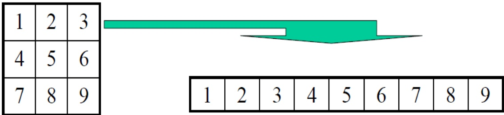

1-D Vector

 **Elements of vector:**

 0 : Empty

 1 : X

 2: O

 The vector is a ternary number

 Store inside the program a move-table (lookup table):

 #Elements in the table: 19683 $( { = } 3 ^ { 9 } )$

 Element = A vector which describes the most suitable move from the current game-board

<!-- page: 6 -->

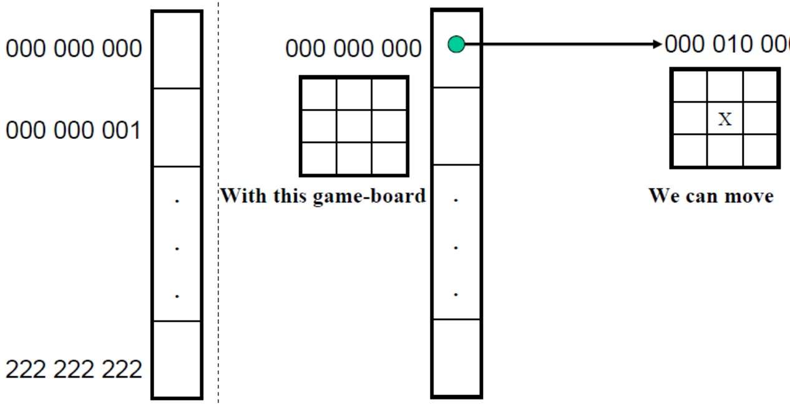

## Algorithm

1. View the vector as a ternary number. Convert it to a decimal number.

2. Use the computed number as an index into Move-Table and access the vector stored there.

3. Set the new board to that vector.

## Comments

1. A lot of space to store the Move-Table.

2. A lot of work to specify all the entries in the Move-Table.

3. Difficult to extend.

## Solution 2

## Data Structure

 Use vector, called board, as Solution 1

 However, elements of the vector:

 : Empty

 : X

 : O

 Turn of move: indexed by integer

 1,2,3, etc.

<!-- page: 7 -->

## Function Library:

1. Make2:

 Return a location on a game-board.

IF (board[5] = 2)

RETURN 5; //the center cell.

ELSE

RETURN any cell that is not at the board‘s corner;

// (cell: 2,4,6,8)

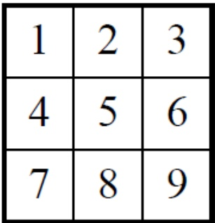

 Let P represent for X or O

 can\_win(P) :

 P has filled already at least two cells on a straight line (horizontal, vertical, or diagonal)

 cannot\_win(P) = NOT(can\_win(P))

2. Posswin(P):

IF (cannot\_win(P))

RETURN 0;

ELSE

RETURN index to the empty cell on the line of

can\_win(P)

 Let odd numbers are turns of X

 Let even numbers are turns of O

<!-- page: 8 -->

3. Go(n): make a move. IF odd(turn) THEN // for X Board[n] = 3 ELSE // for O Board[n] = 5 turn = turn + 1

## Algorithm:

1. Turn = 1: (X moves) Go(1) //make a move at the left-top cell

2. Turn = 2: (O moves) IF board[5] is empty THEN Go(5) ELSE

3. Turn = 3: (X moves) IF board[9] is empty THEN Go(9) ELSE Go(3).

4. Turn = 4: (O moves) IF Posswin(X) <> 0 THEN Go(Posswin(X)) //Prevent the opponent to win ELSE Go(Make2)

5. Turn = 5: (X moves) IF Posswin(X) <> 0 THEN Go(Posswin(X)) //Win for X. ELSE IF Posswin(O) <> THEN

CS6659 – ARTIFICIAL INTELLIGENCE

<!-- page: 9 -->

Go(Posswin(O))

//Prevent the opponent to win

ELSE IF board[7] is empty THEN

Go(7)

ELSE Go(3).

## Comments:

1. Not efficient in time, as it has to check several conditions before making each move.

2. Easier to understand the program‘s strategy.

3. Hard to generalize.

4. Checking for a possible win is quicker.

5. Human finds the row-scan approach easier, while computer finds the number-counting approach more efficient.

## Solution 3

## Data Structure

1. Game-board: Use vector as described for the above program

2. List:

 Contains possible game-boards generated from the current game-board

 Each the game-board is augmented a score indicating the possibility of victory of the current turn

## Algorithm:

1. If it is a win, give it the highest rating.

2. Otherwise, consider all the moves the opponent could make next. Assume the opponent will make the move that is worst for us. Assign the rating of that move to the current node.

3. The best node is then the one with the highest rating.

<!-- page: 10 -->

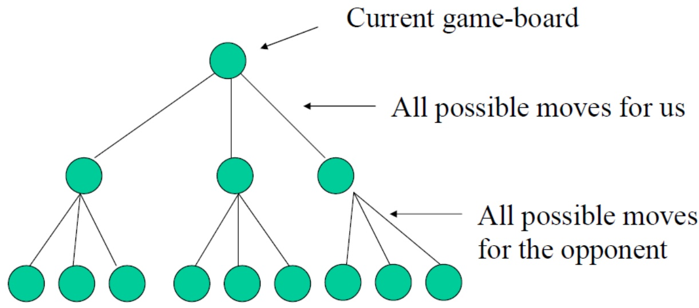

## Comments:

1. Require much more time to consider all possible moves.

2. Could be extended to handle more complicated games.

## CHAPTER - 2

## PROBLEMS, PROBLEM SPACES AND SEARCH

## 2. FORMULATING PROBLEMS

Problem formulation is the process of deciding what actions and states to consider, given a goal

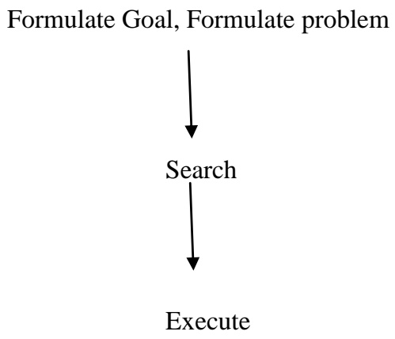

<!-- page: 11 -->

## 2.1 WELL-DEFINED PROBLEMS AND SOLUTIONS

## A problem can be defined formally by four components:

1. Initial state

2. Successor function

3. Goal test

4. Path cost

## 1. Initial State

The starting state which agent knows itself.

## 1. Successor Function

 A description of the possible actions available to the agent.

 State x, successor – FN (x) returns a set of < action, successor> ordered pairs, where each action is a legal action in a state x and each successor is a state that can be reached from x by applying that action.

## 2.1 State Space

The set of all possible states reachable from the initial state by any sequence of actions. The initial state and successor function defines the state space. The state space forms a graph in which nodes are state and axis between the nodes are action.

## 2.2 Path

A path in the state space is a sequence of state connected by a sequence of actions.

## 2. Goal Test

Test to determine whether the given state is the goal state. If there is an explicit set of possible goal states, then we can whether any one of the goal state is reached or not.

**Example :** In chess, the goal is to reach a state called ―checkmate‖ where the opponent‘s king is under attack and can‘t escape.

## 3. Path cost

A function that assigns a numeric cost to each path. The cost of a path can be described as the sum of the costs of the individual actions along that path.

Step cost of taking an action ‗a‘ to go from one state ‗x‘ to state ‗y‘ is denoted by C(x,a,y)

C-Cost , x,y- states , Action , Step costs are non-negative

These 4 elements are gathered into a data structure that is given as input to problem solving algorithm. A solution quality is measured by path cost function. An optimal solution has lowest path cost among all solutions.

<!-- page: 12 -->

**Total cost = Path cost + Search cost**

**Example: Route finding problem**

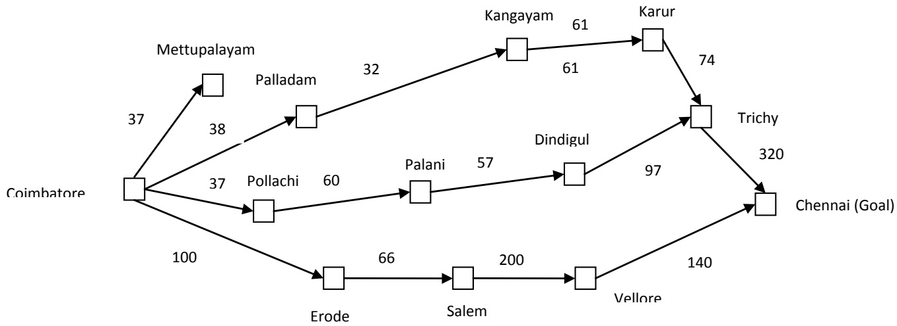

Fig: 1 Route Finding Problem

**Initial State:** In (Coimbatore)

**Successor Function:** {< Go (Pollachi), In (Pollachi)>

< Go (Erode), In (Erode)>

< Go (Palladam), In (Palladam)>

< Go (Mettupalayam), In (Mettupalayam)>}

**Goal Test:** In (Chennai)

**Path Cost:** {(In (Coimbatore),}

{Go (Erode),} = 100 [kilometers]

{In (Erode)}

Path cost = 100 + 66 + 200 + 140 = 506

## 2.2 TOY PROBLEM

**Example-1 : Vacuum World**

Problem Formulation

• States

– 2 x 22 = 8 states

<!-- page: 13 -->

– Formula n2n states

• Initial State

– Any one of 8 states

• Successor Function

– Legal states that result from three actions (Left, Right, Absorb)

• Goal Test

– All squares are clean

• Path Cost

– Number of steps (each step costs a value of 1)

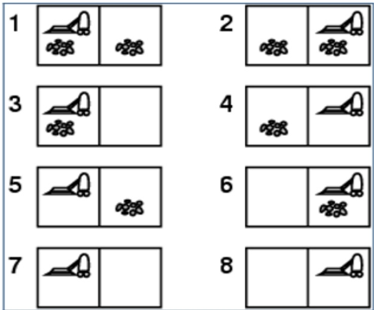

Fig 1.2 Vacuum World

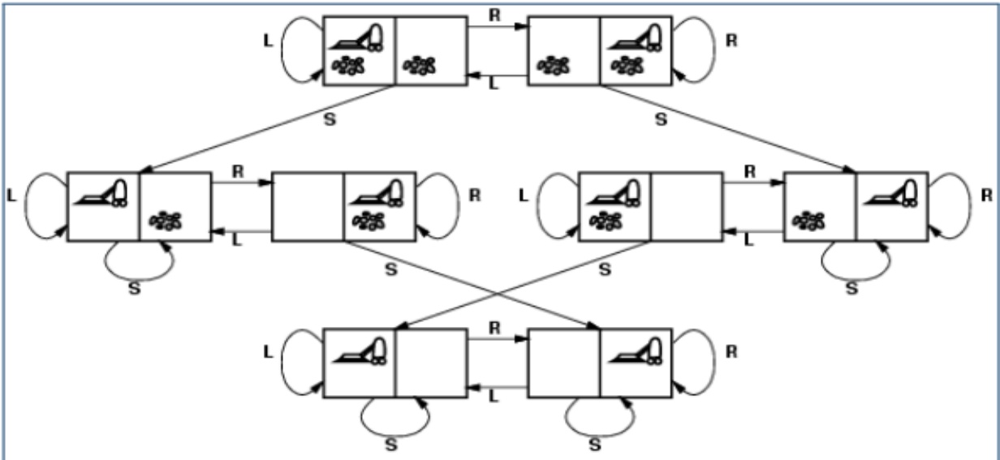

<!-- page: 14 -->

Fig: 1.3 State Space for the Vacuum World

State Space for the Vacuum World

Labels on Arcs denote L: Left, R: Right, S: Suck

## Example 2: Playing chess

Initial State: Described as an 8 X 8 array where each positions contains a symbol standing for the appropriate piece in the official chess position.

Successor function: The legal states that results from set of rules.

They can be described easily by as a set of rules consisting of two parts: a left side that serves as a pattern to be matched against the current board position and a right side that describes the changes to be made to the board position to reflect the move. An example is shown in the following figure.

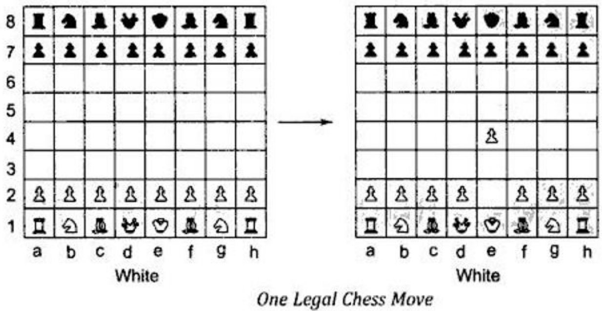

Fig 1.4:The legal states that results from set of rules

However if we write rules like the one above, we have to write a very large number of them since there has to be a separate set of rule for each of them roughly $1 \widetilde { 0 } ^ { 1 2 0 }$ possible board positions.

Practical difficulties to implement large number of rules,

1. It will take too long to implement large number of rules and could not be done without mistakes.

2. No program could easily handle all those rules and storing it possess serious difficulties.

<!-- page: 15 -->

In order to minimize such problems, we have to write rules describing the legal moves in as a general way as possible. The following is the way to describe the chess moves.

## Current Position

While pawn at square (e, 2), AND Square (e, 3) is empty, AND Square (e , 4 ) is empty.

## Changing Board Position

Move pawn from Square (e, 2) to Square ( e , 4 ) .

Some of the problems that fall within the scope of AI and the kinds of techniques will be useful to solve these problems.

## GoalTest

Any position in which the opponent does not have a legal move and his or her king is under attack.

## Example: 3 Water Jug Problem

A Water Jug Problem: You are given two jugs, a 4-gallon one and a 3-gallon one, a pump which has unlimited water which you can use to fill the jug, and the ground on which water may be poured. Neither jug has any measuring markings on it. How can you get exactly 2 gallons of water in the 4-gallon jug?

**State:** (x, y) x= 0, 1, 2, 3, or 4 y= 0, 1, 2, 3

x represents quantity of water in 4-gallon jug and y represents quantity of water in 3-gallon jug.

•**Start state**: (0, 0).

•**Goal state:** (2, n) for any n. Attempting to end up in a goal state.( since the problem doesn‘t specify the quantity of water in 3-gallon jug)

1. (x, y) If x <4 →(4, y)

Fill the 4-gallon jug

2. (x, y) If y <3 →(x, 3)

Fill the 3-gallon jug

3. (x, y) If x >0 →(x −d, y)

Pour some water out of the

4-gallon jug

4. (x, y) →(x, y −d) Pour some water out of the If y >0 3-gallon jug

<!-- page: 16 -->

<table><tr><td>5. (x, y)</td><td>→(0, y)</td><td rowspan="2">Empty the 4-gallon jug on the ground</td></tr><tr><td>If x &gt;0</td><td></td></tr><tr><td>6. (x, y)</td><td>→(x, 0)</td><td rowspan="2">Empty the 3-gallon jug on the ground</td></tr><tr><td>If y &gt;0</td><td></td></tr><tr><td>7. (x, y)</td><td>→(4, y -(4 -x))</td><td rowspan="2">Pour water from the 3-gallon jug into the 4-gallon jug until the 4-gallon jug is full</td></tr><tr><td>If x +y ≥4,y &gt;0</td><td></td></tr><tr><td>8. (x, y)</td><td>→(x -(3 -y), 3)</td><td rowspan="2">Pour water from the 4-gallon jug into the 3-gallon jug until the 3-gallon jug is full</td></tr><tr><td>If x +y ≥3,x &gt;0</td><td></td></tr><tr><td>9. (x, y)</td><td>→(x +y, 0)</td><td rowspan="2">Pour all the water from the 3-gallon jug into the 4-gallon jug</td></tr><tr><td>If x +y ≤4,y &gt;0</td><td></td></tr><tr><td>10. (x, y)</td><td>→(0, x +y)</td><td rowspan="2">Pour all the water from the 4-gallon jug into the 3-gallon jug</td></tr><tr><td>If x +y ≤3,x &gt;0</td><td></td></tr><tr><td>11. (0, 2)</td><td>→(2, 0)</td><td>Pour the 2 gallons from the 3-gallon Jug into the 4-gallon jug</td></tr><tr><td>12. (2, y)</td><td>→(0, y)</td><td>Empty the 2 gallons in the 4-gallon Jug on the ground</td></tr></table>

## Production rules for the water jug problem

## Trace of steps involved in solving the water jug problem First solution

| Number of Steps | Rules applied | 4-g jug | 3-g jug |
| --- | --- | --- | --- |
| 1 | Initial state | 0 | 0 |
| 2 | R2 {Fill 3-g jug} | 0 | 3 |
| 3 | R7 {Pour all water from 3 to 4-g jug} | 3 | 0 |
| 4 | R2 {Fill 3-g jug} | 3 | 3 |
| 5 | R5 {Pour from 3 to 4-g jug until it is full} | 4 | 2 |
| 6 | R3 {Empty 4-gallon jug} | 0 | 2 |
| 7 | R7 {Pour all water from 3 to 4-g jug} | 2 | 0 |

<!-- page: 17 -->

<table><tr><td>Number of Steps</td><td>Rules applied</td><td>4-g jug</td><td>3-g jug</td></tr><tr><td>1</td><td>Initial state</td><td>0</td><td>0</td></tr><tr><td>2</td><td>R1 {Fill 4-gallon jug}</td><td>4</td><td>0</td></tr><tr><td>3</td><td>R6 {Pour from 4 to 3-g jug until it is full}</td><td>1</td><td>3</td></tr><tr><td>4</td><td>R4 {Empty 3-gallon jug}</td><td>1</td><td>0</td></tr><tr><td>5</td><td>R8 {Pour all water from 4 to 3-gallon jug}</td><td>0</td><td>1</td></tr><tr><td>6</td><td>R1 {Fill 4-gallon jug}</td><td>4</td><td>1</td></tr><tr><td>7</td><td>R6 {Pour from 4 to 3-g jug until it is full}</td><td>2</td><td>3</td></tr><tr><td>8</td><td>R4 {Empty 3-gallon jug}</td><td>2</td><td>0</td></tr><tr><td colspan="2"></td><td colspan="2">Goal State</td></tr></table>

## Example - 5 8-puzzle Problem

The 8-puzzle problem consists of a 3 x 3 board with eight numbered tiles and a blank space. A tile adjacent to the blank space can slide into the space. The object is to reach a specified goal state.

States: A state description specifies the location of each of the eight tiles and the blank in one of the nine squares.

Initial state: Any state can be designated as the initial state.

Successor function: This generates the legal states that result from trying the four actions (blank moves Left, Right, Up, or Down).

Goal test: This checks whether the state matches the goal configuration (Other goal configurations are possible.)

Path cost: Each step costs 1, so the path cost is the number of steps in the path.

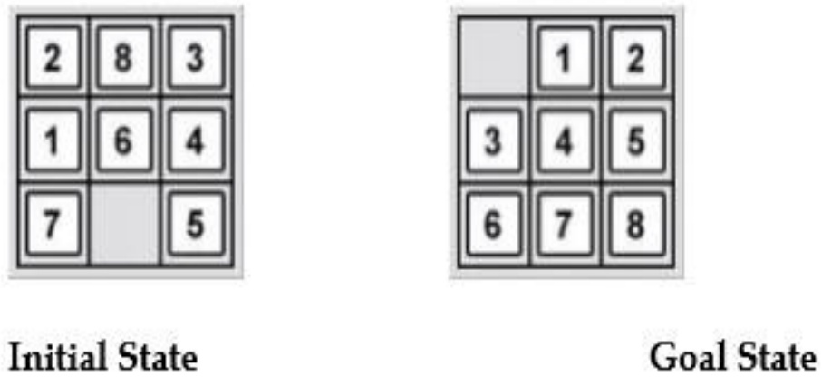

Fig 1.5 8 Puzzle Problem

<!-- page: 18 -->

## Exampe-6 8-queens problem

The goal of the 8-queens problem is to place eight queens on a chessboard such that no queen attacks any other. (A queen attacks any piece in the same row, column or diagonal.

States: Any arrangement of 0 to 8 queens on the board is a state.

Initial state: No queens on the board.

Successor function: Add a queen to any empty square.

Goal test: 8 queens are on the board, none attacked.

Path cost: Zero (search cost only exists)

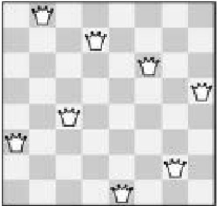

Fig 1.6 Solution to the 8 queens problem

## 2.3 PRODUCTION SYSTEMS

**Production system is a mechanism that describes and performs the search process.**

A production system consists of four basic components:

1. A set of rules of the form Ci → Ai where Ci is the condition part and Ai is the action part. The condition determines when a given rule is applied, and the action determines what happens when it is applied.

(i.e A set of rules, each consist of left side (a pattern) that determines the applicability of the rule and a right side that describes the operations to be performed if the rule is applied)

2. One or more knowledge databases that contain whatever information is relevant for the given problem. Some parts of the database may be permanent, while others may temporary and only exist during the solution of the current problem. The information in the databases may be structured in any appropriate manner.

3. A control strategy that determines the order in which the rules are applied to the database, and provides a way of resolving any conflicts that can arise when several rules match at once.

<!-- page: 19 -->

4. A rule applier which is the computational system that implements the control strategy and applies the rules.

## In order to solve a problem

 We must first reduce it to one for which a precise statement can be given. This can be done by defining the problem‘s state space (start and goal states) and a set of operators for moving that space.

 The problem can be solved by searching for a path through the space from the initial state to a goal state.

 The process of solving the problem can be usefully modeled as a production system.

## 2.3.1 Control strategies

By considering control strategies we can decide which rule to apply next during the process of searching for a solution to problem.

The two requirements of good control strategy are that

 **It should cause motion**: consider water jug problem, if we implement control strategy of starting each time at the top of the list of rules, it will never leads to solution. So we need to consider control strategy that leads to solution.

 **It should be systematic:** choose at random from among the applicable rules. This strategy is better than the first. It causes the motion. It will lead to the solution eventually. Doing like this is not a systematic approach and it leads to useless sequence of operators several times before finding final solution.

## 2.3.1.1 Systematic control strategy for the water jug problem

## 2.3.1.1.1 Breadth First Search (Blind Search)

Let us discuss these strategies using water jug problem. These may be applied to any search problem.

 Construct a tree with the initial state as its root.

 Generate all the offspring of the root by applying each of the applicable rules to the initial state.

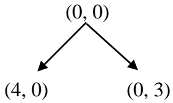

 Now for each leaf node, generate all its successors by applying all the rules that are appropriate.

<!-- page: 20 -->

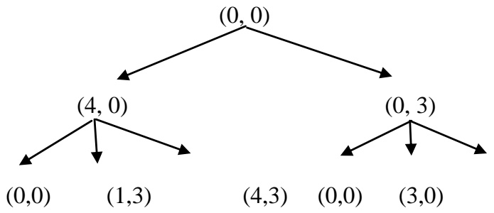

 Continue this process until some rule produces a goal state.

## Algorithm

1. Create a variable called NODE-LIST and set it to initial state.

2. Unit a goal state is found or NODE-LIST is empty do

a. Remove the first element from NODE-LIST and call it E. if NODE-LIST is empty, quit.

b. For each way that each rule can match the state described in E do:

i. Apply the rule to generate a new state.

ii. If the new state is a goal state, quit and return this state.

iii.Otherwise, add the new state to the end of NODE-LIST.

## 2.3.1.1.2 Depth First Search

## Algorithm

1.If the initial state is the goal state, quit and return success.

2.Otherwise do the following until success or failure is signaled:

a. Generate a successor, E, of initial state. If there are no more successor, signal failure.

b. Call depth first search, with E as the initial state.

c. If the success is returned, signal success. Otherwise continue in this loop.

## Backtracking

 In this search, we pursue a single branch of the tree until it yields a solution or until a decision to terminate the path is made.

 It makes sense to terminate a path if it reaches dead-end, produces a previous state. In such a state backtracking occurs.

<!-- page: 21 -->

 Chronological Backtracking: order in which steps are undone depends only on the temporal sequence in which steps were initially made.

 Specifically most recent step is always the first to be undone. This is also simple backtracking.

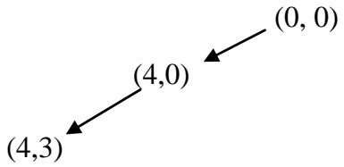

**Advantages of Depth First search**

 DFS requires less memory since only the nodes on the current path are stored.

 By chance DFS may find a solution without examining much of the search space at all.

## Advantages of Breath First search

 BFS cannot be trapped exploring a blind alley.

 If there is a solution, BFS is guaranteed to find it.

 If there are multiple solutions, then a minimal solution will be found.

## Traveling Salesman Problem (with 5 cities):

A salesman is supposed to visit each of 5 cities shown below. There is a road between each pair of cities and the distance is given next to the roads. Start city is A. The problem is to find the shortest route so that the salesman visits each of the cities only once and returns to back to A.

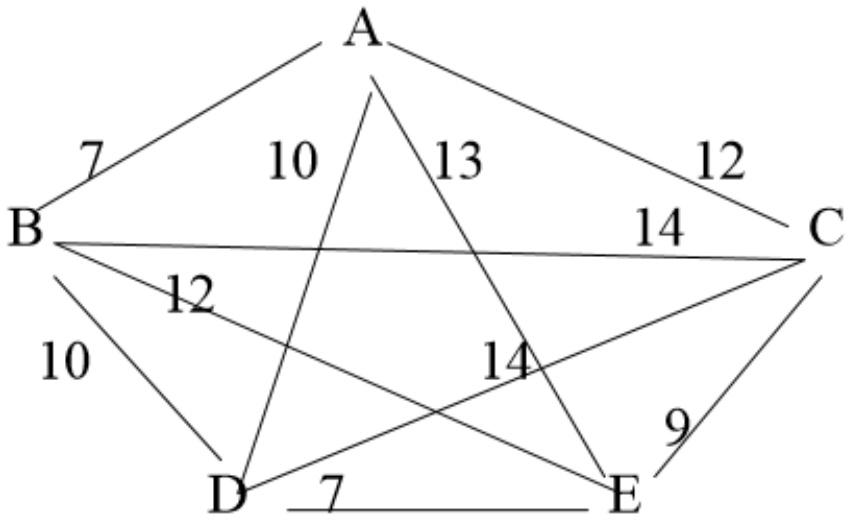

Fig Travelling Salesman Problem

<!-- page: 22 -->

•A simple, motion causing and systematic control structure could, in principle solve this problem.

•Explore the search tree of all possible paths and return the shortest path.

•This will require 4! paths to be examined.

•If number of cities grow, say 25 cities, then the time required to wait a salesman to get the information about the shortest path is of 0(24!) which is not a practical situation.

•This phenomenon is called combinatorial explosion.

•We can improve the above strategy as follows.

## Branch and Bound

 Begin generating complete paths, keeping track of the shortest path found so far.

 Give up exploring any path as soon as its partial length become greater than the shortest path found so far.

 This algorithm is efficient than the first one, still requires exponential time ∝ some number raised to N.

## 2.3.2 Heuristic Search

•Heuristics are criteria for deciding which among several alternatives be the most effective in order to achieve some goal.

•Heuristic is a technique that improves the efficiency of a search process possibly by sacrificing claims of systematic and completeness. It no longer guarantees to find the best answer but almost always finds a very good answer.

•Using good heuristics, we can hope to get good solution to hard problems (such as travelling salesman) in less than exponential time.

•There are **general-purpose** heuristics that are useful in a wide variety of problem domains.

•We can also construct **special purpose** heuristics, which are domain specific.

## 2.3.2.1 General Purpose Heuristics

• A general-purpose heuristics for combinatorial problem is nearest neighbor algorithms which works by selecting the locally superior alternative.

• For such algorithms, it is often possible to prove an upper bound on the error which provide reassurance that one is not paying too high a price in accuracy for speed.

• In many AI problems, it is often hard to measure precisely the goodness of a particular solution.

<!-- page: 23 -->

• For real world problems, it is often useful to introduce heuristics based on relatively unstructured knowledge. It is impossible to define this knowledge in such a way that mathematical analysis can be performed.

• In AI approaches, behavior of algorithms are analyzed by running them on computer as contrast to analyzing algorithm mathematically.

•There are at least many reasons for the adhoc approaches in AI.

 It is a lot more fun to see a program do something intelligent than to prove it.

 AI problem domains are usually complex, so generally not possible to produce analytical proof that a procedure will work.

 It is even not possible to describe the range of problems well enough to make statistical analysis of program behavior meaningful.

•But still it is important to keep performance question in mind while designing algorithm.

•One of the most important analysis of the search process is straightforward i.e., ―Number of nodes in a complete search tree of depth D and branching factor F is F\*D‖.

•This simple analysis motivates to

 Look for improvements on the exhaustive search.

 Find an upper bound on the search time which can be compared with exhaustive search procedures.

## 2.4 PROBLEM CHARACTERISTICS

Heuristic search is a very general method applicable to a large class of problem. In order to choose the most appropriate method (or combination of methods) for a particular problem it is necessary to analyze the problem along several key dimensions:

## 2.4.1 Is the problem decomposable into a set of independent smaller sub problems?

Example: Suppose we want to solve the problem of computing the integral of the following expression $\int ( \widetilde{x^{2} + 3x + \sin^{2} x + \cos^{2} x} )$ dx

<!-- page: 24 -->

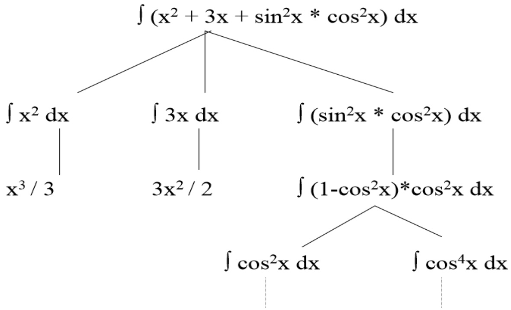

Fig 1.7 Decomposition problem

•We can solve this problem by breaking it down into three smaller sub problems, each of which we can then be solved using a small collection of specific rules.

•Decomposable problems can be solved by the divide and-conquer technique.

•Use of decomposing problems:

-Each sub-problem is simpler to solve

-Each sub-problem can be handed over to a different processor. Thus can be solved in parallel processing environment.

•There are non-decomposable problems. For example, Block world problem is non decomposable.

## 2.4.2. Can solution steps be ignored or at least undone if they prove to be unwise?

•In real life, there are three types of problems: Ignorable, Recoverable and Irrecoverable. •Let us explain each of these through examples.

## Example1 :( Ignorable): In theorem proving-(solution steps can be ignored)

•Suppose we have proved some lemma in order to prove a theorem and eventually realized that lemma is no help at all, then ignore it and prove another lemma.

•Can be solved by using simple control strategy.

**Example2:** (Recoverable):8 puzzle-(solution steps can be undone)

<!-- page: 25 -->

•8 puzzle: Objective is to rearrange a given initial configuration of eight numbered tiles on 3 X 3 board (one place is empty) into a given final configuration (goal state).

•Rearrangement is done by sliding one of the tiles into Empty Square.

•Solved by backtracking so control strategy must be implemented using a push down stack.

**Example3:** (Irrecoverable): Chess (solution steps cannot be undone)

•A stupid move cannot be undone

•Can be solved by planning process

## 2.4.3. Is the knowledge Base consistent?

## Example: Inconsistent knowledge:

**Target problem:** A man is standing 150 ft from a target. He plans to hit the target by shooting a gun that fires bullets with velocity of 1500 ft/sec. How high above the target should he aim?

## Solution:

•Velocity of bullet is 1500 ft./sec i.e., bullet takes 0.1 secto reach the target.

•Assume bullet travels in a straight line.

•Due to gravity, the bullet falls at a distance $( 1 / 2 ) \; \mathrm { g t } ^ { 2 } = ( 1 / 2 ) ( 3 2 ) ( 0 . 1 ) 2 = 0 . 1 6 \mathrm { f t } .$

•So if man aims up 0.16 feet high from the target, then bullet will hit the target.

•Now there is a contradiction to the fact that bullet travel in a straight line because the bullet in actual will travel in an arc. Therefore there is inconsistency in the knowledge used.

## 2.4.4. What is the Role of knowledge?

•In Chess game, knowledge is important to constrain the search for a solution otherwise just the rule for determining legal moves and some simple control mechanism that implements an appropriate search procedure is required.

•Newspapers scanning to decide some facts, a lot of knowledge is required even to be able to recognize a solution.

## 2.4.5. Is a good solution Absolute or Relative?

•In water jug problem there are two ways to solve a problem. If we follow one path successfully to the solution, there is no reason to go back and see if some other path might also lead to a solution. Here a solution is absolute.

•In travelling salesman problem, our goal is to find the shortest route. Unless all routes are known, the shortest is difficult to know. This is a best-path problem whereas water jug is anypath problem.

<!-- page: 26 -->

•Any path problem can often be solved in reasonable amount of time using heuristics that suggest good paths to explore.

•Best path problems are in general computationally harder than any-path.

## 2.4.6. Does the task Require Interaction with a Person?

• **Solitary problem**, in which there is no intermediate communication and no demand for an explanation of the reasoning process.

• **Conversational problem**, in which intermediate communication is to provide either additional assistance to the computer or additional information to the user.

## 2.4.7. Problem classification

• There is a variety of problem-solving methods, but there is no one single way of solving all problems.

• Not all new problems should be considered as totally new. Solutions of similar problems can be exploited.

## 2.5 PRODUCTION SYSTEM CHARACTERISTICS

Production systems are important in building intelligent matches which can provide us a good set of production rules, for solving problems.

There are four types of production system characteristics, namely

1. Monotonic production system

2. Non-monotonic production system

3. Commutative law based production system, and lastly

4. Partially commutative law based production system

1. **Monotonic Production System (MPS):** The Monotonic production system (MPS) is a system in which the application of a rule never prevents later application of the another rule that could also have been applied at the time that the first rule was selected

2. **Non-monotonic Production (NMPS):** The non-monotonic production system is a system in which the application of a rule prevents the later application of the another rule which may not have been applied at the time that the first rule was selected, i.e. it is a system in which the above rule is not true, i.e. the monotonic production system rule not true.

3. **Commutative Production System (CPS):** Commutative law based production systems is a system in which it satisfies both monotonic & partially commutative.

4. **Partially Commutative Production System (PCPS):** The partially commutative production system is a system with the property that if the application of those rules that is allowable & also transforms from state x to state ‗y‘.

<!-- page: 27 -->

|  | Monotonic (Characteristics) | Non-monotonic |
| --- | --- | --- |
| Partially commutative | Theorem proving | Robot navigation |
| Non-partial commutative | Chemical synthesis | Bridge game |

Table 1.1 The Four categories of Production System

Well the question may arise here such as:

\- can the production systems be described by a set of characteristics?

\- Also, can we draw the relationship between problem types & the types of production systems, suited to solve the problems, yes, we can by using above rules.

<!-- page: 28 -->

## CHAPTER - 3

## PROBLEM SOLVING METHODS, HEURISTIC SEARCH TECHNIQUES

Search techniques are the general problem solving methods. When there is a formulated search problem, a set of search states, a set of operators, an initial state and a goal criterion we can use search techniques to solve a problem.

## 3.1 Matching:

Problem solving can be done through search. Search involves choosing among the rules that can be applied at a particular point, the ones that are most likely to lead to a solution. This can be done by extracting rules from large number of collections.

**How to extract from the entire collection of rules that can be applied at a given point?**

 This can be done by Matching between current state and the precondition of the rules.

One way to select applicable rules is to do simple search through all the rules comparing each one‘s preconditions to the current state and extracting the one that match. But there are two problems with this simple solution.

1.In big problems large number of rules are used. Scanning through all of this rules at every step of the search would be hopelessly inefficient.

2.It is not clearly visible to find out which condition will be satisfied.

Some of the matching techniques are described below:

**3.1.1 Indexing:** To overcome above problems indexing is used. In this instead of searching all the rules the current state is used as index into the rules, and select the matching rules immediately e.g consider the chess game playing. Here the set of valid moves is very large. To reduce the size of this set only useful moves are identified. At the time of playing the game, the next move will very much depend upon the current move. As the game is going on there will be only ‗few‘ moves which are applicable in next move. Hence it will be wasteful effort to check applicability of all moves. Rather, the important and valid legal moves are directly stored as rules and through indexing the applicable rules are found. Here, the indexing will store the current board position. The indexing make the matching process easy, at the cost of lack of generality in the statement rules. Practically there is a tradeoff between the ease of writing rules and simplicity of matching process. The indexing technique is not very well suited for the rule base where rules are written in high level predicates. In PROLOG and many theorem proving systems, rules are indexed by predicates they contain. Hence all the applicable rules can be indexed quickly.

<!-- page: 29 -->

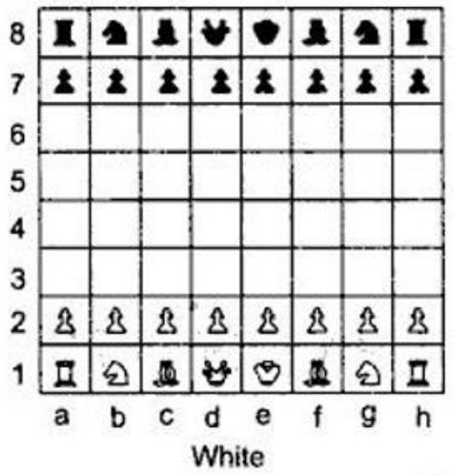

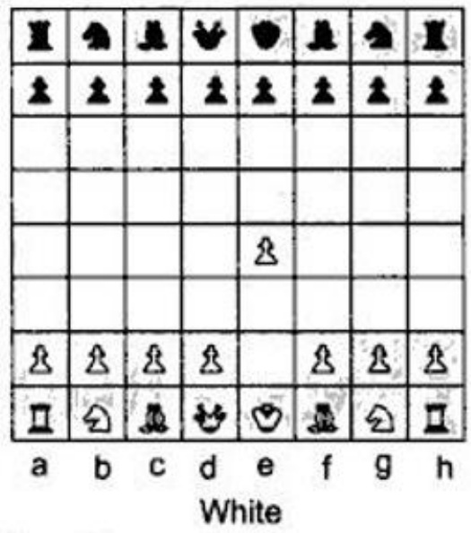

1.8 One Legal Chess Move

**3.1.1.1 Matching with variable:** In the rule base if the preconditions are not stated as exact description of particular situation, the indexing technique does not work well. In certain situations they describe properties that the situation must have. In situation, where single conditions is matched against a single element in state description, the unification procedure can be used. However in practical situation it is required to match complete set of rules that match the current state. In forward and backward chaining system, the depth first searching technique is used to select the individual rule. In the situation where multiple rules are applicable, conflict resolution technique is used to choose appropriate applicable rule. In the case of the situations requiring multiple match, the unification can be applied recursively, but more efficient method is used to use RETE matching algorithm.

3.1.1.2 **Complex matching variable**: A more complex matching process is required when preconditions of a rule specify required properties that are not stated explicitly in the description of current state. However the real world is full of uncertainties and sometimes practically it is not possible to define the rule in exact fashion. The matching process become more complicated in the situation where preconditions approximately match the current situation e.g a speech understanding program must contain the rules that map from a description of a physical wave form to phones. Because of the presence of noise the signal becomes more variable that there will be only approximate match between the rules that describe an ideal sound and the input that describes that unideal world. Approximate matching is particularly difficult to deal with, because as we increase the tolerance allowed in the match the new rules need to be written and it will increase number of rules. It will increase the size of main search process. But approximate matching is nevertheless superior to exact matching in situation such as speech understanding, where exact matching may result in no rule being matched and the search process coming to a grinding halt.

<!-- page: 30 -->

## 3.2 HEURISTIC SEARCH TECHNIQUES

## 3.2.1 Hill Climbing

 Hill climbing is the optimization technique which belongs to a family of local search. It is relatively simple to implement, making it a popular first choice. Although more advanced algorithms may give better results in some situations hill climbing works well.

 Hill climbing can be used to solve problems that have many solutions, some of which are better than others. It starts with a random (potentially poor) solution, and iteratively makes small changes to the solution, each time improving it a little. When the algorithm cannot see any improvement anymore, it terminates. Ideally, at that point the current solution is close to optimal, but it is not guaranteed that hill climbing will ever come close to the optimal solution.

 For example, hill climbing can be applied to the traveling salesman problem. It is easy to find a solution that visits all the cities but is be very poor compared to the optimal solution. The algorithm starts with such a solution and makes small improvements to it, such as switching the order in which two cities are visited. Eventually, a much better route is obtained.

 Hill climbing is used widely in artificial intelligence, for reaching a goal state from a starting node. Choice of next node and starting node can be varied to give a list of related algorithms.

 Hill climbing attempts to maximize (or minimize) a function f (x), where x are discrete states. These states are typically represented by vertices in a graph, where edges in the graph encode nearness or similarity of a graph. Hill climbing will follow the graph from vertex to vertex, always locally increasing (or decreasing) the value of f, until a local maximum (or local minimum) $\mathbf { X _ { m } }$ is reached. Hill climbing can also operate on a continuous space: in that case, the algorithm is called gradient ascent (or gradient descent if the function is minimized).\*.

 Problems with hill climbing: local maxima (we've climbed to the top of the hill, and missed the mountain), plateau (everything around is about as good as where we are),ridges (we're on a ridge leading up, but we can't directly apply an operator to improve our situation, so we have to apply more than one operator to get there).Solutions include: backtracking, making big jumps (to handle plateaus or poor local maxima), applying multiple rules before testing (helps with ridges).Hill climbing is best suited to problems where the heuristic gradually improves the closer it gets to the solution; it works poorly where there are sharp drop-offs. It assumes that local improvement will lead to global improvement.

 Search methods based on hill climbing get their names from the way the nodes are selected for expansion. At each point in the search path a successor node that appears to lead most quickly to the top of the hill (goal) selected for exploration. This method requires that some information be available with which to evaluate and order the most

<!-- page: 31 -->

promising choices. Hill climbing is like depth first searching where the most promising child is selected for expansion.

 Hill climbing is a variant of generate and test in which feedback from the test procedure is used to help the generator decide which direction to move in the search space. Hill climbing is often used when a good heuristic function is available for evaluating states but when no other useful knowledge is available. For example, suppose you are in an unfamiliar city without a map and you want to get downtown. You simply aim for the tall buildings. The heuristic function is just distance between the current location and the location of the tall buildings and the desirable states are those in which this distance is minimized.

## 3.2.1 Simple Hill Climbing

The simplest way to implement hill climbing is the simple hill climbing whose algorithm is as given below:

## Algorithm: Simple Hill Climbing:

Step 1: Evaluate the initial state. It it is also a goal state, then return it and quit. Otherwise continue with the initial state as the current state.

Step 2: Loop until a solution is found or until there are no new operators left to be applied in the current state:

(a)Select an operator that has not yet been applied to the current state and apply it to produce a new state.

(b)Evaluate the new state.

(i)If it is a goal state, then return it and quit.

(ii)If it is not a goal state, but it is better than the current state, then make it the current state.

(iii)If it is not better than the current state, then continue in the loop.

The key difference between this algorithm and the one we gave for generate and test is the use of an evaluation function as a way to inject task specific knowledge into the control process. It is the use of such knowledge that makes this heuristic search method. It is the same knowledge that gives these methods their power to solve some otherwise intractable problems

To see how hill climbing works, let‘s take the puzzle of the four colored blocks. To solve the problem we first need to define a heuristic function that describes how close a particular configuration is to being a solution. One such function is simply the sum of the number of different colors on each of the four sides. A solution to the puzzle will have a value of 16. Next we need to define a set of rules that describe ways of transforming one configuration to another. Actually one rule will suffice. It says simply pick a block and rotate it 90 degrees in any direction. Having provided these definitions the next step is to

<!-- page: 32 -->

generate a starting configuration. This can either be done at random or with the aid of the heuristic function. Now by using hill climbing, first we generate a new state by selecting a block and rotating it. If the resulting state is better than we keep it. If not we return to the previous state and try a different perturbation.

## 3.2.2 Problems in Hill Climbing

## 3.2.2.1 Steepest – Ascent Hill Climbing:

An useful variation on simple hill climbing considers all the moves form the current state and selects the best one as the next state. This method is called steepest – ascent hill climbing or gradient search. Steepest Ascent hill climbing contrasts with the basic method in which the first state that is better than the current state is selected. The algorithm works as follows.

## Algorithm: Steepest – Ascent Hill Climbing

Step 1: Evaluate the initial state. If it is also a goal state, then return it and quit.Otherwise, continue with the initial state as the current state.

Step 2: Loop until a solution is found or until a complete iteration produces no change to current state:

(a)Let SUCC be a state such that any possible successor of the current state will be better than SUCC.

(b)For each operator that applies to the current state do:

i. Apply the operator and generate a new state.

ii. Evaluate the new state. If it is a goal state, then return it and quit. If not, compare it to SUCC. If it is better then set SUCC to this state. If it is not better, leave SUCC alone.

(c) If the SUCC is better than current state, then set current state to SUCC.

To apply steepest- ascent hill climbing to the colored blocks problem, we must consider all perturbations of the initial state and choose the best. For this problem this is difficult since there are so many possible moves. There is a trade-off between the time required to select a move and the number of moves required to get a solution that must be considered when deciding which method will work better for a particular problem. Usually the time required to select a move is longer for steepest – ascent hill climbing and the number of moves required to get to a solution is longer for basic hill climbing.

Both basic and steepest ascent hill climbing may fail to find a solution. Either algorithm may terminate not by finding a goal state but by getting to a state from which no better states can be generated. This will happen if the program has reached either a local maximum, a plateau, or a ridge.

<!-- page: 33 -->

## Hill climbing Disadvantages

**Local Maximum:** A local maximum is a state that is better than all its neighbors but is not better than some other states farther away.

**Plateau:** A Plateau is a flat area of the search space in which a whole set of neighboring states have the same value.

**Ridge:** A ridge is a special kind of local maximum. It is an area of the search space that is higher than surrounding areas and that itself has a slope.

**Ways out**

 Backtrack to some earlier node and try going in a different direction.

 Make a big jump to try to get in a new section.

 Moving in several directions at once.

Hill climbing is a **local method:** Decides what to do next by looking only at the immediate consequence of its choice.

Global information might be encoded in heuristic functions.

<table><tr><td rowspan="4">Start</td><td>A</td><td rowspan="4">Goal</td></tr><tr><td>D</td></tr><tr><td>C</td></tr><tr><td>B</td></tr></table>

Blocks World

Fig 1.9 Three Possible Moves

<table><tr><td rowspan="4">Start0</td><td>A</td><td rowspan="4">Goal4</td><td>D</td></tr><tr><td>D</td><td>C</td></tr><tr><td>C</td><td>B</td></tr><tr><td>B</td><td>A</td></tr></table>

Blocks World

<!-- page: 34 -->

## Local heuristic:

 +1 for each block that is resting on the thing it is supposed to be resting on.

 -1 for each block that is resting on a wrong thing.

<table><tr><td rowspan="4">0</td><td>A</td></tr><tr><td>D</td></tr><tr><td>C</td></tr><tr><td>B</td></tr><tr><td rowspan="3" colspan="2">2</td></tr><tr></tr><tr></tr></table>

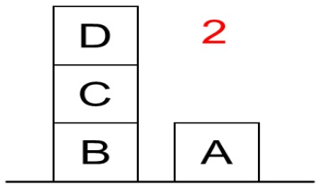

0

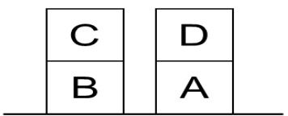

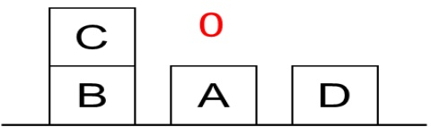

<table><tr><td rowspan="4">Start-6</td><td>A</td><td rowspan="4">Goal6</td><td>D</td></tr><tr><td>D</td><td>C</td></tr><tr><td>C</td><td>B</td></tr><tr><td>B</td><td>A</td></tr></table>

Blocks World

<!-- page: 35 -->

## Global heuristic:

For each block that has the correct support structure: +1 to every block in the support structure.

For each block that has a wrong support structure: -1 to every block in the support structure.

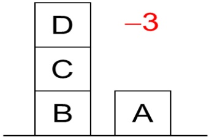

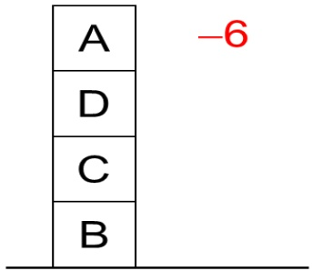

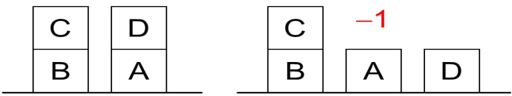

## Hill climbing conclusion

 Can be very inefficient in a large, rough problem space.

 Global heuristic may have to pay for computational complexity.

 Often useful when combined with other methods, getting it started right in the right general neighbourhood.

## 3.2.3 Simulated Annealing

The problem of local maxima has been overcome in simulated annealing search. In normal hill climbing search, the movements towards downhill are never made. In such algorithms the search may stuck up to local maximum. Thus this search cannot guarantee complete solutions. In contrast, a random search( or movement) towards successor chosen randomly from the set of successor will be complete, but it will be extremely inefficient. The combination of hill climbing and random search, which yields both efficiency and completeness is called simulated annealing.

The simulated annealing method was originally developed for the physical process of annealing. That is how the name simulated annealing was found and restored. In simulated annealing searching algorithm, instead of picking the best move, a random move is picked. The standard simulated annealing uses term objective function instead of heuristic function. If the move improves the situation it is accepted otherwise the algorithm accepts the move with some probability less than

<!-- page: 36 -->

## This probability is

$$
\mathrm{P} = \mathrm{e} ^ {- \Delta \mathrm{E} / \mathrm{kT}}
$$

Where -E is positive charge in energy level, t is temperature and k is Boltzman constant. As indicated by the equation the probability decreases with badness of the move (evaluation gets worsened by amount -E). The rate at which -E is cooled is called annealing schedule. The proper annealing schedule is maintained to monitor T.

This process has following differences from hill climbing search:

 The annealing schedule is maintained.

 Moves to worse states are also accepted.

 In addition to current state, the best state record is maintained.

The algorithm of simulated annealing is presented as follows:

**Algorithm: “**simulated annealing‖

1. Evaluate the initial state. Mark it as current state. Till the current state is not a goal state, initialize best state to current state. If the initial state is the best state, return it and quit.

2. Initialize T according to annealing schedule.

3. Repeat the following until a solution is obtained or operators are not left:

a. Apply yet unapplied operator to produce a new state

b. For new state compute -E= value of current state – value of new state. If the new state is the goal state then stop, or if it is better than current state, make it as current state and record as best state.

c.If it is not better than the current state, then make it current state with probability P.

d. Revise T according to annealing schedule

4. Return best state as answer.

## 3.3 Best-First Search:

It is a general heuristic based search technique. In best first search, in the graph of problem representation, one evaluation function (which corresponds to heuristic function) is attached with every node. The value of evaluation function may depend upon cost or distance of current node from goal node. The decision of which node to be expanded depends on the value of this evaluation function. The best first can understood from following tree. In the tree, the attached value with nodes indicates utility value. The expansion of nodes according to best first search is illustrated in the following figure.

<!-- page: 37 -->

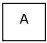

Step 1

(2)

Step 2

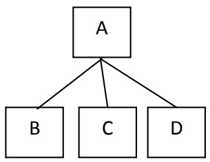

(4)

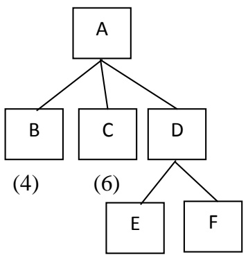

(5)

Step 5

Step 4

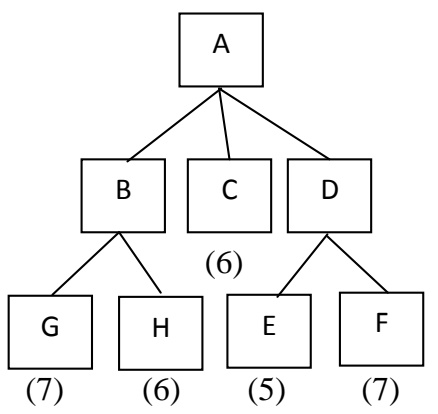

(7)

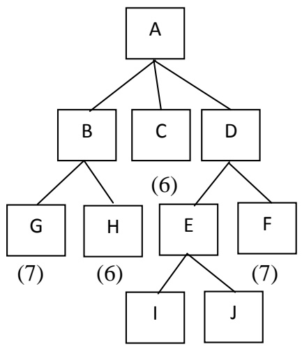

(3)

(2)

fig:1.10 Tree getting expansion according to best first search

Here, at any step, the most promising node having least value of utility function is chosen for expansion.

In the tree shown above, best first search technique is applied, however it is beneficial sometimes to search a graph instead of tree to avoid the searching of duplicate paths. In the process to do so, searching is done in a directed graph in which each node represents a point in the problem space. This graph is known as OR-graph. Each of the branches of an OR graph represents an alternative problem solving path.

Two lists of nodes are used to implement a graph search procedure discussed above. These are

1.OPEN: these are the nodes that have been generated and have had the heuristic function applied to them but not have been examined yet.

2.CLOSED: these are the nodes that have already been examined. These nodes are kept in the memory if we want to search a graph rather than a tree because whenever a node will be generated, we will have to check whether it has been generated earlier.

<!-- page: 38 -->

The best first search is a way of combining the advantage of both depth first and breath first search. The depth first search is good because it allows a solution to be found without all competing branches have to be expanded. Breadth first search is good because it does not get trapped on dead ends of path. The way of combining this is to follow a single path at a time but switches between paths whenever some competing paths looks more promising than current one does. Hence at each step of best first search process, we select most promising node out of successor nodes that have been generated so far.

The functioning of best first search is summarized in the following steps:

1.It maintains a list open containing just the initial state.

2.Until a goal is found or there are no nodes left in open list do:

a. Pick the best node from open,

b. Generate its successor, and for each successor:

i. Check, and if it has not been generated before evaluate it and add it to open and record its parent.

ii. If it has been generated before, and new path is better than the previous parent then change the parent.

The algorithm for best first search is given as follows:

## Algorithm: Best first search

1.Put the initial node on the list say ‗OPEN‘.

2.If (OPEN = empty or OPEN= goal) terminate search, else

3.Remove the first node from open( say node is a)

4.If (a=goal) terminate search with success else

5.Generate all the successor node of ‗a‘. Send node ‗a‘ to a list called ‗CLOSED‘. Find out the value of heuristic function of all nodes. Sort all children generated so far on the basis of their utility value. Select the node of minimum heuristic value for further expansion.

6.Go back to step 2.

The best first search can be implemented using priority queue. There are variations of best first search. Example of these are greedy best first search, A\* and recursive best first search.

## 3.3.2 The A\* Algorithm:

The A\* algorithm is a specialization of best first search. It most widely known form of best first search. It provides genera guidelines about how to estimate goal distance for general search graph. at each node along a path to the goal node, the A\* algorithm generate all successor nodes and computes an estimate of distance (cost) from the start node to a goal node through each of

<!-- page: 39 -->

the successors. if then chooses the successor with shortest estimated distance from expansion. It calculates the heuristic function based on distance of current node from the start node and distance of current node to goal node.

The form of heuristic estimation function for $\mathbf { A } ^ { * }$ is defined as follows:

$$
\mathrm{f(n)=g(n)+h(n)}
$$

where f(n)= evaluation function

g(n)= cost (or distance) of current node from start node.

h(n)= cost of current node from goal node.

In $\mathbf { A } ^ { * }$ algorithm the most promising node is chosen from expansion. The promising node is decided based on the value of heuristic function. Normally the node having lowest value of f (n) is chosen for expansion. We must note that the goodness of a move depends upon the nature of problem, in some problems the node having least value of heuristic function would be most promising node, where in some situation, the node having maximum value of heuristic function is chosen for expansion. $\mathbf { A } ^ { * }$ algorithm maintains two lists. One store the list of open nodes and other maintain the list of already expanded nodes. $\mathbf { A } ^ { * }$ algorithm is an example of optimal search algorithm. A search algorithm is optimal if it has admissible heuristic. An algorithm has admissible heuristic if its heuristic function h(n) never overestimates the cost to reach the goal. Admissible heuristic are always optimistic because in them, the cost of solving the problem is less than what actually is. The $\mathbf { A } ^ { * }$ algorithm works as follows:

## $\mathbf { A } ^ { * }$ algorithm:

1.Place the starting node $^ \circ \mathrm { s } ^ { \prime }$ on ‗OPEN‘ list.

2.If OPEN is empty, stop and return failure.

3.Remove from OPEN the node ‗n‘ that has the smallest value of $\mathbf { f } ^ { * } ( \mathbf { n } )$ . if node $^ { \circ } \mathfrak { n }$ is a goal node, return success and stop otherwise.

4.Expand $\text{" } \mathrm{n " }$ generating all of its successors ‗n‘ and place $\text{" } \mathrm{n " }$ on CLOSED. For every successor ‗n‘ if $\text{" } \mathtt{n " }$ is not already OPEN , attach a back pointer to $\text{" } \mathtt{n " }$ . compute $\mathbf { f } ^ { * } ( \mathbf { n } )$ and place it on CLOSED.

5.Each $\text{" } \mathtt{n}  \text{" }$ that is already on OPEN or CLOSED should be attached to back pointers which reflect the lowest $\mathbf { f } ^ { * } ( \mathbf { n } )$ path. $\mathrm { ~ H ~ } ^ { \mathfrak { c } } \mathfrak { n } ^ { \mathfrak { z } }$ was on CLOSED and its pointer was changed, remove it and place it on OPEN.

6.Return to step 2.

<!-- page: 40 -->

## 3.4 Constraint Satisfaction

The general problem is to find a solution that satisfies a set of constraints. The heuristics which are used to decide what node to expand next and not to estimate the distance to the goal. Examples of this technique are design problem, labeling graphs robot path planning and crypt arithmetic puzzles.

In constraint satisfaction problems a set of constraints are available. This is the search space. Initial State is the set of constraints given originally in the problem description. A goal state is any state that has been constrained enough. Constraint satisfaction is a two-step process.

1. First constraints are discovered and propagated throughout the system.

2. Then if there is not a solution search begins, a guess is made and added to this constraint. Propagation then occurs with this new constraint.

## Algorithm

1. Propogate available constraints:

 Open all objects that must be assigned values in a complete solution.

 Repeat until inconsistency or all objects are assigned valid values:

Select an object and strengthen as much as possible the set of constraints that apply to object.

If set of constraints different from previous set then open all objects that share any of these constraints. Remove selected object.

2. If union of constraints discovered above defines a solution return solution.

3. If union of constraints discovered above defines a contradiction return failure.

4. Make a guess in order to proceed. Repeat until a solution is found or all possible solutions exhausted:

 Select an object with a no assigned value and try to strengthen its constraints.

 Recursively invoke constraint satisfaction with the current set of constraints plus the selected strengthening constraint.

Crypt arithmetic puzzles are examples of constraint satisfaction problems in which the goal to discover some problem state that satisfies a given set of constraints. some problems of crypt arithmetic are show below

<table><tr><td>+</td><td>M O R E</td><td>+</td><td>G E R A L D</td><td>+</td><td>R O A D S</td></tr><tr><td colspan="2">M O N E Y</td><td colspan="2">R O B E R T</td><td colspan="2">D A N G E R</td></tr></table>

<!-- page: 41 -->

Here each decimal digit is to be assigned to each of the letters in such a way that the answer to the problem is correct. If the same letter occurs more than once it must be assigned the same digit each time. No two different letters may be assigned the same digit.

The puzzle SEND + MORE = MONEY, after solving, will appear like this

|  | S | E | N | D |
| --- | --- | --- | --- | --- |
|  | 9 | 5 | 6 | 7 |
| + | M | O | R | E |
|  | 1 | 0 | 8 | 5 |
| M | O | N | E | Y |
| 1 | 0 | 6 | 5 | 2 |

State production and heuristics for crypt arithmetic problem.

## Ans.

The heuristics and production rules are specific to the following example:

| S | E | N | D |
| --- | --- | --- | --- |
| M | O | R | E |

| MONEY |
| --- |

## Heuristics Rules

1. If sum of two ‗n‘ digit operands yields ‗n+1‘ digit result then the ‗n+1‘th digit has to be one.

2. Sum of two digits may or may not generate carry.

3. Whatever might be the operands the carry can be either 0 or 1.

4. No two distinct alphabets can have same numeric code.

5. Whenever more than 1 solution appears to be existing, the choice is governed by the fact that no two alphabets can have same number code.

## Production Rules:

<!-- page: 42 -->

To solve the problem SEND + MORE = MONEY using the above rules we proceed

as follows:

```txt
Applying rule 1
    x = S, Y = M, z = 0
    S + M = MO -> M = 1, O = 0 and S = 8 or 9
Applying rule 2
    a = E, x = N, y = R, c = N, z = E
    EN + OR = NE -> N = E + 1, N + R = E + 10
        Also, as E + O + 1 = N and S + M generates cary
        S = 9 and not 8

Applying rule 3
    y = N, x = E, z = R
    N = E + 1, N + R = E + 10 -> R = 8 (as S = 9)
        prev_carry = 1
    prev_carry = 1 -> D + E = Y + 10
Applying rule 4
    x = D, y = E, z = Y
    D + E = Y + 10 -> (D, E) = (7, 5)
```

We conclude that (D, E) = (7, 5) because any other choice always leads to violation of the constraint that - no two distinct alphabates can have same numeric code.

```txt
Thus D = 7 and E = 5
    Also, as N = E + 1 = 5 + 1 = 6
    Also, as D + E = Y + 10 => Y = 7 + 5 - 10 = 2
Thus,
        S = 9, E = 5, N = 6, D = 7,
    + M = 1, O = 0, R = 8, E = 5,
    M = 1, O = 0, N = 6, E = 5, Y = 2.
```

## 3.5 Means – end Analysis

Means-ends analysis allows both backward and forward searching. This means we could solve major parts of a problem first and then return to smaller problems when assembling the final solution.

The means-ends analysis algorithm can be said as follows:

1.Until the goal is reached or no more procedures are available:

 Describe the current state the goal state and the differences between the two.

 Use the difference the describes a procedure that will hopefully get nearer to goal.

 Use the procedure and update current state

<!-- page: 43 -->

If goal is reached then success otherwise fail.

For using means-ends analysis to solve a given problem, a mixture of the two directions, forward and backward, is appropriate. Such a mixed strategy solves the major parts of a problem first and then goes back and solves the small problems that arise by putting the big pieces together. The means-end analysis process detects the differences between the current state and goal state. Once such difference is isolated an operator that can reduce the difference has to be found. The operator may or may not be applied to the current state. So a sub problem is set up of getting to a state in which this operator can be applied.

In operator sub goaling backward chaining and forward chaining is used in which first the operators are selected and then sub goals are set up to establish the preconditions of the operators. If the operator does not produce the goal state we want, then we have second sub problem of getting from the state it does produce to the goal. The two sub problems could be easier to solve than the original problem, if the difference was chosen correctly and if the operator applied is really effective at reducing the difference. The means-end analysis process can then be applied recursively.

This method depends on a set of rues that can transform one problem state into another. These rules are usually not represented with complete state descriptions on each side. Instead they are represented as a left side that describes the conditions that must be met for the rules to be applicable and a right side that describes those aspects of the problem state that will be changed by the application of the rule. A separate data structure called a difference table which uses the rules by the differences that they can be used to reduce.

**Example** Solve the following problem using means-ends analysis

A farmer wants to cross the river along with fox, chicken and grain. He can take only one along with him at a time. If fox and chicken are left alone the fox may eat the chicken. If chicken and grain are left alone the chicken may eat the grain. Give the necessary solution.

Solution:

|  | Operator | Preconditions | Results |
| --- | --- | --- | --- |
| 1. | Arrive (location) | — | At(farmer,chicken,fox, grain,location) |
| 2. | select(object,source) | At(object,source) | At(farmer,object) |
| 3. | Go(object,source) | At(farmer,object)^ At(object,source)^ Boat(source) | At(obj,farmer,dest) |
| 4. | Keep(object,destination) | At(object,destination) | At(object,destination) |
| 5. | Come(object, destination) | At(farmer,object)^ At(object,destination)^ Boat(destination) | At(chicken ,destination)^ At(farmer,source) |
| 6. | At(farmer,chicken,fox,grain, location) | At(all,destination) | At(all,home) |

<!-- page: 44 -->

Difference table.

|  | Actions | Arrive | Select | GO | Keep | Come |
| --- | --- | --- | --- | --- | --- | --- |
| 1. | Arrive at the location | * |  |  |  |  |
| 2. | Take Chicken |  | * |  |  |  |
| 3. | Travel by boat to destination |  |  | * |  |  |
| 4. | Leave chicken at destination |  |  |  | * |  |
| 5. | Come back at source |  |  |  |  | * |
| 6. | Take fox | * |  |  |  |  |
| 7. | Travel by boat to destination |  | * |  |  |  |
| 8. | Keep fox at destination and take chicken back to source. |  |  | * | * |  |
| 9. | Keep chicken at source and take grain to destination. |  | * | * |  |  |
| 10. | Keep grain to destination |  |  | * |  |  |

<!-- page: 45 -->

## PART-A

- 1. What is AI?
- 2. What are the task domains of artificial intelligence?
- 3. List the properties of knowledge?
- 4. What is an AI technique?
- 5. What are the steps to build a system that solves a problem?
- 6. What is a state space?
- 7. Explain the process operationalization?
- 8. How to define the problem as a state space search?
- 9. What does the production system consists of?
- 10. What are the requirements of a good control strategy?
- 11. What is chronological backtracking?
- 12. Give the advantages of depth-first search?
- 13. Give the advantages of breadth-first search?
- 14. What is combinatorial explosion?
- 15. Give an example of a heuristic that is useful for combinatorial problems?
- 16. What is heuristic?
- 17. Define heuristic function?
- 18. What is the purpose of heuristic function?
- 19. Write down the various problem characteristics?
- 20. What is certain outcome and uncertain outcome problem with examples?
- 21. What are the classes of problems with respect to solution steps with eg?
- 22. Illustrate the difference between any-path and best problem with examples?
- 23. What are the types of problems with respect to task interaction with a person?
- 24. What is propose and refine?
- 25. What is monotonic production system?
- 26. What is nonmonotonic production system?
- 27. What is commutative and partially commutative production system?

<!-- page: 46 -->

28. What are weak methods?

29. Write generate and test algorithm?

30. How is hill climbing different from generate and test?

31. When hill climbing fails to find a solution?

32. What is local maximum?

33. What is ridge?

34. What is plateau?

35. List the ways to overcome hill climbing problems?

36. Differentiate steepest accent from basic hill climbing?

37. Differentiate simple hill climbing from simulated annealing?

38. What are the components essential to select an annealing schedule?

39. What is best first search process?

40. State ‗Graceful decay of admissibility

41. What is an agenda?

42. What is the limitation of problem reduction algorithm?

43. What is constraint satisfaction?

44. What is operator subgoaling?

45. Define playing chess.

## PART-B

1. Explain briefly the various problem characteristics?

2. Illustrate how to define a problem as a state space search with an example?

3. Discuss the merits and demerits of depth-first and breadth-first search with the algorithm?

4. What are the problems encountered during hill climbing and what are the ways available to deal with these problems?

5. Explain the process of simulated annealing with example?

6. Write $\mathbf { A } ^ { * }$ algorithm and discuss briefly the various observations about algorithm?

7. Discuss $\mathbf { A O ^ { * } }$ algorithm in detail?

8. Write in detail about the constraint satisfaction procedure with example?

<!-- page: 47 -->

9. Explain how the steepest accent hill climbing works?

10. Write in detail about the mean end analysis procedure with example?

<!-- page: 48 -->

# UNIT-2 REPRESENTATION OF KNOWLEDGE CHAPTER-1 GAME PLAYING

## 2.1 Introduction

Game Playing is one of the oldest sub-fields in AI. Game playing involves abstract and pure form of competition that seems to require intelligence. It is easy to represent the states and actions. To implement the game playing very little world knowledge is required.

The most common used AI technique in game is search. Game playing research has contributed ideas on how to make the best use of time to reach good decisions.

Game playing is a search problem defined by:

Initial state of the game

Operators defining legal moves

Successor function

Terminal test defining end of game states

Goal test

Path cost/utility/payoff function

More popular games are too complex to solve, requiring the program to take its best guess. “ for example in chess, the search tree has 1040 nodes (with branching factor of 35). It is the opponent because of whom uncertainty arises.

Characteristics of game playing

1. There are always an “unpredictable” opponent:

 The opponent introduces uncertainty

 The opponent also wants to win

The solution for this problem is a strategy, which specifies a move for every possible opponent reply.

2. Time limits:

<!-- page: 49 -->

Game are often played under strict time constraints (eg:chess) and therefore must be very effectively handled.

There are special games where two players have exactly opposite goals. There are also perfect information games(sch as chess and go) where both the players have access to the same information about the game in progress (e.g. tic-tac-toe). In imoerfect game information games (such as bridge or certain card games and games where dice is used). Given sufficient time and space, usually an optimum solution can be obtained for the former by exhaustive search, though not for the latter.

## Types of games

There are basically two types of games

Deterministic games

Chance games

Game like chess and checker are perfect information deterministic games whereas games like scrabble and bridge are imperfect information. We will consider only two player discrete, perfect information games, such as tic-tac-toe, chess, checkers etc... . Two- player games are easier to imagine and think and more common to play.

## Minimize search procedure

Typical characteristic of the games is to look ahead at future position in order to succeed. There is a natural correspondence between such games and state space problems.

In a game like tic-tac-toe

States-legal board positions

Operators-legal moves

Goal-winning position

The game starts from a specified initial state and ends in position that can be declared win for one player and loss for other or possibly a draw. Game tree is an explicit representation of all possible plays of the game. We start with a 3 by 3 grid..

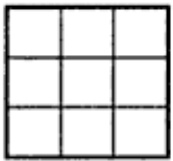

<!-- page: 50 -->

Then the two players take it in turns to place a there marker on the board( one player uses the „X‟marker, the other uses the „O‟ marker). The winner is the player who gets 3 of these markers in a row, eg.. if X wins

| × | ○ |  |
| --- | --- | --- |
|  | × | ○ |
| ○ |  | × |

Another possibility is that no1 wins eg..

| ○ | ○ | ○ |
| --- | --- | --- |
| × | × | ○ |
| ○ | ○ | × |

Or the third possibility is a draw case

| X | O | X |
| --- | --- | --- |
| X | O | O |
| O | X | O |

## Search tree for tic-tac-toe

The root node is an initial position of the game. Its successors are the positions that the first player can reach in one move; their successors are the positions resulting from the second player's replies and so on. Terminal or leaf nodes are presented by WIN, LOSS or DRAW. Each path from the root ro a terminal node represents a different complete play of the game. The moves available to one player from a given position can be represented by OR links whereas the moves available to his opponent are AND links.

The trees representing games contain two types of nodes:

MAX- nodes (assume at even level from root)

 MIN - nodes [assume at odd level from root)

<!-- page: 51 -->

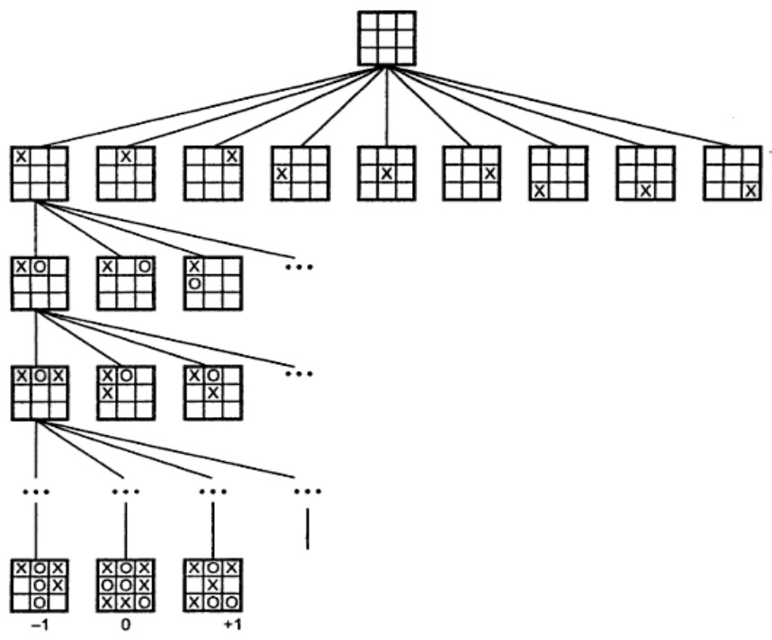

Search tree for tic-tac-toe

the leaves nodes are labeled WIN, LOSS or DRAW depending on whether they represent a win, loss or draw position from Max‟s viewpoint. Once the leaf nodes are assigned their WIN-LOSS or DRAW status, each nodes in the game tree can be labeled WIN, LOSS or DRAW by a bottom up process.

Game playing is a special type of search, where the intention of all players must be taken into account.

## Minimax procedure

Starting from the leaves of the tree (with final scores with respect to one player, MAX), and go backwards towards the root.

At each step, one player (MAX) takes the action that leads to the highest score, while the other player(MIN) takes the action that leads to the lowest score.

 All the nodes in the tree will be scored and the path from root to the actual result is the one on which all node have the same score.

The minimax procedure operates on a game tree and is recursive procedure where a player tries to minimize its opponent‟s advantage while at the same time maximize its own. The player hoping for positive number is called the maximizing player. His opponent is the minimizing player. If the player to move is the maximizing player, he is looking for a path leading to a large positive number and his opponent will try to force the play toward situation with strongly

<!-- page: 52 -->

negative static evaluations. In game playing first construct the tree up till the depth-bound and then compute the evaluation function for the leaves. The next step is to propagate the values up to the starting.

The procedure by which the scoring information passes up the game tree is called the MINIMAX procedures since the score at each node is either minimum or maximum of the scores at the nodes immediately below

## One-ply search

In this fig since it is the maximizing search ply 8 is transferred upwards to A

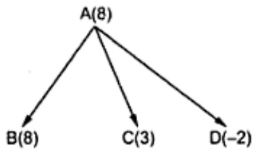

**Two-ply search**

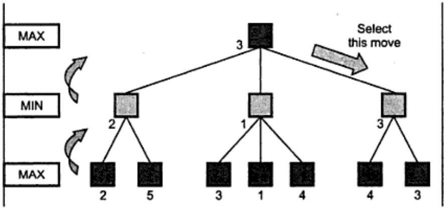

## Static evaluation function

To play an entire game we need to combine search oriented and non-search oriented techniques. The idea way to use a search procedure to find a solution to the problem statement is to generate moves through the problem space until a goal state is reached. Unfortunately for games like

<!-- page: 53 -->

chess even with a good plausible move generator, it is not possible to search until goal state is reached. In the amount of time available it is possible to generate the tree at the most 10 to 20 ply deep. Then in order to choose the best move, the resulting board positions must be compared to discover which is most advantageous. This is done using the static evaluation function. The static evaluation function evaluates individual board positions by estimating how much likely they are eventually to lead to a win.

The minimax procedure is a depth-first, depth limited search procedure.

If the limit of search has reached, compute the static value of the current position relative to the appropriate layer as given below (maximizing or minimizing player). Report the result (value and path).

If the level is minimizing level(minimizer‟s turn)

Generate the successors of the current position. Apply MINIMAX to each of the successors. Return the minimum of the result.

 If the level is a maximizing level. Generate the successors of current position

Apply MINIMAX to each of these successors. Return the maximum of the result.

The maximum algorithm uses the following procedures

## 1. MOVEGEN(POS)

It is plausible move generator. It returns a list of successors of „Pos‟.

## 2. STSTIC (Pos, Depth)

The static evaluation function that returns a number representing the goodness of „pos from the current point of view.

## 3. DEEP-ENOUGH

It returns true if the search to be stopped at the current level else it returns false.

A MINIMAX example

<!-- page: 54 -->

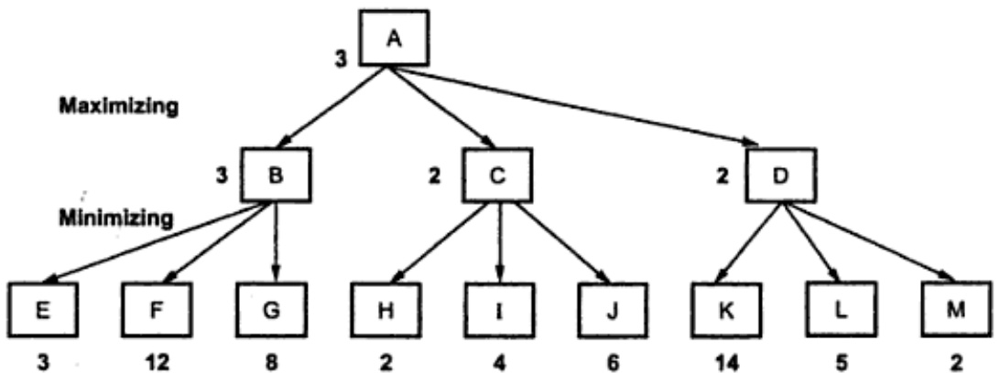

Another example of minimax search procedure

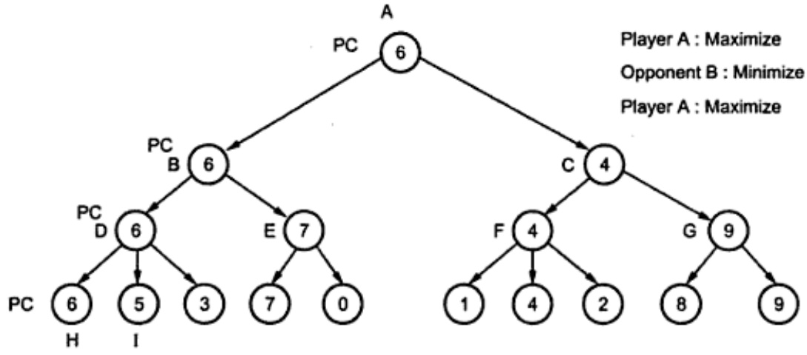

In the above example, a Minimax search in a game tree is simulated. Every leaf has a corresponding value, which is approximated from player A‟s view point. When a path is chosen, the value of the child will be passed back to the parent. For example, the value for D is 6, which is the maximum value of its children, while the value for C is 4 which is the minimum value of F and G. In this example the best sequence of moves found by the maximizing/minimizing procedure is the path through nodes A, B, D and H, which is called the principal continuation. The nodes on the path are denoted as PC (principal continuation) nodes. For simplicity we can modify the game tree values slightly and use only maximization operations. The trick is to maximize the scores by negating the returned values from the children instead of searching for minimum scores and estimate the values at leaves from the player‟s own viewpoint

## Alpha-beta cutoffs

<!-- page: 55 -->

The basic idea of alpha-beta cutoffs is “It is possible to compute the correct minimax decision without looking at every node in the search tree”. This is called pruning (allow us to ignore portions of the search tree that make no difference to the final choice).

The general principle of alpha-beta pruning is

 Consider a node n somewhere in the tree, such that a player has a chance to move to this node.

If player has a better chance m either at the parent node of n ( or at any choice point further up) then n will never be reached in actual play.

When we are doing a search with alpha-beta cut-offs, if a node‟s value is too high, the minimizer will make sure it‟s never reached (by turning off the path to get a lower value). Conversely, if a node‟s value is too low, the maximizer will make sure it‟s never reached. This gives us the following definitions

**Alpha:** the highest value that the maximize can guarantee himself by making some move at the current node OR at some node earlier on the path to this node.

**Beta:** the lowest value that the minimizer can guarantee by making some move at the current node OR at some node earlier on the path to this node.

The maximize is constantly trying to push the alpha value up by finding better moves; the minimizer is trying to push the beta value down. If a node‟s value is between alpha and beta, then the players might reach it. At the beginning, at the root of the tree, we don‟t have any guarantees yet about what values the maximizer and minimizer can achieve. So we set beta to ∞ and alpha to -∞. Then as we move down the tree, each node starts with beta and alpha values passed down from its parent.

Consider a situation in which the MIN – children of a MAX-node have been partially inspected

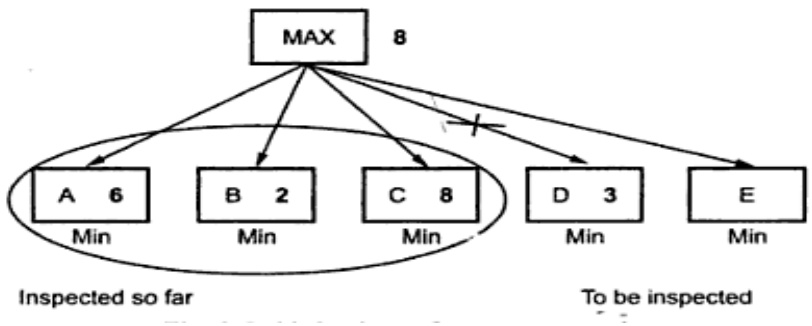

Alpha-beta for a max node

At this point the “tentative” value which is backed up so far of F is 8. MAX is not interested in any move which has a value of less than 8, since it is already known that 8 is the worst that MAX

<!-- page: 56 -->

can do, so far. Thus the node D and all its descendent can be pruned or excluded from further exploration, since MIN will certainly go for a value of 3 rather than 8. Similarly for a MIN-node:

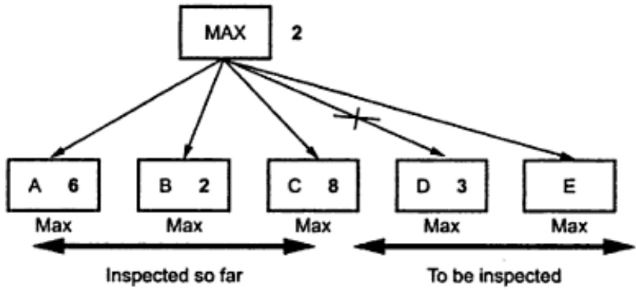

Alpha-beta for a min node

MIN is trying to minimize the game-value. So far, the value 2 is the best available form MIN‟s point of view. MIN will immediately reject node D, which can be stopped for further exploration.

In a game tree, each node represents a board position where one of the players gets to choose a move. For example, in the fig below look at the node C. As soon as we look at its left child, we realize that if the players reach node C, the minimizer can limit the utility to 2. But the maximize can get utility 6 by going to node B instead, so he would never let the game reach C. therefore we don‟t even have to look at C‟s other children

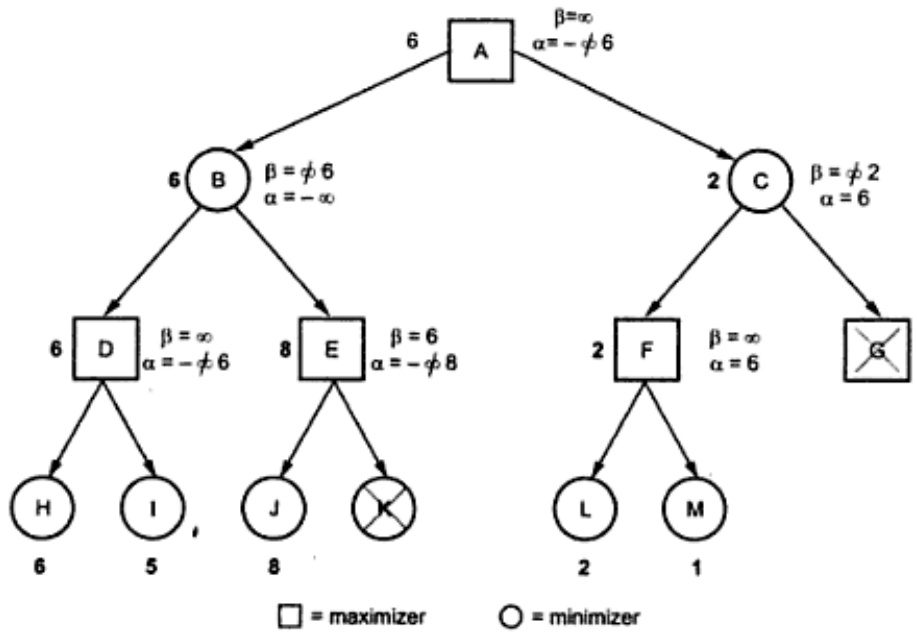

Tree with alpha-beta cut-offs

<!-- page: 57 -->

Initially at the root of the tree, there is no guarantee about what values the maximizer and minimizer can achieve. So beta is set to ∞ and alpha to -∞. Then as we move down the tree, each node starts with beta and alpha values passed down from its parent. It it‟s a maximize node, and then alpha is increased if a child value is greater than the current alpha value. Similarly, at a minimizer node, beta may be decreased. This is shown in the fig.

At each node, the alpha and beta values may be updated as we iterate over the node‟s children. At node E, when alpha is updated to a value of 8, it ends up exceeding beta. This is a point where alpha beta pruning is required we know the minimizer would never let the game reach this node so we don‟t have to look at its remaining children. In fact, pruning happens exactly when the alpha and beta lines hit each other in the node value.

## Algorithm-Alpha-beta

```txt
int AlphaBeta(int depth, int alpha, int beta)
{
    if (depth == 0)
        return Evaluate();
    GenerateLegalMoves();
    while (MovesLeft()) {
        MakeNextMove();
        val = -AlphaBeta(depth - 1, -beta, -alpha);
        UnmakeMove();
        if (val >= beta)
            return beta;
        if (val > alpha)
            alpha = val;
    }
    return alpha;
}
```

If the highlighted characters are removed, what is left is a min-max function. The function is passed the depth it should search, and –INIFINITY as alpha and +INIFINITY as beta.

```txt
val = AlphaBeta(5, -INFINITY, INFINITY);
```

## This does a five-ply search

## The Horizon effect

A potential problem in game tree search to a fixed depth is the horizon effect, which occurs when there is a drastic change in value immediately beyond the place where the algorithm stops

<!-- page: 58 -->

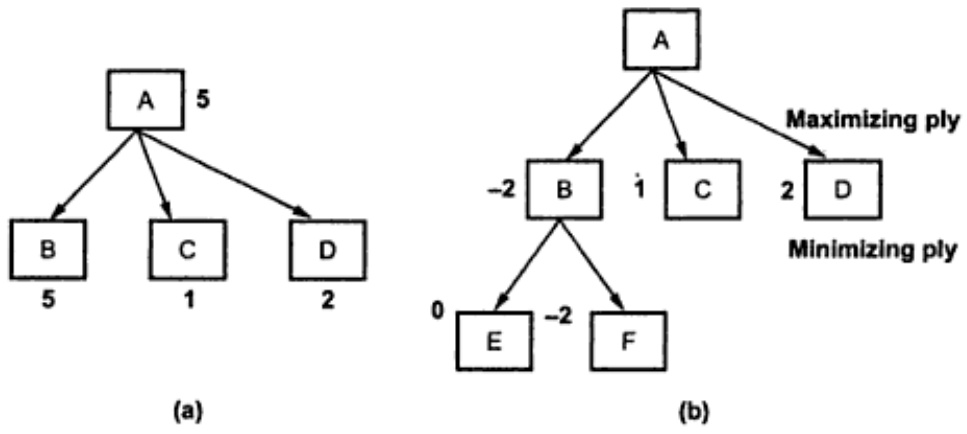

Suppose node B is examined one more level as shown in fig B. then we see because of a minimizing ply value at B is -2 and hence the value passed to A is 2. This results in a drastic change in the situation. There are two proposed solutions to this problem, neither very satisfactory.

searching. Consider the tree shown in the below fig.A. it has nodes A, B, C and D. at this level since it is a maximizing ply, the value which will passed up at A is 5.

## Secondary search

One proposed solution is to examine the search beyond the apparently best one to see if something is looming just over the horizon. In that case we can revert to the second-best move. Obviously then the second-best move has the same problem and there is not time to search beyond all possible acceptable moves.

## Waiting for Quiescence

If a position looks “dynamic”, don‟t even bother to evaluate it.

 Instead, do a small secondary search until things calm down.

E.g after capturing a piece, things look good, but this would be misleading if opponent was about to capture right back.

In general such factors are called continuation heuristics

<!-- page: 59 -->

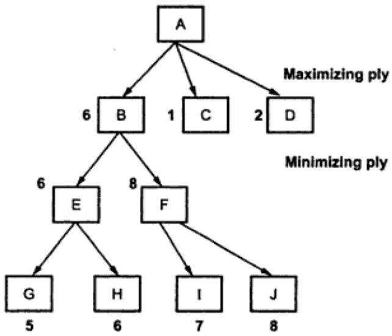

Fig above shows the further exploration of the tree in fig B. Here now since the tree is further explored, the value, which is passed to A is 6. Thus the situation calms down. This is called as waiting for quiescence. This helps in avoiding the horizon effect of a drastic change of values.

## Iterative Deepening

Rather than searching to a fixed depth in the game tree, first search only single ply, then apply MINMAX to 2 ply, further 3 ply till the final goal state is searched. This is called as iterative deepening. Besides providing good control of time, iterative deepening is usually more efficient than an equivalent direct search. The reason is that the results of previous iterations can improve the move ordering of new iteration, which is critical for efficient searching.

## 2.2 Knowledge Representation

## Representation and Mapping

 Problem solving requires large amount of knowledge and some mechanism for manipulating that knowledge.

 The Knowledge and the Representation are distinctentities, play a central but distinguishable roles in intelligent system.

**Knowledge** is a description of the world;

it determines a system's competence by what it knows.

**Representation** is the way knowledge is encoded;

it defines the system's performance in doing something.

<!-- page: 60 -->

 **Facts** Truths about the real world and what we represent. This can be regarded as the knowledge level

 In simple words, we :

 need to know about things we want to represent , and

 need some means by which things we can manipulate.

<table><tr><td rowspan="4">◇ know things to represent</td><td># Objects</td><td>- facts about objects in the domain.</td></tr><tr><td># Events</td><td>- actions that occur in the domain.</td></tr><tr><td># Performance</td><td>- knowledge about how to do things</td></tr><tr><td># Meta-knowledge</td><td>- knowledge about what we know</td></tr><tr><td>◇ need means to manipulate</td><td># Requires some formalism</td><td>- to what we represent ;</td></tr></table>

Thus, knowledge representation can be considered at two levels :

 knowledge level at which facts are described, and

 symbol level at which the representations of the objects, defined in terms of symbols, can be manipulated in the programs.

Note : A good representation enables fast and accurate access to knowledge and understanding of the content.

## Mapping between Facts and Representation

 Knowledge is a collection of “facts” from some domain.

 We need a representation of "facts" that can be manipulated by a program. Normal English is insufficient, too hard currently for a computer program to draw inferences in natural languages.

 Thus some symbolic representation is necessary.

 Therefore, we must be able to map "facts to symbols" and "symbols to facts" using forward and backward representation mapping.

<!-- page: 61 -->

Example : Consider an English sentence

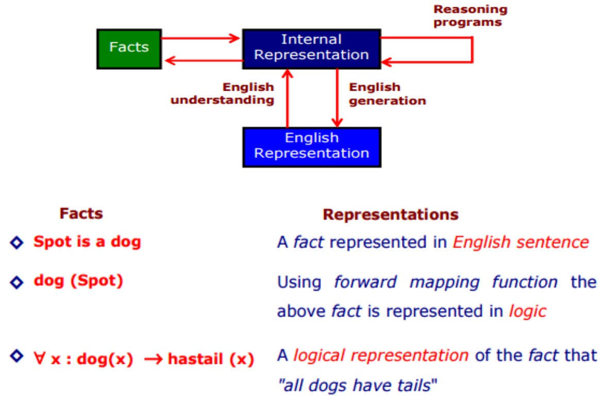

Now using deductive mechanism we can generate a new representation of object:

| Hastail (Spot) | A new object representation |
| --- | --- |
| Spot has a tail [it is new knowledge] | Using backward mapping function to generate English sentence |

##  Good representation can make a reasoning program trivial

The Mutilated Checkerboard Problem: “Consider a normal checker board from which two squares, in opposite corners, have been removed. The task is to cover all the remaining squares exactly with dominoes, each of which covers two squares. No overlapping, either of dominoes on top of each other or of dominoes over the boundary of the mutilated board are allowed. Can this task be done?”

<!-- page: 62 -->

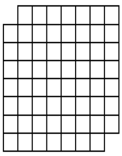

(a)

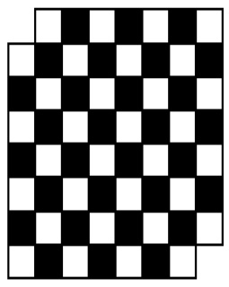

(b)

No. black squares = 30

No. white squares = 32

(c)

 Forward and Backward Representation

The forward and backward representations are elaborated below

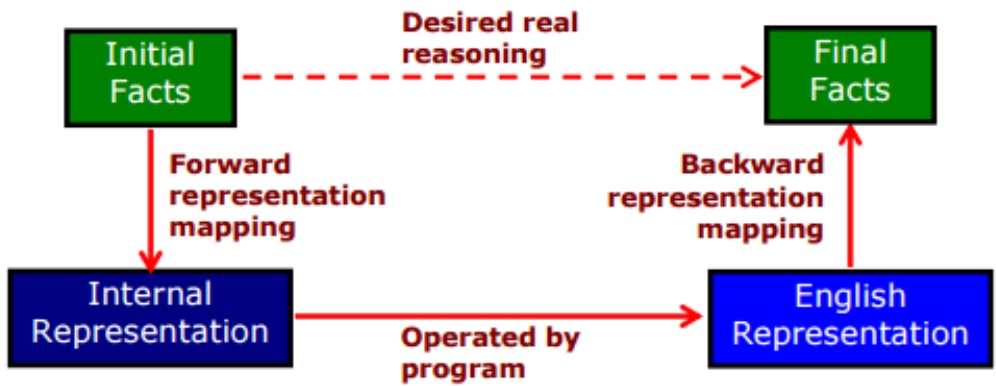

The doted line on top indicates the abstract reasoning process that a program is intended to model.

 The solid lines on bottom indicate the concrete reasoning process that the program performs.

## KR System Requirements

 A good knowledge representation enables fast and accurate access to knowledge and understanding of the content.

 A knowledge representation system should have following properties.

**Representational Adequacy** the ability to represent all kinds of knowledge that are needed in that domain.

<!-- page: 63 -->

**Inferential Adequacy** the ability to manipulate the representational structures to derive new structure corresponding to new knowledge inferred from old.

**Inferential Efficiency** the ability to incorporate additional information into the knowledge structure that can be used to focus attention of the inference mechanisms in the most promising direction.

**Acquisitional Efficiency** the ability to acquire new knowledge using automatic methods whenever possible rather than reliance on human intervention

**Note:** To date no single system can optimizes all of the above properties.

## 2.3 Knowledge Representation Schemes

There are four types of Knowledge representation :

Relational, Inheritable, Inferential, and Declarative/Procedural.

##  Relational Knowledge :

 provides a framework to compare two objects based on equivalent attributes.

 any instance in which two different objects are compared is a relational type of knowledge.

##  Inheritable Knowledge

 is obtained from associated objects.

 it prescribes a structure in which new objects are created which may inherit all or a subset of attributes from existing objects.

##  Inferential Knowledge

 is inferred from objects through relations among objects.

 e.g., a word alone is a simple syntax, but with the help of other words in phrase the reader may infer more from a word; this inference within linguistic is called semantics.

##  Declarative Knowledge

 a statement in which knowledge is specified, but the use to which that knowledge is to be put is not given.

 e.g. laws, people's name; these are facts which can stand alone, not dependent on other knowledge;

##  Procedural Knowledge

<!-- page: 64 -->

 a representation in which the control information, to use the knowledge, is embedded in the knowledge itself.

 e.g. computer programs, directions, and recipes; these indicate specific use or implementation;

## Relational Knowledge

This knowledge associates elements of one domain with another domain.

Relational knowledge is made up of objects consisting of attributes and their corresponding associated values.

 The results of this knowledge type is a mapping of elements among different domains.

The table below shows a simple way to store facts.

 The facts about a set of objects are put systematically in columns.

 This representation provides little opportunity for inference.

Table - Simple Relational Knowledge

| Player | Height | Weight | Bats - Throws |
| --- | --- | --- | --- |
| Aaron | 6-0 | 180 | Right - Right |
| Mays | 5-10 | 170 | Right - Right |
| Ruth | 6-2 | 215 | Left - Left |
| Williams | 6-3 | 205 | Left - Right |

 Given the facts it is not possible to answer simple question such as :

**" Who is the heaviest player ? "**.

but if a procedure for finding heaviest player is provided, then these facts will enable that procedure to compute an answer.

 We can ask things like who "bats – left" and "throws – right".

## Inheritable Knowledge

 Here the knowledge elements inherit attributes from their parents.

<!-- page: 65 -->

 The knowledge is embodied in the design hierarchies found in the functional, physical and process domains. Within the hierarchy, elements inherit attributes from their parents, but in many cases not all attributes of the parent elements be prescribed to the child elements.

 The inheritance is a powerful form of inference, but not adequate. The basic KR needs to be augmented with inference mechanism.

 The KR in hierarchical structure, shown below, is called “semantic network” or a collection of “frames” or “slot-and-filler structure". The structure shows property inheritance and way for insertion of additional knowledge.

 Property inheritance: The objects or elements of specific classes inherit attributes and values from more general classes. The classes are organized in a generalized hierarchy.

## Baseball knowledge

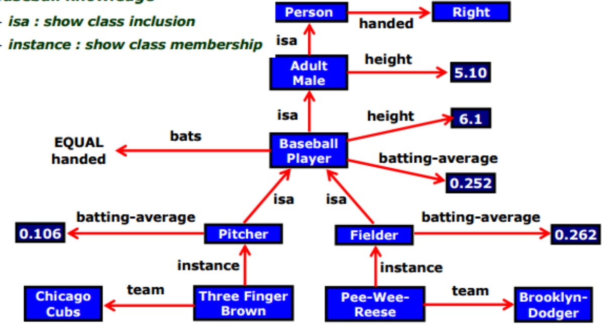

Fig. Inheritable knowledge representation (KR)

 The directed arrows represent attributes (isa, instance, team) originates at object being described and terminates at object or its value.

 The box nodes represents objects and values of the attributes.

 Viewing a node as a frame

| Example : | Baseball-player |
| --- | --- |
| isa : | Adult-Male |

<!-- page: 66 -->

Bates : EQUAL handed

Height : 6.1

Batting-average : 0.252

##  Algorithm : Property Inheritance

Retrieve a value V for an attribute A of an instance object O

Steps to follow:

1. Find object O in the knowledge base.

2. If there is a value for the attribute A then report that value.

3. Else, if there is a value for the attribute instance; If not, then fail.

4. Else, move to the node corresponding to that value and look for a value for the attribute A; If one is found, report it.

5. Else, do until there is no value for the “**isa**” attribute or until an answer is found :

(a) Get the value of the “**isa**” attribute and move to that node.

(b) See if there is a value for the attribute A; If yes, report it.

 This algorithm is simple. It describes the basic mechanism of inheritance. It does not say what to do if there is more than one value of the instance or “isa” attribute.

 This can be applied to the example of knowledge base illustrated, in the previous slide, to derive answers to the following queries :

 team (Pee-Wee-Reese) = Brooklyn–Dodger

 batting–average(Three-Finger-Brown) = 0.106

 height (Pee-Wee-Reese) = 6.1

 bats (Three Finger Brown) = right

## Inferential Knowledge

 This knowledge generates new information from the given information.

 This new information does not require further data gathering form source, but does require analysis of the given information to generate new knowledge.

Example :

 given a set of relations and values, one may infer other values or relations.

<!-- page: 67 -->

 a predicate logic (a mathematical deduction) is used to infer from a set of attributes.

 inference through predicate logic uses a set of logical operations to relate individual data.

 the symbols used for the logic operations are :

```txt
" → " (implication),    " ¬ " (not),      " V " (or),      " ∧ " (and),
" ∀ " (for all),        " ∃ " (there exists).
```

Examples of predicate logic statements :

```txt
1. "Wonder" is a name of a dog : dog (wonder)
```

2. All dogs belong to the class of animals : ∀ x : dog (x) → animal(x)

3. All animals either live on land or in ∀ x : animal(x) → live (x, water : land) V live (x, water)

From these three statements we can infer that :

" Wonder lives either on land or on water."

Note : If more information is made available about these objects and their relations, then more knowledge can be inferred.

## Declarative/Procedural Knowledge

Differences between Declarative/Procedural knowledge is not very clear.

**Declarative knowledge :**

Here, the knowledge is based on declarative facts about axioms and domains .

 axioms are assumed to be true unless a counter example is found to invalidate them.

 domains represent the physical world and the perceived functionality.

 axiom and domains thus simply exists and serve as declarative statements that can stand alone.

## Procedural knowledge:

Here, the knowledge is a mapping process between domains that specify “what to do when” and the representation is of “how to make it” rather than “what it is”. The procedural knowledge :

 may have inferential efficiency, but no inferential adequacy and acquisitional efficiency.

 are represented as small programs that know how to do specific things, how to proceed.

<!-- page: 68 -->

Example : A parser in a natural language has the knowledge that a noun phrase may contain articles, adjectives and nouns. It thus accordingly call routines that know how to process articles, adjectives and nouns.

## Issues in Knowledge Representation

 The fundamental goal of Knowledge Representationis to facilitate inference (conclusions) from knowledge.

 The issues that arise while using KR techniques are many. Some of these are explained below.

 Important Attributes :

Any attribute of objects so basic that they occur in almost every problem domain ?

 Relationship among attributes:

Any important relationship that exists among object attributes ?

 Choosing Granularity :

At what level of detail should the knowledge be represented ?

 Set of objects :

How sets of objects be represented ?

 Finding Right structure :

Given a large amount of knowledge stored, how can relevant parts be accessed ?

##  Important Attributes

 There are attributes that are of general significance.

 There are two attributes "instance" and "isa", that are of general importance. These attributes are important because they support property inheritance.

##  Relationship among Attributes

 The attributes to describe objects are themselves entities they represent.

 The relationship between the attributes of an object, independent of specific knowledge they encode, may hold properties like:

<!-- page: 69 -->

 Inverses, existence in an isa hierarchy, techniques for reasoning about values and single valued attributes.

## Inverses :

This is about consistency check, while a value is added to one attribute. The entities are related to each other in many different ways. The figure shows attributes (isa, instance, and team), each with a directed arrow, originating at the object being described and terminating either at the object or its value.

There are two ways of realizing this:

first, represent two relationships in a single representation; e.g., a logical representation, team(Pee-Wee-Reese, Brooklyn–Dodgers), that can be interpreted as a statement about Pee-Wee-Reese or Brooklyn–Dodger.

second, use attributes that focus on a single entity but use them in pairs, one the inverse of the other; for e.g., one, team = Brooklyn– Dodgers , and the other, team = Pee-Wee-Reese, . . . .

This second approach is followed in semantic net and frame-based systems, accompanied by a knowledge acquisition tool that guarantees the consistency of inverse slot by checking, each time a value is added to one attribute then the corresponding value is added to the inverse.

##  Existence in an "isa" hierarchy

This is about generalization-specialization, like, classes of objects and specialized subsets of those classes. There are attributes and specialization of attributes.

Example: the attribute "height" is a specialization of general attribute "physical-size" which is, in turn, a specialization of "physical-attribute". These generalization-specialization relationships for attributes are important because they support inheritance.

##  Techniques for reasoning about values

This is about reasoning values of attributes not given explicitly. Several kinds of information are used in reasoning, like,

height : must be in a unit of length,

age : of person can not be greater than the age of person's parents.

The values are often specified when a knowledge base is created.

Single valued attributes

<!-- page: 70 -->

This is about a specific attribute that is guaranteed to take a unique value.

Example : A baseball player can at time have only a single height and be a member of only one team. KR systems take different approaches to provide support for single valued attributes.

##  Choosing Granularity

What level should the knowledge be represented and what are the primitives ?

 Should there be a small number or should there be a large number of low-level primitives or High-level facts.

 High-level facts may not be adequate for inference while Low-level primitives may require a lot of storage.

Example of Granularity :

Suppose we are interested in following facts

John spotted Sue.

This could be represented as

Spotted (agent(John), object (Sue))

Such a representation would make it easy to answer questions such are Who spotted Sue ?

 Suppose we want to know

Did John see Sue ?

 Given only one fact, we cannot discover that answer.

We can add other facts, such as

Spotted (x , y) -> saw (x , y)

 We can now infer the answer to the question.

##  Set of Objects

 Certain properties of objects that are true as member of a set but not as individual;

Example : Consider the assertion made in the sentences "there are more sheep than people in Australia", and "English speakers can be found all over the world."

<!-- page: 71 -->

 To describe these facts, the only way is to attach assertion to the sets representing people, sheep, and English.

 The reason to represent sets of objects is :

If a property is true for all or most elements of a set, then it is more efficient to associate it once with the set rather than to associate it explicitly with every elements of the set.

 This is done in different ways :

 in logical representation through the use of universal quantifier, and

 in hierarchical structure where node represent sets, the inheritance propagate set level assertion down to individual.

Example: assert large (elephant); Remember to make clear distinction between,

 whether we are asserting some property of the set itself, means, the set of elephants is large, or

 asserting some property that holds for individual elements of the set , means, any thing that is an elephant is large.

There are three ways in which sets may be represented :

 Name, as in the example. Inheritable KR, the node - Baseball- Player and the predicates as Ball and Batter in logical representation.

 Extensional definition is to list the numbers, and

 In tensional definition is to provide a rule, that returns true or false depending on whether the object is in the set or not.

##  Finding Right Structure

 Access to right structure for describing a particular situation.

 It requires, selecting an initial structure and then revising the choice. While doing so, it is necessary to solve following problems :

 how to perform an initial selection of the most appropriate structure.

how to fill in appropriate details from the current situations.

 how to find a better structure if the one chosen initially turns out not to be appropriate.

what to do if none of the available structures is appropriate.

<!-- page: 72 -->

 when to create and remember a new structure.

 There is no good, general purpose method for solving all these problems. Some knowledge representation techniques solve some of them.

## CHAPTER 2

## Knowledge Representation using predicate logic

## 2.4 Representing Simple Facts in Logic

AI system might need to represent knowledge. Propositional logic is one of the fairly good forms of representing the same because it is simple to deal with and a decision procedure for it exists. Real-world facts are represented as logical propositions and are written as well-formed formulas (wff's) in propositional logic, as shown in Figure below. Using these propositions, we may easily conclude it is not sunny from the fact that its raining. But contrary to the ease of using the

<!-- page: 73 -->

propositional logic there are its limitations. This is well demonstrated using a few simple sentence like:

It is raining. RAINING

It is sunny. SUNNY

It is windy. WINDY

# If it is raining, then it is not sunny. RAINING → → SUNNY

Some simple facts in Propositional logic

Socrates is a man.

We could write:

SOCRATESMAN

But if we also wanted to represent

Plato is a man.

we would have to write something such as:

PLATOMAN

which would be a totally separate assertion, and we would not be able to draw any conclusions about similarities between Socrates and Plato. It would be much better to represent these facts as:

MAN(SOCRATES)

MAN(PLATO)

since now the structure of the representation reflects the structure of the knowledge itself. But to do that, we need to be able to use predicates applied to arguments. We are in even more difficulty if we try to represent the equally classic sentence

All men are mortal.

We could represent this as:

MORTALMAN

<!-- page: 74 -->

But that fails to capture the relationship between any individual being a man and that individual being a mortal. To do that, we really need variables and quantification unless we are willing to write separate statements about the mortality of every known man.

Let's now explore the use of predicate logic as a way of representing knowledge by looking at a specific example. Consider the following set of sentences:

1 . Marcus was a man.

2. Marcus was a Pompeian.

3. All Pompeians were Romans.

4. Caesar was a ruler.

5. All Romans were either loyal to Caesar or hated him.

6. Everyone is loyal to someone.

7. People only try to assassinate rulers they are not loyal to.

8. Marcus tried to assassinate Caesar.

The facts described by these sentences can be represented as a set of wff's in predicate logic as follows:

## 1. Marcus was a man.

man(Marcus)

Although this representation fails to represent the notion of past tense (which is clear in the English sentence), it captures the critical fact of Marcus being a man. Whether this omission is acceptable or not depends on the use to which we intend to put the knowledge.

2. Marcus was a Pompeian.

Pompeian(Marcus)

3.All Pompeians were Romans.

∀x : Pompeian(x)→ Roman(x)

4.Caesar was a ruler.

ruler(Caesar)

Since many people share the same name, the fact that proper names are often not references to unique individuals, overlooked here. Occasionally deciding which of several people of the same name is being referred to in a particular statement may require a somewhat more amount of knowledge and logic.

<!-- page: 75 -->

5. All Romans were either loyal to Caesar or hated him.

x: Roman(x) loyalto(x, Caesar) V hate(Caesar)

Here we have used the inclusive-or interpretation of the two types of Or supported by English language. Some people will argue, however, that this English sentence is really stating an exclusive-or. To express that. we would have to write:

∀x: Roman(x) → [(loyalto(x, Caesar) V hate(x, Caesar))∧

Not (loyalto(x, Caesar) hate(x, Caesar))]

6. Everyone is loyal to someone.

∀x:∃y : loyalto(x,y)

The scope of quantifiers is a major problem that arises when trying to convert English sentences into logical statements. Does this sentence say, as we have assumed in writing the logical formula above, that for each person there exists someone to whom he or she is loyal, possibly a different someone for everyone? Or does it say that there is someone to whom everyone is loyal?

## ¬loyalto(Marcus,Caesar)

↑ (7, substitution)

person(Marcus) ruler(Caesar) Λ tryassassináte(Marcus,Caesar)

person(Marcus) tryassassinate(Marcus, Caesar)

## person(Marcus)

An Attempt to Prove not loyal to(Marcus,Caesar)

7. People only try to assassinate rulers they are not loyal to.

∀x : ∀y : person(x) ∧ ruler(y) ∧ tryassasinate(x,y) → —loyalto(x,y)

8.Like the previous one this sentence too is ambiguous which may lead to more than one conclusion. The usage of “try to assassinate” as a single predicate gives us a fairly simple representation with which we can reason about trying to assassinate. But there might be connections as try to assassinate and not actually assassinate could not be made easily.

<!-- page: 76 -->

## 9. Marcus tried to assassinate Caesar.

tryassasinate (Marcus,Caesar)

now, say suppose we wish to answer the following question:

Was Marcus loyal to Caesar?

What we do is start reasoning backward from the desired goal which is represented in predicate logic as:

loyalto(Marcus, Caesar)

Figure 4.2 shows an attempt to produce a proof of the goal by reducing the set of necessary but as yet unattained goals to the empty sets. The attempts fail as we do not have any statement to prove person(Marcus). But the problem is solved just by adding an additional statement i.e.

## 10. All men are people.

∀x : man(x) → person(x)

Now we can satisfy the last goal and produce a proof that Marcus was not loyal to Caesar.

## 2.4.1 Representing Instance and isa relationships

 Knowledge can be represented as classes, objects, attributes and Super class and sub class relationships.

 Knowledge can be inference using property inheritance. In this elements of specific classes inherit the attributes and values.

 Attribute instance is used to represent the relationship “Class membership ” (element of the class)

 Attribute isa is used to represent the relationship “Class inclusion” (super class, sub class relationship)

Three ways of representing class membership

<!-- page: 77 -->

1. man(Marcus) 2. Pompiean(Marcus) 3. V x: Pompiean(x) -> Roman(x) 4. ruler(Caesar) 5. V x: Roman(x) -> loyalto(x,Caesar) v hate(x,Caesar)

1. instance(Marcus,man)

2. instance(Marcus, Pompiean)

3. V x: instance(x, Pompiean)->instance(x,Roman)

4. instance(Caesar,ruler)

5. Vx: instance(x, Roman)->loyalto(x,Caesar) vhate(x,Caesar)

1. instance(Marcus,man)

2. instance(Marcus, Pompiean)

3. isa(Pompiean,Roman)

4. instance(Caesar,ruler)

5. Vx: instance(x, Roman)->loyalto(x,Caesar) hate(x,Caesar)

6. V x: V y: V z: instance(xy)A isa(y,z)-> instance(x,z)

These examples illustrate two points. The first is fairly specific. It is that, although class and superclass memberships are important facts that need to be represented those memberships need not be represented with predicates labelled instance and isa. In fact, in a logical framework it is usually unwieldy to do that, and instead unary predicates corresponding to the classes are often used. The second point is more general. There are usually several different ways of representing a given fact within a particular representational framework, be it logic or anything else. The choice depends partly on which deductions need to be supported most efficiently and partly on taste. The only important thing is that within a particular knowledge base consistency of representation is critical. Since any particular inference rule is designed to work on one particular form of representation, it is necessary that all the knowledge to which that rule is intended to apply be in the form that the rule demands. Many errors in the reasoning performed by knowledge-based programs are the result of inconsistent representation decisions. The moral is simply to be careful.

## 2.4.2 Computable functions and predicates

 Some of the computational predicates like Less than, Greater than used in knowledge representation.

 It generally return true or false for the inputs. Examples: Computable predicates

gt(1,0) or lt(0,1)

<!-- page: 78 -->

gt(5,4) or gt(4,5)

Computable functions: gt(2+4, 5)

Consider the following set of facts, again involving Marcus:

1. marcus was a man

man(Marcus)

2. Marcus was a pompeian

Pompeian(Marcus)

3. Marcus was born in 40 A.D

born(marcus, 40)

4. All men are mortal

∀x: men(x)→ mortal(x)

5. All Pompeians died when the volcano erupted in 79 A.D

erupted(volcano,79) & x :pompeian(x)→died(x, 79)

6. No mortal lives longer than150 years

∀x: ∀t1: ∀t2: mortal(x) & born(x,t1) & gt(t2-t1,150)→ dead(x,t1)

7. It is Now 1991

Now=1991

8. Alive means not dead

∀x: ∀t: [ alive(x,t) →\~dead(x,t)] & [\~dead(x,t)→alive(x,t)]

9. If someone dies then he is dead at all later times

∀x: ∀t1: ∀t2: died(x,t1) & gt(t2,t1)→ dead(x1,t2)

This representation says that one is dead in all years after the one in which one died. It ignores the question of whether one is dead in the year in which one died.

1. man(Marcus)

2. Pompeian(Marcus)

3. born(marcus, 40)

4. ∀x: men(x)→ mortal(x)

<!-- page: 79 -->

5. ∀:pompeian(x)→died(x, 79)

6. erupted(volcano,79)

7. ∀ x: ∀t1: ∀t2: mortal(x) & born(x,t1) & gt(t2-t1,150)→

dead(x,t1)

8. Now=1991

9. ∀x: ∀ t: [ alive(x,t) →\~dead(x,t)] &[\~dead(x,t)→alive(x,t)]

10. ∀ x: ∀t1: ∀t2: died(x,t1) & gt(t2,t1)→ dead(x1,t2)

¬alive(Marcus, now) ↑ (9, substitution) dead(Marcus, now) ↑ (10, substitution) died(Marcus, t1)∧gt(now, t{1) ↑ (5, substitution) Pompeian(Marcus) ∧ gt(now, 79) ↑ (2) gt(now, 79) ↑ (8,substitute equals) gt(1991,79) ↑ (compute gt) nil

One Way of Proving That Marcus Is Dead

<!-- page: 80 -->

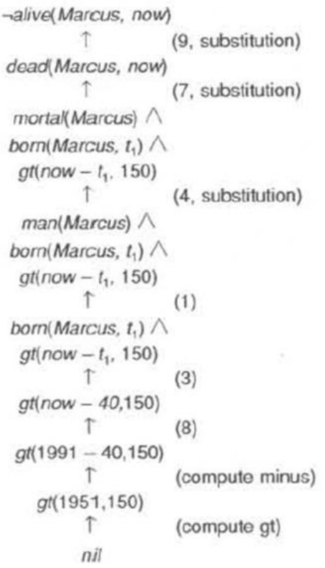

Another Way of Proving That Marcus is Dead

Two things should be clear from the proofs we have just shown:

Even very simple conclusions can require many steps to prove.

A variety of processes, such as matching, substitution, and application of modus ponens are involved in the production of a proof, This is true even for the simple statements we are using, It would be worse if we had implications with more than a single term on the right or with complicated expressions involving ands and ors on the left.

## Disadvantage:

 Many steps required to prove simple conclusions

 Variety of processes such as matching and substitution used to prove simple conclusions

## 2.5 Resolution

 Resolution is a proof procedure by refutation.

 To prove a statement using resolution it attempt to show that the negation of that statement.

<!-- page: 81 -->

## Algorithm: Convert to Clause Form

1. Eliminate →, using the fact that a → b is equivalent to ¬ a V b. Performing this transformation on the wff given above yields

$$
\forall \mathrm{x}: \neg [ \text {Roman} (\mathrm{x}) \land \text {know} (\mathrm{x}, \text {Marcus}) ] \mathrm{V}
$$

$$
[ \text {hate} (\mathrm{x}, \text {Caesar}) \mathrm{V} (\forall \mathrm{y}: \neg (\exists \mathrm{z}: \text {hate} (\mathrm{y}, \mathrm{z})) \mathrm{V} \text {thinkcrazy} (\mathrm{x}, \mathrm{y})) ]
$$

2. Reduce the scope of each ¬ to a single term, using the fact that ¬ (¬ p) = p, deMorgan's laws [which say that ¬ (a ∧ b) = ¬ a V ¬ b and ¬ (a V b) = ¬ a ∧ ¬ b ], and the standard correspondences between quantifiers $[ \neg \forall \mathrm { x } { : } \mathrm { P } ( \mathrm { x } )   =   \exists \mathrm { x } { : } \neg \mathrm { P } ( \mathrm { x } ) \mathrm { a n d } \neg \exists \mathrm { x } { : } \mathrm { P } ( \mathrm { x } )   =   \forall \mathrm { x } { : } \neg \mathrm { P } ( \mathrm { x } ) ]$ Performing this transformation on the wff from step 1 yields

$$
\forall \mathrm{x}: [ \neg \text {Roman} (\mathrm{x}) \mathrm{V} \neg \text {know} (\mathrm{x}, \text {Marcus}) ] \mathrm{V}
$$

$$
[ \text {hate} (\mathrm{x}, \text {Caesar}) \mathrm{V} (\forall \mathrm{y}: \forall \mathrm{z}: \neg \text {hate} (\mathrm{y}, \mathrm{z}) \mathrm{V} \text {thinkcrazy} (\mathrm{x}, \mathrm{y})) ]
$$

3. Standardize variables so that each quantifier binds a unique variable. Since variables are just dummy names, this process cannot affect the truth value of the wff. For example, the formula

$$
\forall \mathrm{x}: \mathrm{P} (\mathrm{x}) \vee \forall \mathrm{x}: \mathrm{Q} (\mathrm{x})
$$

would be converted to

$$
\forall \mathrm{x}: \mathrm{P} (\mathrm{x}) \lor \forall \mathrm{y}: \mathrm{Q} (\mathrm{y})
$$

4. Move all quantifiers to the left of the formula without changing their relative order. This is possible since there is no conflict among variable names. Performing this operation on the formula of step 2, we get

$$
\forall \mathrm{x}: \forall \mathrm{y}: \mathrm{Az}: [ \neg \text {Roman} (\mathrm{x}) \mathrm{V} \neg \text {know} (\mathrm{x}, \text {Marcus}) ] \mathrm{V}
$$

$$
[ \text {hate} (\mathrm{x}, \text {Caesar}) \mathrm{V} (\neg \text {hale} (\mathrm{y}, \mathrm{z}) \mathrm{V} \text {thinkcrazy} (\mathrm{x}, \mathrm{y})) ]
$$

At this point, the formula is in what is known as prenex normal form. It consists of a prefix of quantifiers followed by a matrix, which is quantifier-free.

5. Eliminate existential quantifiers. A formula that contains an existentially quantified variable asserts that there is a value that can be substituted for the variable that makes the formula true. We can eliminate the quantifier by substituting for the variable a reference to a function that produces the desired value. Since we do not necessarily know how to produce the value, we must create a new function name for every such replacement. We make no assertions about these functions except that they must exist. So, for example, the formula

∃y : President(y)

<!-- page: 82 -->

can be transformed into the formula

President(S1)

where S1 is a function with no arguments that somehow produces a value that satisfies President. If existential quantifiers occur within the scope of universal quantifiers, then the value that satisfies the predicate may depend on the values of the universally quantified variables. For example, in the formula

$$
\forall \mathrm{x}: \exists \mathrm{y}: \text {father-of} (\mathrm{y}, \mathrm{x})
$$

the value of y that satisfies father-of depends on the particular value of x. Thus we must generate functions with the same number of arguments as the number of universal quantifiers in whose scope the expression occurs. So this example would be transformed into

$$
\forall \mathrm{x}: \text {father-of} (\mathrm{S2} (\mathrm{x}), \mathrm{x})
$$

These generated functions are called Skolem functions. Sometimes ones with no arguments are called Skolem constants.

6. Drop the prefix. At this point, all remaining variables are universally quantified, so the prefix can just be dropped and any proof procedure we use can simply assume that any variable it sees is universally quantified. Now the formula produced in step 4 appears as

[¬ Roman(x) V ¬ know(x, Marcus)] V

$$
[ \text {hate} (\mathrm{x}, \text {Caesar}) \mathrm{V} (\neg \text {hate} (\mathrm{y}, \mathrm{z}) \mathrm{V} \text {thinkcrazy} (\mathrm{x}, \mathrm{y})) ]
$$

7. Convert the matrix into a conjunction of disjuncts. In the case or our example, since there are no and‟s, it is only necessary to exploit the associative property of or [ i.e., (a ∧ b) V c = (a V c) ∧ (b ∧ c)] and simply remove the parentheses, giving

$$
\neg \text {Roman} (\mathrm{x}) \mathrm{V} \neg \text {know} (\mathrm{x}, \text {Marcus}) \mathrm{V}
$$

$$
\text {hate} (\mathrm{x}, \text {Caesar}) \mathrm{V} \neg \text {hate} (\mathrm{y}, \mathrm{z}) \mathrm{V} \text {thinkcrazy} (\mathrm{x}, \mathrm{y})
$$

However, it is also frequently necessary to exploit the distributive property [i.e. , (a ∧ b) V c = (a V c) ∧ (b V c)]. For example, the formula

(winter ∧ wearingboots) V (summer ∧ wearingsandals)

Becomes, after one application of the rule

[winter V (summer ∧ wearingsandals)]

$$
\wedge \text {[wearingboots V (summer \wedge wearingsandals)]}
$$

And then, after a second application, required since there are still conjuncts joined by OR's,

<!-- page: 83 -->

(winter V summer) ∧

(winter V wearingsandals) ∧

(wearingboots V summer) ∧

(wearingboots V wearingsandals)

8. Create a separate clause corresponding to each conjunct. In order for a wff to be true, all the clauses that are generated from it must be true. If we are going to be working with several wff‟s, all the clauses generated by each of them can now be combined to represent the same set of facts as were represented by the original wff's.

9. Standardize apart the variables in the set of clauses generated in step 8. By this we mean rename the variables so that no two clauses make reference to the same variable. In making this transformation, we rely on the fact that

$$
(\forall \mathrm{x}: P (x) \land Q (x)) = \forall \mathrm{x}: P (x) \land \forall \mathrm{x}: Q (x)
$$

Thus since each clause is a separate conjunct and since all the variables are universally quantified, there need be no relationship between the variables of two clauses, even if they were generated from the same wff.

Performing this final step of standardization is important because during the resolution procedure it is sometimes necessary to instantiate a universally quantified variable (i.e., substitute for it a particular value). But, in general, we want to keep clauses in their most general form as long as possible. So when a variable is instantiated, we want to know the minimum number of substitutions that must be made to preserve the truth value of the system.

After applying this entire procedure to a set of wff's, we will have a set of clauses, each of which is a disjunction of literals. These clauses can now be exploited by the resolution procedure to generate proofs.

## 2.5.1 Resolution in Propositional Logic

In propositional logic, the procedure for producing a proof by resolution of proposition P with respect to a set of axioms F is the following.

## ALGORITHM: PROPOSITIONAL RESOLUTION

1. Convert all the propositions of F to clause form

2. Negate P and convert the result to clause form. Add it to the set of clauses obtained in step 1.

3. Repeat until either a contradiction is found or no progress can be made:

a) Select two clauses. Call these the parent clauses.

<!-- page: 84 -->

b) Resolve them together. The resulting clause, called the resolvent, will be the disjunction of all of the literals of both of the parent clauses with the following exception: If there are any pairs of literals L and ¬L such that one of the parent clauses contains L and the other contains ¬L, then select one such pair and eliminate both L and ¬L from the resolvent.

c) If the resolvent is the empty clause, then a contradiction has been found. If it is not then add it to the set of clauses available to the procedure.

Suppose we are given the axioms shown in the first column of Table 1 and we want to prove R.First we convert the axioms to clause which is already in clause form. Then we begin selecting pairs of clauses to resolve together. Although any pair of clauses can be resolved, only those pairs that contain complementary literals will produce a resolvent that is likely to lead to the goal of sequence of resolvents shown in figure 1. We begin by resolving with the clause ⱷR since that is one of the clauses that must be involved in the contradiction we are trying to find.

One way of viewing the resolution process is that it takes a set of clauses that are all assumed to be true and based on information provided by the others, it generates new clauses that represent restrictions on the way each of those original clauses can be made true. A contradiction occurs when a clause becomes so restricted that there is no way it can be true. This is indicated by the generation of the empty clause.

| Sl. No | Given Axioms | Converted to Clause Form |
| --- | --- | --- |
| 1 | P | P |
| 2 | $(P \land Q) \rightarrow R$ | $\neg P \lor Q \lor R$ |
| 3 | $(S \lor T) \rightarrow Q$ | $\neg S \lor Q$ |
| 4 |  | $\neg T \lor Q$ |
| 5 | T | T |

Table 1 Some Facts in Propositional Logic

<!-- page: 85 -->

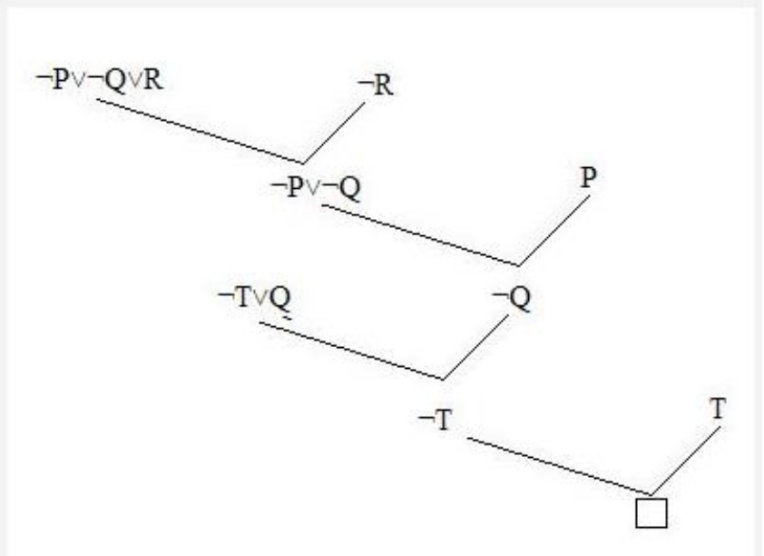

Figure : Resolution In Propositional Logic

## 2.5.3 UNIFICATION ALGORITHM

In propsoitional logic it is easy to determine that two literals can not both be true at the same time. Simply look for L and \~L . In predicate logic, this matching process is more complicated, since bindings of variables must be considered.

For example man (john) and man(john) is a contradiction while man (john) and man(Himalayas) is not. Thus in order to determine contradictions we need a matching procedure that compares two literals and discovers whether there exist a set of substitutions that makes them identical . There is a recursive procedure that does this matching . It is called Unification algorithm.

In Unification algorithm each literal is represented as a list, where first element is the name of a predicate and the remaining elements are arguments. The argument may be a single element (atom) or may be another list. For example we can have literals as

( tryassassinate Marcus Caesar)

( tryassassinate Marcus (ruler of Rome))

To unify two literals , first check if their first elements re same. If so proceed. Otherwise they can not be unified. For example the literals

( try assassinate Marcus Caesar)

<!-- page: 86 -->

( hate Marcus Caesar)

Can not be Unfied. The unification algorithm recursively matches pairs of elements, one pair at a time. The matching rules are :

i) Different constants , functions or predicates can not match, whereas identical ones can.

ii) A variable can match another variable , any constant or a function or predicate expression, subject to the condition that the function or [predicate expression must not contain any instance of the variable being matched (otherwise it will lead to infinite recursion).

iii) The substitution must be consistent. Substituting y for x now and then z for x later is inconsistent. (a substitution y for x written as y/x)

The Unification algorithm is listed below as a procedure UNIFY (L1, L2). It returns a list representing the composition of the substitutions that were performed during the match. An empty list NIL indicates that a match was found without any substitutions. If the list contains a single value F, it indicates that the unification procedure failed.

The empty list, NIL, indicates that a match was found without any substitutions. The list consisting of the single value FAIL indicates that the unification procedure failed.

Algorithm: Unify(L1, L2)

I. If L1 or L2 are both variables or constants, then:

(a) If L1 and L2 are identical, then return NIL.

(b) Else if L1 is a variable, then if L1 occurs in L2 then return {FAIL}, else return (L2/L1).

(c) Else if L2 is a variable, then if L2 occurs in L1 then return {FAIL} , else return (L1/L2).

(d) Else return {FAIL}.

2. If the initial predicate symbols in L1 and L2 are not identical, then return {FAIL}.

3. If LI and L2 have a different number of arguments, then return {FAIL}.

4. Set SUBST to NIL. (At the end of this procedure, SUBST will contain all the substitutions used to unify L1 and L2.)

5. For i ← 1 to number of arguments in L1 :

(a) Call Unify with the ith argument of L1 and the ith argument of L2, putting result in S.

(b) If S contains FAIL then return {FAIL}.

(c) If S is not equal to NIL then:

(i) Apply S to the remainder of both L1 and L2.

<!-- page: 87 -->

(ii) SUBST: = APPEND(S, SUBST).

6. Return SUBST.

## 2.5.4 Resolution in Predicate Logic

## ALGORITHM: RESOLUTION IN PREDICATE LOGIC

1. Convert all the statements of F to clause form

2. Negate P and convert the result to clause form. Add it to the set of clauses obtained in step 1.

3. Repeat until either a contradiction is found or no progress can be made or a predetermined amount of effort has been expended:

a) Select two clauses. Call these the parent clauses.

b) Resolve them together. The resulting clause, called the resolvent, will be the disjunction of all of the literals of both the parent clauses with appropriate substitutions performed and with the following exception: If there is one pair of literals T1 and T2 such that one of the parent clauses contains T1 and the other contains T2 and if T1 and T2 are unifiable, then neither T1 nor T2 should appear in the resolvent. We call T1 and T2 complementary literals. Use the substitution produced by the unification to create the resolvent. If there is one pair of complementary literals, only one such pair should be omitted from the resolvent.

c) If the resolvent is the empty clause, then a contradiction has been found. If it is not then add it to the set of clauses available to the procedure.

If the choice of clauses to resolve together at each step is made in certain systematic ways, then the resolution procedure will find a contradiction if one exists. However, it may take a very long time. There exist strategies for making the choice that can speed up the process considerably as given below.

## Axioms in clause form

1.man(Marcus)

2.Pompiean(Marcus)

3.- Pompiean(x1) v Roman(x1)

4.ruler(Caesar)

5.- Roman(x2) v loyalto(x2,Caesar) v hate(x2,Caesar)

6. loyal(x3,f(x3))

7.-man(x4) v - ruler(y1) v - tryassassinate(x4,y1) v loyalto(x4,y1)

8.tryassassinate(Marcus,Caesar)

<!-- page: 88 -->

Prove: hate(Marcus,Caesar) - hate(Marcus,Caesar) 5

3- Roman(Marcus) v loyalto(Marcus,Caesar)

Pompiean(Marcus) v loyalto(Marcus,Caesar) 2

loyalto(Marcus,Caesar)

1 -man(Marcus) v-ruler(Caesar)ytryassassi..(Marcus,Caesar)

-ruler(Caesar) v - tryassassinate(Marcus,Caesar) 4

\- tryassassinate(Marcus,Caesar) 8

A Resolution Proof

Prove: loyalto(Marcus,Caesar)

\- loyalto(Marcus,Caesar) 5

3 - Roman(Marcus) vhate(Marcus,Caesar)

\- Pompiean(Marcus) v hate(Marcus,Caesar)2

10 hate(Marcus,Caesar)

persecute(Caesar,Marcus)

hate(Marcus,Caesar)

An Unsuccessful Attempt at Resolution

9. persecute(x, y)  hate(y, x)

10. hate(x,y)  persecute(y, x)

Converting to clause form, we get

9. ¬ persecute(x5,y2) ∨ hate(y<sub>2</sub>,x<sub>5</sub>)

10. —hate(x6,y3) ∨ persecute(y3,x₆)

<!-- page: 89 -->

## Given

1. father (x,y) ν - women(x)

2. mother(x,y) v women(x)

3. mother(Chris, Mary)

4. father(Chris, Bill)

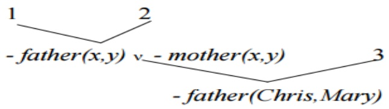

The need to Standardize Variables

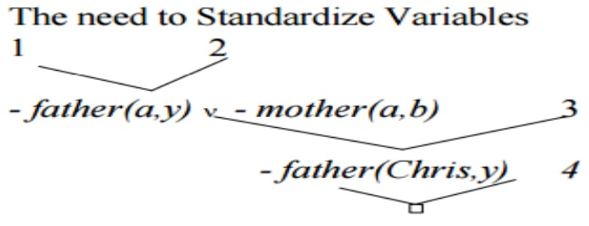

\- father(a,y) ν - mother(a,b) 3 -father(Chris,y) 4

## 2.5.5 Procedural v/s Declarative Knowledge

 A Declarative representation is one in which knowledge is specified but the use to which that knowledge is to be put in, is not given.

 A Procedural representation is one in which the control information that is necessary to use the knowledge is considered to be embedded in the knowledge itself.

 To use a procedural representation, we need to augment it with aninterpreter that follows the instructions given in the knowledge.

 The difference between the declarative and the procedural views of knowledge lies in where control information resides.

man(Marcus)

man(Caesar)

person(Cleopatra)

∀x: man(x)→ person(x)

person(x)?

Now we want to extract from this knowledge base the ans to the question:

<!-- page: 90 -->

Ǝy : person (y)

Marcus, Ceaser and Cleopatra can be the answers

 As there is more than one value that satisfies the predicate, but only one value is needed, the answer depends on the order in which the assertions are examined during the search of a response.

 If we view the assertions as declarative, then we cannot depict how they will be examined. If we view them as procedural, then they do.

 Let us view these assertions as a non deterministic program whoseoutput is simply not defined, now this means that there is no difference between Procedural & Declarative Statements. But most of the machines don‟t do so, they hold on to what ever method they have, either sequential or in parallel.

 The focus is on working on the control model.

man(Marcus)

man (Ceaser)

Vx : man(x)

person(x)

Person(Cleopatra)

 If we view this as declarative then there is no difference with the previous statement. But viewed procedurally, and using the control model, we used to got Cleopatra as the answer, now the answer is marcus.

 The answer can vary by changing the way the interpreter works.

 The distinction between the two forms is often very fuzzy. Rather then trying to prove which technique is better, what we should do is to figure out what the ways in which rule formalisms and interpreters can be combined to solve problems.

## 2.5.6 Logic Programming

 Logic programming is a programming language paradigm in whichlogical assertions are viewed as programs, e.g : PROLOG

 A PROLOG program is described as a series of logical assertions, eachof which is a Horn Clause.

 A Horn Clause is a clause that has at most one positive literal.

<!-- page: 91 -->

 Eg p, ¬ p V q etc are also Horn Clauses.

 The fact that PROLOG programs are composed only of Horn Clauses and not of arbitrary logical expressions has two important consequences.

 Because of uniform representation a simple & effective interpreter can be written.

 The logic of Horn Clause systems is decidable.

 Even PROLOG works on backward reasoning.

 The program is read top to bottom, left to right and search is performed depth-first with backtracking.

 There are some syntactic difference between the logic and the PROLOG representations as mentioned

 The key difference between the logic & PROLOG representation is that PROLOG interpreter has a fixed control strategy, so assertions in the PROLOG program define a particular search path to answer any question. Whereas Logical assertions define set of answers that they justify, there can be more than one answers, it can be forward or backward tracking.

 Control Strategy for PROLOG states that we begin with a problem statement, which is viewed as a goal to be proved.

 Look for the assertions that can prove the goal.

 To decide whether a fact or a rule can be applied to the current problem, invoke a standard unification procedure.

 Reason backward from that goal until a path is found that terminates with assertions in the program.

 Consider paths using a depth-first search strategy and use backtracking.

 Propagate to the answer by satisfying the conditions.

## 2.5.7 Forward v/s Backward Reasoning

 The objective of any search is to find a path through a problem spacefrom the initial to the final one.

 There are 2 directions to go and find the answer

<!-- page: 92 -->

 Forward

 Backward

##  8-square problem

 Reason forward from the initial states: Begin building a tree of move sequences that might be solution by starting with the initialconfiguration(s) at the root of the tree. Generate the next level of tree by finding all the rules whose left sides match the root node and use the right sides to create the new configurations. Generate each node by taking each node generated at the previous level and applying to it all of the rules whose left sides match it. Continue.

 Reason backward from the goal states: Begin building a tree of move sequences that might be solution by starting with the goal configuration(s) at the root of the tree. Generate the next level of tree by finding all the rules whose right sides match the root node and use the left sides to create the new configurations. Generate each node by taking each node generated at the previous level and applying to it all of the rules whose right sides match it. Continue. This is also called Goal-Directed Reasoning.

 To summarize, to reason forward, the left sides (pre-conditions) are matched against the current state and the right sides (the results) are used to generate new nodes until the goal is reached.

 To reason backwards, the right sides are matched against the current node and the left sides are used to generate new nodes.

 Factors that influence whether to choose forward or backward reasoning:

 Are there more possible start states or goal states? We would like to go from smaller set of states to larger set of states.

 In which direction is the branching factor (the average number of nodes that can be reached directly from a single node) greater? We would like to proceed in the direction with the lower branching factor.

 Will the program be asked to justify its reasoning process to the user? It so, it is important to proceed in the direction that corresponds more closely with the way user will think.

 What kind of event is going to trigger a problem-solving episode? If it is the arrival of a new fact , forward reasoning should be used. If it a query to which response is desired, use backward reasoning.

 Home to unknown place example.

 MYCIN

<!-- page: 93 -->

 Bidirectional Search (The two searches must pass each other)

 Forward Rules: which encode knowledge about how to respond to certain input configurations.

 Backward Rules: which encode knowledge about how to achieve particular goals.

 Backward- Chaining Rule Systems

 PROLOG is an example of this.

 These are good for goal-directed problem solving.

 Hence Prolog & MYCIN are examples of the same.

 Forward - Chaining Rule Systems

 We work on the incoming data here.

 The left sides of rules are matched with against the state description.

 The rules that match the state dump their right side assertions into the state.

 Matching is more complex for forward chaining systems.

 OPS5, Brownston etc. are the examples of the same.

 Combining Forward v/s Backward Reasoning

 Patients example of diagnosis.

 In some systems, this is only possible in reversible rules.

## Matching

 Till now we have used search to solve the problems as the application of appropriate rules.

 We applied them to individual problem states to generate new states to which the rules can then be applied, until a solution is found.

 We suggest that a clever search involves choosing from among the rules that can be applied at a particular point, but we do not talk about how to extract from the entire collection of rules those that can be applied at a given point.

 To do this we need matching.

## Indexing

<!-- page: 94 -->

 Do a simple search through all the rules, comparing each one‟s precondition to the current state and extracting all the ones that match.

 But this has two problems

 In order to solve very interesting problems, it will be necessary to use a large number of rules, scanning through all of them at every step of the search would be hopelessly inefficient.

 It is not always immediately obvious whether a rule‟s preconditions are satisfied by a particular state.

 To solve the first problem, use simple indexing. E.g. in Chess, combine all moves at a particular board state together.

## Matching with Variables

 The problem of selecting applicable rules is made more difficult when preconditions are not stated as exact descriptions of particular situations but rather describe properties that the situations must have.

 Then we need to match a particular situation and the preconditions of a given situation.

 In many rules based systems, we need to compute the whole set of rules that match the current state description. Backward Chaining Systems usually use depth-first backtracking to select individual rules, but forward chaining systems use Conflict Resolution Strategies.

 One efficient many to many match algorithm is RETE

## Complex &Approximate Matching

 A more complex matching process is required when the preconditions of a rule specify required properties that are not stated explicitly in thedescription of the current state. In this case, a separate set of rules must be used to describe how some properties can be inferred from others.

 An even more complex matching process is required if rules should be applied if their preconditions approximately match the current situation. Example of listening to a recording of a telephonic conversation.

 For some problems, almost all the action is in the matching of the rulesto the problem state. Once that is done, so few rules apply that theremaining search is trivial. Example ELIZA

<!-- page: 95 -->

## Conflict Resolution

 The result of the matching process is a list of rules whose antecedents have matched the current state description along with whatever variable binding were generated by the matching process.

 It is the job of the search method to decide on the order in which the rules will be applied. But sometimes it is useful to incorporate some of the decision making into the matching process. This phase is called conflict resolution.

 There are three basic approaches to the problem of conflict resolution in the production system

 Assign a preference based on the rule that matched.

 Assign a preference based on the objects that matched.

 Assign a preference based on the action that the matched rule would perform.

## STRUCTURED REPRESNTATION OF KNOWLEDGE

 Representing knowledge using logical formalism, like predicate logic, has several advantages. They can be combined with powerful inference mechanisms like resolution, which makes reasoning with facts easy. But using logical formalism complex structures of the world, objects and their relationships, events, sequences of events etc. cannot be described easily.

 A good system for the representation of structured knowledge in a particular domain should posses the following four properties:

(i) Representational Adequacy:- The ability to represent all kinds of knowledge that are needed in that domain.

(ii) Inferential Adequacy :- The ability to manipulate the represented structure and infer new structures.

(iii) Inferential Efficiency:- The ability to incorporate additional information into the knowledge structure that will aid the inference mechanisms.

(iv) Acquisitional Efficiency :- The ability to acquire new information easily, either by direct insertion or by program control.

 The techniques that have been developed in AI systems to accomplish these objectives fall under two categories:

<!-- page: 96 -->

1. Declarative Methods:- In these knowledge is represented as static collection of facts which are manipulated by general procedures. Here the facts need to be stored only one and they can be used in any number of ways. Facts can be easily added to declarative systems without changing the general procedures.

2. Procedural Method:- In these knowledge is represented as procedures. Default reasoning and probabilistic reasoning are examples of procedural methods. In these, heuristic knowledge of “How to do things efficiently “can be easily represented.

 In practice most of the knowledge representation employ a combination of both. Most of the knowledge representation structures have been developed to handle programs that handle natural language input. One of the reasons that knowledge structures are so important is that they provide a way to represent information about commonly occurring patterns of things . such descriptions are some times called schema. One definition of schema is

 “Schema refers to an active organization of the past reactions, or of past experience, which must always be supposed to be operating in any well adapted organic response”.

 By using schemas, people as well as programs can exploit the fact that the real world is not random. There are several types of schemas that have proved useful in AI programs. They include

(i) Frames:- Used to describe a collection of attributes that a given object possesses (eg: description of a chair).

(ii) Scripts:- Used to describe common sequence of event (eg:- a restaurant scene).

(iii) Stereotypes :- Used to described characteristics of people.

(iv) Rule models:- Used to describe common features shared among a set of rules in a production system.

 Frames and scripts are used very extensively in a variety of AI programs. Before selecting any specific knowledge representation structure, the following issues have to be considered.

(i) The basis properties of objects , if any, which are common to every problem domain must be identified and handled appropriately.

(ii) The entire knowledge should be represented as a good set of primitives.

(iii) Mechanisms must be devised to access relevant parts in a large knowledge base.

<!-- page: 97 -->

1. How is predicate logic helpful in knowledge representation?

2. Define semantic networks.

3. What is the need of facts and its representation?

4. What is property inheritance?

5. Discuss in brief about ISA and Instance classes.

6. Give some use of conceptual dependency.

7. Define inference.

8. Define logic.

9. Write short notes on uniqueness quantifier.

10. Write short notes on uniqueness operator.

11. Define WWF with an example.

12. Define FOL with an example.

13. Difference between propositional and FOL logic.

14. Define forward chaining and backward chaining.

15. Define Horn clause.

16. Define Canonical horn clause.

17. Write notes on long term and short term memory.

18. Name any 3 frame languages.

19. Write in short about iterative deepening..

20. Is minimax depth fist search or Breadth first search.

## PART – B

1. Issues in knowledge representation

2. State Representation of facts in predicate logic.

3. How will you represent facts in propositional logic with an example?

4. Explain Resolution in brief with an example.

5. Write algorithm for propositional resolution and Unification algorithm.

<!-- page: 98 -->

6. Explain in detail about forward and backward chaining with suitable example.

7. Explain steps involved in Matching.

8. Explain the different logics used for knowledge representation.

9. How will you represent facts in Proportional logic with an example.

10. Explain resolution in brief with an example.

11. Explain in detail about minimax procedure.

12. Explain the effect of Alpha beta cut off over minimax.

13. How would the minimax procedure have to be modified to be used by a program playing 3 or 4 persons instead of 2 persons.

<!-- page: 99 -->

## UNIT-3

## CHAPTER 1

## 3.1 KNOWLEDGE INFERENCE

The object of a knowledge representation is to express knowledge in a computer tractable form, so that it can be used to enable our AI agents to perform well.

A knowledge **representation language** is defined by two aspects:

1. Syntax The syntax of a language defines which configurations of the components of the language constitute valid sentences.

2. Semantics The semantics defines which facts in the world the sentences refer to, and

hence the statement about the world that each sentence makes.

This is a very general idea, and not restricted to natural language.

Suppose the language is arithmetic, then „x‟, „³‟ and „y‟ are components (or symbols or words) of the language the syntax says that „x ³ y‟ is a valid sentence in the language, but „³ ³ x y‟ is not the semantics say that „x ³ y‟ is false if y is bigger than x, and true otherwise A good knowledge representation system for any particular domain should possess the following properties:

1. Representational Adequacy – the ability to represent all the different kinds of knowledge that might be needed in that domain.

2. Inferential Adequacy – the ability to manipulate the representational structures to derive new structures (corresponding to new knowledge) from existing structures.

3. Inferential Efficiency – the ability to incorporate additional information into the knowledge structure which can be used to focus the attention of the inference mechanisms in the most promising directions.

4. Acquisitional Efficiency – the ability to acquire new information easily. Ideally the agent should be able to control its own knowledge acquisition, but direct insertion of information by a „knowledge engineer‟ would be acceptable.

In practice, the theoretical requirements for good knowledge representations can usually be achieved by dealing appropriately with a number of practical requirements:

<!-- page: 100 -->

1. The representations need to be complete – so that everything that could possibly need to be represented, can easily be represented.

2. They must be computable – implementable with standard computing procedures.

3. They should make the important objects and relations explicit and accessible – so that it is easy to see what is going on, and how the various components interact.

4. They should suppress irrelevant detail – so that rarely used details don‟t introduce necessary complications, but are still available when needed.

5. They should expose any natural constraints – so that it is easy to express how one object or relation influences another.

6. They should be transparent – so you can easily understand what is being said.

7. The implementation needs to be concise and fast – so that information can be stored, retrieved and manipulated rapidly.

A Knowledge representation formalism consists of collections of condition-action rules (Production Rules or Operators), a database which is modified in accordance with the rules, and a Production System Interpreter which controls the operation of the rules i.e The 'control mechanism' of a Production System, determining the order in which Production Rules are fired. A system that uses this form of knowledge representation is called a production system.

## 3.2 Production Based System

A production system consists of four basic components:

1. A set of rules of the form Ci ® Ai where Ci is the condition part and Ai is the action part. The condition determines when a given rule is applied, and the action determines what happens when it is applied.

2. One or more knowledge databases that contain whatever information is relevant for the given problem. Some parts of the database may be permanent, while others may temporary and only exist during the solution of the current problem. The information in the databases may be structured in any appropriate manner.

<!-- page: 101 -->

3. A control strategy that determines the order in which the rules are applied to the database, and provides a way of resolving any conflicts that can arise when several rules match at once.

4. A rule applier which is the computational system that implements the control strategy and applies the rules.

## Four classes of production systems:-

1. A monotonic production system

2. A non monotonic production system

3.A partially commutative production system

4. A commutative production system.

## Advantages of production systems:-

1. Production systems provide an excellent tool for structuring AI programs.

2. Production Systems are highly modular because the individual rules can be added, removed or modified independently.

3. The production rules are expressed in a natural form, so the statements contained in the knowledge base should the a recording of an expert thinking out loud.

## Disadvantages of Production Systems:-

One important disadvantage is the fact that it may be very difficult to analyse the flow of control within a production system because the individual rules don‟t call each other.

Production systems describe the operations that can be performed in a search for a solution to the problem. They can be classified as follows.

Monotonic production system :-

<!-- page: 102 -->

A system in which the application of a rule never prevents the later application of another rule, that could have also been applied at the time the first rule was selected.

Partially commutative production system:-

A production system in which the application of a particular sequence of rules transforms state X into state Y, then any permutation of those rules that is allowable also transforms state x into state Y.

Theorem proving falls under monotonic partially communicative system. Blocks world and 8 puzzle problems like chemical analysis and synthesis come under monotonic, not partially commutative systems. Playing the game of bridge comes under non monotonic , not partially commutative system.

For any problem, several production systems exist. Some will be efficient than others. Though it may seem that there is no relationship between kinds of problems and kinds of production systems, in practice there is a definite relationship.

Partially commutative , monotonic production systems are useful for solving ignorable problems. These systems are important for man implementation standpoint because they can be implemented without the ability to backtrack to previous states, when it is discovered that an incorrect path was followed. Such systems increase the efficiency since it is not necessary to keep track of the changes made in the search process.

Monotonic partially commutative systems are useful for problems in which changes occur but can be reversed and in which the order of operation is not critical (ex: 8 puzzle problem).

Production systems that are not partially commutative are useful for many problems in which irreversible changes occur, such as chemical analysis. When dealing with such systems, the order in which operations are performed is very important and hence correct decisions have to be made at the first time itself.

## 3.3 Frame Based System

A frame is a data structure with typical knowledge about a particular object or concept. Frames, first proposed by Marvin Minsky in the 1970s.

Example : Boarding pass frames

| QANTAS BOARDING PASS | AIR NEW ZEALAND BOARDING PASS |  |
| --- | --- | --- |
| CCaSr6r6i5er9:-ArtificiQalA INntTeAlliSg AenIcReWAYS Name: MR N BLACK Flight: QF 612 Date: 29DEC Seat: 23A From: HOBART | Carrier: AIR NEW ZEALAND Name: MRS J WHITE Flight: NZ 0198 Date: 23NOV Seat: 27K From: MELBOURNE | Page 4 |

<!-- page: 103 -->

Each frame has its own name and a set of attributes associated with it. Name, weight, height and age are slots in the frame Person. Model, processor, memory and price are slots in the frame Computer. Each attribute or slot has a value attached to it.

Frames provide a natural way for the structured and concise representation of knowledge.

A frame provides a means of organising knowledge in slots to describe various attributes and characteristics of the object.

Frames are an application of object-oriented programming for expert systems.

Object-oriented programming is a programming method that uses objects as a basis for analysis, design and implementation.

In object-oriented programming, an object is defined as a concept, abstraction or thing with crisp boundaries and meaning for the problem at hand. All objects have identity and are clearly distinguishable. Michael Black, Audi 5000 Turbo, IBM Aptiva S35 are examples of objects.

An object combines both data structure and its behaviour in a single entity. This is in sharp contrast to conventional programming, in which data structure and the program behaviour have concealed or vague connections.

When an object is created in an object-oriented programming language, we first assign a name to the object, then determine a set of attributes to describe the object‟s characteristics, and at last write procedures to specify the object‟s behaviour.

A knowledge engineer refers to an object as a frame (the term, which has become the AI jargon).

<!-- page: 104 -->

## Frames as a knowledge representation technique

The concept of a frame is defined by a collection of slots. Each slot describes a particular attribute or operation of the frame.

Slots are used to store values. A slot may contain a default value or a pointer to another frame, a set of rules or procedure by which the slot value is obtained.

## Typical information included in a slot

## Frame name.

Relationship of the frame to the other frames. The frame IBM Aptiva S35 might be a member of the class Computer, which in turn might belong to the class Hardware.

Slot value. A slot value can be symbolic, numeric or Boolean. For example, the slot Name has symbolic values, and the slot Age numeric values. Slot values can be assigned when the frame is created or during a session with the expert system.

Default slot value. The default value is taken to be true when no evidence to the contrary has been found. For example, a car frame might have four wheels and a chair frame four legs as default values in the corresponding slots.

Range of the slot value. The range of the slot value determines whether a particular object complies with the stereotype requirements defined by the frame. For example, the cost of a computer might be specified between \$750 and \$1500.

Procedural information. A slot can have a procedure attached to it, which is executed if the slot value is changed or needed.

Most frame based expert systems use two types of methods:

WHEN CHANGED and WHEN NEEDED

A WHEN CHANGED method is executed immediately when the value of its attribute changes.

A WHEN NEEDED method is used to obtain the attribute value only when it is needed.

A WHEN NEEDED method is executed when information associated with a particular attribute is needed for solving the problem, but the attribute value is undetermined.

Most frame based expert systems allow us to use a set of rules to evaluate information contained in frames.

<!-- page: 105 -->

How does an inference engine work in a frame based system?

In a rule based system, the inference engine links the rules contained in the knowledge base with data given in the database.

When the goal is set up, the inference engine searches the knowledge base to find a rule that has th goal in its consequent.

If such a rule is found and its IF part matches data in the database, the rule is fired and the specified object, the goal, obtains its value. If no rules are found that can derive a value for the goal, the system queries the user to supply that value.

In a frame based system, the inference engine also searches for the goal. But

In a frame based system, rules play an auxiliary role. Frames represent here a major source of knowledge and both methods and demons are used to add actions to the frames.

Thus the goal in a frame based system can be established either in a method or in a demon.

Difference between methods and demons:

A demon has an IF-THEN structure. It is executed whenever an attribute in the demon‟s IF statement changes its value. In this sense, demons and methods are very similar and the two terms are often used as synonyms.

However, methods are more appropriate if we need to write complex procedures. Demons on the other hand, are usually limited to IF-THEN statements.

## 3.3 Inference

Two control strategies: forward chaining and backward chaining

## Forward chaining:

Working from the facts to a conclusion. Sometimes called the datadriven approach. To chain forward, match data in working memory against 'conditions' of rules in the rule-base. When one of them fires, this is liable to produce more data. So the cycle continues

## Backward chaining:

Working from the conclusion to the facts. Sometimes called the goal-driven approach.

To chain backward, match a goal in working memory against 'conclusions' of rules in the rulebase.

<!-- page: 106 -->

When one of them fires, this is liable to produce more goals. So the cycle continues.

The choice of strategy depends on the nature of the problem.  Assume the problem is to get from facts to a goal (e.g. symptoms to a diagnosis).

Backward chaining is the best choice if:

The goal is given in the problem statement, or can sensibly be guessed at the beginning of the consultation; or:

The system has been built so that it sometimes asks for pieces of data (e.g. "please now do the gram test on the patient's blood, and tell me the result"), rather than expecting all the facts to be presented to it.

This is because (especially in the medical domain) the test may be expensive, or unpleasant, or dangerous for the human participant so one would want to avoid doing such a test unless there was a good reason for it.

Forward chaining is the best choice if:

All the facts are provided with the problem statement; or:

There are many possible goals, and a smaller number of patterns of data; or:

There isn't any sensible way to guess what the goal is at the beginning of the consultation.

Note also that a backwards-chaining system tends to produce a sequence of questions which seems focussed and logical to the user, a forward-chaining system tends to produce a sequence which seems random & unconnected.

If it is important that the system should seem to behave like a human expert, backward chaining is probably the best choice.

## 3.3.1 Forward Chaining Algorithm

Forward chaining is a techniques for drawing inferences from Rule base. Forward-chaining inference is often called data driven.

‡ The algorithm proceeds from a given situation to a desired goal,adding new assertions (facts) found.

‡ A forward-chaining, system compares data in the working memory against the conditions in the IF parts of the rules and determines which rule to fire.

<!-- page: 107 -->

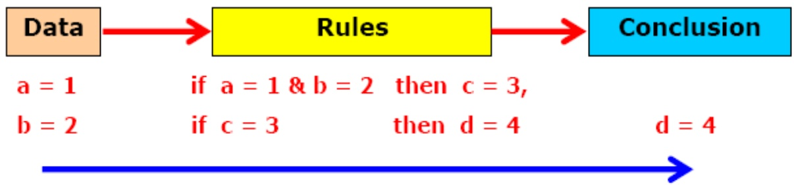

Example : Forward Channing

■ Given : A Rule base contains following Rule set

Rule 1: If A and C Then F

Rule 2: If A and E Then G

Rule 3: If B Then E

Rule 4: If G Then D

■ Problem : Prove

If A and B true Then D is true

Solution :

(i) Start with input given A, B is true and then

start at Rule 1 and go forward/down till a rule

“fires'' is found.

First iteration :

(ii) Rule 3 fires : conclusion E is true

new knowledge found

<!-- page: 108 -->

(iii) No other rule fires;

end of first iteration.

(iv) Goal not found;

new knowledge found at (ii);

go for second iteration

Second iteration :

(v) Rule 2 fires : conclusion G is true

new knowledge found

(vi) Rule 4 fires : conclusion D is true

Goal found;

Proved

## 3.3.2 Backward Chaining Algorithm

Backward chaining is a techniques for drawing inferences from Rule base. Backward-chaining inference is often called goal driven.

‡ The algorithm proceeds from desired goal, adding new assertions found.

‡ A backward-chaining, system looks for the action in the THEN clause of the rules that matches the specified goal.

Goal Driven

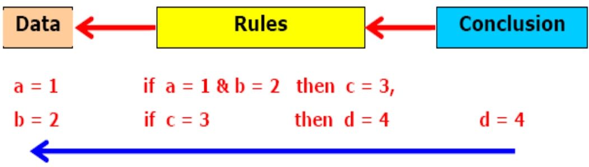

Example : Backward Channing

<!-- page: 109 -->

■ Given : Rule base contains following Rule set

Rule 1: If A and C Then F

Rule 2: If A and E Then G

Rule 3: If B Then E

Rule 4: If G Then D

■ Problem : Prove

If A and B true Then D is true

Solution :

(i) Start with goal ie D is true

go backward/up till a rule "fires'' is found.

First iteration :

(ii) Rule 4 fires :

new sub goal to prove G is true

go backward

(iii) Rule 2 "fires''; conclusion: A is true

new sub goal to prove E is true

go backward;

(iv) no other rule fires; end of first iteration.

new sub goal found at

(iii)go for second iteration

Second iteration :

(v) Rule 3 fires :

<!-- page: 110 -->

conclusion B is true (2nd input found)

both inputs A and B ascertained

Proved

# CHAPTER-2

## 3.4 Fuzzy Logic

Fuzzy Logic (FL) is a method of reasoning that resembles human reasoning. The approach of FL imitates the way of decision making in humans that involves all intermediate possibilities between digital values YES and NO.

The conventional logic block that a computer can understand takes precise input and produces a definite output as TRUE or FALSE, which is equivalent to human‟s YES or NO.

The inventor of fuzzy logic, Lotfi Zadeh, observed that unlike computers, the human decision making includes a range of possibilities between YES and NO, such as −

| CERTAINLY YES |
| --- |
| POSSIBLY YES |
| CANNOT SAY |
| POSSIBLY NO |
| CERTAINLY NO |

The fuzzy logic works on the levels of possibilities of input to achieve the definite output.

## Implementation

It can be implemented in systems with various sizes and capabilities ranging from small micro-controllers to large, networked, workstation-based control systems.

 It can be implemented in hardware, software, or a combination of both.

## Why Fuzzy Logic?

Fuzzy logic is useful for commercial and practical purposes.

 It can control machines and consumer products.

 It may not give accurate reasoning, but acceptable reasoning.

Fuzzy logic helps to deal with the uncertainty in engineering.

<!-- page: 111 -->

## Fuzzy Logic Systems Architecture

It has four main parts as shown −

Fuzzification Module − It transforms the system inputs, which are crisp numbers, into fuzzy sets. It splits the input signal into five steps such as −

LP x is Large Positive

MP x is Medium Positive

S x is Small

MN x is Medium Negative

LN x is Large Negative

Knowledge Base − It stores IF-THEN rules provided by experts.

 Inference Engine − It simulates the human reasoning process by making fuzzy inference on the inputs and IF-THEN rules.

 Defuzzification Module − It transforms the fuzzy set obtained by the inference engine into a crisp value.

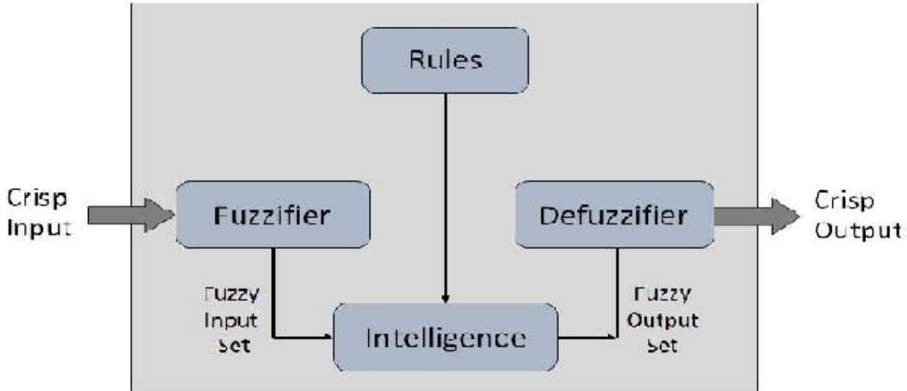

<!-- page: 112 -->

The membership functions work on fuzzy sets of variables.

## Membership Function

Membership functions allow you to quantify linguistic term and represent a fuzzy set graphically. A membership function for a fuzzy set A on the universe of discourse X is defined as $\mu \mathrm { { A } } { : } \mathrm { { X } } \to [ 0 { , } 1 ]$

Here, each element of X is mapped to a value between 0 and 1. It is called membership value or degree of membership. It quantifies the degree of membership of the element in X to the fuzzy set A.

 x axis represents the universe of discourse.

y axis represents the degrees of membership in the [0, 1] interval.

There can be multiple membership functions applicable to fuzzify a numerical value. Simple membership functions are used as use of complex functions does not add more precision in the output.

All membership functions for LP, MP, S, MN, and LN are shown as below −

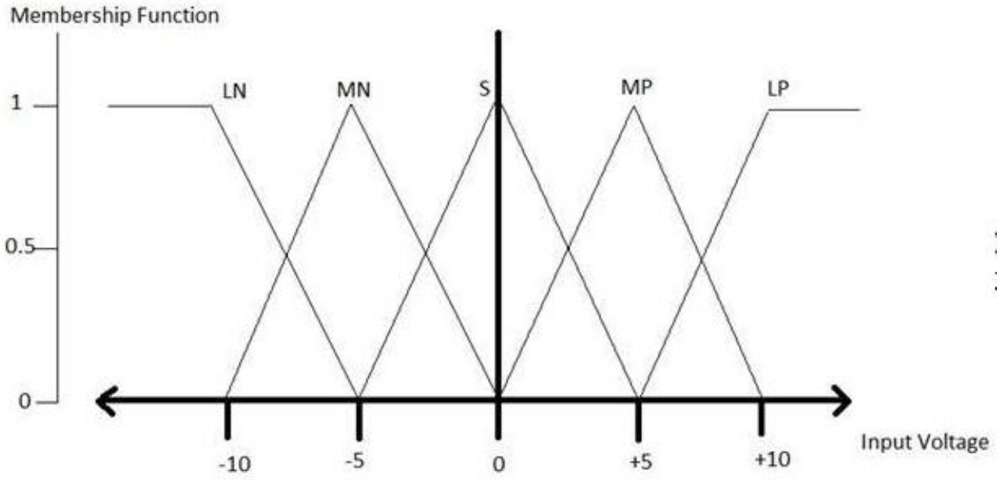

The triangular membership function shapes are most common among various other membership function shapes such as trapezoidal, singleton, and Gaussian.

<!-- page: 113 -->

Here, the input to 5-level fuzzifier varies from -10 volts to +10 volts. Hence the corresponding output also changes.

## Example of a Fuzzy Logic System

Let us consider an air conditioning system with 5-lvel fuzzy logic system. This system adjusts the temperature of air conditioner by comparing the room temperature and the target temperature value.

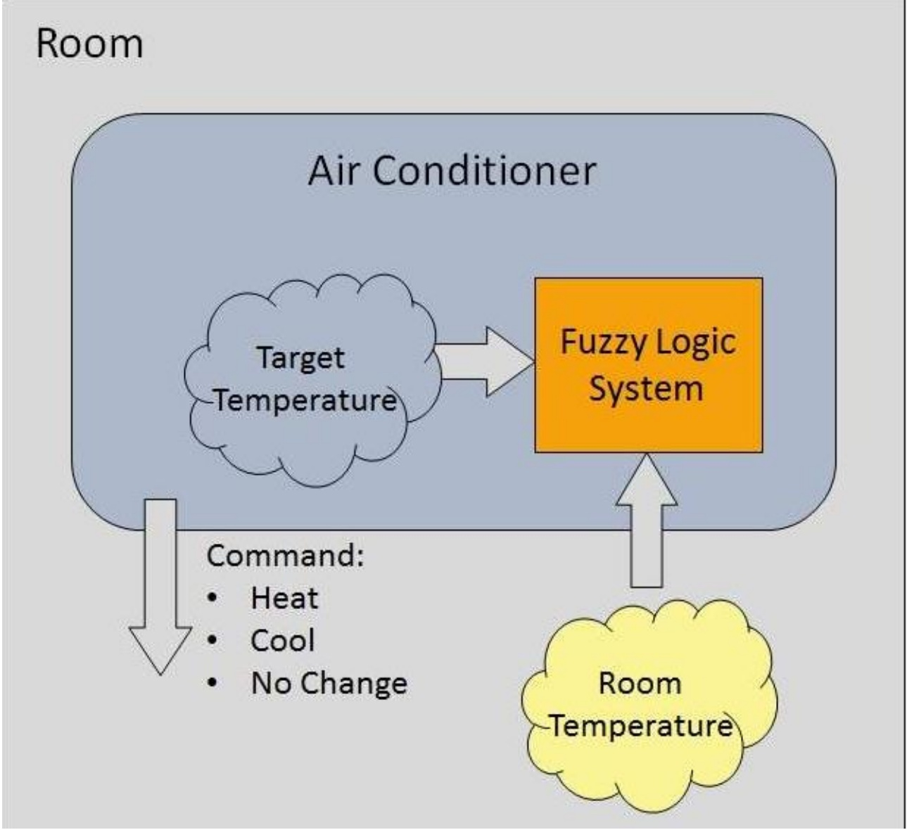

## Algorithm

<!-- page: 114 -->

 Define linguistic variables and terms.

Construct membership functions for them.

Construct knowledge base of rules.

 Convert crisp data into fuzzy data sets using membership functions. (fuzzification)

Evaluate rules in the rule base. (interface engine)

Combine results from each rule. (interface engine)

Convert output data into non-fuzzy values. (defuzzification)

## Logic Development

## Step 1: Define linguistic variables and terms

Linguistic variables are input and output variables in the form of simple words or sentences. For room temperature, cold, warm, hot, etc., are linguistic terms.

Temperature (t) = {very-cold, cold, warm, very-warm, hot}

Every member of this set is a linguistic term and it can cover some portion of overall temperature values.

Step 2: Construct membership functions for them

The membership functions of temperature variable are as shown −

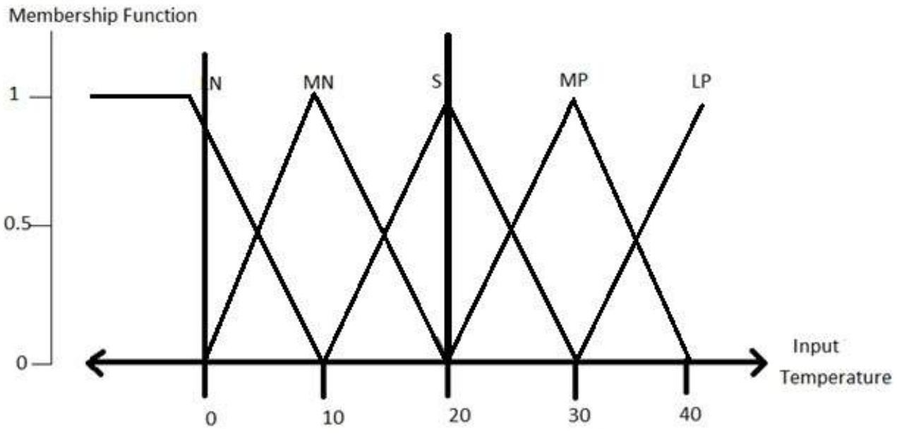

Step3: Construct knowledge base rules

<!-- page: 115 -->

Create a matrix of room temperature values versus target temperature values that an air conditioning system is expected to provide.

| RoomTemp./Target | Very_Cold | Cold | Warm | Hot | Very_Hot |
| --- | --- | --- | --- | --- | --- |
| Very_Cold | No_Change | Heat | Heat | Heat | Heat |
| Cold | Cool | No_Change | Heat | Heat | Heat |
| Warm | Cool | Cool | No_Change | Heat | Heat |
| Hot | Cool | Cool | Cool | No_Change | Heat |
| Very_Hot | Cool | Cool | Cool | Cool | No_Change |

Build a set of rules into the knowledge base in the form of IF-THEN-ELSE structures.

<table><tr><td>Sr. No.</td><td>Condition</td><td>Action</td></tr><tr><td>1</td><td colspan="2">IF temperature=(Cold OR Very_Cold) AND target=Warm THEN Heat</td></tr><tr><td>2</td><td colspan="2">IF temperature=(Hot OR Very_Hot) AND target=Warm THEN Cool</td></tr><tr><td>3</td><td>IF (temperature=Warm) AND (target=Warm) THEN</td><td>No_Change</td></tr></table>

Step 4: Obtain fuzzy value

Fuzzy set operations perform evaluation of rules. The operations used for OR and AND are Max and Min respectively. Combine all results of evaluation to form a final result. This result is a fuzzy value.

## Step 5: Perform defuzzification

Defuzzification is then performed according to membership function for output variable.

<!-- page: 116 -->

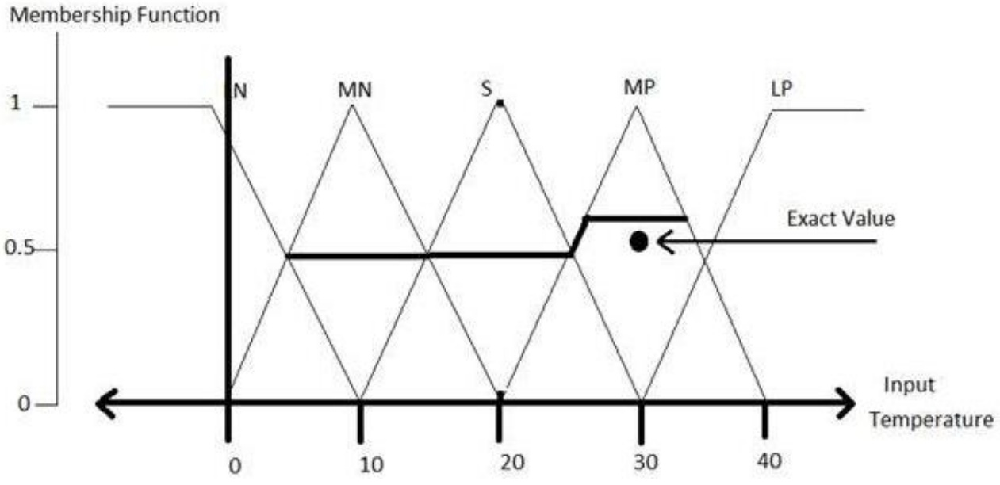

**Application Areas of Fuzzy Logic**

The key application areas of fuzzy logic are as given −

Automotive Systems

Automatic Gearboxes

Four-Wheel Steering

Vehicle environment control

Consumer Electronic Goods

Hi-Fi Systems

Photocopiers

Still and Video Cameras

Television

## Domestic Goods

Microwave Ovens

Refrigerators

Toasters

 Vacuum Cleaners

Washing Machines

<!-- page: 117 -->

## Environment Control

Air Conditioners/Dryers/Heaters

Humidifiers

## Advantages of FLSs

 Mathematical concepts within fuzzy reasoning are very simple.

 You can modify a FLS by just adding or deleting rules due to flexibility of fuzzy logic.

 Fuzzy logic Systems can take imprecise, distorted, noisy input information.

FLSs are easy to construct and understand.

Fuzzy logic is a solution to complex problems in all fields of life, including medicine, as it resembles human reasoning and decision making.

## Disadvantages of FLSs

 There is no systematic approach to fuzzy system designing.

They are understandable only when simple.

 They are suitable for the problems which do not need high accuracy.

## 3.5 Certainty Factor

A certainty factor (CF) is a numerical value that expresses a degree of subjective belief that a particular item is true. The item may be a fact or a rule. When probabilities are used attention must be paid to the underlying assumptions and probability distributions in order to show validity. Bayes‟ rule can be used to combine probability measures.

Suppose that a certainty is defined to be a real number between -1.0 and +1.0, where 1.0 represents complete certainty that an item is true and -1.0 represents complete certainty that an item is false. Here a CF of 0.0 indicates that no information is available about either the truth or the falsity of an item. Hence positive values indicate a degree of belief or evidence that an item is true, and negative values indicate the opposite belief. Moreover it is common to select a positive number that represents a minimum threshold of belief in the truth of an item. For example, 0.2 is a commonly chosen threshold value.

Form of certainty factors in ES

<!-- page: 118 -->

IF &lt;evidence&gt;

THEN &lt;hypothesis&gt; {cf }

cf represents belief in hypothesis H given that evidence E has occurred

It is based on 2 functions

i) Measure of belief MB(H, E)

ii) Measure of disbelief MD(H, E)

Indicate the degree to which belief/disbelief of hypothesis H is increased if evidence E were observed

Total strength of belief and disbelief in a hypothesis:

$$
c f = \frac {M B (H , E) - M D (H , E)}{1 - \min [ M B (H , E) , M D (H , E) ]}
$$

## 3.6 Bayesian networks

 Represent dependencies among random variables

 Give a short specification of conditional probability distribution

 Many random variables are conditionally independent

 Simplifies computations

 Graphical representation

 DAG – causal relationships among random variables

 Allows inferences based on the network structure

## Definition of Bayesian networks

A BN is a DAG in which each node is annotated with quantitative probability information, namely:

 Nodes represent random variables (discrete or continuous)

 Directed links XY: X has a direct influence on Y, X is said to be a parent of Y

 each node X has an associated conditional probability table, $\mathbf { P ( X _ { i } \mid P a r e n t s ( X _ { i } ) ) }$ that quantify the effects of the parents on the node

Example: Weather, Cavity, Toothache, Catch

<!-- page: 119 -->

Weather, Cavity → Toothache, Cavity → Catch

## Example

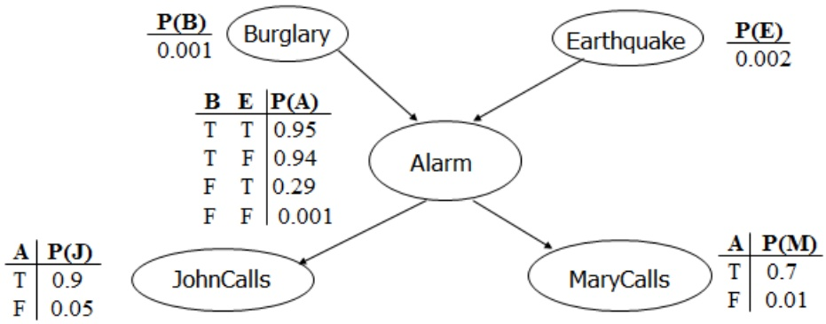

<table><tr><td rowspan="6">Conditional probability table</td><td>B</td><td>E</td><td colspan="2">P(A | B, E)</td></tr><tr><td></td><td></td><td>T</td><td>F</td></tr><tr><td>T</td><td>T</td><td>0.95</td><td>0.05</td></tr><tr><td>T</td><td>F</td><td>0.94</td><td>0.06</td></tr><tr><td>F</td><td>T</td><td>0.29</td><td>0.71</td></tr><tr><td>F</td><td>F</td><td>0.001</td><td>0.999</td></tr></table>

**Bayesian network semantics**

A) Represent a probability distribution

B) Specify conditional independence – build the network

A) each value of the probability distribution can be computed as:

$$
\mathrm{P} (\mathrm{X} _ {1} = \mathrm{x} _ {1} \land \dots \mathrm{X} _ {\mathrm{n}} = \mathrm{x} _ {\mathrm{n}}) = \mathrm{P} (\mathrm{x} _ {1}, \dots , \mathrm{x} _ {\mathrm{n}}) = \Pi_ {\mathrm{i} = 1, \mathrm{n}} \mathrm{P} (\mathrm{x} _ {\mathrm{i}} \mid \text {Parents} (\mathrm{x} _ {\mathrm{i}}))
$$

where Parents(xi) represent the specific values of Parents(Xi)

**Building the network**

$$
\mathrm{P} (\mathrm{X} _ {1} = \mathrm{x} _ {1} \land \dots \mathrm{X} _ {\mathrm{n}} = \mathrm{x} _ {\mathrm{n}}) = \mathrm{P} (\mathrm{x} _ {1}, \dots , \mathrm{x} _ {\mathrm{n}}) =
$$

$$
\mathrm{P} (\mathrm{x} _ {\mathrm{n}} \mid \mathrm{x} _ {\mathrm{n-1}}, \dots , \mathrm{x} _ {1}) * \mathrm{P} (\mathrm{x} _ {\mathrm{n-1}}, \dots , \mathrm{x} _ {1}) = \dots =
$$

$$
\mathrm{P} \left(\mathrm{x} _ {\mathrm{n}} \mid \mathrm{x} _ {\mathrm{n-1}}, \dots , \mathrm{x} _ {1}\right) * \mathrm{P} \left(\mathrm{x} _ {\mathrm{n-1}} \mid \mathrm{x} _ {\mathrm{n-2}}, \dots , \mathrm{x} _ {1}\right) * \dots \mathrm{P} \left(\mathrm{x} _ {2} \mid \mathrm{x} _ {1}\right) * \mathrm{P} \left(\mathrm{x} _ {1}\right) = \Pi_ {\mathrm{i} = 1, \mathrm{n}} \mathrm{P} \left(\mathrm{x} _ {\mathrm{i}} \mid \mathrm{x} _ {\mathrm{i-1}}, \dots , \mathrm{x} _ {1}\right)
$$

<!-- page: 120 -->

 We can see that $\mathbf { P } ( \mathbf { X } _ { \mathrm { i } } \mid \mathbf { X } _ { \mathrm { i - 1 } } , \ldots , \mathbf { X } _ { \mathrm { l } } ) = \mathbf { P } ( \mathbf { x } _ { \mathrm { i } } \mid$ **Parents(Xi)**) if $\mathbf { P a r e n t s ( X _ { i } ) } \subseteq \{ \mathrm { ~ X _ { i - 1 } , . . . , ~ }$ $\mathbf { X _ { I } } \}$

 The condition may be satisfied by labeling the nodes in an order consistent with a DAG

 Intuitively, the parents of a node $\mathbf { X _ { i } }$ must be all the nodes $\mathrm { X _ { i - 1 } , \ldots , \; X _ { 1 } }$ which have a direct influence on $\mathbf { X _ { i } }$

 Pick a set of random variables that describe the problem

 Pick an ordering of those variables

 **while** there are still variables **repeat**

(a) choose a variable X<sub>i</sub> and add a node associated to $\mathbf { X _ { i } }$

(b) assign ${ \mathrm { P a r e n t s } } ( \mathrm { X _ { i } } ) \gets { \mathrm { a } }$ minimal set of nodes that already exists in the network such that the conditional independence property is satisfied

(c) define the conditional probability table for $\mathbf { X _ { i } }$

 Because each node is linked only to previous nodes  DAG

 P(MaryCalls | JohnCals, Alarm, Burglary, Earthquake) = P(MaryCalls | Alarm)

## Compactness of node ordering

 Far more compact than a probability distribution

 Example of **locally structured system** (or **sparse**): each component interacts directly only with a limited number of other components

 Associated usually with a linear growth in complexity rather than with an exponential one

 The order of adding the nodes is important

 The correct order in which to add nodes is to <u>add the “root causes” first</u>, then the variables they influence, and so on, until we reach the leaves

## Probabilistic Interfaces

<!-- page: 121 -->

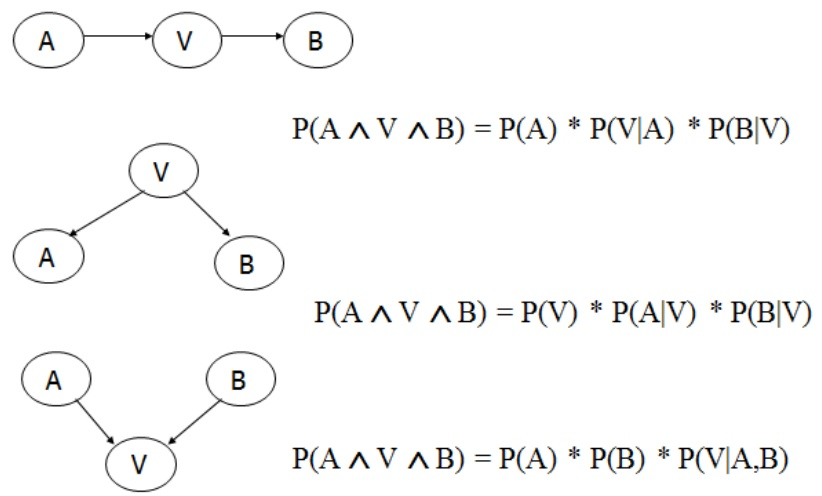

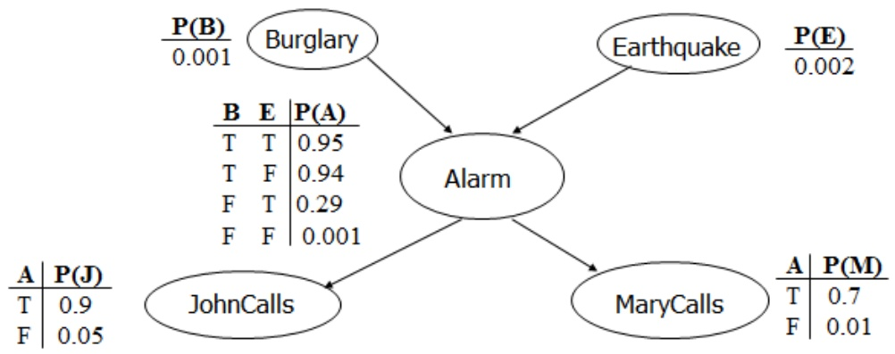

$$
\mathrm{P} (\mathrm{J} \land \mathrm{M} \land \mathrm{A} \land \sim \mathrm{B} \land \sim \mathrm{E}) =
$$

$$
\mathrm{P} (\mathrm{J} | \mathrm{A}) ^ {*} \mathrm{P} (\mathrm{M} | \mathrm{A}) ^ {*} \mathrm{P} (\mathrm{A} | \sim \mathrm{B} \wedge \sim \mathrm{E}) ^ {*} \mathrm{P} (\sim \mathrm{B}) \wedge \mathrm{P} (\sim \mathrm{E}) = 0. 9 * 0. 7 * 0. 0 0 1 * 0. 9 9 9 * 0. 9 9 8 = 0. 0 0 0 6 2
$$

$$
\mathrm{P(A|B)} = \mathrm{P(A|B,E)} * \mathrm{P(E|B)} + \mathrm{P(A|B,} \sim \mathrm{E}) * \mathrm{P(} \sim \mathrm{E|B)} = \mathrm{P(A|B,E)} * \mathrm{P(E)} + \mathrm{P(A|B,} \sim \mathrm{E}) * \mathrm{P(} \sim \mathrm{E)}
$$

$$
= 0. 9 5 * 0. 0 0 2 + 0. 9 4 * 0. 9 9 8 = 0. 9 4 0 0 2
$$

**Different types of inferences**

<!-- page: 122 -->

**Diagnosis inferences** (effect  cause)

P(Burglary | JohnCalls)

**Causal inferences** (cause  effect)

P(JohnCalls |Burglary),

P(MaryCalls | Burgalry)

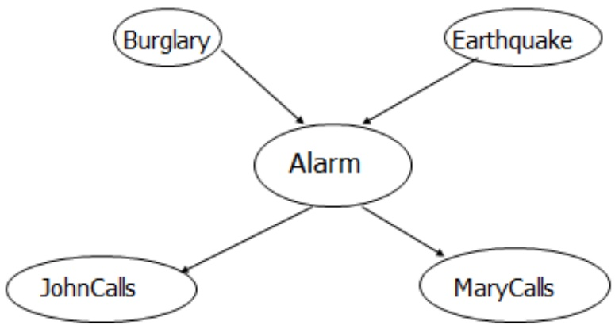

## Intercausal inferences (between cause and common effects)

P(Burglary | Alarm Earthquake)

**Mixed inferences**

P(Alarm | JohnCalls ∧ \~Earthquake) → diag + causal

P(Burglary | JohnCalls ∧ ∼ Earthquake) → diag + intercausal

## 3.7 Dempster-Shafer Theory

 Dempster-Shafer theory is an approach to combining evidence

 Dempster (1967) developed means for combining degrees of belief derived from independent items of evidence.

 His student, Glenn Shafer (1976), developed method for obtaining degrees of belief for one question from subjective probabilities for a related question

<!-- page: 123 -->

 People working in Expert Systems in the 1980s saw their approach as ideally suitable for such systems.

 Each fact has a degree of support, between 0 and 1:

 0 No support for the fact

 1 full support for the fact

 Differs from Bayesian approah in that:

 Belief in a fact and its negation need not sum to 1.

 Both values can be 0 (meaning no evidence for or against the fact)

## Set of possible conclusions: Θ

Θ = { θ1 , θ2 , …, θn }

Where:

 Θ is the set of possible conclusions to be drawn

 Each θi is mutually exclusive: at most one has to be true.

 Θ is Exhaustive: At least one θi has to be true.

## Frame of discernment

Θ = { θ1 , θ2 , …, θn }

 Bayes was concerned with evidence that supported single conclusions (e.g., evidence for each outcome θi in Θ):

 p(θi| E)

 D-S Theoryis concerned with evidences which support

 subsets of outcomes in Θ, e.g., θ1 v θ2 v θ3 or {θ1, θ2, θ3}

 The “frame of discernment” (or “Power set”) of Θ is the set of all possible subsets of Θ:

E.g., if Θ = {θ1, θ2, θ3}

<!-- page: 124 -->

 Then the frame of discernment of Θ is:

( Ø, θ1, θ2, θ3, {θ1, θ2}, {θ1, θ3}, {θ2, θ3}, { θ1, θ2, θ3} )

 Ø, the empty set, has a probability of 0, since one of the outcomes has to be true.

 Each of the other elements in the power set has a probability between 0 and 1.

 The probability of {θ1, θ2, θ3} is 1.0 since one has to be true.

## Mass function m(A):

 (where A is a member of the power set) = proportion of all evidence that supports this element of the power set.

 “The mass m(A) of a given member of the power set, A, expresses the proportion of all relevant and available evidence that supports the claim that the actual state belongs to A but to no particular subset of A.”

 “The value of m(A) pertains only to the set A and makes no additional claims about any subsets of A, each of which has, by definition, its own mass.

 Each m(A) is between 0 and 1.

 All m(A) sum to 1.

 m(Ø) is 0 - at least one must be true.

Interpretation of m({AvB})=0.3

 Means there is evidence for {AvB} that cannot be divided among more specific beliefs for A or B.

## Example

 4 people (B, J, S and K) are locked in a room when the lights go out.

 When the lights come on, K is dead, stabbed with a knife.

 Not suicide (stabbed in the back)

 No-one entered the room.

 Assume only one killer.

<!-- page: 125 -->

 Θ = { B, J, S}

 P(Θ) = (Ø, {B}, {J}, {S}, {B,J}, {B,S}, {J,S}, {B,J,S} )

 Detectives, after reviewing the crime-scene, assign mass probabilities to various elements of the power set:

| Event | Mass |
| --- | --- |
| No-one is guilty | 0 |
| B is guilty | 0.1 |
| J is guilty | 0.2 |
| S is guilty | 0.1 |
| either B or J is guilty | 0.1 |
| either B or S is guilty | 0.1 |
| either S or J is guilty | 0.3 |
| One of the 3 is guilty | 0.1 |

## Belief in A:

The belief in an element A of the Power set is the sum of the masses of elements which are subsets of A (including A itself).

E.g., given A={q1, q2, q3}

$$
\mathrm{Bel} (\mathrm{A}) = \mathrm{m} (\mathrm{q} 1) + \mathrm{m} (\mathrm{q} 2) + \mathrm{m} (\mathrm{q} 3) + \mathrm{m} (\{\mathrm{q} 1, \mathrm{q} 2 \}) + \mathrm{m} (\{\mathrm{q} 2, \mathrm{q} 3 \}) + \mathrm{m} (\{\mathrm{q} 1, \mathrm{q} 3 \}) + \mathrm{m} (\{\mathrm{q} 1, \mathrm{q} 2, \mathrm{q} 3 \})
$$

## Example

 Given the mass assignments as assigned by the detectives:

| A | {B} | {J} | {S} | {B,J} | {B,S} | {J,S} | {B,J,S} |
| --- | --- | --- | --- | --- | --- | --- | --- |
| m(A) | 0.1 | 0.2 | 0.1 | 0.1 | 0.1 | 0.3 | 0.1 |

 bel({B}) = m({B}) = 0.1

 bel({B,J}) = m({B})+m({J})+m({B,J}) =0.1+0.2+0.1=0.4

 Result:

| A | {B} | {J} | {S} | {B,J} | {B,S} | {J,S} | {B,J,S} |
| --- | --- | --- | --- | --- | --- | --- | --- |
| m(A) | 0.1 | 0.2 | 0.1 | 0.1 | 0.1 | 0.3 | 0.1 |
| bel(A) | 0.1 | 0.2 | 0.1 | 0.4 | 0.3 | 0.6 | 1.0 |

<!-- page: 126 -->

## Plausibility of A: pl(A)

The plausability of an element A, pl(A), is the sum of all the masses of the sets that intersect with the set A:

$$
\text {E.g.} \mathrm{pl} (\{\mathrm{B}, \mathrm{J} \}) = \mathrm{m} (\mathrm{B}) + \mathrm{m} (\mathrm{J}) + \mathrm{m} (\mathrm{B}, \mathrm{J}) + \mathrm{m} (\mathrm{B}, \mathrm{S}) + \mathrm{m} (\mathrm{J}, \mathrm{S}) + \mathrm{m} (\mathrm{B}, \mathrm{J}, \mathrm{S}) = 0. 9
$$

## All Results:

| A | {B} | {J} | {S} | {B,J} | {B,S} | {J,S} | {B,J,S} |
| --- | --- | --- | --- | --- | --- | --- | --- |
| m(A) | 0.1 | 0.2 | 0.1 | 0.1 | 0.1 | 0.3 | 0.1 |
| pl(A) | 0.4 | 0.7 | 0.6 | 0.9 | 0.8 | 0.9 | 1.0 |

**Disbelief (or Doubt) in A: dis(A)**

The disbelief in A is simply bel(¬A).

It is calculated by summing all masses of elements which do not intersect with A.

The plausibility of A is thus 1-dis(A):

pl(A) = 1- dis(A)

| A | {B} | {J} | {S} | {B,J} | {B,S} | {J,S} | {B,J,S} |
| --- | --- | --- | --- | --- | --- | --- | --- |
| m(A) | 0.1 | 0.2 | 0.1 | 0.1 | 0.1 | 0.3 | 0.1 |
| dis(A) | 0.6 | 0.3 | 0.4 | 0.1 | 0.2 | 0.1 | 0 |
| pl(A) | 0.4 | 0.7 | 0.6 | 0.9 | 0.8 | 0.9 | 1.0 |

## Belief Interval of A:

The certainty associated with a given subset A is defined by the belief interval:

[ bel(A) pl(A) ]

E.g. the belief interval of {B,S} is: [0.1 0.8]

| A | {B} | {J} | {S} | {B,J} | {B,S} | {J,S} | {B,J,S} |
| --- | --- | --- | --- | --- | --- | --- | --- |
| m(A) | 0.1 | 0.2 | 0.1 | 0.1 | 0.1 | 0.3 | 0.1 |
| bel(A) | 0.1 | 0.2 | 0.1 | 0.4 | 0.3 | 0.6 | 1.0 |
| pl(A) | 0.4 | 0.7 | 0.6 | 0.9 | 0.8 | 0.9 | 1.0 |

<!-- page: 127 -->

## Belief Intervals & Probability

The probability in A falls somewhere between bel(A) and pl(A).

 bel(A) represents the evidence we have for A directly So prob(A) cannot be less than this value.

 pl(A) represents the maximum share of the evidence we could possibly have, if, for all sets that intersect with A, the part that intersects is actually valid. So pl(A) is the maximum possible value of prob(A).

| A | {B} | {J} | {S} | {B,J} | {B,S} | {J,S} | {B,J,S} |
| --- | --- | --- | --- | --- | --- | --- | --- |
| m(A) | 0.1 | 0.2 | 0.1 | 0.1 | 0.1 | 0.3 | 0.1 |
| bel(A) | 0.1 | 0.2 | 0.1 | 0.4 | 0.3 | 0.6 | 1.0 |
| pl(A) | 0.4 | 0.7 | 0.6 | 0.9 | 0.8 | 0.9 | 1.0 |

## Belief Intervals:

Belief intervals allow Demspter-Shafer theory to reason about the degree of certainty or certainty of our beliefs.

 A small difference between belief and plausibility shows that we are certain about our belief.

 A large difference shows that we are uncertain about our belief.

However, even with a 0 interval, this does not mean we know which conclusion is right. Just how probable it is!

| A | {B} | {J} | {S} | {B,J} | {B,S} | {J,S} | {B,J,S} |
| --- | --- | --- | --- | --- | --- | --- | --- |
| m(A) | 0.1 | 0.2 | 0.1 | 0.1 | 0.1 | 0.3 | 0.1 |
| bel(A) | 0.1 | 0.2 | 0.1 | 0.4 | 0.3 | 0.6 | 1.0 |
| pl(A) | 0.4 | 0.7 | 0.6 | 0.9 | 0.8 | 0.9 | 1.0 |

PART – A

## 1. Define NMR

<!-- page: 128 -->

2. Define Justifications

3. What is non monotonic inference?

4. Difference between JTMS and LTMS

5. Define Bayes theorem.

6. What do you mean by Rule based system?

7. Define fuzzy logic.

8. What is credit assignment problem?

9. Define Frame problems.

14. What do you understand by Default reasoning.

15. Define frames.

16. What are singular extensions?

17. What is a Bayesian network?

18. Define dumpster Shafer theory.

## PART-B

## 1. Distinguish between

a. Production Based System.

b. Frame Based System

2. What is uncertainty? How to reason out in each situation? What are the various strategies under such case?

3. Write a note on a. Fuzzy reasoning b. Bayesian probability c. Certainty factors

4. What is certainty factor? Compute certainty factor based on hypothesis.

5. How does inference engine work in a frame based system.

6. Explain Bayesian Network.

<!-- page: 129 -->

## UNIT 4

## PLANNING AND MACHINE LEARNING

## 4.1 Planning With State Space Search

The agent first generates a goal to achieve and then constructs a plan to achieve it from the Current state.

## Problem Solving To Planning

## Representation Using Problem Solving Approach

 Forward search

 Backward search

 Heuristic search

## Representation Using Planning Approach

 STRIPS-standard research institute problem solver.

 Representation for states and goals

 Representation for plans

 Situation space and plan space

 Solutions

## Why Planning?

Intelligent agents must operate in the world. They are not simply passive reasons (Knowledge Representation, reasoning under uncertainty) or problem solvers (Search), they must also act on the world.

We want intelligent agents to act in “intelligent ways”. Taking purposeful actions, predicting the expected effect of such actions, composing actions together to achieve complex goals. E.g. if we have a robot we want robot to decide what to do; how to act to achieve our goals.

## Planning Problem

How to change the world to suit our needs

Critical issue: we need to reason about what the world will be like after doing a few actions, not just what it is like now

<!-- page: 130 -->

## GOAL: Craig has coffee

CURRENTLY: robot in mailroom, has no coffee, coffee not made, Craig in office etc.

TO DO: goto lounge, make coffee

## Partial Order Plan

 A partially ordered collection of steps

o <u>Start step</u> has the initial state description and its effect

o <u>Finish step</u> has the goal description as its precondition

o <u>Causal links</u> from outcome of one step to precondition of another step

o <u>Temporal ordering</u> between pairs of steps

 An open condition is a precondition of a step not yet causally linked

 A plan is <strong><u>complete</u></strong> if every precondition is achieved

 A precondition is <strong><u>achieved</u></strong> if it is the effect of an earlier step and no possibly intervening step undoes it

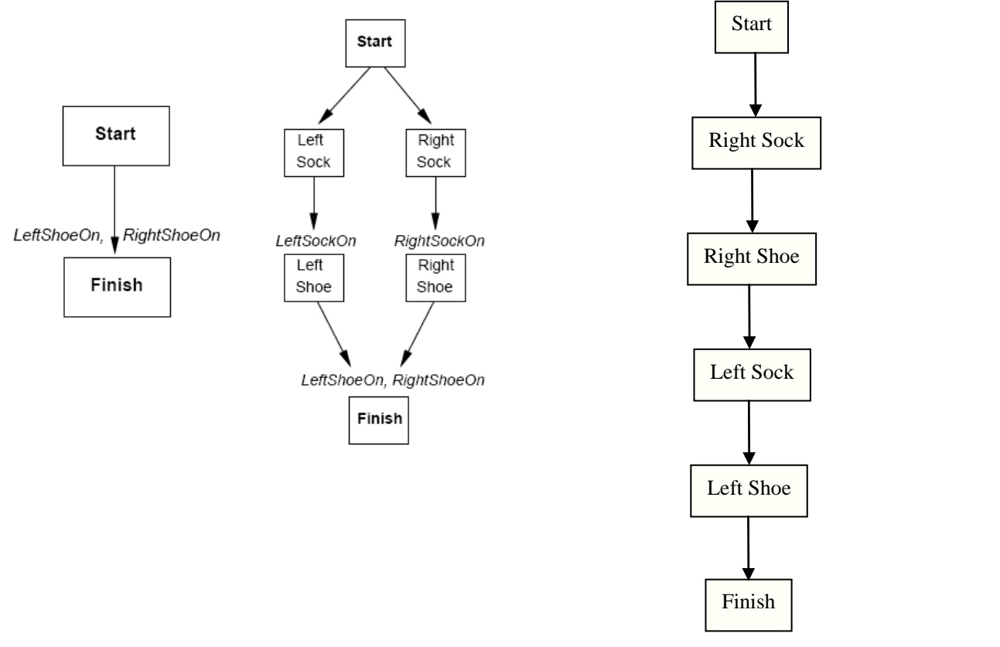

<!-- page: 131 -->

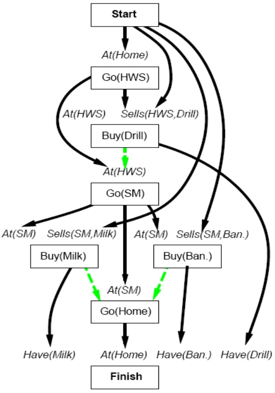

## Partial Order Plan Algorithm

<div class="docvortex-algorithm" style="white-space: pre-wrap; font-family:monospace;">
function POP(initial, goal, operators) returns plan
    plan ← MAKE-MINIMAL-PLAN(initial, goal)
loop do
    if SOLUTION?(plan) then return plan
        $S_{need}$, $c \leftarrow$ SELECT-SUBGOAL(plan)
        CHOOSE-OPERATOR(plan, operators, $S_{need}$, $c$)
        RESOLVE-THREATS(plan)
end

function SELECT-SUBGOAL(plan) returns $S_{need}$, $c$
pick a plan step $S_{need}$ from STEPS(plan)
    with a precondition $c$ that has not been achieved
return $S_{need}$, $c$
</div>

<!-- page: 132 -->

<div class="docvortex-algorithm" style="white-space: pre-wrap; font-family:monospace;">
procedure CHOOSE-OPERATOR(plan, operators, $S_{need}$, c)
    choose a step $S_{add}$ from operators or STEPS( plan) that has c as an effect
    if there is no such step then fail
    add the causal link $S_{add} \xrightarrow{c} S_{need}$ to LINKS( plan)
    add the ordering constraint $S_{add} \prec S_{need}$ to ORDERINGS( plan)
    if $S_{add}$ is a newly added step from operators then
        add $S_{add}$ to STEPS( plan)
        add Start $\prec S_{add} \prec$ Finish to ORDERINGS( plan)

procedure RESOLVE-THREATS(plan)
    for each $S_{threat}$ that threatens a link $S_i \xrightarrow{c} S_j$ in LINKS( plan) do
        choose either
            Demotion: Add $S_{threat} \prec S_i$ to ORDERINGS( plan)
            Promotion: Add $S_j \prec S_{threat}$ to ORDERINGS( plan)
        if not CONSISTENT( plan) then fail
    end
</div>

## 4.2 Stanford Research Institute Problem Solver (STRIPS)

STRIPS is a classical planning language, representing plan components as states, goals, and actions, allowing algorithms to parse the logical structure of the planning problem to provide a solution.

In STRIPS, state is represented as a [conjunction](http://en.wikipedia.org/wiki/Logical_conjunction) of positive literals. Positive literals may be a propositional literal (e.g., Big ^ Tall) or a first-order literal (e.g., At(Billy, Desk)). The positive literals must be grounded – may not contain a variable (e.g., At(x, Desk)) – and must be function-free – may not invoke a function to calculate a value (e.g., At(Father(Billy), Desk)). Any state conditions that are not mentioned are assumed false.

The goal is also represented as a conjunction of positive, ground literals. A state satisfies a goal if the state contains all of the conjuncted literals in the goal; e.g., Stacked ^ Ordered ^ Purchased satisfies Ordered ^ Stacked.

Actions (or operators) are defined by action schemas, each consisting of three parts:

 The action name and any parameters.

Preconditions which must hold before the action can be executed. Preconditions are represented as a conjunction of function-free, positive literals. Any variables in a precondition must appear in the action‟s parameter list.

Effects which describe how the state of the environment changes when the action is executed. Effects are represented as a conjunction of function-free literals. Any

<!-- page: 133 -->

variables in a precondition must appear in the action‟s parameter list. Any world state not explicitly impacted by the action schema‟s effect is assumed to remain unchanged.

The following, simple action schema describes the action of moving a box from location x to location y:

Action: MoveBox(x, y)

Precond: BoxAt(x)

Effect: BoxAt(y), ¬ BoxAt(x)

If an action is applied, but the current state of the system does not meet the necessary preconditions, then the action has no effect. But if an action is successfully applied, then any positive literals, in the effect, are added to the current state of the world; correspondingly, any negative literals, in the effect, result in the removal of the corresponding positive literals from the state of the world.

For example, in the action schema above, the effect would result in the proposition BoxAt(y) being added to the known state of the world, while BoxAt(x) would be removed from the known state of the world. (Recall that state only includes positive literals, so a negation effect results in the removal of positive literals.) Note also that positive effects can not get duplicated in state; likewise, a negative of a proposition that is not currently in state is simply ignored. For example, if Open(x) was not previously part of the state, ¬ Open(x) would have no effect.

A STRIPS problem includes the complete (but relevant) initial state of the world, the goal state(s), and action schemas. A STRIPS algorithm should then be able to accept such a problem, returning a solution. The solution is simply an action sequence that, when applied to the initial state, results in a state which satisfies the goal.

## 4.2.1 STRIPS Planning Algorithm

As previously referenced, STRIPS began as an automated planning algorithm and has doublemeaning to describe the language (described above) used to provide input to that algorithm. While the algorithm does not scale well to real-world problems, it, like the language, serves as a foundational starting point to developing and understanding more powerful automated planning algorithms. The STRIPS algorithm [3] is found below, followed by a brief commentary:

```matlab
STRIPS(A, s, g)
p = empty plan
loop...
if s satisfies g then return p
a = [an applicable action in A, relevant for g]
if a = null, then return failure
p' = STRIPS(A, s, precond(a))
if p' = failure, then return failure
s = apply p' to s
```

<!-- page: 134 -->

s = apply a to s

$$
p = p + p ^ {\prime} + a
$$

In the above STRIPS algorithm, A represents all of the possible, grounded actions (i.e., action schemas with variables replaced with values), while s is the current state, and g is the goal state.

Critically important to note is that this algorithm is a backward-search algorithm. In other words, the goal state of the planning problem is fed into the algorithm as s, while the initial state of the planning problem is provided as g. The returned solution, if any, simply needs to be reversed to provide the solution to the planning problem. Simply put, it works backwards from the goal to figure out a logical path to get there.

## 4.3 Explanation

Most expert systems have explanation facilities that allow the user to ask questions- why and how it reached some conclusion

The questions are answered by referring to the system goals, the rules being used, and existing problem solving. The rules typically reflect empirical or “compiled” knowledge. They are codes of an expert‟s rule of thumb, not the expert‟s deeper understanding.

## Example:

Dialog with an expert system designed to give advice on car problems.

System Does the car start?

User No.

System Does the engine turn over?

User yes

System Do you smell gas?

User yes

System Recommendation-wait 5 minutes and try again.

User Why?

System I used the rule: If not start, and engine\_turn\_over, and smell\_gas Then recommendation is „wait 5 minutes and try again

<!-- page: 135 -->

## User

Note: The rule gives the correct advice for a flooded car. And knows the questions to be ask to determine if the car is flooded, but it does not contain the knowledge of what a flooded car is and why waiting will help.

## Types of Explanation

There are four types of explanations commonly used in expert systems.

 Rule trace reports on the progress of a consultation;

 Explanation of how the system reached to the give conclusion;

 Explanation of why the system did not give any conclusion.

 Explanation of why the system is asking a question;

## 4.4 Learning

## Machine Learning

 Like human learning from past experiences,a computer does not have “experiences”.

 A computer system learns from data, which represent some “past experiences” of an application domain.

 Objective of machine learning : learn a target function that can be used to predict the values of a discrete class attribute, e.g., approve or not-approved, and high-risk or low risk.

 The task is commonly called: **Supervised learning, classification, or inductive learning**

## Supervised Learning

Supervised learning is a machine learning technique for learning a function from training data. The training data consist of pairs of input objects (typically vectors), and desired outputs. The output of the function can be a continuous value (called regression), or can predict a class label of the input object (called classification). The task of the supervised learner is to predict the value of the function for any valid input object after having seen a number of training examples (i.e. pairs of input and target output). To achieve this, the learner has to generalize from the presented data to unseen situations in a "reasonable" way.

<!-- page: 136 -->

Another term for supervised learning is classification. Classifier performance depend greatly on the characteristics of the data to be classified. There is no single classifier that works best on all given problems. Determining a suitable classifier for a given problem is however still more an art than a science. The most widely used classifiers are the Neural Network (Multi-layer Perceptron), Support Vector Machines, k-Nearest Neighbors, Gaussian Mixture Model, Gaussian, Naive Bayes, Decision Tree and RBF classifiers.

## Supervised learning process: two steps

 **Learning** (training): Learn a model using the training data

 **Testing**: Test the model using unseen test data to assess the model accuracy

$$
\text {Accuracy} = \frac {\text {Number of correct classifications}}{\text {Total number of test cases}},
$$

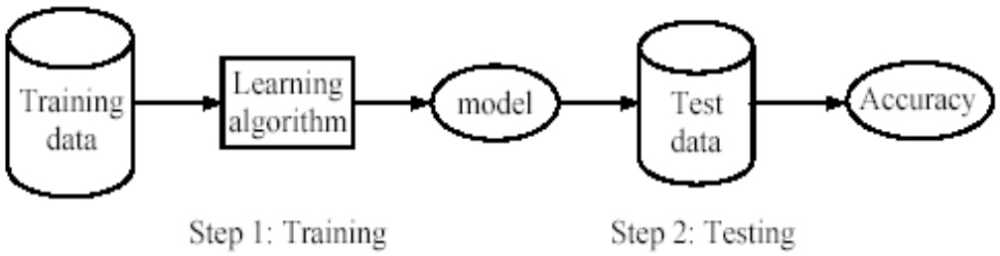

## Supervised vs. unsupervised Learning

##  Supervised learning:

**classification** is seen as supervised learning from examples.

 **Supervision**: The data (observations, measurements, etc.) are labeled with pre-defined classes. It is like that a “teacher” gives the classes (supervision).

 **Test data** are classified into these classes too.

##  Unsupervised learning (clustering)

 Class labels of the data are unknown

 Given a set of data, the task is to establish the existence of classes or clusters in the data

## Decision Tree

<!-- page: 137 -->

 A decision tree takes as input an object or situation described by a set of attributes and returns a “decision” – the predicted output value for the input.

 A decision tree reaches its decision by performing a sequence of tests.

Example : “HOW TO” manuals (for car repair)

A decision tree reaches its decision by performing a sequence of tests. Each internal node in the tree corresponds to a test of the value of one of the properties, and the branches from the node are labeled with the possible values of the test. Each leaf node in the tree specifies the value to be returned if that leaf is reached. The decision tree representation seems to be very natural for humans; indeed, many "How To" manuals (e.g., for car repair) are written entirely as a single decision tree stretching over hundreds of pages.

A somewhat simpler example is provided by the problem of whether to wait for a table at a restaurant. The aim here is to learn a definition for the goal predicate Will Wait. In setting this up as a learning problem, we first have to state what attributes are available to describe examples in the domain. we will see how to automate this task; for now, let's suppose we decide on the following list of attributes:

1. Alternate: whether there is a suitable alternative restaurant nearby.

2. Bar: whether the restaurant has a comfortable bar area to wait in.

3. Fri/Sat: true on Fridays and Saturdays.

4. Hungry: whether we are hungry.

5. Patrons: how many people are in the restaurant (values are None, Some, and Full).

6. Price: the restaurant's price range (\$, \$\$, \$\$\$).

7. Raining: whether it is raining outside.

8. Reservation: whether we made a reservation.

9. Type: the kind of restaurant (French, Italian, Thai, or burger).

10. Wait Estimate: the wait estimated by the host (0-10 minutes, 10-30, 30-60, >60).

<!-- page: 138 -->

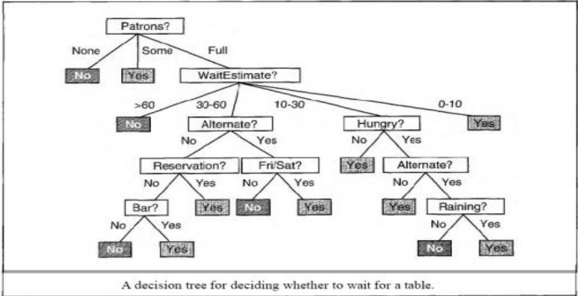

## Decision tree induction from examples

An example for a Boolean decision tree consists of a vector of' input attributes, X, and a single Boolean output value y. A set of examples (X1,Y1) . . . , (X2, y2) is shown in Figure. The positive examples are the ones in which the goal Will Wait is true (XI, **X3,** . . .); the negative examples are the ones in which it is false (X2, X5, . . .). The complete set of examples is called the **training set.**

<table><tr><td rowspan="2">Example</td><td colspan="10">Attributes</td><td rowspan="2">GoalWillWait</td></tr><tr><td>Alt</td><td>Bar</td><td>Fri</td><td>Hun</td><td>Pat</td><td>Price</td><td>Rain</td><td>Res</td><td>Type</td><td>Est</td></tr><tr><td> $X_1$ </td><td>Yes</td><td>No</td><td>No</td><td>Yes</td><td>Some</td><td> $\$$$$ </td><td>No</td><td>Yes</td><td>French</td><td>0-10</td><td>Yes</td></tr><tr><td> $X_2$ </td><td>Yes</td><td>No</td><td>No</td><td>Yes</td><td>Full</td><td>$</td><td>No</td><td>No</td><td>Thai</td><td>3040</td><td>No</td></tr><tr><td> $X_3$ </td><td>No</td><td>Yes</td><td>No</td><td>No</td><td>Some</td><td>$</td><td>No</td><td>No</td><td>Burger</td><td>0-10</td><td>Yes</td></tr><tr><td> $X_4$ </td><td>Yes</td><td>No</td><td>Yes</td><td>Yes</td><td>Full</td><td>$</td><td>Yes</td><td>No</td><td>Thai</td><td>10-30</td><td>Yes</td></tr><tr><td> $X_5$ </td><td>Yes</td><td>No</td><td>Yes</td><td>No</td><td>Full</td><td> $\$$$$ </td><td>No</td><td>Yes</td><td>French</td><td>&gt;60</td><td>No</td></tr><tr><td> $X_6$ </td><td>No</td><td>Yes</td><td>No</td><td>Yes</td><td>Some</td><td> $\$$ </td><td>Yes</td><td>Yes</td><td>Italian</td><td>0-10</td><td>Yes</td></tr><tr><td> $X_7$ </td><td>No</td><td>Yes</td><td>No</td><td>No</td><td>None</td><td>$</td><td>Yes</td><td>No</td><td>Burger</td><td>0-10</td><td>No</td></tr><tr><td> $X_8$ </td><td>No</td><td>No</td><td>No</td><td>Yes</td><td>Some</td><td> $\$$ </td><td>Yes</td><td>Yes</td><td>Thai</td><td>0-10</td><td>Yes</td></tr><tr><td> $X_9$ </td><td>No</td><td>Yes</td><td>Yes</td><td>No</td><td>Full</td><td>$</td><td>Yes</td><td>No</td><td>Burger</td><td>&gt;60</td><td>No</td></tr><tr><td> $X_{10}$ </td><td>Yes</td><td>Yes</td><td>Yes</td><td>Yes</td><td>Full</td><td> $\$$$$ </td><td>No</td><td>Yes</td><td>Italian</td><td>10-30</td><td>No</td></tr><tr><td> $X_{11}$ </td><td>No</td><td>No</td><td>No</td><td>No</td><td>None</td><td>$</td><td>No</td><td>No</td><td>Thai</td><td>0-10</td><td>No</td></tr><tr><td> $X_{12}$ </td><td>Yes</td><td>Yes</td><td>Yes</td><td>Yes</td><td>Full</td><td>$</td><td>No</td><td>No</td><td>Burger</td><td>30-60</td><td>Yes</td></tr><tr><td colspan="12">Examples for the restaurant domain.</td></tr></table>

## Decision Tree Algorithm

The basic idea behind the Decision-Tree-Learning-Algorithm is to test the most important attribute first. By "most important," we mean the one that makes the most difference to the classification of an example. That way, we hope to get to the correct classification with a small number of tests, meaning that all paths in the tree will be short and the tree as a whole will be small.

<!-- page: 139 -->

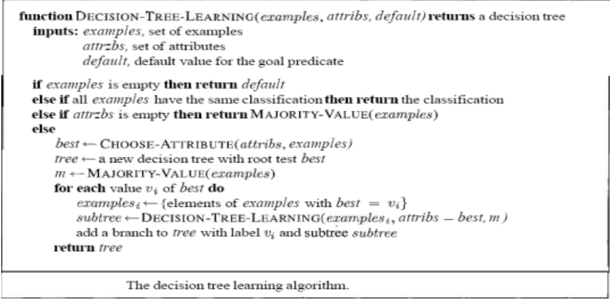

## Reinforcement Learning

 Learning what to do to maximize reward

 Learner is not given training

 Only feedback is in terms of reward

 Try things out and see what the reward is

 Different from Supervised Learning

 Teacher gives training examples

## Examples

 Robotics: Quadruped Gait Control, Ball Acquisition (Robocup)

 Control: Helicopters

 Operations Research: Pricing, Routing, Scheduling

 Game Playing: Backgammon, Solitaire, Chess, Checkers

 Human Computer Interaction: Spoken Dialogue Systems

 Economics/Finance: Trading

## Markov decision process VS Reinforcement Learning

 Markov decision process

<!-- page: 140 -->

 Set of state S, set of actions A

 Transition probabilities to next states $\mathrm { T } ( \mathrm { s } , \mathrm { a } , \mathrm { a } ^ { \prime } )$

 Reward functions R(s)

 RL is based on MDPs, but

 Transition model is not known

 Reward model is not known

 MDP computes an optimal policy

 RL learns an optimal policy

## Types of Reinforcement Learning

 Passive Vs Active

 Passive: Agent executes a fixed policy and evaluates it

 Active: Agents updates policy as it learns

 Model based Vs Model free

 Model-based: Learn transition and reward model, use it to get optimal policy

 Model free: Derive optimal policy without learning the model

## Passive Learning

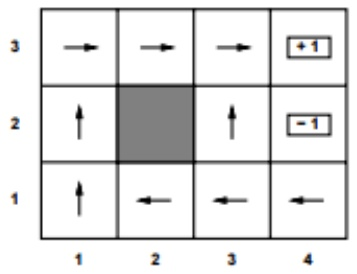

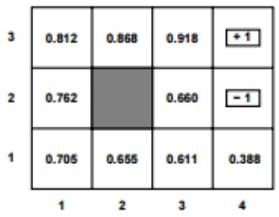

 Evaluate how good a policy π is

 Learn the utility $\bf { U } ^ { \pi } ( s )$ of each state

 Same as policy evaluation for known transition & reward models

<!-- page: 141 -->

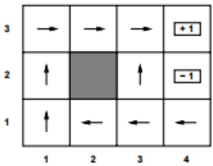

Agent executes a sequence of trials:

$$
\begin{array}{l} (1, 1) \to (1, 2) \to (1, 3) \to (1, 2) \to (1, 3) \to (2, 3) \to (3, 3) \to (4, 3) _ {+ 1} \\ (1, 1) \to (1, 2) \to (1, 3) \to (2, 3) \to (3, 3) \to (3, 2) \to (3, 3) \to (4, 3) _ {+ 1} \\ (1, 1) \to (2, 1) \to (3, 1) \to (3, 2) \to (4, 2) _ {- 1} \end{array}
$$

Goal is to learn the expected utility $\mathbf { U } _ { \pi } ( \mathbf { s } )$

$$
U ^ {\pi} (s) = E \left[ \sum_ {t = 0} ^ {\infty} \gamma^ {t} R (s _ {t}) | \pi , s _ {0} = s \right]
$$

## Direct Utility Estimation

 Reduction to inductive learning

 Compute the empirical value of each state

 Each trial gives a sample value

 Estimate the utility based on the sample values

 Example: First trial gives

 State (1,1): A sample of reward 0.72

 State (1,2): Two samples of reward 0.76 and 0.84

 State (1,3): Two samples of reward 0.80 and 0.88

 Estimate can be a running average of sample values

 Example: $\mathrm{U}(1,1)=0.72,\mathrm{U}(1,2)=0.80,\mathrm{U}(1,3)=0.84,$

 Ignores a very important source of information

<!-- page: 142 -->

 The utility of states satisfy the Bellman equations

$$
U ^ {\pi} (s) = R (s) + \gamma \sum_ {s ^ {\prime}} T (s, \pi (s), s ^ {\prime}) U ^ {\pi} (s ^ {\prime})
$$

 Search is in a hypothesis space for U much larger than needed

 Convergence is very slow

 Make use of Bellman equations to get $\mathbf { U } ^ { \pi } ( \mathrm { s } )$

 Need to estimate $\mathrm { T } ( \mathrm { s } , \pi ( \mathrm { s } ) , \mathrm { s } ^ { \prime } )$ and R(s) from trials

 Plug-in learnt transition and reward in the Bellman equations

 Solving for $\mathbf { U } ^ { \pi } ;$ System of n linear equations

 Estimates of T and R keep changing

 Make use of modified policy iteration idea

 Run few rounds of value iteration

 Initialize value iteration from previous utilities

 Converges fast since T and R changes are small

 ADP is a standard baseline to test „smarter‟ ideas

 ADP is inefficient if state space is large

 Has to solve a linear system in the size of the state space

 Backgammon: $1 0 ^ { 5 0 }$ linear equations in $1 0 ^ { 5 0 }$ unknowns

## Temporal Difference Learning

 Best of both worlds

 Only update states that are directly affected

 Approximately satisfy the Bellman equations

 Example:

$$
(1, 1) \rightarrow (1, 2) \rightarrow (1, 3) \rightarrow (1, 2) \rightarrow (1, 3) \rightarrow (2, 3) \rightarrow (3, 3) \rightarrow (4, 3) _ {+ 1}
$$

$$
(1, 1) \rightarrow (1, 2) \rightarrow (1, 3) \rightarrow (2, 3) \rightarrow (3, 3) \rightarrow (3, 2) \rightarrow (3, 3) \rightarrow (4, 3) _ {+ 1}
$$

<!-- page: 143 -->

(1, 1) → (2, 1) → (3, 1) → (3, 2) → (4, 2)−1

 After the first trial, $\mathrm{U}(1,3)=0.84,\mathrm{U}(2,3)=0.92$

Consider the transition $( 1 , 3 ) \rightarrow ( 2 , 3 )$ in the second trial

 If deterministic, then $\mathrm{U}(1,3)=-0.04+\mathrm{U}(2,3)$

How to account for probabilistic transitions (without a model)

 TD chooses a middle ground

$$
U ^ {\pi} (s) \leftarrow (1 - \alpha) U ^ {\pi} (s) + \alpha (R (s) + \gamma U ^ {\pi} (s ^ {\prime}))
$$

 Temporal difference (TD) equation, α is the learning rate

 The TD equation

$$
U ^ {\pi} (s) \leftarrow U ^ {\pi} (s) + \alpha (R (s) + \gamma U ^ {\pi} (s ^ {\prime}) - U ^ {\pi} (s))
$$

 TD applies a correction to approach the Bellman equations

 The update for s‟ will occur $\mathrm { T } ( \mathrm { s } , \pi ( \mathrm { s } ) , \mathrm { s } ^ { \prime } )$ fraction of the time

 The correction happens proportional to the probabilities

 Over trials, the correction is same as the expectation

 Learning rate α determines convergence to true utility

 Decrease $\mathbf { u } _ { \mathrm { s } }$ proportional to the number of state visits

 Convergence is guaranteed if

$$
\sum_ {m = 1} ^ {\infty} \alpha_ {s} (m) = \infty \quad \sum_ {m = 1} ^ {\infty} \alpha_ {s} ^ {2} (m) <   \infty
$$

 Decay $\alpha_{s}(\mathrm{m}) = 1/\mathrm{m}$ satisfies the condition

 TD is model free

## TD Vs ADP

 TD is mode free as opposed to ADP which is model based

 TD updates observed successor rather than all successors

<!-- page: 144 -->

 The difference disappears with large number of trials

 TD is slower in convergence, but much simpler computation per observation

## Active Learning

 Agent updates policy as it learns

 Goal is to learn the optimal policy

 Learning using the passive ADP agent

 Estimate the model $\mathrm{R}(\mathrm{s}), \mathrm{T}(\mathrm{s}, \mathrm{a}, \mathrm{s}^{\prime})$ from observations

 The optimal utility and action satisfies

$$
U (s) = R (s) + \gamma \max _ {a} \sum_ {s ^ {\prime}} T (s, a, s ^ {\prime}) U (s ^ {\prime})
$$

 Solve using value iteration or policy iteration

 Agent has “optimal” action

 Simply execute the “optimal” action

## Exploitation vs Exploration

 The passive approach gives a greedy agent

 Exactly executes the recipe for solving MDPs

 Rarely converges to the optimal utility and policy

 The learned model is different from the true environment

##  Trade-off

 Exploitation: Maximize rewards using current estimates

 Agent stops learning and starts executing policy

 Exploration: Maximize long term rewards

 Agent keeps learning by trying out new things

 Pure Exploitation

<!-- page: 145 -->

 Mostly gets stuck in bad policies

 Pure Exploration

 Gets better models by learning

 Small rewards due to exploration

 The multi-armed bandit setting

 A slot machine has one lever, a one-armed bandit

 n-armed bandit has n levers

 Which arm to pull?

 Exploit: The one with the best pay-off so far

 Explore: The one that has not been tried

## Exploration

 Greedy in the limit of infinite exploration (GLIE)

 Reasonable schemes for trade off

 Revisiting the greedy ADP approach

 Agent must try each action infinitely often

 Rules out chance of missing a good action

 Eventually must become greedy to get rewards

 Simple GLIE

 Choose random action 1/t fraction of the time

 Use greedy policy otherwise

 Converges to the optimal policy

 Convergence is very slow

<!-- page: 146 -->

## Exploration Function

 A smarter GLIE

 Give higher weights to actions not tried very often

 Give lower weights to low utility actions

 Alter Bellman equations using optimistic utilities $\bf { U } ^ { + } ( s )$

$$
U ^ {+} (s) = R (s) + \gamma \max _ {a} f \left(\sum_ {s ^ {\prime}} T (s, a, s ^ {\prime}) U ^ {+} (s ^ {\prime}), N (a, s)\right)
$$

 The exploration function f (u, n)

 Should increase with expected utility u

 Should decrease with number of tries n

 A simple exploration function

$$
f (u, n) = \left\{ \begin{array}{l l} R ^ {+}, & \text {if} n <   N \\ u, & \text {otherwise} \end{array} \right.
$$

 Actions towards unexplored regions are encouraged

 Fast convergence to almost optimal policy in practice

## Q-Learning

 Exploration function gives a active ADP agent

 A corresponding TD agent can be constructed

 Surprisingly, the TD update can remain the same

 Converges to the optimal policy as active ADP

 Slower than ADP in practice

 Q-learning learns an action-value function Q(a; s)

 Utility values $\mathrm{U}(\mathrm{s}) = \max_{\mathrm{a}} \mathrm{Q}(\mathrm{a}; \mathrm{s})$

 A model-free TD method

 No model for learning or action selection

<!-- page: 147 -->

 Constraint equations for Q-values at equilibrium

$$
Q (a, s) = R (s) + \gamma \sum_ {s ^ {\prime}} T (s, a, s ^ {\prime}) \max _ {a ^ {\prime}} Q (a ^ {\prime}, s ^ {\prime})
$$

 Can be updated using a model for $\mathrm { T } ( \mathrm { s } ; \mathrm { a } ; \mathrm { s } ^ { \prime } )$

 The TD Q-learning does not require a model

$$
Q (a, s) \leftarrow Q (a, s) + \alpha (R (s) + \gamma \max _ {a ^ {\prime}} Q (a ^ {\prime}, s ^ {\prime}) - Q (a, s))
$$

 Calculated whenever a in s leads to $\mathbf { s } ^ { \flat }$

 The next action $\mathbf{a}_{ next } =  argmax _{a'} \mathbf{f} \left( \mathbf{Q}(a'; s'); \mathbf{N}(s'; a') \right)$

 Q-learning is slower than ADP

 Trade-o: Model-free vs knowledge-based methods

## PART- A

1. What are the components of planning system?

2. What is planning?

3. What is nonlinear plan?

4. List out the 3 types of machine learning?

5. What is Reinforcement Learning?

6. What do you mean by goal stack planning?

7. Define machine learning.

8. What are the types of Reinforcement Learning.

PART B

1. Briefly explain the advanced plan generation systems.

<!-- page: 148 -->

2. Explain Machine Learning.

3. Explain STRIPS.

4. Explain Reinforcement Learning.

5. Briefly explain Partial Order Plan.

6. Explain in detail about various Machine learning methods.

<!-- page: 149 -->

## UNIT 5

## CHAPTER 1

## 5.1 EXPERT SYSTEMS

An expert system is a computer program that represents and reasons with knowledge of some specialist subject with a view to solving problems or giving advice.

To solve expert-level problems, expert systems will need efficient access to a substantial domain knowledge base, and a reasoning mechanism to apply the knowledge to the problems they are given. Usually they will also need to be able to explain, to the users who rely on them, how they have reached their decisions.

They will generally build upon the ideas of knowledge representation, production rules, search, and so on, that we have already covered.

Often we use an expert system shell which is an existing knowledge independent framework into which domain knowledge can be inserted to produce a working expert system. We can thus avoid having to program each new system from scratch.

## 5.2 Typical Tasks for Expert Systems

There are no fundamental limits on what problem domains an expert system can be built to deal with. Some typical existing expert system tasks include:

1. The interpretation of data

Such as sonar data or geophysical measurements

2. Diagnosis of malfunctions

Such as equipment faults or human diseases

3. Structural analysis or configuration of complex objects

Such as chemical compounds or computer systems

4. Planning sequences of actions

Such as might be performed by robots

5. Predicting the future

<!-- page: 150 -->

Such as weather, share prices, exchange rates

However, these days, “conventional” computer systems can also do some of these things

## 5.3 Characteristics of Expert Systems

Expert systems can be distinguished from conventional computer systems in that:

1. They simulate human reasoning about the problem domain, rather than simulating the domain itself.

2. They perform reasoning over representations of human knowledge, in addition to doing numerical calculations or data retrieval. They have corresponding distinct modules referred to as the inference engine and the knowledge base.

3. Problems tend to be solved using heuristics (rules of thumb) or approximate methods or probabilistic methods which, unlike algorithmic solutions, are not guaranteed to result in a correct or optimal solution.

4. They usually have to provide explanations and justifications of their solutions or recommendations in order to convince the user that their reasoning is correct.

Note that the term Intelligent Knowledge Based System (IKBS) is sometimes used as a synonym for Expert System.

## 5.3 The Architecture of Expert Systems

The process of building expert systems is often called knowledge engineering. The knowledge engineer is involved with all components of an expert system:

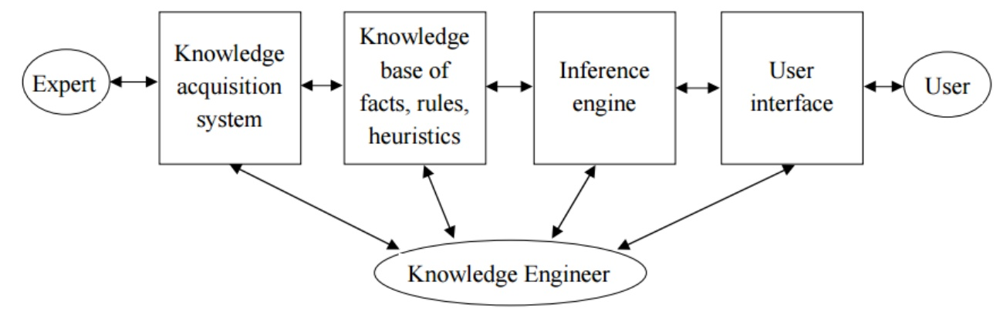

<!-- page: 151 -->

Building expert systems is generally an iterative process. The components and their interaction will be refined over the course of numerous meetings of the knowledge engineer with the experts and users. We shall look in turn at the various components.

## 5.3.1 Knowledge Acquisition

The knowledge acquisition component allows the expert to enter their knowledge or expertise into the expert system, and to refine it later as and when required.

Historically, the knowledge engineer played a major role in this process, but automated systems that allow the expert to interact directly with the system are becoming increasingly common.

The knowledge acquisition process is usually comprised of three principal stages:

1. Knowledge elicitation is the interaction between the expert and the knowledge engineer/program to elicit the expert knowledge in some systematic way.

2. The knowledge thus obtained is usually stored in some form of human friendly intermediate representation.

3. The intermediate representation of the knowledge is then compiled into an executable form (e.g. production rules) that the inference engine can process.

In practice, much iteration through these three stages is usually required!

## 5.3.2 Knowledge Elicitation

The knowledge elicitation process itself usually consists of several stages:

1. Find as much as possible about the problem and domain from books, manuals, etc. In particular, become familiar with any specialist terminology and jargon.

2. Try to characterize the types of reasoning and problem solving tasks that the system will be required to perform.

3. Find an expert (or set of experts) that is willing to collaborate on the project. Sometimes experts are frightened of being replaced by a computer system!

<!-- page: 152 -->

4. Interview the expert (usually many times during the course of building the system). Find out how they solve the problems your system will be expected to solve. Have them check and refine your intermediate knowledge representation.

This is a time intensive process, and automated knowledge elicitation and machine learning techniques are increasingly common modern alternatives.

## 5.3.3 Stages of Knowledge Acquisition

The iterative nature of the knowledge acquisition process can be represented in the following diagram.

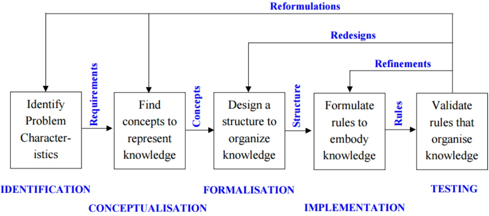

## 5.3.4 Levels of Knowledge Analysis

**Knowledge identification**: Use in depth interviews in which the knowledge engineer encourages the expert to talk about how they do what they do. The knowledge engineer should understand the domain well enough to know which objects and facts need talking about.

**Knowledge conceptualization**: Find the primitive concepts and conceptual relations of the problem domain.

<!-- page: 153 -->

**Epistemological analysis**: Uncover the structural properties of the conceptual knowledge, such as taxonomic relations (classifications).

**Logical analysis**: Decide how to perform reasoning in the problem domain. This kind of knowledge can be particularly hard to acquire.

**Implementation analysis**: Work out systematic procedures for implementing and testing the system.

## Capturing Tacit/Implicit Knowledge

One problem that knowledge engineers often encounter is that the human experts use tacit/implicit knowledge (e.g. procedural knowledge) that is difficult to capture.

There are several useful techniques for acquiring this knowledge:

1. **Protocol analysis**: Tape-record the expert thinking aloud while performing their role and later analyze this. Break down their protocol/account into the smallest atomic units of thought, and let these become operators.

2. **Participant observation**: The knowledge engineer acquires tacit knowledge through practical domain experience with the expert.

3. **Machine induction**: This is useful when the experts are able to supply examples of the results of their decision making, even if they are unable to articulate the underlying knowledge or reasoning process.

Which is/are best to use will generally depend on the problem domain and the expert.

## 5.3.5 Representing the Knowledge

We have already looked at various types of knowledge representation. In general, the knowledge acquired from our expert will be formulated in two ways:

1. **Intermediate representation** – a structured knowledge representation that the knowledge engineer and expert can both work with efficiently.

2. **Production system** – a formulation that the expert system’s inference engine can process efficiently.

<!-- page: 154 -->

It is important to distinguish between:

1. **Domain knowledge** – the expert’s knowledge which might be expressed in the form of rules, general/default values, and so on.

2. **Case knowledge** – specific facts/knowledge about particular cases, including any derived knowledge about the particular cases.

The system will have the domain knowledge built in, and will have to integrate this with the different case knowledge that will become available each time the system is used.

## CHAPTER -2

## 5.4 Meta Knowledge

Knowledge about knowledge

 Meta knowledge can be simply defined as knowledge about knowledge.

 Meta knowledge is knowledge about the use and control of domain knowledge in an expert system.

## 5.5 Roles in Expert System Development

Three fundamental roles in building expert systems are:

1. Expert - Successful ES systems depend on the experience and application of knowledge that the people can bring to it during its development. Large systems generally require multiple experts.

2. Knowledge engineer - The knowledge engineer has a dual task. This person should be able to elicit knowledge from the expert, gradually gaining an understanding of an area of expertise. Intelligence, tact, empathy, and proficiency in specific techniques of knowledge acquisition are all required of a knowledge engineer. Knowledge-acquisition techniques include conducting interviews with varying degrees of structure, protocol analysis, observation of experts at work, and analysis of cases.

On the other hand, the knowledge engineer must also select a tool appropriate for the project and use it to represent the knowledge with the application of the knowledge acquisition facility.

<!-- page: 155 -->

3. User - A system developed by an end user with a simple shell, is built rather quickly an inexpensively. Larger systems are built in an organized development effort. A prototype-oriented iterative development strategy is commonly used. ESs lends themselves particularly well to prototyping.

## 5.6 Typical Expert System

1. A problem-domain-specific knowledge base that stores the encoded knowledge to support one problem domain such as diagnosing why a car won't start. In a rule-based expert system, the knowledge base includes the if-then rules and additional specifications that control the course of the interview.

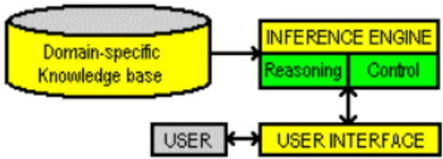

2. An inference engine a set of rules for making deductions from the data and that implements the reasoning mechanism and controls the interview process. The inference engine might be generalized so that the same software is able to process many different knowledge bases.

3. The user interface requests information from the user and outputs intermediate and final results. In some expert systems, input is acquired from additional sources such as data bases and sensors.

An expert system shell consists of a generalized inference engine and user interface designed to work with a knowledge base provided in a specified format. A shell often includes tools that help with the design, development and testing of the knowledge base. With the shell approach, expert systems representing many different problem domains may be developed and delivered with the same software environment. .

There are special high level languages used to program expert systems egg PROLOG

The user interacts with the system through a user interface which may use menus, natural language or any other style of interaction). Then an inference engine is used to reason with both the expert knowledge (extracted from our friendly expert) and data specific to the particular problem being solved. The expert knowledge will typically be in the form of a set of IF-THEN rules. The case specific data includes both data provided by the user and partial conclusions

<!-- page: 156 -->

(along with certainty measures) based on this data. In a simple forward chaining rule-based system the case specific data will be the elements in working memory.

How an expert system works Car engine diagnosis

1. IF engine\_getting\_petrol

AND engine\_turns\_over

THEN problem\_with\_spark\_plugs

2. IF NOT engine\_turns\_over

AND NOT lights\_come\_on

THEN problem\_with\_battery

3. IF NOT engine\_turns\_over AND lights\_come\_on THEN problem\_with\_starter

4. IF petrol\_in\_fuel\_tank THEN engine\_getting\_petrol

There are three possible problems with the car:

 problem\_with\_spark\_plugs,

 problem\_with\_battery,

 problem\_with\_starter.

The system will ask the user:

 Is it true that there's petrol in the fuel tank?

Let's say that the answer is yes. This answer would be recorded, so that the user doesn't get asked the same question again. Anyway, the system now has proved that the engine is getting petrol, so now wants to find out if the engine turns over. As the system doesn't yet know whether this is the case, and as there are no rules which conclude this, the user will be asked:

<!-- page: 157 -->

##  Is it true that the engine turns over?

Lets say this time the answer is no. There are no other rules which can be used to prove \`problem\_with\_spark\_plugs'' so the system will conclude that this is not the solution to the problem, and will consider the next hypothesis: problem\_with\_battery. It is true that the engine does not turn over (the user has just said that), so all it has to prove is that the lights don't come one. It will ask the user

##  Is it true that the lights come on?

Suppose the answer is no. It has now proved that the problem is with the battery. Some systems might stop there, but usually there might be more than one solution, (e.g., more than one fault with the car), or it will be uncertain which of various solutions is the right one. So usually all hypotheses are considered. It will try to prove \`\`problem\_with\_starter'', but given the existing data (the lights come on) the proof will fail, so the system will conclude that the problem is with the battery. A complete interaction with our very simple system might be:

 System: Is it true that there's petrol in the fuel tank?

User: Yes.

System: Is it true that the engine turns over?

User: No.

System Is it true that the lights come on?

User: No.

System: I conclude that there is a problem with battery.

Note that in general, solving problems using backward chaining involves searching through all the possible ways of proving the hypothesis, systematically checking each of them.

## Questions

1. \`\`Briefly describe the basic architecture of a typical expert system, mentioning the function of each of the main components.''

2. \`\`A travel agent asks you to design an expert system to help people choose where to go on holiday. Design a set of decisions to help you give advice on which holiday to take.

<!-- page: 158 -->

## Expert System Use

Expert systems are used in a variety of areas, and are still the most popular developmental approach in the artificial intelligence world.

The table below depicts the percentage of expert systems being developed in particular areas:

| Area | Percentage |
| --- | --- |
| Production/Operations Mgmt | 48% |
| Finance | 17% |
| Information Systems | 12% |
| Marketing/Transactions | 10% |
| Accounting/Auditing | 5% |
| International Business | 3% |
| Human Resources | 2% |
| Others | 2% |

• Medical screening for cancer and brain tumours

• Matching people to jobs

• Training on oil rigs

• Diagnosing faults in car engines

• Legal advisory systems

• Mineral prospecting

## 5.6.1 MYCIN

Tasks and Domain

► Disease DIAGNOSIS and Therapy SELECTION

► Advice for non-expert physicians with time considerations and incomplete evidence on:

Bacterial infections of the blood

Expanded to meningitis and other ailments

**System Goals**

► Utility

<!-- page: 159 -->

 Be useful, to attract assistance of experts

Demonstrate competence

Fulfill domain need (i.e. penicillin)

## ► Flexibility

Domain is complex, variety of knowledge types

 Medical knowledge rapidly evolves, must be easy to maintain K.B.

## ► Interactive Dialogue

 Provide coherent explanations (symbolic reasoning paradigm)

Allow for real-time K.B. updates by experts

## ► Fast and Easy

Meet time constraints of the medical field

## Architecture

<!-- page: 160 -->

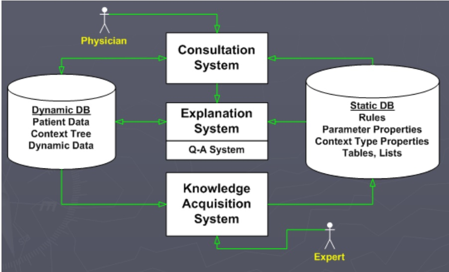

## Consultation System

► Performs Diagnosis and Therapy Selection

► Control Structure reads Static DB (rules) and read/writes to Dynamic DB (patient, context)

► Linked to Explanations

► Terminal interface to Physician

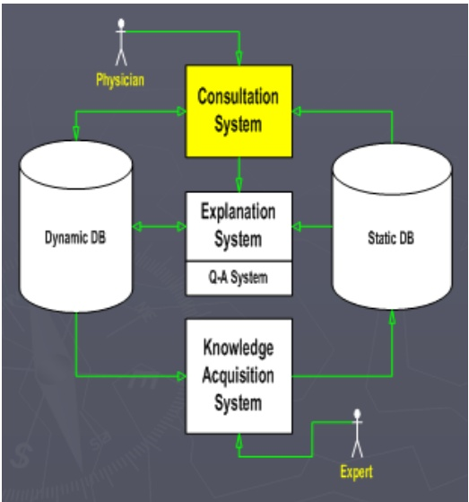

► User-Friendly Features:

<!-- page: 161 -->

 Users can request rephrasing of questions

 Synonym dictionary allows latitude of user responses

User typos are automatically fixed

► Questions are asked when more data is needed

 If data cannot be provided, system ignores relevant rules

► Goal-directed Backward-chaining Depth-first Tree Search

► High-level Algorithm:

Determine if Patient has significant infection

Determine likely identity of significant organisms

Decide which drugs are potentially useful

 Select best drug or coverage of drugs

## Static Database

► Rules

► Meta-Rules

► Templates

► Rule Properties

► Context Properties

► Fed from Knowledge Acquisition System

<!-- page: 162 -->

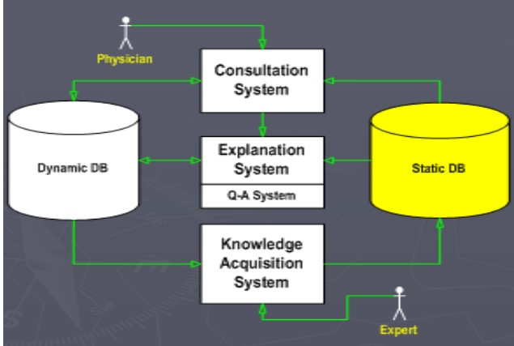

## Production Rules

► Represent Domain-specific Knowledge

► Over 450 rules in MYCIN

► Premise-Action (If-Then) Form:

&lt;predicate function&gt;&lt;object&gt;&lt;attrib&gt;&lt;value&gt;

► Each rule is completely modular, all relevant context is contained in the rule with explicitly stated premises

## MYCIN P.R. Assumptions

► Not every domain can be represented, requires formalization (EMYCIN)

► Only small number of simultaneous factors (more than 6 was thought to be unwieldy)

► IF-THEN formalism is suitable for Expert Knowledge Acquisition and Explanation subsystems

**Judgmental Knowledge**

► Inexact Reasoning with Certainty Factors (CF)

► CF are not Probability!

► Truth of a Hypothesis is measured by a sum of the CFs

<!-- page: 163 -->

Premises and Rules added together

Positive sum is confirming evidence

 Negative sum is disconfirming evidence

## Sub-goals

► At any given time MYCIN is establishing the value of some parameter by sub-goaling

► Unity Paths: a method to bypass sub-goals by following a path whose certainty is known (CF==1) to make a definite conclusion

► Won’t search a sub-goal if it can be obtained from a user first (i.e. lab data)

## Preview Mechanism

► Interpreter reads rules before invoking them

► Avoids unnecessary deductive work if the sub-goal has already been tested/determined

► Ensures self-referencing sub-goals do not enter recursive infinite loops

## Meta-Rules

► Alternative to exhaustive invocation of all rules

► Strategy rules to suggest an approach for a given sub-goal

Ordering rules to try first, effectively pruning the search tree

► Creates a search-space with embedded information on which branch is best to take

► High-order Meta-Rules (i.e. Meta-Rules for Meta-Rules)

Powerful, but used limitedly in practice

► Impact to the Explanation System:

(+) Encode Knowledge formerly in the Control Structure

 (-) Sometimes create “murky” explanations

## Templates

<!-- page: 164 -->

► The Production Rules are all based on Template structures

► This aids Knowledge-base expansion, because the system can “understand” its own representations

► Templates are updated by the system when a new rule is entered

## Dynamic Database

► Patient Data

► Laboratory Data

► Context Tree

► Built by Consultation System

► Used by Explanation System

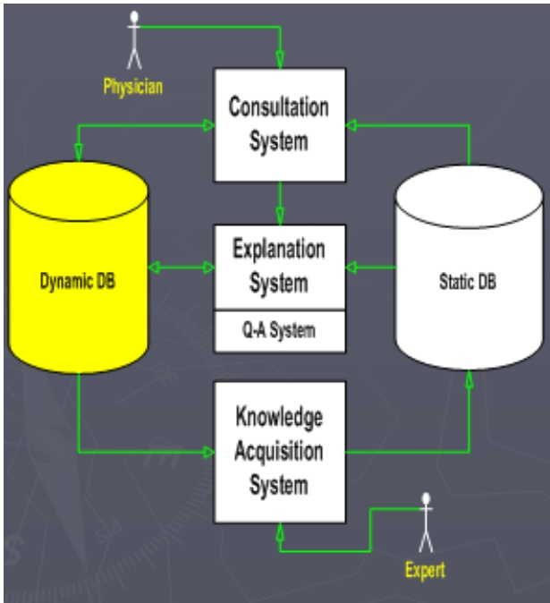

## Context Tree

<!-- page: 165 -->

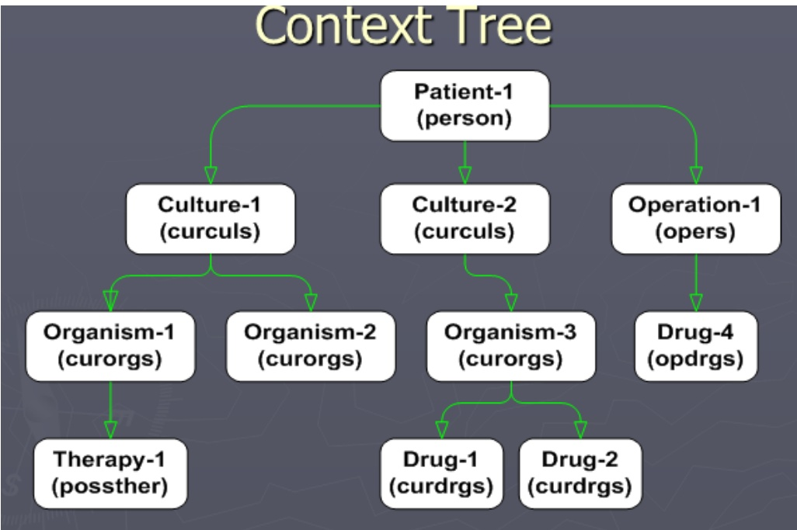

## Therapy Selection

► Plan-Generate-and-Test Process

► Therapy List Creation

 Set of specific rules recommend treatments based on the <u>probability</u> (not CF) of organism sensitivity

Probabilities based on laboratory data

 One therapy rule for every organism

## ► Assigning Item Numbers

Only hypothesis with organisms deemed “significantly likely” (CF) are considered

Then the most likely (CF) identity of the organisms themselves are determined and assigned an Item Number

Each item is assigned a probability of likelihood and probability of sensitivity to drug

► Final Selection based on:

<!-- page: 166 -->

Sensitivity

 Contraindication Screening

 Using the minimal number of drugs and maximizing the coverage of organisms

► Experts can ask for alternate treatments

 Therapy selection is repeated with previously recommended drugs removed from the list

## Explanation System

► Provides reasoning why a conclusion has been made, or why a question is being asked

► Q-A Module

► Reasoning Status Checker

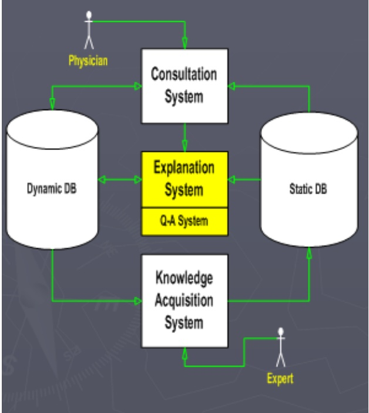

► Uses a trace of the Production Rules for a basis, and the Context Tree, to provide context

Ignores Definitional Rules (CF == 1)

<!-- page: 167 -->

## ► Two Modules

Q-A Module

Reasoning Status Checker

## Q-A Module

► Symbolic Production Rules are readable

► Each &lt;predicate function&gt; has an associated translation pattern:

GRID (THE (2) ASSOCIATED WITH (1) IS KNOWN)

VAL (((2 1)))

PORTAL (THE PORTAL OF ENTRY OF \*)

# PATH-FLORA (LIST OF LIKELY PATHOGENS)

## i.e. (GRID (VAL CNTXT PORTAL) PATH-FLORA) becomes:

“The list of likely pathogens associated with the portal of entry of the organism is known.”

**Reasoning Status Checker**

► Explanation is a tree traversal of the traced rules:

WHY – moves up the tree

HOW – moves down (possibly to untried areas)

► Question is rephrased, and the rule being applied is explained with the translation patterns **Knowledge Acquisition System**

► Extends Static DB via Dialogue with Experts

► Dialogue Driven by System

► Requires minimal training for Experts

<!-- page: 168 -->

► Allows for Incremental Competence, NOT an All-or-Nothing model

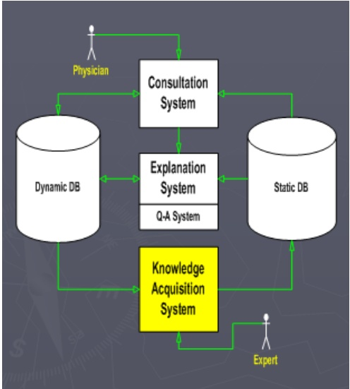

► IF-THEN Symbolic logic was found to be easy for experts to learn, and required little training by the MYCIN team

► When faced with a rule, the expert must either except it or be forced to update it using the education process

## Education Process

1. Bug is uncovered, usually by Explanation process

2. Add/Modify rules using subset of English by experts

3. Integrating new knowledge into KB

Found to be difficult in practice, requires detection of contradictions, and complex concepts become difficult to express

## Results

► Never implemented for routine clinical use

► Shown to be competent by panels of experts, even in cases where experts themselves disagreed on conclusions

► Key Contributions:

<!-- page: 169 -->

 Reuse of Production Rules (explanation, knowledge acquisition models)

Meta-Level Knowledge Use

## 5.6.2 DART

The Dynamic Analysis and Replanning Tool, commonly abbreviated to DART, is an artificial intelligence program used by the U.S. military to optimize and schedule the transportation of supplies or personnel and solve other logistical problems.

DART uses intelligent agents to aid decision support systems located at the U.S. Transportation and European Commands. It integrates a set of intelligent data processing agents and database management systems to give planners the ability to rapidly evaluate plans for logistical feasibility. By automating evaluation of these processes DART decreases the cost and time required to implement decisions.

DART achieved logistical solutions that surprised many military planners. Introduced in 1991, DART had by 1995 offset the monetary equivalent of all funds DARPA had channeled into AI research for the previous 30 years combined

## Development and introduction

DARPA funded the MITRE Corporation and Carnegie Mellon University to analyze the feasibility of several intelligent planning systems. In November 1989, a demonstration named The Proud Eagle Exercise indicated many inadequacies and bottlenecks within military support systems. In July, DART was previewed to the military by BBN Systems and Technologies and the ISX Corporation (now part of Lockheed Martin Advanced Technology Laboratories) in conjunction with the United States Air Force Rome Laboratory. It was proposed in November 1990, with the military immediately demanding that a prototype be developed for testing. Eight weeks later, a hasty but working prototype was introduced in 1991 to the USTRANSCOM at the beginning of Operation Desert Storm during the Gulf War.

## Impact

Directly following its launch, DART solved several logistical nightmares, saving the military millions of dollars. Military planners were aware of the tremendous obstacles facing moving military assets from bases in Europe to prepared bases in Saudi Arabia, in preparation for Desert Storm. DART quickly proved its value by improving upon existing plans of the U.S. military. What surprised many observers were DART's ability to adapt plans rapidly in a crisis environment.

<!-- page: 170 -->

DART's success led to the development of other military planning agents such as:

 RDA - Resource Description and Access system

 DRPI - Knowledge-Based Planning and Scheduling Initiative, a successor of DART

## 5.7 Expert Systems shells

Initially each expert system is build from scratch (LISP). Systems are constructed as a set of declarative representations (mostly rules) combined with an interpreter for those representations. It helps to separate the interpreter from domain-specific knowledge and to create a system that could be used construct new expert system by adding new knowledge corresponding to the new problem domain. The resulting interpreters are called shells. Example of shells is EMYCIN (for Empty MYCIN derived from MYCIN).

Shells − A shell is nothing but an expert system without knowledge base. A shell provides the developers with knowledge acquisition, inference engine, user interface, and explanation facility. For example, few shells are given below

 Java Expert System Shell (JESS) that provides fully developed Java API for creating an expert system.

 Vidwan, a shell developed at the National Centre for Software Technology, Mumbai in 1993. It enables knowledge encoding in the form of IF-THEN rules.

Shells provide greater flexibility in representing knowledge and in reasoning than MYCIN. They support rules, frames, truth maintenance systems and a variety of other reasoning mechanisms.

Early expert system shells provide mechanisms for knowledge representation, reasoning and explanation. Later these tools provide knowledge acquisition. Still expert system shells need to integrate with other programs easily. Expert systems cannot operate in a vacuum. The shells must provide an easy-to-use interface between an expert system written with the shell and programming environment.

## PART-A

1. What are the phases in Expert system development?

2. Explain identification phase.

<!-- page: 171 -->

3. Explain conceptualization phase.

4. Explain formalization phase.

5. Explain implementation and testing phases.

6. Describe demonstration prototype.

7. Describe research prototype.

8. Describe field prototype.

9. What is meant by production prototype?

10. What is meant by commercial system?

11. When is Expert System Development Possible?

12. When is Expert System Development justified?

13. When is Expert System Development appropriate?

14. What are the questions to ask when selecting an Expert system tool?

15. What are the limitations of expert systems?

16. What are the problems the company faces when trying to apply expert system?

17. What are the common pitfalls in planning an expert system?

18. What are the pitfalls in dealing with the domain expert?

19. What are the pitfalls during the development process?

20. Where is expert system work being done?

21. What is meant by a commercial expert system?

22. Name any two expert system used in research?

23. Name any two expert system used in business?

24. Explain XCON?

25. Name any three universities and mention the expert system tools developed there?

<!-- page: 172 -->

26. Name any three research organization and mention the expert system tools developed there?

27. What are expert systems?

28. What are the most important aspects of expert system?

29. What are the characteristics of expert system?

30. Sketch the general features of expert system?

31. Who are all involved in the expert system building?

32. Explain the role of domain expert?

33. Explain the role of knowledge engineer?

34. What is the use of expert system building tool?

35. Give the structure of an expert system?

36. Explain the knowledge acquisition process?

37. Define MYCIN.

38. Define DART.

## PART-B

1. Explain the tasks involved in building expert system?

2. Explain the various stages of expert system development?

3. Explain the difficulties involved in developing an expert system?

4. What are common pitfalls in planning an expert system?

5. Explain the pitfalls in dealing with the domain expert?

6. Explain the pitfalls during the development process?

7. Explain expert system work at universities and research organizations?

8. Explain expert system work at knowledge engineering companies?

<!-- page: 173 -->

9. What is meant by high performance expert system? How is it used in research and in business? 10. In detail Explain XCON?

11. Draw the schematic of expert system and explain.

12. Explain the following in detail.. a. MYCIN b. EMYCIN
