<!-- page: 1 -->

TRÍ TUỆ NHÂN TẠO (A.I)
DÀNH CHO MỘI NGƯỜI

Bài giảng biên soạn theo giáo trình “A.I for everyone” của Nhà khoa học A.I Ông Andrew Ng (Google Brain - Baidu AI - Deeplearning.ai - Đại học Stanford)
Understanding the Science for Tomorrow: Myth and Reality của GS Jeffrey C. Grossman
Học viện Công nghệ Massachusetts (MIT)

<!-- page: 2 -->

Nhà khoa học A.I Ông Andrew Ng
Google Brain - Baidu AI - Deeplearning.ai - Đại học Stanford

<!-- page: 3 -->

## Thạc sỹ - Nguyễn Ngọc Tú

NCS Tiến sỹ tại Strasbourg University - CFVG HCM.

Giám đốc điều hành của Tổ chức Trí Tuệ Nhân Tạo Việt (VietAI). (www.vietai.org)

Chuyên gia Phân tích dữ liệu Doanh Nghiệp (Business Data Analytics), Giám đốc Công ty Dataservices

<!-- page: 4 -->

## VietAI

WHY WE EXIST

Artificial Intelligence (AI) is all around us under many forms from smart mobile devices, virtual assistants, to robots and self-driving cars. Despite rapid progress in AI over the last few years in many countries, Vietnam still lags behind, merely touching at the surface of the technology.

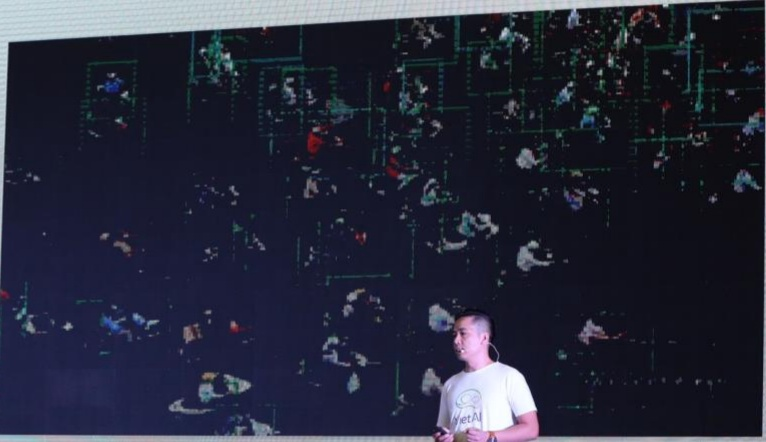

<!-- page: 5 -->

## Introduction

AI value creation by 2030

## \$13 trillion

- Retail
- \$0.8T
- Travel
- \$480B
- Transport & Logistics
- \$475B
- Automotive & Assembly
- \$405B
- Basic Materials
- \$300B
- Advanced Electronics/Semiconductors
- \$291B
- Healthcare Systems and Services
- \$267B
- High Tech
- \$267B
- Telecom
- \$174B
- Oil & Gas
- \$173B
- Agriculture
- \$164B

[Source: McKinsey Global Institute.]

<!-- page: 6 -->

## GIẢI MÃ A.I

ANI
ARTIFICIAL NARROW INTELLIGENCE

TRÍ TUỆ NHÂN TẠO HỆP
VD: XE TỰ HÀNH, LOA THÔNG MINH, TRÍ
TUỆ NHÂN TẠO ỨNG DỤNG TRONG NHÀ
MÁY, NÔNG TRẠI...

AGI
ARTIFICIAL GENERAL INTELLIGENCE

TRÍ TUỆ NHÂN TẠO PHỐ QUÁT
LÀM ĐƯỢC TẮT CẢ NHỮNG GÌ NHƯ MỘT
CON NGƯỜI THẬT

<!-- page: 7 -->

## NỘI DUNG CHƯƠNG TRÌNH

## 1. A.I - TRÍ TUÊ NHÂN TẠO LÀ GÌ?

HỌC MÁY – MACHINE LEARNING

DỮ LIỆU - DATA

MỘT CÔNG TY AI LÀ NHƯ ThẾ NÀO?

NHỮNG ĐIỀU HỌC MÁY CÓ THỂ VÀ KHÔNG THỂ LÀM.

GIẢI THÍCH VỀ HỌC SÂU (DEEP LEARNING)

2. XÂY DỰNG MỘT DỰ ÁN A.I

3. XÂY DỰNG A.Í CHO CÔNG TY/ TỔ CHỨC CỦA BẠN

4. A.I VÀ TÁC ĐỘNG XÃ HỘI CỦA NÓ

<!-- page: 8 -->

## CHÚNG TA MONG MUỐN ĐẠT ĐƯỢC GÌ SAU BUỔI CHIA SỀ?

1. BIẾT ĐƯỢC A.I LÀM ĐƯỢC GÌ.

2. BIẾT ĐƯỢC CÁCH XÂY DỰNG CHIẾN LƯỢC A.I CHO CÔNG TY MÌNH.

3. BIẾT CÁCH PHÂN BỔ NGUỒN LỰC XD A.I

<!-- page: 9 -->

## LƯỢC SỬ️ AI History of AI

<!-- page: 10 -->

Alan Turing - 1927

## Engima

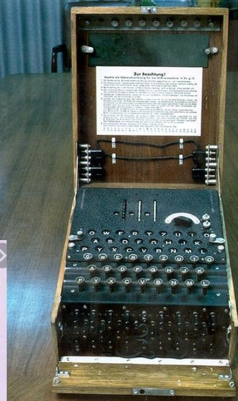

## Bombe

<!-- page: 11 -->

## A.I – TRÍ TƯỆ NHÂN TẠO LÀ GÌ ? ➤ Học Máy – Machine Learning

<!-- page: 12 -->

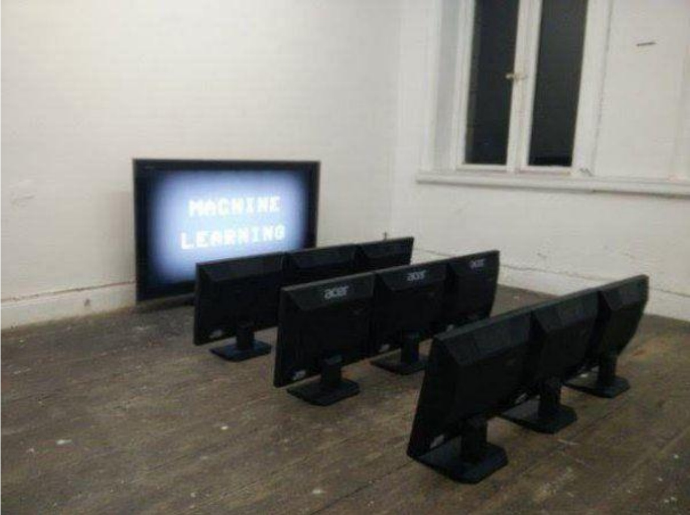

<!-- page: 13 -->

93197245103243759034986680965164954
30242948320135357468514169690142131
28232382498291391119966979422633316
63690360301139315049687\03799181722
33807056988414946453343420432614063
11958043775054209812493520051939618
950051117477265/8941156523304385467
0216/709563266471523235635020279246
94321002087409793693431/83703929632
55166276756658\687/05383/9574293978
7/759239430458004046669348131311301
167964/141312348155079484565254071/
01616755506887728376555002835558045
64687713073869/673648802/0608898024
797313279362492/145038519/657599/545

Mommy...?

(Nguồn: Simple Neural Network implementation in Ruby)

<!-- page: 14 -->

<!-- page: 15 -->

## ARTIFICIAL INTELLIGENCE

The ability of a computer program or a machine to think like humans do.

## MACHINE LEARNING

Subfield of AI giving machines the skills to learn from examples without being explicitly programmed.

Examples: Fraud detection, marketing personalization, email classification

## DEEP LEARNING

Specialized machine learning technique enabling machines to train themselves to perform tasks. Examples: Image classification, vehicle detection, sentiment analysis

<!-- page: 16 -->

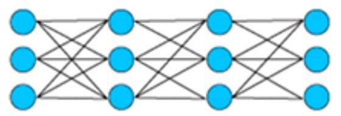

## Machine Learning

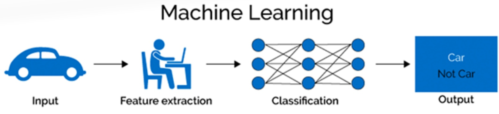

Input

Feature extraction

Classification

Output

Input

Feature extraction + Classification

Output

<!-- page: 17 -->

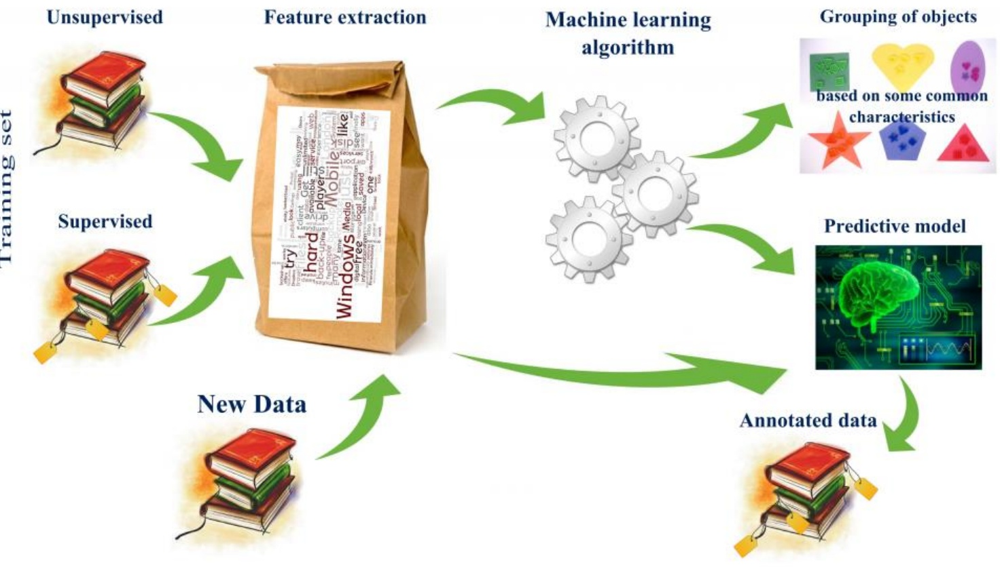

based on some common characteristics

## Machine learning workflow

Unsupervised

Training set

Supervised

Feature extraction

New Data

Machine learning algorithm

Grouping of objects

Predictive model

Annotated data

<!-- page: 18 -->

## SUPERVISED LEARNING HỌC CÓ GIÁM SÁT

A→B

Input ----> Output
(Đầu vào) (Đầu ra)

<!-- page: 19 -->

| Đầu vào (Input) | Đầu ra (Output) | Ứng dụng (Applications) |
| --- | --- | --- |
| Email | Thư rác? | Bộ lọc thư rác. |
| Âm thanh | Văn bản | Nhận dạng giống nói |
| Tiếng Anh | Tiếng Việt | Máy dịch (Machine translation) |
| Q/C, thông tin người dùng | Nhấp chuột? (0/1) | Quảng cáo online |

<!-- page: 20 -->

| Đầu vào (Input) | Đầu ra (Output) | Ứng dụng (Applications) |
| --- | --- | --- |
| Hình ảnh, Thông tin rada | Vị trí của các xe ô tô | Xe tự lái (tự hành) |
| Hình ảnh của chiếc điện thoại | Bị hự hồng ? (0/1) | Kiểm tra trực quan |

<!-- page: 21 -->

"CATS"

## How Supervised Machine Learning Works

## STEP I

## STEP 2

Provide the machine learning algorithm categorized or "labeled" input and output data from to learn

## Feed the machine new, unlabeled information to see if it tags new data appropriately. If not, continue refining the algorithm

Label "CATS"

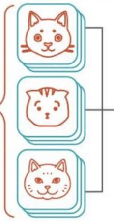

MACHINE

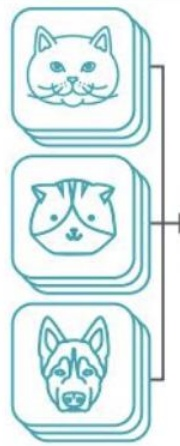

MACHINE

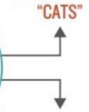

"NOT CATS"

## TYPES OF PROBLEMS TO WHICH IT'S SUITED

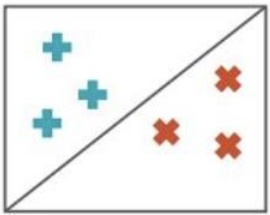

## CLASSIFICATION

Sorting items into categories

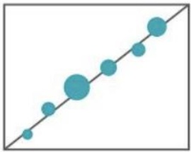

## REGRESSION

Identifying real values (dollars, weight, etc.)

<!-- page: 22 -->

## Bài toán:

Có dữ liệu bệnh nhân như bằng dưới đây. Hãy xây dựng model để tiên đoán khả năng bị bệnh tim của Bệnh nhân số 09 -10

| STT | Cân nặng | Chiều cao | Huyết áp | Vận động | Bệnh tim |
| --- | --- | --- | --- | --- | --- |
| 1 | Nhẹ | Trung bình | Trung bình | Nhiều | Không |
| 2 | Nặng | Thấp | Cao | Ít | Có |
| 3 | Nhẹ | Thấp | Cao | Ít | Có |
| 4 | Nặng | Cao | Cao | Trung bình | Không |
| 5 | Nhẹ | Cao | Cao | Nhiều | Không |
| 6 | Trung bình | Thấp | Trung bình | Nhiều | Không |
| 7 | Trung bình | Trung bình | Trung Bình | Ít | Không |
| 8 | Nặng | Thấp | Thấp | Nhiều | Có |
| 9 | Nhẹ | Cao | Trung bình | Ít | ??? |
| 10 | Nhẹ | Cao | Trung bình | Nhiều | ??? |

<!-- page: 23 -->

## Bài toán:

Có dữ liệu bệnh nhân như bằng dưới đây. Hãy xây dựng model để tiên đoán khả năng bị bệnh tim của Bệnh nhân số 09 -10

| STT | Cân nặng | Chiều cao | Huyết áp | Vận động | Bệnh tim |
| --- | --- | --- | --- | --- | --- |
| 1 | Nhẹ | Trung bình | Trung bình | Nhiều | Không |
| 2 | Nặng | Thấp | Cao | Ít | Có |
| 3 | Nhẹ | Thấp | Cao | Ít | Có |
| 4 | Nặng | Cao | Cao | Trung bình | Không |
| 5 | Nhẹ | Cao | Cao | Nhiều | Không |
| 6 | Trung bình | Thấp | Trung bình | Nhiều | Không |
| 7 | Trung bình | Trung bình | Trung Bình | Ít | Không |
| 8 | Nặng | Thấp | Thấp | Nhiều | Có |
| 9 | Nhẹ | Cao | Trung bình | Ít | ??? |
| 10 | Nhẹ | Cao | Trung bình | Nhiều | ??? |

<!-- page: 24 -->

QUY U'Ó'C

| STT | Tên | Giá trị |
| --- | --- | --- |
| Input |  |  |
| 1 | Nhẹ | 1 |
| 2 | Thấp | 2 |
| 3 | Trung bình | 3 |
| 4 | Cao | 4 |
| 5 | Nặng | 5 |
| 6 | Ít | 6 |
| 7 | Nhiều | 7 |
| Output | Có | 1 |
|  | Không | 0 |

<!-- page: 25 -->

## DỤ ĐOÁN

| 9 | Nhẹ | Cao | Trung bình | Ít | ??? |
| --- | --- | --- | --- | --- | --- |
| dactrung | 1 | 4 | 3 | 6 | ??? |

<!-- page: 26 -->

## UN-SUPERVISED LEARNING HỌC KHÔNG GIÁM SÁT

## A→B

Input ----> Output??
(Đầu vào) (Đầu ra)

<!-- page: 27 -->

<!-- page: 28 -->

## How Unsupervised Machine Learning Works

## STEP I

## STEP 2

## Provide the machine learning algorithm uncategorized, unlabeled input data to see what patterns it finds

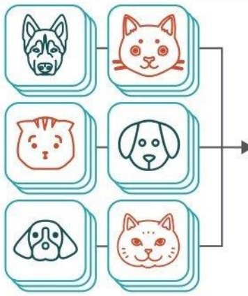

MACHINE

## Observe and learn from the patterns the machine identifies

MACHINE

## TYPES OF PROBLEMS TO WHICH IT'S SUITED

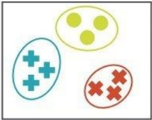

## CLUSTERING

Identifying similarities in groups

For Example: Are there patterns in the data to indicate certain patients will respond better to this treatment than others?

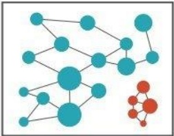

## ANOMALY DETECTION

Identifying abnormalities in data
For Example: Is a hacker intruding in our network?

<!-- page: 29 -->

ORACLE®

## ARTIFICIAL INTELLIGENCE IS NOT NEW

## ARTIFICIAL INTELLIGENCE

Any technique which enables computers to mimic human behavior

## MACHINE LEARNING

AI techniques that give computers the ability to learn without being explicitly programmed to do so

## DEEP LEARNING

A subset of ML which make the computation of multi-layer neural networks feasible

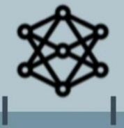

Copyright © 2018, Oracle and/or its affiliates. All rights reserved.

<!-- page: 30 -->

## TẠI SAO BÂY GIỜ LẠI NÓI VỀ A.I?

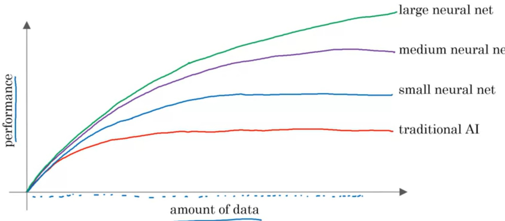

<!-- page: 31 -->

## DỮ' LIỆU LÓN!

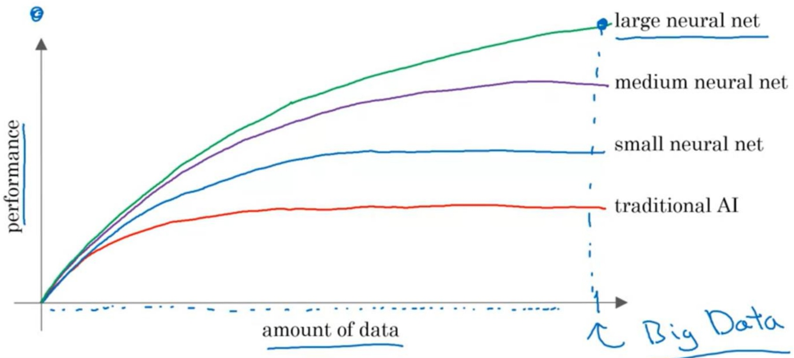

<!-- page: 32 -->

## A.I – TRÍ TƯỆ NHÂN TẠO LÀ GÌ ? ➤ Dữ Liệu – Data

<!-- page: 33 -->

## SORTED

## ARRANGED

## PRESENTED VISUALLY

<!-- page: 34 -->

## VÍ DỤ CỦA BẰNG SỐ LIỆU (TẬP DỮ LIỆU - DATASET)

| Diện tích căn nhà (m2) |  | Giá nhà ( tỷ đồng) |
| --- | --- | --- |
| 100 |  | 4.5 |
| 150 |  | 6.0 |
| 135 |  | 5.5 |
| 200 |  | 6.7 |
| 500 |  | 10 |
| 600 |  | 15 |
| 1,000 | A | 20 |

<!-- page: 35 -->

## VÍ DỤ CỦA BẰNG SỐ LIỆU (TẬP DỮ LIỆU - DATASET)

| Diện tích căn nhà (m2) | Số lượng phòng ngủ | Giá nhà ( tỷ đồng) |
| --- | --- | --- |
| 100 | 3 | 4.5 |
| 150 | 4 | 6.0 |
| 135 | 4 | 5.5 |
| 200 | 5 | 6.7 |
| 500 | 5 | 10 |
| 600 | 6 | 15 |
| 1,000 | 8 | 20 |

<!-- page: 36 -->

## VÍ DỤ CỦA BẰNG SỐ LIỆU (TẬP DỮ LIỆU - DATASET)

| Diện tích căn nhà (m2) | Số lượng phòng ngủ | Giá nhà ( tỷ đồng) |
| --- | --- | --- |
| 100 | 3 | 4.5 |
| 150 | 4 | 6.0 |
| 135 | 4 | 5.5 |
| 200 | 5 | 6.7 |
| 500 | 5 | 10 |
| 600 | 6 | 15 |
| 1,000 | 8 | 20 |

<!-- page: 37 -->

## VÍ DỤ CỦA BẰNG SỐ LIỆU (TẬP DỮ LIỆU - DATASET)

<table><tr><td>Hình ảnh</td><td>Nhãn</td></tr><tr><td></td><td>Mèo</td></tr><tr><td></td><td>Không phải mèo</td></tr><tr><td></td><td>Mèo</td></tr><tr><td></td><td>Không phải mèo</td></tr></table>

<!-- page: 38 -->

## VÍ DỤ CỦA BẢNG SỐ LIỆU - (TẬP DỮ LIỆU - DATASET)

<table><tr><td>Hình ảnh A</td><td>Nhãn B</td></tr><tr><td></td><td>Mèo</td></tr><tr><td></td><td>Không phải mèo</td></tr><tr><td></td><td>Mèo</td></tr><tr><td></td><td>Không phải mèo</td></tr></table>

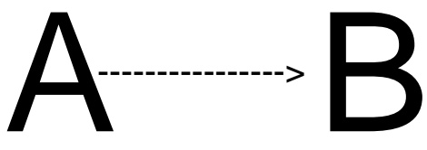

## ✓ × ✓ ×

<!-- page: 39 -->

## THU THẬP DỮ LIỆU (ACQUIRING)

## DÁN NHÂN THỦ CÔNG

Mèo

Mèo

Không phải
Mèo

Không phải
Mèo

<!-- page: 40 -->

## THU THẬP DỮ LIỆU (ACQUIRING)

## QUAN SÁT HÀNH VI

| user ID | time | price ($) | purchased |
| --- | --- | --- | --- |
| 4783 | Jan 21 08:15.20 | 7.95 | yes |
| 3893 | March 3 11:30.15 | 10.00 | yes |
| 8384 | June 11 14:15.05 | 9.50 | no |
| 0931 | Aug 2 20:30.55 | 12.90 | yes |

| machine | temperature (°C) | pressure (psi) | machine fault |
| --- | --- | --- | --- |
| 17987 | 60 | 7.65 | N |
| 34672 | 100 | 25.50 | N |
| 08542 | 140 | 75.50 | Y |
| 98536 | 165 | 125.00 | Y |

<!-- page: 41 -->

## THU THẬP DỮ LIỆU (ACQUIRING)

## QUAN SÁT HÀNH VI

| user ID | time | price ($) | purchased |
| --- | --- | --- | --- |
| 4783 | Jan 21 08:15.20 | 7.95 | yes |
| 3893 | March 3 11:30.15 | 10.00 | yes |
| 8384 | June 11 14:15.05 | 9.50 | no |
| 0931 | Aug 2 20:30.55 | 12.90 | yes |

| machine | temperature (°C) | pressure (psi) | machine fault |
| --- | --- | --- | --- |
| 17987 | 60 | 7.65 | N |
| 34672 | 100 | 25.50 | N |
| 08542 | 140 | 75.50 | Y |
| 98536 | 165 | 125.00 | Y |

LƯU GIỮXUỔNG TỪWEBSITES/ĐỐI TÁC

<!-- page: 42 -->

## SỬ DỤNG DỮ LIỆU HIỆU QUẢ

## Đùng “ném” dữ liệu bạn có cho đội nhóm Al và tự cho rằng nó sẽ có giá trị!

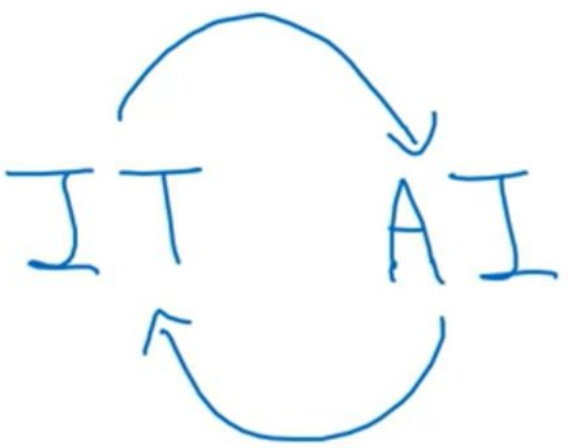

Don't throw data at an AI team and assume it will be valuable.

<!-- page: 43 -->

## VĂN ĐỀ CỦA DỮ LIỆU

Vào thế nào, ra như vây!
Garbage in, garbage out!

The quality of information coming out cannot be better than the quality of information that went in.

GIGO is used in IT and mathematics

Garbage In, Garbage Out

<!-- page: 44 -->

## VÁN ĐỀ CỦA DỮ LIỆU

▶ Dữ liệu có vấn đề của nó!

\- Sai lệch nhẫn

\- Thiêu giá trị

| Diện tích căn nhà (m2) | Số lượng phòng ngử | Giá nhà ( tỷ đồng) |
| --- | --- | --- |
| 100 | 3 | 4.5 |
| 150 | 4 | #0.09 |
| 135 | 4 | 5.5 |
| 200 | #Không biết | 6.7 |
| 500 | 5 | 10 |
| #Không biết | 6 | #Không biết |
| 1,000 | #Không biết | 20 |

<!-- page: 45 -->

## VÁN ĐỀ CỦA DỮ LIỆU

Đa dạng về loại dữ liệu
- Hình ảnh, âm thanh, câu chữ

(Dữ liệu Phi câu trúc Un-structured)

Dữ liệu có câu trúc (Structured data)

| Diện tích căn nhà (m2) | Số lượng phòng ngủ | Giá nhà ( tỷ đồng) |
| --- | --- | --- |
| 100 | 3 | 4.5 |
| 150 | 4 | #0.09 |
| 135 | 4 | 5.5 |
| 200 | #Không biết | 6.7 |
| 500 | 5 | 10 |
| #Không biết | 6 | #Không biết |
| 1,000 | #Không biết | 20 |

<!-- page: 46 -->

KDNUGGETS.COM

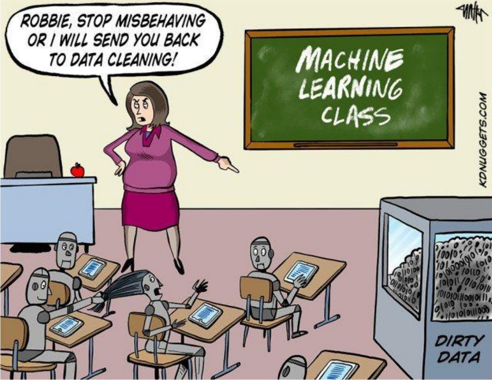

<!-- page: 47 -->

## A.I – TRÍ TƯỆ NHÂN TẠO LÀ GÌ ? ➤ Các Thuật ngữ trong AI – The terminology of AI

<!-- page: 48 -->

## HỌC MÁY vs. KHOA HỌC DỮ LIỆU Machine Learning vs. Data Science

| Diện tích căn nhà (m2) | Số lượng phòng ngủ | Số lượng phòng tấm | Mới sửa chữa | Giá nhà ( tỷ đồng) |
| --- | --- | --- | --- | --- |
| 100 | 3 | 2 | N | 4.5 |
| 150 | 4 | 3 | Y | 5.0 |
| 135 | 4 | 3 | Y | 5.5 |
| 200 | 5 | 4 | N | 6.7 |
| 500 | 5 | 5 | Y | 10 |
| 600 | 6 | 5 | Y | 15 |
| 1,000 | 8 | 8 | N | 20 |

Machine Learning

A

B

Running AI system (e.g., website/mobile app)

B

<!-- page: 49 -->

## HỌC MÁY vs. KHOA HỌC DỮ LIỆU Machine Learning vs. Data Science

| Diện tích căn nhà (m2) | Số lượng phòng ngủ | Số lượng phòng tấm | Mới sửa chữa | Giá nhà ( tỷ đồng) |
| --- | --- | --- | --- | --- |
| 100 | 3 | 2 | N | 4.5 |
| 150 | 4 | 3 | N | 5.0 |
| 145 | 4 | 3 | Y | 5.5 |
| 200 | 5 | 4 | N | 6.7 |
| 500 | 5 | 5 | Y | 10 |
| 600 | 6 | 5 | Y | 15 |
| 1,000 | 8 | 8 | N | 20 |

√ Giá nhà có 3 phòng ngủ thường đất hơn 2 phòng ngủ nếu cùng diện tích.

Data Science

√ Cùng một diện tích thì nhà mới sửa bán được giá hơn 10%.

<!-- page: 50 -->

## HỌC MÁY vs. KHOA HỌC DỮ LIỆU Machine Learning vs. Data Science

HỌC MÁY

Lĩnh vực khoa học nghiên cứu mà giúp cho các máy tính có khả năng tự học được mà không cần đến một chương trình/phần mềm cụ thể.

Arthur Samuel (1959)

PHẦN MỀM/ SOFTWARE

## KHOA HỌC DỮ LIỆU

Ngành khoa học khai thác tri thức và tìm ra những ý nghĩa ẩn từ dữ liệu.

BÁO CÁO/TỔNG HỢP

<!-- page: 51 -->

## DEEP LEARNING

## HỌC SÂU

<!-- page: 52 -->

## HỌC SÂU

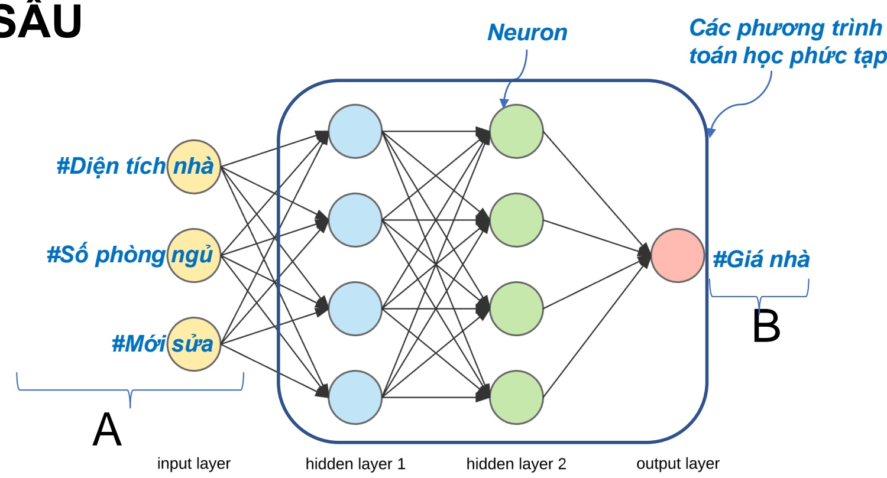

Mạng nơ-ron được thiết kế dựa trên bộ não con người, nhưng cách thức chúng vận hành thì hoàn toàn không giống cách bộ não sinh học của con người hoạt động.

<!-- page: 53 -->

## AI – TRÍ TUỆ NHÂN TẠO CÓ NHIỀU CÔNG CỤ

Học máy và Khoa học dữ liệu

Học sâu và Mạng no-ron

Và các thuật ngữ biến khác như: Học không giám sát (Un-supervised Learning), Học tăng cường (Reinforcement Learning), mô hình đồ họa (Graphical models)...

<!-- page: 54 -->

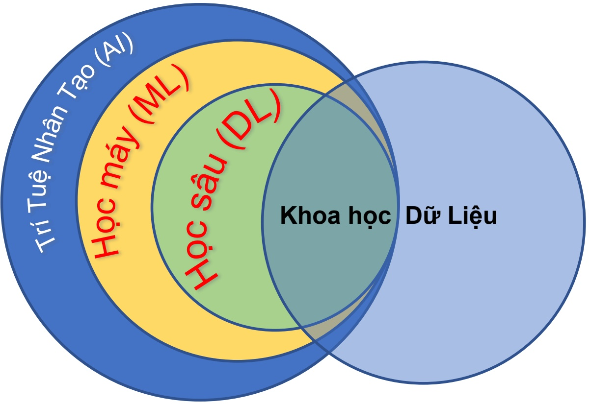

Khoa học Dữ Liệu

<!-- page: 55 -->

## A.I – TRÍ TƯỆ NHÂN TẠO LÀ GÌ ? ▶ Những điều ML có thể và không thể làm.

<!-- page: 56 -->

## HỌC CÓ GIÁM SÁT

| Đầu vào (Input) | Đầu ra (Output) | Ứng dụng (Applications) |
| --- | --- | --- |
| Email | Thư rác? | Bộ lọc thư rác. |
| Âm thanh | Văn bản | Nhận dạng giọng nói |
| Tiếng Anh | Tiếng Việt | Máy dịch (Machine translation) |
| Q/C, thông tin người dùng | Nhấp chuột? (0/1) | Quảng cáo online |

Những điều mà bạn có thể làm mà chỉ cần tốn 01 giây để suy nghĩ, thì sớm muộn cũng tự động hóa

<!-- page: 57 -->

## Supervised Learning

| Input (A) | Output (B) | Application |
| --- | --- | --- |
| email | spam? (0/1) | spam filtering |
| audio | text transcripts | speech recognition |
| English | Chinese | machine translation |
| ad, user info | click? (0/1) | online advertising |
| image, radar info | position of other cars | Self-driving car |
| image of phone | defect? (0/1) | visual inspection |

Anything you can do with 1 second of thought, we can probably now or soon automate.

<!-- page: 58 -->

## HỌC MÁY CÓ THỂ VÀ KHÔNG THỂ LÀM!

Ví dụ: Bạn đặt mua trên mạng 1 món hàng để làm quả tặng cho cháu gái của bạn nhân dịp sinh nhật của cô bé. Không may, món hàng bị giao trẻ. Bạn gọi điện thoại đến tổng đài CSKH và nói :

"Tôi có thể trả lại không nhận được không?" Nếu tổng đài là 01 AI (Voice chat). Chuyện gì sẽ xảy ra?

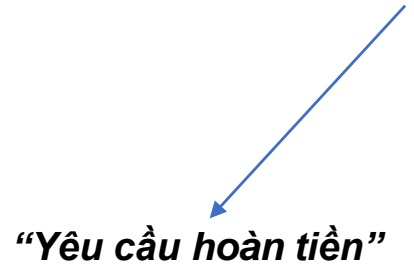

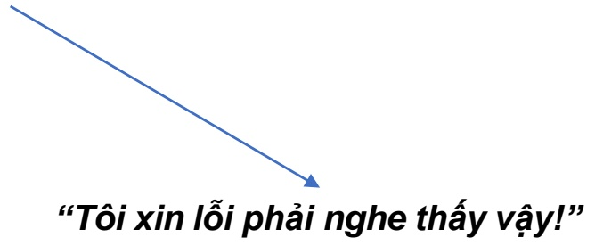

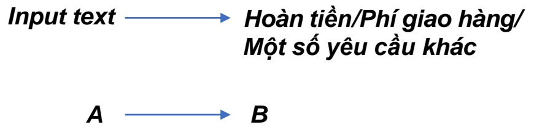

Hoàn tiền/Phí giao hàng/
Một số yêu cầu khác "Chúc cháu 1 ngày sinh nhật vui về"
"Vâng, tôi có thể giúp gì với...."

<!-- page: 59 -->

## NÊU BẠN TIẾP TỤC CỔ GẢNG?

Đầu vào
(Người dùng email)

Đầu ra
(Cài đặt 2 -3 dòng tự động trả lời)

- 1000 ví dụ
- "Cái hộp dụng của tôi bị bề?" ----> Cám ơn bạn đã gửi email!
- "Tôi có thể viết nhận xét ở đầu?"----> Cám ơn bạn đã gửi email!
- "Chính sách trả hàng là ntn?" ----> Cám ơn bạn đã gửi email!
- "Khi nào hàng của tôi được giao?"----> Cám ơn bạn, chúng tôi sẽ...

<!-- page: 60 -->

## What happens if you try?

Input (A)
User email

1000 examples

Output (B)
2-3 paragraph response

"My box was damaged."

Thank you for your email.

Thank you for your email.

"What's the return policy?"

Thank you for your email.

"When is my box arriving?"  $\longrightarrow$  Thank yes now your....

<!-- page: 61 -->

## CÁI GÌ GIÚP M/L TRỔ' THÀNH ĐƠN GIẢN?

1. Học 1 vấn đề đơn giản? <= 1 giây

2. Cần rất nhiều dữ liệu. A → B

<!-- page: 62 -->

## A.I – TRÍ TƯỆ NHÂN TẠO LÀ GÌ ? ➢ Những điều ML có thể và không thể làm. Thêm ví dụ!

<!-- page: 63 -->

## Self-driving car

Can do

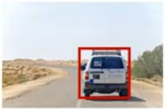

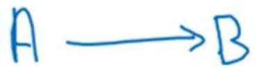

stop

## Cannot do

hitchhiker

bike turn
left signal

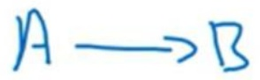

<!-- page: 64 -->

## Self-driving car

## Can do

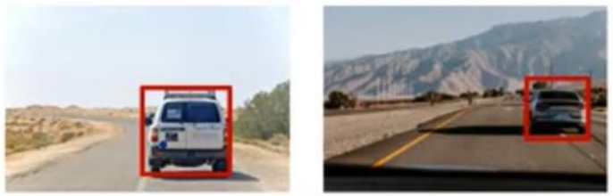

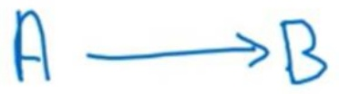

0,000

stop

## Cannot do

hitchhiker
10,000

1. Data

bike turn
left signal

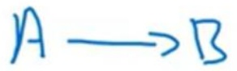

2. Need high accuracy

<!-- page: 65 -->

## X-ray diagnosis

Can do

Diagnose pneumonia from \~10,000 labeled images
A → B

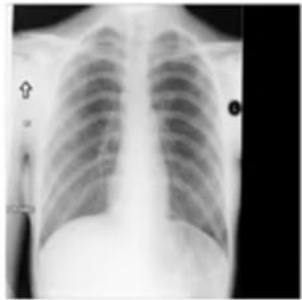

Cannot do

Diagnose pneumonia from 10 images of a medical textbook chapter explaining pneumonia A $\rightarrow  \mathrm{B}$

<!-- page: 66 -->

## ĐIỂM MẠNH - YẾU CỦA HỌC MÁY

## HỌC MÁY CÓ THỂ LÀM RẤT TỐT KHI:

1. Học một khái niệm “đơn giản”.

2. Có sẵn nhiều dữ liệu.

## HỌC MÁY CÓ THỂ LÀ KÉM:

1. Học các khái niệm phức tạp với số lượng dữ liệu hạn chế.

2. Yêu cầu thực hiện một công việc cũ với
kiểu dữ liệu mới, khác.

<!-- page: 67 -->

## A.I – TRÍ TƯỆ NHÂN TẠO LÀ GÌ ? ➢ Học sâu (Deep Learning) Dành cho Không chuyên Kỹ thuật

<!-- page: 68 -->

## Demand prediction

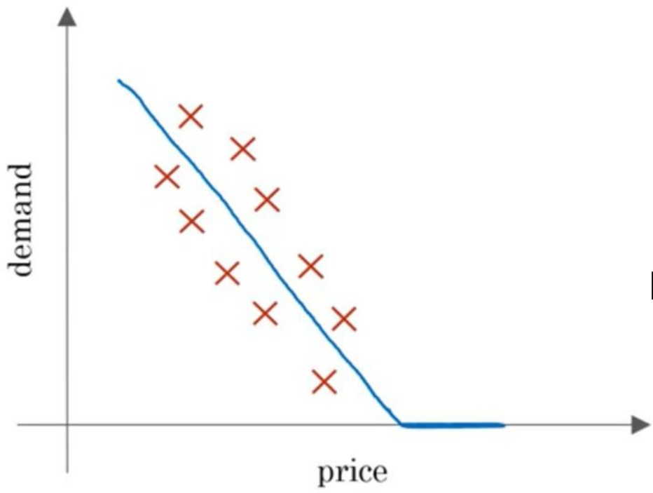

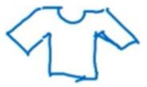

price

demand

## DỰ ĐOÁN NHU CẦU NGƯỜI DÙNG

<!-- page: 69 -->

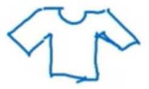

## Demand prediction

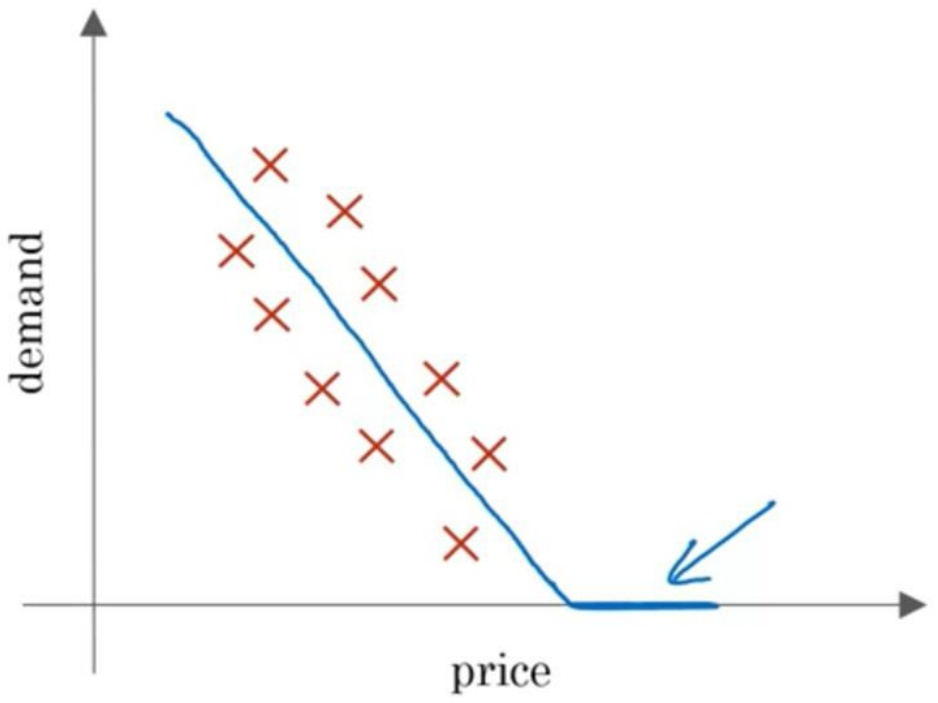

price

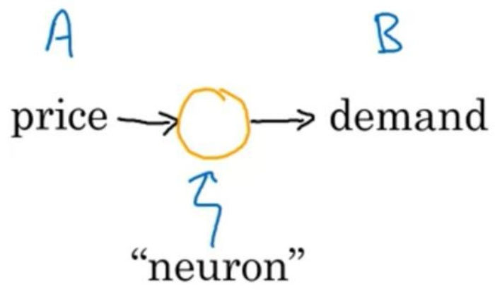

demand

<!-- page: 70 -->

## DỰ ĐOÁN NHU CẦU NGƯỜI DÙNG

GIÁ BÁN (PRICE)

PHÍ VẬN CHUYỀN

(SHIPPING COST)

CHI PHÍ TIẾP THỊ

(MARKETING)

NGUYÊN VẬT LIỆU

→ NHU CẦU

<!-- page: 71 -->

## DỰ ĐOÁN NHU CẦU NGƯỜI DÙNG

GIÁ BÁN (PRICE)

PHÍ VẬN CHUYÊN
(SHIPPING COST)

CHI PHÍ TIẾP THỊ
(MARKETING)

NGUYÊN VẬT LIỆU

Giá hợp lý

Chất lượng

NHU CẦU

<!-- page: 72 -->

## DỰ ĐOÁN NHU CẦU NGƯỜI DÙNG

GIÁ BÁN (PRICE)

PHÍ VẬN CHUYÊN
(SHIPPING COST)

CHI PHÍ TIẾP THỊ
(MARKETING)

NGUYÊN VẬT LIỆU

Giá hợp lý

Thương

Chất lượng

NHU CẦU

<!-- page: 73 -->

## A.I – TRÍ TƯỆ NHÂN TẠO LÀ GÌ ? ➢ Học sâu (Deep Learning) Dành cho Không chuyên Kỹ thuật

<!-- page: 74 -->

## Face recognition

## NHÂN DẠNG KHUÔN MẶT

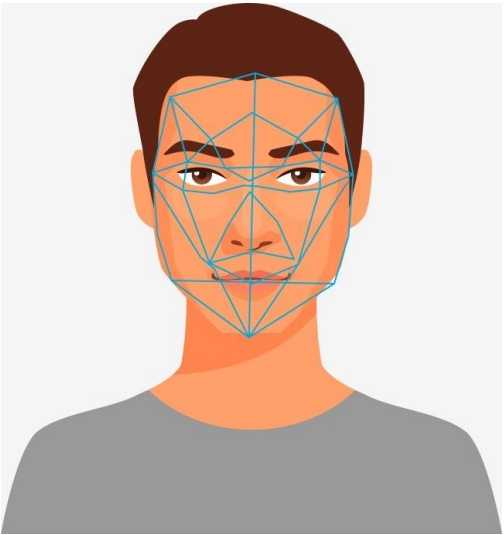

<!-- page: 75 -->

## Face recognition

| 30 | 32 | 22 | 12 | 10 | 10 | 12 | 33 | 35 | 30 |
| --- | --- | --- | --- | --- | --- | --- | --- | --- | --- |
| 12 | 11 | 12 | 234 | 170 | 176 | 13 | 15 | 12 | 12 |
| 234 | 222 | 220 | 230 | 200 | 222 | 230 | 234 | 56 | 78 |
| 190 | 220 | 186 | 112 | 110 | 110 | 112 | 180 | 30 | 32 |
| 49 | 250 | 250 | 250 | 4 | 2 | 254 | 200 | 44 | 6 |
| 55 | 250 | 250 | 250 | 3 | 1 | 250 | 245 | 25 | 3 |
| 189 | 195 | 199 | 150 | 110 | 110 | 182 | 190 | 199 | 55 |
| 200 | 202 | 218 | 222 | 203 | 200 | 200 | 208 | 215 | 222 |
| 219 | 215 | 220 | 220 | 222 | 214 | 215 | 210 | 220 | 220 |
| 220 | 220 | 220 | 220 | 221 | 220 | 221 | 220 | 220 | 222 |

<!-- page: 76 -->

## Face recognition

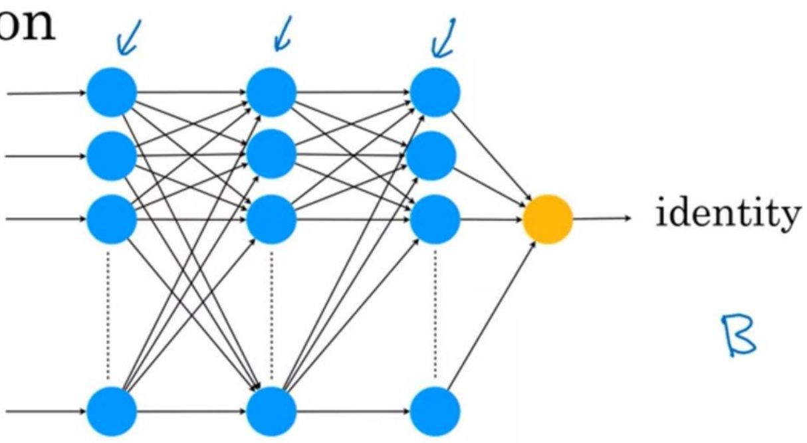

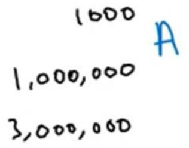

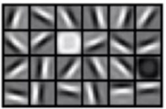

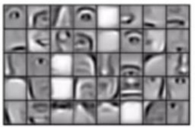

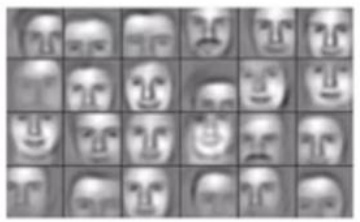

<!-- page: 77 -->

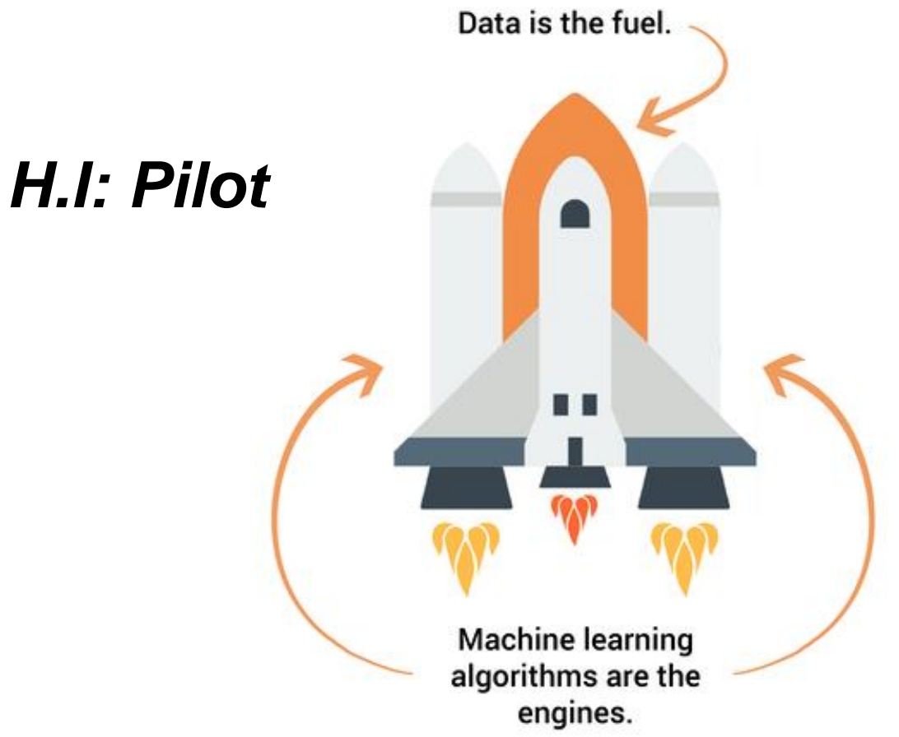

<!-- page: 78 -->

## KIÊM TRA KIÊN THỨC

<!-- page: 79 -->

## THỰC HIỆN 1 DỰ ÁN A.I ▶ Giới thiệu

<!-- page: 80 -->

## THỰC HIỆN 1 DỰ ÁN A.I

▶ Các bước thực hiện

➤ Lựa chọn 1 dự án

▶ Tổ chức đội ngũ và cơ sở dữ liệu cho dự án.

<!-- page: 81 -->

## THỰC HIỆN DỰ ÁN NHẬN GIỘNG NÓI

Amazon Echo / Alexa

Google Home

Apple
Siri

Baidu DuerOS

<!-- page: 82 -->

## Các bước chính:

## 1. Thu thập dữ liệu.

## Hey Google...

<!-- page: 83 -->

## Các bước chính:

2. Huấn luyện mô hình (Model).

Lặp đi, lặp lại cho đến khi đủ tốt.

$$
\mathrm{A} \rightarrow \mathrm{B}
$$

#Gióng nói 1 --- “Hello”
#Gióng nói 2 ----”Siri”
#Gióng nói 3 – “Âm nhạc”

Real Python

<!-- page: 84 -->

## Các bước chính:

## 3. Cài đặt (Deploy).

Sử dụng các dữ liệu đã
có sẵn.
Duy trì và cập nhật mô
hình (model)

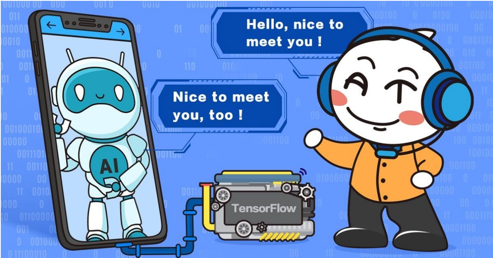

<!-- page: 85 -->

## Key steps of a machine learning project

Echo / Alexa

→ 1. Collect data

→ 2. Train model
Iterate many times until
good enough

→ 3. Deploy model
Get data back
Maintain / update model

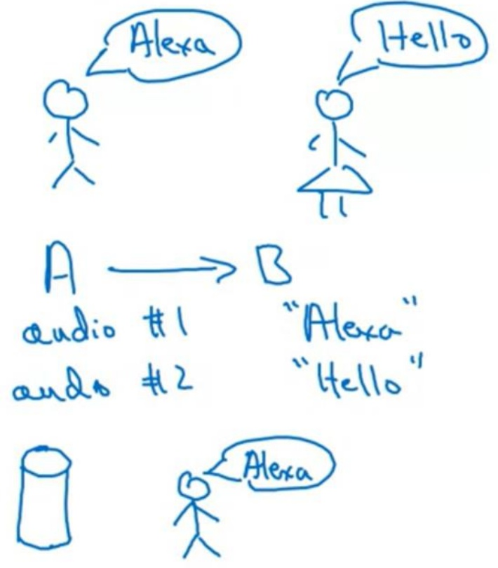

<!-- page: 86 -->

## Key steps of a machine learning project

## Self-driving car

1. Collect data

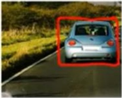

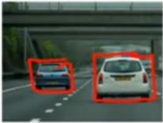

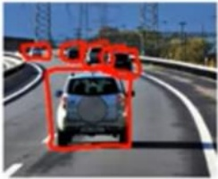

2. Train model
Iterate many times until
good enough

image → position of other cars

3. Deploy model
Get data back
Maintain / update model

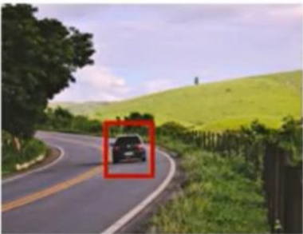

<!-- page: 87 -->

## THỰC HIỆN 1 DỰ ÁN A.I ➤ Các bước thực hiện dự án Khoa học dữ liệu

<!-- page: 88 -->

## VISIT WEBSITE

## Ghé Trang web

TÍKÍNOW Ly SÚ Cao Cấp Minh Tiến
A11 (8cm) - Hồng Phấn
59.000 ₽ -25%
70.000-8

TÍKÍNOW Ly SỬ Mori Italia B106-WB (400ml)
40.000 ₽ -67%
+20.000 ₽
★★★★★ (13 nhận xét)

Cốc Sử Elmích Smart Cook SM6864
- 2026864
52.000 ₺
★★★★★ (9 nhận xét)

Bộ 3 Ly Sư Cao Cấp Soc Ngang
Dong Hwa C1408...
94.000 ₽ -48%
180.000 ₽
★★★★★ (4 nhận xét)

Cốc Vuông SỐ Sương GSSBC4A6 (0.18L) - Xanh...
72.500 đ

Ly Sú Cao Cấp Dong Hwa Hinh Viên Dấu Chân...
39.000 ₽ -41%
66.000 ₽
★★★★★ (1 nhận xét)

Ly Sư Mỹ Mõ 12 Cung Hoàng Đạo
154.000 ₽ -39%
254.000-đ

Ly Sư Sola Nắp Trượt (Màu Ngẫu Nhiên)
149.000 ₱ -25%
100.000 ₱

Rê chuột lên hình để phóng to

## Trang sản phẩm

## Cốc Vuông Sú Sương GSSBC4A6 (0.18L) -

## 72.500 d

\- Cốc (tách) dáng vuông
- Có kích cỡ hoàn hảo để uống cà phê
- Chất liệu đất sét trắng

THỜI GIAN DỰ KIỂN GIAO HÀNG
Giao hàng tới Phường Bến Nghé, Quận 1, Hồ Chí Minh - Chọn địa chỉ khác

Giao hàng tiêu chuẩn Dự kiến giao Thứ năm - Thứ sáu, 15/08 - 16/08 chi phí 12.000 ₽, miễn phí giao hàng tiêu chuẩn cho đơn hàng từ 250.000 ₽

<!-- page: 89 -->

## Chọn mua sản phẩm

## GIỜ HÀNG (1 sản phẩm)

Cốc Vuông Sú Sương GSSBC4A6 (0.18L) - Xanh Ngọc

Cung cấp bởi Gốm Sư Sương

Xóa

Đế dành mua sau

72.500 d

Tạm tính:

72.500 d

Thành tiền:

72.500 ₺
(Đã bao gồm VAT)

Tiến hành đặt hàng

Mã giám giá / Quà tặng

Nhập ở đây..

Đồng ý

<!-- page: 90 -->

## THANH TOÁN

## 1. Chọn hình thức giao hàng

Thứ sáu, 16/08/2019

12.000 ₺ Giao hàng tiêu chuẩn

## 2. Thanh toán bằng Tiki Xu

Sử dụng 2.689 Xu (ứng với 2.689 đ) để thanh toán.

Bạn có Phiếu quả tặng Tiki/Got lt/UrBox muốn đổi thành Tiki Xu? Nhập tại đây

## 3. Chọn hình thức thanh toán

Thanh toán tiền mặt khi nhận hàng

Thanh toán bằng thẻ quốc tế Visa, Master, JCB

Thẻ ATM nội địa/Internet Banking (Miễn phí thanh toán)

Thanh toán bằng ví MoMo - Chi tiết
Vui lòng cải đặt App MoMo để thanh toán!

uu đai Thế OCB giảm 150K cho đơn hàng từ 1 triệu đồng - Chi tiết
Chưa đến thời gian tham gia chương trình hoặc số lượng đơn hàng uu đai đã hết!

uu đải Thẻ tín dụng JCB giảm thêm 25% tối đa 300K - Chi tiết
Chua đến thời gian tham gia chương trình hoặc số lượng đơn hàng uu đã hết!

Phải Thế Visa giảm 50K cho đơn hàng từ 500K - Chú ý

Chưa đến thời gian tham gia chương trình hoặc số lượng đơn hàng uu đã đã hết!

Gửi quả tặng đến bạn bè, người thân

## Thông tin người mua:

Sử dụng Họ tên & Số điện thoại của địa chỉ giao hàng

ĐẶT MUA

Địa chỉ giao hàng

Sùa

## Nguyễn Ngọc TÚ

Landmark 3. Vinhomes TÂN CẢNG. SỐ 208 NGUYỄN HỮU CẢNH., Phường 22, Quận

Bình Thạnh, Hồ Chí Minh

Việt Nam

Điện thoại: 0903686860

Đơn Hàng (1 sản phẩm)

Sùa

1 x Cốc Vương Sư Sương
GSSBC4A6 (0.18L) - Xanh Ngộc
Cung cấp bởi Gốm Sư Sương

72.500 d

Tạm tính

72.500 ₺

Phí vận chuyển

12.000 d

Thành tiên:

84.500 ₺
(Đã bao gồm VAT)

<!-- page: 91 -->

## Các bước chính:

## 1. Thu thập dữ liệu.

| User ID | Khu vực | Thời gian | Website |
| --- | --- | --- | --- |
| 2009 | HCM | 08:03:15 Jan 19 | Tiki.vn |
| 2017 | HN | 14:05:00 Dec 18 | Shoppe.vn |
| 4963 | Singapore | 09:00:15 Mar 19 | Amazon.com |

<!-- page: 92 -->

Site content

## Các bước chính:

## 2. Phân tích dữ liệu. (Thử đi, thử lại)

Pageviews 363,983 Unique Pageviews 265,633 Avg. Time on Page 00:00:48

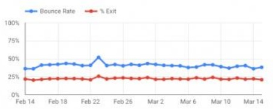

Bounce Rate 40.51% % Exit 22.20%

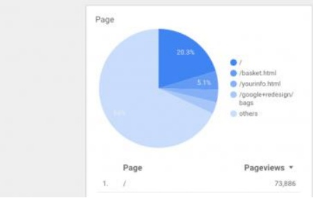

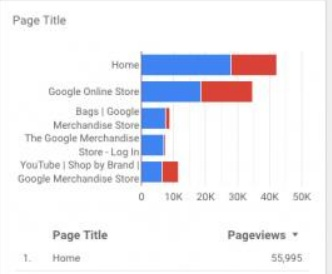

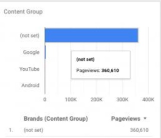

<!-- page: 93 -->

## Các bước chính:

## 2. Phân tích dữ liệu. (Thử đi, thử lại)

Default Data
Click to select your data

Share this report
Feb 14, 2019 - Mar 15, 2019

Pageviews Unique Pageviews Avg. Time on Page 363,983 265,633 00:00:48

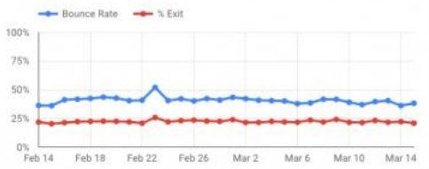

$\therefore m : x = 1$ 或 ${3x} + {4y} + 1 = 0$

Bounce Rate 40.51% % Exit 22.20%

Site content

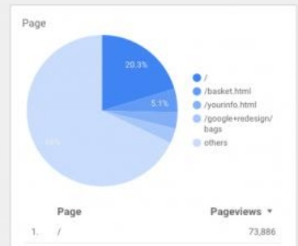

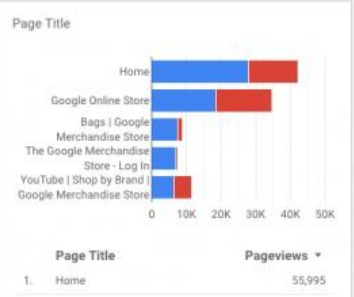

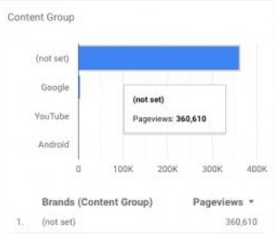

<!-- page: 94 -->

## Các bước chính: 2. Đề xuất các hành động

Tích hợp các thay đổi (Xây mới trang web, thêm video quảng cáo, Khuyến mãi...)

Tiếp tục phân tích với
dữ liệu mới.

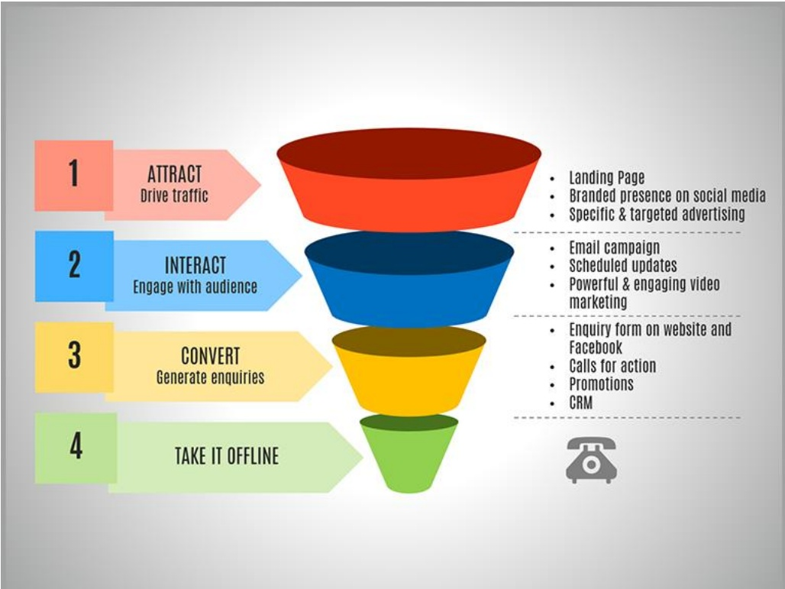

<!-- page: 95 -->

## Key steps of a data science project

## Manufacturing line

Mix clay

Final

Shape mug

Add glaze

Fire kiln

inspection

<!-- page: 96 -->

## Key steps of a data science project

## Manufacturing line

Mix clay

Shape mug

Add glaze

Fire kiln

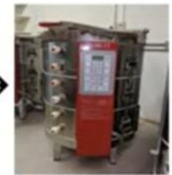

1. Collect data

2. Analyze data
Iterate many times to get good insights

3. Suggest hypotheses/actions
Deploy changes
Re-analyze new data periodically

Final
inspection

| Clay Batch # | Supplier | Mixing time (minutes) |
| --- | --- | --- |
| 001 | ClayCo | 35 |
| 034 | GooClay | 22 |
| 109 | BrownStuff | 28 |

| Mug Batch # | Humidity | Temperature in kiln (F) | Duration in kiln (hours) |
| --- | --- | --- | --- |
| 301 | 0.002% | 1410° | 22 |
| 302 | 0.003% | 1520° | 24 |
| 303 | 0.002% | 1420° | 22 |

<!-- page: 97 -->

THỰC HIỆN 1 DỰ ÁN A.I
▶ Mọi vị trí công việc cần
biết cách sử dụng Dữ liệu

<!-- page: 98 -->

## BỘ PHẬN BÁN HÀNG

## Data science

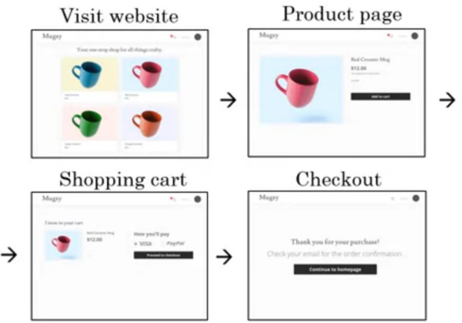

Optimize sales funnel

## Machine learning

| Name | Title | Company size | Email | Priority |
| --- | --- | --- | --- | --- |
| Taylor | CEO | 3050 | tay@a.. | high |
| Janet | Manager | 230 | jan@b.. | medium |
| David | Intern | 30 | dave@c.. | low |

Automated lead sorting

<!-- page: 99 -->

## BỘ PHẬN QUẢN LÝ SẢN XUẤT Ở NHÀ MÁY

## Data science

Mix clay

Shape mug

Add glaze

Fire kiln

Final
inspection

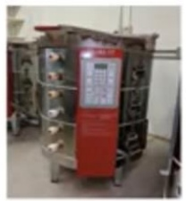

Optimize manufacturing line

Machine learning

ok

ok

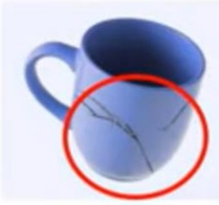

defect

Automated visual inspection

<!-- page: 100 -->

## BỘ PHẬN TUYỀN DỤNG NHÂN SỰ

Liên hệ qua email

Phòng vấn
qua điện
thoại

## THÚY KIỀU

Phòng vấn tại văn phòng

Tuyên dụng

Tối ưu hóa quy trình tuyển dụng

Thông tin cá nhân

Học vấn

Chuyên môn

ĐẠT

Kinh nghiệm

## HOẠN THU'

Thông tin cá nhân

Học vấn

Chuyên môn

Kinh nghiệm

CHU'A ĐẠT

Tự động hóa quá trình đọc SYLL

<!-- page: 101 -->

## BỘ PHÂN MARKETING

## Data science

## Break into AI

Whether you want to build algorithms or build a company, deeplearning.ai's courses will teach you key concepts and applications of AI.

Take the Deep Learning Specialization

## Break into AI

Whether you want to build algorithms or build a company, deeplearning.ai's courses will teach you key concepts and applications of AI.

Take the Deep Learning Specialization

## A

B

A/B testing

## Machine learning

## Recommended for you

Customized product recommendation

<!-- page: 102 -->

## NGÀNH NÔNG NGHIỆP

## Data science

Crop analytics

## Machine learning

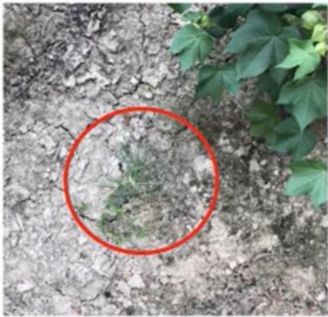

Precision weed killing

<!-- page: 103 -->

## AI technical tools

## Machine learning frameworks:

\- TensorFlow

\- PyTorch

\- Keras

\- MXNet

\- CNTK

\- Caffe

\- PaddlePaddle

\- Scikit-learn

• R

\- Weka

<!-- page: 104 -->

## AI technical tools

Machine learning frameworks:

\- TensorFlow

\- PyTorch

\- Keras

\- MXNet

\- CNTK

\- Caffe

\- PaddlePaddle

\- Scikit-learn

• R

\- Weka

Research publications:

\- Arxiv

Open source repositories:

\- GitHub

<!-- page: 105 -->

## CPU vs. GPU

## CPU: Computer processor (Central Processing Unit)

GPU: Graphics Processing Unit

Cloud vs. On-premises

<!-- page: 106 -->

## XÂY DỰNG MỘT CÔNG TY A.I ➤ Trường hợp: Loa thông minh

<!-- page: 107 -->

## LOA THÔNG MINH

Amazon Echo / Alexa

Google Home

Apple Siri

Baidu DuerOS

“Hey Google, Kề 1 câu truyền cuối”

<!-- page: 108 -->

## “Hey Google, Kề 1 câu truyền cuối”

Các bước đề thực hiện lệnh:

1. Xác nhận “Khẩu lệnh khởi động”

"Audio" → "Hey Google" (0/1)

2. Nhận dạng giọng nói.

“Audio” → “Kế một câu chuyên cưỡi” (0/1)

3. Nhận dạng câu lệnh/ý định.
"Kề một câu chuyện cười"
A

"Thời tiết"
"Âm nhạc"
"Thực hiện cuộc gọi"
B

<!-- page: 109 -->

## “Hey Google, Kề 1 câu truyền cuối”

Các bước để thực hiện lệnh:

4. Thực hiện kê chuyên

CÂU KHỜI ĐỘNG
(TRIGGER WORD DETECTION)

NHẬN DẠNG
GIỘNG NÓI
(SPEECH
RECOGNATION)

NHẬN DẠNG
CÂU LỆNH
(INTENT
RECOGNATION)

THỰC HIỆN
LỆNH
(EXECUTION)

QUÁ TRÌNH THỰC HIỆN CÔNG VIỆC CỦA A.I
(A.I PIPELINE)

<!-- page: 110 -->

## XÂY DỰNG MỘT CÔNG TY A.I ➤ Trường hợp: Loa thông minh – Thêm ví dụ

<!-- page: 111 -->

## XÂY DỰNG MỘT CÔNG TY A.I ➤ Trường hợp: Xe tự lái

<!-- page: 112 -->

<!-- page: 113 -->

## “Các bước ra quyết định lái xe”

Hình ảnh
/Radar
/Lidar

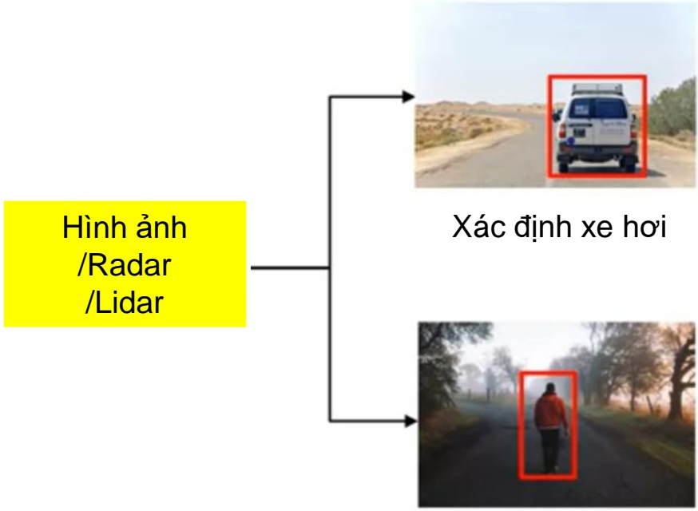

Xác định Người
đi bộ

<!-- page: 114 -->

## “Các bước ra quyết định lái xe”

Hình ảnh
/Radar
/Lidar

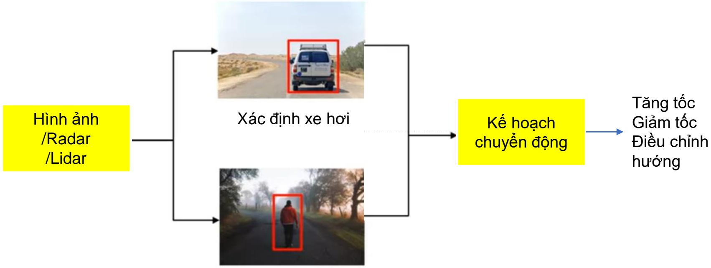

Kế hoạch
chuyển động

Xác định Người
đi bộ

Tăng tốc
Giảm tốc
Điều chỉnh
huống

<!-- page: 115 -->

## Key steps:

## 1. Car detection

<!-- page: 116 -->

## Key steps:

## 1. Car detection

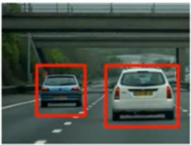

## 2. Pedestrian detection

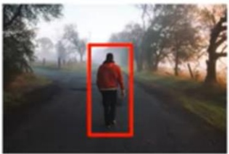

<!-- page: 117 -->

## Key steps:

## 1. Car detection

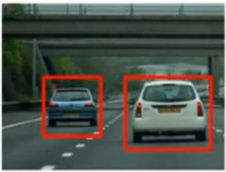

## 2. Pedestrian detection

## 3. Motion planning

<!-- page: 118 -->

## Key steps:

## 1. Car detection

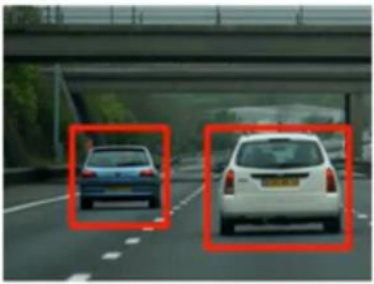

## 2. Pedestrian detection

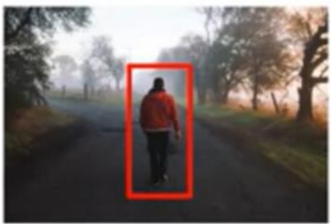

## 3. Motion planning

<!-- page: 119 -->

## Steps for deciding how to drive

Image/Radar/Lidar

Car detection

Pedestrian detection

Motion planning

Steer/
Accelerate/
Brake

<!-- page: 120 -->

## Steps for deciding how to drive

Image/Radar/Lidar

+GPS, Maps

Car detection

Pedestrian detection

Motion planning

Steer/
Accelerate/
Brake

<!-- page: 121 -->

## Steps for deciding how to drive

Image/Radar/Lidar

+GPS, Maps

Car detection

Pedestrian detection

Trajectory prediction

Trajectory prediction

Motion planning

Steer/
Accelerate/
Brake

<!-- page: 122 -->

## Steps for deciding how to drive

Image/Radar/Lidar

+GPS, Maps

Car detection

Pedestrian detection

Lane detection

Trajectory prediction

Trajectory prediction

Motion planning

Steer/
Accelerate/
Brake

<!-- page: 123 -->

## Steps for deciding how to drive

Image/Radar/Lidar

+GPS, Maps

Car detection

Pedestrian detection

Lane detection

Traffic light detection

Trajectory prediction

Trajectory prediction

Motion planning

Steer/
Accelerate/
Brake

<!-- page: 124 -->

## Steps for deciding how to drive

Image/Radar/Lidar

Car detection

Pedestrian detection

Trajectory prediction

+GPS, Maps

Trajectory prediction

Motion planning

Lane detection

Traffic light detection

Obstacle detection

Steer/
Accelerate/
Brake

<!-- page: 125 -->

## XÂY DỰNG MỘT CÔNG TY A.I ➢ Vai trò trong Nhóm AI

<!-- page: 126 -->

## Các vai trò điện hình

1. Kỹ sự Phần mềm – Software Engineer

“VD: Thực hiện lệnh kể chuyên, đảm bảo độ chính xác khi xe tự lái.”

2. Kỹ sư Học máy (Machine Learning Engineer)

$$
" A \to B"
$$

3. Nhà nghiên cứu Học Máy – ML Researcher

"Tăng cường khả năng của ML, tối ưu các thuật toán"

Vị trí (2) & (3) có thể gọi là: Nhà khoa học Ứng dụng ML

<!-- page: 127 -->

## Các vai trò điện hình

4. Chuyên gia Dữ liệu (Data Scientist)

Phân tích dữ liệu và cung cấp các tri thức (insights).
Tạo các báo cáo cho Nhóm

5. Kỹ sư Dữ liệu (Data Engineer)

## Tổ chức dữ liệu

Thực hiện công việc để cho Dữ liệu được lưu trữ đúng cách, an toàn, dễ dàng thực hiện công việc.

6. Quản lý/Giám đốc sản phẩm Al – Al Product Manager

Hỗ trợ, đưa ra quyết định nên làm gì, xác định khả năng, giá trị sp.

<!-- page: 128 -->

## BẤT ĐẦU VỚI MỘT ĐỘI A.I NHỒ

1 Kỹ sư Dữ liệu, hoặc

1 Kỹ sư Học máy (Machine Learning Engineer), 1 Chuyên gia dữ liệu hoặc

Chẳng có ai .....ngoài bạn !

<!-- page: 129 -->

## XÂY DỰNG MỘT CÔNG TY A.I ▶ Những thứ cần tránh

<!-- page: 130 -->

## CẦN TRÁNH TRONG A.I ĐÙNG

1. A.I sẽ giải quyết hết được mọi việc/ vấn đề

2. Thuê một vải (2-3) Kỹ su
ML và giao phó hết trách
nhiệm cho họ, với mong
muốn có được các ứng
dụng tốt.

## NÊN

1. Thực tế Al có thể làm và không thể làm gì. Các giới hạn của Công nghệ, dữ liệu và cả tài nguyên ký thuật.

2. Xem xét các nguồn lực về nhân sự thấu đáo. Giữa Kỹ thuật và Kinh tế và tìm ra các lựa chọn “khả thi, giá trị”.

<!-- page: 131 -->

## CẦN TRÁNH TRONG A.I ĐÙNG

3. A.I sẽ hoạt động tốt ngay và luôn.

4. Duy trì các kế hoạch cũ, ứng dụng công nghệ mới mà không cần đến sự thay đổi.

5. Cần ngay 1 siêu sao Al trước khi bạn có thể thực hiện mọi thứ.

## NÊN

3. Dành thời gian cho Đội
AI thực hiện các thử
nghiệm, điều chỉnh cho đến
khi thành công.

4. Làm việc với đội Al để lên kế hoạch thời gian, phân bổ lại nguồn lực, xây dựng các thước đo mới, những mục tiêu mới.

<!-- page: 132 -->

## XÂY DỰNG MỘT CÔNG TY A.I Thực hiện bước đầu tiên

<!-- page: 133 -->

## A.I VÀ CUỘC SỐNG XÃ HỘI ▶ Giới thiệu

<!-- page: 134 -->

## A.I VÀ CUỘC SỐNG XÃ HỘI

AI VÀ NHỮNG CÁCH HIỆU CHUNG

GIỚI HẠN CỦA AI

AI VÀ PHÁT TRIÊN KINH TẾ, CÔNG VIỆC

<!-- page: 135 -->

## A.I VÀ CUỘC SỐNG XÃ HỘI ➤ Nhìn nhận thực tế về AI

<!-- page: 136 -->

## NHỮNG CÁCH HIỆU CHUNG VỀ AI

KHÔNG QUÁ LẠC QUAN VỀ AI: TRÍ THÔNG MINH NHÂN TẠO
SIÊU VIỆT SẼ XUẤT HIỆN. ROBOT SÁT THỦ SẼ SỐM RA ĐỜI

KHÔNG QUÁ BI QUAN VỀ AI: TRÍ THÔNG MINH NHÂN TẠO
KHÔNG LÀM ĐƯỢC GÌ. CHỈ LÀ TRÀO LƯU. SẼ SỐM BỊ TÀN

CHỈ CẦN HIỆU ĐỨNG: TRÍ TUỆ NHÂN TẠO KHÔNG THỂ LÀM ĐƯỢC MỘI THỨ, NHƯƠNG NÓ CÓ KHẢ NĂNG GIÚP THAY ĐỔI NHIỀU LĨNH VỰC, NHIỀU NGÀNH CÔNG NGHIỆP.

<!-- page: 137 -->

## GIỚI HẠN CỦA AI

## AI CÒN NHIỀU HẠN CHẾ. NĂNG LỰC THỰC HIỆN CÓ GIỚI HẠN

## GIẢI THÍCH TẠI SAO AI LẠI ĐƯ'A RA 1 KẾT QUẢ LÀ KHÓ KHĂN

Right-sided
Pneumothorax
(collapsed lung)

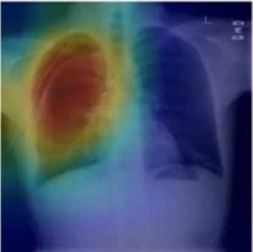

<!-- page: 138 -->

## GIỚI HẠN CỦA AI

## BIASED AI ( ĐỊNH KIẾN AI) VÌ NHỮNG ĐỊNH KIẾN VỀ DỮ' LIỆU

## GIẢI THÍCH TẠI SAO AI LẠI ĐƯ'A RA 1 KẾT QUẢ LÀ KHÓ KHĂN

<!-- page: 139 -->

## A.I VÀ CUỘC SỐNG XÃ HỘI ▶ Những cách dùng Al gây hại

<!-- page: 140 -->

## NHỮNG CÁCH DÙNG AI GÂY HẠI

DeepFakes
Cắt ghép hình ảnh, phim và gán cho người khác.

PHÁ HỒNG QUYỀN RIÊNG TƯ VÀ DÂN CHỦ
Theo dõi, kiểm soát bằng các ứng dụng Al

TẠO RA THÔNG TIN GIẢ TẠO

GIẢ MẠO, TẠO RÁC THÔNG TIN, ĐÁNH CẤP

<!-- page: 141 -->

## A.I VÀ CUỘC SỐNG XÃ HỘI ▶ AI và KINH TẾ

<!-- page: 142 -->

## Developing economies

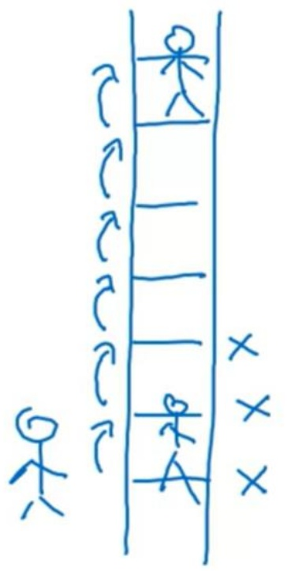

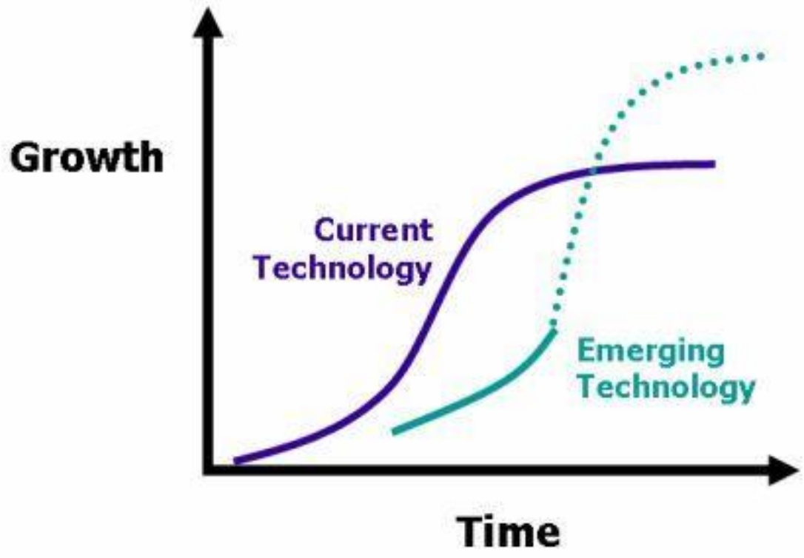

<!-- page: 143 -->

## Developing economies

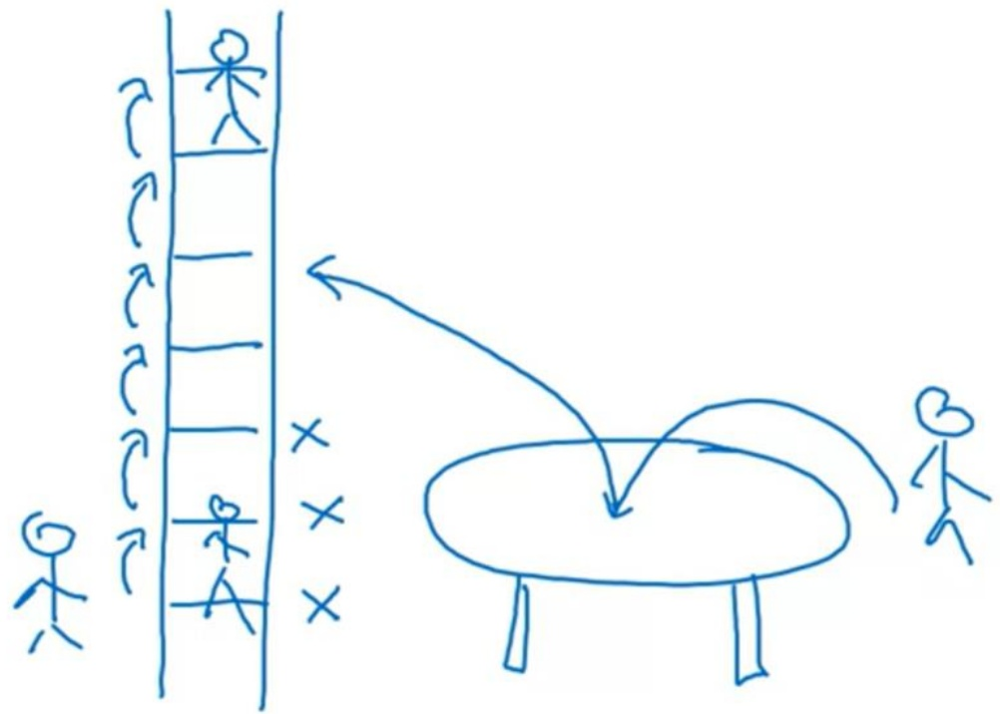

"Leapfrog"

<!-- page: 144 -->

## Developing economies

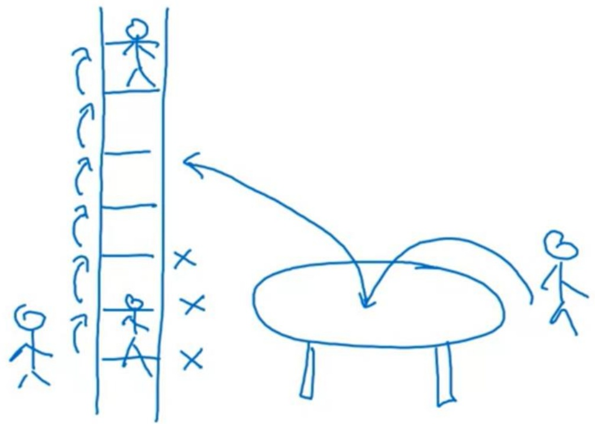

"Leapfrog"

-Mobile phones

-Mobile payments

-Online education

<!-- page: 145 -->

CÁC QUỐC GIA ĐANG PHÁT TRIỂN ĐỀU CÓ THỂ XÂY DỰNG AI

MẶC DÙ MỸ, TRUNG QUỐC ĐẠNG DẪN ĐẦU VỀ NGHIÊN CỨU VÀ Ú Ng DỤNG AI. TUY NHIÊN, MỘI THỨ VẪN CHƯA CHÍN MUỜI.

TẬP TRUNG PHÁT TRIỂN AI TRONG NHỮNG THẾ MẠNH QUỐC GIA

HỢP TÁC CÔNG-TƯ TRONG VIỆC TĂNG TỐC PHÁT TRIỂN AI

ĐẦU TƯ VÀO GIÁO DỤC

<!-- page: 146 -->

## A.I VÀ CUỘC SỐNG XÃ HỘI ▶ AI và VIỆC LÀM

<!-- page: 147 -->

## TÁC ĐỘNG CỦA AI LÊN VIỆC LÀM TOÀN CẦU

Jobs displaced
by 2030

400-800mil

Jobs created
by 2030

555-890 mil

[Source: McKinsey Global Institute.]

<!-- page: 148 -->

## TÁC ĐỘNG CỦA AI LÊN VIỆC LÀM TOÀN CẦU

Automated for the people
Automation risk by job type, %

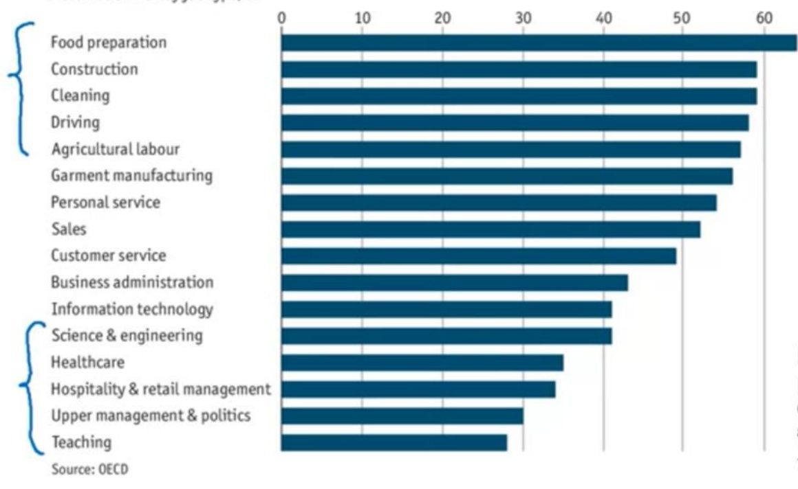

Economist.com

[Image credit: Economist.com]
[Nedelkoska, L. and G. Quintini. (2018). Automation, skills use and training. OECD Social, Employment and Migration Working Papers, No. 202.]

<!-- page: 149 -->

## CÁM O'N!
