<!-- page: 1 -->

**ĐẠI HỌC THÁI NGUYÊN**

**KHO**<strong><u>A CÔNG NGHỆ THÔN</u></strong>**G TIN**

**GIÁO TRÌNH MÔN HỌC**

**XỬ LÝ ẢNH**

**Người soạn** : TS. ĐỖ NĂNG TOÀN, TS. PHẠM VIỆT BÌNH

**Thái Nguyên, Tháng 11 năm 2007**

<!-- page: 2 -->

## LỜI NÓI ĐẦU

Khoảng hơn mười năm trở lại đây, phần cứng máy tính và các thiết bị liên quan đã có sự tiến bộ vượt bậc về tốc độ tính toán, dung lượng chứa, khả năng xử lý v.v.. và giá cả đã giảm đến mức máy tính và các thiết bị liên quan đến xử lý ảnh đã không còn là thiết bị chuyên dụng nữa. Khái niệm ảnh số đã trở nên thông dụng với hầu hết mọi người trong xã hội và việc thu nhận ảnh số bằng các thiết bị cá nhân hay chuyên dụng cùng với việc đưa vào máy tính xử lý đã trở nên đơn giản.

Trong hoàn cảnh đó, xử lý ảnh là một lĩnh vực đang được quan tâm và đã trở thành môn học chuyên ngành của sinh viên ngành công nghệ thông tin trong nhiều trường đại học trên cả nước. Tuy nhiên, tài liệu giáo trình còn là một điều khó khăn. Hiện tại chỉ có một số ít tài liệu bằng tiếng Anh hoặc tiếng Pháp, tài liệu bằng tiếng Việt thì rất hiếm. Với mong muốn đóng góp vào sự nghiệp đào tạo và nghiên cứu trong lĩnh vực này, chúng tôi biên soạn cuốn giáo trình **Xử lý ảnh** dựa trên đề cương môn học đã được duyệt. Cuốn sách tập trung vào các vấn đề cơ bản của xử lý ảnh nhằm cung cấp một nền tảng kiến thức đầy đủ và chọn lọc nhằm giúp người đọc có thể tự tìm hiểu và xây dựng các chương trình ứng dụng liên quan đến xử lý ảnh.

Giáo trình được chia làm 5 chương và phần phụ lục: Chương 1, trình bày Tổng quan về xử lý ảnh, các khai niệm cơ bản, sơ đồ tổng quát của một hệ thống xử lý ảnh và các vấn đề cơ bản trong xử lý ảnh. Chương 2, trình bày các kỹ thuật nâng cao chất lượng ảnh dựa vào các thao tác với điểm ảnh, nâng cao chất lượng ảnh thông qua việc xử lý các điểm ảnh trong lân cận điểm ảnh đang xét. Chương này cũng trình bày các kỹ thuật nâng cao chất lượng ảnh nhờ vào các phép toán hình thái. Chương 3, trình bày các kỹ thuật cơ bản trong việc phát hiện biên của các đối tượng ảnh theo cả hai khuynh hướng: Phát hiện biên trực tiếp và phát hiện biên gián tiếp. Chương 4 thể hiện cách kỹ thuật tìm xương theo khuynh hướng tính toán trục trung vị và hướng tiếp cận xấp xỉ nhờ các thuật toán làm mảnh song song và gián tiếp. Và cuối cùng là Chương 5 với các kỹ thuật hậu xử lý.

Giáo trình được biên soạn dựa trên kinh nghiệm giảng dạy của tác giả trong nhiều năm tại các khóa đại học và cao học của ĐH Công nghệ - ĐHQG Hà Nội, ĐH Khoa học tự nhiên – ĐHQG Hà Nội, Khoa Công nghệ thông tin – ĐH Thái Nguyên v.v.. Cuốn sách có thể làm tài liệu tham khảo cho sinh viên các hệ kỹ sư, cử nhân và các bạn quan tâm đến vấn đề nhận dạng và xử lý ảnh.

<!-- page: 3 -->

Các tác giả bày tỏ lòng biết ơn chân thành tới các bạn đồng nghiệp trong Phòng Nhận dạng và công nghệ tri thức, Viện Công nghệ thông tin, Bộ môn Hệ thống thông tin, Khoa Công nghệ thông tin, ĐH Thái Nguyên, Khoa Công nghệ thông tin, ĐH Công nghệ, ĐHQG Hà Nội, Khoa Toán – Cơ – Tin, ĐH Khoa học tự nhiên, ĐHQG Hà Nội đã động viên, góp ý và giúp đỡ để hoàn chỉnh nội dung cuốn sách này. Xin cám ơn Lãnh đạo Khoa Công nghệ thông tin, ĐH Thái Nguyên, Ban Giám đốc ĐH Thái Nguyên đã hỗ trợ và tạo điều kiện để cho ra đời giáo trình này.

Mặc dù rất cố gắng nhưng tài liệu này chắc chắn không tránh khỏi những sai sót. Chúng tôi xin trân trọng tiếp thu tất cả những ý kiến đóng góp của bạn đọc cũng như các bạn đồng nghiệp để có chỉnh lý kịp thời.

Thư góp ý xin gửi về: Phạm Việt Bình,

Khoa Công nghệ thông tin – ĐH Thái nguyên. Xã Quyết Thắng, Tp. Thái Nguyên

Điện thoại: 0280.846506

Email: pvbinh@ictu.edu.vn

Thái Nguyên, ngày 22 tháng 11 năm 2007 **CÁC TÁC GIẢ**

<!-- page: 4 -->

## MỤC LỤC

- LỜI NÓI ĐẦU....2
- MỤC LỤC....4
- Chương 1: TỔNG QUAN VỀ XỬ LÝ ẢNH....7
- 1.1. XỬ LÝ ẢNH, CÁC VẤN ĐỀ CƠ BẢN TRONG XỬ LÝ ẢNH....7
- 1.1.1. Xử lý ảnh là gì?....7
- 1.1.2. Các vấn đề cơ bản trong xử lý ảnh....7
- 1.1.2.1 Một số khái niệm cơ bản....7
- 1.1.2.2 Nắn chỉnh biến dạng....8
- 1.1.2.3 Khử nhiều....9
- 1.1.2.4 Chính mức xám:....9
- 1.1.2.5 Trích chọn đặc điểm....9
- 1.1.2.6 Nhận dạng....10
- 1.1.2.7 Nén ảnh....11
- 1.2. THU NHẬN VÀ BIỂU DIỄN ẢNH....11
- 1.2.1. Thu nhận, các thiết bị thu nhận ảnh....11
- 1.2.2. Biểu diễn ảnh....12
- 1.2.2.1. Mô hình Raster....12
- 1.2.2.2. Mô hình Vector....13
- Chương 2: CÁC KỸ THUẬT NÂNG CAO CHẤT LUỘNG ẢNH....14
- 2.1. CÁC KỸ THUẬT KHÔNG PHỤ THUỘC KHÔNG GIAN....14
- 2.1.1. Giới thiệu....14
- 2.1.2. Tăng giám độ sáng....14
- 2.1.3. Tách ngưỡng....15
- 2.1.4. Bó cụm....15
- 2.1.5. Cân bằng histogram....16
- 2.1.6. Kỹ thuật tách ngưỡng tự động....17
- 2.1.7. Biến đổi cấp xám tổng thể....18
- 2.2. CÁC KỸ THUẬT PHỤ THUỘC KHÔNG GIAN....20
- 2.2.1. Pháp cuộn và mẫu....20

<!-- page: 5 -->

- 2.2.2. Một số mẫu thông dụng....21
- 2.2.3. Lọc trung vị....22
- 2.2.4. Lọc trung bình....24
- 2.2.5. Lọc trung bình theo k giá trị gần nhất....25
- 2.3. CÁC PHÉP TOÁN HÌNH THÁI HỌC....26
- 2.3.1. Các phép toán hình thái cơ bản....26
- 2.3.2. Một số tính chất của phép toán hình thái....27
- Chương 3: BIÊN VÀ CÁC PHƯƠNG PHÁP PHÁT HIỆN BIÊN....32
- 3.1. GIỚI THIỆU....32
- 3.2. CÁC PHƯƠNG PHÁP PHÁT HIỆN BIÊN TRỰC TIẾP....32
- 3.2.1. Kỹ thuật phát hiện biên Gradient....32
- 3.2.1.1. Kỹ thuật Prewitt....34
- 3.2.1.2. Kỹ thuật Sobel....35
- 3.2.1.3. Kỹ thuật la bàn....35
- 3.2.2. Kỹ thuật phát hiện biên Laplace....36
- 3.3. PHÁT HIỆN BIÊN GIÁN TIẾP....37
- 3.3.1 Một số khái niệm cơ bản....37
- 3.3.2. Chu tuyến của một đối tượng ảnh....38
- 3.3.3. Thuật toán dò biên tổng quát....40
- Chương 4: XƯƠNG VÀ CÁC KỸ THUẬT TÌM XƯƠNG....44
- 4.1. GIỚI THIỆU....44
- 4.2. TÌM XƯƠNG DỰA TRÊN LÀM MẢNH....44
- 4.2.1. Sơ lược về thuật toán làm mảnh....44
- 4.2.2. Một số thuật toán làm mảnh....46
- 4.3. TÌM XƯƠNG KHÔNG DỰA TRÊN LÀM MẢNH....46
- 4.3.1. Khái quát về lược đồ Voronoi....47
- 4.3.2. Trục trung vị Voronoi rời rạc....47
- 4.3.3. Xương Voronoi rời rạc....48
- 4.3.4. Thuật toán tìm xương....49
- Chương 5: CÁC KỸ THUẬT HẬU XỬ LÝ....52
- 5.1. RÚT GỌN SỐ LUỘNG ĐIỂM BIỂU DIÊN....52
- 5.1.1. Giới thiệu....52

<!-- page: 6 -->

- 5.1.2. Thuật toán Douglas Peucker....52
- 5.1.2.1. Ý tưởng....52
- 5.1.2.2. Chương trình....53
- 5.1.3. Thuật toán Band width....54
- 5.1.3.1. Ý tưởng....54
- 5.1.3.2. Chương trình....56
- 5.1.4. Thuật toán Angles....57
- 5.1.4.1. Ý tưởng....57
- 5.1.4.2. Chương trình....57
- 5.2. XẤP XỈ ĐA GIÁC BỔI CÁC HÌNH CỔ SỞ....58
- 5.2.1 Xấp xỉ đa giác theo bất biến đồng dạng....59
- 5.2.2 Xấp xỉ đa giác theo bất biến aphin....62
- 5.3. BIẾN ĐỔI HOUGH....63
- 5.3.1. Biến đổi Hongh cho đường thẳng....63
- 5.3.2. Biến đổi Hough cho đường thẳng trong tọa độ cực....64
- 5.3.2.1. Đường thẳng Hough trong tọa độ cực....64
- 5.3.2.2. Áp dụng biến đổi Hough trong phát hiện góc nghiêng văn bản....65
- PHỤ LỤC....68
- TÀI LIỆU THAM KHẢO....76

<!-- page: 7 -->

# TỔNG QUAN VỀ XỬ LÝ ẢNH

## 1.1. XỬ LÝ ẢNH, CÁC VẤN ĐỀ CƠ BẢN TRONG XỬ LÝ ẢNH

## 1.1.1. Xử lý ảnh là gì?

Con người thu nhận thông tin qua các giác quan, trong đó thị giác đóng vai trò quan trọng nhất. Những năm trở lại đây với sự phát triển của phần cứng máy tính, xử lý ảnh và đồ hoạ đó phát triển một cách mạnh mẽ và có nhiều ứng dụng trong cuộc sống. Xử lý ảnh và đồ hoạ đóng một vai trò quan trọng trong tương tác người máy.

Quá trình xử lý ảnh được xem như là quá trình thao tác ảnh đầu vào nhằm cho ra kết quả mong muốn. Kết quả đầu ra của một quá trình xử lý ảnh có thể là một ảnh “tốt hơn” hoặc một kết luận.

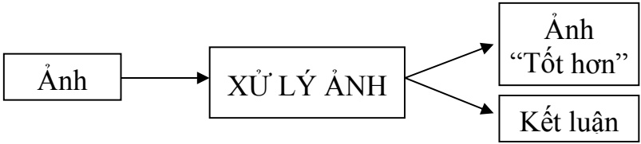

Hình 1.1. Quá trình xử lý ảnh

Ảnh có thể xem là tập hợp các điểm ảnh và mỗi điểm ảnh được xem như là đặc trưng cường độ sáng hay một dấu hiệu nào đó tại một vị trí nào đó của đối tượng trong không gian và nó có thể xem như một hàm n biến $\mathrm{P}(\mathrm{c}_{1}, \mathrm{c}_{2}, \ldots, \mathrm{c}_{\mathrm{n}})$ . Do đó, ảnh trong xử lý ảnh có thể xem như ảnh n chiều.

Sơ đồ tổng quát của một hệ thống xử lý ảnh:

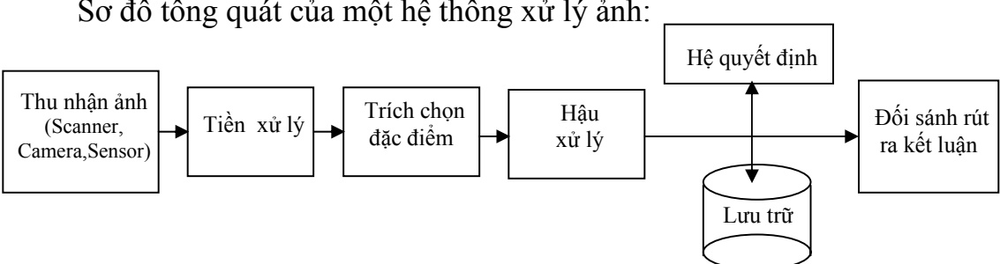

Hình 1.2. Các bước cơ bản trong một hệ thống xử lý ảnh

## 1.1.2. Các vấn đề cơ bản trong xử lý ảnh

## 1.1.2.1 Một số khái niệm cơ bản

\* Ảnh và điểm ảnh:

<!-- page: 8 -->

Điểm ảnh được xem như là dấu hiệu hay cường độ sáng tại 1 toạ độ trong không gian của đối tượng và ảnh được xem như là 1 tập hợp các điểm ảnh.

## \* Mức xám, màu

Là số các giá trị có thể có của các điểm ảnh của ảnh

## 1.1.2.2 Nắn chỉnh biến dạng

Ảnh thu nhận thường bị biến dạng do các thiết bị quang học và điện tử.

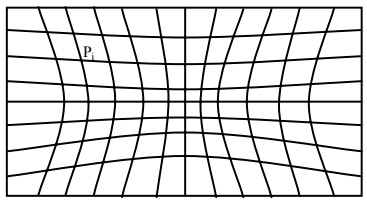

Ảnh thu nhận

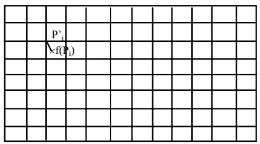

Ảnh mong muốn

Hình 1.3. Ảnh thu nhận và ảnh mong muốn

Để khắc phục người ta sử dụng các phép chiếu, các phép chiếu thường được xây dựng trên tập các điểm điều khiển.

Giả sử $( \mathrm { P } _ { \mathrm { i } } , \mathrm { P } _ { \mathrm { i } } ) \mathrm { i } = \overline { { 1 , n } }$ có n các tập điều khiển

Tìm hàm f: $\mathbf { P } _ { \mathrm { i } } \mapsto \mathbf { f } \left( \mathbf { P } _ { \mathrm { i } } \right)$ sao cho

$$
\sum_ {i = 1} ^ {n} \left|\left| f (P _ {i}) - P _ {i} ^ {\prime} \right|\right| ^ {2} \rightarrow \min
$$

Giả sử ảnh bị biến đổi chỉ bao gồm: Tịnh tiến, quay, tỷ lệ, biến dạng bậc nhất tuyến tính. Khi đó hàm f có dạng:

$$
\mathrm{f} (\mathrm{x}, \mathrm{y}) = (\mathrm{a} _ {1} \mathrm{x} + \mathrm{b} _ {1} \mathrm{y} + \mathrm{c} _ {1}, \mathrm{a} _ {2} \mathrm{x} + \mathrm{b} _ {2} \mathrm{y} + \mathrm{c} _ {2})
$$

Ta có:

$$
\phi = \sum_ {i = 1} ^ {n} \left(f (P i) - P i ^ {\prime}\right) ^ {2} = \sum_ {i = 1} ^ {n} \left[ \left(a _ {1} x _ {i} + b _ {1} y _ {i} + c _ {1} - x _ {i} ^ {\prime}\right) ^ {2} + \left(a _ {2} x _ {i} + b _ {2} y _ {i} + c _ {2} - y _ {i} ^ {\prime}\right) ^ {2} \right]
$$

Để cho $\phi \rightarrow$ min

<!-- page: 9 -->

$$
\left[ \frac {\partial \phi}{\partial a _ {1}} = 0 \quad \right. \quad \left(\sum_ {i = 1} ^ {n} a _ {1} x _ {i} ^ {2} + \sum_ {i = 1} ^ {n} b _ {1} x _ {i} y _ {i} + \sum_ {i = 1} ^ {n} c _ {1} x _ {i} = \sum_ {i = 1} ^ {n} x _ {i} x _ {i} ^ {\prime} \right.
$$

$$
\frac {\partial \phi}{\partial b _ {1}} = 0 \Leftrightarrow \left\{\sum_ {i = 1} ^ {n} a _ {1} x _ {i} y _ {i} + \sum_ {i = 1} ^ {n} b _ {1} y _ {i} ^ {2} + \sum_ {i = 1} ^ {n} c _ {1} y _ {i} = \sum_ {i = 1} ^ {n} y _ {i} x _ {i} ^ {\prime} \right.
$$

$$
\left\lfloor \frac {\partial \phi}{\partial c _ {1}} = 0 \quad \right. \quad \left\lfloor \sum_ {i = 1} ^ {n} a _ {1} x _ {i} + \sum_ {i = 1} ^ {n} b _ {1} y _ {i} + n c _ {1} = \sum_ {i = 1} ^ {n} x _ {i} ^ {\prime} \right.
$$

Giải hệ phương trình tuyến tính tìm được $\mathsf { a } _ { 1 } , \mathsf { b } _ { 1 } , \mathsf { c } _ { 1 }$

Tương tự tìm được $\mathsf { a } _ { 2 } , \mathsf { b } _ { 2 } , \mathsf { c } _ { 2 }$

⇒ Xác định được hàm f

## 1.1.2.3 Khử nhiễu

Có 2 loại nhiễu cơ bản trong quá trình thu nhận ảnh

• Nhiều hệ thống: là nhiễu có quy luật có thể khử bằng các phép biến đổi

• Nhiễu ngẫu nhiên: vết bẩn không rõ nguyên nhân → khắc phục bằng các phép lọc

## 1.1.2.4 Chỉnh mức xám:

Nhằm khắc phục tính không đồng đều của hệ thống gây ra. Thông thường có 2 hướng tiếp cận:

Giảm số mức xám: Thực hiện bằng cách nhóm các mức xám gần nhau thành một bó. Trường hợp chỉ có 2 mức xám thì chính là chuyển về ảnh đen trắng. Ứng dụng: In ảnh màu ra máy in đen trắng.

• Tăng số mức xám: Thực hiện nội suy ra các mức xám trung gian bằng kỹ thuật nội suy. Kỹ thuật này nhằm tăng cường độ mịn cho ảnh

## 1.1.2.5 Trích chọn đặc điểm

Các đặc điểm của đối tượng được trích chọn tuỳ theo mục đích nhận dạng trong quá trình xử lý ảnh. Có thể nêu ra một số đặc điểm của ảnh sau đây:

**Đặc điểm không gian:** Phân bố mức xám, phân bố xác suất, biên độ, điểm uốn v.v..

**Đặc điểm biến đổi:** Các đặc điểm loại này được trích chọn bằng việc thực hiện lọc vùng (zonal filtering). Các bộ vùng được gọi là “mặt nạ đặc

<!-- page: 10 -->

điểm” (feature mask) thường là các khe hẹp với hình dạng khác nhau (chữ nhật, tam giác, cung tròn v.v..)

**Đặc điểm biên và đường biên:** Đặc trưng cho đường biên của đối tượng và do vậy rất hữu ích trong việc trích trọn các thuộc tính bất biến được dùng khi nhận dạng đối tượng. Các đặc điểm này có thể được trích chọn nhờ toán tử gradient, toán tử la bàn, toán tử Laplace, toán tử “chéo không” (zero crossing) v.v..

Việc trích chọn hiệu quả các đặc điểm giúp cho việc nhận dạng các đối tượng ảnh chính xác, với tốc độ tính toán cao và dung lượng nhớ lưu trữ giảm xuống.

## 1.1.2.6 Nhận dạng

Nhận dạng tự động (automatic recognition), mô tả đối tượng, phân loại và phân nhóm các mẫu là những vấn đề quan trọng trong thị giác máy, được ứng dụng trong nhiều ngành khoa học khác nhau. Tuy nhiên, một câu hỏi đặt ra là: mẫu (pattern) là gì? Watanabe, một trong những người đi đầu trong lĩnh vực này đã định nghĩa: “Ngược lại với hỗn loạn (chaos), mẫu là một thực thể (entity), được xác định một cách ang áng (vaguely defined) và có thể gán cho nó một tên gọi nào đó”. Ví dụ mẫu có thể là ảnh của vân tay, ảnh của một vật nào đó được chụp, một chữ viết, khuôn mặt người hoặc một ký đồ tín hiệu tiếng nói. Khi biết một mẫu nào đó, để nhận dạng hoặc phân loại mẫu đó có thể:

Hoặc **phân loại có mẫu** (supervised classification), chẳng hạn phân tích phân biệt (discriminant analyis), trong đó mẫu đầu vào được định danh như một thành phần của một lớp đã xác định.

Hoặc **phân loại không có mẫu** (unsupervised classification hay clustering) trong đó các mẫu được gán vào các lớp khác nhau dựa trên một tiêu chuẩn đồng dạng nào đó. Các lớp này cho đến thời điểm phân loại vẫn chưa biết hay chưa được định danh.

Hệ thống nhận dạng tự động bao gồm ba khâu tương ứng với ba giai đoạn chủ yếu sau đây:

1<sup>o</sup>. Thu nhận dữ liệu và tiền xử lý.

2<sup>o</sup>. Biểu diễn dữ liệu.

3<sup>o</sup>. Nhận dạng, ra quyết định.

Bốn cách tiếp cận khác nhau trong lý thuyết nhận dạng là:

1<sup>o</sup>. Đối sánh mẫu dựa trên các đặc trưng được trích chọn.

2<sup>o</sup>. Phân loại thống kê.

3<sup>o</sup>. Đối sánh cấu trúc.

<!-- page: 11 -->

4<sup>o</sup>. Phân loại dựa trên mạng nơ-ron nhân tạo.

Trong các ứng dụng rõ ràng là không thể chỉ dùng có một cách tiếp cận đơn lẻ để phân loại “tối ưu” do vậy cần sử dụng cùng một lúc nhiều phương pháp và cách tiếp cận khác nhau. Do vậy, các phương thức phân loại tổ hợp hay được sử dụng khi nhận dạng và nay đã có những kết quả có triển vọng dựa trên thiết kế các hệ thống lai (hybrid system) bao gồm nhiều mô hình

Việc giải quyết bài toán nhận dạng trong những ứng dụng mới, nảy sinh trong cuộc sống không chỉ tạo ra những thách thức về thuật giải, mà còn đặt ra những yêu cầu về tốc độ tính toán. Đặc điểm chung của tất cả những ứng dụng đó là những đặc điểm đặc trưng cần thiết thường là nhiều, không thể do chuyên gia đề xuất, mà phải được trích chọn dựa trên các thủ tục phân tích dữ liệu.

## 1.1.2.7 Nén ảnh

Nhằm giảm thiểu không gian lưu trữ. Thường được tiến hành theo cả hai cách khuynh hướng là nén có bảo toàn và không bảo toàn thông tin. Nén không bảo toàn thì thường có khả năng nén cao hơn nhưng khả năng phục hồi thì kém hơn. Trên cơ sở hai khuynh hướng, có 4 cách tiếp cận cơ bản trong nén ảnh:

Nén ảnh thống kê: Kỹ thuật nén này dựa vào việc thống kê tần xuất xuất hiện của giá trị các điểm ảnh, trên cơ sở đó mà có chiến lược mã hóa thích hợp. Một ví dụ điển hình cho kỹ thuật mã hóa này là \*.TIF

Nén ảnh không gian: Kỹ thuật này dựa vào vị trí không gian của các điểm ảnh để tiến hành mã hóa. Kỹ thuật lợi dụng sự giống nhau của các điểm ảnh trong các vùng gần nhau. Ví dụ cho kỹ thuật này là mã nén \*.PCX

Nén ảnh sử dụng phép biến đổi: Đây là kỹ thuật tiếp cận theo hướng nén không bảo toàn và do vậy, kỹ thuật thướng nến hiệu quả hơn. \*.JPG chính là tiếp cận theo kỹ thuật nén này.

Nén ảnh Fractal: Sử dụng tính chất Fractal của các đối tượng ảnh, thể hiện sự lặp lại của các chi tiết. Kỹ thuật nén sẽ tính toán để chỉ cần lưu trữ phần gốc ảnh và quy luật sinh ra ảnh theo nguyên lý Fractal

## 1.2. THU NHẬN VÀ BIỂU DIỄN ẢNH

## 1.2.1. Thu nhận, các thiết bị thu nhận ảnh

<!-- page: 12 -->

Các thiết bị thu nhận ảnh bao gồm camera, scanner các thiết bị thu nhận này có thể cho ảnh đen trắng

Các thiết bị thu nhận ảnh có 2 loại chính ứng với 2 loại ảnh thông dụng Raster, Vector.

Các thiết bị thu nhận ảnh thông thường Raster là camera các thiết bị thu nhận ảnh thông thường Vector là sensor hoặc bàn số hoá Digitalizer hoặc được chuyển đổi từ ảnh Raster.

Nhìn chung các hệ thống thu nhận ảnh thực hiện 1 quá trình

• Cảm biến: biến đổi năng lượng quang học thành năng lượng điện

• Tổng hợp năng lượng điện thành ảnh

## 1.2.2. Biểu diễn ảnh

Ảnh trên máy tính là kết quả thu nhận theo các phương pháp số hoá được nhúng trong các thiết bị kỹ thuật khác nhau. Quá trình lưu trữ ảnh nhằm 2 mục đích:

• Tiết kiệm bộ nhớ

• Giảm thời gian xử lý

Việc lưu trữ thông tin trong bộ nhớ có ảnh hưởng rất lớn đến việc hiển thị, in ấn và xử lý ảnh được xem như là 1 tập hợp các điểm với cùng kích thước nếu sử dụng càng nhiều điểm ảnh thì bức ảnh càng đẹp, càng mịn và càng thể hiện rõ hơn chi tiết của ảnh người ta gọi đặc điểm này là độ phân giải.

Việc lựa chọn độ phân giải thích hợp tuỳ thuộc vào nhu cầu sử dụng và đặc trưng của mỗi ảnh cụ thể, trên cơ sở đó các ảnh thường được biểu diễn theo 2 mô hình cơ bản

## 1.2.2.1. Mô hình Raster

Đây là cách biểu diễn ảnh thông dụng nhất hiện nay, ảnh được biểu diễn dưới dạng ma trận các điểm (điểm ảnh). Thường thu nhận qua các thiết bị như camera, scanner. Tuỳ theo yêu cầu thực thế mà mỗi điểm ảnh được biểu diễn qua 1 hay nhiều bít

Mô hình Raster thuận lợi cho hiển thị và in ấn. Ngày nay công nghệ phần cứng cung cấp những thiết bị thu nhận ảnh Raster phù hợp với tốc độ nhanh và chất lượng cao cho cả đầu vào và đầu ra. Một thuận lợi cho việc hiển thị trong môi trường Windows là Microsoft đưa ra khuôn dạng ảnh DIB (Device Independent Bitmap) làm trung gian. Hình 1.4 thể hình quy trình chung để hiển thị ảnh Raster thông qua DIB.

<!-- page: 13 -->

Một trong những hướng nghiên cứu cơ bản trên mô hình biểu diễn này là kỹ thuật nén ảnh các kỹ thuật nén ảnh lại chia ra theo 2 khuynh hướng là nén bảo toàn và không bảo toàn thông tin nén bảo toàn có khả năng phục hồi hoàn toàn dữ liệu ban đầu còn nếu không bảo toàn chỉ có khả năng phục hồi độ sai số cho phép nào đó. Theo cách tiếp cận này người ta đã đề ra nhiều quy cách khác nhau như BMP, TIF, GIF, PCX…

Hiện nay trên thế giới có trên 50 khuôn dạng ảnh thông dụng bao gồm cả trong đó các kỹ thuật nén có khả năng phục hồi dữ liệu 100% và nén có khả năng phục hồi với độ sai số nhận được.

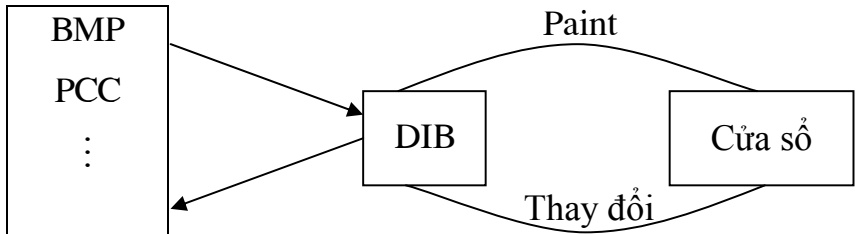

Hình 1.4. Quá trình hiển thị và chỉnh sửa, lưu trữ ảnh thông qua DIB

## 1.2.2.2. Mô hình Vector

Biểu diễn ảnh ngoài mục đích tiết kiệm không gian lưu trữ dễ dàng cho hiển thị và in ấn còn đảm bảo dễ dàng trong lựa chọn sao chép di chuyển tìm kiếm… Theo những yêu cầu này kỹ thuật biểu diễn vector tỏ ra ưu việt hơn.

Trong mô hình vector người ta sử dụng hướng giữa các vector của điểm ảnh lân cận để mã hoá và tái tạo hình ảnh ban đầu ảnh vector được thu nhận trực tiếp từ các thiết bị số hoá như Digital hoặc được chuyển đổi từ ảnh Raster thông qua các chương trình số hoá

Công nghệ phần cứng cung cấp những thiết bị xử lý với tốc độ nhanh và chất lượng cho cả đầu vào và ra nhưng lại chỉ hỗ trợ cho ảnh Raster.

Do vậy, những nghiên cứu về biểu diễn vectơ đều tập trung từ chuyển đổi từ ảnh Raster.

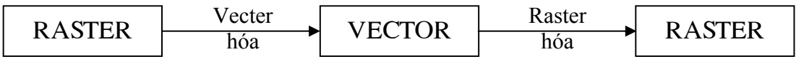

Hình 1.5. Sự chuyển đổi giữa các mô hình biểu diễn ảnh

<!-- page: 14 -->

## CÁC KỸ THUẬT NÂNG CAO CHẤT LƯỢNG ẢNH

## 2.1. CÁC KỸ THUẬT KHÔNG PHỤ THUỘC KHÔNG GIAN

## 2.1.1. Giới thiệu

Các phép toán không phụ thuộc không gian là các phép toán không phục thuộc vị trí của điểm ảnh.

Ví dụ: Phép tăng giảm độ sáng , phép thống kê tần suất, biến đổi tần suất $\mathbf { V } . \mathbf { V } .$

Một trong những khái niệm quan trọng trong xử lý ảnh là biểu đồ tần suất (Histogram)

Biểu đồ tần suất của mức xám g của ảnh I là số điểm ảnh có giá trị g của ảnh I. Ký hiệu là h(g)

$$
\mathrm{I} = \left( \begin{array}{c c c c} 1 & 2 & 0 & 4 \\ 1 & 0 & 0 & 7 \\ 2 & 2 & 1 & 0 \\ 4 & 1 & 2 & 1 \\ 2 & 0 & 1 & 1 \end{array} \right)
$$

| g | 0 | 1 | 2 | 4 | 7 |
| --- | --- | --- | --- | --- | --- |
| h(g) | 5 | 7 | 5 | 2 | 1 |

## 2.1.2. Tăng giảm độ sáng

Giả sử ta có I \~ kích thước m × n và $\mathrm { s } \hat { 0 }$ nguyên c

Khi đó, kỹ thuật tăng, giảm độc sáng được th $\grave { e }$ hiện

$$
\text { for } (i = 0; i <   m; i + +)
$$

$$
\text { for } (j = 0; j <   n; j + +)
$$

$$
\mathrm{I} [ \mathrm{i}, \mathrm{j} ] = \mathrm{I} [ \mathrm{i}, \mathrm{j} ] + \mathrm{c};
$$

$\mathrm { N \acute { \acute { e } u } \; c \geq 0 } ;$ ảnh sáng lên

• Nếu $\mathbf { c } \leq 0 . 1$ ảnh tối đi

<!-- page: 15 -->

## 2.1.3. Tách ngưỡng

Giả sử ta có ảnh I \~ kích thước m × n, hai số Min, Max và ngưỡng θ khi đó: Kỹ thuật tách ngưỡng được thể hiện

for $( \mathrm{i} = 0 ; \mathrm{i} < \mathrm{m} ; \mathrm{i} + + )$

for $( \mathbf{j} = 0 ; \mathbf{j} < \mathbf{n} ; \mathbf{j} + + )$

$$
\mathrm{I} [ \mathrm{i}, \mathrm{j} ] = \mathrm{I} [ \mathrm{i}, \mathrm{j} ] > = \theta ? \text {Max}: \text {Min};
$$

\* Ứng dụng:

Nếu Min = 0, Max = 1 kỹ thuật chuyển ảnh thành ảnh đen trắng được ứng dụng khi quét và nhận dạng văn bản có thể xảy ra sai sót nền thành ảnh hoặc ảnh thành nền dẫn đến ảnh bị đứt nét hoặc dính.

## 2.1.4. Bó cụm

Kỹ thuật nhằm giảm bớt số mức xám của ảnh bằng cách nhóm lại số mức xám gần nhau thành 1 nhóm

Nếu chỉ có 2 nhóm thì chính là kỹ thuật tách ngưỡng. Thông thường có nhiều nhóm với kích thước khác nhau.

Để tổng quát khi biến đổi người ta sẽ lấy cùng 1 kích thước bunch\_size

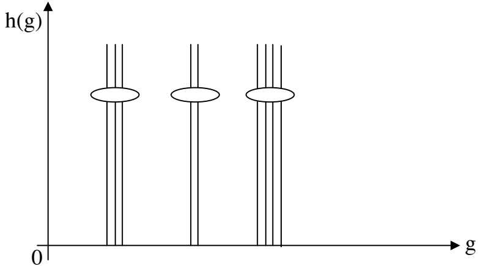

$\mathrm { I } [ \mathrm { i } , \mathrm { j } ] = \mathrm { I } [ \mathrm { i } , \mathrm { j } ] /$ bunch - size \* bunch\_size $\nabla ( \mathbf { i , } \mathbf { j } )$

Ví dụ: Bó cụm ảnh sau với bunch\_size= 3

$$
\mathrm{I} = \left( \begin{array}{c c c c c} 1 & 2 & 4 & 6 & 7 \\ 2 & 1 & 3 & 4 & 5 \\ 7 & 2 & 6 & 9 & 1 \\ 4 & 1 & 2 & 1 & 2 \end{array} \right)
$$

<!-- page: 16 -->

$$
\mathrm{I} _ {\mathrm{kq}} = \left( \begin{array}{c c c c c} 0 & 0 & 3 & 6 & 6 \\ 0 & 0 & 3 & 3 & 3 \\ 6 & 0 & 6 & 9 & 0 \\ 3 & 0 & 0 & 0 & 0 \end{array} \right)
$$

## 2.1.5. Cân bằng histogram

Ảnh I được gọi là cân bằng "lý tưởng" nếu với mọi mức xám $\mathrm { g } ,   \mathrm { g } ^ { \prime }$ ta có $\mathbf{h}(\mathbf{g}) = \mathbf{h}(\mathbf{g}^{\prime})$

Giả sử, ta có ảnh I \~ kích thước m × n

new\_level \~ số mức xám của ảnh cân bằng

$TB = \frac{m \times n}{new\_level} \sim$ số điểm ảnh trung bình của mỗi mức xám của ảnh cân bằng

$t ( g ) = \sum _ { i = 0 } ^ { g } h ( i ) \atop \sim$ số điểm ảnh có mức xám ≤ g

Xác định hàm ${ \mathbf { f } } { \mathbf { \dot { \cdot } } } \; { \mathbf { g } } \mapsto { \mathbf { f } } ( { \mathbf { g } } )$

Sao cho: $f(g) = \max \left\{ 0, round \left( \frac{t(g)}{TB} \right) - 1 \right\}$

Ví dụ: Cân bằng ảnh sau với new\_level= 4

$$
\mathrm{I} = \left( \begin{array}{c c c c c} 1 & 2 & 4 & 6 & 7 \\ 2 & 1 & 3 & 4 & 5 \\ 7 & 2 & 6 & 9 & 1 \\ 4 & 1 & 2 & 1 & 2 \end{array} \right)
$$

| g | h(g) | t(g) | f(g) |
| --- | --- | --- | --- |
| 1 | 5 | 5 | 0 |
| 2 | 5 | 10 | 1 |
| 3 | 1 | 11 | 1 |
| 4 | 3 | 14 | 2 |
| 5 | 1 | 15 | 2 |
| 6 | 2 | 17 | 2 |
| 7 | 2 | 19 | 3 |
| 9 | 1 | 20 | 3 |

<!-- page: 17 -->

$$
\mathrm{I} _ {\mathrm{kq}} = \left( \begin{array}{c c c c c} 0 & 1 & 2 & 2 & 3 \\ 1 & 0 & 1 & 2 & 2 \\ 3 & 1 & 2 & 3 & 0 \\ 2 & 0 & 1 & 0 & 1 \end{array} \right)
$$

**Chú ý:** Ảnh sau khi thực hiện cân bằng chưa chắc đã là cân bằng "lý tưởng "

## 2.1.6. Kỹ thuật tách ngưỡng tự động

Ngưỡng θ trong kỹ thuật tách ngưỡng thường được cho bởi người sử dụng. Kỹ thuật tách ngưỡng tự động nhằm tìm ra ngưỡng θ một cách tự động dựa vào histogram theo nguyên lý trong vật lý là vật thể tách làm 2 phần nếu tổng độ lệnh trong từng phần là tối thiểu.

Giả sử, ta có ảnh

I \~ kích thước m × n

G \~ là số mức xám của ảnh kể cả khuyết thiếu

t(g) \~ số điểm ảnh có mức xám ≤ g

$$
m (g) = \frac {1}{t (g)} \sum_ {i = 0} ^ {g} i. h (i) \sim \text {mômen quán tính TB có mức xám} \leq g
$$

Hàm f: $g \mapsto f ( g )$

$$
f (g) = \frac {t (g)}{m x n - t (g)} \big [ m (g) - m (G - 1) \big ] ^ {2}
$$

Tìm θ sao cho:

$$
f (\theta) = \max _ {0 \leq g <   G - 1} \left\{f (g) \right\}
$$

Ví dụ: Tìm ngưỡng tự động của ảnh sau

$$
\mathrm{I} = \left( \begin{array}{c c c c c c} 0 & 1 & 2 & 3 & 4 & 5 \\ 0 & 0 & 1 & 2 & 3 & 4 \\ 0 & 0 & 0 & 1 & 2 & 3 \\ 0 & 0 & 0 & 0 & 1 & 2 \\ 0 & 0 & 0 & 0 & 0 & 1 \end{array} \right)
$$

Lập bảng

$$
\begin{array}{c c c c c c c} \mathrm{g} & \mathrm{h(g)} & \mathrm{t(g)} & \mathrm{g.h(g)} & \sum_ {i = 0} ^ {\mathrm{g}} i h (i) & \mathrm{m(g)} & \mathrm{f(g)} \\ \hline 0 & 1 5 & 1 5 & 0 & 0 & 0 & 1. 3 5 \\ 1 & 5 & 2 0 & 5 & 5 & 0, 2 5 & 1. 6 6 \end{array}
$$

<!-- page: 18 -->

| 2 | 4 | 24 | 8 | 13 | 0,54 | 1.54 |
| --- | --- | --- | --- | --- | --- | --- |
| 3 | 3 | 27 | 9 | 22 | 0,81 | 1.10 |
| 4 | 2 | 29 | 8 | 30 | 1,03 | 0.49 |
| 5 | 1 | 30 | 5 | 35 | 1,16 | ∞ |

Ngưỡng cần tách θ= 1 ứng với f(θ)= 1.66

## 2.1.7. Biến đổi cấp xám tổng thể

Nếu biết ảnh và hàm biến đổi thì ta có thể tính được ảnh kết quả và do đó ta sẽ có được histogram của ảnh biến đổi. Nhưng thực tế nhiều khi ta chỉ biết histogram của ảnh gốc và hàm biến đổi, câu hỏi đặt ra là liệu ta có thể có được histogram của ảnh biến đổi. Nếu có như vậy ta có thể hiệu chỉnh hàm biến đổi để thu được ảnh kết quả có phân bố histogram như mong muốn.

Bài toán đặt ra là biết histogram của ảnh, biết hàm biến đổi hãy vẽ histogram của ảnh mới.

Ví dụ:

| g | 1 | 2 | 3 | 4 |
| --- | --- | --- | --- | --- |
| h(g) | 4 | 2 | 1 | 2 |

$$
\mathrm{f} (\mathrm{g}) = \left\{ \begin{array}{l l} \mathrm{g} + 1 & \text {neu g} \leq 2 \\ \mathrm{g} & \text {neu g} = 3 \\ \mathrm{g} - 1 & \text {neu g} > 3 \end{array} \right.
$$

Bước 1: Vẽ Histogram của ảnh cũ

f(g)

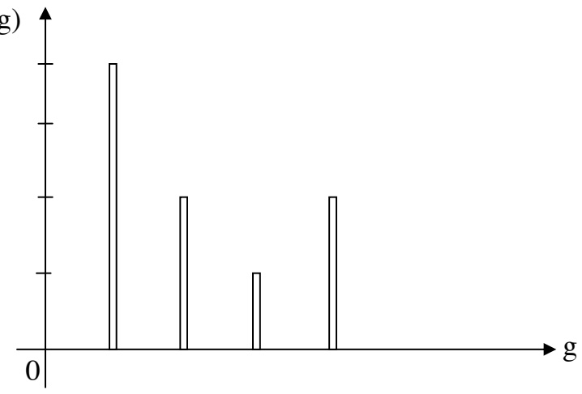

<!-- page: 19 -->

Bước 2: Vẽ đồ thị hàm f(g)

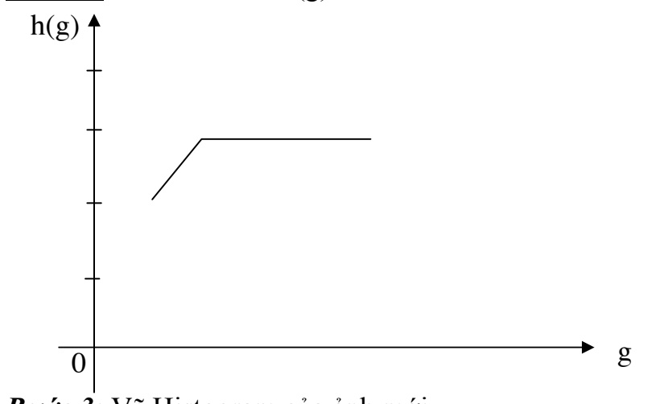

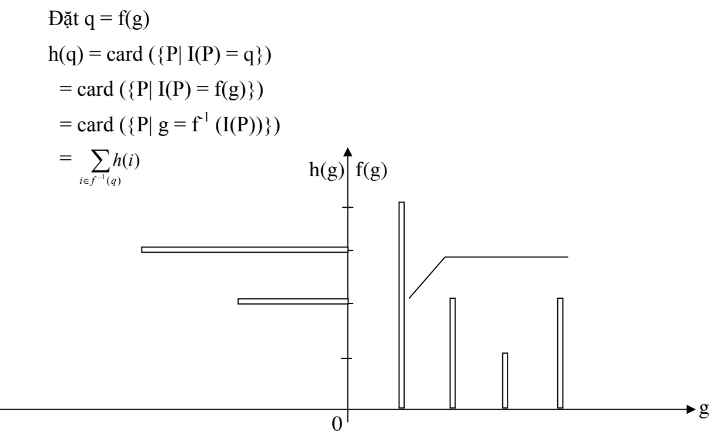

Histogram của ảnh mới thua được bằng cách chồng hình và tính giá trị theo các $\mathbf { q } \left( = \mathbf { f } ( \mathbf { g } ) \right)$ theo công thức tính trên. Kết quả cuối thu được sau phép quay góc 90 thuận chiều kim đồng hồ.

<!-- page: 20 -->

## 2.2. CÁC KỸ THUẬT PHỤ THUỘC KHÔNG GIAN

## 2.2.1. Phép cuộn và mẫu

Giả sử ta có ảnh I kích thước $\mathbf { M } \times \mathbf { N } ,$ mẫu T có kích thước $\mathbf { m } \times \mathbf { n }$ khi đó, ảnh I cuộn theo mẫu T được xác định bởi công thức.

$$
I \otimes T (x, y) = \sum_ {i = 0} ^ {m - 1} \sum_ {j = 0} ^ {n - 1} I \big (x + i, y + j \big) * T \big (i, j \big)\tag{2.1}
$$

Hoặc

$$
I \otimes T (x, y) = \sum_ {i = 0} ^ {m - 1} \sum_ {j = 0} ^ {n - 1} I \big (x - i, y - j \big) * T \big (i, j \big)\tag{2.2}
$$

VD:

$$
\begin{array}{l} \mathrm{I} = \left( \begin{array}{c c c c c c} 1 & 2 & 4 & 5 & 8 & 7 \\ 2 & 1 & 1 & 4 & 2 & 2 \\ 4 & 5 & 5 & 8 & 8 & 2 \\ 1 & 2 & 1 & 1 & 4 & 4 \\ 7 & 2 & 2 & 1 & 5 & 2 \end{array} \right) \\ \mathrm{T} = \left( \begin{array}{c c} 1 & 0 \\ 0 & 1 \end{array} \right) \\ I \otimes T (x, y) = \sum_ {i = 0} ^ {1} \sum_ {j = 0} ^ {1} I (x + i, y + j) * T (i, j) = I (x, y) * T (0, 0) + I (x + 1, y + 1) * T (1, 1) \\ = I (x, y) + I (x + 1, y + 1) \end{array}
$$

$$
\mathrm{I} \otimes \mathrm{T} = \left( \begin{array}{c c c c c c} 2 & 3 & 8 & 7 & 1 0 & * \\ 7 & 6 & 9 & 1 2 & 4 & * \\ 6 & 6 & 6 & 1 2 & 1 2 & * \\ 3 & 4 & 2 & 6 & 6 & * \\ * & * & * & * & * & * \end{array} \right)
$$

Tính theo (2.1)

Tính theo công thức 2.2

$$
\mathrm{I} \otimes \mathrm{T} = \left( \begin{array}{c c c c c c} * & * & * & * & * & * \\ * & 2 & 3 & 8 & 7 & 1 0 \\ * & 7 & 6 & 9 & 1 2 & 4 \\ * & 6 & 6 & 6 & 1 2 & 1 2 \\ * & 3 & 4 & 2 & 6 & 6 \end{array} \right)
$$

<!-- page: 21 -->

## \* Nhận xét:

\- Trong quá trình thực hiện phép cuộn có một số thao tác ra ngoài ảnh, ảnh không được xác định tại những vị trí đó dẫn đến ảnh thu được có kích thước nhá hơn.

\- Ảnh thực hiện theo công thức 2.1 và 2.2 chỉ sai khác nhau 1 phép dịch chuyển để đơn giản ta sẽ hiểu phép cuộn là theo công thức 2.1

## 2.2.2. Một số mẫu thông dụng

\- Mẫu:

$$
\mathrm{T} _ {1} = \left( \begin{array}{c c c} 1 & 1 & 1 \\ 1 & 1 & 1 \\ 1 & 1 & 1 \end{array} \right)
$$

\~ Dùng để khử nhiễu ⇒ Các điểm có tần số cao

<u>VD1:</u>

$$
\begin{array}{r l} \mathrm{I} = & \left( \begin{array}{c c c c c c} 1 & 2 & 4 & 5 & 8 & 7 \\ 2 & 3 1 & 1 & 4 & 2 & 2 \\ 4 & 5 & 5 & 8 & 8 & 2 \\ 1 & 2 & 1 & 1 & 4 & 4 \\ 7 & 2 & 2 & 1 & 5 & 2 \end{array} \right) \\ \mathrm{I} \otimes \mathrm{T} _ {1} = & \left( \begin{array}{c c c c c c} 5 5 & 6 5 & 4 5 & 4 6 & * & * \\ 5 2 & 5 8 & 3 4 & 3 5 & * & * \\ 2 9 & 2 7 & 3 5 & 3 5 & * & * \\ * & * & * & * & * & * \\ * & * & * & * & * & * \end{array} \right) \end{array}
$$

Áp dụng kỹ thuật cộng hằng số với c = -27, ta có:

$$
\mathrm{I} _ {\mathrm{kq}} = \left( \begin{array}{c c c c c c} 2 8 & 3 8 & 1 8 & 1 9 & * & * \\ 2 5 & 3 1 & 7 & 8 & * & * \\ 2 & 0 & 8 & 8 & * & * \\ * & * & * & * & * & * \\ * & * & * & * & * & * \end{array} \right)
$$

\- Mẫu:

$$
\mathrm{T} _ {2} = \left( \begin{array}{c c c} 0 & - 1 & 0 \\ - 1 & 4 & - 1 \\ 0 & - 1 & 0 \end{array} \right)
$$

<!-- page: 22 -->

\~ Dùng để phát hiện các điểm có tần số cao

<u>VD2:</u>

$$
\mathrm{I} \otimes \mathrm{T} 2 = - 1 \left( \begin{array}{c c c c c c} 1 1 4 & - 4 0 & 0 & - 1 4 & * & * \\ - 2 2 & 5 & 1 4 & 1 6 & * & * \\ - 6 & - 1 0 & - 2 & * & * \\ * & * & * & * & * & * \\ * & * & * & * & * & * \end{array} \right)
$$

## 2.2.3. Lọc trung vị

**\* Định nghĩa 2.1 (Trung vị)**

Cho dãy $\mathbf { X } _ { 1 } ;   \mathbf { X } _ { 2 } . . . ;   \mathbf { X } _ { \mathrm { n } }$ đơn điệu tăng (giảm). Khi đó trung vị của dãy ký hiệu là $\operatorname { M e d } ( \{ \mathbf { x } _ { n } \} )$ , được định nghĩa:

$$
\begin{array}{l} + \text {Néu n lẻ} x \left[ \frac {n}{2} + 1 \right] \\ + \text {Néu n chăn:} x \left[ \frac {n}{2} \right] \text {hoặc} x \left[ \frac {n}{2} + 1 \right] \end{array}
$$

**\* Mệnh đề 2.1**

$$
\sum_ {i = 1} ^ {n} \left| x - x _ {i} \right|\rightarrow \min \text {tại} M e d \left(\left\{x _ {n} \right\}\right)
$$

Chứng minh

\+ Xét trường hợp n chẵn

Đặt $M = \frac { \hbar } { 2 }$

Ta có:

$$
\begin{array}{r l} \sum_ {i = 1} ^ {n} \big | x - x _ {i} \big | & = \sum_ {i = 1} ^ {M} \big | x - x _ {i} \big | + \sum_ {i = 1} ^ {M} \big | x - x _ {M + i} \big | \\ & = \sum_ {i = 1} ^ {M} \big (\big | x - x _ {i} \big | + \big | x _ {M + i} - x \big | \big) \geq \sum_ {i = 1} ^ {M} \big | x _ {M + i} - x _ {i} \big | \\ & = \sum_ {i = 1} ^ {M} \big [ \big (x _ {M + 1} - x _ {M} \big) + \big (x _ {M} - x _ {i} \big) \big ] \\ & = \sum_ {i = 1} ^ {M} \big | x _ {M + i} - M e d \big (\{x _ {i} \} \big) \big | + \sum_ {i = 1} ^ {M} \big | x _ {i} - M e d \big (\{x _ {i} \} \big) \big | \end{array}
$$

<!-- page: 23 -->

$$
= \sum_ {i = 1} ^ {n} \left| x _ {i} - M e d \big (\{x _ {i} \} \big) \right|
$$

\+ Nếu n lẻ:

Bổ sung thêm phần tử $M e d ( \{ x _ { _ i } \} )$ vào dãy. Theo trường hợp n chẵn ta có:

$$
\sum_ {i = 1} ^ {n} \left| x - x _ {i} \right| + \left| M e d \left(\left\{x _ {i} \right\}\right) - M e d \left(\left\{x _ {i} \right\}\right)\right|\rightarrow \min \text {tại} \operatorname{Med} \left(\left\{\mathrm{x} _ {\mathrm{n}} \right\}\right)
$$

$$
\sum_ {i = 1} ^ {n} \left| x - x _ {i} \right|\rightarrow \min \text {tại Med} (\{\mathrm{x} _ {\mathrm{n}} \})
$$

## \* Kỹ thuật lọc trung vị

Giả sử ta có ảnh I ngưìng θ cửa sổ W(P) và điểm ảnh P

Khi đó kỹ thuật lọc trung vị phụ thuộc không gian bao gồm các bước cơ bản sau:

$$
\begin{array}{l}+ \underline {{\text {Buóc 1:}}} \text {Tìm trung vị}\\\{\mathrm{I(q)} | \mathrm{q} \in \mathrm{W(P)} \} \rightarrow \text {Med (P)}\\+ \underline {{\text {Buóc 2:}}} \text {Gán giá trị}\end{array}
$$

$$
I (P) = \left\{ \begin{array}{l l} I (P) & \quad \left| I (P) - M e d (P) \right| \leq \theta \\ M e d (P) & \quad N g u o c l a i \end{array} \right.
$$

Ví dụ:

$$
\mathrm{I} = \left( \begin{array}{c c c c} 1 & 2 & 3 & 2 \\ 4 & 1 6 & 2 & 1 \\ 4 & 2 & 1 & 1 \\ 2 & 1 & 2 & 1 \end{array} \right)
$$

$$
\mathrm{W} (3 \times 3); \theta = 2
$$

$$
\mathrm{I} _ {\mathrm{kq}} = \left( \begin{array}{c c c c} 1 & 2 & 3 & 2 \\ 4 & \textcircled {2} & 2 & 1 \\ 4 & 2 & 1 & 1 \\ 2 & 1 & 2 & 1 \end{array} \right)
$$

Giá trị 16, sau phép lọc có giá trị 2, các giá trị còn lại không thay đổi giá trị.

<!-- page: 24 -->

## 2.2.4. Lọc trung bình

## \* Định nghĩa 2.2 (Trung bình)

Cho dãy $\mathbf { X } _ { 1 } , \mathbf { X } _ { 2 } , \ldots , \mathbf { X } _ { \mathrm { n } }$ khi đó trung bình của dãy ký hiệu $\mathrm { A V } ( \{ \mathbf { x } _ { \mathrm { n } } \} )$ ddược định nghĩa:

$$
A V \big (\{x _ {n} \} \big) = r o u n d \left(\frac {1}{n} \sum_ {i = 1} ^ {n} x _ {i}\right)
$$

**\* Mệnh đề 2.2**

$$
\sum_ {i = 1} ^ {n} \left(x - x _ {i}\right) ^ {2} \rightarrow \min \text {tại} A V \left(\left\{x _ {n} \right\}\right)
$$

Chứng minh:

$$
\text {Dat:} \phi (x) = \sum_ {i = 1} ^ {n} \left(x - x _ {i}\right) ^ {2}
$$

Ta có:

$$
\phi (x) = 2 \sum_ {i = 1} ^ {n} \left(x - x _ {i}\right)
$$

$$
\phi^ {'} (x) = 0
$$

$$
\Leftrightarrow \sum_ {i = 1} ^ {n} \left(x - x _ {i}\right) = 0
$$

$$
\Leftrightarrow x = \frac {1}{n} \sum_ {i = 1} ^ {n} x _ {i} = A V \big (\{x _ {i} \} \big)
$$

Mặt khác, $\phi^{''}(x) = 2n > 0$

$$
\Rightarrow \phi \rightarrow \min _ {\text {tại}} x = A V \left(\left\{x _ {i} \right\}\right)
$$

## Kỹ thuật lọc trung bình

Giả sử ta có ảnh I, điểm ảnh P, cửa sổ W(P) và ngưỡng θ. Khi đó kỹ thuật lọc trung bình phụ thuộc không gian bao gồm các bước cơ bản sau:

**+** <strong><u>Bước 1</u></strong>**:** Tìm trung bình

$$
\{\mathrm{I} (\mathrm{q}) | \mathrm{q} \in \mathrm{W} (\mathrm{P}) \} \to \mathrm{AV} (\mathrm{P})
$$

<!-- page: 25 -->

**+** <strong><u>Bước 2</u></strong>**:** Gán giá trị

$$
I (P) = \left\{ \begin{array}{l l} I (P) & \quad \left| I (P) - A V (P) \right| \leq \theta \\ A V (P) & \quad N g u o c l a i \end{array} \right.
$$

Ví dụ:

$$
\mathrm{I} = \left( \begin{array}{c c c c} 1 & 2 & 3 & 2 \\ 4 & 1 6 & 2 & 1 \\ 4 & 2 & 1 & 1 \\ 2 & 1 & 2 & 1 \end{array} \right)
$$

W(3 × 3); θ = 2

$$
\mathrm{I} _ {\mathrm{kq}} = \left( \begin{array}{c c c c} 1 & 2 & 3 & 2 \\ 4 & \textcircled {3} & 2 & 1 \\ 4 & 2 & 1 & 1 \\ 2 & 1 & 2 & 1 \end{array} \right)
$$

Giá trị 16 sau phép lọc trung bình có giá trị 3, các giá trị còn lại giữ nguyên sau phép lọc.

## 2.2.5. Lọc trung bình theo k giá trị gần nhất

Giả sử ta có ảnh I, điểm ảnh P, cửa sổ W(P), ngưỡng θ và số k. Khi đó, lọc trung bình theo k giá trị gần nhất bao gồm các bước sau:

**+** <strong><u>Bước 1</u></strong>: Tìm K giá trị gần nhất

$$
\{\mathrm{I} (\mathrm{q}) \mid \mathrm{q} \in \mathrm{W} (\mathrm{p}) \} \rightarrow \{\mathrm{k} \sim \text {giá trị gần I(P) nhất} \}
$$

**+** <strong><u>Bước 2</u></strong>**:** Tính trung bình

$$
\{\mathrm{k} \sim \text {giá trị gần I(P) nhất} \} \rightarrow \mathrm{AV} _ {\mathrm{k}} (\mathrm{P})
$$

**+** <strong><u>Bước 3</u></strong>**:** Gán giá trị

$$
I (P) = \left\{ \begin{array}{l l} I (P) & \quad \left| I (P) - A V _ {k} (P) \right| \leq \theta \\ A V _ {k} (P) & \quad N g u o c l a i \end{array} \right.
$$

Ví dụ:

$$
\mathrm{I} = \left( \begin{array}{c c c c} 1 & 2 & 3 & 2 \\ 4 & 1 6 & 2 & 1 \\ 4 & 2 & 1 & 1 \\ 2 & 1 & 2 & 1 \end{array} \right)
$$

$$
\mathrm{W} (3 \times 3); \theta = 2; \mathrm{k} = 3
$$

<!-- page: 26 -->

$$
\mathrm{I} _ {\mathrm{kq}} = \quad \left( \begin{array}{c c c c} 1 & 2 & 3 & 2 \\ 4 & 8 & 2 & 1 \\ 4 & 2 & 1 & 1 \\ 2 & 1 & 2 & 1 \end{array} \right)
$$

\* Nhận xét:

\- Nếu k lớn hơn kích thước cửa $s \hat { \hat { 0 } }$ thì kỹ thuật chính là kỹ thuật lọc trung bình

\- Nếu k= 1 thì ảnh kết quả không thay đổi

⇒ Chất lượng của kỹ thuật phụ thuộc vào số phân tử lựa chọn k.

## 2.3. CÁC PHÉP TOÁN HÌNH THÁI HỌC

## 2.3.1. Các phép toán hình thái cơ bản

Hình thái là thuật ngữ chỉ sự nghiên cứu về cấu trúc hay hình học topo của đối tượng trong ảnh. Phần lớn các phép toán của "Hình thái" được định nghĩa từ hai phép toán cơ bản là phép "giãn nở" (Dilation) và phép "co" (Erosion).

Các phép toán này được định nghĩa như sau: Giả thiết ta có đối tượng X và phần tử cấu trúc (mẫu) B trong không gian Euclide hai chiều. Kí hiệu $\mathbf { B } _ { \mathrm { x } }$ là dịch chuyển của B tới vị trí x.

## Định nghĩa 2.3 (DILATION)

Phép "giãn nở" của X theo mẫu B là hợp của tất cả các $\mathbf { B } _ { \mathrm { { x } } }$ với x thuộc X. Ta có:

$$
\mathrm{X} \oplus \mathrm{B} = \bigcup_ {x \in X} B _ {x}
$$

## Định nghĩa 2.4 (EROSION)

Phép "co" của X theo B là tập hợp tất cả các điểm x sao cho $\mathbf { B } _ { \mathrm { { x } } }$ nằm trong X. Ta có:

$$
\mathrm{X} \ominus \mathrm{B} = \{\mathrm{x}: \mathrm{B} _ {\mathrm{x}} \subseteq \mathrm{X} \}
$$

Ví dụ: Ta có tập X như sau:

$$
\mathrm{X} = \left( \begin{array}{c c c c c} 0 & x & 0 & x & x \\ x & 0 & x & x & 0 \\ 0 & x & x & 0 & 0 \\ 0 & x & 0 & x & 0 \\ 0 & x & x & x & 0 \end{array} \right) \quad \mathrm{B} = \boxed {\otimes | x}
$$

<!-- page: 27 -->

$$
\mathrm{X} \oplus \mathrm{B} = \left( \begin{array}{c c c c c} 0 & x & x & x & x \\ x & x & x & x & x \\ 0 & x & x & x & 0 \\ 0 & x & x & x & x \\ 0 & x & x & x & x \end{array} \right) \quad \text {và} \quad \mathrm{X} \ominus \mathrm{B} = \quad \left( \begin{array}{c c c c c} 0 & 0 & 0 & x & 0 \\ 0 & 0 & x & 0 & 0 \\ 0 & x & 0 & 0 & 0 \\ 0 & 0 & 0 & 0 & 0 \\ 0 & x & x & 0 & 0 \end{array} \right)
$$

## Đình nghĩa 2.5 (OPEN)

Phép toán mở (OPEN) của X theo cấu trúc B là tập hợp các điểm của ảnh X sau khi đã co và giãn nở liên liếp theo B. Ta có:

$$
\mathrm{OPEN} (\mathrm{X}, \mathrm{B}) = (\mathrm{X} \ominus \mathrm{B}) \oplus \mathrm{B}
$$

Ví dụ: Với tập X và B trong ví dụ trên ta có

$$
\mathrm{OPEN} (\mathrm{X}, \mathrm{B}) = (\mathrm{X} \ominus \mathrm{B}) \oplus \mathrm{B} = \left( \begin{array}{c c c c c} 0 & 0 & 0 & \mathrm{x} & \mathrm{x} \\ 0 & 0 & \mathrm{x} & \mathrm{x} & 0 \\ 0 & \mathrm{x} & \mathrm{x} & 0 & 0 \\ 0 & 0 & 0 & 0 & 0 \\ 0 & \mathrm{x} & \mathrm{x} & \mathrm{x} & 0 \end{array} \right)
$$

## Định nghĩa 2.6 (CLOSE)

Phép toán đóng (CLOSE) của X theo cấu trúc B là tập hợp các điểm của ảnh X sau khi đã giãn nở và co liên tiếp theo B. Ta có:

$$
\text {CLOSE} (\mathrm{X}, \mathrm{B}) = (\mathrm{X} \oplus \mathrm{B}) \ominus \mathrm{B}
$$

Theo ví dụ trên ta có:

$$
\text {CLOSE} (\mathrm{X}, \mathrm{B}) = (\mathrm{X} \oplus \mathrm{B}) \ominus \mathrm{B} = \left( \begin{array}{c c c c c} 0 & \mathrm{x} & \mathrm{x} & \mathrm{x} & \mathrm{x} \\ \mathrm{x} & \mathrm{x} & \mathrm{x} & \mathrm{x} & \mathrm{x} \\ 0 & \mathrm{x} & \mathrm{x} & 0 & 0 \\ 0 & \mathrm{x} & \mathrm{x} & \mathrm{x} & 0 \\ 0 & \mathrm{x} & \mathrm{x} & \mathrm{x} & 0 \end{array} \right)
$$

## 2.3.2. Một số tính chất của phép toán hình thái

**\* Mệnh đề 2.3 [Tính gia tăng]:**

$$
\begin{array}{l} \text {(i)} \mathrm{X} \subseteq \mathrm{X} ^ {\prime} \Rightarrow \left\{ \begin{array}{l} \mathrm{X} \ominus \mathrm{B} \subseteq \mathrm{X} ^ {\prime} \ominus \mathrm{B} \quad \forall \mathrm{B} \\ \mathrm{X} \oplus \mathrm{B} \subseteq \mathrm{X} ^ {\prime} \oplus \mathrm{B} \quad \forall \mathrm{B} \end{array} \right. \\ \text {(ii)} \mathrm{B} \subseteq \mathrm{B} ^ {\prime} \Rightarrow \left\{ \begin{array}{l} \mathrm{X} \ominus \mathrm{B} \supseteq \mathrm{X} \ominus \mathrm{B} ^ {\prime} \quad \forall \mathrm{X} \\ \mathrm{X} \oplus \mathrm{B} \subseteq \mathrm{X} \oplus \mathrm{B} ^ {\prime} \quad \forall \mathrm{X} \end{array} \right. \end{array}
$$

<!-- page: 28 -->

<div class="docvortex-algorithm" style="white-space: pre-wrap; font-family:monospace;">
Chứng minh:
(i) $X \oplus B = \bigcup_{x \in X} B_x \subseteq \bigcup_{x \in X'} B_x = X' \oplus B$
$X \ominus B = \{x / B_x \subseteq X\} \subseteq \{x / B_x \subseteq X'\} = X' \ominus B$
(ii) $X \oplus B = \bigcup_{x \in X} B_x \subseteq \bigcup_{x \in X} B'_x = X \oplus B'$
Theo định nghĩa:
$X \ominus B' = \{x / B'_x \subseteq X\} \subseteq \{x / B_x \subseteq X\} = X \ominus B$.
*Mệnh đề 2.4 [Tính phân phối với phép ∪]:
(i) $X \oplus (B \cup B') = (X \oplus B) \cup (X \oplus B')$
(ii) $X \ominus (B \cup B') = (X \ominus B) \cap (X \ominus B')$
Chứng minh:
(i) $X \oplus (B \cup B') = (X \oplus B) \cup (X \oplus B')$
Ta có: $B \cup B' \supseteq B$
$X \oplus (B \cup B') \supseteq X \oplus B \quad (\text{tính gia tăng})$
Tương tự:
$X \oplus (B \cup B') \supseteq X \oplus B'$
$X \oplus (B \cup B') \supseteq (X \oplus B) \cup (X \oplus B')$ (2.3)
Mặt khác,
$\forall y \in X \oplus (B \cup B') \Rightarrow \exists x \in X \text{ sao cho } y \in (B \cup B')_x \\ \Rightarrow \begin{bmatrix} y \in B_x \\ y \in B'_x \end{bmatrix} \Rightarrow \begin{bmatrix} y \in X \oplus B \\ y \in X \oplus B' \end{bmatrix} \\ \Rightarrow y \in (X \oplus B) \cup (X \oplus B') \\ \Rightarrow X \oplus (B \cup B') \subseteq (X \oplus B) \cup (X \oplus B') \\ Từ (2.3) và (2.4) ta có: X \oplus (B \cup B') = (X \oplus B) \cup (X \oplus B') \\ (ii) X \ominus (B \cup B') = (X \ominus B) \cap (X \ominus B') \\ Ta có: B \cup B' \supseteq B \\ \Rightarrow X \ominus (B \cup B') \subseteq X \ominus B &amp; (\text{tính gia tăng}) \\ Tuống tự : X \ominus (B \cup B') \subseteq X \ominus B' \\ \Rightarrow X \ominus (B \cup B') \subseteq (X \ominus B) \cap (X \ominus B') &amp; (2.5) \\ &amp; &amp; &amp; &amp; &amp; &amp; &amp; &amp; &amp; &amp; &amp; &amp; &amp; &amp; &amp; &amp; &amp; &amp; &amp; &amp; &amp; &amp; &amp; &amp; &amp; &amp; &amp; &amp; &amp; &amp; &amp; &amp; &amp; &amp; &amp; &amp; &amp; &amp; &amp; &amp; &amp; &amp; &amp; &amp; &amp; &amp; &amp; &amp; &amp; &amp; &amp; &amp; &amp; &amp; &amp; &amp; &amp; &amp; &amp; &amp; &amp; &amp; &amp; &amp; &amp; &amp; &amp; &amp; &amp; &amp; &amp; &amp; &amp; &amp; &amp; &amp; &amp; &amp; &amp; &amp; &amp; &amp; &amp; &amp; &amp; &amp; &amp; &amp; &amp; &amp; &amp; &amp; &amp; &amp; &amp; &amp; &amp; &amp; &amp; &amp; = 0, 1, 2, 3, 4, 5, 6, 7, 8, 9, 10, 11, 12, 13, 14, 15, 16, 17, 18, 19, 20, 21, 22, 23, 24, 25, 26, 27, 28, 29, 30, 31, 32, 33, 34, 35, 36, 37, 38, 39, 40, 41, 42, 43, 44, 45, 46, 47, 48, 49, 50, 51, 52, 53, 54, 55, 56, 57, 58, 59, 60, 61, 62, 63, 64, 65, 66, 67, 68, 69, 70, 71, 72, 73, 74, 75, 76, 77, 78, 79, 80, 81, 82, 83, 84, 85, 86, 87, 88, 89, 90, 91, 92, 93, 94, 95, 96, 97, 98, 99, 100, 101, 102, 103, 104, 105, 106, 107, 108, 109, 110, 111, 112, 113, 114, 115, 116, 117, 118, 119, 120, 121, 122, 123, 124, 125, 126, 127, 128, 129, 130, 131, 132, 133, 134, 135, 136, 137, 138, 139, 140, 141, 142, 143, 144, 145, 146, 147, 148, 149, 150, 151, 152, 153, 154, 155, 156, 157, 158, 159, 160, 161, 162, 163, 164, 165, 166, 167, 168, 169, 170, 171, 172, 173, 174, 175, 176, 177, 178, 179, 180, 181, 182, 183, 184, 185, 186, 187, 188, 189, 190, 191, 192, 193, 194, 195, 196, 197, 198, 199), (2.3) = (2.4) = (2.5) = (2.6) = (2.7) = (2.8) = (2.9) = (3.0) = (3.1) = (3.2) = (3.3) = (3.4) = (3.5) = (3.6) = (3.7) = (3.8) = (3.9) = (4.0) = (4.1) = (4.2) = (4.3) = (4.4) = (4.5) = (4.6) = (4.7) = (4.8) = (4.9) = (5.0) = (5.1) = (5.2) = (5.3) = (5.4) = (5.5) = (5.6) = (5.7) = (5.8) = (5.9) = (6.0) = (6.1) = (6.2) = (6.3) = (6.4) = (6.5) = (6.6) = (6.7) = (6.8) = (6.9) = (7.0) = (7.1) = (7.2) = (7.3) = (7.4) = (7.5) = (7.6) = (7.7) = (7.8) = (7.9) = (8.0) = (8.1) = (8.2) = (8.3) = (8.4) = (8.5) = (8.6) = (8.7) = (8.8) = (8.9) = (9.0) = (9.1) = (9.2) = (9.3) = (9.4) = (9.5) = (9.6) = (9.7) = (9.8) = (9.9),$
(ii): $X^{\prime} := Y^{\prime} := Z^{\prime} := Y^{\prime} := Z^{\prime} := Y^{\prime} := Z^{\prime} := Y^{\prime} := Z^{\prime} := Y^{\prime} := Z^{\prime} := Y^{\prime} := Z^{\prime} := Y^{\prime} := Z^{\prime} := Y^{\prime} := Z^{\prime} := Y^{\prime} := Z^{\prime},$
(iii): $X^{\prime} := Y^{\prime} := Z^{\prime} := Y^{\prime} := Z^{\prime} := Y^{\prime} := Z^{\prime} := Y^{\prime} := Z^{\prime} := Y^{\prime},$
(iv): $X^{\prime} := Y^{\prime} := Z^{\prime} := Y^{\prime} := Z^{\prime} := Y^{\prime} := Z^{\prime},$
(v): $X^{\prime} := Y^{\prime} := Z^{\prime} := Y^{\prime} := Z^{\prime},$
(vi): $X^{\prime} := Y^{\prime} := Z^{\prime},$
(vii): $X^{\prime} := Y^{\prime} := Z^{\prime},$
(viii): $X^{\prime} := Y^{\prime} := Z^{\prime},$
(viv): $X^{\prime} := Y^{\prime} := Z^{\prime},$
(vix): $X^{\prime} := Y^{\prime} := Z^{\prime},$
(vixi): $X^{\prime} := Y^{\prime} := Z^{\prime},$
(vixii): $X^{\prime} := Y^{\prime} := Z^{\prime},$
(vixiii): $X^{\prime} := Y^{\prime} := Z^{\prime},$
(vixiv): $X^{\prime} := Y^{\prime} := Z^{\prime},$
(vixivii): $X^{\prime} := Y^{\prime} := Z^{\prime},$
(vixiviii): $X^{\prime} := Y^{\prime} := Z^{\prime},$
(vixivivii): $X^{\prime} := Y^{\prime} := Z^{\prime},$
(vixiviviii): $X^{\prime} := Y^{\prime} := Z^{\prime},$
(vixivivivii): $X^{\prime} := Y^{\prime} := Z^{\prime},$
(vixiviviviii): $X^{\prime} := Y^{\prime} := Z^{\prime},$
(vixivivivivii): $X^{\prime} := Y^{\prime} := Z^{\prime},$
(vixiviviviii): $X^{\prime} := Y^{\prime} := Z^{\prime},$
(vixivivivivii): $X^{\prime} := Y^{\prime} := Z^{\prime},$
(vixiviviviii): $X^{\prime} := Y^ {\circ},$
(vixivivivii): $X^{+},$
(vixiviviiii): $X^{+},$
(vixiviviiiii): $X^{+},$
(vixiviviiivii): $X^{+},$
(vixiviviiiiii): $X^{+},$
(vixiviviiiiii): $X^{+},$
(vixiviviiiiii): $X^{+},$
(vixiviviiiiii): $X^{+},$
(vixiviviiiiii): $X^{+},$
(vixiviviiiiii): $X^{+},$
(vixiviviiiiii): $-Y^{+},$
(vixiviviiiiii): $-Y^{+},$
(vixiviviiiiii): $-Y^{+},$
(vixiviviiiiii): $-Y^{+},$
(vixiviviiiiii): $-Y^{+},$
(vixiviviiiiii): $-Y^{+},$
(vixiviviiiiii):$-Y^{+},$
(vixiviviiiiii): $-Y^{+},$
(vixiviviiiiii): $-Y^{+},$
(vixiviviiiiii): $-Y^{+},$
(vixiviviiiiii): $-Y^{+},$
(vixiviviiiiii): $-Y^{+},$
(vixiviviiiiII): $-Y^{+},$
(vixivipovii): $-Y^{+},$
(vixivipoviiII): $-Y^{+},$
(vixivipoviiIII): $-Y^{+},$
(vixivipoviiIV): $-Y^{+},$
(vixivipoviiVII): $-Y^{+},$
(vixivipoviiVI): $-Y^{+},$
(vixivipoviiVII: $-Y^{+},$)
(vixivipoviiVII): $-Y^{+},$
(vixivipoviiVIII: $-Y^{+},$)
(vixivipoviiVIIII: $-Y^{+},$)
(vixivipoviiVIIV: $-Y^{+},$)
(vixivipoviiVIVII: $-Y^{+},$)
(vixivipoviiVIVI: $-Y^{+},$)
(vixivipoviiVIVIII: $-Y^{+},$)
(vixivipoviiVIVIII: $-Y^{+},$)
(vixivipoviiVIVIIIII: $-Y^{+},$)
(vixivipoviiVIVIII: $-Y^{+},$)
(vixivipoviiVIVIIIIII: $-Y^{+},$)
(vixivipoviiVIVIII: $-Y^{+},$)
(vixivipoviiVIVIIIIII: $-Y^{+},$)
(vixivipoviiVIVIIIIIII: $-Y^{+},$)
(vixivipoviiVIVIIIIIIIII: $-Y^{+},$)
(vixivipoviiVIVIIIIIIIIIII: $-Y^{+},$)
</div>

<!-- page: 29 -->

<div class="docvortex-algorithm" style="white-space: pre-wrap; font-family:monospace;">
Mặt khác,
$\forall x \in (X \ominus B) \cap (X \ominus B')$
Suy ra, $\begin{cases} x \in X \ominus B \\ x \in X \ominus B' \end{cases} \Rightarrow \begin{cases} B_x \subseteq X \\ B'_x \subseteq X \end{cases}$
$\Rightarrow (B \cup B')_x \subseteq X$
$\Rightarrow x \in X \ominus (B \cup B')$
$\Rightarrow X \ominus (B \cup B') \supseteq (X \ominus B) \cap (X \ominus B')$ (2.6)
Từ (2.5) và (2.6) ta có: $X \ominus (B \cup B') = (X \ominus B) \cap (X \ominus B')$.
</div>

\* Ý nghĩa:

Ta có thể phân tích các mẫu phức tạp trở thành các mẫu đơn giản thuận tiện cho việc cài đặt.

**\* Mệnh đề 2.5 [Tính phân phối với phép** ∩**]:**

Chứng minh:

(2.7)

(2.8)

<!-- page: 30 -->

Chứng minh:

(i) (X ⊕ B) ⊕ $\mathbf { B } ^ { \prime } = \mathrm { X } \oplus ( \mathrm { B } ^ { \prime } \oplus \mathrm { B } )$

Ta có, (X ⊕ B) $\begin{aligned} \oplus \; \mathrm{B}^{\prime} \; &= (\bigcup_{_{x \in X}} B_{_x}) \oplus \mathrm{B}^{\prime} \\&= \bigcup_{_{x \in X}} (B_{_x} \oplus B^{\prime}) = \bigcup_{_{x \in X}} (B \oplus B^{\prime})_{_x} \\&= \mathrm{X} \; \oplus (\mathrm{B}^{\prime} \oplus \mathrm{B})\\ \end{aligned}$

$( \mathrm { X } \ominus \mathrm { B } ) \ominus \mathrm { B } ^ { \prime }   =   \mathrm { X } \ominus ( \mathrm { B } \oplus \mathrm { B } ^ { \prime } )$

Trước hết ta đi chứng minh: $B_{x}^{'} \subseteq X \ominus B \Leftrightarrow (B^{'} \oplus B)_{x} \subseteq X$

Thật vậy, do $B _ { x } ^ { ' }   \subseteq   \mathbf { X } \ominus \mathbf { B }$ nên $\forall y \in B_{x}^{'} \Rightarrow y \in X \ominus B$ $\begin{aligned}&\Rightarrow  B _{ y } \subseteq  X  \\&\Rightarrow \bigcup_{y \in B_{x}^{'}} B_{y} \subseteq X \\&\Rightarrow (B^{'} \oplus B)_{x} \subseteq  X \end{aligned}$

Mặt khác, $\begin{aligned} &(B^{'} \oplus B)_{x} \subseteq  X  \Leftrightarrow (B_{x}^{'} \oplus  B) \subseteq  X  \\&\Leftrightarrow \bigcup_{y \in B_{x}^{'}} \subseteq  X  \\&\Longrightarrow \forall  y  \in B_{x}^{'} \; \mathfrak{t} \; \mathfrak{c} \dot{0} \;  B_{y} \subseteq  X  \\&\Longrightarrow \mathrm{hay} \; \forall  y  \in B_{x}^{'} \; \mathfrak{t} \; \mathfrak{c} \dot{0} \;  y  \in  X  \ominus  B\\ \end{aligned}$

Do đó, $B _ { x } ^ { ' }   \subseteq   \mathrm { X } \ominus \mathrm { B }$

Ta có, (X \ B) \ B' = {x / B<sub>x</sub> ⊆ X} \ B' = {x/ ' B<sub>x</sub> ⊆ X \ B} = {x/ B B x ( ) '⊕ ⊆ X} (do chứng minh ở trên) = X \ (B ⊕ B') .

**\* Định lý 2.1 [X bị chặn bởi các cận OPEN và CLOSE]**

Giả sử, X là một đối tượng ảnh, B là mẫu, khi đó, X sẽ bị chặn trên bởi tập CLOSE của X theo B và bị chặn dưới bởi tập OPEN của X theo B. Tức là:

(X ⊕ B) $\ominus \mathrm { B } \supseteq \mathrm { X } \supseteq ( \mathrm { X } \ominus \mathrm { B } ) \oplus \mathrm { B }$

<!-- page: 31 -->

Chứng minh:

$$
\begin{array}{r l} \text {Ta có:} & \forall \mathrm{x} \in \mathrm{X} \Rightarrow \mathrm{B} _ {\mathrm{x}} \subseteq \mathrm{X} \oplus \mathrm{B} \quad (\mathrm{ViX} \oplus \mathrm{B} = \bigcup_ {x \in X} B _ {x}) \\ & \Rightarrow \mathrm{x} \in (\mathrm{X} \oplus \mathrm{B}) \ominus \mathrm{B} \quad (\text {theo định nghĩa phép co}) \\ & \Rightarrow (\mathrm{X} \oplus \mathrm{B}) \ominus \mathrm{B} \supseteq \mathrm{X} \end{array}\tag{2.9}
$$

$$
\begin{array}{l} \text {Mặt khác,} \\ \quad \forall \mathrm{y} \in (\mathrm{X} \ominus \mathrm{B}) \oplus \mathrm{B}, \text {suy ra:} \\ \quad \exists \mathrm{x} \in \mathrm{X} \ominus \mathrm{B} \text {sao cho} \mathrm{y} \in \mathrm{B} _ {\mathrm{x}} \quad (\mathrm{Vi} (\mathrm{X} \ominus \mathrm{B}) \oplus \mathrm{B} = \bigcup_ {x \in X \ominus \mathrm{B}} B _ {x}) \\ \quad \Rightarrow \mathrm{B} _ {\mathrm{x}} \subseteq \mathrm{X} \Rightarrow \mathrm{y} \in \mathrm{X} \end{array}\tag{2.10}
$$

**\*Hệ quả 2.1 [Tính bất biến] :**

(i) ((X ⊕ B) \B) ⊕ B = X ⊕ B

Chứng minh:

(i) Thật vậy, từ định lý 2.1 ta có X ⊆ (X ⊕ B) Ө B ⇒ X ⊕ B ⊆ ((X ⊕ B) \B) ⊕ B (do tính chất gia tăng) (2.11) Mặt khác, cũng từ định lý 2.1 ta có (X \ B) ⊕ B ⊆ X ∀X Do đó, thay X bởi X ⊕ B ta có, ((X ⊕ B) \B) ⊕ B ⊆ X ⊕ B (2.12) Từ (2.11) và (2.12) Ta có: ((X ⊕ B) \B) ⊕ B = X ⊕ B (ii) Thật vậy, từ định lý 2.1 ta có (X \ B) ⊕ B ⊆ X ⇒ ((X \ B) ⊕ B) \ B ⊆ X\B (do tính chất gia tăng) (2.13) Mặt khác, cũng từ định lý 2.1 ta có X ⊆ (X ⊕ B) Ө B ∀X Do đó, thay X bởi X \ B ta có, X\B ⊆ ((X \ B) ⊕ B) \ B (2.14) Từ (2.13) và (2.14) Ta có: ((X \ B) ⊕ B) \ B = X\B (đpcm).

<!-- page: 32 -->

# BIÊN VÀ CÁC PHƯƠNG PHÁP PHÁT HIỆN BIÊN

## 3.1. GIỚI THIỆU

Biên là vấn đề quan trọng trong trích chọn đặc điểm nhằm tiến tới hiểu ảnh. Cho đến nay chưa có định nghĩa chính xác về biên, trong mỗi ứng dụng người ta đưa ra các độ đo khác nhau về biên, một trong các độ đo đó là độ đo về sự thay đổi đột ngột về cấp xám. Ví dụ: Đối với ảnh đen trắng, một điểm được gọi là điểm biên nếu nó là điểm đen có ít nhất một điểm trắng bên cạnh. Tập hợp các điểm biên tạo nên biên hay đường bao của đối tượng. Xuất phát từ cơ sở này người ta thường sử dụng hai phương pháp phát hiện biên cơ bản:

**Phát hiện biên trực tiếp:** Phương pháp này làm nổi biên dựa vào sự biến thiên mức xám của ảnh. Kỹ thuật chủ yếu dùng để phát hiện biên ở đây là dựa vào sự biến đổi cấp xám theo hướng. Cách tiếp cận theo đạo hàm bậc nhất của ảnh dựa trên kỹ thuật Gradient, nếu lấy đạo hàm bậc hai của ảnh dựa trên biến đổi gia ta có kỹ thuật Laplace.

**Phát hiện biên gián tiếp:** Nếu bằng cách nào đó ta phân được ảnh thành các vùng thì ranh giới giữa các vùng đó gọi là biên. Kỹ thuật dò biên và phân vùng ảnh là hai bài toán đối ngẫu nhau vì dò biên để thực hiện phân lớp đối tượng mà khi đã phân lớp xong nghĩa là đã phân vùng được ảnh và ngược lại, khi đã phân vùng ảnh đã được phân lớp thành các đối tượng, do đó có thể phát hiện được biên.

Phương pháp phát hiện biên trực tiếp tỏ ra khá hiệu quả và ít chịu ảnh hưởng của nhiễu, song nếu sự biến thiên độ sáng không đột ngột, phương pháp tỏ ra kém hiệu quả, phương pháp phát hiện biên gián tiếp tuy khó cài đặt, song lại áp dụng khá tốt trong trường hợp này.

## 3.2. CÁC PHƯƠNG PHÁP PHÁT HIỆN BIÊN TRỰC TIẾP

## 3.2.1. Kỹ thuật phát hiện biên Gradient

<!-- page: 33 -->

Theo định nghĩa, gradient là một véctơ có các thành phần biểu thị tốc độ thay đổi giá trị của điểm ảnh, ta có:

$$
\left\{ \begin{array}{l} \frac {\partial f (x , y)}{\partial x} = f x \approx \frac {f (x + d x , y) - f (x , y)}{d x} \\ \frac {\partial f (x , y)}{\partial y} = f y \approx \frac {f (x , y + d y) - f (x , y)}{d y} \end{array} \right.
$$

Trong đó, dx, dy là khoảng cách (tính bằng số điểm) theo hướng x và y.

\* Nhận xét:

Tuy ta nói là lấy đạo hàm nhưng thực chất chỉ là mô pháng và xấp xỉ đạo hàm bằng các kỹ thuật nhân chập (cuộn theo mẫu) vì ảnh số là tín hiệu rời rạc nên đạo hàm không tồn tại.

Ví dụ: Với $\mathrm{d}x = \mathrm{d}y = 1$ , ta có:

$$
\left\{ \begin{array}{l} \frac {\partial f}{\partial x} \approx f (x + 1, y) - f (x, y) \\ \frac {\partial f}{\partial y} \approx f (x, y + 1) - f (x, y) \end{array} \right.
$$

Do đó, mặt nạ nhân chập theo hướng x là $\mathrm{A} = (-1 \quad 1)$

và hướng y là $\mathbf { B } \mathbf { = } \left( \begin{matrix} { - 1 } \\ { 1 } \end{matrix} \right)$

Chẳng hạn:

$$
\mathrm{I} = \left( \begin{array}{c c c c} 0 & 0 & 0 & 0 \\ 0 & 3 & 3 & 3 \\ 0 & 3 & 3 & 3 \\ 0 & 3 & 3 & 3 \end{array} \right)
$$

Ta có,

$$
\mathrm{I} \otimes \mathrm{A} = \left( \begin{array}{c c c c} 0 & 0 & 0 & * \\ 3 & 0 & 0 & * \\ 3 & 0 & 0 & * \\ * & * & * & * \end{array} \right); \mathrm{I} \otimes \mathrm{B} = \left( \begin{array}{c c c c} 0 & 3 & 3 & * \\ 0 & 0 & 0 & * \\ 0 & 0 & 0 & * \\ * & * & * & * \end{array} \right)
$$

$$
\mathrm{I} \otimes \mathrm{A} + \mathrm{I} \otimes \mathrm{B} = \left( \begin{array}{c c c c} 0 & 0 & 0 & * \\ 3 & 0 & 0 & * \\ 3 & 0 & 0 & * \\ * & * & * & * \end{array} \right)
$$

<!-- page: 34 -->

## 3.2.1.1. Kỹ thuật Prewitt

Kỹ thuật sử dụng 2 mặt nạ nhập chập xấp xỉ đạo hàm theo 2 hướng x và y là:

$$
\mathrm{H} _ {\mathrm{x}} = \left( \begin{array}{c c c} - 1 & 0 & 1 \\ - 1 & 0 & 1 \\ - 1 & 0 & 1 \end{array} \right)
$$

$$
\mathrm{H} _ {\mathrm{y}} = \left( \begin{array}{c c c} - 1 & - 1 & - 1 \\ 0 & 0 & 0 \\ 1 & 1 & 1 \end{array} \right)
$$

Các bước tính toán của kỹ thuật Prewitt

\+ <strong><u>Bước 1</u></strong>: Tính $\mathrm { I \otimes H _ { x } }$ và $\mathrm { I \otimes H _ { y } }$

$+ \underset {} { B } { w } \acute { o } c 2 :$ Tính $\mathrm { I \otimes H _ { x } + I \otimes H _ { y } }$

Ví dụ:

$$
\mathrm{I} = \left( \begin{array}{c c c c c c} 0 & 0 & 0 & 0 & 0 & 0 \\ 5 & 5 & 5 & 5 & 0 & 0 \\ 5 & 5 & 5 & 5 & 0 & 0 \\ 5 & 5 & 5 & 5 & 0 & 0 \\ 0 & 0 & 0 & 0 & 0 & 0 \\ 0 & 0 & 0 & 0 & 0 & 0 \end{array} \right)
$$

$$
\mathrm{I} \otimes \mathrm{H} _ {\mathrm{x}} = \left( \begin{array}{c c c c c c} 0 & 0 & - 1 0 & - 1 0 & * & * \\ 0 & 0 & - 1 5 & - 1 5 & * & * \\ 0 & 0 & - 1 0 & - 1 0 & * & * \\ 0 & 0 & - 5 & - 5 & * & * \\ * & * & * & * & * & * \\ * & * & * & * & * & * \end{array} \right)
$$

$$
\mathrm{I} \otimes \mathrm{H} _ {\mathrm{y}} = \left( \begin{array}{c c c c c c} 1 5 & 1 5 & 1 0 & 5 & * & * \\ 0 & 0 & 0 & 0 & * & * \\ - 1 5 & - 1 5 & - 1 0 & - 5 & * & * \\ - 1 5 & - 1 5 & - 1 0 & - 5 & * & * \\ * & * & * & * & * & * \\ * & * & * & * & * & * \end{array} \right)
$$

<!-- page: 35 -->

$$
\mathrm{I} \otimes \mathrm{H} _ {\mathrm{x}} + \mathrm{I} \otimes \mathrm{H} _ {\mathrm{y}} = \left( \begin{array}{c c c c c c} 1 5 & 1 5 & 0 & - 5 & * & * \\ 0 & 0 & - 1 5 & - 1 5 & * & * \\ - 1 5 & - 1 5 & - 2 0 & - 1 5 & * & * \\ - 1 5 & - 1 5 & - 1 5 & - 1 0 & * & * \\ * & * & * & * & * & * \\ * & * & * & * & * & * \end{array} \right)
$$

## 3.2.1.2. Kỹ thuật Sobel

Tương tự như kỹ thuật Prewitt kỹ thuật Sobel sử dụng 2 mặt nạ nhân chập theo 2 hướng x, y là:

$$
\mathrm{H} _ {\mathrm{x}} = \left( \begin{array}{c c c} - 1 & 0 & 1 \\ - 2 & 0 & 2 \\ - 1 & 0 & 1 \end{array} \right)
$$

$$
\mathrm{H} _ {\mathrm{y}} = \left( \begin{array}{c c c} - 1 & - 2 & - 1 \\ 0 & 0 & 0 \\ 1 & 2 & 1 \end{array} \right)
$$

Các bước tính toán tương tự Prewitt

**+** <strong><u>Bước 1</u></strong>**:** Tính I ⊗ H<sub>x</sub> và I ⊗ H<sub>y</sub>

\+ <strong><u>Bước 2</u></strong>: Tính $\mathrm { I \otimes H _ { x } + I \otimes H _ { y } }$

## 3.2.1.3. Kỹ thuật la bàn

Kỹ thuật sử dụng 8 mặt nạ nhân chập theo 8 hướng $0 ^ { 0 } , 4 5 ^ { 0 } , 9 0 ^ { 0 } , 1 3 5 ^ { 0 }$ $1 8 0 ^ { 0 } , \dot { 2 2 } 5 ^ { 0 } , \dot { 2 7 } 0 ^ { 0 } , \dot { 3 1 } \dot { 5 } ^ { 0 }$

$$
\mathrm{H} _ {1} = \left( \begin{array}{c c c} 5 & 5 & - 3 \\ 5 & 0 & - 3 \\ - 3 & - 3 & - 3 \end{array} \right)
$$

$$
\mathrm{H} _ {2} = \left( \begin{array}{c c c} 5 & 5 & 5 \\ - 3 & 0 & - 3 \\ - 3 & - 3 & - 3 \end{array} \right)
$$

$$
\mathrm{H} _ {3} = \left( \begin{array}{c c c} - 3 & 5 & 5 \\ - 3 & 0 & 5 \\ - 3 & - 3 & - 3 \end{array} \right)
$$

$$
\mathrm{H} _ {4} = \left( \begin{array}{c c c} - 3 & - 3 & 5 \\ - 3 & 0 & 5 \\ - 3 & - 3 & 5 \end{array} \right)
$$

$$
\mathrm{H} _ {5} = \left( \begin{array}{c c c} - 3 & - 3 & - 3 \\ - 3 & 0 & 5 \\ - 3 & 5 & 5 \end{array} \right)
$$

$$
\mathrm{H} _ {6} = \left( \begin{array}{c c c} - 3 & - 3 & - 3 \\ - 3 & 0 & - 3 \\ 5 & 5 & 5 \end{array} \right)
$$

$$
\mathrm{H} _ {7} = \left( \begin{array}{c c c} - 3 & - 3 & - 3 \\ 5 & 0 & - 3 \\ 5 & 5 & - 3 \end{array} \right)
$$

$$
\mathrm{H} _ {8} = \left( \begin{array}{c c c} 5 & - 3 & - 3 \\ 5 & 0 & - 3 \\ 5 & - 3 & - 3 \end{array} \right)
$$

<!-- page: 36 -->

Các bước tính toán thuật toán La bàn

$$
\begin{array}{l} + \underline {{\text {Bước 1}}}: \text {Tính I} \otimes \mathrm{H} _ {\mathrm{i}}; \mathrm{i} = 1, 8 \\ + \underline {{\text {Bước 2}}}: \sum_ {i = 1} ^ {8} I \otimes H _ {i} \end{array}
$$

## 3.2.2. Kỹ thuật phát hiện biên Laplace

Các phương pháp đánh giá gradient ở trên làm việc khá tốt khi mà độ sáng thay đổi rõ nét. Khi mức xám thay đổi chậm, miền chuyển tiếp trải rộng, phương pháp cho hiệu quả hơn đó là phương pháp sử dụng đạo hàm bậc hai Laplace.

Toán tử Laplace được định nghĩa như sau:

Ta c

$$
\begin{array}{l} \text {có:} \quad \nabla^ {2} f = \frac {\partial^ {2} f}{\partial x ^ {2}} + \frac {\partial^ {2} f}{\partial y ^ {2}} \\ \frac {\partial^ {2} f}{\partial x ^ {2}} = \frac {\partial}{\partial x} \bigg (\frac {\partial f}{\partial x} \bigg) \approx \frac {\partial}{\partial x} \big (f (x + 1, y) - f (x, y) \big) \\ \approx \big [ f (x + 1, y) - f (x, y) \big ] - \big [ f (x, y) - f (x - 1, y) \big ] \\ \approx f (x + 1, y) - 2 f (x, y) + f (x - 1, y) \end{array}
$$

Tương tự,

$$
\frac {\partial^ {2} f}{\partial y ^ {2}} = \frac {\partial}{\partial y} \Bigg (\frac {\partial f}{\partial y} \Bigg) \approx \frac {\partial}{\partial y} \big (f (x, y + 1) - f (x, y) \big)
$$

$$
\begin{array}{l} \approx \big [ f (x, y + 1) - f (x, y) \big ] - \big [ f (x, y) - f (x, y - 1) \big ] \\ \approx f (x, y + 1) - 2 f (x, y) + f (x, y - 1) \end{array}
$$

$$
\mathrm{V} \hat {\mathrm{a}} \mathrm{y}: \nabla^ {2} \mathrm{f} = \mathrm{f} (\mathrm{x} + 1, \mathrm{y}) + \mathrm{f} (\mathrm{x}, \mathrm{y} + 1) - 4 \mathrm{f} (\mathrm{x}, \mathrm{y}) + \mathrm{f} (\mathrm{x} - 1, \mathrm{y}) + \mathrm{f} (\mathrm{x}, \mathrm{y} - 1)
$$

Dẫn tới:

$$
\mathrm{H} = \left( \begin{array}{c c c} 0 & 1 & 0 \\ 1 & - 4 & 1 \\ 0 & 1 & 0 \end{array} \right)
$$

Trong thực tế, người ta thường dùng nhiều kiểu mặt nạ khác nhau để xấp xỉ rời rạc đạo hàm bậc hai Laplace. Dưới đây là ba kiểu mặt nạ thường dùng:

<!-- page: 37 -->

$$
\mathrm{H} _ {1} = \left( \begin{array}{c c c} 0 & - 1 & 0 \\ - 1 & 4 & - 1 \\ 0 & - 1 & 0 \end{array} \right) \quad \mathrm{H} _ {2} = \left( \begin{array}{c c c} - 1 & - 1 & - 1 \\ - 1 & 8 & - 1 \\ - 1 & - 1 & - 1 \end{array} \right) \quad \mathrm{H} _ {3} = \left( \begin{array}{c c c} 1 & - 2 & 1 \\ - 2 & 4 & - 2 \\ 1 & - 2 & 1 \end{array} \right)
$$

$$
\begin{array}{l} \text {VD:} \\ \mathrm{I} = \end{array} \left( \begin{array}{c c c c c c} 0 & 0 & 0 & 0 & 0 & 0 \\ 5 & 5 & 5 & 5 & 0 & 0 \\ 5 & 5 & 5 & 5 & 0 & 0 \\ 5 & 5 & 5 & 5 & 0 & 0 \\ 0 & 0 & 0 & 0 & 0 & 0 \\ 0 & 0 & 0 & 0 & 0 & 0 \end{array} \right)
$$

## 3.3. PHÁT HIỆN BIÊN GIÁN TIẾP

## 3.3.1 Một số khái niệm cơ bản

## \*Ảnh và điểm ảnh

Ảnh số là một mảng $\mathrm { s } \hat { 0 }$ thực 2 chiều $( \mathrm { I } _ { \mathrm { i j } } )$ có kích thước (M×N), trong đó mỗi phần tử $\mathrm{I}_{\mathrm{ij}}(\mathrm{i}=1, \ldots, \mathrm{M}; \mathrm{j}=1, \ldots, \mathrm{N})$ biểu thị mức xám của ảnh tại (i,j) tương ứng.

Ảnh được gọi là ảnh nhị phân nếu các giá trị $\mathrm { I } _ { \mathrm { i j } }$ chỉ nhận giá trị 0 hoặc 1.

Ở đây ta chỉ xét tới ảnh nhị phân vì ảnh bất kỳ có thể đưa $\mathbf { v } \dot { \hat { \mathbf { e } } }$ dạng nhị phân bằng kỹ thuật phân ngưỡng. Ta ký hiệu ℑ là tập các điểm vùng (điểm đen) và ℑ là tập các điểm nền (điểm trắng).

## \*Các điểm 4 và 8-láng giềng

Giả sử (i,j) là một điểm ảnh, các điểm 4-láng giềng là các điểm kề trên, dưới, trái, phải của (i,j):

$$
\mathrm{N} _ {4} (\mathrm{i}, \mathrm{j}) = \left\{\left(\mathrm{i} ^ {\prime}, \mathrm{j} ^ {\prime}\right): | \mathrm{i} - \mathrm{i} ^ {\prime} | + | \mathrm{j} - \mathrm{j} ^ {\prime} | = 1 \right\},
$$

và những điểm 8-láng giềng gồm:

$$
\mathrm{N} _ {8} (\mathrm{i}, \mathrm{j}) = \left\{\left(\mathrm{i} ^ {\prime}, \mathrm{j} ^ {\prime}\right): \max (\left| \mathrm{i} - \mathrm{i} ^ {\prime} \right|, \left| \mathrm{j} - \mathrm{j} ^ {\prime} \right|) = 1 \right\}.
$$

Trong Hình 1.2 biểu diễn ma trận 8 láng giềng kề nhau, các điểm $\mathbf { P } _ { 0 _ { 2 } }$ $\mathbf { P } _ { 2 } , \mathbf { P } _ { 4 } , \mathbf { P } _ { 6 }$ là các 4-láng giềng của điểm P, còn các điểm $\mathrm{P}_{0,}\mathrm{P}_{1,}\mathrm{P}_{2,}\mathrm{P}_{3,}\mathrm{P}_{4,}\mathrm{P}_{5,}$ $\mathrm { P } _ { 6 } , \mathrm { P } _ { 7 }$ là các 8-láng giềng của P.

<!-- page: 38 -->

| P<sub>3</sub> | P<sub>2</sub> | P<sub>1</sub> |
| --- | --- | --- |
| P<sub>4</sub> | P | P<sub>0</sub> |
| P<sub>5</sub> | P<sub>6</sub> | P<sub>7</sub> |

Hình 1.3. Ma trận 8-láng giềng kề nhau

## \*Đối tượng ảnh

Hai điểm $\mathrm { P } _ { \mathrm { s } } , \mathrm { P } _ { \mathrm { e } } \in \mathrm { E } , \mathrm { E } \subseteq \mathfrak { S }$ hoặc $\overline { { \mathfrak { I } } }$ được gọi là 8-liên thông (hoặc 4- liên thông) trong E nếu tồn tại tập các điểm được gọi là **đường đi** $( i _ { 0 } , j _ { 0 } ) \ldots ( i _ { n } , j _ { n } )$ sao cho $(i_{0},j_{0})=P_{s},(i_{n},j_{n})=P_{e},(i_{r},j_{r})\in E$ và $( \mathbf { i } _ { \mathbf { r } } \mathbf { j } _ { \mathbf { r } } )$ là 8-láng giềng (hoặc 4-láng giềng tương ứng) của $( i _ { r - 1 } j _ { r - 1 } )$ với $\mathbf { r } = 1 , 2 , . . . , \mathbf { n }$

<strong><u>Nhận xét</u></strong>: Quan hệ **k-liên thông trong E** (k=4,8) là một quan hệ phản xạ, đối xứng và bắc cầu. Bởi vậy đó là một quan hệ tương đương. Mỗi lớp tương đương được gọi là một thành phần k-liên thông của ảnh. $\bar { \bf V } \hat { \bf e }$ sau ta sẽ gọi mỗi thành phần k-liên thông của ảnh là một đối tượng ảnh.

## 3.3.2. Chu tuyến của một đối tượng ảnh

## Định nghĩa 3.1: [Chu tuyến]

Chu tuyến của một đối tượng ảnh là dãy các điểm của $\mathbf { \hat { d } } \mathbf { \hat { \hat { O } } i }$ tượng ảnh $\mathbf { P } _ { 1 } \mathbf { , } \mathbf { . . . , } \mathbf { P } _ { \mathrm { { n } } }$ sao cho $\mathrm { P _ { i } }$ và $\mathbf { P } _ { \mathrm { i + 1 } }$ là các 8-láng giềng của nhau $( \mathrm { i } { = } 1 { , } . . . { , } \mathrm { n } { - } 1 )$ và $\mathrm { P } _ { 1 }$ là 8-láng giềng của $\mathbf { P } _ { \mathrm { n } } ,   \forall \mathbf { i }   \exists \mathbf { Q }$ không thuộc đối tượng ảnh và Q là 4-láng giềng của $\mathrm { P _ { i } }$ (hay nói cách khác ∀i thì Pi là biên 4). Kí hiệu $\textless \mathbf{P}_{1}\mathbf{P}_{2} .. \mathbf{P}_{\mathrm{n}} >$

Tổng các khoảng cách giữa hai điểm kế tiếp của chu tuyến là độ dài của chu tuyến và kí hiệu Len(C) và hướng $\mathrm { P _ { i } P _ { i + 1 } }$ là hướng chẵn nếu $\mathrm { P _ { i } }$ và $\mathbf { P } _ { \mathbf { i } + 1 }$ là các 4 – láng giềng (trường hợp còn lại thì $\mathrm { P _ { i } P _ { i + 1 } }$ là hướng lẻ).

Hình 3.1 dưới đây biểu diễn chu tuyến của ảnh, trong đó, P là điểm khởi đầu chu tuyến.

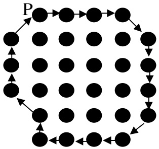

Hình 3.1. Ví dụ về chu tuyến của đối tượng ảnh

<!-- page: 39 -->

## Định nghĩa 3.2 [Chu tuyến đối ngẫu]

Hai chu tuyến $\mathrm{C}=<\mathrm{P}_{1} \mathrm{P}_{2} \ldots \mathrm{P}_{\mathrm{n}}>\mathrm{v} \dot{\mathrm{a}} \mathrm{~C}^{\perp}=<\mathrm{Q}_{1} \mathrm{Q}_{2} \ldots \mathrm{Q}_{\mathrm{m}}>$ được gọi là đối ngẫu của nhau nếu và chỉ nếu ∀i ∃j sao cho:

(i) $\mathrm { P _ { i }   \mathrm { v i }   Q _ { j } }$ là 4-láng giềng của nhau.

(ii)Các điểm $\mathrm { P _ { i } }$ là vùng thì $\mathrm { Q _ { j } }$ là nền và ngược lại.

## Định nghĩa 3.3 [Chu tuyến ngoài]

Chu tuyến C được gọi là chu tuyến ngoài (Hình 3.2a) nếu và chỉ nếu (i) Chu tuyến đối ngẫu $\mathrm { C } ^ { \perp }$ là chu tuyến của các điểm nền (ii)Độ dài của C nhỏ hơn độ dài $\mathrm { C } ^ { \perp }$

## Định nghĩa 3.4 [Chu tuyến trong]

Chu tuyến C được gọi là chu tuyến trong (Hình 3.2b) nếu và chỉ nếu: (i) Chu tuyến đối ngẫu $\mathrm { C } ^ { \perp }$ là chu tuyến của các điểm nền

(ii)Độ dài của C lớn hơn độ dài $\mathrm { C } ^ { \perp }$

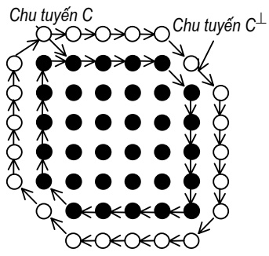

a) Chu tuyến ngoài

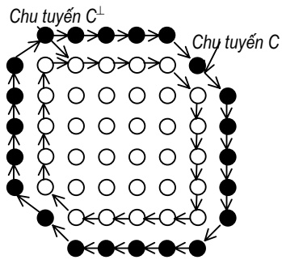

b) Chu tuyến trong

Hình 3.2. Chu tuyến trong, chu tuyến ngoài

## Định nghĩa 3.5 [Điểm trong và điểm ngoài chu tuyến]

Giả sử $C = < \mathrm{P}_{1}\mathrm{P}_{2} \ldots \mathrm{P}_{\mathrm{n}} >$ là chu tuyến của một đối tượng ảnh và P là một điểm ảnh. Khi đó:

(i) Nếu nửa đường thẳng xuất phát từ P sẽ cắt chu tuyến C tại số lẻ lần, thì P được gọi là điểm trong chu tuyến C và kí hiệu in(P,C)

(ii) Nếu $\mathbf { P } { \boldsymbol { \notin } } \mathbf { C }$ và P không phải là điểm trong của C, thì P được gọi là điểm ngoài chu tuyến C và kí hiệu out(P,C).

## Bổ đề 3.1 [Chu tuyến đối ngẫu]

Giả sử $\mathrm { E } \subseteq \mathfrak { I }$ là một đối tượng ảnh và $C = < \mathrm{P}_{1}\mathrm{P}_{2} \ldots \mathrm{P}_{\mathrm{n}} >$ là chu tuyến của $\mathrm{E}, \mathrm{C}^{\perp}=<\mathrm{Q}_{1} \mathrm{Q}_{2} . \mathrm{Q}_{\mathrm{m}}>$ là chu tuyến đối ngẫu tương ứng. Khi đó:

(i) Nếu C là chu tuyến trong thì in $(Q_{i},C) \forall i (i = 1, \ldots, m)$

<!-- page: 40 -->

(ii)Nếu C là chu tuyến ngoài thì i $\ln ( \mathrm { P } _ { \mathrm { i } } , \mathrm { C } ^ { \perp } ) \forall \mathrm { i } ( \mathrm { i } = 1 , \cdots , \mathrm { n } )$

## Bổ đề 3.2 [Phần trong/ngoài của chu tuyến]

Giả sử $\mathrm { E } \subseteq \mathfrak { I }$ là một đối tượng ảnh và C là chu tuyến của E. Khi đó:

(i) Nếu C là chu tuyến ngoài thì $\forall \mathbf { x } \in \mathrm { E }$ sao cho $\mathbf { x } \not \in \mathbf { C } ,$ ta có $\mathrm{in(x,C)}$

(ii)Nếu C là chu tuyến trong thì $\forall \mathbf { x } \in \mathrm { E }$ sao cho $\mathbf { x } \not \in \mathbf { C }$ , ta có $\mathrm { o u t ( x ,   C ) }$

## Định lý 3.1 [Tính duy nhất của chu tuyến ngoài]

Giả sử $\mathrm { E } \subseteq \mathfrak { I }$ là một đối tượng ảnh và $\mathrm { C _ { E } }$ là chu tuyến ngoài của E. Khi đó $\mathrm { C _ { E } }$ là duy nhất.

## 3.3.3. Thuật toán dò biên tổng quát

Biểu diễn đối tượng ảnh theo chu tuyến thường dựa trên các kỹ thuật dò biên. Có hai kỹ thuật dò biên cơ bản. Kỹ thuật thứ nhất xét ảnh biên thu được từ ảnh vùng sau một lần duyệt như một đồ thị, sau đó áp dụng các thuật toán duyệt cạnh đồ thị. Kỹ thuật thứ hai dựa trên ảnh vùng, kết hợp đồng thời quá trình dò biên và tách biên. Ở đây ta quan tâm cách tiếp cận thứ hai.

Trước hết, giả sử ảnh được xét chỉ bao gồm một vùng ảnh 8-liên thông ℑ, được bao bọc bởi một vành đai các điểm nền. Dễ thấy ℑ là một vùng 4- liên thông chỉ là một trường riêng của trường hợp trên.

Về cơ bản, các thuật toán dò biên trên một vùng đều bao gồm các bước sau:

• Xác định điểm biên xuất phát

• Dự báo và xác định điểm biên tiếp theo

• Lặp bước 2 cho đến khi gặp điểm xuất phát

Do xuất phát từ những tiêu chuẩn và định nghĩa khác nhau về điểm biên, và quan hệ liên thông, các thuật toán dò biên cho ta các đường biên mang các sắc thái rất khác nhau.

Kết quả tác động của toán tử dò biên lên một điểm biên $\mathbf { r _ { i } }$ là điểm biên $\mathrm{r}_{\mathrm{i}+1}(8 - \mathrm{l}\mathrm{a}\mathrm{g}\ \mathrm{g}\mathrm{i}\hat{\mathrm{e}}\mathrm{n}\mathrm{g}$ của r<sub>i</sub>). Thông thường các toán tử này được xây dựng như một hàm đại số Boolean trên các 8-láng giềng của $\mathbf { r _ { i } } .$ Mỗi cách xây dựng các toán tử đều phụ thuộc vào định nghĩa quan hệ liên thông và điểm biên. Do đó sẽ gây khó khăn cho việc khảo sát các tính chất của đường biên. Ngoài ra, vì mỗi bước dò biên đều phải kiểm tra tất cả các 8-láng giềng của mỗi điểm nên thuật toán thường kém hiệu quả. Để khắc phục các hạn chế trên, thay vì sử dụng một điểm biên ta sử dụng cặp điểm biên (một thuộc ℑ, một thuộc $\overline { { \mathfrak { I } } } )$ , các cặp điểm này tạo nên tập nền vùng, kí hiệu là NV và phân tích toán tử dò biên thành 2 bước:

<!-- page: 41 -->

• Xác định cặp điểm nền vùng tiếp theo.

• Lựa chọn điểm biên

Trong đó bước thứ nhất thực hiện chức năng của một ánh xạ trên tập NV lên NV và bước thứ hai thực hiện chức năng chọn điểm biên.

**Thuật toán dò biên tổng quát**

**Bước 1**: Xác định cặp nền-vùng xuất phát

**Bước 2**: Xác định cặp nền-vùng tiếp theo

**Bước 3**: Lựa chọn điểm biên vùng

**Bước 4**: Nếu gặp lại cặp xuất phát thì dừng, nếu không quay lại bước 2.

Việc xác định cặp nền-vùng xuất phát được thực hiện bằng cách duyệt ảnh lần lượt từ trên xuống dưới và từ trái qua phải rồi kiểm tra điều kiện lựa chọn cặp nền-vùng. Do việc chọn điểm biên chỉ mang tính chất quy ước, nên ta gọi ánh xạ xác định cặp nền-vùng tiếp theo là toán tử dò biên.

## Định nghĩa 3.6 [Toán tử dò biên]

Giả sử T là một ánh xạ như sau: T: NV → NV

$$
(b, r) \mapsto (b ^ {\prime}, r ^ {\prime})
$$

Gọi T là một toán tử dò biên cơ sở nếu nó thoả mãn điều kiện: b’,r’ là các 8-láng giềng của r.

Giả sử $\mathbf { ( b , } \mathbf { r ) }   \in   \mathbf { N V }$ ; gọi K(b,r) là hàm chọn điểm biên. Biên của một dạng ℑ có thể định nghĩa theo một trong ba cách:

• Tập những điểm thuộc ℑ có mặt trên NV, tức là $\mathrm{K}(\mathbf{b}, \mathbf{r}) = \mathbf{r}$

• Tập những điểm thuộc $\overline { { \mathfrak { I } } }$ có trên NV, tức là $\mathrm{K}(\mathrm{b}, \mathrm{r}) = \mathrm{b}$

• Tập những điểm ảo nằm giữa cặp nền-vùng, tức là K(b,r) là những điểm nằm giữa hai điểm b và r.

Cách định nghĩa thứ ba tương ứng mỗi cặp nền-vùng với một điểm biên. Còn đối với cách định nghĩa thứ nhất và thứ hai một số cặp nềnvùng có thể có chung một điểm biên. Bởi vậy, quá trình chọn điểm biên được thực hiện như sau:

$$
\mathrm{i} := 1; (\mathrm{b} _ {\mathrm{i}}, \mathrm{r} _ {\mathrm{i}}) := (\mathrm{b} _ {0}, \mathrm{r} _ {0});
$$

**While** $\mathrm{K}(\mathrm{b}_{\mathrm{i}}, \mathrm{r}_{\mathrm{i}}) \Leftrightarrow \mathrm{K}(\mathrm{b}_{\mathrm{n}}, \mathrm{r}_{\mathrm{n}})$ and i≤8 **do**

**Begin** $( \mathbf{b}_{i+1}, \mathbf{r}_{i+1} ) = \mathrm{T}( \mathbf{b}_{i}, \mathbf{r}_{i} ); \quad i = i+1$ ; End;

**Điều kiện dừng**

Cặp nền-vùng thứ n trùng với cặp nền vùng xuất phát: $( \mathbf { b } _ { \mathrm { n } } , \mathbf { r } _ { \mathrm { n } } ) = ( \mathbf { b } _ { \mathrm { o } } , \mathbf { r } _ { \mathrm { o } } )$

<!-- page: 42 -->

## \* Xác định cặp nền – vùng xuất phát

Cặp nền vùng xuất phát được xác định bằng cách duyệt ảnh lần lượt từ trên xuống dưới và từ trái sang phải điểm đem đầu tiên gặp được cùng với điểm trắng trước đó (theo hướng 4) để tạo nên cặp nền vùng xuất phát.

## \* Xác định cặp nền vùng tiếp theo

```javascript
Đầu vào: pt, dir
Ví dụ: (3, 2) 4
Point orient [] = {(1,0);(1;-1);(0;-1);(-1;-1);(-1;0);(-1,1);(0,1);(1,1)};
//Hàm tìm hướng có điểm đen gần nhất
BYTE GextNextDir(POINT pt, BYTE dir)
{
    BYTE pdir= (dir + 7)%8;
    do{
        if(getpixel(pt. x+orient [pdir]. x,pt.y+orient [pdir]. y))==BLACK)
            return pdir;
        pdir = (pdir + 7) %8;
    } while(pdir != dir);
    return. ERR; //Điểm cô lập
}
//Gán giá trị cho bước tiếp theo
pdir = GetNextDir(pt, dir);
if(pdir==ERR) //Kiểm tra có là điểm cô lập không?
    return. ERR; //Điểm cô lập
pt. x = pt. x + orient [pdir]. x;
pt. y = pt. y + orient [pdir]. y ;
Để tính giá trị cho hướng tiếp theo ta lập bằng dựa trên giá trị pdir đã tính được trước đó theo các khả năng có thể xảy ra:
```

<!-- page: 43 -->

| pdir | Điểm trắng trước đó | Trắng so với đen mới |
| --- | --- | --- |
| 0 | 1 | 2 |
| 1 | 2 | 4 |
| 2 | 3 | 4 |
| 3 | 4 | 6 |
| 4 | 5 | 6 |
| 5 | 6 | 0 |
| 6 | 7 | 0 |
| 7 | 0 | 2 |

⇒ Do đó công thức để tính hướng tiếp theo sẽ là :

dir= ((pdir+3)/ 2 \* 2)%8 ;

<!-- page: 44 -->

# XƯƠNG VÀ CÁC KỸ THUẬT TÌM XƯƠNG

## 4.1. GIỚI THIỆU

Xương được coi như hình dạng cơ bản của một đối tượng, với số ít các điểm ảnh cơ bản. Ta có thể lấy được các thông tin về hình dạng nguyên bản của một đối tượng thông qua xương.

Một định nghĩa xúc tích về xương dựa trên tính continuum (tương tự như hiện tượng cháy đồng cỏ) được đưa ra bởi Blum (1976) như sau: Giả thiết rằng đối tượng là đồng nhất được phủ bởi cỏ khô và sau đó dựng lên một vòng biên lửa. Xương được định nghĩa như nơi gặp của các vệt lửa và tại đó chúng được dập tắt.

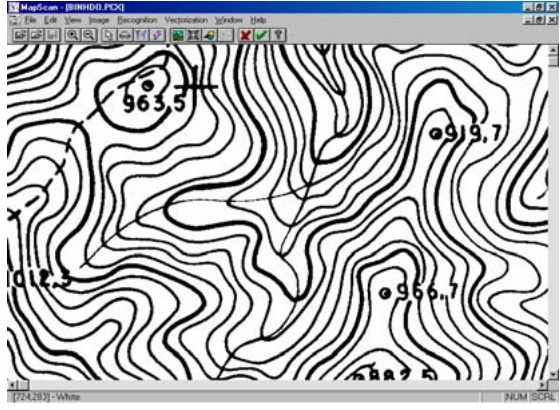

a) Ảnh gốc

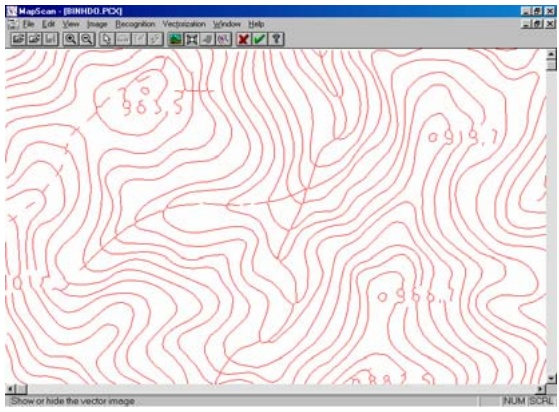

b) Ảnh xương

Hình 4.1. Ví dụ về ảnh và xương

Kỹ thuật tìm xương luôn là chủ đề nghiên cứu trong xử lý ảnh những năm gần đây. Mặc dù có những nỗ lực cho việc phát triển các thuật toán tìm xương, nhưng các phương pháp được đưa ra đều bị mất mát thông tin. Có thể chia thành hai loại thuật toán tìm xương cơ bản:

• Các thuật toán tìm xương dựa trên làm mảnh

• Các thuật toán tìm xương không dựa trên làm mảnh

## 4.2. TÌM XƯƠNG DỰA TRÊN LÀM MẢNH

## 4.2.1. Sơ lược về thuật toán làm mảnh

Thuật toán làm mảnh ảnh số nhị phân là một trong các thuật toán quan trọng trong xử lý ảnh và nhận dạng. Xương chứa những thông tin bất biến về cấu trúc của ảnh, giúp cho quá trình nhận dạng hoặc vectơ hoá sau này.

<!-- page: 45 -->

Thuật toán làm mảnh là quá trình lặp duyệt và kiểm tra tất cả các điểm thuộc đối tượng. Trong mỗi lần lặp tất cả các điểm của đối tượng sẽ được kiểm tra: nếu như chúng thoả mãn điều kiện xoá nào đó tuỳ thuộc vào mỗi thuật toán thì nó sẽ bị xoá đi. Quá trình cứ lặp lại cho đến khi không còn điểm biên nào được xoá. Đối tượng được bóc dần lớp biên cho đến khi nào bị thu mảnh lại chỉ còn các điểm biên.

Các thuật toán làm mảnh được phân loại dựa trên phương pháp xử lý các điểm là thuật toán làm mảnh song song và thuật toán làm mảnh tuần tự.

Thuật toán làm mảnh song song, là thuật toán mà trong đó các điểm được xử lý theo phương pháp song song, tức là được xử lý cùng một lúc. Giá trị của mỗi điểm sau một lần lặp chỉ phụ thuộc vào giá trị của các láng giềng bên cạnh (thường là 8-láng giềng) mà giá trị của các điểm này đã được xác định trong lần lặp trước đó. Trong máy có nhiều bộ vi xử lý mỗi vi xử lý sẽ xử lý một vùng của đối tượng, nó có quyền đọc từ các điểm ở vùng khác nhưng chỉ được ghi trên vùng của nó xử lý.

Trong thuật toán làm mảnh tuần tự các điểm thuộc đối tượng sẽ được kiểm tra theo một thứ tự nào đó (chẳng hạn các điểm được xét từ trái qua phải, từ trên xuống dưới). Giá trị của điểm sau mỗi lần lặp không những phụ thuộc vào giá trị của các láng giềng bên cạnh mà còn phụ thuộc vào các điểm đã được xét trước đó trong chính lần lặp đang xét.

Chất lượng của thuật toán làm mảnh được đánh giá theo các tiêu chuẩn được liệt kê dưới đây nhưng không nhất thiết phải thoả mãn đồng thời tất cả các tiêu chuẩn.

• Bảo toàn tính liên thông của đối tượng và phần bù của đối tượng

• Sự tương hợp giữa xương và cấu trúc của ảnh đối tượng

Bảo toàn các thành phần liên thông

• Bảo toàn các điểm cụt

• Xương chỉ gồm các điểm biên, càng mảnh càng tốt

• Bền vững đối với nhiễu

• Xương cho phép khôi phục ảnh ban đầu của đối tượng

• Xương thu được ở chính giữa đường nét của đối tượng được làm mảnh

• Xương nhận được bất biến với phép quay.

<!-- page: 46 -->

## 4.2.2. Một số thuật toán làm mảnh

Trong phần này điểm qua một số đặc điểm, ưu và khuyết điểm của các thuật toán đã được nghiên cứu.

1<sup>o</sup>. Thuật toán làm mảnh cổ điển là thuật toán song song, tạo ra xương 8 liên thông, tuy nhiên nó rất chậm, gây đứt nét, xoá hoàn toàn một số cấu hình nhỏ.

2<sup>o</sup>. Thuật toán làm mảnh của Toumazet bảo toàn tất cả các điểm cụt không gây đứt nét đối tượng. Tuy nhiên, thuật toán có nhược điểm là rất chậm, rất nhạy cảm với nhiễu, xương chỉ là 4-liên thông và không làm mảnh được với một số cấu hình phức tạp

3<sup>o</sup>. Thuật toán làm mảnh của Y.Xia dựa trên đường biên của đối tượng, có thể cài đặt theo cả phương pháp song song và tuần tự. Tốc độ của thuật toán rất nhanh. Nó có nhược điểm là gây đứt nét, xương tạo ra là xương giả (có độ dày là 2 phần tử ảnh).

4<sup>o</sup>. Thuật toán làm mảnh của N.J.Naccache và R.Shinghal. Thuật toán có ưu điểm là nhanh, xương tạo ra có khả năng khôi phục ảnh ban đầu của đối tượng. Nhược điểm chính của thuật toán là rất nhạy với nhiễu, xương nhận được phản ánh cấu trúc của đối tượng thấp.

5<sup>o</sup>. Thuật toán làm mảnh của H.E.Lu P.S.P Wang tương đối nhanh, giữ được tính liên thông của ảnh, nhưng lại có nhược điểm là xương tạo ra là xương 4-liên thông và xoá mất một số cấu hình nhỏ.

6<sup>o</sup>. Thuật toán làm mảnh của P.S.P Wang và Y.Y.Zhang dựa trên đường biên của đối tượng, có thể cài đặt theo phương pháp song song hoặc tuần tự, xương là 8-liên thông, ít chịu ảnh hưởng của nhiễu. Nhược điểm chính của thuật toán là tốc độ chậm.

7<sup>o</sup>. Thuật toán làm mảnh song song thuần tuý nhanh nhất trong các thuật toán trên, bảo toàn tính liên thông, ít chịu ảnh hưởng của nhiễu. Nhược điểm là xoá hoàn toàn một số cấu hình nhỏ, xương tạo ra là xương 4-liên thông.

## 4.3. TÌM XƯƠNG KHÔNG DỰA TRÊN LÀM MẢNH

Để tách được xương của đối tượng có thể sử dụng đường biên của đối tượng. Với điểm p bất kỳ trên đối tượng, ta bao nó bởi một đường biên. Nếu như có nhiều điểm biên có cùng khoảng cách ngắn nhất tới p thì p nằm trên trục trung vị. Tập tất cả các điểm như vậy lập thành trục trung vị hay xương của đối tượng. Việc xác định xương được tiến hành thông qua hai bước:

<!-- page: 47 -->

**Bước thứ nhất**, tính khoảng cách từ mỗi điểm ảnh của đối tượng đến điểm biên gần nhất. Như vậy cần phải tính toán khoảng cách tới tất cả các điểm biên của ảnh.

**Bước thứ hai,** khoảng cách ảnh đã được tính toán và các điểm ảnh có giá trị lớn nhất được xem là nằm trên xương của đối tượng.

## 4.3.1. Khái quát về lược đồ Voronoi

Lược đồ Voronoi là một công cụ hiệu quả trong hình học tính toán. Cho hai điểm $\mathrm { P _ { i } ,   P _ { j } }$ là hai phần tử của tập Ω gồm n điểm trong mặt phẳng. Tập các điểm trong mặt phẳng gần $\mathrm { P _ { i } }$ hơn $\mathrm { P _ { j } }$ là nửa mặt phẳng H(P<sub>i</sub>, P<sub>j</sub>) chứa điểm $\mathrm { P _ { i } }$ và bị giới hạn bởi đường trung trực của đoạn thẳng $\mathrm { [ P _ { i } P _ { j } ] }$ . Do đó, tập các điểm gần $\mathrm { P _ { i } }$ hơn bất kỳ điểm $\mathrm { P _ { j } }$ nào có thể thu được bằng cách giao n-1 các nửa mặt phẳng $\mathrm { H } ( \mathrm { P _ { i } } ,   \mathrm { P _ { j } } )$

$$
\mathrm{V} (\mathrm{P} _ {\mathrm{i}}) = \cap \mathrm{H} (\mathrm{P} _ {\mathrm{i}}, \mathrm{P} _ {\mathrm{j}}) \mathrm{i} \neq \mathrm{j} (\mathrm{i} = 1, \dots , \mathrm{n})\tag{4.1}
$$

**Định nghĩa 4.1 [Đa giác/Sơ đồ Voronoi]**

Sơ đồ Voronoi của Ω là hợp của tất cả các V(P<sub>i</sub>)

$$
\mathrm{Vor} (\Omega) = \cup \mathrm{V} \left(\mathrm{P} _ {\mathrm{i}}\right) \mathrm{P} _ {\mathrm{i}} \in \Omega (\text {là một đa giác})\tag{4.2}
$$

**Định nghĩa 4.2 [Đa giác Voronoi tổng quát]**

Cho tập các điểm Ω, đa giác Voronoi của tập con U của Ω được định nghĩa như sau:

$$
\begin{array}{r l} \mathrm{V(U)} & = \{\mathrm{P} | \exists \mathrm{v} \in \mathrm{U}, \forall \mathrm{w} \in \Omega \setminus \mathrm{U}: \mathrm{d(P,v)} <   \mathrm{d(P,w)} \} \\ & = \cup \mathrm{V(P_i)} \mathrm{P_i} \in \mathrm{U} \end{array}\tag{4.3}
$$

## 4.3.2. Trục trung vị Voronoi rời rạc

## Định nghĩa 4.3 [Bản đồ khoảng cách - Distance Map]

Cho đối tượng S, đối với mỗi $( \mathrm { x } ,   \mathrm { y } ) { \in } \mathrm { S }$ , ta tính giá trị khoảng cách $\mathrm { m a p } ( \mathrm { x } , \mathrm { y } )$ với hàm khoảng cách $\mathbf { d } ( . , . )$ như sau:

$$
\forall (\mathrm{x}, \mathrm{y}) \in \mathrm{S}: \operatorname{map} (\mathrm{x}, \mathrm{y}) = \min \mathrm{d} [ (\mathrm{x}, \mathrm{y}), (\mathrm{x} _ {\mathrm{i}}, \mathrm{y} _ {\mathrm{i}}) ]\tag{4.4}
$$

trong đó $( \mathrm { x _ { i } , y _ { i } } ) \in \mathrm { B ( S ) - t \hat { a } p }$ các điểm biên của Si

Tập tất cả các map(x, y), kí hiệu là DM(S), được gọi là bản $\mathbf { \dot { d } } \mathbf { \dot { \hat { 0 } } }$ khoảng cách của S.

**Chú ý:** Nếu hàm khoảng cách d(.,.) là khoảng cách Euclide, thì phương trình (4.4) chính là khoảng cách ngắn nhất từ một điểm bên trong đối tượng tới biên. Do đó, bản đồ khoảng cách được gọi là bản đồ khoảng cách Euclide EDM(S) của S. Định nghĩa trên được dùng cho cả hình rời rạc lẫn liên tục.

<!-- page: 48 -->

## Định nghĩa 4.4 [Tập các điểm biên sinh]

Cho map(x, y) là khoảng cách ngắn nhất từ (x, y) đến biên (theo định nghĩa 4.3). Ta định nghĩa: map $\mathrm{p}^{-1}(\mathrm{x}, \mathrm{y}) = \{\mathrm{p}\} \text { p } \in \mathrm{B}(\mathrm{S})$ , d(p, $(x,y):=map(x,y)$

Khi đó tập các điểm biên sinh $\mathrm { ^ { \wedge } B ( S ) }$ được định nghĩa bởi:

$$
^ {\wedge} \mathrm{B} (\mathrm{S}) = \cup \mathrm{map} ^ {- 1} (\mathrm{x}, \mathrm{y}), (\mathrm{x}, \mathrm{y}) \in \mathrm{S}\tag{4.5}
$$

Do S có thể chứa các đường biên rời nhau, nên $\mathrm { { } ^ { \wedge } B ( S ) }$ bao gồm nhiều tập con, mỗi tập mô tả một đường biên phân biệt:

$$
^ {\wedge} \mathrm{B} (\mathrm{S}) = \{\mathrm{B} _ {1} (\mathrm{S}),.. \mathrm{B} _ {\mathrm{N}} (\mathrm{S}) \}\tag{4.6}
$$

## Định nghĩa 4.5 [Trục trung vị Voronoi rời rạc (DVMA)]

Trục trung vị Voronoi rời rạc được định nghĩa là kết quả của sơ $\mathbf { \dot { d } } \mathbf { \dot { \hat { 0 } } }$ Voronoi bậc nhất rời rạc của tập các điểm biên sinh giao với hình sinh S :

$$
\mathrm{DVMA} (^ {\wedge} \mathrm{B} (\mathrm{S})) = \mathrm{Vor} (^ {\wedge} \mathrm{B} (\mathrm{S})) \cap \mathrm{S}\tag{4.7}
$$

## 4.3.3. Xương Voronoi rời rạc

## Định nghĩa 4.6 [Xương Voronoi rời rạc - DiscreteVoronoi Skeleton]

Xương Voronoi rời rạc theo ngưỡng T, kí hiệu là $\mathrm { S k e ^ { D V M A } ( \mathrm { \mathrm {  ~ } } B ( S ) , } \mathrm { T ) }$ (hoặc $\mathrm { S k e } ( \mathrm { { } ^ { \wedge } B ( S ) , } \mathrm { T ) ) }$ là một tập con của trục trung vị Voronoi:

$$
\mathrm{Ske} ^ {\mathrm{DVMA}} (^ {\wedge} \mathrm{B} (\mathrm{S}), \mathrm{T}) = \left\{\left(\mathrm{x}, \mathrm{y}\right) \mid (\mathrm{x}, \mathrm{y}) \in \mathrm{DVMA} (^ {\wedge} \mathrm{B} (\mathrm{S})), \Psi (\mathrm{x}, \mathrm{y}) > \mathrm{T} \right\}\tag{4.8}
$$

Ψ: là hàm hiệu chỉnh.

Dễ thấy nếu ngưỡng T càng lớn thì càng thì $s \hat { 0 }$ lượng điểm tham gia trong xương Vonoroi càng ít (Hình 4.2).


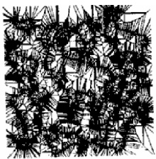

a)

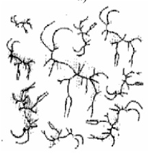

c)

b)

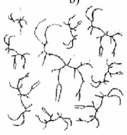

d)

Hình 4.2. Xương Voronoi rời rạc ảnh hưởng của các hàm hiệu chỉnh khác nhau. (a) Ảnh nhị phân. (b) Sơ đồ Voronoi. (c) Hiệu chỉnh bởi hàm Potential, T=9.0. (d) Hiệu chỉnh bởi hàm Potential, T=18.0

<!-- page: 49 -->

## 4.3.4. Thuật toán tìm xương

Trong mục này sẽ trình bày ý tưởng cơ bản của thuật toán tìm xương và mô tả bằng ngôn ngữ tựa Pascal.

**Tăng trưởng**: Việc tính toán sơ đồ Voronoi được bắt đầu từ một điểm sinh trong mặt phẳng. Sau đó điểm sinh thứ hai được thêm vào và quá trình tính toán tiếp tục với đa giác Voronoi đã tìm được với điểm vừa được thêm vào đó. Cứ như thế, quá trình tính toán sơ đồ Voronoi được thực hiện cho đến khi không còn điểm sinh nào được thêm vào. Nhược điểm của chiến lược này là mỗi khi một điểm mới được thêm vào, nó có thể gây ra sự phân vùng toàn bộ các đa giác Voronoi đã được tính.

**Chia để trị**: Tập các điểm biên đầu tiên được chia thành hai tập điểm có kích cỡ bằng nhau. Sau đó thuật toán tính toán sơ đồ Voronoi cho cả hai tập con điểm biên đó. Cuối cùng, người ta thực hiện việc ghép cả hai sơ đồ Voronoi trên để thu được kết quả mong muốn. Tuy nhiên, việc chia tập các điểm biên thành hai phần không phải được thực hiện một lần, mà được lặp lại nhiều lần cho đến khi việc tính toán sơ đồ Voronoi trở nên đơn giản. Vì thế, việc tính sơ đồ Voronoi trở thành vấn đề làm thế nào để trộn hai sơ đồ Voronoi lại với nhau.

Thuật toán sẽ trình bày ở đây là sự kết hợp của hai ý tưởng ở trên. Tuy nhiên, nó sẽ mang nhiều dáng dấp của thuật toán chia để trị.

Hình 4.3 minh hoạ ý tưởng của thuật toán này. Mười một điểm biên được chia thành hai phần (bên trái: 1- 6, bên phải: 7-11) bởi đường gấp khúc δ, và hai sơ đồ Voronoi tương ứng $\mathrm { V o r } ( \mathrm { S _ { L } } )$ và $\operatorname { V o r } ( \mathbb { S } _ { \mathbb { R } } )$ . Để thu được sơ đồ Vornonoi $\mathrm { V o r } ( \mathrm { S } _ { \mathrm { L } } \cup \mathrm { S } _ { \mathrm { R } } )$ , ta thực hiện việc trộn hai sơ đồ trên và xác định lại một số đa giác sẽ bị sửa đổi do ảnh hưởng của các điểm bên cạnh thuộc sơ đồ kia. Mỗi phần tử của δ sẽ là một bộ phận của đường trung trực nối hai điểm mà một điểm thuộc $\mathrm { V o r } ( \mathrm { S _ { L } } )$ và một thuộc $\mathrm { V o r } ( \mathrm { S } _ { \mathrm { R } } )$ . Trước khi xây dựng $\delta _ { z }$ ta tìm ra phần tử đầu và cuối của nó. Nhìn vào hình trên, ta nhận thấy rằng cạnh $\delta _ { 1 }$ và $\delta _ { 5 }$ là các tia. Dễ nhận thấy rằng việc tìm ra các cạnh đầu và cuối của δ trở thành việc tìm cạnh vào $\mathbf { t _ { \alpha } }$ và cạnh ra $\mathbf { t _ { \mathrm { { o } } } } .$

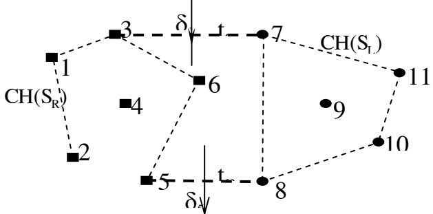

Hình 4.3. Minh hoạ thuật toán trộn hai sơ đồ Voronoi

<!-- page: 50 -->

Sau khi đã tìm được $\mathbf { t } _ { \alpha }$ và $\mathbf { t } _ { \mathrm { { o } _ { 2 } } }$ các điểm cuối của $\mathbf { t } _ { \alpha }$ được sử dụng để xây dựng phần tử đầu tiên của $\delta \left( \delta _ { 1 } \right.$ trong hình trên). Sau đó thuật toán tìm điểm giao của δ với $\mathrm { V o r } ( \mathrm { S _ { L } } )$ và $\mathrm { V o r } ( \mathrm { S } _ { \mathrm { R } } )$ . Trong ví dụ trên, δ đầu tiên giao với V(3). Kể từ đây, các điểm nằm trên phần kéo dài δ sẽ gần điểm 6 hơn điểm 3. Do đó, phần tử tiếp theo $\delta _ { 2 }$ của δ sẽ thuộc vào đường trung trực của điểm 6 và điểm 7. Sau đó điểm giao tiếp theo của δ sẽ thuộc và $\mathrm { V o r ( S _ { L } ) }$ ; δ bây giờ sẽ đi vào V(9) và $\delta _ { 2 }$ sẽ được thay thế bởi $\delta _ { 3 }$ . Quá trình này sẽ kết thúc khi δ gặp phần tử cuối $\delta _ { 5 }$

Trên đây chỉ là minh hoạ cho thuật trộn hai sơ đồ Voronoi trong chiến lược chia để trị. Tuy nhiên, trong thuật toán sẽ trình bày $\mathring { \mathbf { U } }$ đây thì sự thực hiện có khác một chút. Tập các điểm ảnh không phải được đưa vào ngay từ đầu mà sẽ được quét vào từng dòng một. Giả sử tại bước thứ i, ta đã thu được một sơ đồ Voronoi gồm i-1 hàng các điểm sinh $\operatorname { V o r } ( \mathbf { S } _ { \mathrm { i - l } } )$ . Tiếp theo, ta quét lấy một hàng $\mathrm { L _ { i } }$ các điểm ảnh từ tập các điểm biên còn lại. Thực hiện việc tính sơ đồ Voronoi $\mathrm { V o r ( L _ { i } ) }$ cho hàng này, sau đó trộn $\operatorname { V o r } ( \mathbf { S } _ { \mathrm { i - 1 } } )$ với $\mathrm { V o r ( L _ { i } ) }$ Kết quả ta sẽ được một sơ đồ mới, và lại thực hiện việc quét hàng $\mathrm { L } _ { \mathrm { i } + 1 }$ các điểm sinh còn lại v.v.. Quá trình này sẽ kết thúc khi không còn điểm biên nào để thêm vào sơ đồ Voronoi. Do $\mathrm { V o r ( L _ { i } ) }$ sẽ có dạng răng lược (nếu $\mathrm { L _ { i } }$ có k điểm thì $\mathrm { V o r ( L _ { i } ) }$ sẽ gồm k-1 đường thẳng đứng), nên việc trộn $\operatorname { V o r } ( \mathbf { S } _ { \mathrm { i - 1 } } )$ với Vor(L<sub>i</sub>) có phần đơn giản hơn.

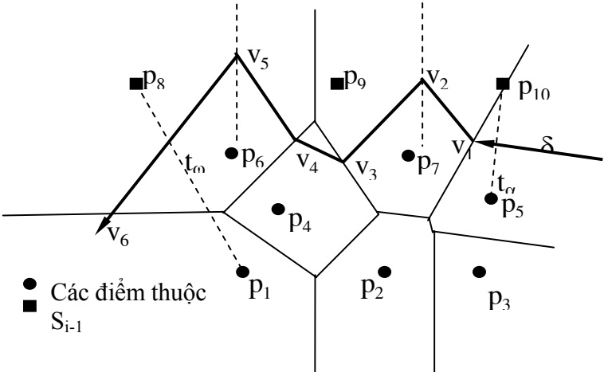

Hình 4.4. Minh hoạ thuật toán thêm một điểm biên vào sơ đồ Voronoi

Giải thuật trên có thể được mô tả bằng ngôn ngữ tựa Pascal như sau:

## Procedure VORONOI

$( ^ { * } \mathrm { S } _ { \mathrm { i } } ; \mathrm { T } \mathbf { \hat { a } p }$ các điểm của i dòng quét đầu tiên,

$$
0 <   = \mathrm{i} <   = \mathrm{i} _ {\text {MAX}},
$$

Vor(S<sub>i</sub>) sơ đồ Vorronoi của $\mathbf { S } _ { \mathrm { i } } \ast )$

<!-- page: 51 -->

```matlab
in
i:=0; S_i:=rỗng;
While (i<i_max ∧ S_i ⊂ straight_line) do
Begin
(*Khởi tạo sơ đồ Voronoi cho đến khi nó chứa ít nhất một đỉnh*)
    increment i;
    GetScanLine L_i;
    Vor(S_i) = VoroPreScan(Vor(S_{i-1}, L_i));
End
While (i < i_max) do
Begin
    Increment i;
    GetScanLine L_i;
    Vor(L_i) := các đường trung trực sinh bởi các điểm sinh thuộc L_i
    Vor(S_i) := VoroLink(Vor(S_{i-1}), Vor(L_i));
End
```

Giả sử xét trên hệ toạ độ thực. Ảnh vào được quét từ dưới lên. Toạ độ y (biến i) tương ứng với từng dòng quét được tăng dần theo từng dòng. Trong thủ tục trên, hàm quan trọng nhất là hàm VoroLink, hàm này thực hiện việc trộn sơ đồ Voronoi của $\mathrm { L } _ { \mathrm { i - 1 } }$ dòng đã được quét trước đó với sơ đồ Voronoi của dòng hiện tại thứ i. Trong vòng lặp trên, hàm VoroPreScan là một biến thể của hàm VoroLink, có nhiệm vụ khởi tạo sơ đồ Voronoi và thoát khỏi vòng lặp ngay khi nó thành lập được sơ đồ Voronoi chứa ít nhất một đỉnh. Hàm VoroLink thực hiện việc trộn hai sơ đồ Voronoi $\operatorname { V o r } ( \mathrm { S } _ { \mathrm { i - l } } )$ và Vor(L<sub>i</sub>) với nhau để thành Vor(S<sub>i</sub>).

<!-- page: 52 -->

# CÁC KỸ THUẬT HẬU XỬ LÝ

## 5.1. RÚT GỌN SỐ LƯỢNG ĐIỂM BIỂU DIỄN

## 5.1.1. Giới thiệu

Rút gọn số lượng điểm biểu diễn là kỹ thuật thuộc phần hậu xử lý. Kết quả của phần dò biên hay trích xương thu được 1 dãy các điểm liên tiếp. Vấn đề đặt ra là hiệu có thể bá bớt các điểm thu được để giảm thiểu không quan lưu trữ và thuận tiện cho việc đối sách hay không.

## Bài toán:

Cho đường cong gồm n điểm trong mặt phẳng $( \mathrm { x } _ { 1 } , \mathrm { y } _ { 1 } ) , ( \mathrm { x } _ { 2 } , \mathrm { y } _ { 2 } )$ $\left( \mathbf { X } _ { \mathrm { n } } , \mathbf { y } _ { \mathrm { n } } \right)$ . Hãy bỏ bớt 1 số điểm thuộc đường cong sao cho đường cong mới nhận được là $( \mathrm { X _ { i 1 } ; Y _ { i 1 } } ) , ( \mathrm { X _ { i 2 } ; Y _ { i 2 } } ) \mathrm { \cdots } ( \mathrm { X _ { i m } ; Y _ { i m } } )$ “gần giống” với đường cong ban đầu.

## \* Một số độ đo “gần giống”

\+ Chiều dài (chiều rộng) của hình chữ nhật nhá nhất chứa đường cong

\+ Khoảng cách lớn nhất từ đường cong đến đoạn thẳng nối 2 đầu mót của đường cong

\+ Tỷ lệ giữa chiều dài và chiều rộng của hình chữ nhật nhá nhất chứa đường con

\+ $\hat { \mathrm { S } } \hat { \mathrm { { } 0 } }$ lần đường cong cắt đoạn thẳng nối 2 đầu mót

## 5.1.2. Thuật toán Douglas Peucker

## 5.1.2.1. Ý tưởng

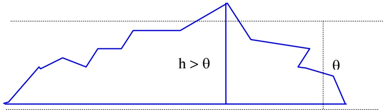

Hình 5.1. Đơn giản hóa đường công theo thuật toán Douglas Peucker

Ý tưởng cơ bản của thuật toán Douglas-Peucker là xét xem khoảng cách lớn nhất từ đường cong tới đoạn thẳng nối hai đầu mút đường cong (xem Hình 5.1) có lớn hơn ngưỡng θ không. Nếu điều này đúng thì điểm xa nhất được giữ lại làm điểm chia đường cong và thuật toán được thực hiện

<!-- page: 53 -->

tương tự với hai đường cong vừa tìm được. Trong trường hợp ngược lại, kết quả của thuật toán đơn giản hoá là hai điểm đầu mút của đường cong.

Thuật toán Douglas-Peucker:

• Bước 1: Chọn ngưỡng θ.

• Bước 2: Tìm khoảng cách lớn nhất từ đường cong tới đoạn thẳng nối hai đầu đoạn đường cong h.

• Bước 3: Nếu h ≤ θ thì dừng.

• Bước 4: Nếu h > θ thì giữ lại điểm đạt cực đại này và quay trở lại bước 1.

**Nhận xét:** Thuật toán này tỏ ra thuận lợi đối với các đường cong thu nhận được mà gốc là các đoạn thẳng, phù hợp với việc đơn giản hoá trong quá trình véctơ các bản vẽ kỹ thuật, sơ đồ thiết kế mạch in v.v..

## 5.1.2.2. Chương trình

//Hàm tính đường cao từ dinh đến đoạn thẳng nối hai điểm dau, cuoi float Tinhduongcao (POINT dau, POINT cuoi, POINT dinh)

```c
float Tinhduongcao (POINT dau, POINT cuoi, POINT dinh)
{
    float h;
    || tính đường cao
    return h ;
}
//Hàm độ quy nhằm đánh dấu loại bỏ các điểm trong đường cong
void DPSimple(POINT *pLINE,int dau,int cuoi,BOOL *chiso,float θ)
{
    int     i, index = dau;
    float  h, hmax = 0;
    for(i = dau + 1; i < cuoi; i++)
    {
        h= Tinhduongcao(pLINE[dau], pLINE[cuoi]; pLINE[i]);
        if(h > hmax)
        {
            hmax = h;
            index = i;
```

<!-- page: 54 -->

```c
}
}
if(hmax ≤ θ)
    for(i= dau + 1; i < cuoi, i++)
        chiso[i] = FALSE;
else
{
    DPSimple(PLINE, dau, index, chiso, θ);
    DPSimple(PLINE, index, cuoi, chiso, θ) ;
}
}
//Hàm rút gọn số lượng điểm DouglasPeucker
int DouglasPeucker(POINT *pLINE, int n, float θ)
{
    int     i, j;
    BOOL chiso [MAX_PT];
    for(i = 0; i < m; i++) //Tất cả các điểm được giữ lại
        chiso[i] = TRUE;
    DPSimple(pLINE, 0, n - 1, chiso, θ);
    for(i = j = 0; i < n; i++)
        if (chiso [i] ==TRUE)
            pLINE[j++] = pLINE[i];
    return j;
}
```

## 5.1.3. Thuật toán Band width

## 5.1.3.1. Ý tưởng

Trong thuật toán Band Width, ta hình dung có một dải băng di chuyển từ đầu mút đường cong dọc theo đường cong sao cho đường cong nằm trong di băng đó cho đến khi có điểm thuộc đường cong chạm vào biên của dải băng, điểm này sẽ được giữ lại. Quá trình này được thực hiện với phần còn lại của đường cong bắt đầu từ điểm vừa tìm được cho đến khi hết đường cong. Cụ thể như sau:

<!-- page: 55 -->

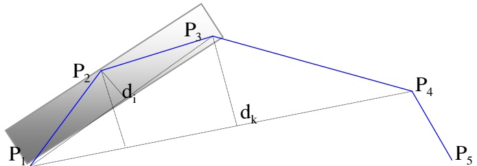

Hình 5.2. Đơn giản hóa đường cong với thuật toán Band Width

Bắt đầu bằng việc xác định điểm đầu tiên trên đường cong và coi đó như là một điểm chốt $\left( \mathbf { P } _ { 1 } \right)$ . Điểm thứ ba $\left( \mathbf { P } _ { 3 } \right)$ được coi là điểm động. Điểm giữa điểm chốt và điểm động $( \mathrm { P } _ { 2 \atop \mathrm { a } } )$ là điểm trung gian. Ban đầu khoảng cách từ điểm trung gian đến đoạn thẳng nối điểm chốt và điểm động được tính toán và kiếm tra. Nếu khoảng cách tính được này nhỏ hơn một ngưỡng θ cho trước thì điểm trung gian có thể bỏ đi, tiến trình tiếp tục với điểm chốt là điểm chốt cũ, điểm trung gian là điểm động cũ và điểm động là điểm kế tiếp sau điểm động cũ. Trong trường hợp ngược lại, khoảng cách tính được lớn hơn ngưỡng θ cho trước thì điểm trung gian sẽ được giữ lại, tiến trình tiếp tục với điểm chốt là điển trung gian, điểm trung gian là điểm động cũ và điểm động là điểm kế tiếp sau điểm động cũ. Tiến trình được lặp cho đến hết đường cong (Hình 5.2 minh họa thuật toán Band-Width).

Thuật toán Band-Width:

• Bước 1: Xác định điểm đầu tiên trên đường cong và coi đó như là một điểm chốt $\left( \mathbf { P } _ { 1 } \right)$ . Điểm thứ ba $\left( \mathbf { P } _ { 3 } \right)$ được coi là điểm động. Điểm giữa điểm chốt và điểm động $\left( \mathrm { P } _ { 2 } \right)$ là điểm trung gian.

• Bước 2: Tính khoảng cách từ điểm trung gian đến đoạn thẳng nối hai điểm chốt và điểm động.

• Bước 3: Kiểm tra khoảng cách tìm được nếu nhỏ hơn một ngưỡng θ cho trước thì điểm trung gian có thể bỏ đi. Trong trường hợp ngược lại điểm chốt chuyển đến điểm trung gian.

• Bước 4: Chu trình được lặp lại thì điểm trung gian được chuyển đến điểm động và điểm kế tiếp sau điểm động được chỉ định làm điểm động mới..

**Nhận xét:** Thuật toán này tăng tốc độ trong trường hợp đường ống chứa nhiều điểm, điều đó có nghĩa là độ lệch giữa các điểm trong đường thẳng là nhỏ, hay độ dày nét của đường được véctơ hoá là mảnh.

<!-- page: 56 -->

```txt
3.2. Chương trình
//Hàm tính đường cao từ đỉnh đến đoạn thẳng nổi hai điểm dau, cuoi
float Tinhduongcao(POINT dau, POINT cuoi, POINT dinh)
{
    float h;
    || tính đường cao
    return h ;
}
//Hàm để quy nhằm đánh dấu loại bỏ các điểm trong đường cong
void BWSimple(POINT *pLINE, int chot, int tg, BOOL *chiso,
        float θ, int n)
{
    if(Tinhduongcao(pLINE[chot], pLINE[tg+1], pLINE[tg]) ≤ θ)
        chiso[tg] = 0;
    else
        chot = tg;
    tg = tg + 1
if(tg < n - 1)
    BWSimple (pLINE, chot, tg, chiso, θ, n) ;
}
//Hàm rút gọn số lượng điểm BandWidth
int BandWidth(POINT *pLINE, int n, float θ)
{
    int     i, j;
    BOOL chiso [MAX_PT];
    for (i = 0; i < n; i++)
        chiso[i]= TRUE; //Tất cả các điểm được giữ lại
    BWSimple(pLINE, 0, 1, chiso, θ, n);
    for(i= j= 0; i < n; i++)
    if(chiso [i]== TRUE)
```

<!-- page: 57 -->

```txt
pLINE [j ++1] = pLINE [i];
    return j;
}
```

## 5.1.4. Thuật toán Angles

## 5.1.4.1. Ý tưởng

Tương tự như thuật toán Band Width nhưng thay việc tính toán khoảng cách bởi tính góc. Cụ thể thuật toán bắt đầu với điểm đầu đường cong $\left( \mathbf { P } _ { 1 } \right)$ là điểm chốt.

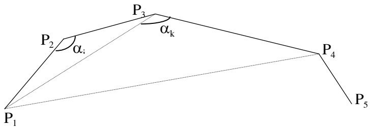

Hình 5.3. Đơn giản hóa đường cong với thuật toán Angles

Điểm thứ 3 của đường cong (P<sub>3</sub>) là điểm động, điểm giữa điểm chốt và điểm động (P<sub>2</sub>) là điểm trung gian

Góc tạo bởi điểm chốt, trung gian, động với điểm trung gian là đỉnh việc tính toán và kiểm tra

Nếu thì điểm trung gian có thể bỏ đi trong trường hợp ngược lại điểm chốt sẽ là điểm trung gian cũ và quá trình lặp với điểm trung gian là điểm động cũ, điểm động mới là điểm kế tiếp sau điểm động cũ. Tiến trình thực hiện cho đến hết đường cong.

## 5.1.4.2. Chương trình

//Hàm tính đường cao từ đỉnh đến đoạn thẳng nối hai điểm dau, cuoi float Tinhgoc(POINT dau, POINT cuoi, POINT dinh)

```txt
{
    float θ;
    || tinhgoc (tự viết)
    return θ;
}
//Hàm độ quy nhằm đánh dấu loại bỏ các điểm trong đường cong
void ALSimple(POINT *pLINE,int chot,int tg,BOOL *chiso,float θ,int n)
{
```

<!-- page: 58 -->

```txt
if(Tinhgoc(pLINE[chot], pLINE[tg], pLINE[tg+1]) > θ)
    chiso[tg] = FALSE;
else
    chot = tg;
    tg = tg + 1;
    if(tg < n - 1)
        ALSimple(pLINE, chot, tg, chiso, θ, n);
}
//Hàm rút gọn số lượng điểm Angles
int Angles(POINT *pLINE, int n, float θ)
{
    int i, j, chiso [MAX];
    for (i = 0; i < n; i++) //Tất cả các điểm được giữ lại
        chiso[i]= TRUE;
    ALSiple (PLINE, 0, 1 chiso, θ, n) ;
    for (i = j = 0; i < n; i++)
        if (chiso ==TRUE)
            pLINE[j++]= pLINE [i];
    return j;
}
* Chú ý:
Với θ= 0 thuật toán DouglasPeucker và BandWidth sẽ bổ đi giữa thẳng hàng. Thuật toán Angles phải có θ= 180° để bổ đi các thẳng hàng.
```

## 5.2. XẤP XỈ ĐA GIÁC BỞI CÁC HÌNH CƠ SỞ

Các đối tượng hình học được phát hiện thường thông qua các kỹ thuật dò biên, kết quả tìm được này là các đường biên xác định đối tượng. Đó là, một dãy các điểm liên tiếp đóng kính, sử dụng các thuật toán đơn giản hoá như Douglas Peucker, Band Width, Angle v.v.. ta sẽ thu được một polyline hay nói khác đi là thu được một đa giác xác định đối tượng dấu. Vấn đề là ta cần phải xác định xem đối tượng có phải là đối tượng cần tách hay không? Như ta đã biết một đa giác có thể có hình dạng tựa như một hình cơ

<!-- page: 59 -->

sở, có thể có nhiều cách tiếp cận xấp xỉ khác nhau. Cách xấp xỉ dựa trên các đặc trưng cơ bản sau:

**Đặc trưng toàn cục:** Các mô men thống kê, số đo hình học như chu vi, diện tích, tập tối ưu các hình chữ nhật phủ hay nội tiếp đa giác v.v..

**Đặc trưng địa phương:** Các số đo đặc trưng của đường cong như góc, điểm lồi, lõm, uốn, cực trị v.v..

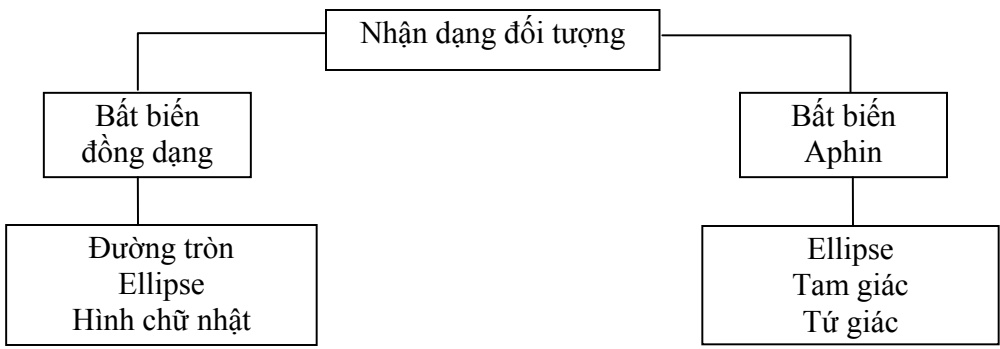

Hình 5.4. Sơ đồ phân loại các đối tượng theo bất biến

Việc xấp xỉ tỏ ra rất có hiệu quả đối với một số hình phẳng đặc biệt như tam giác, đường tròn, hình chữ nhật, hình vuông, hình ellipse, hình tròn và một đa giác mẫu.

## 5.2.1 Xấp xỉ đa giác theo bất biến đồng dạng

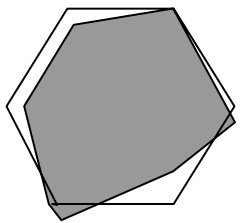

Hình 5.5. Xấp xỉ đa giác bởi một đa giác mẫu

Một đa giác với các đỉnh $\mathbf { V } _ { 0 , \cdot \cdot , } \mathbf { V } _ { \mathrm { m - 1 } }$ được xấp xỉ với đa giác mẫu $\mathrm { U _ { 0 } , . . , U _ { n - 1 } }$ với độ đo xấp xỉ như sau:

$$
E (V, U) = \min _ {0 \leq d \leq m - 1} \sqrt {\frac {\Delta_ {d}}{n}},
$$

<!-- page: 60 -->

Trong đó

$$
\Delta_ {d} = \min _ {0 \leq \theta \leq 2 \pi , \vec {\alpha} \in R ^ {2}} \sum_ {j = 0} ^ {n - 1} \left\| k R _ {\theta} U _ {j} + a - V _ {(j + d) \bmod m} \right\| ^ {2}, k = \sqrt {\frac {\text {area} \left(V _ {0} \cdots V _ {m - 1}\right)}{\text {area} \left(U _ {0} \cdots U _ {n - 1}\right)}}, \text {với} \mathrm{R} _ {\theta} \text {là}
$$

phép quay quanh gốc toạ $\mathbf { \hat { d } } \mathbf { \hat { 0 } }$ một góc θ.

Trong $\mathrm { d } \dot { \mathrm { o } } , \Delta _ { \mathrm { d } }$ được tính hiệu quả bằng công thức sau:

$$
\Delta_ {d} = \sum_ {j = 0} ^ {n - 1} | V _ {(j + d) \bmod m} | ^ {2} - \frac {1}{n} | \sum_ {j = 0} ^ {n - 1} V _ {(j + d) \bmod m} | ^ {2} + k ^ {2} \sum_ {j = 0} ^ {n - 1} | U _ {j} | ^ {2} - 2 k | \sum_ {j = 0} ^ {n - 1} U _ {j} \overline {{V}} _ {(j + d) \bmod m} |
$$

$\dot { \mathrm { O } }$ đây $\mathrm { U _ { j } , ~ V _ { j } }$ được hiểu là các $s \hat { 0 }$ phức tại các đỉnh tương ứng. Khi m $\tt > > n$ thì độ phức tạp tính toán rất lớn. Với các hình đặc biệt như hình tròn, ellipse, hình chữ nhật, hình xác định duy nhất bởi tâm và một đỉnh (đa giác đều ) ta có thể vận dụng các phương pháp đơn giản hơn như bình phương tối thiểu, các bất biến thống kê và hình học.

## Định nghĩa 5.1

Cho đa giác $\mathrm { P g }$ có các đỉnh $\mathrm { U _ { 0 } , U _ { 1 } , . . . , U _ { n } ( U _ { 0 } \equiv U _ { n } ) }$ Khi đó mô men bậc p+q được xác định như sau:

$$
M _ {p q} = \iint_ {\mathrm{Pg}} x ^ {p} y ^ {q} d x d y.
$$

Trong thực hành $\mathsf { d } \hat { \mathsf { e } }$ tính tích phân trên người ta thường sử dụng công thức Green hoặc có thể phân tích phần bên trong đa giác thành tổng đại số của các tam giác có hướng $\Delta   \mathrm { O U _ { i } U _ { i + 1 } }$

$\mathbf{O}(0,0)$

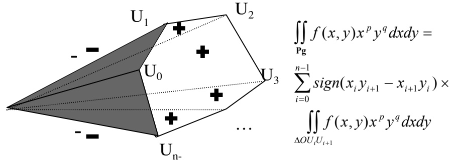

Hình 5.6. Phân tích miền đa giác thành tổng đại số các miền tam giác

<!-- page: 61 -->

## a. Xấp xỉ đa giác bằng đường tròn

Dùng phương pháp bình phương tối thiểu, ta có độ đo xấp xỉ:

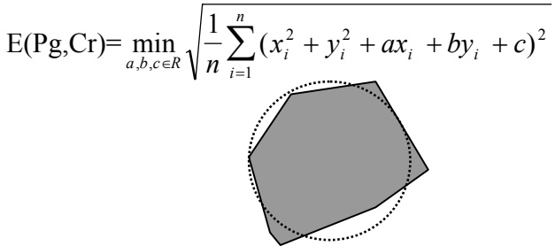

Hình 5.7. Xấp xỉ đa giác bằng đường tròn

## b. Xấp xỉ đa giác bằng ellipse

Cũng như đối với đường tròn phương trình $\mathbf { x } \mathbf { \hat { \hat { a } } } \mathbf { p }$ xỉ đối với ellipse được cho bởi công thức:

$$
\mathrm{E} (\mathrm{Pg}, \mathrm{El}) = \min _ {a, b, c, d, e \in \mathbf {R}} \sqrt {\frac {1}{n} \sum_ {i = 1} ^ {n} \left(x _ {i} ^ {2} + a y _ {i} ^ {2} + b x _ {i} y _ {i} + c x _ {i} + d y _ {i} + e\right) ^ {2}}
$$

Một biến thể khác của phương pháp bình phương tối thiểu khi $\mathbf { x } \mathbf { \hat { \hat { a } } } \mathbf { p }$ xỉ các đường cong bậc hai được đưa ra trong [7].

## c. Xấp xỉ đa giác bởi hình chữ nhật

Sử dụng tính chất diện tích bất biến qua phép quay, xấp xỉ theo diện tích như sau: Gọi $\mu _ { 1 1 } , \mu _ { 2 0 } , \mu _ { 0 2 }$ là các mô men bậc hai của đa giác (tính theo diện tích). Khi đó góc quay được tính bởi công thức sau:

$$
t g 2 \varphi = \frac {2 \mu_ {1 1}}{\mu_ {2 0} - \mu_ {0 2}}.
$$

Gọi diện tích của hình chữ nhật nhỏ nhất có các cạnh song song với các trục quán tính và bao quanh đa giác Pg là S.

Kí hiệu E(Pg, Rect)= S area Pg − ( )

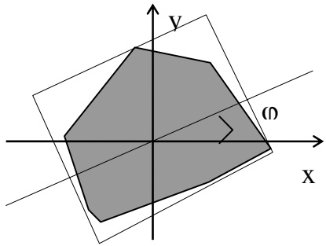

Hình 5.8. Xấp xỉ đa giác bằng hình chữ nhật

<!-- page: 62 -->

## d. Xấp xỉ đa giác bởi đa giác đều n cạnh

Gọi $\mathbf { M } ( \mathbf { x } _ { 0 } , \mathbf { y } _ { 0 } )$ là trọng tâm của đa giác, lấy một đỉnh Q tuỳ $\dot { \mathbf { y } }$ của đa giác, xét đa giác đều n cạnh $\mathbf { P g } ^ { \prime }$ tạo bởi đỉnh Q với tâm là M.

Kí hiệu $\mathrm{E}(\mathrm{Pg}, \mathrm{Pg}') = \sqrt{\left| \operatorname{area}(\mathrm{Pg}) - \operatorname{area}(\mathrm{Pg}') \right|}$

$\mathrm{E}(\mathrm{Pg}, \mathrm{E_n}) = \min \mathrm{E}(\mathrm{Pg}, \mathrm{Pg}^*)$ khi Q chạy khắp các đỉnh của đa giác.

## 5.2.2 Xấp xỉ đa giác theo bất biến aphin

Trong [7] đưa ra mô hình chuẩn tắc về bất biến aphin, cho phép chúng ta có thể chuyển bài toán xấp xỉ đối tượng bởi bất biến aphin về bài toán xấp xỉ mẫu trên các dạng chuẩn tắc. Như vậy có thể đưa việc đối sánh các đối tượng với mẫu bởi các bất biến đồng dạng, chẳng hạn việc xấp xỉ bởi tam giác, hình bình hành, ellipse tương đương với xấp xỉ tam giác đều, hình vuông, hình tròn v.v... Thủ tục xấp xỉ theo bất biến aphin một đa giác với hình cơ sở được thực hiện tuần tự như sau:

## + Bước 0:

Phân loại bất biến aphin các dạng hình cơ sở

| Dạng hình cơ sở | Dạng chuẩn tắc |
| --- | --- |
| Tam giác | Tam giác đều |
| Hình bình hành | Hình vuông |
| Ellipse | Đường tròn |
| … | … |

## + Bước 1:

Tìm dạng chuẩn tắc cơ sở Pg' thoả mãn điều kiện:

$$
\left\{ \begin{array}{l} m _ {0 1} = m _ {1 0} = 0 \\ m _ {0 2} = m _ {2 0} = 1 \\ m _ {1 3} = m _ {3 1} = 0 \end{array} \right.
$$

$$
\begin{array}{l} \text {(phép tinh tiến)} \\ \text {(phép co dân theo hai trục x, y)} \end{array}\tag{**}
$$

## + Bước 2:

Xác định biến đổi aphin T chuyển đa giác thành đa giác Pg ở dạng chuẩn tắc (thoả mãn tính chất $( * * ) )$ .

Xấp xỉ đa giác Pg với dạng chuẩn tắc cơ sở $\mathbf { P g } ^ { \prime }$ tìm được ở bước 1 với độ đo xấp xỉ $\mathrm{E}(\mathrm{Pg}, \mathrm{Pg}^{\mathrm{s}})$

## + Bước 3:

Kết luận, đa giác ban đầu xấp xỉ $\mathrm{T}-1(\mathrm{Pg}^{3})$ với độ đo xấp xỉ $\mathrm{E}(\mathrm{Pg}, \mathrm{Pg}^{\prime})$ .

<!-- page: 63 -->

Đối với bước 1 trong [7] đã đưa ra hai ví dụ sau:

Ví dụ 1:

Tồn tại duy nhất tam giác đều ΔP1P2P3 thoả mãn tính chất (\*\*) là

$$
\mathrm{P} 1 = (0, - 2 \alpha), \mathrm{P} 2 = (\sqrt {3} \alpha , \alpha), \mathrm{P} 3 = (- \sqrt {3} \alpha , \alpha), \alpha = \frac {\sqrt [ 4 ]{2} \sqrt [ 8 ]{3}}{\sqrt {3}}.
$$

Ví dụ 2:

Tồn tại hai hình vuông  P1P2 P3 P4 thoả mãn tính chất (\*\*)

Hình vuông thứ nhất có 4 đỉnh tương ứng là $( - p , - p ) , ( - p , p ) , ( p , - p ) , ( p , - p ) , ( p , - p ) , ( p , - p ) , ( p , - p ) , ( p , - p ) , ( p , - p ) , ( p , - p ) , ( p , - p ) , ( p , - p ) , ( p , - p ) , ( p , - p ) , ( p , - p ) , ( p , - p ) , ( p , - p ) , ( p , - p ) , ( p , - p ) , ( p , - p ) , ( p , - p ) , ( p , - p ) , ( p , - p ) , ( p , - p ) , ( p , - p ) , ( p , - p ) , ( p , - p ) , ( p , - p ) , ( p , - p ) , ( p , - p ) , ( p , - p ) , ( p , - p ) , ( p , - p ) , ( p , - p ) , ( p , - p ) , ( p , - p ) , ( p , - p ) , ( p , - p ) , ( p , - p ) , ( p , - p ) , ( p , - p ) , ( p , - p ) , ( p , - p ) , ( p - p ) , ( p , - p ) , ( p - p ) , ( p - p ) , ( p , p - p ) , ( p - p ) , ( p - p ) , ( p - p ) , ( p - p ) , ( p - p ) , ( p - p ) , ( p - p ) , ( p - p ) ) , ( p ( p - p ) , ( p - p ) ) , ( p ( p - p ) ) , ( p - p ) , ( p - p ) ) , ( p ( p - p ) ) , ( p ( p - p ) ) , ( p ) , ( p - p ) ( p ) , ( p - p ) ) , ( p ( p - p ) ) , ( p ) ( p ) , ( p ) ( p ) , ( p - p ) ) , ( p ( p ) ) , ( p ( p - p ) ) ) , ( p ( p ) ) ( p ) , ( p ) ( p ) ( p ) , ( p ) ( p ) ) ( p ) , ( p ) ( p ) ( p ) ) ( p ) ( p ) , ( p ) ( p ) ( p ) ) ( p ) ( p ) ( p ) ) ( p ) ( p ) ( p ) ( p ) ) ( p ) ( p ) ( p ) ( p ) ) ( p ) ( p ) ( p ) ) ( p ) ( p ) ( p ) ( p ) ) ( p ) ( p ) ( p ) ( p ) ) ( p ) ( p ) ( p ) ) ( p ) ( p ) ( p ) ( p ) ) ( p ) ( p ) ) ( p ) ( p ) ( p ) ( p ) ) ( p ) ( p ) ) ( p ) ( p ) ) ( p ) ( p ) ) ( ) ( p ) ) ( p ) ( p ) ( p ) ) ( p ) ( p ) ) ( p ) ( ) ) ( p ) ( p ) ( p ) ) ( ) ) ( ) ( ) ) ( ) ) ( ) ( ) ) ( ) ) ( ) ) ( ) ( ) ) ) ( ) ( ) ) ( ) ( ) ) ( ) ) ( ) ) ) ( ) ( ) ) ( ) ) ) ( ) ) ( ) ) ( ) ) ) ( ) ) ) ( ) ( ) ) ) ( ) ) ( ) ) ) ) ( ) ) ( ) ) ) ) ( ) ) ) ) ( ) ) ) ( ) ) ) ( ) ) ) ( ) ) ) ) ) ( ) ) ) ) ( ) ) ) ) ( ) ) ) ) ) ) ) ) ( ) ) ) ) ($ $\mathrm { p ) , ( p , p ) }$ , với $\mathtt { p } ^ { = \sqrt [ 4 ] { \frac { 3 } { 4 } } }$

Hình vuông thứ hai có 4 đỉnh tương ứng là $( - p , 0 ) , ( p , 0 ) , ( 0 , - p ) , ( 0 , p )$ với $\mathtt { p } ^ { = { \sqrt { 3 } } }$

## 5.3. BIẾN ĐỔI HOUGH

## 5.3.1. Biến đổi Hongh cho đường thẳng

Bằng cách nào đó ta thu được một số điểm vấn đề đặt ra là cần phải kiểm tra xem các điểm có là đường thẳng hay không

## Bài toán:

Cho n điểm $( \mathrm { x } _ { \mathrm { i } } ;   \mathrm { y } _ { \mathrm { i } } ) \; \mathrm { i } = 1$ , n và ngưỡng θ hãy kiểm tra n điểm có tạo thành đường thẳng hay không?

\* Ý tưởng

Giả sử n điểm nằm trên cùng một đường thẳng và đường thẳng có phương trình

$$
\mathrm{y=ax+b}
$$

$\mathrm{Vi}\left(\mathrm{x}_{\mathrm{i}}, \mathrm{y}_{\mathrm{i}}\right) \mathrm{i}=1$ , n thuộc đường thẳng nên $y_{1}=\mathrm{ax}_{1}+\mathrm{b}, \forall \mathrm{i}=1$ , n

$$
\Leftrightarrow \mathrm{b} = - \mathrm{x} _ {\mathrm{i}} \mathrm{a} + \mathrm{y} _ {1}; \forall \mathrm{i} = 1, \mathrm{n}
$$

Như vậy, mỗi điểm $\left( \mathrm { X } _ { \mathrm { i } } \mathrm { ; ~ } \mathrm { y } _ { \mathrm { i } } \right)$ trong mặt phẳng sẽ tương ứng với một số đường thẳng $\mathbf { b } = - \mathbf { x } _ { \mathrm { i } } \mathbf { a } + \mathbf { y } _ { \mathrm { i } }$ trong mặt phẳng tham số a, b. n điểm $\left( \mathbf{x}_{\mathrm{i}} ; \mathbf{y}_{\mathrm{i}} \right) \dot{\mathbf{i}} =$ 1, n thuộc đường thẳng trong mặt phẳng tương ứng với n đường thẳng trong mặt phẳng tham số a, b giao nhau tại 1 điểm và điểm giao chính là a, b. Chính là hệ số xác định phương trình của đường thẳng mà các điểm nằm vào.

<!-- page: 64 -->

```csv
+ (0, 1): b = 1
+ (1, 3): b = -a + 3
+ (2, 5): b = -2a + 5
+ (3, 5): b = -3a + 5
+ (4, 9): b = -4a + 9
- Tìm phần tử lớn nhất có giá trị 4
4/5 = 80%
- Kết luận: 5 điểm này nằm trên cùng 1 đường thẳng
Phương trình: y = 2x + 1
```

\* Phương pháp:

\- Xây dựng mảng chỉ số [a, b] và gán giá trị 0 ban đầu cho tất cả các phân tử của mảng

\- Với mỗi (x<sub>i</sub>; y<sub>i</sub>) và ∀a, b là chỉ số của phần tử mảng thoả mãn $b = - x _ { i } a + y _ { i }$ tăng giá trị của phân tử mảng tương ứng lên 1

\- Tìm phần tử mảng có giá trị lớn nhất nếu giá trị lớn nhất tìm được so với số phân tử lớn hơn hoặc bằng ngưìng θ cho trước thì ta có thể kết luận các điểm nằm trên cùng 1 đường thẳng và đường thẳng có phương trình y = ax + b trong đó a, b tương ứng là chỉ số của phần tử mảng có giá trị lớn nhất tìm được:

Ví dụ:

Cho 5 điểm (0, 1); (1, 3); (2, 5); (3, 5); (4, 9) và θ = 80%. Hãy kiểm tra xem 5 điểm đã cho có nằm trên cùng một đường thẳng hay không? Hãy cho biết phương trình đường thẳng nếu có?

\- Lập bảng chỉ số [a, b] và gán giá trị 0

**5.3.2. Biến đổi Hough cho đường thẳng trong tọa độ cực**

**5.3.2.1. Đường thẳng Hough trong tọa độ cực**

<!-- page: 65 -->

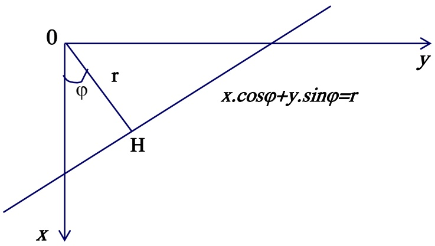

Hình 5.9. Đường thẳng Hough trong toạ độ cực

Mỗi điểm (x,y) trong mặt phẳng được biểu diễn bởi cặp (r,ϕ) trong tọa độ cực.

Tương tự mỗi đường thẳng trong mặt phẳng cũng có thể biểu diễn bởi một cặp (r,ϕ) trong tọa độ cực với r là khoảng cách từ gốc tọa độ tới đường thẳng đó và ϕ là góc tạo bởi trục 0X với đường thẳng vuông góc với nó, hình 5.9 biểu diễn đường thẳng hough trong tọa độ Decard.

Ngược lại, mỗi một cặp (r,ϕ) trong toạ độ cực cũng tương ứng biểu diễm một đường thẳng trong mặt phẳng.

Giả sử $\mathrm { M ( x , } \mathrm { y ) }$ là mộ điểm thuộc đường thẳng được biểu diễn bởi (r,ϕ), gọi H(X,Y) là hình chiếu của gốc toạ độ O trên đường thẳng ta có:

X= r. cosϕ và Y= r.sinϕ

OH.HA=0Mặt khác, ta có:

Từ đó ta có mối liên hệ giữa (x,y) và (r,ϕ) như sau: x\*cosϕ+y\*sinϕ= r.

Xét n điểm thẳng hàng trong tọa độ Đề các có phương trình $\mathrm{x}^{*} \cos \varphi_{0} + \mathrm{y}^{*} \sin \varphi_{0} = \mathrm{r}_{0}$ . Biến đổi Hough ánh xạ n điểm này thành n đường sin trong tọa độ cực mà các đường này đều đi qua $\left( \mathbf { r } _ { 0 } \mathbf { , } \boldsymbol { \varphi } _ { 0 } \right)$ . Giao điểm $\left( \mathbf { r } _ { 0 } \mathbf { , } \boldsymbol { \varphi } _ { 0 } \right)$ của n đường sin sẽ xác định một đường thẳng trong hệ tọa độ đề các. Như vậy, những đường thẳng đi qua điểm (x,y) sẽ cho duy nhất một cặp (r,ϕ) và có bao nhiêu đường qua (x,y) sẽ có bấy nhiêu cặp giá trị (r,ϕ).

## 5.3.2.2. Áp dụng biến đổi Hough trong phát hiện góc nghiêng văn bản

Ý tưởng của việc áp dụng biến đổi Hough trong phát hiện góc nghiêng văn bản là dùng một mảng tích luỹ để đếm số điểm ảnh nằm trên một đường thảng trong không gian ảnh. Mảng tích luỹ là một mảng hai chiều với chỉ số hàng của mảng cho biết góc lệch ϕ của một đường thẳng và chỉ số cột chính là giá trị r khoảng cách từ gốc toạ độ tới đường thẳng đó. Sau đó tính tổng số điểm ảnh nằm trên những đường thẳng song song nhau theo

<!-- page: 66 -->

các góc lệch thay đổi. Góc nghiêng văn bản tương ứng với góc có tổng gía trị mảng tích luỹ cực đại.

Theo biến đổi Hough, mỗi một đường thẳng trong mặt phẳng tương ứng được biểu diễn bởi một cặp (r,ϕ). Giả sử ta có một điểm ảnh (x,y) trong mặt phẳng, vì qua điểm ảnh này có vô số đường thẳng, mỗi đường thẳng lại cho một cặp (r,ϕ) nên với mỗi điểm ảnh ta sẽ xác định được một số cặp (r,ϕ) thoả mãn phương trình Hough.

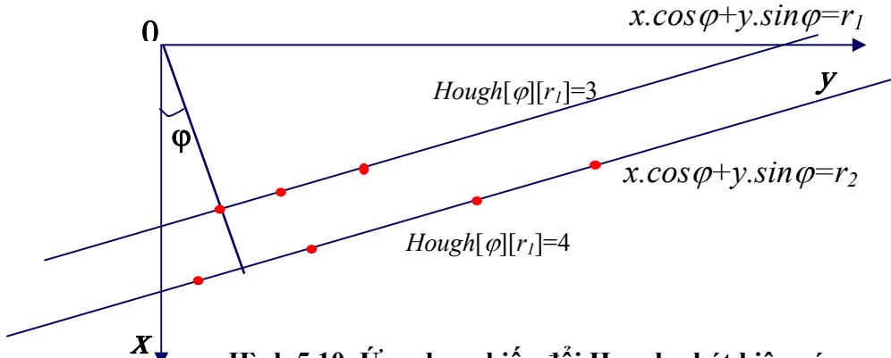

Hình 5.10. Ứng dụng biến đổi Hough phát hiện góc

Hình vẽ trên minh hoạ cách dùng biến đổi Hough để phát hiện góc nghiêng văn bản. Giả sử ta có một số điểm ảnh, đây là những điểm giữa đáy các hình chữ nhật ngoại tiếp các đối tượng đã được lựa chọn từ các bước trước. Ở đây, ta thấy trên mặt phẳng có hai đường thẳng song song nhau. Đường thẳng thứ nhất có ba điểm ảnh nên giá trị mảng tích luỹ bằng 3, đường thẳng thứ hai có gia trị mảng tích luỹ bằng 4. Do đó, tổng giá trị mảng tích luỹ cho cùng góc ϕ trường hợp này bằng 7.

Gọi Hough[360][Max] là mảng tích lũy, giả sử M và N tương ứng là chiều rộng và chiều cao của ảnh, ta có các bước chính trong quá trình áp dụng biến đổi Hough phát hiện góc nghiêng văn bản như sau:

\+ <strong><u>Bước 1</u></strong>: Khai báo <u>mảng chỉ số</u> Hough[ϕ][r] với $0   \leq   \varphi   \leq   3 6 0 0$ và $0 \leq \mathbf { r } \leq { \sqrt { M ^ { * } M + N ^ { * } N } }$

\+ <strong><u>Bước 2</u></strong>: Gán giá trị khởi tạo bằng 0 cho các phần tử của mảng.

\+ <strong><u>Bước 3</u></strong>: Với mỗi cặp (x,y) là điểm giữa đáy của hình chữ nhật ngoại tiếp một đối tượng.

\- Với mỗi $\varphi _ { \mathrm { i } }$ từ 0 đến 360 tính giá trị $\mathbf { r } _ { \mathbf { i } }$ theo công thức $\mathbf{f}_{\mathrm{i}}=\mathrm{X}.\cos \varphi_{\mathrm{i}}+\mathrm{y}$ .sinϕ

\- Làm tròn giá trị $\mathbf { r _ { i } }$ thành số nguyên gần nhất là $\mathbf { r } _ { 0 }$

\- Tăng giá trị của phần tử mảng Hough[ϕ<sub>i</sub>][r<sub>0</sub>] lên một đơn vị.

<!-- page: 67 -->

**+** <strong><u>Bước 4</u></strong>: Trong mảng Hough[ϕ][r] tính tổng giá trị các phần tử theo từng dòng và xác định dòng có tổng giá trị lớn nhất.

Do số phần tử của một phần tử mảng Hough[ϕ<sub>0</sub>][r<sub>0</sub>] chính là số điểm ảnh thuộc đường thẳng x.cosϕ<sub>0</sub>+y.sinϕ<sub>0</sub>= r<sub>0</sub> vì vậy tổng số phần tử của một hàng chính là tổng số điểm ảnh thuộc các đường thẳng tương ứng được biểu diễn bởi góc ϕ của hàng đó. Do đó, góc nghiêng của toán văn bản chính là hàng có tổng giá trị các phần tử mảng lớn nhất.

<!-- page: 68 -->

# MỘT SỐ ĐỊNH DẠNG TRONG XỬ LÝ ẢNH

Hiện nay trên thế giới có trên 50 khuôn dạng ảnh thông dụng. Sau đây là một số định dạng ảnh hay dùng trong quá trình xử lý ảnh hiện nay.

## 1. Định dạng ảnh IMG

Ảnh IMG là ảnh đen trắng, phần đầu của ảnh IMG có 16 byte chứa các thông tin:

• 6 byte đầu: dùng để đánh dấu định dạng ảnh. Giá trị của 6 byte này viết dưới dạng Hexa: 0x0001 0x0008 0x0001

2 byte tiếp theo: chứa độ dài mẫu tin. Đó là độ dài của dãy các byte kề liền nhau mà dóy này sẽ được lặp lại một số lần nào đó. Số lần lặp này sẽ được lưu trong byte đếm. Nhiều dãy giống nhau được lưu trong một byte.

• 4 byte tiếp: mô tả kích cỡ pixel.

• 2 byte tiếp: số pixel trên một dòng ảnh.

• 2 byte cuối: số dòng ảnh trong ảnh.

Ảnh IMG được nén theo từng dòng, mỗi dòng bao gồm các gói (pack). Các dòng giống nhau cũng được nén thành một gói. Có 4 loại gói sau:

• Loại 1: Gói các dòng giống nhau.

Quy cách gói tin này như sau: 0x00 0x00 0xFF Count. Ba byte đầu tiên cho biết số các dãy giống nhau, byte cuối cho biết số các dòng giống nhau.

• Loại 2: Gói các dãy giống nhau.

Quy cách gói tin này như sau: 0x00 Count. Byte thứ hai cho biết số các dãy giống nhau được nén trong gói. Độ dài của dãy ghi ở đầu tệp.

• Loại 3: Dãy các Pixel không giống nhau, không lặp lại và không nén được.

Quy cách gói tin này như sau: 0x80 Count. Byte thứ hai cho biết độ dài dãy các pixel không giống nhau không nén được.

<!-- page: 69 -->

• Loại 4: Dãy các Pixel giống nhau.

Tuỳ theo các bít cao của byte đầu tiên được bật hay tắt. Nếu bít cao được bật (giá trị 1) thỡ đây là gói nén các byte chỉ gồm bít 0, số các byte được nén được tính bởi 7 bít thấp còn lại. Nếu bớt cao tắt (giỏ trị 0) thì đây là gói nén các byte gồm toán bít 1. Số các byte được nén được tính bởi 7 bít còn lại.

Các gói tin của file IMG rất đa dạng do ảnh IMG là ảnh đen trắng, do vậy chỉ cần 1 bít cho 1 pixel thay vì 4 hoặc 8 như đã nói ở trên. Toàn bộ ảnh chỉ có những điểm sáng và tối tương ứng với giá trị 1 hoặc 0. Tỷ lệ nén của kiểu định dạng này là khá cao.

## 2. Định dạng ảnh PCX

Định dạng ảnh PCX là một trong những định dạng ảnh cổ điển. Nó sử dụng phương pháp mó hoỏ loạt dài RLE (Run – Length – Encoded) để nén dữ liệu ảnh. Quá trỡnh nộn và giải nộn được thực hiện trên từng dũng ảnh. Thực tế, phương pháp giải nén PCX kém hiệu quả hơn so với kiểu IMG. Tệp PCX gồm 3 phần: đầu tệp (header), dữ liệu ảnh (Image data) và bảng màu mở rộng.

Header của tệp PCX có kích thước cố định gồm 128 byte và được phân bố như sau:

• 1 byte: chỉ ra kiểu định dạng.Nếu là PCX/PCC thì nó luôn có giá trị là 0Ah.

• 1 byte: chỉ ra version sử dụng để nén ảnh, có thể có các giá trị sau:

\+ 0: version 2.5.

\+ 2: version 2.8 với bảng màu.

\+ 3: version 2.8 hay 3.0 không có bảng màu.

\+ 5: version 3.0 cố bảng màu.

• 1 byte: chỉ ra phương pháp mã hoá. Nếu là 0 thì mã hoá theo phương pháp BYTE PACKED, ngược lại là phương pháp RLE.

• 1 byte: Số bít cho một điểm ảnh plane.

• 1 word: toạ độ góc trái của ảnh. Với kiểu PCX nó có giá trị là (0,0), cũn PCC thì khác (0,0).

1 word: toạ độ góc phải dưới.

• 1 word: kích thước bề rộng và bề cao của ảnh.

<!-- page: 70 -->

• 1 word: số điểm ảnh.

1 word: độ phân giải màn hình.

• 1 word.

48 byte: chia nó thành 16 nhóm, mỗi nhóm 3 byte. Mỗi nhóm này chứa thông tin về một thanh ghi màu. Như vậy ta có 16 thanh ghi màu.

• 1 byte: không dùng đến và luôn đặt là 0.

1 byte: số bớt plane mà ảnh sử dụng. Với ảnh 16 màu, giá trị này là 4, với ảnh 256 mầu (1pixel/8bits) thì số bít plane lại là 1.

• 1 byte: số bytes cho một dòng quét ảnh.

• 1 word: kiểu bảng màu.

• 58 byte: không dùng.

Định dạng ảnh PCX thường được dùng để lưu trữ ảnh và thao tác đơn giản, cho phép nén và giải nén nhanh. Tuy nhiên, vì cấu trúc của nó cố định, nên trong một số trường hợp làm tăng kích thước lưu trữ. Cũng vì nhược điểm này mà một số ứng dụng sử dụng một kiểu định dạng khác mềm dẻo hơn: định dạng TIFF (Targed Image File Format) sẽ mô tả dưới đây.

## 3. Định dạng ảnh TIFF

Kiểu định dạng TIFF được thiết kế để làm nhẹ bớt các vấn đề liên quan đến việc mở rộng tệp ảnh cố định. Về cấu trúc, nó cũng gồm 3 phần chính:

• Phần Header(IFH): cú trong tất cả cỏc tệp TIFF và gồm 8 byte:

\+ 1 word: chỉ ra kiểu tạo tệp trên máy tính PC hay máy Macintosh. Hai loại này khác nhau rất lớn ở thứ tự các byte lưu trữ trong các số dài 2 hay 4 byte. Nếu trường này có giá trị là 4D4Dh thì đó là ảnh cho máy Macintosh, nếu là 4949h là của máy PC.

\+ 1 word: version. từ này luôn có giá trị là 42. đây là đặc trưng của file TIFF và không thay đổi.

\+ 2 word: giá trị Offset theo byte tính từ đầu tới cấu trúc IFD là cấu trúc thứ hai của file. Thứ tự các byte này phụ thuộc vào dấu hiệu trường đầu tiên.

<!-- page: 71 -->

• Phần thứ 2(IFD): Không ở ngay sau cấu trúc IFH mà vị trí được xác định bởi trường Offset trong đầu tệp. Có thể có một hay nhiều IFD cùng tồn tại trong một file.

Một IFD bao gồm:

\+ 2 byte: chứa các DE ( Directory Entry).

\+ 12 byte là các DE xếp liên tiếp, mỗi DE chiếm 12 byte.

\+ 4 byte: chứa Offset trỏ tới IFD tiếp theo. Nếu đây là IFD cuối cùng thì trường này có giá trị 0.

• Phần thứ 3: các DE: các DE có dộ dài cố định gồm 12 byte và chia làm 4 phần:

\+ 2 byte: chỉ ra dấu hiệu mà tệp ảnh đó được xây dựng.

\+ 2 byte: kiểu dữ liệu của tham số ảnh. Có 5 kiểu tham số cơ bản:

1: BYTE (1 byte)

2: ASCII (1 byte)

3: SHORT (2 byte).

4: LONG (4 byte)

5: RATIONAL (8 byte)

\+ 4 byte: trường độ dài chưa số lượng chỉ mục của kiểu dữ liệu đó chỉ ra. Nó không phải là tổng số byte cần thiết để lưu trữ. Để có số liệu này ta cần nhân số chỉ mục với kiểu dữ liệu đã dùng.

\+ 4 byte: đó là Offset tới điểm bắt đầu dữ liệu liên quan tới dấu hiệu, tức là liên quan với DE không phải lưu trữ vật lý cùng với nó nằm ở một vị trí nào đó trong file.

Dữ liệu chứa trong tệp thường được tổ chức thành các nhóm dòng (cột) quét của dữ liệu ảnh. Cách tổ chức này làm giảm bộ nhớ cần thiết cho việc đọc tệp. Việc giải nén được thực hiện theo 4 kiểu khác nhau được lưu trữ trong byte dấu hiệu nén.

<!-- page: 72 -->

## 4. Định dạng file ảnh BITMAP

Mỗi file BITMAP gồm đầu file chứa các thông tin chung về file, đầu thông tin chứa các thông tin về ảnh, một bảng màu và một mảng dữ liệu ảnh. Khuôn dạng được cho như sau:

BITMAPFILEHEADER bmfh; BITMAPINFOHEADER bmih; RGBQUAD aColors[]; BYTE aBitmapBits[];

Trong đó, các cấu trúc được định nghĩa như sau:

```c
typedef struct tagBITMAPFILEHEADER {  /* bmfh */
    UINT      bfType;
    DWORD   bfSize;
    UINT      bfReserved1;
    UINT      bfReserved2;
    DWORD   bfOffBits;
} BITMAPFILEHEADER;
typedef struct tagBITMAPINFOHEADER {  /* bmih */
    DWORD   biSize;
    LONG     biWidth;
    LONG     biHeight;
    WORD     biPlanes;
    WORD     biBitCount;
    DWORD   biCompression;
    DWORD   biSizeImage;
    LONG     biXPelsPerMeter;
    LONG     biYPelsPerMeter;
    DWORD   biClrUsed;
    DWORD   biClrImportant;
} BITMAPINFOHEADER, *LPBITMAPINFOHEADER;
```

với

| biSize | kích thước của BITMAPINFOHEADER |
| --- | --- |
| biWidth | Chiều rộng của ảnh, tính bằng số điểm ảnh |
| biHeight | Chiều cao của ảnh, tính bằng số điểm ảnh |

<!-- page: 73 -->

| biPlanes | Số plane của thiết bị, phải bằng 1 |
| --- | --- |
| biBitCount | Số bit cho một điểm ảnh |
| biCompression | Kiểu nén |
| biSizeImage | Kích thước của ảnh tính bằng byte |
| biXPelsPerMeter | m độet phân giải ngang của thiết bị, tính bằng điểm ảnh trên |
| biYPelsPerMeter | đ mộet phân giải dọc của thiết bị, tính bằng điểm ảnh trên |
| biClrUsed | Số lượng các màu thực sự được sử dụng |
| biClrImportant | t Sấốt c lưảợ cnágc c máàcu m đàềuu c cầầnn t đhểiế hti cểhno th vịiệc hiển thị, bằng 0 nếu |

Nếu bmih.biBitCount > 8 thì mảng màu rgbq[] trống, ngược lại thì mảng màu có 2<< bmih.biBitCount phần tử.

```c
typedef struct tagRGBQUAD { /* rgbq */
    BYTE      rgbBlue;
    BYTE      rgbGreen;
    BYTE      rgbRed;
    BYTE      rgbReserved;
} RGBQUAD;
Ta cũng có:
typedef struct tagBITMAPINFO {
    BITMAPINFOHEADER   bmiHeader;
    RGBQUAD                  bmiColors[1];
} BITMAPINFO, *PBITMAPINFO;
```

<!-- page: 74 -->

# CÁC BƯỚC THAO TÁC VỚI FILE AVI

AVI là chuẩn video thường được tích hợp trong các thư viện của các môi trường lập trình. Để xử lý video, cần có các thao tác cơ bản để chuyển về xử lý ảnh các khung hình (các frames).

## 1. Bước 1: Mở và đóng thư viện

Trước mọi thao tác với file AVI, chúng ta phải mở thư viện:

## AVIFileInit( )

Hàm này không cần tham số, có nhiệm vụ khởi động thư viện cung cấp các hàm thao tác với file AVI. (Đó là thư viện vfw32.lib, được khai báo trong file vfw.h).

Sau tất cả các thao tác bạn phải nhớ đóng thư viện đã mở lúc đầu, chỉ bằng lệnh:

## AVIFileExit( )

Nếu thiếu bất cứ hàm nào, dù là mở hay đóng thư viện thì trình biên dịch đều sẽ thông báo lỗi.

## 2. Bước 2: Mở và đóng file AVI để thao tác:

Sau khi mở thư viện, bạn phải mở file AVI bạn định thao tác:

AVIFileOpen(PAVIFILE\* ppfile, LPCSTR fname, UINT mode,

CLSID pclsidHandler)

Thực chất, hàm này tạo ra một vùng đệm chứa con trỏ trỏ đến file có tên là fname cần mở. Và ppfile là con trỏ trỏ đến vùng bộ đệm đó. Tham số mode quy định kiểu mở file; chẳng hạn OF\_CREATE để tạo mới, OF\_READ để đọc, OF\_WRITE để ghi …. Tham số cuối dùng

## là NULL.

Trước khi đóng thư viện, bạn phải đóng file AVI đã mở, bằng cách dùng hàm:

## AVIFileRelease(PAVIFILE pfile)

Trong đó, pfile là con trỏ trỏ đến file cần đóng.

<!-- page: 75 -->

## 3. Bước 3:

Mở dòng dữ liệu hình ảnh hay âm thanh trong file AVI đã mở ra để thao tác:

AVIFileGetStream(PAVIFILE pfile, PAVISTREAM \* ppavi, DWORD fccType, LONG lParam)

Trong đó, pfile là con trỏ đến file đã mở; ppavi trỏ đến dòng dữ liệu kết quả; fccType là loại dòng dữ liệu chọn để mở, là streamtypeAUDIO nếu là tiếng và streamtypeVIDEO nếu là hình,… lParam đếm số loại dòng được mở, là 0 nếu chỉ thao tác với một loại dòng dữ liệu.

Sau các thao tác với dòng dữ liệu này, bạn nhớ phải đóng nó lại:

AVIStreamRelease(PAVITREAM pavi).

## 4. Bước 4: Trường hợp thao tác với dữ liệu hình của phim

Chuẩn bị cho thao tác với khung hình (frames):

AVIStreamGetFrameOpen(PAVISTREAM pavi,

LPBITMAPINFOHEADER lpbiWanted)

Trong đó pavi trỏ đến dòng dữ liệu đã mở, lpbiWanted là con trỏ trỏ đến cấu trúc mong muốn của hình ảnh, ta dùng NULL để sử dụng cấu trúc mặc định.

Hàm này trả về đối tượng có kiểu PGETFRAME để dùng cho bước 5.

Sau khi thao tác với các frame rồi, phải gọi hàm :

AVIStreamGetFrameClose(PGETFRAME pget)

## 5. Bước 5: Thao tác với frame

Dùng hàm

AVIStreamGetFrame(PGETFRAME pget, LONG lpos)

Hàm này trả về con trỏ trỏ đến dữ liệu của frame thứ lpos. Dữ liệu đó có kiểu là DIB đã định khối.

Thực hiện các thao tác mong muốn.

<!-- page: 76 -->

## TÀI LIỆU THAM KHẢO

[1]. Lương Mạnh Bá, Nguyễn Thanh Thủy (2002), Nhập Môn Xử lý ảnh số, Nxb Khoa học và Kỹ thuật, 2002.

[2]. Anil K.Jain (1989), Fundamental of Digital Image Processing. Prentice Hall, Engwood cliffs.

[3]. J.R.Paker (1997), Algorithms for Image processing and Computer Vision. John Wiley & Sons, Inc.

[4]. Randy Crane (1997), A simplified approach to image processing, Prentice-Hall, Inc.

[5]. John C.Russ (1995), The Image Procesing Handbook. CRC Press, Inc.

[6]. Adrian Low (1991), Introductory Computer Vision and Image Processing, Copyright (c) 1991 by McGrow Hill Book Company (UK) Limited.

[7]. T. Pavlidis (1982), Algorithms for Graphics and Image Processing, Computer Science Press.
