<!-- page: 1 -->

# Analyzing the Structure of Attention in a Transformer Language Model

**Jesse Vig** Palo Alto Research Center Machine Learning and Data Science Group Interaction and Analytics Lab Palo Alto, CA, USA jesse.vig@parc.com

## Abstract

The Transformer is a fully attention-based alternative to recurrent networks that has achieved state-of-the-art results across a range of NLP tasks. In this paper, we analyze the structure of attention in a Transformer language model, the GPT-2 small pretrained model. We visualize attention for individual instances and analyze the interaction between attention and syntax over a large corpus. We find that attention targets different parts of speech at different layer depths within the model, and that attention aligns with dependency relations most strongly in the middle layers. We also find that the deepest layers of the model capture the most distant relationships. Finally, we extract exemplar sentences that reveal highly specific patterns targeted by particular attention heads.

## 1 Introduction

Contextual word representations have recently been used to achieve state-of-the-art performance across a range of language understanding tasks (Peters et al., 2018; Radford et al., 2018; Devlin et al., 2018). These representations are obtained by optimizing a language modeling (or similar) objective on large amounts of text. The underlying architecture may be recurrent, as in ELMo (Peters et al., 2018), or based on multi-head self-attention, as in OpenAI’s GPT (Radford et al., 2018) and BERT (Devlin et al., 2018), which are based on the Transformer (Vaswani et al., 2017). Recently, the GPT-2 model (Radford et al., 2019) outperformed other language models in a zeroshot setting, again based on self-attention.

An advantage of using attention is that it can help interpret the model by showing how the model attends to different parts of the input (Bahdanau et al., 2015; Belinkov and Glass, 2019). Various tools have been developed to visualize

**Yonatan Belinkov**

Harvard John A. Paulson School of Engineering and Applied Sciences and MIT Computer Science and Artificial Intelligence Laboratory Cambridge, MA, USA belinkov@seas.harvard.edu

attention in NLP models, ranging from attention matrix heatmaps (Bahdanau et al., 2015; Rush et al., 2015; Rocktaschel et al. ¨ , 2016) to bipartite graph representations (Liu et al., 2018; Lee et al., 2017; Strobelt et al., 2018). A visualization tool designed specifically for multi-head self-attention in the Transformer (Jones, 2017; Vaswani et al., 2018) was introduced in Vaswani et al. (2017).

We extend the work of Jones (2017), by visualizing attention in the Transformer at three levels of granularity: the attention-head level, the model level, and the neuron level. We also adapt the original encoder-decoder implementation to the decoder-only GPT-2 model, as well as the encoder-only BERT model.

In addition to visualizing attention for individual inputs to the model, we also analyze attention in aggregate over a large corpus to answer the following research questions:

• Does attention align with syntactic dependency relations?

• Which attention heads attend to which partof-speech tags?

• How does attention capture long-distance relationships versus short-distance ones?

We apply our analysis to the GPT-2 small pre-trained model. We find that attention follows dependency relations most strongly in the middle layers of the model, and that attention heads target particular parts of speech depending on layer depth. We also find that attention spans the greatest distance in the deepest layers, but varies significantly between heads. Finally, our method for extracting exemplar sentences yields many intuitive patterns.

<!-- page: 2 -->

## 2 Related Work

Recent work suggests that the Transformer implicitly encodes syntactic information such as dependency parse trees (Hewitt and Manning, 2019; Raganato and Tiedemann, 2018), anaphora (Voita et al., 2018), and subject-verb pairings (Goldberg, 2019; Wolf, 2019). Other work has shown that RNNs also capture syntax, and that deeper layers in the model capture increasingly high-level constructs (Blevins et al., 2018).

In contrast to past work that measure a model’s syntactic knowledge through linguistic probing tasks, we directly compare the model’s attention patterns to syntactic constructs such as dependency relations and part-of-speech tags. Raganato and Tiedemann (2018) also evaluated dependency trees induced from attention weights in a Transformer, but in the context of encoder-decoder translation models.

## 3 Transformer Architecture

**Stacked Decoder:** GPT-2 is a stacked decoder Transformer, which inputs a sequence of tokens and applies position and token embeddings followed by several decoder layers. Each layer applies multi-head self-attention (see below) in combination with a feedforward network, layer normalization, and residual connections. The GPT-2 small model has 12 layers and 12 heads.

**Self-Attention:** Given an input x, the self-attention mechanism assigns to each token $x _ { i }$ a set of attention weights over the tokens in the input:

$$
\mathrm{Attn} (x _ {i}) = (\alpha_ {i, 1} (x), \alpha_ {i, 2} (x),..., \alpha_ {i, i} (x))\tag{1}
$$

where $\alpha _ { i , j } ( x )$ is the attention that $x _ { i }$ pays to $x _ { j }$ The weights are positive and sum to one. Attention in GPT-2 is right-to-left, so $\alpha _ { i , j }$ is defined only for $j \leq i .$ . In the multi-layer, multi-head setting, α is specific to a layer and head.

The attention weights $\alpha _ { i , j } ( x )$ are computed from the scaled dot-product of the query vector of $x _ { i }$ and the key vector of $x _ { j }$ , followed by a softmax operation. The attention weights are then used to produce a weighted sum of value vectors:

$$
\text {Attention} (Q, K, V) = \text {softmax} (\frac {Q K ^ {T}}{\sqrt {d _ {k}}}) V\tag{2}
$$

using query matrix $Q ,$ key matrix $K ,$ and value matrix $V .$ , where $d _ { k }$ is the dimension of $K$ . In a multi-head setting, the queries, keys, and values are linearly projected h times, and the attention operation is performed in parallel for each representation, with the results concatenated.

## 4 Visualizing Individual Inputs

In this section, we present three visualizations of attention in the Transformer model: the attentionhead view, the model view, and the neuron view. Source code and Jupyter notebooks are available at [https://github.com/jessevig/bertviz](https://github.com/jessevig/bertviz), and a video demonstration can be found at [https://vimeo.com/339574955](https://vimeo.com/339574955).A more detailed discussion of the tool is provided in Vig (2019).

## 4.1 Attention-head View

The attention-head view (Figure 1) visualizes attention for one or more heads in a model layer. Self-attention is depicted as lines connecting the attending tokens (left) with the tokens being attended to (right). Colors identify the head(s), and line weight reflects the attention weight. This view closely follows the design of Jones (2017), but has been adapted to the GPT-2 model (shown in the figure) and BERT model (not shown).

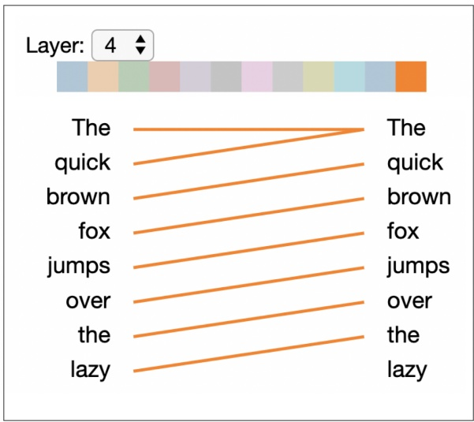

Figure 1: Attention-head view of GPT-2 for layer 4, head 11, which focuses attention on previous token.

This view helps focus on the role of specific attention heads. For instance, in the shown example, the chosen attention head attends primarily to the previous token position.

<!-- page: 3 -->

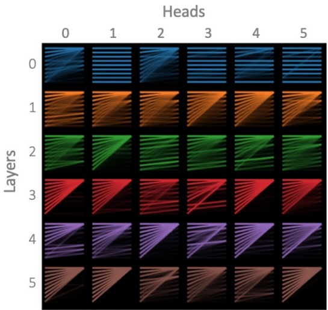

Figure 2: Model view of GPT-2, for same input as in Figure 1 (excludes layers 6–11 and heads 6–11).

## 4.2 Model View

The model view (Figure 2) visualizes attention across all of the model’s layers and heads for a particular input. Attention heads are presented in tabular form, with rows representing layers and columns representing heads. Each head is shown in a thumbnail form that conveys the coarse shape of the attention pattern, following the small multi-ples design pattern (Tufte, 1990). Users may also click on any head to enlarge it and see the tokens.

This view facilitates the detection of coarsegrained differences between heads. For example, several heads in layer 0 share a horizontal-stripe pattern, indicating that tokens attend to the current position. Other heads have a triangular pattern, showing that they attend to the first token. In the deeper layers, some heads display a small number of highly defined lines, indicating that they are targeting specific relationships between tokens.

## 4.3 Neuron View

The neuron view (Figure 3) visualizes how individual neurons interact to produce attention. This view displays the queries and keys for each token, and demonstrates how attention is computed from the scaled dot product of these vectors. The element-wise product shows how specific neurons influence the dot product and hence attention.

Whereas the attention-head view and the model view show what attention patterns the model learns, the neuron view shows how the model forms these patterns. For example, it can help identify neurons responsible for specific attention patterns, as illustrated in Figure 3.

## 5 Analyzing Attention in Aggregate

In this section we explore the aggregate properties of attention across an entire corpus. We examine how attention interacts with syntax, and we compare long-distance versus short-distance relationships. We also extract exemplar sentences that reveal patterns targeted by each attention head.

## 5.1 Methods

## 5.1.1 Part-of-Speech Tags

Past work suggests that attention heads in the Transformer may specialize in particular linguistic phenomena (Vaswani et al., 2017; Raganato and Tiedemann, 2018; Vig, 2019). We explore whether individual attention heads in GPT-2 target particular parts of speech. Specifically, we measure the proportion of total attention from a given head that focuses on tokens with a given part-of-speech tag, aggregated over a corpus:

$$
\mathrm{P} _ {\alpha} (t a g) = \frac {\sum_ {x \in X} \sum_ {i = 1} ^ {| x |} \sum_ {j = 1} ^ {i} \alpha_ {i , j} (x) \cdot \mathbb {1} _ {\mathrm{pos} (x _ {j}) = t a g}}{\sum_ {x \in X} \sum_ {i = 1} ^ {| x |} \sum_ {j = 1} ^ {i} \alpha_ {i , j} (x)}\tag{3}
$$

where tag is a part-of-speech tag, $\mathbf { e . g . }$ , NOUN, x is a sentence from the corpus $X , \alpha _ { i , j }$ is the attention from $x _ { i }$ to $x _ { j }$ for the given head (see Section 3), and $\operatorname { p o s } ( x _ { j } )$ is the part-of-speech tag of $x _ { j }$ . We also compute the share of attention directed from each part of speech in a similar fashion.

## 5.1.2 Dependency Relations

Recent work shows that Transformers and recurrent models encode dependency relations (Hewitt and Manning, 2019; Raganato and Tiedemann, 2018; Liu et al., 2019). However, different models capture dependency relations at different layer depths. In a Transformer model, the middle layers were most predictive of dependencies (Liu et al., 2019; Tenney et al., 2019). Recurrent models were found to encode dependencies in lower layers for language models (Liu et al., 2019) and in deeper layers for translation models (Belinkov, 2018).

We analyze how attention aligns with dependency relations in GPT-2 by computing the proportion of attention that connects tokens that are also in a dependency relation with one another. We

<!-- page: 4 -->

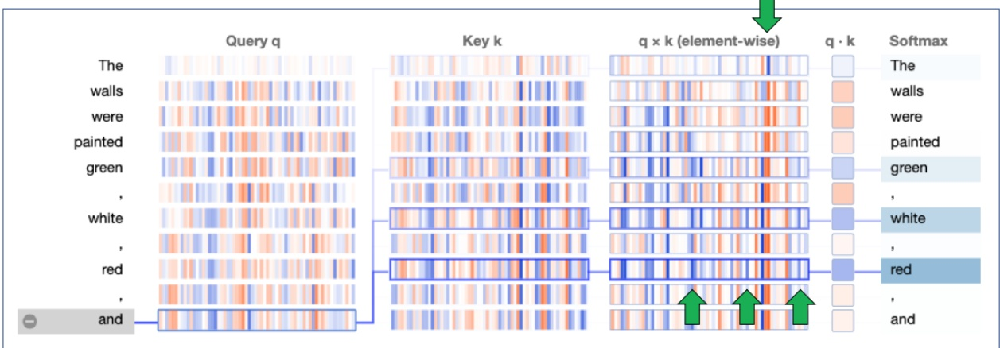

Figure 3: Neuron view for layer 8, head 6, which targets items in lists. Positive and negative values are colored blue and orange, respectively, and color saturation indicates magnitude. This view traces the computation of attention (Section 3) from the selected token on the left to each of the tokens on the right. Connecting lines are weighted based on attention between the respective tokens. The arrows (not in visualization) identify the neurons that most noticeably contribute to this attention pattern: the lower arrows point to neurons that contribute to attention towards list items, while the upper arrow identifies a neuron that helps focus attention on the first token in the sequence.

refer to this metric as dependency alignment:

$$
\mathrm{DepAl} _ {\alpha} = \frac {\sum_ {x \in X} \sum_ {i = 1} ^ {| x |} \sum_ {j = 1} ^ {i} \alpha_ {i , j} (x) d e p (x _ {i} , x _ {j})}{\sum_ {x \in X} \sum_ {i = 1} ^ {| x |} \sum_ {j = 1} ^ {i} \alpha_ {i , j} (x)}\tag{4}
$$

where $d e p ( x _ { i } , x _ { j } )$ is an indicator function that returns 1 if $x _ { i }$ and $x _ { j }$ are in a dependency relation and 0 otherwise. We run this analysis under three alternate formulations of dependency: (1) the attending token $( x _ { i } )$ is the parent in the dependency relation, (2) the token receiving attention $( x _ { j } )$ is the parent, and (3) either token is the parent.

We hypothesized that heads that focus attention based on position—for example, the head in Figure 1 that focuses on the previous token—would not align well with dependency relations, since they do not consider the content of the text. To distinguish between content-dependent and contentindependent (position-based) heads, we define attention variability, which measures how attention varies over different inputs; high variability would suggest a content-dependent head, while low variability would indicate a content-independent head:

$$
\text {Variability} _ {\alpha} = \frac {\sum_ {x \in X} \sum_ {i = 1} ^ {| x |} \sum_ {j = 1} ^ {i} \left| \alpha_ {i , j} (x) - \bar {\alpha} _ {i , j} \right|}{2 \cdot \sum_ {x \in X} \sum_ {i = 1} ^ {| x |} \sum_ {j = 1} ^ {i} \alpha_ {i , j} (x)}\tag{5}
$$

where $\bar { \alpha } _ { i , j }$ is the mean of $\alpha _ { i , j } ( x )$ over all $x \in X$

Variabili $\mathrm { U y } _ { \alpha }$ represents the mean absolute deviation1 of α over X, scaled to the [0, 1] interval.2,3 Variability scores for three example attention heads are shown in Figure 4.

## 5.1.3 Attention Distance

Past work suggests that deeper layers in NLP models capture longer-distance relationships than lower layers (Belinkov, 2018; Raganato and Tiedemann, 2018). We test this hypothesis on GPT-2 by measuring the mean distance (in number of tokens) spanned by attention for each head. Specifically, we compute the average distance between token pairs in all sentences in the corpus, weighted by the attention between the tokens:

$$
\bar {D} _ {\alpha} = \frac {\sum_ {x \in X} \sum_ {i = 1} ^ {| x |} \sum_ {j = 1} ^ {i} \alpha_ {i , j} (x) \cdot (i - j)}{\sum_ {x \in X} \sum_ {i = 1} ^ {| x |} \sum_ {j = 1} ^ {i} \alpha_ {i , j} (x)}\tag{6}
$$

We also explore whether heads with more dis-

<small>1We considered using variance to measure attention variability; however, attention is sparse for many attention heads after filtering first-token attention (see Section ) result- 5.2.3 , ing in a very low variance (due to α (x) and i,j  ≈ 0 ᾱi,j ≈ 0) for many content-sensitive attention heads. We did not use a probability distance measure, as attention values do not sum to one due to filtering first-token attention.</small>

<small>x ∈ X</small>

<small>2The upper bound is 1 because the denominator is an upper bound on the numerator.</small>

<small>3When computing variability, we only include the first N tokens (N=10) of each x ∈ to ensure a sufficient amount of data at each position i. The positional patterns appeared to be consistent across the entire sequence.</small>

<!-- page: 5 -->

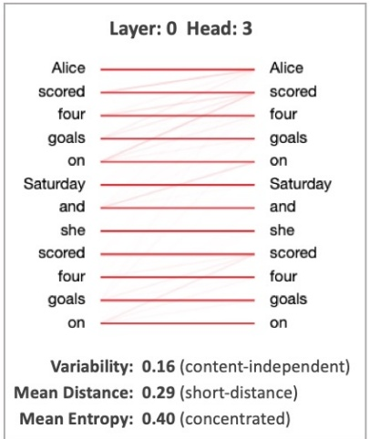

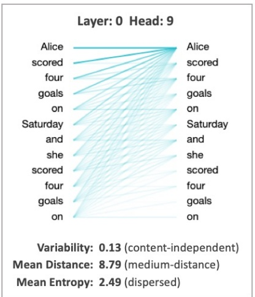

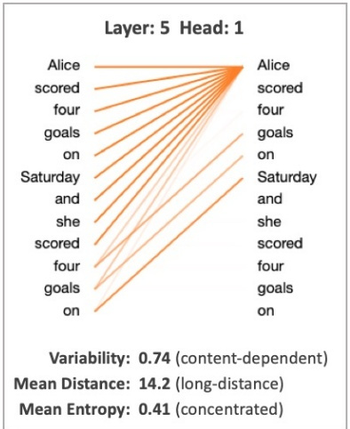

Figure 4: Attention heads in GPT-2 visualized for an example input sentence, along with aggregate metrics computed from all sentences in the corpus. Note that the average sentence length in the corpus is 27.7 tokens. Left: Focuses attention primarily on current token position. Center: Disperses attention roughly evenly across all pre-vious tokens. Right: Focuses on words in repeated phrases.

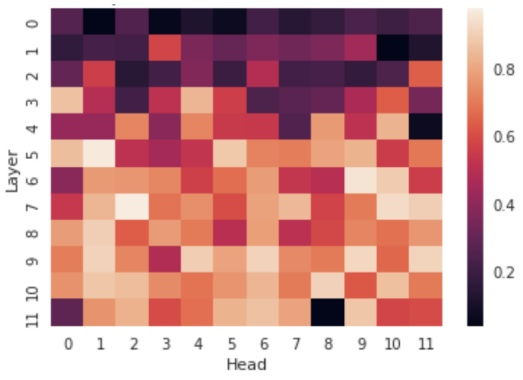

Figure 5: Proportion of attention focused on first token, broken out by layer and head.

persed attention patterns (Figure 4, center) tend to capture more distant relationships. We measure attention dispersion based on the entropy4 of the attention distribution (Ghader and Monz, 2017):

$$
\mathrm{Entropy} _ {\alpha} (x _ {i}) = - \sum_ {j = 1} ^ {i} \alpha_ {i, j} (x) \mathrm{log} (\alpha_ {i, j} (x))\tag{7}
$$

Figure 4 shows the mean distance and entropy values for three example attention heads.

## 5.2 Experimental Setup

## 5.2.1 Dataset

We focused our analysis on text from English Wikipedia, which was not included in the training set for GPT-2. We first extracted 10,000 articles, and then sampled 100,000 sentences from these articles. For the qualitative analysis described later, we used the full dataset; for the quantitative analysis, we used a subset of 10,000 sentences.

## 5.2.2 Tools

We computed attention weights using the pytorch-pretrained-BERT5implementation of the GPT-2 small model. We extracted syntactic features using spaCy (Honnibal and Montani, 2017) and mapped the features from the spaCy-generated tokens to the corresponding tokens from the GPT-2 tokenizer.6

## 5.2.3 Filtering Null Attention

We excluded attention focused on the first token of each sentence from the analysis because it was not informative; other tokens appeared to focus on this token by default when no relevant tokens were found elsewhere in the sequence. On average, 57% of attention was directed to the first token. Some heads focused over 97% of attention to this token on average (Figure 5), which is consistent with recent work showing that individual attention heads may have little impact on overall performance (Voita et al., 2019; Michel et al., 2019). We refer to the attention directed to the first token as null attention.

<small>4When computing entropy, we exclude attention to the first (null) token (see Section 5.2.3) and renormalize the remaining weights. We exclude tokens that focus over 90% of attention to the first token, to avoid a disproportionate influence from the remaining attention from these tokens.</small>

<small>5[https://github.com/huggingface/ pytorch-pretrained-BERT](https://github.com/huggingface/pytorch-pretrained-BERT)</small>

<small>6In cases where the GPT-2 tokenizer split a word into multiple pieces, we assigned the features to all word pieces.</small>

<!-- page: 6 -->

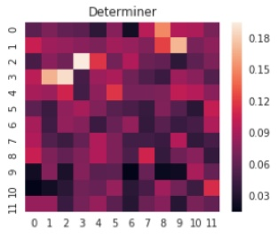

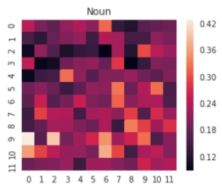

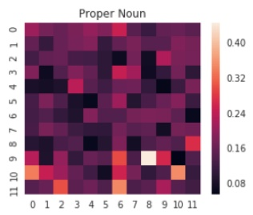

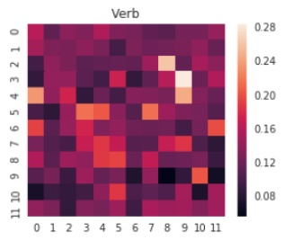

Figure 6: Each heatmap shows the proportion of total attention directed to the given part of speech, broken out by layer (vertical axis) and head (horizontal axis). Scales vary by tag. Results for all tags available in appendix.

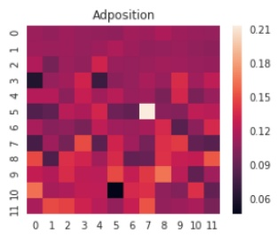

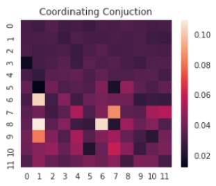

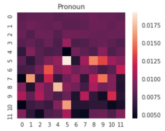

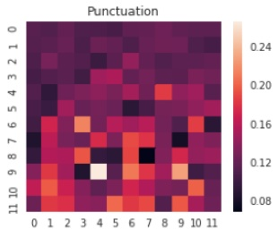

Figure 7: Each heatmap shows the proportion of total attention that originates from the given part of speech, broken out by layer (vertical axis) and head (horizontal axis). Scales vary by tag. Results for all tags available in appendix.

## 5.3 Results

## 5.3.1 Part-of-Speech Tags

Figure 6 shows the share of attention directed to various part-of-speech tags (Eq. 3) broken out by layer and head. Most tags are disproportionately targeted by one or more attention heads. For example, nouns receive 43% of attention in layer 9, head 0, compared to a mean of 21% over all heads. For 13 of 16 tags, a head exists with an attention share more than double the mean for the tag.

The attention heads that focus on a particular tag tend to cluster by layer depth. For example, the top five heads targeting proper nouns are all in the last three layers of the model. This may be due to several attention heads in the deeper layers focusing on named entities (see Section 5.4), which may require the broader context available in the deeper layers. In contrast, the top five heads targeting determiners—a lower-level construct—are all in the first four layers of the model. This is consistent with previous findings showing that deeper layers focus on higher-level properties (Blevins et al., 2018; Belinkov, 2018).

Figure 7 shows the proportion of attention directed from various parts of speech. The values appear to be roughly uniform in the initial layers of the model. The reason is that the heads in these layers pay little attention to the first (null) token (Figure 5), and therefore the remaining (non-null) attention weights sum to a value close to one. Thus, the net weight for each token in the weighted sum (Section 5.1.1) is close to one, and the proportion reduces to the frequency of the part of speech in the corpus.

Beyond the initial layers, attention heads specialize in focusing attention from particular partof-speech tags. However, the effect is less pronounced compared to the tags receiving attention; for 7 out of 16 tags, there is a head that focuses attention from that tag with a frequency more than double the tag average. Many of these specialized heads also cluster by layer. For example, the top ten heads for focusing attention from punctuation are all in the last six layers.

## 5.3.2 Dependency Relations

Figure 8 shows the dependency alignment scores (Eq. 4) broken out by layer. Attention aligns with dependency relations most strongly in the middle layers, consistent with recent syntactic probing analyses (Liu et al., 2019; Tenney et al., 2019).

One possible explanation for the low alignment in the initial layers is that many heads in these layers focus attention based on position rather than content, according to the attention variability (Eq. 5) results in Figure 10. Figure 4 (left and center) shows two examples of position-focused heads from layer 0 that have relatively low dependency alignment7(0.04 and 0.10, respectively); the first

<!-- page: 7 -->

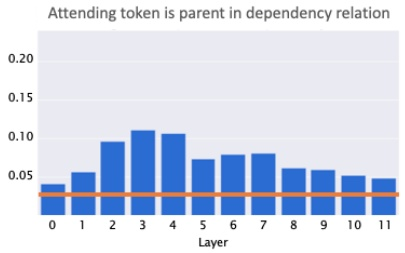

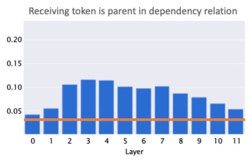

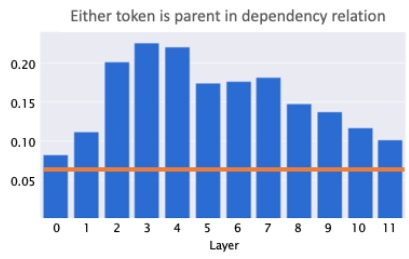

Figure 8: Proportion of attention that is aligned with dependency relations, aggregated by layer. The orange line shows the baseline proportion of token pairs that share a dependency relationship, independent of attention.

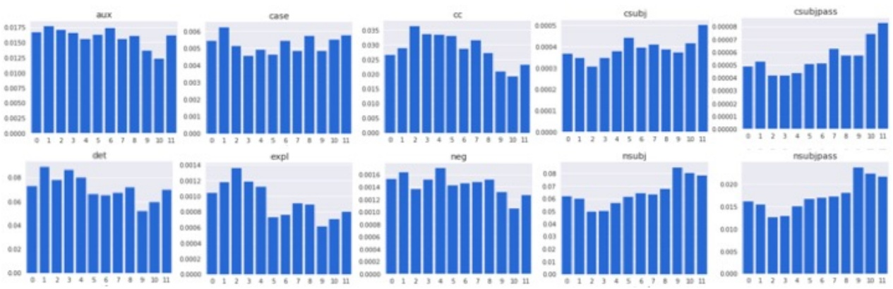

Figure 9: Proportion of attention directed to various dependency types, broken out by layer.

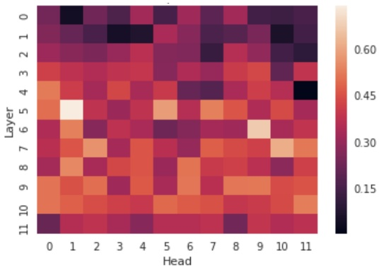

Figure 10: Attention variability by layer / head. High-values indicate content-dependent heads, and low values indicate content-independent (position-based) heads.

head focuses attention primarily on the current token position (which cannot be in a dependency relation with itself) and the second disperses attention roughly evenly, without regard to content.

An interesting counterexample is layer 4, head 11 (Figure 1), which has the highest dependency alignment out of all the heads $\mathrm { ( D e p A l _ { \alpha } }$ = $0 . 4 2 \dot { ) } ^ { 7 }$ but is also the most position-focused $( \mathrm { V a r i a b i l i t y } _ { \alpha }   =   0 . 0 0 4 )$ . This head focuses attention on the previous token, which in our corpus has a 42% chance of being in a dependency relation with the adjacent token. As we’ll discuss in the next section, token distance is highly predictive of dependency relations.

One hypothesis for why attention diverges from dependency relations in the deeper layers is that several attention heads in these layers target very specific constructs (Tables 1 and 2) as opposed to more general dependency relations. The deepest layers also target longer-range relationships (see next section), whereas dependency relations span relatively short distances (3.89 tokens on average).

We also analyzed the specific dependency types of tokens receiving attention (Figure 9). Subjects (csubj, csubjpass, nsubj, nsubjpass) were targeted more in deeper layers, while auxiliaries (aux), conjunctions (cc), determiners (det), expletives (expl), and negations (neg) were targeted more in lower layers, consistent with previous findings (Belinkov, 2018). For some other dependency types, the interpretations were less clear.

## 5.3.3 Attention Distance

We found that attention distance (Eq. 6) is greatest in the deepest layers (Figure 11, right), confirming that these layers capture longer-distance relationships. Attention distance varies greatly across heads $( S D = 3 . 6 )$ , even when the heads are in the same layer, due to the wide variation in attention structures (e.g., Figure 4 left and center).

<small>7Assuming relation may be in either direction.</small>

<!-- page: 8 -->

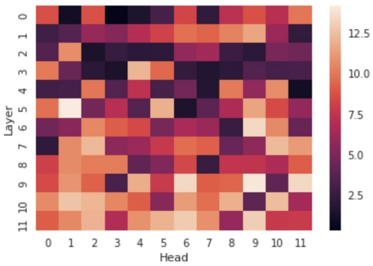

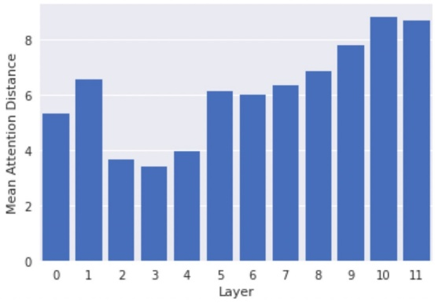

Figure 11: Mean attention distance by layer / head (left), and by layer (right).

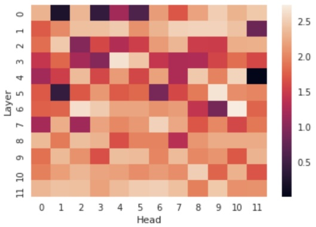

Figure 12: Mean attention entropy by layer / head. Higher values indicate more diffuse attention.

We also explored the relationship between attention distance and attention entropy (Eq. 7), which measures how diffuse an attention pattern is. Overall, we found a moderate correlation (r = 0.61, $p < 0 . 0 0 1 )$ between the two. As Figure 12 shows, many heads in layers 0 and 1 have high entropy (e.g., Figure 4, center), which may explain why these layers have a higher attention distance compared to layers 2–4.

One counterexample is layer 5, head 1 (Figure 4, right), which has the highest mean attention distance of any head (14.2), and one of the lowest mean entropy scores (0.41). This head concentrates attention on individual words in repeated phrases, which often occur far apart from one another.

We also explored how attention distance relates to dependency alignment. Across all heads, we found a negative correlation between the two quantities $( r   =   - 0 . 7 3 , p   <   0 . 0 0 1 )$ . This is consistent with the fact that the probability of two tokens sharing a dependency relation decreases as the distance between them increases8; for example, the probability of being in a dependency relation is 0.42 for adjacent tokens, 0.07 for tokens at a distance of 5, and 0.02 for tokens at a distance of 10. The layers (2–4) in which attention spanned the shortest distance also had the highest dependency alignment.

## 5.4 Qualitative Analysis

To get a sense of the lexical patterns targeted by each attention head, we extracted exemplar sentences that most strongly induced attention in that head. Specifically, we ranked sentences by the maximum token-to-token attention weight within each sentence. Results for three attention heads are shown in Tables 1–3. We found other attention heads that detected entities (people, places, dates), passive verbs, acronyms, nicknames, paired punctuation, and other syntactic and semantic properties. Most heads captured multiple types of patterns.

## 6 Conclusion

In this paper, we analyzed the structure of attention in the GPT-2 Transformer language model. We found that many attention heads specialize in particular part-of-speech tags and that different tags are targeted at different layer depths. We also found that the deepest layers capture the most distant relationships, and that attention aligns most strongly with dependency relations in the middle layers where attention distance is lowest.

Our qualitative analysis revealed that the structure of attention is closely tied to the training objective; for GPT-2, which was trained using leftto-right language modeling, attention often focused on words most relevant to predicting the next token in the sequence. For future work, we would like to extend the analysis to other Transformer models such as BERT, which has a bidi-

<small>8This is true up to a distance of 18 tokens; 99.8% of dependency relations occur within this distance.</small>

<!-- page: 9 -->

<table><tbody><tr><td>Rank</td><td>Sentence</td></tr><tr><td>1</td><td>The Australian search and rescue service is provided by Aus S AR , which is part of the Australian Maritime Safety Authority ( AM SA ).</td></tr><tr><td>2</td><td>In 1925 , Bapt ists worldwide formed the Baptist World Alliance ( B WA ).</td></tr><tr><td rowspan="2">3</td><td rowspan="2">The Oak dale D ump is listed as an Environmental Protection Agency Super fund site due to the contamination of residential drinking water wells with volatile organic compounds (V OC s ) and heavy metals .</td></tr><tr></tr></tbody></table>

Table 1: Exemplar sentences for layer 10, head 10, which focuses attention from acronyms to the associated phrase. The tokens with maximum attention are underlined; the attending token is bolded and the token receiving attention is italicized. It appears that attention is directed to the part of the phrase that would help the model choose the next word piece in the acronym (after the token paying attention), reflecting the language modeling objective.

| Rank | Sentence |
| --- | --- |
| 1 | After the two prototypes were completed , production began in Mar iet ta , Georgia , ... |
| 3 | The fictional character Sam Fisher of the Spl inter Cell video game series by Ubisoft was born in Tow son , as well as residing in a town house , as stated in the novel izations ... |
| 4 | Suicide bombers attack three hotels in Am man , Jordan , killing at least 60 people . |

Table 2: Exemplar sentences for layer 11, head 2, which focuses attention from commas to the preceding place name (or the last word piece thereof). The likely purpose of this attention head is to help the model choose the related place name that would follow the comma, e.g. the country or state in which the city is located.

<table><tbody><tr><td>Rank</td><td>Sentence</td></tr><tr><td rowspan="2">1</td><td rowspan="2">With the United States isolation ist and Britain stout ly refusing to make the " continental commitment " to defend France on the same scale as in World War I , theprospects ofAnglo - American assistance in another war with Germany appeared to be doubtful ...</td></tr><tr></tr><tr><td rowspan="2">2</td><td rowspan="2">The show did receive a somewhat favorable review from noted critic Gilbert Se ld es in the December 15 , 1962 TV Guide : " The whole notion on which The Beverly Hill bill ies is founded is an encouragement to ignorance ...</td></tr><tr></tr><tr><td rowspan="2">3</td><td rowspan="2">he Arch im edes won significant market share in the education markets of the UK , Ireland, Australia and New Zealand ; the success of the Arch im edes in British schools was due partly to its predecessor the BBC Micro and later to the Comput ers for Schools scheme ...</td></tr><tr></tr></tbody></table>

Table 3: Exemplar sentences for layer 11, head 10 which focuses attention from the end of a noun phrase to the head noun. In the first sentence, for example, the head noun is prospects and the remainder of the noun phrase is of Anglo - American assistance in another war with Germany. The purpose of this attention pattern is likely to predict the word (typically a verb) that follows the noun phrase, as the head noun is a strong predictor of this.

rectional architecture and is trained on both tokenlevel and sentence-level tasks.

Although the Wikipedia sentences used in our analysis cover a diverse range of topics, they all follow a similar encyclopedic format and style. Further study is needed to determine how attention patterns manifest in other types of content, such as dialog scripts or song lyrics. We would also like to analyze attention patterns in text much longer than a single sentence, especially for new Transformer variants such as the Transformer-XL (Dai et al., 2019) and Sparse Transformer (Child et al., 2019), which can handle very long contexts.

We believe that interpreting a model based on attention is complementary to linguistic probing approaches (Section 2). While linguistic probing precisely quantifies the amount of information encoded in various components of the model, it requires training and evaluating a probing classifier. Analyzing attention is a simpler process that also produces human-interpretable descriptions of model behavior, though recent work casts doubt on its role in explaining individual predictions (Jain and Wallace, 2019). The results of our analyses were often consistent with those from probing approaches.

## 7 Acknowledgements

Y.B. was supported by the Harvard Mind, Brain, and Behavior Initiative.

<!-- page: 10 -->

## References

Dzmitry Bahdanau, Kyunghyun Cho, and Yoshua Bengio. 2015. [Neural machine translation by jointly learning to align and translate](http://arxiv.org/abs/1409.0473). In International Conference on Learning Representations (ICLR).

Yonatan Belinkov. 2018. On Internal Language Representations in Deep Learning: An Analysis of Machine Translation and Speech Recognition. Ph.D. thesis, Massachusetts Institute of Technology.

Yonatan Belinkov and James Glass. 2019. [Analysis methods in neural language processing: A survey](https://doi.org/10.1162/tacl_a_00254). Transactions of the Association for Computational Linguistics, 7:49–72.

Terra Blevins, Omer Levy, and Luke Zettlemoyer. 2018. [Deep RNNs encode soft hierarchical syntax](https://arxiv.org/abs/1805.04218). arXiv preprint arXiv:1805.04218.

Rewon Child, Scott Gray, Alec Radford, and Ilya Sutskever. 2019. [Generating long sequences with sparse transformers](https://arxiv.org/abs/1904.10509). arXiv preprint arXiv:1904.10509.

Zihang Dai, Zhilin Yang, Yiming Yang, Jaime G. Carbonell, Quoc V. Le, and Ruslan Salakhutdinov. 2019. [Transformer-XL: Attentive language models beyond a fixed-length context](http://arxiv.org/abs/1901.02860).

Jacob Devlin, Ming-Wei Chang, Kenton Lee, and Kristina Toutanova. 2018. [BERT: Pre-training of deep bidirectional transformers for language understanding](https://arxiv.org/pdf/1810.04805.pdf). arXiv preprint arXiv:1810.04805.

Hamidreza Ghader and Christof Monz. 2017. [What does attention in neural machine translation pay attention to?](https://www.aclweb.org/anthology/I17-1004) In Proceedings of the Eighth International Joint Conference on Natural Language Processing (Volume 1: Long Papers), pages 30–39.

Yoav Goldberg. 2019. [Assessing BERT’s syntactic abilities](https://arxiv.org/abs/1901.05287). arXiv preprint arXiv:1901.05287.

John Hewitt and Christopher D. Manning. 2019. A structural probe for finding syntax in word representations. In Proceedings of the Conference of the North American Chapter of the Association for Computational Linguistics: Human Language Technologies.

Matthew Honnibal and Ines Montani. 2017. spaCy 2: Natural language understanding with Bloom embeddings, convolutional neural networks and incremental parsing. To appear.

Sarthak Jain and Byron C. Wallace. 2019. [Attention is not explanation](http://arxiv.org/abs/1902.10186). CoRR, abs/1902.10186.

Llion Jones. 2017. Tensor2tensor transformer visualization. [https://github.com/tensorflow/tensor2tensor/tree/master/tensor2tensor/visualization](https://github.com/tensorflow/tensor2tensor/tree/master/tensor2tensor/visualization).

Jaesong Lee, Joong-Hwi Shin, and Jun-Seok Kim. 2017. [Interactive visualization and manipulation of attention-based neural machine translation](https://doi.org/10.18653/v1/D17-2021). In Proceedings of the 2017 Conference on Empirical Methods in Natural Language Processing: System Demonstrations.

Nelson F. Liu, Matt Gardner, Yonatan Belinkov, Matthew Peters, and Noah A. Smith. 2019. Linguistic knowledge and transferability of contextual representations. In Proceedings of the 17th Annual Conference of the North American Chapter of the Association for Computational Linguistics: Human Language Technologies (NAACL-HLT).

Shusen Liu, Tao Li, Zhimin Li, Vivek Srikumar, Valerio Pascucci, and Peer-Timo Bremer. 2018. [Visual interrogation of attention-based models for natural language inference and machine comprehension](https://www.aclweb.org/anthology/D18-2007). In Proceedings of the 2018 Conference on Empirical Methods in Natural Language Processing: System Demonstrations.

Paul Michel, Omer Levy, and Graham Neubig. 2019. [Are sixteen heads really better than one?](https://arxiv.org/abs/1905.10650) arXiv preprint arXiv:1905.10650.

Matthew Peters, Mark Neumann, Mohit Iyyer, Matt Gardner, Christopher Clark, Kenton Lee, and Luke Zettlemoyer. 2018. [Deep contextualized word representations](https://doi.org/10.18653/v1/N18-1202). In Proceedings of the 2018 Conference of the North American Chapter of the Association for Computational Linguistics: Human Language Technologies, Volume 1 (Long Papers), pages 2227–2237. Association for Computational Linguistics.

Alec Radford, Karthik Narasimhan, Tim Salimans, and Ilya Sutskever. 2018. [Improving language understanding by generative pre-training](https://s3-us-west-2.amazonaws.com/openai-assets/research-covers/language-unsupervised/language_understanding_paper.pdf). Technical report.

Alec Radford, Jeffrey Wu, Rewon Child, David Luan, Dario Amodei, and Ilya Sutskever. 2019. [Language models are unsupervised multitask learners](https://d4mucfpksywv.cloudfront.net/better-language-models/language_models_are_unsupervised_multitask_learners.pdf). Technical report.

Alessandro Raganato and Jorg Tiedemann. 2018. ¨ [An analysis of encoder representations in Transformerbased machine translation](https://www.aclweb.org/anthology/W18-5431). In Proceedings of the 2018 EMNLP Workshop BlackboxNLP: Analyzing and Interpreting Neural Networks for NLP, pages 287–297. Association for Computational Linguistics.

Tim Rocktaschel, Edward Grefenstette, Karl Moritz ¨ Hermann, Tomas Kocisky, and Phil Blunsom. 2016. Reasoning about entailment with neural attention. In International Conference on Learning Representations (ICLR).

Alexander M. Rush, Sumit Chopra, and Jason Weston. 2015. A neural attention model for abstractive sentence summarization. In Proceedings of the 2015 Conference on Empirical Methods in Natural Language Processing.

<!-- page: 11 -->

H. Strobelt, S. Gehrmann, M. Behrisch, A. Perer, H. Pfister, and A. M. Rush. 2018. [Seq2Seq-Vis: A Visual Debugging Tool for Sequence-to-Sequence Models](http://arxiv.org/abs/1804.09299v1). ArXiv e-prints.

Ian Tenney, Dipanjan Das, and Ellie Pavlick. 2019. BERT rediscovers the classical NLP pipeline. In Proceedings of the Association for Computational Linguistics.

Edward Tufte. 1990. Envisioning Information. Graphics Press, Cheshire, CT, USA.

Ashish Vaswani, Samy Bengio, Eugene Brevdo, Francois Chollet, Aidan N. Gomez, Stephan Gouws, Llion Jones, Łukasz Kaiser, Nal Kalchbrenner, Niki Parmar, Ryan Sepassi, Noam Shazeer, and Jakob Uszkoreit. 2018. [Tensor2tensor for neural machine translation](http://arxiv.org/abs/1803.07416). CoRR, abs/1803.07416.

Ashish Vaswani, Noam Shazeer, Niki Parmar, Jakob Uszkoreit, Llion Jones, Aidan N Gomez, Ł ukasz Kaiser, and Illia Polosukhin. 2017. [Attention is all you need](https://arxiv.org/pdf/1706.03762.pdf). arXiv preprint arXiv:1706.03762.

Jesse Vig. 2019. A multiscale visualization of attention in the Transformer model. In Proceedings of the Association for Computational Linguistics: System Demonstrations.

Elena Voita, Pavel Serdyukov, Rico Sennrich, and Ivan Titov. 2018. [Context-aware neural machine translation learns anaphora resolution](https://www.aclweb.org/anthology/P18-1117). In Proceedings of the 56th Annual Meeting of the Association for Computational Linguistics (Volume 1: Long Papers), pages 1264–1274. Association for Computational Linguistics.

Elena Voita, David Talbot, Fedor Moiseev, Rico Sennrich, and Ivan Titov. 2019. [Analyzing multi-head self-attention: Specialized heads do the heavy lifting, the rest can be pruned](https://arxiv.org/abs/1905.09418). arXiv preprint arXiv:1905.09418.

Thomas Wolf. 2019. [Some additional experiments extending the tech report ”Assessing BERTs syntactic abilities” by Yoav Goldberg](https://huggingface.co/bert-syntax/extending-bert-syntax.pdf). Technical report.

<!-- page: 12 -->

## A Appendix

Figures A.1 and A.2 shows the results from Figures 6 and 7 for the full set of part-of-speech tags.

<!-- page: 13 -->

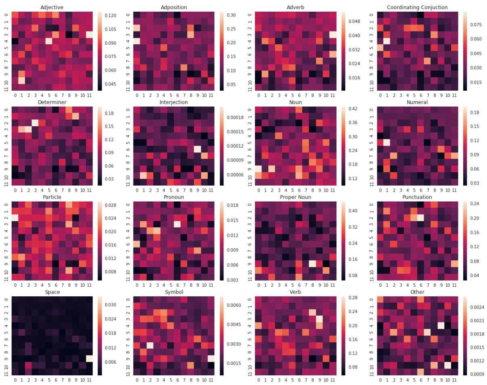

Figure A.1: Each heatmap shows the proportion of total attention directed to the given part of speech, broken out by layer (vertical axis) and head (horizontal axis).

<!-- page: 14 -->

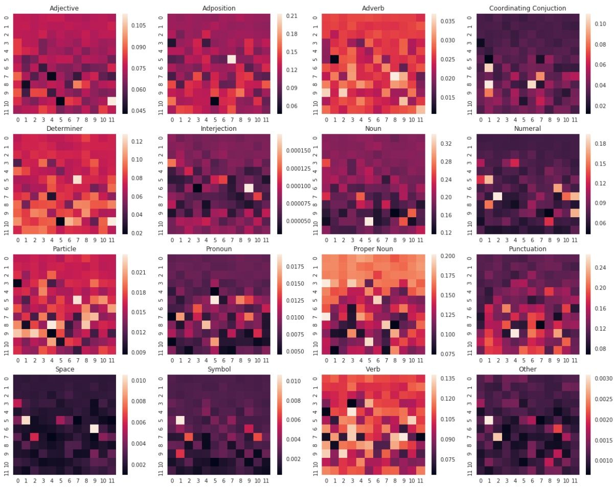

Figure A.2: Each heatmap shows the proportion of attention originating from the given part of speech, broken out by layer (vertical axis) and head (horizontal axis).
