<!-- page: 1 -->

BỘ GIÁO DỤC VIỆN HÀN LÂM KHOA HỌC
VÀ ĐÀO TẠO VÀ CÔNG NGHỆ VIỆT NAM
HỌC VIỆN KHOA HỌC VÀ CÔNG NGHỆ


NGÔ VĂN CÔNG

# NGHIÊN CỨU GIẢI PHÁP NHÂN DẠNG MẶT ĐƯỜNG GIAO THÔNG SỬ ĐỤNG CẢM BIẾN QUẢN TÍNH VÀ MÔ HÌNH HỌC MÁY

LUẬN ÁN TIẾN SĨ
KỸ THUẬT ĐIỆN, ĐIỆN TỬ VÀ VIỄN THÔNG

Hà Nội - 2026

<!-- page: 2 -->

BỘ GIÁO DỤC

VIỆN HÀN LÂM KHOA HỌC

VÀ ĐÀO TẠO

VÀ CÔNG NGHỆ VIỆT NAM

HỌC VIỆN KHOA HỌC VÀ CÔNG NGHỆ

NGÔ VĂN CÔNG

# NGHIÊN CỨU GIẢI PHÁP NHẬN DẠNG MẶT ĐƯỜNG GIAO THÔNG SỬ ĐỤNG CẢM BIẾN QUẢN TÍNH VÀ MÔ HÌNH HỌC MÁY

LUẬN ÁN TIẾN SĨ
KỸ THUẬT ĐIỆN, ĐIỆN TỬ VÀ VIỄN THÔNG

Ngành: Kỹ thuật Điều khiển và Tự động hóa

Mã số: 9 52 02 16

Xác nhận của Học viện

Người hướng dẫn 1

Khoa học và Công nghệ

Người hướng dẫn 2

(Ký, ghi rõ họ tên)

(Ký, ghi rõ họ tên)

GS. TS. Trần Đức Tân TS. Trần Đức Nghĩa

Hà Nội - 2026

<!-- page: 3 -->

# LỜI CAM ĐOAN

Tôi xin cam đoan luận án: "Nghiên cứu giải pháp nhận dạng mặt đường giao thông sử dụng cảm biến quán tính và mô hình học máy" là công trình nghiên cứu của chính mình dưới sự hướng dẫn khoa học của tập thể hướng dẫn. Luận án sử dụng thông tin trích dẫn từ nhiều nguồn tham khảo khác nhau và các thông tin trích dẫn được ghi rõ nguồn gốc. Các kết quả nghiên cứu của tôi được công bố chung với các tác giả khác đã được sự nhất trí của đồng tác giả khi đưa vào luận án. Các số liệu, kết quả được trình bày trong luận án là hoàn toàn trung thực và chưa từng được công bố trong bất kỳ một công trình nào khác ngoài các công trình công bố của tác giả. Luận án được hoàn thành trong thời gian tôi làm nghiên cứu sinh tại Học viện Khoa học và Công nghệ, Viện Hàn lâm Khoa học và Công nghệ Việt Nam.

Hà Nội, ngày tháng năm 2026

Tác giả luận án

Ngô Văn Công

<!-- page: 4 -->

## LỜI CẢM ON

Luận án tiến sĩ được thực hiện tại Học viện Khoa học và Công nghệ, Viện Hàn lâm Khoa học và Công nghệ Việt Nam (Viện HL KH&CN Việt Nam), dưới sự hướng dẫn khoa học tận tình của GS. TS. Trần Đức Tân và TS. Trần Đức Nghĩa. Tác giả xin bày tổ lòng biết on chân thành và sự kính trọng sâu sắc đối với các thấy trong Tập thể hướng dẫn khoa học, những người không chỉ truyền đạt nhiều kiến thức quý báu, kinh nghiệm nghiên cứu khoa học mà còn khuyến khích, động viên tác giả vượt qua những khó khăn trong chuyên môn và cuộc sống. Sự chuyên nghiệp, nghiệm tức trong nghiên cứu và những định hướng đúng dẫn của các thấy là tiền đề quan trọng giúp tác giả có được những kết quả trình bày trong luận án này.

Tác giả xin trân trọng cảm on Ban lãnh đạo Viện Công nghệ Thông tin, Ban Giám đốc Học viện Khoa học và Công nghệ, Phòng Đào tạo, các Phòng Ban chức năng của Học viện và đặc biệt các nhà giáo, nhà khoa học tại Viện Hàn Lâm KH&CN Việt Nam đã quan tâm giúp đỡ, tạo mọi điều kiện thuận lợi về cơ sở vật chất, nguồn học liệu và các thủ tục hành chính cho tác giả trong quá trình học tập, nghiên cứu và hoàn thành luận án này.

Tác giả xin chân thành cảm on tới Lãnh đạo Ủy ban Tiêu chuẩn Đo lường Chất lượng Quốc gia, Lãnh đạo Ban Đo lường và các đồng nghiệp cùng công tác đã động viên, tạo điều kiện cho tác giả trong quá trình thực hiện và hoàn thành luận án này.

Đặc biệt tác giả xin bày tố lòng biết on sâu sắc tới Bố, Mệ, và các thành viên trong gia đình, những người đã luôn động viên và truyền cảm hứng cho tác giả trong suốt quá trình nghiên cứu

Hà Nội, ngày tháng năm 2026

Tác giả luận án

Ngô Văn Công

<!-- page: 5 -->

## MỤC LỤC

- LỜI CAM ĐOAN ...... i
- LỜI CẢM ON ...... ii
- Danh mục các từ viết tắt .... v
- Danh mục các bảng .... vii
- Danh mục hình vẽ .... viii
- MỞ ĐẦU ...... 1
- CHƯƠNG 1. TỔNG QUAN BÀI TOÁN PHÂN LOẠI MẶT ĐƯỜNG...... 8
- 1.1. Giới thiệu.... 8
- 1.2. Tổng quan các nghiên cứu liên quan.... 16
- 1.2.1. Tiếp cận dựa trên ngưỡng .... 18
- 1.2.2. Tiếp cận dựa trên trích xuất đặc trưng và học máy.... 21
- 1.2.3. Tiếp cận dựa trên học sâu.... 25
- 1.3. Trích xuất đặc trưng .... 29
- 1.3.1. Đặc trưng miền thời gian .... 30
- 1.3.2. Đặc trưng miền tần số .... 32
- 1.3.3. Đặc trưng miền thời gian – tần số kết hợp .... 34
- 1.4. Trích chọn đặc trưng .... 35
- 1.4.1. Phương pháp lọc.... 35
- 1.4.2. Phương pháp bao.... 36
- 1.4.3. Phương pháp lai.... 39
- 1.5. Mô hình học máy.... 40
- 1.6. Nhóm chỉ số đánh giá.... 41
- 1.7. Kết luận Chương 1 .... 43
- CHƯƠNG 2. THUẬT TOÁN TRÍCH CHỌN ĐẶC TRUNG LAI KẾT HỢP HỌC MÁY.... 44
- 2.1. Ý tưởng.... 44
- 2.2. Bộ dữ liệu .... 46
- 2.3. Tiền xử lý dữ liệu .... 49
- 2.4. Mô hình học sâu LSTM .... 57
- 2.5. Mô hình học máy với bộ đặc trưng tối ưu .... 59
- 2.5.1. Sử dụng bộ đặc trưng thống kê trên miền thời gian.... 59
- 2.5.2. Đề xuất kết hợp các thuật toán lai lọc-bao và học máy .... 61
- 2.6. Kết quả thực nghiệm và đánh giá.... 67
- 2.7. Kết luận Chương 2 .... 77
- CHƯƠNG 3: XÂY ĐỰNG THIỂT BỊ GIÁM SẮT MẶT ĐƯỜNG.... 79
- 3.1. Mô hình hệ thống giám sát.... 79
- 3.2. Thiết bị thu thập dữ liệu và giám sát mặt đường .... 83
- 3.2.1. Cấu hình thiết bị phần cứng .... 83
- 3.2.2. Môi trường thí nghiệm .... 86
- 3.2.3. Thu thập dữ liệu .... 89
- 3.2.4. Xây dựng tập dữ liệu .... 95
- 3.2.5. Trích xuất đặc trưng .... 96

<!-- page: 6 -->

- 3.2.6. Trích chọn đặc trung....99
- 3.2.7. Mô hình học máy phân loại mặt đường....101
- 3.3. Kết quả thực nghiệm và đánh giá....102
- 3.4. Kết luận....106
- KẾT LUẬN....108
- DANH MỤC CÁC CÔNG TRÌNH CỦA TÁC GIẢ....110

<!-- page: 7 -->

Danh mục các từ viết tắt

| Viết tắt | Tiếng anh | Diễn giải |
| --- | --- | --- |
| ADAS | Advanced Driver Assistance Systems | Hệ thống hỗ trợ người lái tiên tiến gồm nhiều công nghệ để giúp lái xean toàn |
| ANN | Artificial neural network | Mạng trí tuệ nhân tạo |
| CNN | Convolutional Neural Network | Mạng nơ-ron tích chấp |
| CKDVC | Chất kết dính vô cơ | Chỉ một phương pháp làm đường bằng cách trộn đá đăm, xi măng và nước rời lu lên chặt để tạo thành một lớp nền đường chắc chắn, có khả năng chịu lực cao |
| CWT | Continuous Wavelet Transform | Biến đổi wavelet |
| DL | Deep learning | Học sâu |
| DWT | Discrete Wavelet Transform | biến đổi wavelet rời rạc |
| DFT | Discrete Fourier Transform | Biến đổi Fourier rời rạc |
| DFN | Deep Feedforward Networks | Mạng nơ-ron truyền thẳng sâu |
| FT | Fourier Transform | Biến đổi Fourier |
| FFT | Fast Fourier Transform | Biến đổi Fourier nhanh |
| GMM | Gaussian Mixture Model | Mô hình hỗn hợp Gaussian |
| GPS | Global Positioning System | Hệ thống Định vị Toàn cầu |
| GBM | Gradient Boosting | Mô hình học máy tăng cường độ đốc |
| KNN | K-Nearest Neighbor | Mô hình K-lân cận |
| LSTM | Long-Short Term Memory | Bộ nhớ dài-ngắn hạn |

<!-- page: 8 -->

| LiDAR | Light Detection and Ranging | Một công nghệ sử dụng ánh sáng laser để đo khoảng cách và tạo ra bản đồ 3D của môi trường xung quanh |
| --- | --- | --- |
| ML | Machine learning | Học máy |
| MLP | Multilayer Perceptron | Mạng nơ-ron nhiều lớp truyền thẳng |
| PSD | Power Spectral Density | Mật độ phổ công suất |
| PCI | Pavement Condition Index | Chỉ số tình trạng mặt đường theo tiêu chuẩn ASTM |
| ITS | Intelligent Transportation Systems | Hệ thống giao thông thông minh |
| RMS | Root mean square | Giá trị hiệu dụng trung bình |
| ROC | Receiver Operating Characteristic | Đường cong ROC |
| RF | Random Forest | Mô hình học máy Rừng ngẫu nhiên |
| XGBoost | eXtreme Gradient Boosting | Mô hình học máy tăng cường độ đốc cực đại |
| RNN | Recurrent Neural Networks | Mạng nơ-ron hồi quy |
| STFT | Short-Time Fourier Transform | Biến đổi Fourier thời gian ngắn |

<!-- page: 9 -->

- Bảng 1.1. Bảng xếp hạng theo chỉ số PCI [36]....11
- Bảng 1.2. Bảng minh họa về mức độ hư hồng của mặt đường bê tông xi măng [36]....12
- Bảng 1.3. Phân loại tình trạng mặt đường theo chỉ số IRI [39]....13
- Bảng 1.4. Tổng quan về ưu điểm và hạn chế của 3 nhóm thiết bị....15
- Bảng 1.5. Tổng quan về một số nghiên cứu liên quan....28
- Bảng 1.6. Các đặc trung miền thời gian được trích xuất từ dữ liệu cảm biến quán tính trên các phép đo thống kê, nhằm phục vụ cho việc phát hiện và phân loại bất thường mặt đường....31
- Bảng 1.7. Một số tham số được sử dụng trong đánh giá hiệu năng phân loại thường dùng trong bài toán phân loại mặt đường sử dụng phương pháp học máy....42
- Bảng 2.1. Cấu hình phần cứng [9]....46
- Bảng 2.2. Số lượng mẫu dữ liệu....47
- Bảng 2.3. Số mẫu dữ liệu sau khi làm sạch....54
- Bảng 2.4. Dữ liệu sau khi thực hiện chia cửa số không chồng lấn....55
- Bảng 2.5. Dữ liệu sau khi thực hiện chia cửa số chồng lấn 30%....55
- Bảng 2.6. Dữ liệu sau khi thực hiện chia cửa số chồng lấn 50%....56
- Bảng 2.7. Dữ liệu sau khi thực hiện chia cửa số chồng lấn 70%....56
- Bảng 2.8. Các biến thể của mô hình LSTM được sử dụng....58
- Bảng 2.9. Các đặc trung miền thời gian được trích xuất....60
- Bảng 2.10. Kết quả thử nghiệm trong giai đoạn lọc....64
- Bảng 2.11. Độ chính xác phân loại sử dụng LSTM....67
- Bảng 2.12. Kết quả phân loại mặt đường với số lượng cảm biến khác nhau....70
- Bảng 2.13. Hiệu năng phân loại của các thuật toán học máy khi sử dụng thuật toán trích chọn đặc trung....71
- Bảng 2.14. Các tham số đánh giá mô hình học máy khi sử dụng 30 đặc trung..74
- Bảng 2.15. Các ma trận nhằm lẫn....75
- Bảng 3.1. Cấu hình cài đặt thiết bị....87
- Bảng 3.2. Giải thích về nhân dữ liệu....89
- Bảng 3.3. Dữ liệu cảm biến trên mặt đường nhựa chất lượng khá....90
- Bảng 3.4. Dữ liệu cảm biến trên mặt đường nhựa chất lượng trung bình....91
- Bảng 3.5. Dữ liệu cảm biến trên mặt đường chất lượng kém....92
- Bảng 3.6. Số lượng quan sát cho từng loại mặt đường....96
- Bảng 3.7. Số lượng quan sát cho từng loại mặt đường từ tập dữ liệu kiểm tra..96
- Bảng 3.8. Giá trị đặc trung đại diện được trích xuất....97
- Bảng 3.9. Độ chính xác của 3 mô hình học máy....104
- Bảng 3.10. Độ nhạy....104
- Bảng 3.11. Các chỉ số đánh giá hiệu năng....106

<!-- page: 10 -->

- Hình 1.1. Một số hình ảnh các loại mặt đường ở Việt Nam....8
- Hình 1.3. Một số bất thường thường gặp trên mặt đường ở Việt Nam (nguồn: internet).....10
- Hình 1.4. Tổng quan về tiếp cận các phương pháp phát hiện, phân loại mặt đường sử dụng cảm biến quán tính....17
- Hình 1.5. Các phương pháp đặt ngưỡng do Mednis và cộng sự đề xuất [15]. ...19
- Hình 1.6. Nguồng và cửa sở trượt theo Zheng và cộng sự đề xuất [49]....20
- Hình 1.7. Sống rung động khi xe đi qua gờ giảm tốc với tốc độ 20 km/giờ. Mẫu xe là Toyota Camry 2013, và gờ giảm tốc cao 3,5 cm trong nghiên cứu của Zheng và cộng sự [50]....20
- Hình 1.8. Phương pháp chung áp dụng các kỹ thuật học máy sử dụng cho nhiệm vụ phân loại....22
- Hình 1.9. Sơ đồ thực hiện được đề xuất trong [33]....22
- Hình 1.10. Phát hiện ổ gà sử dụng dữ liệu trực Z và X trong nghiên cứu [55]. .24
- Hình 1.11. Tổng quan về các kỹ thuật chung về xử lý dữ liệu cho trích xuất đặc trưng trong phân loại, phát hiện bất thường trên mặt đường....30
- Hình 1.12. Phương pháp bao [86]....37
- Hình 1.13. Ma trận nhằm lẫn trong bài toán phân loại mặt đường với 2 nhân...42
- Hình 2.1. Thiết bị được lắp đặt trên xe chạy thu thập trên ba nhận mặt đường [9]....48
- Hình 2.2. Sơ đồ khối thực hiện....49
- Hình 2.3. Giá trị của gia tốc trên trực X, Y, Z theo thời gian của cảm biến gắn ở trong xe....52
- Hình 2.4. Giá trị của góc quay trên trực X, Y, Z theo thời gian của cảm biến gắn ở trong xe....53
- Hình 2.5. Quy trình phân loại mặt đường sử dụng mô hình LSTM....58
- Hình 2.6. Thuật toán lai lọc-bao....63
- Hình 2.7. Kết quả ma trận nhằm lẫn sử dụng mô hình LSTM 4....68
- Hình 2.8. Môi quan hệ giữa độ chính xác và chu kỳ huấn luyện sử dụng mô hình LSTM 4....68
- Hình 2.9. Xếp hạng 76 đặc trưng được chọn bởi thuật toán HFW-RF....73
- Hình 2.10. Xếp hạng 30 đặc trưng được chọn bởi thuật toán HFW-GB....73
- Hình 2.11. Xếp hạng 42 đặc trưng được chọn bởi thuật toán HFW-XGB....73
- Hình 3.1. Sơ đồ khối hệ thống giám sát mặt đường theo thời gian thực....80
- Hình 3.2. Cấu trúc khung dữ liệu....81
- Hình 3.3. Sơ đồ khối thiết bị giám sát mặt đường dựa trên IoT....84
- Hình 3.4. Lắp đặt thiết bị trên xe thu thập dữ liệu....86
- Hình 3.5. Quy trình thực hiện thu thập dữ liệu....88
- Hình 3.6. Lộ trình thu thập dữ liệu với các nhận mặt đường tương ứng....94
- Hình 3.7. Vị trí các ổ gà trên cung đường thu thập dữ liệu....95

<!-- page: 11 -->

- Hình 3.8. Quy trình phân loại mặt đường ....102
- Hình 3.9. Ma trận nhằm lẫn của mô hình XGBoost trên tập dữ liệu đã thu thập ....105

<!-- page: 12 -->

## MỞ ĐẦU

## 1. Tính cấp thiết của luận án

Trong bối cảnh các đô thị và hệ thống giao thông ngày càng phát triển nhanh chóng, việc bảo đảm an toàn, hiệu quả và bền vững cho cơ sở hạ tầng giao thông đang trở thành một trong những ưu tiên hàng đầu của các quốc gia. Hệ thống giao thông thông minh (Intelligent Transportation Systems – ITS) đã và đang được ứng dụng rộng rãi nhằm tận dụng các công nghệ tiên tiến để nâng cao năng lực giám sát, quản lý và vận hành hệ thống giao thông một cách hiệu quả [1]. Trong hệ thống này, nhận dạng và phân loại mặt đường đóng vai trò then chốt, góp phần tăng cường khả năng phục hồi và thích ứng của hệ thống giao thông trước các tác động từ môi trường, thời gian và tần suất sử dụng.

Mặt đường là bộ phận trực tiếp chịu tải trọng từ phương tiện và ảnh hưởng của thời tiết, do đó việc phát hiện sớm và chính xác các hư hổng như rạn nứt, ỗ gà hay lún vỗng mặt đường có ý nghĩa quan trọng trong công tác duy tu, bảo dưỡng và bảo đảm an toàn giao thông. Theo báo cáo từ Bộ Giao thông các quốc gia, chi phí duy tu và sửa chữa mặt đường chiếm tỷ trọng lớn trong ngân sách đầu tư hạ tầng [2]. Nếu không có hệ thống phát hiện sớm và phân loại mặt đường một cách chính xác, các tổn thất do tai nạn, kẹt xe, hao mòn phương tiện và gián đoạn giao thông sẽ ngày càng nghiệm trọng hơn.

Thực tế cho thấy, việc theo dõi tình trạng mặt đường chủ yếu vẫn đang được thực hiện theo phương pháp truyền thống như quan sát bằng mặt thường hoặc sử dụng thiết bị đo chuyên dụng với tần suất định kỳ, dẫn đến độ trẻ trong phát hiện và phản ứng với hư hỏng [3]. Trong khi đó, với sự phát triển của các công nghệ cảm biến, trí tuệ nhân tạo và học máy, việc tự động hóa quy trình giám sát và phân loại mặt đường đang mở ra hướng đi mới nhằm tối ưu chi phí, rút ngắn thời gian, nâng cao độ chính xác trong công tác bảo trì và tăng cường năng lực ra quyết định của cơ quan quản lý hạ tầng giao thông [4].

Đặc biệt trong bối cảnh biến đổi khí hậu, lưu lượng phương tiện ngày càng gia tăng và nhu cầu về hạ tầng giao thông thông minh ngày một cao, bài toán phân loại mặt đường theo thời gian thực không chỉ mang tính kỹ thuật mà còn là nhu cầu tất yếu trong quản lý nhà nước và bảo vệ an toàn cộng đồng. Việc xây dựng các mô hình và giải pháp công nghệ để phân loại mặt đường một cách nhanh chóng, chính xác, thích ứng với dữ liệu lớn và điều kiện thực

<!-- page: 13 -->

tế là yêu cầu cấp thiết, đặt ra cho các nhà nghiên cứu, kỹ sư giao thông và cơ quan quản lý hạ tầng giao thông hiện nay.

Công nghệ nhận dạng và phân loại mặt đường hiện đang là một lĩnh vực kỹ thuật quan trọng, phát triển nhanh chóng và thu hút sự quan tâm ngày càng lớn từ cộng đồng nghiên cứu cũng như các nhà quản lý hạ tầng giao thông. Với mục tiêu nâng cao tính hiệu quả và chính xác trong việc phát hiện các bất thường trên mặt đường như vết nứt, ố gà và các điểm không bằng phẳng khác, nhiều phương pháp kỹ thuật đã được đề xuất và áp dụng. Việc chuyển đổi từ giám sát thủ công sang các phương pháp tự động nhằm tạo ra những hệ thống đáng tin cây hơn, phục vụ việc đánh giá nhanh chóng tình trạng đường bộ, xác định sớm các khiếm khuyết và cung cấp cảnh báo sớm về các nguy cơ tiềm ẩn cho người tham gia giao thông [5].

Hiện nay, các kỹ thuật nhận dạng mặt đường chủ yếu được chia thành ba nhóm phương pháp chính: (i) phương pháp phân tích dữ liệu rung động, (ii) phương pháp dựa trên kỹ thuật thị giác máy tính và xử lý hình ảnh, và (iii) phương pháp quét laser 3D để lập mô hình mặt đường chi tiết.

Phương pháp phân tích dữ liệu rung động, còn gọi là phương pháp sử dụng cảm biến quán tính (như máy đo gia tốc), là một trong những giải pháp hiệu quả về chi phí và khả thi trong việc triển khai diện rộng. Các thiết bị cảm biến rung động có thể dễ dàng tích hợp vào phương tiện giao thông đang hoạt động, giúp theo dõi liên tục tình trạng bề mặt đường theo thời gian thực. Điều này giúp giảm đáng kể thời gian và chi phí bảo trì đường bộ cho các cơ quan quản lý, đồng thời cũng nâng cao khả năng phản ứng kịp thời trước các bất thường [6] - [17]. Các nghiên cứu đã chứng minh rằng phân tích các mẫu rung động đặc thù thu được từ cảm biến gắn trên phương tiện giúp xác định chính xác và nhanh chóng các dạng bất thường phổ biến trên đường như ố gà, gồm giảm tốc, các dạng nứt khác nhau. Tuy nhiên, hạn chế lớn nhất của phương pháp này là độ chính xác phụ thuộc đáng kể vào đặc tính phương tiện, vị trí gắn cảm biến và tốc độ di chuyển, khiến đôi khi gặp khó khăn trong việc xác định chính xác vị trí và loại hình bất thường, đời hỏi kết hợp thêm với các công nghệ định vị GPS để giám thiểu sai số [13].

Phương pháp kỹ thuật thị giác máy tính sử dụng hình ảnh thu thập từ máy ảnh được gắn trên các thiết bị chuyên dụng hoặc phương tiện giao thông thường. Việc sử dụng các thuật toán xử lý hình ảnh, đặc biệt là các mô

<!-- page: 14 -->

hình học sâu (deep learning), cho phép phương pháp này phát hiện và phân loại các khiém khuyết với độ chi tiết và chính xác cao. Tuy nhiên, phương pháp này lại nhạy cảm với điều kiện ánh sáng và môi trường, khiển kết quả nhận dạng có thể bị ảnh hưởng bởi bóng tối, ánh sáng biến đổi, và các vật cần khác trên đường. Do vậy, hiệu suất của kỹ thuật thị giác máy tính có thể suy giảm đáng kể trong điều kiện thời tiết xấu hoặc ban đêm. Ngoài ra, kỹ thuật này đời hỏi nguồn lực tính toán lớn, dẫn đến việc hạn chế trong triển khai ở diện rộng [18] - [23].

Phương pháp sử dụng quét laser 3D (LiDAR) được xem là công nghệ có độ chính xác cao nhất trong các phương pháp hiện tại. Công nghệ này tạo ra các mô hình bề mặt 3D chi tiết, cho phép nhận dạng chính xác các khuyết tật nhỏ, thâm chí chỉ vài milimet trên mặt đường, bao gồm các dạng biến dạng, lún vỗng và các bất thường bề mặt khác. Không giống như thị giác máy tính, công nghệ LiDAR không phụ thuộc vào điều kiện ánh sáng môi trường nên hiệu quả cao trong cả điều kiện ánh sáng yếu hoặc ban đêm. Tuy nhiên, nhược điểm lớn nhất của công nghệ này là chi phí triển khai và vận hành cao, đời hỏi các thiết bị chuyên dụng và kỹ thuật viên có chuyên môn sâu. Hơn nữa, hiệu quả hoạt động của thiết bị LiDAR có thể bị ảnh hưởng bởi điều kiện thời tiết khắc nghiệm như mưa to, bụi bản hoặc suống mù, hạn chế đáng kể khả năng mở rộng ứng dụng của công nghệ này trên quy mô lớn [23], [24].

Mỗi kỹ thuật nhận dạng và phân loại mặt đường đều có những ưu và nhược điểm nhất định, dẫn đến việc lựa chọn phương pháp phù hợp phụ thuộc vào mục đích sử dụng, yêu cầu về độ chính xác, phạm vi triển khai và khả năng kinh tế của từng dự án cụ thể.

Học máy đã trở thành một phương pháp tiếp cận được áp dụng rộng rãi để phân loại mặt đường, sử dụng dữ liệu từ các mạng cảm biến như cảm biến quán tính để đạt được sự cân bằng giữa độ chính xác và hiệu quả về chi phí [9], [10], [26] - [28]. Tuy nhiên, vẫn còn thiếu nghiên cứu tập trung vào việc tối ưu hóa lựa chọn đặc trưng để cân bằng hiệu quả tính toán và độ chính xác cho các tác vụ phân loại mặt đường bằng dữ liệu cảm biến quán tính.

Lựa chọn đặc trung tập trung vào việc xác định một tập hợp con các đặc trung có ý nghĩa trong bộ dữ liệu để phân biệt hiệu quả giữa các nhân. Nhiều tập dữ liệu chứa các đặc trung dư thừa, có tương quan cao hoặc nhiều có thể loại bỏ mà không làm giám chất lượng thông tin [28]. Bằng cách giám thời gian

<!-- page: 15 -->

tính toán, cải thiện hiệu suất phân loại và cung cấp thông tin chi tiết sâu hơn về dữ liệu, lựa chọn tính năng đóng vai trò quan trọng trong các ứng dụng học máy và nhận dạng mẫu [29].

Trong nhiều nghiên cứu gần đây, học máy đã chứng minh được hiệu quả nổi trội trong phân loại mặt đường, song vẫn tồn tại nhiều thách thức cần giải quyết trong nghiên cứu và ứng dụng thực tiễn:

\- Đa dạng hóa dữ liệu huấn luyện để tăng khả năng tổng quát hóa cho các điều kiện vận hành khác nhau (tốc độ, tải trọng, loại xe...);

\- Tôi ưu hóa lựa chọn đặc trung nhằm giảm thiểu số lượng đặc trung nhưng vẫn đảm bảo độ chính xác mô hình;

\- Cân bằng giữa hiệu năng phân loại và chi phí tài nguyên hệ thống;

Sự kết hợp giữa dữ liệu cảm biến, phương pháp học máy tối ưu và chiến lược lựa chọn đặc trưng hợp lý sẽ tiếp tục là xu hướng chủ đạo trong luận án này và triển khai hệ thống đánh giá tình trạng mặt đường thông minh trong thời gian tới.

## 2. Mục tiêu của luận án

Đề xuất một số phương pháp nhằm cải thiện hiệu năng phân loại, đánh giá tình trạng mặt đường sử dụng cảm biến quán tính và học máy đáp ứng thời gian thực trên thiết bị có hiệu năng thấp nhằm triển khai trên diện rộng:

\- Thứ nhất, giải quyết vấn đề về hiệu năng phân loại trên phân cứng có cấu hình thấp. Các phương pháp học máy họ cây “tree” được thực hiện trên các bộ đặc trưng thống kê được chọn lọc nhằm hướng tới thời gian xử lý tối ưu, chi phí tính toán thấp trong khi vẫn đảm bảo được độ chính xác trong phân loại mặt đường.

\- Xây dựng thiết bị phần cứng giá rễ trong hệ thống giám sát mặt đường, sử dụng thiết bị thu thập dữ liệu cảm biến quán tính kết hợp tín hiệu GPS thực tế tại Việt Nam, áp dụng mô hình học máy và đánh giá hiệu năng phân loại mặt đường.

## 3. Đối tượng nghiên cứu của luận án

Luận án tập trung vào nghiên cứu và tìm hiểu một số phương pháp liên quan đến bài toán phân loại mặt đường sử dụng cảm biến quán tính và học máy như:

\- Một số phương pháp học máy được áp dụng trong bài toán phân loại

<!-- page: 16 -->

mặt đường.

\- Một số thuật toán trích chọn đặc trung nhằm tối ưu hóa độ chính xác, cải thiện thời gian thực thi trong phân loại mặt đường.

\- Các thiết bị phần cứng có hiệu năng thấp, giá rẻ sử dụng trong bài toán phân loại mặt đường.

## 4. Phạm vi nghiên cứu của luận án

\- Nghiên cứu các phương pháp được sử dụng cho bài toán phân loại mặt đường.

\- Nghiên cứu các phương pháp học máy, học sâu sử dụng dữ liệu cảm biến quán tính và GPS để nâng cao độ chính xác phân loại mặt đường.

\- Nghiên cứu, đề xuất thuật toán lựa chọn các tham số tối ưu trong phương pháp trích chọn đặc trưng để áp dụng trong phân loại mặt đường sử dụng cảm biến quán tính, phù hợp với thiết bị phần cứng hiệu năng thấp.

\- Thu thập dữ liệu cảm biến quán tính kết hợp tín hiệu GPS thực tế tại Việt Nam, đề xuất áp dụng mô hình học máy và đánh giá hiệu năng phân loại mặt đường.

## 5. Phương pháp nghiên cứu

Nghiên cứu lý thuyết: Tổng hợp các nghiên cứu liên quan đến bài toán phân loại mặt đường sử dụng dữ liệu cảm biến quán tính được công bố gần đây. Trên cơ sở phân tích các vấn đề còn tồn tại của bài toán phân loại mặt đường hiện nay để đề xuất các thuật toán, phương pháp phân loại mặt đường tối ưu, hiệu quả hơn.

Nghiên cứu thực nghiệm: Các đề xuất được thực nghiệm trên hai bộ dữ liệu:

\- Bộ dữ liệu công khai “PVS - Passive Vehicular Sensors Datasets”, tại địa chỉ: https://www.kaggle.com/datasets/jefmenegazzo/pvs-passive-vehicular-sensors-datasets. Nguồn dữ liệu chứa các tập dữ liệu thu thập được bằng cảm biến quán tính gắn trên xe di chuyển ở trên 3 loại mặt đường khác nhau (đường đất; đường đá sỏi; đường nhựa phẳng).

\- Bộ dữ liệu thu thập thực tế tại Việt Nam gồm đường nhựa phẳng chất lượng khá, đường nhựa đã xuống cấp chất lượng trung bình, đường bê tông chất lượng kém.

## 6. Các đóng góp chính của luận án

Với mục tiêu nâng cao hiệu quả phân loại mặt đường sử dụng cảm biến

<!-- page: 17 -->

quán tính kết hợp các thuật toán học máy đáp ứng theo thời gian thực, luận án có các đóng góp chính như sau:

\- Thứ nhất, đề xuất thuật toán trích chọn đặc trưng lai kết hợp học máy giúp tỉnh giám dữ liệu cảm biến, giám khối lượng tính toán và thời gian xử lý. Đóng góp này được công bố tại công trình [CT1, CT2, CT3].

\- Thứ hai, đề xuất quy trình xử lý dữ liệu cảm biến trên thiết bị điện toán biên sử dụng mô hình học máy XGBoost để phân tích và đánh giá hiện trạng mặt đường giao thông theo thời gian thực. Đóng góp này được công bố tại công trình [CT4, CT5].

## 7. Bố cục của luận án

Luận án được thiết kế bao gồm phần mở đầu và ba chương nội dung. Cuối cùng là phần kết luận, danh mục các công trình của tác giả và danh mục các tài liệu tham khảo. Cụ thể, nội dung của các phần được tóm tắt như sau:

Chương 1 sẽ trình bày tổng quan về bài toán phân loại mặt đường và một số các kiến thức nền tảng cần thiết về học máy để thuận tiện cho việc hiểu thuật toán đề xuất ở các chương sau. Các nghiên cứu liên quan cho bài toán phân loại, phát hiện bất thường trên mặt đường sử dụng cảm biến quán tính được trình bày cụ thể và những nghiên cứu đó được phân theo từng nhóm tiếp cận. Từ nhóm các cách tiếp cận truyền thống cho đến các nhóm các cách tiếp cận dựa trên học máy, học sâu. Trên cơ sở đó, luận án phân tích các hạn chế của một số phương pháp phân loại, phát hiện bất thường trên mặt đường hiện tại và nêu rõ mục tiêu để cải thiện các hạn chế đó.

Chương 2 và Chương 3 trình bày các đóng góp chính của luận án. Mỗi chương được thiết kế là một nhóm các phương pháp đề xuất để cải thiện hiệu quả bài toán phân loại mặt đường sử dụng cảm biến quán tính. Cụ thể, Chương 2 chứng minh một chuỗi giải pháp kết hợp xử lý tín hiệu và học máy để nâng cao hiệu quả phân tích hiện trạng mặt đường. Đề xuất và phát triển thành công Thuật toán Trích chọn Đặc trung Lai Tối ưu (Hybrid Feature Selection) kết hợp học máy: giúp tỉnh giãn dữ liệu cảm biến, giảm chi phí tính toán và thời gian xử lý mà vẫn duy trì độ chính xác cao.

Chương 3 trình bày về quy trình giám sát mặt đường theo thời gian thực và xây dựng thiết bị biên trong hệ thống giám sát mặt đường có chi phí thấp, thu thập hai Bộ Dữ liệu Thực địa đầu tiên tại Việt Nam: Bộ dữ liệu 3 loại mặt

<!-- page: 18 -->

đường phố biến, cung cấp cơ sở dữ liệu xác thực cho các nghiên cứu tương lai. Trên thiết bị này, đã thực thi mô hình phân loại hiệu quả nhất (XGBoost) với độ chính xác cao có thể Triển khai Thời gian Thực (Real-time Deployment Architecture). Và Bộ dữ liệu về các ố gà trên đường giao thông.

Cuối cùng, phần kết luận nêu những đóng góp chính của tác giả trong luận án và những công việc trong tương lai.

<!-- page: 19 -->

## CHƯƠNG 1. TỔNG QUAN BÀI TOÁN PHÂN LOẠI MẶT ĐƯỜNG

Nội dung trong Chương 1 này giới thiệu về bài toán phân loại mặt đường và các nghiên cứu liên quan để giải quyết bài toán phát hiện, phân loại mặt đường. Các nghiên cứu liên quan sẽ được phân vào nhóm những phương pháp tiếp cận. Nhìn chung, đối với bài toán phân loại mặt đường sử dụng cảm biến quán tính có các nhóm chính là: phương pháp truyền thống sử dụng các ngưỡng thay đổi của giá trị trên 1 trực cảm biến để phân loại; phương pháp sử dụng học máy và học sâu. Thông qua khảo sát, phân tích các nghiên cứu liên quan, các hạn chế sẽ là tiền đề cho các phương pháp đề xuất ở các Chương tiếp theo.

## 1.1. Giới thiệu

Mặt đường giao thông là thành phần thiết yếu trong hệ thống cơ sở hạ tầng giao thông vận tải, đóng vai trò quan trọng trong việc kết nối các khu vực địa lý, hỗ trợ phát triển kinh tế - xã hội và đảm bảo an toàn cho người tham gia giao thông. Tuy nhiên, trong quá trình sử dụng, mặt đường thường xuyên phải chịu tác động tổng hợp của nhiều yếu tố như lưu lượng và tải trọng giao thông lớn, sự thay đổi bất thường của thời tiết, tuổi thọ của vật liệu và chất lượng thi công ban đầu. Những yếu tố này làm phát sinh nhiều dạng bất thường trên mặt đường, điển hình như ổ gà, vết nứt, vết lún, bong tróc hay sự xuống cấp của các công trình phụ trợ như gờ giảm tốc [30][31]. Những hiện tượng này không chỉ làm suy giảm chất lượng kết cấu mặt đường mà còn được xem là các sai lệch so với điều kiện mặt đường tiêu chuẩn, vốn được thiết kế để đảm bảo độ bằng phẳng, độ bám và tính an toàn trong quá trình lưu thông [32]. Một số hình ảnh của các loại mặt đường khác nhau như trong Hình 1.1.


a. Mặt đường nhựa tốt

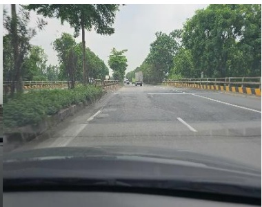

b. Mặt đường nhựa
xuống cấp


c. Mặt đường bê tông

Hình 1.1. Một só hình ảnh các loại mặt đường ở Việt Nam.
Tình trạng xuống cấp của mặt đường đặt ra gánh nặng lớn cho các cơ

<!-- page: 20 -->

quan quản lý nhà nước, khi phải liên tục thực hiện công tác bảo trì, sửa chữa và nâng cấp nhằm duy trì chất lượng khai thác của hệ thống đường bộ. Ngoài gánh nặng tài chính, các khiém khuyết trên mặt đường còn tiềm ẩn nhiều nguy cơ ảnh hưởng trực tiếp đến an toàn giao thông, ví dụ như đối với xe tự hành, khi cải đặt tốc độ di chuyển nhanh trên đoạn đường xấu thì việc này có thể gây các tai nạn nghiêm trọng. Các ô gà hoặc vết lún có thể gây tai nạn cho cả phương tiện cơ giới lẫn người đi bộ, đồng thời làm gia tăng mức tiêu thụ nhiên liệu và chi phí bảo dưỡng phương tiện do tác động bất lợi đến hệ thống treo và khung xe [33]. Một số hình ảnh các bất thường trên mặt đường thường gặp trong thực tế như trong Hình 1.2.

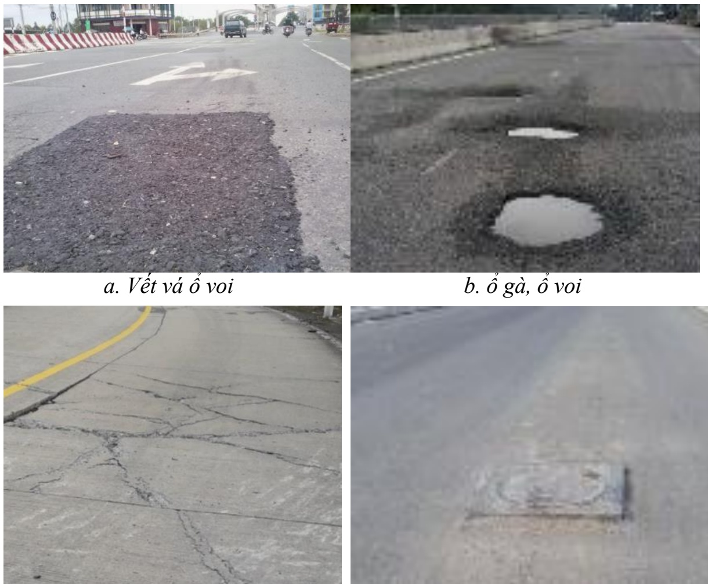

c. Vết nứt trên mặt đường

d. Nắp cóng thoát nước lắp dương

<!-- page: 21 -->


e. Nắp công thoát nước lắp âm


f. Vạch, gò giám tốc

Hình 1.2. Một số bất thường thường gặp trên mặt đường ở Việt Nam (nguồn: internet).

Trong bối cảnh đó, việc theo dõi và giám sát tình trạng mặt đường một cách thường xuyên và chính xác trở thành nhiệm vụ cấp thiết. Không chỉ là yêu cầu về mặt an toàn giao thông và hiệu quả khai thác, chất lượng hệ thống đường bộ còn phần ánh năng lực quản lý hạ tầng và mức độ phát triển của một quốc gia. Theo đánh giá của Ngân hàng Thế giới, mật độ đường trải nhựa ở tình trạng tối ưu thường được sử dụng như một chỉ số phản ánh sức mạnh kinh tế, khả năng cạnh tranh và mức độ tiếp cận cơ sở hạ tầng của một quốc gia trên bình diện toàn cầu [34]. Chính vì vậy, việc phát triển các phương pháp hiện đại, tự động và hiệu quả để giám sát, phân loại và phát hiện bất thường trên mặt đường là hướng đi tất yếu, hỗ trợ các cơ quan chức năng trong công tác quản lý, bảo trì, cũng như nâng cao chất lượng dịch vụ giao thông [35].

Phương pháp truyền thống để giám sát và duy trì tình trạng tối ưu của mặt đường thường dựa vào các cuộc khảo sát Chỉ số Tình trạng Mặt đường (Pavement Condition Index – PCI), trong đó việc đánh giá chủ yếu dựa trên quan sát trực tiếp của con người. Các cuộc khảo sát này từ lâu đã được các kỹ thuật viên chuyên ngành đường bộ và đường cao tốc quốc tế sử dụng như tài liệu tham khảo để chẩn đoán và phân loại các bất thường trên mặt đường [36][37]. Bảng 1.1 và Bảng 1.2 dưới đây minh họa về chỉ số đánh giá chất lượng mặt đường theo PCI và các mức độ hư hồng của mặt đường bê tông xi măng theo công bố trong [36]. Như trong chỉ số PCI, mặt đường có thể được xếp hạng thành 6 loại theo thang điểm tương ứng (Bảng 1.1), đối với mỗi loại hư hồng trên mặt đường có thể được đánh giá như như các tiêu chí được đưa ra như trong Bảng 1.2.

<!-- page: 22 -->

Bảng 1.1. Bảng xếp hạng theo chỉ số PCI [36]

| Chỉ sốPCI | Xếp hạng | Mô tả tình trạng mặt đường và gọi ý hành động |
| --- | --- | --- |
| 86 – 100 | Tốt | Mặt đường gần như mới hoặc ở trong tình trạng rất tốt. Có thể có một vài hư hỏng ở mức độ rất nhẹ, không ảnh hưởng đến khai thác.Hành động: Chỉ cần bảo trì phòng ngừa (trám vết nứt nhỏ, vệ sinh hệ thống thoát nước). |
| 71 – 85 | Khá | Mặt đường bắt đầu xuất hiện các dấu hiệu lão hóa đầu tiên như các vết nứt nhẹ, rời rạc. Bề mặt vẫn êm và hoạt động tốt.Hành động: Tiếp tục bảo trì phòng ngừa, xử lý sớm các hư hỏng nhỏ để ngăn các hư hỏng này phát triển thêm. |
| 56 – 70 | Trung bình | Các hư hỏng đã trở nên rõ rệt và phổ biến hơn, ở mức độ từ nhẹ đến vừa. Bắt đầu ảnh hưởng đến sự êm ái khi di chuyển. Đây là ngưỡng quan trọng, cần can thiệp để tránh xuống cấp nhanh.Hành động: sửa chữa cục bộ, bù vênh, phủ lớp mỏng trên bề mặt. |
| 41 – 55 | Kém | Hư hỏng ở mức độ vừa và nặng đã chiếm ưu thế. Xuất hiện các hư hỏng kết cấu như nứt da cá sấu. Sự êm ái giảm đáng kể.Hành động: Cần các giải pháp sửa chữa lớn hơn như cào bóc tái chế, hoặc phủ lớp bê tông, nhựa dày. |
| 26 – 40 | Rất kém | Mặt đường bị hư hỏng nặng, xuống cấp trên diện rộng. Các hư hỏng kết cấu rất phổ biến. Việc lái xe trở nên rất khó khăn và không an toàn.Hành động: Sửa chữa lớn hoặc bắt đầu xem xét phương án tái thiết. |
| 11 – 25 | Nghiêm trọng | Mặt đường gần như không thể sử dụng. Các hư hỏng nặng nền liên kết với nhau, gây nguy hiểm cho giao thông.Hành động: Cần phải tái thiết một phần hoặc toàn bộ. |

<!-- page: 23 -->

| 0 – 10 | Hống | Mặt đường bị phá hủy hoàn toàn, không còn chức năng phục vụ giao thông.Hành động: Bắt buộc phải làm lại mới hoàn toàn |
| --- | --- | --- |

Bảng 1.2. Bảng minh họa về mức độ hư hổng của mặt đường bê tông xi măng [36]

<table><tr><td rowspan="2">STT</td><td rowspan="2">Loại hư hồng</td><td colspan="3">Mức độ hư hồng</td></tr><tr><td>Thấp</td><td>Vừa</td><td>Cao</td></tr><tr><td>1</td><td>Hư hồng mặt</td><td>Các vết nứt do thời tiết (ít)</td><td>Các vết nứt do thời tiết (nhiều)</td><td>Các khối nứt phân chia nhiều thành phần</td></tr><tr><td>2</td><td>Lún xuống</td><td>5-15 mm</td><td>15-30 mm</td><td>&gt;30 mm</td></tr><tr><td>3</td><td>Nứt cạnh</td><td>6-10 mm</td><td>11-15 mm</td><td>&gt;15 mm</td></tr><tr><td>4</td><td>Nứt rộng lớn</td><td>6-10 mm</td><td>11-15 mm</td><td>&gt;15 mm</td></tr><tr><td>5</td><td>Nứt đất gãy</td><td>6-10 mm</td><td>11-15 mm</td><td>&gt;15 mm</td></tr><tr><td>6</td><td>Mặt bê tông phòng lên</td><td>5-15 mm</td><td>15-30 mm</td><td>&gt;30 mm</td></tr><tr><td>7</td><td>Nứt ngang</td><td>6-10 mm</td><td>11-20 mm</td><td>&gt;20 mm</td></tr><tr><td>8</td><td>Nứt đất quãng</td><td>Nứt ngẫu nhiên không ảnh hưởng đến tốc độ xe chạy</td><td>Nứt 02 đoạn và ảnh hưởng tốc độ xe chạy</td><td>Nứt trên 02 đoạn và ảnh hưởng tốc độ xe chạy</td></tr><tr><td>9</td><td>Vá mặt bê tông</td><td>Không ảnh hưởng tốc độ xe chạy</td><td>ảnh hưởng tốc độ xe chạy</td><td>Tốc độ xe chạy bị ảnh hưởng nghiệm trọng</td></tr><tr><td>10</td><td>Vết bánh xe</td><td>5-10 mm</td><td>11-30 mm</td><td>&gt;30 mm</td></tr></table>

Bên cạnh PCI, độ nhóm hay còn gọi là chỉ số đo độ gồm ghế quốc tế (IRI) của mặt đường cũng là một chỉ số quan trọng thường được sử dụng để đánh giá chất lượng bề mặt và phát hiện các dạng hư hồng như vết nứt hoặc ô gà [38]. Bảng 1.3 dưới đây minh họa phân cấp chất lượng mặt đường theo chỉ số IRI, các chỉ số và mức độ phân loại được lấy trong “Tiêu chuẩn Việt Nam TCVN

<!-- page: 24 -->

8865 : 2011 Mặt đường ô tô – Phương pháp đo và đánh giá xác định độ bằng phẳng theo chỉ số độ gồm ghế quốc tế IRI”, trong tiêu chuẩn theo IRI thì có 4 loại mặt đường và mỗi loại lại được phân cấp khác nhau dựa theo chỉ số IRI để đánh giá tình trạng mặt đường (Bảng 1.3).

Bảng 1.3. Phân loại tình trạng mặt đường theo chỉ số IRI [39]

<table><tr><td rowspan="2">Loại mặt đường</td><td rowspan="2">Cấp đường</td><td colspan="4">Tình trạng mặt đường</td></tr><tr><td>Tốt</td><td>Trung bình</td><td>Kém</td><td>Rất kém</td></tr><tr><td rowspan="3">Cấp cao A1: Bê tông nhựa chặt, bê tông nhựa rỗng, bê tông xi măng đồ tại chỗ.</td><td>Đường cao tốc cấp 120, cấp 100, cấp 80; đường ô tô cấp 80.</td><td>IRI &lt; 2</td><td>2 ≤ IRI &lt; 4</td><td>4 ≤ IRI &lt; 6</td><td>6 ≤ IRI &lt; 8</td></tr><tr><td>Đường cao tốc cấp 60, đường ô tô cấp 60.</td><td>IRI &lt; 3</td><td>3 ≤ IRI &lt; 5</td><td>5 ≤ IRI &lt; 7</td><td>7 ≤ IRI &lt; 9</td></tr><tr><td>Đường ô tô cấp 40 và cấp 20.</td><td>IRI &lt; 4</td><td>4 ≤ IRI &lt; 6</td><td>6 ≤ IRI &lt; 8</td><td>8 ≤ IRI &lt; 10</td></tr><tr><td rowspan="2">Cấp cao A2: Bê tông nhựa rãi người, rãi ấm; thẩm nhập nhựa, đá dăm nước láng nhựa, cấp phối đá dăm láng nhựa.</td><td>Đường ô tô cấp 60.</td><td>IRI &lt; 4</td><td>4 ≤ IRI &lt; 6</td><td>6 ≤ IRI &lt; 8</td><td>8 ≤ IRI &lt; 10</td></tr><tr><td>Đường ô tô cấp 40 và cấp 20.</td><td>IRI &lt; 5</td><td>5 ≤ IRI &lt; 7</td><td>7 ≤ IRI &lt; 9</td><td>9 ≤ IRI &lt;11</td></tr><tr><td>Cấp thấp B1: Đường đá dăm nước có lớp bảo vệ rời rạc, đá gia cố chất kết dính vô cơ có láng nhựa.</td><td>Đường ô tô cấp 40 và cấp 20.</td><td>IRI &lt; 6</td><td>6 ≤ IRI &lt; 9</td><td>9 ≤ IRI &lt; 12</td><td>12 ≤ IRI &lt; 15</td></tr><tr><td>Cấp thấp B2: Đường đất cải thiện, đường đất gia cố chất kết dính vô cơ hoặc hữu cơ có lớp hao mòn và bảo vệ.</td><td>Đường ô tô cấp 40 và cấp 20.</td><td>IRI &lt; 8</td><td>8 ≤ IRI &lt; 12</td><td>12 ≤ IRI &lt; 16</td><td>16 ≤ IRI &lt; 20</td></tr></table>

Các phương pháp truyền thống này tôn tại một số hạn chế đáng kể. Đối với khảo sát PCI hay IRI, kết quả có thể bị ảnh hưởng bởi yếu tố chủ quan của

<!-- page: 25 -->

kỹ thuật viên, đồng thời tiềm ẩn nguy cơ đối với sức khỏe và an toàn của người vận hành trong quá trình khảo sát thực địa [11]. Mặt khác, các phương pháp kiểm tra trực quan thường tổn nhiều thời gian và dễ xảy ra sai sót do yếu tố con người [40].

Đề khắc phục những hạn chế này, nhiều nghiên cứu đã đề xuất phát triển các hệ thống tự động nhằm phát hiện và phân loại các khiếm khuyết trên mặt đường. Việc phát triển các hệ thống như vậy đang nhận được sự quan tâm ngày càng lớn, bởi tính ứng dụng tiềm năng của chúng trong các hệ thống giao thông thông minh (Intelligent Transportation Systems – ITS), cũng như trong các hệ thống hỗ trợ người lái tiên tiến (Advanced Driver Assistance Systems – ADAS) [3].

Theo các tài liệu nghiên cứu đã công bố, các hệ thống phát hiện và phân loại bất thường bề mặt đường hiện nay có thể được chia thành ba nhóm kỹ thuật chính: (a) quét laser, (b) thị giác máy tính và (c) hệ thống dựa trên cảm biến [41]. Mỗi nhóm kỹ thuật này có những ưu điểm và hạn chế riêng, phù hợp với các điều kiện ứng dụng khác nhau:

\- Quét laser: Cung cấp dữ liệu bề mặt mặt đường dưới dạng mô hình 3D với độ chính xác cao, cho phép phát hiện các khuyết tật nhỏ và đánh giá độ gồm ghề của mặt đường. Tuy nhiên, phương pháp này yêu cầu thiết bị chuyên dụng, chi phí cao và hiệu suất có thể bị ảnh hưởng trong điều kiện thời tiết bất lợi.

\- Thị giác máy tính: Sử dụng camera lắp đặt trên xe để thu thập hình ảnh mặt đường, từ đó phát hiện các vết nứt, ô gà và các bất thường khác thông qua xử lý ảnh. Phương pháp này tương đối tiết kiệm chi phí và có thể triển khai trong điều kiện giao thông thực tế. Tuy nhiên, độ chính xác của hệ thống có thể giảm trong điều kiện ánh sáng yếu, bóng đồ hoặc khi có vật cần che khuất.

\- Dựa trên cảm biến: Áp dụng các cảm biến lắp trên phương tiện để ghi nhận dữ liệu rung động do tương tác với mặt đường, từ đó suy luận các bất thường. Phương pháp này ít bị ảnh hưởng bởi điều kiện thời tiết hoặc ánh sáng, có thể tích hợp vào các phương tiện sẵn có và cung cấp dữ liệu theo thời gian thực để phục vụ phân tích và phần hồi nhanh chóng. Tuy nhiên, phương pháp này gặp khó khăn trong việc phân loại cụ thể các loại hư hỏng mặt đường và cần được kết

<!-- page: 26 -->

hợp với các kỹ thuật trích xuất đặc trung để đạt hiệu quả tối ưu.
Tổng quan về các ưu, nhược điểm của 3 phương pháp trên được trình bày trong Bảng 1.4 dưới đây.

Bảng 1.4. Tổng quan về ưu điểm và hạn chế của 3 nhóm thiết bị

| Phương pháp | Camera (Thị giác máy tính) | Quét Laser (Lidar) | Cảm biến quán tính |
| --- | --- | --- | --- |
| Ưu điểm | - Phát hiện và phân loại các khiếm khuyết với độ chi tiết và chính xác cao.- Có thể phát hiện sớm các bất thường. | - Nhận dạng chính xác các khuyết tật nhỏ, bao gồm các dạng biến dạng, lún vỗng và các bất thường bề mặt khác.- Không phụ thuộc vào điều kiện ánh sáng môi trường. | - Hiệu quả về chi phí và khả thi trong việc triển khai diện rộng.- Không phụ thuộc vào điều kiện ánh sáng, môi trường.- Dễ dàng tích hợp vào phương tiện giao thông đang hoạt động.- Đáp ứng thời gian thực. |
| Hạn chế | - Nhạy cảm với điều kiện ánh sáng và môi trường.- Tính toán lớn.- Chi phí cao.- Khả năng mở rộng trên quy mô lớn. | - Chi phí triển khai và vận hành cao.- Ảnh hưởng bởi môi trường: mưa, bụi bản hoặc suống mù.- Khả năng mở rộng trên quy mô lớn. | - Độ chính xác phụ thuộc đáng kể vào đặc tính phương tiện, vị trí gắn cảm biến và tốc độ di chuyển. |

Các kỹ thuật dựa trên cảm biến rung động đang ngày càng trở nên phổ biến trong việc phát hiện và phân loại các dị thường trên mặt đường nhờ vào hiệu quả chi phí cao và khả năng triển khai linh hoạt của chúng. Các hệ thống này thường sử dụng cảm biến quán tính (bao gồm cảm biến gia tốc và cảm biến con quay hồi chuyển) để thu thập dữ liệu rung động phát sinh khi phương tiện di chuyển trên mặt đường. Một ưu điểm đáng kể là các cảm biến này có thể dễ dàng được tích hợp vào điện thoại thông minh, cho phép triển khai các hệ thống

<!-- page: 27 -->

giám sát mặt đường mà không cần thiết bị chuyên dụng đặt tiền [42].

Tuy nhiên, kỹ thuật này vẫn tồn tại một số hạn chế làm ảnh hưởng đến độ tin cậy và tính phổ quát của kết quả đo. Các yếu tố như sự khác biệt trong đặc tính kỹ thuật của cảm biến, vị trí lắp đặt điện thoại hoặc cảm biến bên trong phương tiện, cũng như các đặc điểm cơ học khác nhau giữa các loại xe, đều có thể gây ra sai số trong quá trình thu thập và phân tích dữ liệu [43]. Những biến số này làm gia tăng tính bất định trong quá trình phát hiện và phân loại dị thường mặt đường.

Do đó, để nâng cao độ chính xác và khả năng ứng dụng thực tiễn của các hệ thống dựa trên cảm biến rung động, cần có các nghiên cứu chuyên sâu hơn. Những nghiên cứu tập trung vào việc chuẩn hóa phương pháp đo, hiệu chỉnh mô hình theo từng loại phương tiện, và tích hợp các thuật toán học máy để tự động hiệu chỉnh sai số và tăng khả năng phân biệt các loại hư hồng mặt đường khác nhau trong điều kiện thực tế.

Trong những năm gần đây, bài toán phân loại mặt đường nhận được sự quan tâm của rất nhiều nhà nghiên cứu trên thế giới. Đề thấy được tổng quan các nghiên cứu về phân loại, phát hiện các bất thường trên mặt đường trong 10 năm trở lại đây (từ năm 2014 đến 2025) đã được thu thập từ nguồn dữ liệu Web of Science, Scopus, và Google Scholar. Danh sách các cụm từ tìm kiếm như sau:

Road surface classification + vibration sensor + machine learning;

Road anomaly detection + vibration sensor + machine learning;

Road anomaly detection using inertial sensor;

Số lượng công bố các nghiên cứu về phát hiện, phân loại mặt đường sử dụng cảm biến rung, cảm biến quán tính ngày càng nhiều bởi chi phí thấp, dễ dàng triển khai số lượng lớn trong thực tế. Việc này cho thấy sự quan tâm và tầm quan trọng của việc nghiên cứu các phương pháp nâng cao hiệu năng, triển khai thời gian thực việc phân loại mặt đường sử dụng cảm biến quán tính kết hợp các phương pháp học máy.

## 1.2. Tổng quan các nghiên cứu liên quan

Các phương pháp dựa trên rung động đã nổi lên như một giải pháp hiệu quả và linh hoạt để phát hiện và phân loại các bất thường trên bề mặt đường, nhỏ khả năng thu thập dữ liệu nhanh chóng và chi phí thấp so với các

<!-- page: 28 -->

hệ thống kiểm tra truyền thống. Dữ liệu rung động, chủ yếu được thu thập từ cảm biến gia tốc (accelerometer) và cảm biến con quay hồi chuyển (gyroscope), có thể phần ánh rõ nét sự tương tác giữa phương tiện và mặt đường, từ đó giúp suy luận sự tôn tại và mức độ của các khiém khuyết như ổ gà, vết nứt, hoặc độ gồm ghế bất thường.

Các kỹ thuật khai thác dữ liệu rung động để phục vụ cho việc phát hiện và phân loại bất thường mặt đường hiện được phân loại thành ba nhóm phương pháp chính:

i. Phương pháp dựa trên ngưỡng (Threshold-based methods)

ii. Phương pháp học máy có trích xuất đặc trung (Feature-based machine learning)

iii. Phương pháp học sâu không cần trích xuất đặc trung (End-to-End deep learning)

Tổng quan về ba nhóm phương pháp trên được minh họa trong Hình 1.3, cho thấy luồng xử lý điển hình của mỗi kỹ thuật khi áp dụng vào dữ liệu rung động thu thập từ cảm biến gia tốc và con quay hồi chuyển. Theo sơ đồ trong Hình 1.3, phương pháp dựa trên ngưỡng bổ qua bước huấn luyện nhưng đồi hỏi người dùng xác định ngưỡng thông qua kinh nghiệm và thử nghiệm trước khi áp dụng thực tế. Trong khi đó, các phương pháp học máy và học sâu đều bao gồm bước tạo mô hình thông qua quá trình huấn luyện, đi kèm với giai đoạn xác thực để đánh giá độ chính xác và khả năng ứng dụng.

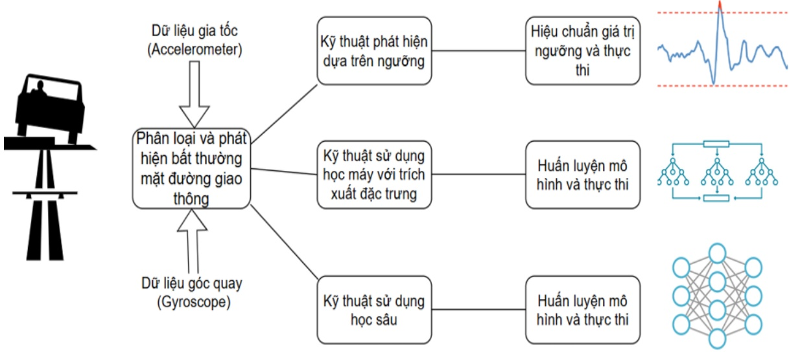

Hình 1.3. Tổng quan về tiếp cận các phương pháp phát hiện, phân loại mặt đường sử dụng cảm biến quán tính.

<!-- page: 29 -->

## 1.2.1. Tiếp cận dựa trên ngưỡng

Các phương pháp dựa trên ngưỡng cố gắng phát hiện và phân loại các bất thường trên đường khi các giá trị biên độ, căn bậc hai trung bình hoặc hệ số định của tín hiệu thu được từ các cảm biến quán tính vượt quá một giá trị nhất định được xác định trước [44]. Về loại phương pháp này, các nghiên cứu ban đầu, chẳng hạn như nghiên cứu của Astarita và cộng sự [45] đã đề xuất phát hiện ổ gà và gờ giảm tốc bằng cách phân tích các đình cực đại của trực z của dữ liệu gia tốc kế, trong đó độ chính xác phát hiện gờ giảm tốc là 90% và tỷ lệ phát hiện ổ gà là 65%. Rishiwal và cộng sự [46] đã đề xuất một phương pháp ngưỡng dựa trên phân tích trực z của dữ liệu gia tốc kế để đo lường mức độ nghiệm trọng của ổ gà và gờ giảm tốc thành ba mức: mức độ nghiệm trọng trung bình, mức độ nghiệm trọng cao và mức độ nghiệm trọng rất cao. Các ngưỡng được thiết lập theo kinh nghiệm và phương pháp này báo cáo độ chính xác là 93,75%.

Ngoài ra, Nguyen và cộng sự [47] đã sử dụng kiểm định Grubbs trong cửa sở trượt để cải tiến các phương pháp đặt ngưỡng ban đầu do Mednis và cộng sự [15] đề xuất. Các thuật toán này bao gồm: Z-THRESH, Z-DIFF, STDEV(Z) và G-ZERO. Cụ thể, Z-THRESH phát hiện bất thường khi biên độ trực z của cảm biến gia tốc vượt quá một giá trị ngưỡng xác định; Z-DIFF phát hiện bất thường khi chênh lệch giữa hai phép đo liên tiếp vượt ngưỡng cho trước; STDEV(Z) dựa trên độ lệch chuẩn trong cửa sở trượt, nếu giá trị này vượt quá ngưỡng thì sự bất thường được nhận diện; và G-ZERO phát hiện bất thường khi giá trị trên cả ba trực của cảm biến gia tốc đều thấp hơn một ngưỡng nhất định, ngưỡng sử dụng trong các thuật toán này được mô tả như trong Hình 1.4. Ngoài ra, Carlos và cộng sự [48] cũng đã đánh giá lại các ngưỡng do Mednis đề xuất; kết quả phân tích cho thấy thuật toán STDEV(Z) đạt hiệu quả cao nhất về độ nhạy, độ chính xác và điểm F1 so với G-ZERO, Z-DIFF, Z-THRESH cũng như phương pháp máy vector hỗ trợ.

<!-- page: 30 -->

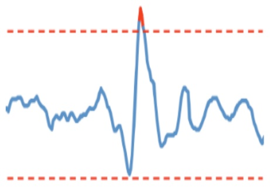

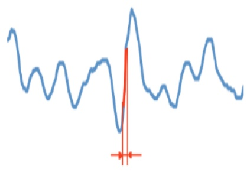

b. Thuật toán Z-DIFF

a. Thuật toán Z-THRESH

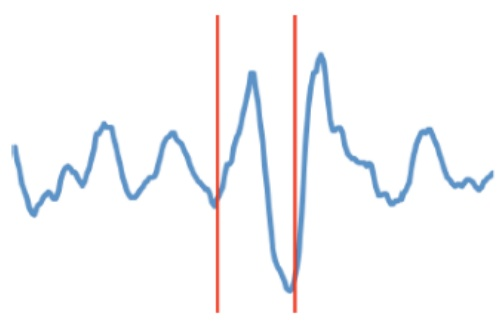

c. Thuật toán STDEV(Z)

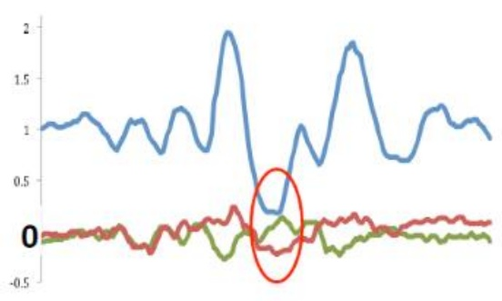

.d. Thuật toán G-ZERO

Hình 1.4. Các phương pháp đặt ngưỡng do Mednis và cộng sự đề xuất [15].

Một số nghiên cứu khác cũng đã khai thác cách tiếp cận kết hợp giữa kỹ thuật dựa trên ngưỡng và kỹ thuật học máy. Chẳng hạn, Zheng và cộng sự [49] đề xuất áp dụng phương pháp cửa sổ trượt để phát hiện ban đầu các vị trí có khả năng bất thường theo ngưỡng như mô tả trong Hình 1.5, quy tắc của nhóm Zheng như sau:

\- Nếu xe chạy trên đường bình thường, dữ liệu gia tốc trực z sẽ dao động trong một phạm vi nhất định với nhiều Gauss.

\- Khi xe chạy qua một điểm bất thường, dữ liệu gia tốc trực z thường vượt quá ngưỡng cao trước (TH) rời xuống dưới ngưỡng thấp (TL); hoặc ngược lại, tức là trước tiên xuống dưới ngưỡng thấp (TL), sau đó vượt qua ngưỡng cao (TH). Sau dao động lớn này, giá trị của nó có thể tiếp tục dao động, và cuối cùng trở lại vị trí bình thường.

Mô hình học máy rừng ngẫu nhiên sau đó được sử dụng nhằm phân tách các cửa sổ trượt thực sự bình thường với các phân đoạn cửa sổ trượt bất thường. Cuối cùng, kỹ thuật đóng gói thời gian động được dùng để phân loại các bất thường đã xác định thành các dạng ô gà, hoặc gò giám tốc. Tương tự, Yi và

<!-- page: 31 -->

cộng sự [50] đề xuất cùng với mô hình hỗn hợp Gaussian (GMM) để phát hiện bất thường trên mặt đường như mô tả trong Hình 1.6.

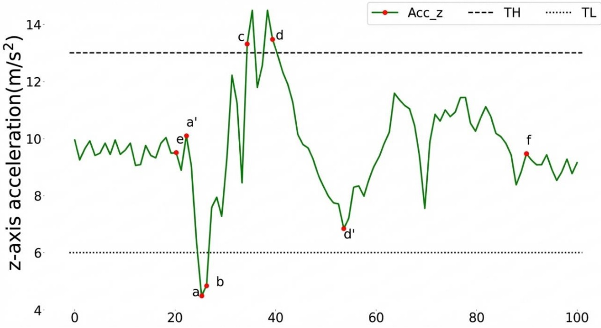

Hình 1.5. Ngưỡng và cửa số trượt theo Zheng và cộng sự đề xuất [49].

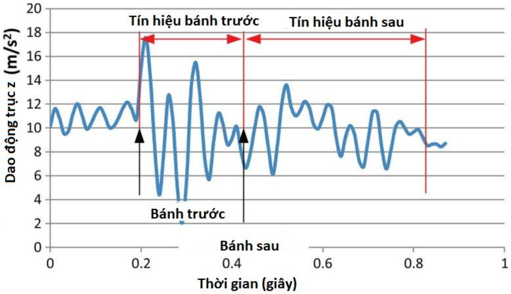

Hình 1.6. Sóng rung động khi xe đi qua gò giám tốc với tốc độ 20 km/giờ. Mẫu xe là Toyota Camry 2013, và gò giám tốc cao 3,5 cm trong nghiên cứu của Zheng và cộng sự [50].

Dựa trên các nghiên cứu tham khảo, kỹ thuật dựa trên ngưỡng là phương pháp đơn giản nhất, hoạt động dựa trên việc xác định các giá trị ngưỡng của tín hiệu rung động (ví dụ như gia tốc cực đại) để phát hiện dị thường. Phương pháp này không yêu cầu mô hình huấn luyện, cách tiếp cận này thường cần hiệu

<!-- page: 32 -->

chuẩn do các giá trị ngưỡng chủ yếu được xác định theo kinh nghiệm và thiếu khả năng tái lập. Tuy nhiên, để đảm bảo độ chính xác, hệ thống cần được hiệu chuẩn theo kinh nghiệm trước khi sử dụng, và khả năng khái quát hóa đối với các tình huống thực tế phức tạp còn hạn chế. Bên cạnh đó, ngưỡng dễ bị tác động bởi nhiều và chỉ phát hiện được một bất thường duy nhất. Vì vậy, trong các điều kiện giao thông khác nhau, hiệu quả phát hiện và phân loại bất thường của các thuật toán dựa trên ngưỡng có thể bị hạn chế.

## 1.2.2. Tiếp cận dựa trên trích xuất đặc trưng và học máy

Ở phương pháp này, dữ liệu rung động được xử lý trước thông qua các bước trích xuất đặc trưng thủ công (ví dụ: năng lượng tín hiệu, giá trị RMS, tần số đặc trưng...), sau đó được sử dụng để huấn luyện các mô hình học máy như SVM, k-NN, hoặc Random Forest. Việc xây dựng mô hình này đời hồi giai đoạn huấn luyện (training phase) và sau đó là giai đoạn kiểm thử (validation phase) để đánh giá hiệu suất. Ủy điểm của phương pháp này là khả năng diễn giải được mô hình và tiết kiệm tài nguyên tính toán so với học sâu, nhưng độ chính xác phụ thuộc nhiều vào chất lượng trích xuất đặc trưng.

Một số nghiên cứu đã chọn trích xuất các đặc điểm từ dữ liệu gia tốc kế hoặc con quay hồi chuyển bằng cách trích xuất các đặc trưng trong miền thời gian hoặc miền tần số (tức là biến đổi tín hiệu thông qua Biến đổi Fourier (FT)) để phát hiện và phân loại dị thường mặt đường. Các bước trên được thực hiện để đưa các đặc điểm đã trích xuất vào các kỹ thuật học máy. Hình 1.7 cho thấy luồng hoạt động để áp dụng các kỹ thuật dựa trên học máy. Bước đầu tiên bao gồm việc thu thập tập dữ liệu. Bước thứ hai liên quan đến các bước tiền xử lý được thực hiện trên tập dữ liệu, chẳng hạn như phát hiện giá trị ngoại lai, xử lý giá trị bị thiếu, định hướng lại dữ liệu cảm biến, lấy mẫu lại và phân đoạn dữ liệu. Bước thứ ba liên quan đến quá trình trích xuất đặc trưng được thực hiện trên dữ liệu. Cuối cùng, các bước cuối cùng liên quan đến giai đoạn xây dựng và xác thực mô hình.

<!-- page: 33 -->

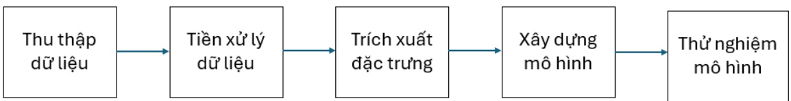

Hình 1.7. Phương pháp chung áp dụng các kỹ thuật học máy sử dụng cho nhiệm vụ phân loại.

Một số nghiên cứu tiêu biểu đã áp dụng quy trình này. Chắng hạn, trong Tài liệu tham khảo [51], dữ liệu từ cảm biến gia tốc được sử dụng để phân loại ô gà, gò giảm tốc, đường thẳng và đường cong thông qua phổ công suất tín hiệu được trích xuất bằng Biến đổi Fourier nhanh (FFT). Quá trình học được triển khai với thuật toán k-lân cận (KNN) và thuật toán mạng trí tuệ nhân tạo (ANN) gồm bốn lớp ẩn, đạt độ chính xác lần lượt là 95,55% và 96,79%. Tương tự, Celaya và cộng sự [33] đã đề xuất trích xuất các đặc trưng thống kê từ dữ liệu gia tốc, bao gồm giá trị trung bình, phương sai, độ lệch chuẩn, độ xiên, độ nhọn, cực tiểu, cực đại và dài động để phát hiện gò giảm tốc. Phương pháp này cho kết quả chính xác 97,14% khi sử dụng hồi quy logistic, trong đó các hệ số tối ưu của mô hình được xác định bằng thuật toán di truyền. Hình 1.8 dưới đây mô tả các bước thực hiện trong nghiên cứu của Celaya.

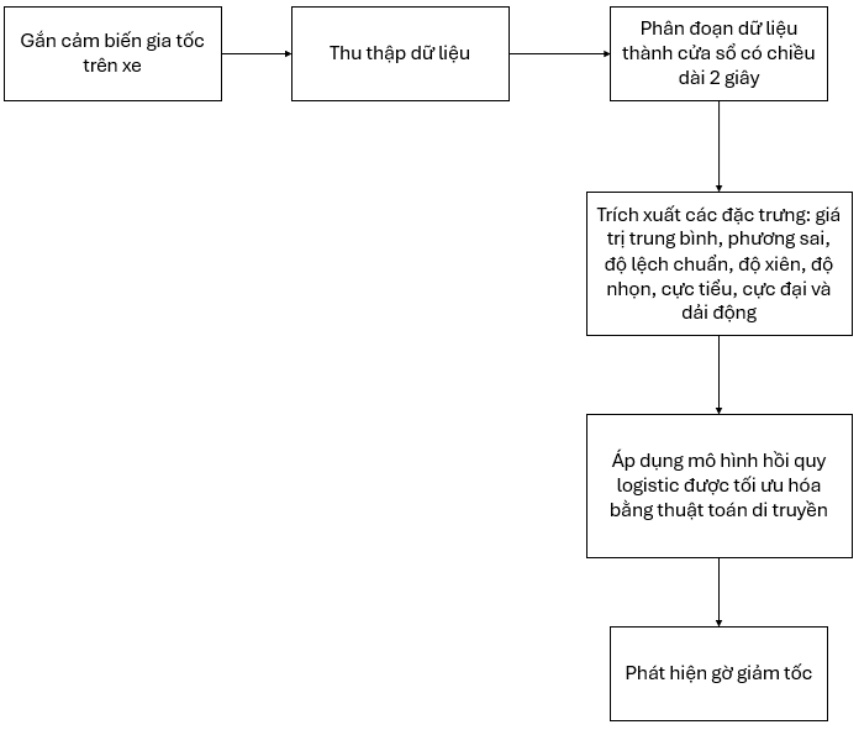

Hình 1.8. Sơ đồ thực hiện được đề xuất trong [33].

<!-- page: 34 -->

Ferjani và cộng sự [52] đã nghiên cứu việc giám sát đường bộ bằng cách khai thác đặc trung trong miền thời gian và miền tần số, đồng thời thử nghiệm với các bộ phân loại như máy vectơ hỗ trợ, cây quyết định và perceptron đa lớp (MLP). Các đặc trung miền thời gian bao gồm giá trị trung bình, phương sai, độ lệch chuẩn, bình phương tích phân, căn bậc hai của trung bình, trung vị, entropy và khoảng; trong khi đó, các đặc trung miền tần số được xem xét gồm năng lượng phổ, tần số trung vị, biên độ cực đại của công suất trung bình, biên độ cực tiểu và tổng công suất. Ngoài ra, các tác giả cũng thử nghiệm phép biến đổi wavelet với wavelet Daubechies 2. Tương tự, Wu và cộng sự [44] đề xuất quy trình trích xuất đặc trung trong miền thời gian, miền tần số và miền thời gian–tần số kết hợp; kết quả cho thấy bộ phân loại rừng ngẫu nhiên huấn luyện từ các đặc trung này đạt độ chính xác 95,7%, độ lặp lại 88,5% và độ nhạy 75,0%. Bổ sung thêm, Chen và cộng sự [53] đề xuất tính toán các đặc trung bất biến theo tỷ lệ từ tín hiệu gia tốc, với quy trình bao gồm phân đoạn dị thường đường bộ bằng phương pháp xếp xỉ tổng hợp từng phần, sau đó phân loại dựa trên các shapelet [54] để học đặc trung bất biến theo tỷ lệ.

Anaissi và cộng sự [55] đã khai thác dữ liệu gia tốc thẳng đúng và ngang để đánh giá tình trạng đường, với mục tiêu phân biệt giữa các dị thường lành tính và các khuyết tật thực sự trên mặt đường. Hai đặc trung chính được tính toán là hệ số biến thiên áp dụng cho thành phần gia tốc thẳng đúng, và sự kết hợp giữa phân tích giá trị kỳ dị cùng hệ số biến thiên áp dụng cho thành phần gia tốc ngang, Hình 1.9 mô tả hướng thực hiện của đề xuất trong nghiên cứu này. Việc phân loại được thực hiện bằng hai mô hình máy vectơ hỗ trợ một lớp, đạt độ chính xác 97,5%.

<!-- page: 35 -->

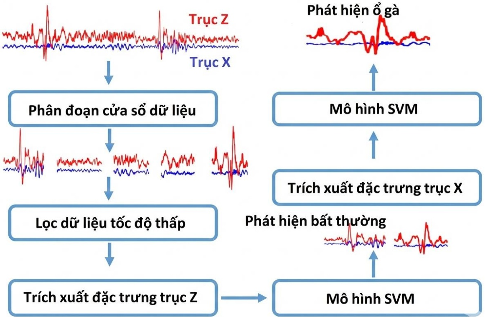

Hình 1.9. Phát hiện ở gà sử dụng dữ liệu trực Z và X trong nghiên cứu [55].

Tương tự, trong Tài liệu tham khảo [56], các tác giả tập trung vào phát hiện môi trường mặt đường (đá cuội, đồng bằng và đường giao thông công cộng) bằng cách sử dụng KNN cùng tám đặc trưng được trích xuất từ gia tốc tuyến tính (trục Z và Y) và dữ liệu con quay hồi chuyển (góc nghiêng, góc xoay), đạt độ chính xác 93,2%.

Một trong những ưu điểm nổi bật của các kỹ thuật học máy kết hợp với trích xuất đặc trung là khả năng giảm đáng kể chi phí tính toán so với các phương pháp học sâu, đặc biệt trong trường hợp sử dụng các đặc trung miền thời gian, khi dữ liệu không cần trải qua các bước biến đổi phức tạp như Fourier hay Wavelet. Việc trích xuất đặc trung từ tín hiệu cảm biến, chẳng hạn như giá trị trung bình, phương sai, độ lệch chuẩn hay các đặc trung miền tần số như năng lượng phổ, không chỉ giúp nén dữ liệu và loại bỏ thông tin dư thừa mà còn giữ lại những yếu tố quan trọng nhất để mô hình hóa hiện tượng. Nhò đó, các thuật toán học máy như SVM, KNN, cây quyết định hay hồi quy logistic có thể được huấn luyện nhanh chóng, yêu cầu ít tài nguyên tính toán hơn và vẫn đạt hiệu suất cao trong phát hiện, phân loại các bất thường mặt đường. Ngoài ra, ưu điểm khác của phương pháp này là khả năng diễn giải tốt: các đặc

<!-- page: 36 -->

trung thông kê, phổ hay hình thái có thể được giải thích trực quan, từ đó hỗ trợ quá trình phân tích nguyên nhân và đưa ra quyết định trong thực tiễn.

Tuy nhiên, việc lựa chọn đặc trưng nào là phù hợp lại phụ thuộc nhiều vào miền phân tích và cách biểu diễn dữ liệu. Việc xác định một tập hợp đặc trưng vừa ổn định giữa các mẫu vừa có khả năng phân biệt tốt các lớp bất thường vẫn là một thách thức. Theo Chen và cộng sự [53], các đặc trưng miền thời gian và miền tần số có thể bị hạn chế vì sự khác biệt giữa các loại bất thường đường bộ thường chỉ xuất hiện ở các đoạn tín hiệu cục bộ, thay vì phần ánh ở mức toàn cục. Nguyên nhân của hạn chế này có thể do ảnh hưởng của nhiều, giá trị ngoại lai hoặc sự dịch chuyển và thay đổi tỷ lệ trong tín hiệu.

Có thể khẳng định rằng việc kết hợp học máy với trích xuất đặc trưng vẫn mang lại nhiều lợi ích thực tiễn: dễ triển khai, tiết kiệm tài nguyên tính toán, cho kết quả nhanh và đáng tin cây, đồng thời có thể được áp dụng rộng rãi trong các hệ thống giám sát thông minh với điều kiện dữ liệu hạn chế hoặc hạ tầng tính toán không mạnh. Đây chính là nền tảng quan trọng để phát triển các giải pháp ứng dụng trong thực tế, nơi hiệu quả, tính linh hoạt và khả năng giải thích thường được ưu tiên hơn so với độ phức tạp của mô hình.

## 1.2.3. Tiếp cận dựa trên học sâu

Các phương pháp học sâu như mạng nơ-ron tích chập (CNN), mạng nơ-ron tuần tự (RNN, LSTM) cho phép xây dựng mô hình từ đầu đến cuối, không cần trích xuất đặc trung thủ công mà tự động học được các đặc điểm phân biệt trong dữ liệu. Các mô hình này thường có độ chính xác cao hơn và khả năng khái quát tốt hơn trong các điều kiện thực tế phức tạp. Tuy nhiên, chúng yêu cầu lượng dữ liệu huấn luyện lớn và khả năng tính toán cao.

Các kỹ thuật học sâu được áp dụng trong phát hiện và phân loại dị thường mặt đường bao gồm mạng truyền thẳng sâu (DFN), mạng nơ-ron tích chấp (CNN), mạng nơ-ron hồi quy (RNN) và mạng nơ-ron bộ nhớ dài-ngắn hạn (LSTM). Điểm mạnh của các kỹ thuật này là không yêu cầu giai đoạn trích xuất đặc trưng riêng biệt, bởi chúng có khả năng xử lý trực tiếp dữ liệu thô. Do đó, quy trình minh họa trong Hình 1.7 không bao gồm bước trích xuất đặc trưng, vì việc này được thực hiện trong quá trình huấn luyện mô hình.

Một số nghiên cứu tiêu biểu có thể kể đến như: Varona và cộng sự [30] đề xuất so sánh CNN và LSTM để tự động phát hiện ô gà và các mất ổn định

<!-- page: 37 -->

do gò giảm tốc hoặc thao tác lái, sử dụng dữ liệu gia tốc kế từ điện thoại thông minh; Baldini và cộng sự [57] sử dụng biểu diễn thời gian–tần số (STFT, CWT) từ cảm biến quán tính để huấn luyện CNN, đạt độ chính xác 97,2%; Luo và cộng sự [32] so sánh DFN, CNN và RNN trong phân loại tấm loại dị thường mặt đường và cho thấy RNN đạt hiệu suất cao hơn với ít tham số hơn; Tiwari và cộng sự [58] huấn luyện CNN trực tiếp từ dữ liệu gia tốc kế để đánh giá chất lượng mặt đường, với độ chính xác 98,5% vượt trội so với mạng truyền thẳng và SVM.

Một số công trình khác tập trung so sánh phương pháp học sâu và các kỹ thuật học máy truyền thống. Ví dụ, Basavaraju và cộng sự [59] so sánh việc trích xuất đặc trung từ dữ liệu gia tốc kế và con quay hồi chuyển với mô hình cây quyết định và SVM so với việc dùng trực tiếp dữ liệu thô trong perceptron đa lớp (MLP) để phát hiện đường trơn, ố gà và vết nứt sâu, với dữ liệu từ cả ba trực cảm biến thay vì chỉ một trực như các nghiên cứu trước [15]. Menegazzo và cộng sự [10] cũng sử dụng dữ liệu cảm biến quán tính trong nhiều bối cảnh khác nhau, so sánh học máy cổ điện và học sâu, và cho thấy CNN đạt hiệu suất cao nhất (93,17%) so với LSTM và GRU, cùng với bộ dữ liệu trên Sakorn Mekruksavanich [13] cũng đã thử nghiệm trên mô hình học sâu như CNN, LSTM, GRU với một số tỉnh chính siêu tham số của mô hình, kết quả phân loại cho độ chính xác trung bình đến 96%. Cuối cùng, Agebure và cộng sự [60] phát triển hệ thống phát hiện dị thường mặt đường và phân loại các loại đường chưa trải nhựa dựa trên Mạng no-ron Gai (Spiking Neural Network) [60], đạt hiệu suất tốt hơn SVM và perceptron đa lớp (MLP).

Nghiên cứu của Raslan và cộng sự [61] đã đề xuất một kiến trúc mô hình lai giữa mạng CNN và LSTM để thực hiện phân loại ô gà, gồm giám tốc, đường xấu và đường bình thường, mô hình để xuất được thử nghiệm trên nhiều loại đặc trưng khác nhau ở miền thời gian, tần số, thời gian – tần số và đạt được độ chính xác trung bình là 93,4%. Tương tự, nhóm nghiên cứu của Arce-saenz [62] thực hiện một phân tích so sánh các kiến trúc học sâu trong bài toán phân loại bề mặt đường dựa trên dữ liệu đo quán tính thu thập từ xe. Năm loại bề mặt đường, bao gồm đường bằng phẳng, đường gö ghề, ô gà, đoạn đường và và gờ giảm tốc, được nhận dạng thông qua 30 mô hình học sâu khác nhau. Các mô hình này được xây dựng từ những tổ hợp đa dạng của các lớp tích chấp và LSTM, đồng thời được huấn luyện với nhiều cấu hình dữ liệu gia tốc và vận

<!-- page: 38 -->

tốc góc. Kết quả nghiên cứu [62] cho thấy các kiến trúc chỉ sử dụng lớp tích chập còn hạn chế trong việc mô hình hóa đặc trưng theo thời gian của dữ liệu chuỗi. Ngược lại, các mô hình kết hợp CNN và LSTM thể hiện ưu thế rõ rệt trong việc nắm bắt các phụ thuộc thời gian, từ đó cải thiện đáng kể hiệu quả phân loại. Cả 2 nghiên cứu đều được thử nghiệm với tập dữ liệu thô hoặc trích xuất đặc trưng và đều nhân mạnh tầm quan trọng của kỹ thuật trích xuất đặc trưng trong việc cải thiện độ chính xác của mô hình phân loại. Trong nghiên cứu [62] đặt vấn đề về bài toán phân loại trong thời gian thực sử dụng mô hình học sâu, tuy nhiên các trang thiết bị phần cứng của nhóm tác giả sử dụng là tốn kém về mặt chi phí (cấu hình máy tính Intel(R) Core(TM) i9-14900HX CPU, 96 GB RAM, và một card đồ họa NVIDIA GeForce RTX 4070 GPU 8 GB GDDR6 VRAM).

Nhìn chung, các kỹ thuật học sâu đã chứng minh được nhiều lợi thế đáng kể trong lĩnh vực phát hiện và phân loại dị thường mặt đường. Điểm mạnh nổi bật nhất là khả năng xử lý trực tiếp dữ liệu thô từ cảm biến mà không cần giai đoạn trích xuất đặc trưng thủ công, qua đó giảm thiểu sự phụ thuộc vào kinh nghiệm của nhà nghiên cứu và tăng tính tự động hóa trong quy trình. Bên cạnh đó, các mô hình học sâu, đặc biệt là CNN, RNN và LSTM, đã cho thấy hiệu suất vượt trội về độ chính xác, độ nhạy và độ tin cậy trong nhiều bối cảnh nghiên cứu khác nhau, kể cả khi áp dụng cho dữ liệu đa dạng thu thập từ nhiều nguồn cảm biến. Những thành công này mở ra triển vọng ứng dụng thực tiễn rộng rãi trong các hệ thống giám sát đường bộ thông minh và các giải pháp giao thông hiện đại.

Tuy nhiên, bên cạnh các ưu điểm đó, kỹ thuật học sâu cũng tồn tại nhiều hạn chế không thể bỏ qua. Trước hết, các mô hình thường yêu cầu một lượng dữ liệu huấn luyện rất lớn để đạt được khả năng khái quát hóa tốt, điều này không phải lúc nào cũng khả thi trong các điều kiện triển khai thực tế. Thứ hai, nhu cầu tính toán cao và thời gian huấn luyện dài là những thách thức lớn khi triển khai trên các thiết bị tại hiện trường hoặc trong môi trường có tài nguyên hạn chế. Hơn nữa, tính chất “hộp đen” của các mô hình học sâu làm hạn chế khả năng diễn giải kết quả, gây khó khăn cho việc xây dựng và áp dụng trong các hệ thống giao thông an toàn cao. Việc lựa chọn cấu trúc mạng, điều chỉnh siêu tham số và ngăn ngừa hiện tượng quá khớp vẫn mang tính thử nghiệm và phụ thuộc nhiều vào kinh nghiệm của nhà nghiên cứu [63].

<!-- page: 39 -->

Bảng 1.5 dưới đây tổng quan lại một số các nghiên cứu liên quan trong bài toán phân loại mặt đường sử dụng cảm biến quán tính, một số nghiên cứu chỉ tập trung vào phát hiện một số bất thường trên mặt đường như ố gà, hổ ga trên bề mặt đường phẳng, gần đây có một số nghiên cứu áp dụng học sâu trong phân loại mặt đường. Các nghiên cứu trước đây chỉ tập trung vào hiệu năng phân loại, chưa tối ưu về chi phí tính toán cũng như mô hình để có thể áp dụng trên các thiết bị có hiệu năng thấp.

Bảng 1.5. Tổng quan về một số nghiên cứu liên quan

| Tác giả | Năm công bố | Phân loại mặt đường | Mô hình | Độ chính xác |
| --- | --- | --- | --- | --- |
| Martinelli. [11] | 2022 | Ô gàHố ga | SVM | 97% |
| Akanksh Basavaraju. [59] | 2020 | Đường phẳng Ô gàVết nứt ngang lớn | Mạng nơ ron | 77% |
| Azza Allouch. [64] | 2017 | Ô gà | C4.5 | 98.6% |
| Wang S, Kodagoda S [65] | 2018 | NhựaBê tông | SVM | 69.4% |
| Bustamante-Bello, R. [51] | 2022 | Gò giảm tốc Ô gàĐường tàu hòa cắt ngang | KNN | 95.5% |
| Ferjani, I. [52] | 2022 | Gò giảm tốc Ô gàĐường tàu hòa cắt ngang | SVM | 94% |
| Julio-Rodríguez [56] | 2022 | Đường đá cuộiĐường bằng phẳng | KNN | 99.2% |
| Menegazzo, J. [10] | 2021 | Đường nhựaĐường đấtĐường đá | Mạng nơ ron | 93.1% |
| Sakorn Mekruksavanich [13] | 2024 | Đường nhựaĐường đấtĐường đá | Mạng nơ ron | 96% |
| Raslan [61] | 2024 | Ô gàGò giảm tốcĐường xấuĐường phẳng | MạngCNN + LSTM | 93.4% |

<!-- page: 40 -->

| Arce-saenz [62] | 2025 | Ổ gàGò giám tốcĐường gò ghềĐường phẳngĐường vá | MạngCNN + LSTM | 93.4% |
| --- | --- | --- | --- | --- |

## 1.3. Trích xuất đặc trung

Một trong những tín hiệu phổ biến nhất được sử dụng để phát hiện và phân loại bất thường trên mặt đường là dữ liệu từ máy đo gia tốc. Máy đo gia tốc là thiết bị có chức năng đo gia tốc của một vật thể (ví dụ: xe cộ, tên lửa hoặc máy bay) so với lực trọng trường (lực G). Dữ liệu đầu ra của thiết bị này thường được biểu diễn dưới dạng chuỗi thời gian, được lấy mẫu tại một tần số xác định. Chuỗi thời gian này biến đổi theo chuyển động của vật thể, và trong bối cảnh nghiên cứu phát hiện bất thường mặt đường, vật thể được quan sát chính là phương tiện di chuyển trong không gian ba chiều [66]. Khi phương tiện đi qua các bất thường trên đường, gia tốc theo các trực khác nhau sẽ thay đổi rõ rệt, và những biến đổi này được máy đo gia tốc ghi lại.

Một loại cảm biến khác thường được sử dụng trong phát hiện và phân loại dị thường mặt đường là con quay hồi chuyển. Cảm biến này cho phép đo vận tốc góc của vật thể khi được gắn cố định trên khung trong quá trình di chuyển. Khi được sử dụng kết hợp với dữ liệu từ các cảm biến khác (chẳng hạn như gia tốc kế), con quay hồi chuyển có thể bổ sung thông tin quan trọng về chuyển động quay, từ đó nâng cao hiệu suất của hệ thống trong việc phát hiện và phân loại các bất thường trên bề mặt đường.

Phần này trình bày và định nghĩa các đặc trưng được tính toán từ dữ liệu gia tốc kế và con quay hồi chuyển theo các nghiên cứu trong tài liệu. Các đặc trưng này thường được phân thành ba nhóm chính: đặc trưng miền thời gian, đặc trưng miền tần số và đặc trưng miền thời gian—tần số, mỗi nhóm phản ánh những khóa cạnh khác nhau của tín hiệu. Hình 1.10 minh họa tổng quan các kỹ thuật phân tích cùng tập hợp đặc trưng đã được sử dụng.

<!-- page: 41 -->

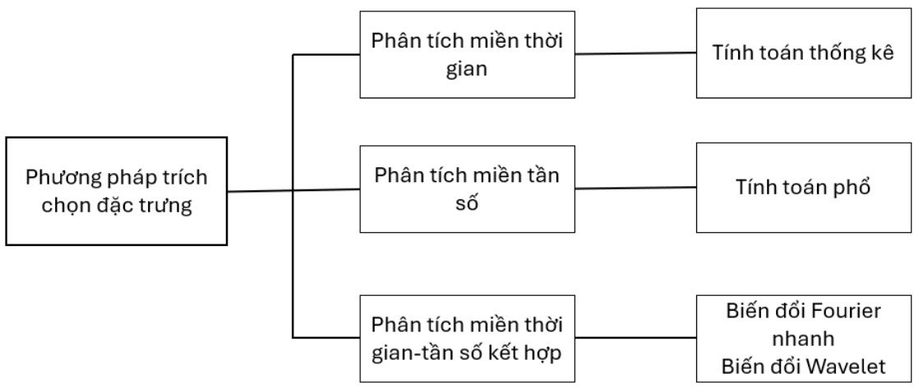

Hình 1.10. Tổng quan về các kỹ thuật chung về xử lý dữ liệu cho trích xuất đặc trưng trong phân loại, phát hiện bất thường trên mặt đường.

## 1.3.1. Đặc trung miền thời gian

Các đặc trung miền thời gian được tính toán trực tiếp từ sự biến đổi biên độ tín hiệu theo thời gian. Uu điểm chính của loại đặc trung này là duy trì chi phí tính toán thấp và không yêu cầu các phép biến đổi tín hiệu bổ sung. Trong số đó, độ lớn (magnitude) của dữ liệu từ gia tốc kế và con quay hồi chuyển là một trong những đặc trung thường được sử dụng. Việc tính toán độ lớn giúp loại bổ tác động tiêu cực từ vị trí và độ nghiêng của cảm biến quán tính bên trong phương tiện, đồng thời giảm biến thiên không mong muốn trong tập dữ liệu [67].

Độ lớn của tín hiệu gia tốc kế được biểu diễn trong Phương trình (1.1), trong đó $Acc_x$, $Acc_y$, và $Acc_z$ lần lượt là các thành phần gia tốc theo ba trực, còn $Acc_M$ là độ lớn của tín hiệu gia tốc kế. Tương tự, Phương trình (1.2) biểu diễn độ lớn của tín hiệu con quay hồi chuyển, với $Gyro_x$, $Gyro_y$, và $Gyro_z$ là vận tốc góc theo ba trực, và $Gyro_M$ là độ lớn tổng hợp của tín hiệu con quay hồi chuyển như trong đề xuất của Zhou và cộng sự [67].

$$
A c c _ {M} = \sqrt {A c c _ {x} ^ {2} + A c c _ {y} ^ {2} + A c c _ {z} ^ {2}}\tag{1.1}
$$

$$
G y r o _ {M} = \sqrt {G y r o _ {x} ^ {2} + G y r o _ {y} ^ {2} + G y r o _ {z} ^ {2}}\tag{1.2}
$$

Các đặc trung miền thời gian được trích xuất từ dữ liệu cảm biến quán tính chủ yếu dựa trên các phép đo thống kê, nhằm phục vụ cho việc phát hiện và phân loại dị thường mặt đường. Các đặc trung thống kê thường được tính toán trích xuất từ tín hiệu gia tốc kế trong miền thời gian là giá trị trung bình,

<!-- page: 42 -->

phương sai, độ lệch chuẩn, độ xiên (Skewness), độ nhọn (Kurtosis), giá trị cực đại và dài động [68]. Ngoài các đặc trung độ lớn, một số đặc trung miền thời gian khác thường được sử dụng bao gồm Mode, trung vị, khoảng giá trị và giá trị hiệu dụng (RMS). Những đặc trung này cũng đã được Zhou và cộng sự khai thác [67]. Bên cạnh đó, một kỹ thuật quan trọng để trích xuất đặc trung là tính toán tự tương quan, tức là đo mức độ tương đồng giữa tín hiệu ban đầu và phiên bản dịch trẻ của chính nó. Wu và cộng sự [44] đã áp dụng kỹ thuật này cho trực z của tín hiệu gia tốc kế nhằm phát hiện các mẫu đặc trung. Các đặc trung thống kê trên miền thời gian được biểu diễn trong các Phương trình (1.3) đến (1.14) trong Bảng 1.6 dưới đây, trong đó n là độ dài dữ liệu và $X_{i}$ là mẫu dữ liệu thứ i.

Bảng 1.6. Các đặc trưng miền thời gian được trích xuất từ dữ liệu cảm biến quán tính trên các phép đo thống kê, nhằm phục vụ cho việc phát hiện và phân loại bất thường mặt đường.

| Đặc trung | Công thức tính |  |
| --- | --- | --- |
| Giá trị trung bình | $\bar{x} = \frac{1}{n} \sum_{i=1}^{n} X_i$ | (1.3) |
| Độ lệch | $\sigma^2 = \frac{1}{n} \sum_{i=1}^{n} (X_i - \bar{x})^2$ | (1.4) |
| Skewness | $Y = \frac{1}{n} \sum_{i=1}^{n} \frac{(X_i - \bar{x})^3}{\sigma^3}$ | (1.5) |
| Kurtosis | $K = \frac{1}{n} \sum_{i=1}^{n} \frac{(X_i - \bar{x})^4}{\sigma^4}$ | (1.6) |
| Độ lệch chuẩn | $\sigma = \sqrt{\frac{1}{n} \sum_{i=1}^{n} (X_i - \bar{x})^2}$ | (1.7) |
| Giá trị cực đại | Max $\{X_i ... X_n\}$ | (1.8) |
| Giá trị cực tiểu | Min $\{X_i ... X_n\}$ | (1.9) |
| Khoảng giá trị | Max $\{X_i ... X_n\} - Min \{X_i ... X_n\}$ | (1.10) |
| Mode | Mode $\{X_i ... X_n\}$ | (1.11) |
| Trung vị | Median $\{X_i ... X_n\}$ | (1.12) |
| Dải động | $DR = X_n - Min \{X_i ... X_n\}$ | (1.13) |

<!-- page: 43 -->

| Đặc trung | Công thức tính |  |
| --- | --- | --- |
| Giá trị hiệu dụng | $RMS = \sqrt{\frac{1}{n} \sum_{i=1}^{n} X_i^2}$ | (1.14) |

Việc tính toán các đặc trưng miền thời gian thường được thực hiện trong cửa sổ tín hiệu có độ dài nhất định. Điều này đồi hỏi phải bảo đảm rằng các bất thường cần phát hiện nằm trọn trong cửa sổ đó. Tuy nhiên, không có quy tắc cổ định để xác định độ dài cửa sổ tối ưu. Thay vào đó, một cách tiếp cận phổ biến là thử nghiệm hệ thống với nhiều độ dài cửa sổ khác nhau và lựa chọn cấu hình cho hiệu suất tốt nhất. Cách tiếp cận này đã được Menegazzo và cộng sự [10] áp dụng trong nghiên cứu của họ.

## 1.3.2. Đặc trung miền tân số

Biến đổi Fourier (FT) là kỹ thuật được sử dụng để chuyển đổi tín hiệu từ miền thời gian sang miền tần số, cho phép biểu diễn cấu trúc phổ của tín hiệu. Nguyên lý cơ bản của FT là xây dựng một hệ cơ sở trực giao gồm các hàm sin và cos có tần số tăng dần, qua đó mô tả tín hiệu dưới dạng tổng hợp của các thành phần điều hòa. Cách tiếp cận này giúp phân tích được các thành phần tần số ẩn trong tín hiệu, vốn không thể quan sát trực tiếp trong miền thời gian. Biểu thức toán học của FT được trình bày trong Phương trình (1.15) [57].

$$
F (w) = \int_ {- \infty} ^ {\infty} f (t) e ^ {- i w t} d t\tag{1.15}
$$

Trong đó, $f(t)$ là một hàm trong miền thời gian, được nhân với một hàm mỹ phức có tần số góc w, tương ứng với số hạng $e^{-iwt}$. Tuy nhiên, khi làm việc với dữ liệu rời rạc, phép biến đổi Fourier phải được định nghĩa lại để phù hợp với tính toán số. Biến đổi Fourier rời rạc (DFT) chính là dạng rời rạc của chuỗi Fourier, được áp dụng cho các vectơ dữ liệu rời rạc. Biểu diễn toán học của DFT được trình bày trong Phương trình (1.16) dưới đây.

$$
F (k) = \sum_ {n = 0} ^ {N - 1} f [ n ] e ^ {\frac {- i 2 \pi n k}{N}}\tag{1.16}
$$

Biến đổi Fourier rời rạc (DFT) rất hữu ích trong việc xấp xỉ và tính toán biến đổi Fourier cho các vectơ dữ liệu. Tuy nhiên, khi kích thước dữ liệu tăng lớn, DFT trở nên kém hiệu quả do độ phức tạp tính toán ở mức $O(N^{2})$, với $N$

<!-- page: 44 -->

là số điểm dữ liệu. Đề khắc phục hạn chế này, Biến đổi Fourier nhanh (FFT) đã được phát triển nhằm tối ưu hóa quy trình tính toán. Thuật toán FFT rút gọn độ phức tạp từ $O(N^{2})$ xuống còn $O(N\log N)$, mang lại lợi ích đáng kể về tốc độ xử lý. Khi $N$ càng lớn, thành phần $\log N$ tăng chậm, do đó FFT có khả năng tiệm cận gần với thời gian xử lý tuyến tính, giúp việc phân tích tín hiệu trên tập dữ liệu lớn trở nên khả thi và hiệu quả hơn [69].

Phân tích miền tần số là một trong những kỹ thuật trích xuất đặc trung quan trọng, trong đó độ lớn của biến đổi Fourier (FT) thường được sử dụng để tính toán các đặc trung phục vụ cho nhiệm vụ phân loại. Từ độ lớn phổ của tín hiệu, có thể suy ra nhiều đặc trung phổ biến phản ánh câu trúc tần số và năng lượng của tín hiệu. Một số đặc trung điện hình đã được đề xuất trong các nghiên cứu của như [52], [67], [70], bao gồm các tham số thống kê của phổ cũng như các chỉ số đặc trung về năng lượng và tần số.

Các đặc trung miền tàn số phổ biến được trích xuất từ độ lớn của biến đổi Fourier (FT) có thể được mô tả như sau:

1. Năng lượng phố của tín hiệu, được tính bằng tổng bình phương các hệ số FT, phần ánh tổng năng lượng chứa trong miền tần số;

2. Tần số trung vị, là tần số phân chia phổ FT thành hai miền có tổng biên độ bằng nhau;

3. Biên độ đỉnh, tức giá trị cực đại của biên độ FT;

4. Biên độ cực tiểu, tức giá trị nhỏ nhất trong phổ;

5. Công suất trung bình, được tính bằng giá trị trung bình của công suất phổ theo biên độ FT;

6. Công suất tổng, là tổng công suất toàn bộ tín hiệu;

7. Thành phần cosin rời rạc, tức thành phần đầu tiên trong biểu diễn biên độ FT;

8. Tần số trung bình, phần ánh giá trị tần số trung bình có trọng số theo biên độ tín hiệu;

9. Tần số cực đại, tức tần số cao nhất hiện diện trong phổ tín hiệu. Những đặc trưng này cung cấp thông tin đa chiều về cấu trúc phổ và đã được sử dụng rộng rãi trong các nghiên cứu về phát hiện và phân loại bất thường mặt đường.

<!-- page: 45 -->

## 1.3.3. Đặc trưng miền thời gian – tần số kết hợp

Phân tích thời gian–tần số là thuật ngữ dùng để chỉ các kỹ thuật phân tích định lượng sự biến thiên của thành phần tần số theo thời gian trong tín hiệu [71]. Mặc dù biến đổi Fourier (FT) cung cấp thông tin chỉ tiết về nội dung tần số, nhưng nó không cho biết chính xác thời điểm các tần số đó xuất hiện trong tín hiệu. Đề khắc phục hạn chế này, một kỹ thuật phổ biến là Biến đổi Fourier ngắn hạn (STFT). STFT thực hiện bằng cách chia toàn bộ tín hiệu thành nhiều khoảng thời gian ngắn (cửa số) và sau đó áp dụng biến đổi Fourier nhanh (FFT) cho từng cửa số. Cách tiếp cận này cho phép xây dựng một biểu diễn tín hiệu vừa theo thời gian vừa theo tần số, STFT được định nghĩa toán học như sau:

$$
G (t, w) = \int_ {- \infty} ^ {\infty} f (\tau) e ^ {- i w \tau} g (\tau - t) d \tau\tag{1.17}
$$

Trong đó, g(t) được gọi là hạt nhân của STFT (hay hàm cửa số), có vai trò giới hạn tín hiệu trong những khoảng thời gian ngắn để thực hiện biến đổi Fourier cục bộ. Nhở vậy, STFT có thể phân tích được sự thay đổi của tín hiệu cả theo miền thời gian lẫn miền tần số. Thông thường, hạt nhân này được chọn là một hàm Gauss, do tính chất đối xứng và khả năng tập trung năng lượng tốt, và được biểu diễn như sau:

$$
g (t) = e ^ {- (t - \tau) ^ {2} / a ^ {2}}\tag{1.18}
$$

Trong Phương trình (1.18), tham số $a$ quyết định độ rộng của cửa sổ, còn $\tau$ xác định vị trí tâm của cửa sổ di chuyển trong STFT. Trong phân tích thời gian–tần số tồn tại nguyên lý bất định Heisenberg, phát biểu rằng một tín hiệu không thể đồng thời được nén tùy ý trong cả miền thời gian và miền tần số [72]. Điều này có nghĩa là không thể đạt được độ phân giải cao đồng thời ở cả hai miền; khi cải thiện độ phân giải thời gian thì độ phân giải tần số sẽ giảm, và ngược lại. Do đó, phổ STFT chỉ có thể cung cấp biểu diễn kết hợp thời gian–tần số của tín hiệu với độ phân giải ở mức thỏa hiệp trong cả hai miền.

Giới hạn của STFT đã dẫn đến sự phát triển của phép biến đổi wavelet. Wavelet là một dạng sóng có độ hỗ trợ hữu hạn, với giá trị trung bình bằng không. Khác với sóng sin kéo dài từ âm đến dương vô cực, wavelet có độ dài ngắn, hình dạng không đối xứng và không đều. Điểm khác biệt cơ bản giữa STFT và wavelet là ở cách phân chia tín hiệu: thay vì chia thành các đoạn theo thời gian cố định như trong STFT, wavelet phân tích tín hiệu theo tỷ lệ (scale).

<!-- page: 46 -->

Cách tiếp cận này cho phép wavelet khắc phục một phần hạn chế của nguyên lý bất định Heisenberg bằng cách cung cấp phân tích đa độ phân giải – đạt độ phân giải cao hơn ở miền thời gian đối với tần số cao, và độ phân giải cao hơn ở miền tần số đối với tần số thấp. Hiện nay, hai công cụ phân tích wavelet phổ biến là Biến đổi Wavelet Liên tục (CWT) và Biến đổi Wavelet Ròi rạc (DWT) [73].

## 1.4. Trích chọn đặc trưng

Trong lĩnh vực học máy, việc giảm số lượng biến đặc trưng đầu vào đóng vai trò quan trọng nhằm nâng cao hiệu suất mô hình và tối ưu chi phí tính toán. Lựa chọn đặc trưng (feature selection), còn được gọi là lựa chọn biến hoặc thuộc tính, là quá trình phát hiện những đặc trưng có tác động mạnh nhất trong một tập dữ liệu, đồng thời loại bỏ các đặc trưng dư thừa hoặc không liên quan nhằm nâng cao hiệu quả và hiệu suất của mô hình học máy [74]. Quá trình này không chỉ giúp giảm chi phí tính toán mà còn cải thiện khả năng phân loại và cung cấp thông tin sâu sắc hơn về dữ liệu. Trong nhiều tập dữ liệu thực tế, tồn tại các đặc trưng có mức độ tương quan cao hoặc chứa nhiều nhiều, và việc loại bỏ chứng không làm suy giảm chất lượng thông tin mà thập chí còn có thể nâng cao hiệu quả mô hình [28].

Các thuật toán lựa chọn đặc trưng thường được phân thành ba nhóm chính: mô hình lọc (filter), mô hình bao (wrapper) và mô hình lai (hybrid) [75]. Lựa chọn đặc trưng là một chủ đề nghiên cứu lâu đời, được áp dụng rộng rãi trong nhiều lĩnh vực khác nhau như nhận dạng hình ảnh [76][77][78], xử lý văn bản [79], phát hiện xâm nhập [80][81] [82], phân tích dữ liệu tin sinh học [83], cùng nhiều ứng dụng thực tế khác.

## 1.4.1. Phương pháp lọc

Phương pháp lọc (Filter) thường được triển khai qua quy trình gồm hai bước chính: (i) tính toán một thước đo thống kê cho từng đặc trung và (ii) so sánh giá trị này với ngưỡng (threshold) được xác định trước. Nếu đặc trung có giá trị lớn hơn hoặc bằng ngưỡng, nó sẽ được giữ lại; ngược lại, đặc trung sẽ bị loại bỏ. Ví dụ, trong các bài toán phân loại, có thể sử dụng thông tin tương hỗ (mutual information) để đo lường mức độ phụ thuộc giữa đặc trung và nhân. Nếu thông tin tương hỗ của một đặc trung với biến mục tiêu vượt quá ngưỡng 0,05, đặc trung này được coi là hữu ích. Tương tự, trong kiểm định Chi-square,

<!-- page: 47 -->

các đặc trung có giá trị thống kê vượt qua ngưỡng tới hạn sẽ được giữ lại vì có mối quan hệ đáng kể với nhận phân loại.

Ví dụ, trong [84], các tác giả đã đề xuất một phương pháp lựa chọn đặc trung dựa trên chỉ số Gini cho hệ thống phát hiện xâm nhập, kết hợp với bộ phân loại Gradient Boosted Decision Trees (GBDT) và tối ưu hóa siêu tham số bằng thuật toán Tối ưu hóa bày đàn hạt (PSO). Khi áp dụng cho tập dữ liệu NSL-KDD, phương pháp này đã giám số đặc trung từ 41 xuống còn 18, đồng thời bộ phân loại GBDT tối ưu hóa đạt độ chính xác 86% với tỷ lệ dương tính giả chỉ 3,83%. Kasongo và cộng sự [81] cũng đã khai thác XGBoost như một công cụ lựa chọn đặc trung tổng hợp cho hệ thống phát hiện xâm nhập dựa trên bộ dữ liệu UNSW-NB15. Dựa trên xếp hạng tầm quan trọng đặc trung, họ đã chọn ra 19 đặc trung quan trọng nhất từ 42 đặc trung ban đầu, và trong bài toán phân loại nhị phân bằng cây quyết định, cách tiếp cận này đã cải thiện độ chính xác 1,9% so với sử dụng toàn bộ đặc trung.

Phương pháp lọc xếp hạng các biến dựa trên các tiêu chí thống kê hoặc đo lường mức độ liên quan, có ưu điểm về tính đơn giản và hiệu quả tính toán, nhưng thường hy sinh một phần độ chính xác so với các phương pháp phức tạp hơn [29][85].

## 1.4.2. Phương pháp bao

Trong phương pháp bao (wrapper), được minh họa trong Hình 1.11, quá trình lựa chọn tập con đặc trung coi thuật toán học máy quy nạp như một “hộp đen”, nghĩa là không cần đi sâu vào chi tiết hoạt động nội bộ mà chỉ cần sử dụng đầu vào - đầu ra của nó. Trình chọn đặc trung tiến hành tìm kiếm các tập con ứng viên và đánh giá chúng trực tiếp dựa trên hiệu suất mà mô hình quy nạp đạt được. Hiệu suất này thường được đo bằng độ chính xác phân loại, được ước lượng thông qua các kỹ thuật đánh giá hiệu suất như kiểm định chéo (cross-validation) hoặc ước lượng độ chính xác khác. Cách tiếp cận này đảm bảo rằng các đặc trung được chọn không chỉ có ý nghĩa thống kê riêng lẻ mà còn thực sự đóng góp vào hiệu quả tổng thể của mô hình [86].

<!-- page: 48 -->

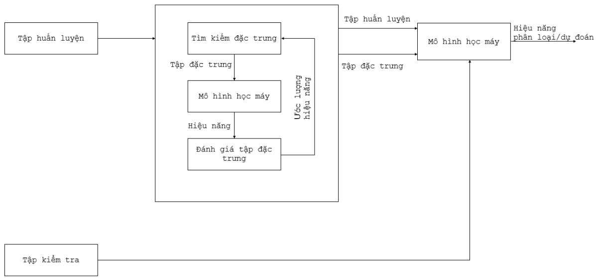

Hình 1.11. Phương pháp bao [86].

Một ví dụ tiêu biểu là lựa chọn tiến cổ điện trong hồi quy tuyến tính được mô tả như trong thuật toán 1.1 và lựa chọn thông qua loại trừ lùi (loại bỏ đặc trung để quy - RFE) được mô tả trong thuật toán 1.2. Thuật ngữ lựa chọn tiến đề cập đến một tìm kiếm bắt đầu từ tập hợp rỗng các đặc trung; thuật ngữ loại trừ lùi đề cập đến một tìm kiếm bắt đầu từ tập hợp đầy đủ các đặc trung.

Trong thuật toán 1.1, các biến đặc trung được thêm dàn vào mô hình. Ô môi bước, từng biến mới được kiểm tra bằng kiểm định giả thuyết thống kê để xác định xem biến đó có ý nghĩa thống kê ở mức ngưỡng định trước hay không (thường dựa vào giá trị $p$). Nếu có ít nhất một biến thỏa mãn, biến có giá trị $p$ nhỏ nhất sẽ được chọn và thêm vào mô hình, sau đó thuật toán tiếp tục lập lại. Quá trình dùng lại khi không còn biến nào có ý nghĩa thống kê.

Trong sơ đồ này, hồi quy tuyến tính đóng vai trò là mô hình cơ sở, còn lựa chọn tiến chính là thủ tục tìm kiếm đặc trưng. Hàm mục tiêu được tối ưu hóa ở đây là mức độ ý nghĩa thống kê, được phản ánh qua giá trị $p$. Phương pháp này minh họa rõ bản chất của wrapper: thay vì chỉ dựa vào mối liên hệ riêng lẻ giữa đặc trưng và biến mục tiêu (như trong phương pháp lọc), nó đánh giá hiệu quả đặc trưng trong ngữ cảnh của toàn mô hình, nhờ vậy mang lại độ chính xác cao hơn, nhưng đồng thời cũng đồi hỏi chi phí tính toán lớn hơn.

| Thuật toán 1.1. Phương pháp lựa chọn đặc trưng tiến |
| --- |
| 1. Tạo một mô hình ban đầu |
| 2. Quá trình lặp |

<!-- page: 49 -->

```txt
3. Với mỗi biến đặc trung không có trong mô hình hiện tại
4. Tạo một mô hình ứng viên bằng cách thêm biến đặc trung vào mô hình hiện tại
5. Sử dụng kiểm định giả thuyết để ước tính ý nghĩa thống kê của biến dự báo mới
6. Kết thúc
7. Nếu giá trị p nhỏ nhất nhỏ hơn ngưỡng thì:
8. Cập nhật mô hình hiện tại để bao gồm một số hạng tương ứng với
biến đặc trung có ý nghĩa thống kê nhất
9. Nếu không
10. Dùng
11. Kết thúc
12. Cho đến khi không còn biến dự báo có ý nghĩa thống kê nào nằm ngoài mô hình
```

<div class="docvortex-algorithm" style="white-space: pre-wrap; font-family:monospace;">
Thuật toán 1.2. Phương pháp lựa chọn đặc trưng lùi
1. Điều chỉnh/huẩn luyện mô hình trên tập huấn luyện sử dụng tất cả các bộ đặc trưng P
2. Tính toán hiệu suất mô hình
3. Tính toán tầm quan trọng hoặc thứ hạng của các biến
4. Với mỗi kích thước tập con $S_i$, $i = 1 \ldots S$
5. Giữ lại các biến $S_i$ quan trọng nhất
6. Điều chỉnh/huẩn luyện mô hình trên tập huấn luyện sử dụng các bộ đặc trưng $S_i$
8. Tính toán hiệu suất mô hình
9. Tính toán lại thứ hạng cho mỗi bộ dự đoán
10. Kết thúc
11. Tính toán hồ sơ hiệu suất trên $S_i$
12. Xác định số lượng bộ dự đoán phù hợp (tức là $S_i$ liên quan đến hiệu suất tốt nhất)
13. Điều chỉnh mô hình cuối cùng dựa trên $S_i$ tối ưu
</div>

Thuật toán lựa chọn lùi [87][88][89] giúp tránh việc phải điều chỉnh lại

<!-- page: 50 -->

nhìều mô hình ở mỗi bước tìm kiếm. Khi mô hình đầy đủ được tạo ra, một thước đo về tầm quan trọng của biến được tính toán, xếp hạng các yếu tố dự báo từ quan trọng nhất đến ít quan trọng nhất. Các phép tính tầm quan trọng có thể dựa trên mô hình (ví dụ: tiêu chí tầm quan trọng của mô hình rừng ngẫu nhiên) hoặc sử dụng một phương pháp tổng quát hơn, độc lập với mô hình đầy đủ. Ô mỗi giai đoạn tìm kiếm, các yếu tố dự báo ít quan trọng nhất được loại bỏ lắp đi lắp lại trước khi xây dựng lại mô hình. Như trước đây, khi một mô hình mới được tạo ra, hàm mục tiêu được ước tính cho mô hình đó. Quá trình này tiếp tục với một chuỗi được xác định trước, và kích thước tập con tương ứng với giá trị tốt nhất của hàm mục tiêu được sử dụng làm mô hình cuối cùng.

Phương pháp bao sử dụng một bộ phân loại xác định để đánh giá trực tiếp hiệu suất của các tập con đặc trưng, do đó có thể đạt độ chính xác cao nhưng cũng có hạn chế đó là chi phí tính toán rất lớn [90].

## 1.4.3. Phương pháp lai

Các mô hình lai được thiết kế để kết hợp ưu điểm của cả hai cách tiếp cận, áp dụng tiêu chí lọc ở bước đầu để giám số chiều dữ liệu, sau đó sử dụng phương pháp bao nhằm tỉnh chính tập đặc trưng tối ưu, từ đó vừa đảm bảo hiệu quả tính toán, vừa duy trì độ chính xác cao [90][80][91].

Megantara và cộng sự [92] đề xuất phương pháp kết hợp giữa xếp hạng tầm quan trọng đặc trưng và loại bỏ đặc trưng để quy (RFE), cho phép lựa chọn lập lại và tỉnh chính tập đặc trưng, từ đó nâng cao hiệu suất phân loại. Wei và cộng sự [93] đã đề xuất một cách tiếp cận kết hợp giữa phương pháp lọc và phương pháp nhưng để xây dựng mô hình dự đoán bệnh Crohn. Cụ thể, trong bước đầu tiên, nhóm nghiên cứu áp dụng phép kiểm định liên kết SNP đơn như một kỹ thuật lọc đơn biến, giúp giám số chiều dữ liệu từ 178.822 SNP ban đầu xuống còn 10.000 SNP có tiềm năng liên quan nhất. Tiếp theo, các đặc trưng này được đưa vào mô hình hồi quy logistic với chính quy hóa L1 (LASSO), vốn là một phương pháp những hiệu quả trong việc loại bỏ thêm các đặc trưng dư thừa và chọn ra tập đặc trưng tối ưu. Kết quả thực nghiệm cho thấy mô hình cuối cùng đạt được AUC = 0,86 trên tập kiểm tra, chứng minh rằng cách kết hợp bước lọc sơ bộ với LASSO không chỉ cải thiện hiệu suất dự đoán mà còn giúp xử lý hiệu quả vấn đề dữ liệu có kích thước đặc trưng cực lớn.

Luôn có sự đánh đổi giữa độ phức tạp tính toán và hiệu suất trong việc

<!-- page: 51 -->

trích chọn đặc trung [83]. Trong bối cảnh này, các phương pháp lai có thể được coi là giải pháp hài hòa giữa phương pháp lọc đơn giản và phương pháp bao phức tạp hơn về mặt tính toán nhưng hiệu suất cao hơn. Nhiều ví dụ trong tài liệu tham khảo đã chỉ ra rằng phương pháp lai có xu hướng mang lại hiệu suất tốt hơn phương pháp lọc đơn giản, đồng thời ít tổn kém về mặt tính toán hơn so với phương pháp bao thuần túy. Như Jeon và cộng sự [94] đã chỉ ra, không có phương pháp lựa chọn đặc trung nào mang lại hiệu quả tối ưu cho tất cả các tập dữ liệu. Hiệu suất của mỗi phương pháp phụ thuộc vào đặc tính cụ thể của tập dữ liệu, do đó việc đánh giá và so sánh nhiều kỹ thuật khác nhau là cần thiết để lựa chọn giải pháp phù hợp nhất [94].

## 1.5. Mô hình học máy

Cây quyết định (Decision Tree – DT) là một thuật toán học máy có giám sát được sử dụng rộng rãi cho cả nhiệm vụ phân loại và hồi quy [95] [96]. Mô hình dự đoán của Cây quyết định được xây dựng dựa trên cấu trúc dạng cây, trong đó quá trình ra quyết định được mô hình hóa theo cách trực quan và dễ hiểu.

Rùng ngẫu nhiên (Random Forest – RF) là một kỹ thuật học tập tổng hợp (ensemble learning) được xây dựng dựa trên việc huấn luyện nhiều cây quyết định và kết hợp kết quả phân loại của chúng. Cụ thể, mỗi cây được huấn luyện trên một tập con dữ liệu ngẫu nhiên với tập hợp các đặc trưng được chọn ngẫu nhiên, và đầu ra cuối cùng của mô hình Rùng ngẫu nhiên được xác định theo nguyên tắc biểu quyết đa số đối với bài toán phân loại hoặc trung bình dự đoán đối với bài toán hồi quy [97] [98].

Thuật toán tăng cường độ đốc (Gradient Boosting) là một phương pháp học tập tổng hợp cho các bài toán phân loại và hồi quy trong học máy. Nó kết hợp nhiều mô hình yếu (thường là cây quyết định) để tạo thành một mô hình mạnh có thể đưa ra dự đoán chính xác [99]. Nó xây dựng từng cây một, mỗi cây cổ gắng sửa lỗi của cây trước đó. Điều này tạo ra một mô hình có thể nằm bắt được các mối quan hệ phức tạp giữa các đặc trưng và biến mục tiêu. Đây là một phương pháp tăng cường phổ biến hoạt động bằng cách thêm các yếu tố dự đoán vào một tổng hợp theo cách tuần tự, mỗi yếu tố sẽ sửa yếu tố trước đó [100] [101].

Thuật toán tăng cường độ đốc cực đại (XGBoost) là một phiên bản được tối ưu hóa của Gradient Boosting, nổi bật nhờ tốc độ, độ chính xác và hiệu quả

<!-- page: 52 -->

tính toán. Thuật toán này nhanh chóng trở thành một trong những công cụ phổ biến trong học máy và được Tianqi Chen cùng Carlos Guestrin giới thiệu vào năm 2016 [102].

## 1.6. Nhóm chỉ số đánh giá

Trong các phương pháp phát hiện dị thường mặt đường dựa trên ngưỡng, việc đánh giá hiệu suất thường tập trung vào hai chỉ số cơ bản là tỷ lệ dương tính thật (True Positive Rate) và tỷ lệ dương tính giả (False Positive Rate) [21]. Mặc dù các chỉ số này cung cấp thông tin hữu ích về khả năng phát hiện chính xác các dị thường, chúng chưa phản ánh toàn diện hiệu suất tổng thể của hệ thống. Do đó, một số nghiên cứu đã bổ sung thêm các chỉ số đánh giá nâng cao như điểm F1 và diện tích dưới đường cong ROC (Receiver Operating Characteristic) để có cái nhìn tổng quan hơn về mức độ chính xác và khả năng phân biệt của thuật toán [22, 23].

Ở chiều ngược lại, đối với các kỹ thuật sử dụng học máy, bao gồm cả phương pháp trích xuất đặc trưng kết hợp học máy truyền thống (ML) và phương pháp học sâu (DL), hiệu suất hệ thống thường được đánh giá toàn diện hơn thông qua ma trận nhằm lẫn (Confusion matrix). Từ ma trận này, các chỉ số như độ lắp lại (Precision), độ nhạy (Sensitivy) và điểm F1 (F1-Score) được tính toán để đánh giá mức độ nhận diện và phân loại chính xác các loại dị thường.

Hình 1.12 minh họa trực quan ma trận nhằm lẫn trong bài toán phân loại mặt đường với 2 nhân là “mặt đường nhựa” hoặc “không phải mặt đường nhựa”, và Bảng 1.7 tổng hợp các loại chỉ số đánh giá phổ biến thường được sử dụng trong các nghiên cứu. Những chỉ số này đóng vai trò quan trọng trong việc so sánh hiệu quả của các thuật toán phát hiện và phân loại bất thường mặt đường được phát triển trên cơ sở dữ liệu rung động thu thập từ cảm biến. Chúng ta gọi TP (True Positive) khi mô hình dự đoán đúng một nhân là đường nhựa với thực tế, TN (True Negative) khi mô hình dự đoán đúng một nhân không phải đường nhựa với thực tế, FP (False Positive) khi mô hình dự đoán sai một nhân là đường nhựa thực tế, FN (False Negative) khi mô hình dự đoán sai một

<!-- page: 53 -->

nhãn không phải đường nhựa thực tế.

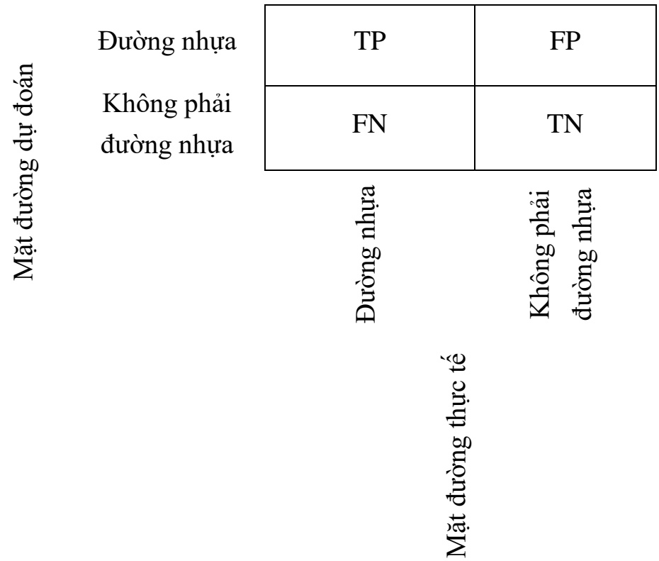

Hình 1.12. Ma trận nhằm lẫn trong bài toán phân loại mặt đường với 2 nhân.

Bảng 1.7. Một số tham số được sử dụng trong đánh giá hiệu năng phân loại thường dùng trong bài toán phân loại mặt đường sử dụng phương pháp học máy.

| Tham số | Công thức tính |  |
| --- | --- | --- |
| Độ chính xác (Accuracy) | $\frac{TP + TN}{TP + FP + TN + FN}$ | (1.19) |
| Độ nhạy (Sensitivy) | $\frac{TP}{TP + FN}$ | (1.20) |
| Độ lặp lại (Precision) | $\frac{TP}{TP + FP}$ | (1.21) |
| Điểm F1 (F1-Score) | $\frac{2 \times Sen \times PPV}{Sen + PPV}$ | (1.22) |

Trong đánh giá mô hình phân loại mặt đường, độ chính xác (Accuracy) cho biết tỷ lệ dự đoán đúng trên tổng số mẫu; độ nhạy (Sensitivy) thể hiện tỷ lệ các trường hợp dương tính thực sự được nhận dạng chính xác; trong khi đó, độ

<!-- page: 54 -->

lặp lại (Precision) phản ánh tỷ lệ số dương tính đúng trên tổng số dự đoán dương tính. Từ hai chỉ số này, điểm F1 (F1-score) được tính toán để cân bằng giữa Precision và Recall, với giá trị dao động từ 0 đến 1: giá trị càng gần 1 chứng tổ mô hình càng dự đoán tốt, còn gần 0 nghĩa là dự đoán kém. Điểm F1 thường được sử dụng như một thước đo quan trọng để so sánh và lựa chọn mô hình tối ưu.

## 1.7. Kết luận Chương 1

Trong Chương 1, luận án đã giới thiệu bài toán phân loại mặt đường sử dụng cảm biến quán tính và các nghiên cứu liên quan để giải quyết cho bài toán này. Có Ba nhóm tiếp cận chính để giải quyết cho bài toán phân loại, phát hiện mặt đường sử dụng cảm biến quán tính là nhóm phát hiện theo phương thức ngưỡng; nhóm phát hiện sử dụng các mô hình học máy có trích chọn đặc trung; và nhóm phát hiện các học sâu.

Các nghiên cứu hiện tại cho thấy cả kỹ thuật trích xuất đặc trung kết hợp học máy và các phương pháp học sâu đều có thể đạt độ chính xác cao trong phân loại bất thường mặt đường, thường vượt mức 80 - 90%. Tuy nhiên, việc so sánh trực tiếp giữa các nghiên cứu là khó khăn do sự khác biệt về tập dữ liệu, điều kiện thí nghiệm và loại bất thường được phân tích. Học sâu có ưu thế về khả năng tự động trích xuất đặc trung và hiệu suất cao, nhưng lại đồi hỏi dữ liệu nhãn lớn, tổn tài nguyên tính toán và khó triển khai trong môi trường thực tế hạn chế phần cứng. Trong khi đó, học máy kết hợp trích xuất đặc trung có ưu điểm về chi phí tính toán thấp, dễ triển khai và diễn giải hơn, song vẫn phụ thuộc mạnh vào chất lượng dữ liệu và cách lựa chọn đặc trung.

Từ những nhận xét trên, hướng nghiên cứu của luận án là phát triển thuật toán trích chọn đặc trưng tối ưu, vừa đảm bảo hiệu quả phân loại, vừa phù hợp để triển khai trên các hệ thống có hiệu năng phần cứng thấp. Điều này sẽ góp phần nâng cao khả năng ứng dụng thực tế của các hệ thống giám sát mặt đường thông minh trong bối cảnh hạ tầng và nguồn lực còn hạn chế.

<!-- page: 55 -->

## CHƯƠNG 2. THUẬT TOÁN TRÍCH CHỘN ĐẶC TRƯNG LAI KẾT HỢP HỌC MÁY

Trong Chương 1, luận án đã đi phân tích một số ưu điểm, hạn chế của các phương pháp phân loại mặt đường. Trong đó, các đặc trưng sử dụng kết hợp các phương pháp học máy có nhiều ưu điểm, tuy nhiên chưa có nghiên cứu nào về thuật toán trích chọn đặc trưng được ứng dụng trong bài toán phân loại mặt đường. Vì vậy, trong chương 2 này, luận án sẽ đi theo hướng tiếp cận đề xuất thuật toán trích chọn đặc trưng tối ưu, vừa đảm bảo hiệu quả phân loại, vừa phù hợp để triển khai trên các hệ thống có hiệu năng phần cứng thấp. Các kết quả thực nghiệm đã cho thấy thuật toán đề xuất có hiệu quả trong việc nâng cao độ chính xác phân loại, giảm thời gian thực thi khi sử dụng các mô hình học máy cho bài toán phân loại mặt đường. Thuật toán đề xuất đã được công bố tại công trình [CT1], thử nghiệm về bước làm sạch dữ liệu được công bố trong công trình [CT2] [CT3] trong “Danh mục các công trình của tác giả”.

## 2.1. Ý tương

Học máy đã được áp dụng rộng rãi trong phân loại mặt đường, dựa trên dữ liệu từ các mạng cảm biến, đặc biệt là cảm biến quán tính, nhằm đạt được sự cân bằng giữa độ chính xác và chi phí tính toán. Tuy nhiên, vẫn còn thiếu những nghiên cứu chuyên sâu về tối ưu hóa lựa chọn đặc trưng, nhằm nâng cao hiệu quả phân loại trong khi vẫn đảm bảo yêu cầu về tính toán gọn nhẹ, đặc biệt đối với các ứng dụng triển khai trên phần cứng hạn chế.

Các nghiên cứu phát hiện và phân loại bất thường mặt đường dựa trên dữ liệu rung động của phương tiện chủ yếu tập trung vào các thuật toán ngưỡng, trích xuất đặc trưng và học máy [3][103]. Cách tiếp cận này cho phép nhận dạng và phân loại các loại bất thường phổ biến như gờ giám tốc, ố gà, vết nứt hoặc đoạn đường thẳng, dựa trên đặc trưng tín hiệu được trích xuất từ miền thời gian hoặc miền tần số, sau đó huấn luyện bằng các mô hình học máy truyền thống [11].

Các phương pháp học máy và học sâu đã chứng minh khả năng đạt độ chính xác vượt trội trong phân loại mặt đường so với các kỹ thuật phát hiện dựa trên ngưỡng. Những nghiên cứu gần đây [4][26] cũng chỉ ra tính khả thi của việc phát triển các hệ thống giám sát tình trạng mặt đường theo thời gian thực với chi phí hợp lý và độ tin cậy cao. Trong đó, nhiều mô hình học máy như Cây

<!-- page: 56 -->

quyết định, KNN hay SVM đã được áp dụng để phân loại các loại mặt đường khác nhau. Tuy nhiên, một thách thức quan trọng còn tồn tại là tối ưu hóa quá trình lựa chọn đặc trưng. Đây được xem là yếu tố then chất giúp nâng cao độ chính xác, đồng thời giảm thiểu thời gian tính toán, đặc biệt trong các ứng dụng phân loại mặt đường dựa trên dữ liệu cảm biến quán tính.

Trích chọn đặc trung tập trung vào việc xác định một tập hợp con các đặc trung có ý nghĩa, đủ khả năng phân biệt hiệu quả giữa các nhân. Trong nhiều tập dữ liệu, thường tồn tại các đặc trung dư thừa, có mức độ tương quan cao hoặc nhiều, vốn có thể được loại bỏ mà không làm suy giám chất lượng thông tin [28]. Quá trình trích chọn đặc trung không chỉ giúp giám chi phí và thời gian tính toán mà còn góp phần cải thiện hiệu suất phân loại, đồng thời mang lại cái nhìn sâu sắc hơn về câu trúc dữ liệu. Chính vì vậy, lựa chọn đặc trung được xem là một bước quan trọng trong các ứng dụng học máy và nhận dạng mẫu [29][85].

Trích chọn đặc trung (feature selection), còn được gọi là lựa chọn biến hoặc thuộc tính, thường bao gồm bốn bước chính: (i) tạo tập con, (ii) đánh giá tập con, (iii) tiêu chí dùng, và (iv) xác thực kết quả [75].

i. Tạo tập con: sử dụng một chiến lược tìm kiếm nhất định để sinh ra các tập con đặc trung ứng viên.

ii. Đánh giá tập con: một hàm đánh giá được xác định trước sẽ so sánh hiệu quả của tập con mới với tập con tốt nhất hiện tại; nếu vượt trội hơn, tập con mới sẽ thay thế.

iii. Tiêu chí dùng: quá trình tạo và đánh giá tiếp tục cho đến khi đạt điều kiện dùng được định nghĩa trước.

iv. Xác thực kết quả: tập con cuối cùng được kiểm chứng bằng kiến thức chuyên ngành hoặc thông qua các phương pháp kiểm định thống kê và thực nghiệm.

Ý tưởng chính của nghiên cứu này khảo sát tiềm năng ứng dụng các mô hình học máy trong phân loại mặt đường dựa trên đặc trung được trích xuất từ dữ liệu cảm biến quán tính, đồng thời tiến hành phân tích so sánh giữa ba mô hình học máy. Đóng góp chính của nghiên cứu là cung cấp cái nhìn toàn diện về tác động của kỹ thuật lựa chọn đặc trung đến hiệu suất mô hình trong bài toán thực hiện nhiệm vụ phân loại mặt đường.

Các kết quả nổi bật gồm:

<!-- page: 57 -->

(i) Ba mô hình học máy – Rừng ngẫu nhiên (Random Forest), Tăng cường độ đốc (Gradient Boosting) và Tăng cường độ đốc cực đại (XGBoost) – đã được đánh giá, trong đó XGBoost đạt độ chính xác cao nhất, tiếp đến là Gradient Boosting và Random Forest;

(ii) Một thuật toán trích chọn đặc trưng lai Filter–Wrapper (Hybrid Filter–Wrapper) đã được áp dụng với ba biến thể HFW-RF, HFW-GB và HFW-XGB. Phương pháp này trước tiên sử dụng bộ lọc dựa trên xếp hạng tầm quan trọng để giảm số chiều, sau đó áp dụng loại bỏ đặc trưng để quy (RFE) để loại bỏ các đặc trưng kém hữu ích, qua đó hình thành tập đặc trưng nhỏ gọn nhưng vẫn duy trì hiệu suất cao;

(iii) Đánh giá số lượng cảm biến lắp đặt cho thấy có thể đạt kết quả phân loại tối ưu với câu hình cảm biến hợp lý.

## 2.2. Bộ dữ liệu

Bộ dữ liệu Cảm biến Xe thụ động (Passive Vehicle Sensor – PVS) [9], như đã nêu trong Phần mở đầu được sử dụng cho các thực nghiệm trong Chương 2 này. Bộ dữ liệu được thu thập từ một hệ thống phần cứng gắn trên xe và bao gồm ba loại mặt đường chính: nhựa đường, đất và đá cuối, như thể hiện trong Hình 2.1. Một mạng lưới các mô-đun cảm biến MPU-9250 được bổ trí tại nhiều vị trí trên xe nhằm thu thập dữ liệu từ nhiều điểm khác nhau.

Cấu hình cảm biến cụ thể như sau: một mô-đun MPU-9250 và thiết bị GPS được gắn trên bảng điều khiển trong cabin (vị trí 1), trong khi hai mô-đun MPU-9250 khác được lắp tại hai đầu trực trước bên trái (vị trí 2) và bên phải (vị trí 3). Các cảm biến được câu hình với thang đo đầy đủ lần lượt là ±8g cho gia tốc kế và ±1000 độ/giây cho con quay hồi chuyển. Tốc độ lấy mẫu được thiết lập ở mức 100 Hz cho dữ liệu quán tính, trong khi mô-đun GPS ghi nhận vận tốc tại 1 Hz. Chi tiết về câu hình phần cứng của bộ dữ liệu này được nêu trong Bảng 2.1

Bảng 2.1. Cấu hình phần cứng [9]

| Phần cứng | Cảm biến | Dữ liệu thu được | Tần số lấy mẫu |
| --- | --- | --- | --- |
| HP webcam HD-4110 | Camera | 720p video | 30 Hz |
| Xiaomi Mi 8 | GPS | Tốc độ (m/s) | 1 Hz |

<!-- page: 58 -->

|  |  | Kinh độVĩ độ |  |
| --- | --- | --- | --- |
| MPU-9250 | Gia tốc | Gia tốc 3 trục (m/s2) | 100 Hz |
| MPU-9250 | Góc quay | Góc quay 3 trục (độ/s) | 100 Hz |
| MPU-9250 | Từ trường | Từ trường 3 trục | 100 Hz |
| MPU-9250 | Nhiệt độ | Nhiệt độ | 100 Hz |

Bộ dữ liệu PVS cung cấp dữ liệu quán tính được đồng bộ hóa từ gia tốc kế, con quay hồi chuyển và dữ liệu vận tốc GPS. Điều này cho phép thiết lập môi tương quan chính xác giữa tín hiệu rung động với vận tốc và vị trí của phương tiện. Việc thu thập dữ liệu từ ba cảm biến phân bổ không gian (một trong cabin và hai gần bánh trước) giúp ghi lại hồ sơ rung động toàn diện, đồng thời tính đến các biến thiên do vị trí cảm biến và động lực học của xe.

Bộ dữ liệu bao gồm dữ liệu được gắn nhân rõ ràng cho ba loại mặt đường: nhựa đường, đất và đá cuội. Mỗi loại mặt đường có đặc tính cơ học và tín hiệu rung động khác biệt, qua đó cung cấp nền tầng vững chắc cho việc huấn luyện và đánh giá các mô hình học máy trong nhiệm vụ phân loại mặt đường. Bảng 2.2 cho biết về số lượng mẫu được thu thập trên mỗi loại nhận mặt đường.

Bảng 2.2. Số lượng mẫu dữ liệu

<table><tr><td rowspan="2">Tép dữ liệu</td><td colspan="3">Số lượng mẫu</td><td rowspan="2">Tổng số mẫu</td><td colspan="3">Độ dài quãng đường (km)</td><td rowspan="2">Tổng (km)</td></tr><tr><td>Đường đất</td><td>Đường đá</td><td>Đường nhựa</td><td>Đường đất</td><td>Đường đá</td><td>Đường nhựa</td></tr><tr><td>PVS 1</td><td>25868</td><td>61659</td><td>56509</td><td>144036</td><td>1.59</td><td>3.53</td><td>8.7</td><td>13.81</td></tr><tr><td>PVS 4</td><td>23903</td><td>57670</td><td>50919</td><td>132492</td><td>1.58</td><td>3.51</td><td>8.72</td><td>13.81</td></tr><tr><td>PVS 7</td><td>23778</td><td>54224</td><td>50546</td><td>128548</td><td>1.59</td><td>3.49</td><td>8.69</td><td>13.78</td></tr><tr><td>PVS 2</td><td>44618</td><td>20737</td><td>59330</td><td>124684</td><td>2.17</td><td>1.39</td><td>8.07</td><td>11.62</td></tr><tr><td>PVS 5</td><td>60539</td><td>18143</td><td>55195</td><td>133877</td><td>2.16</td><td>1.38</td><td>8.09</td><td>11.63</td></tr><tr><td>PVS 8</td><td>44939</td><td>18825</td><td>59854</td><td>123618</td><td>2.16</td><td>1.37</td><td>8.09</td><td>11.63</td></tr><tr><td>PVS 3</td><td>28659</td><td>26143</td><td>51014</td><td>105816</td><td>1.66</td><td>1.66</td><td>7.4</td><td>10.72</td></tr><tr><td>PVS 6</td><td>23888</td><td>31641</td><td>40750</td><td>96279</td><td>1.38</td><td>1.93</td><td>7.43</td><td>10.73</td></tr><tr><td>PVS 9</td><td>23153</td><td>25182</td><td>43220</td><td>91555</td><td>1.67</td><td>1.66</td><td>7.42</td><td>10.74</td></tr><tr><td>Tổng số</td><td>299345(27.69%)</td><td>314224(29.07%)</td><td>467337(43.24%)</td><td></td><td>15.96</td><td>19.92</td><td>72.61</td><td></td></tr></table>

<!-- page: 59 -->

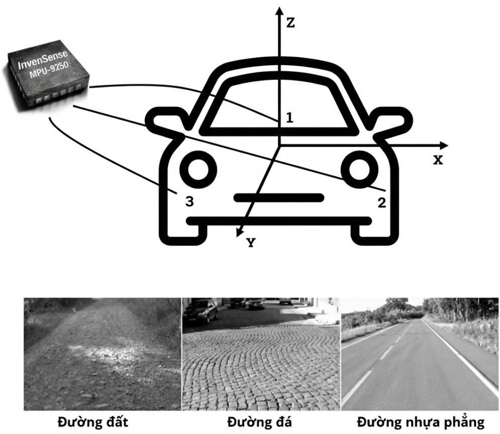

Hình 2.1. Thiết bị được lắp đặt trên xe chạy thu thập trên ba nhân mặt đường [9].

Việc gắn nhãn chính xác đóng vai trò then chất trong việc hỗ trợ các phương pháp học có giám sát nghiệm ngặt và đảm bảo khả năng đánh giá đáng tin cậy. Đồng thời, dữ liệu cảm biến được thu thập từ nhiều vị trí khác nhau trên xe tạo điều kiện cho việc phân tích mức độ tin cậy của các cấu hình cảm biến khác nhau. Tính linh hoạt này đặc biệt có giá trị trong các ứng dụng nhưng, nơi tính khả dụng của cảm biến có thể thay đổi, qua đó khẳng định sự phù hợp của bộ dữ liệu cho các triển khai thực tế.

Trong phần này, mạng cảm biến gồm ba mô-đun MPU-9250 (Hình 2.1) đã được sử dụng để xây dựng các tập dữ liệu từ nguồn công khai, với dữ liệu được gắn nhãn tương ứng cho ba loại mặt đường: nhựa đường, đất và đá cuối. Cụ thể, ba câu hình tập dữ liệu được xem xét trong các thí nghiệm phân loại như sau:

Tập dữ liệu 1: sử dụng dữ liệu từ cả ba cảm biến.

<!-- page: 60 -->

Tập dữ liệu 2: sử dụng dữ liệu từ hai cảm biến số 2 và số 3, được gắn tại hai đầu trực trước (trái và phải).

Tập dữ liệu 3: chỉ sử dụng dữ liệu từ cảm biến số 1, gắn trên bảng điều khiển của xe.

Sơ đồ khối thực hiện được mô tả như ở Hình 2.2. Dữ liệu thô thu thập được từ bộ dữ liệu PVS sẽ được thực hiện tiền xử lý dữ liệu gồm các bước làm sạch, cân bằng dữ liệu, chia cửa sổ, gán nhân dữ liệu tương ứng với các loại mặt đường, tập dữ liệu sau gán nhân được chia thành các tập dữ liệu dành cho huấn luyện trong các mô hình học máy và một tập dành riêng cho quá trình kiểm tra mô hình. Dữ liệu trong tập huấn luyện sẽ được sử dụng trong quá trình trích chọn đặc trưng, bộ đặc trưng tối ưu sẽ được sử dụng cho tập dữ liệu kiểm tra để thực hiện trong bài toán phân loại 3 loại mặt đường: đường đất; đường đá cuối và đường nhựa.

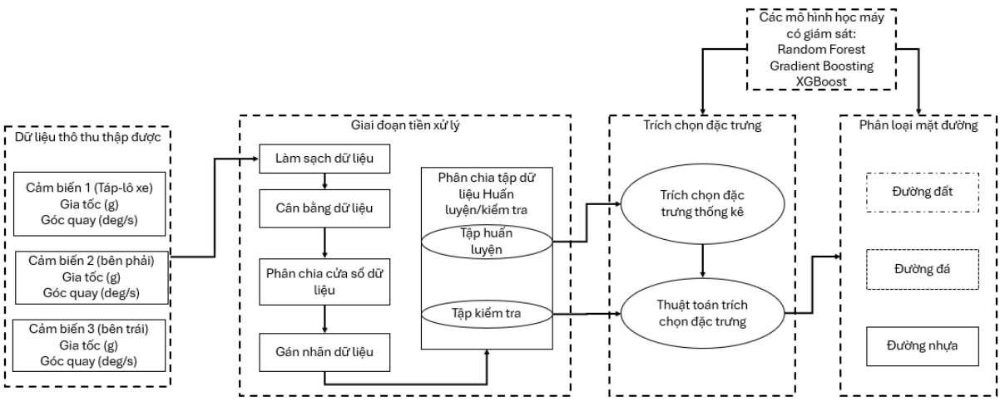

Hình 2.2. Sơ đồ khối thực hiện.

## 2.3. Tiền xử lý dữ liệu

Dữ liệu cảm biến thô thu được từ xe trong quá trình thu thập thường chứa nhiều đo lường và nhiều loại tín hiệu không mong muốn khác, có thể phát sinh từ chuyển động bên trong xe hoặc từ rung động do động cơ tạo ra. Những thành phần nhiều này có khả năng làm sai lệch dữ liệu và làm giảm độ tin cậy khi phân tích trạng thái di chuyển trên các loại mặt đường khác nhau. Như minh họa trong Hình 2.3 và Hình 2.4, tín hiệu từ cảm biến quán tính có sự biến thiên đáng kể và tạo ra các giá trị khác nhau tùy theo điều kiện vận hành. Tuy nhiên, khi xe dùng lại, tín hiệu ghi nhận được chủ yếu phần ánh nhiều từ động cơ đang hoạt động hoặc các tác động cơ học khác, thay vì đặc tính mặt đường.

<!-- page: 61 -->

Đề đảm bảo chất lượng dữ liệu đầu vào và loại bỏ những nhiều không liên quan, luận án này áp dụng một ngưỡng vận tốc cố định là 1 m/s trong giai đoạn tiền xử lý. Tất cả các giá trị cảm biến được ghi nhận ở tốc độ dưới ngưỡng này đều bị loại bỏ. Ngưỡng này được xác định thông qua thử nghiệm mở rộng và thể hiện tính hợp lý trên nhiều khóa cạnh: nó không quá thấp để loại bỏ những tín hiệu yếu và nhiều phát sinh khi xe gần như đúng yên, cũng không quá cao đến mức loại bỏ các rung động đặc trung xuất hiện ở tốc độ trung bình. Ô tốc độ dưới 1 m/s tương ứng 3,6 km/h, tín hiệu hầu như không chứa mẫu rung động có ý nghĩa cho việc phân loại mặt đường, mà chủ yếu bị chi phối bởi tiếng ồn không tải của động cơ hoặc dao động cơ học không liên quan đến bề mặt đường.

Việc loại bổ những phân đoạn này giúp bảo toàn tính toàn vẹn của dữ liệu và nâng cao hiệu quả mô hình. Cụ thể, ngưỡng 1 m/s cho phép loại bổ các trạng thái vận hành không hữu ích như khởi động, dùng xe hoặc di chuyển cực chậm, vốn không tạo ra rung động bề mặt đặc trưng nhưng lại gây nhiều trong quá trình huấn luyện. Do đó, bước xử lý này đóng vai trò quan trọng trong việc tăng cường khả năng phân biệt đặc trưng và cải thiện độ chính xác phân loại. Quan sát thực nghiệm minh chứng cho điều này được trình bày trong Hình 2.3 và Hình 2.4, với các giá trị tương ứng của gia tốc và góc quay trên từng loại mặt đường .

Quan sát trực quan cho thấy, trên mặt đường nhựa, tín hiệu gia tốc có mức dao động tương đối ổn định trên cả ba trực X, Y, Z, với biên độ biến thiên nhỏ, xấp xỉ 2 m/s². Nguộc lại, đối với mặt đường đất, gia tốc trên các trực thể hiện sự biến thiên rõ rệt hơn, với biên độ khoảng 8 m/s². Đặc biệt, trên mặt đường đá cuội, mức độ rung động tăng mạnh, với biên độ có thể đạt tới 25 m/s². Kết quả này cho thấy đặc trung biên độ gia tốc có sự khác biệt rõ ràng giữa các loại mặt đường.

Tương tự, đối với tín hiệu góc quay, trên mặt đường nhựa, giá trị dao động trong khoảng hep từ -5 đến +5 độ/giây, phản ánh sự ổn định cao. Trong khi đó, trên mặt đường đất và đá cuội, góc quay có biên độ biến thiên lớn hơn, nằm trong khoảng từ -20 đến +20 độ/giây, cho thấy mức độ dao động mạnh hơn của chuyển động.

<!-- page: 62 -->

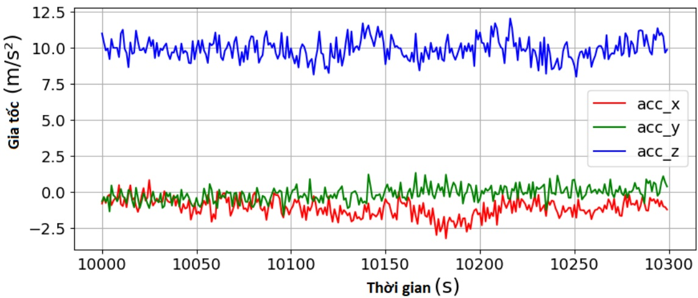

a. Giá trị gia tốc khi xe di chuyển trên mặt đường nhựa (x, y, z)

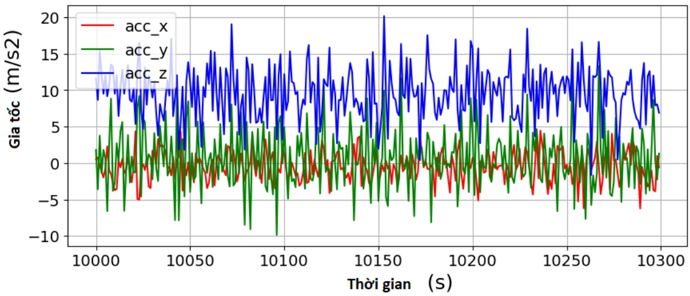

b. Giá trị gia tốc khi xe di chuyển qua mặt đường đá cuối (x, y, z).

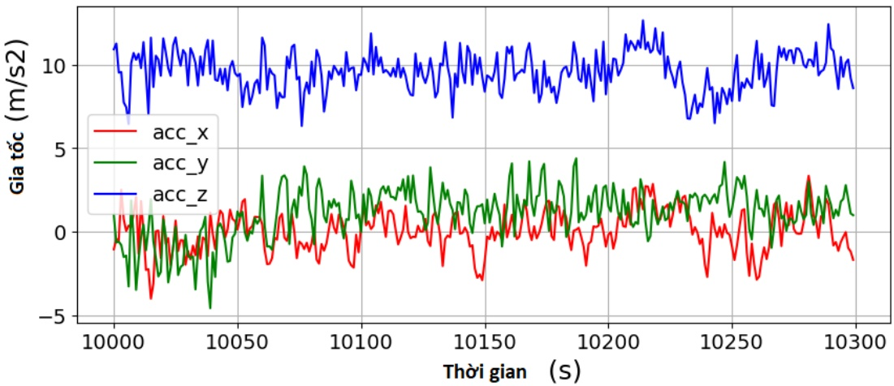

c. Giá trị gia khi xe di chuyển qua mặt đường đất (x, y, z).

<!-- page: 63 -->

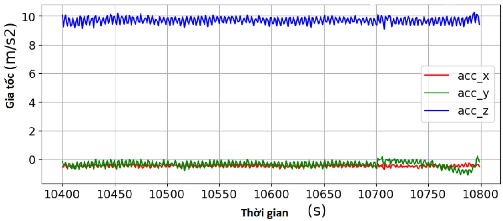

d. Giá trị gia tốc khi xe đứng yên, nổ máy không di chuyển (x, y, z).

Hình 2.3. Giá trị của gia tốc trên trực X, Y, Z theo thời gian của cảm biến gắn ở trong xe.

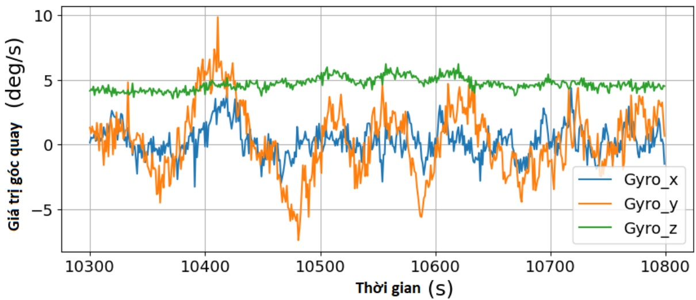

a. Giá trị góc quay khi xe di chuyển trên mặt đường nhựa phẳng (x, y, z)

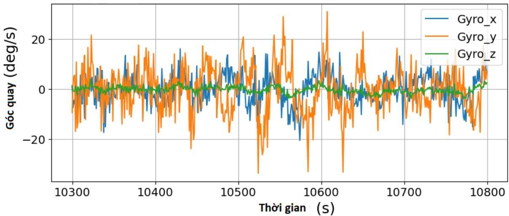

<!-- page: 64 -->

b. Giá trị góc quay khi xe di chuyển trên mặt đường đá cuối (x, y, z).

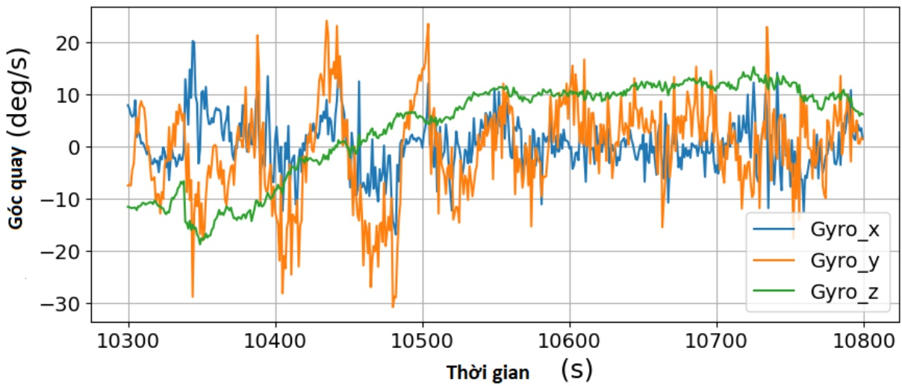

c. Giá trị góc quay khi xe di chuyển trên mặt đường đất (x, y, z).

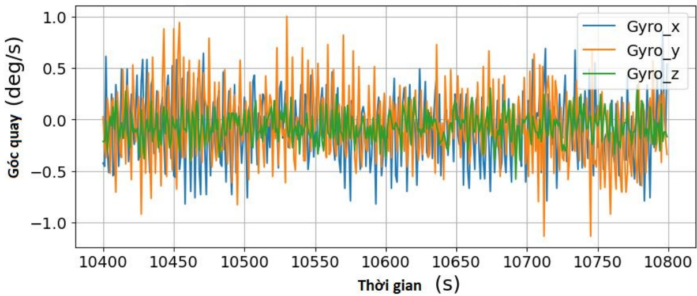

d. Giá trị góc quay khi xe đứng yên, nổ máy không di chuyển (x, y, z)

Hình 2.4. Giá trị của góc quay trên trục X, Y, Z theo thời gian của cảm biến
gắn ở trong xe

Phân tích chuyên sâu dữ liệu cảm biến trên nhiều loại mặt đường cho thấy các đặc trung rung động gắn liền với từng loại bề mặt (ví dụ: nhựa đường, đất, đá cuội) trở nên ổn định và có thể phân biệt rõ ràng khi vận tốc xe vượt quá 1 m/s. Do đó, ngưỡng này đóng vai trò như một ranh giới đáng tin cây, giúp tách biệt vùng dữ liệu nhiều khởi vùng dữ liệu giàu thông tin. Bước lọc này không chỉ cải thiện hiệu suất mô hình bằng cách đảm bảo chỉ xử lý dữ liệu phần ánh động lực học thực tế do mặt đường gây ra, mà còn giúp giám chi phí tính toán thông qua việc loại bổ các đoạn tín hiệu ít giá trị. Điều này đặc biệt quan

<!-- page: 65 -->

trọng đối với các ứng dụng thời gian thực triển khai trên phần cứng nhưng công suất thấp.

Là bước khởi đầu trong giai đoạn tiền xử lý, nhiều từ mỗi đoạn tín hiệu được loại bỏ bằng phương pháp mô tả trong Phương trình (2.1), trong đó $X(Acc_{x,y,z}/Gyro_{x,y,z})$ biểu diễn dữ liệu thô thu được từ cảm biến MPU-9250 và GPS. Cụ thể, $Acc_{x,y,z}$ và $Gyro_{x,y,z}$ lần lượt là các thành phần gia tốc kế và con quay hồi chuyển trên ba trực $X$, $Y$, $Z$ trong khi $v$ biểu thị vận tốc của xe và $v_{threshold}$ là ngưỡng vận tốc được sử dụng để lọc dữ liệu thô. Thông qua quá trình khảo sát, nhận thấy rằng khi xe đúng yên không di chuyển, tín hiệu thu được của GPS vẫn có một sai số nhất định do nhiều đa đường gây nên, chỉ số vận tốc vẫn dao động trong khoảng từ 0 – 4 km/h, do đó Nghiên cứu sinh đặt $v_{threshold}$ =1 m/s (tương ứng 3,6 km/h). Bước này, được gọi là làm sạch dữ liệu, đảm bảo chỉ những đoạn tín hiệu mang thông tin hữu ích cho nhiệm vụ phân loại mặt đường mới được giữ lại để huấn luyện và đánh giá mô hình (Bảng 2.3).

$$
X \langle A c c _ {x, y, z} | G y r o _ {x, y, z} \rangle = \left\{ \begin{array}{l l} X \langle A c c _ {x, y, z} | G y r o _ {x, y, z} \rangle , & v \geq v _ {t h r e s h o l d} \\ 0, & v <   v _ {t h r e s h o l d} \end{array} \right.\tag{2.1}
$$

Bảng 2.3. Số mẫu dữ liệu sau khi làm sạch

<table><tr><td rowspan="2">Tập dữ liệu</td><td colspan="3">Số lượng mẫu</td><td rowspan="2">Tổng số mẫu</td></tr><tr><td>Đường đất</td><td>Đường đá</td><td>Đường nhựa</td></tr><tr><td>PVS 1</td><td>25668</td><td>60759</td><td>43973</td><td>130400</td></tr><tr><td>PVS 4</td><td>23903</td><td>56371</td><td>45728</td><td>126002</td></tr><tr><td>PVS 7</td><td>23778</td><td>53524</td><td>43798</td><td>121100</td></tr><tr><td>PVS 2</td><td>44618</td><td>20737</td><td>54047</td><td>119402</td></tr><tr><td>PVS 5</td><td>60539</td><td>18143</td><td>49519</td><td>128201</td></tr><tr><td>PVS 8</td><td>44939</td><td>18825</td><td>53437</td><td>117201</td></tr><tr><td>PVS 3</td><td>28559</td><td>26143</td><td>41398</td><td>96100</td></tr><tr><td>PVS 6</td><td>23888</td><td>31641</td><td>35771</td><td>91300</td></tr><tr><td>PVS 9</td><td>23153</td><td>24783</td><td>38966</td><td>86902</td></tr></table>

Sau khi dữ liệu được làm sạch, các mẫu từ tất cả các cảm biến được chia thành các khung có kích thước bằng nhau để huấn luyện mô hình bằng cách sử

<!-- page: 66 -->

dụng cửa sổ trượt có độ dài cố định [104]. Việc lựa chọn kích thước cửa sổ trượt là một bước then chất: nếu cửa sổ quá ngắn, dữ liệu thu được không đủ để biểu diễn chính xác đoạn đường xe đi qua; ngược lại, nếu cửa sổ quá dài, chi phí xử lý dữ liệu sẽ tăng cao. Trong nghiên cứu này, nhiều kích thước cửa sổ trượt khác nhau đã được thử nghiệm để đánh giá tác động đến hiệu suất phân loại.

Một thách thức khác trong dữ liệu là hiện tượng mất cân bằng nhãn, vốn có thể ảnh hưởng tiêu cực đến các mô hình học máy khi dự đoán bị lệch về phía nhãn chiếm đa số, dẫn đến hiệu suất kém đối với các nhãn thiểu số [105]. Để khắc phục, luận án này áp dụng quy trình cân bằng dữ liệu thủ công trong giai đoạn huấn luyện. Trước hết, số lượng mẫu nhỏ nhất trong ba nhãn (mặt đường nhựa, mặt đường đất và mặt đường đá cuội) được xác định, ký hiệu là N. Sau đó, ngẫu nhiên chọn N mẫu từ mỗi nhãn để đảm bảo sự phân bố đồng đều.

Quy trình này kết hợp việc lấy mẫu ngẫu nhiên từ nhân đa số và/hoặc lấy mẫu tăng cường từ nhận thiểu số, nhằm đảm bảo rằng mỗi lớp đóng góp tương đương trong quá trình huấn luyện mô hình. Cách tiếp cận này giúp giảm thiểu sự thiên lệch, đồng thời nâng cao hiệu suất phân loại đối với các loại mặt đường ít được đại diện hơn.

Tổng hợp dữ liệu sau khi cân bằng và phân chia cửa sở được trình bày trong các Bằng 2.4, Bằng 2.5, Bằng 2.6, và Bằng 2.7. Quy trình trên được áp dụng một cách nhất quán cho tất cả các tập huấn luyện trong các thử nghiệm, nhằm duy trì tính tái lập và tính khách quan của kết quả.

Bảng 2.4. Dữ liệu sau khi thực hiện chia cửa số không chồng lán

| Kích thước cửa số (mẫu dữ liệu) | Tập dữ liệu huấn luyện (train set) | Tập dữ liệu kiểm tra (test set) |
| --- | --- | --- |
| 200 | 2682 | 1788 |
| 300 | 1788 | 1191 |
| 400 | 1341 | 894 |
| 500 | 1074 | 714 |
| 600 | 894 | 594 |

Bảng 2.5. Dữ liệu sau khi thực hiện chia cửa số chồng lần 30%

| Kích thước cửa số (mẫu dữ liệu) | Tập dữ liệu huấn luyện (train set) | Tập dữ liệu kiểm tra (test set) |
| --- | --- | --- |
| 200 | 3831 | 2553 |

<!-- page: 67 -->

| 300 | 2553 | 1701 |
| --- | --- | --- |
| 400 | 1914 | 1275 |
| 500 | 1533 | 1020 |
| 600 | 1278 | 849 |

Bảng 2.6. Dữ liệu sau khi thực hiện chia cửa số chồng lán 50%

| Kích thước cửa số (mẫu dữ liệu) | Tập dữ liệu huấn luyện (train set) | Tập dữ liệu kiểm tra (test set) |
| --- | --- | --- |
| 200 | 5364 | 3573 |
| 300 | 3573 | 2382 |
| 400 | 2682 | 1785 |
| 500 | 2145 | 1428 |
| 600 | 1785 | 1191 |

Bảng 2.7. Dữ liệu sau khi thực hiện chia cửa số chồng lán 70%

| Kích thước cửa số (mẫu dữ liệu) | Tập dữ liệu huấn luyện (train set) | Tập dữ liệu kiểm tra (test set) |
| --- | --- | --- |
| 200 | 8937 | 5955 |
| 300 | 5955 | 3969 |
| 400 | 4467 | 2976 |
| 500 | 3573 | 2379 |
| 600 | 2976 | 1983 |

Các tín hiệu cảm biến quán tính thu được từ gia tốc kê và con quay hồi chuyển của xe phần ánh các mẫu rung động phát sinh khi xe di chuyển trên các bề mặt đường khác nhau. Các mẫu này thường thể hiện đặc tính thống kê ổn định trong những khoảng thời gian ngắn, kéo dài vài giây, tương ứng với kích thước cửa sở thử nghiệm từ 200 đến 600 mẫu ở tàn số lấy mẫu 100 Hz (tương đương 2–6 giây). Vì tốc độ xe duy trì ở mức trung bình và các loại mặt đường có xu hướng ổn định trong những khoảng thời gian này, nên mỗi cửa sở dữ liệu có thể cung cấp đủ thông tin đại diện về tình trạng mặt đường mà không gây dư thừa dữ liệu. Mặt khác, cửa sở với khoảng thời gian này là đủ nhỏ để có thể phát hiện những bất thường trên các đoạn đường ngắn mà xe đi qua.

Cửa số không chồng lấn mang lại lợi thế đáng kể về hiệu quả tính toán. Cụ thể, số lượng cửa sổ được tạo ra ít hơn so với khi dùng cửa sổ chồng lấn có cùng kích thước, từ đó trực tiếp giảm tải tính toán trong các bước trích xuất đặc trung, suy luận mô hình và tổng thời gian xử lý. Đây là yếu tố quan trọng đối

<!-- page: 68 -->

với các ứng dụng giám sát thời gian thực trên nền tảng phần cứng nhưng hoặc thiết bị công suất thấp, vốn bị hạn chế về bộ nhớ và năng lực xử lý.

Thêm vào đó, do đặc tính mặt đường thay đổi tương đối chậm và tín hiệu rung động giữ được sự ổn định trong phạm vi một cửa số, cửa sở không chồng lấn vẫn duy trì độ phân giải thời gian cần thiết để phát hiện kịp thời các thay đổi bề mặt. Các đặc trung thống kê được trích xuất từ mỗi cửa sở có tính ổn định và đủ đại diện để phân loại chính xác các loại mặt đường, mà không cần dữ liệu chồng lấn bổ sung.

Ngược lại, cửa sổ chồng lấn vốn tạo ra sự dư thừa đáng kể do các cửa sổ liền kè chia sẻ phần lớn số mẫu. Mặc dù sự dư thừa này có thể làm mượt kết quả phân loại và nâng cao độ phân giải thời gian, nó cũng đồng nghĩa với việc lập lại nhiều phép tính trên dữ liệu tương đồng, dẫn đến độ trẻ xử lý cao hơn và tiêu thụ năng lượng không cần thiết. Trong bối cảnh giám sát mặt đường thời gian thực, nơi tính nhanh chóng và nhất quán của kết quả phân loại được ưu tiên để hỗ trợ ra quyết định, việc sử dụng cửa sổ không chồng lấn trở thành lựa chọn hợp lý nhằm giảm thiểu độ trẻ mà vẫn đảm bảo hiệu quả phân tích.

## 2.4. Mô hình học sâu LSTM

LSTM là một loại Mạng Nơ-ron Hồi quy (RNN) được coi là lý tưởng cho việc dự đoán và phân loại chuỗi thời gian. Kỹ thuật này giới thiệu khái niệm về ô nhớ và các vòng lặp tự động trong mạng. Các tính năng này cho phép mạng lưu giữ thông tin trong các khoảng thời gian khác nhau dựa trên dữ liệu đầu vào [106], điều này phù hợp với đặc tính dữ liệu của cẩm biến quán tính là một chuỗi của các sự kiện theo thời gian. Phần này đề xuất sử dụng các biến thể của mô hình học sâu LSTM để thực hiện nhiệm vụ phân loại mặt đường (Hình 2.5), dữ liệu thu thập cũng được xử lý ở các bước tiền xử lý như: lọc dữ liệu, gán nhân, chia cửa số, sau đó dữ liệu được chia thành các tập dữ liệu: huấn luyện, xác thực và kiểm tra.

<!-- page: 69 -->

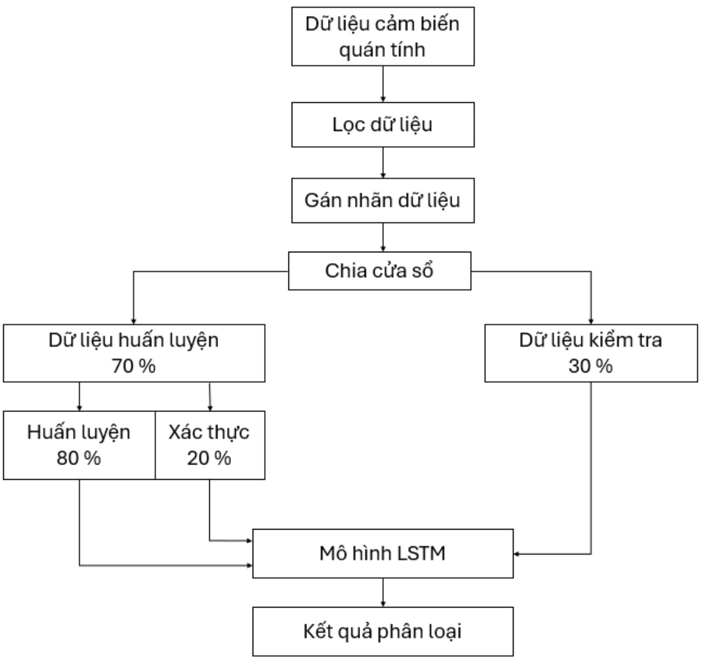

Hình 2.5. Quy trình phân loại mặt đường sử dụng mô hình LSTM.

Bảng 2.8 dưới đây mô tả về 05 biến thể khác nhau của mô hình LSTM được thử nghiệm, trong đó thay đổi số lượng đơn vị và lớp LSTM để đánh giá hiệu suất mô hình.

Bảng 2.8. Các biến thể của mô hình LSTM được sử dụng

| Tên mô hình | Cấu hình các siêu tham số trong mô hình |
| --- | --- |
| LSTM 1 | 1 LSTM với 32 đơn vị, 1 BatchNormalization, 1 Dropout 0,5, 1 Dense với 32 đơn vị và kích hoạt relu, 1 Dense với 3 đơn vị và kích hoạt softmax |
| LSTM 2 | 1 LSTM với 32 đơn vị, 1 BatchNormalization, 1 LSTM với 32 đơn vị, 1 BatchNormalization, 1 Dropout 0,5, 1 Dense với 32 đơn vị và kích hoạt relu, 1 Dense với 3 đơn vị và kích hoạt softmax |

<!-- page: 70 -->

| Tên mô hình | Cấu hình các siêu tham số trong mô hình |
| --- | --- |
| LSTM 3 | 1 LSTM với 64 đơn vị, 1 BatchNormalization, 1 Dropout 0,5, 1 Dense với 32 đơn vị và kích hoạt relu, 1 Dense với 3 đơn vị và kích hoạt softmax |
| LSTM 4 | 1 LSTM với 64 đơn vị, 1 BatchNormalization, 1 LSTM với 64 đơn vị, 1 BatchNormalization, 1 Dropout 0,5, 1 Dense với 32 đơn vị và kích hoạt relu, 1 Dense với 3 đơn vị và kích hoạt softmax |
| LSTM 5 | 1 LSTM với 32 đơn vị, 1 BatchNormalization, 1 LSTM với 64 đơn vị, 1 BatchNormalization, 1 Dropout 0,5, 1 Dense với 32 đơn vị và kích hoạt relu, 1 Dense với 3 đơn vị và kích hoạt softmax |

## 2.5. Mô hình học máy với bộ đặc trưng tối ưu

## 2.5.1. Sử dụng bộ đặc trưng thống kê trên miền thời gian

Như đã đề cập trong Chương 1, trích xuất đặc trung là một giai đoạn tiền xử lý quan trọng, trong đó các đặc trung đa dạng được rút ra từ dữ liệu thô. Quá trình này bắt đầu bằng việc chia dữ liệu chuỗi thời gian thành các phân đoạn nhỏ hơn, gọi là cửa số [104]. Đối với mỗi cửa số, các đặc trung được tính toán cho từng chuỗi thời gian trong miền thời gian. Tất cả các đặc trung cùng công thức tính toán được trình bày trong Bằng 2.9, trong đó $X_i$ biểu diễn giá trị cảm biến tại thời điểm $i$, và $n$ là tổng số mẫu trong một cửa số.

Trong miền thời gian, Nghiên cứu sinh đã đề xuất sử dụng các đặc trung thống kê cơ bản như giá trị trung bình, trung vị, cũng như các tham số đo độ phân tán như phương sai, độ lệch chuẩn, giá trị nhỏ nhất, giá trị lớn nhất và khoảng giá trị. Các đặc trung miền thời gian đặc biệt phù hợp với bài toán phân loại mặt đường do tính chất của dữ liệu cảm biến quán tính và yêu cầu của hệ thống thời gian thực. Tín hiệu quán tính phần ánh các dao động cơ học và biến thiên động học của phương tiện khi di chuyển, do đó các tham số thống kê như trung bình, phương sai, độ lệch chuẩn hay phạm vi có khả năng mô tả hiệu quả các kiểu dao động đặc trung cho các loại mặt đường khác nhau (ví dụ: nhựa

<!-- page: 71 -->

đường, đất, đá cuội). Điều này cho phép phân biệt bề mặt đường một cách đủ tin cậy mà không cần các phép biến đổi phức tạp.

Bảng 2.9. Các đặc trưng miền thời gian được trích xuất.

<table><tr><td colspan="3">Dữ liệu sử dụng</td></tr><tr><td>Giá trị gia tốc trục X</td><td> $Acc_x$ </td><td></td></tr><tr><td>Giá trị gia tốc trục Y</td><td> $Acc_y$ </td><td></td></tr><tr><td>Giá trị gia tốc trục Z</td><td> $Acc_z$ </td><td></td></tr><tr><td>Giá trị góc quay trục X</td><td> $Gyro_x$ </td><td></td></tr><tr><td>Giá trị góc quay trục Y</td><td> $Gyro_y$ </td><td></td></tr><tr><td>Giá trị góc quay trục Z</td><td> $Gyro_z$ </td><td></td></tr><tr><td>Đặc trung</td><td>Công thức tính</td><td></td></tr><tr><td>Giá trị trung bình</td><td> $\bar{x} = \frac{1}{n} \sum_{i=1}^{n} X_i$ </td><td>(2.2)</td></tr><tr><td>Độ lệch</td><td> $\sigma^2 = \frac{1}{n} \sum_{i=1}^{n} (X_i - \bar{x})^2$ </td><td>(2.3)</td></tr></table>

<!-- page: 72 -->

Độ lệch chuẩn

$$
\sigma = \sqrt {\frac {1}{n} \sum_ {i = 1} ^ {n} (X _ {i} - \bar {x}) ^ {2}}\tag{2.4}
$$

Giá trị cực đại

$$
M a x \{X _ {i} \dots X _ {n} \}\tag{2.5}
$$

Giá trị cực tiêu

$$
M i n \{X _ {i} \dots X _ {n} \}\tag{2.6}
$$

Khoảng giá trị

$$
M a x \{X _ {i} \dots X _ {n} \} - M i n \{X _ {i} \dots X _ {n} \}\tag{2.7}
$$

Trung vị

$$
M e d i a n \{X _ {i} \dots X _ {n} \}\tag{2.8}
$$

Việc sử dụng các đặc trung miền thời gian còn mang lại lợi ích thực tiễn về hiệu quả tính toán. Với tính đơn giản, chúng có thể được trích xuất nhanh chóng với chi phí xử lý thấp, điều này đặc biệt quan trọng trong bối cảnh triển khai trên các hệ thống nhưng hoặc vi điều khiển công suất thấp, vốn bị hạn chế về tài nguyên tính toán và bộ nhớ. Khác với các kỹ thuật trong miền tần số hoặc miền thời gian–tần số như Biến đổi Fourier Ngắn hạn (STFT) hoặc Biến đổi Wavelet Liên tục (CWT), đặc trung miền thời gian không đồi hỏi phép toán chuyên sâu hay dung lượng bộ nhớ lớn, từ đó trở thành giải pháp tối ưu cho các ứng dụng giám sát mặt đường theo thời gian thực.

## 2.5.2. Đề xuất kết hợp các thuật toán lai lọc-bao và học máy

Thuật toán lựa chọn đặc trưng lai lọc-bao (Hybrid Filter-Wrapper) kết hợp với học máy được đề xuất để xác định tập đặc trưng tối ưu cho phân loại mặt đường. Cấu trúc của thuật toán được minh họa trong Hình 2.6. Mục tiêu là tận dụng khả năng sàng lọc nhanh của bộ lọc để giảm không gian đặc trưng trước khi chuyển sang giai đoạn bao để tỉnh chính. Ba thuật toán học máy sử

<!-- page: 73 -->

dụng để lựa chọn đặc trung đã được thử nghiệm trong luận án này: Rừng ngẫu nhiên; Tăng cường độ đốc; Tăng cường độ đốc cực đại.

## Giai đoạn lọc:

Trong giai đoạn lọc của thuật toán lựa chọn đặc trung lai, các đặc trung được xếp hạng dựa trên điểm quan trọng thu được từ ba mô hình phân loại: Random Forest, Gradient Boosting và XGBoost. Đề xác định tập con đặc trung tối ưu, nhiều giá trị ngưỡng ứng viên cho tầm quan trọng đặc trung đã được đánh giá một cách có hệ thống, bao gồm các mức 0,001; 0,002; 0,003; 0,004 và 0,005.

Với mỗi giá trị ngưỡng, tất cả các đặc trung có điểm quan trọng nhỏ hơn ngưỡng đều bị loại bỏ, hình thành các tập con đặc trung thu gọn. Các tập con này sau đó được dùng để huấn luyện và xác thực lại mô hình học máy tương ứng trên một tập dữ liệu kiểm định được giữ riêng. Tiêu chí lựa chọn ngưỡng tối ưu là đạt được độ chính xác phân loại cao nhất đồng thời giảm thiểu số lượng đặc trung được giữ lại.

Cách tiếp cận này nhằm đạt sự cân bằng giữa việc duy trì hiệu suất dự đoán cao và giảm độ phức tạp của mô hình, từ đó tăng hiệu quả tính toán, đặc biệt phù hợp cho các ứng dụng triển khai trên hệ thống hạn chế tài nguyên.

Như được thể hiện chi tiết trong Bảng 2.10, ngưỡng tối ưu đối với mô hình Random Forest được xác định là 0,001, trong khi cả Gradient Boosting và XGBoost đều đạt hiệu suất cao nhất với ngưỡng 0,004.

<!-- page: 74 -->

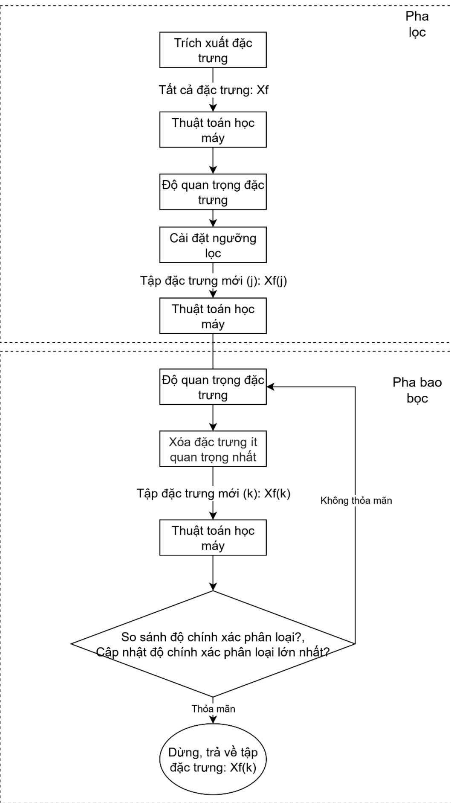

Hình 2.6. Thuật toán lai lọc-bao.

<!-- page: 75 -->

Bảng 2.10. Kết quả thử nghiệm trong giai đoạn lọc với các ngưỡng khác nhau.

<table><tr><td>Mô hình học máy</td><td>Ngưỡng lọc độ quan trọng của đặc trung</td><td>Số lượng đặc trung sau lọc</td><td>Độ chính xác phân loại (%)</td></tr><tr><td rowspan="6">Rừng ngẫu nhiên</td><td>0.005</td><td>34</td><td>85.7</td></tr><tr><td>0.004</td><td>40</td><td>85.4</td></tr><tr><td>0.003</td><td>51</td><td>85.4</td></tr><tr><td>0.002</td><td>68</td><td>86.6</td></tr><tr><td>0.001</td><td>101</td><td>87.2</td></tr><tr><td>0</td><td>126</td><td>87.1</td></tr><tr><td rowspan="6">Tăng cường độ đốc</td><td>0.005</td><td>31</td><td>91.6</td></tr><tr><td>0.004</td><td>38</td><td>92.5</td></tr><tr><td>0.003</td><td>45</td><td>90.8</td></tr><tr><td>0.002</td><td>60</td><td>92.4</td></tr><tr><td>0.001</td><td>96</td><td>91.7</td></tr><tr><td>0</td><td>126</td><td>91.5</td></tr><tr><td rowspan="6">Tăng cường độ đốc cực đại</td><td>0.005</td><td>50</td><td>92.7</td></tr><tr><td>0.004</td><td>65</td><td>93.5</td></tr><tr><td>0.003</td><td>82</td><td>92.4</td></tr><tr><td>0.002</td><td>99</td><td>92.3</td></tr><tr><td>0.001</td><td>107</td><td>92.4</td></tr><tr><td>0</td><td>126</td><td>92.5</td></tr></table>

Quá trình điều chỉnh ngưỡng này có thể được xem như một tìm kiếm heuristic có kiểm soát, được dẫn đất bởi các kết quả xác thực thực nghiệm thay vì chỉ dựa trên kiểm định thống kê thuần túy hoặc quy trình xác thực chéo truyền thống. Thông qua việc đánh giá lập đi lập lại độ chính xác của mô hình trên tập dữ liệu xác thực với các tập con đặc trưng khác nhau, phương pháp này bảo đảm rằng các đặc trưng được giữ lại có đóng góp thực sự vào hiệu quả dự đoán. Đồng thời, việc loại bỏ những đặc trưng ít quan trọng giúp giám số chiều dữ liệu, từ đó cải thiện hiệu quả cả trong giai đoạn huấn luyện và suy luận.

Toàn bộ các bước thực hiện trong giai đoạn lọc này được mô tả chi tiết trong Thuật toán 2.1.

<!-- page: 76 -->

<table><tr><td colspan="2">Thuật toán 2.1. Giai đoạn lọc</td></tr><tr><td rowspan="5">Đầu vào:</td><td>Tập dữ liệu huấn luyện  $T$ </td></tr><tr><td>Tập dữ liệu kiểm tra  $V$ </td></tr><tr><td>Tập đặc trung ban đầu  $X_{f} = [f_{1}; f_{2}...; f_{126}]$ </td></tr><tr><td>Giá trị ngưỡng được cải đặt trước thres</td></tr><tr><td>Mô hình học máy sử dụng: Rừng ngẫu nhiên ( $RF$ ); Tăng cường độ đốc ( $GDB$ ); Tăng cường độ độc cực đại ( $XGB$ )</td></tr><tr><td>Đầu ra:</td><td>Tập đặc trung được chọn  $X_{f}(k)$ </td></tr><tr><td colspan="2">Bước 1:Uốc lượng phân loại theo từng mô hình học máy: $RG(T, V)$  $GDB(T, V)$  $XGB(T, V)$ </td></tr><tr><td colspan="2">Bước 2: Tính toán mức độ quan trọng của từng đặc trung trong  $X_{f}$ .</td></tr><tr><td colspan="2">Bước 3: Sắp xếp lại tập đặc trung  $X_{f}$  theo mức độ quan trọng tăng dần.</td></tr><tr><td colspan="2">Bước 4: Giữ lại tập đặc trung  $X_{f}(k)$  có độ quan trọng lớn hơn ngưỡng thres.</td></tr></table>

## Giai đoạn bao (wrapper):

Trong giai đoạn bao, các đặc trưng được xếp hạng lại dựa trên mức độ quan trọng trong ba mô hình phân loại: Random Forest, Gradient Boosting và XGBoost. Sau đó, các đặc trưng ít quan trọng nhất sẽ lần lượt bị loại bỏ qua từng bước. Một điều kiện dùng được áp dụng dựa trên ngưỡng độ chính xác. Trong luận án này, ba ngưỡng độ chính xác đã được đánh giá là 1%, 2% và 3%. Kết quả cho thấy ngưỡng 2% là phù hợp nhất: ngưỡng 1% khiến thuật toán dùng quá sớm, dẫn đến tập đặc trưng chưa tối ưu; trong khi ngưỡng 3% cho cùng kết quả tối ưu như 2% nhưng lại tiêu tổn nhiều tài nguyên tính toán hơn do điều kiện dùng kéo dài. Do đó, ngưỡng 2% được lựa chọn vì cân bằng tốt giữa hiệu suất và hiệu quả tính toán.

Các bước cụ thể trong giai đoạn bao được trình bày trong Thuật toán 2.2.

<table><tr><td colspan="2">Thuật toán 2.2. Giai đoạn bao</td></tr><tr><td rowspan="3">Đầu vào:</td><td>Tập dữ liệu huấn luyện  $T$ </td></tr><tr><td>Tập dữ liệu kiểm tra  $V$ </td></tr><tr><td>Tập đặc trung sau giai đoạn lọc:  $X_{f}(k)$ </td></tr></table>

<!-- page: 77 -->

```txt
Giá trị ngưỡng được cải đặt trước thres_acc
Mô hình học máy sử dụng: Rừng ngẫu nhiên (RF); Tăng cường
độ đốc (GDB); Tăng cường độ đốc cực đại (XGB)
Đầu ra: Tập đặc trung được chọn X_f(l)

Bước 1:
Uốc lượng phân loại theo từng mô hình học máy:
RG (T, V) => độ chính xác[i]
GDB(T, V) => độ chính xác[i]
XGB(T, V) => độ chính xác[i]

Bước 2: Tính toán mức độ quan trọng của từng đặc trung trong X_f(k).
Bước 3: Sắp xếp lại tập đặc trung X_f(k).theo mức độ quan trọng tăng dần.
Bước 4: Loại bỏ đặc trung ít quan trọng nhất, trả về tập đặc trung X_f(k).
Bước 5:
Uốc lượng phân loại theo từng mô hình học máy:
RG (T, V) => độ chính xác[j]
GDB(T, V) => độ chính xác[j]
XGB(T, V) => độ chính xác[j]

Bước 6: So sánh độ chính xác phân loại sau khi loại bỏ đặc trung.
Bước 7:
Nếu độ chính xác[j] - độ chính xác[i] < thres_acc:
- Cập nhật độ chính xác: độ chính xác[i] = độ chính xác[j]
- Lưu tập đặc trung có độ chính xác cao nhất: X_f(l)
- Quay lại Bước 2.
Nếu độ chính xác[j] - độ chính xác[i] > thres_acc: trả về tập đặc trung X_f(l).
```

Các thuật toán trích chọn đặc trưng lai lọc-bao được xây dựng trên cơ sở lấy độ quan trọng của đặc trưng bởi các mô hình học máy: Random Forest, Gradient Boosting và XGBoost, trong thực nghiệm ở phần sau, tên gọi mỗi thuật toán tương ứng với mô hình học máy như sau:

\- HFW-RF: Thuật toán trích chọn đặc trưng lai lọc-bao với độ quan trọng của đặc trưng theo mô hình học máy Random Forest;

\- HFW-GB: Thuật toán trích chọn đặc trưng lai lọc-bao với độ quan trọng của đặc trưng theo mô hình học máy Gradient Boosting;

<!-- page: 78 -->

\- HFW-XGB: Thuật toán trích chọn đặc trưng lai lọc-bao với độ quan trọng của đặc trưng theo mô hình học máy XGBoost;

## 2.6. Kết quả thực nghiệm và đánh giá

Các thí nghiệm trong phần này được thực hiện trên máy tính chạy Windows 10, sử dụng bộ xử lý Intel(R) Core(TM) i7-7700 @ 3,60 GHz, bộ nhớ RAM 16 GB và card đồ họa GTX 1650. Việc xây dựng, huấn luyện và đánh giá mô hình học máy được tiến hành trong môi trường Python Jupyter Notebook với các thư viện phổ biến như Pandas, NumPy, Scikit-Learn (sklearn), v.v.

## Kết quả sử dụng mô hình học sâu LSTM:

5 biến thể khác nhau của mô hình LSTM đã được thử nghiệm với các cửa sổ dữ liệu có độ dài khác nhau ở 100 mẫu, 200 mẫu và 300 mẫu tương ứng với 1 giây, 2 giây và 3 giây thu dữ liệu. Kết quả thử nghiệm về độ chính xác được trình bày trong Bảng 2.11. Quan sát kết quả cho thấy hiệu suất cao nhất với độ dài cửa sổ dữ liệu là 100 mẫu, trong đó mô hình LSTM 4 đạt độ chính xác 94,74% trên tập dữ liệu thử nghiệm. Tăng kích thước cửa sổ lên 200 mẫu, mô hình LSTM 2 đạt độ chính xác 94,49%. Với độ dài cửa sổ là 300 mẫu, mô hình LSTM 5 cho kết quả tốt nhất, đạt độ chính xác 92,82%. Bảng 5 tóm tất độ chính xác của tất cả các mô hình đã được thử nghiệm.

Bảng 2.11. Độ chính xác phân loại sử dụng LSTM

<table><tr><td rowspan="2">Tên mô hình</td><td colspan="3">Độ chính xác</td></tr><tr><td>Cửa số = 100 mẫu</td><td>Cửa số = 200 mẫu</td><td>Cửa số = 300 mẫu</td></tr><tr><td>LSTM 1</td><td>88.68%</td><td>89.70%</td><td>83.12%</td></tr><tr><td>LSTM 2</td><td>93.41%</td><td>94.49%</td><td>93.31%</td></tr><tr><td>LSTM 3</td><td>90.96%</td><td>90.09%</td><td>83.29%</td></tr><tr><td>LSTM 4</td><td>94.74%</td><td>91.82%</td><td>85.12%</td></tr><tr><td>LSTM 5</td><td>91.27%</td><td>93.38%</td><td>92.82%</td></tr></table>

<!-- page: 79 -->

| Mặt đường đất | 1145 | 52 | 2 |
| --- | --- | --- | --- |
| Mặt đường đá cuội | 126 | 1073 | 0 |
| Mặt đường nhựa | 6 | 3 | 1190 |

Hình 2.7. Kết quả ma trận nhằm lẫn sử dụng mô hình LSTM 4

Độ chính xác giữa tập huấn luyện và xác thực

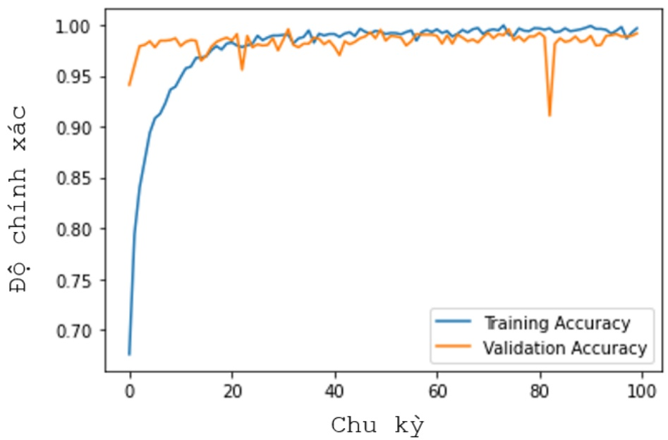

Hình 2.8. Mối quan hệ giữa độ chính xác và chu kỳ huấn luyện sử dụng mô hình LSTM 4.

<!-- page: 80 -->

Phân tích ma trận nhằm lẫn được thể hiện ở Hình 2.7 nhận thấy rằng, mô hình LSTM 4 hoạt động tốt với mặt đường nhựa 1190/1199 phát hiện đúng, tuy vậy với 2 loại mặt đường đất và đường đá cuội, mô hình phân loại có độ chính xác kém hơn khi mặt đường đá cuội phát hiện 1073/1199 là tỷ lệ đúng và phát hiện nhằm sang mặt đường đất là 126/1199 mẫu, mặt đường đất có tỷ lệ tương tự khi phát hiện được 1145/1199 mẫu đúng và có 52 mẫu phát hiện nhằm sang mặt đường đá cuội và 02 mẫu sang mặt đường nhựa. Hình 2.8 cho thấy mối quan hệ giữa độ chính xác với các chu kỳ huấn luyện, có thể thấy mô hình LSTM 4 đã bắt đầu hội tự ở chu kỳ thứ 30, sau chu kỳ thứ 30 thì độ chính xác gần như không được cải thiện hơn.

## Kết quả sử dụng mô hình học máy có chọn lọc đặc trưng:

Ba thuật toán học máy dựa trên mô hình họ cây đã được thử nghiệm, bao gồm Rừng ngẫu nhiên (RF) [97], Tăng cường độ đốc (GDB) [100] và Tăng cường độ đốc cực đại XGBoost [102]. Các mô hình này được lựa chọn bởi những ưu điểm nổi bật về khả năng xếp hạng tầm quan trọng đặc trung, tính đơn giản trong diễn giải và hiệu quả trong phân loại. Việc đánh giá tầm quan trọng đặc trung giúp hiểu rõ hơn các mối quan hệ trong dữ liệu, hỗ trợ lựa chọn đặc trung phù hợp và cải thiện khả năng giải thích mô hình [107].

Trong thực tế, dữ liệu cảm biến quán tính thường bị ảnh hưởng bởi nhiều nguồn nhiều không liên quan đến mặt đường, ví dụ như rung động từ động cơ hoặc chuyển động hệ thống treo. Đề giảm thiểu tác động này, nghiên cứu đã thử nghiệm các ngưỡng vận tốc khác nhau và nhận thấy việc áp dụng ngưỡng quá lớn thì sẽ bỏ qua nhiều dữ liệu mà có thể sử dụng trong phân loại mặt đường, ngược lại nếu ngưỡng vận tốc quá nhỏ thì sẽ có nhiều nhiều khi xe ở trạng thái tỉnh, do đó áp dụng ngưỡng vận tốc 1 m/s tương ứng 3,6 km/h trong giai đoạn tiền xử lý để loại bỏ dữ liệu khi xe đứng yên hoặc di chuyển quá chậm. Ngưỡng này cho phép tách biệt hiệu quả tín hiệu nhiều khởi các rung động đặc trung do bề mặt đường gây ra, đồng thời cân bằng giữa việc loại bổ nhiều và giữ lại dữ liệu có giá trị.

Tính mạnh mê và khả năng thích ứng của mô hình được thể hiện qua việc đánh giá trên các cấu hình cảm biến khác nhau (sử dụng dữ liệu từ một, hai hoặc cả ba cảm biến). Như trong Bảng 2.12, độ chính xác phân loại vẫn duy trì ở mức cao và ổn định ngay cả khi số lượng cảm biến giảm, chứng minh khả

<!-- page: 81 -->

năng khái quát hóa và duy trì hiệu suất của mô hình ngay cả khi lượng dữ liệu đầu vào bị hạn chế.

Bảng 2.12. Kết quả phân loại mặt đường với số lượng cảm biến khác nhau

<table><tr><td rowspan="2">Độ dài cửa số dữ liệu (số mẫu)</td><td rowspan="2">Mô hình học máy</td><td colspan="3">Độ chính xác (Accuracy) (%)</td></tr><tr><td>3 cảm biến</td><td>2 cảm biến (trái, phải)</td><td>1 cảm biến trong xe</td></tr><tr><td rowspan="3">200</td><td>RF</td><td>80.7</td><td>80.5</td><td>79.0</td></tr><tr><td>GBM</td><td>88.2</td><td>85.8</td><td>83.4</td></tr><tr><td>XGB</td><td>90.0</td><td>88.4</td><td>84.3</td></tr><tr><td rowspan="3">300</td><td>RF</td><td>82.1</td><td>82.4</td><td>78.7</td></tr><tr><td>GBM</td><td>87.5</td><td>87.8</td><td>83.5</td></tr><tr><td>XGB</td><td>88.7</td><td>89.2</td><td>83.6</td></tr><tr><td rowspan="3">400</td><td>RF</td><td>85.5</td><td>83.4</td><td>82.5</td></tr><tr><td>GBM</td><td>90.2</td><td>89.2</td><td>85.0</td></tr><tr><td>XGB</td><td>91.7</td><td>91.3</td><td>85.0</td></tr><tr><td rowspan="3">500</td><td>RF</td><td>87.1</td><td>85.3</td><td>79.7</td></tr><tr><td>GBM</td><td>90.2</td><td>88.9</td><td>84.4</td></tr><tr><td>XGB</td><td>92.8</td><td>91.7</td><td>85.5</td></tr><tr><td rowspan="3">600</td><td>RF</td><td>84.2</td><td>84.6</td><td>84.0</td></tr><tr><td>GBM</td><td>89.4</td><td>88.5</td><td>86.0</td></tr><tr><td>XGB</td><td>91.8</td><td>90.5</td><td>85.5</td></tr></table>

Ngoài ra, việc lựa chọn các đặc trung thống kê miền thời gian như giá trị trung bình, phương sai, độ lệch chuẩn và khoảng mang lại sự ổn định cao trước các biến động ngẫu nhiên hoặc đột biến thoáng qua. Khi các đặc trung này được tính toán trên cửa sổ cổ định, chúng góp phần làm mịn các bất thường ngắn hạn, tạo ra biểu diễn dữ liệu đáng tin cậy hơn cho mô hình phân loại.

Kết quả thực nghiệm cho thấy: sử dụng cả ba cảm biến (bảng điều khiển, bên trái và bên phải) đem lại độ chính xác phân loại cao nhất. Việc chỉ dùng hai cảm biến làm giảm độ chính xác đôi chút, trong khi chỉ sử dụng một cảm biến khiến hiệu suất giảm đáng kể. Đặc biệt, với độ dài cửa số 500 mẫu (tương ứng 5 giây), độ chính xác phân loại đạt mức tối ưu: 92,8% đối với XGBoost, 90,2% đối với Gradient Boosting và 87,1% đối với Random Forest.

<!-- page: 82 -->

Bảng 2.13 trình bày kết quả so sánh về độ chính xác và thời gian huấn luyện của ba mô hình học máy: Rừng ngẫu nhiên, Tăng cường độ đốc và Tăng cường độ đốc cực đại khi sử dụng thuật toán trích chọn đặc trưng. Bên cạnh đó, Bảng 2.7 cung cấp cái nhìn chi tiết hơn về các chỉ số đánh giá này, cho phép phân tích toàn diện hiệu suất của từng mô hình.

Bảng 2.13. Hiệu năng phân loại của các thuật toán học máy khi sử dụng thuật toán trích chọn đặc trưng

<table><tr><td>Thuật toántrích chơnđặc trung</td><td>Số lượng đặctrung đượcchọn</td><td>Mô hình</td><td>Độ chính xác(Accuracy)(%)</td><td>Thời gianhuấn luyện(giây)</td></tr><tr><td rowspan="3">Không ápdụng. Sửdụng tất cácác đặc trungđược tạo ra</td><td rowspan="3">126</td><td>RandomForest</td><td>87.1</td><td>0.32</td></tr><tr><td>GradientBoosting</td><td>92.3</td><td>13.51</td></tr><tr><td>XGBoost</td><td>93.2</td><td>1.03</td></tr><tr><td rowspan="3">HFW-RF</td><td rowspan="3">76</td><td>RandomForest</td><td>85.5</td><td>0.27</td></tr><tr><td>GradientBoosting</td><td>93.2</td><td>11.95</td></tr><tr><td>XGBoost</td><td>94.2</td><td>0.99</td></tr><tr><td rowspan="3">HFW-GB</td><td rowspan="3">30</td><td>RandomForest</td><td>85.5</td><td>0.15</td></tr><tr><td>GradientBoosting</td><td>93.0</td><td>4.71</td></tr><tr><td>XGBoost</td><td>94.2</td><td>0.54</td></tr><tr><td rowspan="3">HFW-XGB</td><td rowspan="3">42</td><td>RandomForest</td><td>85.5</td><td>0.21</td></tr><tr><td>GradientBoosting</td><td>91.6</td><td>6.84</td></tr><tr><td>XGBoost</td><td>92.8</td><td>0.71</td></tr></table>

Như kết quả thể hiện trong Bảng 2.13, Mô hình XGBoost đạt độ chính xác trung bình cao nhất, khoảng 94%, trong tất cả các kịch bản, bất kể có áp dụng lựa chọn đặc trưng hay không. Tiếp theo là mô hình Gradient Boosting,

<!-- page: 83 -->

đạt độ chính xác trung bình khoảng 93% trên ba tập dữ liệu thử nghiệm. Mô hình Rừng Ngẫu nhiên cho thấy độ chính xác thấp nhất, trung bình chỉ khoảng 87% trong hầu hết các trường hợp. Những kết quả này làm nổi bật tính mạnh mẽ của các thuật toán lựa chọn đặc trưng, vì chúng vẫn duy trì độ chính xác cao ngay cả khi số lượng đặc trưng giảm đáng kể.

Thuật toán HFW-GB đạt được hiệu suất tối ưu bằng cách lựa chọn một tập con gồm 30 đặc trung quan trọng nhất. Trong khi đó, HFW-XGB giữ lại 42 đặc trung, còn HFW-RF chọn 76 đặc trung. Các kết quả thực nghiệm chỉ ra rằng việc rút gọn đặc trung không chỉ duy trì hiệu suất phân loại mà còn giảm đáng kể thời gian huấn luyện. Cụ thể, khi sử dụng 30 đặc trung do HFW-GB chọn, thời gian huấn luyện của mô hình Random Forest giảm từ 0,32 giây (với toàn bộ 126 đặc trung) xuống còn 0,15 giây. Đối với XGBoost, thời gian huấn luyện giảm từ 1,03 giây xuống còn 0,54 giây. Trong khi đó, Gradient Boosting tuy đạt hiệu quả cao nhưng vẫn có thời gian huấn luyện dài nhất: 4,71 giây với 30 đặc trung, so với 13,51 giây khi sử dụng toàn bộ đặc trung. Các đặc trung được lựa chọn bởi ba thuật toán được minh họa trong Hình 2.9, Hình 2.10 và Hình 2.11.

Thuật toán lựa chọn đặc trưng kết hợp lọc-bao đã được áp dụng và kiểm chứng trên ba mô hình học máy khác nhau: Random Forest, Gradient Boosting và XGBoost, trong nhiều cấu hình cảm biến (một, hai và ba cảm biến) cũng như với các kích thước cửa sổ trượt khác nhau. Các kịch bản này phần ánh điều kiện triển khai thực tế và các chiến lược phân đoạn dữ liệu đa dạng, nhằm đảm bảo rằng tập đặc trưng được chọn vẫn có tính phù hợp và ổn định trong nhiều tình huống đầu vào khác nhau.

Kết quả nhất quán cho thấy hiệu suất phân loại khi sử dụng các tập đặc trung rút gọn vẫn duy trì ở mức cao và ổn định trong mọi điều kiện thử nghiệm. Điều này ngụ ý rằng những đặc trung được xếp hạng cao nhất đã nắm bắt được các đặc điểm cốt lõi của dữ liệu cảm biến quán tính, thể hiện tính ổn định, giàu thông tin và khả năng khái quát bất kể sự thay đổi trong phân đoạn dữ liệu hoặc số lượng cảm biến khả dụng.

<!-- page: 84 -->

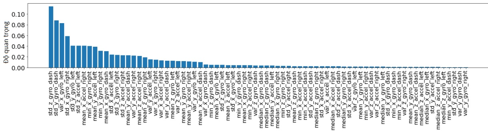

Tên đặc trưng

Hình 2.9. Xếp hạng 76 đặc trưng được chọn bởi thuật toán HFW-RF

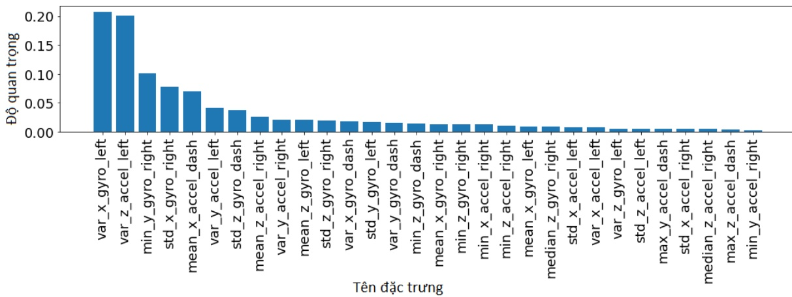

Hình 2.10. Xếp hạng 30 đặc trưng được chọn bởi thuật toán HFW-GB

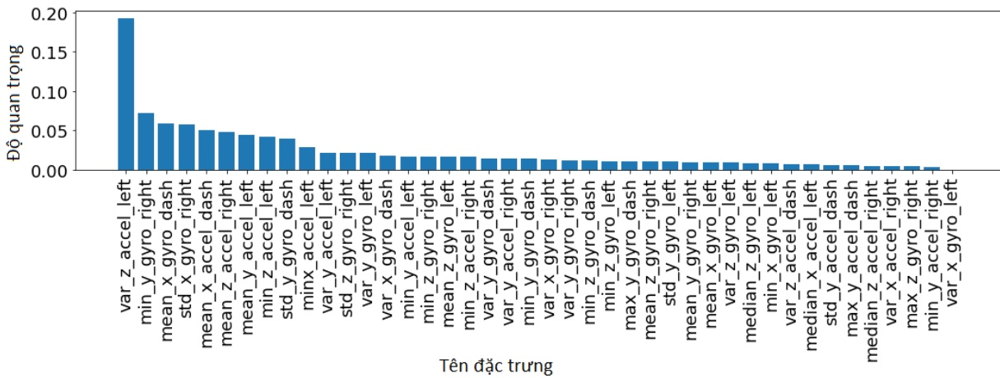

Hình 2.11. Xếp hạng 42 đặc trưng được chọn bởi thuật toán HFW-XGB

Bảng 2.14 trình bày hiệu suất của ba mô hình học máy: Rừng ngẫu nhiên, Tăng cường độ đốc và Tăng cường độ đốc cực đại khi sử dụng 30 đặc trung quan trọng nhất để phân loại mặt đường. Trong số đó, XGBoost cho kết quả vượt trội nhất: đạt độ lặp lại, độ nhạy và điểm F1 đều ở mức 0.99 đối với mặt đường nhựa (Asphalt), đồng thời thể hiện hiệu suất tốt với mặt đường đá cuội

<!-- page: 85 -->

(độ lặp lại 0.94, độ nhạy 0.90, điểm F1 0.92) và đường đất (độ lặp lại 0.89, độ nhạy 0.93, điểm F1 0.91).

Bảng 2.14. Các tham số đánh giá mô hình học máy khi sử dụng 30 đặc trưng

<table><tr><td>Mô hình</td><td>Nhãn mặt đường</td><td>Độ lặp lại</td><td>Độ nhạy</td><td>Điểm F1</td></tr><tr><td rowspan="3">Random Forest</td><td>Mặt đường nhựa</td><td>0.99</td><td>0.98</td><td>0.98</td></tr><tr><td>Mặt đường đá cuội</td><td>0.83</td><td>0.86</td><td>0.85</td></tr><tr><td>Mặt đường đất</td><td>0.86</td><td>0.84</td><td>0.85</td></tr><tr><td rowspan="3">Gradient Boosting</td><td>Mặt đường nhựa</td><td>0.99</td><td>0.98</td><td>0.98</td></tr><tr><td>Mặt đường đá cuội</td><td>0.91</td><td>0.90</td><td>0.90</td></tr><tr><td>Mặt đường đất</td><td>0.88</td><td>0.91</td><td>0.89</td></tr><tr><td rowspan="3">XGBoost</td><td>Mặt đường nhựa</td><td>0.99</td><td>0.99</td><td>0.99</td></tr><tr><td>Mặt đường đá cuội</td><td>0.94</td><td>0.90</td><td>0.92</td></tr><tr><td>Mặt đường đất</td><td>0.89</td><td>0.93</td><td>0.91</td></tr></table>

Gradient Boosting cho kết quả sát sao, với độ chính xác cao trên đường nhựa (độ lặp lại 0.99, độ nhạy 0.98, điểm F1 0.98), và chỉ thấp hơn đôi chút ở các bề mặt khác: đường đá cuội (độ lặp lại 0.91, độ nhạy 0.90, điểm F1 0.90) và đường đất (độ lặp lại 0.88, độ nhạy 0.91, điểm F1 0.89).

Random Forest mặc dù hoạt động tốt trên mặt đường nhựa (độ lặp lại 0.99, độ nhạy 0.98, điểm F1 0.98), nhưng lại cho thấy hiệu suất yếu hơn đáng kể đối với mặt đường đá cuối (độ lặp lại 0.83, độ nhạy 0.86, điểm F1 0.85) và đường đất (độ lặp lại 0.86, độ nhạy 0.84, điểm F1 0.85).

Tổng thể, XGBoost chứng minh được tính ổn định và hiệu suất cao nhất trên tất cả các loại bề mặt, tiếp theo là Gradient Boosting, trong khi Random Forest tổ ra kém hiệu quả hơn, đặc biệt với mặt đường đá cuội (Bảng 2.15). Ngoài ra, nghiên cứu cũng đã giải quyết mối quan ngại về khả năng thích ứng của cửa sở trượt cổ định bằng cách đánh giá các kích thước cửa sở khác nhau (từ 2 đến 6 giây ở tốc độ lấy mẫu 100 Hz). Kết quả chỉ ra rằng sự khác biệt về độ chính xác phân loại giữa các kích thước này là không đáng kể, cho thấy cửa sở cổ định có thể cung cấp độ phân giải thời gian phù hợp để ghi lại các mẫu rung động liên quan.

<!-- page: 86 -->

Bảng 2.15. Các ma trận nhằm lẫn

a. Ma trận nhằm lẫn khi sử dụng thuật toán Random Forest.

| Mặt đường đất | 380 | 94 | 2 |
| --- | --- | --- | --- |
| Mặt đường đá cuội | 78 | 397 | 1 |
| Mặt đường nhựa | 8 | 1 | 467 |

b. Ma trận nhằm lẫn khi sử dụng thuật toán Gradient Boosting.

| Mặt đường đất | 432 | 42 | 2 |
| --- | --- | --- | --- |
| Mặt đường đá cuối | 39 | 435 | 2 |
| Mặt đường nhựa | 3 | 1 | 472 |

<!-- page: 87 -->

c. Ma trận nhằm lẫn khi sử dụng thuật toán XGBoost.

| Mặt đường đất | 442 | 33 | 1 |
| --- | --- | --- | --- |
| Mặt đường đá cuối | 34 | 440 | 2 |
| Mặt đường nhựa | 3 | 2 | 471 |

Cửa số kích thước cố định mang lại nhiều lợi ích thiết thực, đặc biệt trong bối cảnh triển khai trên các hệ thống thời gian thực. Ủy điểm nổi bật của phương pháp này bao gồm tính đơn giản trong tính toán, độ trẻ xử lý có thể dự đoán trước, dễ dàng triển khai cũng như tính ổn định khi áp dụng trong nhiều điều kiện lái xe khác nhau. Mặc dù việc sử dụng các cửa sổ thích ứng hoặc cửa sổ nhận biết ngữ cảnh có tiềm năng cải thiện thêm độ chính xác, nhưng những phương pháp này lại đi kèm với chi phí tính toán và độ phức tạp cao hơn. Do đó, xét trên khóa cạnh cân bằng giữa hiệu năng và khả năng triển khai thực tiễn, cửa sổ kích thước cố định vẫn là lựa chọn phù hợp hơn cho các ứng dụng giám sát mặt đường theo thời gian thực trên hệ thống nhưng trong xe.

So sánh với một số nghiên cứu liên quan cùng sử dụng tập dữ liệu PVS cho bài toán phân loại mặt đường, Menegazzo, J. [10] và Sakorn Mekruksavanich [13] đều sử dụng các mô hình học sâu như CNN, LSTM hoặc CNN-LSTM với độ chính xác cao là 93,1 % và 96 % tương ứng, mô hình LSTM 4 ở thực nghiệm này cũng đạt được kết quả tương đương với độ chính xác đến 94,74%, tuy các mô hình học sâu đã chứng minh về hiệu năng phân loại với độ

<!-- page: 88 -->

chính xác tương đối cao nhưng lại không phù hợp để triển khai trên các thiết bị có hiệu năng thấp, bởi các mô hình này yêu cầu các phép tính toán, bộ nhớ phải đủ lớn, đặc biệt là khó khả thi khi triển khai trên các thiết bị sử dụng vi điều khiển nhúng. Kết quả sử dụng mô hình XGBoost, kết hợp các phương pháp tiền xử lý, trích chọn đặc trưng tối ưu đã đạt được độ chính xác 94,2% là tương đương với các phương pháp sử dụng học sâu. Mô hình XGBoost sử dụng số lượng ít đặc trưng sẽ giúp giám chi phí tính toán và hoàn toàn có thể triển khai trên các thiết bị nhúng có tài nguyên hạn chế. Từ các kết quả thực hiện trên bộ dữ liệu PVS có thể thấy rằng, kết quả phân loại khi sử dụng cả hai loại mô hình học máy và học sâu đạt độ chính xác tương đối cao, tuy nhiên sự nhằm lẫn trong việc nhận dạng các loại mặt đường có đặc tính tương đồng vẫn còn là khó khăn (giữa đường đất và đường đá cuội), bởi các tác động chính khi di chuyển là rung xóc của các loại mặt đường này là tương đối giống nhau và sự khác biệt chưa rõ rệt khi so với mặt đường nhựa.

## 2.7. Kết luận Chương 2

Trong chương 2 này đã đề xuất một thuật toán để lựa chọn tập con các đặc trưng phù hợp nhất cho các mô hình học máy được sử dụng trong phân loại mặt đường. Kết quả thu được cho thấy việc sử dụng tất cả các đặc trưng có sẵn có thể dẫn đến tính toán kém hiệu quả, gây ra việc sử dụng bộ nhớ CPU không cần thiết và thời gian huấn luyện mô hình dài hơn. Bằng cách lựa chọn bộ đặc trưng tối ưu, chúng ta có thể cải thiện đáng kể thời gian thực thi của mô hình và dung lượng bộ nhớ dành cho thiết bị có hiệu năng thấp, giúp các mô hình phù hợp hơn với các ứng dụng thời gian thực. Đánh giá các mô hình học máy để giám sát chất lượng đường bộ cho thấy mặc dù cả ba mô hình: Rừng ngẫu nhiên, Tăng cường độ đốc và Tăng cường độ đốc cực đại đều có thể thực hiện nhiệm vụ, nhưng Tăng cường độ đốc cực đại nổi bật là mô hình hiệu quả nhất nhờ độ chính xác vượt trội, cân bằng giữa độ chính xác và khả năng thu hồi và thời gian huấn luyện hiệu quả. Các mô hình học máy thực nghiệm của công trình này chứng minh rằng việc sử dụng một tập đặc trưng nhỏ giúp cải thiện thời gian thực hiện do số lượng phép tính giảm. Nhu cầu tính toán thấp cho thấy bài toán phân loại mặt đường sử dụng cảm biến quán tính có thể được triển khai đầy đủ trên các bộ vi điều khiển hiệu năng thấp. Cách tiếp cận này giúp giảm

<!-- page: 89 -->

chi phí đồng thời đáp ứng các yêu cầu về cân bằng giữa độ chính xác và thực thi mô hình theo thời gian thực.

Nghiên cứu trong chương 2 này chứng minh rằng việc lựa chọn các đặc trung có ý nghĩa rất hiệu quả trong phân loại mặt đường. Tuy nhiên, việc tối ưu hóa chi phí có thể được cải thiện hơn nửa thông qua việc giảm thiểu phần cứng. Dựa trên những phát hiện này, trong Chương 3 sẽ tập trung vào việc sử dụng ít cảm biến quán tính để thu thập dữ liệu ở các bối cảnh mặt đường thường gặp, trong khi vẫn duy trì độ chính xác phân loại cao, cho phép các thiết bị nhưng phân loại mặt đường theo thời gian thực.

Kết quả của thuật toán trích chọn đặc trưng lai lọc-bao đề xuất đã được công bố tại công trình [CT1]. Bước tiền xử lý dữ liệu đã được khảo sát, thử nghiệm trong công bố tại công trình [CT2] [CT3] trong phần “Danh mục các công trình của tác giả”.

<!-- page: 90 -->

## CHƯƠNG 3: XÂY DỰNG THIẾT BỊ GIÁM SÁT MẶT ĐƯỜNG

Trong Chương 2, chúng ta đã thấy rằng lựa chọn các đặc trung có ích giúp cho nâng cao hiệu năng phân loại và có thể triển khai trên các thiết bị phần cứng thấp. Tuy nhiên hiện nay mới chỉ có bộ dữ liệu PVS được công bố, ba loại mặt đường ở bộ dữ liệu này là tương đối khác biệt và cũng chưa phản ánh các mặt đường thường gặp trong môi trường giao thông hiện nay. Trong Chương 3 này, sẽ hướng đến quy trình xử lý dữ liệu cảm biến trên thiết bị điện toán biên, xây dựng thiết bị điện toán biên góp phần xây dựng một khâu trong hệ thống giám sát đường End-to-End độc lập, chi phí thấp. Nhò thiết bị này đã xây dựng hai Bộ Dữ liệu Thực địa đầu tiên tại Việt Nam: Bộ dữ liệu 3 loại mặt đường phổ biến, cung cấp cơ sở dữ liệu xác thực cho các nghiên cứu tương lai (dữ liệu cảm biến gia tốc, vận tốc góc, vị trí) và Bộ dữ liệu về các ổ gà trên mặt đường. Trên thiết bị này, đã thực thi mô hình phân loại hiệu quả nhất (XGBoost) với độ chính xác cao có thể Triển khai Thời gian Thực (Real-time Deployment Architecture). Kết quả của Chương 3 đã được công bố tại công trình [CT4, CT5] trong phần “Danh mục các công trình của tác giả”.

## 3.1. Mô hình hệ thống giám sát

Qua các nghiên cứu về bài toán phân loại mặt đường, việc triển khai hệ thống giám sát mặt đường dựa trên cảm biến quán tính vẫn đối mặt với một số thách thức quan trọng:

\- Thách thức 1: Độ chính xác phân loại còn hạn chế khi chỉ sử dụng một gia tốc kế và một con quay hồi chuyển, do đó khả năng nhận dạng chính xác các loại mặt đường khác nhau chưa cao.

\- Thách thức 2: Giới hạn năng lượng trong các hệ thống IoT thời gian thực. Các thuật toán phức tạp có thể tiêu tổn năng lượng đáng kể, làm giảm thời gian hoạt động của thiết bị, đời hồi phải tối ưu quy trình xử lý và lựa chọn thuật toán.

\- Thách thức 3: Tối ưu hóa đồng thời giữa thuật toán, đặc trưng và cửa số dữ liệu nhằm cân bằng giữa hiệu suất phân loại và chi phí tính toán.

Từ đó ý tưởng đề xuất của nghiên cứu này một hệ thống phân loại mặt đường dựa trên nền tảng IoT, hướng tới khả năng phát hiện và giám sát mặt đường trong bối cảnh thời gian thực. Sơ đồ khối của mô hình hệ thống giám sát mặt đường được mô tả như trong Hình 3.1, các thành phần chính của hệ thống

<!-- page: 91 -->

giám sát bao gồm: Xe ô tô có gắn thiết bị giám sát mặt đường (10); Hệ thống máy chủ để truyền/nhận dữ liệu (100); Bản đồ số của hệ thống để lưu lại các đoạn đường đã được giám sát (11); các thiết bị ngoại vi có thể truy cập vào bản đồ số để lấy thông tin (laptop (110A); điện thoại (110B); máy tính (110C)...)


Hình 3.1. Sơ đồ khối hệ thống giám sát mặt đường theo thời gian thực.

Phần cứng của hệ thống theo mô hình này được chia thành hai phần chính: phần một là thiết bị được gắn trên xe giao thông (10) nhằm đo đạc dữ liệu về cảm biến quán tính (độ rung, xóc, góc quay) và dữ liệu định vị (vận tốc, tọa độ, thời gian), kết hợp với các thông số của xe và cảm biến khác (mã số, trọng lượng xe, áp suất lốp, đường kính bánh xe, nhiệt độ, độ ẩm...) khi di chuyển trên đường; phần hai là phần thu tín hiệu, lưu trữ và xử lý dữ liệu thu được. Cụ thể là:

(i) Phần một gồm một thiết bị là: thiết bị đo để đo gia tốc, vận tốc góc, góc hướng, v.. khi xe di chuyển trên đường giao thông kết hợp với các dữ liệu của hệ thống định vị GNSS (vị trí, tốc độ, thời gian thực).

<!-- page: 92 -->

Thiết bị sẽ sử dụng các dữ liệu đầu vào đo được để đưa ra các phân loại về tình trạng mặt đường hiện tại, kết quả phân loại kèm theo thông tin thời gian được đồng thời cập nhật lên dữ liệu của máy chủ (100) để chia sẻ tới các thiết bị khác trong mạng lưới (110A; 110B; 110C).

(ii) Phân hai là máy chủ gồm máy tính (100) với phần mềm nhận kết quả phát hiện mặt đường theo vị trí và thời gian từ các thiết bị gắn trên xe. Phân mềm sẽ lưu lại thông tin mặt đường có nhân thời gian gần nhất trên bản đồ số (11) và dữ liệu này sẽ được cập nhật lại cho các thiết bị khác. Các thiết bị kết nối internet có thể truy cập vào hệ thống bản đồ số để biết về thông tin tình trạng mặt đường.

Chức năng của hệ thống sẽ gồm:

\- Nhận diện được hiện trạng mặt đường tại một thời điểm xác định;

\- Gán thông tin hiện trạng mặt đường với vị trí của xe tại thời điểm đó. Một khung dữ liệu được gửi từ thiết bị về máy chủ sẽ bao gồm: thời gian, vị trí, tình trạng mặt đường tương ứng với vị trí.

Cấu trúc khung dữ liệu truyền từ thiết bị đầu cuối lên máy chủ được minh họa như Hình 3.2 dưới đây.

| ID | Time | Position | Speed | Ax | Ay | Az | Gx | Gy | Gz | RS |
| --- | --- | --- | --- | --- | --- | --- | --- | --- | --- | --- |

Hình 3.2. Cấu trúc khung dữ liệu.

Trong đó:

ID: Sẽ mang số hiệu và các thông tin của xe như: loại xe, cỡ xe...

Time: Thời gian thực hiện thu thập, giám sát mặt đường.

Position: Vị trí của xe, cung cấp các thông tin về kinh độ, vĩ độ theo hệ toạ độ WGS-84.

Speed: Tốc độ xe chạy theo đơn vị m/s hoặc km/h.

Ax: Giá trị gia tốc theo trực X, đơn vị g;

Ay: Giá trị gia tốc theo trực Y, đơn vị g;

Az: Giá trị gia tốc theo trực Z, đơn vị g;

Gx: Giá trị góc quay theo trực X, đơn vị %;

Gy: Giá trị góc quay theo trực Y, đơn vị %;

Gz: Giá trị góc quay theo trực Z, đơn vị °/s;

RS: nhân mặt đường được dự đoán tại thiết bị đầu cuối.

<!-- page: 93 -->

Nghiên cứu này tập trung vào việc xây dựng thiết bị lắp đặt trên các phương tiện giao thông, phương pháp xử lý để kết hợp các loại dữ liệu: gia tốc, vận tốc góc, vị trí và thời gian khi di chuyển ở các mặt đường khác nhau và máy chủ lưu cơ sở dữ liệu về các trạng thái mặt đường. Thiết bị phân loại, phát hiện tình trạng mặt đường sử dụng học máy sẽ sử dụng các dữ liệu đầu vào đo được để đưa ra các phân loại về tình trạng mặt đường hiện tại, kết quả phân loại kèm theo thông tin thời gian được đồng thời cập nhật lên dữ liệu của máy chủ đề chia sẻ tới các bộ thiết bị khác trong mạng.

Một ưu điểm nổi bật của hệ thống giám sát mặt đường (Hình 3.1) là khả năng tự làm giàu dữ liệu. Khi một phương tiện mới tham gia vào hệ thống, thiết bị gắn trên xe sẽ dựa vào các cung đường đã được dán nhân sẵn trên bản đồ số để tự động thu thập dữ liệu. Các dữ liệu này được truyền về máy chủ đề huấn luyện lại các mô hình học máy phù hợp. Sau đó, mô hình cập nhật sẽ được áp dụng ngược lại cho các xe có đặc tính tương tự. Nhò cơ chế này, hệ thống có thể dễ dàng mở rộng từ một nhóm nhỏ ban đầu sang nhiều chủng loại xe khác nhau. Điều này giúp tổng quát hóa mô hình vì mỗi loại xe có đặc tính rung xóc riêng biệt, chẳng hạn như xe tải xóc hơn xe con, hay xe xăng chịu nhiều động cơ lớn hơn xe điện hoặc trong các điều kiện môi trường, điều kiện vận hành khác nhau.

Thiết bị xử lý để kết hợp các loại dữ liệu: gia tốc, vận tốc góc, vị trí và thời gian khi di chuyển ở các mặt đường khác nhau và máy chủ lưu cơ sở dữ liệu về các trạng thái mặt đường, chức năng của hệ thống gồm: nhận diện được hiện trạng mặt đường tại một thời điểm xác định; và gán thông tin hiện trạng mặt đường với vị trí của xe tại thời điểm đó;

Các đề xuất chính có thể được tóm tắt như sau:

\- Xây dựng một thiết bị phần cứng gắn trên xe, là một khâu trong hệ thống giám sát mặt đường theo thời gian thực, có chi phí thấp.

\- Thu thập bộ dữ liệu thực tế tại Việt Nam với 3 loại mặt đường thường gặp: đường nhựa dưới 10 năm tuổi có chất lượng khá, đường nhựa trên 15 năm tuổi có chất lượng trung bình và đường bê tông chất lượng mặt đường kém.

\- Thu thập bộ dữ liệu thực tế của các ô gà trên mặt đường.

\- Tiến hành so sánh hiệu suất giữa ba thuật toán học máy phổ biến—Random Forest (RF), Gradient Boosting Machine (GBM) và XGBoost—

<!-- page: 94 -->

trên cùng một bộ dữ liệu được thu thập trực tiếp từ thực nghiệm, nhằm đánh giá tính hiệu quả và khả năng áp dụng trong các điều kiện thực tế.

\- Ứng dụng kỹ thuật Loại bỏ Đặc trung Độ quy (Recursive Feature Elimination – RFE) để xác định số lượng đặc trung tối ưu, qua đó giám độ phức tạp mô hình và rút ngắn thời gian huấn luyện mà vẫn duy trì được độ chính xác cao. Kết quả thực nghiệm cho thấy chỉ cần khoảng 27 đặc trung là đủ để đạt hiệu suất gần tương đương với mô hình sử dụng toàn bộ tập đặc trung, đảm bảo tính khả thi khi những mô hình học máy vào thiết bị có tài nguyên hạn chế.

## 3.2. Thiết bị thu thập dữ liệu và giám sát mặt đường

## 3.2.1. Cấu hình thiết bị phần cứng

Hệ thống giám sát mặt đường dựa trên IoT được thiết kế nhằm phát hiện sớm các vấn đề về chất lượng mặt đường và gửi cảnh báo kịp thời đến thiết bị quản lý hoặc trung tâm điều khiển. Hình 3.3 minh họa kiến trúc tổng thể của thiết bị. Trong đó, thiết bị được lấy nguồn điện áp hoạt động trực tiếp từ xe ô tô với chuẩn điện áp 5VDC, bộ vi xử lý chính là ESP32 kết nối với máy chủ thông qua truyền thông không dây Bluetooth hoặc Wifi, các thiết bị ngoại vi như module GPS, cảm biến quán tính, bộ nhớ cục bộ sẽ được kết nối với vi xử lý chính ESP32.

Khi có kết nối mạng, ESP32 sẽ gửi bản tóm tắt sự kiện thông qua Wi-Fi hoặc Bluetooth Low Energy (BLE) tới máy chủ, từ đó hỗ trợ việc giám sát và phân tích từ xa, cập nhật thông tin lên bản đồ số. Đề đảm bảo việc gắn nhân chính xác cho dữ liệu chuyển động, nhóm nghiên cứu còn tích hợp và đồng bộ video từ camera hành trình trong quá trình thu thập dữ liệu. Việc đồng bộ này cung cấp bằng chứng trực quan cho các sự kiện bất thường, giúp nâng cao độ tin cậy của bộ dữ liệu huấn luyện và kiểm thử mô hình phân loại mặt đường.

<!-- page: 95 -->

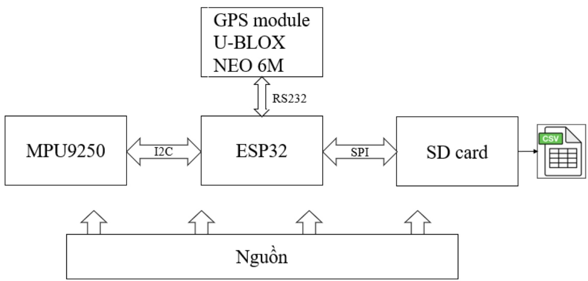

Hình 3.3. Sơ đồ khối thiết bị giám sát mặt đường dựa trên IoT.
Module ESP32

Kit Wifi BLE ESP32 NodeMCU-32S CH340 Ai-Thinker được phát triển trên nền Vi điều khiển trung tâm là ESP32 SoC với công nghệ Wifi, BLE và kiến trúc ARM mới nhất hiện nay, với ưu điểm là cách sử dụng dễ dàng, chi phí thấp, thích hợp với các nghiên cứu, ứng dụng về Wifi, BLE, IoT và điều khiển, thu thập dữ liệu qua mạng, với đầy đủ các IO như UART; SPI; SDIO; I2C; RS232 để kết nối đến các thiết bị ngoại vi. ESP32 là bộ vi xử lý chính trong thiết bị thu thập dữ liệu và giám sát mặt đường với bộ nhớ FLASH 4 MB.

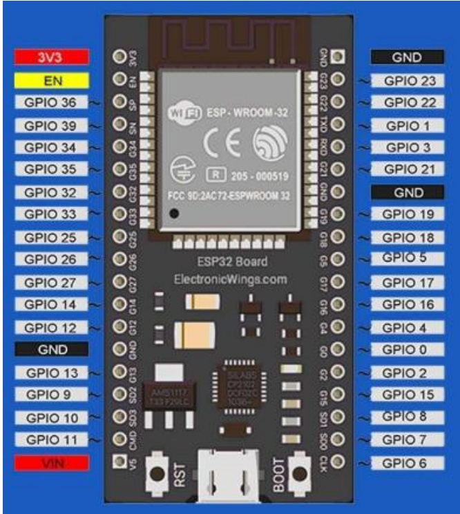

<!-- page: 96 -->

## Module định vị GPS

Module GPS NEO-UBLOX-6M V2, hoạt động với điện áp 3.3V, Module có ăng-ten bằng sứ, có EEPROM lưu tham số cấu hình khi mất nguồn, có pin dự phòng lưu dữ liệu, hỗ trợ giao tiếp truyền thông nổi tiếp RS232 với vi xử lý ESP32. Module GPS cung cấp các thông tin dữ liệu về định vị, vận tốc, thời gian thu thập dữ liệu của thiết bị.

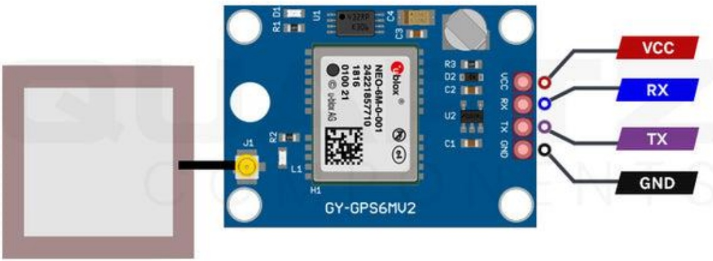

## Cảm biến MPU9250

Module MPU9250 là cảm biến chuyển động tiên tiến, tích hợp 3 trực gia tốc, 3 trực con quay hồi chuyển, và 3 trực từ kế dựa trên chip MPU-9250 của hãng InvenSense. Cảm biến này cung cấp dữ liệu chính xác về các giá trị rung động của thiết bị khi di chuyển qua các mặt đường khác nhau với độ phân giải lên tới 16-bit. Cảm biến hỗ trợ giao tiếp I2C hoặc SPI để kết nối tới bộ vi xử lý ESP32. Cảm biến hỗ trợ phạm vi đo ±2g/±4g/±8g/±16g đối với gia tốc và ±250/±500/±1000/±2000°/giây đối với vận tốc góc, phù hợp để phát hiện các dao động thân xe, va chậm ngắn hạn và rung động mặt đường.


<!-- page: 97 -->

## 3.2.2. Môi trường thí nghiệm

Các thí nghiệm được tiến hành tại các cung đường ở khu vực thành phố Hà Nội, và tỉnh Thái Nguyên, trên cả đường đô thị và ngoại ô. Đây là khu vực có khí hậu nhiệt đối gió mùa với sự biến động lớn về nhiệt độ và độ ẩm, khiển mặt đường dễ bị xuống cấp và hư hỏng. Phương tiện khảo sát là một chiếc xe sedan cỡ nhỏ, được vận hành trong điều kiện giao thông thực tế để phần ánh các đặc điểm rung động sát với môi trường sử dụng. Thiết bị có kích thước (85×35×35) mm được gắn ở giữa trực trung tâm trên nốc xe như mô tả trong Hình 3.4.

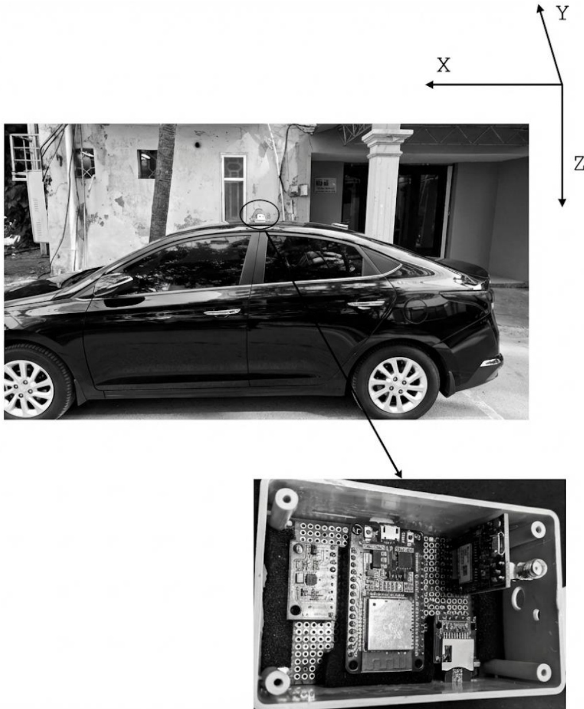

Hình 3.4. Lắp đặt thiết bị trên xe thu thập dữ liệu.

Thiết bị thu thập dữ liệu được gắn chắc chắn tại vị trí giữa chiều dài cơ sở của xe nhằm giảm thiểu sai số do rung lắc cơ học. Thiết bị sử dụng MPU-

<!-- page: 98 -->

9250, một cảm biến IMU 9 trục (bao gồm gia tốc kế 3 trục, con quay hồi chuyển 3 trục và từ kế 3 trục).

Dữ liệu được lấy mẫu với tần số 50 Hz, truyền từ MPU9250 sang ESP32 thông qua giao thức I2C. Bộ vi điều khiển ESP32 (32-bit, tích hợp Wi-Fi/BLE) đảm nhiệm tiền xử lý thời gian thực, bao gồm:

i. Lọc thông thấp để loại bổ nhiều tàn số cao,

ii. Hiệu chuẩn lại giá trị cẩm biến để tránh các sai số tích lũy theo thời gian, iii. Chuẩn hóa khung tọa độ để đảm bảo tính thống nhất của dữ liệu.

Sau khi xử lý sơ bộ, dữ liệu được đóng gói thành các khung thời gian và ghi liên tục vào thể SD dưới dạng file .csv (giao tiếp qua SPI) nhằm tránh mất mát dữ liệu khi mất kết nối với máy chủ. Khi phát hiện rung động bất thường, hệ thống tạo một nhật ký sự kiện chứa thời gian, chỉ số rung động, loại mặt đường và toạ độ GPS, sau đó tải dữ liệu này lên máy chủ khi có kết nối Wi-Fi. Chi tiết về cấu hình thu thập dữ liệu được nêu trong Bảng 3.1.

Bảng 3.1. Cấu hình cài đặt thiết bị

| Loại xe Sedan 4 chỗ: | Accent |
| --- | --- |
| Áp suất lốp xe | 2.3 bar |
| Dải giá trị gia tốc trên cảm biến MPU9250 | ±8g |
| Dải giá trị góc quay trên cảm biến MPU9250 | ±1000°/giây |
| Tần số lấy mẫu | 50 Hz |
| Định dạng lưu dữ liệu lưu trữ | *.csv |

Hình 3.5 dưới đây mô tả quy trình của một quá trình thu thập dữ liệu. Ô bước đầu tiên là việc lắp đặt thiết bị trên nóc xe và kiểm tra độ chắc chắn của thiết bị, sau đó thiết bị được cấp nguồn để khởi động và kiểm tra các thông số cải đặt cũng như các thiết bị ngoại vi. Quá trình thu thập dữ liệu được thực hiện sau khi thiết bị hoạt động bình thường và tín hiệu GPS đã kết nối thành công. Code những vi điều khiển trên thiết bị thu thập dữ liệu được trình trong Phụ lục của Luận án.

<!-- page: 99 -->

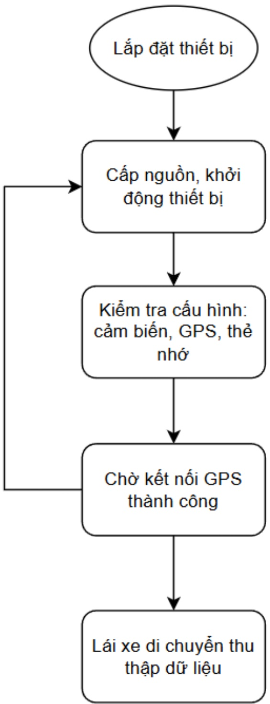

Hình 3.5. Quy trình thực hiện thu thập dữ liệu.

Bảng 3.2 mô tả chi tiết các lớp nhận được sử dụng trong nghiên cứu. Đề gắn nhân chính xác, dữ liệu thu được từ IMU đã được đồng bộ hóa với video từ camera hành trình, giúp đảm bảo tập dữ liệu huấn luyện và kiểm thử có chất lượng cao và ít nhiều nhận.

<!-- page: 100 -->

Bảng 3.2. Giải thích về nhân dữ liệu

| Nhãn | Giải thích |
| --- | --- |
| Roadtype_0 | Mặt đường nhựa phẳng dưới 10 năm tuổi (dựa vào quan sát thực tế, nhận định chất lượng mặt đường khá tương ứng theo thang đo của PCI trong Bảng 1.1) |
| Roadtype_1 | Mặt đường nhựa phẳng trên 15 năm tuổi (dựa vào quan sát thực tế, nhận định chất lượng mặt đường trung bình tương ứng theo thang đo của PCI trong Bảng 1.1) |
| Roadtype_2 | Mặt đường bê tông (dựa vào quan sát thực tế, nhận định chất lượng mặt đường kém tương ứng theo thang đo của PCI trong Bảng 1.1) |
| Pothole | Ở gà trên mặt đường có chất lượng trung bình |

## 3.2.3. Thu thập dữ liệu

Trong thực nghiệm này, mỗi tuyến khảo sát tương ứng với một loại mặt đường và được gán một mã định danh duy nhất. Hệ thống đo lường bao gồm cảm biến quán tính MPU-9250 được gắn cố định trên xe khảo sát, kết hợp với vi điều khiển ESP32 và thể nhớ SD để ghi dữ liệu. MPU-9250 đồng thời đo gia tốc ba trực (Ax, Ay, Az) và vận tốc góc ba trực (Gx, Gy, Gz), cung cấp dữ liệu quán tính toàn diện cho phân tích.

Dữ liệu cảm biến được lấy mẫu ở tần số 50 Hz cho mỗi trực, tương đương 150 mẫu mỗi giây cho mô-đun gia tốc kế và 150 mẫu mỗi giây cho mô-đun con quay hồi chuyển. Ngoài ra, các thông tin bổ sung được ghi nhận bao gồm: tọa độ GPS (Vĩ độ, Kinh độ), quảng đường di chuyển, độ cao (Alt), tốc độ (Speed), số vệ tinh (Sats) và tình trạng mặt đường (ROADSURFACE). Các nhân tình trạng mặt đường được gắn trực tiếp trong quá trình khảo sát nhằm tạo bộ dữ liệu có giám sát.

ESP32 đảm nhận việc đóng gói dữ liệu trước khi lưu trữ, bao gồm các thành phần: gia tốc, vận tốc góc, thời gian lấy mẫu và dữ liệu GPS (đồng bộ theo chu kỳ 1 giây). Tất cả dữ liệu này được ghi liên tục lên thể SD nhằm tránh mất mát trong trường hợp không có kết nối mạng tại hiện trường. Khi có kết nối Wi-Fi, các khối dữ liệu được truyền tới máy chủ đề phục vụ lưu trữ và phân tích lâu dài.

<!-- page: 101 -->

Thông qua các phiên thử nghiệm với nhiều tần số khác nhau, nghiên cứu nhận thấy rằng tần số lấy mẫu 50 Hz là tối ưu: vừa đủ để ghi lại các dao động nhanh và rung động ngắn hạn của xe khi đi qua bề mặt không bằng phẳng, vừa đảm bảo hiệu quả tính toán.

Bảng 3.3 Bảng 3.4 Bảng 3.5 minh họa dữ liệu mẫu thu được từ gia tốc kế và con quay hồi chuyển đổi với loại mặt đường có chất lượng khá (Roadtype\_0), chất lượng trung bình (Roadtype\_1) và chất lượng kém (Roadtype\_2) tương ứng và Hình 3.6 mô tả cung đường di chuyển với các nhân của 3 loại mặt đường đã thu thập được.

Bảng 3.3. Dữ liệu cảm biến trên mặt đường nhựa chất lượng khá

<table><tr><td colspan="6">Roadtype_0</td></tr><tr><td>Ax</td><td>Ay</td><td>Az</td><td>Gx</td><td>Gy</td><td>Gz</td></tr><tr><td>0.02</td><td>0.03</td><td>-1.01</td><td>0.18</td><td>-1.77</td><td>0.02</td></tr><tr><td>0.01</td><td>0</td><td>-1.03</td><td>0.73</td><td>-1.46</td><td>0.01</td></tr><tr><td>0.08</td><td>0.06</td><td>-1.01</td><td>0.55</td><td>-0.37</td><td>0.08</td></tr><tr><td>0.03</td><td>0.09</td><td>-0.92</td><td>0.67</td><td>-0.18</td><td>0.03</td></tr><tr><td>0.07</td><td>0.09</td><td>-0.92</td><td>0.85</td><td>-1.22</td><td>0.07</td></tr><tr><td>-0.02</td><td>0.1</td><td>-0.84</td><td>1.34</td><td>-1.77</td><td>-0.02</td></tr><tr><td>-0.05</td><td>0.08</td><td>-1.03</td><td>1.59</td><td>-4.33</td><td>-0.05</td></tr><tr><td>0.04</td><td>-0.01</td><td>-1.08</td><td>2.62</td><td>-2.5</td><td>0.04</td></tr><tr><td>0.11</td><td>0.13</td><td>-1.06</td><td>2.32</td><td>-1.65</td><td>0.11</td></tr><tr><td>0.03</td><td>0.06</td><td>-1.02</td><td>2.01</td><td>-1.1</td><td>0.03</td></tr><tr><td>0.11</td><td>0.12</td><td>-0.98</td><td>-0.24</td><td>0.18</td><td>0.11</td></tr><tr><td>0.14</td><td>0.05</td><td>-1.04</td><td>0.31</td><td>-2.14</td><td>0.14</td></tr><tr><td>0.03</td><td>0.04</td><td>-1.03</td><td>0</td><td>-2.5</td><td>0.03</td></tr><tr><td>0.05</td><td>0.03</td><td>-1.07</td><td>0.61</td><td>-1.89</td><td>0.05</td></tr><tr><td>-0.02</td><td>0.09</td><td>-0.99</td><td>1.1</td><td>-2.08</td><td>-0.02</td></tr><tr><td>0.01</td><td>0.06</td><td>-1.04</td><td>0.79</td><td>-3.54</td><td>0.01</td></tr><tr><td>0.08</td><td>0.09</td><td>-1.03</td><td>0.61</td><td>-0.43</td><td>0.08</td></tr><tr><td>-0.04</td><td>-0.03</td><td>-1.02</td><td>1.28</td><td>-2.44</td><td>-0.04</td></tr><tr><td>-0.01</td><td>0.06</td><td>-0.94</td><td>1.59</td><td>-3.17</td><td>-0.01</td></tr><tr><td>0.08</td><td>0.06</td><td>-0.98</td><td>1.4</td><td>-2.26</td><td>0.08</td></tr><tr><td>-0.08</td><td>0.13</td><td>-0.96</td><td>0.49</td><td>-3.91</td><td>-0.08</td></tr></table>

<!-- page: 102 -->

Bảng 3.4. Dữ liệu cảm biến trên mặt đường nhựa chất lượng trung bình

<table><tr><td colspan="6">Roadtype_1</td></tr><tr><td>Ax</td><td>Ay</td><td>Az</td><td>Gx</td><td>Gy</td><td>Gz</td></tr><tr><td>-0.08</td><td>-0.1</td><td>-0.98</td><td>2.87</td><td>-6.04</td><td>0.12</td></tr><tr><td>-0.1</td><td>-0.01</td><td>-0.97</td><td>4.03</td><td>-7.26</td><td>-0.24</td></tr><tr><td>-0.11</td><td>-0.03</td><td>-0.97</td><td>3.48</td><td>-8.18</td><td>0.06</td></tr><tr><td>0</td><td>0.08</td><td>-1.09</td><td>2.44</td><td>-5.55</td><td>-0.73</td></tr><tr><td>-0.01</td><td>0.11</td><td>-0.91</td><td>0.61</td><td>-5.43</td><td>-0.61</td></tr><tr><td>0.03</td><td>0.11</td><td>-1.01</td><td>1.16</td><td>-3.3</td><td>-0.49</td></tr><tr><td>0.03</td><td>0.11</td><td>-0.97</td><td>0.92</td><td>-4.64</td><td>-0.85</td></tr><tr><td>0.13</td><td>0.06</td><td>-1.09</td><td>1.22</td><td>0.73</td><td>-0.24</td></tr><tr><td>-0.08</td><td>0.02</td><td>-0.9</td><td>1.34</td><td>0.43</td><td>-0.79</td></tr><tr><td>-0.04</td><td>0.03</td><td>-0.87</td><td>1.04</td><td>5</td><td>-0.31</td></tr><tr><td>-0.14</td><td>0.06</td><td>-0.82</td><td>1.1</td><td>4.46</td><td>-0.37</td></tr><tr><td>0.09</td><td>0.1</td><td>-1</td><td>1.95</td><td>3.72</td><td>0</td></tr><tr><td>0.05</td><td>0.09</td><td>-0.99</td><td>0.73</td><td>-1.34</td><td>-0.12</td></tr><tr><td>0</td><td>0.12</td><td>-1.02</td><td>0.12</td><td>-0.24</td><td>-0.06</td></tr><tr><td>0.14</td><td>0.13</td><td>-1.05</td><td>-0.49</td><td>-0.55</td><td>-0.37</td></tr><tr><td>0.04</td><td>0.07</td><td>-0.99</td><td>-1.22</td><td>-0.85</td><td>-0.73</td></tr><tr><td>0.04</td><td>0.08</td><td>-1.03</td><td>-1.65</td><td>-1.95</td><td>-0.49</td></tr><tr><td>-0.01</td><td>0.05</td><td>-0.96</td><td>-1.34</td><td>-2.08</td><td>-1.1</td></tr><tr><td>-0.11</td><td>0.14</td><td>-1.05</td><td>-0.31</td><td>0.12</td><td>-0.49</td></tr><tr><td>-0.05</td><td>0.13</td><td>-1.02</td><td>0</td><td>-1.16</td><td>-0.31</td></tr><tr><td>-0.01</td><td>0.08</td><td>-1.08</td><td>0.43</td><td>-1.65</td><td>-0.18</td></tr><tr><td>-0.09</td><td>0.07</td><td>-1.08</td><td>0.67</td><td>-2.62</td><td>-1.16</td></tr><tr><td>-0.03</td><td>0.03</td><td>-1.07</td><td>2.81</td><td>-2.14</td><td>0.06</td></tr><tr><td>-0.03</td><td>-0.02</td><td>-1.05</td><td>2.69</td><td>-2.44</td><td>0.06</td></tr><tr><td>-0.22</td><td>-0.07</td><td>-1.19</td><td>2.56</td><td>-14.53</td><td>-0.31</td></tr></table>

<!-- page: 103 -->

Bảng 3.5. Dữ liệu cảm biến trên mặt đường chất lượng kém

<table><tr><td colspan="6">Roadtype_2</td></tr><tr><td>Ax</td><td>Ay</td><td>Az</td><td>Gx</td><td>Gy</td><td>Gz</td></tr><tr><td>-0.18</td><td>0.04</td><td>-0.86</td><td>1.65</td><td>0.12</td><td>2.75</td></tr><tr><td>0.01</td><td>-0.01</td><td>-0.92</td><td>2.93</td><td>0.49</td><td>2.93</td></tr><tr><td>-0.09</td><td>0.05</td><td>-0.94</td><td>3.42</td><td>-1.28</td><td>2.38</td></tr><tr><td>0</td><td>0</td><td>-0.98</td><td>4.33</td><td>-0.37</td><td>2.99</td></tr><tr><td>0.03</td><td>-0.12</td><td>-1</td><td>5</td><td>0.24</td><td>3.23</td></tr><tr><td>0.01</td><td>-0.12</td><td>-1.06</td><td>6.04</td><td>1.83</td><td>2.5</td></tr><tr><td>-0.05</td><td>-0.11</td><td>-1.03</td><td>6.35</td><td>-0.12</td><td>2.99</td></tr><tr><td>0.03</td><td>-0.09</td><td>-1</td><td>5.92</td><td>1.22</td><td>2.56</td></tr><tr><td>-0.03</td><td>-0.13</td><td>-1.04</td><td>5.86</td><td>0.73</td><td>2.44</td></tr><tr><td>-0.01</td><td>-0.01</td><td>-0.97</td><td>4.76</td><td>0.67</td><td>2.01</td></tr><tr><td>-0.03</td><td>-0.08</td><td>-0.94</td><td>5.13</td><td>0.49</td><td>2.01</td></tr><tr><td>0.08</td><td>-0.03</td><td>-1.07</td><td>5.31</td><td>2.01</td><td>2.01</td></tr><tr><td>0.06</td><td>0.04</td><td>-1.05</td><td>4.21</td><td>0.12</td><td>2.81</td></tr><tr><td>-0.01</td><td>-0.03</td><td>-1.09</td><td>3.85</td><td>0</td><td>2.38</td></tr><tr><td>0</td><td>0.04</td><td>-1.12</td><td>2.99</td><td>-0.85</td><td>2.81</td></tr><tr><td>-0.01</td><td>0.07</td><td>-0.97</td><td>1.89</td><td>-1.59</td><td>2.38</td></tr><tr><td>-0.06</td><td>0.01</td><td>-0.96</td><td>2.14</td><td>-3.48</td><td>2.62</td></tr><tr><td>-0.01</td><td>-0.05</td><td>-1.02</td><td>1.34</td><td>-2.56</td><td>2.87</td></tr><tr><td>0.08</td><td>0.05</td><td>-1</td><td>2.38</td><td>-1.53</td><td>2.38</td></tr><tr><td>0.04</td><td>-0.02</td><td>-0.98</td><td>2.75</td><td>-4.64</td><td>2.56</td></tr><tr><td>0.09</td><td>-0.01</td><td>-0.93</td><td>2.44</td><td>-3.66</td><td>2.26</td></tr><tr><td>0.11</td><td>0.02</td><td>-0.98</td><td>2.32</td><td>-1.71</td><td>2.2</td></tr><tr><td>0.1</td><td>0.05</td><td>-1.05</td><td>1.1</td><td>-2.81</td><td>1.71</td></tr><tr><td>0.08</td><td>0.05</td><td>-1</td><td>0.85</td><td>-2.14</td><td>1.46</td></tr><tr><td>-0.04</td><td>0.03</td><td>-0.94</td><td>2.38</td><td>-2.93</td><td>2.5</td></tr></table>

<!-- page: 104 -->

Vị trí GPS theo loại mặt đường

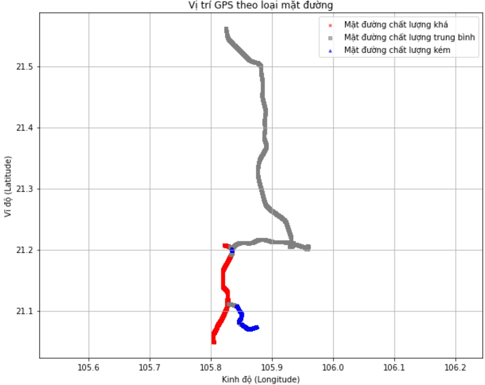

a. Lộ trình thu thập dữ liệu theo tọa độ


b. Mặt đường chất lượng khá (Roadtype\_0)

<!-- page: 105 -->

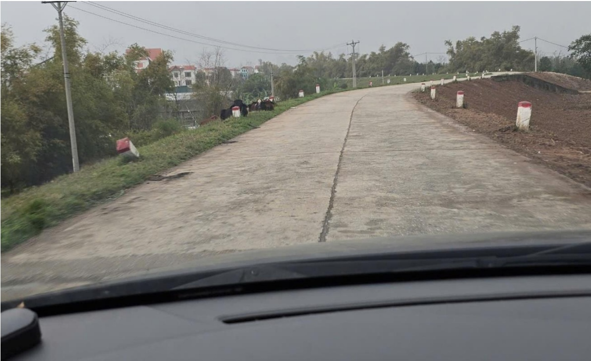

b. Mặt đường chất lượng kém (Roadtype\_2)

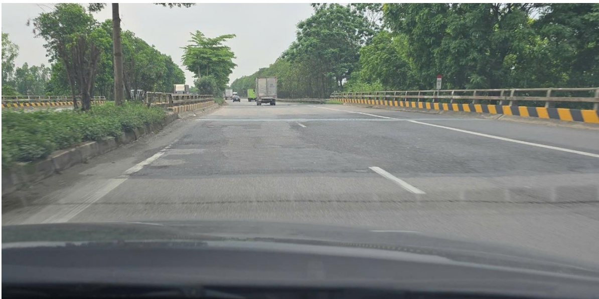

c. Mặt đường chất lượng trung bình (Roadtype\_1)

Hình 3.6. Lộ trình thu thập dữ liệu với các nhân mặt đường tương ứng.

Trong Hình 3.6 các loại mặt đường được gán nhân theo đánh giá của chỉ số PCI, mặt đường chất lượng khá (Roadtype\_0) được thu thập là loại mặt đường nhựa phẳng, có 1 và vị trí vết nứt nhỏ nhưng không ảnh hưởng đến di chuyển (cung đường thu thập là đoạn đường cao tốc Nội Bài – Nhật Tân), mặt đường chất lượng trung bình (Roadtype\_1) là loại mặt đường nhựa có sự xuống cấp nhiều bởi trải qua thời gian dài sử dụng và có nhiều xe tải trọng lớn di chuyển, lái xe cảm nhận rõ rệt sự rung xóc khi di chuyển (cung đường thu thập là đoạn đường Quốc lộ 18 và Quốc lộ 3), mặt đường chất lượng kém

<!-- page: 106 -->

Cung đường thu thập dữ liệu ô gà

(Roadtype\_2) là loại mặt đường bê tông, gồ ghề, lái xe di chuyển với sự rung xóc mạnh, vận tốc khi di chuyển thường không quá được 60 km/h (đoạn đường thu thập là đường đề ven sông Hồng được trải thẩm bê tông).

Bộ dữ liệu về vị trí các ố gà cũng đã được thu thập, Hình 3.7 dưới đây mô tả về quá trình di chuyển thu thập dữ liệu của cảm biến quán tính về các ố gà hoặc hổ ga trên mặt đường.

\- Thời gian thu thập dữ liệu ẩm gà: ngày 14/12/2025.

\- Địa điểm: Hà Nội.

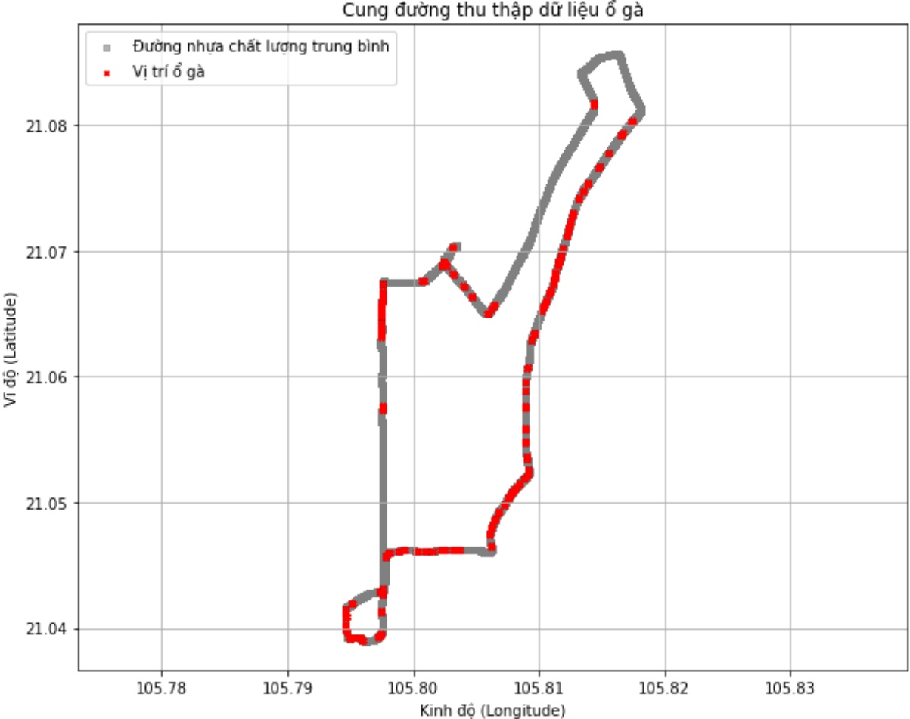

Hình 3.7. Vị trí các ổ gà trên cung đường thu thập dữ liệu.

## 3.2.4. Xây dựng tập dữ liệu

Dữ liệu gia tốc kế và con quay hồi chuyển thu được từ thiết bị gắn trên xe đã được đồng bộ hóa và tổ chức thành các tập dữ liệu phục vụ huấn luyện và đánh giá mô hình. Quá trình này được thực hiện bằng cách chia chuỗi dữ liệu liên tục thành các cửa sổ trượt có độ dài cố định. Trong phần này, các cửa sổ có độ dài 8 giây, 10 giây, 12 giây và 15 giây đã được thử nghiệm nhằm phân tích ảnh hưởng của độ dài cửa sổ đến hiệu suất phân loại.

<!-- page: 107 -->

Các quan sát trong mỗi cửa sổ bao gồm dữ liệu cảm biến thô từ gia tốc kế và con quay hồi chuyển, cùng với nhận loại mặt đường được gán trong giai đoạn khảo sát. Bảng 3.6 và Bảng 3.7 lần lượt trình bày số lượng quan sát tương ứng cho từng loại mặt đường trong tập huấn luyện và tập kiểm tra với độ dài cửa sổ 10 giây.

Đề đảm bảo khả năng tổng quát và độ tin cậy của mô hình, dữ liệu đã được chia thành tập huấn luyện (training set) và tập kiểm tra (test set) theo nhiều tỷ lệ khác nhau. Trong đó, tỷ lệ 60% dữ liệu cho huấn luyện và 40% cho kiểm tra được lựa chọn làm cấu hình chính, vì sự phân chia này cung cấp sự cân bằng hợp lý giữa kích thước dữ liệu huấn luyện và khả năng đánh giá khách quan hiệu suất của mô hình.

Bảng 3.6. Số lượng quan sát cho từng loại mặt đường

từ tập dữ liệu huấn luyện

| Loại mặt đường | Tổng số quan sát |
| --- | --- |
| Roadtype_0 | 3150 |
| Roadtype_1 | 3460 |
| Roadtype_2 | 2340 |
| Tổng | 8950 |

Bảng 3.7. Số lượng quan sát cho từng loại mặt đường từ tập dữ liệu kiểm tra

| Loại mặt đường | Tổng số quan sát |
| --- | --- |
| Roadtype_0 | 2100 |
| Roadtype_1 | 2310 |
| Roadtype_2 | 1560 |
| Tổng | 5970 |

## 3.2.5. Trích xuất đặc trung

Việc lựa chọn đặc trung đóng vai trò quan trọng trong việc giảm nhiều, nâng cao khả năng phân biệt các loại mặt đường và tối ưu hóa hiệu suất mô hình. Các đặc trung được trích xuất dưới đây được tính toán riêng cho từng trực đo của cảm biến gia tốc (Ax, Ay, Az) và con quay hồi chuyển (Gx, Gy, Gz) trên các cửa sổ dữ liệu có kích thước cố định. Các đặc trung miền thời gian được sử dụng như sau:

## - Trung bình:

<!-- page: 108 -->

$$
\mu = \frac{1}{N}\sum_{i=1}^{N}x_i\tag{3.1}
$$

\- Độ lệch chuẩn (STD):

$$
\sigma = \sqrt {\frac {1}{N} \sum_ {i = 1} ^ {N} (x _ {i} - \mu) ^ {2}}\tag{3.2}
$$

\- Độ lệch:

$$
V a r = \frac {1}{N} \sum_ {i = 1} ^ {N} (x _ {i} - \mu) ^ {2}\tag{3.3}
$$

\- Trung vi:

$$
M e d i a n (x _ {i})\tag{3.4}
$$

\- Giá trị cực đại:

$$
M a x = \max (x _ {i})\tag{3.5}
$$

\- Giá trị cực tiêu:

$$
M i n = \min (x _ {i})\tag{3.6}
$$

\- Khoảng giá trị:

$$
R a n g e = \text {Max} - \text {Min}\tag{3.7}
$$

Trong đó:

\- $x_{i}$ là giá trị của mẫu thứ $i$ trong cửa số dữ liệu.

\- N là số lượng mẫu trong một cửa số dữ liệu.

\- μ là giá trị trung bình của một cửa số dữ liệu.

\- σ là độ lệch chuẩn.

\- Var là độ lệch.

\- Max and Min là giá trị cực đại, cực tiểu trong cửa số dữ liệu.

\- Range là khoảng giá trị hay còn gọi là biên độ tín hiệu.

Bảng 3.8 dưới đây minh họa các giá trị đặc trung đã được trích xuất dựa trên dữ liệu của mỗi loại mặt đường.

Bảng 3.8. Giá trị đặc trưng đại diện được trích xuất

<!-- page: 109 -->

<table><tr><td></td><td>Trung bình</td><td>Độ lệch chuẩn</td><td>Độ lệch</td><td>Trung vị</td><td>Giá trị cực đại</td><td>Giá trị cực tiểu</td><td>Khoảng giá trị</td></tr><tr><td colspan="8">Giá trị đặc trưng đại diện được trích xuất trên mặt đường khá</td></tr><tr><td>Ax</td><td>2.60000000e-03</td><td>4.64137911e-02</td><td>2.15424000e-03</td><td>0.00000000e+00</td><td>-1.00000000e-01</td><td>1.80000000e-01</td><td>2.80000000e-01</td></tr><tr><td>Ay</td><td>8.90000000e-03</td><td>5.49708104e-02</td><td>3.02179000e-03</td><td>1.00000000e-02</td><td>-1.20000000e-01</td><td>1.70000000e-01</td><td>2.90000000e-01</td></tr><tr><td>Az</td><td>-9.90450000e-01</td><td>5.35097888e-02</td><td>2.86329750e-03</td><td>-9.90000000e-01</td><td>-1.15000000e+00</td><td>-8.50000000e-01</td><td>3.00000000e-01</td></tr><tr><td>Gx</td><td>1.80625000e+00</td><td>7.96441107e-01</td><td>6.34318437e-01</td><td>1.95000000e+00</td><td>-1.10000000e+00</td><td>3.66000000e+00</td><td>4.76000000e+00</td></tr><tr><td>Gy</td><td>-1.36410000e+00</td><td>1.55253508e+00</td><td>2.41036519e+00</td><td>-1.59000000e+00</td><td>-4.94000000e+00</td><td>4.52000000e+00</td><td>9.46000000e+00</td></tr><tr><td>Gz</td><td>1.73250000e+00</td><td>6.37232101e-01</td><td>4.06064750e-01</td><td>1.77000000e+00</td><td>4.30000000e-01</td><td>3.30000000e+00</td><td>2.87000000e+00</td></tr><tr><td colspan="8">Giá trị đặc trưng trích xuất trên mặt đường chất lượng trung bình</td></tr><tr><td>Ax</td><td>-2.05000000e-03</td><td>5.08556536e-02</td><td>2.58629750e-03</td><td>-1.00000000e-02</td><td>-1.10000000e-01</td><td>1.80000000e-01</td><td>2.90000000e-01</td></tr><tr><td>Ay</td><td>-1.00500000e-02</td><td>4.62114434e-02</td><td>2.13549750e-03</td><td>-1.00000000e-02</td><td>-1.30000000e-01</td><td>1.50000000e-01</td><td>2.80000000e-01</td></tr><tr><td>Az</td><td>-1.02230000e+00</td><td>5.86234595e-02</td><td>3.43671000e-03</td><td>-1.02000000e+00</td><td>-1.21000000e+00</td><td>-8.80000000e-01</td><td>3.30000000e-01</td></tr><tr><td>Gx</td><td>1.77515000e+00</td><td>8.82554801e-01</td><td>7.78902978e-01</td><td>1.71000000e+00</td><td>-2.40000000e-01</td><td>4.58000000e+00</td><td>4.82000000e+00</td></tr><tr><td>Gy</td><td>-1.62220000e+00</td><td>1.76118544e+00</td><td>3.10177416e+00</td><td>-1.65000000e+00</td><td>-6.29000000e+00</td><td>3.78000000e+00</td><td>1.00700000e+01</td></tr><tr><td>Gz</td><td>-3.16550000e-01</td><td>4.35688647e-01</td><td>1.89824598e-01</td><td>-3.10000000e-01</td><td>-1.28000000e+00</td><td>1.22000000e+00</td><td>2.50000000e+00</td></tr><tr><td colspan="8">Giá trị đặc trưng trích xuất dữ liệu trên mặt đường chất lượng kém</td></tr></table>

<!-- page: 110 -->

| Ax | -9.50000000e-04 | 9.36514682e-02 | 8.77059750e-03 | 0.00000000e+00 | -2.70000000e-01 | 3.40000000e-01 | 6.10000000e-01 |
| --- | --- | --- | --- | --- | --- | --- | --- |
| Ay | 4.43000000e-02 | 1.19220426e-01 | 1.42135100e-02 | 5.00000000e-02 | -2.50000000e-01 | 3.70000000e-01 | 6.20000000e-01 |
| Az | -1.01250000e+00 | 1.14279263e-01 | 1.30597500e-02 | -1.01000000e+00 | -1.39000000e+00 | -6.80000000e-01 | 7.10000000e-01 |
| Gx | 1.69180000e+00 | 3.25700503e+00 | 1.06080818e+01 | 1.59000000e+00 | -8.24000000e+00 | 1.22700000e+01 | 2.05100000e+01 |
| Gy | -2.36445000e+00 | 7.70227315e+00 | 5.93250117e+01 | -1.46000000e+00 | -2.16100000e+01 | 1.23300000e+01 | 3.39400000e+01 |
| Gz | -2.74500000e-02 | 1.71705242e+00 | 2.94826900e+00 | 3.00000000e-02 | -3.23000000e+00 | 4.58000000e+00 | 7.81000000e+00 |

## 3.2.6. Trích chọn đặc trưng

Thuật toán trích chọn đặc trưng lai lọc-bao (Hybrid Filter-Wrapper) được sử dụng nhằm cải thiện hiệu suất phân loại mặt đường trên dữ liệu cảm biến quán tính đồng thời tối ưu hóa chi phí tính toán cho các ứng dụng thời gian thực trên phần cứng hạn chế tài nguyên. Quy trình bao gồm hai giai đoạn: (i) Lọc (Filter)—xếp hạng và loại bổ các đặc trưng có tầm quan trọng dưới ngưỡng tối ưu (xác định thông qua các thử nghiệm với nhiều giá trị), cho phép giảm nhanh kích thước không gian đặc trưng; (ii) Bao (Wrapper)—áp dụng Recursive Feature Elimination (RFE) trên tập dữ liệu đã giảm, đánh giá lại hiệu suất của mô hình tại mỗi bước và dùng lại khi độ chính xác giảm hơn 2%. Phương pháp này cho thấy số lượng đặc trưng và thời gian đào tạo có thể giảm đáng kể trong khi vẫn duy trì hoặc cải thiện độ chính xác. Thuật toán 3.1 minh họa các bước trong giai đoạn lọc, và Thuật toán 3.2 trình bày các bước trong giai đoạn wrapper.

<!-- page: 111 -->

100

<div class="docvortex-algorithm" style="white-space: pre-wrap; font-family:monospace;">
Đầu vào: Tập dữ liệu huấn luyện $T$
Tập dữ liệu kiểm tra $V$
Tập đặc trưng ban đầu $X_{all}=[f_1; f_2...; f_n]$
Giá trị ngưỡng được cài đặt trước thres
Đầu ra: X_selected = $X_f(k)$: danh sách các đặc trưng đã chọn
Quy trình:
FILTER_FEATURES(T, V, threshold, X_all):
1. (acc, imp) ← TRAIN_AND_EVALUATE_MODEL(T, V, X_all)
2. X_selected ← []
3. For i from 1 to |X_all|:
If imp[i] ≥ threshold:
Append X_all[i] to X_selected
4. Return X_selected
Kết thúc
</div>

```txt
Thuật toán 3.2. Giai đoạn bao
Đầu vào:
- T: Tập dữ liệu huấn luyện
- V: Tập dữ liệu kiểm tra
- p: chỉ số giám sát hiệu suất
- threshold: Ngưỡng điều kiện dùng
- init_features = [... , fk, ...]: danh sách các đặc trưng đã chọn sau giai đoạn lọc.
Đầu ra:
- selected_features = Xf(l): danh sách các đặc trưng được chọn cuối cùng.
Quy trình:
    WRAPPER_PHASE(T, V, p, threshold, init_features):
1. (Accuracy_i, importance) ← EVALUATE_MODEL(T, V, init_features)
2. Trong khi p < threshold:
    Xếp hạng đặc trưng theo độ quan trọng
    Loại bổ đặc trưng ít quan trong nhất từ tập init_features
```

<!-- page: 112 -->

```python
(Accuracy_j, importance) ← EVALUATE_MODEL(T, V, init_features)
Calculate_p ← Accuracy_i - Accuracy_j
Nếu Accuracy_j > accuracy_max:
    Cập nhật accuracy_max
    Chọn tập đặc trung con hiện tại
    Accuracy_i ← Accuracy_j
3. Trả về selected_features
Kết thúc
```

## 3.2.7. Mô hình học máy phân loại mặt đường

Đề đảm bảo khả năng triển khai thực tế trên phần cứng nhưng có tài nguyên tính toán hạn chế, Nghiên cứu sinh lựa chọn ba thuật toán phân loại nhẹ nhưng hiệu quả: Random Forest (RF), Gradient Boosting Machine (GBM) và Extreme Gradient Boosting (XGBoost). Các mô hình được triển khai thông qua các phiên bản tối ưu của Scikit-learn và XGBoost, bảo đảm khả năng suy luận với độ trẻ thấp. Các tham số được câu hình của mô hình học như sau, việc lựa chọn các độ sâu vừa phải để đảm bảo có đủ bộ nhớ dành cho chương trình nhưng trên mỗi thiết bị đầu cuối:

\- Random Forest được cấu hình với 50 cây và độ sâu tối đa là 5, giúp giám dung lượng, giám kích thước mô hình lưu trên bộ nhớ flash/ROM và giám lượng RAM, tăng tốc độ dự đoán nhưng vẫn duy trì độ chính xác chấp nhận được.

\- GBM được thiết lập với tốc độ học (learning rate) = 0,1, độ sâu tối đa = 2 và 50 cây, cho phép cập nhật nhanh và giảm thiểu khối lượng tính toán.

\- XGBoost được điều chỉnh với tốc độ học = 0,1, độ sâu tối đa = 3, 80 cây và bộ tăng cường “gbtree”, nhằm cân bằng giữa hiệu suất phân loại và tối ưu tài nguyên.

Đề đánh giá toàn diện hiệu suất của các mô hình, nghiên cứu sử dụng bốn chỉ số cơ bản và phổ biến trong các bài toán phân loại: Độ chính xác (Accuracy), Độ lắp lại (Precision), Độ nhạy (Recall) và Điểm F1 (F1-score). Các chỉ số này được tính toán trực tiếp từ ma trận nhằm lẫn (confusion matrix), phần ánh mối quan hệ giữa các trường hợp dự đoán đúng và sai.

<!-- page: 113 -->

Quy trình hoạt động cho bộ phân loại mặt đường như mô tả trong Hình 3.8. Dữ liệu cảm biến quán tính thu thập được được chia thành các cửa sổ có độ dài 8 giây, 10 giây, 12 giây và 15 giây. Mỗi cửa sổ được gắn nhân loại mặt đường tương ứng, sau đó dữ liệu được chia ngẫu nhiên thành 60% cho tập huấn luyện và 40% cho tập kiểm tra. Trong tập huấn luyện, dữ liệu tiếp tục được tách theo tỷ lệ 60/40 để phục vụ quá trình huấn luyện và xác thực mô hình. Cách chia này giúp đảm bảo tập kiểm tra ban đầu (40%) hoàn toàn độc lập, không bị ảnh hưởng bởi các tham số hay đặc trung đã được sử dụng trong quá trình huấn luyện. Sau khi mô hình được huấn luyện và xác thực, tập dữ liệu kiểm tra được sử dụng riêng biệt để đánh giá hiệu quả phân loại của mô hình.

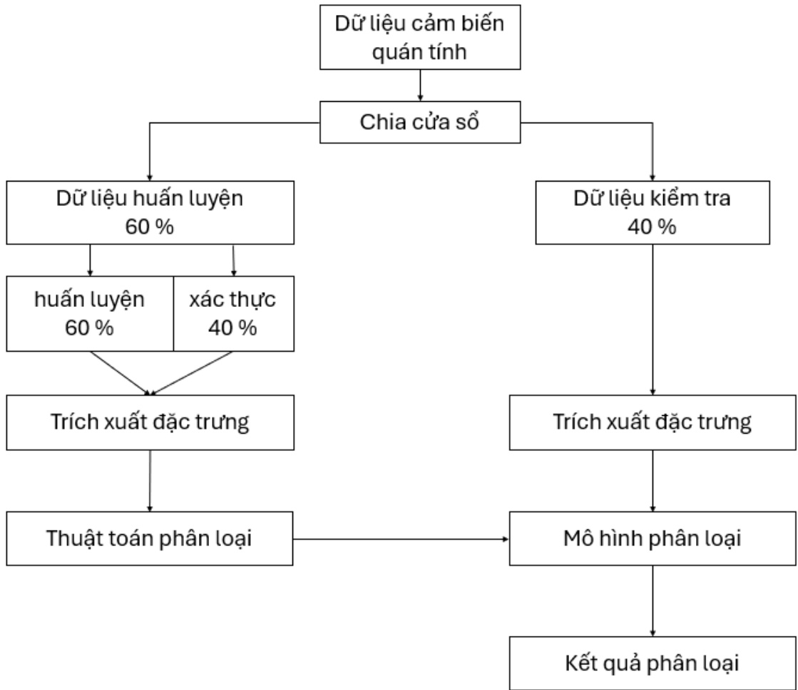

Hình 3.8. Quy trình phân loại mặt đường

## 3.3. Kết quả thực nghiệm và đánh giá

Chương 3 này tiến hành đánh giá hiệu suất phân loại mặt đường với các kích thước cửa sổ dữ liệu khác nhau gồm 8 giây, 10 giây, 12 giây và 15 giây, đồng thời so sánh ba mô hình học máy thuộc họ cây: Random Forest (RF), Gradient Boosting Machine (GBM) và Extreme Gradient Boosting (XGBoost).

<!-- page: 114 -->

Dữ liệu đầu vào được thu thập từ các cảm biến gia tốc kê và con quay hồi chuyển gắn trên phương tiện khảo sát. Từ dữ liệu thô, một tập hợp các đặc trưng thống kê trong miền thời gian được trích xuất, bao gồm giá trị trung bình, độ lệch chuẩn, phương sai, trung vị, giá trị cực đại, giá trị cực tiểu và khoảng giá trị.

Ba loại mặt đường mục tiêu được xem xét trong nghiên cứu là:

1. Mặt đường được đánh giá ở chất lượng mức khá theo thang đo PCI, ở đó mặt đường bắt đầu có những dấu hiệu xấu như vết nứt nhỏ, độ xóc khi di chuyển đã có thể cảm nhận (Roadtype\_0);

2. Mặt đường được đánh giá ở chất lượng mức trung bình theo thang đo PCI, mặt đường xuất hiện nhiều các bất thường hơn như vết nứt rộng, độ gồm ghế mặt đường, cảm nhận rõ rệt bởi độ xóc khi di chuyển xe (Roadtype\_1);

3. Mặt đường có chất lượng xấu theo thang đo PCI, ở loại mặt đường này thì rất khó khăn có thể di chuyển ở tốc độ cao (trên 60 km/h) bởi các vết nứt, độ xóc đã ảnh hưởng rất lớn khi lái xe di chuyển.

Đề đo lường và so sánh hiệu quả của các mô hình, bốn chỉ số đánh giá tiêu chuẩn trong phân loại đã được áp dụng: Độ chính xác (Accuracy), Độ nhạy (Recall), Độ lập lại (Precision) và Điểm F1 (F1-score).

Kết quả thực nghiệm được trình bày trong Bảng 3.9 và Bảng 3.10 cho thấy ảnh hưởng của kích thước cửa sổ dữ liệu đến hiệu suất của ba mô hình học máy: Random Forest (RF), Gradient Boosting Machine (GBM) và Extreme Gradient Boosting (XGBoost). Với các cửa sổ có độ dài 8, 10, 12 và 15 giây, XGBoost nhất quán đạt độ chính xác cao nhất trong tất cả các trường hợp (dao động trong khoảng 0,94–0,95), tiếp theo là GBM (0,93–0,94), trong khi RF cho thấy hiệu suất thấp hơn (0,88–0,89).

Kết quả trong Bảng 3.10 phần ánh giá trị độ nhạy (Recall), tức khả năng mô hình nhận dạng chính xác các trường hợp thuộc từng loại mặt đường. Xu hướng này phù hợp với quan sát trong Bảng 3.9: XGBoost tiếp tục dẫn đầu với giá trị Độ nhạy từ 0,94–0,95, GBM đạt 0,93–0,94, trong khi RF chỉ đạt 0,89–0,90. Như vậy, XGBoost không chỉ vượt trội về độ chính xác tổng thể mà còn thể hiện khả năng nhận dạng mạnh mê hơn đối với từng loại bề mặt đường.

<!-- page: 115 -->

Bảng 3.9. Độ chính xác của 3 mô hình học máy

ở các độ dài cửa số khác nhau

<table><tr><td colspan="4">Độ chính xác</td></tr><tr><td>Độ dài cửa số (s)</td><td>RF</td><td>GBM</td><td>XGBoost</td></tr><tr><td>8</td><td>0.88</td><td>0.93</td><td>0.94</td></tr><tr><td>10</td><td>0.89</td><td>0.94</td><td>0.95</td></tr><tr><td>12</td><td>0.89</td><td>0.94</td><td>0.95</td></tr><tr><td>15</td><td>0.88</td><td>0.93</td><td>0.94</td></tr></table>

Bảng 3.10. Độ nhạy

<table><tr><td colspan="4">Độ nhạy</td></tr><tr><td>Độ dài cửa số (s)</td><td>RF</td><td>GBM</td><td>XGBoost</td></tr><tr><td>8</td><td>0.89</td><td>0.93</td><td>0.94</td></tr><tr><td>10</td><td>0.90</td><td>0.94</td><td>0.95</td></tr><tr><td>12</td><td>0.90</td><td>0.94</td><td>0.95</td></tr><tr><td>15</td><td>0.89</td><td>0.93</td><td>0.94</td></tr></table>

Những kết quả này nhân mạnh lợi thế vượt trội của XGBoost trong việc mô hình hóa các mối quan hệ phi tuyến tính và khai thác hiệu quả các tương tác đặc trưng thông qua cơ chế tăng cường, từ đó mang lại khả năng ổn định và khái quát hóa cao hơn so với các mô hình khác. Đồng thời, so sánh giữa các kích thước cửa sổ cho thấy cửa sổ 8 giây quá ngắn, khiến các đặc trưng thống kê nhạy cảm hơn với nhiều; trong khi cửa sổ 15 giây quá dài, có nguy cơ trộn lẫn nhiều điều kiện lái xe hoặc bề mặt đường, làm giám khả năng phân biệt. Ngược lại, các cửa sổ 10–12 giây mang lại sự cân bằng hợp lý giữa việc loại bổ nhiều và duy trì tính đồng nhất của tín hiệu, từ đó đạt hiệu suất phân loại tối ưu. Trên cơ sở đó, có thể kết luận rằng XGBoost kết hợp với cửa sổ 10 giây là cấu hình phù hợp nhất, vừa đảm bảo độ chính xác cao, vừa duy trì tính ổn định và tính khả thi thực tiễn cho các ứng dụng giám sát và nhận dạng mặt đường trong môi trường thực tế.

Hình 3.9 minh họa ma trận nhằm lẫn của mô hình XGBoost, qua đó cho thấy khả năng phân loại ba loại mặt đường với độ chính xác rất cao và sự phân bố lỗi rõ ràng. Cụ thể, lớp Roadtype\_0 được nhận diện đúng 111/116 mẫu, chỉ có 5 mẫu bị nhằm sang lớp Roadtype\_1 và không có trường hợp nào bị gán

<!-- page: 116 -->

nhầm sang Roadtype\_2. Đối với lớp Roadtype\_1, mô hình dự đoán chính xác 119/127 mẫu; các lỗi chủ yếu xuất hiện khi bị nhầm thành Roadtype\_0 (6 mẫu) và một số rất ít bị nhầm sang Roadtype\_2 (2 mẫu), phần ánh mức độ tương đồng đáng kể giữa hai loại nhựa đường vốn chỉ khác biệt chủ yếu ở mức độ lão hóa. Lớp Roadtype\_2 đạt kết quả gần như hoàn hảo với 110/114 mẫu được phân loại đúng, chỉ có 2 mẫu bị gán nhầm sang mỗi loại mặt đường khá và trung bình, cho thấy đặc tính tín hiệu của mặt đường xấu Roadtype\_2 có sự khác biệt rõ rệt so với hai loại mặt đường chất lượng khá và trung bình.

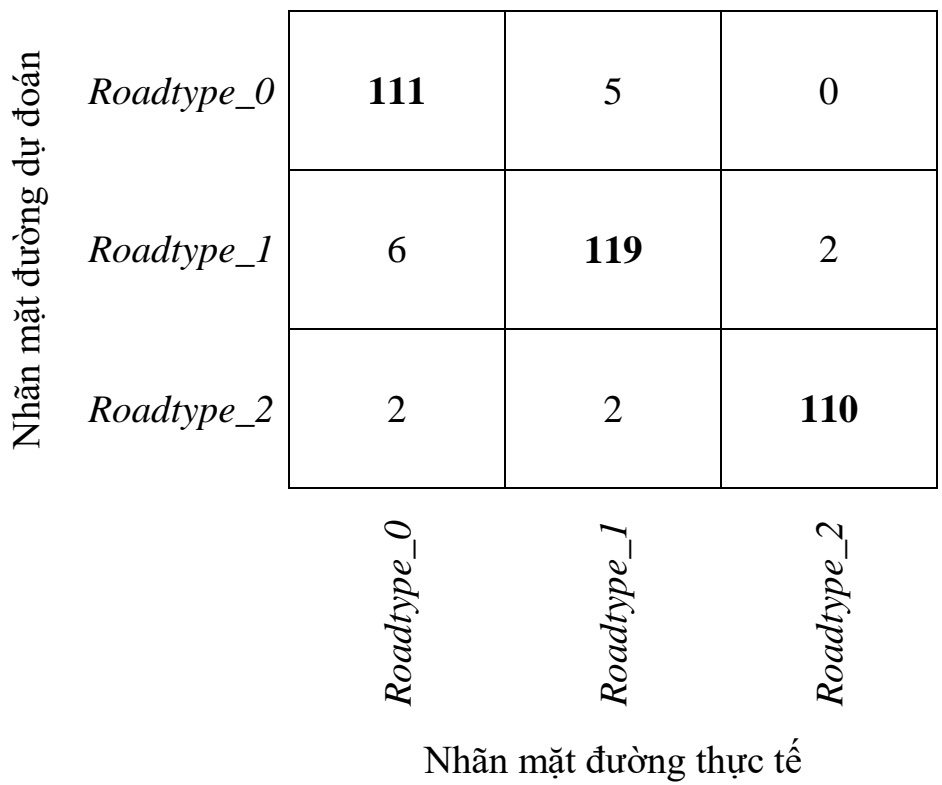

Hình 3.9. Ma trận nhằm lẫn của mô hình XGBoost trên tập dữ liệu đã thu thập

Nhìn chung, phần lớn các lỗi xảy ra ở cặp Roadtype\_0 và Roadtype\_1 (11/17 lỗi), điều này có thể giải thích bởi sự kết cấu của mặt đường tác động lên xe, cũng như tác động đến cảm biến quán tính bởi sự rung xóc khi lái xe di chuyển bởi 2 loại mặt đường này có cấu trúc và kết cấu tương tự nhau, dữ liệu thu được sẽ có nhiều điểm tương đồng. Kết quả này khẳng định rằng mô hình XGBoost không chỉ đạt hiệu suất cao mà còn thể hiện sự ổn định, đặc biệt đối với các lớp có đặc tính vật lý khác biệt rõ rệt.

Độ chính xác phân loại mặt đường được trình bày trong Bảng 3.11, phần ánh hiệu suất cao và cân bằng trên cả ba loại mặt đường. Cụ thể, Roadtype\_0

<!-- page: 117 -->

và Roadtype\_1 đều đạt độ chính xác 0,96, trong khi Roadtype\_2 vượt trội hơn với 0,98. Đối với lớp Roadtype\_0, độ lập lại (0,96) cao hơn độ nhạy (0,93), cho thấy mô hình đưa ra dự đoán đáng tin cậy nhưng vẫn bổ sót một số mẫu, chủ yếu bị nhằm lẫn sang Roadtype\_1. Ngược lại, Roadtype\_1 đạt cả độ nhạy và độ lập lại ở mức 0,94, phản ánh sự phân bố lỗi tương đối cân đối. Lớp Roadtype\_2 là loại dễ phân biệt nhất, với độ nhạy 0,98 và độ lập lại 0,96, cho thấy mô hình hầu như không bổ sót và hiểm khi phân loại sai nhờ đặc trưng rung động khác biệt rõ rệt. Điểm F1 cho cả ba nhận đều trên 0,94, trong đó Roadtype\_2 đạt cao nhất (0,97), chứng minh rằng mô hình duy trì hiệu quả ổn định trên tất cả các nhân và chỉ gặp khó khăn trong việc phân biệt giữa hai loại nhãn mặt đường có chất lượng khá Roadtype\_0 và trung bình Roadtype\_1.

Bảng 3.11. Các chỉ số đánh giá hiệu năng

<table><tr><td rowspan="2">Nhãn mặt đường</td><td colspan="4">Hiệu năng mô hình</td></tr><tr><td>Độ chính xác</td><td>Độ nhạy</td><td>Độ lặp lại</td><td>F1-score</td></tr><tr><td>Roadtype_0</td><td>0.96</td><td>0.93</td><td>0.96</td><td>0.94</td></tr><tr><td>Roadtype_1</td><td>0.96</td><td>0.94</td><td>0.94</td><td>0.94</td></tr><tr><td>Roadtype_2</td><td>0.98</td><td>0.98</td><td>0.96</td><td>0.97</td></tr></table>

Từ những kết quả thu được, có thể khẳng định rằng XGBoost với khung thời gian 10 giây là lựa chọn tối ưu cho bài toán phân loại mặt đường trong bài toán này. Khung thời gian 10 giây đủ dài để làm mượt và ổn định các đặc trưng thông kê, đồng thời loại bổ nhiều ngắn hạn; nhưng cũng đủ ngắn để duy trì tính đồng nhất của tín hiệu phản ánh điều kiện lái xe và loại mặt đường. Nhò đó, cấu hình này không chỉ đảm bảo hiệu suất phân loại cao mà còn đáp ứng được các yêu cầu về độ trẻ thấp và tính khả thi khi triển khai trong các hệ thống giám sát mặt đường thời gian thực trên phần cứng nhưng.

## 3.4. Kết luận

Trong Chương 3 này đã đề xuất quy trình xử lý dữ liệu cảm biến trên thiết bị điện toán biên và triển khai một hệ thống phân loại mặt đường hiệu quả, hướng tới hoạt động thời gian thực trên các thiết bị phần cứng chi phí thấp, dựa trên dữ liệu rung động thu thập từ cảm biến gia tốc kế và con quay hồi chuyển gắn trên xe. Bằng cách so sánh ba mô hình học máy nhẹ—Random Forest (RF), Gradient Boosting (GBM) và XGBoost—kết quả chỉ ra rằng XGBoost với cửa

<!-- page: 118 -->

sổ dữ liệu 10 giây mang lại hiệu suất cao nhất, đạt độ chính xác trung bình khoảng 0,95 và điểm F1 khoảng 0,94 trên cả ba loại mặt đường được nghiên cứu. Đặc biệt, mô hình có khả năng phát hiện tốt khi di chuyển trên mặt đường chất lượng kém và giảm đáng kể tình trạng nhằm lẫn giữa hai loại mặt đường có chất lượng khá và trung bình.

Một đóng góp quan trọng của nghiên cứu là việc áp dụng thuật toán lựa chọn đặc trưng Hybrid Filter-Wrapper (HFW). Phương pháp này đã rút gọn tập đặc trưng từ bộ ban đầu là 42 đặc trưng xuống chỉ còn 27 đặc trưng, đồng thời vẫn duy trì, thâm chí cải thiện độ chính xác phân loại. Việc tinh giản đặc trưng này không chỉ giúp tối ưu hóa thời gian huấn luyện và chi phí tính toán, mà còn đáp ứng yêu cầu khất khe của các hệ thống IoT nhưng về tài nguyên hạn chế, độ trẻ thấp và mức tiêu thụ năng lượng tối thiểu.

Kết quả của Chương 3 đã công bố tại công trình [CT4, CT5] trong phần “Danh mục các công trình của tác giả”.

<!-- page: 119 -->

Hệ thống giao thông thông minh (Intelligent Transportation Systems – ITS) đã và đang được ứng dụng rộng rãi nhằm tận dụng các công nghệ tiên tiến để nâng cao năng lực giám sát, quản lý và vận hành hệ thống giao thông một cách hiệu quả. Trong hệ thống này, nhận dạng và phân loại mặt đường đóng vai trò then chất, góp phần tăng cường khả năng phục hồi và thích ứng của hệ thống giao thông trước các tác động từ môi trường, thời gian và tần suất sử dụng. Có nhiều phương pháp để thực hiện các nhiệm vụ của bài toán phân loại mặt đường, tuy nhiên nổi cệm lên đó là việc ứng dụng các công nghệ cảm biến có chi phi thấp để có thể triển khai rộng rãi mà vẫn đảm bảo yêu cầu về độ chính xác cần thiết. Các đóng góp chính của Luận án nhằm hướng tới giải quyết vấn đề trên và có thể đưa vào triển khai trong thực tế. Luận án có đã có những đóng góp sau:
(1) Đề xuất thuật toán trích chọn đặc trưng lai kết hợp học máy giúp tỉnh giảm dữ liệu cảm biến, giảm khối lượng tính toán và thời gian xử lý. Các kết quả đã được công bố ở công trình [CT1, CT2, CT3].
(2) Đề xuất quy trình xử lý dữ liệu cảm biến trên thiết bị điện toán biên sử dụng mô hình học máy XGBoost để phân tích và đánh giá hiện trạng mặt đường giao thông theo thời gian thực. Các kết quả đã được công bố trong các công trình [CT4, CT5].
Tuy vậy, nghiên cứu vẫn còn một số hạn chế cần giải quyết. Thứ nhất, mô hình mới chỉ được xác thực trên dữ liệu thu thập trong phạm vi hep, chưa bao quát sự đa dạng của các loại phương tiện, tốc độ, tải trọng và điều kiện đường xá khác nhau. Thứ hai, đặc trưng được sử dụng chủ yếu thuộc miền thời gian; việc kết hợp thêm đặc trưng miền tần số hoặc thời gian–tần số (ví dụ: năng lượng phổ, entropy phổ, phân tích wavelet) có thể nâng cao khả năng phân biệt giữa các loại mặt đường có tín hiệu gần giống nhau. Thứ ba, mặc dù XGBoost mang lại hiệu quả cao và dễ diễn giải, nó chưa có khả năng tự động học đặc trưng như các mô hình học sâu.
Do đó, một hướng nghiên cứu đầy hứa hẹn trong tương lai là mở rộng thu thập dữ liệu đa ngữ cảnh để tăng tính khái quát hóa, đồng thời phát triển các mô hình kết hợp (ensemble) giữa XGBoost và các kiến trúc học sâu nhẹ, nhằm tận dụng ưu điểm học đặc trưng tự động của học sâu và tính hiệu quả tính toán của XGBoost. Cách tiếp cận này có tiềm năng mang lại một hệ thống phân

## KÊT LUẬN

<!-- page: 120 -->

loại mặt đường vừa chính xác, vừa bền vững, vừa khả thi trong các ứng dụng IoT thời gian thực.

Kết quả thực nghiệm cho thấy phương pháp đề xuất hoàn toàn khả thi để triển khai trong môi trường thực tế, mang lại sự cân bằng giữa độ chính xác cao, khả năng khái quát hóa và hiệu quả tính toán. Đây là cơ sở quan trọng để phát triển các hệ thống giám sát mặt đường thông minh, chi phí thấp, có thể mở rộng quy mô trong các ứng dụng giao thông thông minh và quản lý hạ tầng đô thị. Ý tưởng này đã được đăng ký bảo hộ sáng chế, giải pháp hữu ích ở công trình [CT4].

<!-- page: 121 -->

## DANH MỤC CÁC CÔNG TRÌNH CỦA TÁC GIẢ

| [CT1] | CongNV, D. N. Tran, T. T. Long, N. G. M. Thao, and D. T. Tran, “Hybrid feature selection for real-time road surface classification on low-end hardware: A machine learning approach,” Results Eng., vol. 27, no. June, 2025, p. 105693, doi: 10.1016/j.rineng.2025.105693.Scopus, Q1 |
| --- | --- |
| [CT2] | CongNV, Tran Duc Nghia , Nguyen Dinh Nga , Tran Duc Tan, “Road Surface Classification Using Supervised Machine Learning Model And Inertial Data”, Tạp chí khoa học và công nghệ, trường đại học công nghiệp Hà Nội, (P-ISSN: 1859-3585; E-ISSN 2615-9619), tập số 60, số 6 (6/2024), pp. 46-50, DOI:http://doi.org/10.57001/huih5804.2024.205 |
| [CT3] | CongNV, Tran, DN., Duong, D.T., Tran, DT. (2025). Utilizing Accelerometer Data and LSTM Model for Road Surface Detection. In: Thanh, NV., Nguyen-Ngoc, L., Bui-Tien, T., Nguyen-Quang, T., De Roeck, G. (eds) Proceedings of the 5th International Conference on Sustainability in Civil Engineering - Volume 2. ICSCE 2024. Lecture Notes in Civil Engineering, vol 633. Springer, Singapore.https://doi.org/10.1007/978-981-96-5206-8_2,Scopus |
| [CT4] | Trần Đức Tân, Trần Đức Nghĩa, Ngô Văn Công, Bằng độc quyền giải pháp hữu ích, số 4541, “Hệ thống và phương pháp phát hiện và đánh giá trạng thái mặt đường sử dụng cảm biến quán tính và bộ định vị gnss gắn trên xe”, Cấp theo Quyết định số 248513/QĐ-SHTT ngày 30 tháng 10 năm 2025 của Cục Sở hữu trí tuệ. |
| [CT5] | CongNV, Duc-Nghia Tran, Bui Thi Thu, Vu Duong Tung, Pham Quang Huy, Manh-Tuyen Vi, Duc-Tan Tran, Efficient Road Surface Classification on Low-Cost Devices Using Vehicle Vibration Data, Journal of Applied Engineering and Technological Science.Scopus |

<!-- page: 122 -->

## TÀI LIÊU THAM KHẢO

[1] U. S. D. of Transportation, “Its technologies - saxton transportation operations laboratory.” Accessed: May 01, 2024. [Online]. Available: https://highways.dot.gov/research/laboratories/saxton-transportation-operations-laboratory/ITS-technologies

[2] L. S. M. of Transport, “Roads maintenance.” Accessed: May 01, 2024. [Online]. Available:

[3] E. A. Martinez-Ríos, M. R. Bustamante-Bello, and L. A. Arce-Sáenz, "A Review of Road Surface Anomaly Detection and Classification Systems Based on Vibration-Based Techniques," Appl. Sci., vol. 12, no. 19, 2022, doi: 10.3390/app12199413.

[4] E. Ranyal, A. Sadhu, and K. Jain, “Road Condition Monitoring Using Smart Sensing and Artificial Intelligence: A Review,” Sensors, vol. 22, no. 8, pp. 1–27, 2022, doi: 10.3390/s22083044.

[5] G. Loprencipe and A. Pantuso, “A specified procedure for distress identification and assessment for urban road surfaces based on PCI,” Coatings, vol. 7, no. 5, 2017, doi: 10.3390/coatings7050065.

[6] M. H. Dehnad and A. Yazdi, “A review of numerical and experimental studies on hydroplaning of vehicles in motion on road surfaces,” Results Eng., vol. 23, no. June, p. 102438, 2024, doi: 10.1016/j.rineng.2024.102438.

[7] R. Nyirandayisabye, H. Li, Q. Dong, T. Hakuzweyezu, and F. Nkinahamira, “Automatic pavement damage predictions using various machine learning algorithms: Evaluation and comparison,” Results Eng., vol. 16, no. September, p. 100657, 2022, doi: 10.1016/j.rineng.2022.100657.

[8] J. Jiang, M. Ketabdari, M. Crispino, and E. Toraldo, “Estimating vehicle braking distance over wet and rutted pavement surface through back-propagation neural network,” Results Eng., vol. 21, no. November 2023, p. 101686, 2024, doi: 10.1016/j.rineng.2023.101686.

[9] J. Menegazzo and A. Von Wangenheim, “Multi-Contextual and Multi-Aspect Analysis for Road Surface Type Classification through Inertial Sensors and Deep Learning,” Brazilian Symp. Comput. Syst. Eng. SBESC, vol. 2020-Novem, no. November 2020, 2020, doi: 10.1109/SBESC51047.2020.9277846.

[10] J. Menegazzo and A. von Wangenheim, “Road surface type classification based on inertial sensors and machine learning: A comparison between classical and deep machine learning approaches for multi-contextual real-world scenarios,” Computing, vol. 103, no. 10, pp. 2143–2170, 2021, doi: 10.1007/s00607-021-00914-0.

[11] A. Martinelli et al., “Road Surface Anomaly Assessment Using Low-Cost Accelerometers: A Machine Learning Approach,” Sensors, vol. 22, no. 10, pp. 1–17, 2022, doi: 10.3390/s22103788.

[12] A. Ramesh et al., “Cloud-Based Collaborative Road-Damage Monitoring with Deep Learning and Smartphones,” Sustain., vol. 14, no. 14, pp. 1–21, 2022, doi: 10.3390/su14148682.

[13] S. Mekruksavanich, P. Jantawong, O. Surinta, and A. Jitpattanakul, "Road Surface Classification for Intelligent Vehicle Perception Based on Inertial Sensors," ICIC Express Lett., vol. 18, no. 1, pp. 79–86, 2024, doi: 10.24507/icicel.18.01.79.

[14] A. Mihoub, M. Krichen, M. Alswailim, S. Mahfoudhi, and R. Bel Hadj Salah, “Road Scanner: A Road State Scanning Approach Based on Machine Learning Techniques,” Appl. Sci., vol. 13, no. 2, 2023, doi: 10.3390/app13020683.

<!-- page: 123 -->

[15] A. Mednis, G. Strazdins, R. Zviedris, G. Kanonirs, and L. Selavo, “Real time pothole detection using Android smartphones with accelerometers,” 2011 Int. Conf. Distrib. Comput. Sens. Syst. Work. DCOSS’11, no. June, 2011, doi: 10.1109/DCOSS.2011.5982206.

[16] J. Eriksson, L. Girod, B. Hull, R. Newton, S. Madden, and H. Balakrishnan, “The Pothole Patrol: Using a mobile sensor network for road surface monitoring,” MobiSys '08 - Proc. 6th Int. Conf. Mob. Syst. Appl. Serv., no. January 2014, pp. 29–39, 2008, doi: 10.1145/1378600.1378605.

[17] G. Sebestyen, D. Muresan, and A. Hangan, “Road quality evaluation with mobile devices,” Proc. 2015 16th Int. Carpathian Control Conf. ICCC 2015, pp. 458–464, 2015, doi: 10.1109/CarpathianCC.2015.7145123.

[18] H. Maeda, Y. Sekimoto, T. Seto, T. Kashiyama, and H. Omata, “Road Damage Detection and Classification Using Deep Neural Networks with Smartphone Images,” Comput. Civ. Infrastruct. Eng., vol. 33, no. 12, pp. 1127–1141, 2018, doi: 10.1111/mice.12387.

[19] Y. W. and Y. L. T. Sun, W. Pan, “Region of Interest Constrained Negative Obstacle Detection and Tracking With a Stereo Camera,” IEEE Sens. J., vol. 22, no. 4, pp. 616–3625, 2022, doi: 10.1109/JSEN.2022.3142024.

[20] D. Wang, Z. Liu, X. Gu, W. Wu, Y. Chen, and L. Wang, “Automatic Detection of Pothole Distress in Asphalt Pavement Using Improved Convolutional Neural Networks,” Remote Sens., vol. 14, no. 16, 2022, doi: 10.3390/rs14163892.

[21] Y. T. Yingchao Zhang, Zhiwu Zuo, Xiaobin Xu, Jianqing Wu, Jianguo Zhu, Hongbo Zhang, Jiewen Wang, “Road damage detection using UAV images based on multi-level attention mechanism,” Autom. Constr., vol. 144, doi: https://doi.org/10.1016/j.autcon.2022.104613.

[22] L. Deng, A. Zhang, J. Guo, and Y. Liu, “An Integrated Method for Road Crack Segmentation and Surface Feature Quantification under Complex Backgrounds,” Remote Sens., vol. 15, no. 6, 2023, doi: 10.3390/rs15061530.

[23] P. del Río-Barral, M. Soilán, S. M. González-Collazo, and P. Arias, "Pavement Crack Detection and Clustering via Region-Growing Algorithm from 3D MLS Point Clouds," Remote Sens., vol. 14, no. 22, 2022, doi: 10.3390/rs14225866.

[24] H. Guan et al., “Iterative tensor voting for pavement crack extraction using mobile laser scanning data,” IEEE Trans. Geosci. Remote Sens., vol. 53, no. 3, pp. 1527–1537, 2015, doi: 10.1109/TGRS.2014.2344714.

[25] C. Koch and I. Brilakis, “Pothole detection in asphalt pavement images,” Adv. Eng. Informatics, vol. 25, no. 3, pp. 507–515, 2011, doi: 10.1016/j.aei.2011.01.002.

[26] R. Bibi et al., “Edge AI-Based Automated Detection and Classification of Road Anomalies in VANET Using Deep Learning,” Comput. Intell. Neurosci., vol. 2021, 2021, doi: 10.1155/2021/6262194.

[27] M. Rathee, B. Bačić, and M. Doborjeh, “Automated Road Defect and Anomaly Detection for Traffic Safety: A Systematic Review,” Sensors, vol. 23, no. 12, 2023, doi: 10.3390/s23125656.

[28] J. Cai, J. Luo, S. Wang, and S. Yang, “Feature selection in machine learning: A new perspective,” Neurocomputing, vol. 300, pp. 70–79, 2018, doi: 10.1016/j.neucom.2017.11.077.

[29] P. Dhal and C. Azad, A comprehensive survey on feature selection in the various fields of machine learning, vol. 52, no. 4. Applied Intelligence, 2022. doi: 10.1007/s10489-021-02550-9.

<!-- page: 124 -->

[30] B. Varona, A. Monteserin, and A. Teyseyre, “A deep learning approach to automatic road surface monitoring and pothole detection,” Pers. Ubiquitous Comput., vol. 24, no. 4, pp. 519–534, 2020, doi: 10.1007/s00779-019-01234-z.

[31] J. Lekshmipathy, S. Velayudhan, and S. Mathew, “Effect of combining algorithms in smartphone based pothole detection,” Int. J. Pavement Res. Technol., vol. 14, no. 1, pp. 63–72, 2021, doi: 10.1007/s42947-020-0033-0.

[32] D. Luo, J. Lu, and G. Guo, “Road Anomaly Detection through Deep Learning Approaches,” IEEE Access, vol. 8, pp. 117390–117404, 2020, doi: 10.1109/ACCESS.2020.3004590.

[33] J. M. Celaya-Padilla et al., “Speed bump detection using accelerometric features: A genetic algorithm approach,” Sensors (Switzerland), vol. 18, no. 2, pp. 1–13, 2018, doi: 10.3390/s18020443.

[34] E. Ivanová and J. Masárová, “Importance of Road Infrastructure in the Economic Development and Competitiveness,” Econ. Manag., vol. 18, no. 2, 2013, doi: 10.5755/j01.em.18.2.4253.

[35] A. S. El-Wakeel, J. Li, A. Noureldin, H. S. Hassanein, and N. Zorba, "Towards a Practical Crowdsensing System for Road Surface Conditions Monitoring," IEEE Internet Things J., vol. 5, no. 6, pp. 4672–4685, 2018, doi: 10.1109/JIOT.2018.2807408.

[36] M. Y. S.. Walther, “Pavement Maintenance Management for Roads and Streets Using the PAVER system,” Usacerl Tech. Rep. M-90/05, 1990.

[37] American Society for Testing and Materials, “American D 6433 Standard Practice for Roads and Parking Lots Pavement Condition Index Surveys,” vol. 04.03, pp. 1–48, 2023.

[38] S. Sattar, S. Li, and M. Chapman, “Road surface monitoring using smartphone sensors: A review,” Sensors (Switzerland), vol. 18, no. 11, 2018, doi: 10.3390/s18113845.

[39] TCVN 8865:2011, “Mặt đường ô tô - Phương pháp đo và đánh giá xác định độ bằng phẳng theo chỉ số độ gò ghê quốc tế IRI”

[40] N. Shaghll and A. Khalafallah, “Automating Highway Infrastructure Maintenance Using Unmanned Aerial Vehicles,” Constr. Res. Congr. 2018 Infrastruct. Facil. Manag. - Sel. Pap. from Constr. Res. Congr. 2018, vol. 2018-April, no. March 2018, pp. 486–495, 2018, doi: 10.1061/9780784481295.049.

[41] E. Raslan, M. F. Alrahmawy, Y. A. Mohammed, and A. S. Tolba, “IoT for measuring road network quality index,” Neural Comput. Appl., vol. 35, no. 3, pp. 2927–2944, 2023, doi: 10.1007/s00521-022-07736-x.

[42] B. Tian, Y. Yuan, H. Zhou, and Z. Yang, “Pavement Management Utilizing Mobile Crowd Sensing,” Adv. Civ. Eng., vol. 2020, 2020, doi: 10.1155/2020/4192602.

[43] S. Sattar, S. Li, and M. Chapman, “Developing a near real-time road surface anomaly detection approach for road surface monitoring,” Meas. J. Int. Meas. Confed., vol. 185, no. August, p. 109990, 2021, doi: 10.1016/j.measurement.2021.109990.

[44] C. Wu et al., “An automated machine-learning approach for road pothole detection using smartphone sensor data,” Sensors (Switzerland), vol. 20, no. 19, pp. 1–23, 2020, doi: 10.3390/s20195564.

[45] V. Astarita et al., “A Mobile Application for Road Surface Quality Control: UNIquALroad,” Procedia - Soc. Behav. Sci., vol. 54, no. October, pp. 1135–1144, 2012, doi: 10.1016/j.sbspro.2012.09.828.

[46] V. Rishiwal and H. Khan, “Automatic pothole and speed breaker detection using android system,” 2016 39th Int. Conv. Inf. Commun. Technol. Electron. Microelectron. MIPRO 2016 - Proc., no. November,

<!-- page: 125 -->

pp. 1270–1273, 2016, doi: 10.1109/MIPRO.2016.7522334.

[47] V. K. Nguyen, É. Renault, and R. Milocco, “Environment monitoring for anomaly detection system using smartphones†,” Sensors (Switzerland), vol. 19, no. 18, pp. I–17, 2019, doi: 10.3390/s19183834.

[48] M. R. Carlos, M. E. Aragon, L. C. Gonzalez, H. J. Escalante, and F. Martinez, “Evaluation of detection approaches for road anomalies based on accelerometer readings-Addressing who’s who,” IEEE Trans. Intell. Transp. Syst., vol. 19, no. 10, pp. 3334–3343, 2018, doi: 10.1109/TITS.2017.2773084.

[49] Z. Zheng et al., “A Fused Method of Machine Learning and Dynamic Time Warping for Road Anomalies Detection,” IEEE Trans. Intell. Transp. Syst., vol. 23, no. 2, pp. 827–839, 2022, doi: 10.1109/TITS.2020.3016288.

[50] C. W. Yi, Y. T. Chuang, and C. S. Nian, “Toward Crowdsourcing-Based Road Pavement Monitoring by Mobile Sensing Technologies,” IEEE Trans. Intell. Transp. Syst., vol. 16, no. 4, pp. 1905–1917, 2015, doi: 10.1109/TITS.2014.2378511.

[51] R. Bustamante-Bello, A. García-Barba, L. A. Arce-Saenz, L. A. Curiel-Ramirez, J. Izquierdo-Reyes, and R. A. Ramirez-Mendoza, “Visualizing Street Pavement Anomalies through Fog Computing V2I Networks and Machine Learning,” Sensors, vol. 22, no. 2, 2022, doi: 10.3390/s22020456.

[52] I. Ferjani and S. A. Alsaif, “How to get best predictions for road monitoring using machine learning techniques,” PeerJ Comput. Sci., vol. 8, 2022, doi: 10.7717/PEERJ-CS.941.

[53] Y. Chen, M. Zhou, Z. Zheng, and M. Huo, “Toward Practical Crowdsourcing-Based Road Anomaly Detection with Scale-Invariant Feature,” IEEE Access, vol. 7, pp. 67666–67678, 2019, doi: 10.1109/ACCESS.2019.2918754.

[54] L. Ye and E. Keogh, “Time series shapelets: A new primitive for data mining,” Proc. ACM SIGKDD Int. Conf. Knowl. Discov. Data Min., pp. 947–955, 2009, doi: 10.1145/1557019.1557122.

[55] A. Anaissi, N. L. D. Khoa, T. Rakotoarivelo, M. M. Alamdari, and Y. Wang, “Smart pothole detection system using vehicle-mounted sensors and machine learning,” J. Civ. Struct. Heal. Monit., vol. 9, no. 1, pp. 91–102, 2019, doi: 10.1007/s13349-019-00323-0.

[56] J. D. C. Julio-Rodríguez, C. A. Rojas-Ruiz, A. Santana-Díaz, M. R. Bustamante-Bello, and R. A. Ramírez-Mendoza, “Environment Classification Using Machine Learning Methods for Eco-Driving Strategies in Intelligent Vehicles,” Appl. Sci., vol. 12, no. 11, 2022, doi: 10.3390/app12115578.

[57] G. Baldini, R. Giuliani, and F. Geib, “On the application of time frequency convolutional neural networks to road anomalies’ identification with accelerometers and gyroscopes,” Sensors (Switzerland), vol. 20, no. 22, pp. 1–24, 2020, doi: 10.3390/s20226425.

[58] S. Tiwari, R. Bhandari, and B. Raman, “RoadCare,” pp. 231–242, 2020, doi: 10.1145/3378393.3402284.

[59] A. Basavaraju, J. Du, F. Zhou, and J. Ji, “A machine learning approach to road surface anomaly assessment using smartphone sensors,” IEEE Sens. J., vol. 20, no. 5, pp. 2635–2647, 2020.

[60] M. A. Agebure, E. O. Oyetunji, and E. Y. Baagyere, “A three-tier road condition classification system using a spiking neural network model,” J. King Saud Univ. - Comput. Inf. Sci., vol. 34, no. 5, pp. 1718–1729, 2022, doi: 10.1016/j.jksuci.2020.08.012.

[61] E. Raslan, M. F. Alrahmawy, Y. A. Mohammed, and A. S. Tolba,

<!-- page: 126 -->

“Evaluation of data representation techniques for vibration based road surface condition classification,” Sci. Rep., pp. 1–20, 2024, doi: 10.1038/s41598-024-61757-1.

[62] L. A. Arce-saenz, J. Izquierdo-reyes, and R. Bustamante-bello, "Exploring single-head and multi-head CNN and LSTM-based models for road surface classification using on-board vehicle multi-IMU data," pp. 1–19, 2025.

[63] J. Petch, S. Di, and W. Nelson, “Opening the Black Box: The Promise and Limitations of Explainable Machine Learning in Cardiology,” Can. J. Cardiol., vol. 38, no. 2, pp. 204–213, 2022, doi: 10.1016/j.cjca.2021.09.004.

[64] A. Allouch, A. Koubaa, T. Abbes, and A. Ammar, “RoadSense: Smartphone Application to Estimate Road Conditions Using Accelerometer and Gyroscope,” IEEE Sens. J., vol. 17, no. 13, pp. 4231–4238, 2017, doi: 10.1109/JSEN.2017.2702739.

[65] S. Wang, S. Kodagoda, L. Shi, and X. Dai, “Two-Stage Road Terrain Identification Approach for Land Vehicles Using Feature-Based and Markov Random Field Algorithm,” IEEE Intell. Syst., vol. 33, no. 1, pp. 29–39, 2018, doi: 10.1109/MIS.2017.2581327.

[66] H. Bello-Salau, A. M. Aibinu, A. J. Onumanyi, E. N. Onwuka, J. J. Dukiya, and H. Ohize, “New road anomaly detection and characterization algorithm for autonomous vehicles,” Appl. Comput. Informatics, vol. 16, no. 1–2, pp. 223–239, 2018, doi: 10.1016/j.aci.2018.05.002.

[67] B. Zhou et al., “Smartphone-based road manhole cover detection and classification,” Autom. Constr., vol. 140, no. August, p. 104344, 2022, doi: 10.1016/j.autcon.2022.104344.

[68] F. S. Cabral, M. Pinto, F. A. L. N. Mouzinho, H. Fukai, and S. Tamura, "An Automatic Survey System for Paved and Unpaved Road Classification and Road Anomaly Detection using Smartphone Sensor," Proc. 2018 IEEE Int. Conf. Serv. Oper. Logist. Informatics, SOLI 2018, pp. 65–70, 2018, doi: 10.1109/SOLI.2018.8476788.

[69] J. W. Cooley, P. A. W. Lewis, and P. D. Welch, “Historical Notes on the Fast Fourier Transform,” IEEE Trans. Audio Electroacoust., vol. 15, no. 2, pp. 76–79, 1967, doi: 10.1109/TAU.1967.1161903.

[70] I. S. Andrades, J. J. C. Aguilar, J. M. V. García, J. A. C. Carrillo, and M. S. Lozano, “Low-cost road-surface classification system based on self-organizing maps,” Sensors (Switzerland), vol. 20, no. 21, pp. 1–21, 2020, doi: 10.3390/s20216009.

[71] J. F. Hipp, “Time-Frequency Analysis,” Encycl. Comput. Neurosci., pp. 1–3, 2013, doi: 10.1007/978-1-4614-7320-6.

[72] R. Parhizkar, Y. Barbotin, and M. Vetterli, “Sequences with minimal time-frequency uncertainty,” Appl. Comput. Harmon. Anal., vol. 38, no. 3, pp. 452–468, 2015, doi: 10.1016/j.acha.2014.07.001.

[73] M. Rhif, A. Ben Abbes, I. R. Farah, B. Martínez, and Y. Sang, “Wavelet transform application for/in non-stationary time-series analysis: A review,” Appl. Sci., vol. 9, no. 7, pp. 1–22, 2019, doi: 10.3390/app9071345.

[74] S. Solorio-Fernández, J. A. Carrasco-Ochoa, and J. F. Martínez-Trinidad, “A new hybrid filter–wrapper feature selection method for clustering based on ranking,” Neurocomputing, vol. 214, pp. 866–880, 2016, doi: 10.1016/j.neucom.2016.07.026.

[75] H. Liu and L. Yu, “Toward integrating feature selection algorithms for classification and clustering,” IEEE Trans. Knowl. Data Eng., vol. 17, no. 4, pp. 491–502, 2005, doi: 10.1109/TKDE.2005.66.

<!-- page: 127 -->

[76] J. Y. Choi, Y. M. Ro, and K. N. Plataniotis, “Boosting color feature selection for color face recognition,” IEEE Trans. Image Process., vol. 20, no. 5, pp. 1425–1434, 2011, doi: 10.1109/TIP.2010.2093906.

[77] F. Golnoori, F. Zamani Boroujeni, and S. A. Monadjemi, “A comparative study on deep feature selection methods for skin lesion classification,” IET Image Process., vol. 18, no. 4, pp. 996–1013, 2024, doi: 10.1049/ipr2.13002.

[78] E. Rashedi, H. Nezamabadi-Pour, and S. Saryazdi, “A simultaneous feature adaptation and feature selection method for content-based image retrieval systems,” Knowledge-Based Syst., vol. 39, pp. 85–94, 2013, doi: 10.1016/j.knosys.2012.10.011.

[79] O. M. Alyasiri, Y. N. Cheah, A. K. Abasi, and O. M. Al-Janabi, "Wrapper and Hybrid Feature Selection Methods Using Metaheuristic Algorithms for English Text Classification: A Systematic Review," IEEE Access, vol. 10, pp. 39833–39852, 2022, doi: 10.1109/ACCESS.2022.3165814.

[80] Y. Yin et al., “IGRF-RFE: a hybrid feature selection method for MLP-based network intrusion detection on UNSW-NB15 dataset,” J. Big Data, vol. 10, no. 1, 2023, doi: 10.1186/s40537-023-00694-8.

[81] S. M. Kasongo and Y. Sun, “Performance Analysis of Intrusion Detection Systems Using a Feature Selection Method on the UNSW-NB15 Dataset,” J. Big Data, vol. 7, no. 1, 2020, doi: 10.1186/s40537-020-00379-6.

[82] R. A. Disha and S. Waheed, “Performance analysis of machine learning models for intrusion detection system using Gini Impurity-based Weighted Random Forest (GIWRF) feature selection technique,” Cybersecurity, vol. 5, no. 1, pp. 1–22, 2022, doi: 10.1186/s42400-021-00103-8.

[83] N. Pudjihartono, T. Fadason, A. W. Kempa-Liehr, and J. M. O'Sullivan, "A Review of Feature Selection Methods for Machine Learning-Based Disease Risk Prediction," Front. Bioinforma., vol. 2, no. June, pp. 1–17, 2022, doi: 10.3389/fbinf.2022.927312.

[84] L. Li, Y. Yu, S. Bai, J. Cheng, and X. Chen, “Towards effective network intrusion detection: A hybrid model integrating gini index and GBDT with PSO,” J. Sensors, vol. 2018, 2018, doi: 10.1155/2018/1578314.

[85] O. O. Akinola, A. E. Ezugwu, J. O. Agushaka, R. A. Zitar, and L. Abualigah, Multiclass feature selection with metaheuristic optimization algorithms: a review, vol. 34, no. 22. Springer London, 2022. doi:10.1007/s00521-022-07705-4.

[86] G. Kohavi, R., John, “Wrappers for feature subset selection,” Artif. Intell. J., vol. Special is, no. 97(1–2), pp. 273–324, 1997.

[87] K. B. Duan, J. C. Rajapakse, H. Wang, and F. Azuaje, “Multiple SVM-RFE for gene selection in cancer classification with expression data,” IEEE Trans. Nanobioscience, vol. 4, no. 3, pp. 228–233, 2005, doi: 10.1109/TNB.2005.853657.

[88] P. M. Granitto, C. Furlanello, F. Biasioli, and F. Gasperi, “Recursive feature elimination with random forest for PTR-MS analysis of agroindustrial products,” Chemom. Intell. Lab. Syst., vol. 83, no. 2, pp. 83–90, 2006, doi: 10.1016/j.chemolab.2006.01.007.

[89] Y. Ding and D. Wilkins, “Improving the performance of SVM-RFE to select genes in microarray data,” BMC Bioinformatics, vol. 7, no. SUPPL.2, pp. 1–8, 2006, doi: 10.1186/1471-2105-7-S2-S12.

[90] W. Ali and F. Saeed, “Hybrid Filter and Genetic Algorithm-Based Feature Selection for Improving Cancer Classification in High-

<!-- page: 128 -->

Dimensional Microarray Data," Processes, vol. 11, no. 2, 2023, doi: 10.3390/pr11020562.

[91] B. Remeseiro and V. Bolon-Canedo, “A review of feature selection methods in medical applications,” Comput. Biol. Med., vol. 112, no. May, pp. 25–29, 2019, doi: 10.1016/j.compbiomed.2019.103375.

[92] A. A. Megantara and T. Ahmad, “Feature Importance Ranking for Increasing Performance of Intrusion Detection System,” 2020 3rd Int. Conf. Comput. Informatics Eng. IC2IE 2020, pp. 37–42, 2020, doi: 10.1109/IC2IE50715.2020.9274570.

[93] Z. Wei et al., “Large sample size, wide variant spectrum, and advanced machine-learning technique boost risk prediction for inflammatory bowel disease,” Am. J. Hum. Genet., vol. 92, no. 6, pp. 1008–1012, 2013, doi: 10.1016/j.ajhg.2013.05.002.

[94] H. Jeon and S. Oh, “Hybrid-recursive feature elimination for efficient feature selection,” Appl. Sci., vol. 10, no. 9, pp. 1–8, 2020, doi: 10.3390/app10093211.

[95] A. J. Myles, R. N. Feudale, Y. Liu, N. A. Woody, and S. D. Brown, “An introduction to decision tree modeling,” J. Chemom., vol. 18, no. 6, pp. 275–285, 2004, doi: 10.1002/cem.873.

[96] S. B. Kotsiantis, “Decision trees: A recent overview,” Artif. Intell. Rev., vol. 39, no. 4, pp. 261–283, 2013, doi: 10.1007/s10462-011-9272-4.

[97] L. Breiman, “Random forests,” Mach. Learn., vol. 45, pp. 5–32.

[98] S. Athey, J. Tibshirani, and S. Wager, “Generalized random forests,” Ann. Stat., vol. 47, no. 2, pp. 1179–1203, 2019, doi: 10.1214/18-AOS1709.

[99] A. Natekin and A. Knoll, “Gradient boosting machines, a tutorial,” Front. Neurorobot., vol. 7, no. DEC, 2013, doi: 10.3389/fnbot.2013.00021.

[100] J. H. Friedman, “Greedy function approximation: A gradient boosting machine,” Ann. Stat., vol. 29, no. 5, pp. 1189–1232, 2001, doi: 10.1214/aos/1013203451.

[101] T. Zhang et al., “Improving Convection Trigger Functions in Deep Convective Parameterization Schemes Using Machine Learning,” J. Adv. Model. Earth Syst., vol. 13, no. 5, pp. 1–19, 2021, doi: 10.1029/2020MS002365.

[102] T. Chen and C. Guestrin, “XGBoost: A scalable tree boosting system,” Proc. ACM SIGKDD Int. Conf. Knowl. Discov. Data Min., vol. 13-17-Augu, pp. 785–794, 2016, doi: 10.1145/2939672.2939785.

[103] Y. M. Kim, Y. G. Kim, S. Y. Son, S. Y. Lim, B. Y. Choi, and D. H. Choi, “Review of Recent Automated Pothole-Detection Methods,” Appl. Sci., vol. 12, no. 11, pp. 1–15, 2022, doi: 10.3390/app12115320.

[104] M. Webber and R. F. Rojas, “Human Activity Recognition with Accelerometer and Gyroscope: A Data Fusion Approach,” IEEE Sens. J., vol. 21, no. 15, pp. 16979–16989, 2021, doi: 10.1109/JSEN.2021.3079883.

[105] Y. Sun, A. K. C. Wong, and M. S. Kamel, “Classification of imbalanced data: A review,” Int. J. Pattern Recognit. Artif. Intell., vol. 23, no. 4, pp. 687–719, 2009, doi: 10.1142/S0218001409007326.

[106] S. Hochreiter, “Long Short-Term Memory,” vol. 1780, pp. 1735–1780, 1997.

[107] T. Talaei Khoei and N. Kaabouch, “Machine Learning: Models, Challenges, and Research Directions,” Futur. Internet, vol. 15, no. 10, 2023, doi: 10.3390/fi15100332.

<!-- page: 129 -->

```c
CODE NHÚNG TRÊN THIỆT BỊ THU THẬP DỬ LIỆU
#include <Wire.h>
#include <MPU9250_asukiaaa.h>
#include <TinyGPSPlus.h>
#include <SD.h>
#include <SPI.h>

// UART2 cho GPS
#define GPS_RX 16
#define GPS_TX 17
HardwareSerial gpsSerial(1);

// MPU9250
MPU9250_asukiaaa mpu;
TinyGPSPlus gps;

// SD Card
#define SD_CS 5
File dataFile;
char filename[20];

// LED báo GPS
#define LED_PIN 2

#define ROAD_D1 32 // Đường khá, nhân 0
#define ROAD_D2 33 // Đường trung bình, nhân 1
#define ROAD_D3 25 // Đường kém, nhân 2
#define ROAD_D4 26 // pothole, nhân 3
int roadSurface = -1;

// Buffer dữ liệu
const int bufferSize = 100; // Ghi vào SD sau mỗi 100 dòng
String dataBuffer[bufferSize];
int bufferIndex = 0;

unsigned long previousMillis = 0;
const long interval = 20; // 20ms (50Hz)

void setup() {
    Serial.begin(115200);
    gpsSerial.begin(9600, SERIAL_8N1, GPS_RX, GPS_TX);
    Wire.begin(21, 22); // Khởi tạo I2C trên ESP32
    pinMode(LED_PIN, OUTPUT);
    pinMode(ROAD_D1, INPUT_PULLUP);
    pinMode(ROAD_D2, INPUT_PULLUP);
    pinMode(ROAD_D3, INPUT_PULLUP);
    pinMode(ROAD_D4, INPUT_PULLUP);
    // Khởi tạo SD Card
```

<!-- page: 130 -->

```txt
if (!SD.begin(SD_CS)) {
    Serial.println("Lỗi khởi tạo thẻ SD!");
    return;
}
Serial.println("Thẻ SD OK!");

// Chở GPS để lấy ngày
Serial.println("Chở tín hiệu GPS...");
while (!gps.date.isValid()) {
    while (gpsSerial.available()) {
        gps.encode(gpsSerial.read());
    }
}

// Cổ định tên file là data.csv
strcpy(filename, "/data.csv");
Serial.print("Ghi dữ liệu vào: ");
Serial.println(filename);

// Nếu file chưa tôn tại, tạo file và ghi tiêu đề
if (!SD.exists(filename)) {
    dataFile = SD.open(filename, FILE_WRITE);
    if (dataFile) {
        dataFile.println("Time,Lat,Lon,Alt,Speed,Sats,Ax,Ay,Az,Gx,Gy,Gz,Mx,My,Mz,ROADSURFACE");
        dataFile.close();
        Serial.println("Đã tạo file mới và ghi tiêu đề.");
    } else {
        Serial.println("Lỗi khi tạo file mới!");
    }
}
// Khởi tạo MPU9250
mpu.setWire(&Wire);
mpu.beginAccel();
mpu.beginGyro();
mpu.beginMag();

Serial.println("MPU9250 đã sẵn sàng!");
Serial.println("Time,Lat,Lon,Alt,Speed,Sats,Ax,Ay,Az,Gx,Gy,Gz,Mx,My,Mz,ROADSURFACE");
}

void loop() {

unsigned long currentMillis = millis();
if (currentMillis - previousMillis >= interval) {
    previousMillis = currentMillis;
    // Gán nhân dữ liệu cho 3 loại mặt đường
    // Ưu tiên: chỉ 1 công tắc bật tại 1 thời điểm
    if (digitalRead(ROAD_D1) == LOW) {
```

<!-- page: 131 -->

```groovy
roadSurface = 0;
} else if (digitalRead(ROAD_D2) == LOW) {
    roadSurface = 1;
} else if (digitalRead(ROAD_D3) == LOW) {
    roadSurface = 2;
} else if (digitalRead(ROAD_D4) == LOW) {
    roadSurface = 3;
} else {
    roadSurface = -1; // Xe dùng
}
// Cập nhật dữ liệu GPS
while (gpsSerial.available()) {
    gps.encode(gpsSerial.read());
}

// Kiểm tra GPS
if (gps.location.isValid()) {
    digitalWrite(LED_PIN, HIGH); // GPS OK → Bật LED
} else {
    digitalWrite(LED_PIN, LOW); // Mặt tín hiệu GPS → Tất LED
}

// Lấy thông tin ngày giờ GPS
String dateStr = gps.date.isValid() ?
        String(gps.date.year()) + "-" +
String(gps.date.month()) + "-" + String(gps.date.day())
        """

String timeStr = gps.time.isValid() ?
        String(gps.time.hour() + 7) + ":" +
String(gps.time.minute()) + ":" +
        String(gps.time.second()) + "." +
String(gps.time.centisecond() * 10) : "";

// Kết hợp ngày và giờ
String dateTimeStr = dateStr + " " + timeStr;

double latitude = gps.location.isValid() ? gps.location.lat() :
0.0;
double longitude = gps.location.isValid() ? gps.location.lng() :
0.0;
double altitude = gps.altitude.isValid() ? gps.altitude.meters() :
0.0;
double speed = gps.speed.isValid() ? gps.speed.kmph() : 0.0;
int satellites = gps.satellites.isValid() ? gps.satellites.value()
: 0;

// Cập nhật dữ liệu từ MPU9250
mpu.accelUpdate();
mpu.gyroUpdate();
```

<!-- page: 132 -->

```txt
mpu.magUpdate();

    // Tạo chuỗi dữ liệu
    String dataStr = dateTimeStr + "," +
                    String(latitude, 6) + "," + String(longitude, 6) +
"," +
                    String(altitude, 2) + "," + String(speed, 2) + "," +
String(satellites) + "," +
                    String(mpu.accelX(), 2) + "," +
String(mpu.accelY(), 2) + "," + String(mpu.accelZ(), 2) + "," +
                    String(mpu.gyroX(), 2) + "," + String(mpu.gyroY(),
2) + "," + String(mpu.gyroZ(), 2) + "," +
                    String(mpu.magX(), 2) + "," + String(mpu.magY(), 2)
+ "," + String(mpu.magZ(), 2) + "," + String(roadSurface);

    // In ra Serial
    Serial.println(dataStr);

    // Lưu vào buffer
    dataBuffer[bufferIndex++] = dataStr;

    // Khi buffer đầy, ghi vào thẻ SD
    if (bufferIndex >= bufferSize) {
        writeToSD();
        bufferIndex = 0;  // Reset buffer index
    }
}
}

// Hàm ghi buffer xuống thẻ SD
void writeToSD() {
    dataFile = SD.open(filename, FILE_APPEND);
    if (dataFile) {
        for (int i = 0; i < bufferSize; i++) {
            dataFile.println(dataBuffer[i]);
        }
        dataFile.close();
        Serial.println("Đã ghi dữ liệu vào SD!");
    } else {
        Serial.println("Lỗi mờ file!");
    }
}
```

<!-- page: 133 -->

## PHỤ LỤC 2 CODE CHẠY THỦ NGHIỆM MÔ HÌNH HỌC MÁY

```python
import numpy as np
import pandas as pd
from scipy.fft import fft
from scipy.signal import welch
from scipy.stats import skew, kurtosis
from sklearn.tree import DecisionTreeClassifier
from sklearn.metrics import accuracy_score, classification_report

# Hàm trích xuất đặc trung thông kê
def extract_statistical_features(data):
    features = []
    features.append(np.mean(data))      # Trung bình
    features.append(np.std(data))       # Độ lệch chuẩn
    features.append(np.var(data))       # Phuong sai
    features.append(np.median(data))     # Trung vị
    features.append(np.amin(data))       # Min
    features.append(np.amax(data))       # Max
    features.append(np.amax(data) - np.amin(data))  # Range
    return features

def featuresFromBufferall(at, fs):
    feat = []
    cols = [6, 7, 8, 9, 10, 11, 12, 13, 14]  # Ax..Az, Gx..Gz, Mx..Mz
    for c in cols:
        data = np.array(at.iloc[:, c], dtype=np.float64)
        feat.extend(extract_statistical_features(data))
    return feat
        feat.extend(extract_statistical_features(data))
    return feat

# ====== Trích xuất đặc trung ======
train_features      = np.array([featuresFromBufferall(action, 1) for action in data_train])
test_features      = np.array([featuresFromBufferall(action, 1) for action in data_test])

train_featuresdash  = np.array([featuresFromBufferdash(action, 1) for action in data_train])
test_featuresdash   = np.array([featuresFromBufferdash(action, 1) for action in data_test])

train_featuresright = np.array([featuresFromBufferright(action, 1) for action in data_train])
test_featuresright  = np.array([featuresFromBufferright(action, 1) for action in data_test])
```

<!-- page: 134 -->

```python
train_featuresleft = np.array([featuresFromBufferleft(action, 1) fo
action in data_train])
test_featuresleft = np.array([featuresFromBufferleft(action, 1) fo
action in data_test])

# Khởi tạo và huấn luyện mô hình Random Forest
rf_clf = RandomForestClassifier(n_estimators=32, max_depth=6,
random_state=42)

# Measure the training time
start_time = time.time()
rf_clf.fit(X_train, y_train)
end_time = time.time()

# Calculate training time (in ra đúng số đặc trung hiện có)
training_time = end_time - start_time
print(f"Training time random forest {X_train.shape[1]} features:
{training_time:.4f} seconds")

# Dự đoán nhân cho dữ liệu kiểm tra
rf_predictions = rf_clf.predict(X_test)

# Tính toán độ chính xác của mô hình Random Forest
rf_accuracy = accuracy_score(y_test, rf_predictions)

# In kết quả
print("Random Forest Accuracy =", rf_accuracy)

# Lấy độ quan trọng của các đặc trung
importances = rf_clf.feature_importances_
print(f"{len(importantances)}")

# Buốc 2: Lọc các đặc trung có độ quan trọng >= 0.001
selected_features = np.where(importantces >= 0.001)[0]
print(f"{len(selected_features)}")
X_train_filtered = X_train[:, selected_features]
X_test_filtered = X_test[:, selected_features]

rf_clf.fit(X_train_filtered, y_train)

# Lấy độ quan trọng của các đặc trung
importances = rf_clf.feature_importances_
print(f"{len(importantances)}")

# Buốc 2: Lọc các đặc trung có độ quan trọng >= 0.001
selected_features = np.where(importantces >= 0.001)[0]
print(f"{len(selected_features)}")
X_train_filtered = X_train[:, selected_features]
X_test_filtered = X_Test[:, selected_features]
```

<!-- page: 135 -->

```python
n1 = 0
n2 = 0
selected_features2 = np.where(importances >= 0)[0]

# Khởi tạo độ chính xác ban đầu
accuracy_max = 0
threshold = 0.02  # Nguồng thay đổi accuracy để dùng

# Danh sách lưu kết quả accuracy
accuracy_list = []

# Số lượng đặc trung ban đầu
n_features = X_train_filtered.shape[1]

# Vòng lặp loại bỏ đặc trung
for i in range(n_features, 1, -1):
    rfe = RFE(estimator=rf_clf, n_features_to_select=i, step=1)
    rfe.fit(X_train_filtered, y_train)

    # Dự đoán trên tập kiểm tra
    y_pred = rfe.predict(X_test_filtered)

    # Tính độ chính xác
    accuracy = accuracy_score(y_test, y_pred)
    accuracy_list.append(accuracy)
    print(f"Number of features: {i}, Accuracy: {accuracy}")

    # Kiểm tra thay đổi accuracy
    if accuracy_max != 0 and (accuracy_max - accuracy) > threshold:
        print(f"Stopping: Accuracy change below {threshold}")
        print(f"Stopping: Accuracy change {accuracy_max - accuracy}")
        print(f"Stopping: Accuracy max {accuracy_max}")
        selected_features = [f for f, s in zip(range(n_features), rfe.support_) if s]
        n1 = len(selected_features)
        break

    # Cập nhật độ chính xác max
    if accuracy_max <= accuracy:
        accuracy_max = accuracy
        selected_features2 = [f for f, s in zip(range(n_features), rfe.support_) if s]
        n2 = len(selected_features2)

##############################
##############################
print(f"{len(selected_features2)}")
print("Selected features:", selected_features2)
```

<!-- page: 136 -->

```python
X_train_filtered = train_features[:, selected_features2]
X_test_filtered1 = X_test1[:, selected_features2]
X_test_filtered2 = X_test2[:, selected_features2]
X_test_filtered3 = X_test3[:, selected_features2]

start_time = time.time()
rf_clf.fit(X_train_filtered, label_train)
end_time = time.time()

# Calculate training time
training_time = end_time - start_time
print(f"Training time random forest {len(selected_features2)}
features: {training_time:.4f} seconds")
###################
###################
# Lấy tên của các đặc trung đã chọn
selected_feature_names = [feature_names[i] for i in
selected_features2]

# Trích xuất độ quan trọng của các đặc trung từ mô hình đã huấn luyện
feature_importances = rf_clf.feature_importances_
# Sắp xếp các biến theo mức độ quan trọng giảm dần
indices = np.argsort(feature_importances)[::-1]
sorted_feature_names = [selected_feature_names[i] for i in indices]
sorted_importances = feature_importances[indices]

# Vẽ biểu đồ
plt.figure(figsize=(15, 6))
plt.bar(sorted_feature_names, sorted_importances)
plt.xlabel("Feature Name")
plt.ylabel("Importance")
plt.title("Features selected in Random Forest")
plt.xticks(rotation=90)
plt.tight_layout()
plt.show()
###################
###################
# Dự đoán nhân cho dữ liệu kiểm tra 1
rf_predictions = rf_clf.predict(X_test_filtered1)
rf_accuracy = accuracy_score(y_test1, rf_predictions)
print("Random Forest Accuracy (test1) =", rf_accuracy)

confusion_test = confusion_matrix(y_test1, rf_predictions)
class_names = ['asphalt_10', 'asphalt_15', 'concrete'] # NHÂN MỚI

plt.figure()
plot_confusion_matrix(confusion_test, classes=class_names,
title='Random forest - confusion matrix (test 1)', font_size=18)
plt.show()
```

<!-- page: 137 -->

```python
report = classification_report(y_test1, rf_predictions)
print(report)
##############################
##############################
# Dự đoán nhân cho dữ liệu kiểm tra 2
rf_predictions = rf_clf.predict(X_test_filtered2)
rf_accuracy = accuracy_score(y_test2, rf_predictions)
print("Random Forest Accuracy (test2) =", rf_accuracy)

confusion_test = confusion_matrix(y_test2, rf_predictions)
class_names = ['asphalt_10', 'asphalt_15', 'concrete']  # NHẬN MỚI

plt.figure()
plot_confusion_matrix(confusion_test, classes=class_names,
title='Random forest - confusion matrix (test 2)', font_size=18)
plt.show()

report = classification_report(y_test2, rf_predictions)
print(report)
##############################
##############################
# Dự đoán nhân cho dữ liệu kiểm tra 3
rf_predictions = rf_clf.predict(X_test_filtered3)
rf_accuracy = accuracy_score(y_test3, rf_predictions)
print("Random Forest Accuracy (test3) =", rf_accuracy)

confusion_test = confusion_matrix(y_test3, rf_predictions)
class_names = ['asphalt_10', 'asphalt_15', 'concrete']  # NHẬN MỚI

plt.figure()
plot_confusion_matrix(confusion_test, classes=class_names,
title='Random forest - confusion matrix (test 3)', font_size=18)
plt.show()

report = classification_report(y_test3, rf_predictions)
print(report)
##############################
##############################
gbm_clf = GradientBoostingClassifier(n_estimators=64, max_depth=6,
random_state=42)

# Khởi tạo và huấn luyện mô hình Gradient Boosting Machines
start_time = time.time()
gbm_clf.fit(X_train_filtered, label_train)
end_time = time.time()

# Calculate training time
training_time = end_time - start_time
```

<!-- page: 138 -->

```python
print(f"Training time Gradient Boosting {len(selected_features2)}
features: {training_time:.4f} seconds")

# Dự đoán nhân cho dữ liệu kiểm tra 1
gbm_predictions = gbm_clf.predict(X_test_filtered1)
gbm_accuracy = accuracy_score(y_test1, gbm_predictions)
print("Gradient Boosting Machines Accuracy (test1) =", gbm_accuracy)

report = classification_report(y_test1, gbm_predictions)
print(report)

confusion_test = confusion_matrix(y_test1, gbm_predictions)
class_names = ['asphalt_10', 'asphalt_15', 'concrete'] # NHÂN MỚI

plt.figure()
plot_confusion_matrix(confusion_test, classes=class_names,
title='Gradient Boosting - confusion matrix (test1)', font_size=18)
plt.show()
##############################
##############################
# Dự đoán nhân cho dữ liệu kiểm tra 2
gbm_predictions = gbm_clf.predict(X_test_filtered2)
gbm_accuracy = accuracy_score(y_test2, gbm_predictions)
print("Gradient Boosting Machines Accuracy (test2) =", gbm_accuracy)

report = classification_report(y_test2, gbm_predictions)
print(report)

confusion_test = confusion_matrix(y_test2, gbm_predictions)
class_names = ['asphalt_10', 'asphalt_15', 'concrete'] # NHÂN MỚI

plt.figure()
plot_confusion_matrix(confusion_test, classes=class_names,
title='Gradient Boosting - confusion matrix (test2)', font_size=18)
plt.show()
##############################
##############################
# Dự đoán nhân cho dữ liệu kiểm tra 3
gbm_predictions = gbm_clf.predict(X_test_filtered3)
gbm_accuracy = accuracy_score(y_test3, gbm_predictions)
print("Gradient Boosting Machines Accuracy (test3) =", gbm_accuracy)

report = classification_report(y_test3, gbm_predictions)
print(report)

confusion_test = confusion_matrix(y_test3, gbm_predictions)
class_names = ['asphalt_10', 'asphalt_15', 'concrete'] # NHÂN MỚI

plt.figure()
```

<!-- page: 139 -->

```txt
plot_confusion_matrix(confusion_test, classes=class_names,
title='Gradient Boosting - confusion matrix (test3)', font_size=18)
plt.show()
##############################
##############################
# Khôi tạo LabelEncoder cho XGBoost
label_encoder = LabelEncoder()
label_train_encoded = label_encoder.fit_transform(label_train)
label_test_encoded1 = label_encoder.transform(y_test1)
label_test_encoded2 = label_encoder.transform(y_test2)
label_test_encoded3 = label_encoder.transform(y_test3)

xgb_clf = xgb.XGBClassifier(n_estimators=64, max_depth=6,
random_state=42, use_label_encoder=False, eval_metric='merror')

# Khôi tạo và huấn luyện mô hình XGBoost
start_time = time.time()
xgb_clf.fit(X_train_filtered, label_train_encoded)
end_time = time.time()

# Calculate training time
training_time = end_time - start_time
print(f"Training time XGBoost {len(selected_features2)} features:
{training_time:.4f} seconds")

# Dự đoán nhân cho dữ liệu kiểm tra 1
xgb_predictions = xgb_clf.predict(X_test_filtered1)
xgb_accuracy = accuracy_score(label_test_encoded1, xgb_predictions)
print("XGBoost Accuracy (test1) =", xgb_accuracy)
report = classification_report(label_test_encoded1, xgb_predictions)
print(report)

confusion_test = confusion_matrix(label_test_encoded1,
xgb_predictions)
class_names = list(label_encoder.classes_) # Đảm bảo thú tự nhân
dúng theo encoder

plt.figure()
plot_confusion_matrix(confusion_test, classes=class_names,
title='XGBoost - confusion matrix (test1)')
plt.show()
##############################
##############################
# Dự đoán nhân cho dữ liệu kiểm tra 3
xgb_predictions = xgb_clf.predict(X_test_filtered3)
xgb_accuracy = accuracy_score(label_test_encoded3, xgb_predictions)
print("XGBoost Accuracy (test3) =", xgb_accuracy)
report = classification_report(label_test_encoded3, xgb_predictions)
print(report)
```

<!-- page: 140 -->

```python
confusion_test = confusion_matrix(label_test_encoded3,
xgb_predictions)
class_names = list(label_encoder.classes_)

plt.figure()
plot_confusion_matrix(confusion_test, classes=class_names,
title='XGBoost - confusion matrix (test3)')
plt.show()
##############################
# Dự đoán nhân cho dữ liệu kiểm tra 2
xgb_predictions = xgb_clf.predict(X_test_filtered2)
xgb_accuracy = accuracy_score(label_test_encoded2, xgb_predictions)
print("XGBoost Accuracy (test2) =", xgb_accuracy)
report = classification_report(label_test_encoded2, xgb_predictions)
print(report)

confusion_test = confusion_matrix(label_test_encoded2,
xgb_predictions)
class_names = list(label_encoder.classes_)

plt.figure()
plot_confusion_matrix(confusion_test, classes=class_names,
title='XGBoost - confusion matrix (test2)')
plt.show()

from sklearn.ensemble import GradientBoostingClassifier
from sklearn.metrics import accuracy_score
from sklearn.metrics import classification_report
from sklearn.metrics import confusion_matrix

# Khởi tạo và huấn luyện mô hình Gradient Boosting Machines
gbm_clf = GradientBoostingClassifier(n_estimators=32, max_depth=6,
random_state=42)
# Measure the training time
start_time = time.time()
gbm_clf.fit(X_train, y_train)
end_time = time.time()
# Calculate training time
training_time = end_time - start_time
print(f"Training time Gradient Boosting {X_train.shape[1]} features:
{training_time:.4f} seconds")
# Dự đoán nhân cho dữ liệu kiểm tra
gbm_predictions = gbm_clf.predict(X_test)

# Tính toán độ chính xác của mô hình Gradient Boosting Machines
gbm_accuracy = accuracy_score(y_test, gbm_predictions)

# In kết quả
```

<!-- page: 141 -->

```python
print("Gradient Boosting Machines Accuracy =", gbm_accuracy)

# Lấy độ quan trọng của các đặc trung
importances = gbm_clf.feature_importances_
print(f"{len(importantances)}")

# Buốc 2: Lọc các đặc trung có độ quan trọng >= 0.001
selected_features = np.where(importances >= 0.001)[0]
X_train_filtered = X_train[:, selected_features]
X_test_filtered = X_test[:, selected_features]
print(f"{len(selected_features)}")
gbm_clf.fit(X_train_filtered, y_train)

# Lấy độ quan trọng của các đặc trung
importances = gbm_clf.feature_importances_
print(f"{len(importantances)}")

# Buốc 2: Lọc các đặc trung có độ quan trọng >= 0.001
selected_features = np.where(importances >= 0.001)[0]
X_train_filtered = X_train[:, selected_features]
X_test_filtered = X_test[:, selected_features]
print(f"{pen(selected_features)}")

# Khởi tạo độ chính xác ban đầu
accuracy_max = 0
threshold = 0.02 # Nguồng thay đổi accuracy để dùng
selected_features2 = np.where(importances >= 0)[0]
# Danh sách lưu kết quả accuracy
accuracy_list = []

# Số lượng đặc trung ban đầu
n_features = X_train_filtered.shape[1]

# Vòng lặp loại bỏ đặc trung
for i in range(n_features, 1, -1):
    rfe = RFE(estimator=gbm_clf, n_features_to_select=i, step=1)
    rfe.fit(X_train_filtered, y_train)

    # Dự đoán trên tập kiểm tra
    y_pred = rfe.predict(X_test_filtered)

    # Tính độ chính xác
    accuracy = accuracy_score(y_test, y_pred)
    accuracy_list.append(accuracy)
    print(f"Number of features: {i}, Accuracy: {accuracy}")
    # Kiểm tra thay đổi accuracy
    if accuracy_max != 0 and (accuracy_max - accuracy) > threshold:
        print(f"Stopping: Accuracy change below {threshold}")
        print(f"Stopping: Accuracy change {accuracy_max - accuracy}")
```

<!-- page: 142 -->

```julia
print(f"Stopping: Accuracy max {accuracy_max}")
selected_features = [f for f, s in zip(range(n_features),
rfe.support_) if s]
n1=len(selected_features)
break

# Cập nhật độ chính xác max
if accuracy_max <= accuracy:
accuracy_max = accuracy
selected_features2 = [f for f, s in zip(range(n_features),
rfe.support_) if s]
n2=len(selected_features2)

##############################
print(f"{len(selected_features2)}")
print("Selected features:", selected_features2)

X_train_filtered = train_features[:, selected_features2]
X_test_filtered1 = X_test1[:, selected_features2]
X_test_filtered2 = X_test2[:, selected_features2]
X_test_filtered3 = X_test3[:, selected_features2]

# (Giữ nguyên đoạn RF để so sánh nhu code gốc, chỉ đổi label hiển thi)
start_time = time.time()
rf_clf.fit(X_train_filtered, label_train)
end_time = time.time()
# Calculate training time
training_time = end_time - start_time
print(f"Training time random forest {len(selected_features2)}
features: {training_time:.4f} seconds")
##############################
##############################
# Lấy tên của các đặc trung đã chọn
selected_feature_names = [feature_names[i] for i in
selected_features2]

# Trích xuất độ quan trọng của các đặc trung từ mô hình đã huấn luyện (RF)
feature_importances = rf_clf.feature_importances_
# Sắp xếp các biến theo mức độ quan trọng giảm dần
indices = np.argsort(feature_importances)[::--1]
sorted_feature_names = [selected_feature_names[i] for i in indices]
sorted_importances = feature_importances[indices]
# Vẽ biểu đồ
plt.figure(figsize=(15, 6))
plt.bar(sorted_feature_names, sorted_importances)
plt.xlabel("Feature Name")
plt.ylabel("Importance")
```

<!-- page: 143 -->

```txt
plt.title("Features selected in Random Forest")
plt.xticks(rotation=90)
plt.tight_layout()
plt.show()
##############################
##############################
# Dự đoán nhân cho dữ liệu kiểm tra 1 (RF)
rf_predictions = rf_clf.predict(X_test_filtered1)
rf_accuracy = accuracy_score(y_test1, rf_predictions)
print("Random Forest Accuracy (test1) =", rf_accuracy)

confusion_test = confusion_matrix(y_test1, rf_predictions)
class_names = ['asphalt_10', 'asphalt_15', 'concrete'] # NHÂN MỚI

plt.figure()
plot_confusion_matrix(confusion_test, classes=class_names,
title='Random forest - confusion matrix (test 1)', font_size=18)
plt.show()

report = classification_report(y_test1, rf_predictions)
print(report)
##############################
##############################
# Dự đoán nhân cho dữ liệu kiểm tra 2 (RF)
rf_predictions = rf_clf.predict(X_test_filtered2)
rf_accuracy = accuracy_score(y_test2, rf_predictions)
print("Random Forest Accuracy (test2) =", rf_accuracy)

confusion_test = confusion matrix(y_test2, rf_predictions)
class_names = ['asphalt_10', 'asphalt_15', 'concrete'] # NHÂN MỚI

plt.figure()
plot_confusion_matrix(confusion_test, classes=class_names,
title='Random forest - confusion matrix (test 2)', font_size=18)
plt.show()

report = classification_report(y_test2, rf_predictions)
print(report)
##############################
##############################
# Dự đoán nhân cho dữ liệu kiểm tra 3 (RF)
rf_predictions = rf_clf.predict(X_test_filtered3)
rf_accuracy = accuracy_score(y_test3, rf_predictions)
print("Random Forest Accuracy (test3) =", rf_accuracy)

confusion_test = confusion_matrix(y_test3, rf_predictions)
class_names = ['asphalt_10', 'asphalt_15', 'concrete'] # NHÂN MỚI

plt.figure()
```

<!-- page: 144 -->

```python
plot_confusion_matrix(confusion_test, classes=class_names,
title='Random forest - confusion matrix (test 3)', font_size=18)
plt.show()

report = classification_report(y_test3, rf_predictions)
print(report)
##############################
gbm_clf = GradientBoostingClassifier(n_estimators=64, max_depth=6,
random_state=42)
# Khôi tạo và huấn luyện mô hình Gradient Boosting Machines
start_time = time.time()
gbm_clf.fit(X_train_filtered, label_train)
end_time = time.time()

# Calculate training time
training_time = end_time - start_time
print(f"Training time Gradient Boosting {len(selected_features2)}
features: {training_time:.4f} seconds")

# Dự đoán nhân cho dữ liệu kiểm tra 1 (GBM)
gbm_predictions = gbm_clf.predict(X_test_filtered1)
gbm_accuracy = accuracy_score(y_test1, gbm_predictions)
print("Gradient Boosting Machines Accuracy (test1) =", gbm_accuracy)
report = classification_report(y_test1, gbm_predictions)
print(report)
confusion_test = confusion_matrix(y_test1, gbm_predictions)
class_names = ['asphalt_10', 'asphalt_15', 'concrete']  # NHẬN MỚI
plt.figure()
plot_confusion_matrix(confusion_test, classes=class_names,
title='Gradient Boosting - confusion matrix (test1)', font_size=18)
plt.show()
##############################
dbm_predictions = gbm_clf.predict(X_test_filtered2)
gbm_accuracy = accuracy_score(y_test2, gbm_predictions)
print("Gradient Boosting Machines Accuracy (test2) =", gbm_accuracy)
report = classification_report(y_test2, gbm_predictions)
print(report)
confusion_test = confusion_matrix(y_test2, gbm_predictions)
class_names = ['asphalt_10', 'asphalt_15', 'concrete']  # NHẬN MỚI
plt.figure()
plot_confusion_matrix(confusion_test, classes=class_names,
title='Gradient Boosting - confusion matrix (test2)', font_size=18)
plt.show()
##############################
dbm_predictions = gbm_clf.predict(X_test_filtered3)
```

<!-- page: 145 -->

```python
gbm_accuracy = accuracy_score(y_test3, gbm_predictions)
print("Gradient Boosting Machines Accuracy (test3) =", gbm_accuracy)
report = classification_report(y_test3, gbm_predictions)
print(report)
confusion_test = confusion_matrix(y_test3, gbm_predictions)
class_names = ['asphalt_10', 'asphalt_15', 'concrete']  # NHÂN MỚI
plt.figure()
plot_confusion_matrix(confusion_test, classes=class_names,
title='Gradient Boosting - confusion matrix (test3)', font_size=18)
plt.show()
###################
###################
# Khôi tạo LabelEncoder
label_encoder = LabelEncoder()
label_train_encoded = label_encoder.fit_transform(label_train)
label_test_encoded1 = label_encoder.transform(y_test1)
label_test_encoded2 = label_encoder.transform(y_test2)
label_test_encoded3 = label_encoder.transform(y_test3)

xgb_clf = xgb.XGBClassifier(n_estimators=64, max_depth=6,
random_state=42, use_label_encoder=False, eval_metric='merror')

# Khôi tạo và huấn luyện mô hình XGBoost
start_time = time.time()
xgb_clf.fit(X_train_filtered, label_train_encoded)
end_time = time.time()

# Calculate training time
training_time = end_time - start_time
print(f"Training time XGBoost {len(selected_features2)} features:
{training_time:.4f} seconds")

# Dự đoán nhân cho dữ liệu kiểm tra 1 (XGB)
xgb_predictions = xgb_clf.predict(X_test_filtered1)
xgb_accuracy = accuracy_score(label_test_encoded1, xgb_predictions)
print("XGBoost Accuracy (test1) =", xgb_accuracy)
report = classification_report(label_test_encoded1, xgb_predictions)
print(report)
confusion_test = confusion_matrix(label_test_encoded1,
xgb_predictions)
class_names = list(label_encoder.classes_)  # Đúng thú tự nhân
plt.figure()
plot_confusion_matrix(confusion_test, classes=class_names,
title='XGBoost - confusion matrix (test1)')
plt.show()
###################
###################
# Dự đoán nhân cho dữ liệu kiểm tra 2 (XGB)
xgb_predictions = xgb_clf.predict(X_test_filtered2)
xgb_accuracy = accuracy_score(label_test_encoded2, xgb_predictions)
```

<!-- page: 146 -->

```python
print("XGBoost Accuracy (test2) =", xgb_accuracy)
report = classification_report(label_test_encoded2, xgb_predictions)
print(report)
confusion_test = confusion_matrix(label_test_encoded2,
xgb_predictions)
class_names = list(label_encoder.classes_)
plt.figure()
plot_confusion_matrix(confusion_test, classes=class_names,
title='XGBoost - confusion matrix (test2)')
plt.show()
###################
###################
# Dự đoán nhân cho dữ liệu kiểm tra 3 (XGB)
xgb_predictions = xgb_clf.predict(X_test_filtered3)
xgb_accuracy = accuracy_score(label_test_encoded3, xgb_predictions)
print("XGBoost Accuracy (test3) =", xgb_accuracy)
report = classification_report(label_test_encoded3, xgb_predictions)
print(report)
confusion_test = confusion_matrix(label_test_encoded3,
xgb_predictions)
class_names = list(label_encoder.classes_)
plt.figure()
plot_confusion_matrix(confusion_test, classes=class_names,
title='XGBoost - confusion matrix (test3)')
plt.show()

import xgboost as xgb
from sklearn.metrics import accuracy_score
from sklearn.preprocessing import LabelEncoder
from sklearn.metrics import classification_report
import numpy as np
import matplotlib.pyplot as plt

# Khởi tạo LabelEncoder
label_encoder = LabelEncoder()

# Mã hóa nhân cho tập huấn luyện và tập kiểm tra
label_train_encoded = label_encoder.fit_transform(y_train)
label_test_encoded = label_encoder.transform(y_test)

# Khởi tạo và huấn luyện mô hình XGBoost
xgb clf = xgb.XGBClassifier(n_estimators=32, max depth=6,
random_state=42, use_label_encoder=False, eval_metric='merror')
# Measure the training time
start_time = time.time()
xgb_clf.fit(X_train, label_train_encoded)
end_time = time.time()
# Calculate training time
training_time = end_time - start_time
```

<!-- page: 147 -->

```python
print(f"Training time XGBoost {X_train.shape[1]} features:
{training_time:.4f} seconds")

# Dự đoán nhân cho dữ liệu kiểm tra
xgb_predictions = xgb_clf.predict(X_test)

# Tính toán độ chính xác của mô hình XGBoost
xgb_accuracy = accuracy_score(label_test_encoded, xgb_predictions)

# In kết quả
print("XGBoost Accuracy =", xgb_accuracy)

# Lấy độ quan trọng của các đặc trung
importances = xgb_clf.feature_importances_
print(f"{len(importances)}")

# Buốc 2: Lọc các đặc trung có độ quan trọng >= 0.001
selected_features = np.where(importances >= 0.001)[0]
print(f"{len(selected_features)}")
X_train_filtered = X_train[:, selected_features]
X_test_filtered = X_test[:, selected_features]

xgb_clf.fit(X_train_filtered, label_train_encoded)

# Lấy lại độ quan trọng
importances = xgb_clf.feature_importances_
print(f"{len(importances)}")

# Lọc lần nửa với ngưỡng 0.001
selected_features = np.where(importances >= 0.001)[0]
print(f"{len(selected_features)}")
X_train_filtered = X_train[:, selected_features]
X_test_filtered = X_test[:, selected_features]

# Khởi tạo độ chính xác ban đầu
accuracy_max = 0
threshold = 0.02  # Ngưỡng thay đổi accuracy để dùng
selected_features2 = np.where(importances >= 0.000)[0]
# Danh sách lưu kết quả accuracy
accuracy_list = []

# Số lượng đặc trung ban đầu
n_features = X_train_filtered.shape[1]

# Vòng lặp loại bò đặc trung bằng RFE
for i in range(n_features, 1, -1):
    rfe = RFE(estimator=xgb_clf, n_features_to_select=i, step=1)
    rfe.fit(X_train_filtered, label_train_encoded)

    # Dự đoán trên tập kiểm tra
```

<!-- page: 148 -->

```python
y_pred = rfe.predict(X_test_filtered)

# Tính độ chính xác
accuracy = accuracy_score(label_test_encoded, y_pred)
accuracy_list.append(accuracy)

print(f"Number of features: {i}, Accuracy: {accuracy}")
# Kiểm tra thay đổi accuracy
if accuracy_max != 0 and (accuracy_max - accuracy) > threshold:
    print(f"Stopping: Accuracy change below {threshold}")
    print(f"Stopping: Accuracy change {accuracy_max - accuracy}")
    print(f"Stopping: Accuracy max {accuracy_max}")
    selected_features = [f for f, s in zip(range(n_features), rfe.support_) if s]
    n1 = len(selected_features)
    break

# Cập nhật độ chính xác max
if accuracy_max <= accuracy:
    accuracy_max = accuracy
    selected_features2 = [f for f, s in zip(range(n_features), rfe.support_) if s]
    n2 = len(selected_features2)

###################
###################
print(f"{len(selected_features2)}")
print("Selected features:", selected_features2)

X_train_filtered = train_features[:, selected_features2]
X_test_filtered1 = X_test1[:, selected_features2]
X_test_filtered2 = X_test2[:, selected_features2]
X_test_filtered3 = X_test3[:, selected_features2]

start_time = time.time()
rf_clf.fit(X_train_filtered, label_train)
end_time = time.time()
# Calculate training time
training_time = end_time - start_time
print(f"Training time random forest {len(selected_features2)}
features: {training_time:.4f} seconds")
###################
###################
# Lấy tên của các đặc trung đã chọn
selected_feature_names = [feature_names[i] for i in selected_features2]

# Trích xuất độ quan trọng của các đặc trung từ mô hình đã huấn luyện feature_importances = rf_clf.feature_importances_
```

<!-- page: 149 -->

```txt
# Sắp xếp các biến theo mức độ quan trọng giảm dần
indices = np.argsort(feature_importances)[::-1]
sorted_feature_names = [selected_feature_names[i] for i in indices]
sorted_importances = feature_importances[indices]
# Vẽ biểu đồ
plt.figure(figsize=(15, 6))
plt.bar(sorted_feature_names, sorted_importances)
plt.xlabel("Feature Name")
plt.ylabel("Importance")
plt.title("Features selected in Random Forest")
plt.xticks(rotation=90)
plt.tight_layout()
plt.show()
##############################
##############################
# Dự đoán nhân cho dữ liệu kiểm tra 1 (RF)
rf_predictions = rf_clf.predict(X_test_filtered1)
rf_accuracy = accuracy_score(y_test1, rf_predictions)
print("Random Forest Accuracy (test1) =", rf_accuracy)

confusion_test = confusion_matrix(y_test1, rf_predictions)
class_names = ['asphalt_10', 'asphalt_15', 'concrete'] # NHẬN MỚI

plt.figure()
plot_confusion_matrix(confusion_test, classes=class_names,
title='Random forest - confusion matrix (test 1)', font_size=18)
plt.show()

report = classification_report(y_test1, rf_predictions)
print(report)
##############################
##############################
# Dự đoán nhân cho dữ liệu kiểm tra 2 (RF)
rf_predictions = rf_clf.predict(X_test_filtered2)
rf_accuracy = accuracy_score(y_test2, rf_predictions)
print("Random Forest Accuracy (test2) =", rf_accuracy)

confusion_test = confusion_matrix(y_test2, rf_predictions)
class_names = ['asphalt_10', 'asphalt_15', 'concrete'] # NHẬN MỚI

plt.figure()
plot_confusion_matrix(confusion_test, classes=class_names,
title='Random forest - confusion matrix (test 2)', font_size=18)
plt.show()

report = classification_report(y_test2, rf_predictions)
print(report)
##############################
##############################
```

<!-- page: 150 -->

```python
# Dự đoán nhân cho dữ liệu kiểm tra 3 (RF)
rf_predictions = rf_clf.predict(X_test_filtered3)
rf_accuracy = accuracy_score(y_test3, rf_predictions)
print("Random Forest Accuracy (test3) =", rf_accuracy)

confusion_test = confusion_matrix(y_test3, rf_predictions)
class_names = ['asphalt_10', 'asphalt_15', 'concrete'] # NHẬN MỚI

plt.figure()
plot_confusion_matrix(confusion_test, classes=class_names,
title='Random forest - confusion matrix (test 3)', font_size=18)
plt.show()

report = classification_report(y_test3, rf_predictions)
print(report)
###################
gbm_clf = GradientBoostingClassifier(n_estimators=64, max_depth=6,
random_state=42)
# Khởi tạo và huấn luyện mô hình Gradient Boosting Machines
start_time = time.time()
gbm_clf.fit(X_train_filtered, label_train)
end_time = time.time()

# Calculate training time
training_time = end_time - start_time
print(f"Training time Gradient Boosting {len(selected_features2)}
features: {training_time:.4f} seconds")

# Dự đoán nhân cho dữ liệu kiểm tra 1 (GBM)
gbm_predictions = gbm_clf.predict(X_test_filtered1)
gbm_accuracy = accuracy_score(y_test1, gbm_predictions)
print("Gradient Boosting Machines Accuracy (test1) =", gbm_accuracy)
report = classification_report(y_test1, gbm_predictions)
print(report)
confusion_test = confusion_matrix(y_test1, gbm_predictions)
class_names = ['asphalt_10', 'asphalt_15', 'concrete'] # NHẬN MỚI
plt.figure()
plot_confusion_matrix(confusion_test, classes=class_names,
title='Gradient Boosting - confusion matrix (test1)', font_size=18)
plt.show()
###################
dbm_predictions = gbm_clf.predict(X_test_filtered2)
gbm_accuracy = accuracy_score(y_test2, gbm_predictions)
print("Gradient Boosting Machines Accuracy (test2) =", gbm_accuracy)
report = classification_report(y_test2, gbm_predictions)
print(report)
confusion_test = confusion_matrix(y_test2, gbm_predictions)
```

<!-- page: 151 -->

```python
class_names = ['asphalt_10', 'asphalt_15', 'concrete']  # NHÂN MÓI
plt.figure()
plot_confusion_matrix(confusion_test, classes=class_names,
title='Gradient Boosting - confusion matrix (test2)', font_size=18)
plt.show()
###################
###################
# Dự đoán nhân cho dữ liệu kiểm tra 3 (GBM)
gbm_predictions = gbm_clf.predict(X_test_filtered3)
gbm_accuracy = accuracy_score(y_test3, gbm_predictions)
print("Gradient Boosting Machines Accuracy (test3) =", gbm_accuracy)
report = classification_report(y_test3, gbm_predictions)
print(report)
confusion_test = confusion_matrix(y_test3, gbm_predictions)
class_names = ['asphalt_10', 'asphalt_15', 'concrete']  # NHÂN MÓI
plt.figure()
plot_confusion_matrix(confusion_test, classes=class_names,
title='Gradient Boosting - confusion matrix (test3)', font_size=18)
plt.show()
###################
###################
# Khởi tạo LabelEncoder (cho XGBoost với dữ liệu đã chọn đặc trung)
label_encoder = LabelEncoder()
label_train_encoded = label_encoder.fit_transform(label_train)
label_test_encoded1 = label_encoder.transform(y_test1)
label_test_encoded2 = label_encoder.transform(y_test2)
label_test_encoded3 = label_encoder.transform(y_test3)

xgb_clf = xgb.XGBClassifier(n_estimators=64, max_depth=6,
random_state=42, use_label_encoder=False, eval_metric='merror')

# Khởi tạo và huấn luyện mô hình XGBoost
start_time = time.time()
xgb_clf.fit(X_train_filtered, label_train_encoded)
end_time = time.time()

# Calculate training time
training_time = end_time - start_time
print(f"Training time XGBoost {len(selected_features2)} features:
{training_time:.4f} seconds")

# Dự đoán nhân cho dữ liệu kiểm tra 1 (XGB)
xgb_predictions = xgb_clf.predict(X_test_filtered1)
xgb_accuracy = accuracy_score(label_test_encoded1, xgb_predictions)
print("XGBoost Accuracy (test1) =", xgb_accuracy)
report = classification_report(label_test_encoded1, xgb_predictions)
print(report)
confusion_test = confusion_matrix(label_test_encoded1,
xgb_predictions)
class_names = list(label_encoder.classes_)  # đúng thú tự nhân
```

<!-- page: 152 -->

```python
plt.figure()
plot_confusion_matrix(confusion_test, classes=class_names,
title='XGBoost - confusion matrix (test1)')
plt.show()
##############################
# Dự đoán nhân cho dữ liệu kiểm tra 2 (XGB)
xgb_predictions = xgb_clf.predict(X_test_filtered2)
xgb_accuracy = accuracy_score(label_test_encoded2, xgb_predictions)
print("XGBoost Accuracy (test2) =", xgb_accuracy)
report = classification_report(label_test_encoded2, xgb_predictions)
print(report)
confusion_test = confusion_matrix(label_test_encoded2,
xgb_predictions)
class_names = list(label_encoder.classes_)
plt.figure()
plot_confusion_matrix(confusion_test, classes=class_names,
title='XGBoost - confusion matrix (test2)')
plt.show()
##############################
# Dự đoán nhân cho dữ liệu kiểm tra 3 (XGB)
xgb_predictions = xgb_clf.predict(X_test_filtered3)
xgb_accuracy = accuracy_score(label_test_encoded3, xgb_predictions)
print("XGBoost Accuracy (test3) =", xgb_accuracy)
report = classification_report(label_test_encoded3, xgb_predictions)
print(report)
confusion_test = confusion_matrix(label_test_encoded3,
xgb_predictions)
class_names = list(label_encoder.classes_)
plt.figure()
plot_confusion_matrix(confusion_test, classes=class_names,
title='XGBoost - confusion matrix (test3)')
plt.show()
```

<!-- page: 153 -->

## PHỤ LỤC 2 CODE CHẠY THỦ' NGHIỆM MÔ HÌNH HỌC SÂU

```python
from keras.models import Sequential
from keras.layers import LSTM, Dense, Dropout, BatchNormalization
from sklearn.metrics import confusion_matrix
import matplotlib.pyplot as plt
import seaborn as sns
import numpy as np
from sklearn.preprocessing import StandardScaler
from keras.models import Sequential
from keras.layers import Conv2D, MaxPooling2D, Flatten, Dense
from keras.layers import Input, Conv1D, MaxPooling1D, Flatten, Dense,
Dropout, BatchNormalization, GRU
from keras.layers import Reshape
from keras.utils import plot_model
# thuc hien windowing du lieu
window_size = 100
stride = 50
def train_test_Data(data):
    RateTrain = 0.7
    X_data_train = []
    X_data_test = []
    X_data = [data[i:i+window_size] for i in range(0, int(len(data)),
stride) if i+window_size<=int(len(data))]
    if RateTrain < 1:
        X_data_test, X_data_train = train_test_split(X_data,
test_size=RateTrain)
    else:
        X_data_train = X_data
    return X_data_train, X_data_test
train_dirt, test_dirt = train_test_Data(dirt)
train_cobblestone, test_cobblestone = train_test_Data(cobblestone)
train_asphalt, test_asphalt = train_test_Data(asphalt)

print('Train: ', len(train_dirt) + len(train_cobblestone) +
len(train_asphalt) )
print('Test: ', len(test_dirt) + len(test_cobblestone) +
len(test_asphalt) )

print(len(test_dirt))
print(len(train_dirt))
print(len(test_cobblestone))
print(len(train_cobblestone))
print(len(test_asphalt))
print(len(train_asphalt))
train_dirt = np.array(train_dirt)
train_cobl = np.array(train_cobblestone)
train_asp = np.array(train_asphalt)
test_dirt = np.array(test_dirt)
```

<!-- page: 154 -->

```python
test_cobl = np.array(test_cobblestone)
test_asp = np.array(test_asphalt)
#tao chuoi du lieu va nhan dung de train dung full du lieu
data_train= []
label_train = []
for acts in train_dirt:
    data_train.append(pd.DataFrame(acts))
    label_train.append(0)

for acts in train_cobl:
    data_train.append(pd.DataFrame(acts))
    label_train.append(1)

for acts in train_asp:
    data_train.append(pd.DataFrame(acts))
    label_train.append(2)

#tao chuoi du lieu va nhan dung de test dung full du lieu
data_test= []
label_test = []
for acts in test_dirt:
    data_test.append(pd.DataFrame(acts))
    label_test.append(0)

for acts in test_cobl:
    data_test.append(pd.DataFrame(acts))
    label_test.append(1)

for acts in test_asp:
    data_test.append(pd.DataFrame(acts))
    label_test.append(2)
print('data_train\'s length: ', len(data_train))
print('label_train\'s length: ', len(label_train))

print('data_test\'s length: ', len(data_test))
print('label_test\'s length: ', len(label_test))
data_train1 = np.array(data_train)
data_test1 = np.array(data_test)
label_train = np.array(label_train)
label_test = np.array(label_test)
data_train1 = data_train1.astype(float)
data_test1 = data_test1.astype(float)
# Dữ liệu huấn luyện và dữ liệu kiểm tra
X_train = data_train1
X_test = data_test1
y_train = label_train
y_test = label_test

# Định hình lại dữ liệu cho mạng LSTM
X_train_reshape = X_train.reshape(X_train.shape[0], window_
```

<!-- page: 155 -->

```python
X_test_reshape = X_test.reshape(X_test.shape[0], window_size, 19)

# Xây dụng mô hình deeplearning
model = Sequential()

# 3. LSTM Layer đề xử lý chuỗi thời gian dài
model.add(LSTM(units=64, return_sequences=True,
input_shape=(window_size, 19)))  # Số đơn vị (neurons) là 64
model.add(Dropout(0.2))
model.add(LSTM(units=64))  # GRU đơn giản hơn LSTM, nhưng vẫn mạnh mê
trong xử lý chuỗi thời gian
model.add(BatchNormalization())
model.add(Dropout(0.2))

# 4. Lớp Dense đề tạo ra đầu ra từ các đặc trung đã được trích xuất
model.add(Dense(units=32, activation='relu'))  # Lớp fully connected
model.add(Dense(units=3, activation='softmax'))  # 3 là số lớp đầu
ra, softmax cho bài toán phân loại nhiều lớp

model.summary()
plot_model(model, show_shapes=True, show_layer_names=True)
# Biên soạn mô hình
model.compile(optimizer='adam',
loss='sparse_categorical_crossentropy', metrics=['accuracy'])

# Đào tạo mô hình
history = model.fit(X_train_reshape, y_train, epochs=100,
batch_size=32, validation_split=0.2)
#validation_data=(X_test_reshape, y_test))

# Đánh giá mô hình trên dữ liệu kiểm tra
loss, accuracy = model.evaluate(X_test_reshape, y_test)
print("Test Loss:", loss)
print("Test Accuracy:", accuracy)
# Dự đoán nhân cho dữ liệu kiểm tra
y_pred = model.predict(X_test_reshape)
y_pred_classes = np.argmax(y_pred, axis=1)
class_names = ['Dirt', 'Cobblestone', 'Asphast']
report = classification_report(y_test, y_pred_classes,
target_names=class_names)
print(report)
# Tính toán ma trận nhằm lẫn
conf_matrix = confusion_matrix(y_test, y_pred_classes)

# Vẽ ma trận nhằm lẫn
plt.figure(figsize=(8, 6))
sns.heatmap(conf_matrix, annot=True, fmt='d', cmap='Blues',
xticklabels=class_names, yticklabels=class_names)
plt.xlabel('Predicted Label')
plt.ylabel('True Label')
```

<!-- page: 156 -->

```python
plt.title('Confusion Matrix')
plt.show()
# Vẽ biểu đồ hàm mất mát
plt.plot(history.history['loss'], label='Training Loss')
plt.plot(history.history['val_loss'], label='Validation Loss')
plt.xlabel('Epoch')
plt.ylabel('Loss')
plt.title('Training and Validation Loss')
plt.legend()
plt.show()

# Vẽ biểu đồ độ chính xác
plt.plot(history.history['accuracy'], label='Training Accuracy')
plt.plot(history.history['val_accuracy'], label='Validation Accuracy')
plt.xlabel('Epoch')
plt.ylabel('Accuracy')
plt.title('Training and Validation Accuracy')
plt.legend()
plt.show()
```
