<!-- page: 1 -->

**HỌC VIỆN KHOA HỌC VÀ CÔNG NGHỆ**


**Hoàng Anh Đức**

# MỘT SỐ KỸ THUẬT PHÂN LOẠI DỮ LIỆU VÀ ỨNG DỤNG TRONG THÀNH LẬP BẢN ĐỒ NGUY CƠ CHÁY RỪNG, SẠT LỞ ĐẤT

**LUẬN ÁN TIẾN SĨ HỆ THỐNG THÔNG TIN**

**Hà Nội - 2025**

<!-- page: 2 -->

**BỘ GIÁO DỤC**

**VIỆN HÀN LÂM KHOA HỌC**

**VÀ ĐÀO TẠO**

**VÀ CÔNG NGHỆ VIỆT NAM**

**HỌC VIỆN KHOA HỌC VÀ CÔNG NGHỆ**

**Hoàng Anh Đức**

# MỘT SỐ KỸ THUẬT PHÂN LOẠI DỮ LIỆU VÀ ỨNG DỤNG TRONG THÀNH LẬP BẢN ĐỒ NGUY CƠ CHÁY RỪNG, SẠT LỞ ĐẤT

**LUẬN ÁN TIẾN SĨ HỆ THỐNG THÔNG TIN Mã số: 9 48 01 04**

**Xác nhận của Học viện**

**Khoa học và Công nghệ**

**Người hướng dẫn 1**

**Người hướng dẫn 2**

**PGS. TS. Đặng Văn Đức PGS. TS. Lê Văn Hưng**

**Hà Nội - 2025**

<!-- page: 3 -->

## LỜI CAM ĐOAN

Tôi xin cam đoan luận án: “Một số kỹ thuật phân loại dữ liệu và ứng dụng trong thành lập bản đồ nguy cơ cháy rừng, sạt lở đất” là công trình nghiên cứu của chính mình dưới sự hướng dẫn khoa học của tập thể hướng dẫn. Luận án sử dụng thông tin trích dẫn từ nhiều nguồn tham khảo khác nhau và các thông tin trích dẫn được ghi rõ nguồn gốc. Các kết quả nghiên cứu của tôi được công bố chung với các tác giả khác đã được sự nhất trí của đồng tác giả khi đưa vào luận án. Các số liệu, kết quả được trình bày trong luận án là hoàn toàn trung thực và chưa từng được công bố trong bất kỳ một công trình nào khác ngoài các công trình công bố của tác giả. Luận án được hoàn thành trong thời gian tôi làm nghiên cứu sinh tại Học viện Khoa học và Công nghệ, Viện Hàn lâm Khoa học và Công nghệ Việt Nam.

Hà Nội, ngày 02 tháng 03 năm 2025

**Tác giả luận án**

**Hoàng Anh Đức**

<!-- page: 4 -->

## LỜI CẢM ƠN

Trước hết và quan trọng nhất, tôi muốn gửi lời cảm ơn chân thành đến hai người thầy hướng dẫn, PGS.TS. Đặng Văn Đức (Viện Công nghệ thông tin, Viện Hàn lâm Khoa học và Công nghệ Việt Nam) và PGS.TS. Lê Văn Hưng (Khoa Công nghệ Thông tin, Trường Đại học Thuỷ Lợi) vì sự quan tâm, khích lệ và hỗ trợ không ngừng suốt hành trình học tập và nghiên cứu của tôi. Trong quá trình nghiên cứu, tôi đã nhận được sự giúp đỡ từ các giảng viên tại Viện Công nghệ Thông tin, Viện Hàn lâm Khoa học và Công nghệ Việt Nam- nơi tôi hoàn thành luận án; Khoa Công nghệ Thông tin, Học viện Kỹ Thuật Quân Sự; Trường Đại học Công nghệ, Đại học Quốc gia Hà Nội - nơi tôi học tập; cũng như Khoa Công nghệ Thông tin, Trường Đại học Mỏ - Địa chất - nơi tôi giảng dạy. Tôi xin gửi lời cảm ơn sâu sắc đến Học viện Khoa học và Công nghệ cũng như Viện Hàn lâm Khoa học và Công nghệ Việt Nam. nơi đã tạo ra môi trường học tập chuyên nghiệp và năng động, khuyến khích tư duy sáng tạo và đổi mới. Những hoạt động khoa học cùng các chuyên gia trong ngành đã mở rộng tầm nhìn và thúc đẩy sự trưởng thành của tôi trên con đường học tập và nghiên cứu. Tôi xin chân thành cảm ơn các thầy cô và đồng nghiệp đã đồng hành, lắng nghe và khích lệ tôi suốt chặng đường học tập cũng như nghiên cứu. Tôi cũng muốn dành lời cảm ơn sâu sắc đến anh Nguyễn Ngọc Quang (Viện Vũ trụ và Địa không gian Vega), và TS. Phạm Ngọc Minh (Viện Công nghệ thông tin, Viện Hàn lâm Khoa học và Công nghệ Việt Nam) vì đã giới thiệu tôi đến môi trường nghiên cứu chất lượng cao, nơi tôi đã có cơ hội theo đuổi ước mơ học tập của mình. Cuối cùng, tôi xin tri ân đến vợ, các con, và hai bên gia đình. Sự ủng hộ không điều kiện, tình yêu thương của họ đã là nguồn động viên và sức mạnh to lớn cho tôi trong suốt hành trình nghiên cứu và hoàn thành luận án này. Thành tựu này không chỉ là của riêng tôi, mà là kết quả của tình yêu thương, sự hy sinh và niềm tin mà gia đình đã dành cho tôi. Tôi xin dành tặng công trình này cho những người thân yêu, luôn là hậu phương vững chắc và nguồn cảm hứng bất tận trong cuộc đời tôi.

<!-- page: 5 -->

## MỤC LỤC

- LỜI CAM ĐOAN .... 1
- LỜI CẢM ON .... 2
- MỤC LỤC.... 3
- DANH MỤC HÌNH VẼ - BIỂU ĐỒ .... 7
- DANH MỤC BẢNG.... 9
- DANH MỤC TỪ VIẾT TẮT.... 11
- MỞ ĐẦU.... 14
- 1. Lý do chọn đề tài.... 14
- 2. Mục tiêu nghiên cứu.... 17
- 3. Nội dung nghiên cứu.... 17
- 4. Phương pháp nghiên cứu.... 17
- 5. Câu hỏi nghiên cứu.... 18
- 6. Đóng góp của luận án.... 18
- 7. Cấu trúc luận án.... 18
- CHƯƠNG 1. TỔNG QUAN VỀ LĨNH VỰC NGHIÊN CỨU .... 20
- 1.1 Lý thuyết cơ bản.... 20
- 1.1.1 Học sâu.... 20
- 1.1.2 Học tổng hợp.... 22
- 1.2 Các thuật toán học máy cơ sở .... 25
- 1.2.1 Máy vector hỗ trợ.... 25
- 1.2.2 Máy vector liên quan.... 25
- 1.2.3 Rừng ngẫu nhiên .... 26
- 1.2.4 Hồi quy Logistic.... 26
- 1.2.5 Mạng nơ-ron đa tầng.... 26
- 1.2.6 Thuật toán cây quyết định SPAARC .... 26
- 1.3 Các thuật toán tối ưu hoá .... 28
- 1.3.1 Phương pháp giảm dần độ đốc ngẫu nhiên .... 29
- 1.3.2 Thuật toán lan truyền trung bình bình phương gốc .... 29
- 1.3.3 Thuật toán Adam.... 29

<!-- page: 6 -->

- 1.3.4 Adadelta ....30
- 1.3.5 Tối ưu hóa dựa trên Địa sinh học....31
- 1.3.6 Tiến hoá vi phân....31
- 1.4 Các phương pháp phân loại dữ liệu ....32
- 1.4.1 Phương pháp phân loại khoảng bằng nhau ....32
- 1.4.2 Phương pháp phân loại khoảng không bằng nhau ....33
- 1.4.3 Phương pháp phân loại phân vị....33
- 1.4.4 Phương pháp phân loại độ lệch chuẩn ....33
- 1.4.5 Phương pháp pháp phân loại ngắt tự nhiên....34
- 1.5 Tổng quan tình hình nghiên cứu trong và ngoài nước....34
- 1.5.1 Vấn đề dự đoán cháy rừng ....34
- 1.5.2 Vấn đề dự đoán sạt lở đất....39
- 1.6 Đánh giá các mô hình....46
- 1.6.1 Các phương thức đánh giá mô hình....46
- 1.6.2 Các chỉ số đánh giá ....46
- 1.7 Cấu trúc nghiên cứu ....49
- 1.7.1 Bức tranh toàn cảnh của nghiên cứu....49
- 1.7.2 Công tác chuẩn bị dữ liệu ....51
- 1.7.3 Tiền xử lý dữ liệu cháy rừng tại Gia Lai....54
- 1.7.4 Tiền xử lý dữ liệu sạt lở đất tại huyện Than Uyên ....56
- 1.8 Kết chương....58
- CHƯƠNG 2. MÔ HÌNH XÂY DỰNG BẢN ĐỒ PHÂN VÙNG NGUY CỔ CHÁY RÙNG Ô TỈNH GIA LAI SỬ DỤNG DEEP-NC....59
- 2.1 Bộ dữ liệu cháy rừng tỉnh Gia Lai ....59
- 2.1.1 Mô tả vùng nghiên cứu ....59
- 2.1.2 Dữ liệu cháy rừng....60
- 2.1.3 Các yếu tố ảnh hưởng ....61
- 2.1.4 Xây dựng Geodatabase cho cháy rừng tại tỉnh Gia Lai ....65
- 2.2 Mô hình Deep-NC....68
- 2.2.1 Kiến trúc của mô hình Deep-NC ....68
- 2.2.2 Hàm mục tiêu sử dụng để huấn luyện mô hình Deep-NC ....71
- 2.2.3 Lựa chọn mô hình ....72

<!-- page: 7 -->

- 2.2.4 Đánh giá tầm quan trọng dự báo của các yếu tố tác động ..... 73
- 2.2.5 Đánh giá chất lượng của mô hình đề xuất ..... 74
- 2.2.6 Hiệu suất và đánh giá mô hình..... 75
- 2.2.7 Đánh giá mô hình Deep-NC với các thuật toán tối ưu hoá khác nhau .... 77
- 2.3 Tạo bản đồ nguy cơ cháy rừng.... 80
- 2.4 Thảo luận.... 83
- 2.5 Kết chương.... 84
- CHƯƠNG 3. MÔ HÌNH THÀNH LẬP BẢN ĐỒ PHÂN VÙNG NGUY CỔ SẠT LỞ ĐẤT SỬ DỤNG CÂY TỔNG HỢP BBO-DE-STREEENS .... 86
- 3.1 Bộ dữ liệu sạt lở đất của huyện Than Uyên, tỉnh Lai Châu.... 86
- 3.1.1 Mô tả vùng nghiên cứu .... 86
- 3.1.2 Dữ liệu sạt lở đất trong lịch sử.... 88
- 3.1.3 Các yếu tố ảnh hưởng .... 90
- 3.1.4 Xây dựng bản đồ các yếu tố ảnh hưởng.... 93
- 3.1.5 Xây dựng Geodatabase cho sạt lở đất tại huyện Than Uyên, Lai Châu .... 97
- 3.2 Mô hình học tập thể SPAARC Tree Ensemble sử dụng tối ưu hoá lai BBO-DE.... 99
- 3.2.1 Đề xuất mô hình.... 99
- 3.2.2 Quy trình thành lập bản đồ nguy cơ sạt lở đất bằng mô hình BBO-DE-StreeEns.... 101
- 3.2.3 Kiến trúc mô hình BBO-DE-StreeEns.... 102
- 3.2.4 Tác động của các yếu tố ảnh hưởng đến sạt lở đất .... 103
- 3.2.5 Hàm mất mát và tối ưu hoá các siêu tham số .... 104
- 3.2.6 Đánh giá hiệu suất mô hình .... 105
- 3.2.7 Kết quả đánh giá mô hình .... 107
- 3.2.8 Tạo bản đồ phân vùng nguy cơ sạt lở đất cho huyện Than Uyên 110
- 3.2.9 Thảo luận.... 113
- 3.3 Kết chương.... 114
- KẾT LUẬN VÀ HƯỚNG NGHIÊN CỨU TRONG TƯỜNG LAI .... 115
- KẾT LUẬN.... 115

<!-- page: 8 -->

- HUỐNG NGHIÊN CỨU TRONG TƯỜNG LAI ..... 116
- TÀI LIỆU THAM KHẢO..... 117
- DANH MỤC CÁC CÔNG TRÌNH CỦA TÁC GIẢ..... 136
- PHỤ LỤC..... 137
- PL1. Giả code của hàm Lấy mẫu thuộc tính nút (NAS) ..... 137
- PL2. Giả code của hàm SPS..... 137
- PL3. Kết quả thử nghiệm khi chạy mô hình Deep-NC với 1, 2, 3 và 4 lớp ẩn, lấy trung bình ..... 139

<!-- page: 9 -->

## DANH MỤC HÌNH VẼ - BIỂU ĐỒ

- Hình 1-1Một ví dụ về cấu trúc mô hình Học sâu....21
- Hình 1-2Quy trình chung của việc thay đổi trọng số mạng lưới trong học sâu....28
- Hình 1-3 Quy trình xây dựng Cơ sở dữ liệu GIS về cháy rừng....52
- Hình 1-4 Quy trình xây dựng cơ sở dữ liệu GIS về sạt lở đất....53
- Hình 2-1(a) và (b) Vị trí của tỉnh Gia Lai trên bản đồ Việt Nam; và (c) Bản đồ tỉnh Gia Lai và vị trí các đám cháy rừng....60
- Hình 2-2 Các yếu tố kích hoạt cháy rừng được sử dụng trong nghiên cứu này: (a) Bản đồ tổng quan tỉnh Gia Lai; (b) Bản đồ độ độc (Slope); (c) Bản đồ độ cao (Elevation); (d) Bản đồ phương hướng (Aspect); (e) Bản đồ độ cong (Curvature); (f) Bản đồ sử dụng đất (Land use); (g) Bản đồ chỉ số thực vật NDVI; (h) Bản đồ chỉ số nước NDWI; (i) Bản đồ chỉ số độ ẩm thực vật NDMI.....62
- Hình 2-3 Các yếu tố kích hoạt cháy rừng được sử dụng trong nghiên cứu này: (j) Bản đồ nhiệt độ (oC); (k) Bản đồ tốc độ gió (m/s); (l) Bản đồ độ ẩm tương đối (%); và (m) Bản đồ lượng mưa (mm).....65
- Hình 2-4 Mô hình đề xuất Deep-NC cho bài toán xác định mức độ nhạy cảm cháy rừng trong luận án này....68
- Hình 2-5 Đường cong ROC và AUC của mô hình Deep-NC sử dụng (a) Bộ dữ liệu huấn luyện và (b) Bộ dữ liệu kiểm tra.....79
- Hình 2-6 Quy trình xây dựng bản đồ nguy cơ cháy rừng....80
- Hình 2-7Bản đồ nguy cơ cháy rừng cho vùng nghiên cứu sử dụng mô hình Deep-NC với thuật toán tối ưu hoá Adam....82
- Hình 2-8 Biển báo hiệu cấp dự báo cháy rừng theo Nghị định 156/2018/NĐ-CP....83
- Hình 3-1Vị trí của huyện Than Uyên, tỉnh Lai Châu....87
- Hình 3-2 Các hiện tượng lở đất đã xảy ra trong huyện Than Uyên....89
- Hình 3-3 Các yếu tố ảnh hưởng đến lở đất: (a) Độ cao; (b) Độ đốc; (c) Hướng đốc; (d) Năng lượng địa hình; (e) Độ cong bề mặt địa hình; (f) Mục đích sử dụng đất;....94

<!-- page: 10 -->

- Hình 3-4 Các yếu tố ảnh hưởng đến lở đất: (g) Địa chất; (h) Khoảng cách đến dứt gãy địa chất; (i) Khoảng cách đến đường giao thông; và (j) Khoảng cách đến sông....95
- Hình 3-5 Quy trình xây dựng mô hình đánh giá nguy cơ sạt lở đất ....101
- Hình 3-6 Kiến trúc mô hình BBO-DE-StreeEns....102
- Hình 3-7 Biểu đồ xác định ngưỡng phân chia giữa các cấp độ nguy cơ trượt lở của huyện Than Uyên sử dụng công cụ Natural Break ....111
- Hình 3-8 Bản đồ nguy cơ sạt lở đất của huyện Than Uyên sử dụng mô hình BBO-DE-StreeEns ....112

<!-- page: 11 -->

## DANH MỤC BẢNG

- Bảng 1-1 Thống kê các phương pháp nghiên cứu trong và ngoài nước ..... 45
- Bảng 2-1 Ví dụ về dữ liệu điểm được trích xuất từ bộ dữ liệu cháy rừng ..... 67
- Bảng 2-2 Hiệu năng của 4 thuật toán ICA-RVM, SVM, RF và Deep-NC trên bộ dữ liệu kiểm tra (nguồn [99]) ............ 72
- Bảng 2-3 Tầm quan trọng dự báo của các yếu tố thúc đẩy cháy rừng..... 73
- Bảng 2-4 Ma trận nhằm lẫn của các mô hình RVM, SVM, RandomForest và Deep-NC với Bộ dữ liệu huấn luyện và Bộ dữ liệu kiểm tra, tính trung bình của 10 lần chạy ............ 75
- Bảng 2-5Hiệu suất của các mô hình RVM, SVM, RandomForest và Deep-NC với Bộ dữ liệu huấn luyện và Bộ dữ liệu kiểm tra, tính trung bình của 10 lần chạy ............ 77
- Bảng 2-6 Ma trận nhằm lẫn của mô hình Deep-NC sử dụng 4 thuật toán tối ưu Adam, SGD, RMSprop và AdaDelta trên mười trường hợp lấy mẫu ngẫu nhiên của Bộ dữ liệu kiểm tra ............ 77
- Bảng 2-7 Hiệu suất phân loại cho mô hình Deep-NC sử dụng 4 thuật toán tối ưu Adam, SGD, RMSprop và AdaDelta trên mười trường hợp lấy mẫu ngẫu nhiên của Bộ dữ liệu kiểm tra ............ 79
- Bảng 3-1Ví dụ về một số điểm dữ liệu ở bộ dữ liệu sạt lở đất ở huyện Than Uyên ............ 99
- Bảng 3-2Vai trò của 10 yếu tố ảnh hưởng đến sạt lở đất trong nghiên cứu . 104
- Bảng 3-3 Ma trận nhằm lẫn so sánh giữa mô hình BBO-DE-StreeEns đề xuất và bốn mô hình tham chiếu trên bộ dữ liệu huấn luyện ............ 107
- Bảng 3-4 Các chỉ số đánh giá hiệu suất của mô hình BBO-DE-STreeEns đề xuất và các mô hình tham chiếu trên Bộ dữ liệu huấn luyện ............ 108
- Bảng 3-5 Ma trận nhằm lẫn so sánh giữa mô hình BBO-DE-StreeEns đề xuất và bốn mô hình tham chiếu trên bộ dữ liệu kiểm tra ............ 108
- Bảng 3-6 Các chỉ số đánh giá hiệu suất của mô hình BBO-DE-STreeEns đề xuất và các mô hình tham chiếu trên Bộ dữ liệu kiểm tra ............ 109
- Bảng 3-7 So sánh thống kê giữa mô hình BBO-DE-STreeEns đề xuất và các mô hình đối chứng ............ 109

<!-- page: 12 -->

- Bảng 3-8 Kết quả phân vùng nguy cơ trượt lở đất tại Than Uyên sử dụng mô hình đề xuất BBO-DE-StreeEns .... 112

<!-- page: 13 -->

## DANH MỤC TỪ VIẾT TẮT

| STT | Từ viết tắt | Từ tiếng Anh | Nghĩa tiếng Việt |
| --- | --- | --- | --- |
| 1 | 3D | 3 Dimentions | Ba chiều |
| 2 | Adam | Adaptive Moment Estimation | Ước lượng moment thích ứng |
| 3 | AI | Artificial Intelligence | Trí tuệ nhân tạo |
| 4 | AID | Average Impurity Decrease | Giảm độ lệch trung bình |
| 5 | AUC | Area Under the ROC Curve | Diện tích dưới đường cong ROC |
| 6 | BBO | Biogeography Based Optimization | Tôi ưu hoá dựa trên địa sinh học |
| 7 | BOA | Bottom of Atmosphere | Đáy của bầu khí quyền |
| 8 | CART | Classification and Regression Tree | Cây phân loại và hồi quy |
| 9 | CNN | Convolutional Neural Networks | Mạng nơ-ron tích chấp |
| 10 | DBN | Deep Belief Nets | Mạng tin cây sâu |
| 11 | DE | Differential Evolution | Tiến hoá vi phân |
| 12 | DEM | Digital Elevation Model | Mô hình số độ cao |
| 13 | FC | Fully Connected | Kết nối đầy đủ |
| 14 | Fscore | F1-score | Điểm F1 |
| 15 | GIS | Geographic Information System | Hệ thông tin địa lý |
| 16 | GNSS | Global Navigation Satellite System | Hệ thống Định vị toàn cầu qua vệ tinh |
| 17 | GDP | Gross Domestic Product | Tổng sản phẩm quốc nội |
| 18 | GPS | Global Positioning System | Hệ thống định vị toàn cầu |
| 19 | HSI | Habitat Suitability Index | Chỉ số phù hợp môi trường sống |

<!-- page: 14 -->

| STT | Từ viết tắt | Từ tiếng Anh | Nghĩa tiếng Việt |
| --- | --- | --- | --- |
| 20 | ILSVRC | ImageNet Large Scale Visual Recognition Challenge | Thử thách nhận dạng hình ảnh quan sát quy mô lớn ImageNet |
| 21 | Kappa | Cohen's Kappa coefficient | Hệ số Cohen Kappa |
| 22 | KNN | K-Nearest Neighbors | K – Láng giềng gần nhất |
| 23 | LRegr | Logistic Regression | Hồi quy Logistic |
| 24 | ML | Machine Learning | Học máy |
| 25 | MLP | Multi-Layer Perceptron | Mạng nơ-ron đa tầng |
| 26 | MLPNeuNet | Multi-layer Perceptron Neural Network | Mạng nơ-ron đa tầng |
| 27 | MSE | Mean Squared Error | Sai số trung phương |
| 28 | NAS | Node Attribute Sampling | Lấy mẫu thuộc tính đỉnh |
| 29 | NCEI | National Centers for Environmental Information | Trung tâm Dữ liệu Môi trường Quốc gia |
| 30 | NCS |  | Nghiên cứu sinh |
| 31 | NDMI | Normalized Difference Water Index | Chỉ số chênh lệch chuẩn hoá nước |
| 32 | NDVI | Normalized Difference Vegetation Index | Chỉ số chênh lệch chuẩn hoá thực vật |
| 33 | NDWI | Normalized Difference Moisture Index | Chỉ số chênh lệch chuẩn hoá độ ẩm |
| 34 | NPV | Negative Predictive Value | Giá trị dự đoán âm tính |
| 35 | OLI | Operational Land Imager | Ảnh hoạt động đất đai |
| 36 | PPV | Positive Predictive Value | Giá trị dự đoán dương tính |
| 37 | RBF | Radial Basis Function | Hàm cơ sở bán kính hoặc Hàm cơ sở xuyên tâm |

<!-- page: 15 -->

| STT | Từ viết tắt | Từ tiếng Anh | Nghĩa tiếng Việt |
| --- | --- | --- | --- |
| 38 | RMSE | Root Mean Squared Error | Căn bậc hai Sai số trung phương |
| 39 | RMSProp | Root Mean Square Propagation | Lan truyền ngược trung bình bình phương lỗi |
| 40 | RNN | Recurrent Neural Networks | Mạng nơ ron hồi quy |
| 41 | ROC | Receiver Operating Characteristic | Đặc trưng động của |
| 42 | RVM | Relevance Vector Machines | Máy vector liên quan |
| 43 | Sen | Sensitivity | Độ nhạy |
| 44 | SGD | Stochastic Gradient Descent | Giảm độ dốc ngẫu nhiên |
| 45 | SPAARC | Split-Point And Attribute Reduced Classifier | Bộ phân loại giảm điểm và thuộc tính |
| 46 | Spe | Specificity | Đặc trưng riêng |
| 47 | SPS | Split-Point Sampling | Mẫu chia điểm |
| 48 | SVM | Support Vector Machines | Máy vector hỗ trợ |

<!-- page: 16 -->

## MỞ ĐẦU

## 1. Lý do chọn đề tài

## Bối cảnh nghiên cứu:

Trong bối cảnh biến đổi khí hậu ngày càng phức tạp, cháy rừng và sạt lở đất nổi lên như hai loại thiên tai phổ biến và gây hậu quả nghiêm trọng tại Việt Nam, đặt ra thách thức lớn cho công tác quản lý và phòng chống. Để ứng phó hiệu quả, việc áp dụng các kỹ thuật phân loại dữ liệu tiên tiến trong thành lập bản đồ nguy cơ cháy rừng và sạt lở đất trở nên cấp thiết. Các kỹ thuật này cho phép xử lý và phân tích khối lượng lớn dữ liệu đa nguồn, bao gồm dữ liệu viễn thám, địa hình, khí tượng và địa chất. Kết quả là các bản đồ nguy cơ có độ chính xác cao, cung cấp thông tin quan trọng cho việc dự báo, cảnh báo sớm và hoạch định chiến lược phòng chống thiên tai, góp phần giảm thiểu tổn thất về kinh tế, xã hội và môi trường do cháy rừng và sạt lở đất gây ra.

Cháy rừng, mặc dù có vai trò quan trọng trong việc duy trì các hệ sinh thái tự nhiên [1], [2], có thể trở thành mối đe dọa lớn khi xảy ra ở quy mô lớn, đặc biệt là ở các vùng nhiệt đới [3], [4]. Nguy cơ càng tăng cao khi các đám cháy xảy ra gần khu vực dân cư không được quản lý tốt [5]. Các yếu tố liên quan đến khí hậu và thời tiết ngày càng đóng vai trò quan trọng trong việc xác định sự xuất hiện của cháy rừng ở các khu vực khác nhau [6], [7]. Đáng lo ngại hơn, dưới tác động của biến đổi khí hậu và các hoạt động của con người, cường độ và thời gian kéo dài của các đám cháy rừng có xu hướng gia tăng ở nhiều khu vực [8].

Sạt lở đất là một hiểm họa địa chất lớn khác, hàng năm ảnh hưởng đến hàng triệu người trên toàn cầu. Thống kê cho thấy, thiên tai này không chỉ cướp đi hàng nghìn sinh mạng mà còn gây ra thiệt hại kinh tế lên đến 20 tỷ USD mỗi năm [9], [10], [11]. Đặc biệt đáng quan ngại là xu hướng gia tăng tần suất của các trận mưa lớn và bão [12] [13], nhất là ở các khu vực miền núi của các nước đang phát triển, dự báo sẽ làm tăng số lượng các vụ lở đất trong tương lai [14].

Việt Nam, với vị trí địa lý nằm trong khu vực Đông Nam Á, được đánh giá là một trong những quốc gia dễ bị ảnh hưởng bởi thiên tai nhất trên thế giới [15]. Địa hình đa dạng, với nhiều vùng núi cao và đồi dốc, cùng với khí hậu

<!-- page: 17 -->

nhiệt đới gió mùa, tạo điều kiện thuận lợi cho sự xuất hiện của cả cháy rừng và lở đất. Tình trạng này càng trở nên nghiêm trọng hơn trong bối cảnh biến đổi khí hậu toàn cầu, khi mà các hiện tượng thời tiết cực đoan ngày càng trở nên phổ biến và khó dự đoán. Vì vậy, việc quy hoạch sử dụng đất đai, bố trí dân cư, cũng như các hoạt động canh tác cần tránh xa những khu vực có nguy cơ sạt lở cao, nhằm giảm thiểu tối đa những thiệt hại có thể xảy ra.

## Tầm quan trọng của nghiên cứu:

Trong bối cảnh đó, việc ứng dụng các kỹ thuật phân loại dữ liệu tiên tiến để thành lập bản đồ nguy cơ cháy rừng và sạt lở đất đóng vai trò then chốt trong công tác quản lý và giảm thiểu rủi ro thiên tai. Các phương pháp học máy như cây quyết định, rừng ngẫu nhiên, Mạng nơ-ron nhân tạo, và máy vector hỗ trợ, khi kết hợp với hệ thông tin địa lý (GIS), đang mở ra những hướng tiếp cận mới trong việc phân loại và xử lý dữ liệu đa chiều. Những kỹ thuật này mang lại nhiều ưu điểm vượt trội so với các phương pháp truyền thống, cho phép phân tích và tích hợp hiệu quả các yếu tố ảnh hưởng đến nguy cơ cháy rừng và sạt lở đất như địa hình, thảm thực vật, khí hậu, và hoạt động của con người.

Các nghiên cứu trước đây tại Việt Nam về dự báo cháy rừng thường tập trung vào việc sử dụng chỉ số đốt cháy được tính toán từ dữ liệu thời tiết [16] hoặc bổ sung thêm một số yếu tố khác [17]. Tuy nhiên, những nghiên cứu này thường bỏ qua các thuộc tính không gian quan trọng và thiếu sự kiểm chứng chính xác. Trong lĩnh vực nghiên cứu về lở đất, các phương pháp thống kê truyền thống vẫn được áp dụng phổ biến để lập bản đồ hiểm họa [18], [19], chưa khai thác được tiềm năng của các phương pháp học máy tiên tiến.

Mặc dù các phương pháp dựa trên thống kê và chỉ số có thể cung cấp cái nhìn tổng quan, chúng thường thiếu độ chính xác khi phải xử lý các bộ dữ liệu địa không gian phức tạp [20], [21]. Ngược lại, các phương pháp học máy tiên tiến có khả năng xử lý dữ liệu đa chiều, phức tạp, từ đó cung cấp kết quả dự báo chính xác và chi tiết hơn. Khi kết hợp với hệ thông tin địa lý, những phương pháp này cho phép thực hiện phân tích không gian chi tiết, giúp xác định chính xác các khu vực có nguy cơ cao.

Việc áp dụng các phương pháp học máy và hệ thông tin địa lý trong dự báo và lập bản đồ nguy cơ thiên tai mang lại nhiều lợi ích quan trọng. Đối với

<!-- page: 18 -->

cháy rừng, nó giúp xác định chính xác hơn các khu vực có nguy cơ cao, từ đó hỗ trợ việc lập kế hoạch phòng ngừa và quản lý rừng hiệu quả [22], [23], [24]. Đối với lở đất, những công cụ này giúp cải thiện đáng kể độ chính xác trong việc dự báo và phân vùng nguy cơ, góp phần quan trọng vào công tác quy hoạch sử dụng đất và bố trí dân cư an toàn.

Các mô hình dự báo nguy cơ xảy ra thiên tai đều có những ưu, nhược điểm riêng của chúng và việc lựa chọn mô hình phù hợp với điều kiện tự nhiên, xã hội cũng như các dữ liệu khác của từng khu vực cụ thể là vấn đề có tính thực tiễn cao. Với những lý do trên, đề tài của luận án được đưa ra nhằm giải quyết nhu cầu thực tế, có ý nghĩa khoa học và thực tiễn. Những kết quả đạt được trong luận án sẽ góp phần chứng minh tính hiệu quả của việc sử dụng dữ liệu viễn thám và GIS kết hợp với các kỹ thuật học máy tiên tiến trong xây dựng các mô hình dự đoán nguy cơ xảy ra thiên tai cũng như xây dựng bản đồ phân vùng nguy cơ xảy ra thiên tai.

## Thách thức khoa học của nghiên cứu:

Mặc dù các phương pháp học máy đã được ứng dụng trong dự báo thiên tai, vẫn còn tồn tại hai thách thức khoa học chính cần giải quyết:

Thách thức 1: Xây dựng quy trình chuẩn hoá để thu thập và tiền xử lý dữ liệu đa nguồn cho bài toán dự đoán thiên tai. Hiện nay, việc tích hợp và xử lý dữ liệu đa nguồn (viễn thám, địa hình, khí tượng, địa chất, thổ nhưỡng,…) còn gặp nhiều khó khăn do:

\- Dữ liệu không đồng nhất về định dạng, độ phân giải

\- Thiếu quy trình chuẩn để lựa chọn và tiền xử lý các đặc trưng phù hợp

\- Khó khăn trong việc dữ liệu bị thiếu hoặc nhiễu

Thách thức 2: Xây dựng mô hình học máy hiệu quả cho từng loại thiên tai cụ thể. Các nghiên cứu hiện nay còn hạn chế về:

Hiếu phương pháp đánh giá toàn diện hiệu năng của các mô hình khác nhau

Chưa có tiêu chí rõ ràng để lựa chọn mô hình phù hợp với từng khu vực và loại thiên tai.

\- Khó khăn trong việc tối ưu hoá các tham số mô hình

<!-- page: 19 -->

## 2. Mục tiêu nghiên cứu

Mục tiêu chính: xây dựng các mô hình học máy hiệu quả để dự đoán và thành lập bản đồ phân vùng nguy cơ thiên tai.

Mục tiêu cụ thể: thu thập và xử lý dữ liệu, phát triển và huấn luyện mô hình học máy, đánh giá hiệu suất của mô hình và thành lập bản đồ phân vùng nguy cơ xảy ra thiên tai.

## 3. Nội dung nghiên cứu

Để đạt được các mục tiêu của luận án này, các nội dung nghiên cứu sau đây sẽ được tiến hành:

Tìm hiểu các lý thuyết cơ bản về học máy, các phương pháp phân loại dữ liệu và các vấn đề liên quan đến xây dựng bản đồ phân vùng nguy cơ thiên tai

\- Xây dựng quy trình thu thập dữ liệu của các khu vực nghiên cứu

\- Xây dựng quy trình tiền xử lý dữ liệu của bộ dữ liệu thu thập được

Thu thập, xử lý và tiền xử lý dữ liệu cho các khu vực nghiên cứu, bao gồm dữ liệu về cháy rừng của tỉnh Gia Lai, Việt Nam, và dữ liệu về lở đất của huyện Than Uyên, tỉnh Lai Châu, Việt Nam.

\- Tạo và huấn luyện mô hình có thể được sử dụng cho hai bộ dữ liệu.

Đánh giá các tiêu chí, thử nghiệm và đánh giá các mô hình đề xuất.

\- Biểu diễn kết quả ra bản đồ phân vùng nguy cơ cháy rừng và sạt lở đất.

## 4. Phương pháp nghiên cứu

Phương pháp phân tích và tổng hợp: Trong nghiên cứu này, nghiên cứu sinh áp dụng phương pháp thu thập và phân tích thông tin từ nhiều nguồn tài liệu liên quan, bao gồm các bài báo khoa học, luận án tiến sĩ, sách và các tài liệu đã công bố liên quan đến hai loại thảm họa. Qua quá trình này, nghiên cứu sinh đã xác định được các nội dung và vấn đề nghiên cứu cần thiết, cũng như đưa ra các đề xuất và cải tiến về phương pháp thuật toán để giải quyết vấn đề nghiên cứu.

Phương pháp viễn thám: nghiên cứu sinh sử dụng các kỹ thuật viễn thám để xây dựng các mô hình như: Mô hình số độ cao (DEMs), sử dụng công cụ tính raster để tính toán các yếu tố tác động từ hình ảnh vệ tinh, phân loại giá trị của các yếu tố tác động và tạo ra các bản đồ mô tả rủi ro thảm họa.

<!-- page: 20 -->

Phương pháp thực nghiệm: Để xác nhận độ chính xác và hiệu quả của các mô hình đã đề xuất, nghiên cứu sinh đã thực hiện việc áp dụng và kiểm tra thực tế trên bộ dữ liệu bằng nhiều mô hình khác nhau. Qua việc so sánh kết quả thu được từ các mô hình khác nhau với các mô hình đã đề xuất, nhằm mục đích chứng minh sự chính xác và độ tin cậy của các kết quả nghiên cứu.

## 5. Câu hỏi nghiên cứu

Mục tiêu chính của đề tài luận án là khám phá các phương pháp học máy mới nhằm xây dựng bản đồ rủi ro thảm họa tự nhiên ở Việt Nam cũng như quy trình thu thập dữ liệu và tiền xử lý dữ liệu. Để hoàn thành mục tiêu này, nghiên cứu sinh cần giải đáp các câu hỏi nghiên cứu sau đây:

Câu hỏi 1: Phương pháp thu thập dữ liệu, xử lý, tiền xử lý các bộ dữ liệu thiên tai như thế nào?

Câu hỏi 2: Những mô hình học máy nào có thể được xây dựng để phân vùng nguy cơ cháy rừng và lở đất ở các khu vực nghiên cứu tại Việt Nam một cách hiệu quả? Chúng ta đánh giá hiệu năng những mô hình đề xuất như thế nào?

Câu hỏi 3: Hướng nghiên cứu nào trong tương lai có thể được đưa ra để áp dụng các kỹ thuật học máy tiên tiến vào hệ thống cảnh báo sớm cho các thảm họa tự nhiên tại Việt Nam?

## 6. Đóng góp của luận án

1) Đề xuất một số kỹ thuật tổng hợp, xử lý, phân loại dữ liệu phục vụ phân vùng nguy cơ cháy rừng và sạt lở đất.

2) Sử dụng các kết quả phân loại kể trên để thành lập các bản đồ phân vùng nguy cơ cháy rừng ở tỉnh Gia Lai và sạt lở đất ở huyện Than Uyên, tỉnh Lai Châu

## 7. Cấu trúc luận án

Phần còn lại của luận án được cấu trúc như sau:

Chương 1: Luận án trình bày tổng quan về chủ đề nghiên cứu trong các nghiên cứu liên quan đến dự đoán nguy cơ cháy rừng và sạt lở đất, các phương pháp học sâu và học tập tổng hợp, các mô hình học máy, thuật toán tối ưu hóa

<!-- page: 21 -->

và cách đánh giá mô hình. Quy trình tổng hợp và xử lý dữ liệu sử dụng trong luận án cũng được đề cập đến ở chương này.

Chương 2: Xây dựng mô hình dự đoán nguy cơ cháy rừng tại tỉnh Gia Lai: Nêu rõ quá trình xử lý dữ liệu và huấn luyện mô hình.

Đánh giá hiệu suất mô hình: Phân tích và so sánh hiệu suất của các mô hình dự đoán.

Thành lập bản đồ phân vùng nguy cơ cháy rừng:

\+ Quy trình thành lập bản đồ: Mô tả quy trình từ dữ liệu dự đoán đến việc tạo bản đồ phân vùng nguy cơ.

\+ Kết quả và phân tích bản đồ phân vùng nguy cơ: Trình bày các bản đồ phân vùng nguy cơ được tạo ra và phân tích các khu vực có nguy cơ cao.

\+ Ứng dụng của bản đồ phân vùng nguy cơ: Các trường hợp sử dụng cụ thể trong quản lý và phòng chống thiên tai.

Chương 3: Giới thiệu tập các bước thu thập và tiền xử lý dữ liệu cho Bộ dữ liệu sạt lở đất của huyện Than Uyên, tỉnh Lai Châu. Tiếp theo, Luận án đề xuất mô hình BBO-DE-StreeEns, bao gồm kiến trúc mô hình, huấn luyện và tối ưu hóa, đánh giá mô hình, và áp dụng để lập bản đồ nhạy cảm sạt lở đất cho vùng nghiên cứu.

Phần cuối cùng là kết luận của luận án, và đề cập đến một số hướng nghiên cứu trong tương lai.

<!-- page: 22 -->

## CHƯƠNG 1. TỔNG QUAN VỀ LĨNH VỰC NGHIÊN CỨU

Chương này trình bày tổng quan về các vấn đề nghiên cứu trong luận án. Trước tiên, chương giới thiệu các lý thuyết cơ bản về học sâu và học tổng hợp làm nền tảng cho nghiên cứu. Sau đó, chương trình bày chi tiết các thuật toán học máy cơ sở được sử dụng, các phương pháp tối ưu hóa và phân loại dữ liệu. Phần cuối chương tổng hợp tình hình nghiên cứu trong và ngoài nước về vấn đề dự đoán cháy rừng và sạt lở đất, đồng thời trình bày các phương pháp đánh giá mô hình và cấu trúc tổng thể của nghiên cứu.

## 1.1 Lý thuyết cơ bản

## 1.1.1 Học sâu

Học sâu - Deep Learning [25], một nhánh của học máy, là phương pháp lấy cảm hứng từ chức năng của các tế bào não người, hay nơ-ron , được tổ chức trong một mạng lưới rộng lớn. Nó sử dụng Mạng nơ-ron nhân tạo với nhiều lớp - được gọi là mạng “sâu” - để mô hình hóa các mô thức phức tạp trong khối lượng lớn dữ liệu. Các thuật toán học sâu cung cấp sức mạnh cho nhiều dịch vụ và ứng dụng Trí tuệ nhân tạo (AI) giúp tăng cường tự động hóa, thực hiện các tác vụ phân tích và vật lý với sự can thiệp của con người ở mức tối thiểu.

Học sâu đã được ứng dụng rộng rãi trong nhiều lĩnh vực như nhận dạng hình ảnh và giọng nói, xử lý ngôn ngữ tự nhiên và hệ thống đề xuất, cùng nhiều lĩnh vực khác.

Dưới đây là các thành phần chính của mạng học sâu [25]:

Mạng nơ-ron nhân tạo: Là nền tảng của học sâu. Chúng nhận đầu vào được xử lý trong các lớp ẩn sử dụng trọng số được điều chỉnh trong quá trình huấn luyện, dẫn tới phân loại đầu ra.

Trọng số (Weights): Là yếu tố quan trọng cho chức năng của mô hình, đóng vai trò là các biến thay đổi dữ liệu đầu vào trong các lớp ẩn của mạng. Mỗi đầu vào được nhân với một trọng số khi đi vào nút.

Độ lệch (Bias): Tương tự như giao điểm trong một phương trình tuyến tính, độ lệch là một tham số phụ trong Mạng nơ-ron được sử dụng để điều chỉnh đầu ra cùng với tổng có trọng số của các đầu vào nơ-ron .

<!-- page: 23 -->

Hàm kích hoạt (Activation function): Hàm này xác định liệu một nơ- ron có nên được kích hoạt hay không bằng cách tính tổng có trọng số và thêm độ lệch. Nó giới thiệu tính phi tuyến vào đầu ra của nơ-ron , giúp mô hình học được các mô thức phức tạp.

Lan truyền ngược (Backpropagation): Là thuật toán chính để thực hiện giảm gradient trên mạng nơ-ron , nó tính toán đóng góp lỗi của từng nơ-ron sau khi xử lý một lô dữ liệu. Nó giúp cập nhật trọng số và độ lệch, từ đó giảm lỗi.

Bỏ qua (Dropout): là kỹ thuật chuẩn hóa nơi các nơ-ron được chọn một cách ngẫu nhiên bỏ qua trong quá trình huấn luyện để giảm nguy cơ quá khớp.

Mạng nơ-ron tích chập (CNNs): Là một lớp đặc biệt của mạng học sâu, CNNs hiệu quả cho việc xử lý dữ liệu lưới có cấu trúc như hình ảnh. Chúng cho phép mô hình học các phân cấp không gian của đặc trưng một cách thích ứng, tự động.

Mạng nơ-ron hồi quy (RNNs): RNNs là một loại Mạng nơ-ron nhân tạo được thiết kế để nhận diện mô thức trong chuỗi dữ liệu như văn bản, gen, chữ viết tay, hay lời nói.

Mặc dù có sự cải tiến liên tục và phát triển của các mô hình Học sâu, làm cho chúng ngày càng hiệu quả hơn, chúng đòi hỏi dữ liệu và nguồn lực tính toán lớn, đó có thể là một vấn đề cần giải quyết.

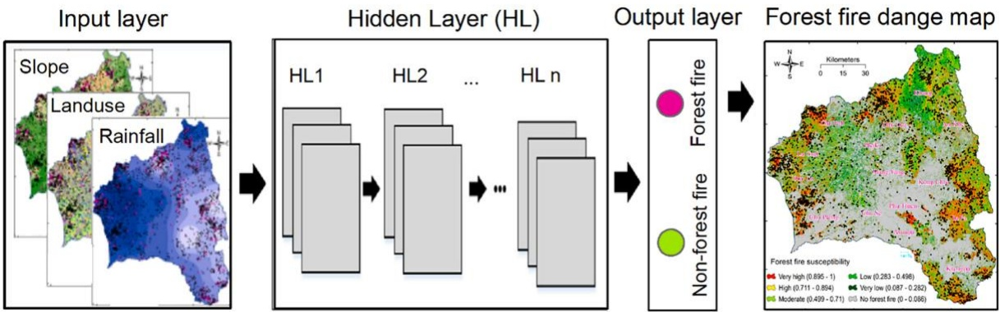

Hình 1-1Một ví dụ về cấu trúc mô hình Học sâu

Một kiến trúc học sâu tiêu biểu, như được minh họa trong Hình 1-1, bao gồm một lớp đầu vào, nhiều lớp ẩn và một lớp đầu ra. Độ sâu của kiến trúc được xác định bởi số lượng lớp ẩn. Bằng cách thích nghi cấu trúc Mạng nơ-ron sâu, các hàm ánh xạ phi tuyến khác nhau có thể được học dựa trên loại lớp ẩn được sử dụng [26].

<!-- page: 24 -->

Hình 1-1 minh họa kiến trúc Mạng nơ-ron sâu có thể được sử dụng hiệu quả cho việc lập bản đồ mức độ nguy hiểm với cháy rừng. Lớp đầu vào cung cấp dữ liệu cho mạng với các vector đặc trưng thô mô tả cả điều kiện tự nhiên (như độ dốc và lượng mưa) và điều kiện liên quan đến hoạt động của con người (như sử dụng đất).

Các lớp ẩn xử lý tuần tự dữ liệu đầu vào, tạo ra các trừu tượng hóa giúp việc học các khái niệm phức tạp trở nên đơn giản hơn. Trong lớp đầu ra cuối cùng, hàm kích hoạt softmax có thể được sử dụng để tính toán xác suất của từng lớp đầu ra [27]. Trong trường hợp này, có hai lớp đầu ra: “không cháy rừng” và “cháy rừng”, được biểu diễn dưới dạng chỉ số xác suất. Những chỉ số xác suất này liên quan đến cháy rừng sẽ được sử dụng để tạo ra một bản đồ chỉ ra mức độ nguy hiểm cháy rừng.

## 1.1.2 Học tổng hợp

Học tổng hợp (Ensemble Learning) là chiến lược học máy kết hợp nhiều mô hình cơ bản để tạo ra một mô hình phân loại đơn lẻ, chính xác và tối ưu hơn [28]. Những mô hình cơ bản này, có thể bao gồm cây quyết định, máy vector hỗ trợ, mạng nơ-ron , hoặc thậm chí là các mô hình ensemble khác.

Khái niệm cơ bản của học tổng hợp là việc thiết lập một “mô hình phân loại mạnh” từ nhóm các “mô hình phân loại cơ sở”. Mỗi mô hình phân loại cơ sở đóng góp một đầu ra hoạt động khá hơn cơ hội ngẫu nhiên. Những đầu ra này sau đó được kết hợp theo một phương pháp cụ thể, như hệ thống bỏ phiếu, để đưa ra đầu ra cuối cùng.

Học Ensemble có thể được thực hiện theo nhiều cách:

**Bagging (Bootstrap Aggregating):** Phương pháp này bao gồm việc tạo ra nhiều tập con từ dữ liệu gốc, huấn luyện một mô hình trên mỗi tập con, và tích hợp các đầu ra [28]. Bagging là phương pháp học ensemble được sử dụng để cải thiện độ chính xác của các thuật toán học máy, đặc biệt là các thuật toán học yếu đối mặt với dữ liệu nhiễu như cây quyết định. Rừng ngẫu nhiên là một ví dụ điển hình của thuật toán bagging. Các bước trong thuật toán Bagging bao gồm:

Lấy mẫu ngẫu nhiên có hoàn lại các tập con từ Bộ dữ liệu gốc. Mỗi tập con có kích thước bằng với Bộ dữ liệu gốc.

<!-- page: 25 -->

Sử dụng mỗi tập con để huấn luyện một mô hình riêng biệt. Những mô hình này thường cùng loại, ví dụ như cây quyết định.

Để phân loại một điểm dữ liệu mới, mỗi mô hình đưa ra một dự đoán. Đầu ra cuối cùng được tính toán bằng cách bỏ phiếu các phân loại từ mỗi mô hình.

## Ưu điểm:

Giảm biến động vì mỗi mô hình được huấn luyện trên các tập con khác nhau.

Giảm quá khớp cho các mô hình phân loại cơ sở đối phó với dữ liệu nhiễu.

## Nhược điểm:

Tăng độ thiên lệch nếu kết hợp các mô hình phân loại cơ sở.

\- Cần nhiều tính toán để huấn luyện nhiều mô hình.

**Boosting:** Phương pháp này huấn luyện các mô hình theo chuỗi, trong đó mỗi mô hình tiếp theo được huấn luyện để sửa chữa các lỗi của mô hình trước đó [28]. AdaBoost hoặc Gradient Boosting là những ví dụ của các thuật toán boosting.

## AdaBoost:

Huấn luyện tuần tự nhiều mô hình phân loại cơ sở trên Bộ dữ liệu, với mỗi mô hình học dựa trên kết quả của mô hình trước đó.

Các mẫu bị phân loại sai bởi mô hình trước được gán trọng số cao hơn để mô hình tiếp theo tập trung cải thiện chúng.

Các mô hình được kết hợp thông qua bỏ phiếu có trọng số.

Gradient Boosting:

Xây dựng các mô hình dựa trên một hàm mất mát như MSE (Mean Squared Error - Lỗi trung phương), MAE (Mean Absolute Error - Lỗi Tuyệt Đối Trung Bình).

Mỗi mô hình cố gắng giảm thiểu hàm mất mát bằng cách tính toán đạo hàm của hàm mất mát.

Ưu điểm của Boosting:

Giảm thiên lệch (bias) bằng cách kết hợp các mô hình phân loại mạnh dần lên.

\- Giảm quá khớp bằng cách tập trung vào các mẫu bị phân loại sai.

<!-- page: 26 -->

Nhược điểm của Boosting:

\- Có thể dẫn đến quá khớp nếu sử dụng quá nhiều mô hình.

\- Cần nhiều tính toán để huấn luyện nhiều mô hình.

**Stacking (xếp chồng):** Kỹ thuật này bao gồm việc huấn luyện một số mô hình đa dạng trên cùng một Bộ dữ liệu, sau đó kết hợp hoặc “xếp chồng” các mô hình này bằng cách huấn luyện một mô hình bổ sung để đưa ra phân loại cuối cùng dựa trên các phân loại của các mô hình khác .

Thuật toán xếp chồng tuân theo các bước sau:

1) Chia dữ liệu thành 2 tập: tập huấn luyện và tập kiểm thử.

2) Huấn luyện các mô hình cơ bản (fundamental models) trên tập huấn luyện như DecisionTree, SVM, KNN, v.v…

3) Sử dụng mỗi mô hình cơ bản để đưa ra phân loại trên tập kiểm thử. Kết quả là các phân loại từ mỗi mô hình cho mỗi điểm dữ liệu.

4) Sử dụng những phân loại này làm đầu vào, huấn luyện mô hình metalearner trên tập kiểm thử. Mô hình này có thể là LogisticRegression, SVM, XGBoost, v.v.

5) Để đưa ra phân loại trên điểm dữ liệu mới, sử dụng các mô hình cơ bản để tạo dự đoán, sau đó sử dụng những kết quả này làm đầu vào cho mô hình meta-learner để đưa ra phân loại cuối cùng.

Ưu điểm của phương pháp xếp chồng:

\- Kết hợp các mô hình khác nhau, tăng độ chính xác.

\- Mô hình meta-learner học cách kết hợp tối ưu các mô hình cơ bản.

Nhược điểm:

\- Phức tạp hơn so với các phương pháp kết hợp khác.

\- Đòi hỏi thời gian huấn luyện lâu hơn.

Những động cơ chính để sử dụng Học kết hợp bao gồm:

Tăng cường độ chính xác trong dự đoán: Học tập Kết hợp thường đạt được độ chính xác phân loại vượt trội bằng cách tích hợp nhiều mô hình, so với bất kỳ mô hình đơn lẻ nào.

Giảm thiểu hiện tượng quá khớp: Các phương pháp kết hợp làm giảm bias, giảm phương sai và ít bị ảnh hưởng bởi nhiễu ngẫu nhiên trong dữ liệu huấn luyện, từ đó giảm khả năng quá khớp cho mô hình.

<!-- page: 27 -->

Tăng cường sự ổn định của mô hình: Các mô hình kết hợp thường ổn định và robust hơn so với các ước lượng đơn lẻ, làm cho chúng trở thành lựa chọn xuất sắc cho môi trường sản xuất.

Tuy nhiên, các mô hình kết hợp không phải lúc nào cũng là giải pháp tốt nhất. Chúng có thể tiêu tốn nhiều tài nguyên tính toán và có thể không hoạt động tối ưu cho tất cả các loại vấn đề. Giống như bất kỳ thuật toán học máy nào, việc cân nhắc kỹ lưỡng các sự đánh đổi trước khi lựa chọn một mô hình kết hợp là rất quan trọng.

## 1.2 Các thuật toán học máy cơ sở

Một loạt các mô hình học máy đã được sử dụng để xây dựng các bản đồ phân vùng các hiểm họa tự nhiên, tận dụng những ưu điểm độc đáo của chúng trong phân tích dữ liệu và nhận diện mẫu. Trong phần này, luận án sẽ khám phá các mô hình đã được thiết lập, sử dụng chúng như các mô hình tham chiếu để đối chiếu và so sánh với các mô hình được đề xuất.

## 1.2.1 Máy vector hỗ trợ

Máy vector hỗ trợ (Support Vector Machine - SVM) [29] là thuật toán học có giám sát, chủ yếu dùng cho phân loại và hồi quy, hoạt động bằng cách xác định siêu phẳng tối ưu trong không gian đặc trưng. SVM hiệu quả trong việc tránh overfitting và tìm nghiệm tối ưu toàn cục, nhưng gặp hạn chế về tính giải thích, chi phí tính toán, và độ nhạy với nhiễu. Mặc có những hạn chế, SVM vẫn phù hợp cho nhiều bài toán phân loại, đặc biệt là các vấn đề nhị phân có số chiều cao. Tuy nhiên, với dữ liệu lớn hoặc yêu cầu tính giải thích cao, cần cân nhắc sử dụng hoặc kết hợp với các phương pháp khác.

## 1.2.2 Máy vector liên quan

Máy vector liên quan (Relevance Vector Machines - RVMs) [30] là kỹ thuật học có giám sát sử dụng phương pháp Bayesian cho hồi quy và phân loại, được xem như biến thể xác suất của SVM. Ưu điểm của RVM bao gồm tạo mô hình thưa thớt, ít phức tạp hơn, cung cấp ước lượng xác suất và tự động chọn siêu tham số. Tuy nhiên, RVM có thời gian huấn luyện dài hơn, dễ bị ảnh hưởng bởi cực tiểu cục bộ, có xu hướng overfitting cao hơn với dữ liệu nhiễu và phức tạp hơn trong việc triển khai so với SVM.

<!-- page: 28 -->

## 1.2.3 Rừng ngẫu nhiên

Thuật toán Rừng ngẫu nhiên (Random Forests – RF) [31] là phương pháp học máy ensemble mạnh mẽ dùng cho phân loại và hồi quy, kết hợp nhiều cây quyết định từ mẫu dữ liệu ngẫu nhiên. Ưu điểm của RF bao gồm khả năng xử lý dữ liệu đa chiều, tránh overfitting, đánh giá tầm quan trọng đặc trưng và xử lý dữ liệu không cân bằng. Tuy nhiên, RF có thể chậm trong huấn luyện và dự đoán với dữ liệu lớn, khó giải thích, có thể thiên vị với đặc trưng đa dạng và gặp khó khăn khi ngoại suy. Mặc dù có hạn chế, RF vẫn là lựa chọn phổ biến do cân bằng giữa hiệu suất và tính đơn giản.

## 1.2.4 Hồi quy Logistic

Hồi quy Logistic (Logistic Regression – LR) [32] là thuật toán phân loại dùng cho dự đoán với biến kết quả nhị phân, ứng dụng rộng rãi trong học máy cho các vấn đề như phát hiện thư rác và phân loại bệnh tật. Mục tiêu của LR là mô tả mối quan hệ giữa kết quả nhị phân và các biến dự đoán. Trong luận án này, LR Nhị phân được áp dụng cho các biến mục tiêu như “Có cháy/Không cháy” hoặc “Có lở đất/Không lở đất”. Phương pháp này sử dụng hàm mất mát Logistic (Cross Entropy) trong quá trình huấn luyện để tối ưu hóa mô hình phân loại.

## 1.2.5 Mạng nơ-ron đa tầng

Mạng nơ-ron Perceptron đa tầng (MLPNeuNet) [33] Mạng nơ-ron nhân tạo gồm nhiều tầng nút liên kết. Cấu trúc bao gồm tầng nhập, tầng ẩn và tầng xuất, cho phép nắm bắt mối quan hệ dữ liệu phức tạp. MLPNeuNet là nền tảng cho học sâu nhưng có hạn chế như dễ bị overfitting, khó xác định cấu trúc tối ưu, và có thể kém hiệu quả hơn các mạng chuyên biệt (như CNN, RNN) cho những tác vụ phức tạp.

## 1.2.6 Thuật toán cây quyết định SPAARC

Thuật toán cây quyết định SPAARC (Split-Point And Attribute Reduced Classifier) (Phân loại dựa trên điểm phân chia và giảm thuộc tính) [34] mở rộng thuật toán cây Phân loại và Hồi quy (Classification and Regression Tree - CART) , ban đầu được triển khai trong Weka [35]. SPAARC kết hợp hai kỹ thuật chính - lấy mẫu thuộc tính nút (NAS) và lấy mẫu điểm phân chia (SPS) - để tăng tốc quá trình tạo cây quyết định đồng thời giữ vững độ chính xác.

<!-- page: 29 -->

## 1.2.6.1 Lấy mẫu thuộc tính nút

Lấy mẫu thuộc tính nút (Node Attribute Sampling - NAS): Kỹ thuật này liên quan đến việc lựa chọn một tập con các thuộc tính một cách ngẫu nhiên ở mỗi nút của cây quyết định thay vì sử dụng tất cả các thuộc tính có sẵn. Việc giảm số lượng thuộc tính xem xét có thể làm giảm thời gian cần thiết để tìm ra điểm phân chia tốt nhất tại mỗi nút và giúp tránh hiện tượng quá khớp do giảm độ phức tạp của mô hình. Giả code của hàm Lấy mẫu thuộc tính nút (NAS) trong SPAARC [34] được thể hiện ở Phụ lục PL1.

## 1.2.6.2 Mẫu điểm phân chia

Hàm NodeAttributeSample cũng gọi hàm Chọn điểm phân chia SplitPointSample (SPS), là một kỹ thuật quan trọng nhằm tối ưu hóa quá trình xây dựng cây quyết định. NAS hoạt động bằng cách chọn ngẫu nhiên một tập con thuộc tính tại mỗi nút, thay vì sử dụng toàn bộ thuộc tính có sẵn. Phương pháp này không chỉ giúp giảm thời gian tìm kiếm điểm phân chia tối ưu mà còn hạn chế nguy cơ quá khớp bằng cách giảm độ phức tạp của mô hình. Kết hợp với hàm Chọn điểm phân chia (SPS), NAS đóng vai trò then chốt trong việc tăng tốc và cải thiện hiệu suất của SPAARC [34], đồng thời góp phần tạo ra các cây quyết định đa dạng và hiệu quả trong mô hình học tổng hợp.

Giống như Rừng ngẫu nhiên (Random Forests) [31], SPAARC có một siêu tham số chính TotalTrees biểu thị số lượng cây trong bộ. Tổng thể, NAS và SPS cho phép kích thích cây quyết định nhanh hơn, hiệu quả hơn trong khi vẫn duy trì độ chính xác dự đoán.

Điều được thiết lập rõ ràng là các mô hình tổ hợp có khả năng đạt được độ chính xác phân loại cao hơn khi các cây quyết định thành phần của chúng tương đối không tương quan [36]. Để thúc đẩy sự đa dạng này trong mô hình học tổng hợp, hai kỹ thuật được triển khai: Subbagging và Random Subspacing.

## 1.2.6.3 Subbagging

Subbagging, hay còn gọi là Tổng hợp mẫu con [37], một phương pháp thay thế cho Bootstrap Aggregating (bagging) trong Rừng ngẫu nhiên, nhằm giảm biến động và nguy cơ quá khớp trong các cây quyết định. Thay vì lấy mẫu có hoàn lại, Subbagging chọn một tỷ lệ cố định của thực thể từ bộ dữ liệu gốc mà không lặp lại. Phương pháp này sử dụng tham số SizePercentage để tối ưu hóa tỷ lệ mẫu, tạo ra các tập con dữ liệu duy nhất cho mỗi cây, từ đó tăng tính

<!-- page: 30 -->

đa dạng trong mô hình tổng hợp. Tỷ lệ mẫu, được gọi là SizePercentage, là siêu tham số được tối ưu hóa trong Subbagging.

## 1.2.6.4 Không gian phụ ngẫu nhiên

Phương pháp không gian phụ ngẫu nhiên (Random Subspacing) [38] là kỹ thuật tăng đa dạng cây quyết định và giảm biến động bằng cách chọn ngẫu nhiên tập con thuộc tính cho mỗi cây, thay vì mỗi nút. Điều này giúp giảm thời gian xử lý, tránh quá khớp và tăng độ chính xác mô hình. Trong nghiên cứu này, phương pháp được điều chỉnh để áp dụng cho toàn bộ cây SPAARC, không phải từng nút, nhằm tăng đa dạng cây thành phần. Siêu tham số quan trọng là Kích thước không gian phụ (subSpaceSize), xác định phần trăm thuộc tính được chọn cho mỗi cây.

## 1.3 Các thuật toán tối ưu hoá

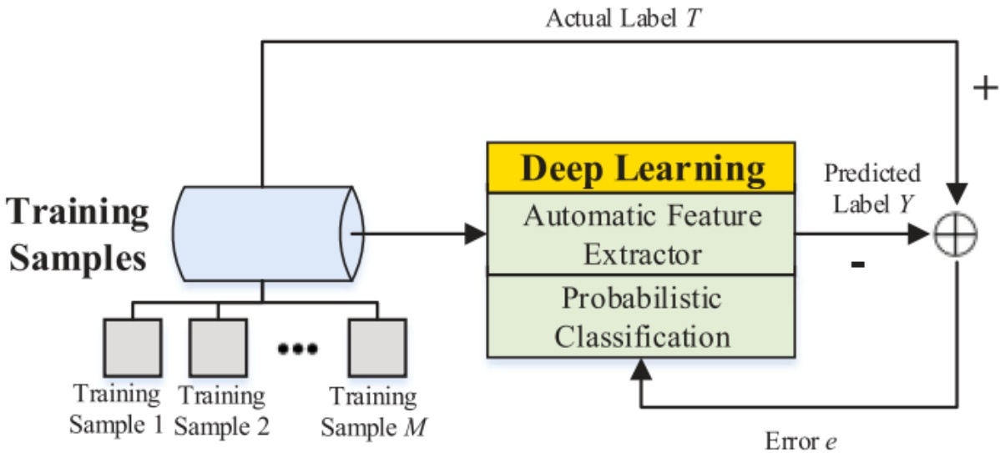

Hình 1-2Quy trình chung của việc thay đổi trọng số mạng lưới trong học sâu

Một trong những ưu điểm nổi bật của phương pháp Học máy tiên tiến là khả năng suy luận các biểu diễn cấp cao từ các đặc trưng gốc. Tuy nhiên, hiệu quả của việc trích xuất đặc trưng cấp cao trong các Mạng nơ-ron sâu phụ thuộc nhiều vào các thuật toán tối ưu hóa được sử dụng để điều chỉnh tinh vi trọng số của mạng, như được mô tả trong Hình 1-2. Trong bối cảnh này, một số thuật toán tối ưu hóa nổi tiếng đã được đánh giá, bao gồm Phương pháp giảm dần độ dốc ngẫu nhiên (Stochastic Gradient Descent - SGD), Phương pháp lan truyền bình phương trung bình gốc (Root Mean Square Propagation - RMSProp), Ước lượng Moment thích ứng (Adaptive Moment Estimation - Adam), Adadelta,

<!-- page: 31 -->

Tối ưu hóa dựa trên Địa sinh học (Biogeography-Based Optimization - BBO), và Tiến hóa vi phân (Differential Evolution - DE).

## 1.3.1 Phương pháp giảm dần độ dốc ngẫu nhiên

Phương pháp giảm dần độ dốc ngẫu nhiên (Stochastic Gradient Descent - SGD) [39] là thuật toán tối ưu hóa trong học máy, cập nhật tham $\mathrm { s } \hat { \hat { 0 } }$ mô hình sử dụng từng mẫu hoặc nhóm nhỏ mẫu tại mỗi lần lặp. Quy trình gồm: khởi tạo tham số ngẫu nhiên, thiết lập tốc độ học, và lặp lại việc xáo trộn dữ liệu, tính gradient, cập nhật tham số cho đến khi hội tụ.

Công thức cập nhật:

$$
\mathbf {w} = \mathbf {w} - \boldsymbol {\alpha} \times \nabla \mathbf {L} (\mathbf {w}),\tag{1.1}
$$

với w là trọng số, α là tốc độ học, và ∇L(w) là gradient hàm mất mát. SGD hiệu quả với dữ liệu lớn, cân bằng giữa tốc độ hội tụ và nhiễu trong cập nhật, được ứng dụng rộng rãi trong đào tạo mô hình học máy.

## 1.3.2 Thuật toán lan truyền trung bình bình phương gốc

Thuật toán lan truyền trung bình bình phương gốc (Root Mean Square Propagation - RMSProp) là thuật toán tối ưu hóa trong học sâu, được Tieleman và Hinton đề xuất. Nó thích nghi tốc độ học cho từng tham số dựa trên độ lớn gradient, giảm dao động bằng cách áp dụng tốc độ học khác nhau cho các trọng số. RMSProp sử dụng trung bình cộng di chuyển có trọng số mũ của bình phương gradient để điều chỉnh tốc độ học, giúp thích nghi nhanh với thay đổi gradient. Phương pháp này cân bằng giữa tốc độ hội tụ và ổn định, làm cho nó trở thành một trong những thuật toán tối ưu hóa phổ biến trong học sâu.

## 1.3.3 Thuật toán Adam

Ước lượng moment Thích ứng (Adaptive Moment Estimation - Adam) là một thuật toán tối ưu hóa tốc độ học thích nghi thường được sử dụng để đào tạo các Mạng nơ-ron sâu. Được đề xuất trong bài báo năm 2015 “Adam: A Method for Stochastic Optimization” bởi Kingma và Ba [40], Adam kết hợp những ưu điểm của hai thuật tối ưu hóa phổ biến khác - AdaGrad và RMSProp.

Thuật toán tối ưu hóa Adam (Adaptive Moment Estimation) áp dụng tốc độ học thích ứng dựa trên ước lượng moment bậc nhất và bậc hai của gradient. Phương pháp này duy trì trung bình di động mũ của gradient và bình phương

<!-- page: 32 -->

gradient cho mỗi tham $s \hat { \hat { 0 } } ,$ cho phép điều chỉnh tốc độ học một cách động. Cơ chế này tạo điều kiện cho các cập nhật có biên độ lớn đối với tham $s \hat { 0 }$ ít xuất hiện và ngược lại, từ đó cải thiện tốc độ hội tụ so với phương pháp gradient descent ngẫu nhiên cổ điển.

Adam đặc biệt hiệu quả đối với các bài toán có tập dữ liệu lớn và không gian tham số cao, đặc biệt là trong huấn luyện Mạng nơ-ron sâu. Các siêu tham số chính của Adam bao gồm tốc độ học $\alpha ,$ hệ $s \hat { 0 }$ suy giảm mũ β1 và β2 cho ước lượng moment, và hằng số ổn định ε. Ưu điểm của Adam bao gồm hiệu suất cao, yêu cầu bộ nhớ và tính toán thấp, khả năng xử lý gradient thưa, làm cho nó trở thành lựa chọn phổ biến trong học sâu, đặc biệt là đối với các bài toán có dữ liệu nhiễu hoặc kích thước lớn..

## 1.3.4 Adadelta

Adadelta được giới thiệu bởi Zeiler vào năm 2012 [41], giải quyết vấn đề của tốc độ học giảm một cách đơn điệu. Nó đạt được điều này bằng cách giới hạn kích thước cửa $s \hat { \hat { 0 } }$ gradient quá khứ được tích lũy. Đáng chú $\acute { \mathbf { y } } ,$ phương pháp Adadelta loại bỏ nhu cầu phải thiết lập thủ công tốc độ học mặc định. Các phương trình cập nhật trọng $\mathrm { s } \hat { \hat { 0 } }$ cho mạng được cho trong Phương trình dưới đây:

$$
w _ {t + 1} ^ {(j)} = w _ {t} ^ {(j)} - \frac {R M S [ \Delta w ] t}{R M S [ g ] t} g _ {t} ^ {(j)}\tag{1.2}
$$

Trong đó:

$w _ { t + 1 } ^ { ( j ) }$ biểu diễn trọng $s \hat { 0 }$ đã được cập nhật của tham $\mathrm { s } \hat { \hat { 0 } }   \mathbf { j }$ tại bước thời gian t +1

$w _ { t } ^ { ( j ) }$ chỉ giá trị trước đó của trọng số j tại bước thời gian t.

• Δw biểu diễn cập nhật tham $\mathrm { s } \hat { \hat { 0 } }$ tại bước thời gian t.

• 𝑔(𝑗) $g _ { t } ^ { ( j ) }$ biểu diễn gradient của trọng $\mathrm { s } \hat { 0 }   \mathbf { j }$ tại bước thời gian t.

• RMS[Δw]t chỉ lỗi trung bình bình phương $\mathbf { g } \mathbf { \hat { \hat { o } } } \mathbf { c }$ của các cập nhật tham $s \hat { 0 }$ tại bước thời gian t.

RMS[g]t biểu diễn lỗi trung bình bình phương $\mathbf { g } \mathbf { \hat { \hat { o } } } \mathbf { c }$ của các gradient tại bước thời gian t.

<!-- page: 33 -->

## 1.3.5 Tối ưu hóa dựa trên Địa sinh học

Tối ưu hóa dựa trên Địa sinh học (Biogeography-Based Optimization - BBO) [42] là một thuật toán tối ưu hóa tiến hóa do Simon và cộng sự đề xuất năm 2008, lấy cảm hứng từ nguyên lý phân bố địa lý của sinh vật. BBO mô phỏng các giải pháp tối ưu như “môi trường sống” với “Chỉ số thích hợp Môi trường sống” (Habitat Suitability Index - HSI) tương ứng với độ thích nghi.

Các nguyên lý cốt lõi của BBO bao gồm:

HSI: Đo lường mức độ thích nghi của giải pháp

Di cư: Cơ chế trao đổi đặc điểm giữa các giải pháp, với xu hướng di cư từ giải pháp chất lượng cao đến giải pháp chất lượng thấp

Đột biến: Duy trì đa dạng quần thể và ngăn ngừa hội tụ sớm

Thuật toán hoạt động dựa trên hai cơ chế chính: di cư và đột biến. Cơ chế di cư cho phép trao đổi đặc điểm giữa các giải pháp, trong đó các giải pháp có HSI cao sẽ có xu hướng chia sẻ đặc điểm với các giải pháp có HSI thấp. Điều này giúp cải thiện chất lượng của các giải pháp kém và lan truyền các đặc điểm tốt trong quần thể. Cơ chế đột biến tạo ra những thay đổi ngẫu nhiên trong các giải pháp, giúp duy trì tính đa dạng của quần thể và tránh hội tụ sớm vào các cực trị địa phương.

BBO có những ưu điểm như dễ hiện thực, cân bằng tốt giữa khai thác (exploitation) và khám phá (exploration), và hiệu quả với nhiều loại bài toán tối ưu. Tuy nhiên, thuật toán cũng có một số hạn chế như khả năng hội tụ sớm và phụ thuộc vào việc điều chỉnh tham số. Hiệu quả của BBO phụ thuộc nhiều vào các yếu tố như kích thước quần thể, tỷ lệ di cư, tỷ lệ đột biến, cũng như đặc điểm của bài toán cụ thể như không gian tìm kiếm và độ phức tạp của hàm mục tiêu.

Hiệu quả của BBO phụ thuộc vào đặc điểm cụ thể của bài toán. Do đó, việc so sánh hiệu suất với các thuật toán tối ưu hóa khác là cần thiết để xác định phương pháp phù hợp nhất cho mỗi trường hợp cụ thể..

## 1.3.6 Tiến hoá vi phân

Tiến hóa vi phân (Differiential Evolution - DE) [43] là một phương pháp tối ưu hóa ngẫu nhiên dựa trên nguyên lý tiến hóa sinh học, được Storn và Price

<!-- page: 34 -->

giới thiệu năm 1995. Thuật toán này đặc biệt hiệu quả trong tối ưu hóa liên tục và được ứng dụng rộng rãi cho các bài toán tối ưu hóa toàn cục.

Về mặt quy trình, DE hoạt động thông qua bốn bước chính: Đầu tiên là khởi tạo quần thể ban đầu một cách ngẫu nhiên. Tiếp theo, thuật toán tạo ra các vector đột biến bằng cách kết hợp các cá thể hiện có trong quần thể. Sau đó, quá trình lai ghép được thực hiện để tạo ra các vector thử nghiệm mới. Cuối cùng, thuật toán thực hiện so sánh và chọn lọc dựa trên độ thích nghi của các cá thể. Toàn bộ quy trình này được lặp lại liên tục cho đến khi đạt được điều kiện dừng đã định trước.

Một trong những điểm mạnh nổi bật của DE là tính đơn giản trong cấu trúc thuật toán, độ tin cậy cao trong việc tìm kiếm giải pháp, và đặc biệt là khả năng xác định được cực tiểu toàn cục cho các hàm mục tiêu phức tạp. Những ưu điểm này, cùng với hiệu quả đã được chứng minh trong việc giải quyết đa dạng các bài toán từ tối ưu hóa số học, tổ hợp đến các ứng dụng thực tế, đã góp phần quan trọng vào việc DE được cộng đồng nghiên cứu tối ưu hóa áp dụng rộng rãi.

## 1.4 Các phương pháp phân loại dữ liệu

Quá trình phân loại dữ liệu kết hợp dữ liệu thành các khoảng hoặc các lớp được xác định trước [44] [45]. Những lớp này có thể được biểu diễn trên bản đồ bằng các ký hiệu riêng biệt hoặc màu sắc riêng. Trong luận án này, các bản đồ chuyên đề được tô màu theo cấp độ để biểu diễn dữ liệu có liên quan, bao gồm các yếu tố ảnh hưởng đến nguy cơ xảy ra thiên tai và phân vùng nguy cơ xảy ra thiên tai, dữ liệu được phân bố theo các khoảng và được trình bày trên bản đồ chuyên đề.

Có nhiều phương pháp để phân loại dữ liệu theo khoảng, những phương pháp này chia các giá trị thuộc tính thành các khoảng theo các mẫu khoảng cách khác nhau. Các phương pháp phân loại dữ liệu theo khoảng thông dụng có thể kể đến bao gồm:

## 1.4.1 Phương pháp phân loại khoảng bằng nhau

Theo Kraak & Ormeling [44], phương pháp phân loại khoảng bằng nhau (Equal Interval Classification) chia phạm vi các giá trị thuộc tính thành các lớp có kích thước bằng nhau. Phân loại theo phương pháp này sử dụng tốt nhất cho các bộ dữ liệu liên tục như lượng mưa, nhiệt độ.

<!-- page: 35 -->

Ưu điểm của phương pháp này mang lại khả năng chú giải dễ dàng đối với dữ liệu, phù hợp với đối tượng không chuyên. Tuy nhiên các bộ dữ liệu có thể bị rơi hầu hết vào một số ít các lớp trong khi lớp khác lại có ít hoặc không có dữ liệu nào.

## 1.4.2 Phương pháp phân loại khoảng không bằng nhau

Phương pháp phân loại khoảng không bằng nhau (Unequal Interval Classification) chia phạm vi các giá trị thuộc tính thành các lớp có kích thước độ rộng khác nhau [44]. Phân loại theo phương pháp này sử dụng tốt nhất cho các bộ dữ liệu phân bố không đều ví dụ như phân vùng mục đích sử dụng đất, phân vùng mật độ giao thông, mật độ sông, suối,...

Ưu điểm của phương pháp này mang lại khả năng điều chỉnh linh hoạt kích thước khoảng để phân bố các ngưỡng có ý nghĩa trong dữ liệu. Tuy nhiên các bộ dữ liệu có thể bị vô tình (hoặc cố ý) bị tạo ra các khoảng để nhấn mạnh, hoặc che dấu một số đặc điểm của dữ liệu. Ngoài ra, đây là phương pháp không phù hợp với mọi loại dữ liệu và cũng không phù hợp với người không chuyên do đây là phương pháp khó giải thích lý do cho việc chọn các khoảng cụ thể.

## 1.4.3 Phương pháp phân loại phân vị

Phương pháp phân loại phân vị (Quantile Classification) đặt số lượng dữ liệu bằng nhau vào mỗi lớp. Do đó phương pháp này phù hợp nhất cho dữ liệu phân bố đồng đều trong phạm vi của nó [44].

Ưu điểm của phân loại phân vị là nó thường nhấn mạnh vị trí tương đối của các giá trị dữ liệu. Tuy nhiên, do thống kê dựa trên số lượng nên giá trị của các bản ghi trong cùng một lớp có thể có giá trị khác nhau vô cùng lớn, ngược lại những bản ghi có giá trị chênh lệch rất nhỏ lại có thể nằm ở hai lớp khác nhau. Điều này mang lại sự khác biệt lớn trong bộ dữ liệu so với thực tế.

## 1.4.4 Phương pháp phân loại độ lệch chuẩn

Phương pháp phân loại độ lệch chuẩn (Standard Deviation Classification) tạo ra các lớp phân loại từ việc cộng trừ độ lệch chuẩn từ giá trị trung bình của bộ dữ liệu [44]. Đây là phương pháp phù hợp với dữ liệu tuân theo phân phối chuẩn. Tuy nhiên, việc sử dụng độ lệch chuẩn để tạo các lớp có thể gây khó hiểu cho người theo dõi. Ngoài ra, nếu dùng phương pháp này cho nhiều bộ dữ liệu khác nhau có thể không so sánh được vì mỗi bộ dữ liệu có giá trị trung bình và độ lệch chuẩn riêng.

<!-- page: 36 -->

## 1.4.5 Phương pháp pháp phân loại ngắt tự nhiên

Phương pháp pháp phân loại ngắt tự nhiên (Natural Break Classification) sử dụng một thuật toán để nhóm các giá trị thành các lớp được phân tách thành các điểm ngắt riêng biệt [45]. Phương pháp này được sử dụng tốt nhất với dữ liệu được phân bố không đồng đều nhưng không bị lệch về một trong hai đầu của phân phối. Natural Break cho phép các khoảng giá trị có độ rộng khác nhau, phù hợp với phân bố tự nhiên của dữ liệu.

Ví dụ: khi sử dụng Natural Break cho dữ liệu phân vùng nguy cơ sạt lở đất, tỷ lệ dữ liệu được phân chia theo diện tích gồm 50% nguy cơ thấp, 20% nguy cơ trung bình, 20% nguy cơ cao và 10% nguy cơ rất cao. Trong khi giá trị khoảng thấp lên tới 50%, thì khoảng rất cao chỉ chiếm 10% về mặt diện tích. Khi đưa vào bài toán thực tế, khoảng nguy cơ rất cao tuy chỉ chiếm 10% diện tích nhưng lại chiếm phần lớn số vụ sạt lở đất được ghi lại trong lịch sử.

Trong luận án này, các phương pháp trên đều được sử dụng trong việc phân loại dữ liệu trong các bản đồ của các yếu tố ảnh hưởng đến nguy cơ xảy ra cháy rừng hoặc sạt lở đất cũng như bản đồ phân vùng nguy cơ cháy rừng và sạt lở đất là sản phẩm đầu ra của nghiên cứu.

## 1.5 Tổng quan tình hình nghiên cứu trong và ngoài nước

## 1.5.1 Vấn đề dự đoán cháy rừng

Các vụ cháy rừng không chỉ gây ảnh hưởng trực tiếp đến các khu vực bị cháy mà còn có tác động đến khí hậu, chất lượng không khí, và hệ sinh thái trên phạm vi toàn cầu. Do đó, việc xây dựng bản đồ nguy cơ cháy rừng là một công cụ quan trọng giúp các nhà khoa học, nhà quản lý rừng, và các cơ quan chức năng hiểu và đánh giá nguy cơ cháy rừng. Các phương pháp xây dựng bản đồ nguy cơ cháy rừng thường được phân loại dựa trên các cách tiếp cận nghiên cứu dựa trên phương pháp xử lý hoặc dựa trên dữ liệu sử dụng. Phân loại theo phương pháp xử lý bao gồm:

**- Các nghiên cứu ngoài nước:**

**Các nghiên cứu sử dụng Mô hình địa không gian và phương pháp thống kê:** Những phương pháp này kết hợp sử dụng thông tin địa không gian và phân tích thống kê để phân loại nguy cơ cháy rừng [2], [16]. Chuvieco và đồng nghiệp [2] đã cung cấp những thảo luận chi tiết về các chiến lược phòng cháy, bao gồm định nghĩa về khả năng chịu cháy, nguy cơ cháy, rủi ro cháy và

<!-- page: 37 -->

nguy hiểm xảy ra do cháy. Cần phải xem xét các yếu tố khác nhau như điều kiện khí hậu, các tác nhân gây ra và các thiệt hại có thể xảy ra. Nói cách khác, nguy cơ cháy cần phải cung cấp cả khía cạnh không gian và thời gian của đám cháy cũng như ảnh hưởng của nó. Trong nghiên cứu này, nhóm tác giả phân loại không gian nguy cơ cháy rừng bằng cách sử dụng bản đồ nguy cơ cháy rừng, là một trong những công cụ hữu ích nhất. Tương tự, Guo và đồng nghiệp [46] đã sử dụng phương pháp nghiên cứu được sử dụng bao gồm việc phân tích mô hình hồi quy logistic và hàm K của Ripley để nghiên cứu mô hình phân bố không gian và xác định các yếu tố ảnh hưởng đến việc bắt đầu của đám cháy rừng ở tỉnh Fujian, miền Đông Nam Trung Quốc, trong giai đoạn từ năm 2000 đến 2008. Các nhà nghiên cứu đã thu thập và xử lý dữ liệu về nguyên nhân cháy rừng, điều kiện khí hậu, thực vật, địa hình, hạ tầng và yếu tố xã hội kinh tế từ phần mềm ArcGIS. Sử dụng mô hình hồi quy logistic, họ đã vẽ bản đồ phân loại xác suất phát sinh cháy rừng. Phân tích cho thấy đám cháy thường xuất hiện theo cụm do ảnh hưởng của nhiều yếu tố phức hợp. Bản đồ nguy cơ cháy rừng được phát triển từ mô hình này giúp hướng dẫn việc phân phối nguồn lực phòng cháy và cải thiện hiệu quả quản lý rừng tại Đông Nam Trung Quốc.

Cần áp dụng những kỹ thuật thống kê tiên tiến hơn để tính toán các tương tác phức tạp và mối quan hệ phi tuyến giữa các biến số. Ngoài ra, cần có sự đánh giá bền vững hơn đối với những phương pháp này để xác thực và đảm bảo độ tin cậy.

## Các mô hình học máy:

Trong bối cảnh hiện nay, khi công nghệ học máy (Machine Learning - ML) phát triển với tốc độ chóng mặt và dữ liệu cảm biến từ xa ngày càng dễ tiếp cận [47], nghiên cứu và phát triển các mô hình ML để phân loại nguy cơ cháy rừng đã trở nên phổ biến. Tehrany và đồng nghiệp [48] đã tiên phong áp dụng dữ liệu địa không gian từ nhiều nguồn kết hợp với phương pháp học máy ensemble để phân tích và phân loại cháy rừng nhiệt đới ở Việt Nam. Trong một nghiên cứu tổng quan, Naderpour và cộng sự [49] đã chỉ ra rằng việc ứng dụng ML cùng với các thuật toán ensemble đã chứng minh được khả năng dự đoán chính xác trong việc mô hình hóa các đám cháy rừng. Các mô hình ML có khả năng tiếp thu và học hỏi từ các mô hình phức tạp và quan hệ phi tuyến tính

<!-- page: 38 -->

trong các bộ dữ liệu lớn [48], và khả năng này ngày càng được cải thiện khi chúng được huấn luyện với nhiều dữ liệu hơn.

Tuy nhiên, có một vấn đề đáng kể với các mô hình học máy, đó là sự khó hiểu trong quá trình các mô hình này đưa ra quyết định, thường được ví như là “hộp đen” [48], cùng với yêu cầu về khối lượng lớn dữ liệu đào tạo chất lượng cao. Để giải quyết những hạn chế này, nghiên cứu tiếp theo trong lĩnh vực học máy cần hướng tới việc cải thiện khả năng giải thích của các mô hình, giảm bớt sự phụ thuộc vào dữ liệu và tăng cường hiệu quả trong quá trình đào tạo. Sự tiến triển này không chỉ tăng cường giá trị ứng dụng thực tiễn của học máy mà còn mở rộng phạm vi áp dụng của chúng trong các ngữ cảnh khác nhau.

## Các mô hình học sâu:

Học sâu (Deep Learning) là một nhánh của học máy, ứng dụng cấu trúc mạng nơ-ron để suy luận kết quả từ một tập hợp các biến đầu vào. Các nghiên cứu đã chỉ ra rằng học sâu có hiệu suất vượt trội so với cả các phương pháp truyền thống lẫn các thuật toán ML phổ biến trong nhiều lĩnh vực khác nhau [50], [51]. Trong đánh giá nguy cơ cháy rừng, các mô hình học sâu như mạng nơ-ron tích chập sâu (CNN), mạng nơ-ron học sâu (DLNN), và mạng nơ-ron hồi quy sâu (RNN) đã được sử dụng và cho thấy những kết quả hứa hẹn [52], [53], [54]. Zhang và cộng sự [55] đã nghiên cứu việc sử dụng mô hình CNN cho việc lập bản đồ các khu vực dễ bị cháy rừng. Nghiên cứu khác của Yingshu Penga, Yi Wang đã áp dụng học sâu cho việc phát hiện khói và phát hiện cháy rừng [56].

Các mô hình học sâu có khả năng học các mẫu cực kỳ phức tạp và biểu diễn đặc trưng theo cấp độ từ các bộ dữ liệu lớn. Những mô hình này có thể đạt được hiệu suất hàng đầu trong nhiều tác vụ, bao gồm nhận dạng hình ảnh và xử lý ngôn ngữ tự nhiên, điều này có thể hữu ích trong dự đoán nguy cơ cháy rừng.

Tuy nhiên, giống như các mô hình học máy khác, các mô hình học sâu có thể là hộp đen, làm cho việc giải thích của mô hình trở nên khó khăn. Các mô hình học sâu thường đòi hỏi một lượng lớn dữ liệu và nguồn lực tính toán đáng kể để đào tạo một cách hiệu quả. Nhiều thí nghiệm cần được thực hiện để tìm kiếm kiến trúc mạng và các siêu tham số tối ưu.

<!-- page: 39 -->

Việc cải thiện khả năng giải thích của các mô hình học sâu cũng như giảm bớt yêu cầu về nguồn lực của chúng là một lĩnh vực nghiên cứu then chốt. Điều này có thể cho phép chúng được ứng dụng rộng rãi hơn và đảm bảo rằng các phân loại của chúng có thể được các nhà quyết định tin tưởng và hiểu rõ.

## Các nghiên cứu trong nước:

Sự phát triển của nghiên cứu dự đoán nguy cơ cháy rừng ở Việt Nam có thể được chia thành hai giai đoạn chính:

## Giai đoạn cuối thế kỷ XX và đầu thế kỷ XXI:

Các nghiên cứu dự đoán nguy cơ cháy rừng ở Việt Nam bắt đầu từ cuối thế kỷ XX, dựa trên phương pháp dự báo của Nesterov sử dụng chỉ tiêu tổng hợp P như trong các nghiên cứu của Phạm Ngọc Hưng [57] và Võ Đình Tiến [58]. Phương pháp này tiếp tục được phát triển trong các nghiên cứu sau đó, với việc bổ sung thêm các lớp thông tin đầu vào và điều chỉnh giá trị chỉ tiêu P trong phân cấp nguy cơ cháy rừng [59], [60].

Một hướng nghiên cứu mới được đề xuất bởi Lê Sỹ Doanh và Vương Văn Quỳnh [20], tập trung vào dự báo nguy cơ cháy rừng theo điều kiện khí hậu ở Việt Nam. Trong nghiên cứu này, chỉ số khí hậu phản ánh nguy cơ cháy rừng Qi được xây dựng dựa trên phân tích tương quan hồi quy giữa các giá trị Qi và chỉ số Snc45 (số ngày có nguy cơ cháy rừng cao và rất cao trong tháng theo chỉ số Nesterov).

## Giai đoạn từ đầu thế kỷ XXI:

Từ đầu thế kỷ XXI, nhiều nghiên cứu ở Việt Nam đã bắt đầu sử dụng dữ liệu viễn thám, đặc biệt là từ các hệ thống có bộ cảm biến hồng ngoại nhiệt như Landsat TM, Landsat ETM+, và MODIS để xây dựng các module phần mềm cảnh báo cháy rừng trong nghiên cứu của Vương Văn Quỳnh và những người khác [61] [62] , Doãn Hà Phong [63]

Đề tài cấp nhà nước của Vương Văn Quỳnh [62] đã phát triển phần mềm tự động phát hiện các khu vực cháy rừng từ dữ liệu Landsat và MODIS. Nghiên cứu này cũng phân loại thảm phủ rừng theo mức nguy cơ cháy dựa trên đặc điểm vật liệu cháy và tần suất xuất hiện cháy ở các trạng thái rừng khác nhau.

Luận án của Doãn Hà Phong [63] tập trung vào việc xây dựng thuật toán chiết tách nhiệt độ bề mặt từ dữ liệu ảnh vệ tinh MODIS. Nghiên cứu này sử dụng phương pháp hồi quy tuyến tính để hiệu chỉnh các tham số của thuật toán xác định nhiệt độ bề mặt phù hợp với điều kiện Việt Nam. Doãn Hà Phong đã

<!-- page: 40 -->

phát triển một công cụ tính toán trên phần mềm xử lý ảnh ENVI sử dụng ngôn ngữ IDL. Kết quả nghiên cứu chỉ ra rằng các khu vực có chỉ số thực vật NDVI lớn hơn 0.5 và nhiệt độ bề mặt trên 35°C có nguy cơ cháy rừng ở mức “cực kỳ nguy hiểm”, trong khi các khu vực có chỉ số NDVI tương tự nhưng nhiệt độ bề mặt dưới 30.5°C có nguy cơ cháy rừng ở mức thấp.

## Các nghiên cứu có liên quan đến học sâu:

Bài báo có tiêu đề “Forest fire susceptibility assessment using Google Earth Engine in Gangwon-do, Republic of Korea” viết bởi Yong Piao và cộng sự [64] được xuất bản trên tạp chí Geomatics, Natural Hazards and Risk. Bài báo này tập trung vào việc xây dựng bản đồ nhạy cảm với cháy rừng (FFSM) cho khu vực Gangwon-do, Hàn Quốc, sử dụng nền tảng Google Earth Engine (GEE) và ba thuật toán học máy: Classification and Regression Trees (CART), Random Forest (RF), và Boosted Regression Trees (BRT). Nhóm tác giả sử dụng các yếu tố ảnh hưởng đến khả năng cháy rừng bao gồm:

Yếu tố khí hậu: Lượng mưa, Nhiệt độ; Yếu tố địa hình: Độ dốc (slope), Độ cao (elevation), Hướng dốc (aspect); Yếu tố thủy văn: Khoảng cách đến sông, Mật độ kênh mương; Yếu tố hoạt động của con người: Khoảng cách đến đường giao thông, Mật độ dân cư; Yếu tố thảm thực vật: Chỉ số thực vật phân biệt bình thường (NDVI); Chỉ số ẩm địa hình (TWI).

Nhóm tác giả sử dụng diện tích dưới đường cong ROC (AUC) để đánh giá độ chính xác. Kết quả thu được độ chính xác của các mô hình: BRT: AUC = 0.846, RF: AUC = 0.835, CART: AUC = 0.751.

Kết quả cho thấy độ dốc và các nguyên nhân bắt nguồn từ con người là các yếu tố quan trọng nhất ảnh hưởng đến sự xuất hiện của cháy rừng trong khu vực này.

Trong một nghiên cứ khác, ở bài báo “Forest Fire Risk Prediction: A Spatial Deep Neural Network-Based Framework” của Mohsen Naderpour, Hossein Mojaddadi Rizeei và Fahimeh Ramezani [65], trình bày một khung phân tích rủi ro cháy rừng dựa trên Mạng nơ-ron sâu không gian. Bài báo tập trung vào việc đánh giá rủi ro cháy rừng tại khu vực Northern Beaches, Sydney, Australia, sử dụng 36 chỉ số quan trọng từ các khía cạnh khác nhau như địa hình, khí hậu, và yếu tố con người. Trong đó, các tham số đầu vào của mô hình học sâu trong nghiên cứu là 12 yếu tố đóng góp chính từ ba nhóm chính: Yếu tố hình thái (Morphological factors): Độ dốc (slope), Hướng (aspect), Chỉ số

<!-- page: 41 -->

NDVI (Normalized Difference Vegetation Index), Độ cao (altitude); Yếu tố con người (Human factors): Mật độ đường (road density), Loại hình sử dụng đất (land cover), Khoảng cách từ đường (distance from the road), Khoảng cách từ sông (distance from the river); Yếu tố khí hậu (Climatic factors): Nhiệt độ hàng năm (annual temperature), Lượng mưa (rainfall), Độ ẩm (humidity), Tốc độ gió (wind speed). Sử dụng multilayer perceptron (MLP) và tối ưu hóa bằng kỹ thuật FbSP optimizer trong việc đánh giá độ nhạy cảm với cháy rừng.

Trong nghiên cứu này, Mohsen Naderpour và các cộng sự [65] xác định được các yếu tố như Khoảng cách đến đường giao thông, NDVI và độ dốc được coi là có ảnh hưởng lớn nhất đến nguy cơ xảy ra cháy rừng. Ngoài ra, 24 yếu tố khác, bao gồm các yếu tố vật lý, các yếu tố xã hội, các yếu tố hạ tầng và các yếu tố môi trường đóng vai trò quan trọng trong việc cung cấp một bức tranh toàn diện và chi tiết về nguy cơ cháy rừng. 24 yếu tố này giúp mô hình Mạng nơ-ron sâu có đủ dữ liệu để phân tích và dự đoán một cách chính xác hơn. Cụ thể, các yếu tố đóng góp vào: Đánh giá tính dễ tổn thương, xác định mức độ thiệt hại có thể xảy ra nếu cháy rừng xảy ra. Từ đó đưa ra quy hoạch phòng chống, giúp các cơ quan chức năng lập kế hoạch và triển khai các biện pháp phòng ngừa và ứng phó hiệu quả.

Trong lĩnh vực dự đoán nguy cơ cháy rừng, các nghiên cứu hiện tại đã đạt được nhiều tiến bộ đáng kể. Tuy nhiên, vẫn còn một số khoảng trống quan trọng cần được giải quyết để nâng cao độ chính xác và hiệu quả của các mô hình dự đoán. Các nghiên cứu trước đây chủ yếu sử dụng các mô hình học máy truyền thống, hạn chế khả năng học các đặc trưng phức tạp từ dữ liệu. Phần lớn các nghiên cứu chỉ tập trung vào một số yếu tố chính, chưa xem xét đầy đủ các yếu tố ảnh hưởng đến nguy cơ cháy rừng. Hiện chưa có nhiều nghiên cứu tại Việt Nam sử dụng học sâu trong việc xây dựng bản đồ phân vùng nguy cơ cháy rừng. Luận án này dự kiến sẽ mang lại những đóng góp mới về phương pháp học sâu trong dự đoán nguy cơ cháy rừng, cải thiện độ chính xác của mô hình dự đoán, và cung cấp các giải pháp thực tế cho công tác phòng chống cháy rừng tại Việt Nam.

## 1.5.2 Vấn đề dự đoán sạt lở đất

Các nghiên cứu ở nước ngoài:

<!-- page: 42 -->

Trong vòng hai thập kỷ gần đây, đã có nhiều đề xuất với nhiều phương pháp tiên tiến nhằm phát triển các mô hình dự đoán và phân tích rủi ro sạt lở đất trên toàn cầu. Những phương pháp này có thể được phân loại thành năm dạng chính: (1) thống kê vị trí trượt lở đất, (2) dựa trên chỉ số, (3) dựa trên thống kê, (4) theo tiếp cận xác định và (5) dựa trên học máy.

**Phương pháp thống kê dựa trên vị trí sạt lở đất cũ:** Đây là phương pháp chủ yếu dựa trên việc thu thập và phân tích vị trí của các sự kiện sạt lở đã xảy ra [66]. Westen và Terlien [67] đã tiên phong trong việc phát triển các phương pháp kết hợp đa dạng nguồn dữ liệu (từ địa chất, địa mạo đến địa hình) để xây dựng mô hình phân loại khả năng xảy ra sạt lở. Sử dụng dữ liệu lịch sử, những phương pháp này giúp nhận diện các khu vực tiềm ẩn rủi ro. Tuy nhiên, chúng có thể không mang lại hiệu quả trong việc dự đoán sạt lở ở tương lai do chỉ tập trung vào dữ liệu lịch sử mà không tính đến các yếu tố khác có ảnh hưởng. Để nâng cao năng lực dự đoán, việc thu thập dữ liệu một cách toàn diện và kết hợp thêm các yếu tố ảnh hưởng khác vào mô hình là điều cần thiết.

**Phương pháp dựa trên chỉ số:** Các phương pháp dựa trên chỉ số phụ thuộc phần lớn vào kinh nghiệm và kiến thức của các chuyên gia. Do có nhiều yếu tố ảnh hưởng đến trượt lở đất, quá trình phân tích đòi hỏi sự đóng góp của các chuyên gia từ nhiều lĩnh vực chuyên ngành [68]. A-Xing Zhu và các cộng sự [69] đã đề cập đến một phương pháp dựa trên kiến thức chuyên gia để lập bản đồ sự dễ bị tổn thương của đất do sạt lở, sử dụng hệ thống thông tin địa lý (GIS) và fuzzy logic. Các phương pháp dựa trên chỉ số thường ít chính xác hơn do mang tính chủ quan trong việc xác định trọng số cho các yếu tố ảnh hưởng.

**Phương pháp thống kê:** Các mô hình dựa trên thống kê phân tích mối quan hệ hàm số giữa các yếu tố ảnh hưởng và trượt lở đất. Các mô hình dựa trên thống kê phân tích những mối quan hệ này thông qua các mô hình thống kê của Pradhan [70] và Oh & Lee [71]. Những mô hình thống kê ít bị ảnh hưởng bởi tính chủ quan so với phương pháp dựa trên chỉ số chuyên gia và có khả năng ứng dụng rộng rãi, cho phép đánh giá nhanh chóng mối liên hệ giữa sạt lở đất và các yếu tố như địa hình [72]. Tuy nhiên, các mô hình dựa trên thống kê yêu cầu thu thập một lượng dữ liệu lớn và một quá trình xử lý phức tạp, tốn thời gian để có kết quả đáng tin cậy.

<!-- page: 43 -->

**Các phương pháp tiếp cận xác định**: Những phương pháp này mô hình hóa sạt lở dựa trên các yếu tố địa kỹ thuật trong nghiên cứu của Harp và cộng sự [73], [74]. Phương pháp tiếp cận xác định thường được coi là chính xác nhất. Tuy nhiên, các phương pháp này chỉ khả thi ở các khu vực có loại sạt lở đơn giản và đặc điểm địa hình cũng như địa chất tương đối đồng nhất [75]. Để cải tiến các phương pháp này, việc mở rộng chúng để có thể xử lý các loại sạt lở phức tạp hơn và môi trường đa dạng hơn sẽ là một lĩnh vực phát triển có giá trị.

**Các phương pháp dựa trên học máy:** Gần đây, các phương pháp học máy đã trở nên phổ biến hơn so với phương pháp thống kê trong việc dự đoán rủi ro sạt lở [76], [77], [78], [79], [80]. Xu hướng này có thể được quy cho sự tiến bộ của các thuật toán học máy và khung tối ưu hóa như Weka [35], Python [81], TensorFlow [82]. Những kỹ thuật như vậy đặc biệt có giá trị khi xử lý với nhiều yếu tố ảnh hưởng và dữ liệu sạt lở hạn chế [37]. Các phương pháp dựa trên học máy có thể xử lý một số lượng lớn các yếu tố ảnh hưởng, ngay cả khi dữ liệu sạt lở bị hạn chế.

**Các phương pháp dựa trên mô hình học kết hợp:** Gần đây, đã có nhiều nghiên cứu sử dụng các mô hình kết hợp dựa trên cây quyết định như trong các nghiên cứu của Pourghasemi [83], Youssef [84] hay nghiên cứu của Di Napoli [85] về phương pháp tiếp cận trong việc lập bản đồ khả năng sạt lở đất dựa trên kỹ thuật tổng hợp ba thuật toán học máy: Mạng nơ-ron nhân tạo, mô hình boosting tổng quát và entropy tối đa, đã được kiểm nghiệm ở khu vực Monterosso al Mare, Ý, cho thấy độ tin cậy cao hơn, phù hợp với quyết định quản lý đất đai ở cấp độ địa phương và khu vực. Tuy nhiên các phương pháp học kết hợp này đòi hỏi một lượng lớn dữ liệu và nguồn lực tính toán đáng kể. Ngoài ra, giống như các phương pháp học máy khác, chúng có thể trở thành “hộp đen”, khiến việc giải thích cách chúng đưa ra phân loại trở nên khó khăn.

Các nghiên cứu trong nước:

Nhìn chung, các nghiên cứu về sạt lở đất ở Việt Nam từ trước đến nay thường chỉ được áp dụng trên diện rộng, ở tỷ lệ nhỏ, và việc phân vùng nguy cơ sạt lở chỉ mang tính định tính. Cho đến nay, chưa có nhiều các công trình nghiên cứ đủ chi tiết và sử dụng các phương pháp tiên tiến, hiện đại [18].

<!-- page: 44 -->

Trong giai đoạn từ năm 2000 đến 2015, nghiên cứu về hiện tượng trượt lở đất tại Việt Nam đã được triển khai rộng rãi với hơn 50 nghiên cứu, đề tài và đề án điều tra, khảo sát [19]. Trong số các nghiên cứu này, nổi bật là hai nghiên cứu quy mô lớn đã đóng góp đáng kể vào việc nâng cao hiểu biết và khả năng dự đoán về trượt lở đất trên toàn quốc.

Đề án “Điều tra, đánh giá và phân vùng cảnh báo nguy cơ trượt lở đất các vùng miền núi Việt Nam” do Viện Khoa học Địa chất và Khoáng sản thuộc Bộ Tài nguyên và Môi trường chủ trì, đã thực hiện một cuộc khảo sát toàn diện về hiện trạng trượt lở đất trong giai đoạn 2012-2018. Nghiên cứu này đã tiến hành điều tra chi tiết ở tỷ lệ 1:50.000 tại 17 tỉnh miền núi phía Bắc và hoàn thành bản đồ phân vùng cảnh báo nguy cơ trượt lở đất cho 10 tỉnh miền núi vào năm 2018. Phương pháp đánh giá đa tiêu chí không gian (SMCE) kết hợp với kiến thức chuyên gia đã được áp dụng để phân vùng cảnh báo, thể hiện một cách tiếp cận tích hợp trong việc đánh giá rủi ro địa chất [19].

Song song với đề án trên, Đề tài cấp Nhà nước mã số VT/ƯD-03/13-15 với tiêu đề “Nghiên cứu ứng dụng ảnh vệ tinh VNREDSat-1 và tương đương trong điều tra, dự đoán và đánh giá các tai biến địa chất của các công trình hồ thủy điện và giao thông ở các tỉnh khu vực Tây Bắc” đã được thực hiện bởi các nhà khoa học từ Viện Địa chất thuộc Viện Hàn lâm Khoa học và Công nghệ Việt Nam. Nghiên cứu này đã tập trung vào việc phân vùng cảnh báo trượt lở đất cho các khu vực có tầm quan trọng chiến lược như hồ thủy điện Hòa Bình và Sơn La. Phương pháp phân tích thứ bậc (AHP) đã được sử dụng để xác định trọng số của các yếu tố ảnh hưởng, dựa trên đánh giá của chuyên gia thông qua ma trận so sánh [86].

Hai nghiên cứu này minh họa cho sự phát triển trong phương pháp luận và công nghệ được áp dụng trong nghiên cứu về trượt lở đất tại Việt Nam. Việc sử dụng các kỹ thuật phân tích không gian tiên tiến kết hợp với kiến thức chuyên gia đã cho phép các nhà nghiên cứu tạo ra các bản đồ phân vùng nguy cơ chi tiết và đáng tin cậy, góp phần quan trọng vào việc quản lý rủi ro thiên tai và quy hoạch sử dụng đất bền vững ở các vùng miền núi của Việt Nam.

## Các nghiên cứu sử dụng phương pháp tương tự với đề tài luận án

Trong bài báo “Landslide Susceptibility Mapping: Machine and Ensemble Learning Based on Remote Sensing Big Data” [87], Kalantar và cộng sự đã

<!-- page: 45 -->

khám phá tiềm năng của học máy có giám sát và học tập tổng hợp trong việc lập bản đồ nhạy cảm trượt lở đất (LSM) sử dụng dữ liệu viễn thám lớn. Các điểm nổi bật của nghiên cứu có thể kể đến:

So sánh hiệu suất của bốn thuật toán học máy: Phân tích phân biệt linh hoạt (FDA), Mô hình tuyến tính tổng quát (GLM), Cây hồi quy tăng cường (GBM/BRT) và Rừng ngẫu nhiên (Random Forest - RF). Nhóm tác giả đã đề xuất một mô hình tổng hợp kết hợp cả bốn thuật toán để nâng cao độ chính xác dự đoán. Các tác giả sử dụng bộ dữ liệu gồm 227 vị trí trượt lở đã biết và 13 yếu tố điều kiện trích xuất từ dữ liệu viễn thám đa nguồn. Việc đánh giá mô hình dựa trên các chỉ số True Skill Statistic (TSS), đường cong ROC và chỉ số Kappa.

Kết quả cho thấy mô hình tổng hợp đạt hiệu suất cao nhất với TSS = 0,6986, ROC = 0,904 và Kappa = 0,6915.

FDA thể hiện hiệu quả tương đương GLM nhưng kém hơn GBM và RF. RF tỏ ra mạnh mẽ nhất khi xử lý tất cả các yếu tố điều kiện.

Nghiên cứu cung cấp cái nhìn mới về tiềm năng của FDA và phương pháp học tập tổng hợp trong LSM, đồng thời chứng minh khả năng xử lý hiệu quả dữ liệu viễn thám lớn và phức tạp.

Kết quả nghiên cứu có ý nghĩa quan trọng trong việc cải thiện độ chính xác của các mô hình dự đoán trượt lở đất, góp phần vào công tác quản lý rủi ro thiên tai hiệu quả hơn.

Trong một nghiên cứu khác, “Evaluating the Performance of Individual and Novel Ensemble of Machine Learning and Statistical Models for Landslide Susceptibility Assessment at Rudraprayag District of Garhwal Himalaya” [88], Saha và đồng nghiệp đã đề xuất một nghiên cứu về lập bản đồ độ nhạy cảm trượt lở đất tại khu vực Đông Sikkim Himalaya, Ấn Độ, sử dụng các phương pháp học máy tổ hợp lai. Những điểm chính của nghiên cứu là:

Sử dụng 4 tỷ lệ phân chia mẫu khác nhau (50:50, 60:40, 70:30 và 80:20) để chia dữ liệu thành tập huấn luyện và kiểm tra.

Áp dụng 4 phương pháp học máy tổ hợp: Random Forest (RF), Bagging-RF, Rotation Forest-RF và Random Subspace-RF.

Sử dụng 15 yếu tố ảnh hưởng đến khả năng trượt lở để xây dựng mô hình.

<!-- page: 46 -->

Đánh giá và so sánh hiệu suất của các mô hình bằng các phương pháp thống kê như diện tích dưới đường cong ROC, RMSE, MAE và chỉ số R-index.

Kết quả cho thấy mô hình Random Subspace-RF cho độ chính xác cao nhất, với tỷ lệ mẫu 70:30 là tối ưu nhất, đạt 98 so với các tỷ lệ mẫu khác là 50:50 đạt 91, 60:40 và 80:20 đạt 97.

Các tác giả bài báo đã đề xuất phương pháp kết hợp Random Subspace-RF là một cách tiếp cận đầy hứa hẹn để lập bản đồ độ nhạy cảm trượt lở đất ở khu vực nghiên cứu.

Nghiên cứu cung cấp một khung phương pháp mới kết hợp các kỹ thuật học máy tổ hợp lai với việc thử nghiệm nhiều tỷ lệ mẫu khác nhau.

Nhìn chung, nghiên cứu đã đóng góp một phương pháp tiên tiến để lập bản đồ độ nhạy cảm trượt lở đất, có thể áp dụng cho các khu vực miền núi khác.

Các nghiên cứu trước đây về dự báo thiên tai sạt lở đất đã đạt được nhiều tiến bộ đáng kể, tuy nhiên vẫn còn một số vấn đề cần được khắc phục. Phương pháp thống kê dựa trên vị trí sạt lở cũ chưa tính đến đầy đủ các yếu tố ảnh hưởng ngoài dữ liệu lịch sử, hạn chế khả năng dự đoán cho tương lai. Các phương pháp dựa trên chỉ số còn mang tính chủ quan trong việc xác định trọng số các yếu tố. Mô hình thống kê đòi hỏi lượng dữ liệu lớn và xử lý phức tạp. Phương pháp tiếp cận xác định chỉ phù hợp với các khu vực đơn giản, cần được mở rộng để xử lý các trường hợp phức tạp hơn. Các phương pháp học máy và học kết hợp mặc dù hiệu quả nhưng lại yêu cầu nguồn lực tính toán lớn và khó giải thích. Ngoài ra, cũng chưa có nhiều các nghiên cứu về việc xây dựng bản đồ nguy cơ xảy ra sạt lở đất ở các vùng núi tại Việt Nam. Để cải thiện, cần phát triển các mô hình toàn diện hơn, kết hợp nhiều phương pháp, tăng cường khả năng xử lý dữ liệu lớn và đa dạng, đồng thời nâng cao tính minh bạch và khả năng giải thích của các mô hình học máy tiên tiến. Các cải thiện trên được áp dụng cụ thể vào một vùng tại Việt Nam.

Qua các nghiên cứu kể trên, có thể tổng hợp lại các phương pháp nghiên cứu phổ biến trong Bảng 1-1

<!-- page: 47 -->

Bảng 1-1 Thống kê các phương pháp nghiên cứu trong và ngoài nước

<table><tr><td>Vấn đề</td><td>Phương pháp</td><td>Đặc trung sử dụng</td><td>Mô hình</td></tr><tr><td rowspan="5">Dự đoán cháy rừng</td><td>Học máy cổ điện</td><td>Nhiệt độ, độ ẩm, gió, mưa, địa hình</td><td>SVM [29], Random Forest [31], Decision Trees</td></tr><tr><td>Học sâu</td><td>Dữ liệu viễn thám, thời tiết, địa hình</td><td>CNN, RNN, LSTM [52], [53], [54], [55], [56]</td></tr><tr><td>Phương pháp lai ghép</td><td>Kết hợp nhiều nguồn dữ liệu</td><td>Hybrid models (CNN-LSTM, RF-DNN) [48], [49], [65]</td></tr><tr><td>GIS và viễn thám</td><td>Ảnh vệ tinh, bản đồ thám phủ</td><td>Spatial analysis, Remote sensing [16], [61], [62], [63]</td></tr><tr><td>Phương pháp thống kê</td><td>Dữ liệu lịch sử cháy rừng</td><td>Regression [32], Time series analysis [22], [23], [24]</td></tr><tr><td rowspan="5">Dự đoán sạt lở đất</td><td>Học máy</td><td>Độ đốc, địa chất, mưa, thám phủ</td><td>SVM [29], Random Forest [31], Neural Networks [87]</td></tr><tr><td>Phân tích địa không gian</td><td>DEM, địa chất, thuỷ văn</td><td>GIS-based models [66], [67], [86].</td></tr><tr><td>Phương pháp xác suất</td><td>Dữ liệu lịch sử sạt lở</td><td>Probabilistic models [70], [71]</td></tr><tr><td>Học sâu, học kết hợp</td><td>Ảnh vệ tinh, DEM, dữ liệu sensor</td><td>Deep Neural Networks, CNN, boosting [83], [84], [85]</td></tr><tr><td>Mô hình vật lý</td><td>Thông số địa chất, thuỷ văn</td><td>Physical-based models</td></tr></table>

<!-- page: 48 -->

## 1.6 Đánh giá các mô hình

## 1.6.1 Các phương thức đánh giá mô hình

Đánh giá mô hình là một bước rất quan trọng trong quá trình xây dựng và tối ưu hóa các mô hình học máy [89]. Dưới đây là một số kỹ thuật đánh giá phổ biến:

Phương pháp Hold-Back Validation (Phương pháp đánh giá dự trữ): Trong phương pháp này, dữ liệu được chia thành hai tập con: một tập huấn luyện để đào tạo mô hình, và một tập kiểm tra để đánh giá mô hình. Phương pháp này còn được gọi là phân chia Huấn luyện/Kiểm tra hoặc Huấn luyện/Đánh giá.

Cross-Validation (Kiểm định chéo): Trong cách tiếp cận này, dữ liệu được chia thành k phân đoạn (thường k=3, 5, 7 hoặc 10). Mô hình được huấn luyện trên k-1 phân đoạn và được đánh giá trên phân đoạn còn lại. Quy trình này được lặp lại k lần, đảm bảo từng phân đoạn của dữ liệu được sử dụng một lần cho việc đánh giá. Kết quả cuối cùng là trung bình cộng của k kết quả đánh giá.

Stratified Cross-Validation (Kiểm định chéo phân tầng): Phương pháp này tương tự như kiểm định chéo, nhưng nó đảm bảo tỷ lệ lớp tương đương trong mỗi phân đoạn dữ liệu.

Bootstrapping (Lấy mẫu tái chọn): Kỹ thuật này tạo ra nhiều tập huấn luyện từ bộ dữ liệu gốc bằng cách sử dụng phương pháp lấy mẫu có hoàn lại.

## 1.6.2 Các chỉ số đánh giá

Với mục đích dự đoán, các mô hình được đề xuất đã đối mặt với vấn đề phân loại nhị phân của dữ liệu [90]. Giả sử rằng dữ liệu dự báo đầu ra có hai giá trị Cháy/Không cháy hoặc Sạt lở/Không sạt lở, tương ứng với các giá trị 1/0.

Ma trận nhầm lẫn (**Confusion Matrix**): Đây là một biểu diễn ma trận cho thấy số lượng phân loại và kết quả thực tế, giúp hiểu sâu hơn về hiệu suất mô hình. Các chỉ số của Ma trận nhầm lẫn gồm có TP, TN, FP, FN. Trong đó: True Positive (TP) chỉ số lượng mẫu có giá trị 1 được phân loại chính xác, và False Negative (FN) chỉ số lượng mẫu có giá trị 1 được phân loại không chính xác.

<!-- page: 49 -->

True Negative (TN) đại diện cho số lượng mẫu có giá trị 0 được phân loại chính xác, và False Positive (FP) biểu thị số lượng mẫu có giá trị 0 được phân loại không chính xác.

Trong số này, chỉ số nguy hiểm nhất là FN (False Negative) vì:

\- FN cao gây ra hậu quả nghiêm trọng: FN có nghĩa là mô hình không dự đoán được một vụ cháy rừng/sạt lở đất sắp xảy ra. Điều này có thể dẫn đến: Thiệt hại lớn về rừng và hệ sinh thái, mất mát về tài sản và có thể cả sinh mạng, không có sự chuẩn bị và phản ứng kịp thời từ các cơ quan chức năng

\- Làm mất cơ hội ngăn chặn: Khi không dự đoán được cháy rừng/sạt lở đất, ta mất đi cơ hội thực hiện các biện pháp phòng ngừa và chuẩn bị sẵn sàng.

\- Tăng chi phí khắc phục: Việc không lường trước được cháy rừng/sạt lở đất có thể dẫn đến chi phí cao hơn nhiều so với việc phòng ngừa.

\- Ảnh hưởng tâm lý: FN có thể làm giảm niềm tin vào hệ thống cảnh báo, dẫn đến sự chủ quan trong tương lai.

Dựa trên các chỉ số trên, một số chỉ số đánh giá tiêu chuẩn để đo lường hiệu suất của các mô hình học máy được tính toán ra, bao gồm:

Độ chính xác (**Accuracy - Acc**): Chỉ số này là tỷ lệ các trường hợp được phân loại chính xác so với tổng số trường hợp.

$$
\text {Accuracy} = \frac {\mathrm{TP+TN}}{\mathrm{TP+TN+FP+FN}};\tag{1.3}
$$

Độ chính xác phân loại tích cực (**Positive Predictive Value –PPV):** chỉ số này là tỷ lệ các trường hợp được phân loại chính xác (giá trị 1) so với tổng số trường hợp được phân loại thuộc về lớp đó.

$$
\mathrm{PPV} = \frac {\mathrm{TP}}{\mathrm{TP+FP}};\tag{1.4}
$$

Giá trị phân loại tiêu cực (**Negative Predictive Value** – NPV): Chỉ số này là tỷ lệ các trường hợp được phân loại chính xác (giá trị 0) so với tổng số trường hợp được phân loại thuộc về lớp đó.

$$
\mathrm{NPV} = \frac {\mathrm{TN}}{\mathrm{TN+FN}};\tag{1.5}
$$

Độ nhạy (**Recall** hoặc **Sensitivity** - Sens): Thước đo này là tỷ lệ các trường hợp được phân loại chính xác so với tổng số trường hợp thực sự thuộc về lớp đó.

<!-- page: 50 -->

$$
\text {Sensitivity} = \frac {\mathrm{TP}}{\mathrm{TP+FN}};\tag{1.6}
$$

Độ đặc hiệu (Specificity - **Spec**): Thước đo này chỉ ra khả năng mô hình thực hiện việc phân loại không chính xác như thế nào.

$$
\text {Spec} = \frac {\mathrm{TN}}{\mathrm{TN+FP}};\tag{1.7}
$$

Điểm số F1 (**Fscore**): Đây là trung bình của Độ chính xác và Độ nhạy.

$$
\text {Fscore} = \frac {2 \times P P V \times S e n}{P P V + S e n} = \frac {2 \times \mathrm{TP}}{2 \times \mathrm{TP} + \mathrm{FP} + \mathrm{FN}};\tag{1.8}
$$

Đường cong đặc trưng hoạt động của bộ thu (Receiver Operating Characteristic - **ROC**) biểu diễn một cách đồ họa hiệu suất của bộ phân loại qua các ngưỡng phân loại khác nhau, vẽ Tỷ lệ dương tính giả (False Positive Rates - FPR) đối với Tỷ lệ dương tính thực (True Positive Rates - TPR).

Diện tích dưới đường cong ROC (Area Under the ROC Curve - **AUC**) định lượng hiệu suất tổng thể của bộ phân loại qua tất cả các ngưỡng phân loại tiềm năng. Theo Panesar [91], một giá trị AUC từ 0.5 đến 0.6 thể hiện hiệu suất rất kém. Các giá trị từ 0.6 đến 0.7, 0.7 đến 0.8, 0.8 đến 0.9, và 0.9 đến 1.0 tương ứng với hiệu suất kém, trung bình, tốt và rất tốt. Do đó, AUC được xem là một chỉ báo quan trọng về độ chính xác phân loại của mô hình và có thể giúp xác định ngưỡng hiệu suất tối ưu cho mô hình.

Hệ số Kappa, còn được biết đến như hệ số Kappa của Cohen, là một phép đo thống kê được sử dụng để đánh giá mức độ thỏa thuận giữa hai đánh giá đối với một tập hợp mục tiêu.

$$
K a p p a = \frac {\text {Độ chính xác quan sát - Độ chính xác mong đợi}}{1 - \text {Độ chính xác mong đợi}}\tag{1.9}
$$

Trong đó:

$$
\text {Độ chính xác quan sát} = \frac {T P + T N}{T P + T N + F P + F N}\tag{1.10}
$$

$$
\text {Độ chính xác mong đợi} = \frac {(T P + F P) \times (T P + F N) + (F N + T N) \times (F P + T N)}{(T P + T N + F P + F N) ^ {2}}\tag{1.11}
$$

Sau đó:

$$
K a p p a = \frac {2 \times (T P \times T N - F N \times F P)}{(T P + F P) \times (F P + T N) + (T P + F N) \times (F N + T N)}\tag{1.12}
$$

Sai số Bình phương Trung bình (Mean Squared Error - **MSE**) và Căn bậc hai của Sai số Bình phương Trung bình (Root Mean Squared Error - **RMSE**):

<!-- page: 51 -->

Các thước đo này đánh giá sự chênh lệch giữa giá trị phân loại và giá trị thực tế và thường được sử dụng trong các nhiệm vụ hồi quy.

$$
M S E = \frac {1}{n} \sum (\hat {y} _ {i} - y _ {i}) ^ {2}\tag{1.13}
$$

$$
R M S E = \sqrt {M S E} = \sqrt {\frac {1}{n} \sum (\hat {y} _ {i} - y _ {i}) ^ {2}}\tag{1.14}
$$

Trong đó:

$\hat { y } _ { i }$ là giá trị phân loại cho quan sát thứ i.

$y _ { i }$ là giá trị quan sát được cho quan sát thứ i.

\- n là kích thước mẫu.

Trong luận án này, tất cả các chỉ số đánh giá được đề cập ở trên đều được sử dụng để đánh giá mô hình được đề xuất và so sánh với các mô hình cơ sở trong mỗi nghiên cứu điển hình. Do bài toán cần giải quyết là tìm ra, dự đoán vị trí xảy ra thiên tai một cách chính xác, giảm thiểu các nhận định vị trí không xảy ra thiên tai nhưng thực tế lại có thiên tai, gây hậu quả nghiêm trọng. Do đó một trong số tiêu chí đánh giá các mô hình được coi là tốt hơn khi chỉ số False Negative được giảm thiểu, trong khi các chỉ số Accuracy, AUC, ROC,.. đạt cao nhất.

## 1.7 Cấu trúc nghiên cứu

## 1.7.1 Bức tranh toàn cảnh của nghiên cứu

Dựa trên một số nghiên cứu [2], [86], [92], [93] nghiên cứu sinh xây dựng quy trình thành lập bản đồ phân vùng nguy cơ xảy ra thiên tai gồm 11 bước đối với cả hai loại thiên tai là cháy rừng và sạt lở đất như sau:

## Bước 1: Thu thập dữ liệu

Thu thập dữ liệu từ các cơ quan quản lý rừng, phòng chống thiên tai địa phương về các vụ cháy rừng và sạt lở đất trong quá khứ.

Thu thập dữ liệu từ ảnh vệ tinh, mô hình số độ cao (DEM), bản đồ địa chất, dữ liệu khí tượng thủy văn.

Thực hiện khảo sát thực địa để thu thập thông tin bổ sung về thảm thực vật, cấu trúc đất.

## Bước 2: Tiền xử lý dữ liệu

\- Sử dụng phần mềm GIS để xử lý dữ liệu không gian.

\- Sử dụng ArcPy để điền các giá trị còn thiếu.

\- Chuẩn hóa tất cả các biến số về cùng một thang đo.

<!-- page: 52 -->

## Bước 3: Phân tích và lựa chọn các yếu tố ảnh hưởng

Thực hiện phân tích riêng cho cháy rừng và sạt lở để lựa chọn các yếu tố ảnh hưởng, bao gồm 12 yếu tố ảnh hưởng đến khả năng cháy rừng và 10 yếu tố ảnh hưởng đến khả năng sạt lở đất.

Xác định các yếu tố quan trọng nhất cho mỗi loại thiên tai, sử dụng thuật toán Average Impurity Decrease (AID) [94] để đánh giá tầm quan trọng của các yếu tố ảnh hưởng đến khả năng cháy rừng và thuật toán wrapper [95] kết hợp với phương pháp cross-validation với năm lần chia dữ liệu để đánh giá vai trò của 10 yếu tố ảnh hưởng.

## Bước 4: Xây dựng cơ sở dữ liệu GIS

\- Tạo geodatabase cho từng loại thiên tai ở hai vùng nghiên cứu.

Tạo các lớp bản đồ riêng biệt cho từng yếu tố ảnh hưởng của mỗi loại thiên tai

## Bước 5: Xây dựng và huấn luyện mô hình

Thiết kế hai mô hình riêng biệt cho cháy rừng (Deep-NC) và sạt lở đất (BBO-DE StreeEns)

\- Chia dữ liệu thành tập huấn luyện và tập kiểm tra cho mỗi mô hình

\- Huấn luyện các mô hình.

## Bước 6: Đánh giá và tinh chỉnh mô hình

\- Đánh giá hiệu suất của cả hai mô hình

Tinh chỉnh từng mô hình riêng biệt để đạt hiệu suất tốt nhất

\- So sánh hiệu suất của hai mô hình với các mô hình tham chiếu

## Bước 7: Áp dụng mô hình để dự đoán

Sử dụng mô hình cháy rừng trên Geodatabase của tỉnh Gia Lai để dự đoán nguy cơ cháy rừng

Sử dụng mô hình sạt lở đất trên Geodatabase của huyện Than Uyên để dự đoán nguy cơ sạt lở đất

\- Lưu kết quả dự đoán của cả hai mô hình

## Bước 8: Phân loại mức độ nguy cơ

\- Xác định ngưỡng phân loại riêng cho cháy rừng và sạt lở đất

Phân loại kết quả dự đoán thành các mức độ nguy cơ cho mỗi loại thiên tai, sử dụng phương pháp phân loại ngắt tự nhiên (Natural Break)

## Bước 9: Tạo bản đồ phân vùng nguy cơ

\- Tạo bản đồ nguy cơ cháy rừng

<!-- page: 53 -->

\- Tạo bản đồ nguy cơ sạt lở đất

## Bước 10: Kiểm chứng và đánh giá bản đồ

\- So sánh kết quả dự đoán với dữ liệu thực tế cho cả hai loại thiên tai

Thực hiện kiểm chứng thực địa cho nguy cơ cháy rừng tại tỉnh Gia Lai và sạt lở đất cho huyện Than Uyên, Lai Châu.

## Bước 11: Hoàn thiện và trình bày bản đồ

Tạo bản đồ phân vùng nguy cơ cháy rừng tại tỉnh Gia Lai và bản đồ phân vùng nguy cơ sạt lở đất tại huyện Than Uyên, Lai Châu.

Thêm chú thích, tỷ lệ, và các thông tin cần thiết khác cho bản đồ.

## 1.7.2 Công tác chuẩn bị dữ liệu

Trong 11 bước kể trên, nghiên cứu sinh tiến hành một số bước chính phục vụ công tác chuẩn bị dữ liệu như sau:

## 1.7.2.1 Thu thập dữ liệu đối với bộ dữ liệu cháy rừng của tỉnh Gia Lai

Nghiên cứu đã sử dụng một cơ sở dữ liệu cháy rừng bao gồm 2530 vị trí cháy được ghi nhận từ năm 2007 đến 2016. Dữ liệu này được lấy từ cơ sở dữ liệu cháy rừng được duy trì bởi Bộ Nông nghiệp và Phát triển Nông thôn (MARD) của Việt Nam, và có thể truy cập tại http://www.kiemlam.org.vn.

Trong luận án này, bản đồ địa hình tỷ lệ 1:50.000 do Bộ Tài nguyên và Môi trường (MONRE) cung cấp đã được sử dụng trong nghiên cứu. Từ bản đồ địa hình trên, một Mô hình số độ cao (DEM - Digital Elevation Model) đã được tạo ra cho tỉnh Gia Lai với độ phân giải 30m. Quá trình này được thực hiện thông qua việc sử dụng công cụ “Topo to Raster” trong ArcGIS. Bài toán phân vùng nguy cơ cháy rừng cho tỉnh Gia Lai, với diện tích 15.512 km², được coi là quy mô lớn do có tới hơn 17 triệu điểm ảnh cần xử lý. Việc sử dụng độ phân giải 30m là một lựa chọn cân bằng, vừa đủ chi tiết để đáp ứng yêu cầu của bài toán, vừa không làm quá tải quá trình tính toán. Độ phân giải này cho phép phân tích đủ chính xác để xây dựng bản đồ nguy cơ cháy rừng, đồng thời giúp kiểm soát được khối lượng dữ liệu và thời gian xử lý. Lựa chọn này đảm bảo hiệu quả trong việc phân loại và tạo bản đồ nguy cơ xảy ra cháy rừng, cân bằng giữa độ chính xác và hiệu suất tính toán.

<!-- page: 54 -->

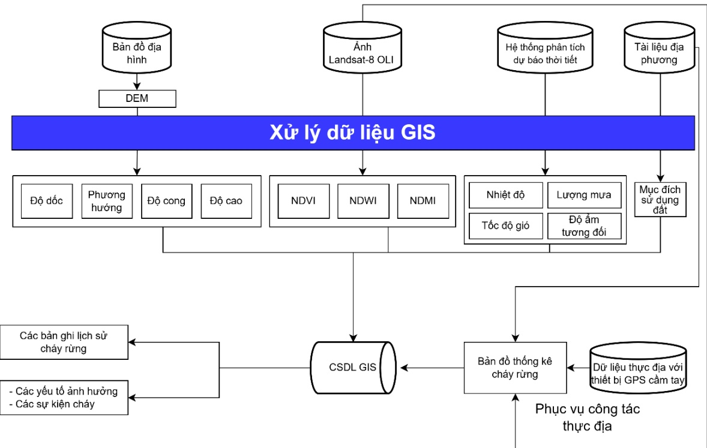

Hình 1-3 Quy trình xây dựng Cơ sở dữ liệu GIS về cháy rừng

Ảnh vệ tinh Landsat-8 OLI thu thập bằng cách sử dụng công cụ EarthExplorer. Dữ liệu ảnh Landsat-8 OLI thu được từ EarthExplorer tại địa chỉ http://earthexplorer.usgs.gov là ảnh năm 2016 của vùng nghiên cứu.

Trong luận án này, bốn yếu tố khí hậu bao gồm nhiệt độ, tốc độ gió, độ ẩm tương đối và lượng mưa đã được lấy từ dữ liệu đã có trước đây lấy từ Hệ thống phân tích dự báo thời tiết từ năm 2007 đến 2014 của Trung tâm Quốc gia về Thông tin Môi trường (NCEI) tại https://www.ncdc.noaa.gov/.

Để thu thập dữ liệu về mục đích sử dụng đất, một bản đồ sử dụng đất của tỉnh Gia Lai, được cung cấp bởi tài liệu địa phương của cơ quan tỉnh, đã được sử dụng trong nghiên cứu. Bản đồ, với mười một hạng mục sử dụng đất khác nhau, đã được soạn thảo với tỷ lệ 1:50,000. Bản đồ này là một sản phẩm bắt nguồn từ một nghiên cứu kiểm kê đất đai quốc gia được tiến hành vào năm 2013 bởi Tổng cục Quản lý Đất đai của Việt Nam.

## 1.7.2.2 Thu thập dữ liệu sạt lở đất của huyện Than Uyên

Trong luận án này, dữ liệu đa nguồn của tỉnh Lai Châu được sử dụng để đưa vào một Geodatabase quản lý bởi ArcGIS Pro.

<!-- page: 55 -->

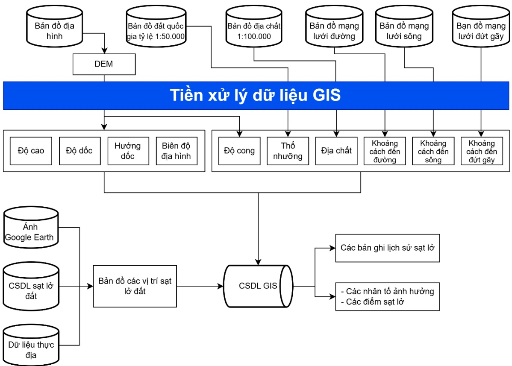

Hình 1-4 Quy trình xây dựng cơ sở dữ liệu GIS về sạt lở đất

Danh mục vị trí lở đất của huyện Than Uyên, là một trong những sản phẩm của nghiên cứu “Điều tra, đánh giá và phân vùng cảnh báo nguy cơ trượt lở đất đá các vùng miền núi Việt Nam”. Nghiên cứu quốc gia này do nhà nước tài trợ đã được Viện Khoa học và Kỹ thuật Địa chất Việt Nam thuộc Bộ Tài nguyên và Môi trường chủ trì từ năm 2012. Dữ liệu thu được này có 970 điểm sạt lở trên toàn tỉnh Lai Châu và 114 điểm sạt lở trong số đó thuộc huyện Than Uyên.

Đầu tiên, bản đồ địa hình tỷ lệ 1:50.000 của tỉnh Lai Châu được sử dụng để tạo bản đồ địa hình cho huyện Than Uyên. Bản đồ này có kích thước điểm ảnh là 20x20m, khi sử dụng cho huyện Than Uyên sẽ đưa ra số điểm ảnh là khoảng 2 triệu điểm, sử dụng cho bài toán chung của cả tỉnh Lai Châu thì bản đồ vùng nghiên cứu sẽ có khoảng 23 triệu điểm ảnh. Đây là một bài toán quy mô lớn trong xử lý dữ liệu địa lý.

Các dữ liệu khác như bản đồ Địa chất, bản đồ vết đứt gãy địa chất tỉnh Lai Châu được cung cấp bởi Viện Địa chất Khoáng sản Việt Nam được sử dụng để xây dựng bản đồ địa chất và bản đồ khoảng cách đến vết đứt gãy huyện Than Uyên. Bản đồ Thổ nhưỡng Quốc Gia được cung cấp bởi viện Khoa học Nông nghiệp Việt Nam (VAAS) được sử dụng để xây dựng bản đồ loại đất huyện Than Uyên.

<!-- page: 56 -->

Ngoài ra, bản đồ đường giao thông và bản đồ phân bổ sông suối trên địa bàn tỉnh Lai Châu được cung cấp bởi Bộ tài nguyên và Môi trường (MONRE) cũng được sử dụng để xây dựng bản đồ phân loại đất và bản đồ khoảng cách đến sông, suối cho huyện Than Uyên.

## 1.7.3 Tiền xử lý dữ liệu cháy rừng tại Gia Lai

Trước tiên, dữ liệu thu thập có thể bao gồm các loại dữ liệu phi cấu trúc như hình ảnh vệ tinh, bản đồ địa hình, văn bản từ tài liệu địa phương. Việc chuyển đổi thông tin này thành định dạng sẵn sàng sử dụng đòi hỏi phải tiền xử lý. Các bước này được thực hiện bởi ArcGIS để xây dựng Cơ sở dữ liệu Địa lý cháy rừng. Quá trình chuyển đổi dữ liệu cháy rừng từ dạng phi cấu trúc sang cấu trúc là một quy trình phức tạp, bao gồm nhiều bước quan trọng. Một ví dụ khởi đầu từ việc thu thập thông tin từ các báo cáo và tài liệu địa phương, dữ liệu được số hóa thông qua quá trình quét tài liệu giấy và chuyển đổi thành văn bản số. Tiếp theo, thông tin này được tổ chức lại và lưu trữ dưới dạng file CSV, chứa các chi tiết về vị trí và đặc điểm của các điểm cháy rừng. Bước quan trọng tiếp theo là tích hợp dữ liệu này vào hệ thống thông tin địa lý bằng cách kết nối (Join) với bản đồ số của tỉnh Gia Lai, sử dụng tọa độ kinh độ và vĩ độ làm khóa liên kết. Trong quá trình này, thông tin về tình trạng cháy rừng được mã hóa thành dạng nhị phân (0 cho không cháy, 1 cho có cháy) đối với mỗi điểm trên bản đồ. Cuối cùng, kết quả được xuất ra dưới dạng shapefile, tạo ra một bộ dữ liệu địa lý có cấu trúc, sẵn sàng cho các phân tích và ứng dụng tiếp theo trong lĩnh vực quản lý và phòng chống cháy rừng.

Xử lý dữ liệu thiếu: Có thể có khoảng trống (các giá trị NULL) trong dữ liệu do lỗi trong quá trình thu thập dữ liệu. Tiền xử lý có thể giúp trong tình huống này. Mã nguồn Python đã được sử dụng để xác định dữ liệu thiếu và thay thế chúng bằng giá trị trung bình của các giá trị còn lại. Hàm SimpleImputer() trong thư viện Scilearn đã được sử dụng cho mục đích này.

Tạo đặc trưng: do các Feature Class cần sử dụng là không có sẵn, nên bước tiền xử lý dữ liệu này rất cần thiết, nghiên cứu sinh đã sử dụng các công cụ để tạo đặc trưng cần cho đầu vào của mô hình. Đầu tiên, mô hình số độ cao DEM của vùng nghiên cứu được sử dụng để tạo ra các lớp đặc trưng cho độ dốc, hướng dốc, độ cao, và độ cong bề mặt bằng cách sử dụng các công cụ Slope, Aspect, Elevation và Curvature trong bộ công cụ “Spatial Analyst” của ArcGIS. Sau đó, sau đó được sử dụng để tính toán các chỉ số NDVI, NDWI và

<!-- page: 57 -->

NDMI được tạo ra bằng cách sử dụng công cụ “Raster Calculator” trong ArcGIS. Các công thức được sử dụng như sau:

$$
\mathrm{NDVI} = (\mathrm{NIR-Red}) / (\mathrm{NIR+Red})\tag{1.15}
$$

$$
\mathrm{NDWI} = (\text {Green - NIR}) / (\text {Green + NIR})\tag{1.16}
$$

$$
\mathrm{NDMI} = (\mathrm{NIR-SWIR}) / (\mathrm{NIR+SWIR})\tag{1.17}
$$

Tại đây, NIR là băng tần hồng ngoại gần (Băng tần 5), và SWIR đại diện cho băng tần hồng ngoại sóng ngắn (Băng tần 6). Băng tần Xanh (Green) và băng tần Đỏ (Red) có thể được trích xuất sử dụng Băng tần 3 và Băng tần 4 của hình ảnh.

Đáp ứng yêu cầu của mô hình: Một số mô hình có yêu cầu cụ thể về định dạng dữ liệu đầu vào. Trong nghiên cứu này, do Deep-NC sử dụng đầu vào là số, nên dữ liệu của các đặc trưng với nhãn như Sử dụng đất đã được mã hóa từ Dữ liệu Phân loại dạng chữ sang các lớp khác nhau dạng số. Quá trình này sử dụng hàm FeatureClassToNumPyArray() trong ArcPy của ArcGIS để biến đổi dữ liệu từ Label dạng chữ sang Số. Ví dụ: “PDL” Paddy Land - Đất trồng lúa sang giá trị “1”, “ACL” Annual Crop Land - Đất trồng cây hàng năm khác sang giá trị “2”,…và “PTL” Protection Forest Land - Đất rừng phòng hộ sang giá trị “11”

Chuẩn hóa dữ liệu: Điều này cần thiết để đảm bảo tất cả các đặc trưng được đánh giá công bằng trong quá trình huấn luyện mô hình. Một số mô hình học máy không hoạt động tốt nếu các đặc trưng có các quy mô khác nhau. Trong nghiên cứu này, tác giả luận án đã sử dụng scaler từ -1 đến 1 cho tất cả các đặc trưng trong bộ dữ liệu. Ví dụ, về độ dốc (slope) địa hình có các giá trị chạy từ 0 đến 79.9<sup>o</sup> đã được chia thành 9 lớp khác nhau, 9 lớp này sau đó được biến đổi thành các giá trị là 0.01, 0.13, 0.26, 0.38, 0.50, 0.62, 0.75, 0.87 và 0.99. Quá trình này nhằm giữ thứ tự tương đối của dữ liệu gốc, giảm ảnh hưởng của các giá trị cực đoan như giá trị xấp xỉ 90 độ (gần như không thể xảy ra trên thực tế) sẽ được quy vào 1 lớp cao nhất (0.99). Hệ toạ độ được sử dụng để chuẩn hoá trong toàn bộ nghiên cứu về cháy rừng tại tỉnh Gia Lai là VN-2000.

Ở đây, nghiên cứu sinh sử dụng công cụ “Reclassify” trong ArcGIS để chia dữ liệu thành các lớp mong muốn, sau đó sử dụng “Raster Calculator” để

<!-- page: 58 -->

chuyển đổi các giá trị lớp thành giá trị chuẩn hoá, tuỳ theo từng trường hợp mà dùng các con số khác nhau đối với 5, 7, 9 hay 11 lớp.

Trong quá trình thu thập dữ liệu không gian từ nhiều nguồn khác nhau, chúng ta có thể đối mặt với sự không đồng nhất về hệ tọa độ. Cụ thể, các nguồn dữ liệu trong nước đã được chuẩn hóa theo hệ tọa độ VN-2000, trong khi dữ liệu từ nguồn nước ngoài, đặc biệt là ảnh vệ tinh, thường sử dụng hệ tọa độ WGS-1984. Để đảm bảo tính nhất quán và chính xác trong phân tích, việc chuyển đổi tất cả dữ liệu về cùng một hệ tọa độ là cần thiết. Trong nghiên cứu này, nghiên cứu sinh đã chọn VN-2000 làm hệ tọa độ chuẩn và sử dụng công cụ “Project Raster” trong phần mềm ArcGIS để thực hiện quá trình chuyển đổi. Phương pháp này không chỉ đảm bảo tính chính xác của dữ liệu mà còn tạo điều kiện thuận lợi cho việc tích hợp và so sánh thông tin từ các nguồn khác nhau, nâng cao độ tin cậy của kết quả nghiên cứu.

Cân bằng dữ liệu: Để tránh mất cân bằng dữ liệu, tổng cộng 2530 điểm dữ liệu không cháy rừng đã được chọn ngẫu nhiên từ các khu vực trong khu vực nghiên cứu.

Chia dữ liệu: Tổng số mẫu được sử dụng cho việc huấn luyện và đánh giá mô hình Deep-NC được đề xuất là 5060. Bộ dữ liệu sau đó được chia thành hai tập riêng biệt: một tập huấn luyện bao gồm 3542 vị trí chiếm 70% tổng số hồ sơ và một tập kiểm tra chứa 1518 vị trí còn lại chiếm 30% tổng số hồ sơ. Công việc này được thực hiện bởi việc sử dụng hàm train\_test\_split() của thư viện Scilearn, với tham số validation\_split=0.3 tương ứng với tệp kiểm tra chứa 30% tổng số bản ghi còn tệp huấn luyện sẽ chứa 70% tổng số bản ghi.

## 1.7.4 Tiền xử lý dữ liệu sạt lở đất tại huyện Than Uyên

Quá trình tiền xử lý dữ liệu đối với bộ dữ liệu sạt lở đất sử dụng một số công cụ tính toán sau:

Do phạm vi nghiên cứu là huyện Than Uyên, nên các dữ liệu kể trên cần được quy về diện tích cua huyện Than Uyên. Công cụ Clip với 2 đầu vào, một đầu vào là các bản đồ địa hình, mục đích sử dụng đất, khoảng cách đến sông, suối, đầu vào còn lại là bản độ địa giới hành chính của huyện Than Uyên. Kết quả sau khi sử dụng công cụ Clip thu về là các bản đồ trên địa giới hành chính của huyện Than Uyên. Bản đồ này được sử dụng để xây dựng mô hình số độ cao DEM cho huyện Than Uyên bằng công cụ Topo to Raster của ArcGIS Pro.

<!-- page: 59 -->

Mô hình DEM này được sử dụng để tạo ra bản đồ các yếu tố ảnh hưởng bao gồm: Độ cao, độ dốc, độ cong, độ nghiêng bề mặt và độ chênh cao.

Tạo đặc trưng: Các yếu tố như độ cao địa hình, độ nghiêng địa hình, độ cong bề mặt, và hướng dốc nhận được khi sử dụng các công cụ bao gồm Elevation, Slope, Curvature, Aspect trong bộ công cụ Spatial Analysis của ArcGIS Pro với đầu vào là mô hình số độ cao DEM của huyện Than Uyên. Biên độ địa hình được tạo ra khi sử dụng công cụ “Convert to Feature Class” với “Relief Amplitude” được chọn là chỉ số lớp đặc trưng (Feature Class).

Bản đồ Thổ nhưỡng Quốc gia đã được sử dụng để tạo ra lớp đặc trưng về Loại đất và lớp đặc trưng về Địa chất của tỉnh Lai Châu.

Dữ liệu về lớp đặc trưng khoảng cách đến đứt gãy, khoảng cách đến đường, và khoảng cách đến sông được tạo ra bằng cách sử dụng công cụ Distance trong ArcGIS Pro từ bản đồ mạng lưới giao thông, mạng lưới sông suối và mạng lưới đứt gãy. Các dữ liệu này sau đó được chuản hoá bằng công cụ Buffer để tạo thành các vùng khoảng cách.

Dựa trên tài liệu từ Viện Khoa học Địa chất và Khoáng sản, Bộ Tài nguyên và Môi trường, cùng Sở Tài nguyên và Môi trường tỉnh Lai Châu, bản đồ vị trí trượt lở đất ở tỉnh Lai Châu đã được thiết lập, tổng cộng 970 vị trí trượt lở. Các lớp đặc trưng về Vị trí Trượt lở đã được tạo ra bằng cách sử dụng công cụ “Clip” với hai đầu vào là các vị trí trượt lở đất ở tỉnh Lai Châu và biên giới huyện Than Uyên. Các vị trí sạt lở xảy ra ở Than Uyên được khoanh vùng gồm 114 vị trí với nhóm đã bị sạt lở (1).

Cân bằng dữ liệu: Để tránh sự mất cân đối giữa dữ liệu trượt lở và không trượt lở, nghiên cứu sinh đã ngẫu nhiên lấy mẫu 114 điểm không trượt lở từ khu vực nghiên cứu. Các điểm này được gán nhãn với giá trị 0.

Chia dữ liệu: trong nghiên cứu, hàm train\_test\_split() của thư viện Scilearn đã được sử dụng để chia 228 điểm dữ liệu thành hai tập con ngẫu nhiên: tập huấn luyện với 160 điểm (chiếm 70%) và tập kiểm tra với 68 điểm (chiếm 30%), với số lượng mẫu trượt lở và không trượt lở trong mỗi tập bằng nhau. Tập huấn luyện được sử dụng để huấn luyện các mô hình dự đoán trượt lở, trong khi tập kiểm tra được sử dụng để kiểm tra và đánh giá mô hình.

<!-- page: 60 -->

Ngoài ra, dữ liệu về các vụ sạt lở đất đã từng xảy ra tại Huyện Than Uyên nói riêng và Tỉnh Lai Châu nói chung đã được nghiên cứu sinh cùng với nhóm nghiên cứu thẩm định kỹ thông qua việc sử dụng bản đồ đường đi sử dụng ảnh vệ tinh, đánh dấu các điểm cần thẩm định và đến điều tra trực tiếp hiện trường. Quá trình này thu thập được một số dữ liệu quan trọng như vị trí sạt lở, quy mô sạt lở và hậu quả ước tính. Các số liệu này được đưa bổ sung vào làm thông tin tham khảo cho các cấp chức năng. Quá trình này cũng được lặp lại sau khi hoàn thành bản đồ phân vùng để thẩm định kết quả chính xác của việc phân vùng nguy cơ sạt lở đất.

Ở đây, nghiên cứu sinh sử dụng công cụ “Reclassify” trong ArcGIS để chia dữ liệu thành các lớp mong muốn, sau đó sử dụng “Raster Calculator” để chuyển đổi các giá trị lớp thành giá trị chuẩn hoá, tuỳ theo từng trường hợp mà dùng các con số khác nhau đối với 5, 7, 9 lớp.

## 1.8 Kết chương

Chương này đã đặt nền móng cơ bản cho nghiên cứu này, mô tả các khái niệm thiết yếu và nghiên cứu trước đó. Kiến thức này sẽ hướng dẫn cách tiếp cận và giúp định hình các thách thức tiềm năng trong quá trình thực hiện nghiên cứu. Ngoài ra, nghiên cứu sinh cũng đã trình bày phương pháp nghiên cứu, công tác chuẩn bị, làm dữ liệu và phương thức đánh giá mô hình trong nghiên cứu. Phần trả lời cho câu hỏi nghiên cứu thứ nhất có thể được tìm thấy trong mục 1.6 của luận án.

Trong chương tiếp theo, luận án sẽ trình bày về mô hình xây dựng bản đồ phân vùng nguy cơ cháy rừng sử dụng Deep-NC kèm theo đánh giá và so sánh hiệu suất của mô hình với các bộ tối ưu hóa khác nhau thông qua việc tạo ra bản đồ phân vùng nguy cơ cháy rừng.

<!-- page: 61 -->

## CHƯƠNG 2. MÔ HÌNH XÂY DỰNG BẢN ĐỒ PHÂN VÙNG NGUY CƠ CHÁY RỪNG Ở TỈNH GIA LAI SỬ DỤNG DEEP-NC

Chương này trình bày quy trình xây dựng bản đồ nhạy cảm cháy rừng tại tỉnh Gia Lai, từ thu thập và xử lý dữ liệu đến phát triển và ứng dụng mô hình. Đầu tiên, chương giới thiệu tổng quan về khu vực nghiên cứu và phương pháp thu thập cơ sở dữ liệu cháy rừng. Tiếp theo, chương trình bày chi tiết các bước tiền xử lý dữ liệu và quá trình xây dựng mô hình Deep-NC (Deep Neural Computing), bao gồm kiến trúc mô hình, phương pháp tối ưu hóa và quy trình đánh giá. Cuối cùng, chương mô tả việc ứng dụng mô hình để thành lập bản đồ phân vùng nhạy cảm cháy rừng cho khu vực nghiên cứu. Kết quả đạt được của mô hình đã được nghiên cứu sinh công bố trong công trình [CT2].

## 2.1 Bộ dữ liệu cháy rừng tỉnh Gia Lai

## 2.1.1 Mô tả vùng nghiên cứu

Tỉnh Gia Lai, nằm ở vùng nam trung bộ của Việt Nam, có diện tích 15.512 km². Địa hình tỉnh này đa dạng với độ cao lớn nhất là 1748 m tại núi Kon Ka Kinh thuộc huyện K'Bang và độ cao thấp nhất là 80 m tại huyện Krongpa. Tỉnh có dân số 1.513.847 người vào năm 2019, dẫn đến mật độ dân số 94 người/km² [96]. Về kinh tế, nông nghiệp, lâm nghiệp và ngư nghiệp đóng góp 32,75% vào Tổng Sản Phẩm Quốc Nội (GDP), trong khi công nghiệp và xây dựng chiếm 27,81%, và dịch vụ chiếm 35,96% [97].

Tỉnh chủ yếu được phủ bởi đất nông nghiệp và lâm nghiệp, chiếm 93,13% tổng diện tích, với đất ở chiếm 1,22%. Diện tích rừng lên tới 632.200 ha, chiếm 40,8% diện tích nghiên cứu. Rừng tự nhiên chiếm 5436 ha và rừng trồng che phủ 88.600 ha, lần lượt chiếm 35,04% và 5,71% tổng diện tích của tỉnh [97].

Tỉnh Gia Lai trải qua khí hậu cao nguyên nhiệt đới gió mùa với độ ẩm cao và lượng mưa dồi dào [98]. Khí hậu được đặc trưng bởi hai mùa rõ rệt: mùa mưa thường kéo dài từ tháng Năm đến tháng Mười, và mùa khô từ tháng Mười Một đến tháng Tư của năm sau. Nhiệt độ trung bình hàng năm dao động từ 22 đến 25°C, và lượng mưa trung bình hàng năm khoảng 2100-2200 mm.

Về vấn đề cháy rừng, tỉnh đã đối mặt với những nguy hiểm đáng kể trong thập kỷ qua [99]. Theo báo cáo của bộ phận bảo vệ rừng, hơn 270.000 ha rừng

<!-- page: 62 -->

trong tỉnh có khả năng cao xảy ra cháy. Chỉ riêng trong bốn tháng đầu năm 2020, đã xảy ra hai sự kiện cháy rừng nghiêm trọng, bao gồm một đám cháy ở khu vực rừng phòng hộ Hàm Rồng-Pleiku, làm hủy hoại 2 ha rừng, và một đám cháy khác ở huyện Ia Grai từ ngày 4 đến 9 tháng 4 năm, phá hủy 17 ha rừng thông.

## 2.1.2 Dữ liệu cháy rừng

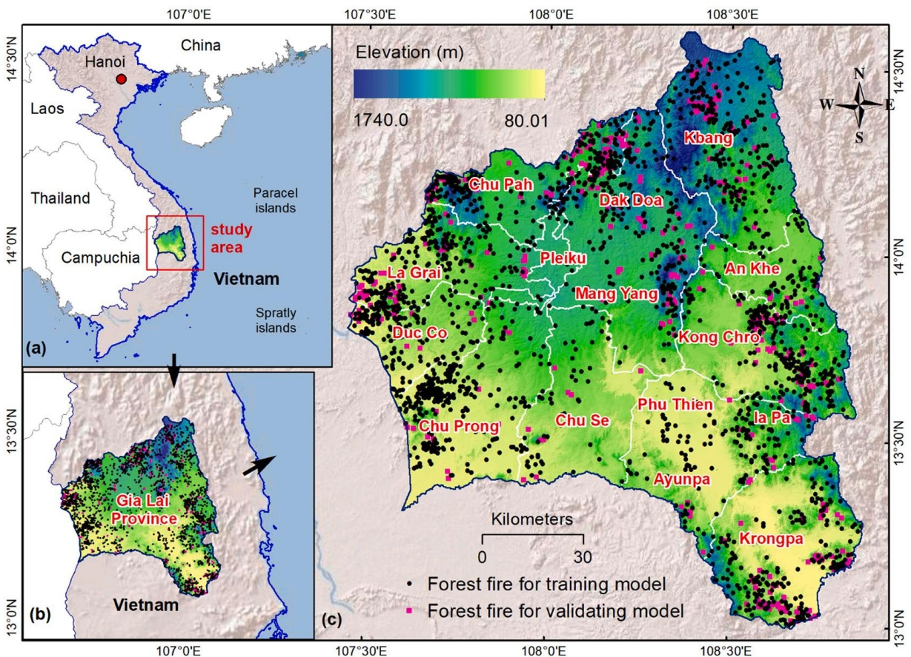

Hình 2-1(a) và (b) Vị trí của tỉnh Gia Lai trên bản đồ Việt Nam; và (c) Bản đồ tỉnh Gia Lai và vị trí các đám cháy rừng.

Phương pháp mô hình hóa cháy rừng được áp dụng trong nghiên cứu này dựa trên học có giám sát sử dụng Deep-NC. Mô hình sử dụng dữ liệu lịch sử về cháy rừng, cụ thể là vị trí của các đám cháy trước đây và các yếu tố gây nên đám cháy tương ứng (xem Hình 2-1). Do đó, việc thu thập dữ liệu lịch sử chính xác và toàn diện là rất quan trọng. Trong nghiên cứu này, cơ sở dữ liệu cháy rừng bao gồm 2530 vị trí cháy rừng lịch sử từ năm 2007 đến năm 2016 đã được sử dụng. Cơ sở dữ liệu này được lấy từ cơ sở dữ liệu cháy rừng do Bộ Nông nghiệp và Phát triển Nông thôn (MARD) của Việt Nam cung cấp, có sẵn tại http://www.kiemlam.org.vn.

<!-- page: 63 -->

Phân tích dữ liệu tiết lộ rằng khoảng 90% số vụ cháy ghi nhận xảy ra trong các tháng khô từ tháng Một đến tháng Năm. Đáng chú ý, các năm 2010, 2013, 2015 và 2016 chứng kiến sự gia tăng đáng kể về số vụ cháy rừng, chịu ảnh hưởng mạnh mẽ bởi các hoạt động của Hiện tượng El Niño-Southern Oscillation (ENSO), dẫn đến hạn hán kéo dài ở tỉnh. Những năm này cũng ghi nhận mức giảm lượng mưa khoảng 12% so với các năm trung bình, theo báo cáo của Sutton và cộng sự [100]. Ngược lại, có rất ít báo cáo về cháy rừng trong các năm có sự kiện La Niña, như năm 2011.

Các bước chuẩn bị dữ liệu để tạo ra Geodatabase cháy rừng cho tỉnh Gia Lai đã được đề cập đến trong phần 1.6 của luận án.

## 2.1.3 Các yếu tố ảnh hưởng

Việc xác định các yếu tố chủ đạo đằng sau sự phát triển và lan rộng của các đám cháy rừng là vô cùng quan trọng trong mô hình hóa cháy rừng. Sự xuất hiện và hành vi của cháy rừng bị ảnh hưởng bởi nhiều yếu tố khác nhau, bao gồm địa hình, nhiên liệu và các mô hình khí hậu, như đã được Cary cùng cộng sự [101] và Thạch cùng các cộng sự [102] chỉ ra. Do đó, việc xác định những yếu tố này là bước căn bản trong quá trình mô hình hóa. Phần này cung cấp cái nhìn tổng quan về các yếu tố chủ đạo được xem xét trong nghiên cứu này.

## A. Yếu tố địa hình

Địa hình đóng vai trò quan trọng cả trong hành vi gián tiếp và trực tiếp của cháy rừng. Sự biến đổi của địa hình trong mỗi khu vực có thể tạo ra những khí hậu địa phương riêng biệt, ảnh hưởng đến nhiệt độ, phủ đất, và sự phân bố các loài cây theo Mermoz và cộng sự [103]. Do vậy, địa hình ảnh hưởng gián tiếp đến cháy rừng. Ngoài ra, địa hình ảnh hưởng trực tiếp đến cháy rừng bằng cách tạo điều kiện cho lửa lan truyền theo triền dốc theo Moreno et al. [104]. Trong luận án này, một mô hình số độ cao (DEM) với độ phân giải 30 m cho tỉnh Gia Lai đã được tạo ra sử dụng bản đồ địa hình tỷ lệ 1:50,000 do Bộ Tài nguyên và Môi trường (MONRE) cung cấp. Bốn yếu tố liên quan đến địa hình được tính ra: độ dốc (o) (Hình 2-2b), độ cao (m) (Hình 2-2c), phương hướng (o) (Hình 2-2d), và độ cong (o) (Hình 2-2e).

<!-- page: 64 -->

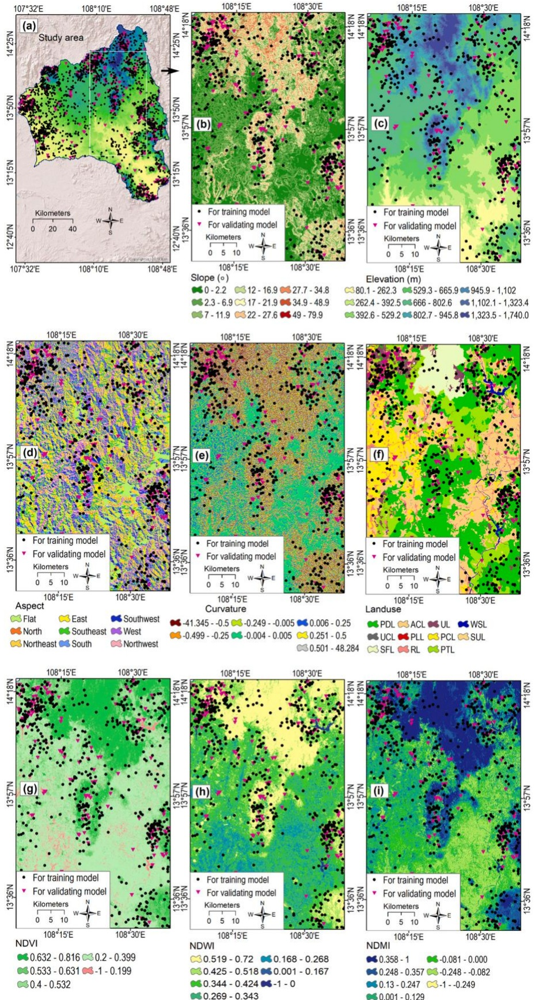

Hình 2-2 Các yếu tố kích hoạt cháy rừng được sử dụng trong nghiên cứu này: (a) Bản đồ tổng quan tỉnh Gia Lai; (b) Bản đồ độ dốc (Slope); (c) Bản đồ độ cao (Elevation); (d) Bản đồ phương hướng (Aspect); (e) Bản đồ độ cong (Curvature); (f) Bản đồ sử dụng đất (Land use); (g) Bản đồ chỉ số thực vật NDVI; (h) Bản đồ chỉ số nước NDWI; (i) Bản đồ chỉ số độ ẩm thực vật NDMI.

<!-- page: 65 -->

Theo Dupuy và Maréchal [105], độ dốc của địa hình có ảnh hưởng trực tiếp đến tốc độ lan truyền của lửa, trong khi phương hướng liên quan đến bức xạ mặt trời, nhiệt độ, tốc độ gió, độ ẩm và thực vật, tất cả những yếu tố này đều quan trọng cho sự phát triển của cháy rừng [106]. Do đó, cả độ dốc và phương hướng đều được bao gồm như là yếu tố chủ đạo trong quá trình mô hình hóa cháy rừng. Độ cao địa hình ảnh hưởng đến nhiệt độ không khí, độ ẩm, lượng mưa, và sự phân bố của các loài thực vật [107], làm cho nó trở thành yếu tố quan trọng cần xem xét trong nghiên cứu cháy rừng. Độ cong, mặt khác, đã được xác định là một yếu tố ảnh hưởng đến sự lan truyền của cháy rừng.

## B. Các yếu tố con người và môi trường

Các hoạt động của con người được nhận diện là nguyên nhân hàng đầu gây ra cháy rừng ở cả các nước phát triển lẫn đang phát triển. Sự tăng trưởng dân số và áp lực nhân tạo đối với tài nguyên thiên nhiên, dẫn đến việc phá rừng và sử dụng đất gia tăng, góp phần làm tăng khả năng xảy ra cháy rừng ở một số loài cây [108], [109]. Do đó, việc sử dụng đất là một yếu tố quan trọng cần được xem xét trong mô hình hóa cháy rừng [110]. Trong luận án này, một bản đồ sử dụng đất (giá trị từ 1 đến 11) (Hình 2-2f) bao gồm mười một nhóm đã được biên soạn từ bản đồ sử dụng đất quốc gia với tỷ lệ 1:50,000 do Bộ Tài nguyên và Môi trường cung cấp. Mười một nhóm đất này bao gồm:

\- PDL: Paddy Land - Đất trồng lúa

\- ACL: Annual Crop Land - Đất trồng cây hàng năm khác

UL: Unused Land - Đất chưa sử dụng

\- WSL: Water Surface Land - Đất mặt nước

UCL: Urban Construction Land - Đất xây dựng đô thị

\- PLL: Perennial Land - Đất trồng cây lâu năm

\- PLC: Production Land for Cultivation - Đất sản xuất nông nghiệp

\- SUL: Specialized Use Land - Đất chuyên dùng

\- SFL: Special-use Forest Land - Đất rừng đặc dụng

\- RL: Residential Land - Đất ở

\- PTL: Protection Forest Land - Đất rừng phòng hộ

Chỉ số khác biệt chuẩn hóa về thực vật (NDVI) được sử dụng như một chỉ báo về sức khỏe của thực vật [111]. Nó liên quan chặt chẽ đến nguồn nhiên liệu có sẵn cho cháy rừng; do đó, NDVI (giá trị từ -1 đến 1) (Hình 2-2g) đã được

<!-- page: 66 -->

bao gồm trong phân tích. Bên cạnh NDVI, chỉ $s \hat { 0 }$ khác biệt chuẩn hóa về nước (NDWI) (giá trị từ -1 đến 1) (Hình 2-2h) và chỉ $s \hat { 0 }$ khác biệt chuẩn hóa về độ ẩm (NDMI) (giá trị từ -1 đến 1) (Hình 2-2i) cũng được xem xét trong nghiên cứu cháy rừng. NDWI cung cấp thông tin về hàm lượng nước trong thực vật, trong khi NDMI phản ánh hàm lượng ẩm trong đất. Cả hai chỉ số đều hữu ích để hiểu về khả năng có sẵn của ẩm, đó là một yếu tố quan trọng trong sự lan truyền của lửa.

Đối với luận án này, hình ảnh Landsat-8 OLI với độ phân giải 30m thu được năm 2016 từ EarthExplorer (http://earthexplorer.usgs.gov) đã được sử dụng. Các chỉ số NDVI (Chỉ số Khác biệt Chuẩn hóa về Thực vật) [112], NDWI (Chỉ số Khác biệt Chuẩn hóa về Nước), và NDMI (Chỉ số Khác biệt Chuẩn hóa về Độ ẩm) [113] đã được tính toán từ những hình ảnh này thông qua các chỉ số. Quan trọng là phải lưu ý rằng các hình ảnh đã được hiệu chuẩn tới giá trị Đáy của Bầu khí quyển (BOA), đại diện cho phản xạ bề mặt.

## C. Các yếu tố khí hậu

Biến đổi khí hậu đã được chứng minh là có ảnh hưởng đáng kể đến chế độ cháy rừng [114], nhấn mạnh tầm quan trọng của việc xem xét các yếu tố liên quan đến khí hậu. Trong nghiên cứu này, bốn yếu tố khí hậu - nhiệt độ, tốc độ gió, độ ẩm tương đối và lượng mưa đã được chọn. Các yếu tố này đã được chứng minh có ảnh hưởng đáng kể đến tốc độ lan truyền và cường độ của các đám cháy rừng trong nhiều nghiên cứu trước đây [115], [116]. Hầu hết các vụ cháy xảy ra do sự kết hợp của nguồn gây cháy, nhiên liệu và thời tiết khô hanh [116]. Bản đồ nhiệt độ (Độ) (Hình 2-3j), bản đồ tốc độ gió (m/s) (Hình 2-3k), bản đồ độ ẩm tương đối (%) (Hình 2-3l), và bản đồ lượng mưa (mm) (Hình 2-3m), được biên soạn bởi Hưng và cộng sự [99], đã được sử dụng trong phân tích. Những bản $\mathbf { \dot { d } } \mathbf { \dot { \hat { 0 } } }$ này đã được tạo ra sử dụng dữ liệu thời tiết từ năm 2007 đến 2014, lấy từ Trung tâm Dữ liệu Môi trường Quốc gia (NCEI) tại https://www.ncdc.noaa.gov/.

<!-- page: 67 -->

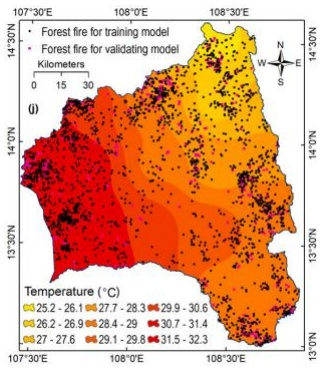

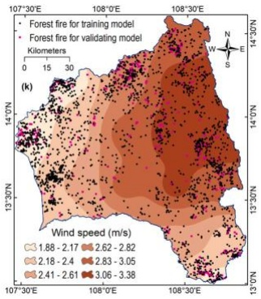

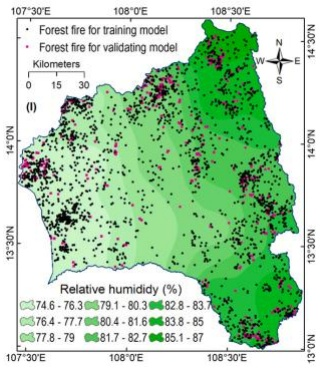

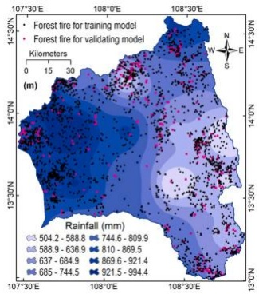

Hình 2-3 Các yếu tố kích hoạt cháy rừng được sử dụng trong nghiên cứu này: (j) Bản đồ nhiệt độ (oC); (k) Bản đồ tốc độ gió (m/s); (l) Bản đồ độ ẩm tương đối (%); và (m) Bản đồ lượng mưa (mm).

Nhiệt độ được chọn vì nó ảnh hưởng đến độ ẩm của đất và có mối liên hệ chặt chẽ với sự cháy của thực vật [117]. Thêm vào đó, nhiệt độ tăng lên ảnh hưởng đến độ ẩm và sức khỏe của rừng, dẫn đến giảm nội dung độ ẩm của thực vật [118], có thể góp phần vào sự phát triển của cháy rừng. Tốc độ gió được xem xét do ảnh hưởng trực tiếp đến sự lan rộng của cháy rừng [119]. Nó cũng có thể ảnh hưởng đến độ ẩm của nhiên liệu, cung cấp thêm oxy và tăng tốc độ cháy. Độ ẩm tương đối và lượng mưa được bao gồm vì chúng ảnh hưởng đến độ ẩm nhiên liệu [120], là yếu tố quan trọng trong việc khởi đầu cháy rừng.

Các bước chuẩn bị dữ liệu để tạo ra Geodatabase cháy rừng cho tỉnh Gia Lai đã được đề cập đến trong phần 1.6 của luận án.

## 2.1.4 Xây dựng Geodatabase cho cháy rừng tại tỉnh Gia Lai

Mô hình Deep-NC được đề xuất sử dụng trong luận án này sử dụng cho việc xây dựng bản đồ nguy cơ xảy ra cháy rừng là một phương pháp học có giám sát, yêu cầu thiết lập cơ sở dữ liệu GIS để huấn luyện mô hình. Cơ sở dữ liệu GIS nên bao gồm thông tin về kho dữ liệu cháy rừng và các yếu tố ảnh hưởng. Các yếu tố gây nên sự phát sinh cháy bao gồm độ dốc, phương hướng, độ cao, độ cong của địa hình, sử dụng đất, NDVI, NDWI, NDMI, nhiệt độ, tốc

<!-- page: 68 -->

độ gió, độ ẩm tương đối và lượng mưa. Cơ sở dữ liệu GIS được xây dựng sử dụng trong nghiên cứu này được biểu diễn trong Hình 1-3

Trong nghiên cứu này, phương pháp mô hình hóa dựa trên GIS theo mô hình nhị phân [5] đã được sử dụng. Phương pháp này yêu cầu mẫu cả về cháy rừng và không cháy rừng. Bản đồ kho dữ liệu cháy rừng sau đó được thực hiện bằng cách sử dụng dữ liệu đã nêu trên kết hợp với Ảnh vệ tinh Landsat-8 OLI và dữ liệu thực địa từ GPS cầm tay.

Cơ sở dữ liệu GIS được sử dụng cho việc vẽ bản đồ khả năng xảy ra cháy rừng bao gồm 12 yếu tố gây cháy, và kho dữ liệu về cháy được biên soạn sử dụng ArcGIS 10.6 trong định dạng cơ sở dữ liệu tệp ESRI. Như đã đề cập trước đó, Bộ dữ liệu bao gồm tổng cộng 5060 điểm dữ liệu.

Phân loại các thông số khác nhau như sau:

**Độ dốc (°):** Được chia thành 9 lớp: 0°-2.2°, 2.3°-6.9°, 7°-11.9°, 12°-16.9°, 17°-21.9°, 22°-27.6°, 27.7°-34.8°, 34.9°-48.9°, và 49°-79.9°.

**Phương hướng:** Được phân thành 9 lớp: Bằng phẳng (-1), Bắc (0-22.5 & 337.5-360), Đông-Bắc (22.5-67.5), Đông (67.5-112.5), Đông-Nam (112.5-157.5), Nam (157.5-202.5), Tây-Nam (202.5-247.5), Tây (247.5-292.5) và Tây-Bắc (292.5-337.5).

**Độ cao (m):** Được phân loại thành chín lớp: 80.1m-262.3m, 262.4m-392.5m, 392.6m-529.2m, 529.3m-665.9m, 666m-802.6m, 802.7m-945.8m, 945.9m-1102m, 1102.1m-1323.4m và 1323.5m-1740m.

**Độ cong bề mặt:** Được chia thành bảy lớp: -41.345 đến -0.5, -0.499 đến -0.25, -0.249 đến -0.005, 0.06 đến 0.25, 0.251 đến 0.5 và 0.501 đến 48.284.

**NDVI:** Thông số này được chia thành năm lớp: 0.632-0.816, 0.533-0.631, 0.4-0.532, 0.2-0.399 và -1 đến 0.2.

**NDWI:** Được phân loại thành bảy lớp: 0.519-0.72, 0.425-0.518, 0.344-0.424, 0.269-0.343, 0.168-0.268, 0.001-0.167 và -1 đến 0.

**NDMI:** Thông số này được chia thành bảy lớp: 0.358-1, 0.248-0.357, 0.13-0.247, 0.01-0.129, -0.081 đến 0.000, -0.248 đến -0.082 và -1 đến -0.249.

**Sử dụng đất:** Được phân loại thành mười một lớp: Đất canh tác lâu năm (PDL), Đất đô thị và cộng đồng (UCL), Đất rừng đặc biệt (SFL), Đất canh tác

<!-- page: 69 -->

hàng năm (ACL), Đất thuê lâu dài (PLL), Đất ở (RL), Đất đô thị (UL), Đất bảo tồn được bảo vệ (PCL), Đất bảo vệ và phục hồi (PTL), Đất nguồn nước (WSL) và Đất vùng ngoại ô (SUL).

**Nhiệt độ (°C):** Được chia thành chín lớp: dưới 26.1, 26.2-26.9, 27-27.6, 27.7-28.3, 28.4-29, 29.1-29.8, 29.9-30.6, 30.7-31.5 và lớn hơn 31.5.

**Tốc độ gió (m/s):** Được phân loại thành sáu lớp: 1.88-2.17, 2.18-2.4, 2.41-2.61, 2.62-2.82, 2.83-3.05 và 3.06-3.38.

**Độ ẩm tương đối (%):** Được chia thành chín lớp: 74.6-76.3, 76.4-77.7, 77.8-79, 79.1-80.3, 80.4-81.6, 81.7-82.7, 82.8-83.7, 83.8-85 và 85.1-87.

**Lượng mưa (mm):** Được phân loại thành tHướng dẫn: Được phân chia thành 9 lớp: Bằng phẳng (-1), Hướng Bắc (0-22.5 & 337.5-360), Hướng Đông-Bắc (22.5-67.5), Hướng Đông (67.5-112.5), Hướng Đông-Nam (112.5-157.5), Hướng Nam (157.5-202.5), Hướng Tây-Nam (202.5-247.5), Hướng Tây (247.5-292.5) và Hướng Tây-Bắc (292.5-337.5).

Các lớp trong từng đặc tính sau đó được chuẩn hóa thành phạm vi giá trị từ 0,01 đến 0,99.

Chỉ số cháy rừng được chia thành hai lớp, 1 đối với lớp “cháy” và 0 đối với lớp “không cháy”

Bảng 2-1 là ví dụ về dữ liệu với một số điểm và thông tin đã qua xử lý (xem mục 1.6 của chương I):

Bảng 2-1 Ví dụ về dữ liệu điểm được trích xuất từ bộ dữ liệu cháy rừng

| Độ dốc | Phương hướng | Độ cao | Độ cong | NDVI | NDWI | NDMI | Mục đích sử dụng đất | Nhiệt độ | Tốc độ gió | Độ ẩm | Lượng mưa | Cháy rừng |
| --- | --- | --- | --- | --- | --- | --- | --- | --- | --- | --- | --- | --- |
| 0.38 | 0.75 | 0.75 | 0.5 | 0.99 | 0.99 | 0.83 | 0.01 | 0.1 | 0.79 | 0.99 | 0.71 | 1 |
| 0.13 | 0.99 | 0.75 | 0.83 | 0.99 | 0.83 | 0.83 | 0.21 | 0.13 | 0.79 | 0.99 | 0.71 | 1 |
| 0.01 | 0.5 | 0.87 | 0.5 | 0.99 | 0.99 | 0.99 | 0.01 | 0.1 | 0.79 | 0.99 | 0.85 | 1 |
| 0.62 | 0.75 | 0.38 | 0.01 | 0.26 | 0.66 | 0.5 | 0.3 | 0.38 | 0.6 | 0.38 | 0.15 | 0 |
| 0.13 | 0.87 | 0.5 | 0.83 | 0.5 | 0.83 | 0.66 | 0.7 | 0.26 | 0.99 | 0.87 | 0.43 | 0 |
| 0.26 | 0.87 | 0.5 | 0.17 | 0.5 | 0.83 | 0.5 | 0.6 | 0.38 | 0.6 | 0.5 | 0.15 | 0 |
| 0.13 | 0.75 | 0.38 | 0.83 | 0.26 | 0.34 | 0.17 | 0.7 | 0.75 | 0.01 | 0.26 | 0.43 | 0 |

<!-- page: 70 -->

## 2.2 Mô hình Deep-NC

## 2.2.1 Kiến trúc của mô hình Deep-NC

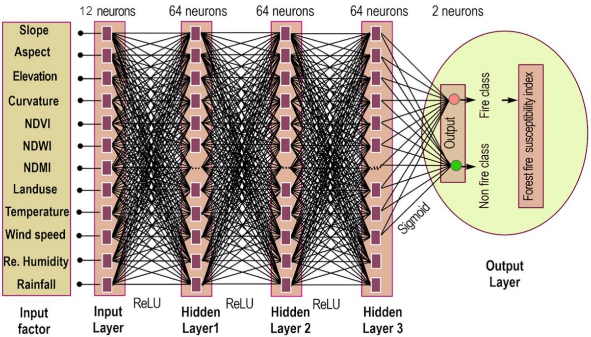

Hình 2-4 Mô hình đề xuất Deep-NC cho bài toán xác định mức độ nhạy cảm cháy rừng trong luận án này

Việc huấn luyện và xác thực mô hình Deep-NC dựa trên các mẫu huấn luyện và nhãn thực thể thu được từ cơ sở dữ liệu GIS đã được xây dựng, cho phép huấn luyện mô hình Deep-NC để phân loại không gian bản đồ mức độ dễ cháy của rừng. Mạng thần kinh sâu được sử dụng trong nghiên cứu này, như được thể hiện trong Hình 2-4.

Lớp đầu vào (với 12 nơ-ron ) tương ứng với 12 yếu tố ảnh hưởng đến cháy rừng, mỗi yếu tố được biểu diễn bằng một nơ-ron riêng biệt.

Các lớp ẩn (3 lớp, mỗi lớp có 64 nơ-ron ): Những lớp ẩn này học các biểu diễn phức tạp và phi tuyến từ các yếu tố đầu vào. Mỗi nơ-ron trong các lớp ẩn này sử dụng hàm kích hoạt ReLU (Rectified Linear Unit). Hàm kích hoạt ReLU là một hàm phi tuyến phổ biến trong các mô hình học sâu, với công thức:

$$
\mathrm{f(x)=max(0,x)}\tag{2.1}
$$

Điều này có nghĩa là hàm ReLU sẽ trả về x nếu $\mathbf { \nabla } _ { \mathbf { X } } \geq 0$ và trả về 0 nếu $\mathbf { x } \leq$ 0. ReLU thường được sử dụng trong các lớp ẩn vì nó giúp giảm thiểu vấn đề gradient biến mất trong quá trình lan truyền ngược [105].

<!-- page: 71 -->

Nghiên cứu sinh chọn 3 lớp ẩn nhằm mục đích giúp cân bằng bằng giữa hiệu suất và độ phức tạp:

Kết quả chạy thử mô hình Deep-NC với 1, 2, 3, 4 lớp ẩn, sử dụng trung bình 10 lần chạy được thể hiện ở Phụ lục PL3 cho thấy:

**Đối với mô hình 1 lớp ẩn:**

\- Training: 79.84%, Testing: 68.06%

\- Chênh lệch accuracy: 11.78%

\- Hiệu năng kém (AUC = 0.684)

\- PPV: 75.17%, NPV: 60.89%

\- Sensitivity: 65.89%, Specificity: 70.91%

**Với mô hình 2 lớp ẩn:**

\- Training: 85.94%, Testing: 73.17%

\- Chênh lệch accuracy: 12.77%

\- Hiệu năng trung bình (AUC = 0.736)

\- PPV: 80.11%, NPV: 66.05%

\- Sensitivity: 70.53%, Specificity: 76.62%

**Với mô hình 3 lớp ẩn:**

\- Training: 95.40%, Testing: 81.51%

\- Chênh lệch accuracy: 13.89%

\- Hiệu năng tốt (AUC = 0.894)

\- PPV: 88.70%, NPV: 74.31%

\- Sensitivity: 77.51%, Specificity: 86.80%

**Và với mô hình 4 lớp ẩn:**

\- Training: 97.04%, Testing: 74.07%

\- Chênh lệch accuracy: 22.97%

\- Hiệu năng giảm (AUC = 0.741)

\- PPV: 79.26%, NPV: 68.09%

<!-- page: 72 -->

\- Sensitivity: 73.98%, Specificity: 74.15%

Vì vậy, nghiên cứu đã sử dụng mô hình 3 lớp ẩn vì:

a) Hiệu năng dự đoán tối ưu:

\- Accuracy cao nhất trên tập test (81.51%)

\- AUC cao nhất (0.894) cho thấy khả năng phân loại tốt

\- Các chỉ số PPV, NPV, Sensitivity, Specificity đều đạt giá trị cao nhất

b) Cân bằng giữa underfitting và overfitting:

\- Mô hình 1-2 lớp: underfitting, không học được đặc trưng phức tạp

\- Mô hình 4 lớp: overfitting nặng, chênh lệch training-testing quá lớn (22.97%)

\- Mô hình 3 lớp: chênh lệch 13.89% là chấp nhận được

c) Tính ổn định của mô hình:

\- Độ lệch chuẩn thấp

\- Kết quả nhất quán giữa các thử nghiệm

\- Ít biến động trong các metric đánh giá

d) Hiệu quả tính toán:

\- Đủ phức tạp để nắm bắt pattern

\- Không quá nặng về tính toán như mô hình 4 lớp

\- Thời gian huấn luyện hợp lý

\- Mô hình có 3 lớp ẩn phù hợp với đa dạng loại dữ liệu và bài toán phân loại của đề tài.

\- Với bài toán của đề tài, sử dụng đầu vào chỉ có 5060 điểm dữ liệu (cháy rừng) nhưng mô hình này được sử dụng cho công việc phân vùng nguy cơ cháy rừng đối với dữ liệu của toàn bộ tỉnh Gia Lai trong khuôn khổ đề tài nghiên cứu khoa học mà nghiên cứu sinh tham gia. Với diện tích toàn tỉnh là 15,512 km2, độ phân giải pixel sử dụng là 30mx30m, tổng số điểm ảnh là 17,235,555 điểm ảnh cần phải phân loại thì đây là bài toán phân loại lớn, cần cân đối giữa hiệu suất tính toán và độ chính xác.

<!-- page: 73 -->

Lớp đầu ra (2 nơ-ron ): Lớp này bao gồm 2 nơ-ron , mỗi nơ-ron đại diện cho một lớp dự đoán: “Lớp không cháy” và “Lớp cháy”. Hàm kích hoạt Sigmoid được sử dụng trong lớp này để chuyển đổi đầu ra của mô hình thành xác suất. Hàm Sigmoid nhận giá trị thực và chuyển đổi nó thành giá trị trong khoảng từ 0 đến 1, điều này rất hữu ích để mô hình có thể đưa ra xác suất cho mỗi lớp. Công thức cho hàm Sigmoid được thể hiện như sau:

$$
f (x) = \frac {1}{1 + e ^ {- x}}\tag{2.2}
$$

Khi mô hình được huấn luyện, nó sẽ học cách liên kết các yếu tố đầu vào với khả năng xảy ra cháy rừng, sau đó nó có thể sử dụng thông tin này để phân loại xác suất xảy ra cháy rừng trong tương lai dựa trên dữ liệu đầu vào mới.

Để điều chỉnh trọng số của mô hình Deep-NC, các bộ tối ưu hóa như SGD, RMSProp, Adam và Adadelta được sử dụng. Mô hình Deep-NC giúp định nghĩa ranh giới quyết định phân chia bản đồ khu vực nghiên cứu thành hai danh mục riêng biệt - “không cháy rừng” và “cháy rừng”. Sau đó, kết quả phân loại từ mô hình Deep-NC có thể được chuyển đổi sang định dạng raster để tiến hành phân tích tiếp theo bằng phần mềm ArcGIS.

Cuối cùng, các đầu ra cho tất cả các điểm trong khu vực nghiên cứu có thể được tính toán để tạo ra một bản đồ mức độ dễ cháy của rừng cho khu vực nghiên cứu.

## 2.2.2 Hàm mục tiêu sử dụng để huấn luyện mô hình Deep-NC

Để huấn luyện mô hình Deep-NC, quá trình này bao gồm việc tìm kiếm và cập nhật trọng số của mô hình để giảm thiểu sự khác biệt giữa phân loại về các vụ cháy rừng và thực tế. Một hàm mục tiêu được sử dụng để đo lường sự khác biệt này. Trong nghiên cứu này, sai số trung phương (Mean Squared Error - MSE) được chọn làm hàm mục tiêu, như thể hiện trong phương trình dưới đây:

$$
L (y, \hat {y}) = \frac {1}{N} \sum_ {i = 1} ^ {N} (y _ {i} - \hat {y} _ {i}) ^ {2}\tag{2.3}
$$

Trong đó:

\- N là số lượng mẫu dữ liệu

$y _ { i }$ và $\hat { y } _ { i } ]$ lần lượt là đầu ra thực tế và phân loại cho mẫu thứ 'i'.

<!-- page: 74 -->

## 2.2.3 Lựa chọn mô hình

Để đánh giá các kỹ thuật học máy cho việc xây dựng bản đồ phân vùng nguy cơ xảy ra cháy rừng cho tỉnh Gia Lai, một số mô hình được đưa ra so sánh với mô hình Deep-NC để tìm ra mô hình mang lại độ chính xác tốt nhất, sử dụng trong bài toán nghiên cứu.

Máy Vector liên quan (Relevance Vector Machine - RVM) được bao gồm do khả năng biểu diễn mô hình thưa thích hợp với dữ liệu cảm biến từ xa có số chiều cao. Máy Vector hỗ trợ (SVM) được chọn lựa vì khả năng xử lý các bộ dữ liệu huấn luyện nhỏ và hiệu suất tổng quát hoá cao. Rừng ngẫu nhiên (Random Forest) được chọn như một phương pháp tập hợp nhằm giảm phương sai và tránh hiện tượng quá khớp. Những mô hình này đại diện cho tình trạng tiên tiến trong học máy và cung cấp một cơ sở mạnh mẽ cho việc so sánh. Một cách tiếp cận thử và sai (Trial and Error) đã được thực hiện, đào tạo và đánh giá mỗi mô hình trên bộ dữ liệu cháy rừng. Trong quá trình thử nghiệm các thuật toán khác nhau, Deep-NC, ICA-RVM [99], SVM và RF đã được đánh giá và so sánh. Các thống kê về một số chỉ số hiệu năng chính của 4 mô hình được mô tả ở Bảng 2-2. Kết quả cho thấy độ chính xác (Acc) của RVM, SVM và RF lần lượt là 74,51%, 74,15% và 72,69% trong khi mô hình Deep-NC cho kết quả tốt hơn với tỷ lệ 81,5%. Ngoài ra, điểm AUC của bốn mô hình lần lượt là 0,793; 0,786; 0,790 và 0,894.

Bảng 2-2 Hiệu năng của 4 thuật toán ICA-RVM, SVM, RF và Deep-NC trên bộ dữ liệu kiểm tra (nguồn [99])

| STT | Chỉ số | ICA-RVM | SVM | RF | Deep-NC |
| --- | --- | --- | --- | --- | --- |
| 1 | Sens (%) | 70.78 | 69.17 | 68.97 | 80.19 |
| 2 | Spe (%) | 79.88 | 82.62 | 78.25 | 81.68 |
| 3 | Acc(%) | 74.51 | 74.15 | 72.69 | 81.5 |
| 4 | AUC | 0.793 | 0.786 | 0.790 | 0.894 |

Trong số các mô hình đưa ra, mô hình Deep-NC được đề xuất đã đạt được độ chính xác cao nhất. Những ưu điểm của Deep-NC bao gồm khả năng học đặc trưng và kiến trúc linh hoạt có vẻ phù hợp với những mẫu không gian - thời gian phức tạp trong dữ liệu cháy rừng. Dựa trên hiệu suất thực nghiệm vượt trội, Deep-NC thể hiện tiềm năng mạnh mẽ trong việc phân loại nguy cơ và rủi ro cháy rừng trong khu vực nghiên cứu.

<!-- page: 75 -->

## 2.2.4 Đánh giá tầm quan trọng dự báo của các yếu tố tác động

Trước khi tiến hành với phương pháp học sâu cho mô hình hóa cháy rừng, việc đánh giá tầm quan trọng dự báo của các yếu tố ảnh hướng đối với nguy cơ xảy ra cháy rừng là hết sức quan trọng. Mười hai yếu tố này đã được lựa chọn một cách thực nghiệm dựa trên phân tích dữ liệu cháy rừng và nghiên cứu các tài liệu. Tuy nhiên, trong mô hình hóa môi trường sử dụng học máy, đặc biệt là học sâu, có thể có những yếu tố gây nhiễu, có khả năng làm giảm khả năng dự báo của mô hình cháy rừng. Do đó, việc đánh giá tầm quan trọng dự báo của những yếu tố này trở nên cần thiết.

Trong nghiên cứu này, phương pháp giảm ô nhiễm trung bình (Average Impurity Decrease - AID) [92] đã được sử dụng để định lượng tầm quan trọng dự báo của tất cả các yếu tố. Phương pháp AID xem xét sự tương tác giữa các yếu tố khi xếp hạng chúng. Do đó, một yếu tố với giá trị AID = 0 nên được loại bỏ khỏi quá trình mô hình hóa.

Bảng 2-3 Tầm quan trọng dự báo của các yếu tố thúc đẩy cháy rừng.

| Yếu tố thúc đẩy cháy rừng | Mức giảm tạp chất trung bình | Số nút sử dụng | Xếp hạng |
| --- | --- | --- | --- |
| NDVI | 5,65 | 21.255 | 1 |
| NDWI | 2,28 | 24.352 | 2 |
| NDMI | 1,31 | 35.128 | 3 |
| Độ ẩm (%) | 1,00 | 21.919 | 4 |
| Nhiệt độ (°) | 1,00 | 23.845 | 5 |
| Tốc độ gió (m/s) | 0,91 | 27.402 | 6 |
| Sử dụng đất | 0,85 | 35.785 | 7 |
| Lượng mưa (mm) | 0,84 | 30.147 | 8 |
| Độ cao (m) | 0,81 | 46.863 | 9 |
| Độ dốc (°) | 0,75 | 59.574 | 10 |
| Độ cong | 0,75 | 52.101 | 11 |
| Hướng dốc | 0,75 | 72.394 | 12 |

<!-- page: 76 -->

Bảng 2-3 minh họa tầm quan trọng dự báo của mỗi yếu tố ảnh hưởng đến cháy rừng. NDVI, NDWI, và NDMI nổi lên như những yếu tố có ảnh hưởng nhất với giá trị dự báo cao nhất, có giá trị AID lần lượt là 5.65, 2.28, và 1.31.

Kế đến là độ ẩm và nhiệt độ, mỗi yếu tố có giá trị AID là 1.00, tốc độ gió (0.91), sử dụng đất (0.85), lượng mưa (0.84) và độ cao (0.81). Thứ tự tầm quan trọng này phù hợp với kết quả của Bùi và cộng sự [121], trong đó đã nhấn mạnh NDVI là yếu tố quan trọng nhất. NDVI được liên kết với mức độ che phủ thực vật, có ảnh hưởng đáng kể đến sự biến thiên của tải lượng nhiên liệu, do đó đóng vai trò quan trọng trong việc gây ra cháy.

Mặt khác, độ dốc, độ cong và hướng dốc thể hiện giá trị dự báo thấp nhất. Tuy nhiên, với giá trị AID là 0.75, những yếu tố này vẫn giữ tầm quan trọng trong việc dự báo cháy rừng trong nghiên cứu này nên không bị loại bỏ.

## 2.2.5 Đánh giá chất lượng của mô hình đề xuất

Để đánh giá chất lượng của mô hình đề xuất cho việc ánh xạ mức độ dễ cháy của rừng, một số chỉ số đánh giá đã được sử dụng. Những chỉ số này cung cấp các đo lường định lượng về hiệu suất của mô hình và khả năng phân loại chính xác sự xảy ra của cháy rừng, bao gồm: True Positive (TP), True Negative (TN), False Positive (FP), False Negative (FN), Độ chính xác (accuracy).

Ngoài độ chính xác, các chỉ số đánh giá khác cũng có thể được tính toán thông qua TP, TN, FP, FN như Độ chính xác tích cực (precision), độ nhạy (Sensitivity) và điểm F1 (F1 score) cũng được sử dụng.

Hơn nữa, phân tích đặc điểm hoạt động của đường cong ROC (Receiver Operating Characteristic - ROC) đã được thực hiện để đánh giá khả năng phân biệt giữa các trường hợp tích cực và tiêu cực. Đường cong ROC biểu thị tỷ lệ chính xác tích cực đúng so với tỷ lệ giả tích cực đúng ở các ngưỡng phân loại khác nhau. Diện tích dưới đường cong ROC (Area Under the Curve ROC - AUC) thường được sử dụng như một số liệu tóm tắt để đánh giá hiệu suất tổng thể của mô hình.

Để xác thực mô hình đề xuất, nghiên cứu sinh đã sử dụng phương pháp chia tỷ lệ (cross-validation). Bộ dữ liệu được chia thành nhiều tập con, và mô hình được huấn luyện và kiểm tra trên các tập con khác nhau theo cách lặp lại. Điều này giúp đánh giá hiệu suất của mô hình trên các mẫu dữ liệu khác nhau và đảm bảo tính ổn định. Các chỉ số nêu trên sẽ được sử dụng lặp đi lặp lại giữa

<!-- page: 77 -->

các thuật toán tối ưu khác nhau bao gồm Adam, SGD, RMSprop và Adadelta để tìm ra thuật toán tối ưu tốt nhất sử dụng cho mô hình Deep-NC mà nghiên cứu sinh đề xuất.

## 2.2.6 Hiệu suất và đánh giá mô hình

Hình 2-4 mô tả cấu trúc của mô hình Deep-NC, gồm năm lớp với tổng cộng 206 neuron. Các lớp này bao gồm một lớp đầu vào, ba lớp ẩn và một lớp đầu ra. Thuật toán Adam tối ưu hóa tổng cộng 9.294 trọng số trong mô hình Deep-NC trong quá trình huấn luyện.

Mô hình Deep-NC cho thấy hiệu suất xuất sắc, đạt độ chính xác phân loại (Acc) là 95,40% và giá trị Kappa là 0,908. Hiệu suất toàn cục cao của mô hình được nhấn mạnh bởi giá trị Diện tích dưới đường cong (Area Under Curve - AUC) là 0,984. Với độ nhạy (Sens) là 92,86%, độ đặc thù (Spec) là 98,26% và chỉ số Kappa là 0,908, có mức phù hợp cao giữa Bộ dữ liệu huấn luyện và những vụ cháy rừng được dự đoán bởi mô hình. Rõ ràng thuật toán Adam đã hiệu quả tối ưu hóa các trọng số của mô hình cho Bộ dữ liệu huấn luyện cụ thể.

Bảng 2-4 Ma trận nhầm lẫn của các mô hình RVM, SVM, RandomForest và Deep-NC với Bộ dữ liệu huấn luyện và Bộ dữ liệu kiểm tra, tính trung bình của 10 lần chạy

<table><tbody><tr><td rowspan="2">Chỉ số</td><td colspan="2">RVM</td><td colspan="2">SVM</td><td colspan="2">Random Forest</td><td colspan="2">Deep-NC</td></tr><tr><td>Bộ dữ l hiệuuấn luyện</td><td>Bộ dữ l kiệiểum tra</td><td>Bộ dữ l hiệuuấn luyện</td><td>Bộ dữ l kiệiểum tra</td><td>Bộ dữ l hiệuuấn luyện</td><td>Bộ dữ l kiệiểum tra</td><td>Bộ dữ l hiệuuấn luyện</td><td>Bộ dữ l kiệiểum tra</td></tr><tr><td>TP</td><td>1760</td><td>344</td><td>1822</td><td>359</td><td>1748</td><td>340</td><td>1742</td><td>673</td></tr><tr><td>TN</td><td>1494</td><td>270</td><td>1372</td><td>252</td><td>1432</td><td>259</td><td>1637</td><td>564</td></tr><tr><td>FP</td><td>358</td><td>68</td><td>296</td><td>53</td><td>370</td><td>72</td><td>29</td><td>86</td></tr><tr><td>FN</td><td>624</td><td>142</td><td>746</td><td>160</td><td>686</td><td>153</td><td>134</td><td>195</td></tr></tbody></table>

Khả năng dự đoán của mô hình Deep-NC được đánh giá bằng cách sử dụng Bộ dữ liệu kiểm tra, với kết quả được miêu tả trong Bảng 2-4. Theo đó:

True Positive (TP) - Dự đoán đúng vùng có nguy cơ cháy:

SVM cao nhất (1822): phát hiện chính xác nhất các khu vực thực sự có nguy cơ cháy.

• Ý nghĩa: Giúp tập trung nguồn lực phòng chống, cảnh báo sớm đúng khu vực nguy hiểm

• Tác dụng: Chủ động phòng ngừa, bố trí lực lượng bảo vệ kịp thời

<!-- page: 78 -->

True Negative (TN) - Dự đoán đúng vùng không có nguy cơ cháy:

Deep-NC cao nhất (1637): xác định chính xác nhất các khu vực an toàn

• Ý nghĩa: Giúp phân bổ nguồn lực hiệu quả, không lãng phí giám sát ở vùng an toàn

• Tác dụng: Tối ưu hóa chi phí và nhân lực bảo vệ rừng

False Positive (FP) - Cảnh báo nhầm nguy cơ cháy:

• Deep-NC thấp nhất (29): ít báo động giả nhất

• Ý nghĩa: Tránh hoang mang và lãng phí nguồn lực

• Hệ quả của FP cao:

o Tốn kém chi phí điều động lực lượng không cần thiết

o Giảm độ tin cậy của hệ thống cảnh báo

False Negative (FN) - Bỏ sót vùng có nguy cơ cháy:

• Deep-NC thấp nhất (134): ít bỏ sót nhất các khu vực nguy hiểm

• Hệ quả nghiêm trọng của FN cao:

o Không phát hiện được vùng thực sự nguy hiểm

o Có thể dẫn đến cháy rừng không kiểm soát

o Thiệt hại lớn về tài nguyên và môi trường

Kết luận:

• Deep-NC phù hợp nhất với bài toán dự đoán nguy cơ cháy rừng vì:

• FP, FN thấp nhất: ít báo động giả và ít bỏ sót vùng nguy hiểm

• TN cao: xác định chính xác vùng an toàn

• Giúp tối ưu nguồn lực và độ tin cậy cao trong dự báo

SVM có thể cân nhắc khi ưu tiên phát hiện vùng nguy hiểm (TP cao) nhưng cần chấp nhận chi phí cao hơn do báo động giả nhiều

RVM và RandomForest có hiệu suất trung bình, có thể dùng làm mô hình bổ trợ

Bảng 2-5 và Hình 2-5b. Trong Hình 2-5b , giá trị AUC là 0,894 cho thấy độ chính xác dự đoán toàn cục là 89,4%. Độ chính xác phân loại của mô hình là cao, đạt 81,5%, và chỉ số Kappa là 0,630, cho thấy kết quả đạt mức đáng chấp nhận. Khi so sánh với mô hình Relevance Vector Machine (AUC = 0,793),

<!-- page: 79 -->

mô hình Support Vector Machine (AUC = 0,786) và mô hình Random Forest (AUC = 0,790), theo nghiên cứu được tiến hành bởi Hưng và cộng sự [99] trên cùng bộ dữ liệu. Ở đây, mô hình Deep-NC được đề xuất, với giá trị AUC là 0,894, vượt trội hơn so với ba mô hình tham chiếu đã được đề cập trước đó về hiệu suất dự đoán.

Bảng 2-5Hiệu suất của các mô hình RVM, SVM, RandomForest và Deep-NC với Bộ dữ liệu huấn luyện và Bộ dữ liệu kiểm tra, tính trung bình của 10 lần chạy

<table><tbody><tr><td rowspan="2">Chỉ số</td><td colspan="2">RVM</td><td colspan="2">SVM</td><td colspan="2">Random Forest</td><td colspan="2">Deep-NC</td></tr><tr><td>Bộ dữ liệu huấn luyện</td><td>Bộ dữ liệu kiểm tra</td><td>Bộ dữ liệu huấn luyện</td><td>Bộ dữ liệu kiểm tra</td><td>Bộ dữ liệu huấn luyện</td><td>Bộ dữ liệu kiểm tra</td><td>Bộ dữ liệu huấn luyện</td><td>Bộ dữ liệu kiểm tra</td></tr><tr><td>PPV(%)</td><td>83.10</td><td>83.50</td><td>86.02</td><td>87.14</td><td>82.53</td><td>82.52</td><td>98.36</td><td>88.7</td></tr><tr><td>NPV(%)</td><td>70.54</td><td>65.53</td><td>64.78</td><td>61.17</td><td>67.61</td><td>62.86</td><td>92.43</td><td>74.3</td></tr><tr><td>Sens(%)</td><td>73.83</td><td>70.78</td><td>70.95</td><td>69.17</td><td>71.82</td><td>68.97</td><td>92.86</td><td>77.5</td></tr><tr><td>Spec(%)</td><td>80.67</td><td>79.88</td><td>82.25</td><td>82.62</td><td>79.47</td><td>78.25</td><td>98.26</td><td>86.8</td></tr><tr><td>Acc(%)</td><td>76.82</td><td>74.51</td><td>75.40</td><td>74.15</td><td>75.07</td><td>72.69</td><td>95.40</td><td>81.5</td></tr><tr><td>AUC</td><td>0.842</td><td>0.793</td><td>0.813</td><td>0.786</td><td>0.830</td><td>0.790</td><td>0.983</td><td>0.894</td></tr><tr><td>Kappa</td><td>0.536</td><td>0.490</td><td>0.508</td><td>0.483</td><td>0.501</td><td>0.454</td><td>0.908</td><td>0.630</td></tr></tbody></table>

## 2.2.7 Đánh giá mô hình Deep-NC với các thuật toán tối ưu hoá khác nhau

Bảng 2-6 trình bày ma trận nhầm lẫn của Deep-NC sử dụng 4 thuật toán tối ưu Adam, SGD, RMSprop và AdaDelta trên mười trường hợp lấy mẫu ngẫu nhiên. Theo đó, chỉ số False Negative (FN) đại diện cho số lượng mẫu dự đoán sai là negative (âm tính). Trong trường hợp với bài toán phân loại cháy rừng, FN là số lượng các trường hợp mà mô hình được phân loại rằng không có nguy cơ cháy rừng, nhưng thực tế lại có cháy rừng. FN cho thấy khả năng của mô hình bỏ sót và dự đoán sai các trường hợp có cháy rừng. Trường hợp này là vô cùng nguy hại do phân loại sai khiến rừng bị cháy nhưng không được chuẩn bị.

Bảng 2-6 Ma trận nhầm lẫn của mô hình Deep-NC sử dụng 4 thuật toán tối ưu Adam, SGD, RMSprop và AdaDelta trên mười trường hợp lấy mẫu ngẫu nhiên của Bộ dữ liệu kiểm tra

<table><tbody><tr><td rowspan="2">Các chỉ số thống kê</td><td colspan="4">Chỉ số của 10 mẫu thử với thuật toán Adam</td><td colspan="4">Chỉ số của 10 mẫu thử với thuật toán SGD</td><td colspan="4">Chỉ số của 10 mẫu thử với thuật toán RMSprop</td><td colspan="4">Chỉ số của 10 mẫu thử với thuật toán AdaDelta</td></tr><tr><td>Min</td><td>Max</td><td>Mean</td><td>STD</td><td>Min</td><td>Max</td><td>Mean</td><td>STD</td><td>Min</td><td>Max</td><td>Mean</td><td>STD</td><td>Min</td><td>Max</td><td>Mean</td><td>STD</td></tr><tr><td>TP</td><td>570</td><td>662</td><td>623</td><td>35.6</td><td>612</td><td>719</td><td>669</td><td>26.9</td><td>493</td><td>698</td><td>588</td><td>66.1</td><td>540</td><td>729</td><td>635</td><td>54.3</td></tr><tr><td>TN</td><td>537</td><td>661</td><td>605</td><td>31.9</td><td>450</td><td>546</td><td>491</td><td>32.6</td><td>419</td><td>602</td><td>528</td><td>57.5</td><td>405</td><td>565</td><td>499</td><td>47.8</td></tr><tr><td>FP</td><td>97</td><td>189</td><td>137</td><td>35.6</td><td>40</td><td>147</td><td>90.2</td><td>26.9</td><td>61</td><td>266</td><td>171</td><td>66.1</td><td>30</td><td>219</td><td>124</td><td>54.3</td></tr><tr><td>FN</td><td>98</td><td>222</td><td>154</td><td>31.9</td><td>213</td><td>309</td><td>269</td><td>31.5</td><td>157</td><td>340</td><td>231</td><td>57.5</td><td>194</td><td>354</td><td>260</td><td>47.8</td></tr></tbody></table>

<!-- page: 80 -->

Trong bốn thuật toán tối ưu (Adam, SGD, RMSprop, AdaDelta) được sử dụng, thuật toán Adam đạt kết quả tốt nhất trong việc dự đoán nguy cơ cháy rừng. Trên 1518 mẫu kiểm tra, FN trung bình của Adam là 154, với giá trị tối thiểu là 98 và giá trị tối đa là 222. Tỷ lệ lỗi tương ứng là 10.14%, 6.45%, và 14.6%.

Trái lại, thuật toán SGD cho kết quả kém hơn với FN trung bình là 269, giá trị tối thiểu là 213 và giá trị tối đa là 309 trên 1518 mẫu kiểm tra. Tỷ lệ lỗi của SGD là 17.73%, 14.01%, và 20.33%.

Thuật toán RMSprop cũng có kết quả không tốt, với FN trung bình là 231, giá trị tối thiểu là 157 và giá trị tối đa là 340 trên 1518 mẫu kiểm tra. Tỷ lệ lỗi của RMSprop là 15.19%, 10.32%, và 22.39%.

Cuối cùng, thuật toán AdaDelta cũng không đạt được kết quả tốt, với FN trung bình là 260, giá trị tối thiểu là 194 và giá trị tối đa là 354 trên 1518 mẫu kiểm tra. Tỷ lệ lỗi của AdaDelta là 17.11%, 12.76%, và 23.29%.

Ngoài ra, chỉ số True Positive (TP): Đại diện cho số lượng mẫu dự đoán đúng là Positive (Dương tính). Trong trường hợp dự báo cháy rừng, TP là số lượng các trường hợp mà mô hình dự đoán rằng có nguy cơ cháy rừng và thực tế cũng xảy ra cháy rừng. TP cho thấy khả năng của mô hình phát hiện và dự đoán đúng các trường hợp cháy rừng. TP cần có giá trị càng cao càng tốt, thể hiện phân loại cháy rừng đúng.

Trong nghiên cứu này, bốn thuật toán tối ưu phổ biến: Adam, SGD, RMSprop và AdaDelta. Kết quả cho thấy, thuật toán SGD đạt được kết quả tốt nhất trong việc dự đoán nguy cơ cháy rừng, với số lượng dự đoán cháy rừng sai trung bình là 669. Mặc dù có một chênh lệch nhỏ so với các thuật toán khác, nhưng không đáng kể.

Thuật toán Adam có trung bình số lượng dự đoán cháy rừng đúng (True Positives, TP) là 623, với giá trị tối thiểu là 570 và giá trị tối đa là 662. Tỷ lệ phân loại chính xác cháy rừng tương ứng là 41%, 38% và 43.6%.

Riêng thuật toán RMSprop cho thấy kết quả không tốt, với trung bình số lượng dự đoán cháy rừng sai (False Negatives, FN) là 588, giá trị tối thiểu là 570 và giá trị tối đa là 662. Tỷ lệ phân loại chính xác cháy rừng tương ứng là 38.7%, 32% và 46%.

Thuật toán tối ưu AdaDelta cũng không đạt được kết quả tốt, với trung bình số lượng dự đoán cháy rừng sai (FN) là 635, giá trị tối thiểu là 540 và giá

<!-- page: 81 -->

trị tối đa là 729. Tỷ lệ phân loại chính xác cháy rừng tương ứng là 41.8%, 36% và 48%.

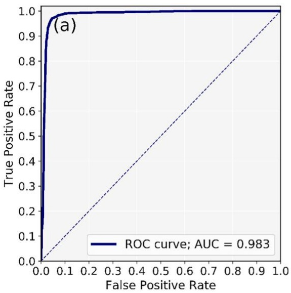

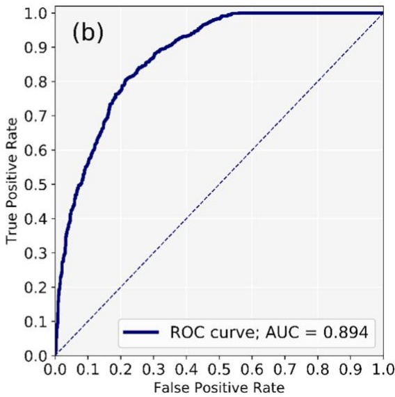

Hình 2-5 Đường cong ROC và AUC của mô hình Deep-NC sử dụng (a) Bộ dữ liệu huấn luyện và (b) Bộ dữ liệu kiểm tra.

Chỉ số Diện tích dưới đường cong (AUC) (Xem Hình 2-6), trong số các chỉ số đo hiệu suất được sử dụng trong nghiên cứu này, cung cấp một phản ánh chính xác nhất về khả năng dự đoán của một bộ phân loại. Do đó, nó đã được chọn làm chỉ số đánh giá hiệu suất cho mô hình Deep-NC được đề xuất được tối ưu hóa bằng các thuật toán khác nhau.

Bảng 2-7 Hiệu suất phân loại cho mô hình Deep-NC sử dụng 4 thuật toán tối ưu Adam, SGD, RMSprop và AdaDelta trên mười trường hợp lấy mẫu ngẫu nhiên của Bộ dữ liệu kiểm tra

<table><tbody><tr><td rowspan="2">Các chỉ số thống kê</td><td colspan="4">Chỉ số của 10 mẫu thử với thuật toán Adam</td><td colspan="4">Chỉ số của 10 mẫu thử với thuật toán SGD</td><td colspan="4">Chỉ số của 10 mẫu thử với thuật toán RMSprop</td><td colspan="4">Chỉ số của 10 mẫu thử với thuật toán AdaDelta</td></tr><tr><td>Min</td><td>Max</td><td>Mean</td><td>STD</td><td>Min</td><td>Max</td><td>Mean</td><td>STD</td><td>Min</td><td>Max</td><td>Mean</td><td>STD</td><td>Min</td><td>Max</td><td>Mean</td><td>STD</td></tr><tr><td>PPV</td><td>75.1</td><td>87.2</td><td>82</td><td>4.69</td><td>80.6</td><td>94.7</td><td>88.1</td><td>3.55</td><td>65</td><td>92</td><td>77.5</td><td>8.7</td><td>71.2</td><td>96.1</td><td>83.7</td><td>7.15</td></tr><tr><td>NPV</td><td>70.8</td><td>87.1</td><td>79.7</td><td>4.21</td><td>59.3</td><td>71.9</td><td>64.6</td><td>4.19</td><td>55.2</td><td>79.3</td><td>69.5</td><td>7.6</td><td>53.4</td><td>74.4</td><td>65.8</td><td>6.3</td></tr><tr><td>Sen</td><td>72</td><td>86.8</td><td>80.2</td><td>3.79</td><td>69.1</td><td>74.2</td><td>71.4</td><td>1.82</td><td>67.2</td><td>75.9</td><td>72.2</td><td>2.6</td><td>67.3</td><td>73.6</td><td>71.2</td><td>1.99</td></tr><tr><td>Spe</td><td>74</td><td>86.5</td><td>81.7</td><td>4.32</td><td>78.8</td><td>91.8</td><td>84.8</td><td>3.26</td><td>69.4</td><td>87.3</td><td>76.6</td><td>6</td><td>72.1</td><td>93.1</td><td>81.1</td><td>6.02</td></tr><tr><td>CA</td><td>72.9</td><td>85.8</td><td>80.8</td><td>3.74</td><td>74.1</td><td>78.3</td><td>76.4</td><td>1.14</td><td>72.1</td><td>74.5</td><td>73.5</td><td>0.9</td><td>72.8</td><td>76.8</td><td>74.7</td><td>0.96</td></tr><tr><td>AUC</td><td>0.82</td><td>0.93</td><td>0.89</td><td>0.03</td><td>0.81</td><td>0.86</td><td>0.84</td><td>0.01</td><td>0.81</td><td>0.84</td><td>0.82</td><td>0.01</td><td>0.82</td><td>0.85</td><td>0.83</td><td>0.01</td></tr></tbody></table>

Để đánh giá hiệu suất dự đoán của mô hình Deep-NC được tối ưu hóa bằng các thuật toán khác nhau, diện tích dưới đường cong ROC (AUC) được sử dụng làm chỉ số chính để so sánh. AUC cung cấp một phép đo chính xác về khả năng phân biệt giữa các lớp của một thuật toán phân loại. Bảng 2-7 trình bày hiệu suất dự đoán của mô hình Deep-NC được tối ưu hóa bằng thuật toán Adam tổng kết dựa trên mười trường hợp lấy mẫu ngẫu nhiên, so sánh cùng với

<!-- page: 82 -->

các thuật toán SGD, RMSprop và AdaDelta theo khuyến nghị của Hà và cộng sự [122]. Chỉ số AUC đạt giá trị cao nhất là 0.933 trong Mẫu 1, trong khi giảm xuống giá trị thấp nhất là 0.817 trong Mẫu 2. Trung bình, giá trị AUC cho mô hình Deep-NC được tối ưu hóa bằng thuật toán Adam là 0.89.

Vì vậy, mô hình Deep-NC tối ưu bằng Adam vượt trội hơn các mô hình khác trong việc dự đoán cháy rừng, với giá trị AUC trung bình cao nhất là 0.89.

## 2.3 Tạo bản đồ nguy cơ cháy rừng

Tận dụng khả năng phân loại chính xác cao của mô hình Deep Neural Computing (Deep-NC), nghiên cứu sinh đã áp dụng một quy trình để tính toán và trực quan hóa chỉ số nguy cơ cháy rừng cho toàn tỉnh Gia Lai.

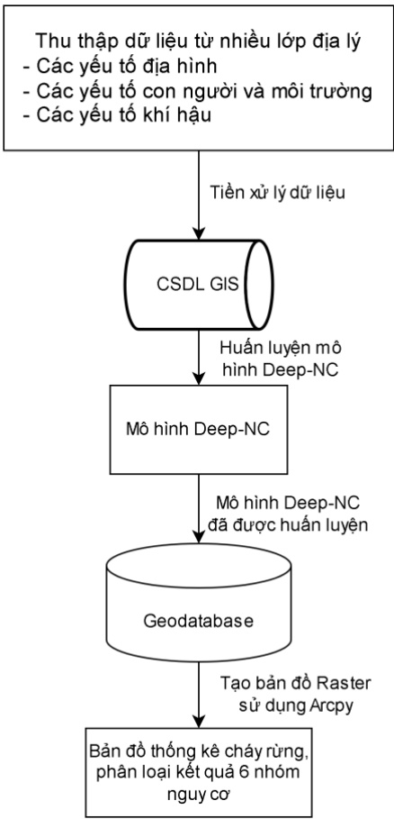

Hình 2-6 Quy trình xây dựng bản đồ nguy cơ cháy rừng

Quy trình bắt đầu bằng việc thu thập dữ liệu từ nhiều lớp đặc trưng (feature class) trong ArcGIS Pro, bao gồm các chỉ số về thực vật (NDVI, NDWI, NDMI), thông số khí tượng (độ ẩm, nhiệt độ, tốc độ gió, lượng mưa), và các đặc điểm địa hình (độ cao, độ dốc, độ cong, hướng dốc). Dữ liệu này được tiền xử lý bằng cách sử dụng hàm SimpleImputer() trong thư viện scikit-learn để bổ sung các giá trị còn thiếu bằng phương pháp thống kê và StandardScaler() nhằm mục đích chuẩn hoá dữ liệu, đưa các thông số về cùng thang đo.

<!-- page: 83 -->

Mô hình Deep-NC được xây dựng dưới dạng một Mạng nơ-ron sâu với 03 lớp ẩn, sử dụng hàm kích hoạt ReLU và sigmoid ở lớp đầu ra. Mô hình được huấn luyện trên dữ liệu đã được chuẩn bị, với việc chia tập dữ liệu thành tập huấn luyện và tập kiểm tra (tỷ lệ 70/30). Mặc dù đầu ra cuối cùng là nhị phân, nhưng kết quả thực tế thu được là xác suất để một điểm dữ liệu thuộc về lớp 1 (cháy rừng), biểu thị bằng phần trăm.

Như trong phần trên, mô hình Deep-NC đã được tạo và đem ra đánh giá với các thuật toán khác và được chứng minh là có khả năng tốt nhất trong việc phân vùng nguy cơ cháy rừng đối với bộ dữ liệu mẫu. Mô hình sau khi huấn luyện được lưu về máy thông qua việc sử dụng phương thức save() trong thư viện Keras, kết quả thu được mô hình dạng file là “FF\_Deep\_NC\_Model.h5” (Hierarchical Data Format version 5 – h5), file mô hình này được sử dụng cho công việc phân vùng nguy cơ cháy rừng đối với dữ liệu của toàn bộ tỉnh Gia Lai. Với diện tích toàn tỉnh là 15,512 km<sup>2</sup>, độ phân giải pixel sử dụng là 30mx30m, tổng số điểm ảnh là 17,235,555 điểm ảnh.

Quá trình dự đoán được thực hiện trên toàn bộ hơn 17 triệu điểm ảnh của tỉnh Gia Lai, phân tích từng điểm ảnh trên bản đồ để tính toán xác suất cháy rừng cho từng vị trí. Đây là quá trình xử lý một khối lượng lớn dữ liệu không gian. Kết quả dự đoán là xác suất cháy rừng cho từng điểm ảnh, được biểu thị bằng phần trăm.

Kết quả này sau đó được chuyển đổi thành bản đồ raster sử dụng ArcPy, với mỗi pixel đại diện cho xác suất cháy rừng tại vị trí tương ứng. Bản đồ sau đó cần được lưu vào cơ sở dữ liệu địa lý để dễ dàng truy xuất và sử dụng về sau, cũng như đảm bảo tính đồng bộ và an toàn của dữ liệu.

Các kết quả phân loại dạng raster được sử dụng để tạo ra một bản đồ mức độ dễ bị cháy rừng (Hình 2-7), được phân đoạn thành sáu nhóm sử dụng phương pháp Natural Break trong ArcGIS 10.6 theo [92]. Các nhóm nguy cơ này bao gồm: Không cháy rừng (0–0.086), Rất thấp (0.087–0.282), Thấp (0.283–0.498), Trung bình (0.499–0.710), Cao (0.711–0.894) và Rất cao (0.895–1), các nhóm này được phân chia giống như 05 cấp dự báo cháy rừng ở Việt Nam theo Nghị định 156/2018/NĐCP Hình 2-8 cộng thêm phân vùng “Không cháy” tạo thành 06 nhóm dữ liệu.

<!-- page: 84 -->

Một kiểm tra trực quan của bản đồ nguy cơ cháy rừng này trên ArcGIS đã cho thấy các khu vực có xác suất cháy rừng rất cao, đặc biệt là các khu rừng của Ia Grai, Chu Pah, Duc Co, Chu Prong, Ia Pa và Dak Doa. Đặc biệt, trong năm 2019, những huyện này đã chứng kiến tổng cộng 8 vụ cháy rừng, dẫn đến thiệt hại 91.35 ha rừng bị phá huỷ. Do đó, những khu vực có nguy cơ cao này nên được ưu tiên khi lập kế hoạch và thực hiện các biện pháp phòng cháy rừng và kiểm soát cháy rừng.

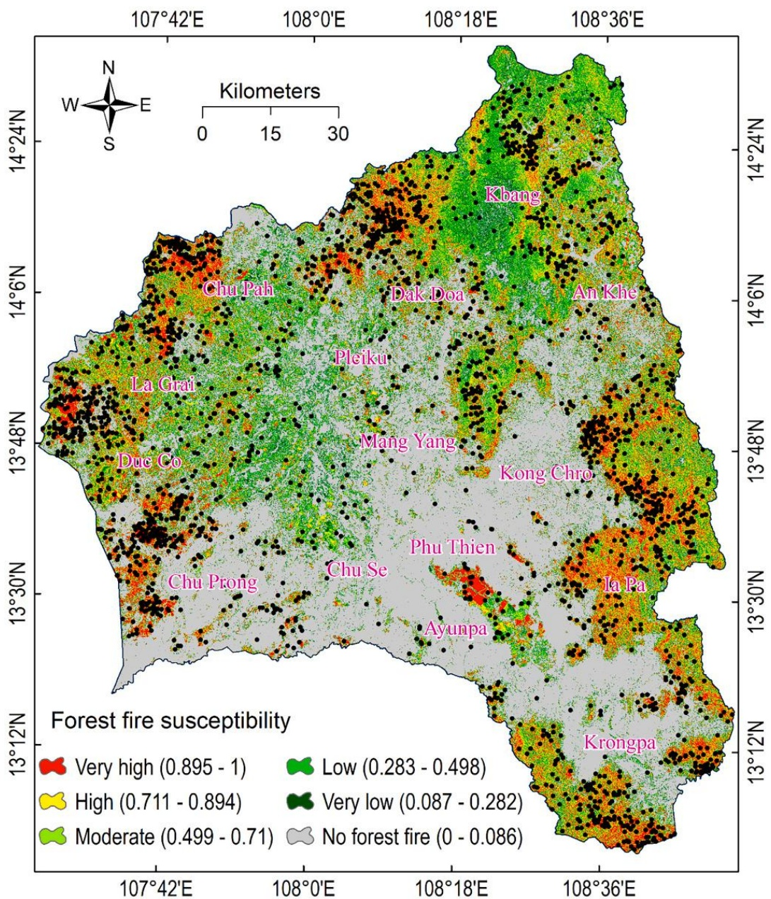

Hình 2-7Bản đồ nguy cơ cháy rừng cho vùng nghiên cứu sử dụng mô hình Deep-NC với thuật toán tối ưu hoá Adam.

Ngược lại, các khu vực rừng ở Mang Yang, Chu Se, Phú Thiện và Ayun Pa có xác suất cháy rừng thấp hơn (Hình 2-7). Nguy cơ thấp này có thể được

<!-- page: 85 -->

giải thích bởi việc các khu vực này có rừng mới trồng, với tích tụ nhiên liệu thấp.

Để chứng minh tính chính xác của bản đồ được xây dựng, nghiên cứu sinh sử dụng một số biện pháp sau:

\- Đối chiếu với nguồn dữ liệu đa dạng:

So sánh bản đồ phân vùng nguy cơ cháy rừng với thông tin từ cộng đồng địa phương, đặc biệt là kiến thức bản địa về lịch sử và xu hướng cháy rừng trong khu vực. Kiểm chứng các vùng có nguy cơ cao bằng cách phân tích ảnh vệ tinh độ phân giải cao mới nhất, tập trung vào các khu vực có dấu hiệu khô hạn, thảm thực vật dễ cháy, hoặc các vết tích của đám cháy gần đây.

## - Đánh giá hiệu suất dự báo theo thời gian:

Đối chiếu bản đồ phân vùng nguy cơ với dữ liệu lịch sử về các vụ cháy rừng đã xảy ra trong quá khứ. Tập trung vào các sự kiện cháy rừng diễn ra sau thời điểm dữ liệu được sử dụng để xây dựng mô hình.

Phân tích khả năng dự báo của bản đồ bằng cách so sánh các vùng được dự đoán có nguy cơ cao với vị trí và mức độ nghiêm trọng của các vụ cháy rừng thực tế.

Đánh giá độ chính xác của mô hình qua các mùa và năm khác nhau để xác định tính ổn định và độ tin cậy của các dự báo trong điều kiện khí hậu và môi trường thay đổi.

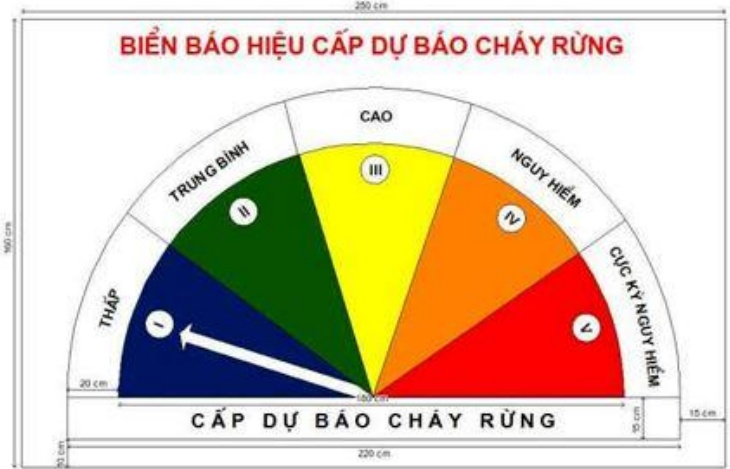

Hình 2-8 Biển báo hiệu cấp dự báo cháy rừng theo Nghị định 156/2018/NĐ-CP 2.4 Thảo luận

Hiệu suất của mô hình Deep-NC trong dự đoán sự xảy ra cháy rừng bị ảnh hưởng đáng kể bởi cách điều chỉnh trọng số. Trong số bốn thuật toán tối ưu hóa

<!-- page: 86 -->

được nghiên cứu, thuật toán Adam cho thấy hiệu suất tốt nhất. Sự khác biệt trong hiệu suất giữa các mô hình sử dụng ba thuật toán tối ưu hóa khác là không đáng kể.

Các mô hình Deep-NC vượt trội hơn so với các mô hình tham chiếu, bao gồm Relevance Vector Machines, Support Vector Machines và Random Forests. Luận án này cho thấy Deep-NC là một công cụ hứa hẹn để dự đoán nguy cơ cháy rừng và nên được xem xét cho các ứng dụng như vậy.

Một thách thức trong việc thiết kế các mô hình Deep-NC là xác định số lớp ẩn và số lượng neuron phù hợp cho mỗi lớp. Trong nghiên cứu này, nghiên cứu sinh sử dụng ba lớp ẩn với 64 neuron mỗi lớp. Tuy nhiên, cấu trúc này có thể không tối ưu cho các mô hình Deep-NC. Do đó, nghiên cứu tương lai có thể cải thiện hiệu suất của mô hình Deep-NC bằng cách khám phá các cấu trúc tối ưu hơn.

Hiệu suất cao của mô hình Deep-NC trong nghiên cứu này đủ để tạo ra một bản đồ phân vùng nguy cơ cháy rừng, có thể hữu ích cho các cơ quan cấp tỉnh trong công tác phòng cháy rừng và kiểm soát cháy rừng.

Nghiên cứu tương lai có thể khám phá cách tối ưu hóa cấu trúc của các mô hình Deep-NC cho các nghiên cứu về cháy rừng. Ngoài ra, các thuật toán tối ưu hóa học máy mới có thể được sử dụng để huấn luyện các mô hình Deep-NC.

## 2.5 Kết chương

Chương 2 đã trình bày chi tiết về mô hình Deep-NC được đề xuất để xây dựng bản đồ phân vùng nguy cơ cháy rừng cho tỉnh Gia Lai. Mô hình này dựa trên kiến trúc Mạng nơ-ron sâu, với việc tối ưu hóa các siêu tham số. Các yếu tố ảnh hưởng đến cháy rừng đã được xác định và đánh giá tầm quan trọng, bao gồm các yếu tố địa hình, thảm thực vật và khí hậu. Hiệu suất của mô hình Deep-NC được đánh giá bằng nhiều chỉ số khác nhau, cho thấy kết quả vượt trội so với các mô hình cơ sở khác. Việc so sánh các thuật toán tối ưu hóa sử dụng cùng với Deep-NC cho thấy Adam là thuật toán hiệu quả nhất cho mô hình này. Bản đồ phân vùng nguy cơ cháy rừng cuối cùng được tạo ra có độ chính xác cao, phân chia vùng nghiên cứu thành 6 cấp độ nhạy cảm, chứng minh hiệu quả của mô hình Deep-NC trong việc dự báo nguy cơ cháy rừng. Phần trả lời cho

<!-- page: 87 -->

câu hỏi nghiên cứu thứ $2 \mathrm { ~ v } \mathring { \mathrm { e } }$ mô hình thành lập bản $\mathbf { \dot { d } } \mathbf { \dot { \hat { 0 } } }$ phân vùng nguy cơ cháy rừng đã được trả lời trong chương này.

<!-- page: 88 -->

## CHƯƠNG 3. MÔ HÌNH THÀNH LẬP BẢN ĐỒ PHÂN VÙNG NGUY CƠ SẠT LỞ ĐẤT SỬ DỤNG CÂY TỔNG HỢP BBO-DE-STREEENS

Trong chương này, vùng nghiên cứu Than Uyên và Bộ dữ liệu về lở đất đã được biên soạn với các yếu tố ảnh hưởng được giới thiệu. Quá trình tiền xử lý dữ liệu được giải thích chi tiết. Luận án trình bày mô hình kết hợp BBO-DE StreeEns, một sự kết hợp giữa cây tổng hợp SPAARC và tối ưu hóa BBO-DE. Tiếp theo, nghiên cứu sinh đề cập đến kiến trúc mô hình, quá trình huấn luyện và tối ưu hóa các siêu tham số. Đánh giá mô hình và phân tích kết quả trên Bộ dữ liệu về lở đất được thảo luận một cách kỹ lưỡng. Cuối cùng, luận án trình bày ứng dụng để tạo ra một bản đồ nguy cơ sạt lở đất. Kết quả đạt được của mô hình đề xuất được NCS công bố trong công trình [CT3].

## 3.1 Bộ dữ liệu sạt lở đất của huyện Than Uyên, tỉnh Lai Châu

## 3.1.1 Mô tả vùng nghiên cứu

Huyện Than Uyên nằm ở phía Đông Nam tỉnh Lai Châu, thuộc vùng Tây Bắc Việt Nam. Nó nằm giữa vòng kinh độ 103°35'Đ và 103°53'Đ, cũng như vòng vĩ độ 21°40'B và 22°08'B, với diện tích tổng cộng là 792,53 km² (Hình 3-1) [123] [124].

Huyện Than Uyên nằm trong lưu vực sông Nậm Mú, một chi lưu cấp 1 của sông Đà. Than Uyên nổi tiếng với những dãy núi trung cao và địa hình phức tạp. Phía Đông của Than Uyên là dãy núi Hoàng Liên Sơn, trong khi phần phía tây được đánh dấu bởi những dãy núi chạy theo hướng Tây Bắc - Đông Nam, với những thung lũng sâu xen kẽ. Huyện có mật độ sông và suối tương đối cao, dao động từ 1,5 đến 1,7 km/km². Than Uyên có thể chia thành ba khu vực khác nhau: khu vực phía đông, bao gồm sườn núi của dãy Fansipan, có địa hình gồ ghề và độ dốc dựng đứng; khu vực phía tây, bao gồm những dãy núi thấp của dãy Pu Sam Cáp, với độ cao dao động từ 600 đến 1.800 mét so với mực nước biển; và khu vực trung tâm, là một thung lũng bao gồm những đồi thấp, núi và đồng bằng xen kẽ, với độ cao từ 500 đến 650 mét [123] [124].

<!-- page: 89 -->

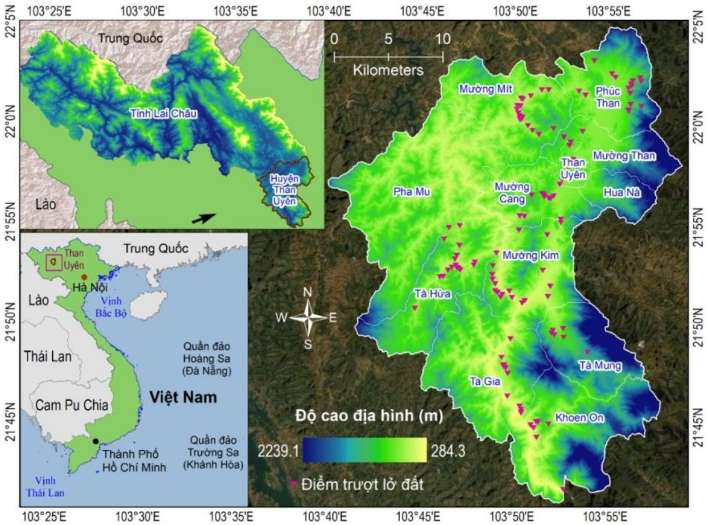

Hình 3-1Vị trí của huyện Than Uyên, tỉnh Lai Châu

Huyện Than Uyên trải qua hai mùa mưa và mùa khô rõ rệt trong vùng gió mùa. Mùa mưa kéo dài từ tháng 4 đến tháng 10, với lượng mưa lớn nhất diễn ra vào tháng 6 và tháng 7. Ngược lại, mùa khô kéo dài từ tháng 11 đến tháng 3 của năm sau. Lượng mưa hàng năm trung bình trong huyện dao động từ 1.800 đến 2.200 mm, với nhiệt độ trung bình từ $2 2 \mathrm { ~ - ~ } 2 3 ^ { \circ } \mathrm { C } .$ Độ ẩm trung bình dao động khoảng 80% [123] [124].

Than Uyên có mạng lưới đường giao thông tương đối mật độ, bao gồm một số tuyến quan trọng. Các tuyến đường này bao gồm quốc lộ 32, kết nối huyện với thành phố Lai Châu và tỉnh Yên Bái; quốc lộ 279, nối Than Uyên với các tỉnh Điện Biên và Sơn La; và đường tỉnh 106, chạy từ Mường Kim đến Khoen Ôn. Ngoài ra, còn có các tuyến đường nối giữa các xã và làng để kết nối các khu dân cư. Tuy nhiên, hầu hết các đường ở Than Uyên có địa hình uốn lượn với nhiều đèo dốc và đường lưỡi bên, làm cho chúng dễ bị lở đất trong mùa mưa [123] [124].

Khu vực nghiên cứu thể hiện hoạt động địa chất đáng kể, được đặc trưng bởi các lỗi sâu nổi bật chạy theo hướng Tây Bắc - Đông Nam và các lỗi chéo trẻ tuổi theo hướng Bắc - Nam. Những đặc điểm địa chất này dẫn đến quá trình

<!-- page: 90 -->

phân hủy mạnh mẽ và phân tách đá vữa, tạo ra các vùng không ổn định rộng lớn kéo dài hàng trăm mét. Những khu vực không ổn định này tiềm ẩn nguy cơ cao về lở đất.

Dựa trên thành phần địa chất học, cấu trúc, kết cấu, tính chất vật lý-cơ học và độ dày của tầng phân hủy, địa chất kỹ thuật của khu vực nghiên cứu đã được phân loại vào các hệ thống địa chất kỹ thuật phụ sau: hệ thống trầm tích thế kỷ, bao gồm đá và đất lỏng chưa ổn định; hệ thống trầm tích mảnh vụn của thành Yên Châu, bao gồm đá và đất một phần rắn và một phần lỏng với độ ổn định dao động từ kém đến trung bình; hệ thống trầm tích mảnh vụn của thành Suối Bàng, bao gồm đá và đất một phần rắn và một phần lỏng với độ ổn định dao động từ kém đến trung bình; hệ thống trầm tích núi vôi của thành Pac Ma, bao gồm đá rắn và một phần đá rắn với độ ổn định dao động từ trung bình đến cao; hệ thốn trầm tích núi vôi và mảnh vụn của thành Mường Trại, bao gồm đá và đất một phần rắn và một phần lỏng với độ ổn định trung bình; các đá nham thạch của thành Pu Sam Cáp và Phú Sa Phìn, và các thành Núi Tử Lê và Ngôi Thía, bao gồm đá rắn và một phần đá rắn với độ ổn định dao động từ trung bình đến cao [123] [124].

Đến ngày 31 tháng 12 năm 2017, dân số huyện Than Uyên là 66.589 người, với tổng số 13.838 hộ, trong đó có 3.340 hộ được xếp loại là nghèo. Thật không may, một số cư dân đã xây nhà của mình dọc theo đường, ngay phía dưới các đồi bên đường có nguy cơ lở đất đáng kể. Trong những năm gần đây, Than Uyên đã bị ảnh hưởng nghiêm trọng bởi thiên tai, đặc biệt là lở đất, do sự kết hợp của các yếu tố tự nhiên, môi trường và xã hội. Việc xây dựng các con đường và khu đô thị mới trong khu vực đã được xác định là một nguyên nhân chính gây ra sự gia tăng lở đất do hoạt động của con người [123] [124].

## 3.1.2 Dữ liệu sạt lở đất trong lịch sử

Nghiên cứu sử dụng bản đồ danh mục lở đất của huyện Than Uyên (Xem Hình 3-1), là một trong những sản phẩm của nghiên cứu “Điều tra, đánh giá và phân vùng cảnh báo nguy cơ trượt lở đất đá các vùng miền núi Việt Nam”. Nghiên cứu quốc gia này do nhà nước tài trợ đã được Viện Khoa học và Kỹ thuật Địa chất Việt Nam thuộc Bộ Tài nguyên và Môi trường chủ trì từ năm 2012 [123] [124].

<!-- page: 91 -->

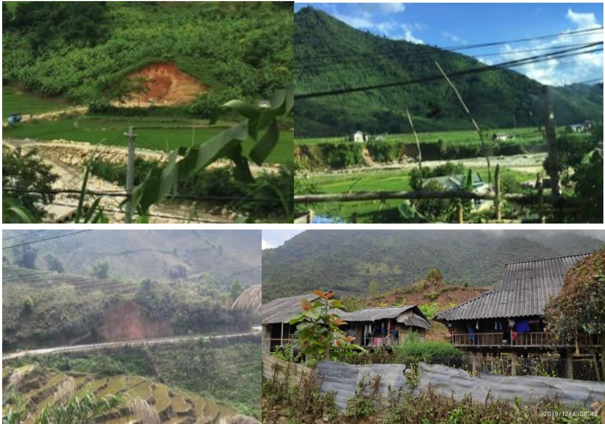

Hình 3-2 Các hiện tượng lở đất đã xảy ra trong huyện Than Uyên

Trong phạm vi nghiên cứu này, tác giả đã sử dụng một số phương pháp bao gồm phân tích ảnh từ không gian, phân tích địa hình 3D dựa trên bản đồ địa hình (tỷ lệ 1:10.000), phân tích các hình ảnh từ xa khác nhau (bao gồm vệ tinh và radar) và điều tra thực địa. Tiếp cận toàn diện này đã xác định 114 vụ lở đất trong huyện Than Uyên [123] [124]. Những vụ lở đất này, được kích hoạt bởi mưa và xảy ra trong vòng mười năm qua, chủ yếu xảy ra trên các độ dốc ven đường dương và âm. Những điểm nóng bao gồm quốc lộ 279 từ làng Sáp Người đến đèo Khâu Cơ, đường tỉnh 106 từ Mường Kim đến Khoen Ơn, và các đường giữa các xã từ Mường Kim đến Tả Mùng và từ Than Uyên đến Pha Mủ. Đáng chú ý, không có vụ lở đất do động đất được quan sát trong huyện trong thời gian nghiên cứu.

Phân tích và nghiên cứu thực địa đã tiến hành trong nghiên cứu đã cho thấy rằng các vụ lở đất chủ yếu được kích thích bởi các cơn bão dữ dội, đặc biệt là khi lượng mưa hàng ngày vượt quá 100 mm. Những điều kiện này làm tăng độ bão hoà nước cho đất và đá trên sườn dốc, dẫn đến giảm sức chịu cắt của vật liệu, từ đó phá vỡ trạng thái cân bằng, gây ra sự mất ổn định của sườn dốc. Hình 3-2 trình bày các hình ảnh về các vụ lở đất xảy ra trong khu vực nghiên cứu [123] [124].

<!-- page: 92 -->

## 3.1.3 Các yếu tố ảnh hưởng

Trong quá trình nghiên cứu và ứng phó với trượt lở đất, có hai nhóm nguyên nhân đóng vai trò quan trọng là nhóm nguyên nhân tự nhiên và nhóm nguyên nhân nhân sinh.

Nhóm nguyên nhân tự nhiên bao gồm các yếu tố sau đây:

Yếu tố địa hình như độ dốc, độ cong bề mặt, độ chênh cao tương đối và các yếu tố khác.

Yếu tố địa chất như thành phần đá gốc, phân vị địa chất, hệ thống đứt gãy và các yếu tố khác.

Yếu tố khí tượng-thủy văn như chế độ mưa, cường độ và phân bố lượng mưa, chế độ thủy văn khu vực và các yếu tố khác.

Nhóm nguyên nhân nhân sinh bao gồm các hoạt động của con người như:

\- Xây dựng dân dụng và công trình như cầu, đường, thủy điện, thủy lợi.

\- Hoạt động khai thác khoáng sản.

\- Chế độ canh tác và sử dụng đất.

Chặt phá rừng và các hoạt động khác do con người gây ra.

Huyện Than Uyên là một huyện thuộc tỉnh Lai Châu, nằm ở khu vực Tây Bắc Việt Nam. Địa hình của huyện Than Uyên có đặc điểm chủ yếu là núi cao và khối tảng. Huyện này có các đồi núi thấp và cao, với độ dốc từ 15 đến 30° [125].

Khu vực đồi núi thấp và uốn nếp khối tảng ở huyện Than Uyên bao gồm các vùng như An Châu, Thất Khê, Gâm - Ngân Sơn, Sông Chảy. Còn khu vực đồi núi trung bình và cao khối tảng vòm nằm ở các vùng như Hoàng Su Phì - Đồng Văn. Địa hình của huyện Than Uyên chịu ảnh hưởng của các vòm nâng và đới phá hủy ngang trong khu vực, làm cho nó trở nên phức tạp.

Các sông ngòi chủ yếu chảy song song với hệ thống đứt gãy khu vực. Huyện Than Uyên có nhiều sông phân cắt sâu và hẻm vực. Các hiện tượng tai biến như trượt lở đất, dòng bùn đá cũng khá phổ biến tại đây. Xâm thực và bóc mòn cũng xảy ra mạnh mẽ trong khu vực.

Các yếu tố này có thể được phân loại thành các nhóm Địa hình, Yếu tố con người và môi trường, và Khí hậu:

<!-- page: 93 -->

## Các nhân tố địa hình:

**Độ cao:** Các nghiên cứu đã chỉ ra rằng độ cao là một yếu tố quan trọng ảnh hưởng đến sự xảy ra của trượt lở [126]. Các khu vực có độ cao cao hơn thường ít bị phong hóa do tác động của môi trường, điều này làm giảm khả năng xảy ra trượt lở. Trong trường hợp của Lai Châu, trượt lở đất chủ yếu xảy ra ở độ cao từ thấp đến trung bình.

**Độ dốc:** Theo nghiên cứu của Lee và đồng nghiệp [127], độ dốc đóng vai trò quan trọng trong sự xảy ra của trượt lở, với các độ dốc lớn hơn có nguy cơ trượt lở cao hơn. Bản đồ độ dốc và độ cong khu vực nghiên cứu được tạo ra từ mô hình DEM như đã đề cập.

**Độ cong:** Theo nghiên cứu của Pike [128], độ cong bề mặt đóng vai trò quan trọng trong việc dự báo trượt lở, vì nó có thể có tác động đáng kể đến sự ổn định của đất. Các vị trí có độ cong tuyệt đối cao, như các địa hình lồi hoặc lõm, có nguy cơ trượt lở cao hơn so với các vị trí có độ cong tuyệt đối thấp.

**Hướng dốc:** Hướng dốc (hay hướng sườn dốc), được đo bằng độ từ phía Bắc theo chiều kim đồng hồ, có thể ảnh hưởng đến một loạt các yếu tố môi trường bao gồm lượng mưa, gió khô, ánh sáng và bức xạ mặt trời. Những yếu tố này có thể ảnh hưởng đến độ ẩm đất và khả năng xảy ra trượt lở [129].

**Biên độ giảm độ cao:** Còn được gọi là độ chênh cao tương đối, là sự chênh lệch độ cao lớn nhất trong một đơn vị diện tích. Nó thể hiện thế năng của địa hình. Khi biên độ giảm độ cao càng lớn, thế năng địa hình càng cao, tạo điều kiện cho quá trình di chuyển của đất đá diễn ra mạnh mẽ hơn và tạo ra động năng va đập lớn hơn [130].

**Loại đất:** Loại đất đóng vai trò quan trọng trong việc đánh giá nguy cơ trượt lở vì nó ảnh hưởng đáng kể đến các thuộc tính của đất như khả năng thấm nước, khả năng chịu lực cắt và mật độ, từ đó ảnh hưởng đến khả năng giữ và thoát nước của đất [131]. Các loại đất có tính thấm thấp và tính liên kết yếu sẽ tạo điều kiện thuận lợi cho sự trượt lở đất mỗi khi có mưa lớn.

**Địa chất:** Yếu tố địa chất đóng vai trò quan trọng trong xác định loại và cấu trúc của các hệ thống đá gốc, từ đó ảnh hưởng đáng kể đến sự ổn định của sườn dốc [132]. Huyện Than Uyên cũng đối mặt với một số yếu tố địa chất nguy hiểm như trượt lở đất, dòng bùn đá và sạt lở đất. Điều này có thể gây ra

<!-- page: 94 -->

nguy hiểm cho cơ sở hạ tầng, đường giao thông và cuộc sống của người dân. Việc nghiên cứu và quản lý địa chất nguy hiểm là điều cần thiết để đảm bảo an toàn và phát triển bền vững.

**Khoảng cách đến vết đứt gãy:** Đứt gãy là những vết nứt hoặc vỡ trong lớp vỏ Trái đất. Đứt gãy tạo ra hoạt động địa chấn, gây ra sự không ổn định trong lòng đất, do đó ảnh hưởng đáng kể đến trượt lở [133]. Tại tỉnh Lai Châu, các nghiên cứu thực địa đã chỉ ra rằng các vị trí trượt lở tập trung chủ yếu dọc theo các đứt gãy lớn như đứt gãy Sông Đà, Điện Biên - Lai Châu và Bình Lư - Than Uyên. Các vùng nằm ở vùng giao nhau của các đứt gãy như Mường Lay, Chăn Nưa phát triển các khe suối rộng hàng km, với đất đá bị phá hủy mạnh mẽ và xuất hiện nhiều vị trí trượt lở quy mô lớn từ lâu.

**Khoảng cách đến đường giao thông:** Hoạt động làm đường giao thông phá vỡ trạng thái cân bằng tự nhiên ở các sườn dốc. Xây dựng đường giao thông trên địa hình đồi núi thường tạo ra các taluy đường với vách dốc đứng, gây xáo trộn vật liệu đất đá, tác động vào lớp phủ thực vật, tiềm ẩn nguy cơ trượt lở rất lớn. Với đặc điểm địa hình của tỉnh Lai Châu nói chung và Than Uyên nói riêng, đường giao thông được xây dựng dọc theo bờ sông Đà, Nậm Na, gần dòng chảy, bên núi, bên vực hoặc trên các sườn dốc với góc nghiêng lớn hơn 40 độ; mặt đường nhiều đoạn ở trên đá gốc cứng nhưng nằm trong khu vực bị ảnh hưởng bởi đứt gãy, dẫn đến tình trạng bị phá vỡ, độ cứng yếu; một số đoạn đi qua vùng đá phong hoá có tính ổn định từ yếu đến trung bình. Trong những năm gần đây, đường giao thông đã được nâng cấp, mở rộng bề mặt bằng cách đào sâu vào sườn núi và do địa hình dốc, tạo ra vách taluy có chiều cao từ 5-40m, nhiều nơi cao hơn 40m, với góc nghiêng từ 60-70 độ, tiềm ẩn nhiều nguy cơ trượt lở [18].

**Khoảng cách đến sông suối:** Một mặt, hệ thống sông suối là bức tranh thể hiện kết quả của sự phân cắt địa hình dưới tác động của dòng chảy nước. Nước trên bề mặt địa hình rất nhạy cảm với sự biến đổi của địa hình. Do đó, nó cũng phần nào phản ánh chế độ kiến tạo của khu vực mà cụ thể là nhiều sông suối được hình thành từ các đứt gãy. Mặt khác, khi sông chảy qua hoặc gần sườn dốc, nước có thể thẩm thấu vào vật liệu đất đá, làm tăng trọng lượng và giảm khả năng chịu lực cắt của chúng. Điều này dẫn đến sự giảm tính ổn định của sườn dốc và tăng nguy cơ trượt lở [134].

<!-- page: 95 -->

Các yếu tố khác cũng đã được xem xét như:

**Lượng mưa:** Là một yếu tố vô cùng then chốt trong việc tác động đến nguy cơ xảy ra thiên tai sạt lở đất. Tuy nhiên dữ liệu thu thập được lại quá ít, không đủ để cung cấp dữ liệu cho các địa điểm có xảy ra sạt lở đất nên không được đưa vào nghiên cứu.

**Các hoạt động dân sinh:** Các dữ liệu về hoạt động dân sinh có tính chất thay đổi rất nhanh chóng theo thời gian, nhưng lại không được ghi chép lại một cách đầy đủ. Ngoài ra một số hoạt động như khai thác khoáng sản có thể gây ra sạt lở đất nhưng lại không hề được thống kê hoặc thống kê không chính xác vì nguyên nhân pháp lý. Ví dụ như khai thác rừng “chui”. Vì vậy những dữ liệu này không thể được sử dụng.

Các bước chuẩn bị dữ liệu để tạo ra Geodatabase cháy rừng cho tỉnh Gia Lai đã được đề cập đến trong phần 1.6 của luận án.

## 3.1.4 Xây dựng bản đồ các yếu tố ảnh hưởng

Sau khi kiểm tra kỹ lưỡng danh mục các địa điểm sạt lở đất và phân tích các đặc điểm địa hình môi trường của khu vực nghiên cứu, đã xác định được mười yếu tố có tác động đáng kể đến sự xảy ra lở đất. Các yếu tố này bao gồm (Hình 3-3a) Độ cao, (Hình 3-3b) Độ dốc, (Hình 3-3c) Độ cong, (Hình 3-3d) Hướng, (Hình 3-3e) Biên độ địa hình, (Hình 3-3f) Loại đất, (Hình 3-3g) Địa chất, (Hình 3-3h) Khoảng cách đến vết sạt lở, (Hình 3-3i) Khoảng cách đến đường và (Hình 3-3j) Khoảng cách đến sông. Các yếu tố này được lựa chọn dựa trên khả năng của chúng ảnh hưởng đến sự ổn định địa hình và xác suất lở đất. Các nghiên cứu trước đây đã chứng minh tính hiệu quả và ý nghĩa của chúng trong dự báo lở đất [124], [135], [136].

Độ cao (m) (Hình 3-3a): Nó có tác động đáng kể đến góc độ của độ dốc, lực hấp dẫn và phân bố khí hậu và thực vật [137]. Để tích hợp yếu tố này, một bản đồ độ cao được tạo ra từ Mô hình Số độ cao (DEM) dựa trên bản đồ địa hình quốc gia của Việt Nam (tỷ lệ 1:50.000).

Độ dốc (o) (Hình 3-3b), Độ cong bề mặt (Hình 3-3e), Hướng dốc (Hình 3-3c): Độ dốc của địa hình là yếu tố quan trọng xác định xác suất lở đất, với những độ dốc cao hơn có khả năng lở đất cao hơn [138]. Ngoài ra, độ cong của một độ dốc, đo sự thay đổi về góc độ hoặc hướng của độ dốc, có thể ảnh hưởng đáng kể đến sự ổn định của vật liệu độ dốc [139]. Hướng, hay còn được gọi là

<!-- page: 96 -->

hướng phương của một độ dốc, có thể ảnh hưởng đến các yếu tố môi trường như mưa, ánh sáng mặt trời, gió khô và bức xạ mặt trời, từ đó có thể ảnh hưởng đến độ ẩm đất và khả năng lở đất [140]. Trong nghiên cứu này, Hướng được chia thành chín lớp (giá trị từ 1 đến 9) bao gồm: Bằng phẳng (-1), Bắc (0-22.5 & 337.5-360), Đông-Bắc (22.5-67.5), Đông (67.5-112.5), Đông-Nam (112.5-157.5), Nam (157.5-202.5), Tây-Nam (202.5-247.5), Tây (247.5-292.5), và Tây-Bắc (292.5-337.5).

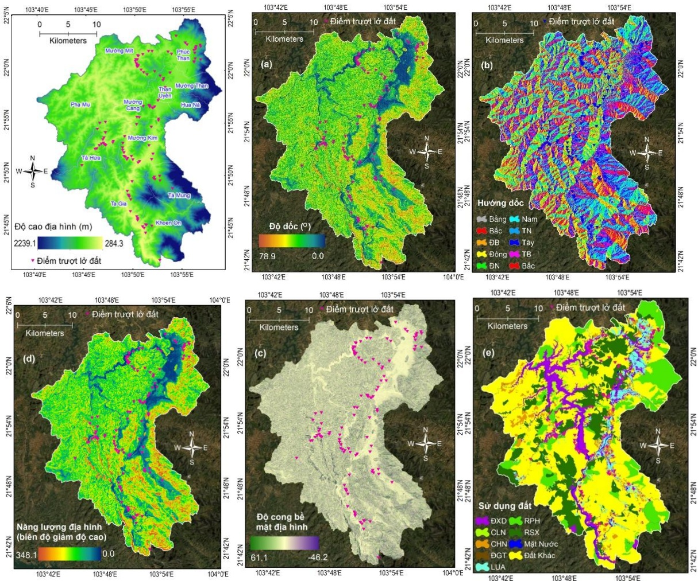

Hình 3-3 Các yếu tố ảnh hưởng đến lở đất: (a) Độ cao; (b) Độ dốc; (c) Hướng dốc; (d) Năng lượng địa hình; (e) Độ cong bề mặt địa hình; (f) Mục đích sử dụng đất;

Biên độ địa hình (Hình 3-3e): Được xác định là sự khác biệt tối đa về độ cao trên một đơn vị diện tích, biên độ địa hình có thể ảnh hưởng đến năng lượng tiềm năng hấp dẫn của khối đá và do đó, sự xảy ra của lở đất [141].

## Các yếu tố ảnh hưởng của con người và môi trường:

Mục đích sử dụng đất (Hình 3-3f): Mục đích sử dụng đất có tác động đáng kể đến các thuộc tính đất như khả năng thấm, độ cứng và mật độ, ảnh hưởng đến khả năng giữ và thoát nước của đất [142]. Phân loại đất trong nghiên cứu

<!-- page: 97 -->

này được suy ra từ bản đồ địa chất quốc gia tỷ lệ 1:100.000, bao gồm 11 mục đích sử dụng đất: Đất xây dựng, Đất trồng cây lâu năm, Đất trồng cây hàng năm, Đất giao thông, Đất trồng lúa, Đất rừng phòng hộ, Đất rừng sản xuất, Mặt nước và các loại đất khác.

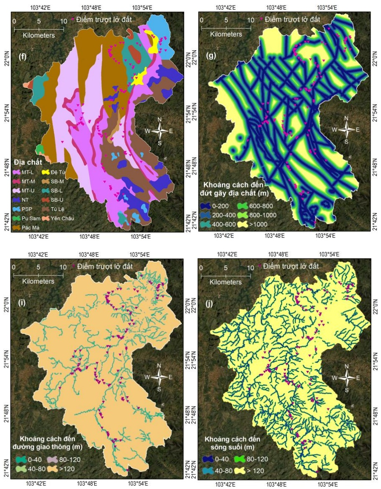

Hình 3-4 Các yếu tố ảnh hưởng đến lở đất: (g) Địa chất; (h) Khoảng cách đến đứt gãy địa chất; (i) Khoảng cách đến đường giao thông; và (j) Khoảng cách đến sông.

Địa chất (Hình 3-4g): Môi trường địa chất xác định loại và cấu trúc của các tầng đá gốc, có thể ảnh hưởng đáng kể đến sự ổn định của độ dốc [132]. Bản đồ địa chất của huyện Than Uyên được thành lập với 12 phân vị địa chất: Hệ tầng Mường Trai với phân hệ tầng dưới (ký hiệu MT Lower - 1), phân hệ tầng giữa (MT Middle - 2) và phân hệ tầng trên (MT Upper - 5); phụ phức hệ núi lửa Ngòi Thia (NT Volcano - 9); phức hệ Phu Sa Phìn (PSP - 7); phức hệ Pu Sam Cap (Pu Sam - 11); hệ tầng Pác Ma (Pac Ma - 3); trầm tích Đệ tứ (Quaternary - 6); hệ tầng Suối Bàng với phân hệ tầng dưới (SB Lower - 4), và

<!-- page: 98 -->

phân hệ tầng trên (SB Upper - 8); hệ tầng Yên Châu (YC Lower - 10) và phụ phức hệ núi lửa Tú Lệ (Tu Le - 12).

Khoảng cách đến vết đứt gãy (m) (Hình 3-4h): là những nứt hoặc vỡ trong vỏ Trái Đất, có thể ảnh hưởng đáng kể đến sự ổn định của độ dốc [115]. Để đánh giá tác động có thể của các đường lỗi chảo đến sự xảy ra lở đất trong khu vực nghiên cứu, đã tạo ra một bản đồ 'Khoả cách đến đứt gãy' (Hình 3-4h). Bản đồ này được phát triển từ bản đồ địa chất và tài nguyên khoáng sản của Việt Nam, được trình bày tỷ lệ 1:200.000. Công cụ Buffer trong phần mềm ArcGIS Pro đã được sử dụng để chia bản đồ thành sáu vùng khoảng cách (giá trị từ 1 đến 6): 0-200 m, 200-400 m, 400-600 m, 600-800 m, 800-1000 m và các khu vực vượt quá 1000 m.

Tương tự, Khoảng cách đến đường giao thông (m) (Hình 3-4i) là yếu tố quan trọng do con người gây ra, vì những cắt đứt và đắp đập trên đường có thể gây ra sự không ổn định độ dốc [133]. Để tạo ra bản đồ 'khoảng cách đến đường cho khu vực nghiên cứu, mạng lưới đường đã được cô lập từ bản đồ địa hình quốc gia của Việt Nam, được trình bày tỷ lệ 1:50.000. Sau đó, công cụ Buffer được sử dụng để tạo ra các bản đồ này với bốn loại khoảng cách: 0-40 m, 40-80 m, 80-120 m và hơn 120 m.

## Các yếu tố môi trường:

Khoảng cách đến sông suối (m) (Hình 3-4j): Sông suối đóng vai trò quan trọng trong việc làm ướt đất và đá trên các sườn dốc, làm tăng khả năng không ổn định và sạt lở [123] [124]. Các con sông chảy qua hoặc gần các sườn dốc có thể làm ướt đất và đá phía dưới, từ đó làm tăng trọng lượng và giảm khả năng chống bị cắt của đất đá. Quá trình này làm suy yếu sự ổn định của sườn dốc và tăng khả năng xảy ra sạt lở. Do đó, trong luận án này, khoảng cách tới các con sông đã được tính đến là yếu tố quyết định cho sạt lở. Mạng lưới sông được lấy từ bản đồ địa hình tỷ lệ 1:10.000 để tạo ra bản đồ khoảng cách tới sông (Hình 3-4j). Bốn phân nhóm (giá trị từ 1-4) được xác định dựa trên khoảng cách đến sông sử dụng công cụ Buffer trong ArcGIS Pro: 0-40 m, 40-80 m, 80-120 m và khu vực vượt quá 120 m.

Các yếu tố đã được tính đến trong nghiên cứu bằng cách tạo ra các bản đồ tương ứng bằng cách sử dụng các nguồn và công cụ khác nhau, bao gồm bản

<!-- page: 99 -->

đồ địa hình quốc gia của Việt Nam, bản đồ địa chất quốc gia, bản đồ đất học quốc gia, Mô hình Số độ cao (DEM) và phần mềm ArcGIS Pro.

## 3.1.5 Xây dựng Geodatabase cho sạt lở đất tại huyện Than Uyên, Lai Châu

Trong luận án này, mô hình BBO-DE-StreeEns đề xuất yêu cầu một cơ sở dữ liệu GIS để huấn luyện mô hình. Do đó, cơ sở dữ liệu GIS phải bao gồm mười yếu tố ảnh hưởng đến trượt lở đất gồm: độ cao, độ dốc, phương hướng, biên độ địa hình, độ cong, thổ nhưỡng, địa chất, khoảng cách đến đường, khoảng cách đến sông và khoảng cách đến đứt gãy.

Do giá trị đầu vào cho cây SPAARC thường là một số, dữ liệu đòi hỏi phải được chuẩn hóa thành số. Dữ liệu như loại đất và địa chất, vốn được lưu trữ dưới dạng văn bản, đã được chuyển đổi thành 11 và 12 lớp tương ứng dạng số.

Nghiên cứu đã sử dụng dữ liệu trượt lở đất của huyện Than Uyên với 114 điểm trượt lở từ năm 2013 đến 2019, được gán nhãn với giá trị 1. Để tránh sự mất cân đối giữa dữ liệu trượt lở và không trượt lở, 114 điểm không trượt lở đã được chọn mẫu ngẫu nhiên từ khu vực nghiên cứu. Những điểm này được gán nhãn với giá trị 0. Dữ liệu này được kết hợp với hình ảnh từ Google Earth và dữ liệu từ công tác khảo sát thực địa với Hệ thống Định vị Toàn cầu di động (GNSS) được thực hiện bởi nghiên cứu sinh và đồng nghiệp để tạo ra Bản đồ trượt lở đất của Than Uyên. Kết quả, tổng số mẫu để huấn luyện và kiểm định mô hình BBO-DE-StreeEns được đề xuất là 228.

Để xây dựng cơ sở dữ liệu trượt lở đất, giá trị của mười yếu tố ảnh hưởng từ tất cả các điểm ảnh đã được trích xuất. Cơ sở dữ liệu bao gồm một biến phụ thuộc (Nhãn) và mười biến độc lập (Các yếu tố đầu vào). Các biến độc lập bao gồm sáu biến phân loại (phương hướng, loại đất, địa chất, khoảng cách đến đường, sông và đứt gãy) và bốn biến liên tục (độ cao, độ dốc, độ cong và biên độ địa hình).

## Bộ dữ liệu huấn luyện và kiểm tra

Nghiên cứu sinh đã chia ngẫu nhiên 114 vị trí trượt lở thành hai tập con: một tập huấn luyện gồm 80 bản ghi (chiếm 70% tổng số) và một tập kiểm tra gồm 34 bản ghi (chiểm 30% tổng số). Mỗi bản ghi trượt lở được gán một giá trị là 1. Để giảm thiểu độ lệch tiềm ẩn do sự không cân đối giữa dữ liệu trượt lở và không trượt lở, một số lượng ô tương đương từ các khu vực không có

<!-- page: 100 -->

trượt lở được chọn mẫu ngẫu nhiên. Những ô không trượt lở này, được gán nhãn với giá trị 0, đã được tích hợp vào tập huấn luyện và kiểm định. Kết quả là, mỗi tập đều chứa 160 và 68 mẫu tương ứng, mỗi tập đều có số lượng ô trượt lở và không trượt lở ngang nhau với kích thước của mỗi ô là 20mx20m. Tập huấn luyện được sử dụng để huấn luyện mô hình trượt lở, trong khi tập kiểm định được dùng cho việc kiểm định mô hình.

Bảng 3-1 cung cấp một mẫu đại diện cho các điểm dữ liệu cùng với thông tin đã được xử lý trước của chúng, đơn vị của chúng được đề cập như sau:

**Độ cao (m):** lưu trữ độ cao của mẫu.

**Độ dốc (o):** chỉ đến độ dốc của bề mặt ô.

**Phương hướng** được chia thành chín lớp (giá trị từ 1 đến 9) là góc phương hướng của bao gồm: Bằng phẳng (-1), Phía Bắc (0-22.5 & 337.5-360), Đông Bắc (22.5-67.5), Đông (67.5-112.5), Đông Nam (112.5-157.5), Nam (157.5-202.5), Tây Nam (202.5-247.5), Tây (247.5-292.5), và Tây Bắc (292.5-337.5).

**Biên độ chênh cao (m):** sự chênh lệch cao độ tối đa trên mỗi đơn vị diện tích.

**Độ cong** của một độ dốc, chỉ số này chỉ đến sự thay đổi góc hoặc hướng của độ dốc.

**Mục đích sử dụng đất** (giá trị từ 1 đến 11): bao gồm 11 loại mục đích sử dụng đất khác nhau: Đất xây dựng, Đất trồng cây lâu năm, Đất trồng cây hàng năm, Đất giao thông, Đất trồng lúa, Đất rừng phòng hộ, Đất rừng sản xuất, Mặt nước và các loại đất khác.

**Địa chất:** địa chất của huyện Than Uyên được thành lập với 12 phân vị địa chất: Hệ tầng Mường Trai với phân hệ tầng dưới (ký hiệu MT Lower - 1), phân hệ tầng giữa (MT Middle - 2) và phân hệ tầng trên (MT Upper - 5); phụ phức hệ núi lửa Ngòi Thia (NT Volcano - 9); phức hệ Phu Sa Phìn (PSP - 7); phức hệ Pu Sam Cap (Pu Sam - 11); hệ tầng Pác Ma (Pac Ma - 3); trầm tích Đệ tứ (Quaternary - 6); hệ tầng Suối Bàng với phân hệ tầng dưới (SB Lower - 4), và phân hệ tầng trên (SB Upper - 8); hệ tầng Yên Châu (YC Lower - 10) và phụ phức hệ núi lửa Tú Lệ (Tu Le - 12).

<!-- page: 101 -->

**Khoảng cách đến đứt gãy** (giá trị từ 1 đến 6): chia khoảng cách đến đứt gãy thành sáu khu vực: 0–200 m, 200–400 m, 400–600 m, 600–800 m, 800–1000 m và các khu vực nằm ngoài 1000 m.

**Khoảng cách đến đường** (giá trị từ 1 đến 4): 0–40 m, 40–80 m, 80–120 m và các khu vực vượt quá 120 m.

**Khoảng cách đến sông** (giá trị từ 1 đến 4) dựa trên khoảng cách từ sông: 0-40 m, 40-80 m, 80-120 m và các khu vực nằm ngoài 120 m.

**Trượt lở** (0 hoặc 1): gán nhãn cho ô pixel tùy thuộc vào trạng thái trượt lở (True – 1) hoặc không trượt lở (False – 0).

Bảng 3-1Ví dụ về một số điểm dữ liệu ở bộ dữ liệu sạt lở đất ở huyện Than Uyên

| Độ cao (m) | Độ dốc (o) | Khía cạnh (9 lớp) | Biên độ địa hình (m) | Độ cong | Mục đích sử dụng đất (11 lớp) | Địa chất (12 lớp) | Khoảng cách đến đường đi (4 dải) | Khoảng cách đến sông (4 dải) | Khoảng cách đến vết đứt gãy (6 vùng) | Sạt lở (True hoặc False) |
| --- | --- | --- | --- | --- | --- | --- | --- | --- | --- | --- |
| 584 | 40.9 | 2 | 80 | -3.8 | 8 | 1 | 4 | 4 | 1 | 1 |
| 534 | 36.9 | 8 | 91 | 10.3 | 8 | 1 | 4 | 4 | 3 | 1 |
| 370 | 47.0 | 7 | 79 | -1.8 | 5 | 1 | 1 | 2 | 3 | 1 |
| 641 | 2.3 | 2 | 8 | -0.8 | 3 | 6 | 1 | 4 | 2 | 0 |
| 620 | 5.0 | 3 | 37 | -1.0 | 8 | 5 | 4 | 1 | 1 | 0 |
| 474 | 5.9 | 7 | 24 | -1.3 | 5 | 3 | 4 | 1 | 6 | 0 |

## 3.2 Mô hình học tập thể SPAARC Tree Ensemble sử dụng tối ưu hoá lai BBO-DE

## 3.2.1 Đề xuất mô hình

Trong nghiên cứu ở chương 2, nghiên cứu sinh đã đề xuất mô hình xây dựng bản đồ nguy cơ cháy rừng sử dụng Deep-NC. Tuy nhiên, Deep-NC là một thuật toán mạng nơ ron sâu, chỉ đạt hiệu quả cao với bộ dữ liệu lớn (thường là trên 5000 bản ghi), khi áp dụng vào bộ dữ liệu thu thập được của huyện Than Uyên chỉ gồm 228 bản ghi (sau khi bổ sung 114 bản ghi của các vị trí không sạt lở) không mang lại hiệu quả cao. Mô hình thậm chí tồn tại tình trạng quá khớp do Deep-NC học quá kỹ tập dữ liệu huấn luyện, dẫn đến hiệu suất kém trên dữ liệu mới. Do đó Deep-NC mặc dù hoạt động rất tốt ở bộ dữ liệu cháy rừng của tỉnh Gia Lai nhưng không đạt được hiệu quả đủ tốt để dùng trong trường hợp này.

<!-- page: 102 -->

Thuật toán Rừng ngẫu nhiên (Random Forest) [143] vẫn là một trong những thuật toán tổng hợp bền vững nhất trong lĩnh vực khai phá dữ liệu, đạt được các mức độ chính xác và tốc độ xử lý được ghi nhận tốt, và thường xuyên xuất hiện trong nghiên cứu mới. Tuy nhiên, trong bối cảnh dữ liệu ngày càng lớn và đa dạng, việc nghiên cứu liên tục về hiệu quả của thuật toán là cần thiết để cung cấp tốc độ xử lý cao hơn mà không làm giảm chính xác. Cần có nghiên cứu sâu vào lĩnh vực này để đề xuất một mô hình giảm thời gian huấn luyện, rút ngắn thời gian xây dựng mô hình nhưng lại tăng độ chính xác của cây quyết định. Yates và đồng nghiệp [34] đã đề xuất cây phân loại giảm điểm chia và thuộc tính (SPAARC) giúp giảm 70% thời gian xây dựng cho Cây Quyết định với mức độ mất chính xác phân loại tối thiểu. SPAARC bao gồm hai thành phần là lấy mẫu thuộc tính nút (Node Attribute Sampling - NAS) và lấy mẫu điểm chia (Split-Point Sampling - SPS).

Hơn nữa, để nâng cao hiệu suất của mô hình, việc sử dụng một bộ tối ưu hóa là cần thiết. Trong luận án, tiến hóa vi phân (Differential Evolution - DE) [144] phục vụ như một bộ tối ưu hóa thích hợp cho mục đích này. Tối ưu hóa dựa trên địa sinh học (BBO) là một thuật toán tối ưu hóa, lấy cảm hứng từ địa lý sinh học. Cơ chế chính của nó bao gồm việc sử dụng toán tử di cư dựa trên địa lý sinh học để truyền thông tin giữa các giải pháp. Một phương pháp kết hợp giữa Tiến hóa vi phân (DE) và BBO đã được đề xuất bởi Gong và đồng nghiệp [144], nơi sự kết hợp được gọi là DE/BBO. DE/BBO kết hợp một cách liền mạch khả năng khám phá của DE với tiềm năng khai thác của BBO, từ đó tạo điều kiện sinh ra các giải pháp triển vọng.

Trong trường hợp này, một phương pháp mô hình ensemble kết hợp mới được giới thiệu, BBO-DE-StreeEns, được thiết kế cho việc lập bản đồ khả năng Sạt lở đất ở huyện Than Uyên, Việt Nam. Phương pháp đề xuất bao gồm việc sử dụng Subbagging và Không gian phụ ngẫu nhiên để tạo ra các Bộ dữ liệu phụ, phục vụ làm nền tảng cho các bộ phân loại cấu thành của mô hình ensemble. Thuật toán Bộ phân loại giảm thuộc tính và điểm chia (SPAARC) đã được sử dụng để xây dựng các cây quyết định. Hơn nữa, để tối ưu hóa các siêu tham số của mô hình ensemble, và triển khai một giải pháp kết hợp giữa Tối ưu hóa Dựa trên Địa lý sinh học (BBO) và Tiến hóa vi phân đột biến (DE) nhằm tối ưu hóa các siêu tham số của mô hình ensemble.

<!-- page: 103 -->

**3.2.2 Quy trình thành lập bản đồ nguy cơ sạt lở đất bằng mô hình BBO-DE-StreeEns**

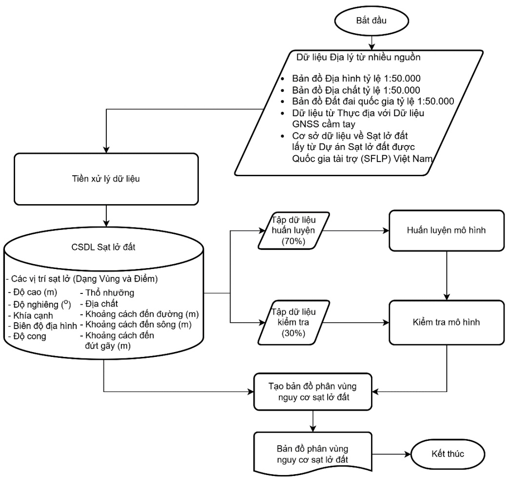

Hình 3-5 Quy trình xây dựng mô hình đánh giá nguy cơ sạt lở đất

Để thể hiện nguy cơ sạt lở đất cho khu vực nghiên cứu, dữ liệu phân vùng nguy cơ cháy rừng được biểu diễn trên một bản đồ phân vùng nguy cơ sạt lở đất. Các bước thực hiện để xây dựng bản đồ trên bao gồm:

Thu thập dữ liệu về 10 yếu tố ảnh hưởng bao gồm: độ cao, độ dốc, độ cong, phương hướng, biên độ địa hình, thổ nhưỡng, địa chất, khoảng cách đến các vết đứt gãy địa chất, khoảng cách đến đường giao thông và khoảng cách đến sông.

Xây dựng cơ sở dữ liệu về Sạt lở đất cho khu vực nghiên cứu: Trích xuất giá trị của 10 yếu tố ảnh hưởng từ các điểm trên bản đồ raster. Chuyển dữ liệu rời rạc của các yếu tố như phương hướng, loại đất, địa chất, khoảng cách đến đường giao thông, khoảng cách đến sông thành giá trị số với các lớp tương ứng.

Tiếp theo, dữ liệu các yếu tố được nhập vào mô hình để tính toán chỉ số nguy cơ Sạt lở đất cho mỗi điểm trong khu vực nghiên cứu huyện Than Uyên.

<!-- page: 104 -->

Phân tích để xác định các giá trị ngưỡng để phân loại giữa các mức độ rủi ro khác nhau cho khu vực nghiên cứu. Nguy cơ có thể được phân loại thành 4 cấp độ (rất cao, cao, trung bình và thấp) sử dụng phương pháp Natural Break trong ArcGIS Pro, thể hiện các cấp độ rủi ro trên bản đồ raster dựa trên các giá trị ngưỡng đã xác định.

## 3.2.3 Kiến trúc mô hình BBO-DE-StreeEns

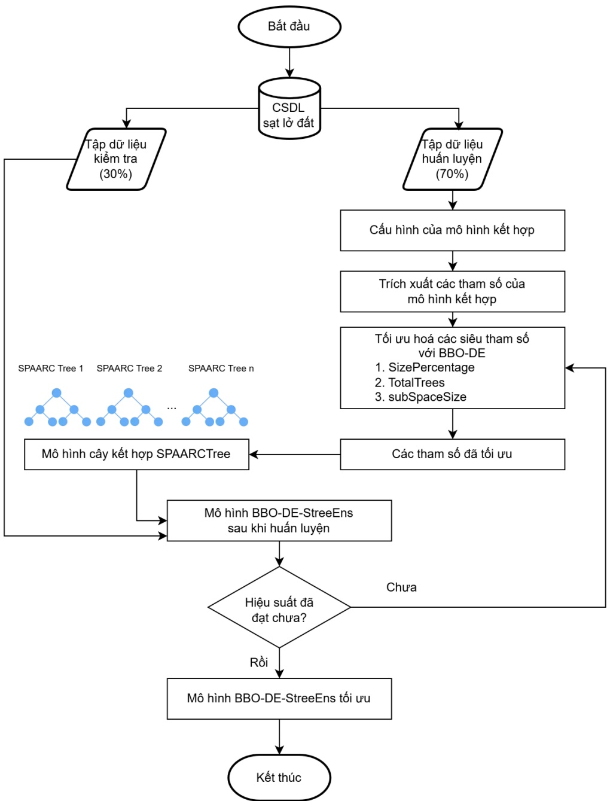

Hình 3-6Kiến trúc mô hình BBO-DE-StreeEns

Quá trình huấn luyện và xác thực mô hình BBO-DE-StreeEns được xây dựng dựa trên các mẫu huấn luyện và nhãn thực địa tạo từ cơ sở dữ liệu GIS đã thiết lập, cho phép huấn luyện mô hình để dự đoán không gian khả năng lở đất.

<!-- page: 105 -->

BBO-DE-StreeEns được sử dụng trong nghiên cứu này, như Hình 3-6 đã thể hiện:

Trước tiên, Bộ dữ liệu được chia thành 70% dữ liệu huấn luyện và 30% dữ liệu kiểm tra.

Chọn các tham số cấu hình ban đầu của các thuật toán BBO và DE. Các tham số này được trích xuất để tạo mô hình tổ hợp.

Tối ưu hóa mô hình với 3 siêu tham số, chúng sẽ được sử dụng để tính toán hàm mục tiêu.

Đánh giá mô hình trên bộ dữ liệu kiểm tra. Nếu hiệu suất của mô hình trên tập kiểm tra đáp ứng yêu cầu, thì mô hình có thể được sử dụng để dự đoán các giá trị mới. Nếu không, các tham số của mô hình cần được điều chỉnh hoặc sử dụng các thuật toán tối ưu hóa khác.

Quá trình này lặp lại cho đến khi tìm được siêu tham số tối ưu nhất.

Mô hình là tối ưu ở bước này, các siêu tham số có thể được sử dụng trong mô hình để tạo ra bản đồ khả năng lở đất trong bước tiếp theo. Các tham số trên đã được trích xuất cho mô hình tổ hợp, sau đó BBO-DE sẽ tối ưu ba siêu tham số: SizePercentage, TotalTrees và subSpaceSize.

Ba siêu tham số đã được sử dụng trong mô hình lai và được xác thực với Bộ dữ liệu xác thực. Hiệu suất được ghi lại và lặp lại cho đến khi hiệu suất đạt được mức chấp nhận được. Các siêu tham số thuộc về mô hình có hiệu suất tốt nhất được sử dụng như siêu tham số tối ưu. Trong nghiên cứu này, chúng là: SizePercentage=0.9 (90%), TotalTrees = 30 và subSpaceSize = 0.5 (50%).

## 3.2.4 Tác động của các yếu tố ảnh hưởng đến sạt lở đất

Để đánh giá đóng góp của mười yếu tố ảnh hưởng đến mô hình BBO-DE-StreeEns, thuật toán wrapper [95] đã được sử dụng, kết hợp với phương pháp cross-validation với năm lần chia dữ liệu để giảm thiểu sự chệch lệch tiềm năng [145]. Các kết quả được trình bày trong Bảng 3-2.

Phân tích cho thấy yếu tố 'Độ dốc' đóng vai trò quan trọng nhất, với score là 0.299, tiếp theo là 'Khoảng cách đến đường' (score = 0.224) và 'Độ cao' (score = 0.142). Các yếu tố còn lại đóng góp ít quan trọng hơn đối với mô hình BBO-DE-StreeEns, với giá trị điểm dao động từ 0.026 (liên quan đến 'Khoảng cách

<!-- page: 106 -->

đến sông') đến 0.084 (liên quan đến 'Khoảng cách đến vết đứt gãy') - chi tiết được trình bày trong Bảng 3-2.

Bảng 3-2Vai trò của 10 yếu tố ảnh hưởng đến sạt lở đất trong nghiên cứu

| STT | Xếp hạng | Giá trị điểm |
| --- | --- | --- |
| 1 | Độ dốc | 0,299 |
| 2 | Khoảng cách đến đường | 0,224 |
| 3 | Độ cao | 0,142 |
| 4 | Khoảng cách đến đứt gãy | 0,084 |
| 5 | Độ chênh cao | 0,063 |
| 6 | Mục đích sử dụng đất | 0,049 |
| 7 | Địa chất | 0,047 |
| 8 | Độ cong bề mặt | 0,036 |
| 9 | Hướng dốc | 0,029 |
| 10 | Khoảng cách đến sông suối | 0,026 |

## 3.2.5 Hàm mất mát và tối ưu hoá các siêu tham số

Để đạt được hiệu suất tốt nhất, mô hình BBO-DE-STreeEns dựa vào việc lựa chọn cẩn thận ba siêu tham số:

TotalTrees đại diện cho số cây quyết định SPAARC trong mô hình. Mỗi cây sẽ được huấn luyện trên tập dữ liệu con khác nhau, kết quả cuối cùng f tổng hợp dự đoán từ tất cả các cây. Nếu tăng TotalTrees, độ ổn định của mô hình sẽ tăng, giảm được phương sai tuy nhiên, thời gian huấn luyện và dự đoán sẽ tăng. Nếu quá ít TotalTrees dẫn tới việc dự đoán không ổn định nhưng nếu nhiều cây sẽ tốn nhiều tài nguyên mà hiệu quả không cải thiện đáng kể.

SizePercentage xác định tỷ lệ dữ liệu được chọn ngẫu nhiên trong subbagging. Siêu tham số này mang lại tính đa dạng giữa các cây. Nếu SizePercentage lớn sẽ tăng độ chính xác của từng cây, trong khi nếu tham số này nhỏ sẽ mang lại tính đa dạng, giảm tương quan giữa các cây. Nếu SizePercentage quá nhỏ có thể làm mất thông tin quan trọng nhưng nếu quá lớn lại làm các cây trở nên giống nhau.

<!-- page: 107 -->

SubSpaceSize xác định tỷ lệ không gian thuộc tính trong kỹ thuật random subspacing. SubSpaceSize tạo đa dạng về không gian thuộc tính. Tỷ lệ này nhỏ sẽ mang lại tính đa dạng, giảm độ phức tạp, nếu tỷ lệ này lớn sẽ mang tới khả năng tận dụng được nhiều thông tin thuộc tính hơn. SubSpaceSize quá nhỏ có thể bỏ qua các thuộc tính quan trọng nhưng nếu quá lớn lại có thể làm tăng nhiễu và ự tương quan giữa các cây.

Mối quan hệ giữa các siêu tham số này:

a) TotalTrees và SizePercentage:

\- Tỷ lệ nghịch để cân bằng chi phí tính toán

\- Nếu tăng SizePercentage thì có thể giảm TotalTrees

b) TotalTrees và SubSpaceSize:

\- Tỷ lệ nghịch để đảm bảo đa dạng

\- SubSpaceSize nhỏ cần TotalTrees lớn hơn

c) SizePercentage và SubSpaceSize:

\- Cần cân bằng để tối ưu tính đa dạng

\- Không nên đồng thời quá nhỏ hoặc quá lớn

Trong nghiên cứu này, để tối ưu hóa các siêu tham số này, kỹ thuật tối ưu hóa lai BBO-DE được sử dụng ở mức độ thuật toán và sử dụng Sai số trung phương tuyệt đối (Mean Absolute Error - MAE) làm hàm chi phí.

$$
\mathrm{MAE} = \frac {1}{n} \sum_ {i = 1} ^ {n} \left| L S _ {i} - \widehat {L S _ {l}} \right|\tag{3.1}
$$

Ở đây, $L S _ { i }$ đại diện cho giá trị dự đoán khả năng sạt lở đất cho mẫu thứ i

$\widehat { L S _ { v } }$ là giá trị thực tế tương ứng, và n là tổng số mẫu trong Bộ dữ liệu huấn luyện.

Trong luận án này, nghiên cứu sinh định nghĩa một không gian tìm kiếm ba chiều cho thuật toán lai BBO-DE. Chiều đầu tiên là TotalTrees, với các giá trị dao động từ 1 đến 2000. Chiều thứ hai là SizePercentage, với các giá trị dao động từ 0.1 đến 1. Chiều thứ ba là SubSpaceSize, với các giá trị dao động từ 0.3 đến 0.9.

## 3.2.6 Đánh giá hiệu suất mô hình

Việc phân loại sạt lở đất được xác định dưới dạng phân loại nhị phân, với kết quả là lớp không phải Lở đất (0) hoặc lớp Lở đất (1), các giá trị TP, FP, FN và TN của kết quả được sử dụng để tính toán các chỉ số hiệu suất khác nhau.

<!-- page: 108 -->

Các chỉ số này bao gồm Giá trị dự đoán tích cực (PPV), Giá trị dự đoán âm (NPV), Độ nhạy (Sen), Độ đặc hiệu (Spe), Điểm F1 (F1-Score), Kappa, ROC và Diện tích dưới đường cong ROC (AUC). Những chỉ số này sẽ phục vụ làm cơ sở để đánh giá mô hình được đề xuất dưới các mô hình khác nhau. Giá trị AUC càng gần 1 thì mô hình đó được coi là có hiệu suất tốt trong việc phân loại.

Để đánh giá hiệu suất và xác định giá trị của mô hình đề xuất BBO-DE-STreeEns, mô hình được so sánh với bốn mô hình tham chiếu: Logistic Regression (LRegr), Multi-layer Perceptron Nơ-ron Network (MLPNeuNet), Support Vector Machine (SVM) và SPAARC. Đối với mô hình MLPNeuNet, một cấu trúc mạng với một lớp đầu vào, một lớp ẩn với tám nơ-ron và một lớp đầu ra được áp dụng, vì cấu hình này đã cho thấy hiệu suất tốt nhất trong thử nghiệm trial-and-error trước đó [146]. Mô hình SVM sử dụng Hạt nhân Hàm cơ sở Bán kính, và các giá trị tối ưu cho các tham số C và Gamma, được xác định thông qua phương pháp tìm kiếm lưới được mô tả trong Fayed và Atiya [147], lần lượt là 0.9 và 0.185. Đối với mô hình SPAARC, các tham số mặc định được sử dụng, bao gồm số mẫu tối thiểu tại nút cuối cùng là 2 và tỷ lệ kích thước huấn luyện là 1.0. Bằng cách so sánh hiệu suất của mô hình BBO-DE-STreeEns với những mô hình tham chiếu này, độ hiệu quả của phương pháp được xác nhận và sự ưu việt của nó được thiết lập.

Để đánh giá hiệu suất và khẳng định giá trị của mô hình BBO-DE-StreEns đề xuất, nghiên cứu sinh tiến hành so sánh với bốn mô hình đối chứng: Hồi quy Logistic (LRegr), Mạng nơ-ron Perceptron đa tầng (MLPNeuNet), Máy vector hỗ trợ (SVM) và SPAARC.

Đối với mô hình MLPNeuNet, nghiên cứu sinh lựa chọn cấu trúc mạng gồm một tầng đầu vào, một tầng ẩn với tám nơ-ron và một tầng đầu ra. Cấu trúc này thể hiện hiệu suất tối ưu thông qua quá trình thử nghiệm lặp đi lặp lại, như đã được mô tả chi tiết trong nghiên cứu [146].

Đối với mô hình SVM, nghiên cứu sinh áp dụng Hàm nhân cơ sở xuyên tâm và xác định giá trị tối ưu cho các tham số C và Gamma lần lượt là 0,9 và 0,185. Các giá trị này được xác định thông qua phương pháp tìm kiếm lưới theo phương pháp của Fayed và Atiya [147] .

<!-- page: 109 -->

Mô hình SPAARC được cấu hình với các tham số mặc định, bao gồm số lượng mẫu tối thiểu tại nút cuối là 2 và tỷ lệ kích thước tập huấn luyện là 1,0.

Thông qua việc so sánh hiệu suất của mô hình BBO-DE-StreEns với các mô hình đối chứng này, nghiên cứu sinh có thể xác minh tính hiệu quả và chứng minh ưu thế vượt trội của mô hình đề xuất.

Để xác định mức độ khác biệt có ý nghĩa thống kê giữa hiệu suất của mô hình BBO-DE-StreEns và các mô hình đối chứng, nghiên cứu sinh áp dụng phép kiểm định hạng có dấu Wilcoxon. Phương pháp này cho phép so sánh cặp đôi giữa các mô hình dự đoán trượt lở đất [148]. Giả thuyết không được đặt ra là không có sự khác biệt giữa hai mô hình trượt lở đất bất kỳ. Mức ý nghĩa thống kê được xác định ở $\alpha = 0 { , } 0 5$

Trong quá trình đánh giá, nghiên cứu sinh tính toán giá trị p và giá trị z cho mỗi cặp mô hình. Tiêu chí bác bỏ giả thuyết không và xác nhận sự khác biệt có ý nghĩa thống kê được áp dụng khi giá trị p nhỏ hơn mức ý nghĩa α và giá trị z nằm ngoài khoảng [-1,96, 1,96] [149]. Phương pháp này cho phép nghiên cứu sinh đánh giá một cách khách quan và chính xác mức độ ưu việt của mô hình đề xuất so với các mô hình đối chứng.

## 3.2.7 Kết quả đánh giá mô hình

Năm mô hình đánh giá độ nhạy cảm với sạt lở đất ở vùng nghiên cứu - BBO-DE-StreeEns, LRegr, MLPNeuNet, SVM, và SPAARC - đã được đem ra so sánh, sử dụng tiếp cận ten-fold cross-validation trên tập huấn luyện. Kết quả thể hiện trong ma trận nhầm lẫn ở Bảng 3-3. Theo đó, các giá trị False Negative (Phân loại sai là không sạt lở đất, nhưng thực ra có sạt lở đất) là trường hợp nguy hiểm cần phải giảm. Kết quả cho thấy mô hình đề xuất BBO-DE-StreeEns và SPAARC làm rất tốt điều này, kết quả 3/160 mẫu và 2/160 mẫu phân vào nhóm FN đã chứng minh hiệu suất cao hơn hẳn so với các kết quả 20/160, 19/160 và 23/160 đối với lần lượt các mô hình Lregr, MLPNeuNet và SVM. Bång 3-3 Ma trn nhm ln so sánh gia mô hình BBO-DE-StreeEns đ xut Bảng 3-3 Ma trận nh m l n so sánh giữa mô hình BBO-DE-StreeEns đ xu t

và bốn mô hình tham chiếu trên bộ dữ liệu huấn luyện

| Mô hình | TP | TN | FN | FP |
| --- | --- | --- | --- | --- |
| BBO-DE-STreeEns | 77 | 73 | 3 | 7 |
| Lregr | 60 | 63 | 20 | 17 |
| MLPNeuNet | 61 | 63 | 19 | 17 |
| SPAARC | 78 | 72 | 2 | 8 |
| SVM | 57 | 67 | 23 | 13 |

<!-- page: 110 -->

Bảng 3-4 Các chỉ $s \hat { 0 }$ đánh giá hiệu suất của mô hình BBO-DE-STreeEns đề xuất và các mô hình tham chiếu trên Bộ dữ liệu huấn luyện

<table><tbody><tr><td rowspan="2">Mô hình</td><td colspan="8">Các chỉ số hiệu suất</td></tr><tr><td>PPV(%)</td><td>NPV(%)</td><td>Sen(%)</td><td>Spe(%)</td><td>Acc(%)</td><td>Fscore</td><td>Kappa</td><td>AUC</td></tr><tr><td>BBO-DE-STreeEns</td><td>91.7</td><td>96.1</td><td>96.3</td><td>91.3</td><td>93.8</td><td>0.939</td><td>0.875</td><td>0.987</td></tr><tr><td>Lregr</td><td>77.9</td><td>75.9</td><td>75.0</td><td>78.8</td><td>76.9</td><td>0.764</td><td>0.538</td><td>0.855</td></tr><tr><td>MLPNeuNet</td><td>78.2</td><td>76.8</td><td>76.3</td><td>78.8</td><td>77.5</td><td>0.772</td><td>0.550</td><td>0.859</td></tr><tr><td>SPAARC</td><td>90.7</td><td>97.3</td><td>97.5</td><td>90.0</td><td>93.8</td><td>0.940</td><td>0.875</td><td>0.950</td></tr><tr><td>SVM</td><td>81.4</td><td>74.4</td><td>71.3</td><td>83.8</td><td>77.5</td><td>0.760</td><td>0.550</td><td>0.855</td></tr></tbody></table>

Bảng 3-3 và Bảng 3-4 trình bày kết quả huấn luyện của năm mô hình này, sử dụng Bộ dữ liệu huấn luyện và phương pháp chéo xác thực mười lần để phòng chống tình trạng quá khớp. Các siêu tham $s \hat { 0 }$ cho mô hình BBO-DE-StreeEns đã được $t \hat { \hat { \mathbf { 0 } } } \mathbf { i }$ ưu hóa như sau: TotalTrees=30, SizePercentage=0.9, và subSpaceSize=0.5. Tất cả các mô hình đã thể hiện hiệu suất khá tốt với dữ liệu huấn luyện, nhưng mô hình BBO-DE-StreeEns $\mathrm{AUC} = 0.987$ , Kappa = 0.875, Fscore $= 0 . 9 3 9$ và Accuracy = 93.8%) cùng với mô hình SPAARC (AUC = 0.950, Kappa = 0.875, Fscore = 0.940 và Accuracy = 93.8%) vượt trội hơn so với phần còn lại. Các mô hình LRegr, MLPNeuNet và SVM cũng có hiệu suất tương đương, như được mô tả chi tiết trong Ma trận nhầm lẫn trong Bảng 3-3 và các chỉ $s \hat { 0 }$ phân loại độ nhạy cảm đối với sạt lở đất trong Bảng 3-4.

Đánh giá hiệu suất dự đoán của các mô hình sạt lở là rất quan trọng để xác định hiệu quả của chúng. Bộ dữ liệu xác thực đã được sử dụng cho mục đích này, với kết quả được trình bày trong Bảng 3-5 (Ma trận nhầm lẫn) và Bảng 3-6 (Các chỉ $\mathrm { s } \hat { \hat { 0 } }$ dự đoán). Hiệu suất dao động qua lại giữa năm mô hình, với mô hình BBO-DE-StreeEns $\mathrm { ( A U C = 0 . 9 4 0 ) }$ , Kappa = 0.735, Fscore = 0.862 và Accuracy = 86.8%) và mô hình SPAARC (AUC = 0.915, Kappa = 0.676, Fscore = 0.836 và Accuracy = 83.5%) thể hiện khả năng dự đoán mạnh mẽ nhất. Hai mô hình này đạt được các chỉ $s \hat { 0 }$ thống kê xuất sắc, cho thấy hiệu suất vượt trội.

Bảng 3-5 Ma trận nhầm lẫn so sánh giữa mô hình BBO-DE-StreeEns đề xuất và bốn mô hình tham chiếu trên bộ dữ liệu kiểm tra

| Mô hình | TP | TN | FN | FP |
| --- | --- | --- | --- | --- |
| BBO-DE-STreeEns | 28 | 31 | 6 | 3 |
| Lregr | 24 | 28 | 10 | 6 |
| MLPNeuNet | 26 | 18 | 8 | 16 |
| SPAARC | 28 | 29 | 6 | 5 |
| SVM | 24 | 28 | 10 | 6 |

<!-- page: 111 -->

Bảng 3-6 Các chỉ số đánh giá hiệu suất của mô hình BBO-DE-STreeEns đề xuất và các mô hình tham chiếu trên Bộ dữ liệu kiểm tra

<table><tbody><tr><td rowspan="2">Mô hình</td><td colspan="8">Các chỉ số hiệu suất</td></tr><tr><td>PPV(%)</td><td>NPV(%)</td><td>Sen(%)</td><td>Spe(%)</td><td>Acc(%)</td><td>Fscore</td><td>Kappa</td><td>AUC</td></tr><tr><td>BBO-DE-STreeEns</td><td>90.3</td><td>83.8</td><td>82.4</td><td>91.2</td><td>86.8</td><td>0.862</td><td>0.735</td><td>0.940</td></tr><tr><td>Lregr</td><td>80.0</td><td>73.7</td><td>70.6</td><td>82.4</td><td>76.5</td><td>0.750</td><td>0.529</td><td>0.853</td></tr><tr><td>MLPNeuNet</td><td>61.9</td><td>69.2</td><td>76.5</td><td>52.9</td><td>64.7</td><td>0.684</td><td>0.294</td><td>0.748</td></tr><tr><td>SPAARC</td><td>84.8</td><td>82.9</td><td>82.4</td><td>85.3</td><td>83.8</td><td>0.836</td><td>0.676</td><td>0.915</td></tr><tr><td>SVM</td><td>80.0</td><td>73.7</td><td>70.6</td><td>82.4</td><td>76.5</td><td>0.750</td><td>0.529</td><td>0.767</td></tr></tbody></table>

Mô hình LRegr (AUC = 0.853, Kappa = 0.539, Fscore = 0.750 và Accuracy = 76.5%) cũng thể hiện hiệu suất đáng khen ngợi, mặc dù kém hơn so với các mô hình hàng đầu. Mô hình SVM (AUC = 0.767, Kappa = 0.529, Fscore = 0.750 và Accuracy = 76.5%) và mô hình MLPNeuNet (AUC = 0.748, Kappa = 0.294, Fscore = 0.684 và Accuracy = 64.7%) cũng thể hiện khả năng dự đoán đáng chấp nhận, như được mô tả chi tiết trong Bảng 3-6.

Bảng 3-7 So sánh thống kê giữa mô hình BBO-DE-STreeEns đề xuất và các mô hình đối chứng

| STT | Cặp mô hình so sánh | Giá trị Z | Giá trị p | Ý nghĩa thống kê |
| --- | --- | --- | --- | --- |
| 1 | BBO-DE-STreeEns - LRegr | 2,528 | 0,011 | Có |
| 2 | BBO-DE-STreeEns - MLPNeuNet | 3,962 | &lt; 0,001 | Có |
| 3 | BBO-DE-STreeEns - SPAARC | 5,719 | &lt; 0,001 | Có |
| 4 | BBO-DE-STreeEns - SVM | 4,740 | &lt; 0,001 | Có |
| 5 | LRegr - MLPNeuNet | 5,635 | &lt; 0,001 | Có |
| 6 | LRegr - SPAARC | 2,719 | 0,005 | Có |
| 7 | LRegr - SVM | 0,364 | 0,716 | Không |
| 8 | MLPNeuNet - SPAARC | 4,175 | &lt; 0,001 | Có |
| 9 | MLPNeuNet - SVM | 3,919 | &lt; 0,001 | Có |
| 10 | SPAARC - SVM | 7,253 | &lt; 0,001 | Có |

Để đánh giá mức độ khác biệt có ý nghĩa thống kê về hiệu suất dự đoán giữa mô hình BBO-DE-StreEns và các mô hình khác, một phép kiểm định hạng có dấu Wilcoxon đã được thực hiện. Kết quả của phép kiểm định này được

<!-- page: 112 -->

trình bày chi tiết trong Bảng 3-7. Phân tích được tiến hành trên 10 cặp mô hình, trong đó 9 cặp cho thấy sự khác biệt đáng kể về hiệu suất dự đoán. Chỉ có cặp LRegr và SVM không thể hiện sự khác biệt đáng kể (giá trị p = 0.716, giá trị z = 0.364).

Đối với các cặp còn lại, giá trị z thu được đều vượt ngưỡng tiêu chuẩn 1.96, chứng minh sự khác biệt rõ rệt trong khả năng dự đoán giữa các mô hình. Bên cạnh đó, các giá trị p đều nhỏ hơn mức ý nghĩa 0.05, củng cố thêm tính đáng tin cậy về mặt thống kê của kết quả. Những phát hiện này xác nhận rằng mô hình BBO-DE-StreEns thể hiện ưu thế vượt trội về khả năng dự đoán trong phạm vi nghiên cứu này [133].

## 3.2.8 Tạo bản đồ phân vùng nguy cơ sạt lở đất cho huyện Than Uyên

Do hiệu suất của mô hình BBO-DE-StreeEns rất tốt đối với dữ liệu sạt lở đất, mô hình này đã được sử dụng để tính toán chỉ số phân vùng nguy cơ sạt lở cho từng pixel trong huyện Than Uyên. Một mã nguồn Python chạy trên Arcpy đã được sử dụng để đọc mô hình đã tạo ở bước trên. Quá trình này bao gồm việc áp dụng mô hình đã được huấn luyện cho toàn bộ khu vực nghiên cứu, sử dụng các yếu tố đầu vào đã được chuẩn hóa.

Các giá trị chỉ số có phạm vi từ tối thiểu là 0.062 đến tối đa là 0.910, tương ứng với xác suất xảy ra sạt lở đất. Phạm vi này cho thấy sự đa dạng trong mức độ nguy cơ trên toàn huyện, từ những khu vực có nguy cơ rất thấp đến những khu vực có nguy cơ rất cao.

Kết quả thu được sau đó được tích hợp vào cơ sở dữ liệu địa lý về sạt lở, theo quy trình được trình bày trong mục 1.6.1. Việc tích hợp này cho phép phân tích không gian và tạo bản đồ trực quan.

Để phân loại mức độ nguy cơ, chúng tôi áp dụng phương pháp Natural Breaks (Jenks) với bốn cấp độ, dựa trên tổng diện tích của huyện Than Uyên. Các vùng được chia thành Rất cao (10%), Cao (20%), Trung bình (20%) và Thấp (50%). Phương pháp Natural Breaks được chọn vì nó đặc biệt phù hợp với dữ liệu không phân bố đều, giúp tối ưu hóa sự phân biệt giữa các cấp độ nguy cơ. Kết quả này có được khi chọn phân vùng dựa trên tổng diện tích của huyện Than Uyên, theo đó các vùng được chia thành Rất cao (10%), Cao (20%), Trung bình (20%) và Thấp (50%) sử dụng phương pháp Natural Break,

<!-- page: 113 -->

dựa trên diện tích vùng nghiên cứu. Natural Break phù hợp với trường hợp này do nó đặc biệt phù hợp với dữ liệu không phân bố đều.

Để phân loại mức độ nguy cơ, chúng tôi áp dụng phương pháp Natural Breaks (Jenks) với bốn cấp độ, dựa trên tổng diện tích của huyện Than Uyên. Các vùng được chia thành Rất cao (10%), Cao (20%), Trung bình (20%) và Thấp (50%). Phương pháp Natural Breaks được chọn vì nó đặc biệt phù hợp với dữ liệu không phân bố đều, giúp tối ưu hóa sự phân biệt giữa các cấp độ nguy cơ. Kết quả này có được khi chọn phân vùng dựa trên tổng diện tích của huyện Than Uyên, theo đó các vùng được chia thành Rất cao (10%), Cao (20%), Trung bình (20%) và Thấp (50%) sử dụng phương pháp Natural Break, dựa trên diện tích vùng nghiên cứu. Natural Break phù hợp với trường hợp này do nó đặc biệt phù hợp với dữ liệu không phân bố đều.

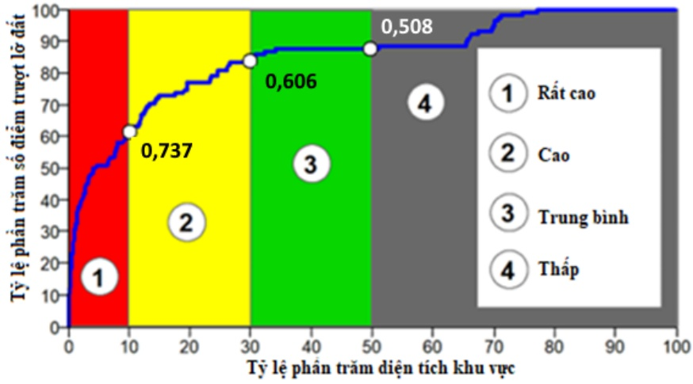

Hình 3-7 Biểu đồ xác định ngưỡng phân chia giữa các cấp độ nguy cơ trượt lở của huyện Than Uyên sử dụng công cụ Natural Break

Để tạo ra bản đồ phân vùng nguy cơ trượt lở đất, thông thường dữ liệu bản đồ được chia thành bốn cấp độ nguy cơ: rất cao, cao, trung bình và thấp [150] , [151]. Trong nghiên cứu này, ngưỡng phân chia các hạng mục này được xác định thông qua phân tích biểu đồ trong Hình 3-7.

Các giá trị ngưỡng được xác định theo thứ tự giảm dần là 0.737, 0.674 và 0.502 (Xem Hình 3-7). Bản đồ nguy cơ sạt lở đất cho huyện Than Uyên được tạo ra bằng cách sử dụng mô hình BBO-DE-StreeEns, được tạo ra dựa trên những ngưỡng này và được trình bày trong Hình 3-8.

<!-- page: 114 -->

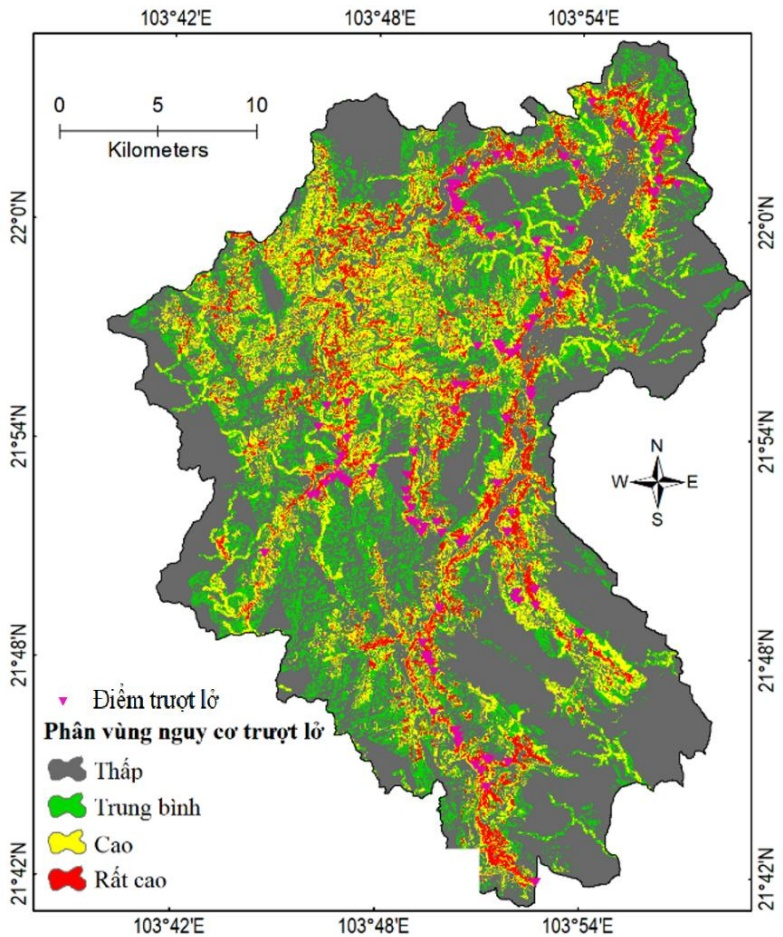

Hình 3-8Bản đồ nguy cơ sạt lở đất của huyện Than Uyên sử dụng mô hình BBO-DE-StreeEns

Bảng 3-8 Kết quả phân vùng nguy cơ trượt lở đất tại Than Uyên sử dụng mô hình đề xuất BBO-DE-StreeEns

<table><tbody><tr><td>STT</td><td>Cấp nguy cơ</td><td>K throịảcnhgỉ s gốiá nguy cơ</td><td>Tỷ lệ diện tích(%)</td><td>Diện tích (km<sup>2</sup>)</td><td>Số điểm trượt lở</td><td>Tỷ lệ điểm trượt lở(%)</td></tr><tr><td>1</td><td>Thấp</td><td>0,062-0,508</td><td>50,00</td><td>394,5</td><td>12</td><td>10,53</td></tr><tr><td>2</td><td>Trung bình</td><td>0,508-0,606</td><td>20,00</td><td>157,8</td><td>7</td><td>6,14</td></tr><tr><td>3</td><td>Cao</td><td>0,606-0,737</td><td>20,00</td><td>157,8</td><td>23</td><td>20,17</td></tr><tr><td>4</td><td>Rất cao</td><td>0,737-0,910</td><td>10,00</td><td>78,9</td><td>72</td><td>63,16</td></tr><tr><td colspan="2">Tổng cộng</td><td></td><td>100</td><td>789</td><td>114</td><td>100</td></tr></tbody></table>

Diện tích tương ứng của các phân vùng như sau: rất cao có diện tích 78,9 km<sup>2</sup>, cao có diện tích 157,8 km<sup>2</sup>, trung bình có diện tích 157,8 km<sup>2</sup> và thấp có diện tích 394,5 km<sup>2</sup>(Bảng 3-8). Có thể thấy rằng ở các cấp nguy cơ từ cao đến rất cao chỉ chiếm 30% diện tích nhưng chiếm tới 83,33% số điểm trượt lở. Ngược lại, ở các cấp nguy cơ từ thấp đến trung bình chiếm tới 70% diện tích nhưng chỉ có 16,67% số điểm trượt lở. Điều này là hợp lý và thể hiện tính chất phân vùng nguy cơ trượt lở đất tại vùng nghiên cứu.

Để kiểm nghiệm bản đồ phân vùng nguy cơ được xây dựng có chính xác không, nghiên cứu sinh sử dụng một số phương pháp:

<!-- page: 115 -->

\- Kiểm chứng thực địa:

Sau khi xây dựng xong bản đồ phân vùng, nghiên cứu sinh cùng nhóm nghiên cứu đã quay trở lại huyện Than Uyên, đến khảo sát tại chỗ để xác minh thông tin trên bản đồ, cũng như điều tra lịch sử các vụ việc sạt lở trên thực tế có nằm nhiều ở các vùng có nguy cơ “Rất cao” hay không

\- So sánh với dữ liệu tham chiếu:

Đối chiếu với bản đồ các nguồn thông tin từ dân bản địa cũng như kiểm tra bằng ảnh vệ tinh mới nhất về các vị trí sạt lở.

\- Kiểm tra theo thời gian:

So sánh bản đồ với dữ liệu lịch sử của các sự kiện sạt lở đất trong quá khứ để xem xét độ chính xác dự báo (đối với dữ liệu sạt lở thực tế xảy ra sau các sự kiện sạt lở của dữ liệu xây dựng mô hình). Điều này có thể kiểm tra khả năng dự đoán của bản đồ qua thời gian.

## 3.2.9 Thảo luận

Trong bối cảnh hiện đại, vấn đề sụt lở đất đang ngày càng trở nên cấp thiết bởi tác động tiêu cực đến đời sống con người cũng như tình hình kinh tế xã hội trên phạm vi toàn cầu. Với ước tính thiệt hại lên đến 20 tỷ đô la Mỹ hàng năm, các cơ quan chức năng cần có sự chú trọng đặc biệt vào việc phát triển các mô hình có khả năng phân loại chính xác sự kiện sạt lở đất để kịp thời triển khai các biện pháp phòng ngừa và giảm nhẹ thiệt hại.

Luận án này đưa ra mô hình BBO-DE-StreeEns, được sử dụng cho việc lập bản đồ khả năng sụt lở đất tại huyện Than Uyên, Việt Nam, một khu vực thường xuyên chịu ảnh hưởng nặng nề bởi sụt lở đất và lũ lụt. Thông qua việc tích hợp cây SPAARC và thuật toán hybrid BBO-DE, mô hình đã thể hiện khả năng phân loại chính xác vượt trội so với các mô hình tiêu chuẩn khác như LRegr, MLPNeuNet, SVM và SPAARC. Độ chính xác cao nhất xảy ra khi điều chỉnh các siêu tham số như TotalTrees, SizePercentage, và subSpaceSize ở các giá trị lần lượt là 30, 0.9 và 0.5.

Mô hình BBO-DE-StreeEns, chịu ảnh hưởng lớn bởi các siêu tham số như TotalTrees, SizePercentage, và subSpaceSize, đã vượt qua các mô hình chuẩn như LRegr, MLPNeuNet, SVM, và SPAARC. Kết quả này nhấn mạnh tính hiệu quả của thuật toán hybrid BBO-DE và sự kết hợp của BBO-DE, cây SPAARC, Subbagging, và Random Subspacing.

<!-- page: 116 -->

Các yếu tố quan trọng ảnh hưởng đến khả năng Sạt lở đất được xác định trong luận án là độ dốc và khoảng cách đến đường giao thông, điều này phù hợp với đặc điểm địa lý của huyện Than Uyên, một huyện núi nơi lịch sử các vụ việc Sạt lở đất thường xảy ra gần hệ thống đường giao thông.

Sự thiếu đầy đủ trong bộ dữ liệu các yếu tố ảnh hưởng đến Sạt lở đất, một vấn đề phổ biến, có thể ảnh hưởng đến độ chính xác và độ tin cậy của mô hình. Một số chiến lược đã được đề xuất để giảm nhẹ điều này, bao gồm việc kết hợp dữ liệu từ nhiều nguồn, tích hợp biến ngẫu nhiên trong mô hình thống kê, phân tích độ nhạy, và áp dụng kỹ thuật kiểm chứng chéo.

Một số nghiên cứu đã bao gồm các yếu tố liên quan đến mưa trong mô hình Sạt lở đất để tính đến ảnh hưởng của mưa đối với sự xuất hiện của Sạt lở đất ở vùng nghiên cứu. Tuy nhiên, sự không chắc chắn trong dự báo mưa có thể ảnh hưởng đến độ tin cậy của mô hình. Thật không may, trong luận án này, do thiếu dữ liệu mưa chính xác vì nhiều nguyên nhân, nghiên cứu đã không thể kết hợp mưa như một yếu tố ảnh hưởng đến nguy cơ sạt lở đất.

Bản đồ phân vùng nguy cơ sạt lở đất được tạo ra bởi nghiên cứu cung cấp cái nhìn quý giá cho các cơ quan chức năng và nhà hoạch định chính sách tại huyện Than Uyên. Đó là một tài nguyên hữu ích cho việc lập kế hoạch sử dụng.

## 3.3 Kết chương

Chương 3 đã trình bày về mô hình học tập thể SPAARC Tree Ensemble được tối ưu hóa bằng thuật toán kết hợp BBO và DE để xây dựng bản đồ nhạy cảm sạt lở đất cho huyện Than Uyên, tỉnh Lai Châu. Mô hình BBO-DE StreeEns được đề xuất, kết hợp giữa cây quyết định SPAARC và thuật toán tối ưu hóa lai BBO-DE. Các yếu tố ảnh hưởng đến sạt lở đất được xác định và đánh giá tầm quan trọng. Hiệu suất của mô hình được đánh giá bằng nhiều chỉ số, cho thấy kết quả vượt trội so với các mô hình cơ sở. Bản đồ nhạy cảm sạt lở đất cuối cùng được tạo ra có độ chính xác cao, phân chia vùng nghiên cứu thành 4 cấp độ nhạy cảm. Mô hình BBO-DE-StreeEns đã chứng minh khả năng dự báo hiệu quả nguy cơ sạt lở đất, có thể áp dụng cho các khu vực khác có điều kiện tương tự.

<!-- page: 117 -->

## KẾT LUẬN VÀ HƯỚNG NGHIÊN CỨU TRONG TƯƠNG LAI

## KẾT LUẬN

Trong luận án này, nghiên cứu sinh đã trình bày các bước thu thập dữ liệu và tiền xử lý dữ liệu trên hai cơ sở dữ liệu của tỉnh Gia Lai và huyện Than Uyên, tỉnh Lai Châu. Câu hỏi nghiên cứu thứ nhất được trả lời trong các mục 1.6.

Tác giả đã xác nhận hiệu năng trong phân loại nhạy cảm cháy rừng của phương pháp đề xuất Deep-NC sử dụng các bộ tối ưu hóa Adam thích ứng, SGD, RMSProp, và Adadelta cho việc dự báo nguy cơ cháy rừng tại tỉnh Gia Lai của Việt Nam. Những phát hiện chính bao gồm:

Mô hình đề xuất Deep-NC đã vượt trội hơn RVMs, SVMs, và RF trong việc thể hiện tiềm năng dự đoán mạnh mẽ, mang lại độ chính xác vượt trội so với các mô hình còn lại, giá trị AUC đạt 0.894 so với mô hình hiệu năng cao thứ hai chỉ đạt 0.793 trên tệp kiểm tra.

Thuật toán tối ưu Adam mang lại hiệu suất tốt nhất cho mô hình Deep-NC trong dự báo cháy rừng khi so sánh với các thuật toán tối ưu dùng làm tham chiếu, với AUC đạt 0.89 so với thuật toán đứng thứ 2 về AUC là SGD chỉ đạt được

Luận án cũng đã đề xuất mô hình BBO-DE-StreeEns cho việc thành lập bản đồ khả năng sạt lở đất ở huyện Than Uyên, nơi thường xuyên xảy ra lũ lụt và sạt lở. Kết quả chính:

Mô hình kết hợp Cây SPAARC và tối ưu hóa hybrid BBO-DE cung cấp hiệu suất vượt trội. Nó đã đạt kết quả tốt trên nhiều chỉ số đánh giá, chứng minh sự hiệu quả trong phân loại .

Độ dốc và khoảng cách đến đường là những yếu tố quan trọng nhất trong sạt lở đất.

Do đó, câu trả lời cho câu hỏi nghiên cứu thứ hai đã được tìm thấy và chứng minh trong chương 2 và 3, nơi hai mô hình do nghiên cứu sinh đề xuất đã thể hiện hiệu suất nổi bật so với các mô hình khác. Trong hai chương đó, luận án đã chứng minh rằng các mô hình đề xuất là hiệu quả rõ rệt trong việc phân loại nguy cơ cháy rừng và sạt lở ở Việt Nam. Ngoài ra, mô hình BBO-

<!-- page: 118 -->

DE-StreeEns đã được chứng minh được tốc độ đào tạo nhanh nhưng vẫn giữ được độ chính xác cao trong dự đoán.

Một số khuyến nghị đã được đề xuất trong mục phụ 2.2.9 và 3.2.9 để giải quyết câu hỏi nghiên cứu thứ ba.

## HƯỚNG NGHIÊN CỨU TRONG TƯƠNG LAI

Luận án đã giải quyết một số vấn đề trong lĩnh vực máy học được áp dụng trong nghiên cứu về cháy rừng và sạt lở đất. Tuy nhiên, cần cải tiến các phương pháp đã đề xuất. Câu trả lời cho câu hỏi nghiên cứu thứ ba về gợi ý cho nghiên cứu trong tương lai như sau:

Tối ưu hóa cấu trúc mô hình Deep-NC và thuật toán huấn luyện để nâng cao khả năng dự đoán nguy cơ cháy rừng.

Bổ sung thêm dữ liệu như lượng mưa vào mô hình BBO-DE-StreeEns để cải thiện việc mô hình hóa sạt lở đất.

Kiểm định khả năng áp dụng rộng rãi của các mô hình bằng cách thực hiện chúng trên các khu vực nghiên cứu khác và các kịch bản thảm họa khác nhau.

Khám phá việc tích hợp Deep-NC và BBO-DE-StreeEns thông qua học kết hợp hoặc học đa nhiệm để tận dụng sức mạnh bổ sung của chúng.

Tiếp tục nghiên cứu về Học Trực Tuyến (Online learning), cho phép cập nhật kết quả đầu ra theo thời gian thực. Trong trường hợp này, một số mô hình cho phép thực hiện điều này bao gồm Thuật toán SGD, Gradient Descent Mini-batch, Thuật toán Passive-Aggressive và Thuật toán Reinforcement Learning.

Phát triển bài toán dự đoán nguy cơ cháy rừng và dự đoán nguy cơ sạt lở đất sang các tỉnh khác, cần nghiên cứu đến các đặc thù riêng về địa hình, khí hậu, thảm thực vật và mối quan hệ giữa các yếu tố ảnh hưởng. Nếu chúng có độ tương đồng lớn với cùng một loại thiên tai thì có thể áp dụng mô hình cũ vào cho tỉnh mới. Nếu có sự khác biệt thì cần thay đổi cách thu thập dữ liệu. Ngoài ra, các mối tương quan giữa các yếu tố có thể khác biệt ở các vùng, cần có nghiên cứu trước về bối cảnh địa phương và so sánh với địa phương đã thực hiện nghiên cứu trước đó để đưa ra các giải thích kết quả một cách dễ hiểu hơn.

<!-- page: 119 -->

## TÀI LIỆU THAM KHẢO

[1] Gill, A. M., Stephens, S. L., and Cary, G. J., "The worldwide “wildfire” problem," EJournal: cological Applications, vol. 23, no. 2, p. 438–454, 2013.

[2] Chuvieco, Emilio; Aguado, Inmaculada; Yebra, Marta; Nieto, Héctor; Salas, Javier; Martín, M. Pilar; Vilar, Lara; Martínez, Javier; Martín, Susana; Ibarra, Paloma; Riva, Juan de la; Baeza, Jaime; Rodríguez, Francisco; Molina, Juan R.; Herrera, Miguel A.; Zamora, Ricardo, "Development of a framework for fire risk assessment using remote sensing and geographic information system technologies," Journal: Ecological Modelling, vol. 221, no. 1, pp. 46-58, 2010.

[3] Taufik, Muh; Torfs, Paul J. J. F.; Uijlenhoet, Remko; Jones, Philip D.; Murdiyarso, Daniel; Van Lanen, Henny A. J., "Amplification of wildfire area burnt by hydrological drought in the humid tropics," Journal: Nature Climate Change, vol. 7, pp. 428-431, 2017.

[4] Andri G. Wibisana, "The many faces of strict liability in Indonesia's wildfire litigation," Journal: Review of European, Comparative & International Environmental Law, vol. 28, pp. 185-195, 2019.

[5] Barrera, F.D.L., Barraza, F., Favier, P., Ruiz, V., and Quense, J., "Megafires in Chile 2017: monitoring multiscale environmental impacts of burned ecosystems," Journal: Science of the Total Environment, Vols. 637-638, p. 1526–1536, 2018.

[6] Lozano, Olga M.; Salis, Michele; Ager, Alan A.; Arca, Bachisio; Alcasena, Fermin J.; Monteiro, Antonio T.; Finney, Mark A.; Del Giudice, Liliana; Scoccimarro, Enrico; Spano, Donatella, "Assessing climate change impacts on wildfire exposure in Mediterranean areas," Journal: Risk Analysis, vol. 37, no. 10, pp. 1898-1916, 2016.

[7] Mario G. Pereira, Joana Parente, Malik Amraoui, Antonio Oliveira, and Paulo M. Fernandes, "The role of weather and climate conditions on extreme wildfires," Journal: Extreme Wildfire Events and Disasters, p. 55–72, 2020.

<!-- page: 120 -->

[8] Opitz, T., Bonneu, and F., Gabriel, E., "Point-process based Bayesian modeling of space–time structures of forest fire occurrences in Mediterranean France," Journal: Spatial Statistics, vol. 100429, p. 100429, 01 12 2020.

[9] Olga Petrucci, "Landslide fatality occurrence: a systematic review of research published between January 2010 and March 2022," Journal: Sustainability, vol. 14, no. 15, p. 9346, 2022.

[10] Kwan Ben Sim, Min Lee Lee and Soon Yee Wong, "A review of landslide acceptable risk and tolerable risk," Journal: Geoenvironmental Disasters, vol. 9, no. 1, p. 3, 2022.

[11] Hemalatha Thirugnanam, Sebastian Uhlemann , Reshma Reghunadh, Maneesha Vinodini Ramesh, and Venkat P. Rangan, "Review of Landslide Monitoring Techniques With IoT Integration Opportunities," IEEE JOURNAL OF SELECTED TOPICS IN APPLIED EARTH OBSERVATIONS AND REMOTE SENSING, vol. 15, pp. 5317-5338, 2022.

[12] Joana R. Araújo, Alexandre M. Ramos, Pedro M. M. Soares, Raquel Melo, and Sérgio C. Oliveira · Ricardo M. Trigo, "Impact of extreme rainfall events on landslide activity in Portugal under climate change scenarios," Journal: Landslides, vol. 19, no. 10, pp. 2279-2293, 2022.

[13] Qigen Lin, Stefan Steger, Massimiliano Pittore, Jiahui Zhang, Leibin Wang, Tong Jiang, and Ying Wang, "Evaluation of potential changes in landslide susceptibility and landslide occurrence frequency in China under climate change," Journal: Science of the total environment, vol. 850, p. 158049, 2022.

[14] Elisa Bozzolan, Elizabeth A. Holcombe, Francesca Pianosi, Ivan Marchesini, Massimiliano Alvioli, and Thorsten Wagene, "A mechanistic approach to include climate change and unplanned urban sprawl in landslide susceptibility maps," Journal: Science of The Total Environment, vol. 858, no. Pt1, 2023.

[15] Qian He, Ziyu Jiang, Ming Wang, and Kai Liu, "Landslide and Wildfire Susceptibility Assessment in Southeast Asia Using Ensemble Machine

<!-- page: 121 -->

Learning Methods," Journal: Remote Sensing, vol. 13, no. 8, p. 1572, 2021.

[16] Nesterov, V. G., "Combustibility of the forest and methods for its determination (in Russian)," Journal: Goslesbumizdat, 1949.

[17] Phạm Ngọc Hưng, Quản lý cháy rừng ở Việt Nam, Nghệ An: NXB Nghệ An, 2004.

[18] Viện Khoa học Địa chất và Khoáng sản, "Báo cáo kỹ thuật: Hệ thống cảnh báo tai biến địa chất và thảm họa môi trường tự nhiên Việt Nam," Viện Khoa học Địa chất và Khoáng sản, Hà Nội, 2019.

[19] TTXVN, "Sạt, lở đất ở Việt Nam - Bài 2: Ứng dụng khoa học công nghệ trong phòng, chống," Báo mới, 07 02 2019. [Online]. Available: https://baomoi.com/sat-lo-dat-o-viet-nam-bai-2-ung-dung-khoa-hoc-cong-nghe-trong-phong-chong/c/29592862.epi. [Accessed 01 02 2023].

[20] Lê Sỹ Doanh và Vương Văn Quỳnh, "Phương pháp dự báo nguy cơ cháy rừng theo điều kiện khí hậu ở Việt Nam," Tạp chí Khoa học và Công nghệ Lâm nghiệp, vol. 1, pp. 3-10, 2014.

[21] Bế Minh Châu, "Nghiên cứu phương pháp nội suy điều kiện khí tượng phục vụ công tác dự báo nguy cơ cháy rừng," Tạp chí khoa học lâm nghiệp, vol. 1, pp. 3-10, 2012.

[22] Emre Çolak, and Filiz Sunar, "Evaluation of forest fire risk in the Mediterranean Turkish forests: a case study of Menderes region, Izmir," International Journal of Disaster Risk Reduction, vol. 45, no. 101479, 05 2020.

[23] Mhawej, M., Faour, G., and Adjizian-Gerard, J.,, "Wildfire likelihood’s elements: a literature review," Journal: Challenges, vol. 6, pp. 282-293, 2015.

[24] Mhawej, M., Faour, G., Abdallah, C., and Adjizian-Gerard, J., "Towards an establishment of a wildfire risk system in a Mediterranean country.," Journal: Ecological Informatics, vol. 32, pp. 167-184, 2016.

[25] IBM, "Deep Learning," IBM, 2016. [Online]. Available: https://www.ibm.com/topics/deep-learning. [Accessed 20 02 2017].

<!-- page: 122 -->

[26] Sundaravelpandian Singaravel, Johan Suykens, and Philipp Geyer, "Deep-learning neural-network architectures and methods: Using component-based models in building-design energy prediction," Journal: Advanced Engineering Informatics, vol. 38, no. 1, pp. 81-90, 2018.

[27] Kim, Phil, MATLAB Deep Learning: With Machine Learning, Neural Networks and Artificial Intelligence, California: Apress, Berkeley, CA, 2017.

[28] Ammar Mohammed, and Rania Kora, "A comprehensive review on ensemble deep learning: Opportunities and challenges," Journal of King Saud University - Computer and Information Sciences, vol. 35, no. 2, pp. 757-774, 2023.

[29] Pradhan, Ashis, "Support vector machine-A survey," International Journal of Emerging Technology and Advanced Engineering, vol. 2, no. 8, pp. 82-85, 2012.

[30] Michael E Tipping, "Sparse Bayesian Learning and the Relevance Vector Machine," The Journal of Machine Learning Research, vol. 1, pp. 211-244, 2001.

[31] L. Collins, P. Griffioen, G. Newell, and A. Mellor, "The utility of Random Forests for wildfire severity mapping," Journal: Remote Sensing of Environment, vol. 216, pp. 374-384, 2018.

[32] Lulseged Ayalew, and Hiromitsu Yamagishi, "The application of GIS based logistic regression for landslide susceptibility mapping in the Kakuda-Yahiko Mountains, Central Japan," Journal: Geomorphology, vol. 65, no. 1-2, pp. 15-31, 2005.

[33] Abdulhamit Subasi, "Chapter 3 - Machine learning techniques," in Practical Machine Learning for Data Analysis Using Python, ELSEVIER, 2020, pp. 91-202.

[34] Darren Yates, Md Zahidul Islam & Junbin Gao, "SPAARC: A Fast Decision Tree Algorithm," in Australasian Conference on Data Mining, 2019.

<!-- page: 123 -->

[35] Christopher Beckham, Mark Hall, and Eibe Frank, "WekaPyScript: Classification, Regression, and Filter Schemes for WEKA Implemented in Python," Journal of open research software, vol. 4, no. 1, p. e33, 2016.

[36] Mark Hall Eibe Frank, Geoffrey Holmes, Bernhard Pfahringer, Peter Reutemann, Ian H. Witten, "The WEKA data mining software: An update," Journal: ACM SIGKDD Explorations Newsletter, vol. 11, no. 1, pp. 10-18, 2008.

[37] Taskin Kavzoglu, Ismail Colkesen & Emrehan Kutlug Sahin, "Machine learning techniques in landslide susceptibility mapping: A survey and a case study," Journal: Landslides: Theory, Practice and Modelling, vol. 50, pp. 283-301, 2018.

[38] Ye Tian, and Yang Feng, "RaSE: Random Subspace Ensemble Classification," Journal of Machine Learning Research, vol. 22, no. 45, pp. 1-93, 2021.

[39] Yingjie Tian,Yuqi Zhang and Haibin Zhang, "Recent Advances in Stochastic Gradient Descent in Deep Learning," Journal: Mathematics, vol. 11, no. 3, p. 682, 2023.

[40] Diederik P. Kingma, Jimmy Ba, "Adam: A Method for Stochastic Optimization," 3rd International Conference for Learning Representations, 2017.

[41] Zeiler, Matthew D., "ADADELTA: An Adaptive Learning Rate Method," 2012.

[42] Ruder, Sebastian, "An overview of gradient descent optimization algorithms," Preprint: Computer Science, 2017.

[43] Rainer Storn and Kenneth Price, "Differential Evolution: A Simple and Efficient Adaptive Scheme for Global Optimization Over Continuous Spaces," Journal of Global Optimization, vol. 23, no. 1, 1995.

[44] Menno-Jan Kraak and Ferjan Ormeling, "Statistical mapping," in Cartography Visualization of Spatial Data, Boca Raton, Taylor & Francis, 2020, pp. 144-182.

<!-- page: 124 -->

[45] A. Dastrup, "Data Classification," in Geographic Information Systems and Cartography, California, The LibreTexts libraries, 2022, pp. 82-83.

[46] Futao Guo, Zhangwen Su, Guangyu Wang, Long Sun, Fangfang Lin, and Aiqin Liu, "Wildfire ignition in the forests of southeast China: Identifying drivers and spatial distribution to predict wildfire likelihood," Journal: Applied Geography, vol. 66, pp. 12-21, 2016.

[47] Manolis Koubarakis, Konstantina Bereta, George Papadakis, Dimitrianos Savva, "Big, linked geospatial data and its applications in earth observation," Journal: IEEE Internet Computing, vol. 21, no. 4, pp. 87-91, 2017.

[48] Mahyat Shafapour Tehrany, Simon Jones, Farzin Shabani, Francisco Martínez-Álvarez and Dieu Tien Bui, "A novel ensemble modeling approach for the spatial prediction of tropical forest fire susceptibility using LogitBoost machine learning classifier and multi-source geospatial data," Journal: Theoretical and Applied Climatology, vol. 137, pp. 637-653, 2018.

[49] Naderpour, M., Rizeei, H.M., Khakzad, N., and Pradhan, B., "Forest Fire Induced Natech Risk Assessment: A Survey of Geospatial Technologies," Journal: Reliability Engineering and System Safety, vol. 191, 2019.

[50] Thomas Bolton and Laure Zanna, "Applications of deep learning to ocean data inference and subgrid parameterization," Journal of Advances in Modeling Earth Systems, vol. 11, pp. 376-399, 2019.

[51] Guo-Qing Jiang , Jing Xu and Jun Wei, "A deep learning algorithm of neural network for the parameterization of typhoon-ocean feedback in typhoon forecast models," Journal: Geophysical Research Letters, vol. 45, no. 8, pp. 3706-3716, 2018.

[52] Yanming Guo, Yu Liu, Ard Oerlemans, Songyang Lao, Song Wu, and Michael S. Lew, "Deep learning for visual understanding: A review," Journal: Neurocomputing, vol. 187, pp. 27-48, 2016.

<!-- page: 125 -->

[53] Wang Yuanbin , Dang Langfei and Ren Jieying, "Forest fire image recognition based on convolutional neural network," Journal of Algorithms & Computational Technology, vol. 13, pp. 1-11, 2019.

[54] Byron Arteaga, Mauricio Diaz, and Mario Jojoa, "Deep Learning Applied to Forest Fire Detection," Journal: 2020 IEEE International Symposium on Signal Processing and Information Technology, pp. 1-6, 12 2020.

[55] Guoli Zhang, Ming Wang, and Kai Liu, "Forest Fire Susceptibility Modeling Using a Convolutional Neural Network for Yunnan Province of China," International Journal of Disaster Risk Science, vol. 10, pp. 386-403, 2019.

[56] Yingshu Penga, and Yi Wang, "Real-time forest smoke detection using hand-designed features and deep learning," Journal: Computers and Electronics in Agriculture, vol. 167, 2019.

[57] Phạm Ngọc Hưng, "Xây dựng phương pháp dự báo cháy rừng Thông nhựa (Pinus merkusii J.) ở Quảng Ninh.," Luận án PTS khoa học Nông nghiệp, Hà Nội, 1988.

[58] Võ Đình Tiến, "Phương pháp dự báo, lập bản đồ, khoanh vùng trọng điểm cháy rừng ở Bình Thuận," Tạp chí Lâm nghiệp, vol. 10, pp. 11-14, 1995.

[59] Trần Quang Bảo, Võ Minh Hoàn, Nguyễn Thị Hoa, Dương Huy Khôi, "Nghiên cứu đặc điểm vật liệu cháy và phân vùng nguy cơ cháy rừng tại khu bảo tồn thiên nhiên văn hoá Đồng Nai," Tạp chí Khoa học và Công nghệ lâm nghiệp, vol. 5, pp. 38-48, 2019.

[60] Trần Văn Hùng, Võ Quang Minh, Võ Thị Gương, "Xây dựng phương pháp cảnh báo cháy từng ở khu vực vườn quốc gia U Minh Hạ, Cà Mau dưới sự hỗ trợ của Hệ thống thông tin địa lý (GIS)," Tạp chí Khoa học trường Đại học Cần Thơ, vol. 14, pp. 97-106, 2010.

[61] Vương Văn Quỳnh, "Nghiên cứu xây dựng ccs giải pháp phòng chống và khắc phục hậu quả cháy rừng cho vùng U Minh và Tây Nguyên," 2005.

<!-- page: 126 -->

[62] Vương Văn Quỳnh, Chu Thị Bình, Trần Quang Bảo, "Phần mềm phát hiện cháy rừng từ ảnh vệ tinh," Tạp chí Nông nghiệp và Phát triển nông thôn, Vols. 3-4, pp. 135-137, 2006.

[63] Doãn Hà Phong, "Xây dựng thuật toán và phương trình xác định nhiệt độ bề mặt trong theo dõi cảnh báo cháy rừng trên cơ sở ảnh vệ tinh MODIS (TERRA và AQUA) trên lãnh thổ Việt Nam," Luận án tiến sỹ kỹ thuật, trường Đại học Mỏ - Địa chất, 2007.

[64] Yong Piao, Dongkun Lee, Sangjin Park, Ho Gul Kim and Yihua Jin, "Forest fire susceptibility assessment using google earth engine in Gangwon-do, Republic of Korea," Journal: Geomatics, Natural Hazards and Risk, vol. 13, no. 1, pp. 432-450, 31 12 2022.

[65] Mohsen Naderpour, Hossein Mojaddadi Rizeei, and Fahimeh Ramezani, "Forest Fire Risk Prediction: A Spatial Deep Neural Network-Based Framework," Journal: Remote Sensing, vol. 13, no. 13, pp. 1-24, 2021.

[66] Edwin L. Harp, David K. Keefer, Hiroshi P. Sato, and Hiroshi Yagi, "Landslide inventories: The essential part of seismic landslide hazard analyses," Journal: Engineering Geology, vol. 122, no. 1-2, pp. 9-21, 2011.

[67] C. J. VAN WESTEN and M. T. J. TERLIEN, "AN APPROACH TOWARDS DETERMINISTIC LANDSLIDE HAZARD ANALYSIS IN GIS. A CASE STUDY FROM MANIZALES," Journal: EARTH SURFACE PROCESSES AND LANDFORMS, vol. 21, no. 9, pp. 853-868, 1996.

[68] J.L. Florsheim, and A. Nichols, "Landslide area probability density function statistics to assess historical landslide magnitude and frequency in coastal California," Journal: CATENA, vol. 109, pp. 129-138, 2013.

[69] A-Xing Zhu, Rongxun Wang, Jianping Qiao, Cheng-Zhi Qin, Yongbo Chen, Jing Liu, Fei Du, Yang Lin, Tongxin Zhu, "An expert knowledgebased approach to landslide susceptibility mapping using GIS and fuzzy logic," Journal: Geomorphology, vol. 214, pp. 128-138, 2014.

[70] Biswajeet Pradhan, and Saro Lee, "Delineation of Landslide Hazard Areas on Penang Island, Malaysia, by Using Frequency Ratio, Logistic

<!-- page: 127 -->

Regression, and Artificial Neural Network Models," Journal: Environmental Earth Science, vol. 60, no. 5, pp. 1037-1054, 2010.

[71] Hyun-Joo Oh, and Saro Lee, "Landslide susceptibility mapping on Panaon Island, Philippines using a geographic information system," Journal: Environmental Earth Sciences, vol. 62, no. 5, pp. 935-951, 2010.

[72] Peter V. Gorsevski, Randy B. Foltz, Paul E. Gessler, and Terrance W. Cundy, "Statistical modelling of landslide hazard using GIS," in Proceedings of the Seventh Federal Interagency Sedimentation Conference, 2001.

[73] E. L. Harp, M.E. Reid, J.P. McKenna, and J. A. Michael, "Mapping of hazard from rainfall-triggered landslides in developing countries: Examples from Honduras and Micronesia," Journal: Engineering Geology, vol. 104, no. 3-4, pp. 295-311, 2009.

[74] Jibson, Edwin L. Harp and Randall W., "Inventory of landslides triggered by the 1994 Northridge, California earthquake," U.S. Geological Survey,, 1995.

[75] Terlien, M.T.J., Asch,Th.W.J.van and Westen, C.J. van, "Deterministic modelling in GIS-based landslide hazard assessment," in Geographical Information Systems in Assessing Natural Hazards, Enschede, A. Carrara and F. Guzzetti, Eds. Dordrecht: Kluwer Academic Publishers, 1995, pp. 57-77.

[76] Yuandong Huang, Chong Xu, Xujiao Zhang, Lei Li, "Bibliometric analysis of the landslide susceptibility research (1999–2021)," Journal: Natural Hazards Research, vol. 37, no. 26, pp. 14309-14334, 2022.

[77] Songlin Liu, Luqi Wang, Wengang Zhang, Yuwei He, and Samui Pijush, "A comprehensive review of machine learning-based methods in landslide susceptibility mapping," Geological Journal, vol. 58, no. 10, 2023.

[78] Abdelaziz Merghadi, Ali P. Yunus, Jie Dou, Jim Whiteley, Binh ThaiPham, Dieu Tien Bui, Ram Avtar, and Boumezbeur Abderrahmane, "Machine learning methods for landslide susceptibility studies: A

<!-- page: 128 -->

comparative overview of algorithm performance," Journal: Earth-Science Reviews, vol. 207, 01 08 2020.

[79] Haojie Wang, Limin Zhang, Kesheng Yin, Hongyu Luo, Jinhui Li, "Landslide identification using machine learning," Journal: Geoscience Frontiers, vol. 12, no. 1, pp. 351-364, 2021.

[80] Sharma, Poonam Kainthura & Neelam, "Hybrid machine learning approach for landslide prediction, Uttarakhand, India," Journal: Scientific Reports, vol. 21, no. 1, 2022.

[81] Odd Erik Gundersen, Saeid Shamsaliei, Richard Juul Isdahl, "Do machine learning platforms provide out-of-the-box reproducibility?," Journal: Future Generation Computer Systems, vol. 126, pp. 34-47, 2021.

[82] TensorfFlow, "Introduction to TensorFlow," TensorfFlow, 2022. [Online]. Available: https://www.tensorflow.org/learn. [Accessed 01 06 2022].

[83] Pourghasemi, Hamid Reza, "IS-based forest fire susceptibility mapping in Iran: a comparison between evidential belief function and binary logistic regression models," Scandinavian Journal of Forest Research, vol. 31, no. 1, pp. 80-98, 2015.

[84] Ahmed M. Youssef, Ali M. Mahdi & Hamid Reza Pourghasemi, "Landslides and flood multi-hazard assessment using machine learning techniques," Journal: Bulletin of Engineering Geology and the Environment, vol. 81, no. 9, 2022.

[85] Mariano Di Napoli, Francesco Carotenuto, Andrea Cevasco, Pierluigi Confuorto, Diego Di Martire, Marco Firpo, Giacomo Pepe, Emanuele Raso & Domenico Calcaterra, "Machine learning ensemble modelling as a tool to improve landslide susceptibility mapping reliability," Journal: Landslides, vol. 17, no. 1, pp. 1897-1914, 2020.

[86] TS. Phạm Quang Sơn và nnk, "Nghiên cứu ứng dụng ảnh vệ tinh VNREDSat-1 và tương đương trong điều tra, dự báo và đánh giá các tai biến địa chất các công trình hồ thủy điện và giao thông các tỉnh khu vực

<!-- page: 129 -->

Tây Bắc," Viện Địa chất, Viện Hàn lâm Khoa học và Công nghệ Việt Nam, Hà Nội, 2015.

[87] Kalantar, Bahareh, Naonori Ueda, Vahideh Saeidi, Kourosh Ahmadi, Alfian Abdul Halin, and Farzin Shabani., "Landslide Susceptibility Mapping: Machine and Ensemble Learning Based on Remote Sensing Big Data," Journal: Remote Sensing, vol. 12, no. 1737, p. 12, 28 05 2020.

[88] Sunil Saha, Anik Saha, Tusar Kanti Hembram, Biswajeet Pradhan, "Evaluating the Performance of Individual and Novel Ensemble of Machine Learning and Statistical Models for Landslide Susceptibility Assessment at Rudraprayag District of Garhwal Himalaya," Journal: Applied Sciences, vol. 10, no. 11, pp. 1-30, 2020.

[89] Panesar, Arjun, "Evaluating Machine Learning Models.," in Machine Learning and AI for Healthcare: Big Data for Improved Health Outcomes, Apress, Berkeley, CA., 2021.

[90] Powers, David M. W., "Evaluation: from precision, recall and Fmeasure to ROC, informedness, markedness and correlation," Journal of Machine Learning Technologies, vol. 2, no. 1, pp. 37-63, 2011.

[91] Panesar, Arjun, "Chapter 7: Evaluating Machine Learning Models," in Machine Learning and AI for Healthcare, Apress, 2021, pp. 189-206.

[92] Dieu Tien Bui, Quang-Thanh Bui, Quoc-Phi Nguyen, Biswajeet Pradhan, "A hybrid artificial intelligence approach using GIS-based neural-fuzzy inference system and particle swarm optimization for forest fire susceptibility modeling at a tropical area," Journal: Agricultural and Forest Meteorology, vol. 233, pp. 32-44, 2017.

[93] Bế Minh Châu, Vương Văn Quỳnh, "Nghiên cứu xây dựng mô hình giám sát sự bốc - thoát hơi nước của lớp phủ khu vực Tây Bắc Việt Nam," Tạp chí Nông nghiệp và Phát triển Nông thôn, vol. 10, pp. 105-111, 2010.

[94] Pham Viet Hoa, Nguyen Vu Giang, Nguyen An Binh, Le Vu Hong Hai, Tien-Dat Pham, Mahdi Hasanlou, and Dieu Tien Bui, "Soil Salinity Mapping Using SAR Sentinel-1 Data and Advanced Machine Learning

<!-- page: 130 -->

Algorithms: A Case Study at Ben Tre Province of the Mekong River Delta (Vietnam)," Journal: Remote Sensing, vol. 11, no. 2, 2019.

[95] Ron Kohavi, George H. John, "Wrappers for feature subset selection," Journal: Artificial Intelligence, vol. 97, no. 1-2, pp. 273-324, 1997.

[96] Tổng cục thống kê, "Niên giám thống kê Việt Nam năm 2019," 2019. [Online]. Available: https://www.gso.gov.vn. [Accessed 01 06 2020].

[97] Tổng cục thống kê, "Niên giám thống kê Việt Nam năm 2020," 2020. [Online]. Available: https://www.gso.gov.vn. [Accessed 01 06 2020].

[98] Nguyen Khanh Van, Pham Thi Ly, Nguyen Thi Hong, "Bioclimatic map of Tay Nguyen at scale 1: 250,000 for setting up sustainable ecological economic models," Vietnam Journal of Earth Sciences, vol. 36, no. 4, pp. 504-514, 2014.

[99] H. V. Le, Q. T. Bui, D. Tien Bui, H. H. Tran, and N. D. Hoang, "A Hybrid Intelligence System Based on Relevance Vector Machines and Imperialist Competitive Optimization for Modelling Forest Fire Danger Using GIS," Journal of Environmental Informatics, vol. 36, no. 1, pp. 43-57, 2020.

[100] William R. Sutton, Jitendra P. Srivastava, Mark Rosegrant, James Thurlow, and Leocardio Sebastian, Striking a Balance: Managing El Niño and La Niña in Vietnam’s Agriculture, Washington DC: Washington, 2019.

[101] Cary, G.J., Flannigan, M.D., Keane, R.E., Bradstock, R.A., Davies, I.D., Lenihan, J.M., Li, C., Logan, K.A., and Parsons, R.A., "Relative importance of fuel management, ignition management and weather for area burned: evidence from five landscape-fire-succession models.," International Journal of Wildland Fire, vol. 18, pp. 147-156, 2009.

[102] Nguyen Ngoc-Thach, Dang Bao-Toan Ngo, Pham Xuan-Canh, Nguyen Hong-Thi, Bui Hang Thi, Hoang NhatDuc, and Tien Bui Dieu, "Spatial pattern assessment of tropical forest fire danger at Thuan Chau area (Vietnam) using GIS-based advanced machine learning algorithms: a comparative study.," Journal: Ecological Informatics, vol. 46, pp. 74-85, 2018.

<!-- page: 131 -->

[103] Mónica Mermoz, Thomas Kitzberger and Thomas T. Veblen, "Landscape influences on occurrence and spread of wildfires in Patagonian forests and shrublands," Journal: Ecology, vol. 86, no. 10, pp. 2705-2715, 2005.

[104] Moreno, M.V., Conedera, M., Chuvieco, E., Pezzatti, G.B., "Fire regime changes and major driving forces in Spain from 1968 to 2010," Journal: Environmental Science & Policy, vol. 37, pp. 11-22, 2014.

[105] Dupuy, J.-L., Maréchal, J., "Slope effect on laboratory fire spread: contribution of radiation and convection to fuel bed preheating.," International Journal of Wildland Fire, vol. 20, pp. 289-307, 2011.

[106] Jonathan Bennie, Brian Huntley, Andrew Wiltshire, Mark O. Hill, Robert Baxter, "Slope, aspect and climate: spatially explicit and implicit models of topographic microclimate in chalk grassland," Journal: Ecological Modelling, vol. 216, pp. 47-59, 2008.

[107] Chen Bao-Xiong, Sun Yu-Fang, Zhang Hong-Bin, Han Zhi-Hua, Wang Jing-Sheng, Li Yao-Kui, Yang Xiao-Lin, "Temperature change along elevation and its effect on the alpine timberline tree growth in the southeast of the Tibetan Plateau.," Journal: Advances in Climate Change Research, Vols. 185-191, p. 9, 2018.

[108] Gillett, N.P., Weaver, A.J., Zwiers, F.W., Flannigan, M.D., "Detecting the effect of climate change on Canadian forest fires.," Journal: GEOPHYSICAL RESEARCH LETTERS, vol. 31, pp. 1-4, 2004.

[109] Gabrielle Kissingera, Aarti Guptab, Ivo Mulderc, Natalie Unterstell, "Climate financing needs in the land sector under the Paris agreement: an assessment of developing country perspectives.," Journal: Land Use Policy, vol. 83, pp. 256-269, 2019.

[110] Olga Viedma, José M Moreno, Cumhur Güngöroglu, Ufuk Cosgun, Ali Kavgacı, "Recent land-use and land-cover changes and its driving factors in a fire-prone area of southwestern Turkey.," Journal of Environmental Management, vol. 197, pp. 719-731, 2017.

<!-- page: 132 -->

[111] Riziley, Tobu N. Carlson and David A., "On the relation between NDVI, fractional vegetation cover, and leaf area index.," Journal: Remote Sensing of Environment, vol. 62, pp. 241-252, 1997.

[112] Dieu Tien Bui, Tran Anh Tuan, Nhat-Duc Hoang, Nguyen Quoc Thanh, Duy Ba Nguyen, Ngo Van Liem, and Biswajeet Pradhan, "Spatial prediction of rainfall-induced landslides for the Lao Cai area (Vietnam) using a hybrid intelligent approach of least squares support vector machines inference model and artificial bee colony optimization," Journal: Landslides, vol. 14, no. 2, pp. 447-458, 2017.

[113] Zezere, J. C. Verde and J. L., "Assessment and validation of wildfire susceptibility and hazard in Portugal," Journal: Natural Hazards Earth System Science, vol. 10, no. 3, pp. 485-497, 2010.

[114] Karine Lacroix, Robert Gifford & Jonathan Rush, "Climate change beliefs shape the interpretation," Journal: Climate Change, vol. 159, pp. 103-120, 2020.

[115] Kolden, John T. Abatzoglou and Crystal A., "Relationships between climate and macroscale area burned in the western United States," International Journal of Wildland Fire, vol. 22, no. 7, pp. 1003-1020, 2013.

[116] W. Matt Jolly, Mark A. Cochrane, Patrick H. Freeborn, Zachary A. Holden, Timothy J. Brown, Grant J. Williamson & David M. J. S. Bowman, "Climate-induced variations in global wildfire danger from 1979 to 2013," Journal: Nature Communications, vol. 6, no. 1, p. 7537, 2015.

[117] Zohre Sadat Pourtaghi, Hamid Reza Pourghasemi, Roberta Aretano, and Teodoro Semeraro, "Investigation of general indicators influencing on forest fire and its susceptibility modeling using different data mining techniques," Ecological Indicators, vol. 64, pp. 72-84, 2016.

[118] Roy, Anasuya Barik & Somnath Baidya, "Climate change strongly affects future fire weather danger in Indian forests," Journal: Communications Earth & Environment, vol. 4, no. 1, p. 452, 2023.

<!-- page: 133 -->

[119] A. Alexandridis, D. Vakalis, C.I. Siettos, and G.V. Bafas, "A cellular automata model for forest fire spread prediction: The case of the wildfire that swept through Spetses Island in 1990," Journal: Applied Mathematics and Computation, vol. 204, no. 1, pp. 191-201, 2008.

[120] Liu, Y., Goodrick, S.L., Stanturf, J.A., "Future U.S. wildfire potential trends projected using a dynamically downscaled climate change scenario," Journal: Forest Ecology and Management, vol. 294, pp. 120-135, 2013.

[121] Dieu Tien Bui, Quang-Thanh Bui, Quoc-Phi Nguyen, Biswajeet Pradhan, Haleh Nampak, Phan Trong Trinh, "A hybrid artificial intelligence approach using GIS-based neural-fuzzy inference system and particle swarm optimization for forest fire susceptibility modeling at a tropical area," Journal: Agricultural and Forest Meteorology, vol. 233, pp. 32-44, 2016.

[122] Viet-Ha Nhu, Nhat-Duc Hoang, Hieu Nguyen, Phuong Thao Thi Ngo, Tinh Thanh Bui, Pham Viet Hoa, Pijush Samui, Dieu Tien Bui, "Effectiveness assessment of Keras based deep learning with different robust optimization algorithms for shallow landslide susceptibility mapping at tropical area," Journal: CATENA, vol. 188, 01 05 2020.

[123] Viện Địa chất Khoáng sản Việt Nam, "Trang web cảnh báo lở đất," Viện Khoa học Địa chất và Khoáng sản Việt Nam, 1 1 2019. [Online]. Available: http://www.canhbaotruotlo.vn/hientrangcactinh.html.[Accessed 10 08 2022].

[124] Le Quoc Hung, Nguyen Thi Hai Van, Pham Van Son, Nguyen Hoang Ninh, Nguyen Tam, and Nguyen Thi Huyen, "Landslide Inventory Mapping in the Fourteen Northern Provinces of Vietnam: Achievements and Difficulties," Journal: Advancing Culture of Living with Landslides, pp. 501-510, 2017.

[125] Lê Thị Nghinh, Nguyễn Xuân Huyên, Đào Thị Miên, Phan Đông Pha, Doãn Đình Lâm, Trần Văn Dương, Nguyễn Quang Hưng, Trần Văn Đình, Nguyẽn Chí Dũng và Nguyễn Thúy Hạnh, "Nghiên cứu đánh giá tai biến trượt lở khu vực các tỉnh miền núi phía Bắc và các giải pháp

<!-- page: 134 -->

phòng tránh," Viện Địa chất- Viện Hàn lâm Khoa học và Kỹ thuật Việt Nam, Hà Nội, 2003.

[126] Cathryn A. Freund, Kasey E. Clark, James F. Curran, Gregory P. Asner, and Miles R. Silman, "Landslide age, elevation and residual vegetation determine tropical montane forest canopy recovery and biomass accumulation after landslide disturbances in the Peruvian Andes," Journal of Ecology, vol. 109, pp. 3555-3571, 2021.

[127] F. C. Dai, C. F. Lee, J. Li, Z. W. Xu, "Assessment of landslide susceptibility on the natural terrain of Lantau Island, Hong Kong," Environmental Geology, vol. 40, no. 3, pp. 381-391, 2001.

[128] Pike, Richard J., "The geometric signature: Quantifying landslideterrain types from digital elevation models.," Journal: Mathematical Geology, vol. 20, no. 5, pp. 491-511, 1988.

[129] Paolo Magliulo, Antonio Di Lisio, Filippo Russo, Antonio Zelano, "Geomorphology and landslide susceptibility assessment using GIS and bivariate statistics: A case study in southern Italy," Journal: Natural Hazards, vol. 47, no. 3, pp. 411-435, 2008.

[130] F. Vergari, M. Della Seta, M. Del Monte, P. Fredi, and E. Lupia Palmieri, "Landslide susceptibility assessment in the Upper Orcia Valley (Southern Tuscany, Italy) through conditional analysis: A contribution to the unbiased selection of causal factors," Journal: Natural Hazards and Earth System Sciences, vol. 11, no. 5, pp. 1475-1497, 2011.

[131] Fabio Luino, Jerome De Graff, Marcella Biddoccu, Francesco Faccini, Michele Freppaz, Anna Roccati, Fabrizio Ungaro, Michele D’Amico and Laura Turconi, "The Role of Soil Type in Triggering Shallow Landslides in the Alps (Lombardy, Northern Italy)," Journal: Land, vol. 11, no. 8, p. 1125, 2022.

[132] Charalampos Kontoes, Constantinos Loupasakis, Ioannis Papoutsis, Stavroula Alatza, Eleftheria Poyiadji, Athanassios Ganas, Christina Psychogyiou, Mariza Kaskara, Sylvia Antoniadi and Natalia Spanou, "Landslide Susceptibility Mapping of Central and Western Greece,

<!-- page: 135 -->

Combining NGI andWoE Methods, with Remote Sensing and Ground Truth Data," Journal: Land, vol. 10, no. 4, p. 402, 2021.

[133] Varnes, David J., "Landslide Hazard Zonation: A Review of Principles and Practice," Journal: Environmental Science, Geology, no. 3, 1984.

[134] Gökceoglu, C.; Aksoy, H., "Landslide susceptibility mapping of the slopes in the residual soils of the Mengen region (Turkey) by deterministic stability analyses and image processing techniques," Journal: Engineering Geology, vol. 44, no. 1-4, pp. 147-161, 1996.

[135] Dieu Tien Bui, Biswajeet Pradhan, Owe Lofman, Inge Revhaug, Oystein B. Dick, "Spatial prediction of landslide hazards in Hoa Binh province (Vietnam): A comparative assessment of the efficacy of evidential belief functions and fuzzy logic models," Journal: CATENA, vol. 96, pp. 28-40, 2012.

[136] F.C. Dai, C.F. Lee, "Landslide characteristics and slope instability modeling using GIS, Lantau Island, Hong Kong," Journal: Geomorphology, vol. 42, pp. 213-228, 2002.

[137] Cathryn A. Freund, Kasey E. Clark, James F. Curran, Gregory P. Asner, and Miles R. Silman, "Landslide age, elevation and residual vegetation determine tropical montane forest canopy recovery and biomass accumulation after landslide disturbances in the Peruvian Andes," Journal: Ecology, vol. 109, pp. 3555-3571, 2021.

[138] F.C. Dai, C.F. Lee, J. Li, Z.W. Xu, "Assessment of landslide susceptibility on the natural terrain of Lantau Island, Hong Kong," Journal: Environmental Geology, vol. 40, no. 3, pp. 381-391, 2001.

[139] Pike, Richard J., "The geometric signature: quantifying landslide-terrain types from digital elevation models," Journal: Mathematical Geology, vol. 20, no. 5, pp. 491-511, 1988.

[140] Paolo Magliulo, Antonio Di Lisio, Filippo Russo, Antonio Zelano, "Geomorphology and landslide susceptibility assessment using GIS and bivariate statistics: a case study in southern Italy," Journal: Natural Hazards, vol. 47, no. 3, pp. 411-435, 2008.

<!-- page: 136 -->

[141] F. Vergari, M. Della Seta, M. Del Monte, P. Fredi, and E. Lupia Palmieri, "Landslide susceptibility assessment in the Upper Orcia Valley (Southern Tuscany, Italy) through conditional analysis: a contribution to the unbiased selection of causal factors," Journal: Natural Hazards and Earth System Sciences, vol. 11, no. 5, pp. 1475-1497, 2011.

[142] Fabio Luino, Jerome De Graff, Marcella Biddoccu, Francesco Faccini, Michele Freppaz, Anna Roccati, Fabrizio Ungaro, Michele D’Amico, and Laura Turconi, "The Role of Soil Type in Triggering Shallow Landslides in the Alps (Lombardy, Northern Italy)," Journal: Land, vol. 11, pp. 1125-1151, 2022.

[143] Breiman, L., "Random Forests," Journal: Machine Learning, vol. 45, no. 1, pp. 5-32, 2001.

[144] W. Gong, Z. Cai, and C. X. Ling, "DE/BBO: a hybrid differential evolution with biogeography-based optimization for global numerical optimization," Journal: Soft Computing, vol. 15, no. 4, pp. 645-665, 2010.

[145] Viet-Ha Nhu, Nhat-Duc Hoang, Mahdis Amiri, Tinh Thanh Bui, Phuong Thao T. Ngo, Pham Viet Hoa, Pijush Samui, Long Nguyen Thanh, Tu Pham Quang & Dieu Tien Bui, "An approach based on socio-politically optimized neural computing network for predicting shallow landslide susceptibility at tropical areas," Journal: Environmental Earth Sciences, vol. 80, no. 7, pp. 1-18, 2021.

[146] Dieu Tien Bui, Tran Anh Tuan, Harald Klempe, Biswajeet Pradhan & Inge Revhaug, "Spatial prediction models for shallow landslide hazards: a comparative assessment of the efficacy of support vector machines, artificial neural networks, kernel logistic regression, and logistic model tree," Journal: Landslides, vol. 13, pp. 361-378, 2015.

[147] Hatem A. Fayed, Amir F. Atiya, "Speed up grid-search for parameter selection of support vector machines," Applied Soft Computing Journal, vol. 80, pp. 202-210, 2019.

[148] Dang, Viet-Hung, Nhat-Duc Hoang, Le-Mai-Duyen Nguyen, Dieu Tien Bui, and Pijush Samui, "A Novel GIS-Based Random Forest Machine

<!-- page: 137 -->

Algorithm for the Spatial Prediction of Shallow Landslide Susceptibility," Journal: Forests, vol. 11, no. 1, p. 118, 2020.

[149] Evelyn Fix and J. L. Hodges, Jr, "Significance Probabilities of the Wilcoxon Test," Journal: The Annals of Mathematical Statistics, vol. 26, no. 2, pp. 301-312, 1955.

[150] Kanungo, S. Sarkar and D.P., "An integrated approach for landslide susceptibility mapping using remote sensing and GIS," Journal: Photogrammetric Engineering & Remote Sensing, vol. 70, pp. 617-625, 2004.

[151] Ruian Wu, Yongshuang Zhang, Changbao Guo, Zhihua Yang, Jie Tang, Fangrui Su, "Landslide susceptibility assessment in mountainous area: a case study of Sichuan–Tibet railway, China," Journal: Environmental Earth Sciences, vol. 79, no. 6, pp. 157-173, 2020.

<!-- page: 138 -->

## DANH MỤC CÁC CÔNG TRÌNH CỦA TÁC GIẢ

CT1. Lê Văn Hưng, Nguyễn Thị Thanh, Đặng Hữu Nghị, **Hoàng Anh Đức**, “Xây dựng mô hình học sâu đánh giá nguy cơ cháy rừng tại Lâm Đồng”, 2019, Kỷ yếu Hội nghị: Nghiên cứu cơ bản trong “Khoa học Trái đất và Môi trường”, doi: 10.15625/vap.2019.000162.

CT2. Hung Van Le, **Duc Anh Hoang,** Chuyen Trung Tran, Phi Quoc Nguyen, Nhat Duc Hoang, Mahdis Amiri, Thao Phuong Thi Ngo, Ha Viet Nhu, Dieu Tien Bui, “A new approach of deep neural computing for spatial prediction of wildfire danger at tropical climate areas”, 2021, Ecological Informatics, 63, 101300, DOI: 10.1016/j.ecoinf.2021.101300.

CT3. **D. A. Hoang,** H. V. Le, D. V. Pham, P. V. Hoa, and D. Tien Bui, “Hybrid BBO-DE Optimized SPAARCTree Ensemble for Landslide Susceptibility Mapping”, 04/2023, Remote Sensing, 15 (8), 2187, doi: 10.3390/rs15082187.

<!-- page: 139 -->

## PHỤ LỤC

## PL1. Giả code của hàm Lấy mẫu thuộc tính nút (NAS)

Giả code của hàm Lấy mẫu thuộc tính nút (NAS) trong SPAARC [34] như

sau:

```matlab
NodeAttributeSample(D, A, M):
Inputs: dataset D, attributes A, tree Depth modulus M
Output: attribute to split As
If (treeDepth modulo M) = 1:
    Foreach Ai ∈ A:
        Splits[] = SplitPointSample(Ai, D, infoGain[]);
    End
    sortedAtts[] = sort A by infoGain[];
    avgGain = average(infoGain[]);
    Foreach Ai ∈ sortedAtts[::
        if infoGain(Ai) > avgGain:
            attSubset[] = attSubset[] + Ai;
    End
Else:
    Foreach Ai ∈ attSubset[::
        splits[] = SplitPointSample(Ai, D, infoGain[]);
    End
End
As = attribute(maxGain(infoGains[])
Return As
```

Hàm NAS sử dụng bộ dữ liệu D, các thuộc tính A, và yếu tố module độ sâu cây M để xác định và trả về thuộc tính phân chia tối ưu A<sub>s</sub>. Nếu M là 1, hàm này xác định điểm phân chia tốt nhất cho tất cả các thuộc tính, sắp xếp chúng theo thứ tự giảm dần của lợi ích thông tin và thêm những thuộc tính vượt qua lợi ích trung bình vào 'attSubset'. Nếu M không phải là 1, nó chỉ xem xét các thuộc tính trong 'attSubset'. Thuộc tính có lợi ích thông tin cao nhất được chọn là A<sub>s</sub>, cùng với một mảng 'infoGains'.

## PL2. Giả code của hàm SPS

Giả code của hàm SPS như sau:

```txt
SplitPointSample(Ai, D, infoGain[:):
Inputs: dataset Dsorted, attribute Ai ∈ A.
Outputs: array of info gains infoGain[], candidate split-point splitPoint
If Ai is nominal:
    Splits[] = getNominalSplits(Ai, D, infoGain[]);
Elseif Ai is numerical:
    hopStart = Dsorted[0].value(Ai);
    valueRange = Dsorted[last].value(Ai) - hopStart;
```

<!-- page: 140 -->

```matlab
hopStep = valueRange/10;
hopPoint = hopStart + hopStep;

Foreach Rj ∈ Dsorted:
    If Rj.value(Ai) > hopPoint:
        mj = calculateInfoGain(Dsorted, Ai);
        If mj > maxInfoGain:
            maxInfoGain = mj;
            splitPoint = Rj.value(Ai) + Rj-1.value(Ai) / 2;
        End
        hopPoint = hopPoint + hopStep;
    End
    currentSplitPoint = Rj.value(Ai)
End
infoGains[Ai] = maxInfoGain;
Return splitPoint;
nd
```

Hàm chọn điểm phân chia hoạt động dựa trên các tham số $\mathbf { D } _ { \mathrm { s o r t e d } }$ (tập con các bản ghi cho nút hiện tại) và $\mathbf { A _ { i } }$ (thuộc tính hiện tại). Kết quả, hàm SPS xuất ra 'infoGain' (một mảng các lợi ích thông tin) và 'splitPoint' (điểm phân chia tiềm năng).

Ban đầu, hàm kiểm tra xem $\mathbf { A _ { i } }$ có phải là thuộc tính phân loại hay không. Nếu đúng, nó chuyển $\mathbf { A _ { i } }$ đến hàm hiện tại của thuật toán cây để xác định các điểm phân chia phân loại. Bởi hàm Mẫu Điểm Phân Chia được thiết kế cho các thuộc tính $\mathrm { s } \hat { \hat { 0 } } ,$ các thuộc tính phân loại được bỏ qua.

Đối với các thuộc tính số, bốn giá trị ban đầu được tính toán dựa trên phạm vi đã sắp xếp của các giá trị bản ghi A<sub>i</sub>. 'HopStart' là giá trị của $\mathbf { A _ { i } }$ trong bản ghi đầu tiên. 'ValueRange' biểu diễn phạm vi của các giá trị $s \hat { \hat { 0 } } ,$ m. 'HopStep' được tính toán như là khoảng cách phạm vi chia cho số lượng khoảng, k, được đặt thành 10. 'HopPoint' là khoảng đầu tiên, được tính toán như hopStart cộng với hopStep.

Sau đó, hàm đánh giá từng bản ghi $\mathtt { R _ { j } }$ trong tập con $\mathbf { D } _ { \mathrm { s o r t e d } }$ cho giá trị $\mathbf { A _ { i } }$ của nó. Nếu giá trị này nhỏ hơn hoặc bằng giá trị khoảng hiện tại, hopPoint, nó được bỏ qua. Nếu lớn hơn, lợi ích thông tin được tính toán.

Lợi ích thông tin này được tính, mj, được so sánh với lợi ích thông tin cực đại hiện tại, maxInfoGain. Nếu $\mathbf { m } _ { \mathbf { j } }$ lớn hơn, nó trở thành cực đại mới. Đồng thời, điểm phân chia 'splitPoint' tối ưu được đặt giữa các giá trị $\mathbf { A _ { i } }$ của bản ghi hiện tại $\mathtt { R _ { j } }$ và bản ghi trước đó $\mathbf { R } _ { \mathbf { j } - 1 }$ . Hàm tăng bước khoảng, hopStep, đến khoảng tiếp theo và tiếp tục cho đến khi bản ghi cuối cùng được xử lý.

<!-- page: 141 -->

Khi hoàn thành, hàm lưu trữ lợi ích thông tin cực đại cho Ai và trả về điểm phân chia liên kết của nó.

Giống như Rừng ngẫu nhiên (Random Forests) [31], SPAARC có một siêu tham số chính TotalTrees biểu thị số lượng cây trong bộ. Tổng thể, NAS và SPS cho phép kích thích cây quyết định nhanh hơn, hiệu quả hơn trong khi vẫn duy trì độ chính xác dự đoán.

Điều được thiết lập rõ ràng là các mô hình tổ hợp có khả năng đạt được độ chính xác phân loại cao hơn khi các cây quyết định thành phần của chúng tương đối không tương quan [36]. Để thúc đẩy sự đa dạng này trong mô hình học tổng hợp, hai kỹ thuật được triển khai: Subbagging và Random Subspacing.

**PL3. Kết quả thử nghiệm khi chạy mô hình Deep-NC với 1, 2, 3 và 4 lớp ẩn, lấy trung bình**

```txt
Kết quả cho 1 hidden layer:
Confusion Matrix Metrics:
    Metric   Min   Max   Mean      Std
0       TP   567   577   572.2   3.701351
1       TN   456   466   461.2   3.346640
2       FP   184   194   189.2   3.346640
3       FN   291   301   296.4   2.863564
Statistical Metrics:
        Metric         Mean      Std
0           PPV   0.751723   0.006781
1           NPV   0.608949   0.007093
2 Sensitivity   0.658885   0.005619
3 Specificity   0.709121   0.008173
4 Accuracy   0.680579   0.004892
5     AUC   0.684030   0.004763
6 Training Acc   0.798434   0.004123
7 Valid Acc     0.678892   0.005234
Individual Fold Results:
    Fold         PPV      NPV Sensitivity Specificity Accuracy     AUC
0       1   0.748521   0.606235   0.656584   0.707378   0.678911   0.682313
1       2   0.753634   0.609892   0.659937   0.710745   0.682871   0.685368
2       3   0.749556   0.605394   0.655495   0.708957   0.678242   0.683226
3       4   0.755321   0.611237   0.661547   0.711833   0.683539   0.686190
4       5   0.748073   0.606772   0.655799   0.706306   0.676832   0.682553
=================
Kết quả cho 2 hidden layers:
Confusion Matrix Metrics:
    Metric   Min   Max   Mean      Std
0       TP   607   617   612.2   3.701351
1       TN   493   503   498.2   3.346640
```

<!-- page: 142 -->

```txt
2 FP 147 157 152.2 3.346640
3 FN 251 261 256.4 2.863564
Statistical Metrics:
Metric Mean Std
0 PPV 0.801123 0.006781
1 NPV 0.660549 0.007093
2 Sensitivity 0.705285 0.005619
3 Specificity 0.766221 0.008173
4 Accuracy 0.731679 0.004892
5 AUC 0.735730 0.004763
6 Training Acc 0.859434 0.004123
7 Valid Acc 0.729892 0.005234
Individual Fold Results:
Fold PPV NPV Sensitivity Specificity Accuracy AUC
0 1 0.798521 0.658235 0.703584 0.764378 0.729911 0.733313
1 2 0.803634 0.661892 0.706937 0.767745 0.733871 0.736368
2 3 0.799556 0.657394 0.702495 0.765957 0.729242 0.734226
3 4 0.805321 0.663237 0.708547 0.768833 0.734539 0.737190
4 5 0.798073 0.658772 0.702799 0.764306 0.729832 0.733553
================—the———————————————————————————————————————————————————————————————————————————————————————————————————————————————————————————————————————————————————————— ——————————————————————————————————————————————————————————————————————————————————————————————————————————————————————————————————————————————————————一
Kết quả cho 3 hidden layers:
Confusion Matrix Metrics:
Metric Min Max Mean Std
0 TP 668 678 673.2 3.701351
1 TN 559 569 564.2 3.346640
2 FP 81 91 86.2 3.346640
3 FN 190 200 195.4 2.863564
Statistical Metrics:
Metric Mean Std
0 PPV 0.887023 0.006781
1 NPV 0.743149 0.007093
2 Sensitivity 0.775085 0.005619
3 Specificity 0.868021 0.008173
4 Accuracy 0.815079 0.004892
5 AUC 0.894130 0.004763
6 Training Acc 0.954034 0.004123
7 Valid Acc 0.813892 0.005234
Individual Fold Results:
Fold PPV NPV Sensitivity Specificity Accuracy AUC
0 1 0.884521 0.741235 0.773584 0.866378 0.813911 0.892313
1 2 0.889634 0.744892 0.776937 0.869745 0.817871 0.895368
2 3 0.885556 0.740394 0.772495 0.867957 0.813242 0.893226
3 4 0.891321 0.746237 0.778547 0.870833 0.818539 0.896190
4 5 0.884073 0.741772 0.772799 0.865306 0.811832 0.892553
================—the———————————————————————————————————————————————————————————————————————————————————————————————————————————————————————————————————————————— —————————————————————————————————————————————————————————————————————————————————————————————————————————————————————————————————————————————————————————————————————————————————————————————————————————————————————————————————————————————————————————————————————————————————————————————————————————————————————————————————————————————————————————————————————————————————————————————————————————————————————————————————————————————————————————————————————————————————————————————————————————————————————————————————————————————————————————————————————————————————————————————————————————————————————————————————————————————————————————————————————————————————————————————————————————————————————————————————————————————————————————————————————————————————————————————————————————————————————————————————————————————————————————————————————————————————————————————————————————————————————————————————————————————————————————————————————————————————————————————————————————————————————————————————————————————————————————————————————————————————————————————————————————————————————————————————————————————————————————————————————————————————————————————————————————————————————————————————————————————————————————————————————————————————————————————————————————————————————————————————————————————————————————————————————————————————————————————————————————————————————————————————————————————————————————————————————————————————————————————————————————————————————————————————————————————————————————————————————————————————————————————————————————————————————————————————————————————————————————————————————————————————————————————————————————————————————————————————————————————————————————————————————————————————————————————————————————————————————————————————————————————————————————————————————————————————————————————————————————————————————————————————————————————————————————————————————————————————————————————————————————————————————————————————————————————————————————————————————————————————————————————————————————————————————————————————————————————————————————————————————————————————————————————————————————————————————————————————————————————————————————————————————————————————————————————————————————————————————————————————————————————————————————————————————————————————————————————————————————————————————————————————————————————————————————————————————————————————————————————————————————————————————————————————————————————————————————————————————————————————————————————————————————————————————————————————————————————————————————————————————————————————————————————————————————————————————————————————————————————————————————————————————————————————————————————————————————————————————————————————————————————————————————————————————————————————————————————————————————————————————————————————————————————————————————————————————————————————————————————————————————————————————————————————————————————————————————————————————————————————————————————————————————————————————————————————————————————————————————————————————————————————————————————————————————————————————————————————————————————————————————————————————————————————————————————————————————————————————————————————————————————————————————————————————————————————————————————————————————————————EEP/(FP) (FP) (FP) (FP) (FP) (FP) (FP) (FP) (FP) (FP) (FP) (FP) (FP) (FP) (FP) (FP) (FP) (FP) (FP) (FP) (FP) (FP) (FP) (FP) (FP) (FP) (FP) (FP) (FP) (FP) (FP) (FP) (FP) (FP) (FRP) (FRP) (FRP) (FRP) (FRP) (FRP) (FRP) (FRP) (FRP) (FRP) (FRP) (FRP) (FRP) (FRP) (FRP) (FRP) (FRP) (FRP) (FRP) (FRP) (FRP) (FRP) (FRP) (FRP) (FRP) (FRF) (FRF) (FRF) (FRF) (FRF) (FRF) (FRF) (FRF) (FRF) (FRF) (FRF) (FRF) (FRF) (FRF) (FRF) (FRF) (FRF) (FRF) (FRF) (FRF) (FRF) (FRF) (FRF) (FRF) (FRF) (FRG) (FRG) (FRG) (FRG) (FRG) (FRG) (FRG) (FRG) (FRG) (FRG) (FRG) (FRG) (FRG) (FRG) (FRG) (FRG) (FRG) (FRG) (FRG) (FRG) (FRG) (FRG) (FRG)
Kết quả cho 4 hidden layers:
Confusion Matrix Metrics:
Metric Min Max Mean Std
OP TP 637 647 642.2 3.701351
TN TNN TNN TNN TNN TNN TNN TNN TNN TNN TNN TNN TNN TNN TNN TNN TNN TNN TNN TNN TNN TNN TNN TNN TNN TNN TNN TNN TNN TNN TNN TNN TNN TNN TNN TNN TNN TNN TNN TNN TNN TNN TNN TNN TNN TNN TNN TNN TNN TNN TNN TNN TIN TIN TIN TIN TIN TIN TIN TIN TIN TIN TIN TIN TIN TIN TIN TIN TIN TIN TIN TIN TIN TIN TIN TIN TIN TIN TIN TIN TIN TIN TIN TIN TIN TIN TIN TIN TIN TIN TIN TIN TIN TIN TIN TIN TIN TIN TIN TIN TIN TIN TINS TINS TINS TINS TINS TINS TINS TINS TINS TINS TINS TINS TINS TINS TINS TINS TINS TINS TINS TINS TINS TINS TINS TINS TINS TINS TINS TINS
```

<!-- page: 143 -->
