<!-- page: 1 -->

BỘ GIÁO DỤC VÀ ĐÀO TẠO

VIỆN HÀN LÂM KHOA HỌC VÀ CÔNG NGHỆ VIỆT NAM

HỌC VIỆN KHOA HỌC VÀ CÔNG NGHỆ


NGUYỄN TUẤN KHANG

# NGHIÊN CỨU PHÁT TRIỂN MỘT SỐ KỸ THUẬT GỢI Ý MUA HÀNG THEO PHIÊN DỰA TRÊN MÔ HÌNH HỌC SÂU

LUẬN ÁN TIẾN SĨ NGÀNH KHOA HỌC MÁY TÍNH

<!-- page: 2 -->

BỘ GIÁO DỤC

VIỆN HÀN LÂM KHOA HỌC

VÀ ĐÀO TẠO

VÀ CÔNG NGHỆ VIỆT NAM

HỌC VIỆN KHOA HỌC VÀ CÔNG NGHỆ

# NGUYỄN TUẤN KHANG

# NGHIÊN CỨU PHÁT TRIỂN MỘT SỐ KỸ THUẬT GỢI Ý MUA HÀNG THEO PHIÊN DỰA TRÊN MÔ HÌNH HỌC SÂU

LUẬN ÁN TIẾN SĨ NGÀNH KHOA HỌC MÁY TÍNH Mã số: 9 48 01 01

Xác nhận của Học viện Người hướng dẫn 1 Người hướng dẫn 2

Khoa học và Công nghệ (Ký, ghi rõ họ tên) (Ký, ghi rõ họ tên)

TS. Nguyễn Phú Bình PGS. TS. Nguyễn Việt Anh

Hà Nội - 2023

<!-- page: 3 -->

## LỜI CAM ĐOAN

Tôi xin cam đoan các kết quả công bố trong luận án là công trình nghiên cứu của bản thân tôi trong thời gian học tập, nghiên cứu và được hoàn thành với sự hướng dẫn của hai Thầy giáo gồm TS. Nguyễn Phú Bình và PGS.TS. Nguyễn Việt Anh. Các tài liệu tham khảo được trích dẫn đầy đủ và được ghi rõ ở phần tài liệu tham khảo. Các kết quả nghiên cứu được thực nghiệm trên cùng một môi trường thực nghiệm và được ghi nhận một cách khách quan, trung thực và đã được công bố trên các tạp chí khoa học chuyên ngành.

Hà Nội, ngày 25 tháng 09 năm 2023

Nguyễn Tuấn Khang

khang\_nt@yahoo.com | 090 8306668

<!-- page: 4 -->

## LỜI CẢM ƠN

Luận án được hoàn thành tại Học viện Khoa học và Công nghệ, Viện Hàn lâm Khoa học và Công nghệ Việt Nam. Tác giả xin chân thành cám ơn và ghi nhận sự hỗ trợ và chỉ dạy tận tình của TS. Nguyễn Phú Bình và PGS.TS. Nguyễn Việt Anh trong quá trình thực hiện luận án tiến sỹ này. Những lời khuyên và chỉ dẫn từ các thầy đã giúp tác giả vượt qua những khó khăn trong quá trình nghiên cứu và phát triển kỹ năng nghiên cứu của mình, những kiến thức và kinh nghiệm của các thầy sẽ luôn là tài sản vô giá cho sự nghiệp nghiên cứu của tác giả trong giai đoạn tiếp theo. Tác giả xin chân thành cảm ơn Ban lãnh đạo Viện Công nghệ thông tin, Học viện Khoa học và Công nghệ, Bộ phận Quản lý Nghiên cứu sinh và các Phòng ban chức năng của Viện Công nghệ thông tin và Học viện Khoa học và Công nghệ đã hỗ trợ tác giả trong quá trình nghiên cứu sinh tại Học viện. Tác giả xin chân thành cám ơn PGS.TS. Nguyễn Long Giang, đã tạo điều kiện thuận lợi trong quá trình học tập và nghiên cứu của tác giả. Thêm nữa, tác giả cũng gửi lời cám ơn về những đóng góp và nhận xét quý báu của các cộng sự, đồng nghiệp và bạn bè trong suốt quá trình làm luận án. Cuối cùng, tác giả xin dành những lời cám ơn tới các thành viên trong gia đình, sự khuyến khích và động viên của gia đình là động lực để tác giả hoàn thành luận án này.

Hà Nội, ngày 25 tháng 09 năm 2023

Nguyễn Tuấn Khang

<!-- page: 5 -->

## Mục lục

- Lời cam doan
- i
- Lời cám ơn
- ii
- Một số kí hiệu viết tắt
- vi
- Danh sách hình vẽ
- viii
- Danh sách thuật toán
- ix
- Danh sách bằng
- x
- Mở đầu
- 1
- Tính cấp thiết của đề tài
- 1
- 2 Mục tiêu của luận án
- 3 Phương pháp nghiên cứu
- 4 Bố cục luận án
- 5
- 1 Tổng quan về hệ gọi ý và một số mô hình mạng nơ-ron học sâu
- 7
- 1.1 Bài toán hệ gọi ý
- 7
- 1.1.1 Tổng quan về hệ gọi ý
- 7
- 1.1.2 Phân loại bài toán hệ gọi ý
- 8
- 1.2 Hai bài toán cơ sở
- 10
- 1.2.1 Định nghĩa phiên làm việc
- 10
- 1.2.2 Bài toán 1 - Dự báo hành vi mua hàng
- 11
- 1.2.3 Bài toán 2 - Hệ gọi ý top – k
- 11
- 1.3 Lý thuyết mạng nơ-ron học sâu
- 12
- 1.3.1 Mô hình mạng nơ-ron học sâu truyền thẳng
- 13
- 1.3.2 Mô hình mạng nơ-ron rộng và sâu
- 14
- 1.3.3 Mô hình mạng nơ-ron biến đổi
- 16
- 1.4 Lý thuyết mạng nơ-ron đồ thị
- 18
- 1.4.1 Định nghĩa về đồ thị
- 18
- 1.4.2 Biểu diễn đồ thị
- 21
- 1.4.3 Mô hình mạng nơ-ron đồ thị
- 23
- 1.5 Pháp biến đổi nhúng
- 25
- 1.5.1 Khái niệm phép biến đổi nhúng
- 25
- 1.5.2 Pháp biến đổi nhúng với dữ liệu rời rạc
- 26

<!-- page: 6 -->

- 1.5.3 Phép biến đổi nhúng với dữ liệu theo chuỗi tuần tự ..... 27
- 1.5.4 Phép biến đổi nhúng với dữ liệu đồ thị ..... 29
- 1.6 Các nghiên cứu liên quan ..... 29
- 2 Đề xuất mô hình mạng nơ-ron học sâu cho bài toán mua hàng ..... 33
- 2.1 Phát biểu bài toán ..... 33
- 2.2 Các mô hình đề xuất ..... 34
- 2.2.1 Mạng nơ-ron học rộng và sâu ..... 34
- 2.2.2 Mạng nơ-ron biến đổi ..... 37
- 2.3 Kỹ thuật thực nghiệm ..... 39
- 2.3.1 Bộ dữ liệu thực nghiệm ..... 39
- 2.3.2 Xử lý và trích chọn đặc trưng ..... 40
- 2.3.3 Cách thức chia dữ liệu ..... 42
- 2.3.4 Độ đo đánh giá mô hình ..... 42
- 2.4 Kết quả thực nghiệm ..... 42
- 2.4.1 Kết quả thực nghiệm ..... 42
- 2.4.2 So sánh với các nghiên cứu liên quan ..... 43
- 2.5 Kết luận chương ..... 43
- 3 Đề xuất mô hình mạng nơ-ron đồ thị cho bài toán top-k ..... 45
- 3.1 Phát biểu bài toán ..... 45
- 3.2 Đề xuất thiết kế đồ thị ..... 46
- 3.2.1 Biểu diễn phiên làm việc bằng đồ thị ..... 46
- 3.2.2 Đề xuất thiết kế đồ thị ..... 48
- 3.2.3 Minh họa biểu diễn các đồ thị đề xuất ..... 50
- 3.2.4 Thảo luận về các các đồ thị đề xuất ..... 54
- 3.3 Các mô hình đề xuất ..... 56
- 3.3.1 Mạng nơ-ron truyền thẳng (FNN) ..... 56
- 3.3.2 Mạng nơ-ron đồ thị (GNN) ..... 58
- 3.4 Kỹ thuật thực nghiệm ..... 60
- 3.4.1 Tiền xử lý dữ liệu ..... 60
- 3.4.2 Chuẩn hóa dữ liệu huấn luyện ..... 62
- 3.4.3 Độ đo đánh giá mô hình ..... 66
- 3.4.4 Tối ưu hóa hàm mất mát ..... 69
- 3.5 Kết quả và nhận xét ..... 73
- 3.5.1 Kết quả thực nghiệm ..... 73
- 3.5.2 So sánh với các nghiên cứu liên quan ..... 75
- 3.6 Kết luận chương ..... 76
- 4 Đề xuất cải tiến mô hình GNN với phép nhưng ..... 78

<!-- page: 7 -->

- 4.1 Thách thức của bài toán phân loại đa nhãn 78
- 4.2 Phương pháp nhưng đồ thị 79
- 4.2.1 Prép biến đổi nhưng đình 80
- 4.2.2 Prép biến đổi nhưng đồ thị 80
- 4.3 Đề xuất cải tiến mô hình GNN.K 81
- 4.3.1 Chuyển đổi bài toán đa nhãn thành nhị phân 81
- 4.3.2 Đề xuất mạng nơ-ron truyền thẳng nhị phân 81
- 4.3.3 Đề xuất mô hình nhưng đồ thị K nhị phân 83
- 4.4 Kỹ thuật thực nghiệm 86
- 4.4.1 Chuẩn hóa dữ liệu huấn luyện 86
- 4.4.2 Thuật toán huấn luyện mô hình 88
- 4.4.3 Tối ưu mô hình GNN.Bin.K 88
- 4.5 Kết quả và nhận xét 91
- 4.5.1 Kết quả thực nghiệm 91
- 4.5.2 So sánh với các nghiên cứu liên quan 92
- 4.6 Kết luận chương 95
- Kết luận 96
- 1 Kết luận chung 96
- 2 Kết quả đạt được 97
- 3 Các đóng góp chính của luận án 99
- 4 Hướng phát triển trong tương lai 100
- Các công trình của tác giả 101
- Tài liệu tham khảo 113
- Phụ Lục 115
- A Bộ dữ liệu Yoochoose 115
- A.1 Mô tả bộ dữ liệu 115
- A.2 Một số phân tích về bộ dữ liệu 116
- A.2.1 Phân tích số lượng nhập theo phiên 116
- A.2.2 Phân tích số lượng nhập và mua hàng theo giờ 117

<!-- page: 8 -->

# Thuật ngữ và Ký hiệu viết tắt

| DL | Deep Learning (Học sâu). |
| --- | --- |
| Edge | Cạnh |
| Embedding | Phép biến đổi nhúng |
| FNN | Feedforward Neural Network(Mạng nơ-ron truyền thẳng) |
| FMNN | Factorization-machine supported neural networks(Mạng nơ-ron phân tích ma trận nhân tử) |
| GNN | Graph Neural Network (Mạng nơ-ron đồ thị). |
| Graph | Đồ thị |
| MRR | Mean Reciprocal Rank (Bình quân vị trí nghịch đảo) |
| ML | Machine Learning (Học máy) |
| NN | Neural Network (Mạng nơ-ron) |
| Node | Nút, đỉnh |
| PCA | Principal Component Analysis(Phân tích thành phần chính). |
| PNN | Product-based Neural Network (Mạng nơ-ron tích chấp). |
| RNN | Recurrent Neural Network (Mạng nơ-ron hồi quy) |
| RR | Reciprocal Rank (Vị trí nghịch đảo) |
| SR | Session-based Recommendation(Hệ gọi ý dựa vào phiên làm việc) |
| Session | Phiên làm việc |
| Top-k | Bài toán gọi ý danh sách k sản phẩm tốt nhất |
| Transformer | Mô hình biến đổi |
| FE-Transformer | Mô hình biến đổi có sử dụng lớp nhúng thuộc tính(FE: Feature Embedding) |
| Vector | Véc tố |
| W&amp;DNN | Wide &amp; Deep Neural Network (Mạng nơ-ron sâu và rộng) |

<!-- page: 9 -->

## Danh sách hình vẽ

- 1 Số lượng người dùng trên các nền tầng mạng xã hội 1
- 1.1 Minh họa hệ thống gọi ý dựa trên nội dung 8
- 1.2 Minh họa hệ thống gọi ý cộng tác 9
- 1.3 Bài toán gọi ý top-k sản phẩm 12
- 1.4 Một số mô hình nơ-ron sử dụng trong dự báo chuỗi nhập chuột 13
- 1.5 Sơ đồ cấu trúc mạng nơ-ron rộng và sâu 15
- 1.6 Mô hình minh họa kiến trúc Transformer 17
- 1.7 Các lớp chi tiết của kiến trúc Transformer 17
- 1.8 Minh họa đồ thị 19
- 1.9 Một số bài toán sử dụng đồ thị 20
- 1.10 Minh họa đồ thị đa quan hệ 20
- 1.11 Biểu diễn đồ thị bằng danh sách kề 22
- 1.12 Biểu diễn đồ thị bằng ma trận kề 23
- 1.13 Minh họa một phép biến đổi nhúng 25
- 1.14 Biến đổi thuộc tính danh mục thành véc-tơ nhúng 26
- 1.15 Các kỹ thuật xử lý dữ liệu chuỗi dữ liệu tuần tự cho mạng nơ-ron 28
- 2.1 So sánh hiệu năng mô hình khi thay đổi số lớp 35
- 2.2 So sánh hiệu năng mô hình khi thay đổi hình dạng mạng nơ-ron 35
- 2.3 So sánh hiệu năng mô hình khi thay đổi hình số nơ-ron trung bình trong mỗi lớp 36
- 2.4 Cấu trúc mô hình rộng và sâu sử dụng trong dự báo chuỗi nhập chuột 37
- 2.5 Kiến trúc FE-Transformer 38
- 2.6 Thiết kế lớp cho mô hình FE-Transformer 38
- 2.7 Sự tương quan giữa tỷ lệ mua/nhấp với các yếu tố 40
- 3.1 Minh họa biểu diễn phiên làm việc bằng đồ thị 46
- 3.2 Biểu diễn đồ thị G 51
- 3.3 Biểu diễn đồ thị H 52
- 3.4 Biểu diễn đồ thị K 53
- 3.5 Lớp nhúng sản phẩm (Layer.ItemEmbed) 57
- 3.6 Mô hình FNN cơ sở 58
- 3.7 Mô hình mạng nơ-ron cho đồ thị G và H 59
- 3.8 Mô hình mạng nơ-ron cho đồ thị K 60
- 3.9 Biểu đồ phân bố số lượng nhập chuột (sau khi tiền xử lý) 61
- 3.10 Mô hình chuẩn hóa dữ liệu huấn luyện cho mô hình FNN 63

<!-- page: 10 -->

- 3.11 Mô hình chuẩn hóa dữ liệu huấn luyện cho các mô hình GNN ..... 64
- 3.12 Bộ dữ liệu minh họa thiết kế đồ thị ..... 66
- 3.13 So sánh các hàm mất mát với độ đo loss và acc ..... 72
- 3.14 Hiệu năng của mô hình với các hàm mất mát ..... 72
- 3.15 Biểu đồ kết quả so sánh các mô hình GNN với FNN ..... 74
- 3.16 Biểu đồ kết quả so sánh các mô hình GNN với FNN chi tiết theo k ..... 74
- 4.1 Phép biến đổi nhúng đỉnh ..... 80
- 4.2 Phép biến đổi nhúng đồ thị con ..... 81
- 4.3 Mô hình FNN nhị phân (FNN.bin) ..... 82
- 4.4 Lớp nhúng phiên với đồ thị K (Layer.SessionEmbed) ..... 84
- 4.5 Mô hình nhúng nhị phân với đồ thị K (GNN.Bin.K) ..... 85
- 4.6 Biểu đồ huấn luyện của mô hình GNN.Bin.K ..... 90
- 4.7 Kết quả Recall@k của mô hình GNN.Bin.K theo độ dài phiên ..... 90
- 4.8 Kết quả ACCs@k của mô hình GNN.Bin.K theo độ dài phiên ..... 91
- 4.9 Kết quả MRR@k của mô hình GNN.Bin.K theo độ dài phiên ..... 91
- 4.10 So sánh GNN.Bin.K với các mô hình khác ..... 92
- 4.11 So sánh GNN.Bin.K với các mô hình khác theo k ..... 93
- A.1 Biểu đồ phân bố số lượng nhập chuột (dữ liệu gốc) ..... 117
- A.2 Biểu đồ phân bố tương quan giữa số lượng nhập và mua hàng ..... 117
- A.3 Phân bố nhập và mua hàng theo thời gian ..... 118

<!-- page: 11 -->

## Danh sách thuật toán

- 3.1 Thuật toán NORM.FNN:
- Chuẩn hóa dữ liệu huấn luyện cho mô hình FNN ..... 64
- 3.2 Thuật toán NORM.GNN:
- Chuẩn hóa dữ liệu dữ liệu huấn luyện cho các mô hình GNN ..... 65
- 4.1 Thuật toán NORM.GNN.Bin:
- Chuẩn hóa dữ liệu huấn luyện cho mô hình GNN nhị phân ..... 88
- 4.2 Thuật toán huấn luyện MODEL.TRAINER ..... 89

<!-- page: 12 -->

## Danh sách bảng

- 1.1 Bảng so sánh các mô hình nơ-ron truyền thẳng 14
- 2.1 Danh sách các thuộc tính trích chọn 41
- 2.2 Bảng thống kê số lượng nhân của các tập dữ liệu sau khi chia 42
- 2.3 So sánh hiệu quả giữa các mô hình trong dự báo chuỗi nhập chuột 43
- 3.1 Các thông số của đồ thị G, H, K 54
- 3.2 Bộ nhớ sử dụng khi biểu diễn đồ thị 55
- 3.3 Thống kê về bộ dữ liệu nhập Yoochoose sau khi tiền xử lý 61
- 3.4 Độ đo Recall@k với dữ liệu minh họa 67
- 3.5 Độ đo MRR@k với dữ liệu minh họa 68
- 3.6 Độ đo ACCs@k với dữ liệu minh họa 69
- 3.7 Bảng kết quả so sánh mô hình GNN với FNN 73
- 4.1 Bảng kết quả so sánh với mô hình GNN.Bin.K 92
- A.1 Kích thước bộ dữ liệu Yoochoose 116
- A.2 Thống kê về bộ dữ liệu nhập Yoochoose 116

<!-- page: 13 -->

## Mở đầu

## 1 Tính cấp thiết của đề tài

## Sự phát triển của thương mại điện tử

Ngành công nghiệp thương mại điện tử đã trải qua sự tăng trưởng đột phá, mang đến cho khách hàng một loạt các sản phẩm và dịch vụ đa dạng [1]. Với sự chuyển dịch hành vi khách hàng từ việc mua sắm tại các cửa hàng sang tương tác trực tuyến qua các trang thương mại điện tử hoặc mạng xã hội tạo nên sự gia tăng đột biến về số lượng người dùng và hàng tỷ tương tác với các nền tảng trực tuyến lớn như facebook, youtube (tham khảo số liệu ở Hình 1). Tuy nhiên, cũng vì sự phát triển này có thể làm cho người dùng bối rối, gây khó khăn cho việc tìm kiếm các sản phẩm phù hợp và cá nhân hóa. Do đó, việc phân tích hành vi của khách hàng trên thế giới số ngày càng trở nên cấp thiết. Điều này giúp các các nhà cung cấp dịch vụ nâng cao mức độ hài lòng của khách hàng và gia tăng doanh thu bán hàng, từ đó níu chân khách hàng thông qua các phương thức giới thiệu bán hàng được cá nhân hóa dựa theo hành vi của từng khách hàng cụ thể [2].

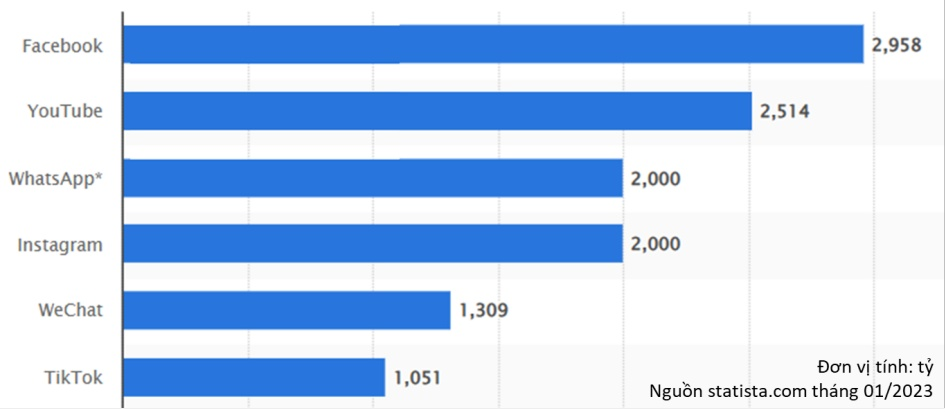

Hình 1: Số lượng người dùng trên các nền tảng mạng xã hội

Với sự phát triển không ngừng của khoa học máy tính và trí tuệ nhân tạo, các loại hệ thống gợi ý ngày càng được phát triển và tinh chỉnh để cung cấp những trải nghiệm cá nhân hóa tốt nhất cho người dùng. Bằng cách sử dụng các mô hình gợi ý tiên tiến, hệ thống gợi ý giúp người dùng khám phá những nội dung, sản phẩm và dịch vụ mà họ có thể quan tâm, từ đó nâng cao sự hài lòng và trải nghiệm người dùng. [3]. Như vậy, động cơ phát triển một hệ thống gợi ý trong thương mại điện tử là cung cấp gợi ý sản phẩm cá nhân và chính xác cho người dùng. Bằng cách tận dụng dữ liệu người dùng, chẳng hạn lịch sử duyệt web, hành vi mua hàng trực

<!-- page: 14 -->

tuyến ví như như lựa chọn sản phẩm hay nhấp chuột, hệ thống gợi ý có thể phân tích và hiểu sở thích cá nhân. Điều này giúp họ đề xuất các gợi ý tùy chỉnh phù hợp với gu thẩm mỹ, nhu cầu và sở thích của người dùng.

## Tính cấp thiết của đề tài

Trong bối cảnh thương mại điện tử và dịch vụ trực tuyến đang phát triển nhanh chóng [4], hệ thống gợi ý đã trở thành một công cụ quan trọng để nâng cao trải nghiệm khách hàng và thúc đẩy sự phát triển kinh doanh. Các mô hình gợi ý truyền thống như phương pháp đề xuất dựa trên nội dung [5] và phương pháp lọc dựa trên cộng tác [6] chủ yếu tập trung vào sở thích cá nhân dài hạn và phần lớn mang tính tĩnh của khách hàng mà bỏ qua các tương tác ngắn hạn [7]. Như vậy, các mô hình truyền thống này chỉ phù hợp trong những tình huống có thông tin người dùng và không có khả năng xử lý cho người dùng ẩn danh. Cụ thể hơn, những mô hình này thường không thể nắm bắt được bản chất động của hành vi khách hàng khi tương tác với hệ thống, đặc biệt là trong các ngữ cảnh mà sở thích của họ thay đổi theo từng phiên làm việc hoặc với ngữ cảnh hẹp hơn hệ thống chỉ có thông tin của khách hàng trong phiên làm việc hiện tại để gợi ý [3].

Đây chính là động cơ nghiên cứu thể hiện tính cấp thiết của việc phát triển và liên tục tối ưu các hệ thống gợi ý. Với sự ra đời của nhiều mô hình mới như mạng nơ-ron học sâu hay mạng đồ thị, đang giúp các nhà nghiên cứu có thêm nhiều hướng tiếp cận khác nhau trong việc xây dựng hệ gợi ý nhằm nâng cao khả năng đưa ra những gợi ý sản phẩm cá nhân, phù hợp và kịp thời cho khách hàng. Bằng cách khai tách dữ liệu người dùng mọi lúc mọi nơi (cả trong quá khứ lẫn hiện tại theo thời gian thực) và các thuật toán hiện đại hơn, các hệ thống gợi ý sẽ tối ưu hóa quá trình tìm kiếm sản phẩm, nâng cao sự hài lòng của khách hàng và tối đa hóa kết quả kinh doanh. Sự cải tiến liên tục của hệ thống gợi ý đóng vai trò quan trọng trong việc định hình tương lai của ngành thương mại điện tử bằng cách tạo ra những trải nghiệm mua sắm trơn tru và thú vị cho người dùng trên thế giới số.

Với động cơ nghiên cứu như vậy, phương pháp hệ gợi ý dựa trên phiên (Sessionbased recommendation) đã được đề xuất, và nhiệm vụ của chúng là dự đoán hành vi tiếp theo của người dùng dựa trên hành vi của phiên làm việc hiện tại. Hướng tiếp cận này được gọi là bài toán SR, hiện đang là một lĩnh vực nghiên cứu triển vọng, nhằm cung cấp các gợi ý chính xác và kịp thời dựa trên tương tác cấp phiên của người dùng [8], [9]. Với góc nhìn này, tác giả nhấn mạnh tính cấp thiết của việc nghiên cứu các mô hình gợi ý hành vi mua sắm của khách hàng dựa trên phiên và khám phá những khả năng mới mà chúng mang lại cho việc đẩy mạnh lĩnh vực hệ thống gợi ý nhằm dự báo hành vi khách hàng [10]. Việc nghiên cứu này giúp cho các

<!-- page: 15 -->

doanh nghiệp cung cấp dịch vụ bán hàng có nâng cao trải nghiệm của khách hàng, cá nhân hóa tới từng người dùng cũng như nâng cao năng lực cạnh tranh thông qua việc triển khai các giải pháp công nghệ mới nhất vào các bài toán kinh doanh.

Căn cứ vào những phân tích trên, tác giả đề xuất phương pháp biểu diễn dữ liệu phiên làm việc của khách hàng và xây dựng các mô hình ứng dụng mạng nơ-ron học sâu trong việc phân tích và dự báo hành vi mua hàng hoặc gợi ý lựa chọn sản phẩm tiếp theo trong chuỗi sự kiện nhấp chuột của họ.

## 2 Mục tiêu của luận án

## Đặt vấn đề

Phân tích phiên làm việc của khách hàng để dự báo khả năng họ sẽ mua sản phẩm nào hoặc lựa chọn sản phẩm nào tiếp theo là một bài toán dự báo khá phổ biến trong ngành thương mại điện tử [11]. Việc dự báo này giúp cho doanh nghiệp cung cấp dịch vụ đưa ra các ý tưởng bán hàng phù hợp trong quá trình người dùng tương tác với hệ thống bán hàng của mình. Có khá nhiều mô hình dự báo được đưa ra với nhiều bộ dữ liệu kiểm tra để cải thiện kết quả dự báo hành vi mua sắm của khách hàng [10].

## Đối tượng nghiên cứu

Đối tượng nghiên cứu của luận án này là chuỗi hành vi nhấp chuột trong quá trình lựa chọn sản phẩm của khách hàng. Chuỗi hành vi nhấp chuột được ghi nhận trong một phiên mua hàng trên một hệ thống thương mại điện tử hoặc nền tảng mạng xã hội nào đó.

## Mục tiêu nghiên cứu

Mục tiêu của luận án này là nghiên cứu và đề xuất mô hình dự báo hành vi lựa chọn sản phẩm trong phiên làm việc hiện tại của khách hàng với hệ thống bán hàng. Cụ thể hơn, luận án này có một số mục tiêu nghiên cứu chính như sau:

• Nghiên cứu và đề xuất cách thức biểu diễn dữ liệu phiên làm việc.

• Nghiên cứu và đề xuất một số mô hình mạng nơ-ron học sâu và mạng nơ-ron đồ thị nhằm xây dựng mô hình dự báo hành vi mua hàng của khách hàng dựa vào phiên làm việc hiện tại của họ.

• Thực nghiệm một số phương án khác nhau và so sánh với một số mô hình cơ sở nhằm đánh giá tính hiệu quả của mô hình đề xuất.

<!-- page: 16 -->

## Phạm vi nghiên cứu

Phạm vi nghiên cứu tiếp cận với hai bài toán cụ thể sau:

• Bài toán 1 trả lời câu hỏi ”Với danh sách sản phẩm đang lựa chọn trong phiên tương tác hiện tại thì khả năng khách hàng có mua hàng không, và nếu mua thì khả năng họ chọn mặt hàng nào?”.

• Bài toán 2 mang tính tổng quát hơn khi trả lời câu hỏi ”Với danh sách sản phẩm đang lựa chọn trong phiên tương tác hiện tại thì khả năng khách hàng sẽ chọn những sản phẩm nào tiếp theo”.

Bài toán 1 là bài toán dự báo nhị phân trả lời câu hỏi ”có mua hàng hay không”. Trong khi đó ở bài toán 2 thì mô hình dự báo mang tính chất gợi ý lựa chọn sản phẩm tiếp theo, tức là bài toán đa nhãn. Ở mức độ tổng quát, mô hình gợi ý không chỉ đưa ra một sản phẩm tiếp theo mà sẽ đưa ra danh sách gợi ý k sản phẩm có xác xuất cao nhất mà khách hàng có thể lựa chọn. Bài toán 2 còn gọi là bài toán gợi ý top − k. Lưu ý phạm vi nghiên cứu là xây dựng mô hình dự báo chỉ dựa vào thông tin phiên giao dịch hiện tại mà không cần đánh giá về hồ sơ hoặc lịch sử mua sắm của khách hàng [12].

## 3 Phương pháp nghiên cứu

Ở mức độ tiếp cận tổng quan, luận án nghiên cứu cách thức biểu diễn dữ liệu và đề xuất các mô hình mạng nơ-ron để xây dựng hệ thống gợi ý. Để đảm bảo tính đóng góp của luận án, phương pháp nghiên cứu cũng bao gồm các kỹ thuật thực nghiệm với bộ dữ liệu có sẵn, từ đó so sánh với các mô hình cơ sở hoặc nghiên cứu liên quan để đảm bảo tính đúng đắn và cải tiến của các mô hình đề xuất.

Cụ thể hơn với Bài toán 1 là bài toán nhị phân mua hàng đơn giản, luận án đề xuất hai mô hình mạng nơ-ron là mạng học rộng và sâu và mạng học máy biến đổi để phân tích phiên làm việc dưới dạng bảng (tabular data) gồm các thuộc tính có dữ liệu chuỗi số và danh mục (các đối tượng dữ liệu rời rạc) nhằm dự báo hành vi có mua hàng hay không của khách hàng. Hai mô hình mạng nơ-ron này khá đơn giản và phù hợp với các phiên dữ liệu dạng bảng, tuy nhiên điểm hạn chế là chỉ đánh giá dữ liệu theo từng phiên cụ thể (intra-session), mà không đánh giá được mối quan hệ giữa các phiên dữ liệu trong cả bộ dữ liệu lớn.

Với Bài toán 2 nhằm xây dựng hệ gợi ý top − k, phương pháp nghiên cứu cần cải tiến bằng cách tìm hiểu và đề xuất phương án biểu diễn dữ liệu phiên làm việc và đặc biệt hơn là khả năng thể hiện rõ mối quan hệ giữa hàng triệu phiên làm việc

<!-- page: 17 -->

trong bộ dữ liệu thực tế, khái niệm này gọi là inter-session [13]. Đồ thị là hướng tiếp cận rất phù hợp nhằm biểu diễn dữ liệu phiên làm việc của hàng triệu khách hàng trong quá trình lựa chọn cùng trên một tập các sản phẩm của một hệ thống nào đó [14]. Cụ thể hơn, luận án đề xuất biểu diễn đồ thị theo 3 cách tiếp cận khác nhau từ đồ thị đơn (G) biểu diễn mối quan hệ liền kề khi lựa chọn các sản phẩm, đồ thị đơn (H) biểu diễn quan hệ có độ dài (khoảng cách) giữa các sản phẩm trong cùng phiên và phức tạp hơn là đồ thị đa quan hệ (K) với khả năng phân tích các khoảng cách khác nhau của các mối quan hệ giữa các sản phẩm trong phiên làm việc của khách hàng. Với góc độ mô hình kiến trúc, luận án nghiên cứu và đề xuất sử dụng mô hình nơ-ron đồ thị để xây dựng mô hình gợi ý cho Bài toán 2.

Để cải tiến hơn nữa mô hình gợi ý, luận án đề xuất phương pháp nhúng đồ thị để mô hình đạt được kết quả tối ưu hơn trong việc học được các loại đồ thị biểu diễn dữ liệu phiên làm việc được thiết kế ở trên. Phương pháp nhúng đồ thị cho phép phát hiện thêm sự tương đồng trong quá trình khách hàng lựa chọn sản phẩm, từ đó đưa ra gợi ý top − k sản phẩm cho khách hàng ở phiên làm việc hiện tại. Cũng tương tự như các nghiên cứu khác, tác giả cũng so sánh đề xuất của mình với các mô hình cơ sở và các nghiên cứu liên quan để khẳng định những cải tiến và đóng góp của luận án.

## 4 Bố cục luận án

Bố cục của luận án gồm phần Mở đầu và bốn chương nội dung, và phần Kết luận được mô tả ngắn gọn như sau:

• ”Mở đầu”: Phần mở đầu trình bày tổng quan về bài toán nghiên cứu, tính cấp thiết và ý nghĩa khoa học thực tiễn của đề tài. Cụ thể hơn nữa, phần này đưa ra vấn đề cần giải quyết, đối tượng và phương pháp nghiên cứu của đề tài làm tiền đề cho việc thực hiện ở các chương nội dung của luận án.

• Chương 1 ”Tổng quan về hệ gợi ý”: Chương 1 trình bày về bài toán gợi ý mà nhiều hệ thống bán hàng thương mại điện tử hay các nền tảng mạng xã hội đang triển khai. Chương này nêu định nghĩa và phát biểu hai bài toán ứng với hai mục tiêu cụ thể của luận án được nếu ở phần Mở đầu, gồm Bài toán 1 là mô hình dự báo nhị phân có mua hàng hay không và Bài toán 2 là hệ gợi ý top − k dựa theo phiên làm việc hiện tại của khách hàng khi nhấp chuột lựa chọn sản phẩm trên hệ thống bán hàng.

• Chương 2 ”Đề xuất mô hình mạng nơ-ron học sâu giải bài toán mua hàng”: Chương 2 giải quyết Bài toán 1 của luận án trả lời câu hỏi ”khách hàng có mua hàng trong phiên làm việc hiện tại không?”. Chương này đề xuất hai mô

<!-- page: 18 -->

hình mạng nơ-ron cụ thể gồm mạng nơ-ron rộng & sâu và mạng nơ-ron biến đổi để xây dựng mô hình dự báo mua hàng. Phần thực nghiệm của chương 2 sử dụng bộ dữ liệu có sẵn Yoochoose (Phụ Lục A) nhằm đánh giá kết quả của mô hình đề xuất so với các nghiên cứu liên quan. Bộ dữ liệu này được sử dụng trong các chương tiếp theo của luận án, tuy nhiên sẽ được xử lý và chuẩn hóa khác nhau cho phù hợp với từng mô hình đề xuất ở các chương.

Chương 3 ”Đề xuất mô hình mạng nơ-ron đồ thị giải bài toán top−k”: Chương 3 giải quyết Bài toán 2 mang tính tổng quát của luận án là bài toán top − k. Chương này trình bày một số phương án thiết kế đồ thị để mô hình hóa thông tin đầu vào là phiên làm việc của khách hàng, gồm hai đồ thị đơn G, H và một đồ thị đa quan hệ K. Ba đồ thị này có các phương án thiết kế khác nhau dựa vào mỗi quan hệ giữa các lần nhấp lựa chọn sản phẩm trong phiên làm việc, trong đó K là đồ thị đa quan hệ thể hiện được nhiều mối quan hệ tương tác giữa các sản phẩm trong quá trình nhấp chuột. Với hướng tiếp cận biểu diễn đồ thị, chương 3 đề xuất mô hình mạng nơ-ron đồ thị để xây dựng mô hình dự báo top − k. Phần thực nghiệm của chương giải thích cách xây dựng đồ thị cỡ lớn với bộ dữ liệu Yoochoose có hơn 50 nghìn sản phẩm và mô hình hóa gần 10 triệu phiên làm việc. Kết quả thực nghiệm chứng minh cách thức sử dụng đồ thị và mô hình GNN hoàn toàn phù hợp để giải Bài toán 2.

Chương 4 ”Đề xuất phương pháp nhúng cho mô hình mạng nơ-ron đồ thị”: Nhằm tiếp tục cải tiến mô hình GNN đề xuất ở chương 3, chương 4 để xuất phép biển đổi trên đồ thị để nâng cao hiệu quả của mô hình. Tác giả để xuất tối ưu hóa mô hình mạng nơ-ron đồ thị GNN bằng cách đề xuất mới một lớp nhúng đồ thị đặc biệt nhằm cải tiến mô hình dự báo top−k. Chương này thiết kế lớp nhúng phiên sử dụng phép biến đổi nhúng kết hợp bao gồm nhúng đỉnh, nhúng đồ thị và nhúng nhãn. Kết quả thực nghiệm cho thấy việc mô hình hóa hành vi sử dụng đồ thị đa quan hệ K hoàn toàn phù hợp với mô hình GNN khi kết hợp với lớp nhúng phiên và cho kết quả vượt trội so với các mô hình khác. Việc đề xuất lớp nhúng phiên chính là đóng góp quan trọng của chương 4 cũng như cả luận án này trong việc giải quyết bài toán tổng quát top − k.

• ”Kết luận”: Phần cuối cùng đưa ra các kết luận chung và nhận xét kết quả đạt được của luận án để giải thích rõ động cơ nghiên cứu và các bước cải tiến các mô hình. Quá trình nghiên cứu và đề xuất thiết kế từ mô hình nơ-ron học sâu giải quyết Bài toán 1 ở chương 2 tới việc phát triển mô hình GNN phức tạp hơn ở chương 3 để giải quyết Bài toán 2 top − k và chiến lược tối ưu hóa mô hình GNN với lớp nhúng phiên ở chương 4. Phần này kết luận các đóng góp của luận án cũng như hướng nghiên cứu mở rộng tiếp theo của đề tài này.

<!-- page: 19 -->

# Chương 1|Tổng quan về hệ gợi ý và một số mô hình mạng nơ- ron học sâu

## 1.1 Bài toán hệ gợi ý

## 1.1.1 Tổng quan về hệ gợi ý

Việc phát triển trang web thương mại điện tử đang ngày càng phổ biến, đặc biệt là những năm gần đây lĩnh vực này phát triển nhanh chóng trên nhiều kênh khác nhau, ví dụ như mạng xã hội thay vì chỉ thông qua website bán hàng đơn thuần. Để nâng cao năng lực cạnh tranh và khả năng bán hàng tốt, các hệ thống bán hàng cũng cần xây dựng ra một phương án để gợi ý cho người dùng làm thế nào để chọn được sản phẩm mà họ cần trong hàng ngàn sản phẩm đang chào bán.

Khi một khách hàng vào một trang thương mại điện tử thì có hai xu hướng: hoặc họ đã định hướng được sản phẩm mà họ sẽ mua, hoặc là họ được định hướng được sản phẩm mà họ nên mua. Đối với kịch bản thứ hai, người dùng sẽ gặp khó khăn hơn nhiều vì họ sẽ phải chọn sản phẩm phù hợp nhất với nhu cầu của họ. Vấn đề đặt ra là làm sao họ có thể làm được điều đó trong vô số sản phẩm giống nhau mà họ đang tìm kiếm. Trong trường hợp này người dùng sẽ cần đến sự trợ giúp của hệ thống gợi ý [15] để giải quyết vấn đề này. Các hệ thống gợi ý ngày nay càng được chú trọng, nhất là đối với các nhà cung cấp dịch vụ trực tuyến như: Amazon, Netflix [16], Youtube... Một hệ thống gợi ý hiệu quả sẽ là vấn đề sống còn đối với nhà cung cấp dịch vụ hoặc bán hàng, làm tăng sự hài lòng của khách hàng và giữ chân người dùng lâu dài [17].

Có khá nhiều hệ thống gợi ý khác nhau tùy theo ngữ cảnh bài toán [18]. Đơn giản nhất, hệ thống gợi ý dựa vào thông tin lịch sử hoặc sở thích của người dùng đã được lưu lại để tìm ra sản phẩm phù hợp nhất [19]. Hệ thống hoạt động kiểu này khá dễ hiểu nhưng lại gặp nhiều thách thức khi cần đưa ra gợi ý cho người dùng mới, trong khi hệ thống chưa ghi nhận được thông tin lịch sử gì từ họ. Một hình thức mới về hệ thống gợi ý chỉ đựa vào quá trình tương tác hiện tại của người dùng, gọi là phiên làm việc. Dựa vào thông tin phiên làm việc, hệ thống có thể đưa ra gợi ý cho người dùng chỉ sau vài ba chuỗi sự kiện tương tác của họ với hệ thống, mô hình này được gọi là hệ thống gợi ý dựa vào phiên làm việc [20].

<!-- page: 20 -->

Hiện nay các trang thương mại điện tử lớn trong và ngoài nước đã và đang thu thập được lượng lớn dữ liệu về người dùng trong quá trình họ tương tác với nhiều hệ thống khác nhau [21], [22]. Dựa trên nguồn dữ liệu này, cụ thể là các chuỗi sự kiện mà người dùng tương tác thông qua phiên truy cập, đó chính là nền tảng thông tin thúc đẩy các công ty phát triển hệ thống gợi ý dựa trên dữ liệu phiên làm việc của người dùng. Các mô hình gợi ý có thể xử lý được dữ liệu dạng chuỗi thời gian, các hành vi tuần tự, từ đó có thể tăng trải nghiệm của người sử dụng, tăng doanh số bán hàng thông qua danh sách các sản phẩm được gợi ý hợp lý.

## 1.1.2 Phân loại bài toán hệ gợi ý

Có nhiều loại hệ thống gợi ý khác nhau được phát triển và áp dụng để cung cấp những gợi ý tốt nhất cho người dùng. Mỗi loại hệ thống gợi ý sử dụng các thuật toán và kỹ thuật khác nhau để tìm hiểu và phân tích dữ liệu, từ đó đưa ra các gợi ý phù hợp với sở thích và nhu cầu của người dùng. Một số loại hệ thống gợi ý phổ biến bao gồm:

• Hệ gợi ý dựa trên nội dung (Content-Based Filtering) [5], [23]: Phương pháp này gợi ý các sản phẩm cho người dùng dựa trên sở thích và đặc điểm của họ. Mô hình này khá cơ bản khi phân tích nội dung của các sản phẩm và tạo các hồ sơ người dùng để gợi ý các sản phẩm tương tự. Ví dụ, nếu người dùng thích một thể loại phim cụ thể, hệ thống sẽ gợi ý các bộ phim khác có cùng thể loại.

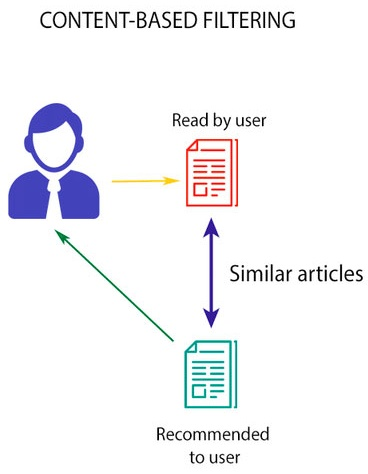

Hình 1.1: Minh họa hệ thống gợi ý dựa trên nội dung

• Hệ gợi ý dựa trên sự cộng tác (Collaborative Filtering) [6]: Phương pháp này gợi ý các sản phẩm dựa trên sở thích của người dùng tương tự hoặc sự tương đồng giữa các sản phẩm. Nó có thể được chia thành hai loại như minh họa ở Hình 1.2:

<!-- page: 21 -->

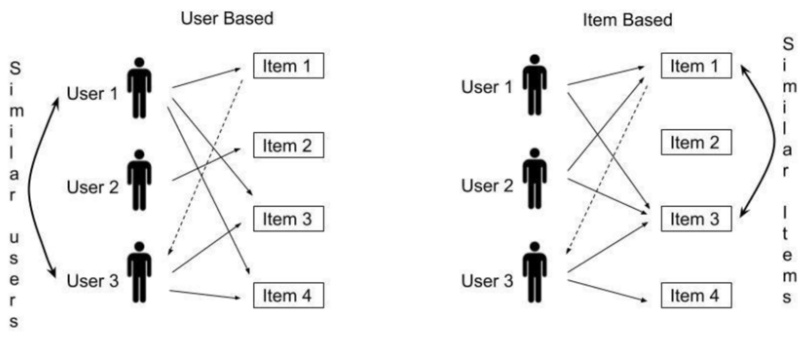

Hình 1.2: Minh họa hệ thống gợi ý cộng tác

– Phân tích hợp tác dựa trên người dùng (User-Based Collaborative Filtering): Nó tìm các người dùng tương tự dựa trên hành vi trong quá khứ và gợi ý các sản phẩm mà những người dùng tương tự đó thích cho người dùng cần được sự gợi ý.

– Phân tích hợp tác dựa trên mục (Item-Based Collaborative Filtering): Nó xác định các sản phẩm tương tự dựa trên hành vi của người dùng và gợi ý các sản phẩm tương tự với những sản phẩm mà người dùng đã thích hoặc tương tác trong quá khứ.

• Hệ gợi ý kết hợp (Hybrid Recommendation Systems) [24]: Hệ thống kết hợp nhiều kỹ thuật gợi ý để cung cấp gợi ý chính xác và đa dạng hơn. Hệ thống này tận dụng các ưu điểm của các phương pháp khác nhau để khắc phục hạn chế và cải thiện hiệu suất tổng thể của mô hình.

• Hệ gợi ý dựa trên tri thức (Knowledge-Based Recommendation Systems) [25]: Hệ thống này gợi ý dựa trên tri thức được định nghĩa trước về các sản phẩm và người dùng. Nó sử dụng các quy tắc được xác định trước hoặc các biểu đồ tri thức để tạo ra các gợi ý. Ví dụ, một hệ thống gợi ý sách dựa trên sở thích hoặc yêu cầu cụ thể của người dùng.

• Hệ gợi ý dựa trên bối cảnh (Context-Aware Recommendation Systems) [23]: Hệ thống theo hướng tiếp cận này xem xét thông tin bối cảnh bổ sung như thời gian, địa điểm hoặc thời tiết để cung cấp gợi ý cá nhân. Ví dụ, một dịch vụ nghe nhạc có thể gợi ý nhạc thư giãn vào buổi tối Chủ nhật.

• Hệ gợi ý dựa trên học tăng cường (Reinforcement Learning-Based Recommendation Systems) [26]: Mô hình học tăng cường sử dụng các kỹ thuật học tăng cường để tối ưu hóa gợi ý theo thời gian. Mô hình học từ phản hồi của người dùng và điều chỉnh các gợi ý mục tiêu, nhằm tối đa hóa sự hài lòng của người dùng trong dài hạn.

<!-- page: 22 -->

• Hệ gợi ý dựa trên phiên làm việc (Session-Based Recommendation Systems) [10]: Hệ thống này tập trung vào việc ghi nhận sở thích của người dùng trong một phiên cụ thể hoặc chuỗi tương tác. Hệ thống gợi ý các mục dựa trên ngữ cảnh phiên làm việc hiện tại và các sở thích ngay lập tức của người dùng. Đây cũng chính là hướng tiếp cận của luận án này.

Chú ý rằng hệ thống gợi ý có thể được tinh chỉnh và tùy chỉnh hơn dựa trên các lĩnh vực hoặc ứng dụng cụ thể như thương mại điện tử, phim ảnh hoặc mạng xã hội.

## 1.2 Hai bài toán cơ sở

Với việc xác định đối tượng nghiên cứu của bài toán là hành vi nhấp chuột của khách hàng và hướng tiếp cận xây dựng mô hình là hệ gợi ý dựa vào phiên làm việc hiện tại của khách hàng, phần này sẽ xác định rõ phạm vi nghiên cứu thông quá một số định nghĩa và đưa ra hai bài toán cơ sở cần giải quyết của luận án.

## 1.2.1 Định nghĩa phiên làm việc

Trong quá trình khách hàng tương tác với một hệ thống thương mại điện tử nào đó, người dùng thường sẽ sử dụng chuột để nhấp vào các sản phẩm cụ thể mà hệ thống muốn cung cấp cho khách hàng. Hệ thống sẽ ghi nhận những tương tác thành một chuỗi sự kiện nhấp chuột [27], [28] (còn gọi là clickstream) và kết quả ghi nhận của từng lần nhấp là sản phẩm được nhấp. Phiên làm việc được ghi nhận riêng lẻ theo từng khách hàng khác nhau với mã phiên làm việc được hệ thống sinh ra và duy nhất. Phiên làm việc được kết thúc khi khách hàng chủ động đóng phiên hoặc ngừng tương tác với hệ thống sau một khoảng thời gian đủ dài do hệ thống quy định. Khách hàng có thể lặp lại quy trình này vào một thời điểm khác, khi đó hệ thống sẽ ghi nhận một phiên làm việc với mã phiên hoàn toàn khác của cùng khách hàng.

Định nghĩa 1. Phiên làm việc của khách hàng là một chuỗi các sự kiện nhấp chuột khi lựa chọn sản phẩm và được hệ thống ghi nhận dưới dạng véc-tơ s = $\{ i d _ { 1 } , i d _ { 2 } , . . . , i d _ { c } \}$ trong đó idi là mã định danh sản phẩm, c là số lượt sản phẩm được nhấp chọn trong phiên làm việc s và cũng chính là độ dài của phiên làm việc đó.

Lưu ý, khách hàng có thể chỉ nhấp chuột vào một sản phẩm hoặc cũng có thể lần lượt nhấp vào hàng chục hoặc hàng trăm sản phẩm trong một phiên làm việc, và khách hàng cũng có thể chọn đi chọn lại một sản phẩm trong cùng phiên. Từ mã sản phẩm được nhấp, hệ thống có thể tham chiếu thêm các thông tin mô tả sản

<!-- page: 23 -->

phẩm mã danh mục, giá thành... Ngoài ra, do các nhấp chuột có tính thứ tự nên hệ thống có thể ghi nhận thêm cả thời điểm nhấp chuột.

## 1.2.2 Bài toán 1 - Dự báo hành vi mua hàng

Bài toán 1. Cho một chuỗi nhấp chuột có tính thứ tự theo thời gian được sinh ra từ một phiên làm việc của khách hàng khi lựa chọn sản phẩm, cần xây dựng mô hình dự báo xem liệu khách hàng có mua hàng trong phiên làm việc hiện tại không?

Bài toán 1 giả thiết mỗi phiên làm việc là một khách hàng độc lập và đặc trưng về hành vi mua của họ được thể hiện ẩn thông qua các thuộc tính của mỗi phiên làm việc như số lần, tần suất, thời gian nhấp chuột, v.v.... Như vậy, mục tiêu bài toán 1 là từ chuỗi dữ liệu nhấp chuột của khách hàng trong từng phiên làm việc cụ thể, cần xây dựng một mô hình dự báo khả năng mua hàng của khách hàng. Với mục tiêu này, bài toán đề ra được đưa về bài toán phân loại nhị phân, trong đó mô hình phân loại trả về kết quả là xác suất xảy ra của sự kiện ”mua hàng”.

## 1.2.3 Bài toán 2 - Hệ gợi ý top − k

Bài toán 2. Cho một chuỗi nhấp chuột có tính thứ tự theo thời gian được sinh ra từ một phiên làm việc của khách hàng khi lựa chọn sản phẩm, cần xây dựng mô hình gợi ý xem liệu khách hàng lựa chọn mặt hàng nào tiếp theo trong phiên làm việc hiện tại?

Rõ ràng Bài toán 2 có tính tổng quát hơn Bài toán 1. Mục tiêu của Bài toán 2 nhằm xây dựng một mô hình gợi ý đưa ra một hoặc một số sản phẩm nào đó mà khách hàng có khả năng lựa chọn tiếp theo. Lưu ý rằng hệ gợi ý này thuần túy chỉ dựa vào chuỗi sự kiện tuần tự trong phiên làm việc hiện tại của người dùng đó, thay vì phải dựa vào thông tin quá khứ của họ. Bài toán 2 chính là dạng xây dựng hệ gợi ý dựa vào phiên làm việc (bài toán SR).

Bài toán SR được mô tả toán học như sau, giả sử $X = \{ x _ { 1 } , x _ { 2 } , . . . , x _ { n } \}$ là một danh mục các đối tượng duy nhất (ví dụ như danh mục mã sản phẩm) và n là số lượng sản phẩm. Tập sản phẩm này sẽ được các khách hàng lựa chọn trong các phiên làm việc của họ. Như vậy ta có đối tượng phiên làm việc s được biểu diễn như sau $s   =   \{ x _ { s , 1 } , x _ { s , 2 } , . . . , x _ { s , c } \}$ trong đó $x _ { s , i } \in X , \forall i : 1 \leq i \leq c$ có tính thứ tự theo chuỗi thời gian nhằm thể hiện một hành động nhấp chuột nào đó của người dùng trong phiên làm việc s.

Với vấn đề như vậy, bài toán SR là mô hình dự báo xem liệu người dùng sẽ lựa chọn đối tượng (sản phẩm) $x _ { s , m + 1 }$ tiếp theo nào trong phiên làm việc s đó. Với

<!-- page: 24 -->

mô hình gợi ý này cho một phiên làm việc s cụ thể, hệ gợi ý sẽ trả về hàm ŷ là một véc-tơ chứa danh mục k sản phẩm gợi ý với xác xuất được lựa chọn từ cao tới thấp. Danh mục sản phẩm gợi ý này được gọi là top − k sản phẩm gợi ý cho người dùng [19].

Hình 1.3 minh họa mô hình SR đưa ra dự báo top − 2 sản phẩm cùng xác xuất mà khách hàng sẽ lựa chọn để nhấp tiếp.

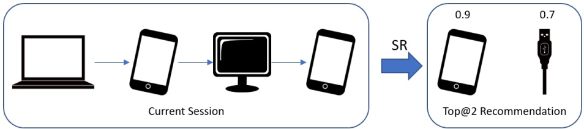

Hình 1.3: Bài toán gợi ý top-k sản phẩm

## 1.3 Lý thuyết mạng nơ-ron học sâu

Phần này trình bày lý thuyết cơ bản để giải quyết Bài toán 1 sử dụng các mô hình mạng nơ-ron học sâu.

Mạng nơ-ron truyền thẳng (feedforward neural network, FNN ) [29], [30] là một loại mạng nơ-ron học sâu cơ bản mà thông tin chỉ chuyển theo một hướng, từ lớp đầu vào tới lớp đầu ra, mà không có bất kỳ vòng lặp phản hồi nào. Điều này giúp cho mô hình mạng FNN mặc dù là loại mạng nơ-ron tương đối đơn giản nhưng được sử dụng rộng rãi trong nhiều ứng dụng [31]. Một số mô hình phổ biến nhất của mạng nơ-ron truyền thẳng như sau, trong đó có một số mô hình sẽ được nghiên cứu và thực nghiệm ở phần tiếp theo của luận án.

• Các mạng nơ-ron sử dụng nhiều lớp nơ-ron theo kiến trúc cơ sở của Multi-layer perceptron [32] nhằm xử lý các dữ liệu dạng bảng. Bao gồm mạng nơ-ron học sâu truyền thẳng, mạng nơ-ron sâu và rộng hay mạng nơ-ron phân tích ma trận nhân tử...

• Mạng nơ-ron tích chập (CNN ) [33]–[35]: Đây là một loại mạng nơ-ron cải tiến được chuyên biệt hóa, thường được sử dụng cho xử lý hình ảnh và video. Nó được thiết kế để tự động xác định các đặc trưng trong hình ảnh, chẳng hạn như cạnh, góc và các cấu trúc khác bằng cách áp dụng bộ lọc tích chập vào dữ liệu đầu vào.

• Mạng nơ-ron hồi quy (RNN ) [36]–[38]: Mạng nơ-ron tiến hóa được thiết kế để xử lý các đầu vào có dạng dữ liệu tuần tự, chẳng hạn như giọng nói, văn

<!-- page: 25 -->

bản và dữ liệu chuỗi thời gian. RNN có khả năng bắt các phụ thuộc thời gian trong dữ liệu đầu vào, làm cho nó phù hợp cho nhiều ứng dụng, chẳng hạn như dịch ngôn ngữ, nhận dạng giọng nói và tạo âm nhạc.

• Mạng nơ-ron biến đổi (Transformer ) [39]–[41]: Kiến trúc mạng Transformer được giới thiệu như một phương án thay thế kiến trúc mạng RNN trong việc xử lý dữ liệu tuần tự, chẳng hạn như ngôn ngữ. Hạn chế của mô hình RNN là không xử lý song song được chuỗi dữ liệu đầu vào và không thể nắm bắt được sự phụ thuộc dài hạn. Thay vì kết nối tuần tự của RNN, Transformer sử dụng lớp tự chú ý cho phép mô hình nắm bắt sự phụ thuộc giữa các thành phần khác nhau trong chuỗi đầu vào. Điều này khiến cho Transformer có thể được thực hiện song song và cho phép nó xử lý các chuỗi đầu vào dài hơn.

## 1.3.1 Mô hình mạng nơ-ron học sâu truyền thẳng

Với sự phát triển trong nhiều năm qua, mạng nơ-ron học sâu đã kết quả khả quan trong việc ứng dụng thành công cụ thể trong nhiều lĩnh vực khác nhau. Một số mô hình mạng nơ-ron học sâu đã được nghiên cứu phát triển nhằm giải quyết các bài toán có dữ liệu dạng bảng gồm cả thuộc tính số và danh mục. Phần này nghiên cứu một số mô hình cải tiến cụ thể của mạng nơ-ron truyền thẳng FNN nhằm cung cấp cái nhìn tổng quan hơn về kỹ thuật học sâu trong việc giải quyết Bài toán 1.

Ba mô hình có tính chất tương tự như FNN nhưng khác nhau ở phương pháp tiền xử lý lớp nhúng trước khi vào lớp học sâu truyền thẳng. Các biến thể của mô hình FNN được minh họa ở Hình 1.4.

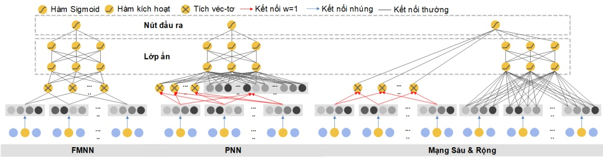

Hình 1.4: Một số mô hình nơ-ron sử dụng trong dự báo chuỗi nhấp chuột

## Mạng nơ-ron phân tích ma trận nhân tử (FMNN)

Mạng FMNN (Factorization-machine supported neural networks) là mạng nơ-ron truyền thẳng có khả năng học được các véc-tơ nhúng của các thuộc tính danh mục thông quá lớp tiền huấn luyện FM (Factorization Machine) [42], [43], đây là hướng tiếp cận xây dựng mô hình gợi ý sử dụng lọc cộng tác. Quá trình tiền huấn luyện

<!-- page: 26 -->

mô hình FM trước khi áp dụng mạng nơ-ron truyền thẳng dẫn đến hai vấn đề của phương pháp này: (1) các tham số của lớp nhúng chịu ảnh hưởng lớn từ lớp MF; và (2) hiệu suất của mạng bị giảm do sai số sinh ra từ quá trình tiền xử lý bằng FM trước khi đưa vào mạng học sâu truyền thẳng. Bên cạnh đó, FMNN chỉ học được các tương tác bậc cao của các trường thuộc tính.

## Mạng nơ-ron tích chập (PNN)

Mạng PNN (Product-based neural network ) cũng là mạng nơ-ron truyền thẳng trong đó thêm vào một lớp tích véc-tơ trước lớp ẩn đầu tiên nhằm giúp mạng nắm được các tương tác bậc cao giữa các trường thuộc tính [44]. Dựa trên phép tích véc-tơ, phương pháp này chia làm 3 phiên bản khác nhau: I-PNN (Inner PNN ), O-PNN (Outer PNN ) và PNN, trong đó I-PNN dựa trên phép nhân véc-tơ vô hướng, O-PNN sử dụng tích có hướng của véc-tơ, và PNN sử dụng cả tích vô hướng và có hướng của véc-tơ. Giống như FMNN, tất cả các phiên bản của PNN đều bỏ qua tương tác bậc thấp của thuộc tính.

## Mạng nơ-ron rộng và sâu (W&DNN)

Mạng W&DNN là mạng nơ-ron hỗn hợp cấu thành bởi hai nhánh rộng và sâu. Theo Cheng và các cộng sự [45], mạng này có khả năng học được tương tác bậc thấp lẫn bậc cao của các trường thuộc tính, đồng thời tận dụng được khả năng ghi nhớ của mô hình tuyến tính và khả năng tổng quát hóa của mạng nơ-ron học sâu vào trong cùng một mô hình. Đặc biệt, khả năng của mạng càng được phát huy trong trường hợp bộ dữ liệu đầu vào lớn với số lượng các trường thuộc tính cao.

Bảng 1.1: Bảng so sánh các mô hình nơ-ron truyền thẳng

|  | Tiền huấn luyện | Tương tác bậc cao | Tương tác bậc thấp |
| --- | --- | --- | --- |
| FMNN | v | v |  |
| PNN |  | v |  |
| W&amp;DNN |  | v | v |

## 1.3.2 Mô hình mạng nơ-ron rộng và sâu

Với hướng nghiên cứu cứu ứng dụng mạng nơ-ron học sâu cho Bài toán 1, yêu cầu đề ra của mô hình dự báo là phải học được mối tương tác bậc thấp cũng như bậc cao của các trường thuộc tính. Do vậy, tác giả sử dụng mạng nơ-ron học rộng và sâu để phục vụ mục tiêu đề ra. Mô hình này được đề xuất năm 2016 bởi một nhóm làm việc trong Google [45].

<!-- page: 27 -->

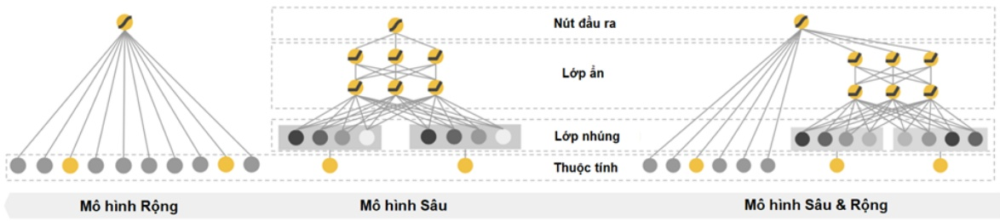

Hình 1.5: Sơ đồ cấu trúc mạng nơ-ron rộng và sâu

Mô hình rộng và sâu là một mạng nơ-ron hỗn hợp với cấu trúc bao gồm hai nhánh được mô tả như sau:

## Phần Rộng

Phần rộng là mô hình tuyến tính có dạng:

$$
y = W ^ {T} x + b\tag{1.1}
$$

trong đó y là giá trị dự báo, $x \; = \; \{ x _ { 1 } , x _ { 2 } , . . . , x _ { m } \}$ là véc-tơ có m thuộc tính, $W   =   \{ w _ { 1 } , w _ { 2 } , . . . , w _ { m } \}$ là hệ số tương ứng của mô hình $( W ^ { T }$ là ma trận chuyển vị của W) và b là độ lệch. Trường thuộc tính đầu vào bao gồm các thuộc tính thô và một số thuộc tính đặc biệt được tạo ra bằng phép biến đổi tích chéo (cross product transformation) như công thức 1.2:

$$
\varphi_ {k} (x) = \prod_ {i = 1} ^ {d} x _ {i} ^ {c _ {k i}}, c _ {k i} \in \{0, 1 \}\tag{1.2}
$$

trong đó $c _ { k i }$ nhận giá trị 1 nếu thuộc tính thứ i nằm trong biến đổi thứ k của $\varphi _ { k }$ , và nhận giá trị 0 nếu ngược lại. Phép biến đổi này cho phép mô hình nắm được tương tác chéo giữa các thuộc tính, từ đó thêm được yếu tố phi tuyến vào mô hình tuyến tính. Phần rộng có khả năng ghi nhớ hiệu quả các tương tác rời rạc giữa các trường thuộc tính nhưng thiếu khả năng tổng quan hóa các tổ hợp tương tác ẩn, vấn đề này sẽ được giải quyết trong phần sâu.

## Phần Sâu

Phần sâu là mạng nơ-ron học sâu truyền thẳng kết hợp kỹ thuật nhúng, lớp đầu tiên của mạng truyền thẳng là lớp nhúng thuộc tính. So với các mạng nơ-ron học sâu sử dụng đầu vào là dữ liệu hình ảnh hoặc âm thanh có dạng chuỗi số thực liên tục, đầu vào trong bài toán dự báo chuỗi nhấp chuột chứa nhiều trường thuộc tính đa chiều và rời rạc. Do đó, lớp nhúng được đưa vào nhằm chuyển đổi các thuộc tính này thành các véc-tơ với số chiều không gian được giảm thiểu (véc-tơ nhúng).

<!-- page: 28 -->

Cụ thể hơn, đầu ra của lớp nhúng có dạng $\boldsymbol { a } ^ { ( 0 ) } = [ e _ { 1 } , e _ { 2 } , . . . , e _ { m } ]$ với m là số trường thuộc tính, trong đó $e _ { i }$ là véc-tơ nhúng của trường thuộc tính thứ i. Các véc-tơ này kết hợp với các thuộc tính dạng số được truyền vào các lớp ẩn tiếp theo của mạng nơ-ron học sâu:

$$
a ^ {l + 1} = \sigma (W ^ {(l)} a ^ {(l)}) + b ^ {(l)})\tag{1.3}
$$

trong đó $\sigma$ là hàm kích hoạt, thường là hàm ReLU có dạng $f ( x ) = x ^ { + } = \operatorname* { m a x } ( 0 , x )$ W(l), $a ^ { ( l ) }$ , và $b ^ { ( l ) }$ đầu ra và độ lệch của lớp nơ-ron thứ l.

Quá trình học của mạng diễn ra đồng thời đối với cả hai phần $\mathrm { d } \hat { \mathrm { e } }$ tạo ra kết quả cuối cùng của mô hình dự báo tổng hợp theo công thức 1.4

$$
\hat {y} = S i g m o i d (y _ {R} + y _ {S}) = \frac {1}{1 + e ^ {- (y _ {R} + y _ {S})}}\tag{1.4}
$$

trong đó $\hat { y } \in ( 0 , 1 )$ là giá trị dự báo khả năng mua hàng, $y _ { R }$ là đầu ra của phần rộng và $y _ { S }$ là đầu ra của phần sâu.

## 1.3.3 Mô hình mạng nơ-ron biến đổi

Mô hình biến đổi (Transformer ) là một mô hình nhúng chuỗi dựa trên cơ chế tự chú ý được giới thiệu nhóm tác giả Google Brain năm 2017 [46]. Giống như các mạng nơ-ron hồi quy RNN, các Transformer được thiết kế để xử lý dữ liệu tuần tự theo dạng chuỗi cho các tác vụ như dịch máy hay tóm tắt tự động. Tuy nhiên khác với mạng RNN, các Transformer không yêu cầu dữ liệu dạng chuỗi cần xử lý theo thứ tự. Ví dụ, nếu dữ liệu đầu vào là một câu ngôn ngữ tự nhiên, Transformer không cần phải xử lý phần đầu câu trước cuối câu. Với ưu điểm này, mô hình Transformer hỗ trợ nhiều phép tính toán song song, nhờ vậy giảm thời gian huấn luyện trên các tập dữ liệu lớn. Hiện mô hình Transformer và các biến thể của nó đang là mô hình được nhiều sự lựa chọn cho các vấn đề về xử lý ngôn ngữ tự nhiên [47] để thay thế các mô hình RNN, ví dụ như biến thể bộ nhớ dài-ngắn hạn (Long short term memory, LSTM ). Mô hình Transformer nâng cao sự phát triển của các mô hình”huấn luyện trước” (pre-training) như BERT (Bidirectional Encoder Representations from Transformers) [48] và GPT (Generative Pre-trained Transformer ) [49].

Mô hình biến đổi Transformer bao gồm hai mô-dun chính là khối mã hóa (encoder ) và khối giải mã (decoder ) được mô tả như Hình 1.6:

Ở mức cao, kiến trúc Transformer tiếp cận khá giống với các mạng nơ-ron học sâu cơ bản như trình bày ở phần trên gồm W&DNN, FNN, PNN... vì nó cũng sử dụng kết hợp lớp nhúng và mạng nơ-ron truyền thẳng FNN. Tuy nhiên có 2 điểm khác là (1) kiến trúc Transformer sử dụng lớp nhúng theo cơ chế tự chú ý [46] để

<!-- page: 29 -->

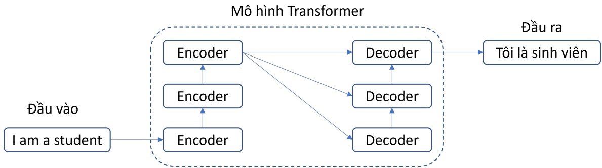

Hình 1.6: Mô hình minh họa kiến trúc Transformer

biến đổi dữ liệu đầu vào theo dạng chuỗi tuần tự, và (2) các khối này được xếp lớp với nhau để xử lý song song được nhiều thuộc tính khác nhau từ chuỗi dữ liệu đầu vào. Mô hình chi tiết của khối mã hóa và giải mã của kiến trúc Transformer được mô tả ở Hình 1.7.

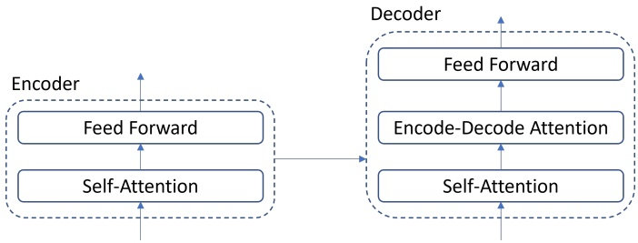

Hình 1.7: Các lớp chi tiết của kiến trúc Transformer

## Lớp tự chú ý

Lớp tự chú ý (self-attention) được dùng để tính toán sự phụ thuộc giữa các thành phần trong chuỗi dữ liệu tuần tự đâu vào (ví dụ từ trong câu). Cơ chế của lớp tự chú ý sử dụng ba ma trận trọng số Q, K, V được tính toán theo Công thức 1.5

$$
\mathrm{Attention} (Q, K, V) = \mathrm{softmax} (\frac {Q K ^ {T}}{\sqrt {d _ {k}}}) V\tag{1.5}
$$

Trong đó:

• $Q$ là ma trận truy vấn (query) có kích thước $l _ { q } \times d _ { k }$ , với $l _ { q }$ là độ dài của câu và $d _ { k }$ là số chiều của véc-tơ truy vấn.

• K là ma trận chìa khóa (key) có kích thước $l _ { k } \times d _ { k }$ , với $l _ { k }$ là độ dài của câu và $d _ { k }$ là số chiều của véc-tơ chìa khóa (bằng với số chiều của véc-tơ truy vấn).

• V là ma trận giá trị (value) có kích thước $l _ { v } \times d _ { v }$ , với $l _ { v }$ là độ dài của câu và $d _ { v }$ là số chiều của véc-tơ giá trị.

<!-- page: 30 -->

$\sqrt { d _ { k } }$ là hằng số nhằm điều chỉnh độ lớn của ma trận truy vấn và ma trận chìa khóa.

• softmax là hàm để chuẩn hóa đầu ra.

## Mạng nơ-ron truyền thẳng

Ngoài các lớp tự chú ý, mỗi lớp trong khối mã hóa và giải mã đều chứa các mạng nơ-ron truyền thẳng với lớp kết nối đầy đủ. Kiến trúc mạng bao gồm hai phép biến đổi tuyến tính sử dụng hàm kích hoạt ReLU như Công thức 1.6

$$
\mathrm{FNN} (x) = (X W _ {1} + b _ {1}) W _ {2} + b _ {2}\tag{1.6}
$$

Trong đó X là véc-tơ đầu vào của mô hình, $W _ { 1 }$ và $W _ { 2 }$ là ma trận trọng số và $b _ { 1 }$ và $b _ { 2 }$ là véc-tơ điều chỉnh.

## 1.4 Lý thuyết mạng nơ-ron đồ thị

Phần này trình bày lý thuyết cơ bản để giải quyết Bài toán 2 sử dụng các mô hình mạng nơ-ron đồ thị.

## 1.4.1 Định nghĩa về đồ thị

Trong toán học và tin học, đồ thị là đối tượng nghiên cứu cơ bản của lý thuyết đồ thị. Người đặt nền móng cho sự phát triển của Lý thuyết đồ thị là Leonhard Euler - nhà toán học người Thụy Sĩ - đã khai sinh lý thuyết đồ thị năm 1736 [50]. Theo định nghĩa cơ bản thì đồ thị là một tập các đối tượng gọi là đỉnh nối với nhau bởi các cạnh, mà ở đây cạnh thể hiện một quan hệ cụ thể nào đó giữa hai đỉnh. Tùy từng bài toán cụ thể mà cạnh có thể có hướng hoặc vô hướng, và tương ứng đồ thị khi đó cũng được gọi là có hướng hoặc vô hướng như một số phát biểu sau.

Định nghĩa 2. Một đồ thị đơn G gồm một tập không rỗng V mà các phần tử của nó gọi là các đỉnh và một tập E mà các phần tử của nó gọi là các cạnh, đó là các cặp không sắp xếp thứ tự các đỉnh phân biệt. Đồ thị này còn gọi là đồ thị vô hướng (undirected graph).

Biểu thức toán học biểu diễn đồ thị mô tả theo Công thức 1.7.

$$
G = (V, E)\tag{1.7}
$$

trong đó

<!-- page: 31 -->

$V = \{ v _ { 1 } , v _ { 2 } , . . . , v _ { n } \}$ là tập các đỉnh của đồ thị, và số đỉnh n = |V |.

$E = \{ e _ { 1 } , e _ { 2 } , . . . , e _ { m } \}$ là tập các cạnh của đồ thị. và số cạnh m = |E|.

Hình 1.8 minh họa một đồ thị V .

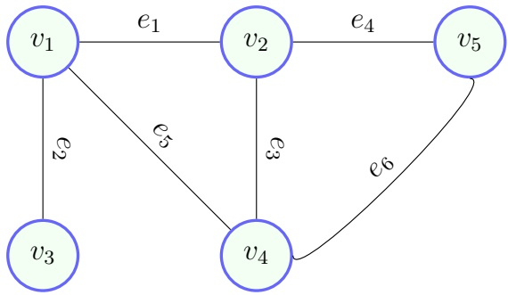

Hình 1.8: Minh họa đồ thị

Định nghĩa 3. Một đồ thị có hướng (directed graph) $G = ( V , E )$ gồm tập các đỉnh V và tập các cạnh E là các cặp có thứ tự của các phần tử thuộc V .

Đồ thị thường được dùng để thể hiện mối liên hệ giữa các đối tượng mà khó có thể biểu diễn bằng kiểu dữ liệu thông thường, ví dụ như mối tương quan giữa các người dùng trên mạng xã hội, liên kết mạng internet, sự lan truyền tin tức... Có khá nhiều bài toán gần đây cần sử dụng đồ thị để biểu diễn dữ liệu [51], [52], bao gồm:

• Phân tích dữ liệu mạng xã hội [53], [54] để nắm bắt được các xu hướng của cộng đồng hiện tại, các nhóm đối tượng khách hàng.

• Xây dựng các hệ thống gợi ý sản phẩm cho các trang web thương mại điện tử [15], [55] từ dữ liệu tương tác của người dùng.

• Phân tích mức độ ảnh hưởng của một người trong một cộng đồng để phục vụ bài toán giảm chi phí quảng bá sản phẩm mà vẫn thu được độ lan tỏa rộng.

• Phát hiện tin giả trên mạng xã hội dựa vào phân tích độ liên kết giữa các thực thể trong đồ thị [56].

• Phân tích sự tương tác ở cấp độ phân tử, nguyên tử nhằm mục đích phục vụ cho các vấn đề về y sinh học, ví dụ phân tích tác dụng phụ của thuốc.

Hình 1.9 minh họa một số bài toán sử dụng thông tin dưới dạng đồ thị.

Với dạng đồ thị cơ bản chúng ta quan tâm tới dạng vô hướng hay có hướng cùng trọng số cạnh. Tuy nhiên với các dạng đồ thị phức tạp hơn, chúng có thể có nhiều loại cạnh khác nhau nối giữa các đỉnh. Ví dụ như đồ thị thể hiện bản đồ giao thông

<!-- page: 32 -->

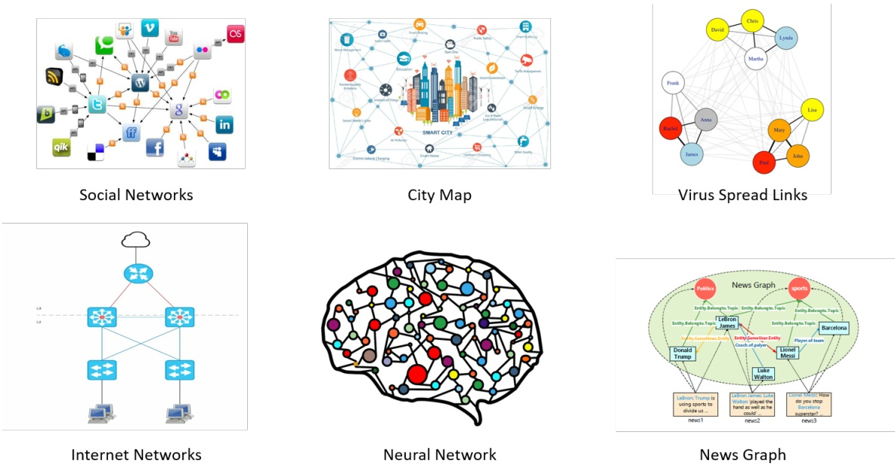

Hình 1.9: Một số bài toán sử dụng đồ thị

giữa các tỉnh bao gồm các loại phương tiện hàng không, đường bộ hay đường thủy... Đồ thị này được gọi là đồ thị đa quan hệ (multi-relational graphs) vì nó chứa nhiều tầng quan hệ khác nhau [57]. Với dạng đồ thị đa quan hệ, chúng ta cần thêm tham số để chỉ ra loại quan hệ (loại cạnh) giữa 2 đỉnh $( u , v )$ thông qua một hàm f nào đó sao cho $f(e) = (u,v)$ . Hình 1.10 minh họa đồ thị đa quan hệ.

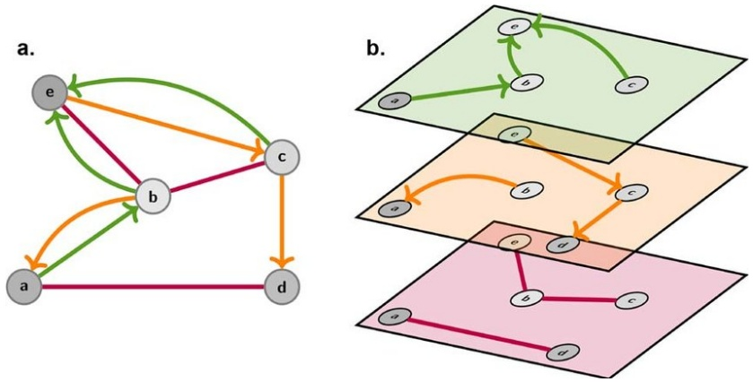

Hình 1.10: Minh họa đồ thị đa quan hệ

Định nghĩa 4. Một đồ thị đa quan hệ vô hướng $G = ( V , E )$ gồm tập các đỉnh V , một tập các cạnh E và một hàm f từ E tới $\{ \{ u , v \} | u , v \in V , u \neq v \}$ . Các cạnh $e _ { 1 }$ và $e _ { 2 }$ được gọi là cạnh song song hay cạnh bội nếu $f ( e _ { 1 } ) = f ( e _ { 2 } )$

Định nghĩa 5. Một đồ thị đa quan hệ có hướng $G = ( V , E )$ gồm tập các đỉnh V , một tập các cạnh E và một hàm f từ E tới $\{ \{ u , v \} | u , v \in V \}$ . Các cạnh $e _ { 1 }$ và $e _ { 2 }$ được gọi là cạnh song song hay cạnh bội nếu $f ( e _ { 1 } ) = f ( e _ { 2 } )$

<!-- page: 33 -->

Để thống nhất một số khái niệm khi ứng dụng đồ thị, tác giả đề xuất một số thuật ngữ cơ bản được sử dụng trong quá trình xây dựng các loại đồ thị từ danh sách các phiên làm việc của khách hàng để giải quyết hai bài toán của luận án.

Định nghĩa 6. (đỉnh kề) Hai đỉnh u và v trong một đồ thị vô hướng G được gọi là liền kề nếu {u, v} là một cạnh của đồ thị G. Nếu $e = \{ u , v \}$ thì e gọi là cạnh liên thuộc với các đỉnh u và v. Cạnh e còn được gọi là cạnh nối các đỉnh u và $v ,$ và các đỉnh u và v gọi là các điểm đầu mút của cạnh {u, v}.

Định nghĩa 7. Khi $e = \{ u , v \}$ là cạnh của đồ thị có hướng G thì u được gọi là đỉnh nối tới v và v được gọi là đỉnh được nối từ u. Đỉnh u gọi là đỉnh đầu, đỉnh v gọi là đỉnh cuối của cạnh $\{ u , v \}$

Định nghĩa 8. (bậc của đỉnh) Bậc của một đỉnh trong đồ thị vô hướng là số các cạnh liên thuộc với nó. Ký hiệu bậc của đỉnh v là deg(v).

Định nghĩa 9. Với đồ thị có hướng, bậc vào (incoming degree) của đỉnh v ký hiệu là deg−(v) là số các cạnh có đỉnh cuối là v. Bậc ra (outgoing degree) của đỉnh v ký hiệu là $d e g ^ { + } ( v )$ là số các cạnh có đỉnh đầu là v.

Định nghĩa 10. (đường đi) Một đường P đi từ đỉnh $v _ { 1 }$ tới đỉnh $v _ { k }$ là tập các đỉnh $\{ v _ { 1 } , v _ { 2 } , . . . , v _ { k } \}$ sao cho tồn tại $( v _ { i } , v _ { i + 1 } ) \in E , \forall i : 1 \leq i < k$ . Đường đi P có độ dài là $P ( v _ { 1 } , v _ { k } ) = k - 1$ do không tính đỉnh khởi đầu $v _ { 1 }$ , độ dài này cũng chính là số lượng cạnh chứa trong đường đi đó.

Lưu $\acute { \mathrm { y } }$ có thể tồn tại nhiều đường đi giữa hai đỉnh bất kỳ trong đồ thị và dài đường đi của từng phương án đi cũng có thể khác nhau trong cùng đồ thị đó.

## 1.4.2 Biểu diễn đồ thị

Có nhiều cách để biểu diễn đồ thị, các thuật toán có thể hoạt động tùy thuộc vào tính chất của đồ thị hoặc thuật toán áp dụng với đồ thị. Có hai cách phổ biến và dễ hiểu nhất là sử dụng danh sách kề và ma trận kề để biểu diễn đồ thị, các phương pháp này cho phép biểu diễn được cả đồ thị vô hướng, đồ thị có hướng và đồ thị có trọng số (weighted graph).

## a. Danh sách kề

Danh sách kề (adjacency list) là danh sách biểu diễn tất cả các cạnh của một đồ thị. Nếu đồ thị vô hướng, mỗi phần tử của danh sách là một cặp hai đỉnh là hai đầu của cạnh tương ứng. Nếu đồ thị có hướng, mỗi phần tử là một cặp có thứ tự gồm hai đỉnh là đỉnh đầu và đỉnh cuối của cung tương ứng.

Hình 1.11 minh họa cách biểu diễn đồ thị bằng danh sách kề

<!-- page: 34 -->

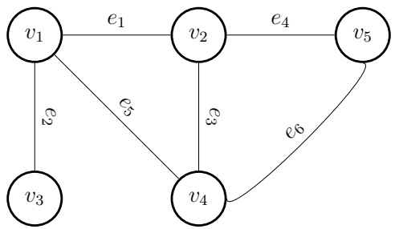

| Đỉnh | Các đỉnh kề |
| --- | --- |
| v<sub>1</sub> | v<sub>2</sub>,v<sub>3</sub>,v<sub>4</sub> |
| v<sub>2</sub> | v<sub>1</sub>,v<sub>4</sub>,v<sub>5</sub> |
| v<sub>3</sub> | v<sub>1</sub> |
| v<sub>4</sub> | v<sub>1</sub>,v<sub>2</sub>,v<sub>5</sub> |
| v<sub>5</sub> | v<sub>2</sub>,v<sub>4</sub> |

(a) Đồ thị minh họa

(b) Danh sách các đỉnh kề

Hình 1.11: Biểu diễn đồ thị bằng danh sách kề

## b. Ma trận kề

Khi biểu diễn đồ thị sử dụng danh sách kề thì việc xây dựng thuật toán có thể sẽ rất cồng kềnh nếu đồ thị có nhiều cạnh, để đơn giản hóa việc tính toán ta có thể biểu diễn đồ thị bằng ma trận kề (adjacency matrix ).

Giả sử $G = ( V , E )$ là một đồ thị đơn có n đỉnh, ta có thể biểu diễn đồ thị bằng một ma trận $A _ { G } = [ a _ { i j } ] \in \mathbb { R } ^ { n \times n }$ , ma trận này còn được gọi là ma trận kề:

$a _ { i j } = 1$ nếu $\{ v _ { i } , v _ { j } \} \in E .$

$a _ { i j } = 0$ nếu không có cạnh nối đỉnh $v _ { i }$ với đỉnh $v _ { j }$

• Quy ước $a _ { i i } = 0$ với $\forall _ { i }$

Với trường hợp biểu diễn đồ thị có trọng số, thì giá trị $a _ { i j } = w ( i , j )$ là trọng số của cạnh của hai đỉnh liền kề $v _ { i }$ nối tới $v _ { j }$ . Hình 1.12 minh họa việc sử dụng ma trận kề để biểu diễn các loại đồ thị khác nhau.

Với đồ thị vô hướng các cạnh sẽ không có trọng số. Ma trận kề biểu diễn đồ thị là ma trận đối xứng chứa các giá trị 0 và 1 để biểu diễn kết nối giữa các đỉnh trong đồ thị. Với đồ thị có hướng thì ma trận kề thể hiện trọng số của các kết nối giữa các đỉnh trong đồ thị.

## Ưu điểm của ma trận kề

• Đơn giản và trực quan dễ hiểu.

• Để kiểm tra hai đỉnh i và j có kề nhau hay không chỉ cần kiểm tra xem $a _ { i j } \neq 0$ với độ phức tạp O(1).

<!-- page: 35 -->

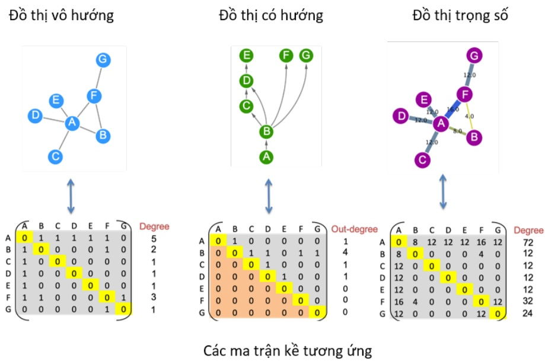

Hình 1.12: Biểu diễn đồ thị bằng ma trận kề

## Nhược của ma trận kề

• Luôn luôn tiêu tốn $N ^ { 2 }$ ô nhớ để lưu trữ ma trận kề, dù đồ thị ít cạnh hay nhiều cạnh.

• Khó khăn trong việc biểu diễn đồ thị với số lượng đỉnh lớn.

• Để kiểm tra xem đỉnh i kề với những đỉnh nào buộc phải duyệt toàn bộ các đỉnh j với điều kiện $a _ { i j } \neq 0$ . Độ phức tạp trong trường hợp này là O(n) kể cả tình huống đỉnh i không kề với bất kỳ đỉnh nào khác.

## 1.4.3 Mô hình mạng nơ-ron đồ thị

Mô hình mạng nơ-ron đồ thị được giới thiệu đầu tiên vào năm 2005 [51], GNN là một loại mạng nơ-ron hoạt động trực tiếp trên cấu trúc đồ thị. Với việc sử dụng nơ-ron như là các nút trong cấu trúc mạng, từng nút sẽ chứa thông tin của riêng nó và thu thập thêm các thông tin từ các nút lân cận thể hiện mối tương quan giữa chúng trong đồ thị. Các nút này sẽ được bố cục và kết hợp với nhau theo một kiến trúc mô hình cụ thể nào đó để từ đó đưa ra dự đoán hoặc phân loại kết quả.

Với hướng tiếp cận sử dụng đồ thị để biểu diễn mối quan hệ của dữ liệu, GNN ngày càng trở nên phổ biến trong nhiều lĩnh vực khác nhau [58], [59]. Tiềm năng của mô hình GNN cho thấy khả năng ứng dụng và xử lý được khá nhiều bài toán thực tế như xây dựng biểu đồ tri thức, đánh giá mối tương quan của mạng xã hội, hệ thống gợi ý bán hàng [60]... Sức mạnh của GNN trong việc mô hình hóa được mối quan hệ giữa các đỉnh trong đồ thị cho phép tạo ra bước đột phá trong lĩnh vực

<!-- page: 36 -->

nghiên cứu liên quan đến phân tích đồ thị. Thông thường cái bài toán GNN sẽ tập trung giải quyết một số vấn đề như sau [61]:

• Phân loại nút (Node classification): Ví dụ như các mạng xã hội nói chung hiện đang muốn phân loại nhóm người dùng của mình thành từng nhóm, kể cả việc phân loại người dùng thật với các con bots. Việc xây dựng được mô hình phân loại hàng triệu người dùng trong mạng sẽ tiết kiệm chi phí đáng kể khi đưa ra các chiến lược khác nhau cho từng nhóm người dùng trong mạng lưới [62]. Ngoài ra, còn có một số nghiên cứu liên quan về phân loại nút trong bài toán đánh giá các loại thuốc [63] hoặc phân loại chủ đề tài liệu dựa theo siêu liên kết hoặc các mạng liên kết theo mạng trích dẫn [64].

• Dự đoán kết nối (Link prediction): Đây là chủ đề khá phổ biến khi ứng dụng học máy vào bài toán dự đoán mối quan hệ giữa hai thực thể trong mạng lưới [65]. Ví dụ như gợi ý nội dung phù hợp cho người dùng mạng xã hội, gợi ý mua sản phẩm cho người mua hàng, hoặc dự báo tác dụng phụ của thuốc trong lĩnh vực y tế [66]. Đây chính là hướng nghiên cứu của luận án khi xây dựng mô hình gợi ý sản phẩm tiếp theo cho người dùng trong phiên làm việc.

• Phát hiện cụm (Clustering detection): Cả hai bài toán phân loại nút và dự đoán cạnh đều dựa vào dữ liệu có sẵn để học và suy luận ra phần còn thiếu của đồ thị, đây là dạng học có giám sát [67]. Tuy nhiên, bài toán phân cụm đồ thị lại là bài toán học không giám sát. Mục tiêu của bài toán này là tìm kiếm ra được một nhóm nút trong đồ thị có sự liên quan chặt chẽ với nhau. Ví dụ như tìm ra một nhóm người có cũng lĩnh vực nghiên cứu từ mạng lưới trích dẫn dưới dạng đồ thị (gọi là citation graph) của Google Scholar, hoặc tìm kiếm một nhóm người có yếu tố giả mạo trong mạng lưới người dùng thực hiện các giao dịch tài chính [68].

• Phân loại đồ thị (Graph classification): Khác với các bài toán trên là phân loại hoặc dự báo một thành phần nào đó (nút, cạnh hay đồ thị con) trên cùng một đồ thị, bài toán phân loại đồ thị phải học trên tập dữ liệu là nhiều đồ thị khác nhau để từ đó đưa ra một dự báo cho một đồ thị cụ thể nào đó. Thách thức của bài toán này là cần tìm ra các thuộc tính đặc trưng của đồ thị mà ít nhiều nó có sự khác biệt với các dạng dữ liệu quan hệ có cấu trúc mà chúng ta đã nghiên cứu nhiều năm gần đây [69], [70].

Scarselli và cộng sự (2009) [58] đề xuất sử dụng mô hình mạng GNN để xử lý vấn đề biến đổi véc-tơ sử dụng đồ thị. Sau đó, Li và cộng sự (2015) [71] đã đề xuất phiên bản cải tiến GNN sử dụng thêm các lớp mạng hồi quy RNN để nâng cao hiệu quả của phép biến đổi này. Kết quả cho thấy mô hình mạng GNN hoạt động khá hiệu

<!-- page: 37 -->

quả cho bài toán SR bởi vì GNN có thể tự động trích xuất được các thuộc tính của đồ thị phiên làm việc, đảm bảo thể hiện tốt các đặc tính của mối tương tác giữa các nút của đồ thị.

## 1.5 Phép biến đổi nhúng

## 1.5.1 Khái niệm phép biến đổi nhúng

Trong lĩnh vực học máy, phép biến đổi nhúng (embedding) là một kỹ thuật được sử dụng để biến đổi các dữ liệu thuộc tính rời rạc, chẳng hạn như từ hay danh mục, thành dạng các véc-tơ liên tục trong một không gian chiều thấp hơn [72]. Như vậy, phép biến đổi nhúng ánh xạ mỗi biến rời rạc thành một véc-tơ số thực, có thể được sử dụng làm đầu vào cho một mạng nơ-ron. Hình 1.13 minh họa mục tiêu của phép đổi nhúng.

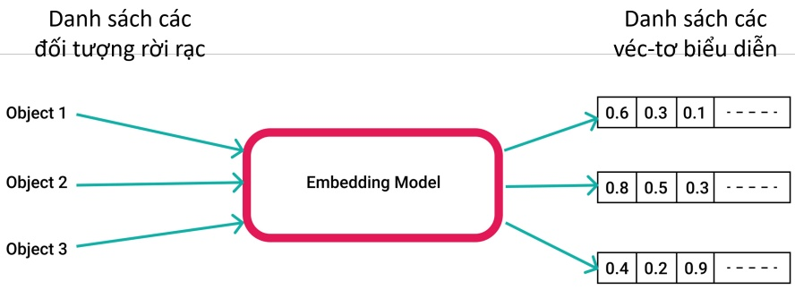

Hình 1.13: Minh họa một phép biến đổi nhúng

Phép biến đổi nhúng thường được học trong quá trình huấn luyện một mạng nơ-ron. Mục tiêu của phép biến đổi là tạo ra một biểu diễn của biến rời rạc mà ở không gian nhúng đó có thể nắm bắt được ý nghĩa hoặc ngữ cảnh của dữ liệu đó, điều này cho phép mạng nơ-ron phát hiện ra được cấu trúc cơ bản của dữ liệu và cải thiện hiệu suất mô hình dự đoán.

Các phép biến đổi nhúng có thể sử dụng với nhiều loại dữ liệu khác nhau ví dụ như dữ liệu rời rạc, văn bản, dữ liệu chuỗi thời gian (time series), hình ảnh hay đồ thị. Phần tiếp theo của luận án sẽ trình bày một số kỹ thuật nhúng được sử dụng trong các chương tiếp theo của luận án, bao gồm:

• Kỹ thuật nhúng dữ liệu có dạng rời rạc sử dụng cho mạng nơ-ron học sâu truyền thẳng được đề xuất trong chương 2 và chương 3.

• Kỹ thuật nhúng dữ liệu có dạng chuỗi tuần tự (ví dụ như câu văn bản) sử dụng cho mạng nơ-ron biến đổi được đề xuất trong chương 2, hoặc dữ liệu chuỗi thời gian sử dụng cho mạng nơ-ron hồi quy.

<!-- page: 38 -->

• Kỹ thuật nhúng dữ liệu có dạng đồ thị sử dụng cho mạng nơ-ron đồ thị được đề xuất trong chương 4.

## 1.5.2 Phép biến đổi nhúng với dữ liệu rời rạc

Hai loại dữ liệu phổ biến nhất là dữ liệu liên tục và rời rạc, được xếp vào dạng dữ liệu dạng bảng (tabular ) [73]. Dữ liệu liên tục được biểu diễn bởi các số thực, trong khi đó giá trị rời rạc như trường danh mục sản phẩm được biểu diễn bởi các nhãn chữ hoặc nhãn số. Thực tế việc đánh nhãn chỉ là cách biểu diễn thuận tiện cho bộ từ điển giá trị của một thuộc tính rời rạc nào đó, các nhãn này thực sự không mang giá trị có ích nào như các thuộc tính liên tục. Loại dữ liệu này được gọi là thuộc tính danh mục, chúng có thể có thứ tự hoặc không.

Điểm lưu ý là mô hình nơ-ron không phù hợp khi xử lý loại dữ liệu danh mục vì tính rời rạc của chúng [74], do đó các thuộc tính rời rạc cần phải được biến đổi sang dạng véc-tơ để thể hiện được tính liên tục trong miền giá trị của chúng. Các đối véc-tơ sau khi biến đổi sẽ giúp cải thiện khả năng học của các mô hình nơ-ron trong việc ghi nhớ sự tương quan giữa các giá trị rời rạc của từng thuộc tính cũng như mối tương tác giữa các thuộc tính. Phép biến đổi gồm hai bước như Hình 1.14.

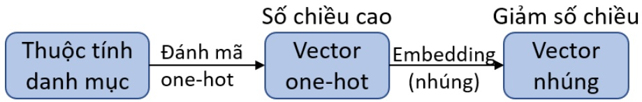

Hình 1.14: Biến đổi thuộc tính danh mục thành véc-tơ nhúng

Trước tiên từng giá trị của thuộc tính danh mục được đánh mã dưới dạng véc-tơ one-hot [0, ..., 1, ..., 0] [75], trong đó phần tử thứ i của véc-tơ sẽ bằng 1 để biểu diễn cho giá trị thứ i của thuộc tính đó, các phần tử còn lại của véc-tơ đều bằng 0. Véc-tơ one-hot vẫn rời rạc và có số chiều rất lớn nếu miền giá trị của thuộc tính đó lớn và gây tốn tài nguyên cho quá trình huấn luyện. Ngoài ra các các véc-tơ này vẫn rời rạc và không có tính tương quan với nhau.

Phép biến đổi nhúng thuộc tính (feature embedding) là kỹ thuật xây dựng véc-tơ đặc trưng cho một thuộc tính danh mục trong không gian đa chiều thuộc miền giá trị của nó [76]. Kỹ thuật này tìm cách biểu diễn và sắp xếp lại các phần tử có mức ảnh hưởng giống nhau ở gần nhau để (1) tìm ra tính liên tục của dữ liệu trong không gian nhúng, và (2) nắm bắt được mối quan hệ giữa các danh mục rời rạc của thuộc tính từ đó giúp mạng nơ-ron học sâu có thể học hiệu quả hơn. Với kỹ thuật này, véc-tơ nhúng sau khi biến đổi có số chiều thấp hơn và các thành phần của véc-tơ là số thực thay vì chỉ là giá trị 0 và 1 như véc-tơ one-hot.

<!-- page: 39 -->

Công thức nhúng dùng để biểu đổi véc-tơ one-hot thành véc-tơ nhúng như sau:

$$
X _ {d} = X _ {v} \times W ^ {d \times | V |}\tag{1.8}
$$

Trong đó

• V là tập các phân tử riêng biệt thuộc miền giá trị của thuộc tính danh mục cần biến đổi và |V | là số lượng các phần tử của tập V .

$X _ { v } ;$ là véc-tơ one-hot với số chiều là |V |, biểu diễn cho phần tử thứ v của thuộc tính danh mục thuộc tập V .

$X _ { d } ;$ là véc-tơ nhúng có số chiều là d, giá trị d được lựa chọn căn cứ theo mục tiêu của phép nhúng.

$W \in R ^ { d \times | V | }$ là ma trận trọng số.

Kỹ thuật nhúng thuộc tính rời rạc được nghiên cứu và đề xuất cho mạng nơ-ron rộng và sâu ở phần 1.3.2 của chương này.

## 1.5.3 Phép biến đổi nhúng với dữ liệu theo chuỗi tuần tự

Các mô hình mạng nơ-ron học sâu cơ bản (ví dụ như mạng nơ-ron truyền thẳng) có thể xử lý tốt dữ liệu dạng số và danh mục tuy nhiên nó lại không xử lý được các dạng dữ liệu chuỗi tuần tự (sequential data) ví dụ như dữ liệu chuỗi từ trong câu hoặc chuỗi thời gian. Như vậy, mô hình mạng nơ-ron khi xử lý văn bản không chỉ tính toán từng từ trong câu mà còn phải xem xét cách các từ đó xuất hiện theo thứ tự và liên quan đến nhau như thế nào. Ý nghĩa của các từ có thể thay đổi tùy thuộc vào các từ khác xuất hiện trước và sau chúng trong câu. Có hai mô hình mạng nơ-ron khá phổ biến trong việc xử lý được dữ liệu dạng chuỗi tuần tự là mạng nơ-ron hồi quy RNN [77] và mạng biến đổi (transformer network ).

## a. Chuỗi dữ liệu tuần tự dạng văn bản

Có ba kỹ thuật biến đổi kết hợp với phép nhúng như Hình 1.15 sử dụng mạng nơ-ron để xử lý dữ liệu chuỗi tuần tự:

• Vec2Seq là kỹ thuật biến đổi với đầu vào là một véc-tơ duy nhất, ví dụ như một hình ảnh, và tạo ra một chuỗi dữ liệu. Ví dụ như mô tả cho bức ảnh đó.

• Seq2Vec là kỹ thuật biến đổi nhúng một chuỗi dữ liệu tuần tự đầu vào. Ví dụ như một bài đăng trên mạng xã hội, và đưa ra một véc-tơ biểu diễn, chẳng hạn như lượng hóa tính cảm xúc của bài đăng.

<!-- page: 40 -->

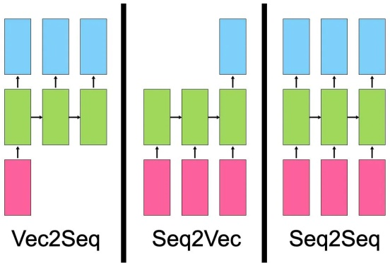

Hình 1.15: Các kỹ thuật xử lý dữ liệu chuỗi dữ liệu tuần tự cho mạng nơ-ron

• Seq2Seq là kỹ thuật kết hợp nhiều phép nhúng để biến đổi một chuỗi đầu vào. Ví dụ như một câu tiếng Việt, thành một chuỗi đầu ra khác, ví dụ như dịch sang tiếng Anh của câu đó.

Kỹ thuật Seq2Seq kết hợp phép nhúng sử dụng lớp tự chú ý (self attention) với mô hình nơ-ron cải tiến dựa trên mạng biến đổi được nghiên cứu và đề xuất ở phần 1.3.3 của chương này.

## b. Chuỗi dữ liệu tuần tự dạng thời gian

Dữ liệu chuỗi thời gian cũng khá phổ biến ví dụ như bảng giá chứng khoán, tín hiệu điện tâm đồ hay phức tạp hơn khi thu thập tín hiệu đa biến (multivariate time series) từ các thiết bị IoT hay điện thoại thông minh. Với dạng dữ liệu chuỗi thời gian này thì cần các mô hình mạng nơ-ron phù hợp hơn ví dụ như mạng nơ-ron tích chập CNN [78] hoặc mạng nơ-ron hồi quy RNN [79], [80].

Đặc biệt khi cần phải làm việc với dữ liệu chuỗi thời gian đa biến, kỹ thuật phân tích thành phần chính PCA (Principal Component Analysis), dù không hoàn toàn được tính là một kỹ thuật nhúng, là một phương pháp rất phổ biến [81] để thực hiện việc phân tích và giảm chiều dữ liệu đa biến này.

PCA hoạt động bằng cách chiếu dữ liệu từ không gian có số chiều cao vào một không gian có chiều thấp hơn, đồng thời tối đa hóa phương sai của dữ liệu được chiếu. Kết quả chiếu được coi như là một biểu diễn của dữ liệu gốc trong một không gian chiều thấp hơn trong khi vẫn giữ được càng nhiều thông tin gốc càng tốt. PCA thường được sử dụng như một bước tiền xử lý dữ liệu bởi vì nó có thể giảm độ phức tạp tính toán của các thuật toán tiếp theo và giúp giảm thiểu hiện tượng số chiều đặc trưng quá lớn (curse of dimensionality). PCA cũng có thể được sử dụng cho mục đích trực quan hóa, vì nó có thể giúp phát hiện cấu trúc cơ bản của dữ liệu chiều cao trong một không gian chiều thấp hơn.

<!-- page: 41 -->

## 1.5.4 Phép biến đổi nhúng với dữ liệu đồ thị

Kỹ thuật nhúng với dữ liệu đồ thị, gọi là phép nhúng đồ thị, là một kỹ thuật cho phép biểu diễn một đồ thị dưới dạng các véc-tơ có số chiều cao. Điều này cho phép sử dụng các thuật toán học máy hoặc mạng nơ-ron phù hợp để xử lý và phân tích các thông tin trong đồ thị, chẳng hạn như phân loại nút, dự đoán liên kết và phân cụm đồ thị.

Có nhiều cách thực hiện phép nhúng đồ thị, ví dụ như phương pháp random walk [82], deep walk [83], phân tích ma trận (matrix factorization) [84] và một số phương pháp khác dựa trên mạng nơ-ron học sâu [85], [86]. Các phương pháp này sử dụng các thuật toán khác nhau để tìm ra các véc-tơ biểu diễn cho các đỉnh và cạnh trong đồ thị. Kết quả của phép nhúng đồ thị có rất nhiều ứng dụng trong thực tế, ví dụ như phân tích mạng xã hội hay xây dựng hệ thống gợi ý. Ví dụ, nó có thể được sử dụng để phân cụm các người dùng tương tự trong mạng xã hội hoặc để đề xuất các sản phẩm tương tự cho khách hàng trong quá trình mua hàng.

Kỹ thuật nhúng đồ thị được nghiên cứu và đề xuất trong Chương 4.

## 1.6 Các nghiên cứu liên quan

Bài toán gợi ý trong lĩnh vực thương mại điện tử không phải là vấn đề mới, ngay từ những năm 2000 JB Schafer và đồng nghiệp [15] đã nêu ra vấn đề này để tìm cách nâng cao khả năng bán kèm và bán chéo sản phẩm cho các website bán hàng thời đó. Thuật toán được gợi ý là sử dụng các thông tin trong quá khứ cũng như sở thích cá nhân của khách hàng đề để xuất sản phẩm cần bán. Sau đó, nhóm tác giả này tiếp tục cải thiện mô hình gợi ý với ý tưởng sử dụng dữ liệu tri thức và sự tương quan giữa các sản phẩm hay giữa các người dùng để phân tích hành vi khách hàng [1]. Một số hệ thống thương mại điện tử thời đó như amazon hay ebay đã sử dụng mô hình gợi ý dạng này.

Badrul M. Sarwar và đồng nghiệp (2000) [87] nhận thấy các hệ thống gợi ý đang phải xử lý khối lượng thông tin khổng lồ về sản phẩm, khách hàng và đơn hàng đã gây ra một số thách thức trong việc đưa ra gợi ý. Nhóm tác giả gợi ý một trong những thuật toán phổ biến trong việc phân tích ma trận có tên gọi là SVD (Singular Value Decomposition) với mục tiêu giảm số chiều thông tin để tăng tốc độ xử lý của hệ thống gợi ý. Nghiên cứu này cũng đưa ra khái niệm danh mục sản phẩm có khả năng lựa chọn cao nhất, gọi là danh sách ”top k” của mô hình gợi ý. Năm 2002, nhóm tác giả này tiếp tục gợi ý sử dụng thuật toán người láng giềng (neighborhood) [88] để phân nhóm khác hàng từ đó xây dựng mô hình gợi ý sử dụng bộ lọc cộng tác.

<!-- page: 42 -->

Năm 2004, Zan Huang và đồng nghiệp [89] đưa khái niệm đồ thị vào bài toán gợi $\acute { \mathrm { y } }$ trong lĩnh vực thương mại điện tử. Nhóm tác giả gợi ý đồ thị đa quan hệ có hướng gồm hai lớp: lớp sản phẩm và lớp khách hàng. Mối quan hệ giữa hai lớp thể hiện thông tin mua sắm trong quá khứ thông qua trọng số của đồ thị. Mô hình đồ thị được thực nghiệm với cả ba kỹ thuật gợi ý gồm sử dụng bộ lọc cộng tác, dựa vào nội dung và hướng kết hợp. Kết quả cho thấy mô hình này hoạt động tốt nhất với kỹ thuật kết hợp.

Năm 2006, Netflix tổ chức cuộc thi tìm kiếm giải thuật gợi ý tốt nhất nhằm dự đoán điểm đánh giá của người dùng cho các bộ phim của họ dựa vào các đánh giá trước đây mà không sử dụng thêm thông tin gì về người dùng hay bộ phim, đây là bài toán gợi ý với bộ lọc cộng tác. Yehuda Koren, Robert Bell và Chris Volinsky là thành viên đội thắng cuộc năm 2019 [16] trình bày mô hình phân tích ma trận thành nhân tử (matrix factorization) hoạt động tốt hơn các thuật toán của đối thủ khác như thuật toán SVD hoặc người láng giềng. Mô hình phân tích ma trận thành nhân tử tìm cách phân rã hai véc tơ đại diện cho người dùng $\left( p _ { u } \right)$ và bộ phim (q<sub>i</sub>) (còn được gọi là véc tơ nhân tử, factor vector ) vào một không gian nhân tử riêng (joint-latent-factor space). Vấn đề cần giải quyết của mô hình là làm sao có thể huấn luyện được véc tơ nhân tử $p _ { u }$ và $q _ { i }$ với sai số lỗi trung bình bình phương (root-mean-square error, RMSE) là nhỏ nhất.

Balázs Hidasi và đồng nghiệp (2015) [90] đưa ra mô hình mạng nơ-ron hồi quy (Recurrent Neural Network, RNN ) trong việc xây dựng hệ gợi ý. Hướng tiếp cận của nghiên cứu này tập trung vào những phiên làm việc ngắn và hiện tại để đưa ra gợi ý cho người dùng, đó là khái niệm hệ gợi ý dựa vào phiên làm việc. Mô hình này sử dụng thuật toán RNN phân cấp (Hierarchical RNN ) để tìm ra các đặc trưng ẩn trong phiên làm việc hiện tại của người dùng từ đó đưa ra gợi ý cho sản phẩm tiếp theo. Thuật toán RNN rất phù hợp với bài toán khi xử lý chuỗi dữ liệu tuần tự, ví dụ như chuỗi nhấp chuột của người dùng trong phiên làm việc khi lựa chọn sản phẩm. Nghiên cứu cho thấy mô hình RNN với biến thể HRNN hoạt động tốt hơn so với các mô hình truyền thống cũng như mô hình RNN cơ sở.

Kế thừa nghiên cứu của Hidasi, Yong Kiam Tan và đồng nghiệp (2016) [91] đã gợi ý cải tiến mô hình RNN với thuật toán xử lý dữ liệu làm việc theo phiên phù hợp hơn cho mô hình RNN. Tan cũng sử dụng chung bộ dữ liệu của Hidasi nhưng đã thực nghiệm đa dạng hơn để phân tích mức độ hiệu quả của việc xử lý dữ liệu phiên làm việc với mô hình RNN. Kết quả cho thấy nghiên cứu của Tan cho kết quả tốt hơn và thuật toán xử lý dữ liệu được sử dụng tham chiếu trong một số nghiên cứu tiếp theo về bài toán này [92]–[94]

Với sự ra đời của mô hình mạng mạng nơ-ron học rộng và sâu do Google phát

<!-- page: 43 -->

triển năm 2016, Cheng và đồng nghiệp [45] cũng áp dụng mô hình này trong việc cải thiện tính tương tác giữa các thuộc tính ở cả mức cao và mức thấp. Hệ gợi ý sử dụng mô hình mạng nơ-ron học rộng và sâu có thể tìm ra được các đặc tính ẩn tốt hơn do nó vừa có tính tổng quát hóa của mô hình học rộng vừa có tính ghi nhớ của mô hình học sâu.

Jing Li và đồng nghiệp (2017) [95] đưa ra mô hình gợi ý dựa trên phiên bằng việc sử dụng cơ chế nhận thức nơ-ron (neural attention) với mục tiêu nắm bắt các mẫu hành vi có tính tuần tự và sở thích người dùng trong phiên để đưa ra gợi ý chính xác. Mô hình gợi ý sử dụng một cơ chế chú ý để tập trung vào các sản phẩm có liên quan trong phiên, xem xét sự quan trọng của chúng trong quá trình gợi ý. Mô hình tận dụng mạng nơ-ron tái phát (RNNs) để nắm bắt các mối quan hệ phức tạp trong chuỗi dữ liệu các phiên người dùng. Kiến trúc mô hình bao gồm hai thành phần chính: Bộ mã hóa Phiên và Bộ gợi ý dựa trên Chú ý. Bộ mã hóa Phiên xử lý lịch sử phiên bằng cách sử dụng một RNN, mã hóa thông tin tuần tự thành biểu diễn phiên. Bộ gợi ý dựa trên Chú ý kết hợp một cơ chế chú ý để gán trọng số động cho các biểu diễn phiên, nhấn mạnh các mục ảnh hưởng trong quá trình gợi ý.

Shu Wu và đồng nghiệp (2019) [94] sử dụng mô hình mạng học nơ-ron đồ thị cùng khá nhiều kỹ thuật xử lý đồ thị và các biến thể khác nhau của GNN để phân tích bài toán gợi ý dựa vào phiên làm việc, mô hình có tên gọi SR-GNN. Mô hình gợi ý bao gồm biểu diễn các phiên người dùng dưới dạng đồ thị, trong đó các mục trong một phiên được coi như các đỉnh và tương tác giữa chúng là các cạnh. GNNs được sử dụng để học biểu diễn ý nghĩa của các đồ thị phiên và đưa ra gợi ý cá nhân dựa trên các nhúng đã học. Kiến trúc mô hình bao gồm hai thành phần chính: xây dựng đồ thị phiên và mạng nơ-ron đồ thị. Trong bước 1, một đồ thị phiên được xây dựng bằng cách kết nối các sản phẩm trong phiên dựa trên thứ tự tuần tự của chúng. Thành phần mạng nơ-ron dồ thị xử lý đồ thị phiên và liên tục cập nhật véc-tơ nhúng đỉnh bằng cách xem xét đồng thời thông tin sản phẩm kề cục bộ trong phiên và cản ngữ cảnh của phiên toàn cục.

Liu và đồng nghiệp (2020) [96] giới thiệu mạng tự chú ý theo ngữ cảnh sử dụng đồ thị với tên gọi GCSAN (Graph Contextualized Self-Attention Network ) cho hệ thống gợi ý dựa trên phiên. Mô hình sử dụng cơ chế chú ý tự động để nắm bắt các mối quan hệ toàn cục và cục bộ trong các phiên người dùng biểu diễn dưới dạng đồ thị. Bằng cách kết hợp thông tin theo ngữ cảnh biểu diễn dưới dạng đồ thị, mô hình GCSAN nâng cao hiệu suất gợi ý bằng cách mô hình hóa hiệu quả các mối quan hệ phức tạp giữa các sản phẩm trong một phiên. Anjing Luo và đồng nghiệp (2020) [97] cũng gợi ý mô hình mạng tự chú ý theo hướng cộng tác với tên gọi CoSAN (Collaborative Self-Attention Network ) để xây dựng mô hình gợi ý dựa theo

<!-- page: 44 -->

phiên. CoSAN sử dụng hướng tiếp cận người hàng xóm để tìm các phiên chứa các sản phẩm sẵn có trong hiện tại với phiên hiện tại. Với từng phiên có sự liên quan tới thành phần trong phiên hiện tại sẽ được nhúng với thành phần đó để tạo ra một phiên đặc trưng đề xây dựng mô hình dự báo.

Tajuddeen và đồng nghiệp (2022) [98] cho rằng mô hình RNN không còn phù hợp với hệ gợi ý dựa vào phiên làm việc do sự tương tác giữa các sản phẩm trong phiên làm việc vừa có tính tuần tự vừa có tính ngẫu nhiên. Với góc nhìn đó, Tajuddeen và đồng nghiệp cũng gợi ý mô hình GRASER sử dụng kiến trúc đồ thị GNN để giải quyết bài toán này.

Huanwen Wang và đồng nghiệp (2023) [99] gợi ý kết hợp kiến trúc GNN với mô hình biến đổi Transformer để phát triển mô hình IGT (Interval-enhanced Graph Transformer ) trong việc xây dựng hệ gợi ý dựa vào phiên làm việc. Mô hình IGT ngoài việc xử lý mối quan hệ giữa các sản phẩm trong phiên, nó còn tính tới cả yếu tố thời điểm sản phẩm đó được lựa chọn, từ đó thực hiện phép biến đổi nhúng để xây dựng đối tượng phiên đặc trưng và gợi ý lựa chọn nhấp chuột tiếp theo của khách hàng.

<!-- page: 45 -->

# Chương 2|Đề xuất mô hình mạng nơ- ron học sâu cho bài toán mua hàng

Chương 2 trình bày phương pháp tiếp cận giải Bài toán 1, đây là bài toán nhị phân dự báo khách hàng có mua hàng trong trong phiên làm việc hiện tại hay không. Chương này đề xuất sử dụng hai mạng nơ-ron học sâu, gồm mạng nơ-ron rộng & sâu và mạng nơ-ron biến đổi, để học dữ liệu dạng chuỗi biểu diễn thông tin phiên làm việc của khách hàng. Chương này đề xuất một số phép nhúng cơ bản để biến đổi dữ liệu rời rạc sang dạng véc-tơ phù hợp với dữ liệu đầu vào cho các mạng nơ-ron học sâu.

Các đề xuất và kết quả của chương này được công bố tại công trình [A-1], [A-2] và [A-7] trong Phần 4.6 ”Danh mục các công trình công bố của luận án”.

## 2.1 Phát biểu bài toán

Giả sử tập dữ liệu huấn luyện bao gồm n mẫu (X , y), trong đó X là chuỗi dữ liệu được ghi nhận với m trường thuộc tính liên quan tới khách hàng và sản phẩm, và $y   \in   ( 0 , 1 )$ là nhãn tương ứng với hành vi mua của khách hàng $( y   =   1$ nếu khách hàng mua sản phẩm, và $y = 0$ trong trường hợp ngược lại).

Các trường thuộc tính trong X có thể là dạng danh mục (ví dụ nhóm sản phẩm...) và dạng số (ví dụ số lần nhấp chuột...). Các trường dạng số được biểu diễn bởi giá trị của chính nó, tuy nhiên các thuộc tính dạng danh mục cần thực hiện phép biến đổi nào đó để biểu diễn dưới dạng véc-tơ. Do đó, mỗi mẫu trong tập dữ liệu được chuyển đổi thành một điểm $( x , y )$ trong đó $x   =   \{ x _ { 1 } , x _ { 2 } , . . . , x _ { m } \}$ là một véc-tơ m chiều với $x _ { j }$ là vec-tơ biểu diễn của trường thông tin thứ j trong X . Thông thường, x có số chiều không gian lớn và mật độ rất thưa.

Như vậy, Bài toán 1 là xây dựng mô hình dự báo $y \approx { \hat { y } } = f ( x )$ nhằm ước tính xác suất của người dùng có mua hàng dựa vào chuỗi dữ liệu đầu vào hay không.

<!-- page: 46 -->

## 2.2 Các mô hình đề xuất

## 2.2.1 Mạng nơ-ron học rộng và sâu

Mô hình mạng học rộng và sâu được đề xuất với thiết kế kiến trúc như sau:

• Phần Rộng: gồm 2 lớp truyền thẳng, với lớp đầu ra có một nơ-ron và lớp đầu vào có số nơ-ron xác định bằng: $N = N _ { c a t } + N _ { n u m }$ , trong đó, N là số nơ-ron của lớp đầu vào, $N _ { c a t }$ là số trường thuộc tính dạng danh mục và $N _ { n u m }$ là số cặp tương tác chéo của các trường thuộc tính dạng danh mục.

• Phần Sâu: gồm 6 lớp truyền thẳng, trong đó có 1 lớp đầu vào với số nơ-ron bằng số trường thuộc tính, 1 lớp nhúng, 3 lớp ẩn với số nơ-ron lần lượt được lấy bằng 400 − 400 − 400 và 1 lớp đầu ra với 1 nơ-ron. Các nơ-ron ẩn sử dụng hàm kích hoạt ReLU, nơ-ron đầu ra sử dụng hàm kích hoạt sigmoid.

## a. Đánh giá, lựa chọn cấu trúc mạng nơ-ron

Trong phần này này, tác giả tiến hành đánh giá tác động của các cấu trúc mạng khác nhau lên mô hình dự báo thông qua phương pháp thử sai. Các yếu tố được đánh giá bao gồm: (1) số lượng lớp ẩn; (2) hình dạng mạng nơ-ron học sâu; và (3) số lượng nơ-ron trong lớp ẩn. Từ kết quả thử nghiệm và đánh giá với 3 yếu tố này, nghiên cứu sử dụng mạng học sâu với 3 lớp ẩn có số nơ-ron lần lượt là 500-400-300 để xây dựng mô hình dự báo mua hàng.

## Số lượng lớp ẩn

Trong trường hợp các thông số của mạng học không đổi, việc tăng số lượng lớp ẩn làm gia tăng mức độ phức tạp của mạng. Như kết quả thể hiện trong Hình 2.1, việc gia tăng số lớp ẩn từ 1 đến 3 giúp cải thiện khả năng học của mô hình. Tuy nhiên khi số lớp ẩn tăng thêm, mô hình hoạt động kém hiệu quả hơn do mạng phức tạp thường dẫn đến “học quá”. Dựa vào kết quả thu được như ở Hình 2.1 nghiên cứu sử dụng mạng học sâu có 3 lớp ẩn.

## Hình dạng mạng nơ-ron học sâu

Nghiên cứu tiến hành thử nghiệm khả năng của mô hình với các hình dạng mạng học sâu khác nhau: mạng cân bằng, mạng tăng, mạng giảm và mạng hình thoi. Khi thay đổi hình dạng của mạng, tổng số nơ-ron và số lớp ẩn được giữ nguyên. Cụ thể, với 3 lớp ẩn và tổng số nơ-ron ẩn là 1200, số lượng nơ-ron trong các lớp ẩn của 4 mạng lần lượt là: mạng cân bằng: 400-400-400, mạng tăng: 300-400-500, mạng giảm: 500-400-300, mạng hình thoi: 350-500-350. Như kết quả thể hiện trong

<!-- page: 47 -->

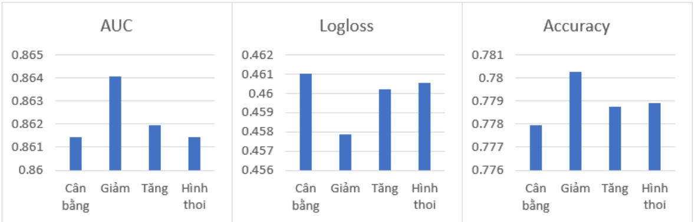

Hình 2.2: So sánh hiệu năng mô hình khi thay đổi hình dạng mạng nơ-ron

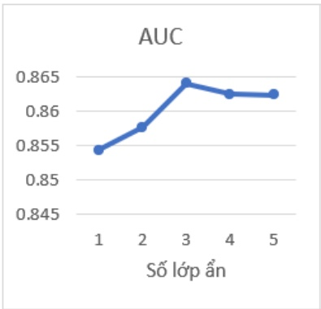

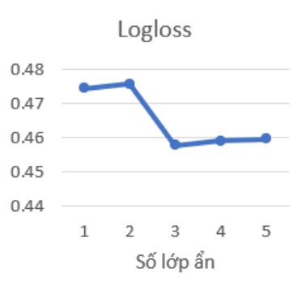

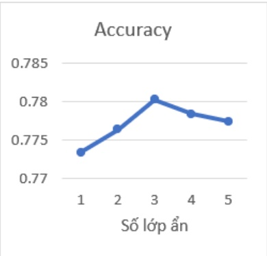

Hình 2.1: So sánh hiệu năng mô hình khi thay đổi số lớp ẩn

Hình 2.2, mạng nơ-ron giảm cho kết quả tốt hơn so với các mạng có hình dạng còn lại, do đó sẽ được sử dụng để tiếp tục tiến hành đánh giá.

## Số lượng nơ-ron trong lớp ẩn

Tương tự với việc gia tăng số lớp ẩn, việc gia tăng số lượng nơ-ron làm tăng độ phức tạp của mạng. Như kết quả thể hiện trong Hình 2.3, khi số lượng nơ-ron trung bình trong mỗi lớp ẩn tăng từ 200 đến 400, khả năng học của mô hình được gia tăng, tuy nhiên khi tiếp tục tăng số nơ-ron từ 400 lên 700, hiệu quả của mô hình có xu hướng giảm dần. Như vậy gia tăng số lượng nơ-ron không làm gia tăng hiệu quả của mô hình do số lượng nơ-ron quá lớn sẽ khiến mạng bị học quá.

## b. Bổ sung thuộc tính biến đổi chéo

Ngoài 26 thuộc tính này, thực nghiệm chương này cũng đánh giá các tương tác ẩn trong các trường thuộc tính khác nhau thông qua phép biến đổi tích chéo. Trong đó, các thuộc tính dạng danh mục được chuyển đổi về dạng véc-tơ nhúng có cùng số chiều, sau đó được nhân chéo với nhau, kết quả tạo ra một véc-tơ mới với số chiều tương ứng thể hiện tương tác cộng gộp của các thuộc tính riêng lẻ tới biến dự báo.

<!-- page: 48 -->

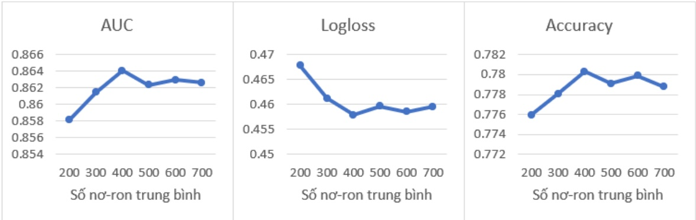

Hình 2.3: So sánh hiệu năng mô hình khi thay đổi hình số nơ-ron trung bình trong mỗi lớp ẩn

Các cặp tích chéo được lựa chọn thông qua phương pháp thử dần, lần lượt từng véc-tơ tích chéo được đưa vào mô hình, véc-tơ làm tăng khả năng chính xác của mô hình được giữ lại và ngược lại. Kết quả chọn ra được 4 cặp tích chéo sau:

• ID sản phẩm hiện tại × ID sản phẩm đầu tiên trong phiên.

• ID sản phẩm hiện tại × ID sản phẩm liền kề phía trước.

• ID sản phẩm hiện tại × ID danh mục sản phẩm.

• ID sản phẩm được xem lâu nhất trong phiên × thời gian xem sản phẩm.

Các thuộc tính biến đổi tích chéo này được đưa vào nhánh rộng của mô hình đề xuất.

## c. Mô hình mạng nơ-ron rộng và sâu đề xuất

Dựa trên cơ sở lựa chọn mạng nơ-ron đã trình bày như trên, nghiên cứu tiến hành dự báo thử nghiệm với cấu trúc mô hình được sử dụng thể hiện ở Hình 2.4.

Mô hình mạng đề xuất này có các điểm cải tiến như sau:

• Đề xuất sử dụng phép nhúng với các thuộc tính dạng danh mục và liên kết dữ liệu với các thuộc tính còn lại nhằm tạo ra một véc-tơ nhúng đặc trưng cho phiên làm việc.

• Xây dựng kiến trúc mạng với một số lớp nơ-ron ở nhánh học sâu (nhánh FNN).

• Thực hiện phép biến đổi tích chéo giữa một số cặp thuộc tính nhằm tìm ra các tương tác ẩn của các trường thuộc tính.

Việc kết hợp đồng thời hai kỹ thuật học sâu và rộng giúp cho mô hình dự báo được chính xác hơn so với các mô hình chỉ sử dụng một kỹ thuật.

<!-- page: 49 -->

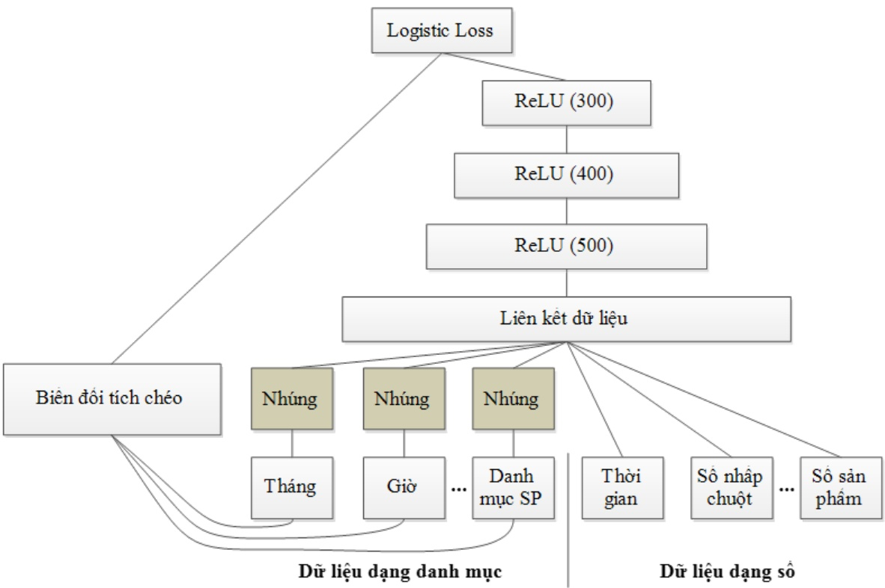

Hình 2.4: Cấu trúc mô hình rộng và sâu sử dụng trong dự báo chuỗi nhấp chuột

## 2.2.2 Mạng nơ-ron biến đổi

Như đã phân tích ở phần nghiên cứu, kiến trúc Transformer được thiết kế đặc biệt để giải quyết một số hạn chế của các mô hình mạng nơ-ron RNN trước đây cho các tác vụ xử lý dữ liệu dạng chuỗi, ví dụ như dịch máy và mô hình ngôn ngữ. Tuy nhiên độ hiệu quả của mô hình Transformer trên các kiểu dữ liệu khác đặc biệt là dữ liệu dạng bảng không đem lại kết quả khả quan. Do đó cần đề xuất thêm một lớp biến đổi dữ liệu đầu vào dưới dạng bảng thành một dạng dữ liệu phù hợp hơn cho mô hình Transformer [100]. Cũng tương tự như thực nghiệm với mô hình mạng nơ-ron sâu và rộng, tác giả đề xuất phép biến đổi nhúng nhằm chuyển đổi tất cả các thuộc tính gồm cả dạng số và danh mục rời rạc thành các véc-tơ nhúng để từ đó áp dụng một chuỗi các lớp Transformer cho các véc-tơ nhúng đó. Do đó, mỗi lớp Transformer có khả năng học được các đặc trưng riêng biệt trong bộ dữ liệu.

Tác giả nghiên cứu đề xuất một kiến trúc Transformer cải tiến bằng cách bổ sung lớp nhúng thuộc tính giúp mô hình huấn luyện làm việc tối ưu hơn trên dữ liệu dạng bảng như được mô tả ở Hình 2.5, gọi là mô hình FE-Transformer. Mô hình này đề xuất thêm lớp nhúng nhằm biến đổi tất cả các thuộc tính gồm cả dạng số và danh mục rời rạc thành các véc-tơ nhúng, các bước sau sẽ áp dụng một chuỗi các lớp Transformer cho các véc-tơ nhúng đó. Do đó, mỗi lớp Transformer có khả năng học được các đặc trưng riêng biệt trong bộ dữ liệu.

<!-- page: 50 -->

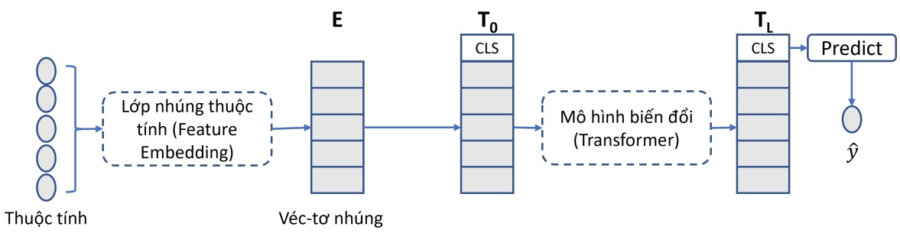

Hình 2.5: Kiến trúc FE-Transformer

Thiết kế chi tiết của hai thành phần của kiến trúc FE-Transformer được biểu diễn như ở Hình 2.6:

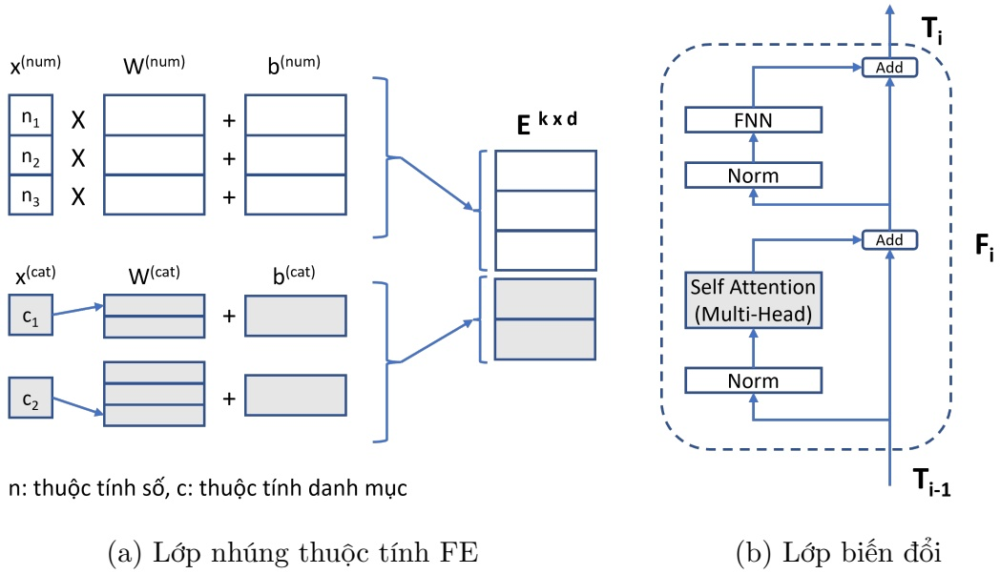

Hình 2.6: Thiết kế lớp cho mô hình FE-Transformer

## Lớp nhúng thuộc tính (FE)

Lớp nhúng thuộc tính biến đổi các đặc trưng đầu vào x dựa trên các phép nhúng $E \in \mathbb { R } ^ { k \times d }$ , trong đó k là số lượng thuộc tính đầu vào và d là độ dài véc-tơ nhúng. Quá trình nhúng các thuộc tính $x _ { j }$ được tính như Công thức 2.1

$$
E _ {j} = f _ {j} \left(x _ {j}\right) + b _ {j} \quad f _ {j}: \mathbb {X} _ {j} \to \mathbb {R} ^ {d}\tag{2.1}
$$

Trong đó $f _ { j } ^ { \mathrm { ( n u m ) } }$ được thực hiện dưới dạng nhân các véc-tơ $W _ { j } ^ { ( n u m ) } \in \mathbb { R } ^ { d }$ và $f _ { j } ^ { \mathrm { ( c a t ) } }$ được thực hiện dưới dạng bảng tra cứu $W _ { j } ^ { ( \mathrm { c a t } ) } \in \mathbb { R } ^ { S _ { j } \times d }$ cho các thuộc tính danh mục rời rạc, và $S _ { j }$ là thành phần thứ $j$ của tập danh mục S.

<!-- page: 51 -->

Công thức tổng quan:

$$
E _ {j} ^ {(n u m)} = x _ {j} ^ {(n u m)} \cdot W _ {j} ^ {(n u m)} + b _ {j} ^ {(n u m)}\tag{2.2}
$$

$$
E _ {j} ^ {(c a t)} = e _ {j} ^ {T} \cdot W _ {j} ^ {(c a t)} + b _ {j} ^ {(\mathrm{cat})}\tag{2.3}
$$

$$
E = \mathrm{stack} \left[ E _ {1} ^ {(\mathrm{num})}, \dots , E _ {k ^ {(n u m)}} ^ {(\mathrm{num})}, E _ {1} ^ {(c a t)}, \dots , E _ {k ^ {(c a t)}} ^ {(c a t)}\right) \in \mathbb {R} ^ {k \times d}\tag{2.4}
$$

Trong đó $e _ { j } ^ { T }$ là một véc-tơ one-hot cho các đặc trưng phân loại tương ứng và $k = k ^ { ( n u m ) } + \dot { k } ^ { ( c a t ) }$

## Lớp biến đổi (Transformer)

Ở bước này, các thuộc tính sau khi nhúng sẽ được thêm vào véc-tơ E. Trước khi đưa vào khối Transformer để học, véc-tơ nhúng E được xếp chồng với một mã phân loại đầu ra đặc biệt gọi là [CLS]. [CLS] được nhúng riêng để được truyền vào các lớp Transformer gồm $F _ { 1 } , . . . , F _ { L }$ để tính toán.

$$
T _ {0} = \mathrm{stack} [ [ \mathrm{CLS} ], E ]\tag{2.5}
$$

$$
T _ {i} = F _ {i} \left(T _ {i - 1}\right)\tag{2.6}
$$

Khối Transformer được đặc trưng bởi lớp chuẩn hóa Norm áp dụng trước các lớp tự chú ý (Multi-Head Self-Attention) và lớp nơ-ron truyền thẳng (Feed Forward), ttham khảo Hình 2.6b. Kết quả dự báo của mô hình được tính toán dựa theo các mã phân loại [CLS] được biểu diễn theo Công thức 2.7:

$$
\hat {y} = \text {Linear} \left(\text {ReLU} \left(\text {LayerNorm} \left(T _ {L} ^ {[ C L S ]}\right)\right)\right)\tag{2.7}
$$

## 2.3 Kỹ thuật thực nghiệm

## 2.3.1 Bộ dữ liệu thực nghiệm

Phần thực nghiệm này sử dụng bộ dữ liệu cung cấp bởi Yoochoose GmbH được mô tả chi tiết tại Phụ lục A. Thực nghiệm sử dụng đủ cả 3 tập dữ liệu gồm tập dữ liệu huấn luyện, tập kiểm tra và tập dữ liệu nhãn dự báo có mua hàng không.

<!-- page: 52 -->

Một điểm lưu $\acute { \mathrm { y } }$ trong quá trình định dạng dữ liệu đầu vào cho mô hình học sâu của Bài toán 1 cần đáp ứng được khả năng trả lời hai câu hỏi: (1) dự báo người dùng có mua hàng trong phiên này không; và (2) nếu có, dự báo mặt hàng nào sẽ được mua. Với 2 mục tiêu này nhưng áp dụng cho bài toán nhị phân, nên trong phần kỹ thuật thực nghiệm cần bố trí cấu trúc dữ liệu huấn luyện gộp chung làm một bộ, trong đó mỗi dòng dữ liệu có chứa cả thuộc tính của phiên và thuộc tính của sản phẩm được lựa chọn. Như vậy nếu mô hình dự báo phiên này có mua hàng hay không trả lời cho câu hỏi 1 thì đồng thời cũng biết được mặt hàng nào được mua để trả lời câu hỏi 2.

## 2.3.2 Xử lý và trích chọn đặc trưng

Từ phiên dữ liệu chứa chuỗi nhấp chuột khi lựa chọn sản phẩm, phần thực nghiệm của chương này đã tiến hành trích xuất và phân tích sự ảnh hưởng của các nhóm thuộc tính tới quyết định mua sắm của người dùng. Biểu đồ 2.7 đề xuất sử dụng tỷ lệ mua/nhấp làm cơ sở đánh giá sơ bộ về bộ dữ liệu Yoochoose:

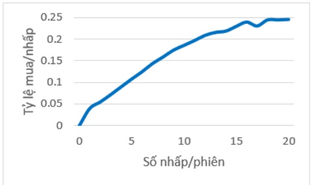

a)

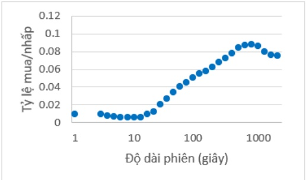

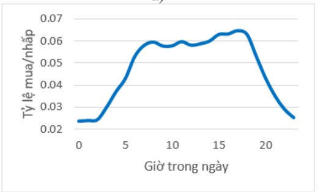

c)

b)

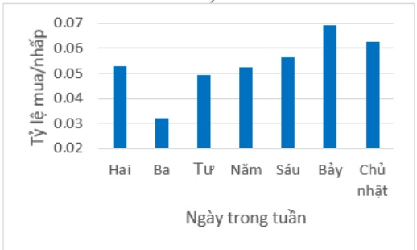

d)

Hình 2.7: Sự tương quan giữa tỷ lệ mua/nhấp với các yếu tố

Biểu đồ cho thấy tỷ lệ mua phụ thuộc vào một số yếu tố như:

• Số lượng nhấp chuột trong mỗi phiên: phiên càng được nhấp nhiều càng có tỷ lệ mua cao (Hình 2.3a).

• Tỷ lệ mua phụ thuộc vào khung giờ trong ngày, cao nhất vào khung từ 3 giờ chiều tới 19 giờ, thấp nhất vào khoảng 11 giờ đêm tới 4 giờ sáng (Hình 2.3c).

<!-- page: 53 -->

• Với các ngày trong tuần, tỷ lệ mua cao nhất vào thứ 7 và thấp nhất vào thứ 3 (Hình 2.3d).

• Các phiên có độ dài càng lớn từ 15 tới 20 phút có tỷ lệ mua là cao nhất. Đối với các phiên được xem lâu hơn thì tỷ lệ mua có xu hướng giảm (Hình 2.3e).

Khi phân tích sâu hơn cũng cho thấy, tỷ lệ mua cũng phụ thuộc vào các yếu tố khác như: Thời gian sản phẩm được hiển thị, số lần sản phẩm được xem lại trong cùng phiên, sản phẩm được xem trước sản phẩm hiện tại, nhóm danh mục của sản phẩm... Tuy nhiên sự tương quan trực tiếp giữa các yếu tố này với tỷ lệ mua/nhấp chưa rõ ràng. Trên cơ sở phân tích đánh giá như trên, nghiên cứu đã tách lọc và lựa chọn tổng cộng 26 đặc trưng sử dụng làm trường thuộc tính cơ sở đầu vào cho mô hình. Với từng mô hình cụ thể trong quá trình thực nghiệm, luận án có thể đề xuất thêm hoặc bớt một số thuộc tính khác nhằm tối ưu hóa mô hình được tốt hơn. Bảng 2.1 liệt kê các thuộc tính cơ sở đã được trích chọn.

Bảng 2.1: Danh sách các thuộc tính trích chọn

<table><tr><td>I</td><td colspan="3">Thuộc tính sản phẩm (2 thuộc tính)</td></tr><tr><td>1</td><td>Product ID</td><td>Danh mục</td><td>Mã sản phẩm</td></tr><tr><td>2</td><td>Cat ID</td><td>Danh mục</td><td>Mã danh mục của sản phẩm</td></tr><tr><td>II</td><td colspan="3">Thuộc tính phiên (11 thuộc tính)</td></tr><tr><td>3</td><td>The First Product</td><td>Danh mục</td><td>Sản phẩm đầu tiên trong phiên</td></tr><tr><td>4</td><td>The Pre Product</td><td>Danh mục</td><td>Sản phẩm trước đó trong phiên</td></tr><tr><td>5</td><td>Session Duration</td><td>Số</td><td>Độ dài của phiên</td></tr><tr><td>6</td><td>Current Duration</td><td>Số</td><td>Thời gian tính từ đầu phiên</td></tr><tr><td>7</td><td>#Clicks/Session</td><td>Số</td><td>Số lượng nhập trong phiên</td></tr><tr><td>8</td><td>#Products/Session</td><td>Số</td><td>Số lượng sản phẩm trong phiên</td></tr><tr><td>9</td><td>#Clicks So Far</td><td>Số</td><td>Số lượng nhập tới hiện tại trong phiên</td></tr><tr><td>10</td><td>#Products So Far</td><td>Số</td><td>Số lượng sản phẩm được nhập tới hiện tại</td></tr><tr><td>11</td><td>#Views of Product</td><td>Số</td><td>Số lượng views sản phẩm này trong phiên</td></tr><tr><td>12</td><td>#Products of the same Cat</td><td>Số</td><td>Số lượng sản phẩm trong cùng danh mục</td></tr><tr><td>13</td><td>#Cats</td><td>Số</td><td>Số lượng danh mục chứa cùng sản phẩm</td></tr><tr><td>III</td><td colspan="3">Thuộc tính thời gian chi tiết theo giờ, phút, giây (9 thuộc tính)</td></tr><tr><td>14-16</td><td>Session Start</td><td>Danh mục</td><td>Thời điểm phiên bắt đầu</td></tr><tr><td>17-19</td><td>The first time that product is clicked</td><td>Danh mục</td><td>Thời điểm đầu tiên lựa chọn sản phẩm</td></tr><tr><td>20-22</td><td>Current Time</td><td>Danh mục</td><td>Thời điểm hiện tại</td></tr><tr><td>IV</td><td colspan="3">Thuộc tính boolean (4 thuộc tính)</td></tr><tr><td>23</td><td>The most clicked product</td><td>Boolean</td><td>Sản phẩm được click nhiều nhất trong phiên</td></tr><tr><td>24</td><td>The most viewed product</td><td>Boolean</td><td>Sản phẩm được xem nhiều nhất trong phiên</td></tr><tr><td>25</td><td>The first clicked product</td><td>Boolean</td><td>Sản phẩm được click đầu tiên trong phiên</td></tr><tr><td>26</td><td>The most viewed category</td><td>Boolean</td><td>Danh mục được xem nhiều nhất trong phiên</td></tr></table>

<!-- page: 54 -->

## 2.3.3 Cách thức chia dữ liệu

Toàn bộ tập dữ liệu được chia ngẫu nhiên theo tỷ lệ 60% để huấn luyện, 20% để đánh giá mức độ hiệu quả trong quá trình tối ưu cấu trúc mạng, 20% để kiểm tra và so sánh giữa các mô hình mạng dự kiến trong quá trình xây dựng cấu trúc mạng. Bảng 2.2 thống kê tập dữ liệu sau khi chia nhỏ.

Bảng 2.2: Bảng thống kê số lượng nhãn của các tập dữ liệu sau khi chia

| Dữ liệu | Nhãn mua | Nhãn không mua | Tổng |
| --- | --- | --- | --- |
| Tập huấn luyện | 325.966 | 5.593.860 | 5.919.826 |
| Tập kiểm thử | 81.808 | 1.398.149 | 1.479.957 |
| Tập thực nghiệm | 101.922 | 1.748.024 | 1.849.946 |

## 2.3.4 Độ đo đánh giá mô hình

Nhằm tìm kiếm mô hình dự báo tốt nhất, phần thực nghiệm sử dụng các chỉ số cơ bản sau để tiến hành phân tích đánh giá các cấu trúc mạng khác nhau:

• AUC (Area Under the Curve): Diện tích dưới đường cong đặc trưng (ROC) - một đồ thị biểu thị khả năng phân loại của mô hình, dựa trên độ nhạy và độ đặc hiệu.

• Logloss (Logarithmic Loss): Mất mát lo-ga-rít - độ đo đo lường về độ sai số giữa các dự đoán và các giá trị thực tế, được tính dựa trên phép tính lo-ga-rít.

• Độ chính xác (Accuracy): Tỷ lệ số lượng dự đoán chính xác trên tổng số lượng mẫu được dự đoán.

## 2.4 Kết quả thực nghiệm

## 2.4.1 Kết quả thực nghiệm

Nghiên cứu tiến hành so sánh kết quả của một số mô hình mạng nơ-ron học sâu truyền thẳng, trong đó nhấn mạnh vào hai mô hình được nghiên cứu và thiết kế trong chương này gồm mô hình rộng & sâu và mô hình Transformer. Các mô hình khác bao gồm: mô hình hồi quy logistric, mô hình nơ-ron truyền thẳng FNN, và các biến thể của nó bao gồm mô hình FMNN và PNN cũng được ghi nhận kết quả thực nghiệm để so sánh. Kết quả thử nghiệm trên bộ dữ liệu kiểm tra của tập dữ liệu Yoochoose được thể hiện trong Bảng 2.3.

<!-- page: 55 -->

Bảng 2.3: So sánh hiệu quả giữa các mô hình trong dự báo chuỗi nhấp chuột

| Mô hình | AUC | Logloss | Accuracy |
| --- | --- | --- | --- |
| LR | 0,7604 | 0,5842 | 0,6967 |
| FNN | 0,8521 | 0,6145 | 0,7789 |
| FMNN | 0,8620 | 0,5061 | 0,7814 |
| PNN | 0,8596 | 0,5332 | 0,7808 |
| W&amp;DNN | 0,8670 | 0,4519 | 0,7826 |
| FE-Transformer | 0,7868 | 0,1844 | 0,9449 |

## 2.4.2 So sánh với các nghiên cứu liên quan

Nghiên cứu cũng tiến hành so sánh kết quả với nhóm Yandex Data Factory về nhất trong cuộc thi RecSys Challenge 2015, cùng sử dụng bộ dữ liệu Yoochoose [101]. Theo nghiên cứu này, họ sử dụng phương pháp kết hợp bao gồm: Cây phân rã (Gradient Boosted Deccision Tree) + Mạng phân tích nhân tử FM + Phân tích Singular Value Decomposition (SVD) với kết quả AUC = 0,85 và độ chính xác Accuracy = 0,77. Như vậy có thể thấy nghiên cứu hiện tại cho kết quả tốt hơn với tài nguyên tính toán ít hơn. Nghiên cứu chỉ sử dụng 2 máy tính, thực hiện đào tạo và hiệu chỉnh thông số thủ công trong 2 tuần, so với nhóm về nhất sử dụng 40 máy tính đào tạo mô hình đồng loạt với bộ tham số ngẫu nhiên trong hơn 100 giờ.

Các đóng góp của việc đề xuất và thiết kế hai mạng nơ-ron học sâu như sau:

• Cả hai mô hình sử dụng kiến trúc mạng nơ ron học sâu truyền thẳng cải tiến. Mô hình W&DNN sử dụng mạng FNN có kết hợp với mô hình tuyến tính ở nhánh học rộng. Mô hình FE-Transformer sử dụng lớp tự chú ý để học được các đặc trưng từ các thành phần quan trọng trong phiên làm việc.

• Mô hình W&DNN sử dụng lớp nhúng ở nhánh sâu và phép biến đổi tích chéo ở nhánh rộng, giúp cho mô hình có thể nắm bắt được các trường thuộc tính bậc thấp và bậc cao. Mô hình FE-Transformer được cải tiến với lớp nhúng thuộc tính FE.

## 2.5 Kết luận chương

Chương này nghiên cứu và đề xuất sử dụng hai mô hình mạng nơ-ron cụ thể gồm mạng rộng & sâu và mạng biến đổi để giải quyết Bài toán 1 nhằm dự báo khả năng mua sắm của khách hàng trên cơ sở dữ liệu nhấp chuột. Kết quả cho thấy mô hình rộng và sâu có những khả năng vượt trội hơn: (1) không cần tiền huấn luyện, (2)

<!-- page: 56 -->

có thể học được tương tác bậc thấp lẫn bậc cao của các trường thuộc tính, (3) tận dụng được khả năng ghi nhớ của mô hình tuyến tính và khả năng tổng quát hóa của mạng nơ-ron học sâu vào trong cùng một mô hình. Mô hình biến đổi có khả năng xử lý tốt dữ liệu tuần tự sau khi áp dụng một lớp nhúng thuộc tính. Kết quả nghiên cứu của mô hình học sâu và rộng được công bố ở công trình [A-1], và mô hình biến đổi được công bố ở công trình [A-7] (để đảm bảo tính đa dạng trong thực nghiệm, công trình [A-7] sử dụng bộ dữ liệu khác so với Luận án này).

Chương này đề xuất xây dựng các lớp nhúng nhằm biến đổi các loại dữ liệu rời rạc sang không gian nhúng mới phù hợp hơn cho đầu vào của các mạng nơ-ron học sâu. Nghiên cứu và thực nghiệm về các phép nhúng được tác giả công bố tại các công trình [A-2], [A-3] và [A-6].

Một kết luận quan trọng cho Bài toán 1 là từ kết quả thu được cho thấy việc dự báo hành vi mua của khách hàng với độ chính xác cao có thể được thực hiện bằng cách chỉ dựa trên phân tích chuỗi nhấp chuột trong phiên làm việc hiện tại, mà không cần xét đến thông tin quá khứ của người sử dụng. Do đó, phương pháp xây dựng hệ gợi ý dựa theo phiên làm việc có thể được áp dụng cho các doanh nghiệp không có khả năng thu thập thông tin khách hàng một cách đầy đủ, và chỉ cần dựa vào thông tin tương tác bằng chuột của khách hàng khi lựa chọn sản phẩm trong phiên mua hàng hiện tại.

<!-- page: 57 -->

# Chương 3|Đề xuất mô hình mạng nơ- ron đồ thị cho bài toán topk

Chương 3 trình bày cách thức tiếp cận giải quyết Bài toán 2 trong việc xây dựng mô hình gợi ý top − k. Cụ thể chương này đề xuất biểu diễn dữ liệu phiên làm việc dưới dạng đồ thị, từ đó nghiên cứu đề xuất sử dụng mạng nơ-ron đồ thị (GNN) để xây dựng bài toán SR gợi ý top − k sản phẩm. Để minh họa ưu điểm của mô hình GNN, chương này sử dụng lại mô hình học sâu truyền thẳng FNN cho bài toán top − k như là mô hình cơ sở để đánh giá sự vượt trội của hướng tiếp cận đồ thị và mô hình mạng nơ-ron GNN.

Mô hình thuật toán sử dụng mạng GNN với một số thiết kế đồ thị sử dụng cả hai dạng đồ thị đơn và đồ thị đa quan hệ được công bố tại các công trình [A-4] và [A-5] trong Phần 4.6 ”Danh mục các công trình công bố của luận án”.

## 3.1 Phát biểu bài toán

Bài toán top − k là một hệ thống gợi sản phẩm (ví dụ như bộ phim, bản nhạc hay sản phẩm khi mua hàng...) cho người dùng dựa trên tương tác của họ và cả của người khác với hệ thống. Hệ thống gợi ý sẽ xếp hạng tất cả các sản phẩm đề xuất theo thứ tự giảm dần của xác xuất khả năng được người dùng lựa chọn, và sẽ giới hạn trả về top − k sản phẩm được đề xuất. Giá trị k có thể được đặt thành bất kỳ số nào, tùy thuộc vào số lượng đề xuất mong muốn.

Khái niệm tương tác có thể bao gồm các tương tác trong quá khứ hoặc tương tác ở thời điểm hiện tại. Trong phạm vi của luận án này, khái niệm tương tác được mô tả là phiên làm việc hiện tại, được định nghĩa dưới dạng một chuỗi sự kiện nhấp chuột khi lựa chọn sản phẩm (tham khảo Định nghĩa 1). Bài toán top − k có thể được xây dựng dựa trên các thuật toán khác nhau. Chương này nghiên cứu và đề xuất mạng nơ-ron đồ thị để xây dựng mô hình gợi ý top − k.

<!-- page: 58 -->

## 3.2 Đề xuất thiết kế đồ thị

## 3.2.1 Biểu diễn phiên làm việc bằng đồ thị

Một phiên làm việc s có thể được biểu diễn bằng một đồ thị có hướng $G _ { s } \: = \:$ $( V _ { s } , E _ { s } )$ . Trong đó, mỗi đỉnh thể hiện là sản phẩm $v _ { s , i } \in V$ (V là tập đỉnh tổng thể của toàn bộ hệ thống).

Với giả định như vậy, nếu một bộ dữ liệu có rất nhiều phiên làm việc $\mathcal { S } _ { k } ,$ thì đồ thị tổng thể G là tập hợp các đồ thị con $G _ { s _ { k } }$ của từng phiên $s _ { k }$ . Lưu ý tập đỉnh $V _ { s _ { k } }$ của từng phiên $s _ { k }$ có thể chứa trùng các đỉnh với các phiên khác do các đỉnh này đều thuộc tập đỉnh tổng thể của toàn hệ thống (tập sản phẩm V ). Các đồ thị con $G _ { s _ { k } }$ này sẽ giao nhau tại các đỉnh trùng nhau giữa các tập đỉnh của phiên $V _ { s _ { k } }$ . Như vậy mỗi phiên làm việc cụ thể sẽ được biểu diễn bởi một nhánh trong một đồ thị tổng thể G. Minh họa biểu diễn đồ thị từ các phiên làm việc $s _ { k }$ được thể hiện như Hình 3.1.

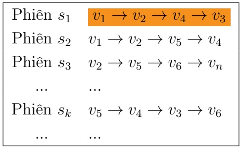

(a) Danh sách các phiên làm việc

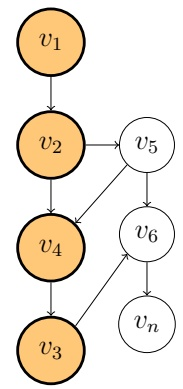

(b) Đồ thị biểu diễn

Hình 3.1: Minh họa biểu diễn phiên làm việc bằng đồ thị

Với hướng tiếp cận sử dụng đồ thị biểu diễn phiên làm việc như trên đã thể hiện được rõ hơn mối quan hệ giữa các phiên làm việc với nhau. Sự tương tác thông tin nhấp chuột giữa các phiên làm việc này gọi là quan hệ liên phiên (inter-session relationship) [13]. Như vậy, cách thức biểu diễn dữ liệu của Bài toán 2 có tính đầy đủ hơn so với cách biểu diễn thông tin phiên làm việc ở Bài toán 1 khi chỉ sử dụng thông tin nhấp chuột cục bộ trong từng phiên làm việc, còn gọi là intra-session relationship [102].

Tương tự như đồ thị, khi biểu diễn phiên làm việc dưới dạng đồ thị, ta có một số định nghĩa sau:

Định nghĩa 11. (độ dài đường đi cục bộ) Giả sử $v _ { i }$ và $v _ { j }$ là 2 sản phẩm bất kỳ được nhấp trong phiên s với thứ tự nhấp lần lượt là x và y với $x < y$ . Độ dài đường

<!-- page: 59 -->

đi từ nhấp $v _ { i }$ tới nhấp $v _ { j }$ trong phiên làm việc s ký hiệu là $p _ { s } ( v _ { i } , v _ { j } )$ thỏa mãn công thức:

$$
p _ {s} (v _ {i}, v _ {j}) = y - x
$$

Với định nghĩa trên, độ dài đường đi cục bộ giữa 2 sản phẩm trong phiên là số lượng sản phẩm được nhấp ở giữa 2 sự kiện nhấp chuột vào 2 sản phẩm đó, tính cả lần nhấp đỉnh cuối. Việc tồn tại một được đi có độ dài $p _ { s }$ giữa hai nhấp $v _ { i }$ và $v _ { j }$ trong phiên làm việc s thể hiện khả năng nào đó từ nhấp $v _ { i }$ thì sau $p$ lần nhấp tiếp theo sẽ lựa chọn nhấp vào sản phẩm $v _ { j }$ . Một điểm lưu lý là đường đi giữa hai nhấp $v _ { i }$ và $v _ { j }$ có tính tương đối và cục bộ trong từng phiên làm việc cụ thể $s _ { k }$ nào đó, ký hiệu là $p _ { s _ { k } } ( v _ { i } , v _ { j } )$ . Ví dụ như với danh sách các phiên làm việc ở Hình 3.1 thì độ dài đường đi $p _ { s _ { 1 } } ( v _ { 1 } , v _ { 4 } ) = 2$ nhưng $p _ { s _ { 2 } } ( v _ { 1 } , v _ { 4 } ) = 3$

Định nghĩa 12. (p-nhấp) Hai nhấp vào sản phẩm $v _ { i }$ và $v _ { j }$ trong một phiên làm việc s được gọi là p-nhấp nếu thành phần $v _ { j }$ được nhấp sau $v _ { i }$ đúng p lần nhấp trong phiên làm việc s. Nói cách khác, hai nhấp $v _ { i }$ và $v _ { j }$ trong một phiên làm việc s là p-nhấp nếu và chỉ nếu $p _ { s } ( v _ { i } , v _ { j } ) = p$

Định nghĩa 13. (nhấp kề) Hai nhấp vào sản phẩm $v _ { i }$ và $v _ { j }$ trong một phiên làm việc s được gọi là nhấp kề nếu thành phần $v _ { j }$ được nhấp ngay sau $v _ { i }$ trong phiên làm việc s. Nói cách khác, hai nhấp $v _ { i }$ và $v _ { j }$ trong một phiên làm việc s là nhấp kề nếu và chỉ nếu $p _ { s } ( v _ { i } , v _ { j } ) = 1$

Nhấp kề thể hiện khả năng nhấp tiếp theo vào sản phẩm $v _ { j }$ sau khi khách hàng lựa chọn $v _ { i }$

Định nghĩa 14. (trọng số nhấp kề) Hai nhấp vào sản phẩm $v _ { i }$ và $v _ { j }$ trong một phiên làm việc s có trọng số là số lượng nhấp kề tạo bởi 2 sản phẩm $v _ { i }$ và $v _ { j }$ trong phiên làm việc s, được ký hiệu là $w _ { s } ^ { v _ { i } , v _ { j } }$ . Trọng số này được gọi là trọng số nhấp kề.

Định nghĩa 15. (trọng số p-nhấp) Hai nhấp vào sản phẩm $v _ { i }$ và $v _ { j }$ trong một phiên làm việc s có trọng số là số lượng p-nhấp tạo bởi 2 sản phẩm $v _ { i }$ và $v _ { j }$ trong phiên làm việc s, được ký hiệu là $w _ { s , p } ^ { v _ { i } , v _ { j } }$ . Trọng số này được gọi là trọng số p-nhấp.

Với hai định nghĩa trên ta có $w _ { s } ^ { v _ { i } , v _ { j } } = w _ { s , 1 } ^ { v _ { i } , v _ { j } }$ , tức trọng số nhấp kề bằng trọng số p-nhấp với $p = 1$

Định nghĩa 16. (đường đi toàn cục) Một đường đi P từ nhấp $v _ { 1 }$ tới nhấp $v _ { k }$ mà ở đó các nhấp $v _ { 1 }$ tới $v _ { k }$ có thể nằm ở nhiều phiên khác nhau, thì đường đi toàn cục giữa 2 nhấp đó chính là đường đi giữa 2 đỉnh ở đồ thị tổng thể G biểu diễn toàn bộ tập phiên làm việc, ký hiệu là $P ( v _ { 1 } , v _ { k } )$

<!-- page: 60 -->

Như vậy sau khi biểu diễn danh sách các phiên làm việc bằng đồ thị tổng thể G thì đường đi giữa hai nhấp (trong đồ thị sẽ là 2 đỉnh) sẽ có nhiều phương án hơn do có thể tồn tại một đường đi liên thông giữa hai phiên bất kỳ nào đó. Đường đi toàn cục này sẽ độ dài hoàn toàn khác với độ dài đường đi cục bộ khi xét tới phạm vi toàn cục của đồ thị tổng thể biểu diễn đầy đủ các phiên làm việc. Cụ thể với đồ thị biểu diễn ở Hình 3.1, nếu xét ở phiên làm việc $s _ { 3 }$ thì $P ( v _ { 2 } , v _ { n } ) = p _ { s _ { 3 } } ( v _ { 2 } , v _ { n } ) = 3$ với đường đi $( v _ { 2 } , v _ { 5 } , v _ { 6 } , v _ { n } )$ . Tuy nhiên nếu xét trên đồ thị tổng thể G thì tồn tại đường đi $P ( v _ { 2 } , v _ { n } ) = 5$ với đường đi $( v _ { 2 } , v _ { 5 } , v _ { 4 } , v _ { 3 } , v _ { 6 } , v _ { n } )$ . Lưu ý có thể tồn tại nhiều đường đi P có độ dài khác nhau trên cùng đồ thị G này.

Căn cứ vào một số định nghĩa và lập luận như ở trên, hướng tiếp cận của luận án này là sử dụng thông tin về độ dài đường đi giữa 2 nhấp để thiết kế và xây dựng trọng số cạnh của đồ thị tổng thể G. Câu hỏi đặt ra là: ”Với tập đỉnh $V = \{ v _ { 1 } , v _ { 2 } , . . . , v _ { n } \}$ có số lượng n sản phẩm cố định thì khi biểu diễn đồ thị tổng thể G cần xây dựng tập cạnh E và trọng số cạnh như thế nào cho hiệu quả? ”.

Phần tiếp theo của luận án sẽ đề xuất một số cách thức thiết kế và xây dựng đồ thị tổng thể G để biểu diễn tập phiên làm việc của một bộ dữ liệu bất kỳ.

## 3.2.2 Đề xuất thiết kế đồ thị

Phần này đề xuất một số phương án xây dựng đồ thị G từ tập danh sách phiên làm việc của các khách hàng. Cụ thể tác giả đề xuất 3 dạng đồ thị sau:

• Đồ thị G: đồ thị đơn tính toán trọng số cạnh từ các nhấp kề trong danh sách phiên lựa chọn sản phẩm. Như vậy, đồ thị G sử dụng trọng số nhấp kề giữa 2 đỉnh bất kỳ.

• Đồ thị H: đồ thị đơn tính toán trọng số cạnh bằng cách đánh giá có tồn tại đường đi nào đó giữa các nhấp trong danh sách phiên lựa chọn sản phẩm không (không quan tâm tới độ dài của đường đi). Như vậy đồ thị H sử dụng trọng số p-nhấp giữa 2 đỉnh bất kỳ, và tính tổng lại nếu tồn tại nhiều hơn 1 đường đi giữa 2 đỉnh để xây dựng trọng số cạnh giữa 2 đỉnh đó.

• Đồ thị K: đồ thị đa quan hệ tính toán tập trọng số cạnh để đồng thời thể hiện nhiều phương án lựa chọn tiếp theo giữa các nhấp với từng độ dài đường đi cụ thể trong một phiên làm việc bất kỳ. Với phương án thiết kế này, một cạnh có nhiều trọng số được tập hợp dưới dạng một véc-tơ. Mỗi lớp quan hệ của đồ thị này thể hiện sự quan tâm tới một độ dài đường đi cụ thể p nào đó với $p \in [ 1 , d ]$ trong đó d là độ dài của phiên làm việc đang xem xét. Như vậy đồ thị K sử dụng trọng số p-nhấp giữa 2 đỉnh bất kỳ, tuy nhiên không tính tổng như cách xây dựng trọng số cạnh cho đồ thị H mà sử dụng riêng lẻ từng trọng

<!-- page: 61 -->

số p-nhấp để đánh giá mức độ ảnh hưởng của từng giá trị $p \hat { \mathrm { ~ } \partial }$ bước sau.

## a. Đồ thị G

Gọi $\mathcal { G }$ là một đồ thị thoả mãn ma trận kề $M _ { G }   \in   \mathbb { R } ^ { n \times n }$ với $M _ { G } ^ { v _ { i } , v _ { j } }$ là số lần sản phẩm $v _ { j }$ được nhấp kề ngay sau khi nhấp sản phẩm $v _ { i }$ trong một phiên. Ta có:

$$
M _ {G} ^ {v _ {i}, v _ {j}} = \sum_ {s} w _ {s} ^ {v _ {i}, v _ {j}}, \forall s\tag{3.1}
$$

trong đó $w _ { s } ^ { v _ { i } , v _ { j } }$ là ”trọng số nhấp $k \hat { \hat { e } } ^ { \gamma }$ của 2 đỉnh $v _ { i } , v _ { j }$ trong phiên làm việc s.

Nhận xét:

• Với đồ thị $\mathcal { G } ,$ trọng số cạnh nối từ đỉnh $v _ { i }$ tới $v _ { j }$ có giá trị là $M _ { G } ^ { v _ { i } , v _ { j } } \in \mathbb { R }$

• Xác suất để sản phẩm $v _ { j }$ được nhấp kề ngay sau sản phẩm $v _ { i }$ là:

$$
P _ {G} ^ {v _ {i}, v _ {j}} = \frac {M _ {G} ^ {v _ {i} , v _ {j}}}{\sum_ {x = 1} ^ {d} M _ {G} ^ {v _ {i} , v _ {x}}}\tag{3.2}
$$

## b. Đồ thị H

Gọi H là một đồ thị thoả mãn ma trận kề $M _ { H } \in \mathbb { R } ^ { n \times n }$ với $M _ { H } ^ { v _ { i } , v _ { j } }$ là số lần sản phẩm $v _ { j }$ được nhấp sau khi nhấp sản phẩm $v _ { i }$ trong một phiên. Lưu $\acute { \mathrm { y } }$ sản phẩm $v _ { j }$ có thể được nhấp kề với sản phẩm $v _ { i } ,$ hoặc cũng có thể được cách nhau nhiều hơn 1 lần nhấp trong đường đi từ $v _ { i }$ tới $v _ { j }$ . Ta có:

$$
M _ {H} ^ {v _ {i}, v _ {j}} = \sum_ {s} \sum_ {p = 0} ^ {| s |} w _ {s, p} ^ {v _ {i}, v _ {j}}, \forall s\tag{3.3}
$$

trong đó $w _ { s , p } ^ { v _ { i } , v _ { j } }$ là ”trọng số $\scriptstyle p - n h { \hat { a } } p$ của 2 đỉnh $v _ { i } ,   v _ { j }$ trong phiên làm việc s.

Nhận xét:

• Với đồ thị H, trọng số cạnh nối từ đỉnh $v _ { i }$ tới $v _ { j }$ có giá trị là $M _ { H } ^ { v _ { i } , v _ { j } } \in \mathbb { R }$

$M _ { G } ^ { v _ { i } , v _ { j } } \leq M _ { H } ^ { v _ { i } , v _ { j } } \quad \forall v _ { i } , v _ { j } : 0 \leq v _ { i } < v _ { j } < n$

• Xác suất của để sản phẩm $v _ { j }$ được nhấp sau sản phẩm $v _ { i }$ là:

$$
P _ {H} ^ {v _ {i}, v _ {j}} = \frac {M _ {H} ^ {v _ {i} , v _ {j}}}{\sum_ {x = 1} ^ {d} M _ {H} ^ {v _ {i} , v _ {x}}}\tag{3.4}
$$

<!-- page: 62 -->

• Với cách xây đựng đồ thị G và H như trên thì số cạnh của đồ thị H sẽ lớn hơn khá nhiều so với đồ thị G do mối quan hệ giữa nhấp $v _ { i }$ và $v _ { j }$ không chỉ đơn thuần là nhấp kề mới xuất hiện cạnh mà chỉ cần tồn tại một đường đi giữa chúng là đã xuất hiện cạnh.

## c. Đồ thị K

Giả sử c là số lượng nhấp nhiều nhất của một phiên trong tập dữ liệu. Gọi K là một đồ thị thoả mãn khối ma trận kề $M _ { K } \in \mathbb { R } ^ { n \times n \times c }$ với $M _ { K } ^ { v _ { i } , v _ { j } } [ p ]$ là tổng số lần sản phẩm $v _ { j }$ được nhấp sau khi nhấp sản phẩm $v _ { i }$ đúng p lần nhấp trong một phiên (còn gọi là ”trọng số p-nhấp” giữa 2 sản phẩm $v _ { i }$ và $v _ { j } )$ .Ta có:

$$
M _ {K} ^ {v _ {i}, v _ {j}} [ p ] = \sum_ {s} w _ {s, p} ^ {v _ {i}, v _ {j}}\tag{3.5}
$$

## Nhận xét:

• Với đồ thị K, trọng số cạnh nối từ đỉnh $v _ { i }$ tới $v _ { j }$ có giá trị là $M _ { K } ^ { v _ { i } , v _ { j } }   \in   \mathbb { R } ^ { c }$ Thông tin biểu diễn ma trận kề của đồ thị K chiếm bộ nhớ lưu trữ và tốn thời gian truy cập lấy giá trị hơn nhiều đồ thị H và $\mathcal { G }$

$M _ { G } ^ { v _ { i } , v _ { j } } = M _ { K } ^ { v _ { i } , v _ { j } } [ 0 ] \quad \forall v _ { i } , v _ { j } : 0 \leq v _ { i } < v _ { j } < n$

Mvi,vjH =P<sub>c</sub>p=0 Mv<sub>i</sub>,v<sub>j</sub>K [p] ∀vi, vj: 0 ≤ v<sub>i</sub> < v<sub>j</sub> < n

• Xác suất của để sản phẩm $v _ { j }$ được nhấp sau khi nhấp sản phẩm $v _ { i }$ đúng p lần nhấp là:

$$
P _ {K} ^ {v _ {i}, v _ {j}} [ p ] = \frac {M _ {K} ^ {v _ {i} , v _ {j}} [ p ]}{\sum_ {x = 1} ^ {d} M _ {K} ^ {v _ {i} , v _ {x}} [ p ]}\tag{3.6}
$$

• Số lượng cạnh của đồ thị K tương đương với đồ thị H, và như vậy ta có $E _ { K } = E _ { H } > E _ { G }$ với E là số lượng cạnh từng loại đồ thị. Và đồ thị K mang thông tin của cả hai đồ thị G và H.

## 3.2.3 Minh họa biểu diễn các đồ thị đề xuất

Cho tập sản phẩm $V = \{ v _ { 1 } , v _ { 2 } , . . . . , v _ { 7 } \}$ gồm 7 sản phẩm được đánh số từ 0 đến 6, và tập 5 phiên $\{ s _ { 1 } , s _ { 2 } , . . . , s _ { 5 } \}$ được minh họa như sau:

$$
\bullet s _ {1} = \{1, 3, 2, 5, 2 \}
$$

$$
\bullet s _ {2} = \{2, 5, 3, 2 \}
$$

$$
\bullet \quad s _ {3} = \{1, 2, 3, 2 \}
$$

<!-- page: 63 -->

$s _ { 4 } = \{ 5 , 2 \}$

$$
\bullet s _ {5} = \{0, 6, 6, 0, 4, 6 \}
$$

## a. Đồ thị G

Đồ thị G thể hiện mối quan hệ nhấp kề và có tính tuần tự khi người dùng nhấp chọn từ sản phẩm $v _ { i }$ sang ngay sản phẩm $v _ { j }$ . Với dữ liệu nhiều phiên thì cạnh của đồ thị sẽ có trọng số là tổng ”trọng số nhấp $k \hat { e } ^ { \varkappa }$ giữa hai sản phẩm $v _ { i }$ và $v _ { j }$ trong các phiên làm việc. Đồ thị G được minh họa ở Hình 3.2.

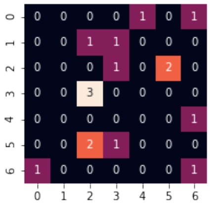

(a) Ma trận kề

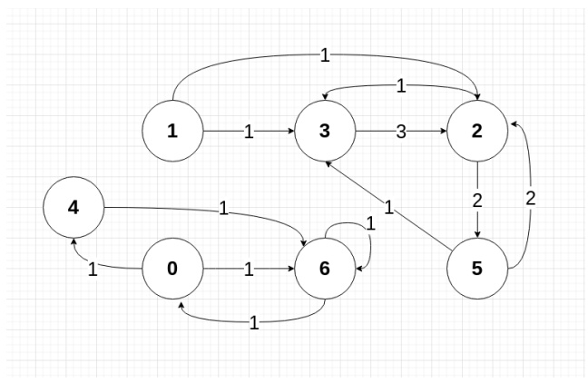

(b) Đồ thị

Hình 3.2: Biểu diễn đồ thị G

Với dữ liệu minh họa Hình 3.2, ta thấy đồ thị G là một đồ thị đơn giản vì có một ma trận kề khá thưa với các thống số cụ thể như sau:

• Số đỉnh là 7, số cạnh là 12.

• Trọng số cạnh cao nhất là 3 và thấp nhất là 1. Trọng số trung bình là 1,3.

Với dữ liệu biểu diễn bằng đồ thị G, ta có một số nhận xét trực quan như sau:

• Khi xem sản phẩm 3 thì người dùng có xu hướng nhấp sản phẩm 2 kề sau đó.

• Người dùng có xu hướng xem đi xem lại sản phẩm 2 và 5.

## b. Đồ thị H

Đồ thị H thể hiện mối quan hệ có tồn tại đường đi độ dài p với $p \geq 1$ khi người dùng nhấp chọn từ sản phẩm $v _ { i }$ tới sản phẩm $v _ { j }$ . Khái niệm tồn tại đường đi biểu thị việc người dùng có thể đi từ sản phẩm $v _ { i }$ qua một hoặc nhiều sản phẩm khác trước khi nhấp chọn sản phẩm $v _ { j }$ . Với dữ liệu nhiều phiên thì cạnh của đồ thị sẽ là

<!-- page: 64 -->

có trọng số là tổng ”trọng số p-nhấp” giữa sản phẩm $v _ { i }$ và $v _ { j }$ trong các phiên làm việc. Đồ thị H được minh họa ở Hình 3.3.

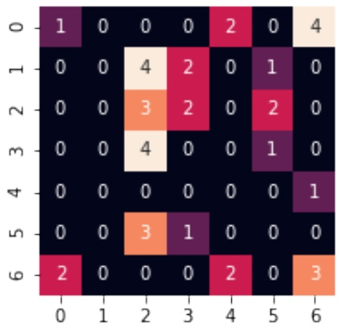

(a) Ma trận kề

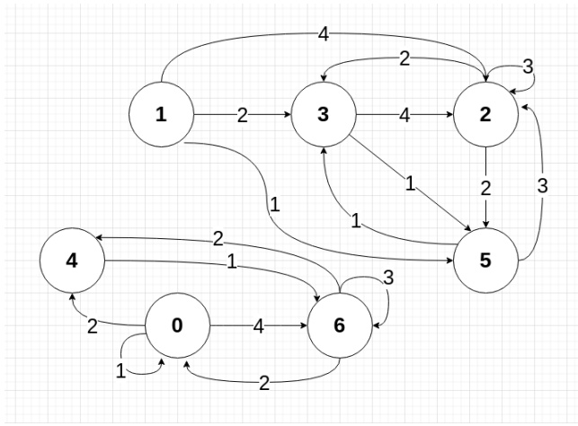

(b) Đồ thị

Hình 3.3: Biểu diễn đồ thị H

Với dữ liệu minh họa Hình 3.3, ta thấy đồ thị H là một đồ thị phức tạp hơn đồ thị G vì có một ma trận kề đầy đặn hơn với các thông số cụ thể như sau:

• Số đỉnh là 7, số cạnh là 17.

• Trọng số cạnh cao nhất là 4, thấp nhất là 1. Trọng số trung bình là 2,24.

Với dữ liệu biểu diễn bằng đồ thị H, ta có một số nhận xét trực quan như sau:

• Khi xem sản phẩm 1 thì người dùng có xu hướng nhấp sản phẩm 2 sau đó.

• Khi xem sản phẩm 3 thì người dùng có xu hướng nhấp sản phẩm 2 sau đó.

• Khi xem sản phẩm 0 thì người dùng có xu hướng nhấp sản phẩm 6 sau đó.

• Người dùng có xu hướng xem đi xem lại sản phẩm 2 và 5.

## c. Đồ thị K (đồ thị đa quan hệ)

Tập dự liệu có độ dài phiên lớn nhất là d = 6, tức có d − 1 = 5 đường đi từ đỉnh đầu $v _ { 1 }$ tới các đỉnh còn lại $v _ { j }$ trong phiên với $2 \leq j \leq d .$ Với thông tin đó, đồ thị K được thể hiện bởi 5 lớp tương ứng với 5 đường đi có độ dài p từ 1 tới 5 giữa đỉnh đầu và các đỉnh còn lại của phiên dài nhất. Vì vậy, trọng số cạnh của đồ thị K thể hiện là một vec-tơ gồm 5 số như ta thấy ở Hình 3.4.

Với dữ liệu minh họa Hình 3.4, ta thấy đồ thị K là một đồ thị phức tạp nhất trong 3 đồ thị đã nêu với các thông số cụ thể như sau:

<!-- page: 65 -->

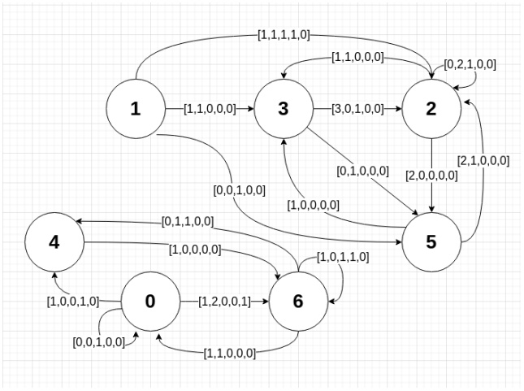

(a) Đồ thị

(b) Ma trận kề với độ sâu 1

$$
\begin{array}{c c c c c c c c} 0 & 0 & 0 & 0 & 1 & 0 & 1 \\ 1 & 0 & 0 & 1 & 1 & 0 & 0 & 0 \\ 2 & 0 & 0 & 0 & 1 & 0 & 2 & 0 \\ 3 & 0 & 0 & 3 & 0 & 0 & 0 & 0 \\ 4 & 0 & 0 & 0 & 0 & 0 & 0 & 1 \\ 5 & 0 & 0 & 2 & 1 & 0 & 0 & 0 \\ 6 & 1 & 0 & 0 & 0 & 0 & 0 & 1 \end{array}
$$

$$
\begin{array}{c c c c c c c c} 0 & 0 & 0 & 0 & 0 & 0 & 2 \\ 1 & 0 & 0 & 1 & 1 & 0 & 0 & 0 \\ 2 & 0 & 0 & 2 & 1 & 0 & 0 & 0 \\ 3 & 0 & 0 & 0 & 0 & 0 & 1 & 0 \\ 4 & 0 & 0 & 0 & 0 & 0 & 0 & 0 \\ 5 & 0 & 0 & 1 & 0 & 0 & 0 & 0 \\ 6 & 1 & 0 & 0 & 0 & 1 & 0 & 0 \end{array}
$$

(c) Ma trận kề với độ sâu 2

$$
\begin{array}{c c c c c c c c} 0 & 1 & 0 & 0 & 0 & 0 & 0 & 0 \\ 1 & 0 & 0 & 1 & 0 & 0 & 1 & 0 \\ 2 & 0 & 0 & 1 & 0 & 0 & 0 & 0 \\ 3 & 0 & 0 & 1 & 0 & 0 & 0 & 0 \\ 4 & 0 & 0 & 0 & 0 & 0 & 0 & 0 \\ 5 & 0 & 0 & 0 & 0 & 0 & 0 & 0 \\ 6 & 0 & 0 & 0 & 0 & 1 & 0 & 1 \end{array}
$$

(d) Ma trận kề với độ sâu 3

$$
\begin{array}{c c c c c c c c} 0 & 0 & 0 & 0 & 1 & 0 & 0 \\ 1 & 0 & 0 & 1 & 0 & 0 & 0 & 0 \\ 2 & 0 & 0 & 0 & 0 & 0 & 0 & 0 \\ 3 & 0 & 0 & 0 & 0 & 0 & 0 & 0 \\ 4 & 0 & 0 & 0 & 0 & 0 & 0 & 0 \\ 5 & 0 & 0 & 0 & 0 & 0 & 0 & 0 \\ 6 & 0 & 0 & 0 & 0 & 0 & 1 \end{array}
$$

(e) Ma trận kề với độ sâu 4

$$
\begin{array}{c c c c c c c c} 0 & 0 & 0 & 0 & 0 & 0 & 1 \\ \hline 1 & 0 & 0 & 0 & 0 & 0 & 0 \\ \hline 2 & 0 & 0 & 0 & 0 & 0 & 0 \\ \hline 3 & 0 & 0 & 0 & 0 & 0 & 0 \\ \hline 4 & 0 & 0 & 0 & 0 & 0 & 0 \\ \hline 5 & 0 & 0 & 0 & 0 & 0 & 0 \\ \hline 6 & 0 & 0 & 0 & 0 & 0 & 0 \end{array}
$$

(f) Ma trận kề với độ sâu 5

Hình 3.4: Biểu diễn đồ thị K

<!-- page: 66 -->

• Số đỉnh là 7, số cạnh là 32.

• Trọng số cạnh cao nhất là 3 , thấp nhất là 1. Trọng số trung bình là 1,19.

Với dữ liệu biểu diễn bằng đồ thị K, ta có một số nhận xét trực quan như sau:

• Khi xem sản phẩm 3 thì người dùng có xu hướng nhấp sản phẩm 2 kề ngay sau đó (độ dài đường đi p = 1).

• Khi xem sản phẩm 2 thì người dùng có xu hướng nhấp sản phẩm 2 ngay sau khi xem 1 sản phẩm khác (p = 2).

• Người dùng có xu hướng xem đi xem lại sản phẩm 2 và 5.

## 3.2.4 Thảo luận về các các đồ thị đề xuất

## a. Nhận xét tổng quan

• Cả 3 đồ thị G, H và K đều là đồ thị có hướng.

• Trọng số cạnh của đồ thị G và H thuộc R nhưng đối với đồ thị K thì thuộc R<sup>d</sup> với d tùy vào độ dài của phiên làm việc có nhiều nhấp nhất.

• Số lượng cạnh của đồ thị G sẽ ít hơn số lượng cạnh của đồ thị H, trong khi đó số lượng cạnh của đồ thị H và đồ thị K là bằng nhau.

Khi sử dụng đồ thị G, H và K với bộ dữ liệu thực nghiệm ở Phần A, ta có bảng thông số của cả 3 đồ thị như ở Bảng 3.1.

Bảng 3.1: Các thông số của đồ thị G, H, K

|  | G | H | K |
| --- | --- | --- | --- |
| Số đỉnh | 52.069 | 52.069 | 52.069 |
| Số cạnh | 3.741.123 | 17.829.772 | 17.829.772 |
| Số trọng số | 3.741.123 | 17.829.772 | 46.958.152 |
| Trọng số lớn nhất | 71.090 | 279.555 | 71.090 |
| Trọng số nhỏ nhất | 1 | 1 | 1 |
| Trọng số trung bình | 6 | 6 | 2 |
| Bậc ra lớn nhất | 3.816 | 12.817 | 12.817 |
| Bậc ra nhỏ nhất | 0 | 0 | 0 |
| Bậc ra trung bình | 72 | 342 | 342 |

Với Bảng 3.1, ta có một số nhận xét như sau:

• Ba đồ thị đều có 52.069 đỉnh tương ứng với số sản phẩm của bộ dữ liệu.

<!-- page: 67 -->

• Số lượng cạnh của đồ thị G nhỏ hơn rất nhiều đồ thị H và K (xấp xỉ 3 triệu và 18 triệu), số lượng cạnh của đồ thị H và K bằng nhau.

• Đồ thị G cho thấy tồn tại mối liên hệ giữa hai sản phẩm lên tới 71.090 lần nhấp và tương tự với đồ thị K, tuy nhiên đồ thị H có số liên hệ khá lớn là 279.554 lần nhấp.

• Đồ thị G cũng cho thấy một sản phẩm có thể có 3.816 lựa chọn nhấp kề. Con số này lớn hơn nhiều với đồ thị H và K, cụ thể có tới 12.817 sản phẩm có thể lựa chọn để nhấp tiếp. Như vậy, việc gợi ý một sản phẩm để nhấp tiếp phù hợp là rất khó nếu chỉ biết một nhấp trước đó.

## b. Một số vấn đề trong việc thiết kế đồ thị cỡ lớn

Số lượng đỉnh đồ thị sẽ rất lớn, thực tế là bộ dữ liệu thực nghiệm có hơn 52 nghìn đỉnh thì để lưu trữ một ma trận kề là không phù hợp vì:

• Giới hạn bộ nhớ và thời gian truy cập: đồ thị G và H cần khoảng $2 . 7 * 1 0 ^ { 9 }$ số nguyên xấp xỉ 10 TB, còn đồ thị K thì mất khoảng 541 ∗ $1 0 ^ { 9 }$ số nguyên xấp xỉ 2014 TB với số nguyên 32 bit (xem Bảng 3.2).

• Phí phạm bộ nhớ: Vì trên đồ thị, số lượng cạnh của đồ thị nhỏ hơn rất nhiều số lượng số cần lưu trữ, nên phần lớn ma trận kề là số 0. Việc lưu trữ tất cả số 0 này là một việc dư thừa.

Bảng 3.2: Bộ nhớ sử dụng khi biểu diễn đồ thị

|  | G | H | K |
| --- | --- | --- | --- |
| Số nguyên | 2,7 tỷ | 2,7 tỷ | 541 tỷ |
| Bộ nhớ | 10TB | 10TB | 2014TB |

## c. Phương án giải quyết

Như đã phân tích ở trên, ma trận kề gây tốn kém bộ nhớ với đồ thị có số lượng đỉnh lớn, do đó nghiên cứu đề xuất sử dụng danh sách kề thay vì ma trận kề để quản lý các thông số của đồ thị.

Gọi $D _ { X }$ là danh sách kề của đồ thị X. $D _ { X } ^ { v _ { i } }$ là danh sách các cạnh của đỉnh $v _ { i }$ được thể hiện bởi hai danh sách:

• Danh sách đỉnh $V _ { X } ^ { v _ { i } }$ : gồm những đỉnh có cạnh từ đỉnh $v _ { i }$ của đồ thị X.

• Danh sách trọng số $W _ { X } ^ { v _ { i } }$ : gồm những trọng số cạnh tương ứng với danh sách $V _ { X } ^ { v _ { i } }$

<!-- page: 68 -->

Gọi $\deg _ { X } ^ { + } ( v _ { i } )$ là bậc ra của đỉnh $v _ { i }$ thuộc $\mathrm { d } \hat { \mathrm { o } }$ thị X, xét $w ^ { v _ { i } }$ là trọng số của đỉnh $v _ { i }$ , ta có:

• Ma trận trọng số của đồ thị G và H lần lượt là $W _ { G } ^ { v _ { i } }   \in   \mathbb { R } ^ { \deg _ { G } ^ { + } ( v _ { i } ) }$ và $W _ { H } ^ { v _ { i } } \in$ $\mathbb { R } ^ { \operatorname { d e g } _ { H } ^ { + } ( v _ { i } ) }$

• Mỗi trọng số trong $W _ { K } ^ { v _ { i } }$ gồm hai danh sách trong $\mathbb { R } ^ { t }$ (t là độ lớn của danh sách) lần lượt chứa chỉ số khác 0 của $M _ { K } ^ { v _ { i } , v _ { j } }$ và giá trị tại chỉ số đó. Ta có $W _ { K } ^ { v _ { i } } \in \mathbb { R } ^ { \operatorname { d e g } _ { K } ^ { + } ( v _ { i } ) \times 2 \times t }$

Phương án giải quyết đề xuất có ưu điểm là việc sử dụng danh sách kề đảm bảo tính khả thi khi thực nghiệm với đồ thị có số lượng định lớn vì bộ nhớ sẽ giảm rất nhiều. Tuy nhiên danh sách kề có cấu trúc phức tạp dẫn tới việc lập trình khó hơn. Ví dụ để lấy được véc-tơ trọng số của một đỉnh sẽ cần thông qua một số bước phụ để xây dựng.

## 3.3 Các mô hình đề xuất

## 3.3.1 Mạng nơ-ron truyền thẳng (FNN )

Phần này đề xuất sử dụng mạng nơ-ron truyền thẳng FNN như ở chương 2 nhưng giải quyết Bài toán 2 là xây dựng mô hình gợi ý top − k thay vì Bài toán 1 với mô hình dự báo mua hàng hay không. Kết quả của mô hình mạng nơ-ron truyền thẳng FNN không sử dụng kỹ thuật biểu diễn đồ thị được coi như là mô hình cơ sở để so sánh với mô hình mạng nơ-ron GNN ở phần cuối của chương này.

## a. Lớp nhúng sản phẩm

Như phân tích ở chương 2, với mô hình FNN thì ở lớp dữ liệu đầu vào các thuộc tính danh mục, ví dụ như mã sản phẩm, cần được biến đổi thành 1 véc-tơ đặc trưng cho thuộc tính đó, phép biến đổi này được gọi là phép nhúng. Với hướng tiếp cận đó, luận án đề xuất xây dựng lớp nhúng sản phẩm như Hình 3.5 với tên gọi Layer.ItemEmbed. Lớp nhúng này sẽ được dùng làm lớp cở sở để xây dựng một số mô hình khác nhau trong luận án này.

• Mục tiêu: Nhúng các mã sản phẩm thành định lượng để sử dụng trong huấn luyện mô hình FNN. Cụ thể, nó nhúng một véc-tơ số nguyên c chiều (ID) thành c véc-tơ 256 chiều hay ma trận E với kích thước là (c ∗ 256).

• Đầu vào: véc-tơ $\mathbf { I D } = \{ i d _ { 1 } , i d _ { 2 } , . . . , i d _ { c } \}$ chứa số định danh của các sản phẩm. Lưu $\hat { \mathbf { y } } , \mathbf { \nabla } n$ là tổng số sản phẩm của bộ dữ liệu và mỗi sản phẩm được đánh số từ 0 tới $n - 1$ , tức $i d _ { i } \in [ 0 , n )$ và $i d _ { i } \in \mathbb { Z }$

<!-- page: 69 -->

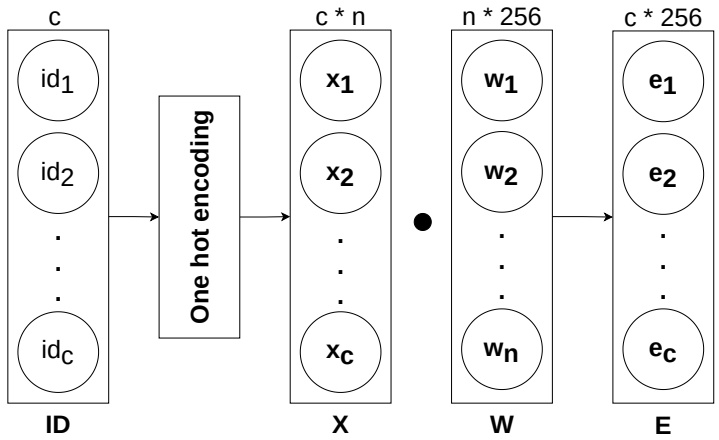

Hình 3.5: Lớp nhúng sản phẩm (Layer.ItemEmbed)

• Đầu ra: một ma trận E - chứa c véc-tơ nhúng 256 chiều, tương ứng với c sản phẩm đầu vào.

• Luồng xử lý:

B1 Mã hóa One hot: Biến đổi mỗi số đầu vào thành một véc-tơ one-hot n chiều toàn số 0 trừ số tại vị trí ứng với id của sản phẩm là số 1. Ta thu được véc-tơ $\mathbf { x _ { i } }$ ứng với sản phẩm $i d _ { i }$ và ma trận $\mathbf { X } \in \mathbb { Z } ^ { c \times n }$

B2 Tính E = XW, trong đó ma trận trọng số $\mathbf { W } \in \mathbb { R } ^ { n \times 2 5 6 }$ có được trong quá trình đào tạo mô hình.

B3 Trả về các véc-tơ nhúng hay ma trận $\mathbf { E } \in \mathbb { R } ^ { c \times 2 5 6 }$

Lớp Layer.ItemEmbed sử dụng W là ma trận trọng số mô hình nên số lượng trọng số cần huấn luyện là $n * 2 5 6$ trọng số. Cụ thể với bài toán này sử dụng bộ dữ liệu Yoochoose ở Phụ lục A, chúng ta có 52.069 sản phẩm nên số lượng trọng số mô hình sẽ là $52.069 * 256 = 13.329.664$

## b. Mô hình mạng nơ-ron truyền thẳng

Mô hình FNN cơ sở với lớp nhúng sản phẩm Layer.ItemEmbed được đề xuất như mô tả ở Hình 3.6:

• Đầu vào của mô hình là một phiên gồm c nhấp có tính thứ tự lần lượt là véc-tơ $s = \{ i d _ { 1 } , i d _ { 2 } , i d _ { 3 } , . . . i d _ { c } \}$ với $i d _ { i }$ là mã định danh sản phẩm.

• Với mỗi nhấp $i d _ { i }$ qua lớp nhúng sản phẩm Layer.ItemEmbed, ta thu được một véc-tơ $e _ { i }$ với $e _ { i } \in \mathbb { R } ^ { 2 5 6 }$

• Sử dụng hàm làm phẳng (Flatten) ta thu được véc-tơ mới có số chiều là c∗256.

<!-- page: 70 -->

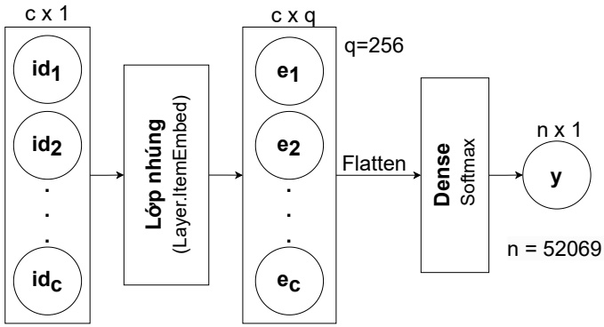

Hình 3.6: Mô hình FNN cơ sở

• Cuối cùng, sử dụng một lớp kết nối đầy đủ (Fully connected layer - Dense) với hàm kích hoạt softmax để tính toán đầu ra của mô hình với 52.069 nhãn.

• Mô hình có tới 66,8 triệu trọng số huấn luyện vì đầu ra có kích thước quá lớn (ở chương 4 của luận án sẽ đề xuất chuyển đổi mô hình này thành mô hình nhị phân để giảm thiểu độ phức tạp của bài toán đa nhãn).

## 3.3.2 Mạng nơ-ron đồ thị (GNN )

Phần này mô tả cách thức xây dựng mạng nơ-ron đồ thị GNN cho các đồ thị G, H, K mô tả ở phần trên. Do K là đồ thị có sử dụng trọng số cạnh là một véc-tơ d chiều nên cần có phương án phù hợp hơn để mô hình GNN có thể học được tính chất đa quan hệ của đồ thị K.

Với hướng tiếp cận đề xuất sử dụng đồ thị để biểu diễn phiên làm việc cho bài toán SR, luận án đưa ra một số quy ước và ký hiệu như sau:

• n: là số lượng sản phẩm có trong bộ dữ liệu.

• d: là số lượng nhấp cụ thể trong từng phiên.

• c: là số lượng nhấp được cố định trong phiên để làm đầu vào của mô hình. Giá trị c cũng được sử dụng làm độ dài đường đi được xem xét tới trong quá trình nhấp chuột từ sản phẩm hiện tại (dành cho đồ thị K).

Căn cứ vào bộ dữ liệu thực tế mô tả ở Phụ lục A, tác giả lựa chọn cấu trúc dữ liệu đầu vào cho mô hình là một phiên làm việc gồm c = 4 nhấp đủ để hệ thống có thể học được dữ liệu phiên biểu diễn dưới dạng đồ thị K. Do số lượng nhấp mỗi phiên là không cố định mà thay đổi d ∈ [1, 200], ta cần chuẩn hóa dữ liệu đầu vào cho bộ huấn luyện như sau:

• Với các phiên làm việc có số lượng nhấp d > c, đầu vào của mô hình sẽ là c nhấp đầu tiên và các nhấp còn lại sẽ dùng để làm nhãn.

<!-- page: 71 -->

• Với các phiên có số lượng nhấp $d \leq c ,$ chúng ta sẽ chèn thêm một số nhấp rỗng (không có giá trị) trước đó để đủ c nhấp đầu vào. Các nhấp rỗng này khi qua đồ thị sẽ trả về véc-tơ trọng số kề toàn 0 và nó có mã sản phẩm id là None.

## a. Mô hình mạng nơ-ron cho đồ thị G và H

Mô hình mạng nơ-ron đồ thị đề xuất cho đồ thị G và H được minh họa ở Hình 3.7:

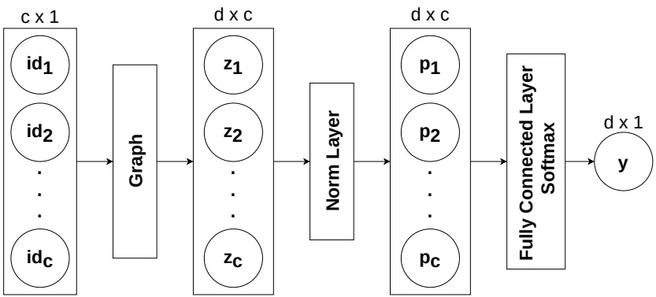

Hình 3.7: Mô hình mạng nơ-ron cho đồ thị G và H

• Đầu vào của mô hình là một phiên gồm c nhấp có tính thứ tự lần lượt là véc-tơ $s = \{ i d _ { 1 } , i d _ { 2 } , . . . , i d _ { c } \}$ với $i d _ { i }$ là mã định danh sản phẩm.

• d là số lượng sản phẩm có trong phiên.

• Với mỗi nhấp id<sub>i</sub> qua đồ thị G hoặc H, ta thu được một véc-tơ trọng số $z _ { i } \in \mathbb { R } ^ { d }$

• Sử dụng lớp Norm để chuẩn hóa $z _ { i }$ thành xác suất $p _ { i } \in \mathbb { R } ^ { d }$ với công thức sau:

$$
p _ {i} = \frac {v _ {i}}{\text {sum} (v _ {i})}\tag{3.7}
$$

• Cuối cùng, sử dụng một lớp kết nối đầy đủ với hàm kích hoạt softmax để tính toán đầu ra của mô hình.

## b. Mô hình mạng nơ-ron cho đồ thị K

Để cải tiến mô hình mạng nơ-ron đồ thị khi phải làm việc với đồ thị đa quan hệ K với trọng số cạnh là véc-tơ c chiều), luận án đề xuất sử dụng thêm một lớp học sâu (depth layer ) vào mô hình như Hình 3.8.

• Đầu vào của mô hình là một phiên gồm c nhấp có tính thứ tự lần lượt là véc-tơ $s = \{ i d _ { 1 } , i d _ { 2 } , . . . , i d _ { c } \}$ với $i d _ { i }$ là mã định danh sản phẩm.

• Với mỗi nhấp idi qua đồ thị $\kappa ,$ ta thu được ma trận trọng số $v _ { i } \in \mathbb { R } ^ { d \times c }$

<!-- page: 72 -->

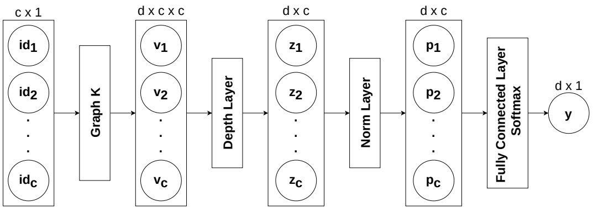

Hình 3.8: Mô hình mạng nơ-ron cho đồ thị K

• Sử dụng lớp depth để biến đổi chiều của $v _ { i } \in \mathbb { R } ^ { d \times c }$ thành $\mathbb { R } ^ { d }$ với công thức:

$$
z _ {i} = f (w _ {i} v _ {i} ^ {T} + b _ {i})\tag{3.8}
$$

Với:

$w _ { i } \in \mathbb { R } ^ { 1 \times c } ;$ trọng số chiều sâu

$b _ { i } \in \mathbb { R } ;$ : trọng số tự do của chiều sâu

– f(z) : là một hàm biến đổi z, tác giả sử dụng hàm tuyến tính $f ( z ) = z$

• Sử dụng lớp Norm để chuẩn hóa $z _ { i }$ thành xác suất $p _ { i } \in \mathbb { R } ^ { d }$ với công thức sau:

$$
p _ {i} = \frac {z _ {i}}{\text {sum} (z _ {i})}\tag{3.9}
$$

• Cuối cùng, sử dụng một lớp kết nối đầy đủ với hàm kích hoạt softmax để tính toán đầu ra của mô hình.

## 3.4 Kỹ thuật thực nghiệm

Cũng như Chương 2, tác giả vẫn sử dụng lại bộ dữ liệu Yoochoose được mô tả ở Phụ lục A, tuy nhiên bộ dữ liệu sẽ được tiền xử lý theo cách khác cho phù hợp với các mô hình đề xuất để giải Bài toán 2.

## 3.4.1 Tiền xử lý dữ liệu

## a. Tiền xử lý dữ liệu

Các bước tiền xử lý được thực hiên như sau:

<!-- page: 73 -->

1 Chuẩn hóa phiên, gồm tổng hợp phiên theo danh sách nhấp (danh sách sản phẩm), và loại bỏ một số thuộc tính dữ liệu không cần thiết như thời gian nhấp, danh mục sản phẩm, số lượng, ...

2 Bỏ các phiên chỉ có 1 nhấp.

3 Loại bỏ phiên làm việc trong bộ kiểm tra có chứa sản phẩm mà không xuất hiện trong bộ huấn luyện.

4 Chia bộ kiểm tra thành hai bộ dữ liệu nhỏ hơn theo tỷ lệ 1:1 dùng để kiểm tra và đánh giá mô hình.

Bộ dữ liệu sau bước tiền xử lý được mô tả ở Bảng 3.3.

Bảng 3.3: Thống kê về bộ dữ liệu nhấp Yoochoose sau khi tiền xử lý

|  | Bộ huấn luyện | Bộ kiểm tra | Tổng |
| --- | --- | --- | --- |
| Số lượng phiên | 7.990.018 | 1.996.408 | 9.986.426 |
| Số lượng sản phẩm | 52.069 | 38.733 | 52.069 |
| Số lượng nhấp | 31.744.233 | 7.926.322 | 39.670.555 |
| Số nhấp lớn nhất | 200 | 200 | 200 |
| Số nhấp nhỏ nhất | 2 | 2 | 2 |
| Số nhấp trung bình | 3,97 | 3,97 | 3,97 |

Biểu đồ phân bố số lượng phiên được nhấp từ 1 tới 10 lần ở Hình 3.9, do số lượng phiên có nhấp lớn hơn 10 rất nhỏ nên không cần thể hiện trong biểu đồ này:

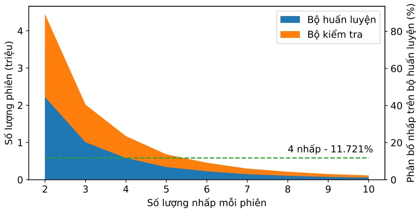

Hình 3.9: Biểu đồ phân bố số lượng nhấp chuột (sau khi tiền xử lý)

<!-- page: 74 -->

## b. Thảo luận về cách tiền xử lý dữ liệu

Có khá nhiều nghiên cứu liên quan có sử dụng chung bộ dữ liệu Y oochoose, để đồng nhất khi so sánh kết quả với các nghiên cứu này, tác giả lưu ý các điểm khác về tiền xử lý dữ liệu của mình như sau:

• Ngoài việc bỏ đi các phiên chỉ có 1 nhấp, các nghiên cứu tương tự còn bỏ đi các phiên làm việc chứa sản phẩm xuất hiện ít hơn 5 lần trong bộ dữ liệu (có gần 15 nghìn sản phẩm bị loại bỏ khỏi bộ dữ liệu). Điểm đáng để ý là sau bước này số lượng sản phẩm giảm khá nhiều từ 52.069 chỉ còn 37.483, tức số nhãn giảm khá nhiều dẫn tới mô hình cũng giảm độ phức tạp.

• Các nghiên cứu liên quan không sử dụng bộ kiểm tra độc lập, mà trích một phần ra từ bộ huấn luyện, ví dụ như trích phiên làm việc của 2 tuần cuối cùng của bộ huấn luyện.

• Do trích một phần từ bộ huấn luyện nên tập kiểm tra của các nghiên cứu liên quan có số phiên ít hơn rất nhiều so với việc luận án sử dụng đầy đủ dữ liệu từ bộ kiểm tra độc lập của bộ dữ liệu gốc.

• Một số nghiên cứu liên quan sử dụng thuật toán làm giầu dữ liệu của Yong Kiam Tan [91] và sau đó chia nhỏ bộ dữ liệu thành từng phần nhỏ để đánh giá thêm. Tan giải thích khi chia bộ dữ liệu gốc thành các bộ dữ liệu nhỏ hơn là do một số mô hình thực nghiệm không thể hoạt động được với bộ dữ liệu đầy đủ do mô hình quá cồng kềnh.

## 3.4.2 Chuẩn hóa dữ liệu huấn luyện

Các phiên dữ liệu trong bộ dữ liệu gốc có số lượng nhấp khác nhau nên không thể dùng ngay cho các mô hình phân loại. Để có được dữ liệu đào tạo phù hợp cho các mô hình, tác giả đề xuất một số thuật toán chuẩn hóa dữ liệu huấn luyện theo đúng tiêu chuẩn đầu vào đã được thiết kế cho các mô hình đề xuất. Lưu ý với biểu đồ phân bố số lượng nhấp chuột như ở Hình 3.9, phần chuẩn hóa dữ liệu đề xuất sử dụng 4 nhấp đầu làm dữ liệu huấn luyện, và các nhấp sau đó sẽ dùng để làm nhãn cho bài toán top − k.

## a. Chuẩn hóa dữ liệu huấn luyện cho mô hình FNN

Mô hình FNN là mô hình cơ sở không sử dụng đồ thị, vì vậy thuật toán chuẩn hóa dữ liệu khá đơn giản và được thể hiện như mô hình 3.10:

Chi tiết các bước hoạt động của mô hình 3.10 được mô tả như sau:

<!-- page: 75 -->

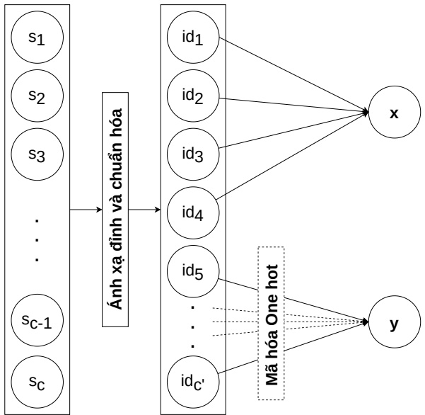

Hình 3.10: Mô hình chuẩn hóa dữ liệu huấn luyện cho mô hình FNN

• Đầu vào: phiên làm việc $s = \{ s _ { 1 } , s _ { 2 } , . . . , s _ { c } \}$ có c nhấp với $s _ { i }$ là mã định danh sản phẩm và $1 \leq i \leq c .$

• Đầu ra: Dữ liệu đầu vào huấn luyện x và đầu ra huấn luyện $y .$

• Thuật toán:

B1 : $\hat { \mathrm { A } }$ nh $\mathbf { X } \mathbf { \hat { a } }$ tất cả định danh sản phẩm $s _ { i }$ thành đỉnh $i d _ { i }$ tương ứng trong đồ thị (mỗi sản phẩm ứng với 1 đỉnh).

B2 : Nếu phiên không đủ 5 nhấp (4 nhấp đầu vào và ít nhất 1 nhấp là nhãn), thêm đỉnh None vào đầu phiên để cho đủ 5 nhấp. Kích thước mới của phiên sẽ là $c ^ { \prime }$ với $c ^ { \prime } \geq c .$

B3 : Kết hợp các $i d _ { i }$ làm đầu vào của mô hình - x.

B4 : Với $4 < i \leq c ^ { \prime }$ , những $i d _ { i }$ sử dụng làm nhãn để huấn luyện. Sử dụng mã hóa OneHot cho bài toán nhị phân ta có nhãn học là $\mathbf { y } \in \mathbb { R } ^ { n \times 2 }$

Trong đó $\mathbf { y } [ i d _ { i } ]   =   [ 1 , 0 ]$ nếu không nhấp vào sản phẩm tại đỉnh $i d _ { i } .$ và ngược lại thì $\mathbf { y } [ i d _ { i } ] = [ 0 , 1 ]$

B5 : Trả về x và y.

Giả mã của các bước chuẩn hóa dữ liệu trên được mô tả tại Thuật toán 3.1:

## b. Chuẩn hóa dữ liệu huấn luyện cho mô hình GNN

Để có những véc-tơ chuẩn đầu vào cho các mô hình sử dụng đồ thị, các bước chuẩn hóa được mô tả như Hình 3.11 với mỗi phiên của từng đồ thị.

<!-- page: 76 -->

<div class="docvortex-algorithm" style="white-space: pre-wrap; font-family:monospace;">
Thuật toán 3.1: Thuật toán NORM.FNN:
Chuẩn hóa dữ liệu huấn luyện cho mô hình FNN
Input: $s = \{id_1, id_2, ..., id_c\}$
Output: Dữ liệu đầu vào huấn luyện là $x$ và đầu ra huấn luyện $y$
$c' \leftarrow c$;
while $c' &lt; 5$ do
    Thêm vào cuối $s$ một nhập None;
    $c' \leftarrow c' + 1$;
$\mathbf{x} \leftarrow \{id_1, id_2, id_3, id_4\}$;
$Z \leftarrow \{id_5, id_6, ..., id_{c'}\}$;
$\mathbf{y} \leftarrow OneHotEncoding(Z)$
return $\mathbf{x} \in \mathbb{R}^4$, $\mathbf{y} \in \mathbb{R}^{n \times 2}$;
</div>

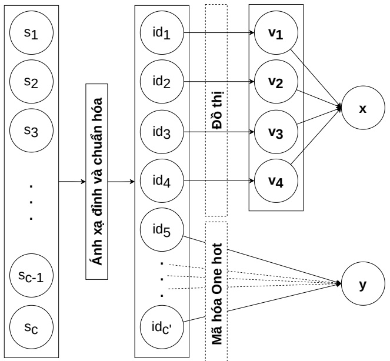

Hình 3.11: Mô hình chuẩn hóa dữ liệu huấn luyện cho các mô hình GNN

Chi tiết các bước hoạt động của mô hình 3.11 được mô $\mathrm { t \acute { a } }$ như sau:

• Đầu vào: phiên làm việc $s = \{ s _ { 1 } , s _ { 2 } , . . . , s _ { c } \}$ có c nhấp với $s _ { i }$ là mã định danh sản phẩm và $1 \leq i \leq c .$

• Đầu ra: Dữ liệu đầu vào huấn luyện x và đầu ra huấn luyện $y .$

• Thuật toán:

B1 : $\hat { \mathrm { A } }$ nh xạ tất cả mã định danh sản phẩm $s _ { i }$ thành đỉnh $i d _ { i }$ tương ứng trong đồ thị (mỗi sản phẩm ứng với 1 đỉnh).

B2 : Nếu phiên không đủ 5 nhấp $( c < 5 )$ (4 nhấp đầu vào và ít nhất 1 nhấp

<!-- page: 77 -->

là nhãn), thêm đỉnh None vào đầu phiên $\mathrm { d } \hat { \mathrm { e } }$ cho đủ 5 nhấp. Kích thước mới của phiên sẽ là $c ^ { \prime }$ với $c ^ { \prime } \geq c .$

B3 : Với $1 \leq i \leq 4 .$ , lấy các véc tơ trọng số kề $v _ { i }$ ứng với đỉnh $i d _ { i }$ trong đồ thị $( v _ { i } \in \mathbb { R } ^ { n }$ nếu độ thị đó là G hoặc H, $v _ { i } \in \mathbb { R } ^ { n \times 4 }$ nếu đồ thị là K). Nếu $i d _ { i }$ là None, véc tơ trọng số kề $v _ { i }$ sẽ là véc tơ toàn 0.

B4 : Kết hợp các véc tơ $v _ { i }$ có được làm đầu vào của mô hình $- \textbf { x } .$

B5 : Với $5 \leq i \leq c ^ { \prime } .$ những $i d _ { i }$ sử dụng làm nhãn để huấn luyện. Sử dụng mã hóa OneHot cho bài toán nhị phân ta có nhãn học là $\mathbf { y } \in \mathbb { R } ^ { n \times 2 }$

Trong đó $\mathbf { y } [ i d _ { i } ]   =   [ 1 , 0 ]$ nếu không nhấp vào sản phẩm tại đỉnh $i d _ { i } .$ , và ngược lại thì $\mathbf { y } [ i d _ { i } ] = [ 0 , 1 ]$

```txt
B6 : Trả về x và y.
```

Giả mã của các bước chuẩn hóa dữ liệu trên được mô tả tại Thuật toán 3.2:

<div class="docvortex-algorithm" style="white-space: pre-wrap; font-family:monospace;">
Thuật toán 3.2: Thuật toán NORM.GNN:
Chuẩn hóa dữ liệu dữ liệu huấn luyện cho các mô hình GNN
Input: $s = \{id_1, id_2, id_3, ..., id_{c-1}, id_c\}$
Output: Dữ liệu đầu vào huấn luyện là $x$ và đầu ra huấn luyện $y$
$c' \leftarrow c$;
while $c' &lt; 5$ do
    Thêm vào cuối $s$ một nhập None;
    $c' \leftarrow c' + 1$;
$x \leftarrow \{\}$;
for $i \leftarrow 1$ to $4$ by $1$ do
    if $id_i == None$ then
        $v_i \leftarrow \text{vec-tơ toàn } 0$;
    else
        $v_i \leftarrow \text{vec-tơ trọng số của định } id_i$ trong đồ thị;
    Thêm $v_i$ vào $x$
$Z \leftarrow \{id_5, id_6, ..., id_{c'}\}$;
$y \leftarrow OneHotEncoding(Z)$
return $x \in \mathbb{R}^4$, $y \in \mathbb{R}^{n \times 2}$;
</div>

<!-- page: 78 -->

## 3.4.3 Độ đo đánh giá mô hình

## a. Các độ đo cơ bản đánh giá mô hình

• Độ chuẩn xác - Precision:

$$
p r e c i s i o n = \frac {T P}{T P + F P}\tag{3.10}
$$

• Độ nhạy - Recall:

$$
r e c a l l = \frac {T P}{T P + F N}\tag{3.11}
$$

• Điểm $F _ { 1 }$ : Một phép đo kết hợp độ chuẩn xác và độ nhạy là giá trị trung bình hài hòa (harmonic mean):

$$
F _ {1} = 2 \times \frac {\text {precision} \times \text {recall}}{\text {precision} + \text {recall}}\tag{3.12}
$$

## b. Các độ đo nâng cao cho bài toán top − k

Với bài toán top − k cần đưa ra một danh sách k sản phẩm đề xuất tiếp theo thì các độ đo cơ bản trong quá trình đánh giá mô hình như P recision, Recall hay Accuracy không còn phù hợp nữa. Thay vào đó các nghiên cứu gần đây đề xuất sử dụng các độ đo Recall@k, MRR@k và ACCs@k để đánh giá hệ gợi ý top − k.

Để làm rõ các độ đo và hiểu được cách tính và $\acute { \mathrm { y } }$ nghĩa, tác giả xét bài toán với dữ liệu thử nghiệm nhỏ như Hình 3.12:

|  | input | labels | pred |
| --- | --- | --- | --- |
| 0 | [None, 49754, 49762, 49754] | [49754] | [49754, 49735, 49762, 24513, 498, 23116, 23033... |
| 1 | [None, None, 22851, 1443] | [1442] | [1442, 1443, 265, 21734, 268, 3770, 22851, 144... |
| 2 | [None, None, None, 1771] | [1771] | [1771, 579, 2109, 2111, 2112, 7653, 4117, 7475... |
| 3 | [6713, 4269, 2152, 6713] | [4269, 2152, 4269, 7127, 4269, 6713] | [6713, 2152, 4269, 2153, 9910, 5544, 4803, 505... |
| 4 | [None, None, None, 4433] | [4433] | [4433, 3876, 3826, 7423, 2123, 13400, 5806, 44... |
| 5 | [None, None, None, 40360] | [494] | [40361, 40360, 24391, 40352, 2842, 40345, 2229... |
| 6 | [None, None, None, 14983] | [14983] | [14983, 1152, 8443, 12454, 25615, 3978, 10283,... |
| 7 | [None, None, 42189, 42189] | [42189] | [42189, 28085, 34540, 42141, 15313, 351, 42153... |
| 8 | [13549, 13549, 13549, 8250] | [8250, 11219, 11219, 8250] | [8250, 13549, 2310, 13464, 11219, 47202, 36749... |
| 9 | [None, None, None, 3043] | [3043] | [3043, 5800, 7346, 37592, 37622, 1837, 36608, ... |

Hình 3.12: Bộ dữ liệu minh họa thiết kế đồ thị

<!-- page: 79 -->

Dữ liệu thực nghiệm này được mô tả như sau:

• Gọi dữ liệu có n quan sát, ở bảng trên n = 10

• Với đầu vào là 4 nhấp đầu tiên, và nhãn là các nhấp còn lại.

Ví dụ: với 1 phiên có các nhấp lần lượt là: [13549, 13549, 13549, 8250, 8250, 11219, 11219, 8250] thì [13549, 13549, 13549, 8250] là 4 nhấp đầu vào của mô hình, phần còn lại [8250, 11219, 11219, 8250] là các nhãn để dự đoán.

• Nếu một phiên không đủ 5 nhấp thì thêm None vào đầu phiên để lấp đầy phiên mà ko làm thay đổi giá trị của phiên. Như ví dụ ở dòng 0, 1, 2 ...

• Cột pred là dự đoán của mô hình ứng với từng phiên đã được sắp xếp giảm dần về xác suất - trọng số tin cậy (đầu ra của mô hình). Có thể thấy ở dòng 0, sản phẩm có id là 49754 có xác suất chọn tiếp theo cao nhất và nhãn cũng đã chứa nó.

## Độ đo Recall@k

Để đánh giá hiệu suất của mô hình với một hệ gợi ý, luận án sử dụng độ đo Recall@k theo Công thức 3.13:

$$
R e c a l l @ k = \frac {1}{n} \sum_ {i = 0} ^ {n - 1} \frac {| S _ {p r e d} ^ {i} \cap S _ {l a b e l s} ^ {i} |}{| S _ {l a b e l s} ^ {i} |}\tag{3.13}
$$

Trong đó, với n là số lượng phiên của bộ dữ liệu, $S _ { p r e d } ^ { i }$ là tập các sản phẩm gợi ý (gợi ý bởi $t o p - k )$ và $S _ { l a b e l s } ^ { i }$ là tập các sản phẩm được nhấp thực tế của phiên thứ i với $0 \leq i < n$ . Thông thường trong bài toán gợi ý, tập các nhấp thực tế $( S _ { l a b e l s } ^ { i } )$ chỉ có duy nhất một thành phần được gọi là ”được gợi ý nhấp tiếp theo”. Vì vậy, $S _ { l a b e l s } ^ { i } = \{ i d _ { * } \}$ với $i d _ { * }$ là sản phẩm được gợi ý nhấp tiếp theo sau các sản phẩm đã nhấp trong phiên làm việc thứ i.

Với dữ liệu trên ta có bảng kết quả sau:

Bảng 3.4: Độ đo Recall@k với dữ liệu minh họa

| k | 1 | 5 | 10 | 20 |
| --- | --- | --- | --- | --- |
| Recall@k | 0.8 | 0.9 | 0.9 | 1.0 |

## Độ đo MRR@k

Độ đo MRR@k (Mean Reciprocal Rank ) là mức trung bình của các cấp bậc tương hỗ của các sản phẩm mong muốn, xếp hạng đối ứng được đặt thành 0 nếu thứ hạng

<!-- page: 80 -->

lớn hơn k. MRR tính đến thứ hạng của sản phẩm, độ đo này phù hợp cho các bài toán gợi $\acute { \mathrm { y } }$ có xét đến mức độ quan trọng của thứ tự đề xuất. MRR@k được tính theo Công thức 3.14:

$$
M R R @ k = \frac {1}{n} \sum_ {i = 0} ^ {n - 1} R R (i d _ {*} ^ {i}, S _ {p r e d} ^ {i})\tag{3.14}
$$

Trong đó, với n là số lượng phiên của bộ dữ liệu, $S _ { p r e d } ^ { i }$ là tập k sản phẩm gợi ý được sắp xếp theo trọng số từ lớn đến bé (gợi ý bởi $t o p - k )$ và $i d _ { * } ^ { i }$ là sản phẩm được nhấp gợi $\hat { \mathrm { y } } \; \mathrm { t i } \hat { \mathrm { e } } \mathrm { p }$ theo sau các sản phẩm đã nhấp trong phiên làm việc thứ i với $0 \leq i < n$ $R R ( i d , S )$ là 0 nếu sản phẩm id $\notin S$ , là $\frac { 1 } { i n d e x { + } 1 }$ nếu $i d \in S$ với index là vị trí của id trong tập S tính từ 0.

Như vậy, nếu hệ gợi ý trả về đúng sản phẩm tiếp theo với điểm càng cao thì MRR càng cao. Lưu ý, độ đo này chỉ áp dụng với một nhấp sản phẩm tiếp theo thực tế, không phù hợp cho việc gợi ý một chuỗi các nhấp (số nhấp lớn hơn 1).

Với dữ liệu trên ta có bảng kết quả sau:

Bảng 3.5: Độ đo MRR@k với dữ liệu minh họa

| k | 1 | 5 | 10 | 20 |
| --- | --- | --- | --- | --- |
| MRR@k | 0.8 | 0.833 | 0.833 | 0.839 |

## Độ đo ACCs@k

Độ đo ACCs để tính độ chính xác trong một hệ gợi ý k nhãn với trọng số (xác suất) lớn nhất với nhiều nhãn thực tế. Đây là độ đo để tính cho một bài toán nhiều nhãn đầu ra (1 quan sát nhưng có nhiều nhãn).

$$
A C C s @ k = \frac {1}{n} \sum_ {i = 0} ^ {n - 1} \min (1, | S _ {p r e d} ^ {i} \cap S _ {l a b e l s} ^ {i} |)\tag{3.15}
$$

Trong đó, với n là số lượng phiên của bộ dữ liệu, $S _ { p r e d } ^ { i }$ là tập các sản phẩm gợi ý (gợi ý bởi $t o p - k )$ và $S _ { l a b e l s } ^ { i }$ là tập các sản phẩm được nhấp thực tế của phiên thứ i với $0 \leq i < n$ . Công thức min $\lvert ( 1 , \lvert S _ { p r e d } ^ { i } \cap S _ { l a b e l s } ^ { i } \rvert )$ chỉ ra rằng ở quan sát thứ i, có tồn tại 1 sản phẩm nào đó trong danh sách nhãn nằm trong k nhãn dự đoán có trọng số lớn nhất hay không, giá trị này bằng 1 nếu có tồn tại và ngược lại bằng 0.

Với dữ liệu trên ta có bảng kết quả sau:

<!-- page: 81 -->

Bảng 3.6: Độ đo ACCs@k với dữ liệu minh họa

| k | 1 | 5 | 10 | 20 |
| --- | --- | --- | --- | --- |
| ACCs@k | 0.9 | 0.9 | 0.9 | 1.0 |

## 3.4.4 Tối ưu hóa hàm mất mát

## a. Hàm Categorical crossentropy

Categorical crossentropy (CE) là hàm mất mát được sử dụng trong bài toán phân lớp đa nhãn. Trong bài toán này, một quan sát chỉ thuộc một trong nhiều lớp giới hạn, và mô hình của chúng ta phải xác định xem nó là lớp nào. Hàm này được thiết kế để tính toán sự khác nhau giữa hai phân bố xác suất.

$$
\mathrm{CE} = - \sum_ {i = 1} ^ {\mathrm{n}} y _ {i} \cdot \log \hat {y} _ {i}\tag{3.16}
$$

Trong đó $\hat { y } _ { i }$ là giá trị vô hướng thứ i có được từ đầu ra của mô hình, $y _ { i }$ ứng với giá trị mục tiêu. Giá trị n là kích thước đầu ra của mô hình, nói cách khác thì n là số lượng lớp mà mô hình của chúng ta muốn phân loại.

Hàm mất mát này ước lượng và tính toán rất hiệu quả để ta thấy được hai phân bố xác suất phân biệt với nhau như thế nào. Trong ngữ cảnh này, $y _ { i }$ là xác suất xảy ra sự kiện i và tổng của tất cả $y _ { i }$ là 1, nghĩa là có thể xảy ra đúng một sự kiện. Dấu trừ đảm bảo rằng sự mất mát sẽ nhỏ hơn khi các phân phối gần nhau hơn.

## b. Hàm Dice loss

Độ đo Dice Index được dùng $\mathrm { p h } \hat { \mathrm { o } }$ biến trong các bài toán phân vùng ảnh (sematic segmentation) [103]–[105], nó thể hiện độ khớp của đầu ra của mô hình và nhãn trên một ảnh. Công thức toán học của Dice Index là:

$$
D i c e = \frac {2 | X \cap Y |}{| X | + | Y |}\tag{3.17}
$$

ở đây X và Y là 2 tập cần so sánh. Ta nhận thấy Dice Index chính là $F _ { 1 }$ , mang đến một giá trị cân bằng cho tính toán độ hiệu quả của mô hình phân vùng.

Trong nghiên cứu này tuy đầu vào không phải ảnh nhưng với số lượng nhãn rất nhiều (52.069 nhãn) nên ta cần một độ đo có thể định tính và định lượng được, tránh nhầm lẫn và tránh học thiên vị vào một nhãn có số lượng xuất hiện lớn. Do vậy, tác giả đề xuất sử dụng độ đo Dice Index như là một phép đánh giá mô hình.

<!-- page: 82 -->

Và để sử dụng độ đo Dice Index như một hàm mất mát nhằm tối ưu mô hình, hàm Dice loss sẽ được tính như sau:

$$
D i c e L o s s = 1 - D i c e\tag{3.18}
$$

Hàm này sẽ có giá trị nằm trong khoảng [0, 1], mô hình càng tốt thì giá trị mất mát càng nhỏ và ngược lại.

Cụ thể hơn, với đầu ra của mô hình nghiên cứu đề xuất là $\hat { y } \in \mathbb { R } ^ { n \times m }$ với n là số lượng quan sát, m là số nhãn, thuật toán tính Dice Loss như sau:

B1 : Tính dương tính thật - tp:

$$
t p = \sum_ {i = 0} ^ {n - 1} \sum_ {j = 0} ^ {m - 1} y _ {i, j} * \hat {y} _ {i, j}\tag{3.19}
$$

B2 : Tính số dương tính - $p ;$

$$
p = \sum_ {i = 0} ^ {n - 1} \sum_ {j = 0} ^ {m - 1} y _ {i, j}\tag{3.20}
$$

B3 : Tính số dương tính dự đoán - pp:

$$
p p = \sum_ {i = 0} ^ {n - 1} \sum_ {j = 0} ^ {m - 1} \hat {y} _ {i, j}\tag{3.21}
$$

B3 : Tính recall (ϵ là một số đủ nhỏ):

$$
r e c a l l = \frac {t p + \epsilon}{p + \epsilon}\tag{3.22}
$$

B4 : Tính precision (ϵ là một số đủ nhỏ):

$$
p r e c i s i o n = \frac {t p + \epsilon}{p p + \epsilon}\tag{3.23}
$$

B5 : Tính Dice:

$$
D i c e = 2 \times \frac {\text {precision} \times \text {recall}}{\text {precision} + \text {recall}}\tag{3.24}
$$

B6 : Tính DiceLoss:

$$
D i c e L o s s = 1 - D i c e\tag{3.25}
$$

<!-- page: 83 -->

## c. Hàm Combo loss

Với những hiệu quả mà hàm mất mát CE mang lại và nhiều lợi ích cần thiết của hàm Dice Loss, ta cần một hàm có được tất cả những hiệu quả và lợi ích đó, đó là lý do luận án đề xuất hàm mất mát Combo loss [106]. Hàm này là sự cân bằng, hiệu quả đầu vào cũng như đầu ra của mô hình, giúp huấn luyện mô hình hiệu quả hơn trong những bài toán có số lượng nhãn lớn như số lượng điểm ảnh trên một bức ảnh và đặc biệt với bài toán trong hệ gợi ý của nghiên cứu này.

Công thức tính hàm ComboLoss được thể hiện như sau:

$$
C o m b o L o s s (y, \hat {y}, \alpha) = \alpha * C E (y, \hat {y}) + (1 - \alpha) * D i c e L o s s (y, \hat {y})\tag{3.26}
$$

Trong đó:

$\hat { y } ;$ đầu ra của mô hình (đầu ra dự đoán).

• y: đầu ra mục tiêu (đầu ra thực tế).

• α: hệ số cân bằng, trong nghiên cứu này sử dụng hệ số là 0,5.

• CE: hàm mất mát tính Categorical crossentropy.

• DiceLoss: hàm mất mát tính Dice Loss.

## d. Đánh giá các hàm mất mát

Để đánh giá hiệu quả của từng hàm mất mát, nghiên cứu thực nghiệm các hàm mất mát trên với cùng mô hình huấn luyện và các kỹ thuật xử lý dữ liệu giống nhau, từ đó sẽ đánh giá và đưa ra nhận xét xem hàm mất mát nào cho hiệu quả tốt nhất, gồm ba hàm mất mát gồm CE loss, Dice loss và Combo loss.

Kết quả thực nghiệm như ở Hình 3.13 và 3.14 với một số chú thích như sau:

• Biểu đồ mất mát (MODEL-LOSS) sử dụng hàm logarit tự nhiên để cho thấy sự khác biệt rõ ràng hơn, các độ đo khác giữ nguyên.

• train được đánh giá trên tập đào tạo, val được đánh giá trên tập đánh giá.

• ce: Sử dụng hàm mất mát Categorical crossentropy để tối ưu mô hình

• dice: Sử dụng hàm mất mát Diceloss để tối ưu mô hình

• combo: Sử dụng hàm mất mát Comboloss để tối ưu mô hình

Hình 3.13 là kết quả huấn luyện trong 100 epochs đầu tiên với kết quả hàm mất mát và độ chính xác. Trong biểu đồ mất mát MODEL − LOSS, ta thấy hàm

<!-- page: 84 -->

Diceloss trả về giá trị lớn nhất, CE có giá trị nhỏ nhất và Comboloss có giá trị trung bình vì hệ số cân bằng α là 0, 5. Trong biểu đồ độ chính xác MODEL−ACC, ta thấy cả hàm mất mát đề có kết quả tương đồng và rất cao (xấp xỉ 0,98).

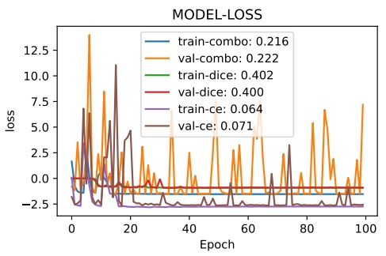

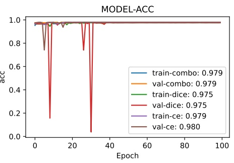

Hình 3.13: So sánh các hàm mất mát với độ đo loss và acc

Hình 3.14 cho ta thấy ở tất cả các độ đo, Comboloss đều có kết quả tốt hơn và khác biệt rõ ràng và CE là thấp nhất.

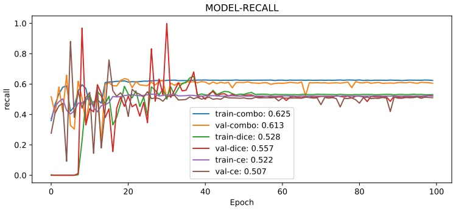

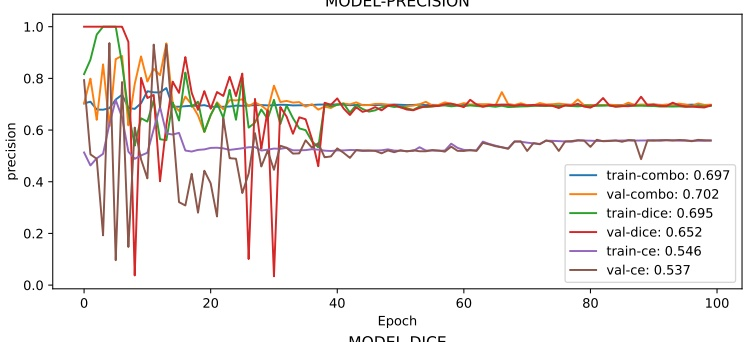

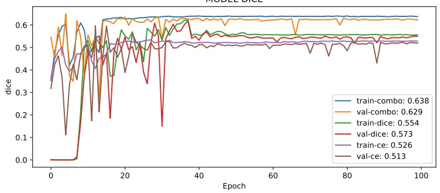

Hình 3.14: Hiệu năng của mô hình với các hàm mất mát

<!-- page: 85 -->

Lưu ý rằng tuy kết quả độ chính xác có thể cao nhưng giá trị này lại không có mấy ý nghĩa đó là vì phân bố nhãn quá lệch vì có hơn 52 nghìn sản phẩm nhưng chỉ chọn một. Về cơ bản, mô hình chỉ cần cho toàn bộ là không chọn thì đã đúng hơn 99%. Đây là một vấn đề khó của bài toán mà hàm mất mát CE không phù hợp, trong khi đó hàm Comboloss đã tỏ ra hiệu quả. Với kết quả thực nghiệm trên, tác giả sử dụng hàm Comboloss là hàm tối ưu chính cho nghiên cứu này.

## 3.5 Kết quả và nhận xét

## 3.5.1 Kết quả thực nghiệm

## a. Bảng kết quả

Quá trình thực nghiệm bài toán được đánh giá trên các mô hình mạng nơ-ron học sâu khác nhau chia thành hai nhóm FNN và GNN. Thực nghiệm sử dụng tập độ đo đặc thù để đánh giá mô hình gợi ý top − k gồm Recall@k, ACCs@k và MRR@k với giá trị $k \in [ 1 , 5 , 1 0 , 2 0 ]$ . Bảng 3.7 ghi nhận chi tiết kết quả thực nghiệm của các mô hình FNN và GNN, trong đó các mô hình GNN.G, GNN.H, GNN.K tương ứng với việc ứng dụng kiến trúc mạng GNN vào các đồ thị G, H và K.

Bảng 3.7: Bảng kết quả so sánh mô hình GNN với FNN

<table><tbody><tr><td></td><td>FNN</td><td colspan="3">GNN</td></tr><tr><td>Độ đo</td><td>base</td><td>G</td><td>H</td><td>K</td></tr><tr><td>Recall@1</td><td>0,221</td><td>0,218</td><td>0,214</td><td>0,221</td></tr><tr><td>Recall@5</td><td>0,371</td><td>0,518</td><td>0,512</td><td>0,519</td></tr><tr><td>Recall@10</td><td>0,406</td><td>0,625</td><td>0,620</td><td>0,626</td></tr><tr><td>Recall@20</td><td>0,437</td><td>0,708</td><td>0,703</td><td>0,709</td></tr><tr><td>ACCs@1</td><td>0,247</td><td>0,241</td><td>0,239</td><td>0,245</td></tr><tr><td>ACCs@5</td><td>0,407</td><td>0,549</td><td>0,545</td><td>0,550</td></tr><tr><td>ACCs@10</td><td>0,445</td><td>0,651</td><td>0,647</td><td>0,652</td></tr><tr><td>ACCs@20</td><td>0,474</td><td>0,728</td><td>0,724</td><td>0,729</td></tr><tr><td>MRR@1</td><td>0,221</td><td>0,218</td><td>0,214</td><td>0,221</td></tr><tr><td>MRR@5</td><td>0,279</td><td>0,330</td><td>0,325</td><td>0,332</td></tr><tr><td>MRR@10</td><td>0,284</td><td>0,344</td><td>0,339</td><td>0,346</td></tr><tr><td>MRR@20</td><td>0,286</td><td>0,350</td><td>0,345</td><td>0,352</td></tr></tbody></table>

## b. Nhận xét

Hình 3.15 biểu diễn kết quả của các mô hình sử dụng trong quá trình thực nghiệm. Kết quả cho thấy các mô hình sử dụng mạng nơ-ron đồ thị GNN cho kết quả tốt hơn hẳn các mô hình mạng nơ-ron FNN.

<!-- page: 86 -->

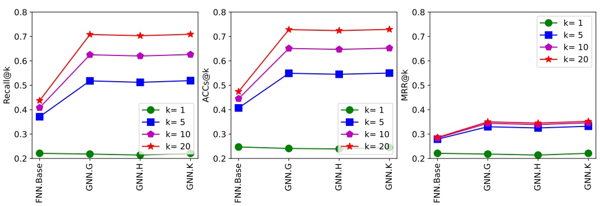

Hình 3.15: Biểu đồ kết quả so sánh các mô hình GNN với FNN

Hình 3.16 biểu diễn chi tiết kết quả các mô hình theo từng giá trị top − k khác nhau. Mô hình GNN.G hoạt động khá tốt và mô hình GNN.K có phần nhỉnh hơn một chút. Tuy nhiên mô hình GNN.H không thực sự nổi bật có thể do việc đồng nhất trọng số p-nhấp trong quá trình xây dựng đồ thị, tức không đánh giá mức độ ưu tiên giữa các khoảng cách nhấp p khác nhau. Lưu ý điểm khác biệt của đồ thị K là có đánh giá tới mức độ ưu tiên về độ đo p-nhấp thông qua việc thiết kế bộ trọng số cạnh của đồ thị K, và các độ đo tối ưu p-nhấp được học trong quá trình trong quá trình huấn luyện mạng nơ-ron GNN.K.


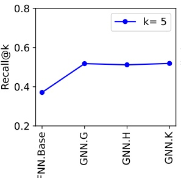

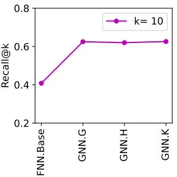

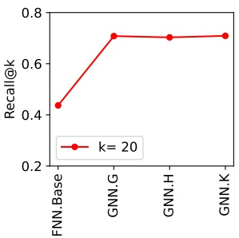

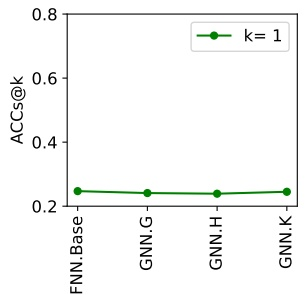

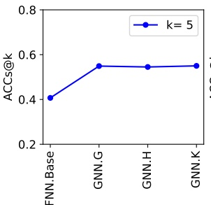

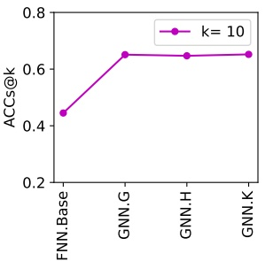

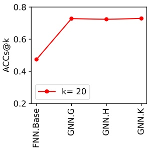

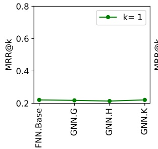

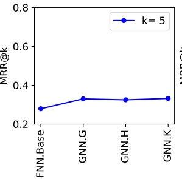

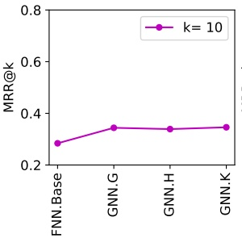

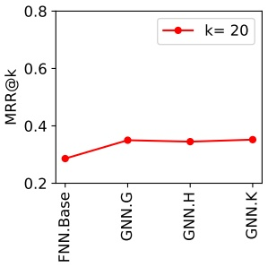

Hình 3.16: Biểu đồ kết quả so sánh các mô hình GNN với FNN chi tiết theo k

<!-- page: 87 -->

Kết luận với các loại mô hình mạng nơ-ron học sâu thì mạng nơ-ron đồ thị GNN đã nâng cao kết quả một cách tích cực so với mạng nơ-ron FNN. Mô hình tốt nhất mà chúng ta có thể thấy được là mô hình GNN với đồ thị K GNN.K.

## 3.5.2 So sánh với các nghiên cứu liên quan

Để so sánh hướng tiếp cận và kết quả đạt của chương này, tác giả lựa chọn một số bài báo tương tự cùng giải quyết bài toán hệ gợi $\acute { \mathrm { y } }$ dựa vào phiên làm việc và cùng sử dụng bộ dữ liệu Y oochoose của cuộc thi RecSys Challenge 2015 [107].

Hai nghiên cứu của Balázs Hidasi (2015) [90] và Yong Kiam Tan (2016) [91] đều sử dụng mạng nơ ron hồi quy (RNN). Yong Kiam Tan đã đề xuất cải tiến mô hình RNN với một thuật toán làm giàu dữ liệu và cho kết quả tốt hơn hẳn so với mô hình RNN của Balázs Hidasi. Thuật toán làm giàu dữ liệu trong quá trình tiền xử lý dữ liệu của Tan để sinh dữ liệu là: với một phiên $s = [ v _ { s , 1 } , v _ { s , 2 } , . . . , v _ { s , n } ]$ thì sẽ tạo ra một chuỗi phiên con và nhãn là $( [ v _ { s , 1 } ] , v _ { s , 2 } ) , ( [ v _ { s , 1 } , v _ { s , 2 } ] , v _ { s , 3 } ) , . . . , ( [ v _ { s , 1 } , v _ { s , 2 } , . . . , v _ { s , n - 1 } ] , v _ { s , n } )$ với $[ v _ { s , 1 } , v _ { s , 2 } , . . . , v _ { s , n - 1 } ]$ là chuỗi nhấp đầu vào và $v _ { s , n }$ là nhãn next − click. Điểm lưu ý là bộ dữ liệu này có số sản phẩm là 37.483 sau quá trình tiền xử lý, khác với thống kê gốc của bộ dữ liệu này là 52.739 sản phẩm [107], điểm khác biệt này sẽ là đáng kể với các mô hình gợi ý phân lớp đa nhãn.

Do bộ dữ liệu này khá lớn, Tan gặp một số khó khăn trong quá trình huấn luyện. Vì lý do đó Tan đưa ra ý tưởng chia nhỏ bộ dữ liệu để thực nghiệm thành các bộ Y oochoose nhỏ hơn $( 1 / 4 , \; 1 / 1 6 , \; 1 / 6 4 , \; 1 / 2 5 6 )$ . Trong quá trình thực nghiệm, Tan nhận thấy việc sử dụng bộ dữ liệu đầy đủ mang đến kết quả kém hơn so với việc dùng một phần của dữ liệu. Lý do chính mà Tan đưa ra nhận xét này là do số lượng nhãn quá lớn trên bộ dữ liệu đầy đủ, con số này sẽ bị giảm đáng kể khi tách thành từng phần nhỏ hơn nên mô hình sẽ học nhẹ nhàng hơn nhiều. Cho dù Tan kết luận mô hình M2 cho kết quả tốt nhất với bộ dữ liệu con Y oochoose1/64 với Recall@20 là 0, 7129 và MRR@20 là 0, 3091, tuy nhiên mô hình này không thể thực hiện được trên bộ dữ liệu đầy đủ do giới hạn phần cứng. Còn với bộ dữ liệu đầy đủ, mô hình M3 của Tan cho kết quả tốt nhất là Recall@20 là 0, 680 và MRR@20 là 0, 290.

Với hướng tiếp cận và xử lý dữ liệu như trên của Tan, có khá nhiều nghiên cứu liên quan được mô tả tiếp theo sử dụng kết quả này, nên tác giả tóm tắt một số điểm chính của quá trình tiền xử lý bộ dữ liệu Y ooochoose như sau:

• Dữ liệu được làm giầu theo thuật toán trình bày ở trên cho kết kết quả bộ huấn luyện đã tăng từ 7.966.257 thành 23.670.981 phiên.

• Mặc dù bộ dữ liệu $\mathrm { g } \hat { \mathrm { o } } \mathrm { c }$ có tập dữ liệu kiểm tra riêng nhưng Tan không dùng, Tan tạo bộ dữ liệu kiểm tra và đánh giá bằng cách trích từ tập dữ liệu huấn

<!-- page: 88 -->

luyện dựa theo một số ngày cuối của bộ dữ liệu. Với cách trích dữ liệu này, số lượng phiên của bộ dữ liệu kiểm tra khá nhỏ (khoảng từ 15 nghìn tới 55 nghìn phiên) so với bộ dữ liệu kiểm tra gốc là gần 2 triệu phiên (thống kê bộ dữ liệu gốc có thể tham khảo ở Bảng 3.3).

Nghiên cứu trên cũng không nói rõ việc dữ liệu kiểm tra được lấy trước hay sau khi làm giầu dữ liệu.

• Do bộ dữ liệu khá lớn (hơn 23 triệu phiên) nên Tan và cộng sự đã chia nhỏ thành các bộ dữ liệu con 1/4, 1/16, 1/64 và 1/256. Thường các nghiên cứu tiếp theo chỉ sử dụng bộ dữ liệu 1/4 và 1/64.

• Các nhãn ở trong bộ dữ liệu kiểm tra sẽ bị loại bỏ nếu không xuất hiện ở tập huấn luyện.

• Số sản phẩm (tức số nhãn) của bộ dữ liệu sau khi tiền xử lý là 37.483, khác với giá trị thống kê nhãn của dữ liệu gốc là 52.739 [107]. Thực tế số lượng nhãn còn có thể giảm nữa với các bộ dữ liệu con nhỏ hơn do việc phải loại bỏ các nhấp ở bộ kiểm tra mà không có trong bộ huấn luyện.

Jing Li và các cộng sự (2017) [93] đề xuất sử dụng mô hình NARM (Neural Attentive Recommendation Machine) để xây dựng hệ gợi ý phiên làm việc và cũng sử dụng bộ dữ liệu con Y ooochoose 1/4 và 1/64. Thực nghiệm của Jing Li sử dụng bộ dữ liệu kiểm tra với 55.898 phiên, số lượng sản phẩm là 16.766 với thực nghiệm 1/64 và 29.618 với thực nghiệm 1/4. Jing Li đạt được kết quả Recall@20 là 0,6973 và MRR@20 là 0,2923 với bộ dữ liệu 1/4. Trong bảng so sánh kết quả với nghiên cứu sử dụng RNN của Hidasi [90] và Tan [91], Jing Li cho rằng kết của mình tốt hơn, dù rằng nếu so sánh kỹ thì kết của của Jing Li không thực sự đầy đủ và nổi trội như nghiên cứu của Tan, ví dụ như không thực nghiệm với bộ dữ liệu đầy đủ.

## 3.6 Kết luận chương

Chương này đã đề xuất sử dụng đồ thị trong việc biểu diễn dữ liệu phiên làm việc, cụ thể hơn tác giả đề xuất thiết kế 3 đồ thị khác nhau gồm đồ thị đơn G, đồ thị đơn H và đồ thị đa quan hệ K. Các đồ thị này khác nhau về cách thức thiết kế tập cạnh và trọng số cạnh trong việc biểu diễn mỗi quan hệ giữa các nhấp, bao gồm cả quan hệ trong phiên làm việc cục bộ (intra sessions) và giữa các phiên làm việc toàn cục (inter sessions) trong tập dữ liệu.

Ở góc độ mô hình mạng nơ-ron, luận án nghiên cứu và đề xuất sử dụng mạng nơ-ron đồ thị GNN với từng đồ thị G, H và K để xây dựng mô hình dự báo top − k. Kỹ thuật thực nghiệm sử dụng bộ dữ liệu Yoochoose như đã sử dụng ở chương 2.

<!-- page: 89 -->

Kết quả thực nghiệm cho thấy mô hình GNN kết hợp với đồ thị biểu diễn phiên làm việc cho kết quả rất khả quan so với mô hình mạng nơ-ron truyền thẳng FNN không dùng đồ thị. Kết quả của thực nghiệm này được công bố tại hai công trình [A-4] và [A-5].

Kết luận của chương khẳng định mạng nơ-ron đồ thị GNN hoàn toàn có thể được sử dụng để xây dựng hệ thống gợi ý top − k. Cụ thể hơn, mô hình GNN rất phù hợp với các bài toán gợi ý sản phẩm liên quan đến tương tác người dùng trong phiên lựa chọn sản phẩm, mà ở đó thông tin tương tác giữa người dùng và sản phẩm được mô hình hóa dưới dạng đồ thị.

<!-- page: 90 -->

# Chương 4|Đề xuất cải tiến mô hình GNN với phép nhúng

Với kết quả đạt được ở Chương 3 cho Bài toán 2 bằng cách biểu diễn phiên làm việc dưới dạng đồ thị, tuy nhiên vẫn có một thách thức đặt ra là mô hình đề xuất phải xử lý bài toán đa nhãn với số lượng nhãn tương đương với số lượng đỉnh của đồ thị là rất lớn. Chương 4 trình bày phương án cải tiến mô hình GNN sử dụng đồ thị bằng cách xử lý vấn đề của bài toán phân loại đa nhãn với số lượng lớn. Phương án cải tiến bao gồm kết hợp nhúng đồ thị và nhúng nhãn nhằm giải quyết thách thức của bài toán đa nhãn. Từ đó đề xuất một lớp nhúng đặc biệt cho mô hình gợi ý sử dụng mạng nơ-ron đồ thị với đồ thị K được thiết kế ở Chương 3.

Mô hình gợi ý top − k đề xuất phép nhúng đồ thị trong việc xây dựng mạng GNN với đồ thị K được công bố tại công trình [A-8] trong Phần 4.6 ”Danh mục các công trình công bố của luận án”.

## 4.1 Thách thức của bài toán phân loại đa nhãn

Phân loại đa nhãn (multi-label classification) [108], [109] là một vấn đề khó khăn trong máy học do nhiều lý do [110], [111], có thể kể tới một số lý do chính như sau:

• Sự phụ thuộc giữa nhãn: Có thể có sự phụ thuộc giữa các nhãn trong không gian tập nhãn, có nghĩa là sự xuất hiện của một nhãn có thể ảnh hưởng đến xác suất của nhãn khác. Xử lý sự phụ thuộc nhãn như vậy là một thách thức đáng kể trong phân loại đa nhãn.

• Không gian nhãn lớn: Tập dữ liệu có không gian nhãn lớn làm cho việc huấn luyện mô hình có thể dự đoán chính xác tất cả các nhãn trở nên khó khăn.

• Dữ liệu mất cân bằng: Các tập dữ liệu đa nhãn thường mất cân bằng, có nghĩa là một số nhãn có rất ít trường hợp so với những nhãn khác. Điều này có thể dẫn đến mô hình bị thiên vị và hoạt động kém trên các nhãn bị thiếu.

• Trích xuất đặc trưng: Các tập dữ liệu đa nhãn có thể có các đặc trưng đầu vào phức tạp yêu cầu các kỹ thuật tiên tiến để trích xuất và biểu diễn.

Chuyển đổi bài toán phân loại đa nhãn thành bài toán phân loại nhị phân là một cách để đơn giản hóa bài toán và làm cho nó dễ xử lý hơn. Trong phương pháp này, mỗi nhãn được xử lý như là một bài toán phân loại nhị phân riêng biệt, và một bộ

<!-- page: 91 -->

phân loại riêng biệt được huấn luyện cho mỗi nhãn. Mỗi bộ phân loại dự đoán xem một trường hợp có thuộc nhãn đó hay không, dẫn đến một tập hợp dự đoán nhị phân cho mỗi trường hợp. Lợi ích của phương pháp này là cho phép sử dụng các thuật toán và độ đo đánh giá phân loại nhị phân tiêu chuẩn, được thiết lập và sử dụng khá rộng rãi. Tuy nhiên, phương pháp này cũng có một số hạn chế. Nó không xem xét các sự phụ thuộc và tương quan giữa các nhãn, có thể dẫn đến hiệu suất kém khi dự đoán nhiều nhãn cho một trường hợp cụ thể. Để xử lý sự phụ thuộc giữa các nhãn thì biểu diễn không gian nhãn dưới dạng đồ thị là một hướng tiếp cận phổ biến như nghiên cứu và đề xuất ở Chương 3.

Với vấn đề không gian nhãn lớn, ngoài kỹ thuật phân cụm nhãn (label clustering) [112], gần đây có một kỹ thuật đưa ra gọi là nhúng nhãn (label embedding) [113], [114]. Cũng giống như các phép biến đổi nhúng, nhúng nhãn đề cập đến quá trình biểu diễn từng nhãn thành một véc-tơ trong không gian đa chiều nào đó. Biểu diễn véc-tơ này được học thông qua việc huấn luyện trên một tập dữ liệu được gắn nhãn và có thể được sử dụng như một cách để thu thập quan hệ giữa các nhãn khác nhau. Trong bài toán phân loại đa nhãn, mỗi mẫu dữ liệu có thể thuộc về nhiều nhãn cùng một lúc. Lúc đó phép nhúng nhãn có thể được sử dụng như một cách để mô hình hóa sự tương quan giữa các nhãn này và làm cho các dự đoán chính xác hơn. Cụ thể, nhúng nhãn có thể được sử dụng như các đặc trưng đầu vào cho một bộ phân loại để cải thiện hiệu suất của nó trong các tác vụ phân loại đa nhãn [115].

Với những phân tích trên, chương này tiếp tục đề xuất cải tiến mô hình gợi ý top − k đề xuất ở Chương 3 với ba điểm sau: (1) chuyển đổi mô hình đa nhãn sang nhị phân, (2) cải tiến đồ thị biểu diễn phiên làm việc thông qua phép biến đổi nhúng đồ thị nhằm xử lý mối quan hệ giữa các đỉnh được tốt hơn, và (3) thiết kế kết hợp kỹ thuật nhúng nhãn trong quá trình huấn luyện mô hình.

## 4.2 Phương pháp nhúng đồ thị

Định nghĩa 17. Phép nhúng đồ thị. Phép nhúng đồ thị là một kỹ thuật để biểu diễn một đồ thị dưới dạng các véc-tơ có số chiều cao với mục đích hỗ trợ các thuật toán học máy để xử lý và phân tích thông tin của đồ thị, ví dụ như phân loại nút, dự đoán liên kết và phân cụm đồ thị.

Quá trình thực hiện phép nhúng đồ thị bao gồm ánh xạ các đỉnh và cạnh của đồ thị sang không gian véc-tơ mới, sao cho cấu trúc đồ thị được bảo toàn trong không gian nhúng, và kết quả này có thể được sử dụng làm đầu vào cho các tác vụ học máy hoặc cho mục đích trực quan hóa [10].

<!-- page: 92 -->

## 4.2.1 Phép biến đổi nhúng đỉnh

Phép nhúng đỉnh (node embeddings) là phép ánh xạ các đỉnh trong đồ thị sang một không gian rời rạc d chiều khác theo hướng tiếp cận véc-tơ hóa các đỉnh đồ thị [116]. Các véc-tơ nhúng đỉnh này hoặc ở mức đơn giản hơn hoặc cho phép biểu diễn tốt hơn các thuộc tính của đồ thị đó [117], [118]. Ta hoàn toàn có thể sử dụng các không gian rời rạc này nhằm mục đích biểu diễn, hay áp dụng vào các bài toán con khác như phân loại đỉnh, hoặc phân cụm đồ thị con...

Cụ thể phép biến đổi nhúng để biến đổi một đỉnh $v   \in   V$ vào một không gian nhúng d chiều để tạo ra các véc-tơ nhúng đỉnh trong không gian mới $\vee \in \mathbb { R } ^ { d }$ , được minh họa như Hình 4.1.

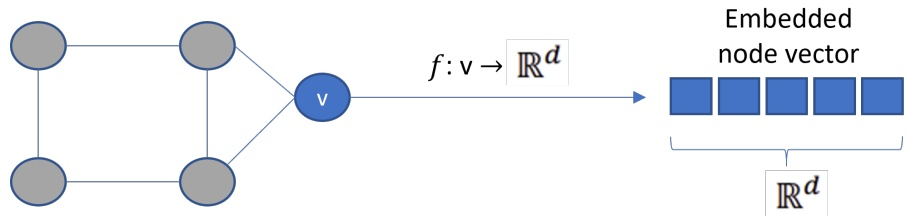

Hình 4.1: Phép biến đổi nhúng đỉnh

## 4.2.2 Phép biến đổi nhúng đồ thị

Nhúng đồ thị (graph embeddings) là phép ánh xạ toàn bộ đồ thị hoặc một đồ thị con thành một véc-tơ riêng [82], [119]. Phép biến đổi này phức tạp hơn với việc nhúng đỉnh do nó cần phải xét tới các mối tương quan giữa các đỉnh với nhau. Tuy nhiên phép biến đổi này tạo ra một tập véc-tơ riêng có thiên hướng nhỏ gọn hơn so với đồ thị lớn ban đầu, giúp cho việc biểu diễn đồ thị được đơn giản hơn mà vẫn biểu diễn được một đặc trưng nào đó cho bài toán tiếp theo của xử lý đồ thị. Phép ánh xạ này liên quan nhiều tới các bài toán về phân lớp dựa trên đồ thị hoặc đồ thị con.

Cụ thể phép biến đổi nhúng đồ thị là phép biến đổi một nhóm đỉnh có liên quan với nhau (ví dụ như một đồ thị con, một nhánh của đồ thị, hoặc một chuỗi đỉnh có sự tương tác nào đó với nhau) vào một không gian nhúng d chiều để tạo ra các véc-tơ nhúng trong không gian mới $\vee \in \mathbb { R } ^ { d }$ , được minh họa như Hình 4.2.

Với bài toán hệ gợi ý dựa trên phiên làm việc mà ở đó mỗi phiên được biểu diễn dưới dạng một nhánh của đồ thị lớn hơn. Như vậy mục đích của nhúng đồ thị con biểu diễn một phiên làm việc cụ thể là tìm ra véc-tơ đặc trưng ẩn cho phiên làm việc tương ứng đó. Sau khi huấn luyện tất cả các phiên làm việc trên mạng nơ-ron đồ thị GNN, chúng ta thu được tập các véc-tơ đặc trưng của các phiên.

<!-- page: 93 -->

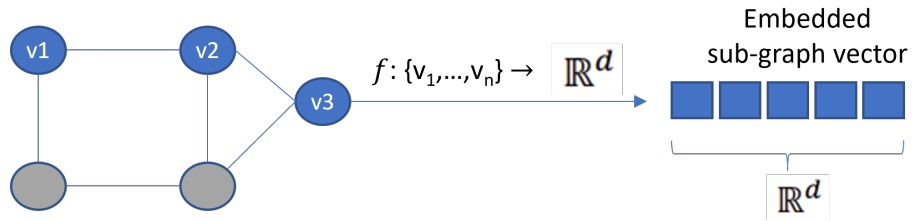

Hình 4.2: Phép biến đổi nhúng đồ thị con

Kỹ thuật biến đổi véc-tơ nhúng cho đồ thị cũng được mô tả ở một số nghiên cứu gần đây [120], [121]. Vấn đề đặt ra là lựa chọn phép biến đổi nhúng sao cho hiệu quả nhất cho bài toán SR. Có một số kỹ thuật nhúng đồ thị như bước sâu (deep walk ) được đề xuất bởi B Perozzi [122] hay bước đi ngẫu nhiên (random walk ) được đề xuất bởi G Nikolentzos [123], và node2vec được đề xuất bởi A Grover [83], [124].

## 4.3 Đề xuất cải tiến mô hình GNN.K

## 4.3.1 Chuyển đổi bài toán đa nhãn thành nhị phân

Với cách thức thiết kế hiện tại, mô hình phân loại đề xuất có số lượng nhãn khá lớn. Mô hình đa nhãn như vậy sẽ kém hiệu quả hơn rất nhiều so với mô hình nhị phân chỉ sử dụng 2 nhãn. Đó là lý do tác giả đề xuất thêm mô hình nhị phân để đánh giá thêm mức độ hiệu quả giữa mô hình đa nhãn và mô hình nhị phân. Để biến đổi một mô hình đa nhãn thành mô hình nhị phân chúng ta đưa nhãn vào đầu vào để mô hình trả lời ”có” hoặc ”không” với nhãn đó.

Nhằm đánh giá tính hiệu quả của việc chuyển đổi này, luận án đề xuất chuyển đổi sang bài toán nhị phân cho cả mô hình mạng nơ-ron truyền thẳng FNN và mạng nơ-ron đồ thị GNN ở các phần tiếp theo.

## 4.3.2 Đề xuất mạng nơ-ron truyền thẳng nhị phân

Từ mô hình FNN cơ sở đề xuất ở Hình 3.6 ở Chương 3, tác giả để xuất chuyển đổi thành mô hình nhị phân thông qua việc tiếp tục sử dụng lớp nhúng sản phẩm Layer.ItemEmbed như mô hình FNN cơ sở tuy nhiên có điểm khác biệt là đưa thêm thành phần nhãn id∗ và kết hợp chéo với từng thành phần $i d _ { i }$ của dữ liệu đầu vào. Mô hình đề xuất được mô tả như ở Hình 4.3.

• Đầu vào: gồm c + 1 phần tử (mô hình trên minh họa với $c = 4 )$

– c phần tử đầu tiên: $i d _ { 1 } , i d _ { 2 } , . . . , i d _ { c }$ đã được nhấp

<!-- page: 94 -->

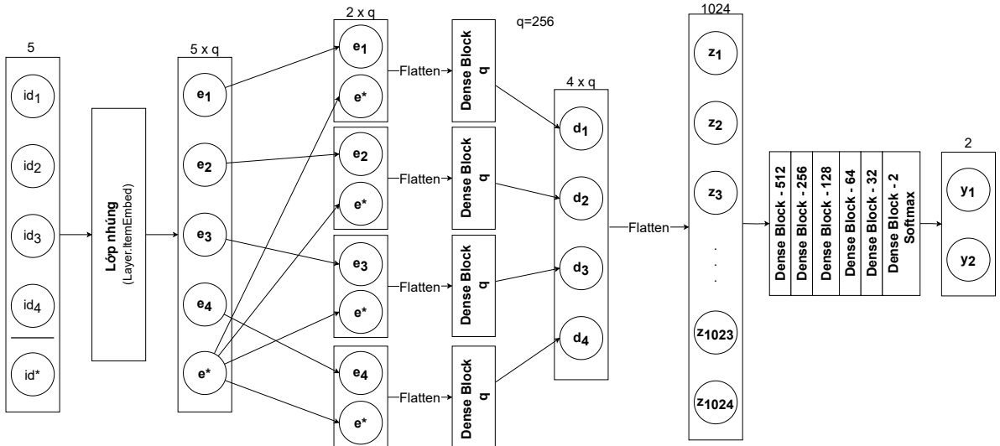

Hình 4.3: Mô hình FNN nhị phân (F NN.bin)

– Phần tử cuối: $i d ^ { * }$ là nhãn có thể nhấp tiếp theo

• Đầu ra: gồm 2 số là y<sub>1</sub> và y<sub>2</sub> có $\acute { \mathrm { y } }$ nghĩa như sau:

$y _ { 1 } ;$ xác suất không nhấp tiếp theo vào $i d ^ { * }$ sau khi đã nhấp $i d _ { 1 } , i d _ { 2 } , . . . , i d _ { c }$ theo đúng thứ tự

$y _ { 2 } ;$ xác suất nhấp tiếp theo vào $i d ^ { * }$ sau khi đã nhấp $i d _ { 1 } , i d _ { 2 } , . . . , i d _ { c }$ theo đúng thứ tự

$$
- y _ {1} + y _ {2} = 1
$$

• Luồng xử lý:

B1 Nhúng các mã định danh $i d _ { i } ( 1 \leq i \leq c )$ và $i d ^ { * }$ qua lớp nhúng $q = 2 5 6$ chiều Layer.ItemEmbed. Ta thu được các véc-tơ $e _ { i } \in \mathbb { R } ^ { q }$ ứng với mỗi i.

B2 Lấy từng $e _ { i }$ bắt cặp với $e ^ { * }$ thu được ma trận $u _ { i } = [ e _ { i } , e ^ { * } ] \in \mathbb { R } ^ { 2 \times q }$

Sau đó, ta làm phẳng nó thu được 1 véc-tơ trong $\mathbb { R } ^ { d }$ với $d = 2 \times q$ rồi cho đi qua một lớp kết nốt dày đặc Dense Block (được chú thích ở dưới). Ta thu được véc-tơ $\mathbf { d _ { i } }$ ứng với mỗi $i ( 1 \leq i \leq c )$

Đặt $\mathbf { D } = [ \mathbf { d _ { 1 } } , \mathbf { d _ { 2 } } , . . . , \mathbf { d _ { c } } ] { \mathrm { ~ n \hat { e n } ~ } } \mathbf { D } \in \mathbb { R } ^ { c \times q } { \mathrm { ~ v \hat { o } i ~ } } c = 4 .$

B3 Làm phẳng D ta thu được một véc-tơ $\mathbf { z } \in \mathbb { R } ^ { d }$ có số chiều là $d = c \times q$

B4 Đưa z qua một khối mạng nơ-ron nhân tạo kết nối dày đặc:

$$
\begin{array}{l}D e n s e B l o c k (5 1 2) \rightarrow D e n s e B l o c k (2 5 6) \rightarrow D e n s e B l o c k (1 2 8) \rightarrow\\D e n s e B l o c k (6 4) \rightarrow D e n s e B l o c k (3 2) \rightarrow D e n s e B l o c k (2) \rightarrow S o f t m a x.\end{array}
$$

<!-- page: 95 -->

Trong đó khối DenseBlock(x) là khối kết nối dày đặc với dense(x) → dropout(0.1) → bactchNormalization().

➜ Ta thu được một véc-tơ $\mathbf { y } = [ y _ { 1 } , y _ { 2 } ] \in \mathbb { R } ^ { 2 }$

## 4.3.3 Đề xuất mô hình nhúng đồ thị K nhị phân

## a. Đề xuất lớp nhúng phiên kết hợp

Trước tiên, luận án đề xuất kỹ thuật nhúng đồ thị biểu diễn phiên làm việc bằng cách kết hợp mô hình FNN.bin (Hình 4.3) sử dụng lớp nhúng sản phẩm Layer.ItemEmbed và lớp nhúng đồ thị K, trong đó lớp nhúng đồ thị K cũng sử dụng kỹ thuật nhúng chéo kết hợp nhãn $i d ^ { * }$ với từng thành phần $i d _ { i }$ . Với hướng tiếp cận này, lớp nhúng phiên có thể mang tới nhiều thông tin nhất có thể cho mô hình gợi ý top − k.

Lớp nhúng phiên đề xuất với tên gọi Layer.SessionEmbed được thiết kế như Hình 4.4.

Lớp nhúng phiên Layer.SessionEmbed được mô tả như sau:

• Đầu vào: gồm $c + 1$ phần tử (mô hình trên minh họa với $c = 4 )$

– c phần tử đầu tiên: $i d _ { 1 } , i d _ { 2 } , . . . , i d _ { c }$ đã được nhấp

– Phần tử cuối: $i d ^ { * }$ là nhãn có thể nhấp tiếp theo

• Đầu ra: 1 vector có kích thước $4 \times q$ với $q = 2 5 6$

Luồng xử lý của mô hình này gồm hai nhánh sau

• Nhánh 1: Nhúng chéo các phần tử sử dụng lớp nhúng sản phẩm

B1.1 Nhúng các mã định danh $i d _ { i } ( 1 \leq i \leq 4 )$ và $i d ^ { * }$ qua lớp nhúng q chiều Layer.ItemEmbed. Ta thu được các véc-tơ $e _ { i } \in \mathbb { R } ^ { q }$ ứng với mỗi giá trị i

B1.2 Lấy từng $e _ { i } ( 1 \leq i \leq 4 )$ bắt cặp với $e ^ { * }$ thu được ma trận $u _ { i } = [ e _ { i } , e ^ { * } ] \in$ $\mathbb { R } ^ { 2 \times q }$ . Sau đó, làm phẳng thu rồi cho đi qua một lớp kết nốt dày đặc DenseBlock (được chú thích ở dưới). Ta thu được véc-tơ d<sub>i</sub> ứng với mỗi i $( 1 \leq i \leq 4 )$ . Đặt $\mathbf { D } = [ \mathbf { d _ { 1 } } , \mathbf { d _ { 2 } } , \mathbf { d _ { 3 } } , \mathbf { d _ { 4 } } ]$ nên $\mathbf { D } \in \mathbb { R } ^ { 4 \times q }$

➜ Kết quả nhánh này ta thu được ma trận D.

• Nhánh 2: Kết nối chéo các phần tử sử dụng đồ thị K

B2.1 Lấy từng $i d _ { i }$ với $( 1 \leq i \leq 4 )$ bắt cặp với $i d ^ { * }$ đưa vào đồ thị K ta thu được $\mathbf { v _ { i } }$ là trọng số cạnh nối từ đỉnh $i d _ { i }$ đến đỉnh $i d ^ { * }$ với $\mathbf { v _ { i } } \in \mathbb { R } ^ { 4 }$

<!-- page: 96 -->

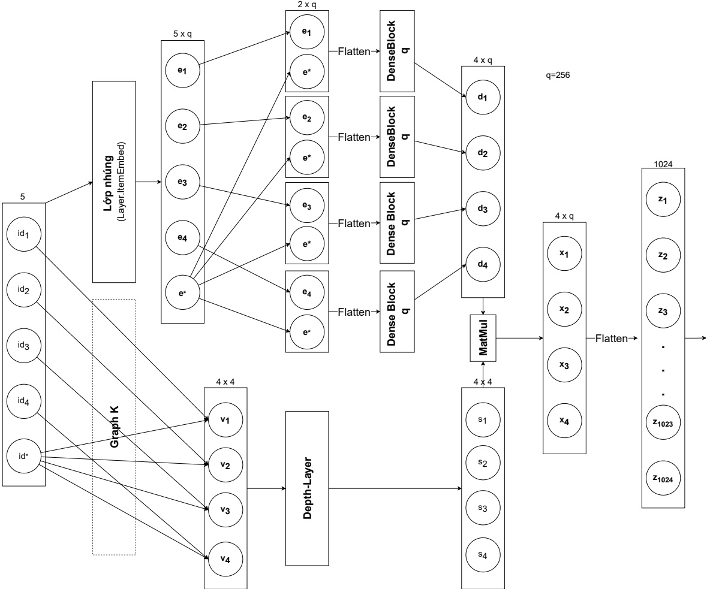

Hình 4.4: Lớp nhúng phiên với đồ thị K (Layer.SessionEmbed)

B2.2 Đặt $\mathbf { V } = [ \mathbf { v _ { 1 } } , \mathbf { v _ { 2 } } , \mathbf { v _ { 3 } } , \mathbf { v _ { 4 } } ] \in \mathbb { R } ^ { 4 \times 4 }$ . Cho V qua một lớp huấn luyện độ sâu (depth layer ) để thu được một ma trận mới $\mathbf { S } = [ \mathbf { s _ { 1 } } , \mathbf { s _ { 2 } } , \mathbf { s _ { 3 } } , \mathbf { s _ { 4 } } ] \in \mathbb { R } ^ { 4 \times 4 }$

Với lớp huấn luyện độ sâu, nguyên tắc hoạt động giống với mô hình mạng nơ-ron cho đồ thị K theo công thức sau:

$$
\mathbf {s _ {i}} = f (\mathbf {w _ {i} v _ {i}} ^ {T} + \mathbf {b _ {i}})\tag{4.1}
$$

trong đó:

∗ $\mathbf { w _ { i } } \in \mathbb { R } ^ { 1 \times 4 }$ là trọng số chiều sâu và $\mathbf { b _ { i } } \in \mathbb { R } ;$ trọng số tự do của chiều sâu (trọng số huấn luyện)

∗ f(z) : là hàm biến đổi z, tác giả sử dụng hàm tuyến tính $f ( z ) = z$

Hay được thể hiện tổng quát hóa như sau:

$$
\mathbf {S} = \mathbf {V W} + \mathbf {b}\tag{4.2}
$$

với $\mathbf { W } \in \mathbb { R } ^ { 4 \times 4 }$ và b $\in \mathbb { R } ^ { 4 }$ là trọng số huấn luyện.

<!-- page: 97 -->

➜ Kết quả nhánh này ta thu được ma trận S.

• Bước gộp hai nhánh:

B3.1 Tính X = SD. Ta có $\mathbf { X } = [ \mathbf { x _ { 1 } } , \mathbf { x _ { 2 } } , \mathbf { x _ { 3 } } , \mathbf { x _ { 4 } } ] \in \mathbb { R } ^ { 4 \times q }$ , trong đó S, D là kết quả của hai nhánh ở trên.

B3.2 Làm phẳng X ta thu được một véc-tơ $\mathbf { z } \in \mathbb { R } ^ { d }$ với $d = 4 \times q$

➜ Kết quả thu được véc-tơ z sẽ được chuyển tiếp tới lớp tiếp theo.

## b. Đề xuất mô hình

Sau khi có lớp nhúng phiên Layer.SessionEmbed, việc đề xuất mô hình trở nên dễ dàng hơn. Mô hình đề xuất có tính phức tạp vì tích hợp nhiều cải tiến qua những mô hình thử nghiệm để xử lý cho bài toán đa nhãn có không gian nhãn lớn bao gồm: (1) biến đổi nhị phân; (2) biểu diễn đồ thị; (3) nhúng đồ thị kết hợp với nhúng nhãn. Mô hình gợi $\acute { \mathrm { y } }$ được đề xuất có cấu trúc nhị phân như Hình 4.5.

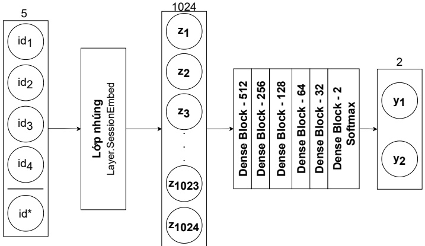

Hình 4.5: Mô hình nhúng nhị phân với đồ thị K (GNN.Bin.K)

Mô hình này được mô tả như sau:

• Đầu vào gồm 5 phần tử:

– 4 phần tử đầu tiên $( c = 4 ) { : } { ~ i d } _ { 1 } , { i d } _ { 2 } , { i d } _ { 3 } , { i d } _ { 4 }$ đã được nhấp

– Phần tử cuối: $i d ^ { * }$ là nhãn có thể nhấp tiếp theo

• Đầu ra: gồm 2 số là $y _ { 1 }$ và $y _ { 2 }$ có $\acute { \mathrm { y } }$ nghĩa như sau:

$y _ { 1 } ;$ xác suất không nhấp tiếp theo vào $i d ^ { * }$ sau khi đã nhấp $i d _ { 1 } , i d _ { 2 } , i d _ { 3 } , i d _ { 4 }$ theo đúng thứ tự

$y _ { 2 } ;$ xác suất nhấp tiếp theo vào $i d ^ { * }$ sau khi đã nhấp $i d _ { 1 } , i d _ { 2 } , i d _ { 3 } , i d _ { 4 }$ theo đúng thứ tự

<!-- page: 98 -->

$$
- y _ {1} + y _ {2} = 1
$$

• Luồng xử lý:

B1 Nhúng các mã định danh id<sub>i</sub> $( 1   \leq   i   \leq   4 )$ và id∗ qua lớp nhúng phiên Layer.SessionEmbed. Ta thu được một véc-tơ $\mathbf { z } \in \mathbb { R } ^ { 1 0 2 4 }$

```txt
B2 Đưa z qua một khối mạng nơ-ron nhân tạo kết nối dày đặc
DenseBlock(512) → DenseBlock(256) → DenseBlock(128)
→ DenseBlock(64) → DenseBlock(32) → DenseBlock(2) → Softmax.
Trong đó khối DenseBlock(x) là khối kết nối dày đặc với
dense(x) → dropout(0.1) → bactchNormalization().
```

<div class="docvortex-algorithm" style="white-space: pre-wrap; font-family:monospace;">
→ Kết quả ta thu được một véc-tơ $\mathbf{y} = [y_1, y_2] \in \mathbb{R}^2$.
</div>

Lưu ý vì mô hình trên chỉ trả về trọng số để dự đoán ”có” hay ”không” việc nhấp tiếp theo vào sản phẩm có id∗, nên để có thể thực nghiệm với một phiên làm việc ta sẽ chạy mô hình này với id∗sẽ nhận giá trị là tất cả đỉnh có thể đi đến được trong đồ thị K với bất kỳ trọng số nào (tối đa 52.069 đỉnh). Để tổng quát hóa, nếu gọi số lượng đỉnh là n thì đầu ra của mô hình ŷ sẽ thuộc Rn×2, mô hình có khoảng 14,6 triệu tham số huấn luyện

## 4.4 Kỹ thuật thực nghiệm

## 4.4.1 Chuẩn hóa dữ liệu huấn luyện

Trong nghiên cứu này, mô hình nhúng nhị phân sử dụng đồ thị K là mô hình phức tạp nhất do đó phần chuẩn hóa dữ liệu huấn luyện cũng cần được cải tiến. Ngoài véc-tơ phiên đầu vào, thuật toán này còn có thêm một tham số $n _ { i d ^ { * } }$ thể hiện số lượng các quan sát liên quan id∗l , nhằm trả lời câu hỏi nhị phân là quan sát id∗l đó có thể là nhãn của véc-tơ phiên đầu vào không. Thuật toán chuẩn hóa dữ liệu huấn luyện được mô tả như sau cho mỗi phiên ứng với đồ thị K như sau:

• Đầu vào gồm 2 tham số:

– Phiên $s = \{ s _ { 1 } , s _ { 2 } , . . . , s _ { c } \}$ có c nhấp với $s _ { i } ( 1 \leq i \leq c )$ là ID sản phẩm

$- ~ n _ { i d ^ { * } }$ là số lượng quan sát huấn luyện cho bài toán nhị phân với mỗi phiên.

• Đầu ra: Dữ liệu đầu vào huấn luyện là x và đầu ra huấn luyện y.

• Thuật toán:

<!-- page: 99 -->

B1 : Ánh xạ tất cả ID sản phẩm $s _ { i }$ thành đỉnh $i d _ { i }$ tương ứng trong đồ thị (mỗi sản phẩm ứng với 1 đỉnh).

B2 : Nếu phiên không đủ 5 nhấp $( c < 5 )$ (4 nhấp đầu vào và ít nhất 1 nhấp là nhãn), thêm đỉnh None vào đầu phiên $\mathrm { d } \hat { \mathrm { e } }$ cho đủ 5 nhấp. Kích thước mới của phiên sẽ là $c ^ { \prime }$ với $c ^ { \prime } \geq c$

B3 : Với $5 \leq i \leq c ^ { \prime }$ , những $i d _ { i }$ sử dụng làm nhãn $\mathrm { d } \hat { \mathrm { e } }$ huấn luyện. Đặt $Z =$ $i d _ { 5 } , i d _ { 6 } , . . . , i d _ { c ^ { \prime } }$

B4 : Tạo tập I là tập chứa $n _ { i d ^ { * } }$ đỉnh kề của các đỉnh $i d _ { i } \neq$ None trong phiên. Ưu tiên đỉnh có trong tập $\{ i d _ { 5 } , i d _ { 6 } , . . . , i d _ { c ^ { \prime } } \}$

B5 : Với mỗi đỉnh o trong I ta có:

∗ $x ^ { o } = \left\{ v _ { 1 } ^ { o } , v _ { 2 } ^ { o } , v _ { 3 } ^ { o } , v _ { 4 } ^ { o } \right\}$ . Trong đó, $v _ { i } ^ { o }$ là trọng số cạnh nối từ đỉnh $i d _ { i }$ đến đỉnh o với mọi $1 \leq i \leq 4$

∗ Lưu $\acute { \mathrm { y } }$ với đồ thị K, $v _ { i } ^ { o } \in \mathbb { R } ^ { 4 }$ vì trọng số cạnh của đồ thị đang thiết lập là véc-tơ có độ dài là 4.

∗ $y ^ { o } = \{ 0 , 1 \}$ nếu đỉnh o nằm trong Z, ngược lại là $y ^ { o } = \{ 1 , 0 \}$

B6 : Đặt:

$$
* \mathbf {x} = \{x ^ {o} | o \in I \} \in \mathbb {R} ^ {n _ {i d ^ {*}} \times 4}
$$

$$
* \mathbf {y} = \{y ^ {o} | o \in I \} \in \mathbb {R} ^ {n _ {i d ^ {*}} \times 2}
$$

B7 : Trả về x và y.

Giả mã của các bước chuấn hóa dữ liệu trên được mô tả tại Thuật toán 4.1:

Một điểm lưu $\acute { \mathrm { y } }$ với tham số $n _ { i d ^ { * } }$ , tức số lượng quan sát huấn luyện cho bài toán nhị phân với mỗi phiên. Với mô hình khác, tham số này sẽ chính là $n ,$ tức số lượng sản phẩm có trong bài toán, giúp chúng ta dự đoán xem sản phẩm nào có thể được nhấp sau đó. Nhưng với mô hình nhị phân, đầu vào có thêm nhãn và đầu ra chỉ trả lời ”có” hoặc ”không” nhấp vào nhãn đó trong những lần nhấp sau trong một phiên. Nếu đặt $n _ { i d ^ { * } } = n$ , thì rất phí phạm vì:

Không cần thiết phải tính toán tất cả n nhãn vì trung bình một phiên chỉ có khoảng 4 nhấp. Không chỉ vậy, nhãn trong mỗi phiên còn ít hơn số lượng nhấp vì có thể nhấp lại những sản phẩm đã được nhấp trong phiên.

• Mô hình nhị phân đã khá phức tạp và lớn, nếu gộp lại toàn bộ nhãn thì sẽ không thể đảm bảo khả năng hoạt động của máy tính.

<!-- page: 100 -->

<div class="docvortex-algorithm" style="white-space: pre-wrap; font-family:monospace;">
Thuật toán 4.1: Thuật toán NORM.GNN.Bin:
Chuẩn hóa dữ liệu huấn luyện cho mô hình GNN nhị phân
Input:
    $s = \{id_1, id_2, ..., id_c\} // phiên lựa chọn$
    $n_{id*} //số lượng đỉnh cần cần quan sát xem có phải là nhân không$
Output: Dữ liệu đầu vào huấn luyện là $x$ và đầu ra huấn luyện $y$
$c' \leftarrow c;$
while $c' &lt; 5$ do
    Thêm vào cuối $s$ một nhập None;
    $c' \leftarrow c' + 1;$
$Z \leftarrow id_5, id_6, ..., id_{c'};$
$I \leftarrow tập chứa n_{id*}$ định kê của các đình ngẫu nhiên trong phiên, ưu tiên
    định có trong các $\{id_5, id_6, ..., id_{c'}\}; //lưu ý bổ các định có giá trị là None.$
for định $o \in I$ do
    $x^o \leftarrow \{v_1^o, v_2^o, v_3^o, v_4^o\}$ với $v_i^o$ là trọng số cạnh nối từ đính $id_i$ đến đính $o;$
    $y^o \leftarrow \{0, 1\}; //nhãn true$
    if $o \notin Z$ then
        $y^o \leftarrow \{1, 0\} //nhãn false$
$x \leftarrow \{x^o | o \in I\} \in \mathbb{R}^{n_{id*} \times 4};$
$y \leftarrow \{y^o | o \in I\} \in \mathbb{R}^{n_{id*} \times 2};$
return $x, y;$
</div>

Với nhận xét trên, việc sử dụng tham só $n _ { i d ^ { * } }$ hiệu quả sẽ làm tăng hiệu suất đào tạo nhờ tập trung học vào những sản phẩm có xuất hiện trực tiếp trên đồ thị, thực tế trong phần thực nghiệm giá trị $n _ { i d ^ { * } } = 5 0$

## 4.4.2 Thuật toán huấn luyện mô hình

Nghiên cứu đề xuất Thuật toán 4.2 để huấn luyện ”vét cạn” các đặc trưng của dữ liệu để huấn luyện và tìm kiếm mô hình tối ưu. Đa phần mô hình đã đạt đến ngưỡng hội tụ trong vòng khoảng 2-3 tiếng, một số trường hợp đặc biệt có thể tới 4-8 tiếng.

## 4.4.3 Tối ưu mô hình GNN.Bin.K

Phần này sẽ mô tả chi tiết các tham số huấn luyện cho mô hình tối ưu nhất đã được phân tích ở trên, tức mô hình GNN nhúng kết hợp với với đồ thị K.

Qua Hình 4.6 ta thấy mỗi lần khởi động lại tốc độ học (learning rate), mô hình

<!-- page: 101 -->

<div class="docvortex-algorithm" style="white-space: pre-wrap; font-family:monospace;">
Thuật toán 4.2: Thuật toán huấn luyện MODEL.TRAINER
Output: Mô hình tối ưu
$e \leftarrow 0;$
while $e \leq 10$ do
    $lr_{start} \leftarrow 1e-4;$
    $lr_{end} \leftarrow 1e-8;$
    while $lr_{start} &gt; lr_{end}$ do
        if weights tồn tại then
            Tài weights vào mô hình;
        Cải đặt mô hình học với learningrate là $lr_{start};$
        count ← 0;
        for epoch ← 0 to 500 by 1 do
            Đào tạo mô hình thu được weighs và $loss_{val};$
            if $loss_{val}$ giảm then
                count ← 0;
                if $loss_{val}$ nhỏ hơn $loss_{val}$ đã lưu then
                    Lưu $loss_{val}$ và weights của mô hình hiện tại;
            else
                count ← count + 1;
                if count == 10 then
                    break;
        $lr_{start} \leftarrow lr_{start}/10;$
    $e \leftarrow e+1;$
</div>

bị xáo trộn và không hội tụ. Tuy nhiên khi được huấn luyện lại thì kết quả khá ổn định theo chu kỳ, như vậy mô hình đã đạt tới trạng thái tối ưu.

Hình 4.7, 4.8 và 4.9 mô tả các độ đo thay đổi theo kích thước của một phiên với bộ ba tham số Recall@k, ACCs@k và MRR@k. Ta có một số nhận xét sau:

• Như đã thấy trong phần thống kê dữ liệu, với độ dài phiên nhỏ thì có số lượng phiên càng lớn. Vì thế, kết quả với độ dài phiên càng ít thì có kết quả càng ổn định vì có nhiều mẫu quan sát. Và ngược lại, nhóm phiên có số lượng nhấp lớn có kết quả nhiễu và mô hình hoạt động không ổn định.

• Với số lượng nhấp trong phiên ít thì Recall@k có kết quả cao và ổn định, điều này đúng với cả MRR@k. Còn nếu số lượng nhấp càng lớn, thì ACCs@k càng cho kết quả càng cao.

<!-- page: 102 -->

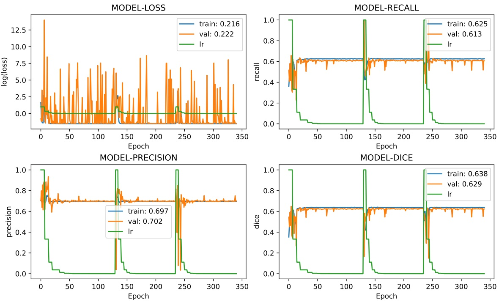

Hình 4.6: Biểu đồ huấn luyện của mô hình GNN.Bin.K

• Xét với tham số top−k thì k càng lớn thì các độ đo như Recall@k và ACCs@k càng có giá trị cao, nhưng với MRR@k thì không như vậy vì lúc đó xẩy ra nhiều sai khác khi đánh giá vị trí sản phẩm trả về trong danh sách.

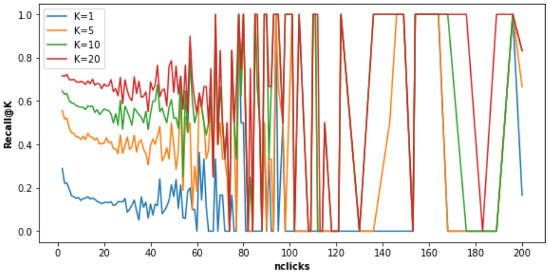

Hình 4.7: Kết quả Recall@k của mô hình GNN.Bin.K theo độ dài phiên

<!-- page: 103 -->

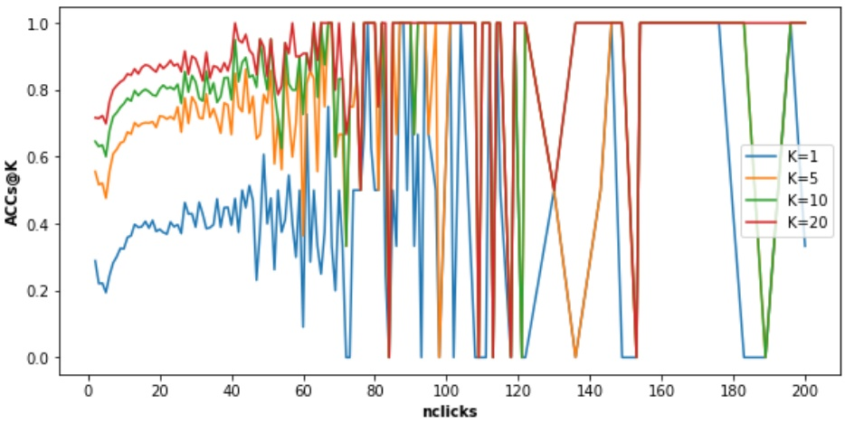

Hình 4.8: Kết quả ACCs@k của mô hình GNN.Bin.K theo độ dài phiên

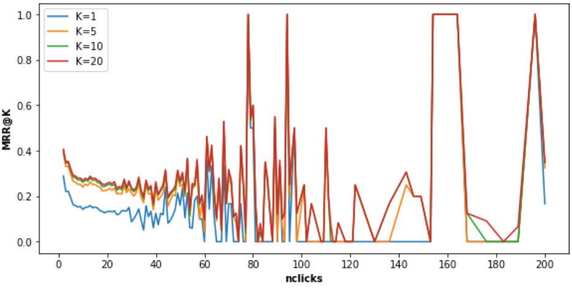

Hình 4.9: Kết quả MRR@k của mô hình GNN.Bin.K theo độ dài phiên

## 4.5 Kết quả và nhận xét

## 4.5.1 Kết quả thực nghiệm

## a. Bảng kết quả

Kết quả thực nghiệm với hai mô hình nhúng nhị phân F NN.Bin và GNN.Bin.K có so sánh với kết quả của mô hình F NN cơ sở và mô hình đồ thị tốt nhất GNN.K thực nghiệm trong chương 3. Kết quả chi tiết được thể hiện ở Bảng 4.1.

Kết quả cho thấy mô hình GNN.Bin.K cho kết quả tốt hơn so với GNN.K và vượt trội hơn so với mô hình F NN và F NN.Bin khi không sử dụng đồ thị.

<!-- page: 104 -->

Bảng 4.1: Bảng kết quả so sánh với mô hình GNN.Bin.K

| Mô hình | FNN | FNN.Bin | GNN.K | GNN.Bin.K |
| --- | --- | --- | --- | --- |
| Recall@1 | 0,221 | 0,228 | 0,221 | 0,236 |
| Recall@5 | 0,371 | 0,465 | 0,519 | 0,520 |
| Recall@10 | 0,406 | 0,540 | 0,626 | 0,629 |
| Recall@20 | 0,437 | 0,592 | 0,709 | 0,713 |
| ACCs@1 | 0,247 | 0,254 | 0,245 | 0,262 |
| ACCs@5 | 0,407 | 0,498 | 0,550 | 0,551 |
| ACCs@10 | 0,445 | 0,570 | 0,652 | 0,655 |
| ACCs@20 | 0,474 | 0,619 | 0,729 | 0,734 |
| MRR@1 | 0,221 | 0,228 | 0,221 | 0,236 |
| MRR@5 | 0,279 | 0,317 | 0,332 | 0,341 |
| MRR@10 | 0,284 | 0,327 | 0,346 | 0,355 |
| MRR@20 | 0,286 | 0,331 | 0,352 | 0,361 |

## b. Nhận xét

Hình 4.10 biểu diễn kết quả tổng hợp của k ∈ [1, 5, 10, 20] trong cùng một biểu đồ để tiện so sánh kết quả. Kết quả cho thấy mô hình nhúng với đồ thị K (GNN.Bin.K ) cao hơn hết các mô hình dùng mạng nơ-ron khác.

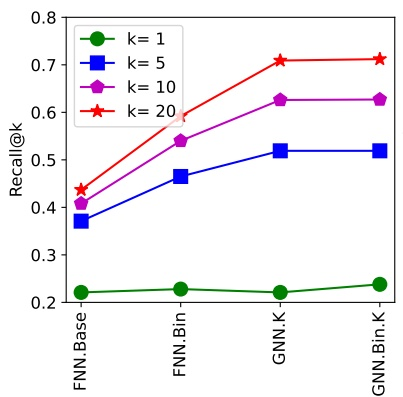

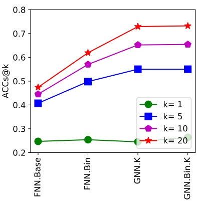

Hình 4.10: So sánh GNN.Bin.K với các mô hình khác

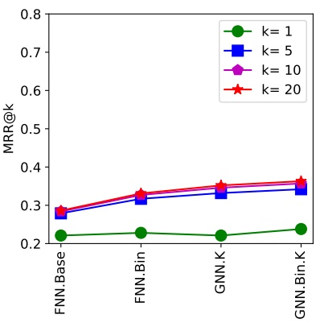

Hình 4.11 chi tiết hóa kết quả từng chỉ số của mô hình theo giá trị k.

## 4.5.2 So sánh với các nghiên cứu liên quan

Các nhóm nghiên cứu gần đây cũng tìm cách cải tiến các mô hình trước đó thông qua một số kỹ thuật nâng cao khi xử lý đồ thị, cụ thể là phép nhúng như nghiên cứu của tác giả trong chương này. Shu Wu và cộng sự (2019) [94] đề xuất cải tiến mô

<!-- page: 105 -->

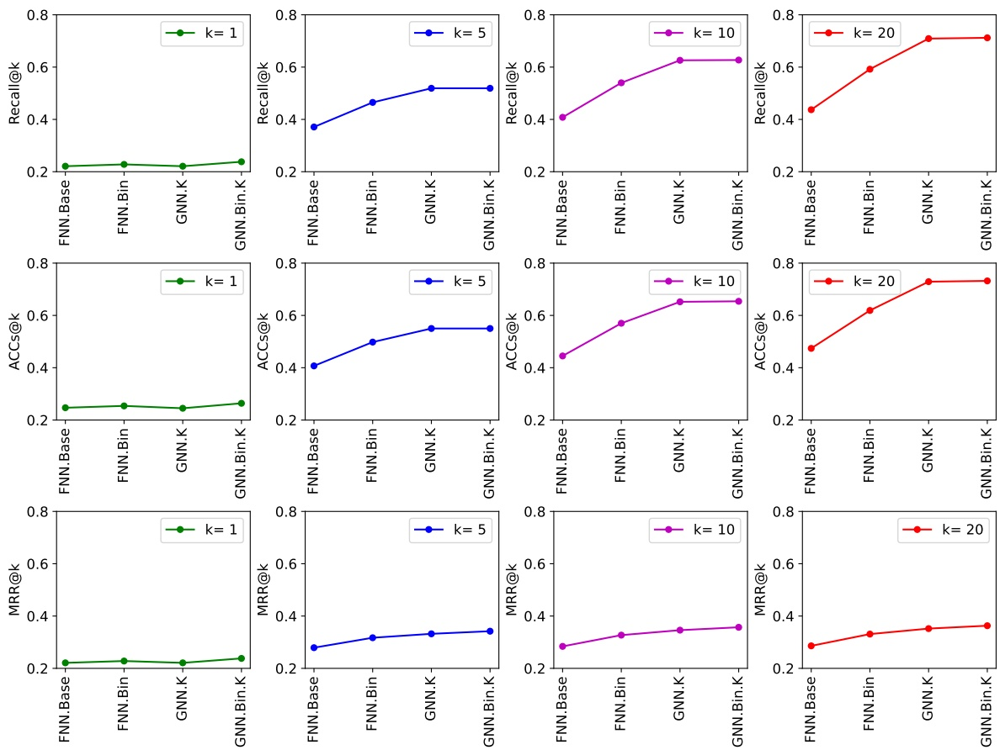

Hình 4.11: So sánh GNN.Bin.K với các mô hình khác theo k

hình của Tan [91] thông qua việc sử dụng mô hình mạng học sâu đồ thị cùng khá nhiều kỹ thuật xử lý đồ thị và các biến thể khác nhau của GNN để phân tích bài toán gợi ý dựa vào phiên làm việc. Nhóm nghiên cứu này đã đề xuất một mô hình sử dụng kỹ thuật biến đổi véc tơ phiên làm việc sang một không gian nhúng bằng cách sử dụng mạng đồ thị để huấn luyện và học. Do luận án này cũng có hướng tiếp cận sử dụng mạng đồ thị với kỹ thuật nhúng như nghiên cứu của Shu Wu, nên tác giả có một số so sánh chi tiết như sau:

• Xét về dữ liệu và bài toán cụ thể áp dụng, Shu Wu chỉ sử dụng hai bộ dữ liệu con Y oochoose 1/4 và 1/64 được đề xuất bởi Yong Kiam Tan (2016) mà không thực nghiệm với bộ dữ liệu đầy đủ [91].

✓ Trong khi đó, luận án này sử dụng bộ dữ liệu đầy đủ gồm cả tập huấn luyện và 25% tập kiểm tra với độ lớn khác biệt khá nhiều.

• Xét về đồ thị, Shu Wu sử dụng đồ thị $G _ { s } = ( V _ { s } , E _ { s } )$ với mỗi phiên làm việc s. Mỗi đỉnh của đồ thị đại diện cho một sản phẩm có trong phiên là $v _ { s , i } \in V ( V$ là tập sản phẩm của toàn bộ dữ liệu). Mỗi cạnh của đồ thị là $( v _ { s , i - 1 } , v _ { s , i } ) \in E _ { s } ,$ nó có nghĩa tồn tại khi người dùng nhấp vào sản phẩm $v _ { s , i }$ sau khi nhấp vào

<!-- page: 106 -->

$v _ { s , i - 1 }$ . Hiển nhiên sẽ có nhiều lần mà người dùng nhấp liên tiếp hai cặp sản phẩm tương tự nhau nên mỗi cạnh có trọng số chuẩn hóa được tính bởi cách chia số lượng nhấp tạo cạnh đó với bậc ra của đỉnh đầu.

✓ Luận án này cũng sử dụng đồ thị, tuy nhiên tác giả đề xuất sử dụng đồ thị G đại diện (bao gồm ba thiết kế cụ thể là đồ thị G, H và K) cho toàn bộ dữ liệu thay vì chỉ đại diện cho một phiên như đồ thị $G _ { s }$ . Lưu $\acute { \mathrm { y } }$ rằng việc biểu diễn và xử lý đồ thị G với hơn 52 nghìn đỉnh sẽ phức tạp hơn nhiều so với tập hợp các đồ thị đơn lẻ $G _ { s }$ cho từng phiên với số đỉnh không quá 200.

• Xét về kiến trúc mô hình học máy, Shu Wu cũng sử dụng GNN nhưng chưa sử dụng đồ thì đa quan hệ (đồ thị có trọng số cạnh là một véc-tơ).

✓ Sự khác biệt lớn của luận án này trong cách thức thiết kế mô hình là sử dụng đồ thị đa quan hệ K và cải tiến mô hình GNN với lớp học sâu phù hợp để mô hình với đồ thị K cho hiệu năng tốt nhất.

• Khác với các nghiên cứu trước sử dụng độ đo Recall@k, Shu Wu đề xuất sử dụng độ đo P recison@k và điểm đáng lưu ý là Shu Wu lại so sánh kết quả P recision@k của mình với Recall@k của các nghiên cứu trước đây, nên khả năng có sự nhầm lẫn trong nghiên cứu này và việc so sánh kết quả là không hợp lý.

✓ Luận án này sử dụng nhóm 3 độ đo đánh giá mô hình gồm Recall@k, MRR@k và ACCs@k, trong đó độ đo Recall@k đồng nhất với các nghiên cứu trước đây.

Trong nghiên cứu của Kiewan và cộng sự (2018) [92] cũng sử dụng mô hình RNN như hai bài báo của Balázs Hidasi và Yong Kiam Tan [90], [91]. Tuy nhiên Kiewan không chia nhỏ bộ dữ liệu như Tan mà có hướng tiếp cận khác biệt là đưa ra khái niệm phiên dài và phiên ngắn. Cụ thể Kiewan đánh giá mô hình theo 3 nhóm phiên có độ dài là [2-5], [6-25] và [26-200]. Kiewan đề xuất một số kỹ thuật khác nhau (bao gồm chuẩn hóa lớp LN, ma trận nhúng đầu vào RE hoặc xếp chồng lớp GRU) để xây dựng mô hình phù hợp với các loại dữ liệu phiên có độ dài ngắn khác nhau. Mô hình của Kiewan cho kết quả tốt nhất Recall@20 là 0,691. Như vậy, kết quả này là tốt hơn nghiên cứu của Tan khi kiểm tra với bộ dữ liệu đầy đủ nhãn có Recall@20 xấp xỉ 0,680 và tốt hơn hẳn so với kết quả của Balázs Hidas với Recall@20 là 0,632. Nếu so sánh kết quả này với kết quả tốt nhất của Tan với tập dữ liệu con 1/64 với số nhãn ít hơn thì không tốt bằng (Recall@20 trên tập 1/64 là 0,7129), tuy nhiên việc so sánh như vậy cũng không hoàn toàn hợp lý do số lượng nhãn của tập dữ liệu đầy đủ mà Kiewan kiểm tra (khoảng 37 nghìn nhãn) nhiều hơn so với tập con 1/64 của Tan (gần 17 nghìn nhãn).

<!-- page: 107 -->

Trong nghiên cứu của Anjing Luo và đồng nghiệp (2020) [97] sử mô hình mạng tự chú ý theo hướng cộng tác với tên gọi CoSAN. Mô hình CoSAN tìm các phiên làm việc hàng xóm có liên quan tới từng sản phẩm của phiên hiện tại, từ đó thức hiện phép nhúng để tạo phiên làm việc đặc trưng. Với hướng tiếp cận này, phiên nhúng đặc trưng của mô hình CoSAN cũng thể hiện được mối quan hệ của từng thành phần trong phiên hiện tại với các phiên hàng xóm trong bộ dữ liệu. Mô hình CoSAN cũng sử dụng bộ dữ liệu Yooochoose nhưng chỉ thực nghiệm với hai tập con 1/4 và 1/64 và đặt được kết quả MRR@5 là 0,3105. Kết quả này còn kém với thực nghiệm của luận án với giá trị MRR@5 trên toàn bộ bộ dữ liệu Yoochoose là 0,341.

## 4.6 Kết luận chương

Kết luận phép biến đổi nhúng đồ thị là kỹ thuật quan trọng để xây dựng hệ thống gợi ý top − k, đặc biệt với các bài toán liên quan đến việc biểu diễn mối tương tác giữa người dùng khi lựa chọn sản phẩm trong phiên làm việc dưới dạng đồ thị. Bằng cách học cách biểu diễn đồ thị sang một chiều không gian nhúng mới để nắm bắt các đặc trưng tiềm ẩn của các véc-tơ nhúng phiên, mô hình gợi ý top − k hoạt động hiệu quả hơn.

Mạng nơ-ron đồ thị GNN là một mô hình khá phổ biến và hoàn toàn có thể được sử dụng để học các véc-tơ nhúng đặc trưng của phiên làm việc. Tuy nhiên, lựa chọn kiến trúc và thuật toán nhúng sẽ ảnh hưởng đáng kể đến chất lượng các véc-tơ nhúng đặc trưng đã học và các đề xuất kết quả. Mặc dù cũng có khá nhiều các thuật toán nhúng khác nhau, chương này đề xuất một phép biến đổi nhúng phiên Layer.SessionEmbed để giải quyết Bài toán 2. Kết quả thực nghiệm cho thấy mô hình GNN có sử dụng phép nhúng đồ thị cho kết quả tốt hơn mô hình sử dụng GNN không sử dụng phép biến đổi nhúng đồ thị, và tốt hơn rất nhiều so với mạng nơ-ron truyền thẳng FNN không sử dụng đồ thị.

Kết quả thực nghiệm trong chương này đã chứng minh mô hình đề xuất đạt được hiệu suất tốt với 3 cải tiến gồm (1) chuyển đổi mô hình nhị phân, (2) đề xuất lớp nhúng đồ thị biểu diễn phiên làm việc và (3) thiết kế kết hợp nhúng nhãn.

<!-- page: 108 -->

## Kết luận

## 1 Kết luận chung

Bài toán hệ gợi ý top − k sản phẩm không phải là bài toán mới tuy nhiên nó luôn thu hút được nhiều nghiên cứu gần đây do tính phổ biến trong việc ứng dụng vào các lĩnh vực khác nhau. Bài toán top − k có thể được giải quyết bằng nhiều mô hình học máy và cấu trúc biểu diễn dữ liệu khác nhau, tùy thuộc vào yêu cầu cụ thể của vấn đề. Một số mô hình thường được sử dụng bao gồm các mô hình xếp hạng, mạng nơ-ron học sâu hay học tăng cường.... Những mô hình này có thể cung cấp các giải pháp hiệu quả cho bài toán top − k với các tập dữ liệu khác nhau, bao gồm cả dữ liệu dạng bảng, hoặc ngôn ngữ tự nhiên như văn bản hay câu, hoặc chuỗi dữ liệu dưới dạng sự kiện. Tuy nhiên, bài toán top − k ngày nay trở nên phức tạp hơn khi xử lý với các bộ dữ liệu lớn đặc biệt bộ dữ liệu được ghi nhận dưới dạng chuỗi sự kiện vì dữ liệu xảy ra liên tục và tuần tự theo thời gian. Trong những trường hợp như vậy, cần sử dụng các mô hình tiên tiến hơn ví dụ như biểu diễn dữ liệu theo dạng mạng lưới, đồ thị hoặc sử dụng cửa sổ trượt để bắt thông tin theo khối và biểu diễn dưới dạng ảnh. Như vậy điểm cốt lõi khi giải quyết bài toán top − k với bộ dữ liệu lớn dưới dạng chuỗi sự kiện là việc lựa chọn mô hình và biểu diễn cấu trúc dữ liệu một cách phù hợp.

Luận án này đề xuất sử dụng đồ thị để biểu diễn dữ liệu chuỗi sự kiện nhấp chuột mua hàng. Tác giả đề xuất sử dụng đồ thị đơn và đồ thị đa quan hệ để xây dựng các đồ thị biểu diễn mối quan hệ giữa các phiên. Cụ thể ba đồ thị G, H, và K với các độ phức tạp khác nhau được thiết kế để đánh giá mức độ hiệu quả của các mô hình dự báo top − k. Với các đồ thị để biểu diễn dữ liệu, tác giả đề xuất sử dụng mạng nơ-ron đồ thị GNN để làm mô hình dự báo. Theo hướng tiếp cận này, GNN có thể thu thập được các mối quan hệ phức tạp giữa các nhấp trong phiên làm việc hiện tại và sử dụng chúng để dự đoán một cách khá hiệu quả cho hành vi nhấp chuột tiếp theo. Các thực nghiệm của luận án đã cho thấy các mô hình GNN cho ra kết quả rất khả quan trong việc dự đoán hành vi mua hàng dựa trên sự kiện nhấp chuột.

Một trong những lợi ích chính của việc sử dụng đồ thị cho bài toán dự báo top − k là khả năng xử lý dữ liệu dạng sự kiện tuần tự như hành vi nhấp chuột liên tục trong phiên làm việc. Với việc biểu diễn dữ liệu phiên dưới dạng đồ thị, các mô hình GNN có thể hoạt động hiệu quả hơn và dự đoán chính xác về hành vi mua hàng của khách hàng chỉ cần dựa vào phiên làm việc hiện tại. Ngoài việc thu thập thông

<!-- page: 109 -->

tin phiên làm việc theo chuỗi sự kiện, GNN cũng có thể xử lý tính phức tạp của dữ liệu vì các lần nhấp chuột có thể liên kết với nhau giữa các phiên làm việc theo một cách thức nào đó. Tác giả đề xuất sử dụng kỹ thuật nhúng đồ thị và bổ sung các lớp nơ-ron hợp lý cho mô hình GNN đề xuất khi làm việc với đồ thị đa quan hệ K biểu diễn dữ liệu nhấp chuột theo nhiều lớp. Nhờ đó các mô hình GNN cải tiến đã nâng cao được kết quả bằng cách học các biểu diễn của các lần nhấp chuột dựa trên cấu trúc phiên làm việc hiện tại, giúp chúng có thể bắt được các tương tác phức tạp giữa các lần nhấp trong cùng một phiên cục bộ cũng như các phiên khác trong toàn bộ dữ liệu.

## 2 Kết quả đạt được

## Phương pháp xây dựng mô hình

Trong quá trình thực nghiệm, luận án đã tiến hành xây dựng kiến trúc mô hình cơ sở, dựng đồ thị cho đến phát triển kiến trúc mạng nơ-ron học sâu và các phương pháp tối ưu huấn luyện. Với mô hình mạng nơ-ron truyền thẳng FNN, kiến trúc có phần đơn giản và được coi là bước cơ sở nhất để luận án có nhưng bước cải tiến cho thấy việc đào tạo mô hình học máy giúp cải thiện hơn và điều đó đã được chứng minh bởi kết quả thực nghiệm.

Với hướng tiếp cận sử dụng đồ thị để biểu diễn dữ liệu, luận án đề xuất nghiên cứu mạng nơ-ron đồ thị GNN. Mô hình mạng GNN được phát triển với kiến trúc phức tạp hơn với bộ tham số đầy đủ hơn. Ở mức độ đầu tiên, luận án đề xuất sử dụng hai đồ thị đơn gồm đồ thị đơn G biểu diễn mối quan hệ nhấp kề và đồ thị đơn H biểu diễn mối quan hệ nhấp có khoảng cách. Với cả hai dạng đồ thị này, mô hình này vẫn là một dạng mạng nơ-ron học sâu sử dụng đồ thị ở mức dễ hiểu với các lớp đơn giản như lớp chuẩn hóa hoặc lớp kết nối đầy đủ.

Ở cấp độ tiếp theo khi sử dụng với đồ thị đa quan hệ có tính phức tạp cao như đồ thị K nên mô hình mạng nơ-ron có thêm một lớp mới gọi là lớp sâu để biến đổi dữ liệu đầu vào dưới dạng đồ thị cho khớp những lớp sâu của mô hình. Mặc dù vẫn giữ được ý tưởng thiết kế mô hình trên mọi kiểu đồ thị đơn và đa quan hệ, cũng giống như những mô hình trước đó, đầu ra là một véc-tơ hơn 52 nghìn số tương ứng với 52 nghìn nhãn sản phẩm. Với sự thay đổi và cải tiến kiến trúc với việc bổ sung một số lớp phù hợp, ta cũng đã có một kết quả được chứng minh bằng thực nghiệm là tốt hơn so với những mô hình trước đó.

Với mong muốn nghiên cứu và đề xuất ra một mô hình hiệu quả hơn, luận án tiếp tục phát triển mô hình nơ-ron đồ thị sử dụng kỹ thuật nhúng. Trước khi sử dụng kỹ

<!-- page: 110 -->

thuật nhúng với đồ thị, luận án đã xem xét độ hiệu quả học tập của phương pháp nhúng với mô hình nhúng FNN cơ sở (Hình 3.6), mô hình này có một kiến trúc đơn giản với lớp nhúng sản phẩm Layer.ItemEmbded (Hình 3.5) kết hợp với một lớp kết nối đầy đủ. Tuy mô hình FNN cơ sở có kết quả chưa đủ tốt nhưng đã thể hiện được khả năng học tập của kỹ thuật nhúng này với sự hội tụ khi tối ưu mô hình, từ đó làm cơ sở phát triển mô hình tốt hơn.

Quá trình thực nghiệm nhận thấy đầu ra của bài toán là khá lớn với hơn 52 nghìn sản phẩm, và hàm kích hoạt Sof tmax hoạt động kém hiệu quả với đầu ra lớn cũng như bài toán top − k. Vì vậy, luận án tiếp tục đề xuất cải tiến kiến trúc mô hình bằng cách biến đổi thành mô hình nhị phân để xử lý bài toán đa nhãn. Với ý tưởng nhúng nhãn làm một phần của đầu vào mô hình và cách thức kết kết nối các vec-tơ trong khối DenseBlock sẽ giúp việc trích chọn đặc trưng được hiệu quả hơn khi chúng ta sử dụng nhãn là đầu vào. Sự kết hợp các véc-tơ đầu vào để thu được véc-tơ e như Hình 4.3 là hoàn toàn hợp lý để giải quyến vấn đề mối quan hệ giữa các thành phần trong không gian nhãn, ví dụ như khi ta cần trả lời câu hỏi”Các nhấp trước đó ảnh hưởng đến quyết định nhấp dự đoán như thế nào ?”. Câu trả lời cho câu hỏi đó chính là các khối Dense Block tương ứng ngay sau véc-tơ e, những tham số huấn luyện của nó sẽ được điều chỉnh để trích xuất đặc trưng tốt nhất trong quá trình học. Với mô hình này, ta đã có kết quả tốt hơn nhiều mô hình nhúng đơn FNN.

Cuối cùng, với đầy đủ ưu điểm của mô hình mạng nơ-ron đồ thị, các phép biến đổi nhúng, luận án đã kết hợp để đưa một mô hình tối ưu nhất là mô hình mạng nơ-ron đồ thị sử dụng phép nhúng đồ thị K nhị phân GNN.Bin.K. Mô hình này là kết quả tổng hợp từ các nghiên cứu của luận án, bao gồm (1) biểu diễn phiên làm việc dưới dạng đồ thị, (2) sử dụng phép nhúng đồ thị kết hợp với nhúng nhãn, (3) biến đổi bài toán đa nhãn thành nhị phân. Mô hình tối ưu này sử dụng một lớp đặc biệt gọi là lớp nhúng phiên đồ thị K (Layer.SessionEmbed) (Hình 4.4) với sự kết hợp hợp lý giữa mô hình mạng nơ-ron đồ thị cùng với phép biến đổi nhúng đồ thị. Mô hình GNN.Bin.K đem lại một kết quả vượt trội so với các mô hình cơ sở sử dụng mạng nơ-ron truyền thẳng FNN và các mô hình mạng nơ-ron đồ thị GNN sử dụng đồ thị.

## Kết quả đạt được

Sau khi thực nghiệm cũng như so sánh với các nghiên cứu liên quan, tác giả có một số nhận xét như sau về kết quả của mình so với các nghiên cứu trước đây:

✓ Luận án nghiên cứu và đề xuất mô hình mạng nơ-ron học sâu cho Bài toán 1 và mạng nơ-ron đồ thị cho Bài toán 2. Trong đó Bài toán 1 là bài toán nhị

<!-- page: 111 -->

phân và Bài toán 2 là bài toán đa nhãn top − k.

✓ Luận án này sử dụng cả tập dữ liệu huấn luyện và kiểm thử từ bộ dữ liệu gốc với số lượng sản phẩm, tức số lượng nhãn, lên tới hơn 52 nghìn.

➜ Các nghiên cứu trước đây không sử dụng bộ dữ liệu kiểm thử riêng biệt của bộ dữ liệu gốc, mà trích ra từ tập dữ liệu huấn luyện. Điều này làm giảm số lượng sản phẩm, tức số lượng nhãn của mô hình xuống còn từ 10 tới 37 nghìn nhãn.

✓ Luận án này đề xuất và xây dựng mô hình GNN có tính mở rộng cao khi hoạt động với đồ thị với hơn 52 nghìn đỉnh. Luận án đề xuất thiết kế một số đồ thị khác nhau gồm đồ thị G với khái niệm nhấp kề, đồ thị H sử dụng trọng số cạnh là đường đi giữa các nhấp trong phiên làm việc, và đồ thị K với trọng số cạnh là một véc-tơ c chiều.

➜ Một số nghiên cứu liên quan trình bày không thể chạy được mô hình với bộ dữ liệu đầy đủ, do đó họ phải thực nghiệm với bộ dữ liệu nhỏ hơn với số lượng nhãn thậm chí còn ít hơn.

✓ Mô hình đề xuất của luận án này cho kết quả Recall@20 là 0,712 và MRR@20 là 0,363

➜ Kết quả trên là tốt hơn nghiên cứu của Kiewan có Recall@20 là 0,691 và của Tan có Recall@20 là 0,680 (Tan có nhiều kết quả khác nhau, đây là kết quả chạy với bộ dữ liệu đầy đủ), và tốt hơn hẳn nghiên cứu đầu tiên của Balázs Hidas với Recall@20 là 0,632.

## 3 Các đóng góp chính của luận án

Luận án này có các đóng góp chính sau:

• Sử dụng đồ thị để mô hình hóa hành vi mua sắm của khách hàng thông qua chuỗi nhấp chuột trong phiên làm việc, bao gồm cả đồ thị đơn và đa quan hệ. Luận án thực nghiệm với các thiết kế đồ thị khác nhau khi thể hiện mối quan hệ của hơn 50 ngàn sản phẩm (tương ứng với số lượng đỉnh của đồ thị) và hơn 30 triệu số lần tương tác nhấp chuột để biểu diễn tập cạnh của đồ thị, trong đó số lượng phiên làm việc là hơn 9 triệu.

• Đề xuất mô hình mạng nơ-ron học sâu cho Bài toán 1 và mạng nơ-ron đồ thị cho Bài toán 2 trong việc dự báo hành vi mua sắm. Cụ thể hơn với Bài toán 2, luận án đề xuất phương án thiết kế ba dạng đồ thị G, H và K. Với đồ thị đa quan hệ K sử dụng trọng số cạnh là một véc-tơ, luận án đề xuất sử dụng thêm

<!-- page: 112 -->

một lớp học sâu tuyến tính cho phép mạng GNN có thể học được đồ thị này hiệu quả hơn so với mạng GNN cơ bản khi học với đồ thị đơn.

• Đề xuất thuật toán nhúng đồ thị cho phép mô hình GNN có thể học được các thuộc tính ẩn của hành vi của người dùng trong quá trình lựa chọn các danh mục sản phẩm trong phiên làm việc hiện tại. Luận án so sánh các kỹ thuật nhúng bao gồm phương pháp nhúng đơn giản (nhúng từng sản phẩm) và nhúng đồ thị (nhúng phiên làm việc), và nhúng nhãn kết hợp để biến đổi bài toán đa nhãn thành nhị phân. Lớp nhúng Layer.SessionEmbed được thiết kế thông qua sự kết hợp đồng thời các kỹ thuật nhúng giúp việc trích xuất đặc trưng trở lên hiệu quả hơn.

## 4 Hướng phát triển trong tương lai

Bài toán hệ gợi ý dựa vào phiên làm việc rất có tiềm năng và tính ứng dụng cao trong thực tế. Hướng nghiên cứu và phát triển trong tương lai cho bài toán này có thể tính tới một số điểm sau:

• Mô hình hóa chuỗi các hành vi [125]: Hệ gợi ý SR đề xuất các sản phẩm cho người dùng dựa trên phiên làm việc hiện tại của người dùng. Nghiên cứu tương lai có thể tập trung vào phát triển các mô hình có khả năng bắt chước chuỗi hành vi của người dùng qua nhiều phiên, từ đó có thể cải thiện độ chính xác của các đề xuất.

• Xử lý vấn đề khởi động lạnh [126]: Hệ gợi ý SR có thể gặp vấn đề khởi động lạnh khi không đủ dữ liệu về hành vi gần đây của người dùng để đưa ra các đề xuất chính xác. Nghiên cứu tương lai có thể tập trung vào phát triển các kỹ thuật xử lý vấn đề khởi động lạnh trong hệ thống đề xuất dựa trên phiên, chẳng hạn như sử dụng siêu dữ liệu (metadata) của các sản phẩm hoặc tận dụng một số đặc điểm của người dùng ví dụ như vùng miền.

• Gợi ý theo thời gian thực [127]: Hệ gợi ý SR hoạt động trong môi trường trực tuyến và các gợi ý cần được tạo ra theo thời gian thực khi người dùng tương tác với hệ thống. Nghiên cứu tương lai có thể nghiên cứu các kỹ thuật học trực tuyến cho các Hệ gợi ý SR, từ đó cải thiện hiệu suất của mô hình trong các kịch bản thời gian thực.

<!-- page: 113 -->

## Các công trình của tác giả

Trong quá trình thực hiện luận án này, tác giả và đồng nghiệp có công bố một số công trình sau:

A-1 Khang Nguyen, Anh V. Nguyen, Lan N. Vu, Nga T. Mai, and Binh P. Nguyen, ”An Efficient Deep Learning Method for Customer Behaviour Prediction Using Mouse Click Events”, Proceedings of the 11th National Conference on Fundamental and Applied Information Technology Research (FAIR’2018), 2018, pp.10, Vietnam, doi = [10.15625/vap.2018.0002](https://doi.org/10.15625/vap.2018.0002).

A-2 Khang Nguyen, Nga T. Mai, An H. Nguyen, and Binh P. Nguyen, ”Prediction of Wart Treatment Using Deep Learning with Implicit Feature Engineering”, Soft Computing for Biomedical Applications and Related Topics, Springer International Publishing, 2020, pp.153–168, doi = [10.1007/978-3-030-49536-7\_14](https://doi.org/10.1007/978-3-030-49536-7_14).

A-3 Nguyễn Tuấn Khang, Nguyễn Viết Việt, Nguyễn Hải An, Mai Sơn, Mai Thúy Nga, và Nguyễn Việt Anh, ”Phát hiện giao dịch thẻ gian lận sử dụng mô hình học sâu”, hội thảo quốc gia lần thứ XXIII, 2020, pp.335.

A-4 Nguyễn Tuấn Khang, Mai Thúy Nga, Nguyễn Hải An, và Nguyễn Việt Anh,”Phân Tích Hành Vi Khách Hàng Với Mô Hình Mạng Học Sâu Đồ Thị”, hội thảo quốc gia lần thứ XXIV, 2021, p.439.

A-5 Nguyễn Tuấn Khang, Nguyễn Tú Anh, Mai Thúy Nga, Nguyễn Hải An, và Nguyễn Việt Anh, ”Hệ Gợi Ý Mua Sắm Dựa Theo Phiên Làm Việc Với Mô Hình Mạng Học Sâu Đồ Thị”, chuyên san Các công trình nghiên cứu, phát triển và ứng dụng CNTT và Truyền thông, Bộ Thông tin và Truyền thông, 2022, vol. 2022, no. 02.

A-6 Khang Nguyen, Viet V. Nguyen, Nga T. Mai, An H. Nguyen, and Anh V. Nguyen, ”Behavioral gait analysis using hybrid Convolutional Neural Networks”, Journal of Computer Science and Cybernetics, 2023, vol. 39, no. 2, doi = [10.15625/1813-9663/18067](https://doi.org/10.15625/1813-9663/18067).

A-7 Khang Nguyen, Nga T. Mai, An H. Nguyen, and Anh V. Nguyen, ”A Compu tational Model for Predicting Customer Behaviors Using Transformer Adapted with Tabular Features”, International Journal of Computational Intelligence Systems, vol. 16, no. 1, pp. 1–8, 2023, doi = [10.1007/s44196-023-00307-5](https://doi.org/10.1007/s44196-023-00307-5).

A-8 Khang Nguyen, Anh T. Nguyen, Nga T. Mai, An H. Nguyen, and Anh V.

<!-- page: 114 -->

Nguyen, ”Developing Advanced Product Recommendation System using Embedding Graph Neural Networks”, Applied Intelligence, Springer, 2023. (đang chờ kết quả)

Ngoài ra, tác giả cũng công bố một số công trình ở các lĩnh vực nghiên cứu khác:

B-1 Xing Wang, Khang Nguyen, and Binh P. Nguyen, ”Churn Prediction using Ensemble Learning”, ICMLSC 2020, Proceedings of the 4th International Conference on Machine Learning and Soft Computing, Association for Computing Machinery, 2020, pp.55-60, Vietnam, doi = [10.1145/3380688.3380710](https://doi.org/10.1145/3380688.3380710).

B-2 Jyh-Huah Chan, Hui-Juin Lim, Ngoc-Son Hoang, Jeong-Hoon Lim, Khang Nguyen, Binh P. Nguyen, Chee-Kong Chui, and Matthew Chua, ”Hybrid Convolutional Neural Network Ensemble for Activity Recognition in Mobile Phones”, Soft Computing for Biomedical Applications and Related Topics, Springer International Publishing, 2020, pp.289–299, doi = [10.1007/978-3-030-49536-7\_25](https://doi.org/10.1007/978-3-030-49536-7_25).

B-3 Kim Chwee Lim, Swee Heng Sin, Chien Wei Lee, Weng Khin Chin, Junliang Lin, Khang Nguyen, Quang H. Nguyen, Binh P. Nguyen, and Matthew Chua, ”Video-based Skeletal Feature Extraction for Hand Gesture Recognition”, ICMLSC 2020, Proceedings of the 4th International Conference on Machine Learning and Soft Computing, Association for Computing Machinery, 2020, pp.108–112, Vietnam, doi = [10.1145/3380688.3380711](https://doi.org/10.1145/3380688.3380711).

B-4 Khang Nguyen, Jiawei Chee, Chong Wee Soh, Ngoc-Son Hoang, Jeong-Hoon Lim, Binh P. Nguyen, Chee-Kong Chui, and Matthew Chua, ”Classification of Gait Patterns Using Overlapping Time Displacement of Batchwise Video Subclips”, Research in Intelligent and Computing in Engineering, Springer Singapore, 2021, pp.99–111, doi = [10.1007/978-981-15-7527-3\_10](https://doi.org/10.1007/978-981-15-7527-3_10).

B-5 Khang Nguyen, Jeff Gan Ming Rui, Binh P. Nguyen, Matthew Chua, and Youheng Ou Yang, ”Classification of Parkinson’s Disease-Associated Gait Patterns”, Research in Intelligent and Computing in Engineering, Springer Singapore, 2021, pp.595–606, doi = [10.1007/978-981-15-7527-3\_56](https://doi.org/10.1007/978-981-15-7527-3_56).

B-6 Khang Nguyen, Jerome Wei Yang Lim, Kuo Ping Lee, Terry Lin, Jing Tian, Trang T. T. Do, Matthew Chua, and Binh P. Nguyen, ”Heart Disease Classification using Novel Heterogeneous Ensemble”, IEEE EMBS International Conference on Biomedical and Health Informatics, 2021, pp.1-4, doi = [10.1109/BHI50953.2021.9508516](https://doi.org/10.1109/BHI50953.2021.9508516).

<!-- page: 115 -->

## Tài liệu tham khảo

[1] J. B. Schafer, J. A. Konstan, and J. Riedl, “E-commerce recommendation applications”, Data mining and knowledge discovery, vol. 5, no. 1, pp. 115–153, 2001.

[2] R. Mangiaracina, G. Brugnoli, and A. Perego, “The ecommerce customer journey: A model to assess and compare the user experience of the ecommerce websites”, Journal of Internet Banking and Commerce, vol. 14, no. 3, pp. 1–11, 2009.

[3] B. Sarwar, G. Karypis, J. Konstan, and J. Riedl, “Analysis of recommendation algorithms for e-commerce”, in Proceedings of the 2nd ACM Conference on Electronic Commerce, 2000, pp. 158–167.

[4] D. A. Menasce, “Scaling for e-business”, in Proceedings 8th International Symposium on Modeling, Analysis and Simulation of Computer and Telecommunication Systems (Cat. No. PR00728), IEEE, 2000, pp. 511–513.

[5] P. Lops, D. Jannach, C. Musto, T. Bogers, and M. Koolen, “Trends in contentbased recommendation: Preface to the special issue on Recommender systems based on rich item descriptions”, User Modeling and User-Adapted Interaction, vol. 29, pp. 239–249, 2019.

[6] L. Wu, X. He, X. Wang, K. Zhang, and M. Wang, “A survey on accuracyoriented neural recommendation: From collaborative filtering to informationrich recommendation”, IEEE Transactions on Knowledge and Data Engineering, vol. 35, no. 5, pp. 4425–4445, 2022.

[7] Z. Huang, D. Zeng, and H. Chen, “A comparison of collaborative-filtering recommendation algorithms for e-commerce”, IEEE Intelligent Systems, vol. 22, no. 5, pp. 68–78, 2007.

[8] D. Jannach, M. Quadrana, and P. Cremonesi, “Session-based recommender systems”, in Recommender Systems Handbook, Springer, 2022, pp. 301–334.

[9] M. Ludewig and D. Jannach, “Evaluation of session-based recommendation algorithms”, User Modeling and User-Adapted Interaction, vol. 28, pp. 331–390, 2018.

[10] M. Wang, L. Qiu, and X. Wang, “A survey on knowledge graph embeddings for link prediction”, Symmetry, vol. 13, no. 3, p. 485, 2021.

[11] J. Chen, B. Sun, H. Li, H. Lu, and X.-S. Hua, Deep CTR Prediction in Display Advertising, 2016. arXiv: [1609.06018 \[cs.CV\]](https://arxiv.org/abs/1609.06018).

<!-- page: 116 -->

[12] G. de Souza Pereira Moreira, F. Ferreira, and A. M. da Cunha, “News sessionbased recommendations using deep neural networks”, in Proceedings of the 3rd workshop on deep learning for recommender systems, 2018, pp. 15–23.

[13] M. Ruocco, O. S. L. Skrede, and H. Langseth, “Inter-session modeling for session-based recommendation”, in Proceedings of the 2nd Workshop on Deep Learning for Recommender Systems, 2017, pp. 24–31.

[14] S. Wu, Y. Tang, Y. Zhu, L. Wang, X. Xie, and T. Tan, “Session-based recommendation with graph neural networks”, in Proceedings of the AAAI conference on artificial intelligence, vol. 33, 2019, pp. 346–353.

[15] J. B. Schafer, J. Konstan, and J. Riedl, “Recommender systems in e-commerce”, in Proceedings of the 1st ACM conference on Electronic commerce, 1999, pp. 158–166.

[16] Y. Koren, R. Bell, and C. Volinsky, “Matrix factorization techniques for recommender systems”, Computer, vol. 42, no. 8, pp. 30–37, 2009.

[17] S. Zhang, L. Yao, A. Sun, and Y. Tay, “Deep learning based recommender system: A survey and new perspectives”, ACM Computing Surveys (CSUR), vol. 52, no. 1, pp. 1–38, 2019.

[18] M. Tsagkias, T. H. King, S. Kallumadi, V. Murdock, and M. de Rijke, “Challenges and research opportunities in ecommerce search and recommendations”, in ACM Sigir Forum, ACM New York, NY, USA, vol. 54, 2021, pp. 1–23.

[19] M. Grbovic, V. Radosavljevic, N. Djuric, et al., “E-commerce in your inbox: Product recommendations at scale”, in Proceedings of the 21th ACM SIGKDD international conference on knowledge discovery and data mining, 2015, pp. 1809–1818.

[20] R. Qiu, J. Li, Z. Huang, and H. Yin, “Rethinking the item order in sessionbased recommendation with graph neural networks”, in Proceedings of the 28th ACM international conference on information and knowledge management, 2019, pp. 579–588.

[21] S. Akter and S. F. Wamba, “Big data analytics in E-commerce: a systematic review and agenda for future research”, Electronic Markets, vol. 26, pp. 173–194, 2016.

[22] L. Li and J. Zhang, “Research and analysis of an enterprise E-commerce marketing system under the big data environment”, Journal of Organizational and End User Computing (JOEUC), vol. 33, no. 6, pp. 1–19, 2021.

<!-- page: 117 -->

[23] U. Javed, K. Shaukat, I. A. Hameed, F. Iqbal, T. M. Alam, and S. Luo, “A review of content-based and context-based recommendation systems”, International Journal of Emerging Technologies in Learning (iJET), vol. 16, no. 3, pp. 274–306, 2021.

[24] Y. Afoudi, M. Lazaar, and M. Al Achhab, “Hybrid recommendation system combined content-based filtering and collaborative prediction using artificial neural network”, Simulation Modelling Practice and Theory, vol. 113, p. 102 375, 2021.

[25] R. L. Rosa, G. M. Schwartz, W. V. Ruggiero, and D. Z. Rodriguez, “A knowledge-based recommendation system that includes sentiment analysis and deep learning”, IEEE Transactions on Industrial Informatics, vol. 15, no. 4, pp. 2124–2135, 2018.

[26] M. M. Afsar, T. Crump, and B. Far, “Reinforcement learning based recommender systems: A survey”, ACM Computing Surveys, vol. 55, no. 7, pp. 1–38, 2022.

[27] A. L. Montgomery, S. Li, K. Srinivasan, and J. C. Liechty, “Modeling online browsing and path analysis using clickstream data”, Marketing science, vol. 23, no. 4, pp. 579–595, 2004.

[28] W. W. Moe and P. S. Fader, “Capturing evolving visit behavior in clickstream data”, Journal of Interactive Marketing, vol. 18, no. 1, pp. 5–19, 2004.

[29] D. Svozil, V. Kvasnicka, and J. Pospichal, “Introduction to multi-layer feedforward neural networks”, Chemometrics and intelligent laboratory systems, vol. 39, no. 1, pp. 43–62, 1997.

[30] T. L. Fine, Feedforward neural network methodology. Springer Science & Business Media, 2006.

[31] V. K. Ojha, A. Abraham, and V. Snavsel, “Metaheuristic design of feedforward neural networks: A review of two decades of research”, Engineering Applications of Artificial Intelligence, vol. 60, pp. 97–116, 2017.

[32] M. Riedmiller, “Advanced supervised learning in multi-layer perceptrons—from backpropagation to adaptive learning algorithms”, Computer Standards & Interfaces, vol. 16, no. 3, pp. 265–278, 1994.

[33] L. O. Chua and T. Roska, “The CNN paradigm”, IEEE Transactions on Circuits and Systems I: Fundamental Theory and Applications, vol. 40, no. 3, pp. 147–156, 1993.

[34] L. O. Chua, CNN: A paradigm for complexity. World Scientific, 1998, vol. 31.

<!-- page: 118 -->

[35] P. Bharati and A. Pramanik, “Deep learning techniques—R-CNN to mask R-CNN: a survey”, Computational Intelligence in Pattern Recognition: Proceedings of CIPR 2019, pp. 657–668, 2020.

[36] W. Yin, K. Kann, M. Yu, and H. Schütze, “Comparative study of CNN and RNN for natural language processing”, arXiv preprint arXiv:1702.01923, 2017.

[37] A. Sherstinsky, “Fundamentals of recurrent neural network (RNN) and long short-term memory (LSTM) network”, Physica D: Nonlinear Phenomena, vol. 404, p. 132 306, 2020.

[38] K. Cho, B. Van Merriënboer, C. Gulcehre, et al., “Learning phrase representations using RNN encoder-decoder for statistical machine translation”, arXiv preprint arXiv:1406.1078, 2014.

[39] K. Han, A. Xiao, E. Wu, J. Guo, C. Xu, and Y. Wang, “Transformer in transformer”, Advances in Neural Information Processing Systems, vol. 34, pp. 15 908–15 919, 2021.

[40] D. So, Q. Le, and C. Liang, “The evolved transformer”, in International conference on machine learning, PMLR, 2019, pp. 5877–5886.

[41] S. Karita, N. Chen, T. Hayashi, et al., “A comparative study on transformer vs rnn in speech applications”, in 2019 IEEE Automatic Speech Recognition and Understanding Workshop (ASRU), IEEE, 2019, pp. 449–456.

[42] Y. Zhang, An Introduction to Matrix factorization and Factorization Machines in Recommendation System, and Beyond, 2022. arXiv: [2203 . 11026 \[cs.IR\]](https://arxiv.org/abs/2203.11026).

[43] W. Zhang, T. Du, and J. Wang, “Deep Learning over Multi-field Categorical Data: –A Case Study on User Response Prediction”, in Advances in Information Retrieval: 38th European Conference on IR Research, ECIR 2016, Padua, Italy, March 20–23, 2016. Proceedings 38, Springer, 2016, pp. 45–57.

[44] Y. Qu, H. Cai, K. Ren, et al., “Product-based neural networks for user response prediction”, in 2016 IEEE 16th international conference on data mining (ICDM), IEEE, 2016, pp. 1149–1154.

[45] H.-T. Cheng, L. Koc, J. Harmsen, et al., Wide & Deep Learning for Recommender Systems, 2016. arXiv: [1606.07792 \[cs.LG\]](https://arxiv.org/abs/1606.07792).

[46] A. Vaswani, N. Shazeer, N. Parmar, et al., “Attention Is All You Need”, CoRR, vol. abs/1706.03762, 2017. arXiv: [1706 . 03762](https://arxiv.org/abs/1706.03762). [Online]. Available: [http://arxiv.org/abs/1706.03762](http://arxiv.org/abs/1706.03762).

<!-- page: 119 -->

[47] T. Wolf, L. Debut, V. Sanh, et al., “Transformers: State-of-the-Art Natural Language Processing”, in Proceedings of the 2020 Conference on Empirical Methods in Natural Language Processing: System Demonstrations, Online: Association for Computational Linguistics, Oct. 2020, pp. 38–45. doi: [10. 18653/v1/2020.emnlp- demos.6](https://doi.org/10.18653/v1/2020.emnlp-demos.6). [Online]. Available: [https://aclanthology.org/2020.emnlp-demos.6](https://aclanthology.org/2020.emnlp-demos.6).

[48] J. Devlin, M.-W. Chang, K. Lee, and K. Toutanova, BERT: Pre-training of Deep Bidirectional Transformers for Language Understanding, 2019. arXiv: [1810.04805 \[cs.CL\]](https://arxiv.org/abs/1810.04805)

[49] A. Radford, K. Narasimhan, T. Salimans, I. Sutskever, et al., “Improving language understanding by generative pre-training”, 2018.

[50] H. Altenbach, “Euler, Leonhard”, in Encyclopedia of Continuum Mechanics, H. Altenbach and A. Ochsner, Eds. Berlin, Heidelberg: Springer Berlin Hei- ¨ delberg, 2020, pp. 863–867, isbn: 978-3-662-55771-6. doi: [10.1007/978 - 3 - 662-55771-6\_24](https://doi.org/10.1007/978-3-662-55771-6_24). [Online]. Available: [https://doi.org/10.1007/978-3-662-55771-6\_24](https://doi.org/10.1007/978-3-662-55771-6_24).

[51] M. Gori, G. Monfardini, and F. Scarselli, “A new model for learning in graph domains”, Proceedings. 2005 IEEE International Joint Conference on Neural Networks, 2005., vol. 2, 729–734 vol. 2, 2005.

[52] Q. Guo, F. Zhuang, C. Qin, et al., “A survey on knowledge graph-based recommender systems”, IEEE Transactions on Knowledge and Data Engineering, vol. 34, no. 8, pp. 3549–3568, 2020.

[53] I. Guy, “Social recommender systems”, in Recommender systems handbook, Springer, 2015, pp. 511–543.

[54] W. Song, Z. Xiao, Y. Wang, L. Charlin, M. Zhang, and J. Tang, “Sessionbased social recommendation via dynamic graph attention networks”, in Proceedings of the Twelfth ACM International Conference on Web Search and Data Mining, 2019, pp. 555–563.

[55] S. Shaikh, S. Rathi, and P. Janrao, “Recommendation system in e-commerce websites: a graph based approached”, in 2017 IEEE 7th International Advance Computing Conference (IACC), IEEE, 2017, pp. 931–934.

[56] K. Shu, A. Sliva, S. Wang, J. Tang, and H. Liu, “Fake news detection on social media: A data mining perspective”, ACM SIGKDD explorations newsletter, vol. 19, no. 1, pp. 22–36, 2017.

[57] R. Yin, K. Li, G. Zhang, and J. Lu, “A deeper graph neural network for recommender systems”, Knowledge-Based Systems, vol. 185, p. 105 020, 2019.

<!-- page: 120 -->

[58] F. Scarselli, M. Gori, A. C. Tsoi, M. Hagenbuchner, and G. Monfardini, “The graph neural network model”, IEEE transactions on neural networks, vol. 20, no. 1, pp. 61–80, 2008.

[59] Z. Wu, S. Pan, F. Chen, G. Long, C. Zhang, and S. Y. Philip, “A comprehensive survey on graph neural networks”, IEEE transactions on neural networks and learning systems, vol. 32, no. 1, pp. 4–24, 2020.

[60] J. Zhou, G. Cui, S. Hu, et al., “Graph neural networks: A review of methods and applications”, AI open, vol. 1, pp. 57–81, 2020.

[61] M. Zhang, P. Li, Y. Xia, K. Wang, and L. Jin, Revisiting Graph Neural Networks for Link Prediction, 2021. arXiv: [2010.16103 \[cs.LG\]](https://arxiv.org/abs/2010.16103).

[62] S. Bhagat, G. Cormode, and S. Muthukrishnan, “Node classification in social networks”, in Social network data analytics, Springer, 2011, pp. 115–148.

[63] W. Hamilton, Z. Ying, and J. Leskovec, “Inductive representation learning on large graphs”, Advances in neural information processing systems, vol. 30, 2017.

[64] M. Welling and T. N. Kipf, “Semi-supervised classification with graph convolutional networks”, in J. International Conference on Learning Representations (ICLR 2017), 2016.

[65] M. Zhang and Y. Chen, “Link prediction based on graph neural networks”, Advances in neural information processing systems, vol. 31, 2018.

[66] Z. Stanfield, M. Coşkun, and M. Koyutürk, “Drug response prediction as a link prediction problem”, Scientific reports, vol. 7, no. 1, pp. 1–13, 2017.

[67] Y. Zhou, H. Cheng, and J. X. Yu, “Graph clustering based on structural/attribute similarities”, Proceedings of the VLDB Endowment, vol. 2, no. 1, pp. 718–729, 2009.

[68] S. Pandit, D. H. Chau, S. Wang, and C. Faloutsos, “Netprobe: a fast and scalable system for fraud detection in online auction networks”, in Proceedings of the 16th international conference on World Wide Web, 2007, pp. 201–210.

[69] M. Zhang, Z. Cui, M. Neumann, and Y. Chen, “An end-to-end deep learning architecture for graph classification”, in Proceedings of the AAAI conference on artificial intelligence, vol. 32, 2018.

[70] F. Errica, M. Podda, D. Bacciu, and A. Micheli, “A fair comparison of graph neural networks for graph classification”, arXiv preprint arXiv:1912.09893, 2019.

[71] Y. Li, D. Tarlow, M. Brockschmidt, and R. Zemel, “Gated graph sequence neural networks”, arXiv preprint arXiv:1511.05493, 2015.

<!-- page: 121 -->

[72] M. Grohe, “word2vec, node2vec, graph2vec, x2vec: Towards a theory of vector embeddings of structured data”, in Proceedings of the 39th ACM SIGMOD-SIGACT-SIGAI Symposium on Principles of Database Systems, 2020, pp. 1–16.

[73] V. Borisov, T. Leemann, K. Seßler, J. Haug, M. Pawelczyk, and G. Kasneci, “Deep neural networks and tabular data: A survey”, IEEE Transactions on Neural Networks and Learning Systems, 2022.

[74] R. Shwartz-Ziv and A. Armon, “Tabular data: Deep learning is not all you need”, Information Fusion, vol. 81, pp. 84–90, 2022.

[75] P. Rodriguez, M. A. Bautista, J. Gonzalez, and S. Escalera, “Beyond one-hot encoding: Lower dimensional target embedding”, Image and Vision Computing, vol. 75, pp. 21–31, 2018.

[76] S. Kan, Y. Cen, Z. He, Z. Zhang, L. Zhang, and Y. Wang, “Supervised deep feature embedding with handcrafted feature”, IEEE Transactions on Image Processing, vol. 28, no. 12, pp. 5809–5823, 2019.

[77] C. Fan, J. Wang, W. Gang, and S. Li, “Assessment of deep recurrent neural network-based strategies for short-term building energy predictions”, Applied energy, vol. 236, pp. 700–710, 2019.

[78] B. Zhao, H. Lu, S. Chen, J. Liu, and D. Wu, “Convolutional neural networks for time series classification”, Journal of Systems Engineering and Electronics, vol. 28, no. 1, pp. 162–169, 2017.

[79] H. Hewamalage, C. Bergmeir, and K. Bandara, “Recurrent neural networks for time series forecasting: Current status and future directions”, International Journal of Forecasting, vol. 37, no. 1, pp. 388–427, 2021.

[80] M. Hüsken and P. Stagge, “Recurrent neural networks for time series classification”, Neurocomputing, vol. 50, pp. 223–235, 2003.

[81] W. W. Hsieh, “Nonlinear multivariate and time series analysis by neural network methods”, Reviews of Geophysics, vol. 42, no. 1, 2004.

[82] M. Xu, “Understanding graph embedding methods and their applications”, SIAM Review, vol. 63, no. 4, pp. 825–853, 2021.

[83] J. Qiu, Y. Dong, H. Ma, J. Li, K. Wang, and J. Tang, “Network embedding as matrix factorization: Unifying deepwalk, line, pte, and node2vec”, in Proceedings of the eleventh ACM international conference on web search and data mining, 2018, pp. 459–467.

<!-- page: 122 -->

[84] Z. Yang, T. Hao, O. Dikmen, X. Chen, and E. Oja, “Clustering by nonnegative matrix factorization using graph random walk”, Advances in Neural Information Processing Systems, vol. 25, 2012.

[85] P. Goyal and E. Ferrara, “Graph embedding techniques, applications, and performance: A survey”, Knowledge-Based Systems, vol. 151, pp. 78–94, 2018.

[86] H. Cai, V. W. Zheng, and K. C.-C. Chang, “A comprehensive survey of graph embedding: Problems, techniques, and applications”, IEEE transactions on knowledge and data engineering, vol. 30, no. 9, pp. 1616–1637, 2018.

[87] B. Sarwar, G. Karypis, J. Konstan, and J. Riedl, “Application of dimensionality reduction in recommender system-a case study”, Minnesota Univ Minneapolis Dept of Computer Science, Tech. Rep., 2000.

[88] B. M. Sarwar, G. Karypis, J. Konstan, and J. Riedl, “Recommender systems for large-scale e-commerce: Scalable neighborhood formation using clustering”, in Proceedings of the fifth international conference on computer and information technology, Citeseer, vol. 1, 2002, pp. 291–324.

[89] Z. Huang, W. Chung, and H. Chen, “A graph model for E-commerce recommender systems”, Journal of the American Society for information science and technology, vol. 55, no. 3, pp. 259–274, 2004.

[90] B. Hidasi, A. Karatzoglou, L. Baltrunas, and D. Tikk, Session-based Recommendations with Recurrent Neural Networks, 2015. doi: [10.48550/ARXIV. 1511.06939](https://doi.org/10.48550/ARXIV.1511.06939).

[91] Y. K. Tan, X. Xu, and Y. Liu, “Improved Recurrent Neural Networks for Session-based Recommendations”, CoRR, vol. abs/1606.08117, 2016. arXiv: [1606.08117](https://arxiv.org/abs/1606.08117).

[92] K. Villatel, E. Smirnova, J. Mary, and P. Preux, “Recurrent Neural Networks for Long and Short-Term Sequential Recommendation”, CoRR, vol. abs/1807.09142, 2018. arXiv: [1807.09142](https://arxiv.org/abs/1807.09142).

[93] J. Li, P. Ren, Z. Chen, Z. Ren, and J. Ma, “Neural Attentive Session-based Recommendation”, CoRR, vol. abs/1711.04725, 2017. arXiv: [1711.04725](https://arxiv.org/abs/1711.04725).

[94] S. Wu, Y. Tang, Y. Zhu, L. Wang, X. Xie, and T. Tan, “Session-based recommendation with graph neural networks”, in Proceedings of the AAAI Conference on Artificial Intelligence, vol. 33, 2019, pp. 346–353.

[95] J. Li, P. Ren, Z. Chen, Z. Ren, T. Lian, and J. Ma, “Neural attentive sessionbased recommendation”, in Proceedings of the 2017 ACM on Conference on Information and Knowledge Management, 2017, pp. 1419–1428.

<!-- page: 123 -->

[96] C. Xu, P. Zhao, Y. Liu, et al., “Graph Contextualized Self-Attention Network for Session-based Recommendation.”, in IJCAI, vol. 19, 2019, pp. 3940–3946.

[97] A. Luo, P. Zhao, Y. Liu, et al., “Collaborative Self-Attention Network for Session-based Recommendation.”, in IJCAI, 2020, pp. 2591–2597.

[98] T. R. Gwadabe and Y. Liu, “Improving graph neural network for sessionbased recommendation system via non-sequential interactions”, Neurocomputing, vol. 468, pp. 111–122, 2022.

[99] H. Wang, Y. Zeng, J. Chen, N. Han, and H. Chen, “Interval-enhanced Graph Transformer solution for session-based recommendation”, Expert Systems with Applications, vol. 213, p. 118 970, 2023.

[100] X. Huang, A. Khetan, M. Cvitkovic, and Z. Karnin, “Tabtransformer: Tabular data modeling using contextual embeddings”, arXiv preprint arXiv:2012.06678, 2020.

[101] P. Romov and E. Sokolov, “RecSys Challenge 2015: Ensemble Learning with Categorical Features”, in Proceedings of the 2015 International ACM Recommender Systems Challenge, ser. RecSys ’15 Challenge, Vienna, Austria: Association for Computing Machinery, 2015, isbn: 9781450336659. doi: [10. 1145/2813448.2813510](https://doi.org/10.1145/2813448.2813510). [Online]. Available: [https://doi.org/10.1145/2813448.2813510](https://doi.org/10.1145/2813448.2813510).

[102] N. Wang, S. Wang, Y. Wang, Q. Z. Sheng, and M. A. Orgun, “Exploiting intra-and inter-session dependencies for session-based recommendations”, World Wide Web, vol. 25, no. 1, pp. 425–443, 2022.

[103] J. Bertels, T. Eelbode, M. Berman, et al., “Optimizing the dice score and jaccard index for medical image segmentation: Theory and practice”, in Medical Image Computing and Computer Assisted Intervention–MICCAI 2019: 22nd International Conference, Shenzhen, China, October 13–17, 2019, Proceedings, Part II 22, Springer, 2019, pp. 92–100.

[104] X. Li, X. Sun, Y. Meng, J. Liang, F. Wu, and J. Li, “Dice loss for dataimbalanced NLP tasks”, arXiv preprint arXiv:1911.02855, 2019.

[105] T. Eelbode, J. Bertels, M. Berman, et al., “Optimization for medical image segmentation: theory and practice when evaluating with dice score or jaccard index”, IEEE Transactions on Medical Imaging, vol. 39, no. 11, pp. 3679–3690, 2020.

<!-- page: 124 -->

[106] M. Yeung, E. Sala, C.-B. Schönlieb, and L. Rundo, “Unified focal loss: Generalising dice and cross entropy-based losses to handle class imbalanced medical image segmentation”, Computerized Medical Imaging and Graphics, vol. 95, p. 102 026, 2022.

[107] D. Ben-Shimon, A. Tsikinovsky, M. Friedmann, B. Shapira, L. Rokach, and J. Hoerle, “RecSys Challenge 2015 and the YOOCHOOSE Dataset”, in Proceedings of the 9th ACM Conference on Recommender Systems, ser. RecSys 2015, Vienna, Austria: Association for Computing Machinery, 2015, pp. 357–358, isbn: 9781450336925. doi: [10 . 1145 / 2792838 . 2798723](https://doi.org/10.1145/2792838.2798723). [Online]. Available: [https://doi.org/10.1145/2792838.2798723](https://doi.org/10.1145/2792838.2798723).

[108] W. Liu, H. Wang, X. Shen, and I. W. Tsang, “The emerging trends of multi-label learning”, IEEE transactions on pattern analysis and machine intelligence, vol. 44, no. 11, pp. 7955–7974, 2021.

[109] E. Cherman, M.-C. Monard, and J. Metz, “Multi-label Problem Transformation Methods: a Case Study”, CLEI Electron. J., vol. 14, Apr. 2011. doi: [10.19153/cleiej.14.1.4](https://doi.org/10.19153/cleiej.14.1.4).

[110] A. N. Tarekegn, M. Giacobini, and K. Michalak, “A review of methods for imbalanced multi-label classification”, Pattern Recognition, vol. 118, p. 107 965, 2021.

[111] J. Bogatinovski, L. Todorovski, S. Džeroski, and D. Kocev, “Comprehensive comparative study of multi-label classification methods”, Expert Systems with Applications, vol. 203, p. 117 215, 2022.

[112] E. Gibaja and S. Ventura, “Multi-label learning: a review of the state of the art and ongoing research”, Wiley Interdisciplinary Reviews: Data Mining and Knowledge Discovery, vol. 4, no. 6, pp. 411–444, 2014.

[113] Y. Lin, Y. Meng, X. Sun, et al., “Bertgcn: Transductive text classification by combining gcn and bert”, arXiv preprint arXiv:2105.05727, 2021.

[114] J. Zhang, C. Li, D. Cao, et al., “Multi-label learning with label-specific features by resolving label correlations”, Knowledge-Based Systems, vol. 159, pp. 148–157, 2018.

[115] H. Liu, G. Chen, P. Li, P. Zhao, and X. Wu, “Multi-label text classification via joint learning from label embedding and label correlation”, Neurocomputing, vol. 460, pp. 385–398, 2021.

[116] Y. Chen, L. Wu, and M. Zaki, “Iterative deep graph learning for graph neural networks: Better and robust node embeddings”, Advances in neural information processing systems, vol. 33, pp. 19 314–19 326, 2020.

<!-- page: 125 -->

[117] P. D. Hoff, A. E. Raftery, and M. S. Handcock, “Latent space approaches to social network analysis”, Journal of the american Statistical association, vol. 97, no. 460, pp. 1090–1098, 2002.

[118] A. Dehghan-Kooshkghazi, B. Kaminski, L. Krainski, P. Pralat, and F. Theberge, “Evaluating node embeddings of complex networks”, Journal of Complex Networks, vol. 10, no. 4, cnac030, 2022.

[119] X. Wang, D. Bo, C. Shi, S. Fan, Y. Ye, and S. Y. Philip, “A survey on heterogeneous graph embedding: methods, techniques, applications and sources”, IEEE Transactions on Big Data, 2022.

[120] C. Wu and M. Yan, “Session-aware information embedding for e-commerce product recommendation”, in Proceedings of the 2017 ACM on conference on information and knowledge management, 2017, pp. 2379–2382.

[121] A. Greenstein-Messica, L. Rokach, and M. Friedman, “Session-based recommendations using item embedding”, in Proceedings of the 22nd International Conference on Intelligent User Interfaces, 2017, pp. 629–633.

[122] B. Perozzi, R. Al-Rfou, and S. Skiena, “Deepwalk: Online learning of social representations”, in Proceedings of the 20th ACM SIGKDD international conference on Knowledge discovery and data mining, 2014, pp. 701–710.

[123] G. Nikolentzos and M. Vazirgiannis, “Random Walk Graph Neural Networks”, Advances in Neural Information Processing Systems, vol. 33, pp. 16 211–16 222, 2020.

[124] A. Grover and J. Leskovec, “node2vec: Scalable feature learning for networks”, in Proceedings of the 22nd ACM SIGKDD international conference on Knowledge discovery and data mining, 2016, pp. 855–864.

[125] J. Chang, C. Gao, Y. Zheng, et al., “Sequential recommendation with graph neural networks”, in Proceedings of the 44th international ACM SIGIR conference on research and development in information retrieval, 2021, pp. 378–387.

[126] L. H. Son, “Dealing with the new user cold-start problem in recommender systems: A comparative review”, Information Systems, vol. 58, pp. 87–104, 2016, issn: 0306-4379. doi: [https : / / doi . org / 10 . 1016 / j . is . 2014 . 10 . 001](https://doi.org/https://doi.org/10.1016/j.is.2014.10.001). [Online]. Available: [https : / / www . sciencedirect . com / science / article / pii / S0306437914001525](https://www.sciencedirect.com/science/article/pii/S0306437914001525).

[127] E. Diaz-Aviles, L. Drumond, L. Schmidt-Thieme, and W. Nejdl, “Real-time top-n recommendation in social streams”, in Proceedings of the sixth ACM conference on Recommender systems, 2012, pp. 59–66.

<!-- page: 126 -->

Phụ lục

<!-- page: 127 -->

## Phụ Lục A |Bộ dữ liệu Yoochoose

## A.1 Mô tả bộ dữ liệu

Nghiên cứu sử dụng bộ dữ liệu cung cấp bởi YOOCHOOSE GmbH, đây là bộ dữ liệu được sử dụng trong cuộc thi RecSys Challenge 2015 [107]. Đây là cuộc thi nhằm xây dựng mô hình dự báo một người dùng có mua hàng hay không ở phiên làm việc hiện tại và nếu mua thì khả năng sẽ mua những sản phẩm gì. Khái niệm phiên làm việc ở đây là một chuỗi các sự kiện nhấp chuột của người dùng trong quá trình lựa chọn sản phẩm.

Yoochoose cung cấp bộ dữ liệu ghi lại tập hợp nhiều phiên làm việc của một trang web thương mại điện tử hoạt động trong lĩnh vực bán lẻ tại châu Âu. Trong đó mỗi phiên làm việc chứa thông tin về chuỗi nhấp chuột và một danh sách sản phẩm mà khách hàng lựa chọn trong suốt phiên đó. Dữ liệu được ghi nhận kéo dài trong 6 tháng, từ tháng 04/2014 đến tháng 09/2014. Vì lý do quyền riêng tư, toàn bộ thông tin về người sử dụng đã được ẩn đi khỏi bộ dữ liệu.

Bộ dữ liệu bao gồm các tệp dữ liệu:

• Dữ liệu nhấp chuột (yoochoose-clicks.dat): chứa dữ liệu về chuỗi nhấp chuột của người dùng. Dữ liệu bao gồm các trường: (1) Session ID – ID của mỗi phiên làm việc. Trong mỗi phiên làm việc có thể có một hoặc nhiều sự kiện nhấp chuột. (2) Timestamp – thời gian xảy ra của sự kiện nhấp chuột. (3) Item ID – ID của sản phẩm được chọn. (4) Category – danh mục của sản phẩm được chọn.

• Dữ liệu nhấp chuột kiểm tra (yoochoose-test.dat): giống với bộ dữ liệu nhấp chuột đã nêu ở trên nhưng dùng cho mục đích đánh giá mô hình với các phiên làm việc độc lập với tập dữ liệu huấn luyện.

• Dữ liệu mua sắm (yoochoose-buys.dat): chứa dữ liệu về chuỗi mua sắm của người dùng. Dữ liệu bao gồm các trường: (1) Session ID – ID của mỗi session. Trong mỗi session có thể có một hoặc nhiều sự kiện mua sắm. (2) Timestamp – thời gian xảy ra của sự kiện mua sắm. (3) Item ID – ID của sản phẩm được mua. (4) Price – giá sản phẩm. (5) Quantity – số lượng sản phẩm được mua.

Mỗi Session ID trong yoochoose-buys.dat luôn xuất hiện trong yoochoose-clicks.dat – các dữ liệu cùng Session ID kết hợp lại tạo thành chuỗi nhấp chuột của một khách hàng cụ thể trong suốt một phiên làm việc. Thời gian của một phiên có thể rất ngắn

<!-- page: 128 -->

(vài phút) hoặc rất dài (vài giờ), có thể bao gồm một hoặc nhiều sự kiện nhấp chuột và mua hàng, phụ thuộc vào hành vi tương tác của người sử dụng. Thông tin chi tiết về tập dữ liệu nhấp chuột và mua hàng được thể hiện ở Bảng A.1

Bảng A.1: Kích thước bộ dữ liệu Yoochoose

|  | yoochoose-clicks.dat | yoochoose-buys.dat |
| --- | --- | --- |
| Số lượng sự kiện | 33.003.944 | 1.150.753 |
| Số lượng sản phẩm | 52.739 | 19.949 |
| Số lượng session | 9.249.729 | 509.696 |

## A.2 Một số phân tích về bộ dữ liệu

## A.2.1 Phân tích số lượng nhấp theo phiên

Bảng A.2 thể hiện một số thống kê của bộ dữ liệu.

Bảng A.2: Thống kê về bộ dữ liệu nhấp Yoochoose

|  | Bộ huấn luyện | Bộ kiểm tra | Tổng |
| --- | --- | --- | --- |
| Số lượng phiên | 9.249.729 | 2.312.432 | 11.562.161 |
| Số lượng sản phẩm | 52.739 | 42.155 | 54.287 |
| Số lượng nhấp | 33.003.944 | 8.251.791 | 41.255.735 |
| Số nhấp lớn nhất | 200 | 200 | 200 |
| Số nhấp nhỏ nhất | 1 | 1 | 1 |
| Số nhấp trung bình | 3,57 | 3,57 | 3,57 |

Với thống kê dữ liệu ở Bảng A.2, ta có một số nhận xét sau:

• Bộ dữ liệu chứa hơn 11 triệu phiên, trong đó bộ đào tạo chứa hơn 9 triệu phiên và bộ kiểm tra chứa hơn 2 triệu phiên.

• Có tất cả 54.287 sản phẩm trong đó bộ đào tạo có 52.739 sản phẩm, như vậy có 1.548 sản phẩm có trong bộ kiểm tra mà không có trong bộ đào tạo, dẫn đến việc không thể xác định (học) số sản phẩm này. Vì vậy, ta cần loại bỏ các phiên có sản phẩm này ra khỏi tập kiểm tra (các nghiên cứu liên quan về cùng bộ dữ liệu này cũng xử lý việc loại bỏ một cách tương tự).

• Phiên có ít nhất 1 nhấp và phiên nhiều nhất có thể lên tới 200 nhấp.

• Trung bình mỗi phiên làm việc là 3,5 nhấp, làm tròn xấp xỉ 4, con số này sẽ được dùng để làm chuẩn hóa dữ liệu đầu vào cho một số mô hình đề xuất.

<!-- page: 129 -->

Biểu đồ phân bố số lượng nhấp theo phiên Hình A.1:

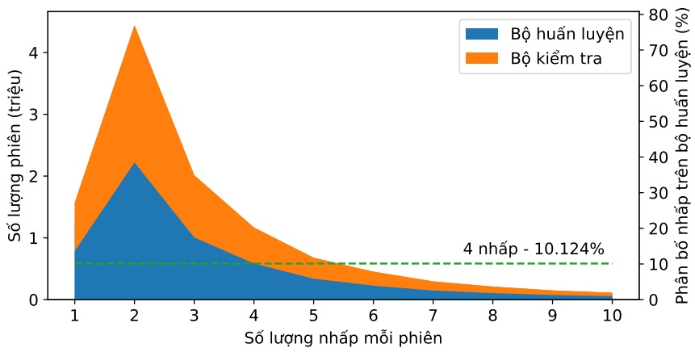

Hình A.1: Biểu đồ phân bố số lượng nhấp chuột (dữ liệu gốc)

Số lượng phiên chỉ có 1 nhấp chiếm 13,6%, dữ liệu này gần như không có giá trị vì không đủ thông tin nên cần loại bỏ phiên này. Phiên làm việc có số lượng nhấp nhiều nhất là 2 nhấp và 3 nhấp với tỷ lệ lần lượt là 38,5% và 17,4%. Lưu ý rằng từ phiên làm việc có số lượng nhấp lớn hơn 4 thì tỷ lệ chỉ còn dưới 10% tổng số phiên của bộ dữ liệu.

## A.2.2 Phân tích số lượng nhấp và mua hàng theo giờ

Hình A.2 thể hiện phân bố số lượng nhấp chuột và mua hàng theo giờ, thể hiện tăng ở khung 18 đến 20 giờ và giảm ở khung giờ 0 đến 5 giờ sáng.

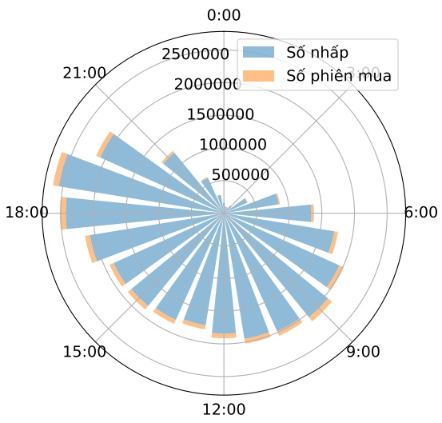

Hình A.2: Biểu đồ phân bố tương quan giữa số lượng nhấp và mua hàng

<!-- page: 130 -->

Hình A.3a thể hiện số lượng nhấp theo ngày và theo giờ, cho ta thấy số lượng người dùng nhấp tăng mạnh vào chủ nhật và ít vào các ngày trong tuần, trong đó vào tập trung vào 9 giờ sáng và 18 giờ tối. Hình A.3b thể hiện số lượng phiên mua hàng theo ngày và giờ, biểu đồ này cho ta thấy tỷ lệ mua hàng tỷ lệ thuận với tỷ lệ nhấp vì thế số lượng mua hàng nhiều cũng tăng vào ngày cuối tuần và ít vào các ngày trong tuần.

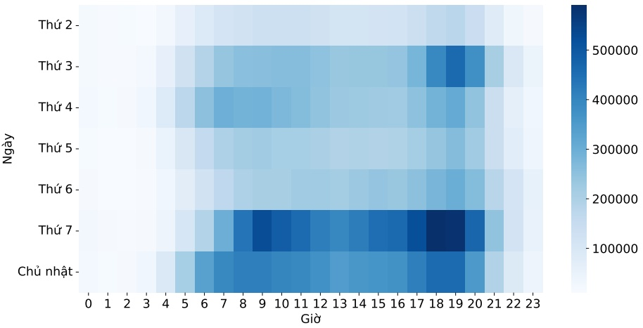

(a) Phân bố nhấp

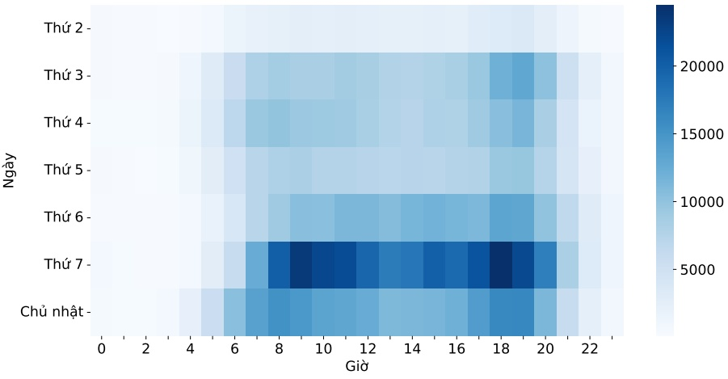

(b) Phân bố mua hàng

Hình A.3: Phân bố nhấp và mua hàng theo thời gian
