<!-- page: 1 -->

**BỘ GIAO THÔNG VẬN TẢI BỘ GIÁO DỤC VÀ ĐÀO TẠO TRƯỜNG ĐẠI HỌC HÀNG HẢI VIỆT NAM**


**VÕ HỒNG HẢI**

# NGHIÊN CỨU ỨNG DỤNG BỘ ĐIỀU KHIỂN PID THÍCH NGHI DỰA TRÊN MẠNG NƠ-RON NHÂN TẠO CHO HỆ THỐNG ĐIỀU KHIỂN TÀU THỦY

LUẬN ÁN TIẾN SĨ KỸ THUẬT

HẢI PHÒNG - 2020

<!-- page: 2 -->

**VÕ HỒNG HẢI**

# NGHIÊN CỨU ỨNG DỤNG BỘ ĐIỀU KHIỂN PID THÍCH NGHI DỰA TRÊN MẠNG NƠ-RON NHÂN TẠO CHO HỆ THỐNG ĐIỀU KHIỂN TÀU THỦY LUẬN ÁN TIẾN SĨ KỸ THUẬT

CHUYÊN NGÀNH: KHOA HỌC HÀNG HẢI MÃ SỐ: 9840106

Người hướng dẫn khoa học: 1. PGS. TS. Phạm Kỳ Quang

2. PGS. TS. Nguyễn Phùng Hưng

HẢI PHÒNG – 2020

<!-- page: 3 -->

## MỤC LỤC

- MỤC LỤC ........i
- LỜI CAM ĐOAN ........iv
- LỜI CÁM OŃ ........v
- DANH MỤC CÁC CHỮ VIẾT TẮT VÀ KÝ HIỆU ........vi
- DANH MỤC HÌNH VẼ VÀ ĐỒ THỊ ........vii
- DANH MỤC CÁC BẰNG ........x
- MỞ ĐẦU ........1
- 1. Tính cấp thiết của đề tài luận án ........1
- 2. Mục đích nghiên cứu ........3
- 3. Đối tượng và phạm vi nghiên cứu ........3
- 4. Phương pháp nghiên cứu ........3
- 5. Ý nghĩa khoa học và thực tiễn ........4
- 6. Những điểm đóng góp mới ........5
- 7. Kết cấu của luận án ........6
- CHƯƠNG 1. TỔNG QUAN VĂN ĐỀ NGHIÊN CỨU VÀ MẠNG NO-
- RON NHÂN TẠO TRONG ĐIỀU KHIỂN ........8
- 1.1. Tổng quan vấn đề nghiên cứu của luận án ........8
- 1.1.1. Tình hình nghiên cứu trên thế giới liên quan đến luận án ........8
- 1.1.2. Tình hình nghiên cứu trong nước liên quan đến luận án ........11
- 1.2. Mạng nơ-ron nhân tạo trong điều khiển ........12
- 1.2.1. Cấu trúc mạng nơ-ron nhân tạo ........12
- 1.2.2. Nhận dạng hệ thống sử dụng mạng nơ-ron nhân tạo ........18
- 1.2.3. Phương pháp ứng dụng mạng nơ-ron trong điều khiển ........20
- 1.3. Nghiên cứu một số bộ điều khiển PID nơ-ron cho hệ thống điều khiển
- hướng đi tàu thủy ........21
- 1.3.1. Bộ điều khiển PID dựa trên mạng nơ-ron lan truyền ngược cho
- điều khiển hướng đi tàu thủy ........21

<!-- page: 4 -->

- 1.3.2. Bộ điều khiển PID dựa trên mạng nơ-ron hàm cơ sở xuyên tâm cho điều khiển hướng đi tàu thủy.... 26
- 1.4. Cơ sở lý thuyết về các hệ tọa độ và và động học tàu thủy.... 29
- 1.4.1. Các hệ trục tọa độ tham chiếu .... 29
- 1.4.2. Phương trình động học của con tàu .... 34
- 1.4.3. Phương trình động lực học của vật rắn.... 36
- 1.4.4. Phương trình động lực học của con tàu .... 38
- 1.4.5. Thủy động lực học .... 39
- 1.4.6. Lực phục hồi .... 41
- 1.4.7. Trọng lực thêm vào.... 42
- 1.5. Kết luận chương 1 .... 42
- CHƯỜNG 2. BỘ ĐIỀU KHIỂN PID NƠ-RON THÍCH NGHI DỰA TRÊN MẠNG NƠ-RON LAN TRUYỀN NGUỘC CHO HỆ THÔNG ĐIỀU KHIỂN HƯỚNG ĐI TÀU THỦY.... 44
- 2.1. Bộ điều khiển PID nơ-ron dựa trên mạng nơ-ron lan truyền ngược không có bộ nhận dạng cho hệ thống điều khiển hướng đi tàu thủy.... 44
- 2.1.1. Sơ đồ nguyên lý .... 44
- 2.1.2. Thuật toán điều khiển PID.... 63
- 2.1.3. Thuật toán điều khiển mạng nơ-ron lan truyền ngược .... 45
- 2.1.4. Huấn luyện lan truyền ngược tăng cường .... 49
- 2.1.5. Sơ đồ thuật toán huấn luyện .... 50
- 2.2. Bộ điều khiển PID nơ-ron dựa trên mạng nơ-ron lan truyền ngược có bộ nhận dạng cho hệ thống điều khiển hướng đi tàu thủy .... 51
- 2.2.1. Sơ đồ nguyên lý .... 51
- 2.2.2. Mạng nhận dạng nơ-ron.... 52
- 2.3. Kết luận chương 2 .... 55

<!-- page: 5 -->

- CHƯƠNG 3. KẾT QUẢ MÔ PHÔNG ....57
- 3.1. Mô hình toán học cho mô phỏng ....57
- 3.1.1. Mô hình toán học tàu hàng Mariner ....57
- 3.1.2. Mô hình toán học sóng, gió và dòng chảy ....58
- 3.2. Bộ điều khiển PID nơ-ron dựa trên mạng lan truyền ngược không có bộ nhận dạng nơ-ron....65
- 3.2.1. Khi không có gió và nhiều tác động ....65
- 3.2.2. Khi có gió và nhiều tác động ....67
- 3.3. Bộ điều khiển PID nơ-ron dựa trên mạng lan truyền ngược có bộ nhận dạng nơ-ron....70
- 3.3.1. Khi không có gió và nhiều tác động ....70
- 3.3.2. Khi có gió và nhiều tác động ....73
- 3.4. Kết luận chương 3 ....76
- CHƯƠNG 4. KẾT QUẢ THỰC NGHIỆM ....77
- 4.1. Điều kiện thực nghiệm....77
- 4.2. Kết quả thực nghiệm....79
- 4.3. Kết luận chương 4 ....84
- KẾT LUẬN VÀ KIỂN NGHỊ ....86
- KẾT LUẬN ....86
- KIỂN NGHỊ ....87
- DANH MỤC CÁC CÔNG TRÌNH KHOA HỌC ĐÃ CÔNG BỐ LIÊN QUAN ĐẾN ĐỀ TÀI LUẬN ÁN....89
- TÀI LIỆU THẠM KHẢO ....90
- PHẦN PHỤ LỤC (Gồm 3 phụ lục)

<!-- page: 6 -->

## LỜI CAM ĐOAN

Tên tôi là Võ Hồng Hải - Nghiên cứu sinh chuyên ngành Khoa học hàng hải và tác giả luận án tiến sĩ: “Nghiên cứu ứng dụng bộ điều khiển PID dựa trên mạng nơ-ron nhân tạo thích nghi cho hệ thống điều khiển tàu thủy”, dưới sự hướng dẫn của tập thể người hướng dẫn khoa học: Thầy PGS. TS. Phạm Kỳ Quang và thầy PGS. TS. Nguyễn Phùng Hưng, thực hiện tại Trường Đại học Hàng hải Việt Nam. Bằng danh dự của bản thân, nghiên cứu sinh cam đoan rằng: - Luận án này là công trình nghiên cứu của riêng nghiên cứu sinh, không có phần nội dung nào được sao chép một cách bất hợp pháp, từ công trình nghiên cứu của tác giả hay nhóm tác giả khác; - Các số liệu, kết quả nghiên cứu được nêu trong luận án, chưa được ai công bố trong bất kỳ công trình nghiên cứu nào khác trước đó; - Các thông tin, số liệu trích dẫn, tài liệu tham khảo trong luận án đều được chỉ rõ về xuất xứ, nguồn gốc và đảm bảo tính trung thực. Hải Phò à 19 há 11 ă 2020 ng, ng y t ng n m

**Nghiên cứu sinh**

**Võ Hồng Hải**

<!-- page: 7 -->

## LỜI CẢM ƠN

Tôi xin chân thành cảm ơn Trường Đại học Hàng hải Việt Nam, Viện Đào tạo sau đại học Trường Đại học Hàng hải Việt Nam đã cho phép và tạo điều kiện cho tôi thực hiện luận án này.

Tôi xin chân thành cảm ơn hai Thầy hướng dẫn khoa học, PGS.TS. Phạm Kỳ Quang và PGS.TS. Nguyễn Phùng Hưng đã tận tình, tâm huyết hướng dẫn, định hướng nghiên cứu giúp tôi hoàn thành luận án này.

Tôi xin chân thành cám ơn Viện Đào tạo sau Đại học, Khoa Hàng hải, Bộ môn Hàng hải Trường Đại học Hàng hải Việt Nam luôn giúp đỡ và động viên tôi trong suốt quá trình học tập và nghiên cứu.

Tôi xin chân thành cảm ơn Trường Đại học Giao thông Vận tải TPHCM đã tạo điều kiện cho tôi được thí nghiệm đề tài luận án của mình; Các Thầy cô giáo, nhà khoa học đã góp ý, phản biện và đánh giá giúp tôi từng bước hoàn thiện luận án này. Cuối cùng, tôi xin bày tỏ lòng biết ơn sâu sắc tới gia đình và bạn bè đã luôn động viên, khuyến khích, tạo điều kiện cho tôi trong suốt thời gian tôi nghiên cứu hoàn thành công trình này!

Hải phòng, ngày 19 tháng 11 năm 2020 **Tác giả**

**Võ Hồng Hải**

<!-- page: 8 -->

## DANH MỤC CÁC CHỮ VIẾT TẮT VÀ KÝ HIỆU

| Chữ viết tắt | Giải thích ý nghĩa |
| --- | --- |
| ANN | Artificial Neural Network: Mạng nơ-ron nhân tạo |
| ANNAI | Adaptive Neural Network by Adaptive Interection: Mạng nơ-ron thích nghi theo phương pháp thích nghi tương tác |
| BĐK | Bộ điều khiển |
| BPNN | Back-Propagation Network: Mạng nơ-ron lan truyền ngược |
| ĐKTĐ | Điều khiển tự động |
| MATLAB | Công cụ làm toán trên ma trận |
| MLTĐ | Máy lái tự động |
| NCKH | Nghiên cứu khoa học |
| NCS | Nghiên cứu sinh |
| NNC | Neural Network Controller: Bộ điều khiển mạng nơ-ron |
| PID | Proportional - Integral - Derivative: Tỷ lệ - Tích phân - Vi phân |
| ROV | Phương tiện ngầm điều khiển từ xa |

<!-- page: 9 -->

## DANH MỤC HÌNH VẼ VÀ ĐỒ THỊ

| Số hình | Tên hình vẽ và đồ thị | Trang |
| --- | --- | --- |
| 1.1 | Đơn vị xử lý của mạng nơ-ron nhân tạo | 13 |
| 1.2 | Hàm truyền tuyến tính | 14 |
| 1.3 | Hàm truyền giới hạn cứng | 15 |
| 1.4 | Hàm truyền dạng sigma | 15 |
| 1.5 | Hàm truyền dạng tang-sigma | 16 |
| 1.6 | Mạng nơ-ron truyền thẳng nhiều lớp | 17 |
| 1.7 | Mạng nơ-ron hồi quy | 17 |
| 1.8 | Mô hình nhận dạng cơ bản | 19 |
| 1.9 | Sơ đồ phương pháp điều khiển gián tiếp | 20 |
| 1.10 | Sơ đồ phương pháp điều khiển trực tiếp | 21 |
| 1.11 | Sơ đồ cấu trúc BĐK PID dựa trên mạng BPNN | 22 |
| 1.12 | Cấu trúc mạng nơ-ron lan truyền ngược | 23 |
| 1.13 | Mô phỏng sự thay đổi của K<sub>p</sub> , K<sub>i</sub> và K<sub>d</sub> | 24 |
| 1.14 | Mô phỏng hướng đi | 25 |
| 1.15 | Sự thay đổi của góc bẻ lái | 25 |
| 1.16 | Sơ đồ cấu trúc BĐK PID dựa trên mạng RBF | 26 |
| 1.17 | Cấu trúc mạng nơ-ron RBF | 27 |
| 1.18 | Hướng đi của tàu khi không có nhiễu | 28 |
| 1.19 | Hướng đi của tàu khi có nhiễu | 28 |
| 1.20 | Mô phỏng sự thay đổi của K<sub>p</sub> , K<sub>i</sub> và K<sub>d</sub> | 29 |

<!-- page: 10 -->

| 1.21 | Các hệ tọa độ tham chiếu | 30 |
| --- | --- | --- |
| 1.22 | Hệ trục toạ độ và các đại lượng | 32 |
| 1.23 | Các góc xoay Euler | 35 |
| 2.1 | Sơ đồ nguyên lý BĐK PID nơ-ron lan truyền ngược | 44 |
| 2.2 | Cấu trúc mạng nơ-ron lan truyền ngược | 45 |
| 2.3 | Sơ đồ khối thuật toán điều khiển PID - BPNN | 50 |
| 2.4 | Sơ đồ nguyên lý BĐK PID nơ-ron NN1 với bộ nhận dạng nơ-ron NN2 | 51 |
| 2.5 | Cấu trúc mạng nơ-ron nhận dạng NN2 | 51 |
| 2.6 | Mô hình đầu vào - đầu ra | 53 |
| 2.7 | Cấu trúc nhận dạng song song | 54 |
| 2.8 | Cấu trúc nhận dạng chuỗi song song | 55 |
| 3.1 | Tốc độ gió Vvà hướng gió <sub>r</sub> | 60 |
| 3.2 | Hướng tàu và góc bẻ lái khi không có gió và nhiễu tác động | 65 |
| 3.3 | Sự thay đổi các tham số K<sub>p</sub>, K<sub>i</sub> và K<sub>d</sub> | 66 |
| 3.4 | Sai số hướng đi, tốc độ và gia tốc quay trở hướng mũi tàu | 67 |
| 3.5 | Hướng đi và góc bẻ lái khi có gió và nhiễu tác động | 68 |
| 3.6 | Sự thay đổi các tham số K<sub>p</sub>, K<sub>i</sub> và K<sub>d</sub> | 68 |
| 3.7 | Sai số hướng đi, tốc độ và gia tốc quay trở hướng mũi tàu | 69 |
| 3.8 | Hướng tàu và góc bẻ lái khi không có gió và nhiễu tác động | 71 |

<!-- page: 11 -->

| 3.9 | Sự thay đổi các tham số K<sub>p</sub>, K<sub>i</sub> và K<sub>d</sub> | 71 |
| --- | --- | --- |
| 3.10 | Sai số hướng đi, tốc độ và gia tốc quay trở hướng tàu | 72 |
| 3.11 | Đầu ra của bộ nhận dạng nơ-ron NN2 | 72 |
| 3.12 | Hướng tàu và góc bẻ lái khi có gió và nhiễu tác động | 73 |
| 3.13 | Sự thay đổi các thông số K<sub>p</sub>, K<sub>i</sub> và K<sub>d</sub> | 74 |
| 3.14 | Sai số hướng đi, tốc độ và gia tốc quay trở hướng tàu | 74 |
| 3.15 | Đầu ra của bộ nhận dạng nơ-ron NN2 | 75 |
| 4.1 | Quỹ đạo di chuyển mong muốn của con tàu | 77 |
| 4.2 | Điều kiện thực nghiệm tàu mô hình trên thực tế | 78 |
| 4.3 | Tàu mô hình | 79 |
| 4.4 | Sơ đồ khối hệ thống điều khiển hướng tàu sử dụng BĐK PID nơ-ron | 79 |
| 4.5 | Quỹ đạo của tàu với BĐK PID nơ-ron | 80 |
| 4.6 | Sai số bám quỹ đạo của tàu với BĐK PID nơ-ron | 81 |
| 4.7 | Sai số góc mũi tàu của tàu với BĐK PID nơ-ron | 82 |
| 4.8 | Góc bánh lái với BĐK PID nơ-ron | 83 |
| 4.9 | Góc mũi tàu với BĐK PID nơ-ron | 84 |

<!-- page: 12 -->

## DANH MỤC CÁC BẢNG

| Số bảng | Tên bảng | Trang |
| --- | --- | --- |
| 1.1 | Ký hiệu của SNAME (1950) đối với tàu biển | 33 |
| 3.1 | Tổng bình phương độ lệch hướng và tổng bình phương góc bẻ lái khi không có gió và nhiễu | 66 |
| 3.2 | Tổng bình phương độ lệch hướng và tổng bình phương góc bẻ lái khi có nhiễu và gió | 69 |
| 3.3 | Tổng bình phương độ lệch hướng và tổng bình phương góc bẻ lái khi không có nhiễu và gió | 73 |
| 3.4 | Tổng bình phương độ lệch hướng và tổng bình phương góc bẻ lái khi có nhiễu và gió | 75 |

<!-- page: 13 -->

## MỞ ĐẦU

## 1. Tính cấp thiết của luận án

Các phương pháp điều khiển truyền thống để thiết kế các hệ thống điều khiển tiên tiến cho tàu thủy điển hình như bộ điều khiển tỷ lệ - vi phân - tích phân (PID) vẫn còn phổ biến bởi vì nó có cấu trúc đơn giản và tính bền vững cao. Tuy nhiên, việc cải tiến chất lượng bộ điều khiển PID của hệ thống điều khiển tàu thủy vẫn luôn là vấn đề thời sự cho các nhà nghiên cứu, bởi vì khi thiết kế bộ điều khiển cho tàu thủy, bộ điều khiển PID thường yêu cầu phải có mô hình động học của tàu thủy đó.

Thực tế, các tính năng động học của tàu thủy thường mang tính phi tuyến cao và chịu ảnh hưởng của nhiều yếu tố nhiễu loạn bên ngoài. Bản thân yếu tố nhiễu loạn bên ngoài cũng mang những đặc tính phi tuyến và không xác định cao. Điều đó dẫn đến việc phải xây dựng các cấu trúc và tham số không xác định và yêu cầu phải có kỹ thuật điều khiển tiên tiến.

Hiện nay, các nhà khoa học trong lĩnh vực này, đã không ngừng nghiên cứu cải tiến chất lượng bộ điều khiển PID theo hai hướng cơ bản sau:

\- Thứ nhất, cải tiến cấu trúc bộ điều khiển PID;

\- Thứ hai, kết hợp lý thuyết lô-gic mờ, mạng nơ-ron nhân tạo, thuật toán di truyền và lý thuyết điều khiển thông minh khác với bộ điều khiển PID thông thường, nhằm đạt được chất lượng điều khiển mong muốn.

Do vậy, bộ điều khiển kết hợp này còn được gọi là bộ điều khiển PID thông minh. Bộ điều khiển PID thông minh không yêu cầu phải có mô hình toán học của đối tượng một cách chính xác, các tham số của hệ thống có tính bền vững hơn.

Hiện nay, mạng nơ-ron nhân tạo được ứng dụng rộng rãi trong nhiều lĩnh vực, trong đó có lĩnh vực điều khiển tự động, vì mạng nơ-ron có thể giải quyết những vấn đề điều khiển phức tạp, ngay cả với đối tượng điều khiển có

<!-- page: 14 -->

tính phi tuyến cao, có môi trường bên ngoài tác động không dự đoán được, làm cho tính năng của đối tượng trở nên khó điều khiển. Hơn nữa, khả năng tính toán nhanh của mạng nơ-ron cũng làm cho chúng trở nên khả thi với các ứng dụng điều khiển theo thời gian thực. Mặt khác, nhờ khả năng của mạng nơ-ron nhân tạo nhằm xấp xỉ tính phi tuyến của đối tượng điều khiển để điều chỉnh ba tham số PID trong thời gian thực nhằm đạt được chất lượng PID một cách tối ưu nhất.

Để giải quyết được các bài toán có yếu tố không xác định trong các mô hình động học tàu thủy, cũng như nhiễu loạn do môi trường bên ngoài tác động như sóng, gió, dòng chảy,… phương pháp điều khiển kết hợp PID nơ- ron đã được đề xuất, nghiên cứu và phát triển nhiều trên thế giới trong thời gian gần đây.

Là quốc gia biển, Việt Nam thực hiện chủ trương phát triển mạnh ngành vận tải biển và công nghiệp đóng tàu theo hướng hội nhập quốc tế và đáp ứng nhu cầu vận tải của xã hội với mục tiêu: “Xây dựng và phát triển ngành công nghiệp tàu thủy Việt Nam đến năm 2020 và định hướng phát triển đến năm 2030, nhằm đáp ứng yêu cầu phát triển kinh tế biển phù hợp với Chiến lược biển Việt Nam đến năm 2020, phục vụ nhu cầu phát triển kinh tế - xã hội; góp phần củng cố quốc phòng, an ninh và bảo vệ chủ quyền quốc gia trên các vùng biển và hải đảo của Tổ quốc” [62].

Tại Việt Nam, việc nghiên cứu hệ thống điều khiển tiên tiến cho tàu thủy vẫn còn khiêm tốn và chưa được ứng dụng rộng rãi. Nghiên cứu nhằm nâng cao chất lượng hệ thống điều khiển tàu thủy sẽ là một trong những vấn đề quan trọng cho hiện đại hóa nền công nghiệp đóng tàu tại Việt Nam, nhất là trong thời kỳ Cách mạng công nghiệp 4.0.

<!-- page: 15 -->

Xuất phát từ các lý do trên, tác giả đã chọn đề tài luận án: **“Nghiên cứu ứng dụng bộ điều khiển PID dựa trên mạng nơ-ron nhân tạo thích nghi cho hệ thống điều khiển tàu thủy”.**

## 2. Mục đích nghiên cứu

Trên cơ sở nghiên cứu các phương pháp điều khiển PID thông thường và điều khiển thông minh. Mục tiêu nghiên cứu của luận án là phát triển ứng dụng bộ điều khiển PID dựa trên mạng nơ-ron thích nghi cho hệ thống điều khiển hướng đi tàu thủy, từ đó cải tiến nâng cao chất lượng bộ điều khiển PID của hệ thống điều khiển này, nhằm đưa ra bộ điều khiển PID thích nghi tối ưu hơn. Đồng thời, thực hiện thiết kế thử nghiệm bộ điều khiển PID nơ-ron thích nghi theo mô phỏng và thực nghiệm.

## 3. Đối tượng và phạm vi nghiên cứu

Đối tượng nghiên cứu của luận án: Hệ thống điều khiển hướng đi của tàu thủy, tập trung vào hệ thống máy lái tự động tàu thủy.

Phạm vi nghiên cứu của luận án:

\- Nghiên cứu các thuật toán điều khiển thích nghi dựa trên sự kết hợp giữa mạng nơ-ron nhân tạo và điều khiển PID thông thường.

\- Đề xuất phát triển thuật toán và ứng dụng vào thiết kế máy lái tự động sử dụng bộ điều khiển PID nơ-ron thích nghi cho điều khiển hướng đi tàu thủy.

\- Sử dụng phần mềm Matlab để mô phỏng bộ điều khiển được đề xuất. Đánh giá chất lượng bộ điều khiển PID nơ-ron thích nghi với bộ điều khiển PID thông thường.

\- Thực nghiệm trên mô hình tàu thu nhỏ trong bể thử trường Đại học Giao thông Vận tải Thành phố Hồ Chí Minh.

## 4. Phương pháp nghiên cứu

Phương pháp nghiên cứu lý thuyết kết hợp nghiên cứu thực nghiệm, để làm nổi bật tính khoa học và tính thực tiễn của vấn đề cần giải quyết, cụ thể:

<!-- page: 16 -->

Nghiên cứu lý thuyết:

\- Phân tích, tổng hợp hệ thống điều khiển PID thông thường và mạng nơ-ron nhân tạo;

\- Xây dựng mô hình nhận dạng tàu thủy bằng mạng nơ-ron nhân tạo;

\- Thiết kế máy lái tự động sử dụng thuật toán PID dựa trên mạng nơ- ron truyền thẳng để điều khiển hướng đi tàu thủy;

\- Ứng dụng Matlab làm công cụ để mô phỏng kiểm chứng lại tính chính xác, khả thi của thuật toán.

Nghiên cứu thực nghiệm:

\- Thiết kế mô hình tàu thủy và ứng dụng bộ điều khiển PID nơ-ron vào điều khiển trong môi trường thực;

\- So sánh với bộ điều khiển PID thông thường để chứng minh tính hiệu quả của bộ điều khiển PID nơ-ron thích nghi.

## 5. Ý nghĩa khoa học và thực tiễn

Ý nghĩa khoa học của luận án:

\- Xây dựng cơ sở lý thuyết kết hợp bộ điều khiển PID và mạng nơ-ron nhân tạo để thiết kế hệ thống điều khiển hướng đi tàu thủy. Kết quả nghiên cứu đạt được đã góp phần hoàn thiện một phần về cơ sở lý luận khoa học liên quan đến vấn đề nghiên cứu của luận án và đóng góp nhất định cho khoa học hàng hải;

\- Đề xuất phát triển thuật toán, tận dụng ưu điểm của bộ điều khiển PID và mạng nơ-ron nhân tạo để nâng cao chất lượng hệ thống điều khiển hướng đi, tăng khả năng thích nghi và độ chính xác dẫn đường;

\- Cải tiến bộ điều khiển PID và mạng nơ-ron lan truyền ngược với thuật toán huấn luyện tăng cường và bộ nhận dạng nơ-ron cho bộ điều khiển nhằm tăng cường độ chính xác dẫn đường và thích nghi với nhiễu loạn môi trường.

Ý nghĩa thực tiễn của luận án:

<!-- page: 17 -->

\- Kết hợp chặt chẽ cơ sở lý thuyết điều khiển tự động và ứng dụng vào thực tiễn thiết kế máy lái tự động tàu thủy;

\- Kết quả nghiên cứu có thể làm tài liệu tham khảo cho các công trình nghiên cứu tiếp theo, nhất là ứng dụng điều khiển thông minh vào hệ thống dẫn đường tàu thủy như giảm lắc tàu thủy, định vị động…

## 6. Những điểm đóng góp mới

Luận án đã kế thừa, phát triển lý thuyết và ứng dụng kỹ thuật điều khiển PID với mạng nơ-ron nhân tạo trong điều khiển tàu thủy. Những điểm đóng góp mới của luận án được tóm tắt như sau:

\- Tận dụng khả năng điều khiển và dễ phát triển của BĐK PID để thiết kế sơ bộ, kết hợp với BĐK nơ-ron, nhằm điều khiển hướng đi tàu thủy.

\- Bộ điều khiển PID với các tham số $K _ { p } ,   K _ { i }$ và $K _ { d }$ được điều chỉnh bằng mạng nơ-ron lan truyền ngược được tính toán mô phỏng tường minh. Khả năng tổng hợp và mô hình hóa trực tuyến của mạng nơ-ron giúp các tham số của BĐK PID được tinh chỉnh và lựa chọn trực tiếp theo thời gian, tính thích nghi của mạng nơ-ron trong điều khiển được tận dụng và phát huy. Phương pháp ứng dụng này không mới tại thời điểm nghiên cứu luận án nhưng cũng ít tác giả ứng dụng vào điều khiển tàu thủy. Đặc biệt, việc huấn luyện mạng trực tuyến liên tục trong quá trình điều khiển mà tác giả sử dụng trong công trình này, trong nghiên cứu ứng dụng loại này là mới và chưa có tác giả nào thực nghiệm.

\- Thiết kế bộ nhận dạng mô hình tàu thủy theo phương pháp tín hiệu vào - ra được giới thiệu và ứng dụng. Bộ nhận dạng này sử dụng mạng nơ-ron nhiều lớp truyền thẳng nhưng được tác giả huấn luyện mạng theo phương pháp trực tuyến, tăng cường nên tốc độ thích nghi tốt, có khả năng nhận dạng mô hình tàu phi tuyến biến đổi theo thời gian chứ không chỉ mô hình tuyến tính tĩnh như các nghiên cứu trước đó. Với việc kết hợp mô hình nhận dạng

<!-- page: 18 -->

nơ-ron này, phương pháp điều khiển được tiến hành kiểu điều khiển dự đoán theo thời gian thực, nâng cao tính thích nghi và chất lượng điều khiển.

## 7. Kết cấu của luận án

Kết cấu của đề tài luận án gồm các phần thứ tự sau:

\- Phần mở đầu;

\- Phần nội dung (được chia làm 4 chương);

\- Phần kết luận và kiến nghị;

\- Danh mục các công trình khoa học đã công bố liên quan đến luận án;

\- Tài liệu tham khảo;

\- Phần phụ lục (gồm 3 phụ lục).

Phần nội dung của luận án được chia thành 4 chương có thể tóm tắt như sau:

## Chương 1. Tổng quan vấn đề nghiên cứu và mạng nơ-ron nhân tạo trong điều khiển.

Phân tích, đánh giá tổng quan và chi tiết tình hình nghiên cứu trên thế giới và trong nước liên quan đến luận án về ứng dụng mạng nơ-ron nhân tạo và BĐK PID trong điều khiển hướng đi tàu thủy mà nghiên cứu sinh thực hiện.

Hệ thống hóa cơ sở lý luận về mạng nơ-ron nhân tạo, cấu trúc mạng, các phương pháp ứng dụng mạng nơ-ron trong nhận dạng và điều khiển.

Trình bày tổng quan lý thuyết và phương trình điều khiển tàu theo quỹ đaọ trên bề mặt trái đất, làm cơ sở cho bài toán ứng dụng BĐK hướng tàu vào điều khiển dẫn tàu theo một quỹ đạo cho trước.

Trình bày các yếu tố tác động tới việc giữ hướng tàu như sóng, gió, dòng chảy sẽ được sử dụng trong mô phỏng; mô hình toán học tàu thủy được trình bày chi tiết trong Phụ lục 1.

<!-- page: 19 -->

## Chương 2. Bộ điều khiển PID nơ-ron thích nghi dựa trên mạng nơ- ron lan truyền ngược cho hệ thống điều khiển hướng đi tàu thủy

Trong chương này, tác giả đã tập trung nghiên cứu xây dựng BĐK PID dựa trên mạng nơ-ron lan truyền ngược không có và có bộ nhận dạng nơ-ron. Mạng nơ-ron lan truyền ngược đã được thêm thuật toán huấn luyện tăng cường để tăng tốc độ thích nghi của hệ thống, được sử dụng với vai trò điều chỉnh nhanh và chính xác các tham số của BĐK PID.

Bên cạnh đó, tác giả nghiên cứu và xây dựng bộ nhận dạng mô hình nơ-ron theo phương pháp tín hiệu vào - ra. Bộ nhận dạng này sử dụng mạng nơ-ron nhiều lớp truyền thẳng nhưng được tác giả huấn luyện mạng theo phương pháp trực tuyến, tăng cường nên tốc độ thích nghi tốt, có khả năng nhận dạng mô hình tàu phi tuyến biến đổi theo thời gian.

Với việc kết hợp mô hình nhận dạng nơ-ron này, phương pháp điều khiển được tiến hành kiểu điều khiển dự đoán theo thời gian thực, nâng cao tính thích nghi và chất lượng điều khiển.

## Chương 3. Kết quả mô phỏng

Chương này, tác giả trình bày phương pháp mô phỏng kết quả trên máy tính. Kết quả tính toán mô phỏng trên mô hình toán học tàu thủy, đảm bảo tính khả thi, có độ tin cậy của phương pháp.

## Chương 4. Kết quả thực nghiệm

Chương này, tác giả tiến hành thực nghiệm BĐK PID dựa trên mạng nơ-ron lan truyền ngược để ứng dụng điều khiển hướng đi tàu thủy. Kết quả tính toán mô phỏng và thực nghiệm trên mô hình tàu thủy thu nhỏ, đảm bảo tính khả thi, hiệu quả của đề tài nghiên cứu.

<!-- page: 20 -->

# CHƯƠNG 1. TỔNG QUAN VẤN ĐỀ NGHIÊN CỨU VÀ MẠNG NƠ- RON NHÂN TẠO TRONG ĐIỀU KHIỂN

## 1.1. Tổng quan vấn đề nghiên cứu của luận án

Nghiên cứu sinh đã tham khảo, nghiên cứu các tài liệu khoa học đã được công bố trên thế giới và trong nước liên quan đến lĩnh vực nghiên cứu của luận án. Các công trình nghiên cứu được kể ra sau đây:

## 1.1.1. Tình hình nghiên cứu trên thế giới liên quan đến luận án

Trong lĩnh vực điều khiển tự động, các nhà khoa học thường có xu hướng tiếp tục nghiên cứu phát triển phương pháp điều khiển mới dựa trên phương pháp cũ để khắc phục những nhược điểm tồn tại hoặc tìm kiếm các phương pháp hoàn toàn khác không dựa trên phương pháp cũ đã có trước đây. Điều này làm thúc đẩy mạnh mẽ các ứng dụng trong lĩnh vực điều khiển tự động ở phạm vi rộng.

Mặc dù có những bước tiến mạnh mẽ, nhưng cho đến giờ các phương pháp điều khiển mới vẫn chưa thay thế hoàn toàn các kỹ thuật phổ biến, như điều khiển PID truyền thống. Kể từ khi thuật toán điều khiển PID được kỹ sư người Mỹ gốc Nga Nicolas Minorsky áp dụng vào hệ thống máy lái tự động tàu thủy [19, 21, 35] năm 1922 đến nay, đã có nhiều nghiên cứu về bộ điều khiển PID này được ứng dụng rộng rãi trong lĩnh vực điều khiển tự động kể cả việc ứng dụng trí tuệ nhân tạo [17, 20, 25, 28, 32, 33, 35, 37, 40, 60]. Mặc dù vậy, BĐK PID vẫn chiếm hơn 90% ứng dụng trong các hệ thống công nghiệp [17].

Trong những năm gần đây, kỹ thuật điều khiển dùng mạng nơ-ron nhân tạo đã phát triển rất nhanh chóng. Nhiều hệ thống mạng nơ-ron với các cấu trúc khác nhau đã được đề xuất và ứng dụng rộng rãi trong kỹ thuật. Mạng nơ-ron rất hữu ích và hiệu quả trong điều khiển do chúng có những đặc tính

<!-- page: 21 -->

sau: (1) là mạng có cấu trúc song song lớn; (2) có đặc tính phi tuyến cố hữu; (3) có khả năng học cực mạnh; (4) có khả năng tổng quát hóa; (5) có tính ổn định được đảm bảo cho một số hệ thống điều khiển nhất định [6].

Bộ điều khiển PID thích nghi dựa trên việc điều chỉnh các tham số $K _ { p }$ $K _ { i }$ và $K _ { d }$ bằng mạng nơ-ron nhân tạo thích nghi được gọi là điều khiển PID nơ-ron được các nhà khoa học nghiên cứu ứng dụng rộng rãi trong hệ thống công nghiệp như các công trình nghiên cứu của Martins and Coelho [33], Junghui và Huang [26], Andrasik và các cộng sự [19]. Hơn nữa, tính đơn giản là một trong những đặc trưng quan trọng của bộ điều khiển PID và các nhà thiết kế hệ thống đã giữ lại đặc điểm này. Các thuật toán được đề xuất bởi Widrow và Streans [59], Brandt, Lin và Saikalis [19], [20], Junghui và Huang [26] không thay đổi cấu trúc của bộ điều khiển PID thông thường mà cố gắng sử dụng khả năng thích nghi của mạng nơ-ron nhân tạo. Thuật toán của Widrow và Streans dùng khả năng dự đoán của mạng nơ-ron nhân tạo; Brandt, Lin và Saikalis dùng mạng nơ-ron nhân tạo thích nghi tương tác để điều hưởng các trọng $\mathrm { s } \hat { \hat { 0 } }$ của mạng nơ-ron và thuật toán của Junghui và Huang ngăn chặn sự tách rời tính phi tuyến của quá trình.

Phát triển hệ thống điều khiển tàu thủy là mục tiêu nghiên cứu của rất nhiều nhà khoa học. Một số công trình nghiên cứu thiết kế hệ thống điều khiển tàu thủy tiêu biểu trong thời gian gần đây như:

\- Công trình của Ming-Chung Fang và các cộng sự (năm 2010): “Ứng dụng bộ điều khiển PID nơ-ron tự điều chỉnh cho giảm lắc ngang tàu thủy trong sóng ngẫu nhiên”[37] đã giới thiệu một mô hình toán học bao gồm các tính năng đi biển và quay trở của tàu để phân tích việc giảm lắc ngang cho tàu thủy. Bộ điều khiển PID dựa trên lý thuyết mạng nơ-ron nhân tạo được ứng dụng để điều chỉnh tối ưu các góc của vây giảm lắc nhằm giảm chuyển động lắc ngang cho tàu thủy trong sóng ngẫu nhiên. Hai mạng nơ-ron đa lớp, bao

<!-- page: 22 -->

gồm mạng nơ-ron nhận dạng hệ thống (NN1) và mạng nơ-ron điều chỉnh các tham số (NN2) được sử dụng trong nghiên cứu này. Kỹ thuật điều khiển này có thể lưu giữ thời gian cho việc tìm các độ lợi PID tối ưu trong bất kỳ trạng thái mặt biển nào. Các kết quả mô phỏng chứng tỏ thuật toán PID tự điều hưởng dựa trên lý thuyết mạng nơ-ron nhân tạo là hoàn toàn khả thi cho giảm lắc ngang tàu thủy trong thực tế đi biển. Đây là thuật toán dựa trên điều khiển gián tiếp đòi hỏi có cấu tạo hệ thống phức tạp và tập trung vào bộ điều khiển vây giảm lắc cho tàu thủy.

\- Công trình nghiên cứu của [Xingxing Huo](http://ieeexplore.ieee.org/search/searchresult.jsp?searchWithin=p_Authors:.QT.Xingxing%20Huo.QT.&newsearch=true) và các cộng sự (năm 2012): “Điều khiển PID dựa trên mạng nơ-ron lan truyền ngược cho điều khiển hướng đi tàu thủy” [38] đã đề xuất một thuật toán mới dựa trên sự kết hợp giữa điều khiển PID thông thường và mạng nơ-ron lan truyền ngược có tính đến ảnh hưởng của sóng, gió và dòng chảy. Bộ điều khiển PID nơ-ron kiểu này đã cải thiện được tính bền vững của hệ thống và có khả năng thích nghi tốt hơn với mô hình tàu phi tuyến. Tuy nhiên, giải thuật của mạng nơ-ron lan truyền ngược dựa trên phương pháp giảm độ lệch gradient nên tốc độ hội tụ chậm và mạng có thể hội tụ vào các giá trị cực tiểu khác nhau.

\- Công trình nghiên cứu của [Zeyu Li](http://ieeexplore.ieee.org/search/searchresult.jsp?searchWithin=p_Authors:.QT.Zeyu%20Li.QT.&newsearch=true) và các cộng sự (năm 2012): “Điều

khiển PID dựa trên mạng nơ-ron RBF cho điều khiển hướng tàu” [39] đã đề xuất một thuật toán kết hợp giữa điều khiển PID thông thường và mạng nơ- ron nhân tạo hàm cơ sở xuyên tâm (RBF), thông qua khả năng xấp xỉ phi tuyến bất kỳ để điều hưởng ba tham số của bộ điều khiển PID trong thời gian thực nhằm đạt được điều khiển PID tối ưu và loại bỏ sự ảnh hưởng do sự không chắc chắn của mô hình và nhiễu loạn bên ngoài nhằm đạt được mục tiêu tự động điều khiển hướng tàu. Kết quả mô phỏng cho thấy độ chính xác điều khiển tốt hơn các phương pháp truyền thống.

<!-- page: 23 -->

\- Công trình nghiên cứu của Rodrigo Hernández-Alvarado và các cộng sự (năm 2016): “Điều khiển PID tự điều chỉnh dựa trên mạng nơ-ron nhân tạo cho phương tiện ngầm” [60] đã đề xuất một phương pháp điều khiển mới cho ROV dựa trên bộ điều khiển PID có các tham số được điều chỉnh bởi mạng nơ-ron nhân tạo. Mạng nơ-ron nhân tạo là mạng nơ-ron lan truyền ngược có khả năng thích nghi với tác động của dòng chảy ngầm đến ROV, sai số bình phương trung bình giảm còn 50% so với BĐK PID thông thường. Tuy nhiên, thuật toán lan truyền ngược trong nghiên cứu này vẫn có một đặc điểm chung là tốc độ hội tụ chậm.

## 1.1.2. Tình hình nghiên cứu trong nước liên quan đến luận án

Ở Việt Nam, tác giả Nguyễn Hoàng Dũng đã trình bày giải thuật kết hợp giữa bộ điều khiển feedforward và feedback để điều khiển hệ phi tuyến. Feedback phát lệnh điều khiển tức thời và feedforward phát lệnh điều khiển xác lập. Feedback chính là bộ điều khiển PID và feedforward được huấn luyện dựa trên mạng nơron lan truyền ngược giảm gradient (gradient descent) với tốc độ học thích nghi. Bộ điều khiển này có vai trò bổ sung chính vào các thành phần không xác định có thể xảy ra lúc điều khiển đối tượng [2]. Trong lĩnh vực điều khiển tàu thủy, TS. Nguyễn Phùng Hưng đã ứng dụng mạng nơ- ron nhân tạo vào máy lái tự động kiểu thích nghi điều khiển tàu [29, 30, 31]; TS. Nguyễn Công Vịnh đã nghiên cứu ứng dụng bộ điều khiển logic mờ trong máy lái tự động tàu thủy [15]; Phương pháp mô hình điều khiển dự báo (MPC) đã được TS. Phạm Hữu Đức Dục ứng dụng để điều khiển thích nghi hướng chuyển động của tàu thủy khi có nhiễu bên ngoài tác động với mục đích nhằm cải thiện độ thông minh của bộ điều khiển [1]. Một bộ điều khiển PID thích nghi cho hệ ổn định áp suất dựa trên bộ nhận dạng dùng mạng nơ- ron hàm cơ sở xuyên tâm được TS. Nguyễn Chí Ngôn nghiên cứu xây dựng [9]. Tuy nhiên, việc nghiên cứu ứng dụng cải tiến bộ điều khiển PID thích

<!-- page: 24 -->

nghi dựa trên mạng nơ-ron nhân tạo cho hệ thống điều khiển tàu thủy chưa có tác giả nào tại Việt Nam đề cập tới.

Tóm lại, với phạm vi và đối tượng nghiên cứu cụ thể của luận án, vấn đề nghiên cứu của tác giả luôn mang tính thời sự, có ý nghĩa khoa học và thực tiễn chuyên ngành hàng hải và không trùng lặp với các công trình đã công bố trước đó.

## 1.2. Mạng nơ-ron nhân tạo trong điều khiển

Mạng nơ-ron nhân tạo (ANN) là một mô phỏng xử lý thông tin, được nghiên cứu từ hệ thống thần kinh của sinh vật, giống như bộ não để xử lý thông tin, bao gồm số lượng lớn các mối gắn kết cấp cao để xử lý các yếu tố làm việc trong mối liên hệ giải quyết vấn đề rõ ràng. ANN giống như con người, được học bởi kinh nghiệm, lưu những kinh nghiệm hiểu biết và sử dụng trong những tình huống phù hợp.

Đầu tiên ANN được giới thiệu năm 1943 bởi nhà thần kinh học Warren Mc Culloch và nhà lô-gic học Walter Pits. Nhưng với những kỹ thuật trong thời gian này chưa cho phép họ nghiên cứu được nhiều. Những năm gần đây, mô phỏng ANN xuất hiện và phát triển ngày càng rộng rãi. Các nghiên cứu ứng dụng đã được thực hiện trong các ngành: điện, điện tử, kỹ thuật chế tạo, y học, quân sự, giao thông, kinh tế,… và mới nhất là các nghiên cứu ứng dụng trong lĩnh vực điều khiển tàu [20, 34].

## 1.2.1. Cấu trúc mạng nơ-ron nhân tạo [7,63]

## 1.2.1.1. Đơn vị xử lý

Một đơn vị xử lý, cũng được gọi là một nơ-ron hay một nút (node), thực hiện một công việc rất đơn giản: Nhận tín hiệu vào từ các đơn vị phía trước hay một nguồn bên ngoài và sử dụng chúng để tính tín hiệu ra sẽ được lan truyền sang các đơn vị khác (hình 1.1).

Trong đó: $x _ { i }$ - Các đầu vào $( \mathbf { i } = 1 , \dots \mathbf { n } )$

<!-- page: 25 -->

$w _ { j i }$ - Các trọng số tương ứng với các đầu vào;

$\theta _ { j }$ - Độ lệch (bias);

$a _ { j }$ - Đầu vào mạng (net-input);

$z _ { j }$ - Đầu ra của nơ-ron;

g x( ) - Hàm truyền (hay hàm kích hoạt).

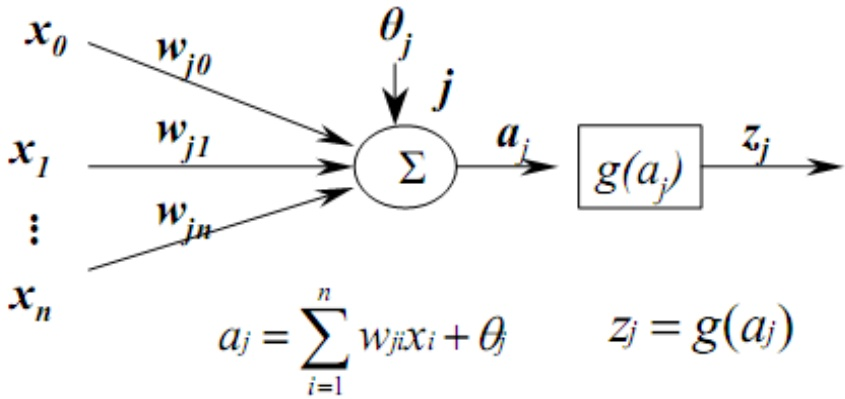

Hình 1.1. Đơn vị xử lý của mạng nơ-ron nhân tạo

Trong một mạng nơ-ron có ba kiểu đơn vị:

1) Các đơn vị đầu vào (Inputs units), nhận tín hiệu từ bên ngoài;

2) Các đơn vị đầu ra (Output units), gửi dữ liệu ra bên ngoài;

3) Các đơn vị lớp ẩn (Hidden units), tín hiệu vào (input) và ra (output) của nó nằm trong mạng.

Mỗi đơn vị có thể có một hoặc nhiều đầu vào: $x_{0},x_{1},x_{2},\ldots x_{n}$ , nhưng chỉ có một đầu ra $z _ { j }$ . Mỗi đầu vào tới một đơn vị có thể là dữ liệu từ bên ngoài mạng hoặc đầu ra của một đơn vị khác, hoặc là đầu ra của chính nó.

1.2.1.2. Hàm xử lý

\- Hàm kết hợp: Mỗi đơn vị trong mạng kết hợp các giá trị đưa vào nó thông qua các liên kết với các đơn vị khác, sinh ra một giá trị gọi là đầu vào mạng (net input). Hàm thực hiện nhiệm vụ này gọi là hàm kết hợp, được định nghĩa bởi một luật lan truyền cụ thể. Trong phần lớn các mạng nơ-ron, thường

<!-- page: 26 -->

giả sử rằng, mỗi một đơn vị cung cấp một bộ cộng như là đầu vào cho đơn vị mà nó có liên kết. Tổng đầu vào đơn vịđơn giản là tổng trọng $s \hat { 0 }$ của các đầu ra riêng lẻ từ các đơn vị kết nối cộng thêm ngưỡng hay độ lệch (bias) $\theta _ { j }$ :

$$
a _ {j} = \sum_ {i = 1} ^ {n} w _ {j i} x _ {i} + \theta_ {j}\tag{1.1}
$$

Một $s \hat { 0 }$ trường hợp có thể sử dụng các thuật toán lan truyền phức tạp hơn, trong $\mathrm { s } \hat { \hat { 0 } }$ đó là luật sigma-pi, có dạng:

$$
a _ {j} = \sum_ {i = 1} ^ {n} w _ {j i} \prod_ {k = 1} ^ {m} x _ {i k} + \theta_ {j}\tag{1.2}
$$

Rất nhiều hàm kết hợp sử dụng một độ lệch hay ngưỡng để tính đầu vào mạng tới đơn $\mathbf { v i } .$ Đối với một đơn $\dot { \mathbf { v i } }$ đầu ra tuyến tính, thông thường $\theta _ { j }$ được chọn là hằng $s \hat { 0 }$ và trong bài toán xấp xỉ đa thức thì $\theta _ { j }   =   1$

\- Hàm kích hoạt (hàm truyền): Phần lớn các đơn vị trong mạng nơ-ron chuyển đầu vào mạng bằng cách sử dụng một hàm vô hướng (scalar-to-scalar function) gọi là hàm kích hoạt, kết quả của hàm này là một giá trị gọi là mức độ kích hoạt của đơn vị. Loại trừ khả năng đơn vị đó thuộc lớp ra, giá trị kích hoạt được đưa vào một hay nhiều đơn vị khác. Các hàm kích hoạt hay được sử dụng hiện nay là:

Hàm truyền tuyến tính (Linear transfer function) (hình 1.2), được gọi là hàm đồng nhất (Identity function).

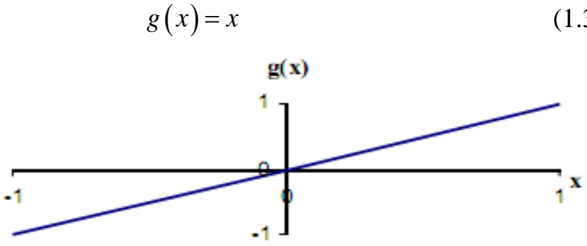

(1.3)

Hình 1.2. Hàm truyền tuyến tính

<!-- page: 27 -->

Hàm truyền giới hạn cứng (Hard - Limit transfer function), được biết đến với tên hàm ngưỡng (Threshold function hay Heaviside function) hay hàm bước nhị phân. Đầu ra hàm này được giới hạn vào một trong hai giá trị:

$$
g (x) = \left\{ \begin{array}{l l} 1, & \text {n} \acute {\mathrm{e}} \mathrm{u} x \geq 0 \\ 0, & \text {n} \acute {\mathrm{e}} \mathrm{u} x <   0 \end{array} \right.\tag{1.4}
$$

Dạng hàm này được sử dụng trong các mạng chỉ có một lớp. Trong hình 1.3, được chọn bằng 1.

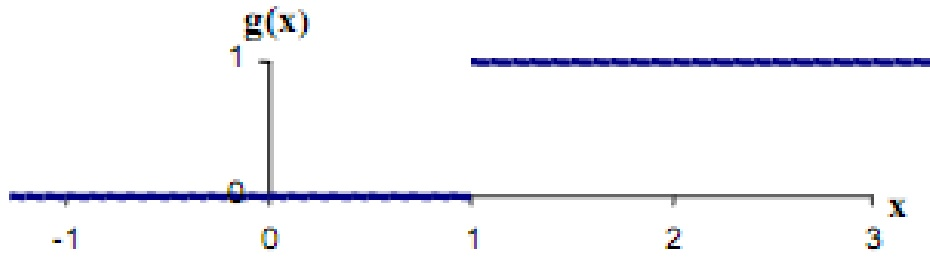

Hình 1.3. Hàm truyền giới hạn cứng

Hàm truyền dạng Sigma (Sigmoid transfer function) (hình 1.4): Hàm này thuận lợi khi sử dụng cho các mạng được huấn luyện bởi thuật toán lan truyền ngược (Back-propagation), bởi vì nó dễ lấy đạo hàm, do đó có thể giảm đáng kể tính toán trong quá trình huấn luyện. Hàm này hay được dùng cho chương trình ứng dụng mà các đầu ra mong muốn rơi vào khoảng [0,1].

$$
g (x) = \frac {1}{1 + e ^ {- x}}\tag{1.5}
$$

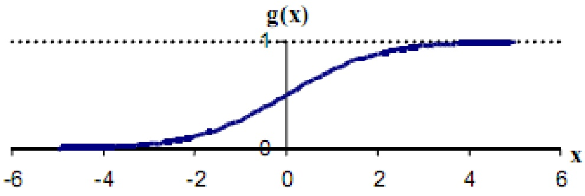

Hình 1.4. Hàm truyền dạng sigma

<!-- page: 28 -->

Hàm truyền dạng tang-sigma (tan-sigmoid transfer function) (hình 1.5):

$$
g (x) = \frac {1 - e ^ {- x}}{1 + e ^ {x}}\tag{1.6}
$$

Hàm này có thuộc tính tương tự hàm Sigma, có khả năng làm việc tốt đối với các ứng dụng có đầu ra yêu cầu trong khoảng [-1, 1].

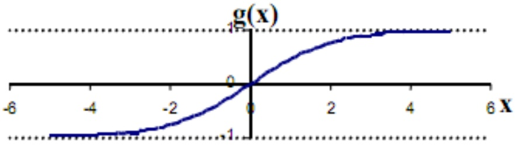

Hình 1.5. Hàm truyền dạng tang-sigma

Các hàm truyền của đơn vị ẩn (Hidden units) cần thiết cho việc biểu diễn sự phi tuyến vào trong mạng. Tuy nhiên, đối với luật học lan truyền ngược, hàm phải khả vi và sẽ có ích nếu như hàm được gắn trong một khoảng nào đó. Do vậy, hàm Sigma là lựa chọn thông dụng nhất.

## 1.2.1.3. Các hình trạng của mạng

Hình trạng của mạng được định nghĩa bởi: số lớp, số đơn vị trên mỗi lớp và sự liên kết giữa các lớp như thế nào. Các mạng về tổng thể được chia thành hai loại dựa trên cách thức liên kết các đơn vị:

\- Mạng truyền thẳng (hình 1.6): Dòng dữ liệu từ đơn vị đầu vào đến đơn vị đầu ra được truyền thẳng. Việc xử lý dữ liệu có thể mở rộng ra nhiều lớp, nhưng không có các liên kết phản hồi. Nghĩa là, không thể có các liên kết mở rộng từ các đơn vị đầu ra tới các đơn vị đầu vào trong cùng một lớp hay các lớp trước đó.

<!-- page: 29 -->

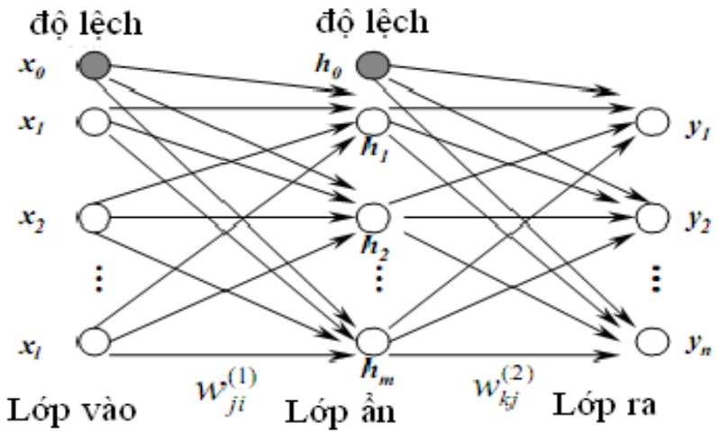

Hình 1.6. Mạng nơ-ron truyền thẳng nhiều lớp

\- Mạng hồi quy (hình 1.7): Có chứa các liên kết ngược và khác với mạng truyền thẳng, các thuộc tính động của mạng mới quan trọng. Trong một số trường hợp, các giá trị kích hoạt của các đơn vị trải qua quá trình nới lỏng (tăng giảm số đơn vị và thay đổi các liên kết) cho đến khi mạng đạt đến một trạng thái ổn định và các giá trị kích hoạt không thay đổi nữa.

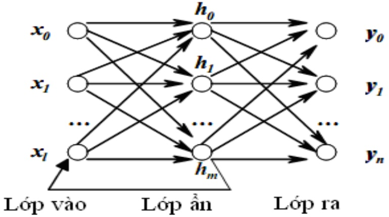

Hình 1.7. Mạng nơ-ron hồi quy

## 1.2.1.4. Các luật học của mạng nơ-ron nhân tạo

Luật học là một trong ba yếu tố quan trọng tạo nên một mạng nơ-ron nhân tạo (mô hình của nơ-ron, cấu trúc và sự liên kết giữa các nơ-ron, phương pháp học được áp dụng cho mạng nơ-ron). Có hai vấn đề cần học đối với mỗi

<!-- page: 30 -->

mạng nơ-ron nhân tạo đó là học tham số (parameter learning) và học cấu trúc (structure learning).

Học tham số là việc thay đổi trọng số của các liên kết giữa các nơ-ron trong một mạng, còn học cấu trúc là việc điều chỉnh cấu trúc của mạng bao gồm thay đổi số lớp nơ-ron, số nơ-ron của mỗi lớp và cách liên kết giữa chúng. Hai vấn đề này có thể được thực hiện đồng thời hoặc tách biệt.

Về mặt phương pháp học, có thể chia ra làm ba loại: học có giám sát hay còn gọi là học có thầy (supervised learning), học tăng cường (reinforcement learning) và học không có giám sát hay còn gọi là học không có thầy (unsupperviced learning).

## 1.2.2. Nhận dạng hệ thống sử dụng mạng nơ-ron nhân tạo [3,10]

Bài toán nhận dạng là một vấn đề đặt lên hàng đầu trong nhiều các lĩnh vực khác nhau như: điện tử y sinh, điện tử viễn thông, hệ thống điện, tự động hóa và điều khiển… Ví dụ như: nhận dạng mô hình tàu thủy, nhận dạng vân tay, nhận dạng ký tự, ảnh, tiếng nói, phát hiện và chẩn đoán bệnh,...

## 1.2.2.1. Khả năng sử dụng mạng nơ-ron trong nhận dạng

Xét trường hợp đối tượng phi tuyến có độ phức tạp cao, nếu sử dụng phương pháp giải tích thông thường để nhận dạng sẽ rất khó khăn, thậm chí không thực hiện được do sự hiểu biết nghèo nàn về đối tượng. Vì vậy, các nhà khoa học đã đưa ra ý tưởng là sử dụng công cụ tính toán mềm như hệ mờ, mạng nơ-ron, đại số gia tử để xấp xỉ - chính là nhận dạng đối tượng. Mạng nơron là một trong những công cụ hữu hiệu để nhận dạng mô hình đối tượng, bằng phương pháp này ta không biết được mô hình toán thực sự của đối tượng nhưng hoàn toàn có thể sử dụng kết quả xấp xỉ để thay thế đối tượng.

## 1.2.2.2. Mô hình nhận dạng hệ thống sử dụng mạng nơ-ron

Nhận dạng gồm: nhận dạng mô hình và nhận dạng tham số.

<!-- page: 31 -->

Nhận dạng mô hình là quá trình xác định mô hình của $\mathbf { \dot { d } \hat { 0 } i }$ tượng và thông $s \hat { 0 }$ trên cơ sở đầu vào và đầu ra của đối tượng. Mô hình thu được sau khi nhận dạng gọi là tốt nếu nó thể hiện được đúng đối tượng. Như vậy có thể sử dụng mô hình thay cho đối tượng để dự báo, kiểm tra và điều khiển.

Mạng nơron được huấn luyện để mô hình hóa quan hệ vào ra của đối tượng. Như vậy quy trình nhận dạng mô hình có bản chất là thuật toán huấn luyện mạng. Cấu trúc mạng nơ-ron giải bài toán nhận dạng mô hình rất đa dạng, tùy thuộc vào từng bài toán cụ thể.

Nhận dạng tham $s \hat { 0 }$ chính là huấn luyện mạng, được biểu diễn trên Hình 1.8. Tín hiệu sai số $e   =   y   -   { \hat { y } }$ là cơ sở cho quá trình luyện mạng. Mạng nơron ở đây có thể là mạng nhiều lớp hoặc các dạng khác và có thể sử dụng nhiều thuật toán huấn luyện mạng khác nhau.

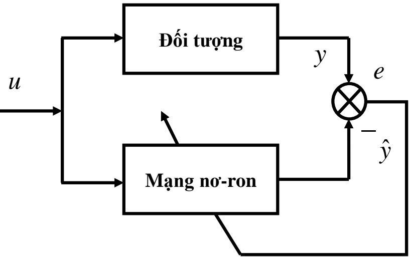

Hình 1.8. Mô hình nhận dạng cơ bản

## 1.2.2.3. Nhận dạng hệ thống sử dụng mạng nơron

Nhận dạng hệ thống cần hai giai đoạn là lựa chọn mô hình và tối ưu tham $s { \hat { \mathbf { 0 } } } .$ Đối với mạng nơron lựa chọn $s \hat { 0 }$ nút ẩn, số lớp ẩn (cấu trúc của mạng) tương đương với mô hình lựa chọn. Mạng có thể được huấn luyện theo kiểu giám sát với kỹ thuật lan truyền ngược, dựa vào luật học sai $s \hat { 0 }$ hiệu chỉnh. Tín hiệu sai $\mathrm { s } \hat { \hat { 0 } }$ được lan truyền ngược qua mạng. Kỹ thuật lan truyền

<!-- page: 32 -->

ngược sử dụng phương pháp giảm gradient để xác định các trọng số của mạng, vì vậy tương đương với tối ưu tham số.

## 1.2.3. Phương pháp ứng dụng mạng nơ-ron trong điều khiển

Có nhiều phương pháp khác nhau để biến mạng nơ-ron thành bộ điều khiển thích nghi cho đối tượng điều khiển và các phương pháp đó có thể được chia làm hai loại là điều khiển gián tiếp và điều khiển trực tiếp [5, 29, 30, 31].

Phương pháp điều khiển gián tiếp, dùng một mạng nơ-ron để nhận dạng và ước lượng các thông số của đối tượng điều khiển và các thông số của BĐK được lựa chọn dựa vào giả thiết các thông số đã được nhận dạng chính là giá trị chính xác của véc tơ thông số đối tượng điều khiển dựa trên nguyên lý tương đương. Phương pháp này không yêu cầu phải biết trước các thông số của đối tượng điều khiển. Tuy nhiên, nó yêu cầu, ngoài mạng nơ-ron đóng vai trò bộ điều khiển, phải thêm vào một mạng nơ-ron khác dùng để mô phỏng đối tượng điều khiển (hình 1.9).

Bộ mô phỏng nhận dạng đối tượng điều khiển cần một giai đoạn huấn luyện trước với một tập dữ liệu đủ lớn để nhận dạng các mô hình động học chính xác hay mô hình nghịch đảo của đối tượng điều khiển.

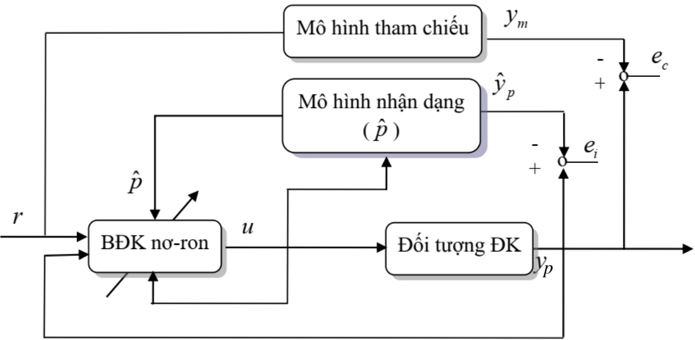

Hình 1.9. Sơ đồ phương pháp điều khiển gián tiếp [31]

<!-- page: 33 -->

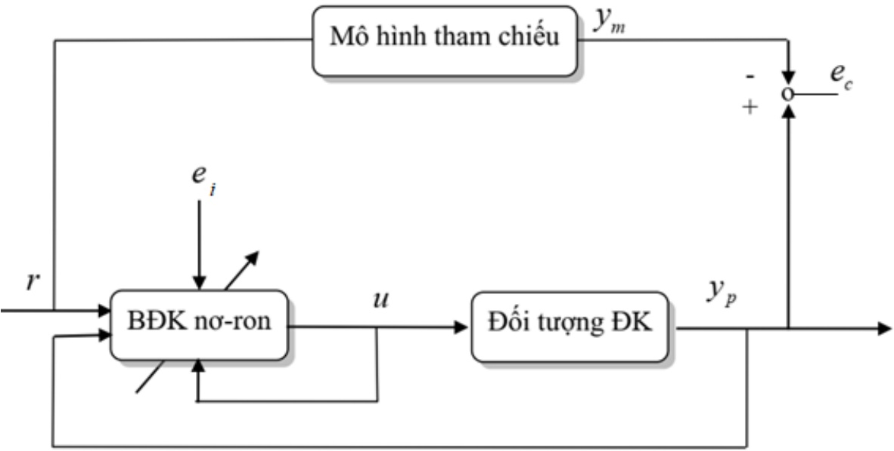

Hình 1.10. Sơ đồ phương pháp điều khiển trực tiếp [31]

Phương pháp điều khiển trực tiếp (hình 1.10), đơn giản hơn phương pháp gián tiếp, không yêu cầu quá trình huấn luyện trước để nhận dạng các thông số của đối tượng điều khiển và cung cấp các luật thích nghi để cập nhật các hàm trọng lượng của mạng nơ-ron.

## 1.3. Nghiên cứu một số bộ điều khiển PID nơ-ron cho hệ thống điều khiển hướng đi tàu thủy

Hệ thống điều khiển hướng đi tàu thủy hay còn gọi là máy lái tự động tàu thủy có chức năng dẫn tàu theo hướng đi hoặc quỹ đạo cho trước. BĐK PID cho điều khiển hướng tàu đã bắt đầu phát triển từ thập niên 50 và được sử dụng rộng rãi trong hàng hải. Với sự phát triển mạnh mẽ của kỹ thuật hiện đại, nhiều BĐK thông minh được các nhà khoa học nghiên cứu dựa trên nền tảng BĐK PID cho điều khiển hướng tàu như lô-gic mờ, thuật toán di truyền, mạng nơ-ron nhân tạo,... BĐK PID nơ-ron là một trong những nghiên cứu nói trên đã được một số tác giả đề xuất. Trong thực tế, đặc tính động học của tàu luôn thay đổi do tốc độ, tải trọng, điều kiện môi trường biển như sóng, gió, dòng chảy,.. tác động, dẫn đến mô hình toán học tàu thủy là không chắc chắn.

<!-- page: 34 -->

BĐK PID thông thường gặp nhiều khó khăn trong việc điều chỉnh các tham số và cho ra kết quả không mong muốn. Vì vậy, việc kết hợp BĐK PID và mạng nơ-ron nhân tạo cho ra kết quả điều khiển mong muốn và ổn định.

**1.3.1. Bộ điều khiển PID dựa trên mạng nơ-ron lan truyền ngược cho hệ thống điều khiển hướng đi tàu thủy**

Một BĐK PID dựa trên mạng nơ-ron lan truyền ngược (BPNN) được đề xuất trong tài liệu [38]. Cấu trúc của hệ thống điều khiển này được minh họa trên hình 1.11.

Trong thuật toán này, BĐK PID là phương pháp điều khiển tuyến tính và được biểu diễn như sau:

$$
u (t) = K _ {p}. \left[ e (t) + \frac {1}{T _ {i}} \int_ {0} ^ {t} e (t) d t + T _ {d} \frac {d e (t)}{d t} \right]\tag{1.7}
$$

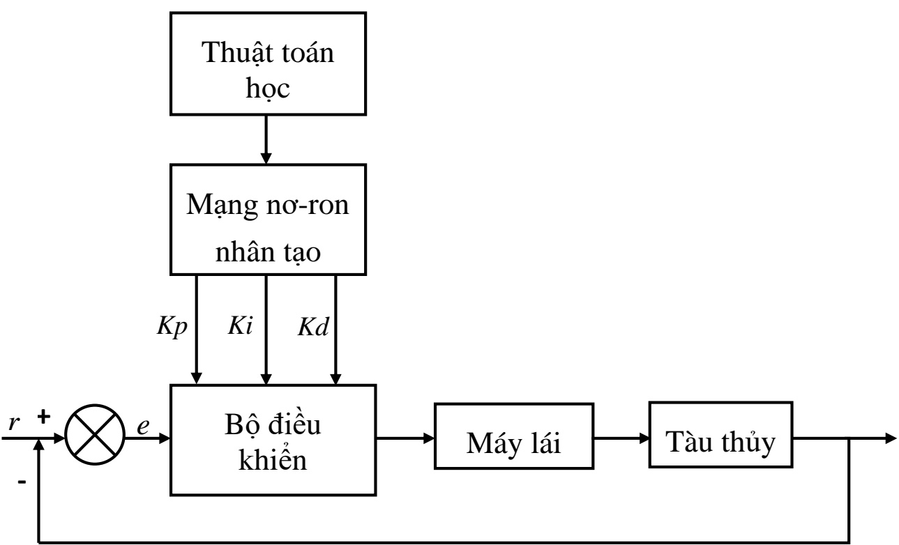

Hình 1.11. Sơ đồ cấu trúc BĐK PID dựa trên mạng BPNN

<!-- page: 35 -->

Trong đó, $u ( t )$ là đầu ra của BĐK PID; $K _ { P }$ là hệ số tỷ lệ, $T _ { i }$ là hằng số thời gian tích phân và $T _ { d }$ là hằng số thời gian vi phân; $e ( t )$ là sai $s \hat { 0 }$ của hệ thống được biểu diễn như sau:

$$
e (t) = y (t) - r (t)\tag{1.8}
$$

Trong đó, là đầu ra thực tế và $r ( t )$ là đầu ra mong muốn của hệ thống điều khiển.

Mạng nơ-ron lan truyền ngược có 3 lớp, cấu trúc của BĐK được minh họa trên hình 1.12. $\hat { S } \hat { \hat { 0 } }$ lượng các nơ-ron lớp vào, lớp ẩn và lớp ra tương ứng là M, Q, 3.

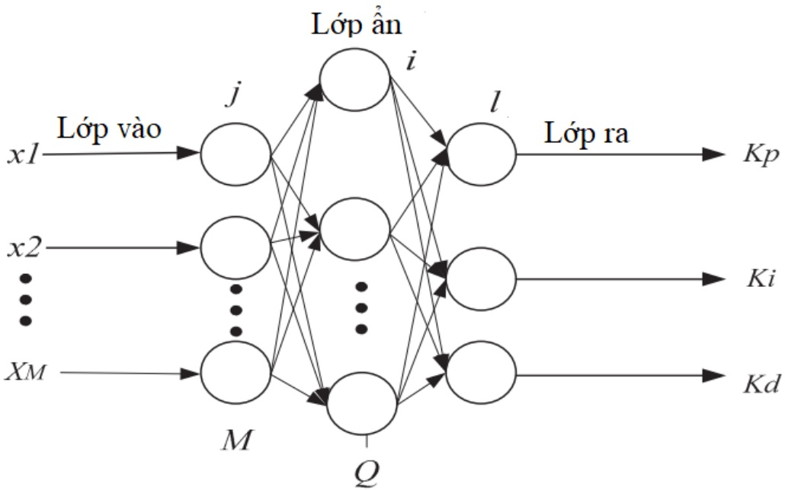

Hình 1.12. Cấu trúc mạng nơ-ron lan truyền ngược

Mạng nơ-ron lan truyền ngược điều hưởng các tham số PID một cách tự động trong suốt quá trình điều khiển. Hàm chỉ tiêu chất lượng có dạng như sau:

$$
E (k) = \frac {1}{2} \big (r i n (k) - y o u t (k) \big) ^ {2}\tag{1.9}
$$

Trong đó, rin là đầu ra mong muốn; là đầu ra thực tế.

<!-- page: 36 -->

Quá trình huấn luyện mô hình mạng nơ-ron phải được thực hiện trước khi đưa vào sử dụng. Quá trình huấn luyện này được lặp lại cho đến khi sai số bình phương trung bình của dữ liệu huấn luyện đạt tối thiểu mong muốn.

Kết quả mô phỏng cho thấy BĐK PID nơ-ron có thời gian điều chỉnh ngắn hơn, độ vượt quá giá trị điều khiển nhỏ và độ bền vững cao hơn so với BĐK PID thông thường.

Sự thay đổi các tham số của $K _ { p }$ $K _ { i }$ và $K _ { d }$ được minh họa ở hình 1.13. Hướng đi và góc bẻ lái của tàu dưới sự điều khiển của BĐK PID dựa trên mạng nơ-ron BP trong điều kiện có và không có nhiễu môi trường tác động được so sánh với BĐK PID thông thường (Hình 1.14, 1.15)

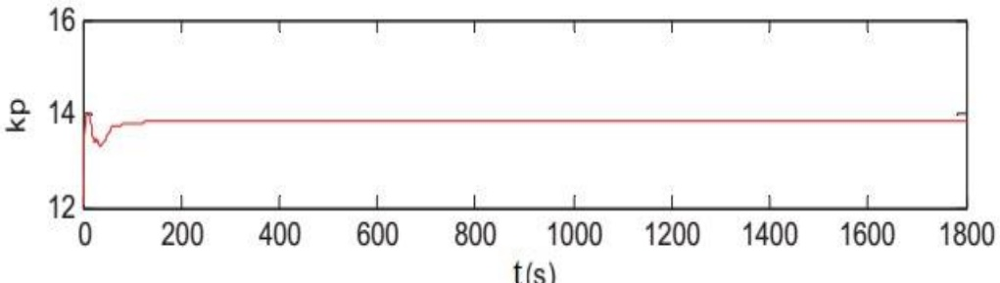

t(s)

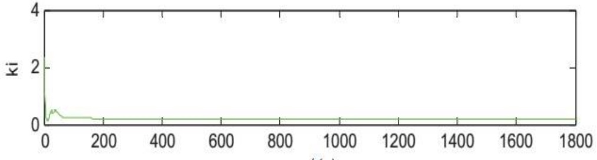

t(s)

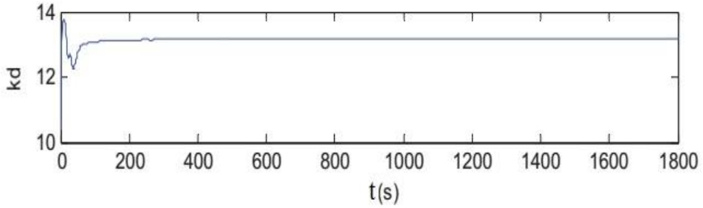

Hình 1.13. Mô phỏng sự thay đổi của $K _ { p }$ , $K _ { i }$ và $K _ { d }$

<!-- page: 37 -->

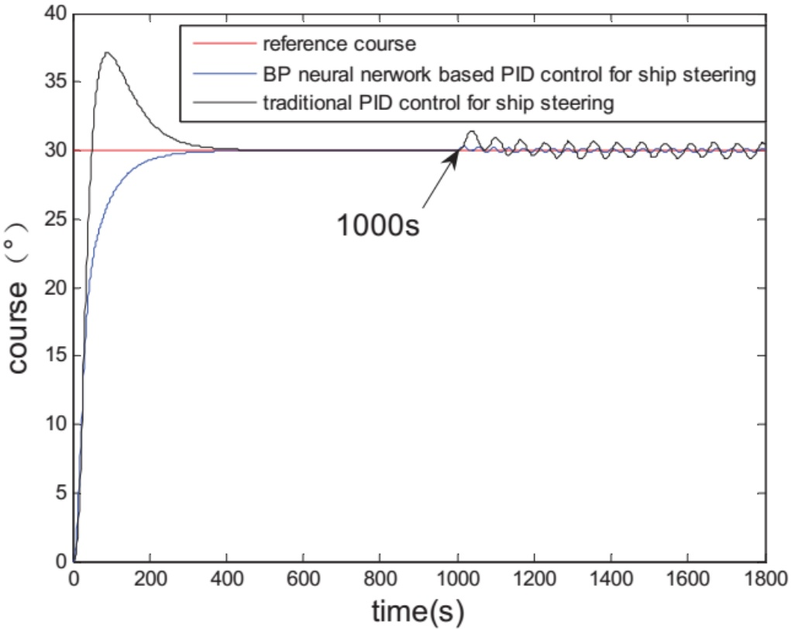

Hình 1.14. Mô phỏng hướng đi

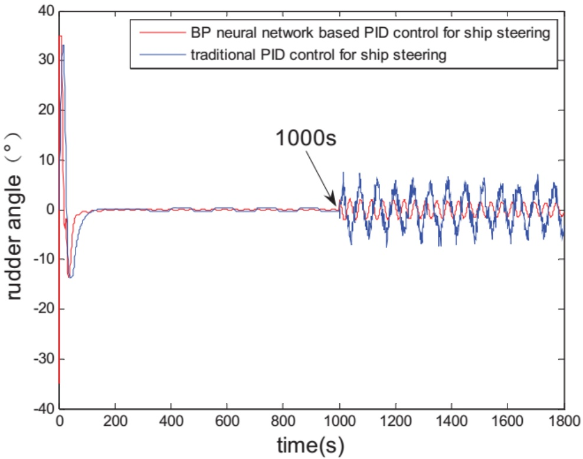

Hình 1.15. Sự thay đổi của góc bẻ lái

<!-- page: 38 -->

## 1.3.2. Bộ điều khiển PID dựa trên mạng nơ-ron hàm cơ sở xuyên tâm cho hệ thống điều khiển hướng đi tàu thủy

BĐK PID dựa trên mạng nơ-ron hàm cơ sở xuyên tâm (RBF) cho điều khiển hướng tàu được đề xuất trong tài liệu [39]. BĐK này gồm có hai phần: 1) BĐK PID thông thường và 2) Mạng nơ-ron hàm cơ sở xuyên tâm. BĐK PID được sử dụng để điều khiển hướng tàu và mạng RBF dùng để điều hưởng các tham số $K _ { p }   ,   K _ { i }$ và $K _ { d }$ của BĐK PID một cách tự động. Thuật toán điều khiển này kết hợp ưu điểm của cả phương pháp điều khiển thông thường (BĐK PID) và kỹ thuật điều khiển hiện đại (mạng RBF) nhằm nâng cao chất lượng điều khiển, có khả năng thích nghi cao và rút ngắn thời gian thiết kế hệ thống. Sơ đồ điều khiển của hệ thống được minh họa ở hình 1.16.

BĐK PID có cấu tạo tương tự như (1.7) và đầu ra của BĐK u(t) có chức năng điều khiển bánh lái tàu thủy.

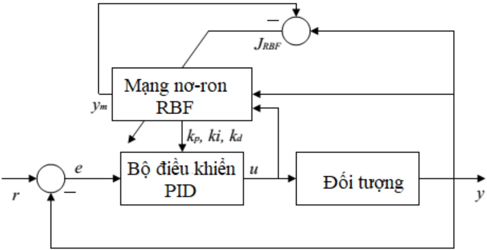

Hình 1.16. Sơ đồ cấu trúc BĐK PID dựa trên mạng RBF

Mạng RBF được thiết kế có một lớp vào, một lớp ẩn và một lớp ra được minh họa trên hình 1.17.

<!-- page: 39 -->

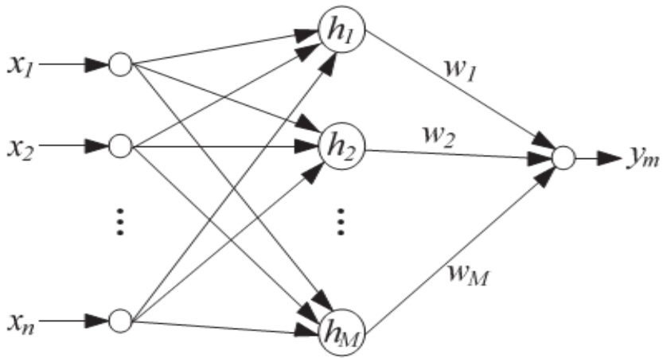

Hình 1.17. Cấu trúc mạng nơ-ron RBF

Hàm chỉ tiêu chất lượng của mạng nơ-ron RBF có dạng:

$$
J _ {R B F} = \frac {1}{2} \Big [ y (k) - y _ {m} (k) \Big ] ^ {2}\tag{1.10}
$$

Trong đó, y(k) là giá trị đầu ra của hệ thống điều khiển tại thời điểm $k ;$ $y _ { m } \big ( k \big )$ là giá trị đầu ra của mạng RBF tại thời điểm k.

Do mạng RBF là một trường hợp đặc biệt của mạng truyền thẳng nên hoàn toàn có thể áp dụng phương pháp giảm gradient để huấn luyện mạng nhằm tối thiểu hóa hàm chỉ số chất lượng $J _ { R B F }$

Mạng RBF được thiết kế có khả năng điều hưởng chính xác các tham số $K _ { p }$ , $K _ { i }$ và $K _ { d }$ trong các tình huống khác nhau bằng cách sử dụng ma trận Jacobi.

Hàm sai $s \hat { 0 }$ của mạng được định nghĩa như sau:

$$
E (k) = \frac {1}{2} (r (k) - y (k)) ^ {2}\tag{1.11}
$$

Luật tự động điều chỉnh các tham số $K _ { p }$ , $K _ { i }$ và $K _ { d }$ được thiết kế dựa trên phương pháp giảm gradient.

<!-- page: 40 -->

Kết quả mô phỏng BĐK PID dựa trên mạng RBF cho thấy mạng nơ- ron RBF có thế điều hưởng các tham số PID tự động một cách liên tục và thích nghi.

Hướng đi của tàu dưới sự điều khiển của BĐK PID dựa trên mạng RBF trong điều kiện không có và có nhiễu môi trường tác động được minh họa ở hình 1.18, 1.19 và được so sánh với BĐK PID thông thường để chứng minh tính hiệu quả của BĐK này.

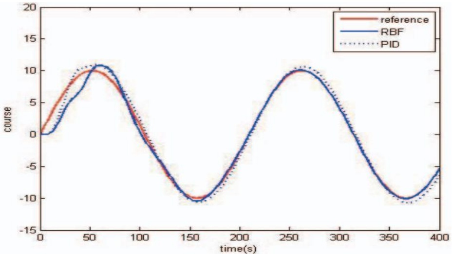

Hình 1.18. Hướng đi của tàu khi không có nhiễu

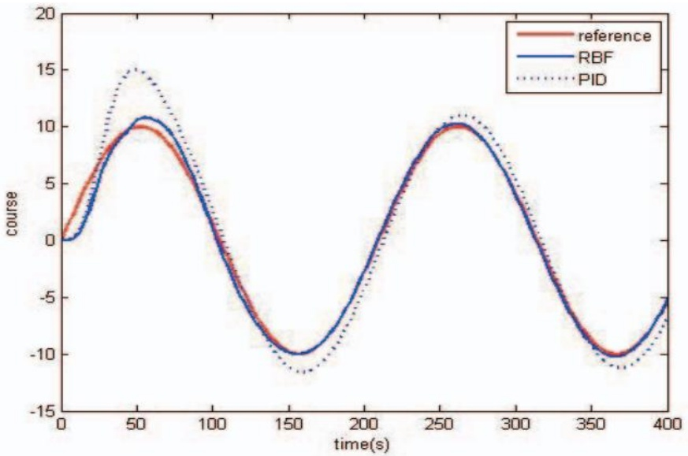

Hình 1.19. Hướng đi của tàu khi có nhiễu

<!-- page: 41 -->

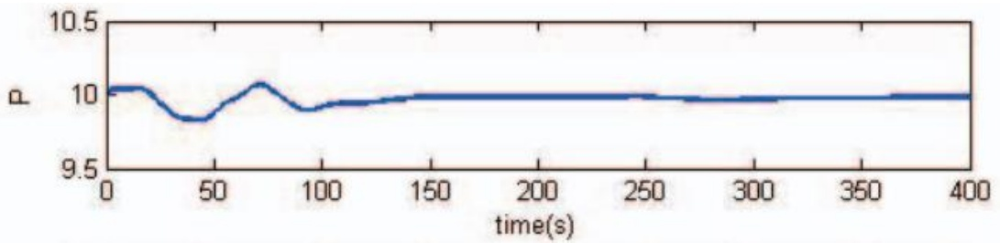

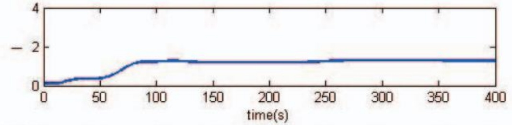

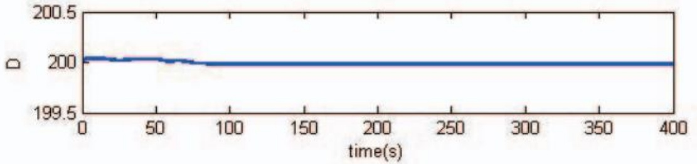

Hình 1.20. Mô phỏng sự thay đổi của $K _ { p }$ , $K _ { i }$ và $K _ { d }$

## 1.4. Cơ sở lý thuyết về các hệ tọa độ và và động học tàu thủy

Trong đề tài tác giả có đề xuất ứng dụng BĐK hướng tàu vào điều khiển tàu theo quỹ đạo cho trước, thông qua BĐK hướng tàu kết hợp với thuật toán dẫn đường LOS làm cho tàu đi theo một quỹ đạo đã xác định bằng các điểm chuyển hướng.

## 1.4.1. Các hệ trục tọa độ tham chiếu

Khi phân tích chuyển động tổng quát của một con tàu, người ta thường sử dụng hai hệ trục toạ độ gắn với trái đất làm tham chiếu $\{ i \}   ,   \{ e \}$ và một hệ trục toạ độ gắn với thân của vật rắn đang xét $\{ b \}$ như hình 1.21. Ngoài ra cũng còn có thêm nhiều hệ trục tọa độ khác có thể được sử dụng để phù hợp với từng mục đích nghiên cứu [22, 23, 24].

<!-- page: 42 -->

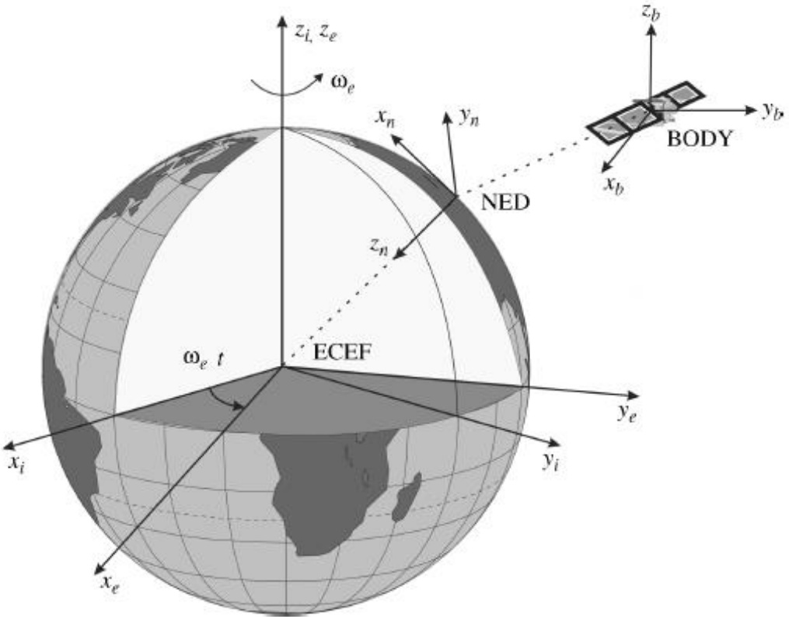

Hình 1.21. Các hệ toạ độ tham chiếu

Hệ trục tọa độ tham chiếu tâm trái đất:

Hệ trục tọa độ ECI (Earth-Centered Inertial): $\left\{ i \right\} = \left( x_{i},y_{i},z_{i} \right)$ là hệ trục tọa độ tham chiếu quán tính được dùng trong định hướng trên mặt đất, trong đó áp dụng các định luật chuyển động của Newton. Bao gồm các hệ thống định hướng quán tính. Gốc của hệ trục tọa độ $\{ i \}$ được đặt tại tâm $O _ { i }$ của Trái Đất như hình 1.21.

Hệ trục tọa độ ECEF (Earth-Centered Earth-Fixed): $\left\{ e \right\} = \left( x_{e},y_{e},z_{e} \right)$ có tâm $O _ { e }$ đặt tại tâm của Trái Đất nhưng các trục thì lại quay tương đối so với hệ trục tọa độ $\{ i \}$ với vận tốc góc là $\omega _ { e } = 7 . 2 9 2 1 x 1 0 ^ { - 5 }$ (rad/s). Đối với các thiết bị di chuyển với tốc độ tương đối thấp, ảnh hưởng do sự xoay của Trái Đất có thể được loại bỏ, do đó hệ trục tọa độ $\{ e \}$ có thể được coi như là hệ trục tọa độ

<!-- page: 43 -->

quán tính. Tuy nhiên, khi xét đến sự trôi của tàu thì không nên loại bỏ sự quay của Trái Đất. Hệ tọa độ $\{ e \}$ thường được sử dụng cho định hướng, dẫn đường và điều khiển toàn cầu, ví dụ như để mô tả chuyển động và vị trí của tàu khi di chuyển từ lục địa này sang lục địa khác.

Các hệ trục tọa độ địa lý:

Hệ trục tọa độ NED (North-East-Down): là hệ trục tọa độ mà chúng ta luôn đề cập đến thường ngày. Hệ trục tọa độ $\left\{ n \right\} = \left( x_{n},y_{n},z_{n} \right)$ có gốc $O _ { n }$ được định nghĩa liên quan tới mặt Ellipsoid tham chiếu của Trái Đất. Nó thường được định nghĩa như là một mặt phẳng tiếp xúc trên bề mặt Trái Đất di chuyển cùng với tàu, nhưng có các trục hướng theo các hướng khác so với các trục cố định của tàu. Đối với hệ trục này thì trục $x _ { n }$ hướng về phương Bắc, trục $y _ { n }$ hướng về hướng Đông còn trục $z _ { n }$ thì hướng về tâm trái đất. Vị trí tương đối của $\{ n \}$ so với được xác định bằng hai góc và $\mu$ (kinh độ và vĩ độ).

Hệ trục tọa độ BODY (Body-fixed reference frame): $\left\{ b \right\} = \left( x_{b},y_{b},z_{b} \right)$ là một hệ tọa độ chuyển động, nhưng cố định so với tàu. Vị trí và hướng của tàu được mô tả tương đối so với hệ trục quán tính $( \mathbf { x } \hat { \mathbf { a } } \mathbf { p }$ xỉ bởi hoặc $\{ n \} )$ Trong khi đó, vận tốc dài và vận tốc góc của tàu được mô tả trong hệ trục tọa độ body-fixed. Gốc $O _ { b }$ thường được chọn trùng với điểm giữa của tàu, được gọi là CO. Đối với các phương tiện hàng hải, các trục của hệ BODY được chọn như hình 1.21. Với $x _ { b }$ là trục dọc từ đuôi tàu đến mũi tàu, $y _ { b }$ là trục ngang hướng từ mạn trái qua mạn phải, $z _ { b }$ là trục vuông góc hướng từ trên xuống đáy tàu.

Theo SNAME, 1950, các hệ trục toạ độ dùng để biểu diễn chuyển động của phương tiện trên mặt nước bao gồm cả hệ trục cố định trên trái đất (ECEF

<!-- page: 44 -->

và NED) và hệ trục $\mathrm { c } \hat { 0 }$ định trên con tàu (BODY) được biểu diễn bởi ký hiệu như bảng 1.21 và hình 1.22.

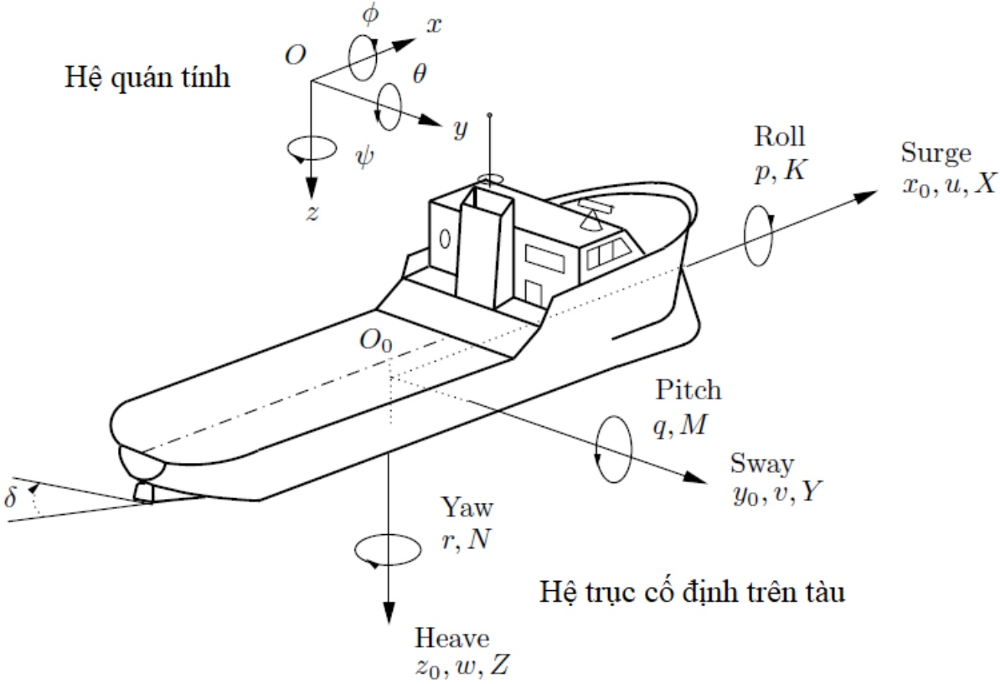

Hình 1.22. Hệ trục toạ độ và các đại lượng

Đối với các loại tàu biển, các ký hiệu sau sẽ được áp dụng cho vận tốc dài và vận tốc góc khi phân tích trong hệ tham chiếu {b}, {e} và {n}.

$\mathbf { V } _ { \mathrm { b / n } } ^ { \mathrm { e } }$ : vận tốc dài của điểm $\mathbf { O _ { b } }$ so với $\mathbf { O } _ { \mathfrak { n } }$ được biểu diễn trong hệ trục tọa độ {e}.

$\omega _ { \mathrm { n / e } } ^ { \mathrm { b } }$ : vận tốc góc của hệ trục tọa độ {n} so với hệ trục tọa độ {e} được biểu diễn trong hệ trục tọa độ {b}.

$\mathbf { f } _ { \mathrm { b } } ^ { \mathrm {   n } }$ : lực tác động tác động lên con tàu đặt tại $\mathbf { O _ { b } }$ được biểu diễn trong hệ trục tọa độ {n}.

$\mathbf { m _ { b } ^ { n } }$ : moment tác động lên con tàu đặt tại $\mathbf { O _ { b } }$ được biểu diễn trong hệ trục tọa độ {n}.

<!-- page: 45 -->

$\Theta _ { \mathrm { n b } }$ : góc Euler giữa hệ trục tọa độ {n} và hệ trục tọa độ {b}.

Bảng 1.1. Ký hiệu của SNAME (1950) đối với tàu biển

| Bậc tự do | Chuyển động | Lực và moment | Vận tốc | Vị trí và góc Euler |
| --- | --- | --- | --- | --- |
| 1 | Chuyển động tiến theo trục x (Surge) | X | u | x |
| 2 | Chuyển động tiến theo trục y (Sway) | Y | v | y |
| 3 | Chuyển động tiến theo trục z (Heave) | Z | w | z |
| 4 | Chuyển động quay quanh trục x (Roll) | K | p |  |
| 5 | Chuyển động quay quanh trục y (Pitch) | M | q |  |
| 6 | Chuyển động quay quanh trục z (Yaw) | N | r |  |

Các đại lượng ở bảng 1.1, định nghĩa bởi SNAME (1950), có th $\overset { \overset { \overset { \curve } { \mathsf { R } } } { \mathsf { e } } } { | \overset { \overset { \curve } { \mathsf { e } } } { \mathsf { e } } | }$ được biểu diễn ở dạng vector như sau:

Vị trí ECEF

$$
p _ {b / e} ^ {e} = \left[ \begin{array}{l} x \\ y \\ z \end{array} \right] \quad \text {Kinh do và vi do} \quad \Theta = \left[ \begin{array}{c} 1 \\ \mu \end{array} \right]
$$

Vị trí NED

$$
p _ {b / n} ^ {n} = \left[ \begin{array}{l} N \\ E \\ D \end{array} \right] \quad \text {Kinh do và vĩ do} \quad \Theta = \left[ \begin{array}{c} \phi \\ \theta \\ \psi \end{array} \right]
$$

<!-- page: 46 -->

Vận tốc dài Body-fixed $\mathcal { W } _ { b / n } ^ { n } = \left[ \begin{matrix} { u } \\ { v } \\ { \mathcal { W } } \\ \end{matrix} \right] .$ Vận tốc góc Body-fixed $\omega_{_{b/n}}^{^n} = \left[ \begin{matrix} p \\ q \\ r \end{matrix} \right]$

Lực Body-fixed

$$
f _ {b} ^ {n} = \left[ \begin{array}{c} u \\ v \\ w \end{array} \right]
$$

Mô men Body-fixed

$$
m _ {b} ^ {b} = \left[ \begin{array}{c} K \\ M \\ N \end{array} \right]
$$

Chuyển động cơ bản của con tàu trong không gian 6 bậc tự do được mô tả bởi các vector sau:

$$
\eta = \left[ \begin{array}{c} p _ {b / n} ^ {n} \\ \Theta_ {n b} \end{array} \right]; v = \left[ \begin{array}{c} v _ {b / n} ^ {n} \\ \omega_ {n b} \end{array} \right]; \tau = \left[ \begin{array}{c} f _ {b} ^ {b} \\ m _ {b} ^ {b} \end{array} \right]
$$

## 1.4.2. Phương trình động học của con tàu

Hướng của hệ trục tọa độ {b} được xác định so với hệ trục tọa độ quy chiếu {n} bằng ba góc roll , pitch và yaw $( \psi )$

Nếu xoay hệ trục tọa độ {b} xung quanh trục z, y, x của hệ trục tọa độ {n} thì ta có các ma trận chuyển đổi lần lượt như sau:

$$
R _ {x, \phi} = \left[ \begin{array}{c c c} 1 & 0 & 0 \\ 0 & c \phi & s \phi \\ 0 & - s \phi & c \phi \end{array} \right]; R _ {y, \theta} = \left[ \begin{array}{c c c} c \phi & 0 & - s \phi \\ 0 & 1 & 0 \\ s \phi & 0 & c \phi \end{array} \right]; R _ {z, \psi} = \left[ \begin{array}{c c c} c \psi & s \psi & - s \theta \\ - s \psi & c \psi & 0 \\ 0 & 0 & 1 \end{array} \right]
$$

Do đó vector vận tốc dài $\mathrm { v _ { b / n } ^ { b } }$ có thể được biểu diễn trong {n} bởi:

$$
\dot {\mathbf {p}} _ {\mathrm{b/n}} ^ {\mathrm{n}} = \mathbf {R} _ {\mathrm{b}} ^ {\mathrm{n}} (\boldsymbol {\Theta} _ {\mathrm{nb}}) \mathbf {v} _ {\mathrm{b/n}} ^ {\mathrm{b}}\tag{1.12}
$$

với $\mathbf { R } _ { \mathrm { b } } ^ { \mathfrak { n } } ( \Theta _ { \mathrm { n b } } )$ là tích của ba ma trận xoay quanh các trục z, y và x như trên.

$$
\mathrm{R} _ {\mathrm{b}} ^ {\mathrm{n}} \left(\Theta_ {\mathrm{nb}}\right) = \mathrm{R} _ {\mathrm{z}, \psi} \mathrm{R} _ {\mathrm{y}, \theta} \mathrm{R} _ {\mathrm{x}, \phi} = \left[ \begin{array}{c c c} \mathrm{c} \psi \mathrm{c} \theta & - \mathrm{s} \psi \mathrm{c} \phi + \mathrm{c} \psi \mathrm{s} \theta \mathrm{s} \phi & \mathrm{s} \psi \mathrm{s} \phi + \mathrm{c} \psi \mathrm{c} \theta \mathrm{s} \phi \\ \mathrm{s} \psi \mathrm{c} \theta & \mathrm{c} \psi \mathrm{c} \phi + \mathrm{s} \psi \mathrm{s} \theta \mathrm{s} \phi & - \mathrm{c} \psi \mathrm{s} \phi + \mathrm{s} \psi \mathrm{s} \theta \mathrm{c} \phi \\ - \mathrm{s} \theta & \mathrm{c} \theta \mathrm{s} \phi & \mathrm{c} \theta \mathrm{c} \phi \end{array} \right]
$$

<!-- page: 47 -->

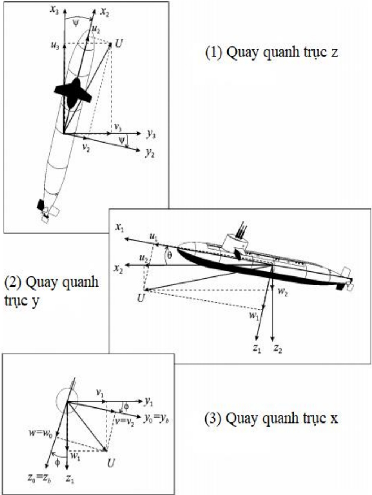

Hình 1.23. Các góc xoay Euler (minh họa chung cho 6 bậc tự do)

Theo tài liệu [24] thì vector vận tốc góc $\omega _ { \mathrm { b } / \mathrm { n } } ^ { \mathrm { b } } = \left[ \begin{matrix} { \mathbf { p } } & { \mathbf { q } } & { \mathbf { r } } \\ \end{matrix} \right] ^ { \mathrm { T } }$ trong hệ trục tọa độ {b} có thể được chuyển sang vận tốc góc $\dot { \Theta } _ { \mathrm { n b } } = \left[ \begin{matrix} { \dot { \phi } } & { \dot { \theta } } & { \dot { \psi } } \\ \end{matrix} \right]$ trong hệ trục tọa độ {n} bằng ma trận chuyển đổi $\mathrm { T } _ { \Theta } ( \Theta _ { \mathrm { n b } } )$ bởi công thức:

$$
\dot {\Theta} _ {\mathrm{nb}} = \mathrm{T} _ {\Theta} (\Theta_ {\mathrm{nb}}) \omega_ {\mathrm{b/n}} ^ {\mathrm{b}}\tag{1.13}
$$

<!-- page: 48 -->

Ngoài ra dựa vào tài liệu [24], ta có được ma trận chuyển đổi vận tốc góc từ hệ tọa độ {b} sang hệ tọa độ {n} như sau:

$$
\mathrm{T} _ {\Theta} (\Theta_ {\mathrm{nb}}) = \left[ \begin{array}{c c c} 1 & \mathrm{s} \phi \mathrm{t} \theta & \mathrm{c} \phi \mathrm{t} \theta \\ 0 & \mathrm{c} \phi & - \mathrm{s} \phi \\ 0 & \mathrm{s} \phi / \mathrm{c} \theta & \mathrm{c} \phi / \mathrm{c} \theta \end{array} \right]
$$

Phương trình động học 6 bậc tự do của con tàu có thể được biểu diễn dưới dạng:

$$
\dot {\eta} = \mathrm{J} _ {\Theta} (\eta) \nu\tag{1.14}
$$

hay

$$
\left[ \begin{array}{c} \dot {\mathbf {p}} _ {\mathrm{b/n}} ^ {\mathrm{n}} \\ \dot {\boldsymbol {\Theta}} _ {\mathrm{nb}} \end{array} \right] = \left[ \begin{array}{c c} \mathrm{R} _ {\mathrm{b}} ^ {\mathrm{n}} (\boldsymbol {\Theta} _ {\mathrm{nb}}) & 0 _ {3 \times 3} \\ 0 _ {3 \times 3} & \mathrm{T} _ {\boldsymbol {\Theta}} (\boldsymbol {\Theta} _ {\mathrm{nb}}) \end{array} \right] \left[ \begin{array}{c} \mathrm{v} _ {\mathrm{b/n}} ^ {\mathrm{b}} \\ \omega_ {\mathrm{b/n}} ^ {\mathrm{b}} \end{array} \right]\tag{1.15}
$$

## 1.4.3. Phương trình động lực học của vật rắn

Theo định luật Newton cho vật rắn có khối lượng m, ta có phương trình cân bằng lực và moment như sau:

$$
\mathrm{m} \Big [ \dot {\mathrm{v}} _ {\mathrm{b/n}} ^ {\mathrm{b}} + \dot {\omega} _ {\mathrm{b/n}} ^ {\mathrm{b}} \times \mathrm{r} _ {\mathrm{g}} ^ {\mathrm{b}} + \omega_ {\mathrm{b/n}} ^ {\mathrm{b}} \times \mathrm{v} _ {\mathrm{b/n}} ^ {\mathrm{b}} + \omega_ {\mathrm{b/n}} ^ {\mathrm{b}} \times \Big (\omega_ {\mathrm{b/n}} ^ {\mathrm{b}} \times \mathrm{r} _ {\mathrm{g}} ^ {\mathrm{b}} \Big) \Big ] = \mathrm{f} _ {\mathrm{b}} ^ {\mathrm{b}}\tag{1.16}
$$

$$
\mathrm{I} _ {\mathrm{b}} \dot {\omega} _ {\mathrm{b/n}} ^ {\mathrm{b}} + \omega_ {\mathrm{b/n}} ^ {\mathrm{b}} \times \left(\mathrm{I} _ {\mathrm{b}} \omega_ {\mathrm{b/n}} ^ {\mathrm{b}}\right) + \mathrm{mr} _ {\mathrm{g}} ^ {\mathrm{b}} \times \left(\dot {\mathrm{v}} _ {\mathrm{b/n}} ^ {\mathrm{b}} + \omega_ {\mathrm{b/n}} ^ {\mathrm{b}} \times \mathrm{v} _ {\mathrm{b/n}} ^ {\mathrm{b}}\right) = \mathrm{m} _ {\mathrm{b}} ^ {\mathrm{b}}\tag{1.17}
$$

trong đó:

$\mathbf { f } _ { \mathsf { b } } ^ { \mathsf { b } }   =   \left[ \mathbf { X } , \mathbf { Y } , \mathbf { Z } \right] ^ { \mathrm { T } }$ : lực tác dụng lên vật rắn đặt tại $\mathbf { O _ { b } }$ được biểu diễn trong {b};

$\mathbf { m } _ { \mathsf { b } } ^ { \mathsf { b } } = \left[ \mathbf { K } , \mathbf { M } , \mathbf { N } \right] ^ { \mathrm { T } }$ : moment tác dụng lên vật rắn đặt tại $\mathbf { O _ { b } }$ được biểu diễn trong {b};

$$
\mathrm{v} _ {\mathrm{b/n}} ^ {\mathrm{b}} = \left[ \mathrm{u}, \mathrm{v}, \mathrm{w} \right] ^ {\mathrm{T}}: \text {vân tốc dài của} \mathrm{O} _ {\mathrm{b}} \text {so với} \mathrm{O} _ {\mathrm{n}} \text {dược biểu diễn trong}
$$

{b};

$$
\omega_ {\mathrm{b/n}} ^ {\mathrm{b}} = \left[ \mathrm{p}, \mathrm{q}, \mathrm{r} \right] ^ {\mathrm{T}}: \text {vân tốc góc của} \{\mathrm{b} \} \text {so với} \{\mathrm{n} \} \text {được biểu diễn trong}
$$

{b};

<!-- page: 49 -->

$\mathbf { r } _ { \mathrm { g } } ^ { \mathrm { b } } = \left[ \mathbf { x } _ { \mathrm { g } } , \mathbf { y } _ { \mathrm { g } } , \mathbf { z } _ { \mathrm { g } } \right] ^ { \mathrm { T } }$ : vector từ $\mathbf { O _ { b } }$ đến CG được biểu diễn trong {b}.

Từ trên ta suy ra phương trình các lực và moment của con tàu:

$$
\begin{array}{l} \mathrm{m} \Big [ \dot {\mathrm{u}} - \mathrm{vr} + \mathrm{wq} - \mathrm{x} _ {\mathrm{g}} \left(\mathrm{q} ^ {2} + \mathrm{r} ^ {2}\right) + \mathrm{y} _ {\mathrm{g}} (\mathrm{pq} - \dot {\mathrm{r}}) + \mathrm{z} _ {\mathrm{g}} (\mathrm{pr} - \dot {\mathrm{q}}) \Big ] = \mathrm{X} \\ \mathrm{m} \Big [ \dot {\mathrm{v}} + \mathrm{ur} - \mathrm{wp} + \mathrm{x} _ {\mathrm{g}} (\mathrm{qp} + \dot {\mathrm{r}}) - \mathrm{y} _ {\mathrm{g}} (\mathrm{p} ^ {2} + \mathrm{r} ^ {2}) + \mathrm{z} _ {\mathrm{g}} (\mathrm{qr} - \dot {\mathrm{p}}) \Big ] = \mathrm{Y} \\ \mathrm{m} \Big [ \dot {\mathrm{w}} - \mathrm{uq} + \mathrm{vp} + \mathrm{x} _ {\mathrm{g}} (\mathrm{rp} + \dot {\mathrm{q}}) - \mathrm{y} _ {\mathrm{g}} (\mathrm{rq} + \dot {\mathrm{p}}) - \mathrm{z} _ {\mathrm{g}} (\mathrm{p} ^ {2} + \mathrm{q} ^ {2}) \Big ] = \mathrm{Z} \\ \mathrm{I} _ {\mathrm{x}} \dot {\mathrm{p}} + \left(\mathrm{I} _ {\mathrm{z}} - \mathrm{I} _ {\mathrm{y}}\right) \mathrm{qr} - \left(\mathrm{qp} + \dot {\mathrm{r}}\right) \mathrm{I} _ {\mathrm{xz}} + \left(\mathrm{r} ^ {2} - \mathrm{q} ^ {2}\right) \mathrm{I} _ {\mathrm{yz}} + (\mathrm{pr} - \dot {\mathrm{q}}) \mathrm{I} _ {\mathrm{xy}} \\ \quad + \mathrm{m} \Big [ \mathrm{y} _ {\mathrm{g}} (\dot {\mathrm{w}} - \mathrm{uq} + \mathrm{vp}) - \mathrm{z} _ {\mathrm{g}} (\dot {\mathrm{v}} - \mathrm{wp} + \mathrm{ur}) \Big ] = \mathrm{K} \\ \mathrm{I} _ {\mathrm{y}} \dot {\mathrm{q}} + \left(\mathrm{I} _ {\mathrm{x}} - \mathrm{I} _ {\mathrm{z}}\right) \mathrm{ro} - (\mathrm{qr} + \dot {\mathrm{p}}) \mathrm{I} _ {\mathrm{xy}} + (\mathrm{p} ^ {2} - \mathrm{r} ^ {2}) \mathrm{I} _ {\mathrm{zx}} + (\mathrm{pq} - \dot {\mathrm{r}}) \mathrm{I} _ {\mathrm{yz}} \\ \quad + \mathrm{m} \Big [ \mathrm{z} _ {\mathrm{g}} (\dot {\mathrm{u}} - \mathrm{vr} + \mathrm{wq}) - \mathrm{x} _ {\mathrm{g}} (\dot {\mathrm{w}} - \mathrm{uq} + \mathrm{vp}) \Big ] = \mathrm{M} \\ \mathrm{I} _ {\mathrm{z}} \dot {\mathrm{r}} + \left(\mathrm{I} _ {\mathrm{y}} - \mathrm{I} _ {\mathrm{x}}\right) \mathrm{pq} - (\mathrm{rp} + \dot {\mathrm{q}}) \mathrm{I} _ {\mathrm{yz}} + (\mathrm{q} ^ {2} - \mathrm{p} ^ {2}) \mathrm{I} _ {\mathrm{xy}} + (\mathrm{rq} - \dot {\mathrm{p}}) \mathrm{I} _ {\mathrm{zx}} \\ \quad + \mathrm{m} \Big [ \mathrm{x} _ {\mathrm{g}} (\dot {\mathrm{v}} - \mathrm{wp} + \mathrm{ur}) - \mathrm{y} _ {\mathrm{g}} (\dot {\mathrm{u}} - \mathrm{vr} + \mathrm{wq}) \Big ] = \mathrm{N} \end{array}\tag{1.18}
$$

với $\mathrm { I _ { b } }$ là moment quán tính đối với gốc $\mathbf { O } _ { \mathbf { b } } ,$ ta có:

$$
\mathrm{I} _ {\mathrm{b}} = \left[ \begin{array}{c c c} \mathrm{I} _ {\mathrm{x}} & - \mathrm{I} _ {\mathrm{xy}} & - \mathrm{I} _ {\mathrm{xz}} \\ - \mathrm{I} _ {\mathrm{yx}} & \mathrm{I} _ {\mathrm{y}} & - \mathrm{I} _ {\mathrm{yz}} \\ - \mathrm{I} _ {\mathrm{zx}} & - \mathrm{I} _ {\mathrm{zy}} & \mathrm{I} _ {\mathrm{z}} \end{array} \right], \quad \mathrm{I} _ {\mathrm{b}} = \mathrm{I} _ {\mathrm{b}} ^ {\mathrm{T}} > 0\tag{1.19}
$$

với $\mathbf { I } _ { \mathrm { x } } ,   \mathbf { I } _ { \mathrm { y } } ,   \mathbf { I } _ { \mathrm { z } }$ là momen quán tính đối với trục $\mathrm { X b } , \mathrm { Y b } , \mathrm { Z b }$ và $\mathbf { I } _ { \mathrm { x y } } = \mathbf { I } _ { \mathrm { y x } } , \mathbf { I } _ { \mathrm { y z } } = \mathbf { I } _ { \mathrm { z y } } , \mathbf { I } _ { \mathrm { z x } }$ $\mathrm { { = } I _ { X Z } }$ là moment quán tính ly tâm được định nghĩa như sau:

$$
\begin{array}{l} \mathrm {I_ {x}} = \int_ {\mathrm{V}} \left(\mathrm {y^ {2} + z^ {2}}\right) \rho_ {\mathrm{m}} \mathrm{dV} \\ \mathrm {I_ {y}} = \int_ {\mathrm{V}} \left(\mathrm {x^ {2} + z^ {2}}\right) \rho_ {\mathrm{m}} \mathrm{dV} \\ \mathrm {I_ {z}} = \int_ {\mathrm{V}} \left(\mathrm {x^ {2} + y^ {2}}\right) \rho_ {\mathrm{m}} \mathrm{dV} \\ \mathrm {I_ {xy}} = \int_ {\mathrm{V}} \mathrm{xy} \rho_ {\mathrm{m}} \mathrm{dV} = \int_ {\mathrm{V}} \mathrm{yx} \rho_ {\mathrm{m}} \mathrm{dV} = \mathrm {I_ {yx}} \\ \mathrm {I_ {yz}} = \int_ {\mathrm{V}} \mathrm{yz} \rho_ {\mathrm{m}} \mathrm{dV} = \int_ {\mathrm{V}} \mathrm{zy} \rho_ {\mathrm{m}} \mathrm{dV} = \mathrm {I_ {zy}} \\ \mathrm {I_ {zx}} = \int_ {\mathrm{V}} \mathrm{zx} \rho_ {\mathrm{m}} \mathrm{dV} = \int_ {\mathrm{V}} \mathrm{xz} \rho_ {\mathrm{m}} \mathrm{dV} = \mathrm {I_ {xz}} \end{array}\tag{1.20}
$$

<!-- page: 50 -->

## 1.4.4. Phương trình động lực học của con tàu

Phương trình động lực học con tảu có thể được biểu diễn bởi Fossen (1994) [23]:

$$
\mathrm{M} _ {\mathrm{RB}} \dot {\nu} + \mathrm{C} _ {\mathrm{RB}} (\nu) \nu = \tau_ {\mathrm{RB}}\tag{1.21}
$$

trong đó: $\mathbf { v } = \left[ \mathbf { v } _ { \mathrm { b } / \mathrm { n } } ^ { \mathrm { b } } \quad \omega _ { \mathrm { b } / \mathrm { n } } ^ { \mathrm { b } } \right] ^ { \mathrm { T } } = \left[ \mathbf { u } , \mathbf { v } , \mathbf { w } , \mathbf { p } , \mathbf { q } , \mathbf { r } \right] ^ { \mathrm { T } }$ là vector vận tốc được biểu diễn trong {b};

$\tau _ { \mathrm { R B } } = \left[ \mathbf { f } _ { \mathrm { b } } ^ { \mathrm { b } } \quad \mathbf { m } _ { \mathrm { b } } ^ { \mathrm { b } } \right] ^ { \mathrm { T } } = \left[ \mathbf { X } , \mathbf { Y } , \mathbf { Z } , \mathbf { K } , \mathbf { M } , \mathbf { N } \right] ^ { \mathrm { T } }$ là vector ngoại lực và moment tác động lên con tàu. Có th $\overset { \overset { \overset { \curve } { \mathsf { R } } } { \mathsf { e } } } { 1 \overset { \overset { \curve } { \mathsf { e } } } { \mathsf { e } } }$ phân tích trở thành: $\tau _ { \mathrm { R B } } = \tau _ { \mathrm { H } } + \tau _ { \mathrm { w i n d , w a v e } } + \tau$ ;

$\mathbf { M } _ { \mathrm { R B } }$ là ma trận khối lượng của con tàu;

$\mathbf { C } _ { \mathrm { R B } } ( \nu )$ là ma trận lực Coriolis và lực hướng tâm.

Theo tài liệu [23] thì ma trận $\mathbf { M } _ { \mathrm { R B } }$ và ma trận $\mathbf { C } _ { \mathrm { R B } } ( \nu )$ có th $\overset { \overset { \overset { \curve } { \mathsf { R } } } { \mathsf { e } } } { | \overset { \overset { \curve } { \mathsf { e } } } { \mathsf { e } } | }$ được xác định như sau:

$$
\mathbf {M} _ {\mathrm{RB}} = \mathbf {M} _ {\mathrm{RB}} ^ {\mathrm{T}} > 0, \dot {\mathbf {M}} _ {\mathrm{RB}} = 0 _ {6 \times 6}
$$

$$
\mathbf {M} _ {\mathrm{RB}} = \left[ \begin{array}{c c c c c c} \mathrm{m} & 0 & 0 & 0 & - \mathrm{mz} _ {\mathrm{g}} & - \mathrm{my} _ {\mathrm{g}} \\ 0 & \mathrm{m} & 0 & - \mathrm{mz} _ {\mathrm{g}} & 0 & \mathrm{mx} _ {\mathrm{g}} \\ 0 & 0 & \mathrm{m} & \mathrm{my} _ {\mathrm{g}} & - \mathrm{mx} _ {\mathrm{g}} & 0 \\ 0 & - \mathrm{mz} _ {\mathrm{g}} & \mathrm{my} _ {\mathrm{g}} & \mathrm{I} _ {\mathrm{x}} & - \mathrm{I} _ {\mathrm{xy}} & - \mathrm{I} _ {\mathrm{xz}} \\ \mathrm{mz} _ {\mathrm{g}} & 0 & - \mathrm{mx} _ {\mathrm{g}} & - \mathrm{I} _ {\mathrm{yx}} & \mathrm{I} _ {\mathrm{y}} & - \mathrm{I} _ {\mathrm{yz}} \\ - \mathrm{my} _ {\mathrm{g}} & \mathrm{mx} _ {\mathrm{g}} & 0 & - \mathrm{I} _ {\mathrm{zx}} & - \mathrm{I} _ {\mathrm{zy}} & \mathrm{I} _ {\mathrm{z}} \end{array} \right]\tag{1.22}
$$

$$
\mathrm{C} _ {\mathrm{RB}} (\nu) = - \mathrm{C} _ {\mathrm{RB}} ^ {\mathrm{T}} (\nu) > 0, \quad \forall \mathrm{v} _ {\mathrm{r}} \in \mathrm{R} ^ {6}
$$

<!-- page: 51 -->

$$
\mathrm{C} _ {\mathrm{RB}} (\nu) = \left| \begin{array}{c c c c} 0 & 0 & 0 \\ 0 & 0 & 0 \\ 0 & 0 & 0 \\ - \mathrm{m} (\mathrm{y} _ {\mathrm{g}} \mathrm{q} + \mathrm{z} _ {\mathrm{g}} \mathrm{r}) & \mathrm{m} (\mathrm{y} _ {\mathrm{g}} \mathrm{p} + \mathrm{w}) & \mathrm{m} (\mathrm{z} _ {\mathrm{g}} \mathrm{p} - \mathrm{v}) \\ \mathrm{m} (\mathrm{x} _ {\mathrm{g}} \mathrm{q} - \mathrm{w}) & - \mathrm{m} (\mathrm{z} _ {\mathrm{g}} \mathrm{r} + \mathrm{x} _ {\mathrm{g}} \mathrm{p}) & \mathrm{m} (\mathrm{z} _ {\mathrm{g}} \mathrm{q} + \mathrm{u}) \\ \mathrm{m} (\mathrm{x} _ {\mathrm{g}} \mathrm{r} + \mathrm{v}) & \mathrm{m} (\mathrm{y} _ {\mathrm{g}} \mathrm{r} - \mathrm{u}) & - \mathrm{m} (\mathrm{x} _ {\mathrm{g}} \mathrm{p} + \mathrm{y} _ {\mathrm{g}} \mathrm{q}) \\ \end{array} \right|\quad \begin{array}{c c c c} \mathrm{m} (\mathrm{y} _ {\mathrm{g}} \mathrm{q} + \mathrm{z} _ {\mathrm{g}} \mathrm{r}) & - \mathrm{m} (\mathrm{x} _ {\mathrm{g}} \mathrm{q} - \mathrm{w}) & - \mathrm{m} (\mathrm{x} _ {\mathrm{g}} \mathrm{r} - \mathrm{v}) \\ - \mathrm{m} (\mathrm{y} _ {\mathrm{g}} \mathrm{p} + \mathrm{w}) & \mathrm{m} (\mathrm{z} _ {\mathrm{g}} \mathrm{r} + \mathrm{x} _ {\mathrm{g}} \mathrm{p}) & - \mathrm{m} (\mathrm{y} _ {\mathrm{g}} \mathrm{r} - \mathrm{u}) \\ - \mathrm{m} (\mathrm{z} _ {\mathrm{g}} \mathrm{p} - \mathrm{w}) & - \mathrm{m} (\mathrm{z} _ {\mathrm{g}} \mathrm{q} + \mathrm{u}) & \mathrm{m} (\mathrm{x} _ {\mathrm{g}} \mathrm{p} + \mathrm{y} _ {\mathrm{g}} \mathrm{q}) \\ 0 & - \mathrm{I} _ {\mathrm{yz}} \mathrm{q} - \mathrm{I} _ {\mathrm{xz}} \mathrm{p} + \mathrm{I} _ {\mathrm{z}} \mathrm{r} & \mathrm{I} _ {\mathrm{yz}} \mathrm{q} + \mathrm{I} _ {\mathrm{xy}} \mathrm{p} - \mathrm{I} _ {\mathrm{y}} \mathrm{q} \\ \mathrm{I} _ {\mathrm{yz}} \mathrm{q} + \mathrm{I} _ {\mathrm{xz}} \mathrm{p} - \mathrm{I} _ {\mathrm{z}} \mathrm{r} & 0 & - \mathrm{I} _ {\mathrm{xz}} \mathrm{r} - \mathrm{I} _ {\mathrm{xy}} \mathrm{q} + \mathrm{I} _ {\mathrm{x}} \mathrm{p} \\ - \mathrm{I} _ {\mathrm{yz}} \mathrm{q} - \mathrm{I} _ {\mathrm{xy}} \mathrm{p} + \mathrm{I} _ {\mathrm{y}} \mathrm{q} & \mathrm{I} _ {\mathrm{xz}} \mathrm{r} + \mathrm{I} _ {\mathrm{xy}} \mathrm{q} - \mathrm{I} _ {\mathrm{x}} \mathrm{p} & 0 \end{array}\tag{1.23}
$$

## 1.4.5. Thủy động lực học

Trong phân tích thuỷ động lực học, thông thường người ta giả định rằng lực và moment thuỷ động tác động lên con tàu có thể áp dụng nguyên lý xếp chồng tuyến tính (Faltinsen 1990) [23]:

$$
\tau_ {\mathrm{H}} = \tau_ {\mathrm{hyd}} + \tau_ {\mathrm{hs}} = \underbrace {- \mathrm{M} _ {\mathrm{A}} \dot {\mathrm{v}} _ {\mathrm{r}} - \mathrm{C} _ {\mathrm{A}} \left(\mathrm{v} _ {\mathrm{r}}\right) \mathrm{v} _ {\mathrm{r}} - \mathrm{D} \left(\mathrm{v} _ {\mathrm{r}}\right) \mathrm{v} _ {\mathrm{r}}} _ {\text {Hydrodynamic forces}} - \underbrace {\mathrm{g} (\eta) - \mathrm{g} _ {0}} _ {\text {Hydrostatic forces}}\tag{1.24}
$$

trong đó: $\mathbf { M } _ { \mathrm { A } } = \mathbf { M } _ { \mathrm { A } } ^ { \mathrm { ~ T ~ } }$ là khối lượng tăng thêm thuỷ động lực. Có thể xem như là một khối lượng ảo được cộng thêm vào con tàu vì trong quá trình gia tốc con tàu phải rẽ một lượng nước xung quanh để có thể vượt qua. Vì tính chất đối xứng qua mặt phẳng Oxz của thân tàu, do vậy khối lượng tăng thêm thuỷ động lực có thể được cho bởi (1.25):

$$
\mathbf {M} _ {\mathrm{A}} = - \left[ \begin{array}{c c c c c c} \mathrm{X} _ {\dot {\mathrm{u}}} & 0 & 0 & 0 & 0 & 0 \\ 0 & \mathrm{Y} _ {\dot {\mathrm{v}}} & 0 & \mathrm{Y} _ {\dot {\mathrm{p}}} & 0 & \mathrm{Y} _ {\dot {\mathrm{r}}} \\ 0 & 0 & \mathrm{Z} _ {\dot {\mathrm{w}}} & 0 & \mathrm{Z} _ {\dot {\mathrm{q}}} & 0 \\ 0 & \mathrm{K} _ {\dot {\mathrm{v}}} & 0 & \mathrm{K} _ {\dot {\mathrm{p}}} & 0 & 0 \\ 0 & 0 & \mathrm{M} _ {\dot {\mathrm{w}}} & 0 & \mathrm{M} _ {\dot {\mathrm{q}}} & 0 \\ 0 & \mathrm{N} _ {\dot {\mathrm{v}}} & 0 & \mathrm{N} _ {\dot {\mathrm{p}}} & 0 & \mathrm{N} _ {\dot {\mathrm{r}}} \end{array} \right]\tag{1.25}
$$

<!-- page: 52 -->

Đối với con tàu di chuyển trên một chất lỏng lý tưởng, lực thuỷ động Coriolis và quán tính hướng tâm $\mathbf { C } _ { \mathrm { A } } ( \mathbf { v } _ { \mathrm { r } } ) = - \mathbf { C } _ { \mathrm { A } } ^ { \mathrm { ~ T ~ } } ( \mathbf { v } _ { \mathrm { r } } )$ được cho bởi (1.26):

$$
\mathrm{C} _ {\mathrm{A}} (\mathrm{v} _ {\mathrm{r}}) = \left[ \begin{array}{c c c c c c} 0 & 0 & 0 & 0 & - \mathrm{a} _ {3} & \mathrm{a} _ {2} \\ 0 & 0 & 0 & \mathrm{a} _ {3} & 0 & - \mathrm{a} _ {1} \\ 0 & 0 & 0 & - \mathrm{a} _ {2} & \mathrm{a} _ {1} & 0 \\ 0 & - \mathrm{a} _ {3} & \mathrm{a} _ {2} & 0 & - \mathrm{b} _ {3} & \mathrm{b} _ {2} \\ \mathrm{a} _ {3} & 0 & - \mathrm{a} _ {1} & \mathrm{b} _ {3} & 0 & - \mathrm{b} _ {1} \\ - \mathrm{a} _ {2} & \mathrm{a} _ {1} & 0 & - \mathrm{b} _ {2} & \mathrm{b} _ {1} & 0 \end{array} \right]
$$

$$
\begin{array}{l} \mathrm{a} _ {1} = \mathrm{X} _ {\dot {\mathrm{u}}} \mathrm{u} + \mathrm{X} _ {\dot {\mathrm{v}}} \mathrm{v} + \mathrm{X} _ {\dot {\mathrm{w}}} \mathrm{w} + \mathrm{X} _ {\dot {\mathrm{p}}} \mathrm{p} + \mathrm{X} _ {\dot {\mathrm{q}}} \mathrm{q} + \mathrm{X} _ {\dot {\mathrm{r}}} \\ \mathrm{a} _ {2} = \mathrm{Y} _ {\dot {\mathrm{u}}} \mathrm{u} + \mathrm{Y} _ {\dot {\mathrm{v}}} \mathrm{v} + \mathrm{Y} _ {\dot {\mathrm{w}}} \mathrm{w} + \mathrm{Y} _ {\dot {\mathrm{p}}} \mathrm{p} + \mathrm{Y} _ {\dot {\mathrm{q}}} \mathrm{q} + \mathrm{Y} _ {\dot {\mathrm{r}}} \\ \mathrm{a} _ {3} = \mathrm{Z} _ {\dot {\mathrm{u}}} \mathrm{u} + \mathrm{Z} _ {\dot {\mathrm{v}}} \mathrm{v} + \mathrm{Z} _ {\dot {\mathrm{w}}} \mathrm{w} + \mathrm{Z} _ {\dot {\mathrm{p}}} \mathrm{p} + \mathrm{Z} _ {\dot {\mathrm{q}}} \mathrm{q} + \mathrm{Z} _ {\dot {\mathrm{r}}} \\ \text {vói:} \\ \mathrm{b} _ {1} = \mathrm{K} _ {\dot {\mathrm{u}}} \mathrm{u} + \mathrm{K} _ {\dot {\mathrm{v}}} \mathrm{v} + \mathrm{K} _ {\dot {\mathrm{w}}} \mathrm{w} + \mathrm{K} _ {\dot {\mathrm{p}}} \mathrm{p} + \mathrm{K} _ {\dot {\mathrm{q}}} \mathrm{q} + \mathrm{K} _ {\dot {\mathrm{r}}} \\ \mathrm{b} _ {2} = \mathrm{M} _ {\dot {\mathrm{u}}} \mathrm{u} + \mathrm{M} _ {\dot {\mathrm{v}}} \mathrm{v} + \mathrm{M} _ {\dot {\mathrm{w}}} \mathrm{w} + \mathrm{M} _ {\dot {\mathrm{p}}} \mathrm{p} + \mathrm{M} _ {\dot {\mathrm{q}}} \mathrm{q} + \mathrm{M} _ {\dot {\mathrm{r}}} \\ \mathrm{b} _ {3} = \mathrm{N} _ {\dot {\mathrm{u}}} \mathrm{u} + \mathrm{N} _ {\dot {\mathrm{v}}} \mathrm{v} + \mathrm{N} _ {\dot {\mathrm{w}}} \mathrm{w} + \mathrm{N} _ {\dot {\mathrm{p}}} \mathrm{p} + \mathrm{N} _ {\dot {\mathrm{q}}} \mathrm{q} + \mathrm{N} _ {\dot {\mathrm{r}}} \end{array}\tag{1.26}
$$

Lực giảm chấn thuỷ động học đối với con tàu có thể được cho bởi (1.27), ma trận giảm chấn thuỷ động lực $\mathbf { D } ( \mathbf { v } _ { \mathrm { { r } } } )$ là tổng hợp của thành phần tuyến tính D và thành phần phi tuyến $\mathbf { D } _ { \mathrm { n } } ( \mathbf { v } _ { \mathrm { r } } )$

$$
\text {vói:} D = - \left[ \begin{array}{c c c c c c} X _ {u} & 0 & 0 & 0 & 0 & 0 \\ 0 & Y _ {v} & 0 & Y _ {p} & 0 & Y _ {r} \\ 0 & 0 & Z _ {w} & 0 & Z _ {q} & 0 \\ 0 & K _ {v} & 0 & K _ {p} & 0 & 0 \\ 0 & 0 & M _ {w} & 0 & M _ {q} & 0 \\ 0 & N _ {v} & 0 & N _ {p} & 0 & N _ {r} \end{array} \right] \text {và}\tag{1.27}
$$

<!-- page: 53 -->

$$
\mathrm{D} _ {\mathrm{n}} \left(\mathrm{v} _ {\mathrm{r}}\right) = - \left[ \begin{array}{c c c c c c} \mathrm{X} _ {| \mathrm{u} | \mathrm{u}} \left| \mathrm{u} _ {\mathrm{r}} \right| & 0 & 0 & 0 & 0 & 0 \\ 0 & \mathrm{Y} _ {| \mathrm{v} | \mathrm{v}} \left| \mathrm{v} _ {\mathrm{r}} \right| + \mathrm{Y} _ {| \mathrm{r} | \mathrm{v}} | \mathrm{r} | & 0 & 0 & 0 & \mathrm{Y} _ {| \mathrm{v} | \mathrm{r}} \left| \mathrm{v} _ {\mathrm{r}} \right| + \mathrm{Y} _ {| \mathrm{r} | \mathrm{r}} | \mathrm{r} | \\ 0 & 0 & Z _ {| \mathrm{w} | \mathrm{w}} \left| \mathrm{w} _ {\mathrm{r}} \right| & 0 & Z _ {\mathrm{q}} & 0 \\ 0 & \mathrm{K} _ {\mathrm{v}} & 0 & \mathrm{K} _ {| \mathrm{p} | \mathrm{p}} | \mathrm{p} | & 0 & 0 \\ 0 & 0 & 0 & 0 & \mathrm{M} _ {| \mathrm{q} | \mathrm{q}} | \mathrm{q} | & 0 \\ 0 & \mathrm{N} _ {| \mathrm{v} | \mathrm{v}} \left| \mathrm{v} _ {\mathrm{r}} \right| + \mathrm{N} _ {| \mathrm{r} | \mathrm{v}} | \mathrm{r} | & 0 & 0 & 0 & \mathrm{N} _ {| \mathrm{v} | \mathrm{r}} \left| \mathrm{v} _ {\mathrm{r}} \right| + \mathrm{N} _ {| \mathrm{r} | \mathrm{r}} | \mathrm{r} | \end{array} \right]
$$

## 1.4.6. Lực phục hồi

Gọi là thể tích của chất lỏng bị chiếm bởi con tàu, g là gia tốc trọng trường, $\mathsf { p }$ là khối lượng riêng chất lỏng. Trọng lượng riêng W và lực nổi Archimet B được xác định như sau:

$$
W = m g, B = \rho g \nabla\tag{1.28}
$$

Theo tài liệu [22], ta có công thức lực phục hồi được tính như sau:

$$
g (\eta) = \left[ \begin{array}{c} f _ {g} ^ {b} + f _ {b} ^ {b} \\ r _ {g} ^ {b} f _ {g} ^ {b} + r _ {b} ^ {b} f _ {b} ^ {b} \end{array} \right] = \left[ \begin{array}{c} R _ {b} ^ {n} \left(f _ {g} ^ {b} + f _ {b} ^ {b}\right) \\ r _ {g} ^ {b} R _ {b} ^ {n} f _ {g} ^ {n} + r _ {b} ^ {b} R _ {b} ^ {n} f _ {b} ^ {n} \end{array} \right]\tag{1.29}
$$

trong đó:

$$
f _ {g} ^ {n} = \left[ \begin{array}{c} 0 \\ 0 \\ \mathrm{w} \end{array} \right], f _ {b} ^ {n} = - \left[ \begin{array}{c} 0 \\ 0 \\ \mathrm{w} \end{array} \right]\tag{1.30}
$$

Suy ra ta được công thức như sau:

$$
g (\eta) = \left[ \begin{array}{c} (\mathrm{W} - B) s \theta \\ - (\mathrm{W} - B) c \theta s \phi \\ - (\mathrm{W} - B) c \theta c \phi \\ - \left(\mathrm{y} _ {g} \mathrm{W} - y _ {b} B\right) c \theta c \phi + \left(\mathrm{z} _ {g} \mathrm{W} - z _ {b} B\right) c \theta s \phi \\ \left(\mathrm{z} _ {g} \mathrm{W} - z _ {b} B\right) s \theta + \left(\mathrm{x} _ {g} \mathrm{W} - x _ {b} B\right) c \theta c \phi \\ - \left(\mathrm{x} _ {g} \mathrm{W} - x _ {b} B\right) c \theta c \phi + \left(\mathrm{y} _ {g} \mathrm{W} - y _ {b} B\right) s \theta s \phi \end{array} \right]\tag{1.31}
$$

với $\mathbf { X } _ { \mathbf { b } } , \mathbf { y } _ { \mathbf { b } } , \mathbf { z } _ { \mathbf { b } }$ là tọa độ của tâm lực nổi.

Để đơn giản trong quá trình tính toán, ta chọn nên:

<!-- page: 54 -->

$$
\overline {{B G}} = \left(\overline {{B G}} _ {x}, \overline {{B G}} _ {y}, \overline {{B G}} _ {z}\right) ^ {T} = \left(x _ {g} - x _ {b}, y _ {g} - y _ {b}, z _ {g} - z _ {b}\right) ^ {T}\tag{1.32}
$$

Suy ra:

$$
g (\eta) = \left[ \begin{array}{c} 0 \\ 0 \\ 0 \\ - \overline {{B G}} _ {y} \mathrm{W} _ {c} \theta_ {c} \phi + \overline {{B G}} _ {z} \mathrm{W} _ {c} \theta_ {s} \phi \\ \overline {{B G}} _ {z} \mathrm{W} _ {c} \theta + \overline {{B G}} _ {x} \mathrm{W} _ {c} \theta_ {c} \phi \\ - \overline {{B G}} _ {x} \mathrm{W} _ {c} \theta_ {s} \phi + \overline {{B G}} _ {y} \mathrm{W} _ {s} \theta \end{array} \right]\tag{1.33}
$$

## 1.4.7. Trọng lực thêm vào

Đối với trọng lực được thêm để con tàu ở trạng thái cân bằng theo ý muốn, theo [22, 23] ta có công thức như sau:

$$
g _ {0} = \left[ \begin{array}{c} 0 \\ 0 \\ - z _ {\text {ballast}} \\ - K _ {\text {ballast}} \\ - M _ {\text {ballast}} \\ 0 \end{array} \right]\tag{1.34}
$$

Do vậy (1.21) trở thành (1.35), là phương trình tổng quát của động lực học tàu thuỷ:

$$
\underbrace {\left(M _ {R B} + M _ {A}\right) \dot {v}} _ {M} + \underbrace {\left(C _ {R B} \left(v _ {r}\right)\right) v _ {r}} _ {C \left(v _ {r}\right)} + D \left(v _ {r}\right) v _ {r} + g (\eta) + g _ {0} = \tau + \tau_ {\text {wind}} + \tau_ {\text {wave}}\tag{1.35}
$$

## 1.5. Kết luận chương 1

Trong chương 1, tác giả đã tập trung một số vấn đề nghiên cứu tổng quan đến luận án, đạt được kết quả cơ bản như sau:

\- Phân tích, đánh giá chi tiết tổng quan tình hình nghiên cứu trên thế giới và trong nước liên quan đến luận án mà nghiên cứu sinh thực hiện. Từ đó rút ra kết luận vấn đề nghiên cứu của luận án mang tính cấp thiết, đảm bảo ý

<!-- page: 55 -->

nghĩa khoa học và đóng góp thực tiễn cho ngành khoa học hàng hải, không trùng lặp với các công trình nghiên cứu đã công bố.

\- Hệ thống hóa cơ sở lý luận về mạng nơ-ron nhân tạo, cấu trúc mạng, các phương pháp ứng dụng mạng nơ-ron trong nhận dạng và điều khiển.

\- Nghiên cứu, phân tích một số công trình nghiên cứu về BĐK PID dựa trên mạng nơ-ron nhân tạo cho điều khiển hướng đi tàu thủy.

\- Trình bày tổng quan lý thuyết và phương trình điều khiển tàu theo quỹ đạo trên bề mặt trái đất, làm cơ sở cho bài toán ứng dụng BĐK hướng tàu vào điều khiển dẫn tàu theo một quỹ đạo cho trước. Bản chất là bài toán điều khiển hướng mũi tàu bám theo một giá trị gọi là hướng đi phải theo, được tạo ra bởi một thuật toán dẫn đường cho tàu đi theo một quỹ đạo tạo bởi các điểm chuyển hướng.

<!-- page: 56 -->

# CHƯƠNG 2. BỘ ĐIỀU KHIỂN PID NƠ-RON THÍCH NGHI DỰA TRÊN MẠNG NƠ-RON LAN TRUYỀN NGƯỢC CHO HỆ THỐNG ĐIỀU KHIỂN HƯỚNG ĐI TÀU THỦY

**2.1. Bộ điều khiển PID nơ-ron dựa trên mạng lan truyền ngược không có bộ nhận dạng cho hệ thống điều khiển hướng đi tàu thủy 2.1.1. Sơ đồ nguyên lý**

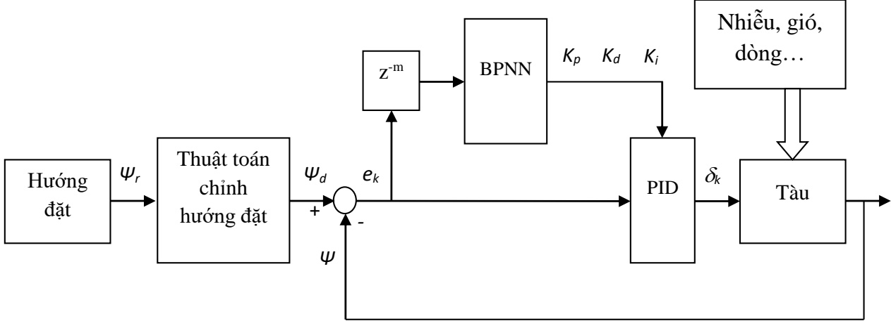

Hình 2.1. Sơ đồ nguyên lý BĐK PID nơ-ron lan truyền ngược

Cấu trúc của bộ điều khiển PID dựa trên mạng nơ-ron lan truyền ngược (Hình 2.1) gồm có hai phần: 1) Bộ điều khiển PID thông thường và 2) Mạng nơ-ron lan truyền ngược (BPNN). Bộ điều khiển PID được sử dụng để điều khiển hướng tàu. Chất lượng điều khiển phụ thuộc vào việc thiết lập các tham số $K _ { p }$ , $K _ { i }$ và $K _ { d }$ của bộ điều khiển PID mà nó được điều hưởng bởi mạng BPNN. Mạng BPNN sử dụng thuật toán huấn luyện trực tuyến dựa trên phương pháp giảm gradient để cập nhật các trọng số và bảo đảm cho mạng nơ-ron được thiết kế có th $\overset { \overset { \overset { \curve } { \rho } } { \in } } { 1 \overset { \overset { \curve } { \rho } } { \in } }$ tính toán được các tham số PID mong muốn. Vì vậy, trong phương pháp này, bằng việc kết hợp bộ điều khiển PID thông thường và mạng BPNN thông minh cho chất lượng điều khiển mong muốn và ổn định.

<!-- page: 57 -->

## 2.1.2. Thuật toán điều khiển PID

Thuật toán điều khiển PID số được biểu diễn như sau:

$$
\begin{array}{l} \delta_ {p i d} (k) = K _ {p} \Big [ e \big (k \big) - e \big (k - 1 \big) \Big ] + K _ {i} e \big (k \big) \\ + K _ {d} \Big [ e \big (k \big) - 2 e \big (k - 1 \big) + e \big (k - 2 \big) \Big ] \end{array}\tag{2.1}
$$

trong đó, $\delta _ { p i d }$ là đầu ra (góc bẻ lái) của BĐK PID; $K _ { p }$ , $K _ { i }$ và $K _ { d }$ tương ứng là hệ $s \hat { 0 }$ tỷ lệ, tích phân và vi phân; là sai $\mathrm { s } \hat { \hat { 0 } }$ của hệ thống được biểu diễn như sau:

$$
e (k) = \psi (k) - \psi_ {d} (k)\tag{2.2}
$$

trong đó, là đầu ra thực $t \hat { e }$ của hệ thống, $\psi _ { d }$ là đầu ra mong muốn của hệ thống.

## 2.1.3. Thuật toán điều khiển mạng nơ-ron lan truyền ngược

Nếu mạng nơ-ron có đủ $s \hat { 0 }$ lượng nơ-ron, nó có thể xấp xỉ bất kỳ hàm liên tục nào với chỉ một lớp ẩn [36], [54]. Vì vậy, mạng nơ-ron chỉ có một lớp ẩn được thiết kế.

Mạng nơ-ron lan truyền ngược có 3 lớp, cấu trúc của BĐK được minh họa trên hình 2.2. Số lượng các nơ-ron lớp vào, lớp ẩn và lớp ra tương ứng là M, Q, 3.

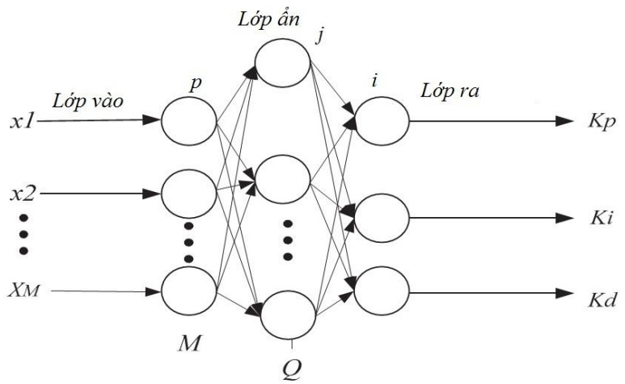

Hình 2.2. Cấu trúc mạng nơ-ron lan truyền ngược

<!-- page: 58 -->

a) Tính toán truyền thẳng của BPNN

Đầu ra của mỗi nơ-ron trong lớp vào là:

$$
O _ {p} = X _ {p} \quad (p = 1, 2, 3,..., M)\tag{2.3}
$$

trong đó, $O _ { p }$ là đầu ra của nơ-ron thứ p trong lớp vào.

Đầu vào và đầu ra của lớp ẩn của mạng là:

$$
n e t _ {j} (k) = \sum_ {p = 1} ^ {M} \omega_ {j p} O _ {p}\tag{2.4}
$$

$$
O _ {j} (k) = f \left(n e t _ {j} (k)\right) \quad (j = 1, 2, 3,..., Q)\tag{2.5}
$$

trong đó, là đầu vào của nơ-ron thứ j trong lớp ẩn; $\omega _ { j p }$ là trọng số của lớp ẩn; $f ( x )$ là hàm kích hoạt của nơ-ron lớp ẩn, nó là hàm sigma với đối xứng dương và âm.

$$
f (x) = \tanh (x) = \left(e ^ {x} - e ^ {- x}\right) / \left(e ^ {x} + e ^ {- x}\right)\tag{2.6}
$$

Đầu vào và đầu ra của lớp ra là:

$$
n e t _ {i} (k) = \sum_ {j = 1} ^ {Q} \omega_ {i j} O _ {j}\tag{2.7}
$$

$$
O _ {i} (k) = g \left(n e t _ {i} (k)\right) \quad (i = 1, 2, 3)\tag{2.8}
$$

$$
\left\{ \begin{array}{l} K _ {P} (k) = O _ {1} (k) \\ K _ {I} (k) = O _ {2} (k) \\ K _ {D} (k) = O _ {3} (k) \end{array} \right.\tag{2.9}
$$

trong đó, $\omega _ { i j }$ là trọng số của nơ-ron lớp ra; các đầu ra của nơ-ron lớp ra là $K _ { P }$ , $K _ { I }$ và; g x( ) là hàm kích hoạt của nơ-ron lớp ra, nó là hàm sigma không âm.

$$
g (x) = \frac {1}{2}. \left[ 1 + \tanh (x) \right] = e ^ {x} / \left(e ^ {x} + e ^ {- x}\right)\tag{2.10}
$$

Mạng nơ-ron BP điều hưởng các tham số PID một cách tự động và làm giảm bớt thời gian thiết kế hệ thống điều khiển. Tuy nhiên, sai số mô hình

<!-- page: 59 -->

toán học tàu thủy thường tồn tại và làm giảm độ chính xác điều khiển hệ thống. Vì vậy, thuật toán huấn luyện online được áp dụng để điều chỉnh trọng số nơ-ron nhằm làm giảm sai số hệ thống $e _ { y }$ trong thiết kế BĐK BPNN.

b) Lan truyền ngược sai số và điều chỉnh trọng số

Hàm chỉ tiêu chất lượng có dạng như sau:

$$
E (k) = \frac {1}{2} \big (r i n (k) - y o u t (k) \big) ^ {2}\tag{2.11}
$$

trong đó, là đầu ra mong muốn; là đầu ra thực tế.

Quá trình huấn luyện mô hình mạng nơ-ron phải được thực hiện trước khi đưa vào sử dụng. Quá trình huấn luyện này được lặp lại cho đến khi sai số bình phương trung bình của dữ liệu huấn luyện đạt tối thiểu mong muốn. Trong nghiên cứu này, quá trình huấn luyện dựa trên thuật toán lan truyền ngược. $\dot { \mathbf { Y } }$ tưởng cơ bản của lan truyền ngược là nhằm điều chỉnh các trọng số nơ-ron sử dụng phương pháp giảm độ dốc cho hàm sai số trong một chu trình điều khiển. Nhìn chung, việc điều chỉnh trọng $s \hat { 0 }$ từ lớp ẩn tới lớp ra được biểu diễn như sau:

$$
\Delta \omega_ {i j} (k) = - \eta \frac {\partial E (k)}{\partial \omega_ {i j}}\tag{2.12}
$$

Tuy nhiên, $\mathsf { d } \hat { \mathsf { e } }$ tránh cực tiểu cục bộ và tăng tốc độ hội tụ, ta thêm vào một xung lượng (tăng quán tính) vào thuật toán được đề xuất. Điều này có nghĩa là sự thay đổi trọng số trong chu trình này không chỉ phụ thuộc vào sai số hiện tại mà còn phụ thuộc vào sự thay đổi trước đó. Vì vậy, việc điều chỉnh mỗi trọng $\mathrm { s } \hat { \hat { 0 } }$ từ lớp ẩn tới lớp ra được điều chỉnh dựa trên hàm sai số đầu ra của hệ thống như sau:

<!-- page: 60 -->

$$
\Delta \omega_ {i j} (k) = - \eta \frac {\partial E (k)}{\partial \omega_ {i j}} + \alpha \Delta \omega_ {i j} (k - 1)\tag{2.13}
$$

trong đó, là hệ số tốc độ học, là hệ $s \hat { 0 }$ xung lượng.

Từ đó:

$$
\frac {\partial E (k)}{\partial \omega_ {i j} (k)} = \frac {\partial E (k)}{\partial y (k)} \cdot \frac {\partial y (k)}{\partial u (k)} \cdot \frac {\partial u (k)}{\partial O _ {i} (k)} \cdot \frac {\partial O _ {i} (k)}{\partial n e t _ {i} (k)} \cdot \frac {\partial n e t _ {i} (k)}{\partial \omega_ {i j} (k)}\tag{2.14}
$$

$$
\frac {\partial n e t _ {i} (k)}{\partial \omega_ {i j} (k)} = O _ {i} (k)\tag{2.15}
$$

và dựa trên các phương trình (2.9), (2.14), các phương trình sau đây được tính:

$$
\frac {\partial u (k)}{\partial O _ {1} (k)} = e (k) - e (k - 1)\tag{2.16}
$$

$$
\frac {\partial u (k)}{\partial O _ {2} (k)} = e (k)\tag{2.17}
$$

$$
\frac {\partial u (k)}{\partial O _ {3} (k)} = e (k) - 2 e (k - 1) + e (k - 2)\tag{2.18}
$$

Sau đó, thuật toán học của việc cập nhật trọng $s \hat { 0 }$ trong lớp ra được biểu diễn như sau:

$$
\omega_ {i j} (k + 1) = \omega_ {i j} (k) + \Delta \omega_ {i j} (k)\tag{2.19}
$$

$$
\Delta \omega_ {i j} (k) = \alpha \Delta \omega_ {i j} (k - 1) + \eta \delta_ {i} O _ {j} (k)\tag{2.20}
$$

trong đó, $\delta _ { i }$ là hàm sai $\mathrm { s } \hat { \hat { 0 } }$ của lớp ẩn, nó cần thiết cho việc điều chỉnh các trọng $s \hat { 0 }$ từ lớp vào tới lớp ẩn. $\delta _ { i }$ được biểu diễn như sau:

$$
\delta_ {i} = e _ {y} (k). \frac {\partial y (k)}{\partial u (k)}. \frac {\partial u (k)}{\partial O _ {i} (k)}. \dot {g} (n e t _ {i} (k))\tag{2.21}
$$

trong $\mathbf { d } \mathbf { \check { O } } ,$ đạo hàm bậc nhất của được cho bởi:

<!-- page: 61 -->

$$
\dot {g} (x) = g (x) \big (1 - g (x) \big)\tag{2.22}
$$

Sử dụng phép tính tương tự và việc cập nhật trọng $s \hat { 0 }$ trong lớp ẩn được tính dựa trên thuật toán giảm gradient và hàm sai số lớp ẩn là $\delta _ { j }$ . Thuật toán học được biểu diễn như sau:

$$
\omega_ {j p} (k + 1) = \omega_ {j p} (k) + \Delta \omega_ {j p} (k)\tag{2.23}
$$

$$
\Delta \omega_ {j p} (k) = \alpha \Delta \omega_ {j p} (k - 1) + \eta \delta_ {j} O _ {p} (k)\tag{2.24}
$$

$$
\delta_ {j} = \dot {f} \left(n e t _ {j} (k)\right) \cdot \sum_ {i = 1} ^ {3} \delta_ {i} \omega_ {i j} (k)\tag{2.25}
$$

trong đó, đạo hàm bậc nhất của $f ( x )$ được cho bởi:

$$
\dot {f} (x) = \frac {(1 - f ^ {2} (x))}{2}\tag{2.26}
$$

## 2.1.4. Huấn luyện ngược tăng cường

Thuật toán của điều khiển PID dựa trên BPNN này sử dụng phương pháp huấn luyện tăng cường [31] và được cụ thể hóa trong [29, 30] (Hình 2.3). Các giá trị số lần huấn luyện trong một chu trình n và hệ số học η ở đây là cố định. Tại thời điểm bắt đầu của chu trình điều khiển chỉ thị bởi tham số k, trọng $\mathrm { s } \hat { \hat { 0 } }$ của mạng nơ-ron được chọn là giá trị ngẫu nhiên rất nhỏ. Tín hiệu ra của các nơ-ron lớp ẩn và lớp ra được tính toán dựa trên các trọng số ban đầu này. Tiếp theo, trọng số của mạng nơ-ron được cập nhật bằng thuật toán lan truyền ngược sao cho giá trị của $E _ { k }$ đạt cực tiểu. Quá trình này được lặp đi lặp lại n lần trước khi bắt đầu một chu trình điều khiển mới (k=k+1). Tín hiệu ra của mạng nơ-ron tại vòng huấn luyện thứ n chính là tín hiệu điều khiển được xuất ra tại chu trình điều khiển thứ k.

<!-- page: 62 -->

## 2.1.5. Sơ đồ thuật toán huấn luyện (Hình 2.3)

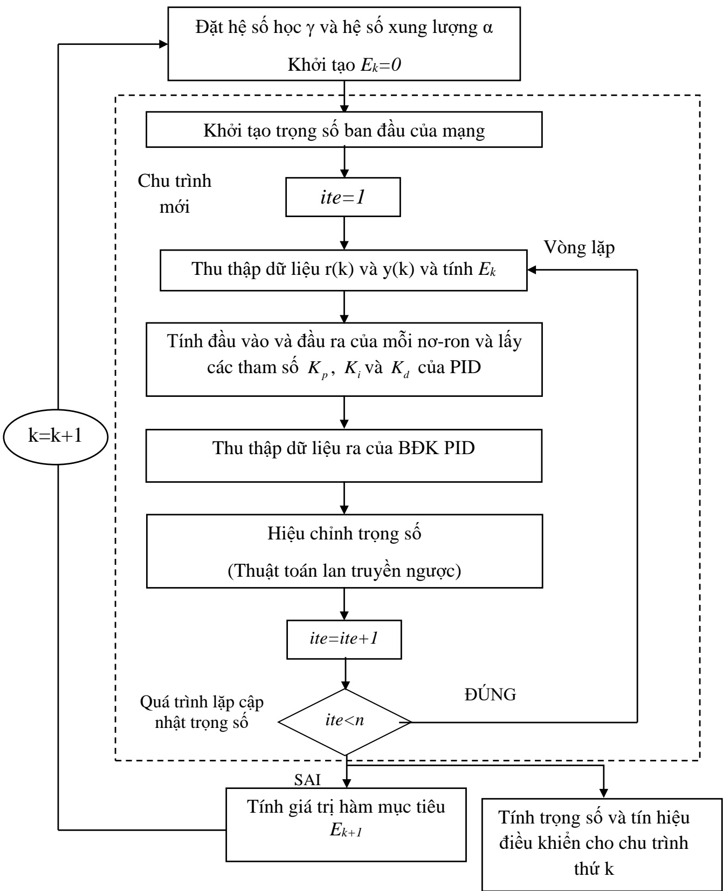

Hình 2.3. Sơ đồ khối thuật toán điều khiển PID - BPNN

<!-- page: 63 -->

## 2.2. Bộ điều khiển PID nơ-ron dựa trên mạng lan truyền ngược có bộ nhận dạng nơ-ron cho hệ thống điều khiển hướng đi tàu thủy

## 2.2.1. Sơ đồ nguyên lý

BĐK PID nơ-ron được đề xuất có cấu trúc như hình 2.4, được bổ sung thêm một mạng nơ-ron thứ hai (NN2) có dùng để dự đoán tốc độ quay trở của tàu $( \psi \_ d o t _ { k } )$ . Đây là một mạng nơ-ron có ba lớp truyền thẳng và được huấn luyện theo thuật toán lan truyền ngược tăng cường (Hình 2.5). Đầu vào của mạng là tốc độ quay trở của tàu và tín hiệu góc bẻ lái tại các thời điểm k-1, k-2, k-3. Hướng đi dự đoán của tàu có được nhờ việc nhận dạng tốc độ quay trở của tàu, sau đó các tín hiệu này được chuyển đến đầu vào của mạng nơ-ron thứ nhất (NN1).

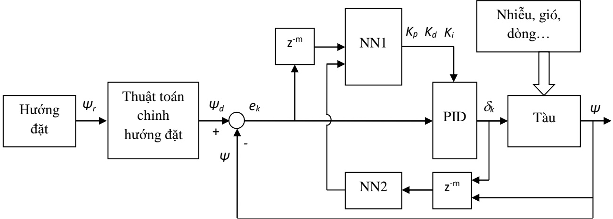

Hình 2.4. Sơ đồ nguyên lý BĐK PID nơ-ron NN1 với bộ nhận dạng nơ-ron NN2

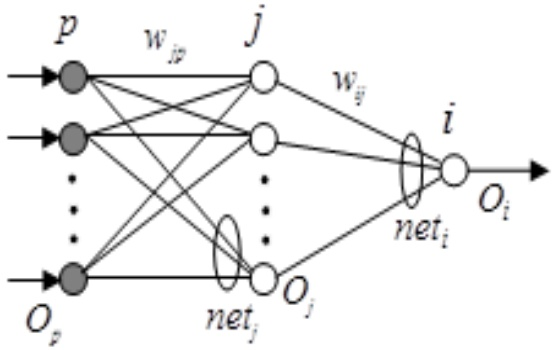

Hình 2.5. Cấu trúc mạng nơ-ron nhận dạng NN2

<!-- page: 64 -->

## 2.2.2. Mạng nhận dạng nơ-ron

Một hệ thống động học có thể được mô tả bằng hai dạng: Mô hình đầu vào - đầu ra và mô hình không gian trạng thái. $\mathrm { { \bf \sf { D } } } \hat { \mathrm { e } }$ tài này ứng dụng mạng nơ- ron truyền thẳng để học mà nhận dạng mô hình tàu thủy ứng dụng cho điều khiển theo phương án đầu vào - đầu ra [36]

Mô hình đầu vào - đầu ra mô tả hệ thống động học dựa trên dữ liệu vào và ra của hệ thống đó. Trên nguyên lý này, mô hình đầu vào - đầu ra giả thiết rằng tín hiệu ra mới trong miền thời gian rời rạc của hệ thống có thể được dự đoán từ các dữ liệu vào ra ở khoảng thời gian trước đó của hệ thống, tức là các thông tin của hệ thống thu được từ trước đó.

Nếu một hệ thống giả sử là được xác định theo các biến thời gian, ví dụ SISO (một đầu vào, một đầu ra), mô hình đầu vào - đầu ra được mô tả như sau:

$$
\begin{array}{c} y _ {p} (k) = f \big (y _ {p} (k - 1), y _ {p} (k - 2),..., y _ {p} (k - n) \big) \\ u (k - 1), u (k - 2),..., u (k - m) \end{array}\tag{2.27}
$$

Trong đó, $\left[ u ( k ) , y _ { p } ( k ) \right]$ là cặp tín hiệu đầu vào - đầu ra của hệ thống tại thời điểm k. Các số nguyên n, m tương ứng là $s \hat { 0 }$ các tín hiệu ra (bậc của hệ thống) và $s \hat { 0 }$ các tín hiệu vào của hệ thống. Trong thực tế m thường nhỏ hơn hoặc bằng n. f là hàm phi tuyến tĩnh, nó giúp tính toán tín hiệu ra mới của hệ thống dựa trên tín hiệu vào ra trước đó của hệ thống. Nếu hệ thống là tuyến tính thì f là một hàm tuyến tính và phương trình (2.27) được viết lại như sau:

$$
\begin{array}{c} y _ {p} (k) = a _ {1} y _ {p} (k - 1) + a _ {2} y _ {p} (k - 2), \dots , a _ {n} y _ {p} (k - n) \\ \qquad + b _ {1} u (k - 1) + b _ {2} u (k - 2), \dots , + b _ {m} u (k - m) \end{array}\tag{2.28}
$$

trong đó $a _ { i } \; ( i { = } I , 2 , . . . ,   n )$ và $b _ { i } ~ ( i { = } I , 2 , . . . ,   m )$ là các hằng $\mathrm { s } \hat { \hat { \mathbf { 0 } } } ,$

<!-- page: 65 -->

u(k)

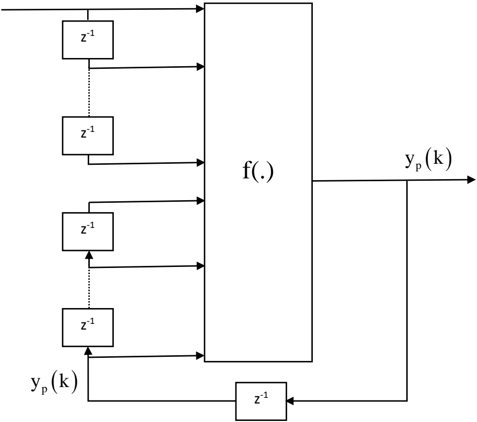

Hình 2.6. Mô hình đầu vào - đầu ra

Nhận dạng hệ thống đầu vào - đầu ra bằng mạng nơ-ron truyền thẳng (không có bộ nhớ động) đặt ra nhiệm vụ tìm hàm $s \hat { 0 }$ mô tả hay ước lượng được quan hệ vào ra của tín hiệu của hệ thống động học. Phương trình (2.27) có thể miêu tả bằng hình 2.6. Hệ thống động học được mô tả bằng hàm f và số nguyên m và n. Nếu cho trước giá trị m và n, chỉ cần đi tìm hàm f. Hàm f không thay đổi theo thời gian đối với những hệ thống không biến đổi theo thời gian. Chính vì mạng nơ-ron nhân tạo truyền thẳng có khả năng mô tả các hàm số tĩnh như vậy nên nó được ứng dụng để ước lượng hàm số f (chính là mô hình tàu) trong đề tài. Tuy nhiên đề tài nâng cao khả năng nhận dạng của mô hình tàu nơ-ron này bằng chiến lược online, tức là tín hiệu vào ra được

<!-- page: 66 -->

cập nhật liên tục giúp mô hình nơ-ron có thể nhận dạng con tàu kiên tục theo thời gian. Đây cũng là điểm mới đáng chú ý của đề tài nghiên cứu.

u(k)

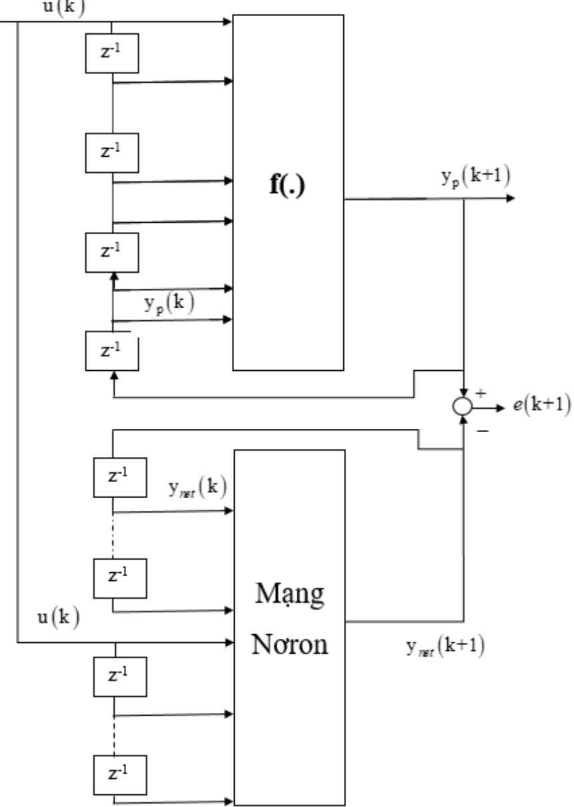

Hình 2.7. Cấu trúc nhận dạng song song

Hệ thống nhận dạng bằng mạng nơ-ron nói trên có thể có hai cấu trúc: cấu trúc song song (parallel) (hình 2.7) và cấu trúc chuỗi song song (seriesparallel) (hình 2.8). Đề tài này ứng dụng cấu trúc song song để nhận dạng mô hình tàu thủy liên tục theo thời gian. Trong cấu trúc này, mạng nơ-ron và hệ thống điều khiển nhận cùng tín hiệu vào từ bên ngoài; các tín hiệu ra của hệ

<!-- page: 67 -->

thống không dùng để đưa vào mạng nơ-ron. Hệ thống điều khiển và mạng nơ- ron nhận dạng là hai quá trình riêng biệt cùng chia sẻ một bộ tín hiệu vào từ bên ngoài. Các tín hiệu ra của mạng nơ-ron và hệ thống điều khiển không ảnh hưởng đến nhau. Các kết quả mô phỏng trong [36] đã chứng minh tính hiệu quả và khả thi của phương pháp này.

Trong đề tài, sử dụng mạng nơ-ron nhận dạng được minh họa là NN2 và biểu diễn trên hình 2.7.

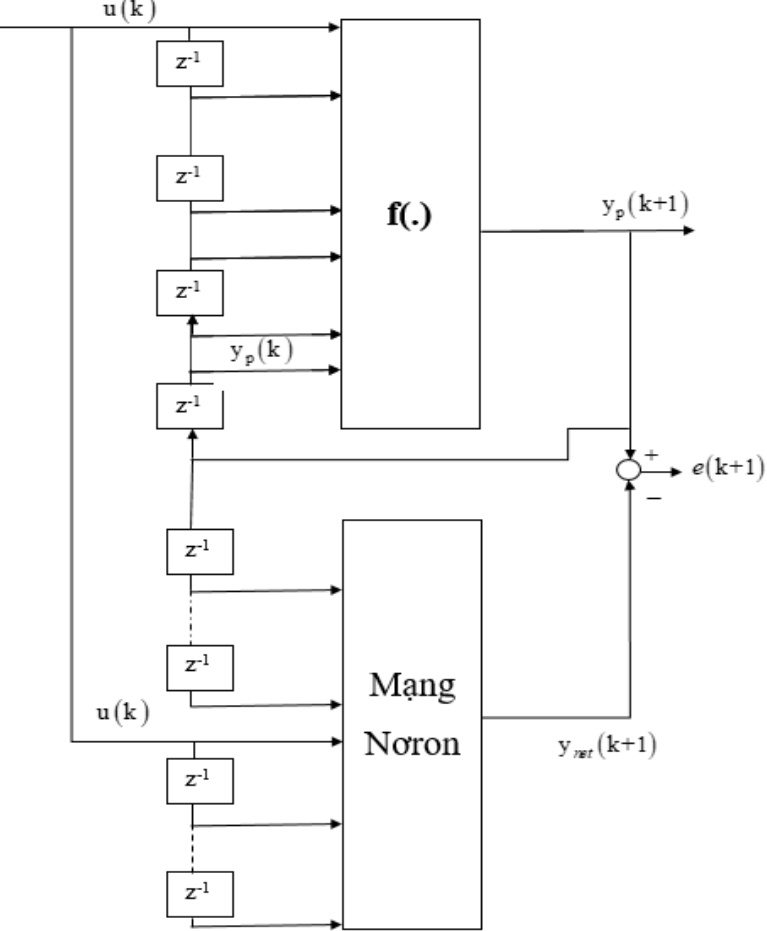

Hình 2.8. Cấu trúc nhận dạng chuỗi song song

## 2.3. Kết luận chương 2

Trong chương 2, tác giả đã tập trung nghiên cứu xây dựng bộ điều khiển PID dựa trên mạng nơ-ron lan truyền ngược không có và có bộ nhận dạng nơ-ron. Trong BĐK PID nơ-ron này, tác giả đã được thêm thuật toán

<!-- page: 68 -->

huấn luyện tăng cường để tăng tốc độ thích nghi của hệ thống, điều chỉnh nhanh và chính xác các tham số của BĐK PID.

Nghiên cứu và xây dựng bộ nhận dạng mô hình nơ-ron theo phương pháp tín hiệu vào - ra được giới thiệu và ứng dụng. Bộ nhận dạng này sử dụng mạng nơ-ron nhiều lớp truyền thẳng nhưng được tác giả huấn luyện mạng theo phương pháp trực tuyến, tăng cường nên tốc độ thích nghi tốt, có khả năng nhận dạng mô hình tàu phi tuyến biến đổi theo thời gian. Với việc kết hợp mô hình nhận dạng nơ-ron này, phương pháp điều khiển được tiến hành kiểu điều khiển dự đoán theo thời gian thực, nâng cao tính thích nghi và chất lượng điều khiển.

<!-- page: 69 -->

## CHƯƠNG 3. KẾT QUẢ MÔ PHỎNG

## 3.1. Mô hình toán học cho mô phỏng

## 3.1.1. Mô hình toán học tàu hàng Mariner

Nhằm kiểm chứng việc thiết kế hệ thống điều khiển cho tàu thủy, tác giả sử dụng mô hình toán học tàu hàng Mariner để mô phỏng luật điều khiển trước khi có thể làm thử nghiệm mô hình hoặc thử nghiệm toàn tỷ lệ trên tàu thực [22, 23, 64]. Khi làm mô phỏng và để mô tả mô hình toán học tàu hàng Mariner, ta sử dụng một số tham số chuyển động như sau:

$$
\begin{array}{l l l} u = u _ {0} + \Delta u & p = p _ {0} + \Delta p & \phi = \phi_ {0} + \Delta \phi \\ v = v _ {0} + \Delta v & r = r _ {0} + \Delta r & \delta = \delta_ {0} + \Delta \delta \end{array}\tag{3.1}
$$

Trong các tham số chuyển động (3.1), là một số gia nhỏ của vận tốc trượt dọc định danh (hằng số) $u _ { 0 }$ còn mô tả vận tốc trượt dọc toàn bộ. Vận tốc toàn bộ của tàu được xác định theo công thức sau:

$$
U = \sqrt {u ^ {2} + v ^ {2}} = \sqrt {\left(u _ {0} + u\right) ^ {2} + v ^ {2}}\tag{3.2}
$$

Phòng thí nghiệm thủy khí động học ở Lyngby, Đan Mạch đã tiến hành thử nghiệm kỹ thuật chuyển động mặt phẳng (PMM - Planar Motion Mechanism) và ước lượng chuyển động và lái toàn tỷ lệ cho tàu hàng lớp Mariner. Các kích thước của tàu hàng lớp Mariner theo Fossen [23] là:

\- Chiều dài toàn bộ (Length Overall, $L _ { o a } )$ : 171,80 (m);

\- Chiều dài giữa hai đường vuông góc $( L _ { p p } )$ : 160,93 (m);

\- Chiều rộng lớn nhất (): 23,17 (m);

\- Mớn nước thiết kế (): 8,23 (m);

\- Lượng giãn nước thiết kế ( ): 18,541 $( \mathbf { m } ^ { 3 } )$

\- Vận tốc thiết kế $( u _ { 0 } )$ : 15 hải lý/ giờ.

<!-- page: 70 -->

Các phương trình chuyển động trượt ngang, trượt dọc và quay trở cho tàu Mariner này được biểu diễn như sau:

$$
\left[ \begin{array}{c c c} m ^ {\prime} - X _ {\dot {u}} ^ {\prime} & 0 & 0 \\ 0 & m ^ {\prime} - X _ {\dot {v}} ^ {\prime} & m ^ {\prime} x _ {G} ^ {\prime} - N _ {\dot {r}} ^ {\prime} \\ 0 & m ^ {\prime} x _ {G} ^ {\prime} - N _ {\dot {v}} ^ {\prime} & I _ {z} ^ {\prime} - N _ {\dot {r}} ^ {\prime} \end{array} \right] \left[ \begin{array}{c} \Delta \dot {u} ^ {\prime} \\ \Delta \dot {v} ^ {\prime} \\ \Delta \dot {r} ^ {\prime} \end{array} \right] = \left[ \begin{array}{c} \Delta X ^ {\prime} \\ \Delta Y ^ {\prime} \\ \Delta N ^ {\prime} \end{array} \right]\tag{3.3}
$$

trong đó, các lực và mô men phi tuyến $\Delta X^{'} , \Delta Y^{'}  via  \Delta N^{'}$ được xác đinh như sau (theo Hệ Prime I với $L _ { p p }$ và U là các biến tiêu chuẩn hóa):

$$
\begin{array}{r} \Delta X ^ {\prime} = X _ {u} ^ {\prime} \Delta u ^ {\prime} + X _ {u u} ^ {\prime} \Delta u ^ {\prime 2} + X _ {u u u} ^ {\prime} \Delta u ^ {\prime 3} + X _ {v v} ^ {\prime} \Delta v ^ {\prime 2} + X _ {r r} ^ {\prime} \Delta r ^ {\prime 2} + X _ {r v} ^ {\prime} \Delta r ^ {\prime} \Delta v ^ {\prime} \\ + X _ {\delta \delta} ^ {\prime} \Delta \delta^ {\prime 2} + X _ {u \delta \delta} ^ {\prime} \Delta u ^ {\prime} \Delta \delta^ {\prime 2} + X _ {v \delta} ^ {\prime} \Delta v ^ {\prime} \Delta \delta^ {\prime} + X _ {u v \delta} ^ {\prime} \Delta u ^ {\prime} \Delta v ^ {\prime} \Delta \delta^ {\prime} \end{array}\tag{3.4}
$$

$$
\begin{array}{r l} & {\Delta Y ^ {\prime} = Y _ {v} ^ {\prime} \Delta v ^ {\prime} + Y _ {r} ^ {\prime} \Delta r ^ {\prime} + Y _ {v v v} ^ {\prime} \Delta v ^ {\prime 3} + Y _ {v v r} ^ {\prime} \Delta v ^ {\prime 2} \Delta r ^ {\prime} + Y _ {v u} ^ {\prime} \Delta v ^ {\prime} \Delta u ^ {\prime} + Y _ {r u} ^ {\prime} \Delta r ^ {\prime} \Delta u ^ {\prime}} \\ & {\qquad + Y _ {\delta} ^ {\prime} \Delta \delta^ {\prime} + Y _ {\delta \delta \delta} ^ {\prime} \Delta \delta^ {\prime 3} + Y _ {u \delta} ^ {\prime} \Delta v ^ {\prime} \Delta \delta^ {\prime} + Y _ {u u \delta} ^ {\prime} \Delta u ^ {\prime 2} \Delta \delta^ {\prime} + Y _ {v \delta \delta} ^ {\prime} \Delta v ^ {\prime} \Delta \delta^ {\prime 2}} \\ & {\qquad + Y _ {v v \delta} ^ {\prime} \Delta v ^ {\prime 2} \Delta \delta^ {\prime} + (Y 0 ^ {\prime} + Y 0 _ {u} ^ {\prime} \Delta u ^ {\prime} + Y 0 _ {u u} ^ {\prime} \Delta u ^ {\prime 2})} \end{array}\tag{3.5}
$$

$$
\begin{array}{l} \Delta N ^ {\prime} = N _ {v} ^ {\prime} \Delta v ^ {\prime} + N _ {r} ^ {\prime} \Delta r ^ {\prime} + N _ {v v v} ^ {\prime} \Delta v ^ {\prime 3} + N _ {v v r} \Delta v ^ {\prime 2} \Delta r ^ {\prime} + N _ {v u} ^ {\prime} \Delta v ^ {\prime} \Delta u ^ {\prime} + N _ {r r u} ^ {\prime} \Delta r ^ {\prime} \Delta u ^ {\prime} \\ \quad + N _ {\delta} ^ {\prime} \Delta \delta^ {\prime} + N _ {\delta \delta \delta} ^ {\prime} \Delta \delta^ {\prime 3} + N _ {u \delta} ^ {\prime} \Delta v ^ {\prime} \Delta \delta^ {\prime} + N _ {u u \delta} ^ {\prime} \Delta u ^ {\prime 2} \Delta \delta^ {\prime} + N _ {v \delta \delta} ^ {\prime} \Delta v ^ {\prime} \Delta \delta^ {\prime 2} \\ \quad + N _ {v v \delta} ^ {\prime} \Delta v ^ {\prime 2} \Delta \delta^ {\prime} + (N 0 ^ {\prime} + N 0 _ {u} ^ {\prime} \Delta u ^ {\prime} + N 0 _ {u u} ^ {\prime} \Delta u ^ {\prime 2}) \end{array}\tag{3.6}
$$

Các hệ $s \hat { 0 }$ không thứ nguyên trong mô hình tàu Mariner này là:

$$
m ^ {\prime} = 7 9 8. 1 0 ^ {- 5}, I _ {z} ^ {\prime} = 3 9. 2 \times 1 0 ^ {- 5}, x _ {G} ^ {\prime} = - 0. 0 2 3\tag{3.7}
$$

## 3.1.2. Mô hình toán học sóng, gió và dòng chảy

Mô hình do nhiễu môi trường tác động như sóng, gió và dòng chảy được dùng cho mô phỏng, kiểm tra và đánh giá hệ thống điều khiển phản hồi. Nhiễu môi trường có tính phi tuyến cao và được thêm vào trong các phương trình động học của tàu thủy để thực hiện mô phỏng.

Từ phương trình động học tàu thủy (1.15) và theo nguyên lý xếp chồng, các véc tơ nhiễu môi trường do sóng và gió được định nghĩa như sau:

<!-- page: 71 -->

$$
w = w _ {w i n d} + w _ {w a v e}\tag{3.8}
$$

trong đó, $w_{wind} \in \left[ \text { }^{6} \text { va } w_{wave} \in 口^{6} \right]$ là các lực được tổng quát hóa do sóng và gió. Các mô hình dùng cho mô phỏng các lực này được trình bày ở mục 3.1.2.1 và 3.1.2.2.

Các ảnh hưởng do dòng chảy thường được mô phỏng được định nghĩa theo véc tơ vận tốc tương đối:

$$
v _ {r} = v - v _ {c}\tag{3.9}
$$

trong đó, $v _ { _ c } \in \mathbb { D } ^ { ^ 6 }$ là véc tơ vận tốc dòng chảy theo hệ tọa độ $\mathrm { c } \hat { 0 }$ định trên tàu.

Đối với dòng chảy biến thiên chậm, $\dot { v } _ { _ c } \approx   0$ , phương trình chuyển động tàu thủy trở thành:

$$
\underbrace {M _ {R B} \dot {v} + C _ {R B} (v) v + g (\eta)} _ {\text {các số hạng vật thể rắn}} + \underbrace {M _ {A} \dot {v} + C _ {A} \left(v _ {r}\right) v _ {r} + D \left(v _ {r}\right) v _ {r}} _ {\text {các số hạng thủy động học}} = \tau + g _ {0} + w\tag{3.10}
$$

Trong trường hợp tuyến tính, phương trình này được rút gọn thành:

$$
M \dot {v} + N v _ {r} + G \eta = \tau + g _ {0} + w\tag{3.11}
$$

Các mô hình dòng chảy dùng cho mô phỏng liên quan đến véc tơ $\nu _ { c }$ được trình bày ở mục 2.1.2.3.

## 2.1.2.1. Mô hình gió

Ta ký hiệu $V _ { \omega }$ và $\psi _ { \omega }$ tương ứng là tốc độ gió và hướng gió. Để xác định vận tốc cục bộ (m) trên bề mặt biển, theo Bretschneider (1969), ta có:

$$
V _ {\omega} (h) = V _ {\omega} (1 0). (h / 1 0) ^ {1 / 7}\tag{3.12}
$$

trong đó, $V _ { \omega } \left( 1 0 \right)$ là vận tốc gió tương đối 10 (m) trên bề mặt biển.

Các lực và mô men gió tác động lên tàu có th $1 \dot { \hat { e } }$ được định nghĩa liên quan tới tốc độ gió $V _ { r }$ và góc $\gamma _ { r }$ như sau:

$$
V _ {r} = \sqrt {u _ {r} ^ {2} + v _ {r} ^ {2}} \qquad \gamma_ {r} = \tan^ {- 1} \left(v _ {r} / u _ {r}\right) = \psi_ {\omega} - \psi\tag{3.13}
$$

<!-- page: 72 -->

trong đó, các véc tơ thành phần của $V _ { r }$ theo hướng x và y là:

$$
u _ {r} = V _ {\omega} \cos (\gamma_ {r}) - u, v _ {r} = V _ {\omega} \sin (\gamma_ {r}) - v\tag{3.14}
$$

Ở đây, $\gamma _ { r }   =   \psi _ { \omega }   -   \psi$ là góc giữa hướng gió và mũi tàu (Xem hình 3.1)

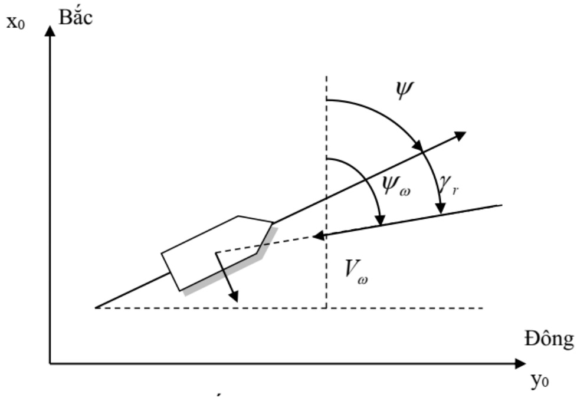

Hình 3.1. Tốc độ gió $V _ { \omega }$ và hướng gió $\gamma _ { r }$

Tốc độ gió $V _ { \omega }$ và hướng gió $\gamma _ { r }$ có thể được đo bằng máy đo gió. Để tiến hành bù trừ gió cho tàu thủy, cần thiết phải có một mô hình gió 3 bậc tự do là một hàm của tốc độ gió tương đối $V _ { \omega }$ và hướng gió $\gamma _ { r }$ . Ta có véc tơ lực gió được tổng quát hóa như sau:

$$
w _ {w i n d} = \left[ X _ {w i n d}, Y _ {w i n d}, N _ {w i n d} \right] ^ {T}\tag{3.15}
$$

Trong đề tài, tác giả sử dụng mô hình gió của Isherhood -1972 [24], theo mô hình này, các hệ $s \hat { 0 }$ do ảnh hưởng của gió được định nghĩa như sau:

$$
C _ {X} = A _ {0} + A _ {1} \frac {2 A _ {L}}{L _ {O A} ^ {2}} + A _ {2} \frac {2 A _ {T}}{B ^ {2}} + A _ {3} \frac {L _ {O A}}{B} + A _ {4} \frac {S}{L _ {O A}} + A _ {5} \frac {C}{L _ {O A}} + A _ {6} M\tag{3.16}
$$

$$
C _ {Y} = B _ {0} + B _ {1} \frac {2 A _ {L}}{L _ {O A} ^ {2}} + B _ {2} \frac {2 A _ {T}}{B ^ {2}} + B _ {3} \frac {L _ {O A}}{B} + B _ {4} \frac {S}{L _ {O A}} + B _ {5} \frac {C}{L _ {O A}} + B _ {6} \frac {A _ {S S}}{A _ {L}}\tag{3.17}
$$

<!-- page: 73 -->

$$
C _ {N} = C _ {0} + C _ {1} \frac {2 A _ {L}}{L _ {O A} ^ {2}} + C _ {2} \frac {2 A _ {T}}{B ^ {2}} + C _ {3} \frac {L _ {O A}}{B} + C _ {4} \frac {S}{L _ {O A}} + B _ {5} \frac {C}{L _ {O A}}\tag{3.18}
$$

trong đó, $C _ { X }$ là hệ số của thành phần lực gió trên trục x;

$C _ { \gamma }$ là hệ số của thành phần lực gió trên trục y;

$C _ { N }$ là hệ số của mô men quay trở do gió gây ra;

$A_{0} \perp A_{6}, B_{0} \perp B_{6}, C_{0} \perp C_{6}$ là các hệ số Isherhood sử dụng cho mô hình.

Do đó, ta có mô men và lực gió sẽ được tính theo thuật toán sau đây với tốc độ gió tương đối tới tàu $V _ { \omega }$ :

$$
X _ {\text {wind}} = \frac {1}{2} C _ {X} \left(\gamma_ {r}\right). \rho_ {a}. V _ {r}. A _ {T}\tag{3.19}
$$

$$
Y _ {\text {wind}} = \frac {1}{2} C _ {Y} \left(\gamma_ {r}\right). \rho_ {a}. V _ {r}. A _ {L}\tag{3.20}
$$

$$
N _ {\text {wind}} = \frac {1}{2} C _ {N} \left(\gamma_ {r}\right). \rho_ {a}. V _ {r}. A _ {L}. L _ {O A}\tag{3.21}
$$

trong đó, $X _ { w i n d }$ là lực gió theo trục x (N); $Y _ { w i n d }$ là lực gió theo trục y (N); $N _ { w i n d }$ là mô men quay trở do gió gây ra (Nm); $\rho _ { a }$ là tỷ trọng không khí $( \mathrm { k g } / \mathrm { m } ^ { 3 } )$ , $A _ { r }$ và $A _ { L }$ tương ứng là vùng diện tích chiếu theo phương dọc và phương ngang và $L _ { o A }$ là chiều dài toàn bộ của tàu.

## 3.1.2.2. Mô hình sóng

Trong đề tài, tác giả sử dụng mô hình sóng bề mặt được tạo ra bởi gió. Tương tự như (3.15), ta có véc tơ các lực và mô men sóng như sau:

$$
w _ {w a v e s} = \left[ X _ {w a v e s}, Y _ {w a v e s}, N _ {w a v e s} \right] ^ {T}\tag{3.22}
$$

Trong đó, $X _ { _ { w a v e s } } ,   Y _ { _ { w a v e s } }$ và $N _ { w a v e s }$ được tạo ra theo lý thuyết tuyến tính. Theo Fossen [38], ta có:

<!-- page: 74 -->

(3.23)

$$
\begin{array}{l} X _ {\text {waves}} (t) = \sum_ {i = 1} ^ {N} \rho g B L T \cos (\beta) s _ {i} (t) \\ Y _ {\text {waves}} (t) = \sum_ {i = 1} ^ {N} \rho g B L T \sin (\beta) s _ {i} (t) \\ \beta = \psi_ {\omega} - \psi \\ S (\omega) = \frac {4 \pi^ {3} H _ {s} ^ {2}}{\left(0 . 7 1 0 T _ {o}\right) ^ {4} \omega^ {5}} \exp \left(\frac {- 1 6 \pi^ {3}}{\left(0 . 7 1 0 T _ {o}\right) ^ {4} \omega^ {4}}\right), T _ {o} = 0. 8 0 s, H _ {s} = 5 m m \\ V _ {c} \\ \gamma_ {c} \\ u _ {c} = V _ {c} \cos (\gamma_ {c} - \psi) \\ \frac {d V _ {c} (t)}{d t} + \mu_ {0} V _ {c} (t) = \omega (t) \\ V _ {\min} \leq V _ {c} (t) \leq V _ {\max} \\ N _ {\text {waves}} (t) = \sum_ {i = 1} ^ {N} \frac {1}{2 4} \rho g B L \left(L ^ {2} - B ^ {2}\right) \sin (2 \beta) s _ {i} ^ {2} (t) \end{array}\tag{3.24}
$$

(3.25)

trong đó, và là chiều dài và chiều rộng của tàu; là mớn nước trung bình của tàu; $\rho$ là tỷ trọng của nước; $s _ { i } \left( t \right)$ là độ dốc sóng; $\beta   =   \psi _ { \omega }   -   \psi$ là góc giữa hướng sóng tác động $\psi _ { \omega }$ với mũi tàu $\psi$ (tính bằng radian); Độ dốc sóng $s _ { i }$ liên quan tới hàm tỷ trọng phổ sóng $S ( \omega _ { i } )$

Các tỷ trọng phổ khác nhau được sử dụng để tính $S ( \omega )$ . Vì vậy, trong đề tài sử dụng phổ Pieson – Moskowitz sửa đổi (theo Fossen 2002) [24] như sau:

$$
S (\omega) = \frac {4 \pi^ {3} H _ {s} ^ {2}}{\left(0 . 7 1 0 T _ {o}\right) ^ {4} \omega^ {5}} \exp \left(\frac {- 1 6 \pi^ {3}}{\left(0 . 7 1 0 T _ {o}\right) ^ {4} \omega^ {4}}\right)\tag{3.26}
$$

trong đó, $T _ { o }$ là chu kỳ sóng $(T_{o}=0.80s);H_{s}$ là độ cao sóng $(H_{s}=5mm)$

<!-- page: 75 -->

## 2.1.2.3. Mô hình dòng chảy

Đề tài sử dụng mô hình dòng chảy 2 chiều (Fossen, 1994; Vukic et al., 1998) [23]. Các thành phần dòng chảy theo hệ tọa độ cố định trên trái đất được mô tả bởi hai tham số là: vận tốc dòng chảy trung bình $V _ { c }$ và hướng dòng chảy $\gamma _ { c }$

Các thành phần của hệ tọa độ cố định trên vật thể (tàu thủy) được tính từ công thức sau:

$$
\begin{array}{l} u _ {c} = V _ {c} \cos \left(\gamma_ {c} - \psi\right) \\ v _ {c} = V _ {c} \sin \left(\gamma_ {c} - \psi\right) \\ V _ {c} = \sqrt {u _ {c} ^ {2} + v _ {c} ^ {2}} \end{array}\tag{3.27}
$$

Vận tốc dòng chảy trung bình cho mô phỏng được tạo ra bằng cách sử dụng phương pháp Gauss – Markov bậc nhất như sau:

$$
\frac {d V _ {c} (t)}{d t} + \mu_ {0} V _ {c} (t) = \omega (t)\tag{3.28}
$$

trong đó, là một chuỗi nhiễu trắng Gaussian và $\mu _ { \mathrm { 0 } }   \geq   0$ là một hằng số. Nếu $\mu _ {   0 }   =   0$ , mô hình dòng chảy này rút gọn thành bước đi ngẫu nhiên (random walk) tương ứng với tích phân nhiễu trắng theo thời gian. Một phần tử bão hòa thường được sử dụng trong quá trình tích phân để giới hạn vận tốc dòng chảy:

$$
V _ {\min} \leq V _ {c} (t) \leq V _ {\max}\tag{3.29}
$$

Máy lái tự động sử dụng bộ điều khiển trình bày ở mục 2.1 và 2.2 dùng để điều khiển hướng đi tàu thủy được mô phỏng trên máy tính. Trong các thí nghiệm mô phỏng này, ảnh hưởng của nhiễu ngẫu nhiên trong thiết bị đo và tác động của gió đến chuyển động hướng mũi tàu được xét đến nhằm kiểm tra độ tin cậy và tính ổn định của BĐK được đề xuất.

<!-- page: 76 -->

BĐK PID nơ-ron được thiết kế với giả định các thông $s \hat { 0 }$ trạng thái tàu (hướng mũi tàu, vị trí, tốc độ quay hướng) đều đã có chính xác nhờ các trang thiết bị hàng hải như la bàn con quay, máy đo tốc độ hướng quay trở, máy thu định vị vệ tinh GPS/DGPS. Để có thể điều khiển được sự quay trở tàu và đáp ứng tốt trong trường hợp góc đặt hướng lớn, một mô hình tham khảo tính năng động học của tàu được sử dụng để tạo ra hướng đi phù hợp với động học của tàu cung cấp cho BĐK [24]. Các thí nghiệm mô phỏng được thực hiện trên phần mềm MATL $\mathbf { \mathcal { A } B ^ { \odot } }$ 2014a.

Nhằm kiểm tra tính ổn định của tính bền vững và ổn định của các BĐK hướng đi này. Ảnh hưởng của gió đến thân tàu dựa trên nghiên cứu của Isherhood 1972 [24] Tốc độ gió thay đổi ngẫu nhiên theo chu kỳ 5 giây và giới hạn trong phạm vi $\left[ - 6 0 ^ { 0 } , + 6 0 ^ { 0 } \right]$ với chu kỳ 30 giây. Nhiễu (sai số) trong thiết bị đo hướng được biểu diễn bằng tín hiệu ngẫu nhiên phân bố trong khoảng $[ - 0 . 1 ^ { 0 } , + 0 . 1 ^ { 0 } ]$ . Tính phi tuyến của động cơ cũng được xét đến, phạm vi giới hạn của góc bẻ lái trong khoảng $\left[ - 3 5 ^ { 0 } , + 3 5 ^ { 0 } \right]$ và tốc độ bẻ lái $\dot { \delta }   =   r$ trong khoảng $\left[ -2.5^{0}/\mathrm{s}, +2.5^{0}/\mathrm{s} \right]$ . Trong tất cả các tình huống, tốc độ ban đầu của tàu là 15 hải lý/giờ (hoặc 7.7175 m/giây).

Thông số dùng để so sánh là tổng bình phương sai $\mathrm { s } \hat { \mathsf { O } }$ hướng đi $E _ { \psi }$ và tổng bình phương thay đổi góc bẻ lái $E _ { \delta }$ (th $\hat { \hat { e } }$ hiện mức độ hoạt động của bánh lái) được biểu diễn bằng phương trình sau:

$$
E _ {\psi} = \sum_ {k} \left(\psi_ {k} ^ {d} - \psi_ {k}\right) ^ {2}\tag{3.30}
$$

$$
E _ {\delta} = \sum_ {k} \left(\delta_ {k} - \delta_ {k - 1}\right) ^ {2}\tag{3.31}
$$

Trong đó, $\psi _ { k }$ là hướng đi thực tế và $\psi _ { k } ^ { d }$ là hướng đi mong muốn chuyển đổi từ hướng đi đặt trước $\psi _ { r }$ sau khi qua bộ lọc tín hiệu (sử dụng mô hình tham chiếu [22]).

<!-- page: 77 -->

BĐK này được so sánh với BĐK PID thông thường có cùng cường độ nhiễu ngẫu nhiên trong thiết bị đo và tác động của sóng gió để chứng minh tính hiệu quả và ổn định.

## 3.2. Bộ điều khiển PID nơ-ron dựa trên mạng lan truyền ngược không có bộ nhận dạng nơ-ron

Mạng nơ-ron gồm 4 nơ-ron lớp vào, 6 nơ-ron lớp ẩn và 3 nơ-ron lớp ra. Đầu vào của mạng bao gồm hướng đi mong muốn $\psi _ { r }$ , hướng đi thực tế $\psi ,$ sai $\mathrm { s } \hat { \hat { 0 } }$ hướng đi $e ( k ) ,$ , và hiệu số $e ( k ) \textrm { - } e ( k \textrm { - } I )$ . Ba nơ-ron lớp ra tương ứng với các tham số $K _ { p } ,   K _ { i }$ và $K _ { d }$ của bộ điều khiển PID. Hệ số học và số lần huấn luyện trong một chu trình là $\mathrm { c } \hat { 0 }$ định $(n = 50, \gamma = 0.5)$ , giá trị xung lượng được thêm vào trong quá trình huấn luyện lan truyền ngược $\eta   =   0 . 0 2 5$ . Phạm vi đổi hướng từ $- 2 5 . 0 ^ { 0 }$ đến $+ 2 5 . 0 ^ { 0 }$ . Thời gian mô phỏng 900 giây.

## 3.2.1. Khi không có gió và nhiễu tác động

Hình 3.2 cho thấy BĐK BPNN-PID có độ vượt quá giá trị điều khiển rất nhỏ, tính bền vững tốt và độ ổn định cao, thời gian xác lập nhanh hơn và góc bẻ lái nhỏ hơn so với BĐK PID thông thường.

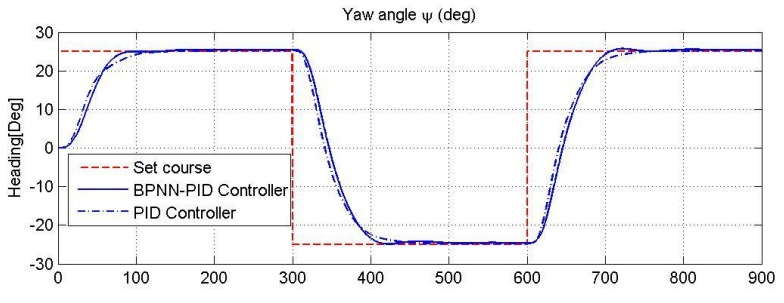

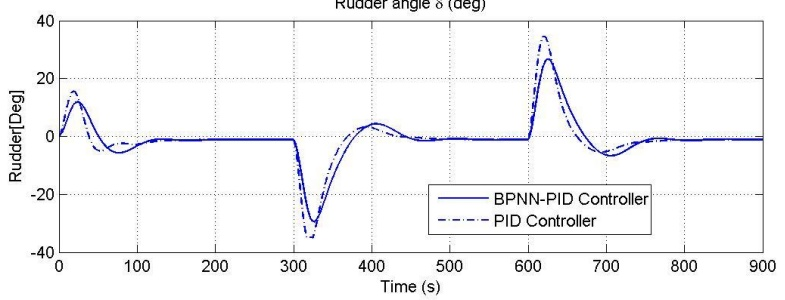

Hình 3.2. Hướng tàu và góc bẻ lái khi không có gió và nhiễu tác động

<!-- page: 78 -->

Trên Hình 3.3 biểu thị sự thay đổi của các tham số $K _ { p } ,   K _ { i }$ và $K _ { d }$ được điều chỉnh bởi mạng nơ-ron được đề xuất.

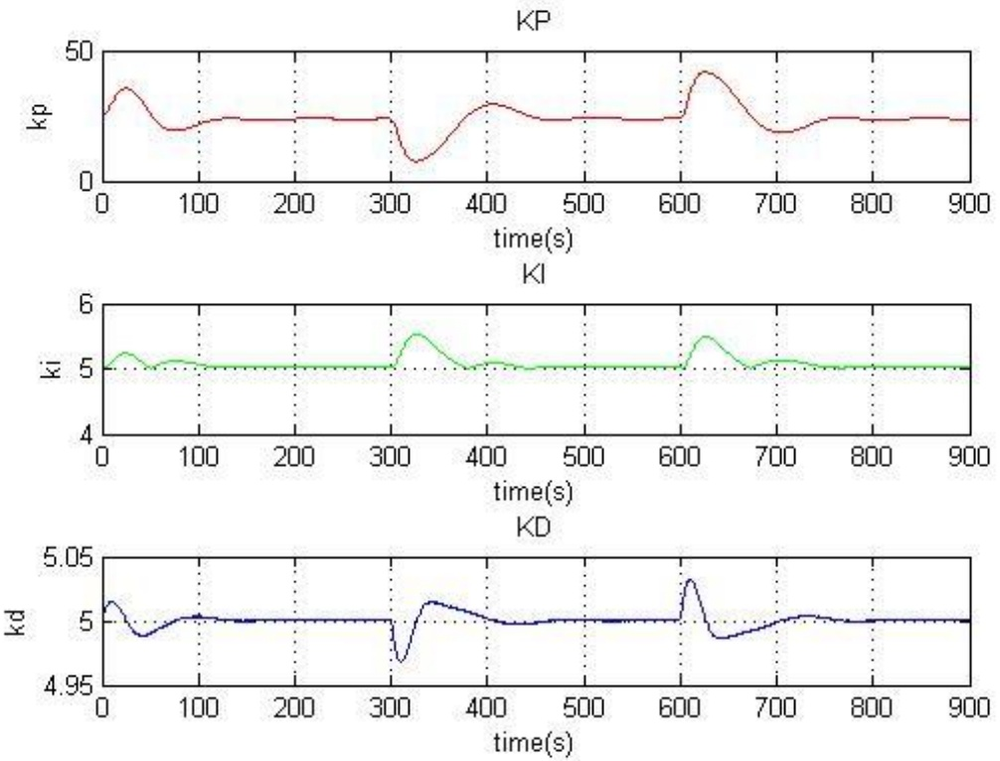

Hình 3.3. Sự thay đổi các tham số $K _ { p } ,$ $K _ { i }$ và $K _ { d }$

Hình 3.4 minh họa sai $s \hat { 0 }$ hướng đi của tàu, tốc độ và gia tốc quay trở hướng mũi tàu. Cho ta th $\mathbf { i } \mathbf { \hat { \hat { a } } } \mathbf { y }$ tính hiệu quả và bền vững của BĐK BPNN-PID được đề xuất.

Bảng 3.1. Tổng bình phương độ lệch hướng và tổng bình phương góc bẻ lái khi không có gió và nhiễu

<table><tbody><tr><td colspan="2"></td><td>Không gió</td></tr><tr><td rowspan="2">BĐK PID</td><td>E</td><td>23,72</td></tr><tr><td>E<sub>δ</sub></td><td>156,28</td></tr><tr><td rowspan="2">BĐK BPNN-PID</td><td>E</td><td>20,98</td></tr><tr><td>E<sub>δ</sub></td><td>148,27</td></tr></tbody></table>

<!-- page: 79 -->

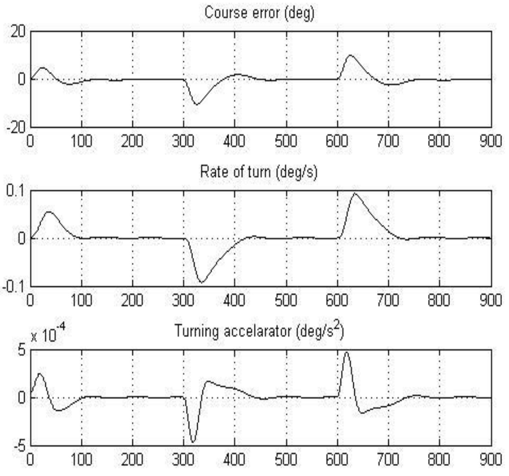

Hình 3.4. Sai số hướng đi, tốc độ và gia tốc quay trở hướng mũi tàu

## 3.2.2 Khi có gió và nhiễu tác động

Hình 3.5 cho thấy khi có gió và nhiễu tác động, máy lái tự động sử dụng BĐK BPNN-PID có mức độ dao động ít hơn, đảm bảo được tính bền vững và ổn định trong suốt thời gian tiến hành mô phỏng. Góc bẻ lái nhỏ hơn so với BĐK PID thông thường, điều này đảm bảo cho động cơ máy lái không bị quá tải trong điều kiện nhiễu môi trường tác động.

<!-- page: 80 -->

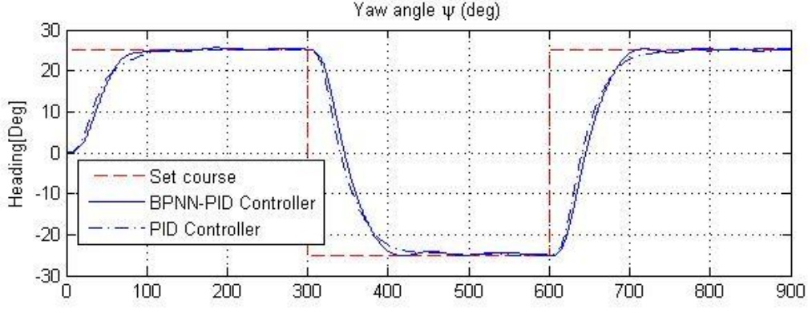

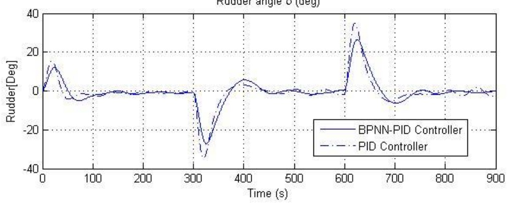

Hình 3.5. Hướng đi và góc bẻ lái khi có gió và nhiễu tác động

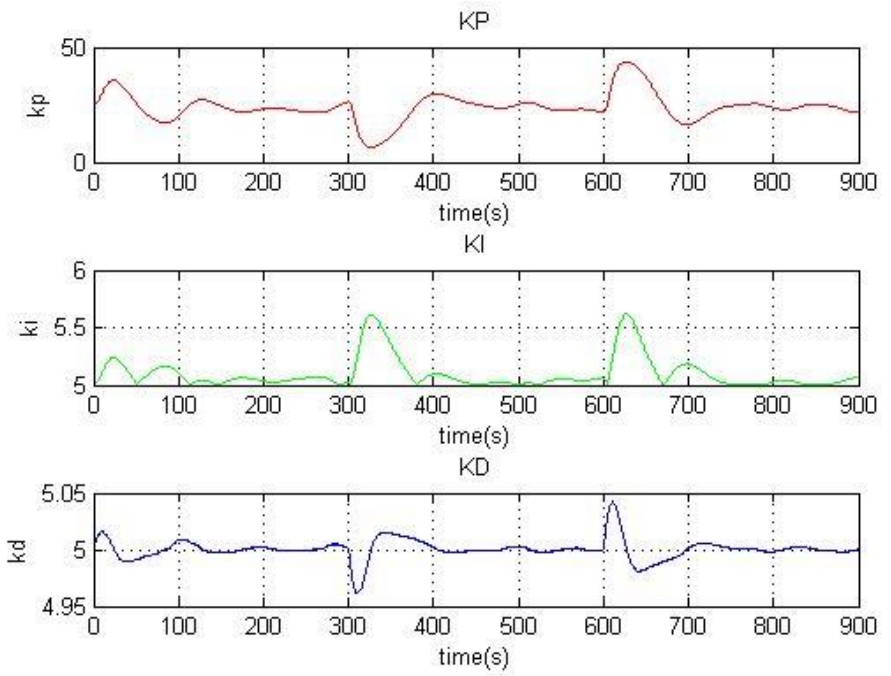

Hình 3.6. Sự thay đổi các tham số $K _ { p } ,   K _ { i }$ và $K _ { d }$

<!-- page: 81 -->

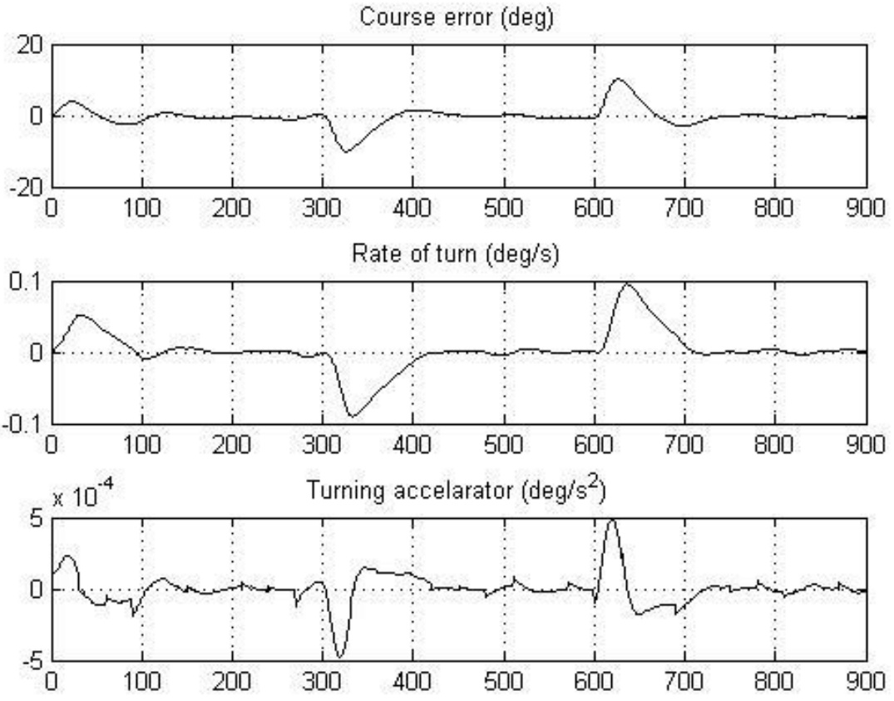

Hình 3.7. Sai số hướng đi, tốc độ và gia tốc quay trở hướng mũi tàu

Hình 3.6 minh họa các tham số $K _ { p } ,   K _ { i }   \mathrm { v \hat { a } }   K _ { d }$ được điều hưởng một cách tự động trong suốt quá trình mô phỏng bởi mạng nơ-ron nhân tạo dưới sự tác động của nhiễu và gió tác động tới hướng tàu.

Bảng 3.2 Tổng bình phương độ lệch hướng và tổng bình phương góc bẻ lái khi có nhiễu và gió tác động.

<table><tbody><tr><td colspan="2"></td><td>Có gió</td></tr><tr><td rowspan="2">BĐK PID</td><td>E</td><td>28,32</td></tr><tr><td>E<sub>δ</sub></td><td>171,24</td></tr><tr><td rowspan="2">BĐK BPNN-PID</td><td>E</td><td>26,43</td></tr><tr><td>E<sub>δ</sub></td><td>159,45</td></tr></tbody></table>

<!-- page: 82 -->

## 3.3. Bộ điều khiển PID nơ-ron dựa trên mạng lan truyền ngược có bộ nhận dạng nơ-ron

Mạng nơ-ron dùng để điều chỉnh các tham số BĐK PID (NN1) gồm 6 nơ-ron lớp vào, 9 nơ-ron lớp ẩn và 3 nơ-ron lớp ra.

Đầu vào của mạng bao gồm hướng đi mong muốn $\psi _ { r _ { 1 } }$ , hướng đi thực tế $\psi ,$ sai $s \hat { 0 }$ hướng đi $e ( k ) ,$ , và hiệu số $e ( k ) \textit { - } e ( k \textit { - } I )$ . Ba nơ-ron lớp ra tương ứng với các tham số $K _ { p } ,$ , $K _ { i }$ và $K _ { d }$ của bộ điều khiển PID. Mạng nơ-ron nhận dạng (NN2) gồm có 6 nơ-ron lớp vào, 9 nơ-ron lớp ẩn và 1 nơ-ron lớp ra.

Hệ số học và số lần huấn luyện trong một chu trình là $\mathrm { c } \hat { 0 }$ định $( n { = } 1 5 0 ,$ $\gamma { = } 0 . 5 )$ ; giá trị xung lượng được thêm vào trong quá trình huấn luyện lan truyền ngược $\eta = 0 . 0 2 5$

Phạm vi đổi hướng từ $- 2 5 . 0 ^ { 0 }$ đến $+ 2 5 . 0 ^ { 0 }$ . Thời gian mô phỏng 900 giây.

## 3.3.1. Khi không có gió và nhiễu tác động

Hình 3.8 cho thấy BĐK BPNN-PID với mạng nhận dạng nơ-ron có độ vượt quá giá trị điều khiển rất nhỏ, tính bền vững tốt và $\mathbf { d } \hat { \mathbf { 0 } }$ ổn định cao, thời gian xác lập nhanh hơn và góc bẻ lái đáp ứng nhanh so với BĐK PID thông thường. Trên hình 3.9 biểu thị sự thay đổi của các tham số $K _ { p } ,$ $K _ { i }$ và $K _ { d }$ được điều chỉnh bởi BDK với mạng nơ-ron nhận dạng.

Hình 3.10 minh họa sai $s \hat { 0 }$ hướng đi của tàu, tốc độ và gia tốc quay trở hướng mũi tàu. Kết quả cho ta thấy tính hiệu quả và bền vững của BĐK BPNN-PID với bộ nhận dạng nơ-ron.

<!-- page: 83 -->

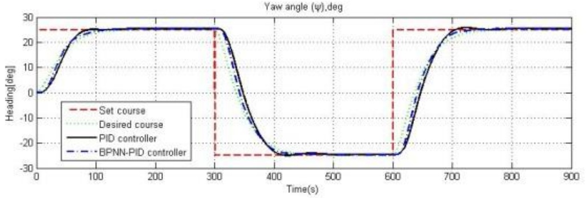

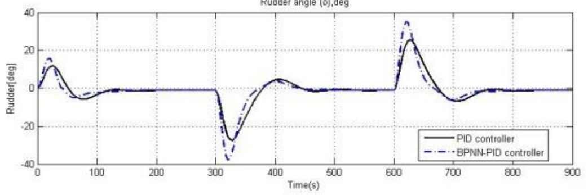

Hình 3.8. Hướng tàu và góc bẻ lái khi không có gió và nhiễu tác động

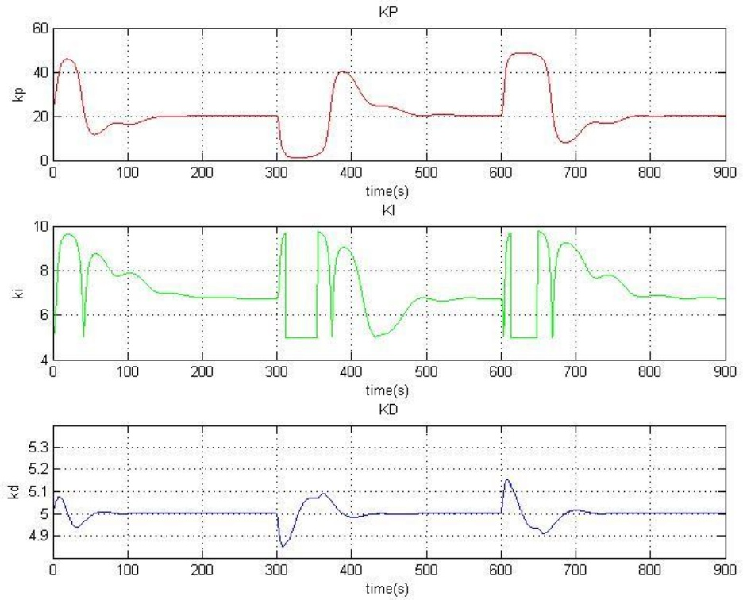

Hình 3.9. Sự thay đổi các tham số Kp, Ki, Kd

<!-- page: 84 -->

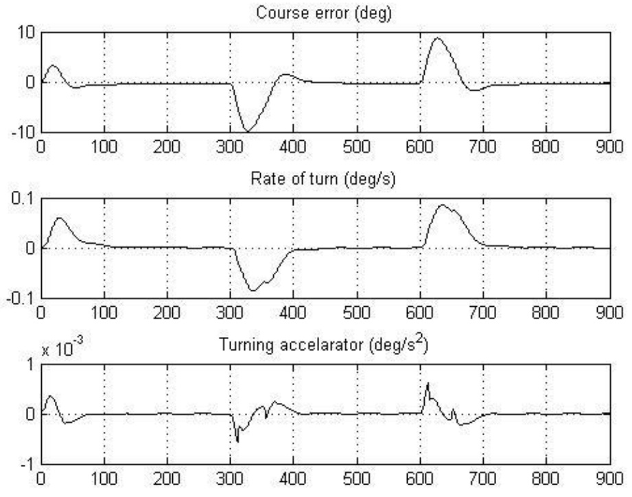

Hình 3.10. Sai số hướng đi, tốc độ và gia tốc quay trở hướng tàu

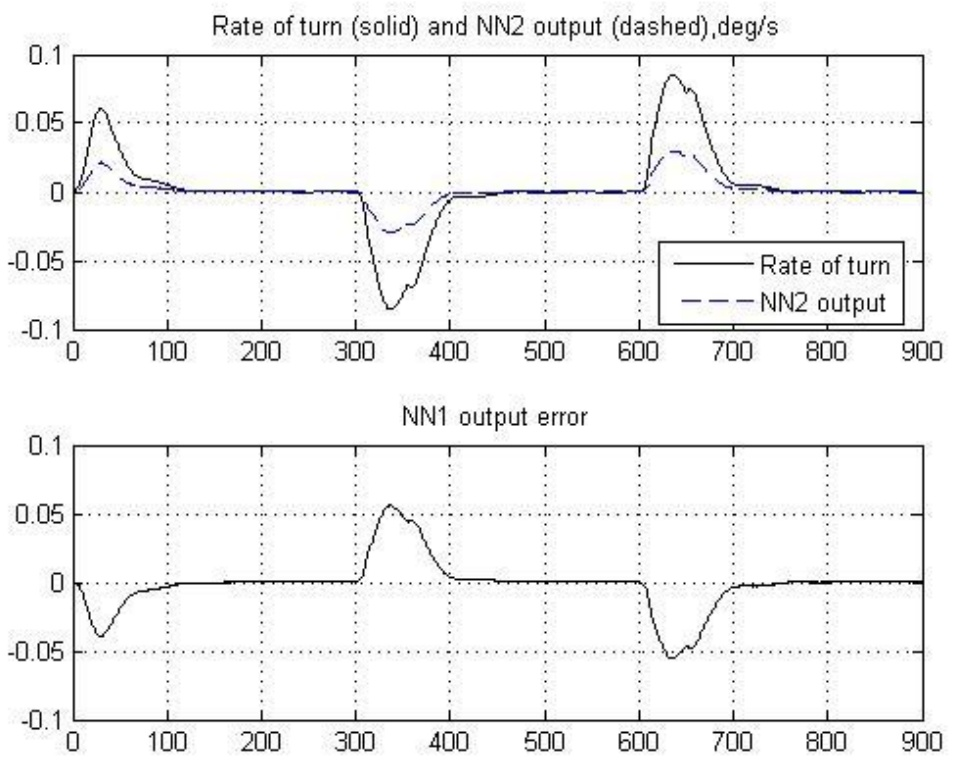

Hình 3.11. Đầu ra của bộ nhận dạng nơ-ron NN2

<!-- page: 85 -->

Bảng 3.3. Tổng bình phương độ lệch hướng và tổng bình phương góc bẻ lái khi không có gió và nhiễu

<table><tbody><tr><td colspan="2"></td><td>Không gió</td></tr><tr><td rowspan="2">BĐK PID</td><td>E</td><td>23,91</td></tr><tr><td>E<sub>δ</sub></td><td>149,41</td></tr><tr><td rowspan="2">BĐK BPNN-PID có NN nhận dạng</td><td>E</td><td>17,44</td></tr><tr><td>E<sub>δ</sub></td><td>149,33</td></tr></tbody></table>

## 3.3.2. Khi có gió và nhiễu tác động

Hình 3.12 minh họa hướng đi và góc bẻ lái của tàu dùng BĐK PID nơ- ron với bộ nhận dạng, ta thấy hướng đi ổn định, thời gian xác lập nhanh và góc bẻ lái phù hợp, tính bền vững cao.

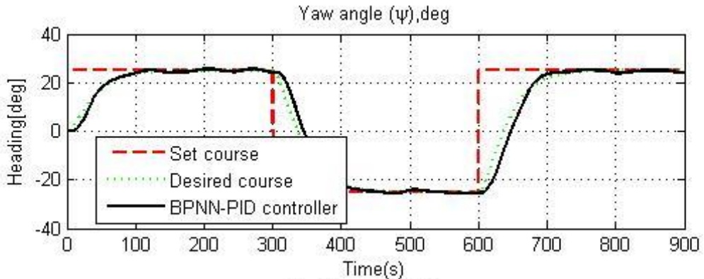

Rudder angle (δ),deg

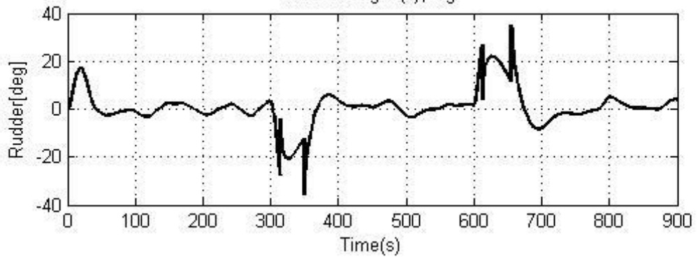

Hình 3.12. Hướng tàu và góc bẻ lái khi có gió và nhiễu tác động

<!-- page: 86 -->

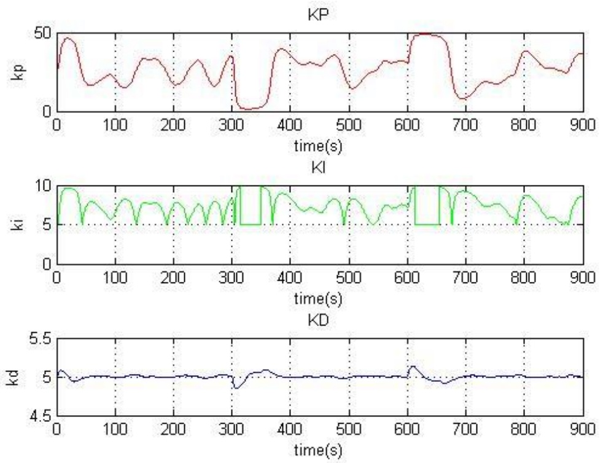

Hình 3.13. Sự thay đổi các thông số $K _ { p } ,   K _ { i }$ và $K _ { d }$

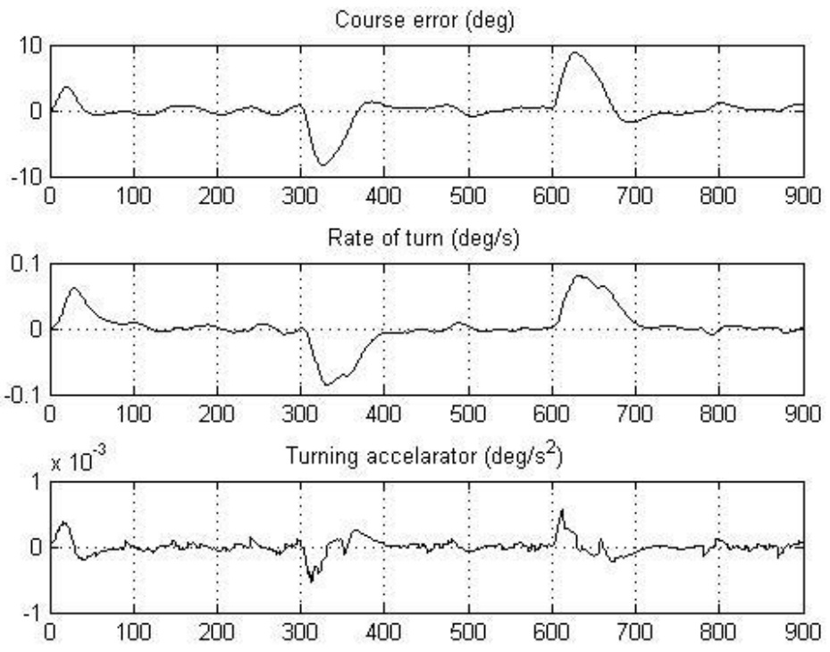

Hình 3.14. Sai số hướng đi, tốc độ và gia tốc quay trở hướng tàu

<!-- page: 87 -->

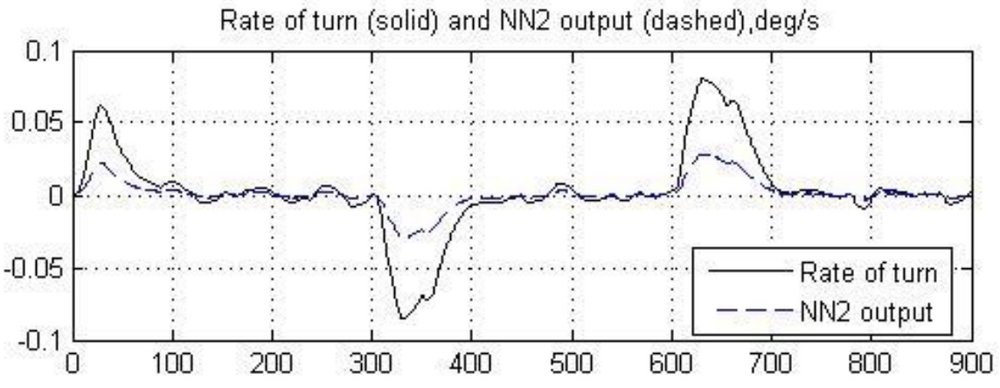

NN1 output error

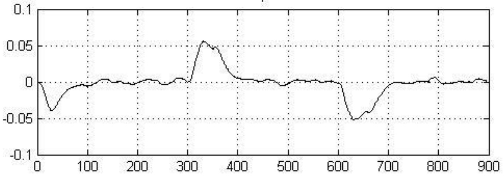

Hình 3.15. Đầu ra của bộ nhận dạng nơ-ron NN2

Bảng 3.4. Tổng bình phương độ lệch hướng và tổng bình phương góc bẻ lái khi có nhiễu và gió

<table><tbody><tr><td colspan="2"></td><td>Có gió</td></tr><tr><td rowspan="2">BĐK PID</td><td>E</td><td>31,32</td></tr><tr><td>E<sub>δ</sub></td><td>195,76</td></tr><tr><td rowspan="2">BĐK BPNN-PID có NN nhận dạng</td><td>E</td><td>18,35</td></tr><tr><td>E<sub>δ</sub></td><td>154,39</td></tr></tbody></table>

Qua kết quả mô phỏng ta thấy, BĐK PID nơ-ron với bộ nhận dạng nơ- ron có sai $s \hat { 0 }$ hướng đi và góc bẻ lái nhỏ hơn so với BĐK PID thông thường.

<!-- page: 88 -->

BĐK này hoạt động tích cực và các tham số được điều chỉnh thích nghi hơn BĐK PID. Điều đó chứng minh được tính khả thi và hiệu quả của BĐK được đề xuất.

## 3.4. Kết luận chương 3

Chương 3 tác giả trình bày kết quả mô phỏng trên máy tính của BĐK đề xuất trong chương 2. Mô hình toán học con tàu là mô hình phi tuyến của tàu thật được sử dụng trong tình huống mô phỏng. Các tín hiệu nhiễu ngẫu nhiên trong tín hiệu, tác động của gió đến quá trình giữ hướng được sử dụng để kiểm chứng tính khả thi cũng như đáp ứng của BĐK. Gió được thay đổi trong quá tình mô phỏng để kiểm tra sự thích nghi của BĐK đến thay đổi của tác động bên ngoài.

Kết quả cho thấy sự hoạt động ổn định và hiệu quả của BĐK PID nơ- ron so với PID truyền thống và khả năng thích nghi với thay đổi của môi trường. Mạng nơ-ron nhận dạng cũng cho kết quả khả quan khi kết hợp với BĐK PID nơ-ron.

<!-- page: 89 -->

## CHƯƠNG 4. KẾT QUẢ THỰC NGHIỆM

## 4.1. Điều kiện thực nghiệm

Trong chương này, mô hình tàu được tiến hành thực nghiệm tại hồ bơi trường Đại học Giao thông Vận tải Thành phố Hồ Chí Minh với kích thước hồ bơi 9m x 25m (hình 4.1). Tác giả tiến hành điều khiển con tàu chạy bám theo đường biên của hồ bơi được mô tả trong hình 4.1. Quỹ đạo mong muốn của con tàu được mô tả bằng năm điểm chuyển hướng và tàu sẽ tiến hành chuyển hướng ba lần với các giá trị góc bẻ lái lần lượt như sau $9 0 ^ { \circ } { - } 9 0 ^ { \circ } { - } 9 0 ^ { \circ }$ Tại thời điểm ban đầu tàu được đặt dọc theo chiều rộng của hồ bơi tương ứng với góc mũi tàu ban đầu là . Chiều dài quỹ đạo mong muốn (hình 4.1) là $\mathbf { L } _ { \mathrm { t r a j e c t o r y } }   =   5 7 ( \mathrm { m } )$

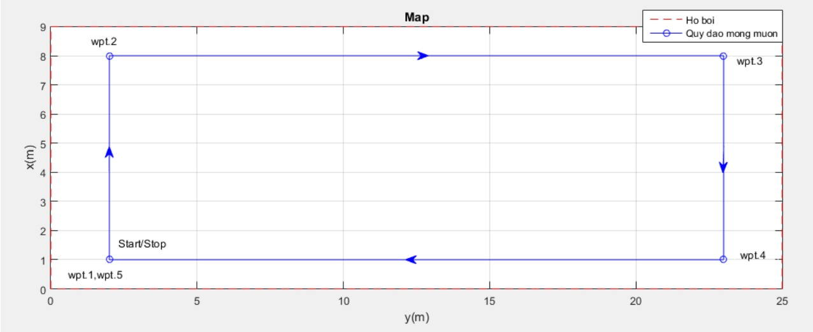

Hình 4.1. Quỹ đạo di chuyển mong muốn của con tàu

- Tải trọng mang theo của tàu là 4,5 kg;

\- Chiều cao mớn nước là 100 mm, chiều dài tàu là 1500 m, chiều rộng tàu là 250mm;

\- Giới hạn góc bánh lái là từ đến 20, giới hạn vận tốc bẻ lái là từ $- 5 ^ { \circ } / s$ đến $5 ^ { \circ } / \mathrm { s }$

<!-- page: 90 -->

\- Thời gian lấy mẫu của hệ thống là 0,1s;

\- Vận tốc di chuyển của tàu là hằng số 0,4 m/s;

Trong quá trình mô phỏng, để kiểm tra đáp ứng của bộ điều khiển, tác giả thêm vào ba loại nhiễu như sau:

\- Nhiễu do sóng theo phổ PM (được mô tả ở phần Phụ lục 1) với tần số trội của sóng $\omega _ { 0 } = 0 , 6 0 6 2 5$ , hệ số tắt dần tương đối $\xi   =   0 , 3$ , hằng số $K _ { \omega } = 0 , 1 9 7 9$

\- Nhiễu của dòng chảy là hằng số và làm lệch góc mũi tàu đi $1 0 ^ { 0 }$

\- Nhiễu do quá trình đo đạc là một số ngẫu nhiên.

Ngoài ra, trong quá trình mô phỏng, vị trí của con tàu được xác định bằng phương pháp tích phân có dạng như sau:

$$
\left\{ \begin{array}{l} x (t) = x _ {0} (0) + \int_ {0} ^ {t} U \cos \psi (t) d t \\ y (t) = y _ {0} (0) + \int_ {0} ^ {t} U \sin \psi (t) d t \end{array} \right.\tag{4.1}
$$

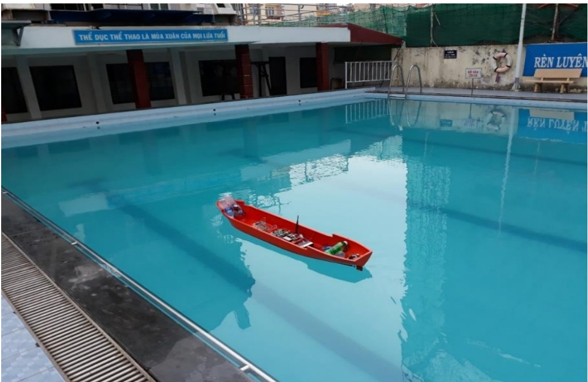

Hình 4.2. Điều kiện thực nghiệm tàu mô hình trên thực tế

<!-- page: 91 -->

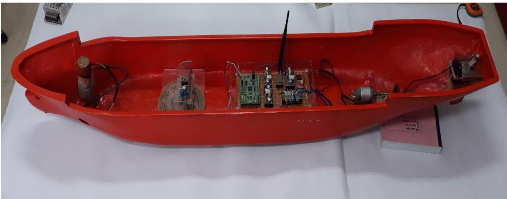

Hình 4.3. Tàu mô hình

## 4.2. Kết quả thực nghiệm

Hình 4.4 mô tả sơ đồ khối hệ thống lái tàu tự động sử dụng PID nơ-ron (khối PID Neural Network). Trong đó, nhiễu do sóng biển sẽ tác động lên hệ thống được mô tả trong khối Wind-wave effect; nhiễu do các dòng chảy được mô tả trong khối Ocean current effect và nhiễu do quá trình đo đạc được cộng trực tiếp vào góc mũi tàu. Khối PID neural network là bộ điều khiển của hệ thống lái tàu.

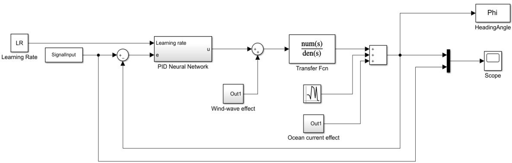

Hình 4.4. Sơ đồ khối hệ thống điều khiển hướng tàu sử dụng BĐK PID nơ-ron

Trong quá trình di chuyển, tàu sẽ luôn có sai số về vị trí và góc. Chính vì vậy mà tác giả đưa ra hai đồ thị về sai số bao gồm đồ thị mô tả sai số bám quỹ

<!-- page: 92 -->

đạo - khoảng cách từ tàu đến đoạn thẳng quỹ đạo mong muốn theo thời gian như hình 4.5 và đồ thị mô tả sai số góc mũi tàu - góc hợp bởi đoạn thẳng quỹ đạo mong muốn và hướng mũi lái tàu hay nói cách khác sai số góc mũi tàu là hiệu số giữa góc và góc α trên hình 4.6 (thuật toán dẫn đường LOS) theo thời gian như trong hình 4.5. Hơn nữa, tác giả cũng đưa ra hai đồ thị mô tả góc bánh lái và góc mũi tàu thu về từ các cảm biến như trong hình 4.6 và 4.7.

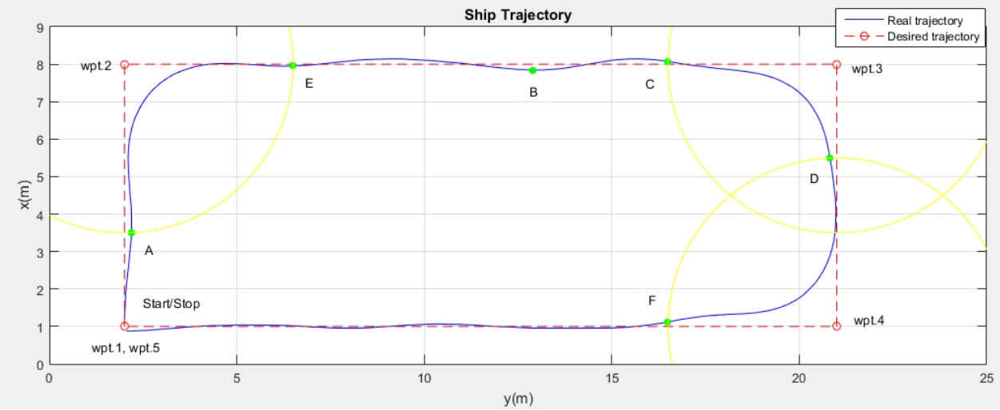

Hình 4.5. Quỹ đạo của tàu với BĐK PID nơ-ron

Hình 4.5 mô tả quỹ đạo di chuyển của tàu khi hệ thống lái tàu tự động sử dụng PID nơ-ron. Ta thấy xuất hiện các vòng tròn giới hạn (màu vàng) có tâm đặt tại các điểm chuyển hướng waypoint 2, waypoint 3, waypoint 4 với bán kính bằng ba lần chiều dài tàu. Các vòng tròn này dùng để xác định vị trí tàu bắt đầu chuyển hướng để bám theo đoạn thẳng quỹ đạo mới. Ngoài ra, từ hình 4.5, ta thấy rằng khi đi qua điểm chuyển hướng waypoint 2 thì tàu không bị lệch ra khỏi quỹ đạo mong muốn tuy nhiên tàu lại bị dao động xung quanh đoạn thẳng quỹ đạo tạo thành từ waypoint 2 và waypoint 3. Sai số bám quỹ đạo lớn nhất của tàu khi đi từ waypoint 2 đến waypoint 3 là 0,1557m tương ứng với điểm B trên hình 4.5 và hình 4.6.

<!-- page: 93 -->

Hơn nữa, ta nhận thấy rằng vì đáp ứng của PID nơ-ron là khá tốt nên khi đi qua điểm chuyển hướng waypoint 2, tàu nhanh chóng bám theo đoạn quỹ đạo mong muốn. Ngoài ra khi đi qua điểm chuyển hướng waypoint 3 ta thấy rằng tàu không bị lệch ra khỏi quỹ đạo mong muốn tuy nhiên do bán kính bẻ lái tàu quá lớn $(R=3L_{\mathrm{ship}}=4.5\mathrm{m})$ nên khi vừa đi qua điểm chuyển hướng waypoint 3 thì tàu đã đi vào vòng tròn giới hạn kế tiếp với tâm tại điểm chuyển hướng waypoint 4 nên tàu lại phải tiếp tục chuyển hướng để bám theo đoạn thẳng quỹ đạo mới tạo thành từ waypoint 3 và waypoint 4. Chính vì vậy mà trên đoạn thẳng quỹ đạo này thì sai số bám quỹ đạo của tàu vẫn chưa thể tiến về 0.

Hình 4.6 thể hiện sai số bám quỹ đạo của con tàu theo thời gian. Từ hình 4.6 ta có thể thấy rằng tại các thời điểm t = 6,25s; 51,1s; 64,2s tương ứng với các điểm A, C, D trên hình 4.5 và 4.6 thì sai số bám quỹ đạo của con tàu có bước nhảy vọt tại thời điểm chuyển waypoint. Bước nhảy về sai số bám quỹ đạo này được giải thích tương tự như các bước nhảy trong hình 4.5. Mặt khác, cũng từ hình 4.5, ta thấy rằng sau khi tàu đi qua điểm chuyển hướng waypoint 3 thì sai số bám quỹ đạo của tàu vẫn không thể tiến về 0, tuy nhiên sai số bám quỹ đạo đạt được giá trị nhỏ nhất là 0,1767m tương ứng với điểm D trên hình 4.5 và hình 4.6.

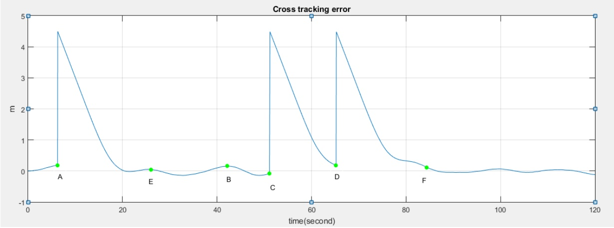

Hình 4.6. Sai $\mathrm { s } \hat { 0 }$ bám quỹ đạo của tàu với BĐK PID nơ-ron

<!-- page: 94 -->

Ngoài ra, từ hình 4.5, ta thấy rằng sau khi tàu đi ra khỏi vòng tròn giới hạn có tâm tại điểm chuyển hướng waypoint 2, sai $s \hat { 0 }$ bám quỹ đạo trong vùng ổn định từ điểm E đến điểm C như trên hình 4.7 và hình 4.8 có sai $s \hat { 0 }$ bám quỹ đạo của dao động quanh giá trị 0 với sai bám quỹ đạo lớn nhất trong vùng này là 0,1557m. Thời gian xác lập của tàu tính từ thời điểm bắt đầu chuyển hướng từ điểm A để bám theo đoạn thẳng quỹ đạo tạo thành từ điểm chuyển hướng waypoint 2 và waypoint 3 là $\mathrm{T}=11,97\mathrm{s} \left(\mathrm{t}_{100}-\mathrm{t}_{10}=18,25-6,28=11,97\mathrm{s}\right)$ . Tương tự khi tàu đi ra khỏi vòng tròn giới hạn có tâm tại điểm chuyển hướng waypoint 4, ta thấy sai số bám quỹ đạo trong vùng ổn định từ điểm F đến điểm chuyển hướng waypoint 5 cũng bị dao động quanh giá trị 0 và giá trị sai số bám quỹ đạo lớn nhất trong vùng này là 0,1148m. Thời gian xác lập của tàu tính từ thơi điểm bắt đầu chuyển hướng từ điểm C để bám theo đoạn thẳng quỹ đạo tạo thành từ điểm chuyển hướng waypoint 3 và waypoint 4 là T=17,54s (t<sub>280</sub>-t<sub>190</sub>=82,79-64,25=17,54s).

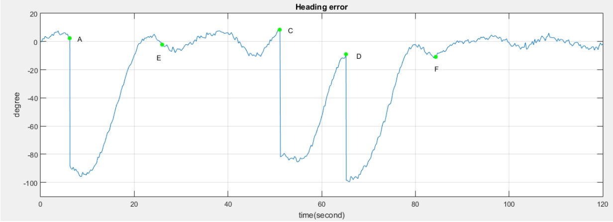

Hình 4.7. Sai số góc mũi tàu của tàu với BĐK PID nơ-ron

Hình 4.7 thể hiện sai số góc mũi tàu theo thời gian. Tại các thời điểm t = 6,25s; 51,1s; 64,2s, sai số góc mũi tàu cũng có bước nhảy tương tự như hình 4.8. Ngoài ra, ta có thể thấy sau khi tàu đi ra khỏi vòng tròn giới hạn có tâm

<!-- page: 95 -->

tại điểm chuyển hướng waypoint 2, sai $s \hat { 0 }$ góc mũi tàu trong vùng $\overset { \overset { \circ } { \mathtt { R } } } { \mathtt { C n } }$ định từ điểm E đến điểm C dao động quanh giá trị $0 ^ { \circ }$ , sai $s \hat { 0 }$ góc mũi tàu lớn nhất trong đoạn này là $^ { 1 0 , 5 1 ^ { \circ } }$ . Tương tự, khi tàu đi ra khỏi vòng tròn giới hạn có tâm tại điểm chuyển hướng waypoint 4, sai $s \hat { 0 }$ góc mũi tàu trong vùng ổn định từ điểm F cho đến điểm chuyển hướng waypoint 5 cũng bị dao động quanh giá trị $0 ^ { \circ }$ , sai số góc mũi tàu lớn nhất trong đoạn này là  .

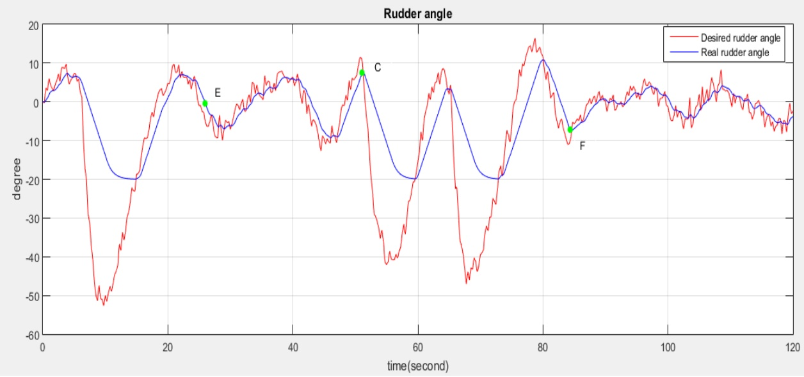

Hình 4.8. Góc bánh lái với BĐK PID nơ-ron

Hình 4.8 thể hiện đáp ứng góc bánh lái của tàu khi hệ thống lái tàu tự động sử dụng BĐK PID nơ-ron. Ta thấy rằng, mặc dù góc bánh lái mong muốn – tín điệu đầu ra của bộ điều khiển (desired rudder angle) (đường màu đỏ trên hình 4.8) có những bước nhảy khá lớn tại các thời điểm t=6,25s; 51,1s; 64,2s, nhưng đáp ứng của góc bánh lái thực tế vẫn là một đường cong trơn bởi vì bánh lái của tàu mô hình bị giới hạn $\mathbf { v } \dot { \hat { \mathbf { e } } }$ góc và vận tốc góc nên đáp ứng góc bánh lái thực tế không thể có những bước nhảy quá lớn.

<!-- page: 96 -->

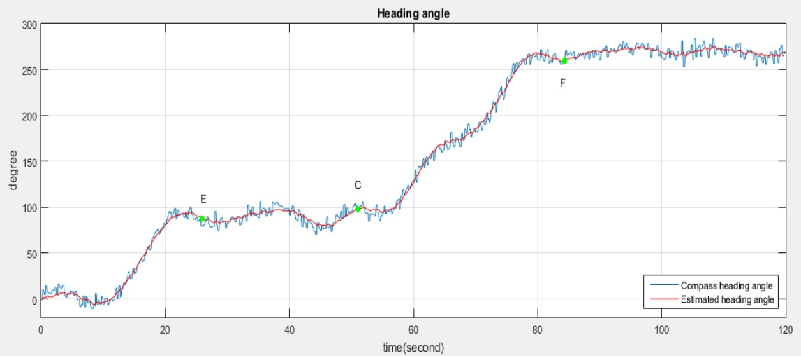

Hình 4.9. Góc mũi tàu với BĐK PID nơ-ron

Hình 4.9 mô tả góc mũi tàu thu $\mathbf { v } \dot { \hat { \mathbf { e } } }$ từ cảm biến la bàn theo thời gian. Ta thấy sau khi tàu đi qua điểm chuyển hướng waypoint 2, trong vùng $\overset { \overset { \circ } { \mathtt { R } } } { \mathtt { C n } }$ định từ điểm E đến điểm C, sai số góc mũi tàu không tiến về $0 ^ { \circ }$ mà dao động quanh giá trị này. Điều này có thể được giải thích là bởi vì trong quá trình di chuyển tàu chịu ảnh hưởng của nhiễu từ môi trường nên làm góc mũi tàu bị dao động. Tương tự khi tàu đi qua điểm chuyển hướng waypoint 4, trong vùng ổn định từ điểm F đến điểm chuyển hướng waypoint 5, góc mũi tàu cũng dao động quanh giá trị $0 ^ { \circ }$

## 4.3. Kết luận chương 4

Trong chương 4, tác giả đã tiến hành thực nghiệm trên mô hình tàu thu nhỏ để kiểm chứng hiệu quả của BĐK PID nơ-ron sử dụng thuật toán lan truyền ngược được đề xuất. Kết quả đạt được trong chương 4 cụ thể như sau:

\- Sử dụng mô hình tàu thật thu nhỏ trên cơ sở nghiên cứu phương trình động học và động lực học tàu thủy và nhiễu loạn môi trường (như sóng, gió, dòng chảy,…) tác động vào con tàu.

<!-- page: 97 -->

\- Sử dụng BĐK PID nơ-ron thích nghi cho hệ thống điều khiển hướng đi ở chương 2 áp dụng tàu cho mô hình tàu được đưa ra.

\- Ứng dụng hệ thống dẫn đường cho tàu dựa trên thuật toán LOS (Light of Sight). Thông qua việc điều khiển bám theo hướng đi mong muốn do thuật toán này tạo ra, BĐK có thể dẫn tàu đi theo quỹ đạo mong muốn. Thực nghiệm này nhằm kiểm chứng khả năng điều khiển hướng tàu theo giá trị thay đổi của hướng đi mong muốn.

\- Tiến hành thực nghiệm dẫn đường cho mô hình thật thu nhỏ trên hồ bơi. Kết quả cho thấy tính hiệu quả và thích nghi của BĐK được đề xuất.

<!-- page: 98 -->

## KẾT LUẬN VÀ KIẾN NGHỊ

## 1. KẾT LUẬN

Bằng các phương pháp nghiên cứu đã thực hiện trong luận án: “Nghiên cứu ứng dụng bộ điều khiển PID dựa trên mạng nơ-ron nhân tạo thích nghi cho hệ thống điều khiển tàu thủy”, luận án đã đạt được mục đích nghiên cứu đặt ra, với các kết quả cụ thể như sau:

1.1. Hệ thống hóa cơ sở lý luận về thuật toán điều khiển thích nghi dựa trên sự kết hợp giữa mạng nơ-ron nhân tạo và lý thuyết điều khiển PID thông thường. Trên cơ sở đó, đề xuất phát triển thuật toán và ứng dụng vào thiết kế máy lái tự động sử dụng bộ điều khiển PID nơ-ron thích nghi cho điều khiển hướng đi tàu thủy.

1.2. Ứng dụng lập trình trên Matlab để mô phỏng bộ điều khiển được đề xuất, đánh giá chất lượng bộ điều khiển PID nơ-ron thích nghi với bộ điều khiển PID thông thường.

1.3. Thiết kế và mô phỏng BĐK PID nơ-ron dựa trên mạng lan truyền ngược, tác giả đã sử dụng bộ nhận dạng nơ-ron để nhận dạng mô hình tàu. Bộ nhận dạng này sử dụng mạng nơ-ron nhiều lớp truyền thẳng nhưng tác giả huấn luyện mạng theo phương pháp trực tuyến, tăng cường nên tốc độ thích nghi tốt, có khả năng nhận dạng mô hình tàu phi tuyến biến đổi theo thời gian. Với việc kết hợp mô hình nhận dạng nơ-ron này, phương pháp điều khiển được tiến hành kiểu điều khiển dự đoán theo thời gian thực, nâng cao tính thích nghi và chất lượng điều khiển.

1.4. Thực nghiệm điều khiển mô hình tàu thu nhỏ trong môi trường bể thử nhằm kiểm chứng BĐK PID nơ-ron và sự đáp ứng của toàn hệ thống đối với tác động của môi trường bên ngoài cũng như tính phi tuyến của mô tàu hình thật.

<!-- page: 99 -->

Các tham số Tỷ lệ - Tích phân - Vi phân (Kp, Ki, Kd) của BĐK PID được điều chỉnh bằng mạng nơ-ron lan truyền ngược.

Tính mới được thể hiện trong luận án thông qua các kết quả sau:

\- Đề xuất mô hình sử dụng mạng nơ-ron lan truyền ngược tăng cường kết hợp với BĐK PID truyền thống trong điều khiển hướng đi tàu thủy.

\- Đề xuất mạng nơ-ron nhận dạng mô hình tàu thủy sử dụng kết hợp với BĐK PID nơ-ron nhằm nâng cao chất lượng điều khiển, hỗ trợ quá trình học và thích nghi của mạng nơ-ron điều khiển.

\- Thuật toán huấn luyện mạng nơ-ron lan truyền ngược tăng cường lần đầu được sử dụng kết hợp với BĐK PID áp dụng cho điều khiển hướng đi tàu thủy và cho kết quả tốt.

BĐK PID nơ-ron dựa trên mạng nơ-ron nhân tạo đề xuất trong luận án cho thấy các phương án khả thi đã được trình bày trong luận án “Nghiên cứu ứng dụng bộ điều khiển PID dựa trên mạng nơ-ron nhân tạo thích nghi cho hệ thống điều khiển tàu thủy”. Các kết quả mô phỏng và thực nghiệm đem lại kết quả tốt hơn BĐK PID truyền thống trong phạm vi nghiên cứu của luận án và chứng tỏ các mục tiêu nghiên cứu đã đạt được.

## 2. KIẾN NGHỊ

Kiến nghị của luận án cũng chính là những vấn đề cần quan tâm trong hướng nghiên cứu tiếp theo, cụ thể:

2.1. Do giới hạn về cơ sở vật chất cho thí nghiệm, đặc biệt là bể thử thí nghiệm đủ tiêu chuẩn cho việc thực nghiệm trên mô hình tàu ở trong nước cũng như thời gian thực hiện, luận án chỉ mô phỏng một số tình huống trên máy tính với số lần hạn chế, tình huống hạn chế. Tiến hành thực nghiệm chỉ dừng ở BĐK PID nơ-ron không có bộ nhận dạng.

2.2. Luận án nghiên cứu tính khả thi của từng phương án điều khiển được đề xuất, chưa nghiên cứu so sánh có hệ thống các phương án với nhau

<!-- page: 100 -->

để kiểm nghiệm mô hình tốt nhất cho việc kết hợp BĐK PID và mạng nơ-ron nhân tạo. Tuy nhiên áp dụng mô hình nào cho đối tượng điều khiển nào sao cho tốt nhất, thậm chí tối ưu là hướng nghiên cứu cần thêm thời gian và điều kiện nhiều hơn. Tác giả dành công việc này cho những nghiên cứu trong tương lai gần.

2.3. Luận án giới hạn nghiên cứu đối với điều khiển hướng đi của tàu thủy, chưa tập trung nghiên cứu đến vấn đề như hệ thống giảm lắc tàu thủy, hệ thống định vị động, hay ứng dụng cho các phương tiện thủy loại khác... Vì vậy, trong thời gian tiếp theo, với điều kiện cho phép, tác giả sẽ tiến hành thiết kế BĐK PID nơ-ron được đề xuất vào các vấn đề nêu trên.

<!-- page: 101 -->

# DANH MỤC CÁC CÔNG TRÌNH KHOA HỌC ĐÃ CÔNG BỐ LIÊN QUAN ĐẾN ĐỀ TÀI LUẬN ÁN

1. PGS. TS. Nguyễn Phùng Hưng, PGS. TS. Phạm Kỳ Quang, NCS. Võ Hồng Hải (2015). Bộ điều khiển PID chỉnh tham số bằng mạng nơ-ron dùng cho máy lái tự động tàu thủy. Tạp chí Giao thông Vận tải. Số 9, trang 67 – 70. Tháng 09/2015. ISSN: 2354-0818.

2. NCS. Võ Hồng Hải, PGS. TS. Nguyễn Phùng Hưng, PGS. TS. Nguyễn Duy Anh (2015). Bộ điều khiển PID nơ-ron dùng cho máy lái tự động tàu thủy. Kỷ yếu Hội Nghị Khoa Học Công Nghệ Giao Thông Vận Tải 2015. Đại học Giao thông vận tải TP. Hồ Chí Minh. Tháng 05/2015, trang 310 - 313. ISBN: 978-604-76-0594-1.

3. Hung Phung Nguyen, Anh Duy Nguyen, Hong Hai Vo (2016). PID – neuron controller for ships heading with neuron indentification. The 5th World Conference on Applied Sciences, Engineering and Technology, June 2016, pp.387 - 390. ISBN 13: 978-81-930222-2-1.

4. Nhut Minh Do, Hong Hai Vo, Duy Anh Nguyen (2018). Design and implement a Fuzzy autopilot for an Unmanned Surface Vessel. @ Springer International Publishing AG 2018. AETA 2017 – Recent Advanceds in Electrical Engineering and Related Sciences: Theory and Application, Lecture notes in Electrical Engineering 465, pp.765 - 775. ISBN: 978-3-319-69814-4.

5. PGS.TS. Nguyễn Phùng Hưng, NCS. Võ Hồng Hải (2018). PID – neuron controller for ships heading with neuron indentification. Tạp chí Khoa học công nghệ giao thông vận tải. Trường Đại học Giao thông vận tải TPHCM. Số 29-08/2018, trang 77 - 80. ISBN: 1859-4263.

<!-- page: 102 -->

## TÀI LIỆU THAM KHẢO

## Tiếng Việt

[1] Phạm Hữu Đức Dục (2008). Mô hình điều khiển dự báo và ứng dụng điều khiển thích nghi hướng tàu thủy. Tạp chí Khoa học và công nghệ, số 1 (45), tập 1.

[2] Nguyễn Hoàng Dũng (2011), Điều khiển hệ phi tuyến dựa trên giải thuật feedforward – feedback, Tạp chí Khoa học 2011: 19a 17-26, Trường Đại học Cần Thơ.

[3] Nguyễn Thị Phương Hà (2012). Lý thuyết điều khiển hiện đại. NXB Đại học Quốc gia TP.HCM.

[4] Nguyễn Phùng Hưng, Phạm Kỳ Quang, Võ Hồng Hải (2015). Bộ điều khiển PID chỉnh tham số bằng mạng nơ-ron dùng cho máy lái tự động tàu thủy. Tạp chí Giao thông Vận tải số 9, 9/ 2015.

[5] Nguyễn Phùng Hưng (2013). Mạng nơ-ron nhân tạo- ứng dụng trong điều khiển phương tiện thủy. Nhà xuất bản Khoa học và kỹ thuật.

[6] Nguyễn Phùng Hưng, Nguyễn Thái Dương, Đậu Văn Sơn (2008). Bộ điều khiển nơ-ron thích nghi kỹ thuật số cho máy lái tự động tàu biển, Đề tài NCKH, Đại học Hàng hải Việt nam, Hải Phòng.

[7] TS. Nguyễn Như Hiền, TS. Lại Khắc Lãi (2004). Hệ mờ & nowrron trong kỹ thuật điều khiển. Nhà xuất bản Khoa học tự nhiên và công nghệ. 2007.

[8] Nguyễn Chí Ngôn, Đặng Tín (2011). Điều khiển PID một nơ-ron thích nghi dựa trên bộ nhận dạng mạng nơ-ron mờ hồi quy áp dụng cho hệ thanh và bóng. Tạp chí Khoa học 2011: 20a 159-168, Trường Đại học Cần Thơ.

[9] Nguyễn Chí Ngôn, Trần Thanh Tú (2012). Điều khiển PID thích nghi cho hệ ổn định áp suất dựa trên bộ nhận dạng dùng mạng nơ-ron hàm cơ sở xuyên tâm. Tạp chí Khoa học và công nghệ Đà Nẵng số 11 (60), q. 1.

[10] Nguyễn Doãn Phước (2007). Lý thuyết điều khiển nâng cao. Nhà xuất bản khoa học và kỹ thuật.

<!-- page: 103 -->

[11] Nguyễn Cảnh Sơn (2006), Tổng hợp bộ điều khiển thích nghi phi tuyến lái tự động tàu thủy, Tạp chí Giao thông vận tải số 4/2006- trang 25, 26, 60.

[12] Nguyễn Lê Nhật Thắng, Nguyễn Phùng Hưng (2014), Nhận dạng mô hình toán và máy lái tự động Genetic PID cho mô hình tàu thủy thí nghiệm, Tạp chí Giao thông vận tải, tháng 10/2014), tr.34-39.

[13] Nguyễn Phùng Quang (2004). Matlab & Simulink dành cho kỹ sư điều khiển tự động. Nhà xuất bản Khoa học kỹ thuật.

[14] Trần Công Nghị (2008). Thiết kế tàu kéo, tàu đẩy. Đại học giao thông vận tải thành phố Hồ Chí Minh.

[15] Nguyễn Công Vịnh (2008). Ứng dụng bộ điều khiển logic mờ (fuzzy logic controller) trong máy lái tự động tàu biển. Tạp chí Khoa học công nghệ Hàng hải, số 15+16, tháng 8/2018, tr.48-52.

[16] Phạm Nguyễn Nhật Thanh, Trần Ngọc Huy, Nguyễn Vương Chí, Trần Văn Tạo (2018). Nghiên cứu, thiết kế hệ thống dẫn đương và điều khiển cho tàu dưới tác động của nhiễu đo lường. Hội nghị khoa học và công nghệ giao thông vận tải. Trường Đại học Giao thông vận tải. Tháng 05/2018.

## Tiếng Anh

[17] Antonio (2012), Research Trends for PID Controller, Acta Polytechnica Vol. 52 No. 5/2012.

[18] K.J. Astrom and C.G. Kallstrom (1976). Identification of Ship Dynamic. Automatica, Vol.12, pp.9-222, Pergamon Press, 1976. Printed in Great Britain.

[19] Andrasik, A., Meszaros, A. and Azevedo,S. F. (2004), On-line tuning of a PID controller based on plant hybrid modelling, Computers and Chemical Engineering, 28, 1499-1509.

[20] R.D. Brandt and F. Lin (1999). Adaptive interaction and its application to neural networks. Elsevier, Information Science 121, pp. 201-215.

[21] S. Bennett (1984), Nicholas Minorsky and the automatic steering of ships, Control Systems Magazine, IEEE, 4(4):10 –15.

<!-- page: 104 -->

[22] Thor I. Fossen (1994), Guidance and Control of Ocean Vehicles, John Wiley and Sons, Ltd.

[23] Thor I. Fossen (2002), Maritime Control Systems - Guidance, Navigation and Control of Ships, Rigs and Underwater Vehicles, Marine Cybernetics, Trondheim, Norway, ISBN 82-92356-00-2.

[24] Thor I. Fossen (2011). Handbook of Marine Craft Hydrodynamics and Motion Control. Published 2011 by John Wiley & Sons Ltd. ISBN: 978-1-119-99149-6.

[25] Dong, E.; Guo, S.; Lin, X.; Li, X.; Wang, Y. (2012). A Neural Network-Based Self-Tuning PID Controller of an Autonomous Underwater Vehicle. In the Proceedings of the International Conference on Mechatronics and Automation, Chengdu, China, 5–8 August 2012, pp. 898–903.

[26] Karl Johan Aström and Tore Hägglund (1995), PID Controllers: Theory, Design, and Tuning, 2<sup>nd</sup> Edition. ISA.

[27] Junghui, C. and Huang, T. C. (2004), Applying neural networks to on-line updated PID controllers for nonlinear process control, Journal of Process Control, Volume 14, Issue 2, pages 211-230.

[28] Feng Lin, Robert D. Brandt and George Saikalis (2000). Self-Tuning of PID Controllers by Adaptive Interaction. Proceedings of the American Control Conference, Chicago, Illinois.

[29] P.H. Nguyen and Y.C. Jung (2005). An adaptive autopilot for course-keeping control of ships using adaptive neural network (Part I: Theoretical Study). International Journal of Navigation and Port Research (KINPR), Vol.29, No.9 pp.771-776, ISSN-1589-5725.

[30] P.H. Nguyen and Y.C. Jung (2006a). An adaptive autopilot for coursekeeping and track-keeping control of ships using adaptive neural network (Part II: Simulation Study). International Journal of Navigation and Port Research (KINPR), Vol.30, No.2 pp.119-124, ISSN-1589-5725.

<!-- page: 105 -->

[31] P.H. Nguyen (2007). A study on the automatics ship control based on adaptive neural networks. PhD thesis. Graduate school of Korea Maritime University.

[32] Marialena Vagia (2012). PID Controller Design Approaches - Theory, Tuning and Application to Frontier Areas. ISBN 978-953-51-0405-6, University Campus STeP Ri Slavka Krautzeka 83/A 51000 Rijeka, Croatia.

[33] Martins, G. F. and Coelho, M. A. N. (2000), Application of feed-forward artificial neural to improve process control of PID - based control algorithms, Computers and Chemical Engineering, Volume 24, pages 853-858.

[34] David A. Mindell (2002), Between Human and Machine: Feedback, Control, and Computing Before Cybernetics, Number xiv, 439 p in Johns Hopkins studies in the history of technology, The Johns Hopkins University Press, Baltimore.

[35] M.H. Moradi (2003), New techniques for pid controller design, In Control Applications, CCA 2003. Proceedings of 2003 IEEE Conference on, volume 2, pages 903 – 908 vol.2.

[36] Norgaard. M, Ravn. O, Poulsen. N.K, Hansen L.K.(2000). Neural Networks for Modelling and Control of Dynamic Systems. Springer-Verlag London. ISBN: 978-1-85233-227-3.

[37] Ming-Chung Fang, Young-Zhoung Zhou, Zi-Yi Lee (2010). The application of the self-tuning neural network PID controller on the ship roll reduction in random waves. Department of Systems and Naval Mechatronic Engineering, National Cheng Kung University, No. 1, University Rd., Tainan 701, Taiwan, ROC Ocean Engineering - OCEAN ENG 01/2010; 37(7):529-538.

<!-- page: 106 -->

[38] [Xingxing Huo,](http://ieeexplore.ieee.org/search/searchresult.jsp?searchWithin=p_Authors:.QT.Xingxing%20Huo.QT.&newsearch=true) [Jiangqiang Hu,](http://ieeexplore.ieee.org/search/searchresult.jsp?searchWithin=p_Authors:.QT.Jiangqiang%20Hu.QT.&newsearch=true) [Zeyu Li](http://ieeexplore.ieee.org/search/searchresult.jsp?searchWithin=p_Authors:.QT.Zeyu%20Li.QT.&newsearch=true) (2012). BP neural network based PID control for ship steering. [Information and Communication Technologies (WICT), 2012 World Congress on,](http://ieeexplore.ieee.org/xpl/mostRecentIssue.jsp?punumber=6392488) pages 1042-1046, ISBN: 978-1-4673-4806-5, Oct. 30 2012-Nov. 2 2012.

[39] [Zeyu Li,](http://ieeexplore.ieee.org/search/searchresult.jsp?searchWithin=p_Authors:.QT.Zeyu%20Li.QT.&newsearch=true) [Jiangqiang Hu,](http://ieeexplore.ieee.org/search/searchresult.jsp?searchWithin=p_Authors:.QT.Jiangqiang%20Hu.QT.&newsearch=true) [Xingxing Huo](http://ieeexplore.ieee.org/search/searchresult.jsp?searchWithin=p_Authors:.QT.Xingxing%20Huo.QT.&newsearch=true) (2012). PID control based on RBF neural network for ship steering. [Information and Communication Technologies (WICT), 2012 World Congress on,](http://ieeexplore.ieee.org/xpl/mostRecentIssue.jsp?punumber=6392488) pages 1076 – 1080, Oct. 30 2012-Nov. 2 2012, ISBN: 978-1-4673-4806-5.

[40] Sigeru Omatu, Michifumi Yoshioka, Toshihisa Kosaka (2009). PID Control of Speed and Torque of Electric Vehicle. 2009 Third International Conference on Advanced Engineering Computing and Applications in Sciences Proceedings, Slima, Malta, pp. 157–162.

[41] Moody, J.; Darken, C.J. (1989). Fast learning in networks of locally tuned processing units. Neural Comput. 1989, 1, 281–289.

[42] Park, J.; Sandberg, I.W (1991). Universal approximation using radial-basisfunction networks. Neural Computer. 1991, 3, 246–257.

[43] G.N. Robert (2008). Trends in marine control systems. Control Theory and Applications Centre, Faculty of Engineering and Computing, Coventry University, United Kingdom, Received 11 November 2007; accepted 31 August 2008.

[44] Jing Zhou, Changyun Wen (2008). Adaptive Backstepping Control of Uncertain Systems. In Lecture Notes in Control and Information Sciences, pp.189-197.

[45] R.L. Eubank (2007). A Kalman Filter Primer. [Journal of the American Statistical Association](https://www.researchgate.net/journal/1537-274X_Journal_of_the_American_Statistical_Association) 102 (March):384-384.

[46] V. Nicolau, V. Palade, D. Aiordachioaie and C. Miholca (1989). Neural Network Prediction of the Roll Motion of a Ship for Intelligent Cours e Control. Lecture notes in control and information Science, Springer-Verlag, Berlin.

<!-- page: 107 -->

[47] J.M.J. Journée (1970). A Simple Method for Determining the Manoeuvring Indices K and T from Zigzag trial Data. Delft University of Technology.

[48] W.P.A.van Lammeren, J.D.van Manen, M.W.C. Oosterveld (1975). The Wageningen B-Screw Series. Publication No. 479 of the N.S.M.B.

[49] J. Van Amerongen (1984). Adaptive Steering of Ships – A model Reference Approach. International Federation of Automatic Control. Vol.20. No.1. pp.3-14.

[50] Jing Zhou, Changyun Wen (2008). Adaptive Backstepping Control of Uncertain Systems. Lecture Notes in Control and Information Sciences. ISSN: 0170-8643.

[51] J.M.J. Journée (1970). A Simple Method for Determining the Manoeuvring Indices K and T from Zigzag Trial Data. Delft University of Technology.

[52] Howard Demuth and Mark Beale (2000), Neural network Toolbox- for use with Matlab, the Mathworks, Inc.

[53] M. M. Polycarpou (1996). Stable adaptive neural control scheme for nonlinear systems. IEEE Trans. on Automatic Control, vol. 41, no. 3, pp. 447-451.

[54] F. L. Lewis, S. Jagannathan, and A. Yesildirek (1998). Neural Network Control of Robot Manipulators and Nonlinear Systems. Taylor & Francis, London, UK.

[55] T. Zhang, S. S. Ge, and C. C. Hang (2000). “Adaptive neural network control for strict-feedback nonlinear systems using backstepping design. Automatica, vol. 36, pp. 1835-1846.

[56] J. Q. Gong and B. Yao (2001). Neural network adaptive robust control of nonlinear systems in semi-strict feedback form. Automatica, vol. 37, pp. 1149-1160.

[57] Y. Zhang, G.E. Hearn, and P. Sen (1997a,b). Neural network approaches to a class of ship control problems (Part I, II). Eleventh Ship Control Systems Symposium Vol. 1 (Edited by P.A. Wilson), pp. 115-150.

<!-- page: 108 -->

[58] Saikalis. G and Lin. F (2001). A Neural Network Controller by Apdaptive Interaction. Proceeding of the American Control Conference, Arlington (pp.1247-1252)

[59] Widrow, B. and Streans, S. D. (1985), Adaptive signal processing, Prentice Hall; 1st Edition.

[60] Rodrigo Hernández-Alvarado, Luis Govinda García-Valdovinos, Tomás Salgado-Jiménez, Alfonso Gómez-Espinosa, and Fernando Fonseca-Navarro (2016). Neural Network-Based Self-Tuning PID Control for Underwater Vehicles. Research supported by CONACYT proyects: PDCPN2013-01-215770 and No. 201441.

[61] Man Diesel & Turbo (2011). Basic Principles Of Ship Propulsion. Denmark.

## Trang web

[62] http://thuvienphapluat.vn/archive/Quyet-dinh-2290-QD-TTg-nam-2013-Quy-hoach-phat-trien-cong-nghiep-tau-thuy-Viet-Nam-2020-vb214457.aspx

[63] [http://www.matworks.com/](http://www.matworks.com/)

[64] http://www.marinecontrol.org

<!-- page: 109 -->

**PHỤ LỤC**

PHỤ LỤC 1: LÝ THUYẾT THIẾT KẾ VÀ SƠ ĐỒ MÔ HÌNH THỰC NGHIỆM

PHỤ LỤC 2: MÃ CODE MATLAB CHO MÔ HÌNH TÀU MARINER

PHỤ LỤC 3: MÃ CODE MATLAB CHO BỘ ĐIỀU KHIỂN PID NƠ-RON LAN TRUYỀN NGƯỢC

<!-- page: 110 -->

## PHỤ LỤC 1

## LÝ THUYẾT THIẾT KẾ VÀ SƠ ĐỒ MÔ HÌNH THỰC NGHIỆM

## 1.1. Thiết kế mô hình tàu thủy

Mô hình tàu thủy được thiết kế cho việc thực nghiệm BĐK PID ở chương 4 dựa trên mạng nơ-ron nhân tạo được chọn là mô hình Nomoto được Nomoto và các cộng sự (1957). Đây là mô hình đơn giản và thông dụng nhất được sử dụng trong các hệ thống lái tự động.

## 1.1.1. Tuyến tính hóa mô hình điều động tàu

Trong chương 4 luận án này, tác giả chỉ tập trung vào việc điều khiển tàu chạy bám quỹ đạo được tạo thành từ các đoạn thẳng nên chính vì vậy mà ta có thể giả sử rằng tàu di chuyển với vận tốc là hằng số có dạng: $U = \sqrt { u ^ { 2 } + v ^ { 2 } }$ . Trong đó, u là thành phần vận tốc theo trục x hướng từ đuôi tàu đến mũi tàu; v là thành phần vận tốc theo trục y hướng từ mạn trái sang mạn phải của tàu. Tuy nhiên trên thực tế thành phần vận tốc v theo trục y thường rất nhỏ và không đáng kể nên được bỏ qua. Do đó, vận tốc của tàu được xấp xỉ thành $U = \sqrt{u^{2} + v^{2}} = u = const$ . Khi đó lực phục hồi được bỏ qua, các lực Coriolis và quán tính hướng tâm được tuyến tính hoá bởi vận tốc U, thành phần giảm chấn phi tuyến được xấp xỉ bằng ma trận giảm chấn tuyến tính D [25]. Phương trình động lực học trở thành:

$$
\underbrace {\left(M _ {R B} + M _ {A}\right) \dot {v}} _ {M} + \underbrace {\left(C _ {R B} ^ {*} + C _ {A} ^ {*} + D\right) v _ {t}} _ {N} = \tau + \tau_ {w i n d} + \tau_ {w a v e}\tag{1.1}
$$

Các biểu thức $\mathbf { C } _ { \mathrm { \tiny ~ R B } } ^ { * }   \mathbf { v } \mathbf { \hat { a } } ~ \mathbf { C } _ { \mathrm { \tiny ~ A } } ^ { * }$ được tính bởi ma trận lựa chọn L (1.2).

Kết hợp các phương trình trên ta được:

<!-- page: 111 -->

$$
L = \left[ \begin{array}{c c c c c c} 0 & 0 & 0 & 0 & 0 & 0 \\ 0 & 0 & 0 & 0 & 0 & 1 \\ 0 & 0 & 0 & 0 & - 1 & 0 \\ 0 & 0 & 0 & 0 & 0 & 0 \\ 0 & 0 & 0 & 0 & 0 & 0 \\ 0 & 0 & 0 & 0 & 0 & 0 \end{array} \right]\tag{1.2}
$$

$$
C _ {R B} ^ {*} = U M _ {R B} L = \left[ \begin{array}{c c c} 0 & 0 & 0 \\ 0 & 0 & m U \\ 0 & 0 & m x _ {G} U \end{array} \right]\tag{1.3}
$$

$$
C _ {A} ^ {*} = U M _ {A} L = \left[ \begin{array}{c c c} 0 & 0 & 0 \\ 0 & 0 & - Y _ {\dot {V}} U \\ 0 & 0 & - Y _ {\dot {r}} U \end{array} \right]\tag{1.4}
$$

Kết hợp các phương trình trên ta được:

$$
\begin{array}{l} \left[ \begin{array}{c c c} m - X _ {\dot {u}} & 0 & 0 \\ 0 & m - Y _ {\dot {v}} & m x _ {G} - Y _ {\dot {r}} \\ 0 & m x _ {G} - N _ {\dot {v}} & I _ {z} - N _ {\dot {r}} \end{array} \right] \left[ \begin{array}{c} \dot {u} \\ \dot {v} \\ \dot {r} \end{array} \right] \\ + \left[ \begin{array}{c c c} X _ {u} & 0 & 0 \\ 0 & - Y _ {v} & (m - Y _ {\dot {v}}) U - Y _ {r} \\ 0 & - N _ {v} & (m x _ {G} - Y _ {\dot {r}}) U - N _ {r} \end{array} \right] \left[ \begin{array}{c} u \\ v \\ r \end{array} \right] = \left[ \begin{array}{c} \tau_ {1} \\ \tau_ {2} \\ \tau_ {6} \end{array} \right] \end{array}\tag{1.5}
$$

Mô hình điều động trên mặt phẳng ba bậc tự do có th $\hat { \hat { e } }$ được tách ra thành hai hệ thống con: mô hình vận tốc tiến (Surge) và mô hình lái (Yaw-Sway). Đối với bài toán giữ hướng tàu thì mô hình lái là mô hình mà ta quan tâm. Tách từ (1.5), ta được:

$$
\begin{array}{l} \left[ \begin{array}{c c} m - Y _ {\dot {v}} & m x _ {G} - Y _ {\dot {r}} \\ m x _ {G} - N _ {\dot {v}} & I _ {z} - N _ {\dot {r}} \end{array} \right] \left[ \begin{array}{c} \dot {v} \\ \dot {r} \end{array} \right] + \left[ \begin{array}{c c} - Y _ {v} & (m - Y _ {\dot {v}}) u - Y _ {r} \\ - N _ {v} & (m x _ {G} - Y _ {\dot {r}}) u - N _ {r} \end{array} \right] \left[ \begin{array}{c} v \\ r \end{array} \right] \\ = \left[ \begin{array}{c} Y _ {\delta} \\ N _ {\delta} \end{array} \right] \delta \end{array}\tag{1.6}
$$

<!-- page: 112 -->

Từ phương trình (1.5), ta có [25]:

$$
T _ {1} T _ {2} \ddot {r} + (T 1 + T 2) \dot {r} + r = K \delta + K T _ {3} \delta\tag{1.7}
$$

với

$$
T _ {1} T _ {2} = \frac {\left[ \left(Y _ {\dot {v}} - m\right) \left(N _ {\dot {r}} - I _ {z}\right) - \left(Y _ {\dot {r}} - m x _ {G}\right) \left(N _ {\dot {v}} - m x _ {G}\right) \right]}{\left[ \left(m x _ {G} - Y _ {\dot {r}}\right) u - N _ {r} \right] Y _ {v} - \left[ m \left(u - Y _ {\dot {v}}\right) - Y _ {r} \right] N _ {v}}\tag{1.8}
$$

$$
\begin{array}{l} \big (Y _ {v} - m \big) \big (\big (m x _ {G} - Y _ {\dot {r}} \big) u - N _ {r} \big) \\ + \big (N _ {\dot {r}} - I _ {z} \big) Y _ {v} - \big (Y _ {\dot {r}} - m x _ {G} \big) N _ {v} \end{array}
$$

$$
T _ {1} + T _ {2} = \frac {- \left(N _ {\dot {v}} - m x _ {G}\right) \left(m \left(u - Y _ {\dot {v}}\right) - Y _ {r}\right)}{\left[ \left(m x _ {G} - Y _ {\dot {r}}\right) u - N _ {r} \right] Y _ {v} - \left[ m \left(u - Y _ {\dot {v}}\right) - Y _ {r} \right] N _ {v}}\tag{1.9}
$$

$$
T _ {3} = \frac {\left(N _ {\dot {v}} - m x _ {G}\right) Y _ {\delta} - \left(Y _ {\dot {v}} - m\right) N _ {\delta}}{N _ {v} Y _ {\delta} - Y _ {v} N _ {\delta}}\tag{1.10}
$$

$$
K = \frac {N _ {v} Y _ {\delta} - Y _ {v} N _ {\delta}}{\left[ \left(m x _ {G} - Y _ {\dot {r}}\right) u - N _ {r} \right] Y _ {v} - \left[ m \left(u - Y _ {\dot {v}}\right) - Y _ {r} \right] N _ {v}}\tag{1.11}
$$

Từ (1.6), biến đổi Laplace ta được:

$$
\frac {r (s)}{\delta (s)} = \frac {K (1 + T _ {3} s)}{(1 + T _ {1} s) (1 + T _ {2} s)}\tag{1.12}
$$

(1.12) là phương trình Nomoto bậc 2, là hàm truyền giữa vận tốc góc mũi tàu r và góc bánh lái . Với K là hằng số bánh lái, $\mathrm { T } _ { 1 } , \mathrm { T } _ { 2 }$ và $\mathrm { T } _ { 3 }$ là các hằng số thời gian.

Sử dụng biểu thức thì phương trình (1.12) được viết lại như sau:

$$
\frac {\psi (s)}{\delta (s)} = \frac {K (1 + T _ {3} s)}{s (1 + T _ {1} s) (1 + T _ {2} s)}\tag{1.13}
$$

$$
\frac {\psi (s)}{\delta (s)} \approx \frac {K}{s (1 + T s)}\tag{1.14}
$$

Công thức (1.14) là hàm truyền thông dụng nhất cho các hệ thống lái tàu tự động bởi vì sự đơn giản và độ chính xác của nó. Chính vì vậy mà tác

<!-- page: 113 -->

giả sẽ sử dụng hàm truyền như được mô tả trong công thức (1.14) để tiến hành thiết kế bộ điều khiển và mô phỏng thực nghiệm ở phần tiếp theo.

## 1.1.2. Mô hình hoá hệ thống bánh lái

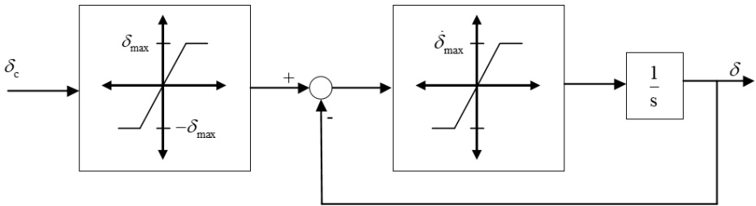

Hình 1.1. Sơ đồ khối hệ thống bánh lái

Trên thực tế vì những hạn chế về mặt kết cấu của tàu và đáp ứng của cụm điều khiển bánh lái nên góc bánh lái cũng như vận tốc góc bánh lái thường sẽ bị giới hạn bởi một giá trị nhất định. Vậy nên trong đề tài luận án này tác giả sẽ sử dụng mô hình toán học mô tả hệ thống bánh lái được đề nghị bởi Van Amerogen (1982). Mô hình này cung cấp những tác động quan trọng của hệ thống bánh lái trên thực tế:

Góc bánh lái tối đa: chuyển động của bánh lái được ràng buộc bởi điều $\mathrm{ki} \hat{\mathrm{en}} - \delta_{\max} \leq \delta \leq \delta_{\max} (\mathrm{d} \hat{\mathrm{o}})$

Ngoài ra vận tốc góc bánh lái cùng bị giới hạn bởi điều kiện sau: $- \dot { \delta } _ { \operatorname* { m a x } } \leq \dot { \delta } \leq \dot { \delta } _ { \operatorname* { m a x } }$ . Coi dòng chảy là không đổi và đồng nhất.

## 1.1.3. Phương pháp thử nghiệm xác định hệ số K, T

Quá trình chế tạo và thử nghiệm bộ điều khiển trên mô hình thực tế đòi hỏi ta phải thử nghiệm và tính toán được các hệ số K-T của mô hình Nomoto bậc nhất. Các hệ số này sau đó được sử dụng để thiết kế bộ điều khiển cho hệ thống lái tàu tự động (ví dụ như các hệ số $K _ { p } ,$ K<sub>i</sub> và $K _ { d }$ trong bộ điều khiển PID). Có nhiều phương pháp được đưa ra để xác định hai hệ số này. Tuy nhiên phổ biến nhất là phương pháp thử nghiệm điều động zig-zag của con tàu.

<!-- page: 114 -->

Sử dụng mô hình Nomoto bậc nhất và thực hiện một loạt điều động theo hình zig-zag. Dữ liệu thực nghiệm thu $\mathbf { v } \dot { \hat { \mathbf { e } } }$ sẽ được phân tích và mối quan hệ giữa các đặc trưng của phép thử zig-zag với các hệ số K-T sẽ được biểu diễn dưới dạng đồ thị. Ngược lại, từ những đồ thị này ta có thể tìm ra các hệ số K-T của mô hình Nomoto bậc nhất .

## 1.1.3.1. Điều động Zig-zag

Điều động zig-zag sử dụng mô hình Nomoto bậc nhất với các thông số của tàu mô hình như sau:

\- $\delta _ { \mathrm { a } }$ : Góc mở lớn nhất của bánh lái (độ);

\- $\delta _ { \mathrm { r } }$ : Góc bánh lái mà tại đó quỹ đạo con tàu là đường thẳng (độ);

\- $\dot { \delta }$ : Tốc độ bẻ lái (độ/s).

Các thông $s \hat { 0 }$ thu được từ dữ liệu thực nghiệm mô hình điều động zigzag:

\- $\mathbf { t } _ { \mathrm { p } }$ : Chu kỳ (s);

\- $\psi _ { \mathrm { g } }$ : Góc mũi tàu trung bình (độ);

$\psi _ { \mathrm { a } }$ : Sai lệch góc mũi tàu lớn nhất khỏi $\psi _ { g }   ( \mathrm { d } \hat { \mathbf { 0 } } )$

Để loại trừ sai $s \hat { 0 }$ do quán tính và độ mất ổn định của tàu, thì chu kỳ thứ ba của dữ liệu thực nghiệm sẽ được sử dụng để phân tích và xác định các thông số cần thiết cho mô hình điều động zig-zag.

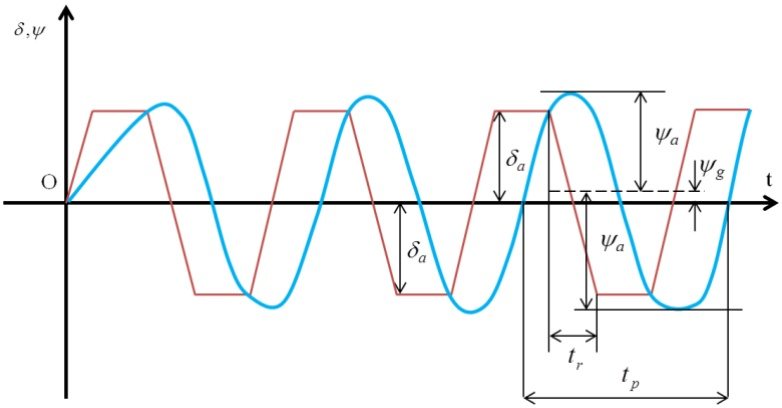

Hình 1.2. Thử nghiệm zig-zag lý tưởng

<!-- page: 115 -->

Theo tài liệu [46], quan hệ giữa các thông số thu từ dữ liệu thực nghiệm và hai hệ số K, T của mô hình bậc nhất Nomoto có dạng như sau:

$$
t _ {p} = t _ {p o} \left(1 + \frac {C _ {2}}{\left(\frac {\delta_ {a}}{\delta_ {r}}\right) ^ {2} - 1}\right) + \frac {1}{2} t _ {r} C _ {1}\tag{1.15}
$$

$$
\frac {\psi_ {\mathrm{a}}}{\delta_ {\mathrm{a}}} = \frac {\psi_ {\mathrm{a0}}}{\delta_ {\mathrm{a}}} + \frac {\mathrm{K1}}{2} \mathrm {t_ {r}} + \mathrm{KT} \delta_ {\mathrm{a}} ^ {2} \mathrm {C_ {3}} + \left(\frac {\delta_ {\mathrm{r}}}{\delta_ {\mathrm{a}}}\right) ^ {2} \mathrm {C_ {4}}\tag{1.16}
$$

$$
\frac {\psi_ {\mathrm{g}}}{\delta_ {\mathrm{r}}} = C _ {5} - 1, 0 9 \mathrm{K} \frac {1}{2} \mathrm{t} _ {\mathrm{r}}\tag{1.17}
$$

Trong đó

$\mathbf { t } _ { \mathrm { r } }   =   2 \delta _ { \mathrm { a } } \left/ \left| \dot { \delta } \right| \right.$ : Thời gian thực hiện bẻ lái;

$\mathbf { t _ { \mathrm { p o } } }$ : Chu kỳ điều động với $\left| \dot { \delta } \right|   =   \infty$ và $\delta _ { \mathrm { r } } =   0$

$\psi _ { \mathrm { a o } }$ : Biên độ góc mũi tàu với $\left| { \dot { \delta } } \right|   =   \infty$ và $\delta _ { \mathrm { r } } =   0$

$\mathrm{t}_{\mathrm{po}} / \mathrm{T}, \psi_{\mathrm{ao}} / \delta_{\mathrm{a}}, \mathrm{C}_{1}, \mathrm{C}_{2}, \mathrm{C}_{4}, \mathrm{C}_{5}$ : là các hàm theo tích K, T;

$C _ { 3 }$ : Hàm theo $\mathrm { T } \cdot \left| { \dot { \delta } } \right|$

## 1.1.3.2. Tính toán các hệ số K, T

Với các giá trị lý tưởng $\delta _ { \mathrm { a } } ,   | \dot { \delta } | ,   \psi _ { \mathrm { a } } ,   \psi _ { \mathrm { g } } ,   \mathrm { t } _ { \mathrm { p } }$ đã biết, thông $s \hat { 0 }$ cần tìm trong phương trình (1.15), (1.16) và (1.17) là K, T và $\delta _ { \mathrm { r } }$ . Các phương trình này có thể được giải bằng phương pháp lặp. Theo tài liệu [14], ta có thể sử dụng các giá trị gần đúng như sau:

$$
\begin{array}{c} \delta_ {r} \square \delta_ {a} \\ C _ {1} \approx 4 - 0, 2 5 K T \\ C _ {3} \approx 0 \end{array}\tag{1.18}
$$

Thay (4.18) vào phương trình (4.15) và (4.16), ta được:

$$
t _ {p o} = t _ {p} - 2 t _ {r} + 0, 1 2 5 K T t _ {r}\tag{1.19}
$$

<!-- page: 116 -->

$$
\frac {\psi_ {a 0}}{\delta_ {a}} = \frac {\psi_ {a}}{\delta_ {a}} - \frac {1}{2} K t _ {r}\tag{1.20}
$$

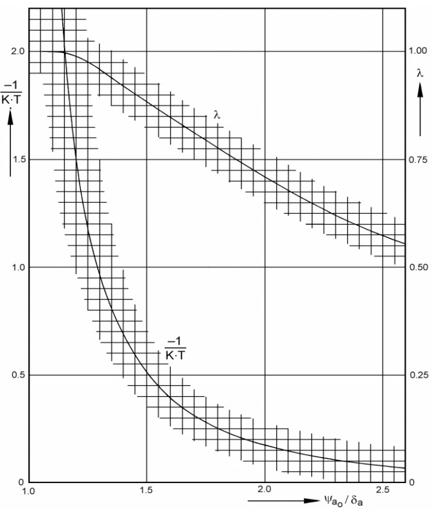

Hình 1.3. Quan hệ giữa hệ số với $\psi _ { \mathrm { a } } / \delta _ { \mathrm { a } }$ [13].

Ngoài ra, theo tài liệu [46] thì phương trình T được khai triển như sau:

$$
T = \frac {t _ {p o}}{4 \left(\frac {- 1}{K T} + \lambda\right)} = \frac {t _ {p} - 2 t _ {r} + 0 , 1 2 5 t _ {r} K T}{4 \left(\frac {- 1}{K T} + \lambda\right)}\tag{1.21}
$$

Trong đó, là hàm số theo . Cũng theo dẫn dắt trong tài liệu [46], $\psi _ { \mathrm { a } } / \delta _ { \mathrm { a } }$ là hàm $s \hat { 0 }$ theo (xem hình 1.3)

Như vậy, với các giá trị lý tưởng $\delta _ { \mathrm { a } } , \psi _ { \mathrm { a } } , \mathrm { t } _ { \mathrm { p } } , \mathrm { t } _ { \mathrm { r } }$ đã biết, các hệ số và có thể tính được từ (1.16), (1.17), (1.18) bằng một phép lặp đơn giản và nhanh chóng theo phương pháp sau:

Bước 1: Đoán $\psi _ { \mathrm { a o } }   /   \delta _ { \mathrm { a } }$ , b qua 0.5·K·t, trong phuong trình (1.17);

Bước 2: Tại giá trị $\psi _ { \mathrm { a o } }   /   \delta _ { \mathrm { a } }$ , hình 1.3 cho giá trị và ;

<!-- page: 117 -->

Bước 3: Thay giá trịvà vào phương trình (1.18) ta tính được giá trị;

Bước 4: Từ và suy ra ;

Bước 5: Sử dụng phương trình (1.17), lặp lại từ bước 2 với giá trị $\psi _ { \mathrm { a } } / \delta _ { \mathrm { a } }$ mới đến khi giá trị không thay đổi nữa.

## 1.1.3.3. Khảo sát thực nghiệm xác định hệ số K,T cho tàu mô hình

Từ kết quả thực nghiệm, hệ số K, T của mô hình bậc nhất Nomoto được tiến hành tính toán bằng phương pháp lặp đã giới thiệu ở phần 1.1.3.2 với các thông số đầu vào được rút ra từ thực nghiệm như sau:

$$
\delta_ {\mathrm{a}} = 2 0 ^ {\mathrm{o}}; \delta_ {\mathrm{r}} = 0 ^ {\mathrm{o}}; \psi_ {\mathrm{a}} = 2 8. 1 ^ {\mathrm{o}}; \psi_ {\mathrm{g}} = 1 ^ {\mathrm{o}}; \mathrm{t} _ {\mathrm{p}} = 1 8 \mathrm{s}; \mathrm{t} _ {\mathrm{r}} = 0. 4 \mathrm{s}
$$

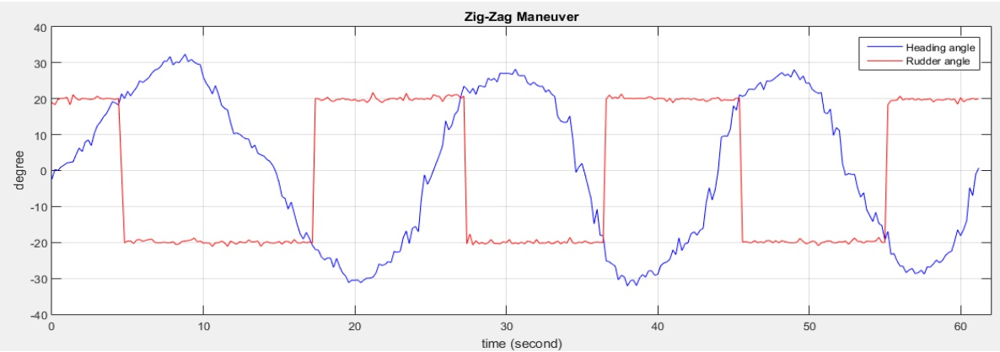

Hình 1.4. Kết quả thực nghiệm mô hình điều động zig-zag

Bảng 1.1. Hệ số K,T giải bằng phương pháp lặp

<table><tbody><tr><td rowspan="2">Lần</td><td>ao</td><td rowspan="2"></td><td rowspan="2">KT</td><td rowspan="2">T mới</td><td rowspan="2">K mới</td><td>ao</td><td rowspan="2">mới</td><td rowspan="2">KT mới</td></tr><tr><td>a</td><td>a mới</td></tr><tr><td>1</td><td>1.405</td><td>0.915</td><td>-1.496</td><td>2.704</td><td>-0.553</td><td>1.516</td><td>0.873</td><td>-2.067</td></tr><tr><td>2</td><td>1.516</td><td>0.873</td><td>-2.067</td><td>2.15</td><td>-0.656</td><td>1.536</td><td>0.867</td><td>-2.175</td></tr><tr><td>3</td><td>1.536</td><td>0.867</td><td>-2.175</td><td>2.22</td><td>-0.675</td><td>1.54</td><td>0.865</td><td>-2.176</td></tr></tbody></table>

<!-- page: 118 -->

Sau ba lần lặp thì ta có thể thấy giá trị K và T đã hội tu về $K = -0.675$ và T=2.22. Như vậy từ hai hệ số K, T của mô hình Nomoto bậc nhất tìm được nhờ phương pháp giải lặp ở trên thì ta có thể xác định được hàm truyền của tàu mô hình như sau:

$$
\frac {\psi (s)}{\delta (s)} \approx \frac {0 , 6 7 5}{s (1 + 3 , 2 2 s)}\tag{1.22}
$$

Hàm truyền của tàu mô hình (1.21) này sẽ được sử dụng để mô phỏng hệ thống điều khiển hướng tàu (máy lái tự động) trong thực nghiệm.

## 1.2. Hệ thống dẫn đường

## 1.2.1. Giới thiệu về hệ thống dẫn đường

Đối với các tàu biển hoạt động trên phạm vi lớn từ nước này sang nước khác thì việc điều khiển một con tàu chạy đúng theo một quỹ đạo định trước, và tránh các vật cản khác trên suốt chặng hành trình là một công việc hết sức khó khăn của thuyền trưởng. Cũng chính từ những khó khăn này mà hệ thống dẫn đường cho tàu biển đã được ra đời để kết hợp với các hệ thống lái tàu tự động để điều khiển con tàu chạy theo quỹ đạo mong muốn và hơn nữa là có thể tối ưu hành trình di chuyển về mặt thời gian và nhiên liệu tiêu hao. Hệ thống dẫn đường có nhiệm vụ xây dựng một quỹ đạo mong muốn để giúp tàu đi từ điểm xuất phát đến điểm đích cuối cùng và đi qua các điểm mốc quan trọng trên hành trình di chuyển (điểm chuyển hướng), ngoài ra hệ thống dẫn đường còn phải tính toán các tín hiệu về vị trí mong muốn, vận tốc và gia tốc để cung cấp cho hệ thống lái tàu tự động nhằm giúp cho con tàu bám theo quỹ đạo mong muốn. Quỹ đạo của con tàu sẽ được thiết lập theo tọa độ của các waypoint $\left( \mathbf{x}_{\mathrm{p}}, \mathbf{y}_{\mathrm{p}} \right) \in \mathbb{R}^2$ trong hệ trục tọa độ {n}.

Hệ thống dẫn đường tự động theo quỹ đạo (Path-following System) có thể được sử dụng với hai mục đích sau:

<!-- page: 119 -->

\- Điều khiển trọng tâm con tàu trùng với đường quỹ đạo đã thiết lập. Công việc này dựa trên các phép tính hình học phẳng trong đó các đoạn quỹ đạo mong muốn tạo bởi hai điểm chuyển hướng là những đoạn thẳng. Thuật toán dẫn đường Line-Of-Sight (LOS) là phương pháp hiệu quả và được sử dụng rộng rãi trong thực tế.

\- Điều khiển vận tốc con tàu theo thiết lập ở từng đoạn quỹ đạo.

Trong luận án, tác giả sử dụng thuật toán LOS để thiết kế hệ thống dẫn đường cho một con tàu chạy theo một quỹ định trước được tạo thành từ các đoạn thẳng và cung tròn. Vấn đề điều khiển vận tốc tàu được bỏ qua và coi như vận tốc mong muốn là hằng số trên các đoạn thẳng quỹ đạo.

## 1.2.2. Phương pháp xây dựng quỹ đạo mong muốn

Hệ thống dẫn đường dành cho các phương tiện di chuyển trên mặt nước nói chung hay tàu biển nói riêng thường được mô tả bằng các điểm chuyển hướng. Điểm chuyển hướn có thể được hiểu là các điểm mốc trên quỹ đạo mà con tàu cần phải đi qua để đi đến đích cuối cùng mà con tàu muốn đến. Các điểm chuyển hướng sẽ được lựa chọn dựa vào hiểu biết về hải trình và kinh nghiệm của người lái tàu thông qua một giao diện người dùng và được lưu trữ trong hệ thống dữ liệu. Bộ dữ liệu về điểm chuyển hướng sẽ được hệ thống dẫn đường sử dụng để xây dựng quỹ đạo mong muốn cho con tàu bám theo. Ngoài ra khi xây dựng quỹ đạo mong muốn cho con tàu thì hệ thống dẫn đường còn có thể kết hợp bộ dữ liệu điểm chuyển hướng và các thông tin khác chẳng hạn như thông tin về thời tiết và vật cản nhằm giúp con tàu có thể di chuyển an toàn, và tiết kiệm nhiên liệu hơn.

<!-- page: 120 -->

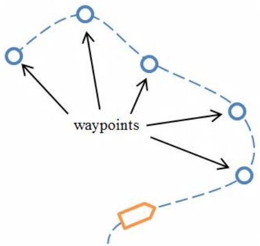

Hình 1.5. Quỹ đạo của con tàu mô tả bởi các điểm chuyển hướng (waypoint)

Hệ thống dữ liệu điểm chuyển hướng

Hiện nay trên thế giới có rất nhiều cách để mô tả quỹ đạo của một con tàu tuy nhiên phương pháp được sử dụng phổ biến nhất là sử dụng các điểm chuyển hướng và các điểm chuyển hướng được xác định trong hệ trục tọa độ {n} bởi hai tọa độ $\left( \mathbf { x } _ { \mathrm { k } } , \mathbf { y } _ { \mathrm { k } } \right)$ . Do đó, dữ liệu các điểm chuyển hướng $\mathrm { v } \dot { \hat { \mathbf { e } } }$ vị trí con tàu sẽ được lưu trữ dưới dạng như sau:

$$
\mathrm{wpt.pos} = \left\{\left(\mathrm{x} _ {0}, \mathrm{y} _ {0}\right), \left(\mathrm{x} _ {1}, \mathrm{y} _ {1}\right), \dots , \left(\mathrm{x} _ {\mathrm{n}}, \mathrm{y} _ {\mathrm{n}}\right) \right\}\tag{1.23}
$$

Ngoài ra, hệ thống các điểm chuyển hướng của một con tàu còn lưu trữ thêm các thông tin về vận tốc của con tàu cũng như góc mũi tàu $\psi _ { \mathrm { i } }$ . Các thông tin này sẽ lưu trong hệ thống các điểm chuyển hướng dưới dạng như sau:

$$
\text {wpt.speed} = \left\{\mathrm{U} _ {0}, \mathrm{U} _ {1},..., \mathrm{U} _ {\mathrm{n}} \right\}
$$

wpt.heading $\scriptstyle \left\{ \psi _ { 0 } , \psi _ { 1 } , \ldots , \psi _ { \mathrm { n } } \right\}$

Mô tả quỹ đạo của con tàu dựa trên các đoạn thẳng và cung tròn

Theo một kết quả nghiên cứu nổi tiếng của tác giả Dubins (1957) được trình bày trong tài liệu [1] thì con đường ngắn nhất (thời gian nhỏ nhất) đi qua các điểm chuyển hướng $\left( \mathrm { x } _ { \mathrm { i } } , \mathrm { y } _ { \mathrm { i } } , \psi _ { \mathrm { i } } \right)$ đối với một con tàu đang chuyển động với vận tốc không đổi Ulà con đường được tạo thành từ những đoạn thẳng và

<!-- page: 121 -->

cung tròn. Do đó, hệ thống dẫn đường cho tàu biển thường sử dụng các đoạn thẳng và cung tròn để nối các điểm chuyển hướng lại với nhau nhằm tạo nên quỹ đạo di chuyển mong muốn cho con tàu như hình 4.6.

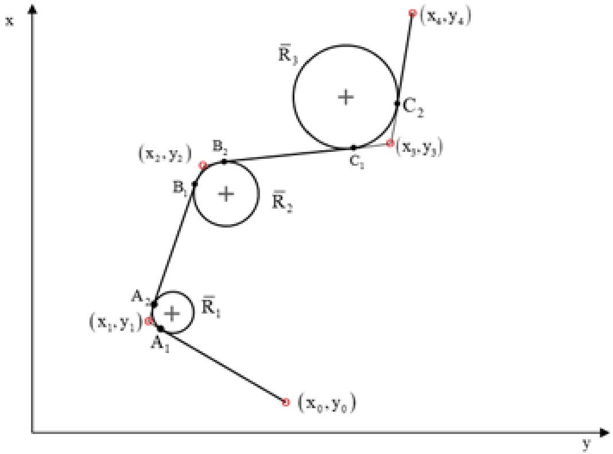

Hình 1.6. Quỹ đạo của con tàu mô tả bằng các đoạn thẳng và cung tròn

Hình 1.6 mô tả quỹ đạo mong muốn của một con tàu được thành từ 4 đoạn thẳng và 3 đường tròn nội tiếp với bán kính được ký hiệu $\overline { { \mathbf { R } } } _ { \mathrm { i } }$ . Con tàu sẽ bắt đầu di chuyển từ điểm chuyển hướng (waypoint 0) và di chuyển trên đường thẳng tạo thành từ điểm chuyển hướng waypoint 0 và waypoint 1. Khi con tàu tiến gần đến điểm chuyển hướng waypoint 1 thì con tàu sẽ tiến hành bẻ lái và di chuyển vào cung tròn bán kính $\overline { { \mathbf { R } } } _ { 1 }$ tại điểm $\mathbf { A } _ { 1 }$ và đi ra khỏi cung tròn tại điểm $\mathbf { A } _ { 2 }$ và đi vào đường thẳng tạo thành từ waypoint 1 và waypoint 2 và cứ như thế con tàu sẽ lần lượt đi qua các điểm $\mathbf { B } _ { 1 } , \mathbf { B } _ { 2 } , \mathbf { C } _ { 1 } , \mathbf { C } _ { 2 }$ và đi đến điểm đích cuối cùng waypoint 2.

<!-- page: 122 -->

Tuy nhiên, đối với các quỹ đạo được tạo ra bằng phương pháp này sẽ có một nhược điểm chính là vận tốc góc mũi tàu sẽ có một bước nhảy khi con tàu đến gần điểm giao giữa hai đường thẳng bởi vì vận tốc góc mũi tàu $\mathbf { r } _ { \mathrm { d } } =   0$ trên các đoạn thẳng, ngược lại trên các cung tròn nối hai đoạn quỹ đạo liên tiếp thì $\mathbf { r } _ { \mathrm { d } } { = } \mathbf { c o n s t }$ . Hơn nữa điều này cũng sẽ làm cho sai số bám quỹ đạo của con tàu tăng lên khi con tàu di chuyển gần đến giao điểm giữa hai đoạn thẳng. Mặc dù vậy do tính đơn giản và khả thi để thực nghiệm trong điều kiện thực tế nên trong đề tài luận văn này tác giả vẫn sẽ chọn phương pháp này để xây dựng quỹ đạo mong muốn cho con tàu.

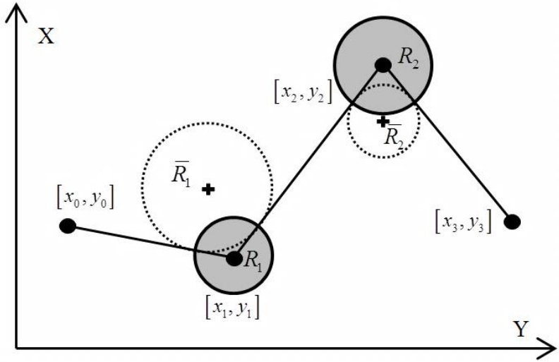

Hình 1.7. Bán kính cho phép tại mỗi điểm chuyển hướng

Ngoài ra, người vận hành tàu thường phải xác định một đường tròn với bán kính Ri xung quay mỗi điểm chuyển hướng để xác định vị trí con tàu tiến hành bẻ lái để di chuyển vào các cung tròn nhằm bám theo đoạn thẳng quỹ đạo kế tiếp. Khi đó, hệ thống điểm chuyển hướng của con tàu sẽ có thêm thành phần bán kính và được mô tả như sau:

$$
w p t. r a d i u s = \left\{R _ {0}, R _ {1},..., R _ {n} \right\}\tag{1.24}
$$

Dựa vào các phép tính hình học như trên hình 1.7 thì bán kính của các cung tròn có thể được xác định như sau:

<!-- page: 123 -->

(1.25)

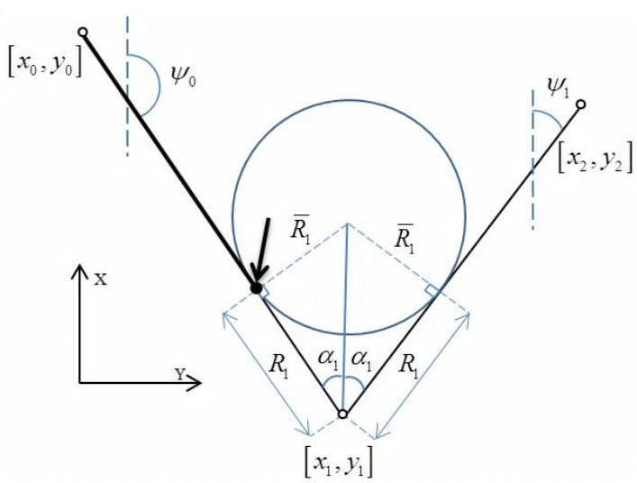

Hình 1.8. Bán kính cung tròn trên quỹ đạo mong muốn

## 1.2.3. Luật điều hướng Line-of-sight (LOS)

Giả sử một con tàu có tọa độ trong hệ trục tọa độ {n} di chuyển trong mặt phẳng nằm ngang và bám theo quỹ đạo mong muốn là một đoạn thẳng được tạo thành từ hai điểm chuyển hướng $\mathbf { p } _ { \mathrm { k } } ^ { \mathrm { n } } = \left[ \mathbf { x } _ { \mathrm { k } } , \mathbf { y } _ { \mathrm { k } } \right] ^ { \mathrm { T } }$ và $\mathbf { p } _ { \mathbf { k } + 1 } ^ { \mathrm { n } } = \left[ \mathbf { x } _ { \mathbf { k } + 1 } , \mathbf { y } _ { \mathbf { k } + 1 } \right] ^ { \mathrm { T } }$ như trong hình 1.8 thì vận tốc của con tàu và hướng đi sẽ được xác định như sau:

$$
U (t) = \sqrt {\dot {x} (t) ^ {2} + \dot {y} (t) ^ {2}}\tag{1.26}
$$

$$
\chi (t) = a \tan 2 (\dot {y} (t), \dot {x} (t)) \in [ - \pi , \pi ]\tag{1.27}
$$

Để xác định sai $s \hat { 0 }$ bám quỹ đạo của con tàu e(t) thì ta sẽ tiến hành chuyển tọa độ của con tàu trong hệ trục tọa độ {n} sang hệ trục tọa độ tham chiếu với gốc đặt tại waypoint $\mathbf { p } _ { \mathrm { k } } ^ { \mathrm { n } } = \left[ \mathbf { x } _ { \mathrm { k } } , \mathbf { y } _ { \mathrm { k } } \right] ^ { \mathrm { T } }$ và hệ trục tọa độ tham chiếu này quay quanh trục $\mathbf { Z _ { n } }$ của hệ trục tọa độ {n} một góc $\alpha _ { \mathrm { k } }$ được xác định như sau:

$$
a _ {k} = a \tan 2 \big (y _ {k + 1} - y _ {k}, x _ {k + 1} - x _ {k} \big)\tag{1.28}
$$

<!-- page: 124 -->

$$
\varepsilon (t) = R _ {p} (a _ {k}) ^ {T} \left[ p ^ {n} (t) - p _ {k} ^ {n} \right]\tag{1.29}
$$

trong đó:

ε(t) =[s(t),e(t)].

: là khoảng cách along-track.

e(t): là sai $s \hat { 0 }$ bám quỹ đạo.

Theo tài liệu [14] thì giá trị ma trận $\mathbf { R _ { \mathrm { p } } } ( \alpha _ { \mathrm { k } } ) ^ { \mathrm { T } }$ được tính như sau:

$$
R _ {p} \left(a _ {k}\right) ^ {T} = \left[ \begin{array}{c c} \cos a _ {k} & - \sin a _ {k} \\ \sin a _ {k} & \cos a _ {k} \end{array} \right]\tag{1.30}
$$

Kết hợp biểu thức (1.28) và (1.29), ta $\mathbf { c } \mathbf { \dot { o } }$ th $\dot { \hat { e } }$ xác định được sai $s \hat { 0 }$ bám quỹ đạo của con tàu như sau:

$$
e (t) = - \left[ x (t) - x _ {k} \right] \sin a _ {k} + \left[ y (t) - y _ {k} \right] \cos a _ {k}\tag{1.31}
$$

Như được giới thiệu ở phần Phụ lục 1.2.1 thì nhiệm vụ chính của hệ thống dẫn đường (Guidance) là tính toán các trạng thái mong muốn nhằm giúp cho con tàu có thể bám theo quỹ đạo được định trước, điều này cũng tương đương với việc hệ thống dẫn đường phải làm cho sai $s \hat { 0 }$ bám quỹ đạo e(t) tiến $\mathrm{v}\dot{\hat{\mathbf{c}}} 0 \left( \lim_{\mathbf{t} \to \infty} \mathbf{e}(\mathbf{t}) = 0 \right)$ . Để thực hiện được điều này thì hệ thống dẫn đường LOS sử dụng nguyên lý Lookahead-based Steering để tính toán hướng đi mong muốn $\chi _ { \mathrm { d } }$ và từ đó tính ra góc mũi tàu mong muốn $\psi _ { \mathrm { d } }$ cung cấp cho hệ thống máy lái tự động. Hệ thống máy lái tự động sẽ sử dụng $\psi _ { \mathrm { d } }$ như là tín hiệu điều khiển đầu vào nhằm điều khiển con tàu bám theo quỹ đạo mong muốn và làm cho sai $s \hat { 0 }$ bám quỹ đạo của con tàu giảm dần về 0.

<!-- page: 125 -->

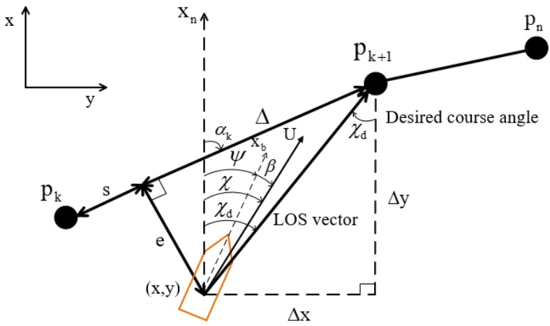

Hình 1.9. Luật điều hướng LOS

Phương pháp điều khiển tàu bằng nguyên lý Lookahead-based Steering sẽ làm cho sai $s \hat { 0 }$ bám quỹ đạo e(t) tiến về 0 bằng cách hướng vector vận tốc của con tàu đến điểm chuyển hướng kế tiếp trên quỹ đạo mà con tàu cần phải đi đến hay cũng chính là điểm chuyển hướng $\mathbf { p } _ { \mathrm { k + 1 } } ^ { \mathrm { n } }$ trên đoạn thẳng quỹ đạo mà con tàu đang bám theo như hình 1.9.

Theo tài liệu [25] thì hướng đi mong muốn $\chi _ { \mathrm { d } }$ theo nguyên lý Lookahead-based Steering sẽ được tách thành hai thành phần như sau:

$$
\chi_ {d} = \chi_ {p} + \chi_ {r} (e)\tag{1.32}
$$

Trong đó $\chi _ { \mathrm { p } }$ là góc tiếp tuyến của đoạn thẳng quỹ đạo mong muốn còn $\chi _ { \mathrm { r } }$ là góc tương quan giữa vận tốc và quỹ đạo chuyển. Góc $\chi _ { \mathrm { r } }$ được thêm vào $\chi _ { \mathrm { d } }$ nhằm đảm bảo rằng vector vận tốc U của con tàu luôn hướng $\mathbf { v } \dot { \hat { \mathbf { e } } }$ điểm chuyển hướng $\mathbf { p } _ { \mathrm { k + 1 } } ^ { \mathrm { n } }$

$$
\chi_ {p} = a _ {k}\tag{1.33}
$$

$$
\chi_ {r} (e) = \arctan \left(- \frac {e (t)}{\square}\right)\tag{1.34}
$$

<!-- page: 126 -->

Trong đó là khoảng cách từ hình chiếu của điểm $\mathbf { p } ^ { \mathrm { n } } ( \mathrm { t } )$ trên đoạn thẳng quỹ đạo mong muốn cho đến điểm chuyển hướng $\mathbf { p } _ { \mathrm { k + 1 } } ^ { \mathrm { n } }$

Từ (1.31), (1.32) và (1.33) thì ta có thể tính được hướng đi mong muốn (desired heading) theo nguyên lý Lookahead-based Steering như sau:

$$
\psi_ {d} = \chi_ {d} - \beta = \chi_ {p} + \chi_ {r} - \beta\tag{1.35}
$$

Trong đó $\beta = \arcsin \left( { \frac { \mathbf { v } } { \mathbf { U } } } \right)$ là góc trượt của con tàu. Tuy nhiên vì $\textbf { v } \boxdot \textbf { U }$ nên ta có thể xtác giả như $\beta \approx 0$

Khi đó, (1.35) được viết lại thành:

$$
\psi_ {d} = \chi_ {p} + \chi_ {r} (e)\tag{1.36}
$$

## 1.2.4. Bán kính đường tròn giới hạn chuyển hướng tàu

Trong quá trình bám theo đoạn quỹ đạo mong muốn, nếu như con tàu đi vào bên trong đường tròn giới hạn bán kính có tâm là điểm chuyển hướng $\left( \mathbf { x } _ { \mathrm { n } } , \mathbf { y } _ { \mathrm { n } } \right)$ thì hệ thống lựa chọn điểm chuyển hướng sẽ phát hiện và ra lệnh cho hệ thống dẫn đường (Guidance System) nhằm tính toán các thông số cần thiết giúp tàu chuyển hướng nhằm bám theo đoạn thẳng quỹ đạo mong muốn kế tiếp. Hay nói cách khác, lúc này điểm chuyển hướng có tọa độ $\left( \mathbf { X } _ { \mathrm { n + 1 } } , \mathbf { y } _ { \mathrm { n + 1 } } \right)$ sẽ được chọn làm điểm chuyển hướng mong muốn tiếp theo mà con tàu cần hướng đến nếu tọa độ con tàu thỏa mãn điều kiện sau:

$$
\left[ x _ {n} - x (t) \right] ^ {2} + \left[ y _ {n} - y (t) \right] ^ {2} \leq R _ {n} ^ {2}\tag{1.37}
$$

Theo [25] thì bán kính $\mathtt { R _ { n } }$ có thể được như sau:

$$
R _ {n} = 2 \mathrm{L} _ {\mathrm{OA}}\tag{1.38}
$$

Trong đó $\mathrm { L _ { O A } }$ là chiều dài toàn bộ của tàu như trong hình 1.10.

<!-- page: 127 -->

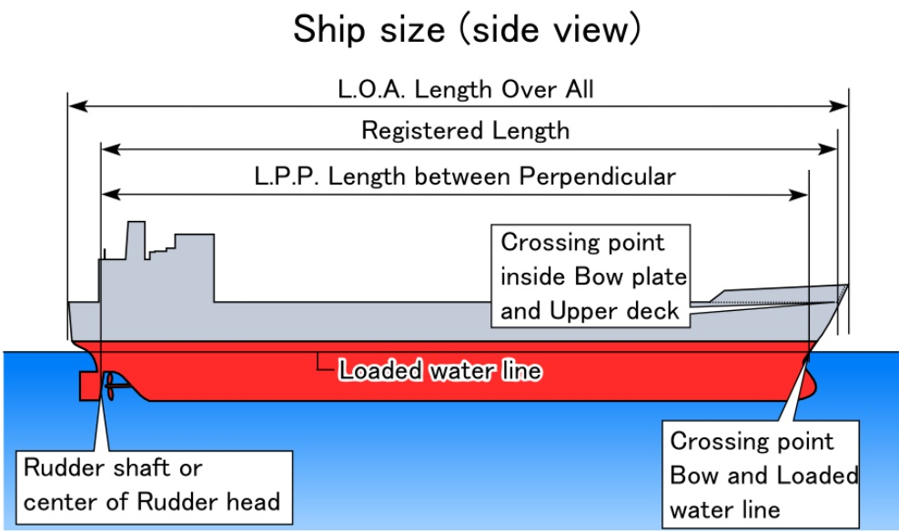

Hình 1.10. Chiều dài toàn bộ $\mathrm { L o A }$ của con tàu

<!-- page: 128 -->

# PHỤ LỤC 2 MÃ CODE MATLAB CHO MÔ HÌNH TÀU MARINER

```matlab
function [xdot,U] = mariner(x,ui,U0)
% [xdot,U] = mariner(x,ui) returns the speed U in m/s (optionally) and
% the time derivative of the state vector: x = [ u v r x y psi delta n ]'
% for the Mariner class vessel L = 160.93 m, where
% u      = perturbed surge velocity about Uo (m/s)
% v      = perturbed sway velocity about zero (m/s)
% r      = perturbed yaw velocity about zero (rad/s)
% x      = position in x-direction (m)
% y      = position in y-direction (m)
% psi    = perturbed yaw angle about zero (rad)
% delta = actual rudder angle (rad)
% The inputs are :
% ui      = commanded rudder angle (rad)
% U0      = nominal speed (optionally). Default value is U0 = 7.7175 m/s =
% 15 knots.
% Reference: M.S. Chislett and J. Stroem-Tejsen (1965). Planar Motion
%Mechanism Tests and Full-Scale Steering and Maneuvering Predictions for
%a Mariner Class Vessel,
%Technical Report Hy-5, Hydro- and Aerodynamics Laboratory, Lyngby,
% Denmark.
% Author: Trygve Lauvdal
% Date: 12th May 1994
% Revisions: 19th July 2001 (Thor I. Fossen): added input/ouput U0 and U,
%changed order of x-vector
% 20th July 2001 (Thor I. Fossen): replaced inertia matrix
with correct values
% 11th July 2003 (Thor I. Fossen): max rudder is changed from
% 30 deg to 40 deg to satisfy IMO regulations for 35 deg rudder execute
% Check of input and state dimensions
if (length(x) ~= 7),error('x-vector must have dimension 7 !'); end
if (length(ui) ~= 1),error('ui must be a scalar input!'); end
if nargin==2, U0 = 7.7175; end
% Normalization variables
L = 160.93;
```

<!-- page: 129 -->

```matlab
U = sqrt((U0 + x(1))^2 + x(2)^2);
% Non-dimensional states and inputs
delta_c = -ui;    % delta_c = -ui such that positive delta_c -> positive r
u      = x(1)/U;
v      = x(2)/U;
r      = x(3)*L/U;
psi   = x(6);
delta = x(7);

% Parameters, hydrodynamic derivatives and main dimensions
delta_max  = 40;          % max rudder angle        (deg)
Ddelta_max = 5;          % max rudder derivative (deg/s)

m  = 798e-5;
Iz = 39.2e-5;
xG = -0.023;

Xudot =  -42e-5;    Yvdot =  -748e-5;    Nvdot = 4.646e-5;
Xu      = -184e-5;    Yrdot =-9.354e-5;    Nrdot = -43.8e-5;
Xuu   = -110e-5;    Yv      = -1160e-5;    Nv     =  -264e-5;
Xuuu  = -215e-5;    Yr      =  -499e-5;    Nr     =  -166e-5;
Xvv   = -899e-5;    Yvvv = -8078e-5;    Nvvv  =  1636e-5;
Xrr   =  18e-5;    Yvvr = 15356e-5;    Nvvr  = -5483e-5;
Xdd   =  -95e-5;    Yvu   = -1160e-5;    Nvu   =  -264e-5;
Xudd  = -190e-5;    Yru   =  -499e-5;    Nru   =  -166e-5;
Xrv   =  798e-5;    Yd      =  278e-5;    Nd     =  -139e-5;
Xvd   =  93e-5;    Yddd  =  -90e-5;    Nddd  =   45e-5;
Xuvd  =  93e-5;    Yud   =  556e-5;    Nud   =  -278e-5;
Yuud   =  278e-5;    Nuud   =  -139e-5;
Yvdd   =  -4e-5;    Nvdd   =   13e-5;
Yvvd   =  1190e-5;    Nvvd   =  -489e-5;
Y0      =  -4e-5;    N0     =   3e-5;
Y0u   =  -8e-5;    N0u   =   6e-5;
Y0uu   =  -4e-5;    N0uu   =   3e-5;
```

% Masses and moments of inertia

m11 = m-Xudot;

m22 = m-Yvdot;

<!-- page: 130 -->

```matlab
m23 = m*xG-Yrdot;
m32 = m*xG-Nvdot;
m33 = Iz-Nrdot;

% Rudder saturation and dynamics
if abs(delta_c) >= delta_max*pi/180,
    delta_c = sign(delta_c)*delta_max*pi/180;
end
delta_dot = delta_c - delta;
if abs(delta_dot) >= Ddelta_max*pi/180,
    delta_dot = sign(delta_dot)*Ddelta_max*pi/180;
end
% Forces and moments
X = Xu*u + Xuu*u^2 + Xuuu*u^3 + Xvv*v^2 + Xrr*r^2 + Xrv*r*v + Xdd*delta^2
+...
    Xudd*u*delta^2 + Xvd*v*delta + Xuvd*u*v*delta;

Y = Yv*v + Yr*r + Yvvv*v^3 + Yvvr*v^2*r + Yvu*v*u + Yru*r*u + Yd*delta +
...
    Yddd*delta^3 + Yud*u*delta + Yuud*u^2*delta + Yvdd*v*delta^2 + ...
    Yvvd*v^2*delta + (Y0 + Y0u*u + Y0uu*u^2);

N = Nv*v + Nr*r + Nvvv*v^3 + Nvvr*v^2*r + Nvu*v*u + Nru*r*u + Nd*delta +
...
    Nddd*delta^3 + Nud*u*delta + Nuud*u^2*delta + Nvdd*v*delta^2 + ...
    Nvvd*v^2*delta + (N0 + N0u*u + N0uu*u^2);
% Dimensional state derivative
detM22 = m22*m33-m23*m32;
xdot = [          X*(U^2/L)/m11
    -(m33*Y+m23*N)*(U^2/L)/detM22
    (-m32*Y+m22*N)*(U^2/L^2)/detM22
    (cos(psi)*(U0/U+u)-sin(psi)*v)*U
    (sin(psi)*(U0/U+u)+cos(psi)*v)*U
        r*(U/L)
        delta_dot
%%%%%%%%%%%%%
% END OF PROGRAM
%%%%%%%%%%%%
```

<!-- page: 131 -->

# PHỤ LỤC 3 MÃ CODE MATLAB CHO BỘ ĐIỀU KHIỂN PID NƠ-RON LAN TRUYỀN NGƯỢC

```matlab
% PID control based on Back Propagation neuron network for Mariner Sh
Heading Regulation
%%%%
% Simulation on computer
% This control method uses NN1 for approximating the ship model,
% and NN2 for outputing Kp, Ki, Kd (NN1 và NN2)
% - MOMENTUM in learning is used for NN1
% Author: NGUYEN PHUNG HUNG & VO HONG HAI
%%%%
clc;
clear;          % Clear all variables in memory
% The BPNN-PID Controller is of the form (4 - 5 - 3):
% (4 input norons, 5 hidden norons, 3 output noron)
IN = 6; H = 7; Out = 3;                  %NN Structure
% Input layer consists of 4 norons with unity weights and zero bias,
% include: reference course (psi_r), actual course(psi), actual course
%(error) and d(error)/dt
% Backpropagation algorithm:
%delta(wij(k)) = - eta*(dEk/dwij)+alfa*delta(wij(k-1))
eta = 0.5; % learning rate
alfa = 0.05;% momentum coefficient
% We start executing the controller with relative small weights:
W21 = rands(H,IN)*0.00001; % Set random hidden layer weights
W32 = rands(Out,H)*0.00001;% Set random output layer weights

% x = [ u v r x y psi delta]'
x = zeros(7,1); % Set initial state of the ship
% delta=x(7);
delta_1=0;
delta_2=0; %rudder angle at k-1,..., k-5
delta_3=0;
```

<!-- page: 132 -->

```matlab
psi_1=0;
psi_2=0;% actual heading at k,k-1,.., k-3

error_1=0; % heading error at k,k-1,..,k-3
error_2=0;
error_3=0;
h=0.1;          % Sampling time for integration (integration step size)
k=1;            % This is time's index (not time, its index).
t=0;            % Reset time to zero
N    = 150;
%==================================>
ro_w    = 1.5;
lamda_w = 1.5;
beta_w  = 0.3;

kp_1 = 0;
ki_1 = 0;
kd_1 = 0;

r    = 0;

d_psi_dot_1 =0;
d_psi_dot_2 =0;

psi_dot_1   =0;
psi_dot_2   =0;
psi_dot_3   =0;
T           = 10;
rd_1    = 0;     % Desired yaw rate calculated by reference model
psi_d_1 = 0;
Z_sum = 0;
Z_psi_1=0;
E1_1 = 0;
E1_2 = 0;
E1_3 = 0;

net_in=zeros(IN,1);
```

<!-- page: 133 -->

```matlab
%-----------------------------------------------------------------------
% For reference model:
z = 1;          % relative damping ratio
w = 0.05;          % natural frequency
damper = 1;      % nonlinear damping coeff.
%-----------------------------------------------------------------------
Twv    = 50;        % period of wind velocity
Twd    = 6;        % period of wind direction
U0     = 7.7175; % nominal speed. Default value is U0 = 7.7175 m/s = 15
                      % knots.
U       = U0;
t_final = 9000;
****************************************************************************************
% START SIMULATION:
% disp('Simulating PID based on BPNN')
for k=1:t_final
    t=k*h;
%   psi_r(k)=20*(pi/180);
% Firstly, we define the reference input psi_r (desired heading)
    if t<300, psi_r(k) = 25*(pi/180); end    % Desired heading is 20 deg
    if t>=300, psi_r(k) = -25*(pi/180); end % Desired heading is -20 deg
    if t>600, psi_r(k) = 25*(pi/180); end    % Desired heading is 20 deg
                                % Sensor noise for the heading
                                % sensor with a uniform
                                % distribution on[-0.01,+0.01]
                                % deg.
                                % s(k) = 0.01*(pi/180)*(2*rand - 1);
    s(k) = 0;               % This allow us to remove the noise
    psi(k) = x(6) + s(k); % Heading of the ship with sensor noise
    %r(k) = x(3);            % This is perturbed yaw velocity about zero
                                % (rad/s) at time step k
    delta_a(k) = x(7);
%-----------------------------------------------------------------------
% Use reference model to produce desired heading psi_d(k). This is
% reference model with nonlinear damping:(Fossen 2002)
    psi_d_dot = rd_1;
    rd_dot     = w^2*(psi_r(k)-psi_d_1) - 2*z*w*rd_1 -
damper*abs(rd_1)*rd_1;
    rd(k)       = rd_1 + h*rd_dot;
```

<!-- page: 134 -->

```matlab
psi_d(k) = psi_d_1 + h*psi_d_dot;
%-------- wind -------------------
if Twv==50
    Twv = 0;
    if Twd==6
        Twd = 0;
        Windir = (180/pi)*(inf2ber(60*rand(1)*pi/180) + psi(k));
    end
    Twd = Twd + 1;
[wind,V_w] = WindGen2(psi(k),Windir,U,h);
end
Twv = Twv + 1;
wdr(k) = Windir; wve(k) = V_w;
%-------------------
    error(k) = psi_d(k) - psi(k);          % This is heading error
    psi_dot(k) = psi(k)- psi_1;
    d_psi_dot(k)= psi_dot(k) - psi_dot_1;
% Z_psi(k) = h*(Z_psi_1 + error(k));
    Z_psi(k) = Z_psi_1 + error(k);
    if k>=T+1
        Z_sum = 0;
        for ii=1:T
            Z_sum = Z_sum + Z_psi(k-ii);
        end
    end
%--------Output of NN-------------------
Oi = mlnnc(Out,H,IN,net_in,W21,W32);
kp(k) = 50*Oi(1);
ki(k) = 10*Oi(2);
kd(k) = 10*Oi(3);
%----------
%------PID Command-------------------
delta(k) = delta_a(k) + (kp(k)+ki(k)+kd(k))*error(k)...
                -(kp(k)+2*kd(k))*error_1...
                + kd(k)*error_2;
%----------

xx(1) = error_1;
xx(2) = error_2;
xx(3) = error_3;
```

<!-- page: 135 -->

```matlab
xx(4) = error(k) - error_1;
xx(5) = error_1 - error_2;
xx(6) = error_2 - error_3;
net_in = [xx(1);xx(2);xx(3);xx(4);xx(5);xx(6)];
%-----------------------------------------------------------------------
E = [error(k) sign(Z_psi(k))*Z_psi(k) error(k)-error_1];
%-----------------------------------------------------------------------
clc;
fprintf('Simulating PID based on BPNN...please wait!\n*Counter = %d (%d)\n',k,t_final-k);
%-----------------------------------------------------------------------
    if delta(k)>= 35*(pi/180)    %Restricting the output of controller
        delta(k)=35*(pi/180);
    end
    if delta(k)<=-35*(pi/180)
        delta(k)=-35*(pi/180);
    end
%-----------------------------------------------------------------------
% Next we use 2nd order Euler method to calculate ship state:
    [xdot,U] = mariner3(x,delta(k),U0,wind);
%       xdot = mariner(x,delta(k));
    x      = euler2(xdot,x,h);                  % Calculated next state
%==================================================================>
% NN Training
Moment21 = alfa*W21;
Moment32 = alfa*W32;
[W21,W32] = bpnnTrain(h,eta,N,Out,H,IN,net_in,E,0,0,...
    ro_w,lamda_w,beta_w);
W21 = W21 + Moment21;
W32 = W32 + Moment32;
%-----------------------------------------------------------------------
%Parameters Update
kp_1 = kp(k);
ki_1 = ki(k);
kd_1 = kd(k);
% E1_3 = E1_2;
% E1_2 = E1_1;
% E1_1 = E1;
```

<!-- page: 136 -->

```matlab
delta_3 = delta_2;
delta_2 = delta_1;
delta_1 = delta(k);
psi_2    = psi_1;
psi_1    = psi(k);

psi_dot_3=psi_dot_2;
psi_dot_2=psi_dot_1;
psi_dot_1=psi_dot(k);

% Z_psi_1 = Z_psi(k);
d_psi_dot_2 = d_psi_dot_1;
d_psi_dot_1 = d_psi_dot(k);

error_3 = error_2;
error_2 = error_1;
error_1 = error(k);

psi_d_1 = psi_d(k);
rd_1      = rd(k);
time(k) = t;
end
% Squared sum of heading error and rudder angles
E_psi = 0;
E_rudder = 0;
for i=1:k
    E1(i) = (psi_d(i)-psi(i))^2;
    E(i) = delta_a(i)^2;
    E_psi = E_psi + E1(i);
    E_rudder = E_rudder + E(i);
end
E_psi
E_rudder
%%%%%%%%%%%%
% Plot the results:
% Convert from radian to degree
psi    = psi*(180/pi);
```

<!-- page: 137 -->

```matlab
psi_r = psi_r*(180/pi);
psi_d = psi_d*(180/pi);
error = error*(180/pi);
psi_dot      = psi_dot*(180/pi);
% psi_dot_hat = psi_dot_hat*(180/pi);
d_psi_dot   = d_psi_dot*(180/pi);
delta = delta*(180/pi);
%---------------------------------------------------
figure(1);
clf;
subplot(211)
plot(time,psi,'k-',time,psi_r,'k--',time,psi_d,'b:')
title('Ship heading (solid) and desired ship heading (dashed),deg')
legend('Ship heading','Reference heading',0)
grid on
subplot(212)
plot(time,delta,'k-')
title('Rudder angle (\delta),deg')
grid on
%---------------------------------------------------
figure(2);
clf;
subplot(311);
plot(time,kp,'r');
xlabel('time(s)');ylabel('kp');
title('KP')
grid on
subplot(312);
plot(time,ki,'g');
xlabel('time(s)');ylabel('ki');
title('KI')
grid on
subplot(313);
plot(time,kd,'b');
xlabel('time(s)');ylabel('kd');
title('KD')
grid on
%---------------------------------------------------
figure(3)
```

<!-- page: 138 -->

```matlab
clf
subplot(311)
plot(time,error,'k-')
title('Course error (deg)')
grid on
subplot(312)
plot(time,psi_dot,'k-')
title('Rate of turn (deg/s)')
grid on
subplot(313)
plot(time,d_psi_dot,'k-')
title('Turning accelerator (deg/s^2)')
grid on
%%%%%%%%%%%%
% END OF PROGRAM
%%%%%%%%%%%%
```
