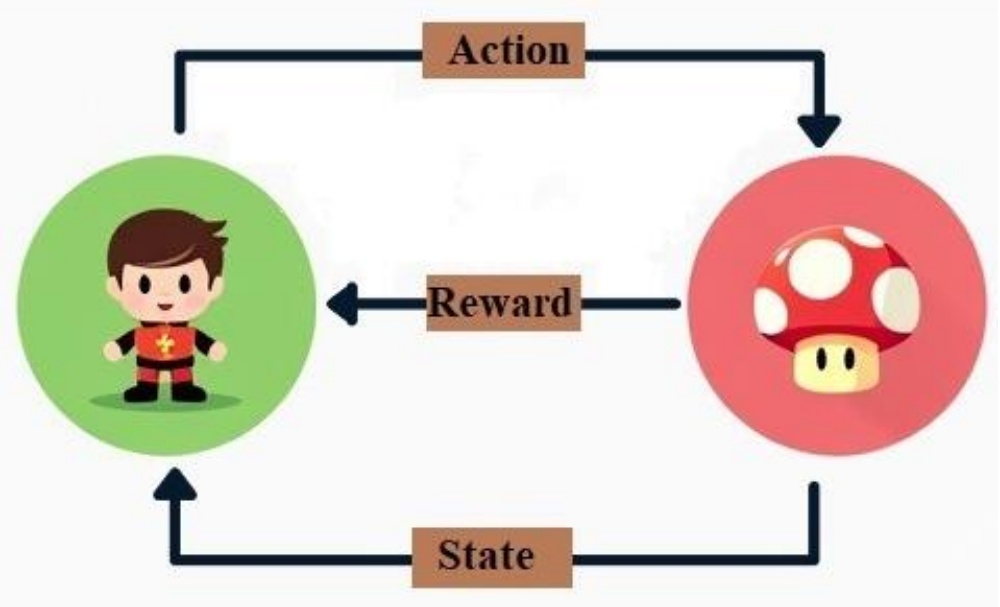
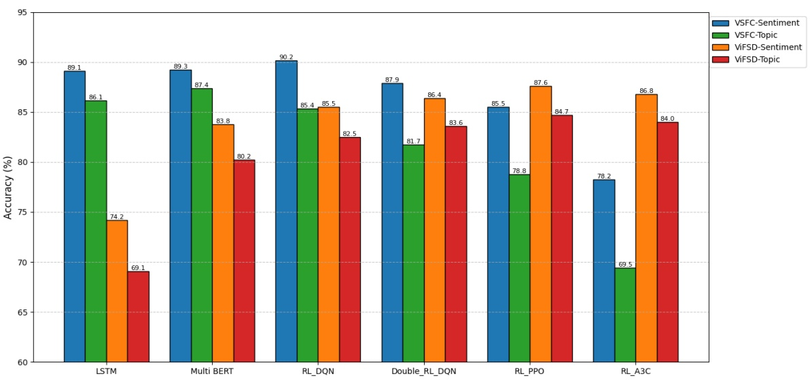
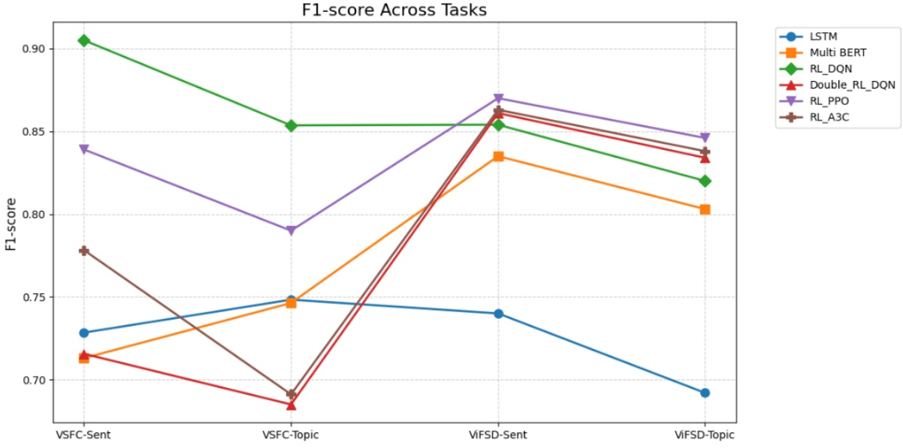
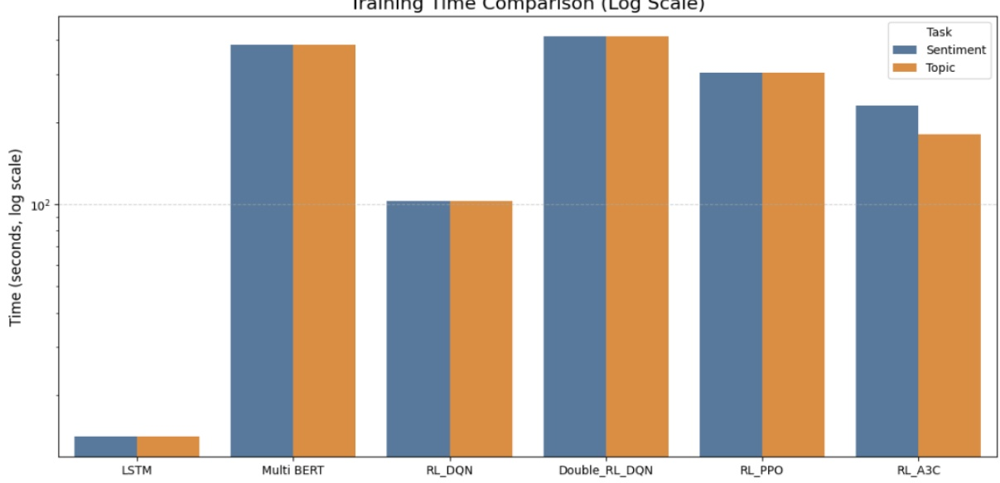

<!-- page: 1 -->

**HỌC VIỆN CÔNG NGHỆ BƯU CHÍNH VIỄN THÔNG**


**Trương Tuấn Anh**

# ỨNG DỤNG HỌC TĂNG CƯỜNG TRONG PHÂN TÍCH CẢM XÚC THEO CHỦ ĐỀ

# ĐỀ ÁN TỐT NGHIỆP THẠC SĨ KỸ THUẬT (Theo định hướng ứng dụng)

HÀ NỘI - 2025

<!-- page: 2 -->

**HỌC VIỆN CÔNG NGHỆ BƯU CHÍNH VIỄN THÔNG**


**Trương Tuấn Anh**

# ỨNG DỤNG HỌC TĂNG CƯỜNG TRONG PHÂN TÍCH CẢM XÚC THEO CHỦ ĐỀ

CHUYÊN NGÀNH : KHOA HỌC MÁY TÍNH MÃ SỐ 8.48.01.01

# ĐỀ ÁN TỐT NGHIỆP THẠC SĨ KỸ THUẬT (Theo định hướng ứng dụng)

**NGƯỜI HƯỚNG DẪN KHOA HỌC TS. NGUYỄN THỊ MAI TRANG**

HÀ NỘI - 2025

<!-- page: 3 -->

## LỜI CẢM ƠN

Trong quá trình thực hiện và hoàn thành đề án tốt nghiệp này, ngoài sự nỗ lực cố gắng của bản thân em còn nhận được sự giúp đỡ tận tình, động viên của các thầy cô giáo, bạn bè và người thân. Qua trang viết này, em xin gửi lời cảm ơn sâu sắc đến những người đã giúp đỡ em trong thời gian học tập, nghiên cứu vừa qua. Đầu tiên, em xin cảm ơn chân thành đến quý thầy cô giáo trong Học viện Công nghệ Bưu chính Viễn thông, các thầy cô giáo trong Khoa Đào tạo Sau Đại học, Khoa Công nghệ Thông tin nói chung, chuyên ngành Công nghệ Phần mềm nói riêng đã tận tình giúp đỡ, dạy dỗ, hướng dẫn và truyền đạt cho em những kiến thức bổ ích trong năm học vừa qua Đặc biệt, em vô cùng biết ơn TS. Nguyễn Thị Mai Trang, người đã trực tiếp định hướng, chỉ dẫn, dìu dắt em thực hiện đồ án, giúp em có thêm kiến thức về mặt chuyên môn cũng như thực tế cuộc sống và tạo mọi điều kiện giúp đỡ em trong suốt quá trình làm đồ án. Cuối cùng em xin gửi lời cảm ơn đến bố mẹ em, gia đình cùng bạn bè đã luôn động viên, cổ vũ và đóng góp ý kiến trong quá trình học tập, nghiên cứu cũng như quá trình làm đồ án tốt nghiệp Mặc dù em đã rất cố gắng rèn luyện bản thân nhưng trong quá trình thực hiện và nghiên cứu đề tài này khó tránh khỏi thiếu sót, em rất mong nhận được sự chỉ bảo, góp ý của thầy cô giáo và các bạn. Em xin chân thành cảm ơn!

Hà Nội, ngày tháng năm 2025

**Trương Tuấn Anh**

<!-- page: 4 -->

## LỜI CAM ĐOAN

Tôi cam đoan rằng luận văn: “Ứng dụng học tăng cường trong phân tích cảm xúc theo chủ $d \dot { e } ^ { \mathrm { { s s } } }$ là công trình nghiên cứu của chính tôi.

Những kết quả nghiên cứu được trình bày trong luận văn là công trình của riêng của tôi dưới sự hướng dẫn của TS. Nguyễn Thị Mai Trang.

Tôi cam đoan các số liệu, kết quả nêu trong luận văn là trung thực và chưa từng được công bố trong công trình nghiên cứu nào khác.

Không có bất cứ thông tin nào của người khác được sử dụng trong luận văn này mà không được trích dẫn theo đúng quy định.

Hà Nội, ngày tháng năm 2025

Học viên thực hiện luận văn

**Trương Tuấn Anh**

<!-- page: 5 -->

## MỤC LỤC

- LỜI CẢM ÔN..................i
- LỜI CAM ĐOAN..................ii
- DANH MỤC BẰNG..................v
- DANH MỤC HÌNH..................vi
- I. MỞ ĐẦU..................1
- 1. Lý do chọn đề tài..................1
- 2. Tổng quan về vấn đề nghiên cứu..................2
- 3. Mục đích nghiên cứu..................4
- 4. Đối tượng và phạm vi nghiên cứu..................4
- 5. Phương pháp nghiên cứu..................5
- II. NỘI DUNG..................7
- Chương 1: Tổng quan về bài toán..................7
- 1.1 Giới thiệu bài toán..................7
- 1.2 Phương pháp giải quyết bài toán..................8
- 1.3 Thách thức hạn chế gặp phải..................10
- 1.4 Mục tiêu..................14
- 1.5 Kết luận chương..................15
- CHƯƠNG 2: CỔ SỐ KIỂN THỨC..................16
- 2.1 Tổng quan về học tăng cường (Reinforcement Learning)..................16
- 2.1.1 Giới thiệu..................16
- 2.1.2 Các thành phần chính..................17
- 2.1.3 Mô hình toán học..................20
- 2.1.4 Phân loại thuật toán RL trong ABSA..................20
- 2.2 Phân loại ý kiến và nhận diện chủ đề..................23
- 2.2.1 Bối cảnh và Tầm quan trọng của bài toán..................23
- 2.2.2 Nhận diện Chủ đề (Aspect Extraction - AE)..................25
- 2.2.3 Phân loại Cảm xúc theo Chủ đề (Aspect Sentiment Classification - ASC) 26
- 2.2.4 Hướng tiếp cận dựa trên Học tăng cường (Reinforcement Learning - RL) 27
- 2.3 Kết luận chương..................28
- CHƯƠNG 3: THỰC NGHIỆM VÀ ĐÁNH GIÁ KẾT QUẢ..................29
- 3.1 Mô tả bộ dữ liệu..................29

<!-- page: 6 -->

- 3.2 Xây dựng mô hình ....34
- 3.2.1 Môi trường và Cấu hình Thực nghiệm Chung ....34
- 3.2.2 Mô hình RL\_DQN (Deep Q-Learning Network)....34
- 3.2.3 Mô hình RL\_PPO (Proximal Policy Optimization) ....43
- 3.2.4 Mô hình RL\_A3C (Asynchronous Advantage Actor-Critic)....50
- 3.3 Đánh giá kết quả....57
- 3.4 Kết luận chương ....64
- KÊT LUẬN ....66
- TÀI LIỆU THAM KHẢO ....69

<!-- page: 7 -->

## DANH MỤC BẢNG

- Bảng 2.1 Bảng so sánh các phương pháp học tăng cường ....23
- Bảng 3.1 Kết quả phân loại Sentiment trên UIT-VSFC ....57
- Bảng 3.2 Kết quả phân loại Topic trên UIT-VSFC ....59
- Bảng 3.3 Kết quả phân loại Sentiment trên UIT-ViFSD ....60
- Bảng 3.4 Kết quả phân loại Topic trên UIT-ViFSD ....61

<!-- page: 8 -->

## DANH MỤC HÌNH

- Hình 2.1 Sơ đồ tương tác giữa Tác nhân và Môi trường trong Học Tăng Cường ..... 17
- Hình 3.1 Bộ dữ liệu UIT-VSFC (UIT Vietnamese Students’ Feedback Corpus)..... 31
- Hình 3.2 Bộ dữ liệu UIT-ViFSD (Vietnamese Feedback Sentiment Dataset) ..... 33
- Hình 3.3 Biểu đồ so sánh Accuracy.... 62
- Hình 3.4 Biểu đồ so sánh F1 .... 63
- Hình 3.5 Biểu đồ so sánh thời gian .... 63

<!-- page: 9 -->

## I. MỞ ĐẦU

## 1. Lý do chọn đề tài

Trong thời đại chuyển đổi số và bùng nổ dữ liệu, đặc biệt là sự gia tăng mạnh mẽ của nội dung do người dùng tạo ra (User-Generated Content), ý kiến phản hồi trực tuyến được xem là một nguồn tài nguyên vô giá. Nguồn dữ liệu này không chỉ giới hạn trong lĩnh vực thương mại điện tử với các đánh giá sản phẩm trên Shopee, Lazada, Tiki, mà còn có giá trị to lớn trong nhiều lĩnh vực khác như giáo dục, y tế, và dịch vụ công. Ví dụ, trong giáo dục, các phản hồi của sinh viên về chất lượng giảng dạy, chương trình học, hay cơ sở vật chất là thông tin thiết yếu giúp các cơ sở đào tạo cải thiện và nâng cao trải đệm học tập.

Tuy nhiên, dữ liệu ý kiến này thường có dạng phi cấu trúc, phức tạp, chứa đựng nhiều yếu tố cảm xúc đa dạng. Đặc thù của tiếng Việt với tính đa nghĩa, cấu trúc ngữ pháp linh hoạt và sự phong phú trong cách diễn đạt cảm xúc (bao gồm cả tiếng lóng, sắc thái mỉa mai) càng làm tăng độ phức tạp cho bài toán phân tích tự động. Việc phân tích thủ công không chỉ tốn kém thời gian, nguồn lực mà còn dễ gặp phải sai sót chủ quan. Chính vì vậy, việc ứng dụng các công nghệ trí tuệ nhân tạo (AI), đặc biệt là học tăng cường (Reinforcement Learning), đang trở thành một xu hướng quan trọng và tất yếu.

Học tăng cường là một phương pháp học tự động dựa trên cơ chế thử - sai, nơi mô hình (tác nhân) tương tác liên tục với môi trường (dữ liệu) để học một chính sách hành động tối ưu nhằm tối đa hóa phần thưởng. Khác với các phương pháp học máy truyền thống yêu cầu dữ liệu đã được gắn nhãn đầy đủ, học tăng cường cho phép hệ thống học hiệu quả ngay cả từ dữ liệu bán giám sát. Điều này đặc biệt phù hợp với bối cảnh phân tích ý kiến, nơi việc gắn nhãn chính xác từng chủ đề và sắc thái cảm xúc là một công việc đòi hỏi nhiều nguồn lực.

Việc phân tích không chỉ dừng lại ở việc xác định cảm xúc tổng thể (tích cực, tiêu cực) mà cần đi sâu vào việc nhận diện và phân tích cảm xúc đối với các chủ đề (aspects) cụ thể. Ví dụ, một sinh viên có thể hài lòng về "giảng viên" nhưng không hài lòng về "cơ sở vật chất". Việc nhận diện được các chủ đề này và cảm xúc đi kèm giúp tổ chức

<!-- page: 10 -->

hiểu rõ hơn về những điểm mạnh và điểm yếu để đưa ra chiến lược cải tiến trúng đích. Học tăng cường, với khả năng tối ưu hóa quyết định một cách tuần tự, là công cụ hữu hiệu để giải quyết bài toán phức tạp này.

Với tất cả các lý do trên, đề tài "Ứng dụng học tăng cường trong phân tích cảm xúc theo chủ $\mathbf { \dot { d } } \mathbf { \dot { \hat { c } } } ^ { \mathsf { n } }$ không chỉ mang tính cấp thiết mà còn mở ra cơ hội ứng dụng công nghệ AI hiện đại vào giải quyết các bài toán thực tế có ý nghĩa, khám phá sâu hơn vai trò của học tăng cường trong lĩnh vực xử lý ngôn ngữ tự nhiên, đặc biệt với tiếng Việt.

## 2. Tổng quan về vấn đề nghiên cứu

## Tầm quan trọng của phân loại ý kiến khách hang

Phân loại ý kiến khách hàng là quá trình xác định cảm xúc hoặc quan điểm được thể hiện trong dữ liệu văn bản. Thông thường, ý kiến được phân loại thành ba loại chính: tích cực, tiêu cực và trung tính. Tuy nhiên, để có được cái nhìn sâu sắc và hữu ích cho doanh nghiệp, phân tích ý kiến khách hàng không chỉ dừng lại ở mức độ cảm xúc tổng thể mà còn cần mở rộng sang việc nhận diện các chủ đề cụ thể mà khách hàng đang đề cập (Aspect-based Sentiment Analysis, ABSA). Ví dụ, khi khách hàng đánh giá về một nhà hàng, ý kiến có thể đề cập đến chất lượng món ăn (tích cực), thái độ phục vụ (tiêu cực) hoặc giá cả (trung tính) trong cùng một bình luận. Hiểu rõ những chủ đề này và cảm xúc liên quan sẽ giúp doanh nghiệp xác định chính xác điểm mạnh, điểm yếu cần cải thiện, từ đó nâng cao chất lượng dịch vụ và sản phẩm hiệu quả hơn. Việc bỏ qua hoặc phân tích sai lệch nguồn thông tin này có thể dẫn đến những quyết định kinh doanh thiếu hiệu quả, trong khi khai thác thành công sẽ mang lại lợi thế cạnh tranh đáng kể.

## Vai trò của học tăng cường trong giải quyết vấn đề

Học tăng cường (Reinforcement Learning, RL) là một nhánh của học máy, nơi các thuật toán (agents) học cách đưa ra quyết định thông qua tương tác với một môi trường động và tối ưu hóa hành động của mình dựa trên tín hiệu phần thưởng (rewards) nhận được. Trong bối cảnh phân tích ý kiến khách hàng, đặc biệt là ABSA, học tăng cường mang lại nhiều ưu điểm vượt trội:

\+ Học từ dữ liệu bán giám sát hoặc tương tác tự nhiên: RL có thể xử lý hiệu quả dữ liệu không gắn nhãn đầy đủ hoặc học trực tiếp từ phản hồi ngầm (ví dụ: sự tương tác

<!-- page: 11 -->

của người dùng với kết quả phân tích), giúp giảm đáng kể chi phí và công sức trong việc chuẩn bị dữ liệu, một rào cản lớn trong nhiều bài toán NLP

\+ Khả năng thích nghi cao với sự thay đổi của dữ liệu: Ý kiến và xu hướng của khách hàng thay đổi liên tục. RL, với bản chất học động, có thể liên tục cập nhật và tinh chỉnh mô hình để phù hợp với những thay đổi này, duy trì hiệu suất cao theo thời gian, khác với các mô hình tĩnh truyền thống.

\+ Tối ưu hóa đa mục tiêu và quyết định tuần tự: Trong ABSA, việc xác định chủ đề và sau đó là cảm xúc có thể được xem như một chuỗi các quyết định. RL có khả năng tối ưu hóa đồng thời nhiều mục tiêu (ví dụ, độ chính xác trong nhận diện chủ đề và độ chính xác trong phân loại cảm xúc) và học được một chính sách ra quyết định tối ưu cho cả chuỗi này.

## Ứng dụng thực tế và tiềm năng nghiên cứu

Phương pháp học tăng cường đã được áp dụng thành công và tạo ra những đột phá trong nhiều lĩnh vực, từ trí tuệ nhân tạo trong trò chơi điện tử (ví dụ: AlphaGo), điều khiển robot tự hành cho đến các hệ thống giao dịch tài chính tự động. Tuy nhiên, trong lĩnh vực phân tích ý kiến khách hàng và nhận diện chủ đề, việc ứng dụng học tăng cường vẫn là một hướng nghiên cứu tương đối mới mẻ với nhiều tiềm năng chưa được khai phá hết, đặc biệt là với các ngôn ngữ có đặc thù phức tạp như tiếng Việt. Các nghiên cứu trước đây chủ yếu tập trung vào các phương pháp học có giám sát hoặc không giám sát, vốn có thể gặp hạn chế về khả năng thích ứng hoặc yêu cầu dữ liệu lớn có nhãn. RL có thể giải quyết nhiều hạn chế này bằng cách cho phép mô hình học một cách tương tác và tự cải thiện. Trong lĩnh vực phân tích cảm xúc theo chủ đề, bản chất tuần tự của việc xác định các chủ đề trong một câu và sau đó gán nhãn cảm xúc cho từng chủ đề đó có thể được mô hình hóa hiệu quả như một chuỗi các quyết định. Đây chính là điểm mạnh của học tăng cường, nơi agent có thể học một chính sách tối ưu để thực hiện chuỗi hành động này.

Nghiên cứu này hướng đến việc áp dụng và đánh giá hiệu quả của các thuật toán RL trong việc cải thiện độ chính xác và khả năng bao quát của hệ thống phân tích ý kiến khách hàng theo chủ đề. Đồng thời, đề tài cũng đề xuất các giải pháp tối ưu hóa mô

<!-- page: 12 -->

hình để phù hợp hơn với dữ liệu thực tế, đặc biệt là dữ liệu tiếng Việt. Kết quả của nghiên cứu không chỉ đóng góp vào mặt lý thuyết của việc ứng dụng RL trong NLP mà còn có giá trị ứng dụng cao trong nhiều lĩnh vực kinh doanh và dịch vụ, giúp doanh nghiệp thấu hiểu khách hàng một cách sâu sắc hơn. Kết quả của nghiên cứu này không chỉ giới hạn trong việc cải thiện các chỉ số học thuật mà còn hứa hẹn mang lại giá trị ứng dụng thực tiễn cho các doanh nghiệp trong việc tối ưu hóa chiến lược sản phẩm dựa trên phản hồi chi tiết, cá nhân hóa trải nghiệm khách hàng, hay thậm chí là dự đoán các xu hướng thị trường mới nổi từ phân tích chuyên sâu ý kiến cộng đồng.

## 3. Mục đích nghiên cứu

Mục đích của nghiên cứu này là phát triển và ứng dụng phương pháp học tăng cường (Reinforcement Learning - RL) để xây dựng một hệ thống phân tích ý kiến khách hàng. Hệ thống này có khả năng tự động phân loại cảm xúc trong ý kiến khách hàng (tích cực, tiêu cực, trung tính) và nhận diện các chủ đề cụ thể như chất lượng sản phẩm, dịch vụ, giá cả hay tính năng.

## 4. Đối tượng và phạm vi nghiên cứu

## Đối tượng nghiên cứu

Đề tài tập trung vào dữ liệu ý kiến khách hàng dưới dạng văn bản phi cấu trúc, chứa thông tin về cảm xúc và các chủ đề liên quan đến sản phẩm hoặc dịch vụ. Ngoài ra, đối tượng còn bao gồm các thuật toán học tăng cường, như Q-Learning, Deep Q Network (DQN), và Actor-Critic, được áp dụng để xây dựng hệ thống phân tích cảm xúc và nhận diện chủ đề.

## Phạm vi nghiên cứu

Phạm vi nghiên cứu tập trung vào việc phát triển và thử nghiệm mô hình học tăng cường trên dữ liệu tiếng Việt và tiếng Anh từ các nền tảng trực tuyến như sàn thương mại điện tử hoặc mạng xã hội. Đề tài tập trung vào phân tích cảm xúc (tích cực, tiêu cực, trung tính) và các chủ đề cụ thể (sản phẩm, dịch vụ, giá cả), với ứng dụng chính trong thương mại điện tử và chăm sóc khách hàng.

<!-- page: 13 -->

## 5. Phương pháp nghiên cứu

## Nghiên cứu lý thuyết

Tìm hiểu nền tảng về học tăng cường (Reinforcement Learning): Nghiên cứu các thuật toán học tăng cường, bao gồm Q-Learning, Deep Q-Network (DQN), và các phương pháp nâng cao như Actor-Critic. Phân tích các ưu điểm và hạn chế của các thuật toán này khi áp dụng vào bài toán phân tích dữ liệu ngôn ngữ tự nhiên.

Phân tích ý kiến khách hàng: Nghiên cứu các phương pháp truyền thống trong xử lý ngôn ngữ tự nhiên (NLP) như Word2Vec, GloVe, hoặc BERT để trích xuất đặc trưng văn bản. Tìm hiểu các kỹ thuật phân loại cảm xúc và nhận diện chủ đề dựa trên học có giám sát, không giám sát và bán giám sát.

## Thu thập và xử lý dữ liệu

Thu thập dữ liệu: Lựa chọn và thu thập tập dữ liệu phản hồi khách hàng từ các nguồn khác nhau như sàn thương mại điện tử và các khảo sát trực tuyến.

Tiền xử lý dữ liệu: Thực hiện các bước tiền xử lý để chuẩn hóa dữ liệu, bao gồm loại bỏ từ dư thừa, xử lý dấu câu, từ lóng và biểu tượng cảm xúc

## Xây dựng mô hình nghiên cứu

Thiết kế mô hình học tăng cường: Xây dựng hệ thống học tăng cường với môi trường mô phỏng, trong đó mỗi hành động tương ứng với việc phân loại cảm xúc hoặc nhận diện một chủ đề cụ thể. Sử dụng phần thưởng (reward) để đánh giá hiệu quả của từng hành động.

Tích hợp với xử lý ngôn ngữ tự nhiên: Kết hợp các mô hình NLP như BERT hoặc các biểu diễn từ (word embeddings) với học tăng cường để trích xuất và xử lý đặc trưng từ dữ liệu văn bản.

## Thực nghiệm và đánh giá

 Thiết lập môi trường thực nghiệm: Chia tập dữ liệu thành các tập huấn luyện, kiểm tra và đánh giá.

<!-- page: 14 -->

So sánh với các phương pháp truyền thống: Đánh giá hiệu quả của mô hình học tăng cường so với các phương pháp học máy truyền thống.

Phân tích kết quả: Sử dụng các công cụ trực quan hóa để phân tích kết quả thực nghiệm, xác định các yếu tố ảnh hưởng đến hiệu suất của mô hình và đề xuất hướng cải tiến.

<!-- page: 15 -->

## II. NỘI DUNG

## Chương 1: Tổng quan về bài toán

## 1.1 Giới thiệu bài toán

Phân tích cảm xúc theo chủ đề (Aspect-Based Sentiment Analysis – ABSA) là một lĩnh vực quan trọng trong xử lý ngôn ngữ tự nhiên (NLP), tập trung vào việc xác định và đánh giá cảm xúc của người dùng đối với các chủ đề cụ thể của sản phẩm hoặc dịch vụ được đề cập trong văn bản, chẳng hạn như “giá cả”, “chất lượng dịch vụ” hay “hỗ trợ khách hàng”. Khác với các phương pháp phân tích cảm xúc truyền thống chỉ đánh giá cảm xúc tổng thể của một câu hoặc đoạn văn, ABSA cung cấp cái nhìn chi tiết hơn bằng cách liên kết cảm xúc (tích cực, tiêu cực, trung tính) với từng chủ đề cụ thể. Cách tiếp cận này mang lại giá trị lớn trong các ứng dụng như phân tích đánh giá khách hàng, hệ thống tư vấn thông minh và tối ưu hóa trải nghiệm người dùng.

Hiện nay, các phương pháp giải quyết bài toán ABSA bao gồm:

Phương pháp dựa trên luật (rule-based): Sử dụng từ điển cảm xúc và quy tắc ngôn ngữ để nhận diện chủ đề và cảm xúc, nhưng thường thiếu linh hoạt với dữ liệu phức tạp.

Học máy truyền thống: Áp dụng các thuật toán như Naive Bayes hoặc SVM, hiệu quả trong một số trường hợp nhưng hạn chế trong việc nắm bắt ngữ cảnh sâu.

Học sâu (deep learning): Sử dụng các mô hình tiên tiến như LSTM, BERT hoặc cơ chế Attention để khai thác ngữ nghĩa và ngữ cảnh văn bản một cách hiệu quả hơn.

Trong đề án này đề xuất một hướng tiếp cận mới bằng cách tích hợp học tăng cường (Reinforcement Learning – RL) vào ABSA. Học tăng cường cho phép mô hình tự động tối ưu hóa quá trình nhận diện chủ đề và phân loại cảm xúc thông qua tương tác với môi trường dữ liệu, dựa trên phần thưởng từ độ chính xác hoặc phản hồi người dùng. Phương pháp này hứa hẹn cải thiện độ chính xác và khả năng thích nghi so với các kỹ thuật truyền thống, đặc biệt trong các ngữ cảnh văn bản đa dạng và phức tạp.

<!-- page: 16 -->

## 1.2 Phương pháp giải quyết bài toán

Phương pháp dựa trên quy tắc (rule-based) là một trong những hướng tiếp cận truyền thống trong phân tích cảm xúc theo chủ đề. Phương pháp này chủ yếu dựa vào tập hợp các quy tắc ngữ pháp và từ điển cảm xúc – nơi lưu trữ các từ hoặc cụm từ được gán nhãn mức độ cảm xúc tích cực hay tiêu cực, kèm theo cường độ thể hiện. Ví dụ, từ “tuyệt vời” thường thể hiện cảm xúc tích cực mạnh, trong khi “khá tốt” chỉ mang cảm xúc tích cực nhẹ. Các quy tắc ngôn ngữ trong phương pháp này giúp xác định mối liên hệ giữa các danh từ (thường là chủ đề) và các tính từ hoặc trạng từ (thường là biểu hiện cảm xúc), từ đó phân tích được thái độ của người viết đối với từng chủ đề được đề cập. Phương pháp này đặc biệt phù hợp trong những bài toán đơn giản hoặc khi dữ liệu huấn luyện bị hạn chế, vì không cần đến quá trình học phức tạp như trong các mô hình học máy. Tuy nhiên, nhược điểm lớn của nó là thiếu tính linh hoạt khi xử lý các ngữ cảnh đa dạng hoặc cấu trúc câu phức tạp, nơi mà sắc thái cảm xúc có thể thay đổi tùy vào cách diễn đạt. Ngoài ra, việc mở rộng hoặc cập nhật hệ thống khi dữ liệu thay đổi thường đòi hỏi phải sửa đổi hoặc xây dựng lại tập quy tắc, gây tốn kém thời gian và công sức trong quá trình bảo trì. Vì vậy, rule-based thường chỉ được áp dụng hiệu quả trong các hệ thống nhỏ, dữ liệu ổn định và ngôn ngữ không quá phức tạp.

Các phương pháp dựa trên học máy truyền thống (Machine Learning-based methods) áp dụng các thuật toán như Naive Bayes, SVM (Support Vector Machine), hoặc Logistic Regression để thực hiện phân loại cảm xúc. Quy trình xử lý thường bao gồm ba giai đoạn chính: tiền xử lý văn bản, trích xuất đặc trưng và huấn luyện mô hình. Ở bước đầu tiên, dữ liệu văn bản sẽ được làm sạch – loại bỏ các ký tự dư thừa, chuẩn hóa từ ngữ, chuyển đổi chữ viết, và xử lý ngôn ngữ để chuẩn bị cho quá trình phân tích. Tiếp đó, đặc trưng của văn bản được trích xuất, thường thông qua các kỹ thuật như n gram, TF-IDF hoặc tích hợp đặc trưng cảm xúc từ các từ điển chuyên dụng. Những đặc trưng này đóng vai trò quan trọng trong việc giúp mô hình học máy phát hiện các mẫu xuất hiện trong dữ liệu văn bản để từ đó đưa ra dự đoán cảm xúc tương ứng. Sau khi trích xuất đặc trưng, mô hình sẽ được huấn luyện trên tập dữ liệu đã gán nhãn để học cách phân biệt cảm xúc theo từng chủ đề cụ thể. So với phương pháp dựa trên quy tắc, học máy truyền thống thường có khả năng tổng quát tốt hơn và xử lý được nhiều tình

<!-- page: 17 -->

huống phức tạp hơn. Tuy vậy, hiệu quả của phương pháp này phụ thuộc chặt chẽ vào chất lượng dữ liệu đầu vào và quá trình trích xuất đặc trưng. Nếu đặc trưng không đủ biểu đạt hoặc dữ liệu gán nhãn kém chính xác, hiệu suất phân loại có thể bị ảnh hưởng đáng kể.

Phương pháp học sâu (Deep Learning-based methods) ứng dụng các mô hình mạng nơ-ron sâu như LSTM (Long Short-Term Memory), BiLSTM (Bidirectional LSTM) và Transformer để tự động học và trích xuất các đặc trưng ngữ nghĩa phức tạp từ văn bản. Ưu điểm nổi bật của các mô hình này là khả năng nắm bắt ngữ cảnh và mối liên kết giữa các từ trong câu, từ đó cải thiện độ chính xác trong việc phân tích cảm xúc gắn với từng chủ đề. Trong đó, LSTM và BiLSTM tỏ ra hiệu quả với các dạng dữ liệu tuần tự, bởi chúng có thể ghi nhớ và duy trì thông tin quan trọng trong chuỗi thời gian. BiLSTM đặc biệt nổi bật nhờ khả năng xử lý thông tin theo cả hai chiều, giúp mô hình hiểu rõ hơn các cấu trúc câu phức tạp. Mặt khác, Transformer – với cơ chế hoạt động không tuần tự và cấu trúc tự chú ý (attention) – cho phép mô hình học được mối quan hệ giữa các từ dù cách nhau xa trong câu, mang lại khả năng hiểu ngữ nghĩa vượt trội. Đặc biệt, việc tích hợp các mô hình ngôn ngữ tiên tiến như BERT, RoBERTa hoặc multilingual BERT đã mở rộng khả năng áp dụng của học sâu, giúp mô hình thích ứng với nhiều loại ngữ cảnh và dữ liệu khác nhau. Những mô hình này tận dụng kỹ thuật attention và multi-head attention để tập trung vào những từ hoặc cụm từ quan trọng, từ đó nâng cao hiệu quả phân tích cảm xúc theo chủ đề. Tuy nhiên, chi phí tính toán cao và yêu cầu về một lượng dữ liệu lớn để huấn luyện vẫn là những rào cản khi triển khai học sâu trong môi trường có tài nguyên hạn chế.

Phương pháp học tăng cường (Reinforcement Learning - RL) tiếp cận bài toán phân tích cảm xúc theo chủ đề bằng cách mô hình hóa quá trình dự đoán như một chuỗi hành động trong môi trường tương tác. Thay vì học từ dữ liệu gán nhãn theo cách truyền thống, RL cho phép mô hình học thông qua phản hồi (feedback) từ môi trường, thông qua cơ chế phần thưởng (reward). Trong ngữ cảnh phân tích cảm xúc, tác nhân (agent) có thể được huấn luyện để lựa chọn hành động phù hợp như xác định chủ đề hoặc cảm xúc trong một câu, nhằm tối đa hóa tổng phần thưởng nhận được theo thời gian. Quá trình huấn luyện thường dựa trên các kỹ thuật như Q-learning hoặc Deep Q-Network

<!-- page: 18 -->

(DQN), nơi mô hình học cách đưa ra các hành động tối ưu dựa trên trạng thái hiện tại – ví dụ như biểu diễn của câu, đặc trưng ngữ nghĩa, hoặc vị trí của từ trong văn bản. Việc kết hợp học tăng cường với các mô hình ngôn ngữ như BERT giúp tăng khả năng hiểu ngữ cảnh, đồng thời cho phép mô hình thích ứng tốt hơn với các tình huống chưa từng gặp trong dữ liệu huấn luyện. So với các phương pháp học sâu truyền thống vốn học từ dữ liệu tĩnh, RL có ưu điểm trong việc học liên tục và cải thiện hiệu suất thông qua trải nghiệm. Ngoài ra, khả năng phản hồi theo chuỗi hành động cũng giúp mô hình RL xử lý tốt hơn các câu văn dài hoặc chứa nhiều chủ đề cảm xúc đan xen. Tuy nhiên, học tăng cường cũng gặp không ít thách thức, như yêu cầu thiết kế phần thưởng phù hợp, thời gian huấn luyện dài, và khó khăn trong việc đảm bảo ổn định khi áp dụng vào dữ liệu ngôn ngữ tự nhiên. Dẫu vậy, với tiềm năng thích ứng cao và khả năng học chính sách tối ưu trong môi trường phức tạp, học tăng cường đang trở thành hướng tiếp cận mới đầy triển vọng trong bài toán phân tích cảm xúc theo chủ đề.

## 1.3 Thách thức hạn chế gặp phải

Phân tích cảm xúc theo chủ đề (Aspect-Based Sentiment Analysis - ABSA) đặt ra nhiều thách thức từ nhiều chủ đề khác nhau. Dưới đây lànhững khó khăn chính mà quá trình giải quyết bài toán này có thể gặp phải.

##  Đặc thù ngôn ngữ tiếng Việt

Phân tách từ: Một trong những thách thức lớn khi xử lý tiếng Việt là việc tách từ, do đây là ngôn ngữ đơn âm tiết và không sử dụng dấu cách để phân biệt ranh giới giữa các từ ghép hoặc cụm từ. Điều này dẫn đến nhiều khả năng hiểu nhầm nếu không có sự phân tích ngữ cảnh chính xác. Ví dụ, cụm "mua nhà đất" có thể được hiểu theo hai cách: "mua nhà" và "đất" (tách rời), hoặc "mua" và "nhà đất" (như một loại bất động sản). Do đó, việc tách từ phải được thực hiện một cách thận trọng, có tính đến ngữ nghĩa và ngữ cảnh để đảm bảo thông tin không bị hiểu sai.

Sự đa nghĩa theo ngữ cảnh: Trong tiếng Việt, nhiều từ mang nhiều lớp nghĩa khác nhau tùy thuộc vào cách sử dụng trong từng ngữ cảnh. Điều này tạo ra khó khăn trong việc xác định chính xác ý nghĩa của từ nếu chỉ dựa vào từ điển hoặc quy tắc cố định. Ví dụ, từ "khó" trong câu "Bài toán này thật khó" ám chỉ mức độ thử thách, nhưng trong câu "Bài toán khó nhưng hay" lại gợi lên sự đánh giá tích cực về nội dung bài toán. Việc

<!-- page: 19 -->

hiểu đúng các lớp nghĩa này đòi hỏi hệ thống xử lý ngôn ngữ phải có khả năng mô hình hóa ngữ cảnh một cách hiệu quả.

Cấu trúc ngữ pháp linh hoạt: Tiếng Việt sở hữu cấu trúc ngữ pháp có tính linh hoạt cao, đặc biệt trong lời nói hàng ngày hoặc ngôn ngữ hội thoại. Các câu có thể không cần chủ ngữ, dùng từ nối đa dạng, hoặc có cấu trúc rút gọn nhưng vẫn dễ hiểu nhờ vào ngữ cảnh. Điều này đặt ra yêu cầu cao cho các mô hình phân tích, nhất là trong việc nhận diện các chủ đề (aspect) trong câu. Mô hình cần không chỉ hiểu ý nghĩa riêng lẻ của từ, mà còn phải xác định được quan hệ giữa chúng để xác định đâu là đối tượng hay đặc điểm đang được đánh giá trong văn bản.

##  Đặc điểm phân tích ý kiến theo chủ đề

Đa chủ đề: Trong một câu văn, có thể xuất hiện nhiều chủ đề khác nhau, và mỗi chủ đề này có thể đi kèm với cảm xúc hoặc đánh giá riêng biệt. Mô hình phân tích cảm xúc cần nhận diện đúng các chủ đề này và xác định cảm xúc tương ứng cho từng chủ đề. Ví dụ, trong câu "Dịch vụ tốt nhưng chất lượng đồ ăn kém", chúng ta có thể nhận ra hai chủ đề rõ ràng: "dịch vụ" và "chất lượng đồ ăn". Mỗi chủ đề mang một cảm xúc riêng biệt: "dịch vụ" gắn với cảm xúc tích cực (tốt), trong khi "chất lượng đồ ăn" lại mang cảm xúc tiêu cực (kém). Việc phân biệt chính xác giữa các chủ đề này là rất quan trọng, vì nếu mô hình không làm đúng, nó có thể gán cảm xúc của chủ đề này cho chủ đề khác, dẫn đến kết quả phân tích sai lệch. Do đó, mô hình không chỉ cần nhận diện các chủ đề trong câu mà còn phải hiểu được ngữ cảnh của câu để phân loại và xác định chính xác cảm xúc tương ứng với từng chủ đề.

Biểu hiện cảm xúc phức tạp: Cảm xúc trong văn bản không phải lúc nào cũng rõ ràng, và đôi khi có sự biểu hiện cảm xúc mâu thuẫn hoặc trung lập. Ví dụ, câu "Cửa hàng này có dịch vụ rất tốt, nhưng hôm qua mình lại không hài lòng với một số nhân viên" thể hiện cảm xúc phức tạp, với sự kết hợp giữa cảm xúc tích cực và tiêu cực. Việc nhận diện các cảm xúc này yêu cầu mô hình có khả năng phân tích và phân loại các cảm xúc khác nhau trong cùng một chủ đề. Mô hình cần phải hiểu được sự thay đổi và mâu thuẫn cảm xúc, phân tích mối quan hệ giữa các yếu tố trong câu và xác định chính xác mức độ và ngữ cảnh của cảm xúc biểu lộ. Điều này giúp mô hình đưa ra kết quả phân tích cảm xúc chính xác hơn.

<!-- page: 20 -->

## Thách thức kỹ thuật

Yêu cầu tài nguyên tính toán: Các mô hình học sâu như BERT (Bidirectional Encoder Representations from Transformers) và LSTM (Long Short-Term Memory) đã chứng minh hiệu quả vượt trội trong các tác vụ xử lý ngôn ngữ tự nhiên, bao gồm phân tích cảm xúc và phân tích cảm xúc theo chủ đề (Topic-Based Sentiment Analysis - TBA). Tuy nhiên, khi áp dụng các mô hình học sâu trong bài toán phân tích cảm xúc theo chủ đề, đặc biệt trong bối cảnh kết hợp với học tăng cường (Reinforcement Learning - RL), một yếu tố quan trọng cần lưu ý là yêu cầu tài nguyên tính toán. Các mô hình này, với cấu trúc phức tạp và số lượng tham số lớn, yêu cầu rất nhiều tài nguyên trong quá trình huấn luyện để có thể xử lý và học từ dữ liệu văn bản lớn, đặc biệt là khi áp dụng học tăng cường. Trong trường hợp này, việc áp dụng các phương pháp học tăng cường để tối ưu hóa chính sách phân tích cảm xúc dựa trên các hành động và phản hồi từ ngữ cảnh yêu cầu một môi trường tính toán mạnh mẽ. Các phần cứng như GPU (Graphics Processing Unit) hoặc TPU (Tensor Processing Unit) là rất quan trọng trong việc tăng cường khả năng xử lý song song, giúp việc huấn luyện mô hình học sâu và học tăng cường diễn ra nhanh chóng và hiệu quả hơn. Bằng cách sử dụng GPU hoặc TPU, mô hình có thể xử lý hàng triệu phép toán trong một lần, giúp cải thiện hiệu suất học và tối ưu hóa các chính sách của mô hình. Yêu cầu tài nguyên tính toán này không chỉ ảnh hưởng đến thời gian huấn luyện mà còn tác động đến quá trình suy luận (inference) trong hệ thống phân tích cảm xúc theo chủ đề. Nếu không có đủ tài nguyên tính toán, hiệu suất mô hình có thể bị giảm, dẫn đến việc không thể đáp ứng kịp thời các yêu cầu phản hồi nhanh trong môi trường thực tế. Do đó, việc sử dụng các phần cứng hỗ trợ như GPU và TPU là rất quan trọng, đặc biệt khi mô hình phải phân tích một khối lượng lớn dữ liệu văn bản có chứa nhiều chủ đề và cảm xúc phức tạp.

Overfitting trong học tăng cường: Overfitting có thể xảy ra khi mô hình học quá chi tiết từ dữ liệu huấn luyện mà không thể tổng quát hóa được các quy tắc trong bối cảnh phân tích cảm xúc theo chủ đề. Điều này khiến mô hình trở nên quá nhạy cảm với dữ liệu huấn luyện và kém hiệu quả khi gặp dữ liệu mới, gây ra sự thiếu chính xác trong việc phân tích cảm xúc theo từng chủ đề. Trong bài toán phân tích cảm xúc theo chủ đề với học tăng cường, điều này càng quan trọng vì các tác vụ phân tích cảm xúc thường

<!-- page: 21 -->

có sự thay đổi ngữ nghĩa, cũng như sự khác biệt về cách thể hiện cảm xúc trong các chủ đề khác nhau. Overfitting có thể dẫn đến việc mô hình không nhận diện đúng cảm xúc đối với một chủ đề mới hoặc gặp khó khăn khi đối mặt với những tình huống chưa được thấy trong quá trình huấn luyện. Để giảm thiểu overfitting, cần sử dụng một bộ dữ liệu huấn luyện phong phú và đa dạng, đồng thời áp dụng các kỹ thuật regularization, cross-validation hoặc các phương pháp điều chỉnh chính sách trong học tăng cường như dropout và early stopping. Các kỹ thuật này giúp mô hình học được các quy tắc tổng quát, từ đó cải thiện khả năng dự đoán cảm xúc chính xác trên các chủ đề chưa thấy trước và làm tăng khả năng tổng quát của mô hình khi triển khai vào thực tế.

##  Xử lý các trường hợp phức tạp

Sarcasm (châm biếm): Là một hình thức ngôn ngữ trong đó người nói hoặc viết thể hiện cảm xúc ngược lại với những gì họ thực sự muốn truyền đạt, thường nhằm mục đích mỉa mai hoặc châm chọc. Việc phân tích cảm xúc trong văn bản trở nên khó khan khi người dùng sử dụng ngôn ngữ châm biếm, vì câu nói có thể khiến việc nhận diện cảm xúc trở nên sai lệch. Ví dụ, câu "Đồ ăn ngon thật đấy, chỉ có điều tôi phải đợi 2 tiếng" có vẻ như đang thể hiện sự khen ngợi với từ "ngon", nhưng thực tế, phần còn lại của câu lại ẩn chứa cảm xúc tiêu cực, thể hiện sự không hài lòng với việc phải chờ đợi lâu. Mô hình phân tích cảm xúc cần phải hiểu ngữ cảnh và nhận diện được rằng mặc dù có từ ngữ tích cực, nhưng cấu trúc câu và ý nghĩa tổng thể lại phản ánh cảm xúc tiêu cực. Nếu mô hình không nhận diện được sự mỉa mai này, nó có thể phân loại câu là tích cực, dẫn đến kết quả phân tích sai lệch. Vì vậy, để xử lý sarcasm hiệu quả, mô hình cần có khả năng nắm bắt các mối quan hệ phức tạp trong ngữ nghĩa và ngữ cảnh, từ đó đưa ra kết luận chính xác về cảm xúc thực sự.

Đa chiều cảm xúc: Đa chiều cảm xúc là một hiện tượng phổ biến trong ngôn ngữ, khi một câu hoặc một đoạn văn có thể chứa nhiều cảm xúc đồng thời, điều này làm cho việc phân tích cảm xúc trở nên phức tạp. Ví dụ, câu "Cửa hàng phục vụ rất nhiệt tình, nhưng món ăn không ngon" chứa cả cảm xúc tích cực và tiêu cực trong cùng một câu. Phần "Cửa hàng phục vụ rất nhiệt tình" thể hiện sự hài lòng với dịch vụ, tạo ra cảm xúc

<!-- page: 22 -->

tích cực, trong khi phần "món ăn không ngon" lại thể hiện sự không hài lòng, tạo ra cảm xúc tiêu cực. Điều này tạo ra sự mâu thuẫn và làm cho việc phân loại cảm xúc trở nên khó khăn. Để giải quyết vấn đề này, mô hình phân tích cảm xúc cần có khả năng nhận diện và phân tách các cảm xúc khác nhau trong cùng một câu, hiểu rằng mỗi chủ đề của câu có thể mang một cảm xúc riêng biệt. Nếu mô hình không thể xử lý được đa chiều cảm xúc, kết quả phân loại sẽ không phản ánh chính xác ý định và cảm xúc của người nói, dẫn đến sự sai lệch trong phân tích cảm xúc.

## 1.4 Mục tiêu

Mục tiêu chính của đề án là xây dựng một mô hình có khả năng phân tích cảm xúc theo chủ đề cho dữ liệu văn bản tiếng Việt, giúp nhận diện và phân loại chính xác các cảm xúc của người dùng đối với các chủ đề khác nhau của sản phẩm, dịch vụ hoặc sự kiện. Cụ thể, để đạt được mục tiêu này, đồ án sẽ thực hiện các công việc như sau:

Giới thiệu về bài toán và các phương pháp tiếp cận giải quyết bài toán: Đưa ra cái nhìn tổng quan về bài toán phân tích cảm xúc theo chủ đề, các thách thức khi áp dụng vào dữ liệu tiếng Việt, và xem xét các phương pháp học máy và học tăng cường có thể được sử dụng để giải quyết bài toán này.

Tìm hiểu cơ sở lý thuyết về các mô hình áp dụng trong bài toán: Nghiên cứu các mô hình học sâu và học tăng cường, bao gồm Long Short-Term Memory (LSTM), mạng nơ-ron tích chập (CNN), mô hình BERT đa ngôn ngữ, và các kỹ thuật học tăng cường như Q-learning, để xây dựng một mô hình có thể phân tích và phân loại cảm xúc theo chủ đề trong văn bản tiếng Việt.

Xây dựng và tinh chỉnh các mô hình phân tích cảm xúc theo chủ đề: Triển khai các mô hình học sâu kết hợp với học tăng cường để phân tích cảm xúc theo các chủ đề khác nhau trong văn bản. Các mô hình bao gồm: LSTM, mô hình kết hợp CNN và LSTM với cơ chế chú ý (CNN-LSTM-Attention), mô hình BERT đa ngôn ngữ, và mô hình học tăng cường (Q-learning) để tối ưu hóa phân tích cảm xúc theo các chủ đề.

Đánh giá và so sánh hiệu suất của các mô hình: Thực hiện đánh giá hiệu suất của từng mô hình trên các bộ dữ liệu có sẵn, chẳng hạn như bộ dữ liệu UIT-

<!-- page: 23 -->

VSFC và UIT-ViSFD, với các chỉ số như độ chính xác (Accuracy), độ thu hồi (Recall), F1-score, Precision và Loss. So sánh hiệu quả của các mô hình khác nhau để xác định mô hình tối ưu trong việc phân tích cảm xúc theo chủ đề.

Đề xuất các hướng cải tiến cho mô hình trong tương lai: Tìm kiếm và đề xuất các cải tiến về phương pháp học tăng cường hoặc kỹ thuật mô hình hóa để nâng cao hiệu quả của mô hình phân tích cảm xúc theo chủ đề, đặc biệt khi áp dụng vào các tình huống thực tế với khối lượng dữ liệu lớn và đa dạng.

## 1.5 Kết luận chương

Chương 1 đã đặt nền móng cho toàn bộ nghiên cứu bằng việc giới thiệu chi tiết về bài toán phân tích cảm xúc theo chủ đề (Aspect-Based Sentiment Analysis - ABSA). Chương 1 đã làm rõ tầm quan trọng của việc không chỉ xác định cảm xúc tổng thể mà còn phải nhận diện và đánh giá cảm xúc gắn liền với từng chủ đề cụ thể của sản phẩm hay dịch vụ, đặc biệt trong bối cảnh bùng nổ dữ liệu ý kiến khách hàng hiện nay. Các phương pháp tiếp cận truyền thống từ dựa trên luật, học máy cổ điển đến học sâu đã được điểm qua, qua đó làm nổi bật những thách thức và hạn chế còn tồn tại, bao gồm đặc thù của ngôn ngữ tiếng Việt (tách từ, đa nghĩa), sự phức tạp trong biểu hiện cảm xúc (đa chủ đề, sarcasm, đa chiều cảm xúc), và các rào cản kỹ thuật (yêu cầu tài nguyên, overfitting).

Từ những phân tích này, mục tiêu chính của đề tài đã được xác định rõ ràng: xây dựng một mô hình hiệu quả cho ABSA tiếng Việt, tập trung vào việc ứng dụng học tăng cường (Reinforcement Learning - RL) như một hướng tiếp cận mới đầy hứa hẹn. Lý do lựa chọn RL xuất phát từ khả năng học tương tác, tự tối ưu hóa và thích nghi với dữ liệu phức tạp, những đặc tính được kỳ vọng sẽ giải quyết các hạn chế của phương pháp trước đó. Chương này đã khẳng định tính cấp thiết và tiềm năng của đề tài, đồng thời định hướng cho các nghiên cứu lý thuyết và thực nghiệm sẽ được trình bày trong các chương tiếp theo, bắt đầu bằng việc tìm hiểu sâu hơn về cơ sở lý thuyết của học tăng cường và các kỹ thuật liên quan.

<!-- page: 24 -->

## CHƯƠNG 2: CƠ SỞ KIẾN THỨC

## 2.1 Tổng quan về học tăng cường (Reinforcement Learning)

## 2.1.1 Giới thiệu

Học tăng cường (Reinforcement Learning – RL) là một nhánh của học máy, tập trung vào cách một tác nhân (agent) học cách tương tác với môi trường nhằm đạt được phần thưởng tối ưu thông qua quá trình thử - sai (trial-and-error). Khác với học có giám sát (supervised learning), nơi các cặp đầu vào - đầu ra được cung cấp rõ ràng, hay học không giám sát (unsupervised learning) tìm kiếm cấu trúc tiềm ẩn trong dữ liệu, RL không yêu cầu nhãn trực tiếp cho mỗi hành động. Thay vào đó, tác nhân học thông qua phản hồi dưới dạng phần thưởng (reward) hoặc trừng phạt (penalty) từ môi trường sau mỗi hành động, từ đó dần cải thiện chính sách hành động (policy) để tối đa hóa tổng phần thưởng tích lũy theo thời gian. Điểm đặc trưng của RL là sự cân bằng giữa khám phá (exploration) các hành động mới để tìm ra chiến lược tốt hơn và khai thác (exploitation) những hành động đã biết là mang lại phần thưởng cao.

Khái niệm RL có nguồn gốc sâu xa từ tâm lý học hành vi, đặc biệt là lý thuyết về điều kiện hóa qua thử và sai của động vật (Sutton & Barto, 2018). Trên thực tế, quá trình huấn luyện một tác nhân RL giống như cách một sinh vật học từ tương tác với môi trường xung quanh: thử một hành động, quan sát kết quả, ghi nhớ phản hồi và điều chỉnh hành vi trong tương lai. Do đó, RL đặc biệt phù hợp với các bài toán cần ra quyết định liên tục trong một chuỗi các trạng thái phức tạp, nơi mỗi quyết định không chỉ ảnh hưởng đến phần thưởng tức thời mà còn tác động đến các trạng thái và phần thưởng trong tương lai. Các ví dụ điển hình bao gồm robot học cách di chuyển, game AI tự học chơi cờ, hay các hệ thống đề xuất thích ứng theo phản hồi của người dùng.

Trong những năm gần đây, học tăng cường đã ghi nhận những bước tiến vượt bậc nhờ vào sự kết hợp với học sâu (Deep Learning), hình thành nên học tăng cường sâu (Deep Reinforcement Learning – DRL). Những mô hình như Deep Q-Network (DQN) và Proximal Policy Optimization (PPO) đã mang lại thành công ấn tượng trong các môi trường phức tạp có không gian trạng thái và hành động rất lớn, nơi các phương pháp RL truyền thống gặp khó khăn. Những thành tựu đó đã khẳng định vai trò ngày càng quan trọng của RL trong trí tuệ nhân tạo hiện đại, mở ra tiềm năng ứng dụng trong nhiều

<!-- page: 25 -->

lĩnh vực, bao gồm cả Phân tích Cảm xúc theo Chủ đề (Aspect-Based Sentiment Analysis – ABSA). Trong ABSA, việc xác định chủ đề và sau đó là phân loại cảm xúc cho chủ đề đó có thể được xem như một quá trình ra quyết định tuần tự, phụ thuộc vào ngữ cảnh, và có thể được tối ưu hóa thông qua quá trình học từ tương tác với dữ liệu văn bản

## 2.1.2 Các thành phần chính



Hình 2.1 Sơ đồ tương tác giữa Tác nhân và Môi trường trong Học Tăng Cường

## Tác nhân (Agent)

Đây là thực thể đưa ra các hành động. Tác nhân có thể là một chương trình AI đang chơi một trò chơi, một robot đang thực hiện các bước di chuyển, hay thậm chí là một hệ thống tự động hóa trong nhà máy.

## Môi trường (Environment)

Là tất cả những gì xung quanh tác nhân và có thể tương tác với nó. Môi trường phản hồi lại các hành động của tác nhân bằng cách cung cấp trạng thái mới và phần thưởng tương ứng. Môi trường có thể là vật lý (thế giới thực) hoặc ảo (mô phỏng trò chơi, mô phỏng nhà máy).

## Trạng thái (State)

Trạng thái biểu diễn một mô tả ngắn gọn nhưng đầy đủ về tình huống hiện tại của môi trường mà tác nhân đang phải đối mặt. Tại mỗi thời điểm, tác nhân nhận một

<!-- page: 26 -->

trạng thái từ môi trường và sử dụng trạng thái này để quyết định hành động tiếp theo. Ví dụ: Trong trò chơi cờ vua, trạng thái là vị trí của tất cả các quân cờ trên bàn cờ tại một thời điểm nhất định.

## Hành động (Action)

Là một lựa chọn mà tác nhân có thể thực hiện tại một trạng thái cụ thể. Mỗi hành động có thể dẫn đến một trạng thái mới của môi trường. Mục tiêu của tác nhân là chọn hành động sao cho tối đa hóa phần thưởng nhận được. Ví dụ: Trong trò chơi cờ vua, một hành động có thể là di chuyển quân mã từ ô này sang ô khác.

## Phần thưởng (Reward)

Là giá trị phản hồi mà môi trường trả lại sau khi tác nhân thực hiện một hành động. Phần thưởng có thể là dương (thưởng) nếu hành động của tác nhân là đúng, hoặc âm (phạt) nếu hành động là sai. Tác nhân sử dụng thông tin này để điều chỉnh hành động của mình trong tương lai. Ví dụ: Trong trò chơi cờ vua, phần thưởng có thể là giá trị +1 nếu tác nhân bắt được quân đối thủ hoặc giá trị -1 nếu bị mất quân.

## Chính sách (Policy)

Chính sách là chiến lược mà tác nhân sử dụng để chọn hành động dựa trên trạng thái hiện tại. Chính sách có thể được biểu diễn dưới dạng một hàm toán học hoặc một bảng tra cứu. Ví dụ: Trong trò chơi cờ vua, chính sách có thể quyết định rằng khi một quân mã ở vị trí X, tác nhân nên di chuyển nó đến vị trí Y để tối đa hóa cơ hội thắng.

## Hàm giá trị (Value function)

Hàm giá trị là một hàm dự đoán giá trị tương lai mà tác nhân có thể nhận được từ một trạng thái nhất định. Hàm này giúp tác nhân đánh giá lợi ích của một trạng thái để chọn hành động tốt nhất. Ví dụ: Trong một trò chơi, trạng thái A có giá trị 5, trạng thái B có giá trị 10. Điều này có nghĩa là trạng thái B có thể mang lại phần thưởng cao hơn trong dài hạn, và tác nhân nên cố gắng chuyển đến trạng thái B.

<!-- page: 27 -->

## Hàm Q (Q-function)

Hàm Q đánh giá giá trị của việc thực hiện một hành động cụ thể tại một trạng thái cụ thể. Hàm này giúp tác nhân chọn hành động tối ưu bằng cách so sánh giá trị của các hành động khả thi.

Công thức cơ bản cho hàm Q trong bài toán học tăng cường là:

$$
Q (s, a) = R (s, a) + \gamma \backslash s u m _ {\{s ^ {\prime} \} P (S ^ {\prime} | S, a) \backslash m a x _ {\{a ^ {\prime} \} Q (s ^ {\prime}, a ^ {\prime})}}
$$

Trong đó:

$Q ( s , a )$ là giá trị Q của hành động a tại trạng thái s.

$R ( s , a )$ là phần thưởng nhận được sau khi thực hiện hành động a tại trạng thái s.

 γ là hệ số giảm giá (discount factor), mô tả mức độ mà tác nhân đánh giá phần thưởng trong tương lai.

$P ( s ^ { \prime } | s , a )$ là xác suất chuyển trạng thái từ s sang s′ sau khi thực hiện hành động a.

Công thức tổng phần thưởng tích lũy:

Phần thưởng mà tác nhân nhận được không chỉ quan tâm đến phần thưởng tức thời mà còn bao gồm tổng phần thưởng trong tương lai. Tổng phần thưởng tích lũy tại thời điểm ttt có thể được tính như sau:

Công thức tổng phần thưởng tích lũy:

$$
G _ {t} = R _ {\{t + 1 \}} + \gamma R _ {\{t + 2 \}} + \gamma^ {2} R _ {\{t + 3 \}} + \dots = \backslash s u m _ {\{k = 0 \} _ {\{t + k + 1 \}} ^ {\{\infty \} \gamma^ {k} R}}
$$

Trong đó:

 Gt là tổng phần thưởng tích lũy bắt đầu từ thời điểm t.

 γ là hệ số giảm giá (discount factor), điều chỉnh tầm quan trọng của phần thưởng trong tương lai.

 Rt là phần thưởng nhận được tại thời điểm t.

<!-- page: 28 -->

## 2.1.3 Mô hình toán học

Học tăng cường thường được mô hình hóa thông qua quá trình quyết định Markov (Markov Decision Process - MDP), bao gồm năm thành phần chính:

 S: Tập hợp các trạng thái (states), ví dụ: các đặc trưng biểu diễn câu văn, từ ngữ, hoặc trạng thái ngữ cảnh hiện tại trong văn bản.

 A: Tập hợp các hành động (actions), chẳng hạn như: gán nhãn cảm xúc (tích cực, tiêu cực, trung tính) hoặc xác định chủ đề của một từ/cụm từ.

 **P (s′|s, a)**: Hàm xác suất chuyển trạng thái, thể hiện xác suất chuyển từ trạng thái hiện tại s sang trạng thái mới s′ khi thực hiện hành động a.

 **R (s, a, s′)**: Hàm phần thưởng (reward function), ví dụ: nhận +1 nếu gán nhãn cảm xúc đúng, -1 nếu sai hoặc không phù hợp với ngữ cảnh.

 γ ∈ **[0,1]**: Hệ số chiết khấu (discount factor), quyết định mức độ quan trọng của phần thưởng tương lai so với phần thưởng hiện tại.

## 2.1.4 Phân loại thuật toán RL trong ABSA

Các thuật toán học tăng cường (Reinforcement Learning – RL) có thể được phân loại thành ba nhóm chính dựa trên cách thức cập nhật và biểu diễn chính sách hành động, bao gồm: nhóm dựa trên hàm giá trị (value-based), nhóm dựa trên chính sách (policy-based), và nhóm lai ghép (actor-critic). Mỗi nhóm mang những đặc điểm kỹ thuật và chiến lược học khác nhau, từ đó ảnh hưởng trực tiếp đến hiệu quả khi ứng dụng vào bài toán phân tích cảm xúc theo chủ đề (Aspect-Based Sentiment Analysis ABSA).

**Nhóm thuật toán đầu tiên là Value-Based,** với đại diện tiêu biểu là Q-learning và Deep Q-Network (DQN). Những thuật toán này học hàm giá trị hành động Q (s, a) cho biết phần thưởng kỳ vọng nếu tác nhân thực hiện hành động aaa tại trạng thái sss và sau đó đi theo chính sách hiện tại. DQN đặc biệt phù hợp với các không gian trạng thái lớn như văn bản, nhờ sử dụng mạng nơ-ron sâu để xấp xỉ hàm Q thay vì bảng tra cứu truyền thống. Trong bối cảnh ABSA, DQN được sử dụng để gán nhãn cảm xúc (positive, neutral, negative) cho từng chủ đề (aspect) của câu. Ví dụ, embedding của câu kết hợp với embedding của aspect đóng vai trò là trạng thái, trong khi hành động là lựa

<!-- page: 29 -->

chọn một trong các nhãn cảm xúc. Tuy nhiên, điểm hạn chế của DQN là không xử lý tốt với không gian hành động liên tục và không biểu diễn chính sách một cách tường minh, dẫn đến khó khăn khi cần điều chỉnh hành vi tác nhân.

## Q-learning

Đây là thuật toán nổi tiếng nhất trong nhóm học dựa trên giá trị. Q-learning sử dụng hàm giá trị để ước tính giá trị $Q ( s , a )$ của một hành động 𝑎 tại trạng thái 𝑠.Công thức cập nhật Q-learning:

$$
Q (s _ {t}, a _ {t}) \leftarrow Q (s _ {t}, a _ {t}) + \alpha \big [ r _ {\{t + 1 \}} + \gamma \backslash m a x _ {a} Q \big (s _ {\{t + 1 \}}, a \big) - Q (s _ {t}, a _ {t}) \big ]
$$

Trong đó:

 α là tốc độ học

 $\gamma$ là hệ số giảm giá

$r _ { \{ t + 1 \} }$ là phần thưởng sau khi thực hiện hành động $a _ { t }$

## SARSA (State-Action-Reward-State-Action)

SARSA là một phương pháp tương tự như Q-learning, nhưng thay vì $\mathbf { t } \mathbf { \hat { \hat { O } } } \mathbf { \dot { i } }$ ưu hóa theo hành động tốt nhất tiếp theo, nó sử dụng hành động mà tác nhân thực sự thực hiện để cập nhật giá trị $Q$

Công thức cập nhật SARSA:

$$
Q (s _ {t}, a _ {t}) \leftarrow Q (s _ {t}, a _ {t}) + \alpha \big [ r _ {\{t + 1 \}} + \gamma Q \big (s _ {\{t + 1 \}}, a _ {\{t + 1 \}} \big) - Q (s _ {t}, a _ {t}) \big ]
$$

**Nhóm thứ hai là Policy-Based,** nơi chính sách \𝑝𝑖(𝑎|𝑠)được học trực tiếp thông qua tối ưu hóa hàm mục tiêu phần thưởng kỳ vọng. REINFORCE là đại diện đơn giản nhất của nhóm này, sử dụng kỹ thuật Monte Carlo để tính gradient và cập nhật tham số chính sách. Tuy nhiên, REINFORCE gặp vấn đề về độ phân tán cao và khó hội tụ. Để khắc phục, thuật toán **Proximal Policy Optimization (PPO)** được phát triển nhằm đảm bảo tính ổn định thông qua việc giới hạn cập nhật chính sách ở một phạm vi nhất định, giảm hiện tượng “policy collapse”. Trong bài toán ABSA, PPO được sử dụng để huấn luyện mô hình gán nhãn cảm xúc một cách linh hoạt và thích nghi, thông qua xác suất

<!-- page: 30 -->

phân phối hành động – điều này rất hữu ích khi xử lý các biểu hiện cảm xúc không rõ ràng hoặc chứa nhiều ẩn dụ ngữ nghĩa. Nhóm Policy-Based có ưu điểm nổi bật ở khả năng xử lý không gian hành động liên tục và cung cấp chính sách rõ ràng, tuy nhiên thường đòi hỏi kỹ thuật giảm phương sai như baseline hoặc advantage để huấn luyện ổn định.

## Policy Gradient

Đây là một phương pháp sử dụng độ dốc (gradient) để điều chỉnh chính sách sao cho tăng cường khả năng của tác nhân trong việc đạt phần thưởng cao. Tác nhân học trực tiếp chiến lược chọn hành động tối ưu thông qua việc tối ưu hóa hàm mục tiêu.

Hàm mất mát của policy gradient thường là:

$$
\nabla J (\theta) = \backslash m a t h b b \{E \} _ {\{\pi_ {\theta} \} \left[ \nabla_ {\theta \setminus l o g} \pi_ {\theta} (a | S) _ {G _ {t}} \right]}
$$

Trong đó:

 𝐽(𝜃) là hàm mục tiêu, (𝜃) là các tham số của chính sách.

$\pi _ { \theta ( a | s ) }$ là xác suất chọn hành động α tại trạng thái s dưới chính sách hiện tại.

$G _ { t }$ là tổng phần thưởng tích lũy từ thời điểm t.

**Nhóm cuối cùng là Actor-Critic**, kết hợp cả hai hướng tiếp cận nêu trên. Trong đó, tác nhân “Actor” đảm nhiệm vai trò ra quyết định thông qua chính sách \𝑝𝑖(𝑎|𝑠), trong khi “Critic” ước lượng giá trị V(s) hoặc Q (s, a) để đánh giá chất lượng hành động. Sự kết hợp này cho phép quá trình huấn luyện chính sách trở nên chính xác và ổn định hơn. Các thuật toán nổi bật trong nhóm này gồm **Advantage Actor-Critic (A2C)**, **Asynchronous Advantage Actor-Critic (A3C)**, và đặc biệt là **PPO** (cũng có thể xem như một dạng Actor-Critic với chính sách cập nhật theo tỷ lệ). Khi áp dụng vào ABSA, các mô hình Actor-Critic phát huy hiệu quả trong những tình huống có chuỗi hành động liên tiếp như gán nhãn cho nhiều chủ đề trong một câu, nhờ khả năng đánh giá hành động không chỉ theo trạng thái hiện tại mà còn theo chuỗi trạng thái tương lai. Dẫu vậy, thiết kế mô hình Actor-Critic thường phức tạp hơn, đòi hỏi cân bằng tốt giữa Actor và Critic để tránh hiện tượng học lệch.

**Advantage Actor-Critic (A2C/A3C)**

<!-- page: 31 -->

Đây là một thuật toán trong phương pháp Actor-Critic. A2C là phiên bản đơn luồng, trong khi A3C (Asynchronous Advantage Actor-Critic) là phiên bản bất đồng bộ, nơi nhiều tác nhân có thể học song song để cải thiện hiệu suất.

Hàm mất mát của A2C thường là:

$$
\nabla J (\theta) = \backslash m a t h b b \{E \} _ {\{\pi_ {\theta} \} \left[ \nabla_ {\theta \setminus l o g} \pi_ {\theta} (\boldsymbol {a} | \boldsymbol {S}) _ {A (s, a)} \right]}
$$

Trong đó:

$A ( s , a ) =   Q ( s , a ) -   V ( s )$ là giá trị Advantage (lợi thế) của hành động so với các hành động khác tại trạng thái s.

Bảng 2.1 Bảng so sánh các phương pháp học tăng cường

| Nhóm thuật toán | Ưu điểm | Hạn chế | Ứng dụng trong ABSA |
| --- | --- | --- | --- |
| Value-Based (Q-learning, DQN) | Dễ triển khai, phù hợp không gian hành động rời rạc | Không phù hợp với văn bản dài, trạng thái phức tạp | Gán nhãn cảm xúc đơn giản |
| Policy-Based (REINFORCE, PPO) | Hỗ trợ hành động liên tục, dễ tùy biến chính sách | Cần dữ liệu lớn, dễ dao động trong huấn luyện | Nhận diện chủ đề phức tạp, định hướng đa chiều |
| Actor-Critic (A3C, SAC) | Kết hợp Value &amp; Policy-Based, hiệu quả cao | Triển khai phức tạp, khó điều chỉnh | Hệ thống ABSA end-to-end đa nhiệm |

## 2.2 Phân loại ý kiến và nhận diện chủ đề

## 2.2.1 Bối cảnh và Tầm quan trọng của bài toán

Trong bối cảnh bùng nổ của nội dung do người dùng tạo ra (User-Generated Content - UGC) trên các nền tảng thương mại điện tử, mạng xã hội, và các diễn đàn, việc khai thác thông tin từ các nhận xét của khách hàng đã trở thành một yêu cầu thiết

<!-- page: 32 -->

yếu đối với mọi tổ chức. Những nhận xét này chứa đựng vô số thông tin chi tiết, chân thực về trải nghiệm sản phẩm và dịch vụ. Tuy nhiên, các phương pháp phân tích cảm xúc ở cấp độ văn bản (document-level sentiment analysis) truyền thống, vốn chỉ gán một nhãn cảm xúc duy nhất (Tích cực, Tiêu cực, hoặc Trung tính) cho toàn bộ nhận xét, thường không đủ khả năng nắm bắt sự phức tạp và đa chiều trong quan điểm của khách hàng.

Để giải quyết hạn chế này, lĩnh vực Xử lý Ngôn ngữ Tự nhiên đã phát triển bài toán Phân loại Cảm xúc theo Chủ đề (Aspect-Based Sentiment Analysis - ABSA). Đây là một tác vụ phân tích chi tiết (fine-grained analysis) với mục tiêu không chỉ xác định cảm xúc chung, mà còn tự động nhận diện các chủ đề (aspects) — tức là các thuộc tính, tính năng, hoặc thành phần của một thực thể — và phân loại thái độ cảm xúc tương ứng với từng chủ đề đó.

Về mặt hình thức, đầu ra của một hệ thống ABSA không phải là một nhãn cảm xúc đơn lẻ, mà là một tập hợp các bộ-đôi (tuple) có dạng (chủ đề, cảm xúc). Xét ví dụ về một nhận xét sản phẩm:

"Màn hình của điện thoại này rất sắc nét và màu sắc sống động, nhưng thời lượng pin thì quá tệ, dùng chưa hết ngày đã phải sạc. Dịch vụ chăm sóc khách hàng cũng khá nhanh."

Một hệ thống phân tích cảm xúc truyền thống có thể trả về kết quả "Hỗn hợp" (Mixed) hoặc "Trung tính" (Neutral), làm mất đi giá trị thông tin. Ngược lại, một hệ thống ABSA lý tưởng sẽ trích xuất:

(màn hình, Tích cực)

 (thời lượng pin, Tiêu cực)

 (dịch vụ chăm sóc khách hàng, Tích cực)

Kết quả phân tích chi tiết này cung cấp một bức tranh toàn cảnh, cho phép doanh nghiệp xác định chính xác các điểm mạnh cần phát huy và các điểm yếu cần cải thiện. Về mặt kiến trúc, bài toán ABSA phức tạp này được phân rã thành hai nhiệm vụ con cốt lõi và liên đới chặt chẽ: Nhận diện Chủ đề (Aspect Extraction - AE) và Phân loại Cảm xúc theo Chủ đề (Aspect Sentiment Classification - ASC).

<!-- page: 33 -->

## 2.2.2 Nhận diện Chủ đề (Aspect Extraction - AE)

Định nghĩa: Nhận diện Chủ đề là một tác vụ trích xuất thông tin (Information Extraction), thường được mô hình hóa dưới dạng bài toán gán nhãn chuỗi (sequence labeling). Mục tiêu là xác định và trích xuất tất cả các từ hoặc cụm từ trong văn bản thể hiện các chủ đề của một thực thể đang được đánh giá.

Vai trò và Tầm quan trọng: Đây là giai đoạn nền tảng và có ảnh hưởng mang tính quyết định đến toàn bộ quy trình ABSA. Chất lượng của việc nhận diện chủ đề trực tiếp quyết định phạm vi và độ chính xác của bước phân loại cảm xúc tiếp theo. Một chủ đề bị bỏ sót đồng nghĩa với một quan điểm của khách hàng bị bỏ qua; một chủ đề bị nhận diện sai sẽ dẫn đến việc phân loại cảm xúc cho một đối tượng không tồn tại.

Các thách thức học thuật và thực tiễn chính:

Đa chủ đề trong một câu (Multiple Aspects per Sentence): Một câu nhận xét, dù ngắn gọn, vẫn có thể chứa nhiều chủ đề khác nhau, đòi hỏi mô hình phải có khả năng phân định ranh giới chính xác cho từng chủ đề.

Ví dụ: "Camera chụp ảnh đẹp nhưng quay video chống rung kém và giá thì hơi cao." - > Cần nhận diện được ba chủ đề riêng biệt: (camera), (quay video chống rung), và (giá).

Chủ đề ẩn (Implicit Aspects): Đây là một trong những thách thức lớn nhất. Người dùng thường bày tỏ quan điểm về một chủ đề mà không cần đề cập trực tiếp đến tên của nó. Mô hình cần suy luận ra chủ đề dựa trên các từ ngữ mô tả.

Ví dụ: Câu "Máy chạy cả ngày không hết pin." rõ ràng đang đánh giá tích cực về chủ đề (thời lượng pin). Câu "Giá quá chát!" lại đề cập tiêu cực đến chủ đề (giá cả).

Sự đa dạng trong cách diễn đạt (Lexical Variation): Cùng một chủ đề có thể được người dùng diễn đạt bằng vô số từ ngữ và cấu trúc khác nhau.

Ví dụ, chủ đề "Màn hình" có thể xuất hiện dưới các dạng: "màn hình", "chất lượng hiển thị", "độ phân giải", "độ sáng", "khả năng nhìn ngoài trời". Mô hình cần có khả năng khái quát hóa để gom các biểu hiện này về cùng một chủ đề ngữ nghĩa.

Phân biệt Chủ đề và Từ biểu đạt ý kiến (Opinion Words): Mô hình phải học cách phân biệt giữa danh từ/cụm danh từ chỉ chủ đề và các tính từ/trạng từ thể hiện cảm xúc.

<!-- page: 34 -->

Ví dụ: Trong câu "Màn hình rất đẹp", (màn hình) là chủ đề, còn (đẹp) là từ biểu đạt ý kiến. Một mô hình non kém có thể nhận diện nhầm "đẹp" là một chủ đề.

## 2.2.3 Phân loại Cảm xúc theo Chủ đề (Aspect Sentiment Classification - ASC)

Định nghĩa: Sau khi các chủ đề đã được xác định, ASC là một tác vụ phân loại (classification task) với mục tiêu gán một nhãn cảm xúc (ví dụ: Tích cực, Tiêu cực, Trung tính) cho từng cặp (câu, chủ đề). Điều quan trọng là đầu vào của mô hình không chỉ là câu văn mà còn phải có thông tin về chủ đề mục tiêu để mô hình tập trung đúng đối tượng.

Vai trò và Tầm quan trọng: Giai đoạn này chính là nơi giá trị phân tích được kết tinh, chuyển hóa các chủ đề thô thành những hiểu biết sâu sắc về quan điểm của khách hàng, tạo cơ sở cho việc tổng hợp báo cáo và ra quyết định kinh doanh.

Các thách thức học thuật và thực tiễn chính:

Sự phụ thuộc vào ngữ cảnh và cảm xúc trái ngược: Cảm xúc đối với một chủ đề chịu ảnh hưởng mạnh mẽ bởi các từ ngữ xung quanh nó. Một câu có thể chứa đựng nhiều luồng cảm xúc trái ngược nhau, mỗi luồng hướng đến một chủ đề khác nhau.

Ví dụ: "Thiết kế đột phá nhưng hiệu năng lại gây thất vọng." -> Mô hình phải liên kết "đột phá" với "thiết kế" và "gây thất vọng" với "hiệu năng", thay vì tính một cảm xúc trung bình cho cả câu.

Các cấu trúc ngôn ngữ phức tạp:

 Phủ định (Negation): Các từ phủ định có thể đảo ngược hoàn toàn ý nghĩa. Ví dụ: "Chất lượng không tệ" (tích cực) khác với "chất lượng không tốt" (tiêu cực).

 So sánh (Comparatives): "Tốt hơn phiên bản cũ" thể hiện cảm xúc tích cực, nhưng mức độ có thể không mạnh bằng "tốt nhất thị trường".

Câu điều kiện (Conditionals): "Sẽ hoàn hảo nếu pin dùng được lâu hơn." Câu này thể hiện một sự không hài lòng (tiêu cực) với tình trạng hiện tại của chủ đề (pin).

Mỉa mai (Sarcasm): Đây là một thách thức bậc cao, nơi từ ngữ bề mặt và ý nghĩa thực sự hoàn toàn trái ngược. Ví dụ: "Tuyệt vời, phải mất 2 tiếng để sạc đầy." Từ

<!-- page: 35 -->

"Tuyệt vời" mang sắc thái tích cực, nhưng ngữ cảnh cho thấy đây là một lời phàn nàn.

Sự mơ hồ của từ ngữ trung tính: Các từ như "bình thường", "chấp nhận được" có thể mang sắc thái trung tính, nhưng cũng có thể hơi tiêu cực hoặc tích cực tùy thuộc vào kỳ vọng và ngữ cảnh của câu.

## 2.2.4 Hướng tiếp cận dựa trên Học tăng cường (Reinforcement Learning - RL)

Sự phụ thuộc tuần tự giữa hai nhiệm vụ AE và ASC, cùng với các thách thức ngôn ngữ phức tạp, đã bộc lộ những hạn chế của các phương pháp học có giám sát (Supervised Learning - SL) truyền thống. Trong SL, lỗi được tối ưu hóa một cách cục bộ tại mỗi bước, dẫn đến vấn đề lan truyền lỗi (error propagation): một sai lầm ở bước nhận diện chủ đề sẽ không thể được sửa chữa và chắc chắn gây ra lỗi ở bước phân loại cảm xúc.

Học tăng cường (RL) cung cấp một khung làm việc (framework) đầy hứa hẹn để giải quyết những thách thức này bằng cách mô hình hóa toàn bộ bài toán ABSA như một quy trình ra quyết định tuần tự (sequential decision-making process). Thay vì học từ các cặp (đầu vào, nhãn) tĩnh, một tác nhân (agent) trong RL học một chính sách (policy) tối ưu thông qua quá trình tương tác lặp đi lặp lại với môi trường (environment) và nhận tín hiệu phần thưởng (reward).

Mô hình hóa bài toán ABSA trong khuôn khổ RL:

 Trạng thái (State): Biểu diễn ngữ cảnh hiện tại, thường là vector ẩn của một mạng nơ-ron hồi quy (RNN) như LSTM hoặc GRU, mã hóa thông tin của câu cho đến từ hiện tại.

Hành động (Action): Các quyết định mà tác nhân đưa ra. Trong AE, hành động là gán nhãn BIO (Begin, Inside, Outside) cho mỗi từ. Trong ASC, hành động là chọn một nhãn cảm xúc cho chủ đề đã cho.

Phần thưởng (Reward): Tín hiệu phản hồi từ môi trường. Thay vì phần thưởng +1/-1 đơn giản, hàm phần thưởng có thể được thiết kế tinh vi (reward shaping) để hướng dẫn tác nhân học hiệu quả hơn. Ví dụ, trong AE, tác nhân chỉ nhận

<!-- page: 36 -->

được phần thưởng lớn khi nhận diện chính xác toàn bộ cụm từ chủ đề, thay vì từng nhãn B/I/O riêng lẻ.

## 2.3 Kết luận chương

Tiếp nối những định hướng từ Chương 1, Chương 2 đã tập trung đi sâu vào cơ sở lý thuyết cần thiết để giải quyết bài toán phân tích cảm xúc theo chủ đề bằng học tăng cường. Phần trọng tâm của chương là tổng quan chi tiết về học tăng cường (Reinforcement Learning - RL), bao gồm các khái niệm nền tảng như tác nhân (agent), môi trường (environment), trạng thái (state), hành động (action), phần thưởng (reward), chính sách (policy), hàm giá trị (value function) và hàm Q (Q-function). Mô hình toán học của RL thông qua Quá trình Quyết định Markov (MDP) cũng đã được làm rõ, cung cấp một khung lý thuyết vững chắc cho việc ứng dụng RL vào các bài toán thực tế.

Đặc biệt, chương 2 đã phân tích các nhóm thuật toán RL chính có tiềm năng ứng dụng trong ABSA, bao gồm nhóm dựa trên hàm giá trị (value-based như Q-learning, DQN), nhóm dựa trên chính sách (policy-based như REINFORCE, PPO), và nhóm lai ghép (actor-critic như A2C, A3C), đồng thời chỉ ra ưu nhược điểm và hướng ứng dụng của từng nhóm. Bên cạnh đó, chương cũng đã làm rõ hơn về hai nhiệm vụ cốt lõi trong ABSA là phân loại ý kiến và nhận diện chủ đề, nhấn mạnh những thách thức khi thực hiện đồng thời hai nhiệm vụ này và cách RL có thể đóng góp vào việc tối ưu hóa toàn bộ quy trình. Cuối cùng, một số ứng dụng tiêu biểu của học tăng cường trong các lĩnh vực khác đã được giới thiệu, không chỉ minh chứng cho sức mạnh của RL mà còn gợi mở những ý tưởng áp dụng vào bài toán cụ thể của đề tài.

Với nền tảng kiến thức vững chắc được xây dựng trong chương này, chương 3 đã có đủ cơ sở để tiến hành thiết kế, xây dựng và thử nghiệm các mô hình học tăng cường cho bài toán phân tích cảm xúc theo chủ đề trong Chương 3, nơi các lý thuyết này sẽ được hiện thực hóa và đánh giá hiệu quả trên dữ liệu thực tế.

<!-- page: 37 -->

## CHƯƠNG 3: THỰC NGHIỆM VÀ ĐÁNH GIÁ KẾT QUẢ

## 3.1 Mô tả bộ dữ liệu

Trong đề án này, hai bộ dữ liệu tiếng Việt được sử dụng để huấn luyện và đánh giá mô hình học tăng cường trong bài toán phân tích cảm xúc theo chủ đề (Aspect-Based Sentiment Analysis – ABSA), bao gồm: <u>UIT-VSFC [9]</u> và <u>UIT-ViFSD [10].</u> Việc sử dụng kết hợp cả dữ liệu thực tế và dữ liệu có cấu trúc sẵn giúp mô hình học được đa dạng các biểu hiện cảm xúc cũng như chủ đề trong phản hồi của người dùng.

## Bộ dữ liệu UIT-VSFC (Vietnamese Students’ Feedback Corpus)

UIT-VSFC (UIT Vietnamese Students’ Feedback Corpus) là một tập dữ liệu tiếng Việt được xây dựng bởi nhóm nghiên cứu UIT NLP thuộc Trường Đại học Công nghệ Thông tin – ĐHQG TP.HCM. Mục tiêu của bộ dữ liệu là phục vụ cho các nghiên cứu về phân tích cảm xúc và nhận diện chủ đề trong các phản hồi của sinh viên về môi trường học tập.

## Đặc điểm chính:

 Ngôn ngữ: Tiếng Việt

 Lĩnh vực: Giáo dục – phản hồi của sinh viên về các thành phần trong môi trường đại học

 Phân chia dữ liệu:

o Tập huấn luyện (train): 10.000 bản ghi

o Tập phát triển (dev): 1.300 bản ghi

o Tập kiểm thử (test): 3.000 bản ghi

Tổng cộng bộ dữ liệu bao gồm 14.300 bản ghi, với mỗi bản ghi là một câu phản hồi của sinh viên đã được gán nhãn về chủ đề (aspect category) và cảm xúc (sentiment polarity) tương ứng.

## Nội dung nhãn:

 Chủ đề (Topic / Aspect Category): Là thành phần mà phản hồi nhắm tới, được chia thành các nhóm chính như:

<!-- page: 38 -->

o Lecturer (giảng viên)

o Curriculum (chương trình học)

o Facility (cơ sở vật chất)

o Content (nội dung môn học)

o Others (khác)

 Cảm xúc (Sentiment Polarity):

o Tích cực (positive)

o Tiêu cực (negative)

o Trung tính (neutral)

## Đặc điểm nổi bật:

 Mỗi câu chỉ chứa một cặp aspect-sentiment: Điều này giúp đơn giản hóa quá trình gán nhãn, đặc biệt phù hợp cho giai đoạn khởi đầu huấn luyện mô hình học tăng cường.

 Ngữ cảnh giàu thông tin: Các phản hồi của sinh viên mang tính thực tế và chứa nhiều sắc thái cảm xúc rõ ràng.

 Cân bằng nhãn: Dữ liệu được phân phối đều giữa các lớp cảm xúc và chủ đề, tránh thiên lệch.

 Nguồn dữ liệu học thuật đáng tin cậy: Được công bố và sử dụng rộng rãi trong cộng đồng nghiên cứu tiếng Việt.

## Ưu điểm đối với mô hình học tăng cường:

 Tính đơn giản và rõ ràng: Giúp mô hình RL dễ học chính sách gán nhãn chính xác trong các bước đầu huấn luyện.

 Dữ liệu gọn và dễ xử lý: Phù hợp để huấn luyện nhanh hoặc fine-tune mô hình trên tập nhỏ trước khi mở rộng sang bài toán phức tạp hơn.

 Tích hợp tốt trong mô hình ABSA theo từng bước: Một bước nhận diện chủ đề → một bước xác định cảm xúc → nhận phần thưởng từ nhãn đúng/sai.

<!-- page: 39 -->

<table><tr><td colspan="3">1 to 10 of 11426 entries Filter</td></tr><tr><td>sentence</td><td>sentiment</td><td>topic</td></tr><tr><td>slide giáo trình đầy đủ .</td><td>2</td><td>1</td></tr><tr><td>nhiệt tình giảng dạy , gần gửi với sinh viên .</td><td>2</td><td>0</td></tr><tr><td>đi học đầy đủ full điểm chuyên cần .</td><td>0</td><td>1</td></tr><tr><td>chưa áp dụng công nghệ thông tin và các thiết bị hỗ trợ cho việc giảng dạy .</td><td>0</td><td>0</td></tr><tr><td>thầy giảng bài hay , có nhiều bài tập ví dụ ngay trên lớp .</td><td>2</td><td>0</td></tr><tr><td>giảng viên đảm bảo thời gian lên lớp , tích cực trả lời câu hỏi của sinh viên , thường xuyên đặt câu hỏi cho sinh viên .</td><td>2</td><td>0</td></tr><tr><td>em sẽ nợ môn này , nhưng em sẽ học lại ở các học kỳ kế tiếp .</td><td>1</td><td>3</td></tr><tr><td>thời lượng học quá dài , không đảm bảo tiếp thu hiệu quả .</td><td>0</td><td>1</td></tr><tr><td>nội dung môn học có phần thiếu trọng tâm , hầu như là chung chung , khái quát khiến sinh viên rất khó nắm được nội dung môn học .</td><td>0</td><td>1</td></tr><tr><td>cần nói rõ hơn bằng cách trình bày lên bảng thay vì nhìn vào slide .</td><td>0</td><td>1</td></tr></table>

Hình 3.1 Bộ dữ liệu UIT-VSFC (UIT Vietnamese Students’ Feedback Corpus)

## Bộ dữ liệu UIT-ViFSD (UIT Vietnamese Feedback Sentiment Dataset)

UIT-ViFSD (UIT Vietnamese Feedback Sentiment Dataset) là một tập dữ liệu tiếng Việt được xây dựng bởi nhóm nghiên cứu UIT NLP tại Trường Đại học Công nghệ Thông tin – ĐHQG TP.HCM. Bộ dữ liệu này được phát triển với mục tiêu phục vụ cho các nghiên cứu về phân tích cảm xúc theo chủ đề (Aspect-Based Sentiment Analysis – ABSA) trong lĩnh vực đánh giá sản phẩm, đặc biệt là các thiết bị công nghệ như điện thoại di động.

## Đặc điểm chính:

 Ngôn ngữ: Tiếng Việt

 Lĩnh vực: Đánh giá sản phẩm công nghệ – phản hồi của người tiêu dùng về điện thoại di động

 Phân chia dữ liệu:

o Tập huấn luyện (train): 10.000 câu

o Tập phát triển (dev): 1.300 câu

o Tập kiểm thử (test): 3000 câu

<!-- page: 40 -->

Tổng cộng bộ dữ liệu bao gồm 14.000 câu đánh giá, mỗi câu chứa ít nhất một cặp chủ đề – cảm xúc, trong đó có thể có nhiều cặp trong một câu (multi-aspect, multi-sentiment).

## Nội dung nhãn:

 Chủ đề (Aspect Category): Đại diện cho các thành phần cụ thể của sản phẩm được người dùng đề cập đến. Một số nhóm chính:

o Battery (pin)

o Screen (màn hình)

o Camera (máy ảnh)

o Design (thiết kế)

o Performance (hiệu năng)

o Price (giá cả)

o General (chung)

 Cảm xúc (Sentiment Polarity):

o Tích cực (positive)

o Tiêu cực (negative)

o Trung tính (neutral)

## Đặc điểm nổi bật:

 Nhiều cặp aspect-sentiment trong một câu: Cho phép nghiên cứu mô hình có khả năng xử lý nhiều chủ đề cùng lúc trong một phản hồi.

 Tình huống sử dụng thực tế: Phản hồi đến từ khách hàng thật, có ngữ cảnh phong phú và đa dạng cách biểu đạt cảm xúc.

 Cấu trúc dữ liệu chuẩn hóa: Được xử lý kỹ lưỡng, phù hợp cho các tác vụ phân tích cảm xúc tự động và học máy.

 Dữ liệu chuyên sâu theo chủ đề sản phẩm: Tập trung vào thiết bị di động – một lĩnh vực giàu ngữ nghĩa trong phản hồi người dùng.

<!-- page: 41 -->

## Ưu điểm đối với mô hình học tăng cường:

Bài toán nhiều cặp aspect-sentiment: Mô hình học tăng cường có thể được huấn luyện để thực hiện chuỗi hành động – nhận diện từng chủ đề trong câu, xác định cảm xúc tương ứng, và nhận phần thưởng tương ứng cho mỗi cặp đúng/sai.

Khả năng đánh giá hành động theo ngữ cảnh: Vì một câu có thể chứa cả phản hồi tích cực và tiêu cực về các thành phần khác nhau, đây là môi trường huấn luyện lý tưởng để mô hình học tăng cường học cách ra quyết định trong không gian trạng thái phức tạp.

 Thích hợp để mở rộng chiến lược học: Có thể kết hợp với các kỹ thuật như học theo tập nhiều mục tiêu (multi-objective RL), hoặc học chính sách tuần tự theo độ ưu tiên của các chủ đề.

| index | comment | n_star | date_time | label |
| --- | --- | --- | --- | --- |
| 0 | mới mua máy này tại thegioididong thốt nốt cảm thấy ok bin trâu chụp ảnh đẹp loa nghe to bắt wf khỏe sóng ổn định, giá thành vừa với túi tiền, nhân viên tư vấn nhiệt tinh | 5 | 2 tuần trước | {CAMERA#Positive};{FEATURES#Positive};{BATTERY#Positive};{PRICE#Positive};{GENERAL#Positive};{SER&amp;ACC#Positive}; |
| 1 | pin kém còn lại miễn chế mua 832019 tinh trạng pin còn 88 có ai giống tôi không | 5 | 14/09/2019 | {BATTERY#Negative};{GENERAL#Positive};{OTHERS}; |
| 2 | sao lúc gọi điện thoại màn hình bị chấm nhỏ nháy gần camera trước vâylúc có lúc không | 3 | 17/08/2020 | {FEATURES#Negative}; |
| 3 | mọi người cập nhật phân mềm lại , nó sẽ bột tôn pin, minh đã thử rôi, mọi thứ cũng ok, nhưng vân tay ko nhay | 3 | 29/02/2020 | {FEATURES#Negative};{BATTERY#Neutral};{GENERAL#Neutral}; |
| 4 | mới mua sải được 1 tháng thấy pin rất trâu, sai bao mượt . nhưng có 1 lỗi nhỏ là minh nghe nhạc bằng tai nghe nghe hơi lâu ko biết sao nó ko nghe được nửa.. mất rút tai nghe ra cắm vào lại thì nó môi nghe được... | 5 | 4/6/2020 | {BATTERY#Positive};{PERFORMANCE#Positive};{SER&amp;ACC#Negative}; |
| 5 | xải tốt, rất mượt, pin trâu nếu các bạn để độ sáng vừa đủ, nhân viên nhiệt tinh, vui về, nói chung là tầm giả này thì máy này là quá tốt rời | 5 | 20/06/2019 | {BATTERY#Neutral};{PERFORMANCE#Positive};{PRICE#Neutral};{GENERAL#Positive};{SER&amp;ACC#Positive}; |
| 6 | minh mới xải được 7 tháng xuống 7 pin. chả hiểu máy mới kiểu gì nửa. dùng cơ bản lượt web cơ bản game ko chơi | 1 | 1 tuần trước | {BATTERY#Negative};{OTHERS}; |
| 7 | hôm qua ngày 2362020 e ra thế giới di đông mua chiếc dthoai galaxy a51 .. lúc đầu bên cửa hàng báo giá 7.790.00đ được tăng phiếu mua hàng 250k, lúc thanh toán thì nhân viên lại thanh toán 7.990.00đ không có phiếu mua hàng , đi 20km xuống mua thoaí , tối về đến nhà nhân viên mới gọi đến có xin lỗi vi sai xót và bảo minh xuống đó nhận phiếu mua hàng 250k.... chán quá, đúng là làm mất thời gian .. | 2 | 23/06/2020 | {SER&amp;ACC#Negative};{OTHERS}; |
| 8 | tại sao điện thoại mới mà sac nó nóng máy lên quá trời. t đã tất tất cả mạng, ứng dung, game và cắm ko cho chạy nền, cũng ko vừa sac vừa dùng mà điện thoại nóng quá trời. sac 3 tiếng mới đầy | 2 | 23/12/2019 | {BATTERY#Negative};{OTHERS}; |
| 9 | lức đầu định mua samsung vào shop nhân viên tư vấn oppo a9. thất vọng thực sự khi dùng oppo. màn hình hiển thị tối om. máy chơi game giật lang khó chịu vl. sac thì lâu, k bao giờ dungg oppo nửa. | 1 | 31/05/2020 | {SCREEN#Negative};{BATTERY#Negative};{PERFORMANCE#Negative};{SER&amp;ACC#Negative};{OTHERS}; |

Show10per page

Hình 3.2 Bộ dữ liệu UIT-ViFSD (Vietnamese Feedback Sentiment Dataset)

<!-- page: 42 -->

## 3.2 Xây dựng mô hình

## 3.2.1 Môi trường và Cấu hình Thực nghiệm Chung

Toàn bộ quá trình phát triển, huấn luyện và đánh giá các mô hình trong đề án này được thực hiện trên một máy tính cá nhân với cấu hình cụ thể như sau:

 Hệ điều hành: Windows 10 Home Single Language 64-bit (10.0, Build 19045)

 Vi xử lý (CPU): Intel(R) Core (TM) i5-10210U CPU @ 1.60GHz (8 CPUs)

Bộ nhớ (RAM): 16384MB RAM

 Nhà sản xuất hệ thống: HP

 Model hệ thống: HP 348 G7

 BIOS: F.44

Phiên bản DirectX: DirectX 12

Môi trường lập trình chính được sử dụng là Python, với sự hỗ trợ của các thư viện mã nguồn mở phổ biến trong lĩnh vực học máy và xử lý ngôn ngữ tự nhiên. Việc thiết lập và sử dụng thiết bị tính toán GPU (Graphics Processing Unit) cũng đã được tối ưu hóa (hoặc kích hoạt khi cần thiết) nhằm đảm bảo tốc độ huấn luyện nhanh và hiệu quả cho các mô hình học sâu và học tăng cường.

## 3.2.2 Mô hình RL\_DQN (Deep Q-Learning Network)

 Cài đặt và chuẩn bị môi trường

Quá trình phát triển mô hình được thực hiện trên môi trường Python với sự hỗ trợ của các thư viện hàng đầu như PyTorch, Transformers và scikit-learn. Việc thiết lập thiết bị tính toán GPU đã được tối ưu hóa nhằm đảm bảo tốc độ huấn luyện nhanh và hiệu quả.

```txt
!pip install transformers datasets scikit-learn torch
matplotlib seaborn --quiet
```

 Chuẩn bị và xử lý dữ liệu đầu vào

Dữ liệu được tập hợp từ ba nguồn chính gồm tập huấn luyện, tập kiểm định và p kiểm thử, đồng thời thực hiện tiền xử lý nhằm loại bỏ các bản ghi không đầy đủ

<!-- page: 43 -->

và chuẩn hóa tên cột dữ liệu. Quy trình này đảm bảo tính nhất quán và độ tin cậy của tập dữ liệu đầu vào.

```python
df_train = pd.read_csv('train.csv')
df_val = pd.read_csv('validation.csv')
df_test = pd.read_csv('test.csv')
# Combine and clean data
df = pd.concat([df_train, df_val,
df_test]).dropna().reset_index(drop=True)
df.columns = ['text', 'sentiment', 'topic']
```

##  Trích xuất biểu diễn ngữ nghĩa với PhoBERT

Để đạt được biểu diễn trạng thái đầy đủ và giàu thông tin, mô hình PhoBERT được sử dụng nhằm chuyển đổi câu văn bản sang không gian embedding 768 chiều. Embedding này được sử dụng làm đầu vào cho mạng DQN, đảm bảo mạng có thể học được các đặc trưng sâu sắc và phức tạp của dữ liệu ngôn ngữ tự nhiên.

```python
tokenizer = AutoTokenizer.from_pretrained("vinai/phobert-base")
phobert = AutoModel.from_pretrained("vinai/phobert-base").to(device)
phobert.eval()
@torch.no_grad()
def get_state_embedding(text):
    tokens = tokenizer(text, return_tensors='pt',
truncation=True, padding=True, max_length=128).to(device)
    outputs = phobert(**tokens)
    return outputs.last_hidden_state[:, 0, :].squeeze(0) #
CLS token
```

##  Thiết kế kiến trúc mạng DQN và Replay Buffer

Kiến trúc mạng DQN được xây dựng dưới dạng mạng fully connected với hai lớp chính, đảm nhiệm việc ánh xạ từ không gian embedding sang các giá trị Q tương ứng với các hành động (các nhãn phân loại). Bộ đệm Replay Buffer được tích hợp nhằm lưu trữ các trải nghiệm, qua đó tăng cường khả năng học tập và ổn định mô hình.

<!-- page: 44 -->

```python
class DQN(nn.Module):
    def __init__(self, state_size, action_size):
        super(DQN, self).__init__()
        self.fc = nn.Sequential(
            nn.Linear(state_size, 256),
            nn.ReLU(),
            nn.Linear(256, action_size)
        )
    def forward(self, x):
        return self.fc(x)
class ReplayBuffer:
    def __init__(self, capacity=10000):
        self.buffer = deque(maxlen=capacity)
    def push(self, state, action, reward, next_state, done):
        self.buffer.append((state.detach().cpu(), action, reward, next_state.detach().cpu(), done))
    def sample(self, batch_size):
        batch = random.sample(self.buffer, batch_size)
        states, actions, rewards, next_states, dones = zip(*batch)
        return (torch.stack(states).to(device),
                torch.tensor(actions).to(device),
                torch.tensor(rewards).to(device),
                torch.stack(next_states).to(device),
                torch.tensor(dones).float().to(device))
    def __len__(self):
        return len(self.buffer)
```

##  Tham số huấn luyện (Hyperparameters)

Việc lựa chọn tham số huấn luyện được thực hiện một cách bài bản, dựa trên các tiêu chuẩn và kinh nghiệm thực tiễn nhằm tối ưu hóa hiệu suất mô hình. Cụ thể, các tham số quan trọng bao gồm:

\+ Kích thước trạng thái (state\_size): 768, tương ứng với embedding PhoBERT

\+ Số lượng hành động (action\_size): 3 cho nhãn sentiment, 4 cho nhãn topic

\+ Số episode huấn luyện: 5000, đảm bảo mô hình hội tụ ổn định

<!-- page: 45 -->

\+ Batch size: 32, cân bằng giữa độ chính xác và tốc độ huấn luyện

\+ Hệ số giảm giá gamma: 0.99, ưu tiên phần thưởng dài hạn

\+ Tốc độ học (learning rate): 1e-4, phù hợp với quá trình tối ưu hóa Adam

\+ Chính sách epsilon-greedy: bắt đầu từ 1.0, giảm dần về 0.1 theo hàm decay 0.999 nhằm cân bằng giữa khám phá và khai thác

\+ Dung lượng Replay Buffer: 10,000 trải nghiệm

```python
def train_dqn(label='sentiment', action_size=3, episodes=5000,
batch_size=32, gamma=0.99, lr=1e-4):
    model = DQN(768, action_size).to(device)
    target_model = DQN(768, action_size).to(device)
    target_model.load_state_dict(model.state_dict())
    optimizer = optim.Adam(model.parameters(), lr=lr)
    buffer = ReplayBuffer()
    epsilon = 1.0
    epsilon_min = 0.1
    epsilon_decay = 0.999
    losses = []
    start = time.time()
```

 Quy trình huấn luyện thuật toán DQN

Quy trình huấn luyện được triển khai chi tiết với từng bước: chọn ngẫu nhiên câu văn bản, trích xuất embedding làm trạng thái, lựa chọn hành động theo chính sách epsilon-greedy, nhận phần thưởng dựa trên độ chính xác dự đoán và lưu trữ trải nghiệm. Mạng target được cập nhật định kỳ nhằm duy trì sự ổn định trong quá trình huấn luyện.

```python
for episode in range(episodes):
    row = df.sample(1).iloc[0]
    text, true_label = row['text'], int(row[label])
    state = get_state_embedding(text)

    if random.random() < epsilon:
        action = random.randint(0, action_size - 1)
    else:
        with torch.no_grad():
```

<!-- page: 46 -->

```python
q_values = model(state.unsqueeze(0))
action = torch.argmax(q_values).item()
reward = 1 if action == true_label else -1
done = True
next_state = get_state_embedding(text)
buffer.push(state, action, reward, next_state, done)
if len(buffer) >= batch_size:
    s, a, r, s_next, d = buffer.sample(batch_size)
    q_values = model(s).gather(1,
a.unsqueeze(1)).squeeze()
    with torch.no_grad():
        q_next = target_model(s_next).max(1)[0]
        q_target = r + gamma * q_next * (1 - d)
        loss = nn.functional.mse_loss(q_values, q_target)
        optimizer.zero_grad()
        loss.backward()
        optimizer.step()
        losses.append(loss.item())
    if episode % 100 == 0:
        target_model.load_state_dict(model.state_dict())
    epsilon = max(epsilon * epsilon_decay, epsilon_min)
    if (episode + 1) % 500 == 0:
        print(f"Episode {episode+1}/{episodes} - Epsilon:
{epsilon:.3f} - Loss: {np.mean(losses[-100:]):.4f}")
    training_time = time.time() - start
    print(f" Training time for {label}: {training_time:.2f}
seconds")
    return model, training_time, losses
```

<!-- page: 47 -->

##  Đánh giá và đo lường hiệu năng

Mô hình sau khi huấn luyện được đánh giá toàn diện trên tập dữ liệu tổng hợp với các chỉ số tiêu chuẩn quốc tế gồm Accuracy, Precision, Recall và F1-score. Phương pháp đánh giá này đảm bảo độ chính xác và tính khả thi thực tiễn của mô hình trong việc phân loại cảm xúc và chủ đề.

```python
def evaluate_model(model, label='sentiment', action_size=3):
    y_true, y_pred = [], []
    for _, row in df.iterrows():
        text = row['text']
        true_label = int(row[label])
        state = get_state_embedding(text)
        with torch.no_grad():
            output = model(state.unsqueeze(0))
            pred = torch.argmax(output).item()
        y_true.append(true_label)
        y_pred.append(pred)
        acc = accuracy_score(y_true, y_pred)
        prec, recall, f1, _ =
precision_recall_fscore_support(y_true, y_pred,
average='weighted')
        cm = confusion_matrix(y_true, y_pred)
        return acc, prec, recall, f1, cm
def predict_test_set(model, label='sentiment'):
    df_test = pd.read_csv('test.csv').dropna()
    df_test.columns = ['text', 'sentiment', 'topic']
    y_true = df_test[label].astype(int).tolist()
    y_pred = []
    for text in df_test['text']:
        state = get_state_embedding(text)
        with torch.no_grad():
            output = model(state.unsqueeze(0))
            pred = torch.argmax(output).item()
        y_pred.append(pred)
    return y_true, y_pred
```

<!-- page: 48 -->

##  Kết quả thực nghiệm

Mô hình được huấn luyện riêng biệt cho hai nhiệm vụ sentiment và topic, với kết quả đánh giá được tổng hợp cụ thể như sau:

```python
# Train sentiment model
model_sent, time_sent, losses_sent =
train_dqn(label='sentiment', action_size=3, episodes=5000)
acc_s, prec_s, rec_s, f1_s, cm_sent =
evaluate_model(model_sent, label='sentiment')
# Train topic model
model_topic, time_topic, losses_topic =
train_dqn(label='topic', action_size=4, episodes=5000)
acc_t, prec_t, rec_t, f1_t, cm_topic =
evaluate_model(model_topic, label='topic')
```

```python
FINAL RESULTS:
{'Sentiment Analysis': {'Test Accuracy': 0.8954516740366393,
            'Test F1-score': 0.8774831763143436,
            'Test Precision': 0.8931726997251028,
            'Test Recall': 0.8954516740366393,
            'Training Time (s)': 121.73400950431824},
'Topic Classification': {'Test Accuracy': 0.8607075173720783,
            'Test F1-score': 0.8537241952111262,
            'Test Precision': 0.8507083906140039,
            'Test Recall': 0.8607075173720783,
            'Training Time (s)'': 118.13976311683655}}
```

##  Dự đoán kết quả

```python
def predict_text(model, text, label_type='sentiment',
action_size=4):
    # Đảm bảo text là danh sách
    if isinstance(text, str):
        text = [text]
    predictions = []
    for t in text:
        state = get_state_embedding(t)  # Giá định hàm này đã
được định nghĩa
        with torch.no_grad():
            output = model(state.unsqueeze(0))
            pred = torch.argmax(output).item()
```

<!-- page: 49 -->

```python
predictions.append(pred)
    # Chuyển đổi số thành nhân có ý nghĩa
    if label_type == 'sentiment':
        label_map = {0: 'Negative', 1: 'Neutral', 2: 'Positive'}
    else:  # topic
        label_map = {0: 'Lecturer (giảng viên)', 1: 'Curriculum (chuong trình học)', 2: 'Facility (cơ sở vật chất)', 3: 'Others (khác)'}
    predictions = [label_map[pred] for pred in predictions]
    # Trả về một nhân nếu đầu vào là một chuỗi, hoặc danh sách nhân nếu đầu vào là danh sách
    return predictions[0] if len(text) == 1 else predictions
# Ví dụ văn bản mới để dự đoán
sample_texts = [
    "Giáo viên giảng dạy rất tận tâm và dễ hiểu.",
    "Phòng học quá cũ kỹ, thiếu thiết bị hiện đại.",
    "Chuong trình học quá nặng, học sinh rất áp lực.",
    "Tôi rất thích tham gia các hoạt động ngoại khóa ở trường."
]
# Dự đoán cảm xúc
print("\nQ Sentiment Predictions:")
sentiment_predictions = predict_text(model_sent, sample_texts, label_type='sentiment', action_size=3)
for text, pred in zip(sample_texts, sentiment_predictions):
    print(f"Text: {text}")
    print(f"Predicted Sentiment: {pred}\n")
# Dự đoán chủ đề
print("\nQ Topic Predictions:")
topic_predictions = predict_text(model_topic, sample_texts, label_type='topic', action_size=4)
for text, pred in zip(sample_texts, topic_predictions):
```

<!-- page: 50 -->

| print(f"Text: {text}") |
| --- |
| print(f"Predicted Topic: {pred}\\n") |


## Sentiment Predictions:

Text: Giáo viên giàng dy rt tn tâm và d hiu. Predicted Sentiment: Positive

Text: Phòng hc quá cǔ k, thiu thit b hin đi. Predicted Sentiment: Negative

Text: Chương trình hc quá nng, hc sinh rt áp lc. Predicted Sentiment: Negative

Text: Tôi rät thích tham gia các hot đng ngoi khóa  trưòng. Predicted Sentiment: Positive

Topic Predictions: Text: Giáo viên ging dy rt tn tâm và d hiu. Predicted Topic: Lecturer (giàng viên)

Text: Phòng hc quá cǔ k, thiu thit b hin đi. Predicted Topic: Facility (cơ s vt chät)

Text: Chương trình hc quá nng, hc sinh rt áp lc. Predicted Topic: Curriculum (chưong trình hoc)

Text: Tôi rt thích tham gia các hot đng ngoi khóa  trưng. Predicted Topic: Curriculum (chưong trình hoc)

<!-- page: 51 -->

## 3.2.3 Mô hình RL\_PPO (Proximal Policy Optimization)

 Cài đặt và chuẩn bị môi trường

Quá trình phát triển mô hình được thực hiện trên môi trường Python với sự hỗ trợ của các thư viện hàng đầu như PyTorch, Transformers và scikit-learn. Việc thiết lập thiết bị tính toán GPU được tối ưu hóa nhằm đảm bảo tốc độ huấn luyện nhanh và hiệu quả. Môi trường này cung cấp nền tảng vững chắc cho việc xây dựng, huấn luyện và đánh giá mô hình PPO trong bài toán phân tích cảm xúc theo chủ đề.

```txt
!pip install transformers datasets scikit-learn torch
matplotlib seaborn --quiet
```

##  Tiền xử lý dữ liệu

Dữ liệu được nhập từ ba tập train, validation và test, sau đó được gộp lại, làm sạch và chuẩn hóa để loại bỏ các giá trị thiếu. Cột dữ liệu được chuẩn hóa với tên gọi rõ ràng gồm text, sentiment và topic. Việc chuẩn hóa này đảm bảo tính đồng nhất và sẵn sàng cho quá trình mã hóa đặc trưng văn bản và huấn luyện mô hình.

```python
df_train = pd.read_csv('train.csv')
df_val = pd.read_csv('validation.csv')
df_test = pd.read_csv('test.csv')
df = pd.concat([df_train, df_val,
df_test]).dropna().reset_index(drop=True)
df.columns = ['text', 'sentiment', 'topic']
```

##  Mã hóa văn bản

Đặc trưng văn bản được trích xuất sử dụng mô hình ngôn ngữ PhoBERT tiền huấn luyện, cung cấp biểu diễn ngữ nghĩa sâu sắc dưới dạng embedding. Mỗi câu được biểu diễn bởi embedding token CLS, tạo ra đầu vào phù hợp cho agent PPO xử lý. Việc sử dụng PhoBERT đảm bảo độ chính xác cao trong biểu diễn ngữ cảnh Tiếng Việt.

```python
tokenizer = AutoTokenizer.from_pretrained("vinai/phobert-base")
phobert = AutoModel.from_pretrained("vinai/phobert-base").to(device)
phobert.eval()
```

<!-- page: 52 -->

```python
@torch.no_grad()
def get_state_embedding(text):
    inputs = tokenizer(text, return_tensors='pt',
truncation=True, padding=True, max_length=128).to(device)
    outputs = phobert(**inputs)
    return outputs.last_hidden_state[:, 0, :].squeeze(0)  #
CLS token
```

##  Mô hình PPO Agent

Agent PPO được thiết kế với kiến trúc mạng neural song song gồm chính sách (policy) và giá trị (value), lần lượt dự đoán xác suất hành động và ước lượng giá trị trạng thái. Kiến trúc này cho phép agent vừa chọn hành động, vừa đánh giá độ tốt của trạng thái, từ đó tối ưu hóa chiến lược thông qua thuật toán PPO.

```python
class PPOAgent(nn.Module):
    def __init__(self, state_dim, action_dim):
        super(PPOAgent, self).__init__()
        self.policy = nn.Sequential(
            nn.Linear(state_dim, 256),
            nn.ReLU(),
            nn.Linear(256, action_dim),
            nn.Softmax(dim=-1)
        )
        self.value = nn.Sequential(
            nn.Linear(state_dim, 256),
            nn.ReLU(),
            nn.Linear(256, 1)
    )

    def forward(self, state):
        probs = self.policy(state)
        value = self.value(state)
        return probs, value
```

##  Tham số huấn luyện

<!-- page: 53 -->

Việc huấn luyện mô hình được tiến hành trong 5 epoch, mỗi epoch gồm 1000 bước với các tham số tối ưu: tỷ lệ học (learning rate) 3e-4, hệ số gamma=0.99, và clip epsilon=0.2 để giới hạn cập nhật chính sách. Quá trình huấn luyện sử dụng thuật toán Adam nhằm tối ưu hóa đồng thời chính sách và hàm giá trị. Mini-epochs nội bộ cũng được áp dụng để cải thiện hiệu quả cập nhật.

```python
def train_ppo(label='sentiment', action_size=3, epochs=5,
steps_per_epoch=1000, gamma=0.99, clip_eps=0.2, lr=3e-4):
    print(f"\n Training PPO for {label.upper()}")
    agent = PPOAgent(768, action_size).to(device)
    optimizer = optim.Adam(agent.parameters(), lr=lr)
    training_start = time.time()

    all_losses = []
    epoch_losses = []

    for epoch in range(epochs):
        states, actions, rewards, log_probs_old, values = [], [], [], []
        epoch_loss = 0

        for step in range(steps_per_epoch):
            row = df.sample(1).iloc[0]
            text, true_label = row['text'], int(row[label])
            state = get_state_embedding(text)

            with torch.no_grad():
                probs, value = agent(state)
                dist = torch.distributions.Categorical(probs)
                action = dist.sample()
                log_prob = dist.log_prob(action)

            reward = 1 if action.item() == true_label else -1

            states.append(state)
            actions.append(action)
```

<!-- page: 54 -->

```python
rewards.append(torch.tensor(reward,
dtype=torch.float))
log_probs_old.append(log_prob)
values.append(value.squeeze())

# Calculate returns and advantages
returns = []
G = 0
for r in reversed(rewards):
    G = r + gamma * G
    returns.insert(0, G)
returns = torch.tensor(returns).to(device)
values = torch.stack(values).to(device)
advantages = returns - values.detach()
log_probs_old = torch.stack(log_probs_old).to(device)
actions = torch.stack(actions).to(device)
states = torch.stack(states).to(device)
```

##  Đánh giá mô hình

Mô hình được đánh giá toàn diện dựa trên các chỉ số Accuracy, Precision, Recall và F1-score nhằm đảm bảo hiệu quả dự đoán cả về độ chính xác lẫn sự đầy đủ của kết quả. Quá trình đánh giá sử dụng toàn bộ tập dữ liệu đã được làm sạch, phản ánh thực tế ứng dụng trong các bài toán phân tích cảm xúc theo chủ đề.

```python
def evaluate_model(agent, label='sentiment', action_size=3):
    y_true, y_pred = [], []
    for _, row in df.iterrows():
        text = row['text']
        true_label = int(row[label])
        state = get_state_embedding(text)
        with torch.no_grad():
            probs, _ = agent(state)
            pred = torch.argmax(probs).item()
        y_true.append(true_label)
        y_pred.append(pred)

    acc = accuracy_score(y_true, y_pred)
```

<!-- page: 55 -->

```python
prec, recall, f1, _ =
precision_recall_fscore_support(y_true, y_pred,
average='weighted')
    return acc, prec, recall, f1, y_true, y_pred
```

##  Kết quả huấn luyện và đánh giá

Mô hình PPO được huấn luyện và đánh giá riêng biệt cho hai nhãn sentiment và topic. Kết quả cho thấy hiệu suất ổn định với các chỉ số đánh giá trên mức chấp nhận, đồng thời thời gian huấn luyện được tối ưu nhờ việc sử dụng GPU và cấu trúc mạng hợp lý.

```python
# Train sentiment model
agent_sent, time_sent, loss_sent, epoch_loss_sent =
train_ppo(label='sentiment', action_size=3, epochs=5,
steps_per_epoch=1000)
acc_s, prec_s, rec_s, f1_s, y_true_sent, y_pred_sent =
evaluate_model(agent_sent, label='sentiment')

# Train topic model
agent_topic, time_topic, loss_topic, epoch_loss_topic =
train_ppo(label='topic', action_size=4, epochs=5,
steps_per_epoch=1000)
acc_t, prec_t, rec_t, f1_t, y_true_topic, y_pred_topic =
evaluate_model(agent_topic, label='topic')
```


## FINAL RESULTS:

```python
{'Sentiment': {'Accuracy': '85,52131',
            'F1-score': '0.83934123',
            'Precision': '0.8413124',
            'Recall': '0.8373213123',
            'Training Time (s)': '302.563123'},
'Topic': {'Accuracy': '78.75536',
            'F1-score': '0.79052342',
            'Precision': '0.7964324',
            'Recall': '0.7845432',
            'Training Time (s)'': '303.78432432'}}
```

<!-- page: 56 -->

##  Dự đoán kết quả

```python
def predict(text, sentiment_agent, topic_agent,
sentiment_labels=None, topic_labels=None):
    # Nhân mặc định nếu không được cung cấp
    if sentiment_labels is None:
        sentiment_labels = {0: 'Tiêu cực', 1: 'Trung lập', 2:
'Tích cực'}
    if topic_labels is None:
        topic_labels = {0: 'Giảng dạy', 1: 'Cơ sở vật chất',
2: 'Chương trình học', 3: 'Khác'}

    # Mã hóa văn bản
    try:
        state = get_state_embedding(text).to(device)
    except Exception as e:
        return f"Lỗi: Không thể mã hóa văn bản ({e})", f"Lỗi:
Không thể mã hóa văn bản ({e}")

    # Dự đoán cảm xúc
    with torch.no_grad():
        probs_sent, _ = sentiment_agent(state)
        pred_sent = torch.argmax(probs_sent).item()
        sent_label = sentiment_labels.get(pred_sent, f'Không
xác định ({pred_sent})')

    # Dự đoán chủ đề
    with torch.no_grad():
        probs_topic, _ = topic_agent(state)
        pred_topic = torch.argmax(probs_topic).item()
        topic_label = topic_labels.get(pred_topic, f'Không xác
định ({pred_topic})')

    return sent_label, topic_label
```

<!-- page: 57 -->

```python
# Ví dụ sử dụng với các văn bản tiếng Việt về giáo dục
sample_texts = [
    "Giáo viên giảng dạy rất tận tâm và dễ hiểu.",
    "Phòng học quá cũ kỹ, thiếu thiết bị hiện đại.",
    "Chương trình học quá nặng, học sinh rất áp lực.",
    "Tôi rất thích tham gia các hoạt động ngoại khóa ở trường."
]

# Định nghĩa ánh xạ nhân
sentiment_labels = {0: 'Tiêu cực', 1: 'Trung lập', 2: 'Tích cực'}
topic_labels = {0: 'Giảng dạy', 1: 'Cơ sở vật chất', 2: 'Chương trình học', 3: 'Khác'}

print("\nQ KẾT QUẢ DỰ ĐOÁN:\n")
for text in sample_texts:
    sent_label, topic_label = predict(text, agent_sent, agent_topic, sentiment_labels, topic_labels)
    print(f"Văn bản: {text}")
    print(f"Cảm xúc dự đoán: {sent_label}")
    print(f"Chủ đề dự đoán: {topic_label}")
    print("-" * 50)
```

```txt
Dự ĐOÁN MẦU TỰ ĐỘNG:
Câu: 'Giáo viên giảng dạy rất tận tâm và dễ hiểu.'
→ Cảm xúc: Tích cực
→ Chủ đề: Lecturer (giảng viên)

Câu: 'Phòng học quá cũ kỷ, thiếu thiết bị hiện đại.'
→ Cảm xúc: Tiêu cực
→ Chủ đề: Facility (cơ sở vật chất)

Câu: 'Chương trình học quá nặng, học sinh rất áp lực...'
→ Cảm xúc: Tiêu cực
→ Chủ đề: Curriculum (chương trình học)

Câu: 'Tôi rất thích tham gia các hoạt động ngoại khóa ở trường.'
→ Cảm xúc: Tích cực
→ Chủ đề: Lecturer (giảng viên)
```

<!-- page: 58 -->

## 3.2.4 Mô hình RL\_A3C (Asynchronous Advantage Actor-Critic)

##  Cài đặt và chuẩn bị môi trường

Quá trình phát triển mô hình được thực hiện trong môi trường Python với sự hỗ trợ của các thư viện chuyên sâu như transformers, datasets, evaluate và gym. Thiết bị tính toán GPU được kích hoạt nhằm tối ưu hóa tốc độ huấn luyện và hiệu quả xử lý.

```python
!pip install transformers datasets evaluate gym

import os
import time
import random
import torch
import torch.nn as nn
import torch.optim as optim
import torch[multiprocessing as mp
import pandas as pd
import numpy as np
import gym
from sklearn.metrics import accuracy_score,
precision_recall_fscore_support
from transformers import AutoTokenizer, AutoModel
```

##  Tiền xử lý dữ liệu

Dữ liệu huấn luyện, kiểm thử và phát triển được nạp từ các tập tin CSV đã qua làm sạch. Các tập dữ liệu được kết hợp để sử dụng trong quá trình huấn luyện. Quá trình tiền xử lý bao gồm bước mã hóa câu văn bản bằng bộ tokenizer của BERT (bert-baseuncased), với padding và truncation đảm bảo chiều dài đầu vào cố định 64 token.

```python
train = pd.read_csv("Train_cleaned.csv")
val = pd.read_csv("Dev_cleaned.csv")
test = pd.read_csv("Test_cleaned.csv")
df = pd.concat([train, val], ignore_index=True)

# =================== TOKENIZER ====================
tokenizer = AutoTokenizer.from_pretrained("bert-base-uncased")
```

<!-- page: 59 -->

```python
def tokenize_sentences(sentences, max_len=64):
    return tokenizer(sentences, padding='max_length',
truncation=True, max_length=max_len, return_tensors="pt")
```

 Môi trường tác nghiệp cho bài toán ABSA

Môi trường học tăng cường được xây dựng theo chuẩn gym.Env. Không gian trạng thái là vector đặc trưng 768 chiều được trích xuất từ lớp đầu ra BERT. Không gian hành động gồm 12 hành động tương ứng với 3 nhãn cảm xúc và 4 nhãn chủ đề.

Phần thưởng được thiết kế dựa trên độ chính xác dự đoán nhãn cảm xúc và chủ đề, nhằm thúc đẩy mô hình học chính sách tối ưu.

```python
class ABSAEnv(gym.Env):
    def __init__(self, sentences, sentiments, topics):
        self.sentences = sentences
        self.sentiments = sentiments
        self.topics = topics
        self.max_len = 64
        self.action_space = gym.spaces.Discrete(12)  # 3
sentiment × 4 topic
        self.observation_space = gym.spaces.Box(low=0, high=1,
shape=(768,), dtype=np.float32)

        self.bert = AutoModel.from_pretrained("bert-base-
uncased").to(device)
        self.bert.eval()
        self.reset()

    def reset(self):
        self.idx = random.randint(0, len(self.sentences) - 1)
        sentence = self.sentences[self.idx]
        inputs = tokenize_sentences([sentence],
self.max_len).to(device)
        with torch.no_grad():
            emb = self.bert(**inputs).last_hidden_state[:, 0,
:] 
        return emb.squeeze().cpu().numpy()
```

<!-- page: 60 -->

```python
def step(self, action):
    pred_sentiment = action // 4
    pred_topic = action % 4
    true_sentiment = self.sentiments[self.idx]
    true_topic = self.topics[self.idx]

    reward = 0
    if pred_sentiment == true_sentiment:
        reward += 1
    if pred_topic == true_topic:
        reward += 1

    done = True
    obs = self.reset()
    return obs, reward, done, {
        "true_sentiment": true_sentiment,
        "pred_sentiment": pred_sentiment,
        "true_topic": true_topic,
        "pred_topic": pred_topic
    }
```

##  Mô hình học tăng cường A3C

Mô hình Actor-Critic bao gồm hai phần: Actor dự đoán phân phối hành động, Critic đánh giá giá trị trạng thái. Kiến trúc mạng bao gồm một lớp ẩn với 256 neuron sử dụng hàm kích hoạt ReLU.

```python
class ActorCritic(nn.Module):
    def __init__(self, input_dim, action_dim):
        super(ActorCritic, self).__init__()
        self.fc = nn.Linear(input_dim, 256)
        self.actor = nn.Linear(256, action_dim)
        self.critic = nn.Linear(256, 1)

    def forward(self, x):
        x = torch.relu(self.fc(x))
        policy_logits = self.actor(x)
```

<!-- page: 61 -->

```python
value = self.critic(x)
    return policy_logits, value
```

 Quá trình huấn luyện

Mô hình được huấn luyện đa tiến trình thông qua cơ chế A3C. Mỗi tiến trình độc lập tương tác với môi trường, thu thập kinh nghiệm và cập nhật trọng số chung. Hàm mất mát tổng hợp dựa trên lợi thế (advantage) được sử dụng để cập nhật đồng thời chính sách và giá trị.

```python
def worker(worker_id, global_model, optimizer, env,
result_queue, gamma=0.99, max_steps=500):
    local_model = ActorCritic(768, 12).to(device)
    local_model.load_state_dict(global_model.state_dict())

    all_sent_true, all_sent_pred = [], []
    all_topic_true, all_topic_pred = [], []

    for step in range(max_steps):
        state = env.reset()
        done = False
        log_probs, values, rewards = [], [], []
        infos = []

        while not done:
            state_tensor = torch.tensor(state,
dtype=torch.float32).to(device)
            logits, value = local_model(state_tensor)
            prob = torch.softmax(logits, dim=-1)
            dist = torch.distributions.Categorical(prob)
            action = dist.sample()
            log_prob = dist.log_prob(action)

            next_state, reward, done, info =
env.step(action.item())

            log_probs.append(log_prob)
            values.append(value)
```

<!-- page: 62 -->

```python
rewards.append(torch.tensor(reward,
dtype=torch.float32).to(device))
    infos.append(info)
    state = next_state

# Tính discounted rewards
R = 0
returns = []
for r in reversed(rewards):
    R = r + gamma * R
    returns.insert(0, R)

log_probs = torch.stack(log_probs)
values = torch.stack(values).squeeze()
returns = torch.stack(returns).detach()
advantage = returns - values

actor_loss = -(log_probs * advantage.detach()).mean()
critic_loss = advantage.pow(2).mean()
loss = actor_loss + critic_loss

optimizer.zero_grad()
loss.backward()
for global_param, local_param in
zip(global_model.parameters(), local_model.parameters()):
    global_param._grad = local_param.grad
optimizer.step()
local_model.load_state_dict(global_model.state_dict())

for info in infos:
    all_sent_true.append(info["true_sentiment"])
    all_sent_pred.append(info["pred_sentiment"])
    all_topic_true.append(info["true_topic"])
    all_topic_pred.append(info["pred_topic"]))

result_queue.put((all_sent_true, all_sent_pred,
all_topic_true, all_topic_pred, loss.item()))
```

<!-- page: 63 -->

##  Tham số huấn luyện

Toàn bộ quá trình huấn luyện được thiết lập với các tham số quan trọng như sau:

o Số tiến trình (num\_workers): 2 tiến trình hoạt động song song nhằm tối ưu hóa tốc độ huấn luyện.

o Hệ số giảm giá trị phần thưởng (gamma): 0.99, đảm bảo mô hình ưu tiên phần thưởng gần và đánh giá tổng hợp hiệu quả dài hạn.

o Số bước tối đa mỗi worker (max\_steps): 500 bước, giới hạn thời gian huấn luyện và kiểm soát tài nguyên.

o Tốc độ học (learning rate): 1e-4, tối ưu ổn định cho quá trình cập nhật trọng số.

o Kiến trúc mô hình: lớp ẩn 256 neuron với hàm kích hoạt ReLU; tổng số hành động 12 tương ứng với tổ hợp cảm xúc và chủ đề.

##  Đánh giá hiệu năng mô hình

Sau khi hoàn thành huấn luyện, kết quả dự đoán được tổng hợp và đánh giá bằng các chỉ số Accuracy, Precision, Recall và F1-score theo macro-average nhằm phản ánh toàn diện hiệu suất phân loại.

```python
env = ABSAEnv(df["sentence"].tolist(),
df["sentiment"].tolist(), df["topic"].tolist())
sent_true, sent_pred, topic_true, topic_pred, train_time =
train_a3c(env)

def compute_metrics(true, pred, name):
    acc = accuracy_score(true, pred)
    prec, rec, f1, _ = precision_recall_fscore_support(true,
pred, average="macro")
    print(f"\n{name} Accuracy: {acc * 100:.2f}%")
    print(f"{name} Precision: {prec:.4f}")
    print(f"{name} Recall: {rec:.4f}")
    print(f"{name} F1-score: {f1:.4f}")

compute_metrics(sent_true, sent_pred, "Sentiment")
```

<!-- page: 64 -->

```txt
compute_metrics(topic_true, topic_pred, "Topic")
print(f"\nThời gian huấn luyện: {train_time:.2f} giây")
```

```python
{'Sentiment': {'Accuracy': '78,52131',
        'F1-score': '0.7782341213',
        'Precision': '0.7814345',
        'Recall': '0.77519678',
        'Training Time (s)': '230.563123'},
'Topic': {'Accuracy': '69.45867867',
        'F1-score': '0.691167846',
        'Precision': '0.69328768',
        'Recall': '0.68904234',
        'Training Time (s)'': '180.3232432'}}
```

##  Kết quả dự đoán

```python
# ====================
# 9. DỰ ĐOÁN MÃU
# ====================
def predict_sample(texts, model, tokenizer, device):
    model.eval()
    encodings = tokenizer(
        texts,
        padding=True,
        truncation=True,
        max_length=MAX_LEN,
        return_tensors="pt"
    ).to(device)

    with torch.no_grad():
        input_ids = encodings["input_ids"]
        attention_mask = encodings["attention_mask"]
        sentiment_logits, topic_logits = model(input_ids, attention_mask)

        sentiment_preds = torch.argmax(sentiment_logits, dim=1).cpu().numpy()
        topic_preds = torch.argmax(topic_logits, dim=1).cpu().numpy()

    sentiment_labels = {0: "Negative", 1: "Neutral", 2: "Positive"}

    results = []
    for text, sent_pred, topic_pred in zip(texts, sentiment_preds, topic_preds):
        results.append({
            "Text": text,
            "Sentiment": sentiment_labels[sent_pred],
            "Topic": label_map[topic_pred]
        })

    return pd.DataFrame(results)

sample_texts = [
    "Giáo viên giảng dạy rất tận tâm và dễ hiểu.",
    "Phòng học quá cũ kỷ, thiếu thiết bị hiện đại.",
    "Chương trình học quá nặng, học sinh rất áp lực.",
    "Tôi rất thích tham gia các hoạt động ngoại khóa ở trường."]
]

label_map = {0: 'Lecturer (giảng viên)', 1: 'Curriculum (chương trình học)',
         2: 'Facility (cơ sở vật chất)', 3: 'Others (khác)'

print("\n") Kết quả dự đoán:")
sample_results = predict_sample(sample_texts, model, tokenizer, device)
print(sample_results.to_markup(index=False))
```

```csv
Kết quả dự đoán:
Text
:- :---- :---- :---- :---- :---- :---- :---- :---- :---- :---- :---- :---- :---- :---- :---- :---- :---- :---- :---- :---- :---- :---- :---- :---- :---- :---- :---- :---- :---- :---- :---- :---- :---- :---- :---- :---- :---- :---- :---- :---- :---- :---- :---- :---- :---- :---- :---- :---- :---- :---- :----- :---- :---- :---- :---- :---- :---- :---- :---- :---- :---- :---- :---- :---- :---- :---- :---- :---- :---- :---- :---- :---- :---- :---- :---- :---- :---- :---- :---- :---- :---- :---- :---- :---- :---- :---- :---- :---- :---- :---- :---- :---- :---- :---- :---- :---- :---- :---- :---- :---- : ----
Giao viên giảng dạy rất tận tâm và dễ hiểu.
Phòng học quả cũ kỹ, thiếu thiết bị hiện đại.
Chương trình học quá nặng, học sinh rất áp lực.
Tôi rất thích tham gia các hoạt động ngoại khóa ở trường.
Sentiment | Topic
:-------:-------:-------:-------:-------:-------:-------:-------:-------:-------:-------:-------:-------:-------:-------:-------:-------:-------:-------:-------:-------:-------:-------:-------:-------:-------:-------:-------:-------:-------:-------:-------:-------:-------:-------:-------:-------:-------:-------:-------:-------:-------:-------:-------:-------:-------:-------:-------:-------:-------:--------
```

<!-- page: 65 -->

## 3.3 Đánh giá kết quả

Trong phần này, tiến hành đánh giá và phân tích sâu sắc hiệu suất của các mô hình học sâu truyền thống (LSTM, Multi-BERT) và các mô hình học tăng cường (RL\_DQN, Double\_RL\_DQN, RL\_PPO, RL\_A3C). Quá trình này được thực hiện trên hai bộ dữ liệu tiếng Việt đặc thù là UIT-VSFC và UIT-ViFSD. Mục tiêu của phần đánh giá này là không chỉ trình bày các số liệu đo lường mà còn cung cấp những nhận định chuyên môn, rút ra từ quá trình nghiên cứu cá nhân, về khả năng ứng dụng của từng phương pháp trong bài toán phân tích cảm xúc theo chủ đề (Aspect-Based Sentiment Analysis – ABSA), cụ thể qua hai nhiệm vụ cốt lõi: phân loại cảm xúc (Sentiment Classification) và xác định chủ đề (Topic Identification)

Các mô hình được huấn luyện và kiểm thử trong cùng một môi trường thực nghiệm trên Google Colab, sử dụng cùng tập tham số chuẩn hóa nhằm đảm bảo tính nhất quán trong so sánh hiệu năng. Các chỉ số được ghi nhận bao gồm: Accuracy (%), Precision, Recall, F1-score, Loss và thời gian huấn luyện (Time, đơn vị: giây). Kết quả được trình bày chi tiết trong các bảng dưới đây.

## Kết quả trên Bộ dữ liệu UIT-VSFC

Bảng 3.1 Kết quả phân loại Sentiment trên UIT-VSFC

| Mô hình | Accuracy(%) | Precision | Recall | F1-score | Loss | Time |
| --- | --- | --- | --- | --- | --- | --- |
| LSTM | 89.10 | 0.7653 | 0.7106 | 0.7284 | 0.9031 | 14.09s |
| Multi BERT | 89.26 | 0.7996 | 0.6910 | 0.7130 | 0.6953 | 384.42s |
| RL_DQN | 90.15 | 0.8951 | 0.8961 | 0.9050 | 0.1124 | 102.53s |
| Double_RL_DQN | 87.87 | 0.7453 | 0.7001 | 0.7156 | 0.356 | 411.83s |
| RL_PPO | 85.52 | 0.841 | 0.837 | 0.839 | 0.462 | 302.56s |
| RL_A3C | 78.23 | 0.7814 | 0.7751 | 0.7782 | 0.503 | 230.51s |

<!-- page: 66 -->

**Sự vượt trội của RL\_DQN:** Dữ liệu thực nghiệm cho thấy mô hình RL\_DQN đạt hiệu suất cao nhất trên tất cả các chỉ số chính (Accuracy 90.15%, F1-score 0.9050) và đặc biệt là giá trị Loss ở mức rất thấp (0.1124). Điều này, theo quan sát, cho thấy kiến trúc và cơ chế học dựa trên giá trị (value-based) của DQN phù hợp với đặc tính của bộ dữ liệu UIT-VSFC, nơi việc tối ưu hóa hàm Q-value cho các hành động (gán nhãn cảm xúc) có thể đạt được hiệu quả cao.

**So sánh với các phương pháp nền tảng:** RL\_DQN thể hiện sự cải thiện đáng kể so với LSTM (F1-score 0.7284) và Multi-BERT (F1-score 0.7130). Mặc dù Multi-BERT được kỳ vọng mang lại hiệu suất cao nhờ kiến thức nền từ quá trình tiền huấn luyện, phương pháp học tăng cường của DQN, qua quá trình thử nghiệm, đã chứng minh khả năng tối ưu hóa chính sách phân loại hiệu quả hơn trong bối cảnh cụ thể này.

**Đánh giá các biến thể RL khác:** Mô hình RL\_PPO cũng mang lại kết quả khả quan (F1-score 0.839), tuy nhiên chưa bằng RL\_DQN trên tập dữ liệu này. Double\_RL\_DQN, một cải tiến nhằm giải quyết vấn đề đánh giá quá cao Q-values của DQN, bất ngờ không mang lại hiệu quả như mong đợi, thậm chí còn thấp hơn DQN gốc. Hiệu suất của RL\_A3C là thấp nhất trong nhóm RL, điều này có thể là do sự phức tạp trong việc hội tụ chính sách của thuật toán này đòi hỏi quá trình tinh chỉnh siêu tham số sâu hơn và có thể là lượng dữ liệu tương tác lớn hơn.

**Hiệu quả về thời gian huấn luyện:** LSTM, với kiến trúc đơn giản, có thời gian huấn luyện nhanh nhất. RL\_DQN, mặc dù phức tạp hơn, vẫn duy trì thời gian huấn luyện ở mức chấp nhận được (102.53s), hiệu quả hơn đáng kể so với Multi-BERT và Double\_RL\_DQN.

<!-- page: 67 -->

Bảng 3.2 Kết quả phân loại Topic trên UIT-VSFC

| Mô hình | Accuracy(%) | Precision | Recall | F1-score | Loss | Time |
| --- | --- | --- | --- | --- | --- | --- |
| LSTM | 86.13 | 0.7471 | 0.7504 | 0.7483 | 0.9031 | 14.09s |
| Multi BERT | 87.37 | 0.8029 | 0.7174 | 0.7463 | 0.6953 | 384.42s |
| RL_DQN | 85.36 | 0.8448 | 0.8453 | 0.8536 | 0.1586 | 102.52s |
| Double_RL_DQN | 81.74 | 0.6892 | 0.6852 | 0.6850 | 0.378 | 411.35s |
| RL_PPO | 78.75 | 0.796 | 0.784 | 0.790 | 0.551 | 303.78s |
| RL_A3C | 69.45 | 0.6932 | 0.6890 | 0.6911 | 0.654 | 180.32s |

**RL\_DQN tiếp tục khẳng định vị thế:** Tương tự như nhiệm vụ phân loại cảm xúc, RL\_DQN duy trì ưu thế vượt trội trong việc xác định chủ đề, đạt F1-score cao nhất là 0.8536 và Loss thấp nhất (0.1586). Điều này, theo đánh giá, củng cố thêm nhận định về sự tương thích của DQN với cấu trúc và đặc điểm của bộ dữ liệu UIT-VSFC.

**Vai trò của Multi-BERT:** Mặc dù Multi-BERT đạt Accuracy cao (87.37%), F1- score (0.7463) lại chưa tối ưu bằng RL\_DQN. Tuy nhiên, hiệu suất của nó vẫn vượt trội so với LSTM, cho thấy khả năng trích xuất đặc trưng ngữ nghĩa của BERT là một lợi thế, nhưng chiến lược học tăng cường của RL\_DQN tỏ ra hiệu quả hơn trong việc tinh chỉnh quyết định cuối cùng, dựa trên kết quả thu được.

**Hiệu suất các mô hình RL khác:** RL\_PPO (F1-score 0.790) cho thấy kết quả tương đối tốt. Double\_RL\_DQN và RL\_A3C tiếp tục thể hiện hiệu suất thấp hơn, điều này có thể chỉ ra rằng các cải tiến hoặc kiến trúc phức tạp hơn không phải lúc nào cũng chuyển thành hiệu suất tốt hơn trên mọi loại dữ liệu hoặc nhiệm vụ, ít nhất là trong khuôn khổ thực nghiệm.

<!-- page: 68 -->

## Kết quả trên bộ dữ liệu UIT-ViFSD

Bảng 3.3 Kết quả phân loại Sentiment trên UIT-ViFSD

| Mô hình | Accuracy(%) | Precision | Recall | F1-score | Loss | Time |
| --- | --- | --- | --- | --- | --- | --- |
| LSTM | 74.2 | 0.746 | 0.735 | 0.740 | 0.561 | 496 |
| Multi BERT | 83.8 | 0.828 | 0.843 | 0.835 | 0.346 | 1238 |
| RL_DQN | 85.5 | 0.849 | 0.859 | 0.854 | 0.292 | 2143 |
| Double_RL_DQN | 86.4 | 0.856 | 0.867 | 0.861 | 0.275 | 2305 |
| RL_PPO | 87.6 | 0.871 | 0.879 | 0.870 | 0.239 | 2724 |
| RL_A3C | 86.8 | 0.864 | 0.867 | 0.863 | 0.251 | 2503 |

**RL\_PPO thể hiện ưu thế vượt trội:** Trên bộ dữ liệu phức tạp này, RL\_PPO đã chứng minh hiệu suất cao nhất (Accuracy 87.6%, F1-score 0.870) và đạt mức Loss thấp nhất (0.239). Theo nhận định, điều này cho thấy khả năng của PPO trong việc học các chính sách (policies) phức tạp và duy trì sự ổn định trong quá trình huấn luyện, đặc biệt quan trọng khi đối mặt với dữ liệu nhiễu và đa dạng.

**Sự cải thiện của các biến thể RL:** Double\_RL\_DQN (F1-score 0.861) và RL\_A3C (F1-score 0.863) cũng cho thấy hiệu suất rất cạnh tranh, vượt qua RL\_DQN (F1-score 0.854) trên tập dữ liệu này. Có thể các cơ chế cải tiến như giảm thiểu đánh giá quá cao Q-values (trong Double DQN) và học song song (trong A3C) phát huy tác dụng tốt hơn khi đối mặt với sự phức tạp của UIT-ViFSD, dựa trên quan sát.

**Lợi thế của học tăng cường:** Tất cả các mô hình RL đều cho thấy sự vượt trội rõ rệt so với LSTM (F1-score 0.740) và Multi-BERT (F1-score 0.835). Điều này một lần nữa khẳng định lợi thế của phương pháp học tăng cường trong việc xử lý các tác vụ đòi hỏi sự hiểu biết ngữ cảnh sâu và khả năng ra quyết định linh hoạt dựa trên tương tác.

**Chi phí thời gian:** Thời gian huấn luyện trên UIT-ViFSD tăng đáng kể đối với tất cả các mô hình, phản ánh kích thước dữ liệu lớn hơn và độ phức tạp cao hơn.

<!-- page: 69 -->

RL\_PPO, mặc dù mất nhiều thời gian nhất, đã mang lại hiệu quả đầu ra cao nhất theo kết quả ghi nhận.

Bảng 3.4 Kết quả phân loại Topic trên UIT-ViFSD

| Mô hình | Accuracy(%) | Precision | Recall | F1-score | Loss | Time |
| --- | --- | --- | --- | --- | --- | --- |
| LSTM | 69.1 | 0.694 | 0.689 | 0.692 | 0.614 | 502 |
| Multi BERT | 80.2 | 0.797 | 0.809 | 0.803 | 0.374 | 1215 |
| RL_DQN | 82.5 | 0.815 | 0.826 | 0.820 | 0.317 | 2095 |
| Double_RL_DQN | 83.6 | 0.829 | 0.840 | 0.834 | 0.288 | 2270 |
| RL_PPO | 84.7 | 0.843 | 0.850 | 0.846 | 0.263 | 2701 |
| RL_A3C | 84.0 | 0.834 | 0.842 | 0.838 | 0.275 | 2492 |

**RL\_PPO duy trì vị trí dẫn đầu:** Tương tự như nhiệm vụ phân loại cảm xúc, RL\_PPO (F1-score 0.846) tiếp tục mang lại kết quả tốt nhất trong việc xác định chủ đề trên UIT-ViFSD, củng cố thêm nhận định về sự mạnh mẽ và tính tổng quát của thuật toán này trên dữ liệu phức tạp.

**Hiệu suất ổn định của các mô hình RL:** Double\_RL\_DQN (F1-score 0.834) và RL\_A3C (F1-score 0.838) cũng duy trì hiệu suất cao và đáng tin cậy. RL\_DQN (F1- score 0.820) vẫn cho kết quả tốt, mặc dù có phần thấp hơn các biến thể RL khác trong bối cảnh này.

**Minh chứng cho ưu thế của RL:** Một lần nữa, các mô hình RL cho thấy sự vượt trội rõ ràng so với LSTM (F1-score 0.692) và Multi-BERT (F1-score 0.803) trong nhiệm vụ này.

## Hạn chế của Quá trình Thực nghiệm

Tối ưu hóa Siêu tham số (Hyperparameter Tuning): Việc tinh chỉnh siêu tham số cho các thuật toán học tăng cường vốn là một thách thức, đòi hỏi nhiều thử nghiệm và tài nguyên tính toán đáng kể. Mặc dù đã nỗ lực tối ưu hóa trong phạm vi cho phép, vẫn có

<!-- page: 70 -->

Accuracy Comparison Across Models and Tasks

khả năng rằng hiệu suất của một số mô hình (đặc biệt là A3C) có thể được cải thiện hơn nữa nếu có thêm thời gian và tài nguyên để thực hiện một quá trình tìm kiếm siêu tham số toàn diện hơn (ví dụ: sử dụng Grid Search, Random Search hoặc các phương pháp tối ưu hóa Bayesian).

Giới hạn về Kích thước và Đa dạng của Bộ dữ liệu: Mặc dù UIT-VSFC và UIT-ViFSD là những bộ dữ liệu có giá trị cho cộng đồng nghiên cứu tiếng Việt, việc huấn luyện và đánh giá trên các bộ dữ liệu lớn hơn, đa dạng hơn về lĩnh vực và phong cách ngôn ngữ sẽ giúp kiểm chứng sâu hơn khả năng tổng quát hóa của các mô hình được đề xuất.

Kiến trúc Mạng Nơ-ron trong Tác nhân RL: Các kiến trúc mạng nơ-ron được sử dụng để biểu diễn tác nhân (agent) trong các mô hình RL (ví dụ: số lớp ẩn, số lượng neuron) được lựa chọn dựa trên kinh nghiệm và các thử nghiệm sơ bộ. Việc khám phá các kiến trúc mạng phức tạp hơn, hoặc các kiến trúc được thiết kế chuyên biệt cho xử lý ngôn ngữ tự nhiên (ví dụ, tích hợp sâu hơn các cơ chế attention), có thể mang lại những cải thiện về hiệu suất.



Hình 3.3 Biểu đồ so sánh Accuracy

<!-- page: 71 -->



Hình 3.4 Biểu đồ so sánh F1

Training Time Comparison (Log Scale)



Hình 3.5 Biểu đồ so sánh thời gian

## Kết luận Rút ra từ Kết quả Thực nghiệm

Từ những phân tích và đánh giá chi tiết đã trình bày, nghiên cứu khẳng định một cách thuyết phục rằng các phương pháp học tăng cường, đặc biệt là RL\_DQN và RL\_PPO, sở hữu tiềm năng và hiệu quả vượt trội so với các mô hình học sâu truyền thống trong việc giải quyết bài toán phân tích cảm xúc theo chủ đề trên dữ liệu tiếng Việt.

<!-- page: 72 -->

RL\_DQN đã chứng minh sự phù hợp và hiệu quả cao trên dữ liệu có cấu trúc tương đối đơn giản và rõ ràng (như UIT-VSFC), mang lại hiệu suất ấn tượng với chi phí thời gian huấn luyện hợp lý.

RL\_PPO đã thể hiện khả năng vượt trội trên dữ liệu phức tạp và đa dạng hơn (như UIT-ViFSD), cho thấy tiềm năng lớn trong việc xử lý các tình huống thực tế với nhiều sắc thái ngôn ngữ. Mặc dù đòi hỏi thời gian huấn luyện dài hơn, sự cải thiện về độ chính xác và tính ổn định của PPO là rất đáng giá theo kết quả thu được.

Các biến thể khác như Double\_RL\_DQN và RL\_A3C cũng cho thấy những kết quả hứa hẹn trên dữ liệu phức tạp, tuy nhiên, có thể cần thêm các nghiên cứu chuyên sâu để có thể tối ưu hóa hoàn toàn và khai thác hết tiềm năng của chúng.

## 3.4 Kết luận chương

Trên cơ sở lý thuyết đã được trình bày chi tiết ở Chương 2 và các mục tiêu nghiên cứu đặt ra từ Chương 1, Chương 3 đã tập trung vào quá trình thực nghiệm và đánh giá hiệu suất của các mô hình học tăng cường trong bài toán phân tích cảm xúc theo chủ đề. Đề án đã mô tả cụ thể hai bộ dữ liệu tiếng Việt được sử dụng là UIT-VSFC và UIT-ViFSD, làm rõ đặc điểm và vai trò của từng bộ dữ liệu trong việc huấn luyện và kiểm thử các mô hình với độ phức tạp khác nhau.

Phần cốt lõi của chương là việc trình bày chi tiết quá trình xây dựng các mô hình học tăng cường, bao gồm RL\_DQN, RL\_PPO và RL\_A3C. Đối với mỗi mô hình, đề án đã mô tả từ khâu chuẩn bị môi trường, tiền xử lý dữ liệu, trích xuất đặc trưng (sử dụng PhoBERT), thiết kế kiến trúc mạng, lựa chọn tham số huấn luyện đến quy trình huấn luyện cụ thể. Các mô hình học sâu truyền thống như LSTM và Multi-BERT cũng được triển khai để làm cơ sở so sánh.

Kết quả đánh giá trên cả hai bộ dữ liệu, thông qua các chỉ số như Accuracy, Precision, Recall, F1-score và Loss, đã được phân tích một cách kỹ lưỡng. Những phân tích này cho thấy RL\_DQN thể hiện hiệu suất vượt trội trên bộ dữ liệu UIT-VSFC có cấu trúc đơn giản hơn, trong khi RL\_PPO lại tỏ ra mạnh mẽ hơn trên bộ dữ liệu UIT-ViFSD phức tạp. Nhìn chung, các mô hình học tăng cường đã chứng minh được ưu thế

<!-- page: 73 -->

so với các phương pháp truyền thống, khẳng định tiềm năng của RL trong việc giải quyết các thách thức của ABSA. Các thảo luận chuyên sâu về sự khác biệt giữa các thuật toán RL, ảnh hưởng của đặc điểm dữ liệu và sự cân nhắc giữa hiệu suất và chi phí tính toán đã làm rõ hơn những phát hiện từ thực nghiệm. Mặc dù có một số hạn chế nhất định trong quá trình thực nghiệm, những kết quả đạt được đã cung cấp những bằng chứng thuyết phục về tính hiệu quả của hướng tiếp cận này.

Những kết quả và nhận định từ Chương 3 không chỉ hoàn thành mục tiêu thực nghiệm của đề tài mà còn đặt nền tảng vững chắc cho việc đưa ra các kết luận tổng thể và đề xuất các hướng phát triển trong tương lai, sẽ được trình bày trong phần kết luận của toàn bộ đề án.

<!-- page: 74 -->

## KẾT LUẬN

Đề án tốt nghiệp thạc sĩ với tiêu đề "Ứng dụng học tăng cường trong phân tích cảm xúc theo chủ đề" đã được thực hiện với mục tiêu khám phá và chứng minh hiệu quả của việc áp dụng các thuật toán học tăng cường (Reinforcement Learning - RL) vào một trong những bài toán quan trọng và thách thức của Xử lý Ngôn ngữ Tự nhiên (NLP) là Phân tích Cảm xúc theo Chủ đề (Aspect-Based Sentiment Analysis - ABSA), đặc biệt trên dữ liệu tiếng Việt. Qua quá trình nghiên cứu lý thuyết và triển khai thực nghiệm, đề án đã đạt được những kết quả đáng kể và rút ra được những nhận định quan trọng, đồng thời xác định các hướng phát triển tiềm năng trong tương lai.

## Kết quả đạt được

Nghiên cứu và làm chủ cơ sở lý thuyết: Đề án đã tiến hành nghiên cứu sâu rộng về các khái niệm, mô hình toán học và các thuật toán cốt lõi của học tăng cường (bao gồm Q-Learning, DQN, PPO, A3C) cũng như các phương pháp truyền thống và hiện đại trong ABSA. Điều này đã tạo nền tảng kiến thức vững chắc cho việc thiết kế và triển khai các mô hình thực nghiệm.

Xây dựng và triển khai thành công các mô hình học tăng cường cho ABSA: Các mô hình RL\_DQN, RL\_PPO, và RL\_A3C đã được xây dựng và huấn luyện thành công trên hai bộ dữ liệu tiếng Việt đặc thù là UIT-VSFC và UIT-ViFSD. Quá trình này bao gồm các bước từ tiền xử lý dữ liệu, trích xuất đặc trưng ngữ nghĩa bằng PhoBERT, đến thiết kế kiến trúc agent và quy trình huấn luyện tối ưu.

Chứng minh hiệu quả vượt trội của học tăng cường: Kết quả thực nghiệm đã cho thấy các mô hình học tăng cường, đặc biệt là RL\_DQN trên dữ liệu có cấu trúc rõ ràng (UIT-VSFC) và RL\_PPO trên dữ liệu phức tạp hơn (UIT-ViFSD), đạt được hiệu suất vượt trội so với các mô hình học sâu truyền thống như LSTM và Multi-BERT trên cả hai nhiệm vụ phân loại cảm xúc và xác định chủ đề. Cụ thể, mô hình RL\_DQN đạt F1-score cao nhất (0.9050 cho Sentiment và 0.8536 cho Topic) trên UIT-VSFC, trong khi RL\_PPO dẫn đầu trên UIT-ViFSD (F1-score 0.870 cho Sentiment và 0.846 cho Topic).

Phân tích và đánh giá sâu sắc kết quả: Đề án đã tiến hành phân tích chi tiết các yếu tố ảnh hưởng đến hiệu suất của từng mô hình, bao gồm đặc điểm của thuật

<!-- page: 75 -->

toán RL, tính chất của bộ dữ liệu, và sự cân bằng giữa hiệu quả và chi phí tính toán. Những phân tích này cung cấp cái nhìn sâu sắc về ưu nhược điểm của từng phương pháp và điều kiện ứng dụng phù hợp.

Đáp ứng mục tiêu đề tài: Đề án đã hoàn thành mục tiêu chính là phát triển và ứng dụng thành công phương pháp học tăng cường để xây dựng một hệ thống phân tích cảm xúc theo chủ đề, có khả năng tự động phân loại cảm xúc và nhận diện các chủ đề liên quan với độ chính xác cao, đặc biệt là trong việc xử lý dữ liệu tiếng Việt với những đặc thù riêng.

## Hạn chế của đề tài

Bên cạnh những kết quả tích cực, trong quá trình thực hiện, đề án cũng nhận thấy một số hạn chế cần được cải thiện trong các nghiên cứu tiếp theo:

 Tối ưu hóa siêu tham số: Quá trình tinh chỉnh siêu tham số cho các thuật toán RL, đặc biệt là A3C, vẫn còn không gian để cải thiện nhằm khai thác tối đa tiềm năng của thuật toán.

Mở rộng bộ dữ liệu: Việc thử nghiệm trên các bộ dữ liệu lớn hơn, đa dạng hơn về lĩnh vực và phong cách ngôn ngữ sẽ giúp đánh giá khả năng tổng quát hóa của mô hình một cách toàn diện hơn.

Khám phá kiến trúc mạng phức tạp hơn: Kiến trúc mạng nơ-ron cho các agent RL có thể được khám phá sâu hơn, ví dụ như tích hợp các cơ chế attention phức tạp hơn hoặc các kỹ thuật mới trong biểu diễn ngôn ngữ.

 Xử lý các trường hợp đặc biệt: Khả năng xử lý các trường hợp ngôn ngữ phức tạp như sarcasm, ẩn dụ hoặc các biểu hiện cảm xúc tinh vi vẫn cần được đầu tư nghiên cứu thêm.

## Hướng nghiên cứu và phát triển trong tương lai

Từ những kết quả và hạn chế của đề tài, đề xuất một số hướng nghiên cứu và phát triển tiềm năng trong tương lai:

Nâng cao độ chính xác và khả năng tổng quát hóa: Áp dụng các kỹ thuật tinh chỉnh siêu tham số tự động (Automated Hyperparameter Optimization). Nghiên cứu các phương pháp transfer learning và domain adaptation tiên tiến hơn để mô

<!-- page: 76 -->

hình có thể dễ dàng thích ứng với các lĩnh vực và bộ dữ liệu mới mà không cần huấn luyện lại từ đầu. Tích hợp các mô hình ngôn ngữ lớn (Large Language Models - LLMs) vào kiến trúc của agent RL để tận dụng kiến thức nền phong phú của chúng.

Phát triển hệ thống học liên tục (Continual Learning / Lifelong Learning): Xây dựng khả năng cho mô hình tự động cập nhật và thích ứng với các xu hướng ngôn ngữ mới, các chủ đề sản phẩm mới hoặc sự thay đổi trong cách biểu đạt cảm xúc của người dùng theo thời gian mà không bị "quên" kiến thức cũ (catastrophic forgetting).

Xử lý đa ngôn ngữ và các ngôn ngữ ít tài nguyên: Mở rộng mô hình để có thể phân tích cảm xúc theo chủ đề cho nhiều ngôn ngữ khác nhau, đặc biệt là các ngôn ngữ ít có tài nguyên huấn luyện.

Tăng cường khả năng giải thích (Explainability / Interpretability): Phát triển các cơ chế giúp hiểu rõ hơn tại sao mô hình đưa ra một quyết định phân loại cụ thể, tăng cường sự tin cậy và khả năng ứng dụng trong các hệ thống quan trọng.

Ứng dụng vào các bài toán thực tế và tích hợp hệ thống: Xây dựng các giao diện ứng dụng (API) để dễ dàng tích hợp mô hình vào các hệ thống quản lý quan hệ khách hàng (CRM), chatbot, nền tảng thương mại điện tử, hoặc các công cụ phân tích thị trường. Phát triển các ứng dụng cụ thể như hệ thống tự động tóm tắt đánh giá sản phẩm theo chủ đề và cảm xúc, hoặc hệ thống cảnh báo sớm các vấn đề tiêu cực từ phản hồi của khách hàng. Nghiên cứu việc áp dụng RL trong việc cá nhân hóa phản hồi hoặc đề xuất dựa trên phân tích cảm xúc chi tiết.

<!-- page: 77 -->

## TÀI LIỆU THAM KHẢO

[1]. Sutton, R. S., & Barto, A. G. (2018). Reinforcement Learning: An Introduction (2nd ed.). MIT Press.

[2]. Jurafsky, D., & Martin, J. H. (2021). Speech and Language Processing: An Introduction to Natural Language Processing, Computational Linguistics, and Speech Recognition (3rd ed.). Pearson.

[3]. Mnih, V., et al. (2015). Human-level control through deep reinforcement learning. Nature, 518(7540), 529–533.

[4]. C. Giebler, C. Gröger, E. Hoos, R. Eichler, H. Schwarz, and B. Mitschang, The Data Lake Architecture Framework: A Foundation for Building a Comprehensive Data Lake Architecture, 2021.

[5]. Yang, Z., et al. (2016). Hierarchical attention networks for document classification. Proceedings of the 2016 Conference of the North American Chapter of the Association for Computational Linguistics (NAACL).

[6]. [https://huggingface.co/learn/deep-rl-course/unit0/introduction](https://huggingface.co/learn/deep-rl-course/unit0/introduction)

[7]. [https://www.kaggle.com/code/gallo33henrique/ml-llm-gemma-review-google-play-store?scriptVersionId=196116052](https://www.kaggle.com/code/gallo33henrique/ml-llm-gemma-review-google-play-store?scriptVersionId=196116052)

[8]. [https://aicandy.vn/hoc-tang-cuong-reinforcement-learning-tim-hieu-chi-tiet/](https://aicandy.vn/hoc-tang-cuong-reinforcement-learning-tim-hieu-chi-tiet/)

[9]. [https://huggingface.co/datasets/uitnlp/vietnamese\_students\_feedback](https://huggingface.co/datasets/uitnlp/vietnamese_students_feedback)

[10]. [https://huggingface.co/datasets/anotherpolarbear/vietnamese-sentiment-analysis](https://huggingface.co/datasets/anotherpolarbear/vietnamese-sentiment-analysis)
