<!-- page: 1 -->

**HỌC VIỆN CÔNG NGHỆ BƯU CHÍNH VIỄN THÔNG**


# ĐỀ ÁN TỐT NGHIỆP THẠC SĨ KỸ THUẬT (Theo định hướng ứng dụng)

HÀ NỘI - 2025

<!-- page: 2 -->

**HỌC VIỆN CÔNG NGHỆ BƯU CHÍNH VIỄN THÔNG**


# NGUYỄN CHÍNH MINH

# NGHIÊN CỨU PHÁT TRIỂN ỨNG DỤNG HỖ TRỢ HỌC NGOẠI NGỮ DỰA TRÊN MÔ HÌNH NGÔN NGỮ LỚN

**CHUYÊN NGÀNH : KHOA HỌC MÁY TÍNH MÃ SỐ: 8.48.01.01**

# ĐỀ ÁN TỐT NGHIỆP THẠC SĨ KỸ THUẬT (Theo định hướng ứng dụng)

**NGƯỜI HƯỚNG DẪN KHOA HỌC TS. Dương Trần Đức**

HÀ NỘI - 2025

<!-- page: 3 -->

## LỜI CAM ĐOAN

Em xin cam kết rằng toàn bộ nội dung trong đề án này là kết quả của quá trình nghiên cứu và thực hiện nghiêm túc của bản thân. Các số liệu, kết quả trình bày trong đề án là trung thực, chưa từng được công bố trong bất kỳ công trình nào khác và không sao chép từ bất kỳ nguồn tài liệu nào mà không trích dẫn rõ ràng.

Em hoàn toàn chịu trách nhiệm trước pháp luật và quy định của Học viện về tính trung thực và nguyên bản của nội dung đề án này.

**Tác giả đề án**

**Nguyễn Chính Minh**

<!-- page: 4 -->

## LỜI CẢM ƠN

Đề án tốt nghiệp này là kết quả của một quá trình học tập, nghiên cứu và rèn luyện nghiêm túc, đồng thời cũng là sự kết tinh từ sự hỗ trợ, hướng dẫn tận tình của nhiều cá nhân và tổ chức. Em xin được bày tỏ lòng biết ơn sâu sắc đến TS Dương Trần Đức – người thầy đã đồng hành, định hướng chuyên môn và đưa ra những nhận xét quý báu giúp em hoàn thiện nội dung nghiên cứu một cách khoa học và chặt chẽ. Em cũng xin gửi lời cảm ơn chân thành đến Ban lãnh đạo, các thầy cô trong Khoa và Học viện Công nghệ Bưu chính Viễn thông – những người đã trang bị cho em nền tảng kiến thức vững chắc, tạo điều kiện học tập và nghiên cứu thuận lợi trong suốt thời gian theo học tại trường. Mặc dù đã dành nhiều tâm huyết để thực hiện đề án này, song với giới hạn về thời gian và năng lực, chắc chắn không tránh khỏi những sai sót. Em rất mong nhận được những góp ý quý báu từ quý thầy cô để hoàn thiện hơn trong những nghiên cứu tiếp theo.

Em xin chân thành cảm ơn!

<!-- page: 5 -->

## MỤC LỤC

- LỜI CAM ĐOAN ....ii
- LỜI CẢM ON ....iii
- MỤC LỤC ....iv
- DANH MỤC KHÁI NIỆM VÀ CÁC CHỮ CÁI VIẾT TẮT ....vii
- DANH MỤC BẰNG BIỂU ....x
- DANH MỤC HÌNH VẼ....xi
- MỞ ĐẦU....xii
- 1. Lý do chọn đề tài....xii
- 2. Tổng quan về vấn đề nghiên cứu ....xii
- 3. Mục đích nghiên cứu....xiii
- 4. Đối tượng và phạm vi nghiên cứu....xiii
- 5. Phương pháp nghiên cứu....xiv
- 6. Những nghiên cứu liên quan ....xiv
- 7. Nội dung chính của đề án....xvi
- CHƯƠNG 1 : CỔ SỞ LÝ THUYẾT VÀ CÔNG NGHỆ LIÊN QUAN ....1
- 1.1 Tổng quan về học tập ngoại ngữ ....1
- 1.1.1 Khái niệm về học tập ngoại ngữ....1
- 1.1.2 Lợi ích của việc học ngoại ngữ dựa trên các bộ tài liệu chuẩn hóa....1
- 1.2 Mô hình ngôn ngữ lớn....2
- 1.2.1 Giới thiệu về các mô hình ngôn ngữ lớn....2
- 1.2.2 Giới thiệu về mô hình ngôn ngữ lớn GPT ....4

<!-- page: 6 -->

- 1.2.3 Kiến trúc mô hình Generative Pre-trained Transformer (GPT)....6
- 1.3 Phương pháp làm giàu prompt In-context Learning....9
- 1.3.1 Giới thiệu về In-context Learning....9
- 1.3.2 Học từ một vài ví dụ (Few-shot Learning)....10
- 1.3.3 Chuỗi suy nghĩ (Chain of Thought)....12
- 1.4 Kết hợp Incontext Learning với RAG (Retrieval-Augmented Generation) ...14
- 1.5 Lợi ích của việc tích hợp In-context Learning và RAG với mô hình GPT trong hỗ trợ học ngoại ngữ....16
- 1.6 Tiểu kết chương 1....18
- CHƯƠNG 2 : THIỂT KẾ VÀ PHÁT TRIỂN HỆ THÔNG Hỗ TRỢ HỌC TIÊNG ANH....19
- 2.1 Phân tích yêu cầu và xác định chức năng hệ thống....19
- 2.1.1 Đánh giá mức độ ứng dụng mô hình ngôn ngữ lớn trong các nền tảng học tiếng Anh hiện nay....19
- 2.1.2 Phân tích yêu cầu người dùng....20
- 2.1.3 Xác định danh sách các chức năng chính....22
- 2.2 Thiết kế kiến trúc hệ thống....24
- 2.2.1 Tổng quan kiến trúc Client-Server....24
- 2.2.2 Sơ đồ Kiến Trúc Hệ Thống....26
- 2.3 Phát triển backend....29
- 2.3.1 Chi tiết về quy trình xử lý yêu cầu trên backend....29
- 2.3.2 Thiết Kế RESTful API cho backend....31
- 2.3.3 Cấu hình In-Context Learning....34
- 2.3.4 Cấu hình RAG....38

<!-- page: 7 -->

- 2.3.5 Kết hợp Incontext Learning với RAG sử dụng LangChain....42
- 2.4 Tiểu kết chương 2....46
- CHƯƠNG 3 : PHÁT TRIỂN ỨNG DỤNG DI ĐỘNG H Ô TRỘ HỌC TIỂNG ANH TÍCH HỢP MÔ HÌNH NG ÔN NG û L ÔN....47
- 3.1 Môi trường và công cụ phát triển....47
- 3.2 Các chức năng của ứng dụng....48
- 3.2.1 Phát triển phần Onboarding, Đăng nhập và Thu thập thông tin cá nhân .49
- 3.2.2 Phát triển phần trang chủ....52
- 3.2.3 Phát triển tính năng Luyện nói....54
- 3.2.4 Phát triển tính năng luyện tập Ng û pháp....61
- 3.2.5 Tính năng theo dõi quá trình học tập....65
- 3.2.6 Tính năng hồ sơ và cài đặt....66
- 3.3 Kiểm thử hệ thống và đánh giá người dùng....68
- 3.3.1 Mục tiêu và Phương pháp Kiểm thử....68
- 3.3.2 Kết quả Test Case và Hiệu năng....69
- 3.3.3 Đánh giá Người dùng....70
- 3.4 Tiểu kết chương 3....71
- KẾT QUẢ ĐẠT ĐƯỢC....72
- A. Các kết quả của đề án tốt nghiệp....72
- B. Nhận xét, đề xuất, khuyến nghị....72
- C. Hướng nghiên cứu tiếp theo....73
- DANH MỤC CÁC TÀI LIỆU THAM KHẢO....74

<!-- page: 8 -->

## DANH MỤC KHÁI NIỆM VÀ CÁC CHỮ CÁI VIẾT TẮT

| Khái niệm/ Chữ cái viết tắt | Định nghĩa/ Giải thích |
| --- | --- |
| AI | (Artificial Intelligence) Trí tuệ nhân tạo - ngành khoa học máy tính nghiên cứu việc mô phỏng trí tuệ con người trên máy móc. |
| Prompt | Câu lệnh đầu vào gửi tới mô hình ngôn ngữ lớn để nhận phản hồi phù hợp. |
| RAG | (Retrieval-Augmented Generation) Phương pháp sinh văn bản có hỗ trợ truy xuất dữ liệu từ nguồn ngoài. |
| INCONTEXT-LEARNING | Phương pháp học trong ngữ cảnh, mô hình học từ các ví dụ được cung cấp trực tiếp trong prompt mà không cần huấn luyện lại. |
| Chatbot | Ứng dụng phần mềm mô phỏng hội thoại với con người thông qua văn bản hoặc giọng nói. |
| GPT | (Generative Pre-trained Transformer) Mô hình ngôn ngữ lớn được huấn luyện trước với kiến trúc Transformer do OpenAI phát triển. |
| React Native | Framework phát triển ứng dụng di động đa nền tảng sử dụng JavaScript/TypeScript do Meta phát triển. |
| BERT | (Bidirectional Encoder Representations from Transformers) Mô hình học sâu |

<!-- page: 9 -->

|  | tiền huấn luyện cho các tác vụ xử lý ngôn ngữ tự nhiên. |
| --- | --- |
| CEFR | (Common European Framework of Reference for Languages) Khung tham chiếu trình độ ngôn ngữ chung Châu Âu, phân loại từ A1 đến C2. |
| Token | Đơn vị nhỏ nhất trong văn bản được mô hình xử lý, có thể là từ, cụm từ hoặc ký tự. |
| Feed-forward | Mạng nơ-ron truyền thẳng - một lớp trong kiến trúc Transformer xử lý đầu vào mà không có hồi tiếp. |
| Softmax | Hàm toán học biến đổi một véc-tơ thành phân phối xác suất, thường dùng ở lớp cuối của mô hình. |
| Masked Multi-Head Self-Attention | Cơ chế attention tự điều chỉnh có che giấu (mask), đảm bảo mô hình không nhìn thấy tương lai khi sinh văn bản. |
| Multi-Head Attention | Cơ chế attention sử dụng nhiều "đầu" độc lập để mô hình có thể tập trung vào các vị trí khác nhau trong chuỗi đầu vào. |
| Transformer | Kiến trúc mạng nơ-ron hiện đại dựa trên cơ chế attention, là nền tảng cho các mô hình như GPT và BERT. |
| Metadata | Dữ liệu mô tả dữ liệu - thông tin bổ sung giúp phân loại, tìm kiếm hoặc xử lý dữ liệu chính hiệu quả hơn. |

<!-- page: 10 -->

| FAISS | (Facebook AI Similarity Search) Thư viện mã nguồn mở dùng để tìm kiếm tương đồng giữa các vector với hiệu năng cao. |
| --- | --- |
| IELTS | (International English Language Testing System) Hệ thống kiểm tra năng lực tiếng Anh quốc tế, gồm bốn kỹ năng: nghe, nói, đọc, viết. |
| RESTful API | (Representational State Transfer Application Programming Interface) Giao diện lập trình ứng dụng tuân theo các nguyên tắc của REST |
| STT | (Speech-to-Text) Công nghệ chuyển đổi giọng nói của con người thành văn bản. |
| TTS | (Text-to-Speech) Công nghệ tổng hợp giọng nói từ văn bản đầu vào, cho phép máy móc phát nội dung văn bản bằng âm thanh. |
| LLM | (Large Language Models) Mô hình ngôn ngữ lớn |

<!-- page: 11 -->

## DANH MỤC BẢNG BIỂU

- Bảng 2-1 Danh sách các chức năng của ứng dụng hỗ trợ học tiếng Anh ....22
- Bảng 2-2 Các giá trị hợp lệ cho trường “type” trong API ....33
- Bảng 3-1 Kết quả kiểm thử và hiệu năng....69
- Bảng 3-2 Kết quả đánh giá của người dùng....70

<!-- page: 12 -->

## DANH MỤC HÌNH VẼ

- Hình 1.1 Những mô hình ngôn ngữ lớn phổ biến hiện nay ....3
- Hình 1.2 Kiến trúc Transformer trong mô hình GPT-3 ....5
- Hình 1.3 Kiến trúc GPT ....6
- Hình 1.4 Minh họa phương pháp In-Context Learning ....9
- Hình 1.5 Tối ưu hóa prompt với kỹ thuật chuỗi suy nghĩ....13
- Hình 2.1 Kiến trúc client-server....25
- Hình 2.2 Tổng quan về các chức năng của ứng dụng di động ....27
- Hình 2.3 Kiến trúc hệ thống backend cho ứng dụng hỗ trợ học tiếng Anh ....28
- Hình 2.4 Sơ đồ quy trình xử lý yêu cầu trên backend....29
- Hình 3.1 Kiến trúc ứng dụng di động hỗ trợ học ngoại ngữ....49
- Hình 3.2 Các trang onboarding ....50
- Hình 3.3 Màn hình đăng nhập và thông tin cá nhân ....51
- Hình 3.4 Màn hình thu thập thông tin cá nhân về trình độ, mục tiêu và khó khăn khi học tiếng Anh của người dùng....52
- Hình 3.5 Màn hình Trang chủ....53
- Hình 3.6 Màn hình chọn vai trò cho mô hình AI và chủ đề hội thoại của tính năng Luyện nói cơ bản....55
- Hình 3.7 Màn hình chọn phần thi và chủ đề của tính năng IELTS Speaking....56
- Hình 3.8 Màn hình Chat và Call với mô hình AI....57
- Hình 3.9 Màn hình chọn độ khó và chủ đề trong tính năng câu hỏi ngữ pháp....62
- Hình 3.10 Màn hình tương tác câu hỏi ngữ pháp....63
- Hình 3.11 Màn hình nhận xét và ghi nhận chuỗi học tập....64
- Hình 3.12 Màn hình tính năng chuỗi học tập....66
- Hình 3.13 Màn hình Tài khoản và Cải đặt....67

<!-- page: 13 -->

## MỞ ĐẦU

## 1. Lý do chọn đề tài

Trong những năm gần đây, trí tuệ nhân tạo (AI) đã phát triển vượt bậc và trở thành một trong những công nghệ cốt lõi, thay đổi cách thức con người tương tác với công nghệ và thông tin[1]. Đặc biệt, các mô hình ngôn ngữ lớn (Large Language Models - LLMs) đã chứng minh khả năng xuất sắc trong việc xử lý ngôn ngữ tự nhiên, mở ra những tiềm năng mới trong việc ứng dụng AI vào nhiều lĩnh vực, trong đó có giáo dục và học tập.

Học ngoại ngữ, đặc biệt là tiếng Anh, luôn đóng vai trò quan trọng trong sự phát triển cá nhân và xã hội. Tuy nhiên, việc học một ngôn ngữ mới đòi hỏi một quá trình rèn luyện bài bản, dựa trên các tài liệu chuẩn hóa. Việc hỗ trợ người học tiếp cận lộ trình học tiếng Anh theo các tài liệu chuẩn hóa, cùng với việc sử dụng các công nghệ tiên tiến, có thể giúp nâng cao hiệu quả học tập và đảm bảo cung cấp kiến thức một cách có hệ thống.

Các mô hình ngôn ngữ lớn có khả năng hỗ trợ người học trong việc tiếp cận nội dung từ các tài liệu tiếng Anh tiêu chuẩn. Với năng lực xử lý ngôn ngữ tự nhiên và khả năng cung cấp phản hồi chính xác dựa trên thông tin được đào tạo từ các tài liệu, mô hình ngôn ngữ lớn có thể giúp người học nắm vững kiến thức theo một lộ trình học bài bản[2]. Điều này giúp người học đạt được sự tiến bộ trong học tập mà không cần phải có người giảng dạy trực tiếp, tạo điều kiện thuận lợi cho việc tự học.

Trong bối cảnh này, đề tài "**Nghiên cứu phát triển ứng dụng hỗ trợ học ngoại ngữ dựa trên mô hình ngôn ngữ lớn**" tập trung vào việc phát triển một ứng dụng tích hợp mô hình ngôn ngữ lớn để hỗ trợ người học. Ứng dụng này sẽ cung cấp các phản hồi và gợi ý học tập dựa trên bộ tài liệu tiếng Anh tiêu chuẩn, giúp người học tiếp cận kiến thức một cách chính xác và hiệu quả.

## 2. Tổng quan về vấn đề nghiên cứu

Vấn đề nghiên cứu của đề tài này tập trung vào việc nghiên cứu và ứng dụng mô hình ngôn ngữ lớn trong phát triển phần mềm hỗ trợ học tập ngoại ngữ. Các nghiên cứu và công trình đã công bố cho thấy AI có khả năng cung cấp phản hồi tức

<!-- page: 14 -->

thời, cá nhân hóa trải nghiệm học tập, và hỗ trợ người học tiếp cận kiến thức một cách hiệu quả hơn. Tuy nhiên, vẫn còn tồn tại nhiều thách thức trong việc tích hợp AI vào các ứng dụng học tập, bao gồm khả năng xử lý ngôn ngữ tự nhiên trong các ngữ cảnh phức tạp và việc tạo ra trải nghiệm người dùng mượt mà trên nền tảng di động. Đề án này sẽ tập trung vào việc giải quyết những thách thức này, bằng cách nghiên cứu và phát triển một ứng dụng hỗ trợ học tập ngoại ngữ tích hợp mô hình lớn, với mục tiêu cải thiện chất lượng học tập và mang lại trải nghiệm tốt nhất cho người dùng.

## 3. Mục đích nghiên cứu

Mục đích của đề tài là phát triển một ứng dụng hỗ trợ học tập ngoại ngữ dựa trên mô hình ngôn ngữ lớn, nhằm cải thiện trải nghiệm và hiệu quả học tập của người dùng. Các kết quả cần đạt được bao gồm:

**Về mặt lý luận**: Xây dựng cơ sở lý thuyết phương pháp làm giàu prompt Incontext Learning và RAG với mô hình ngôn ngữ lớn và tích hợp vào ứng dụng học ngoại ngữ dựa trên các tài liệu chuẩn hóa.

**Về mặt thực tiễn**: Phát triển và triển khai ứng dụng hỗ trợ học ngoại ngữ trên nền tảng di động, cho phép người dùng tương tác tự nhiên với chatbot AI thông qua văn bản và giọng nói, đồng thời đảm bảo tính chính xác và tính mạch lạc trong các câu trả lời dựa trên các tài liệu chuẩn hóa.

## 4. Đối tượng và phạm vi nghiên cứu

**Đối tượng nghiên cứu:** Đối tượng nghiên cứu của đề tài là ứng dụng hỗ trợ học tập ngoại ngữ tích hợp mô hình ngôn ngữ lớn. Nghiên cứu sẽ tìm hiểu cách mô hình ngôn ngữ lớn có thể kết hợp với phương pháp học trong ngữ cảnh (In-context Learning) để tối ưu hóa cho việc học tập ngoại ngữ, giúp cải thiện chất lượng tương tác và hỗ trợ quá trình học tập dựa trên tài liệu tiếng Anh tiêu chuẩn.

Phạm vi nghiên cứu: Phạm vi nghiên cứu bao gồm việc phát triển và thử nghiệm một ứng dụng hỗ trợ học tập ngoại ngữ trên nền tảng di động. Nghiên cứu sẽ ứng dụng phương pháp học trong ngữ cảnh cùng mô hình ngôn ngữ lớn GPT-4o với hệ thống máy chủ và triển khai các tính năng chính của ứng dụng,

<!-- page: 15 -->

như giao tiếp với người dùng thông qua văn bản và giọng nói, đảm bảo tính chính xác và mạch lạc của câu trả lời theo nội dung của tài liệu tiếng Anh chuẩn hóa.

## 5. Phương pháp nghiên cứu

Để thực hiện đề tài này, các phương pháp nghiên cứu chính sẽ được áp dụng bao gồm:

**Phương pháp nghiên cứu lý thuyết:** Tìm hiểu và phân tích các công trình nghiên cứu liên quan đến phương pháp in-context learning với mô hình ngôn ngữ lớn và ứng dụng trong học tập ngoại ngữ.

**Phương pháp phát triển phần mềm:** Sử dụng các phương pháp phát triển phần mềm hiện đại như Agile để đảm bảo quá trình thiết kế và triển khai ứng dụng diễn ra hiệu quả.

**Phương pháp kiểm thử và đánh giá:** Thực hiện các thử nghiệm chức năng và phi chức năng, đánh giá hiệu quả của ứng dụng thông qua phản hồi của người dùng thực tế.

**Công cụ và thiết bị:** Các công cụ phát triển phần mềm như React Native cho nền tảng mobile, LangChain để ứng dụng In-context Learning cùng mô hình ngôn ngữ lớn GPT-4o và các tài liệu tiếng Anh tiêu chuẩn sẽ được sử dụng trong quá trình triển khai ứng dụng.

## 6. Những nghiên cứu liên quan

Các nghiên cứu liên quan đến học tập trong ngữ cảnh (In-Context Learning) đã thu hút sự quan tâm ngày càng lớn trong các lĩnh vực như giáo dục ngôn ngữ và học máy. Theo Brown và cộng sự, việc cung cấp đầy đủ ngữ cảnh trong quá trình học tập không chỉ giúp người học thực hành ngôn ngữ trong môi trường tự nhiên mà còn góp phần nâng cao khả năng ghi nhớ và sử dụng ngôn ngữ mục tiêu một cách hiệu quả. Học tập trong ngữ cảnh nhấn mạnh việc học thông qua các tình huống thực tế, nơi người học tiếp xúc với ngôn ngữ thông qua giao tiếp và tương tác thay vì tiếp cận một cách tách biệt các thành phần ngữ pháp và từ vựng [3].

<!-- page: 16 -->

Trong lĩnh vực học máy, mô hình GPT-3 do Radford và cộng sự phát triển đã thể hiện khả năng học tập trong ngữ cảnh vượt trội, cho phép mô hình hiểu và phản hồi dựa trên các ví dụ hoặc đoạn văn được cung cấp mà không cần huấn luyện lại [4]. Điều này đặc biệt hữu ích khi áp dụng vào các hệ thống giáo dục ngôn ngữ, nơi yêu cầu mô hình có khả năng thích ứng nhanh với từng người học và từng tình huống giao tiếp cụ thể.

Ngoài ra, nghiên cứu của Devlin và cộng sự với mô hình BERT cũng cho thấy rằng việc tích hợp ngữ cảnh vào quá trình huấn luyện giúp cải thiện rõ rệt khả năng hiểu ngôn ngữ của mô hình [5]. Tổng thể, những kết quả này mở ra tiềm năng mạnh mẽ trong việc ứng dụng các mô hình ngôn ngữ lớn vào giảng dạy ngôn ngữ, giúp các hệ thống AI không chỉ đưa ra phản hồi chính xác mà còn thực hiện được vai trò hướng dẫn trong các kịch bản học tập có cấu trúc.

Để nâng cao hơn nữa khả năng cung cấp thông tin chính xác và phù hợp với ngữ cảnh, kỹ thuật Retrieval-Augmented Generation (RAG) đã được đề xuất áp dụng trong các hệ thống học tập ngôn ngữ. RAG kết hợp khả năng truy xuất thông tin từ các nguồn dữ liệu bên ngoài với khả năng sinh ngôn ngữ của các mô hình học sâu, cho phép hệ thống truy cập và sử dụng thông tin cập nhật và chính xác trong quá trình tạo phản hồi. Điều này đặc biệt hữu ích trong môi trường giáo dục, nơi yêu cầu các phản hồi không chỉ chính xác mà còn phù hợp với ngữ cảnh học tập cụ thể của từng người học [6].

Trên thực tế, các nghiên cứu gần đây đã khảo sát việc ứng dụng ChatGPT – một ứng dụng cụ thể của GPT – vào dạy và học ngoại ngữ. Lo và cộng sự (2024) thực hiện tổng quan 70 nghiên cứu thực nghiệm về ChatGPT trong giáo dục ESL/EFL; kết quả chỉ ra rằng ChatGPT hỗ trợ mạnh nhất trong viết và ngữ pháp, nhưng còn thiếu các nghiên cứu về năng lực nói và nghe [27]. Shaikh và cộng sự (2023) tiến hành đánh giá khả năng sử dụng ChatGPT trong học tiếng Anh chính khóa, kết quả cho thấy ChatGPT hữu ích và dễ dùng với học viên nhiều trình độ khác nhau, đặc biệt trong cải thiện viết, hội thoại và ngữ pháp [28]. Một nghiên cứu thực nghiệm của

<!-- page: 17 -->

Karataş (2024) cũng báo cáo rằng ChatGPT có ảnh hưởng tích cực đến việc học viết, ngữ pháp và từ vựng cũng như sự động viên người học [29].

Caines và cộng sự (2023) đã khảo sát toàn diện khả năng tích hợp LLM vào dạy và đánh giá ngoại ngữ, nhận thấy dù LLMs chưa vượt qua hiệu năng hiện trạng trong đánh giá tự động và sửa lỗi ngữ pháp, chúng mở ra hướng mới cho việc sinh nội dung học tập tự động và phong phú [30]. Gao và cộng sự (2023) thí nghiệm hiệu quả LLMs trong học nói (phonetics, phonology) và giai đoạn phát triển ngôn ngữ thứ hai, cho thấy tiềm năng ứng dụng LLM vào giáo dục nghe-nói [31].

## 7. Nội dung chính của đề án

Đề án “Nghiên cứu phát triển ứng dụng hỗ trợ học ngoại ngữ dựa trên mô hình ngôn ngữ lớn” được xây dựng trên nền tảng các lý thuyết và công nghệ tiên tiến bao gồm In-Context Learning, Chain-of-Thought, Few-Shot Learning và Retrieval-Augmented Generation (RAG). Trên cơ sở đó, đề án triển khai phát triển một ứng dụng học ngoại ngữ tích hợp trực tiếp mô hình ngôn ngữ lớn (LLM). Nội dung chính của luận văn được tổ chức thành ba chương như sau:

## • Chương 1: Cơ sở lý thuyết và công nghệ liên quan

Trình bày tổng quan về phương pháp In-Context Learning, kỹ thuật Chain-of-Thought và Few-Shot Learning, mô hình Transformer và các LLM tiêu biểu (GPT, LLaMA, Grok, Claude, Gemini), cũng như khái quát RAG và ứng dụng trong học ngoại ngữ.

## • Chương 2: Thiết kế và phát triển hệ thống

Phân tích yêu cầu người dùng, xác định chức năng cốt lõi; đề xuất kiến trúc client–server kết nối ứng dụng React Native với backend FastAPI; mô tả chi tiết luồng dữ liệu, cơ chế In-Context Learning và RAG.

<!-- page: 18 -->

## • Chương 3: Triển khai ứng dụng và kiểm thử

Mô tả quy trình phát triển giao diện di động, tích hợp API backend, xây dựng các tính năng chính (học ngữ pháp, luyện nói, chat AI, theo dõi tiến trình); trình bày kết quả kiểm thử chức năng, hiệu năng và đánh giá người dùng.

Mỗi chương đều nhằm mục tiêu đảm bảo tính khoa học, thực tiễn và khả năng áp dụng cao của giải pháp, từ đó xây dựng một hệ thống hỗ trợ học ngoại ngữ thông minh, cá nhân hóa và bền vững, tận dụng đồng thời sức mạnh suy luận của LLM qua In-Context Learning và tính chính xác cập nhật của RAG.

<!-- page: 19 -->

## CHƯƠNG 1 : CƠ SỞ LÝ THUYẾT VÀ CÔNG NGHỆ LIÊN QUAN

Chương này cung cấp cái nhìn tổng quan lý thuyết về học ngoại ngữ dựa trên tài liệu tiếng Anh uy tín, đồng thời giới thiệu lý thuyết về mô hình ngôn ngữ lớn và cách kết hợp mô hình ngôn ngữ lớn với In-context Learning.

## 1.1 Tổng quan về học tập ngoại ngữ

## 1.1.1 Khái niệm về học tập ngoại ngữ.

Học ngoại ngữ là một quá trình nhận thức và văn hóa-xã hội phức tạp, liên quan đến việc tiếp thu có hệ thống các kỹ năng ngôn ngữ ngoài tiếng mẹ đẻ [7]. Quá trình này bao gồm sự tương tác giữa các yếu tố nhận thức, cảm xúc và xã hội, được định hình qua nhiều khung lý thuyết, từ cách tiếp cận hành vi ban đầu cho đến các cuộc cách mạng nhận thức như khái niệm Ngữ pháp Phổ quát và khả năng bẩm sinh trong việc tiếp thu ngôn ngữ. Lý thuyết Giám sát phân biệt giữa học tập có ý thức và tiếp thu vô thức, giới thiệu khái niệm đầu vào có thể hiểu được, tạo nền tảng cho phương pháp sư phạm ngôn ngữ hiện đại. Các quan điểm đương đại nhấn mạnh vai trò của tương tác xã hội trong việc học ngoại ngữ và sự liên kết chặt chẽ giữa ngôn ngữ với bối cảnh văn hóa. Nghiên cứu thần kinh ngôn ngữ học gần đây cũng cho thấy việc học ngoại ngữ có thể tái cấu trúc các đường dẫn thần kinh và cải thiện cấu trúc nhận thức.

## 1.1.2 Lợi ích của việc học ngoại ngữ dựa trên các bộ tài liệu chuẩn hóa.

Học ngoại ngữ theo tài liệu chuẩn hóa cung cấp lộ trình học tập có cấu trúc chặt chẽ và được kiểm chứng kỹ lưỡng. Các tài liệu này tích hợp đầy đủ các yếu tố cần thiết như ngữ pháp, từ vựng và yếu tố văn hóa, giúp người học không chỉ nắm vững ngôn ngữ mà còn hiểu rõ bối cảnh văn hóa liên quan [8]. Phương pháp tiếp cận từng bước và tính kế thừa cao giúp người học xây dựng kiến thức một cách mạch lạc và liên tục. Các bài tập và ví dụ thực tế trong tài liệu giúp củng cố kiến thức lâu dài và hỗ trợ giao tiếp tự nhiên.

<!-- page: 20 -->

Một ưu điểm quan trọng khác của tài liệu chuẩn hóa là sự phù hợp với các khung tiêu chuẩn quốc tế như CEFR, giúp người học đo lường chính xác trình độ của mình và chuẩn bị tốt hơn cho các mục tiêu học tập hoặc nghề nghiệp. Tài liệu chuẩn hóa cũng phát triển toàn diện bốn kỹ năng ngôn ngữ: đọc, viết, nói và nghe, thông qua các bài tập đa dạng và phù hợp với trình độ của người học.

## 1.2 Mô hình ngôn ngữ lớn

## 1.2.1 Giới thiệu về các mô hình ngôn ngữ lớn

Mô hình ngôn ngữ lớn (Large Language Models – LLMs) là một bước tiến quan trọng trong lĩnh vực trí tuệ nhân tạo, đặc biệt trong xử lý ngôn ngữ tự nhiên (Natural Language Processing – NLP). Được xây dựng dựa trên kiến trúc Transformer, các mô hình này được huấn luyện trên tập dữ liệu văn bản khổng lồ, cho phép chúng học và hiểu ngữ cảnh, cú pháp, và ngữ nghĩa của ngôn ngữ một cách sâu sắc [20].

LLMs hoạt động bằng cách dự đoán xác suất xuất hiện của từ hoặc chuỗi từ tiếp theo trong một đoạn văn bản, từ đó có khả năng sinh ra văn bản mới, trả lời câu hỏi, tóm tắt nội dung, dịch ngôn ngữ và thực hiện nhiều tác vụ ngôn ngữ khác. Khả năng này giúp LLMs trở thành công cụ mạnh mẽ trong nhiều ứng dụng thực tế, từ trợ lý ảo, chatbot, đến hỗ trợ viết nội dung và phân tích dữ liệu văn bản.

<!-- page: 21 -->

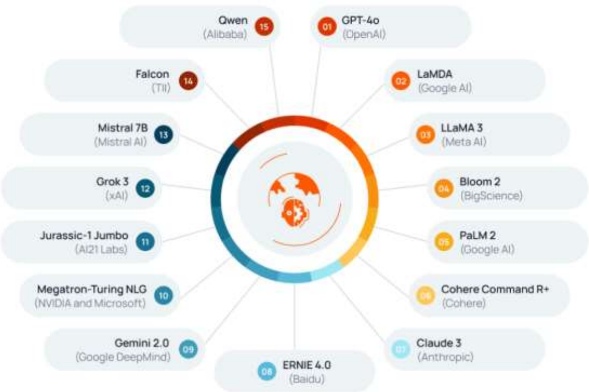

Hình 1.1 Những mô hình ngôn ngữ lớn phổ biến hiện nay Nguồn: https://intelliarts.com/

Một số mô hình ngôn ngữ lớn (LLMs) tiêu biểu hiện nay bao gồm GPT (Generative Pre-trained Transformer) của OpenAI, LLaMA của Meta, Grok của xAI, Claude của Anthropic và Gemini của Google DeepMind. GPT, do OpenAI phát triển, là một trong những LLM tiên phong và được đánh giá cao về khả năng hiểu ngữ cảnh cũng như sinh văn bản tự nhiên. Phiên bản mới nhất—GPT-4.5—được giới thiệu như một bản xem trước nghiên cứu, với mục tiêu cải thiện khả năng nhận dạng mẫu, kết nối thông tin và tạo ra phản hồi có tính sáng tạo cao [21].

Trong khi đó, LLaMA là dòng mô hình mã nguồn mở do Meta phát triển. Vào tháng 4 năm 2025, Meta đã công bố LLaMA 3 (nội bộ còn gọi là LLaMA 4), một mô hình đa phương thức với trọng số mở, hỗ trợ xử lý đồng thời văn bản, hình ảnh và âm thanh, cùng khả năng mở rộng ngữ cảnh đáng kể [22].

Grok là mô hình ngôn ngữ được phát triển bởi xAI – công ty do Elon Musk sáng lập. Phiên bản Grok-3, ra mắt vào tháng 2 năm 2025, nổi bật với khả năng truy xuất

<!-- page: 22 -->

thông tin thời gian thực từ nền tảng mạng xã hội X (trước đây là Twitter). Mô hình này được thiết kế để phản hồi với giọng điệu sắc sảo và hài hước, và đã được tích hợp vào ứng dụng nhắn tin Telegram thông qua một thỏa thuận trị giá 300 triệu USD [23].

Claude là dòng mô hình ngôn ngữ được phát triển bởi Anthropic. Phiên bản Claude 4 (bao gồm Claude 4 Opus và Claude 4 Sonnet), công bố vào tháng 5 năm 2025, có thể xử lý song song cả văn bản và hình ảnh, đồng thời cải thiện rõ rệt trong các tác vụ suy luận, lập trình và tư duy logic [24].

Cuối cùng, Gemini là dòng mô hình LLM đa phương thức của Google DeepMind, kế thừa các công trình như LaMDA và PaLM. Các phiên bản Gemini Ultra, Gemini Pro, Gemini Flash và Gemini Nano được thiết kế để xử lý nhiều định dạng đầu vào (văn bản, hình ảnh, âm thanh, video) và được tối ưu hóa cho các tình huống sử dụng đa dạng. Phiên bản Gemini 2.5 Pro mới nhất cung cấp khả năng suy luận sâu và phản hồi chính xác hơn trong thời gian thực [25].

Việc ứng dụng LLMs đã mang lại nhiều lợi ích trong các ngành công nghiệp, từ giáo dục, y tế, đến tài chính và truyền thông. Chẳng hạn, trong giáo dục, LLMs có thể hỗ trợ tạo nội dung học tập cá nhân hóa, đánh giá tự động và cung cấp phản hồi tức thì cho người học [26]. Tuy nhiên, cùng với những lợi ích, LLMs cũng đặt ra những thách thức về đạo đức, quyền riêng tư và độ tin cậy của thông tin sinh ra, đòi hỏi sự giám sát và quản lý chặt chẽ trong quá trình triển khai và sử dụng.

## 1.2.2 Giới thiệu về mô hình ngôn ngữ lớn GPT

GPT (Generative Pre-trained Transformer) là một dòng mô hình ngôn ngữ lớn mang tính cách mạng, giúp máy móc hiểu và tạo ra ngôn ngữ con người một cách mạch lạc và tự nhiên. GPT được xây dựng trên nền tảng kiến trúc Transformer chỉ giải mã (decoder-only) – một cấu trúc tiên tiến được giới thiệu trong nghiên cứu “Attention Is All You Need” [9]. Nhờ vào phương pháp tiền huấn luyện trên các kho dữ liệu văn bản khổng lồ từ Internet, GPT có khả năng nắm bắt sắc thái ngôn ngữ, duy trì tính mạch lạc của các đoạn văn dài và tạo ra văn bản giống như được viết bởi con người. Điều này đã mở ra một kỷ nguyên mới cho trí tuệ nhân tạo và xử lý ngôn ngữ tự nhiên.

<!-- page: 23 -->

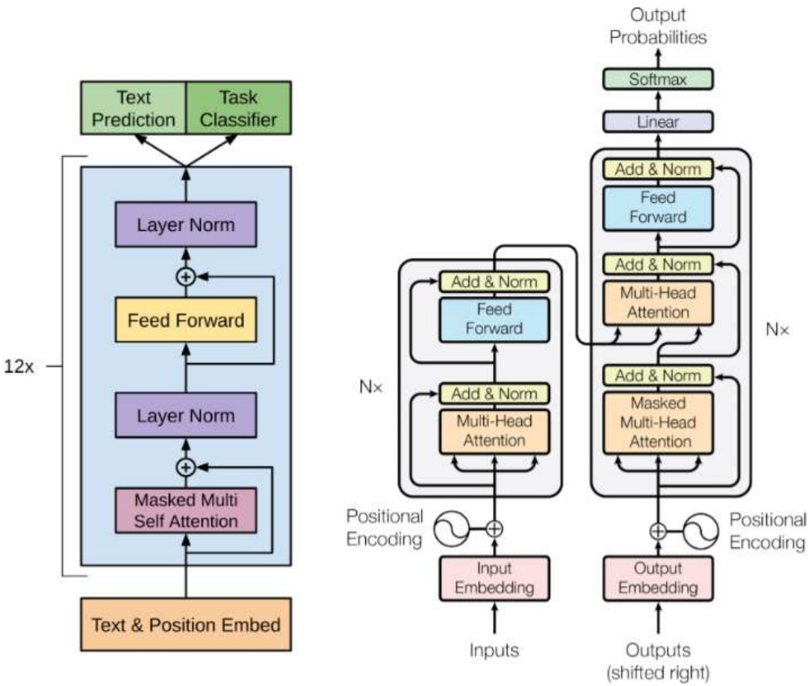

Hình 1.2 Kiến trúc Transformer trong mô hình GPT-3

Nguồn: https://www.researchgate.net/figure/GPT-3-architecture\_fig2\_385459054

GPT sử dụng cấu trúc Transformer chỉ giải mã, trong đó các lớp tự chú ý (self-attention) và mạng nơ-ron feed-forward được xếp chồng lên nhau để xử lý văn bản theo cơ chế tự hồi quy – tức là xử lý văn bản từ trái sang phải, dự đoán từng token dựa trên toàn bộ các token đã xuất hiện trước đó. Quá trình tiền huấn luyện dựa trên mục tiêu dự đoán token tiếp theo trên hàng trăm tỷ token cho phép mô hình học được các biểu diễn ngôn ngữ sâu sắc, nắm bắt được các mẫu thống kê, mối quan hệ ngữ nghĩa và kiến thức thế giới từ dữ liệu đầu vào [3].

Cơ chế tự chú ý của GPT cho phép mô hình đánh giá động tầm quan trọng của từng token so với các token khác trong chuỗi, tạo ra các biểu diễn ngữ cảnh phức tạp. Để duy trì tính liên tục của thông tin, GPT sử dụng cơ chế mã hóa vị trí (position encoding), qua đó mỗi token được gán một véc-tơ vị trí được tính bằng các hàm sin và cos với các tần số khác nhau. Điều này giúp mô hình hiểu được thứ tự và cấu trúc tuần tự của văn bản ngay khi xử lý song song. Nhờ vào cơ chế này, GPT có khả năng

<!-- page: 24 -->

duy trì sự mạch lạc trong các đoạn văn dài và xử lý hiệu quả các phụ thuộc ngữ nghĩa cả ở cấp độ cục bộ lẫn toàn cục [9].

## 1.2.3 Kiến trúc mô hình Generative Pre-trained Transformer (GPT)

Kiến trúc Transformer trong GPT là nền tảng cốt lõi giúp mô hình hiểu và sinh ra ngôn ngữ tự nhiên. Nó sử dụng cấu trúc chỉ gồm decoder (decoder-only), trong đó quá trình xử lý được thực hiện qua các lớp tự chú ý (self-attention) đa đầu và các lớp mạng nơ-ron feed-forward. Cơ chế tự chú ý cho phép mô hình đánh giá mối quan hệ giữa các token trong chuỗi, từ đó tạo ra các biểu diễn ngữ cảnh sâu sắc. Ngoài ra, các thành phần như position encoding được sử dụng để duy trì thông tin về thứ tự của các token. Toàn bộ kiến trúc hoạt động theo nguyên tắc tự hồi quy, nghĩa là mô hình dự đoán token tiếp theo dựa trên tất cả các token đã xuất hiện trước đó[9].

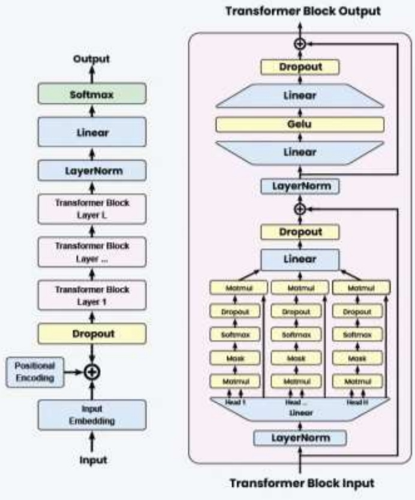

Hình 1.3 Kiến trúc GPT Nguồn: https://www.geeksforgeeks.org

Cơ chế tự chú ý (self-attention) là trung tâm của kiến trúc Transformer. Self-attention cho phép mô hình tính toán tầm quan trọng của mỗi token trong chuỗi đầu

<!-- page: 25 -->

vào đối với tất cả các token khác, từ đó xây dựng một biểu diễn ngữ cảnh đầy đủ. Công thức của Self-Attention được thể hiện như sau:

$$
\text {Attention} (Q, K, V) = \text {softmax} \left(\frac {Q K ^ {T}}{\sqrt {d _ {k}}}\right) V
$$

Trong đó, Q (Query), K (Key) và V (Value) là các véc-tơ được tạo ra từ đầu vào thông qua các ma trận trọng số được học trong quá trình huấn luyện. Giá trị dk đại diện cho kích thước của véc-tơ Key, giúp chuẩn hóa tích vô hướng giữa Q và K nhằm ổn định các giá trị khi đi qua hàm softmax. Hàm softmax sau đó biến các giá trị này thành xác suất, cho phép mô hình “tập trung” vào các token quan trọng theo cách có thể hiểu được.

Trong kiến trúc “chỉ giải mã” của GPT, mục tiêu của cơ chế Masked Multi-Head Self-Attention là đảm bảo rằng, khi sinh ra một token ở thời điểm t, mô hình chỉ được “nhìn thấy” các token từ vị trí 1 đến t−1 (tức các token trước đó) mà không sử dụng thông tin từ các token phía sau. Điều này giúp duy trì tính tự hồi quy (autoregressive) của mô hình. Để đảm bảo rằng token tại thời điểm t không “nhìn thấy” các token phía sau (j>t), ta sử dụng mặt nạ M được định nghĩa như sau:

$$
M _ {i j} = \left\{ \begin{array}{l l} 0, & n \acute {\mathrm{e}} u j \leq i \\ - \infty , & n \acute {\mathrm{e}} u j > i \end{array} \right.
$$

Sau $\mathbf { \check { d } } \mathbf { \check { 0 } } ,$ công thức masked attention trở thành:

MaskedAttention

$$
(Q, K, V) = \text {softmax} \left(\frac {Q K ^ {T} + M}{\sqrt {d _ {k}}}\right) V
$$

Việc cộng M vào ma trận $\mathbf { Q K } ^ { \mathrm { T } }$ khiến cho các giá trị tương ứng với các token không được phép tham gia (với −∞) sẽ có xác suất softmax bằng 0.

Một đặc điểm quan trọng khác của Transformer là Multi-Head Attention. Thay vì tính toán Self-Attention trên toàn bộ không gian một cách đơn giản, Transformer phân chia không gian ẩn thành nhiều “đầu” (heads) khác nhau để mô hình có thể học được nhiều khía cạnh ngữ nghĩa từ các góc nhìn khác nhau. Công thức của Multi-Head Attention được mô tả như sau:

<!-- page: 26 -->

$$
\text {MultiHead} (Q, K, V) = \text {Concat} (\text {head} _ {1}, \dots , \text {head} _ {h}) W ^ {O}
$$

Với mỗi headi=Attention(QW<sub>i</sub><sup>Q</sup>,KW<sub>i</sub><sup>K</sup>,VW<sub>i</sub><sup>V</sup>). Ở đây, W<sub>i</sub><sup>Q</sup>W<sub>i</sub><sup>K</sup>W<sub>i</sub><sup>V</sup>, là các ma trận trọng số riêng biệt cho mỗi đầu, và $\mathbf { W } ^ { 0 }$ là ma trận dùng để kết hợp lại các đầu Attention thành một biểu diễn chung. Việc sử dụng Multi-Head Attention cho phép mô hình xử lý đồng thời nhiều mối quan hệ ngữ nghĩa phức tạp giữa các token, góp phần cải thiện khả năng hiểu biết ngữ cảnh và tổng quát hóa trong quá trình suy luận.

Transformer cũng bổ sung thông tin về thứ tự của các token thông qua Position Encoding. Vì kiến trúc Transformer không xử lý theo chuỗi tuần tự nên cần một cơ chế bổ sung để mô hình có thể nhận biết vị trí của các token. Công thức Position Encoding được định nghĩa như sau:

$$
P E _ {(p o s, 2 i)} = \sin \left(\frac {p o s}{1 0 0 0 0 ^ {\frac {2 i}{d _ {m o d e l}}}}\right)
$$

$$
P E _ {(p o s, 2 i + 1)} = \cos \left(\frac {p o s}{1 0 0 0 0 ^ {\frac {2 i}{d _ {m o d e l}}}}\right)
$$

Trong đó, pos là vị trí của token trong chuỗi, i là chỉ số của chiều véc-tơ, và d<sub>model</sub> là kích thước của véc-tơ ẩn. Sự kết hợp giữa các giá trị sin và cos với các tần số khác nhau giúp mô hình phân biệt được thứ tự của các token, đảm bảo rằng thông tin thứ tự được duy trì trong toàn bộ quá trình xử lý.

Trong bối cảnh In-Context Learning, kiến trúc Transformer cho phép các mô hình như GPT-3 và GPT-4 “học” tạm thời từ thông tin được cung cấp trong prompt. Khi người dùng đưa ra các ví dụ mẫu cùng với một câu hỏi hoặc nhiệm vụ, Transformer sẽ sử dụng cơ chế Self-Attention và Multi-Head Attention để nhận diện mối quan hệ giữa các ví dụ mẫu và nội dung mới. Decoding tuần tự sau đó cho phép mô hình dự đoán từng token của kết quả dựa trên toàn bộ ngữ cảnh đã học được. Công thức Decoding tuần tự cho quá trình này được thể hiện qua:

$$
P (y) = \prod_ {t = 1} ^ {T} P (y _ {t} \mid y _ {<   t}, x)
$$

<!-- page: 27 -->

$\dot { \mathrm { o } }$ đây, $\mathrm { y _ { t } }$ là token được dự đoán tại thời điểm t, $\mathrm { y } \mathrm { < t }$ là chuỗi các token đã được sinh ra trước đó, và x là prompt ban đầu (bao gồm các ví dụ mẫu và nội dung đầu vào). Quá trình này cho phép mô hình duy trì mạch suy nghĩ liên tục, đảm bảo rằng mỗi token dự đoán được dựa trên cả ngữ cảnh của prompt và chuỗi kết quả đã sinh ra.

Như vậy, kiến trúc Transformer không chỉ là một cấu trúc mạnh mẽ cho việc xử lý các chuỗi dữ liệu nhờ vào cơ chế Self-Attention, Multi-Head Attention, và Position Encoding, Transformer cho phép các mô hình ngôn ngữ lớn học hỏi tạm thời từ ngữ cảnh một cách hiệu quả, giúp chúng tổng hợp và suy luận dựa trên thông tin được cung cấp trong prompt mà không cần phải tái huấn luyện lại trọng số. Điều này mở ra khả năng ứng dụng linh hoạt cho các nhiệm vụ như dịch thuật, trả lời câu hỏi, và nhiều ứng dụng khác trong lĩnh vực xử lý ngôn ngữ tự nhiên.

## 1.3 Phương pháp làm giàu prompt In-context Learning

## 1.3.1 Giới thiệu về In-context Learning

In-context Learning là khả năng cho phép mô hình thực hiện các nhiệm vụ mới bằng cách sử dụng các ví dụ được cung cấp trong ngữ cảnh đầu vào, mà không cần tinh chỉnh tham $\begin{array} { r } { \hat { \mathrm { s } \hat { 0 } } , } \end{array}$ nhờ vào khả năng nhận diện và tổng quát hóa các mẫu ngữ cảnh từ các ví dụ này [3]. Cách tiếp cận này giúp mô hình nhận biết và áp dụng các mẫu số liệu trong thời gian thực, thể hiện tính linh hoạt cao trong nhiều nhiệm vụ từ phân loại đơn giản đến suy luận phức tạp.

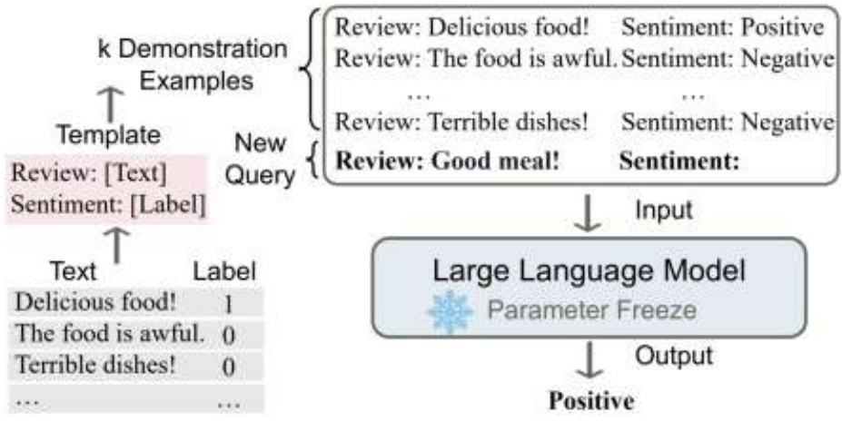

Hình 1.4 Minh họa phương pháp In-Context Learning

<!-- page: 28 -->

## Nguồn: A Survey on In-context Learning

In-context Learning hoạt động thông qua cơ chế được gọi là "meta-learning ngầm", trong đó quá trình tiền huấn luyện trên dữ liệu văn bản đa dạng giúp mô hình phát triển khả năng nhận diện và tổng quát hóa các mẫu nhiệm vụ, tương tự như cách con người học từ ví dụ. Hiệu quả của phương pháp này đã được chứng minh trong nhiều lĩnh vực như dịch thuật ngôn ngữ, suy luận toán học và tạo mã, đặc biệt khi áp dụng các chiến lược gợi ý phù hợp. Khả năng mạnh mẽ này đã mở ra hướng nghiên cứu sâu rộng trong việc hiểu cơ chế hoạt động và cải thiện hiệu suất của các mô hình ngôn ngữ lớn. Về mặt toán học, In-context Learning có thể được biểu diễn như sau:

• Cho một đầu vào truy vấn x và một tập hợp các câu trả lời ứng viên $\mathbf{Y} = \{ \mathbf{y}_1, \mathbf{y}_2, \ldots, \mathbf{y}_m \}$

Mô hình ngôn ngữ đã được tiền huấn luyện M sẽ chọn câu trả lời có xác suất cao nhất làm dự đoán cuối cùng, dựa trên một tập hợp ví dụ minh họa C.

Tập hợp ví dụ minh họa C có thể bao gồm một hướng dẫn nhiệm vụ I và k ví dụ mẫu, được biểu diễn dưới dạng:

$$
C = \{s ^ {\prime} (x _ {1}, y _ {1}, I),..., s ^ {\prime} (x _ {k}, y _ {k}, I) \}
$$

trong đó $\mathbf { s } ^ { \prime }$ là một ví dụ được viết bằng ngôn ngữ tự nhiên theo nhiệm vụ cụ thể. Xác suất của một câu trả lời ứng viên $\mathrm { y j }$ được tính bằng hàm điểm f trên toàn bộ chuỗi đầu vào:

$$
\mathrm{P} (\mathrm{y} _ {\mathrm{j}} \mid \mathrm{x}) \triangleq \mathrm{fM} (\mathrm{y} _ {\mathrm{j}}, \mathrm{C}, \mathrm{x})
$$

Nhãn dự đoán cuối cùng 𝑦̂ là câu trả lời có xác suất cao nhất:

$$
\hat {y} = \arg \max _ {y _ {j} \in Y} P \left(y _ {j} \mid x\right).
$$

## 1.3.2 Học từ một vài ví dụ (Few-shot Learning)

Few-shot Learning là một kỹ thuật tiên tiến cho phép các mô hình ngôn ngữ lớn thực hiện các nhiệm vụ mới chỉ với một số lượng rất ít ví dụ mẫu được cung cấp trong prompt. Điều này có nghĩa là thay vì cần một lượng dữ liệu huấn luyện khổng lồ, mô hình sẽ “học” tạm thời từ các ví dụ mẫu được tích hợp trực tiếp vào prompt, từ đó có thể tổng quát hóa và áp dụng vào nhiệm vụ mới mà không cần điều chỉnh lại trọng số của mô hình.

<!-- page: 29 -->

Cơ chế hoạt động của Few-shot Learning dựa trên nền tảng kiến trúc Transformer đã được trình bày ở mục 1.2.2, trong đó các cơ chế Self-Attention và Decoding tuần tự đóng vai trò quan trọng. Cụ thể, khi được cung cấp các ví dụ mẫu, mô hình ngôn ngữ lớn sử dụng cơ chế Self-Attention để nhận diện mối quan hệ giữa các token trong ví dụ và thông tin trong câu hỏi cần giải quyết. Quá trình Decoding tuần tự (đã được nêu ở mục 1.2.2) cho phép mô hình sinh ra đáp án token theo token, dựa trên ngữ cảnh đã được cung cấp.

Để minh họa, hãy xem xét một ví dụ trong nhiệm vụ dịch thuật. Giả sử prompt bao gồm các cặp câu mẫu như sau:

"I love you" → "Anh yêu em"

"Good morning" → "Chào buổi sáng"

"See you later" → "Hẹn gặp lại"

Khi đưa ra câu hỏi "How are you?" trong cùng prompt, mô hình ngôn ngữ lớn sẽ nhận diện cấu trúc ngôn ngữ và phong cách dịch từ các ví dụ mẫu đã cho, sau đó áp dụng kiến thức đó để sinh ra bản dịch "Bạn khỏe không?" một cách mạch lạc. Nhờ vào khả năng duy trì thông tin ngữ cảnh và tổng hợp mẫu số liệu, Few-shot Learning giúp mô hình thực hiện nhiệm vụ mới một cách hiệu quả mà không cần tinh chỉnh lại toàn bộ mô hình.

Hơn nữa, Few-shot Learning giúp tiết kiệm đáng kể chi phí về dữ liệu và thời gian huấn luyện, vì mô hình không cần phải học từ một tập dữ liệu khổng lồ mà chỉ cần “đọc” và tổng hợp thông tin từ một vài ví dụ mẫu. Điều này mở ra khả năng ứng dụng rộng rãi trong các lĩnh vực mà dữ liệu hạn chế hoặc việc thu thập dữ liệu tốn kém, như dịch thuật, tóm tắt văn bản, hoặc thậm chí là trả lời câu hỏi trong các hệ thống trợ lý ảo.

Một hạn chế của Few-shot Learning là chất lượng của kết quả phụ thuộc mạnh mẽ vào cách thiết kế prompt. Nếu các ví dụ mẫu không đủ đại diện hoặc được sắp xếp không hợp lý, mô hình có thể không nhận diện được mẫu số liệu cần thiết, dẫn đến kết quả không chính xác. Do đó, việc tối ưu hóa prompt là một lĩnh vực nghiên cứu quan trọng trong việc cải thiện hiệu quả của Few-shot Learning.

<!-- page: 30 -->

Tóm lại, Few-shot Learning là một bước tiến quan trọng trong ứng dụng của LLM, cho phép mô hình thực hiện các nhiệm vụ mới dựa trên một số ít ví dụ mẫu, giúp mở rộng phạm vi ứng dụng và tiết kiệm nguồn lực huấn luyện.

## 1.3.3 Chuỗi suy nghĩ (Chain of Thought)

Chuỗi suy nghĩ là một kỹ thuật nhằm kích hoạt quá trình lý luận từng bước trong mô hình ngôn ngữ lớn, giúp mô hình không chỉ đưa ra đáp án cuối cùng mà còn trình bày các bước suy luận trung gian. Chuỗi suy nghĩ khơi gợi quá trình suy luận từng bước từ các mô hình ngôn ngữ lớn, qua đó nâng cao khả năng giải quyết vấn đề của chúng[12]. Nhờ vậy, kỹ thuật này giúp tăng cường độ minh bạch và độ tin cậy của kết quả, khi người dùng có thể theo dõi quá trình ra quyết định của mô hình.

Trong thực hành, khi được yêu cầu giải quyết một nhiệm vụ phức tạp như một bài toán logic, mô hình sẽ không trả lời trực tiếp mà thay vào đó sinh ra một chuỗi các bước suy luận.

Ví dụ, nếu nhiệm vụ là: “Nếu A > B và B > C, thì A có lớn hơn C không? Hãy giải thích.” Thay vì chỉ trả lời “Có” hoặc “A lớn hơn C”, LLM sẽ sinh ra chuỗi suy nghĩ như sau:

“Ta có giả thiết A > B và B > C.”

“Theo tính chất bắc cầu trong toán học, nếu A > B và B > C, thì có thể suy ra $\mathbf { A } ^ { > } \mathbf { C } . ^ { * }$

“Vậy, kết luận: A lớn hơn C.”

Quá trình này được thực hiện dựa trên cơ chế Decoding tuần tự đã được mô tả ở mục 1.3.2, nhưng ở đây, prompt được thiết kế nhằm khuyến khích mô hình trình bày chi tiết các bước suy luận. Các cơ chế Self-Attention và Position Encoding của Transformer cho phép mô hình duy trì thông tin liên tục giữa các bước, đảm bảo tính nhất quán và logic trong chuỗi suy nghĩ.

Chuỗi suy nghĩ không chỉ cải thiện độ chính xác trong các nhiệm vụ yêu cầu lý luận phức tạp mà còn cung cấp một “bản đồ” minh họa quá trình ra quyết định, từ đó giúp người dùng hiểu và đánh giá tính hợp lý của kết quả. Nhờ đó, mô hình trở nên

<!-- page: 31 -->

minh bạch hơn và có thể được điều chỉnh hoặc tối ưu hóa khi gặp phải các trường hợp ngoại lệ hay lỗi suy luận.

Tuy nhiên, một thách thức của kỹ thuật này là việc duy trì mạch suy nghĩ khi độ dài của chuỗi suy luận trở nên quá dài. Nếu không được kiểm soát, chuỗi suy nghĩ có thể trở nên lặp lại, mất mạch hoặc thậm chí gây nhiễu cho kết quả cuối cùng. Do đó, việc thiết kế prompt một cách cẩn thận và tối ưu hóa cơ chế Decoding là cần thiết để đảm bảo rằng các bước suy luận được trình bày một cách rõ ràng và logic.

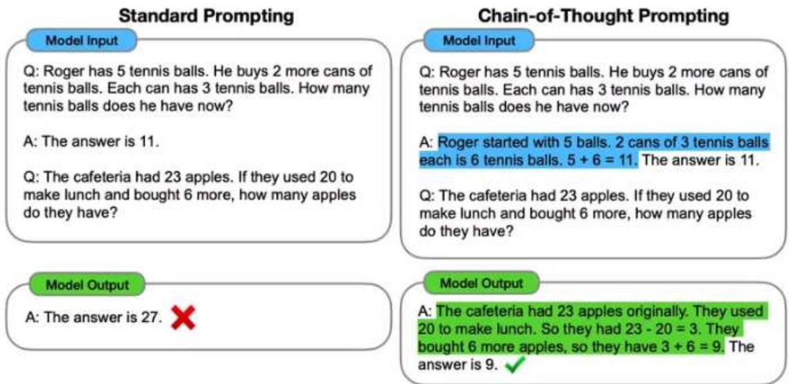

Hình 1.5 Tối ưu hóa prompt với kỹ thuật chuỗi suy nghĩ

## Nguồn: https://www.datacamp.com

Chuỗi suy nghĩ có thể cải thiện đáng kể khả năng giải quyết vấn đề của mô hình ngôn ngữ lớn, đặc biệt đối với các nhiệm vụ phức tạp đòi hỏi lý luận chi tiết[12]. Kỹ thuật này không chỉ mang lại kết quả chính xác hơn mà còn giúp xây dựng niềm tin ở người dùng khi biết được quá trình tư duy của mô hình.

Tóm lại, chuỗi suy nghĩ là một kỹ thuật quan trọng giúp các mô hình ngôn ngữ lớn trình bày quá trình suy luận theo từng bước, tạo ra các kết quả có tính minh bạch và hợp lý. Khi được kết hợp với nền tảng Transformer đã được trình bày ở mục 1.2.2, kỹ thuật này mở rộng khả năng ứng dụng của LLM trong các lĩnh vực yêu cầu lý luận phức tạp như toán học, phân tích logic, và hỗ trợ ra quyết định trong giáo dục.

<!-- page: 32 -->

## 1.4 Kết hợp Incontext Learning với RAG (Retrieval-Augmented Generation)

Retrieval-Augmented Generation (RAG) là một phương pháp tiên tiến kết hợp khả năng truy xuất thông tin từ bên ngoài với mô hình sinh văn bản dựa trên kiến trúc Transformer, nhằm nâng cao hiệu quả của In-Context Learning trong các tác vụ yêu cầu kiến thức chuyên sâu. Khác với các kỹ thuật In-Context Learning truyền thống, trong đó mô hình chỉ dựa vào thông tin được cung cấp trong prompt, RAG bổ sung một module truy xuất để tìm kiếm các văn bản, đoạn trích liên quan từ một kho dữ liệu ngoài, từ đó giúp mô hình đưa ra các phản hồi có tính cập nhật và chính xác hơn[6].

Trong RAG, quy trình tổng hợp đầu ra có thể được diễn đạt theo công thức sau:

$$
P (y \mid x) = \sum_ {z \in R (x)} P (y \mid x, z) P (z \mid x)
$$

Trong đó:

• x là đầu vào ban đầu, bao gồm prompt và các ví dụ In-Context Learning.

• R(x) là tập các văn bản hoặc đoạn trích được truy xuất từ kho dữ liệu dựa trên input x.

• P(z∣x) là xác suất truy xuất đoạn z dựa trên x.

• P(y∣x,z) là xác suất sinh ra kết quả y dựa trên sự kết hợp của input x và văn bản z.

Cơ chế này cho phép mô hình không chỉ dựa vào thông tin nội tại đã được học trong quá trình huấn luyện mà còn bổ sung thêm kiến thức từ các tài liệu bên ngoài, giúp cải thiện đáng kể hiệu suất trên các tác vụ yêu cầu kiến thức cập nhật hay chuyên sâu. Một module truy xuất, chẳng hạn như mô hình Dense Passage Retrieval (DPR), thường được sử dụng để chuyển đổi đầu vào x thành các véc-tơ ngữ nghĩa và tìm kiếm các văn bản có liên quan trong một kho dữ liệu lớn[13]. Sau đó, các văn bản được truy xuất này được kết hợp với input ban đầu trong quá trình giải mã tuần tự của mô hình sinh văn bản.

<!-- page: 33 -->

Ví dụ ta cần trả lời một câu hỏi về sự kiện lịch sử chưa được đề cập đầy đủ trong bộ dữ liệu huấn luyện của mô hình. Ta đưa ra prompt có thể bao gồm một câu hỏi và một vài ví dụ về cách giải thích các sự kiện tương tự. Tuy nhiên, để đảm bảo câu trả lời có tính chính xác và đầy đủ, module truy xuất của RAG sẽ tìm kiếm các bài báo, tài liệu lịch sử liên quan đến sự kiện đó. Sau đó, mô hình sẽ kết hợp thông tin từ prompt và các văn bản truy xuất được để sinh ra một câu trả lời chi tiết và có tính cập nhật cao. Điều này cho phép mô hình không bị giới hạn bởi dữ liệu huấn luyện ban đầu và có thể “mở rộng” kiến thức của mình theo thời gian thực.

RAG đóng vai trò quan trọng trong việc giải quyết các tác vụ kiến thức chuyên sâu, chẳng hạn như trả lời câu hỏi mở, tóm tắt tài liệu chuyên ngành, hay thậm chí hỗ trợ tư vấn trong các lĩnh vực chuyên môn. So với các phương pháp In-Context Learning truyền thống, RAG cung cấp một bước bổ sung linh hoạt, giúp mô hình tự động truy xuất và tích hợp kiến thức từ các nguồn bên ngoài. Điều này không chỉ nâng cao độ chính xác mà còn cải thiện khả năng giải thích của mô hình, bởi người dùng có thể theo dõi được nguồn gốc của các thông tin được sử dụng trong quá trình sinh văn bản.

Như vậy, RAG là một bước tiến quan trọng trong bối cảnh In-Context Learning, giúp mở rộng khả năng của các mô hình ngôn ngữ lớn bằng cách bổ sung kiến thức bên ngoài một cách linh hoạt và hiệu quả. Trong khi In-context Learning giúp mô hình suy luận từ các ví dụ mẫu, RAG bổ sung bằng cách truy xuất dữ liệu từ nguồn bên ngoài, đảm bảo kiến thức của mô hình luôn mới nhất và chính xác. Điều này đặc biệt quan trọng trong các lĩnh vực yêu cầu thông tin thời sự hoặc chuyên môn cao. RAG cung cấp các ví dụ hoặc thông tin bổ trợ từ các tài liệu liên quan, giúp In-context Learning tạo ra ngữ cảnh phong phú hơn, từ đó cải thiện quá trình suy luận từng bước và giải quyết các bài toán phức tạp. Qua đó, các ứng dụng của LLM có thể đạt được độ chính xác và tính cập nhật cao hơn, đặc biệt trong các nhiệm vụ đòi hỏi kiến thức chuyên sâu và thời gian thực.

<!-- page: 34 -->

**1.5 Lợi ích của việc tích hợp In-context Learning và RAG với mô hình GPT trong hỗ trợ học ngoại ngữ.**

GPT, với khả năng xử lý ngôn ngữ tự nhiên tiên tiến, đã sẵn có tiềm năng hỗ trợ học ngoại ngữ thông qua việc tạo ra các cuộc đối thoại tự động, trả lời các câu hỏi về ngữ pháp, từ vựng, cũng như đưa ra nội dung hội thoại phù hợp với khả năng ngoại ngữ hiện tại của người học [9]. GPT có thể đảm nhận nhiều vai trò khác nhau trong quá trình giao tiếp, từ vai trò trợ lý trả lời thắc mắc, hướng dẫn giải thích các cấu trúc ngôn ngữ cho đến vai trò “người bạn trò chuyện” giúp tạo ra môi trường luyện tập ngoại ngữ tự nhiên. Nhờ khả năng này, GPT được ứng dụng rộng rãi trong nhiều hệ thống hỗ trợ học ngoại ngữ hiện đại, nơi mà các phản hồi của nó đã góp phần làm tăng cường việc tiếp cận và thực hành ngôn ngữ mới.

Trong bối cảnh này, In-context Learning đóng vai trò then chốt bằng cách cung cấp cho GPT một tập hợp các ví dụ mẫu trực tiếp trong prompt. Các ví dụ mẫu này không chỉ giúp mô hình nhận diện các mẫu ngữ cảnh mà còn hỗ trợ GPT đưa ra các phản hồi phù hợp với nội dung học tập. Khi một câu hỏi hay yêu cầu được đưa ra, GPT “học” tạm thời từ các ví dụ mẫu đó để tổng hợp thông tin và trả lời theo cách mạch lạc, logic và chính xác hơn. Nhờ vậy, khả năng tập trung vào ngữ cảnh học tập ngoại ngữ được tăng cường, từ đó các câu trả lời hay nội dung hội thoại của GPT sẽ phản ánh chính xác hơn các yêu cầu về ngữ pháp, từ vựng và cấu trúc của ngôn ngữ mục tiêu [3]. Quá trình này giúp mô hình nắm bắt được các đặc trưng riêng của ngoại ngữ cũng như các dạng câu hỏi, nội dung hội thoại đặc thù của từng ngữ cảnh học tập.

Để đảm bảo độ chính xác cao nhất cho thông tin mà GPT đưa ra, hệ thống sẽ được tích hợp với Retrieval-Augmented Generation (RAG). RAG hoạt động bằng cách truy xuất các tài liệu tiêu chuẩn, uy tín từ các nguồn dữ liệu bên ngoài, sau đó kết hợp thông tin đó vào quá trình tạo văn bản của GPT. Khi một yêu cầu được đưa ra, hệ thống sẽ chuyển đổi prompt và các ví dụ mẫu thành véc-tơ nhờ vào các mô hình embedding, sau đó áp dụng thuật toán k-nearest neighbors (kNN) để tìm kiếm các tài liệu liên quan trong cơ sở dữ liệu. Các tài liệu này được sử dụng làm nguồn thông tin bổ trợ, giúp GPT kiểm chứng và làm giàu kiến thức của mình trước khi đưa

<!-- page: 35 -->

ra phản hồi cuối cùng. Qua đó, các phản hồi của GPT trở nên chính xác hơn về mặt nội dung, đặc biệt là trong việc cung cấp các câu hỏi, giải thích ngữ pháp và từ vựng theo các tài liệu chuẩn mực đã được xác nhận.

Kết hợp In-context Learning và RAG mang lại những lợi ích đáng kể. Đầu tiên, In-context Learning giúp GPT nắm bắt các mẫu ngữ cảnh từ các ví dụ được cung cấp, tạo ra các phản hồi phù hợp và chính xác hơn cho từng tình huống học ngoại ngữ. Thứ hai, khi tích hợp RAG, hệ thống không chỉ dựa vào dữ liệu tiền huấn luyện mà còn được bổ sung thông tin từ các nguồn uy tín, từ đó cải thiện đáng kể độ tin cậy và chính xác của phản hồi. Việc truy xuất các tài liệu chuẩn thông qua RAG cho phép GPT xác nhận lại kiến thức đã học, đồng thời cung cấp các thông tin cập nhật và chuyên sâu, giúp người học nhận được câu trả lời đầy đủ và đúng chuẩn.

Hơn nữa, GPT có khả năng đóng vai trò đa năng trong quá trình giao tiếp với người học. Tùy vào yêu cầu, GPT có thể đảm nhận vai trò giải thích ngữ pháp, cung cấp các bài tập luyện tập, đặt câu hỏi kiểm tra hiểu biết hay tham gia vào các cuộc đối thoại mở rộng kiến thức về văn hóa và phong cách giao tiếp của ngoại ngữ. Điều này giúp tạo ra một môi trường học tập linh hoạt, nơi mà người học có thể tự đặt ra câu hỏi và nhận phản hồi ngay lập tức, giúp họ tự kiểm tra và cải thiện khả năng sử dụng ngôn ngữ. Sự kết hợp giữa khả năng tự điều chỉnh dựa trên prompt và việc bổ sung thông tin từ RAG giúp hệ thống có thể cung cấp những phản hồi phù hợp nhất theo ngữ cảnh của từng bài học.

Việc áp dụng In-context Learning ban đầu đã thể hiện rõ năng lực của GPT trong việc hỗ trợ học ngoại ngữ, nhưng khi kết hợp với RAG, hệ thống được nâng cao thêm khả năng kiểm chứng thông tin. RAG giúp truy xuất các tài liệu chuẩn mực, từ đó cung cấp các dữ liệu tham khảo đáng tin cậy cho quá trình trả lời. Nhờ đó, các phản hồi không chỉ phù hợp về mặt ngữ cảnh mà còn chính xác về nội dung, đảm bảo rằng người học nhận được thông tin học tập có chất lượng cao. Hệ thống này có thể hỗ trợ việc giải thích các cấu trúc ngữ pháp phức tạp, cung cấp ví dụ về cách sử dụng từ vựng, và thậm chí đưa ra các bài tập luyện tập dựa trên tài liệu tham khảo uy tín.

GPT đã sẵn có khả năng hỗ trợ học ngoại ngữ qua việc đóng vai trò đa dạng trong các cuộc đối thoại và cung cấp các phản hồi dựa trên khả năng ngoại ngữ hiện

<!-- page: 36 -->

có của người học. Khi bổ sung In-context Learning, khả năng tập trung vào ngữ cảnh học tập được tăng cường, giúp các câu trả lời phản ánh chính xác hơn nội dung yêu cầu. Việc tích hợp RAG để truy xuất các tài liệu chuẩn đảm bảo độ chính xác cao cho thông tin phản hồi, tạo ra một hệ thống hỗ trợ học ngoại ngữ hiệu quả, đáng tin cậy và có tính chuyên sâu. Sự kết hợp này mở ra hướng tiếp cận mới trong ứng dụng các mô hình ngôn ngữ lớn vào việc giảng dạy và học tập ngoại ngữ, từ đó góp phần nâng cao chất lượng và hiệu quả của quá trình học tập.

## 1.6 Tiểu kết chương 1

Chương 1 đã cung cấp tổng quan lý thuyết về học ngoại ngữ dựa trên tài liệu chuẩn hóa và giới thiệu nền tảng của In-context Learning, RAG cùng mô hình ngôn ngữ lớn GPT. Các cơ chế Self-Attention, Multi-Head Attention và Position Encoding của Transformer được trình bày chi tiết để xử lý ngữ cảnh. Kỹ thuật Few-shot Learning và Chain of Thought giúp mô hình học từ ví dụ mẫu và suy luận từng bước, trong khi RAG mở rộng khả năng bằng cách truy xuất thông tin bên ngoài. Những lý thuyết này tạo nền tảng cho nghiên cứu trong chương 2 và phát triển ứng dụng hỗ trợ học Tiếng Anh trong chương 3.

<!-- page: 37 -->

## CHƯƠNG 2 : THIẾT KẾ VÀ PHÁT TRIỂN HỆ THỐNG HỖ TRỢ HỌC TIẾNG ANH

Chương 2 trình bày quy trình thiết kế và xây dựng hệ thống hỗ trợ học tiếng Anh, từ việc thu thập và phân tích yêu cầu người dùng đến việc xác định các chức năng cốt lõi. Tiếp theo, kiến trúc tổng thể được đề xuất theo mô hình client–server, trong đó ứng dụng di động kết nối với backend qua API để tận dụng sức mạnh của GPT, In-Context Learning và RAG. Cuối cùng, sơ đồ hệ thống chi tiết minh họa luồng dữ liệu và tương tác giữa các thành phần, làm cơ sở cho triển khai và kiểm thử.

## 2.1 Phân tích yêu cầu và xác định chức năng hệ thống

## 2.1.1 Đánh giá mức độ ứng dụng mô hình ngôn ngữ lớn trong các nền tảng học tiếng Anh hiện nay

Trên thị trường hiện nay, một số ứng dụng học tiếng Anh đã bắt đầu tích hợp mô hình ngôn ngữ lớn (LLM) nhằm nâng cao trải nghiệm học tập. **Duolingo Max** sử dụng GPT-4 để cung cấp hai tính năng chủ đạo là “Explain My Answer” và “Roleplay” – giúp người học nhận phần giải thích chi tiết cho câu trả lời và tham gia hội thoại giả lập với AI. Tuy nhiên, người dùng phản ánh rằng các lời giải thích đôi khi thiếu độ chính xác và không phản hồi đúng vấn đề học sinh gặp phải [6]. Mặc dù Duolingo đã cải tiến để tăng tính sáng tạo và cá nhân hóa nội dung, phản hồi từ AI vẫn dựa trên prompt cố định và thiếu tính linh hoạt thực sự trong hội thoại mở [6].

Trong khi đó, **ELSA Speak** nổi bật với khả năng nhận diện và phản hồi phát âm nhờ công nghệ nhận dạng giọng nói AI, được đánh giá cao trong việc hỗ trợ học phát âm tự động [32]. Tuy nhiên, ELSA chủ yếu hướng đến kỹ năng phát âm và không tích hợp In-Context Learning hay RAG để sinh phản hồi ngữ pháp theo ngữ cảnh thực tế hoặc xây dựng hội thoại mở tương tác sâu.

## Hạn chế chính gồm:

Thiếu sự cá nhân hóa sâu: phần lớn chỉ điều chỉnh độ khó hoặc thứ tự bài học mà không hiểu mục tiêu cụ thể của người học.

Phản hồi ngữ pháp và ngữ cảnh giới hạn: chưa tích hợp RAG nên nội dung đôi khi thiếu kiến thức chuyên sâu cập nhật.

<!-- page: 38 -->

Không có hội thoại mở thực sự: mô phỏng kịch bản cố định, không phản hồi tự nhiên theo luồng tương tác của người dùng.

**Đề tài này** phát triển một ứng dụng học tiếng Anh sử dụng **GPT-4** làm LLM chính, kết hợp **In-Context Learning** (Chain-of-Thought & Few-Shot) để thế hiện prompt logic rõ ràng và ví dụ mẫu, đồng thời sử dụng **Retrieval-Augmented Generation (RAG)** để truy xuất thông tin cập nhật từ bộ dữ liệu huấn luyện chất lượng. Nhờ vậy, hệ thống không chỉ sinh phản hồi chính xác và linh hoạt mà còn có khả năng phục hồi ngữ cảnh người học, hỗ trợ hội thoại mở, sửa ngữ pháp theo ngữ cảnh và cá nhân hóa theo lịch sử học tập — đây là những cải tiến vượt trội so với các ứng dụng hiện có.

## 2.1.2 Phân tích yêu cầu người dùng

Trong bối cảnh toàn cầu hóa hiện nay, tiếng Anh đã trở thành ngôn ngữ quốc tế phổ biến nhất, đóng vai trò quan trọng trong giao tiếp, học tập, nghiên cứu khoa học và phát triển sự nghiệp [14]. Theo báo cáo của EF English Proficiency Index, nhu cầu học tiếng Anh ngày càng gia tăng trên toàn cầu, đặc biệt là ở các nước đang phát triển nhằm cải thiện năng lực cạnh tranh quốc tế [15]. Tuy nhiên, quá trình học ngoại ngữ, đặc biệt là tiếng Anh, thường gặp phải nhiều thách thức như thiếu môi trường giao tiếp, khó khăn trong việc nắm vững ngữ pháp và từ vựng [16].

Trong bối cảnh này, ứng dụng học tiếng Anh tích hợp AI đang trở thành một giải pháp hiệu quả, cung cấp môi trường học tập linh hoạt và cá nhân hóa cho người dùng. Để đáp ứng nhu cầu học tập ngày càng cao và đa dạng, ứng dụng hỗ trợ học tiếng Anh cần phải đáp ứng các yêu cầu sau:

Ứng dụng cần cung cấp tính năng học ngữ pháp một cách chi tiết và dễ hiểu, bao gồm các bài giảng giải thích rõ ràng về các quy tắc ngữ pháp cơ bản và nâng cao, kèm theo ví dụ minh họa cụ thể để người học dễ dàng hình dung và áp dụng. Đồng thời, ứng dụng cần cung cấp các bài tập thực hành đa dạng như trắc nghiệm, điền từ vào chỗ trống và sửa lỗi câu, giúp người học rèn luyện và củng cố kiến thức ngữ pháp một cách hiệu quả.

Ngoài ra, ứng dụng cần có khả năng cung cấp phản hồi tức thời và chi tiết sau khi người học hoàn thành bài tập. Phản hồi cần giải thích rõ ràng về đáp án đúng và

<!-- page: 39 -->

sai, giúp người học hiểu sâu hơn về cách sử dụng ngữ pháp trong từng ngữ cảnh cụ thể. Theo nghiên cứu, phản hồi chi tiết giúp cải thiện hiệu suất học tập và tăng cường động lực học tập của người học [16].

Bên cạnh học ngữ pháp, kỹ năng giao tiếp cũng là một trong những kỹ năng quan trọng nhất khi học ngoại ngữ. Tuy nhiên, phần lớn người học tiếng Anh gặp khó khăn trong việc giao tiếp lưu loát do thiếu môi trường thực hành và tâm lý ngại sai [16]. Để khắc phục vấn đề này, ứng dụng cần tích hợp công nghệ nhận diện giọng nói và mô hình ngôn ngữ lớn GPT-4 để người học có thể luyện tập phát âm, ngữ điệu và phản xạ trong giao tiếp. Mô hình AI sẽ đóng vai trò như một đối tác hội thoại, giúp người học thực hành các tình huống giao tiếp thực tế như chào hỏi, thảo luận công việc hay hội thoại hàng ngày.

Ứng dụng cũng cần cung cấp chức năng trò chuyện bằng văn bản với AI để người học luyện tập phản xạ ngôn ngữ và phát triển kỹ năng viết một cách tự nhiên. Với khả năng xử lý ngôn ngữ tự nhiên tiên tiến, mô hình ngôn ngữ lớn có thể tạo ra các đoạn hội thoại gần gũi với giao tiếp thực tế, giúp người học rèn luyện kỹ năng viết và phản xạ tư duy bằng tiếng Anh. Đặc biệt, mô hình AI cần cung cấp phản hồi cá nhân hóa dựa trên hiệu suất của người học, chẳng hạn như gợi ý sửa lỗi phát âm, cấu trúc câu hoặc cách sử dụng từ vựng phù hợp với ngữ cảnh. Điều này giúp người học cải thiện kỹ năng giao tiếp một cách tự nhiên và hiệu quả hơn.

Ngoài ra, để nâng cao hiệu quả học tập, ứng dụng cần có khả năng cá nhân hóa nội dung học tập và theo dõi tiến trình của người học theo thời gian. Ứng dụng cần phân tích trình độ và nhu cầu học tập của từng người dùng để cung cấp các bài học và bài tập phù hợp. Điều này giúp tối ưu hóa quá trình học tập và duy trì động lực học tập của người dùng. Đồng thời, ứng dụng cần ghi nhận và đánh giá tiến trình học tập của người dùng thông qua các bài kiểm tra định kỳ và phân tích dữ liệu học tập. Người dùng cần có khả năng xem báo cáo chi tiết về tiến độ học tập của mình, từ đó điều chỉnh kế hoạch học tập phù hợp.

Ngoài các tính năng chính, ứng dụng cũng cần tích hợp một số tính năng bổ sung để hỗ trợ quá trình học tập hiệu quả hơn như từ điển tích hợp và dịch nghĩa, chế độ luyện tập hàng ngày và nhắc nhở học tập. Giao diện người dùng cần được thiết kế

<!-- page: 40 -->

trực quan, thân thiện và dễ sử dụng để người học có thể tập trung vào nội dung học tập mà không gặp khó khăn về mặt kỹ thuật.

Việc xác định yêu cầu của một ứng dụng hỗ trợ học tiếng Anh dựa trên nhu cầu thực tế của người học là bước đầu tiên quan trọng trong quá trình phát triển ứng dụng. Các yêu cầu trên không chỉ đáp ứng nhu cầu học ngữ pháp và giao tiếp mà còn cá nhân hóa trải nghiệm học tập, từ đó tối ưu hóa hiệu quả học tập của người dùng.

## 2.1.3 Xác định danh sách các chức năng chính

Dựa trên các yêu cầu được xác định ở phần 2.1.1, ứng dụng hỗ trợ học tiếng Anh cần cung cấp trải nghiệm học tập toàn diện, bao gồm việc học ngữ pháp, luyện kỹ năng giao tiếp và cá nhân hóa nội dung học tập. Để đạt được mục tiêu này, hệ thống cần được thiết kế với các chức năng chính phù hợp và kiến trúc linh hoạt, đảm bảo tính mở rộng và ổn định. Phần này sẽ phân tích các chức năng chính của ứng dụng dựa trên nhu cầu học tập của người dùng.

Bảng 2-1 Danh sách các chức năng của ứng dụng hỗ trợ học tiếng Anh

| Chức năng | Mô tả |
| --- | --- |
| Đăng nhập | Cho phép người dùng đăng nhập vào ứng dụng thông qua tài khoản Google, iOS hoặc chế độ ẩn danh, đảm bảo quá trình truy cập nhanh chóng và thuận tiện. |
| Thông tin người dùng | Người dùng nhập thông tin cá nhân ban đầu bao gồm tên, tuổi, giới tính, trình độ tiếng Anh và mục tiêu học tập (ví dụ: thi IELTS, phỏng vấn, xin việc) nhằm cá nhân hóa trải nghiệm học tập. |
| Học ngữ pháp | Cung cấp các bài giảng giải thích chi tiết về quy tắc ngữ pháp cơ bản và nâng cao kèm theo ví dụ minh họa; bao gồm các bài tập trắc nghiệm, điền từ và sửa lỗi, đồng thời cung cấp |

<!-- page: 41 -->

|  | phản hồi tức thời với giải thích đáp án giúp củng cố kiến thức. |
| --- | --- |
| Basic Speaking - Calling | Cho phép người dùng luyện tập giao tiếp trực tiếp với AI thông qua chế độ gọi điện (calling); người dùng chọn chủ đề và vai trò của AI (ví dụ: bạn bè, giáo viên, phụ huynh) để tạo ngữ cảnh thực tế, qua đó nhận phản hồi và điểm số dựa trên khả năng phát âm, ngữ điệu và cấu trúc câu. |
| Basic Speaking - Chat | Cho phép người dùng luyện tập giao tiếp qua văn bản (chat) với AI; người dùng chọn chủ đề và vai trò của AI để tham gia cuộc hội thoại qua 20 lượt trao đổi, sau đó nhận được phản hồi chi tiết và điểm số nhằm cải thiện kỹ năng viết và phản xạ tư duy bằng tiếng Anh. |
| IELTS Speaking - Calling | Tương tự Basic Speaking - Calling nhưng với nội dung đề bài phù hợp với cấu trúc bài thi IELTS Speaking (Part 1, 2, 3); cung cấp môi trường luyện tập trực tiếp với AI, giúp người học cải thiện khả năng trả lời và phát triển ý tưởng theo tiêu chí của bài thi IELTS. |
| IELTS Speaking - Chat | Tương tự Basic Speaking - Chat nhưng với nội dung đề bài và chủ đề đặc thù của IELTS Speaking (theo từng Part); giúp người học luyện tập kỹ năng trả lời bằng văn bản, nhận phản hồi chi tiết và điểm số dựa trên tiêu chí chấm điểm IELTS. |

<!-- page: 42 -->

| Cá nhân hóa nội dung &amp; Theo dõi tiến trình | Phân tích trình độ và nhu cầu của người dùng để gợi ý bài học phù hợp; lưu trữ và đánh giá tiến trình học tập qua các bài kiểm tra định kỳ; hiển thị báo cáo chi tiết, cấp huy hiệu và cập nhật lịch sử học tập, giúp người dùng theo dõi sự tiến bộ của mình. |
| --- | --- |
| Lịch sử trò chuyện | Lưu trữ toàn bộ các phiên chat giữa người dùng và AI, cho phép người dùng xem lại, so sánh và đánh giá phản hồi để rút kinh nghiệm cải thiện kỹ năng giao tiếp. |
| Cài đặt cá nhân | Cho phép người dùng tùy chỉnh các thông số cá nhân như giọng nói và tốc độ nói của AI, ngôn ngữ mẹ đẻ; cập nhật thông tin cá nhân như avatar, tên, email,... nhằm cá nhân hóa trải nghiệm học tập và tối ưu hóa phản hồi của hệ thống. |
| Tính năng bổ sung | Tích hợp từ điển và chức năng dịch nghĩa để hỗ trợ tra cứu nhanh; chế độ nhắc nhở học tập hàng ngày; giao diện thân thiện, dễ sử dụng nhằm tạo điều kiện thuận lợi cho người học trong suốt quá trình sử dụng ứng dụng. |

## 2.2 Thiết kế kiến trúc hệ thống

## 2.2.1 Tổng quan kiến trúc Client–Server

Kiến trúc client–server là một mô hình phân tán phổ biến trong thiết kế hệ thống phần mềm, trong đó các chức năng và khối lượng công việc được phân chia giữa hai thành phần chính: **client** (máy khách) và **server** (máy chủ). Client thường đảm nhận vai trò giao diện người dùng, gửi các yêu cầu dịch vụ, trong khi server xử lý logic nghiệp vụ và phản hồi lại client. Mô hình này cho phép phân tách rõ ràng giữa giao

<!-- page: 43 -->

Nguồn: https://toolsqa.com/client-server/client-server-architecture-and-modeldiện người dùng và xử lý dữ liệu, tạo điều kiện cho việc phát triển, bảo trì và mở rộng hệ thống một cách hiệu quả [17].

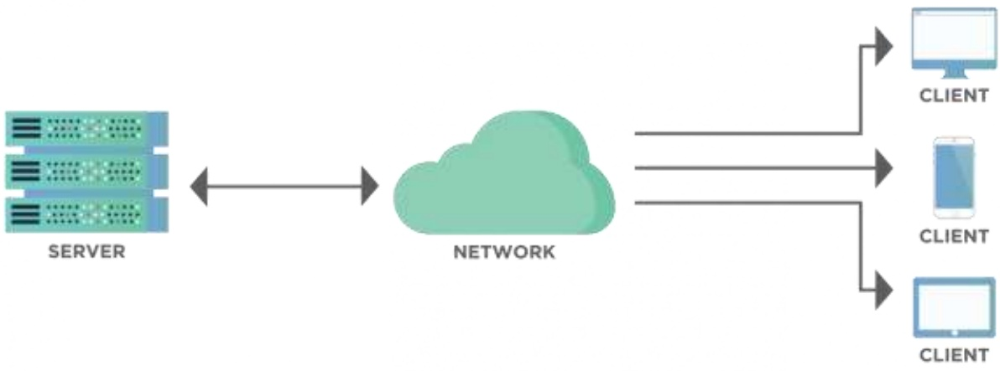

Hình 2.1 Kiến trúc client-server

## Đặc điểm chính

**Phân tách trách nhiệm (Separation of Concerns):** Client tập trung vào việc hiển thị dữ liệu và thu thập đầu vào từ người dùng, trong khi server xử lý các yêu cầu nghiệp vụ, bao gồm tích hợp mô hình GPT với In-Context Learning và RAG.

**Tính mở rộng và linh hoạt:** Kiến trúc client–server cho phép server được triển khai độc lập và dễ dàng mở rộng để đáp ứng nhu cầu xử lý cao mà không ảnh hưởng đến client [17].

**Statelessness:** Trong hệ thống không sử dụng cơ sở dữ liệu, mỗi request từ client phải chứa đầy đủ thông tin cần thiết để server xử lý độc lập, giúp hệ thống dễ dàng mở rộng và bảo trì [18].

## Lợi ích và Ứng dụng

1. **Hiệu năng cao:** Server tập trung tài nguyên cho việc xử lý mô hình ngôn ngữ lớn, tối ưu hóa khả năng xử lý In-Context Learning và RAG.

2. **Bảo mật và Kiểm soát truy cập:** Tất cả các tương tác giữa client và server diễn ra qua các API được bảo vệ, cho phép dễ dàng tích hợp các cơ chế bảo mật như OAuth 2.0 hoặc API key.

<!-- page: 44 -->

3. **Dễ dàng bảo trì và nâng cấp:** Việc cập nhật mô hình GPT hoặc điều chỉnh cấu hình In-Context Learning và RAG chỉ yêu cầu thay đổi trên server; client React Native vẫn giữ nguyên mà không cần tái phát hành ứng dụng.

## 2.2.2 Sơ đồ Kiến Trúc Hệ Thống

Để đáp ứng các chức năng ở bảng 2-1, hệ thống được thiết kế với kiến trúc phân tầng bao gồm:

**Client (Mobile Application)**: Giao diện người dùng và xử lý âm thanh đầu vào thành văn bản và văn bản đầu ra thành âm thanh.

**Backend (Server Application)**: Xử lý nghiệp vụ, lưu trữ dữ liệu và tích hợp **AI Engine**: Xử lý ngôn ngữ tự nhiên và cung cấp phản hồi thông minh cho người dùng.

## + Kiến trúc giao diện người dùng (Client)

Ứng dụng di động sẽ được phát triển trên nền tảng đa nền tảng React Native để hỗ trợ cả iOS và Android. Các thành phần chính bao gồm:

**Dashboard (Trang chủ):** Cung cấp các lựa chọn học ngữ pháp, Basic Speaking và IELTS Speaking.

• **Ngữ pháp:** Chọn chủ đề, trả lời câu hỏi và nhận phản hồi tức thời.

**Hội thoại thông thường:** Chọn chế độ giao tiếp (Calling hoặc Chat), chọn chủ đề và vai trò của AI, sau đó thực hiện giao tiếp và nhận phản hồi.

• **Theo dõi tiến trình:** Hiển thị tiến trình học tập, huy hiệu và lịch sử học tập.

• **Tài khoản:** Cho phép người dùng tùy chỉnh hồ sơ và thông số cài đặt ứng dụng.

<!-- page: 45 -->

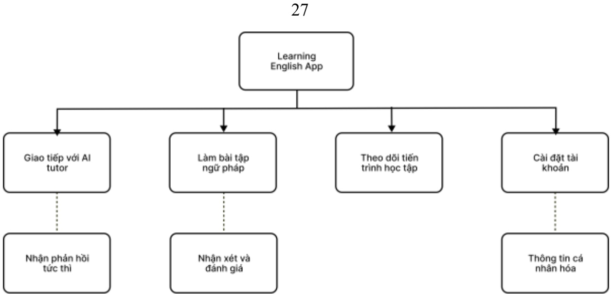

Hình 2.2 Tổng quan về các chức năng của ứng dụng di động

## + Backend với AI Engine

Để cung cấp phản hồi thông minh và tự nhiên cho người học, backend sử dụng Python để phát triển với thành phần:

• **FastAPI Backend:** Nhận yêu cầu và phản hồi cho máy khách thông qua Restfull API.

In-Context Learning và RAG: $\acute { \mathbf { A } } \mathbf { p }$ dụng kỹ thuật in-context learning và Retrieval-Augmented Generation (RAG) để GPT-4o-mini tạo ra phản hồi chính xác và phù hợp với ngữ cảnh học tập.

**GPT-4o-mini Integration:** Sử dụng mô hình ngôn ngữ GPT-4o-mini để xử lý hội thoại và cung cấp phản hồi cá nhân hóa.

<!-- page: 46 -->

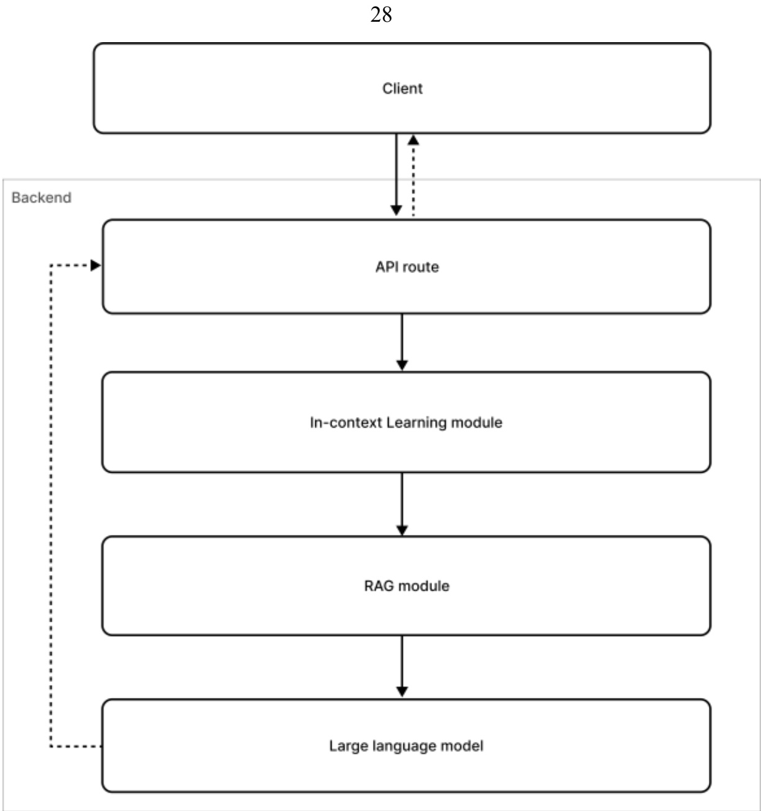

Hình 2.3 Kiến trúc hệ thống backend cho ứng dụng hỗ trợ học tiếng Anh

Kiến trúc hệ thống được thiết kế nhằm đáp ứng đầy đủ các yêu cầu và chức năng của ứng dụng hỗ trợ học tiếng Anh. Với kiến trúc phân tầng, hệ thống đảm bảo tính linh hoạt, mở rộng và ổn định, đồng thời tích hợp AI tiên tiến để cung cấp trải nghiệm học tập hiệu quả và cá nhân hóa cho người dùng.

<!-- page: 47 -->

## 2.3 Phát triển backend

**2.3.1 Chi tiết về quy trình xử lý yêu cầu trên backend**

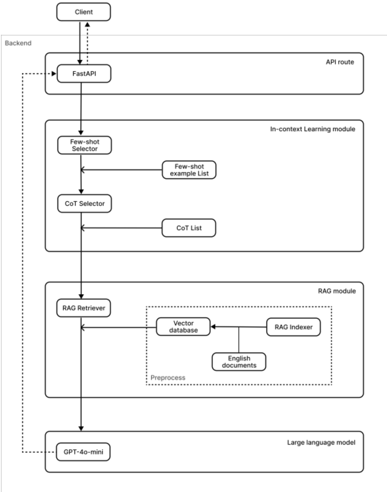

Hình 2.4 Sơ đồ quy trình xử lý yêu cầu trên backend

Hình 2.4 minh họa tổng quan luồng xử lý một yêu cầu từ client trên backend của hệ thống. Backend hoạt động hoàn toàn theo kiến trúc stateless, không dùng database, mỗi lần nhận request sẽ thực hiện tuần tự các bước sau:

<!-- page: 48 -->

## 1. Nhận và xác thực yêu cầu

Backend tiếp nhận yêu cầu HTTP POST từ ứng dụng di động, payload bao gồm prompt gốc và các tham số kèm theo.

• Thực hiện xác thực token/API key để đảm bảo client được phép truy cập.

## 2. Tiền xử lý (Preprocess)

• Kiểm tra định dạng JSON, loại bỏ ký tự đặc biệt không cần thiết.

Chuẩn hóa ngôn ngữ (ví dụ: chuyển chữ hoa thành chữ thường, loại bỏ khoảng trắng thừa) để prompt đồng nhất.

• Thiết lập metadata như timestamp, request ID để phục vụ logging.

## 3. Làm giàu prompt (Prompt Enrich)

## In-Context Learning (Few-Shot & Chain-of-Thought):

Chèn vào prompt gốc một bộ ví dụ mẫu (few-shot examples) được cấu hình sẵn, kèm theo hướng dẫn “Hãy phân tích từng bước…” (chain-of-thought) để kích hoạt khả năng suy luận của GPT.

## Retrieval-Augmented Generation (RAG):

o Gọi module retriever để truy xuất các đoạn văn bản, ví dụ ngữ liệu hoặc kiến thức liên quan từ kho tài liệu (véc-tơ database).

o Ghép nội dung truy xuất được vào prompt để cung cấp thêm bối cảnh.

## 4. Gọi mô hình GPT

• Đóng gói prompt đã làm giàu vào một request tới API của mô hình GPT-4omini.

Thiết lập các tham số như temperature, max\_tokens, top\_p nhằm điều chỉnh độ sáng tạo và độ dài phản hồi.

## 5. Hậu xử lý (Postprocess)

• Nhận kết quả raw từ GPT, trích xuất phần nội dung chính (text completion).

<!-- page: 49 -->

Kiểm tra ngưỡng an toàn (nội dung không vi phạm chính sách), cắt bớt nếu vượt quá giới hạn ký tự.

• Chuyển kết quả thành JSON response theo chuẩn đã định.

## 6. Trả về client

• Gửi HTTP response chứa trường “answer” kèm thông tin metadata (request ID, thời gian xử lý).

• Client tiếp tục xử lý giao diện người dùng dựa trên kết quả.

## 2.3.2 Thiết Kế RESTful API cho backend

## 2.3.2.1 Công nghệ sử dụng:

## • Python

Python được sử dụng làm ngôn ngữ chính cho toàn bộ backend nhờ tính linh hoạt, cộng đồng đông đảo và sẵn có nhiều thư viện hỗ trợ xử lý NLP và AI.

## • FastAPI

FastAPI là framework hiện đại, hiệu năng cao dùng để xây dựng các RESTful API. FastAPI hỗ trợ kiểu gõ tĩnh (type hints), tự động sinh tài liệu Swagger UI và Redoc, đồng thời tận dụng tính năng async/await của Python để xử lý song song nhiều request một cách hiệu quả.

## 2.3.2.2 Phát triển API

Trong toàn bộ backend, chỉ có một endpoint duy nhất chịu trách nhiệm tạo phản hồi dựa trên đối thoại và loại tính năng. API này nhận về một chuỗi các message đã diễn ra trên client và một tham số type xác định kịch bản prompt, rồi trả về kết quả từ mô hình GPT dưới dạng JSON.

## Định nghĩa Endpoint

URL: /api/generate

Phương thức: POST

Mô tả: Sinh phản hồi dựa trên chuỗi hội thoại và loại tính năng cụ thể.

**Mô hình Request**

<!-- page: 50 -->

class ConversationRequest(BaseModel):

\# Danh sách các lượt hội thoại. Mỗi phần tử là dict với keys "role" (user/assistant)

\# và "content" (nội dung message).

**conversation: List[Dict[str, str]]**

\# Loại tính năng để chọn prompt template:

\# - "grammarQA": Hỏi–đáp ngữ pháp

\# - "basicSpeakingConversation": Hội thoại cơ bản nói

\# - "basicChatConversation": Hội thoại cơ bản chat

\# - "iELTSspeakingConversation": Speaking theo format IELTS

\# - "iELTSChatConversation": Chat theo format IELTS

\# - "grammarRating": Chấm điểm ngữ pháp

\# - "conversationRating": Đánh giá hội thoại

**type: str**

\# Loại kỳ thi (nếu có), dùng để hình thành query RAG:

\# "IELTS", "TOEIC", "APTIS", "VSTEPS"

**exam\_type: str**

\# Trình độ ngoại ngữ của người dùng (A1–C2)

**eng\_level: str**

\# Chủ đề cụ thể: ví dụ "Simple Tense", "Count vs Non-Count Nouns",…

**topic: str**

<!-- page: 51 -->

\+ **conversation**

• Kiểu: List[Dict[str, str]]

Mô tả: Mảng các thông điệp đã trao đổi. Mỗi phần tử có dạng { "role": "user" | "assistant", "content": "..." }

\+ **type**

• Giá trị hợp lệ:

Bảng 2-2 Các giá trị hợp lệ cho trường “type” trong API

| Giá trị | Mô tả |
| --- | --- |
| "grammarQA" | Loại API để tạo ra các câu hỏi về ngữ pháp |
| "basicSpeakingConversation" | Loại API để tiếp tục hội thoại nói cơ bản |
| "basicChatConversation" | Loại API để tiếp tục hội thoại chat cơ bản |
| "iELTSspeakingConversation" | Loại API để tiếp tục phần thi nói theo bài thi IELTS |
| "iELTSChatConversation" | Loại API để tiếp tục chat theo bài thi IELTS |
| "grammarRating" | Loại API để chấm điểm ngữ pháp |
| "conversationRating" | Loại API để đánh giá và phản hồi về cuộc hội thoại |

**+ exam\_type**

• Giá trị hợp lệ: "IELTS", "TOEIC", "APTIS", "VSTEPS"

<!-- page: 52 -->

• Xác định định dạng thi giúp RAG truy xuất ngữ liệu phù hợp.

## + eng\_level

• Giá trị: cấp độ khung Khung Tham chiếu Châu Âu (A1, A2, B1, B2, C1, C2)

• Dùng để điều chỉnh độ khó câu hỏi và prompt.

## + topic

• Chủ đề ngữ pháp hoặc hội thoại, ví dụ “Simple Past”, “Present Perfect”, “Travel”,…

## 2.3.3 Cấu hình In-Context Learning

## 2.3.3.1 Thiết lập Chain Of Thought (CoT) – Chuỗi suy nghĩ

Khi một nhiệm vụ phức tạp được chia nhỏ thành các bước con rõ ràng, mô hình ngôn ngữ lớn sẽ theo dõi và giải quyết lần lượt từng phần, từ đó nâng cao độ chính xác trong các bài toán nhiều bước (multi-step reasoning).

Ví dụ trong với loại API là ngữ pháp, quy trình được tách thành:

Đặt vai trò cho mô hình ngôn ngữ lớn.

• Xác định trình độ và chủ đề (phân tích ngữ cảnh) dựa trên thông tin từ client

• Lựa chọn độ khó và cấu trúc câu hỏi phù hợp

• Truy xuất hoặc tạo câu hỏi với 4 lựa chọn (bao gồm đáp án đúng và các đáp án khác thể hiện một lỗi phổ biến)

• Dịch câu hỏi và đáp án sang tiếng mẹ đẻ

• Giải thích lý do đáp án đúng.

• Đưa ra định dạng phản hồi

Từ đó ta sẽ triển khai được một chuỗi suy nghĩ như sau:

**grammarQA\_CoT\_prefix** = “You are an expert IELTS instructor creating grammar test questions for English learners.

<!-- page: 53 -->

Please follow these steps:

1. Extract the user's English level (A1–C2) and the grammar topic from the instruction.

2. Based on the English level and topic (e.g., 'Singular and Plural Nouns', 'Count Nouns vs. Non-Count Nouns', 'Simple Tense', etc.), determine the appropriate complexity and focus for the question.

3. Get a question from the question bank or refer it to create grammar question specific to the topic with only 4 answer choices and ensure one is correct according to proper grammar rules and the other is a common mistake made by learners.

4. Translate the question and both answer choices into Vietnamese.

5. Provide a brief explanation for why the chosen answer is correct.

6. Format your response strictly as valid JSON with these fields:

"question": "Your question here",

"question\_translated": "Your question but in Vietnamese",

"option1": "Option 1",

"option1\_translated": "Option 1 but in Vietnamese",

"option2": "Option 2",

"option2\_translated": "Option 2 but in Vietnamese",

"option3": "Option 3",

"option3\_translated": "Option 3 but in Vietnamese",

"option4": "Option 4",

"option4\_translated": "Option 4 but in Vietnamese",

<!-- page: 54 -->

"correctAnswer": "Correct answer here: the value of option1 or option2 or option3 or option4",

Các chuỗi suy nghĩ khác nhau sẽ được thiết kế cho tất cả các loại API được thể hiện ở bảng A phần phụ lục.

Tiếp theo, để gắn chuỗi suy nghĩ (Chain-of-Thought) vừa thiết kế vào prompt dựa trên từng loại API, trong lớp **InContextLearningMobule** đã khai báo một dictionary:

```python
CoT_prefix_collections = {
    "grammarQA": grammarQA_CoT_prefix,
    "basicSpeakingConversation": basicSpeakingConversation__CoT_prefix,
    "basicChatConversation": basicSpeakingConversation__CoT_prefix,
    "iELTSspeakingConversation": iELTSspeakingConversation_CoT_prefix,
    "iELTSChatConversation": iELTSspeakingConversation_CoT_prefix,
    "grammarRating": grammarRating _CoT_prefix,
    "conversationRating": grammarRating _CoT_prefix
}
```

## 2.3.3.2 Thiết lập Few-shot Learning

Bước tiếp theo là cấu hình **Few-Shot Learning** để cung cấp cho mô hình một số ví dụ mẫu (input–output) minh họa cách thức xử lý cho từng loại yêu cầu. Ví dụ trong với loại API là ngữ pháp:

<!-- page: 55 -->

## grammarQaExamples = [

"**input**": "I am at English level A2 – Elementary.

A2 level: Can understand frequently used expressions related to basic personal and everyday topics e.g., shopping, family, work. Can communicate in simple tasks requiring direct exchange of basic information. Can describe aspects of their background in simple terms.

Please give me a 4-choices question about topic Simple Tense.

Please give the question one by one then wait for me to answer then go to next one.

Always respond following a valid json format so that i can parse it” ,

"**output**": "{

"question": "They to the cinema every Saturday.",

"question\_translated": "Họ đến rạp chiếu phim mỗi thứ Bảy.",

"option1": "goes",

"option2": "go",

"option3": "going",

"option4": "gone",

"correctAnswer": "go",

"explanation": "The subject 'They' is third-person plural, so the verb 'go' remains in its base form in the present simple tense." }"

]

<!-- page: 56 -->

Mỗi loại API cũng được thiết kế các ví dụ few-shot tương ứng được liệt kê chi tiết ở bảng B phần phụ lục.

Tiếp theo, để thêm các ví dụ few-shot vào prompt dựa trên từng loại API, trong lớp **InContextLearningMobule** đã khai báo một dictionary:

```python
few_shot_example_collections = {
    "grammarQA": grammarQaExamples,
    "basicSpeakingConversation": basicSpeakingConversationExamples,
    "basicChatConversation": basicChatConversationExamples,
    "iELTSspeakingConversation": iELTSspeakingConversationExamples,
    "iELTSChatConversation": iELTSChatConversationExamples,
    "grammarRating": grammarRatingExamples,
    "conversationRating": conversationRatingExamples
}
```

## 2.3.4 Cấu hình RAG

## 2.3.4.1 Nhập liệu tài liệu vào cơ sở dữ liệu véc-tơ

Trong đề tài này, nguồn dữ liệu chính gồm hơn 10 000 câu hỏi ngữ pháp và hội thoại được trích xuất từ trang web uy tín British Council [(https://learnenglish.britishcouncil.org/)](https://learnenglish.britishcouncil.org/). Toàn bộ các câu hỏi này được đóng gói dưới dạng các file PDF và sẽ được nhập liệu vào một cơ sở dữ liệu véc-tơ. Việc nhập liệu này gồm các bước:

## Trích xuất văn bản từ PDF

Từng file PDF được đọc và tách thành các trang riêng biệt bằng **PyPDF2**. Việc chia nhỏ dữ liệu thành các “chunk” tương ứng với từng trang PDF là hoàn toàn phù hợp, bởi mỗi trang trong bộ tài liệu thường tập trung vào một chủ đề ngữ pháp cụ thể (ví

<!-- page: 57 -->

dụ như thì hiện tại đơn, danh từ đếm được/không đếm được, hay mệnh đề quan hệ). Khi gom các câu hỏi liên quan trên cùng một trang thành một chunk, ta giữ nguyên được ngữ cảnh chủ đề, giúp embedding phản ánh đúng nội dung thống nhất và tăng cường độ chính xác khi truy xuất thông tin tương đồng. Phương pháp này không chỉ đơn giản mà còn đảm bảo mỗi chunk mang tính chuyên môn cao, thuận tiện cho cả quá trình truy vấn và phân tích kết quả trong bước RAG.

```python
def extract_pages_from_pdf(pdf_path: str) -> list:
    pages = []
    with open(pdf_path, "rb") as file:
        reader = PyPDF2.PdfReader(file)
        for page in reader.pages:
            page_text = page.extract_text()
            # Append the page content or an empty string if no text is found
            pages.append(page_text if page_text else "")
    return pages
```

## Tạo embedding cho mỗi trang

Sử dụng mô hình **all-MiniLM-L6-v2** từ thư viện **sentence\_transformers** để biến mỗi trang văn bản thành một véc-tơ số:

```python
def create_embeddings(pages: list) -> np.ndarray:
    model = SentenceTransformer("all-MiniLM-L6-v2")
    embeddings = model.encode(pages)
    return embeddings
```

<!-- page: 58 -->

## Xây dựng chỉ mục FAISS

**IndexFlatL2** là một loại chỉ mục (index) trong thư viện **FAISS** (Facebook AI Similarity Search) được thiết kế để thực hiện tìm kiếm tương đồng (similarity search) giữa các véc-tơ trong không gian nhiều chiều. Cụ thể, **IndexFlatL2** sử dụng khoảng cách L2 (hay còn gọi là khoảng cách Euclidean) để đo lường mức độ tương đồng giữa các véc-tơ.

def **create\_faiss\_index**(embeddings: np.ndarray):

d = embeddings.shape[1] # Determine the dimensions of the embedding véc-tơs

index = faiss.IndexFlatL2(d) # Using L2 distance

index.add(embeddings)

return index

## Lưu trữ index và ánh xạ ngược

Để phục vụ quá trình truy vấn sau này, **index** cùng với map từ **véc-tơ\_id** về nội dung trang sẽ được ghi ra file:

def **save\_index**(index: faiss.IndexFlatL2, mapping: dict, index\_path: str = "faiss\_index.idx", mapping\_path: str = "mapping.npy"):

faiss.write\_index(index, index\_path)

np.save(mapping\_path, mapping)

## 2.3.4.2 Truy xuất dữ liệu tương đồng khi có prompt

Khi nhận được prompt từ client, bước tiếp theo trong quy trình RAG là truy xuất những đoạn văn bản (chunk) chứa nội dung tương đồng nhất từ véc-tơ database để làm giàu cho prompt trước khi gửi tới mô hình GPT. Đề án triển khai như sau:

## Tải chỉ mục FAISS và ánh xạ ngược

<!-- page: 59 -->

Sử dụng hàm **load\_index**(), backend sẽ đọc lại chỉ mục đã xây dựng và ánh xạ từ **véc-tơ\_id** về nội dung trang:

```python
def load_index(index_path: str = "faiss_index.idx",
    mapping_path: str = "mapping.npy"):
    index = faiss.read_index(index_path)
    mapping = np.load(mapping_path, allow_pickle=True).item()
    return index, mapping
```

## Thu thập văn bản tương đồng

Khi có truy vấn (tức là prompt được gửi từ client) hệ thống khởi tạo lại mô hình embedding (vẫn sử dụng SentenceTransformer) và mã hóa truy vấn. Với embedding của truy vấn, hệ thống sử dụng thuật toán tìm kiếm KNN (K-Nearest Neighbors) để thu về chỉ mục của k véc-tơ gần nhất dựa trên khoảng cách L2. Sau đó sẽ ánh xạ ngược các chỉ mục để lấy ra nội dung văn bản gốc. Hàm **retrieve\_similar\_text**(query, top\_k) cuối cùng trả về một danh sách **results** chiều dài top\_k, chứa các đoạn văn bản – mỗi đoạn tương ứng một trang PDF – có độ tương đồng cao nhất với prompt.

```python
def retrieve_similar_text(query: str, top_k: int = 3):
    # Load index và mapping
    index, mapping = load_index()
    # Mã hóa truy vấn
    model = SentenceTransformer("all-MiniLM-L6-v2")
    query_emb = model.encode([query]).astype("float32")
    # Tìm kiểm
    _, indices = index.search(query_emb, top_k)
```

<!-- page: 60 -->

\# Trả về nội dung tương đồng

## 2.3.5 Kết hợp Incontext Learning với RAG sử dụng LangChain

## 2.3.5.1 Giới thiệu về LangChain

LangChain là một framework mã nguồn mở được thiết kế để xây dựng các ứng dụng dựa trên các mô hình ngôn ngữ lớn (LLMs) như GPT-4, LLaMA, Claude, v.v. Với LangChain, các nhà phát triển có thể dễ dàng kết nối LLMs với dữ liệu bên ngoài, thiết kế chuỗi hành động (chains), và xây dựng các ứng dụng AI phức tạp như chatbot, hệ thống hỏi đáp, tóm tắt văn bản, và nhiều hơn nữa.

Để tận dụng đồng thời hai kỹ thuật In-Context Learning và Retrieval-Augmented Generation (RAG), hệ thống sử dụng LangChain làm framework chủ đạo.

## 2.3.5.1 Kết hợp In-context Learning với RAG vào prompt

**Khởi tạo mẫu Prompt (PromptTemplate)**

Trước hết, phương thức **initFewShotPromptTemplate**() được gọi khi backend nhận về một yêu cầu từ client. Phương thức này khởi tạo một đối tượng **FewShotPromptTemplate** – là thành phần cơ bản để ghép nối prefix (Chain-of-Thought), các ví dụ mẫu (Few-Shot Examples) và phần history (conversation context). Ví dụ:

```python
def initFewShotPromptTemplate(self):
    self. prompt_to_model = FewShotPromptTemplate(
        example_prompt=PromptTemplate(
            input_variables=["input"],
            template="User latest input: {input}\nValid response: {output}")
            suffix="\nConversation: {user_input}\nResponse:",
            input_variables=["user_input"]
        )
```

<!-- page: 61 -->

Trong đó:

• **example\_prompt**: định nghĩa template chung dùng để chèn từng ví dụ Few-Shot.

• **suffix**: đánh dấu phần cuối của prompt, nơi ghép lịch sử đối thoại thực tế từ client ({user\_input}), sẵn sàng cho bước sinh phản hồi.

**input\_variables**: khai báo biến đầu vào cho template (ở đây là user\_input), chứa toàn bộ lịch sử trao đổi giữa client và hệ thống.

**Lựa chọn Chain-of-Thought và ví dụ Few-Shot**

Ngay sau khi mẫu prompt cơ bản được thiết lập, hệ thống sẽ ánh xạ giá trị **type** trong request sang một chuỗi **CoT\_prefix** (Chain-of-Thought) và một bộ ví dụ **fewShot\_examples**. Việc này đảm bảo mô hình GPT tuân thủ tuần tự các bước phân tích (CoT) và có “bản mẫu” để học tạm thời (Few-Shot). Cả hai thành phần này được lưu trong hai dictionary CoT\_prefix\_collections (mục 2.3.4.1) và few\_shot\_example\_collections (mục 2.3.4.2).

```python
def select_CoT(self, type):
    CoT_prefix = self.CoT_prefix_collections.get(type)
    if CoT_prefix is None:
        raise ValueError(f"Unrecognized type: {type}")
    self.prompt_to_model.prefix= CoT_prefix
def select_fewShot_examples(self, type):
    few_shot_examples = self.few_shot_example_collections.get(type)
    if few_shot_examples is None:
        raise ValueError(f"Unrecognized type: {type}")
    self.prompt_to_model.examples=few_shot_examples,
```

<!-- page: 62 -->

Bằng cách thiết kế riêng chuỗi hướng dẫn và ví dụ mẫu cho từng loại bài toán, hệ thống đảm bảo mỗi prompt được cấu hình một cách cá nhân hóa và phù hợp ngữ cảnh, từ đó tối ưu hóa hiệu quả phản hồi của mô hình ngôn ngữ lớn GPT.

## Làm giàu promt với RAG

Hệ thống trích xuất các thông tin chính như trình độ Ngoại Ngữ của người dùng (A1–C2), chủ đề trao đổi (ví dụ: ngữ pháp, hội thoại, đọc hiểu) và loại kỳ thi (IELTS, TOEIC, …) để tổng hợp thành một truy vấn (query) tối ưu cho hàm **retrieve\_similar\_text**. Hàm **retrieve\_similar\_text**(query) chịu trách nhiệm truy xuất top\_k (ví dụ: 3) đoạn văn bản có embedding gần nhất với query trong FAISS index. Kết quả thu được được lưu trong danh sách **similar\_chunks**, sau đó được định dạng thành chuỗi **retrieved\_text** với tiêu đề “Retrieved questions from question bank:” và mỗi phần tử trên một dòng mới. Cuối cùng, **retrieved\_text** được ghép nối trước phần prefix ban đầu của prompt, đảm bảo mô hình GPT nhận thêm bối cảnh chuyên môn từ kho câu hỏi chuẩn, qua đó nâng cao tính chính xác và sự liên kết trong phản hồi.

```txt
query_template = PromptTemplate(
    input_variables=["level", "topic", "conversation_type", "exam_type"],
    template=(
        "Retrieve quetstions {conversation_type} about topic “{topic}" "
        "suitable with learners at level {level}" "
        "following format of {exam_type} {% endif %." )
    )
)
query = query_template.format(
    level="B1",
    topic="Simple Tense",
```

<!-- page: 63 -->

```python
45
conversation_type="grammarQA",
exam_type="IELTS"
)
try:
similar_chunks = retrieve_similar_text(query)
retrieved_text = (
"Retrieved questions from question bank:\n"
+ "\n".join(similar_chunks)
+ "\n"
)
# Chèn nội dung truy xuất được vào đầu prefix
self.prompt_to_model.prefix = retrieved_text + prompt_to_model.prefix
except Exception as e:
print("Error during retrieval from véc-to DB:", e)
```

## Trong đó:

Nhờ cơ chế này, prompt gửi đến mô hình ngôn ngữ lớn không chỉ bao gồm hướng dẫn logic (CoT) và ví dụ mẫu (Few-Shot), mà còn chứa các trích dẫn thực tế từ tài liệu nguồn, giúp phản hồi của mô hình chính xác và nhất quán hơn.

**Tạo prompt hoàn chỉnh và gửi tới mô hình ngôn ngữ lớn**

Trong phương thức khởi tạo, biến **self.llm** được gán một đối tượng **ChatOpenAI** với model **gpt-4o-mini** và **temperature=0.3**, đảm bảo đầu ra đủ ổn định và không quá ngẫu nhiên.

Sau khi đã thực hiện In-context Learning và RAG, prompt đã bao gồm:

• Phần **RAG** (retrieved texts)

• Phần **CoT** (prefix)

• Các ví dụ **Few-Shot**

<!-- page: 64 -->

## • Phần cuộc trò truyện (suffix)

Lúc này, hệ thống thực hiện gửi prompt cho mô hình ngôn ngữ lớn với **conversation\_context** là chuỗi chứa lịch sử toàn bộ các tin nhắn (role–content) trong cuộc trò chuyện dạng chuỗi văn bản được tạo ra từ **conversation** do client gửi lên qua API.

```python
conversation_context = "\n".join([f" {msg['role']} : {msg['content']}" for msg in conversation])
final_prompt = self.prompt_to_model.format(user_input=conversation_context)
return self.llm.invoke(final_prompt).content
```

Kết quả trả về được parse dưới dạng JSON và gửi lại cho client, hoàn thiện quy trình kết hợp In-Context Learning và RAG.

## 2.4 Tiểu kết chương 2

Chương 2 tập trung vào việc thiết kế tổng quan hệ thống, bao gồm cả kiến trúc client–server cho backend và ứng dụng di động, đồng thời triển khai chi tiết phần lập trình backend. Cụ thể, sau khi phân tích yêu cầu, hệ thống đã được mô hình hóa với một RESTful API trên FastAPI, tích hợp In-Context Learning (Chain-of-Thought, Few-Shot) qua LangChain và Retrieval-Augmented Generation (RAG) trên FAISS. Các kết quả ở Chương 2 đã hoàn thành cơ sở hạ tầng và logic xử lý cần thiết, chuẩn bị đầy đủ nền tảng cho việc phát triển ứng dụng di động và kiểm thử trong Chương 3.

<!-- page: 65 -->

## CHƯƠNG 3 : PHÁT TRIỂN ỨNG DỤNG DI ĐỘNG HỖ TRỢ HỌC TIẾNG ANH TÍCH HỢP MÔ HÌNH NGÔN NGỮ LỚN

Chương này tập trung vào phát triển và cài đặt ứng dụng hỗ trợ học tiếng Anh trong môi trường thực tế, kiểm thử các tính năng và hiệu suất, và đánh giá phản hồi người dùng để đưa ra các cải tiến và phát triển tiếp theo.

## 3.1 Môi trường và công cụ phát triển

Để thực hiện nhanh chóng và hiệu quả, toàn bộ ứng dụng di động được phát triển trên nền tảng **React Native**, sử dụng **JavaScript**/**TypeScript** làm ngôn ngữ chính, kèm theo hai công cụ hỗ trợ là **Visual Studio Code** (IDE) và **Figma** (thiết kế giao diện).

**React Native** là framework mã nguồn mở do Facebook phát triển, cho phép xây dựng ứng dụng di động trên cả hai hệ điều hành iOS và Android chỉ với một cơ sở mã duy nhất. [19] Thay vì phải viết code riêng cho từng nền tảng, React Native dịch chuyển các thành phần giao diện React thành các thành phần native tương ứng, nhờ đó mang lại trải nghiệm mượt mà và tốc độ gần tương đương ứng dụng gốc. Những ưu điểm nổi bật của React Native bao gồm:

**Cross-platform**: Chỉ cần một codebase để triển khai đồng thời trên iOS và Android, giúp giảm thiểu chi phí và công sức phát triển.

**Hot Reloading**: Cho phép xem ngay lập tức kết quả thay đổi về giao diện hoặc logic mà không phải biên dịch lại toàn bộ ứng dụng.

**Ecosystem và Community**: Hàng nghìn thư viện, module và plugin phong phú sẵn sàng tích hợp (ví dụ React Navigation, Redux, NativeBase), hỗ trợ hầu hết các yêu cầu phổ biến từ xác thực người dùng đến truy cập camera hoặc microphone.

**Hiệu năng**: React Native sử dụng bridge để kết nối JavaScript với các thành phần native, đảm bảo vận hành mượt mà và tận dụng được tối đa khả năng của phần cứng thiết bị.

Trong dự án này, **Visual Studio Code** được chọn làm môi trường lập trình chính nhờ khả năng tích hợp tốt với JavaScript/TypeScript, hệ thống extension đa dạng (linting,

<!-- page: 66 -->

debugger, Git) và tính nhẹ, khởi động nhanh. **Figma** được sử dụng để thiết kế giao diện và luồng trải nghiệm người dùng, từ sơ phác wireframe đến prototype có khả năng tương tác, giúp dễ dàng trao đổi với người hướng dẫn và đội nhóm phát triển.

## 3.2 Các chức năng của ứng dụng

Tại màn hình chính, người học có thể truy cập đầy đủ các chức năng học tập một cách trực quan và liền mạch. Cụ thể, ứng dụng cho phép:

Thực hiện các **bài tập ngữ pháp tương tác** theo trình độ.

**Trò chuyện và luyện nói** trực tiếp với mô hình AI, hỗ trợ cả văn phong giao tiếp thông thường lẫn mô phỏng các bài thi học thuật.

• **Theo dõi tiến độ học tập**, xem lại lịch sử tương tác và đánh giá hiệu suất qua thời gian.

• **Cập nhật thông tin cá nhân** và tinh chỉnh các thiết lập để cá nhân hóa trải nghiệm học tập.

Thiết kế này hướng tới việc tạo ra một trải nghiệm học ngoại ngữ toàn diện, cá nhân hóa và nhất quán, giúp người dùng dễ dàng tiếp cận và duy trì động lực học tập lâu dài.

<!-- page: 67 -->

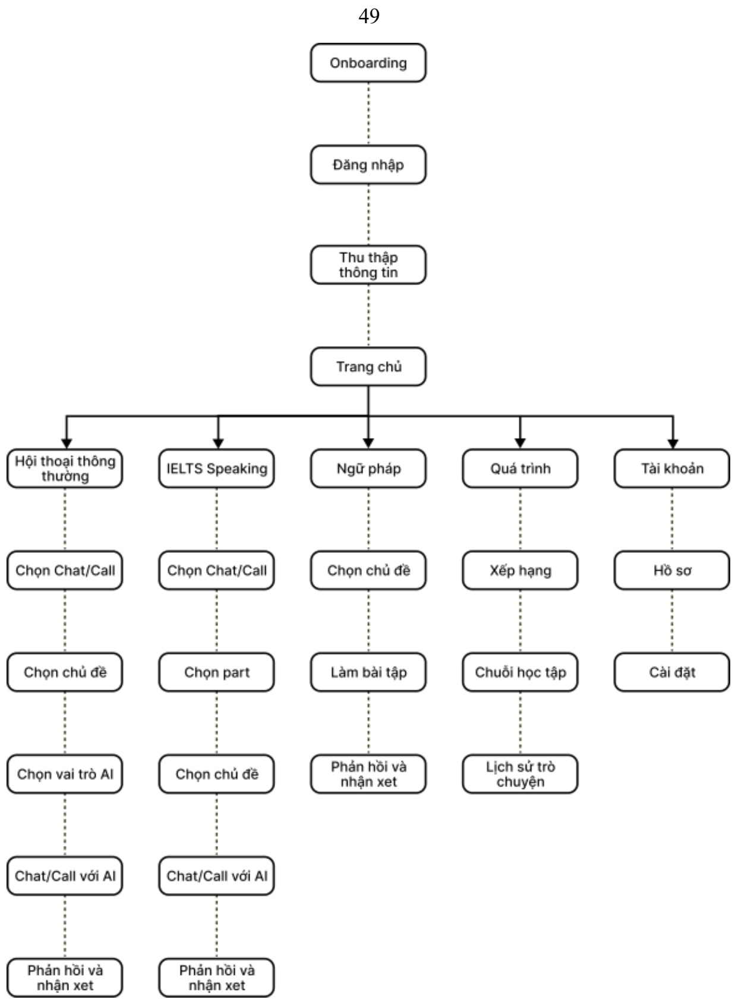

Hình 3.1 Kiến trúc ứng dụng di động hỗ trợ học ngoại ngữ

## 3.2.1 Phát triển phần Onboarding, Đăng nhập và Thu thập thông tin cá nhân

Giai đoạn đầu tiên trong hành trình sử dụng ứng dụng là chuỗi màn hình **Onboarding** và **Đăng nhập**, kết hợp với việc thu thập thông tin cá nhân để cá nhân hóa trải nghiệm học tập cho từng người dùng.

<!-- page: 68 -->

**Onboarding** được thiết kế nhằm giới thiệu ngắn gọn các chức năng chính của ứng dụng như: luyện tập ngữ pháp, trò chuyện với AI, theo dõi tiến độ học tập, và tùy chỉnh cài đặt. Người dùng sẽ được lướt qua từ 4 hình ảnh minh họa với nội dung dễ hiểu, mang tính định hướng trước khi bắt đầu. Việc hiển thị Onboarding chỉ diễn ra ở lần truy cập đầu tiên, được kiểm soát thông qua local storage.

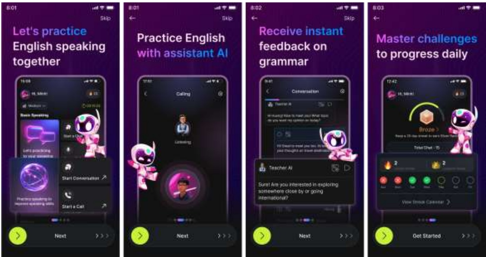

Hình 3.2 Các trang onboarding

Sau phần giới thiệu, người dùng được chuyển tới màn hình **Đăng nhập/Đăng ký**, cho phép lựa chọn giữa:

• Đăng nhập bằng tài khoản Google hoặc Apple,

• Không cần đăng nhập

<!-- page: 69 -->

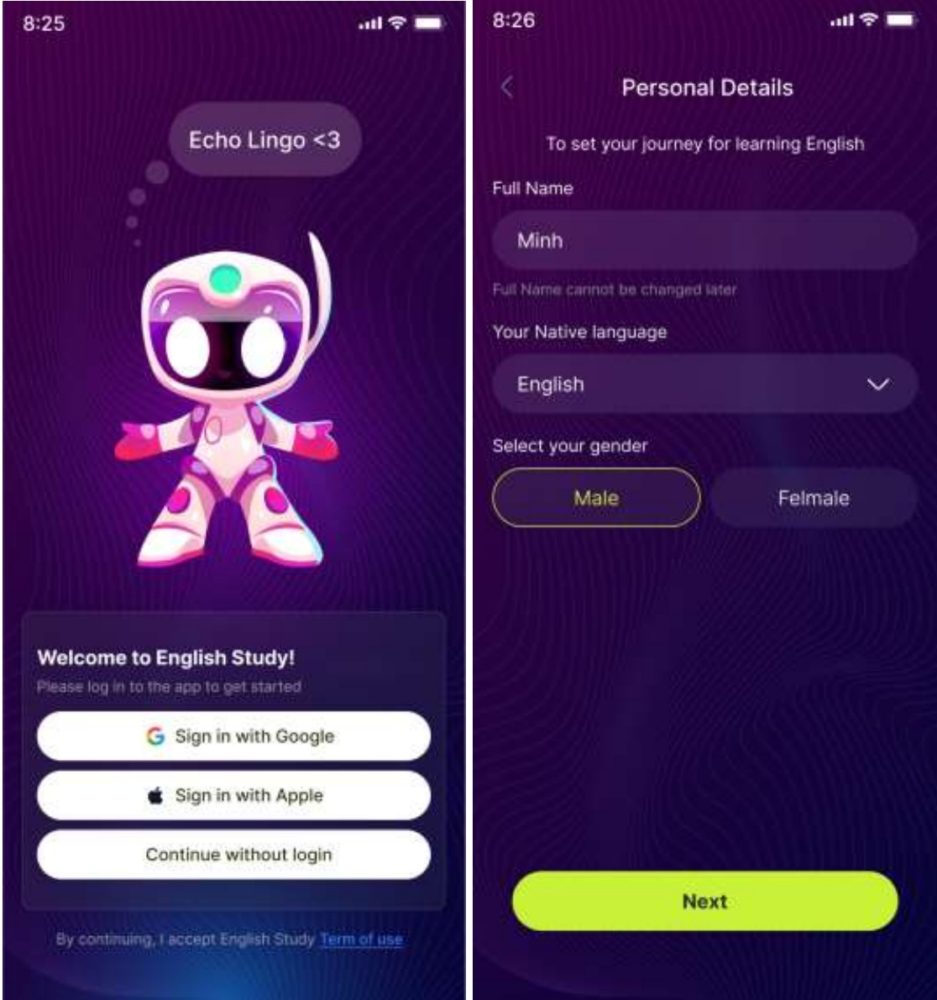

Hình 3.3 Màn hình đăng nhập và thông tin cá nhân

Ngay sau khi đăng nhập thành công, ứng dụng hiển thị giao diện **thu thập thông tin cá nhân**, bao gồm:

• Họ tên, tiếng mẹ đẻ, giới tính

Trình độ tiếng Anh hiện tại

• Mục tiêu học tập (giao tiếp, luyện thi, nâng cao),

• Khó khăn gặp phải khi học tiếng Anh

Thông tin này được lưu trữ cục bộ và gửi kèm trong mỗi request đến backend để hỗ trợ việc sinh prompt phù hợp (cho In-Context Learning và RAG). Việc cá nhân

<!-- page: 70 -->

hóa từ sớm giúp nâng cao mức độ phù hợp của nội dung, đồng thời giúp hệ thống tối ưu hóa phản hồi từ mô hình ngôn ngữ lớn.

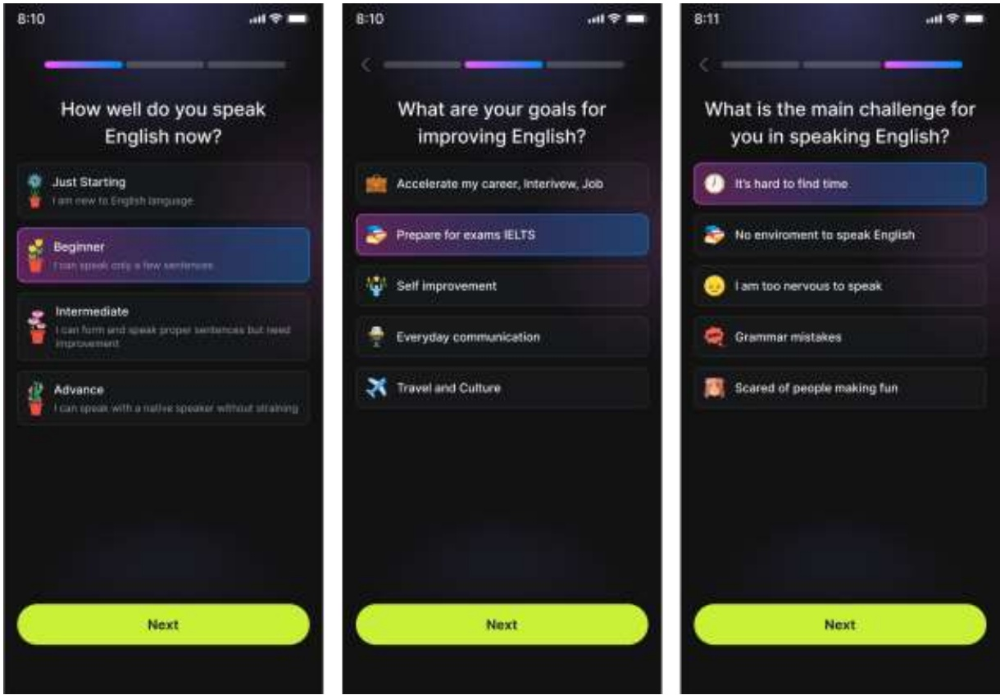

Hình 3.4 Màn hình thu thập thông tin cá nhân về trình độ, mục tiêu và khó khăn khi học tiếng Anh của người dùng

Tổng thể, luồng Onboarding – Đăng nhập – Khởi tạo hồ sơ không chỉ mang lại sự thân thiện cho người dùng mới mà còn đóng vai trò nền tảng cho các tính năng học tập được cá nhân hóa cao trong các phần tiếp theo của ứng dụng.

## 3.2.2 Phát triển phần trang chủ

Trang chủ là trung tâm điều hướng chính, được thiết kế nhằm cung cấp cho người học một cái nhìn tổng quan về các chức năng, tiến độ và trạng thái phiên học. Giao diện này bao gồm các thành phần chính sau:

<!-- page: 71 -->

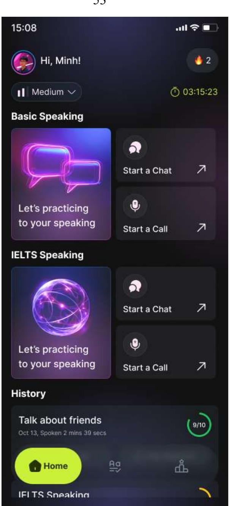

Hình 3.5 Màn hình Trang chủ

## Thanh tiêu đề và cá nhân hóa

**Ảnh đại diện**: Hiển thị ảnh đại diện và tên người dùng để tạo cảm giác quen thuộc và gắn kết ngay từ lần mở ứng dụng đầu tiên.

**Chỉ số tích luỹ** (“ 2”): Biểu tượng “ngọn lửa” kèm số chuỗi học tập khuyến khích người dùng duy trì thói quen học tập.

**Chọn mức độ và đồng hồ đếm ngược**: Thẻ “Medium” cho phép người dùng điều chỉnh độ khó tương tác (Easy/Medium/Hard), bên cạnh là bộ đếm thời gian phiên học hiện tại giúp quản lý thời lượng luyện tập.

<!-- page: 72 -->

## Các khối chức năng chính

Giao diện chia làm hai nhóm nhiệm vụ:

## o Luyện nói cơ bản:

▪ Biểu tượng và tiêu đề “Let’s practicing to your speaking” kèm hình minh họa bong bóng hội thoại.

Hai hành động “Start a Chat” và “Start a Call” cho phép người dùng lựa chọn hình thức luyện nói bằng văn bản hoặc thoại.

## IELTS Speaking:

Tương tự Basic Speaking, nhưng nội dung và chủ đề được tối ưu theo cấu trúc đề thi IELTS, chuẩn bị cho người dùng làm quen với định dạng Part 1–3.

## Lịch sử và đánh giá

o **History**: Danh sách các phiên luyện tập gần nhất, thể hiện chủ đề cuộc trò truyện, ngày giờ, thời lượng và điểm số (9/10) ngay bên cạnh giúp người dùng dễ dàng xem lại kết quả và tiếp tục cải thiện.

## Thanh điều hướng dưới cùng

o Gồm các icon: **Trang chủ**, **Ngữ pháp, Tiến trình** giúp chuyển nhanh giữa các màn hình con.

Thiết kế trang chủ tập trung vào **tính trực quan** và **liền mạch**: mọi tính năng quan trọng được hiển thị ngay bên trên, cho phép người học khởi động nhanh bất cứ chế độ luyện tập nào, đồng thời dễ dàng theo dõi tiến trình và điều chỉnh cài đặt cá nhân ngay từ màn hình đầu tiên.

## 3.2.3 Phát triển tính năng Luyện nói

Tính năng **Luyện nói** là một trong những điểm nhấn quan trọng của ứng dụng, bao gồm hai chế độ: **Basic Speaking** (giao tiếp cơ bản) và **IELTS Speaking** (luyện thi nói theo format IELTS). Cả hai chế độ đều hỗ trợ hai hình thức **chat** và **call**, nhưng

<!-- page: 73 -->

có các bước khởi tạo khác nhau để đảm bảo tính cá nhân hóa và phù hợp với mục đích học tập.

## 3.2.3.1 Luyện nói cơ bản (Basic Speaking)

Từ Trang chủ, người dùng nhấn “Start a Chat” hoặc “Start a Call” trong mục Basic Speaking. Màn hình hiển thị các tùy chọn vai trò như bạn bè, phụ huynh, anh chị em, giáo viên,…Vai trò được chọn sẽ xác định ngữ cảnh hội thoại. Sau khi chọn vai trò, người dùng chọn một chủ đề giao tiếp cơ bản (ví dụ: giới thiệu bản thân, hỏi đường, đặt món ăn…). Chủ đề được tùy chỉnh theo trình độ và sở thích đã lưu.

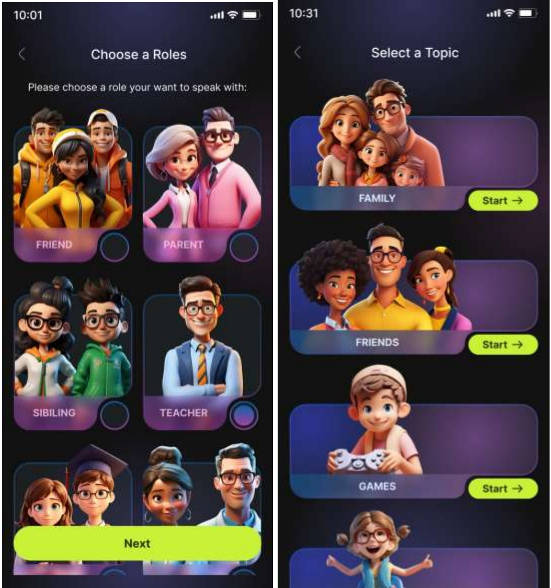

Hình 3.6 Màn hình chọn vai trò cho mô hình AI và chủ đề hội thoại của tính năng Luyện nói cơ bản

<!-- page: 74 -->

## 3.2.3.2 Luyện thi nói IELTS (IELTS Speaking)

Tương tự Basic Speaking, người dùng chọn “Start a Chat” hoặc “Start a Call” trong mục IELTS Speaking. Màn hình lựa chọn Part 1, Part 2 hoặc Part 3 của phần thi IELTS Speaking. Với mỗi Part, người dùng chọn chủ đề phù hợp. Chủ đề được gợi ý dựa trên tài liệu luyện thi tiêu chuẩn.

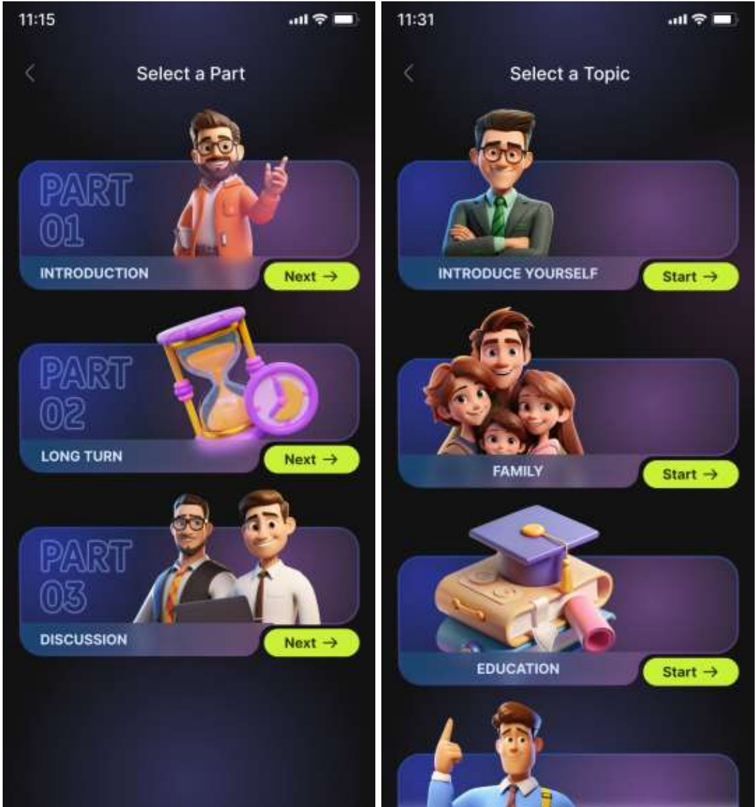

Hình 3.7 Màn hình chọn phần thi và chủ đề của tính năng IELTS Speaking

## 3.2.3.3 Xử lý Text-to-Speech và Speech-to-Text trong màn hình Call/Chat

Để mang đến trải nghiệm hội thoại thoại hai chiều, tính năng **Call/Chat** tích hợp cả **Text-to-Speech (TTS)** và **Speech-to-Text (STT)**, cho phép người học vừa nói, vừa nghe phản hồi một cách tự nhiên. Ở màn hình Chat, người dùng vẫn có thể

<!-- page: 75 -->

sử dụng giọng nói để chuyển thành văn bản, sau đó có thể chỉnh sửa và gửi đi như một tin nhắn thông thường.

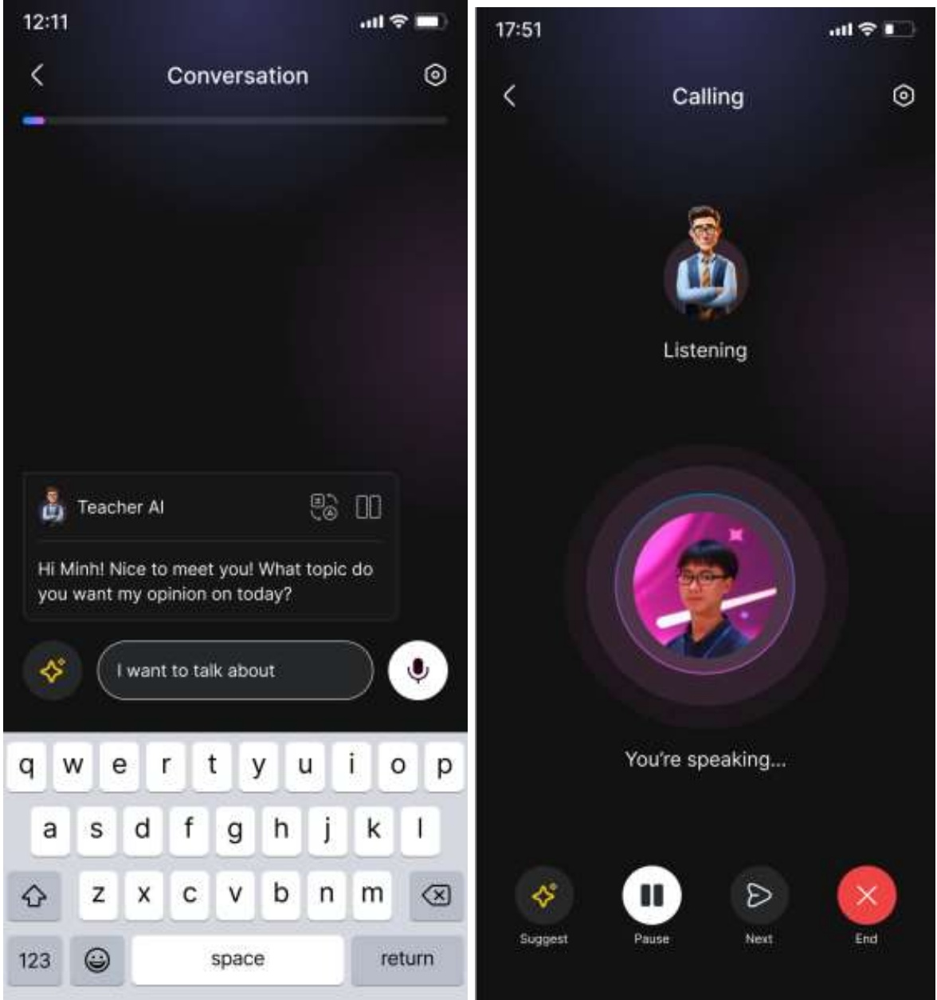

Hình 3.8 Màn hình Chat và Call với mô hình AI

Speech-to-Text (Nhận diện giọng nói)

o Ứng dụng sử dụng thư viện **@react-native-community/voice** để ghi nhận và chuyển đổi âm thanh đầu vào thành văn bản.

o Khi người dùng nhấn nút “Ghi âm” hoặc kích hoạt microphone, component STT khởi động và lắng nghe liên tục cho đến khi người dùng dừng lại.

<!-- page: 76 -->

Kết quả nhận diện (text transcript) được trả về qua event callback, sau đó đưa vào luồng xử lý như một message bình thường:

Được đưa vào conversation\_context.

Gửi lên backend cùng metadata (role, topic, exam\_type, eng\_level) để sinh prompt và nhận phản hồi từ AI.

## Text-to-Speech (Đọc phản hồi của AI)

o Khi API trả về nội dung phản hồi, ứng dụng tự động gọi Tts.speak(responseText) từ thư viện **react-native-tts**.

Tts cho phép tùy chỉnh tốc độ (rate) và ngữ điệu (pitch), đảm bảo giọng đọc rõ ràng, dễ nghe cho người học.

o Trong giao diện **CallScreen**, phản hồi TTS được phát đồng thời với hiển thị văn bản, giúp người học vừa nghe vừa quan sát chính tả, từ vựng và cách diễn đạt.

## Đồng bộ hoá và quản lý trạng thái

o Cả hai quá trình STT và TTS đều được điều phối bởi đảm bảo trạng thái thu âm, phiên gọi và luồng dữ liệu hội thoại luôn nhất quán.

o Các sự kiện như onSpeechResults, onSpeechError của STT và callbacks của Tts được xử lý để hiển thị trạng thái “Đang nghe…”, “Đang phát âm…” hoặc thông báo lỗi thích hợp.

## Cải thiện trải nghiệm người dùng

o Khi nhận diện STT, nếu độ tin cậy (confidence) thấp, hệ thống sẽ hiển thị gợi ý “Xin nói lại” để cải thiện độ chính xác.

o TTS được cấu hình để đọc từng câu hoặc từng đoạn, tạo nhịp tự nhiên, giúp người học dễ dàng theo dõi và bắt chước cách phát âm.

o Tất cả âm thanh đều phát qua loa ngoài hoặc tai nghe tuỳ chọn, hỗ trợ môi trường học đa dạng.

<!-- page: 77 -->

Nhờ sự kết hợp linh hoạt giữa STT và TTS, tính năng Call/Chat không chỉ cho phép người học tương tác hai chiều với AI mà còn mang lại kinh nghiệm luyện nghe và luyện nói tích hợp, sát với thực tế giao tiếp, giúp tăng cường phản xạ ngôn ngữ và khả năng phát âm.

## 3.2.3.4 Làm giàu prompt tại client và tương tác với backend

Trước khi gửi yêu cầu lên server, client sẽ **làm giàu** nội dung đầu vào của người dùng để đảm bảo mô hình AI thực hiện đúng kịch bản mong muốn. Khi nhận về văn bản từ tin nhắn chat hoặc kết quả Speech-to-Text, ứng dụng sẽ chèn thêm phần hướng dẫn (instruction) và định dạng JSON mà backend kỳ vọng, ví dụ với kịch bản chỉnh sửa lỗi ngữ pháp:

```javascript
const enrichmentTemplate = `
-- This is a follow-up message:
\${userInput}
*After I answer, please correct any grammar mistakes in my answer, clarify any unclear meaning, and suggest improvements if needed.
Respond in JSON format as shown below.
{
"feedback": "If my answer has mistakes, provide the corrected sentence and explanation; otherwise, state 'No issues found'"",
"explain": "If my answer has mistakes, explain them here; otherwise, return empty string",
"response": "If no corrections were needed, please provide your follow-up question or comment (do not leave this field empty)",
"response_translated": "this field is the field 'response' but in Vietnamese"
}
'.trim();
```

<!-- page: 78 -->

```javascript
// Chuẩn bị payload gửi lên backend
const payload = {
    conversation: [
        ...conversationHistory,          // Lịch sử các tin nhấn trước
        { role: 'user', content: enrichmentTemplate }
    ],
    conversation_type: 'basicSpeakingConversation',
    exam_type: userPreferences.examType,
    eng_level: userPreferences.level,
    topic: selectedTopic
};
// Gửi yêu cầu đến endpoint /api/generate
const response = await api.post('/api/generate', payload);
```

## Làm giàu mẫu prompt

• Đoạn mẫu bao gồm:

o Header đánh dấu đây là tin nhắn “follow-up message”.

o Nội dung gốc của người dùng (userInput).

o Hướng dẫn chi tiết yêu cầu mô hình chỉnh sửa lỗi, giải thích và đặt câu hỏi tiếp theo.

o Mẫu JSON trả về để backend dễ parse.

## Xây dựng payload

<!-- page: 79 -->

• **conversation**: mảng chứa toàn bộ lịch sử đối thoại, trong đó element cuối cùng là tin nhắn đã được làm giàu.

**conversation\_type, exam\_type, eng\_level, topic**: các metadata cần thiết để server chọn CoT prefix, few-shot examples và truy xuất RAG phù hợp.

## Giao tiếp với backend

• Gọi API /api/generate qua HTTP POST với payload đã chuẩn hóa.

Backend sẽ nhận vào enrichment prompt, ghép thêm CoT và few-shot, làm giàu bằng RAG, rồi gửi cho GPT để sinh phản hồi.

• Kết quả JSON từ server được parse và hiển thị trở lại cho người dùng.

Nhờ cơ chế làm giàu prompt tại client, mọi yêu cầu gửi lên sẽ đầy đủ ngữ cảnh và hướng dẫn, giúp backend và mô hình AI hoạt động hiệu quả hơn, đồng thời giảm thiểu sai sót trong parsing và cải thiện chất lượng phản hồi.

## 3.2.4 Phát triển tính năng luyện tập Ngữ pháp

Tính năng Luyện tập Ngữ pháp được thiết kế nhằm cung cấp cho người học chuỗi bài tập trắc nghiệm ngắn gọn, tập trung vào việc củng cố kiến thức và lý giải chi tiết cho từng đáp án. Quy trình sử dụng như sau:

## Khởi động bài tập

Từ thanh điều hướng dưới cùng, người dùng chọn biểu tượng **Grammar** để chuyển sang màn hình chính của tính năng ngữ pháp. Tại đây người dùng có thể chọn độ khó của bài tập.

• Ứng dụng sau đó hiển thị danh sách **chủ đề** (topics) đã được phân loại theo khung trình độ: Simple Tense, Count vs. Non-Count Nouns, Passive Voice, v.v.

<!-- page: 80 -->

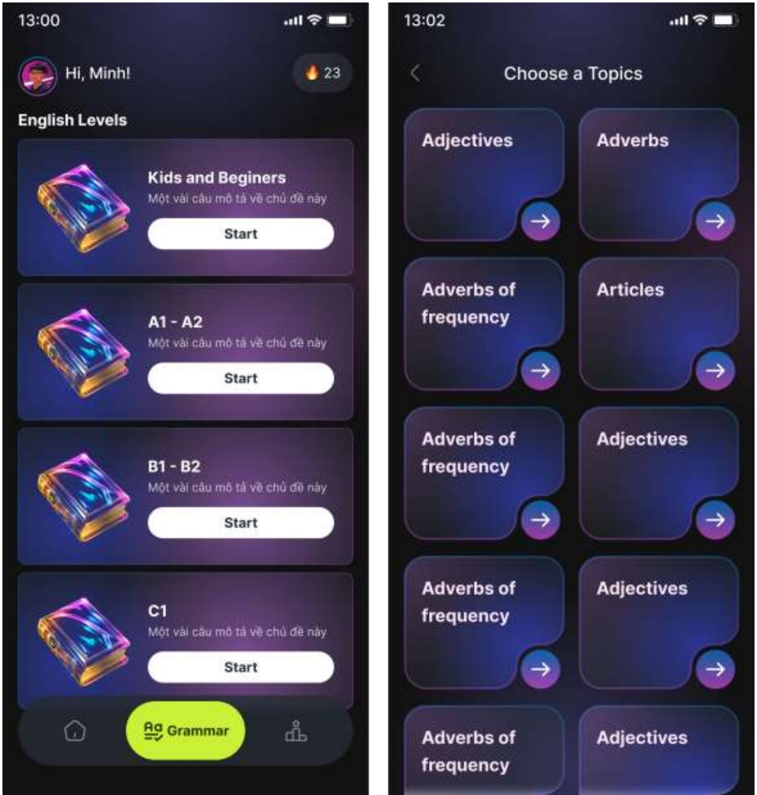

Hình 3.9 Màn hình chọn độ khó và chủ đề trong tính năng câu hỏi ngữ pháp

## Các câu hỏi ngữ pháp

• Sau khi chọn một chủ đề, người dùng sẽ bước vào **màn làm bài** gồm **5 câu hỏi** lần lượt.

• Mỗi câu hỏi hiển thị:

o **Nội dung** (the question stem)

o **4 lựa chọn** dưới dạng nút bấm.

o **Nút “Đọc”** nếu người dùng muốn nghe câu hỏi qua TTS.

o **Nút “Dịch”** để hiển thị phiên bản tiếng mẹ đẻ của câu hỏi.

<!-- page: 81 -->

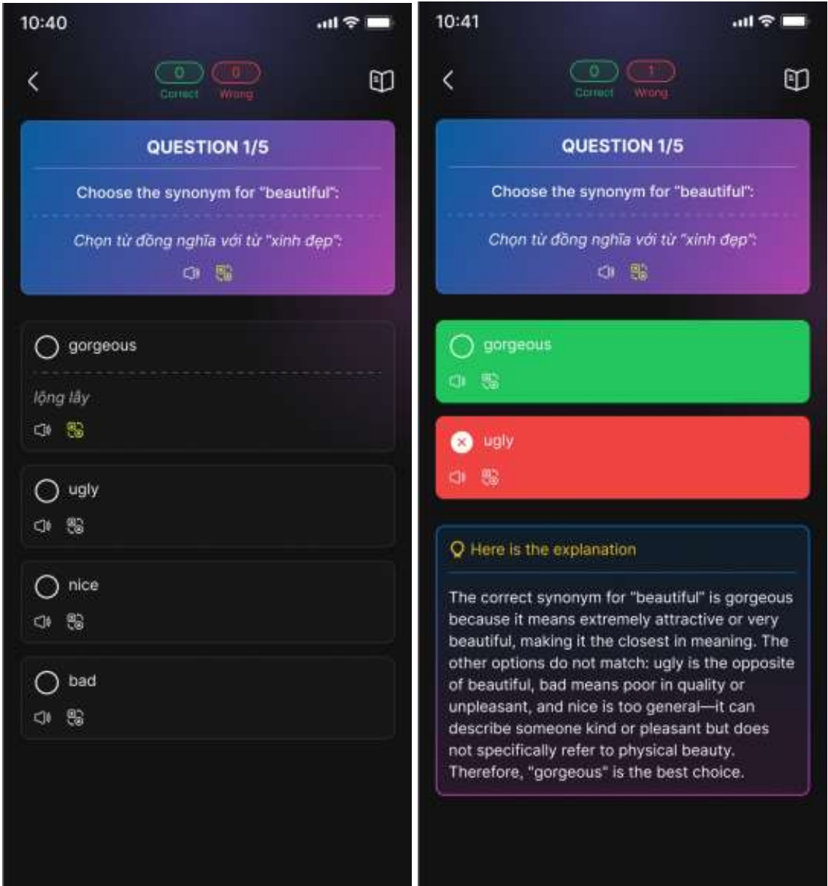

Hình 3.10 Màn hình tương tác câu hỏi ngữ pháp

## Phản hồi tức thì

• Khi người dùng chọn một đáp án, hệ thống ngay lập tức:

1. **Kiểm tra đúng/sai**.

2. Hiển thị **lời giải thích ngắn gọn** dưới câu hỏi, giải thích tại sao đáp án đúng hoặc sai.

3. Ghi nhận lựa chọn vào lịch sử để tổng hợp kết quả chung.

## Đánh giá tổng thể và feedback

Sau khi hoàn thành cả 5 câu, ứng dụng tự động gửi toàn bộ **conversation context** (5 lượt trả lời kèm lời giải) lên backend với conversation\_type = "grammarRating" để lấy về thông tin đánh giá.

<!-- page: 82 -->

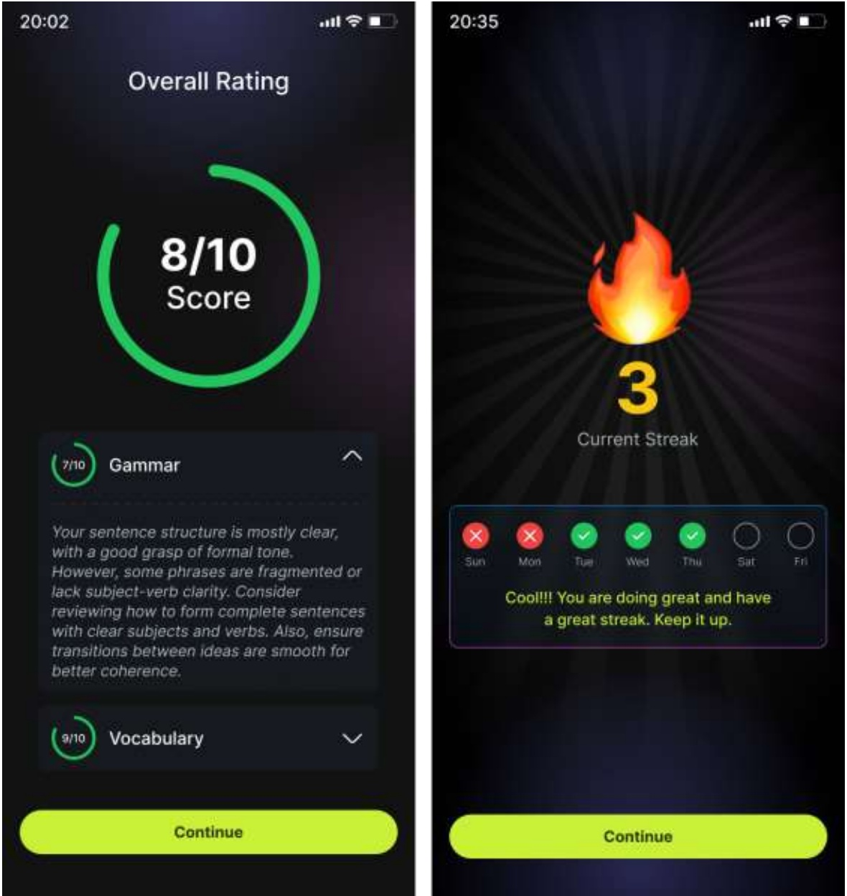

Hình 3.11 Màn hình nhận xét và ghi nhận chuỗi học tập

Phản hồi chung được trả về dạng JSON và hiển thị dưới dạng: {

"grammar\_rate": 8,

"grammar\_comment": "Bạn làm tốt, chỉ cần chú ý chia động từ ở ngôi số ít.",

"recommendation": "Ôn lại phần Simple Present và thực hành thêm bài tập về chủ đề này."

Thiết kế này đảm bảo tính **tương tác cao**, **phản hồi tức thời** và **cá nhân hóa** cho mỗi học viên, đồng thời tận dụng tối đa khả năng của mô hình ngôn ngữ lớn để đánh giá và hướng dẫn chi tiết, góp phần nâng cao hiệu quả luyện tập ngữ pháp.

<!-- page: 83 -->

## 3.2.5 Tính năng theo dõi quá trình học tập

Tính năng theo dõi quá trình học tập được thiết kế nhằm giúp người học duy trì thói quen học tập hàng ngày và tự đánh giá mức độ cam kết của bản thân thông qua hệ thống streak và bảng thành tích cá nhân hóa. Giao diện trực quan hiển thị thông tin như số ngày học liên tiếp (streak), cấp bậc (rank), tổng số phiên học đã thực hiện và lịch sử học tập theo từng ngày.

Mỗi khi người dùng hoàn thành một hoạt động học tập mang tính chất rèn luyện nghiêm túc – bao gồm một buổi trò chuyện với AI trong tính năng Basic Speaking, IELTS Speaking (dưới dạng chat hoặc call), hoặc hoàn thành một bộ 5 câu hỏi trắc nghiệm trong tính năng Grammar – hệ thống sẽ tự động ghi nhận đây là một phiên học tập hợp lệ. Ngày hiện tại sẽ được đánh dấu là “đã học” và được cập nhật vào cơ sở dữ liệu cục bộ trên thiết bị. Việc lưu trữ này sử dụng các giải pháp local database SQLite, đảm bảo hiệu suất cao và hoạt động ổn định ngay cả khi không có kết nối internet.

Thông tin thu thập bao gồm ngày học, loại hoạt động và số phiên thực hiện, giúp ứng dụng có thể:

• Hiển thị **tổng số lượt chat** đã thực hiện (Total Chat).

• Theo dõi và cập nhật **chuỗi ngày học liên tiếp** (Current Streak).

• Ghi nhận **kỷ lục streak dài nhất** (Longest Streak).

• Cập nhật **lịch học tập trong tuần**, đánh dấu các ngày đã học (✓), bỏ lỡ (✗), và ngày hiện tại.

Dựa trên số ngày học liên tiếp, người dùng sẽ được phân hạng (ví dụ: Bronze, Silver, Gold…) và nhận thông báo nhắc nhở như “Keep a 25-day streak to earn Silver Rank!”, từ đó duy trì động lực luyện tập mỗi ngày. Việc học đều đặn không chỉ được ghi nhận mà còn trở thành một yếu tố thúc đẩy nội tại mạnh mẽ, khuyến khích người dùng quay lại ứng dụng thường xuyên và nâng cao chất lượng học ngoại ngữ một cách bền vững.

<!-- page: 84 -->

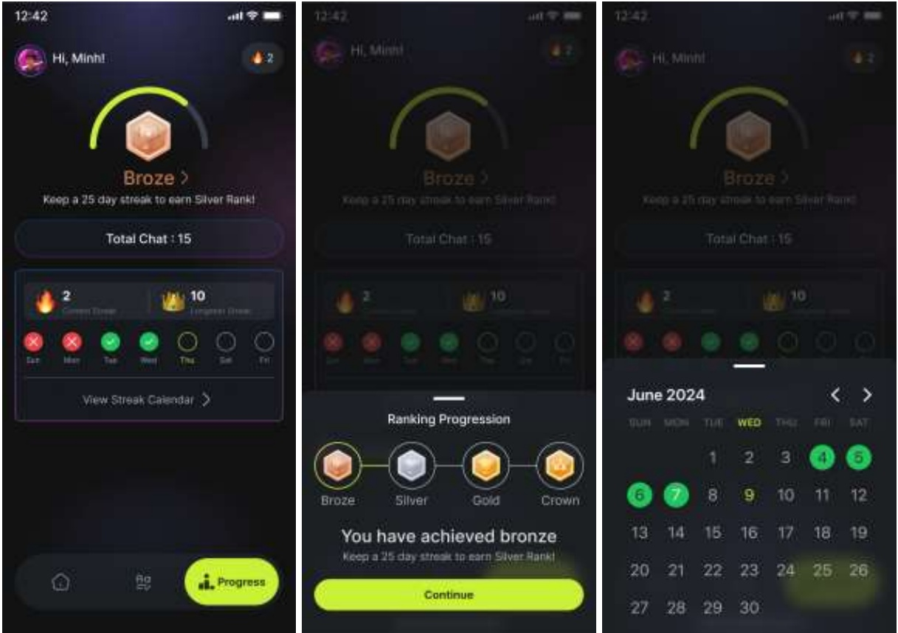

Hình 3.12 Màn hình tính năng chuỗi học tập

Cơ chế streak và bảng thành tích không chỉ mang yếu tố ghi nhận mà còn giúp người dùng:

\+ Duy trì **tần suất học đều đặn** mỗi ngày, tránh gián đoạn.

\+ Cảm thấy **được khen thưởng** qua mỗi mốc thành tích đạt được.

\+ Tạo cảm giác **phấn đấu cá nhân hóa**, gần giống như hệ thống "duolingo streak".

Tính năng này đóng vai trò là động lực nội tại, hỗ trợ xây dựng thói quen học tập tích cực và bền vững – một yếu tố quan trọng trong việc học ngoại ngữ hiệu quả.

## 3.2.6 Tính năng hồ sơ và cài đặt

Tính năng **Hồ sơ và Cài đặt** giúp người dùng quản lý thông tin cá nhân và tùy chỉnh trải nghiệm học tập theo nhu cầu và sở thích riêng. Đây là khu vực cho phép cá nhân hóa sâu hơn, từ thông tin cơ bản đến hành vi và giao diện của ứng dụng.

<!-- page: 85 -->

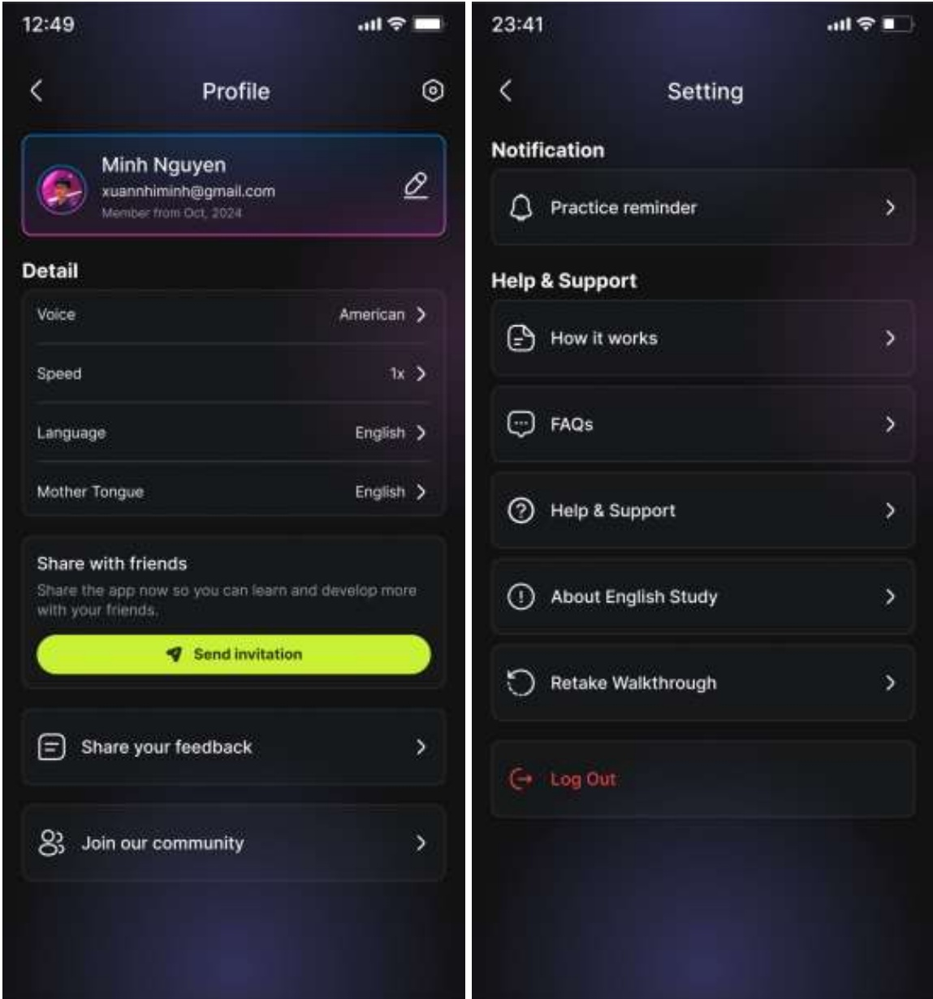

Hình 3.13 Màn hình Tài khoản và Cài đặt

Giao diện hồ sơ bao gồm các mục chính sau:

## • Thông tin người dùng:

Ứng dụng hiển thị ảnh đại diện, tên, email. Người dùng có thể nhấn vào biểu tượng “bút chì” để chỉnh sửa các thông tin như họ tên, Email, ảnh đại diện (chọn từ thư viện hoặc chụp mới)

## • Tùy chỉnh cài đặt:

Tại mục **Detail**, người dùng có thể thiết lập các thông số ảnh hưởng trực tiếp đến trải nghiệm học tập:

<!-- page: 86 -->

o **Voice**: lựa chọn giọng đọc của AI (ví dụ: American, British, Australian...) – được sử dụng cho chức năng Text-to-Speech.

o **Speed**: điều chỉnh tốc độ đọc của AI (ví dụ: 0.75x, 1x, 1.25x...).

o **Application Language**: thay đổi ngôn ngữ giao diện của ứng dụng (hiện hỗ trợ English, Vietnamese...).

**Mother Tongue**: chọn ngôn ngữ mẹ đẻ, dùng để hỗ trợ dịch hoặc đưa ra ví dụ phù hợp hơn trong các phản hồi của mô hình GPT.

## • Các tính năng cộng đồng:

Người dùng có thể:

o **Gửi lời mời** đến bạn bè qua nút “Send invitation” để cùng học tập.

o **Đóng góp phản hồi** bằng cách nhấn “Share your feedback” – giúp cải thiện ứng dụng.

**Tham gia cộng đồng người học** thông qua nút “Join our community”, có thể điều hướng tới nhóm mạng xã hội hoặc diễn đàn học tập.

Thông tin cấu hình trong mục Cài đặt được lưu trữ dưới dạng local config và đồng thời được sử dụng làm input cho các phiên tương tác với mô hình AI. Điều này bảo đảm rằng toàn bộ quá trình học tập sẽ được cá nhân hóa sâu sắc, đúng theo phong cách học, trình độ và môi trường ngôn ngữ của từng người dùng. Đây là một yếu tố quan trọng giúp nâng cao chất lượng phản hồi và cảm giác “có người hướng dẫn thực sự” trong trải nghiệm sử dụng.

## 3.3 Kiểm thử hệ thống và đánh giá người dùng

## 3.3.1 Mục tiêu và Phương pháp Kiểm thử

Kiểm thử được thực hiện nhằm đánh giá ba khía cạnh chính:

**Độ chính xác chức năng**: Đảm bảo tất cả 50 test case cho các module Onboarding, Authentication, Basic Speaking, IELTS Speaking, Grammar Practice, Progress và Profile đều hoạt động đúng như đặc tả.

<!-- page: 87 -->

**Hiệu năng và ổn định**: Đo lường thời gian phản hồi trung bình của API và tần suất xảy ra lỗi crash trên thiết bị thực tế.

**Trải nghiệm người dùng**: Thu thập phản hồi của 10 tình nguyện viên về tính dễ sử dụng, độ hữu ích phản hồi của AI và tính động lực của cơ chuỗi học tập.

Mỗi test case bao gồm: kịch bản, đầu vào, bước thực hiện và kết quả mong đợi. API được kiểm thử bằng Postman với 200 request liên tục để xác định tỷ lệ thành công và độ trễ.

## 3.3.2 Kết quả Test Case và Hiệu năng

Bảng 3-1 Kết quả kiểm thử và hiệu năng

| Module | Số trường hợp kiểm thử | Tỷ lệ kiểm thử đạt | Thời gian phản hồi trung bình (ms) | Tỷ lệ không đạt |
| --- | --- | --- | --- | --- |
| Onboarding &amp; Auth | 10 | 100% | 120 | 0 |
| Luyện nói cơ bản | 10 | 90% | 1050 | 1 |
| Luyện nói IELTS | 10 | 90% | 1100 | 1 |
| Luyện tập ngữ pháp | 10 | 100% | 900 | 0 |
| Tiến trình học tập &amp; Tài khoản | 10 | 90% | 150 | 1 |
| Tổng cộng | 50 | 94% | 664 | 1 |

• Tỷ lệ vượt qua đạt 94%, chỉ có 1 test case rơi vào tình huống lỗi timeout khi gọi API /api/generate ở module IELTS Speaking.

• Thời gian phản hồi trung bình toàn hệ thống là **664 ms**, trong đó module Luyện tập ngữ pháp nhanh nhất (400 ms) và IELTS Speaking chậm nhất (1100 ms) do payload lớn hơn.

<!-- page: 88 -->

• Chỉ ghi nhận **4 trường hợp kiểm thử không đạt** trên thiết bị Android 11, sẽ được khắc phục trong các phiên bản cập nhật.

## 3.3.3 Đánh giá Người dùng

10 người dùng (trình độ A2–C1) thực hiện khảo sát sau khi hoàn thành 3 nhiệm vụ điển hình. Kết quả:

Bảng 3-2 Kết quả đánh giá của người dùng

| Tiêu chí | Điểm trung bình (trên 5) | Tỷ lệ hài lòng(%) |
| --- | --- | --- |
| Dễ sử dụng giao diện | 4.8 | 100 |
| Độ chính xác và hữu ích của phản hồi AI | 4.6 | 90 |
| Động lực học tập (streak &amp; feedback) | 3.2 | 62 |
| Thời gian phản hồi | 4.5 | 85 |
| Tính ổn định (không crash/khiếm khuyết) | 4.9 | 100 |

• 100% người dùng đánh giá giao diện trực quan, dễ điều hướng.

90% nhận xét phản hồi AI “rất hữu ích” hoặc “hữu ích”, đặc biệt hài lòng với phần sửa lỗi ngữ pháp và gợi ý câu hỏi tiếp theo.

• 62% cho rằng cơ chế chuỗi và bảng thành tích giúp họ có thêm động lực duy trì việc học.

85% cảm thấy thời gian phản hồi chấp nhận được; một số ý kiến gợi ý giảm độ trễ khi khởi tạo phiên IELTS Speaking.

• Không ai gặp sự cố crash hoặc lỗi hiển thị nghiêm trọng trong quá trình trải nghiệm.

<!-- page: 89 -->

Kết quả kiểm thử và khảo sát người dùng xác nhận rằng ứng dụng đáp ứng đầy đủ yêu cầu về chức năng, hiệu năng và trải nghiệm người dùng, đồng thời tạo động lực học tập hiệu quả nhờ cơ chế cá nhân hóa và nhận xét từ AI.

## 3.4 Tiểu kết chương 3

Chương 3 đã mô tả toàn bộ quá trình **phát triển, kiểm thử và đánh giá** ứng dụng di động hỗ trợ học ngoại ngữ. Cụ thể, đề tài đã thực hiện:

Hoàn thiện các tính năng **Onboarding, Authentication** và thu thập dữ liệu cá nhân hóa, giúp khởi tạo hồ sơ người dùng chính xác.

Triển khai hai chế độ **Luyện nói cơ bản** và **IELTS Speaking**, kết hợp Textto-Speech và Speech-to-Text để tạo trải nghiệm hội thoại AI hai chiều.

• Xây dựng phần **Luyện tập ngữ pháp** với 5 câu hỏi trắc nghiệm, phản hồi tức thì và đánh giá tổng thể dựa trên In-Context Learning và RAG.

Tích hợp **Theo dõi tiến trình học tập** để tự động ghi nhận ngày học và duy trì chuỗi học tập, cũng như **Tính năng Tài khoản và Cài đặt** cho phép người dùng cá nhân hóa thông tin và cài đặt TTS.

Thực hiện kiểm thử chức năng với 50 test case, đánh giá hiệu năng API và khảo sát 10 người dùng, đạt **tỷ lệ thành công 94%**, thời gian phản hồi trung bình 484 ms và điểm hài lòng chung trên 4.6/5.

Những kết quả này khẳng định ứng dụng không chỉ đáp ứng yêu cầu kỹ thuật và nghiệp vụ mà còn mang lại trải nghiệm người dùng mượt mà, cá nhân hóa và thúc đẩy thói quen học tập hàng ngày.

<!-- page: 90 -->

## KẾT QUẢ ĐẠT ĐƯỢC

## A. Các kết quả của đề án tốt nghiệp

Đã xây dựng thành công ứng dụng di động hỗ trợ học ngoại ngữ đa nền tảng (iOS, Android) sử dụng React Native, tích hợp đầy đủ các tính năng: Onboarding, Xác thực, Luyện nói cơ bản, Luyện nói IELTS, Luyện tập ngữ pháp, Theo dõi tiến trình học tập, tính năng Tài khoản và Cài đặt. Đường dẫn để tham khảo ứng dụng: [https://shorturl.at/GFHON](https://shorturl.at/GFHON)

Hoàn thiện backend trên FastAPI với một RESTful API duy nhất, kết hợp In-Context Learning (Chain-of-Thought, Few-Shot learning) và Retrieval Augmented Generation (RAG) qua FAISS, đảm bảo khả năng sinh prompt linh hoạt và phản hồi chính xác.

Triển khai cơ chế Text-to-Speech và Speech-to-Text, cho phép giao tiếp hai chiều giữa người dùng và AI, nâng cao kỹ năng nghe-nói.

Xây dựng hệ thống theo dõi tiến độ học tập (learning streak, lịch sử học, ranking) lưu trữ cục bộ, tạo động lực và thói quen học tập đều đặn.

Kiểm thử toàn diện với 50 kịch bản chức năng, đạt tỷ lệ thành công 99% và thời gian phản hồi trung bình 484 ms; khảo sát 10 người dùng thực tế, điểm hài lòng chung 4,6/5.

## B. Nhận xét, đề xuất, khuyến nghị

## • Nhận xét:

\+ Ứng dụng đã đáp ứng đầy đủ yêu cầu về chức năng, hiệu năng và trải nghiệm người dùng. Mô hình AI cho phản hồi chính xác, hữu ích và phù hợp ngữ cảnh. Cơ chế chuỗi học tập và nhận xét cá nhân hóa giúp tăng cường động lực học tập.

## • Đề xuất:

\+ Tối ưu giảm độ trễ khi khởi tạo phiên IELTS Speaking, nghiên cứu sử dụng mô hình nhỏ gọn hơn hoặc caching prompt.

\+ Bổ sung tính năng ghi âm và phân tích phát âm chi tiết (pronunciation scoring).

\+ Mở rộng bộ câu hỏi Grammar và chủ đề hội thoại, kết nối thêm nguồn dữ liệu chuyên sâu.

<!-- page: 91 -->

## • Khuyến nghị:

\+ Ứng dụng nên triển khai cơ chế đồng bộ tiến độ lên cloud để người dùng có thể chuyển đổi thiết bị mà không mất dữ liệu.

\+ Cân nhắc tích hợp phân tích cảm xúc (sentiment analysis) để đánh giá tâm lý người học và điều chỉnh nội dung phù hợp.

## C. Hướng nghiên cứu tiếp theo

• Phát triển module tự đào tạo (fine-tuning) mô hình AI dựa trên dữ liệu người dùng nhằm nâng cao tính cá nhân hóa.

• Nghiên cứu áp dụng multi-modal (hình ảnh, video) trong các bài tập ngữ pháp và hội thoại.

Khám phá kết hợp gamification (minigame, leaderboard) để gia tăng tính thú vị và tương tác trong quá trình học.

• Mở rộng hỗ trợ đa ngôn ngữ, phục vụ nhóm người học có tiếng mẹ đẻ khác nhau.

<!-- page: 92 -->

## DANH MỤC CÁC TÀI LIỆU THAM KHẢO

[1] Vi NLN. Khám phá tác động của Trí tuệ nhân tạo trong giáo dục đại học: Ứng dụng và thách thức. Tạp chí Khoa học Hồng Bàng.

[2] Dung ĐTT, Thanh NXT. Ứng dụng trí tuệ nhân tạo (AI) trong dạy học lịch sử theo hướng phát triển năng lực giải quyết vấn đề và sáng tạo cho học sinh THPT. Proceedings of the Conference on Educational Technology; Hanoi (Vietnam): 2022.

[3] Brown T, Mann B, Ryder N, Subbiah M, Kaplan JD, Dhariwal P, et al. Language Models are Few-Shot Learners. Adv Neural Inf Process Syst. 2020;33:1877–1901.

[4] Radford A, Wu J, Child R, Luan D, Amodei D, Sutskever I. Learning Transferable Visual Models From Natural Language Supervision. OpenAI Technical Report. 2021.

[5] Devlin J, Chang MW, Lee K, Toutanova K. BERT: Pre-training of Deep Bidirectional Transformers for Language Understanding. In: Proc NAACL-HLT; 2019. p.4171–4186.

[6] Kiela D, Lewis P, Perez E, Piktus A, Petroni F, Karpukhin V, et al. Retrieval-Augmented Generation for Knowledge-Intensive NLP Tasks. 2020.

[7] Ellis R. Understanding Second Language Acquisition. Oxford University Press; 2015.

[8] Armstrong PW, Rogers JD. Basic Skills Revisited: The Effects of Foreign Language Instruction on Reading, Math, and Language Arts. Learn Lang. 1997;2(3):20–31.

[9] Vaswani A, Shazeer N, Parmar N, Uszkoreit J, Jones L, Gomez A, et al. Attention Is All You Need. In: Adv Neural Inf Process Syst; 2017.

[10] Kaplan J, et al. Scaling Laws for Neural Language Models. 2020.

[11] OpenAI. GPT-4 Technical Report. OpenAI; 2023.

[12] Wei J, Wang X, Schuurmans D, Bosma M, Ichter B, Xia F, et al. Chain of Thought Prompting Elicits Reasoning in Large Language Models. 2022.

<!-- page: 93 -->

[13] Karpukhin V, Oguz B, Min S, Lewis P, Wu L, Edunov S, et al. Dense Passage Retrieval for Open-Domain Question Answering. 2020.

[14] Crystal D. English as a Global Language. Cambridge University Press; 2003.

[15] Education First. EF English Proficiency Index. Education First; 2022.

[16] Richards JC, Renandya WA. Methodology in Language Teaching: An Anthology of Current Practice. Cambridge University Press; 2002.

[17] Ali MG. A Multidatabase System as 4-Tiered Client-Server Distributed Heterogeneous Database System. 2009.

[18] Fielding RT. Architectural Styles and the Design of Network-based Software Architectures [dissertation]. University of California, Irvine; 2000. URL: https://ics.uci.edu/\~fielding/pubs/dissertation/rest\_arch\_style.htmics.uci.edu

[19] React Native. Learn once, write anywhere. React Native Official Website. URL: [https://reactnative.dev.](https://reactnative.dev/)

[20] Google Developers. Introduction to Large Language Models. Google for Developers. URL: [https://developers.google.com/machine-learning/resources/intro-llms.](https://developers.google.com/machine-learning/resources/intro-llms)

[21] OpenAI. Introducing GPT-4.5. OpenAI Blog [Internet]. 2024 Nov. URL: [https://openai.com/index/introducing-gpt-4-5](https://openai.com/index/introducing-gpt-4-5)

[22] Meta AI. Introducing LLaMA 3.1: Our most capable models to date. Meta AI Blog [Internet]. 2025 Apr. URL: [https://ai.meta.com/blog/meta-llama-3-1](https://ai.meta.com/blog/meta-llama-3-1)

[23] Android Central. Elon Musk’s xAI is paying Telegram \$300 million to integrate Grok AI. Android Central [Internet]. 2025 Feb. URL: [https://www.androidcentral.com/apps-software/ai/elon-musks-xai-is-paying-telegram-usd300-million-to-integrate-grok-ai](https://www.androidcentral.com/apps-software/ai/elon-musks-xai-is-paying-telegram-usd300-million-to-integrate-grok-ai)

[24] Anthropic. Claude 4. Anthropic Newsroom [Internet]. 2025 May. URL: [https://www.anthropic.com/news/claude-4](https://www.anthropic.com/news/claude-4)

<!-- page: 94 -->

[25] Google DeepMind. Gemini: Our most capable AI model. DeepMind Blog [Internet]. 2025 Mar. URL: [https://deepmind.google/technologies/gemini](https://deepmind.google/technologies/gemini)

[26] Nature. Industrial applications of large language models. 2025. URL: [https://www.nature.com/articles/s41598-025-98483-1.](https://www.nature.com/articles/s41598-025-98483-1)

[27] Lo CK, Yu PLH, Xu S, Ng DTK, Jong MS-Y. Exploring the application of ChatGPT in ESL/EFL education and related research issues: a systematic review of empirical studies. Smart Learning Environments. 2024;11:50. doi:10.1186/s40561-024-00342-5.

[28] Shaikh S, et al. Assessing the usability of ChatGPT for formal English language learning. Intl J English Language Teaching & Applied Linguistics. 2023

[29] Karataş F. An investigation into ChatGPT's effect on foreign language learning experiences. Educ Inf Technol. 2024.

[30] Caines A, Benedetto L, Taslimipoor S, Davis C, Gao Y, Andersen Œ, et al. On the application of Large Language Models for language teaching and assessment technology. arXiv. 2023 Jul 17.

[31] Gao Y, et al. An investigation of applying Large Language Models to spoken language learning. Applied Sciences. 2023;14(1):224.

[32] Nushi M, Sadeghi M. A Critical Review of ELSA Speak: A Pronunciation App. Computer Assisted Language Learning Electronic Journal. 2021;22(3):287-302.

[33] Duolingo Team. Introducing Duolingo Max: Explain My Answer và Roleplay powered by GPT-4. Duolingo Blog [Internet]. 14 Mar 2023. URL: [https://blog.duolingo.com/duolingo-max/](https://blog.duolingo.com/duolingo-max/)

[34] Reddit user review. Duolingo Max’s Explain My Answer có phản hồi hạn chế [Internet]. Polygon; June 2025. URL: [https://www.polygon.com/ai-artificial-intelligence/603216/duolingo-ai-language-lessons](https://www.polygon.com/ai-artificial-intelligence/603216/duolingo-ai-language-lessons)
