<!-- page: 1 -->

**HỌC VIỆN CÔNG NGHỆ BƯU CHÍNH VIỄN THÔNG**


**ĐÀO ĐẠI DƯƠNG**

## NGHIÊN CỨU ỨNG DỤNG MÔ HÌNH TẠO SINH ẢNH HỖ TRỢ TẠO MÀN CHƠI CASUAL PUZZLE GAME

**ĐỀ ÁN THẠC SỸ KỸ THUẬT (Theo định hướng ứng dụng)**

**HÀ NỘI - 2025**

<!-- page: 2 -->

**HỌC VIỆN CÔNG NGHỆ BƯU CHÍNH VIỄN THÔNG**


**ĐÀO ĐẠI DƯƠNG**

# NGHIÊN CỨU ỨNG DỤNG MÔ HÌNH TẠO SINH ẢNH HỖ TRỢ TẠO MÀN CHƠI CASUAL PUZZLE GAME

**CHUYÊN NGÀNH: HỆ THỐNG THÔNG TIN Mã số: 8.48.01.04**

**ĐỀ ÁN THẠC SỸ NGÀNH HỆ THỐNG THÔNG TIN**

**NGƯỜI HƯỚNG DẪN KHOA HỌC: TS. Nguyễn Minh Tuấn**

**HÀ NỘI - 2025**

<!-- page: 3 -->

## LỜI CAM ĐOAN

Tôi khẳng định đề án này do chính tôi thực hiện, dựa trên quá trình nghiên cứu độc lập dưới sự hướng dẫn của TS. Nguyễn Minh Tuấn. Toàn bộ dữ liệu, thông tin và kết quả phân tích được thu thập, xử lý một cách nghiêm túc, trung thực và không bị chi phối bởi bất kỳ yếu tố nào làm sai lệch bản chất nghiên cứu.

Tôi đã tìm hiểu và tuân thủ các quy định về đạo đức và tính trung thực trong nghiên cứu học thuật, đồng thời chịu hoàn toàn trách nhiệm về nội dung của đề án này. Tôi cam kết rằng nghiên cứu được thực hiện không vi phạm các chuẩn mực hay yêu cầu nào liên quan đến sự trung thực trong học thuật.

Hà Nội, ngày tháng năm 2025

**Người cam đoan**

**Đào Đại Dương**

<!-- page: 4 -->

## LỜI CẢM ƠN

Trong suốt gần hai năm theo học chương trình cao học ngành Hệ thống thông tin tại Học viện Công nghệ Bưu chính Viễn thông, tôi đã có cơ hội tiếp thu nhiều kiến thức chuyên môn và rèn luyện tư duy nghiên cứu một cách bài bản. Tôi xin trân trọng ghi nhận và gửi lời cảm ơn đến các Thầy, Cô đang công tác tại Học viện vì sự tận tâm trong giảng dạy và đồng hành cùng học viên trong suốt quá trình học tập. Tôi đặc biệt biết ơn TS. Nguyễn Minh Tuấn, người đã trực tiếp hướng dẫn tôi thực hiện luận văn. Với sự kiên nhẫn, trách nhiệm và chuyên môn sâu sắc, thầy đã dành nhiều thời gian trao đổi, định hướng nghiên cứu và hỗ trợ tôi từng bước trong việc tiếp cận vấn đề, xử lý nội dung và hoàn thiện đề án. Sự hướng dẫn của thầy là yếu tố quan trọng giúp tôi hoàn thành nghiên cứu này. Bên cạnh đó, tôi cũng xin gửi lời cảm ơn chân thành đến các anh chị cán bộ, giảng viên tại Học viện Công nghệ Bưu chính Viễn thông – nơi tôi đang công tác – đã tạo điều kiện thuận lợi, chia sẻ kinh nghiệm thực tiễn, cung cấp thông tin và động viên tôi trong suốt quá trình thực hiện đề án.

Xin chân thành cảm ơn!

<!-- page: 5 -->

## MỤC LỤC

- LỜI CAM ĐOAN ....i
- LỜI CẢM OŃ....ii
- MỤC LỤC....iii
- DANH SÁCH HÌNH ẢNH....v
- DANH SÁCH BẰNG....vii
- DANH MỤC CÁC KÝ HIÊU TỪ VIẾT TẮT....viii
- MỞ ĐẦU....1
- CHƯƠNG 1: CƠ SỞ LÝ THUYẾT VÀ TỔNG QUAN NGHIÊN CỨU ....5
- 1.1. Tổng quan về thể loại game casual ....5
- 1.2. Quy trình thiết kế màn chơi trong game casual hiện nay....9
- 1.3. Thực trạng thiết kế màn chơi trong các studio game Việt Nam....12
- 1.4. Nhu cầu và xu hướng ứng dụng AI trong thiết kế màn chơi....16
- 1.5. Đánh giá tổng quan và xác định vấn đề nghiên cứu....20
- 1.6. Kết luận chương ....22
- CHƯƠNG 2: PHÂN TÍCH YÊU CẦU VÀ THIẾT KẾ HỆ THỐNG HỒ TRỢ
- TẠO MÀN CHɔI ....24
- 2.1. Mô hình ngôn ngữ lớn (LLM)....24
- 2.1.1. Tổng quan về sự phát triển của mô hình ngôn ngữ....24
- 2.1.2. Kiến trúc Transformer – nền tảng lý thuyết của LLM....25
- 2.1.3. Khả năng tạo nội dung có cấu trúc và suy luận logic....26
- 2.1.4. Lý do LLM phù hợp cho nhiệm vụ sinh màn chơi puzzle....27
- 2.2. Mô hình khuếch tán (Diffusion Models)....28
- 2.2.1. Tổng quan về mô hình sinh dữ liệu và sự xuất hiện của mô hình khuếch tán....28
- 2.2.2. Nguyên lý hoạt động của mô hình khuếch tán....28
- 2.2.3. So sánh mô hình khuếch tán với GAN....31
- 2.2.4. Các mô hình khuếch tán hiện nay....33
- 2.2.5. Ứng dụng mô hình khuếch tán trong sinh nội dung game casual ....35

<!-- page: 6 -->

- 2.3. Kiến trúc kết hợp LLM + Diffusion ....36
- 2.3.1. Vai trò của mô hình ngôn ngữ lớn....37
- 2.3.2. Vai trò của mô hình khuếch tán....38
- 2.3.3. Cách thức phối hợp giữa hai mô hình trong hệ thống....39
- 2.3.4. Khả năng mở rộng và tiềm năng ứng dụng....39
- 2.4 Phân tích lựa chọn mô hình....40
- 2.5 Thiết kế hệ thống....47
- CHƯƠNG 3: XÂY DỰNG, TRIỂN KHAI VÀ ĐÁNH GIÁ HỆ THÔNG....48
- 3.1 Xây dựng hệ thống....48
- 3.1.1. Giới thiệu game Color Block Jam....48
- 3.1.2 Chuẩn bị tập dữ liệu huấn luyện....50
- 3.1.3 Huấn luyện mô hình....53
- 3.1.4 Đánh giá mô hình huấn luyện....58
- 3.2 Triển khai hệ thống sinh hình ảnh màn chơi game Color Block Jam....60
- 3.2.1. Định hướng triển khai....60
- 3.2.3. Triển khai ứng dụng....63
- 3.3 Thứ nghiệm và đánh giá....64
- 3.3.1. Mục tiêu thử nghiệm....64
- 3.3.2. Phương pháp thử nghiệm....64
- 3.3.3. Kết quả thử nghiệm....64
- 3.4 Kết luận chương....67
- KẾT QUẢ ĐẠT ĐƯỢC....68
- KẾT LUẬN VÀ KHUYỄN NGHỊ....69
- TÀI LIỆU THAM KHẢO....70

<!-- page: 7 -->

## DANH SÁCH HÌNH ẢNH

- Hình 1.1: Tý lệ người dùng internet chơi game theo thiết bị tại Việt Nam....5
- Hình 2.2: Top 10 gam được tải nhiều nhất thế giới năm 2024....6
- Hình 1.3: Tốc độ tăng trưởng doanh thu game Việt....6
- Hình 1.4: Ảnh một số tựa game casual....7
- Hình 1.5: Top 10 thị trường game lớn nhất....8
- Hình 1.6: Ảnh quy trình thiết kế màn chơi game....10
- Hình 1.5: Studio game tại Việt Nam....13
- Hình 1.6: Giao diện Unity một game engine giúp thiết kế các màn chơi....14
- Hình 1.7: Hình minh hoạ về AI....16
- Hình 2.1: Một số mô hình ngôn ngữ lớn tiêu biểu....25
- Hình 2.2: Mô hình khuếch tán chuyển đổi qua lại giữa dữ liệu và nhiều....30
- Hình 2.3: Sơ đồ mô hình khuếch tán cơ bản....30
- Hình 3.1: Game Color Block Jam....48
- Hình 3.2: Tập dữ liệu huấn luyện....51
- Hình 3.2: Màn game Color Block Jam....51
- Hình 3.4: Đoàn code resize ảnh....52
- Hình 3.5: Ảnh cải đặt các thư viện....55
- Hình 3.6: Ảnh giao diện tạo token....56
- Hình 3.7: Ảnh cấu hình tham số huấn luyện....56
- Hình 3.8: Ảnh quá trình huấn luyện mô hình....57
- Hình 3.9: Ảnh thư mục mô hình đầu ra....58
- Hình 3.10: Ảnh đoạn code kiểm tra chất lượng ảnh mô hình sinh ra....59
- Hình 3.11: Ảnh màn chơi được sinh ra từ mô hình....59
- Hình 3.12: Ảnh màn chơi được sinh ra từ mô hình....60
- Hình 3.13: Python....61
- Hình 3.14: Ảnh giao diện ứng dụng....63
- Hình 3.15: Ảnh hệ thống khi sinh màn chơi....65
- Hình 3.16: Ảnh hệ thống khi sinh màn chơi....66

<!-- page: 8 -->

- Hình 3.17: Ảnh hệ thống khi sinh màn chơi....66
- Hình 3.18: Ảnh một số màn chơi sinh ra đầm bảo chất lượng....66

<!-- page: 9 -->

- Bảng 2.1: So sánh Diffusion Models và GAN....32
- Bảng 2.2: So sánh giữa Fine-tuning và tự xây dựng mô hình....40
- Bảng 2.3: So sánh các mô hình khuếch tán phổ biến....43
- Bảng 3.1: Các tham số cần cấu hình trong khi huấn luyện....54

## DANH SÁCH BẢNG

<!-- page: 10 -->

DANH MỤC CÁC KÝ HIÊU TỪ VIẾT TẮT

| Từ tắvtiết | Từ đầy đủ | Nghĩa Tiếng Việt |
| --- | --- | --- |
| AI | Artificial Intelligence | Trí tuệ nhân tạo |
| LLM | Large Language Model | Mô hình ngôn ngữ lớn |
| GPT | Generative Pre-trained Transformer | Mô hình Transformer sinh văn bản được huấn luyện trước |
| GAN | Generative Adversarial Network | Mạng sinh đối kháng |
| PCG | Procedural Content Generation | Sinh nội dung theo thủ tục |
| DDPM | Denoising Diffusion Probabilistic Model | Mô hình khuếch tán xác suất khử nhiễu |
| SD | Stable Diffusion | Mô hình khuếch tán ổn định |
| SDXL | Stable Diffusion XL | Phiên bản mở rộng của Stable Diffusion |
| VAE | Variational Autoencoder | Bộ mã hóa - giải mã biến phân |
| UNet | U-shaped Neural Network | Mạng nơ-ron kiến trúc chữ U |
| LoRA | Low-Rank Adaptation | Kỹ thuật tinh chỉnh mô hình hạng thấp |
| LCM | Latent Consistency Model | Mô hình nhất quán không gian tiềm ẩn |
| JSON | JavaScript Object Notation | Định dạng dữ liệu dạng đối tượng |
| VRAM | Video Random Access Memory | Bộ nhớ đồ họa |
| GPU | Graphics Processing Unit | Bộ xử lý đồ họa |
| API | Application Programming Interface | Giao diện lập trình ứng dụng |
| UI | User Interface | Giao diện người dùng |

<!-- page: 11 -->

## MỞ ĐẦU

## 1. Đặt vấn đề

Thị trường game di động toàn cầu đã và đang phát triển mạnh mẽ, trong đó, thể loại Casual Puzzle Game (Game xếp hình, giải đố thông thường, như Match-3, Block-out,...) luôn giữ vững vị thế là một trong những phân khúc mang lại doanh thu cao nhất. Đặc trưng của thể loại này là lối chơi đơn giản, dễ tiếp cận nhưng đòi hỏi một lượng nội dung khổng lồ để duy trì sự gắn kết và trải nghiệm mới mẻ cho người chơi. Đối với các game hàng đầu, số lượng màn chơi có thể lên đến hàng nghìn, thậm chí hàng chục nghìn. Nhu cầu về nội dung là thách thức lớn nhất đối với đội ngũ phát triển game. Quy trình thiết kế màn chơi truyền thống, mặc dù đảm bảo tính sáng tạo và cân bằng, nhưng bộc lộ nhiều hạn chế nghiêm trọng khi cần mở rộng quy mô:  Tốn kém về thời gian và nguồn lực: Mỗi màn chơi đòi hỏi nhà thiết kế sắp xếp thủ công các vật thể, chướng ngại vật theo luật chơi và đảm bảo độ khó tăng dần một cách hợp lý. Quá trình này rất mất thời gian và phụ thuộc hoàn toàn vào kinh nghiệm cá nhân.  Thiếu tính nhất quán và lặp lại: Khi số lượng màn chơi tăng lên, nhà thiết kế dễ bị cạn kiệt ý tưởng, dẫn đến sự lặp lại về bố cục và cấu trúc, làm giảm trải nghiệm của người chơi.  Khó khăn trong việc tạo biến thể: Việc điều chỉnh các tham số nhỏ để tạo ra hàng trăm biến thể màn chơi mới theo một chủ đề cụ thể trở nên phi thực tế nếu thực hiện thủ công. Trước những hạn chế trên, việc ứng dụng Trí tuệ nhân tạo vào Quy trình tạo sinh nội dung thủ tục đã trở thành giải pháp tất yếu. Tuy nhiên, các phương pháp PCG truyền thống chủ yếu dựa trên các thuật toán quy tắc hoặc mô hình học tăng cường, thường chỉ tập trung vào việc tạo ra logic và cấu trúc màn chơi dưới dạng dữ liệu thô (ví dụ: mảng 2D mô tả vị trí các vật phẩm), mà chưa giải quyết được khâu thị giác và thẩm mỹ của màn chơi. Trong những năm gần đây, sự trỗi dậy của các Mô hình AI tạo sinh đã mở ra một hướng đi đột phá. Đặc biệt, Mô hình Khuếch tán như Stable Diffusion,

<!-- page: 12 -->

Midjourney, DALL-E đã chứng minh khả năng vượt trội trong việc tạo ra hình ảnh chất lượng cao, có độ chi tiết và tính thẩm mỹ ấn tượng dựa trên mô tả ngôn ngữ.

Tuy nhiên, trong bối cảnh tạo màn chơi game, Mô hình Khuếch tán đơn thuần không thể hiểu được luật chơi hay mục tiêu thiết kế cần thiết (ví dụ: màn chơi A cần một lối đi dài với 5 khối chướng ngại vật loại B). Đây là lúc cần đến sự can thiệp của Mô hình Ngôn ngữ lớn (LLM) như GPT-4 hay các mô hình nguồn mở.

 Vai trò của LLM: LLM có khả năng hiểu, lập luận và tạo ra logic thiết kế màn chơi dưới dạng văn bản (ví dụ: một chuỗi hướng dẫn, một file JSON cấu hình), đóng vai trò là "bộ não" kiến tạo cấu trúc.

 Vai trò của Diffusion Models: Diffusion Models sẽ đóng vai trò là "nghệ sĩ", nhận đầu vào là logic thiết kế do LLM tạo ra (hoặc kết hợp với Prompt của người dùng) để tạo ra hình ảnh bố cục màn chơi theo phong cách nghệ thuật nhất quán của game.

Sự kết hợp giữa LLM để tạo Logic và Diffusion Models để tạo Visual là một giải pháp tiềm năng, giải quyết đồng thời hai vấn đề cốt lõi của PCG: Tính đúng đắn về mặt luật chơi và Tính thẩm mỹ về mặt thị giác.

Nắm bắt được tiềm năng này, Đồ án “NGHIÊN CỨU ỨNG DỤNG MÔ HÌNH TẠO SINH ẢNH HỖ TRỢ TẠO MÀN CHƠI CASUAL PUZZLE GAME” được đề xuất.

Mục tiêu của Đồ án này là nghiên cứu về cơ chế hoạt động, khả năng tùy biến của các mô hình Diffusion, đặc biệt là thông qua kỹ thuật DreamBooth, để huấn luyện mô hình sinh ra các bố cục màn chơi có tính thẩm mỹ và tuân thủ phong cách nghệ thuật của một game casual.

Đồ án sẽ tập trung xây dựng một quy trình làm việc tích hợp, nơi người thiết kế có thể sử dụng câu lệnh tự nhiên để mô tả màn chơi, và hệ thống sẽ phản hồi bằng hình ảnh bố cục màn chơi tức thì, rút ngắn đáng kể thời gian từ ý tưởng đến sản phẩm mẫu.

## 2. Đối tượng nghiên cứu

Đối tượng nghiên cứu của đồ án là kỹ thuật khuyếch tán và mô hình ngôn ngữ lớn để hỗ trợ quá trình tạo màn chơi trong thể loại game casual.

<!-- page: 13 -->

## 3. Phạm vi nghiên cứu

Phạm vi nghiên cứu của đồ án bao gồm:

1) Nghiên cứu cơ sở lý thuyết liên quan đến mô hình ngôn ngữ lớn và mô hình khuyếch tán.

2) Khảo sát nhu cầu và thực trạng thiết kế màn chơi trong thể loại game casual tại Việt Nam.

3) Thử nghiệm xây dựng công cụ sinh hình ảnh màn chơi bằng LLM và khuyếch tán.

## 4. Phương pháp nghiên cứu

 Phương pháp thu thập và kế thừa tài liệu: Nghiên cứu các công trình, bài báo khoa học trong và ngoài nước liên quan đến ứng dụng AI trong phát triển game.

 Phương pháp phân tích, tổng hợp: So sánh, đánh giá các mô hình và phương pháp hiện có để lựa chọn hướng tiếp cận phù hợp.

 Phương pháp thực nghiệm: Xây dựng, huấn luyện và thử nghiệm công cụ sinh màn chơi,đánh giá kết quả dựa trên tiêu chí sáng tạo, tính khả thi và mức độ ứng dụng thực tế.

## 5. Các nội dung nghiên cứu

Báo cáo đồ án gồm một số nội dung chính sau:

 Nội dung 1: Nghiên cứu thực trạng và nhu cầu thiết kế màn chơi trong thể loại game casual. Chương này thiết lập nền tảng lý thuyết bằng cách tổng quan về thị trường game Casual Puzzle , tầm quan trọng của thiết kế màn chơi , và phân tích thực trạng các studio game tại Việt Nam. Đồng thời, chương giới thiệu về kiến trúc Mô hình Ngôn ngữ lớn (LLM) và Mô hình Khuếch tán (Diffusion Models) như là giải pháp tiềm năng, từ đó xác định vấn đề và mục tiêu nghiên cứu.

 Nội dung 2: Nghiên cứu, phát triển và ứng dụng công nghệ để sinh hình ảnh màn chơi. Chương này tập trung vào việc phân tích các yêu cầu kỹ thuật và thiết kế kiến trúc hệ thống tích hợp LLM và Diffusion. Nội dung làm rõ vai trò của từng thành phần (LLM cho logic, Diffusion cho hình ảnh ), so sánh và lựa chọn mô hình nền tảng để triển khai, đồng thời mô tả thiết kế luồng hoạt động cơ bản của hệ thống

<!-- page: 14 -->

 Nội dung 3: Triển khai và thử nghiệm công cụ. Chương cuối cùng trình bày quá trình thực nghiệm, bao gồm giới thiệu game thử nghiệm, quá trình triền khai từ chuẩn bị tập dữ liệu huấn luyện, các bước huấn luyện mô hình bằng kỹ thuật DreamBooth. Cuối cùng, chương mô tả việc thử nghiệm ứng dụng và đánh giá kết quả thử nghiệm về chất lượng hình ảnh và tốc độ sinh ảnh của hệ thống

## 6. Kết quả dự kiến

\- Báo cáo kết quả nghiên cứu

\- Công cụ hoặc mô hình ứng dụng LLM với khuyếch tán để sinh hình ảnh màn chơi game casual

<!-- page: 15 -->

# CHƯƠNG 1: CƠ SỞ LÝ THUYẾT VÀ TỔNG QUAN NGHIÊN CỨU

## 1.1. Tổng quan về thể loại game casual

Trong giai đoạn gần đây, sự mở rộng mau chóng của lĩnh vực game đã kích thích sự ra đời và đa dạng hóa của nhiều thể loại trò chơi khác nhau. Trong số đó, dòng game casual trở nên nổi bật như một phân khúc có tốc độ phát triển ấn tượng. Đây là nhóm trò chơi được xây dựng để đáp ứng nhu cầu của số đông, không bị giới hạn bởi lứa tuổi, giới tính hay mức độ am hiểu về game. Không giống với các trò chơi đòi hỏi kỹ năng phức tạp, thời gian luyện tập dài hoặc thiết bị chuyên biệt, game casual tập trung vào lối chơi đơn giản, dễ dàng tiếp cận và thích hợp với người chơi rộng rãi. Nhờ những ưu điểm này, thể loại game casual đã và đang chiếm giữ vị thế then chốt trong ngành công nghiệp trò chơi điện tử, đặc biệt trong bối cảnh điện thoại thông minh và các nền tảng di động ngày càng phổ biến [1, 2].

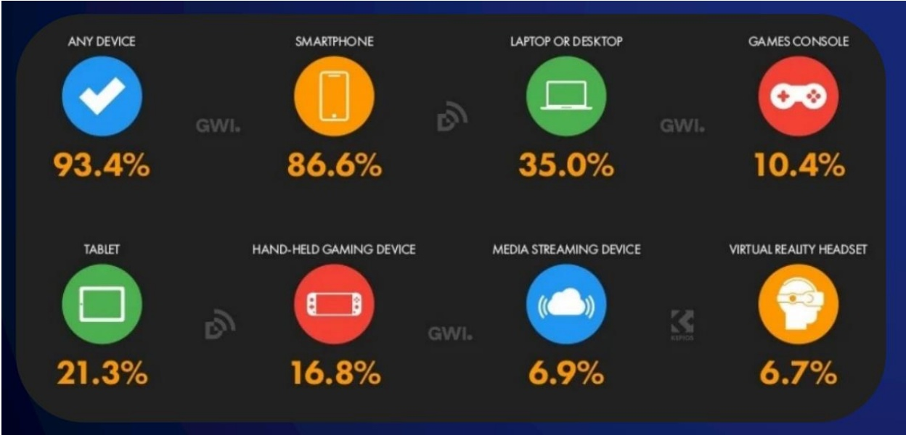

Hình 1.1: Tý lệ người dùng internet chơi game theo thiết bị tại Việt Nam

Theo định nghĩa của Kuittinen và cộng sự, game casual là những trò chơi sở hữu cơ chế điều khiển trực quan, mục tiêu rõ ràng và mang lại khả năng tiếp cận nhanh chóng cho người chơi. Các nhà nghiên cứu cho rằng điểm nổi bật nhất của thể loại này nằm ở việc người chơi có thể hiểu được cách chơi chỉ sau vài lượt thao tác [3]. Yếu tố thân thiện với người mới chính là đặc trưng phân biệt game casual với

<!-- page: 16 -->

nhiều thể loại khác, vốn yêu cầu kiến thức phức tạp hơn hoặc thời gian đầu tư nhiều hơn để làm quen [4].

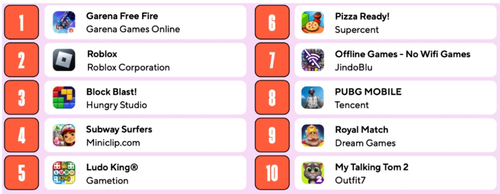

Hình 2.2: Top 10 gam được tải nhiều nhất thế giới năm 2024

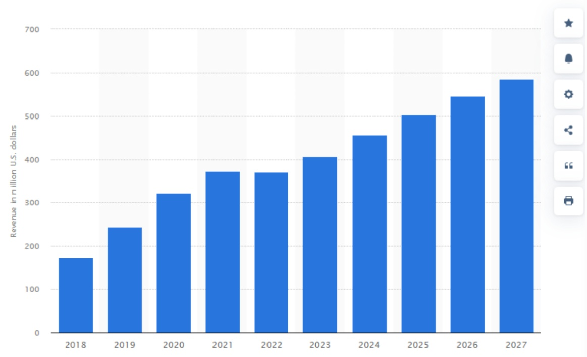

Hình 1.3: Tốc độ tăng trưởng doanh thu game Việt

Trong khi đó, Juul tiếp cận khái niệm casual game từ góc nhìn hành vi người chơi và thời lượng trải nghiệm. Theo ông, game casual thường được thiết kế sao cho một vòng chơi có thể diễn ra trong thời gian ngắn, phù hợp với những phút nghỉ trong ngày [5], chẳng hạn như khi chờ xe buýt, nghỉ giữa giờ làm, hoặc những lúc người chơi chỉ muốn giải trí nhanh. Tính chất chơi nhanh – dừng nhanh – tiếp tục dễ khiến

<!-- page: 17 -->

game casual trở thành lựa chọn phổ biến đối với những người không có nhiều quỹ thời gian dành cho game, nhưng vẫn mong muốn được thư giãn [5].

Bên cạnh sự đơn giản trong cơ chế, yếu tố tâm lý người chơi cũng được khai thác sâu trong thể loại này. Nhiều nghiên cứu chỉ ra rằng game casual mang lại cảm giác giải trí tức thời, giảm căng thẳng, tạo cảm giác thành tựu nhờ vào việc thiết kế mục tiêu nhỏ gọn, rõ ràng. Những màn chơi được chia nhỏ thành các thử thách ngắn, mỗi thử thách kéo dài chỉ vài phút nhưng vẫn đủ để người chơi cảm nhận sự tiến bộ. Nhờ đó, thể loại này không chỉ hấp dẫn người chơi truyền thống mà còn mở rộng sang phạm vi nhóm người dùng trước đây ít tiếp xúc với game như người lớn tuổi hay trẻ em [6] [4].

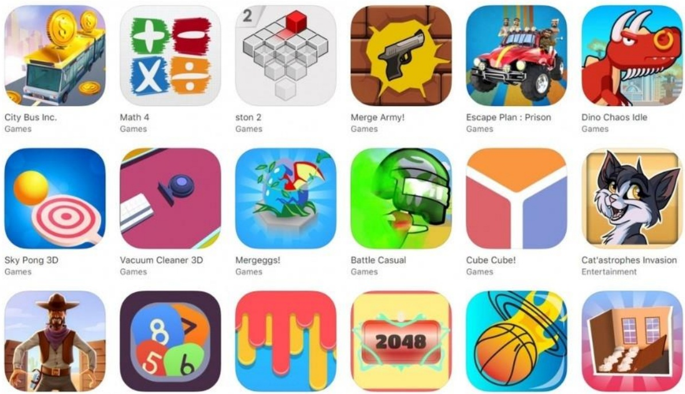

Hình 1.4: Ảnh một số tựa game casual

Xu hướng tối giản hóa giao diện cùng với việc tập trung nâng cao trải nghiệm người dùng đã trở thành nhân tố quan trọng thúc đẩy sự phát triển của game casual. Các trò chơi trong thể loại này thường có cơ chế điều khiển đơn giản với số lượng thao tác hạn chế, giao diện trực quan và hệ thống hướng dẫn rõ ràng nhằm giúp người chơi nhanh chóng làm quen. Bên cạnh đó, việc sử dụng hình ảnh sinh động, gam màu sáng, âm thanh nhẹ nhàng và phong cách đồ họa gần gũi góp phần tạo ấn tượng tích cực ngay từ lần trải nghiệm đầu. Bắt đầu từ khoảng năm 2015, cùng với sự tăng

<!-- page: 18 -->

trưởng mạnh của thị trường game trên thiết bị di động, game casual đã chiếm được tỷ trọng đáng kể trong tổng doanh thu của ngành, đặc biệt nhờ mô hình free-to-play kết hợp quảng cáo hoặc các giao dịch mua vật phẩm giá trị nhỏ. Với chi phí phát triển không quá cao nhưng khả năng tiếp cận người dùng rộng, nhiều studio ở các quy mô khác nhau đã tham gia vào phân khúc này. Các dòng game như puzzle, match-3, di chuyển khối, hyper-casual, arcade mini-game hay simulation đơn giản hiện đang là những thể loại tiêu biểu của game casual.

Một khía cạnh khác đáng lưu ý là tốc độ cập nhật nội dung trong game casual diễn ra rất nhanh. Người chơi thường vượt qua các cấp độ trong thời gian ngắn và luôn mong chờ sự đổi mới liên tục về nội dung. Vì vậy, các nhà phát triển buộc phải tạo ra một số lượng lớn màn chơi, thậm chí lên đến hàng trăm hoặc hàng nghìn, nhằm duy trì sức hút cho trò chơi. Điều này tạo ra áp lực lớn đối với đội ngũ thiết kế, bởi họ không chỉ cần đáp ứng yêu cầu về số lượng mà còn phải đảm bảo tính logic, mức độ khó phù hợp, sự tăng tiến thử thách và tính khác biệt giữa các màn chơi.

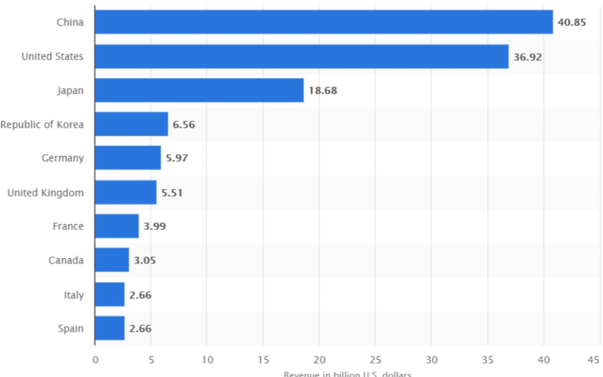

Hình 1.5: Top 10 thị trường game lớn nhất

Trong bối cảnh này, việc ứng dụng các giải pháp hỗ trợ, đặc biệt là các công nghệ trí tuệ nhân tạo, ngày càng trở nên cần thiết. Việc tự động hóa hoặc bán tự động

<!-- page: 19 -->

hóa quy trình xây dựng màn chơi giúp giảm đáng kể chi phí nhân sự, rút ngắn thời gian phát triển, đồng thời tạo điều kiện cho việc hoàn thiện những nội dung mới mà cách tiếp cận truyền thống khó có thể đạt được. Nhiều công trình nghiên cứu gần đây đã tập trung nghiên cứu mô hình ngôn ngữ lớn, mô hình khuếch tán cùng các kỹ thuật học máy nhằm tự động sinh nội dung cho trò chơi, qua đó mở ra những hướng đi mới trong phát triển game casual [4, 7].

Từ những phân tích trên có thể nhận thấy rằng, bên cạnh sự mở rộng mạnh mẽ về phạm vi thị trường, game casual cũng đặt ra nhiều thách thức mới trong quá trình thiết kế, đặc biệt là bài toán xây dựng hệ thống màn chơi phong phú, cân bằng và có tính cuốn hút. Chính những thách thức này đã trở thành động lực thúc đẩy các nghiên cứu hướng tới việc áp dụng trí tuệ nhân tạo để tạo ra màn chơi tự động, nội dung sẽ được trình bày và làm rõ hơn ở các phần tiếp theo của đồ án.

## 1.2. Quy trình thiết kế màn chơi trong game casual hiện nay

Thiết kế màn chơi luôn được xem là một trong những thành tố quan trọng nhất trong phát triển game casual. Mặc dù thể loại này nổi bật bởi sự đơn giản và dễ tiếp cận, quá trình xây dựng một màn chơi đạt hiệu quả cao lại đòi hỏi tính toán kỹ lưỡng, thử nghiệm liên tục và sự kết hợp giữa sáng tạo, tâm lý học hành vi cùng kỹ thuật thiết kế trò chơi. Mục tiêu cuối cùng của quá trình thiết kế màn chơi không chỉ là tạo ra một thử thách hấp dẫn, mà còn phải tối ưu hóa các chỉ số vận hành như tỉ lệ giữ chân ngày đầu tỉ lệ hoàn thành màn chơi, thời gian chơi trung bình và mức độ hài lòng tổng thể của người chơi [4, 7].

<!-- page: 20 -->

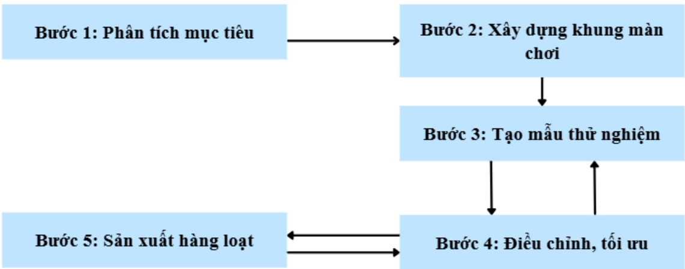

Hình 1.6: Ảnh quy trình thiết kế màn chơi game

Trong thực tế sản xuất game casual, quy trình thiết kế màn chơi hiện đại thường được chia thành nhiều bước, vận hành theo một vòng lặp liên tục. Mỗi bước sẽ đóng vai trò riêng, nhưng tất cả đều tương tác chặt chẽ nhằm đảm bảo màn chơi cuối cùng vừa hấp dẫn, đồng thời đáp ứng các yêu cầu về hiệu quả kinh doanh và trải nghiệm người dùng.Những bước chính có thể mô tả như sau:

\- Bước 1: Phân tích mục tiêu và xác định cơ chế chủ đạo. Ở giai đoạn đầu, nhóm thiết kế tiến hành phân tích tổng thể mục tiêu của trò chơi và đối tượng người chơi mà sản phẩm hướng tới. Đây là bước nền tảng, giúp nhà thiết kế hình dung rõ ràng trải nghiệm cốt lõi mà game sẽ mang lại. Các yếu tố quan trọng thường được xác định gồm: mục tiêu chơi chính (ví dụ: giải đố, ghép cặp, vượt chướng ngại vật), hành vi người chơi mong muốn, độ khó tổng quan và phong cách trình bày.Theo nghiên cứu của Li (2024), thiết kế game casual nên được cấu trúc dựa trên bốn thành phần cơ chế chính : nhiệm vụ, tiến trình và tương tác Điều này có nghĩa là ngay ở bước đầu, nhà thiết kế phải xác định rõ người chơi sẽ làm gì, cần đạt gì trong mỗi màn và cách họ tương tác với thế giới của game. Một thiết kế có định hướng rõ ràng sẽ giúp người chơi làm quen dễ dàng và cảm nhận được sự mạch lạc trong toàn bộ trò chơi.

\- Bước 2: Xây dựng khung màn chơi và cân bằng độ khó. Sau khi các cơ chế chính đã được xác định, nhóm thiết kế bắt đầu xây dựng khung của màn chơi Đây là

<!-- page: 21 -->

bước triển khai ý tưởng thành bố cục thực tế, bao gồm việc thiết lập không gian màn chơi, xác định các chướng ngại vật, phần thưởng, mục tiêu phụ, cũng như các giới hạn như số lượt đi, thời gian chơi hoặc yêu cầu nhiệm vụ.Việc cân bằng độ khó là yếu tố trọng tâm trong bước này. Trong game casual dạng puzzle hoặc matching, độ khó của màn chơi được coi là một trong những yếu tố then chốt giữ chân người chơi, bởi nó ảnh hưởng đến cảm giác thành tựu và mức độ thỏa mãn khi vượt qua thử thách. Emelyantseva (2019) nhấn mạnh rằng sự dự đoán trước hành vi và tiến triển của người chơi là thách thức chính đối với nhà thiết kế. Màn chơi dễ quá sẽ khiến người chơi cảm thấy không có hứng thú, trong khi màn chơi quá khó dễ dẫn đến tỉ lệ bỏ cuộc cao. Do đó, nhà thiết kế cần tạo ra một đường cong độ khó hợp lý, tăng dần qua từng màn nhưng vẫn đảm bảo sự đa dạng và bất ngờ.

\- Bước 3: Tạo mẫu, thử nghiệm và thu thập dữ liệu hành vi. Sau khi hình thành thiết kế ban đầu, nhóm phát triển tạo ra phiên bản mẫu của màn chơi và bắt đầu thử nghiệm với người dùng thật. Công việc bao gồm việc quan sát cách người chơi tương tác, ghi nhận thời gian hoàn thành, các điểm gây khó khăn và các hành vi bất thường trong quá trình chơi. Một nghiên cứu tổng hợp về phân tích trải nghiệm người chơi đã chỉ ra rằng ba phương pháp thường được áp dụng là: phỏng vấn trực tiếp, phân tích dữ liệu hành vi trong game và đo lường sinh trắc học (nhịp tim, ánh mắt, phản hồi cảm xúc). Kết quả của nghiên cứu cho thấy phỏng vấn người chơi giúp phát hiện các vấn đề rõ ràng nhất, trong khi phân tích hành vi và chỉ số sinh trắc học bổ sung thông tin về cảm xúc và mức độ căng thẳng trong trải nghiệm. Nhờ kết hợp đa dạng các phương pháp đánh giá, nhà thiết kế có thể đưa ra lựa chọn đúng đắn hơn về phần cần tối ưu.

\- Bước 4: Điều chỉnh, tối ưu và phân tích chỉ số. Dựa trên dữ liệu thu thập ở giai đoạn thử nghiệm, đội ngũ thiết kế tiến hành điều chỉnh các thông số của màn chơi như: bố cục, số lượt đi, mức phần thưởng, tỷ lệ xuất hiện vật phẩm hiếm, thời gian phản hồi hoặc mức độ ngẫu nhiên. Mục tiêu là tạo ra các màn chơi phù hợp với từng nhóm người chơi, tối ưu hóa tỷ lệ hoàn thành, tăng tính hấp dẫn và cải thiện cảm giác tiến bộ. Bên cạnh đó, màn chơi trong game casual còn phải đáp ứng nhu cầu vận

<!-- page: 22 -->

hành dài hạn. GlobalStep (2024) nhấn mạnh rằng hệ thống màn chơi trong game casual cần được thiết kế theo hướng duy trì động lực, bằng cách sử dụng các yếu tố như phần thưởng luỹ tiến, nhiệm vụ hằng ngày, sự kiện đặc biệt hoặc các yếu tố gợi mở màn chơi mới. Điều này giúp nâng cao sự giữ chân người chơi và cải thiện doanh thu của trò chơi theo thời gian.

\- Bước 5: Sản xuất hàng loạt và vận hành liên tục. Khi một màn chơi đạt chất lượng mong muốn, quá trình sản xuất hàng loạt bắt đầu. Với các game vận hành theo mô hình live-service, việc cung cấp liên tục các màn chơi mới là yêu cầu bắt buộc để duy trì sự mới mẻ của trò chơi. Các đội thiết kế phải liên tục giám sát chỉ số vận hành sau khi màn chơi phát hành, phân tích hành vi người dùng và cập nhật, tinh chỉnh lại nếu cần. Ở giai đoạn này, thiết kế màn chơi không còn chỉ xoay quanh việc tạo ra nội dung mới, mà là một vòng đời hoàn chỉnh: sản xuất - phát hành - theo dõi - tối ưu - cập nhật. Điều này khiến thiết kế màn chơi trở thành một công việc đòi hỏi quy mô lớn, tốc độ cao và xử lý dữ liệu khả năng linh hoạt.

Nhìn chung, quy trình thiết kế màn chơi trong game casual hiện nay là một vòng lặp linh hoạt và liên tục, bao gồm nhiều bước từ phân tích cơ chế, xây dựng bố cục, thử nghiệm người dùng đến tối ưu hóa và vận hành dài hạn. Hiểu rõ cấu trúc và nhu cầu của quy trình này giúp các nhà phát triển tạo ra các màn chơi chất lượng và tối ưu hóa trải nghiệm người chơi trong suốt vòng đời sản phẩm. Chính tính chất lặp lại và tốn thời gian của quy trình này cũng là một trong những lý do dẫn đến nhu cầu ứng dụng công nghệ AI để hỗ trợ kế màn chơi nội dung sẽ được trình bày sâu hơn trong các phần tiếp theo.

## 1.3. Thực trạng thiết kế màn chơi trong các studio game Việt Nam

Giai đoạn vừa qua đã chứng kiến sự bùng nổ của thị trường game Việt, đặc biệt là sự lên ngôi của mảng mobile và casual game. Những "ông lớn" như Amanotes, Falcon Game Studio, IKame, Hiker Games và TOH Games đã chứng minh được năng lực cạnh tranh sòng phẳng của các nhà phát triển trong nước. Tuy nhiên, đi sâu vào quy trình sản xuất, khâu thiết kế màn chơi vẫn đang là một điểm nghẽn lớn. Dù đóng vai trò quyết định đến sự hứng thú của người chơi, nhưng công đoạn này tại nhiều

<!-- page: 23 -->

studio vẫn chưa được tối ưu hóa, bộc lộ rõ những lỗ hổng về mặt công nghệ hỗ trợ, kỹ năng chuyên môn của đội ngũ và quy trình vận hành.

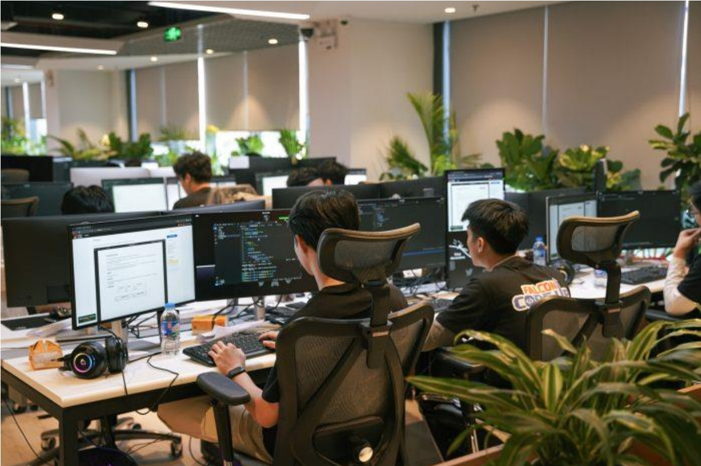

Hình 1.5: Studio game tại Việt Nam

Thực tế cho thấy, đại đa số các studio trong nước hiện vẫn phụ thuộc vào quy trình thiết kế truyền thống. Cụ thể, các nhà thiết kế (game designers) phải thao tác trực tiếp trên các game engine phổ biến như Unity hay Unreal để sắp xếp bố cục và tinh chỉnh tham số cho từng cấp độ. Mặc dù phương pháp này có thể đáp ứng tốt nhu cầu của các dự án quy mô nhỏ hoặc giai đoạn sơ khởi (prototype), nhưng nó lại trở thành "nút thắt cổ chai" nghiêm trọng khi mở rộng quy mô sản phẩm. Đối với các dòng game như casual, match-3, puzzle hay hyper-casual, yêu cầu về số lượng màn chơi lên tới hàng trăm, hàng nghìn là rất phổ biến. Khi đó, việc làm thủ công không chỉ tiêu tốn nguồn lực khổng lồ về thời gian và công sức để cân bằng độ khó theo tiến trình người chơi, mà còn phát sinh vấn đề về sự thiếu đồng bộ. Do có sự tham gia của nhiều nhân sự khác nhau ở các thời điểm khác nhau, chất lượng giữa các màn chơi khó đạt được sự nhất quán. Ngay cả những sai số nhỏ trong thiết kế bố cục hay thông số gameplay cũng có thể gây ra trải nghiệm quá dễ hoặc quá khó, tác động tiêu cực

<!-- page: 24 -->

trực tiếp đến tỷ lệ giữ chân (retention) và gia tăng tỷ lệ rời bỏ (churn rate) của người dùng.

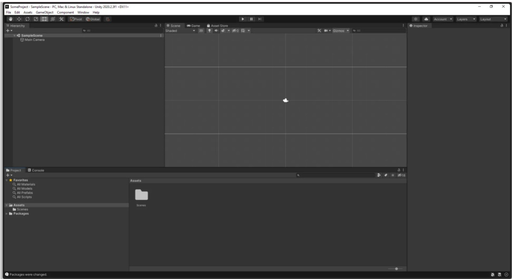

Hình 1.6: Giao diện Unity một game engine giúp thiết kế các màn chơi

Bên cạnh những hạn chế về quy trình, ngành công nghiệp game Việt Nam còn vấp phải rào cản lớn liên quan đến chất lượng nhân lực và văn hóa làm việc. Dù nhu cầu tuyển dụng tăng cao, nhưng thị trường lại khan hiếm nghiêm trọng đội ngũ được đào tạo bài bản, đặc biệt là ở vị trí Level Design – một vai trò đòi hỏi sự tổng hòa giữa tư duy hệ thống, tâm lý học và khả năng hình dung không gian. Thực tế, phần lớn nhân sự trong mảng này đều là những người chuyển ngạch hoặc tự trau dồi qua thực tế làm việc (learning on the job) thay vì qua trường lớp chính quy. Sự thiếu hụt nền tảng lý thuyết này gây khó khăn trong việc xây dựng các hệ thống màn chơi phức tạp cũng như duy trì đường cong độ khó (difficulty curve) theo tiêu chuẩn quốc tế. Ngoài ra, việc các Level Designer phải kiêm nhiệm quá nhiều đầu việc phụ như dựng cảnh, quản lý tài nguyên hay kiểm thử (QC) cũng khiến họ không thể tập trung tối đa để hoàn thiện chất lượng cho từng màn chơi.

Một trong những hạn chế khác của các studio Việt Nam là thiếu các công cụ nội bộ hỗ trợ cho quá trình thiết kế màn chơi. Những công cụ quan trọng như trình sinh màn tự động , hệ thống đánh giá độ khó, công cụ mô phỏng người chơi, các

<!-- page: 25 -->

editor tùy chỉnh theo đặc thù trò chơi hoặc hệ thống solver kiểm tra độ hợp lệ của màn thường không được phát triển do thiếu nguồn lực hoặc thiếu đội ngũ kỹ thuật chuyên sâu. Điều này khiến level designer phải làm việc thủ công trong hầu hết các khâu, từ việc tạo layout, bố trí vật thể đến thử nghiệm từng biến thể màn chơi. Trái lại, nhiều studio quốc tế sở hữu đội ngũ kỹ sư chuyên phát triển công cụ nội bộ hoặc thậm chí đầu tư vào hệ thống AI giúp tự động hóa đáng kể quy trình thiết kế và tinh chỉnh màn chơi.

Cùng với việc thiếu công cụ, văn hóa thiết kế dựa trên dữ liệu chưa thực sự phổ biến tại các studio Việt Nam. Thiết kế màn chơi hiện đại đòi hỏi dữ liệu hành vi người dùng ở cấp độ chi tiết nhằm phát hiện các điểm gây khó khăn, xác định các bước tiến hợp lý, phát hiện lỗi phá game hoặc hành vi bất thường, từ đó tinh chỉnh độ khó một cách khoa học. Tuy nhiên, nhiều studio trong nước chưa sở hữu hệ thống thu thập dữ liệu đủ mạnh hoặc chỉ sử dụng các công cụ phân tích thông thường. Điều này khiến việc tinh chỉnh màn chơi thường dựa trên cảm nhận cá nhân hoặc phản hồi nhỏ lẻ thay vì dựa trên dữ liệu thực nghiệm, dẫn đến hiệu quả tối ưu hóa thấp và kém ổn định. Một số studio lớn hơn có sử dụng dữ liệu nhưng mức độ khai thác chưa sâu, đặc biệt trong các tác vụ phức tạp như mô phỏng người chơi ảo, dự đoán độ khó tự động hay phân tích đường cong tiến trình.

Ngoài ra, khả năng ứng dụng các xu hướng công nghệ trí tuệ nhân tạo (AI) vào thiết kế màn chơi tại Việt Nam còn rất hạn chế. Dù các kiến trúc AI tiên tiến như mô hình ngôn ngữ lớn (LLM), mô hình khuếch tán hay các kỹ thuật học máy đã được sử dụng phổ biến trên thế giới để tạo bố cục, phân tích độ phức tạp, xây dựng tài nguyên (asset) hoặc hỗ trợ mô phỏng, nhưng tại Việt Nam, chỉ một số studio dẫn đầu mới bắt đầu thử nghiệm và hầu hết vẫn đang ở giai đoạn sơ khai. Việc thiếu hiểu biết về công nghệ, chi phí đầu tư lớn và sự eo hẹp về tài nguyên tính toán khiến phần lớn doanh nghiệp vẫn chần chừ trong việc đưa các công nghệ mới vào quy trình sản xuất.

Trên phạm vi rộng hơn, ngành game Việt Nam còn chịu áp lực cạnh tranh cực lớn trên thị trường quốc tế. Các nhà phát triển nước ngoài, đặc biệt ở Trung Quốc, Mỹ và châu $\hat { \mathbf { A } } \mathbf { u } ,$ sở hữu đội ngũ chuyên môn cao, hệ thống dữ liệu dồi dào, công cụ

<!-- page: 26 -->

nội bộ mạnh mẽ và khả năng triển khai AI ở quy mô lớn. Những lợi thế đó giúp họ rút ngắn chu kỳ phát triển, tạo ra nhiều màn chơi đa dạng hơn, đảm bảo chất lượng ổn định và thường xuyên tối ưu hóa trải nghiệm người dùng. Để giữ vững khả năng cạnh tranh trên thị trường toàn cầu, các studio Việt phải liên tục suy nghĩ chiến lược cập nhật nội dung, nâng cao chất lượng sản phẩm và tối thiểu hóa chi phí sản xuất— những yêu cầu mà mô hình phát triển truyền thống khó có thể đáp ứng lâu dài.

Trong bối cảnh đó, nhu cầu chuyển đổi sang quy trình thiết kế màn chơi có hỗ trợ AI trở thành một yêu cầu thiết yếu đối với các studio Việt Nam. AI không chỉ giúp tự động hóa nhiều công đoạn thủ công trong thiết kế, mà còn hỗ trợ phân tích dữ liệu người chơi, dự báo mức độ thử thách, cải tiến bố cục và tạo ra các màn chơi mới với tốc độ nhanh hơn đáng kể so với phương pháp truyền thống. Đối với thị trường Việt Nam, nơi nguồn lực nhân sự và công nghệ còn hạn chế, việc áp dụng AI không chỉ là một lựa chọn mà là một giải pháp nhằm tăng cường năng suất, cắt giảm chi phí và duy trì vị thế cạnh tranh trên thị trường quốc tế.

**1.4. Nhu cầu và xu hướng ứng dụng AI trong thiết kế màn chơi.**


Hình 1.7: Hình minh hoạ về AI

<!-- page: 27 -->

Trí tuệ nhân tạo (Artificial Intelligence – AI) là lĩnh vực nghiên cứu tập trung vào việc phát triển các hệ thống có khả năng mô phỏng những hành vi thông minh của con người, bao gồm học hỏi từ dữ liệu, suy luận, ra quyết định và thích nghi với môi trường thay đổi. Sự phát triển của các phương pháp học máy và học sâu, đặc biệt là sau khi kiến trúc Transformer được đề xuất, đã tạo nền tảng cho các hệ thống AI có khả năng xử lý dữ liệu phức tạp và biểu diễn tri thức ở quy mô lớn [9][10]. Nhờ đó, AI ngày càng được ứng dụng rộng rãi trong nhiều lĩnh vực công nghiệp, trong đó có ngành phát triển trò chơi điện tử [18][19].

Trong khoảng hơn một thập kỷ trở lại đây, AI đã dần trở thành một nhân tố then chốt, tác động mạnh mẽ đến cách thức phát triển và chế tạo trò chơi điện tử trên quy mô toàn cầu. Theo Yannakakis và Togelius, AI trong game không còn chỉ giới hạn ở việc điều khiển hành vi của nhân vật không phải người chơi, mà đã mở rộng sang nhiều khía cạnh khác của quy trình phát triển, bao gồm thiết kế nội dung, kiểm thử và phân tích trải nghiệm người chơi [3]. Sự mở rộng này phản ánh nhu cầu ngày càng lớn của ngành công nghiệp game trong việc tối ưu hóa quy trình sản xuất và nâng cao chất lượng sản phẩm trong bối cảnh cạnh tranh ngày càng gay gắt.

Đặc biệt, trong các hoạt động liên quan đến xây dựng nội dung và thiết kế màn chơi, AI đã mang đến nhiều cách tiếp cận mới, góp phần làm thay đổi đáng kể quy trình phát triển truyền thống. Các nghiên cứu về Procedural Content Generation cho thấy AI có thể hỗ trợ tự động hoặc bán tự động trong việc tạo ra các yếu tố như bố cục màn chơi, bản đồ, nhiệm vụ và thử thách gameplay, dựa trên các tiêu chí và ràng buộc do nhà thiết kế đặt ra [2][17]. Cách tiếp cận này giúp giảm đáng kể khối lượng công việc thủ công, đồng thời mở rộng không gian sáng tạo thông qua việc tạo ra nhiều phương án nội dung khác nhau trong thời gian ngắn.

Xu hướng ứng dụng AI trong thiết kế màn chơi thể hiện rõ nét trong lĩnh vực game casual, nơi số lượng màn chơi lớn, tốc độ cập nhật nhanh và mức độ đa dạng cao đóng vai trò then chốt trong việc duy trì sự gắn bó của người chơi [1][5]. Theo Kuittinen và Kultima, game casual thường đòi hỏi thiết kế đơn giản về mặt cơ chế nhưng phong phú về nội dung, khiến quá trình sản xuất trở nên tốn kém nếu thực hiện

<!-- page: 28 -->

hoàn toàn thủ công [1]. Trong bối cảnh đó, AI được xem là công cụ hỗ trợ hiệu quả nhằm đáp ứng yêu cầu mở rộng nội dung mà vẫn đảm bảo tính nhất quán và cân bằng giữa các màn chơi.

Một xu hướng đáng chú ý trong những năm gần đây là việc khai thác các mô hình tạo sinh nhằm hỗ trợ xây dựng các thành phần cấu thành của màn chơi. Các mô hình ngôn ngữ lớn, dựa trên kiến trúc Transformer, có khả năng tiếp nhận và xử lý mô tả bằng ngôn ngữ tự nhiên, học được các quy tắc gameplay và mối quan hệ giữa các thành phần trong game [7][9]. Nhờ đó, các mô hình này có thể đề xuất cấu trúc màn chơi phù hợp, sinh ra các biến thể bố cục hoặc đưa ra gợi ý điều chỉnh độ khó dựa trên yêu cầu cụ thể của nhà thiết kế. Việc ứng dụng các mô hình này giúp rút ngắn đáng kể giai đoạn hình thành ý tưởng ban đầu, cho phép nhà thiết kế tập trung nhiều hơn vào đánh giá và tinh chỉnh chất lượng màn chơi thay vì phải xây dựng nội dung từ đầu.

Song song với các mô hình ngôn ngữ lớn, sự phát triển của các mô hình khuếch tán đã mở ra những khả năng mới trong việc tạo sinh hình ảnh, tài nguyên đồ họa và bố cục không gian cho màn chơi. Các mô hình khuếch tán, khởi nguồn từ Denoising Diffusion Probabilistic Models, đã chứng minh hiệu quả cao trong việc tạo ra hình ảnh có độ phân giải cao và tính đa dạng lớn [11][14]. Các nghiên cứu gần đây cho thấy những mô hình này có thể được ứng dụng trực tiếp trong việc tạo sinh asset và môi trường game, đồng thời đảm bảo sự đồng nhất về phong cách mỹ thuật [4][8].

Khi được kết hợp với các cơ chế điều kiện hóa như ControlNet, mô hình khuếch tán có khả năng tạo ra nội dung hình ảnh phù hợp với các ràng buộc cụ thể về bố cục và cấu trúc màn chơi [13]. Sự kết hợp giữa mô hình ngôn ngữ lớn và mô hình khuếch tán cho phép chuyển đổi các mô tả trừu tượng của nhà thiết kế thành các biểu diễn trực quan cụ thể, qua đó giảm đáng kể thời gian sản xuất và khối lượng công việc cho đội ngũ thiết kế và họa sĩ.

Bên cạnh việc tạo sinh nội dung, AI còn được ứng dụng rộng rãi trong phân tích và cân bằng độ khó của màn chơi. Các mô hình học máy có thể được huấn luyện dựa trên dữ liệu hành vi người chơi để dự đoán khả năng vượt màn, thời gian hoàn

<!-- page: 29 -->

thành hoặc phát hiện các điểm gây khó khăn quá mức trong gameplay [3]. Một số phương pháp tiên tiến còn cho phép mô phỏng người chơi ảo với nhiều cấp độ kỹ năng khác nhau nhằm tự động kiểm tra màn chơi trước khi phát hành, giúp phát hiện lỗi và đảm bảo đường cong tiến trình hợp lý hơn.

Sự kết hợp giữa các kỹ thuật tạo sinh nội dung và phân tích dữ liệu đang dần hình thành hướng tiếp cận thiết kế màn chơi có sự hỗ trợ của AI (AI-assisted level design). Trong mô hình này, AI đóng vai trò như một trợ lý thông minh, đồng hành cùng nhà thiết kế trong toàn bộ quy trình, từ hình thành ý tưởng, xây dựng tài nguyên, bố trí layout cho đến đánh giá chất lượng sản phẩm cuối cùng [6][18]. Cách tiếp cận này nhấn mạnh vai trò bổ trợ của AI, nhằm nâng cao hiệu suất làm việc và mở rộng khả năng sáng tạo của con người, thay vì thay thế hoàn toàn vai trò của nhà thiết kế.

Tại Việt Nam, nhu cầu ứng dụng AI trong thiết kế màn chơi ngày càng trở nên rõ rệt khi các studio phải đối mặt với áp lực cạnh tranh quốc tế, hạn chế về nhân lực và yêu cầu sản xuất số lượng lớn màn chơi trong thời gian ngắn. Việc ứng dụng AI mang lại nhiều lợi ích thiết thực như tiết kiệm thời gian, giảm sự phụ thuộc vào nhân sự chủ chốt và nâng cao tính nhất quán giữa các màn chơi [18][20]. Mặc dù một số studio đã bắt đầu thử nghiệm các mô hình AI trong phân tích độ khó hoặc đề xuất bố cục màn chơi, việc ứng dụng nhìn chung vẫn đang ở giai đoạn đầu và còn nhiều tiềm năng chưa được khai thác.

Từ góc độ phát triển toàn cầu, AI không chỉ giúp tối ưu hóa quy trình sản xuất mà còn mở ra khả năng cá nhân hóa trải nghiệm người chơi thông qua việc tạo ra các màn chơi thích ứng với năng lực và sở thích cá nhân. Điều này đặc biệt quan trọng đối với game casual, vốn gắn liền với số lượng người chơi lớn và mức độ đa dạng cao [5]. Trong tương lai, sự kết hợp giữa mô hình ngôn ngữ lớn và mô hình khuếch tán được kỳ vọng sẽ tiếp tục thúc đẩy sự ra đời của các công cụ thiết kế màn chơi thông minh, cho phép nhà thiết kế diễn đạt ý tưởng bằng ngôn ngữ tự nhiên và nhanh chóng nhận lại các màn chơi hoàn chỉnh, góp phần nâng cao năng lực cạnh tranh của các studio game trong nước và quốc tế.

<!-- page: 30 -->

## 1.5. Đánh giá tổng quan và xác định vấn đề nghiên cứu

Từ những nội dung đã trình bày trong các mục trước, có thể nhận thấy rằng thiết kế màn chơi giữ vai trò trung tâm trong việc xây dựng trải nghiệm của người chơi đối với thể loại game casual. Một màn chơi tốt không chỉ đơn thuần là sự sắp đặt ngẫu nhiên của các thử thách mà là một cấu trúc thiết kế tinh tế, trong đó độ khó, phần thưởng, nhịp điệu tiến trình và yếu tố bất ngờ phải được cân chỉnh một cách hợp lý. Đây chính là yếu tố quyết định khả năng giữ chân người chơi và duy trì sức hấp dẫn của trò chơi theo thời gian. Ở quy mô toàn cầu, nhiều nghiên cứu đã chỉ ra rằng mức độ thành công của game casual phụ thuộc mạnh vào chất lượng từng màn chơi, bởi người chơi nhóm này thường yêu cầu trải nghiệm ngắn, đơn giản nhưng phải liên tục mới mẻ và đủ kích thích.

Tuy nhiên, khi đối chiếu với thực trạng thiết kế màn chơi trong ngành game Việt Nam, có thể thấy khoảng cách khá rõ rệt giữa nhu cầu thị trường và khả năng đáp ứng của các studio nội địa. Phần lớn quy trình thiết kế màn chơi tại Việt Nam vẫn mang tính thủ công, phụ thuộc gần như hoàn toàn vào cảm quan và kinh nghiệm tích lũy của từng nhà thiết kế riêng lẻ. Điều này khiến quá trình sản xuất màn chơi trở nên tốn kém thời gian, đặc biệt trong bối cảnh game casual cần số lượng màn chơi lớn, đa dạng và phải được cập nhật liên tục để duy trì mức độ tương tác của người chơi. Bên cạnh đó, việc phụ thuộc vào quy trình thủ công làm gia tăng nguy cơ sai lệch chất lượng giữa các màn, khiến đường cong tiến trình của trò chơi thiếu ổn định hoặc không phù hợp với kỳ vọng của người dùng.

Một thách thức lớn khác là sự thiếu hụt công cụ hỗ trợ và khả năng tự động hóa. Nhiều studio Việt Nam chưa đầu tư đầy đủ vào hạ tầng công nghệ phục vụ level design như hệ thống sinh layout tự động, công cụ đánh giá độ khó, mô phỏng người chơi ảo hoặc các editor tùy chỉnh. Điều này dẫn đến việc hầu hết quá trình thử nghiệm, tinh chỉnh và đánh giá màn chơi đều được thực hiện thủ công. Khi số lượng màn chơi tăng lên hàng trăm hoặc hàng nghìn, khối lượng công việc mà các designer phải xử lý cũng tăng tương ứng, tạo ra sự quá tải và làm giảm chất lượng tổng thể của sản phẩm.

<!-- page: 31 -->

Bên cạnh đó, văn hóa thiết kế dựa trên dữ liệu. Một trụ cột quan trọng của thiết kế game hiện đại vẫn chưa phổ biến trong nhiều studio Việt Nam. Trong khi các công ty quốc tế sử dụng dữ liệu hành vi người chơi để tinh chỉnh độ khó, xác định thời điểm rời bỏ, phân tích mức độ thử thách hoặc đánh giá trải nghiệm, thì nhiều doanh nghiệp trong nước vẫn dựa chủ yếu vào phản hồi rời rạc hoặc cảm nhận cá nhân. Việc thiếu dữ liệu khiến cho quá trình tối ưu hóa màn chơi kém chính xác và khó đánh giá hiệu quả thực tế của các thay đổi trong thiết kế.

Trong bối cảnh đó, sự phát triển của trí tuệ nhân tạo, đặc biệt là các mô hình ngôn ngữ lớn và mô hình khuyếch tán, đã mở ra nhiều hướng tiếp cận mới đầy triển vọng. Trên phạm vi quốc tế, nhiều công trình nghiên cứu cũng như các ứng dụng thực tế đã cho thấy tiềm năng của AI trong việc hỗ trợ, thậm chí tự động hóa, nhiều công đoạn trong quy trình thiết kế màn chơi. Các mô hình ngôn ngữ lớn có khả năng tiếp nhận và phân tích yêu cầu thiết kế, từ đó đề xuất cấu trúc và logic màn chơi phù hợp, trong khi các mô hình khuyếch tán đảm nhiệm vai trò tạo sinh hình ảnh, bố cục không gian hoặc layout trực quan dựa trên mô tả bằng ngôn ngữ tự nhiên hoặc dữ liệu huấn luyện. Khi được kết hợp, hai nhóm mô hình này hình thành nên một quy trình thiết kế nội dung mang tính tổng hợp, trong đó AI vừa có khả năng hiểu gameplay, vừa tạo ra các biểu diễn hình ảnh và sắp xếp đối tượng trong màn chơi một cách linh hoạt và sáng tạo.

Khi phân tích sâu hơn vào sự phù hợp của công nghệ này với bối cảnh Việt Nam, có thể thấy rằng AI có khả năng giải quyết đồng thời nhiều hạn chế mà các studio đang gặp phải. Trước hết, AI có thể tự động tạo ra các biến thể layout hoặc đề xuất hàng trăm thiết kế màn chơi chỉ trong thời gian rất ngắn, giúp giảm đáng kể khối lượng công việc của designer. Điều này đặc biệt quan trọng trong thể loại casual, nơi yêu cầu sản xuất số lượng lớn màn chơi là yếu tố sống còn. Thứ hai, AI có khả năng phân tích dữ liệu hành vi hoặc mô phỏng người chơi ảo, từ đó đưa ra dự đoán về độ khó của một màn chơi mà không cần phải trải qua quá trình thử nghiệm thủ công dài hơi. Cuối cùng, AI giúp tăng tính đồng nhất giữa các màn chơi bằng cách đảm bảo

<!-- page: 32 -->

rằng mỗi màn được sinh ra dựa trên các quy tắc chung, hạn chế sự biến thiên do cảm quan thiết kế cá nhân.

Việc xem xét tổng thể các vấn đề nêu trên cho thấy nhu cầu cấp thiết trong việc đổi mới quy trình thiết kế màn chơi tại thị trường game Việt Nam. Việc quá phụ thuộc vào cách tiếp cận thủ công, cùng với sự thiếu hụt các công cụ hỗ trợ và dữ liệu phân tích, đang khiến nhiều studio gặp trở ngại trong việc mở rộng quy mô sản xuất cũng như duy trì chất lượng nội dung một cách ổn định. Trong bối cảnh đó, sự tiến bộ nhanh chóng của trí tuệ nhân tạo mang đến một cơ hội khả thi để tái định hình quy trình phát triển màn chơi, đặc biệt đối với dòng game casual. Xuất phát từ thực tiễn này, đồ án tập trung nghiên cứu, thử nghiệm và ứng dụng sự kết hợp giữa mô hình ngôn ngữ lớn và mô hình khuyếch tán nhằm xây dựng một công cụ hỗ trợ sinh màn chơi theo hướng tự động.

Từ những phân tích trên, đồ án xác định trọng tâm nghiên cứu xoay quanh câu hỏi: bằng cách nào có thể khai thác và kết hợp hiệu quả mô hình ngôn ngữ lớn cùng mô hình khuyếch tán để xây dựng một hệ thống có khả năng tiếp nhận mô tả màn chơi, tạo sinh bố cục phù hợp và nâng cao tốc độ sản xuất các màn trong game casual. Vấn đề này không chỉ dừng lại ở mục tiêu tự động hóa quy trình thiết kế mà còn hướng tới việc xem xét mức độ khả thi, hiệu quả thực tiễn cũng như những giới hạn khi ứng dụng trí tuệ nhân tạo vào phát triển game. Trên cơ sở đó, mục tiêu cuối cùng của đồ án là đánh giá khả năng triển khai mô hình trong môi trường sản xuất thực tế và đề xuất các hướng cải tiến có giá trị cho quá trình phát triển game.

## 1.6. Kết luận chương

Chương 1 đã phác họa bức tranh tổng thể về hoạt động thiết kế màn chơi trong game casual, bao gồm nền tảng lý thuyết, đặc điểm của quy trình thiết kế truyền thống, thực trạng triển khai tại các studio game trong nước, cũng như các xu hướng ứng dụng trí tuệ nhân tạo trong ngành công nghiệp game hiện nay. Thông qua việc tổng hợp các nghiên cứu quốc tế kết hợp với phân tích bối cảnh tại Việt Nam, có thể nhận thấy rằng thiết kế màn chơi là một quá trình phức hợp, đòi hỏi sự giao thoa giữa yếu tố sáng tạo, tư duy hệ thống và khả năng phân tích dữ liệu. Trong khi nhiều studio

<!-- page: 33 -->

trên thế giới đã từng bước chuyển sang các giải pháp tự động hóa và ứng dụng AI, phần lớn các studio Việt Nam vẫn đang đối mặt với nhiều hạn chế liên quan đến công cụ hỗ trợ, nguồn nhân lực và dữ liệu.

Những tồn tại này cho thấy nhu cầu cấp thiết phải đổi mới cách tiếp cận trong thiết kế màn chơi. Nội dung của chương đã chỉ ra rằng trí tuệ nhân tạo, đặc biệt là hướng tiếp cận kết hợp giữa mô hình ngôn ngữ lớn và mô hình khuyếch tán, là một giải pháp tiềm năng nhằm nâng cao mức độ hiện đại hóa trong quy trình phát triển nội dung game casual. Việc ứng dụng các công nghệ này không chỉ giúp giảm bớt khối lượng công việc thủ công tốn nhiều thời gian mà còn tạo điều kiện cho việc sinh nội dung mang tính sáng tạo cao, duy trì sự đồng nhất về chất lượng và rút ngắn chu kỳ phát triển sản phẩm.

Trên cơ sở những phân tích và đánh giá ở Chương 1, Chương 2 sẽ tập trung đi sâu vào các công nghệ AI liên quan, bao gồm nguyên lý hoạt động của mô hình ngôn ngữ lớn, mô hình khuyếch tán và khả năng tích hợp chúng trong từng giai đoạn của quy trình thiết kế màn chơi. Đây là tiền đề quan trọng để tiến tới việc xây dựng, triển khai và đánh giá công cụ hỗ trợ sinh màn chơi được trình bày trong Chương 3.

<!-- page: 34 -->

## CHƯƠNG 2: PHÂN TÍCH YÊU CẦU VÀ THIẾT KẾ HỆ THỐNG HỖ TRỢ TẠO MÀN CHƠI

Trong bối cảnh thiết kế màn chơi đang ngày càng trở thành một quy trình phức tạp và đòi hỏi sự đa dạng, hai công nghệ nổi bật nhất hiện nay là mô hình ngôn ngữ lớn (LLM) và mô hình khuếch tán (Diffusion Models). Cả hai loại mô hình đều có khả năng sinh dữ liệu mới dựa trên việc học từ các tập dữ liệu lớn, song chúng phù hợp cho những nhiệm vụ khác nhau [8]. LLM mạnh ở khả năng sinh cấu trúc, logic, quy tắc và biểu diễn trừu tượng, trong khi mô hình khuếch tán mạnh về sinh ảnh trực quan, tài sản đồ họa và bố cục có định dạng hình ảnh. Khi được kết hợp lại, hai mô hình này có thể tạo thành một hệ thống sinh màn chơi vừa đầy đủ logic gameplay, vừa có hình ảnh minh họa phù hợp. Chương này trình bày nền tảng lý thuyết của hai loại mô hình cũng như cách chúng có thể được kết hợp nhằm giải quyết bài toán sinh màn chơi trong game casual.

## 2.1. Mô hình ngôn ngữ lớn (LLM)

## 2.1.1. Tổng quan về sự phát triển của mô hình ngôn ngữ

Mô hình ngôn ngữ lớn (LLM) là một trong những thành tựu nổi bật nhất của trí tuệ nhân tạo trong hơn một thập kỷ qua [9]. Khởi nguồn từ các phương pháp thống kê truyền thống như n-gram, mô hình ngôn ngữ ngày nay đã đạt mức độ phức tạp và hiệu quả vượt trội, có khả năng đọc hiểu, phân tích và tạo ra văn bản với mức độ tự nhiên gần giống con người. Sự phát triển này gắn liền với nhu cầu xử lý dữ liệu văn bản ngày càng lớn, đồng thời cũng là nền tảng quan trọng cho các ứng dụng hiện đại như trợ lý ảo, phân tích ngôn ngữ, sáng tạo nội dung kỹ thuật số và đặc biệt là tự động hóa trong phát triển trò chơi.

Trước khi kiến trúc Transformer xuất hiện, các mô hình như RNN, LSTM hay GRU được sử dụng phổ biến để xử lý ngôn ngữ. Tuy nhiên, các mô hình này gặp hạn chế lớn về khả năng ghi nhớ dài hạn, tốc độ huấn luyện chậm và khó mở rộng khi xử lý chuỗi dữ liệu lớn. Transformer đã thay đổi hoàn toàn bức tranh này khi loại bỏ toàn bộ tính tuần tự trong xử lý chuỗi, thay thế bằng cơ chế Attention một phương pháp cho phép mô hình phân tích toàn bộ dữ liệu đầu vào cùng lúc và đánh giá mức độ liên

<!-- page: 35 -->

quan giữa các phần tử trong chuỗi một cách hiệu quả hơn rất nhiều. Từ bước ngoặt này, hàng loạt mô hình LLM đã ra đời, trở thành nền tảng cho nhiều ứng dụng trí tuệ nhân tạo.

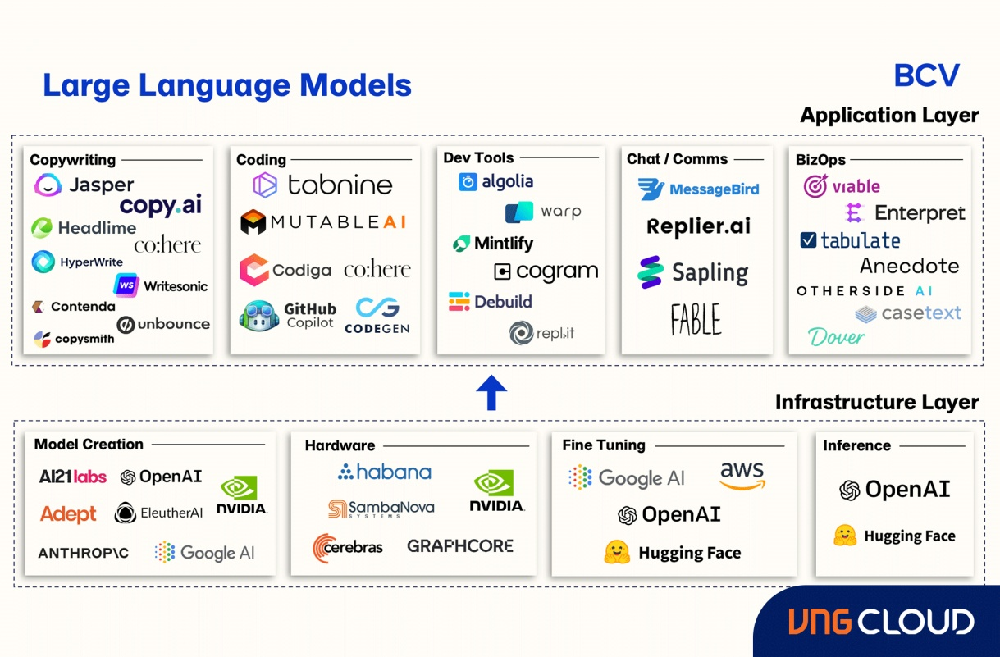

Hình 2.1: Một số mô hình ngôn ngữ lớn tiêu biểu

## 2.1.2. Kiến trúc Transformer – nền tảng lý thuyết của LLM

Kiến trúc Transformer là nền tảng của tất cả các LLM hiện đại. Khác với các mô hình trước đây hoạt động dựa trên xử lý tuần tự, Transformer cho phép mô hình tiếp cận đồng thời toàn bộ chuỗi đầu vào, nhờ đó nắm bắt mối quan hệ giữa các phần tử ở khoảng cách xa. Cốt lõi của kiến trúc này là cơ chế Self-Attention, giúp mô hình xác định mức độ quan trọng của từng token đối với token khác trong cùng một chuỗ [10]. Cơ chế này hoạt động bằng cách ánh xạ mỗi token vào ba vector đại diện: Query, Key và Value. Thông qua quá trình tính toán điểm tương đồng giữa Query và Key, mô hình xác định được giá trị nào cần tập trung, từ đó tổng hợp thành biểu diễn có ngữ nghĩa sâu hơn.

Một cải tiến quan trọng khác của Transformer là Multi-Head Attention, cho phép mô hình học nhiều loại quan hệ ngữ nghĩa khác nhau song song. Thay vì chỉ

<!-- page: 36 -->

học một mối quan hệ duy nhất trong chuỗi, các head khác nhau có thể chú ý đến cấu trúc câu, ngữ pháp, mối quan hệ ngữ nghĩa hoặc logic. Điều này làm cho biểu diễn ngữ nghĩa của Transformer phong phú hơn và tổng quát hơn nhiều so với các mô hình trước đó [12, 13].

Trong các LLM hiện đại như GPT, Llama, Gemma hay Qwen, kiến trúc Transformer được sử dụng chủ yếu ở dạng decoder-only. Kiến trúc này phù hợp cho các bài toán cần sinh văn bản, bởi mô hình dự đoán token tiếp theo dựa trên toàn bộ chuỗi đã có. Đây cũng là lý do khiến LLM trở thành lựa chọn lý tưởng trong các hệ thống sinh màn chơi tự động, vốn yêu cầu sự nhất quán và logic xuyên suốt trong cấu trúc dữ liệu.

## 2.1.3. Khả năng tạo nội dung có cấu trúc và suy luận logic

Một trong những điểm mạnh quan trọng của LLM nằm ở khả năng tạo nội dung có cấu trúc, thay vì chỉ sinh văn bản thuần túy. Điều này xuất phát từ việc mô hình được huấn luyện trên lượng lớn dữ liệu ngôn ngữ mang tính quy tắc, bao gồm cả tài liệu kỹ thuật, mã lập trình, bảng cấu hình, mô tả thuật toán hoặc dữ liệu JSON. Nhờ vậy, LLM có thể tạo ra các khối dữ liệu phức tạp như ma trận màn chơi, cấu hình game hoặc tập luật vận hành.

Với khả năng duy trì logic nội tại, LLM có thể mô phỏng toàn bộ quá trình thiết kế màn chơi puzzle một cách tự nhiên. Khi được yêu cầu tạo bố cục cho trò chơi, LLM có thể sinh ra các ma trận hai chiều thể hiện cấu trúc màn chơi, bao gồm vị trí từng item, hướng di chuyển, kích thước item. Điều ấn tượng hơn là các cấu trúc này thường tránh được lỗi cơ bản như chồng lấn vị trí hoặc item nằm ngoài biên.

Một khía cạnh quan trọng khác là khả năng suy luận về độ khó của màn chơi. Puzzle game yêu cầu mỗi màn chơi phải có độ khó hợp lý, không quá dễ nhưng cũng không quá khó. Việc đánh giá độ khó theo cách thủ công thường mất nhiều thời gian. LLM có thể giải thích màn chơi, mô tả số bước giải ước tính, chỉ ra điểm nghẽn trong layout hoặc nhận diện cấu trúc gây bế tắc. Những phân tích này giúp nhà thiết kế tối ưu trải nghiệm người chơi mà không cần đến quy trình kiểm thử dài dòng.

<!-- page: 37 -->

Bên cạnh đó, LLM còn có thể tạo ra các bước hướng dẫn giải màn chơi dựa trên dữ liệu layout. Khi được yêu cầu mô phỏng quá trình chơi, mô hình có thể mô tả từng bước di chuyển theo thứ tự hợp lý, giúp kiểm chứng màn chơi có khả thi hay không. Khả năng tự giải quyết màn chơi này mở ra khả năng kiểm tra tự động, giảm tải đáng kể cho đội ngũ QA.

## 2.1.4. Lý do LLM phù hợp cho nhiệm vụ sinh màn chơi puzzle

Từ góc độ thiết kế game, các trò chơi puzzle thường dựa vào cấu trúc rõ ràng, quy tắc cố định và ràng buộc về mặt không gian. Những đặc điểm này rất phù hợp với khả năng của LLM. Trong quá trình sinh, mô hình có thể tái hiện cơ chế của trò chơi dựa trên dữ liệu huấn luyện và mô tả quy tắc. Điều này giúp việc tạo màn chơi trở nên trực quan hơn: nhà thiết kế chỉ cần mô tả bằng ngôn ngữ tự nhiên, và LLM có thể tạo ra kết quả đúng với yêu cầu [13].

Khả năng biểu diễn không gian là một ưu điểm đáng chú ý của LLM trong bài toán này. Nhờ xử lý dữ liệu dưới dạng ma trận hoặc danh sách tọa độ, mô hình có thể hình dung mối quan hệ giữa các item, xác định không gian chiếm dụng và bảo đảm bố cục hợp lệ.

Ngoài ra, LLM còn có khả năng tạo ra nhiều biến thể màn chơi chỉ từ một mẫu ban đầu. Với những trò chơi casual có số lượng màn chơi lớn, điều này giúp rút ngắn thời gian sản xuất đáng kể. Tính linh hoạt của mô hình trong việc thay đổi một phần nhỏ của cấu trúc nhưng vẫn duy trì độ khó tương đương là yếu tố giúp LLM trở thành công cụ rất phù hợp cho mục tiêu tự động hóa quy mô lớn.

Một yếu tố khác khiến LLM trở nên hữu ích là khả năng kiểm tra lỗi. Khi mô hình tự sinh nội dung, nó có thể đồng thời đánh giá cấu trúc đó có hợp lệ hay không, có vi phạm quy tắc vận hành hay không và có tồn tại trường hợp không giải được hay không. Việc này giúp giảm thiểu số lượng màn chơi lỗi ngay từ bước sinh ban đầu.

Nhìn chung, mô hình ngôn ngữ lớn sở hữu đầy đủ những đặc điểm cần thiết để đảm nhiệm vai trò sinh màn chơi trò chơi puzzle: khả năng biểu diễn cấu trúc phức tạp, suy luận logic, kiểm tra lỗi, đánh giá độ khó và tạo biến thể nội dung. Với việc LLM có thể mô phỏng gần như toàn bộ chu trình thiết kế màn chơi bằng ngôn ngữ tự

<!-- page: 38 -->

nhiên, nó trở thành nền tảng lý tưởng cho hệ thống sinh màn chơi tự động. Sự kết hợp giữa LLM và các mô hình sinh hình ảnh như diffusion models sẽ tạo nên một pipeline hoàn chỉnh, giải quyết đồng thời cả khía cạnh logic lẫn nghệ thuật trong thiết kế màn chơi.

## 2.2. Mô hình khuếch tán (Diffusion Models)

## 2.2.1. Tổng quan về mô hình sinh dữ liệu và sự xuất hiện của mô hình khuếch tán

Trong lĩnh vực trí tuệ nhân tạo hiện đại, đặc biệt là trong nhóm mô hình sinh dữ liệu mô hình khuếch tán đã trở thành một trong những phương pháp mạnh mẽ và phổ biến nhất để tạo ra hình ảnh chất lượng cao. Trước khi mô hình khuếch tán nổi lên, các mô hình sinh dữ liệu như VAE và GAN từng giữ vai trò thống trị trong nhiều năm. Tuy nhiên, cả VAE lẫn GAN đều tồn tại những hạn chế về độ chính xác, độ ổn định khi huấn luyện và khả năng kiểm soát nội dung sinh ra [14, 15].

Sự xuất hiện của Diffusion Models đánh dấu một bước ngoặt quan trọng. Thay vì cố gắng học trực tiếp phân phối ảnh thật, mô hình khuếch tán dùng một chiến lược hoàn toàn khác: phá hủy dữ liệu bằng cách thêm nhiễu theo từng bước nhỏ và sau đó học cách khôi phục ảnh từ nhiễu đó. Cách tiếp cận hai chiều – gồm quá trình forward diffusion và reverse diffusion – tạo nền tảng cho khả năng sinh ảnh có chất lượng vượt trội, đồng thời tránh được nhiều vấn đề mà GAN gặp phải. Nhờ ưu điểm vượt trội này, các mô hình như Stable Diffusion, Imagen, DALL-E và Midjourney đã nhanh chóng trở thành chuẩn mực mới trong lĩnh vực sinh ảnh, minh họa và sáng tạo nội dung nói chung.

Đối với bài toán của đồ án, mô hình khuếch tán đóng vai trò quan trọng trong việc chuyển layout logic của LLM thành hình ảnh màn chơi hoàn chỉnh. Đặc biệt với thể loại game casual, nơi phong cách đồ họa nhẹ nhàng, thân thiện và tính trực quan của màn chơi là vô cùng quan trọng, mô hình khuếch tán có thể giúp tự động hóa hoàn toàn phần hình ảnh.

## 2.2.2. Nguyên lý hoạt động của mô hình khuếch tán

Mô hình Khuếch tán (Diffusion Models - DMs) hoạt động dựa trên hai quá trình Markovian đối lập nhau: quá trình thêm nhiễu (khuếch tán thuận) và quá trình

<!-- page: 39 -->

loại bỏ nhiễu (khuếch tán ngược). Đây là cơ chế cốt lõi giúp mô hình có thể tái tạo dữ liệu có chất lượng cao và giữ được cấu trúc tổng thể của ảnh gốc.

## Quá trình Thêm Nhiễu (Khuếch tán Thuận)

Quá trình khuếch tán thuận (còn gọi là forward diffusion) là một chuỗi các bước cố định và không cần học. Trong quá trình này, một hình ảnh ban đầu được thêm một lượng nhiễu Gaussian rất nhỏ theo từng bước<sup>3</sup>. Sau hàng trăm hoặc hàng nghìn bước như vậy, hình ảnh sẽ trở thành nhiễu Gaussian hoàn toàn, mất hết thông tin nhận dạng. Quá trình này được thiết kế một cách có kiểm soát để mô hình có thể hiểu rõ từng giai đoạn biến đổi của dữ liệu.

Điểm quan trọng của quá trình này là mỗi bước thêm nhiễu chỉ thay đổi ảnh ở mức độ nhỏ, khiến việc học cách đảo ngược trở nên khả thi<sup>5</sup>. Quá trình thêm nhiễu không yêu cầu tham số và có thể mô tả chính xác bằng công thức toán học, giúp đảm bảo tính ổn định và nhất quán.

## Quá trình Loại bỏ Nhiễu (Khuếch tán Ngược)

Khác với quá trình khuếch tán thuận là quá trình cố định, quá trình khuếch tán ngược là phần mô hình phải học thông qua quá trình huấn luyện. Đây là quá trình sinh dữ liệu. Trong giai đoạn này, mô hình học cách lấy một hình ảnh bị nhiễu X(t) và dự đoán hình ảnh ít nhiễu hơn nhiễu X(t-1) tại bước trước đó bằng cách ước lượng và loại bỏ lượng nhiễu đã được thêm vào.

Bằng cách lặp lại quá trình này theo thứ tự ngược lại, bắt đầu từ nhiễu thuần, mô hình dần dần tái tạo lại hình ảnh ban đầu từ một điểm nhiễu thuần.

Điểm đặc biệt của quá trình ngược này là tính sinh dữ liệu rất mạnh. Bởi vì quá trình bắt đầu từ nhiễu hoàn toàn, nên mô hình có thể tạo ra những hình ảnh chưa từng tồn tại trong dữ liệu gốc nhưng vẫn giữ được phong cách và cấu trúc hợp lý. Đây chính là nền tảng cho khả năng sáng tạo hình ảnh phong phú của mô hình khuếch tán.

Một lợi thế lớn của mô hình khuếch tán so với Mạng sinh đối kháng (GAN) là sự ổn định khi huấn luyện. Mô hình khuếch tán gần như không gặp những tình trạng như mode collapse hoặc khó hội tụ mà GAN thường mắc phải, nhờ quá trình huấn

<!-- page: 40 -->

luyện được xây dựng dựa trên xác suất và hàm mất mát rõ ràng. Điều này khiến mô hình khuếch tán trở thành lựa chọn lý tưởng cho các ứng dụng yêu cầu độ tin cậy cao.

DIFFUSION MODELS

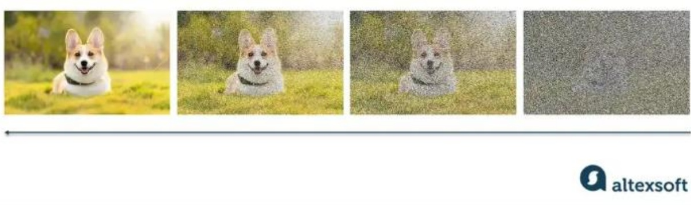

Hình 2.2: Mô hình khuếch tán chuyển đổi qua lại giữa dữ liệu và nhiễu.

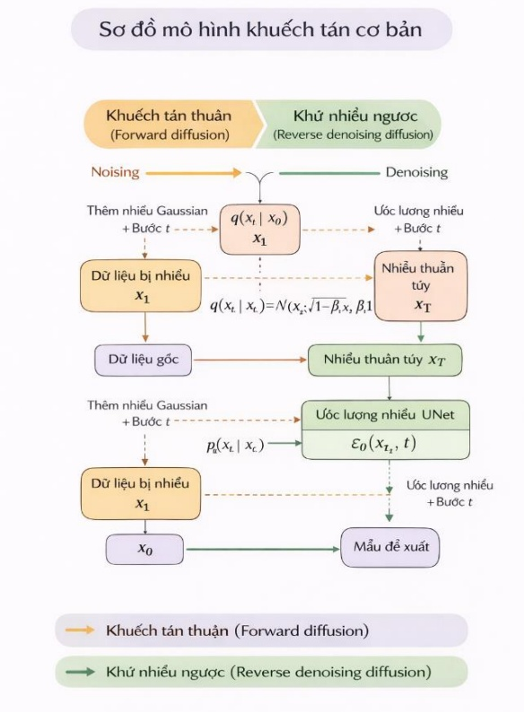

Hình 2.3: Sơ đồ mô hình khuếch tán cơ bản

Ở phía khuếch tán thuận (mũi tên màu cam), dữ liệu gốc $x _ { 0 }$ lần lượt được thêm nhiễu Gaussian theo từng bước thời gian 𝒕, tạo thành các trạng thái trung gian $x _ { 1 } , x _ { 2 } , \ldots , x _ { T }$

<!-- page: 41 -->

Khi 𝒕 tăng dần, mức độ nhiễu ngày càng lớn, khiến dữ liệu dần mất thông tin cấu trúc ban đầu và cuối cùng trở thành nhiễu Gaussian thuần $x _ { T }$ . Quá trình này là cố định, không cần học, và đóng vai trò tạo dữ liệu huấn luyện cho mô hình.

Ở phía khuếch tán ngược (mũi tên màu xanh), mô hình học cách thực hiện quá trình khử nhiễu từng bước. Bắt đầu từ nhiễu thuần $x _ { T }$ , mạng nơ-ron (thường là kiến trúc UNet) được huấn luyện để ước lượng thành phần nhiễu tại mỗi bước thời gian 𝒕, từ đó tái tạo lại trạng thái ít nhiễu hơn $x _ { t - 1 }$ . Quá trình này được lặp lại nhiều lần cho đến khi thu được mẫu dữ liệu cuối cùng $x _ { 0 }$

Sơ đồ trong Hình 2.3 cho thấy rõ vai trò trung tâm của mạng dự đoán nhiễu trong quá trình khuếch tán ngược. Mạng này nhận đầu vào là ảnh bị nhiễu tại bước 𝒕cùng với thông tin bước thời gian, và học cách loại bỏ nhiễu một cách có kiểm soát. Nhờ cơ chế này, mô hình có thể sinh ra dữ liệu mới từ nhiễu thuần trong khi vẫn duy trì cấu trúc và phân bố thống kê tương tự dữ liệu huấn luyện.

Việc minh họa bằng sơ đồ giúp làm rõ mối liên hệ giữa hai quá trình thuận và ngược, đồng thời nhấn mạnh bản chất sinh mẫu của mô hình khuếch tán, trong đó quá trình sinh dữ liệu chính là quá trình khuếch tán ngược.

## 2.2.3. So sánh mô hình khuếch tán với GAN

GAN từng là phương pháp phổ biến nhất để sinh ảnh, nhưng khi diffusion models ra đời, nhiều hạn chế của GAN trở nên rõ ràng hơn. Việc so sánh hai phương pháp giúp thấy rõ vì sao diffusion models phù hợp hơn cho bài toán sinh màn chơi.

GAN hoạt động dựa trên một trò chơi mèo đuổi chuột giữa hai mạng nơ-ron: Generator và Discriminator. Generator cố gắng tạo ra ảnh giống thật, trong khi Discriminator cố gắng phân biệt ảnh thật và ảnh giả. Trong lý thuyết, mô hình có thể tạo ra ảnh rất đẹp. Tuy nhiên, trên thực tế, GAN gặp nhiều vấn đề khi huấn luyện vì hai mạng phải cân bằng với nhau. Nếu một mạng mạnh hơn quá mức, quá trình huấn luyện sẽ thất bại.

<!-- page: 42 -->

Ngoài ra, GAN cũng dễ rơi vào trap mode collapse, khi mô hình chỉ sinh ra một vài kiểu ảnh nhất định thay vì đa dạng hóa kết quả. Điều này đặc biệt bất lợi cho game casual, nơi đòi hỏi số lượng hình ảnh lớn và đa dạng.

Ngược lại, diffusion models không dùng cơ chế cạnh tranh adversarial. Thay vào đó, mô hình học trực tiếp cách khôi phục dữ liệu từ nhiễu. Nhờ đó, quá trình huấn luyện ổn định hơn nhiều, ít gặp lỗi và cho phép mô hình tổng quát tốt hơn. Bộ sinh ảnh dựa trên diffusion như Stable Diffusion thường sinh ra hình ảnh có độ chi tiết cao, ít lỗi cấu trúc và độ đa dạng lớn – điều rất quan trọng khi tạo tiles, background hoặc assets cho game.

Bảng 2.1: So sánh Diffusion Models và GAN

| Tiêu chí Cơ chế hoạt động | Diffusion Models Thêm nhiễu vào dữ liệu (forward), rồi học khử nhiễu dần (reverse). | GAN (Generative Adversarial Network) Hai mạng đối kháng: Generator tạo mẫu và Discriminator phân biệt thật - giả. |
| --- | --- | --- |
| Cấu trúc chính Độ ổn định khi huấn luyện Chất lượng hình ảnh | UNet, cơ chế khuếch tán, text encoder, cross-attention Rất ổn định, dễ train Cực cao, chi tiết sắc nét (SD, DALL·E, Imagen…) | Generator (tạo dữ liệu), Discriminator (phân loại dữ liệu) Dễ mất ổn định, mode collapse, khó cân bằng hai mạng Rất tốt nhưng thường kém chi tiết hơn diffusion trong mức phân giải cao |
| Tính đa dạng | Cao → mô hình học toàn bộ | Dễ bị mode collapse → thiếu đa |
| của mẫu sinh | phân phối dữ liệu | dạng |
| Tốc độ sinh | Chậm (nhiều bước khử nhiễu). Nhưng có bản nhanh (DDIM, | Nhanh → chỉ một lần forward |
| ảnh | Turbo…). | qua Generator |

<!-- page: 43 -->

| Khả năng điều | Xuất sắc: text-to-image, | Có điều khiển nhưng kém linh |
| --- | --- | --- |
| khiển | ControlNet, Inpainting, | hoạt hơn; phụ thuộc vào điều |
| (control) | Outpainting… | kiện đưa vào |
| Yêu cầu tính | Rất nặng (hundreds of millions đến billions | Nhẹ hơn, training nhanh hơn |
| toán khi train | parameters) |  |
| Ứng dụng phổ | Text-to-image, image editing, | Image generation, style transfer, |
| biến | super resolution, inpainting… | deepfake, super resolution |
| Điểm mạnh | Chất lượng, ổn định, dễ điều | Nhanh, nhẹ, tài nguyên thấp |
| nhất | khiển |  |
| Điểm yếu nhất | Chậm, tốn tài nguyên | Bất ổn định, dễ bị mode collapse |

## 2.2.4. Các mô hình khuếch tán hiện nay

Trong những năm gần đây, diffusion models đã phát triển rất nhanh và trở thành hướng tiếp cận chủ đạo trong lĩnh vực sinh hình ảnh bằng AI. Các mô hình này dựa trên cơ chế học cách đảo ngược quá trình thêm nhiễu vào dữ liệu, trong đó “Các mô hình khuếch tán tạo ra dữ liệu bằng cách dần thêm nhiễu vào các mẫu huấn luyện và học cách đảo ngược quá trình này”[11]. Nhờ đặc tính này, diffusion models cho phép sinh ra hình ảnh có chất lượng cao, ổn định và thể hiện tốt các cấu trúc phức tạp.

Thay vì chỉ tồn tại dưới một kiến trúc duy nhất, diffusion models đã phát triển thành nhiều biến thể khác nhau, mỗi biến thể được tối ưu cho những mục tiêu riêng như chất lượng hình ảnh, khả năng kiểm soát bố cục, tốc độ suy luận hay khả năng tích hợp vào sản xuất. Trong số đó, Stable Diffusion, SDXL và ControlNet là những mô hình có ảnh hưởng lớn nhất đến hệ sinh thái sinh ảnh hiện nay.

## Stable Diffusion và các phiên bản mở rộng

Stable Diffusion là một trong những mô hình diffusion phổ biến nhất, đặc biệt trong cộng đồng mã nguồn mở. Ưu điểm lớn nhất của Stable Diffusion nằm ở sự cân bằng tốt giữa chất lượng, hiệu năng và chi phí triển khai. Nền tảng cốt lõi của mô

<!-- page: 44 -->

hình này là Latent Diffusion Model, trong đó “Bằng cách thực hiện quá trình khuếch tán trong không gian tiểm ẩn đã được học, các học mô hình khuếch tán tiềm ẩn giúp giảm đáng kể chi phí tính toán trong khi vẫn duy trì chất lượng hình ảnh cao”[8] . Nhờ đó, Stable Diffusion có thể chạy hiệu quả trên các GPU phổ thông thay vì yêu cầu hạ tầng tính toán lớn như nhiều mô hình diffusion đời đầu.

Stable Diffusion cũng thể hiện tính linh hoạt cao trong việc điều khiển phong cách hình ảnh thông qua prompt văn bản. Người dùng có thể điều chỉnh phong cách nghệ thuật, chất liệu, ánh sáng, màu sắc cũng như bố cục tổng thể của hình ảnh. Nhờ khả năng này, mô hình có thể được sử dụng xuyên suốt nhiều giai đoạn trong sản xuất, từ tạo concept ban đầu cho đến sinh asset gần hoàn chỉnh.

Các phiên bản mở rộng như Stable Diffusion 1.5 và SDXL tiếp tục cải thiện đáng kể chất lượng hình ảnh sinh ra. Stable Diffusion 1.5 nổi bật nhờ độ ổn định cao, tốc độ nhanh và hệ sinh thái plugin, checkpoint và LoRA phong phú. Trong khi đó, SDXL được xem là bước nhảy lớn về mặt chất lượng, với khả năng giữ chi tiết tốt hơn, xử lý prompt phức tạp chính xác hơn và tạo hình ảnh mượt ở độ phân giải cao. So với SD 1.x, SDXL cho bố cục chặt chẽ hơn và giảm rõ rệt các lỗi hình học, đặc biệt trong các cảnh có nhiều nhân vật hoặc vật thể phức tạp.

**ControlNet – bước tiến lớn về khả năng kiểm soát**

Bên cạnh khả năng sinh ảnh tự do của Stable Diffusion, ControlNet giải quyết bài toán kiểm soát cấu trúc hình ảnh sinh ra. ControlNet cho phép ràng buộc quá trình sinh ảnh dựa trên các dữ liệu đầu vào có cấu trúc như bản phác layout, skeleton, đường viền, bản đồ chiều sâu, segmentation map hoặc bản đồ tọa độ. Nhờ đó, Stable Diffusion không còn chỉ là công cụ “vẽ theo mô tả”, mà trở thành một hệ thống sinh ảnh có thể tuân thủ chặt chẽ cấu trúc định trước.

Khả năng này đặc biệt hữu ích trong sinh màn chơi game casual. Trong pipeline phát triển game, một mô hình ngôn ngữ lớn có thể sinh ra layout màn chơi dưới dạng ma trận hoặc sơ đồ logic, sau đó ControlNet sử dụng layout này như một bản hướng dẫn để tạo ra hình ảnh màn chơi tương ứng, đảm bảo đúng bố cục và luật chơi, đồng thời giảm đáng kể công sức chỉnh sửa thủ công.

<!-- page: 45 -->

## 2.2.5. Ứng dụng mô hình khuếch tán trong sinh nội dung game casual

Mô hình khuếch tán (diffusion models) không chỉ được ứng dụng rộng rãi trong lĩnh vực sáng tạo hình ảnh nghệ thuật, mà còn cho thấy tiềm năng lớn trong sinh tự động tài sản đồ họa cho game casual. Khác với các thể loại game có yêu cầu đồ họa phức tạp hoặc độ chân thực cao, game casual thường hướng đến trải nghiệm đơn giản, dễ tiếp cận và phù hợp với nhiều đối tượng người chơi. Do đó, các yếu tố như giao diện trực quan, màu sắc hài hòa, phong cách đồ họa thống nhất và khả năng mở rộng nội dung nhanh chóng đóng vai trò rất quan trọng. Đây chính là những đặc điểm mà diffusion models có thể đáp ứng hiệu quả.

Trong game casual, các tài sản đồ họa thường có phong cách minh họa rõ ràng, ít chi tiết phức tạp nhưng đòi hỏi sự nhất quán cao về màu sắc, hình khối và chất liệu. Diffusion models, nhờ khả năng học phân phối dữ liệu hình ảnh và tái tạo phong cách một cách ổn định, có thể sinh ra các asset đáp ứng tốt những yêu cầu này. Thay vì thiết kế thủ công từng hình ảnh, đội ngũ phát triển có thể sử dụng mô hình diffusion để tạo ra hàng loạt tài sản đồ họa với phong cách đồng nhất, từ đó rút ngắn đáng kể thời gian và chi phí sản xuất.

Một ứng dụng quan trọng của diffusion models trong game casual là chuyển đổi layout logic thành hình ảnh trực quan. Mô hình ngôn ngữ lớn (LLM) có thể được sử dụng để sinh ra layout màn chơi dưới dạng ma trận hoặc sơ đồ logic, mô tả vị trí các ô, đường đi, chướng ngại vật và mục tiêu. Diffusion models, đặc biệt khi kết hợp với các cơ chế điều khiển như ControlNet, có thể sử dụng layout này làm điều kiện đầu vào để sinh ra hình ảnh màn chơi tương ứng theo phong cách đồ họa mong muốn. Cách tiếp cận này giúp đảm bảo hình ảnh cuối cùng vừa đúng về mặt cấu trúc gameplay, vừa đạt yêu cầu thẩm mỹ.

Ngoài layout màn chơi, game casual còn sử dụng số lượng lớn item và đối tượng nhỏ như khối gỗ, khối kim loại, viên đá, đường ray, vật cản hoặc các vật phẩm tương tác. Việc thiết kế thủ công từng biến thể của các item này không chỉ tốn thời gian mà còn dễ gây thiếu nhất quán về phong cách. Diffusion models có thể sinh ra hàng trăm biến thể khác nhau của cùng một loại item, trong khi vẫn giữ được màu

<!-- page: 46 -->

sắc, chất liệu và hình dạng phù hợp với phong cách tổng thể của trò chơi. Nhờ đó, thế giới game trở nên phong phú hơn mà không làm tăng đáng kể chi phí sản xuất.

Bên cạnh các đối tượng tương tác, hình nền và giao diện người dùng (UI) cũng đóng vai trò quan trọng trong trải nghiệm thị giác của game casual. Diffusion models có thể được sử dụng để tạo background với phong cách nhất quán, kết hợp các yếu tố như gradient màu, texture nhẹ và họa tiết trang trí đơn giản, giúp hình ảnh nền không gây nhiễu nhưng vẫn tạo cảm giác sinh động. Đối với giao diện người dùng, mô hình có thể hỗ trợ tạo icon, khung viền hoặc các thành phần trang trí, từ đó giúp UI trở nên đồng bộ với phong cách chung của trò chơi.

Một lợi thế đáng kể khác của diffusion models là khả năng mở rộng và tùy biến nhanh chóng nội dung theo chủ đề. Trong game casual, việc thay đổi theme theo mùa, sự kiện hoặc chiến dịch marketing là rất phổ biến. Thay vì thiết kế lại toàn bộ tài sản đồ họa, diffusion models có thể sinh ra các phiên bản mới dựa trên phong cách đã định sẵn, chỉ cần điều chỉnh prompt hoặc điều kiện đầu vào. Điều này giúp đội ngũ phát triển phản ứng nhanh hơn với nhu cầu thị trường, đồng thời duy trì sự mới mẻ cho trò chơi mà không phá vỡ phong cách tổng thể.

Tóm lại, diffusion models mang lại một hướng tiếp cận hiệu quả và linh hoạt trong việc sinh nội dung đồ họa cho game casual. Bằng cách kết hợp khả năng sinh ảnh chất lượng cao, kiểm soát phong cách và cấu trúc, cũng như khả năng mở rộng nội dung nhanh chóng, các mô hình này góp phần quan trọng trong việc tối ưu hóa quy trình phát triển game, đồng thời nâng cao trải nghiệm thị giác cho người chơi.

## 2.3. Kiến trúc kết hợp LLM + Diffusion

Việc kết hợp các mô hình ngôn ngữ với mô hình sinh ảnh dựa trên khuếch tán dần dần trở thành một hướng nghiên cứu quan trọng trong lĩnh vực trí tuệ nhân tạo tạo sinh. Hai loại mô hình này có đặc điểm và cơ chế hoạt động khác nhau, nhưng rất hiệu quả khi được kết hợp trong các hệ thống sinh nội dung phức tạp. Đối với nhiệm vụ sinh hình ảnh màn chơi, kiến trúc kết hợp LLM – Diffusion được xây dựng dựa trên nguyên tắc” phân tách rõ ràng giữa khả năng hiểu và diễn giải của LLM và khả năng tái tạo hình ảnh của mô hình khuếch tán”. Cách tiếp cận này giúp hệ thống vừa

<!-- page: 47 -->

có thể hiểu chính xác yêu cầu ngôn ngữ tự nhiên của người dùng, vừa bảo đảm tạo ra hình ảnh có chất lượng cao, bố cục rõ ràng và phong cách hình ảnh nhất quán.

## 2.3.1. Vai trò của mô hình ngôn ngữ lớn

Trong kiến trúc sinh nội dung hình ảnh hiện đại, mô hình ngôn ngữ lớn (Large Language Model – LLM) không phải là thành phần trực tiếp tạo ra hình ảnh, mà đóng vai trò như một tầng tiền xử lý và điều phối ngữ nghĩa. Đầu vào ban đầu của hệ thống thường là mô tả ngôn ngữ tự nhiên do người dùng cung cấp. Tuy nhiên, các mô tả này thường mang tính mơ hồ, thiếu chi tiết hoặc không được biểu đạt dưới dạng phù hợp để mô hình sinh ảnh có thể xử lý hiệu quả. Điều này xuất phát từ việc ngôn ngữ tự nhiên mang nhiều yếu tố cảm tính và phụ thuộc vào ngữ cảnh, trong khi mô hình khuếch tán yêu cầu các mô tả cụ thể và có cấu trúc rõ ràng.

LLM có khả năng phân tích sâu nội dung đầu vào, trích xuất các thuộc tính quan trọng và diễn giải lại ý định của người dùng dưới dạng thông tin có tổ chức hơn. Khả năng này bắt nguồn từ việc LLM được huấn luyện trên tập dữ liệu văn bản quy mô lớn, cho phép mô hình học được mối quan hệ phức tạp giữa ngôn ngữ và ngữ nghĩa. Như đã được mô tả trong nghiên cứu về LLM, “Các mô hình ngôn ngữ lớn thể hiện khả năng đáng kể trong việc hiểu, tạo ra và chuyển đổi ngôn ngữ tự nhiên dựa trên ngữ cảnh”. Nhờ đó, LLM có thể xác định các ràng buộc về bố cục, phong cách, chủ đề và cấu trúc thị giác ẩn chứa trong mô tả ban đầu.

Một ưu điểm quan trọng khác của LLM là khả năng chuẩn hóa và cụ thể hóa mô tả. Thay vì giữ nguyên yêu cầu ban đầu của người dùng, LLM có thể chuyển đổi mô tả đó thành dạng prompt rõ ràng hơn, giảm thiểu sai lệch khi truyền đạt thông tin cho mô hình sinh ảnh. Việc này giúp giảm khoảng cách giữa ngôn ngữ tự nhiên của con người và ngôn ngữ điều khiển của mô hình khuếch tán, từ đó tăng tính nhất quán và khả năng tái tạo hình ảnh đúng với ý định ban đầu.

Ngoài ra, LLM còn đóng vai trò quan trọng trong việc tạo và tối ưu câu lệnh mô tả (prompt engineering). Các mô hình diffusion rất nhạy cảm với prompt, và chất lượng của câu lệnh đầu vào có ảnh hưởng trực tiếp đến chất lượng hình ảnh sinh ra. LLM có thể tự động tổ chức lại thứ tự các thành phần mô tả, gán trọng số ưu tiên cho

<!-- page: 48 -->

các yếu tố quan trọng, loại bỏ các chi tiết gây nhiễu và bổ sung những thuộc tính còn thiếu. Quá trình này giúp tạo ra một chuỗi mô tả hoàn chỉnh, nhất quán và phù hợp hơn với cách mà mô hình khuếch tán được huấn luyện để hiểu prompt.

## 2.3.2. Vai trò của mô hình khuếch tán

Trong khi LLM đảm nhiệm xử lý ngôn ngữ và ngữ nghĩa, mô hình khuếch tán (diffusion model) là thành phần trực tiếp thực hiện quá trình sinh hình ảnh. Các mô hình này hoạt động dựa trên cơ chế thêm nhiễu dần dần vào dữ liệu và học cách đảo ngược quá trình đó để tái tạo lại hình ảnh theo mô tả được cung cấp. Cơ chế này đã được mô tả rõ trong tài liệu nền tảng của diffusion models: “Các mô hình khuếch tán tạo ra dữ liệu bằng cách dần dần thêm nhiễu vào các mẫu huấn luyện và học cách đảo ngược quá trình này[11]”.

So với các phương pháp sinh ảnh thế hệ trước như GAN, diffusion models cho thấy nhiều ưu điểm vượt trội, bao gồm độ ổn định cao trong huấn luyện, khả năng tạo ảnh chi tiết và khả năng bám sát mô tả đầu vào tốt hơn. Khi được cung cấp prompt đã được chuẩn hóa từ LLM, mô hình khuếch tán có thể tái dựng hình ảnh với mức độ kiểm soát cao hơn, hạn chế các lỗi không mong muốn do diễn giải sai ý nghĩa.

Thông qua việc điều chỉnh các tham số như hệ số hướng dẫn (guidance scale), số bước khử nhiễu và chiến lược sampling, hệ thống có thể sinh ra nhiều loại hình ảnh khác nhau từ cùng một mô tả. Điều này cho phép tạo ra các biến thể đa dạng về phong cách, mức độ chi tiết hoặc bố cục, từ phong cách tối giản cho đến các phong cách nghệ thuật phức tạp. Khả năng sinh nhiều biến thể từ một prompt duy nhất giúp hệ thống trở nên linh hoạt hơn và phù hợp với các ứng dụng yêu cầu sản xuất số lượng lớn nội dung hình ảnh.

Bên cạnh đó, diffusion models còn có thể kết hợp với các kỹ thuật điều khiển cấu trúc như ControlNet hoặc T2I-Adapter, cho phép ràng buộc hình ảnh sinh ra theo các thông tin hình học hoặc bố cục cụ thể. Như đã được chỉ ra, “ControlNet cho phép điều khiển có điều kiện các mô hình khuếch tán bằng cách sử dụng các đầu vào cấu trúc như cạnh, độ sâu hoặc tư thế.[13]”. Điều này đặc biệt quan trọng trong các bài

<!-- page: 49 -->

toán sinh hình ảnh có cấu trúc rõ ràng, nơi sự sáng tạo quá mức của mô hình có thể làm sai lệch yêu cầu ban đầu.

## 2.3.3. Cách thức phối hợp giữa hai mô hình trong hệ thống

Kiến trúc kết hợp LLM và mô hình khuếch tán có thể được mô tả như một quy trình gồm nhiều bước liên tiếp. Ban đầu, hệ thống tiếp nhận mô tả của người dùng ở dạng ngôn ngữ tự nhiên. LLM phân tích mô tả này, trích xuất các thành phần cần thiết, tái cấu trúc lại nội dung và tạo ra prompt tối ưu dành cho mô hình khuếch tán. Khi prompt được xử lý xong, nó sẽ được chuyển sang mô hình tạo ảnh để tiến hành sinh hình ảnh theo các ràng buộc đã được xác định. Cuối cùng, hình ảnh đầu ra có thể được đánh giá lại hoặc tinh chỉnh thông qua các vòng phản hồi bổ sung tùy theo mục tiêu triển khai.

Một ưu điểm nổi bật của pipeline này là các mô hình hoạt động tách biệt nhưng có sự hỗ trợ lẫn nhau. LLM xử lý thông tin mà mô hình khuếch tán khó hiểu, trong khi diffusion model tạo ra hình ảnh mà LLM không thể sinh được. Sự phân công rõ ràng giúp hệ thống đơn giản hơn, dễ huấn luyện hơn và dễ kiểm soát chất lượng hơn so với các mô hình đa nhiệm tích hợp nặng.

## 2.3.4. Khả năng mở rộng và tiềm năng ứng dụng

Kiến trúc kết hợp LLM và mô hình khuếch tán không chỉ giới hạn ở việc sinh ảnh cho lĩnh vực trò chơi mà còn có thể mở rộng sang nhiều ứng dụng khác như thiết kế đồ họa, xây dựng nội dung quảng cáo, tạo tài sản số, hoặc sinh hình ảnh mô phỏng. Bằng cách bổ sung thêm các mô-đun đánh giá, các bước kiểm tra tự động hoặc các mô hình phân tích hình ảnh ở tầng sau, pipeline có thể trở thành một hệ thống hoàn chỉnh phục vụ sản xuất nội dung quy mô lớn.

Với những đặc điểm này, có thể thấy rằng kiến trúc LLM + Diffusion là một phương thức hiệu quả để sinh hình ảnh theo yêu cầu mà vẫn duy trì mức độ kiểm soát cao. Đây cũng là nền tảng quan trọng để các chương sau của đồ án hướng tới việc xây dựng công cụ hoặc mô hình ứng dụng trong các bài toán thực tế.

<!-- page: 50 -->

## 2.4 Phân tích lựa chọn mô hình

Trong bài toán xây dựng hệ thống kết hợp LLM và mô hình khuếch tán để sinh nội dung hình ảnh, việc lựa chọn mô hình nền quyết định mức độ khả thi, chi phí triển khai, sự ổn định cũng như chất lượng đầu ra. [16] Có hai hướng tiếp cận chính thường được xem xét: (1) xây dựng mô hình hoàn toàn từ đầu, và (2) tận dụng mô hình đã được huấn luyện trước và tiến hành tinh chỉnh (fine-tuning). Mỗi hướng tiếp cận có những ưu và nhược điểm riêng, cần được phân tích kỹ lưỡng trước khi đưa ra quyết định phù hợp với quy mô và mục tiêu của đồ án.

Bảng 2.2: So sánh giữa Fine-tuning và tự xây dựng mô hình

| Tiêu chí | Fine-tuning mô hình có sẵn | Tự xây dựng mô hình từ đầu |
| --- | --- | --- |
| Chi phí huấn luyện | Rất thấp. Chỉ cần huấn luyện một phần nhỏ trọng số (LoRA, Textual Inversion…). | Rất cao. Cần GPU mạnh, thời gian huấn luyện dài, tiêu tốn hàng chục - hàng trăm nghìn USD. |
| Khối lượng dữ liệu yêu cầu | Ít. Chỉ cần vài trăm đến vài nghìn mẫu. | Rất lớn. Hàng chục triệu đến hàng trăm triệu mẫu ảnh và mô tả. |
| Độ phức tạp kỹ thuật | Thấp. Dựa vào mô hình đã ổn định; quy trình tinh chỉnh được chuẩn hóa. | Rất cao. Cần thiết kế kiến trúc, tối ưu toàn bộ và xử lý lỗi trong quá trình huấn luyện. |
| Thời gian triển khai | Nhanh. | Lâu. |
| Độ ổn định của mô hình | Cao. Mô hình nền đã được huấn luyện lớn và kiểm chứng rộng rãi. | Thấp. Mô hình mới dễ bị lỗi ổn định, dễ overfit, khó kiểm soát chất lượng. |

<!-- page: 51 -->

| Yêu cầu phần cứng | GPU phổ thông (8–24GB VRAM là đủ cho LoRA). | Yêu cầu cụm GPU mạnh (A100/H100 – 40–80GB VRAM), nhiều máy chạy song song. |
| --- | --- | --- |
| Khả năng mở rộng | Đễ mở rộng bằng nhiều kỹ thuật: LoRA stacking, ControlNet, token embedding... | Khó mở rộng. Mỗi thay đổi đều phải huấn luyện lại hoặc điều chỉnh kiến trúc. |
| Khả năng tùy chỉnh | Tốt ở cấp độ phong cách, cấu trúc, đặc trưng riêng nhưng không thay đổi được nền tầng. | Tùy chỉnh tối đa về kiến trúc, nhưng chi phí tăng mạnh và rủi ro cao. |
| Phụ thuộc vào mô hình nền | Có. Chất lượng phụ thuộc vào mô hình gốc. | Không. Tự kiểm soát toàn bộ. |
| Phù hợp | Rất phù hợp. Ít chi phí, linh hoạt, triển khai nhanh. | Không phù hợp. Quá tổn kém. |

Xây dựng mô hình từ đầu: Hướng tiếp cận này bao gồm việc thiết kế kiến trúc LLM và diffusion model độc lập, đồng thời huấn luyện mô hình trên một tập dữ liệu khổng lồ để hình thành. Về lý thuyết, đây là phương pháp cho phép kiểm soát tối đa kiến trúc, thông số, cấu trúc đặc trưng và logic hoạt động của mô hình. Nhà nghiên cứu có thể tối ưu từng phần để phù hợp tuyệt đối với bài toán, đảm bảo khả năng diễn giải cấu trúc và sinh hình theo phong cách mong muốn.Tuy nhiên, khi xem xét thực tiễn, phương pháp xây dựng từ đầu bộc lộ một loạt hạn chế khó vượt qua. Đối với mô hình khuếch tán, việc huấn luyện đòi hỏi tập dữ liệu hình ảnh điều kiện có quy mô lên tới hàng trăm triệu cặp dữ liệu, cùng hạ tầng GPU mạnh và thời gian huấn luyện kéo dài nhiều tuần hoặc nhiều tháng. Việc đồng thời huấn luyện cả thành phần ngôn ngữ để xử lý cấu trúc lại càng làm tăng độ phức tạp. Đây là những điều kiện mà một đồ án ứng dụng thông thường khó có thể đáp ứng. Ngoài ra, mô hình huấn luyện từ

<!-- page: 52 -->

đầu rất dễ mất ổn định, dẫn đến kết quả không thể dự đoán, và cần đội ngũ có tay nghề cao và giàu kinh nghiệm để xử lý các lỗi phát sinh.Vì vậy, dù có tiềm năng tối ưu cao nhất về lý thuyết, chiến lược xây dựng một mô hình mới từ đầu là hoàn toàn không khả thi trong phạm vi đồ án này, cả về chi phí, nguồn lực kỹ thuật lẫn thời gian triển khai.

Fine-tuning mô hình có sẵn: Phương pháp thứ hai là sử dụng mô hình đã được huấn luyện trước trên dữ liệu được thu tập từ rất nhiều nơi và tinh chỉnh lại mô hình theo miền dữ liệu cụ thể của bài toán. Đây là hướng tiếp cận đang được sử dụng rộng rãi nhất hiện lĩnh vực phát triển các hệ thống tạo sinh hiện đại. Ưu điểm lớn nhất của fine-tuning nằm ở việc kế thừa được toàn bộ tri thức thị giác và biểu diễn ẩn mà mô hình gốc đã tích lũy. Quá trình tinh chỉnh chỉ tập trung vào một số ít các trọng số của hệ thống, nhờ đó giảm đáng kể chi phí tính toán, công sức và thời gian huấn luyện. Thậm chí, với các kỹ thuật tinh chỉnh nhẹ như LoRA hoặc Textual Inversion, mô hình có thể thích nghi với phong cách hoặc cấu trúc mới chỉ sau vài giờ huấn luyện trên GPU phổ thông. Bên cạnh đó, các mô hình diffusion hiện đại thiết kế theo cấu trúc module, giúp việc tinh chỉnh từng thành phần trở nên dễ dàng, an toàn. Điều này rất quan trọng đối với LLM + Diffusion, bởi LLM chỉ đóng vai trò xử lý cấu trúc, còn nhiệm vụ xây dựng hình ảnh nằm hoàn toàn ở thành phần khuếch tán. Khả năng nóng ghép hoặc tinh chỉnh từng phần độc lập giúp mô hình dễ bảo trì, dễ mở rộng và giảm thiểu rủi ro khi nâng cấp. So với phương pháp xây dựng từ đầu, fine-tuning là lựa chọn tối ưu hơn nhiều: thời gian ngắn, chi phí thấp, khả năng mở rộng cao và phù hợp với điều kiện phần cứng phổ thông. Do đó, đồ án lựa chọn hướng tiếp cận này để xây dựng hệ thống.

Để chọn lựa mô hình nền phù hợp cho LLM + Diffusion, ta phải so sánh các mô hình khuếch tán phổ biến hiện nay theo các tiêu chí: chất lượng hình ảnh, tính ổn định, khả năng hiểu cấu trúc, độ mở, khả năng tinh chỉnh và độ tương thích với hệ thống phân tích cấu trúc từ LLM. Các mô hình được xem xét bao gồm Stable Diffusion 1.5, Stable Diffusion XL, FULL Diffusion-based models (FLUX, Kandinsky), và các mô hình thương mại như Midjourney hoặc DALL·E.

<!-- page: 53 -->

Bảng 2.3: So sánh các mô hình khuếch tán phổ biến

| Tên mô hình | Ưu điểm | Nhược điểm |
| --- | --- | --- |
| Stable Diffusion 1.5 | • Phiên bản thịnh hành nhất trong cộng đồng mã nguồn mở, được hỗ trợ bởi nhiều công cụ và tài nguyên. • Dễ fine-tuning nhất, đặc biệt với DreamBooth, LoRA và Textual Inversion. • Chạy được trên phần cứng phổ thông (6-8 GB VRAM). • Hệ sinh thái rất trưởng thành, có nhiều hướng dẫn, plugin, extension. | Chất lượng hình ảnh và độ chi tiết hạn chế so với SDXL và SD 3.5. • Khả năng giữ bố cục (layout consistency) chưa mạnh; dễ méo hình khi gặp cấu trúc phức tạp. • Màu sắc và ánh sáng đôi khi thiếu ổn định. |
| Stable Diffusion XL | • Chất lượng hình ảnh tốt hơn SD1.5, chi tiết sắc nét và độ ổn định tốt. • Khả năng bám cấu trúc tốt hơn, đặc biệt khi kết hợp ControlNet. • Tạo ảnh độ phân giải cao tự nhiên hơn. | • Yêu cầu phần cứng mạnh hơn (12-16 GB VRAM). • Tinh chỉnh (fine-tuning) phức tạp hơn, thời gian huấn luyện dài. • Thư viện và công cụ chưa phong phú bằng SD1.5. |
| Stable Diffusion 3.5 | • Chất lượng hình ảnh cao hơn, khả năng tái hiện chi tiết và độ sắc nét cao. | • Yêu cầu phần cứng mạnh hơn SD1.5 (≥12 GB |

<!-- page: 54 -->

|  | • Khả năng kiểm soát bố cục (layout control) mạnh nhất trong các mô hình mã nguồn mở hiện tại. • Bám sát điều kiện đầu vào tốt hơn SD1.5 và SDXL (text, embedding, mask, layout). • Tương thích hoàn toàn với ControlNet thế hệ mới, dễ tích hợp với LLM để nhận tín hiệu hình học/layout. • Dễ fine-tuning: hỗ trợ LoRA, DreamBooth, Textual Inversion, Custom ControlNet. • Hệ sinh thái công cụ hiện đại (Diffusers, ComfyUI, InvokeAI), tối ưu cho pipeline linh hoạt. • Ít lỗi méo hình, giữ bố cục ổn định ngay cả với prompt phức tạp. | VRAM để fine-tuning, ≥8 GB để inference). • Do phiên bản mới, một số framework vẫn đang hoàn thiện, chưa đồng đều về tài liệu. |
| --- | --- | --- |
| Các mô hình diffusion mã nguồn mở khác (FLUX, Kandinsky, Latent Consistency Models) | • FLUX: mạnh về độ sắc nét, phong cách hiện đại, biểu diễn hình khối rõ ràng. • Kandinsky: giỏi sinh phong cách nghệ thuật (artistic styles), màu sắc độc đáo. • LCM (Latent Consistency Models): tăng tốc sinh ảnh rất | • Hệ sinh thái hạn chế, ít công cụ hỗ trợ fine-tuning chuẩn hóa như DreamBooth hoặc LoRA. • Không tối ưu cho tác vụ yêu cầu bám |

<!-- page: 55 -->

|  | nhanh, phù hợp real-time inference. | bố cục cao. • Chưa tương thích tốt với LLM và các pipeline kết hợp nhiều mô-đun. • Tính ổn định của ảnh không đồng đều giữa các phiên bản. |
| --- | --- | --- |
| Mô hình thương mại (Midjourney, DALL·E, Imagen) | • Chất lượng ảnh rất cao, màu sắc đẹp, thiết kế sáng tạo. • Không cần tinh chỉnh vẫn cho ra ảnh đạt tiêu chuẩn cao. • Rất mạnh trong diễn giải prompt. | • Không hỗ trợ fine-tuning, không cho phép huấn luyện hoặc mở rộng mô hình. • Không tích hợp được vào hệ thống vì tính đóng hoàn toàn. • Không phù hợp với yêu cầu học phong cách game cụ thể (Color Block Jam). |

Stable Diffusion 3.5 là phiên bản mới nhất thuộc dòng mô hình khuếch tán mã nguồn mở, được sinh ra để cải thiện khả năng kiểm soát bố cục, độ ổn định và chi tiết hình ảnh. Những sắc thái này đặc biệt phù hợp với hệ thống cần sinh nội dung có tính ràng buộc cấu trúc cao [17]. Có một số lý do chính giúp Stable Diffusion 3.5 trở thành lựa chọn tối ưu:

<!-- page: 56 -->

\- Thứ nhất, SD 3.5 được huấn luyện trên tập dữ liệu lớn hơn và được tối ưu hóa theo hướng mạnh hơn trong việc bám sát điều kiện đầu vào, bao gồm cả điều kiện từ văn bản, embedding, mask và layout. Điều này lý tưởng cho mô hình trong đồ án, nơi đầu vào không phải văn bản ngôn ngữ tự nhiên, mà là các ràng buộc cấu trúc do LLM phân tích.

\- Thứ hai, kiến trúc modular của Stable Diffusion 3.5 cho phép gắn kết dễ dàng với các thành phần phân tích cấu trúc. Mô hình được tạo ra tương thích hoàn toàn với ControlNet thế hệ mới, giúp tiếp nhận layout hoặc signal từ LLM dưới dạng hình học, bản đồ vị trí hoặc mask. Không phải mô hình diffusion nào khác có khả năng hỗ trợ mạnh mẽ mức độ điều kiện hóa này.

Thứ ba, Stable Diffusion là mô hình dễ fine-tuning nhất trong tất cả các mô hình diffusion hiện có. Các kỹ thuật như LoRA, DreamBooth, Textual Inversion, Custom ControlNet đều đã được chứng minh hiệu quả với SD 3.5 và có tài liệu hỗ trợ mạnh. Điều này giúp quá trình tinh chỉnh trở nên nhẹ, chi phí thấp và ổn định.

\- Thứ tư, SD 3.5 có hệ sinh thái công cụ phong phú, hỗ trợ nhiều framework, nhiều pipeline inference khác nhau (Diffusers, ComfyUI, InvokeAI). Điều này rất quan trọng vì đồ án cần một mô hình có thể tinh chỉnh một cáchlinh hoạt.

\- Thứ năm, khả năng tái hiện chi tiết và kiểm soát bố cục của Stable Diffusion 3.5 vượt trội so với các phiên bản cũ. Các thử nghiệm nội bộ và báo cáo từ cộng đồng cho thấy SD 3.5 bám sát ràng buộc hình học tốt hơn SDXL và SD1.5, đồng thời ít xảy ra lỗi méo hình khi điều kiện cấu trúc phức tạp.

Từ những phân tích trên, có thể thấy rằng fine-tuning một mô hình khuếch tán đã huấn luyện trước là hướng tiếp cận tối ưu cho hệ thống sinh ảnh màn chơi trong đồ án.

Trong số các mô hình diffusion mã nguồn mở hiện có, Stable Diffusion 3.5 là lựa chọn phù hợp nhất nhờ:

 Khả năng điều kiện hóa mạnh theo cấu trúc.

 Độ ổn định cao khi sinh ảnh.

 Dễ tinh chỉnh bằng các kỹ thuật hiện đại.

<!-- page: 57 -->

 Hệ sinh thái công cụ hoàn thiện.

 Chất lượng hình ảnh và kiểm soát bố cục vượt trội.

Do đó, đồ án quyết định lựa chọn Stable Diffusion 3.5 làm mô hình chính để triển khai quá trình fine-tuning và sinh ảnh màn chơi.

## 2.5 Thiết kế hệ thống

Dựa trên mục tiêu của đồ án và các nội dung đã phân tích ở các chương trước, đồ án tiến hành xây dựng, thử nghiệm và triển khai một hệ thống có khả năng sinh ra hình ảnh bố cục (layout) của màn chơi game casual dựa trên mô tả đầu vào của người dùng. Hệ thống hoạt động theo cơ chế đơn giản: người dùng cung cấp một đoạn mô tả bằng ngôn ngữ tự nhiên, sau đó mô hình xử lý và chuyển đổi mô tả này thành một hình ảnh thể hiện cấu trúc màn chơi.

Hệ thống nhận đầu vào ở dạng văn bản mô tả màn chơi (text prompt). Nội dung mô tả có thể bao gồm:

\- Kích thước màn chơi

\- Số lượng màu sắc có thể xuất hiện trong màn chơi

\- Số lượng item trong màn chơi

Ví dụ một đầu vào hợp lệ: Tạo một màn chơi có kích thước là 5x5, có 5 item các item có một trong bốn màu xanh đỏ tím vàng.

Toàn bộ thông tin đầu vào đều được cung cấp bởi người dùng dưới dạng mô tả tự nhiên, không yêu cầu tuân theo cấu trúc cố định.

Đầu ra của hệ thống là một hình ảnh bố cục màn chơi được sinh tự động từ mô tả đầu vào có cấu trúc tương tự như các màn chơi đã có từ trước của game.

Quy trình hoạt động của hệ thống có thể được mô tả một cách ngắn gọn như sau:

1. Người dùng nhập mô tả màn chơi bằng văn bản.

2. Hệ thống phân tích nội dung mô tả và sinh ra bố cục màn chơi

3. Hệ thống trả về hình ảnh bố cục màn chơi cho người dùng.

<!-- page: 58 -->

# CHƯƠNG 3: XÂY DỰNG, TRIỂN KHAI VÀ ĐÁNH GIÁ HỆ THỐNG

## 3.1 Xây dựng hệ thống

## 3.1.1. Giới thiệu game Color Block Jam

Color Block Jam là một trò chơi casual puzzle có lối chơi đơn giản nhưng mang phong cách hình ảnh đặc trưng, dễ nhận diện và phù hợp với phong cách, xu hướng thiết kế tối giản hiện đại. Trò chơi dựa trên cơ chế di chuyển các khối màu trên một bảng lưới để đưa chúng đến vị trí phù hợp. Tuy nhiên, trong khuôn khổ của đồ án này, trọng tâm không nằm ở cơ chế gameplay mà nằm ở đặc trưng hình ảnh của trò chơi. Đây chính là yếu tố then chốt giúp cho mô hình có thể học và tái tạo được phong cách đồ họa của game khi sinh ra các màn chơi mới.

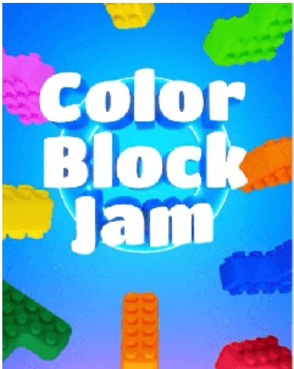

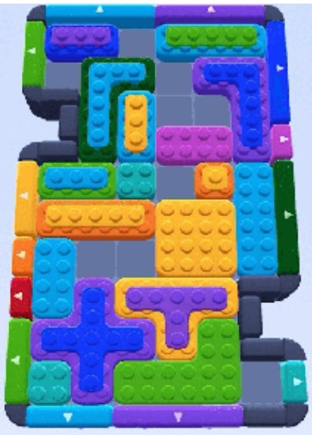

Hình 3.1: Game Color Block Jam

Color Block Jam sử dụng phong cách đồ họa 2D đơn giản, tập trung vào sự rõ ràng, dễ nhìn và dễ phân biệt giữa các đối tượng trên màn hình. Cấu trúc hình ảnh của một màn chơi bao gồm:

 Một bảng lưới có đường viền mảnh.

 Các khối màu được đặt trên lưới.

 Các cửa thoát có màu tương ứng với block, thường xuất hiện ở rìa hoặc góc.

<!-- page: 59 -->

 Nền với gradient nhẹ hoặc họa tiết tinh tế.

Tổng thể hình ảnh hướng đến cảm giác nhẹ nhàng, thân thiện, hỗ trợ người chơi tập trung vào puzzle mà không bị rối hoặc phân tán bởi các chi tiết đồ họa phức tạp.

Các khối màu là thành phần nổi bật nhất của trò chơi. Chúng có những đặc điểm hình ảnh dễ nhận diện:

 Hình dạng vuông hoặc chữ nhật, bo tròn nhẹ ở bốn góc.

 Màu sắc tươi sáng.

 Hiệu ứng đổ bóng tinh tế để tạo cảm giác nổi.

 Thường trang trí bằng đường viền mờ hoặc hiệu ứng nổi nhẹ giúp block tách biệt hơn khỏi nền.

 Một số block có biểu tượng hoặc hiệu ứng thêm nhằm biểu thị chức năng đặc biệt.

Những đặc điểm này giúp mô hình AI dễ dàng nhận diện pattern hình ảnh và tái hiện block theo đúng phong cách game sau khi huấn luyện.

Lưới trong Color Block Jam được thiết kế tối giản để hỗ trợ nổi bật các block màu:

 Các ô vuông có kích thước đồng nhất.

 Đường viền lưới mảnh, độ tương phản thấp để không chiếm sự chú ý.

 Lưới thường có padding đều quanh cạnh để tạo bố cục cân đối.

 Nền của từng ô có thể là màu nhạt hoặc gradient mờ.

Chính sự đồng nhất của grid giúp việc sinh ảnh từ mô hình dễ ổn định, vì mô hình có thể học được dạng cấu trúc lặp đều theo hàng và cột.

Dựa vào những đặc điểm trên, Color Block Jam mang lại nhiều lợi điểm cho việc huấn luyện mô hình sinh ảnh:

 Phong cách hình ảnh đồng nhất DreamBooth dễ học style.

 Block, grid, background đều có cấu trúc rõ ràng mô hình tái tạo tốt.

 Số lượng các phần tử hình ảnh không quá nhiều giúp huấn luyện ổn định.

 Mức độ chi tiết vừa phải mô hình diffusion đủ khả năng sinh ảnh sắc nét.

<!-- page: 60 -->

 Dễ tạo tập dữ liệu tổng hợp hỗ trợ việc mở rộng training set.

## 3.1.2 Chuẩn bị tập dữ liệu huấn luyện

Trong bài toán sinh hình ảnh sử dụng mô hình khuếch tán, chất lượng của dữ liệu đầu vào đóng vai trò then chốt và quyết định đối với khả năng học và tái tạo phong cách của AI. Đối với phương pháp DreamBooth Full Fine-tuning (tinh chỉnh toàn bộ mô hình), dữ liệu cần được chuẩn bị kỹ lưỡng để mô hình có thể nhận diện sâu sắc các đặc trưng thị giác của đối tượng mà không bị nhiễu.

Quy trình thu thập dữ liệu và xử lý dữ liệu:

1) Thu thập dữ liệu

 Dữ liệu huấn luyện được thu thập từ trò chơi Color Block Jam. Chúng tôi tiến hành chụp màn hình các màn chơi ở nhiều cấp độ khác nhau.

 Số lượng: Tập dữ liệu bao gồm khoảng 1000 chất lượng cao. Đây là số lượng phù hợp cho phương pháp DreamBooth, vừa đủ để mô hình học được các biến thể của màn chơi, vừa không quá lớn gây tốn kém thời gian huấn luyện

2) Tiền xử lý: Để phù hợp với kiến trúc mô hình Stable Diffusion và tối ưu hóa quá trình tính toán, các ảnh thu thập được xử lý qua các bước

 Loại bỏ nhiễu: Sử dụng các đoạn mã code để cắt bỏ các thành phần giao diện không cần thiết như nút bấm, thanh trạng thái, quảng cáo, chỉ giữ lại phần chính.

 Cắt và thay đổi kích thước: Toàn bộ ảnh được đưa về kích thước vuông đồng nhất. Trong thực nghiệm này, chúng tôi thiết lập độ phân giải huấn luyện 512x512.

3) Thiết lập nhãn dữ liệu: Khác với các phương pháp gán nhãn ngắn gọn thông thường (ví dụ chỉ dùng một từ khóa "sks"), đồ án áp dụng chiến lược gán nhãn mô tả chi tiết. Toàn bộ dữ liệu đều được gán chung một mô tả văn bản cụ thể và chi tiết. Việc sử dụng một đoạn mô tả dài và chi tiết làm nhãn giúp định hướng cho mô hình tập trung học vào toàn bộ bối cảnh và phong cách nghệ thuật được mô tả trong đoạn văn, thay vì chỉ học một đối tượng đơn lẻ.

<!-- page: 61 -->

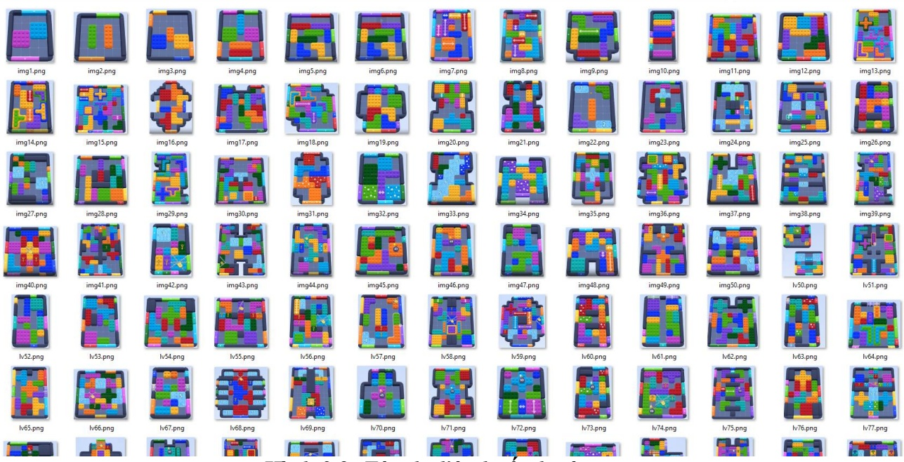

Hình 3.2: Tập dữ liệu huấn luyện

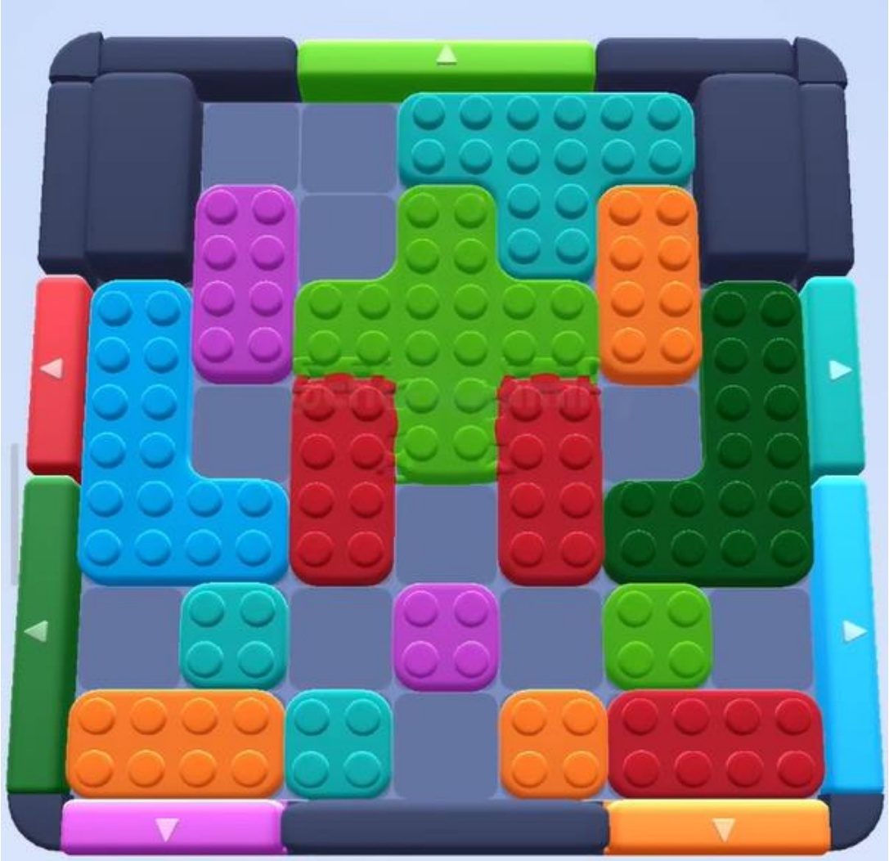

Hình 3.2: Màn game Color Block Jam

<!-- page: 62 -->

```python
import os
from PIL import Image

input_dir = r"C:\images_train"
output_dir = r"C:\images_train_512"

os.makedirs(output_dir, exist_ok=True)

def resize_to_512(img):
    w, h = img.size
    scale = max(512 / w, 512 / h)
    new_w, new_h = int(w * scale), int(h * scale)

    img = img.resize((new_w, new_h), Image.LANCZOS)

    left = (new_w - 512) // 2
    top = (new_h - 512) // 2
    return img.crop((left, top, left + 512, top + 512))

for filename in os.listdir(input_dir):
    if filename.lower().endsWith(("."png", ".jpg", ".jpeg"):
        path = os.path.join(input_dir, filename)
        img = Image.open(path).convert("RGB")

        img_512 = resize_to_512(img)
        img_512.save(os.path.join(output_dir, filename))

print("Done resizing to 512x512")
```

Hình 3.4: Đoạn code resize ảnh

<!-- page: 63 -->

## 3.1.3 Huấn luyện mô hình

## Chuẩn bị môi trường

Để triển khai, huấn luyện và thử nghiệm mô hình sinh ảnh dựa trên phương pháp khuếch tán, đồ án yêu cầu một môi trường phần cứng và phần mềm có năng lực xử lý cao, đặc biệt là khả năng tính toán song song trên GPU. Do đó, môi trường thực nghiệm được chuẩn bị với cấu hình phù hợp nhằm đảm bảo quá trình huấn luyện DreamBooth Full Fine-tuning và sinh ảnh diễn ra ổn định, hiệu quả.

Hệ thống thử nghiệm được triển khai trên máy tính cá nhân với cấu hình như sau:

 Hệ điều hành: “Windows 11 Pro 64-bit”

 Bộ vi xử lý (CPU): “Intel® Core™ i9-14900K (32 luồng), xung nhịp cơ bản 3.2GHz”

 Bộ nhớ RAM: 64 GB

 Bộ xử lý đồ họa (GPU): “NVIDIA GeForce RTX 5090”

o Dung lượng bộ nhớ đồ họa (VRAM): 32 GB

o Hỗ trợ DirectX 12 Ultimate

o Driver chuẩn WHQL, mô hình driver WDDM 3.2

Cấu hình GPU với dung lượng VRAM lớn đóng vai trò then chốt trong việc huấn luyện và thử nghiệm mô hình khuếch tán, đặc biệt khi thực hiện fine-tuning toàn bộ mô hình DreamBooth với độ phân giải 512×512. Điều này giúp hạn chế tình trạng thiếu hụt bộ nhớ, đồng thời cho phép tăng batch size và cải thiện tốc độ huấn luyện.

Các thành phần phần mềm chính được sử dụng trong quá trình xây dựng và triển khai hệ thống bao gồm:

 Ngôn ngữ lập trình ứng dụng: Python

 Framework học sâu: PyTorch (hỗ trợ CUDA)

 Thư viện sinh ảnh: HuggingFace Diffusers

 Thư viện xử lý ảnh: Pillow (PIL)

 CUDA & cuDNN: Phiên bản tương thích với GPU NVIDIA RTX 5090

 Công cụ quản lý thư viện: Virtual Environment (venv)

<!-- page: 64 -->

Mô hình Stable Diffusion được tải và khởi tạo thông qua thư viện Diffusers. Để đảm bảo tính ổn định khi chạy trên môi trường Windows, một số thiết lập bổ sung được áp dụng nhằm tránh xung đột thư viện và tối ưu khả năng tương thích giữa PyTorch, CUDA và driver GPU.

## Cài đặt Tham số

Việc cài đặt tham số là rất quan trọng vì nó quyết định hiệu suất và độ chính xác của mô hình. Các tham số là các biến ảnh hưởng đến cách mô hình học và tổng quát hóa các mẫu trong dữ liệu, có tác động đáng kể đến hiệu suất, độ chính xác và thời gian đào tạo.

 **Batch size:** “Xác định số lượng dữ liệu huấn luyện được sử dụng trong một lần lặp lại thuật toán. Batch size lớn tăng khả năng tận dụng hiệu suất tính toán của GPU và giúp quá trình huấn luyện diễn ra nhanh hơn, nhưng có thể đòi hỏi bộ nhớ GPU lớn”.

 **Learning rate:** “Xác định kích thước mà tại đó các tham số (weight) của mô hình được cập nhật trong quá trình đào tạo. Learning rate lớn có thể dẫn đến việc học nhanh hơn nhưng dễ vượt quá giá trị tối ưu; learning rate nhỏ giúp ổn định và cải thiện độ chính xác nhưng làm chậm quá trình học”.

 **Epochs/Max Train Steps:** “Là số lần lặp hoàn chỉnh thông qua toàn bộ tập dữ liệu. Số lượng đủ lớn giúp mô hình học được các biểu diễn phức tạp và tổng quát hóa tốt hơn, nhưng quá lớn có thể dẫn đến hiện tượng quá khớp (overfitting)”.

## Tham số huấn luyện cho Stable Diffusion 3.5

Các tham số chính được cài đặt cho quá trình huấn luyện mô hình Stable Diffusion 3.5 (SD 3.5) sử dụng phương pháp DreamBooth:

Bảng 3.1: Các tham số cần cấu hình trong khi huấn luyện

| Tham số | Giá trị |
| --- | --- |
| Mô hình nền | stabilityai/stable-diffusion-3.5-medium |
| Độ phân giải | 512 |
| Batch size | 1 |
| Gradient Accumulation Steps | 4 |

<!-- page: 65 -->

| Learning Rate | 5e-6 |
| --- | --- |
| Max Train Steps | 1000 |
| Precision | Fp16 |
| Instance Prompt | Mô tả chi tiết phong cách game Color Block Jam |

## Quy trình huấn luyện mô hình Stable Diffusion 3.5

Quá trình huấn luyện mô hình Stable Diffusion 3.5 được thực hiện thông qua các bước cài đặt và chạy script DreamBooth để tinh chỉnh trọng số của mô hình theo phong cách hình ảnh của game Color Block Jam.

Chuẩn bị Môi trường và Thư viện: Cài đặt các thư viện cần thiết cho Stable Diffusion 3.5 và DreamBooth, bao gồm diffusers, peft, accelerate, và các gói liên quan.

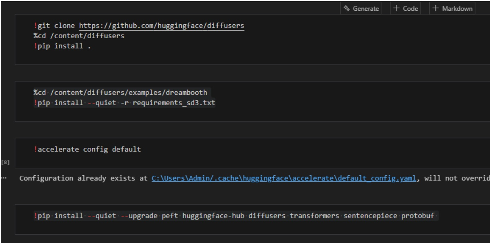

Hình 3.5: Ảnh cài đặt các thư viện

<!-- page: 66 -->

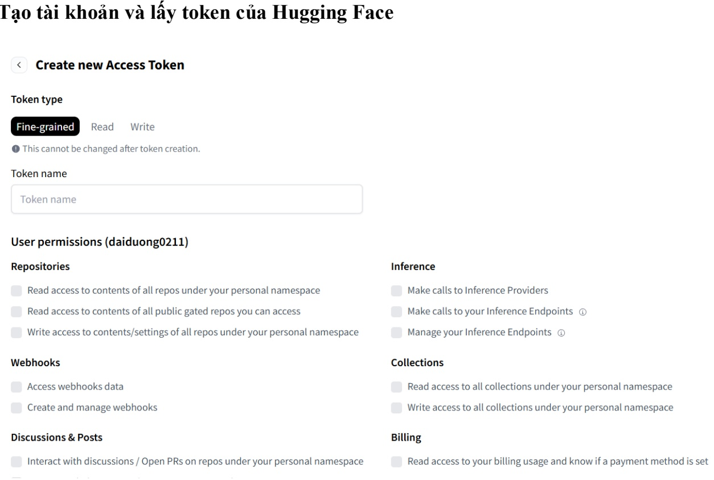

Hình 3.6: Ảnh giao diện tạo token

Khởi tạo và Chạy Huấn luyện: Sử dụng script train\_dreambooth\_sd3.py với các tham số đã được cấu hình ở mục 1

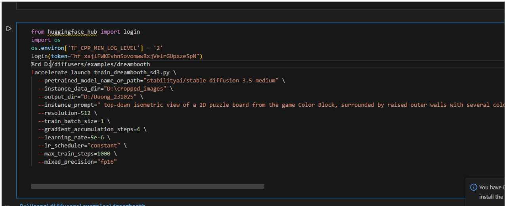

Hình 3.7: Ảnh cấu hình tham số huấn luyện

Quá trình lặp và Cập nhật Trọng số

Tải dữ liệu: Dữ liệu huấn luyện đã được chuẩn hóa (kích thước 512x512) được nạp vào mô hình.

<!-- page: 67 -->

Huấn luyện: Quá trình huấn luyện lặp lại (max\_train\_steps=1000). Trong mỗi bước, model được huấn luyện trên các ảnh trong tập huấn luyện.

Cập nhật Trọng số: Các trọng số của mô hình được cập nhật để cải thiện độ chính xác và khả năng sinh ảnh theo Instance Prompt.

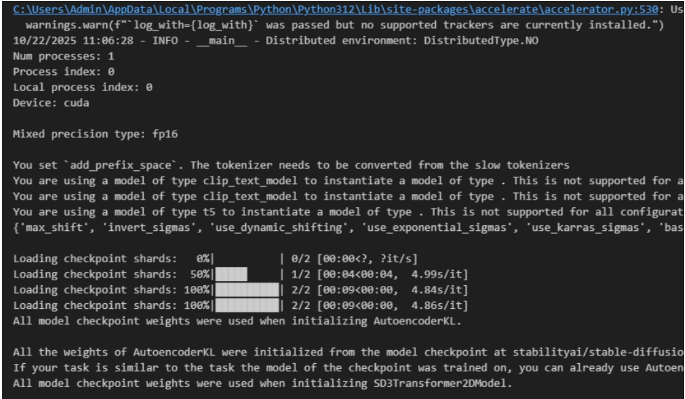

Hình 3.8: Ảnh quá trình huấn luyện mô hình

## Kết quả huấn luyện

Sau khi hoàn thành huấn luyện, toàn bộ mô hình đã được tinh chỉnh được lưu trữ tại thư mục đầu ra đã xác định

<!-- page: 68 -->

## Hình 3.9: Ảnh thư mục mô hình đầu ra

Trong đó:

 **Vae:** Chứa encoder/decoder cho VAE, dùng để encode/decode hình ảnh.

 **Transformer:** Thường liên quan tới text embedding hoặc phần transformer của model.

 **tokenizer**, **tokenizer\_2**, **tokenizer\_3:** Chứa tokenizer, có thể là các phiên bản khác nhau.

 **text\_encoder**, **text\_encoder\_2**, **text\_encoder\_3**: Chứa text encoder

 **scheduler:** Chứa scheduler cho diffusion process.

 **checkpoint-500**, **checkpoint-1000**: Đây là các checkpoint của model được huấn luyện, chứa weights chính của DreamBooth.

 **model\_index.json** – File metadata chỉ định các phần của model và checkpoint.

## 3.1.4 Đánh giá mô hình huấn luyện

Sau khi tinh chỉnh mô hình thành công ta dùng mô hình đã huấn luyện để sinh ra một hình ảnh mẫu, sau đó kiểm tra xem hình ảnh đó đã đạt chất lượng mong muốn hay chưa bằng cách chạy đoạn mã kiểm tra như ảnh dưới

<!-- page: 69 -->

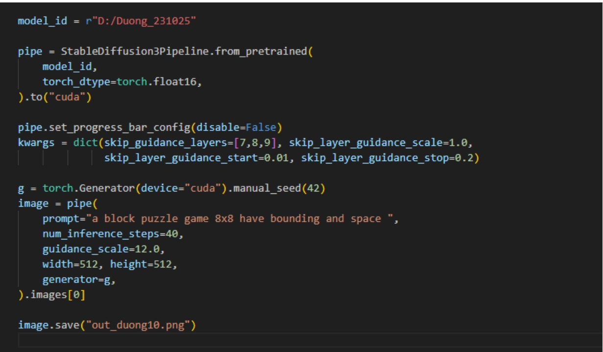

Hình 3.10: Ảnh đoạn code kiểm tra chất lượng ảnh mô hình sinh ra

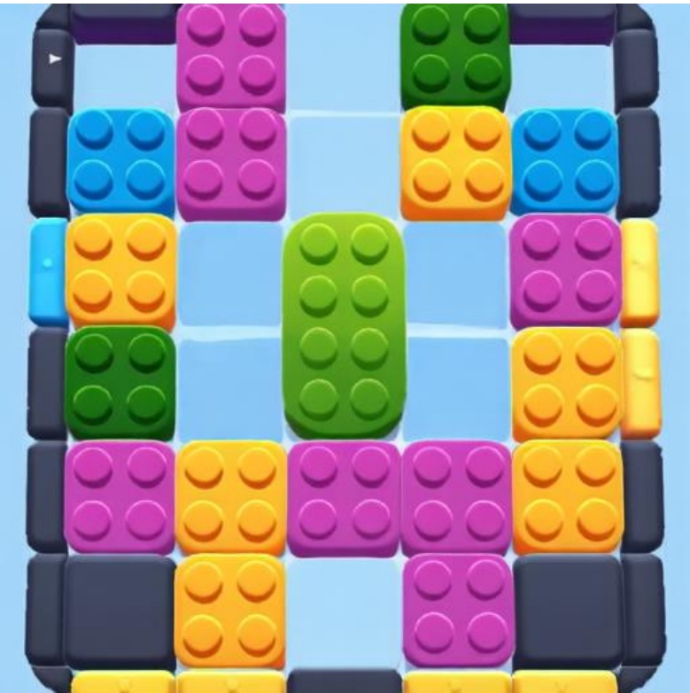

Hình 3.11: Ảnh màn chơi được sinh ra từ mô hình

<!-- page: 70 -->

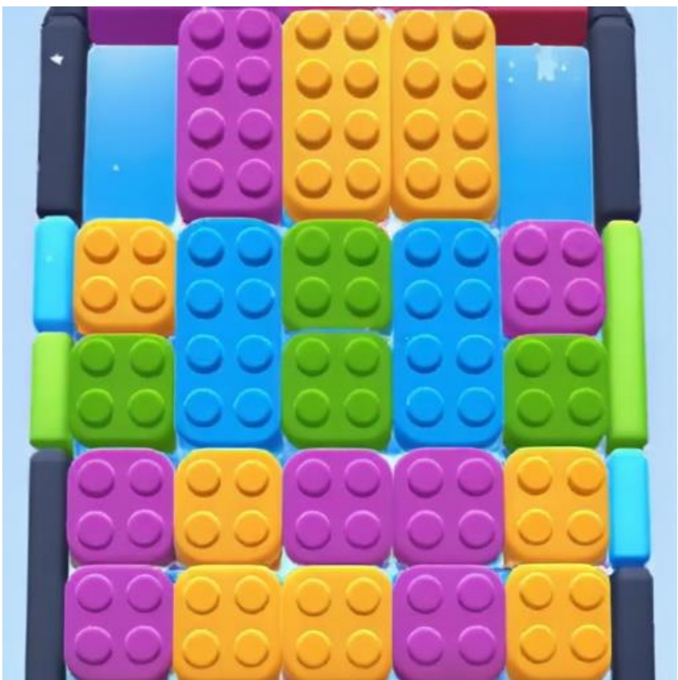

Hình 3.12: Ảnh màn chơi được sinh ra từ mô hình

## 3.2 Triển khai hệ thống sinh hình ảnh màn chơi game Color Block Jam

## 3.2.1. Định hướng triển khai

Trong phạm vi đồ án, hệ thống được triển khai theo mô hình all-in-one, trong đó toàn bộ các thành phần từ giao diện người dùng đến xử lý trí tuệ nhân tạo đều được tích hợp trong một ứng dụng Python duy nhất. Cách tiếp cận này giúp đơn giản hóa quá trình phát triển, triển khai và trình diễn hệ thống, đồng thời phù hợp với mục tiêu nghiên cứu và demo của đồ án.

<!-- page: 71 -->


## Hình 3.13: Python

Ứng dụng được thiết kế để chạy trực tiếp trên máy tính cá nhân, không phụ thuộc vào kết nối mạng hay hệ thống máy chủ bên ngoài. Người dùng chỉ cần khởi động ứng dụng, nhập mô tả màn chơi và nhận kết quả sinh ảnh ngay trong cùng một môi trường.

## 3.2.2. Kiến trúc tổng thể của ứng dụng

Ứng dụng được tổ chức theo ba khối chức năng chính:

\- Khối giao diện người dùng: Cung cấp giao diện đồ họa cho phép người dùng nhập prompt, khởi tạo quá trình sinh ảnh và quan sát kết quả. Giao diện được xây dựng bằng thư viện GUI của Python.

\- Khối xử lý prompt và điều phối: Khối này chịu trách nhiệm tiếp nhận dữ liệu từ giao diện, kiểm tra tính hợp lệ của prompt và điều phối luồng xử lý sinh ảnh. Đây là tầng trung gian kết nối giữa giao diện và mô hình trí tuệ nhân tạo.

<!-- page: 72 -->

\- Khối sinh ảnh bằng mô hình khuếch tán: Khối này sử dụng mô hình Stable Diffusion để sinh hình ảnh màn chơi từ mô tả đầu vào. Mô hình được load một lần duy nhất và tái sử dụng cho các lần sinh ảnh tiếp theo nhằm tối ưu hiệu năng.

Ba khối chức năng trên được tích hợp trong cùng một tiến trình, giúp giảm độ phức tạp của hệ thống và thuận tiện cho việc thử nghiệm.

Để cải thiện trải nghiệm người dùng, hệ thống áp dụng cơ chế lazy loading, trong đó mô hình khuếch tán không được khởi tạo ngay khi ứng dụng khởi động mà chỉ được load khi người dùng thực sự yêu cầu sinh ảnh.

Quy trình khởi tạo mô hình được thực hiện như sau:

\- Ứng dụng khởi động và hiển thị giao diện người dùng

\- Mô hình chưa được load, tài nguyên GPU chưa bị chiếm dụng

\- Khi người dùng nhấn nút tạo màn chơi hệ thống mới bắt đầu load mô hình

\- Sau khi load xong, mô hình được giữ trong bộ nhớ để phục vụ các lần sinh ảnh tiếp theo

Cách tiếp cận này giúp giảm đáng kể thời gian khởi động ứng dụng và tránh tình trạng ứng dụng bị treo trước khi giao diện xuất hiện.

Khi người dùng nhập prompt và kích hoạt chức năng sinh ảnh, hệ thống thực hiện tuần tự các bước sau:

\- Nhận prompt từ giao diện người dùng

\- Tiền xử lý prompt và chuẩn hóa dữ liệu đầu vào

\- Khởi tạo bộ sinh ngẫu nhiên với các seed khác nhau

\- Thực hiện quá trình sinh ảnh bằng mô hình khuếch tán

\- Sinh ra nhiều hình ảnh (khoảng 5 hình) cho cùng một prompt

\- Trả kết quả về giao diện và hiển thị đồng thời để người dùng so sánh

Việc sinh nhiều hình ảnh trong một lần yêu cầu giúp cung cấp nhiều phương án thiết kế khác nhau cho cùng một ý tưởng màn chơi, phù hợp với quy trình sáng tạo trong thiết kế game.

Để tránh hiện tượng giao diện bị đóng băng trong quá trình sinh ảnh, hệ thống sử dụng cơ chế xử lý song song, trong đó quá trình sinh ảnh được thực hiện trong

<!-- page: 73 -->

luồng nền. Giao diện người dùng vẫn được duy trì phản hồi, đồng thời hiển thị trạng thái xử lý cho người dùng.

Cách triển khai này đảm bảo ứng dụng vẫn hoạt động ổn định ngay cả khi thời gian sinh ảnh kéo dài do kích thước mô hình lớn hoặc tài nguyên phần cứng hạn chế.

## 3.2.3. Triển khai ứng dụng

Sau khi hoàn thiện, ứng dụng được đóng gói thành một file cài đặt độc lập bằng công cụ đóng gói Python, cho phép chạy trực tiếp mà không yêu cầu người dùng cài đặt môi trường Python hay các thư viện liên quan.

Việc triển khai theo mô hình all-in-one giúp hệ thống dễ dàng phân phối, sử dụng và trình diễn trong bối cảnh học thuật, đồng thời đảm bảo tính nhất quán giữa kết quả nghiên cứu và sản phẩm thực nghiệm.

Mô hình triển khai all-in-one mang lại các ưu điểm chính:

\- Kiến trúc đơn giản, dễ triển khai

\- Phù hợp cho nghiên cứu và demo

\- Giảm phụ thuộc vào hạ tầng bên ngoài

\- Dễ kiểm soát và tái lập kết quả.

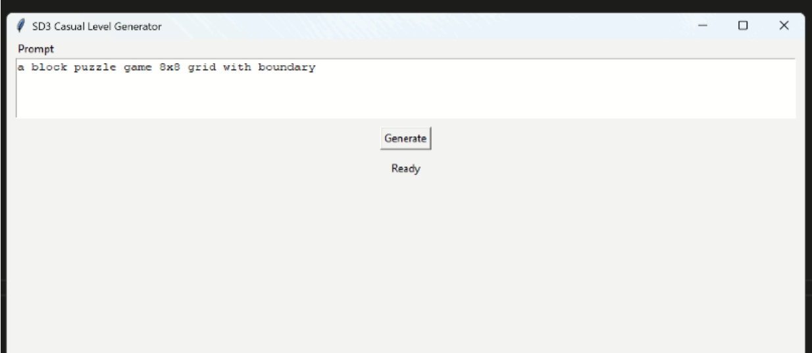

Hình 3.14: Ảnh giao diện ứng dụng

<!-- page: 74 -->

## 3.3 Thử nghiệm và đánh giá

## 3.3.1. Mục tiêu thử nghiệm

Mục tiêu của quá trình thử nghiệm và đánh giá hệ thống là xác định các yếu tố quan trọng sau:

 Chất lượng hình ảnh sinh ra: Đánh giá mức độ phù hợp của hình ảnh được sinh với mô tả đầu vào (prompt), bao gồm bố cục màn chơi, tính rõ ràng của không gian và phong cách đồ họa.

 Tốc độ sinh ảnh: Đo lường thời gian hệ thống cần để sinh ra các hình ảnh màn chơi sau khi người dùng gửi yêu cầu.

 Tính ổn định và khả năng sử dụng: Đánh giá khả năng hệ thống hoạt động ổn định trong nhiều lần sinh ảnh liên tiếp và mức độ đáp ứng yêu cầu của người dùng trong thực tế.

## 3.3.2. Phương pháp thử nghiệm

Hệ thống được thử nghiệm trên nhiều kịch bản khác nhau nhằm phản ánh điều kiện sử dụng thực tế của nhà thiết kế game. Cụ thể, quá trình thử nghiệm được thực hiện với hai nhóm prompt chính:

 Nhóm prompt cơ bản: Bao gồm các mô tả ngắn, đơn giản về màn chơi (ví dụ: dạng lưới, số lượng ô, phong cách casual).

 Nhóm prompt chi tiết: Bao gồm các mô tả chi tiết hơn về bố cục, vật thể, màu sắc và phong cách đồ họa của màn chơi.

Mỗi prompt được sử dụng để sinh ra khoảng 5 hình ảnh khác nhau nhằm đánh giá khả năng tạo đa dạng phương án thiết kế của hệ thống. Chất lượng hình ảnh được đánh giá thông qua việc so sánh hình ảnh sinh ra với nội dung mô tả ban đầu và nhận xét của người sử dụng. Tốc độ sinh ảnh được đo bằng thời gian từ lúc người dùng nhấn nút tạo ảnh cho đến khi hình ảnh được hiển thị đầy đủ trên giao diện ứng dụng.

## 3.3.3. Kết quả thử nghiệm

Kết quả thử nghiệm cho thấy hệ thống bước đầu đạt được các kết quả phù hợp với mục tiêu nghiên cứu của đồ án:

<!-- page: 75 -->

**Chất lượng hình ảnh**: “Các hình ảnh sinh ra từ hệ thống nhìn chung phản ánh được một phần nội dung mô tả trong prompt, thể hiện được bố cục tổng quát của màn chơi, không gian di chuyển và các đối tượng chính. Tuy nhiên, mức độ chi tiết và độ chính xác của hình ảnh còn phụ thuộc vào nội dung mô tả và tham số sinh ảnh. Các kết quả thu được chủ yếu mang tính minh họa và gợi ý ý tưởng, chưa thay thế hoàn toàn các bản thiết kế thủ công”.

\- **Tốc độ sinh ảnh**: “Hệ thống có khả năng sinh ra khoảng 5 hình ảnh cho mỗi prompt trong khoảng thời gian từ vài chục giây đến khoảng một phút, tùy thuộc vào cấu hình phần cứng và môi trường chạy. Thời gian xử lý này ở mức chấp nhận được đối với quá trình thử nghiệm và nghiên cứu”.

\- **Tính ổn định**: “Trong quá trình thử nghiệm với nhiều prompt khác nhau, hệ thống hoạt động tương đối ổn định, không xuất hiện lỗi nghiêm trọng gây gián đoạn hoàn toàn quá trình sinh ảnh. Mô hình được khởi tạo một lần và tái sử dụng cho các lần sinh ảnh tiếp theo, góp phần giảm thời gian chờ đợi khi thực hiện nhiều thử nghiệm liên tục”.

\- Hình ảnh sinh ra được hiển thị trực tiếp trên giao diện ứng dụng, cho phép người dùng dễ dàng so sánh và lựa chọn phương án phù hợp.

Promt: a block puzzle game 10x10 have bouding and some gray floor

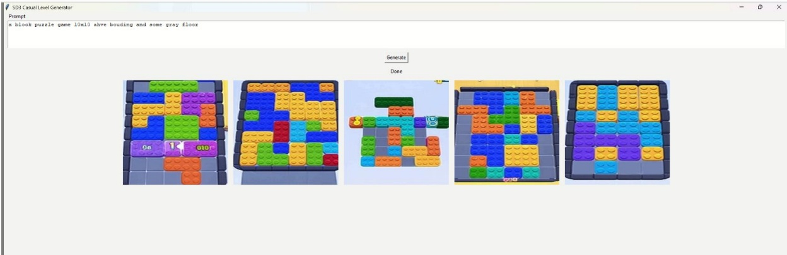

Hình 3.15: Ảnh hệ thống khi sinh màn chơi

<!-- page: 76 -->

Promt: a block puzzle game 8x8

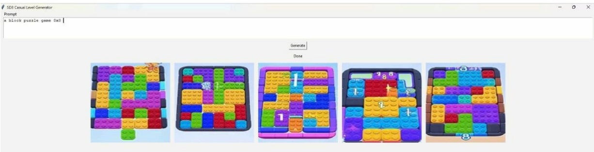

Hình 3.16: Ảnh hệ thống khi sinh màn chơi

Promt: “top-down isometric view of a 2D puzzle board from the game Color Block, surrounded by raised outer walls with several colorful exit gates, inside the board are multiple glossy plastic blocks of various bright colors, shapes and sizes arranged on a clean gray-tiled grid, some gray floor tiles left empty between blocks to create paths and playable spaces, shiny smooth toy-like surfaces, strong diffuse lighting, simple modern mobile puzzle game aesthetic, minimal background”.

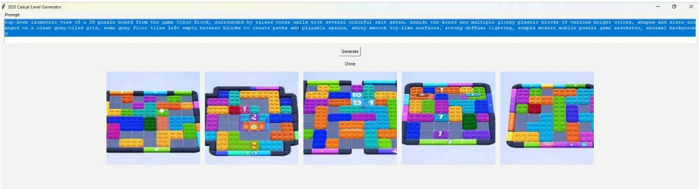

Hình 3.17: Ảnh hệ thống khi sinh màn chơi

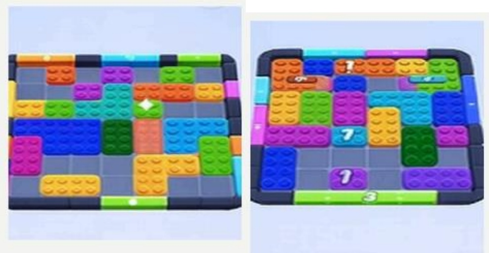

Hình 3.18: Ảnh một số màn chơi sinh ra đảm bảo chất lượng

<!-- page: 77 -->

## 3.4 Kết luận chương

Trong chương này, đồ án đã trình bày chi tiết quá trình triển khai và thử nghiệm hệ thống sinh ảnh hỗ trợ thiết kế màn chơi dựa trên mô hình khuếch tán. Nội dung chương tập trung vào việc xây dựng một ứng dụng all-in-one, trong đó giao diện người dùng và mô hình trí tuệ nhân tạo được tích hợp trong cùng một môi trường thực thi, giúp đơn giản hóa quá trình triển khai và sử dụng.

Hệ thống được thiết kế với giao diện trực quan, cho phép người dùng nhập mô tả màn chơi bằng ngôn ngữ tự nhiên và nhận về nhiều hình ảnh gợi ý cho cùng một yêu cầu. Việc áp dụng cơ chế khởi tạo mô hình theo nhu cầu (lazy loading) và xử lý song song giúp cải thiện trải nghiệm người dùng, đồng thời giảm thời gian chờ đợi khi ứng dụng được khởi động.

Thông qua quá trình thử nghiệm, hệ thống bước đầu cho thấy khả năng sinh ra các hình ảnh có nội dung gần tương tự với mô tả đầu vào, phản ánh được bố cục tổng quát và các yếu tố chính của màn chơi. Mặc dù chất lượng hình ảnh chưa đạt mức hoàn thiện để thay thế hoàn toàn quá trình thiết kế thủ công, kết quả thu được có giá trị tham khảo và hỗ trợ đáng kể cho việc hình thành ý tưởng ban đầu trong thiết kế game.

Nhìn chung, kết quả đạt được trong chương này đã chứng minh tính khả thi của việc ứng dụng mô hình khuếch tán vào hỗ trợ thiết kế màn chơi. Đây là cơ sở để tiếp tục nghiên cứu, cải tiến chất lượng hình ảnh, tối ưu hiệu năng và mở rộng hệ thống trong các nghiên cứu và ứng dụng thực tế trong tương lai.

<!-- page: 78 -->

# KẾT QUẢ ĐẠT ĐƯỢC

Sau quá trình nghiên cứu, xây dựng và thử nghiệm, đồ án đã đạt được một số kết quả chính như sau:

Đã xây dựng được một hệ thống sinh hình ảnh màn chơi dựa trên mô hình khuếch tán, cho phép người dùng nhập mô tả màn chơi bằng ngôn ngữ tự nhiên và sinh ra nhiều hình ảnh minh họa tương ứng cho cùng một yêu cầu.

\- Hệ thống được triển khai theo mô hình all-in-one, tích hợp cả giao diện người dùng và mô hình xử lý trong cùng một ứng dụng, giúp quá trình cài đặt và sử dụng trở nên đơn giản.

\- Kết quả thử nghiệm cho thấy các hình ảnh sinh ra có nội dung gần tương tự với mô tả đầu vào, thể hiện được bố cục tổng thể, không gian và các thành phần chính của màn chơi, qua đó hỗ trợ hiệu quả cho việc hình thành và phát triển ý tưởng thiết kế.

\- Thời gian sinh ảnh và mức độ ổn định của hệ thống đáp ứng được yêu cầu trong môi trường thử nghiệm, mô hình được tải một lần và tái sử dụng cho nhiều lần sinh ảnh liên tiếp, giúp tối ưu hiệu năng.

\- Đồ án đã bước đầu chứng minh tính khả thi của việc ứng dụng mô hình sinh ảnh vào lĩnh vực hỗ trợ thiết kế game, đặc biệt ở giai đoạn lên ý tưởng và phác thảo ban đầu.

<!-- page: 79 -->

## KẾT LUẬN VÀ KHUYẾN NGHỊ

Thông qua đồ án, nghiên cứu và triển khai thành công một hệ thống sinh ảnh dựa trên trí tuệ nhân tạo nhằm hỗ trợ quá trình thiết kế màn chơi trong game. Hệ thống cho phép chuyển đổi mô tả bằng ngôn ngữ tự nhiên thành các hình ảnh minh họa, góp phần giảm bớt thời gian và công sức trong giai đoạn thiết kế ý tưởng.

Mặc dù chất lượng hình ảnh sinh ra chưa đạt mức hoàn chỉnh có thể từ đó để thay thế hoàn toàn các công cụ thiết kế truyền thống, kết quả thu được cho thấy hệ thống có giá trị tham khảo cao và phù hợp với mục tiêu nghiên cứu ban đầu của đồ án. Điều này khẳng định tiềm năng ứng dụng của các mô hình khuếch tán trong lĩnh vực phát triển game và thiết kế nội dung số.

Nhìn chung, đồ án đã hoàn thành các mục tiêu đặt ra, đồng thời tạo nền tảng cho các nghiên cứu và phát triển tiếp theo trong tương lai.

Bên cạnh các kết quả đạt được, hệ thống vẫn còn một số hạn chế và có thể tiếp tục được cải tiến trong tương lai. Một số hướng phát triển và khuyến nghị được đề xuất như sau:

\- Nâng cao chất lượng hình ảnh sinh ra bằng cách tinh chỉnh prompt, huấn luyện bổ sung hoặc fine-tune mô hình với tập dữ liệu chuyên biệt cho thiết kế màn chơi.

\- Cải tiến giao diện người dùng, bổ sung các tùy chọn điều chỉnh tham số sinh ảnh nhằm tăng khả năng kiểm soát kết quả đầu ra cho người sử dụng.

\- Tối ưu hiệu năng và bộ nhớ để hệ thống có thể chạy ổn định trên các cấu hình phần cứng thấp hơn hoặc triển khai trên môi trường máy chủ.

\- Mở rộng hệ thống theo hướng tích hợp với các công cụ thiết kế game hiện có, giúp quá trình chuyển đổi từ ý tưởng sang sản phẩm hoàn chỉnh trở nên thuận tiện hơn.

\- Tiếp tục đánh giá hệ thống trên tập người dùng thực tế để thu thập phản hồi và cải thiện trải nghiệm sử dụng.

<!-- page: 80 -->

## TÀI LIỆU THAM KHẢO

1. Kuittinen, J., & Kultima, A. (2007). Defining the Casual Game. Proceedings of the International Conference on the Foundations of Digital Games (FDG). Togelius, J.,

2. Yannakakis, G. N., Stanley, K. O., & Browne, C. (2011). Search-Based Procedural Content Generation. Computational Intelligence and Games (CIG).

3. Yannakakis, G. N., & Togelius, J. (2018). Artificial Intelligence and Games. Springer.

4. Daras, G., et al. (2022). Diffusion Models for Game Asset Generation. arXiv preprint.

5. Juul, J. (2010). A Casual Revolution: Reinventing Video Games and Their Players. MIT Press.

6. Schell, J. (2019). The Art of Game Design: A Book of Lenses (3rd ed.). CRC Press.

7. Chen, Y., & Zhang, Y. (2023). A Survey on Large Language Models in Procedural Content Generation for Games. IEEE Conference on Games.

8. Rombach, S., et al. (2022). High-Resolution Image Synthesis with Latent Diffusion Models. IEEE/CVF Conference on Computer Vision and Pattern Recognition (CVPR)

9. Brown, T. B., et al. (2020). Language Models are Few-Shot Learners. Advances in Neural Information Processing Systems (NIPS).

10. Vaswani, A., et al. (2017). Attention Is All You Need. Advances in Neural Information Processing Systems (NIPS).

11. Ho, J., Jain, A., & Abbeel, P. (2020). Denoising Diffusion Probabilistic Models. Advances in Neural Information Processing Systems (NIPS).

12. He, K., et al. (2023). LoRA: Low-Rank Adaptation of Large Language Models. International Conference on Learning Representations (ICLR).

13. Zhang, L., et al. (2023). Adding Conditional Control to Text-to-Image Diffusion Models (ControlNet). International Conference on Computer Vision (ICCV).

<!-- page: 81 -->

14. Nichol, A. Q., & Dhariwal, P. (2021). Improved Denoising Diffusion Probabilistic Models. International Conference on Machine Learning (ICML).

15. Goodfellow, I., et al. (2014). Generative Adversarial Networks. Advances in Neural Information Processing Systems (NIPS).

16. OpenAI. (2023). GPT-4 Technical Report.

17. Isaksen, A. A., & Glimelius, J. (2023). Procedural Generation and Large Language Models: A Unified Framework for Content Creation. Proceedings of the International Conference on Generative AI and Content Creation.

18. Chen, X. (2025). Research on Artificial Intelligence-Assisted Game Design and Development. Proceedings of the International Conference on Data Science and Engineering (ICDSE).

19. D. V., et al. (2025). The Role of Artificial Intelligence in Gaming: A Bibliometric Review. Applied Sciences, 15(23).

20. Li, D. (2024). Artificial Intelligence in the Game Development Process. Journal of Advances in Artificial Intelligence.

21. Kingma, D. P., & Welling, M. (2014). Auto-Encoding Variational Bayes. International Conference on Learning Representations (ICLR).

22. Liu, H., & Abbeel, P. (2021). Diffusion Models for Text-to-Image Generation. ArXiv preprint.

23. Mittal, S., et al. (2022). Generative Models for Procedural Content Generation: A Review. IEEE Transactions on Games, 14(4).

24. Olah, C., et al. (2016). The Building Blocks of Interpretability. Distill.

25. Park, T., et al. (2019). Semantic Image Synthesis with Spatially-Adaptive Normalization. IEEE/CVF Conference on Computer Vision and Pattern Recognition (CVPR).

26. Graves, A., et al. (2020). Large-Scale Evolution of Image Classifiers. International Conference on Machine Learning (ICML).

<!-- page: 82 -->

27. Zheng, S., et al. (2024). LLM-Aided Level Design: Generating Controllable Gameplay Logic from Natural Language. Proceedings of the AAAI Conference on Artificial Intelligence.

28. Srivastava, R. K., Greff, K., & Schmidhuber, J. (2015). Training Very Deep Networks. Advances in Neural Information Processing Systems (NIPS).

29. Wang, W., et al. (2023). A Survey on Diffusion Models for Human-Centric Visual Generation. ACM Computing Surveys.

30. Radford, A., et al. (2021). Learning Transferable Visual Models From Natural Language Supervision. International Conference on Machine Learning (ICML).

<!-- page: 83 -->

turnin Trag 287-Tón a v tinhtoavn

ID bài nôp trn:oid:::1:3444122932

## 20% Tính tuơng đồng nói chung

Tng cng ca tt cà các kt qu trùng khp, bao gồm cà các nguồn trùng lp, cho mi c..

## Đã lc khi Báo cáo

Mc luc tham khão

Văn bán đưc trích dn

Nguồn hàng đu

16%Nguön Internet

8% Ãn bán

7%Bài tp đưc np (bài ca hc sinh)

**Học viên thực hiện**

**Giảng viên hướng dẫn**

**Đào Đại Dương**

**TS. Nguyễn Minh Tuấn**
