<!-- page: 1 -->

## Lecture 7

**Artificial neural networks : Supervised learning**

■ Introduction, or how the brain works

■ The neuron as a simple computing element  as a

■ The perceptron

■ Multilayer neural networks

■ Accelerated learning in multilayer neural networks

■ The Hopfield network

■ B idirectional as sociative memories (B AM)

■ Summary

 N eg nevitsky, Pearson E d ucation , 2002 ,

<!-- page: 2 -->

## Introduction, or  or how the brain works

Machine  learning involves adaptive mechanisms that enable computers to learn from experience,  to learn by example and learn by analogy. Learning . capabilities can improve the performance of an intelligent system over time . The most popular . approaches to machine learning are  to  **artificial neural networks**  and **genetic algorithms** . This lecture is dedicated to neural networks .  is .

<!-- page: 3 -->

■ A **neural network**  can be defined as a model of  as  of reasoning based on the human brain. The brain  on . consists of a densely interconnected set of nerve cells , or basic information-proces sing units , called - **neurons** .

The human brain incorporates nearly 1 0 billion neurons and 60 trillion connections ,  synapses , between them. By using multiple neurons . By simultaneously, the brain can  perform its functions much faster than the fastest computers in existence  in today.

<!-- page: 4 -->

■ Each neuron has a very simple structure, but an  an army of such elements constitutes a tremendous proces sing power. .

■ A neuron consists of a cell body,  **soma**, a number of ,  of fibers called  **dendrites** , and a single long ,  a  fiber called the  **axon**.

<!-- page: 5 -->

## Biological neural network

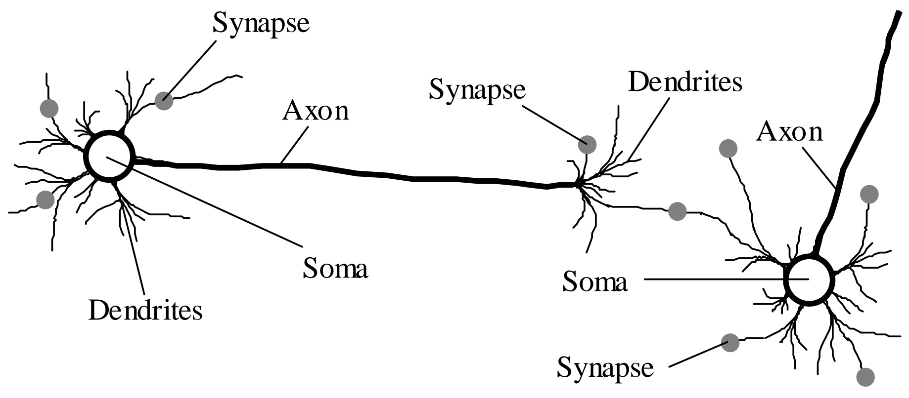

<!-- page: 6 -->

■ Our brain can be considered as a highly complex,  as non-linear and parallel information-proces sing - - sy stem . .

■ Information is stored and proces sed in a neural  is network simultaneously throughout the whole network, rather than at specific locations . In other  at . In words , in neural networks , both data and its  in proces sing are  **global** rather than local . .

■ Learning is a fundamental and essential characteristic of biological neural networks . The . ease with which they can learn led to attempts to  to emulate a biological neural network in a computer. .

<!-- page: 7 -->

■ An artificial neural network consists of a number of An  of very simple proces sors , also called  **neurons** , which , are analogous to the biological neurons in the brain .  to  in .

■ The neurons are connected by weighted links pas sing  signals from one  neuron to another. to .

■ The output signal is transmitted through the neuron’ s outgoing connection. The outgoing s . connection splits  into a number of branches that transmit the same signal. The outgoing branches . terminate at the incoming connections of other neurons  in the network. in .

<!-- page: 8 -->

## Architecture of a typical artificial neural network

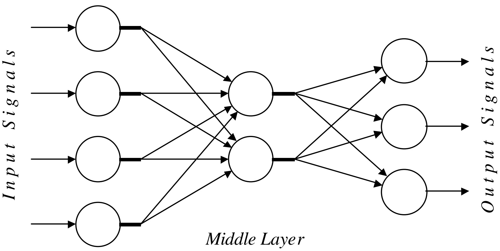

Input Layer

Output Layer

<!-- page: 9 -->

## Analogy between biological and artificial  neural  networks

| S A D S ypasn oxn ednri oam e te | B gooil ci a l N e u r a l N e t w o r k |
| --- | --- |
| gWei pOut putIn Neur th ut on | ftiiAr ci a l N e u r a l N e t w o r k |

<!-- page: 10 -->

Weights

## The neuron as a simple computing  element

## Diagram of a  neuron

Input S ignals

Output Signals

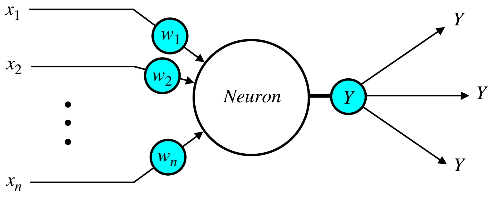

<!-- page: 11 -->

■ The neuron computes the weighted sum of the input signals and compares the result with a  a **threshold value**, θ . If the net input is les s than the threshold the neuron output is – 1 . B ut if the net input is greater  – 1 . than or equal to the threshold, the  neuron becomes activated and its output attains a value + 1  + 1 .

■ The neuron uses the following transfer or  or **activation function** :

$$
X = \sum_ {i = 1} ^ {n} x _ {i} w _ {i}
$$

$$
Y = \left\{ \begin{array}{l} + 1, \text {if} X \geq \theta \\ - 1, \text {if} X <   \theta \end{array} \right.
$$

■ This type of activation function i s called a  i s  a **sign function** .

<!-- page: 12 -->

## Activation functions of a  neuron

Step function

Sign function

$$
Y ^ {s t e p} = \left\{ \begin{array}{l} 1, \text {if} X \geq 0 \\ 0, \text {if} X <   0 \end{array} \right.
$$

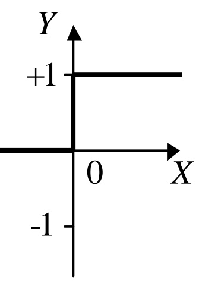

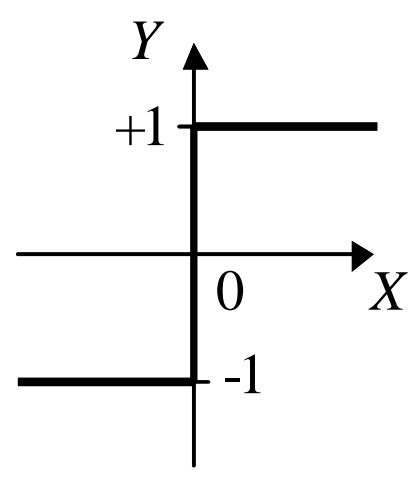

$$
\left| Y ^ {s i g n} = \left\{ \begin{array}{l} + 1, \text {if} X \geq 0 \\ - 1, \text {if} X <   0 \end{array} \right. \right.
$$

Linear function

Sigmoid function

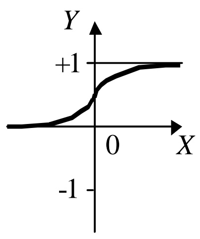

$$
Y ^ {s i g m o i d} = \frac {1}{1 + e ^ {- X}}
$$

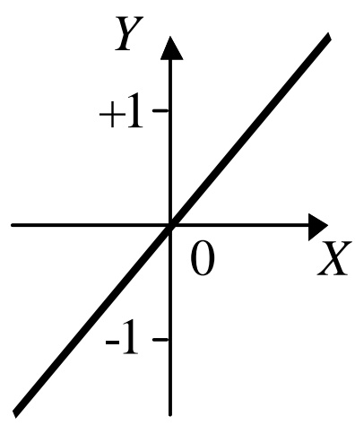

$$
Y ^ {l i n e a r} = X
$$

<!-- page: 13 -->

## Can a single  neuron learn a task?

■ In 1 95 8 , In  **Frank Rosenblatt**  introduced a training algorithm that provided the first procedure for training a simple ANN: a  a  a **perceptron** .

The perceptron  is the simplest form of a neural is network. It consi sts of a single .  neuron with adjustable  synaptic weights and a  a hard limiter .

<!-- page: 14 -->

## Single-layer two-input  perceptron

## Inputs

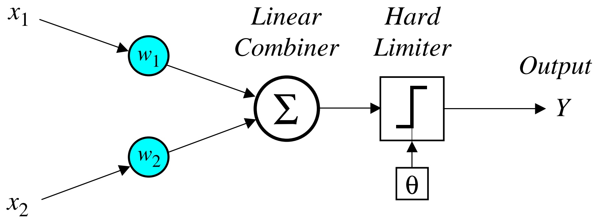

Threshold

<!-- page: 15 -->

## The Perceptron

■ The operation of  of Rosenblatt’ s perceptron s  is based is on the **McCulloch  and Pitts neuron  model**. The model consists of a linear  combiner  followed by a  a hard limiter .

■ The weighted sum of the inputs is applied to the  is hard limiter , which produces an output equal to + 1 ,  an  + 1 if its input i s po sitive and  − 1 if it i s neg ative . .

<!-- page: 16 -->

The aim of the perceptron i s to clas sify inputs ,  i s to $\angle C F D = \angle C D E = \angle C D E$ into one of two clas ses , s ay $\underline { { \underline { { \mu } } } } _ { \perp }$ and $\textcircled { 2 }$

■ In the case of an elementary perceptron, the n- In  n dimensional space is divided by a  is  a hyperplane  into two decision regions . The hyperplane is defined by .  is the **linearly  separable  function** :

$$
\sum_ {i = 1} ^ {n} x _ {i} w _ {i} - \theta = 0
$$

<!-- page: 17 -->

## Linear separability  in the perceptrons

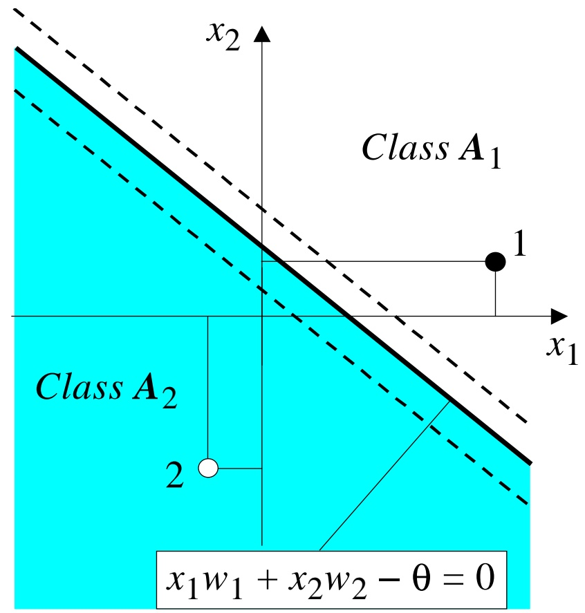

(a) Two-input perceptron .

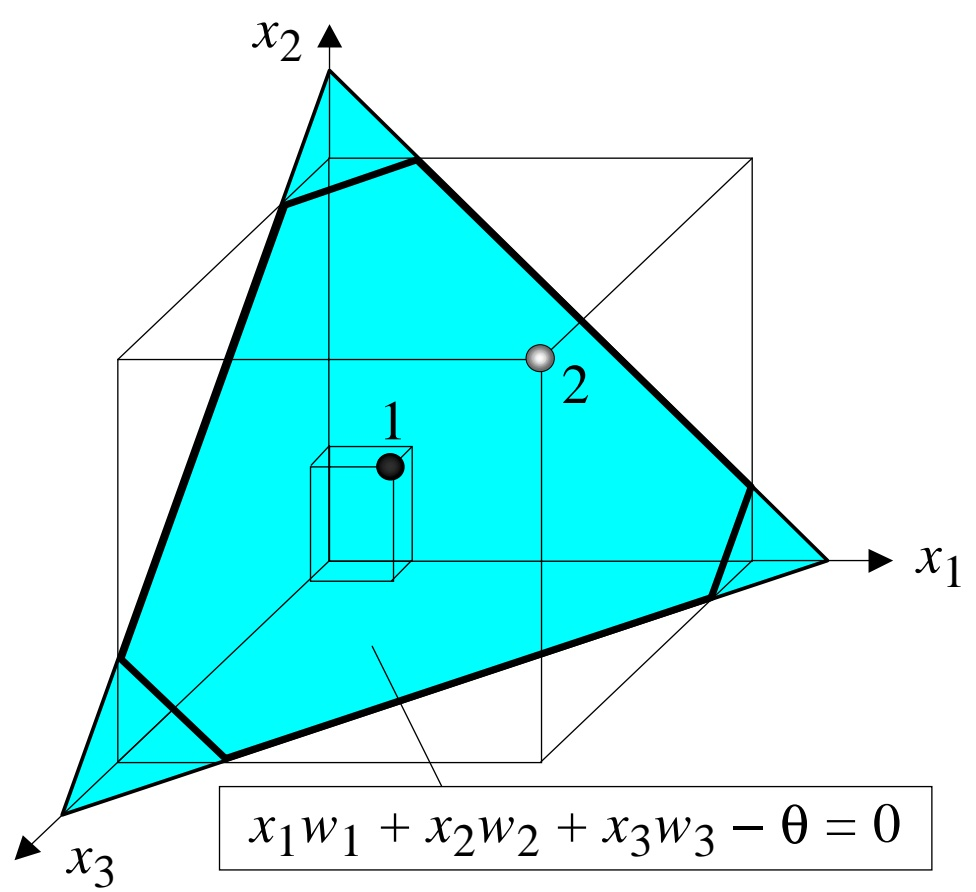

(b) Three-input perceptron .

<!-- page: 18 -->

## How does the perceptron  learn its classification tasks?

Thi s i s done by making small adj ustments in the i s  in weights to reduce the difference between the actual  to and desired outputs of the  perceptron . The initial . weights are randomly assigned, usually in the range [−0. 5 , 0. 5] , and then updated to obtain the output 0. 5 , 0. consi stent with the training examples . .

<!-- page: 19 -->

■ If at iteration $\widehat { p }$ the actual output i s $W ( p )$ and the desired output is $\frac { 1 } { 2 } ( \textcircled { 1 } )$ then the error is given by :

$$
e (p) = Y _ {d} (p) - Y (p)
$$

$$
\text {where} p = 1, 2, 3, \ldots
$$

Iteration  p here refers to the  to  pth training example presented to the perceptron. .

■ If the error, $\textcircled { < } \textcircled { > }$ i s po sitive , we need to increase  i s  we perceptron output $M ( 0 , 0 )$ but if it i s neg ative , we   we need to decrease $\mathbb { M O D }$

<!-- page: 20 -->

## The perceptron learning rule

$$
w _ {i} (p + 1) = w _ {i} (p) + \alpha \cdot x _ {i} (p) \cdot e (p)
$$

where $1 0 = 1 1 0 2 , 0 , 0 . 5$

α i s the i s  **learning rate** , a po sitive constant les s than unity .

The perceptron learning rule was first proposed by **Rosenblatt**  in 1 9 60 . Using this rule we can derive in .  we the perceptron training algorithm for clas sification tasks .

<!-- page: 21 -->

## Perceptron’s tarining algorithm

**Step 1 : Initialisation** S et initial weights $W _ { 1 } = W _ { 2 } = 0 . 5 W _ { n }$ and threshold  θ to random numbers in the range [ to  in  [−0 . 5 , 0 . 5 ] . 0 . 5 , 0 . 5 ] .

If the error,  e (p) , i s po sitive , we need to increase ) , i s  we perceptron  output  Y(p) , but if it i s neg ative , we ) ,  we need to decrease  Y(p) .

<!-- page: 22 -->

**Perceptron’s tarining algorithm (continued)**

## Step 2 : Activation :

Activate the perceptron by applying inputs $\overline { C } ( \overline { D } )$ $B C _ { 2 } ( \rho ) _ { 2 } = B C _ { 2 } ( \rho )$ and desired output $\frac { 1 4 } { 1 0 } ( \textcircled { 1 0 } )$ Calculate the actual output at iteration $\overline { p } = \overline { 1 }$

$$
Y (p) = \text {step} \left[ \sum_ {i = 1} ^ {n} x _ {i} (p) w _ {i} (p) - \theta \right]
$$

where n is the number of the perceptron inputs , is and step i s a step activation i s a  function . .

<!-- page: 23 -->

Perceptron’s tarining algorithm (continued) **Step 3 : Weight** :  **training** Update the weights of the  perceptron

$$
w _ {i} (p + 1) = w _ {i} (p) + \Delta w _ {i} (p)
$$

where $\Delta D D ( O D )$ i s the weight correction at iteration  p . The weight correction is computed by the  is  **delta rule** :

$$
\Delta w _ {i} (p) = \boldsymbol {\alpha} \cdot \boldsymbol {x} _ {i} (p) \cdot \boldsymbol {e} (p)
$$

**Step 4 : Iteration** Increase  iteration  p by one, go back to by  go  Step 2 and repeat the process until convergence. .

<!-- page: 24 -->

## Example of perceptron  learning : the logical operation  AND

<table><tr><td rowspan="2">Epoch</td><td colspan="2">Inputs</td><td rowspan="2">Desired output  $Y_d$ </td><td colspan="2">Initial weights</td><td rowspan="2">Actual output Y</td><td rowspan="2">Error e</td><td colspan="2">Final weights</td></tr><tr><td> $x_1$ </td><td> $x_2$ </td><td> $w_1$ </td><td> $w_2$ </td><td> $w_1$ </td><td> $w_2$ </td></tr><tr><td rowspan="4">1</td><td>0</td><td>0</td><td>0</td><td>0.3</td><td>-0.1</td><td>0</td><td>0</td><td>0.3</td><td>-0.1</td></tr><tr><td>0</td><td>1</td><td>0</td><td>0.3</td><td>-0.1</td><td>0</td><td>0</td><td>0.3</td><td>-0.1</td></tr><tr><td>1</td><td>0</td><td>0</td><td>0.3</td><td>-0.1</td><td>1</td><td>-1</td><td>0.2</td><td>-0.1</td></tr><tr><td>1</td><td>1</td><td>1</td><td>0.2</td><td>-0.1</td><td>0</td><td>1</td><td>0.3</td><td>0.0</td></tr><tr><td rowspan="4">2</td><td>0</td><td>0</td><td>0</td><td>0.3</td><td>0.0</td><td>0</td><td>0</td><td>0.3</td><td>0.0</td></tr><tr><td>0</td><td>1</td><td>0</td><td>0.3</td><td>0.0</td><td>0</td><td>0</td><td>0.3</td><td>0.0</td></tr><tr><td>1</td><td>0</td><td>0</td><td>0.3</td><td>0.0</td><td>1</td><td>-1</td><td>0.2</td><td>0.0</td></tr><tr><td>1</td><td>1</td><td>1</td><td>0.2</td><td>0.0</td><td>1</td><td>0</td><td>0.2</td><td>0.0</td></tr><tr><td rowspan="4">3</td><td>0</td><td>0</td><td>0</td><td>0.2</td><td>0.0</td><td>0</td><td>0</td><td>0.2</td><td>0.0</td></tr><tr><td>0</td><td>1</td><td>0</td><td>0.2</td><td>0.0</td><td>0</td><td>0</td><td>0.2</td><td>0.0</td></tr><tr><td>1</td><td>0</td><td>0</td><td>0.2</td><td>0.0</td><td>1</td><td>-1</td><td>0.1</td><td>0.0</td></tr><tr><td>1</td><td>1</td><td>1</td><td>0.1</td><td>0.0</td><td>0</td><td>1</td><td>0.2</td><td>0.1</td></tr><tr><td rowspan="4">4</td><td>0</td><td>0</td><td>0</td><td>0.2</td><td>0.1</td><td>0</td><td>0</td><td>0.2</td><td>0.1</td></tr><tr><td>0</td><td>1</td><td>0</td><td>0.2</td><td>0.1</td><td>0</td><td>0</td><td>0.2</td><td>0.1</td></tr><tr><td>1</td><td>0</td><td>0</td><td>0.2</td><td>0.1</td><td>1</td><td>-1</td><td>0.1</td><td>0.1</td></tr><tr><td>1</td><td>1</td><td>1</td><td>0.1</td><td>0.1</td><td>1</td><td>0</td><td>0.1</td><td>0.1</td></tr><tr><td rowspan="4">5</td><td>0</td><td>0</td><td>0</td><td>0.1</td><td>0.1</td><td>0</td><td>0</td><td>0.1</td><td>0.1</td></tr><tr><td>0</td><td>1</td><td>0</td><td>0.1</td><td>0.1</td><td>0</td><td>0</td><td>0.1</td><td>0.1</td></tr><tr><td>1</td><td>0</td><td>0</td><td>0.1</td><td>0.1</td><td>0</td><td>0</td><td>0.1</td><td>0.1</td></tr><tr><td>1</td><td>1</td><td>1</td><td>0.1</td><td>0.1</td><td>1</td><td>0</td><td>0.1</td><td>0.1</td></tr></table>

Thres ho ld : θ = 0 . 2 ; learning rate : α = 0 . 1

<!-- page: 25 -->

## Two-dimensional  plots of basic logical operations

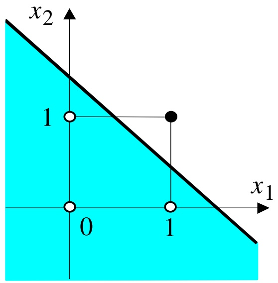

( a ) $A N D ( x _ { 1 } \cap x _ { 2 } )$

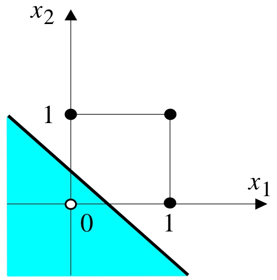

( b ) $OR\ (x_1 \cup x_2)$

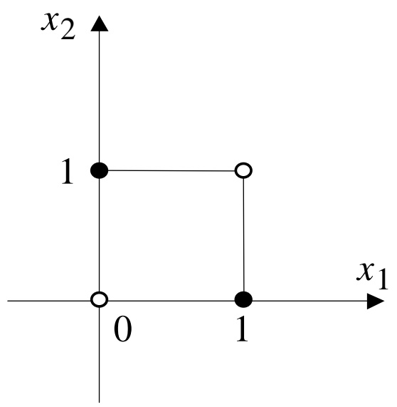

(c ) Exc lu s iv e - OR (x 1 ⊕ x 2 )

A perceptron  can learn the operations  AND and OR, but not  Exclusive- OR - OR.

<!-- page: 26 -->

## Multilayer  neural networks

■ A multilayer perceptron  is a feedforward  neural network with one or more hidden layers . .

■ The network consists of an  **input layer**  of source neurons , at least one middle or ,  or **hidden layer**  of computational  neurons , and an ,  an **output layer**  of computational  neurons .

The input signals are propagated in a forward direction on a layer-by-layer basis .  on -by- .

<!-- page: 27 -->

## Multilayer perceptron  with two hidden layers

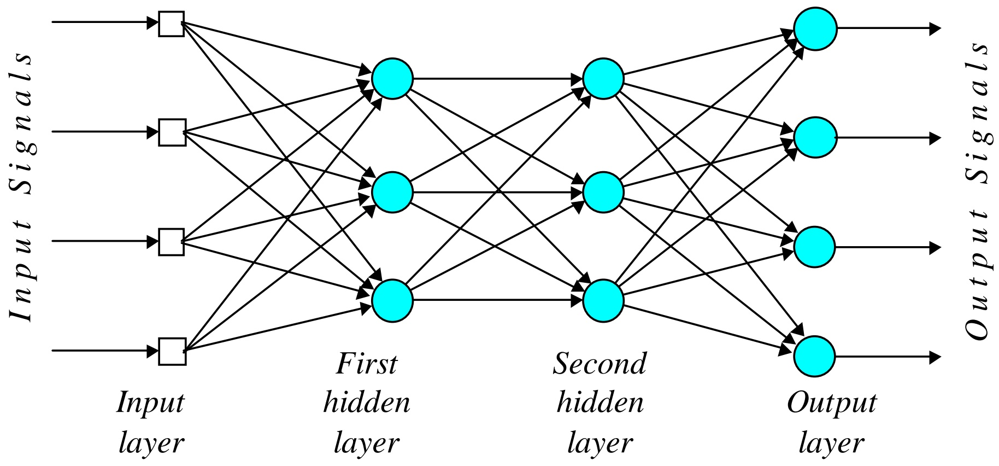

<!-- page: 28 -->

**What does the middle layer hide** ?

■ A hidden layer “hides” its desired output. . Neurons  in the hidden layer cannot be observed in through the input/output behaviour of the network. . There is no obvious way to know what the desired  is no output of the hidden layer should be. .

■ Commercial ANNs incorporate three and sometimes four layers, including one or two hidden layers . Each layer can contain from 1 0 to . 1 000 neurons . Experimental neural networks may . have five or even six layers , including three or  or four hidden layers , and utilise millions of  of neurons . .

<!-- page: 29 -->

## Back-propagation neural network

■ Learning in a  a multilayer  network proceeds the same way as for a  as  a perceptron .

■ A training set of input patterns i s presented to the  i s network. .

■ The network computes its output pattern, and if there is an error  is an  − or in other words a difference between actual and desired output patterns  − the weights are adj usted to reduce this error. .

<!-- page: 30 -->

In a back-propagation neural network, the learning In - algorithm has two phases . .

■ First, a training input pattern i s presented to the  i s network input layer. The network propagates the . input pattern from layer to layer until the output pattern is generated by the output layer.  is .

■ If thi s pattern i s different from the desired output,  i s an error is calculated and then propagated an backwards through the network from the output layer to the input layer. The weights are modified . as the error is propagated. as .

<!-- page: 31 -->

## Three-layer back-propagation neural network

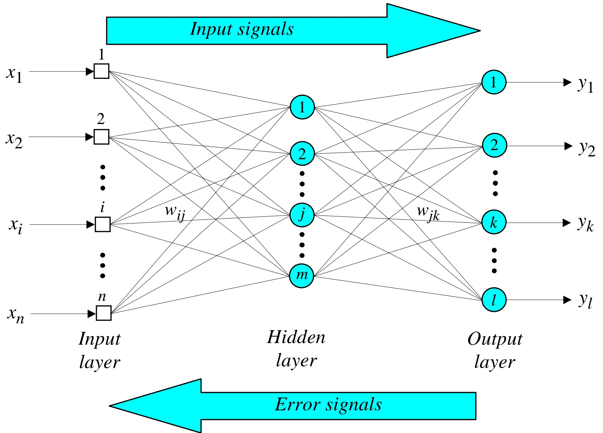

<!-- page: 32 -->

**The back-propagation training  algorithm**

**Step 1 : Initialisation** Set all the weights and threshold levels of the network to random numbers uniformly di stributed inside a small range :  a

$$
\left(- \frac {2 . 4}{F _ {i}}, + \frac {2 . 4}{F _ {i}}\right)
$$

where $\frac { \vert \overrightarrow { p } \vert } { \vert \overrightarrow { u } \vert }$ i s the total number of inputs of i s  of neuron i in the network. The weight initiali s ation i s done in .  i s on a neuron-by-neuron basis .

<!-- page: 33 -->

**Step 2 : Activation**

Activate  the back-propagation neural network by - applying inputs $B C ( O ) _ { 2 } C O _ { 3 } ( O ) _ { 2 } = 2 B C ( O )$ and desired outputs $\textcircled { 1 } \textcircled { 2 } \textcircled { 1 } \textcircled { 1 } \textcircled { 2 } \textcircled { 1 } V _ { 1 } \textcircled { 2 } \textcircled { 1 } \textcircled { 1 } \textcircled { 1 } \textcircled { 1 } \textcircled { 1 } \textcircled { 1 } \textcircled { 1 } \textcircled { 1 } \textcircled { 1 } \textcircled { 1 } \textcircled { 1 } \textcircled { 1 } \textcircled { 1 } \textcircled { 1 } \textcircled { 1 }$

(a) Calculate the actual outputs of the )  neurons  in the hidden layer:

$$
y _ {j} (p) = \text {sigmoid}
$$

$$
\left[ \sum_ {i = 1} ^ {n} x _ {i} (p) \cdot w _ {i j} (p) - \theta_ {j} \right]
$$

where n is the number of inputs of is  of neuron j in the hidden layer, and  sigmoid  is the sigmoid  activation function .

<!-- page: 34 -->

**Step 2 : Activation (continued)** :

(b) Calculate the actual outputs of the neurons in )  in the output layer :

$$
y _ {k} (p) = \text {sigmoid} \left[ \sum_ {j = 1} ^ {m} x _ {j k} (p) \cdot w _ {j k} (p) - \theta_ {k} \right]
$$

where m is the number of inputs of neuron is  k in the output layer . .

<!-- page: 35 -->

## Step 3 : Weight :  training

Update the weights in the back-propagation network - propagating backward the errors associated with output neurons .

(a) Calculate the error gradient for the  neurons  in the output layer :

$$
\delta_ {k} (p) = y _ {k} (p) \cdot [ 1 - y _ {k} (p) ] \cdot e _ {k} (p)
$$

where

$$
e _ {k} (p) = y _ {d, k} (p) - y _ {k} (p)
$$

Calculate the weight corrections :

$$
\Delta w _ {j k} (p) = \boldsymbol {\alpha} \cdot \boldsymbol {y} _ {j} (p) \cdot \boldsymbol {\delta} _ {k} (p)
$$

Update the weights at the output  neurons :

$$
w _ {j k} (p + 1) = w _ {j k} (p) + \Delta w _ {j k} (p)
$$

<!-- page: 36 -->

**Step 3 : Weight training (continued)** :

(b) Calculate the error gradient for the )  neurons  in the hidden layer:

$$
\delta_ {j} (p) = y _ {j} (p) \cdot [ 1 - y _ {j} (p) ] \cdot \sum_ {k = 1} ^ {l} \delta_ {k} (p) w _ {j k} (p)
$$

Calculate the weight corrections :

$$
\Delta w _ {i j} (p) = \boldsymbol {\alpha} \cdot \boldsymbol {x} _ {i} (p) \cdot \boldsymbol {\delta} _ {j} (p)
$$

Update the weights at the hidden  neurons :

$$
w _ {i j} (p + 1) = w _ {i j} (p) + \Delta w _ {i j} (p)
$$

<!-- page: 37 -->

## Step 4 : Iteration :

Increase iteration  p by one, go back to by  go  Step 2 and repeat the proces s until the selected error criterion i s s ati sfied . i s .

As an example, we may consider the three-layer As an  we - back-propagation network. Suppose that the - network is required to perform logical operation Exclusive- OR - OR. Recall that a single-layer .  a - perceptron could not do this operation. Now we will apply the .  we three-layer net. - .

<!-- page: 38 -->

Output layer

## Three-layer network for solving the Exclusive-OR operation

Input layer

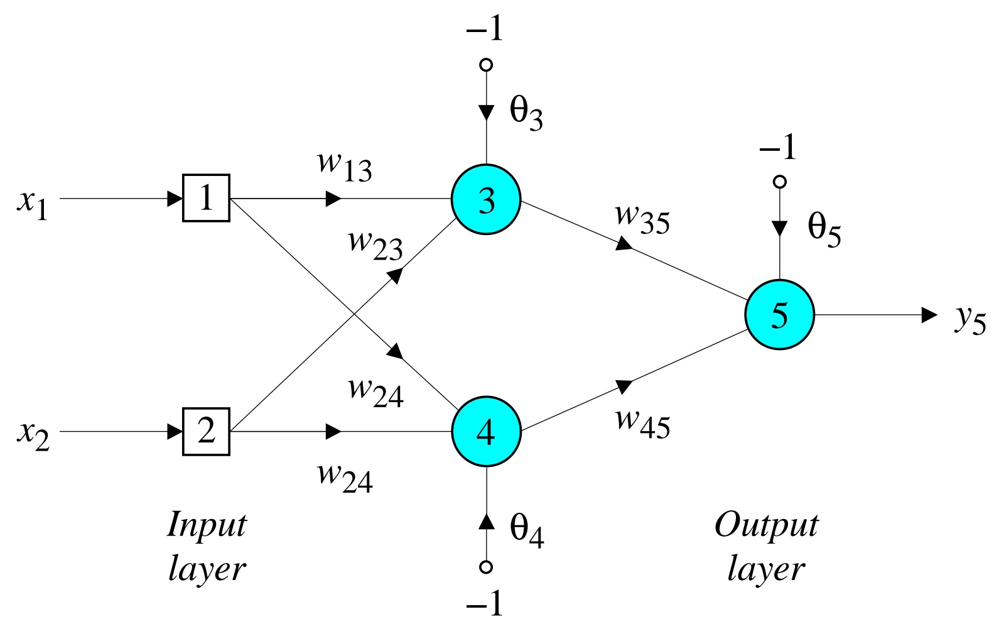

Hidden layer

<!-- page: 39 -->

■ The effect of the threshold applied to a  a neuron in the hidden or output layer is represented by its weight,  or  θ , connected to a fixed input equal to  − 1 .

The initial weights and threshold levels are set randomly as follow s :  as $因此三  $0 { \times } 0 { \times } 1 0 { \times } 2 { \times } 3 { \times } 4 { \times } 5 { \times } 6 { \times } 6 { \times } 7 { \times } 6 { \times } 1 0 { \times } 6 { \times } 7 { \times } 6 { \times } 7 { \times } 6 { \times } 6 { \times } 7 { \times } 6 { \times } 7 { \times } 6 { \times } 7 { \times } 6 { \times } 7 { \times } 6 { \times } 7 { \times } 6 { \times } 7 { \times } 6 { \times } 7 { \times } 6 { \times } 7 { \times } 6 { \times } 7 { \times } 6 { \times } 7 { \times } 6 { \times } 7 { \times } 6 { \times } 7 { \times } 6 { \times } 7 { \times } 6 { \times } 7 { \times } 6 { \times } 7 { \times } 6 { \times } 7 { \times } 7 { \times } 6 { \times } 7 { \times } 6 { \times } 7 { \times } 7 { \times } 6 { \times } 7 { \times } 7 { \times } 6 { \times } 7 { \times } 7 { \times } 6 { \times } 7 { \times } 7 { \times } 6 { \times } 7 { \times } 7 { \times } 7 { \times } 6 { \times } 7 { \times } 7 { \times } 7 { \times } 7 { \times } 7 { \times } 7 { \times } 7 { \times } 7 { \times } 7 { \times } 7 { \times } 7 { \times } 7 { \times } 7 { \times } 7 { \times } 7 { \times } 7 { \times } 7 { \times } 7 { \times } 7 { \times } 7 { \times } 7 { \times } 7 { \times } 7 { \times } 7 { \times } 7 { \times } 7 { \times } 7 { \times } 7 { \times } 7 { \times } 7 { \times } 7 { \times } 7 { \times } 7 { \times } 7 { \times } 7 { \times } 7 { \times } 7 { \times } 7 { \times } 7 { \times } 7 { \times } 7 { \times } 7 { \times } 7 { \times } 7 { \times } 7 { \times } 7 { \times } 7 { \times } 7 { \times } 7 { \times } 7 { \times } 7 { \times } 7 { \times } 7 { \times } 7 { \times } 7 { \times } 7 { \times } 7 { \times } { \times \times } 7 { \times } 7 { \times } 7 { \times } 7 { \times } { \times \times } 7 { \times } 7 { \times } 7 { \times } { \times \times } 7 { \times } { \times } 7 { \times } 7 { \times } { \times \times } 7 { \times } { \times } 7 { \times } { \times \times } { \times } 7 { \times } { \times } { \times \times } { \times \times } 7 { \times } { \times } { \times \times } { \times \times } { \times } { \times \times } { \times 1 } { \times } { \times \times } { \times \times } { \times } { \times \times } { \times \times } { \times } { \times \times } { \times \times } { \times } { \times \times } { \times \times } {$ $1 2 \times 1 0 0 0 0 0 0 0 0 0 0 0 0 0 0 0 0 0 0 0 0 0 0 0 0 0 0 0 0 0 0 0 0 0 0 0 0 0 0 0 0 0 0 0 0 0 0 0 0 0 0 0 0 0 0 0 0 0 0 0 0 0 0 0 0 0 0 0 0 0 0 0 0 0 0 0 0 0 0 0 0 0 0 0 0 0 0 0 0 0 0 0 0 0 0 0 0 0 0 0 0 0 0 0 0 0 0 0 0 0 0 0 0 0 0 0 0 0 0 0 0 0 0 0 0 0 0 0 0 0 0 0 0 0 0 0 0 0 0 0 0 0 0 0 0 0 0 0 0 0 0 0 0 0 0 0 0 0 0 0 0 0 0 0 0 0 0 0 0 0 0 0 0 0 0 0 0 0 0 0 0 0 0 0 0 0 0 0 0 0 0 0 0 0 0 0 0 0 0 0 0 0 0 0 0 0 0 0 0 0 0 0 0 0 0 0 0 0 0 0 0 0 0 0 0 0 0 0 0 0 0 0 0 0 0 0 0 0 0 0 0 0 0 0 0 0 0 0 0 0 0 0 0 0 0 0 0 0 0 0 0 0 0 0 0 0 0 0 0 0 0 0 0 0 0 0 0 0 0 0 0 0 0 0 0 0 0 0 0 0 0 0 0 0 0 0 0 0 0 0 0 0 0 0 0 0 0 0 0 0 0 0 0 0 0 0 0 0 0 0 0 0 0 0 0 0 0 0 0 0 0 0 0 0 0 0 0 0 0 0 0 0 0 0 0 0 0 0 0 0 0 0 0 0 0 0 0 0 0 0 0 0 0 0 0 0 0 0 0 0 0 0 0 0 0 0 0 0 0 0 0 0 0 0 0 0 0 0 0 0 0 0 0 0 0 0 0 0 0 0 0 0 0 0 0 0 0 0 0 0 0 0 0 0 0 0 0 0 0 0 0 0 0 0 0 0 0 0 0 0 0 0 0 0 0 0 0 0 0 0 0 0 0 0 0 0 0 0 0 0 0 0 0 0 0 0 0 0 0 0 0 0 0 0 0 0 0 0 0 0 0 0 0 0 0 0 0 0 0 0 0 0 0 0 0 0 0 0 0 0 0 0 0 0 0 0 0 0 0 0 0 0 0 0 0 0 0 0 0 0 0 0 0 0 0 0 0 0 0 0 0 0 0 0 0 0 0 0 0 0 0 0 0 0 0 0 0 0 0 0 0 0 0 0 0 0 0 0 0 0 0 0 0 0 0 0 0 0 0 0 0 0 0 0 0 0 0 0 0 0 0 0 0 0 0 0 0 0 0 0 0 0 0 0 0 0 0 0 0 0 0 0 0 0 0 0 0 0 0 0 0 0 0 0 0 0 0 0 0 0 0 0 0 0 0 0 0 0 0 0 0 0 0 0 0 0 0 0 0 0 0 0 0 0 0 0 0 0 0 0 0 0 0 0 0 0 0 0 0 0 0 0 0 0 0 0 0 0 0 0 0 0 0 0 0 0 0 0 0 0 0 0 0 0 0 0 0 0 0 0 0 0 0 0 0 0 0 0 0 0 0 0 0 0 0 0 0 0 0 0 0 0 0 0 0 0 0 0 0 0 0 0 0 0 0 0 0 0 0 0 0 0 0 0 0 0 0 0 0 0 0 0 0 0 0 0 0 0 0 0 0 0 0 0 0 0 0 0 0 0 0 0 0 0 0 0 0 0 0 0 0 0 0 0$

<!-- page: 40 -->

We consider a training set where inputs We $\frac { 1 8 } { 1 1 }$ and $\textcircled { 1 } C \textcircled { 2 }$ are equal to 1 and desired output  1 $\textcircled { 1 } \textcircled { 2 } \textcircled { 3 }$ i s 0 . The actual i s 0 . outputs of neurons 3 and 4 in the hidden layer are  3 calculated as  as

$$
\begin{array}{l} y _ {3} = \text {sigmoid} (x _ {1} w _ {1 3} + x _ {2} w _ {2 3} - \theta_ {3}) = 1 / \left[ 1 + e ^ {- (1 \cdot 0. 5 + 1 \cdot 0. 4 - 1 \cdot 0. 8)} \right] = 0. 5 2 5 0 \\ y _ {4} = \text {sigmoid} (x _ {1} w _ {1 4} + x _ {2} w _ {2 4} - \theta_ {4}) = 1 / \left[ 1 + e ^ {- (1 \cdot 0. 9 + 1 \cdot 1. 0 + 1 \cdot 0. 1)} \right] = 0. 8 8 0 8 \end{array}
$$

■ Now the actual output of  neuron 5 in the output layer i s determined as : i s

$$
y _ {5} = \text {sigmoid} (y _ {3} w _ {3 5} + y _ {4} w _ {4 5} - \theta_ {5}) = 1 / \left[ 1 + e ^ {- (- 0. 5 2 5 0 1. 2 + 0. 8 8 0 8 1. 1 - 1. 0. 3)} \right] = 0. 5 0 9 7
$$

■ Thus , the following error is obtained : ,

$$
e = y_{d,5} - y_5 = 0 - 0.5097 = -0.5097
$$

<!-- page: 41 -->

■ The next step is weight training . To update the . To weights and threshold levels in our network, we  in  we propagate the error , e , from the output layer , backward to the input layer. .

■ First, we calculate the error gradient for  we  neuron 5 in the output layer :

(1 ) 0 . 5 097 ( 1 0 . 5 097 ) ( 0 . 5 097 ) 0 . 1 274 δ 5 = y5 − y5 e = ⋅ − ⋅ − = −

■ Then we determine the weight corrections assuming  we that the learning rate p arameter,  α, i s equal to 0 . 1 : , i s  0 . 1 :

$$
\Delta w_{35} = \alpha \cdot y_3 \cdot \delta_5 = 0.1 \cdot 0.5250 \cdot (-0.1274) = -0.0067
$$

$$
\Delta w_{45} = \alpha \cdot y_4 \cdot \delta_5 = 0.1 \cdot 0.8808 \cdot (-0.1274) = -0.0112
$$

$$
\Delta \theta_ {5} = \alpha \cdot (- 1) \cdot \delta_ {5} = 0. 1 \cdot (- 1) \cdot (- 0. 1 2 7 4) = - 0. 0 1 2 7
$$

<!-- page: 42 -->

## ■ Next we calculate the error gradients for neurons 3  3 and 4 in the hidden layer:

$$
\delta_ {3} = y _ {3} (1 - y _ {3}) \cdot \delta_ {5} \cdot w _ {3 5} = 0. 5 2 5 0 \cdot (1 - 0. 5 2 5 0) \cdot (- 0. 1 2 7 4) \cdot (- 1. 2) = 0. 0 3 8 1
$$

$$
\delta_ {4} = y _ {4} (1 - y _ {4}) \cdot \delta_ {5} \cdot w _ {4 5} = 0. 8 8 0 8 \cdot (1 - 0. 8 8 0 8) \cdot (- 0. 1 2 7 4) \cdot 1. 1 = - 0. 0 1 4 7
$$

## ■ We then determine the weight We  corrections :

$$
\Delta w_{13} = \alpha \cdot x_1 \cdot \delta_3 = 0.1 \cdot 1 \cdot 0.0381 = 0.0038
$$

$$
\Delta w_{23} = \alpha \cdot x_2 \cdot \delta_3 = 0.1 \cdot 1 \cdot 0.0381 = 0.0038
$$

$$
\Delta \theta_ {3} = \alpha \cdot (- 1) \cdot \delta_ {3} = 0. 1 \cdot (- 1) \cdot 0. 0 3 8 1 = - 0. 0 0 3 8
$$

$$
\Delta w_{14} = \alpha \cdot x_1 \cdot \delta_4 = 0.1 \cdot 1 \cdot (-0.0147) = -0.0015
$$

$$
\Delta w_{24} = \alpha \cdot x_2 \cdot \delta_4 = 0.1 \cdot 1 \cdot (-0.0147) = -0.0015
$$

$$
\Delta \theta_ {4} = \alpha \cdot (- 1) \cdot \delta_ {4} = 0. 1 \cdot (- 1) \cdot (- 0. 0 1 4 7) = 0. 0 0 1 5
$$

<!-- page: 43 -->

## ■ At last, we update all weights and  we  threshold :

$$
w_{13} = w_{13} + \Delta w_{13} = 0.5 + 0.0038 = 0.5038
$$

$$
w _ {1 4} = w _ {1 4} + \Delta w _ {1 4} = 0. 9 - 0. 0 0 1 5 = 0. 8 9 8 5
$$

$$
w _ {2 3} = w _ {2 3} + \Delta w _ {2 3} = 0. 4 + 0. 0 0 3 8 = 0. 4 0 3 8
$$

$$
w _ {2 4} = w _ {2 4} + \Delta w _ {2 4} = 1. 0 - 0. 0 0 1 5 = 0. 9 9 8 5
$$

$$
w _ {3 5} = w _ {3 5} + \Delta w _ {3 5} = - 1. 2 - 0. 0 0 6 7 = - 1. 2 0 6 7
$$

$$
w _ {4 5} = w _ {4 5} + \Delta w _ {4 5} = 1. 1 - 0. 0 1 1 2 = 1. 0 8 8 8
$$

$$
\theta_ {3} = \theta_ {3} + \Delta \theta_ {3} = 0. 8 - 0. 0 0 3 8 = 0. 7 9 6 2
$$

$$
\theta_ {4} = \theta_ {4} + \Delta \theta_ {4} = - 0. 1 + 0. 0 0 1 5 = - 0. 0 9 8 5
$$

$$
\theta_ {5} = \theta_ {5} + \Delta \theta_ {5} = 0. 3 + 0. 0 1 2 7 = 0. 3 1 2 7
$$

■ The training proces s is repeated until the sum of  is  of squared errors i s les s than 0 . 00 1 .  i s  0 . .

<!-- page: 44 -->

## Learning curve for operation  Exclusive-OR OR

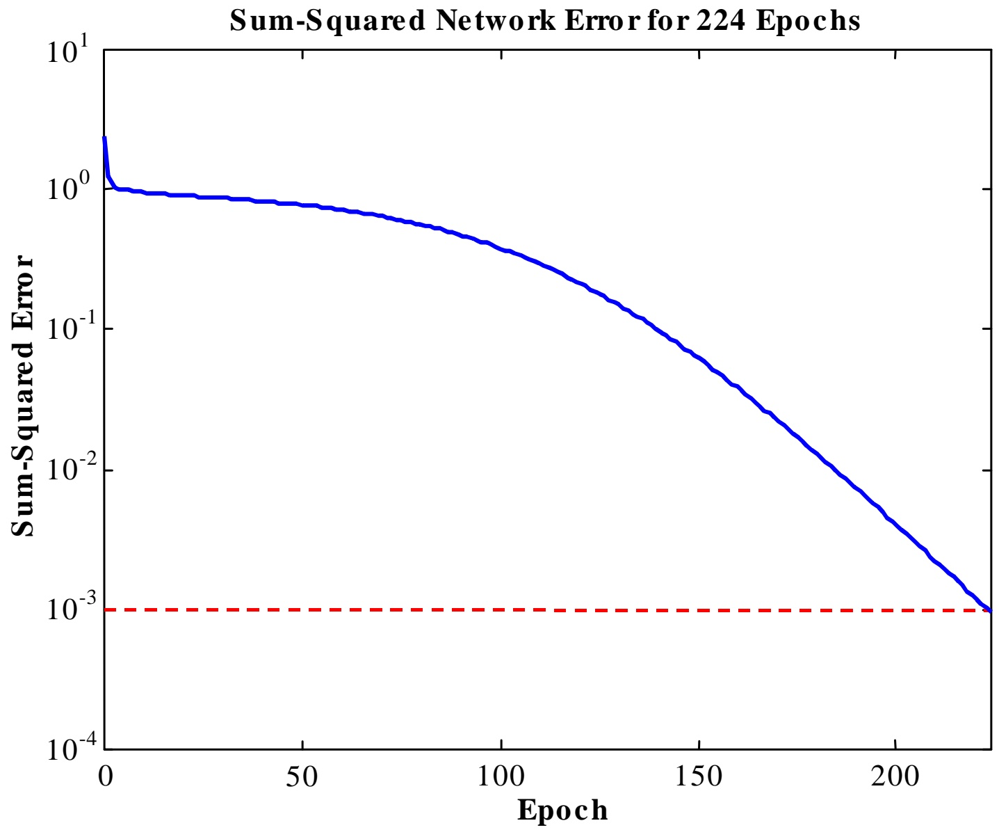

<!-- page: 45 -->

## Final results of three-layer network learning

<table><tbody><tr><td>0 1 0 1</td><td>x1</td><td rowspan="2">I n p u ts</td></tr><tr><td>0 0 1 1</td><td>x2</td></tr><tr><td>0 1 1 0</td><td colspan="2">o D y ut es d p ir u e t d</td></tr><tr><td>00.71 9 08.4 9 08.4 005.15 9 9 5</td><td colspan="2">5y poutut ctuaAl</td></tr><tr><td>- -0. 0. 0. 0.0 0 0 01 1 1 17 5 5 55 1 1 5</td><td colspan="2">E e rr o r</td></tr><tr><td>00.010</td><td colspan="2">err qsu Su osr aer om d f</td></tr></tbody></table>

<!-- page: 46 -->

## Network represented by  McCulloch -Pitts model for solving the  Exclusive-OR OR operation

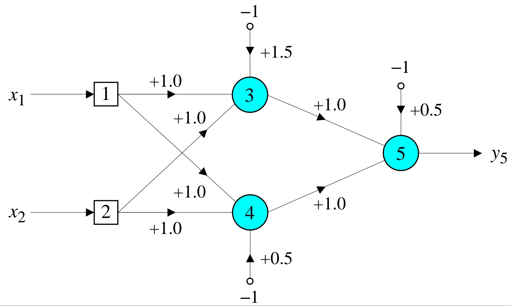

<!-- page: 47 -->

## Decision boundaries

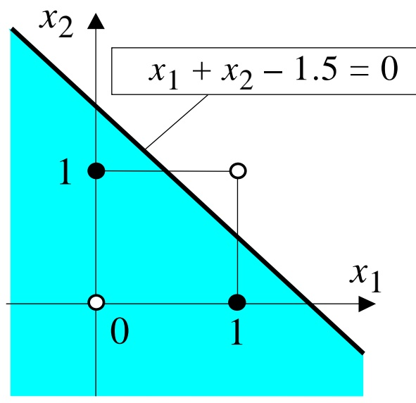

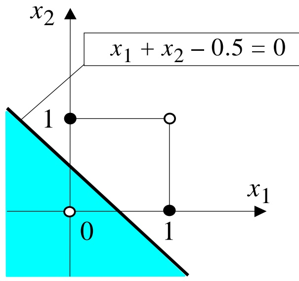

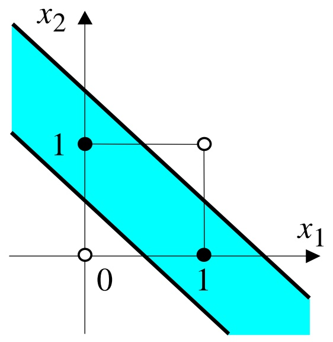

(a) Decision  boundary constructed by hidden  neuron 3 ;

(b) Decision boundary constructed by hidden  neuron 4 ;

(c) Decision boundaries constructed by the  complete three-layer network -

<!-- page: 48 -->

**Accelerated  learning  in multilayer neural networks**

■ A multilayer  network learns much faster  when the sigmoidal  activation function is represented by a  is  a **hyperbolic tangent** :

$$
Y ^ {t a n h} = \frac {2 a}{1 + e ^ {- b X}} - a
$$

where a and b are constants . .

Suitable  values for  a and b are : a = 1 . 7 1 6 and = 1 . b = 0 . 6 67

<!-- page: 49 -->

We also can accelerate training by including a We  a **momentum term**  in the delta rule : in

$$
\Delta w _ {j k} (p) = \boldsymbol {\beta} \cdot \Delta w _ {j k} (p - 1) + \boldsymbol {\alpha} \cdot y _ {j} (p) \cdot \delta_ {k} (p)
$$

where β is a positive number  is $( 0 \leq 0 \leq 1 )$ called the **momentum constant** . Typically, the momentum . constant i s set to 0 . 95 .  0 . 95 .

This equation is called  is  the **generalised delta rule** .

<!-- page: 50 -->

## Learning with momentum for operation  Exclusive-OR OR

Trainin g fo r 1 26 Ep o c h s

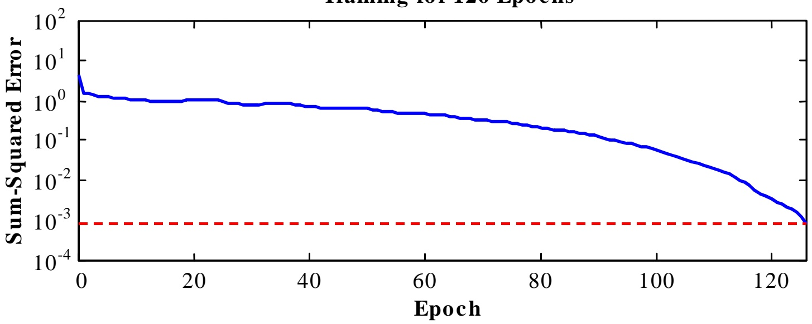

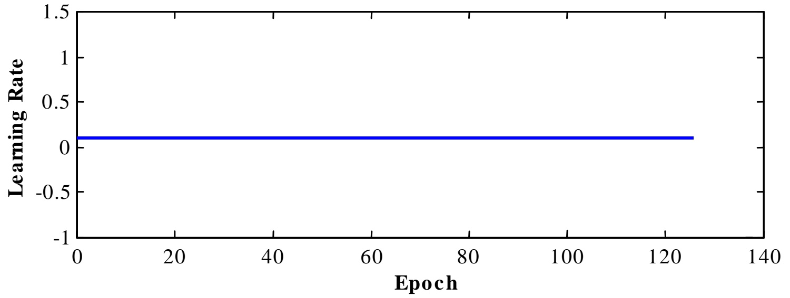

<!-- page: 51 -->

**Learning with adaptive learning rate**

To accelerate the convergence and yet avoid the To danger of instability, we can apply two heuristics :  we

## Heuristic 1  1

If the change of the sum of squared errors has the same algebraic sign for several consequent epochs , then the learning rate parameter,  α, should be increased. , .

## Heuristic 2

If the algebraic sign of the change of the sum of  of squared errors alternates for several consequent epochs, then the learning rate parameter,  α, should be decreased. .

<!-- page: 52 -->

■ Adapting the learning rate requires some changes in the back-propagation algorithm. in - .

■ If the sum of squared errors at the current epoch exceeds the previous value by more than a  a predefined  ratio (typically 1 . 04) , the learning rate parameter is decreased (typically by multiplying by 0.7) and new weights and thresholds are .7) calculated. .

■ If the error  i s les s than the previous one , the i s learning rate i s increased (typically by multiplying  i s by 1 . 05 ) . . .

<!-- page: 53 -->

## Learning with adaptive learning  rate

Tra in in g fo r 1 0 3 Ep o c h s

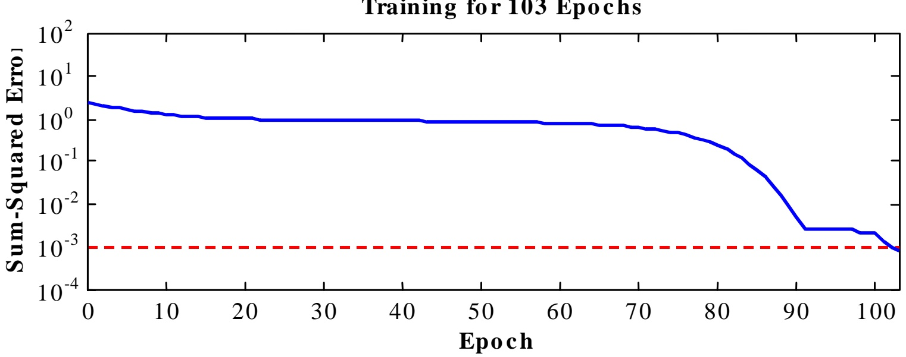

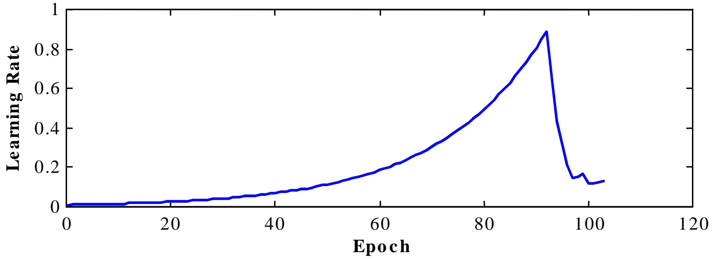

<!-- page: 54 -->

## Learning with momentum and adaptive learning rate

Tra in in g fo r 8 5 Ep o c h s

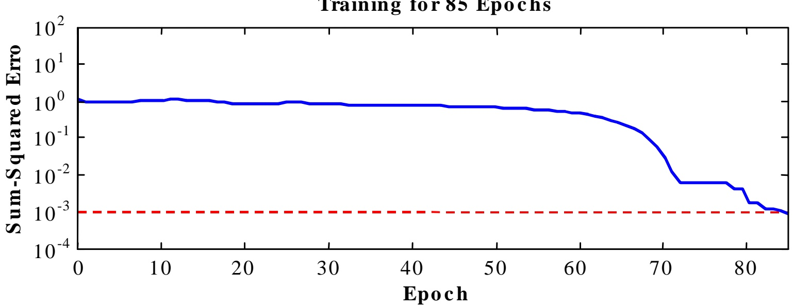

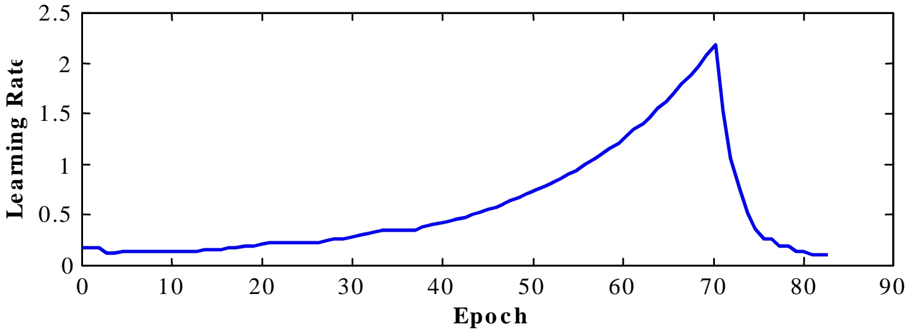

<!-- page: 55 -->

## The Hopfield  Network

■ Neural networks were designed on analogy with  on the brain. The brain’ s memory, however, works . s by association. For example, we can recognise a by .  we  a familiar face even in an unfamiliar environment  in within 1 00- 200 ms . We can also recall a - ms . We  a complete sensory experience, including sounds and scenes, when we hear only a few bars of  of music . The brain routinely associates one thing . with another. .

<!-- page: 56 -->

■ Multilayer neural networks trained with the back- - propagation algorithm are used for pattern recognition problems . However, to emulate the .  to human memory ’ s associative characteristics we s  we need a different type of network: a  a **recurrent neural network** .

■ A recurrent neural network has feedback loops from its outputs to its inputs . The presence of  to .  of such loops has a profound impact on the learning capability of the network. .

<!-- page: 57 -->

The stability of recurrent networks intrigued several researchers in the 1 9 60s and 1 970s .  in However, none was able to predict which network  to would be stable, and some researchers were pes simi stic about finding a solution at all . The  a  at problem was solved only in 1 982, when  John Hopfield  formulated the physical principle of  of storing information in a dynamically stable  in network. .

<!-- page: 58 -->

## Single-layer  n -neuron Hopfield  network

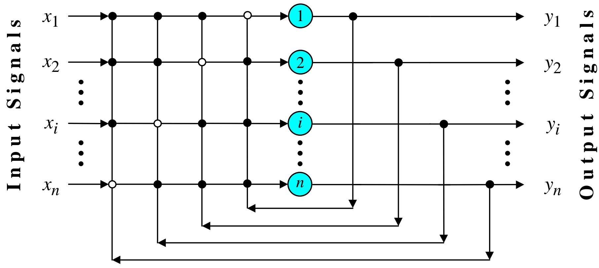

<!-- page: 59 -->

■ The Hopfield  network uses  McCulloch  and Pitts neurons  with the  sign activation function  as its computing element:

$$
Y ^ {s i g n} = \left\{ \begin{array}{l} + 1, \text {if} X > 0 \\ - 1, \text {if} X <   0 \\ Y, \text {if} X = 0 \end{array} \right.
$$

<!-- page: 60 -->

## ■ The current state of  of the Hopfield network is determined by the current outputs of all  neurons ,

$$
y _ {1}, y _ {2}, \dots , y _ {n}.
$$

Thus , for a single-layer ,  a - n-neuron network, the state can be defined by the  **state vector**  as :

$$
\mathbf {Y} = \left[ \begin{array}{c} y _ {1} \\ y _ {2} \\ \vdots \\ y _ {n} \end{array} \right]
$$

<!-- page: 61 -->

■ In the Hopfield network, synaptic weights between In neurons are usually represented in matrix form as  as follow s :

$$
\mathbf {W} = \sum_ {m = 1} ^ {M} \mathbf {Y} _ {m} \mathbf {Y} _ {m} ^ {T} - M \mathbf {I}
$$

where M is the number of states to be memorised is  to be by the network, $\frac { \pi } { 2 }$ i s the i s  n- dimensional binary - vector,  I i s $m \approx \Delta m$ identity matrix, and superscript  T denotes a matrix transpo sition . .

<!-- page: 62 -->

## Possible states for the three-neuron Hopfield network

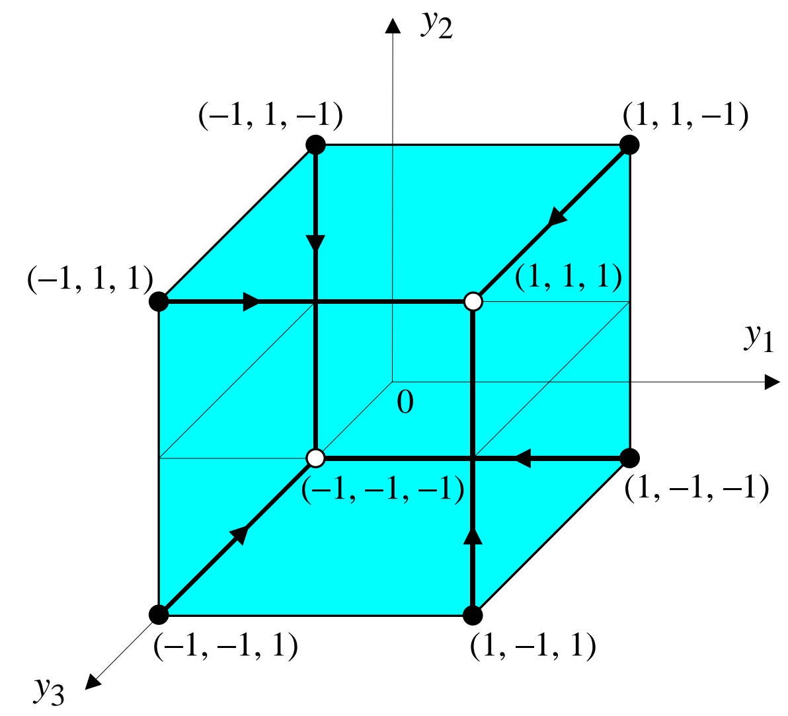

<!-- page: 63 -->

The stable state-vertex is determined by the weight - is matrix W, the current input vector ,  X, and the threshold matrix  θ . If the input vector i s partially . incorrect or incomplete, the initial state will converge into the stable state-vertex after a few iterations . - .

■ Suppose, for instance, that our network is required to memori se two oppo site state s , ( 1 , 1 , 1 ) and (  ( 1 , 1 , 1 ) − 1 , − 1 , − 1 ) . Thus ,

$$
\mathbf {Y} _ {1} = \left[ \begin{array}{c} 1 \\ 1 \\ 1 \end{array} \right] \quad \mathbf {Y} _ {2} = \left[ \begin{array}{c} - 1 \\ - 1 \\ - 1 \end{array} \right]
$$

or or

$$
\mathbf {Y} _ {1} ^ {T} = \left[ \begin{array}{c c c} 1 & 1 & 1 \end{array} \right]
$$

$$
\mathbf {Y} _ {2} ^ {T} = \left[ \begin{array}{c c c} - 1 & - 1 & - 1 \end{array} \right]
$$

where $5 9$ and $\frac { \sqrt [ 3 ] { 4 } } { 2 }$ are the three-dimensional vectors . - .

<!-- page: 64 -->

■ The 3 × 3 identity matrix  I i s

$$
\mathbf {I} = \left[ \begin{array}{c c c} 1 & 0 & 0 \\ 0 & 1 & 0 \\ 0 & 0 & 1 \end{array} \right]
$$

■ Thus, we can now determine the weight matrix as , we  as follow s :

$$
\mathbf {W} = \left[ \begin{array}{c} 1 \\ 1 \\ 1 \end{array} \right] \left[ \begin{array}{l l l} 1 & 1 & 1 \end{array} \right] + \left[ \begin{array}{c} - 1 \\ - 1 \\ - 1 \end{array} \right] \left[ \begin{array}{l l l} - 1 & - 1 & - 1 \end{array} \right] - 2 \left[ \begin{array}{c c c} 1 & 0 & 0 \\ 0 & 1 & 0 \\ 0 & 0 & 1 \end{array} \right] = \left[ \begin{array}{c c c} 0 & 2 & 2 \\ 2 & 0 & 2 \\ 2 & 2 & 0 \end{array} \right]
$$

■ Next, the network is tested by the sequence of input vectors , $\frac { 3 9 } { 4 }$ and $\Delta A \sim \Delta D$ which are equal to the output (or target) vectors $5 9$ and $\frac { \partial \varphi } { \partial \theta }$ re spectively .  .

 N eg nevitsky, Pearson E d ucation , 2002

<!-- page: 65 -->

■ First, we activate the Hopfield network by applying  we the input vector  X. Then, we calculate the actual .  we output vector  Y, and finally, we compare the result ,  we with the initial input vector  X .

$$
\mathbf {Y} _ {1} = \text {sign} \left\{\left[ \begin{array}{c c c} 0 & 2 & 2 \\ 2 & 0 & 2 \\ 2 & 2 & 0 \end{array} \right] \left[ \begin{array}{c} 1 \\ 1 \\ 1 \end{array} \right] - \left[ \begin{array}{c} 0 \\ 0 \\ 0 \end{array} \right] \right\} = \left[ \begin{array}{c} 1 \\ 1 \\ 1 \end{array} \right]
$$

$$
\mathbf {Y} _ {2} = \text {sign} \left\{\left[ \begin{array}{c c c} 0 & 2 & 2 \\ 2 & 0 & 2 \\ 2 & 2 & 0 \end{array} \right] \left[ \begin{array}{c} - 1 \\ - 1 \\ - 1 \end{array} \right] - \left[ \begin{array}{c} 0 \\ 0 \\ 0 \end{array} \right] \right\} = \left[ \begin{array}{c} - 1 \\ - 1 \\ - 1 \end{array} \right]
$$

<!-- page: 66 -->

■ The remaining six states are all unstable . However, . stable states (also called  **fundamental memories** ) are capable of attracting states that are  clo se to them.  to .

■ The fundamental memory ( 1 , 1 , 1 ) attracts unstable , 1 , 1 ) state s (  (− 1 , 1 , 1 ) , ( 1 , 1 , 1 ,  ( 1 , − 1 , 1 ) and ( 1 , 1 , 1 , 1 ) , 1 , − 1 ) . Each of 1 ) .  of these unstable states represents a single error,  a compared to the fundamental memory ( 1 , 1 , 1 ) . , 1 , 1 ) .

■ The fundamental memory ( − 1 , − 1 , − 1 ) attracts 1 ) un stable state s (  (− 1 , − 1 , 1 ) , ( 1 ,  (− 1 , 1 , − 1 ) and ( 1 , 1 ) , − 1 , − 1 ) .

■ Thus, the Hopfield  network can act as an  as an **error correction network** .

<!-- page: 67 -->

**Storage capacity of the Hopfield network**

■ **Storage capacity  is** or the largest number of  of fundamental  memories that can be stored and retrieved correctly . .

■ The maximum number of fundamental memories $M / / C D C$ that can be stored in the  n-neuron recurrent network is limited  by

$$
M _ {m a x} = 0. 1 5 n
$$

<!-- page: 68 -->

**Bidirectional  associative  memory (BAM)**

The Hopfield network represents an  an **autoassociative** type of memory  − it can retrieve a corrupted or  or incomplete memory but cannot associate this memory with another different memory . .

Human memory is  es sentially  **associative** . One thing . may remind us of another, and that of another, and so  so on. We use a chain of mental associations to recover on. We  to a lost memory . If . If we forget where we  we left an we  an umbrella, we try to recall where we last  we  we  had it, what we were doing, and who we were talking to. We we  we . We attempt to establish a chain of as sociations , and thereby to restore a lost memory . .

<!-- page: 69 -->

■ To associate one memory with another, we need a To  we  a recurrent neural network capable of accepting an  an input pattern on one set of neurons and producing  on a related , but different, output pattern on another ,  on set of neurons .

■ **Bidirectional associative memory  (BAM)** , first proposed by  Bart Kosko , is a heteroas sociative , is network. It as sociates patterns from one set, set . It  A to patterns from another set, set to  B , and vice versa. , . Like a Hopfield  network, the BAM can generalise and also produce correct outputs despite corrupted or incomplete inputs . .

<!-- page: 70 -->

## BAM operation

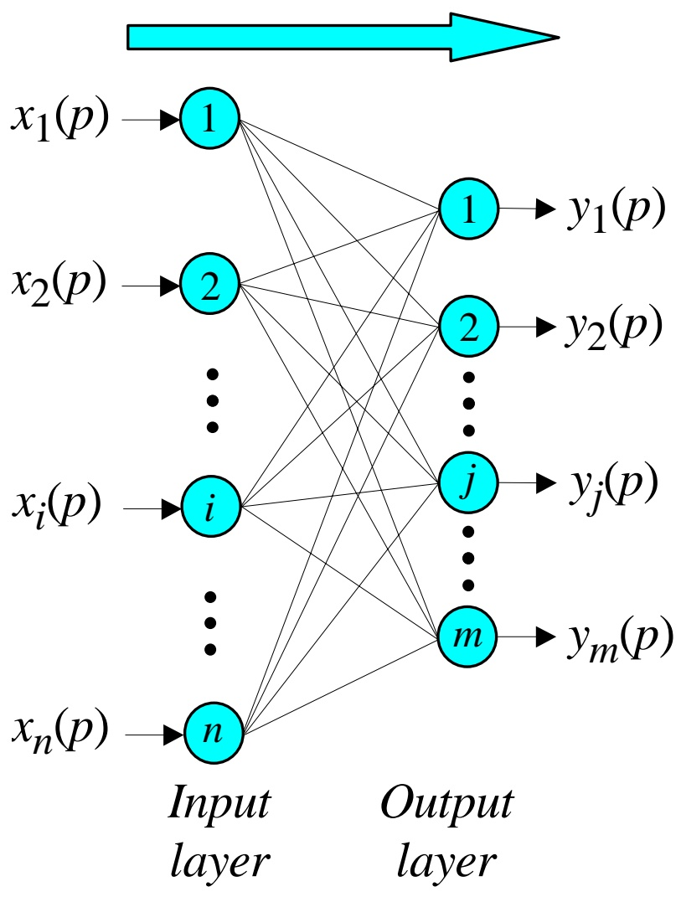

(a) Forward direction.

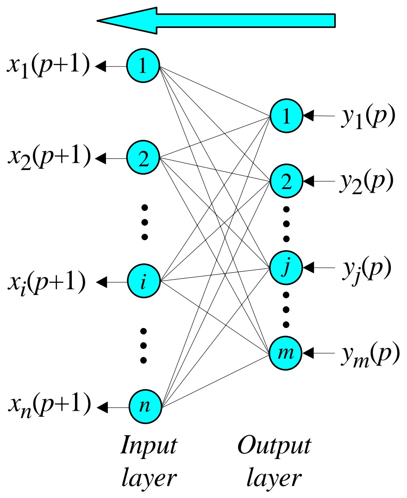

(b) B ackward direction.

<!-- page: 71 -->

The basic idea behind the BAM is to store  to pattern pairs so that when  so  n-dimensional vector - X from set  A i s presented as input, the B AM i s  as recalls  m-dimensional vector - Y from set  B, but when Y i s presented as input, the B AM recalls i s  as  X .

<!-- page: 72 -->

To develop the BAM, we need to create a To  we  a correlation matrix for each pattern pair we want to store . The correlation matrix is the matrix product .  is of the input vector  X, and the transpose of the output vector  YT. The B AM weight matrix is the .  is sum of all correlation matrices , that i s ,

$$
\mathbf {W} = \sum_ {m = 1} ^ {M} \mathbf {X} _ {m} \mathbf {Y} _ {m} ^ {T}
$$

where M is the number of pattern pairs to be stored is  to be in the B AM . in .

<!-- page: 73 -->

**Stability and storage capacity of the BAM**

The BAM is  **unconditionally stable** . This means that any set of associations can be learned without risk of in stability . .

■ The maximum number of associations to be stored  to be in the BAM should not exceed the number of in  of neurons  in the smaller layer. in .

■ The more serious problem with the BAM  is **incorrect convergence** . The BAM may not . always produce the clo sest as sociation . In fact, a . In  a stable as sociation may be only slightly related to the initial input vector . .
