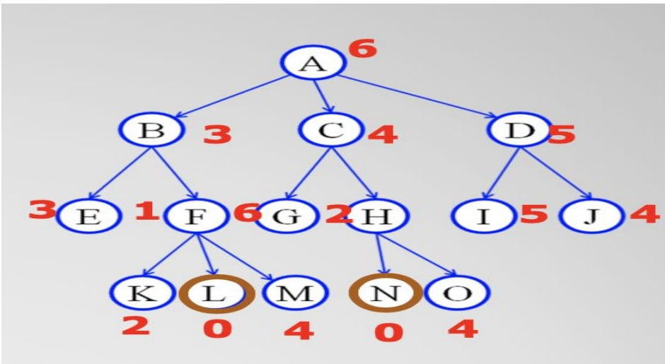
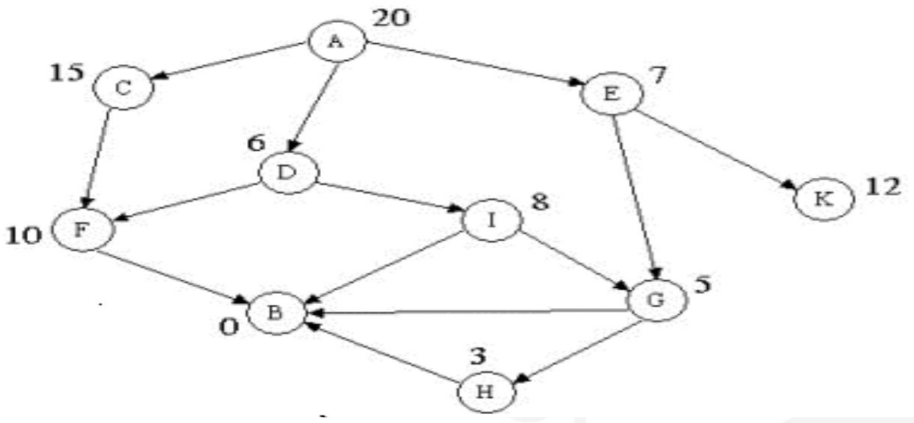
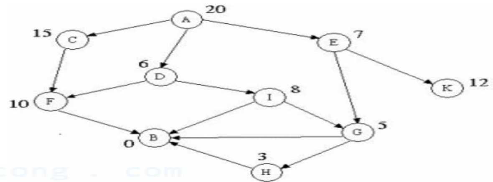
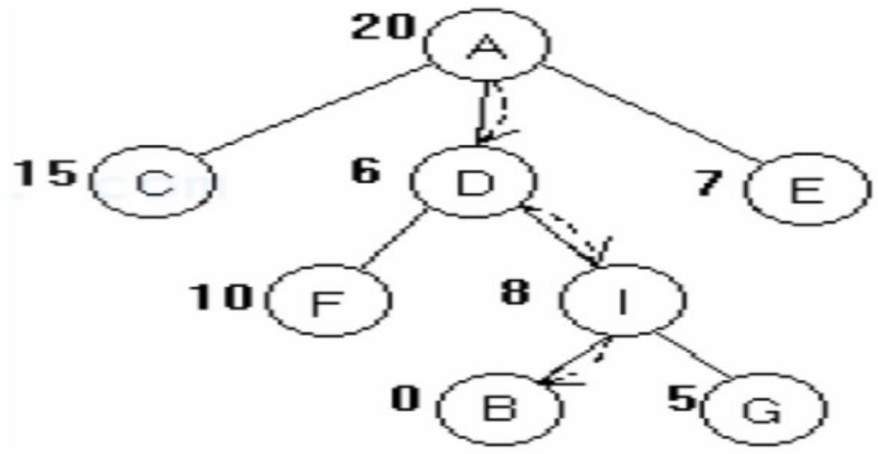
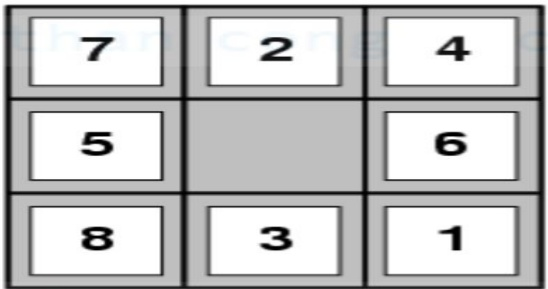
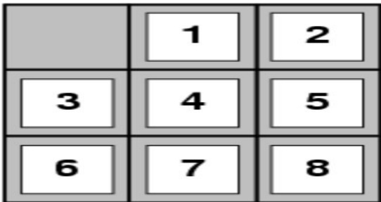
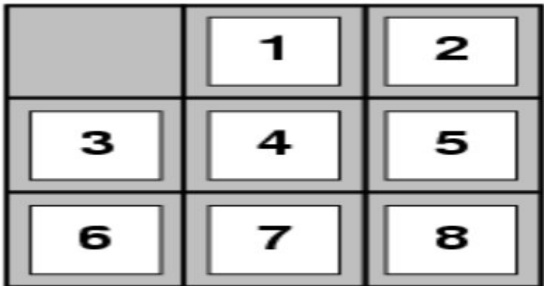
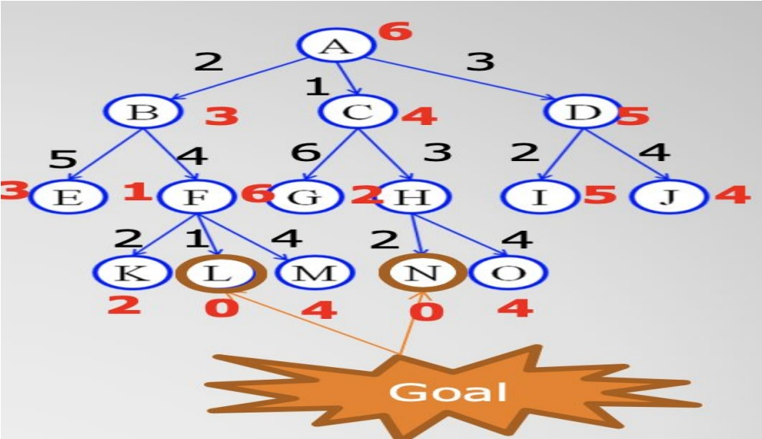

<!-- page: 1 -->

## BACH KHOA

## TRÍ TUỆ NHÂN TẠO


Khoa Công Nghệ Thông Tin
TS. Nguyễn Văn Hiệu

<!-- page: 2 -->

## TRÍ TƯỆ NHÂN TẠO

## BACH KHOA

Chương 3: Các phương pháp
tìm kiểm có sử dụng thông tin

<!-- page: 3 -->

## Nội dung

\- Giới thiệu

\- Tìm kiểm tham lam tốt nhất

\- Tìm kiểm leo đôi

\- Tìm kiểm A\*

\- Bài tập

<!-- page: 4 -->

## Giới thiệu

\- Các phương pháp tìm kiếm mù kém hiệu quả trong nhiều trường hợp

\- Đề khắc phục, chương này nghiên cứu sử dụng miền kiến thức:

○ Tìm kiểm đang hướng tới trạng thái đích hay không ?

○ Sử dụng hàm đánh giá đề đo khoảng cách đến trạng thái đích

\- Kỹ thuật tìm kiếm sử dụng hàm đánh giá gọi là tìm kiếm kinh nghiệm

\- Các giai đoạn cơ bản của kỹ thuật tìm kinh nghiệm

\- Tìm biểu diễn thích hợp mô tả các trạng thái và các toán tử.

○ Xây dựng hàm đánh giá,

○ Thiết kế chiến lược chọn trạng thái để phát triển ở mỗi bước

<!-- page: 5 -->

## Giới thiệu

\- Trong tìm kiếm kinh nghiệm hàm đánh giá có vai trò then chất

\- Việc xây dựng hàm đánh giá đúng, thì việc tìm kiếm sẽ hiệu quả, không thì ngược lại

\- Việc xây dựng hàm đánh giá tùy thuộc vào vấn đề cần giải

\- Ví dụ với bài toán tìm đường đi, thì hàm đánh giá có thể:

\- sử dụng đường chim bay từ tp này đến tp khác

\- sử dụng khoảng cách thực đi giữa các thành phố

\- sử dụng cả khoảng cách thức và trọng số bổ sung trên đường đi

\- Việc xây dựng hàm đánh giá tùy thuộc vào vấn đề cần giải

<!-- page: 6 -->

## Giới thiệu

\- Các kỹ thuật tìm kiếm kinh được dạy

○ Tìm kiểm ăn tham tốt nhất đầu tiên (Greedy best-first search);

○ Thuật toán leo đổi (Hill-climbing search);

○ Tìm kiểm A\* (A\* search)

<!-- page: 7 -->

## Tìm kiểm tham lam tốt nhất đầu tiên

CH KHOA

<!-- page: 8 -->

## Tìm kiểm tham lam tốt nhất đầu tiên

\- Ý tưởng: sử dụng hàm đánh giá kết hợp với tìm kiếm theo chiều rộng

\- Hàm đánh giá h(u) ước lượng đến trạng thái kết thúc

\- Tìm kiểm tham lam các đỉnh không được phát sinh lần lượt như thuật toán tìm kiếm theo chiều rộng, mà được phát sinh dựa vào hàm đánh giá

\- Cài đặt: dùng hàng đợi có sự ưu tiên dựa vào hàm đánh giá.

<!-- page: 9 -->

## Tìm kiểm tham lam tốt nhất đầu tiên

\- Ý tưởng: sử dụng hàm đánh giá kết hợp với tìm kiếm theo chiều rộng

\- Thuật toán tìm kiếm tham lam tốt nhất đầu tiên được mô tả bồi thủ tục:

```python
function GREEDY-BEST-FIRST-SEARCH(initialState, goalTest)
    returns SUCCESS or FAILURE : /* Cost f(n) = h(n) */
    frontier = Heap.new(initialState)
    explored = Set.new()
    while not frontier.isEmpty():
        state = frontier.deleteMin()
        explored.add(state)
        if goalTest(state):
            return SUCCESS(state)
        for neighbor in state.neighbors():
            if neighbor not in frontier ∪ explored:
                frontier.insert(neighbor)
        else if neighbor in frontier:
            frontier.decreaseKey(neighbor)
    return FAILURE
```

<!-- page: 10 -->

## Tìm kiểm tham lam tốt nhất đầu tiên

\- Hãy làm rõ quá trình biến đổi của danh sách frontier ?

Frontier = {A(6)}

Frontier = {B(3), C(4), D(5)}

Frontier = {F(1), E(3), C(4), D(5)}

Frontier = {L(0),K(2),M(4),E(3), C(4), D(5)}}

Frontier = ....

\- Nhận xét: So với Uniform cost search thì Greedy search tiết kiệm về mặt không gian hơn.



function GREEDY-BEST-FIRST-SEARCH(initialState, goalTest)
    returns SUCCESS or FAILURE : /\* Cost f(n) = h(n) \*/

frontier = Heap.new(initialState)
explored = Set.new()

while not frontier.isEmpty():
    state = frontier.deleteMin()
    explored.add(state)

if goalTest(state):
    return SUCCESS(state)

for neighbor in state.neighbors():
    if neighbor not in frontier ∪ explored:
        frontier.insert(neighbor)
    else if neighbor in frontier:
        frontier.decreaseKey(neighbor)

<!-- page: 11 -->

## Tìm kiểm tham lam tốt nhất đầu tiên

\- Đánh giá thuật toán tham lam

○ Tính đủ ?

■ không (có thể rơi vào vòng lặp luẩn quản)

○ Thời gian ?:

KHOA

■ 0(b^m)

■ Rất xấu nếu m >> d

○ Không gian?:

■ 0(b^m): lưu trữ tất cả các đình

○ Tính tối ưu ?:

■ không

<!-- page: 12 -->

## Tìm kiểm tham lam tốt nhất đầu tiên

\- Hãy xây dựng quá trình biến đổi frontier từ trạng thái A đến trạng thái B



<!-- page: 13 -->

## Tìm kiểm leo đồi (Hill-climbing search )

CH KHOA

<!-- page: 14 -->

## Tìm kiểm leo đồi

\- Ý tưởng: tìm kiếm theo chiều sâu + hàm đánh giá

\- Hàm đánh giá h(u) ước lượng đến trạng thái kết thúc

\- Tìm kiểm leo đổi khác với kiểm theo chiều sâu khi phát triển đình u, thì chọn trong số các đình con của u đình nào tiềm năng nhất thì phát triển

\- Cài đặt: sử dụng ngăn xếp có ưu tiên

<!-- page: 15 -->

## Tìm kiểm leo đồi

\- Ý tưởng: tìm kiếm
theo chiều sâu kết
hợp với hàm đánh
giá



Xét không gian trạng thái sau



<!-- page: 16 -->

## Tìm kiểm A \*

<!-- page: 17 -->

## Tìm kiểm A \*

\- Ý tưởng: sử dụng hàm Heuristic chấp nhận được và kỹ thuật tìm kiếm theo chiều rộng

\- Hàm Heuristic chấp nhận được

○ h(u) chấp nhận được, nếu h(u) <= h\*(u), h\*(u) độ dài thực tế từ trạng thái u đến trạng thái đích

○ h(u) không bao giờ đánh giá quá cao so với thực tế

\- Đề tăng hiệu quả tìm kiếm

○ f(u) = g(u) + h(u), g(u) độ dài từ trạng thái đầu đến trạng thái u

○ f(u) độ dài lượng giá từ trạng thái đầu tới đích qua trạng thái u

<!-- page: 18 -->

## Tìm kiểm A \*

\- Ví dụ hàm Heuristic chấp nhận được của bài toán 8 số

\- h1(u) là số lượng ô bị sai

\- h2(u) là tổng số lượng khoảng cách theo Manhattan Metric (số lượng ô từ ô hiện tại đến vị trí mong muốn)



Start State



Goal State

\- $h1(u) = ?$ và $h2(u) = ?$

<!-- page: 19 -->

## Tìm kiểm A \*

\- Ví dụ hàm Heuristic chấp nhận được của bài toán 8 số

| 7 | 2 | 4 |
| --- | --- | --- |
| 5 |  | 6 |
| 8 | 3 | 1 |

Start State



Goal State

\- h1(u) = 8

\- $h2(u) = 3 + 1 + 2 + 2 + 2 + 3 + 3 + 2 = 18$

\- Nếu h2(u)>=h1(u) với mọi u ( cả hai đều chấp nhận được)

\- h2(u) mạnh hơn h1(u) có nghĩa h2(u) tốt hơn h1(u)

<!-- page: 20 -->

## Tìm kiểm A \*

\- Ý tưởng: sử dụng hàm Heuristic chấp nhận được và kỹ thuật tìm kiếm theo chiều rộng

\- Thuật toán A\* được mô tả bồi thủ tục:

```python
function A-STAR-SEARCH(initialState, goalTest)
    returns SUCCESS or FAILURE : /* Cost f(n) = g(n) + h(n) */

    frontier = Heap.new(initialState)
    explored = Set.new()

    while not frontier.isEmpty():
        state = frontier.deleteMin()
        explored.add(state)

        if goalTest(state):
            return SUCCESS(state)

        for neighbor in state.neighbors():
            if neighbor not in frontier ∪ explored:
                frontier.insert(neighbor)
        else if neighbor in frontier:
            frontier.decreaseKey(neighbor)

    return FAILURE
```

<!-- page: 21 -->

```txt
frontier = {B(2+3), C(1+4), D(3+5)}
```

## Tìm kiểm A\*

\- Hãy làm rõ quá trình biến đổi của danh sách frontier ?

```hcl
frontier = {A(0+6)}
```

```txt
frontier = {E(7+3),
F(6+1),C(1+4),D(3+5)}
```

```txt
frontier = {E(10),
F(8),G(7+6),H(4+2),D(8)}
```

```txt
frontier = {E(10),
F(8),G(7+6),N(6+0),O(8+4),D(8)}
```

```python
frontier = ...
```



function A-STAR-SEARCH(initialState, goalTest)
    returns SUCCESS or FAILURE : /\* Cost f(n) = g(n) + h(n) \*/

frontier = Heap.new(initialState)
explored = Set.new()

while not frontier.isEmpty():
    state = frontier.deleteMin()
    explored.add(state)

if goalTest(state):
    return SUCCESS(state)

for neighbor in state.neighbors():
    if neighbor not in frontier ∪ explored:
        frontier.insert(neighbor)
    else if neighbor in frontier:
        frontier.decreaseKey(neighbor)

return FAILURE

<!-- page: 22 -->


## Bài tập 1

\- Xây dựng chương trình cài đặt kỹ thuật tìm kiếm tham lam tốt nhất đầu tiên và kỹ thuật tìm kiếm A\*

BACH KHOA

<!-- page: 23 -->

## Bài tập 2

\- Mỗi sinh viên chọn 01 kỹ thuật tìm kiếm bên dưới để nghiên cứu để hiểu kỹ thuật tìm kiếm đã chọn:

\- Tìm kiểm nhánh và cận (Branch and Bound)

○ Tìm kiểm cục bộ (Local search algorithms)

\- Tìm kiểm mô phỏng luyện kim (Simulated annealing search)

○ Thuật toán gen (Genetic algorithms)
