<!-- page: 1 -->

## BACH KHOA

## TRÍ TUỆ NHÂN TẠO

Khoa Công Nghệ Thông Tin
TS. Nguyễn Văn Hiệu

<!-- page: 2 -->

## TRÍ TƯỆ NHÂN TẠO

## BACH KHOA

Chương 5: Hồi quy tuyến tính

<!-- page: 3 -->

## Nội dung

\- Giới thiệu

\- Hồi quy tuyến tính

<!-- page: 4 -->

## Giới thiệu

Học vẹt: Nhớ và Làm lại

Học hiểu: Quan sát và Khái quát

Học làm gì:

○ Đề nhận biết

○ Đế xây dựng

○ Đế thông minh hơn

## BACH KHOA

<!-- page: 5 -->

## Giới thiệu

\- Các bước xử lý của khoa học dữ liệu

Static Data.

Data cleaning

Domain expertise

Feature/variable engineering

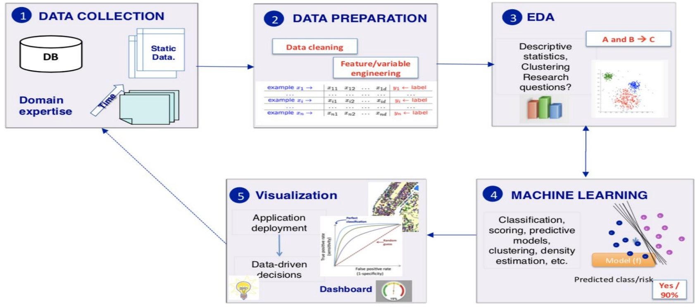

## 5 Visualization

Application deployment

Data-driven decisions

Dashboard

## 3 EDA

Descriptive statistics, Clustering Research questions?

## 4 MACHINE LEARNING

Classification, scoring, predictive models, clustering, density estimation, etc.

<!-- page: 6 -->

## Giới thiệu

Học có giám sát ( supervised learning)

○ Học dựa trên ví dụ: vào đầu vào và đầu ra của quan sát

○ Xi, Yi đều có sẵn trong tập huấn luyện

○ Mục tiêu: Khái quát hoá dữ liệu huấn luyện

\- Học không giám sát

○ Học chỉ dự vào đầu vào của quan sát, không có có biến đầu ra

○ Chỉ có Xi, mà không có Yi trong tập huấn luyện

○ Mục đích: Phát hiện mối quan hệ giữa các quan sát

\- Ngoài ra còn có học bán giám sát, học tăng cường, học theo gọi ý

<!-- page: 7 -->

## Giới thiệu

## Học có giám sát

\- Hôi quy (Regresion)

\- Biến đầu ra là giá trị liên tục trên R

• Dự đoán giá bán căn chung cư với diện tích 50m^2

\- Phân lóp(Classification)

\- Biến đầu ra là giá trị rời rạc

• Dự đoán một email, là spam hay không

<!-- page: 8 -->

## Giới thiệu

## Học không giám sát

\- Phân cụm (clustering)

• Chia dữ liệu vào thành các nhóm, mỗi nhóm có đặc tính chung

\- Phân nhóm người dùng trên mạng xã hội

\- Giảm chiều dữ liệu

\- Tạo các biến mới từ các dữ liệu ban đầu sao cho bảo tồn các thành phần quan trọng

<!-- page: 9 -->

## Giới thiệu

<!-- page: 10 -->

## Mô hình tuyến tính

\- Hồi quy tuyến tính:

\- Phương pháp học máy có giám sát, dự đoán kết quả đầu ra dạng số

\- Phương pháp này được tổng quát hoá cho nhiều mô hình học máy

\- Phân loại tuyến tính

<!-- page: 11 -->

## Học có giám sát

Training data: "examples" x with "labels" y.

$$
(x _ {1}, y _ {1}), \dots , (x _ {n}, y _ {n}) / x _ {i} \in \mathbb {R} ^ {d}
$$

• Regression: y is a real value,  $y \in R$

$$
f: \mathbb {R} ^ {d} \longrightarrow \mathbb {R}
$$

$f$ is called a regressor.

• Classification: y is discrete. To simplify,  $y \in \{-1, +1\}$

$$
f: \mathbb {R} ^ {d} \longrightarrow \{- 1, + 1 \}
$$

f is called a binary classifier.

<!-- page: 12 -->

## Hồi quy tuyến tính

Given: Training data: $(x_{1}, y_{1}), \ldots, (x_{n}, y_{n}) / x_{i} \in \mathbb{R}^{d}$ and $y_{i} \in \mathbb{R}$

| example $x_{1} \rightarrow$ | $x_{11}$ | $x_{12}$ | ... | $x_{1d}$ | $y_{1} \leftarrow \text{label}$ |
| --- | --- | --- | --- | --- | --- |
| ... | ... | ... | ... | ... | ... |
| example $x_{i} \rightarrow$ | $x_{i1}$ | $x_{i2}$ | ... | $x_{id}$ | $y_{i} \leftarrow \text{label}$ |
| ... | ... | ... | ... | ... | ... |
| example $x_{n} \rightarrow$ | $x_{n1}$ | $x_{n2}$ | ... | $x_{nd}$ | $y_{n} \leftarrow \text{label}$ |

Task: Learn a regression function:

$$
f: \mathbb {R} ^ {d} \longrightarrow \mathbb {R}
$$

$$
f (x) = y
$$

Linear Regression: A regression model is said to be linear if it is represented by a linear function.

<!-- page: 13 -->

## Hồi quy tuyến tính

$$
Y = f (X) = B o + B 1 ^ {*} X
$$

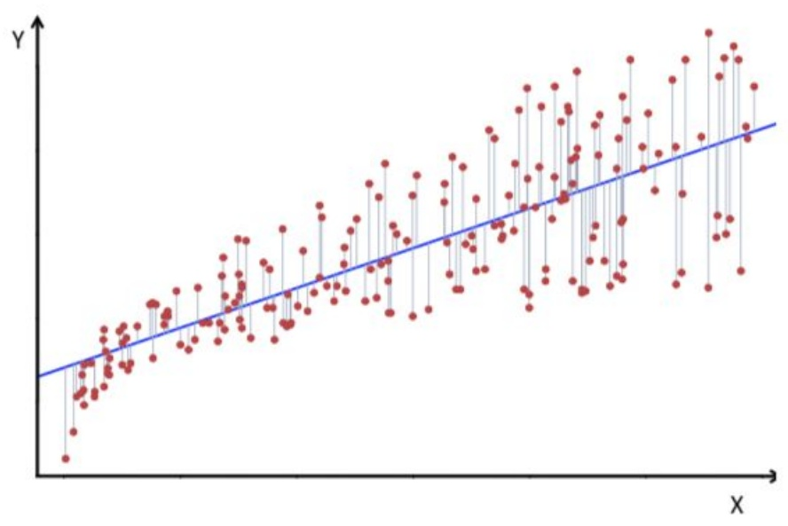

$d = 1$ , line in $\mathbb{R}^2$ Hồi quy đơn biến

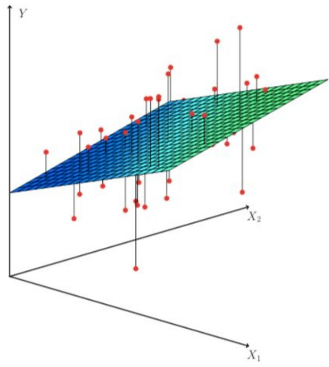

$$
\mathbb {R} ^ {3}
$$

<!-- page: 14 -->

## Hồi quy tuyến tính

Linear Regression Model:

$$
f (x) = \beta_ {0} + \sum_ {j = 1} ^ {d} \beta_ {j} x _ {j} \quad \text {with} \quad \beta_ {j} \in \mathbb {R}, \quad j \in \{1, \dots , d \}
$$

β 's are called parameters or coefficients or weights.

Learning the linear model → learning the β's

## Estimation with Least squares:

Use least square loss: $\ell\text{oss}(y_i, f(x_i)) = (y_i - f(x_i))^2$

We want to minimize the loss over all examples, that is minimize the risk or cost function R:

$$
R = \frac {1}{2 n} \sum_ {i = 1} ^ {n} (y _ {i} - f (x _ {i})) ^ {2}
$$

<!-- page: 15 -->

## Hồi quy tuyến tính đơn biến

A simple case with one feature (d = 1):

$$
f (x) = \beta_ {0} + \beta_ {1} x
$$

We want to minimize:

$$
R = \frac {1}{2 n} \sum_ {i = 1} ^ {n} (y _ {i} - f (x _ {i})) ^ {2}
$$

$$
R (\beta) = \frac {1}{2 n} \sum_ {i = 1} ^ {n} (y _ {i} - \beta_ {0} - \beta_ {1} x _ {i}) ^ {2}
$$

Find $\beta_0$ and $\beta_{1}$ that minimize:

$$
R (\beta) = \frac {1}{2 n} \sum_ {i = 1} ^ {n} (y _ {i} - \beta_ {0} - \beta_ {1} x _ {i}) ^ {2}
$$

<!-- page: 16 -->

## Hòi quy tuyến tính đơn biến

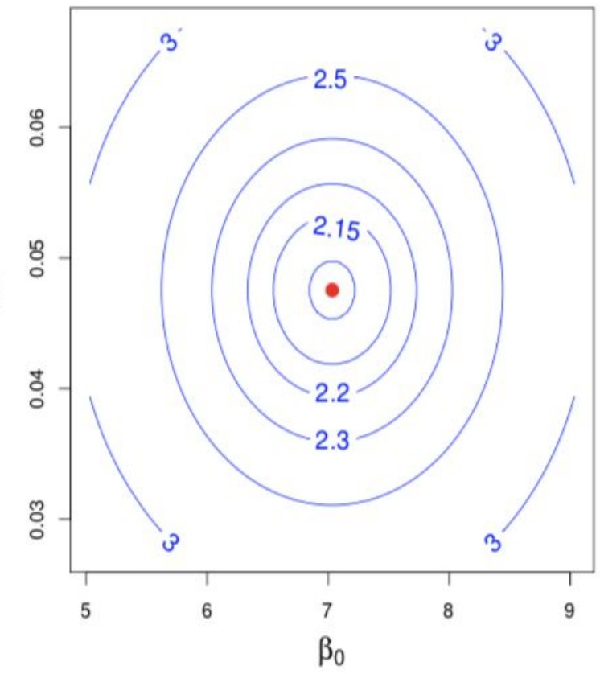

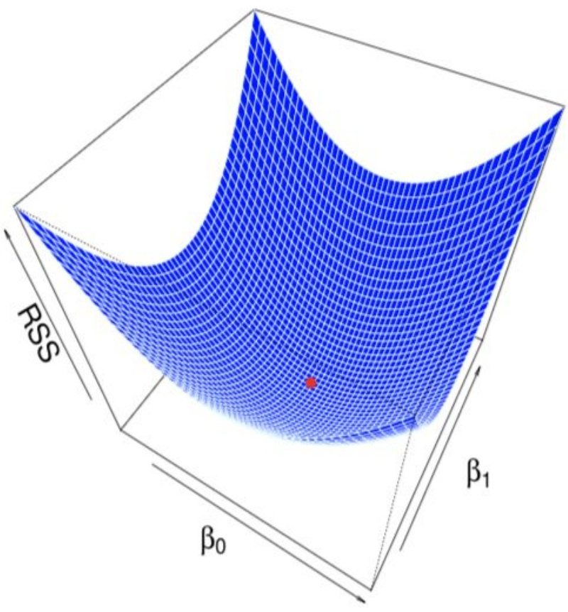

<!-- page: 17 -->

## Hòi quy tuyến tính đa biến

Find $\beta_0$ and $\beta_1$ so that:

$$
a r g m i n _ {\beta} (\frac {1}{2 n} \sum_ {i = 1} ^ {n} (y _ {i} - \beta_ {0} - \beta_ {1} x _ {i}) ^ {2})
$$

Minimize: $R(\beta_0, \beta_1)$, that is: $\frac{\partial R}{\partial \beta_0} = 0$ $\frac{\partial R}{\partial \beta_1} = 0$

$$
\frac {\partial R}{\partial \beta_ {0}} = 2 \times \frac {1}{2 n} \sum_ {i = 1} ^ {n} (y _ {i} - \beta_ {0} - \beta_ {1} x _ {i}) \times \frac {\partial}{\partial \beta_ {0}} (y _ {i} - \beta_ {0} - \beta_ {1} x _ {i})
$$

$$
\frac {\partial R}{\partial \beta_ {0}} = \frac {1}{n} \sum_ {i = 1} ^ {n} (y _ {i} - \beta_ {0} - \beta_ {1} x _ {i}) \times (- 1) = 0
$$

$$
\beta_ {0} = \frac {1}{n} \sum_ {i = 1} ^ {n} y _ {i} - \beta_ {1} \frac {1}{n} \sum_ {i = 1} ^ {n} x _ {i}
$$

<!-- page: 18 -->

## Hòi quy tuyến tính đa biến

$$
\frac {\partial R}{\partial \beta_ {1}} = 2 \times \frac {1}{2 n} \sum_ {i = 1} ^ {n} (y _ {i} - \beta_ {0} - \beta_ {1} x _ {i}) \times \frac {\partial}{\partial \beta_ {1}} (y _ {i} - \beta_ {0} - \beta_ {1} x _ {i})
$$

$$
\frac {\partial R}{\partial \beta_ {1}} = \frac {1}{n} \sum_ {i = 1} ^ {n} (y _ {i} - \beta_ {0} - \beta_ {1} x _ {i}) \times (- x _ {i}) = 0
$$

$$
\beta_ {1} \sum_ {i = 1} ^ {n} x _ {i} ^ {2} = \sum_ {i = 1} ^ {n} x _ {i} y _ {i} - \sum_ {i = 1} ^ {n} \beta_ {0} x _ {i}
$$

Plugging $\beta_0$ in $\beta_{1}$:

$$
\beta_ {1} = \frac {\sum_ {i = 1} ^ {n} y _ {i} x _ {i} - \frac {1}{n} \sum_ {i = 1} ^ {n} y _ {i} \sum_ {i = 1} ^ {n} x _ {i}}{\sum_ {i = 1} ^ {n} x _ {i} ^ {2} - \frac {1}{n} \sum_ {i = 1} ^ {n} x _ {i} \sum x _ {i}}
$$

<!-- page: 19 -->

## Hòi quy tuyến tính đa biến

With more than one feature:

$$
f (x) = \beta_ {0} + \sum_ {j = 1} ^ {d} \beta_ {j} x _ {j}
$$

Find the $\beta_{j}$ that minimize:

$$
R = \frac {1}{2 n} \sum_ {i = 1} ^ {n} (y _ {i} - \beta_ {0} - \sum_ {j = 1} ^ {d} \beta_ {j} x _ {i j})) ^ {2}
$$

Let's write it more elegantly with matrices!

<!-- page: 20 -->

## Ma trận biểu diễn

Let $X$ be an $n \times (d + 1)$ matrix where each row starts with a 1 followed by a feature vector.

Let y be the label vector of the training set.

Let $\beta$ be the vector of weights (that we want to estimate!).

$$
X := \left( \begin{array}{c c c c c c} 1 & x _ {1 1} & \dots & x _ {1 j} & \dots & x _ {1 d} \\ \vdots & \vdots & \vdots & \vdots & \vdots & \vdots \\ 1 & x _ {i 1} & \dots & x _ {i j} & \dots & x _ {i d} \\ \vdots & \vdots & \vdots & \vdots & \vdots & \vdots \\ 1 & x _ {n 1} & \dots & x _ {n j} & \dots & x _ {n d} \end{array} \right)
$$

$$
y := \left( \begin{array}{c} y _ {1} \\ \vdots \\ y _ {i} \\ \vdots \\ y _ {n} \end{array} \right)
$$

$$
\beta := \left( \begin{array}{c} \beta_ {0} \\ \vdots \\ \beta_ {j} \\ \vdots \\ \beta_ {d} \end{array} \right)
$$

<!-- page: 21 -->

## Phương pháp bình phương tối thiểu

We want to find  $(d+1)$   $\beta$ 's that minimize R. We write R:

$$
R (\beta) = \frac {1}{2 n} | | (y - X \beta) | | ^ {2}
$$

$$
R (\beta) = \frac {1}{2 n} (y - X \beta) ^ {T} (y - X \beta)
$$

$$
\frac {\partial R}{\partial \beta} = - \frac {1}{n} X ^ {T} (y - X \beta)
$$

We have that:

$$
\frac {\partial^ {2} R}{\partial \beta} = - \frac {1}{n} X ^ {T} X
$$

is positive definite which ensures that  $\beta$  is a minimum. We solve:

$$
X ^ {T} (y - X \beta) = 0
$$

The unique solution is:  $\beta = (X^{T}X)^{-1}X^{T}y$

<!-- page: 22 -->

## Phương pháp trượt đốc

\- Gradient descent

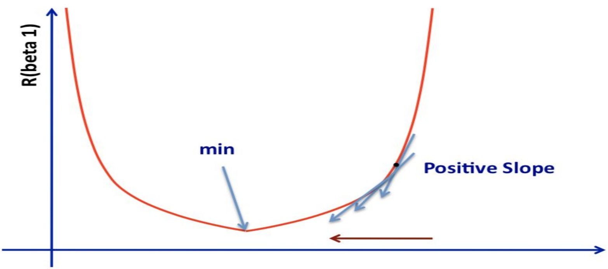

<!-- page: 23 -->

## Phương pháp trượt đốc

Repeat until convergence:

Update simultaneously all $\beta_{j}$ for ($j = 0$ and $j = 1$)

$$
\beta_ {0} := \beta_ {0} - \alpha \frac {\partial}{\partial \beta_ {0}} R (\beta_ {0}, \beta_ {1})
$$

$$
\beta_ {1} := \beta_ {1} - \alpha \frac {\partial}{\partial \beta_ {1}} R (\beta_ {0}, \beta_ {1})
$$

α is a learning rate.

<!-- page: 24 -->

## Phương pháp trượt đốc

In the linear case:

$$
\frac {\partial R}{\partial \beta_ {0}} = \frac {1}{n} \sum_ {i = 1} ^ {n} (y _ {i} - \beta_ {0} - \beta_ {1} x _ {i}) \times (- 1) = 0
$$

$$
\frac {\partial R}{\partial \beta_ {1}} = \frac {1}{n} \sum_ {i = 1} ^ {n} (y _ {i} - \beta_ {0} - \beta_ {1} x _ {i}) \times (- x _ {i})
$$

Repeat until convergence:

Update simultaneously all  $\beta_{j}$  for (j = 0 and j = 1)

$$
\beta_ {0} := \beta_ {0} - \alpha \frac {1}{n} \sum_ {i = 1} ^ {n} (\beta_ {0} + \beta_ {1} x _ {i} - y _ {i})
$$

$$
\beta_ {1} := \beta_ {1} - \alpha \frac {1}{n} \sum_ {i = 1} ^ {n} (\beta_ {0} + \beta_ {1} x _ {i} - y _ {i}) (x _ {i})
$$

<!-- page: 25 -->

## Đánh giá

\- Phân tích phương pháp: Bình phương tối thiểu

\- Không cần tham số học và số bước lặp

\- Chỉ hoạt động được khi XTX có det(XTX) khác 0

\- Sẽ chậm nếu d lớn: 0(d^3)

\- Phân tích phương pháp: Trượt đốc

\- Hiệu quả với số chiều lớn ( d lón)

\- Phải chọn số bước lặp

\- Phải chọn tham số học

<!-- page: 26 -->

## Đánh giá

• Xem xét tham số học

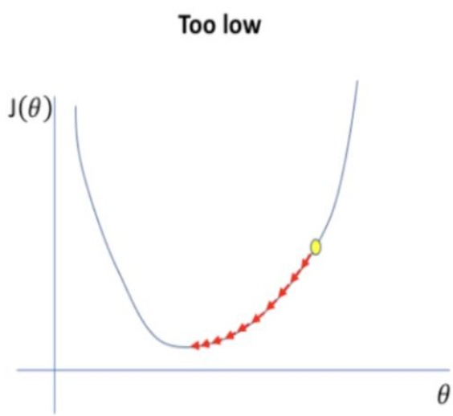

A small learning rate requires many updates before reaching the minimum point

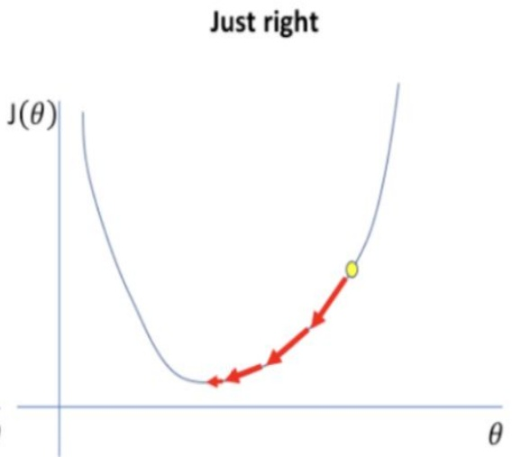

The optimal learning rate swiftly reaches the minimum point

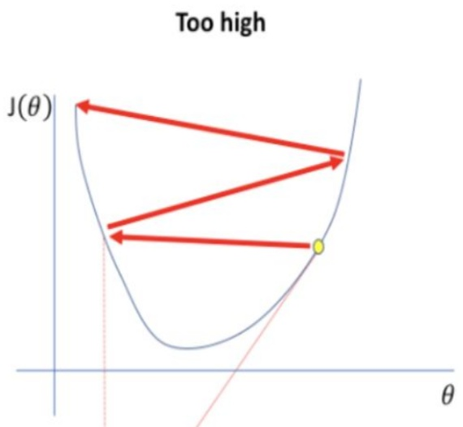

Too large of a learning rate causes drastic updates which lead to divergent behaviors

<!-- page: 27 -->

## Đánh giá

• Xem xét tham số học

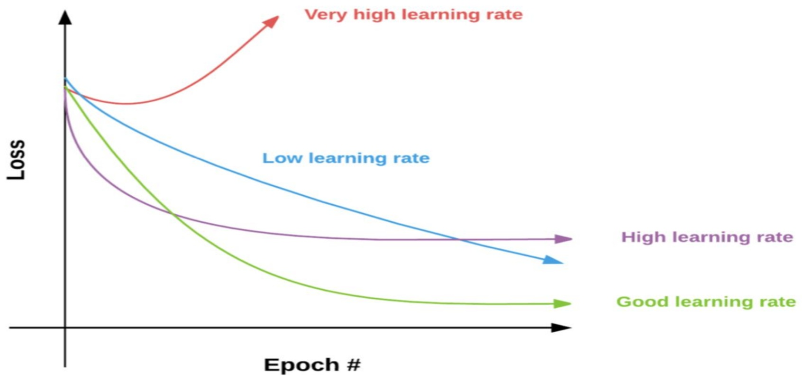

<!-- page: 28 -->

## Demo

| Diện tích | Giá bán |
| --- | --- |
| 30 | 448.524 |
| 32.4138 | 509.248 |
| 34.8276, | 535.104 |
| ... | ... |

KHOA

Giá nhà cho 91m^2 là : [1375.19238926]

<!-- page: 29 -->

## Demo

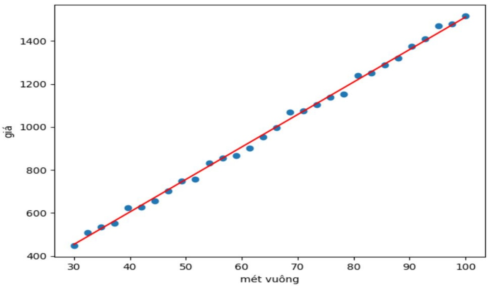
