<!-- page: 1 -->

## BACH KHOA

## TRÍ TUỆ NHÂN TẠO

Khoa Công Nghệ Thông Tin
TS. Nguyễn Văn Hiệu

<!-- page: 2 -->

## TRÍ TƯỆ NHÂN TẠO

Chương 6: Perceptron

## BACH KHOA

<!-- page: 3 -->

## Nội dung

\- Giới thiệu

\- Perceptron

• Demo

<!-- page: 4 -->

## Giới thiệu

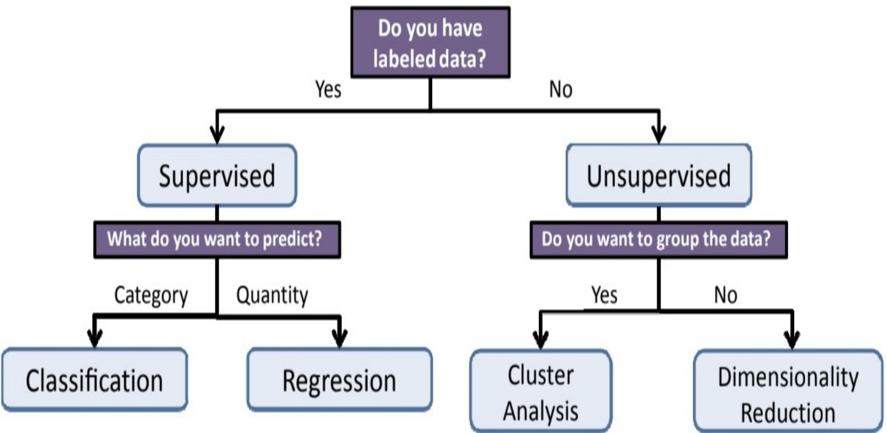

<!-- page: 5 -->

## Phân lóp

Given: Training data:  $(x_{1}, y_{1}), \ldots, (x_{n}, y_{n}) / x_{i} \in \mathbb{R}^{d}$  and  $y_{i}$  is discrete (categorical/qualitative),  $y_{i} \in Y$ .

Example  $Y = \{-1, +1\}$ ,  $Y = \{0, 1\}$ .

Task: Learn a classification function:

$$
f: \mathbb {R} ^ {d} \longrightarrow \mathbb {Y}
$$

Linear Classification: A classification model is said to be linear if it is represented by a linear function $f$ (linear hyperplane)

<!-- page: 6 -->

## Phân lớp: Ví dụ

1. Email Spam/Ham → Which email is junk?

2. Tumor benign/malignant → Which patient has cancer?

3. Credit default/not default → Which customers will default on their credit card debt?

| Balance | Income | Default |
| --- | --- | --- |
| 300 | $20,000.00 | no |
| 2000 | $60,000.00 | no |
| 5000 | $45,000.00 | yes |
| . | . | . |
| . | . | . |
| . | . | . |

<!-- page: 7 -->

## Perceptron

\- Belongs to Neural Networks class of algorithms (algorithms that try to mimic how the brain functions).

• The first algorithm used was the Perceptron (Rosenblatt 1959).

\- Worked extremely well to recognize:

1. handwritten characters (LeCun et a. 1989),

2. faces (Cottrell 1990)

\- NN were popular in the 90’s but then lost some of its popularity.

\- Now NN back with deep learning.

<!-- page: 8 -->

Feature 1

## Perfectly separable data

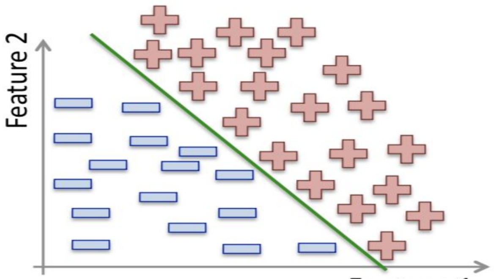

HOA

<!-- page: 9 -->

## Perceptron

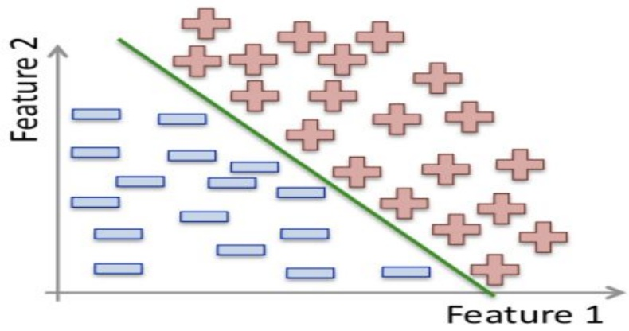

\- Linear classification method.

\- Simplest classification method.

\- Simplest neural network.

\- For perfectly separated data.

<!-- page: 10 -->

## Perceptron

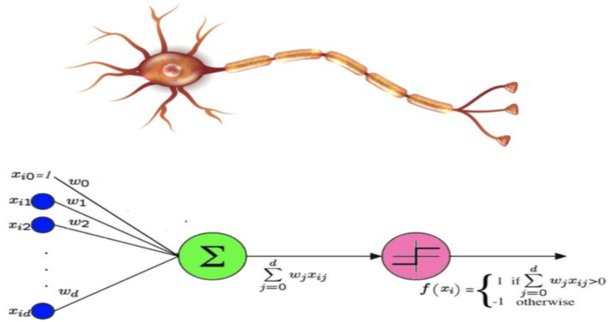

Given n examples and d features.

$$
f (x _ {i}) = \text {sign} (\sum_ {j = 0} ^ {d} w _ {j} x _ {i j})
$$

<!-- page: 11 -->

## Perceptron

$$
l a b e l (x) = \left\{ \begin{array}{l l} + 1 & w ^ {T} x > 0, \\ - 1 \end{array} \right.
$$

label(x) = sign(w^T x))

Loss function: $J(w) = \sum_{x_i \in M} (-y_i \text{sign}(w^T x_i))$

New loss function: $J(w) = \sum_{x_i \in M} (-y_i w^T x_i)$

$$
\begin{array}{c} J (w, x _ {i}, y _ {i}) = - y _ {i} w ^ {T} x _ {i} \\ \frac {\mathrm{d} J (w , x _ {i} , y _ {i})}{\mathrm{d} w} = - y _ {i} x _ {i} \end{array}
$$

<!-- page: 12 -->

## Perceptron

\- Works perfectly if data is linearly separable. If not, it will not converge.

\- Idea: Start with a random hyperplane and adjust it using your training data.

\- Iterative method.

<!-- page: 13 -->

## Perceptron

## Perceptron Algorithm

Input: A set of examples,  $(x_{1}, y_{1}), \cdots, (x_{n}, y_{n})$

Output: A perceptron defined by  $(w_{0}, w_{1}, \cdots, w_{d})$

## Begin

2. Initialize the weights  $w_{j}$  to  $0 \forall j \in \{0, \cdots, d\}$

3. Repeat until convergence

4. For each example  $x_{i} \forall i \in \{1, \cdots, n\}$

5. if $y_{i}f(x_{i}) \leq 0$ #an error?

6. update all $w_{j}$ with $w_{j} := w_{j} + y_{i}x_{i}$ #adjust the weights

## End

<!-- page: 14 -->

## Perceptron: Example

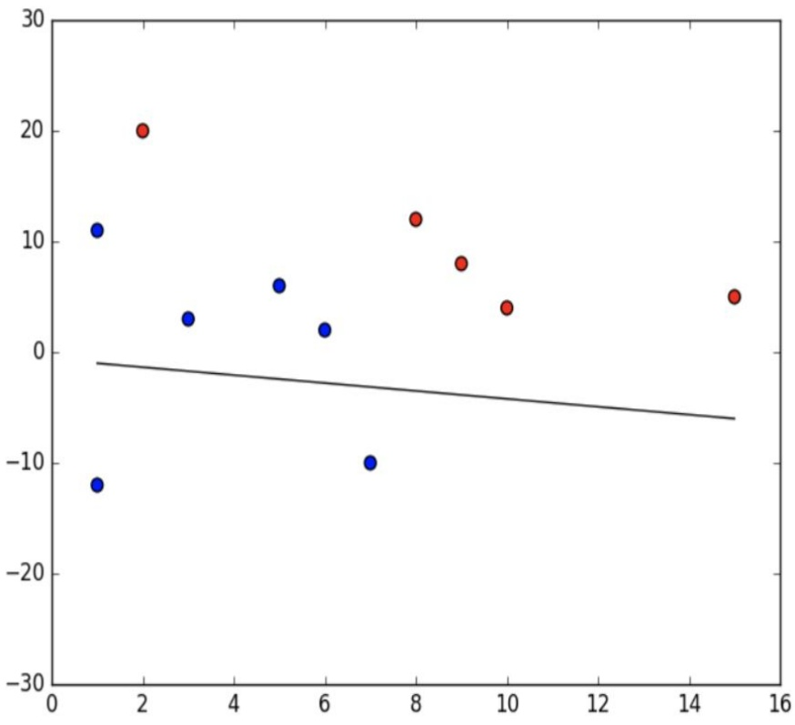

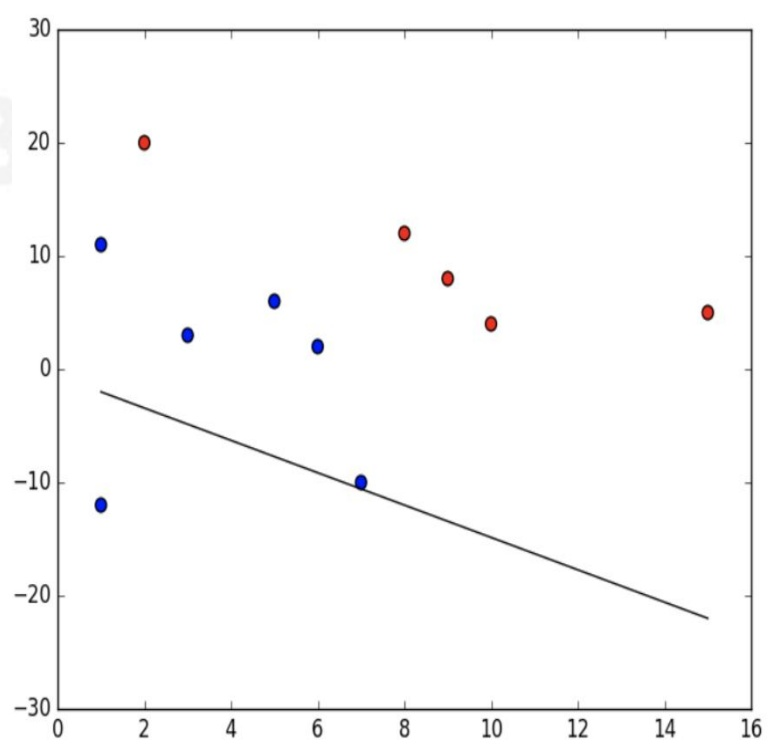

<!-- page: 15 -->

## Perceptron: Example

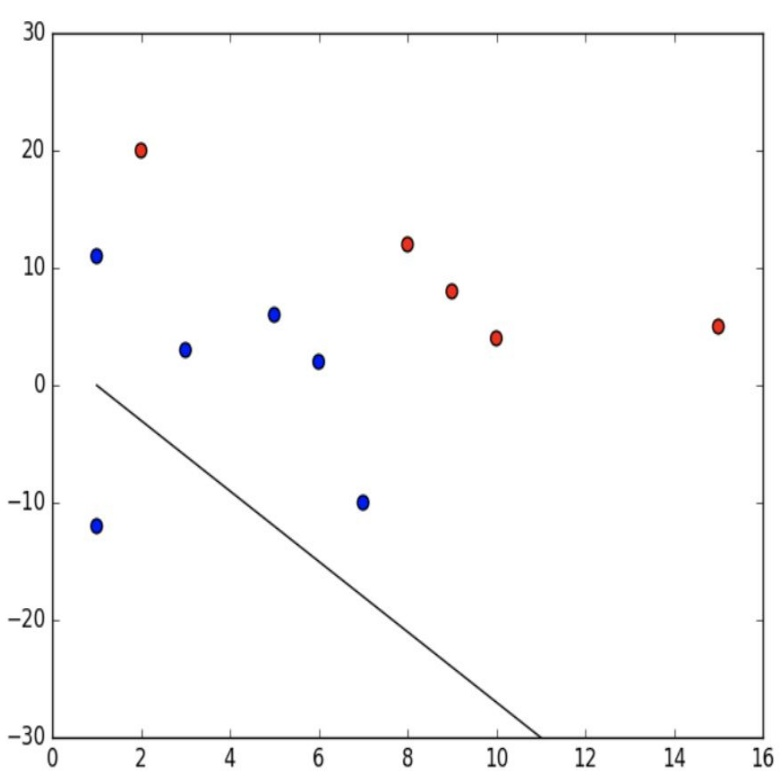

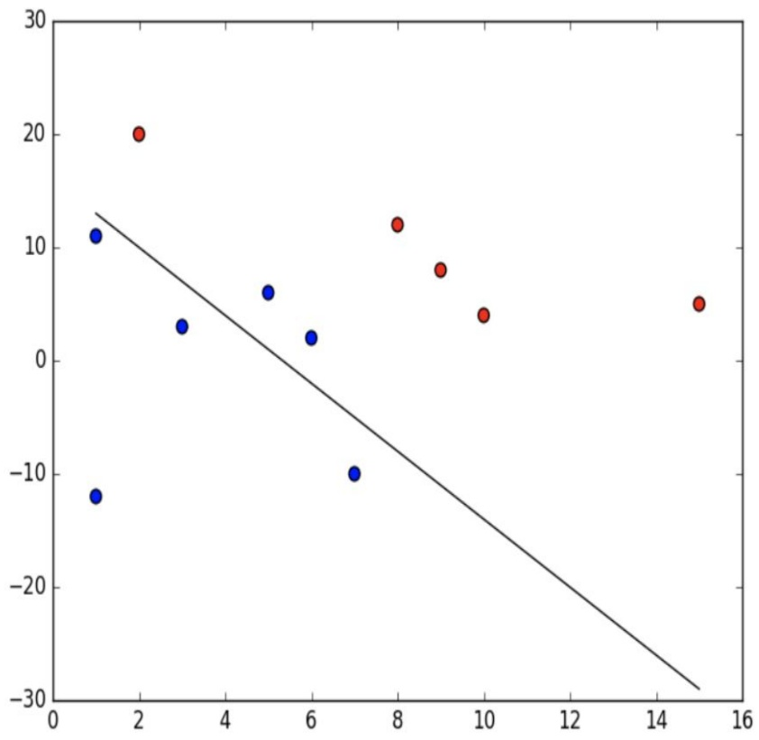

<!-- page: 16 -->

## Perceptron: Example

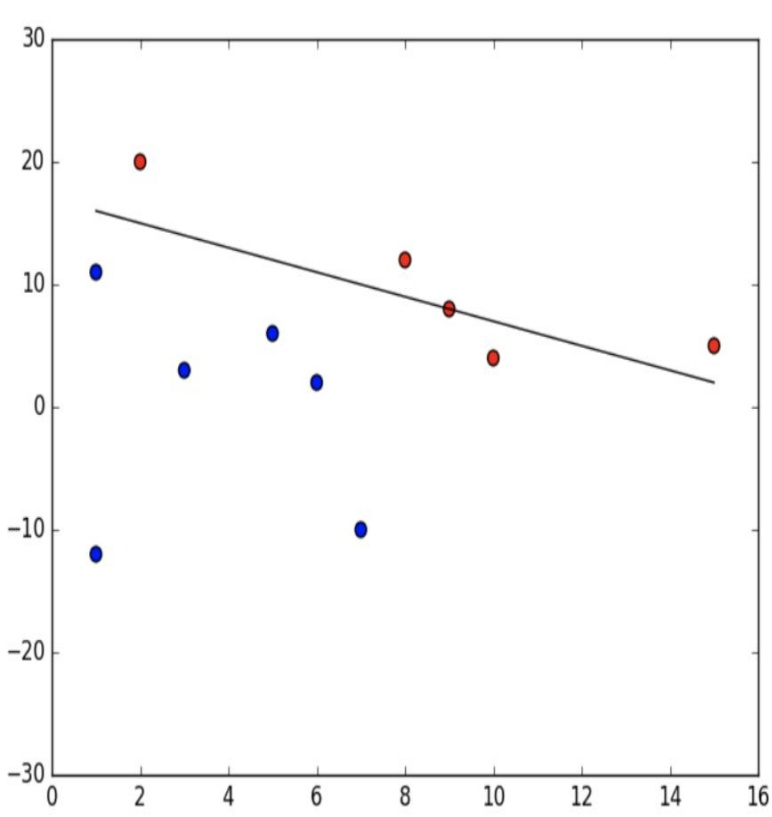

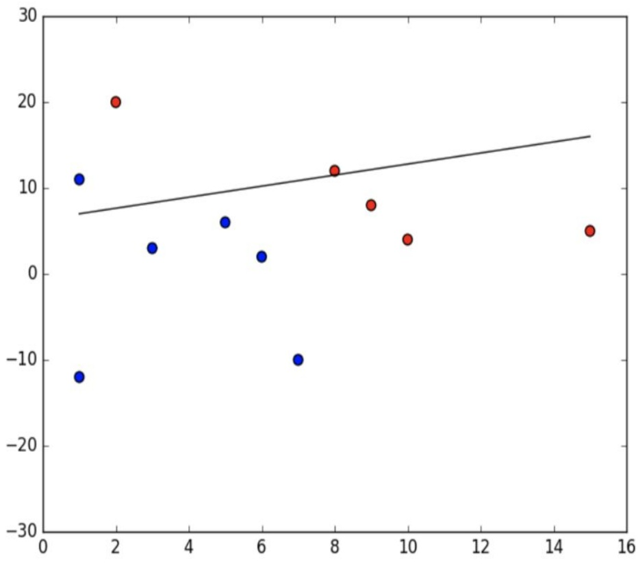

<!-- page: 17 -->

## Perceptron: Example

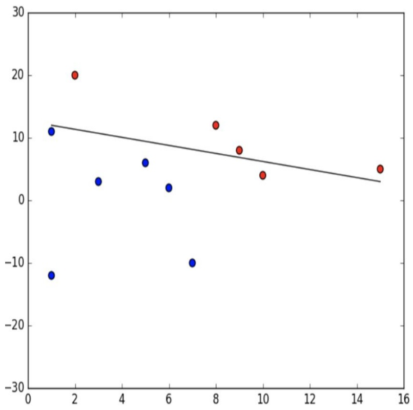

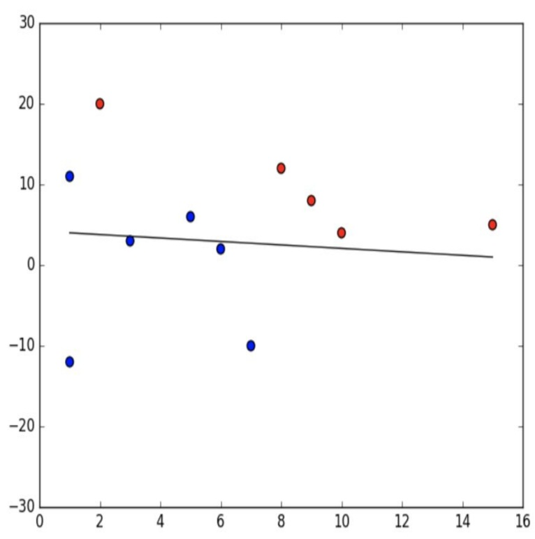

<!-- page: 18 -->

## Perceptron: Example

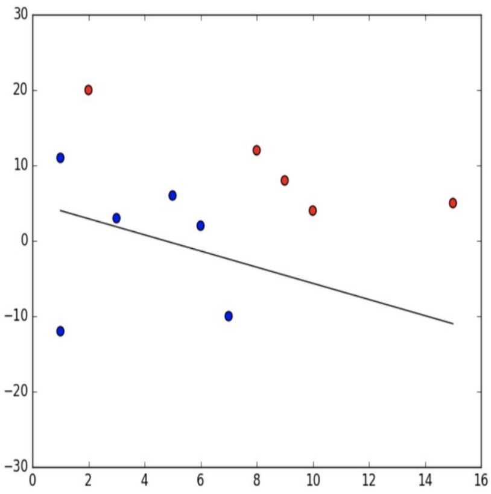

Finally converged!

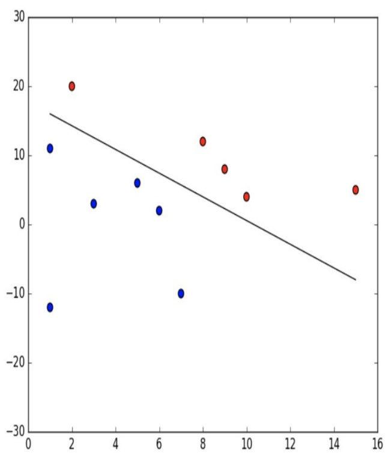

<!-- page: 19 -->

## Choice of the hyperplane

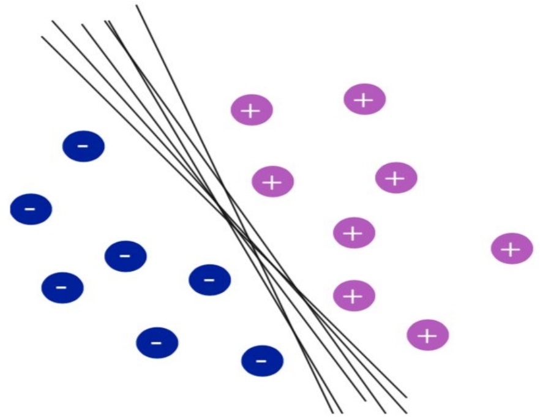

Lots of possible solutions!

Digression: Idea of SVM is to find the optimal solution.

<!-- page: 20 -->

## Demo

## D BACH KHOA
