<!-- page: 1 -->

## BACH KHOA

## TRÍ TUỆ NHÂN TẠO


Khoa Công Nghệ Thông Tin
TS. Nguyễn Văn Hiệu

<!-- page: 2 -->

## TRÍ TƯỆ NHÂN TẠO

## BACH KHOA

Chương 2: Không gian trạng
thái và tìm kiếm mù

<!-- page: 3 -->

## Nội dung

\- Giải quyết vấn đề

\- Không gian trạng thái

\- Tìm kiểm trên không gian trạng thái

\- Tìm kiểm theo chiều rộng

\- Tìm kiểm đều giá

• Tìm kiểm theo chiều sâu

• Tìm kiểm chiều sâu có giới hạn

\- Bài tập

<!-- page: 4 -->

## Giải quyết vấn đề

\- Phát biểu chính xác bài toán

\- Hiện trạng ban đầu,

\- Kết quả mong muốn,..

\- Phân tích bài toán.

## BACH KHOA

\- Thu thập và biểu diễn dữ liệu, tri thức cần thiết để giải bài toán.

\- Lựa chọn kỹ thuật giải quyết thích hợp

<!-- page: 5 -->

## Không gian trạng thái

• Có nhiều cách để biểu diễn vấn đề

\- Sử dụng đồ thị để biểu diễn vấn đề gọi là đồ thị không gian trạng thái

\- Sử dụng lý thuyết đồ thị để phân tích câu trúc và độ phức tạp của vấn đề

\- Ví dụ: hệ thống cầu thành phố Konigsberg và biểu diễn đồ thị tương ứng (Leonhard Euler)

<!-- page: 6 -->

## Không gian trạng thái

\- Một không gian trạng thái(state space) là 1 bộ [N, A, S, G] trong đó:

○ N (node) là các đỉnh(các trạng thái) của đồ thị.

○ A (arc) là tập các cạnh hay cung giữa các đỉnh.

○ S(start) là tập trạng thái đầu.

○ G (Goal) chứa các trạng thái đích của bài toán (S N S ).

\- Các trạng thái trong G được mô tả theo một trong hai đặc tính:

○ Đặc tính có thể đo lường được các trạng thái gặp trong quá trình tìm kiếm. Ví dụ: Tic-tac- toe, 8-puzzle,...

○ Đặc tính của đường đi được hình thành trong quá trình tìm kiếm. Vi dụ : TSP

\- Đường đi của lời giải (solution path) là một con đường đi từ một định thuộc S đến một định thuộc G.

<!-- page: 7 -->

## Không gian trạng thái

\- Một phần của không gian trạng thái trong trò chơi Tic-tac-toe

Đồ thị có hướng không
lặp lại (directed acyclic
graph - DAG)

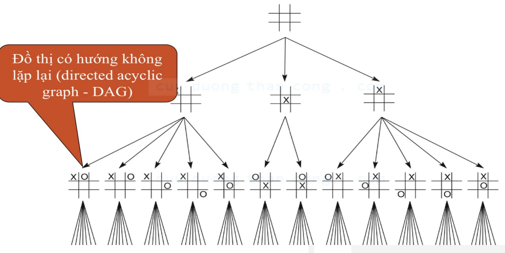

<!-- page: 8 -->

## Không gian trạng thái

Trò chơi 8 ô và trò chơi 15 ô

\- Cách biểu diễn trạng thái của trò chơi này như thế nào ?
trạng thái đầu
trạng thái đíc

| 11 | 14 | 4 | 7 |
| --- | --- | --- | --- |
| 10 | 6 |  | 5 |
| 1 | 2 | 13 | 15 |
| 9 | 12 | 8 | 3 |

| 1 | 2 | 3 | 4 |
| --- | --- | --- | --- |
| 12 | 13 | 14 | 5 |
| 11 |  | 15 | 6 |
| 10 | 9 | 8 | 7 |

|  | 2 | 8 |
| --- | --- | --- |
| 3 | 5 | 7 |
| 6 | 2 | 1 |

| 1 | 2 | 3 |
| --- | --- | --- |
| 8 |  | 4 |
| 7 | 6 | 5 |

<!-- page: 9 -->

## Không gian trạng thái

\- Không gian trạng thái của bài toán 8 ô số sinh ra bằng phép “di chuyển ô trống”

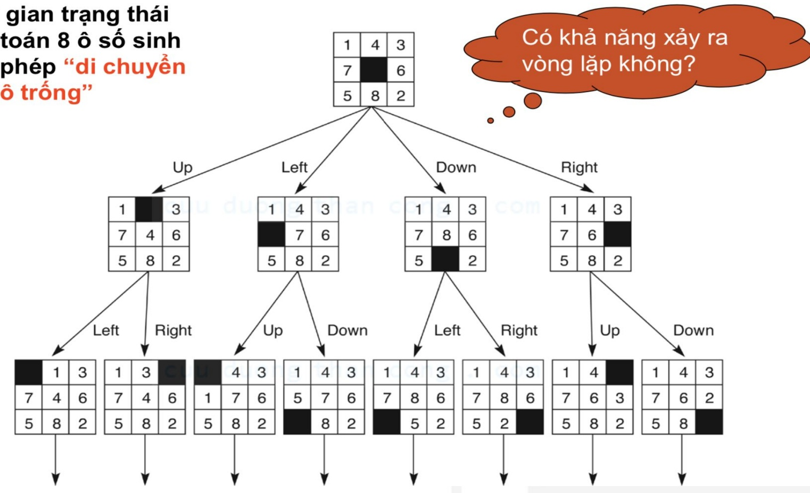

<!-- page: 10 -->

## Không gian trạng thái

\- Cần biểu diễn không gian trạng thái cho bài toán người đưa thư như thế nào?

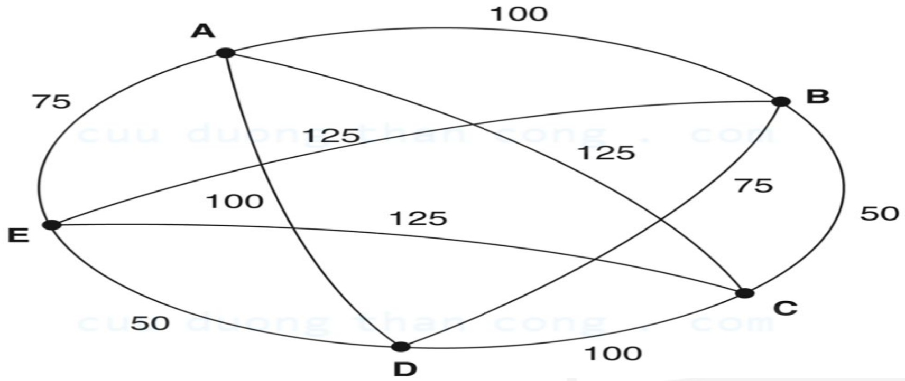

<!-- page: 11 -->

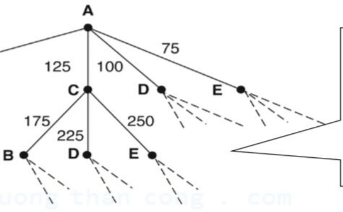

## Không gian trạng thái

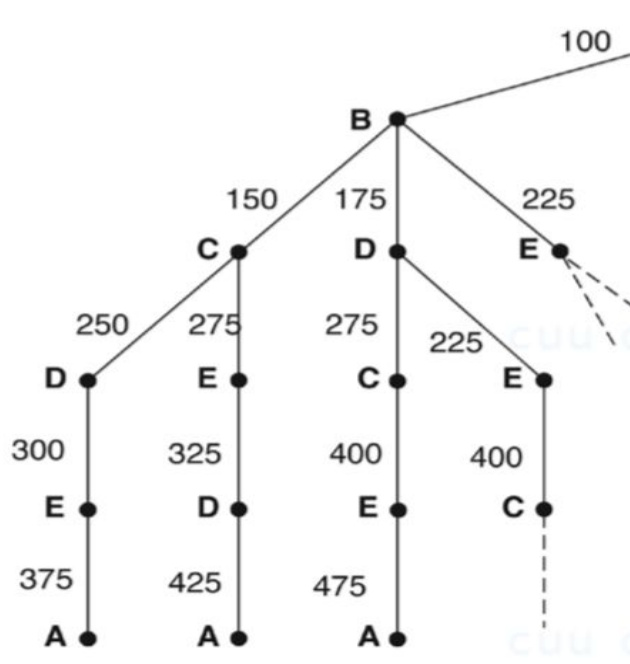

Path: ABCDEA

Cost: 375

Path: ABCEDA

Path: ABDCEA

Cost: 425

Cost: 475

Mỗi cung được đánh dấu bằng tổng giá của con đường từ nút bắt đầu đến nút hiện tại.

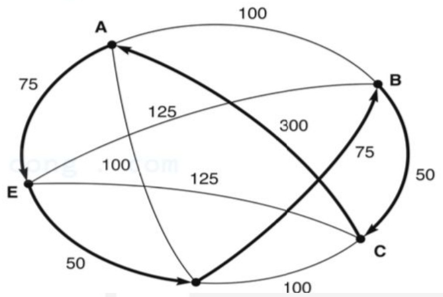

<!-- page: 12 -->

## Không gian trạng thái

\- Bốn yếu tố chính để xác định không gian trạng thái

○ Trạng thái

○ Hành động

## BACH KHOA

○ Kiểm tra trạng thái thỏa đích

○ Chi phí cho mỗi bước chuyển trạng thái

<!-- page: 13 -->

## Tìm kiểm trong không gian trạng thái

\- Chiến lược tìm kiếm là chiến lược lựa chọn thứ tự xét các đình tạo ra.

\- Các tiêu chuẩn để đánh giá chiến lược :

\- đủ: liệu có tìm được lời giải (nếu có)

◦ độ phức tạp thời gian: số lượng đỉnh phải xét

\- độ phức tạp lưu trữ: tổng dung lượng bộ nhớ phải lưu trữ (các định trong quá trình tìm kiếm.

◦ tối ưu: có luôn cho lời giải tối ưu.

• Độ phục tập thời gian và lưu trữ của bài toán có thể được đo bằng:

○ b: độ phân nhánh của cây

o d: độ sâu của lời giải ngắn nhất

○ m: độ sâu tối đa của không gian trạng thái (có thể vô hạn).

<!-- page: 14 -->

## Tìm kiểm trong không gian trạng thái

## - Chiến lược tìm kiếm màu

\- Các chiến thuật tìm kiếm chỉ sử dụng thông tin từ định nghĩa bài toán

\- Tìm kiểm theo chiều rộng

\- Tìm kiểm đều giá (uniform-cost search)

○ Tìm kiểm theo chiều sâu.

\- Tìm kiểm theo chiều sâu có giới hạn

<!-- page: 15 -->

## Tìm kiểm theo chiều rộng

\- Tìm kiểm theo từng tầng. Phát triển các đỉnh gần với đỉnh hiện tại

\- Tập đình được chia thành 3 khu vực

\- Khu vực đã phát triển(explored): tập định đã xét

\- Khu vực chờ phát triển(frontier): tập định đang chờ xét

\- Khu vực chưa phát triển(unexplored): tập đình chưa xét

<!-- page: 16 -->

## Tìm kiểm theo chiều rộng

\- Tìm kiểm theo từng tầng. Phát triển các đỉnh gần với đỉnh hiện tại

\- Minh hoạ sự phát triển các đình theo thuật toán tìm kiếm theo chiều rộng

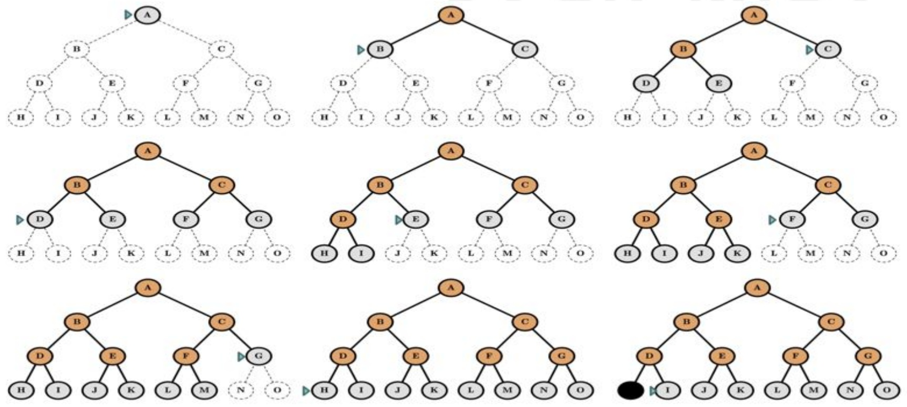

<!-- page: 17 -->

## Tìm kiểm theo chiều rộng

\- Tìm kiểm theo từng tầng. Phát triển các đỉnh gần với đỉnh hiện tại

Thuật toán tìm kiếm theo chiều rộng được mô tả bồi thủ tục:

function BREADTH-FIRST-SEARCH(initialState, goalTest)
    returns SUCCESS or FAILURE :

```coffeescript
frontier = Queue.new(initialState)
explored = Set.new()
```

```python
while not frontier.isEmpty():
    state = frontier.dequeue()
    explored.add(state)
```

```python
if goalTest(state):
    return SUCCESS(state)
```

for neighbor in state.neighbors():
    if neighbor not in frontier ∪ explored:
        frontier.enqueue(neighbor)

return FAILURE

<!-- page: 18 -->

## Tìm kiểm theo chiều rộng

\- Hãy làm rõ quá trình biến đổi của danh sách frontier ?

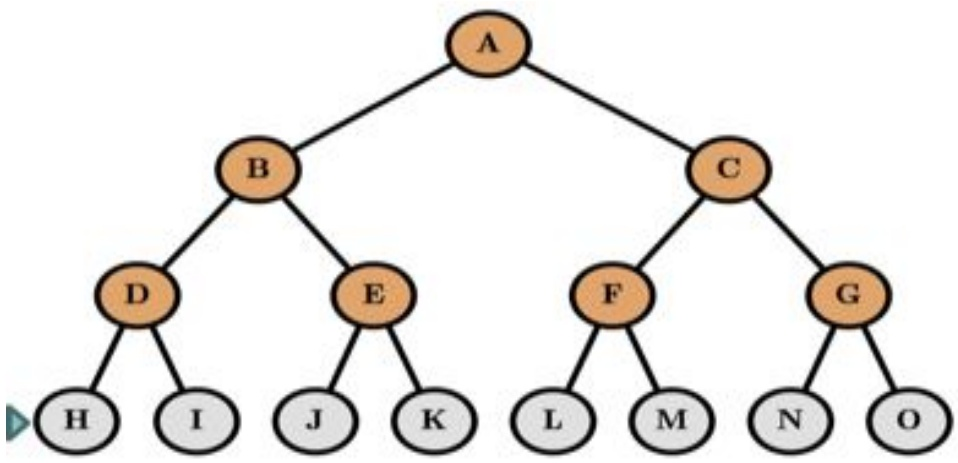

```hcl
frontier = {A}
```

$$
\text {frontier} = \{\underline{\mathsf{B}}, \mathsf{C}\}
$$

```txt
frontier = {C, D, E}
```

$$
\text {frontier} = \{\underline {{\mathsf {D}}}, \mathsf {E}, \mathsf {F}, \mathsf {G} \}
$$

$$
\text {frontier} = \{\underline {{E}}, F, G, H, I \}
$$

```python
frontier = ...
```

function BREADTH-FIRST-SEARCH(initialState, goalTest)
    returns SUCCESS or FAILURE :

frontier = Queue.new(initialState)
explored = Set.new()

while not frontier.isEmpty():
    state = frontier.dequeue()
    explored.add(state)

if goalTest(state):
    return SUCCESS(state)

for neighbor in state.neighbors():
    if neighbor not in frontier ∪ explored:
        frontier.enqueue(neighbor)

return FAILURE

<!-- page: 19 -->

## Tìm kiểm theo chiều rộng

## - Nhận xét về thuật toán

Trong thuật toán tìm kiếm theo chiều rộng, định nào phát sinh ra trước sẽ được duyệt trước, do đó danh sách frontier phải là FIFO. Trạng thái kết thúc sẽ xác định bởi một điều kiện nào đó.

○ Nếu bài toán có nghiệm( tìm thấy đường đi từ đình đầu tới định đích), thì thuật toán sẽ tìm được nghiệm.

<!-- page: 20 -->

## Tìm kiểm theo chiều rộng

\- Đánh giá thuật toán theo chiều rộng

○ Tính đủ ?

■ có ( nếu b hữu hạn)

○ Thời gian ?:

KHOA

$$
\text {■} \quad 1 + 1. b + b. b + \dots + b ^ {\wedge} (d - 1). b = 0 (b ^ {\wedge} d)
$$

○ Không gian?:

■ 0(b^d)

■ Lưu ý: trường hợp 0(b^(d+1)).

○ Tính tối ưu ?:

■ có(nếu chi phí cho mỗi bước chuyển là 1 đơn vị ).

\- Độ phức tạp về thời gian và không gian của thuật toán tìm kiếm theo chiều rộng theo cấp số nhanh. Tại sao sử dụng thuật toán ?

<!-- page: 21 -->

## Tìm kiểm theo chiều rộng

\- Tìm kiểm theo chiều rộng tệ đến mức nào ?

BACH KHOA

<!-- page: 22 -->

## Tìm kiểm theo chiều rộng

\- Tìm kiểm theo chiều rộng tệ đến mức nào ?

| Depth | Nodes | Time | Memory |
| --- | --- | --- | --- |
| 2 | 110 | .11 milliseconds | 107 kilobytes |
| 4 | 11,110 | 11 milliseconds | 10.6 megabytes |
| 6 | $10^6$ | 1.1 seconds | 1 gigabyte |
| 8 | $10^8$ | 2 minutes | 103 gigabytes |
| 10 | $10^{10}$ | 3 hours | 10 terabytes |
| 12 | $10^{12}$ | 13 days | 1 petabyte |
| 14 | $10^{14}$ | 3.5 years | 99 petabytes |
| 16 | $10^{16}$ | 350 years | 10 exabytes |

• b = 10, 1 giây kiểm tra được 1 triệu nodes, lưu 1 node mất 1.000byte

- Độ phức tạp thời gian và không gian(bộ nhớ) là bất lợi của thuật toán

<!-- page: 23 -->

## Bài tập

\- Hãy xây dựng thứ tự truy cập và đường đi của các đình sử ký tìm kiếm theo chiều rộng.

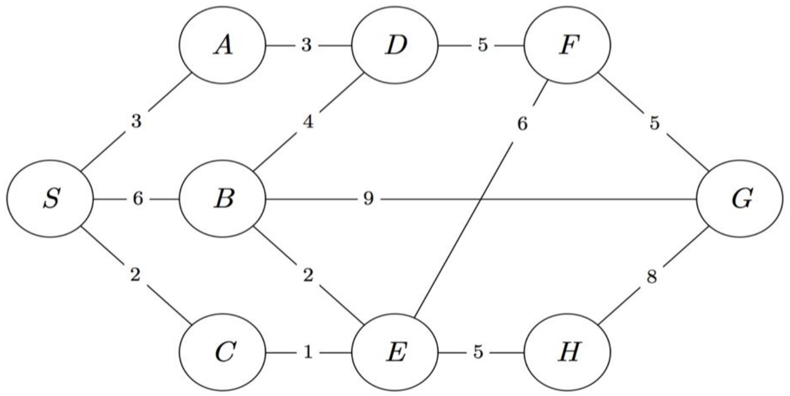

<!-- page: 24 -->

Đáp án: BFS

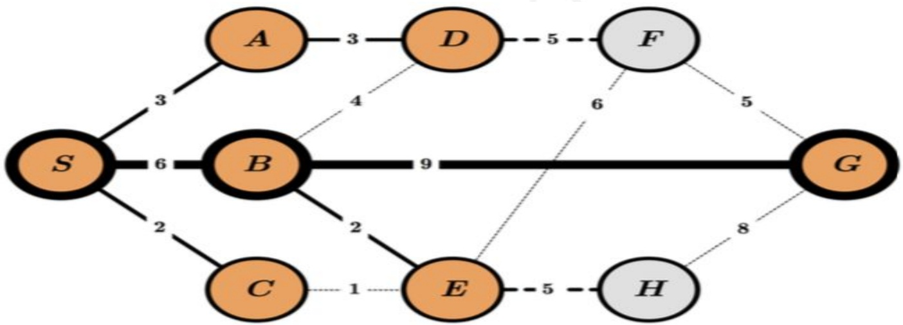

Queue:

| S | A | B | C | D | E | G | F | H |
| --- | --- | --- | --- | --- | --- | --- | --- | --- |

Order of Visit:

| S | A | B | C | D | E | G |
| --- | --- | --- | --- | --- | --- | --- |

<!-- page: 25 -->

## Demo

## D BACH KHOA

<!-- page: 26 -->

## Tìm kiểm đều giá (Uniform-cost search)

CH KHOA

<!-- page: 27 -->

## Tìm kiểm đều giá

\- Tương như tìm kiếm theo chiều rộng nếu các đình có “giá” như nhau

\- Ý tưởng: xét định có “giá” nhỏ nhất trước

\- Cài đặt: sử dụng hàng đợi có sự ưu tiên về “giá”

\- Cải tiến BFS: ựu tiên chi phí, không ựu tiên độ sâu.

\- Mỗi định n viếng thăm có hàm chi phí bé nhất g(n)

<!-- page: 28 -->

## Tìm kiểm đều giá

\- Mỗi đình n viếng thăm có hàm chi phí bé nhất g(n)

Nam Định

Thanh Hoá

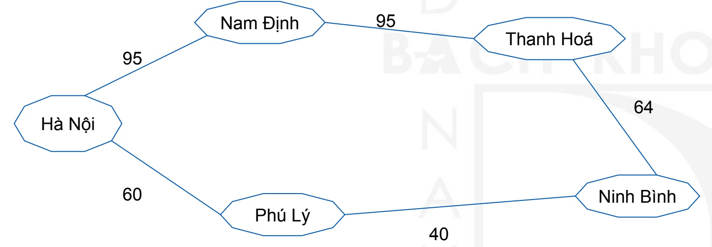

\- Từ Hà Nội đến Thanh Hoá. Sử dụng BFS, thì cho đường đi Hà Nội - Nam Định - Thanh Hoá, nhưng sử dụng UCS, thì cho đường đi Hà Nội - Phú Lý - Ninh Bình - Thanh Hóa với khoảng cách ngắn hơn.

<!-- page: 29 -->

## Tìm kiểm đều giá

\- Mỗi định n viếng thăm có hàm chi phí bé nhất g(n)

Thuật toán tìm kiếm đều giá được mô tả bởi thủ tục:

```python
function UNIFORM-COST-SEARCH(initialState, goalTest)
    returns SUCCESS or FAILURE : /* Cost f(n) = g(n) */
    frontier = Heap.new(initialState)
    explored = Set.new()

    while not frontier.isEmpty():
        state = frontier.deleteMin()
        explored.add(state)

        if goalTest(state):
            return SUCCESS(state)

        for neighbor in state.neighbors():
            if neighbor not in frontier ∪ explored:
                frontier.insert(neighbor)
        else if neighbor in frontier:
            frontier.decreaseKey(neighbor)

    return FAILURE
Cập nhật "giá"
```

<!-- page: 30 -->

## Tìm kiểm đều giá

\- Hãy làm rõ quá trình biến đổi của danh sách frontier ?

```lua
frontier = {A(0)}
frontier = {B(2), C(1), D(3)}
frontier = {B(2), G(1+6), H(1+3), D(3)}
frontier = {E(2+5), F(2+4), G(7), H(4), D(3)}
```

frontier = ...

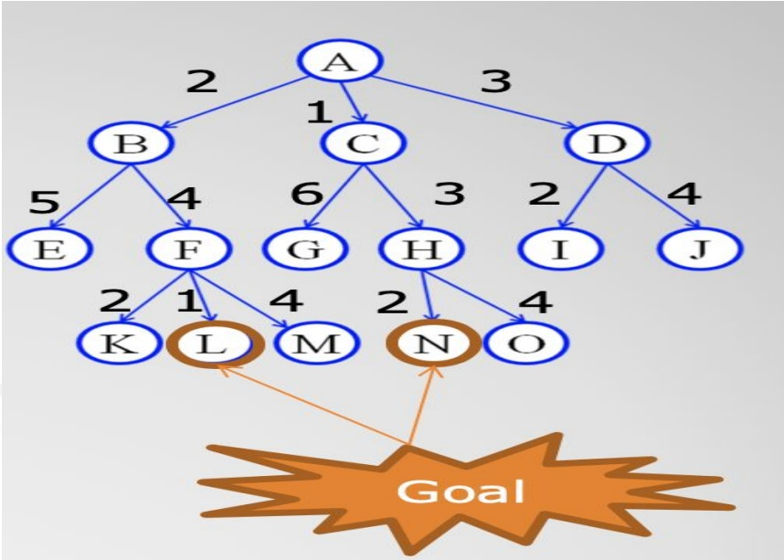

function UNIFORM-COST-SEARCH(initialState, goalTest)
    returns SUCCESS or FAILURE : /\* Cost f(n) = g(n) \*/

frontier = Heap.new(initialState)
explored = Set.new()

while not frontier.isEmpty():
    state = frontier.deleteMin()
    explored.add(state)

if goalTest(state):
    return SUCCESS(state)

for neighbor in state.neighbors():
    if neighbor not in frontier $\cup$ explored:
        frontier.insert(neighbor)
    else if neighbor in frontier:
        frontier.decreaseKey(neighbor)

return FAILURE

<!-- page: 31 -->

## Tìm kiểm theo chiều sâu

## CH KHOA

<!-- page: 32 -->

## Tìm kiểm theo chiều sâu

\- Phát triển các đỉnh ở sâu so với đỉnh hiện tại

\- Tập đình được chia thành 3 khu vực

\- Khu vực đã phát triển(explored): tập định đã xét

\- Khu vực chờ phát triển(frontier): tập định đang chờ xét

\- Khu vực chưa phát triển(unexplored): tập đình chưa xét

<!-- page: 33 -->

## Tìm kiểm theo chiều sâu

\- Phát triển các đỉnh ở sâu so với định hiện tại

\- Minh hoạ việc phát triển các đỉnh theo thuật toán tìm kiếm theo chiều sâu

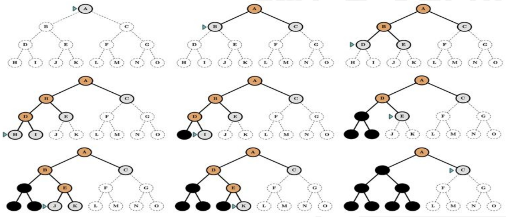

<!-- page: 34 -->

## Tìm kiểm theo chiều sâu

\- Phát triển các đỉnh ở sâu so với đỉnh hiện tại

Thuật toán tìm kiếm theo chiều sâu được mô tả bồi thủ tục

function DEPTH-FIRST-SEARCH(initialState, goalTest)
    returns SUCCESS or FAILURE :

```coffeescript
frontier = Stack.new(initialState)
explored = Set.new()
```

```python
while not frontier.isEmpty():
    state = frontier.pop()
    explored.add(state)
```

```python
if goalTest(state):
    return SUCCESS(state)
```

for neighbor in state.neighbors():
    if neighbor not in frontier ∪ explored:
        frontier.push(neighbor)

return FAILURE

<!-- page: 35 -->

## Tìm kiểm theo chiều sâu

\- Hãy làm rõ quá trình biến đổi của danh sách frontier ?

```lua
Frontier = {A}
Frontier = {C, B, }
Frontier = {C, E, D}
Frontier = {C, E, I, H}
Frontier = {C, E, I, J}
Frontier = {C, E}
Frontier = {C, J, K}
Frontier = {...}
```

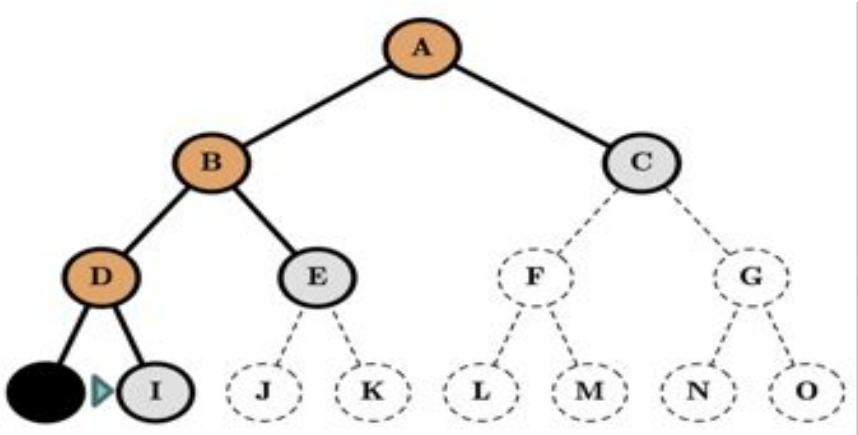

```python
function DEPTH-FIRST-SEARCH(initialState, goalTest)
    returns SUCCESS or FAILURE:

    frontier = Stack.new(initialState)
    explored = Set.new()

    while not frontier.isEmpty():
        state = frontier.pop()
        explored.add(state)

        if goalTest(state):
            return SUCCESS(state)

        for neighbor in state.neighbors():
            if neighbor not in frontier ∪ explored:
                frontier.push(neighbor)

    return FAILURE
```

<!-- page: 36 -->

## Tìm kiểm theo chiều sâu

\- Nhận xét về thuật toán

• Đối với BFS luôn tìm được nghiệm (nếu bài toán có nghiệm)

Đối với DFS chỉ tìm được nghiệm( nếu không gian hữu hạn), vì nếu không gian tìm kiếm vô hạn, thì thuật toán tìm kiếm theo chiều sâu chọn nhánh để đi, nếu đi đúng nhánh vô hạn mà nghiệm không nằm trên nhánh đó.

<!-- page: 37 -->

## Tìm kiểm theo chiều sâu

## - Đánh giá thuật toán theo chiều rộng

○ Tính đủ ?

■ không ( nếu không gian tìm kiếm vô hạn hoặc lặp)

■ đủ ( nếu khử lặp và không gian tìm kiếm hữu hạn)

## ○ Thời gian ?:

■ 0(b^m)

■ Nếu hàm đánh giá tốt thì, thời gian thực tế giảm đáng kể

○ Không gian?:

■ 0(b.m): độ phức tạp tuyến tính

## ○ Tính tối ưu ?:

■ không

<!-- page: 38 -->

## Tìm kiểm theo chiều sâu

\- Quay trở lại với bằng đánh giá tìm kiếm theo chiều rộng

| Depth | Nodes | Time | Memory |
| --- | --- | --- | --- |
| 2 | 110 | .11 milliseconds | 107 kilobytes |
| 4 | 11,110 | 11 milliseconds | 10.6 megabytes |
| 6 | $10^6$ | 1.1 seconds | 1 gigabyte |
| 8 | $10^8$ | 2 minutes | 103 gigabytes |
| 10 | $10^{10}$ | 3 hours | 10 terabytes |
| 12 | $10^{12}$ | 13 days | 1 petabyte |
| 14 | $10^{14}$ | 3.5 years | 99 petabytes |
| 16 | $10^{16}$ | 350 years | 10 exabytes |

b = 10, 1 giây kiểm tra được 1 triệu nodes, lưu 1 node mất 1.000byte

\- Với d = 16, có thể giảm dung lượng bộ nhớ từ 10 exabyte trên BFS xuống bao nhiêu ..... trên tìm kiếm theo chiều sâu(DFS) ?

<!-- page: 39 -->

## Tìm kiểm theo chiều sâu

\- Quay trở lại với bằng đánh giá tìm kiếm theo chiều rộng

| Depth | Nodes | Time | Memory |
| --- | --- | --- | --- |
| 2 | 110 | .11 milliseconds | 107 kilobytes |
| 4 | 11,110 | 11 milliseconds | 10.6 megabytes |
| 6 | $10^6$ | 1.1 seconds | 1 gigabyte |
| 8 | $10^8$ | 2 minutes | 103 gigabytes |
| 10 | $10^{10}$ | 3 hours | 10 terabytes |
| 12 | $10^{12}$ | 13 days | 1 petabyte |
| 14 | $10^{14}$ | 3.5 years | 99 petabytes |
| 16 | $10^{16}$ | 350 years | 10 exabytes |

b = 10, 1 giây kiểm tra được 1 triệu nodes, lưu 1 node mất 1.000byte

\- Với d = 16, có thể giảm dung lượng bộ nhớ từ 10 exabytes trên BFS xuống 156 kilobytes DFS

<!-- page: 40 -->

## Tìm kiểm chiều sâu có giới hạn

CH KHOA

<!-- page: 41 -->

## Tìm kiểm theo chiều sâu có giới hạn

\- Giả thiết nếu biết trước bài toán thì không duyệt hết độ sâu trong thuật toán tìm kiếm theo chiều sâu.

\- Chọn độ sâu L, để phát triển thuật toán tìm kiếm theo chiều sâu (các định ở độ sâu L, không chứa đình con, không chứa đình cháu)

\- Ý tưởng: Qua thực nghiệm chỉ ra rằng không có một thành phố nào tới thành phố khác với độ sâu vượt quá 36, nên L = 36

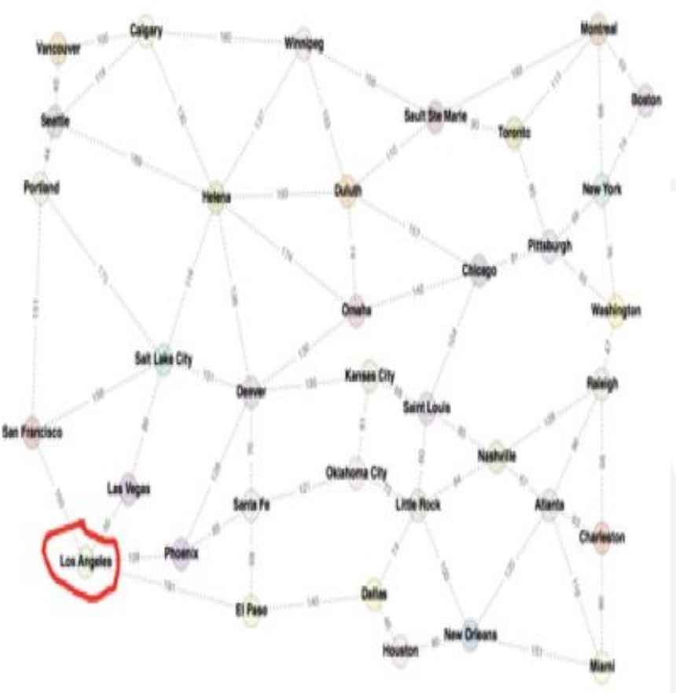

<!-- page: 42 -->

Tìm kiểm theo chiều sâu có giới hạn

$$
\text {Limit} = 0 \quad \triangleright_ {\text {A}}
$$


<!-- page: 43 -->

Tìm kiểm theo chiều sâu có giới hạn

Limit = 1

A
B C

A
C

#

G

<!-- page: 44 -->

Tìm kiểm theo chiều sâu có giới hạn

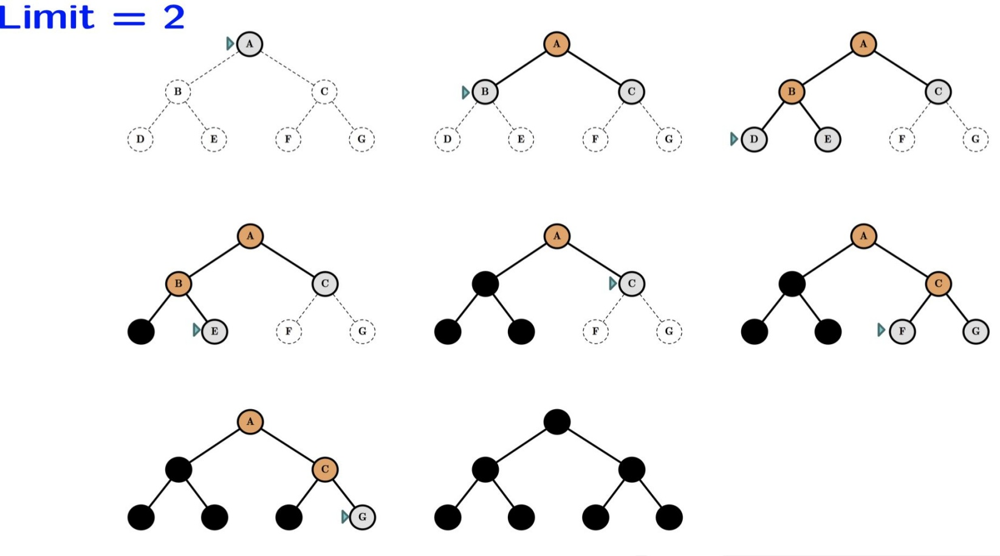

<!-- page: 45 -->

## Tìm kiểm theo chiều sâu có giới hạn

Limit = 3

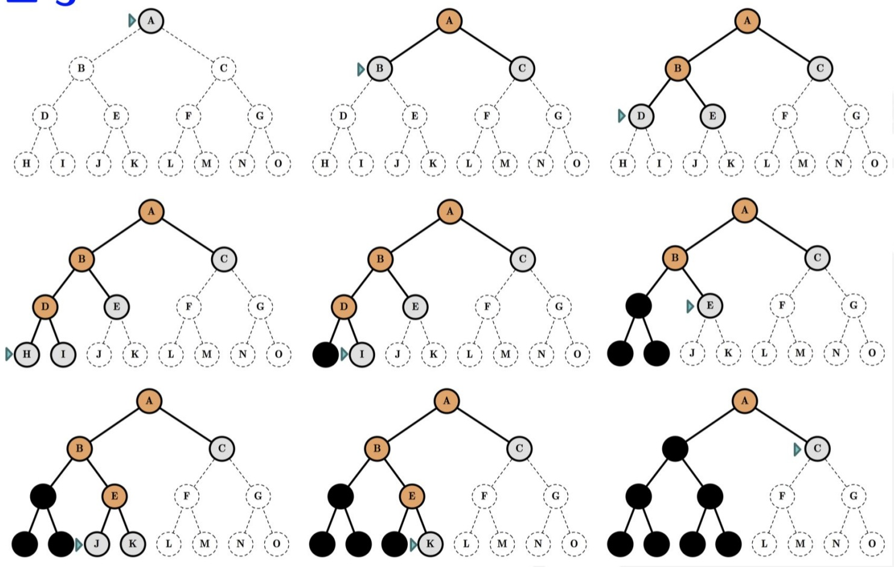

<!-- page: 46 -->

## Bài tập 1

\- Hãy xây dựng thứ tự truy cập và đường đi của các đình sử ký tìm kiếm theo chiều rộng, tìm kiếm theo chiều sâu và tìm kiếm đều giá.

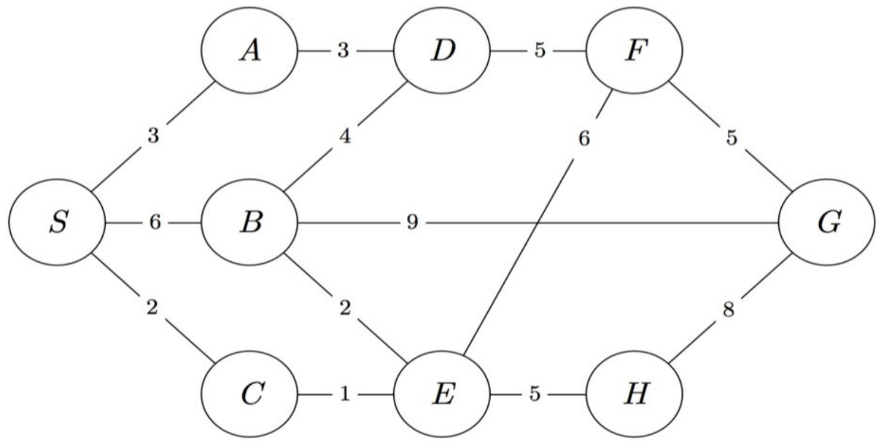

<!-- page: 47 -->


## Bài tập 2

\- Hãy viết chương trình với các thuật toán tìm kiếm theo chiều rộng, thuật toán tìm kiếm theo chiều sâu và thuật toán tìm kiếm đều giá.

## BACH KHOA

<!-- page: 48 -->

## Đáp án bài tập 1: BFS


Queue:

| S | A | B | C | D | E | G | F | H |
| --- | --- | --- | --- | --- | --- | --- | --- | --- |

Order of Visit:

S

A

B

C

D

E

G

<!-- page: 49 -->

## Đáp án bài tập 1: DFS

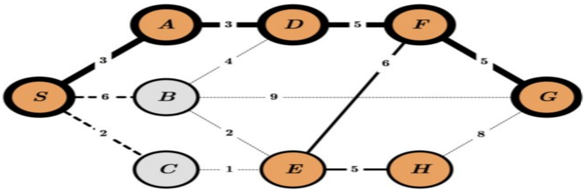

Stack:

| S | C | B | A | D | F | G | E | H |
| --- | --- | --- | --- | --- | --- | --- | --- | --- |

Order of Visit:

S

A

D

F

E

H

G

<!-- page: 50 -->

## Đáp án bài tập 1: UCS

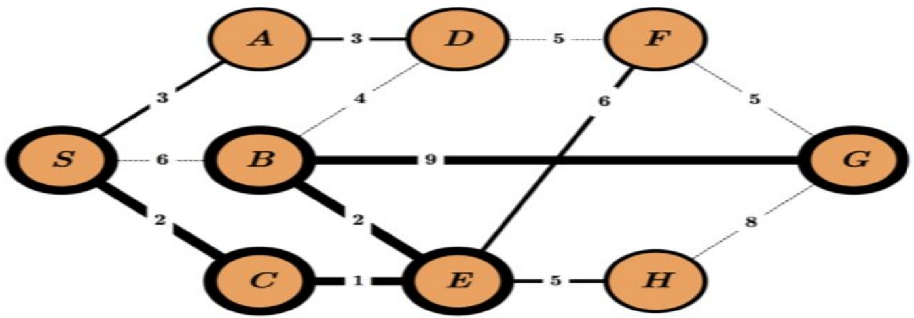

Priority Queue:

| $S_{0}$ | $C_{2}$ | $A_{3}$ | $E_{3}$ | $B_{5}$ | $D_{6}$ | $H_{8}$ | $F_{9}$ | $G_{14}$ |
| --- | --- | --- | --- | --- | --- | --- | --- | --- |

Order of Visit:

| S | C | A | E | B | D | H | F | G |
| --- | --- | --- | --- | --- | --- | --- | --- | --- |
