<!-- page: 1 -->

CORNELL H S I T

# CROWDSOURCING INSIGHTS INTO PROBLEM STRUCTURE FOR SCIENTIFIC DISCOVERY

**Bart Selman**

**Carla P. Gomes**

**Ronan Le Bras (now @ AI2)**

**Stefano Ermon (now @ Stanford)**

<!-- page: 2 -->

## Motivation: Automated Scientific Discovery

**Can we use modern automated reasoning tools for scientific discovery?**

**Science and scientific discovery are arguably among the most impressive demonstrations of human intelligence.**

**We will consider two areas:**

**1) Finite Mathematics**

**2) Materials Science**

<!-- page: 3 -->

**In the early days of computing, there was significant optimism with the discovery of first-order theorem proving procedures.**

**But, the raw size of search spaces for interesting math proved to be a daunting challenge. In a sense, the representation language (first-order logic) is too general and unconstrained to effectively explore.**

**Still, some success stories of automated mathematical discoveries, involving “finite mathematics.” (Objects of interest are finite.)**

**We only consider cases of true discovery of previously unknown results (i.e. no “re-discovery”).**

<!-- page: 4 -->

**A) 1976 --- Four Color Thm.** Four colors suffices to color a planar map. (Haken and Appel) Problem was open since **1852**. Essentially solved using an exhaustive “proof by cases.” (two thousand special sub-maps were analyzed. (90% human / 10% machine)

Proof is now accepted and has been replicated. Considered somewhat unsatisfying / “inelegant” from a math perspective, because the proof does not provide further insights into why the thm is true. Also, how do we know the computer proof is correct? (Do we?)

**B) 1996 --- Robbins algebras are Boolean algebras.** Concerns sets of axioms. (McCune) Open since **1933**. Proof strategy: clever syntactic re-write of axioms. Several months of cpu time to find the re-write steps. “Semi-human” readable. (30% human / 70% machine)

<!-- page: 5 -->

**C) 2014 --- Erdos Discrepancy Problem.** Property of sequences of +1/-1. E.g. +1 +1 -1 +1 -1 -1 +1 -1

Does the sum (absolute value) over subsequences of this sequence stay within a certain bound, C?

Erdos conjectured **(1932)**: If sequence gets long enough “discrepancy” exceeds any value of C. Lisitsa and Konev (2014) showed every sequence of **1161 or longer** exceeds bound of 2 (i.e. C = 2). But, remarkably, they also found a +1/-1 sequence of **1160** elements that stayed within bound of 2. (10% human / 90% machine)

Obtained with Boolean **Satisfiability** solver (20 hrs). Proof trace of **13 gigabytes**. Longest proof in history. Proof **verified** by proof checker. (Contrast two previous results.)

<!-- page: 6 -->

**Each result represents a clear new mathematical advance. But, unfortunately, approaches do not provide much insight into the underlying problem domain.**

**For example, can we understand how certain complex objects (e.g. 1160 long +1/-1 sequence or coloring of sub-map) can be constructed directly using a human-understandable strategy?**

<!-- page: 7 -->

## Example Domain: The Spatially-balanced Latin square (SBLS) problem

## Problem Definition:

An **SBLS** of order n is an n x n square grid in which:

**■ Each symbol appears exactly once in each row and column (Latin square structure; multiplication table of quasi-group).**

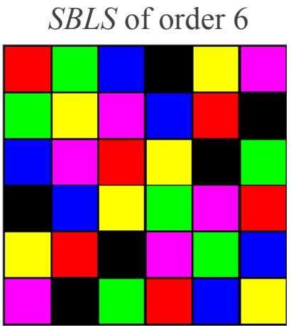

<!-- page: 8 -->

## Our Challenge Domain: The Spatially-Balanced Latin Square (SBLS) problem

## Problem Definition:

An **SBLS** of order n is an n x n square grid in which:

**■ Each symbol appears exactly once in each row and column (Latin square structure; multiplication table of quasi-group).**

**■ The average distance (column-wise) of a pair of symbols is the same for any pair (Balanced structure).**

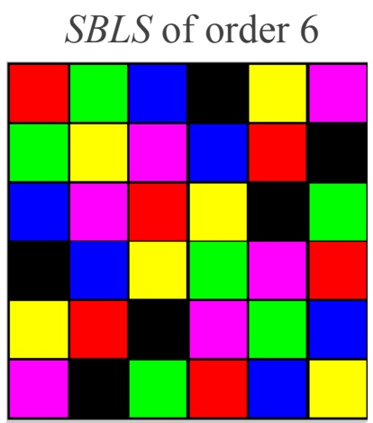

Total Row Distance (pair)

Row Distance for pairs of colors

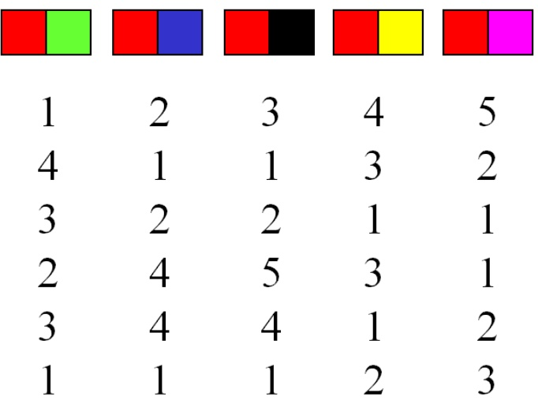

Average Row Distance (pair)

<!-- page: 9 -->

Total Row Distance (pair)

The Spatially-Balanced Latin Square (SBLS) problem

SBLS of order 6

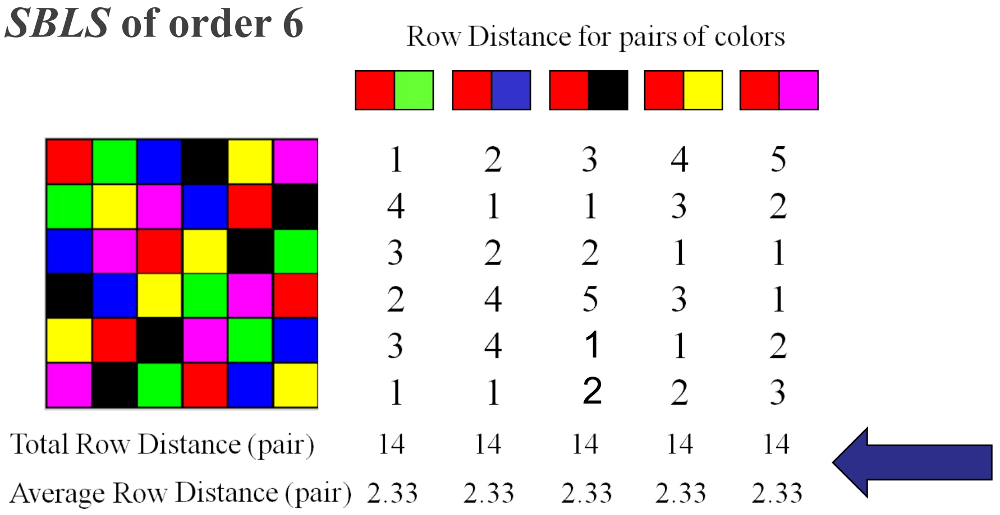

14 (avg. 2.33) for all pairs. Use in “experimental design.”

In Computational Sustainability: to limit use of fertilizers.

<!-- page: 10 -->

| Approach | Order | Time (s) | Reference |
| --- | --- | --- | --- |
| Constraint Programming (CP) | 9 | 241 | [Gomes and Sellmann, CP'04] |
| IDWalk (metaheuristic) | 9 | 4.5 | [Neveu et al., CP'04] |
| Self-symmetry-based Streamlined CP | 14 | 5,434 | [Gomes and Sellmann, CP'04] |
| Composition-based Streamlined CP | 18 | 107K | [Gomes and Sellmann, CP'04] |
| Streamlined Local Search | 35 | 1.2M | [Smith et al., IJCAI'05] |

**Approach: use lots of problem specific structure to guide search.**

**Earlier known designs, only up to order 6.**

**The balancing condition (of each pair!) makes the problem \*very\* hard.**

<!-- page: 11 -->

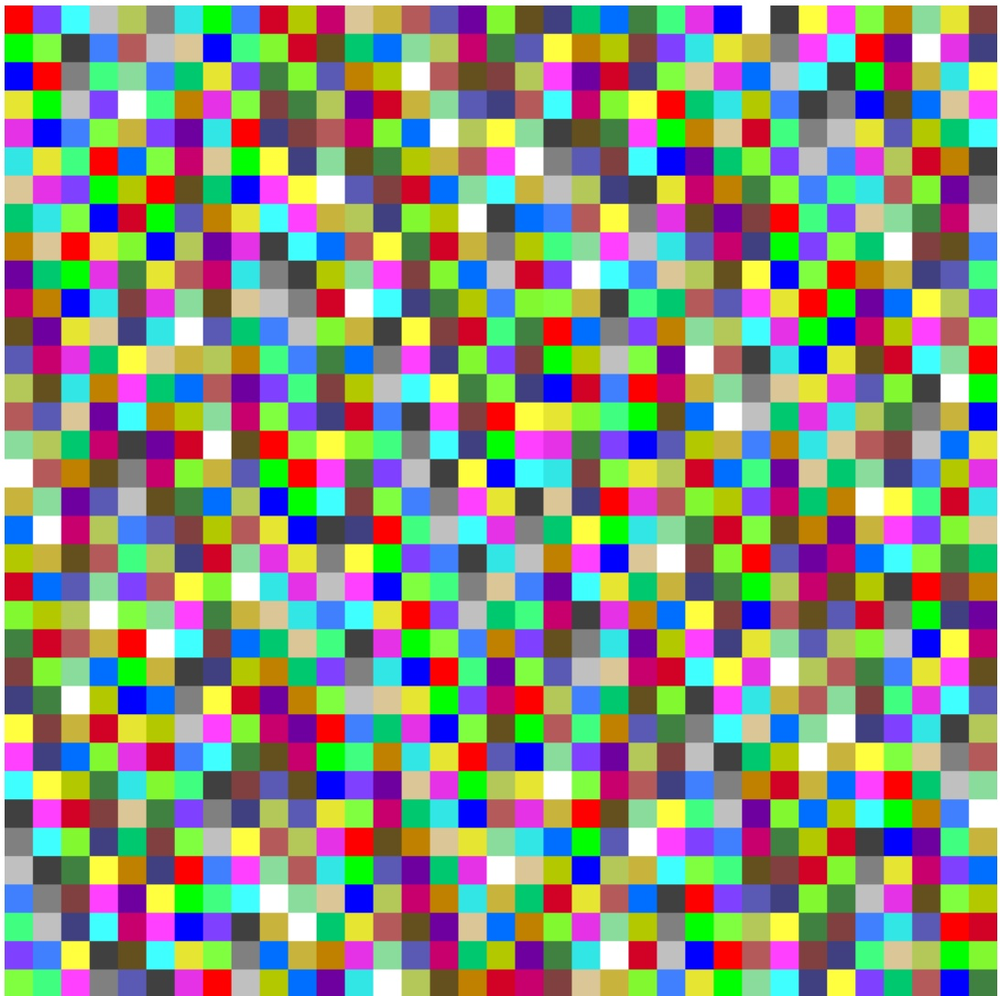

<!-- page: 12 -->

| 1 | 2 | 3 | 4 | 5 | 6 | 7 | 8 | 9 | 10 | 11 | 12 | 13 | 14 | 15 | 16 | 17 | 18 | 19 | 20 | 21 | 22 | 23 | 24 | 25 | 26 | 27 | 28 | 29 | 30 | 31 | 32 | 33 | 34 | 35 | 36 | 37 | 38 | 39 | 40 | 41 | 42 | 43 | 44 | 45 | 46 | 47 | 48 | 49 | 50 |
| --- | --- | --- | --- | --- | --- | --- | --- | --- | --- | --- | --- | --- | --- | --- | --- | --- | --- | --- | --- | --- | --- | --- | --- | --- | --- | --- | --- | --- | --- | --- | --- | --- | --- | --- | --- | --- | --- | --- | --- | --- | --- | --- | --- | --- | --- | --- | --- | --- | --- |
| 2 | 4 | 6 | 8 | 10 | 12 | 14 | 16 | 18 | 20 | 22 | 24 | 26 | 28 | 30 | 32 | 34 | 36 | 38 | 40 | 42 | 44 | 46 | 48 | 50 | 49 | 47 | 45 | 43 | 41 | 39 | 37 | 35 | 33 | 31 | 29 | 27 | 25 | 23 | 21 | 19 | 17 | 15 | 13 | 11 | 9 | 7 | 5 | 3 | 1 |
| 3 | 6 | 9 | 12 | 15 | 18 | 21 | 24 | 27 | 30 | 33 | 36 | 39 | 42 | 45 | 48 | 50 | 47 | 44 | 41 | 38 | 35 | 32 | 29 | 26 | 23 | 20 | 17 | 14 | 11 | 8 | 5 | 2 | 1 | 4 | 7 | 10 | 13 | 16 | 19 | 22 | 25 | 28 | 31 | 34 | 37 | 40 | 43 | 46 | 49 |
| 4 | 8 | 12 | 16 | 20 | 24 | 28 | 32 | 36 | 40 | 44 | 48 | 49 | 45 | 41 | 37 | 33 | 29 | 25 | 21 | 17 | 13 | 9 | 5 | 1 | 3 | 7 | 11 | 15 | 19 | 23 | 27 | 31 | 35 | 39 | 43 | 47 | 50 | 46 | 42 | 38 | 34 | 30 | 26 | 22 | 18 | 14 | 10 | 6 | 2 |
| 5 | 10 | 15 | 20 | 25 | 30 | 35 | 40 | 45 | 50 | 46 | 41 | 36 | 31 | 26 | 21 | 16 | 11 | 6 | 1 | 4 | 9 | 14 | 19 | 24 | 29 | 34 | 39 | 44 | 49 | 47 | 42 | 37 | 32 | 27 | 22 | 17 | 12 | 7 | 2 | 3 | 8 | 13 | 18 | 23 | 28 | 33 | 38 | 43 | 48 |
| 6 | 12 | 18 | 24 | 30 | 36 | 42 | 48 | 47 | 41 | 35 | 29 | 23 | 17 | 11 | 5 | 1 | 7 | 13 | 19 | 25 | 31 | 37 | 43 | 49 | 46 | 40 | 34 | 28 | 22 | 16 | 10 | 4 | 2 | 8 | 14 | 20 | 26 | 32 | 38 | 44 | 50 | 45 | 39 | 33 | 27 | 21 | 15 | 9 | 3 |
| 7 | 14 | 21 | 28 | 35 | 42 | 49 | 45 | 38 | 31 | 24 | 17 | 10 | 3 | 4 | 11 | 18 | 25 | 32 | 39 | 46 | 48 | 41 | 34 | 27 | 20 | 13 | 6 | 1 | 8 | 15 | 22 | 29 | 36 | 43 | 50 | 44 | 37 | 30 | 23 | 16 | 9 | 2 | 5 | 12 | 19 | 26 | 33 | 40 | 47 |
| 8 | 16 | 24 | 32 | 40 | 48 | 45 | 37 | 29 | 21 | 13 | 5 | 3 | 11 | 19 | 27 | 35 | 43 | 50 | 42 | 34 | 26 | 18 | 10 | 2 | 6 | 14 | 22 | 30 | 38 | 46 | 47 | 39 | 31 | 23 | 15 | 7 | 1 | 9 | 17 | 25 | 33 | 41 | 49 | 44 | 36 | 28 | 20 | 12 | 4 |
| 9 | 18 | 27 | 36 | 45 | 47 | 38 | 29 | 20 | 11 | 2 | 7 | 16 | 25 | 34 | 43 | 49 | 40 | 31 | 22 | 13 | 4 | 5 | 14 | 23 | 32 | 41 | 50 | 42 | 33 | 24 | 15 | 6 | 3 | 12 | 21 | 30 | 39 | 48 | 44 | 35 | 26 | 17 | 8 | 1 | 10 | 19 | 28 | 37 | 46 |
| 10 | 20 | 30 | 40 | 50 | 41 | 31 | 21 | 11 | 1 | 9 | 19 | 29 | 39 | 49 | 42 | 32 | 22 | 12 | 2 | 8 | 18 | 28 | 38 | 48 | 43 | 33 | 23 | 13 | 3 | 7 | 17 | 27 | 37 | 47 | 44 | 34 | 24 | 14 | 4 | 6 | 16 | 26 | 36 | 46 | 45 | 35 | 25 | 15 | 5 |
| 11 | 22 | 33 | 44 | 46 | 35 | 24 | 13 | 2 | 9 | 20 | 31 | 42 | 48 | 37 | 26 | 15 | 4 | 7 | 18 | 29 | 40 | 50 | 39 | 28 | 17 | 6 | 5 | 16 | 27 | 38 | 49 | 41 | 30 | 19 | 8 | 3 | 14 | 25 | 36 | 47 | 43 | 32 | 21 | 10 | 1 | 12 | 23 | 34 | 45 |
| 12 | 24 | 36 | 48 | 41 | 29 | 17 | 5 | 7 | 19 | 31 | 43 | 46 | 34 | 22 | 10 | 2 | 14 | 26 | 38 | 50 | 39 | 27 | 15 | 3 | 9 | 21 | 33 | 45 | 44 | 32 | 20 | 8 | 4 | 16 | 28 | 40 | 49 | 37 | 25 | 13 | 1 | 11 | 23 | 35 | 47 | 42 | 30 | 18 | 6 |
| 13 | 26 | 39 | 49 | 36 | 23 | 10 | 3 | 16 | 29 | 42 | 46 | 33 | 20 | 7 | 6 | 19 | 32 | 45 | 43 | 30 | 17 | 4 | 9 | 22 | 35 | 48 | 40 | 27 | 14 | 1 | 12 | 25 | 38 | 50 | 37 | 24 | 11 | 2 | 15 | 28 | 41 | 47 | 34 | 21 | 8 | 5 | 18 | 31 | 44 |
| 14 | 28 | 42 | 45 | 31 | 17 | 3 | 11 | 25 | 39 | 48 | 34 | 20 | 6 | 8 | 22 | 36 | 50 | 37 | 23 | 9 | 5 | 19 | 33 | 47 | 40 | 26 | 12 | 2 | 16 | 30 | 44 | 43 | 29 | 15 | 1 | 13 | 27 | 41 | 46 | 32 | 18 | 4 | 10 | 24 | 38 | 49 | 35 | 21 | 7 |
| 15 | 30 | 45 | 41 | 26 | 11 | 4 | 19 | 34 | 49 | 37 | 22 | 7 | 8 | 23 | 38 | 48 | 33 | 18 | 3 | 12 | 27 | 42 | 44 | 29 | 14 | 1 | 16 | 31 | 46 | 40 | 25 | 10 | 5 | 20 | 35 | 50 | 36 | 21 | 6 | 9 | 24 | 39 | 47 | 32 | 17 | 2 | 13 | 28 | 43 |
| 16 | 32 | 48 | 37 | 21 | 5 | 11 | 27 | 43 | 42 | 26 | 10 | 6 | 22 | 38 | 47 | 31 | 15 | 1 | 17 | 33 | 49 | 36 | 20 | 4 | 12 | 28 | 44 | 41 | 25 | 9 | 7 | 23 | 39 | 46 | 30 | 14 | 2 | 18 | 34 | 50 | 35 | 19 | 3 | 13 | 29 | 45 | 40 | 24 | 8 |
| 17 | 34 | 50 | 33 | 16 | 1 | 18 | 35 | 49 | 32 | 15 | 2 | 19 | 36 | 48 | 31 | 14 | 3 | 20 | 37 | 47 | 30 | 13 | 4 | 21 | 38 | 46 | 29 | 12 | 5 | 22 | 39 | 45 | 28 | 11 | 6 | 23 | 40 | 44 | 27 | 10 | 7 | 24 | 41 | 43 | 26 | 9 | 8 | 25 | 42 |
| 18 | 36 | 47 | 29 | 11 | 7 | 25 | 43 | 40 | 22 | 4 | 14 | 32 | 50 | 33 | 15 | 3 | 21 | 39 | 44 | 26 | 8 | 10 | 28 | 46 | 37 | 19 | 1 | 17 | 35 | 48 | 30 | 12 | 6 | 24 | 42 | 41 | 23 | 5 | 13 | 31 | 49 | 34 | 16 | 2 | 20 | 38 | 45 | 27 | 9 |
| 19 | 38 | 44 | 25 | 6 | 13 | 32 | 50 | 31 | 12 | 7 | 26 | 45 | 37 | 18 | 1 | 20 | 39 | 43 | 24 | 5 | 14 | 33 | 49 | 30 | 11 | 8 | 27 | 46 | 36 | 17 | 2 | 21 | 40 | 42 | 23 | 4 | 15 | 34 | 48 | 29 | 10 | 9 | 28 | 47 | 35 | 16 | 3 | 22 | 41 |
| 20 | 40 | 41 | 21 | 1 | 19 | 39 | 42 | 22 | 2 | 18 | 38 | 43 | 23 | 3 | 17 | 37 | 44 | 24 | 4 | 16 | 36 | 45 | 25 | 5 | 15 | 35 | 46 | 26 | 6 | 14 | 34 | 47 | 27 | 7 | 13 | 33 | 48 | 28 | 8 | 12 | 32 | 49 | 29 | 9 | 11 | 31 | 50 | 30 | 10 |
| 21 | 42 | 38 | 17 | 4 | 25 | 46 | 34 | 13 | 8 | 29 | 50 | 30 | 9 | 12 | 33 | 47 | 26 | 5 | 16 | 37 | 43 | 22 | 1 | 20 | 41 | 39 | 18 | 3 | 24 | 45 | 35 | 14 | 7 | 28 | 49 | 31 | 10 | 11 | 32 | 48 | 27 | 6 | 15 | 36 | 44 | 23 | 2 | 19 | 40 |
| 22 | 44 | 35 | 13 | 9 | 31 | 48 | 26 | 4 | 18 | 40 | 39 | 17 | 5 | 27 | 49 | 30 | 8 | 14 | 36 | 43 | 21 | 1 | 23 | 45 | 34 | 12 | 10 | 32 | 47 | 25 | 3 | 19 | 41 | 38 | 16 | 6 | 28 | 50 | 29 | 7 | 15 | 37 | 42 | 20 | 2 | 24 | 46 | 33 | 11 |
| 23 | 46 | 32 | 9 | 14 | 37 | 41 | 18 | 5 | 28 | 50 | 27 | 4 | 19 | 42 | 36 | 13 | 10 | 33 | 45 | 22 | 1 | 24 | 47 | 31 | 8 | 15 | 38 | 40 | 17 | 6 | 29 | 49 | 26 | 3 | 20 | 43 | 35 | 12 | 11 | 34 | 44 | 21 | 2 | 25 | 48 | 30 | 7 | 16 | 39 |
| 24 | 48 | 29 | 5 | 19 | 43 | 34 | 10 | 14 | 38 | 39 | 15 | 9 | 33 | 44 | 20 | 4 | 28 | 49 | 25 | 1 | 23 | 47 | 30 | 6 | 18 | 42 | 35 | 11 | 13 | 37 | 40 | 16 | 8 | 32 | 45 | 21 | 3 | 27 | 50 | 26 | 2 | 22 | 46 | 31 | 7 | 17 | 41 | 36 | 12 |
| 25 | 50 | 26 | 1 | 24 | 49 | 27 | 2 | 23 | 48 | 28 | 3 | 22 | 47 | 29 | 4 | 21 | 46 | 30 | 5 | 20 | 45 | 31 | 6 | 19 | 44 | 32 | 7 | 18 | 43 | 33 | 8 | 17 | 42 | 34 | 9 | 16 | 41 | 35 | 10 | 15 | 40 | 36 | 11 | 14 | 39 | 37 | 12 | 13 | 38 |
| 26 | 49 | 23 | 3 | 29 | 46 | 20 | 6 | 32 | 43 | 17 | 9 | 35 | 40 | 14 | 12 | 38 | 37 | 11 | 15 | 41 | 34 | 8 | 18 | 44 | 31 | 5 | 21 | 47 | 28 | 2 | 24 | 50 | 25 | 1 | 27 | 48 | 22 | 4 | 30 | 45 | 19 | 7 | 33 | 42 | 16 | 10 | 36 | 39 | 13 |
| 27 | 47 | 20 | 7 | 34 | 40 | 13 | 14 | 41 | 33 | 6 | 21 | 48 | 26 | 1 | 28 | 46 | 19 | 8 | 35 | 39 | 12 | 15 | 42 | 32 | 5 | 22 | 49 | 25 | 2 | 29 | 45 | 18 | 9 | 36 | 38 | 11 | 16 | 43 | 31 | 4 | 23 | 50 | 24 | 3 | 30 | 44 | 17 | 10 | 37 |
| 28 | 45 | 17 | 11 | 39 | 34 | 6 | 22 | 50 | 23 | 5 | 33 | 40 | 12 | 16 | 44 | 29 | 1 | 27 | 46 | 18 | 10 | 38 | 35 | 7 | 21 | 49 | 24 | 4 | 32 | 41 | 13 | 15 | 43 | 30 | 2 | 26 | 47 | 19 | 9 | 37 | 36 | 8 | 20 | 48 | 25 | 3 | 31 | 42 | 14 |
| 29 | 43 | 14 | 15 | 44 | 28 | 1 | 30 | 42 | 13 | 16 | 45 | 27 | 2 | 31 | 41 | 12 | 17 | 46 | 26 | 3 | 32 | 40 | 11 | 18 | 47 | 25 | 4 | 33 | 39 | 10 | 19 | 48 | 24 | 5 | 34 | 38 | 9 | 20 | 49 | 23 | 6 | 35 | 37 | 8 | 21 | 50 | 22 | 7 | 36 |
| 30 | 41 | 11 | 19 | 49 | 22 | 8 | 38 | 33 | 3 | 27 | 44 | 14 | 16 | 46 | 25 | 5 | 35 | 36 | 6 | 24 | 47 | 17 | 13 | 43 | 28 | 2 | 32 | 39 | 9 | 21 | 50 | 20 | 10 | 40 | 31 | 1 | 29 | 42 | 12 | 18 | 48 | 23 | 7 | 37 | 34 | 4 | 26 | 45 | 15 |
| 31 | 39 | 8 | 23 | 47 | 16 | 15 | 46 | 24 | 7 | 38 | 32 | 1 | 30 | 40 | 9 | 22 | 48 | 17 | 14 | 45 | 25 | 6 | 37 | 33 | 2 | 29 | 41 | 10 | 21 | 49 | 18 | 13 | 44 | 26 | 5 | 36 | 34 | 3 | 28 | 42 | 11 | 20 | 50 | 19 | 12 | 43 | 27 | 4 |  |

## How?

## (Nothing special about 50x50. We can do 10Kx10K in a few seconds.)

<!-- page: 13 -->

(here)

**Gedanken Experiment:**

**Given that a constructive algorithm (given any size n) exists, how would you find it? Hwk…**

**(Can use SAT solver.)**

<!-- page: 14 -->

• Motivation

• Example Domain

• Proposed Framework

• Overview of Streamlined Search

• Taking advantage of Human Insights

• Formal Description and Overview

• Human-guided Streamlined Search

• Application to the Spatially-balanced Latin square problem

• Application to the Weak Schur Number problem

• Conclusions and Future work

<!-- page: 15 -->

• Motivation

• Example Domain

• Proposed Framework

• Overview of Streamlined Search

• Taking advantage of Human Insights

• Formal Description and Overview

• GUI for Human-guided Streamlined Search

• Application to the Spatially-balanced Latin square problem

• Application to the Weak Schur Number problem

• Conclusions and Future work

<!-- page: 16 -->

## Proposed Framework: Overview of Streamlined Combinatorial Search

## Goal:

Exploit the **structure of some solutions** to **boost** the effectiveness of the **propagation mechanisms.**

## Underlying Observation:

When one insists on maintaining the **full solution set**, there is a **hard practical limit** on the effectiveness of **constraint propagation** methods. Often, there is **no compact representation** for all the solutions.

## Underlying Conjecture:

For many intricate **combinatorial problems** – if **solutions exist** – there will often be (highly) **regular ones**. **Can we find such solutions?**

<!-- page: 17 -->

$\mathrm { P } _ { 1 }$ is **substantially smaller** than its complement $\mathrm { P } _ { 2 }$ and it will benefit from a **stronger filtering** thereafter.

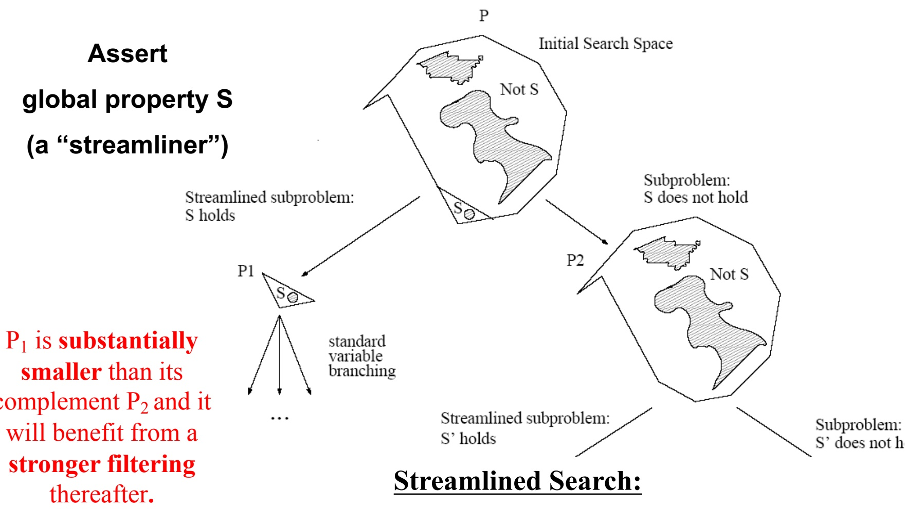

Strong **branching mechanisms** (by adding constraints based on **structure properties**) at **high levels** of the search tree.

$$
\text {CP'04}]_{17}
$$

<!-- page: 18 -->

**Recognizing Patterns and Regularities:**

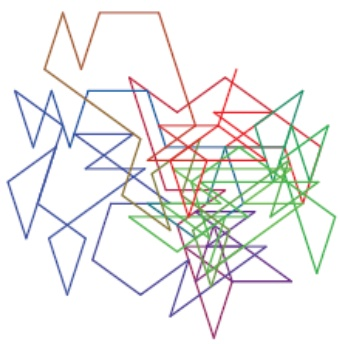

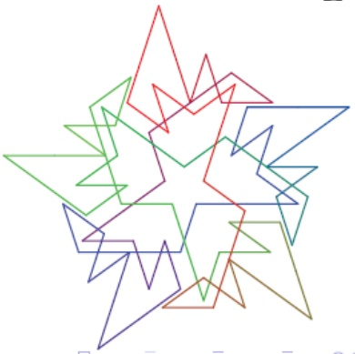

[Source: Marijn J.H. Heule, 2009, in work on van der Waerden numbers]

**Correcting Irregularities:**

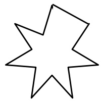

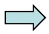

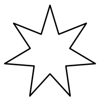

**Generalizing / Formalizing Regularities:**

| 1 | 2 | 3 |
| --- | --- | --- |
| 3 | 1 | 2 |
| 2 | 3 | 1 |

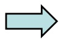

Cyclic Latin square

of order 3

| 1 | 2 | 3 | 4 |
| --- | --- | --- | --- |
| 4 | 1 | 2 | 3 |
| 3 | 4 | 1 | 2 |
| 2 | 3 | 4 | 1 |

Cyclic Latin square

of order 4

<!-- page: 19 -->

## Proposed Framework: Formal Description and Overview

$\mathcal{O} \leftarrow \emptyset;$ // Conjectured streamliners
$\Gamma \leftarrow \emptyset;$ // Search streamliners
$\rho \leftarrow \rho_0;$ // Search parameter
$\mathcal{S} \leftarrow \emptyset;$ // Solutions found
$\tau \leftarrow false;$ // Timeout flag
repeat
    $Solve(P_\rho, \Gamma, t) \to (S', \tau);$ // Search for new solutions
    if $S' \cap S \neq \emptyset$ then
        $\mathcal{S} \leftarrow \mathcal{S} \cup \mathcal{S}';$ // Case 1: successful search
        Analyze(S) $\rightarrow$ $\mathcal{O}';$ // Conjecture new streamliners
        $\mathcal{O} \leftarrow \mathcal{O} \cup \mathcal{O}';$
        $\rho \leftarrow \rho + 1;$
    else if $\tau$ is true then
        Select $\Gamma' \subseteq \mathcal{O};$ // Case 2: timed-out failed search
        $\Gamma \leftarrow \Gamma \cup \Gamma';$ // Strengthen streamliners
    else
        Select $\Gamma' \subseteq \Gamma;$ // Case 3: exhaustive failed search
        $\Gamma \leftarrow \Gamma \setminus \Gamma';$ // Weaken streamliners
        $\rho = max\{\rho : \mathcal{S}(\Gamma) \cap \mathcal{S}(P_\rho) \neq \emptyset\} + 1;$
        Select $\Gamma'' \subseteq \Gamma';$ // Find next parameter of interest
        $\mathcal{O} \leftarrow \mathcal{O} \setminus \Gamma'';$ // Drop unpromising streamliners
    until $\mathcal{O} = \emptyset;$

Algorithm : Discover-Construction procedure for a given problem P, with parameter set ρ and timeout t.

<!-- page: 20 -->

$\mathcal{O} \leftarrow \emptyset;$ // Conjectured streamliners
$\Gamma \leftarrow \emptyset;$ // Search streamliners
$\rho \leftarrow \rho_0;$ // Search parameter
$\mathcal{S} \leftarrow \emptyset;$ // Solutions found
$\tau \leftarrow false;$ // Timeout flag
repeat
2 Solve($P_\rho, \Gamma, t$) → ($\mathcal{S}'$, $\tau$); // Search for new solutions
if $S' \cap \mathcal{S} \neq \emptyset$ then
1 $S \leftarrow S \cup S'$; // Case 1: successful search
Analyze($\mathcal{S}$) → $O'$; // Conjecture new streamliners
4 $O \leftarrow O \cup O'$;
$\rho \leftarrow \rho + 1;$
else if $\tau$ is true then
3 Select $\Gamma' \subseteq O$; // Case 2: timed-out failed search
$\Gamma \leftarrow \Gamma \cup \bar{\Gamma'};$ // Strengthen streamliners
else
Select $\Gamma' \subseteq \Gamma$; // Case 3: exhaustive failed search
$\Gamma \leftarrow \Gamma \setminus \bar{\Gamma'};$ // Weaken streamliners
$\rho = max\{\rho : S(\Gamma) \cap S(P_\rho) \neq \emptyset\} + 1;$
Select $\Gamma'' \subseteq \Gamma'$; // Find next parameter of interest
$O \leftarrow O \setminus \bar{\Gamma''};$ // Drop unpromising streamliners
until $O = \emptyset$;

Algorithm : Discover-Construction procedure for a given problem P, with parameter set ρ and timeout t.

Analyze smaller size solutions, and **conjecture potential regularities** in the solutions. (Human insight.)

Validate through **streamlining** the observed regularities.

3)3 If the streamlined search **does not give a larger size solution**, the proposed regularity is quite likely **accidental** and one looks for a new pattern in the small scale solutions.

Otherwise, one proceeds by generating a number of **new solutions** that all contain the proposed **structural regularity** and are used to expand the solution set and to **reveal new regularities**.

<!-- page: 21 -->

## Overview on the SBLS problem

Search Parameters

$$
n = 3
$$

Conjectured Streamliners

$$
\Gamma = \{\}
$$

<u>Solution Set</u>

**Start with first order of interest (n=3) and no streamliners (Г={})**

<!-- page: 22 -->

## Overview on the SBLS problem

Search Parameters

$$
n = 3
$$

Conjectured Streamliners

<u>Solution Set</u>

$$
\Gamma = \{\}
$$

**Start with lowest order of interest (n=3) and no streamliners (Г={})**

**Solve for n and Г**

<!-- page: 23 -->

## Overview on the SBLS problem

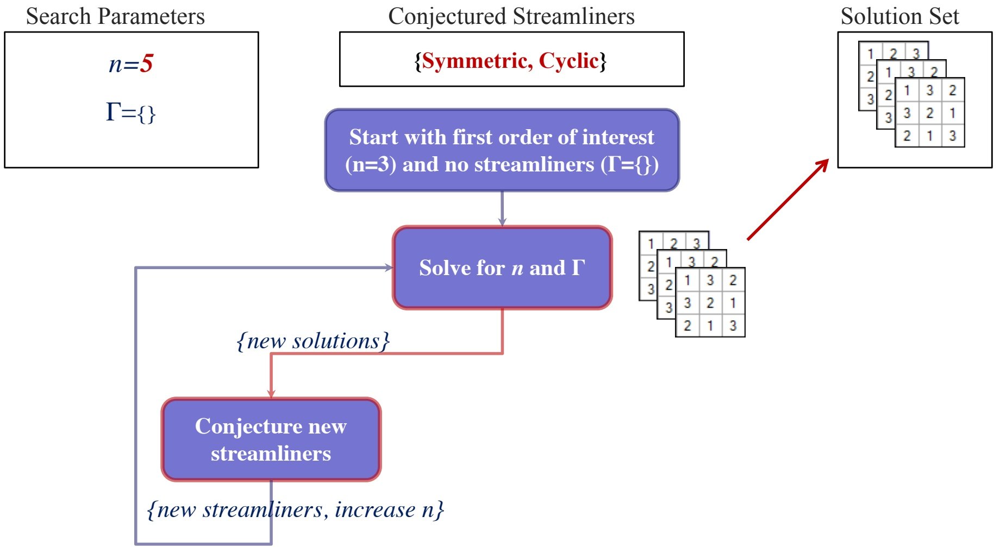

<!-- page: 24 -->

## Overview on the SBLS problem

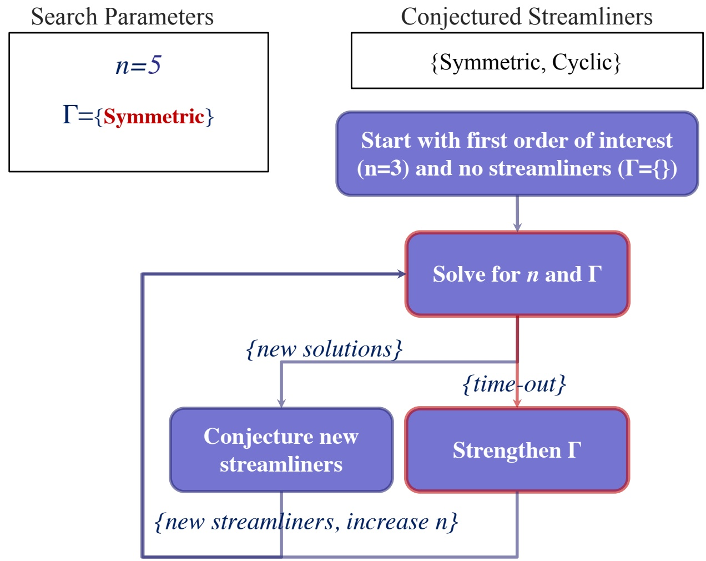

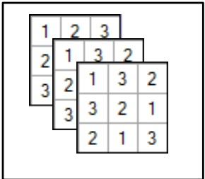

<!-- page: 25 -->

## Overview on the SBLS problem

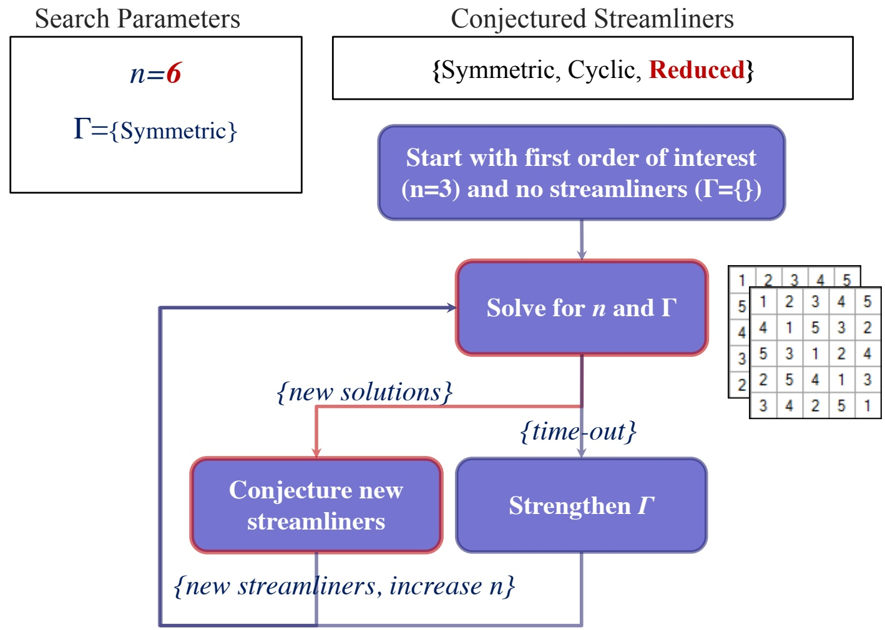

Solution Set

| 1 | 2 | 3 |  |  |
| --- | --- | --- | --- | --- |
| 2 | 1 | 3 | 2 |  |
| 3 | 2 | 1 | 3 | 2 |
|  | 3 | 3 | 2 | 1 |
|  |  | 2 | 1 | 3 |

| 1 | 2 | 3 | 4 | 5 |  |
| --- | --- | --- | --- | --- | --- |
| 5 | 1 | 2 | 3 | 4 | 5 |
| 4 | 4 | 1 | 5 | 3 | 2 |
| 3 | 5 | 3 | 1 | 2 | 4 |
| 2 | 2 | 5 | 4 | 1 | 3 |
|  | 3 | 4 | 2 | 5 | 1 |

<!-- page: 26 -->

## Overview on the SBLS problem

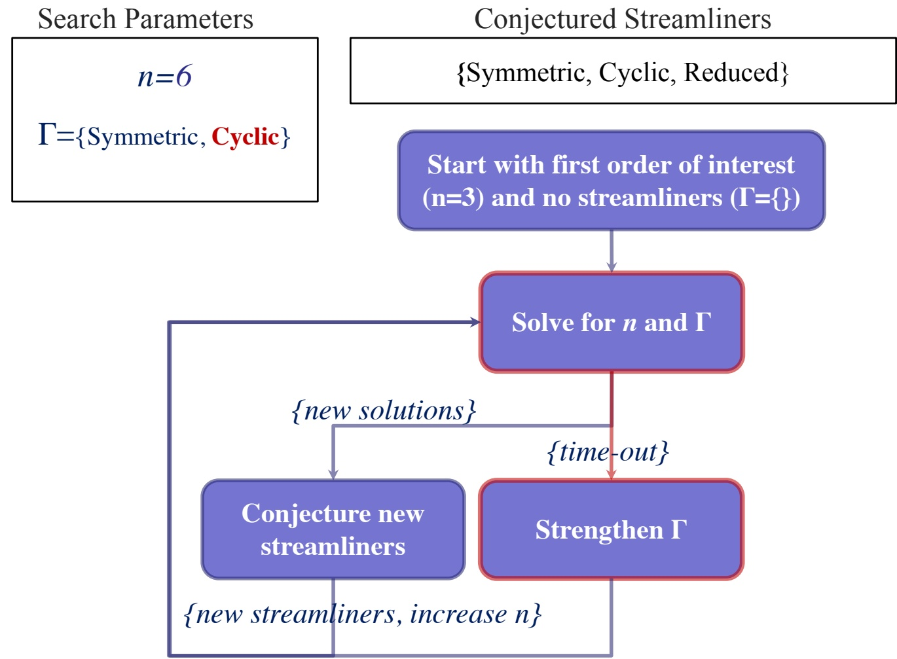

## Solution Set

<table><tr><td>1</td><td>2</td><td>3</td><td></td><td></td></tr><tr><td>2</td><td>1</td><td>3</td><td>2</td><td></td></tr><tr><td rowspan="3">3</td><td>2</td><td>1</td><td>3</td><td>2</td></tr><tr><td rowspan="2">3</td><td>3</td><td>2</td><td>1</td></tr><tr><td>2</td><td>1</td><td>3</td></tr></table>

<!-- page: 27 -->

## Overview on the SBLS problem

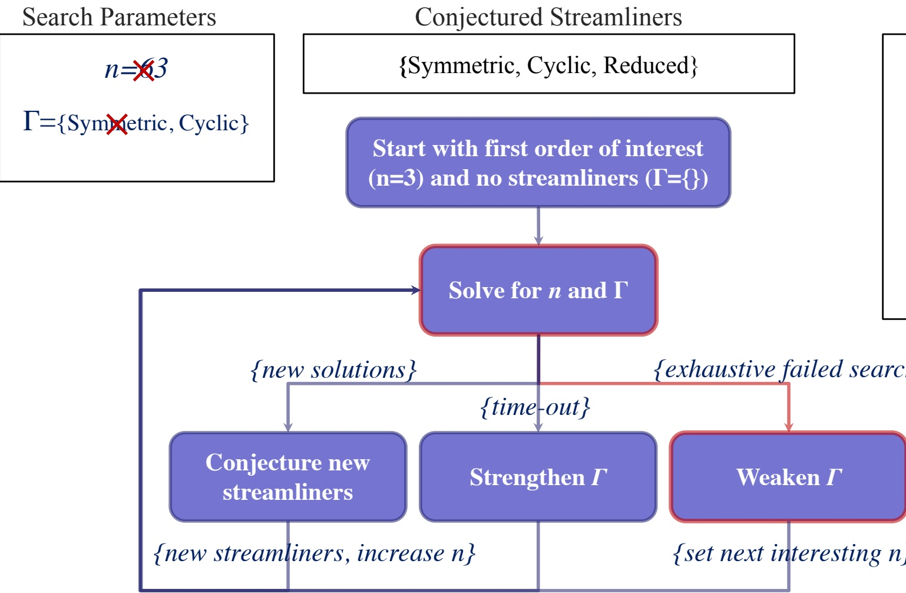

Solution Set

<table><tr><td rowspan="5"></td><td>1</td><td>2</td><td>3</td><td></td><td></td></tr><tr><td>2</td><td>1</td><td>3</td><td>2</td><td></td></tr><tr><td rowspan="3">3</td><td>2</td><td>1</td><td>3</td><td>2</td></tr><tr><td rowspan="2">3</td><td>3</td><td>2</td><td>1</td></tr><tr><td>2</td><td>1</td><td>3</td></tr><tr><td rowspan="6"></td><td>1</td><td>2</td><td>3</td><td>4</td><td>5</td></tr><tr><td>5</td><td>1</td><td>2</td><td>3</td><td>4</td></tr><tr><td>4</td><td>4</td><td>1</td><td>5</td><td>3</td></tr><tr><td>3</td><td>5</td><td>3</td><td>1</td><td>2</td></tr><tr><td rowspan="2">2</td><td>2</td><td>5</td><td>4</td><td>1</td></tr><tr><td>3</td><td>4</td><td>2</td><td>5</td></tr></table>

<!-- page: 28 -->

| 1 | 2 | 3 | 4 | 5 | 6 |
| --- | --- | --- | --- | --- | --- |
| 2 | 4 | 6 | 5 | 3 | 1 |
| 3 | 6 | 4 | 1 | 2 | 5 |
| 4 | 5 | 1 | 3 | 6 | 2 |
| 5 | 3 | 2 | 6 | 1 | 4 |
| 6 | 1 | 5 | 2 | 4 | 3 |

## GUI for Human-guided Streamlined Search

Constructive Procedures Discovery Tool

File Edit Help

## Streamliner Name Symmetry

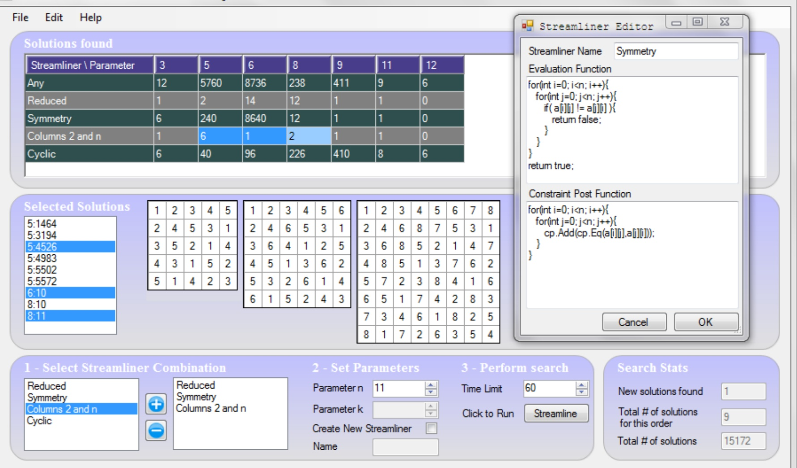

## Constraint Post Function

5:5502

8:10

OK

Reduced Symmetry Columns 2 and n Cyclic

Reduced Symmetry Columns 2 and n

Parameter n

11

Parameter k

Create New Streamliner

Name

Time Limit

60

Click to Run

Streamline

New solutions found

Total # of solutions for this order

Total # of solutions

<!-- page: 29 -->

## GUI for Human-guided Streamlined Search

## Constructive Procedures Discovery Tool

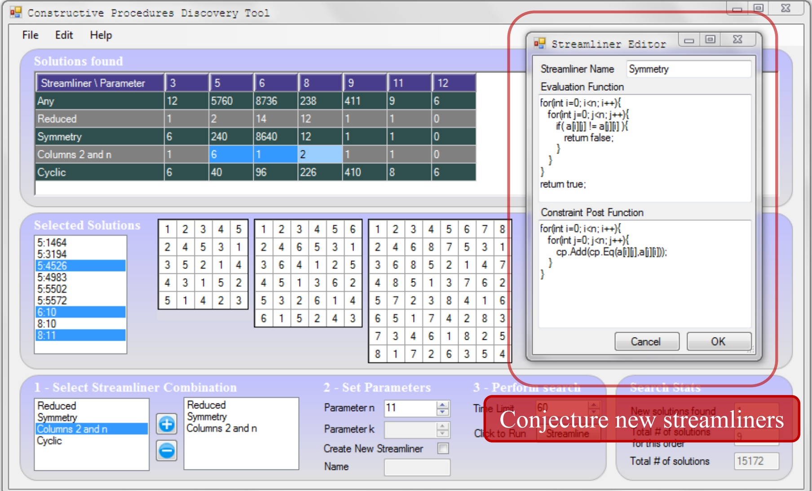

## Constraint Post Function

Reduced Symmetry Columns 2 and n Cyclic

Reduced Symmetry Columns 2 and n

Parameter n

## 3 - Perform search

Parameter k

Name

Create New Streamliner □

Total # of solutions

<!-- page: 30 -->

## GUI for Human-guided Streamlined Search

## Constructive Procedures Discovery Tool

## File Edit Help

□  x

| Streamliner \\ Parameter | 3 | 5 | 6 | 8 | 9 | 11 | 12 |
| --- | --- | --- | --- | --- | --- | --- | --- |
| Any | 12 | 5760 | 8736 | 238 | 411 | 9 | 6 |
| Reduced | 1 | 2 | 14 | 12 | 1 | 1 | 0 |
| Symmetry | 6 | 240 | 8640 | 12 | 1 | 1 | 0 |
| Columns 2 and n | 1 | 6 | 1 | 2 | 1 | 1 | 0 |
| Cyclic | 6 | 40 | 96 | 226 | 410 | 8 | 6 |

## Streamliner Name Symmetry

5:1464 5:3194 5:4526 5:4983 5:5502 5:5572

## Constraint Post Function

## Select streamliners, parameters, and perform the search

Cancel

OK

Reduced Symmetry Columns 2 and n Cyclic

Reduced Symmetry Columns 2 and n

Parameter n

11

Parameter k

Create New Streamliner

Name

Time Limit

60

Click to Run

Streamline

## New solutions found

<!-- page: 31 -->

## GUI for Human-guided Streamlined Search

## Select solutions

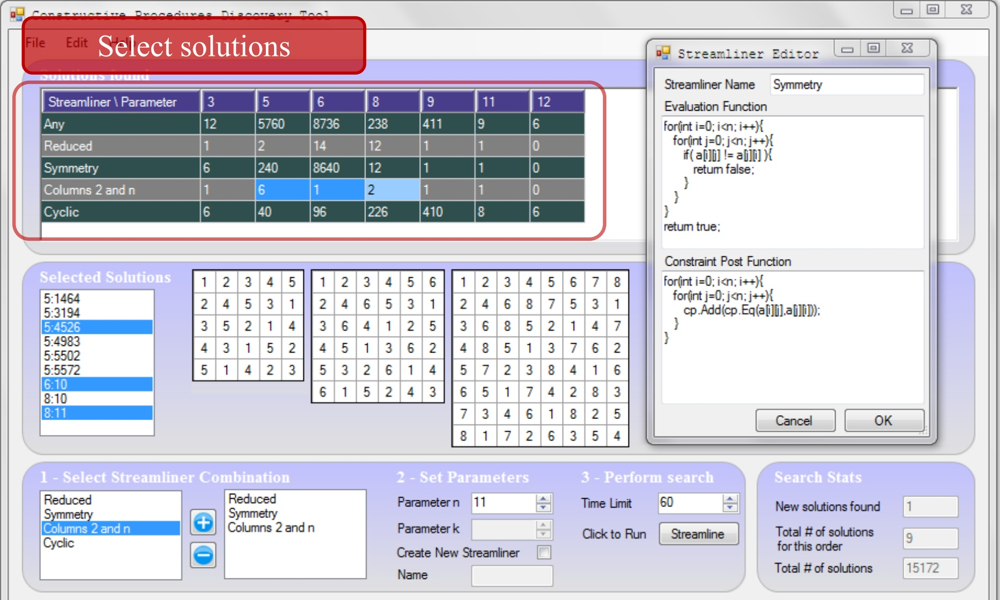

## Constraint Post Function

| 1 | 2 | 3 | 4 | 5 |
| --- | --- | --- | --- | --- |
| 2 | 4 | 5 | 3 | 1 |
| 3 | 5 | 2 | 1 | 4 |
| 4 | 3 | 1 | 5 | 2 |
| 5 | 1 | 4 | 2 | 3 |

| 1 | 2 | 3 | 4 | 5 | 6 |
| --- | --- | --- | --- | --- | --- |
| 2 | 4 | 6 | 5 | 3 | 1 |
| 3 | 6 | 4 | 1 | 2 | 5 |
| 4 | 5 | 1 | 3 | 6 | 2 |
| 5 | 3 | 2 | 6 | 1 | 4 |
| 6 | 1 | 5 | 2 | 4 | 3 |

| 1 | 2 | 3 | 4 | 5 | 6 | 7 | 8 |
| --- | --- | --- | --- | --- | --- | --- | --- |
| 2 | 4 | 6 | 8 | 7 | 5 | 3 | 1 |
| 3 | 6 | 8 | 5 | 2 | 1 | 4 | 7 |
| 4 | 8 | 5 | 1 | 3 | 7 | 6 | 2 |
| 5 | 7 | 2 | 3 | 8 | 4 | 1 | 6 |
| 6 | 5 | 1 | 7 | 4 | 2 | 8 | 3 |
| 7 | 3 | 4 | 6 | 1 | 8 | 2 | 5 |
| 8 | 1 | 7 | 2 | 6 | 3 | 5 | 4 |

Cancel

OK

Reduced Symmetry Columns 2 and n Cyclic

Reduced Symmetry Columns 2 and n

Parameter n

11

Parameter k

Create New Streamliner

Name

Time Limit

60

Click to Run

Streamline

New solutions found

Total # of solutions for this order

Total # of solutions

<!-- page: 32 -->

## GUI for Human-guided Streamlined Search

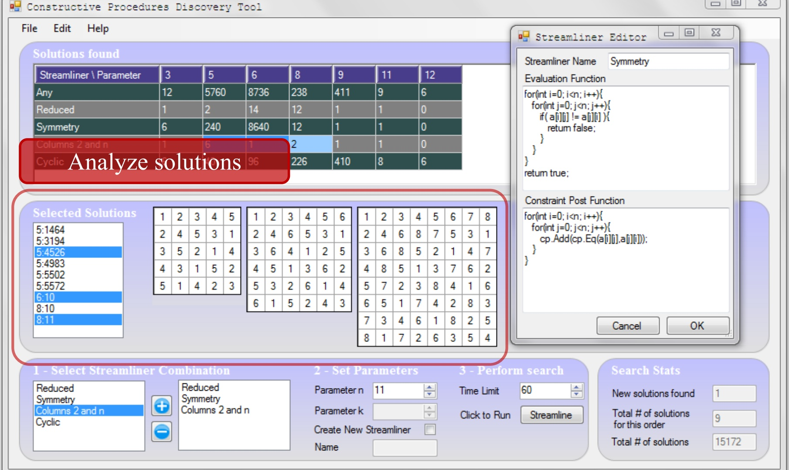

## Constraint Post Function

Columns 2 and n

Parameter n

Parameter k

Create New Streamliner

Name

Time Limit

Click to Run

Streamline

<!-- page: 33 -->

• Motivation

• Example Domain

• Proposed Framework

## • Application to the Spatially-Balanced Latin square problem

• Successful Streamliners

• Constructive Procedure 1

• Constructive Procedure 2

• Application to the Weak Schur Number problem

• Conclusions and Future work

<!-- page: 34 -->

## Application to the SBLS problem: Construction 1

## Successful Key Streamliners:

{Diagonal symmetry, Reduced form, Assignments of columns 2 and n, Multiples of i in row i, Second sequence decreasing}

| Streamliners | 5 | 6 | 8 | 9 | 11 | 14 |
| --- | --- | --- | --- | --- | --- | --- |
| $\Gamma_1 = \emptyset$ | 5760 | 15878 | - | - | - | - |
| $\Gamma_2 = \Gamma_1 \cup \{Symmetric\}$ | 240 | 8447 | 714 | 43 | - | - |
| $\Gamma_3 = \Gamma_2 \cup \{Reduced\}$ | 2 | 14 | 14 | 51 | - | - |
| $\Gamma_4 = \Gamma_3 \cup \{Columns 2 \& n\}$ | 1 | 1 | 2 | 1 | 1 | - |
| $\Gamma_5 = \Gamma_4 \cup \{Multiples of i\}$ | 1 | 1 | 2 | 1 | 1 | 1 |

Fig: Number of SBLSs generated in 60 seconds, by order and streamliners (Bold indicates exhaustive search).

<!-- page: 35 -->

## Application to the SBLS problem: Construction 1

| 1 | 2 | 3 | 4 | 5 | 6 | 7 | 8 |
| --- | --- | --- | --- | --- | --- | --- | --- |
| 2 | 4 | 6 | 8 | 7 | 5 | 3 | 1 |
| 3 | 6 | 8 | 5 | 2 | 1 | 4 | 7 |
| 4 | 8 | 5 | 1 | 3 | 7 | 6 | 2 |
| 5 | 7 | 2 | 3 | 8 | 4 | 1 | 6 |
| 6 | 5 | 1 | 7 | 4 | 2 | 8 | 3 |
| 7 | 3 | 4 | 6 | 1 | 8 | 2 | 5 |
| 8 | 1 | 7 | 2 | 6 | 3 | 5 | 4 |

| 1 | 2 | 3 | 4 | 5 | 6 | 7 | 8 | 9 |
| --- | --- | --- | --- | --- | --- | --- | --- | --- |
| 2 | 4 | 6 | 8 | 9 | 7 | 5 | 3 | 1 |
| 3 | 6 | 9 | 7 | 4 | 1 | 2 | 5 | 8 |
| 4 | 8 | 7 | 3 | 1 | 5 | 9 | 6 | 2 |
| 5 | 9 | 4 | 1 | 6 | 8 | 3 | 2 | 7 |
| 6 | 7 | 1 | 5 | 8 | 2 | 4 | 9 | 3 |
| 7 | 5 | 2 | 9 | 3 | 4 | 8 | 1 | 6 |
| 8 | 3 | 5 | 6 | 2 | 9 | 1 | 7 | 4 |
| 9 | 1 | 8 | 2 | 7 | 3 | 6 | 4 | 5 |

| 1 | 2 | 3 | 4 | 5 | 6 | 7 | 8 | 9 | 10 | 11 |
| --- | --- | --- | --- | --- | --- | --- | --- | --- | --- | --- |
| 2 | 4 | 6 | 8 | 10 | 11 | 9 | 7 | 5 | 3 | 1 |
| 3 | 6 | 9 | 11 | 8 | 5 | 2 | 1 | 4 | 7 | 10 |
| 4 | 8 | 11 | 7 | 3 | 1 | 5 | 9 | 10 | 6 | 2 |
| 5 | 10 | 8 | 3 | 2 | 7 | 11 | 6 | 1 | 4 | 9 |
| 6 | 11 | 5 | 1 | 7 | 10 | 4 | 2 | 8 | 9 | 3 |
| 7 | 9 | 2 | 5 | 11 | 4 | 3 | 10 | 6 | 1 | 8 |
| 8 | 7 | 1 | 9 | 6 | 2 | 10 | 5 | 3 | 11 | 4 |
| 9 | 5 | 4 | 10 | 1 | 8 | 6 | 3 | 11 | 2 | 7 |
| 10 | 3 | 7 | 6 | 4 | 9 | 1 | 11 | 2 | 8 | 5 |
| 11 | 1 | 10 | 2 | 9 | 3 | 8 | 4 | 7 | 5 | 6 |

| 1 | 2 | 3 | 4 | 5 | 6 | 7 | 8 | 9 | 10 | 11 | 12 | 13 | 14 |
| --- | --- | --- | --- | --- | --- | --- | --- | --- | --- | --- | --- | --- | --- |
| 2 | 4 | 6 | 8 | 10 | 12 | 14 | 13 | 11 | 9 | 7 | 5 | 3 | 1 |
| 3 | 6 | 9 | 12 | 14 | 11 | 8 | 5 | 2 | 1 | 4 | 7 | 10 | 13 |
| 4 | 8 | 12 | 13 | 9 | 5 | 1 | 3 | 7 | 11 | 14 | 10 | 6 | 2 |
| 5 | 10 | 14 | 9 | 4 | 1 | 6 | 11 | 13 | 8 | 3 | 2 | 7 | 12 |
| 6 | 12 | 11 | 5 | 1 | 7 | 13 | 10 | 4 | 2 | 8 | 14 | 9 | 3 |
| 7 | 14 | 8 | 1 | 6 | 13 | 9 | 2 | 5 | 12 | 10 | 3 | 4 | 11 |
| 8 | 13 | 5 | 3 | 11 | 10 | 2 | 6 | 14 | 7 | 1 | 9 | 12 | 4 |
| 9 | 11 | 2 | 7 | 13 | 4 | 5 | 14 | 6 | 3 | 12 | 8 | 1 | 10 |
| 10 | 9 | 1 | 11 | 8 | 2 | 12 | 7 | 3 | 13 | 6 | 4 | 14 | 5 |
| 11 | 7 | 4 | 14 | 3 | 8 | 10 | 1 | 12 | 6 | 5 | 13 | 2 | 9 |
| 12 | 5 | 7 | 10 | 2 | 14 | 3 | 9 | 8 | 4 | 13 | 1 | 11 | 6 |
| 13 | 3 | 10 | 6 | 7 | 9 | 4 | 12 | 1 | 14 | 2 | 11 | 5 | 8 |
| 14 | 1 | 13 | 2 | 12 | 3 | 11 | 4 | 10 | 5 | 9 | 6 | 8 | 7 |

<!-- page: 36 -->

## Application to the SBLS problem: Construction 1

| 1 | 2 | 3 | 4 | 5 | 6 | 7 | 8 | 9 | 10 | 11 | 12 | 13 | 14 |
| --- | --- | --- | --- | --- | --- | --- | --- | --- | --- | --- | --- | --- | --- |
| 2 | 4 | 6 | 8 | 10 | 12 | 14 | 13 | 11 | 9 | 7 | 5 | 3 | 1 |
| 3 | 6 | 9 | 12 | 14 | 11 | 8 | 5 | 2 | 1 | 4 | 7 | 10 | 13 |
| 4 | 8 | 12 | 13 | 9 | 5 | 1 | 3 | 7 | 11 | 14 | 10 | 6 | 2 |
| 5 | 10 | 14 | 9 | 4 | 1 | 6 | 11 | 13 | 8 | 3 | 2 | 7 | 12 |
| 6 | 12 | 11 | 5 | 1 | 7 | 13 | 10 | 4 | 2 | 8 | 14 | 9 | 3 |
| 7 | 14 | 8 | 1 | 6 | 13 | 9 | 2 | 5 | 12 | 10 | 3 | 4 | 11 |
| 8 | 13 | 5 | 3 | 11 | 10 | 2 | 6 | 14 | 7 | 1 | 9 | 12 | 4 |
| 9 | 11 | 2 | 7 | 13 | 4 | 5 | 14 | 6 | 3 | 12 | 8 | 1 | 10 |
| 10 | 9 | 1 | 11 | 8 | 2 | 12 | 7 | 3 | 13 | 6 | 4 | 14 | 5 |
| 11 | 7 | 4 | 14 | 3 | 8 | 10 | 1 | 12 | 6 | 5 | 13 | 2 | 9 |
| 12 | 5 | 7 | 10 | 2 | 14 | 3 | 9 | 8 | 4 | 13 | 1 | 11 | 6 |
| 13 | 3 | 10 | 6 | 7 | 9 | 4 | 12 | 1 | 14 | 2 | 11 | 5 | 8 |
| 14 | 1 | 13 | 2 | 12 | 3 | 11 | 4 | 10 | 5 | 9 | 6 | 8 | 7 |

**Approach reveals patterns. Final step is figuring out boundary conditions.**

<!-- page: 37 -->

## Application to the SBLS problem: Construction 1

| 1 | 2 | 3 | 4 | 5 | 6 | 7 | 8 | 9 | 10 | 11 | 12 | 13 | 14 |
| --- | --- | --- | --- | --- | --- | --- | --- | --- | --- | --- | --- | --- | --- |
| 2 | 4 | 6 | 8 | 10 | 12 | 14 | 13 | 11 | 9 | 7 | 5 | 3 | 1 |
| 3 | 6 | 9 | 12 | 14 | 11 | 8 | 5 | 2 | 1 | 4 | 7 | 10 | 13 |
| 4 | 8 | 12 | 13 | 9 | 5 | 1 | 3 | 7 | 11 | 14 | 10 | 6 | 2 |
| 5 | 10 | 14 | 9 | 4 | 1 | 6 | 11 | 13 | 8 | 3 | 2 | 7 | 12 |
| 6 | 12 | 11 | 5 | 1 | 7 | 13 | 10 | 4 | 2 | 8 | 14 | 9 | 3 |
| 7 | 14 | 8 | 1 | 6 | 13 | 9 | 2 | 5 | 12 | 10 | 3 | 4 | 11 |
| 8 | 13 | 5 | 3 | 11 | 10 | 2 | 6 | 14 | 7 | 1 | 9 | 12 | 4 |
| 9 | 11 | 2 | 7 | 13 | 4 | 5 | 14 | 6 | 3 | 12 | 8 | 1 | 10 |
| 10 | 9 | 1 | 11 | 8 | 2 | 12 | 7 | 3 | 13 | 6 | 4 | 14 | 5 |
| 11 | 7 | 4 | 14 | 3 | 8 | 10 | 1 | 12 | 6 | 5 | 13 | 2 | 9 |
| 12 | 5 | 7 | 10 | 2 | 14 | 3 | 9 | 8 | 4 | 13 | 1 | 11 | 6 |
| 13 | 3 | 10 | 6 | 7 | 9 | 4 | 12 | 1 | 14 | 2 | 11 | 5 | 8 |
| 14 | 1 | 13 | 2 | 12 | 3 | 11 | 4 | 10 | 5 | 9 | 6 | 8 | 7 |

| a | a+i |
| --- | --- |

for row $i = 1, \ldots, N$ do
    $k = 1;$ // Sequence number
    $j = 1;$ // Column index
    $a_{i,j} = i;$ // First symbol of row $i$
    while $j &lt; N$ do
        if $k$ is odd then // Odd sequence
            while $a_{i,j} + i \leq N$ and $j &lt; N$ do
                $a_{i,j+1} = a_{i,j} + i;$
                $j = j + 1;$
        else // Even sequence
            while $a_{i,j} - i \geq 1$ and $j &lt; N$ do
                $a_{i,j+1} = a_{i,j} - i;$
                $j = j + 1;$
        if $j &lt; N$ then // Switch sequence
            if $k$ is odd then
                $a_{i,j+1} = 2N + 1 - i - a_{i,j};$
            else
                $a_{i,j+1} = i - a_{i,j};$
            $k = k + 1;$
            $j = j + 1;$

Algorithm : SBLS-sequence procedure for SBLS of order N, when 2N + 1 is prime.

<!-- page: 38 -->

## Application to the SBLS problem: Construction 1

| 1 | 2 | 3 | 4 | 5 | 6 | 7 | 8 | 9 | 10 | 11 | 12 | 13 | 14 |
| --- | --- | --- | --- | --- | --- | --- | --- | --- | --- | --- | --- | --- | --- |
| 2 | 4 | 6 | 8 | 10 | 12 | 14 | 13 | 11 | 9 | 7 | 5 | 3 | 1 |
| 3 | 6 | 9 | 12 | 14 | 11 | 8 | 5 | 2 | 1 | 4 | 7 | 10 | 13 |
| 4 | 8 | 12 | 13 | 9 | 5 | 1 | 3 | 7 | 11 | 14 | 10 | 6 | 2 |
| 5 | 10 | 14 | 9 | 4 | 1 | 6 | 11 | 13 | 8 | 3 | 2 | 7 | 12 |
| 6 | 12 | 11 | 5 | 1 | 7 | 13 | 10 | 4 | 2 | 8 | 14 | 9 | 3 |
| 7 | 14 | 8 | 1 | 6 | 13 | 9 | 2 | 5 | 12 | 10 | 3 | 4 | 11 |
| 8 | 13 | 5 | 3 | 11 | 10 | 2 | 6 | 14 | 7 | 1 | 9 | 12 | 4 |
| 9 | 11 | 2 | 7 | 13 | 4 | 5 | 14 | 6 | 3 | 12 | 8 | 1 | 10 |
| 10 | 9 | 1 | 11 | 8 | 2 | 12 | 7 | 3 | 13 | 6 | 4 | 14 | 5 |
| 11 | 7 | 4 | 14 | 3 | 8 | 10 | 1 | 12 | 6 | 5 | 13 | 2 | 9 |
| 12 | 5 | 7 | 10 | 2 | 14 | 3 | 9 | 8 | 4 | 13 | 1 | 11 | 6 |
| 13 | 3 | 10 | 6 | 7 | 9 | 4 | 12 | 1 | 14 | 2 | 11 | 5 | 8 |
| 14 | 1 | 13 | 2 | 12 | 3 | 11 | 4 | 10 | 5 | 9 | 6 | 8 | 7 |

a a+i a a-ì

for row $i = 1, \ldots, N$ do
    $k = 1;$ // Sequence number
    $j = 1;$ // Column index
    $a_{i,j} = i;$ // First symbol of row $i$
    while $j &lt; N$ do
        if $k$ is odd then // Odd sequence
            while $a_{i,j} + i \leq N$ and $j &lt; N$ do
                $a_{i,j+1} = a_{i,j} + i;$
                $j = j + 1;$
        else // Even sequence
            while $a_{i,j} - i \geq 1$ and $j &lt; N$ do
                $a_{i,j+1} = a_{i,j} - i;$
                $j = j + 1;$
        if $j &lt; N$ then // Switch sequence
            if $k$ is odd then
                $a_{i,j+1} = 2N + 1 - i - a_{i,j};$
            else
                $a_{i,j+1} = i - a_{i,j};$
            $k = k + 1;$
            $j = j + 1;$

Algorithm : SBLS-sequence procedure for SBLS of order N, when 2N + 1 is prime.

Proof of Correctness in [R. Le Bras, et al., Polynomial Time Construction for Spatially Balanced Latin Squares, 2012]

<!-- page: 39 -->

## Application to the SBLS problem: Construction 2

| 1 | 2 | 6 | 3 | 9 | 7 | 13 | 4 | 11 | 10 | 12 | 8 | 5 | 14 |
| --- | --- | --- | --- | --- | --- | --- | --- | --- | --- | --- | --- | --- | --- |
| 2 | 3 | 7 | 4 | 10 | 8 | 14 | 5 | 12 | 11 | 13 | 9 | 6 | 1 |
| 3 | 4 | 8 | 5 | 11 | 9 | 1 | 6 | 13 | 12 | 14 | 10 | 7 | 2 |
| 4 | 5 | 9 | 6 | 12 | 10 | 2 | 7 | 14 | 13 | 1 | 11 | 8 | 3 |
| 5 | 6 | 10 | 7 | 13 | 11 | 3 | 8 | 1 | 14 | 2 | 12 | 9 | 4 |
| 6 | 7 | 11 | 8 | 14 | 12 | 4 | 9 | 2 | 1 | 3 | 13 | 10 | 5 |
| 7 | 8 | 12 | 9 | 1 | 13 | 5 | 10 | 3 | 2 | 4 | 14 | 11 | 6 |
| 8 | 9 | 13 | 10 | 2 | 14 | 6 | 11 | 4 | 3 | 5 | 1 | 12 | 7 |
| 9 | 10 | 14 | 11 | 3 | 1 | 7 | 12 | 5 | 4 | 6 | 2 | 13 | 8 |
| 10 | 11 | 1 | 12 | 4 | 2 | 8 | 13 | 6 | 5 | 7 | 3 | 14 | 9 |
| 11 | 12 | 2 | 13 | 5 | 3 | 9 | 14 | 7 | 6 | 8 | 4 | 1 | 10 |
| 12 | 13 | 3 | 14 | 6 | 4 | 10 | 1 | 8 | 7 | 9 | 5 | 2 | 11 |
| 13 | 14 | 4 | 1 | 7 | 5 | 11 | 2 | 9 | 8 | 10 | 6 | 3 | 12 |
| 14 | 1 | 5 | 2 | 8 | 6 | 12 | 3 | 10 | 9 | 11 | 7 | 4 | 13 |

$c_{1,1} = 1;$ // Generate 1st row of the conjugate
for column $j = 2, \ldots, N$ do // Observed pattern 1, 2, 4, ...
    if $2c_{1,j-1} \leq N$ then
        $c_{1,j} = 2c_{1,j-1};$
    else
        $c_{1,j} = 2N + 1 - 2c_{1,j-1};$
for row $i = 2, \ldots, N$ do // Subsequent rows
    $c_{i,1} = c_{i-1,N};$ // Shifted version of previous
    for column $j = 2, \ldots, N$ do
        $c_{i,j} = c_{i-1,j-1};$
for row $i = 1, \ldots, N$ do // Generate SBLS from conjugate
    for column $j = 1, \ldots, N$ do
        $a_{i,c_{i,j}} = j;$

Algorithm: SBLS-Cyclic procedure.

<!-- page: 40 -->

## Incremental approach in terms of size is necessary:

**Need to reveal structure by generating increasingly larger solutions using increased streamlining (and thus, structure).**

**True solution structure only becomes visible around order 14.**

## At that size

**(1) Can’t generate any solution of that size without strong streamlining,**

**(2) But, even if we could, arbitrary solutions will not show structure.**

<!-- page: 41 -->

## Observation II

**We conjecture that many hard combinatorial design problems have effective constructive procedures. (E.g., quasigroup existence problems, code design, Ramsey graphs (numbers), van der Waerden, Schur numbers etc.).**

**So far, such problems have been tackled with combinatorial search (SAT solvers, equational thm. provers) on a per instance basis. Does resolve open questions in combinatorial design (e.g. new lower-bounds) but does not reveal the general solution structure.**

**E.g. Slaney et al. 1993, Herwig et al. 2007, Heule and Walsh 2010 Eliahou et al. 2012, Fujita et al. 2013.**

<!-- page: 42 -->

## Example: the Weak Schur problem

## Problem Definition:

■ A set is (**weakly) sum free** if for any two (distinct) elements of this set, their sum does not belong to the set.

■ The **Weak Schür Number** of order k, $W S ( k )$ , is the largest integer n for which there exists a partition of [1,n] into k weakly sum-free sets.

$$
k = 3 \text {sets} \quad \left\langle \begin{array}{c c} & \framebox {1 2 4 8 1 1 2 2} \\ \hline & 3 5 - 7 1 9 2 1 2 3 \\ \hline & 9 1 0 1 2 - 1 8 2 0 \end{array} \right|
$$

**Each of the 3 sets is such that, for any 2 elements of the set, their sum does not belong to the same set.**

Fig: **Partition of [1,23] into 3 weakly sum**free sets, proving $W S ( 3 ) \geq 2 3$

<!-- page: 43 -->

## Application to the Weak Schur problem

## Best known lower bounds:

| Approach | WS(5) | WS(6) | Reference |
| --- | --- | --- | --- |
| (not disclosed) | 196 | - | [G.W. Walker, AMM'50] |
| Theoretical bound (notproved) | 188 | 554 | [J.H. Braun, AMM'50] |
| SAT | 196 | 572 | [Eliahou et al., Computers &amp; Math Applications'12] |
| Multi-level Tabu-Search | 196 | 574 | [Fonlupt et al., EA'11] |
| SAT (no certificate) | 196 | 575 | [Eliahou et al., Computers &amp; Math Applications'12] (revised) |

New: $W S ( 6 ) \geq 5 8 1$

<!-- page: 44 -->

## Successful Key Streamliners:

{Ordered sets, constrained minimum of each set, partial assignments, sequences of consecutive integers, sequence interleaving}

<!-- page: 45 -->

## Application to the Weak Schur problem

## Successful Key Streamliners:

{Ordered sets, constrained minimum of each set, partial assignments, sequences of consecutive integers, sequence interleaving}

| 1 2 4 8 11 22 25 50 63 68 139 149 154 177 182 192 198 393 398 408 413 436 450 455 521 526 540 563 568 578 |
| --- |
| 3 5-7 19 21 23 51-53 64-66 136-138 150-152 179-181 193-195 395-397 409-411 438-440 451-453 523-525 536-538 565-567 579-581 |
| 9 10 12-18 20 54-62 140-148 183-191 399-407 441-449 527-535 569-577 |
| 24 26-49 153 155-176 178 412 414-435 437 539 541-562 564 |
| 67 69-135 454 456-520 522 |
| 196 197 199-392 394 |

**Partition of [1,581] into 6 weakly sumfree sets, proving WS(6) ≥ 581.**

■ Incrementally obtained, although **not** an example of a **fully constructive procedure** yet, any progress on Schur numbers is quite **significant** given their long history.

(le Bras, Gomes,

Selman AAAI 2012)

<!-- page: 46 -->

## Summary

**■ Structure discovery** through a general framework that integrates **streamlined** combinatorial search with **human insight and intuition** in an **iterative** approach to discover **efficient constructive procedures**.

■ Provides the **first constructive procedures** for the **Spatially-Balanced Latin Square** problem.

■ Also, improves the best known **lower bound** for the **Weak Schur Number** problem, and, most recently, for “Graceful graphs.”

<!-- page: 47 -->

■ Extensions **crowd-source** the search for regularities in the solution sets (on Mechanical Turk).

And much, much more ambitiously…

--- Ramsey numbers (Erdos), and

--- possibly, new types of algorithms.

<!-- page: 48 -->

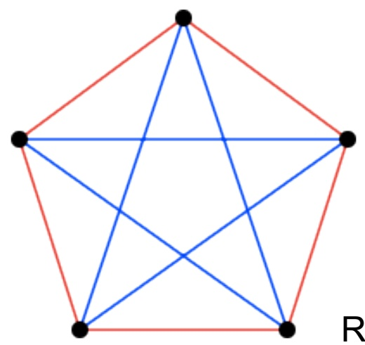

here **5 nodes red/blue edges no blue or red triangle**

**6+ nodes**

**always a blue or red triangle R(3,3) = 6**

Ramsey theory about “forced” structure

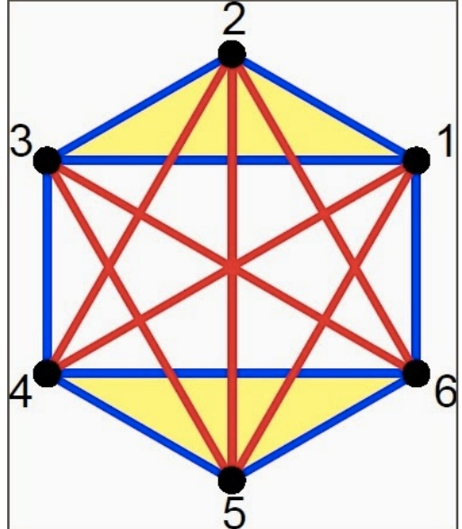

**“unavoidable structure in our universe”**

**Erdos: "Imagine an alien force, vastly more powerful than us landing on Earth and demanding the value of R(5, 5) or they will destroy our planet.” [hmm?]**

**In that case, we should marshal all our computers and all our mathematicians and attempt to find the value. …**

**But suppose, instead, that they asked for R(6, 6), then we should attempt to destroy the aliens".**

**Situation is probably not quite as dire.** J

**The key will be to find the hidden structure in the solution space.**

<!-- page: 49 -->

# Part II: Crowdsourcing for Backdoor Variables: Materials Discovery Domain

**Briefly!**

**Warning: Real-world, noisy data ahead**

<!-- page: 50 -->

Study of new materails: Identifying crystalline structure using **X-Ray Diffraction patterns**

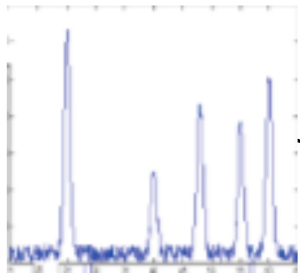

[Source: Pyrotope, Sebastien Merkel]

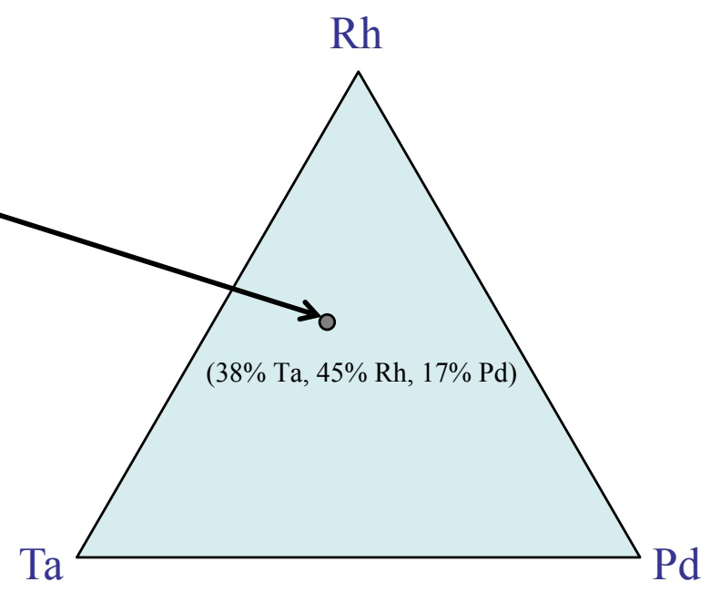

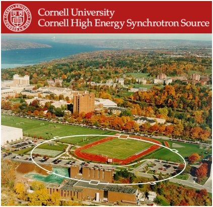

**With Caltech, working on screening 1 million samples per day.**

<!-- page: 51 -->

## Phase Map Identification Problem

## INPUT:

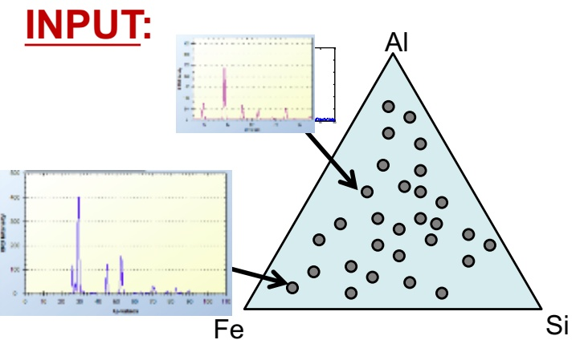

Collection of X-Ray diffraction Patterns. Noisy and hidden structure.

## Additional Physical Requirements:

• Phase Connectivity

• Mixtures of $\leq 3$ pure phases

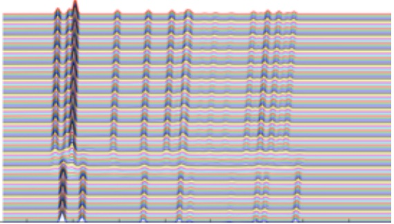

Peaks shift $b y \leq 1 5 \%$ within a region – Continuous and Monotonic

§ Small peaks might be discriminative

Peak locations matter, more than peak intensities

## OUTPUT:

**m phase regions** × **k pure regions**

× **m-k mixed regions**

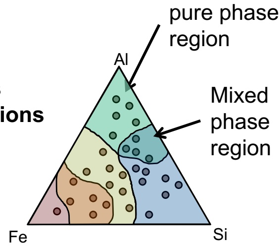

<!-- page: 52 -->

## Complex Full Constraint Optimization Model

| $p_{ki}$ | Normalizing element for phase $k$ in pattern $P_i$ |
| --- | --- |
| $a_{ki}$ | Whether phase $k$ is present in pattern $P_i$ |
| $q_k$ | Set of normalized peak locations of phase $B_k$ |

$$
(a _ {k i} = 0) \underset {K} {\Longleftrightarrow} (p _ {k i} = 0)
$$

$$
\forall 1 \leq k \leq K, 1 \leq i \leq n\tag{1}
$$

$$
1 \leq \sum a _ {s i} \leq M
$$

$$
\forall 1 \leq i \leq n\tag{2}
$$

$$
(p _ {k i} = j) \Rightarrow (q _ {k} \subseteq r _ {i j})
$$

$$
\forall 1 \leq k \leq K, 1 \leq i \leq n, 1 \leq j \leq | P _ {i} |\tag{3}
$$

$$
(p _ {k i} = j \land \sum_ {s = 1} ^ {K} a _ {s i} = 1) \Rightarrow (r _ {i j} \subseteq q _ {k})
$$

$$
\forall 1 \leq k \leq K, 1 \leq i \leq n, 1 \leq j \leq | P _ {i} |\tag{4}
$$

$$
\begin{array}{l} (p _ {k i} = j \land p _ {k ^ {\prime} i} = j ^ {\prime} \land \sum_ {s = 1} ^ {K} a _ {s i} = 2) \\ \Rightarrow \bigl (m e m b e r (r _ {i j} [ j ^ {\prime \prime} ], q _ {k}) \lor m e m b e r (r _ {i j ^ {\prime}} [ j ^ {\prime \prime} ], q _ {k ^ {\prime}}) \bigr) \end{array}
$$

$$
\forall 1 \leq k, k ^ {\prime} \leq K, 1 \leq i \leq n, 1 \leq j, j ^ {\prime}, j ^ {\prime \prime} \leq | P _ {i} |\tag{5}
$$

$$
(p _ {k i} = j) \Rightarrow (p _ {k i ^ {\prime}} \neq j ^ {\prime}) \quad \forall 1 \leq k \leq K, (i, j, i ^ {\prime}, j ^ {\prime}) \in \varPhi\tag{6}
$$

$$
\Phi = \{(i, j, i ^ {\prime}, j ^ {\prime}) \mid \frac {P _ {i} [ j ]}{P _ {i} ^ {\prime} [ j ^ {\prime} ]} <   1 / \delta \vee \frac {P _ {i} [ j ]}{P _ {i} ^ {\prime} [ j ^ {\prime} ]} > \delta , i <   i ^ {\prime} \}
$$

$$
b a s i s P a t t e r n C o n n e c t i v i t y (\{a _ {k i} | 1 \leq i \leq n \}) \quad \forall 1 \leq k \leq K\tag{7}
$$

## Drawback:

**Does not scale to full-scale realistic instances; poor propagation of experimental noise.**

<!-- page: 53 -->

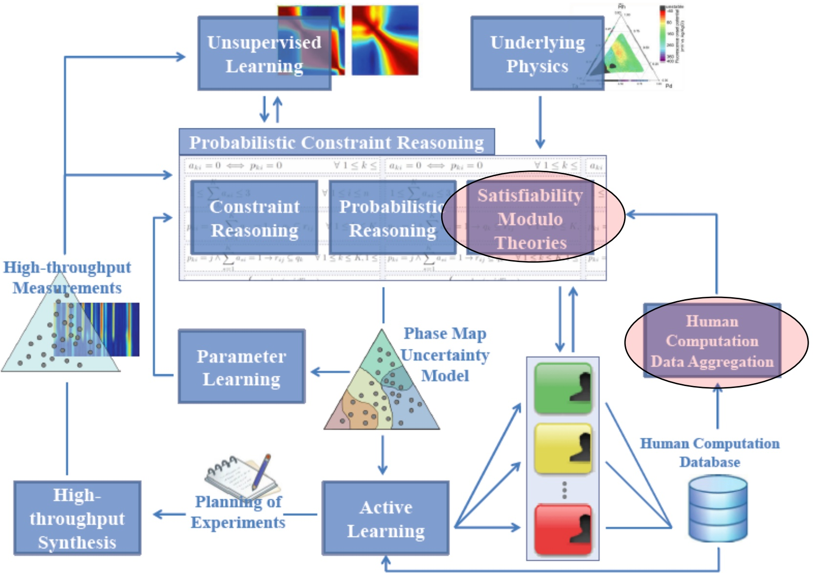

<!-- page: 54 -->

Al-Li-Fe instance with 6 phases:

Ground truth (known)

Previous work

(ML Based approaches) violates many physical requirements

Our SMT

## SAT Modulo Theory (SMT) Approach: Experimental Validation

approach is much more robust

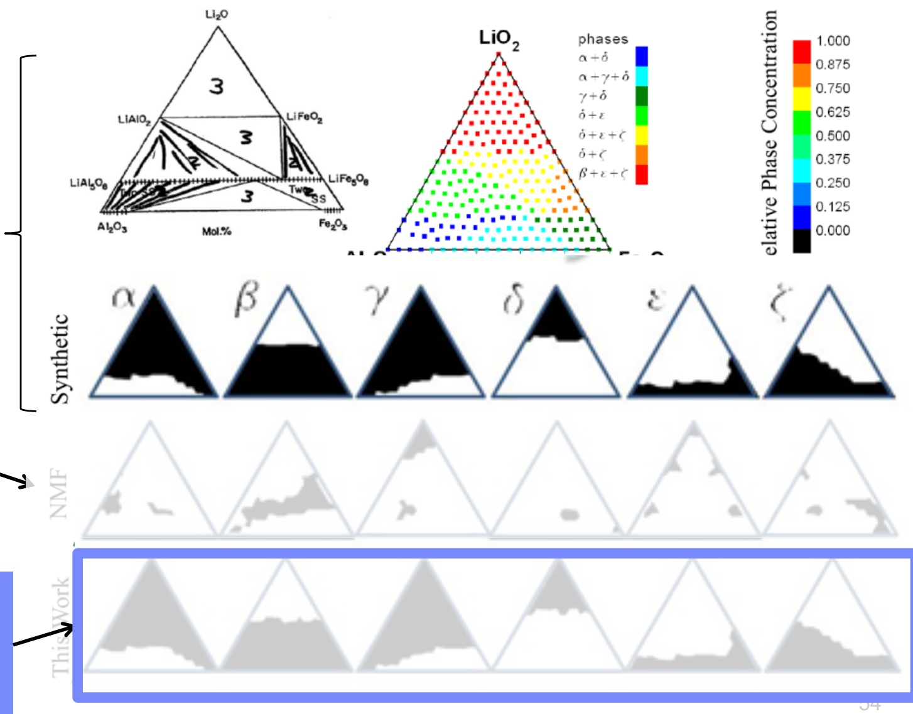

<!-- page: 55 -->

Can human input boost the performance of combinatorial reasoning and optimization methods (SMT)?

Human input about potential grouping of diffraction peaks collected on Amazon’s Mechanical Turk. (About 500 patterns) Provides info on potential so-called backdoor variables.

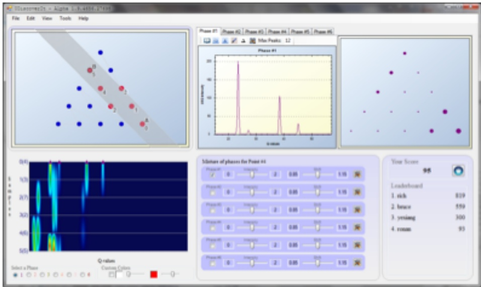

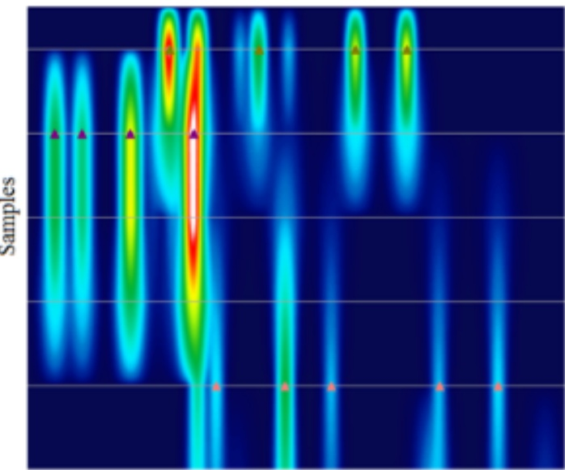

Angles of diffraction

<!-- page: 56 -->

<table><tr><td rowspan="2">System</td><td colspan="5">Dataset</td><td rowspan="2">Time w/o user input (s)</td><td rowspan="2">Time w/ user input (s)</td><td rowspan="2"># assigned var. by user</td></tr><tr><td>P</td><td>L*</td><td>K</td><td>#var</td><td>#cst</td></tr><tr><td>A/B/C</td><td>36</td><td>8</td><td>4</td><td>408</td><td>2095</td><td>3502</td><td>150</td><td>19 (4.6%)</td></tr><tr><td>A/B/C</td><td>60</td><td>8</td><td>4</td><td>624</td><td>3369</td><td>17345</td><td>261</td><td>18 (2.9%)</td></tr><tr><td>Al/Li/Fe</td><td>15</td><td>6</td><td>6</td><td>267</td><td>1009</td><td>79</td><td>27</td><td>6 (2.2%)</td></tr><tr><td>Al/Li/Fe</td><td>28</td><td>6</td><td>6</td><td>436</td><td>1864</td><td>346</td><td>83</td><td>12 (2.7%)</td></tr><tr><td>Al/Li/Fe</td><td>28</td><td>8</td><td>6</td><td>490</td><td>2131</td><td>10076</td><td>435</td><td>26 (5.3%)</td></tr><tr><td>Al/Li/Fe</td><td>28</td><td>10</td><td>6</td><td>526</td><td>2309</td><td>28170</td><td>188</td><td>23 (4.3%)</td></tr><tr><td>Al/Li/Fe</td><td>45</td><td>7</td><td>6</td><td>693</td><td>3281</td><td>18882</td><td>105</td><td>28 (4.0%)</td></tr><tr><td>Al/Li/Fe</td><td>45</td><td>8</td><td>6</td><td>711</td><td>3410</td><td>46816</td><td>74</td><td>30 (4.2%)</td></tr></table>

**Human input can dramatically speed up the performance of combinatorial optimization methods (identification of backdoor variables).**

**Leverages the complementary strength of human input, providing global insights into problem structure, and the power of combinatorial solvers to exploit complex constraints.**

Note: Human input identifies subsets of peaks that (quite likely) go together.

<!-- page: 57 -->

## Observation

**Visual representation allows human input to be effective in discovering structure and setting backdoor variables in this domain.**

## Contrast with earlier work:

**SAT encodings of planning problems. It was very difficult to give any semantic interpretation to the backdoor variables of the problem instances. Synthetic planning formulas with log(n) size backdoors (provably).**

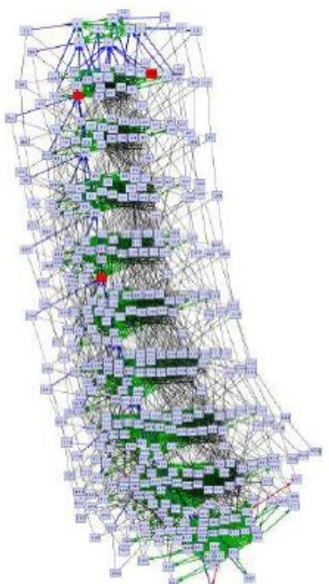

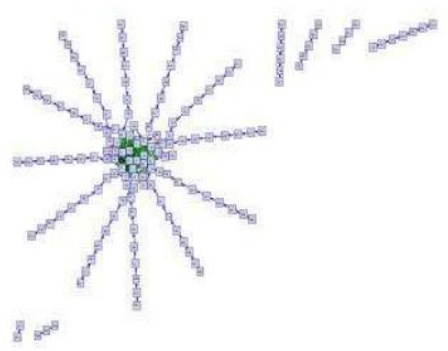

Setting 2 out of 392 variables.

<!-- page: 58 -->

**We have discussed how human insights can be combined with reasoning and optimization methods for scientific discovery.**

**Finite Mathematics --- Obtained first procedure for Spatially Balanced Latin Square construction.**

**Materials Discovery --- Boosted interpretation of X-ray diffraction patterns with crowdsourced input.**
