<!-- page: 1 -->

## Insights from Statistical Physics into Computational Complexity

**Bart Selman**

**Cornell University**

**Joint with Scott Kirkpatrick (IBM Research)**

<!-- page: 2 -->

**Computational Challenges**

## Many core computational tasks have been shown to be computationally intractable.

We have results in:

\- **reasoning**

-**planning**

\- **learning**

<!-- page: 3 -->

## A Few Examples

**Reasoning**

-many forms of deduction

-abduction / diagnosis

-default reasoning

-Bayesian inference

(e.g. de Kleer 1989)

(e.g. Kautz and Selman 1989)

(e.g. Dagum and Luby 1993)

## Planning

domain-dependent and independent (STRIPS) (e.g. Chapman 1987; Gupta and Nau 1991; Bylander 1994)

**Learning**

-neural net “loading” problem (e.g. Blum and Rivest 1989)

<!-- page: 4 -->

**Complexity Results, Cont.**

• An abundance of **negative** complexity results.

• Results often apply to **very restricted** formalisms, and also to finding **approximate** solutions.

<!-- page: 5 -->

# What is the practical impact of negative complexity results for AI?

**Does explain part of the difficulty in making advances in reasoning, planning, and learning**

# Many tasks appear to require exponentially growing search spaces.

**But, how about worst-case vs. average-case vs. typical case (practice)?**

<!-- page: 6 -->

**What Is The Impact Of These Results?**

• Results are based on a **worst-case** analysis and there continues to be a debate on their **practical** relevance.

• On the one hand, there are successful systems that do not appear to be hampered by the negative complexity results.

Examples: Bayesian net applications, Neural nets, CLASSIC KR system (Brachman et al. 1989)

<!-- page: 7 -->

• On the other hand, in other domains, negative complexity properties are a clear obstacle in **scaling-up** the systems.

Examples: ATMS diagnosis: 25+ components planning systems: 20+ objects and operators (Real domains: 1,000+ elements.)

• Contradictory experiences lead to the question:

**When and where do computationally**

**hard instances show up?**

<!-- page: 8 -->

## A better understanding of the nature of computationally hard problems.

B New stochastic methods for solving such problems.

<!-- page: 9 -->

## Overview

**PART A. Computationally Hard Instances** worst-case vs. average-case critically-constrained problems phase transitions

**PART B. Stochastic Methods** heuristic repair, GSAT, and simulated annealing comparison with systematic methods asymmetry consistency / inconsistency

**Summary**

<!-- page: 10 -->

## PART A. Computationally Hard Instances

• I’ll use the **propositional satisfiability problem (SAT)** to illustrate ideas and concepts throughout this talk.

• SAT: prototypical hard combinatorial search and reasoning problem.

Several of these concepts have also been studied in the context of **Constraint Satisfaction Problems**. In particular, see the work by Cheeseman and colleagues (1991).

<!-- page: 11 -->

## Satisfiability

• SAT: Given a formula in propositional calculus, is there an assignment to its variables making it true?

• We consider clausal form, e.g.:

(a b c) ( b d (b c e) . . .)

• Problem is NP-Complete. (Cook 1971)

• Shows surprising “power” of SAT for encoding computational problems.

• 2,000+ NP-complete problems identified so far.

<!-- page: 12 -->

**Eg FOL Theorem** Proving **sigh…**

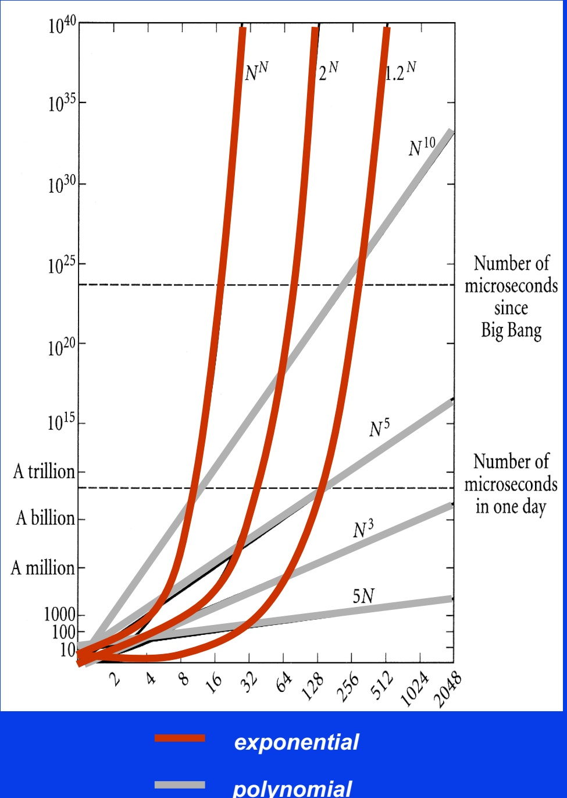

<!-- page: 13 -->

## SAT is an NP-complete problem

o Worst-case believed to be exponential (roughly 2N for N variables)

o 10,000+ problems in CS are NP-complete -- equally hard and “reducible” to one-another (e.g. planning, scheduling, protein folding, reasoning, traveling salesperson, …)

o P vs. NP --- \$1M Clay Prize

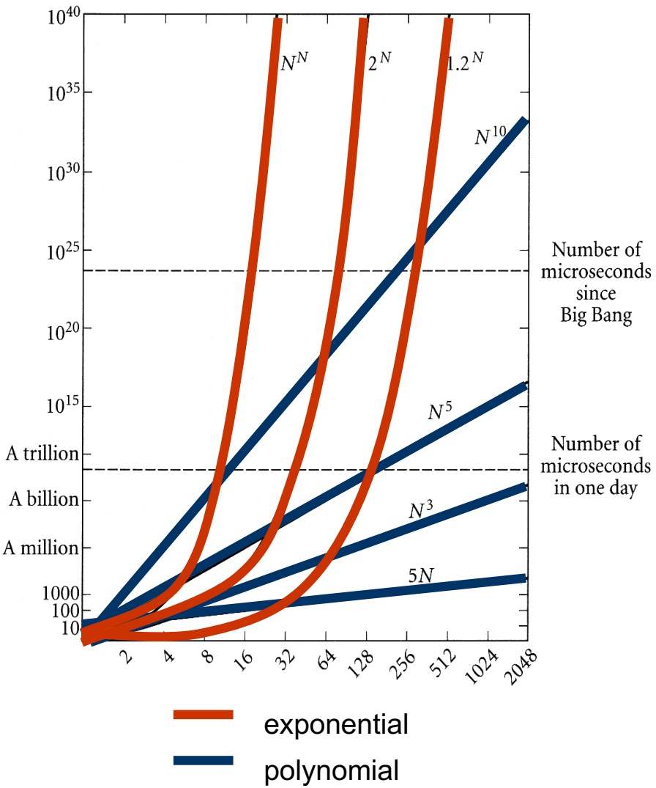

<!-- page: 14 -->

## Computational Complexity Hierarchy

EXP-complete: games like Go, …

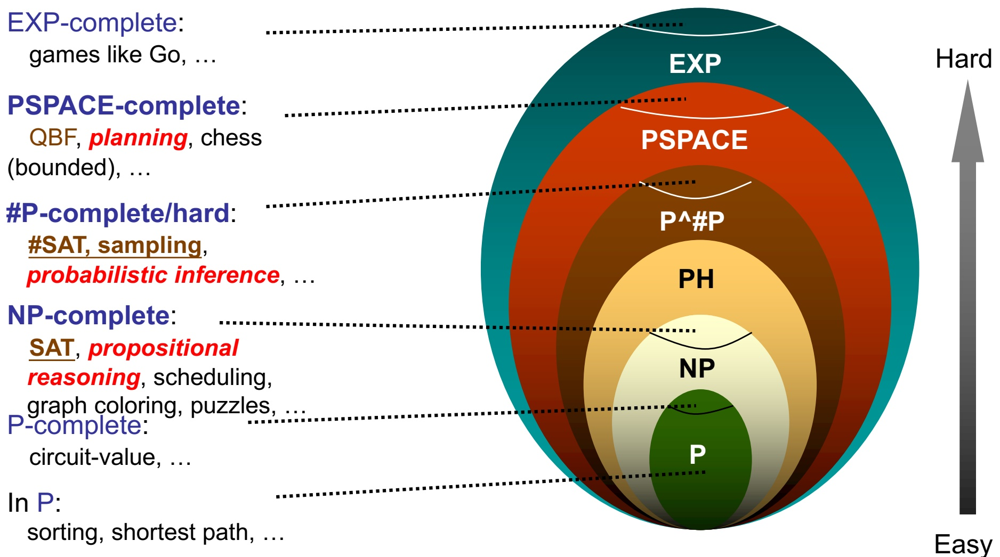

In P: sorting, shortest path, …

Note: widely believed hierarchy; know P≠EXP for sure

<!-- page: 15 -->

## Some Example Applications Of SAT

• constraint satisfaction scheduling and planning -VLSI design and testing (Larrabee 1992) • direct connection to deductive reasoning

$D H = C O$ iff S { a} is not satisfiable É

• part of many reasoning tasks

\- diagnosis / abduction

\- default reasoning

• Learning / Protein folding / Finding proofs

<!-- page: 16 -->

## How well can SAT be solved in practice?

<!-- page: 17 -->

## Average-Case Analysis

• Goldberg (1979) reported very good performance of Davis-Putnam (DP) procedure on random instances.

But distribution favored easy instances. (Franco and Paull 1983)

• Problem: Many randomly generated SAT problems are **surprisingly easy**.

• Goldberg used variable-clause-length model:

For each clause, pick each literal with probability p.

<!-- page: 18 -->

Polynominal average time in regions:

## Variable Clause Size Model

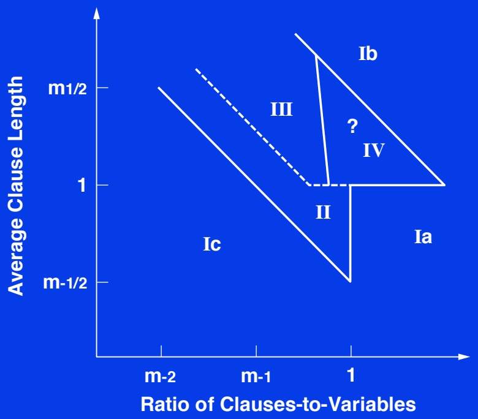

**Ia ž Purdom 1987 - backtracking Ib ž Iwama 1989 - counting alg. Ic ž Brown and Purdom 1985 - pure literal rule II ž Franco 1991 III ž Franco 1994**

**Open: region IV**

<!-- page: 19 -->

## But the problem is NP-complete where are the hard instances?

<!-- page: 20 -->

## Generating Hard Random Formulas

• Key: Use **fixed-clause-length** model.

(Mitchell, Selman, and Levesque 1992)

• Critical parameter: ratio of the number of clauses to the number of variables.

• Hardest 3SAT problems **at ratio = 4.3**

<!-- page: 21 -->

## Hardness of 3SAT

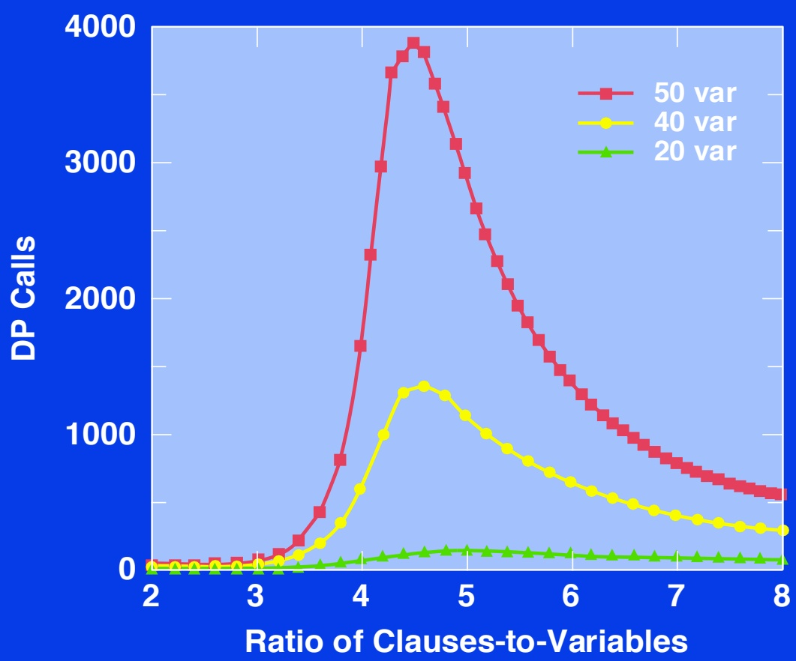

<!-- page: 22 -->

## Intuition

• At low ratios:

-few clauses (constraints)

-many assignments

-easily found

• At high ratios:

-many clauses

-inconsistencies easily detected

<!-- page: 23 -->

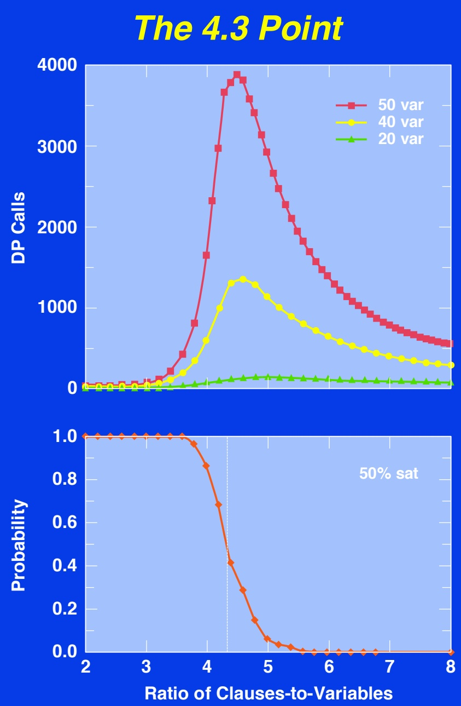

<!-- page: 24 -->

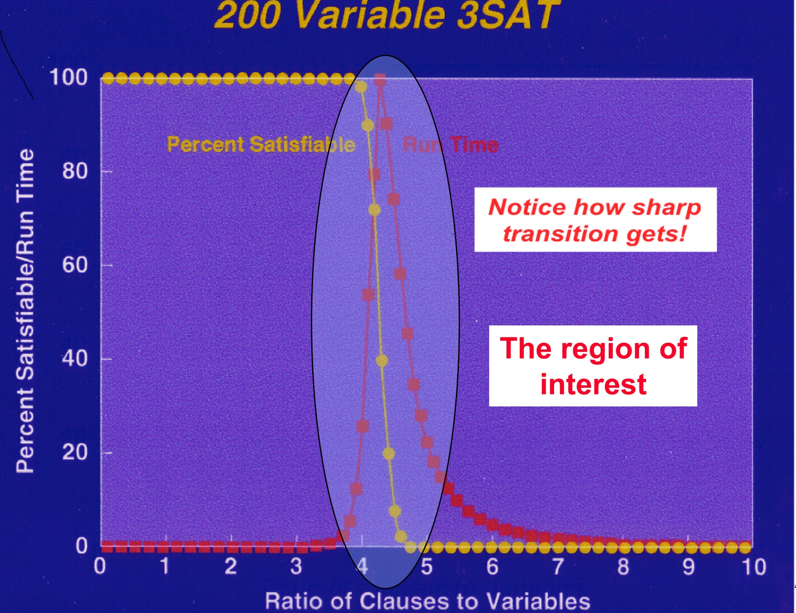

<!-- page: 25 -->

## Theoretical Status Of Threshold

• Very challenging problem **...**

• Current status:

3SAT threshold lies between **3.003** and **4.8**

(Chayet et al. 1999; Friedgut 1997;

Motwani et al. 1994; Broder and Suen 1993;

Broder et al. 1992; Dubois 1990)

<!-- page: 26 -->

## A Closer Look At The 3SAT Phase Transition

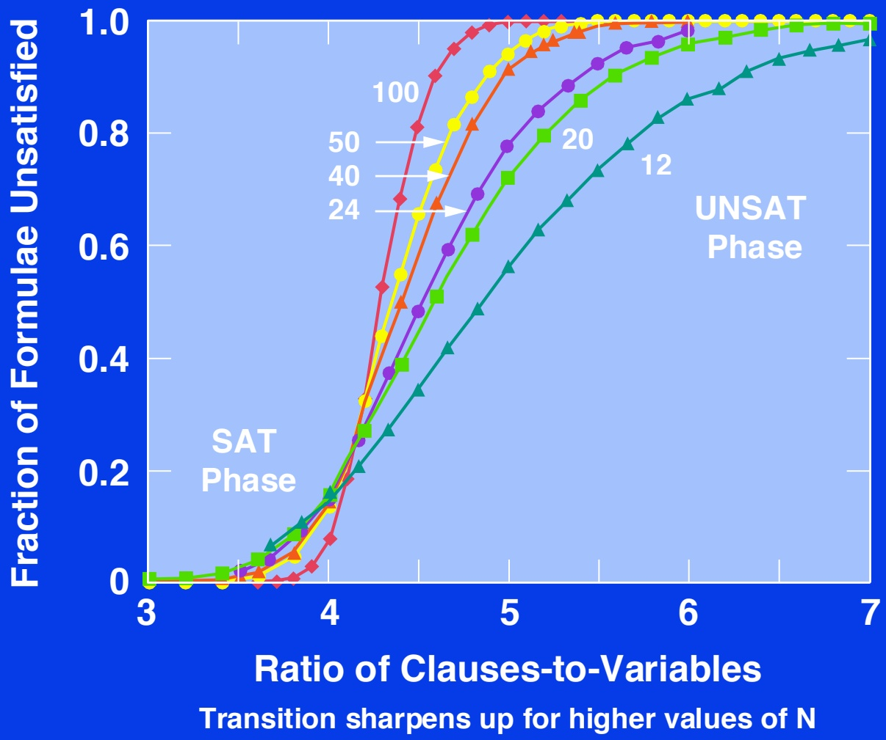

<!-- page: 27 -->

## Phase Transition Phenomenon

• Can be analyzed using finite-size scaling techniques.

(Kirkpatrick and Selman, Science 1994)

<!-- page: 28 -->

## Finite-Size Scaling For 3SAT

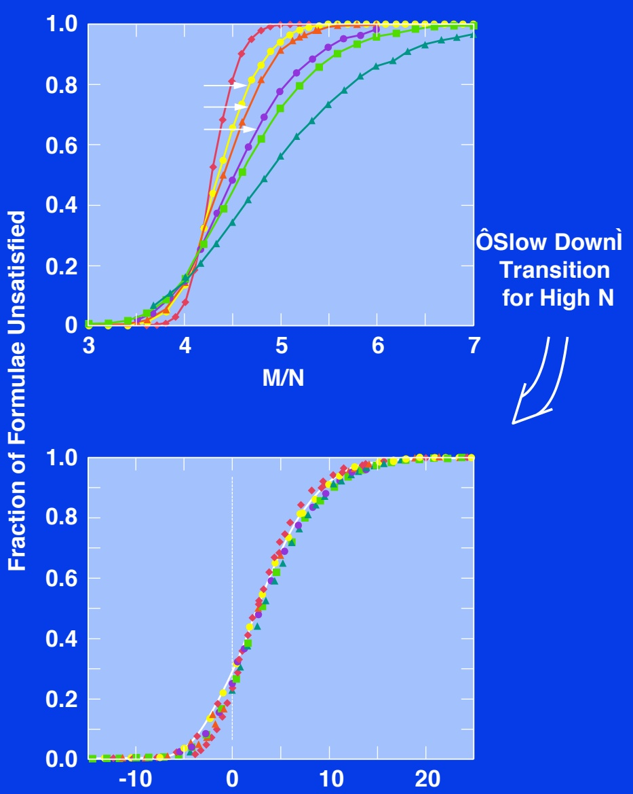

<!-- page: 29 -->

## Finite-Size Scaling For 4SAT

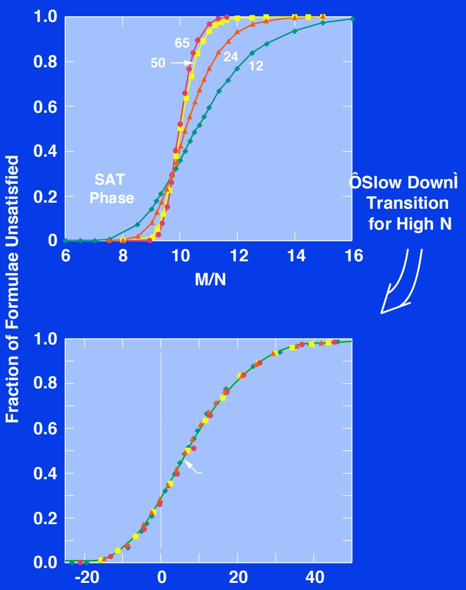

<!-- page: 30 -->

**Summary Phase Transition Effect**

• Coincides with hardest instances.

Behavior at threshold can be analyzed with tools from statistical physics:

Threshold has universal form with predictable corrections for N (number of vars).

-Inverse transformation gives 50% point for testing.

(Also, rescaling cost function; Selman and Kirkpatrick 1995, Gent and Walsh 1995)

<!-- page: 31 -->

• Similar phenomenon for graph coloring.

\- random graphs

\- 3-coloring; threshold around 4.6 (connectivity) (Cheeseman et al. 1991)

• **Critically-constrained** --- Practical relevance

-Airline fleet scheduling (Nemhauser 1994)

-VLSI design (Agrawal 1991)

-Traveling Salesperson Problem (Gent and Walsh 1995)

See also Hogg, Huberman, and Williams 1996; Crawford and Auton 1993; Frost and Dechter 1994; Larrabee and Tsuji 1993; Schrag and Crawford 1996; Smith and Grant 1994; Smith and Dyer 1996; and more!

<!-- page: 32 -->

## PART B. Fast Stochastic Methods

• After having identified hard instances, can we find better algorithms for solving them?

• Answer: Yes (at least for half of them...)

<!-- page: 33 -->

**Standard Procedures For SAT**

• **Systematic search** for a satisfying assignment.

• Interesting situation:

Davis-Putnam (DP) procedure, proposed in **1960**, is still the fastest complete method!

-Backtrack-style procedure with unit propagation.

SAT Competition 1992; DIMACS Challenge 1993 / 1994

<!-- page: 34 -->

• DP provides **very** challenging benchmark for comparisons with other systematic (complete) procedures.

Not just on random formulas!

• Many other methods have been tried, e.g.,

1) Backtracking with sophisticated heuristics

(Purdom 1984; Zabih and McAllester 1988; Andre and Dubois 1993; Bhom 1992; Crawford and Auton 1993; Freeman 1993, etc.)

2) Translations to integer programming

(Jeroslow 1986; Hooker 1988; Karmarkar et al. 1992; Gu 1993)

<!-- page: 35 -->

3) Exploiting hidden structure

(Stamm 1992; Larrabee 1991; Gallo and Urbani 1989; Boros et al. 1993)

4) Limited resolution at the backtrack nodes (Billionet and Sutter 1992; van Gelder and Tsuji 1993)

• **And others!**

**Open Question: Why don** ’**t they beat DP?**

• Let’s try something completely different **...**

<!-- page: 36 -->

**Randomized Greedy Local Search: GSAT**

Begin with a random truth assignment.

Flip the value assigned to the variable that yields greatest number of satisfied clauses.

Repeat until a model is found, or have performed specified maximum number of flips.

If model is still not found, repeat entire process, starting from different random assignment.

(Selman, Levesque, and Mitchell 1992)

<!-- page: 37 -->

**How Well Does It Work?**

• First intuition: Will get **stuck in local minimum**, with a few unsatisfied clauses.

• No use for **almost** satisfying assignments. E.g., a plan with a “magic” step is useless. Contrast with optimization problems.

• Surprise: It often finds **global** minimum! I.e., finds satisfying assignments.

• Inspired by local search for CSP initially used on N-Queens: **Heuristic Repair Method.** (Minton et al. 1991)

<!-- page: 38 -->

GSAT outperforms Davis-Putnam on, e.g.:

• Hard random formulas

-DP: up to 400 vars; GSAT: 2000+ var formulas.

• Boolean encodings of graph coloring problems.

-GSAT competitive with direct encodings.

• Encodings of Boolean circuit synthesis and diagnosis problems.

<!-- page: 39 -->

## GSATÃs Search Space

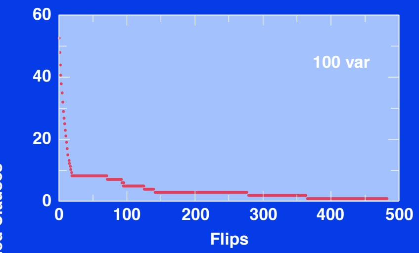

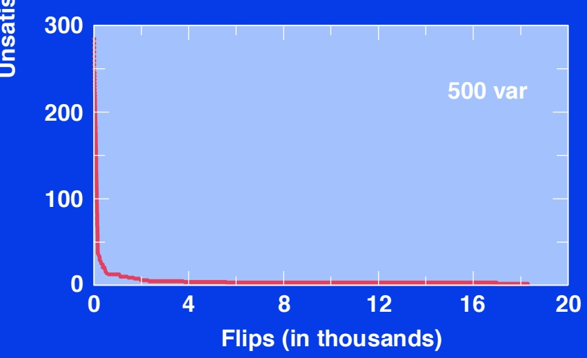

<!-- page: 40 -->

**Improvements Of Basic Local Search**

Issue: How to move more quickly to successively lower plateaus?

Idea: Introduce **uphill** moves (“noise”) to escape from long plateaus (or true local minima).

Noise strategies:

**a) Simulated Annealing**

(Kirkpatrick et al. 1982)

**b) Biased Random Walk**

(Selman, Kautz , and Cohen 1993)

<!-- page: 41 -->

## Simulated Annealing

• Noise model based on statistical mechanics.

• Pick a random variable

d = change in number of unsatisfied clauses

If $\textcircled { 0 } \leq \textcircled { 0 }$ make flip (“downward”)

else flip with probability $\textcircled { 0 } \textcircled { 0 } \textcircled { 1 }$ $7 0 0 0 0 0 0 0 0 0$ .

Slowly decrease T from high temperature to near zero.

<!-- page: 42 -->

## Random Walk

• Random walk SAT algorithm:

1) Pick random truth assignment.

2) Repeat until all clauses are satisfied: Flip random variable from unsatisfied clause.

• Solves 2SAT in $\textcircled { 0 } ( \textcircled { 0 } )$ flips. (Papadimitriou 1992)

• Does **not** work for hard k-SAT (k >= 3).

<!-- page: 43 -->

## Biased Random Walk

1) With probability p, “**walk**”, i.e., flip variable in some unsatisfied clause.

2) With probability 1-p, “**greedy move**”, i.e., flip variable that yields greatest number of satisfied clauses.

<!-- page: 44 -->

## Experimental Results: Hard Random 3SAT

| vars | basic time | GS eff. | AT walk time | eff. | Sim. time | Ann. eff. |
| --- | --- | --- | --- | --- | --- | --- |
| 100 | .4 | .12 | .2 | 1.0 | .6 | .88 |
| 200 | 22 | .01 | 4 | .97 | 21 | .86 |
| 400 | 122 | .02 | 7 | .95 | 75 | .93 |
| 600 | 1471 | .01 | 35 | 1.0 | 427 | .3 |
| 800 | * | * | 286 | .95 | * | * |
| 1000 | * | * | 1095 | .85 | * | * |
| 2000 | * | * | 3255 | .95 | * | * |

**Biased Walk better than Sim. Ann. better than Basic GSAT better than DP.**

<!-- page: 45 -->

**Other Applications Of GSAT**

• VLSI circuit diagnosis SAT formulation by Larrabee (1992) approx. 10,000 var 5,000 clause problems

• Planning and scheduling approx. 20,000 var 100,000 clause problems (Crawford and Baker 1994)

• Finite algebra

search for algebraic structures

GSAT+walk outperforms systematic method on large instances. Currently exploring remaining open problems. (Fujita et al. 1993)

<!-- page: 46 -->

For other work on stochastic, incomplete methods, see e.g.:

Adorf and Johnston 1990; Beringer et al. 1994; Davenport et al. 1994 (GENET); Kask and Dechter 1995; Ginsberg and McAllester 1994; Gu 1992; Hampson and Kibler 1993; Konolige 1994; Langley 1992; Minton et al. 1991; Morris 1993; Pinkas and Dechter 1993; Resende and Feo 1993; Spears 1995, and others!

<!-- page: 47 -->

• **GSAT-style procedures are now a promising alternative to systematic methods.**

• **Drawback: cannot show unsatisfiability.**

<!-- page: 48 -->

## Showing UNSAT / Inconsistencies

Given the success of stochastic search methods on satisfiable instances, a natural question is:

**Can we do something similar for**

**unsatisfiable instances?**

<!-- page: 49 -->

To show a set of clauses S **unsatisfiable**, we need to demonstrate (“**prove**”) that none of the 2 truth assignments satisfies S.N

This “truth-table” method is very time consuming.

Compare this with having to check a single satisfying assignment to verify the satisfiability of a formula.

**Can we do better? --- Surprisingly difficult!**

<!-- page: 50 -->

## Length Of Proofs

• Best know improvement on truth tables: **resolution**

-Resolve clauses until empty clause is reached.

-Widely used in automated theorem proving.

• DP is a form of resolution.

<!-- page: 51 -->

**Limitations Of Resolution**

• **Method can**’t “**count**”! Pigeon-hole formulas: Can ’t place N+1 objects in N holes. Shortest resolution proof is exponentially long. (Cook / Karp 1972; Haken 1985)

• **Random unsat formulas: exponential size proofs.**

Explains why we can’t push DP over 400 vars:

400 vars requires search tree of about 10 million nodes

1000 vars unsat requires 10^15 nodes!

(Chvatal and Szemeredi 1988; Crawford 1995)

<!-- page: 52 -->

**Stochastic Search For Proofs**

• **GSAT:** start with random truth assignment (size linear in N), and try to “fix” it.

• **Proposal for UNSAT:** start with random proof structure, and try to fix it.

• Completely unfeasible if the structure that were fixing has trillions of nodes (exponential in N).

• We need short proofs! (O(N) or something**...**) (Using abstractions / symmetrries?)

<!-- page: 53 -->

## Recap Of Results

**A) Computationally hard problem instances**

• Hardest ones are critically-constrained.

Under- and over-constrained ones can be surprisingly easy.

• Critically-constrained instances at phasetransition boundaries.

Properties of transition can be analyzed with tools from statistical physics.

<!-- page: 54 -->

**B) Stochastic Search Methods**

• **GSAT:** Randomized local search for SAT testing. Viable alternative to systematic, complete methods.

• **Progress:**

-1991: 10 vars, 500 clause theories.

-1995: 2,000 to 20,000 vars, up to 500,000 clauses

• **Approaches size of practical applications.** E.g. in scheduling, planning, diagnosis, circuit design, and constraint-logic programming.

See proceedings for many additional pointers.

<!-- page: 55 -->

## Impact And Future Directions

**Fast Incomplete Methods**

Shift in Reasoning and Search from **Systematic** / **Complete** methods to **Stochastic** / **Incomplete** methods.

-Key issue: Better scaling properties.

-Analogy in OR: Shift from finding optimal to finding approximate solns.

Also, little progress on heuristic guidance of complete methods. DP still rules...

<!-- page: 56 -->

## Impact, Cont.

**Message for KR&R**

-Asymmetry between our ability to show **satisfiability vs. unsatisfiability,** argues for **model-finding** (show sat) over **theorem proving** (show unsat).

-Examples:

\- Vivid repr. (Levesque 1985)

\- Planning (Kautz and Selman 1992)

\- Abduction / diagnosis / deduction

\- Model-based repr. versus formula-based repr. (Kautz, Kearns, and Selman 1994; Khardon and Roth 1994)

\- Case-based reasoning (Kolodner 1991)

<!-- page: 57 -->

## Some Challenges

• Fast incomplete strategies for UNSAT (deduction)?

Need for short proofs. Human proofs O(N)? Need automatic discovery of abstractions, symmetries, useful lemmas...

• Need for more **model-based** reformulations:

Where solutions are **compact structures** --- allowing for randomized local search strategies.

• Can we syntactically characterize the class of instances solved by incomplete, stochastic methods? Running algorithm may be the best and only characterization!

<!-- page: 58 -->

## Possible Limits Of Syntactic Characterization

cognitive tasks

**feasible instances**

**poly**

**KR&R Formalism**

**Would suggest fundamental role for incomplete methods.**
