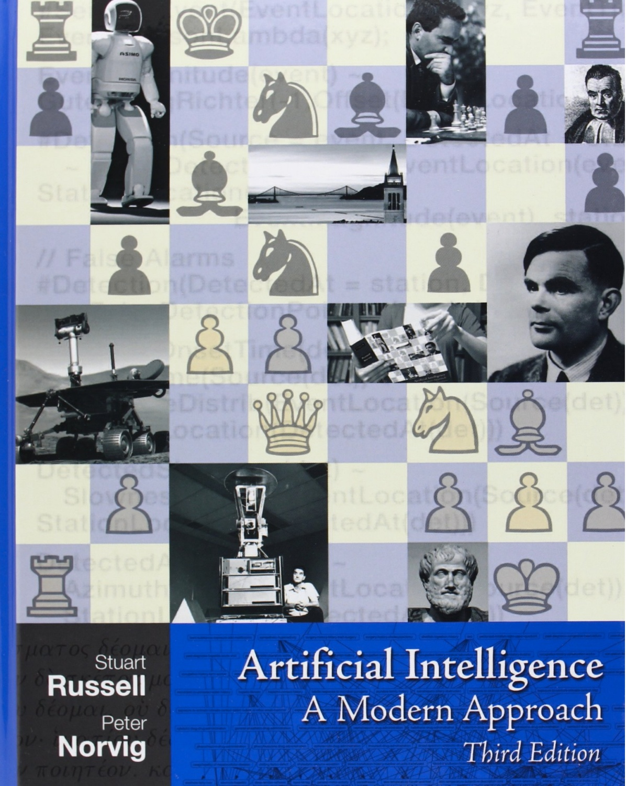
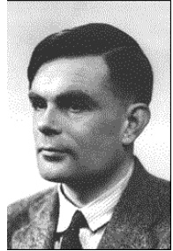
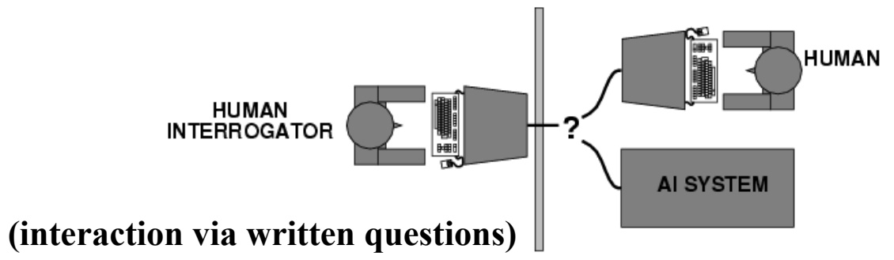
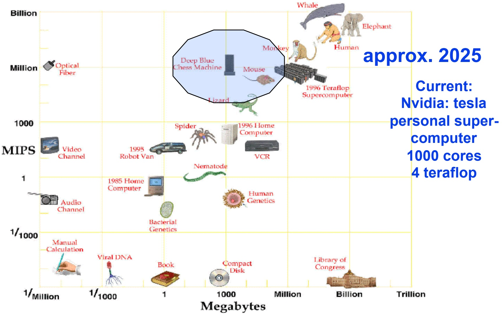
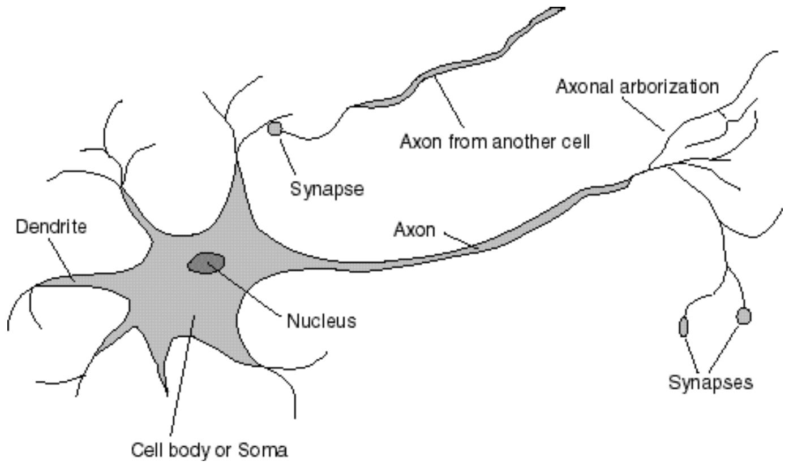
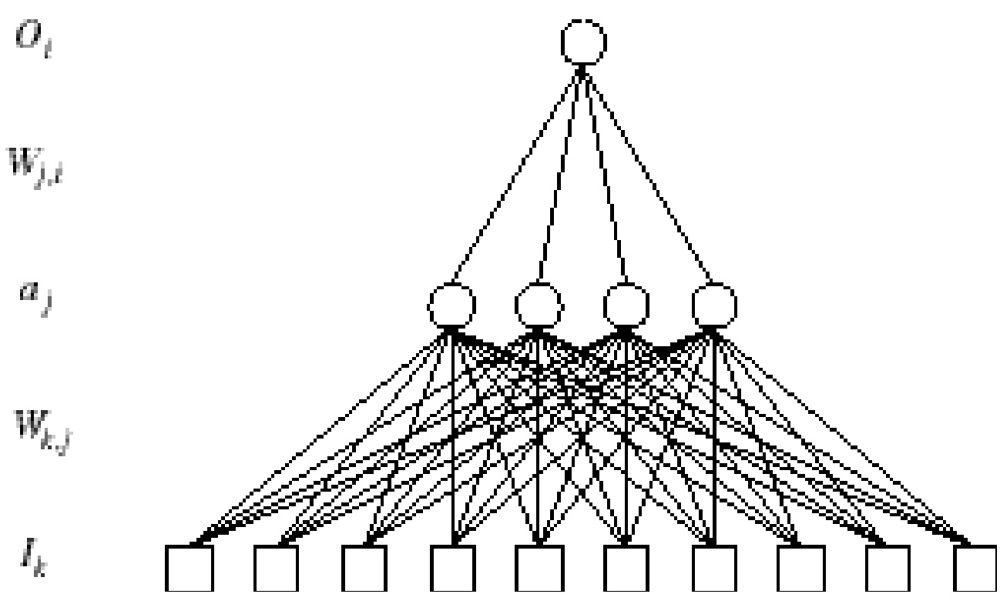
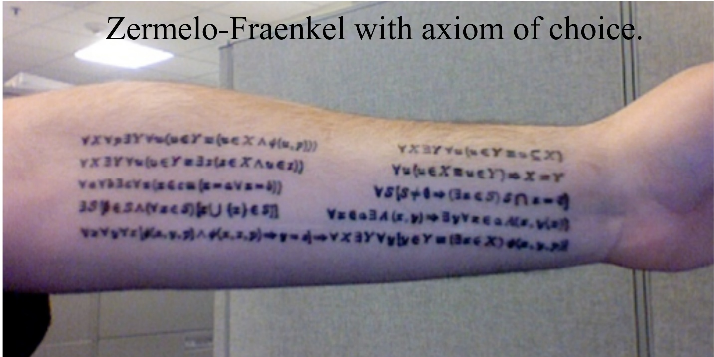
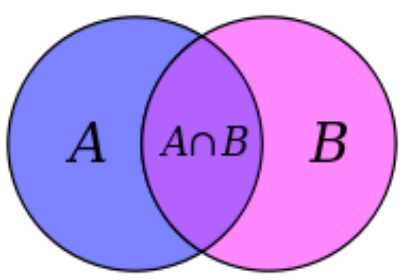

<!-- page: 1 -->

**CS 4700:**

# Foundations of Artificial Intelligence

**Instructor:**

**Prof. Selman**

**selman@cs.cornell.edu**

**Introduction**

**(Reading R&N: Chapter 1)**

<!-- page: 2 -->

<!-- page: 3 -->

**Course Administration (separate slides)**

**What is Artificial Intelligence?**

**Course Themes, Goals, and Syllabus**

<!-- page: 4 -->

**Ambitious goals:**

– **understand** “**intelligent**” **behavior**

– **build** “**intelligent**” **agents / artifacts**

**autonomous systems**

**understand human cognition (learning, reasoning, planning, and decision making) as a computational process.**

<!-- page: 5 -->

**What is Intelligence?**

**Intelligence:**

**capacity to learn and solve problems**” **(Webster dictionary)**

– **the ability to act rationally**

**Hmm… Not so easy to define.**

<!-- page: 6 -->

## Views of AI fall into four different perspectives --- two dimensions:

## 1) Thinking versus Acting

**2) Human versus Rational (which is “easier”?)**

**Thought/ Reasoning (“modeling thought / brain)**

**Behavior/ Actions “behaviorism” “mimics behavior”**

**Human-like Intelligence** “**Ideal**” **Intelligent/ Pure Rationality**

| 2. Thinking | 3. Thinking |
| --- | --- |
| humanly | Rationally |
| 1. Acting | 4.Acting |
| Humanly | Rationally |

<!-- page: 7 -->

## 1. Acting Humanly

|  | Human-like Intelligence | “Ideal” Intelligent/Rationally |
| --- | --- | --- |
| Thought/ Reasoning | 2. Thinking humanly | 3. Thinking Rationally |
| Behavior/ Actions | 1. Acting Humanly →Turing Test | 4. Acting Rationally |

<!-- page: 8 -->

(interaction via written questions)

if interrogator

Alan Turing

## Acting humanly: Turing Test

Turing (1950) "Computing machinery and intelligence”

"Can machines think?“ "Can machines behave intelligently?" **Operational test for intelligent behavior: the Imitation Game**

**AI system passes**

**is the machine.**

**No computer vision or robotics or physical presence required!**

Predicted that by 2000, a machine might have a 30% chance of fooling a lay person for 5 minutes. **Achieved. (Siri!** J )

But, by scientific consensus, we are still several decades away from truly passing the Turing test (as the test was intended).

<!-- page: 9 -->

# Trying to pass the Turing test: Some Famous Human Imitation “Games”

## 1960s ELIZA

– **Joseph Weizenbaum**

– **Rogerian psychotherapist**

**1990s ALICE**

## Loebner prize

– **win \$100,000 if you pass the test**

**Still, passing Turing test is of somewhat questionable value.**

**Because, deception appears required and allowed!**

**Consider questions: Where were you born? How tall are you?**

<!-- page: 10 -->

# ELIZA: impersonating a Rogerian psychotherapist

**1960s ELIZA Joseph Weizenbaum**

www-ai.ijs.si/eliza/eliza.html

ELIZA - a friend you could never have before

Eliza: Hello. I am ELIZA. How can I help you?

Submit Query

**You: Well, I feel sad Eliza: Do you often feel sad? You: not very often. Eliza: Please go on.**

<!-- page: 11 -->

See: The New Yorker, August 16, 2013 **Why Can’t My Computer Understand Me?** Posted by <u>Gary Marcus</u>

http://www.newyorker.com/online/blogs/elements/2013/08/why-cant-my-computer-understand-me.html

**Discusses alternative test by Hector Levesque:** http://www.cs.toronto.edu/\~hector/Papers/ijcai-13-paper.pdf

<!-- page: 12 -->

## 2. Thinking Humanly

|  | Human-like Intelligence | “Ideal” Intelligent/Rationally |
| --- | --- | --- |
| Thought/ Reasoning | 2. Thinking humanly → Cognitive Modeling | Thinking Rationally |
| Behavior/ Actions | Acting Humanly → Turing Test | Acting Rationally |

<!-- page: 13 -->

**Requires scientific theories of** <strong><u>internal activities of the brain.</u></strong>

**1) Cognitive Science (top-down) computer models + experimental techniques from psychology** à **Predicting and testing behavior of human subjects**

**2) Cognitive Neuroscience (bottom-up)**

à **Direct identification from neurological data**

**Distinct disciplines but especially 2) has become very active. Connection to AI: Neural Nets. (Large** <strong><u>Google / MSR / Facebook AI Lab efforts.)</u></strong>

<!-- page: 14 -->

## Neuroscience: The Hardware

## The brain

**a neuron, or nerve cell, is the basic information**

processing unit $( 1 0 ^ { \lambda } 1 1 )$

• **many more synapses** $( 1 0 ^ { \wedge } 1 4 )$ **connect the neurons**

cycle time: $1 0 ^ { \wedge } ( - 3 )$ **seconds (1 millisecond)**

## How complex can we make computers?

• $1 0 ^ { \wedge } 9$ **or more transistors per CPU**

• **Ten of thousands of cores,** $1 0 ^ { \wedge } 1 0$ **bits of RAM**

• **cycle times: order of** $1 0 ^ { \wedge } ( - 9 )$ **s**econds

**Numbers are getting close! Hardware will surpass human brain within next 20 yrs.**

<!-- page: 15 -->

## Computer vs. Brain

All Thinks, Great and Small

Aside: Whale vs. human brain

<!-- page: 16 -->

## So,

**In near future, we can have computers with as many processing elements as our brain, but: far fewer interconnections (wires or synapses) then again, much faster updates.**

**Fundamentally different hardware may require fundamentally different algorithms!**

• **Still an open question.**

• **Neural net research.**

**Can a digital computer simulate our brain?**

**Likely: Church-Turing Thesis (But, might we need quantum computing?) (Penrose; consciousness; free will)**

<!-- page: 17 -->

## A Neuron

<!-- page: 18 -->

## An Artificial Neural Network (Perceptrons)

Output units $\mathcal { O } _ { i }$

Hidden units $\mathbf { a } _ { \parallel }$

Input units $I _ { \pm }$

**Output Unit**

<!-- page: 19 -->

**An artificial neural network is an abstraction (well, really, a** “**drastic simplification**”**) of a real neural network.**

**Start out with random connection weights on the links between units. Then train from input examples and environment, by changing network weights.**

**Recent breakthrough: Deep Learning (automatic discovery of “deep” features by a multi-layer neural network.) Deep learning is bringing perception (hearing & vision) within reach.**

<!-- page: 20 -->

## 3. Thinking Rationally

|  | Human-like Intelligence | “Ideal” Intelligent/Rationally |
| --- | --- | --- |
| Thought/ Reasoning | Thinking humanly → Cognitive Modeling | 3. Thinking Rationally →formalizing "Laws of Thought" |
| Behavior/ Actions | Acting Humanly →Turing Test | Acting Rationally |

<!-- page: 21 -->

**Thinking rationally: formalizing the "laws of thought”**

**Long and rich history!**

**Logic: Making the right inferences! Remarkably effective in science, math, and engineering.**

**Several Greek schools developed various forms of logic: notation and rules of derivation for thoughts.**

**Aristotle: what are correct arguments/thought processes? (characterization of** “**right thinking**”**).**

**Socrates is a man**

**Syllogisms Aristotle**

**All men are mortal**

**Therefore, Socrates is mortal**

**Can we mechanize it? (syntactic; strip interpretation)**

**Use: legal cases, diplomacy, ethics etc. (?)**

<!-- page: 22 -->

**More contemporary logicians (e.g. Boole, Frege, and Tarski).**

**Ambition: Developing the “language of thought.”**

**Direct line through mathematics and philosophy to modern AI.**

## Key notion:

**Inference derives new information from stored facts**.

Axioms can be very compact. E.g. much of mathematics can be derived (in principle) from the logical axioms of

eory. Zermelo-Fraenkel with axiom of choice.

**Also, Godel’s incompleteness.**

<!-- page: 23 -->

## Limitations:

• **Not all intelligent behavior is mediated by logical deliberation (much appears not…)**

• **(Logical) representation of knowledge underlying intelligence is quite non-trivial. Studied in the area of “knowledge representation.” Also brings in probabilistic representations. E.g. Bayesian networks and graphical models.**

• **What is the purpose of thinking?**

• **What thoughts should I have?**

• **Seems to require some connection to “acting in the world.”**

• **We (“agents”) want/need to affect our environment (in part for survival).**

<!-- page: 24 -->

## 4. Acting Rationally

|  | Human-like Intelligence | “Ideal” Intelligent/Rationally |
| --- | --- | --- |
| Thought/ Reasoning | Thinking humanly → Cognitive Modeling | Thinking Rationally →formalizing "Laws of Thought" |
| Behavior/ Actions | Acting Humanly →Turing Test | Acting Rationally |

<!-- page: 25 -->

## Rational agents

**An agent is an entity that perceives and acts in the world (i.e. an “autonomous system” (e.g. self-driving cars) / physical robot or software robot (e.g. an electronic trading system))**

<strong><u>This course is about designing rational agents</u></strong>

**For any given class of environments and tasks, we seek the agent (or class of agents) with the best performance**

Caveat: computational limitations may make perfect rationality unachievable àdesign **best** program for given machine resources à“Limited rationality”

<!-- page: 26 -->

## Building Intelligent Machines

**I Building exact models of human cognition view from psychology, cognitive science, and neuroscience**

**II Developing methods to match or exceed human performance in certain domains, possibly by very different means Main focus of current AI.**

**But, I) often provides inspiration for II). Also, Neural Nets blur the separation.**

<!-- page: 27 -->

## Key research areas in AI

**Problem solving, planning, and search --- generic problem solving architecture based on ideas from cognitive science (game playing, robotics).**

**Knowledge Representation – to store and manipulate information (logical and probabilistic representations)**

**Automated reasoning / Inference – to use the stored information to answer questions and draw new conclusions**

**Machine Learning – intelligence from data; to adapt to new circumstances and to detect and extrapolate patterns**

**Natural Language Processing – to communicate with the machine**

**Computer Vision --- processing visual information**

**Robotics --- Autonomy, manipulation, full integration of AI capabilities**
