<!-- page: 1 -->

# CS 4700: Foundations of Artificial Intelligence

Bart Selman

selman@cs.cornell.edu

Local Search

Readings R&N: Chapter 4:1 and 6:4

<!-- page: 2 -->

So far:
methods that systematically explore the search space, possibly using principled pruning (e.g., A\*)

Current best such algorithm can handle search spaces of up to  $10^{100}$  states / around 500 binary variables (“ballpark” number only!)

What if we have much larger search spaces?

Search spaces for some real-world problems may be much larger e.g.  $10^{30,000}$  states as in certain reasoning and planning tasks.

A completely different kind of method is called for --- non-systematic:

Local search
(sometimes called: Iterative Improvement Methods)

<!-- page: 3 -->

Problem: Place N queens on an NxN chess board so that no queen attacks another.

Example solution for N = 8.

## Intro example: N-queens

How hard is it to find
such solutions? What if N gets larger?

Can be formulated as a search problem.

Start with empty board. [Ops? How many?]

Operators: place queen on location (i,j). [N^2. Goal?]

Goal state: N queens on board. No-one attacks another.

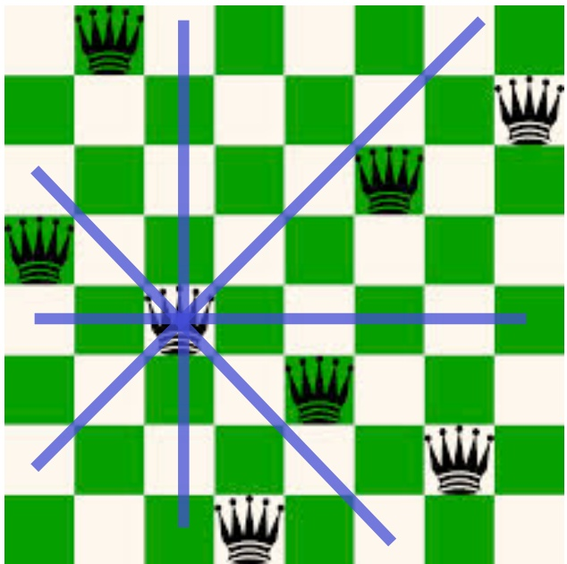

N=8, branching 64. Solution at what depth?
N. Search: (N^2)^N Informed search? Ideas for a heuristic?

Issues: (1) We don’t know much about the goal state. That’s what we are looking for!
(2) Also, we don’t care about path to solution!

N-Queens demo!

What algorithm would you write to solve this?

<!-- page: 4 -->

## Local Search: General Principle

Key idea (surprisingly simple):

1) Select (random) initial state (initial guess at solution)
e.g. guess random placement of N queens

2) Make local modification to improve current state
e.g. move queen under attack to “less attacked” square

3) Repeat Step 2 until goal state found (or out of time) Unsolvable if cycle can be done billions of times out of time?

## Requirements:

\- generate an initial

(often random; probably-not-optimal or even valid) guess

– evaluate quality of guess

\- move to other state (well-defined neighborhood function)

... and do these operations quickly
... and don't save paths followed

<!-- page: 5 -->

1) Hill-climbing search or greedy local search

2) Simulated annealing

3) Local beam search

4) Genetic algorithms (related: genetic programming)

5) Tabu search (not covered)

<!-- page: 6 -->

## Hill-climbing search

“Like climbing Everest in thick fog with amnesia”
Keep trying to move to a better “neighbor”, using some quantity to optimize.

evaluation

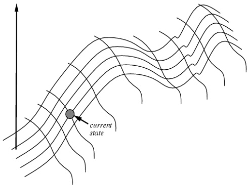

```javascript
function HILL-CLIMBING(problem) returns a state that is a local maximum
  inputs: problem, a problem
  local variables: current, a node
    neighbor, a node

  current←MAKE-NODE(INITIAL-STATE[problem])
  loop do
    neighbor←a highest-valued successor of current
    if VALUE[neighbor] ≤ VALUE[current] then return STATE[current]
    current←neighbor
```

Note: (1) “successor” normally called neighbor.

(2) minimization, isomorphic.

(3) stops when no improvement but often better to just “keep going”, especially if improvement = 0

<!-- page: 7 -->

States: 4 queens in 4 columns (256 states)

Neighborhood Operators: move queen in column

Evaluation / Optimization function: h(n) = number of attacks / “conflicts”

Goal test: no attacks, i.e., h(G) = 0

Initial state (guess).

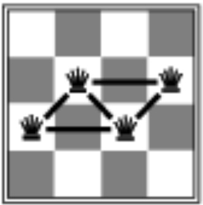

h = 5

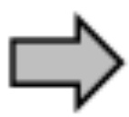

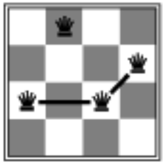

h = 2


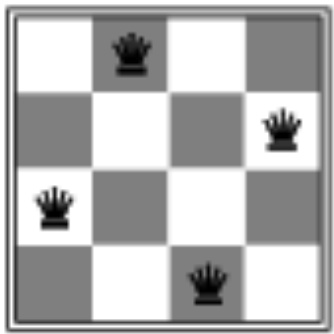

h = 0

Local search: Because we only consider local changes to the state at each step. We generally make sure that series of local changes can reach all possible states.

<!-- page: 8 -->

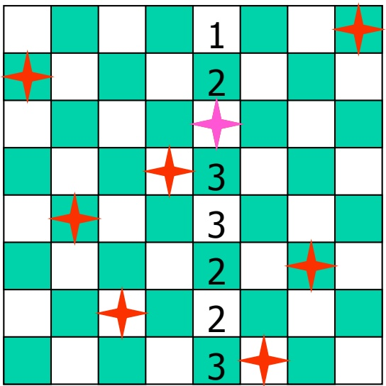

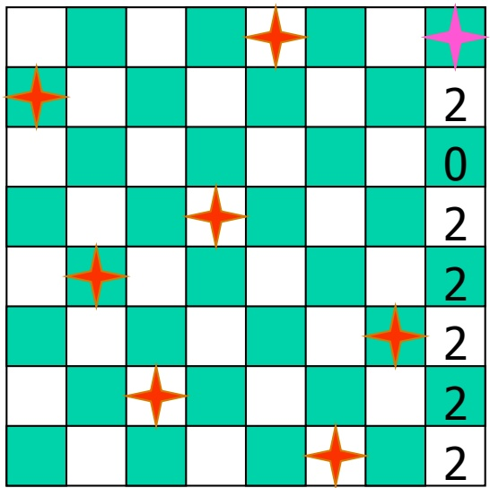

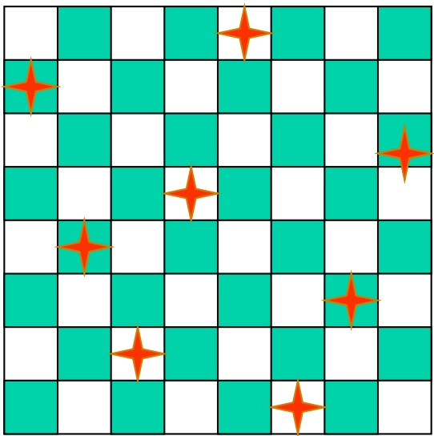

Representation: 8 integer variables giving positions of 8 queens in columns (e.g. <2, 5, 7, 4, 3, 8, 6, 1>)

Section 6.4 R&N ("hill-climbing with min-conflict heuristics")
Pick initial complete assignment (at random)
Repeat

• Pick a conflicted variable var (at random)

\- Set the new value of var to minimize the number of conflicts

• If the new assignment is not conflicting then return it

(Min-conflicts heuristics) → Inspired GSAT and Walksat

<!-- page: 9 -->

Local search with min-conflict heuristic works extremely well for Remarks
N-queen problems. Can do millions and up in seconds. Similarly,
for many other problems (planning, scheduling, circuit layout etc.)

## Why?

Commonly given: Solns. are densely distributed in the O(n$^{n}$) space; on average a solution is a few steps away from a randomly picked assignment. But, solutions still exponentially rare!

In fact, density of solutions not very relevant. Even problems with a single solution can be “easy” for local search!

It all depends on the structure of the search space and the guidance for the local moves provided by the optimization criterion.

For N-queens, consider  $h(n) = k$ , if k queens are attacked.
Does this still give a valid solution? Does it work as well?

What happens if $h(n) = 0$ if no queen under attack; $h(n) = 1$ otherwise? Does this still give a valid solution? Does it work as well? What does search do?

“Blind” search! No gradient in optimization criterion!

<!-- page: 10 -->

## Issues for hill-climbing search

Problem: depending on initial state, can get stuck in local optimum (here maximum)

How to overcome
local optima and plateaus ?

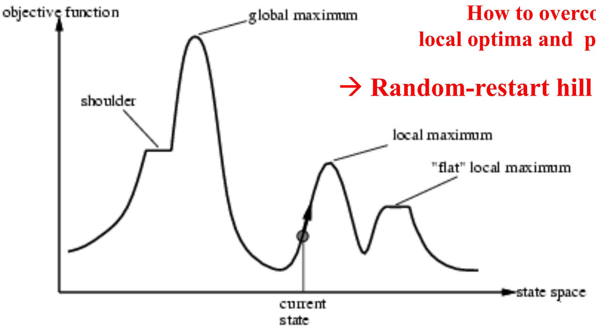

→ Random-restart hill climbing

But, 1D figure is deceptive. True local optima are surprisingly rare in high-dimensional spaces! There often is an escape to a better state.

<!-- page: 11 -->

# Potential Issues with Hill Climbing / Greedy Local Search

Local Optima: No neighbor is better, but not at global optimum.

\- May have to move away from goal to find (best) solution.

\- But again, true local optima are rare in many high-dimensional spaces.

Plateaus: All neighbors look the same.

\- 8-puzzle: perhaps no action will change # of tiles out of place.

\- Soln. just keep moving around! (will often find some improving move eventually)

Ridges: sequence of local maxima

May not know global optimum: Am I done?

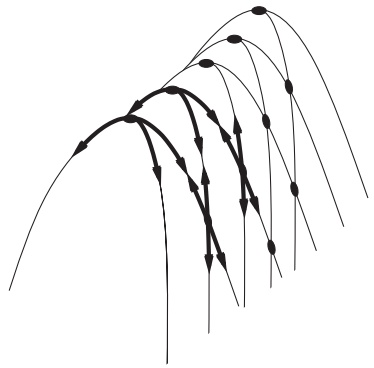

<!-- page: 12 -->

# Improvements to Greedy / Hill-climbing Search

## Issue:

\- How to move more quickly to successively better plateaus?

\- Avoid "getting stuck" / local maxima?

## Idea: Introduce “noise:”

downhill (uphill) moves to escape from

plateaus or local maxima (mimima)

E.g., make a move that increases the number of attacking pairs.

## Noise strategies:

1. Simulated Annealing

• Kirkpatrick et al. 1982; Metropolis et al. 1953

2. Mixed Random Walk (Satisfiability)

• Selman, Kautz, and Cohen 1993

<!-- page: 13 -->

## Simulated Annealing

## Idea:

Use conventional hill-climbing style techniques, but occasionally take a step in a direction other than that in which there is improvement (downhill moves; away from solution).

As time passes, the probability that a down-hill step is taken is gradually reduced and the size of any down-hill step taken is decreased.

<!-- page: 14 -->

What's the probability when: $\mathrm{T} \rightarrow \inf$?

What's the probability when: $\mathrm{T} \rightarrow 0$?

# Simulated annealing search (one of the most widely used optimization methods) (sideways / plateau move)

What's the probability when: delta E = 0? (sideways / plateau move)

Idea: escape local maxima by allowing some "bad" moves but gradually decrease frequency of such moves.

```txt
function SIMULATED-ANNEALING( problem, schedule) returns a solution state
  inputs: problem, a problem
      schedule, a mapping from time to "temperature"
  local variables: current, a node
      next, a node
      T, a "temperature" controlling prob. of downward steps
  current← MAKE-NODE(INITIAL-STATE[problem])
  for t← 1 to ∞ do
    T← schedule[t]
    if T = 0 then return current
      next← a randomly selected successor of current
      ΔE← VALUE[next] - VALUE[current]
    if ΔE > 0 then current ← next
      else current ← next only with probability e^Δ E/T

Similar to hill climbing,
  but a random move instead
  of best move

case of improvement, make the move

Otherwise, choose the move with probability
  that decreases exponentially with the
  "badness" of the move.

Bart Selman
CS4700
```

<!-- page: 15 -->

## Noise model based on statistical mechanics

\- ... introduced as analogue to physical process of growing crystals

## Convergence:

1. With exponential schedule, will provably converge to global optimum
One can prove: If T decreases slowly enough, then simulated annealing search will find a global optimum with probability approaching 1

2. Few more precise convergence rate.
(Recent work on rapidly mixing Markov chains.
Surprisingly deep foundations.)

Key aspect: downwards / sideways moves

\- Expensive, but (if have enough time) can be best

Hundreds of papers / year; original paper one of most cited papers in CS!
– Many applications: VLSI layout, factory scheduling, protein folding...

<!-- page: 16 -->

## Simulated Annealing (SA) --- Foundations

Superficially: SA is local search with some noise added. Noise starts high and is slowly decreased.

True story is much more principled:

SA is a general sampling strategy to sample from a combinatorial space according to a well-defined probability distribution.

Sampling strategy models the way physical systems, such as gases, sample from their statistical equilibrium distributions. Order 10^23 particles. Studied in the field of statistical physics.

We will give the core idea using an example.

<!-- page: 17 -->

## Example: 3D Hypercube space

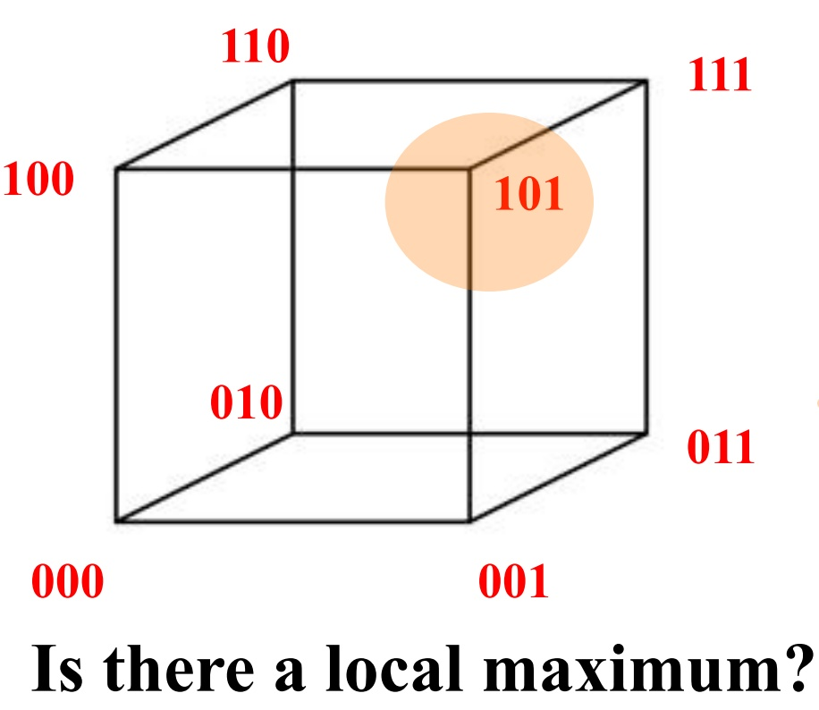

<table><tr><td colspan="2">States</td><td>Value f(s)</td></tr><tr><td>s1</td><td>000</td><td>2</td></tr><tr><td>s2</td><td>001</td><td>4.25</td></tr><tr><td>s3</td><td>010</td><td>4</td></tr><tr><td>s4</td><td>011</td><td>3</td></tr><tr><td>s5</td><td>100</td><td>2.5</td></tr><tr><td>s6</td><td>101</td><td>4.5</td></tr><tr><td>s7</td><td>110</td><td>3</td></tr><tr><td>s8</td><td>111</td><td>3.5</td></tr></table>

Problem for greedy and hill climbing but not for SA!

N dimensional “hypercube” space. N =3. 2^3 = 8 states total.

Goal: Optimize f(s), the value function. Maximum value 4.5 in s6.

Use local search: Each state / node has N = 3 neighbors (out of 2^N total). "Hop around to find 101 quickly."

<!-- page: 18 -->

## Of course, real interest in large N...

Spaces with  $2^{N}$  states and each state with N neighbors.

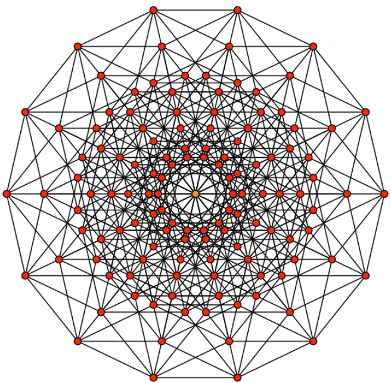

7D hypercube; 128 states.
Every node, connected to 7 others.
Max distance between two nodes: 7.

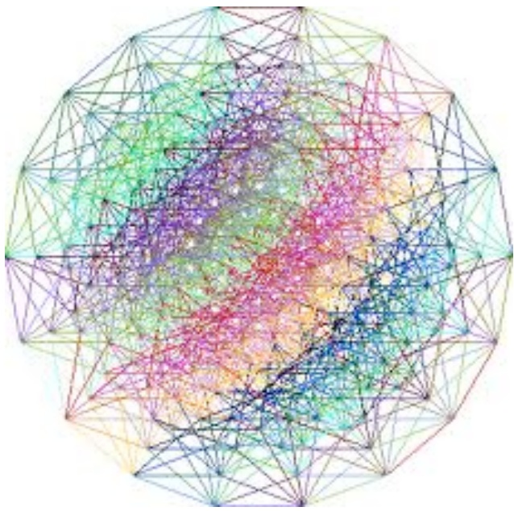

9D hypercube; 512 states.
How many steps to go from any state to any state?

Practical reasoning problem: N = 1,000,000. 2^N = 10^300,000

<!-- page: 19 -->

Consider the following “random walker” in hypercube space:

1) Start at a random node S (the “current node”). (How do we generate such a node?)

2) Select, at random, one of the N neighbors of S, call it S'

<div class="docvortex-algorithm" style="white-space: pre-wrap; font-family:monospace;">
3) If  $(f(S') - f(S)) &gt; 0$ , move to  $S'$ , i.e. set  $S := S'$ 
(i.e., jump to node with better value)
else with probability  $e^{(f(S')-f(S))/T}$  move to  $S'$ , i.e., set  $S := S'$
</div>

4) Go back to 2)

Note: Walker keeps going and going. Does not get stuck in any one node.

<!-- page: 20 -->

Central Claim --- Equilibrium Distribution:

After “a while,” we will find the walker in state S with probability

$\mathrm{Prob}(\mathrm{S}) = \mathrm{e}^{\wedge}(\mathrm{f}(\mathrm{S}) / \mathrm{T}) / \mathrm{Z}$

where Z is a normalization constant (function of T) to make sure the probabilities over all states add up to 1. I.e., we will be in a state with a probability “proportional” to f(S) --- most likely in state with highest f(S).

Why? Deep result in Markov Chain processes. Not obvious at all.

Z is called the “partition function” and is given by

$$
\mathbf {Z} = \sum \mathrm{e} ^ {\wedge} (\mathbf {f} (\mathbf {s}) / \mathbf {T})
$$

where the sum is over all  $2^{N}$  states x. So, an exponential sum!

Very hard to compute but we generally don’t have to!

<!-- page: 21 -->

$$
\text {Prob} (\mathrm{s}) = \mathrm{e} ^ {\wedge} (\mathrm{f} (\mathrm{s}) / \mathrm{T}) / \mathrm{Z}
$$

For our example space

<table><tr><td colspan="2">States</td><td>Value f(s)</td><td>T=1.0</td><td>Prob(s)</td><td>T=0.25 Prob(s)Prob(s)</td></tr><tr><td>s1</td><td>000</td><td>2</td><td>7.4</td><td>0.02</td><td>55 29810.0030.000</td></tr><tr><td>s2</td><td>001</td><td>4.25</td><td>70.1</td><td>0.23</td><td>240,154,9520.27 0.24</td></tr><tr><td>s3</td><td>010</td><td>4</td><td>54.6</td><td>0.18</td><td>28,886,111 0.17 0.09</td></tr><tr><td>s4</td><td>011</td><td>3</td><td>20.1</td><td>0.07</td><td>4062,755 0.02 0.001</td></tr><tr><td>s5</td><td>100</td><td>2.5</td><td>12.2</td><td>0.04</td><td>1482,026 0.0080.008</td></tr><tr><td>s6</td><td>101</td><td>4.5</td><td>90.0</td><td>0.29</td><td>68,1059,969 0.45 0.65</td></tr><tr><td>s7</td><td>110</td><td>3</td><td>20.1</td><td>0.07</td><td>4062,755 0.02 0.001</td></tr><tr><td>s8</td><td>111</td><td>3.5</td><td>33.1</td><td>0.11</td><td>102972,604 0.06 0.06</td></tr><tr><td></td><td></td><td></td><td colspan="2">sum Z = 307.9</td><td>sum Z = 180,1054,153</td></tr></table>

So, at T = 1.0, walker will spend roughly 29% of its time in the best state.

T = 0.5, roughly 45% of its time in the best state.

T = 0.25, roughly 65% of its time in the best state.

And, remaining time mostly in s2 ( $2^{nd}$ best)!

<!-- page: 22 -->

So, when T gets lowered, the probability distribution starts to concentrate on the maximum (and close to maximum) value states.

The lower T, the stronger the effect!

What about T high? What is Z and Prob(S)?

$2^{\wedge}\mathrm{N}$ and $1 / (2^{\wedge}\mathrm{N})$ because $\mathrm{e}^{\wedge}0 = 1$ in each row

At low T, we can just output the current state. It will quite likely be a maximum value (or close to it) state. In practice: Keep track of best state seen during the SA search.

SA is an example of so-called Markov Chain Monte Carlo or MCMC sampling.

It's very general technique to sample from complex probability distributions by making local moves only. For optimization, we chose a clever probability distribution that concentrates on the optimum states for low T. (Kirkpatrick et al. 1984) Bart Selman CS4700

<!-- page: 23 -->

## Some final notes on SA:

1) “Claim Equilibrium Distribution” needs proof. Not too difficult but takes a bit of background about Markov Chains. It’s beautiful and useful theory.

2) How long should we run at each T? Technically, till the process reaches the stationary distribution. Here's the catch: may take exponential time in the worst case. 😊 But in practice can be remarkably effective.

3) How quickly should we “cool down”? Various schedules in literature.

4) To get (near-)optimum, you generally can run much shorter than needed for full stationary distribution.

5) Keep track of best solution seen so far.

6) A few formal convergence rate results exist, including some polytime results (“rapidly mixing Markov chains”).

7) Many variations on basic SA exist, useful for different applications.

<!-- page: 24 -->

## What I didn't tell you

Q. Why not just run at a low temperature right away?

SA is guaranteed to converge to the equilibrium distribution $\mathbf{Prob}(\mathbf{s}) = \mathbf{e}^{\wedge}(\mathbf{f}(\mathbf{s}) / \mathbf{T}) / \mathbf{Z}$

However, this can take some time. “Burn-in time of Markov chain.” Idea of annealing: can reach equilibrium distribution more quickly by first starting at a higher T and going down slowly.

Practical example: T = 100, take 100,000 flips. Then, T = .9 \* 100 = 90, take 100,000 flips. Then, T = .9 \* 90 = 81, take 100,000 flips. Etc.

Q. How can you sample properly from an exponential space without the chain first visiting each state?

Best answered with an example. Consider N binary variables, and starting from the all 0 state (“origin of hypercube”).

How many flips are needed to reach a purely random point uniformly at random in the N dimensional hypercube? Bart Selman CS4700

<!-- page: 25 -->

\- Start with $k$ randomly generated states

\- Keep track of $k$ states rather than just one

• At each iteration, all the successors of all k states are generated

• If any one is a goal state, stop; else select the k best successors from the complete list and repeat.

Equivalent to k random-restart hill-climbing?

No: Different since information is shared between k search points:

Some search points may contribute none to best successors: one search point may contribute all k successors “Come over here, the grass is greener” (R&N)

<!-- page: 26 -->

Genetic Algorithms

<!-- page: 27 -->

## Genetic Algorithms

Another class of iterative improvement algorithms

\- A genetic algorithm maintains a population of candidate solutions for the problem at hand, and makes it evolve by iteratively applying a set of stochastic operators

Inspired by the biological evolution process

Uses concepts of “Natural Selection” and “Genetic Inheritance” (Darwin 1859)

Originally developed by John Holland (1975)


<!-- page: 28 -->

## High-level Algorithm

1. Randomly generate an initial population

2. Evaluate the fitness of members of population

3. Select parents based on fitness, and “reproduce” to get the next generation (using “crossover” and mutations)

4. Replace the old generation with the new generation

5. Repeat step 2 though 4 till iteration N

<!-- page: 29 -->

## Stochastic Operators

## Cross-over

\- decomposes two distinct solutions and then

\- randomly mixes their parts to form novel solutions

## Mutation

\- randomly perturbs a candidate solution

<!-- page: 30 -->

A successor state is generated by combining two parent states

Start with k randomly generated states (population)

A state is represented as a string over a finite alphabet (often a string of 0s and 1s)

Evaluation function (fitness function). Higher values for better states.

Produce the next generation of states by selection, crossover, and mutation

<!-- page: 31 -->

## Genetic algorithms

Operate on state representation.

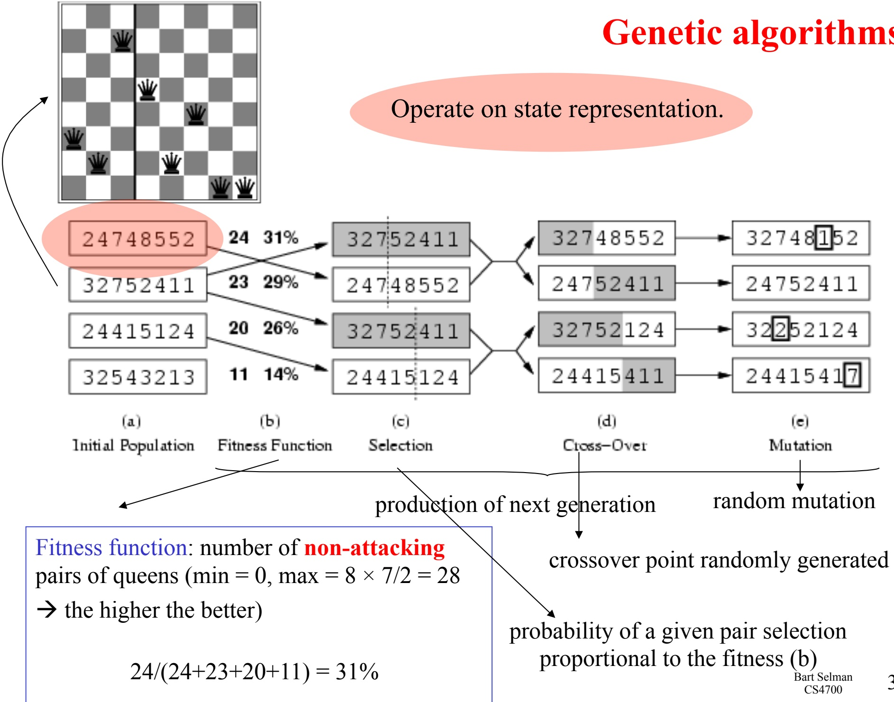

Fitness function: number of non-attacking pairs of queens (min = 0, max = 8 × 7/2 = 28 → the higher the better)

$24 / (24 + 23 + 20 + 11) = 31\%$

crossover point randomly generated

probability of a given pair selection proportional to the fitness (b)
Bart Selman
CS4700

<!-- page: 32 -->

## Genetic algorithms

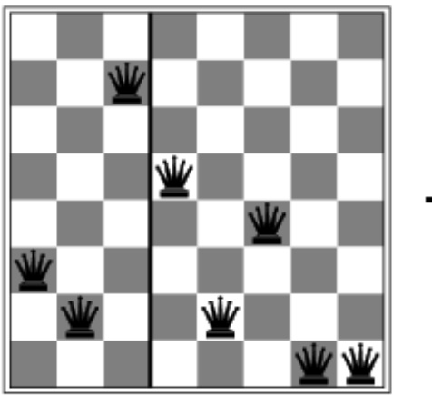

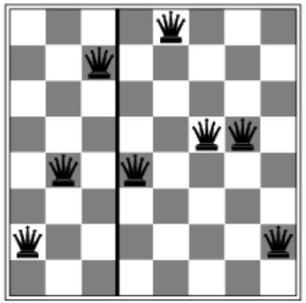

Any reason pieces from different solutions fit together?

$$
\begin{array}{c} \hline \\ \hline \\ \hline \\ \hline \\ \hline \\ \hline \\ \hline \\ \hline \\ \hline \\ \hline \\ \hline \\ \hline \\ \hline \\ \hline \\ \hline \\ \hline \\ \hline \\ \hline \\ \hline \\ \hline \\ \hline \\ \hline \\ \hline \\ \hline \\ \hline \\ \hline \end{array}
$$

<!-- page: 33 -->

Lots of variants of genetic algorithms with different selection, crossover, and mutation rules.

GAs have a wide application in optimization – e.g., circuit layout and job shop scheduling

Much work remains to be done to formally understand GAs and to identify the conditions under which they perform well.

<!-- page: 34 -->

## Demo of Genetic Programming (GP): The Evolutionary Walker

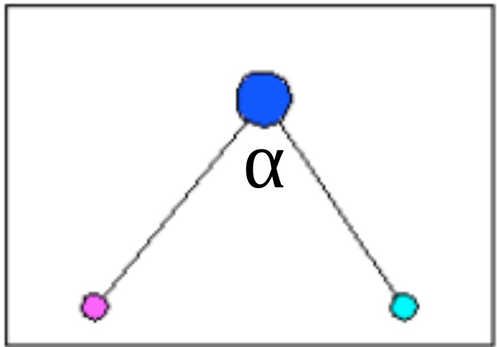

Figure 1.1: The walker model.

Actions to control:

Goal:

Make it

run as fast as

possible!

Evolve population

of control

programs.

Three nodes:

Stick figure ---

1) angle  $\alpha$

1 body

2 feet

Basic physics

2) push off ground for each foot.

model:

gravity

momentum etc.

Input for control program (from physics module): Position and velocity for the three nodes.

## Discrete time

<!-- page: 35 -->

## Control language:

```txt
real ::= real + real
    | real - real
    | real * real
    | real / real
    | getX(index)
    | getY(index)
    | getX_velocity(index)
    | getY_velocity(index)
    | if (bool) then real else real
    | (constants between -1 and 1);
bool ::= real < real
    | real > real
    | closeTo(real, real)
    | true
    | false;
index ::= 0
    | 1
    | 2;
```

<!-- page: 36 -->

Population of control programs is maintained and evolved.

Fitness determined by measuring how far the walker gets in T time units (T fixed).

Evolution through parent selection based on fitness.

Followed by
crossover (swap parts of control programs, i.e., arithmetic expression trees) and

mutations (randomly generate new parts of control program).

<!-- page: 37 -->

Can this work? How well?

Would it be hard to program directly? Think about it...

Demo

<!-- page: 38 -->

## Leaner.txt --- most basic walker

```lisp
(/(-/(R -1.8554944551635097)(U(N 0))))(+(-(R 0.26696974973371823)(Y(N 1)))(-(-(X(N 0))(V(N 0))))(U(N 0)))))-(*(R 0.6906081172421406)(Y(N 0)))(-(V(N 1))(V(N 0))))))
```

$$
\begin{array}{c} \text {(I(<   (-(*(R -0.4749818581316987)(Y(N 1)))(-(V(N 2))(-(V(N 1))(V(N 1)))))/((+(Y(N 1))(R}\\ 1.8836665782029058))(X(N 1))))(+(+(*(Y(N 2))(+(R 0.26073435346772067)(+(X(N 1))(X(N 1)))))(+\\ (X(N 1))(+(-(Y(N 2))(I(B false)(Y(N 1))(Y(N 2)))))(V(N 1)))))/((V(N 1))(X(N 1)))))(-(I< (U(N 1))(I(B\\ false)(I(B true)(X(N 1))(X(N 0)))U(N 1))))(+(+I(B false)(X(N 1))(Y(N 1)))I(B false)(Y(N 0))*(*(U(N\\ 1))(U(N 2)))))(X(N 1))) (R 0.5940420353545179))) \end{array}
$$

$$
\begin{array}{l} (+ (\mathrm{I} (> (\mathrm{R} 0. 5 7 9 4 4 4 3 4 1 0 9 0 7 3 9 7) (\mathrm{X(N} 2))) (+ (\mathrm{Y(N} 0)) (\mathrm{I} (= (\mathrm{X(N} 1)) (\mathrm{R} 0. 8 9 7 0 0 1 7 7 2 7 9 0 8 3 0 4)) (\mathrm{I} (> (\mathrm{X(N} 2)) \\ (\mathrm{U(N} 2))) (+ (\mathrm{R} - 1. 7 9 3 6 3 8 8 4 3 3 3 0 4 8 4 2) (\mathrm{X(N} 2))) (\mathrm{R} - 1. 5 6 2 8 5 9 0 2 8 6 5 3 7 5 4 5)) (+ (\mathrm{R} - 0. 8 0 7 0 0 2 9 3 8 1 4 2 6 3 5 8) \\ (\mathrm{Y(N} 0)))) (\mathrm{Y(N} 2))) (- (- (\mathrm{I(Bfalse)} (\mathrm{X(N} 2)) (- (\mathrm{Y(N} 2)) (\mathrm{I(Btrue)} (\mathrm{V(N} 1)) (\mathrm{Y(N} 2)))))) (\mathrm{I} (= (\mathrm{X(N} 2)) (\mathrm{V(N} 2))) \\ (\mathrm{Y(N} 2)) (\mathrm{U(N} 2)))) (\mathrm{I} (<   (- (\mathrm{X(N} 2)) (\mathrm{X(N} 2))) (+ (\mathrm{R} 0. 9 1 2 1 1 6 2 1 3 5 4 9 7 1 8 5) (\mathrm{R} - 1. 2 8 5 1 3 0 4 6 1 0 3 8 8 1 4 3))) (\mathrm{X(N} \\ \quad \quad \quad \quad \quad \quad \quad \quad \quad \quad \quad \quad \quad \quad \quad \quad \quad \quad \quad \quad \quad \quad \quad \quad \quad \quad \quad \quad \quad \quad \quad \quad \quad \quad \quad \quad \quad \quad \quad \quad \quad \quad \quad \quad \quad \quad \end{array}
$$

Pop size: 50
Max gen: 100
Mutate prob: 0.0
Cross prob: 0.0

<!-- page: 39 -->

## Sprinter7661.txt --- one of the fastest walkers

```lisp
\((-(--(U(N 0))(+(Y(N 0)))/(++(R 0.7499415628721899)(+(Y(N 0))(Y(N 0)))))(X(N 0)))*(R 0.20363512445479204)(-(U(N 2))(X(N 0)))))))))-(--(Y(N 0))(X(N 0)))I(</(+(X(N 0))(Y(N 0)))+(U(N 0))(Y(N 0)))))(X(N 0)))X(N 0))(Y(N 0)))))-(-(U(N 0))(X(N 0)))
    (*-(-(Y(N 0))(R 0.90287443905547))(Y(N 0)))I(B false)(R 1.6373642908344364)(*(V(N 0))(-(Y(N 0))(X(N 1))))))))))
```

$$
\begin{array}{l} (+ (\mathrm{I} (= (\mathrm{X(N0)}) (\mathrm{X(N0)})) (\mathrm{I(Btrue)} / (\mathrm{I} (<   / (+ (\mathrm{V(N0)}) (\mathrm{X(N1)})) (\mathrm{Y(N1)})) (- (- (- (\mathrm{X(N1)})) (\mathrm{Y(N1)})) (\mathrm{Y(N0)})) + (\mathrm{V(N1)}) (\mathrm{I(Btrue)} (\mathrm{I(Bfalse)}) \\ \quad (\mathrm{V(N1)})) (\mathrm{Y(N1)})) (\mathrm{Y(N1)})))) (X (N 0)) (X (N 1))) (Y (N 1))) (R 1. 7 3 2 2 6 6 7 9 2 5 0 1 2 3 7 6)) (X (N 1))) (+ (\mathrm{I} (= (\mathrm{X(N0)}) (\mathrm{X(N0)})) (\mathrm{I(Btrue)} \\ \quad (\mathrm{I} (= (\mathrm{X(N0)}) (\mathrm{X(N0)})) (\mathrm{I(Btrue)} / ((\mathrm{I} (<   / (+ (\mathrm{V(N0)}) (\mathrm{X(N1)})) (\mathrm{Y(N1)})) (- (- (- (\mathrm{X(N1)}) (\mathrm{Y(N1)})) (\mathrm{Y(N0)})) + (\mathrm{V(N1)}) (\mathrm{I(Btrue)} (\mathrm{I(Bfalse)} (\mathrm{V(N1)})) (\mathrm{Y(N1)}))) (+ (\mathrm{X(N0)}) (\mathrm{V(N1)})) (X (N 1))) (R 1. 7 3 2 2 6 6 7 9 2 5 0 1 2 3 7 6)) (X (N 1))) (R \\ \quad 1. 7 3 2 2 6 6 7 9 2 5 0 1 2 3 7 6)) (X (N 1))) (- (+ (\mathrm{Y(N1)})) (- (\mathrm{I} (> (\mathrm{X(N2)})) (\mathrm{I} (= (\mathrm{X(N2)}) (\mathrm{X(N1)})) (\mathrm{X(N1)}) (+ / (\mathrm{V(N1)}) (\mathrm{X(N1)})) (* (\mathrm{Y(N1)}) (\mathrm{R} \\ \quad - 0. 2 5 2 7 3 3 9 9 0 0 1 4 7 0 6 3)))) (* (* (\mathrm{I} (> (\mathrm{U(N1)})) (\mathrm{I(Bfalse)} (\mathrm{V(N1)})) (\mathrm{X(N1)}))) (\mathrm{V(N1)}) (* (\mathrm{R0.5789447390820031}) (\mathrm{V(N1)}))) (\mathrm{Y(N}\\ \\ \quad \text {)(Y(N1)})) (U (N2))) (I (Btrue) (X (N1)) (R-1.3674019962815391)))) (I (Btrue) (X (N1)) (R-1.3674019962815391)))) \end{array}
$$

$$
\begin{array} { r l } & ( I ( <   ( - ( R ~ 1 . 0 8 3 4 7 9 5 5 7 4 6 3 8 0 0 3 ) ( / ( V ( N ~ 2 ) ) ( X ( N ~ 2 ) ) ) ) ) ( I ( <   ( - ( / + ( * ( + ( - ( Y ( N ~ 0 ) ) ( I ( B ~ f a l s e ) ( X ( N ~ 2 ) ) ( Y ( N ~ 1 ) ) ) ) ) ( I ( B ~ t r u e ) ( * / ( X ( N ~ 0 ) ) ( I ( B ~ t r u e ) ( Y ( N ~ 1 ) ) ) ) ) ( I ( Y ( N ~ 2 ) ) ( R ~ - 0 . 7 4 5 9 0 4 6 8 8 7 4 9 3 8 6 8 ) ) ) ) ) ( X ( N ~ 0 ) ) ) ) ( I = ( R ~ 0 . 0 6 5 1 3 6 0 9 7 3 7 1 0 8 7 0 5 ) ( / ( U ( N ~ 2 ) ) ( Y ( N ~ 0 ) ) ) ) ) ( I ( B ~ f a l s e ) ( R ~ 0 . 5 8 6 8 9 2 4 0 3 3 9 2 5 5 2 ) + ( R ~ - 0 . 9 4 4 4 6 1 9 6 2 1 7 2 2 1 8 4 ) ( R ~ - 0 . 3 5 3 9 8 7 9 5 5 7 8 1 3 7 7 2 ) ) ) ( Y ( N ~ 0 ) ) ) ) ) ( X ( N ~ 1 ) ) ) ) ( X ( N ~ 1 ) ) ) ) ( U ( N ~ 2 ) ) ) ) / ( V ( N ~ 2 ) ) \\ & \quad ( X ( N ~ 0 ) ) ) ) ( X ( N ~ 2 ) ) ) ( * + ( - ( Y ( N ~ 0 ) ) ( I ( B ~ f a l s e ) ( X ( N ~ 2 ) ) ( Y ( N ~ 1 ) ) ) ) ) ( I ( B ~ t r u e ) ( * / ( X ( N ~ 0 ) ) ( I ( B ~ t r u e ) ( Y ( N ~ 1 ) ) ) - ( Y ( N ~ 2 ) ) ( R ~ - 0 . 7 4 5 9 0 4 6 8 8 7 4 9 3 8 6 8 ) ) ) ) ( X ( N ~ 0 ) ) ) ) ( X ( N ~ 2 ) ) ) ) ( I = ( R ~ 0 . 0 6 5 1 3 6 0 9 7 3 7 1 0 8 7 0 5 ) ( I <   ( - ( R ~ 1 . 0 8 3 4 7 9 5 5 7 4 6 3 8 0 0 3 ) / ( V ( N ~ 2 ) ) \\ & \quad \quad \quad \quad \quad \quad \quad \quad \quad \quad \quad \quad \quad \quad \quad \quad \quad \quad \quad \quad \quad \quad \quad \quad \quad \quad \quad \quad \quad \quad \quad \quad \quad \quad \quad \quad \quad \quad \quad \quad \quad \quad \quad \quad \quad \quad \quad \quad \quad \quad \text {~(X(N~2))})  \\ & \quad \text {~(X(N~2))})  \\ & \text {~*+(-(Y(N~0))~(I(B~false)(X(N~2))~(Y(N~1) ))}) \\ & \text {~(I(B~true)(*/(X(N~0))~(I(B~true)(Y(N~1) ))}) \\ & \text {~(I(B~true)(*/(X(N~0))~(I(B~true)(Y(N~1) ))}) \\ & \text {~(I(B~true)(*/(X(N~0))~(I(B~true)(Y(N~1) ))}) \\ & \text {~(I(B~true)(R~0.586892403392552)+(R ~ -0.9444619621722184)~(R ~ -0.3539879557813772) } \\ & \text {~(I(B~true)(*/(X(N~0))~(I(B~true)(Y(N~1))-(Y(N~2))~(R ~ -0.7459046887493868) }))  \\ & \text {~*(X(N~2))*) } \\ & \text {~*(Y(N~0)))(I(B~false)(X(N~2)))(Y(N~1) )))(I(B~true)(*/(X(N~0)))(I(B~true)(Y(N~1) ))-((Y(N~2)))(I(B~false)(X(N~2))} \\ & \text {~(X(N~2))))} \\ & \text {~(I=(R ~0.06513609737108705)/(U(N~2))Y(N~0) )))(I(B~false)(I<  (-((+(*+(-(Y(N~0)))(I(B~false)(X(N
(YN~1))))))(I(B~true)(*/(X(N~0)))(I(B~true)(Y(N~1)))-((Y(N~2)))(R ~ -0.7459046887493868))))} \\ & \text {~(X(N~0))})(I=(R ~0.06513609737108705)/(U(N~2))Y(N~0) )))(I(B~false)(R~0.586892403392552)+(R ~ -0.9444619621722184)~(R ~ -0.3539879557813772)  \\ & \text {~(Y(N~1))))} \\ & \text ~(X(N~1) )))(U(N~2))>(X(N~1) )))(U(N~2)) ((V(N~2))X(N~0)))))(X(N~2))*)+(-(Y(N~0)))(I(B~false)(X(N
(YN
(YN
(YN
(YN
(YN
(YN
(YN
(YN
(YN
(YN
(YN
(YN
(YN
(YN
(YN
(YN
(YN
(YN
(YN
(YN
(YN
(YN
(YN
(YN
(YN
(YN
(YN
(YN
(YN
(YN
(YN
(YN
(YN
(YN< nl>
$$

<!-- page: 40 -->

```txt
0.06513609737108705)/((U(N 2))(Y(N 0)))))(I(B false)(*(I=(Y(N 1))(V(N 2)))(*(R -1.785981479518025)(-(Y(N 2)))/(-/((Y(N 1))(V(N 2)))(-V(N 2))(X(N 2)))))(Y(N 2)))))/(-/((R 0.6169974948994237)(X(N 2)))(X(N 2))))(I(B false)(Y(N 2))(V(N 2)))))(-(X(N 2))(I=(Y(N 2))(-Y(N 2))(U(N 2)))))(X(N 2))(Y(N 2)))))(X(N 2)))))(X(N 2)))))(X(N 0)))))(I=(R 0.06513609737108705)/(U(N 2))(Y(N 0)))))(I(B false)(*(I=(Y(N 1))(V(N 2)))(*(R -1.785981479518025)(-(Y(N 2)))/(-/((Y(N 1))(V(N 2)))(-V(N 2))(X(N 2)))))(Y(N 2)))))/(-/((R 0.6160974948994237)(X(N 2))))(X(N 2))))(I(B false)(Y(N 2))(V(N 2)))))(-(X(N 2))(I=(Y(N 2)))(-(Y(N 2))(U(N 2)))))(X(N 2))(Y(N 2)))))(X(N 2))))(X(N 0)))))*(+-(Y(N 0))(I(B false)(X(N 2))(Y(N 1)))))(I(B true)(*/(X(N 0))(I(B true)(Y(N 1)))(-Y(N 2))(R -0.7459046887493868)))))(X(N 0))))(I=(R 0.06513609737108705)/(U(N 2))(Y(N 0)))))(I(B false)(R 0.586892403392552)+(R -0.9444619621722184)(R -0.3539879557813772))))(Y(N 0)))))(I(<-(R 1.0834795574638003)/(V(N 2))(X(N 2)))))(I<(-/((+(*+(-(Y(N 0))(I(B false)(X(N 2))(Y(N 1)))))(I(B true)(*/(X(N 0))(I(B true)(Y(N 1)))(-Y(N 2))(R -0.7459046887493868)))))(X(N 0))))(I=(R 0.06513609737108705)/(UN (2))(Y(N 0)))))(I(B false)(R 0.586892403392552)+(R -0.9444619621722184)(R -0.3539879557813772))))(Y(N 0)))))(X(N 0)))*(I=(R 0.6513609737108705)/(UN (2))(Y(N 0)))))(I(B false)(R -0.7459046887493868)))))(X(N 0)))*(+-(Y(N 0))(I(B false)(X(N 2))(Y(N 1)))))(I(B true)(*/(X(N 0))(I(B true)(Y(N 1)))(-Y(N 2))(R -0.7459046887493868)))))(X(N 0))))(I=(R 0.6513609737108705)/(UN (2))(Y(N 0)))))(I(B false)(R -0.9444619621722184)(R -0.3539879557813772))))(Y(N 0)))))(X(N 0))))(X(N 2))))(I=(R 0.6513609737108705)/(UN (2))(Y(N 2))))(I(B false)(R -0.7459046887493868)))))(X(N 2)))*(+-(Y(N 1))(V(N 2)))*(*(-R -1.785981479518025)-*(R -1.785981479518025)-((-Y(N 1))(V(N 2)))-(-V(N 2))(X(N 2)))))(Y(N 2)))))/(-/((R -0.6169974948994237)(X(N 2))))(X(N 2))))(I(B false)(Y(N 2))(V(N 2)))))-(-(X(N 2))(I=(Y(N 2))-(-Y(N 2))(UN (2)))))(X(N 2))(Y(N 2)))))(X(N 2)))*(+-(Y(N (O)))(I(B false)(X(N 2))(Y(N 1)))))(I(B true)(*/(X(N 0))(I(B true)(YN (1)))/(-UN (2))(Y(N 0)))))(I(B false)(R -0.7459046887493868)))))(X(N 0)))*(+-(Y( N (O)))(I(B false)(X(N 2))(Y(N (1)))))(I(B true)*/(X(N (O)))(R -0.7459046887493868)))))(X(N (O))))*(+-(Y( N (O)))(I=(R -0.6513609737108705)/(UN (2))(Y(N (O)))))(I(B false)(R -0.9444619621722184)(R -0.3539879557813772)))*(+-(Y( N (O)))(I(B false)*/(X(N (O)))(V(N (N (O))))*(+-(Y( N (O)))(I(B false)(X(N (N (O))))*(+-(Y( N (O)))(X(N (N (O))))*(+-(Y( N (O)))(I(B false)(X( N (N (O))))*(+-(Y( N (O)))(X( N (N (O))))*(+-(Y( N (O)))(X( N (N (O))))*(+-(Y( N (O)))(X( N (N (O))))*(+-(Y( N (O)))(X( N (N (O))))*(+-(Y( N (O)))(X( N (N (O))))*(+-(Y( N (O)))(X( N (O))))*(+-(Y( N (O)))(X( N (N (O))))*(+-(Y( N (O)))(X( N (N (O))))*(+-(Y( N (O)))(X( N (N (O))))*(+-(Y( N (O)))(X( N (N (O))))*(+-(Y( N (O)))(X( N (N (O))))**(+-(Y( N (O)))(X( N (N (O))))*(+-(Y( N (O)))(X( N (N (O))))*(+-(Y( N (O)))(X( N (N (O))))*(+-(Y( N (O)))(X( N (N (O))))*(+-(Y( N (O)))(X( N (N (O))))*(+-(Y( O ((R -0.9444619621722184))((UN (2))((Y/N (N (O))))))*(+-(Y( N (O)))(X( N (N (O))))*(+-(Y( N (O)))(X( N (N (O))))*(+-(Y( N (O)))(X( N (N (O))))*(+-(Y( N (O)))(X( N (N (O))))*(+-(Y( N (O)))(X( N (N (O))))*(+-(Y, Y ((R -0.9444619621722184))((UN (2))((Y/N (N (O))))))*(+-(Y, Y ((R -0.9444619621722184))((UN (2))((Y/N (N (O))))))*(+-(Y, Y ((R -0.9444619621722184))((UN (2))((Y/N (N (O))))))*(+-(Y, Y ((R -0.9444), Y ((R -0.9444), Y ((UN (2))((Y/N (N (O))))))*(+-(Y, Y ((R -0.9444), Y ((UN (2))((Y/N (N (O))))))*(+-(Y, Y ((R -0.9444), Y ((UN (2))((Y/N (N (O))))))*(+-(Y, Y ((R -0.9444), Y ((UN (2))((Y/N (N (O))))))*(+-(Y, Y ((R -0.<nl>
```

<!-- page: 41 -->

$$
\begin{array} { r l } & \text true)(*/(X(N 0))(I(B true)(Y(N 1))(-Y(N 2))(R -0.7459046887493868)))) (X(N 0))(X(N 2)))) (X(N 2))) (I (= R 0 . 06513609737108705) \\ & \quad / ( U ( N 2 ) ) ( Y ( N 0 ) ) ) ) ( I ( B f a l s e ) ( * ( I = ( Y ( N 1 ) ) ( V ( N 2 ) ) ) ( * ( R - 1 . 7 8 5 9 8 1 4 7 9 5 1 8 0 2 5 ) ( - ( Y ( N 2 ) ) / ( - / ( ( Y ( N 1 ) ) ( V ( N 2 ) ) ) ) ( - V ( N 2 ) ) \\ & \quad ( X ( N 2 ) ) ) ) ( Y ( N 2 ) ) ) ) ) / ( - ( R 0 . 6 1 6 9 9 7 4 9 4 8 9 9 4 2 3 7 ) ( X ( N 2 ) ) ) ( X ( N 2 )) ( I ( B f a l s e ) ( Y ( N 2 ) ) ( V ( N 2 ) ) ) ) ) / ( - ( X ( N 2 ) ) ( I = ( Y ( N 2 ) ) ( - \\ & \quad ( Y ( N 2 ) ) ( U ( N 2 ) ) ) ) ( X ( N 2 ) ) ( Y ( N 2 ) ) ) ) ) ( I = ( R 0 . 0 6 5 1 3 6 0 9 7 3 7 1 0 8 7 0 5 ) / ( U ( N 2 ) ) ( Y ( N 0 ) ) ) ) ) ( I ( B f a l s e ) ( * ( I = ( Y ( N 1 ) ) ( V ( N 2 ) ) ) \\ & \quad (* ( R - 1 . 7 8 5 9 8 1 4 7 9 5 1 8 0 2 5 ) ( - ( Y ( N 2 ) ) / ( - / ( ( Y ( N 1 ) ) ( V ( N 2 ) ) ) (- V ( N 2 ) ) ( X ( N 2 ) ) ) ) ( Y ( N 2 ) ) ) ) ) / ( - ( - R 0 . 6 1 6 9 9 7 4 9 4 8 9 9 4 2 3 7 ) ( X ( N \\ & \quad ( X ( N 2 )) ( I ( B f a l s e ) ( Y ( N 2 ) ) ( V ( N 2 ) ) ) ) ) / ( - X ( N 2 )( I = ( Y ( N 2 )( - Y( N 2 )( UN 2 )) )( X ( N 2 )( Y( N 2 )) )( X( N2 )) )( V( N2 )) )( X( N0 )) )( I = R \\ & \quad \quad \quad \quad \quad \quad \quad \quad \quad \quad \quad \quad \quad \quad \quad \quad \quad \quad \quad \quad \quad \quad \quad \quad \quad \quad \quad \quad \quad \quad \quad \quad \quad \quad \quad \quad \quad \quad \quad \quad \quad \quad \quad \quad \quad \quad \quad \quad \quad \quad \end{array}
$$

<!-- page: 42 -->

2)))))(+(Y(N 2))(R -1.6972810613722311)))(-(Y(N 2))(+(X(N 2))-(U(N 0))-(Y(N 2))(U(N 2))))))))(I=(/(Y(N 2))/(Y(N 1))(+(I(B false)(X(N 2))(X(N 2)))+(Y(N 2))(I>(V(N 2))-(Y(N 0))(X(N 2)))))(R 1.442859722538481)(X(N 1)))))))(-R -0.8609985653714518)(Y(N 1)))))(V(N 2))(+(\*(V(N 2))(Y(N 2)))X(N 0))))))

Pop size: 100

Max gen: 50000

Mutate prob: 0.9

Cross prob: 0.9

<!-- page: 43 -->

## Local search algorithms

\- Hill-climbing search

\- Local beam search

\- Simulated annealing search Equilibrium distribution. Markov chain.

\- Genetic algorithms (Genetic algorithms)

\- Tabu search (not covered)

<!-- page: 44 -->

1) Surprisingly efficient search technique

2) Often the only feasible approach

3) Wide range of applications

4) Formal properties / guarantees still difficult to obtain

5) Intuitive explanation:

\- Search spaces are too large for systematic search anyway...

6) Area will most likely continue to thrive
