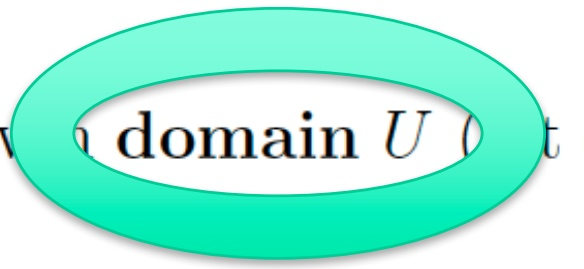
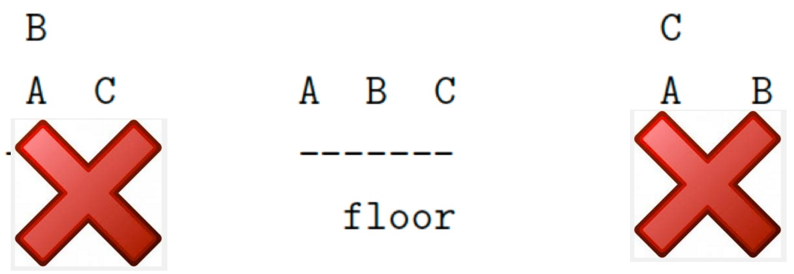
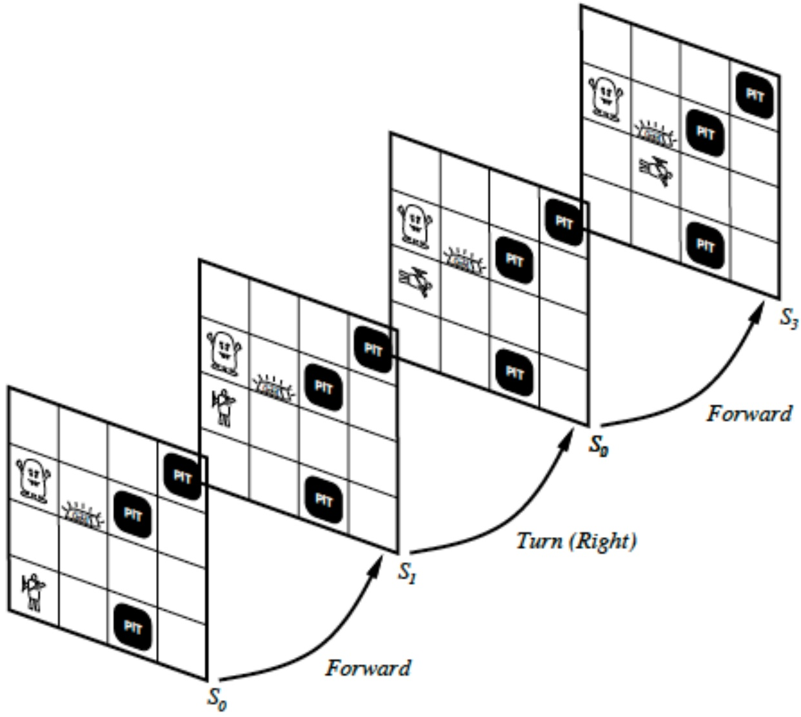
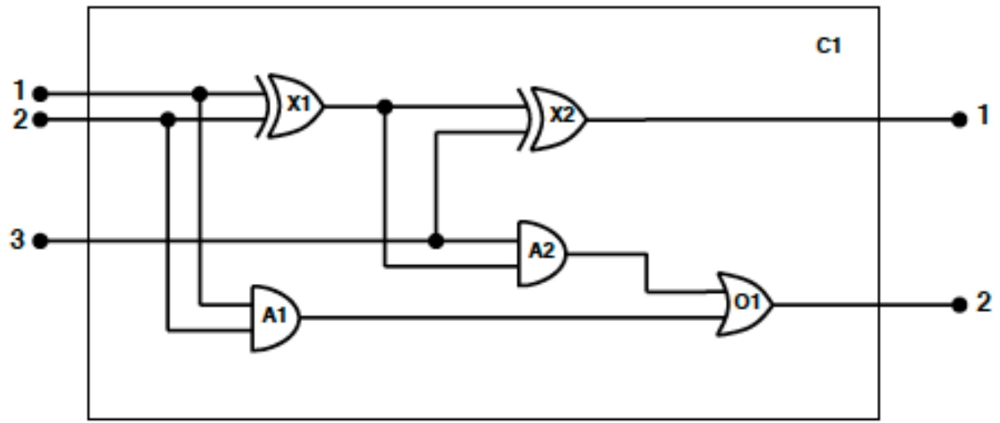
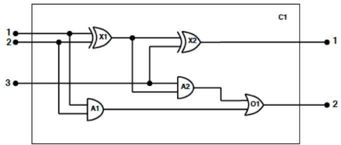
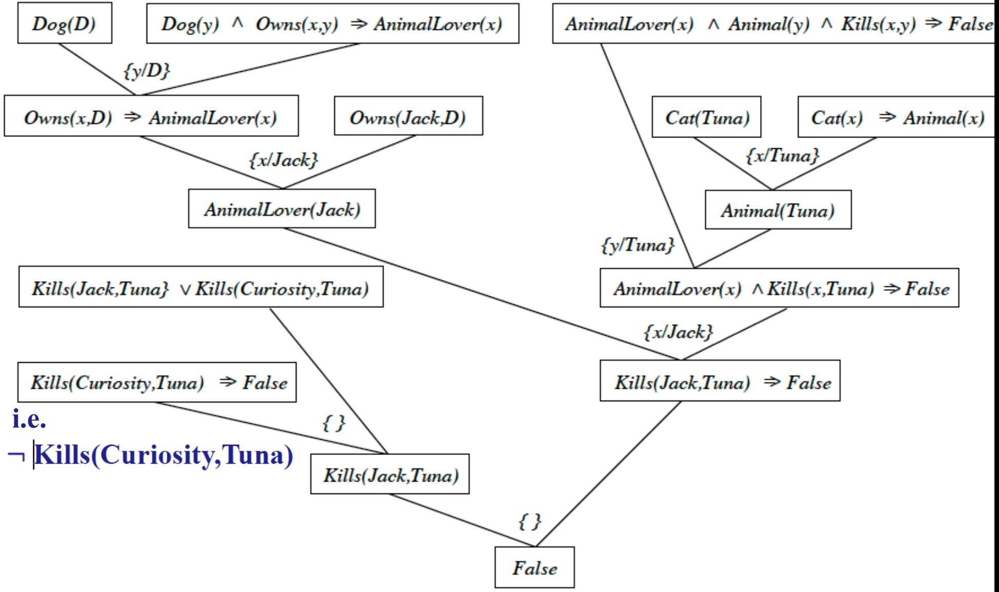
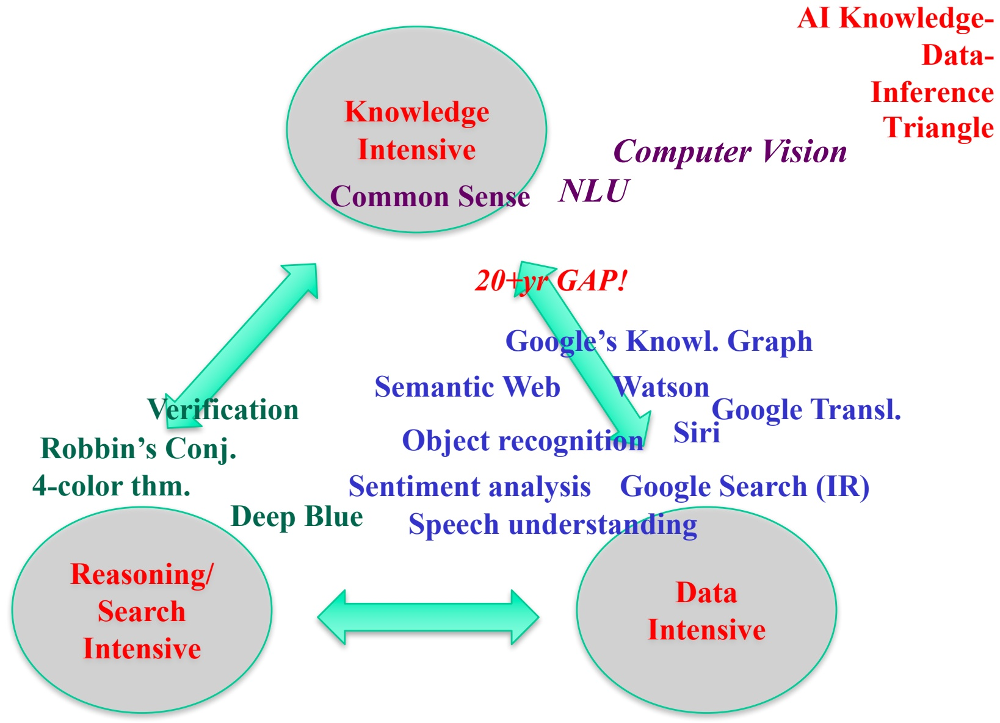

<!-- page: 1 -->

**CS 4700:**

# Foundations of Artificial Intelligence

**Bart Selman**

**selman@cs.cornell.edu**

**Module: Knowledge, Reasoning, and Planning**

**First-Order Logic and Inference**

**R&N: Chapters 8 and 9**

<!-- page: 2 -->

## First-Order Logic

Richer language. Closer match to ontology / conceptual structfre objects / properties / relations / functions

## Ex.:

objects: table, car, house, John...

relations: brother of, part of, has color...

properties: red, round, prime... [“unary relations"]

functions: father of, best fiend, one more than...

Q. Contrast relation with function.

<!-- page: 3 -->

## Syntax and Semantics

Study section 8.2 of R&N carefully.

Note: Semantics can be defined more formally.

See e.g. “A course in mathematical logic” Bell & Machover R&N provide main ideas behind semantics.

<!-- page: 4 -->

Semantics give by interpretations (propositional analogue: truth assignment)

Sentence (“formula") evaluates to True or False under a given interpretation. If True, interpretation is called a model of the sentence.

We hope that models of KB are close to actual state of affairs

But often, we also have unexpected (non-standard) models Relation between mathematical notion of interpretation / mod and actual physical world interesting philosophical issue.

We'll ignore it.

Each interpretation is defined over a giv individuals / objects).



t of

<!-- page: 5 -->

```txt
Constant symbols: A, B, C, John, chair-1, house-10...
In interpretation these symbols correspond to elements of (two constants can define the same element in U).
(morning-star / evening-star)

Predicate symbols: Round, Brother, Part-of,...
Each predicate symbol correspond to a relation on U.
E.g., a binary predicate, corresponds to a binary relation.
If U equals { car, tires, steering wheel, house }.
[tires, car], and [ steering wheel, car].
could be the intended interpretation of “part-of”
```

<!-- page: 6 -->

| Language | Ontological Commitment(What exists in the world) | Epistemological Commitment(What an agent believes about facts) |
| --- | --- | --- |
| Propositional logicFirst-order logicTemporal logicProbability theoryFuzzy logic | factsfacts, objects, relationsfacts, objects, relations, timesfactsdegree of truth | true/false/unknowntrue/false/unknowntrue/false/unknowndegree of belief 0...1degree of belief 0...1 |

<!-- page: 7 -->

Function symbols: Cosine, FatherOf, LeftLegOf .. Correspond to functions defined on U. Relation to predicate symbols?

<!-- page: 8 -->

Again, "what's meant by embodying knowledge about the world? Example:

1) $O n ( A , F l ) \Rightarrow C l e a r ( B )$

$( C l e a r ( B ) \land C l e a r ( C ) ) \Rightarrow O n ( A , F l )$

3 $C l e a r ( B ) \lor C l e a r ( A )$

4) Clear(B)

5) Clear(C)

<!-- page: 9 -->

One interpretation:

U is the set { A, B, C, Floor }.

```txt
1) mapping constant symbols to elements of U.
```

<div class="docvortex-algorithm" style="white-space: pre-wrap; font-family:monospace;">
e.g., $A$ to $\mathsf{A}$, $B$ to $\mathsf{B}$, $C$ to $\mathsf{C}$ and $Fl$ to Floor Could we have mapped $Fl$ to $\mathsf{A}??$
</div>

<div class="docvortex-algorithm" style="white-space: pre-wrap; font-family:monospace;">
2) mapping of relation symbol On to relation on U.
e.g.,  $On = \{ [ B, A ], [ A, Floor ], [ C, Floor ]\}$ .
</div>

<div class="docvortex-algorithm" style="white-space: pre-wrap; font-family:monospace;">
3) mapping of relation (property) Clear to a unary rel. on $U$. e.g., $Clear = \{ [\mathrm{B}], [\mathrm{C}] \}$.
</div>

<!-- page: 10 -->

<table><tr><td rowspan="42">Yet others ...</td><td rowspan="42"></td><td rowspan="21">1) On(A,Fl) ⇒ Clear(B)2) (Clear(B) ∧ Clear(C)) ⇒ On(A,Fl)3) Clear(B) ∨ Clear(A)4) Clear(B)5) Clear(C)</td></tr><tr></tr><tr></tr><tr></tr><tr></tr><tr></tr><tr></tr><tr></tr><tr></tr><tr></tr><tr></tr><tr></tr><tr></tr><tr></tr><tr></tr><tr></tr><tr></tr><tr></tr><tr></tr><tr></tr><tr></tr><tr><td rowspan="20">C</td></tr><tr></tr><tr></tr><tr></tr><tr></tr><tr></tr><tr></tr><tr></tr><tr></tr><tr></tr><tr></tr><tr></tr><tr></tr><tr></tr><tr></tr><tr></tr><tr></tr><tr></tr><tr></tr><tr></tr><tr><td></td></tr></table>

Including completely different interpretations! E.g., use integers for domain. (Lowenheim 1915)

<!-- page: 11 -->



Try to add sufficient axioms (facts) to rule out unwanted models. E.g., add clear(A).

<!-- page: 12 -->

Terms —- a logical expressions that refers to

an object. Constant symbols are terms. Functions applied to constant symbols. FatherOf(John). Also, variables are terms (later) and functions applied to variables or other terms.

The interpretation is given by whatever the Constant or Function maps to in U (vars later).

If no vars, called atomic terms.

<!-- page: 13 -->

Atomic sentences — A predicate symbol applied to atomic term E.g. Married(FatherOf(Richard), MotherOf(John)) Evaluated to true if predicate symbol holds between the objects referred to by the arguments.

Complex sentences — add logical connectives. E.g. Older(John, 30) ⇒ Older(Jane, 29)

<!-- page: 14 -->

## Quantifiers

Universal Quantification ∀

$$
\text {E.g.,} \forall x C a t (x) \Rightarrow M a m m a l (x)
$$

Think of as:

$$
(C a t (S p o t) \Rightarrow M a m m a l (S p o t)
$$


$$
(C a t (F e l i x) \Rightarrow M a m m a l (F e l i x))
$$

$$
(C a t (J o h n) \Rightarrow M a m m a l (J o h n))
$$

Intuition: Expand over all object symbols.

<!-- page: 15 -->

# Existential Quantification ∃

E.g., ∃x Sister(x, Spot) ∧ Cat(x)

Think of as:

(Sister(Spot, Spot) ∧ Cat(Spot

(Sister(Rebecca, Spot) ∧ Cat(Rebeca)) V

(Sister(Felix, Spot) ∧ Cat(Felix)) V

Intuition: Expand over all object symbols.

<!-- page: 16 -->

Equality = —

$$
\text {E.g.} f a t h e r (J o h n) = H e n r y
$$

True iff refer to same object of U in interpretation. (identity relation)

<!-- page: 17 -->

See Chapter 8 of R&N for more discussion and fine details. E.g. can't just switch quantifiers around.

Compare ∀x∃yLoves(x, y) vs.

Compare ∃x∀yLoves(x, y)

<!-- page: 18 -->

<div class="docvortex-algorithm" style="white-space: pre-wrap; font-family:monospace;">
$\forall s, b, u, c, t$ Percept([s, b, Glitter, u, c], t) $\Rightarrow$ AtGold(t)
</div>

## Reflex Agent

Directly connects percepts to actions:

<div class="docvortex-algorithm" style="white-space: pre-wrap; font-family:monospace;">
$\forall s, b, u, c, t$ Percept([s, b, Glitter, u, c], t) $\Rightarrow$ Action(Grab,
</div>

Or, more indirectly:

Why more flexible? Limitations of reflex approach?

<!-- page: 19 -->

```txt
Finite domains === “essentially propositional.” Also called: Propositional schema.
```

## Example: N-Queens, first-order

• 1) no row with two queens

<div class="docvortex-algorithm" style="white-space: pre-wrap; font-family:monospace;">
$\forall i,j,k (1\leq i,j,k\leq N) (Queen(i,j)\land Queen(i,k))\Rightarrow$ $(j = k)$
</div>

• 2) no column with two queens

$$
\begin{array}{c} \forall i, j, k (1 \leq i, j, k \leq N) (Q u e e n (j, i) \land Q u e e n (k, i)) \Rightarrow \\ (j = k) \end{array}
$$

<!-- page: 20 -->

• 3) no diagonal with two queens

$$
\begin{array}{r l} \forall i, j, k, l & (1 \leq i, j, k, l \leq N) [ (Q u e e n (i, j) \land Q u e e n (k, l) \\ & \land l e f t d i a g o n a l (i, j, k, l) ] \Rightarrow ((i = j) \land (k = l)) \end{array}
$$

similarly for right diagonal.

<!-- page: 21 -->

$$
\begin{array}{c} \forall i, j, k, l (1 \leq i, j, k, l \leq N) \\ \text {leftdiagonal} (i, j, k, l) \Leftrightarrow [ (i - j) = (k - l) ] \end{array}
$$

Similarly, for rightdiagonal Complete?

<!-- page: 22 -->

• 4) at least one queen per row $\forall i \exists j \quad ( 1 \leq i , j \leq N ) \quad { Q u e e n } ( i , j )$

<!-- page: 23 -->

## Also discussed earlier. Here some additional axiom details. R&N Section 10.4.2.

## Situation Calculus

```txt
One approach: have time argument
We can be more concise, since we're only interested in when and how things change.
Focus on “situations”. (“snapshots”)
(John McCarthy 1963).
(Changing) World is represented by a series of situations.
```

<!-- page: 24 -->



<!-- page: 25 -->

<div class="docvortex-algorithm" style="white-space: pre-wrap; font-family:monospace;">
E.g.: $At(Agent, [1, 1], S_0) \land At(Agent, [1, 2], S_1)$ "talking" about change / actions: $Result(Forward, S_0) = S1$ $Result(Turn(Right), S_1) = S2$ $Result(Forward, S_2) = S3$ Is Result a relation or a function? What about Forward? Result(action, situation) → situation (unique outcome)
</div>

<!-- page: 26 -->

```txt
Effect Axioms
Portable(Gold)
∀s AtGold(s) ⇒ Present(Gold, s)
∀x, s (Present(x, s) ∧ Portable(x)) ⇒ Holding(x, Result(Grab, s))
∀x, s ¬Holding(x, Result(Release, s))
Does this work?
```

<!-- page: 27 -->

**Again, as discussed in propositional case.**

## Frame Axioms

Need also to state what doesn't change!

$$
\begin{array}{r l} \forall a, x, s & H o l d i n g (x, s) \land (a \neq R e l e a s e)) \\ & \Rightarrow H o l d i n g (x, R e s u l t (a, x)) \end{array}
$$

$$
\begin{array}{c} \forall a, x, s \quad (\neg H o l d i n g (x, s) \land (a \neq g r a b)) \\ \Rightarrow \neg H o l d i n g (x, R e s u l t (a, x)) \end{array}
$$

<!-- page: 28 -->

<div class="docvortex-algorithm" style="white-space: pre-wrap; font-family:monospace;">
More compactly:
 $\forall a, x, s \text{ Holding}(x, \text{Results}(a, s)) \Leftrightarrow$
$[(a = \text{Grab} \land \text{Present}(x, s) \land \text{Portable}(x))$
$\lor (\text{Holding}(x, s) \land a \neq \text{Release})]$
</div>

successor-state axioms: need to list all the ways in wich any predicate can become true / false.

<!-- page: 29 -->

## Another example: Electronic Circuits



Further illustration of FOL formulation.

<!-- page: 30 -->

## Formalization

one-bit full adder: two inputs and a carry / one output and cafry

four gates: AND, OR, XOR and NOT.

Goal: analyze design to see if it matches specification.

Consider: circuits (gates and gate types), terminals, and signals formalization — keep task in mind.

e.g., for fault diagnosis: might want to specify “wires' could be broken... (e.g., Wire(x, y))

<!-- page: 31 -->

**Always define first and carefully.**

## Vocabulary

pick: functions / predicates $/$ constants.

constant symbols: $X _ { 1 } ,   X _ { 2 }$ , etc.

type gate: $T y p e ( X _ { 1 } ) = X O R ,$ , note XOR new constant.

Alt.: $T y p e ( X _ { 1 } , X O R )$ . Q. Advantage function?

terminals: $O u t ( 1 , X _ { 1 } ) , I n ( 1 , X _ { 1 } ) , I n ( 2 , X _ { 1 } )$

<!-- page: 32 -->

connectivity: Connected(Out(1, X1), In(1, X2)).

Note: we don't have to name the terminals explicity.

(Skolemization can bring back name.)

signal values: function Signal(x), e.g., Signal(In(1, X1)).

signal values: On and Of f.

<!-- page: 33 -->

## General Rules

how signals behave:

$$
1) \forall t _ {1}, t _ {2} \text {Connected} (t _ {1}, t _ {2}) \Rightarrow \text {Signal} (t _ {1}) = \text {Signal} (t _ {2})
$$

$$
2 \mathrm{a}) \forall t S i g n a l (t) = O n \lor S i g n a l (t) = O f f
$$

2b) $O n \neq O f f$

$$
3) \forall t _ {1}, t _ {2} \text {Connected} (t _ {1}, t _ {2}) \Leftrightarrow \text {Connected} (t _ {2}, t _ {1})
$$

<!-- page: 34 -->

```txt
how gates behave:
4) ∀g Type(g) = OR ⇒
    Signal(Out(1,g)) = On ⇔ ∃n Signal(In(n,g) = On.
5) how AND?
6) ∀g Type(g) = XOR ⇒
    (Signal(Out(1,g)) = On ⇔ (Signal(In(1,g) ≠ Signal(In(2,g)
7) NOT, similarly.
```

<!-- page: 35 -->

few rules (7): good ontology clear rules: good vocabulary what remains?

<!-- page: 36 -->

atomic facts — describing actual circuit under consideration.

types of gates:

Type(X1) = XOR, Type(X2) = XOR, Type(A1) = AND, . . conectivity:

Connected(Out(1, X1), In(1, X2)),

$$
\text { Connected } (I n (1, C _ {1}), I n (1, X _ {1})),
$$

$$
\text {Connected} (O u t (1, X _ {1}), \quad I n (1, A _ {2}))
$$

$$
\text {Connected} (I n (1, C _ {1}), I n (1, A _ {1})),
$$

etc.



<!-- page: 37 -->

## Queries

Our theory captures full behavior.

Can now ask many different queries about behavior etc.

E.g.

$$
\exists i _ {1}, i _ {2}, i _ {3}
$$

$$
\wedge \text {Signal} (O u t (1, C _ {1})) = O f f \wedge \text {Signal} (O u t (2, C _ {1})) = O n
$$

A.: $( I _ { 1 } = O n \wedge i _ { 2 } = O n \wedge i _ { 3 } = O f f ) \vee$

$$
(I _ {1} = O n \land i _ {2} = O f f \land i _ {3} = O n) \lor
$$

$$
(I _ {1} = O f f \land i _ {2} = O n \land i _ {3} = O n)
$$

What is the advantage over direct simulation?

etc. **Aside: previously The same here but we want a bit more “detailed answer”. Inference will also give us variable bindings if existential query is entailed.**

<!-- page: 38 -->

Of course, formalization is somewhat facilitated by the “closeness" between logical formalisms and digital circuitr; Starting with Shannon, allows for very powerful design methods (but did not prevent Pentium bug...).

<!-- page: 39 -->

**Done with prop. logic. Just check for syntax and FOL form.**

## One more example: Graph Coloring

Graph: N nodes, K colors.

• 1) $\forall i \quad ( 1 \leq i \leq N ) \quad \exists j \quad ( 1 \leq j \leq K ) \quad C o l o r ( i , j )$ $\forall i , j , l \quad ( 1 \leq i \leq N ) \quad ( 1 \leq j , l \leq K )$ [(Color(i, j) ∧ Color(i, l)) ⇒ (j = l)]

• 2) $\forall i , j \quad ( 1 \leq i , j \leq N ) \quad [ ( i \neq j ) \Rightarrow$ $( E d g e ( i , j ) \Rightarrow [ \neg \exists k ( 1 \leq k \leq K )$ ((Color(i, k) ∧ Color(j, k))])]

<!-- page: 40 -->

alternative:

$$
\begin{array}{r l} & {\bullet 3) \forall i, j (1 \leq i, j \leq N) [ (i \neq j) \Rightarrow} \\ & {(E d g e (i, j) \Rightarrow [ \forall k (1 \leq k \leq K)} \\ & {(\neg C o l o r (i, k) \lor \neg C o l o r (j, k)) ]) ]} \end{array}
$$

Now actual graph given by, e.g.,:

• 4) Edge(1,3), Edge(2,4), Edge(5,6)... etc.

<!-- page: 41 -->

<div class="docvortex-algorithm" style="white-space: pre-wrap; font-family:monospace;">
reasoning: 3 &amp; 4 gives e.g.: $\forall k(1 \leq k \leq K) (\neg Color(1, k) \lor \neg Color(3, k))$ uses "unification" $\{i/1, j/3\}$ with Modus Ponens.   
For $K = 5$, we get: ($\neg Color(1, 1) \lor \neg Color(3, 1)$), ($\neg Color(1, 2) \lor \neg Color(3, 2)$) ... ($\neg Color(1, 5) \lor \neg Color(3, 5)$)   
in propositional form.   
uses Universal Elimination, e.g., substitute $\{k/1\}$, etc.
</div>

<!-- page: 42 -->

**See R&N p. 443 FOL formalizations can be challenging for “everyday” concepts.**

Defining natural kinds is much more difficult,

```txt
e.g. a game, or a chair.
```

difficulty with necessary and sufficient conditions.

problem with“strict definition"(Quine 1953)

“the Pope is a bachelor."

Approaches?

```txt
Probabilistic representations (extending prop. logic / FOL) can help!
```

<!-- page: 43 -->

## Inference Resolution / Unification

**Chapter 9 R&N.**

**But for finite domains that are not too large, better to “ground to” propositional and use SAT solver.**

<!-- page: 44 -->

## Inference

We've considered various first-order formalizations.

But, how do we reason with them? Derive new info?

A. Use resolution as in propositional case

From $( \alpha \lor p ) \land ( \lnot p \lor \beta )$

conclude $\alpha \vee \beta$ until you reach contradiction.

Need some extra "tricks” to deal with

quantifiers and variables.

<!-- page: 45 -->

## Resolution

- I put in clausal form
- all variables universally quantified
- main trick: “Skolemization” to remove existantials.
- idea: invent names for unknown objects known to exist
- II use unification to match atomic sentences
- III apply resolution rule to the clausal set combined with negated goal. Attempt to generate empty clause.

<!-- page: 46 -->

## Tricks

• unification: needed to match variables and terms between clauses that look similar See also R&N.

• normalization: put in clausal form

move quantifiers / ∧ / V etc.

and Skolemization — remove ∃ by giving

an arbitrary, but unique name to the object in question.

E.g. D for the dog owned by Jack.

<!-- page: 47 -->

## Unification

UNIFY (P,Q) takes two atomic sentences P and Q and returns a substitution that makes P and Q look the same.

Rules for substitutions:

• Can replace a variable by a constant.

• Can replace a variable by a variable.

Can replace a variable by a function expression, as long as the function expression does not contain the variable.

Unifier: a substitution that makes two clauses resolvable.

$$
v _ {1} \rightarrow C; v _ {2} \rightarrow v _ {3}; v _ {4} \rightarrow f (\dots)
$$

<!-- page: 48 -->

Unification — Purpose

Given:

∀ x (¬ Knows(John, x) ∨ Hates(John,x))

Knows(John, x) → Hates(John, x)

Knows(John, Jim)

Derive

Hates(John, Jim)

Need unifier {x/Jim} before resolution. (simplest case)

<!-- page: 49 -->

<div class="docvortex-algorithm" style="white-space: pre-wrap; font-family:monospace;">
$\neg$ Knows(John, Jim) $\vee$ Hates(John, Jim) and
</div>

¬Knows(John, x) V Hates(John, x) and Knows(John, Jim)

How do we resolve? First, match them.

Solution:

K nows(John, Jim)

Conclude by resolution

Hates(John, Jim)

<!-- page: 50 -->

## Unification (example)

general rule:

$$
K n o w s (J o h n, x) \rightarrow H a t e s (J o h n, x)
$$

facts:

Knows(John, Jim)

Knows(y, Leo)

Knows(y, Mother(y))

Knows(x, Jane)

“matching facts to general rules"

**Can substitute in because original clause universally quantified.**50

<!-- page: 51 -->

```txt
UNIFY(Knows(John, x), Knows(John, Jim)) = {x/Jim}
UNIFY(Knows(John, x), Knows(y, Leo)) = {x/Leo, y/John}
UNIFY(Knows(John, x), Knows(y, Mother(y))) =
{y/John, x/Mother(John)};
UNIFY(Knows(John, x), Knows(x, Jane)) = fail
```

<!-- page: 52 -->

Last one fails because x can't take on both the value John and the value Jane. But intuitively we know that everyone John knows he hates and everyone knows Jane so we should be able to infer that John hates Jane.

• This is why we require, if possible, that every variable has a separate name. Knows(John,x) and Knows(y,Jane) works.

<!-- page: 53 -->

## Most General Unifier

In cases where there is more than one substitution choose the one that makes the least commitment (most general) about the bindings.

```javascript
UNIFY(Knows(John, x), Knows(y, z)) = {y/John, x/z} or {y/John, x/z, z/Freda} or {y/John, x/John, z/John} or ....
```

<!-- page: 54 -->

Normal form: Clausal

<!-- page: 55 -->

See also, R&N.

• Eliminate implication

$p \Rightarrow q$ becomes $\neg p \lor q$

• Move ¬ inwards

$\mathrm{e.g.},   \neg (p \lor q)$ becomes $( \neg p \land \neg q )$

¬∃x . p becomes ∀x ¬p

¬∀x . p becomes . ..

• Standarize variables

rename variables to avoid conflicts.

• Move quantifiers left

e.g., p ∨ ∀x q becomes ∀x (p ∨ q)

<!-- page: 56 -->

## • Skolemize (remove existentials)

$$
\text {e.g.} \forall x \operatorname{Person} (x) \Rightarrow \exists y \operatorname{Heart} (y) \land \operatorname{Has} (x, y)
$$

consider:

$$
\forall x \text {Person} (x) \Rightarrow \text {Heart} (H) \land \text {Has} (x, H)
$$

problem??

$$
\forall x \text {Person} (x) \Rightarrow \text {Heart} (F (x)) \land \text {Has} (x, F (x))
$$

• Distribute ∧ over V

$$
(a \land b) \lor c \text {becomes} (a \lor c) \land (b \lor c)
$$

• Flatten nested conjunctions and disjunctions e.g. $( a \lor b ) \lor$ c becomes $( a \lor b \lor c )$

<!-- page: 57 -->

## Example

Jack owns a dog.

**Natural language input.**

(From dog to more general.

No animal lover kills an animal. **(General statement.)**

Either Jack or Curiosity killed the cat, who is named Tuna.

Did Curiosity kill the cat? **The query**

**YES!**

**What “hidden” background knowledge is being used?**

<!-- page: 58 -->

## Original Sentences (Plus Background Knowledge)

Jack owns a dog.

Every dog owner is an animal lover.

No animal lover kills an animal.

Either Jack or Curiosity killed the cat, who is named Tuna.

Did Curiosity kill the cat?

5. Cat(I una)

6. ∀x Cat(x) → Animal(x)

Cats are animals.

Not stated explicitly! **This is**

**an example of background**

**knowledge key to NaturalQuery: KB |== Kills(Curiosity, Tuna) ??**

**Executable semantic parsing.**

**Persi Liang, Stanford.NLU needs to resolve “the cat” to Curiosity!**

<!-- page: 59 -->

## Clausal Form

**D is a “fake name” for the dog.**

1. Dog(D)

∃x : Dog(x) ∧ Owns(Jack, x)

2. Owns(Jack, D)

∀x (∃y Dog(y) ∧ Owns(x, y)) → AnimalLover(x)

3. ¬Dog(S(x)) ∨ ¬Owns(x, S(x)) ∨ AnimalLover(x)

∀x AnimalLover(x) →(∀y Animal(y) → ¬Kills(x, y))

4. ¬Animal Lover(w) ∨ ¬Ànima(y) ∨ ¬ills(w, y)

Kills(Jack, Tuna) V Kills(Curiosity, Tuna)

5. Kills(Jack, Tuna) V Kills(Ćuriosity, Tuna)

6. Cat(Tuna)

Cat(Tuna)

7. ¬Cat(z) ∨ Animal(z) ∀x Cat(x) → Animal(x) Negation of query! Missing? 8. ¬ Kills(Curiosity, Tuna) Proof by contradiction for resolution. 59 **Translation to clausal form automatic.**

<!-- page: 60 -->

## Proof by Resolution with Refutation

Dog(D)

Dog(y) Λ Owns(x,y) ⇒ AnimalLover(x)

AnimalLover(x) Λ Animal(y) ∧ Kills(x,y) ⇒ False

{y/D}

Owns(x,D) ⇒ AnimalLover(x)

Owns(Jack,D)

{x/Jack}

Cat(Tuna)

Cat(x) ⇒ Animal(x)

{x/Tuna}

AnimalLover(Jack)

Animal(Tuna)

Kills(Jack,Tuna} V Kills(Curiosity,Tuna)



Kills(Curiosity,Tuna) ⇒ False

{y/Tuna}

**: Kills(Curiosity,Tuna)**

AnimalLover(x) ΛKills(x,Tuna) ⇒ False

Kills(Jack,Tuna)

{x/Jack}

Kills(Jack,Tuna) ⇒ False

{}

False

Warning: Non-standard notation!!

<!-- page: 61 -->

## First-order resolution proof (more carefully)

1. Dog(D)

3. ¬Dog(S(x)) ∨ ¬Owns(x, S(x)) ∨ AnimalLover(x)

9. **¬ Owns(x, D)**∨ **AnimalLover(x) using S(x)/D**

$O w n s ( J a c k , D )$

10. **AnimalLover(Jack) using x/Jack**

6. $C a t ( T u n a )$

7. ¬Cat(z) ∨ Animal(z)

11. **Animal (Tuna) using z/Tuna**

<!-- page: 62 -->

## 11. Animal (Tuna)

4. ¬AnimalLover(w) ∨ ¬Animal(y) ∨ ¬Kills(w, y)

**12. ¬ AnimalLover(w)** ∨ **¬ Kills(w, Tuna) using y/Tuna**

10. **AnimalLover(Jack)**

**13. ¬ Kills(Jack, Tuna) using w/Jack**

5. Kills(Jack, Tuna) V Kills(Čuriosity, Tuna)

**14. Kills(Curiosity, Tuna)**

**8. ¬ Kills(Curiosity, Tuna)**

**15** ⧠ **(contradiction reached)**

**15 lines; trivial with**

**modern solvers.**

**Can do 1+ billion lines!**

$$
\text {So, KB} \models = \text {Kills(Curiosity, Tuna)}
$$

<!-- page: 63 -->

Jack owns a dog.

Every dog owner is an animal lover.

No animal lover kills an animal.

Either Jack or Curiosity killed the cat, who is named Tuna.

Did Curiosity kill the cat?

**So, we answered a natural language query using**

**(1) Natural language parsing**

**(almost there)**

**(2) Background knowledge**

**(much work remaining)**

**(3) Reasoning**

**(works fine now)**

**We will see much progress in this kind of natural language question answering in next decade.**

**Eg executable semantic parsing.**

**Persi Liang, Stanford.**

<!-- page: 64 -->

## Completeness

F.O. Resolution with unification applied to clausal form, is refutation complete.

Interesting proof! Based on building an“artificial" domain of interpretation, called the Herbrand universe.

<!-- page: 65 -->

## Schubert Steamroller

Wolves, foxes, birds, caterpillars, and snails are animals, and there are some of each of them.

Also there are some grains, and grains are plants.

Every animal either likes to eat all plants or all animals much smaller than itself that like to eat some plants.

Caterpillars and snails are much smaller than birds, which are much smaller than foxes, which are much smaller than wolves.

<!-- page: 66 -->

Wolves do not like to eat foxes or grains, while birds like to eat caterpillars but not snails.

Caterpillars and snails like to eat some plants.

<!-- page: 67 -->

$$
\begin{array}{l} \text {Some logical forms:} \\ \forall x (W o l f (x) \Rightarrow a n i m a l (x)) \\ \forall x \forall y ((C a t e r p i l l a r (x) \land B i r d (y)) \Rightarrow S m a l l e r (x, y). \\ \exists x b i r d (x) \end{array}
$$

<!-- page: 68 -->

## To prove:

There is an animal that likes to eat a grain-eating animal.

Requires almost 150 resolution steps (minimal) Significant challenge for early systems.

<!-- page: 69 -->

Certain sets of first-order statements can overwhelm general resolution solvers, e.g. about infinite sets (natural numbers).

As a consequence, many practical Knowledge Represenation formalisms in AI use a restricted form and specialized inference.

Can often understand them in terms of standard first-order logic! (clear syntax & semantics)

**Or, better yet, for finite domains, fall back to SAT solvers.**

<!-- page: 70 -->

**Concludes propositional and first-order logic for knowledge representation and reasoning.**

**Next “Big Picture Slide”**

<!-- page: 71 -->


