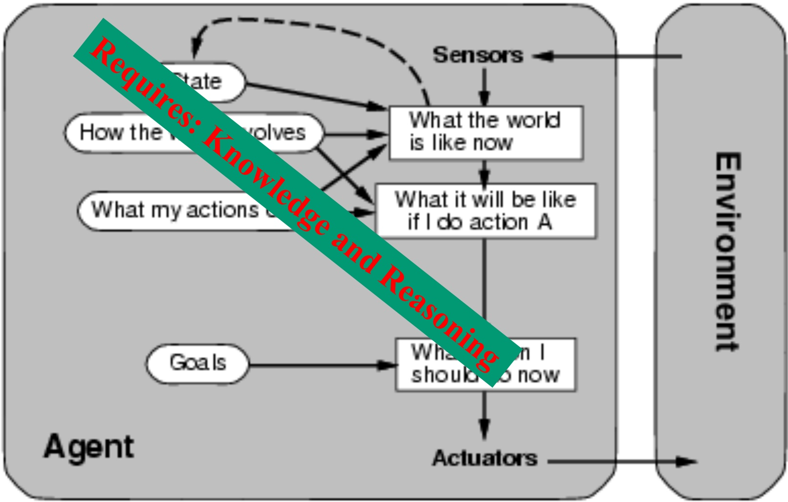
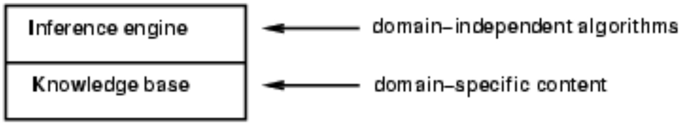
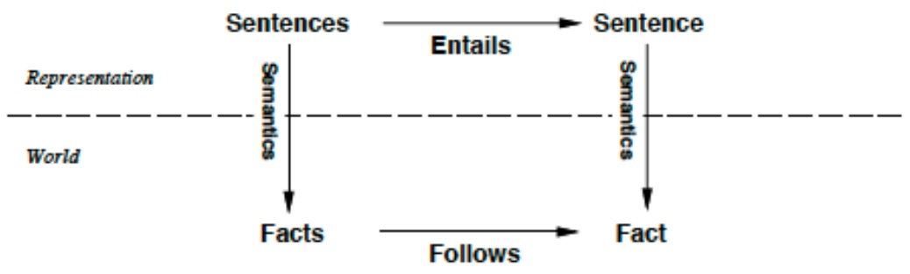
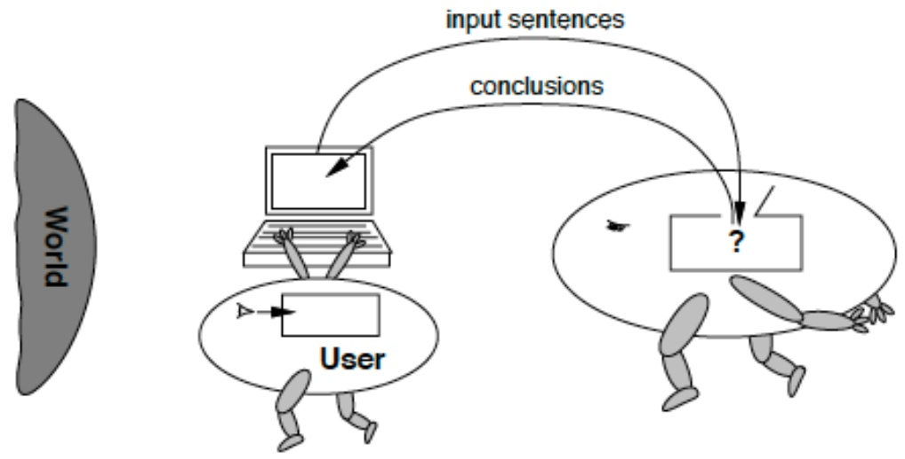

<!-- page: 1 -->

**CS 4700:**

# Foundations of Artificial Intelligence

**Bart Selman**

**selman@cs.cornell.edu**

**Module: Knowledge, Reasoning, and Planning Part 1**

**Logical Agents**

**R&N: Chapter 7**

<!-- page: 2 -->

## A Model-Based Agent



<!-- page: 3 -->

## Knowledge and Reasoning

## Knowledge and Reasoning:

**humans are very good at acquiring new information by combining raw knowledge, experience with reasoning. AI-slogan: “Knowledge is power” (or “Data is power”?)**

## Examples:

**Medical diagnosis --- physician diagnosing a patient infers what disease, based on the knowledge he/she acquired as a student, textbooks, prior cases Common sense knowledge / reasoning --- common everyday assumptions / inferences. e.g., (1) “lecture starts at four” infer pm not am; (2) when traveling, I assume there is some way to get from the airport to the hotel.**

<!-- page: 4 -->

## Logical agents:

**Agents with some representation of the complex knowledge about the world / its environment, and uses inference to derive new information from that knowledge combined with new inputs (e.g. via perception).**

## Key issues:

**1- Representation of knowledge What form? Meaning / semantics? 2- Reasoning and inference processes Efficiency.**

<!-- page: 5 -->

## Knowledge-base Agents

Key issues:

– Representation of knowledge à knowledge base

– Reasoning processes à inference/reasoning

Knowledge base = set of sentences in a formal language representing facts about the world (\*)

**(\*) called Knowledge Representation (KR) language**

<!-- page: 6 -->

## Knowledge bases

## Key aspects:

– **How to add sentences to the knowledge base**

– **How to query the knowledge base**

## Both tasks may involve inference – i.e. how to derive new sentences from old sentences

**Logical agents – inference must obey the fundamental requirement that when one asks a question to the knowledge base, the answer should follow from what has been told to the knowledge base previously. (In other words the inference process should not** “**make things**” **up…)**



<!-- page: 7 -->

## A simple knowledge-based agent

```python
function KB-AGENT(percept) returns an action
    static: KB, a knowledge base
        t, a counter, initially 0, indicating time
    TELL(KB, MAKE-PERCEPT-SENTENCE(percept, t))
    action← ASK(KB, MAKE-ACTION-QUERY(t))
    TELL(KB, MAKE-ACTION-SENTENCE(action, t))
    t← t + 1
    return action
```

## The agent must be able to:

– **Represent states, actions, etc.**

– **Incorporate new percepts**

– **Update internal representations of the world**

– **Deduce hidden properties of the world**

– **Deduce appropriate actions**

<!-- page: 8 -->

**KR language candidate: logical language (propositional / first-order) combined with a logical inference mechanism**

**How close to human thought? (mental-models / Johnson-Laird).**

**What is “the language of thought”?**

**Greeks / Boole / Frege --- Rational thought: Logic?**

**Why not use natural language (e.g. English)?**

**We want clear syntax & semantics (well-defined meaning), and, mechanism to infer new information. Soln.: Use a formal language**.

<!-- page: 9 -->

## “Advice-Taker"

1958 / 1968 — John McCarthy: “Programs with Common Sene" agents use logical reasoning to mediate between percepts and a

Idea: Impart knowledge to a program in the form of declarativ (logical) statements (“what" instead of “how"); program uses general reasoning mechanisms to process and act on information.

E.g. Formalize “x is at y” using predicate at, i.e., at(x,y) at defined by its properties, e.g., at(x, y) ∧ at(y, z) → at(, z) Problems??

<!-- page: 10 -->

# Agent / Intelligent System Design

Craik (1943) The Nature of Explanation

If the organism carries a “small-scale model" of external realit and of its own small possible actions within its head, it is able try out various alternatives, conclude which is the best of then react to future situations before they arise, utilize the knowled of the past events in dealing with the present and future, and every way to react in a much fuller, safer, and more competen manner to the emergencies which face it.

Alt. view: against representations — Brooks (1989)

<!-- page: 11 -->

## Representation Language

preferably:

— expressive and concise

— unambiguous and independent of context

have an effective procedure to derive new information not easy to meet these goals ..

propositional and first-order logic meet some of the criteria incompleteness / uncertainty is key — contrast with programming languages.

<!-- page: 12 -->

## Logical Representation

Three components:

syntax

semantics (link to the world)

proof theory (“pushing symbols")

To make it work: soundness and completeness.

<!-- page: 13 -->

## Connecting Sentences to the World



Somewhat misleading: formal semantics brings sentence down only to the primitive components (propositions). (later)

<!-- page: 14 -->

## Tenuous Link to Real World



All computer has are sentences (hopefully about the world).

Sensors can provide some grounding.

Hope KB unique model / interpretation: the real-world.

Often many more... (Aside: consider arithmetic.)

**The “symbol grounding problem.”**

<!-- page: 15 -->

## More Concrete: Propositional Logic

Syntax: build sentences from atomic propositions, using connectives $\wedge , \vee , \neg , \Rightarrow , \Leftrightarrow$

(and / or / not / implies / equivalence (biconditional))

E.g.: $( ( \neg P ) \lor ( Q \land R ) ) \Rightarrow S$

<!-- page: 16 -->

## Semantics

| P | Q | $\neg P$ | $P \land Q$ | $P \lor Q$ | $P \Rightarrow Q$ | $P \Leftrightarrow Q$ |
| --- | --- | --- | --- | --- | --- | --- |
| False | False | True | False | False | True | True |
| False | True | True | False | True | True | False |
| True | False | False | False | True | False | False |
| True | True | False | True | True | True | True |

Note: ⇒ somewhat counterintuitive.

What's the truth value of “5 is even implies Sam is smart"?

## True!

<!-- page: 17 -->

## Validity and Inference

| P | H | $P \lor H$ | $(P \lor H) \land \neg H$ | $((P \lor H) \land \neg H) \Rightarrow P$ |
| --- | --- | --- | --- | --- |
| False | False | False | False | True |
| False | True | True | False | True |
| True | False | True | True | True |
| True | True | True | False | True |

Truth table for: Premises ⇒ Conclusion. Shows $( ( P \lor H ) \land ( \lnot H ) ) \Rightarrow P$ is valid (True in all interpretations)

We write $\models ( ( P \lor H ) \land ( \neg H ) ) \Rightarrow P$

<!-- page: 18 -->

<table><tr><td colspan="2">Models</td></tr><tr><td colspan="2">A model of a set of sentences (KB) is a in which each of the KB sentences e With more and more sentences, the mod more and more like the “real-world” (or isomorphic to it).</td></tr><tr><td>If a sentence α holds (is True) in all models of a KB, we say that α is entailed by the KB.α is of interest, because whenever KB is true in a world α will also be True.We write: KB |= α.</td><td>Note: KB defines exactly the set of worlds we are interested in.</td></tr></table>

## I.e.: Models(KB) Models( )

<!-- page: 19 -->

## Proof Theory

Purely syntactic rules for deriving the logical consequences o a set of sentences. **Example soon.**

We write: KB  α, i.e., α can be deduced from KB or α is provable from KB.

## Key property:

Both in propositional and in first-order logic we have a proof theory (“calculus") such that:

$$
\vdash \quad \text { and } \quad \models \quad \text { are   equivalent. }
$$

<!-- page: 20 -->

## Proof Theory

If $K B \vdash \alpha$ implies $KB \models \alpha$ , we say the proof theory is sound.

If $KB \models \alpha$ implies $K B \vdash \alpha$ , we say the proof theory is complete.

Why so remarkable $/$ important?

<!-- page: 21 -->

## Soundness and Completeness

Allows computer to ignore semantics and“just push symbols"! In propositional logic, truth tables cumbersome (at least) In first-order, models can be infinite!

Proof theory: One or more inference rules with zero or more axioms (tautologies / to get things “going.").

**Note: (1) This was Aristotle’s original goal --- Construct infallible arguments based purely on the form of statements --- not on the “meaning” of individual propositions. (2) Sets of models can be exponential size or worse, compared to symbolic inference (deduction).**

<!-- page: 22 -->

## Example Proof Theory

## Modus Ponens

From α and $\alpha \Rightarrow \beta$ it follows that $\beta .$ Semantic soundness easily verified. (truth table)

Axiom schemas:

(Ax. I) $\alpha \Rightarrow ( \beta \Rightarrow \alpha )$

(Ax. II) $\left( \left( \alpha \Rightarrow \left( \beta \Rightarrow \gamma \right) \right) \Rightarrow \left( \left( \alpha \Rightarrow \beta \right) \Rightarrow \left( \alpha \Rightarrow \gamma \right) \right) \right)$

(Ax. III) $\left( \lnot \alpha \Rightarrow \beta \right) \Rightarrow \left( \lnot \alpha \Rightarrow \lnot \beta \right) \Rightarrow \alpha.$

Note: $\alpha , \beta , \gamma$ stand for arbitrary sentences. So, infinite collection of axioms.

<!-- page: 23 -->

Now, α can be deduced from a set of sentences Φ

**Modus Ponens** that leads from Φ to α (possibly using the axioms).

One can prove that:

Modens ponens with the above axioms will generate exactl all (and only those) statements logically entailed by Φ.

So, we have a way of generating entailed statements

in a purely syntactic manner!

(Sequence is called a proof. Finding it can be hard .. .)

<!-- page: 24 -->

(Ax. I) $\alpha \Rightarrow ( \beta \Rightarrow \alpha )$

(Ax. II) $\left( \left( \alpha \Rightarrow \left( \beta \Rightarrow \gamma \right) \right) \Rightarrow \left( \left( \alpha \Rightarrow \beta \right) \Rightarrow \left( \alpha \Rightarrow \gamma \right) \right) \right)$

(Ax. III) $( \neg \alpha \Rightarrow \beta ) \Rightarrow ( \neg \alpha \Rightarrow \neg \beta ) \Rightarrow \alpha .$

Lemma. For any α, we have $\vdash ( \alpha \Rightarrow \alpha )$

Proof.

$$
(\alpha \Rightarrow ((\alpha \Rightarrow \alpha) \Rightarrow \alpha) \Rightarrow (\alpha \Rightarrow \alpha \Rightarrow \alpha) \Rightarrow \alpha \Rightarrow \alpha , (\text {Ax. II})
$$

$$
\alpha \Rightarrow (\alpha \Rightarrow \alpha) \Rightarrow \alpha , (\text {Ax. I})
$$

$$
(\alpha \Rightarrow \alpha \Rightarrow \alpha) \Rightarrow \alpha \Rightarrow \alpha , (M. P.)
$$

$$
\alpha \Rightarrow \alpha \Rightarrow \alpha) (\mathrm{Ax.I})
$$

$$
\alpha \Rightarrow \alpha (\mathrm{M.P.})
$$

<!-- page: 25 -->

$\alpha \Rightarrow ( \beta \Rightarrow \alpha )$

(Ax. II) $\mathtt { \acute { X } } ( \alpha \Rightarrow ( \beta \Rightarrow \gamma ) ) \Rightarrow ( ( \alpha \Rightarrow \beta ) \Rightarrow ( \alpha \Rightarrow \gamma ) ) )$

(Ax. III) $( \neg \alpha \Rightarrow \beta ) \Rightarrow ( \neg \alpha \Rightarrow \neg \beta ) \Rightarrow \alpha .$

more carefal with paun theon ...

$$
\left[ \begin{array}{l} (\alpha \Rightarrow (\alpha \Rightarrow \alpha) \Rightarrow \alpha) \Rightarrow (\alpha \Rightarrow \alpha \Rightarrow \alpha) \Rightarrow \alpha \Rightarrow \alpha , (\text {Ax. II}) \\ \alpha \Rightarrow (\alpha \Rightarrow \alpha) \Rightarrow \alpha , (\text {Ax. I}) \\ (\alpha \Rightarrow \alpha \Rightarrow \alpha) \Rightarrow \alpha \Rightarrow \alpha , (\text {M. P.}) \\ \alpha \Rightarrow \alpha \Rightarrow \alpha) (\text {Ax. I}) \\ \alpha \Rightarrow \alpha (\text {M.P.}) \end{array} \right]
$$

<!-- page: 26 -->

## Standard syntax and semantics for propositional logic. (CS-2800; see 7.4.1 and 7.4.2.)

Syntax:

```csv
Sentence → AtomicSentence | ComplexSentence
AtomicSentence → True | False | P | Q | R | ...
ComplexSentence → (Sentence) | [Sentence]
| ¬Sentence
| Sentence ∧ Sentence
| Sentence ∨ Sentence
| Sentence ⇒ Sentence
| Sentence ⇔ Sentence
OPERATOR PRECEDENCE : ¬, ∧, ∨, ⇒, ⇔
```

<!-- page: 27 -->

Semantics

Note: Truth value of a sentence is built from its parts “compositional semantics”

| P | Q | $\neg P$ | $P \land Q$ | $P \lor Q$ | $P \Rightarrow Q$ | $P \Leftrightarrow Q$ |
| --- | --- | --- | --- | --- | --- | --- |
| false | false | true | false | false | true | true |
| false | true | true | false | true | true | false |
| true | false | false | false | true | false | false |
| true | true | false | true | true | true | true |

<!-- page: 28 -->

<div class="docvortex-algorithm" style="white-space: pre-wrap; font-family:monospace;">
$(\alpha \land \beta) \equiv (\beta \land \alpha) \quad \text{commutativity of } \land$
$(\alpha \lor \beta) \equiv (\beta \lor \alpha) \quad \text{commutativity of } \lor$
$((\alpha \land \beta) \land \gamma) \equiv (\alpha \land (\beta \land \gamma)) \quad \text{associativity of } \land$
$((\alpha \lor \beta) \lor \gamma) \equiv (\alpha \lor (\beta \lor \gamma)) \quad \text{associativity of } \lor$
$\neg(\neg\alpha) \equiv \alpha \quad \text{double-negation elimination}$
$(\alpha \Rightarrow \beta) \equiv (\neg\beta \Rightarrow \neg\alpha) \quad \text{contraposition}$
$(\alpha \Rightarrow \beta) \equiv (\neg\alpha \lor \beta) \quad \text{implication elimination} \quad (*)$
$(\alpha \Leftrightarrow \beta) \equiv ((\alpha \Rightarrow \beta) \land (\beta \Rightarrow \alpha)) \quad \text{biconditional elimination}$
$\neg(\alpha \land \beta) \equiv (\neg\alpha \lor \neg\beta) \quad \text{de Morgan}$
$\neg(\alpha \lor \beta) \equiv (\neg\alpha \land \neg\beta) \quad \text{de Morgan}$
$(\alpha \land (\beta \lor \gamma)) \equiv ((\alpha \land \beta) \lor (\alpha \land \gamma)) \quad \text{distributivity of } \land \text{ over } \lor$
$(\alpha \lor (\beta \land \gamma)) \equiv ((\alpha \lor \beta) \land (\alpha \lor \gamma)) \quad \text{distributivity of } \lor \text{ over } \land$
</div>

**(\*) key to go to clausal (Conjunctive Normal Form) Implication for “humans”; clauses for machines. de Morgan laws also very useful in going to clausal form.**
