<!-- page: 1 -->

## Chapter 1 Introduction

Dana S. Nau

University of Maryland

with contributions from

[Mark “mak” Roberts](https://scholar.google.com/citations?user=vlbX4J8AAAAJ)

## Acting, Planning, and Learning

Malik Ghallab, Dana Nau, and Paolo Traverso

<!-- page: 2 -->

## Deliberative Action

**Poll** Name one component of “deliberative action”

● Deliberation (or thinking) implies:

▸ A representation of the problem

▸ A solver

▸ An end to aim at

▸ Potential application of experience

● Acting implies:

▸ A boundary: exogenous and endogenous

▸ Agency to modify the external world

▸ Potential for exogenous activity

● For AI, deliberation often means:

▸ An abstraction of the problem: Model

▸ A solver: a search algorithm

▸ An end to aim at: a goal or task

▸ Potential application of experience: learning

● For AI, acting implies:

▸ An actor

▸ An external world or environment

Scientific focus: how do we compute deliberative action: models and algorithms!

● Need not imply consciousness; we generally will not dwell on philosophy in this course

<!-- page: 3 -->

## Ethical considerations

● Governing AI for Humanity, Interim Report (UN AI Advisory Board, 2023)

● Blueprint for AI Bill of Rights (White House OSTP, 2022)

● Reflections on AI for Humanity (Braunschweig and Ghallab, eds., 2021)

● 100 Year Study on AI (Stanford University, 2021, 2016)

● The alignment problem: How can machines learn human values? (Christian, 2021)

● Ethics guidelines for Trustworthy AI (EU High-level Group on AI, 2019)

● Responsible AI: requirements and Challenges (Ghallab, 2019)

● Lethal Autonomous Systems Pledge (Future of Life Institute, 2018)

● Study on Autonomy (US Defense Science Board, 2016)

Suggested readings on this topic:

[● Human compatible: AI and the problem of control](https://en.wikipedia.org/wiki/Human_Compatible) (Russell, 2019)

<u>Life 3.0</u> (Tegmark, 2017)

<u>The Myth of Artificial Intelligence</u> (Larson, 2021)

Lecture slides for [Acting, Planning, and Learning](https://projects.laas.fr/planning/). Creative Commons [CC BY-SA 4.0](https://creativecommons.org/licenses/by-sa/4.0/deed.en)

<!-- page: 4 -->

## Motivation

## ● Actor: agent that performs actions

## ● Deliberation functions

▸ Planning What actions to perform

Acting How to perform them

Learning Acquire models and decide When to act or plan

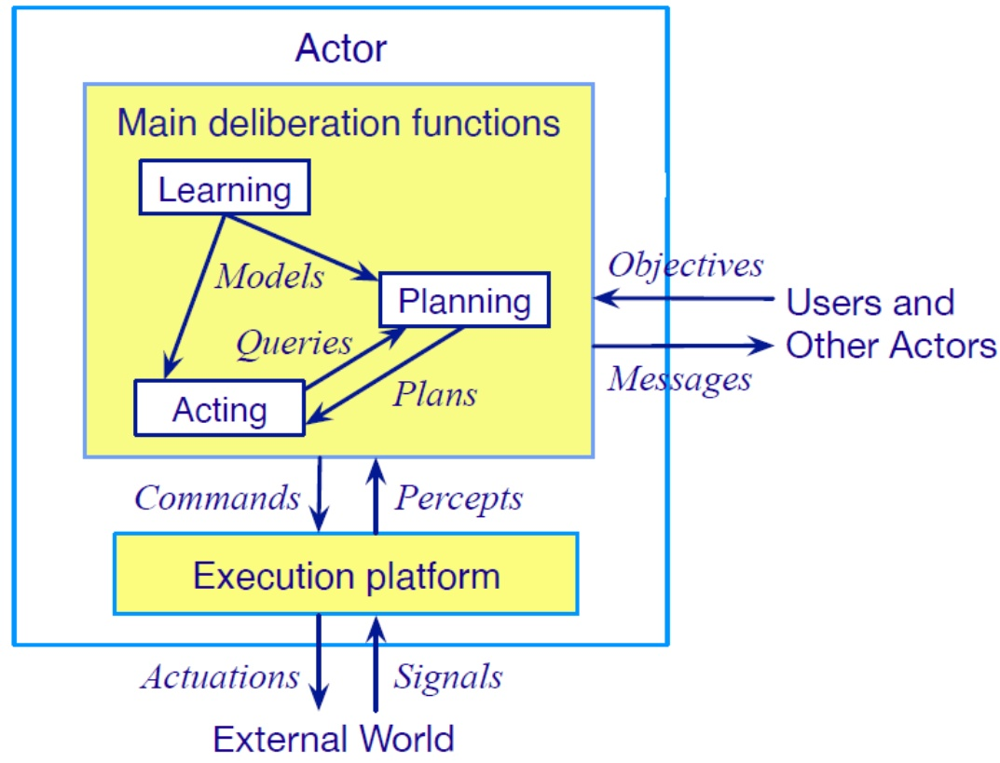

<!-- page: 5 -->

## Planning

● Relies on prediction + search

● Uses descriptive models of the actions

▸ Predict what the actions will do

Don’t tell how to do them

Search over predicted states and possible organizations of feasible actions

● Different types of actions ⇒

▸ Different predictive models

▸ Different planning problems and techniques

▸ Motion and manipulation planning

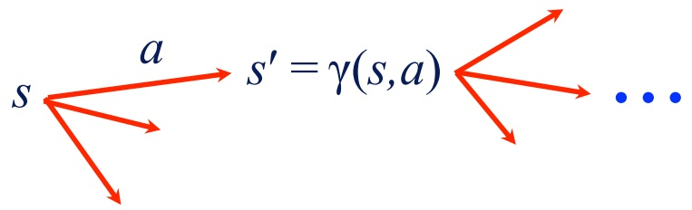

▸ Perception planning

▸ Navigation planning

▸ Communication planning

▸ **Task planning**

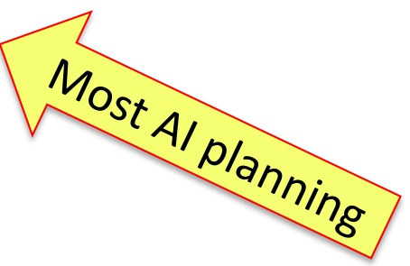

<!-- page: 6 -->

## Acting

## ● Traditional “AI planning” view:

▸ Carrying out an action is just execution

▸ Can ignore how it’s done

## ● Sometimes that’s OK

▸ If the environment has been engineered to make actions predictable

▸ Example on next slide

● Usually acting is more complicated

▸ Example later

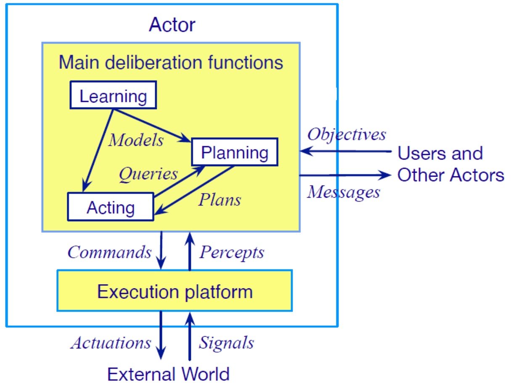

<!-- page: 7 -->

## Acting as Execution

## ● Kiva Systems

▸ (now part of Amazon Robotics)

● Warehouse with items stored in “pods”

▸ Portable warehouse-shelving units

● When an order comes in for an item

▸ Software locates closest mobile robot

▸ Directs it to go to the correct pod

● To navigate around the warehouse

▸ Robot follows bar-code stickers on the floor

● When the robot reaches the target location

Slides underneath the pod

▸ Lifts it off the floor

▸ Carries it to the specified human operator

▸ Operator picks items from the pod

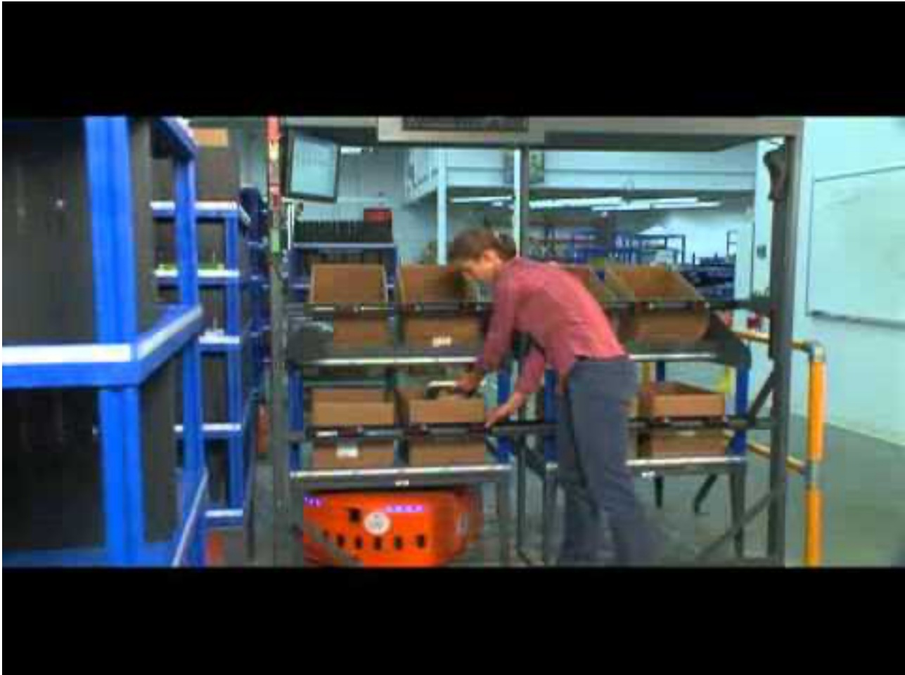

https://youtu.be/1FKMniE\_q1Q

<!-- page: 8 -->

## Deliberative Acting

## ● Experiment:

▸ New Caledonian crow wants to retrieve a bucket of food from a vertical pipe

▸ Nearby is a piece of wire

▸ Crow tries to use the wire, fails

▸ Bends the wire into a hook

▸ Uses the bent hook to retrieve the bucket

● Crows make hooks in the wild

▸ From sticks and leaves, not wire

● Adapted the technique to a new material

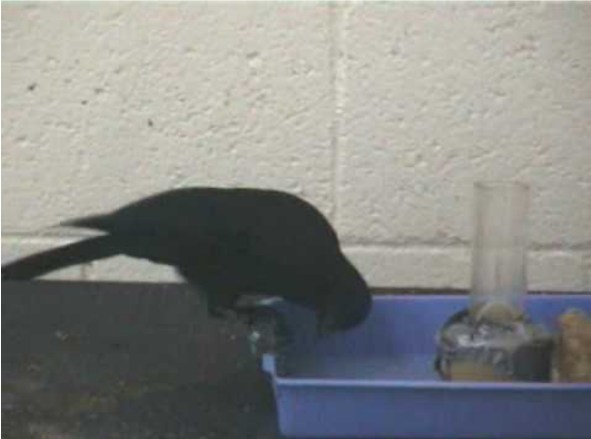

https://youtu.be/nTtDbyQTQV0

<!-- page: 9 -->

## Interleaving Planning and Acting

Actor is in a dynamic unpredictable environment

▸ Adapt actions to current context

React to events

● Relies on

▸ Operational models telling how to perform the actions

Observations of current state

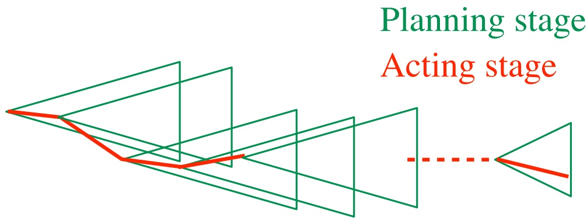

<!-- page: 10 -->

## Planning and Acting

## ● Multiple levels of abstraction

▸ Actors are organized into physical subsystem

Deliberation reflects this

## ● Heterogeneous reasoning

▸ Different techniques

at different levels

• different subsystems at same level

## ● Continual online planning

▸ Can’t plan everything in advance

## ▸ Plans are abstract and partial until more detail is needed

<!-- page: 11 -->

## Bremen Harbor

Lecture slides for [Acting, Planning, and Learning](https://projects.laas.fr/planning/). Creative Commons [CC BY-SA 4.0](https://creativecommons.org/licenses/by-sa/4.0/deed.en)

Credit: [Martina Nolte](https://de.wikipedia.org/wiki/User:Martina_Nolte), [CC BY-SA 3.0 DE](https://creativecommons.org/licenses/by-sa/3.0/de/legalcode)

<!-- page: 12 -->

## Example: Harbor Management

## ● Importing/exporting cars

▸ Based on Bremen Harbor

## Multiple levels of abstraction

▸ Reflect physical organization of harbor

## ● Continual online planning

▸ Top level can be planned offline

▸ The rest is online, based on current conditions

## ● Heterogeneous reasoning

▸ Different components work in different ways

▸ Online synthesis of automata to control their interactions

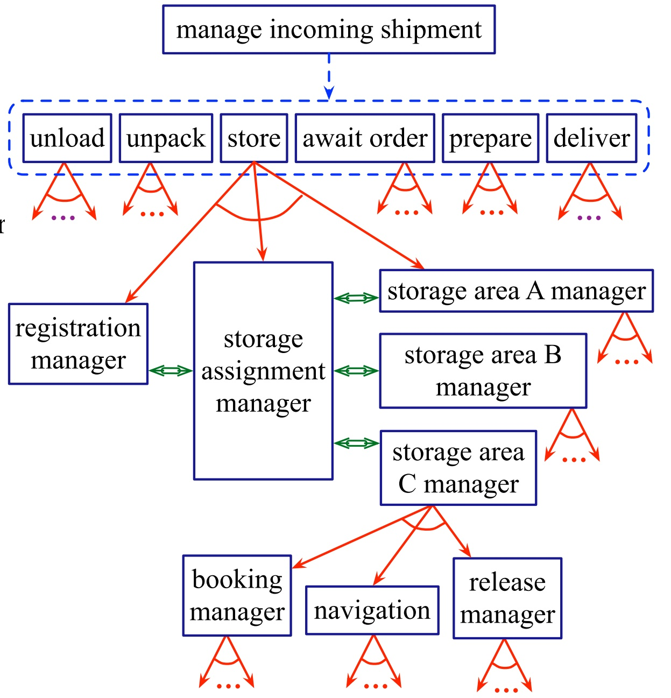

<!-- page: 13 -->

## Example: Service Robot

Multiple levels of abstraction

▸ Higher levels: more planning

▸ Lower levels: more acting

## ● Continual online planning

▸ What room is o7 in?

▸ What route?

▸ What kind of door?

▸ Close enough to door handle?

## ● Heterogeneous reasoning

▸ planning abstract tasks

▸ path planning

▸ reactive (e.g., open door)

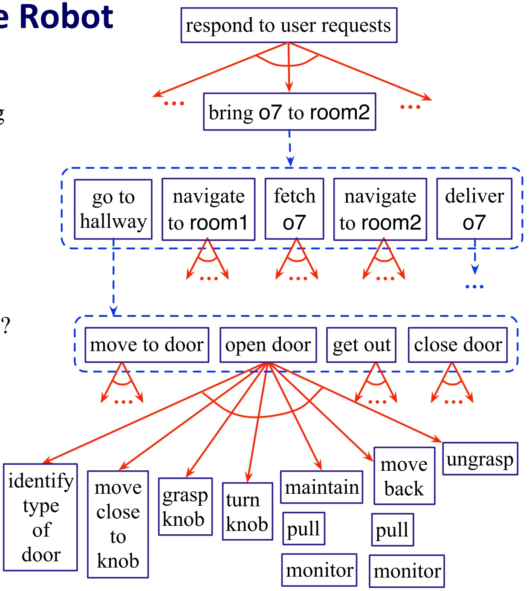

## Planning

<!-- page: 14 -->

## Models

"All models are wrong, but some are useful.”

\- George Box

● Models are an abstraction of the world

Good abstractions capture salient details

Planning and Acting models approximate the causality of taking action:

▸ Describe the necessary preconditions and expected effects for each action

▸ May indicate the expected utility of taking action toward some end

● Hierarchical models describe how to break down a complex task

▸ Example: a recipe describes how to cook a dish without reference to a specific kitchen

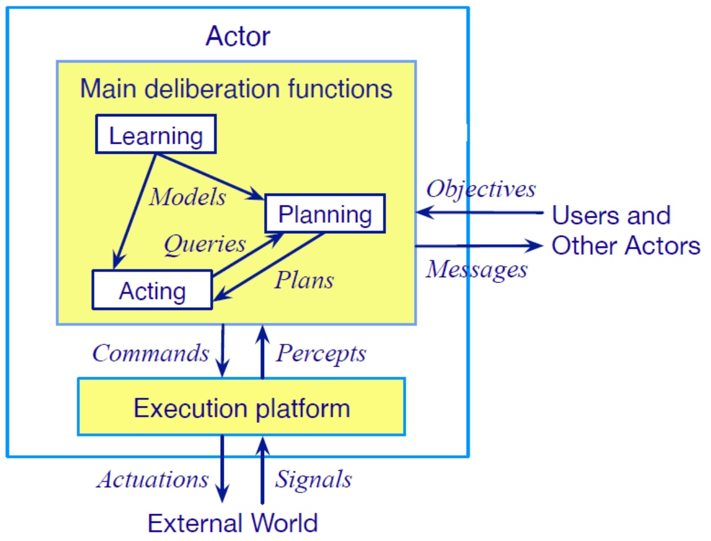

<!-- page: 15 -->

## The Challenges of Using Models

Models are often created and curated by humans, but this means they can be:

▸ expensive to write and debug

▸ sensitive to original assumptions

▸ less adaptable to new environments

Deployed systems may need to change models to account for

▸ Adaptation to a new task or situation

▸ The preferences of different humans

▸ Failure to successfully complete an action

## Furthermore, acting systems often require multiple, simultaneous models at different levels of abstraction

<!-- page: 16 -->

## Learning

## ● Learning consolidates experience

Learning can overcome some of the challenges of producing models

▸ Automates model production

▸ Provides mechanism to adapt models

For acting, learning acquires or adapts knowledge about how to do something

For planning, learning acquires or adapts the effect of what was done

<!-- page: 17 -->

## Integrating Acting, Planning, and Learning

## ● Models can be learned:

▸ Using planning to produce traces

▸ By interacting with a simulator

## ● Learning might iterate with:

▸ Planning: to determine what needs learn or how to invest learning effort

▸ Acting: by sampling the simulator or external world to determine the preconditions or effects of actions

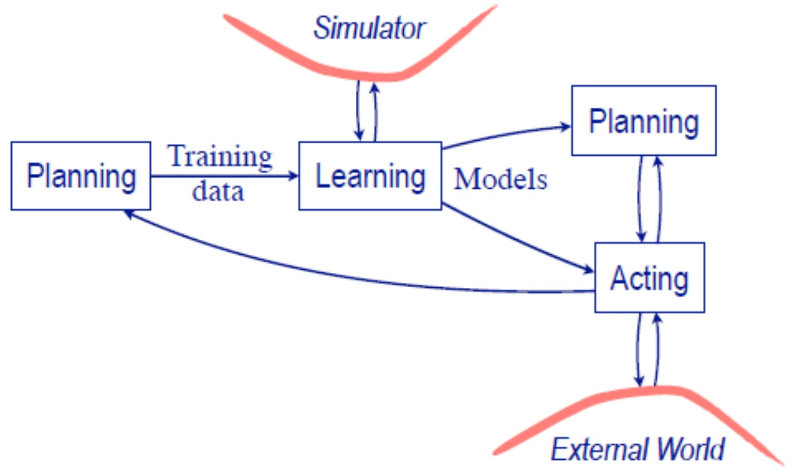

<!-- page: 18 -->

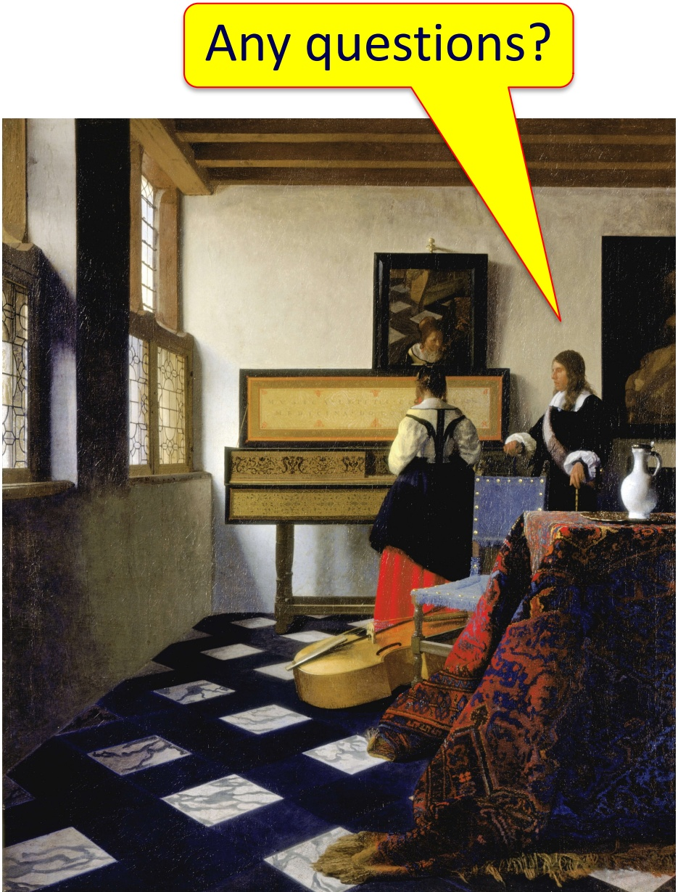

The Music Lesson. Johannes Vermeer (c. 1662–1665)
