<!-- page: 1 -->

## Chapter 10 Reinforcement Learning

Dana S. Nau

University of Maryland


Acting, Planning, and Learning

Malik Ghallab, Dana Nau, and Paolo Traverso

<!-- page: 2 -->

## Introduction

• Idea: agent interacts directly with the world

▸ Improves performance by trial and error

▸ Might or might not have a domain model

• Requires a reward function

▸ r(s,a,s′) = reward for going from s to s′ with action a

• Agent tries to

▸ remember which states/actions led to good/bad rewards

▸ generalize

▸ maximize long-term perceived benefits of its actions

• Simple RL: no teacher

<!-- page: 3 -->

● Estimate $V ^ { * }$ or $Q ^ { * }$ by trial and error

● Example:

▸ Three paella recipes $a _ { 1 } ,   a _ { 2 } ,   a _ { 3 }$

▸ Rewards = ratings by guests

| recipe | trial 1 | trial 2 | trial 3 |
| --- | --- | --- | --- |
| $a_1$ | 7.2 |  |  |
| $a_2$ | 5.4 | 8 | 7.6 |
| $a_3$ | 6.8 |  |  |
| $a_2$ avg | 5.4 | 6.7 | 7 |

## Value-Based RL

● $r ( a , i ) =$ reward for running a the i’th time

$$
Q _ {k} (a) = \frac {1}{k} \sum_ {i = 1} ^ {k} r (a, i)
$$

$$
\begin{array}{r l} & Q _ {k + 1} (a) = \frac {1}{k + 1} [ r (a, k + 1) + \sum_ {i = 1} ^ {k} r (a, i) ] \\ & \qquad = \frac {1}{k + 1} [ r (a, k + 1) + k Q _ {k} (a) ] \\ & \qquad = Q _ {k} (a) + \frac {1}{k + 1} [ r (a, k + 1) + k Q _ {k} (a) - (k + 1) Q _ {k} (a) ] \\ & \qquad = Q _ {k} (a) + \frac {1}{k + 1} [ r (a, k + 1) - Q _ {k} (a) \end{array}
$$

● Update rule: $Q(a) \leftarrow Q(a) + \alpha \left( r(a) - Q(a) \right)$

▸ $\alpha = 1 / ( k + 1 ) = l e a r n i n g \; r a t e$

● Begin with initial value $Q ( a )   =   q _ { 0 }$

<!-- page: 4 -->

## Value-Based RLQk(a) = Â r(a,

● Estimate $V ^ { * }$ or $Q ^ { * }$ by trial and error

● Example:

▸ Three paella recipes $a _ { 1 } ,   a _ { 2 } ,   a _ { 3 }$

▸ Rewards = ratings by guests

$$
\begin{array}{r l} & Q _ {k + 1} (a) = \frac {1}{k + 1} [ r (a, k + 1) + \sum_ {i = 1} ^ {k} r (a, i) ] \\ & \qquad = \frac {1}{k + 1} [ r (a, k + 1) + k Q _ {k} (a) ] \\ & \qquad = Q _ {k} (a) + \frac {1}{k + 1} [ r (a, k + 1) + k Q _ {k} (a) - (k + 1) Q _ {k} (a) ] \\ & \qquad = Q _ {k} (a) + \frac {1}{k + 1} [ r (a, k + 1) - Q _ {k} (a) \end{array}
$$

| recipe | trial 1 | trial 2 | trial 3 |
| --- | --- | --- | --- |
| $a_1$ | 7.2 |  |  |
| $a_2$ | 5.4 | 8 | 7.6 |
| $a_3$ | 6.8 |  |  |
| $a_2$ avg | 5.4 | 6.7 | 7 |

● Let r(a,i) = reward for running a the i’th time

$$
Q _ {k} (a) = \frac {1}{k} \sum_ {i = 1} ^ {k} r (a, i)
$$

● Temporal difference update rule:

▸ Q(a) ← Q(a) + α (r(a) – Q(a))

▸ α = learning rate

● Which a to run next:

$\operatorname { a r g m a x } _ { a } Q ( a )$ with probability 1 – ε other random with probability ε

**Poll**: What to use for α? A. $1 / ( k   +   1 )$

B. any monotonically decreasing $f ( k ) > 0$

C. any constant > 0

D. any of the above

E. don’t know

<!-- page: 5 -->

## Value-Based RLQk(a) = Â r(a,

● Estimate V and Q by trial and error

● Example:

▸ Three paella recipes $a _ { 1 } ,   a _ { 2 } ,   a _ { 3 }$

▸ Rewards = ratings by guests

| recipe | trial 1 | trial 2 | trial 3 |
| --- | --- | --- | --- |
| $a_1$ | 7.2 |  |  |
| $a_2$ | 5.4 | 8 | 7.6 |
| $a_3$ | 6.8 |  |  |
| $a_2$ avg | 5.4 | 6.7 | 7 |

$$
\begin{array}{r l} & Q _ {k + 1} (a) = \frac {1}{k + 1} [ r (a, k + 1) + \sum_ {i = 1} ^ {k} r (a, i) ] \\ & \qquad = \frac {1}{k + 1} [ r (a, k + 1) + k Q _ {k} (a) ] \\ & \qquad = Q _ {k} (a) + \frac {1}{k + 1} [ r (a, k + 1) + k Q _ {k} (a) - (k + 1) Q _ {k} (a) ] \\ & \qquad = Q _ {k} (a) + \frac {1}{k + 1} [ r (a, k + 1) - Q _ {k} (a) \end{array}
$$

● Let r(a,i) = reward for running a the i’th time

$$
Q _ {k} (a) = \frac {1}{k} \sum_ {i = 1} ^ {k} r (a, i)
$$

● Temporal difference update rule:

▸ Q(a) ← Q(a) + α (r(a) – Q(a))

▸ α = learning rate

● Which a to run next: argmaxa $, Q ( a ) ^ { < }$ with probability 1 – ε other random with probability ε

**Poll**: What to use for Q(a) here if a hasn’t been tried yet?

A. ∞ B. max possible r

C. 0 D. anything > – ∞

E. other F. don’t know

<!-- page: 6 -->

## Q-learning

● Consider an MDP in which we don’t know γ

● Adapt temporal-difference learning

▸ Modified MDP model: maximize reward

● Same as before:

▸ Σ = (S, A, γ, Pr, cost)

γ(s,a) = {all possible “next states” after applying action a in state s}

▸ Pr(s′ | s, a) = probability that a takes us to s′

• $\Pr(s' \mid s, a) \neq 0   if   s' \in \gamma(s, a)$

● Instead of cost(s,a,s′), we have

▸ r(s,a,s′) = reward if a takes us to s′ from s

● Want a policy π that maximizes

▸ E(reward for getting from s0 to $S _ { g } )$

● Value function:

▸ was $\begin{array} { r } { V ^ { \pi } ( s ) = \sum _ { s ^ { \prime } \in \gamma ( s , \pi ( s ) ) } \operatorname* { P r } ( s ^ { \prime }   |   s , \pi ( s ) ) [ \cos ( s , \pi ( s ) , s ^ { \prime } ) + V ^ { \pi } ( s ^ { \prime } ) ] } \end{array}$

▸ now $\begin{array} { r } { V ^ { \pi } ( s ) = \sum _ { s ^ { \prime }   \in   \gamma ( s , \pi ( s ) ) } \operatorname* { P r } ( s ^ { \prime }   |   s , \pi ( s ) ) [ r ( s , \pi ( s ) ,   s ^ { \prime } )   +   V ^ { \pi } ( s ^ { \prime } ) ] } \end{array}$

● Bellman-update:

▸ was $\begin{array} { r } { Q ( s , a ) \gets \sum _ { s ^ { \prime } \in \mathbb { Y } ( s , a ) } \operatorname* { P r } \left( s ^ { \prime } | s , a \right) \left[ \operatorname { c o s t } ( s , a , s ^ { \prime } ) + V ( s ^ { \prime } ) \right] } \end{array}$

• where $V(s') = \min_{a} Q(s', a)$

▸ now $\begin{array} { r } { \mathcal { Q } ( s ,   a ) \leftarrow \sum _ { s ^ { \prime } \in \gamma ( s , a ) } \mathrm { P r } \left( s ^ { \prime } | s ,   a \right)   [ r ( s ,   a ,   s ^ { \prime } ) +   V ( s ^ { \prime } ) ] } \end{array}$

• where $V(s') = \max_{a} Q(s', a)$

Temporal-difference update rule:

▸ $Q(a) \leftarrow Q(a) + a \left( r(a) - Q(a) \right)$

● Temporal-difference update for MDPs:

$$
Q (s, a) \leftarrow Q (s, a) + \alpha \left(r (s, a, s ^ {\prime}) + V (s ^ {\prime}) - Q (s, a)\right)
$$

● Equivalently:

$$
Q (s, a) \leftarrow Q (s, a) + \alpha \left(r (s, a, s ^ {\prime}) + \max _ {a ^ {\prime}} Q (s ^ {\prime}, a ^ {\prime}) - Q (s, a)\right)
$$

<!-- page: 7 -->

## Q-learning

● Consider an MDP in which we don’t know γ

● Adapt temporal-difference learning

▸ Modified MDP model: maximize reward

<u>From previous slide</u>

```python
Q-learning
    initialize Q and a starting state s
    until Termination do
        a ← Select(s)
        perform action a
        observe resulting state s' and reward r(s, a, s')
        Q(s, a) ← Q(s, a) + α[r(s, a, s') + max_{a'}{Q(s', a')} - Q(s, a)]
        s ← s'
```

**Poll**. Is line 2 practical?

A. Yes B. No C. don’t know

<!-- page: 8 -->

## Q-learning

## ● Learn in two stages:

1. Learn from simulated acting:

• Replace lines 2, 3 with (s′, r(s,a,s′)) ← Simulate(a,s)

2. Learn from real-world acting

• Use lines 2, 3 as shown

```txt
Poll. Is Stage 2 needed?
A. Yes    B. No    C. don’t know
```

<div class="docvortex-algorithm" style="white-space: pre-wrap; font-family:monospace;">
Q-learning
    initialize Q and a starting state s
    until Termination do
        $a \leftarrow \text{Select}(s)$
        perform action $a$
        observe resulting state $s'$ and reward $r(s, a, s')$
        $Q(s, a) \leftarrow Q(s, a) + \alpha[r(s, a, s') + \max_{a'} \{Q(s', a')\} - Q(s, a)]$
        $s \leftarrow s'$
</div>

**Poll**. Is it practical to store Q(s,a) for every s and a?

<!-- page: 9 -->

## Parametric Learning

● Input: a set of numeric $( x , y )$ pairs

▸ $\mathcal { D } = \{ ( x ^ { ( i ) } , y ^ { ( i ) } ) \mid i = 1 , . . . , N \}$

● Parametric function $f _ { \boldsymbol { \theta } } ( \boldsymbol { x } )$

▸ θ is a parameter that changes f

▸ adjust θ to try to make $f _ { \theta } ( x ^ { ( i ) } )   \approx   y ^ { ( i ) }$ for each i

● Example: linear regression

$$
f _ {\theta} (x) = \theta_ {0} + \theta_ {1} x
$$

▸ $\pmb { \theta } = ( \theta _ { 0 } ,   \theta _ { 1 } )$

● Empirical loss function

$$
\begin{array}{c} L o s s = \frac {1}{| \mathcal {D} |} \sum_ {(x, y) \in \mathcal {D}} (f _ {\theta} (x) - y) ^ {2} \\ = \frac {1}{| \mathcal {D} |} \sum_ {(x, y) \in \mathcal {D}} (\theta_ {0} + \theta_ {1} x - y) ^ {2} \end{array}
$$

● Loss is minimized when both of these are 0:

$$
\frac {\partial \text {Loss}}{\partial \theta_ {0}} = \frac {2}{| \mathcal {D} |} \sum_ {(x, y) \in \mathcal {D}} (\theta_ {0} + \theta_ {1} x - y)
$$

$$
\frac {\partial \text {Loss}}{\partial \theta_ {1}} = \frac {2}{| \mathcal {D} |} \sum_ {(x, y) \in \mathcal {D}} x (\theta_ {0} + \theta_ {1} x - y)
$$

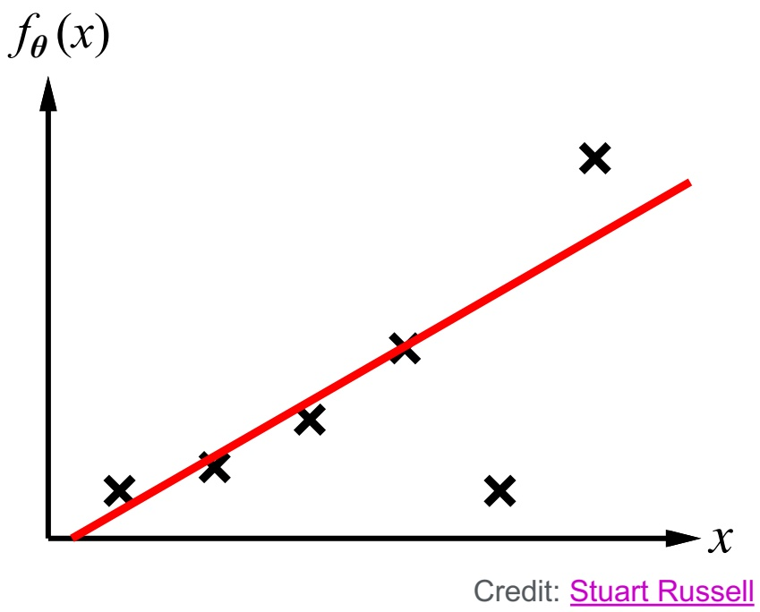

<!-- page: 10 -->

## Linear Regression Example

Example: (seafood,rice) proportions in paella ▸ D = {(150,300), (300,400), (450,700)}

$$
\begin{array}{l} \frac {\partial L o s s}{\partial \theta_ {0}} = \frac {2}{| \mathcal {D} |} \sum_ {(x, y) \in \mathcal {D}} (\theta_ {0} + \theta_ {1} x - y) \\ \qquad = (2 / 3) [ (\theta 0 + 1 5 0 \theta 1 - 3 0 0) \\ \qquad \qquad + (\theta 0 + 3 0 0 \theta 1 - 4 0 0) \\ \qquad \qquad + (\theta 0 + 4 5 0 \theta 1 - 7 0 0) ] \\ \qquad = (2 / 3) [ 3 \theta 0 + 9 0 0 \theta 1 - 1 4 0 0 ] \end{array}
$$

$$
\begin{array}{l} \frac {\partial L o s s}{\partial \theta_ {1}} = \frac {2}{| \mathcal {D} |} \sum_ {(x, y) \in \mathcal {D}} x (\theta_ {0} + \theta_ {1} x - y) \\ \qquad = (2 / 3) [ 1 5 0 (\theta 0 + 1 5 0 \theta 1 - 3 0 0) \\ \qquad \qquad + 3 0 0 (\theta 0 + 3 0 0 \theta 1 - 4 0 0) \\ \qquad \qquad + 4 5 0 (\theta 0 + 4 5 0 \theta 1 - 7 0 0) ] \\ \qquad = (2 / 3) [ 9 0 0 \theta 0 + 3 1 5, 0 0 0 \theta 1 - 4 8 0, 0 0 0 ] \end{array}
$$

● Solve:

$$
3 \theta_ {0} + 9 0 0 \theta_ {1} - 1 4 0 0 = 0
$$

$$
9 0 0 \theta_ {0} + 3 1 5, 0 0 0 \theta_ {1} - 4 8 0, 0 0 0 = 0
$$

● Answer:

$$
\theta_ {0} = 2 0 0 / 3 \approx 6 6. 6
$$

$$
\theta_ {1} = 4 / 3 \approx 1. 3 3
$$

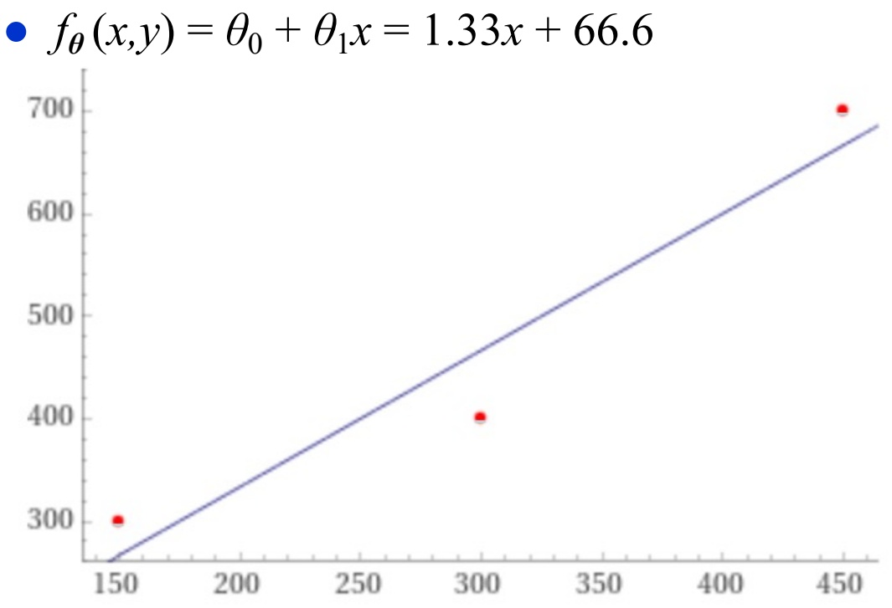

<!-- page: 11 -->

## Multivariable Linear Regression

● $\mathcal { D } = \{ ( \mathbf { x } ^ { ( i ) } , y ^ { ( i ) } ) \mid i = 1 , . . . , N \}$

▸ Each $\mathbf { X } ^ { ( i ) }$ is a column vector $[ x _ { 1 } ,   \ldots ,   x _ { n } ] ^ { \top }$

● 𝜽 is a column vector $[ \theta _ { 0 } ,   \ldots ,   \theta _ { n } ] ^ { \top }$

▸ $\begin{array} { r } { f _ { \boldsymbol { \theta } } \left( \mathbf { x } \right) = \theta _ { 0 } + \sum _ { 1 \leq j \leq n } \theta _ { j } x _ { j } } \end{array}$

● Extend $\mathbf { x } \; \mathrm { t o } \; [ x _ { 0 } , x _ { 1 } , . . . , x _ { n } ] ^ { \top }$

▸ $x _ { 0 } = 1 { \mathrm { ~ f o r ~ e v e r y ~ } } \mathbf { x } \in { \mathcal { D } }$

▸ $\begin{array} { r } { f _ { \pmb { \theta } } \left( \mathbf { x } \right) = \sum _ { 0 \leq j \leq n } \theta _ { j } x _ { j } = \pmb { \theta } \cdot \mathbf { x } } \end{array}$

▸ $\begin{array} { r } { L o s s = ( 1 / | \mathcal { D } | ) \sum _ { ( \mathbf { x } , y ) \in \mathcal { D } } { ( \pmb { \theta } \cdot \mathbf { x } - y ) ^ { 2 } } } \end{array}$

● Partial derivatives:

▸ ∂Loss/∂𝜃j = (2/|D|) ∑ j (θ · x – y) xj

▸ $\nabla L o s s = [ \hat { c } L o s s / \hat { c } \theta _ { 1 } , \ldots , \hat { c } L o s s / \hat { c } \theta _ { n } ] ^ { \top }$

● Can solve analytically to minimize Loss

▸ but it’s more complicated

GradientDescent( $( \{ ( \mathbf { x } ^ { ( i ) } , y ^ { ( i ) } ) \mid 1 \leq i \leq N \} )$

until convergence do

foreach $0 \leq j \leq n$ do

$$
\theta_ {j} \leftarrow \theta_ {j} - \alpha \sum_ {1 \leq i \leq N} (\boldsymbol {\theta} \cdot \mathbf {x} ^ {(i)} - y ^ {(i)}) x _ {j} ^ {(i)}
$$

● In each iteration of the outer loop

▸ Move each $\theta _ { j }$ in the direction of ∂Loss/∂𝜃<sub>j</sub>

▸ How far depends on ∂Loss/∂𝜃<sub>j</sub> and α

● Stop when each θ stops changing very much

● Two ways to call GradientDescent:

▸ Batch: argument is all of D

▸ Stochastic: argument is random subset of D

● Can generalize to nonlinear $f _ { \theta }$

▸ update rule $\theta \leftarrow \theta - \alpha \nabla L o s s ( f _ { \theta } )$

<!-- page: 12 -->

## Parametric Q-Learning (Motivation)

## ● From before:

<div class="docvortex-algorithm" style="white-space: pre-wrap; font-family:monospace;">
Q-learning
    initialize Q and a starting state s
    until Termination do
        $a \leftarrow \text{Select}(s) \quad // selects a \in Applicable(s)$
        perform action $a$
        observe resulting state $s'$, reward $r(s, a, s')$
        $Q(s, a) \leftarrow Q(s, a) + \alpha[r(s, a, s') + \max_{a'} \{Q(s', a')\} - Q(s, a)]$
        $s \leftarrow s'$
</div>

● Problems with Q-learning:

▸ Need a large table to store $\mathcal { Q } ( s , a )$

▸ Doesn’t generalize to new situations

● Idea: develop a parameterized formula $Q _ { \theta } ( s , a ) \approx Q ( s , a )$

▸ Adjust θ to make $Q _ { \theta } ( s , a )$ fit observed rewards

▸ Use gradient descent

<!-- page: 13 -->

<div class="docvortex-algorithm" style="white-space: pre-wrap; font-family:monospace;">
Poll. Should this be $-2\alpha$ instead? A. Yes B. No C. don't know
</div>

## Parametric Q-Learning

● Use gradient descent to learn $Q _ { \theta }$

$$
L o s s = \left[ r (s, a, s ^ {\prime}) + \max _ {a ^ {\prime}} \{Q _ {\boldsymbol {\theta}} (s ^ {\prime}, a ^ {\prime}) \} - Q _ {\boldsymbol {\theta}} (s, a) \right] ^ {2}
$$

$$
\begin{array}{c} \frac {\partial L o s s}{\partial \theta_ {j}} = - 2 [ r (s, a, s ^ {\prime}) + \\ \max _ {a ^ {\prime}} \{Q _ {\boldsymbol {\theta}} (s ^ {\prime}, a ^ {\prime}) \} - Q _ {\boldsymbol {\theta}} (s, a) ] \frac {\partial Q _ {\boldsymbol {\theta}} (s , a)}{\partial \theta_ {j}} \end{array}
$$

Update rule:

$$
\begin{array}{l} \theta_ {j} \leftarrow \theta_ {j} + \alpha [ r (s, a, s ^ {\prime}) + \\ \uparrow \max _ {a ^ {\prime}} \{Q _ {\theta} (s ^ {\prime}, a ^ {\prime}) \} - Q _ {\theta} (s, a) ] \frac {\partial Q _ {\theta} (s , a)}{\partial \theta_ {j}} \end{array}
$$

<div class="docvortex-algorithm" style="white-space: pre-wrap; font-family:monospace;">
Q-learning
    initialize Q and a starting state s
    until Termination do
        $a \leftarrow \text{Select}(s) \quad // selects a \in Applicable(s)$
        perform action $a$
        observe resulting state $s'$, reward $r(s, a, s')$
        $Q(s, a) \leftarrow Q(s, a) + \alpha[r(s, a, s') + \max_{a'} \{Q(s', a')\} - Q(s, a)]$
        $s \leftarrow s'$
</div>

```python
Q-learning
    initialize θ and a starting state s
    until Termination do
        a ← Select(s)
        perform action a
        observe resulting state s' and reward r(s, a, s')
        forall parameters θj do
            θj ← θj + α[r(s, a, s') +
                maxa' {Qθ(s', a')} - Qθ(s, a)] ∂Qθ(s, a)/∂θj
        s ← s'
```

<!-- page: 14 -->

## McCulloch-Pitts “unit”

Apply activation function to weighted sum of inputs

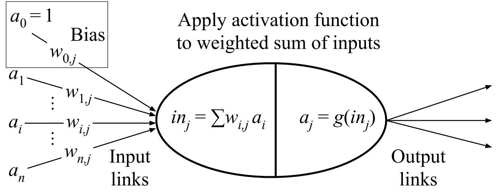

● Simple mathematical model

▸ Inspired by neurons, but much simpler

● Output of unit j depends on weighted sum of inputs

$$
\mathbf {\Delta} \cdot \mathbf {W} = \left[ \begin{array}{c} w _ {0, j} \\ \vdots \\ w _ {n, j} \end{array} \right], \mathbf {X} = \left[ \begin{array}{c} a _ {0} \\ \vdots \\ a _ {n} \end{array} \right]
$$

$$
\triangleright i n _ {j} = \sum_ {i} w _ {i, j} a _ {i} = \mathbf {w} ^ {\top} \mathbf {x}
$$

● Output: $a _ { j }   =   g ( i n _ { j } )$

● g: activation function

▸ nondecreasing

▸ usually positive, often nonlinear

▸ e.g., logistic (sigmoid):

$$
g (z) = 1 / (1 + e ^ {- z})
$$

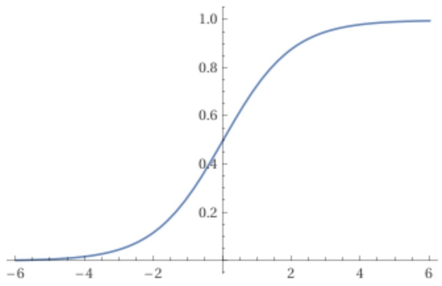

<!-- page: 15 -->

## Expressiveness

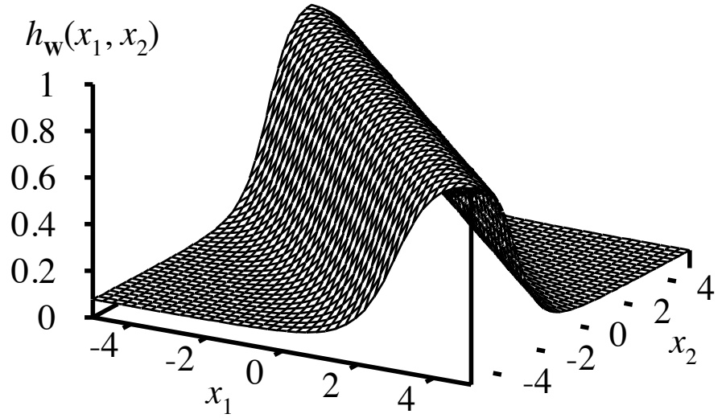

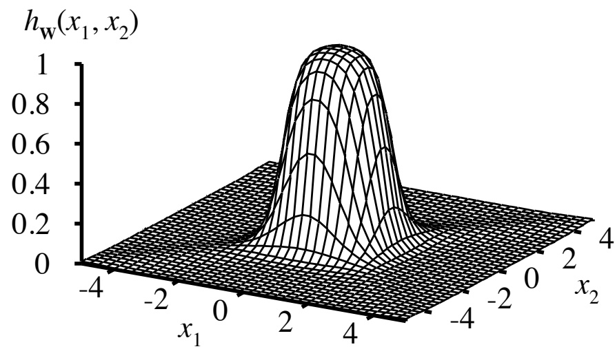

With 2 layers and enough units in those layers, can approximate all continuous functions ▸ with exponentially many units, can get any desired accuracy

● With 3 layers, all functions

Combine two opposite-facing threshold functions to make a ridge

Combine two perpendicular ridges to make a bump

● Add bumps of various sizes and locations to fit any surface

<!-- page: 16 -->

## Multilayer Feed-Forward Networks

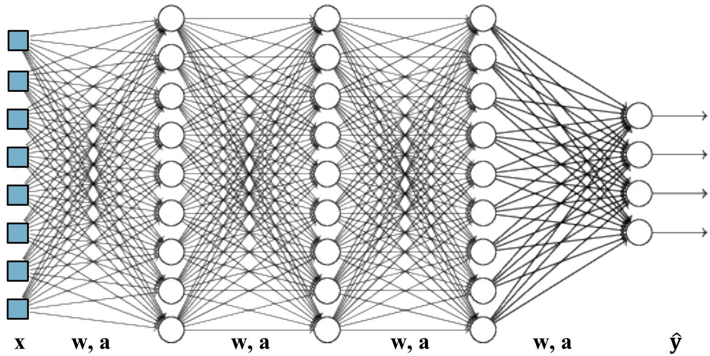

● Acyclic network of units

▸ usually organized into layers

▸ connections go from left to right

▸ how many layers, and units in each layer, typically chosen by hand

● Input $\mathbf { x } = [ x _ { 1 } ,   \ldots ,   x _ { n } ]$

Output $\hat { \mathbf { y } } = [ \hat { y } _ { 1 } , \dots , \hat { y } _ { k } ]$

<!-- page: 17 -->

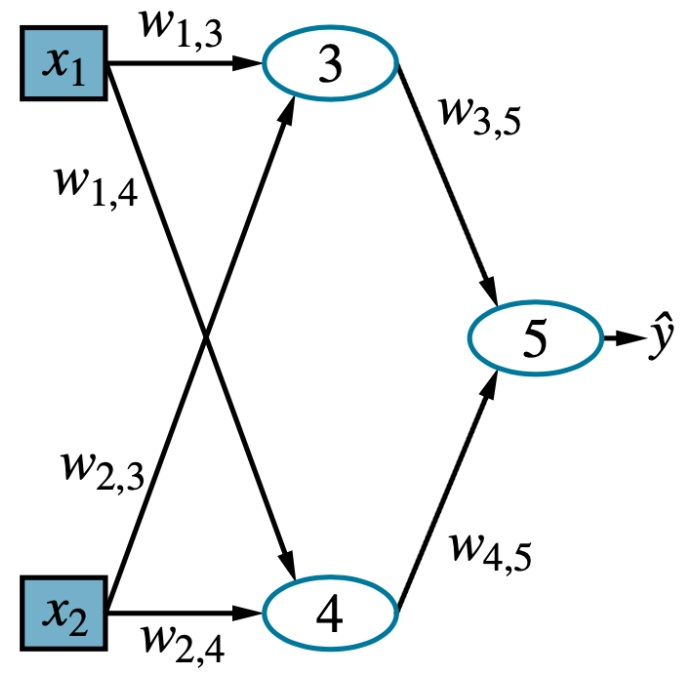

$$
a _ {3} = g _ {3} (w _ {1, 3} x _ {1} + w _ {2, 3} x _ {2})
$$

$$
a _ {4} = g _ {4} (w _ {1, 4} x _ {1} + w _ {2, 4} x _ {2})
$$

$$
\begin{array}{r l} \hat {y} & = g _ {5} (w _ {3, 5} a _ {3} + w _ {4, 5} a _ {4}) \\ & = g _ {5} [ w _ {3, 5} g _ {3} (w _ {1, 3} x _ {1} + w _ {2, 3} x _ {2}) + w _ {4, 5} g _ {4} (w _ {1, 4} x _ {1} + w _ {2, 4} x _ {2}) ] \\ & = h _ {\mathbf {w}} (\mathbf {x}) \end{array}
$$

## Example

● Let $\mathbf { W } ^ { ( i ) } =$ matrix of weights in i’th layer

• $\mathbf { W } ^ { ( 1 ) } = \left[ \begin{matrix} { w _ { 1 , 3 } } & { w _ { 1 , 4 } } \\ { w _ { 2 , 3 } } & { w _ { 2 , 4 } } \end{matrix} \right]$

• $\mathbf { W } ^ { ( 2 ) } = \left[ \begin{matrix} { w _ { 3 , 5 } } \\ { w _ { 4 , 5 } } \end{matrix} \right]$

Let $\mathbf { g } ^ { ( i ) } =$ column vector of activation functions

• $\mathbf { g } ^ { ( 1 ) } = \left[ \begin{matrix} { g _ { 3 } } \\ { g _ { 4 } } \end{matrix} \right]$

• $\mathbf { g } ^ { ( 2 ) } = [ g _ { 5 } ]$

● Then $h _ { \mathbf { w } } ( \mathbf { x } ) = \mathbf { g } ^ { ( 2 ) }   ( \mathbf { W } ^ { ( 2 ) }   \mathbf { g } ^ { ( 1 ) }   ( \mathbf { W } ^ { ( 1 ) }   \mathbf { x } ) )$

▸ Parameterized family of functions

● Adjusting weights changes the function

▸ do learning this way

<!-- page: 18 -->

## Back-Propagation Learning

$$
a _ {i} \xrightarrow {w _ {i j}} \boxed {j} \xrightarrow [ a _ {j} ]{w _ {j k}} \boxed {k} a _ {k} \quad \text {desired} = y _ {k}
$$

• Backward from the output layer

output layer: $\Delta_{k} = (y_{k} - a_{k})g^{\prime}(in_{k});$ $w _ { j k } \leftarrow w _ { j k } + \alpha a _ { j } \Delta _ { k }$

hidden layer: $\begin{array} { r } { \Delta _ { j } = \left( \sum _ { k } w _ { j k } \Delta _ { k } \right) g ^ { \prime } ( i n _ { j } ) ; \quad w _ { i j } \leftarrow w _ { i j } + \alpha \; a _ { i } \; \Delta _ { j } } \end{array}$

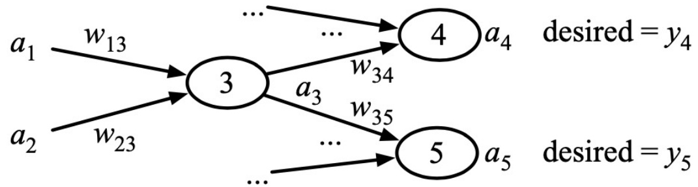

$$
\Delta_ {4} = (y _ {4} - a _ {4}) g ^ {\prime} (i n _ {4}); \quad w _ {3 4} \leftarrow w _ {3 4} + \alpha a _ {3} \Delta_ {4}
$$

$$
\Delta_ {5} = (y _ {5} - a _ {5}) g ^ {\prime} (i n _ {5}); \quad w _ {3 5} \leftarrow w _ {3 5} + \alpha a _ {3} \Delta_ {5}
$$

$$
\Delta_ {3} = (w _ {3 4} \Delta_ {4} + w _ {3 5} \Delta_ {5}) g ^ {\prime} (i n _ {3}); \left\{ \begin{array}{l} w _ {1 3} \leftarrow w _ {1 3} + \alpha a _ {1} \Delta_ {3} \\ w _ {2 3} \leftarrow w _ {2 3} + \alpha a _ {2} \Delta_ {3} \end{array} \right.
$$

Two ways:

Batch:

▸ At each epoch, compute the updates for all examples, then apply

Don’t apply any of the updates until you’ve seen all the examples

● Online:

▸ Update after each example

● Can lead to different results

▸ At one time, batch was thought to be theoretically superior

▸ In practice, online seems to work better

<!-- page: 19 -->

## Activation Functions

● logistic (sigmoid): $g ( z ) = 1 / ( 1 + e ^ { - z } )$ $g ^ { \prime } ( z ) = e ^ { - z } / ( 1 + e ^ { - z } ) ^ { 2 }$

In deep multilayer networks, sigmoid has a vanishing gradient problem

▸ $g ^ { \prime }$ too small to be useful

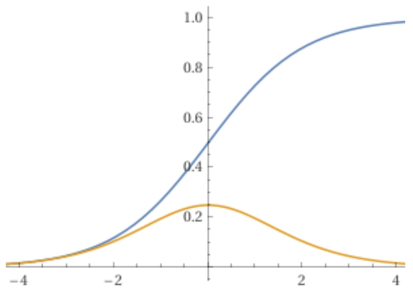

● Rectified linear (ReLU) or softplus are widely used instead

ReLU:

$$
g (z) = \max (0, z)
$$

$$
g ^ {\prime} (z) = 0 \text {if} z <   0, 1 \text {if} z > 0
$$

● softplus:

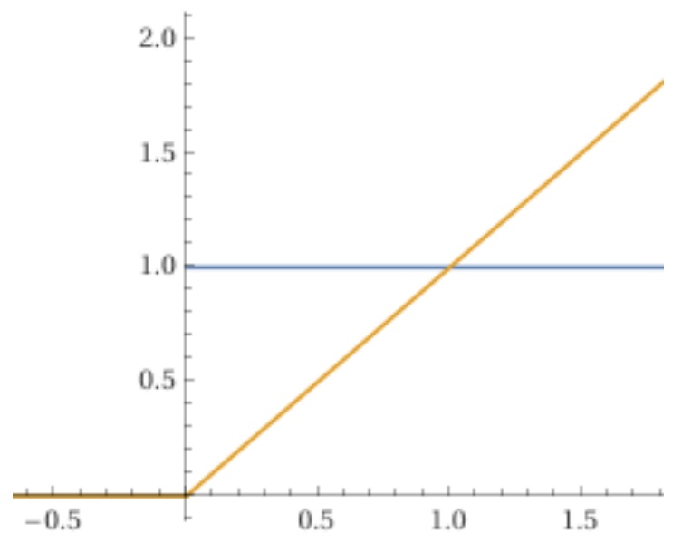

$$
g (z) = \log (1 + e ^ {z})
$$

$$
g ^ {\prime} (z) = 1 / (1 + e ^ {- z})
$$

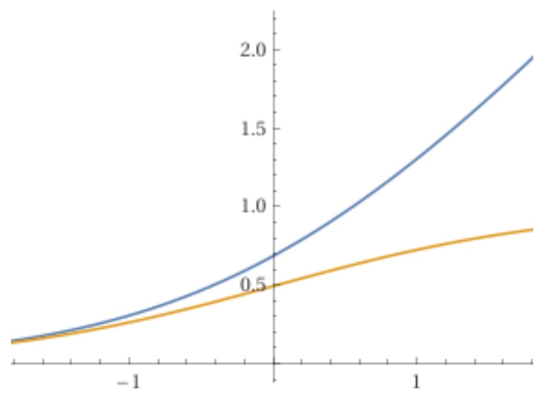

<!-- page: 20 -->

## Relation to the Book

● $\hat { \mathbf { y } } \rightarrow \tilde { \mathbf { y } }$

● $w \geq \theta$ (with subscript, superscript)

● $w \geq \theta$

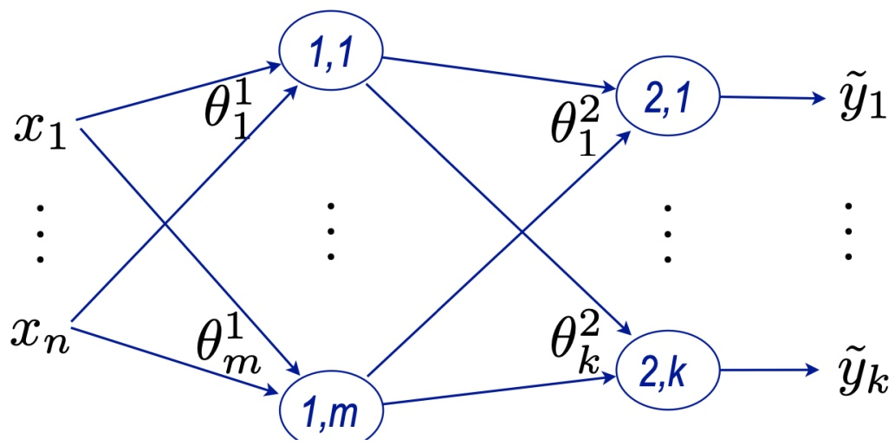

Backpropagation $( x , y )$

$$
\mathbf {x} ^ {1} \leftarrow \mathbf {x}
$$

for l = 1 to L do

$$
\left\lfloor \mathbf {x} ^ {l + 1} \leftarrow g (\boldsymbol {\Theta} ^ {l} \times \mathbf {x} ^ {l}) \right.
$$

$$
\boldsymbol {\delta} ^ {L + 1} \leftarrow (\mathbf {x} ^ {L + 1} - \mathbf {y}) \times g ^ {\prime} (\boldsymbol {\Theta} ^ {L} \times \mathbf {x} ^ {L})
$$

$$
\Theta^ {L} \leftarrow \Theta^ {L} - \alpha [ \delta^ {L + 1} \otimes (\mathbf {x} ^ {L}) ^ {\top} ]
$$

for $l = L$ to 2 do

$$
\boldsymbol {\delta} ^ {l} \leftarrow [ (\boldsymbol {\Theta} ^ {l}) ^ {\top} \times \boldsymbol {\delta} ^ {l + 1} ] \times g ^ {\prime} (\boldsymbol {\Theta} ^ {l - 1} \times \mathbf {x} ^ {l - 1})
$$

$$
\Theta^ {l - 1} \leftarrow \Theta^ {l - 1} - \alpha [ \delta^ {l} \otimes (\mathbf {x} ^ {l - 1}) ^ {\top} ]
$$

<!-- page: 21 -->

## Summary

● McCulloch-Pitts “units”

▸ weighted input, bias weight

▸ activation function

● Expressivity

● Multi-layer feed-forward networks

● Back-propagation learning

Gradient descent

▸ ReLU
