<!-- page: 1 -->

## Chapter 11 Acting with Nondeterministic Models

Dana S. Nau

University of Maryland


## Acting, Planning, and Learning

Malik Ghallab, Dana Nau, and Paolo Traverso

<!-- page: 2 -->

## Motivation

In Chapters 8–10, we had probability distributions over the possible outcomes of actions

● Sometimes we want to reason about nondeterminism without the probability distributions

▸ Probabilities might not be available

▸ We might want policies that satisfy safety conditions:

• Guaranteed to work for all possible action outcomes


Credit: [Dennis Hill](https://www.flickr.com/people/7888217@N04), [CC BY 2.0](https://creativecommons.org/licenses/by/2.0/)

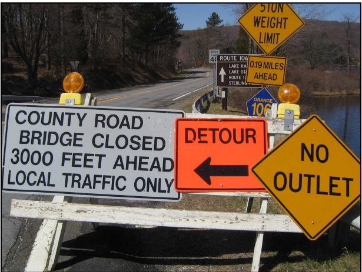

Credit: [Airtuna08](https://en.wikipedia.org/wiki/User:Airtuna08), [CC BY-SA 3.0](https://creativecommons.org/licenses/by-sa/3.0)

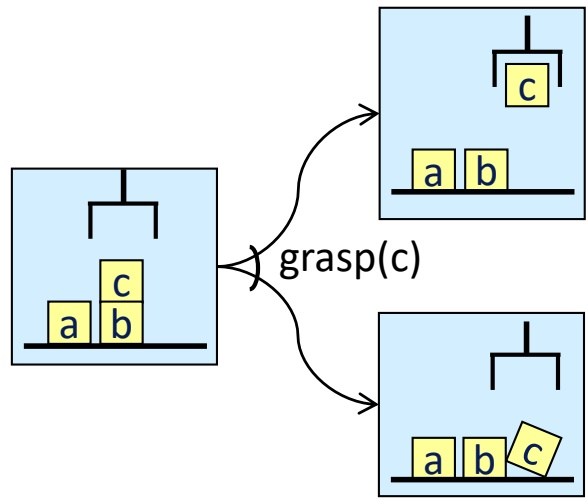


Credit: [David Wilson](https://www.flickr.com/people/32693718@N07), [CC BY 2.0](https://creativecommons.org/licenses/by/2.0/)

Lecture slides for [Acting, Planning, and Learning](https://projects.laas.fr/planning/). Creative Commons [CC BY-SA 4.0](https://creativecommons.org/licenses/by-sa/4.0/deed.en)

<!-- page: 3 -->

## Example

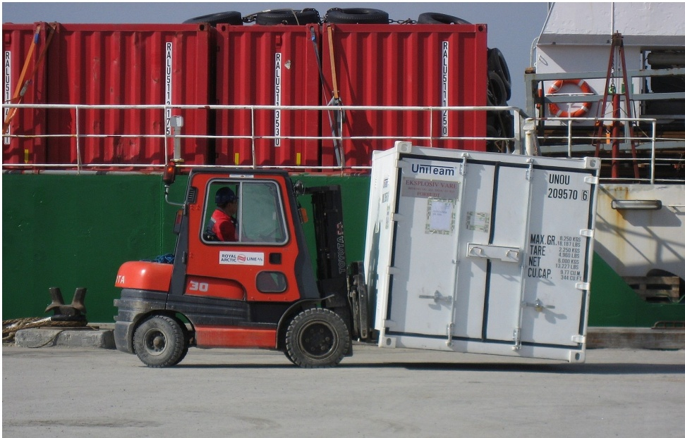

Credit: [Slaunger](https://en.m.wikipedia.org/wiki/User:Slaunger), [CC BY-SA 3.0](https://creativecommons.org/licenses/by-sa/3.0/deed.en)

● Very simple harbor management domain

▸ Unload a single item from a ship

▸ Move it around a harbor

● One state variable: pos(item)

▸ Simplified names for states

▸ For {pos(item)=on\_ship}, just write on\_ship

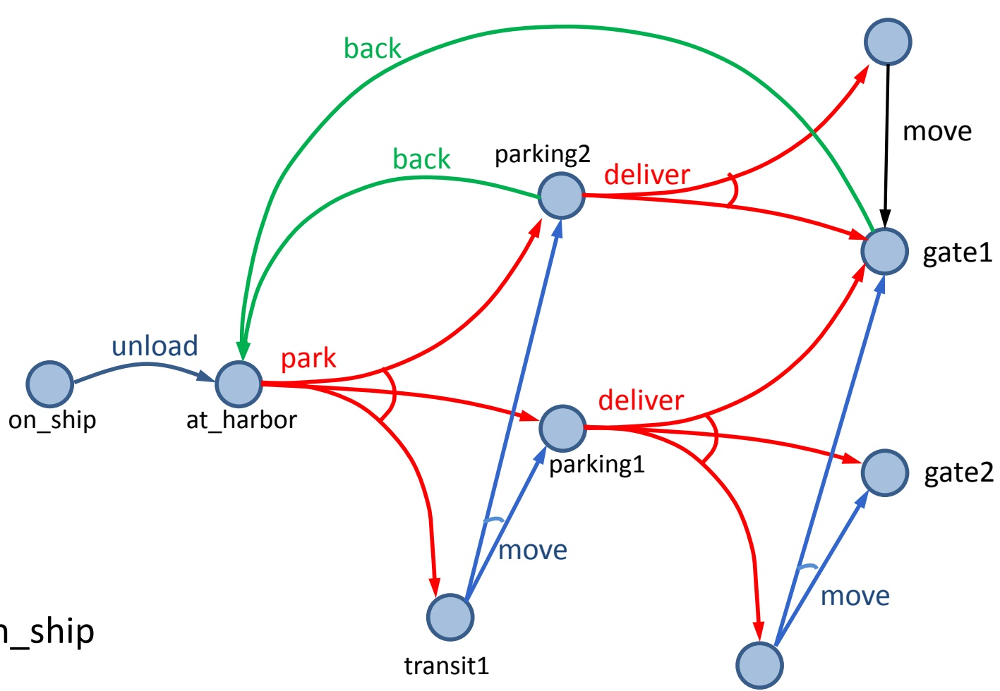

transit2

<!-- page: 4 -->

## Nondeterministic Planning Domains

O ● 3-tuple $( S , A , \gamma )$

▸ S and A – finite sets of states and actions

▸ $\gamma \colon S \times { \mathcal { A } } \to 2 ^ { S }$

● γ(s,a) = {all possible “next states” after applying action a in state s}

▸ a is applicable in state s iff $\gamma ( s , a ) \neq \emptyset$

● Applicable(s) = {all actions applicable in s} $= \{ a \in { \mathcal { A } } \mid \gamma ( s , a ) \neq \emptyset \}$

Example:

▸ Applicable(at\_harbor) = {park}

▸ park has three possible outcomes

• put item in parking1 or parking2 if one of them has space

or in transit1 if there’s no parking space

▸ γ(at\_harbor, park) = {parking1, parking2, transit1}

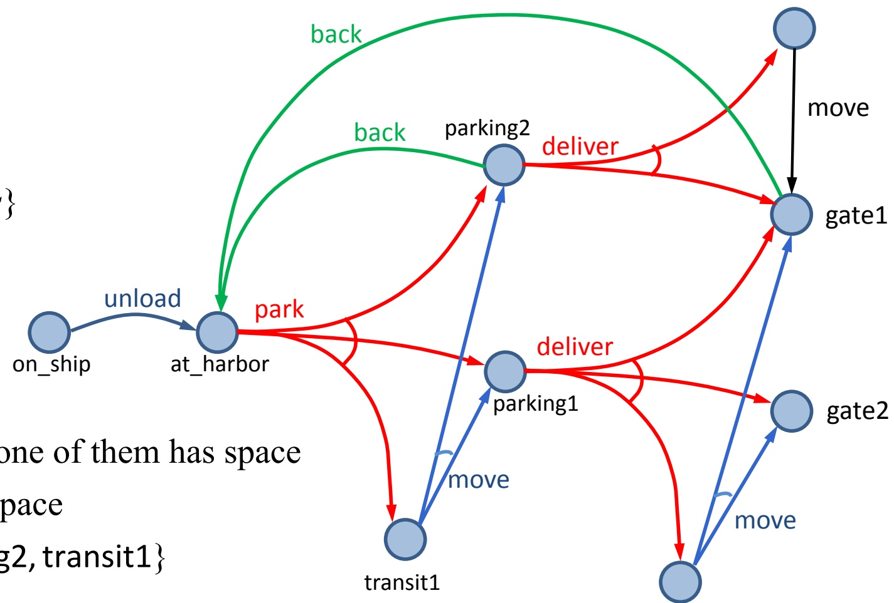

transit2

<!-- page: 5 -->

## Nondeterministic Planning Domains

● One possible action representation:

▸ like classical, but with n mutually exclusive “effects” lists

## ● e.g., park:

pre: pos(item) = at\_harbor

eff<sub>1</sub>: pos(item) ← parking1

$$
\mathrm{eff} _ {2}: \quad \text {pos(item)} \leftarrow \text {parking2}
$$

eff<sub>3</sub>: pos(item) ← transit1

Problem:

▸ number of effects lists may be combinatorially large

▸ Suppose a can cause any possible combination of effects $e _ { 1 } , e _ { 2 } , . . . , e _ { k }$

▸ Need $\mathrm { e f f } _ { 1 } , \mathrm { e f f } _ { 2 } , . . . , \mathrm { e f f } _ { 2 ^ { k } }$

• One for for each combination

▸ Section 12.3: a different representation that can alleviate this

● For now, ignore most of that, just look at the underlying semantics

▸ states, actions ⇔ nodes, edges in a graph

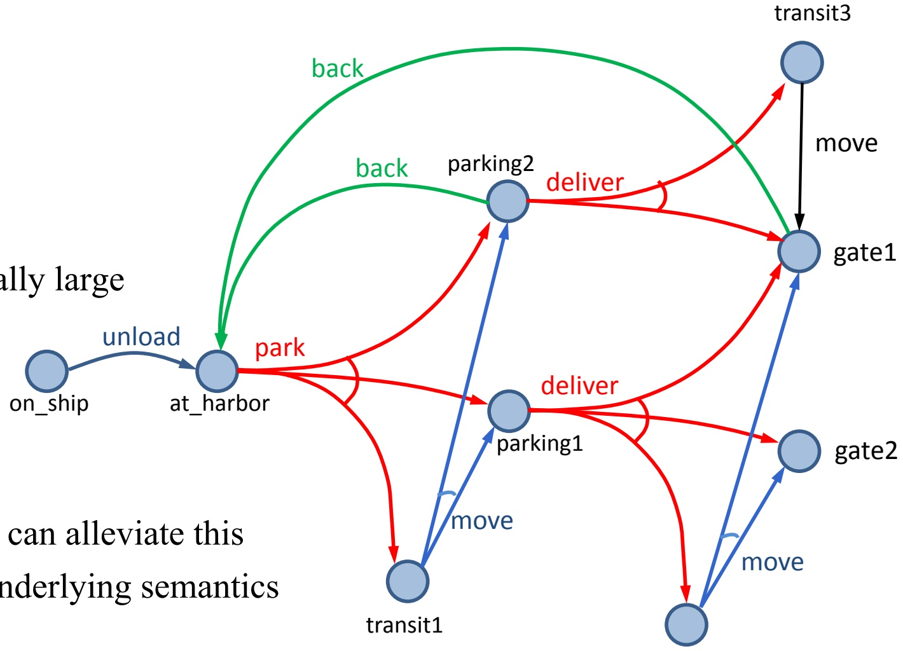

transit2

<!-- page: 6 -->

## Nondeterministic Planning Domains

● For deterministic planning problems, search space was a graph

● Now it’s an AND/OR graph

OR branch:

several applicable actions, which one to choose?

▸ AND branch:

• multiple possible outcomes, must handle all of them

## ● Analogy to PSP in Chapter 2

▸ OR branch ⇔ action selection

▸ AND branch ⇔ flaw selection

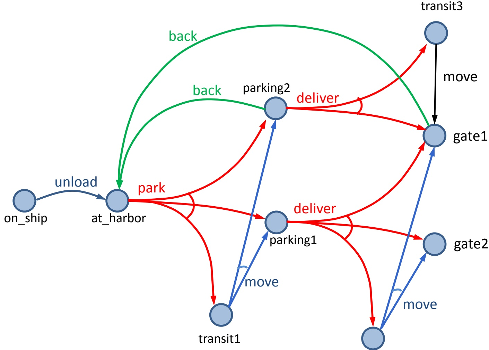

transit2

<!-- page: 7 -->

## Policies

● Policy: a function $\pi : S ^ { \prime }   \rightarrow   A$

▸ $S ^ { \prime } \subseteq S$

▸ For every $s \in$ Domain(π), require π(s) ∈ Applicable(s)

● Two equivalent notations:

<div class="docvortex-algorithm" style="white-space: pre-wrap; font-family:monospace;">
$\pi_{1}(\text{on\_ship}) = \text{unload},$
$\pi_{1}(\text{at\_harbor}) = \text{park},$
$\pi_{1}(\text{parking1}) = \text{deliver}$
</div>

<div class="docvortex-algorithm" style="white-space: pre-wrap; font-family:monospace;">
$\pi_1 = \{(\text{on\_ship, unload}), (\text{at\_harbor, park}), (\text{parking1, deliver})\}$
</div>

## ● That’s just the notation

▸ implementation could be quite different

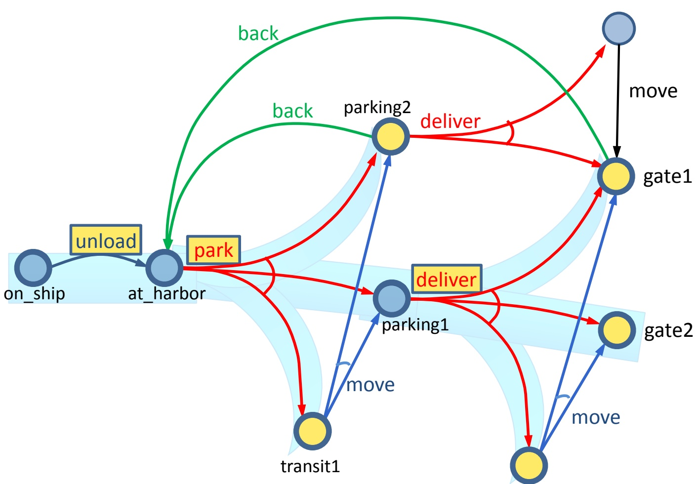

transit2

<!-- page: 8 -->

## Definitions Over Policies

● Transitive closure:

▸ $\hat { \gamma } ( s , \pi ) = \{ \mathrm { a l l }$ states reachable from s using $\pi \}$

▸ $\hat { \gamma } ( s , \pi ) = S _ { 0 } \cup S _ { 1 } \cup S _ { 2 } \cup$

$$
S _ {0} = \{s \}
$$

$$
S _ {1} = S _ {0} \cup \{\gamma (s _ {0}, \pi (s _ {0})) \mid s _ {0} \in S _ {0} \}
$$

$$
S _ {2} = S _ {1} \cup \{\gamma (s _ {1}, \pi (s _ {1})) \mid s _ {1} \in S _ {1} \}
$$

● Reachability graph: Graph $( s , \pi ) = ( V , E )$

▸ $V   =   \hat { \gamma } ( s ,   \pi )$

$$
E = \{(s _ {1}, s _ {2}) \mid s _ {1} \in V, s _ {2} \in \gamma (s _ {1}, \pi (s _ {1})) \}
$$

● $l e a v e s ( s , \pi ) = \hat { \gamma } ( s , \pi ) \setminus \mathrm { D o m } ( \pi )$

▸ may be empty π<sub>1</sub> = {(on\_ship, unload), (at\_harbor, park), (parking1, deliver)}

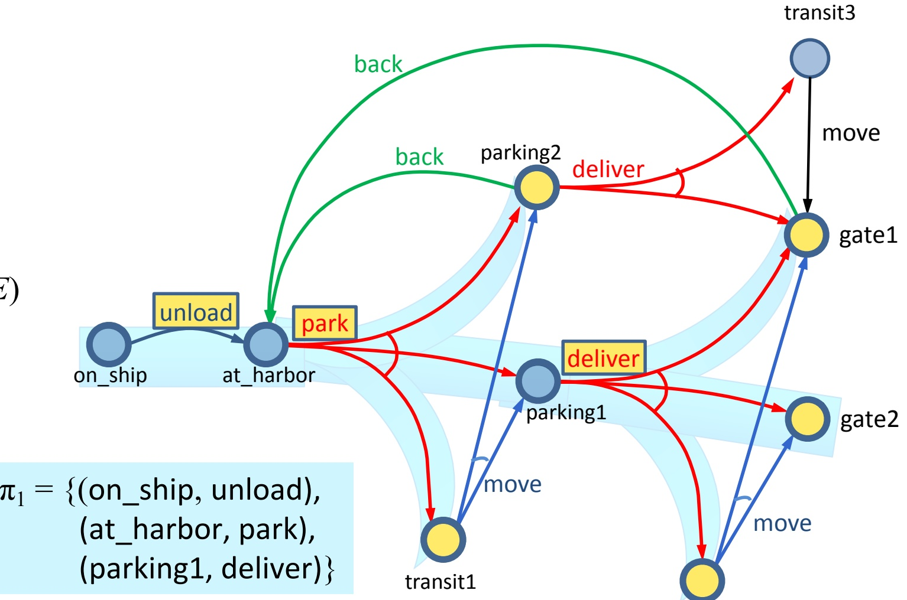

<!-- page: 9 -->

## Acting with a Policy

## ● ActPolicy(π)

s ← observe current state

while s ∈ Domain(π) do

perform action $\pi ( s )$

s ← observe current state

transit3

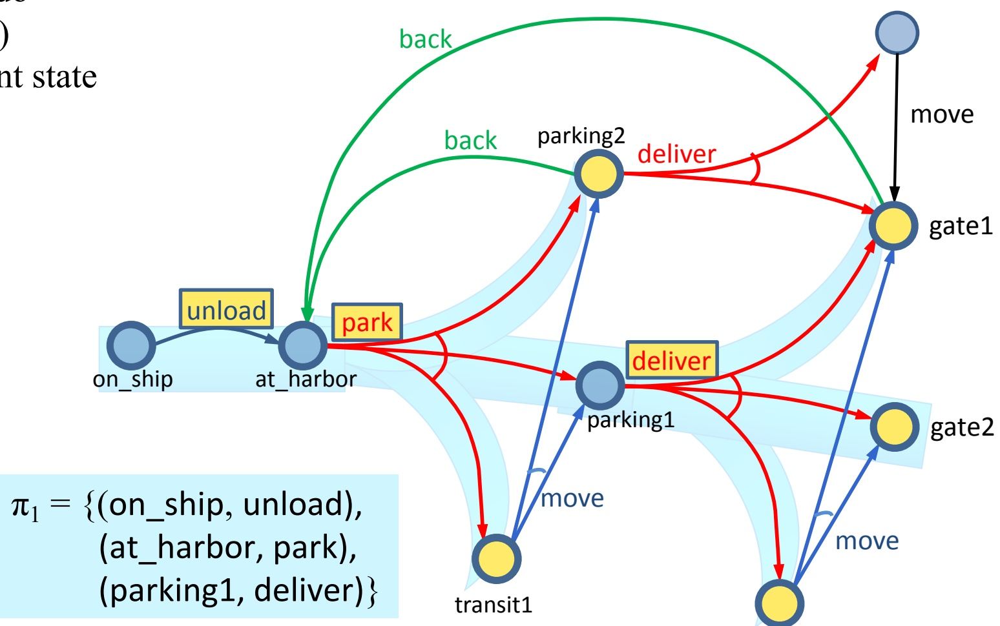

transit2

<!-- page: 10 -->

## Types of Policies

● Acting (or planning) problem $P = ( \Sigma , s _ { 0 } , S _ { g } )$

▸ planning domain $\Sigma = ( S ,   A ,  \gamma )$ , initial state $s _ { \theta } \in S _ { \ast }$ set of goal states $S _ { g } \subseteq S$ (shown in green)

● π is a solution if at least one execution ends at a goal

▸ leaves(s,π) ∩ $S _ { g } \neq \emptyset$

● A policy π is safe if ∀ $s \in \hat { \gamma } ( s _ { 0 } , \pi )$ , leaves(s,π) $\cap S _ { g } \not = \emptyset$

▸ at every state in $\hat { \gamma } ( s _ { 0 } ,   \pi )$ at least one of the execution paths from s using π stops at a goal state.

● Otherwise, unsafe policy

**Poll:** Is $\pi _ { 1 }$ safe or unsafe?

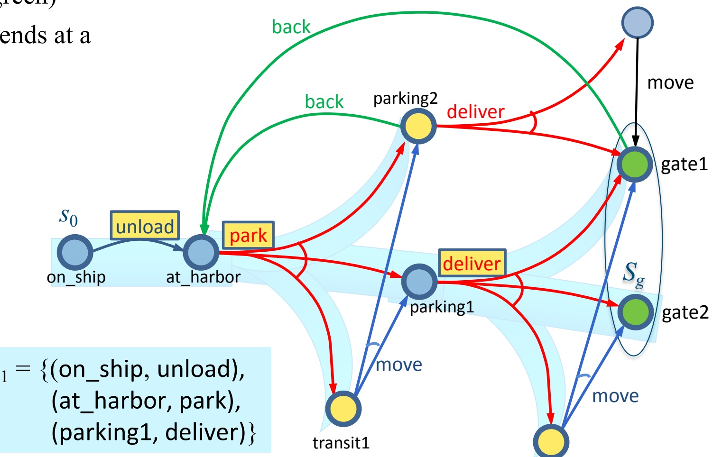

transit2

<!-- page: 11 -->

## Safe Policies

● Acyclic safe policy

▸ Graph(s<sub>0</sub>,π) is acyclic, and leaves $( s , \pi ) \subseteq S _ { g }$

● If we run ActPolicy(π) starting at $\mathbf { S } _ { 0 } ,$ we’re guaranteed to stop at a goal

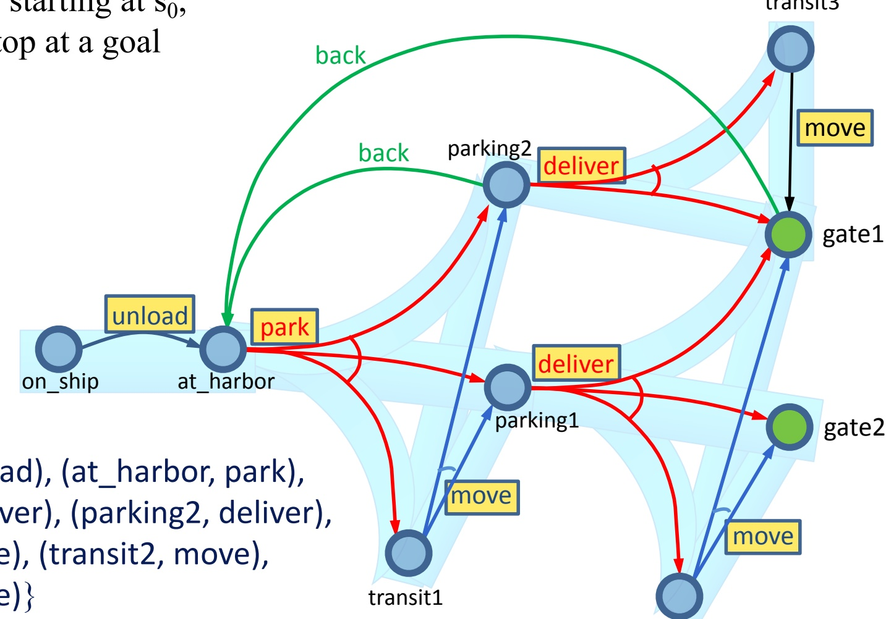

● ActPolicy(π)

s ← observe current state

while s ∈ Domain(π) do

perform action π(s)

s ← observe current state

$\pi _ { 2 } =$ {(on\_ship, unload), (at\_harbor, park), (parking1, deliver), (parking2, deliver), (transit1, move), (transit2, move), (transit3, move)}

transit2

<!-- page: 12 -->

# Safe Policies

## ● Cyclic safe policy

▸ Graph $( s _ { 0 } , \pi )$ is cyclic, and leaves $( s , \pi ) \subseteq S _ { g }$ and $\forall s \in \hat { \gamma } ( s _ { 0 } ,   \pi )$ , leaves(s,π) $\cap \; S _ { g } \neq \emptyset$

At every state s in $\hat { \gamma } ( s _ { 0 } ,   \pi )$ at least one of the execution paths from s using π ends at a goal state

Will never get caught in a dead end

$\pi_{3} =$ {(on\_ship, unload), (at\_harbor, park), (parking1, deliver), (parking2, back), (transit1, move), (transit2, move), (gate1, back)}

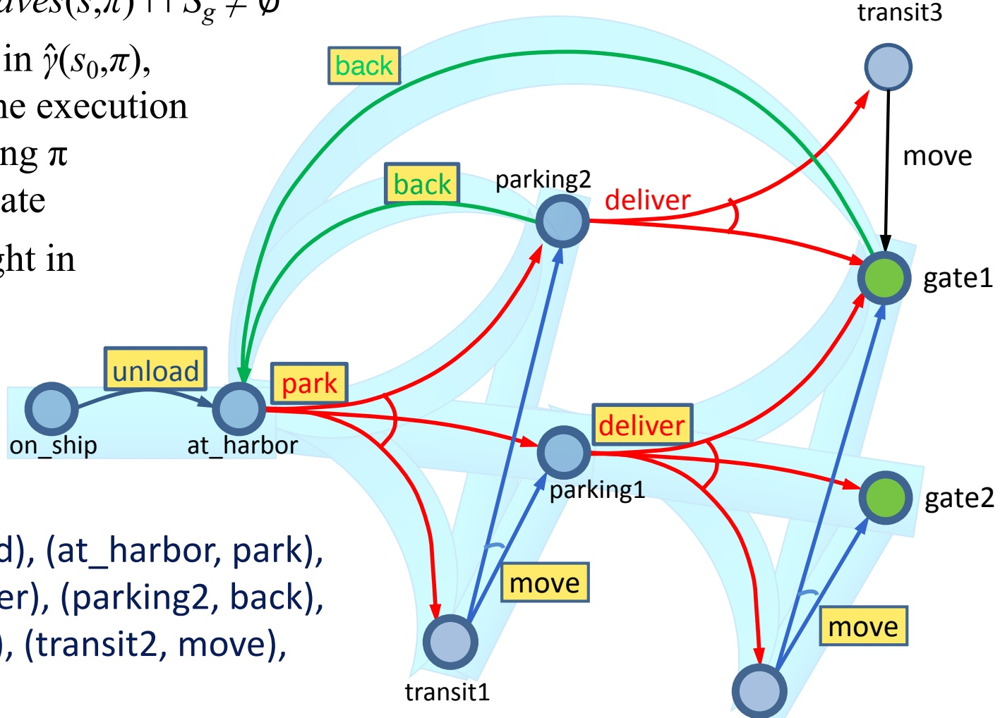

```txt
- ActPolicy(π)
    s ← observe current state
    while s ∈ Domain(π) do
        perform action π(s)
        s ← observe current state
```

**Poll**: Let π be a cyclic safe solution. Suppose we run ActPolicy(π) starting at $s _ { 0 } .$

1. Are there situations where we can be sure π will reach a goal?

2. Are there situations where we can’t be sure π will reach a goal?

<!-- page: 13 -->

## ● Cyclic safe policy

▸ Graph $( s _ { 0 } , \pi )$ is cyclic, and leaves $( s , \pi ) \subseteq S _ { g } ,$ and $\forall s \in \hat { \gamma } ( s _ { 0 } ,   \pi )$ , leaves(s,π) $\cap \; S _ { g } \neq \emptyset$

At every state s in $\hat { \gamma } ( s _ { 0 } ,   \pi )$ at least one of the execution paths from s using π ends at a goal state

Will never get caught in a dead end

▸ Every “fair” execution will reach a goal

## Safe Policies

π<sub>3</sub> = {(on\_ship, unload), (at\_harbor, park), (parking1, deliver), (parking2, back), (transit1, move), (transit2, move), (gate1, back)}


```txt
- ActPolicy(π)
    s ← observe current state
    while s ∈ Domain(π) do
        perform action π(s)
        s ← observe current state
```

## Poll:

1. Can you think of a real-world situation in which all executions are “fair”?

2. Can you think of a real-world situation in which there are “unfair” executions?

<!-- page: 14 -->

## Kinds of Solution Policies

solution policies safe policies acyclic policies

cyclic policies

Goal States

unsafe policies

<!-- page: 15 -->

## Beyond Policies

Sometimes we want to give the actor instructions that can’t be described as a policy, e.g.,

Try to open the door twice. If it opens, go through it. If it doesn’t, go to another door

The book describes two other ways to represent instructions to the actor

▸ Input/Output Automata

Behavior Trees

## ● I’ll discuss behavior trees in a separate set of slides

• same state of the world

• actor’s internal state is different

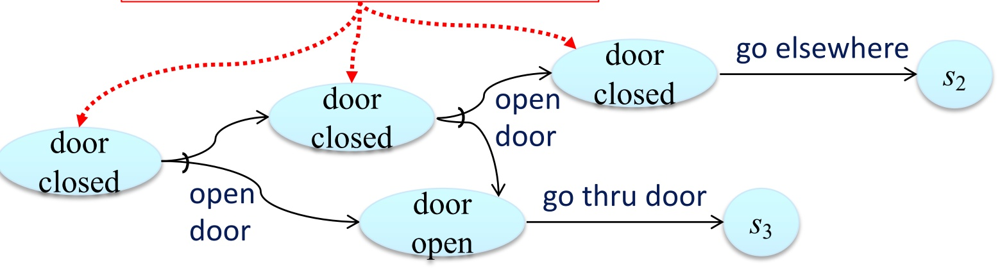

<!-- page: 16 -->

## Summary

● Actions, plans, policies, planning problems

● Types of solution policies:

▸ unsafe, safe (acyclic, cyclic)

Motivation for instructions other than policies
