<!-- page: 1 -->

# Chapters 15, 16 Hierarchical Refinement Planning, Learning

Dana S. Nau

University of Maryland

with contributions from

[Mark “mak” Roberts](https://scholar.google.com/citations?user=vlbX4J8AAAAJ)


Acting, Planning, and Learning

Malik Ghallab, Dana Nau, and Paolo Traverso

<!-- page: 2 -->

## Outline

1. Planning for Rae

2. Acting with Planning (RAE+UPOM)

3. Learning

4. Evaluation, Application

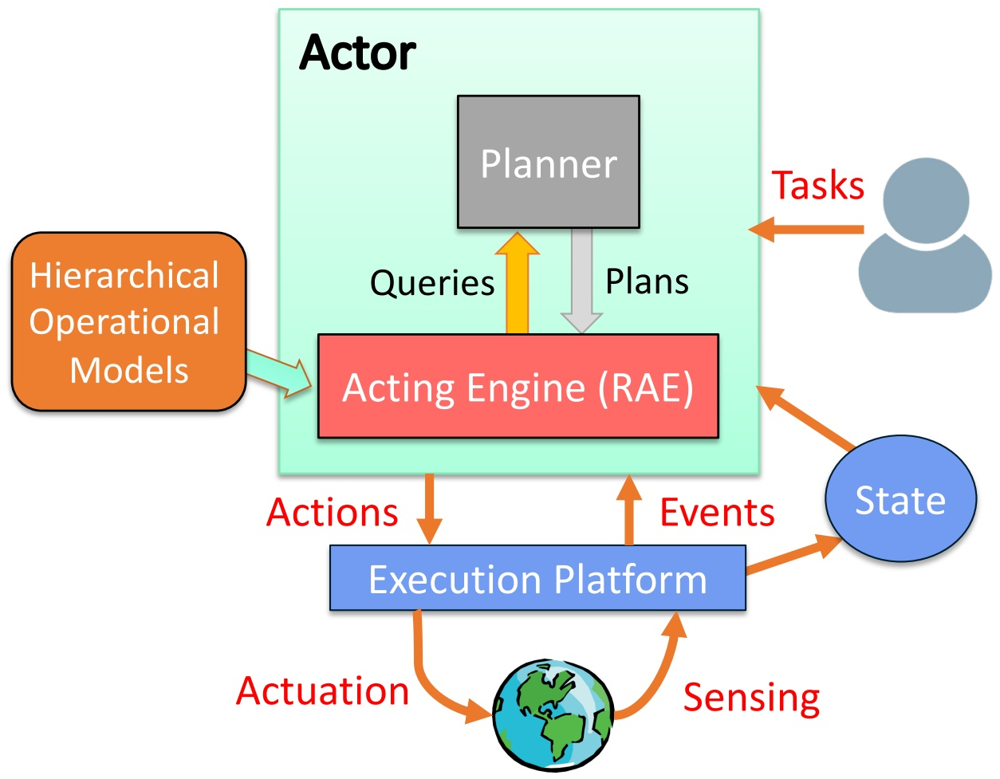

<!-- page: 3 -->

## RAE (Ch. 14 Review)

```txt
RAE
    Agenda ← empty list
    while True do
        for each new task or event τ to be addressed do
            observe current state ξ
            m ← Guide(ξ, τ, ⟨(τ, nil, 1, ∅)⟩, d_max, n_ro)
            if m = ∅ then output(τ, “failed”)
            else Agenda ← Agenda ∪ {⟨(τ, m, 1, ∅)⟩}
        for each stack ∈ Agenda do
            observe current state ξ
            stack ← Progress(stack, ξ)
            if stack = ∅ then
                Agenda ← Agenda \ stack
                output(τ, “succeeded”)
            else if stack = failure then
                Agenda ← Agenda \ stack
                output(τ, “failed”)
```

<!-- page: 4 -->

## Progress (Ch. 14 Review)

<div class="docvortex-algorithm" style="white-space: pre-wrap; font-family:monospace;">
Progress(stack, $\xi$)
    ($\tau, m, i, tried$) $\leftarrow$ top(stack)
if $m[i]$ is an already triggered action then // $i$ is the current step of $m$
    case exec-status ($m[i]$)=
        running: return stack
        failed: return Retry(stack)
        done: return Next(stack, $\xi$)
else // $i$ is the next step of $m$
    if $m[i]$ is an assignment step then
        update $\xi$ according to $m[i]$
        return Next(stack, $\xi$)
    if $m[i]$ is an action $a$ then
        trigger the execution of action $a$
        return stack
    if $m[i]$ is a task $\tau'$ then
        observe current state $\xi$
        $m' \leftarrow Guide(\xi, \tau', push((\tau', nil, 1, 0), stack), d_{max}, n_{ro})$
        if $m' = \varnothing$ then return Retry(stack)
        else return push(($\tau', m', 1, \varnothing$), stack)
Next(stack, $\xi$)
repeat
    ($\tau, m, i, tried$) $\leftarrow$ top(stack)
    pop(stack)
    if stack = $\langle\rangle$ then return $\varnothing$
until $i$ is not the last step of $m$
$j \leftarrow$ step following $i$ in $m$ depending on $\xi$
return push(($\tau, m, j, tried$), stack)

slides for Acting, Planning, and Learning. Creative Commons CC BY-SA 4.0
</div>

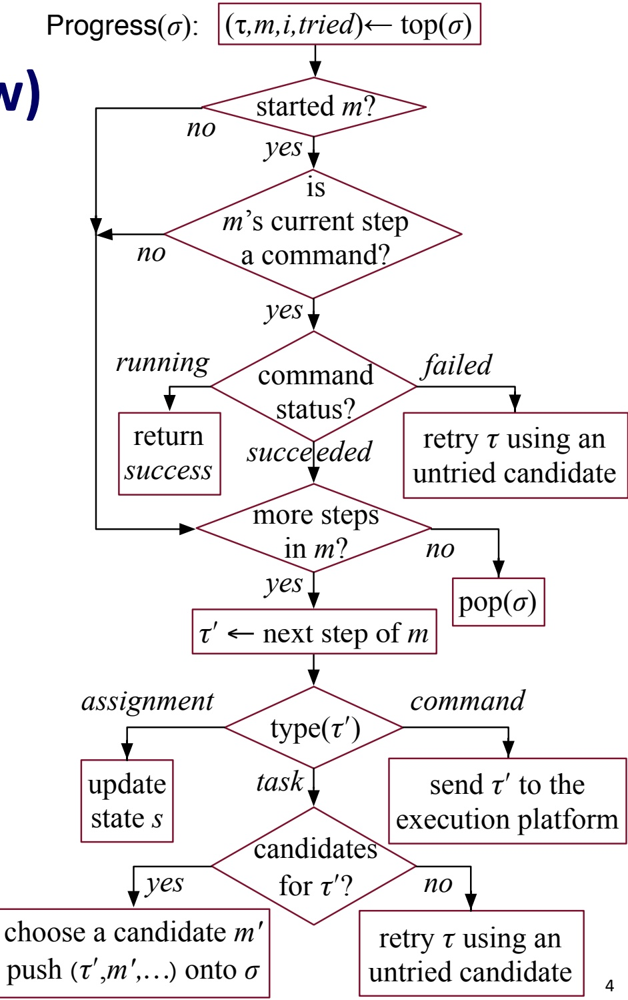

<!-- page: 5 -->

## Planning for Rae?

● Four places where Rae and Progress choose a method instance for a task

● Bad choice may lead to

▸ more costly solution

▸ failure - need to recover, sometimes unrecoverable

● Solution:

▸ call a planner, choose the method instance it suggests

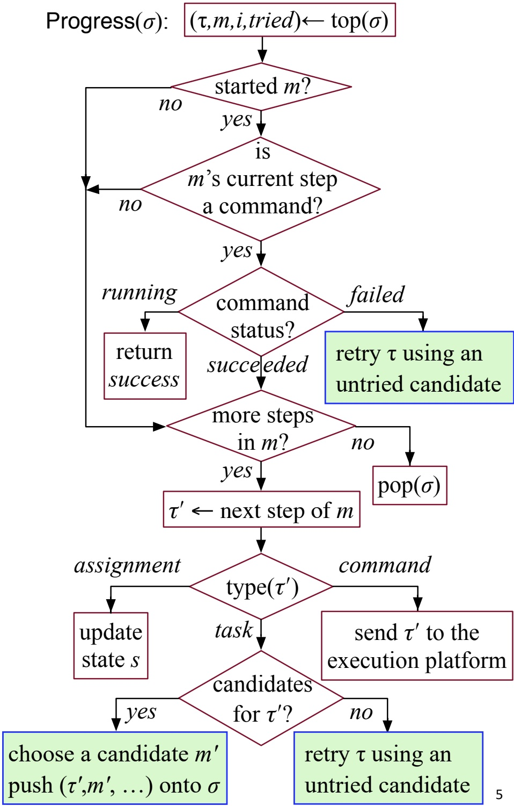

<!-- page: 6 -->

## Planning and Acting Integration

● Planner’s action models are abstractions

▸ The planned actions are tasks for the actor to refine

● Consistency problem:

▸ How to get action models that describe what the actor will do?

Consistent?

● One possible solution:

▸ Actor and planner both use the same representation

• Must be operational; descriptive models too abstract

• Need planning algorithms that can use operational models

**Descriptive models** What the actions do

**Operational models** How to perform tasks

Actor

Planning

Queries

Plans

Acting (RAE)


<!-- page: 7 -->

## Planning and Acting Integration

Planner’s action models are abstractions

▸ The planned actions are tasks for the actor to refine

● Consistency problem:

▸ How to get action models that describe what the actor will do?

● One possible solution:

## Consistent?

▸ Actor and planner both use the same representation

• Must be operational; descriptive models too abstract

• Need planning algorithms that can use operational models

**Operational models** How to perform tasks

● Idea 1:

▸ Planner uses Rae’s tasks and refinement methods

**Descriptive models** What the actions do

▸ For each of Rae’s actions, have a classical action model

▸ DFS or GBFS search among alternatives to see which works best

## Actor

Planning

Queries

Plans

Acting (RAE)


<!-- page: 8 -->

## SeRPE (Sequential Refinement Planning Engine)

```txt
SeRPE(M, A, s, τ)
Candidates ← Instances(M, τ, s)
if Candidates = ∅ then return failure
nondeterministically choose m ∈ Candidates
return Progress-to-finish(M, A, s, τ, m)
```

## Like Rae with just one external task

▸ Progress it all the way to the end, like Progress with a loop around it

Plan rather than act

For each action, use a classical action model

## ● This has some problems …

```txt
Automated Planning and Acting
Ch. 3.3
```

<div class="docvortex-algorithm" style="white-space: pre-wrap; font-family:monospace;">
Progress-to-finish($\mathcal{M}, \mathcal{A}, s, \tau, m$)
    $i \leftarrow \text{nil}$ // instruction pointer for body($m$)
    $\pi \leftarrow \langle\rangle$ // plan produced from body($m$)
loop
    if $\tau$ is a goal and $s \models \tau$ then return $\pi$
    if $i$ is the last step of $m$ then
        if $\tau$ is a goal and $s \not\models \tau$ then return failure
        return $\pi$
    $i \leftarrow \text{nextstep}(m, i)$
    case type($m[i]$)
        assignment: update $s$ according to $m[i]$
        command:
            $a \leftarrow$ the descriptive model of $m[i]$ in $A$
            if $s \models \text{pre}(a)$ then
                $s \leftarrow \gamma(s, a); \pi \leftarrow \pi.a$
            else return failure
    task or goal:
        $\pi' \leftarrow \text{SeRPE}(\mathcal{M}, \mathcal{A}, s, m[i])$
        if $\pi' =$ failure then return failure
        $s \leftarrow \gamma(s, \pi'); \pi \leftarrow \pi.\pi'$
</div>

<!-- page: 9 -->

# Problems with SeRPE

Automated Planning and Acting Ch. 3.3

## Problem 1: difficult to implement

Each time a method invokes a subtask, SeRPE makes a nondeterministic choice

● To implement deterministically

▸ Each path in the search space is an execution trace of the body of a method

▸ Need to backtrack over code execution

Need to write a compiler that can do backtracking

▸ Is it worth the effort?

▸ Each task has two applicable methods

When i=2, the 1<sup>st</sup> method for baz(2) fails

Try 2nd method for baz(2)

m-foo(k) task: foo(k) pre: body: for i ← 1 to k: bar(i) baz(i)

▸ If it fails, backtrack to task foo(k) …

<!-- page: 10 -->

## Problems with SeRPE

● Problem 2: limitations of classical action models

▸ e.g., the fetch example

● We don’t know in advance what perceive’s effects will be

▸ If we did, perceive wouldn’t actually be needed

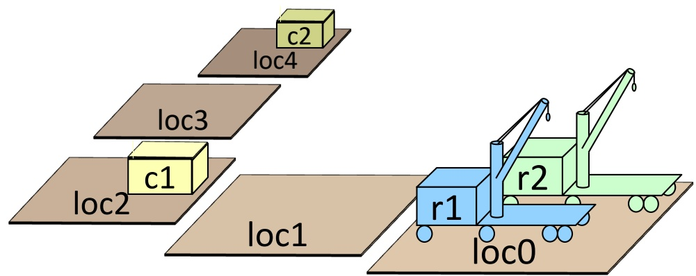

```txt
take(r, o, l)
```

```javascript
// robot r takes object o at location l
pre: cargo(r) = nil, loc(r) = l, loc(o) = l
eff: cargo(r) ← o, loc(o) ← r
```

```txt
put(r,o,l)
    // r puts o at location l
    pre: loc(r)=l, loc(o)=r
    eff: cargo(r)← nil, loc(o)← l
```

## perceive(r,l):

// robot r sees what objects are at l pre: loc(r) = l

eff: ?

<!-- page: 11 -->

## Planning for Rae

procedure RAE: loop: fo<u>r every new external task or event τ</u> do choose a method instance m for τ create a refinement stack for τ, m add the stack to Agenda for each stack σ in Agenda call Progress(σ) if σ is finished then remove it

● Idea 2: simulation with multithreading or multiprocessing

▸ Run Rae in simulated environment

• Simulate the actions (see next page)

▸ To choose among method instances, try all of them

Planner returns the method instance m having the highest expected utility (≈ least expected cost)

**Poll**: is this a reasonable approach? A) Yes B) No C) It depends

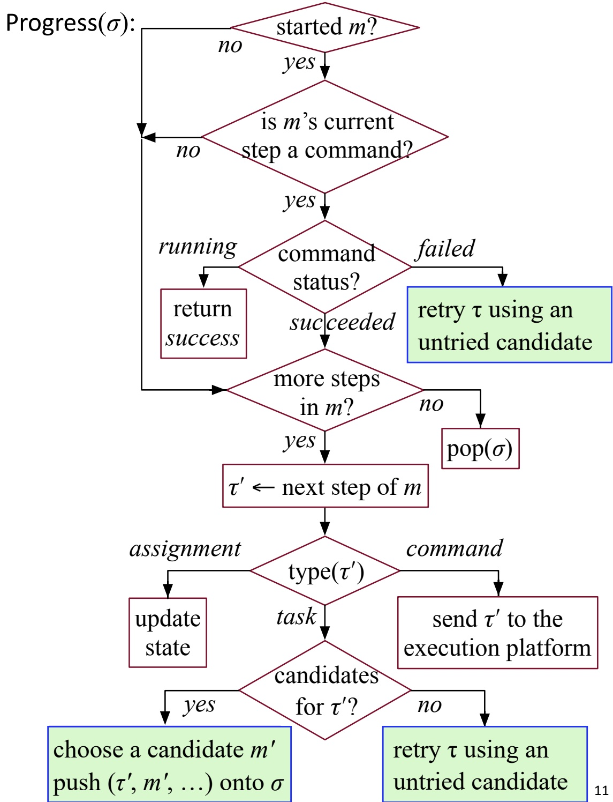

<!-- page: 12 -->

## Simulating Actions

## Simplest case:

▸ probabilistic action template

<div class="docvortex-algorithm" style="white-space: pre-wrap; font-family:monospace;">
$a(x_1, \dots, x_k)$
    pre: ...
    $(p_1)$ effects$_1$: $e_{11}, e_{12}, \dots$
    ...
    $(p_m)$ effects$_m$: $e_{m1}, e_{m2}, \dots$
</div>

Choose effects<sub>i</sub> at random with probability $p _ { i }$ and use it to update the current state

## ● More general:

▸ Arbitrary computation, e.g., physics-based simulation

▸ Run the code to get simulated effects

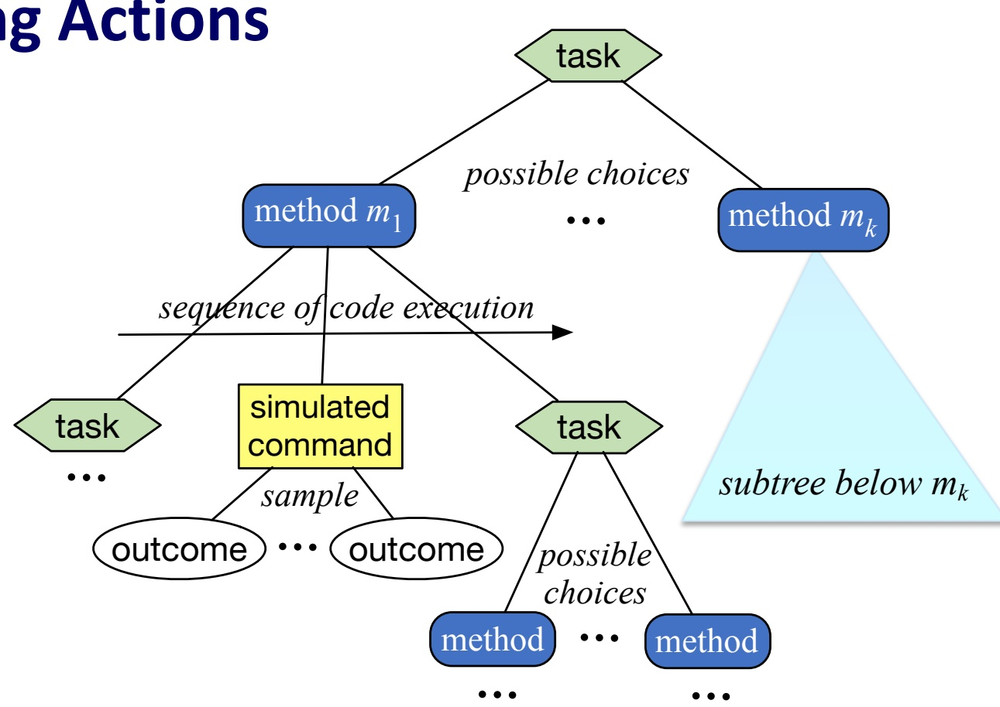


<!-- page: 13 -->

## Planning for Rae

```python
procedure RAE:
    loop:
        for every new external task or event τ do
            choose a method instance m for τ
            create a refinement stack for τ, m
            add the stack to Agenda
        for each stack σ in Agenda
            call Progress(σ)
            if σ is finished then remove it
```

● Idea 3: simulation with Monte Carlo rollouts

▸ Multiple runs

• Random choices and outcomes in each run

▸ Maintain statistics to estimate each choice’s expected utility

▸ Return the method instance m that has the highest estimated utility

Patra, Mason, Kumar, Traverso, Ghallab, and Nau. Integrating Acting, Planning, and Learning in Hierarchical Operational Models. ICAPS, 2020. **Best student paper honorable mention award.** [https://doi.org/10.1609/aaai.v33i01.33017691](https://doi.org/10.1609/aaai.v33i01.33017691)

Patra, Mason, Kumar, Ghallab, Nau, and Traverso. Deliberative acting, planning and learning with hierarchical operational models. Art. Intel. Journal. Vol. 299, 2021. [https://doi.org/10.1016/j.artint.2021.103523](https://doi.org/10.1016/j.artint.2021.103523)

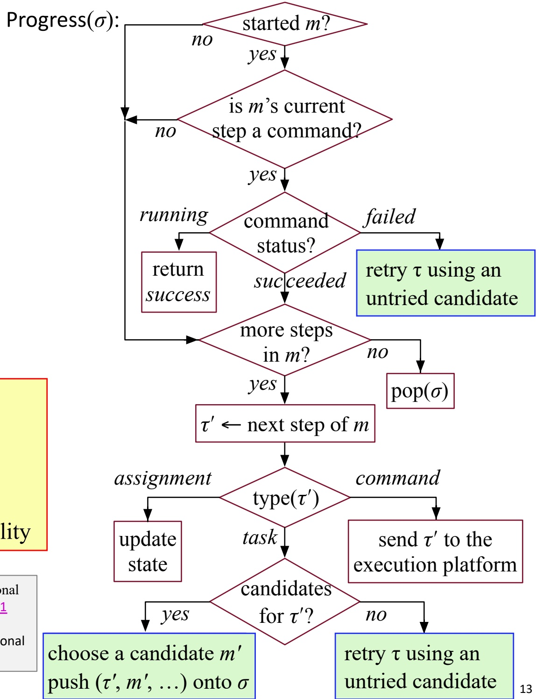

<!-- page: 14 -->

## Planner

<div class="docvortex-algorithm" style="white-space: pre-wrap; font-family:monospace;">
Plan-with-UPOM (task $\tau$):
    Candidates $\leftarrow$ {method instances relevant for $\tau$}
    for $i \leftarrow 1$ to $n$
        call UPOM($\tau$)
        update estimates of methods' expected utility
    return the $m \in$ Candidates that has
        the highest estimated utility
</div>

```python
UPOM(τ):
    choose a method instance m for τ
    create refinement stack σ for τ and m
    loop while Simulate-Progress(σ) ≠ failure
        if σ is completed then return (m, utility)
    return failure
```

## Each call to UPOM does a Monte Carlo rollout ▸ Simulated execution of RAE on τ

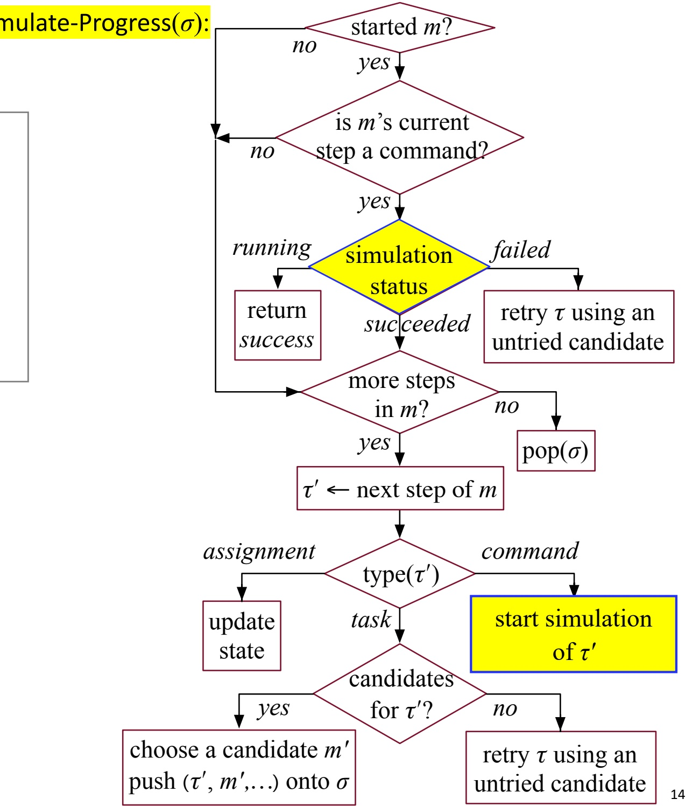

<!-- page: 15 -->

## Monte-Carlo rollouts

```python
Plan-with-UPOM (task τ):
    Candidates ← {method instances relevant for τ}
    for i ← 1 to n
        call UPOM(τ)
        update estimates of methods' expected utility
    return the m ∈ Candidates with the highest estimated utility
```

## UPOM(τ):

<div class="docvortex-algorithm" style="white-space: pre-wrap; font-family:monospace;">
choose a method instance $m$ for $\tau$ create refinement stack $\sigma$ for $\tau$ and $m$ loop while Simulate-Progress$(\sigma) \neq$ failure if $\sigma$ is completed then return $(m, utility)$ return failure
</div>

## Each call to UPOM does a Monte Carlo rollout

## ▸ Simulated execution of RAE on τ

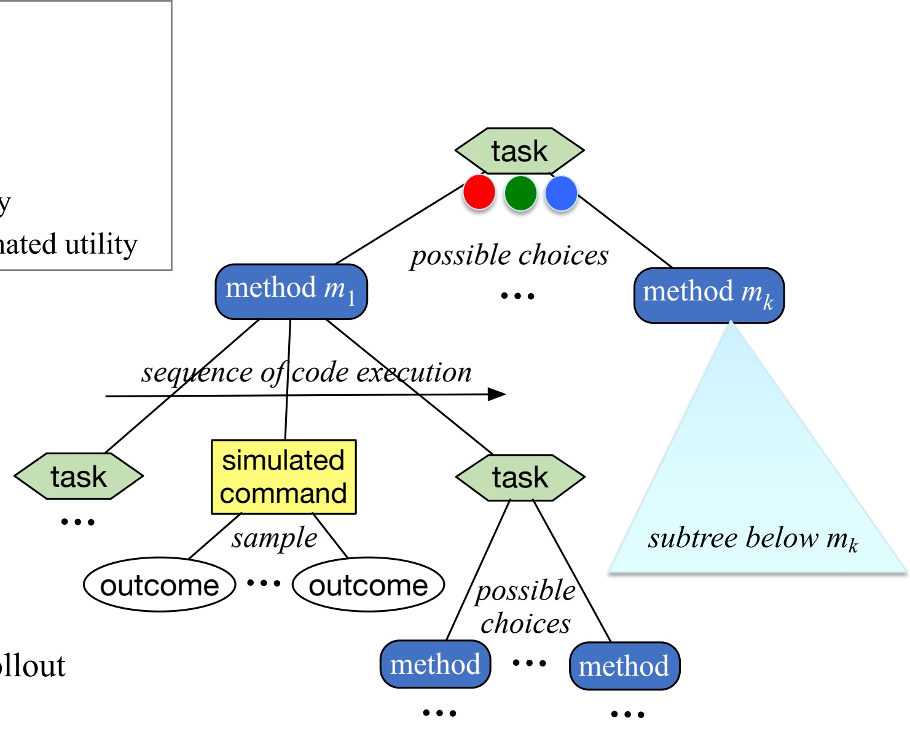

<!-- page: 16 -->

## UCT and UPOM

## ● UCT algorithm:

▸ Monte Carlo rollouts on MDPs

Call it many times, choice converges to optimal

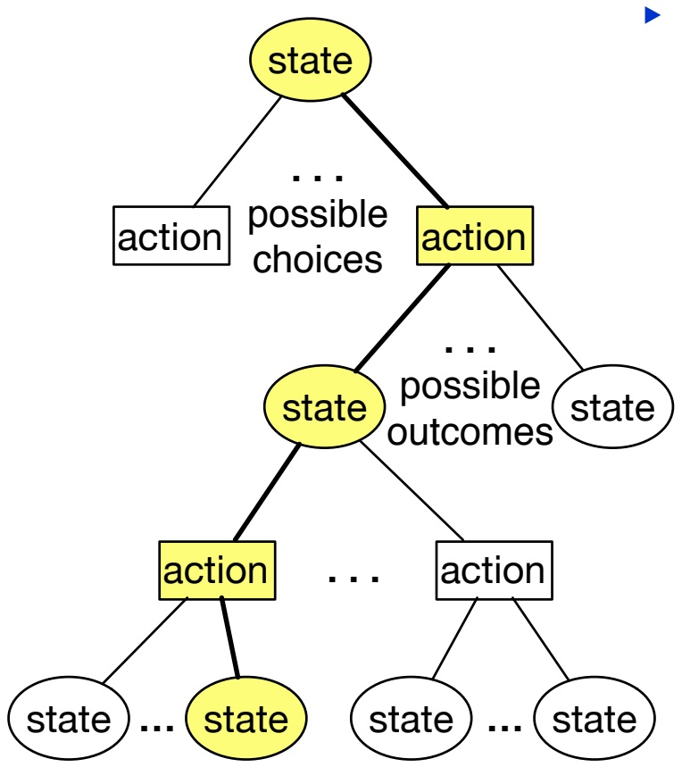

● UPOM search tree more complicated

▸ tasks, method instances, actions, code execution

● If no exogenous events,

▸ Can map it to UCT search of a complicated MDP

▸ Proof of convergence to optimal

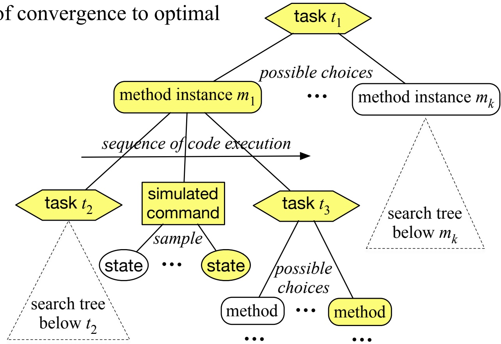

<!-- page: 17 -->

## Outline

1. Planning for Rae

2. Acting with Planning (RAE+UPOM)

3. Learning

4. Evaluation, Application

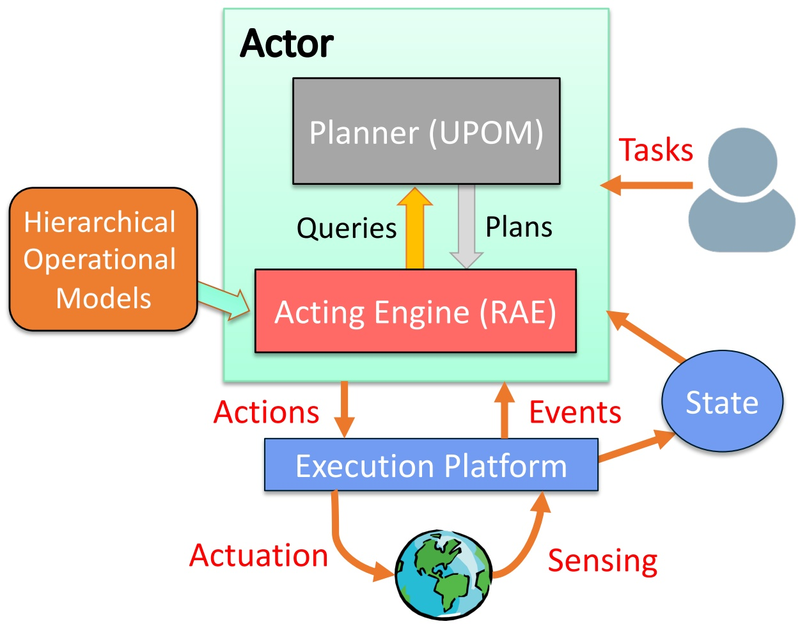

<!-- page: 18 -->

```python
procedure RAE:
    loop:
        for every new external task or event τ do
            choose a method instance m for τ
            create a refinement stack for τ, m
            add the stack to Agenda
        for each stack σ in Agenda
            call Progress(σ)
            if σ is finished then remove it
```

## RAE + UPOM

Whenever RAE needs to choose a method instance ▸ call Plan-with-UPOM, use the method instance it returns

Open-source Python implementation: [https://bitbucket.org/sunandita/RAE/](https://bitbucket.org/sunandita/RAE/)

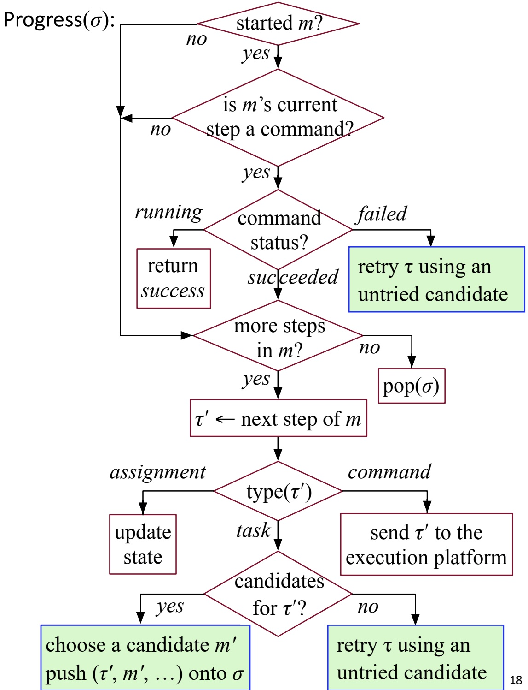

<!-- page: 19 -->

## Could we use UPOM with HTN-Run-Lookahead?

● Suppose we try to use Run-Lookahead with a modified version of UPOM (call it UPOMʹ)

▸ Instead of returning method instance $m _ { 1 } ,$ return the actions in the last Monte Carlo rollout

• $\boldsymbol { \pi } = \langle a _ { 1 } , a _ { 2 } , a _ { 3 } , a _ { 4 } , a _ { 5 } \rangle$

## ● Problem

▸ Run-lookahead calls UPOMʹ, gets π, executes $a _ { 1 } ,$ , then calls UPOMʹ again

▸ This time, UPOMʹ needs to plan for $t _ { 1 }$ in state $s _ { 1 }$ rather than $s _ { 0 }$

▸ There might not be an applicable method

If we want to use Run-Lookahead, we need to ensure that methods can work in unexpected states

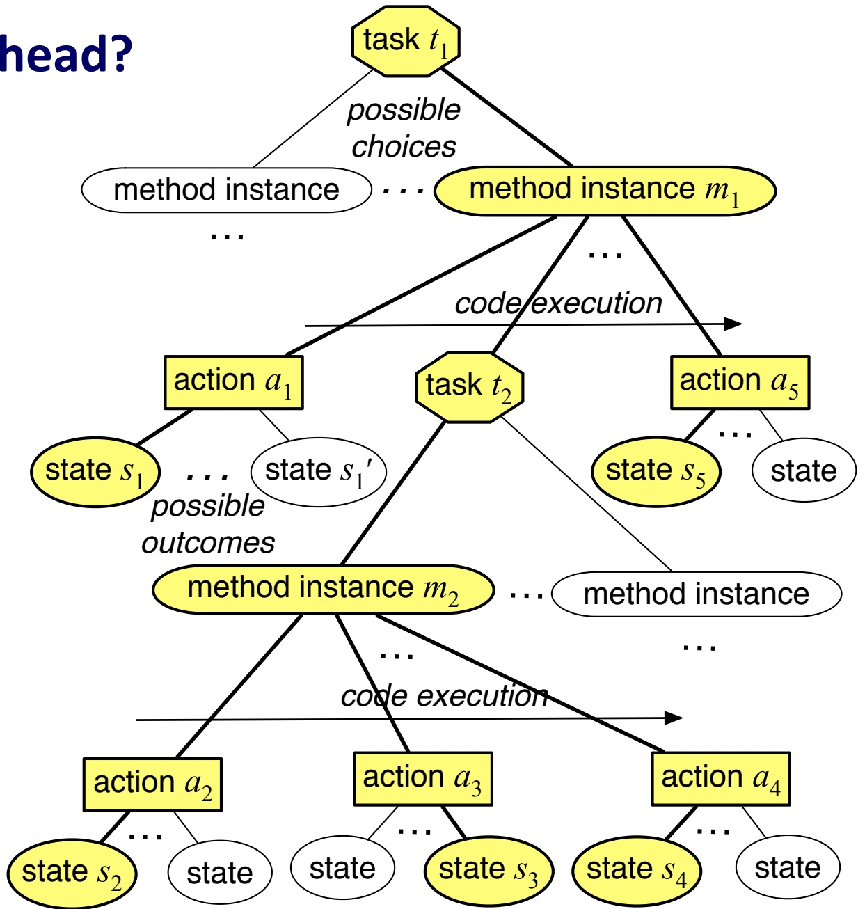

<!-- page: 20 -->

## Could we use UPOM with HTN-Run-Lazy-Lookahead?

● Run-Lazy-Lookahead calls UPOMʹ, UPOMʹ returns $\boldsymbol { \pi } = \langle a _ { 1 } , a _ { 2 } , a _ { 3 } , a _ { 4 } , a _ { 5 } \rangle$

Run-Lazy-Lookahead executes $a _ { 1 } , a _ { 2 } , a _ { 3 } , a _ { 4 } , a _ { 5 } ,$ won’t call UPOMʹ again unless something unexpected happens, e.g.,

• action $a _ { 2 }$ has an execution failure

• $a _ { 2 }$ produces a state in which $a _ { 3 }$ is inapplicable

• an exogenous event makes $a _ { 3 }$ inapplicable

▸ Method $m _ { 2 }$ fails; we need to replan task $t _ { 2 }$

Need to modify Run-Lazy-Lookahead so that when a failure occurs, it knows which task to replan

▸ Need to modify the methods to work in unexpected states

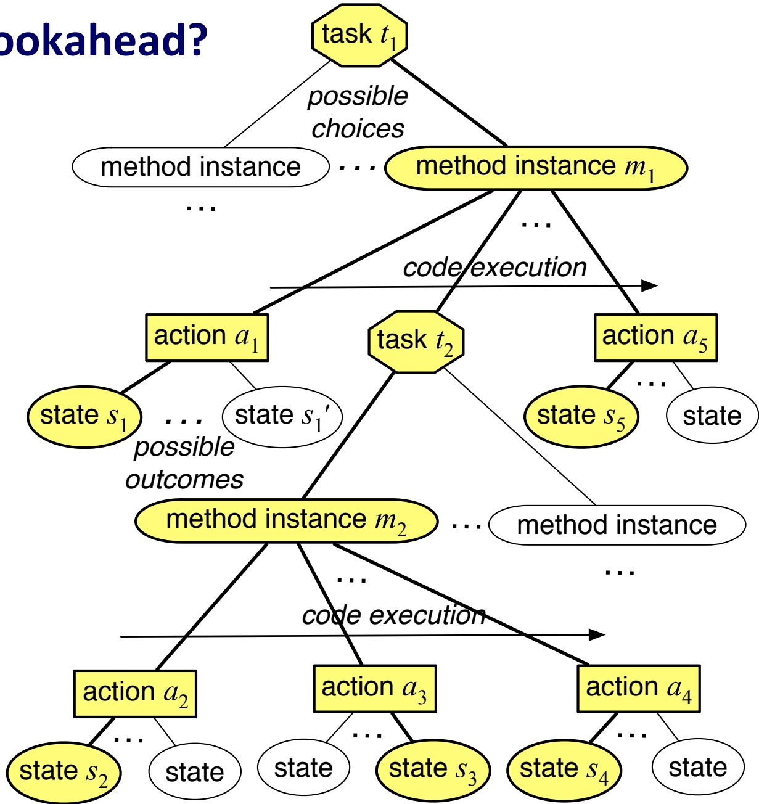

<!-- page: 21 -->

## Comparison

Rae + UPOM has tighter coupling between planning and acting ▸ works better than Run-Lazy-Lookahead + UPOMʹ

## Example

▸ Case 1: Run-Lazy-Lookahead calls UPOMʹ for $t _ { 1 }$ in state $s _ { 0 }$

• UPOMʹ returns $\boldsymbol { \pi } = \langle a _ { 1 } , a _ { 2 } , a _ { 3 } , a _ { 4 } , a _ { 5 } \rangle$

• Run-Lazy-Lookahead executes $a _ { 1 } ,$ gets state $s _ { 1 } { } ^ { \prime } \left( \operatorname * { m o t } s _ { 1 } \right)$

▸ Suppose this makes $a _ { 2 }$ redundant

Run-Lazy-Lookahead doesn’t have a way to detect this; continues with the rest of π

▸ Case 2: Rae calls UPOM for $t _ { 1 }$ in state $s _ { 0 }$

UPOM returns $m _ { 1 } ,$ Rae executes $a _ { 1 } ,$ gets state $s _ { 1 } ^ { \prime }$

• Rae calls UPOM for $t _ { 2 }$ in state $s _ { 1 } ^ { \prime }$

▸ UPOM might return a better method instance

▸ Or maybe UPOM returns $m _ { 2 } ,$ but ${ m _ { 2 } } ^ { \flat }$ s body includes an if-test to omit $a _ { 2 }$ if it’s redundant

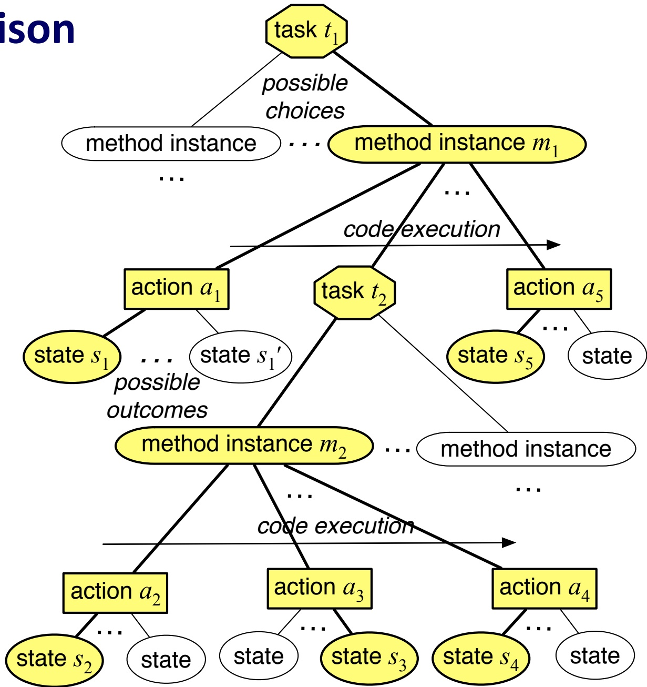

<!-- page: 22 -->

## Outline

1. Planning for Rae

2. Acting with Planning (RAE+UPOM)

3. Learning

4. Evaluation, Application

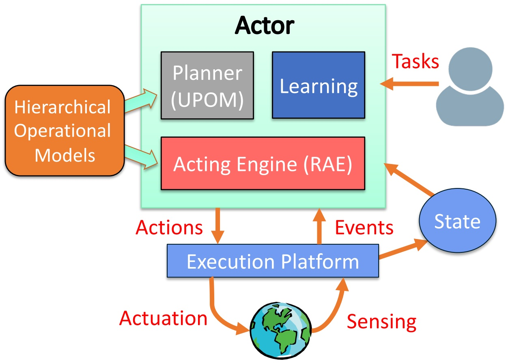

<!-- page: 23 -->

## Motivation

Plan-with-UPOM is called by RAE, runs online

▸ Time constraints might not allow complete search

● Case 1: no time to search at all

▸ need a choice function

● Case 2: enough time to do partial search

▸ Receding horizon

Cut off search at depth $d _ { m a x }$ or when we run out of time

• At leaf nodes, use heuristic function to estimated expected utility

## ● Learning algorithms:

Learnπ: learns a choice function

▸ LearnH: learns a heuristic function

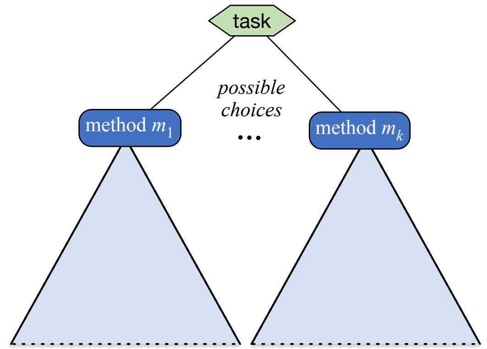

<!-- page: 24 -->

## Integration with Learning

Gather training data from acting-and-planning traces of RAE and Plan-with-UPOM

● Train classifiers (feed-forward neural nets)

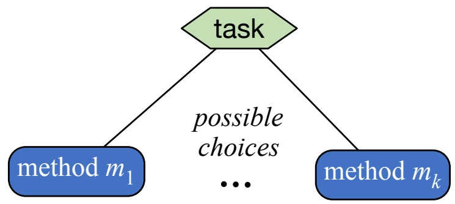

## ● Learnπ

▸ Learns function for choosing a method

▸ Given current task and context (state and other information), choose m from the set of available refinement methods

▸ Useful if there isn’t enough time to use UPOM

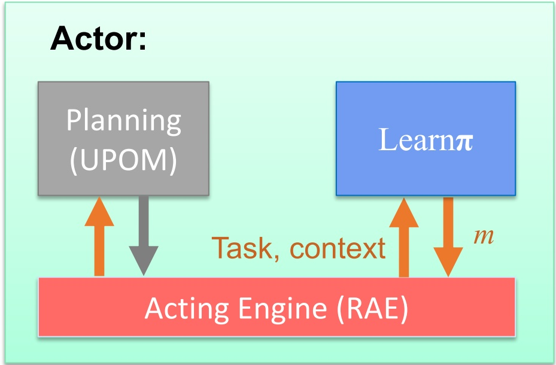

<!-- page: 25 -->

## Integration with Learning

Gather training data from acting-and-planning traces of RAE and Plan-with-UPOM

● Train classifiers (feed-forward neural nets)

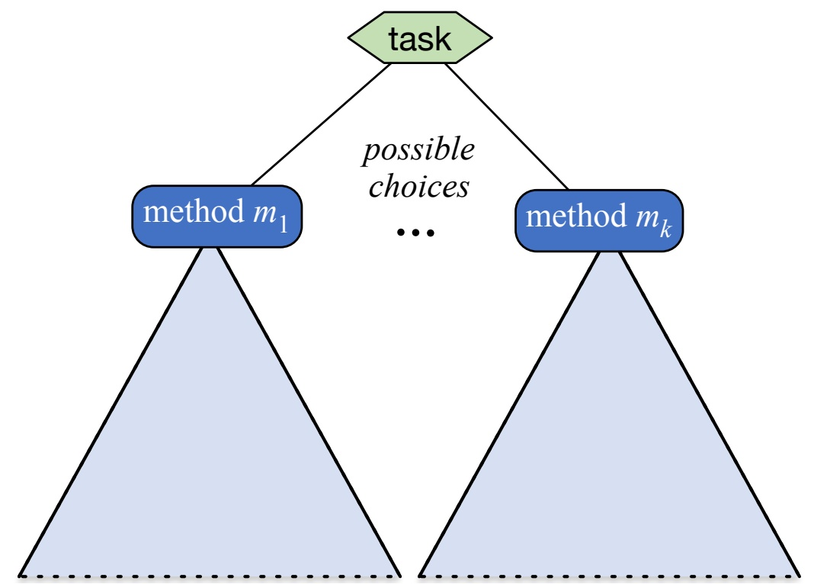

● LearnH

▸ Learns a heuristic function to guide UPOM’s search

UPOM can use it to estimate expected utility at leaf nodes

Useful if there isn’t enough time to search all the way to the end

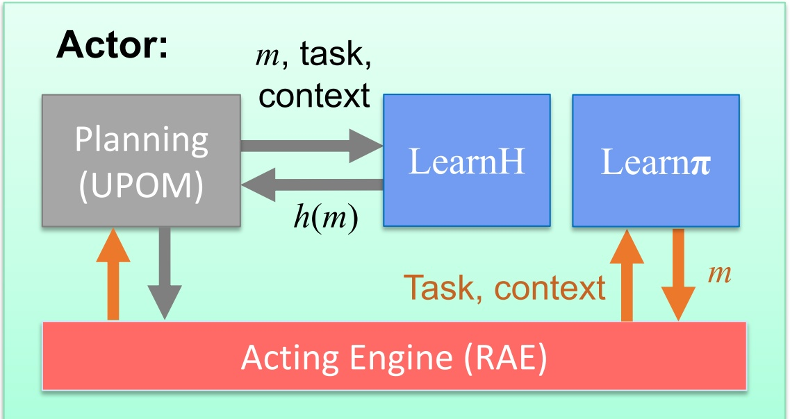

<!-- page: 26 -->

## Outline

1. Planning for Rae

2. Acting with Planning (RAE+UPOM)

3. Learning

4. Evaluation, Application


<!-- page: 27 -->

## Experimental Evaluation

| Domain | $\|\mathcal{T}\|$ | $\|\mathcal{M}\|$ | $\|\overline{\mathcal{M}}\|$ | $\|\mathcal{A}\|$ | Dynamic events | Dead ends | Sensing | Robot collaboration | Concurrent tasks |
| --- | --- | --- | --- | --- | --- | --- | --- | --- | --- |
| S&amp;R | 8 | 16 | 16 | 14 | ✓ | ✓ | ✓ | ✓ | ✓ |
| Explore | 9 | 17 | 17 | 14 | ✓ | ✓ | ✓ | ✓ | ✓ |
| Fetch | 7 | 10 | 10 | 9 | ✓ | ✓ | ✓ | - | ✓ |
| Nav | 6 | 9 | 15 | 10 | ✓ | - | ✓ | ✓ | ✓ |
| Deliver | 6 | 6 | 50 | 9 | ✓ | ✓ | - | ✓ | ✓ |

● Five different domains, different combinations of characteristics

● Evaluation criteria: efficiency (reciprocal of cost), successes vs failures

● Result: Planning and learning help

▸ RAE operates better with UPOM or learning than without

▸ RAE’s performance improves with more planning

<!-- page: 28 -->

## Prototype Application

● Software-defined networks

▸ Decoupled control and data layers

▸ Prone to high-volume, fast-paced online attacks

▸ Need automated attack recovery

● Prototype solution using RAE+UPOM

▸ Expert writes recovery procedures as refinement methods

● Experimental results

▸ Improved efficiency, retry ratio, success ratio, resilience compared to human expert

S. Patra, A. Velasquez, M. Kang, and D. Nau. Using online planning and acting to recover from cyberattacks on software-defined networks. In Proc. Innovative Applications of AI Conference (IAAI), Feb. 2021. [https://www.cs.umd.edu/\~nau/papers/patra2021using.pdf](https://www.cs.umd.edu/~nau/papers/patra2021using.pdf)

Billions of Data Points

Millions of Alerts

High-volume, fast-paced Cyber Events

Cyber Warriors

Complex Systems to Defend

<!-- page: 29 -->

## Summary

Chapter 15: Hierarchical Refinement Planning

● Plan by simulating Rae on a single external task/event/goal

▸ SeRPE uses classical action models

UPOM simulates the actor’s actions, does Monte Carlo rollouts

● Acting and planning

▸ Rae + UPOM

▸ Comparison: Run-Lazy-Lookahead + UPOMʹ

▸ Open-source Python implementation:

[• https://bitbucket.org/sunandita/RAE/](https://bitbucket.org/sunandita/RAE/)

● Chapter 16: Learning

▸ Learning a function to choose a method

▸ Learning heuristics to guide search

● Additional material not in the book

▸ Experimental evaluation

▸ Prototype application
