<!-- page: 1 -->


## Chapter 2 Deterministic Representation and Acting

Dana S. Nau

University of Maryland

with contributions from

[Mark “mak” Roberts](https://scholar.google.com/citations?user=vlbX4J8AAAAJ)

Acting, Planning, and Learning

Malik Ghallab, Dana Nau, and Paolo Traverso

<!-- page: 2 -->

## Motivation

● How to model a complex environment?

Generally need simplifying assumptions

● Classical planning

• Finite, static world, just one actor

• No concurrent actions, no explicit time

Determinism, no uncertainty, no exogeneous events

• Full observability

Unit-cost actions

▸ Sequence of states and actions $\langle s _ { 0 } , a _ { 1 } , s _ { 1 } , a _ { 2 } , s _ { 2 } , \ldots \rangle$

● Avoids many complications

Most real-world environments don’t satisfy the assumptions ⇒ Errors in prediction

OK if they’re infrequent and don’t have severe consequences

## Outline

2.2. State-Transition Systems

2.3. State-Variable Representation

2.6. Acting

2.4. Classical Representation

2.5. Computational Complexity

Chapter 2 of Haslum et al. (2019)\*

▸ Classical fragment of PDDL

▸ Planning domains and problems

▸ untyped, typed

<small><span class="docvortex-page-footnote" data-block-type="page_footnote" style="color:#6b7280">\* Haslum, Lipovetzky, Magazzini, & Muise. An Introduction to the Planning Domain Definition Language. Morgan Claypool, 2019.</span></small>

<!-- page: 3 -->

## Section 2.1. State-Transition Systems

State-transition system or classical planning domain:

● $\Sigma   =   ( S ,   A ,   \gamma ,   \mathrm { c o s t } )$ or $( S ,   A ,   \gamma )$

▸ S - finite set of states

▸ A - finite set of actions

▸ $\gamma \colon S   \times   A \to S$

prediction (or state-transition) function

partial function: $\gamma ( s , a )$ is not necessarily defined for every (s,a)

▸ a is applicable in $s { \mathrm { ~ i f f ~ } } \gamma ( s , a )$ is defined

Domain $( a )   =   \{ s \in S$ | a is applicable in s}

▸ Range(a) = {γ(s,a) | s ∈ Domain(a)}

▸ cost: $S   \times   A \to \mathbb { R } ^ { + }$ or cost: $\mathcal { A } \to \mathbb { R } ^ { + }$

• optional; default is cost(a) ≡ 1

• money, time, something else

● plan:

▸ a sequence of actions $\pi = \langle a _ { 1 } ,   \ldots ,   a _ { n } \rangle$

● π is applicable in $s _ { 0 }$ if the actions are applicable in the order given

$$
\gamma (s _ {0}, a _ {1}) = s _ {1}
$$

$$
\gamma (s _ {1}, a _ {2}) = s _ {2}
$$

$$
\gamma (s _ {n - 1}, a _ {n}) = s _ {n}
$$

▸ In this case define $\gamma ( s _ { 0 } ,   \pi ) = s _ { n }$

● Classical planning problem:

▸ $P = ( \Sigma , s _ { 0 } , S _ { g } )$

▸ planning domain, initial state, set of goal states

● Solution for P:

▸ a plan π such that that $\gamma ( s _ { 0 } ,   \pi ) \in S _ { g }$

<!-- page: 4 -->

## Planning Problems

● $\pi = \langle a _ { 1 } ,   \ldots ,   a _ { n } \rangle$ is applicable in $s _ { 0 }$ if the actions are applicable in the order given

$$
\gamma (s _ {0}, a _ {1}) = s _ {1}
$$

$$
\gamma (s _ {1}, a _ {2}) = s _ {2}
$$

$$
\gamma (s_{n-1}, a_n) = s_n
$$

▸ In this case we define

• $\gamma ( s _ { 0 } ,   \pi ) = s _ { n }$

• $\hat { \gamma } ( s _ { 0 } , \pi ) = \langle s _ { 0 } , \ldots , s _ { n } \rangle$

● Classical planning problem:

▸ $P   =   ( \Sigma , s _ { 0 } , S _ { g } )$

planning domain, initial state, set of goal states

● Solution for P: a plan π such that that $\gamma ( s _ { 0 } , \pi ) \in S _ { g }$

▸ Minimal solution: no subsequence is also a solution

▸ Shortest solution: no solution has fewer actions

▸ Optimal solution: no solution has lower cost

● **Example:** Suppose P has three solutions

• $\pi _ { 1 } = \langle a _ { 1 } \rangle$

• $\pi _ { 2 } = \langle a _ { 2 } , a _ { 3 } , a _ { 4 } , a _ { 5 } \rangle$

• $\pi _ { 3 } = \langle a _ { 2 } ,   a _ { 3 } ,   a _ { 1 } \rangle$

▸ Then $\pi _ { 1 }$ is both shortest and optimal

● **Poll:** Which solutions are minimal?

$$
\mathrm{A.} \pi_ {1} \quad \mathrm{B.} \pi_ {2} \quad \mathrm{C.} \pi_ {3}
$$

<!-- page: 5 -->

## Acting with a Plan

```txt
- A simple procedure for running a plan
Run-Plan(Σ, π):
    while True do
1     s ← observe current state
    if π = ⟨⟩ then
2     return success
    a ← pop(π)
3     if a ∉ Applicable(s) then return failure
    perform action a
- Ideally, Run-Plan(Σ, ⟨a₁, ..., aₙ⟩) will take Σ through through the sequence of states
    ŷ(s₀, π) = ⟨s₁, ..., sₙ⟩
    then return success
- But recall that Σ is unlikely to be a perfect model of the actor’s environment
    • Later we’ll discuss some things that can go wrong
```

● To test whether π has achieved a desired goal $S _ { g }$

▸ add $S _ { g }$ as a third argument

▸ before line 2, insert this:

**if** s ∉ $S _ { g }$ **then return** failure

<!-- page: 6 -->

## Section 2.2. Representation

## ● We write Run-Plan(Σ, π)

▸ But what Run-Plan really needs is data structures that represent Σ and π

## ● If S and A are small enough

▸ Give each state and action a name

▸ For each s and a, store $\gamma ( s , a )$ in a lookup table

## In larger domains, don’t represent all states explicitly

▸ Language for describing properties of states

▸ Language for describing how each action changes those properties

▸ Start with initial state, use actions to produce other states

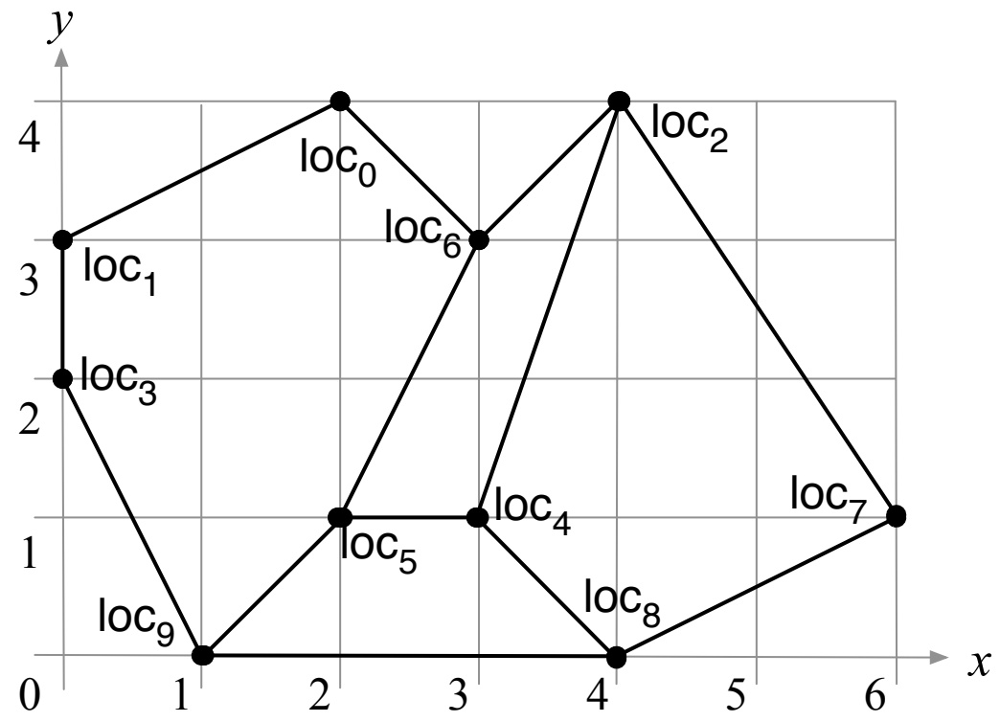

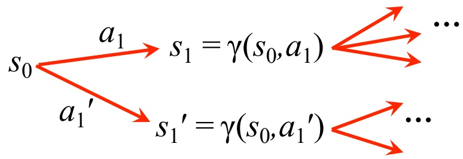

<!-- page: 7 -->

## Kinds of Representations

● Domain-specific representation:

▸ tailor-made for a specific environment

State: arbitrary data structure

● Action: (head, preconditions, effects, cost)

▸ head: name and parameter list

• Get actions by instantiating the parameters

▸ preconditions:

• Computational tests to predict whether an action can be performed

Should be necessary/sufficient for the action to run without error

▸ effects:

• Procedures that modify the current state

▸ cost: procedure that returns a number

• Can be omitted, default is cost ≡ 1

Advantage: can use whatever works best for that particular domain

Disadvantage: for each new domain, need new representation, new algorithms

Alternative: domain-independent representation

A “standard format” that can be used for many different planning domains

▸ Limited representational capability, but easy to compute

Domain-independent algorithms that work for anything in this format

▸ We’ll use a state-variable representation …

<!-- page: 8 -->

## Example

## ● Drilling holes in a metal workpiece

## ▸ A state

• geometric model of the workpiece

▸ annotated with dimensions, tolerances, etc.

capabilities and status of drilling machine and drill bit

## ▸ Several actions

• clamp the workpiece onto the drilling machine

• load a drill bit into the machine

• drill a hole

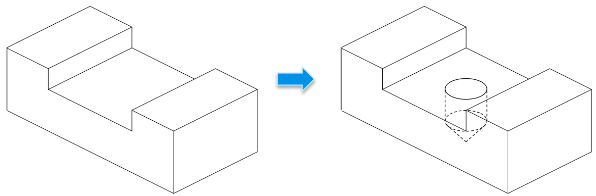

Lecture slides for [Acting, Planning, and Learning](https://projects.laas.fr/planning/). Creative Commons [CC BY-SA 4.0](https://creativecommons.org/licenses/by-sa/4.0/deed.en)

● Name: drill-hole

## ● Arguments:

▸ ID codes for the machine and drill bit

▸ annotated geometric model of the workpiece

▸ description of the hole to be drilled

## ● Preconditions

Capabilities: can the machine and drill bit produce the desired hole?

Current state: Is the drill bit installed? Is the workpiece clamped onto the table? Etc.

## ● Effects

▸ annotated geometric model of modified workpiece

## ● Cost

▸ estimate of time or monetary cost

<!-- page: 9 -->

## Discussion

Advantage of domain-specific representation:

▸ use whatever works best for that particular domain

● Disadvantage:

▸ for each new domain, need new representation and deliberation algorithms

## ● Alternative: domain-independent representation

Try to create a “standard format” that can be used for many different planning domains

▸ Deliberation algorithms that work for anything in this format

● State-variable representation

▸ Simple formats for describing states and actions

▸ Limited representational capability

• But easy to compute, easy to reason about

▸ Domain-independent search algorithms and heuristic functions that can be used in all state-variable planning problems

<!-- page: 10 -->

## State-Variable Representation

● Objects = {names of objects in the environment}

● Organized into an typed ontology

▸ sets of object types

Objects = Robots ∪ Containers ∪ Locs ∪ {nil}

▸ Robots = {r1}

▸ Containers = {c1, c2}

▸ Locs = {d1, d2, d3}

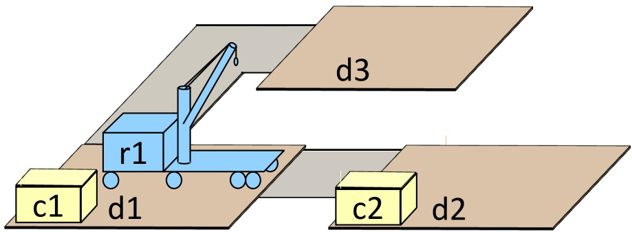

● Objects only needs to include objects that matter at the current level of abstraction

● Can omit lots of details

▸ physical characteristics of robots, containers, loading docks, roads, …

<!-- page: 11 -->

## Rigid Properties

● Objects have two kinds of properties

▸ rigid and varying

● Rigid: stays the same in every state

Can be described as a mathematical relation adjacent = {(d1,d2), (d2,d1), (d1,d3), (d3,d1)}

▸ Or equivalently, a set of ground atoms adjacent(d1,d2), adjacent(d2,d1), adjacent(d1,d3), adjacent(d3,d1)

▸ I’ll use the two notations interchangeably

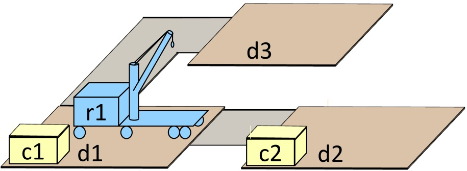

Terminology from first-order logic:

● atom ≡ atomic formula ≡ positive literal ≡ predicate symbol with list of arguments ▸ e.g., adjacent(x,d2), where x is unbound

negative literal ≡ negated atom ≡ atom with negation sign in front of it

▸ e.g., ¬ adjacent(x,d2)

● an atom that contains no variable symbols is ground (or fully instantiated)

▸ e.g., adjacent(d1,d2)

● an atom that contains no constant symbols is lifted ▸ e.g., adjacent(x,y)

● an atom that contains both is partially instantiated ▸ e.g., adjacent(x,d2)

● ground instance of any expression: replace every variable with a value in its range

▸ e.g., adjacent(d1,d2) is a ground instance of both adjacent(x,d2) and adjacent(x,y)

<!-- page: 12 -->

## Varying Properties

● Varying property (or fluent):

• a property that may differ in different states

● Represent it using a state variable

▸ a term that we can assign a value to

• e.g., loc(r1)

● Let X = {all state variables in the environment}

e.g., X = {loc(r1), loc(c1), loc(c2), cargo(r1)}

● Each state variable x ∈ X has a range

= {all values that can be assigned to x}

Range(loc(r1)) = Locs

• Range(loc(c1)) = Range(loc(c2)) = Robots ∪ Locs

• Range(cargo(r1)) = Containers ∪ {nil}

To abbreviate the “range” notation often I’ll just say things like


▸ loc(r1) ∈ Locs

loc(c1), loc(c2) ∈ Robots ∪ Locs

Instead of “domain”, to avoid confusion with planning domains

<!-- page: 13 -->

## States as Functions

● Represent each state s as a function that assigns values to state variables

▸ For each state variable x, $s ( x )$ is one x’s possible values

$$
s _ {1} (\operatorname{loc} (r 1)) = d 1, \quad s _ {1} (\operatorname{cargo} (r 1)) = \operatorname{nil},
$$

$$
s _ {1} (\mathsf {l o c} (c 1)) = \mathsf {d 1}, \quad s _ {1} (\mathsf {l o c} (c 2)) = \mathsf {d 2}
$$

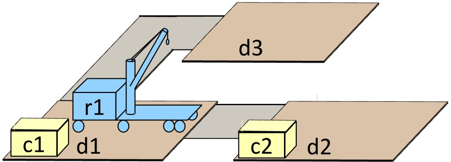

● Mathematically, a function is a set of ordered pairs

s<sub>1</sub> = {(loc(r1), d1), (cargo(r1), nil), (loc(c1), d1) , (loc(c2), d2)}

● Equivalently, write it as a set of ground positive literals (or ground atoms):

$$
s _ {1} = \{\text {loc} (\mathrm{r} 1) = \mathrm{d} 1, \text {cargo} (\mathrm{r} 1) = \text {nil}, \text {loc} (\mathrm{c} 1) = \mathrm{d} 1, \text {loc} (\mathrm{c} 2) = \mathrm{d} 2 \}
$$

▸ Here, we’re using $\text{" } =  \text{" }$ as a predicate symbol

<!-- page: 14 -->

## Action Schemas

<div class="docvortex-algorithm" style="white-space: pre-wrap; font-family:monospace;">
- Action schema (or template): parameterized set of actions
  $\alpha =$ (head, pre, eff, cost)
  - head: name, parameters
  - pre: precondition literals
  - eff: effect literals
  - cost: a number (optional, default is 1)
- e.g.,
  - head = take(r,l,c)
  - pre = {cargo(r)=nil, loc(r)=l, loc(c)=l}
  - eff = {cargo(r)=c, loc(c)=r}
- Each parameter has a range of possible values:
  - Range(r) = Robots = {r1}
  - Range(l) = Locs = {d1,d2,d3}
  - Range(l) = Range(m) = Locs = {d1,d2,d3}
  - Range(c) = Containers = {c1,c2}
</div>


```txt
We’ll usually write it more like pseudocode:
    move(r,l,m)
        pre: loc(r)=l, adjacent(l,m)
        eff: loc(r) ← m
    the target of the assignment
    take(r,l,c)
        pre: cargo(r)=nil, loc(r)=l, loc(c)=l
        eff: cargo(r) ← c, loc(c) ← r
    put(r,l,c)
        pre: loc(r)=l, loc(c)=r
        eff: cargo(r) ← nil, loc(c) ← l
    r ∈ Robots = {r1}
    l,m ∈ Locs = {d1,d2,d3}
    c ∈ Containers = {c1,c2}
```

<!-- page: 15 -->

<div class="docvortex-algorithm" style="white-space: pre-wrap; font-family:monospace;">
- $\mathcal{A} =$ set of action schemas
  move(r,l,m)
    pre: loc(r)=l, adjacent(l, m)
    eff: loc(r) ← m

  take(r,l,c)
    pre: cargo(r)=nil, loc(r)=l, loc(c)=l
    eff: cargo(r) ← c, loc(c) ← r

  put(r,l,c)
    pre: loc(r)=l, loc(c)=r
    eff: cargo(r) ← nil, loc(c) ← l

  r ∈ Robots = {r1}
  l,m ∈ Locs = {d1,d2,d3}
  c ∈ Containers = {c1,c2}

  Action: ground instance of an $\alpha \in \mathcal{A}$
    replace each parameter with something in its range
  $A =$ {all actions we can get from $\mathcal{A}$}
    = {all ground instances of members of $\mathcal{A}$}

  move(r1,d1,d2)
    pre: loc(r1)=d1, adjacent(d1,d2)
    eff: loc(r1) ← d2
</div>

## Actions

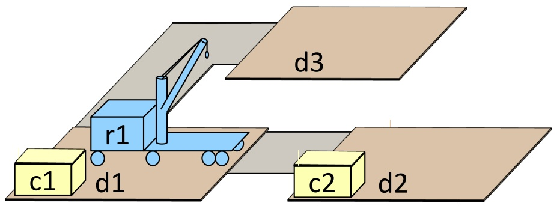

<!-- page: 16 -->

## Actions

<div class="docvortex-algorithm" style="white-space: pre-wrap; font-family:monospace;">
- $\mathcal{A}$ = set of action schemas
    move(r,l,m)
        pre: loc(r)=l, adjacent(l, m)
        eff: loc(r) ← m
    take(r,l,c)
        pre: cargo(r)=nil, loc(r)=l, loc(c)=l
        eff: cargo(r) ← c, loc(c) ← r
    put(r,l,c)
        pre: loc(r)=l, loc(c)=r
        eff: cargo(r) ← nil, loc(c) ← l
    r ∈ Robots = {r1}
    l,m ∈ Locs = {d1,d2,d3}
    c ∈ Containers = {c1,c2}
    A = {the action schemas on this page}
    A = {all ground instances of members of A}
    How many move actions in A?
    Action: ground instance a of an action schema $a \in \mathcal{A}$ such that no state variable is a target of more than one effect eff(a)
        A = {all actions we can derive from A}
            = {all ground instances of members of A}
    move(r1,d1,d2)
        pre: loc(r1)=d1, adjacent(d1,d2)
        eff: loc(r1) ← d2
    We’ll normally refer to an action by writing its head
    move(r1,d1,d2)
    Poll. Let:
        A = {the action schemas on this page}
        A = {all ground instances of members of A}
    How many move actions in A?
Answers:
A. 1 F. 6
B. 2 G. 7
C. 3 H. 8
D. 4 I. 9
E. 5 J. other
</div>

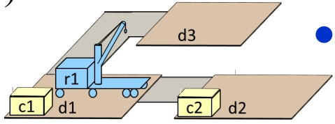

<!-- page: 17 -->

```txt
adjacent = {(d1,d2), (d2,d1), (d1,d3), (d3,d1)}
```

## Applicability

O a is applicable in s if

▸ for every positive literal l ∈ pre(a), l ∈ s or l is in one of the rigid relations

▸ for every negative literal ¬l ∈ pre(a), l ∉ s and l isn’t in any of the rigid relations

## ● Rigid relation

● State

<div class="docvortex-algorithm" style="white-space: pre-wrap; font-family:monospace;">
$s_1 = \{\text{loc}(r1) = d1, \text{cargo}(r1) = nil, \text{loc}(c1) = d1,$
</div>

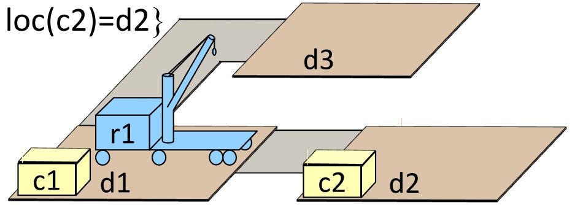

```txt
- Action schema
    move(r,l,m)
        pre: loc(r)=l, adjacent(l, m)
        eff: loc(r) ← m
    r ∈ Robots = {r1}
    l,m ∈ Locs = {d1,d2,d3}
```

```yaml
- Applicable:
    move(r1,d1,d2)
      pre: loc(r1)=d1, adjacent(d1,d2)
      eff: loc(r1) ← d2
```

```python
- Not applicable:
    move(r1,d2,d1)
      pre: loc(r1)=d2, adjacent(d2,d1)
      eff: loc(r1) ← d1
```

<table><tr><td colspan="2">Poll: How many move actions are applicable in  $s_1$ ?</td></tr><tr><td>A. 1</td><td>F. 6</td></tr><tr><td>B. 2</td><td>G. 7</td></tr><tr><td>C. 3</td><td>H. 8</td></tr><tr><td>D. 4</td><td>I. 9</td></tr><tr><td>E. 5</td><td>J. other</td></tr></table>

<!-- page: 18 -->

## Applying an Action

● If a is applicable in s:

<div class="docvortex-algorithm" style="white-space: pre-wrap; font-family:monospace;">
$\gamma (s,a) = \{x = w\mid \mathrm{eff}(a)$ contains $x\gets w\}$ $\cup \{x = w\mid x$ isn't a target in $\operatorname {eff}(a)\}$
</div>

<div class="docvortex-algorithm" style="white-space: pre-wrap; font-family:monospace;">
- $s_2 = \{ \text{loc}(r1) = d2, \text{cargo}(r1) = nil, \text{loc}(c1) = d1, \text{loc}(c2) = d2 \}$
</div>

<div class="docvortex-algorithm" style="white-space: pre-wrap; font-family:monospace;">
- $a = \text{take}(r1, c2, d2)$
    pre: cargo(r1)=nil, loc(r1)=d2, loc(c2)=d2
    eff: cargo(r1) ← c2, loc(c2) ← r1
</div>

<div class="docvortex-algorithm" style="white-space: pre-wrap; font-family:monospace;">
- $\gamma(s_2, \text{take}(r1, c2, d2)) = \{\text{loc}(r1) = d2, \text{loc}(c1) = d1, \text{cargo}(r1) = c2, \text{loc}(c2) = r1\}$
  from $s_2$    from eff(a)
</div>

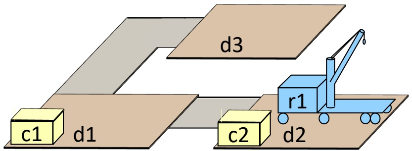

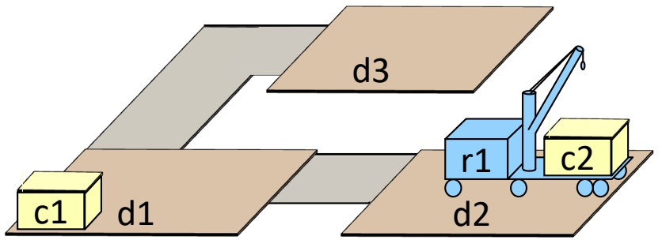

<!-- page: 19 -->

## Applying a Plan

A plan π is applicable in a state s if we can apply the actions in the order that they appear in π

● This produces a sequence of states

● γ(s,π) = the last state in the sequence

$$
\pi = \langle \text {move} (r 1, d 3, d 1), \text {take} (r 1, c 1, d 1), \text {move} (r 1, d 1, d 3) \rangle
$$

$$
\gamma (s _ {0}, \pi) = s _ {3}
$$

$$
\widehat {\gamma} = \langle s _ {0}, s _ {1}, s _ {2}, s _ {3} \rangle
$$

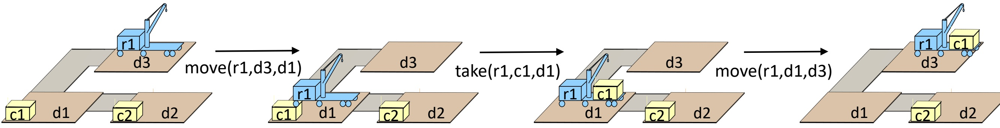

$$
\begin{array}{c} s _ {0} = \{\text {loc} (r 1) = d 3, \\ \text {cargo} (r 1) = \text {nil}, \\ \text {loc} (c 1) = d 1, \\ \text {loc} (c 2) = d 2 \} \end{array}
$$

$$
\begin{array}{c} s _ {1} = \{\text {loc} (r 1) = d 1, \\ \text {cargo} (r 1) = \text {nil}, \\ \text {loc} (c 1) = d 1, \\ \text {loc} (c 2) = d 2 \} \end{array}
$$

$$
\begin{array}{c} s _ {2} = \{\text {loc} (r 1) = \mathrm{d} 1, \\ \text {cargo} (r 1) = \mathrm{c} 1, \\ \text {loc} (\mathrm{c} 1) = \mathrm{r} 1, \\ \text {loc} (\mathrm{c} 2) = \mathrm{d} 2 \} \end{array}
$$

$$
\begin{array}{r l} s _ {3} = & \{\text {loc} (r 1) = \mathrm{d} 3, \\ & \text {cargo} (r 1) = \mathrm{c} 1, \\ & \text {loc} (\mathrm{c} 1) = \mathrm{r} 1, \\ & \text {loc} (\mathrm{c} 2) = \mathrm{d} 2 \} \end{array}
$$

<!-- page: 20 -->

## State-Variable Planning Domain

● Let

O = ontology of typed objects

▸ R = set of rigid relations

▸ X = set of lifted state variables, including specifications of their ranges

A = finite set of action schemas

● (O, R, X, A) represents $\Sigma   =   ( S , A , \gamma , \mathrm { c o s t } )$ , where

A = {all actions induced by A}

▸ $\gamma ( s , a ) = \{ x = w \mid \operatorname { e f f } ( a )$ contains x←w} ∪ {x=w | x isn’t a target in eff(a)}

▸ cost(.) is as specified in the action schemas

▸ $S = \mathrm { a l l }$ states $\{ x _ { 1 } = v _ { 1 } , \ldots , x _ { n } = v _ { n } \}$ , where

• $\{ x _ { 1 } ,   \ldots ,   x _ { n } \} = \{ \mathrm { a l l }$ of the ground instances of members of X}

• each $\nu _ { i }$ is an object in Range(x<sub>i</sub>)

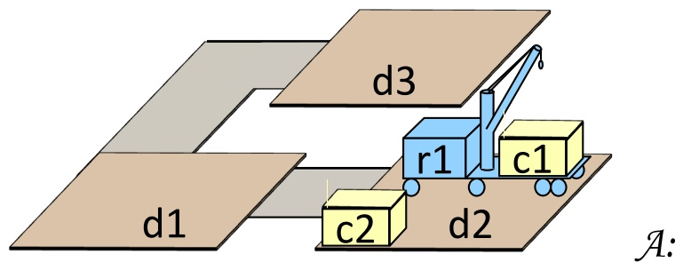

<div class="docvortex-algorithm" style="white-space: pre-wrap; font-family:monospace;">
$O:\left\{\begin{array}{l}Objects = Robots \cup Containers\\ \cup Locs \cup \{nil\}\\ Robots = \{r1\}\\Containers = \{c1, c2\}\\Locs = \{d1, d2, d3\}\end{array}\right.$
$R:\left\{\begin{array}{l}adjacent = \{(d1,d2), (d2,d1),\\ (d1,d3), (d3,d1)\}\end{array}\right.$
$X:\left\{\begin{array}{l}loc(c) \in Locs \cup Robots,\\ loc(r) \in Locs,\\ cargo(r) \in Containers \cup \{nil\}\\ where c \in Containers, r \in Robots\end{array}\right.$
$A:\left\{\begin{array}{l}move(r,l,m)\\ pre: loc(r)=l, adjacent(l, m)\\ eff: loc(r) \leftarrow m\\ take(r,c,l)\\ pre: cargo(r)=nil,\\ loc(r)=l, loc(c)=l\\ eff: cargo(r) \leftarrow c, loc(c) \leftarrow r\\ put(r,c,l)\\ pre: loc(r)=l, loc(c)=r\\ eff: cargo(r) \leftarrow nil, loc(c) \leftarrow l\end{array}\right.$
</div>

<!-- page: 21 -->

## State-Variable Planning Domain

● $S = \mathrm { a l l }$ states $\{ x _ { 1 } = v _ { 1 } , \ldots , x _ { n } = v _ { n } \}$ , where

▸ $\{ x _ { 1 } ,   \ldots ,   x _ { n } \} = \{ \mathrm { a l l }$ of the ground instances of members of $\hat { X } \}$

▸ each $\nu _ { i }$ is an object in Range(𝑥!i)

● S may contain some nonsensical states

▸ $\mathbf { e . g . } ,$ states in which both $\log ( c 1 ) = r 1$ and cargo(r1)=nil

But if $s _ { 0 }$ and $\mathcal { A }$ are defined properly, applying a plan in $s _ { 0 }$ will never generate a nonsensical state


<div class="docvortex-algorithm" style="white-space: pre-wrap; font-family:monospace;">
$O:\begin{cases}Objects = Robots \cup Containers \\ \cup Locs \cup \{\text{nil}\} \\ Robots = \{\text{r1}\} \\ Containers = \{\text{c1}, \text{c2}\} \\ Locs = \{\text{d1}, \text{d2}, \text{d3}\}\end{cases}$
$R:\begin{cases}adjacent = \{(d1,d2), (d2,d1), (d1,d3), (d3,d1)\}\end{cases}$
$X:\begin{cases}loc(c) \in Locs \cup Robots, \\ loc(r) \in Locs, \\ cargo(r) \in Containers \cup \{\text{nil}\} \\ where c \in Containers, r \in Robots\end{cases}$
$\mathcal{A}:\\ \begin{cases}move(r,l,m) \\ pre: loc(r)=l, adjacent(l, m) \\ eff: loc(r) \leftarrow m \\ take(r,c,l) \\ pre: cargo(r)=nil, \\ loc(r)=l, loc(c)=l \\ eff: cargo(r) \leftarrow c, loc(c) \leftarrow r \\ put(r,c,l) \\ pre: loc(r)=l, loc(c)=r \\ eff: cargo(r) \leftarrow nil, loc(c) \leftarrow l\end{cases}$
</div>

<!-- page: 22 -->

## State-Variable Planning Problem

● $P = ( \Sigma , s _ { 0 } , g ) ,$ , where

▸ $\Sigma = \mathrm { i s } \; { \bf a }$ state-variable planning domain

▸ $s _ { 0 } \in S$ is the initial state

▸ g is a set of ground literals called the goal

● $S _ { g } = \{ \mathrm { a l l }$ states in S that satisfy g} $= \{ s \in S \mid s \cup R$ contains every positive literal in g, and none of the negative literals in g}

● π is a solution for $P \operatorname { i f } \gamma ( s _ { 0 } , \pi )$ satisfies g

<table><tr><td colspan="3">Poll: How many solutions of length 3?</td></tr><tr><td>A. 1</td><td>B. 2</td><td>C. 3</td></tr><tr><td>D. 4</td><td>E. 5</td><td>F. 6</td></tr><tr><td>G. 7</td><td>H. 8</td><td>I. 9</td></tr><tr><td colspan="3">J. other</td></tr></table>

$$
g = \{\text {loc} (\mathrm{c1}) = \mathrm{d1} \}
$$

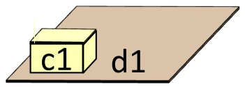

R:

X:

s<sub>0</sub> = {loc(r1)=d2, cargo(r1)=c1, loc(c1)=r1, loc(c2)=d2}

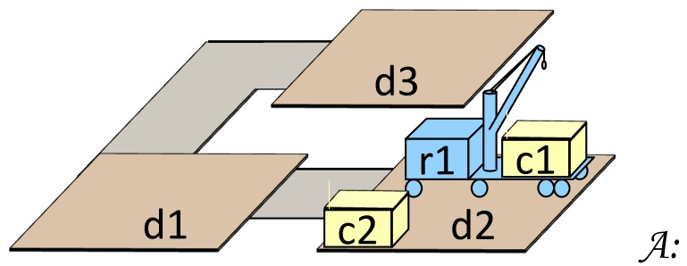

ámove(r1,d2,d1), put(r1,c1,d1)ñ is a solution of length 2

<div class="docvortex-algorithm" style="white-space: pre-wrap; font-family:monospace;">
$O:\left\{\begin{array}{l}Objects=Robots\cup Containers\\ \cup Locs\cup\{nil\}\\ Robots=\{r1\}\\ Containers=\{c1,c2\}\\ Locs=\{d1,d2,d3\}\end{array}\right.$
</div>

$$
\left\{ \begin{array}{c} \text {adjacent} = \{(d 1, d 2), (d 2, d 1), \\ (d 1, d 3), (d 3, d 1) \} \end{array} \right.
$$

```txt
move(r,l,m)
    pre: loc(r)=l, adjacent(l, m)
    eff: loc(r) ← m
take(r,c,l)
    pre: cargo(r)=nil,
        loc(r)=l, loc(c)=l
    eff: cargo(r) ← c, loc(c) ← r
put(r,c,l)
    pre: loc(r)=l, loc(c)=r
    eff: cargo(r) ← nil, loc(c) ← l
```

<!-- page: 23 -->

## Section 2.3. Acting

● For classical planning problems we assumed

Finite, static world, just one actor

• No concurrent actions, no explicit time

Determinism, no uncertainty, no exogeneous events

• Full observability

Unit-cost actions

▸ Sequence of states and actions $\langle s _ { 0 } , a _ { 1 } , s _ { 1 } , a _ { 2 } , s _ { 2 } , \ldots \rangle$

Most real-world environments don’t satisfy the assumptions because of errors in prediction

● This can usually be fine if

▸ errors occur infrequently, and

▸ they don’t have severe consequences

● What to do if an error does occur?

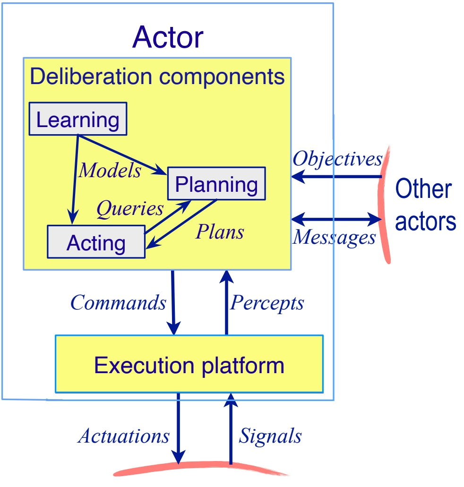

External World

<!-- page: 24 -->

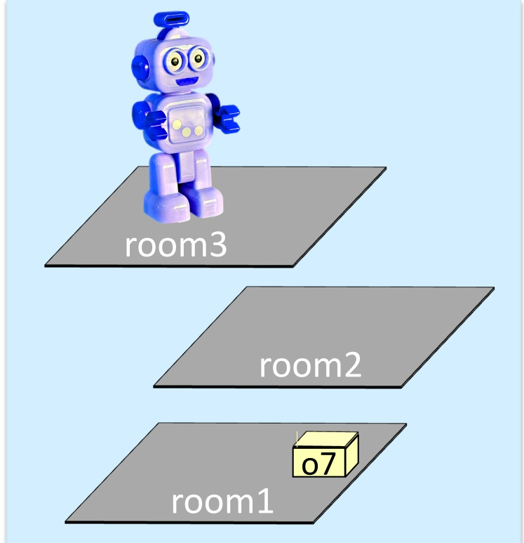

```txt
pre: adjacent(l,m), loc(r)=l
eff: loc(r) ← m
```

```txt
take(r,o,l)
    pre: loc(r)=l, loc(o)=l,
        cargo(r)=nil
    eff: loc(o) ← r, cargo(r) ← o
```

## Service Robot

$$
a _ {2} = \text {navigate} (r 1, \text {hall}, \text {room} 1)
$$

$$
a _ {3} = \text {take} (\mathrm{r1,o7,room1})
$$

$$
a _ {4} = \text {navigate} (r 1, \text {room1}, \text {room2})
$$

ignores how to get from l to m, e.g., opening the door

ignores how do navigation, localization

ignores how to grasp o, lift it, put it down

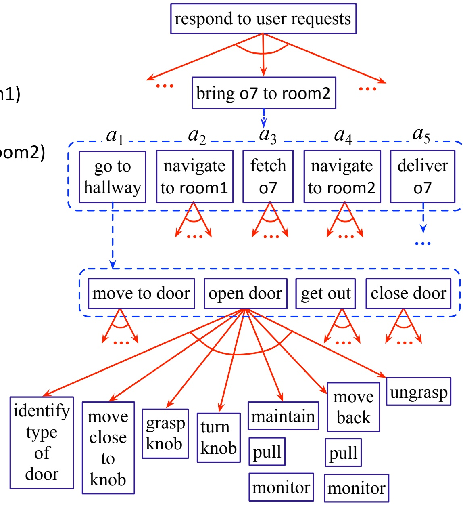

<!-- page: 25 -->

## Service Robot

```txt
go(r,l,m)
pre: adjacent(l,m), loc(r)=l
eff: loc(r) ← m

navigate(r,l,m)
pre: ¬adjacent(l, m), loc(r)=l
eff: loc(r) ← m

take(r,o,l)
pre: loc(r)=l, loc(o)=l,
cargo(r)=nil
eff: loc(o) ← r, cargo(r) ← o
```

<div class="docvortex-algorithm" style="white-space: pre-wrap; font-family:monospace;">
$\pi = \langle a_1, a_2, a_3, a_4, a_5 \rangle$  
$a_1 = \text{go}(\text{r1}, \text{room3}, \text{hall})$  
$a_2 = \text{navigate}(\text{r1}, \text{hall}, \text{room1})$  
$a_3 = \text{take}(\text{r1}, o7, \text{room1})$  
$a_4 = \text{navigate}(\text{r1}, \text{room1}, \text{room2})$  
$a_5 = \text{put}(\text{r1}, o7, \text{room2}) \rangle$  

Some things that can go wrong:  
Execution failures  
robot gripper slips on doorknob  
door is locked or broken  
Sensor errors  
navigation error causes robot to go to wrong room  
Incorrect or partial information  
where is o7?  
Events that make actions inapplicable  
someone puts object o6 onto r1  
Events that make actions unnecessary  
someone puts object o7 onto r1  
How to detect and recover?
</div>

<!-- page: 26 -->

## Acting with Lookahead

## Run-Lookahead(Σ, g)

s ← abstraction of observed state $\xi$

while s ⊭ g do

π ← Lookahead(Σ, s, g)

the planner

if π = failure then return failure

a ← pop-first-action(π); perform(a)

s ← abstraction of observed state ξ

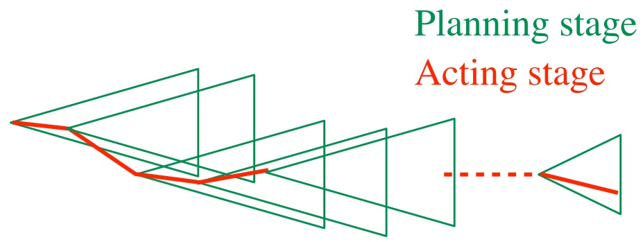

Call Lookahead, obtain π, perform 1<sup>st</sup> action, call Lookahead again …

Useful when unpredictable things are likely to happen

▸ Replans immediately

● Also useful with receding horizon search (e.g., as in chess programs):

Lookahead looks a limited distance ahead

Potential problem:

▸ Lookahead needs to return quickly

Otherwise, may pause repeatedly while waiting for Lookahead to return

▸ What if ξ changes during the wait?

<!-- page: 27 -->

## Acting with Lookahead

```txt
Run-Lazy-Lookahead(Σ, g)
    π ← ⟨⟩
    while True do
        s ← abstraction of observed state ξ
        if s ⊆ g then return success
        if π = ⟨⟩ or Simulate(Σ, s, g, π) = failure then
            π ← Lookahead(Σ, s, g)
            if π = failure then return failure
        a ← pop-first-action(π)
        perform(a)
```

Planning Stage Acting Stage

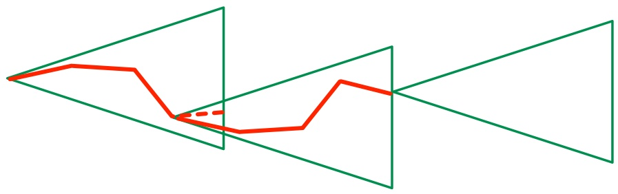

Call Lookahead, execute the plan as far as possible, don’t call Lookahead again unless necessary

● Simulate tests whether the plan will execute correctly

▸ Could do lower-level refinement, physics-based simulation

▸ Could just test whether $\gamma ( s , \pi ) \vDash g$

▸ Or just test whether $s = \gamma ( s ^ { \prime } , a )$ , where s′ is the previous state

● Potential problems

▸ Simulate needs to return quickly

• otherwise, may pause repeatedly, ξ may change

▸ May might miss opportunities to replace π with a better plan

**Poll**: Assuming no action failures during acting, which approach does more work, in terms of planning: Run-Lazy-Lookahead or Run-Lookahead?

A. Run-Lazy-Lookahead

C. Equal amounts

B. Run-Lookahead

D. Unsure

<!-- page: 28 -->

## Acting with Plan Repair

<div class="docvortex-algorithm" style="white-space: pre-wrap; font-family:monospace;">
- We may want to repair $\pi$ rather than get a new plan
  e.g., if we've already made commitments or resource allocations
- Modify Run-Lazy-Lookahead

Run-Lazy-Lookahead($\Sigma$, g)
    $\pi \leftarrow \langle\rangle$
    while True do
      $s \leftarrow$ abstraction of observed state $\xi$
      if $s \models g$ then return success
      if $\pi = \langle\rangle$ or Simulate($\Sigma$, s, g, $\pi$) = failure then
        $\pi \leftarrow$ Lookahead-Repair($\Sigma$, s, g, $\pi$)
        if $\pi =$ failure then return failure
      $a \leftarrow$ pop-first-action($\pi$)
      perform(a)
</div>

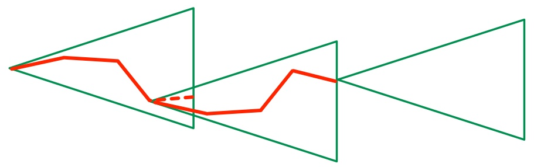

<!-- page: 29 -->

Planning stage Acting stage

## How to do Lookahead

Some possibilities (can also combine these)

● **Full planning** (if the planner can solve the planning problem quickly enough)

## ● Receding horizon

▸ Modify Lookahead to search just part of the way to g

▸ E.g., cut off search when one of the following exceeds a maximum threshold:

• plan length, plan cost, computation time

## ● Sampling

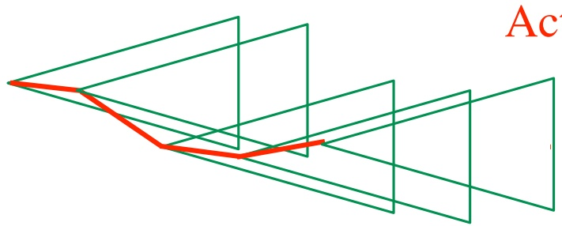

▸ Modify Lookahead to do a Monte Carlo rollout

• Depth-first search with random node selection and no backtracking

▸ Call Lookahead several times, choose the plan that looks best

▸ Best-known example of this: the UCT algorithm (see Chapter 9)

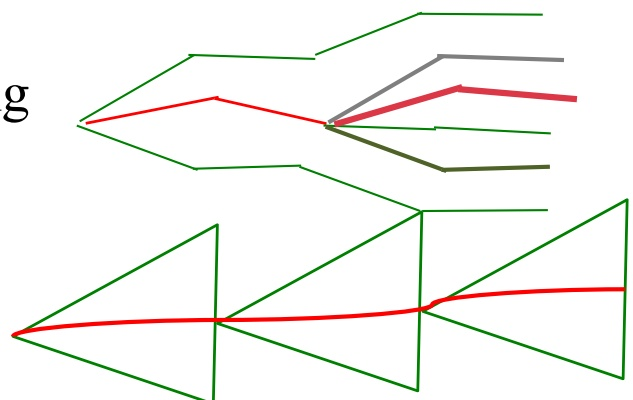

## ● Subgoaling

▸ Tell Lookahead to plan for some subgoal $g _ { 1 }$ , rather than g itself (see next page)

▸ Once the actor has achieved $g _ { 1 } ,$ tell Lookahead to plan for the next subgoal $g _ { 2 }$

▸ And so forth until the actor reaches g

<!-- page: 30 -->

## Subgoaling Example

## ● Killzone 2

▸ “First-person shooter” game, ≈ 2009

▸ widely acclaimed at the time

● Special-purpose AI planner

▸ Plans enemy actions at the squad level

• Subproblems; plans are maybe 4–6 actions long

▸ Different planning algorithm from what we’ve discussed so far

▸ HTN planning (see Part II)

• Quickly generates a plan for a subgoal

• Replans several times per second as the world changes

Why it worked:

▸ Don’t want to get the best possible plan

▸ Need actions that appear believable and consistent to human users

▸ Need them very quickly


<!-- page: 31 -->

## Classical Representation

## ● Motivation

▸ The field of AI planning started out as automated theorem proving

It still uses a lot of that notation

Classical representation is equivalent to state-variable representation

▸ No distinction between rigid and varying properties

▸ Both represented as logical predicates

▸ Both are in the current state

```txt
adjacent(l,m) - location l is adjacent to m
loc(r)=l → loc(r,l) - robot r is at location l
loc(c)=r → loc(c,r) - container c is on robot r
cargo(r)=c → loaded(r) - there's a container on r
why not loaded(r,c)?
```

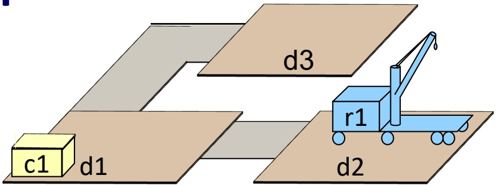

● State s = a set of ground atoms

▸ Atom a is true in s iff $a \in s$

$s _ { 0 }$ = {adjacent(d1,d2), adjacent(d2,d1), adjacent(d1,d3), adjacent(d3,d1), loc(c1,d1), loc(r1,d2)}

<div class="docvortex-algorithm" style="white-space: pre-wrap; font-family:monospace;">
Poll: Should $s_0$ also contain
    $\neg$ loaded(r1)?
A: yes    B: no
C: unsure
</div>

<!-- page: 32 -->

## Classical planning operators

```txt
action schemas

move(r,l,m)
    pre: loc(r)=l, adjacent(l, m)
    eff: loc(r) ← m

take(r,c,l)
    pre: cargo(r)=nil, loc(r)=l, loc(c)=l
    eff: cargo(r) ← c, loc(c) ← r

put(r,c,l)
    pre: loc(r)=l, loc(c)=r
    eff: cargo(r) ← nil, loc(c) ← l

Range(r) = Robots = {r1}
Range(l) = Range(m) = Locs = {d1,d2,d3}
Range(c) = Containers = {c1,c2}
```

```txt
Classical planning operators
move(r,l,m)
    pre: loc(r,l), adjacent(l, m)
    eff: ¬loc(r,l), loc(r,m)
take(r,c,l)
    pre: ¬loaded(r), loc(r,l), loc(c,l)
    eff: loaded(r), ¬loc(c,l), loc(c,r)
put(r,c,l)
    pre: loc(r,l), loc(c,r)
    eff: ¬loaded(r), loc(c,l), ¬loc(c,r)
```

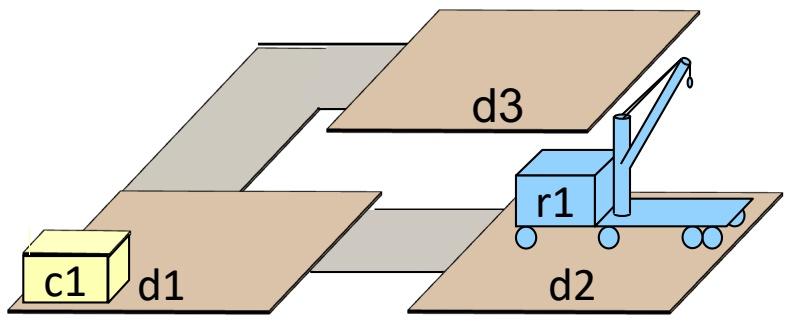

<!-- page: 33 -->

## Classical Actions

```txt
- Planning operator:
  o: move(r,l,m)
    pre: loc(r,l), adjacent(l,m)
    eff: ¬loc(r,l), loc(r,m)

- Action:
  a1: move(r1,d2,d1)
    pre: loc(r1,d2), adjacent(d2,d1)
    eff: ¬loc(r1,d2), loc(r1,d1)

s0 = {adjacent(d1,d2),
    adjacent(d2,d1),
    adjacent(d1,d3),
    adjacent(d3,d1),
    loc(c1,d1),
    loc(r1,d2)}
```

<div class="docvortex-algorithm" style="white-space: pre-wrap; font-family:monospace;">
- Let
  - pre$^{-}(a) = \{a's negated preconditions\}$
  - pre$^{+}(a) = \{a's non-negated preconditions\}$
</div>

<div class="docvortex-algorithm" style="white-space: pre-wrap; font-family:monospace;">
- $a$ is applicable in state $s$ iff
    $s \cap \text{pre}^{-}(a) = \emptyset$ and $\text{pre}^{+}(a) \subseteq s$
</div>

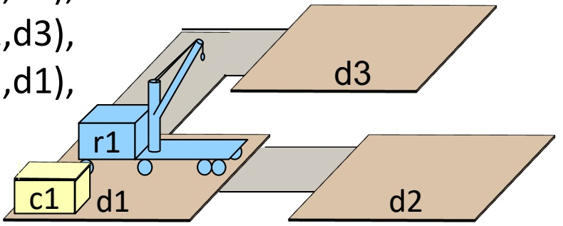

<!-- page: 34 -->

## Discussion

$$
x (b _ {1}, \dots , b _ {n - 1}) = b _ {n} \Rightarrow P _ {x} (b _ {1}, \dots , b _ {n - 1}, b _ {n})
$$

State-variable

Classical

rep.

$$
x _ {P} (b _ {1}, \dots , b _ {k}) = 1 \Leftarrow P (b _ {1}, \dots , b _ {k})
$$

rep.

● Equivalent expressive power

▸ Each can be converted to the other in linear time and space

**Poll**: Could we instead use

$$
x _ {\mathrm{P}} (b _ {1}, \dots , b _ {k - 1}) = b _ {k}?
$$

● Classical representation

▸ More natural for logicians

A: yes B: no

▸ Don’t require single-valued functions

C: unsure

State variables

▸ More natural for engineers and computer programmers

▸ When changing a value, don’t have to explicitly delete the old one

● Historically, classical representation has been more widely used

▸ That’s starting to change

<!-- page: 35 -->

● Original version of PDDL ≈ 1996**Series Editors:** Ronald J. Brachman, Jacobs

▸ Just classical planningAn Introductio

● Multiple revisions and extensions**Nir Lipovetzky**, University of Melbourne**Daniele Magazzeni**, King’s College London

▸ Different subsets accommodatePlanning is the branch of Artificial Intelligence (AIimportantly the reasoning that goes into formulating different kinds of planningthe actions available to change it, and taccomplish the goal when executed fr

● We’ll discuss the classical-planning subsetcovering the subsets of PDDL that express discrete, numeric, temporal, and want to introduce readers to the art of modelling planning problems in this la

Chapter 2 of the PDDL bookthose who want to be able to use AI planning simplementation techniques they use.

## An Introduction to the


Patrik Haslum

Nir Lipovetzky

Daniele Magazzeni

Christian Muise

SYNTHESIS LECTURES ON ARTIFICIAL INTELLIGENCE AND MACHINE LEARNING

Ronald J. Brachman, Francesca Rossi, and Peter Stone, Series Editors

<!-- page: 36 -->

```lisp
(define (domain example-domain-1)
  (requirements :negative-preconditions)

  (:action move
    :parameters (?r ?l ?m)
    :precondition (and (loc ?r ?l)
                   (adjacent ?l ?m))
    :effect (and (not (loc ?r ?l))
                   (loc ?r ?m)))

  (:action take
    :parameters (?r ?l ?c)
    :precondition (and (loc ?r ?l)
                   (loc ?c ?l)
                   (not (loaded ?r)))
    :effect (and (not (loc ?c ?l))
                   (loc ?c ?r)
                   (loaded ?r)))

  (:action put
    :parameters (?r ?l ?c)
    :precondition (and (loc ?r ?l)
                   (loc ?c ?r))
    :effect (and (loc ?c ?l)
                   (not (loc ?c ?r))
                   (not (loaded ?r)))))

Initial state:
      d3
      r1
      d2

Goal:
      r1 c1
  (define (problem example-problem-1)
  (:domain example-domain-1))

  (:init
    (adjacent d1 d2)
    (adjacent d2 d1)
    (adjacent d1 d3)
    (adjacent d3 d1)
    (loc c1 d1)
    (loc r1 d2)

  (:goal (loc c1 r1)))
```

## Example domain

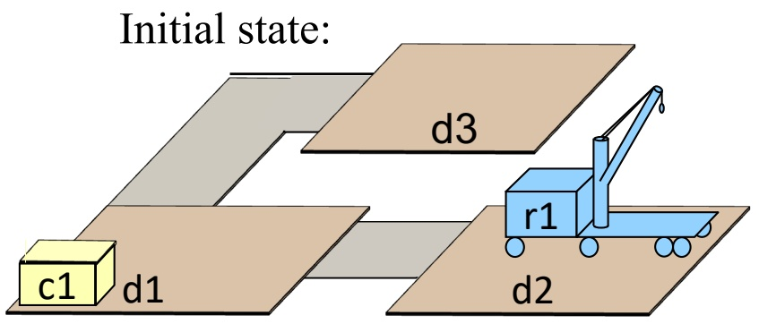

<!-- page: 37 -->

## Example problem

● Classical representation:

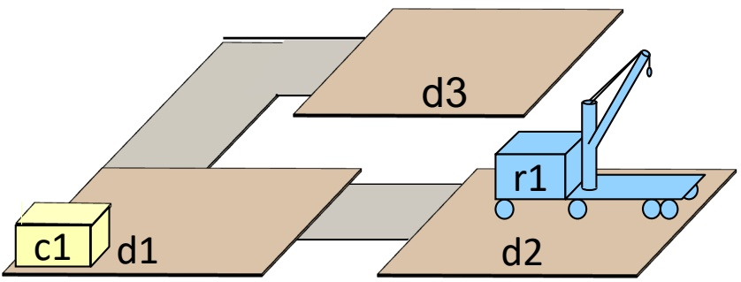

s<sub>0</sub> = {adjacent(d1,d2), adjacent(d2,d1), adjacent(d1,d3), adjacent(d3,d1), loc(c1,d1), loc(r1,d2)}

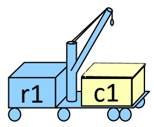

$$
g = \{\text {loc} (c 1, r 1) \}
$$

(define (problem example-problem-1) (:domain example-domain-1))

(:init (adjacent d1 d2) (adjacent d2 d1) (adjacent d1 d3) (adjacent d3 d1) (loc c1 d1) (loc r1 d2)

(:goal (loc c1 r1)))

<!-- page: 38 -->

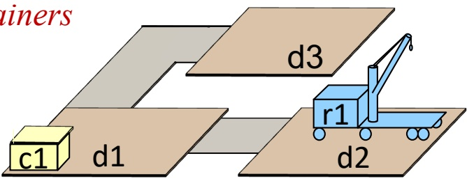

```lisp
Typed domain
State-variable representation:
  Objects = Movable_objects ∪ Locs
  Movable_objects = Robots ∪ Containers
  Robots = {r1}
  Containers = {c1}
  Locs = {d1, d2, d3}
  r ∈ Robots, l,m ∈ Locs, c ∈ Containers
(define (domain example-domain-2)
  (:requirements
      :negative-preconditions
      :typing)
  (:types
    location movable-obj - object
    robot container - movable-obj)
  (:predicates
    (loc ?r - movable-obj
      ?l - location)
    (loaded ?r - robot)
    (adjacent ?l ?m - location))
(:action move
  :parameters (?r - robot
        ?l ?m - location)
  :precondition (and (loc ?r ?l)
        (adjacent ?l ?m))
  :effect (and (not (loc ?r ?l))
        (loc ?r ?m)))
(:action take
  :parameters (?r - robot
        ?l - location
        ?c - container)
  :precondition (and (loc ?r ?l)
        (loc ?c ?l)
        (not (loaded ?r)))
  :effect (and (not (loc ?r ?l))
        (loc ?r ?m)))
(:action put
  :parameters{(?r - robot
    ?l - location
    ?c - container)
  :precondition (and (loc ?r ?l)
        (loc ?c ?r))
  :effect (and (loc ?c ?l)
        (not (loc ?c ?r))
        (not (loaded ?r))))))
```

<!-- page: 39 -->

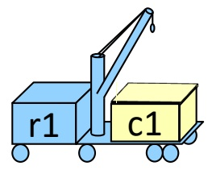

```lisp
(define (problem example-problem-2)
  (:domain example-domain-2))

  (:objects
      r1 - robot
      c1 - container
      d1 d2 d3 - location)

  (:init
    (adjacent d1 d2)
    (adjacent d2 d1)
    (adjacent d1 d3)
    (adjacent d3 d1)
    (loc c1 d1)
    (loc r1 d2)

  (:goal (loc c1 r1)))
```

## Typed problem

State-variable representation:

▸ Objects = Movable\_objects ∪ Locs

▸ Movable\_objects = Robots ∪ Containers

▸ Robots = {r1}

▸ r ∈ Robots, l,m ∈ Locs, c ∈ Containers

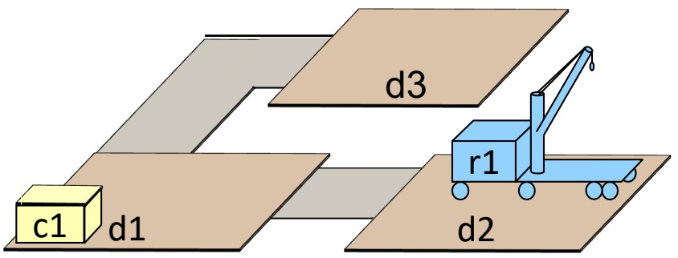

<div class="docvortex-algorithm" style="white-space: pre-wrap; font-family:monospace;">
$s_0 = \{\text{adjacent(d1,d2), adjacent(d2,d1)},$
    adjacent(d1,d3), adjacent(d3,d1),
    loc(c1,d1), loc(r1,d2)\})
</div>

<!-- page: 40 -->

Prof. Gabriel Robins, UVA [https://www.cs.virginia.edu/\~robins/cs6160/](https://www.cs.virginia.edu/~robins/cs6160/)[Lectures](https://www.youtube.com/playlist?list=PL7yS_81K9Sey0zq1qwoLp2OreNYPlk8TF) 19-21 cover the key concepts

## Computational Complexity Refresher

● Computational complexity results are normally given for decision problems

▸ each decision problem is an infinite set of questions with yes/no answers Two decision problems in which P may be any classical planning problem:

▸ PLAN EXISTENCE: does P have a solution?

▸ PLAN LENGTH: does P have a solution of length ≤ 𝑘?

## The Extended Chomsky Hierarchy

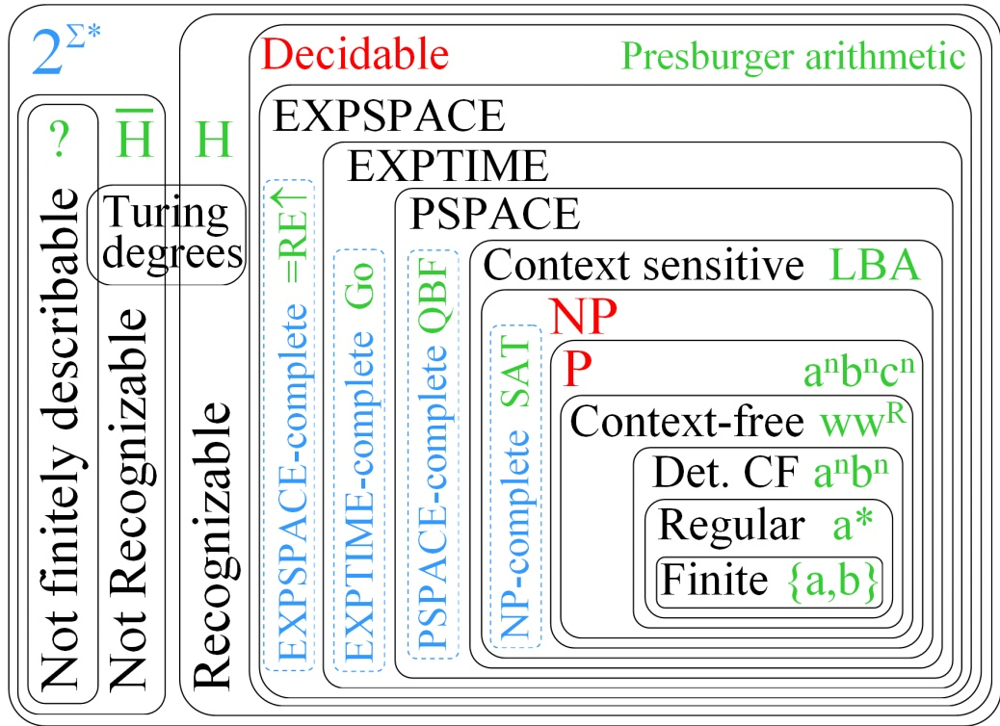

<!-- page: 41 -->

## Section 2.5. Computational Complexity

Suppose P is given in state-variable representation (rather than enumerating S and A explicitly):

PLAN EXISTENCE is EXPSPACE-complete

▸ PLAN LENGTH is NEXPTIME-complete

As a reminder: $\mathsf { P } \sqsubseteq \mathsf { N P } \sqsubseteq \mathsf { P S P A C E } \sqsubseteq \mathsf { E X P T I M E } \sqsubseteq \mathsf { N E X P T I M E } \sqsubseteq \mathsf { E X P S P A C E }$

Need a refresher on complexity? See:

UVA CS 4102 PSPACE and beyond (Bloomfield, 2011)

<u>MIT OpenCourseWare 6.006 Computational Complexity Lecture</u>

MIT OpenCourseWare [6.045 Course, specifically lectures 12, 15, & 16](https://ocw.mit.edu/courses/6-045j-automata-computability-and-complexity-spring-2011/pages/lecture-notes/)

<u>UVA CS 6160 (Robins, 2022)</u>

Lecture slides for [Acting, Planning, and Learning](https://projects.laas.fr/planning/). Creative Commons [CC BY-SA 4.0](https://creativecommons.org/licenses/by-sa/4.0/deed.en)

If we restrict P to be in a fixed planning domain Σ that is known in advance :

▸ Both problems are in PSPACE

▸ PSPACE-complete for some planning domains

These are worst-case results, average case is often much lower (e.g., polynomial)

**Poll**. What is the complexity of PLAN EXISTENCE if P is given by enumerating S and A explicitly?

A. PSPACE-complete C. Polynomial

B. NP-complete D. something else

<!-- page: 42 -->

## Summary

● Section 2.2. State-transition systems

▸ Classical planning assumptions

▸ States, actions, transition function

▸ Plans, planning problems, solutions

▸ Run-Plan

Section 2.3. State-Variable Representation

▸ Objects, rigid properties

▸ Varying properties, state variables, states

▸ Action schemas, actions, applicability, γ

▸ Plans, problems, solutions

● Section 2.4. Classical Representation

● Section 2.5. Computational Complexity

Section 2.6. Acting

▸ Things that can go wrong while acting

▸ Run-Lookahead, Run-Lazy-Lookahead

▸ Plan repair

▸ Interacting with an online planner

• subgoaling, limited horizon, sampling

● Chapter 2 of Haslum et al. (2019)

▸ Classical fragment of PDDL

▸ Planning domains, planning problems

▸ untyped, typed
