<!-- page: 1 -->

## Chapter 3 Planning with Deterministic Models

3.3. Backward Search

3.4. Plan-Space Search

Dana S. Nau

University of Maryland

with contributions from

[Mark “mak” Roberts](https://scholar.google.com/citations?user=vlbX4J8AAAAJ)


## Acting, Planning, and Learning

Malik Ghallab, Dana Nau, and Paolo Traverso

<!-- page: 2 -->

## 3.3. Backward Search

● Forward search: forward from initial state

▸ In state s, choose applicable action a

▸ Compute state transition $s ^ { \prime }   =   \gamma ( s , a )$

Backward search: backward from the goal

▸ For goal g, choose relevant action a

• A possible “last action” before the goal

• Sometimes this has a lower branching factor

● Compute inverse state transition $g ^ { \prime }   =   \gamma ^ { - 1 } ( g ,   a )$

▸ $g ^ { \prime }   =$ properties a state s′ should satisfy in order for $\gamma ( s ^ { \prime } , a )$ to satisfy g

● Equivalently, if $\mathrm { ^ { \circ } S _ { g } } = \mathrm { \{ a l l } }$ states that satisfy g} then ▸ $S _ { g ^ { \prime } } = \{ a \mathrm { l } \}$ states s such that $\gamma ( s , a ) \in S _ { g } \}$

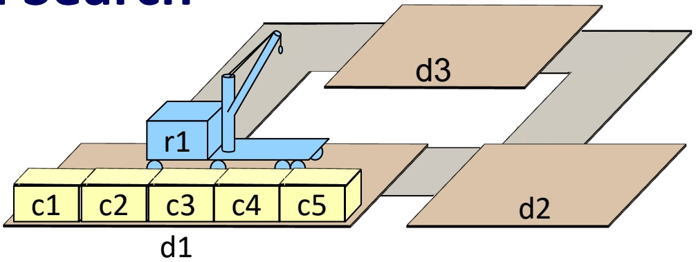

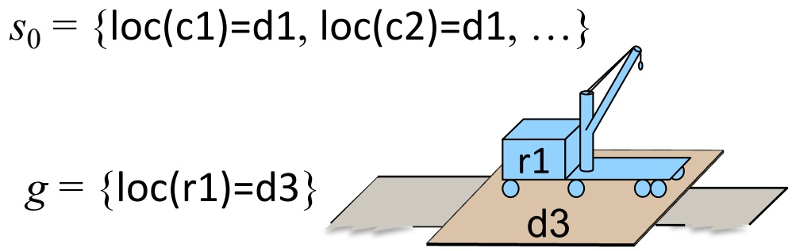

▸ Forward: 7 applicable actions

• five load actions, two move actions

▸ Backward: $g = \{ \mathsf { l o c } ( \mathsf { r } 1 ) \mathsf { = } \mathsf { d } 3 \}$

two relevant actions: move(r1,d1,d3), move(r1,d2,d3)

<!-- page: 3 -->

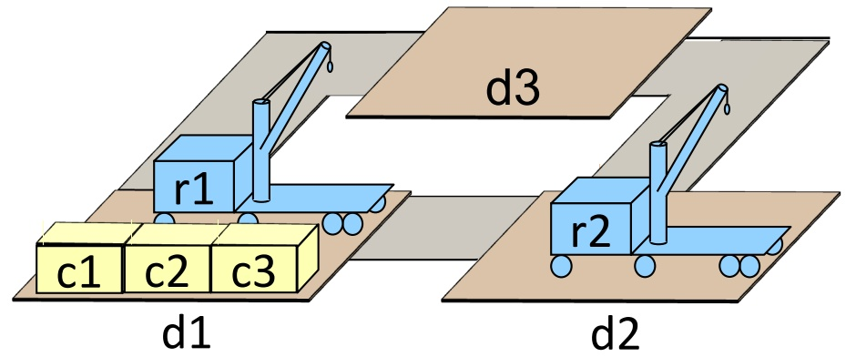

## Relevance

● Idea: when can a be useful as the last action of a plan to achieve $g ^ { \theta }$

▸ a makes at least one atom in g true that wasn’t true already

▸ a doesn’t make any part of g false

● a is relevant for $g = \{ x _ { 1 } = c _ { 1 } , x _ { 2 } = c _ { 2 } , \ldots , x _ { k } = c _ { k } \}$ if

▸ at least one atom in g is also in eff(a)

• e.g., if eff(a) contains $x _ { 1 } \leftarrow c _ { 1 }$

eff(a) doesn’t make any atom in g false

• e.g., eff(a) must not contain $x _ { 2 }   \leftarrow   { c _ { 2 } } ^ { \prime }$ (where ${ c _ { 2 } } ^ { \prime } \neq c _ { 2 } )$

▸ whenever pre(a) requires an atom of g to be false, eff(a) makes the atom true

• e.g., if pre(a) contains $x _ { 3 } = { c _ { 3 } } ^ { \prime }$ (where ${ c _ { 3 } } ^ { \prime } \neq c _ { 3 } )$ then eff(a) must contain $x _ { 3 } \leftarrow c _ { 3 }$

$$
s = \{\text {loc} (\mathrm{c} 1) = \mathrm{d} 1, \text {loc} (\mathrm{c} 2) = \mathrm{d} 1, \text {loc} (\mathrm{c} 3) = \mathrm{d} 1,
$$

$$
\operatorname{loc} (r 1) = d 2, \text {cargo} (r 1) = \text {nil},
$$

$$
\text {loc} (r 2) = d 2, \text {cargo} (r 2) = \text {nil}\}
$$

load $( r , c , l )$

pre: $\mathsf { c a r g o } ( r ) { = } \mathsf { n i l } , \mathsf { l o c } ( r ) { = } l , \mathsf { l o c } ( c ) { = } l$

eff: c ${ \mathsf { i a r g o } } ( r ) \leftarrow c ,   { \mathsf { I o c } } ( c ) \leftarrow r$

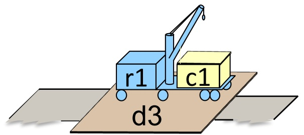

$$
g = \{\text {cargo} (r 1) = c 1, \text {loc} (r 1) = d 3 \}
$$

<!-- page: 4 -->

```lua
move(r,l,m)
pre: loc(r)=l, adjacent(l,m)
eff: loc(r) ← m

load(r,c,l)
pre: cargo(r)=nil, loc(r)=l, loc(c)=l
eff: cargo(r) ← c, loc(c) ← r

put(r,l,c)
pre: loc(r)=l, loc(c)=r
eff: cargo(r) ← nil, loc(c) ← l

Range(r) = Robots = {r1,r2}
Range(l) = Range(m) = Locs = {d1,d2,d3}
Range(c) = Containers = {c1,c2,c3}

g = {cargo(r1)=c1, loc(r1)=d3}
```

## Relevance

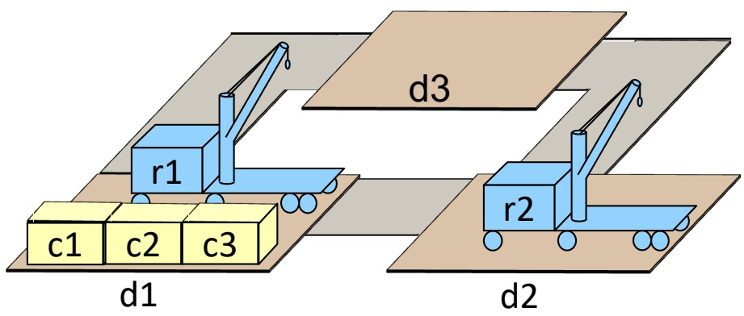

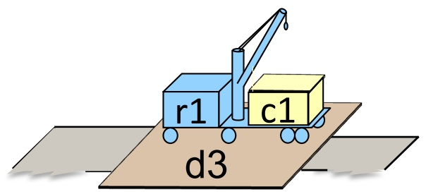

<!-- page: 5 -->

## Inverse State Transitions

● If a is relevant for g, then $\gamma ^ { - 1 } ( g , a ) = \operatorname { p r e } ( a ) \cup ( g - \operatorname { e f f } ( a ) )$

If a isn’t relevant for g, then $\gamma ^ { - 1 } ( g , a )$ is undefined

● Example:

<div class="docvortex-algorithm" style="white-space: pre-wrap; font-family:monospace;">
$g = \{\mathrm{loc}(\mathrm{c}1) = \mathrm{r}1\}$
</div>

▸ What is $\gamma ^ { - 1 } ( g ,$ load(r1,c1,d3))?

▸ What is $\gamma ^ { - 1 } ( g ,$ load(r2,c1,d1))?

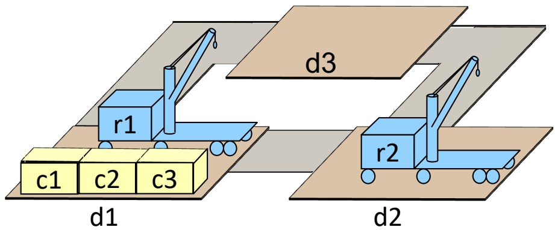

Lecture slides for [Acting, Planning, and Learning](https://projects.laas.fr/planning/). Creative Commons [CC BY-SA 4.0](https://creativecommons.org/licenses/by-sa/4.0/deed.en)

```txt
move(r,l,m)
    pre: loc(r)=l, adjacent(l,m)
    eff: loc(r) ← m

load(r,c,l)
    pre: cargo(r)=nil, loc(r)=l, loc(c)=l
    eff: cargo(r) ← c, loc(c) ← r

put(r,l,c)
    pre: loc(r)=l, loc(c)=r
    eff: cargo(r) ← nil, loc(c) ← l

Range(r) = Robots
Range(l) = Range(m) = Locs
Range(c) = Containers
```

<!-- page: 6 -->

## Backward Search

Backward-search $( \Sigma , s _ { 0 } , g )$

$\pi \leftarrow \langle \rangle$

**while** $s \neq g$ **do**

(ii) ${ \mathcal { A } } ^ { \prime }   \leftarrow   \{ a \in { \mathcal { A } } \mid a$ is relevant for g} **if** $A ^ { \prime }   = \emptyset$ **then return** failure nondeterministically choose $a \in A ^ { \prime }$

(iii) $g \gets \gamma ^ { - 1 } ( g , a )$

$$
\pi \leftarrow a \cdot \pi
$$

**return** π

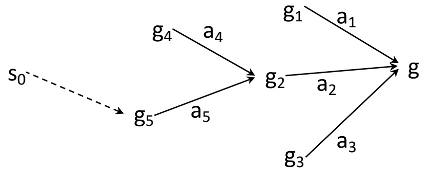

Cycle checking:

● After line (i), put Visited $\leftarrow \{ g _ { 0 } \}$

● After line (iii), put this:

if $g \in$ Visited then

return failure

Visited ← Visited ∪ {g}

or this:

if ∃ $g ^ { \prime } \in$ Visited s.t. $g \Rightarrow g ^ { \prime }$ then

return failure

Visited ← Visited ∪ {g}

With cycle checking, sound and complete

▸ If $( \Sigma , s _ { 0 } , g _ { 0 } )$ is solvable, then at least one execution trace will find a solution

<!-- page: 7 -->

## Branching Factor

● Motivation for Backward-search was to reduce the branching factor

▸ As written, doesn’t accomplish that

● Solve this by lifting:

▸ When possible, leave variables uninstantiated

▸ Most implementations of Backward-search do this

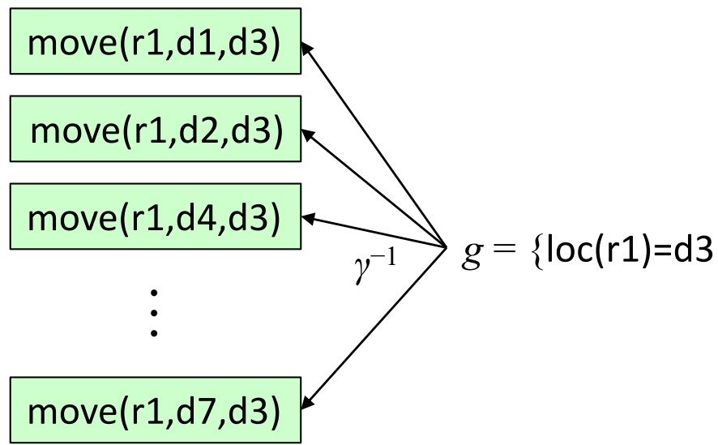

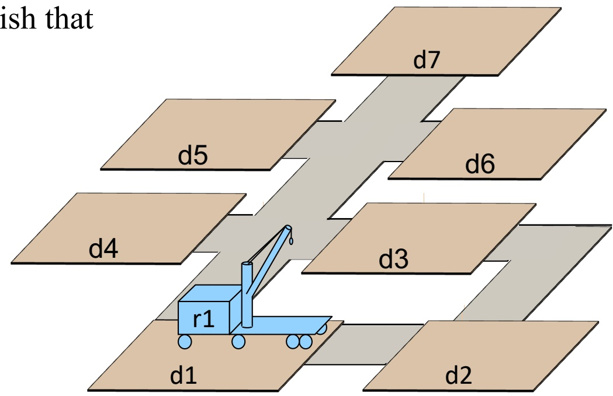

$$
\boxed {\text {move} (\mathrm{r} 1, \mathrm{y}, \mathrm{d} 3) \xleftarrow {\gamma^ {- 1}} g = \{\text {loc} (\mathrm{r} 1) = \mathrm{d} 3 \}}
$$

<!-- page: 8 -->

## Lifted Backward Search

Like Backward-search but much smaller branching factor

Must keep track of what values were substituted for which parameters

▸ I won’t discuss the details

PSP (later) does something similar

$$
(\Sigma , s _ {0}, g)
$$

$$
\pi \leftarrow \langle \rangle
$$

$$
s \not \models g
$$

$$
A ^ {\prime} \leftarrow \{a \in A
$$

$$
g \}
$$

$$
A ^ {\prime} = \emptyset
$$

$$
a \in A'
$$

$$
g \gets \gamma^ {- 1} (g, a)
$$

$$
\pi \gets a \cdot \pi
$$

<div class="docvortex-algorithm" style="white-space: pre-wrap; font-family:monospace;">
For classical planning, this can be simplified: Lifted-backward-search ($\Sigma$, $s_0$, $g$) $\pi \leftarrow$ the empty plan while(True) do if $s_0$ satisfies $g$ then return $\pi$
Relevant $\leftarrow \{(a, \sigma_1 \cdot \sigma_2) \mid a$ is an action in $\Sigma$ that is relevant for $g$,
$\sigma_1$ is a substitution that standardizes $a$'s variables, and
$\sigma_2$ is an mgu for $\sigma_1(a)$ and the atom of $g$ that $a$ is relevant for} if Relevant = $\emptyset$ then return failure
nondeterministically choose a pair $(a, \sigma) \in \text{Relevant}$
$\pi \leftarrow \sigma(a) \cdot \sigma(\pi)$
$g \leftarrow \gamma^{-1}(\sigma(g), \sigma(a))$
</div>

<!-- page: 9 -->

## 3.4. Plan-Space Planning

● Formulate planning as a constraint satisfaction problem

▸ Use constraint-satisfaction techniques to get solutions that are more flexible than ordinary plans

• E.g., plans in which the actions are partially ordered

• Postpone ordering decisions until the plan is being executed

▸ the actor may have a better idea about which ordering is best

First step toward temporal planning (Chapter 18)

● Basic idea:

▸ Backward search from the goal

▸ Each node of the search space is a partial plan that contains flaws

• Remove the flaws by making refinements

▸ If successful, we’ll get a partially ordered solution

<!-- page: 10 -->

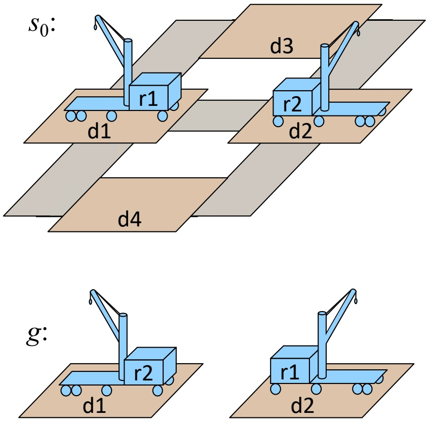

## Definitions

● Partially ordered plan

▸ partially ordered set of nodes

▸ each node contains an action

● Partially ordered solution for a planning problem P

partially ordered plan π such that every total ordering of π is a solution for P

**Poll**. Let P be the planning problem at right, and π be the partially ordered plan below. Is π a partially ordered solution for P?

precedence constraints:

$$
\begin{array}{c} a _ {1} \prec a _ {3} \\ a _ {2} \prec a _ {4} \end{array}
$$

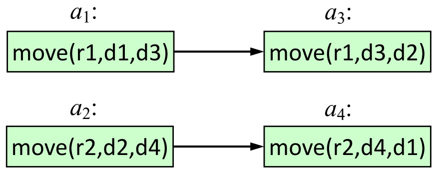

```python
move(r, d, d')
    pre: loc(r) = d, occupied(d') = nil
    eff: loc(r) ← d', occupied(d') ← r, occupied(d) ← nil
        r ∈ Robots
        d, d' ∈ Docks
```

<!-- page: 11 -->

## Definitions

● Partially ordered plan

▸ partially ordered set of nodes

▸ each node contains an action

● Partially ordered solution for a planning problem P

partially ordered plan π such that every total ordering of π is a solution for P

**Poll**. Let P be the planning problem at right, and π be the partially ordered plan below. Is π a partially ordered solution for P?

precedence constraints:

$$
\begin{array}{l} a _ {1} \prec a _ {3}, a _ {1} \prec a _ {4}, \\ a _ {2} \prec a _ {3}, a _ {2} \prec a _ {4} \end{array}
$$

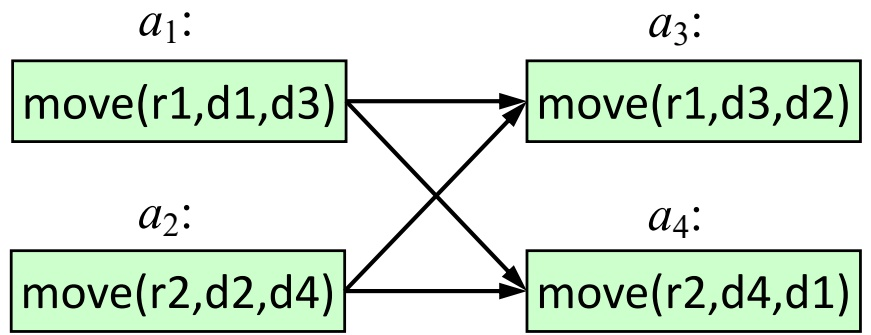

```python
move(r, d, d')
    pre: loc(r) = d, occupied(d') = nil
    eff: loc(r) ← d', occupied(d') ← r, occupied(d) ← nil
        r ∈ Robots
        d, d' ∈ Docks
```

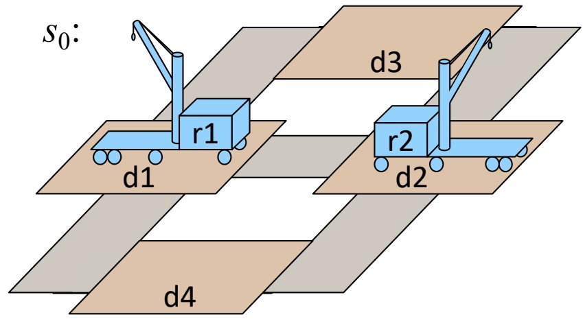

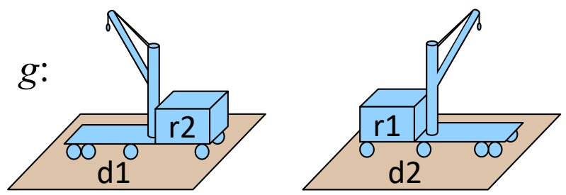

<!-- page: 12 -->

## Definitions

## ● Partial plan

▸ partially ordered set of nodes that contain partially instantiated actions

▸ inequality constraints, $\mathrm { e . g . } \; z \neq x \; \mathrm { o r } \; w \neq \mathsf { p 1 }$

▸ causal links (dashed arcs)

constraint: action a must be the action that establishes action b’s precondition p

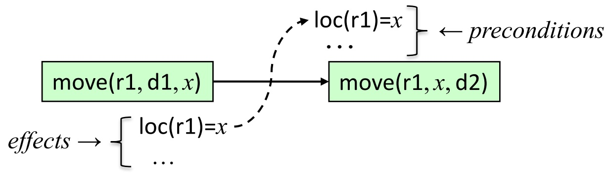

```python
move(r, d, d')
    pre: loc(r) = d, occupied(d') = nil
    eff: loc(r) ← d', occupied(d') ← r, occupied(d) ← nil
        r ∈ Robots
        d, d' ∈ Docks
```

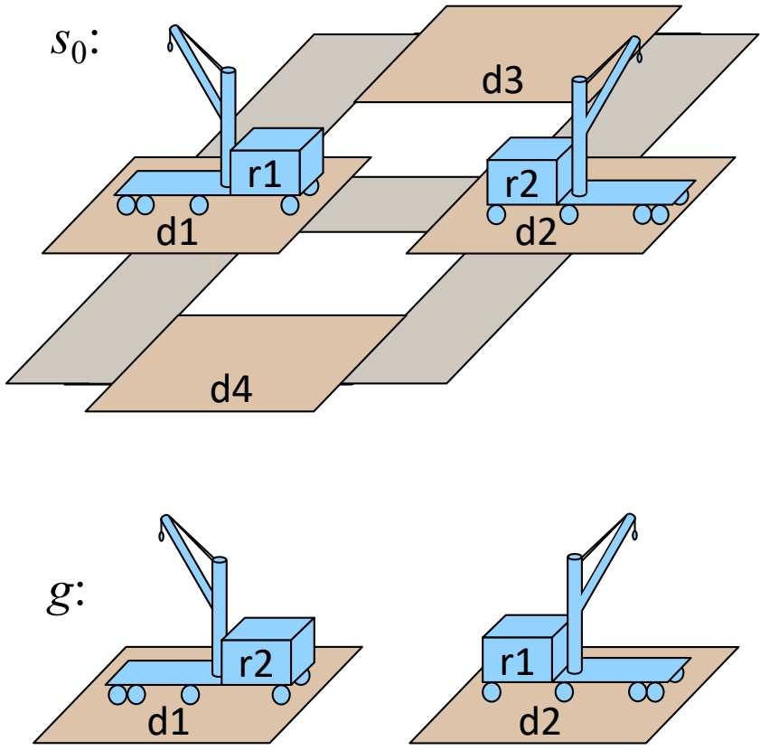

<!-- page: 13 -->

## Flaws: 1. Open Goals

● Action b, precondition p

▸ p is an open goal if there is no causal link for p

● Resolve the flaw by creating a causal link

Find an action a (either already in π, or add it to π) that can establish p

• can precede b

• can have p as an effect

▸ Do substitutions on variables to make a assert p

▸ Add an ordering constraint a ≺ b

▸ Create a causal link from a to p

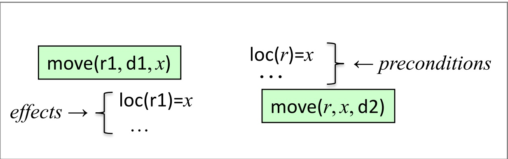

Lecture slides for [Acting, Planning, and Learning](https://projects.laas.fr/planning/). Creative Commons [CC BY-SA 4.0](https://creativecommons.org/licenses/by-sa/4.0/deed.en)

```python
move(r, d, d')
    pre: loc(r) = d, occupied(d') = nil
    eff: loc(r) ← d', occupied(d') ← r, occupied(d) ← nil
        r ∈ Robots
        d, d' ∈ Docks
```

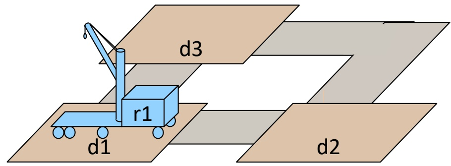

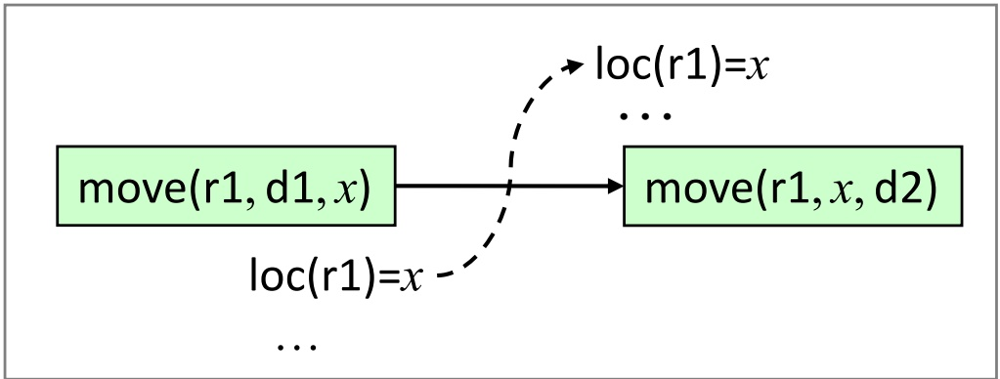

<!-- page: 14 -->

## Flaws: 2. Threats

● Let l be a causal link from an effect of action a to a precondition p of action b

● Action c threatens l if c may come between a and b and c may affect p

▸ “c may come between a and b” means the plan’s current ordering constraints don’t prevent it

• plan doesn’t already have c ≺ a or $b \prec c$

▸ “c may affect $p ^ { \flat }$ means

can substitute values for variables such that c’s effects either make p true or make p false

## Poll. In each of the cases at right, does action c threaten the causal link?

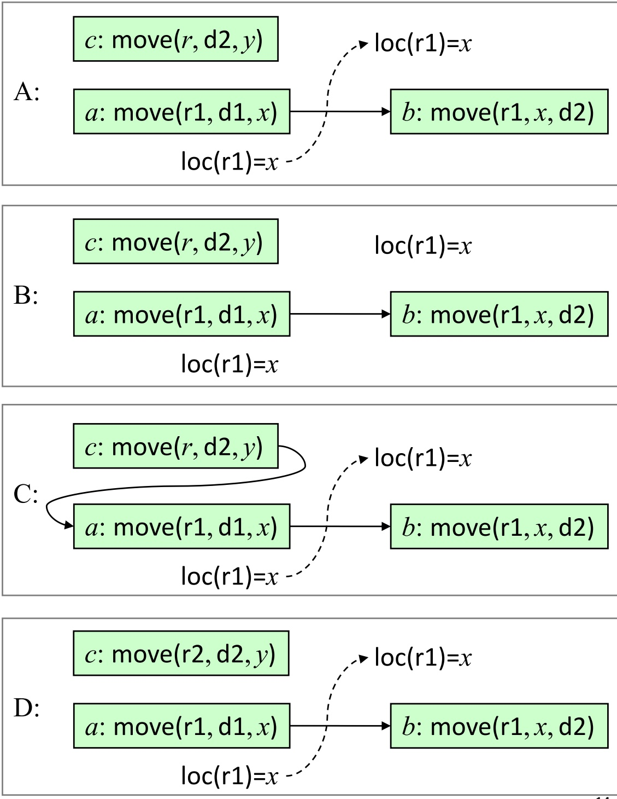

<!-- page: 15 -->

## Resolving Threats

Suppose action c threatens a causal link l from an effect of action a to a precondition p of action b

● Three possible resolvers:

1. Add a precedence constraint $c \leq a$

2. Add a precedence constraint $b \prec c$

3. Add inequality constraints that prevent c from affecting p

Each of these is applicable iff it doesn’t make the plan inconsistent

▸ e.g., 2 isn’t applicable if the plan already has $c \prec b$

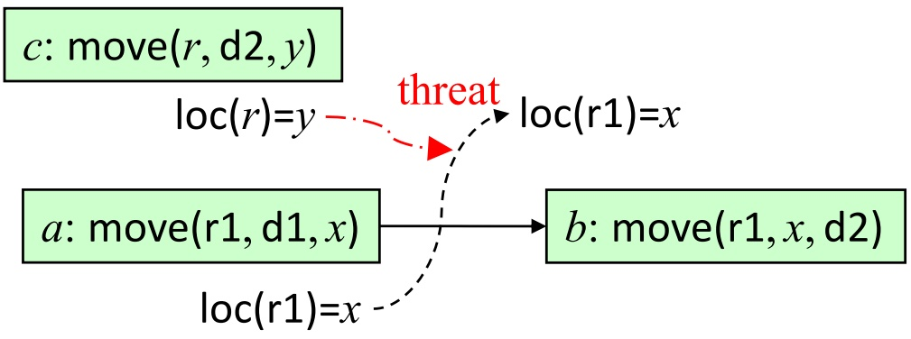

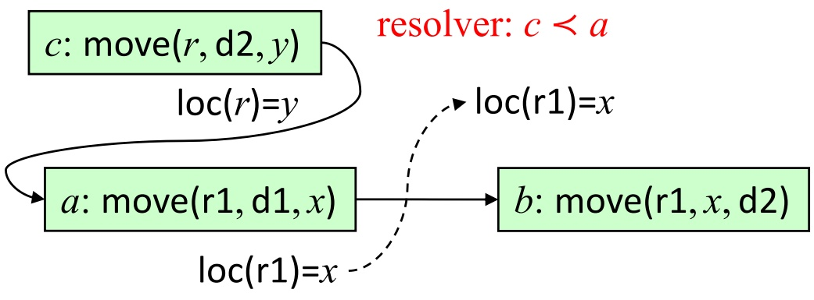

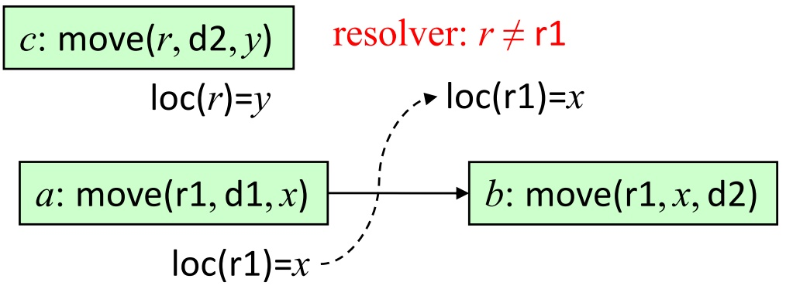

<!-- page: 16 -->

<div class="docvortex-algorithm" style="white-space: pre-wrap; font-family:monospace;">
PSP $(\Sigma, \pi)$ while $Flaws(\pi) \neq \emptyset$ do
(i) arbitrarily select $f \in Flaws(\pi)$
$R \leftarrow \{\text{all feasible resolvers for } f\}$
if $R = \emptyset$ then return failure
(ii) nondeterministically choose $\rho \in R$
modify $\pi$ by applying $\rho$ to it
return $\pi$
</div>


```matlab
- 2 open goals
- no threats

    a₀
    loc(r1) = d1
    loc(r2) = d2
    occupied(d3) = nil
    occupied(d1) = r1
    occupied(d2) = r2

select → loc(r1) = d2
loc(r2) = d1

    a_g
```

```txt
move(r, d, d')
pre: loc(r) = d, occupied(d') = nil
eff: loc(r) ← d', occupied(d') = r, occupied(d) = nil
Lecture slides for Acting, Planning, and Learning. Creative Commons CC BY-SA 4.0
```

<!-- page: 17 -->

```txt
PSP (Σ, π)
    while Flaws(π) ≠ ∅ do
(i)      arbitrarily select f ∈ Flaws(π)
        R ← {all feasible resolvers for f}
        if R = ∅ then return failure
```

nondeterministically choose(ii) $\rho \in R$ modify π by applying ρ to it **return** π

● 3 open goals

● no threats

```txt
move(r, d, d')
pre: loc(r) = d, occupied(d') = nil
eff: loc(r) ← d', occupied(d') = r, occupied(d) = nil
Lecture slides for Acting, Planning, and Learning. Creative Commons CC BY-SA 4.0
```

## PSP Algorithm


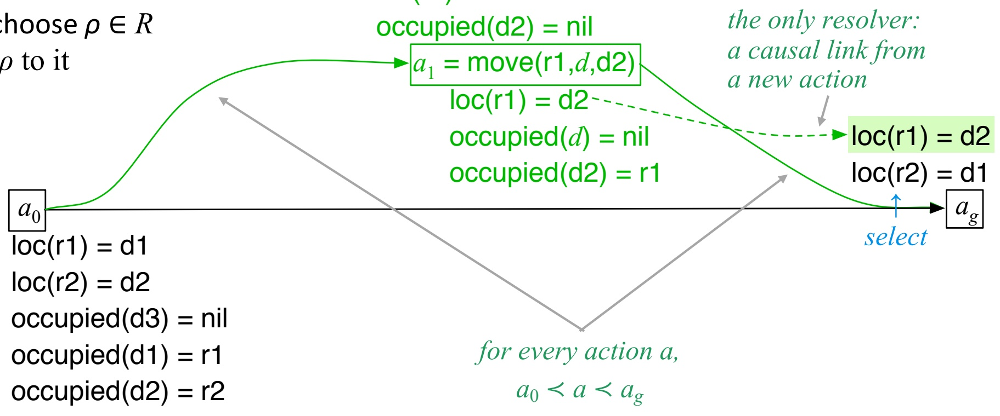

**Poll**. Above, I said “the only resolver”. Is that correct?

<!-- page: 18 -->

<div class="docvortex-algorithm" style="white-space: pre-wrap; font-family:monospace;">
where $\rho \in R$
$\rho$ to it
select → loc(r1) = a
occupied(d2) = nil
loc(r1) = d2
occupied(d) = nil
occupied(d2) = r1
only resolver:
causal link from
a new action
loc(r1) = d2
loc(r2) = d1
loc(r1) = d1
loc(r2) = d2
occupied(d1) = nil
loc(r2) = d'
a0
a2 = move(r2,d',d1)
loc(r2) = d1
occupied(d') = nil
occupied(d1) = r2
</div>

## PSP Algorithm

```txt
PSP (Σ, π)
    while Flaws(π) ≠ ∅ do
(i)      arbitrarily select f ∈ Flaws(π)
        R ← {all feasible resolvers for f}
        if R = ∅ then return failure
```

nondeterministically choose(ii) $\rho \in R$ modify π by applying ρ to it **return** π

● 4 open goals

● no threats

```javascript
move(r, d, d')
pre: loc(r) = d, occupied(d') = nil
eff: loc(r) ← d', occupied(d') = r, occupied(d) = nil
```


<!-- page: 19 -->

```javascript
move(r, d, d')
pre: loc(r) = d, occupied(d') = nil
eff: loc(r) ← d', occupied(d') = r, occupied(d) = nil
```

PSP $( \Sigma , \pi )$

**while** $F l a w s ( \pi ) \neq \emptyset$ **do**

(i) arbitrarily select $f   \in F l a w s ( \pi )$ $R \leftarrow$ {all feasible resolvers for f} **if** $R = \emptyset$ **then return** failure

nondeterministically choose(ii) $\rho \in R$ modify π by applying ρ to it **return** π

● $5$ open goals

● 1 threat

$$
\overline{\text{loc}} (r1) = d1
$$

$$
\text{loc}(\text{r2}) = \text{d2}
$$

$$
\text {occupied(d3)} = \text {nil}
$$

$$
\text{occupied(d1)} = r1
$$

$$
\text{occupied(d2) = r2}
$$

## PSP Algorithm


$$
\text {occupied(d2)} = \text {nil}
$$

$$
a _ {1} = \text {move} (\mathrm{r1}, d, \mathrm{d2})
$$

$$
\overline {{\operatorname{loc} (r 1) = d 2}}
$$

$$
\blacktriangleright \mathrm{loc} (\mathrm{r1}) = \mathrm{d2}
$$

$$
\blacktriangleright \operatorname{loc} (\mathrm{r} 2) = \mathrm{d} 1
$$

$$
\text {occupied} (d ^ {\prime \prime}) = \text {nil}
$$

$$
\text {occupied(d1)} = \text {nil}
$$

$$
a _ {3} = \text {move} (r, \mathrm{d} 2, d ^ {\prime \prime})
$$

$$
\overline {{\mathrm{loc} (r) = d ^ {\prime \prime}}}
$$

$$
\left| a _ {2} = \text {move} (\mathrm{r} 2, d ^ {\prime}, \mathrm{d} 1) \right|
$$

$$
\overline {{\operatorname{loc} (r 2) = d 1}}
$$

$$
\text{occupied(d2)} = \text{nil}^{\prime}
$$

$$
\text{occupied}(d'') = r
$$

<strong><u>Poll</u></strong>: does $a _ { 3 }$ threaten ${ a _ { 1 } } ^ { \flat } \mathbf { S }$ precondition loc $( r 1 ) = d ?$

<!-- page: 20 -->

PSP $( \Sigma , \pi )$

**while** $F l a w s ( \pi ) \neq \emptyset$ **do**

(i) arbitrarily select $f   \in F l a w s ( \pi )$ $R \leftarrow$ {all feasible resolvers for f} **if** $R = \emptyset$ **then return** failure

nondeterministically choose(ii) $\rho \in R$ modify π by applying ρ to it **return** π

● 4 open goals

● 2 threats

$$
\overline {{\operatorname{loc}}} (r 1) = d 1
$$

$$
\text{loc}(\text{r2}) = \text{d2}
$$

$$
\text {occupied(d3)} = \text {nil}
$$

$$
\text{occupied(d1)} = r1
$$

$$
\text{occupied(d2) = r2}
$$

```javascript
move(r, d, d')
```

$$
\text {pre:} \operatorname{loc} (r) = d, \text {occupied} (d ^ {\prime}) = \text {nil}
$$

$$
\operatorname{loc} (r) \leftarrow d ^ {\prime}.
$$

## PSP Algorithm

<div class="docvortex-algorithm" style="white-space: pre-wrap; font-family:monospace;">
causal link from  $a_{0}$ , with substitution  $d \leftarrow d1$
</div>


$$
\text {loc} (r 1) = d 1
$$

$$
\blacktriangleleft \text {occupied(d2)} = \text {nil}
$$

$$
a _ {1} = \text {move} (r 1, d 1, d 2)
$$

$$
\overline {{\operatorname{loc} (r 1) = d 2 - -}}
$$

$$
\text {occupied(d1) = nil}
$$

$$
\text {occupied(d2)} = r 1
$$

$$
\operatorname{loc} (r 1) = d 2
$$

$$
\blacktriangleright \operatorname{loc} (\mathrm{r} 2) = \mathrm{d} 1
$$

$$
\text{loc} (r) = \mathrm{d}2
$$

$$
\text {occupied} (d ^ {\prime \prime}) = \text {nil}
$$

$$
\text {occupied(d1)} = \text {nil}
$$

$$
a _ {3} = \text {move} (r, \mathrm{d} 2, d ^ {\prime \prime})
$$

$$
\operatorname{loc} (\mathrm{r} 2) = d ^ {\prime}
$$

$$
\operatorname{loc} (r) = d ^ {\prime \prime}
$$

$$
a _ {2} = \text {move} (\mathrm{r} 2, d ^ {\prime}, \mathrm{d} 1)
$$

$$
\overline {{\operatorname{loc} (\mathrm{r} 2) = \mathrm{d} 1}}
$$

$$
\text{occupied(d2)} = \text{nil}^{\prime}
$$

$$
\text{occupied} (d') = \text{nil}
$$

$$
\text{occupied}(d'') = r
$$

$$
\text{occupied(d1) = r2}
$$

**Poll**: does $a _ { 3 }$ threaten the causal link for ${ a _ { g } } ^ { \flat } \mathrm { {  ~ s ~ } }$ precondition loc(r1)=d2?

<!-- page: 21 -->

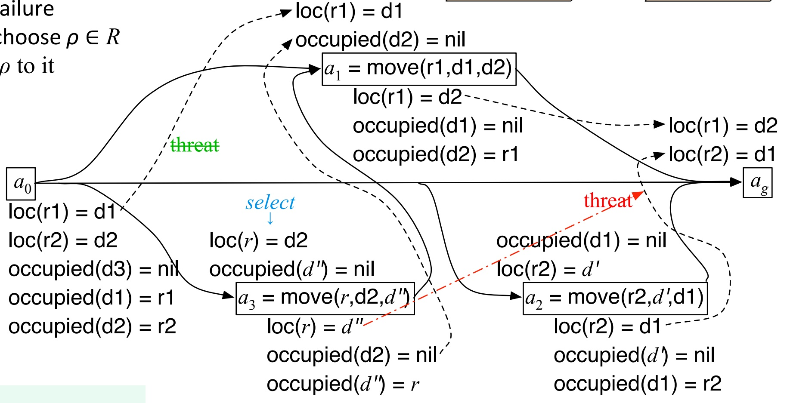

## PSP Algorithm

```txt
PSP (Σ, π)
    while Flaws(π) ≠ ∅ do
(i)      arbitrarily select f ∈ Flaws(π)
        R ← {all feasible resolvers for f}
        if R = ∅ then return failure
```

nondeterministically choose(ii) $\rho \in R$ modify π by applying ρ to it **return** π

● 4 open goals

● 1 threat

Constraint: $r \neq \uparrow 1$

```javascript
move(r, d, d')
pre: loc(r) = d, occupied(d') = nil
eff: loc(r) ← d', occupied(d') = r, occupied(d) = nil
```


<!-- page: 22 -->

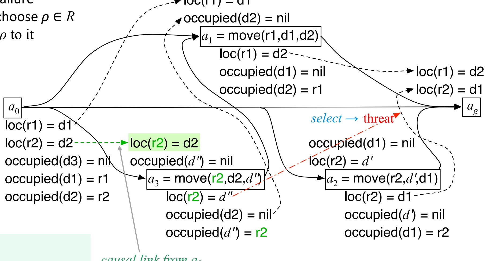

```javascript
move(r, d, d')
```

PSP $( \Sigma , \pi )$

**while** $F l a w s ( \pi ) \neq \emptyset$ **do**

$$
f \in F l a w s (\pi)
$$

$$
R \leftarrow
$$

$$
R = \emptyset
$$

nondeterministically choose(ii) $\rho \in R$ modify π by applying ρ to it **return** π

● 3 open goals

● 1 threat

~~Constraint: r ≠ r1~~

$$
\text {pre:} \operatorname{loc} (r) = d, \text {occupied} (d ^ {\prime}) = \text {nil}
$$

## PSP Algorithm


<div class="docvortex-algorithm" style="white-space: pre-wrap; font-family:monospace;">
causal link from  $a_{0}$  with substitution  $r \leftarrow r2$
</div>

<!-- page: 23 -->

```txt
PSP (Σ, π)
    while Flaws(π) ≠ ∅ do
(i)      arbitrarily select f ∈ Flaws(π)
        R ← {all feasible resolvers for f}
        if R = ∅ then return failure
```

nondeterministically choose(ii) $\rho \in R$ modify π by applying ρ to it **return** π

● 3 open goals

● no threats

```javascript
move(r, d, d')
pre: loc(r) = d, occupied(d') = nil
eff: loc(r) ← d', occupied(d') = r, occupied(d) = nil
```

## PSP Algorithm


$$
a _ {3} \prec a _ {2}
$$

<!-- page: 24 -->

PSP $( \Sigma , \pi )$

**while** $F l a w s ( \pi ) \neq \emptyset$ **do**

<div class="docvortex-algorithm" style="white-space: pre-wrap; font-family:monospace;">
(i) arbitrarily select $f \in Flaws(\pi)$
$R \leftarrow \{\text{all feasible resolvers for } f\}$
if $R = \emptyset$ then return failure
</div>

nondeterministically choose(ii) $\rho \in R$ modify π by applying ρ to it **return** π

● 2 open goals

● no threats

$$
\overline{\text{loc}} (r1) = d1
$$

```javascript
move(r, d, d')
pre: loc(r) = d, occupied(d') = nil
eff: loc(r) ← d', occupied(d') = r, occupied(d) = nil
```

## PSP Algorithm


$$
\blacktriangleright \text {loc} (\mathrm{r1}) = \mathrm{d2}
$$

$$
\text {occupied(d1)} = \text {nil}
$$

$$
\left| a _ {3} = \text {move} (\mathrm{r} 2, \mathrm{d} 2, d ^ {\prime}) \right|
$$

$$
\left| a _ {2} = \text {move} (\mathrm{r} 2, d ^ {\prime}, \mathrm{d} 1) \right|
$$

$$
\text {occupied(d2)} = \mathrm{nil} ^ {\prime}
$$

$$
a _ {3}
$$

$$
d ^ {\prime \prime} \leftarrow d ^ {\prime}
$$

<!-- page: 25 -->

PSP $( \Sigma , \pi )$

**while** $F l a w s ( \pi ) \neq \emptyset$ **do**

(i) arbitrarily select $f   \in F l a w s ( \pi )$ $R \leftarrow$ {all feasible resolvers for f} **if** $R = \emptyset$ **then return** failure

nondeterministically choose(ii) $\rho \in R$ modify π by applying ρ to it **return** π

● 1 open goal

● no threats

```javascript
move(r, d, d')
pre: loc(r) = d, occupied(d') = nil
eff: loc(r) ← d', occupied(d') = r, occupied(d) = nil
```

## PSP Algorithm

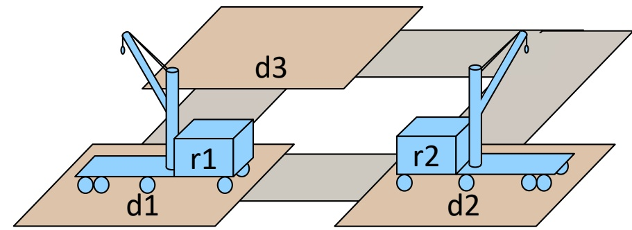

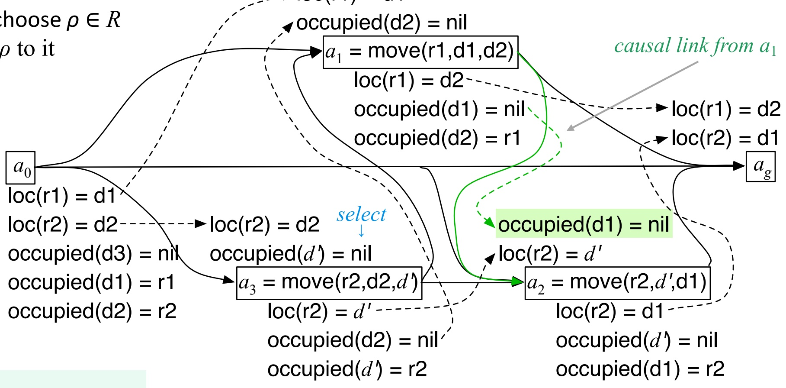

<!-- page: 26 -->

PSP $( \Sigma , \pi )$

**while** $F l a w s ( \pi ) \neq \emptyset$ **do**

arbitrarily select(i) $f   \in F l a w s ( \pi )$

$$
R \leftarrow
$$

**if** $R = \emptyset$ **then return** failure

nondeterministically choose(ii) $\rho \in R$ modify π by applying ρ to it **return** π

● no open goals

● no threats

$$
\overline{\text{loc}} (r1) = d1
$$

$$
\mathrm{loc} (\mathrm{r} 2) = \mathrm{d} 2
$$

● we’re done

$$
\text{occupied(d1)} = r1
$$

move $( r ,   d ,   d ^ { \prime } )$

$$
\text {pre:} \operatorname{loc} (r) = d, \text {occupied} (d ^ {\prime}) = \text {nil}
$$

$$
\text {eff:} \operatorname{loc} (r) \leftarrow d ^ {\prime}, \text {occupied} (d ^ {\prime}) = r, \text {occupied} (d) = \text {nil}
$$

## PSP Algorithm

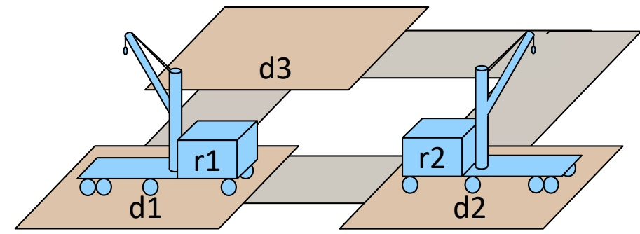

$$
\blacktriangleleft \text {occupied(d2)} = \text {nil}
$$

$$
a _ {1} = \text {move} (r 1, d 1, d 2)
$$

$$
\operatorname{loc} (r 1) = d 2 -
$$

$$
\blacktriangleright \operatorname{loc} (r 1) = d 2
$$

$$
\blacktriangleright \operatorname{loc} (\mathrm{r} 2) = \mathrm{d} 1
$$

$$
- \blacktriangleright \operatorname{loc} (\mathrm{r} 2) = \mathrm{d} 2
$$

$$
\text {occupied(d3)} = \text {nil}
$$

$$
\blacklozenge \text {occupied(d1)} = \text {nil}
$$

$$
\blacktriangleright \text {loc} (\mathrm{r2}) = \mathrm{d3}
$$

$$
\left| a _ {3} = \text {move} (\mathrm{r} 2, \mathrm{d} 2, \mathrm{d} 3) \right|
$$

$$
a _ {2} = \text {move} (\mathrm{r} 2, \mathrm{d} 3, \mathrm{d} 1)
$$

$$
\overline {{\operatorname{loc} (\mathrm{r2}) = \mathrm{d1}}} -
$$

$$
\text{occupied(d2)} = \text{nil}^{\prime}
$$

$$
\text{occupied(d3) = nil}
$$

$$
\text{occupied(d3)} = r2
$$

$$
\text{occupied(d1) = r2}
$$

$$
a _ {0}
$$

$$
d' \leftarrow \text{d3}
$$

<!-- page: 27 -->

```txt
PSP (Σ, π)
    while Flaws(π) ≠ ∅ do
(i)      arbitrarily select f ∈ Flaws(π)
        R ← {all feasible resolvers for f}
        if R = ∅ then return failure
(ii)      nondeterministically choose ρ ∈ R
        modify π by applying ρ to it
    return π
```

= The solution we found:

= Another:

= Infinitely many others

```txt
move(r, d, d')
pre: loc(r) = d, occupied(d') = nil
eff: loc(r) ← d', occupied(d') = r, occupied(d) = nil
Lecture slides for Acting, Planning, and Learning. Creative Commons CC BY-SA 4.0
```

## PSP Algorithm

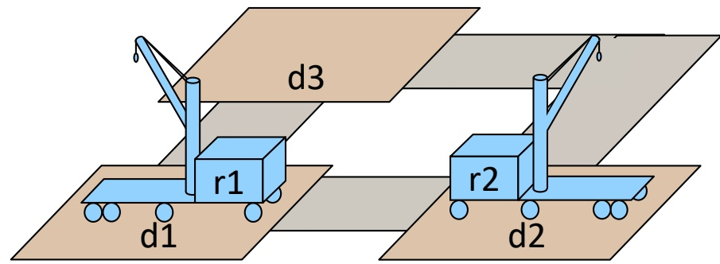

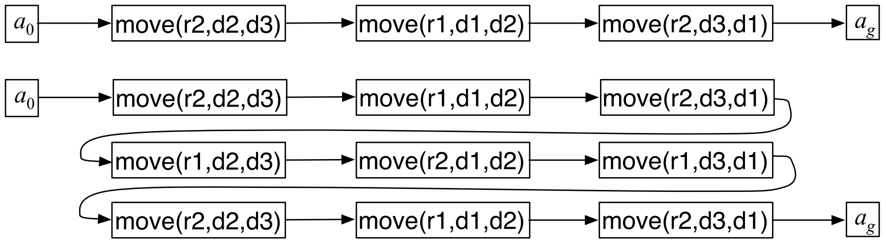

<!-- page: 28 -->

PSP $( \Sigma , \pi )$

## PSP Algorithm

**while** $F l a w s ( \pi ) \neq \emptyset$ **do**

arbitrarily select(i) $f   \in F l a w s ( \pi )$

$R \leftarrow$ {all feasible resolvers for f}

**if** $R = \emptyset$ **then return** failure

nondeterministically choose(ii) $\rho \in R$ modify π by applying ρ to it **return** π

= Add another location to the planning domain

= Still have all of the solutions on the previous page

= There also are partially-ordered solutions

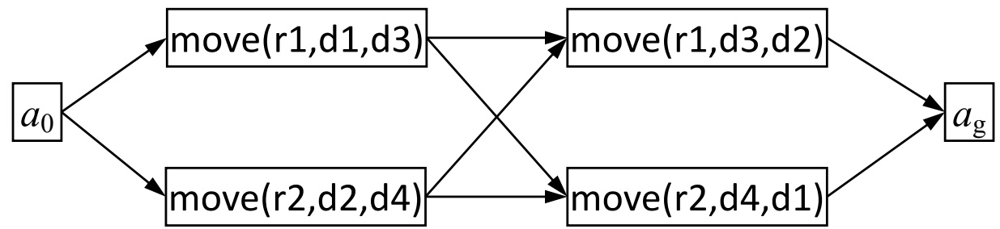

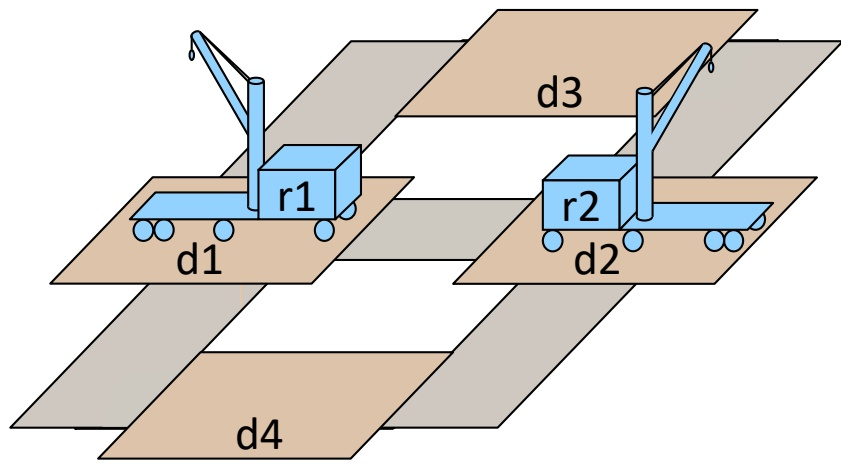

```txt
move(r, d, d')
pre: loc(r) = d, occupied(d') = nil
eff: loc(r) ← d', occupied(d') = r, occupied(d) = nil
Lecture slides for Acting, Planning, and Learning. Creative Commons CC BY-SA 4.0
```

<!-- page: 29 -->

```txt
PSP (Σ, π)
    while Flaws(π) ≠ ∅ do
(i)      arbitrarily select f ∈ Flaws(π)
        R ← {all feasible resolvers for f}
        if R = ∅ then return failure
```

nondeterministically choose(ii) $\rho \in R$ modify π by applying ρ to it **return** π

Selecting a flaw to resolve in PSP ≈ selecting a variable to instantiate in a CSP

▸ AND-branch in both cases

● Fewest Alternatives First (FAF):

▸ select flaw with fewest resolvers

≈ Minimum Remaining Values (MRV) heuristic for CSPs

```txt
move(r, d, d')
pre: loc(r) = d, occupied(d') = nil
eff: loc(r) ← d', occupied(d') = r, occupied(d) = nil
Lecture slides for Acting, Planning, and Learning. Creative Commons CC BY-SA 4.0
```

## Selecting a Flaw

```txt
Poll: which flaw would FAF select first?
A. loc(r1)=d
B. occupied(d2) = nil
C. occupied(d1) = nil
D. loc(r2)=d'
E. no preference
```


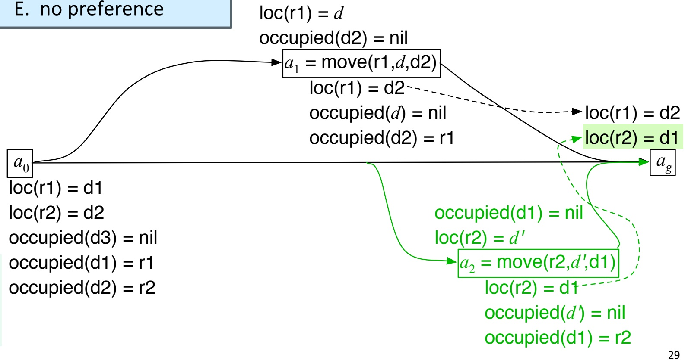

<!-- page: 30 -->

```txt
PSP (Σ, π)
    while Flaws(π) ≠ ∅ do
(i)      arbitrarily select f ∈ Flaws(π)
        R ← {all feasible resolvers for f}
        if R = ∅ then return failure
(ii)      nondeterministically choose ρ ∈ R
        modify π by applying ρ to it
    return π
```

Choosing a resolver for a flaw ≈ assigning a value to a variable in a CSP

▸ In both cases, an OR-branch

● Least Constraining Resolver (LCR):

▸ prefer resolver that rules out the fewest resolvers for the other flaws

≈ Least Constraining Value (LCV) heuristic for CSPs

```txt
move(r, d, d')
pre: loc(r) = d, occupied(d') = nil
eff: loc(r) ← d', occupied(d') = r, occupied(d) = nil
Lecture slides for Acting, Planning, and Learning. Creative Commons CC BY-SA 4.0
```

<div class="docvortex-algorithm" style="white-space: pre-wrap; font-family:monospace;">
Poll: for loc(r1)=d, which resolver would LCR choose first?
A. causal link from a new action
B. causal link from  $a_{0}$ , with  $d \leftarrow d1$ 
C. causal link from  $a_{3}$ , with  $r \leftarrow r1$ ,  $d'' \leftarrow d$ 
D. no preference
</div>

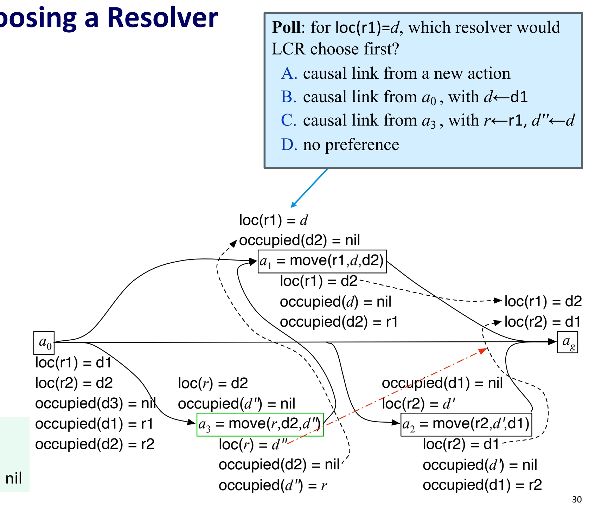

<!-- page: 31 -->

```txt
PSP (Σ, π)
    while Flaws(π) ≠ ∅ do
(i)      arbitrarily select f ∈ Flaws(π)
        R ← {all feasible resolvers for f}
        if R = ∅ then return failure
(ii)      nondeterministically choose ρ ∈ R
        modify π by applying ρ to it
    return π
```

<div class="docvortex-algorithm" style="white-space: pre-wrap; font-family:monospace;">
- Least Constraining Resolver (LCR):
  - prefer resolver that rules out the fewest resolvers for the other flaws
    $\approx$ Least Constraining Value (LCV) heuristic for CSPs
</div>

● Problem (in PSP but not in CSPs):

```txt
move(r, d, d')
pre: loc(r) = d, occupied(d') = nil
eff: loc(r) ← d', occupied(d') = r, occupied(d) = nil
Lecture slides for Acting, Planning, and Learning. Creative Commons CC BY-SA 4.0
```

▸ LCR can keep adding new actions forever

<div class="docvortex-algorithm" style="white-space: pre-wrap; font-family:monospace;">
Poll: for loc(r1)=d, which resolver would LCR choose first?
A. causal link from a new action
B. causal link from  $a_{0}$ , with  $d \leftarrow d1$ 
C. causal link from  $a_{3}$ , with  $r \leftarrow r1$ ,  $d'' \leftarrow d$ 
D. no preference
</div>

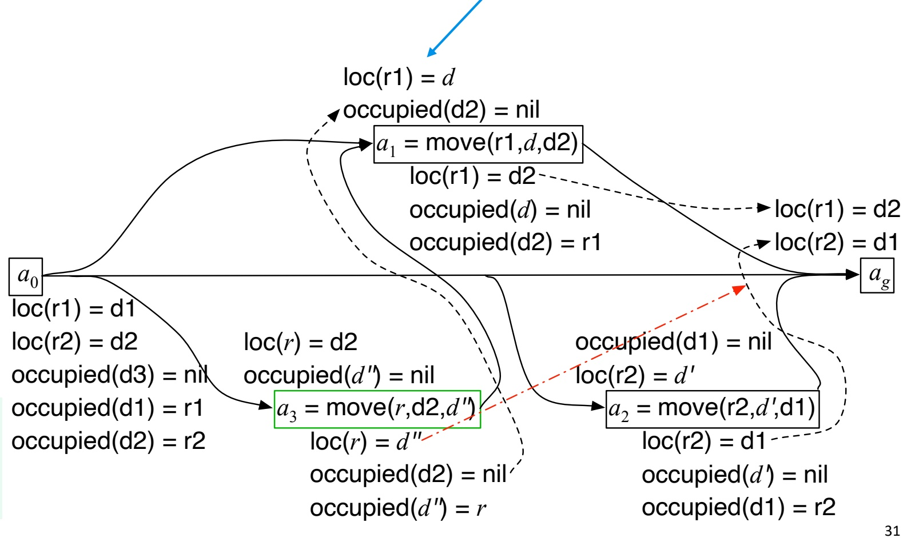

<!-- page: 32 -->

```txt
PSP (Σ, π)
    while Flaws(π) ≠ ∅ do
(i)      arbitrarily select f ∈ Flaws(π)
        R ← {all feasible resolvers for f}
        if R = ∅ then return failure
(ii)      nondeterministically choose ρ ∈ R
        modify π by applying ρ to it
    return π
```

Perhaps this might work:

● Avoid New Actions (ANA) heuristic:

▸ prefer resolvers that don’t add new actions

▸ use LCR as tie-breaker

```txt
move(r, d, d')
pre: loc(r) = d, occupied(d') = nil
eff: loc(r) ← d', occupied(d') = r, occupied(d) = nil
Lecture slides for Acting, Planning, and Learning. Creative Commons CC BY-SA 4.0
```

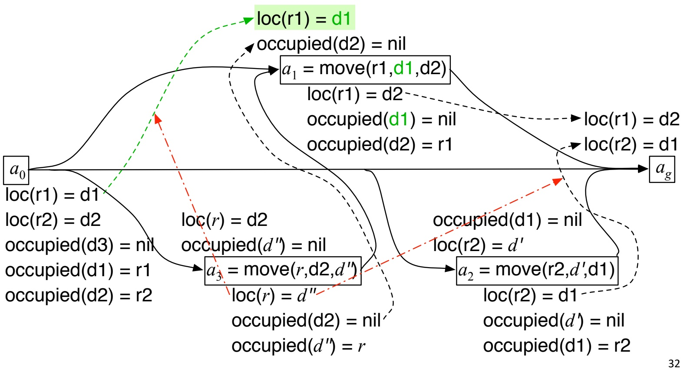

<!-- page: 33 -->

PSP $( \Sigma , \pi )$

**while** $F l a w s ( \pi ) \neq \emptyset$ **do**

arbitrarily select(i) $f   \in   F l a w s ( \pi )$

R ← {all feasible resolvers for f}

**if** $R = \emptyset$ **then return** failure

nondeterministically choose(ii) $\rho \in R$ modify $\pi$ by applying $\rho$ to it **return** π

Perhaps this might work:

● Avoid New Actions (ANA) heuristic:

▸ prefer resolvers that don’t add new actions

▸ use LCR as tie-breaker

move(r, d, d′)

$$
\text {eff:} \operatorname{loc} (r) \leftarrow d ^ {\prime}, \text {occupied} (d ^ {\prime}) = r, \text {occupied} (d) = \text {nil}
$$

## Choosing a Resolver

● Problem: ANA will prefer these two choices:

▸ For loc $( r _ { 1 } ) = d$ )=d in $a _ { 1 } ,$ use action $a _ { 0 }$ with substitution $d { \leftarrow } { \mathsf { d } } 1$

▸ For loc $( r 2 ) = d ^ { r }$ in $a _ { 2 } ,$ use action $a _ { 0 }$ with substitution $d ^ { \prime } { \leftarrow } d 2$

▸ $a_{1} = \mathsf{move}(\mathsf{r1},\mathsf{d1},\mathsf{d2}); a_{2} = \mathsf{move}(\mathsf{r2},\mathsf{d2},\mathsf{d1})$

• Makes the problem unsolvable ⇒ need to backtrack

● Perhaps use ANA anyway?

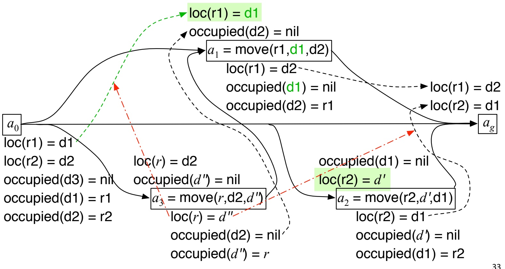

<!-- page: 34 -->

## Discussion

● Problem: how to prune infinitely long paths in the search space?

▸ Loop detection is based on recognizing states or goals we’ve seen before

▸ Partially ordered plan: don’t know the states

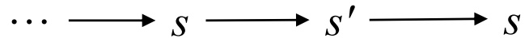

● Prune if π contains the same action more than once? ⟨a1, a2, …, a1, …⟩

▸ No. Sometimes need the same action again in another state • e.g., Towers of Hanoi: move disk1 from peg1 to peg2


● Weak pruning technique

▸ Prune all partial plans that contain more than |S| actions

Credit: [Evanherk](https://en.wikipedia.org/wiki/User:Evanherk), [GFDL](https://commons.wikimedia.org/wiki/File:Tower_of_Hanoi.jpeg)

▸ Not very helpful

I don’t know whether there’s a better pruning technique

<!-- page: 35 -->

## Summary

● 3.3. Backward State-Space Search

▸ Relevance, $\gamma ^ { - 1 }$

▸ Backward search, cycle checking

Lifted backward search (briefly)

## ● 3.4 Plan-Space Search

▸ Definitions

Partially ordered plans and solutions

• partial plans

• causal links

▸ flaws:

• open goals, threats

▸ resolvers

▸ PSP algorithm

• long example

• brief discussion of node-selection heuristics, pruning techniques
