<!-- page: 1 -->

## Chapter 5 HTN Representation and Planning

Dana S. Nau

University of Maryland

with contributions from

[Mark “mak” Roberts](https://scholar.google.com/citations?user=vlbX4J8AAAAJ)


Acting, Planning, and Learning

Malik Ghallab, Dana Nau, and Paolo Traverso

<!-- page: 2 -->

## Hierarchical Task Network (HTN) Planning

For some planning problems, we may already have ideas for how to look for solutions

● Example: travel to a destination that’s far away:

▸ Brute-force search:

• many combinations of vehicles and routes

▸ Experienced human: small number of “ recipes ”

e.g., flying:

1. buy ticket from local airport to remote airport

2. travel to local airport

3. fly to remote airport

4. travel to final destination ● Two ways to put such information into a planner

Domain-specific algorithm

▸ Domain-independent planning engine + domain-specific planning information

HTN planning (this Part)

## ● Ingredients:

▸ state-variable planning domain (Part I)

▸ tasks: activities to perform

▸ HTN methods: ways to perform tasks

<!-- page: 3 -->

## Total-Order HTN Planning

● Three kinds of tasks

▸ Primitive task: head of an action

▸ Compound task: name(args)

• name is a compound-task name

▸ Goal task: goal(g)

• g is any classical goal formula

Method: a tuple (head, nonprimitive task, preconditions, subtasks)

Write it as pseudocode: method-name(args) Task: nonprimitive task Pre: preconditions Sub: list of subtasks ● TOHTN planning domain: a pair (Σ,M)

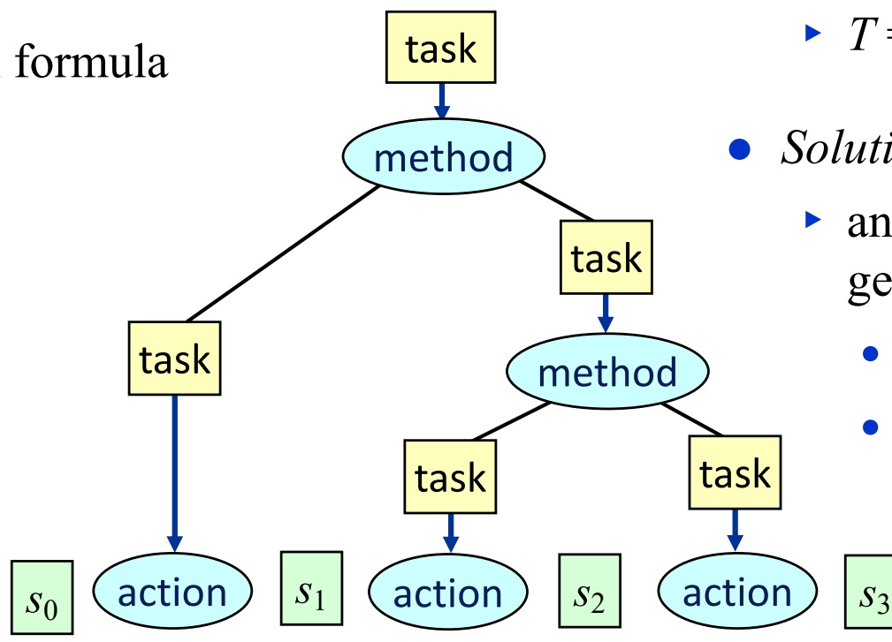

▸ Σ: state-variable planning domain

▸ $\mathcal { M } ;$ set of methods

● TOHTN planning problem $P = ( \Sigma , \mathcal { M } , s _ { 0 } , T )$ ▸ $T = \langle t _ { 1 } , t _ { 2 } , \ldots , t _ { k } \rangle$

● Solution for P:

▸ any executable plan that can be generated for T by applying

methods to nonprimitive tasks

• actions to primitive tasks

<!-- page: 4 -->

## The DWR Domain from Chapter 2

● The slides for Chapter 2 used a simpler domain than the one in the book

▸ Too simple to illustrate what HTNs can do

● Here’s the DWR domain from the book

● Objects:

▸ robots r1, r2

loading docks d1, d2, d3

▸ containers c1, c2, c3

▸ piles p1, p2, p3

● Rigid relations:

adjacent = {(d1,d2), (d2,d1), (d2,d3), (d3,d2), (d3,d1), (d1,d3)};

at = {(p1, d1), (p2, d2), (p3, d2)}.

● State variables:

• cargo(r) ∈ Containers ∪ {nil}

loc(r) ∈ Docks

• occupied(d) ∈ {T, F}

• pos(c) ∈ Robots ∪ Containers ∪ {nil}

▸ where r ∈ Robots, c ∈ Containers, p ∈ Piles

<div class="docvortex-algorithm" style="white-space: pre-wrap; font-family:monospace;">
$s_0 = \{\text{cargo}(r1) = \text{nil}, \text{cargo}(r2) = \text{nil}, \quad \text{loc}(r1) = d1, \quad \text{loc}(r2) = d2, \quad \text{occupied}(d1) = T, \text{occupied}(d2) = F, \text{occupied}(d3) = F, \quad \text{pile}(c1) = p1, \quad \text{pile}(c2) = p2, \quad \text{pile}(c3) = p2, \quad \text{pos}(c1) = \text{nil}, \quad \text{pos}(c2) = c3, \quad \text{pos}(c3) = \text{nil}, \quad \text{top}(p1) = c1, \quad \text{top}(p2) = c2, \quad \text{top}(p3) = \text{nil}\}$
</div>

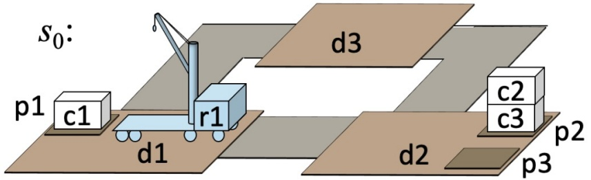

<!-- page: 5 -->

## The DWR Domain from Chapter 2

Action schemas:

▸ take(r, c, c′, p, d)

pre: at(p,d), cargo(r) = nil, loc(r) = d, pos(c)= c′, top(p) = c

• eff: cargo(r) ← c, pile(c) ← nil, pos(c) ← r, top(p) ← cʹ

▸ put(r, c, c′, p, d)

• pre: at(p,d), pos(c) = r, loc(r) = d, top(p) = c′

• eff: cargo(r) ← nil, pile(c) ←p, pos(c) ← c′, top(p) ← c

▸ move(r, d, d′ )

pre: adjacent(d,d′), loc(r) = d, occupied(d ʹ) = F

where

• eff: loc(r) ← d′, occupied(d) ← F, occupied(d ʹ) ← T

▸ c ∈ Containers; c′ ∈ Containers ∪ Robots ∪ {nil};

▸ d, d ʹ ∈ Docks; p ∈ Piles; r ∈ Robots.

**Poll:** Notice that cargo(r) = c iff pos(c) = r. Can we rewrite the domain to eliminate cargo(r)? A. yes B. no C. don’t know

● State variables:

• cargo(r) ∈ Containers ∪ {nil}

• loc(r) ∈ Docks

• occupied(d) ∈ {T, F}

• pile(c) ∈ Piles ∪ {nil}

• pos(c) ∈ Robots ∪ Containers ∪ {nil}

▸ where r ∈ Robots, c ∈ Containers, p ∈ Piles

<div class="docvortex-algorithm" style="white-space: pre-wrap; font-family:monospace;">
$s_0 = \{\text{cargo}(r1) = \text{nil}, \text{cargo}(r2) = \text{nil}, \quad \text{loc}(r1) = d1, \quad \text{loc}(r2) = d2, \quad \text{occupied}(d1) = T, \text{occupied}(d2) = F, \text{occupied}(d3) = F, \quad \text{pile}(c1) = p1, \quad \text{pile}(c2) = p2, \quad \text{pile}(c3) = p2, \quad \text{pos}(c1) = \text{nil}, \quad \text{pos}(c2) = c3, \quad \text{pos}(c3) = \text{nil}, \quad \text{top}(p1) = c1, \quad \text{top}(p2) = c2, \quad \text{top}(p3) = \text{nil}\}$
</div>

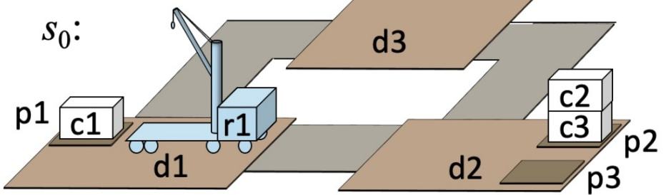

<!-- page: 6 -->

## TOHTN Planning Domain

## If I say “HTN” assume TOHTN unless stated otherwise

● TOHTN planning domain $\Sigma = ( \Sigma _ { \mathrm { c } } ,   \mathcal { M } )$

▸ $\Sigma _ { \mathrm { c } } = \mathrm { D W R }$ domain on the previous pages

▸ $\mathcal { M }   =   \mathbf { a }$ set of eight methods:

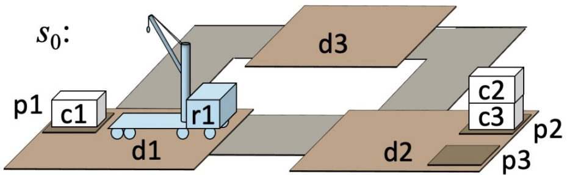

Compound task put-in-pile $( r ,   c ,   p ,   d ) ;$ put container c into pile $p$ if it isn’t there already

```txt
m1-put-in-pile(r, c, p, d)
  task: {pile(c) = p}
    pre: at(p, d), pile(c) ≠ p, cargo(r) = nil
    sub: get-container(r, c), navigate(r, d), put(r, c, top(p), p, d)
```

Preconditions:

• $1 ^ { \mathrm { s t } }$ one ensures d has the correct value

• Others check for applicability

▸ Last subtask: one of the args is a state variable, $\mathsf { t o p } ( p )$

• Violates a restriction in Chapter 2

• But many HTN algorithms don’t need the restriction

<!-- page: 7 -->

## TOHTN Planning Domain (continued)

```txt
- Goal task: goal(cargo(r)=c)
  - Get c onto r
  - Subtask of m2-put-in-pile
- We aren't doing classical planning, so we need a method:
    m1-get-container(r, c)
      task: get-container(r, c)
        pre: cargo(r) = c
        sub: // no subtasks
    m2-get-container(r, c, p, d)
      task: get-container(r, c)
        pre: cargo(r) = nil, pile(c) = p, at(p, d)
        sub: navigate(r, d), uncover(c),
          take(r, c, pos(c), p, d)

- Compound task uncover(c):
    - Subtask of m1-fetch
    - Remove any containers that may be piled on top of c
    m1-uncover(c)
      task: uncover(c)
      pre: top(pile(c)) = c
      sub: // no subtasks
    m2-uncover(r, c, p, c', p', d)
      task: uncover(c)
      pre: pile(c) = p, top(p) = c', c' ≠ c,
         at(p, d), at(p', d), p ≠ p',
         loc(r) = d, cargo(r) = nil
      sub: take(r, c', pos(c'), p, d),
         put(r, c', top(p'), p', d),
         uncover(c)

Poll: Can we rewrite m2-uncover to eliminate c'?
A. yes B. no C. don't know
```

<!-- page: 8 -->

## TOHTN Planning Domain (continued)

● Compound task navigate(r,d):

Get robot r from current location to d

▸ May require several move actions

These methods are just for illustration, I don’t recommend using them

Use a route planner instead

<div class="docvortex-algorithm" style="white-space: pre-wrap; font-family:monospace;">
- Method for the case where $\mathrm{loc}(r) = d$  
    m1-navigate(r, d)  
    task: navigate(r, d)  
    pre: loc(r) = d  
    sub: — // no subtasks
</div>

Method for cases where loc(r) is adjacent to d m2-navigate(r, d', d) task: navigate(r, d) pre: adjacent(d', d), loc(r) = d' sub: move(r, d', d)

```javascript
- Method for cases where loc(r) isn't adjacent to d
  m3-navigate(r, d', d)
    task: navigate(r, d)
      pre: loc(r) ≠ d, ¬adjacent(loc(r), d), adjacent(loc(r), d')
      sub: move(r, loc(r), d')          // primitive task
        navigate(r, d)              // compound task
```

● Methods in M:

```css
m1-put-in-pile, m2-put-in-pile,
m1-get-container, m2-get-container,
m1-uncover, m2-uncover,
m1-navigate, m2-navigate, m3-navigate
```

● Tasks in Σ:

Primitive: all instances of

• move(r,l,m), take(r,c,l), put(r,c,l)

▸ Compound: all instances of

• put-in-pile(c,p), uncover(c), and navigate(r,d)

▸ Goal tasks: all instances of goal(cargo(r) = c)

<!-- page: 9 -->

## TOHTN Planning problem

● Planning problem: $P = ( \Sigma ,   s _ { 0 } ,   T )$

● Solution (detailed definition in book)

any executable plan produced by applying method instances to nonprimitive tasks, actions to primitive tasks

● Refinement tree (detailed definition in book)

▸ tree showing how the solution was derived

▸ Nodes:

root, compound tasks, goal tasks, method instances, actions

▸ Edges: root → top-level tasks, task → method instance, method instance → subtasks

$$
\begin{array}{l} P = (\Sigma , s _ {0}, \langle \{\text {pile} (c 1) = p 2 \} \rangle) \\ \pi = \langle \text {take} (r 1, c 1, c 2, p 1, d 1), \text {move} (r 1, d 1, d 2), \text {put} (r 1, c 1, c 3, p 2, d 2) \rangle \end{array}
$$

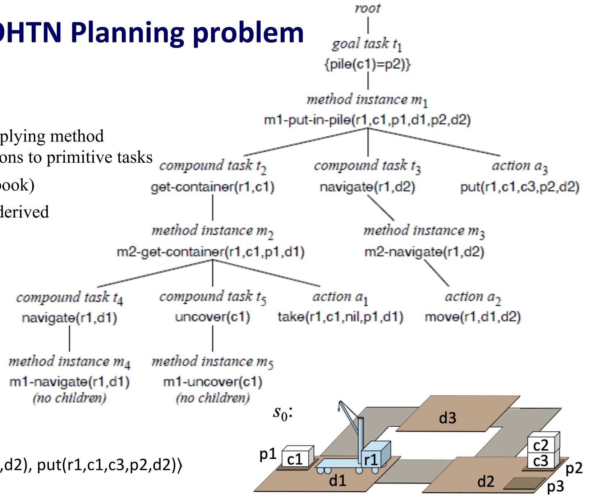

<!-- page: 10 -->

```txt
Planning Algorithm
Definitions
Achievers(s, t) = {a ∈ Applicable(s) | γ(s, a) ⊨ t}
Ground(M) = {all ground instances of methods in M}
Refiners(s, t, M) = {m ∈ Ground(M) | t is refinable by m in s}
Three cases: primitive, compound, goal task
▶ Primitive task: apply action
state s; T = ⟨t, t2, ..., tk⟩
new state γ(s, t); T' = ⟨t2, ..., tk⟩
▶ Compound task: apply method instance
state s; T = ⟨t, t2, ..., tk⟩
method instance m
⟨u1, ..., uj, t2, ..., tk⟩
▶ Goal task: apply method instance or action
TO-HTN-Forward(Σc, M, s, T)
if T is empty then return ⟨⟩
t ← the first element of T; T' ← the rest of T
M ← HTN-Get-Candidates(Σc, M, s, t)
if M = Ø then return failure
nondeterministically choose m ∈ M
switch m do
case m is an action do
π ← TO-HTN-Forward(Σc, M, γ(s, m), T')
if π ≠ failure then return m · π
else return failure
case m is a ground method do
return TO-HTN-Forward(Σc, M, s, subtasks(m) · T')
HTN-Get-Candidates(Σc, M, s, t)
switch t do
case t is an action do
if t is applicable in s then M ← {a}
else M ← Ø
case t is a compound task do M ← Methods(s, t, M)
case t is a goal task do
M ← Methods(s, t, M) ∪ Actions(s, t)
if s ⊨ t then M ← M ∪ {null}
return M
```

<!-- page: 11 -->

## Planning Algorithm

● Most implementations do depth-first

Can use heuristic function, but the ones in Chapter 3 will probably need modification

Primitive task: apply action

$$
T = \langle t, t _ {2}, \dots , t _ {k} \rangle
$$

$$
\gamma (s, t); T = \left\langle t _ {2}, \dots , t _ {k} \right\rangle
$$

Compound task: apply all method instances

state s; $T = \langle t , t _ { 2 } , \ldots , t _ { k } \rangle$ method instance m

```txt
TO-HTN-Forward-Det(Σc, M, s0, T0)
    Frontier ← {⟨⟩, s0, T0} // {initial node}
    Expanded ← Ø
    while Frontier ≠ Ø do
        select a node ν = (π, s, T) ∈ Frontier
        remove ν from Frontier and add it to Expanded
        if T = ⟨⟩ then return π
        t ← the first element of T; T' ← the rest of T
        switch t do
            case t is an action do
                if t is applicable in s then Children ← {(π·t, γ(s, t), T')} else Children ← Ø
            case t is a compound task do
                Children ← {(π, s, sub(m)·T') | m ∈ Refiners(s, t, M)}
            case t is a goal task do
                Children ← {(π·a, γ(s, a), T') | a ∈ Achievers(s, t) ∪ {(π, s, sub(m)·T') | m ∈ Refiners(s, t, M)}
                if s |= t then Children ← Children ∪ {(π, s, T')} prune 0 or more nodes from Children, Frontier and Expanded Frontier ← Frontier ∪ Children
    return failure
```

## Goal task: apply all method instances and actions

<!-- page: 12 -->

## Search Direction, Search Strategies

● Down, then forward (progression)

▸ totally-ordered compound tasks: SHOP, Pyhop, GTPyhop

▸ partially-ordered compound tasks: SHOP2, SHOP3

▸ totally-ordered goal tasks: GDP, GoDeL

▸ acting, task refinement: RAE

▸ Monte Carlo rollouts: UPOM

● Down and backward (regression)

▸ plan-space planning: SIPE, O-Plan, UMCP

● Forward, then down (level 1, level 2, level 3, …)

▸ AHA\*: A\* search

▸ Bridge Baron 1997: game-tree generation

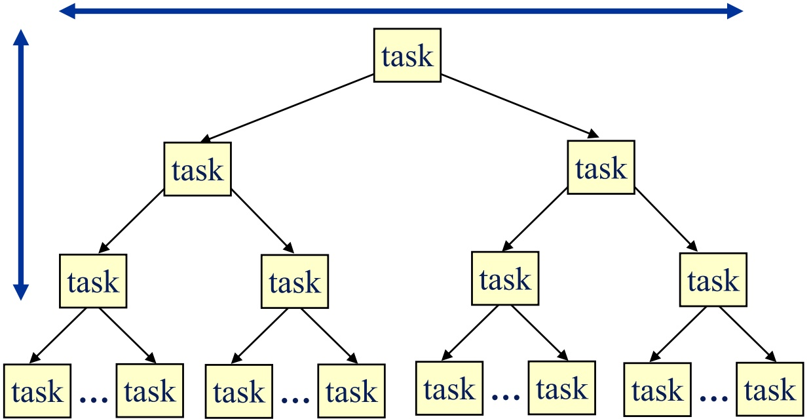

<!-- page: 13 -->

## Complexity and Expressivity

## ● HTN planning is Turing-complete

▸ There are HTN planning problems that are undecidable

● TOHTN planning is decidable, but is more expressive than classical planning

▸ Every classical planning problem can be translated into an equivalent TOHTN planning problem

▸ There are TOHTN planning problems that cannot be translated into classical planning problems

Some subsets of TOHTN planning can be translated into classical planning problems

● Some subsets of TOHTN planning can be translated into propositional logic

These translation techniques have been used to produce efficient TOHTN planners

● All of these are worst-case results

▸ Most TOHTN planning problems are much simpler (e.g., in NP)

▸ Example later

<!-- page: 14 -->

## Pyhop

● A simple HTN planner written in Python

Open-source software, Apache license

• import pyhop

[▸ http://bitbucket.org/dananau/pyhop](http://bitbucket.org/dananau/pyhop)

▸ Depth-first version of TO-HTN-Forward with no goal tasks

▸ Less than 150 lines of code, works in both Python 2 and 3

State: Python object that contains state variables

s = gtpyhop.State('Current state')

▸ To say r1 is at d1 in state s:

• s.loc['r1'] = 'd1'

● Actions and methods: ordinary Python functions

● Some limitations compared to most other HTN planners

▸ I’ll discuss later

<!-- page: 15 -->

## Comparison

Task: transport(c,y,z) – transport c from y to z

## ● TOHTN method:

```python
Method m_transport(r,x,c,y,z)
    Task: transport(c,y,z)
    Pre: loc(r) = x, cargo(r) = nil, loc(c) = y
    Sub: move(r,x,y), take(r,c,y), move(r,y,z), put(r,c,z)
```

## Most HTN planners:

● Write in a planning language the planner can read and analyze

Can have parameters not mentioned in the task • robot r, location x

▸ Backtrack over multiple possibilities

Planner knows in advance what the subtasks are

▸ Helps with implementing heuristic functions ● Pyhop method: ordinary Python function ▸ Args: state s and the task parameters

```python
def m_transport(s,c,y,z):
    (r,x) = find_suitable_robot('transport',s,c,y,z)
    if r != 'failure':
        return [('move',r,x,y), ('take',r,c,y), \
            ('move',r,y,z), ('put',r,c,z)]
    else: return False
```

## ● Advantages

Don’t need to learn a planning language: write methods and actions in Python

## Disadvantages:

▸ Planner doesn’t know in advance what the subtasks are

• How to implement a heuristic function?

▸ What about parameters not mentioned in the task?

<!-- page: 16 -->

## GTPyhop

● GTPyhop (2021):

● Like Pyhop, but has both compound tasks and goal tasks

▸ declare task methods for compound tasks

▸ declare goal methods for goal tasks

Open-source: [https://github.com/dananau/GTPyhop](https://github.com/dananau/GTPyhop)

● Mostly backward-compatible with Pyhop

Two kinds of goals:

● Unigoal: a single atom

▸ represented as a triple (name, arg, value)

```txt
('pos', 'a', 'b')
```

▸ goal: get to a state s in which

```javascript
s.pos['a']=='b'
```

● Multigoal: a conjunction of atoms

▸ represented as a state-like object

```txt
g = gtpyhop.Multigoal('Sussman goal')
```

```txt
g.pos = {'a':'b', 'b':'c'}
```

▸ goal: get to a state s in which

```javascript
s.pos['a']=='b' and s.pos['b']=='c'
```

<!-- page: 17 -->

## Example: Blocks World

● Simple classical planning domain

Blocks, robot hand for stacking them, infinitely large table

● State-variable notation:

● pickup(x)

▸ pre: loc(x)=table, clear(x)=T, holding=nil

▸ eff: loc(x)=crane, clear(x)=F, holding=x

● putdown(x)

▸ pre: holding=x

▸ eff: holding=nil, loc(x)=table, clear(x)=T

unstack(x,y)

▸ pre: loc(x)=y, clear(x)=T, holding=nil

▸ eff: loc(x)=crane, clear(x)=F, holding=x, clear(y)=T

● stack(x,y)

▸ pre: holding=x, clear(y)=T

▸ eff: holding=nil, clear(y)=F, loc(x)=y, clear(x)=T

● The “Sussman anomaly”

Planning problem that caused problems for early classical planners

$$
\begin{array}{r l} s _ {0} = & \{\text {clear} (a) = F, \text {clear} (b) = T, \\ & \text {clear} (c) = T, \\ & \text {loc} (a) = \text {table}, \\ & \text {loc} (b) = \text {table}, \text {loc} (c) = a, \\ & \text {holding} (\text {hand}) = \text {nil} \} \end{array}
$$

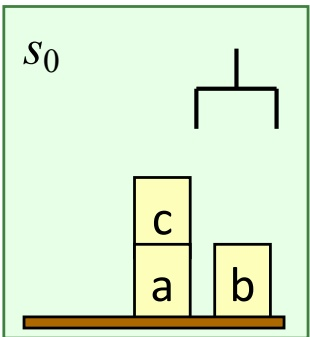

$$
g = \{\text {loc} (a) = b, \text {loc} (b) = c \}
$$

π = ⟨unstack(c,a), putdown(c), pickup(b), stack(b,c), pickup(a), stack(a,b)⟩

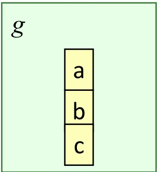

<!-- page: 18 -->

## Domain-Specific Algorithm

## loop

**if** there’s clear block that needs to be moved and it can immediately be moved to a place where it won’t need to be moved again **then** move it there

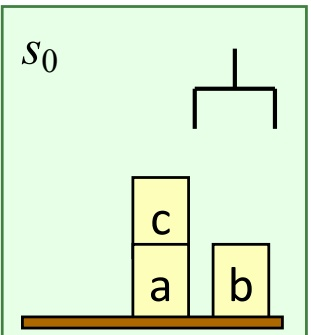

**else if** there’s a clear block that needs to be moved **then** move it to the table

**else if** the current state satisfies the goal

**then return** success

**else return** failure

● Situations in which c needs to be moved:

▸ $\operatorname { l o c } ( c ) { = } d ,$ goal contains $\operatorname { l o c } ( c ) { = } e ,$ and $d \neq e$

▸ $\operatorname { l o c } ( c ) { = } d ,$ d is a block, goal contains $\mathsf { l o c } ( b ) { = } d$ for some $b   \neq   c$

▸ loc $c ( c ) { = } d$ and d is a block that needs to be moved

● Can extend this to include situations involving clear and holding

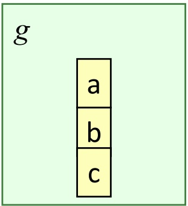

π = ⟨unstack(c,b), putdown(c), pickup(b), stack(b,c), pickup(a), stack(a,b)⟩

● Sound, complete, guaranteed to terminate

● Runs in time $O ( n ^ { 3 } )$

▸ Can be modified to run in time $O ( n )$

Often finds optimal (shortest) solutions, but sometimes only near-optimal

▸ For block-stacking problems, PLAN-LENGTH is NP-complete

● Can implement as GTPyhop methods

<!-- page: 19 -->

## States and Goals

Initial state:

$$
s _ {0} \quad \begin{array}{c c c} & & \\ & \text {c} \\ & \text {a} & \\ & & \text {b} \end{array}
$$

A State object to hold all the state-variable bindings:

```python
s0 = gtpyhop.State('Sussman initial state')
s0.pos = {'a':'table', 'b':'table', 'c':'a'}
s0.clear = {'a':False, 'b':True, 'c':True}
s0.holding = {'hand':False}
```

```python
s0.pos = {'a':'table', 'b':'table', 'c':'a'}
```

is Python dictionary notation for

```txt
s0.pos['a'] = 'table'
s0.pos['b'] = 'table'
s0.pos['c'] = 'a'
```

Goal:

$$
\boxed { \begin{array}{c} g \\ \hline a \\ \hline b \\ \hline c \end{array} }
$$

Two ways to write goals:

Unigoal: a single atom

▸ represented as a triple (name, arg, value)

```txt
('pos', 'a', 'b')
```

▸ get to a state s in which

```javascript
s.pos['a']=='b'
```

● Multigoal: a conjunction of atoms

```python
represented as a state-like object
g = gtpyhop.Multigoal('Sussman goal')
g.pos = {'a':'b', 'b':'c'}
```

▸ get to a state s in which

```javascript
s.pos['a']=='b' and s.pos['b']=='c'
```

<!-- page: 20 -->

## Actions

```python
• Args: current state s, block x
def pickup(s,x):
    if s.pos[x] == 'table' \
        and s.clear[x] == True \
        and s.holding['hand'] == False:
    s.pos[x] = 'hand'
    s.clear[x] = False
    s.holding['hand'] = x
    return s

def putdown(s,x):
    if s.holding['hand'] = x:
        s.pos[x] = 'table'
        s.clear[x] = True
        s.holding['hand'] = False
        return s

gtpyhop.declare_actions(pickup,putdown)
    Tell GTPyhop these are actions
```

<table><tr><td colspan="5">Poll. How many arguments does the unstack task have?</td></tr><tr><td>A. 1</td><td>B. 2</td><td>C. 3</td><td>D. other</td><td>E. don’t know</td></tr></table>

<!-- page: 21 -->

## Task Methods

## m\_take: method to pick up a clear block x, regardless of what it’s on

▸ Args: current state s, block x.

## ▸ if x is clear:

return one task list if x is on the table, another task list if x isn’t on the table

▸ Else return nothing

means method is inapplicable

• (also OK to return false like Pyhop does)

▸ Declare m\_take to be a task method

• relevant for all tasks of the form (take, ...)

```python
def m_take(s,x):
    if s.clear[x] == True:
        if s.pos[x] == 'table':
            return [('pickup', x)]
        else: return [('unstack',x,s.pos[x])]
gtpyhop.declare_task_methods('take',m_take)

def m_put(s,x,y):
    if s.holding['hand'] == x:
        if y == 'table': return [('putdown',x)]
        else: return [('stack',x,y)]
    else: return False} optional
gtpyhop.declare_task_methods('put',m_put}) declare relevant for task 'put'
```

## ● m\_put: similar

```txt
Poll. In a TOHTN planning domain, how many methods would we need for take?
A. 1 B. 2 C. 3 D. other E. don’t know
```

<!-- page: 22 -->

```python
def m_moveblocks(s, mgoal):
    for x in all_clear_blocks(s):
        stat = status(x, s, mgoal)
        if stat == 'move-to-block':
            where = mgoal.pos[x]
            return [('take',x), ('put',x,where), mgoal]
        elif stat == 'move-to-table':
            return [('take',x), (put,x,'table'), mgoal]
    for x in all_clear_blocks(s):
        if status(x,s,mgoal) == 'waiting' \
            and s.pos[x] != 'table':
            return [('take',x), ('put',x,'table'), mgoal]
        return [ ]
                declare relevant for every
    gtpyhop.declare_multigoal_methods(m_moveblocks)} multigoal

gtpyhop.find_plan(s0,g)
returns
[('unstack','c','a'), ('putdown','c'),
('pickup','b'), ('stack','b','c'),
('pickup','a'), ('stack','a','b')]
```

## Goal Methods

```txt
loop
if there's clear block that needs to be moved and it can immediately be moved to a place where it won't need to be moved again then move it there
else if there's a clear block that needs to be moved then move it to the table
else if the current state satisfies the goal then return success
else return failure
```

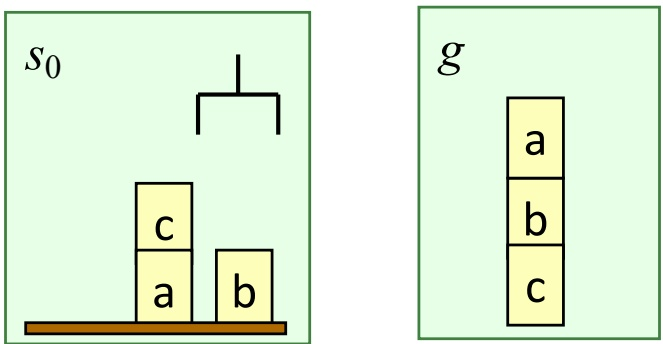

<!-- page: 23 -->

## POHTN (Partially Ordered HTN) Planning

Sometimes we don’t want to specify a total ordering on tasks

Represent partially ordered tasks as a task network:

▸ a pair $\mathcal { T }   =   ( T , \prec )$

▸ T is a set of task nodes

▸ ≺ is a partial ordering of T

● Task node: a pair τ = (l, t)

▸ t is a task

▸ l is a name that uniquely identifies τ

Need labels so we can have multiple occurrences of t

● POHTN Method: a tuple (head, task, pre, sub, ≺)

● As usual, write POHTN methods as pseudocode:

method-name(args)

Task: nonprimitive task

Pre: preconditions

Sub: subtask nodes

≺: partial ordering of the subtask nodes

● TOHTN planning is a special case of POHTN planning

▸ ≺ is a total ordering

● Details on the following slides

▸ We’ll skip them

<!-- page: 24 -->

## Example POHTN Problem

<div class="docvortex-algorithm" style="white-space: pre-wrap; font-family:monospace;">
- $\Sigma_{c}$: DWR with cranes attached to loading docks, not robots
unstack(k, c, c', p, d) // take container c from pile p
pre: at(k, d), at(p, d), holding(k) = nil, pos(c) = c', top(p) = c
eff: holding(k) ← c, pos(c) ← k, pile(c) ← nil, top(p) ← c'
stack(k, c, c', p, d) // put container c onto pile p
pre: at(k, d), at(p, d), holding(k) = c, top(p) ← c'
eff: holding(k) ← nil, pos(c) = c', pile(c) ← p, top(p) = c
unload(k, c, r, d) // take container c from robot r
pre: at(k, d), holding(k) = c, loc(r) = d
eff: cargo(r) ← c, pos(c) ← r, holding(k) ← nil
load(k, c, r, d) // put container c onto robot r
pre: at(k, d), holding(k) = nil, loc(r) = d, cargo(r) = c
eff: pos(c) ← k, holding(k) ← c, cargo(r) ← nil

Poll. How many solution plans?
A. 1 B. 2 C. 3 D. 4 E. other

cture slides for Acting, Planning, and Learning. Creative Commons CC BY-SA 4.0
</div>

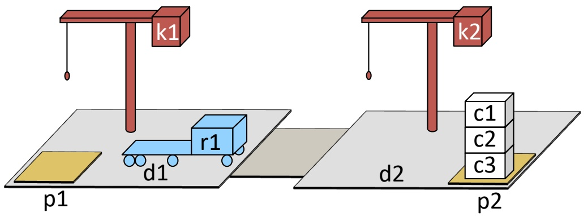

```txt
P = (Σ, s₀, (T, <))
► T = {put-on-robot(c1,r1)}; < = Ø

m1-put-on-robot(k, c, c', r, d, p)
task: put-on-robot(c, r)

Σ = (Σc, M)
► M : three
methods
pre: cargo(r) = nil, top(p) = c, at(p,d),
attached(k,d), holding(k) = nil
sub: (t1, navigate(r, d))
(t2, unstack(k,c,c',p,d))
(t3, load(k,r,c,d))
<: t1 < t3, t2 < t3

m1-navigate(r, d)
task: navigate(r, d)
pre: loc(r) = d
sub: // none
<: // none
m2-navigate(r, d', d)
task: navigate(r, d)
pre: adjacent(d', d), loc(r) = d'
sub: (t1, move(r, d', d))
<: // none
```

<!-- page: 25 -->

## Solution Trees

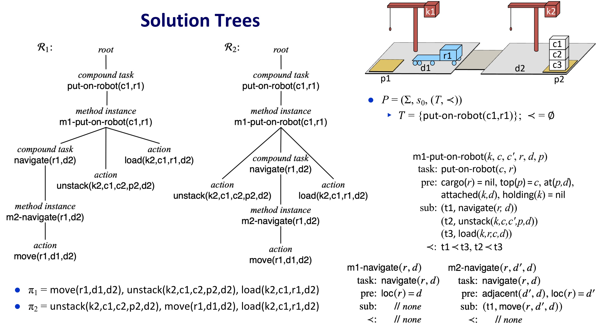

<!-- page: 26 -->

## Planning Algorithm

Three cases: primitive, compound, goal task

Primitive task node: apply action

$\mathcal { T } = ( T , \prec ) , \quad T = \{ \tau , \tau _ { 2 } , \ldots , \tau _ { k } \}$ , nothing precedes τ

state s<sub>0</sub>

i.e., $\not \exists \tau ^ { \prime }   \in T$ s.t. $\tau ^ { \prime } \prec \tau$

new state $\vec { \gamma ( s _ { 0 } , \tau ) } \; ; \quad \{ \tau _ { 2 } ,   \dots ,   \tau _ { k } \}$

● Compound task node: apply method instance

$T = (T, \prec), \quad T = \{\tau, \tau_2, \ldots, \tau_k\}$ , nothing precedes τ

method instance m

i.e., $\nexists \tau ^ { \prime }   \in   T   \mathrm { s . t . } \; \tau ^ { \prime }   \prec \tau$

state $s _ { 0 }$

$$
\{\overbrace {v _ {1} , \dots , v _ {j}} ^ {}, \tau_ {2}, \dots , \tau_ {k} \}
$$

make $v _ { 1 } , . . . , v _ { j }$ precede everything τ preceded

PO-HTN-Forward $( \Sigma _ { \mathtt { c } } , \mathcal { M } , s , \mathcal { T } )$

if T is empty then return <>

1 nondeterministically choose a node τ in T that has no predecessors in T foreach τ' in T that has no predecessors in T do

2 $\bigsqcup \textbf { i f } \tau ^ { \prime } \neq \tau$ then add ordering constraints to T to make $\tau < \tau ^ { \prime }$

$$
t \leftarrow \operatorname{task} (\tau)
$$

$$
M \leftarrow \text { HTN - Get - Candidates } (\Sigma_ {\mathrm{c}}, \mathcal {M}, s, t)
$$

if $M \ne \varnothing$ then

nondeterministically choose $m \in M$

if m is an action then

$$
\pi \leftarrow \text {PO - HTN - Forward} (\Sigma_ {\mathrm{c}}, \mathcal {M}, \gamma (s, a), \mathcal {T} \setminus \{\tau \})
$$

if π ≠ failure then return $a \cdot \pi$

else if m is a ground method then

return PO-HTN-Forward $( \Sigma _ { \mathtt { c } } , \mathcal { M } , s , \mathit { r e f i n e } ( \mathcal { T } , \tau , m ) )$

return failure

<!-- page: 27 -->

## Summary

## ● HTN planning

▸ Planning problem: initial state, list of tasks

▸ Apply HTN methods to tasks to get subtasks (smaller tasks)

• Do this recursively to get smaller and smaller subtasks

▸ At the bottom: primitive tasks that correspond to actions

▸ TOHTN: tasks are totally ordered

• Planning algorithm: TO-HTN-Forward

▸ POHTN: tasks are partially ordered

• Planning algorithm: PO-HTN-Forward

● Pyhop: Python implementation of total-order HTN planning

▸ Open source: [http://bitbucket.org/dananau/pyhop](http://bitbucket.org/dananau/pyhop)

GTPyhop: Python implementation of HTN + HGN planning

▸ Open source: [https://github.com/dananau/GTPyhop](https://github.com/dananau/GTPyhop)

● Examples: DWR, blocks world, cranes
