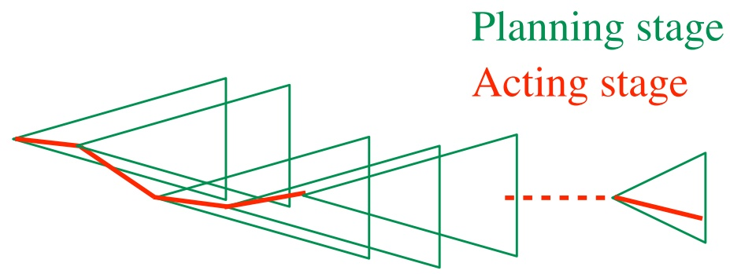
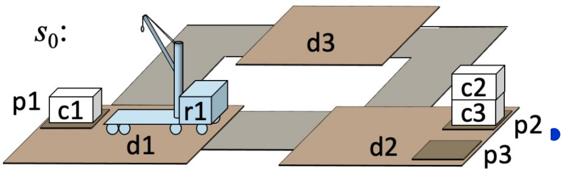
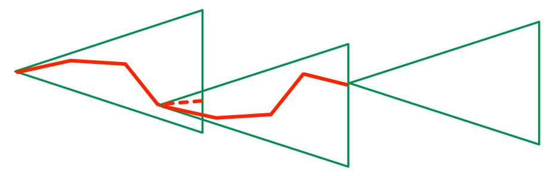
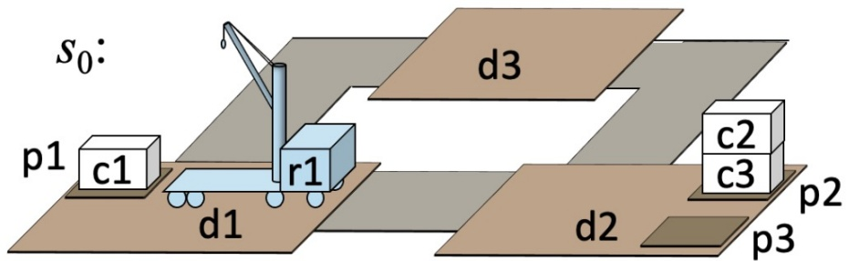
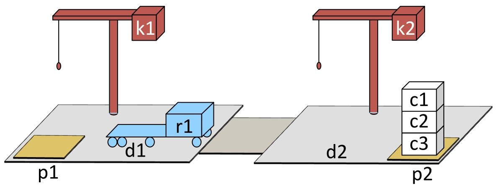
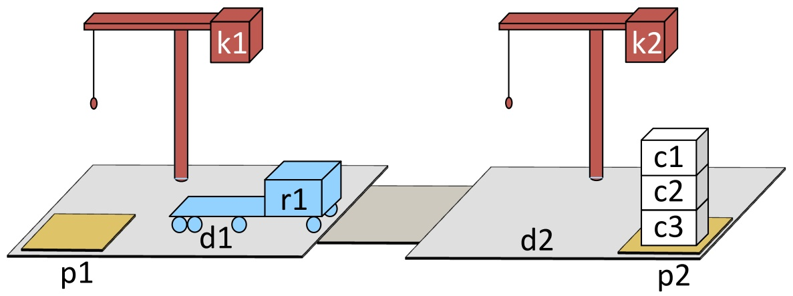
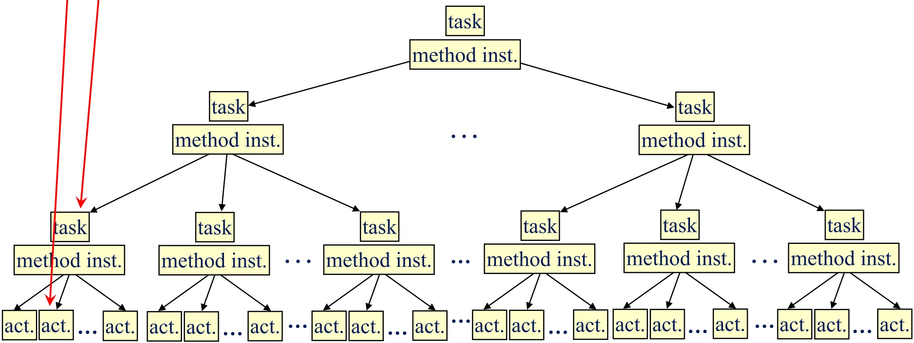
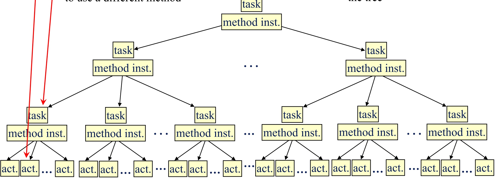
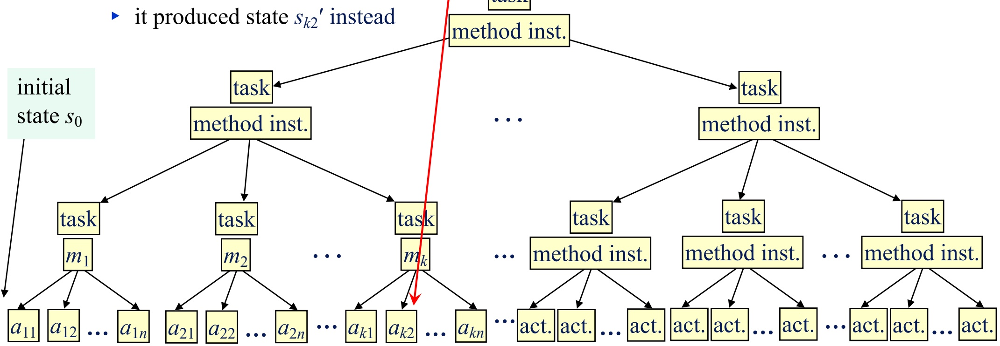

<!-- page: 1 -->


## Chapter 6 Acting with HTNs

Dana S. Nau

University of Maryland

with contributions from

[Mark “mak” Roberts](https://scholar.google.com/citations?user=vlbX4J8AAAAJ)

## Acting, Planning, and Learning

Malik Ghallab, Dana Nau, and Paolo Traverso

<!-- page: 2 -->

## Using HTN Domain Models for Acting

● Unlike an HTN domain model, the actor’s environment is not necessarily deterministic or static

▸ Exogenous events, unanticipated action outcomes ⇒ current state may be different from what an HTN model would predict

● Actor can’t backtrack to a previous state; prior actions are in the past

● HTN domain models still are very useful for providing operational models to the actor

▸ How to carry out “standard operating procedures”

▸ How to perform complex tasks without searching through a large state space

▸ How to avoid situations where unanticipated events are likely to cause bad outcomes

▸ How to recover when unanticipated events occur

<!-- page: 3 -->

## Reactive HTN Actor

● Like TO-HTN-Forward but executes each action

▸ Can similarly modify other Chapter 5 algorithms **Line**

0 Return success or failure, not a plan

1 s isn’t an argument, observe it instead

3 Instead of computing γ, execute action

2 Failure recovery: if m fails, try next one

if they all fail, return failure to next higher level in the recursion stack, to try other methods there

● At Line 2, a bad method instance can lead to non-optimal solution or failure

Can use a heuristic function

▸ Can call an HTN planner – but other ways have less computational overhead

<div class="docvortex-algorithm" style="white-space: pre-wrap; font-family:monospace;">
TO-HTN-Act($\Sigma_c, \mathcal{M}, T$)
if $T$ is empty then return success
    $t \leftarrow$ the first element of $T$; $T' \leftarrow$ the rest of $T$
$s \leftarrow$ observe current state
    $M \leftarrow$ HTN-Get-Candidates($\Sigma_c, \mathcal{M}, s, t$)
foreach $m \in M$ do
    if $m$ is a method instance then
        if TO-HTN-Act($\Sigma, \text{sub}(m) \cdot T'$) = success then return success
    else if $m$ is an action then
        execute $m$
        if $m$ executed successfully then return TO-HTN-Act($\Sigma, T'$)
return failure
</div>

| Poll 1. Is line doing backtracking?A. Yes B. No C. Unsure |
| --- |

<!-- page: 4 -->

## Run-HLookahead

```python
HTN-Run-Lookahead(Σ, T)
    while True do:
        s ← observed current state
        π = Lookahead(Σ, s, T)
        if π = failure then return failure
        if π = ⟨⟩ then return success
        a ← pop(π)
        trigger execution of a
```

● Here, Lookahead is an HTN planner

● Goal formula may not exist

▸ Cannot rely on $s \models g$

▸ Need Lookahead to return ⟨ ⟩ iff no actions are needed to accomplish T

Call Lookahead, get π, perform 1<sup>st</sup> action, call HLookahead again …

● Useful when unexpected things are likely to happen ▸ Replans immediately

● Lookahead needs to return quickly

▸ Otherwise, HTN-Run-Lookahead may pause repeatedly waiting for Lookahead to return

▸ May want Lookahead to look a limited distance or horizon ahead



<!-- page: 5 -->

## Run-HLookahead (Example 1)

HTN-Run-Lookahead(Σ, T )

**while** True **do**:

s ← observed current state

if π = failure **then return** failure

i $\Gamma \pi = \langle \rangle$ **then return** success

$$
a \leftarrow \mathrm{pop} (\pi)
$$

trigger execution of a



Call HTN-Run-Lookahead with Lookahead = TO-HTN-Forward (THF)

▸ Σ = the TOHTN domain in Example 5.8

71 $\mathbf { P } = ( \Sigma ,   s _ { 0 } ,   T = \langle \{ \mathsf { p i l e } ( \mathsf { c } 1 ) { = } \mathsf { p } 2 \} \rangle )$

● If nothing unexpected happens:

▸ Call TO-HTN-Forward(Σ, s<sub>0</sub>, T )

• π = ⟨take(r1,c1,c2,p1,d1), move(r1,d1,d2), $\mathsf { p u t } ( \mathsf { r } 1 { , } \mathsf { c } 1 { , } \mathsf { c } 3 { , } \mathsf { p } 2 { , } \mathsf { d } 2 ) \rangle$

▸ Execute take(r1,c1,c2,p1,d1)

▸ Call THF(..), get π = ⟨move(r1,d1,d2), put(r1,c1,c3,p2,d2)⟩

▸ execute move(r1,d1,d2),

▸ call $\mathsf { T H F } ( . . ) , \mathsf { g e t } \; \pi = \langle \mathsf { p u t } ( \mathsf { r 1 } , \mathsf { c 1 } , \mathsf { c 3 } , \mathsf { p 2 } , \mathsf { d 2 } ) \rangle$

▸ execute put(r1,c1,c3,p2,d2),

▸ Call $\mathsf { T H F } ( . . ) _ { 2 }$ get $\pi = \langle \rangle ,$ return success

If something unexpected happens but the problem is still solvable:

▸ Call $\mathsf { T H F } ( . . )$ with latest observed state, it returns a new plan

▸ This could fail if there is no applicable method for the new state!

<!-- page: 6 -->

## Run-Lazy-HLookahead

```python
HTN-Run-Lazy-Lookahead(Σ, T)
    π ← ⟨⟩; a ← nil
    while True do:
        if π = ⟨⟩ or execution of a failed then
            s ← observed state
            π = Lookahead(Σ, s, T)
            if π = failure then return failure
            if π = ⟨⟩ then return success
        a ← pop(π)
    trigger execution of a
```

## ● Could also add a Simulate program as in Run-Lazy-Lookahead

If we’ve exhausted the current plan, call Lookahead

Requires Lookahead to return ⟨ ⟩ iff no actions are needed to accomplish T

Planning Stage Acting Stage



<!-- page: 7 -->

## Run-Lazy-HLookahead (Example 1)

```python
HTN-Run-Lazy-Lookahead(Σ, T)
    π ← ⟨⟩; a ← nil
    while True do:
        if π = ⟨⟩ or execution of a failed then
            s ← observed state
            π = Lookahead(Σ, s, T)
            if π = failure then return failure
            if π = ⟨⟩ then return success
        a ← pop(π)
    trigger execution of a
```



● Call HTN-Run-Lazy-Lookahead with Lookahead = TO-HTN-Forward (THF)

▸ Σ = TOHTN domain in Example 5.8

▸ initial state $s _ { 0 } ,   T = \langle \{ { \mathsf { p i l e } } ( { \mathsf { c } } 1 ) { \mathsf { = } } { \mathsf { p } } 2 \} \rangle$

● If nothing unexpected happens:

• π = ⟨take(r1,c1,c2,p1,d1), move(r1,d1,d2), put(r1,c1,c3,p2,d2)⟩

▸ Pop actions from π and execute them, until $\pi = \langle \rangle$

Call THF again, get $\pi = \langle \rangle$ , return success

● If something unexpected happens but the problem is still solvable:

▸ Eventually, either π = ⟨ ⟩ or a has failed

▸ Call THF with observed state, it returns a new plan

HTN-Run-Lookahead is similar but it calls Lookahead before each action is executed

<!-- page: 8 -->

## Example 2

● POHTN planning domain

▸ Cranes at loading docks, not on the robots

● Actions:

The usual move action, and these:

```txt
unstack(k, c, c', p, d) // take container c from pile p
pre: at(k, d), at(p, d), holding(k) = nil, pos(c) = c', top(p) = c
eff: holding(k) ← c, pos(c) ← k, pile(c) ← nil, top(p) ← c'
```

```javascript
stack(k, c, c', p, d) // put container c onto pile p
pre: at(k, d), at(p, d), holding(k) = c, top(p) ← c'
eff: holding(k) ← nil, pos(c) = c', pile(c) ← p, top(p) = c
```

```javascript
unload(k, c, r, d) // take container c from robot r
pre: at(k, d), holding(k) = c, loc(r) = d
eff: cargo(r) ← c, pos(c) ← r, holding(k) ← nil
```

```javascript
load(k, c, r, d) // put container c onto robot r
pre: at(k, d), holding(k) = nil, loc(r) = d, cargo(r) = c
eff: pos(c) ← k, holding(k) ← c, cargo(r) ← nil
```

```javascript
- Methods
  m1-put-on-robot(k, c, c', r, d, p)
    task: put-on-robot(c, r)
      pre: cargo(r) = nil, top(p) = c, at(p, d),
        attached(k, d), holding(k) = nil
      sub: (t1, navigate(r, d)),          // compound task
        (t2, unstack(k, c, c', p, d)),   // action
        (t3, load(k, c, r, d))         // action
      <: t1 < t3, t2 < t3
- The usual navigate methods
```



<!-- page: 9 -->

## Example 2

● Call HTN-Run-Lazy-Lookahead with Lookahead = POHTN-Forward

7 $\Sigma = \mathrm { P O H T N }$ domain on previous page

▸ initial state $s _ { 0 } ,$ the only task in T is put-on-robot(c1,r1)

If nothing unexpected happens:

Call POTHN-Forward $( \Sigma ,   s _ { 0 } ,   \mathcal { T } )$

Two solution plans, suppose it returns this one:

• $\pi _ { 2 } = \langle \mathsf { u n s t a c k } ( \mathsf { k 2 } , \mathsf { c 1 } , \mathsf { c 2 } , \mathsf { p 2 } , \mathsf { d 2 } ) ,   \mathsf { m o v e } ( \mathsf { r 1 } , \mathsf { d 1 } , \mathsf { d 2 } ) ,$ load(k2,c1,r1,d2)⟩

▸ Pop actions from π and execute them, until $\pi = \langle \rangle$

Call POHTN-Forward again, get $\pi = \langle \rangle$ , return success

● Suppose move fails without changing the current state:

▸ Call POHTN-Forward $( \Sigma ,   s _ { 0 } ,   \mathcal { T } )$

failure: no applicable methods when k2 is holding c1

● Run-Lookahead

Call POHTN-Forward, get plan, execute unstack, call PPlan, PPlan fails

Lecture slides for [Acting, Planning, and Learning](https://projects.laas.fr/planning/). Creative Commons [CC BY-SA 4.0](https://creativecommons.org/licenses/by-sa/4.0/deed.en)

```txt
Run-Lazy-HLookahead(Σ, T)
    π ← ⟨⟩; a ← nil
    while True do:
        if π = ⟨⟩ or execution of a failed then
            s ← observed state
            π = HTN-Lookahead(Σ, s, T)
            if π = failure then return failure
            if π = ⟨⟩ then return success
        a ← pop(π)
    trigger execution of a
```



<!-- page: 10 -->

## Error Recovery in HTN Domains

HTN methods require the solution plan to follow a particular trajectory

● Encode requirements that aren’t explicit in the classical planning domain

▸ Safety requirements:

Secure a container onto the robot before starting to move the robot

▸ Commitments to other agents

Don’t use a particular resource, because others may need it

▸ A company’s standard operating procedures ● HTN-Run-Lookahead and HTN-Run-Lazy-Lookahead don’t know anything about the trajectory requirements

● That’s OK if nothing goes wrong

If unexpected events occur, need to recover in a way that still satisfies the trajectory requirements

● Three approaches

1. Modify TO-HTN-Act to call an HTN planner

• HTN planner returns a method selection

2. Modify HTN planner to return a solution tree

• Actor traverses the tree

3. Actor calls HTN planner to do replanning in a modified domain

<!-- page: 11 -->

## TO-HTN-Act (modified) with an HTN Planner

● HTN planner similar to TO-HTN-Forward, but returns the top-level method in its solution tree

● Suppose there’s an execution error here

▸ TO-HTN-Act calls the planner here, tells it to use a different method



<!-- page: 12 -->

## Traversing a Solution Tree

● HTN planner returns a solution tree

● Actor traverses the tree

Suppose there’s an execution error here

▸ Actor calls the planner here, tells it to use a different method

● HTN planner returns a solution tree, actor traverses the tree

● Time vs. space tradeoff

▸ Here, we need the entire tree

▸ In TO-HTN-Act, we don’t but the actor and planner duplicate effort, repeatedly recreating the current part of the tree



<!-- page: 13 -->

## Modifying the Planning Domain

● Modified version of HTN-Run-Lazy-Lookahead

▸ Calls TPlan to get a plan

● Suppose there’s an execution error here

▸ $a _ { k 2 }$ was supposed to produce state $s _ { k 2 }$

▸ it produced state $s _ { k 2 } { } ^ { \prime }$ instead

initial task t

● Actor calls TO-HTN-Forward again, with the same initial state $s _ { 0 }$ and task t as before

● Modified planning domain

Methods are modified so that the initial actions of the plan must be $a _ { 1 1 } , . . . , a _ { k n }$

▸ Action $a _ { k 2 }$ is modified so that $\gamma ( s _ { k 1 } ,   a _ { k 2 } ) = \; s _ { k 2 } { } ^ { \prime }$



<!-- page: 14 -->

## Summary

## ● Issues

▸ Actor’s environment may not be deterministic or static

▸ Actor can’t backtrack to a previous state

● TO-HTN-Act: reactive actor similar to TO-HTN-Forward

● HTN-Run-Lookahead, HTN-Run-Lazy-Lookahead

▸ Examples where they work well, where they don’t

● Error recovery in HTN domains

● Three approaches

▸ TO-HTN-Act modified to call an HTN planner

● Tradeoff: time versus space

▸ Actor that traverses a solution tree

▸ Actor that re-invokes TO-HTN-Forward on the original problem in a modified planning domain
