<!-- page: 1 -->

$$
(A \lor B \lor \neg C) \land (B \lor D) \land (\neg A) \land (B \lor C)
$$

## Conjunctive Normal Form

• Conjunctive normal form (CNF) formulas:

(A∨B∨-C)^(B∨D)^(-A)^(B∨C) $(A \lor B \lor \lnot C)$ is a clause

## Slide 10.1.2

Its outermost structure is a conjunction. It's a conjunction of multiple units. These units are called "clauses."

Slide 10.1.3

## Conjunctive Normal Form

• Conjunctive normal form (CNF) formulas:

$$
(A \lor B \lor \neg C) \land (B \lor D) \land (\neg A) \land (B \lor C)
$$

$(A \lor B \lor \neg C)$ is a clause, which is a disjunction of literals

• A, B, and ¬ C are literals

<!-- page: 2 -->

$$
(A \lor B \lor \neg C) \land (B \lor D) \land (\neg A) \land (B \lor C)
$$

$$
(A \lor B \lor \neg C) \land (B \lor D) \land (\neg A) \land (B \lor C)
$$

## Conjunctive Normal Form

• Conjunctive normal form (CNF) formulas:

$$
(A \lor B \lor \neg C) \land (B \lor D) \land (\neg A) \land (B \lor C)
$$

$(A \lor B \lor \lnot C)$ is a clause, which is a disjunction of literals

• A, B, and ¬ C are literals, each of which is a variable or the negation of a variable.

• Each clause is a requirement that must be satisfied and can be satisfied in multiple ways • Every sentence in propositional logic can be written in CNF

## Slide 10.1.6

You can take any sentence in propositional logic and write it in conjunctive normal form.

## Converting to CNF

<!-- page: 3 -->

$$
\neg (\phi \lor \varphi) \equiv \neg \phi \land \neg \varphi
$$

$$
\neg (\phi \land \varphi) \equiv \neg \phi \lor \neg \varphi
$$

## Converting to CNF

1. Eliminate arrows using definitions

## Slide 10.1.10

2. Drive in negations using De Morgan's Laws

$$
\neg (\phi \lor \varphi) \equiv \neg \phi \land \neg \varphi
$$

$$
\neg (\phi \land \varphi) \equiv \neg \phi \lor \neg \varphi
$$

3. Distribute or over and

The third step is to distribute or over and. That is, if we have (A or (B and C)) we can rewrite it as (A or B) and (A or C). You can prove to yourself, using the method of truth tables, that the distribution rule (and DeMorgan's laws) are valid.

$$
A \lor (B \land C) \equiv (A \lor B) \land (A \lor C)
$$

## Slide 10.1.11

## Converting to CNF

1. Eliminate arrows using definitions

2. Drive in negations using De Morgan's Laws

$$
\neg (\phi \lor \varphi) \equiv \neg \phi \land \neg \varphi
$$

$$
\neg (\phi \land \varphi) \equiv \neg \phi \lor \neg \varphi
$$

3. Distribute or over and

$$
A \vee (B \wedge C) \equiv (A \vee B) \wedge (A \vee C)
$$

4. Every sentence can be converted to CNF, but it may grow exponentially in size

<!-- page: 4 -->

$$
(A \lor B) \rightarrow (C \rightarrow D)
$$

$$
(A \lor B) \rightarrow (C \rightarrow D)
$$

$$
- (A \lor B) \lor (\neg C \lor D)
$$

## CNF Conversion Example

$$
(A \lor B) \to (C \to D)
$$

1. Eliminate arrows

$$
- (A \lor B) \lor (\neg C \lor D)
$$

2. Drive in negations

$$
(\neg A \land \neg B) \lor (\neg C \lor D)
$$

## Slide 10.1.14

Then we drive in the negation using deMorgan's law.

## CNF Conversion Example

$$
(A \lor B) \rightarrow (C \rightarrow D)
$$

1. Eliminate arrows

$$
- (A \lor B) \lor (\neg C \lor D)
$$

2. Drive in negations

$$
(\neg A \land \neg B) \lor (\neg C \lor D)
$$

3. Distribute

$$
(\neg A \lor \neg C \lor D) \land (\neg B \lor \neg C \lor D)
$$

<!-- page: 5 -->

Slide 10.2.1

We have talked a little bit about proof, with the idea that you write down some axioms -- statements that you're given -- and then you try to derive something from them. And we've all had practice doing that in high school geometry and we've talked a little bit about natural deduction. So what we're going to talk about now is resolution. Which is the way that pretty much every modern automated theorem-prover is implemented. It seems to be the best way for computers to think about proving things.

## Propositional Resolution

• Resolution rule:

α∨β

Slide 10.2.2

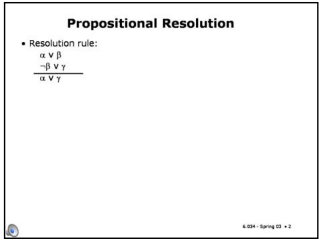

Slide 10.2.3

So here's the **resolution** inference rule, in the propositional case. It says that if you know "alpha or beta", and you know "not beta or gamma", then you're allowed to conclude "alpha or gamma".

Remember from when we looked at inference rules before that these Greek letters are meta-variables. They can stand for big chunks of propositional logic, as long as the parts match up in the right way. So if you know something of the form "alpha or beta", and you also know that "not beta or gamma", then you can conclude "alpha or gamma".

It turns out that this one rule is all you need to prove anything in propositional logic. At least, to prove that a set of sentences is not satisfiable. So, let's see how this is going to work. There's a proof strategy called **resolution refutation**, with three steps. It goes like this.

## Propositional Resolution

• Resolution rule:

α∨β

$$
\neg \beta \lor \gamma
$$

αVγ

• Resolution refutation:

<!-- page: 6 -->

## Slide 10.2.4

## Propositional Resolution

• Resolution rule:

First, you convert all of your sentences to conjunctive normal form. You already know how to do this! Then, you write each clause down as a premise or given in your proof.

α∨β

¬βvγ

• Resolution refutation:

• Convert all sentences to CNF

Slide 10.2.5

Then, you negate the desired conclusion -- so you have to say what you're trying to prove, but what we're going to do is essentially a proof by contradiction. You've all seen the strategy of proof by contradiction (or, if we're being fancy and Latin, reductio ad absurdum). You assert that the thing that you're trying to prove is false, and then you try to derive a contradiction. That's what we're going to do. So you negate the desired conclusion and convert that to CNF. And you add each of these clauses as a premise of your proof, as well.

## Propositional Resolution

• Resolution rule:

αvβ

• Resolution refutation:

• Convert all sentences to CNF

• Negate the desired conclusion (converted to CNF)

## Propositional Resolution

• Resolution rule:

α∨β

## Slide 10.2.6

αVγ

• Resolution refutation:

• Convert all sentences to CNF

• Negate the desired conclusion (converted to CNF)

• Apply resolution rule until either - Derive false (a contradiction)

\- Can't apply any more

## Slide 10.2.7

Now we apply the resolution rule until one of two things happens. We might derive "false", which means that the conclusion did, in fact, follow from the things that we had assumed. If you assert that the negation of the thing that you're interested in is true, and then you prove for a while and you manage to prove false, then you've succeeded in a proof by contradiction of the thing that you were trying to prove in the first place. Or, we might find ourselves in a situation where we can't apply the resolution rule any more, but we still haven't managed to derive false.

What if you can't apply the resolution rule anymore? Is there anything in particular that you can conclude? In fact, you can conclude that the thing that you were trying to prove can't be proved. So resolution refutation for propositional logic is a complete proof procedure. If the thing that you're trying to prove is, in fact, entailed by the things that you've assumed, then you can prove it using resolution refutation. It's guaranteed that you'll always either prove false, or run out of possible steps. It's complete, because it always generates an answer. Furthermore, the process is sound: the answer is always correct.

## Propositional Resolution

• Resolution rule:

αvβ

¬β Vγ

$$
\alpha \vee \gamma
$$

• Resolution refutation:

• Convert all sentences to CNF

• Negate the desired conclusion (converted to CNF)

• Apply resolution rule until either

\- Derive false (a contradiction)

\- Can't apply any more

• Resolution refutation is sound and complete • If we derive a contradiction, then the conclusion follows from the axioms

• If we can't apply any more, then the conclusion cannot be proved from the axioms.

<!-- page: 7 -->

Now, "P implies R" turns into "not P or R".

Propositional Resolution Example

<table><tr><td colspan="2">Prove R</td></tr><tr><td>1</td><td>P v Q</td></tr><tr><td>2</td><td>P → R</td></tr><tr><td>3</td><td>Q → R</td></tr></table>

| Step | Formula | Derivation |
| --- | --- | --- |
| 1 | P v Q | Given |
| 2 | $\neg P \lor R$ | Given |
|  |  |  |
|  |  |  |
|  |  |  |
|  |  |  |
|  |  |  |
|  |  |  |

Slide 10.2.10

Slide 10.2.11

Propositional Resolution Example

| 1 | P v Q |
| --- | --- |
| 2 | P → R |
| 3 | Q → R |

| Step | Formula | Derivation |
| --- | --- | --- |
| 1 | P v Q | Given |
| 2 | $\neg P \lor R$ | Given |
| 3 | $\neg Q \lor R$ | Given |
|  |  |  |
|  |  |  |
|  |  |  |
|  |  |  |
|  |  |  |
|  |  |  |

<!-- page: 8 -->

We can apply resolution to lines 1 and 2, and get "Q or R" by resolving away P.

Propositional Resolution Example

<table><tr><td colspan="2">Prove R</td></tr><tr><td>1</td><td>P v Q</td></tr><tr><td>2</td><td>P → R</td></tr><tr><td>3</td><td>Q → R</td></tr></table>

| Step | Formula | Derivation |
| --- | --- | --- |
| 1 | P v Q | Given |
| 2 | $\neg P v R$ | Given |
| 3 | $\neg Q v R$ | Given |
| 4 | $\neg R$ | Negated conclusion |
| 5 | Q v R | 1,2 |
|  |  |  |
|  |  |  |
|  |  |  |
|  |  |  |

Slide 10.2.15

## Slide 10.2.14

Propositional Resolution Example

| 1 | P v Q |
| --- | --- |
| 2 | P → R |
| 3 | Q → R |

| Step | Formula | Derivation |
| --- | --- | --- |
| 1 | P v Q | Given |
| 2 | $\neg P \lor R$ | Given |
| 3 | $\neg Q \lor R$ | Given |
| 4 | $\neg R$ | Negated conclusion |
| 5 | Q v R | 1,2 |
| 6 | $\neg P$ | 2,4 |
|  |  |  |
|  |  |  |
|  |  |  |

<!-- page: 9 -->

Propositional Resolution Example

<table><tr><td colspan="2">Prove R</td></tr><tr><td>1</td><td>P v Q</td></tr><tr><td>2</td><td>P → R</td></tr><tr><td>3</td><td>Q → R</td></tr></table>

| Step | Formula | Derivation |
| --- | --- | --- |
| 1 | P v Q | Given |
| 2 | $\neg P \lor R$ | Given |
| 3 | $\neg Q \lor R$ | Given |
| 4 | $\neg R$ | Negated conclusion |
| 5 | Q v R | 1,2 |
| 6 | $\neg P$ | 2,4 |
| 7 | $\neg Q$ | 3,4 |
| 8 | R | 5,7 |
| 9 | • | 4,8 |

## Slide 10.2.18

And finally, resolving away R in lines 4 and 8, we get the empty clause, which is false. We'll often draw this little black box to indicate that we've reached the desired contradiction.

6.034 - Spring 03 • 18

Slide 10.2.19

How did I do this last resolution? Let's see how the resolution rule is applied to lines 4 and 8. The way to look at it is that R is really "false or R", and that "not R" is really "not R or false". (Of course, the order of the disjuncts is irrelevant, because disjunction is commutative). So, now we resolve away R, getting "false or false", which is false.

Propositional Resolution Example

| 1 | P v Q |
| --- | --- |
| 2 | P → R |
| 3 | Q → R |

false v R ¬ R v false false v false

| Step | Formula | Derivation |
| --- | --- | --- |
| 1 | P v Q | Given |
| 2 | $\neg P \lor R$ | Given |
| 3 | $\neg Q \lor R$ | Given |
| 4 | $\neg R$ | Negated conclusion |
| 5 | Q v R | 1,2 |
| 6 | $\neg P$ | 2,4 |
| 7 | $\neg Q$ | 3,4 |
| 8 | R | 5,7 |
| 9 | • | 4,8 |

<!-- page: 10 -->

## The Power of False

| 1 | P |
| --- | --- |
| 2 | $\neg P$ |

| Step | Formula | Derivation |
| --- | --- | --- |
| 1 | P | Given |
| 2 | $\neg P$ | Given |
| 3 | $\neg Z$ | Negated conclusion |
|  |  |  |

6.034 - Spring 03  22

## Slide 10.2.23

Then, we can resolve away P in lines 1 and 2, getting a contradiction right away.

## Slide 10.2.22

We start by writing down the assumptions and the negation of the conclusion.

| 1 | P |
| --- | --- |
| 2 | $\neg P$ |

## The Power of False

| Step | Formula | Derivation |
| --- | --- | --- |
| 1 | P | Given |
| 2 | $\neg P$ | Given |
| 3 | $\neg Z$ | Negated conclusion |
| 4 | • | 1,2 |

<!-- page: 11 -->

## Example Problem

Convert to CNF

Prove R

3 (R→S)→-(S→Q)

So, the first formula turns into "P or Q".

## Slide 10.2.26

Here's an example problem. Stop and do the conversion into CNF before you go to the next slide.

Slide 10.2.27

## Example Problem

Convert to CNF

Prove R

• ¬(¬PvQ)vQ

$$
3 \quad (R \to S) \to \neg (S \to Q)
$$

• (P^-Q)VQ

• (PVQ)^(-QVQ)

• (P VQ)

<!-- page: 12 -->

6.034 Artificial Intelligence. Copyright © 2004 by Massachusetts Institute of Technology.

Resolution Proof Example

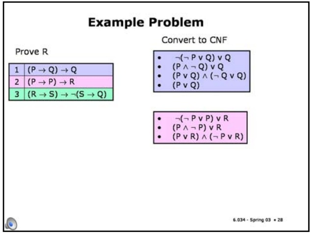

Slide 10.2.29

Finally, the last formula requires us to do a big expansion, but one of the terms is true and can be left out. So, we get "(R or S) and (R or not Q) and (not S or not Q)".

## Slide 10.2.28

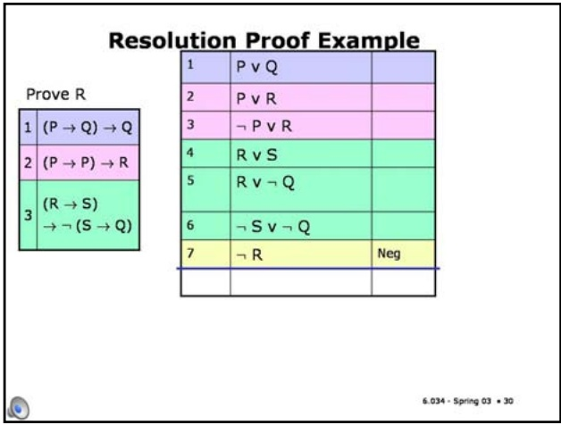

The second turns into ("P or R" and "not P or R"). We probably should have simplified it into "False or R" at the second step, which reduces just to R. But we'll leave it as is, for now.

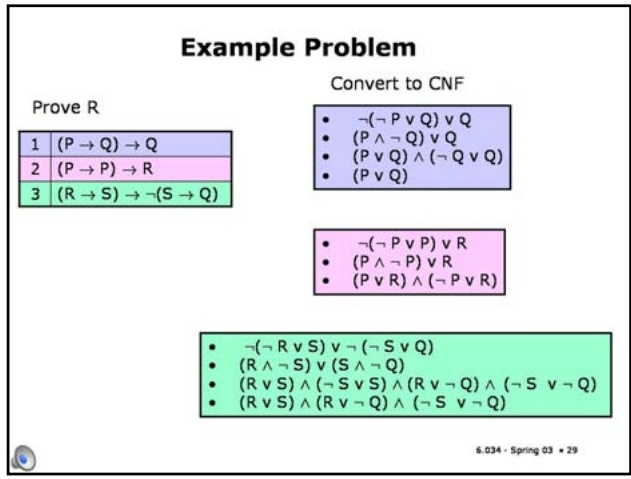

Slide 10.2.30

Now we can almost start the proof. We copy each of the clauses over here, and we add the negation of the query. Please stop and do this proof yourself before going on.

Slide 10.2.31

Here's a sample proof. It's one of a whole lot of possible proofs.

| 1 | $(P \rightarrow Q) \rightarrow Q$ |
| --- | --- |
| 2 | $(P \rightarrow P) \rightarrow R$ |
| 3 | $(R \rightarrow S)$$\rightarrow \neg (S \rightarrow Q)$ |

| 1 | P v Q |  |
| --- | --- | --- |
| 2 | P v R |  |
| 3 | $\neg P \lor R$ |  |
| 4 | R v S |  |
| 5 | R v $\neg Q$ |  |
| 6 | $\neg S \lor \neg Q$ |  |
| 7 | $\neg R$ | Neg |
| 8 | S | 4,7 |
| 9 | $\neg Q$ | 6,8 |
| 10 | P | 1,9 |
| 11 | R | 3,10 |
| 12 | • | 7,11 |

<!-- page: 13 -->

## Proof Strategies

• Unit preference: prefer a resolution step involving a unit clause (clause with one literal).

## Slide 10.2.34

• Produces a shorter clause – which is good since we are trying to produce a zero-length clause, that is, a contradiction.

• Set of support: Choose a resolution involving the negated goal or any clause derived from the negated goal.

• We're trying to produce a contradiction that follows from the negated goal, so these are "relevant" clauses.

• If a contradiction exists, one can find one using the set-of-support strategy.

The set-of-support rule says you should involve the thing that you're trying to prove. It might be that you can derive conclusions all day long about the solutions to chess games and stuff from the axioms, but once you're trying to prove something about what way to run, it doesn't matter. So, to direct your "thought" processes toward deriving a contradiction, you should always involve a clause that came from the negated goal, or that was produced by the set of support rule. Adhering to the set-of-support rule will still make the resolution refutation process sound and complete.

<!-- page: 14 -->

Let's try to get some intuition through an example. Imagine you knew "for all x, P of x implies Q of x." And let's say you also knew **P(A)**. What would you be able to conclude? **Q(A)**, right? You ought to be able to conclude **Q(A)**.

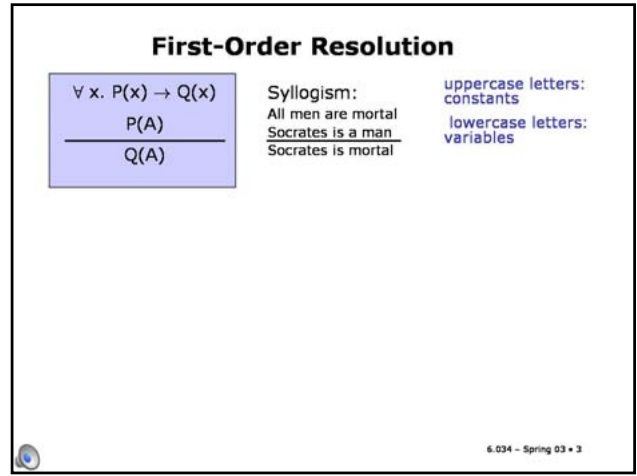

## Slide 10.3.1

We are going to use resolution refutation to do proofs in first-order logic. It's a fair amount trickier than in propositional logic, though, because now we have variables to contend with.

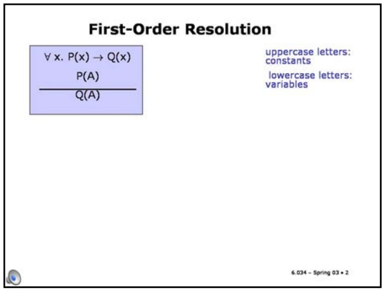

Slide 10.3.2

Slide 10.3.3

This is actually Aristotle's original syllogism: From "All men are mortal" and "Socrates is a man", conclude "Socrates is a mortal".

Slide 10.3.4

## First-Order Resolution

P(A)

Q(A)

∀x. ¬ P(x) ν Q(x)

P(A)

Q(A)

Equivalent by

definition of

implication

## First-Order Resolution

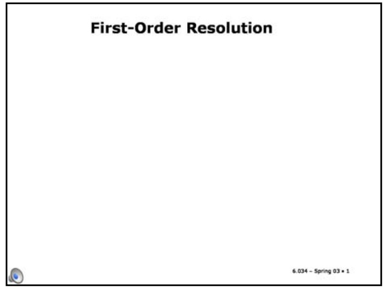

<!-- page: 15 -->

## First-Order Resolution

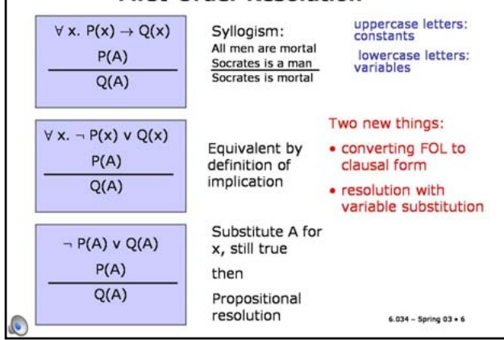

Syllogism: All men are mortal Socrates is a man Socrates is mortal uppercase letters: constants

Equivalent by definition of implication

lowercase letters: variables

Two new things:

• converting FOL to clausal form

Propositional resolution

• resolution with variable substitution

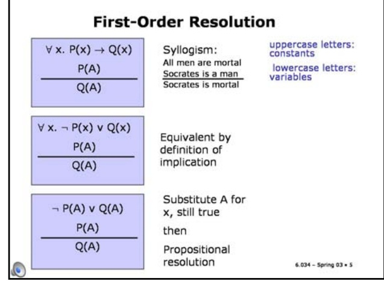

## Slide 10.3.6

Now, we have to do two jobs before we can see how to do first-order resolution.

The first is to figure out how to convert from sentences with the whole rich structure of quantifiers into a form that lets us use resolution. We'll need to convert to clausal form, which is a kind of generalization of CNF to first-order logic.

The second is to automatically determine which variables to substitute in for which other ones when we're performing first-order resolution. This process is called unification.

We'll do clausal form next, then unification, and finally put it all together.

## Slide 10.3.7

Clausal form (which is also sometimes called "prenex normal form") is like CNF in its outer structure (a conjunction of disjunctions, or an "and" of "ors"). But it has no quantifiers. Here's an example conversion.

## Clausal Form

• like CNF in outer structure

• no quantifiers

∀x. ∃y. P(x) → R(x, y)

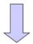

¬P(x)∨R(x,F(x))

## Converting to Clausal Form

## Slide 10.3.8

<!-- page: 16 -->

$$
\alpha \leftrightarrow \beta \Rightarrow (\alpha \rightarrow \beta) \land (\beta \rightarrow \alpha)
$$

$$
\alpha \rightarrow \beta \Rightarrow \neg \alpha \lor \beta
$$

$$
- (\alpha \vee \beta) \Rightarrow \neg \alpha \wedge \neg \beta
$$

$$
- (\alpha \land \beta) \Rightarrow \neg \alpha \lor \neg \beta
$$

$$
\neg \neg \alpha \Rightarrow \alpha
$$

$$
\neg \forall x. \alpha \Rightarrow \exists x. \neg \alpha
$$

$$
\neg \exists x. \alpha \Rightarrow \forall x. \neg \alpha
$$

$$
\alpha \leftrightarrow \beta \Rightarrow (\alpha \rightarrow \beta) \land (\beta \rightarrow \alpha)
$$

$$
\alpha \rightarrow \beta \Rightarrow \neg \alpha \lor \beta
$$

## Slide 10.3.11

The next step is to rename variables apart. The idea here is that every quantifier in your sentence should be over a different variable. So, if you had two different quantifications over x, you should rename one of them to use a different variable (which doesn't change the semantics at all). In this example, we have two quantifications involving the variable x. It's especially confusing in this case, because they're nested. The rules are like those for a programming language: a variable is captured by the nearest enclosing quantifier. So the x in **Q(x,y)** is really a different variable from the x in **P(x)**. To make this distinction clear, and to automate the downstream processing into clausal form, we'll just rename each of the variables.

## Converting to Clausal Form

1. Eliminate arrows

$$
\alpha \leftrightarrow \beta \Rightarrow (\alpha \rightarrow \beta) \land (\beta \rightarrow \alpha)
$$

$$
\alpha \rightarrow \beta \Rightarrow \neg \alpha \lor \beta
$$

2. Drive in negation

$$
- (\alpha \vee \beta) \Rightarrow - \alpha \wedge - \beta
$$

$$
- (\alpha \land \beta) \Rightarrow \neg \alpha \lor \neg \beta
$$

$$
\neg \neg \alpha \Rightarrow \alpha
$$

$$
\neg \forall x. \alpha \Rightarrow \exists x. \neg \alpha
$$

$$
\neg \exists x. \alpha \Rightarrow \forall x. \neg \alpha
$$

3. Rename variables apart

$$
\forall x. \exists y. (\neg P (x) \lor \exists x. Q (x, y)) \Rightarrow
$$

$$
\forall x _ {1}. \exists y _ {2}. (\neg P (x _ {1}) \lor \exists x _ {3}. Q (x _ {3}, y _ {2}))
$$

## Skolemization

4. Skolemize

## Slide 10.3.12

Now, here's the step that many people find confusing. The name is already a good one. Step four is to skolemize, named after a logician called Thoralf Skolem. Imagine that you have a sentence that looks like: there exists an x such that **P(x)**. The goal here is to somehow arrive at a representation that doesn't have any quantifiers in it. Now, if we only had one kind of quantifier in first-order logic, it would be easy because we could just mention variables and all the variables would be implicitly quantified by the kind of quantifier that we have. But because we have two quantifiers, if we dropped all the quantifiers off, there's a mess, because you don't know which kind of quantification is supposed to apply to which variable.

<!-- page: 17 -->

$$
\exists x. P (x) \Rightarrow P (\text {Fred})
$$

$$
\exists x. P (x) \Rightarrow P (\text {Fred})
$$

$$
\exists x, y. R (x, y) \Rightarrow R (\text {Thing1 }, \text {Thing2})
$$

## Slide 10.3.15

But the names also have to persist so that if you have **exists x such that P(x) and Q(x)**, then if you skolemize that expression you should get **P(Fleep)** and **Q(Fleep)**. You make up a name and you put it in there, but every occurrence of this variable has to get mapped into that same unique name.

## Skolemization

## 4. Skolemize

• substitute new name for each existential var

$$
\exists x. P (x) \Rightarrow P (\text {Fred})
$$

$$
\exists x, y. R (x, y) \Rightarrow R (\text {Thing1 }, \text {Thing2})
$$

$$
\exists x. P (x) \land Q (x) \Rightarrow P (\text {Fleep}) \land Q (\text {Fleep})
$$

## Skolemization

## 4. Skolemize

• substitute new name for each existential var

$$
\exists x. P (x) \Rightarrow P (\text { Fred })
$$

$$
\exists x, y. R (x, y) \Rightarrow R (\text {Thing1 }, \text {Thing2})
$$

$$
\exists x. P (x) \land Q (x) \Rightarrow P (\text {Fleep}) \land Q (\text {Fleep})
$$

$$
\exists x. P (x) \land \exists x. Q (x) \Rightarrow P (\text {Frog}) \land Q (\text {Grog})
$$

## Slide 10.3.16

If you have different quantifiers, then you need to use different names.

<!-- page: 18 -->

$$
\exists x. P (x) \Rightarrow P (\text {Fred})
$$

$$
\exists x, y. R (x, y) \Rightarrow R (\text {Thing1 }, \text {Thing2})
$$

$$
\exists x. P (x) \land Q (x) \Rightarrow P (\text {Fleep}) \land Q (\text {Fleep})
$$

$$
\exists x. P (x) \land \exists x. Q (x) \Rightarrow P (\text {Frog}) \land Q (\text {Grog})
$$

$$
\exists y. \forall x. \text { Loves } (x, y) \Rightarrow \forall x. \text { Loves } (x, \text { Englebert })
$$

$$
\exists x. P (x) \Rightarrow P (\text { Fred })
$$

$$
\exists x, y. R (x, y) \Rightarrow R (\text {Thing1 }, \text {Thing2})
$$

$$
\exists x. P (x) \land Q (x) \Rightarrow P (\text {Fleep}) \land Q (\text {Fleep})
$$

$$
\exists x. P (x) \land \exists x. Q (x) \Rightarrow P (\text {Frog}) \land Q (\text {Grog})
$$

$$
\exists y. \forall x. \text {Loves} (x, y) \Rightarrow \forall x. \text {Loves} (x, \text {Englebert})
$$

## Slide 10.3.19

In this case, what that means is that you substitute in some function of x, for y. Let's call it **Beloved(x)**. Now it's clear that the person who is loved by x depends on the particular x you're talking about.

## Skolemization

## Slide 10.3.20

## 4. Skolemize

• substitute new name for each existential var

$$
\exists x. P (x) \Rightarrow P (\text { Fred })
$$

$$
\exists x, y. R (x, y) \Rightarrow R (\text {Thing1 }, \text {Thing2})
$$

$$
\exists x. P (x) \land Q (x) \Rightarrow P (\text {Fleep}) \land Q (\text {Fleep})
$$

$$
\exists x. P (x) \land \exists x. Q (x) \Rightarrow P (\text {Frog}) \land Q (\text {Grog})
$$

$$
\exists y. \forall x. \text { Loves } (x, y) \Rightarrow \forall x. \text { Loves } (x, \text { Englebert })
$$

• substitute new function of all universal vars in outer scopes

## Skolemization

$$
\forall x. \exists y. \text { Loves } (x, y) \Rightarrow \forall x. \text { Loves } (x, \text { Beloved } (x))
$$

$$
\forall x. \exists y. \forall z. \exists w. P (x, y, z) \land R (y, z, w) \Rightarrow
$$

$$
P (x, F (x), z) \land R (F (x), z, G (x, z))
$$

## 4. Skolemize

• substitute new name for each existential var

$$
\exists x. P (x) \Rightarrow P (\text { Fred })
$$

$$
\exists x, y. R (x, y) \Rightarrow R (\text {Thing1 }, \text {Thing2})
$$

$$
\exists x. P (x) \land Q (x) \Rightarrow P (\text {Fleep}) \land Q (\text {Fleep})
$$

$$
\exists x. P (x) \land \exists x. Q (x) \Rightarrow P (\text {Frog}) \land Q (\text {Grog})
$$

$$
\exists y. \forall x. \text { Loves } (x, y) \Rightarrow \forall x. \text { Loves } (x, \text { Englebert })
$$

• substitute new function of all universal vars in outer scopes

∀x. ∃y. Loves(x, y) ⇒ ∀x. Loves(x, Beloved(x))

<!-- page: 19 -->

$$
\forall x. \text { Loves } (x, \text { Beloved } (x)) \Rightarrow \text { Loves } (x, \text { Beloved } (x))
$$

$$
\forall x. \text { Loves } (x, \text { Beloved } (x)) \Rightarrow \text { Loves } (x, \text { Beloved } (x))
$$

$$
\mathrm{P} (z) \vee (\mathrm{Q} (z, w) \wedge \mathrm{R} (w, z)) \Rightarrow
$$

$$
\{\{P (z), Q (z, w) \}, \{P (z), R (w, z) \} \}
$$

## Slide 10.3.23

Finally, we can rename the variables in each clause. It's okay to do that because **for all x, P(x) and Q (x)** is equivalent to **for all y, P(y)** and **for all z, P(z)**. In fact, you don't really need to do this step, because we're assuming that you're always going to rename the variables before you do a resolution step.

## Convert to Clausal Form: Last Steps

5. Drop universal quantifiers

$$
\forall x. \text { Loves } (x, \text { Beloved } (x)) \Rightarrow \text { Loves } (x, \text { Beloved } (x))
$$

6. Distribute or over and; return clauses

$$
\mathrm{P} (z) \vee (\mathrm{Q} (z, w) \wedge \mathrm{R} (w, z)) \Rightarrow
$$

$$
\{\{P (z), Q (z, w) \}, \{P (z), R (w, z) \} \}
$$

7. Rename the variables in each clause

$$
\{\{P (z), Q (z, w) \}, \{P (z), R (w, z) \} \} \Rightarrow
$$

$$
\{\{P (z _ {1}), Q (z _ {1}, w _ {1}) \}, \{P (z _ {2}), R (w _ {2}, z _ {2}) \} \}
$$

## Example: Converting to clausal form

## Slide 10.3.24

<!-- page: 20 -->

## Slide 10.3.27

Anyone who owns a dog is a lover of animals. We can write that in FOL as **For all x, if there exists a y such that D(y) and O(x,y), then L(x)**. We've added a new predicate symbol L to stand for "is a lover of animals".

## Example: Converting to clausal form

a. John owns a dog

3 x. D(×) ^ O(],x)

D(Fido) ^ O(J, Fido)

b. Anyone who owns a dog is a

lover-of-animals

∀x. (∃y. D(y)^ O(x,y))→ L(x)

## Example: Converting to clausal form

a. John owns a dog

3 x. D(x) ^ O(],x)

D(Fido) ^ O(J, Fido)

b. Anyone who owns a dog is a lover-of-animals

∀×. (∃ y. D(y) ^ O(x,y)) → L(x)

∀x. (→∃ y. (D(y) ^ O(x,y)) v L(x)

## Slide 10.3.28

<!-- page: 21 -->

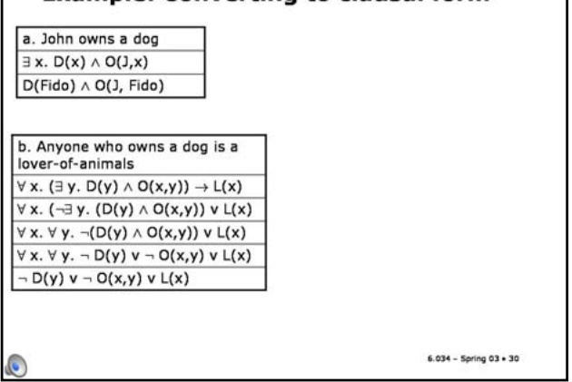

## Slide 10.3.31

Lovers of animals do not kill animals. We can write that in FOL as **For all x, L(x) implies that (for all y, A(y) implies not K(x,y))**. We've added the predicate symbol A to stand for "is an animal" and the predicate symbol K to stand for x kills y.

## Example: Converting to clausal form

a. John owns a dog

3 x. D(×) ^ O(],x)

D(Fido) ^ O(J, Fido)

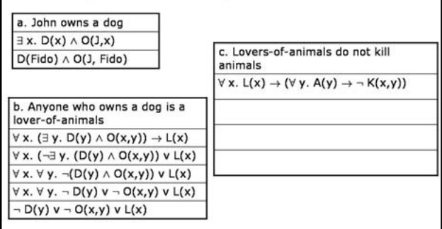

b. Anyone who owns a dog is a lover-of-animals

c. Lovers-of-animals do not kill animals

∀ x. (∃ y. D(y) ^ O(x,y)) → L(x)

∀ x. L(x) → (∀ y. A(y) → → K(x,y))

∀ x. (→ y. (D(y) ^ O(x,y)) ν L(x)

∀ x. ∀ y. ¬(D(y) ^ O(x,y)) ν L(x)

∀x.∀y.¬ D(y) ν¬ O(x,y) v L(x)

¬ D(y) v ¬ O(x,y) v L(x)

## Example: Converting to clausal form

a. John owns a dog

3 x. D(x) ^ O(],x)

D(Fido) ^ O(J, Fido)

b. Anyone who owns a dog is a lover-of-animals

c. Lovers-of-animals do not kill animals

$$
\forall \mathbf {x}. L (\mathbf {x}) \rightarrow (\forall \mathbf {y}. A (\mathbf {y}) \rightarrow \neg K (\mathbf {x}, \mathbf {y}))
$$

∀ x. (∃ y. D(y) ^ O(x,y)) → L(x)

∀x. (- y. (D(y) ^ O(x,y)) v L(x)

$$
\forall \mathbf {x}. \neg L (\mathbf {x}) \vee (\forall \mathbf {y}. A (\mathbf {y}) \rightarrow \neg K (\mathbf {x}, \mathbf {y}))
$$

∀ x. ∀ y. ¬(D(y) ^ O(x,y)) ν L(x)

$$
\forall x. \neg L (x) v (\forall y. \neg A (y) v \neg K (x, y))
$$

∀x.∀ y. ¬ D(y) v ¬ O(x,y) ν L(x)

¬ D(y) v ¬ O(x,y) v L(x)

## Slide 10.3.32

First, we get rid of the arrows, in two steps.

<!-- page: 22 -->

## Slide 10.3.35

"Tuna is a cat" just turns into C(T).

## More converting to clausal form

d. Either Jack killed Tuna or curiosity killed Tuna K(J,T) v K(C,T)

e. Tuna is a cat

f. All cats are animals

¬ C(x) v A(x)

## More converting to clausal form

d. Either Jack killed Tuna or curiosity killed Tuna K(J,T) v K(C,T)

e. Tuna is a cat

C(T)

## Slide 10.3.36

<!-- page: 23 -->

## 6.034 Notes: Section 10.4

## Slide 10.4.1

We introduced first-order resolution and said there were two issues to resolve before we could do it. First was conversion to clausal form, which we've done. Now we have to figure out how to instantiate the variables in the universal statements. In this problem, it was clear that A was the relevant individual. But it is not necessarily clear at all how to do that automatically.

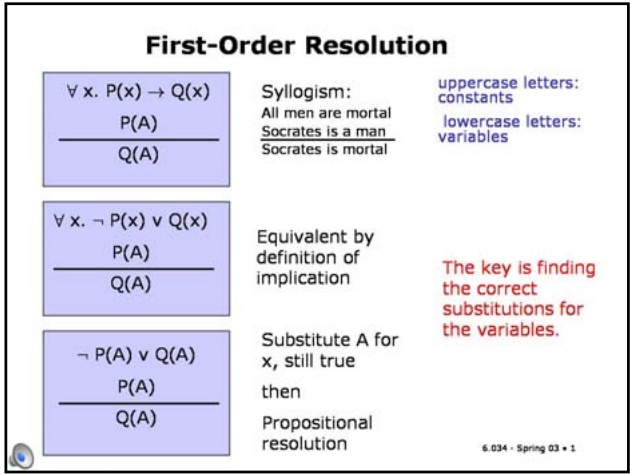

## Substitutions

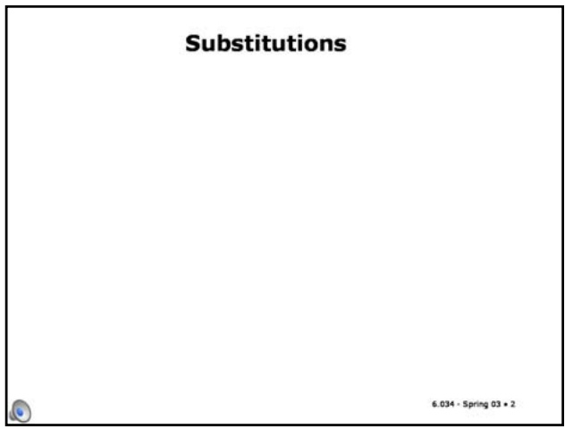

## Slide 10.4.2

In order to derive an algorithmic way of finding the right instantiations for the universal variables, we need something called substitutions.

## Slide 10.4.3

Here's an example of what we called an atomic sentence before: a predicate applied to some terms. There are two variables here: x and y. We can think of many different ways to substitute terms into this expression. Those are called substitution instances of the expression.

## Substitutions

P(x, f(y), B) : an atomic sentence

<!-- page: 24 -->

## Substitutions

P(x, f(y), B) : an atomic sentence

| Substitution instances | Substitution$\{v_1/t_1,..., v_n/t_n\}$ | Comment |
| --- | --- | --- |
|  |  |  |
|  |  |  |
|  |  |  |
|  |  |  |

## Slide 10.4.4

A substitution is a set of variable-term pairs, written this way. It says that whenever you see variable vi, you should substitute in term ti. There should not be more than one entry for a single variable.

6.034 - Spring 03 • 4

## Slide 10.4.5

So here's one substitution instance. P(z,f(w),B). It's not particularly interesting. It's called an alphabetic variant, because we've just substituted some different variables in for x and y. In particular, we've put z in for x and w in for y, as shown in the substitution.

## Substitutions

P(x, f(y), B) : an atomic sentence

| Substitution instances | Substitution $\left\{ {{\mathrm{v}}_{1}/{\mathrm{t}}_{1},\ldots ,{\mathrm{v}}_{\mathrm{n}}/{\mathrm{t}}_{\mathrm{n}}}\right\}$ | Comment |
| --- | --- | --- |
| P(z, f(w), B) | $\{ \mathrm{x}/\mathrm{z},\mathrm{y}/\mathrm{w}\}$ | Alphabetic variant |
|  |  |  |
|  |  |  |
|  |  |  |

6.034 - Spring 03 • 5

## Substitutions

P(x, f(y), B) : an atomic sentence

| Substitution instances | Substitution $\left\{ {{\mathrm{v}}_{1}/{\mathrm{t}}_{1},\ldots ,{\mathrm{v}}_{\mathrm{n}}/{\mathrm{t}}_{\mathrm{n}}}\right\}$ | Comment |
| --- | --- | --- |
| P(z, f(w), B) | $\{ \mathrm{x}/\mathrm{z},\mathrm{y}/\mathrm{w}\}$ | Alphabetic variant |
| P(x, f(A), B) | $\{ \mathrm{y}/\mathrm{A}\}$ |  |
|  |  |  |
|  |  |  |

6.034 - Spring 03 • 6

## Slide 10.4.6

Here's another substitution instance of our sentence: P(x, f(A), B), We've put the constant A in for the variable y.

## Slide 10.4.7

To get P(g(z), f(A), B), we substitute the term g(z) in for x and the constant A for y.

## Substitutions

P(x, f(y), B) : an atomic sentence

| Substitution instances | Substitution $\left\{ {{\mathrm{v}}_{1}/{\mathrm{t}}_{1},\ldots ,{\mathrm{v}}_{\mathrm{n}}/{\mathrm{t}}_{\mathrm{n}}}\right\}$ | Comment |
| --- | --- | --- |
| P(z, f(w), B) | $\{ \mathrm{x}/\mathrm{z},\mathrm{y}/\mathrm{w}\}$ | Alphabetic variant |
| P(x, f(A), B) | $\{ \mathrm{y}/\mathrm{A}\}$ |  |
| P(g(z), f(A), B) | $\{ \mathrm{x}/\mathrm{g}\left( \mathrm{z}\right) ,\mathrm{y}/\mathrm{A}\}$ |  |
|  |  |  |

<!-- page: 25 -->

## Substitutions

P(x, f(y), B) : an atomic sentence

| Substitution instances | Substitution $\left\{ {{\mathrm{v}}_{1}/{\mathrm{t}}_{1},\ldots ,{\mathrm{v}}_{\mathrm{n}}/{\mathrm{t}}_{\mathrm{n}}}\right\}$ | Comment |
| --- | --- | --- |
| P(z, f(w), B) | $\{ \mathrm{x}/\mathrm{z},\mathrm{y}/\mathrm{w}\}$ | Alphabetic variant |
| P(x, f(A), B) | $\{ \mathrm{y}/\mathrm{A}\}$ |  |
| P(g(z), f(A), B) | $\{ \mathrm{x}/\mathrm{g}\left( \mathrm{z}\right) ,\mathrm{y}/\mathrm{A}\}$ |  |
| P(C, f(A), B) | $\{ \mathrm{x}/\mathrm{C},\mathrm{y}/\mathrm{A}\}$ | Ground instance |

## Slide 10.4.8

Here's one more -- P(C, f(A), B). It's sort of interesting, because it doesn't have any variables in it. We'll call an atomic sentence with no variables a ground instance. Ground means it doesn't have any variables.

6.034 - Spring 03 • 8

## Slide 10.4.9

You can think about substitution instances, in general, as being more specific than the original sentence. A constant is more specific than a variable. There are fewer interpretations under which a sentence with a constant is true. And even f(x) is more specific than y, because the range of f might be smaller than U. You're not allowed to substitute anything in for a constant, or for a compound term (the application of a function symbol to some terms). You are allowed to substitute for a variable inside a compound term, though, as we have done with f in this example.

## Substitutions

P(x, f(y), B) : an atomic sentence

| Substitution instances | Substitution $\left\{ {{\mathrm{v}}_{1}/{\mathrm{t}}_{1},\ldots ,{\mathrm{v}}_{\mathrm{n}}/{\mathrm{t}}_{\mathrm{n}}}\right\}$ | Comment |
| --- | --- | --- |
| P(z, f(w), B) | $\{ \mathrm{x}/\mathrm{z},\mathrm{y}/\mathrm{w}\}$ | Alphabetic variant |
| P(x, f(A), B) | $\{ \mathrm{y}/\mathrm{A}\}$ |  |
| P(g(z), f(A), B) | $\{ \mathrm{x}/\mathrm{g}\left( \mathrm{z}\right) ,\mathrm{y}/\mathrm{A}\}$ |  |
| P(C, f(A), B) | $\{ \mathrm{x}/\mathrm{C},\mathrm{y}/\mathrm{A}\}$ | Ground instance |

## Substitutions

P(x, f(y), B) : an atomic sentence

6.034 - Spring 03 • 9

| Substitution instances | Substitution $\left\{ {{\mathrm{v}}_{1}/{\mathrm{t}}_{1},\ldots ,{\mathrm{v}}_{\mathrm{n}}/{\mathrm{t}}_{\mathrm{n}}}\right\}$ | Comment |
| --- | --- | --- |
| P(z, f(w), B) | $\{ \mathrm{x}/\mathrm{z},\mathrm{y}/\mathrm{w}\}$ | Alphabetic variant |
| P(x, f(A), B) | $\{ \mathrm{y}/\mathrm{A}\}$ |  |
| P(g(z), f(A), B) | $\{ \mathrm{x}/\mathrm{g}\left( \mathrm{z}\right) ,\mathrm{y}/\mathrm{A}\}$ |  |
| P(C, f(A), B) | $\{ \mathrm{x}/\mathrm{C},\mathrm{y}/\mathrm{A}\}$ | Ground instance |

Applying a substitution:

P(x, f(y), B) {y/A} = P(x,f(A),B)

P(x, f(y), B) {y/A, x/y} = P(A, f(A), B)

6.034 - Spring 03 • 10

## Slide 10.4.10

We'll use the notation of an expression followed by a substitution to mean the expression that we get by applying the substitution to the expression. To apply a substitution to an expression, we look to see if any of the variables in the expression have entries in the substitution. If they do, we substitute in the appropriate new expression for the variable, and continue to look for possible substitutions until no more opportunities exist.

So, in this second example, we substitute A in for y, then y in for x, and then we keep going and substitute A in for y again.

Slide 10.4.11

Now we'll look at the process of unification, which is finding a substitution that makes two expressions match each other exactly.

## Unification

<!-- page: 26 -->

## Unification

• Expressions $\omega _ { 1 }$ and $\omega _ { 2 }$ are unifiable iff there exists a substitution s such that $\omega_{1} S = \omega_{2}$ S

• Let $\omega_{1} = x$ and $\omega_{2} = y,$ the following are unifiers

| S | ${\omega }_{1}\mathrm{\;S}$ | ${\omega }_{2}\mathrm{\;S}$ |
| --- | --- | --- |
| $\{ y/x\}$ | X | X |
|  |  |  |
|  |  |  |
|  |  |  |

## Slide 10.4.15

If you put in y for x, then they both come out to be y.

## Slide 10.4.14

If you substitute x in for y, then both expressions come out to be x.

## Unification

• Expressions $\omega _ { 1 }$ and $\omega _ { 2 }$ are unifiable iff there exists a substitution s such that $\omega_{1} S = \omega_{2}$ 5

• Let $\omega_{1} = x$ and $\omega_{2} = y,$ the following are unifiers

| S | ${\omega }_{1}\mathrm{\;S}$ | ${\omega }_{2}\mathrm{\;S}$ |
| --- | --- | --- |
| $\{ y/x\}$ | X | X |
| $\{ x/y\}$ | Y | Y |
|  |  |  |
|  |  |  |

<!-- page: 27 -->

## Most General Unifier

## Slide 10.4.18

So, in fact, what we're really going to be looking for is not just any unifier of two expressions, but a most general unifier, or MGU.

## Slide 10.4.19

G is a most general unifier of omega1 and omega2 if and only if for all unifiers S, there exists an Sprime such that the result of applying G followed by S-prime to omega1 is the same as the result of applying S to omega1; and the result of applying G followed by S-prime to omega2 is the same as the result of applying S to omega2.

A unifier is most general if every single one of the other unifiers can be expressed as an extra substitution added onto the most general one. An MGU is a substitution that you can make that makes the fewest commitments, and can still make these two expressions equal.

## Most General Unifier

g is a most general unifier of $\omega_{1}$ and $\omega _ { 2 }$ iff for all unifiers s, there exists s' such that $\omega_{1} \hat{s} = (\omega_{1} g) s'$ and $\omega_{2}s = (\omega_{2}g)s$ is

<!-- page: 28 -->

## Most General Unifier

g is a most general unifier of $\omega _ { 1 }$ and $\omega _ { 2 }$ iff for all unifiers s, there exists s' such that $\omega_{1} \tilde{s} = (\omega_{1} g) s'$ and $\omega_{2}s = (\omega_{2}g)s'$

| ${\omega }_{1}$ | ${\omega }_{2}$ | MGU |
| --- | --- | --- |
| P(x) | P(A) | {x/A} |
| P(f(x), y, g(x)) | P(f(x), x, g(x)) | $\{ \mathrm{y}/\mathrm{x}\}$ or $\{ \mathrm{x}/\mathrm{y}\}$ |
| P(f(x), y, g(y)) | P(f(x), z, g(x)) | $\{ \mathrm{y}/\mathrm{x},\mathrm{z}/\mathrm{x}\}$ |
|  |  |  |
|  |  |  |
|  |  |  |

6.034 - Spring 03 = 22

## Slide 10.4.23

What about P(x, B, B) and P(A, y, z)? It seems pretty clear that we're going to have to substitute A for x, B for y, and B for z.

## Slide 10.4.22

Okay. What about this one? It's a bit tricky. You can kind of see that, ultimately, all of the variables are going to have to be the same. Matching the arguments to g forces y and x to be the same, And since z and y have to be the same as well (to make the middle argument match), they all have to be the same variable. Might as well make it x (though it could be any other variable).

## Most General Unifier

g is a most general unifier of $\omega_{1}$ and $\omega _ { 2 }$ iff for all unifiers $\mathbf { S } ,$ there exists s' such that $\omega_{1} \tilde{s} = (\omega_{1} g) s'$ and $\omega_{2}s = (\omega_{2}g)s$ i

| ${\omega }_{1}$ | ${\omega }_{2}$ | MGU |
| --- | --- | --- |
| P(x) | P(A) | $\{ \mathrm{x}/\mathrm{A}\}$ |
| P(f(x), y, g(x)) | P(f(x), x, g(x)) | $\{ \mathrm{y}/\mathrm{x}\}$ or $\{ \mathrm{x}/\mathrm{y}\}$ |
| P(f(x), y, g(y)) | P(f(x), z, g(x)) | $\{ \mathrm{y}/\mathrm{x},\mathrm{z}/\mathrm{x}\}$ |
| P(x, B, B) | P(A, y, z) | $\{ \mathrm{x}/\mathrm{A},\mathrm{y}/\mathrm{B},\mathrm{z}/\mathrm{B}\}$ |
|  |  |  |
|  |  |  |

<!-- page: 29 -->

## Unification Algorithm

unify(Expr x, Expr y, Subst s) {

## Slide 10.4.26

An MGU can be computed recursively, given two expressions x and y, to be unified, and a substitution that contains substitutions that must already be made. The argument s will be empty in a top-level call to unify two expressions.

## Slide 10.4.27

The algorithm returns a substitution if x and y are unifiable in the context of s, and fail otherwise. If s is already a failure, we return failure.

## Unification Algorithm

unify(Expr x, Expr y, Subst s) {if s = fail, return fail

<!-- page: 30 -->

## Unification Algorithm

unify(Expr x, Expr y, Subst s) {

## Slide 10.4.30

if s = fail, return fail

else if x = y, return s

else if x is a variable, return unify-var(x, Y, s)

else if y is a variable, return unify-var(y, x, s)

If x is a predicate or a function application, then y must be one also, with the same predicate or function.

else if x is a predicate or function application,

## Slide 10.4.31

## Unification Algorithm

unify(Expr x, Expr y, Subst s) {

if s = fail, return fail

else if x = y, return s

else if x is a variable, return unify-var(x, Y, s)

else if y is a variable, return unify-var(y, x, s)

else if x is a predicate or function application,

if y has the same operator,

return unify(args(x), args(y), s)

<!-- page: 31 -->

## Unify-var subroutine

Substitute in for var and x as long as possible, then add new binding

unify-var(Variable var, Expr x, Subst s) {

## Slide 10.4.34

Given a variable var, an expression x, and a substitution s, we need to return a substitution that unifies var and x in the context of s. What makes this tricky is that we have to first keep applying the existing substitutions in s to var, and to x, if it is a variable, before we're down to a new concrete problem to solve.

## Slide 10.4.35

So, if var is bound to val in s, then we unify that value with x, in the context of s (because we're already committed that val has to be substituted for var).

## Unify-var subroutine

Substitute in for var and x as long as possible, then add new binding

unify-var(Variable var, Expr x, Subst s) {

if var is bound to val in s,

return unify(val, x, s)

<!-- page: 32 -->

## Unify-var subroutine

## Slide 10.4.38

Substitute in for var and x as long as possible, then add new binding

Finally, we know var is a variable that doesn't already have a substitution, so we add the substitution of x for var to s, and return it.

unify-var(Variable var, Expr x, Subst s) {

if var is bound to val in s,

return unify(val, x, s)

else if x is bound to val in s,

return unify-var(var, val, s)

else if var occurs anywhere in (x s), return fail

else return add({var/x}, s)

## Slide 10.4.39

Here are a few more examples of unifications, just so you can practice. If you don't see the answer immediately, try simulating the algorithm.

## Some Examples

| ${\omega }_{1}$ | ${\omega }_{2}$ | MGU |
| --- | --- | --- |
| A(B, C) | A(x, y) | {x/B, y/C} |
| A(x, f(D,x)) | A(E, f(D,y)) | {x/E, y/E} |
| A(x, y) | A(f(C,y), z) | {x/f(C,y),y/z} |
| P(A, x, f(g(y))) | P(y, f(z), f(z)) | {y/A,x/f(z),z/g(y)} |
| P(x, g(f(A)), f(x)) | P(f(y), z, y) | none |
| P(x, f(y)) | P(z, g(w)) | none |
