<!-- page: 1 -->

## Logic in Practice

• Language of logic is extremely powerful.

• Say what's true, not how to use it.

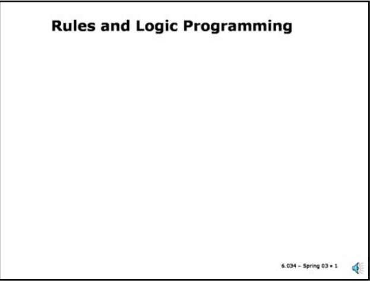

• Given parents, find grandparents

• Given grandparents, find parents

• ∀ x, y (∃ z Parent(x,z) ^ Parent(z,y)) ↔ GrandParent(x,y)

## Slide 11.1.2

We have seen that the language of logic is extremely general, with much of the power of natural language. One of the key characteristics of logic, as opposed to programming languages but like natural languages, is that in logic you write down what's true about the world, without saying how to use it. So, for example, one can characterize the relationship between parents and grandparents in this sentence without giving an algorithm for finding the grandparents from the grandchildren or a different algorithm for finding the grandchildren given the grandparents.

## Slide 11.1.3

## Logic in Practice

• Language of logic is extremely powerful.

• Say what's true, not how to use it.

• ∀ x, y (∃ z Parent(x,z) ^ Parent(z,y)) ↔ GrandParent(x,y)

• Given parents, find grandparents

• Given grandparents, find parents

• But, resolution theorem-provers are too inefficient!

<!-- page: 2 -->

●	 In general, there is another case, known as a **consistency constraint** when the clause has no positive literals. We will not deal with these further, except for the special case of a **conjunctive goal clause** which will take this form (the negation of a conjuction of literals is a Horn clause with no positive literal). However, goal clauses are not rules.

## Horn Clauses

## Slide 11.1.6

• A clause is Horn if it has at most one positive literal

(Consistency Constraint)

$\neg \mathsf { P _ { 1 } } \lor . . . \lor \neg \mathsf { P _ { n } } \lor$ Q (Rule)

· Q

(Fact)

$$
\cdot \neg P _ {1} \vee \dots \vee \neg P _ {n}
$$

• Rule Notation

• We will not deal with Consistency Constraints

(Rule-Based System)

$$
\cdot P _ {1} \land \dots \land P _ {n} \rightarrow Q
$$

(Logic)

$$
\cdot \text {If} P _ {1} \dots P _ {n} \text {Then} Q
$$

$$
\cdot Q: - P _ {1}, \dots , P _ {n}
$$

(Prolog)

• P are called antecedents (or body)

• Q is called the consequent (or head)

There are many notations that are in common use for Horn clauses. We could write them in standard logical notation, either as clauses, or as implications. In rule-based systems, one usually has some form of equivalent "If-Then" syntax for the rules. In Prolog, which is the most popular logic programming language, the clauses are written as a sort of reverse implication with the ":-" instead of "<-".

We will call the Q (positive) literal the **consequent** of a rule and call the P<sub>i</sub> (negative) literals the **antecedents**. This is terminology for implications borrowed from logic. In Prolog it is more common to call Q the **head** of the clause and to call the P literals the **body** of the clause.

<!-- page: 3 -->

Slide 11.1.9

It turns out that given our simplified language, we can use a simplified procedure for inference, called **backchaining**, which is basically a generalized form of Modus Ponens (one of the "natural deduction" rules we saw earlier).

Backchaining is relatively simple to understand given that you've seen how resolution works. We start with a literal to "prove", which we call C. We will also use Green's trick (as in Chapter 6.3) to keep track of any variable bindings in C during the proof.

We will keep a stack (first in, last out) of goals to be proved. We initialize the stack to have C (first) followed by the Answer literal (which we write as Ans).

## Inference: Backchaining

• To "prove" a literal C

• Push C and an Ans literal on a stack

## Inference: Backchaining

• To "prove" a literal C

• Push C and an Ans literal on a stack • Repeat until stack only has Ans literal or no actions available.

-Pop literal L off of stack

## Slide 11.1.10

<!-- page: 4 -->

## Slide 11.1.13

If you think about it, you'll notice that backchaining is just our familiar friend, resolution. The stack of goals can be seen as negative literals, starting with the negated goal. We don't actually show literals on the stack with explicit negation but they are implicitly negated.

At every point, we pair up a negative literal from the stack with a positive literal (the consequent) from a fact or rule and add the remaining negative literals (the antecedents) to the stack.

## Backchaining and Resolution

• Backchaining is just resolution

• To prove C (propositional case)

• Negate C ⇒ ¬ C

• Find rule¬ $\mathsf{P}_1 \lor \cdots \lor \neg \mathsf{P}_n \lor \mathsf{C}$

• Resolve to get $\neg \mathsf { P } _ { 1 } \lor . . . \lor \neg \mathsf { P } _ { \mathsf { n } }$

• Repeat for each negative literal • First order case introduces unification but otherwise the same.

## Proof Strategy

• Depth-First search for a proof

• Order matters

• Rule order

-try ground facts first

-then rules in given order

• Antecedent order

-left to right

• More predictable, like a program, less like logic

## Slide 11.1.14

<!-- page: 5 -->

```txt
@x . @y. F(x,y) -> P(x,y)
@x . @y. M(x,y) -> P(x,y)
```

$$
\text {@x . @y. @z. P(x,y) ^ {P(y,z)} -> GrandP(x,z)}
$$

The next two rules specify that a Father is a Parent and a Mother is a parent. In usual FOL notation, these would be:

## Example

1. Father(A,B) ; ground fact

2. Mother(B,C) ; ground fact

3. GrandP(?x,?z):- Parent(?x,?y),Parent(?y,?z)

4. Parent(?x,?y):- Father(?x,?y)

5. Parent(?x,?y):- Mother(?x,?y)

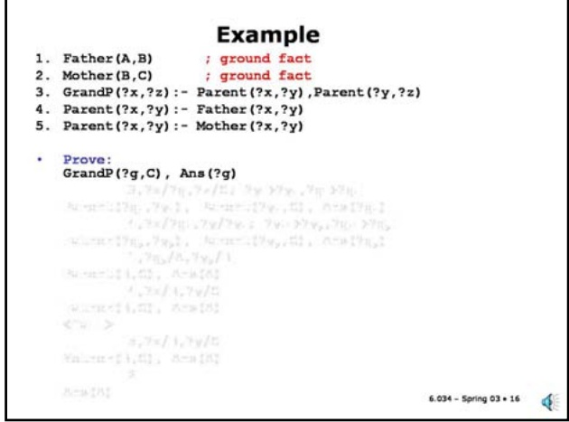

## Slide 11.1.17

## Slide 11.1.16

You can see that the grandparent goal literal unifies with the consequent of rule 3 using the unifer { ?x/?g, ?z/C }. So, we push the antecedents of rule 3 onto the stack, apply the unifier and then rename all the remaining variables, as indicated. The resulting goal stack now has two Parent literals and the Ans literal. We proceed as before by popping the stack and trying to unify with the first Parent literal.

Now, we set out to find the Grandparent of C. With resolution refutation, we would set out to derive a contradiction from the negation of the goal:

\~ ]g . GrandP(g,C)

whose clause form is \~GrandP(g,C). The list of literals in our goal stack are implicitly negated, so we start with GrandP(g,C) on the stack. We have also added the Ans literal with the variable we are interested in, ?g, hopefully the name of the grandparent.

Now, we set out to find a fact or rule consequent literal in the database that matches our goal literal.

## Example

1. Father(A,B) ; ground fact

2. Mother(B,C) ; ground fact

3. GrandP(?x,?z):- Parent(?x,?y),Parent(?y,?z)

4. Parent(?x,?y):- Father(?x,?y)

5. Parent(?x,?y):- Mother(?x,?y)

• Prove:

GrandP(?g,C), Ans (?g)

[3,?x/?g,?z/C; ?y→?y1,?g=?g\_]

• Parent(?g\_,?y}), Parent(?\_2,C), Ans(?g\_2)

<!-- page: 6 -->

## Example

1. Father(A,B) ; ground fact

2. Mother(B,C) ; ground fact

3. GrandP(?x,?z):- Parent(?x,?y),Parent(?y,?z)

4. Parent(?x,?y):- Father(?x,?y)

5. Parent(?x,?y):- Mother(?x,?y)

GrandP(?g,C), Ans(?g)

[3,?x/?g,?z/C; ?y⇒?y1,?g⇒?g1]

• Parent(?g\_1,?y2), Parent(?y\_,C), Ans(?g\_2})

[4,?x/?g1,?y/?y1;?y1→?y₂,?g\_1⇒?g\_2]

. Father(?\_2,?Y2), Parent(?Y\_2,C), Ans(?g\_2)

[1,?g\_₂/A,?\_₂/B]

• Parent (B,C), Ans (A)

• Father(B,C), Ans(A)

## Slide 11.1.20

Now, we can match the Parent(B,C) goal literal to the consequent of rule 4 and get a new goal (after applying the substitution to the antecedent), Father(B,C). However we can see that this will not match anything in the database and we get a failure.

Slide 11.1.21

## Example

1. Father(A,B) ; ground fact

2. Mother(B,C) ; ground fact

3. GrandP(?x,?z):- Parent(?x,?y),Parent(?y,?z)

4. Parent(?x,?y):- Father(?x,?y)

5. Parent(?x,?y):- Mother(?x,?y)

Prove: Pro

GrandP(?g,C), Ans(?g)

[3,?x/?g,?z/C; ?y→?y1,?g⇒?g\_1]

• Parent(?g\_,?y), Parent(?y\_,C), Ans(?g\_})

[4,?x/?q\_1,?y/?y1;?y\_1⇒?y2,?q\_1⇒→?g\_2]

• Father(?g\_2,?\_2), Parent(?Y\_2,C), Ans(?g\_2)

• Parent (B,C), Ans (A)

[4,?x/B,?y/C]

• Father(B,C), Ans(A)

&lt;fail&gt;

[5,?x/B,?y/C]

• Mother(B,C), Ans(A)

<!-- page: 7 -->

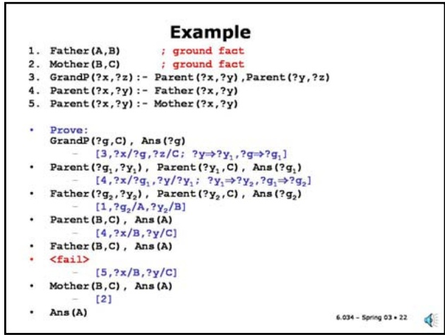

Slide 11.1.22

Slide 11.1.23

Another way to look at the process we have just gone through is as a form of tree search. In this search space, the states are the entries in the stack, that is, the literals that appear on our stack. The edges (shown with a green dot in the middle of each edge) are the rules or facts. However, there is one complication: a rule with multiple antecedents generates multiple children, each of which must be solved. This is indicated by the arc connecting the two descendants of rule 3 near the top of the tree.

This type of tree is called an AND-OR tree. The OR nodes come from the choice of a rule or fact to match to a goal. The AND nodes come from the multiple antecedents of a rule (all of which must be proved).

You should remember that such a tree is **implicit** in the rules and facts in our database, once we have been given a goal to prove. The tree is not constructed explicitly; it is just a way of visualizing the search process.

Let's go through our previous proof in this representation, which makes the choices we've made more explicit. We start with the GrandP goal at the top of the tree.

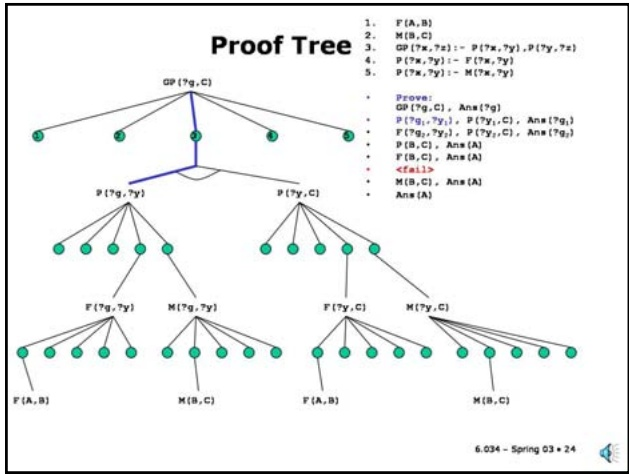

Slide 11.1.24

Slide 11.1.25

This matches fact 2. At this point there are no antecedents to add to the stack and the Ans literal is on the top of the stack. Note that the binding of the variable ?g to A is in fact the correct answer to our original question.

We match that goal to the consequent of rule 3 and we create two subgoals for each of the antecedents (after carrying out the substitutions from the unification). We will look at the first one (the one on the left) next.

We match the Parent subgoal to the rule 4 and generate a Father subgoal.

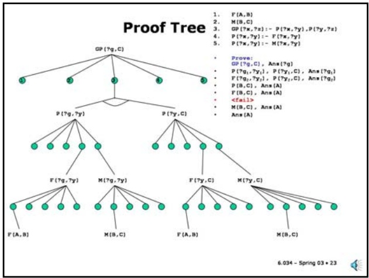

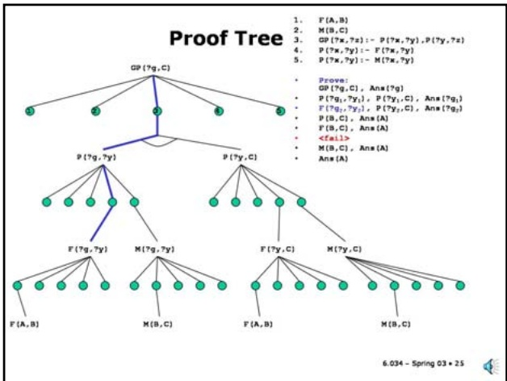

<!-- page: 8 -->

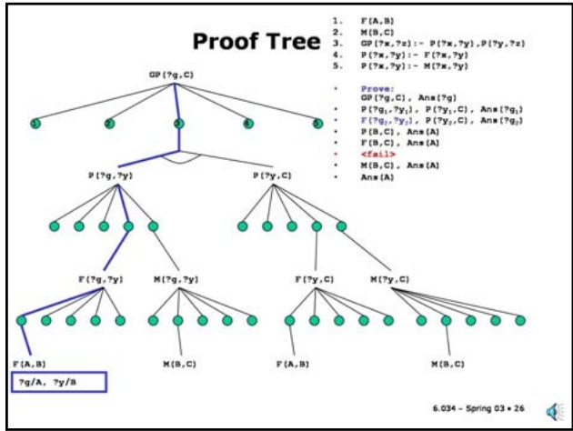

Slide 11.1.26

Slide 11.1.27

We have to apply this unifier to all the pending goals, including the pending Parent subgoal from rule 3. This is the part that's easy to forget when using this tree representation.

Which we match to fact 1 and create bindings for the variables in the goal. In all our previous steps we also created variable bindings but they were variable to variable bindings. Here, we finally match some variables to constants.

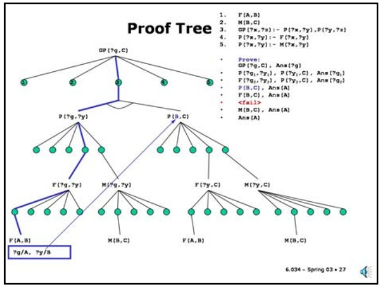

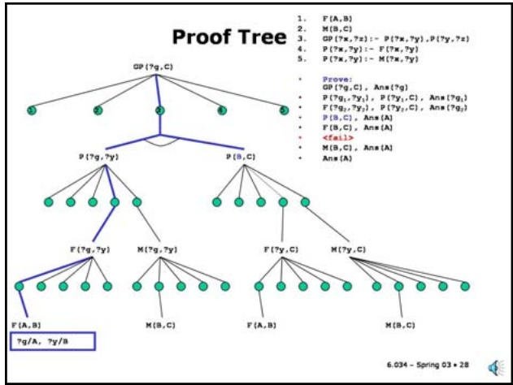

Slide 11.1.28 Now, we tackle the second Parent subgoal ...

Slide 11.1.29

... which proceeds as before to match rule 4 and generate a Father subgoal, Father(B,C) in this case.

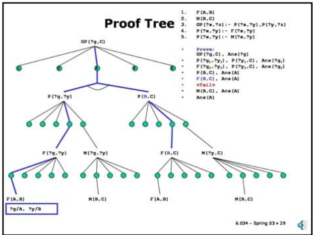

<!-- page: 9 -->

This matches the second fact in the database and we succeed with our proof since we have no pending subgoals to prove.

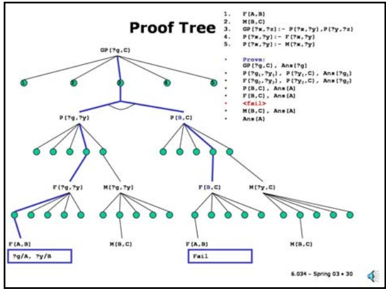

Slide 11.1.30

But, as we saw before that leads to a failure when we try to match the database.

Slide 11.1.31

So, instead, we look at the other alternative, matching the second Parent subgoal to rule 5, and generate a Mother(B,C) subgoal.

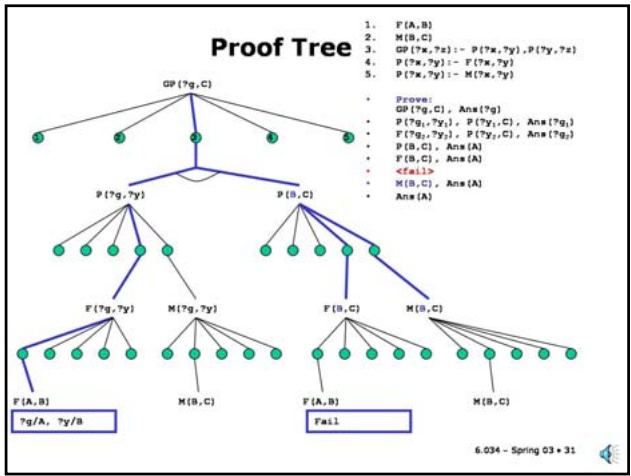

Slide 11.1.32

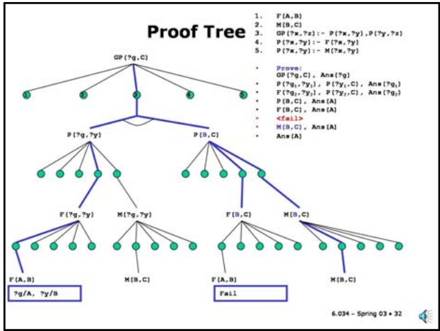

This view of the proof process highlights the search connection and is a useful mental model, although it is too awkward for any big problem.

Slide 11.1.33

At the beginning of this section, we indicated as one of the advantages of a logical representation that we could define the relationship between parents and grandparents without having to give an algorithm that might be specific to finding grandparents of grandchildren or vice versa. This is still (partly) true for logic programming. We have just seen how we could use the facts and rules shown here to find a grandparent of someone. Can we go the other way? The answer is yes.

The initial goal we have shown here asks for the grandchild of A, which we know is C. Let's see how we find this answer.

## Relations not Functions

1. Father(A,B); ground fact

2. Mother(B,C); ground fact

3. GrandP(?x,?z):- Parent(?x,?y),Parent(?y,?z)

4. Parent(?x,?y):- Father(?x,?y)

5. Parent(?x,?y):- Mother(?x,?y)

<!-- page: 10 -->

## Relations not Functions

1. Father(A,B); ground fact

2. Mother(B,C); ground fact

3. GrandP(?x,?z):- Parent(?x,?y),Parent(?y,?z)

4. Parent(?x,?y):- Father(?x,?y)

5. Parent(?x,?y):- Mother(?x,?y)

• Prove:

GrandP(A,?f), Ans(?f)

[3,?x/A,?z/?f; ?y⇒?y,?f=⇒?f1]

• Parent(A,?y}), Parent(?y\_,?f\_2), Ans(?f2})

Father(A,?Y2), Parent(?Y2,?f2), Ans(?f2)

[1,?Y2/B; ?f2=?f{]

• Parent(B,?f,), Ans(?f,)

## Slide 11.1.36

Then, we match the first fact, namely Father(A,B), which causes us to bind the ?x variable in the second Parent subgoal to B. So, now, we look for a child of B.

Slide 11.1.37

## Relations not Functions

1. Father(A,B); ground fact

2. Mother(B,C); ground fact

3. GrandP(?x,?z):- Parent(?x,?y),Parent(?y,?z)

4. Parent(?x,?y):- Father(?x,?y)

5. Parent(?x,?y):- Mother(?x,?y)

Prove:

GrandP(A,?f), Ans(?f)

[3,?x/A,?z/?f; ?y→?y,?f=?f1]

• Parent(A,?y2), Parent(?y2,?f), Ans(?f)

[4,?x/A,?y/?Y1; ?Y1⇒?Yy2,?f1=→?f2]

• Father(A,?\_2), Parent(?y\_2,?2), Ans(?f\_2)

[1,?Y\_2₂/B; ?f2→?f\_{]

• Parent(B,?f3), Ans(?f)

[4,?x/B,?y/?f₃; ?f₃=?f]

Father(B,?f,), Ans(?f)

. &lt;fail&gt;

<!-- page: 11 -->

## Relations not Functions

## Slide 11.1.38

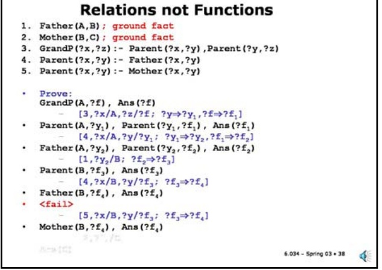

Slide 11.1.39

...which succeeds and binds ?f (our query variable) to C, as expected.

We now match the second Parent subgoal to rule 5 and generate a Mother(B,?f) subgoal.

Note that if we had multiple grandchildren of A in the database, we could generate them all by continuing the search at any pending subgoals that had multiple potential matches.

The bottom line is that we are representing **relations** among the elements of our domain (recall that's what a logical predicate denotes) rather than computing functions that specify a single output for a given set of inputs.

Another way of looking at it is that we do not have a pre-conceived notion of which variables represent "input variables" and which are "output variables".

## Relations not Functions

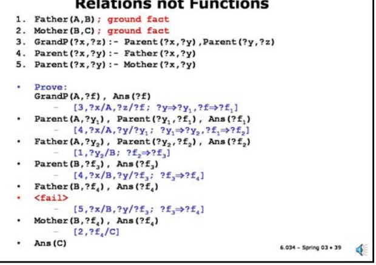

## Order Revisited

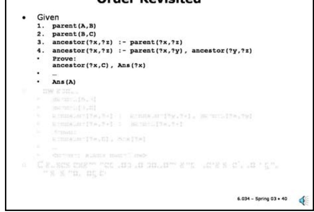

Slide 11.1.41

Here we've switched the order of rules 3 and 4 and furthermore switched the order of the literals in the recursive ancestor rule. The effect of these changes, which have no logical import, is disastrous: basically it generates an infinite loop.

## Slide 11.1.40

We have seen in our examples thus far that we explore the underlying search space in order. This approach has consequences. For example, consider the following simple rules for defining an ancestor relation. It says that a parent is an ancestor (this is the base case) and that the ancestor of a parent is an ancestor (the recursive case). You could use this definition to list a person's ancestors or, as we did for grandparent, to list a person's descendants.

But what would happen if we changed the order a little bit?

## Order Revisited

Given

1. parent(A,B)

2. parent(B,C)

3. ancestor(?x,?z) :- parent(?x,?z)

4. ancestor(?x,?z) :- parent(?x,?y), ancestor(?y,?z)

Prov ancestor(?x,C), Ans(?x)

Ans (A)

1. parent(A,B)

2. parent(B,C)

3. ancestor(?x,?z) :- ancestor(?y,?z), parent(?x,?y)

4. ancestor(?x,?z) :- parent(?x,?z)

Prove:

ancestor(?x,C), Ans(?x)

&lt;error: stack overflow&gt;

<!-- page: 12 -->

$$
\cdot P _ {1} \land \neg P _ {2} \rightarrow Q
$$

## Negation

• We cannot have a rule such as

## Slide 11.1.44

$\mathsf{P}_{1} \land \lnot \mathsf{P}_{2} \rightarrow \mathsf{Q}$

$\cdot \neg \mathsf{P}_{1} \lor \mathsf{P}_{2} \lor \mathsf{Q}$ - not Horn (two pos literals)

• Cannot have rule that concludes a negation • In logic programming, we assume we have complete information about the world (closed-world assumption)

• We use "failure to prove" as negation – a

dangerous assumption.

• Prove: ; in empty KB

not P(?x), Ans(?x)

• Ans (?x) ; success

Given we assume we know everything relevant, we can simulate negation by failure to prove. This is very dangerous in general situations where you may not know everything (for example, it's not a good thing to assume in exams)...

## Slide 11.1.45

## Negation

• But often very useful in finite domains, e.g. flights database, products of a company, etc.

• For example:

Layover not too long(?f1, ?f2) :-

Arrival\_time(?fl, ?t1),

Departure\_time(?f2, ?t2),

not Alternative\_connection(?f1, ?t1, ?f2, ?t2)

• Will succeed if the Alternative\_connection literal fails.

<!-- page: 13 -->

## List Processing: length

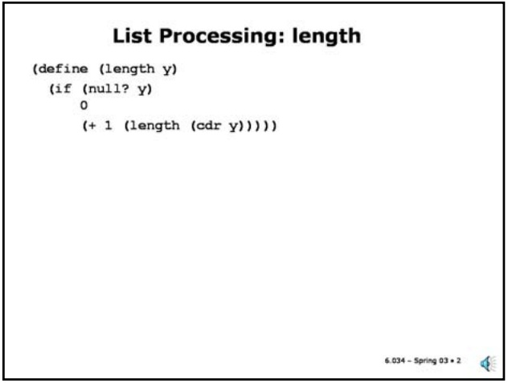

## Slide 11.2.2

(+ 1 (length (cdr y)))))

## Slide 11.2.3

Let's start with a very simple Scheme program to compute the length of a list. It's composed of two "cases", the base case when the list is null and the recursive case, in which we reduce the problem into a simpler instance of the same problem (getting the length of the cdr of the list) and compute the final result by adding one to the result of the recursive call.

This would be a Prolog-like solution to the same problem. It has essentially the same structure as the Scheme program. We use a predicate "length" that has two arguments, one is the list and the other its length.

The first "fact" handles the base case; it defines the length of the null list as 0.

The second rule handles the recursive case. The consequent of the rule (the left-hand-side) is what will match a pending subgoal. Note the form of the first argument of the consequent: it is a Scheme dotted pair. It is set up to match the variable ?h to the car of a list and the variable ?x to the cdr of the list. The second argument of the consequent expresses the length of the list as a function of the length of the cdr of the list.

The right hand side of the rule is the IF part. It sets up a simpler subgoal to solve. Once we solve it, we will have bound ?l to the length of the cdr and we will know the length of the full list (including the car).

Let's look at an example.

## List Processing: length

(define (length y) (if (null? y)

(+ 1 (length (cdr y)))

• length((),0)

```txt
• length((?h . ?x), ?1+1) :- length(?x,?1)
```

```txt
(a b . (c d)) ≡ (a b c d)
```

<!-- page: 14 -->

$$
[ 1,? 1 _ {2} / 0 ]
$$

## List Processing: length?

1. length((),0)

2. length(?x,?1-1):- length((?h . ?x),?1)

• Prove:

length((a b),?a),Ans(?a)

## Slide 11.2.6

## Slide 11.2.7

You may be wondering whether this formulation of length would also work. Certainly, it seems just as valid as the one we used. Let's trace it through. We start with the same goal as before, finding the length of the list (a b).

## List Processing: length?

1. length((),0)

2. length(?x,?1-1):- length((?h . ?x),?1)

. Prove:

length((a b),?a),Ans(?a)

[2,?x/(a b),?a/?1-1]

• length((?h . (a b)),?l),Ans(?l-1)

<!-- page: 15 -->

## List Processing: append

(define (append x y)

## Slide 11.2.10

(if (null? x)

1)

(cons (car x) (append (cdr x) y))

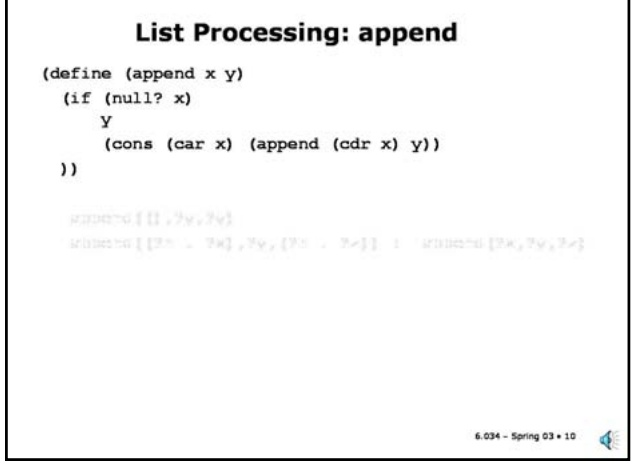

Slide 11.2.11

The logic program is completely analogous. The append predicate has three arguments, the lists to be appended and the result list. The first fact just says that the output of appending the null list and any list is just the second list. The second rule looks more complicated but it is just like the Scheme program. We pick out the car and the cdr in the consequent (note the use of dotted pair notation) and bind them to ?h and ?x respectively. Then we define a subgoal involving ?x and ?y and bind the result to ?z. We can then construct the result for the original list by consing ?h to ?z (using dotted pair notation).

Let's look at another example, which is quite parallel to length. Here is a Scheme implementation of an append function. It too consists of two cases. The base case handles the case of the first argument being null, in which case the answer is simply the second list. The recursive case involves computing the solution to a simpler case (append of the cdr of x to y) and updating it to the final answer by consing the car of x to the result.

## List Processing: append

(define (append x y)

(if (null? x)

))

(cons (car x) (append (cdr x) y))

• append((), ?y,?y)

. append((?h, ?x),?y, (?h . ?z)) :- append(?x,?y,?z)

Recall "dotted pair" notation (x . y) means x is car of

list and y is cdr of list. (cons x y) returns (x . y).

is rest of list.

(a . ()) ≡ (a)

(a b . (c d)) ≡ (a b c d)

<!-- page: 16 -->

## Difference Lists

• A list can be represented as the difference between two lists, which we will write diff (L1,L2)

## Slide 11.2.14

• For example, (a b c) can be written as

• diff( (a b c), ())

• diff( (a b c d), (d) )

• diff( (a b c d e), (d e) )

• diff( (a b c . ?x), ?x)

• The empty list is any list of the form • diff(?x, ?x)

• In diff (L1,L2) think of L1 as a pointer to the beginning of the list and £2 as a pointer to the end of the list.

The basic idea is that we can represent a list by a pair of pointers into a bigger list, one to the beginning and the other to the end of the list.

Slide 11.2.15

## List Processing: dappend

1. dappend(diff(?x,?y),diff(?y,?z),diff(?x,?z))

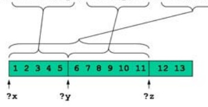

1 2 3 4 5 6 7 8 9 10 11 12 13

?x = (1 2 3 4 5 6 7 8 9 10 11 12 13)

?y = (6 7 8 9 10 11 12 13)

?z = (12 13)

<!-- page: 17 -->

Slide 11.2.16

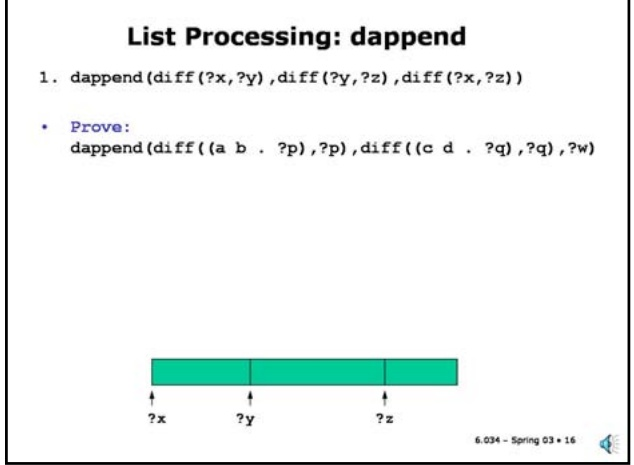

Slide 11.2.17

Now, we unify. Note that unification ends up equating ?y, the end of the first list in the rule, with ?p, the end of the first input list. Then ?p (and therefore ?y) is matched to the start of the second list. This is basically what carries out the append operation.

Yes, it looks like magic. We will be using difference lists a fair bit when we do natural language processing, so it is worth spending a bit of time understanding them.

Here we see how a goal would be phrased in this representation. We have used the most general representation of the input lists.

## List Processing: dappend

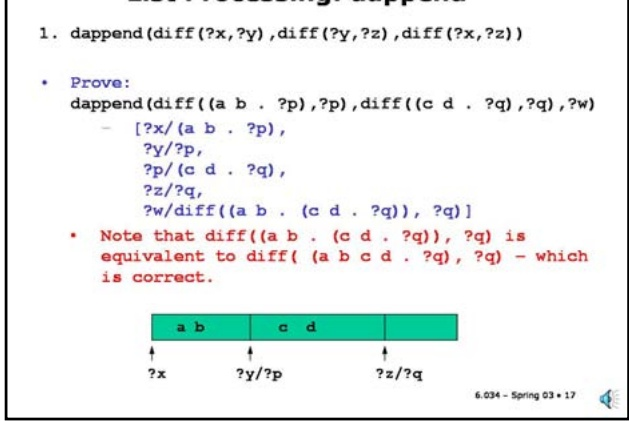

## List Processing: reverse

Slide 11.2.18

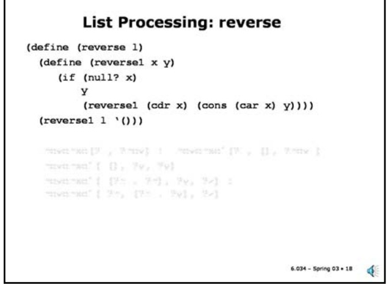

Slide 11.2.19

We follow the same pattern in the logic program. We define the predicate reverse, with two arguments, the input and output lists, in terms of a three-place auxiliary predicate reverse1, which introduces the accumulator and initializes it to nil. Note that if you reverse the first argument of reverse1 and append it to the second argument of reverse1 then that gives the answer to the original query.

Reverse1 is defined by two rules: in the base case when the first argument is nil, we simply equate the output list to the accumulator. In the general case, we set up a recursive subgoal with the cdr of the list, but we cons the car of the input list to the accumulator.

Let's look at another example, first without difference lists and then with.

This is Scheme for a list reverse operation. It's a bit more complicated than the cases we've seen so far. To reverse the list, we need a temporary value to serve as an accumulator for the reversed list. That's what the y argument to the inner procedure is. y starts with the null list and we cons each of the elements of the input onto this list. When the first argument is null, we return the accumulated list.

## List Processing: reverse

(define (reverse 1)

(define (reversel x y)

(if (null? x)

(reversel (cdr x) (cons (car x) y)))) (reversel 1 '()))

• reverse(?l, ?rev) :- reversel(?l, (), ?rev )

• reversel( (), ?y, ?y)

reversel( (?h . ?r), ?y, ?z) :- reversel( ?r, (?h . ?y), ?z)

<!-- page: 18 -->
