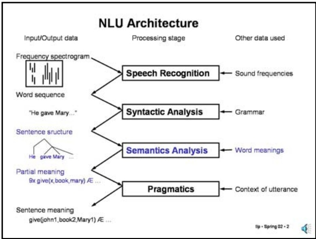
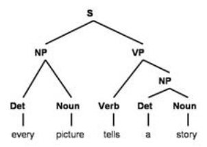
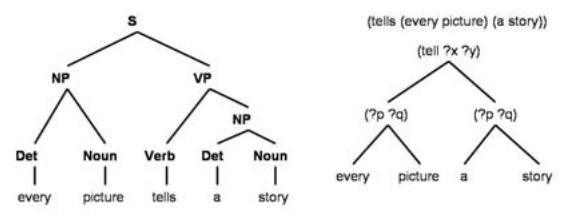
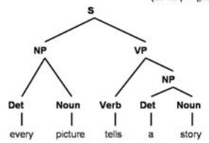
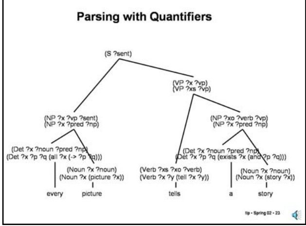
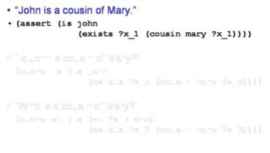
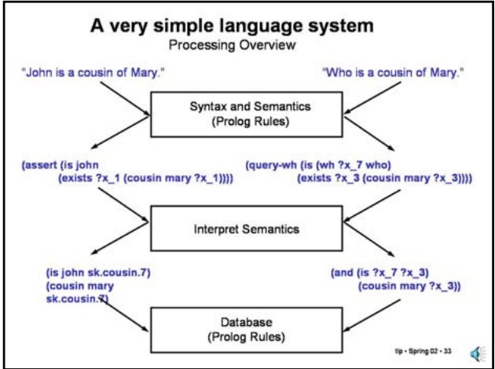

<!-- page: 1 -->

Slide 12.3.3

Slide 12.3.2

Recall that our goal is to take in the parse trees produced by syntactic analysis and produce a meaning representation.

We want semantics to produce a representation that is somewhat independent of syntax. So, for example, we would like the equivalent active and passive voice versions of a sentence to produce equivalent semantics representations.

We will assume that the meaning representation is some variant of first order predicate logic. We will specify what type of variant later.

We have limited the scope of the role of semantics by ruling out context. So, for example, given the sentence "He gave her the book", we will be happy with indicating that some male gave the book to some female, without identifying who these people might be.

## Semantics

• Represent meaning independent of surface syntax • He gave the book to her • He gave the book to her

• The book was given to her by him • Usually some variant of predicate calculus is used to represent meaning

• Does not represent context

Give:

agent: ?x (male)

object: book

recipient: ?y (female)

<!-- page: 2 -->

## Slide 12.3.7

Our guiding principle will be that the semantics of a constituent can be constructed by composing the semantics of its constituents. However, the composition will be a bit subtle and we will be using feature values to carry it out.

Let's look at the sentence rule. We will be exploiting the "two way" matching properties of unification strongly here. This rule says that the meaning of the sentence is picked up from the meaning of the VP, since the second argument of the VP is the same as the semantics of the sentence as a whole. We already saw this in our simple example, so it comes as no surprise. Note also that the semantics of the subject NP is passed as the first argument of the VP (by using the same variable name).

## Compositional Semantics

• The semantics of a constituent can be constructed by composing the semantics of its constituents.

• (S ?pred) :- (NP ?subj) (VP ?subj ?pred) (s ?pre - The semantics of the subject noun phrase is ?subj. which is combined with the semantics of the verb phrase to produce the sentence semantics, ?pred

• (Vp ?subj ?pred) :- (Verb ?subj ?obj ?pred) (NP ?obj)

• (NP ?sem) :- (Name ?sem)

## Compositional Semantics

## Slide 12.3.8

• The semantics of a constituent can be constructed by composing the semantics of its constituents.

• (S ?pred) :- (NP ?subj) (VP ?subj ?pred)

\- The semantics of the subject noun phrase is ?subj, which is combined with the semantics of the verb phrase to produce the sentence semantics, ?pred.

• (VP ?subj ?pred) :- (Verb ?subj ?obj ?pred) (NP ?obj) - This rule is for a transitive verb that expects a single direct object noun phrase, whose semantics are ?obj

\- The semantics of the VP will be constructed from the semantics of the verb which will combine the semantics of the subject ?subj and the direct object ?obj to produce the VP sematics, ?pred.

• (NP ?sem) :- (Name ?sem)

\- This rule is for proper names and the semantics of the NP is just that of the name.

<!-- page: 3 -->

## Slide 12.3.11

Let's look at a somewhat more complex example - "Every picture tells a story". Here is the syntactic analysis.

## Syntax & Semantics

## Syntax & Semantics

## Slide 12.3.12

<!-- page: 4 -->

## Slide 12.3.15

Let's pick one of the interpretations and see how we could generate it. At the heart of this attempt is a definition of the meaning of the determiners "every" and "a", which now become patterns for universally and existentially quantified statements. Note also that the nouns become patterns for predicate expressions.

## Quantifiers

• (tell (every picture) (a story)) is ambiguous:

• ∀ x Picture(x) → 3 y Story(y) ^ Tell(x,y)

• ∃ y Story(y) ^ ∀ x Picture(x) → Tell(x,y)

• The first of these is the usual interpretation, but consider: • Every US citizen has a president

• Let's consider how we could generate:

• ∀ x Picture(x) → ∃ y Story(y) ^ Tell(x,y)

• (all ?x (-> (picture ?x) (exists ?y (and (story ?y) (tell ?x ?y))))

\- every = (all ?x (-> ?p1 ?q1))

\- picture = (picture ?x)

\- tells = (tell ?x ?y)

\- a = (exists ?y (and ?p2 ?q2))

\- story = (story ?x)

## Syntax & Semantics

(all ?x (-> (picture ?x) (exists ?y (and (story ?y) (tell ?x ?y))))

(all ?x (-> ?p1 ?q1))

every picture tells a story

## Slide 12.3.16

(picture ?x) (exists ?y (and ?p2 ?q2))

(story ?x) (tell ?x ?y)

Note, the semantics tree is not parallel in structure to the syntax tree.

<!-- page: 5 -->

## Slide 12.3.19

Finally, the determiners are represented by quantified formulas that combine the semantics derived from the noun with the semantics of the VP (for a subject NP) or of the Verb (for an object NP).

## Quantifiers

• (Verb ?x ?y (tell ?x ?y)) :- tells • ?x denotes the subject and ?y the direct object, the resulting semantics is (tell ?x ?y).

• (Noun ?x (picture ?x)) :- picture

• (Noun ?x (story ?x)) :- story • (Noun ?x (story ?x)) :- story?x will typically be a variable, which we restrict to denote a picture or a story or (and (young ?x) (male ?x)) for boys, etc.

• (Det ?x ?p ?q (all ?x (-> ?p ?q))) :- every

• (Det ?x ?p ?q (exists ?x (and ?p ?q))) :- a

The ?x is the formal variable, ?p denotes the semantics of the noun and ?q the semantics of the predicate. For a subject NP, the predicate comes from the VP of the sentence. For an object NP, the predicate comes from the verb.

## Quantifiers

The semantics of the sentence will be derived from the NP, since the determiner provides the quantifier, which is the top node in the semantics.?x will be the "formal variable" for the quantifier, e.g. (all ?x ...)

• (VP ?xs ?vp) :- (Verb ?xs ?xo ?verb) (Np ?xo ?verb ?vp)

• (NP ?x ?p ?np) :- (Det ?x ?noun ?p ?np) (Noun ?x ?noun)

• (Verb ?x ?y (tell ?x ?y)) :- tells

• (Noun ?x (picture ?x)) :- picture

• (Noun ?x (story ?x)) :- story

• (Det ?x ?p ?q (all ?x (-> ?p ?q))) :- every

• (Det ?x ?p ?q (exists ?x (and ?p ?q))) :- a

## Slide 12.3.20

<!-- page: 6 -->

## Slide 12.3.23

Here we see how the parse works out. You have to follow the bindings carefully to see how it all works out.

What is remarkable about this is that we were able to map from a set of words to a first-order logic representation (which does not appear to be very similar) with a relatively compact grammar and with quite generic mechanisms.

## Quasi-Logical Form

• Semantics tries to capture sentence meaning independent of context. Producing the correct representation in First Order Logic usually requires context to resolve the ambiguity in language:

## Slide 12.3.24

• Syntactic ambiguity: "Mary saw John on the hill with a telescope"

• Lexical ambiguity: "We went to the bank" {of the river? Fleet Bank?}

• Quantifier scope ambiguity: "Every man loves a woman"

• Referential ambiguity: "He gave her the book", "Stop that!"

## Parsing with Quantifiers

The quantified expression we produced in the previous example is unambiguous, as required to be able to write an expression in first order logic. However, natural language is far from unambiguous. We have seen examples of syntactic ambiguity, lexical and attachment ambiguity in particular, plus there are many examples of semantic ambiguity, for example, ambiguity in quantifier scope and ambiguity on who or what pronouns refer to are examples.

<!-- page: 7 -->

## Slide 12.3.27

In quasi-logical notation, one also typically extends the range of available quantifiers to correspond more closely to the range of determiners available in natural language. One important case, is the determiner "the", which indicates a unique descriptor.

## Quasi-Logical Form

• Allow the use of quantified terms such as

• (every ?x (picture ?x))

• (exists ?x (story ?x)

• Allow a more general class of quantifiers

• (the ?x (and (big ?x) (picture ?x) (author ?x "Sargent") ))

• (most ?x (child ?x))

• (name ?x John)

• (pronoun ?x he)

## Quasi-Logical Form

• Allow the use of quantified terms such as

• (every ?x (picture ?x))

• (exists ?x (story ?x))

• Allow a more general class of quantifiers

• (the ?x (and (big ?x) (picture ?x) (author ?x "Sargent") ))

• (most ?x (child ?x))

• (name ?x John)

• (pronoun ?x he)

• These will have to be converted to FOL and given an appropriate axiomatization.

## Slide 12.3.28

<!-- page: 8 -->

## Slide 12.3.31

We will also allow assertions of the form (is x y) which indicate that two symbols denote the same person. We will assume that the forward chaining rules will propagate this equality to all the relevant facts. That is, we substitute equals for equals in each predicate, explicitely. This is not efficient, but it is simple.

## A very simple language system The Database

• Genealogy database

• (parent x y), (male x), (female x)

• (grandparent x y), (aunt/uncle x y), (sibling x y), (cousin x y)

• Assume relations explicit in database.

• Use forward-chaining of rules to expand relations when new facts added.

• (is x y) indicates two symbols denote same person

## A very simple language system

## The Database

• Genealogy database

• (parent x y), (male x), (female x)

• (grandparent x y), (aunt/uncle x y), (sibling x y), (cousin x y)

• Assume relations explicit in database.

• Use forward-chaining of rules to expand relations when new facts added.

• (is x y) indicates two symbols denote same person

• Retrieval query examples:

• (and (female ?x) (parent ?x John))

• (and (male ?x) (cousin Mary ?x))

• (grandparent Harry ?x)

## Slide 12.3.32

<!-- page: 9 -->

## Slide 12.3.33

Here we see a brief overview of the processing that we will do to interact with the genealogy database.

We will be able to accept declarative sentences, such as "John is a cousin of Mary". These sentences will be processed by a grammar to obtain a semantic representation. This representation will then be interpreted as a set of facts to be added to the database.

We can also ask questions, such as "Who is a cousin of Mary". Our grammar will produce a semantic representation. The semantics of this type of sentence is converted into a database query and passed to the database.

Let's look in more detail at the steps of this process.

## A very simple language system The Grammar

• "John is a cousin of Mary."

• (S (assert ?sem) \_) :- (NP ?subj (VP ?subj ?sem )

• "Is John a cousin of Mary?"

• (S (query-is(is ?subj ?sem)) ) :- (is)

(NP ?subj )

(NP ?sem ...)

## Slide 12.3.34

• "Who is a cousin of Mary?"

(vP ?subj )

We will need a grammar built along the lines we have been discussing. One of the things the grammar does is classify the sentences into declarative sentences, such as "John is a cousin of Mary", which will cause us to assert a fact in our database, and questions, such as, "Is John a cousin of Mary" or "Who is a cousin of Mary", which will cause us to query the database.

## Slide 12.3.35

Here we see one possible semantics for the declarative sentence "John is a cousin of Mary". The operation assert indicates the action to be taken. The body is in quasi-logical form; the quantified term (exists ?x\_1 (cousin mary ?x\_1)) is basically telling us there exists a person that is in the cousin relationship to Mary. The outermost is assertion is saying that John denotes that person. This is basically interpreting this quasi-logical form as:

] x . (is John x) ^ (cousin Mary x)

## A very simple language system The Semantics

• "John is a cousin of Mary."

• (assert (is john

(exists ?x\_ 1 (cousin mary ?x\_1))))

## A very simple language system The Semantics

• "John is a cousin of Mary."

• (assert (is john

(exists ?x\_1 (cousin mary ?x\_1))))

• "Is John a cousin of Mary?"

• (query-is (is john jo

(exists ?x 5 (cousin mary ?x 5))))

## Slide 12.3.36

<!-- page: 10 -->

## Slide 12.3.39

In this example, we get two new facts. One is from the outer is assertion which tells us that John denotes the same person as the skolem constant. The second fact comes from the body of the quantified term which tells us some properties of the person denote by the skolem constant.

## A very simple language system Using the Semantics

• "John is a cousin of Mary."

• (assert (is john

(exists ?x\_1 (cousin mary ?x\_1))))

• Assign skolem constant for ?x\_1, e.g. sk.cousin.7

• Convert body of exists into one or more facts

• Replace (exists ?x ...) with skolem constant

• Add to the database:

• (is john sk.cousin.7)

• (cousin mary sk.cousin.7)

## A very simple language system

## Using the Semantics

• "Who is a cousin of Mary?"

• (query-wh (is (wh ?x 7 who) (exists ?x 3 (cousin mary ?x 3))))

• Convert body of exists into one or more additional conditions for query

• Replace (exists ?x ...) with ?x

• Replace (wh ?y ...) with ?y

• Retrieve from database:

• (and (is ?x\_7 ?x 3) (cousin mary ?x\_3))

• ?x\_7/John

• ?x\_3/sk.cousin.7

## Slide 12.3.40

<!-- page: 11 -->

## Slide 12.3.43

Another phenomenon is called **ellipsis**, when words or phrases are missing and need to be filled in from context. In this example, the phrase "complete the job" is missing from the enf of the second conjoined sentence.

## Discourse Context

• Anaphora = "use of a word referring to or replacing earlier words"

• Jack lost his book. He looked for it for hours. Eventually he found it in his backpack.

• Ellipsis = "omission from a sentence of words needed to complete construction of meaning"

• You did not complete the job as well as he did.

## Discourse Context

• Anaphora = "use of a word referring to or replacing earlier words"

• Jack lost his book. He looked for it for hours. Eventually he found it in his backpack.

• Ellipsis = "omission from a sentence of words needed to complete construction of meaning"

• You did not complete the job as well as he did.

## Slide 12.3.44

• Definite descriptions = "used to refer to uniquely identifiable entity (or entities)"

• the tall man, the red book, the president

<!-- page: 12 -->

## Slide 12.3.47

There is, however, a rapidly increasing use of limited language processing in tasks that don't involve direct interaction with a human but do require some level of understanding of language. These tasks are characterized by situations where there is value in even limited capabilities, e.g. doing the first draft of a translation or a building a quick summary of a much longer news article.

I expect to see an explosion of applications of natural language technologies in the near future.

## Applications

• Human computer interaction:

• Restricted domains - flight reservations, classifying e-mails into a few classes, redirecting caller to one of a few destinations.

• Limited syntax

• Limited vocabulary

• Limited context

• Limited actions

• It is very hard for humans to understand what the limits of the system are. Can be frustrating.

• Summarization, Search, Translation

• Broader domain

• Performance does not have to be perfect to be useful

## Sources

• James Allen, Natural Language Understanding, Benjamin/Cummings • Peter Norvig, Paradigms of Artificial Intelligence Programming, Morgan Kauffman

• Slides by Alison Cawsey (www.cee.hw.ac.uk/\~alison/ni.htm)

## Slide 12.3.48
