<!-- page: 1 -->

## Slide 2.1.1

Search plays a key role in many parts of AI. These algorithms provide the conceptual backbone of almost every approach to the systematic exploration of alternatives.

We will start with some background, terminology and basic implementation strategies and then cover four classes of search algorithms, which differ along two dimensions: First, is the difference between **uninformed** (also known as **blind**) search and then **informed** (also known as **heuristic**) searches. Informed searches have access to task-specific information that can be used to make the search process more efficient. The other difference is between **any path** searches and **optimal** searches. Optimal searches are looking for the best possible path while any-path searches will just settle for finding some solution.

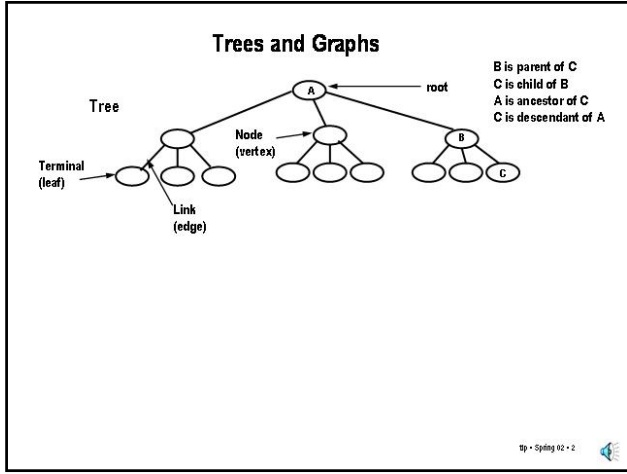

Slide 2.1.2

Slide 2.1.3

A graph is also a set of nodes connected by links but where loops are allowed and a node can have multiple parents. We have two kinds of graphs to deal with: **directed** graphs, where the links have direction (akin to one-way streets).

· Big idea: Search allows exploring altematives

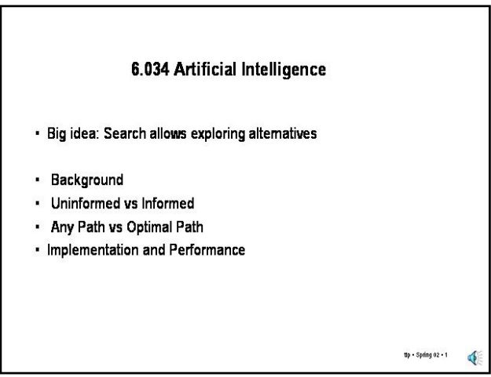

Background

Uninformed vs Informed

• Any Path vs Optimal Path

• Implementation and Performance

The search methods we will be dealing with are defined on trees and graphs, so we need to fix on some terminology for these structures:

● A tree is made up of **nodes** and **links** (circles and lines) connected so that there are no loops (cycles). Nodes are sometimes referred to as vertices and links as edges (this is more common in talking about graphs).

● A tree has a **root** node (where the tree "starts"). Every node except the root has a single **parent** (aka **direct ancestor**). More generally, an **ancestor** node is a node that can be reached by repeatedly going to a parent node. Each node (except the **terminal** (aka **leaf**) nodes) has one or more **children** (aka **direct descendants**). More generally, a **descendant** node is a node that can be reached by repeatedly going to a child node.

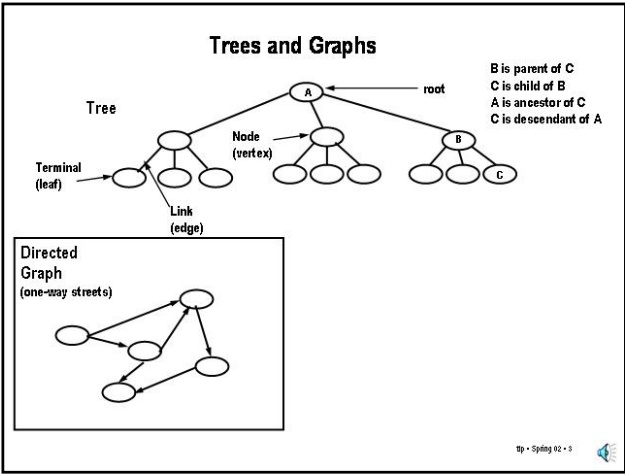

<!-- page: 2 -->

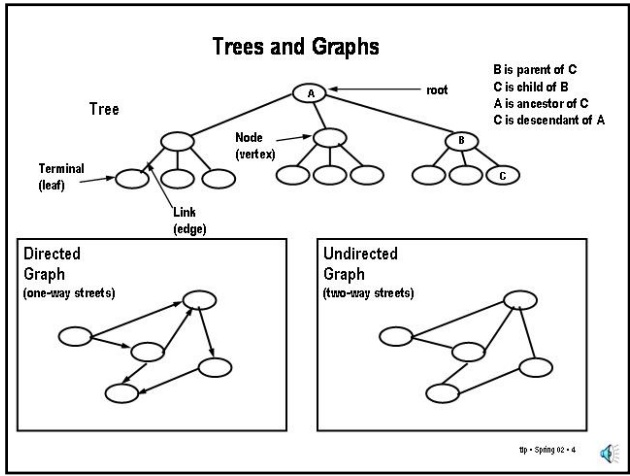

Slide 2.1.4

Slide 2.1.5

Graphs are everywhere; for example, think about road networks or airline routes or computer networks. In all of these cases we might be interested in finding a path through the graph that satisfies some property. It may be that any path will do or we may be interested in a path having the fewest "hops" or a least cost path assuming the hops are not all equivalent, etc.

And, **undirected** graphs where the links go both ways. You can think of an undirected graph as shorthand for a graph with directed links going each way between connected nodes.

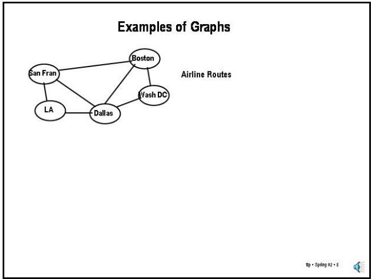

Slide 2.1.6

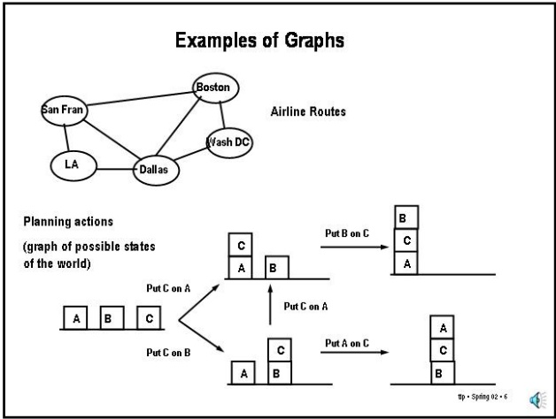

Slide 2.1.7

One general approach to problem solving in AI is to reduce the problem to be solved to one of searching a graph. To use this approach, we must specify what are the **states**, the **actions** and the **goal test**.

A state is supposed to be **complete**, that is, to represent all (and preferably only) the relevant aspects of the problem to be solved. So, for example, when we are planning the cheapest round-the-world flight plan, we don't need to know the address of the airports; knowing the identity of the airport is enough. The address will be important, however, when planning how to get from the hotel to the airport. Note that, in general, to plan an air route we need to know the airport, not just the city, since some cities have multiple airports.

We are assuming that the actions are **deterministic**, that is, we know exactly the state after the action is performed. We also assume that the actions are **discrete**, so we don't have to represent what happens while the action is happening. For example, we assume that a flight gets us to the scheduled destination and that what happens during the flight does not matter (at least when planning the route).

However, graphs can also be much more abstract. Think of the graph defined as follows: the nodes denote descriptions of a state of the world, e.g., which blocks are on top of what in a blocks scene, and where the links represent actions that change from one state to the other.

A path through such a graph (from a start node to a goal node) is a "plan of action" to achieve some desired goal state from some known starting state. It is this type of graph that is of more general interest in AI.

## Problem Solving Paradigm

• What are the states? (All relevant aspects of the problem)

• Arrangement of parts (to plan an assembly)

• Positions of trucks (to plan package distribution)

• City (to plan a trip)

• Set of facts (e.g. to prove geometry theorem)

• What are the actions (operators)? (Deterministic and discrete)

• Assemble two parts

• Move a truck to a new position

• Fly to a new city

• Apply a theorem to derive new fact

• What is the goal test? (Conditions for success)

• All parts in place

• All packages delivered

• Reached destination city

• Derived goal fact

<!-- page: 3 -->

## Slide 2.1.9

You can see an example of this converting from a graph to a tree here. If we assume that S is the start of our search and we are trying to find a path to G, then we can walk through the graph and make connections from every node to every connected node that would not create a cycle (and stop whenever we hit G). Note that such a tree has a leaf node for every non-looping path in the graph starting at S.

Also note, however, that even though we avoided loops, some nodes (the colored ones) are duplicated in the tree, that is, they were reached along different non-looping paths. This means that a complete search of this tree might do extra work.

The issue of how much effort to place in avoiding loops and avoiding extra visits to nodes is an important one that we will revisit later when we discuss the various search algorithms.

## Graph Search as Tree Search

• Trees are directed graphs without cycles and with nodes having <= 1 parent

• We can turn graph search problems (from S to G) into tree search problems by:

• replacing undirected links by 2 directed links

• avoiding loops in path (or keeping track of visited nodes globally)

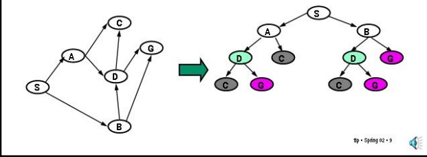

## Terminology

## Slide 2.1.10

• State - Used to refer to the vertices of the underlying graph that is being searched, that is, states in the problem domain, for example, a city, an arrangement of blocks or the arrangement of parts in a puzzle.

• Search Node -Refers to the vertices of the search tree which is being generated by the search algorithm. Each node refers to a state of the world; many nodes may refer to the same state. Importantly, a node implicitly represents a path (from the start state of the search to the state associated with the node). Because search nodes are part of a search tree, they have a unique ancestor node (except for the root node).

One important distinction that will help us keep things straight is that between a **state** and a **search node**.

A state is an arrangement of the real world (or at least our model of it). We assume that there is an underlying "real" state graph that we are searching (although it might not be explicitly represented in the computer; it may be implicitly defined by the actions). We assume that you can arrive at the same real world state by multiple routes, that is, by different sequences of actions.

A search node, on the other hand, is a data structure in the search algorithm, which constructs an explicit tree of nodes while searching. Each node refers to some state, but not uniquely. Note that a node also corresponds to a path from the start state to the state associated with the node. This follows from the fact that the search algorithm is generating a **tree**. So, if we return a node, we're returning a path.

<!-- page: 4 -->

## Slide 2.2.1

So, let's look at the different classes of search algorithms that we will be exploring. The simplest class is that of the **uninformed, any-path** algorithms. In particular, we will look at **depth-first** and **breadth-first** search. Both of these algorithms basically look at all the nodes in the search tree in a specific order (independent of the goal) and stop when they find the first path to a goal state.

<table><tr><td colspan="3">Classes of Search</td></tr><tr><td>Class</td><td>Name</td><td>Operation</td></tr><tr><td>Any PathUninformed</td><td>Depth-FirstBreadth-First</td><td>Systematic exploration of whole tree until a goal node is found.</td></tr><tr><td>Any PathInformed</td><td>Best-First</td><td>Uses heuristic measure of goodness of a state, e.g. estimated distance to goal.</td></tr></table>

Slide 2.2.2

The next class of methods are **informed, any-path** algorithms. The key idea here is to exploit a task specific measure of goodness to try to either reach the goal more quickly or find a more desirable goal state.

<table><tr><td colspan="3">Classes of Search</td></tr><tr><td>Class</td><td>Name</td><td>Operation</td></tr><tr><td>Any Path</td><td>Depth-First</td><td rowspan="2">Systematic exploration of whole tree until a goal node is found.</td></tr><tr><td>Uninformed</td><td>Breadth-First</td></tr></table>

Slide 2.2.3

<table><tr><td colspan="3">Classes of Search</td></tr><tr><td>Class</td><td>Name</td><td>Operation</td></tr><tr><td>Any PathUninformed</td><td>Depth-FirstBreadth-First</td><td>Systematic exploration of whole tree until a goal node is found.</td></tr><tr><td>Any PathInformed</td><td>Best-First</td><td>Uses heuristic measure of goodness of a state, e.g. estimated distance to goal.</td></tr></table>

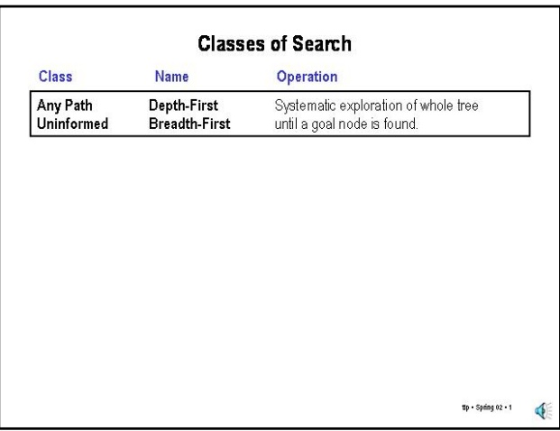

Next, we look at the class of **uninformed, optimal** algorithms. These methods guarantee finding the "best" path (as measured by the sum of weights on the graph edges) but do not use any information beyond what is in the graph definition.

Slide 2.2.4

| OptimalUninformed | Uniform-Cost | Uses path "length" measure.Finds "shortest" path. |
| --- | --- | --- |
| OptimalInformed | A* | Uses path "length" measure and heuristicFinds "shortest" path |

<table><tr><td colspan="3">Classes of Search</td></tr><tr><td>Class</td><td>Name</td><td>Operation</td></tr><tr><td>Any PathUninformed</td><td>Depth-FirstBreadth-First</td><td>Systematic exploration of whole tree until a goal node is found.</td></tr><tr><td>Any PathInformed</td><td>Best-First</td><td>Uses heuristic measure of goodness of a state, e.g. estimated distance to goal.</td></tr><tr><td>OptimalUninformed</td><td>Uniform-Cost</td><td>Uses path &quot;length&quot; measure.Finds &quot;shortest&quot; path.</td></tr></table>

Finally, we look at **informed, optimal** algorithms, which also guarantee finding the best path but which exploit heuristic ("rule of thumb") information to find the path faster than the uninformed methods.

<!-- page: 5 -->

Slide 2.2.7

At this point, we are ready to actually look at a specific search. For example, **depth-first search** always looks at the deepest node in the search tree first. We can get that behavior by:

●	 picking the first element of Q as the node to test and extend.

●	 adding the new (extended) paths to the FRONT of Q, so that the next path to be examined will be one of the extensions of the current path to one of the descendants of that node's state.

One good thing about depth-first search is that Q never gets very big. We will look at this in more detail later, but it's fairly easy to see that the size of the Q depends on the depth of the search tree and not on its breadth.

## Implementing the Search Strategies

Depth-first:

Pick first element of Q

Add path extensions to front of Q

<!-- page: 6 -->

Slide 2.2.11

A state M is **Expanded** when a path to that state is pulled off of Q. At that point, the descendants of M are visited and the paths to those descendants added to the Q.

## Terminology

Visited – a state M is first visited when a path to M first gets added to Q. In general, a state is said to have been visited if it has ever shown up in a search node in Q. The intuition is that we have briefly "visited" them to place them on Q, but we have not yet generated its descendants.

Expanded – a state M is expanded when it is the state of a search node that is pulled off of Q. At that point, the descendants of M are visited and the path that led to M is extended to the eligible descendants. In principle, a state may be expanded multiple times. We sometimes refer to the search node that led to M (instead of M itself) as being expanded. However, once a node is expanded we are done with it; we will not need to expand it again. In fact, we discard it from Q.

## Terminology

Visited – a state M is first visited when a path to M first gets added to Q. In general, a state is said to have been visited if it has ever shown up in a search node in Q. The intuition is that we have briefly "visited" them to place them on Q, but we have not yet examined them carefully

Expanded - a state M is expanded when it is the state of a search node that is pulled off of Q. At that point, the descendants of M are visited and the path that led to M is extended to the eligible descendants. In principle, a state may be expanded multiple times. We sometimes refer to the search node that led to M (instead of M itself) as being expanded. However, once a node is expanded we are done with it; we will not need to expand it again. In fact, we discard it from Q.

This distinction plays a key role in our discussion of the various search algorithms; study it carefully.

## Slide 2.2.12

Please try to get this distinction straight; it will save you no end of grief.

<!-- page: 7 -->

## Slide 2.2.15

Another key concept to keep straight is that of a heuristic value for a state. The word **heuristic** generally refers to a "rule of thumb", something that's helpful but not guaranteed to work.

## Terminology

Heuristic – The word generally refers to a "rule of thumb," something that may be helpful in some cases but not always. Generally held to be in contrast to "guaranteed" or "optimal."

## Terminology

Heuristic – The word generally refers to a "rule of thumb," something that may be helpful in some cases but not always. Generally held to be in contrast to "guaranteed" or “optimal."

Heuristic function – In search terms, a function that computes a value for a state (but does not depend on any path to that state) that may be helpful in guiding the search. There are two related forms of heuristic guidance that one sees:

## Slide 2.2.16

<!-- page: 8 -->

Slide 2.2.19

Note that best-first search requires finding the best node in Q. This is a classic problem in computer science and there are many different approaches that are appropriate in different circumstances. One simple method is simply to scan the Q completely, keeping track of the best element found. Surprisingly, this simple strategy turns out to be the right thing to do in some circumstances. A more sophisticated strategy, such as keeping a data structure called a "priority queue", is more often the correct approach. We will pursue this issue further when we talk about optimal searches.

## Implementation Issues: Finding the best node

There are many possible approaches to finding the best node in Q.

• Scanning Q to find lowest value

• Sorting Q and picking the first element

• Keeping the Q sorted by doing "sorted" insertions

• Keeping Q as a priority queue

Which of these is best will depend among other things on how many children nodes have on average. We will look at this in more detail later.

## Worst Case Running Time Max Time  Max #Visited

• The number of states in the search space may be exponential in some "depth" parameter, e.g. number of actions in a plan, number of moves in a game.

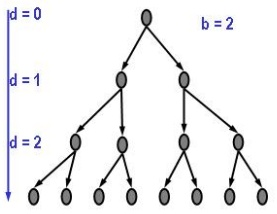

d is depth

b is branching factor

bd < (bd+1−1)/(b −1) < bd+1

states in tree

## Slide 2.2.20

<!-- page: 9 -->

## Cost and Performance of Any-Path Methods

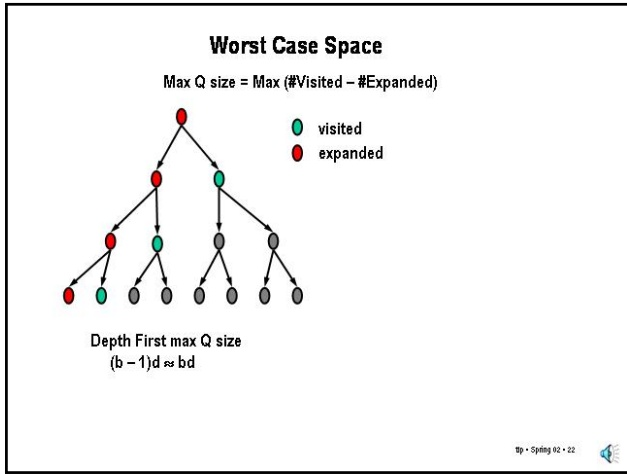

Slide 2.2.23

## Slide 2.2.22

The situation for breadth-first search is much different than that for depth-first search. Here the worst case happens after we've visited all the nodes at depth d-1. At that point, all the nodes at depth d have been visited and none expanded. So, the Q has size bd, that is, a size exponential in d.

In addition to thinking about running time, we should also think about the memory space required for searches. The dominant factor in the space requirements for these searches is the maximum size of the search Q. The size of the search Q in a tree-structured search space is simply the number of visited states minus the number of expanded states.

Note that, in the worst case, best-first behaves as breadth-first and has the same space requirements.

Searching a tree with branching factor b and depth d (without using a Visited list)

Slide 2.2.24

| Search Method | Worst Time | Worst Space | Fewest states? | Guaranteed to find path? |
| --- | --- | --- | --- | --- |
| Depth-First | ${\mathrm{b}}^{\mathrm{d} + 1}$ | bd | No | Yes* |
| Breadth-first | ${\mathrm{b}}^{\mathrm{d} + 1}$ | ${\mathrm{b}}^{\mathrm{d}}$ | Yes | Yes |
| Best-First | ${\mathrm{b}}^{\mathrm{d} + 1}{}^{* * }$ | ${\mathrm{b}}^{\mathrm{d}}$ | No | Yes* |

\*If there are no infinitely long paths in the search space

\*\* Best-First needs more time to locate the best node in Q

For a depth-first search, we can see that Q holds the unexpanded "siblings" of the nodes along the path that we are currently considering. In a tree, the path length cannot be greater than d and the number of unexpanded siblings cannot be greater than b-1, so this tells us that the length of Q is always less than b\*d, that is, the space requirements are linear in d.

Worst case time is proportional to number of nodes added to Q Worst case space is proportional to maximal length of Q

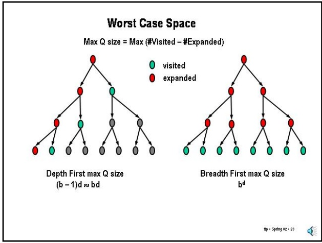

This table summarizes the key cost and performance properties of the different any-path search methods. We are assuming that our state space is a tree and so we cannot revisit states and a Visited list is useless.

Recall that this analysis is done for searching a **tree** with uniform branching factor b and depth d. Therefore, the size of this search space grows exponentially with the depth. So, it should not be surprising that methods that guarantee finding a path will require exponential time in this situation. These estimates are not intended to be tight and precise; instead they are intended to convey a feeling for the tradeoffs.

Note that we could have phrased these results in terms of V, the number of vertices (nodes) in the tree, and then everything would have worst case behavior that is linear in V. We phrase it the way we do because in many applications, the number of nodes depends in an exponential way on some depth parameter, for example, the length of an action plan, and thinking of the cost as linear in the number of nodes is misleading. However, in the algorithms literature, many of these algorithms are described as requiring time linear in the number of nodes.

<!-- page: 10 -->

## States vs Paths

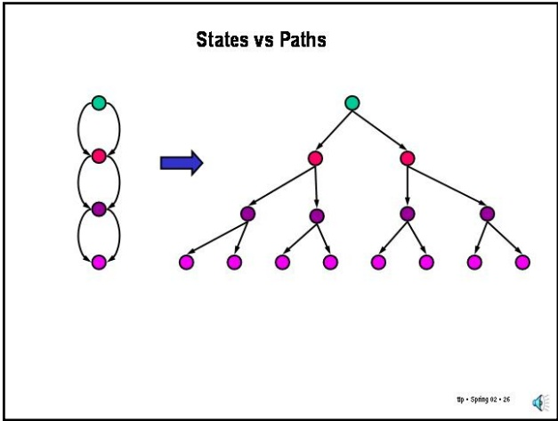

Slide 2.2.26

Slide 2.2.27

As we mentioned earlier, the key observation is that with a Visited list, our worst-case time performance is limited by the number of **states** in the search space (since you visit each state at most once) rather than the number of **paths** through the nodes in the space, which may be exponentially larger than the number of states, as this classic example shows. Note that none of the paths in the tree have a loop in them, that is, no path visits a state more than once. The Visited list is a way of spending space to limit this time penalty. However, it may not be appropriate for very large search spaces where the space requirements would be prohibitive.

So far, we have been treating time and space in parallel for our algorithms. It is tempting to focus on time as the dominant cost of searching and, for real-time applications, it is. However, for large offline applications, space may be the limiting factor.

If you do a back of the envelope calculation on the amount of space required to store a tree with branching factor 8 and depth 10, you get a very large number. Many real applications may want to explore bigger spaces.

## Space (the final frontier)

• In large search problems, memory is often the limiting factor.

$$
(2 ^ {3}) ^ {1 0} \times 2 ^ {3} = 2 ^ {3 3} \text {bytes} = 8, 0 0 0 \text {Mbytes} = 8 \text {Gbytes}
$$

Imagine searching a tree with branching factor 8 and depth 10. Assume a node requires just 8 bytes of storage. Then, breadth-first search might require up to

<!-- page: 11 -->

$$
(2 ^ {3}) ^ {1 0} \times 2 ^ {3} = 2 ^ {3 3} \text {bytes} = 8, 0 0 0 \text {Mbytes} = 8 \text {Gbytes}
$$

## Progressive Deepening Search Best of Both Worlds

Depth-First Search (DFS) has small space requirements (linear in depth) but has major problems:

## Slide 2.2.30

• DFS can run forever in search spaces with infinite length paths

• DFS does not guarantee of finding shallowest goal

Breadth-First Search (BFS) guarantees finding shallowest goal, even in the presence of infinite paths, but is has one great problem:

• BFS requires a great deal of space (exponential in depth)

Breadth-first search on the other hand, does guarantee finding the shallowest goal, but at the expense of space requirements that are exponential in the depth of the search tree.

<!-- page: 12 -->

## Progressive Deepening Search

• Isn't Progressive Deepening (PDS) too expensive?

• In exponential trees, time is dominated by deepest search.

For example, if branching factor is 2, then the number of nodes at depth d is 2d while the total number of nodes in all previous levels is 2d-1, so the difference between looking at whole tree versus only the deepest level is at worst a factor of 2 in performance.

## Slide 2.2.34

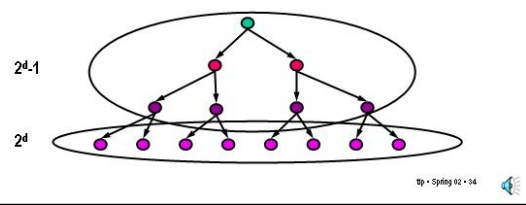

Slide 2.2.35

It is easy to see this for binary trees, where the number of nodes at level d is about equal to the number of nodes in the rest of the tree. The worst-case time for BFS at level d is proportional to the number of nodes at level d, while the worst case time for PDS at that level is proportional to the number of nodes in the whole tree which is almost exactly twice those at the deepest level. So, in the worst case, PDS (for binary trees) does no more than twice as much work as BFS, while using much less space.

This is a worst case analysis, it turns out that if we try to look at the expected case, the situation is even better.

One can derive an estimate of the ratio of the work done by progressive deepening to that done by a single depth-first search: (b+1)/(b-1). This estimate is for the average work (averaging over all possible searches in the tree). As you can see from the table, this ratio approaches one as the branching factor increases (and the resulting exponential explosion gets worse).

## Progressive Deepening Search

Compare the ratio of average time spent on PDS with average time spent on a single DFS with the full depth tree: (Avg time for PDS)/(Avg time for DFS) ≈ (b+1)/(b-1)

| b | ratio |
| --- | --- |
| 2 | 3 |
| 3 | 2 |
| 5 | 1.5 |
| 25 | 1.08 |
| 100 | 1.02 |

<!-- page: 13 -->

## 6.034 Notes: Section 2.3

## Slide 2.3.1

We will now step through the any-path search methods looking at their implementation in terms of the simple algorithm. We start with depth-first search using a Visited list.

The table in the center shows the contents of Q and of the Visited list at each time through the loop of the search algorithm. The nodes in Q are indicated by reversed paths, blue is used to indicate newly added nodes (paths). On the right is the graph we are searching and we will label the state of the node that is being extended at each step.

## Depth-First

Pick first element of Q; Add path extensions to front of Q

|  | Q | Visited |
| --- | --- | --- |
| 1 |  |  |
| 2 |  |  |
| 3 |  |  |
| 4 |  |  |
| 5 |  |  |

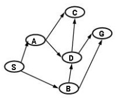

We show the paths in reversed order; the node's state is the first entry.

## Depth-First

## Pick first element of Q; Add path extensions to front of Q

|  | Q | Visited |
| --- | --- | --- |
| 1 | (S) | S |
| 2 |  |  |
| 3 |  |  |
| 4 |  |  |
| 5 |  |  |

Added paths in blue

## Slide 2.3.2

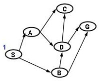

We show the paths in reversed order; the node's state is the first entry.

<!-- page: 14 -->

## Depth-First

## Slide 2.3.4

Pick first element of Q; Add path extensions to front of Q

|  | Q | Visited |
| --- | --- | --- |
| 1 | (S) | S |
| 2 | (A S) (B S) | A, B, S |
| 3 | (C A S) (D A S) (B S) | C,D,B,A,S |
| 4 |  |  |
| 5 |  |  |

Added paths in blue

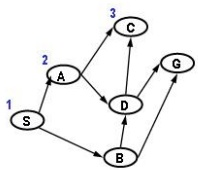

We show the paths in reversed order; the node's state is the first entry.

up · Spring 02 · 4

We pick the first node, whose state is C, and note that there are no descendants of C and so no new nodes to add.

Slide 2.3.5

We pick the first node of Q, whose state is D, and consider extending to states C and G, but C is on the Visited list so we do not add that extension. We do add the path to G to the front of Q.

## Depth-First

Pick first element of Q; Add path extensions to front of Q

|  | Q | Visited |
| --- | --- | --- |
| 1 | (S) | S |
| 2 | (A S)(B S) | A,B,S |
| 3 | (C A S)(D A S)(B S) | C,D,B,A,S |
| 4 | (D A S)(B S) | C,D,B,A,S |
| 5 |  |  |

Added paths in blue

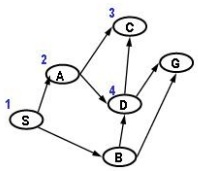

We show the paths in reversed order; the node's state is the first entry.

<!-- page: 15 -->

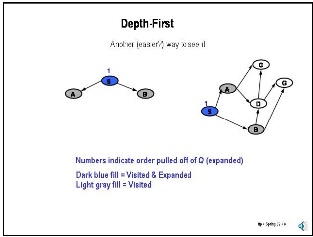

Slide 2.3.9

## Slide 2.3.8

In this view, we introduce a left to right bias in deciding which nodes to expand - this is purely arbitrary. It corresponds exactly to the arbitrary decision of which nodes to add to Q first. Giving this bias, we decide to expand the node whose state is A, which ends up visiting C and D.

Slide 2.3.10

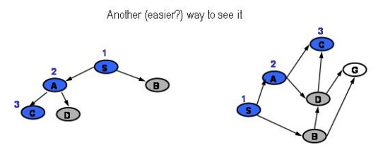

Numbers indicate order pulled off of Q (expanded)

Tracing out the content of Q can get a little monotonous, although it allows one to trace the performance of the algorithms in detail. Another way to visualize simple searches is to draw out the search tree, as shown here, showing the result of the first expansion in the example we have been looking at.

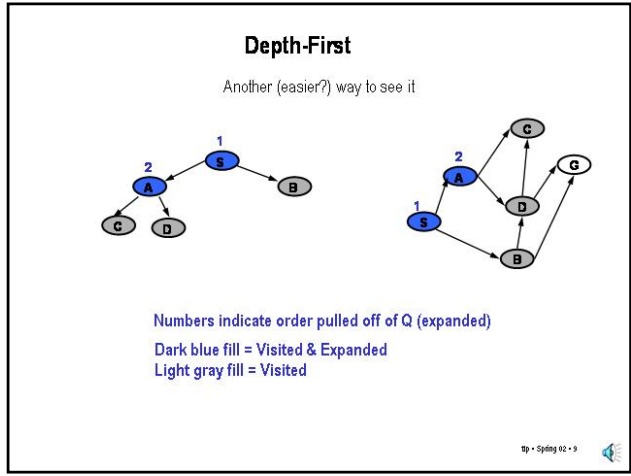

<!-- page: 16 -->

## Depth-First

Another (easier?) way to see it

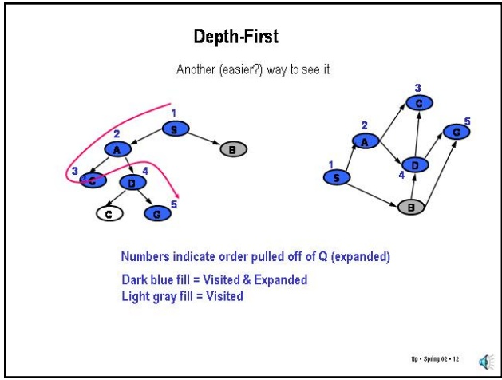

Slide 2.3.12

Slide 2.3.13

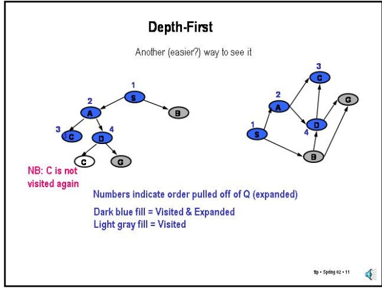

We now expand G and stop.

This view of depth-first search is the more common one (rather than tracing Q). In fact, it is in this view that one can visualize why it is called depth-first search. The red arrow shows the sequence of expansions during the search and you can see that it is always going as deep in the search tree as possible. Also, we can understand another widely used name for depth-first search, namely **backtracking** search. However, you should convince yourself that this view is just a different way to visualize the behavior of the Q-based algorithm.

We can repeat the depth-first process without the Visited list and, as expected, one sees the second path to C added to Q, which was blocked by the use of the Visited list. I'll leave it as an exercise to go through the steps in detail.

Note that in the absence of a Visited list, we still require that we do not form any paths with loops, so if we have visited a state along a particular path, we do not re-visit that state again in any extensions of the path.

## Depth-First (without Visited list)

Pick first element of Q; Add path extensions to front of Q

|  | Q |
| --- | --- |
| 1 | (S) |
| 2 | (A S) (B S) |
| 3 | (C A S) (D A S) (B S) |
| 4 | (D A S) (B S) |
| 5 | (C D A S) (G D A S) (B S) |
| 6 | (G D A S) (B S) |

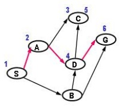

Added paths in blue

We show the paths in reversed order; the node's state is the first entry. Do not extend a path to a state if the resulting path would have a loop.

<!-- page: 17 -->

## Breadth-First

## Slide 2.3.16

Pick first element of Q; Add path extensions to end of Q

|  | Q | Visited |
| --- | --- | --- |
| 1 | (S) | S |
| 2 | (A S) (B S) | A,B,S |
| 3 | (B S) (C A S) (D A S) | C,D,B,A,S |
| 4 |  |  |
| 5 |  |  |
| 6 |  |  |

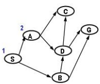

Added paths in blue

We show the paths in reversed order; the node's state is the first entry.

p · Spring 02 · 16

We pick the first node, whose state is A, and extend the path to C and D and add them to Q (at the back) and here we see the difference from depth-first.

Slide 2.3.17

Now, the first node in Q is the path to B so we pick that and consider its extensions to D and G. Since D is already Visited, we ignore that and add the path to G to the end of Q.

## Breadth-First

Pick first element of Q; Add path extensions to end of Q

|  | Q | Visited |
| --- | --- | --- |
| 1 | (S) | S |
| 2 | (A S) (B S) | A,B,S |
| 3 | (B S) (C A S) (D A S) | C,D,B,A,S |
| 4 | (C A S) (D A S) (G B S)* | G,C,D,B,A,S |
| 5 |  |  |
| 6 |  |  |

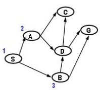

Added paths in blue

We show the paths in reversed order; the node's state is the first entry.

<!-- page: 18 -->

Slide 2.3.21

Finally, we get the path to G and we stop.

## Breadth-First

Pick first element of Q; Add path extensions to end of Q

|  | Q | Visited |
| --- | --- | --- |
| 1 | (S) | S |
| 2 | (A S) (B S) | A,B,S |
| 3 | (B S) (C A S) (D A S) | C,D,B,A,S |
| 4 | (C A S) (D A S) (G B S)* | G,C,D,B,A,S |
| 5 | (D A S) (G B S) | G,C,D,B,A,S |
| 6 | (G B S) | G,C,D,B,A,S |

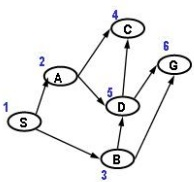

Added paths in blue

We show the paths in reversed order; the node's state is the first entry. \* We could have stopped here, when the first path to the goal was generated.

<!-- page: 19 -->

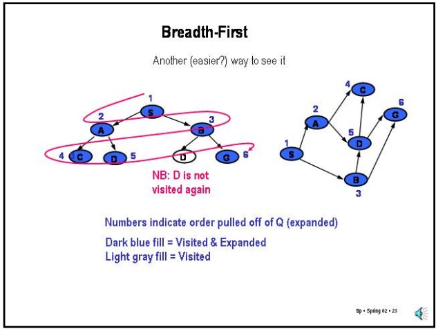

## Breadth-First (without Visited list)

Pick first element of Q; Add path extensions to end of Q

|  | Q |
| --- | --- |
| 1 | (S) |
| 2 | (A S) (B S) |
| 3 | (B S) (C A S) (D A S) |
| 4 | (C A S) (D A S) (D B S) (G B S)* |
| 5 | (D A S) (D B S) (G B S) |
| 6 | (D B S) (G B S) (C D A S) (G D A S) |
| 7 | (G B S) (C D A S) (G D A S) (C D B S) (G D B S) |

Added paths in blue

## Slide 2.3.24

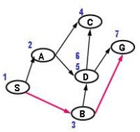

We show the paths in reversed order; the node's state is the first entry. \* We could have stopped here, when the first path to the goal was generated. p · Spring 02 · 24

We can repeat the breadth-first process without the Visited list and, as expected, one sees multiple paths to C, D and G are added to Q, which were blocked by the Visited test earlier. I'll leave it as an exercise to go through the steps in detail.

Slide 2.3.25

Finally, let's look at Best-First Search. The key difference from depth-first and breadth-first is that we look at the whole Q to find the best node (by heuristic value).

We start as before, but now we're showing the heuristic value of each path (which is the value of its state) in the Q, so we can easily see which one to extract next.

## Best-First

Pick "best" (by heuristic value) element of Q; Add path extensions anywhere in Q

|  | Q | Visited |
| --- | --- | --- |
| 1 | (10 S) | S |
| 2 |  |  |
| 3 |  |  |
| 4 |  |  |
| 5 |  |  |

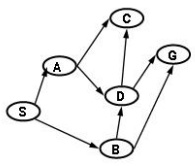

Heuristic Values A=2 C=1 S=10 B=3 D=4 G=0

Added paths in blue; heuristic value of node's state is in front. We show the paths in reversed order; the node's state is the first entry.

<!-- page: 20 -->

Slide 2.3.29

Then, we pick the node corresponding to B which has lower value than the path to D and extend to G (not C because of previous Visit).

## Best-First

Pick "best" (by heuristic value) element of Q; Add path extensions anywhere in Q

|  | Q | Visited |
| --- | --- | --- |
| 1 | (10 S) | S |
| 2 | (2 A S) (3 B S) | A,B,S |
| 3 | (1 C A S) (3 B S) (4 D A S) | C,D,B,A,S |
| 4 | (3 B S) (4 D A S) | C,D,B,A,S |
| 5 | (0 G B S) (4 D A S) | G,C,D,B,A,S |

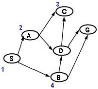

Heuristic Values A=2 C=1 S=10 B=3 D=4 G=0

Added paths in blue; heuristic value of node's state is in front. We show the paths in reversed order; the node's state is the first entry.

<!-- page: 21 -->
