<!-- page: 1 -->

Classes of Search

| Class | Name | Operation |
| --- | --- | --- |
| Any PathUninformed | Depth-FirstBreadth-First | Systematic exploration of whole tree until a goal node is found. |
| Any PathInformed | Best-First | Uses heuristic measure of goodness of a node, e.g. estimated distance to goal. |

| OptimalUninformed | Uniform-Cost | Uses path "length" measure.Finds "shortest" path. |
| --- | --- | --- |

Slide 2.4.2

Now, we will look at the first algorithm that searches for optimal paths, as defined by a "path length" measure. This uniform cost algorithm is uninformed about the goal, that is, it does not use any heuristic guidance.

<!-- page: 2 -->

Slide 2.4.5

Why can't we use a Visited list in connection with optimal searching? In the earlier searches, the use of the Visited list guaranteed that we would not do extra work by re-visiting or re-expanding states. It did not cause any failures then (except possibly of intuition).

## Why not a Visited list?

For the any-path algorithms, the Visited list would not cause us to fail to find a path when one existed, since the path to a state did not matter.

<!-- page: 3 -->

Slide 2.4.9

The first, and most basic, algorithm for optimal searching is called uniform-cost search. Uniformcost is almost identical in implementation to best-first search. That is, we always pick the best node on Q to expand. The only, but crucial, difference is that instead of assigning the node value based on the heuristic value of the node's state, we will assign the node value as the "path length" or "path cost", a measure obtained by adding the "length" or "cost" of the links making up the path.

## Implementing Optimal Search Strategies

## Uniform Cost:

Pick best (measured by path length) element of Q

Add path extensions anywhere in Q.

<!-- page: 4 -->

## Slide 2.4.13

Similarly for S-A-D-C.

## Uniform Cost

Like best-first except that it uses the "total length (cost)" of a path instead of a heuristic value for the state.

Each link has a “length” or “cost" (which is always greater than 0)

We want "shortest" or "least cost" path

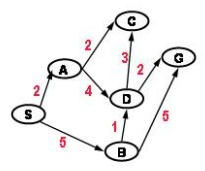

Total path cost:

(SA C) 4

(S B D G) 8

(S A D C)

<!-- page: 5 -->

Slide 2.4.17

Since C has no descendants, we add no new paths to Q and we pick the best of the remaining paths, which is now the path to B.

## Uniform Cost

Pick best (by path length) element of Q; Add path extensions anywhere in Q

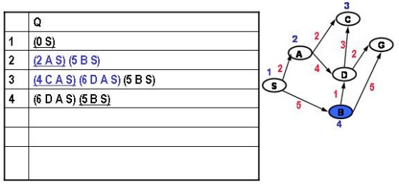

Added paths in blue; underlined paths are chosen for extension. We show the paths in reversed order; the node's state is the first entry.

Added paths in blue; underlined paths are chosen for extension. We show the paths in reversed order; the node's state is the first entry.

## Uniform Cost

Pick best (by path length) element of Q; Add path extensions anywhere in Q

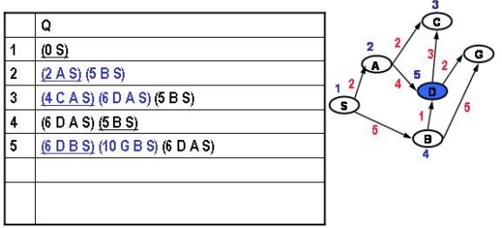

## Slide 2.4.18

<!-- page: 6 -->

Slide 2.4.21

And we have found our shortest path (S A D G) whose length is 8.

## Uniform Cost

Pick best (by path length) element of Q; Add path extensions anywhere in Q

|  | Q |
| --- | --- |
| 1 | (0 S) |
| 2 | (2 A S) (5 B S) |
| 3 | (4 C A S) (6 D A S) (5 B S) |
| 4 | (6 D A S) (5 B S) |
| 5 | (6 D B S) (10 G B S) (6 D A S) |
| 6 | (8 G D B S) (9 C D B S) (10 G B S) (6 D A S) |
| 7 | (8 G D A S) (9 C D A S) (8 G D B S) (9 C D B S)(10 G B S) |

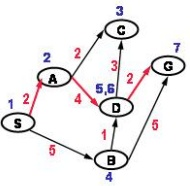

Added paths in blue; underlined paths are chosen for extension. We show the paths in reversed order; the node's state is the first entry.

<!-- page: 7 -->

Slide 2.4.25

Note that the first path that visited G was not the eventually chosen optimal path to G. This explains our unwillingness to stop on first visiting G in the example we just did.

## Why not stop on first visiting a goal?

When doing Uniform Cost, it is not correct to stop the search when the first path to a goal is generated, that is, when a node whose state is a goal is added to Q.

We must wait until such a path is pulled off the Q and tested in step 3. It is only at this point that we are sure it is the shortest path to a goal since there are no other shorter paths that remain unexpanded.

This contrasts with the Any Path searches where the choice of where to test for a goal was a matter of convenience and efficiency, not correctness.

In the previous example, a path to G was generated at step 5, but it was a different, shorter, path at step 7 that we accepted.

<!-- page: 8 -->

Slide 2.4.29

Then the path from S to A to C, with length 4, is the next shortest path.

## Uniform Cost

Another (easier?) way to see it

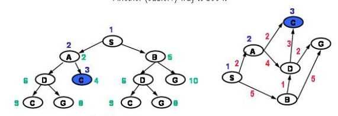

Total path cost Order pulled off of Q (expanded)

UC enumerates paths in order of total path cost!

<!-- page: 9 -->

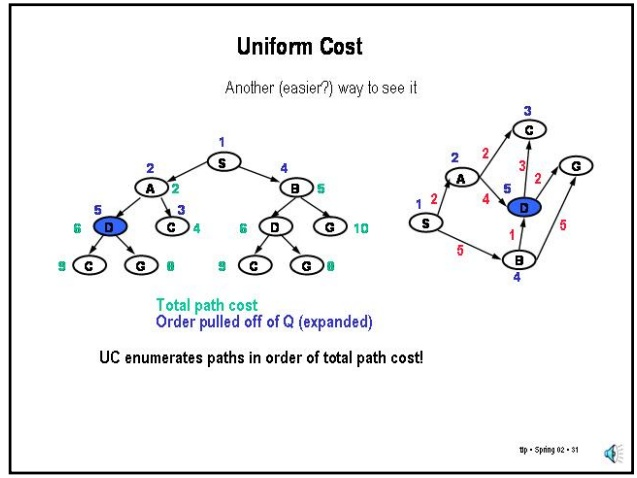

## Uniform Cost

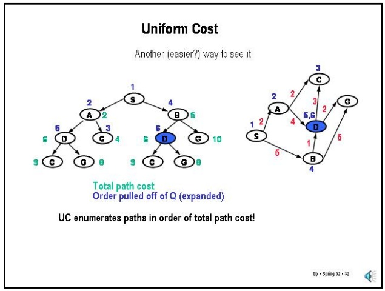

Slide 2.4.33

## Slide 2.4.32

And the path from S to B to D, also with length 6.

And, finally the path from S to A to D to G with length 8. The other path (S B D G) also has length 8.

## Uniform Cost

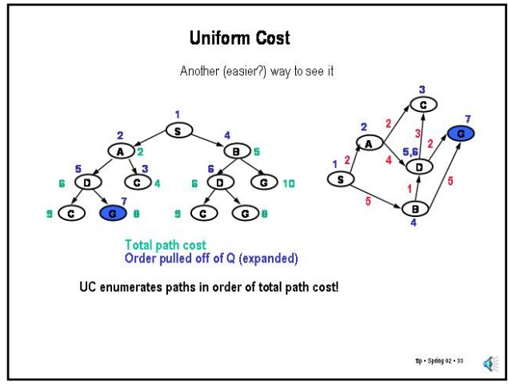

UC enumerates paths in order of total path cost!

<!-- page: 10 -->

## Slide 2.5.1

Now, we will turn our attention to what is probably the most popular search algorithm in AI, the A\* algorithm. A\* is an informed, optimal search algorithm. We will spend quite a bit of time going over A\*; we will start by contrasting it with uniform-cost search.

Any Path Informed

Optimal Uninformed

Optimal Informed

Best-First

## Classes of Search

A\*

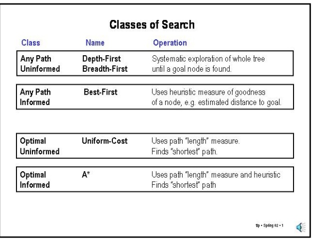

Operation

Uniform-Cost

Systematic exploration of whole tree until a goal node is found.

Uses heuristic measure of goodness of a node, e.g. estimated distance to goal

Uses path "length" measure Finds "shortest" path.

Uses path "length" measure and heuristic Finds "shortest” path

tlp ·Spring 02 ·1

## Goal Direction

## Slide 2.5.2

UC is really trying to identify the shortest path to every state in the graph in order. It has no particular bias to finding a path to a goal early in the search.

Uniform-cost search as described so far is concerned only with expanding short paths; it pays no particular attention to the goal (since it has no way of knowing where it is). UC is really an algorithm for finding the shortest paths to all states in a graph rather than being focused in reaching a particular goal.

## Slide 2.5.3

## Goal Direction

UC is really trying to identify the shortest path to every state in the graph in order. It has no particular bias to finding a path to a goal early in the search.

We can introduce such a bias by means of heuristic function h(N), which is an estimate (h) of the distance from a state to the goal.

<!-- page: 11 -->

## Goal Direction

## Slide 2.5.6

UC is really trying to identify the shortest path to every state in the graph in order. It has no particular bias to finding a path to a goal early in the search.

We can introduce such a bias by means of heuristic function h(N), which is an estimate (h) of the distance from a state to the goal.

Instead of enumerating paths in order of just length (g), enumerate paths in terms of f = estimated total path length = g + h.

An estimate that always underestimates the real path length to the goal is called admissible. For example, an estimate of 0 is admissible (but useless). Straight line distance is admissible estimate for path length in Euclidean space.

In order to preserve the guarantee that we will find the shortest path by expanding the partial paths based on the estimated **total** path length to the goal (like in UC without an expanded list), we must ensure that our heuristic estimate is admissible. Note that straight-line distance is always an underestimate of path-length in Euclidean space. Of course, by our constraint on distances, the constant function 0 is always admissible (but useless).

Use of an admissible estimate guarantees that UC will still find the shortest path.

<!-- page: 12 -->

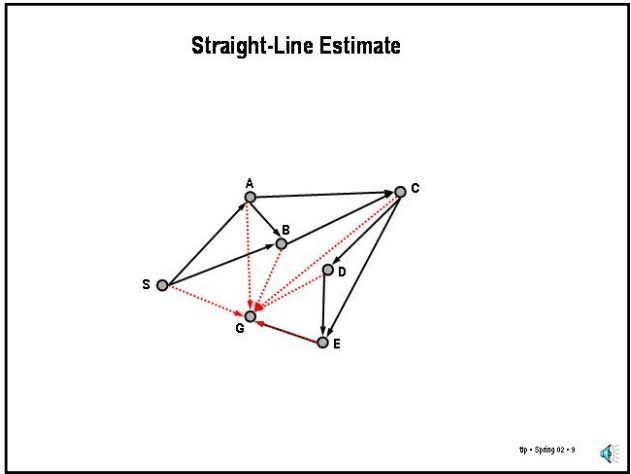

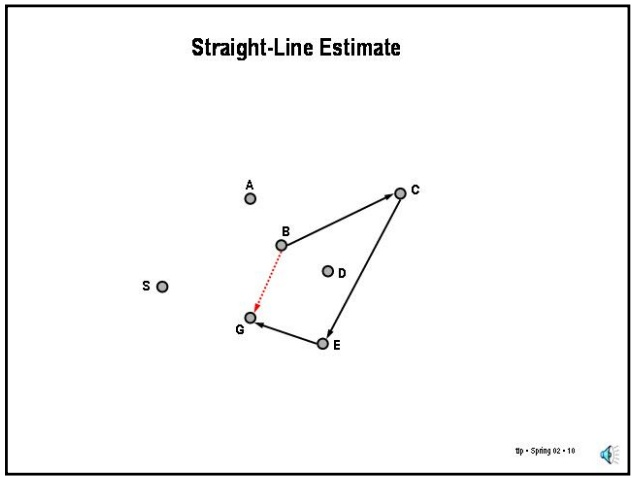

Slide 2.5.10

Slide 2.5.11

Here we see that the straight-line estimate between B and G is very bad. The actual driving distance is much longer than the straight-line underestimate. Imagine that B and G are on different sides of the Grand Canyon, for example.

It may help to understand why an underestimate of remaining distance may help reach the goal faster to visualize the behavior of UC in a simple example.

Imagine that the states in a graph represent points in a plane and the connectivity is to nearest neighbors. In this case, UC will expand nodes in order of distance from the start point. That is, as time goes by, the expanded points will be located within expanding circular contours centered on the start point. Note, however, that points heading away from the goal will be treated just the same as points that are heading towards the goal.

Why use estimate of goal distance?

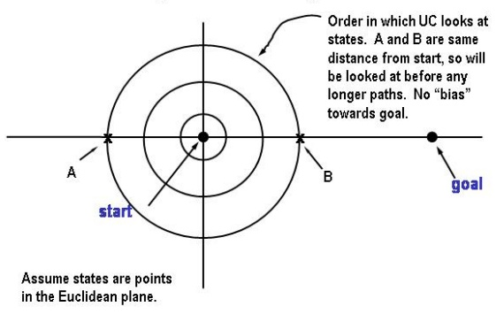

<!-- page: 13 -->

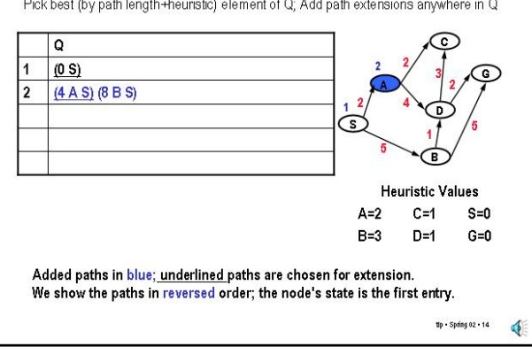

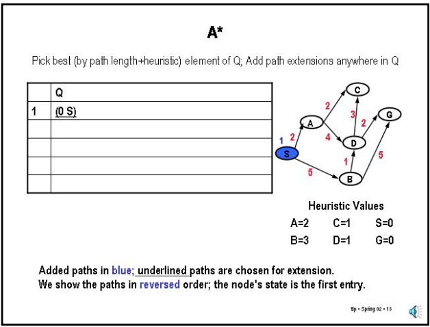

## A\*

Pick best (by path length+heuristic) element of Q; Add path extensions anywhere in Q

## Slide 2.5.14

Added paths in blue; underlined paths are chosen for extension. We show the paths in reversed order; the node's state is the first entry.

And expand to A and B. Note that we are using the path length + underestimate and so the S-A path has a value of 4 (length 2, estimate 2). The S-B path has a value of 8 (5 + 3). We pick the path to A.

<!-- page: 14 -->

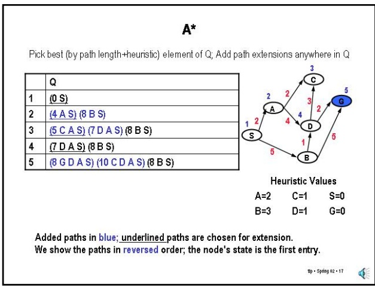

## A\*

Pick best (by path length+heuristic) element of Q; Add path extensions anywhere in Q

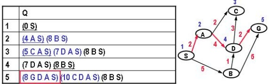

Heuristic Values A=2 C=1 S=0 B=3 D=1 G=0

Added paths in blue; underlined paths are chosen for extension. We show the paths in reversed order; the node's state is the first entry.

## Slide 2.5.18

So, we stop with a path to the goal of length 8.

<!-- page: 15 -->
