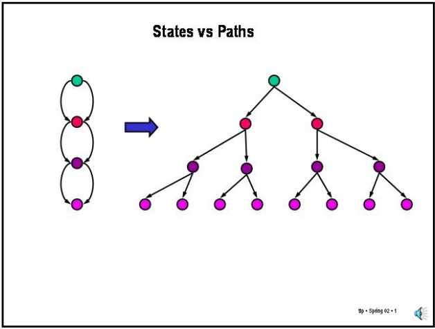
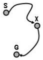
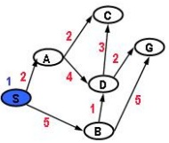
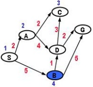
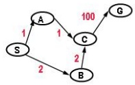
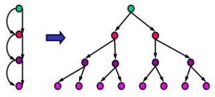
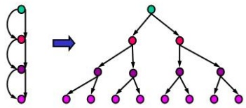

<!-- page: 1 -->

## Slide 2.6.1

In our discussion of uniform-cost search and A\* so far, we have ignored the issue of revisiting states. We indicated that we could not use a Visited list and still preserve optimality, but can we use something else that will keep the worst-case cost of a search proportional to the number of states in a graph rather than to the number of non-looping paths? The answer is yes. We will start looking at uniform-cost search, where the extension is straightforward and then tackle A\*, where it is not.

## Dynamic Programming Optimality Principle and the Expanded list

Given that path length is additive, the shortest path from S to G via a state X is made up of the shortest path from S to X and the shortest path from X to G. This is the "dynamic programming optimality principle".

## Slide 2.6.2

What will come to our rescue is the so-called "Dynamic Programming Optimality Principle", which is fairly intuitive in this context. Namely, the shortest path from the start to the goal that goes through some state X is made up of the shortest path to X followed by the shortest path from X to G. This is easy to prove by contradiction, but we won't do it here.

## Slide 2.6.3

## Dynamic Programming Optimality Principle and the Expanded list

Given that path length is additive, the shortest path from S to G via a state X is made up of the shortest path from S to X and the shortest path from X to G. This is the "dynamic programming optimality principle".

This means that we only need to keep the single best path from S to any state X; if we find a new path to a state already in Q, discard the longer one.

<!-- page: 2 -->

## Slide 2.6.5

So, let's remember the states that we have expanded already, in a "list" (or, better, a hash table) that we will call the Expanded list. If we try to expand a node whose state is already on the Expanded list, we can simply discard that path. We will refer to algorithms that do this, that is, no expanded state is re-visited, as using a **strict** Expanded list.

Note that when using a strict Expanded list, any visited state will either be in Q or in the Expanded list. So, when we consider a potential new node we can check whether (a) its state is in Q, in which case we accept it or discard it depending on the length of the new path versus the previous best, or (b) it is in Expanded, in which case we always discard it. If the node's state has never been visited, we add the node to Q.

## Dynamic Programming Optimality Principle and the Expanded list

Given that path length is additive, the shortest path from S to G via a state X is made up of the shortest path from S to X and the shortest path from X to G. This is the "dynamic programming optimality principle".

This means that we only need to keep the single best path from S to any state X; if we find a new path to a state already in Q, discard the longer one.

Note that the first time UC pulls a search node off of Q whose state is X, this path is the shortest path from S to X. This follows from the fact that UC expands nodes in order of actual path length.

So, once expand one path to state X, we don't need to consider (extend) any other paths to X. We can keep a list of these states, call it Expanded. If the state of the search node we pull off of Q is in the Expanded list, we discard the node. When we use the Expanded list this way, we call it “strict".

## Dynamic Programming Optimality Principle and the Expanded list

## Slide 2.6.6

Given that path length is additive, the shortest path from S to G via a state X is made up of the shortest path from S to X and the shortest path from X to G. This is the "dynamic programming optimality principle".

This means that we only need to keep the single best path from S to any state X; if we find a new path to a state already in Q, discard the longer one.

Note that the first time UC pulls a search node off of Q whose state is X, this path is the shortest path from S to X. This follows from the fact that UC expands nodes in order of actual path length.

So, once we expand one path to state X, we don't need to consider (extend) any other paths to X. We can keep a list of these states, call it Expanded. If the state of the search node we pull off of Q is in the Expanded list, we discard the node. When we use the Expanded list this way, we call it "strict".

Note that UC without this is still correct, but inefficient for searching graphs.

<!-- page: 3 -->

## Simple Optimal Search Algorithm Uniform Cost + Strict Expanded List

A search node is a path from some state X to the start state, e.g., (X B A S) The state of a search node is the most recent state of the path, e. g. X Let Q be a list of search nodes, e.g. (X B A S) (C B A S) ...). Let S be the start state.

1. Initialize Q with search node (S) as only entry; set Expanded = ()

## Slide 2.6.8

2. If Q is empty, fail. Else, pick least cost search node N from Q

3. If state(N) is a goal, return N (we've reached the goal)

... and modify it. First we initialize the Expanded list in step 1. Since this is uniform-cost search, the algorithm picks the best element of Q, based on path length, in step 2. Then, in step 5, we check whether the state of the new node is on the Expanded list and if so, we discard it. Otherwise, we add the state of the new node to the Expanded list. In step 6, we avoid visiting nodes that are Expanded since that would be a waste of time. In step 7, we check whether there is a node in Q corresponding to each newly visited state, if so, we keep only the shorter path to that state.

4. (Otherwise) Remove N from Q.

5. if state(N) in Expanded, go to step 2, otherwise add state(N) to Expanded.

6. Find all the children of state(N) (Not in Expanded) and create all the onestep extensions of N to each descendant.

7. Add all the extended paths to Q; if descendant state already in Q, keep only shorter path to the state in Q.

8. Go to step 2.

## Slide 2.6.9

## Uniform Cost (with strict expanded list)

Pick best (by path length) element of Q; Add path extensions anywhere in Q

|  | Q | Expanded |
| --- | --- | --- |
| 1 | (0 S) |  |
|  |  |  |
|  |  |  |
|  |  |  |
|  |  |  |
|  |  |  |
|  |  |  |

We show the paths in reversed order; the node's state is the first entry.

<!-- page: 4 -->

## Uniform Cost (with strict expanded list)

Pick best (by path length) element of Q; Add path extensions anywhere in Q

|  | Q | Expanded |
| --- | --- | --- |
| 1 | (0 S) |  |
| 2 | (2 A S) (5 B S) | S |
| 3 | (4 C A S) (6 D A S) (5 B S) | S,A |
| 4 | (6 D A S) (5 B S) | S,A,C |
|  |  |  |
|  |  |  |
|  |  |  |

Added paths in blue; underlined paths are chosen for extension. We show the paths in reversed order; the node's state is the first entry.

p · Spring 02 ·12

## Slide 2.6.12

We pick the node at C to expand, but C has no descendants. So, we add C to Expanded but there are no new nodes to add to Q.

<!-- page: 5 -->

## A\* (without expanded list)

• Let g(N) be the path cost of n, where n is a search tree node, i.e. a partial path.

• Let h(N) be h(state(N)), the heuristic estimate of the remaining path length to the goal from state(N).

• A\* picks the node with lowest f value to expand • Let f(N) = g(N) + h(state(N)) be the total estimated path cost of a node, i.e. the estimate of a path to a goal that starts with the path given by N.

## Slide 2.6.16

First, let's review A\* and the notation that we have been using. The important notation to remember is that the function g represents actual path length along a partial path to a node's state. The function h represents the heuristic value at a node's state and f is the total estimated path length (to a goal) and is the sum of the actual length (g) and the heuristic estimate (h). A\* picks the node with the smallest value of f to expand.

<!-- page: 6 -->

## A\* and the strict Expanded List

• The strict Expanded list (also known as a Closed list) is commonly used in implementations of A\* but, to guarantee finding optimal paths, thís implementation requires a stronger condition for a heuristic than simply being an underestimate.

• Here's a counterexample: The heuristic values listed below are all underestimates but A using an Expanded list will not find the optimal path. The misleading estimate at B throws the algorithm off, C is expanded before the optimal path to it is found.

|  | Q | Expanded |
| --- | --- | --- |
| 1 | (0 S) |  |
| 2 | (3 B S) (101 A S) | S |
| 3 | (94 C B S) (101 A S) | B, S |
| 4 | (101 A S) (104 G C B S) | C, B, S |
| 5 | (104 G C B S) | A, C, B, S |

## Slide 2.6.20

You can see the operation of A\* in detail here, confirming that it finds the incorrect path. The correct partial path via A is blocked when the path to C via B is expanded. In step 4, when A is finally expanded, the new path to C is not put on Q, because C has already been expanded.

<!-- page: 7 -->

## A\* (without expanded list)

## Slide 2.6.24

• Let g(N) be the path cost of n, where n is a search tree node, i.e. a partial path.

• Let h(N) be h(state(N)), the heuristic estimate of the remaining path length to the goal from state(N).

• Let f(N) = g(N) + h(state(N)) be the total estimated path cost of a node, i.e. the estimate of a path to a goal that starts with the path given by n.

• A\* picks the node with lowest f value to expand • A\* (without expanded list) and with admissible heuristic is guaranteed to find optimal paths - those with the smallest path cost.

• This is true even if heuristic is NOT consistent.

I want to stress that consistency of the heuristic is only necessary for optimality when we want to discard paths from consideration, for example, because a state has already been expanded. Otherwise, plain A\* without using an expanded only requires only that the heuristic be admissible to guarantee optimality.

<!-- page: 8 -->

## Dealing with inconsistent heuristic

• What can we do if we have an inconsistent heuristic but we still want optimal paths?

## Slide 2.6.28

People sometimes simply assume that the consistency condition holds and implement A\* with a strict Expanded list (also called a Closed list) in the simple way we have shown before. But, this is not the only (or best) option. Later we will see that A\* can be adapted to retain optimality in spite of a heuristic that is not consistent - there will be a performance price to be paid however.

<!-- page: 9 -->

## Dealing with inconsistent heuristic

• What can we do if we have an inconsistent heuristic but we still want optimal paths?

• Modify A\* so that it detects and corrects when inconsistency has led us astray:

• Assume we are adding node, to Q and node, is present in Expanded list with node,.state = node2.state.

• Strict-

• do not add node, to Q

• Non-Strict Expanded list-

• If node1.path\_length < node2.path\_length, then

\- Delete node, from Expanded list

## Slide 2.6.32

\- Add node1 to Q

With a non-strict Expanded list, the situation is a bit more complicated. We want to make sure that node1 has not found a better path to the state than node2. If a better path has been found, we remove the old node from Expanded (since it does not represent the optimal path) and add the new node to Q.

<!-- page: 10 -->

## Worst Case Complexity

• A state space with N states may give rise to a search tree that has a number of nodes that is exponential in N, as in this example.

## Slide 2.6.36

We've seen this example before. It shows that a state space with $\mathbf { N }$ states can generate a search tree with 2^N nodes.

## Slide 2.6.37

## Worst Case Complexity

• A state space with N states may give rise to a search tree that has a number of nodes that is exponential in N, as in this example.

• Searches without a visited (expanded) list may, in the worst case, visit (expand) every node in the search tree.

• Searches with strict visited (expanded lists) will visit (expand) each state only once.

<!-- page: 11 -->

## 6.034 Notes: Section 2.7

## Slide 2.7.1

This set of slides goes into more detail on some of the topics we have covered in this chapter.

## Optional Topics

These slides go into more depth on a variety of topics we have touched upon:

• Optimality of A\*

Impact of a better heuristic on A\*

· Why does consistency guarantee optimal paths for A\* with strict expanded list

• Algorithmic issues for A\*

· These are not required and are provided for those interested in pursuing these topics.

## Optimality of A\*

· Assume A\* has expanded a path to goal node G

## Slide 2.7.2

## First topic:

<!-- page: 12 -->

Slide 2.7.5

Combining these two statements we see that the path length to any other goal node G' must be greater or equal to the path length of the goal node A\* found, that is, G.

## Optimality of A\*

• Assume A\* has expanded a path to goal node G • Then, A\* has expanded all nodes N where f(N) < f(G). Since h is admissible, f(G) = g(G). So, every unexpanded node has f(N) ≥ g(G).

• Since h is admissible, we know that any path through N that reaches a goal node G° has value g(G°) ≥ f(N)

• So, for every unexpanded node N, we have g(G0) ≥ f(N) ≥ g(G). That is, any goal reachable from those nodes has a path that is at least as long as the one we found.

<!-- page: 13 -->

$$
\mathrm{f} _ {1} (\mathrm{N}) = \mathrm{g} (\mathrm{N}) + \mathrm{h} _ {1} (\mathrm{N}) <   \mathrm{f} _ {2} (\mathrm{N}) = \mathrm{g} (\mathrm{N}) + \mathrm{h} _ {2} (\mathrm{N}) \leq \mathrm{g} (\mathrm{G})
$$

So, $\mathbf { A } ^ { * } { } _ { 1 }$ expands at least as many nodes as $\mathbf { A } ^ { * } { } _ { 2 } .$ We say that $\mathbf { A } \mathbf { \dot { \hat { \varepsilon } } _ { 2 } }$ **is better informed than** $\mathbf { A } _ { \mathbf { \Psi } \mathbf { 1 } } ^ { * }$ to refer to this situation.

## Slide 2.7.9

## Impact of better heuristic

• Let h\* be the "perfect" heuristic - retums actual path cost to goal.

$\mathsf{h}_{1}(\mathsf{N}) < \mathsf{h}_{2}(\mathsf{N}) \leq \mathsf{h}^{*}(\mathsf{N})$ for all non-goal nodes, then $h _ { 2 }$ is a better heuristic than h1

·If A\* uses $\mathbf{h}_{1},$ and $A_{2}^{\star}$ uses $\mathbf { h } _ { 2 } ,$ then every node expanded by $A_{2}^{\star}$ is also expanded by $\mathbf{A}_{1}^{\star}$

$f_{1}(G)=f_{2}(G)=g(G),$ so both $\mathbf{A}_{1}^{\star}$ and $\mathbf{A}_{2}^{\star}$ expand all nodes with $1 个$ g(G)

$$
\mathrm{f} _ {1} (\mathrm{N}) = \mathrm{g} (\mathrm{N}) + \mathrm{h} _ {1} (\mathrm{N}) <   \mathrm{f} _ {2} (\mathrm{N}) = \mathrm{g} (\mathrm{N}) + \mathrm{h} _ {2} (\mathrm{N}) \leq \mathrm{g} (\mathrm{G})
$$

·That is $,A_{1}^{\star}$ expands at least as many nodes as $A_{2}^{\star}$ and we say that $\mathbf{A}_{2}^{\star}$ is better informed than $A_{1}^{\star}.$

<!-- page: 14 -->

Slide 2.7.13

Now we can show that if we have nodes expanded in non-decreasing order of f, then the first time we expand a node whose state is s, then we have found the optimal path to the state. If you recall, this was the condition that enabled us to use the strict Expanded list, that is, we never need to revisit (or re-expand) a state.

## Non-decreasing f → first path is optimal

• A\* with consistent heuristic expands nodes N in non-decreasing order of f(N)

• Then, when a node N is expanded, we have found the shortest path to the corresponding s=state(N)

<!-- page: 15 -->

In what follows, we assume that the Expanded list is not a "real" list but some constant-time way of checking that a state has been expanded (e.g., by looking at a mark on the state or via a hash-table).

We also assume that Q is implemented as a hash table, which has constant time access (and insertion) cost. This is so we can find whether a node with a given state is already on Q.

## Slide 2.7.17

Later, it will become important to distinguish the case of "sparse" graphs, where the states have a nearly constant number of neighbors and "dense" graphs where the number of neighbors grows with the number of states. In the dense case, the total number of edges is O(N2), which is substantial.

## Uniform Cost + Strict Expanded List

(order of time growth in worst case)

Our simple algorithm can be summarized as follows:

1. Take the best search node from Q

2. Are we there yet?

3. Add path extensions to Q

Assume strict Expanded "list" is implemented as a hash table, which gives constant time access. Q also implemented as a hash table.

Assume we have a graph with N nodes and L links. Graphs where nodes have O(N) links are dense. Graphs where the nodes have a nearly constant number of links are sparse. For dense graphs, L is O(N²).

<!-- page: 16 -->

## Uniform Cost + Strict Expanded List (order of time growth in worst case)

Our simple algorithm can be summarized as follows:

1. Take the best search node from Q

2. Are we there yet?

3. Add path extensions to Q

Assume strict Expanded "list" is implemented as a hash table, which gives constant time access. Q also implemented as a hash table.

Assume we have a graph with N nodes and L links. Graphs where nodes have O(N) links are dense. Graphs where the nodes have a nearly constant number of links are sparse. For dense graphs, L is O(N²).

Nodes taken from Q ?

Cost of picking a node from Q using linear scan? O(N)

## Slide 2.7.20

Attempts to add nodes to Q (many are rejected)? O(L)

How many times do we (attempt to) add paths to Q? Well, since we expand every state at most once and since we only add paths to direct neighbors (links) of that state, then the total number is bounded by the total number of links in the graph.

<!-- page: 17 -->

## Should we use a Priority Queue?

## Slide 2.7.24

A priority queue is a data structure that makes it efficient to identify the "best” element of a set. A PQ is typically implemented as a balanced tree.

The time to find best element in a PQ grows as O(log N) for a set of size N. This is very much better than N for large N. Also, note that even if we don't discard paths to Expanded nodes, the access is still O(log N), since O(log N2)=O(log N).

Note, however, that adding elements to such a Q is more expensive than adding elements to a list or a hash table. So, whether it's worth it depends on how many additions are done. As we said, this is order of L, the number of links.

• However, adding elements to a PQ also has time that grows as O(log N).

Our algorithm does up to N "find best" operations and it does up to L “add” operations. If Q is a PQ, then cost is O(N\*log N + L\*log N)

<!-- page: 18 -->
